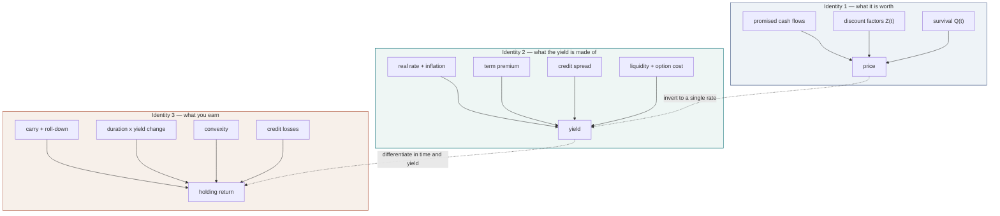
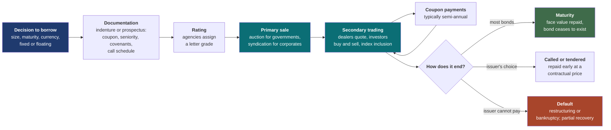
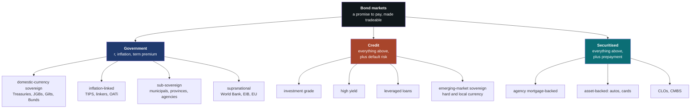
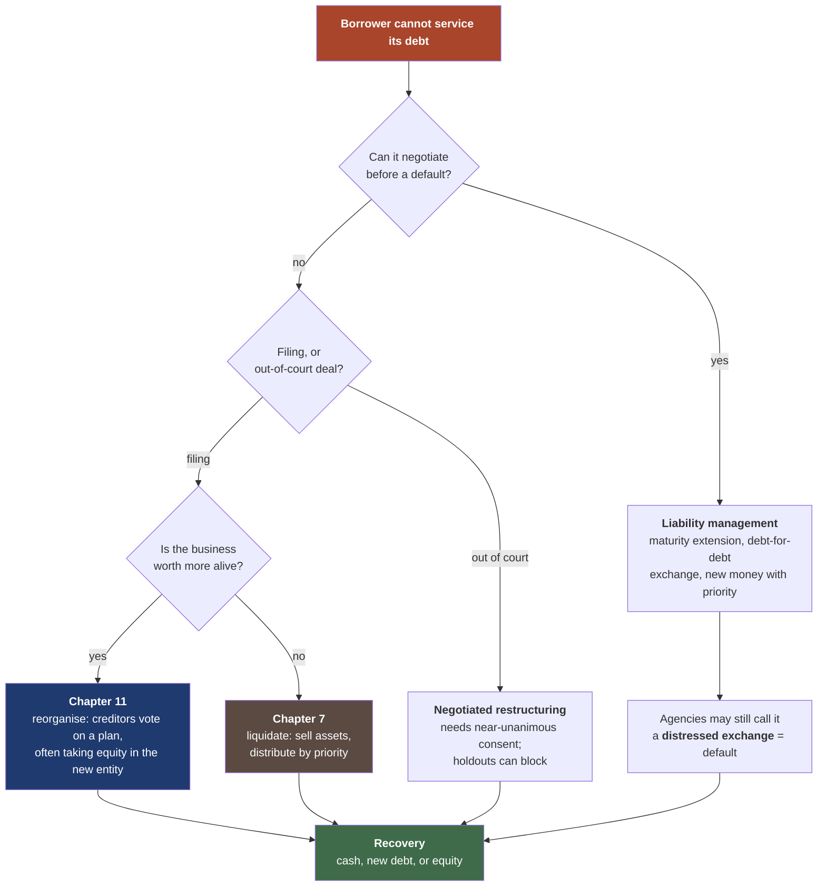
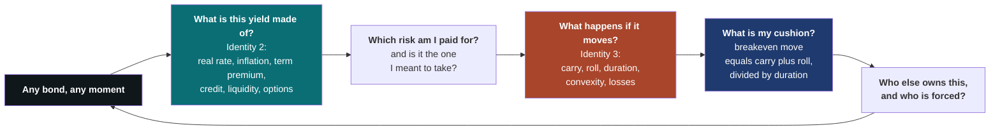
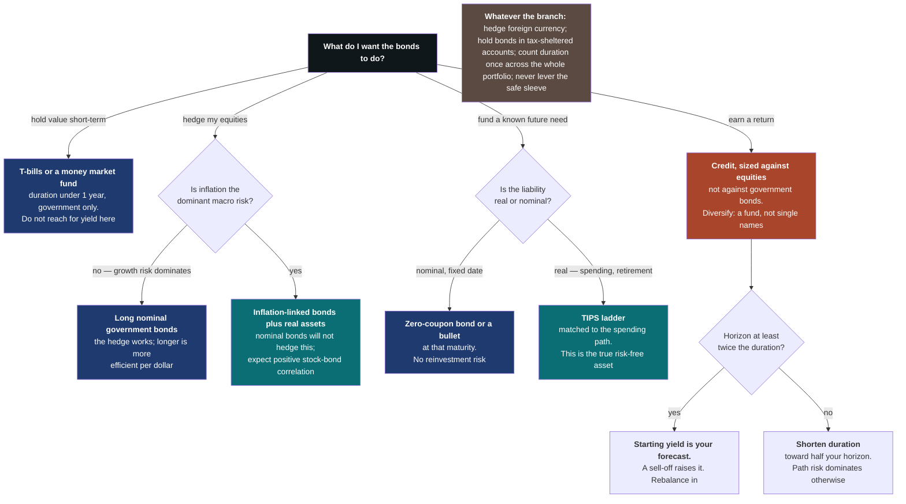

# Bonds and Bond Markets

### What you own, where the price comes from, why it moves, and what it does to a portfolio

---

**What this is.** A first-principles tutorial on bonds: the instrument, the markets it
trades in, the arithmetic that prices it, the forces that move that price, and the
decisions that face someone putting money into it. Bonds are usually taught either as
a spreadsheet exercise — here is the present-value formula, now compute duration — or
as a vague reassurance that they are the safe part of a portfolio. Both are bad
preparation. The formula tells you nothing about why a yield is 4% rather than 7%,
and the reassurance was falsified in 2022, when a portfolio of the safest bonds in
the world lost more than it ever had in a calendar year.

The claim of this document is that one decomposition organises the whole subject. A
bond's yield is a sum of components, each of which is payment for carrying a specific
risk. Which components are present tells you what market you are in; how large they
are tells you what you are being paid; how they move tells you what your return will
be. Government bonds, corporate bonds, emerging-market debt, mortgage securities and
inflation-linked bonds are not five subjects. They are one sum with different terms
switched on.

**Who it is for.** Someone numerate and technically strong who is not a fixed-income
specialist and who wants to understand bonds well enough to make decisions — to judge
whether a yield is attractive, to know what a fund actually holds, to predict how a
position behaves when the central bank moves, and to recognise the specific ways
bond investors lose money. No prior fixed-income vocabulary is assumed. Intuition
comes first everywhere: every formula is preceded by what it means and followed by a
number.

**How to read it.** Seven parts, and they are genuinely sequential — Part III uses
Part I's vocabulary, and Part V is Part III applied.

- **Part I (§1–§2) — the object.** What a bond is, the mental models that mislead,
  the three identities that carry the rest of the document, and the life of a bond
  from issuance to repayment or default.
- **Part II (§3–§5) — the map.** Government bond markets and the risk-free curve;
  sovereign borrowing outside the United States; corporate credit and where a bond
  sits in a company's capital structure.
- **Part III (§6–§9) — valuation and risk.** Discounting and yield; duration and
  convexity; the family of spread measures and which of them mean the same thing;
  credit risk, default probability and recovery.
- **Part IV (§10–§12) — where yields come from.** The macroeconomics that set the
  level of rates, the shape of the curve and what it does and does not forecast, and
  the supply-and-demand facts that academic models leave out.
- **Part V (§13–§15) — behaviour.** Why bonds sell off and rally, with the major
  episodes as worked examples; the bond–equity relationship and why it flipped sign;
  and the relationship to currencies.
- **Part VI (§16) — default.** What actually happens when a borrower cannot pay,
  for companies and for countries.
- **Part VII (§17–§19) — investing.** Constructing a bond portfolio, a consolidated
  list of the ways people lose money in this asset class, and a synthesis.

§20 is the reference list, grouped by kind. Appendix A collects the concepts the main
text leans on without fully developing, ordered as a build-up.

If you read four things, read **§1.4** (the three identities the document is built
on), **§6.4** (why yield to maturity is not your expected return), **§7.5** (the
cushion: how much of a sell-off a bond's yield can absorb), and **§14** (what bonds
do and do not do for an equity portfolio).

**Relationship to the other notes.** [Simple and Log Returns](log_returns.html)
covers the return conventions used throughout. [Stochastic
Processes](stochastic_processes.html) develops the Brownian machinery behind the
term-structure models mentioned in §11.4. [Portfolio Construction and the Covariance
Matrix](portfolio_construction.html) is the right frame for §17's allocation
questions, and [Market Regimes and Machine
Learning](market_regimes.html) for §14's correlation-regime discussion. [Dealer
Hedging and Gamma Exposure](dealer_hedging.html) explains the option machinery that
§7.6 borrows for callable bonds and mortgages. Each note stands alone.

**Epistemic tags.** Claims are flagged where the status changes what you should do:

- **[Fact]** — replicated across independent datasets or implementations, with broad
  agreement among people who have looked.
- **[Contested]** — documented, but with live disagreement about magnitude,
  robustness, or cause.
- **[Hypothesis]** — a proposed mechanism, not decisively tested.
- **[Practice]** — practitioner convention. May well be right; the evidence is
  private or absent.

Untagged sentences are definitions, arithmetic, or institutional description.
Numbers computed from the models in this document are labelled **[Computed]**; the
generating code is committed alongside as `figures/bd_*.py`, and each script prints
the numbers quoted in the text, so you can change the assumptions and rerun.

---

**Notation.** A bond promises a schedule of payments. $C_t$ is the cash flow at time
$t$, $c$ the annual coupon rate as a fraction of face value, and $F$ the face (par,
principal, redemption) amount — 100 by convention, so prices are quoted per 100 of
face. $\tau$ is time remaining to maturity in years, $T$ the maturity date.

$P$ is the price. Unless a passage says otherwise it means the **dirty** price, the
full amount that changes hands; $P^{\text{clean}}$ is the quoted price, which
excludes accrued interest (§6.6).

| Symbol | Name | What it is |
|---|---|---|
| $y$ | yield to maturity | The single rate that makes discounted cash flows equal the price (§6.3) |
| $z(t)$ | spot or zero rate | The rate for a single payment at $t$, with no intervening coupons (§6.2) |
| $f(t_1,t_2)$ | forward rate | The rate for borrowing between two future dates, implied by today's curve |
| $Z(t)$ | discount factor | Today's value of 1 unit paid at $t$; $Z(t)=(1+z(t))^{-t}$ |
| $D_{\text{mac}}$ | Macaulay duration | Cash-flow-weighted average time to payment, in years (§7.1) |
| $D$ | modified duration | Percentage price change per unit change in yield (§7.2) |
| $\mathrm{DV01}$ | dollar value of a basis point | Price change per 0.01% yield move, in currency (§7.2) |
| $\mathcal{C}$ | convexity | Curvature of price in yield; the second derivative, scaled (§7.4) |
| $s$ | spread | Yield in excess of a reference rate (§8) |
| $\lambda$ | hazard rate | Instantaneous probability of default per unit time (§9.2) |
| $R$ | recovery rate | Fraction of face value creditors receive in default (§9.3) |
| $r$ | real interest rate | The rate net of inflation (§10.1); $r^*$ is its long-run level |
| $\pi^e$ | expected inflation | Inflation the market expects over a stated horizon |
| $\mathrm{TP}$ | term premium | Extra yield for holding a long bond rather than rolling short ones (§10.4) |
| $\mathrm{EL}$ | expected loss | Default probability times loss given default (§9.2) |
| $\mathrm{CRP}$ | credit risk premium | Extra spread demanded for bearing default risk beyond its expected cost (§9.2) |
| $\ell$ | liquidity premium | Extra yield for a bond that is harder to sell (§3.3) |
| $o$ | option cost | Yield given up for an option the borrower holds against you, such as a call or prepayment right (§7.6) |

A **basis point** (bp) is one hundredth of a percentage point: 100bp = 1%. Yields and
spreads are quoted in basis points almost universally, and this document follows that.
$\Delta y$ is a change in yield, always in the same units as $y$ itself (so a 100bp
move is $\Delta y = 0.01$).

**The running example** is a 10-year bond with a 4% annual coupon paid semi-annually,
issued at par, so its price is 100 and its yield is 4.00%. It has a modified duration
of 8.18 years and a convexity of 78.9. When a passage says "the bond" without
qualification, this is the one.

---

## Table of contents

**Part I — The object**

1. [What a bond is](#1-what-a-bond-is)
2. [The life of a bond](#2-life-of-a-bond)

**Part II — The map of the market**

3. [Government bonds and the risk-free curve](#3-government-bonds)
4. [The rest of the world: sovereign and international markets](#4-international)
5. [Corporate credit and the capital structure](#5-corporate-credit)

**Part III — Valuation and risk**

6. [What a bond is worth](#6-valuation)
7. [Interest-rate risk: duration and convexity](#7-duration-convexity)
8. [Spreads: one idea, eight names](#8-spreads)
9. [Credit risk: default, recovery, and what the spread pays for](#9-credit-risk)

**Part IV — Where yields come from**

10. [The macro engine: real rates, inflation, and the central bank](#10-macro-engine)
11. [The yield curve](#11-yield-curve)
12. [Supply, demand, and who actually owns the bonds](#12-supply-demand)

**Part V — How bonds behave**

13. [Sell-offs and rallies](#13-selloffs-rallies)
14. [Bonds and equities](#14-bonds-equities)
15. [Bonds and currencies](#15-bonds-currencies)

**Part VI — When it goes wrong**

16. [Default, distress, and restructuring](#16-default)

**Part VII — Investing**

17. [Building a bond portfolio](#17-building-a-portfolio)
18. [Failure modes](#18-failure-modes)
19. [Synthesis](#19-synthesis)

**Reference**

20. [References](#20-references)
- [Appendix A — Concepts and prerequisites](#appendix-a)

---

# Part I — The object

## 1. What a bond is {#1-what-a-bond-is}

### 1.1 The promise

A bond is a loan that has been cut into tradeable pieces.

That sentence contains everything structural. Someone needs money — a government, a
company, a city, a pool of mortgages. Rather than borrow it from one bank under one
contract, they write a standardised promise: *I will pay the holder of this piece of
paper 2 currency units every six months for ten years, and 100 units at the end.*
Then they sell tens of thousands of identical copies of that promise to whoever will
buy them. Each copy is a bond. The buyer is a lender; the seller is a borrower.

Two consequences follow immediately, and they are the two facts that make bonds
behave the way they do.

**The payments are fixed in advance.** Not guaranteed — the borrower may fail — but
*specified*. The bond says 2 units every six months, and if the borrower's profits
triple, the bond still pays 2. If the borrower's profits collapse, the bond still
demands 2, and the borrower must find it or default. A shareholder's claim floats
with the fortunes of the business; a bondholder's claim does not. This is the
fundamental asymmetry of debt: **fixed upside, and downside only when the promise
breaks.**

**The promise is transferable.** Because the pieces are standardised and identical,
you can sell yours to someone else without renegotiating anything. The original
borrower does not need to know or approve. That is the difference between a bond and
a bank loan, and it is what creates a *market* — a continuously updating price for
the same promise as the world's opinion about it changes.

Now hold those two facts together and you can already deduce the central puzzle of
the asset class. The payments are fixed. The price is not. So **the entire variation
in a bond's price is variation in what the market will pay for a fixed schedule of
payments.** Nothing about the bond itself changes when its price falls 20%; the
coupon is the same, the maturity is the same, the borrower is the same. What changed
is the price of money, or the market's belief that the promise will be kept.

That is worth stating as the first principle, because almost every mistake in fixed
income is a failure to keep it in view:

> A bond is a fixed schedule of promised payments. Its price is what that schedule is
> currently worth. Only two things can move the price: **the rate at which future
> money is discounted**, or **the market's belief about whether the payments will
> arrive**. Everything in this document is one of those two channels.

### 1.2 The intuitions to discard

Four mental models about bonds are common, intuitive, and wrong in ways that cost
money. It is worth killing them explicitly before building anything.

**"Bonds are safe."** Safe against what? A US Treasury bond carries essentially no
risk that you will fail to be repaid — the government prints the currency it owes.
But in 2022 the Bloomberg US Aggregate index, dominated by Treasuries and
high-quality corporates, returned about −13%, its worst calendar year in the
half-century the index has existed. Nothing defaulted. Long Treasuries did far worse:
a 30-year bond bought at 2% and sold at 4% loses roughly a third of its value, which
is equity-sized. [Fact] The safety of a government bond is safety of *repayment*, and
that is a different thing from safety of *price*. Confusing the two is the single most
expensive error available in this asset class, and it is enshrined in the phrase
"risk-free asset", which means free of default risk and nothing else.

**"Bonds pay a fixed rate, so I know my return."** You know your return only if you
hold to maturity, reinvest every coupon at exactly the original yield, and the
borrower pays in full. Fail any of those and your realised return differs, sometimes
dramatically. §6.4 makes this precise: yield to maturity is an internal rate of
return, and an IRR is a *quoted* number, not a *forecast*.

**"A bond fund is a bond."** It is not, and the difference matters. An individual
bond has a maturity date at which, absent default, you get 100 back. That date
anchors your outcome: hold it and price movements in between are unrealised. A bond
fund has no maturity date. It holds a rolling population of bonds, sells them before
they mature to keep its duration constant, and therefore never "pulls to par". If
rates rise and stay risen, the individual bondholder eventually gets their money
back; the fund holder's loss is permanent in price terms and is only recovered
through the higher yields the fund now earns. Both end up in a similar place over a
horizon equal to the duration (§17.3), but the paths and the psychology are
completely different.

**"Higher yield means a better investment."** Yield is compensation for risk. A bond
yielding 9% when Treasuries yield 4% is not offering you 5% of free money; it is
offering you 5% in exchange for the possibility that you will not be paid, plus the
possibility that you cannot sell it when you want to. Over a full cycle, high-yield
bonds have historically delivered a *net* premium after default losses — but a
considerably smaller one than the headline spread suggests, because a meaningful
fraction of the spread is expected loss rather than reward (§9.5). The instinct to
reach for yield is the most reliably punished instinct in fixed income, and it is
measurable: fund managers systematically tilt toward higher-yielding bonds within
their rating category, and this is better explained by how funds are marketed than by
skill ([Choi & Kronlund, 2018](https://doi.org/10.1093/rfs/hhx132)).

### 1.3 What a bond is not

Defining the object against its neighbours sharpens it. Each row below is a claim on
someone's money; the differences are where bond behaviour comes from.

| | Payments | If the borrower fails | Maturity | Upside |
|---|---|---|---|---|
| **Bond** | Fixed and specified | Legal claim, senior to equity | Fixed date | Capped at the promised payments |
| **Bank loan** | Fixed or floating | Same claim, but privately negotiated | Fixed, often amortising | Capped; usually not traded |
| **Bank deposit** | Interest at the bank's discretion | Deposit insurance up to a limit | None | Capped |
| **Preferred stock** | Fixed dividend, but skippable | Junior to all debt | Often none | Capped |
| **Common equity** | Whatever is left over | Last in line, usually zero | None | Unlimited |
| **Convertible bond** | Fixed, plus a share conversion right | Bond claim | Fixed date | Participates in equity upside |

Two rows deserve a second look.

**Preferred stock is the instructive comparison.** It looks like a bond — a fixed
periodic payment, no maturity, no share in growth. But the issuer can *skip* the
payment without triggering default. That single difference moves it from the debt
side of the balance sheet to the equity side, and its price behaves accordingly: in a
crisis, preferreds trade like equity, not like bonds. **The definitional core of a
bond is not "fixed payments" but "fixed payments you can sue over."**

**A convertible bond is genuinely two instruments.** It is a bond plus a call option
on the issuer's equity, and it can usefully be priced as exactly that. This is the
first appearance of a theme that recurs throughout: many fixed-income instruments
that look like distinct products are a plain bond plus or minus an option, and
finding the decomposition is how you understand them (§7.6, §8.4).

### 1.4 Three identities {#three-identities}

Here is the spine. Three equations carry this entire document, and they are three
views of the same object: what the bond is worth, what its yield is made of, and what
your return will be.

**Identity 1 — the price.** A bond is worth the present value of what it pays,
weighted by the chance of being paid:

$$
P \;=\; \sum_{t} \underbrace{C_t}_{\substack{\text{promised}\\\text{cash flow}}}
\;\times\; \underbrace{Z(t)}_{\substack{\text{discount}\\\text{factor}}}
\;\times\; \underbrace{Q(t)}_{\substack{\text{probability-weighted}\\\text{chance of payment}}}
$$

$C_t$ is the promise and comes from the bond's legal documents. $Z(t)$ is the price
today of one unit of currency delivered at time $t$, and it comes from the market for
government debt. $Q(t)$ captures the probability-weighted chance the payment arrives,
and comes from the market's view of the borrower. For a US Treasury, $Q(t) = 1$ and
the whole thing reduces to discounting. For a distressed corporate bond, $Q(t)$ is
doing most of the work.

Everything in Part III is the arithmetic of this identity. Everything in Parts IV and
V is about what makes $Z(t)$ and $Q(t)$ move.

**Identity 2 — the yield decomposition.** Rather than working with $Z$ and $Q$
directly, the market quotes a single number, the yield, and decomposes it into
additive pieces:

$$
y \;=\; \underbrace{r + \pi^e}_{\text{expected short rate path}}
\;+\; \underbrace{\mathrm{TP}}_{\substack{\text{term}\\\text{premium}}}
\;+\; \underbrace{\mathrm{EL} + \mathrm{CRP}}_{\text{credit spread}}
\;+\; \underbrace{\ell}_{\substack{\text{liquidity}\\\text{premium}}}
\;+\; \underbrace{o}_{\substack{\text{option}\\\text{cost}}}
$$

Reading left to right: $r$ is the expected average **real** short-term interest rate
over the bond's life; $\pi^e$ is expected inflation over the same period; together
they are what you would earn rolling short-term government paper. $\mathrm{TP}$ is
the **term premium**, the extra yield for committing for a long time instead. These
first three terms are the *government* curve. Then $\mathrm{EL}$ is expected credit
loss — default probability times loss given default — and $\mathrm{CRP}$ is the
**credit risk premium**, the extra return demanded for bearing default risk beyond
its expected cost. $\ell$ compensates for not being able to sell easily. $o$ is the
value of any options the borrower holds against you, such as the right to repay
early.

This is the map of the entire asset class, and the most useful half-page in this
document. Every bond market in the world is this sum with a different subset of terms
switched on:

```{=latex}
\newpage
```

| Instrument | $r$ | $\pi^e$ | $\mathrm{TP}$ | $\mathrm{EL}{+}\mathrm{CRP}$ | $\ell$ | $o$ |
|---|:-:|:-:|:-:|:-:|:-:|:-:|
| 3-month Treasury bill | ✓ | ✓ | — | — | — | — |
| 10-year Treasury note | ✓ | ✓ | ✓ | — | — | — |
| 10-year inflation-linked (TIPS) | ✓ | — | ✓† | — | small | — |
| Investment-grade corporate | ✓ | ✓ | ✓ | small | small | — |
| High-yield corporate | ✓ | ✓ | ✓ | **large** | ✓ | ✓ |
| Emerging-market sovereign, hard currency | ✓ | ✓ | ✓ | ✓ | ✓ | — |
| Agency mortgage pass-through | ✓ | ✓ | ✓ | — | small | **large** |
| Callable corporate | ✓ | ✓ | ✓ | ✓ | ✓ | ✓ |
| Corporate floating-rate note | ✓ | ✓ | ≈0‡ | ✓ | small | — |
| Leveraged loan | ✓ | ✓ | ≈0‡ | **large** | ✓ | ✓§ |

† A *real* term premium, for committing to a long real rate. ‡ A floater's coupon
resets to the prevailing short rate, so it earns essentially no term premium and
carries almost no duration (§3.2). § A loan's option is the borrower's right to repay
at par, exercised when its *credit* improves rather than when rates fall (§5.4).

The figure below draws the same table with representative magnitudes.

```{=latex}
\newpage
\begin{center}
\includegraphics[width=\linewidth]{quant-research/figures/bd_yield_stack.pdf}
\end{center}
```

```{=html}

```

Three things to take from the picture. The TIPS bar is short not because
inflation-linked bonds are poor value but because expected inflation has been removed
from the number — a real yield and a nominal yield are quoted in different units, and
comparing them directly is a category error. About half of the B-rated corporate
bar's *spread* is expected loss rather than premium — compensation for defaults you
should expect to suffer — which is the difference between a spread and a return.
And the mortgage bar's excess over Treasuries is almost entirely option cost — the
homeowner's right to refinance — so an investor who buys agency mortgages for "spread"
is being paid to sell options, not to take credit risk.

**Identity 3 — the return.** Identity 2 says what the yield is made of. This one says
what happens to your money. Over a holding period, to a good approximation:

$$
r_{\text{holding}} \;\approx\;
\underbrace{y\,\Delta t}_{\text{carry}}
\;+\; \underbrace{\text{roll-down}}_{\substack{\text{aging down}\\\text{the curve}}}
\;-\; \underbrace{D\,\Delta y}_{\substack{\text{duration}\\\text{effect}}}
\;+\; \underbrace{\tfrac{1}{2}\,\mathcal{C}\,(\Delta y)^2}_{\text{convexity}}
\;-\; \underbrace{L}_{\substack{\text{realised}\\\text{credit losses}}}
$$

The first two terms are the return you get for doing nothing, and you know them the
day you buy. The third is the bet: duration $D$ converts a change in yield into a
change in price, with a minus sign, because yields up means prices down. The fourth
is a small correction that is almost always in your favour for a normal bond, and
against you for a mortgage or a callable bond. The last is what the borrower failed
to pay.

Every question of the form "why did my bonds lose money?" is answered by naming a
term in this identity. Every bond strategy is a bet on one of them. The whole of
Part V is this identity applied to history.

```{=latex}
\newpage
```

The three identities connect like this:



Identity 1 is the machinery. Identity 2 is Identity 1 inverted into a single quoted
rate and then split into the risks that rate is paying for. Identity 3 is Identity 2
differentiated — what happens to your money when the components move. **Know the
pieces of a yield and you know both the risks you are running and the return you can
expect.** That is the whole thesis.

### 1.5 Why anyone issues bonds

Half of the market's behaviour comes from the borrower's side, and it is usually
skipped. Issuers are not passive suppliers of investment product; they are
optimisers, and what they optimise shapes what is available to buy.

**Governments** issue because they spend more than they tax and must fund the
difference. They are also, uniquely, the manufacturer of the currency they borrow in,
which is why a government borrowing in its own currency is in a different risk
category from every other borrower (§4.2). Beyond funding, governments issue because
the market *wants* the product: safe, liquid collateral is a raw material for the
financial system, and there is persistent evidence that investors pay a premium for
Treasury securities over and above their cash flows — a "convenience yield" worth
perhaps 70 basis points on average ([Krishnamurthy & Vissing-Jorgensen,
2012](https://doi.org/10.1086/666526)). [Fact]

**Companies** issue because debt is cheaper than equity, for two reasons. Interest is
tax-deductible in most jurisdictions and dividends are not, which is a direct
subsidy. And debt is a less risky claim, so investors require less return for it. The
counterweight is that debt must be serviced regardless of circumstances, so more of
it raises the probability of financial distress. The classical treatment of this
trade-off runs from [Modigliani & Miller (1958)](https://www.jstor.org/stable/1809766)
through the agency-cost literature ([Jensen & Meckling,
1976](https://doi.org/10.1016/0304-405X(76)90026-X); [Myers,
1977](https://doi.org/10.1016/0304-405X(77)90015-0)), and is summarised in §5.1.

**The timing matters to you as an investor.** Companies issue when it is cheap to
issue, which means supply is heaviest exactly when spreads are tight and credit
standards are loose. [Greenwood & Hanson
(2013)](https://doi.org/10.1093/rfs/hht028) show that when the *quality* of issuers
coming to market deteriorates — measured by the share of issuance from low-rated
firms — subsequent excess returns on corporate bonds are low. [Fact] The composition
of new supply is a usable signal precisely because issuers are better informed about
the cycle than buyers are. This is a general and slightly uncomfortable principle: in
a market where one side chooses when to transact, that side has an edge.

> ### §1 Key takeaways
>
> 1. A bond is a fixed schedule of promised payments, made tradeable. All price
>    variation is variation in what the market pays for that fixed schedule.
> 2. Only two channels move a bond's price: the discount rate applied to future
>    money, and the belief that the money will arrive. Every mechanism in this
>    document routes through one of them.
> 3. "Risk-free" means free of default risk and nothing else. A long Treasury can and
>    does lose a third of its value.
> 4. The definitional core of a bond is not fixed payments but *enforceable* fixed
>    payments — that is what separates it from preferred stock.
> 5. Identity 2, the yield decomposition, is the map of the asset class: every bond
>    market is the same sum with a different subset of terms switched on.
> 6. Identity 3, the return decomposition, answers every "why did my bonds move"
>    question; carry and roll are known in advance, duration is the bet.
> 7. Issuers choose when to sell. Supply is heaviest when it is cheapest to issue,
>    which is when future returns are worst.

---

## 2. The life of a bond {#2-life-of-a-bond}

Following one bond from birth to death is the fastest way to meet the institutions.
The vocabulary introduced here — indenture, auction, on-the-run, TRACE, make-whole —
recurs throughout, and each term is easier to learn attached to a stage than as a
glossary entry.



### 2.1 Birth: the terms of the promise

Before a bond exists, someone decides its shape. Four decisions determine almost
everything about how it will behave.

**Maturity.** How long until the principal is repaid. This is the single biggest
determinant of price volatility: a 30-year bond moves roughly nine times as much per
unit of yield change as a 2-year bond (§7.2). Issuers pick maturity by trading off
the cost of long-term funding against the risk of having to refinance at a bad moment
— and the choice is consequential for the market as a whole, since the government's
maturity choice changes the supply of duration that investors must hold ([Greenwood,
Hanson & Stein, 2015](https://doi.org/10.1111/jofi.12253)).

**Coupon.** The periodic payment, usually set so the bond prices at or near 100 on
issue day. A bond issued when 10-year yields are 4% will carry roughly a 4% coupon.
This is why a bond's coupon is a fossil record of the rate environment at its birth,
and why bond portfolios accumulated over decades contain wildly heterogeneous
coupons. Some bonds pay no coupon at all and are sold at a discount to face — **zero
coupon bonds**, of which Treasury STRIPS are the standard example.

**Currency.** Whoever bears the exchange-rate risk is determined here, and for
sovereign borrowers it is nearly the whole story (§4.3).

**Seniority, security and covenants.** Where the lender stands if things go wrong. A
**senior secured** bond has a claim on specific assets and is paid before others; a
**subordinated** bond is paid after senior creditors are made whole. **Covenants**
are contractual promises by the borrower — limits on additional debt, on asset sales,
on dividends — that give lenders rights if the borrower's condition deteriorates.
They are worth real money: covenant violations transfer control rights to creditors
and demonstrably change corporate behaviour, with investment falling sharply after a
breach ([Chava & Roberts, 2008](https://doi.org/10.1111/j.1540-6261.2008.01391.x)).
[Fact]

All of this is written into an **indenture** (for a corporate bond under US law) or a
**prospectus**, a document that runs to hundreds of pages and that almost no investor
reads in full. Practically, investors rely on summaries and on covenant-scoring
services. [Practice] This is a genuine information asymmetry, and it is largest
exactly where it matters most — in high-yield issuance, where documentation quality
varies enormously and has deteriorated over the past two decades.

### 2.2 The primary market: how bonds are first sold

Governments and companies sell their bonds in structurally different ways, and the
difference tells you something about both markets.

**Governments auction.** The US Treasury announces in advance that it will sell, say,
$42 billion of 10-year notes on a particular date. Bidders — mostly **primary
dealers**, a designated group of banks obliged to participate, plus direct
institutional and retail bidders — submit either *competitive* bids specifying a
yield and size, or *non-competitive* bids accepting whatever yield clears. The
Treasury fills from the lowest yield upward until the issue is sold, and everyone pays
the **same** clearing yield. This "uniform price" or Dutch format replaced the older
pay-your-bid format after Treasury experiments in the 1990s found it reduced bidder
caution and improved revenue (Malvey & Archibald, 1998, US Treasury Office of Market Finance).
[Contested] — the theoretical comparison between formats is ambiguous, and the
empirical gains measured were small.

The auction calendar is public, regular, and enormous, and it has a measurable price
footprint: yields tend to rise into an auction and fall after it, consistent with
dealers demanding compensation for temporarily absorbing supply ([Lou, Yan & Zhang,
2013](https://doi.org/10.1093/rfs/hht034)). [Fact] This is a pure inventory effect in
the most liquid market on earth, which should calibrate your expectations about how
much price pressure supply can create in less liquid ones.

**Companies syndicate.** A company hires banks, who sound out investors, announce
"initial price thoughts" — an indicative spread — take orders, and then tighten the
spread if the book is oversubscribed. Allocation is discretionary: the syndicate
decides who gets what. The new bond typically prices at a small concession to the
issuer's existing bonds, the **new issue concession**, which is the sweetener that
gets the deal done and which widens sharply when markets are stressed. In a bad week,
the corporate primary market simply closes — no deals price at all — which is one of
the cleaner real-time indicators of credit stress. [Practice]

### 2.3 The secondary market: dealers, not exchanges

Here is the institutional fact that surprises people coming from equities: **bonds
overwhelmingly do not trade on exchanges.** There is no central limit order book for
the 10-year Treasury note the way there is for Apple stock. Bonds trade
**over-the-counter**, bilaterally, through dealers who quote a price at which they
will buy (bid) and a price at which they will sell (ask) and who hold inventory in
between.

Two reasons for this, one structural and one a consequence.

The structural reason is **fragmentation**. Apple has one common share. A large
company may have forty outstanding bonds with different maturities, coupons and
covenants, most of which do not trade on a given day. There are tens of
thousands of distinct corporate bond issues in the US market against a few thousand
listed stocks. You cannot maintain a continuous two-sided market in an instrument
that trades twice a month, so a search-and-bargaining structure emerges instead —
which is exactly the setting analysed by [Duffie, Gârleanu & Pedersen
(2005)](https://doi.org/10.1111/j.1468-0262.2005.00639.x), whose central result is
that **investors with worse outside options get worse prices.** [Fact] Retail
investors in corporate bonds pay dramatically more than institutions for the same
bond on the same day, and, unusually, they pay *more* per bond on small trades —
the opposite of the equity market's pattern ([Edwards, Harris & Piwowar,
2007](https://doi.org/10.1111/j.1540-6261.2007.01240.x)).

The consequence is **opacity**, which US regulators addressed in 2002 by requiring
corporate bond trades to be reported to **TRACE** within minutes. The natural
experiment this created is one of the cleanest results in market microstructure:
transaction costs fell substantially for bonds brought into the system, with no
measurable damage to liquidity ([Bessembinder, Maxwell & Venkataraman,
2006](https://doi.org/10.1016/j.jfineco.2005.11.001); [Goldstein, Hotchkiss & Sirri,
2007](https://doi.org/10.1093/rfs/hhl020)). [Fact] Transparency helped investors and
cost dealers, which is why dealers opposed it.

Since roughly 2015 the corporate bond market has been **electronifying** — moving
from telephone negotiation to request-for-quote platforms where an investor pings
several dealers simultaneously, and increasingly to all-to-all venues where investors
trade with each other. The economics are the ones you would expect from an auction
replacing a search: more competition, tighter prices, and the largest benefit in the
liquid part of the market ([Hendershott & Madhavan,
2015](https://doi.org/10.1111/jofi.12185)). [Fact] Portfolio trading — executing a
basket of hundreds of bonds in one negotiated transaction — has grown rapidly and is
tied closely to the ETF market's ability to price baskets (§17.4). [Practice]

**The on-the-run distinction.** In government markets, the most recently issued bond
of a given maturity is **on-the-run**; everything older is **off-the-run**. The
on-the-run bond is far more liquid, concentrates the trading and hedging activity, and
therefore trades at a *lower* yield — you give up a few basis points for the ability
to transact in size. The gap is a clean measure of liquidity value and widens sharply
in crises ([Amihud & Mendelson,
1991](https://doi.org/10.1111/j.1540-6261.1991.tb04623.x); [Longstaff,
2004](https://doi.org/10.1086/386528)). [Fact] It is also the source of a famous
trade: buy the cheap off-the-run bond, sell the expensive on-the-run, wait for
convergence. The trade is correct on average and was a major component of what
destroyed Long-Term Capital Management in 1998, because convergence trades funded
with borrowed money can require more capital precisely when capital is scarce.

### 2.4 Living: coupons, ratings and index membership

Between issue and maturity, a bond mostly just pays coupons. Three things can happen
to it that matter.

**Coupon payments** arrive, usually semi-annually in the US and UK, annually in much
of Europe. Between payment dates the buyer owes the seller the interest accrued so
far, which is why quoted prices and settled prices differ (§6.6).

**Ratings change.** Agencies — Moody's, S&P, Fitch — assign letter grades that map to
a broad ordering of credit quality. Ratings migrate: an issuer downgraded from BBB−
to BB+ crosses the **investment-grade boundary** and becomes a "fallen angel", which
matters far more than one notch should, because a large population of investors is
contractually forbidden from holding sub-investment-grade paper. The resulting forced
selling is a genuine, documented price effect: insurers subject to
ratings-based capital rules sell downgraded bonds, and those sales push prices below
fundamental value temporarily ([Ellul, Jotikasthira & Lundblad,
2011](https://doi.org/10.1016/j.jfineco.2011.03.020)). [Fact] It is also an
opportunity — fallen-angel bonds have historically been bought cheaply by investors
without the constraint.

Ratings themselves deserve scepticism. They are explicitly *through-the-cycle*
ordinal rankings, not probability estimates, they lag market prices, and the
issuer-pays business model creates a conflict that shows up in the data: ratings are
more favourable when competition among agencies is more intense ([Becker & Milbourn,
2011](https://doi.org/10.1016/j.jfineco.2011.03.012)). [Fact] Use them as a coarse
sorting device and a description of who is *allowed* to own the bond, not as a risk
measure.

**Index membership** changes. When a bond is added to or dropped from a major index —
for falling below investment grade, for having less than a year to maturity, for
shrinking below a minimum size — every index-tracking fund must trade it. Index rules
are therefore a significant, mechanical source of demand, and index construction is
one of the underappreciated facts of the asset class (§12.5).

### 2.5 Early endings: calls, tenders and exchanges

Many bonds do not run to maturity, because the issuer has reserved the right to end
them early or negotiates to do so.

**A call provision** gives the issuer the right to repay at a stated price on stated
dates. The issuer will exercise it when refinancing is cheaper — that is, when rates
have fallen or their credit has improved. This is straightforwardly bad for the
holder: you get your money back exactly when reinvesting it is least attractive. The
compensation is a higher yield, which is the $o$ term of Identity 2, and the
consequences for price behaviour are severe enough to warrant their own treatment
(§7.6).

**A make-whole call** is a gentler variant common in investment-grade issuance: the
issuer may call, but must pay the present value of remaining cash flows discounted at
a Treasury yield plus a small spread. Because the make-whole price rises as rates
fall, it removes most of the harm — a make-whole bond behaves almost like a
non-callable one. [Practice] The distinction between a hard call schedule and a
make-whole provision is one of the highest-value five minutes of document reading
available.

**Tender offers and exchanges.** An issuer may simply offer to buy its bonds back, at
a premium if it wants to retire expensive debt, or at a deep discount if it is
distressed. A **distressed exchange** — swapping old bonds for new ones worth less —
is default by another name, and rating agencies classify it as such. It has become
the dominant form of corporate default resolution: most high-yield defaults now
happen through negotiated liability management rather than bankruptcy filing (§16.2).
[Practice]

### 2.6 Death: maturity or default

Most bonds simply mature. The issuer pays the face value, the bond ceases to exist,
and the holder's return over the whole life was determined by the purchase yield, the
reinvestment of coupons, and nothing else.

The rest default. §16 covers what happens then in detail; the summary is that default
is not a binary wipeout but the start of a process that ends with creditors owning
something — cash, new bonds, or equity in the reorganised business — worth on average
perhaps 40% of face for a senior unsecured corporate bond, with enormous variation
around that average and a systematic pattern of *lower* recoveries in exactly the
years when defaults are most numerous ([Altman & Kishore,
1996](https://doi.org/10.2469/faj.v52.n6.2040); [Acharya, Bharath & Srinivasan,
2007](https://doi.org/10.1016/j.jfineco.2006.05.011)). [Fact] That co-movement — many
defaults and low recoveries arriving together — is what makes credit risk a *systemic*
exposure rather than a diversifiable one, and it is the reason a credit portfolio's
loss distribution has such a long tail.

> ### §2 Key takeaways
>
> 1. Four birth decisions — maturity, coupon, currency, seniority — determine most of
>    how a bond will behave for its whole life.
> 2. Governments auction on a public, regular calendar; companies syndicate
>    opportunistically. The difference shows up as predictable supply pressure in one
>    market and closed windows in the other.
> 3. Bonds trade over-the-counter through dealers, not on exchanges, because there
>    are an order of magnitude more bond issues than stocks and most do not trade on
>    a given day.
> 4. In a search market the worse-informed and smaller counterparty gets a worse
>    price. Retail investors pay dramatically more for corporate bonds than
>    institutions, and pay more per bond on small trades.
> 5. Post-trade transparency (TRACE) lowered transaction costs materially without
>    damaging liquidity — one of the cleanest natural experiments in microstructure.
> 6. The on-the-run/off-the-run yield gap is the price of liquidity, and it widens in
>    crises exactly when a convergence trade needs it not to.
> 7. Ratings are through-the-cycle ordinal rankings with a known issuer-pays
>    conflict. Their main investment significance is determining who is *permitted*
>    to hold the bond, and the forced selling that follows a downgrade is a real,
>    measurable price effect.
> 8. Check whether a call is a hard schedule or make-whole. The first materially
>    changes the bond's risk; the second nearly does not.

---

# Part II — The map of the market

The global bond market is on the order of $140 trillion, larger than the
capitalisation of global equity markets, and it is not one market but a nested set of them.
Understanding the structure means understanding which of Identity 2's terms is doing
the work in each. This part walks the three main territories — government,
international sovereign, and corporate — in that order, because each adds a
component to the yield that the previous one lacked.

```{=latex}
\newpage
```



## 3. Government bonds and the risk-free curve {#3-government-bonds}

### 3.1 Why this market is the reference

Every other bond in the world is priced relative to a government curve, and it is
worth being precise about why, because the reason is not that governments are morally
trustworthy.

A government that borrows in a currency it issues **cannot be forced into nominal
default.** It can always create the units it owes. This does not make the debt
riskless in economic terms — the creditor may be repaid in devalued money, which is a
real loss — but it removes the *credit* term from Identity 2 and leaves only the rate
terms. What remains is the purest available observation of the price of time and the
price of inflation risk. That is what makes it a reference.

Three further properties make the US Treasury market the global reference in
particular:

- **Size and homogeneity.** Around $29 trillion of marketable debt outstanding in the
  mid-2020s, in a small number of standardised, fungible instruments issued on a
  predictable calendar.
- **Liquidity.** The on-the-run 10-year note trades with bid-ask spreads measured in
  fractions of a basis point, and at volumes no other fixed-income instrument
  approaches.
- **Collateral status.** Treasuries are the dominant collateral in the repo market
  (§3.4), which means they are not merely an investment but a *money-like* asset used
  to fund positions across the entire financial system.

That last property has a price. Because Treasuries do a job beyond paying their cash
flows, investors accept a lower yield than the cash flows alone justify. [Krishnamurthy
& Vissing-Jorgensen (2012)](https://doi.org/10.1086/666526) estimate this
**convenience yield** at roughly 70 basis points on average, and show it varies
inversely with the supply of Treasury debt — when the government issues more, the
premium shrinks. [Fact] A closely related literature finds that the "true" risk-free
rate implied by option markets sits *above* the Treasury yield, which is the same
observation from another angle ([van Binsbergen, Diamond & Grotteria,
2022](https://doi.org/10.1016/j.jfineco.2021.06.012)). [Fact] The practical
consequence: the Treasury curve is the market's reference rate, but it is *not* a
clean measurement of the risk-free rate. It is the risk-free rate minus a
time-varying convenience premium. Practitioners who need a genuine discount curve
increasingly use the overnight indexed swap (OIS) curve instead (§8.2).

### 3.2 The instrument set

The US Treasury issues a deliberately small menu. Other developed sovereigns issue
close analogues, and the vocabulary transfers.

| Instrument | Maturity at issue | Coupon | What it is for |
|---|---|---|---|
| **Bills** | 4 to 52 weeks | None; sold at a discount | Cash management; the front of the curve |
| **Notes** | 2, 3, 5, 7, 10 years | Semi-annual fixed | The core of the market |
| **Bonds** | 20 and 30 years | Semi-annual fixed | Long duration for liability matchers |
| **TIPS** | 5, 10, 30 years | Semi-annual on an inflation-adjusted principal | Real, not nominal, returns |
| **FRNs** | 2 years | Quarterly, resets to the 13-week bill rate | Near-zero duration |
| **STRIPS** | Any | None | Separated single cash flows; pure zero-coupon exposure |

Two of these are worth dwelling on.

**STRIPS** are what you get when a dealer takes a coupon bond and sells each of its
payments separately. A 30-year bond becomes sixty small zero-coupon claims plus one
large principal claim. Since a coupon bond is *definitionally* a portfolio of
zero-coupon bonds, stripping and reconstitution are near-costless and the prices must
line up. This matters conceptually: **there is nothing primitive about a coupon
bond.** The zero-coupon curve is the primitive object, and coupon bonds are
portfolios of it. §6.2 builds everything on that footing. Practically, a 30-year
STRIP has a duration of 30 years and is the most rate-sensitive liquid instrument
available, which makes it the natural tool for pension funds matching very long
liabilities.

**FRNs** are the opposite. Their coupon resets to the prevailing short rate every
quarter, so their price barely moves when rates move — they have duration measured in
weeks. A floating-rate note is economically *cash plus a credit spread*, and
recognising this dissolves a lot of confusion about bank loans and other floating
instruments (§5.4).

### 3.3 Inflation-linked bonds, and the breakeven trap

Inflation-linked bonds are the single most useful instrument for building correct
intuition about what a yield means, and the most commonly misread.

**The mechanism.** A TIPS has a principal amount that is adjusted upward with the
consumer price index. The coupon rate is fixed, but it is applied to the *adjusted*
principal, so both coupon payments and the final redemption grow with inflation. If
you buy a 10-year TIPS at a 2% real yield and inflation runs at 3%, you receive
roughly 5% in nominal terms. If inflation runs at 8%, you receive roughly 10%. **The
real return is locked; the nominal return floats.** A conventional bond is the exact
mirror: the nominal return is locked and the real return floats.

This is the cleanest possible illustration of Identity 2. A nominal Treasury yield
contains $r + \pi^e + \mathrm{TP}$; a TIPS yield contains $r + \mathrm{TP}^{\text{real}}$
and no $\pi^e$ at all. Subtract them:

$$
\underbrace{y^{\text{nominal}} - y^{\text{real}}}_{\text{breakeven inflation}}
\;=\; \pi^e \;+\; \underbrace{\mathrm{IRP}}_{\substack{\text{inflation risk}\\\text{premium}}}
\;-\; \underbrace{(\ell^{\text{TIPS}} - \ell^{\text{nominal}})}_{\substack{\text{relative}\\\text{liquidity}}}
$$

The difference is called **breakeven inflation**, and it is very widely quoted as
"what the market expects inflation to be." **It is not.** It is expected inflation
*plus* the premium investors demand for bearing inflation uncertainty *minus* the
extra liquidity discount on TIPS, which are a far smaller and less liquid market than
nominal Treasuries. [Fact] Both correction terms are material and both move around.
In the autumn of 2008, TIPS breakevens briefly implied *deflation of several percent
per year for a decade* — an implausible forecast, and in fact mostly a collapse in
TIPS liquidity as leveraged holders were forced to sell ([Gürkaynak, Sack & Wright,
2010](https://doi.org/10.1257/mac.2.1.70); [Fleckenstein, Longstaff & Lustig,
2014](https://doi.org/10.1111/jofi.12032)).

The Fleckenstein–Longstaff–Lustig result deserves emphasis because it is remarkable:
a TIPS combined with an inflation swap replicates a nominal Treasury's cash flows
almost exactly, and yet the two packages persistently differ in price, sometimes by
more than $20 per $100 of face. [Fact] That is a large, documented violation of the
law of one price in the world's most liquid market, and it survives because arbitraging
it requires balance sheet, which is scarce exactly when the gap is widest. The general
lesson recurs throughout Part V: **relative-value gaps in fixed income are usually
funding constraints wearing a disguise.**

The practical guidance:

- Use breakevens as a *market-implied* inflation compensation, not a forecast. When
  the two need to be distinguished, survey measures of expectations and model-based
  decompositions do the job better. [Practice]
- Treat breakeven moves during liquidity events as noise about inflation and signal
  about funding stress.
- For a real-money investor — someone whose liabilities are real, like a pension or a
  retiree — **the inflation-linked bond is the risk-free asset and the nominal bond
  is the risky one.** The whole convention of calling nominal Treasuries "risk-free"
  is an artefact of measuring returns in nominal units.

### 3.4 The plumbing: repo, and why a government bond is a funding instrument

You cannot understand government bond markets without understanding **repo**, because
most of the positions in them are financed rather than paid for.

A repurchase agreement is a sale with a promise to buy back. I sell you a Treasury
bond today for $99 and agree to repurchase it tomorrow for $99.01. Economically this
is a one-day secured loan: I have borrowed $99, you hold the bond as collateral, and
the price difference is the interest. The rate implied — the **repo rate** — is one
of the most important prices in finance, because it is the cost of funding a bond
position.

Three consequences follow, and each explains a chunk of market behaviour.

**Leverage is cheap and therefore ubiquitous.** If I can finance a Treasury position
at close to the risk-free rate, the capital required to hold it is only the haircut —
often 1–2% for Treasuries. A hedge fund can therefore run a $50 billion Treasury
position on $1 billion of capital. This is not pathological; it is how the market
makes the tiny spreads on very safe instruments worth capturing. But it means that
**positioning in this market is far larger than the capital behind it**, and that
forced deleveraging can move prices violently (§13.4).

**Specific bonds can go "special".** If many people want to short a particular bond —
typically the on-the-run issue, because it is the hedging instrument of choice — then
the bond becomes scarce as collateral, and lenders of it can demand a lower repo
rate. A bond "on special" effectively earns its holder extra income, and that income
is capitalised into a higher price and lower yield ([Duffie,
1996](https://doi.org/10.1111/j.1540-6261.1996.tb02692.x)). [Fact] Part of the
on-the-run premium is precisely this.

**The cash–futures basis trade.** Treasury futures usually trade slightly rich to the
underlying bonds, because many investors prefer the capital efficiency of futures. A
levered fund can sell the future, buy the bond, finance the bond in repo, and collect
the small difference. The gap is a few basis points, so the trade is run at very high
leverage, and it has grown to a very large scale ([Barth & Kahn,
2025](https://doi.org/10.1016/j.jmoneco.2025.103823)).
It is generally stabilising — it links the futures and cash markets — but in March
2020 the unwind of these positions was a significant contributor to Treasury market
dysfunction, and it remains a standing concern of financial stability authorities.
[Contested] — the size of the trade is well documented; its precise contribution to
March 2020 is debated.

### 3.5 When the safest market breaks

It is tempting to treat the Treasury market as a frictionless benchmark. Twice in
recent memory it has not been.

**October 2014 "flash rally".** The 10-year yield moved roughly 37 basis points
intraday, most of it in a few minutes, with no news to explain it. The official
post-mortem found no single cause, and pointed to changes in market structure —
principal trading firms, self-trading, and the withdrawal of dealer liquidity — as
contributing conditions.

**March 2020.** In the most consequential episode, the demand for cash became so
intense that Treasuries — normally the asset everyone flees *to* — were sold heavily
and their yields *rose* during the worst of the equity collapse. The mechanism was a
combination of foreign official selling, mutual fund redemptions, and the forced
unwind of levered relative-value positions, all hitting dealer balance sheets that
were constrained by post-crisis leverage rules. [He, Nagel & Song
(2022)](https://doi.org/10.1016/j.jfineco.2021.06.002) document the resulting
"inconvenience yield" — Treasuries trading *cheap* to their own derivatives, the
convenience premium inverting. [Fact] The Federal Reserve resolved it by buying
roughly $1 trillion of Treasuries in a matter of weeks ([Vissing-Jorgensen,
2021](https://doi.org/10.1016/j.jmoneco.2021.09.005)).

The lesson is not that Treasuries are dangerous. It is that **liquidity is a property
of the market's intermediation capacity, not of the instrument.** The bonds were
exactly as safe on 18 March 2020 as on 18 February. What changed was the balance
sheet available to stand between buyers and sellers. Every model that treats liquidity
as an attribute of a security rather than a state of the system will be wrong at
precisely the moment it matters. Whether the current structure remains adequate as
debt outstanding grows is an active policy debate ([Duffie,
2020](https://www.brookings.edu/wp-content/uploads/2020/05/WP62_Duffie_updated.pdf)).

### 3.6 Government-adjacent markets

Two large markets sit beside the sovereign curve and are worth knowing exist.

**Agency and municipal debt.** In the US, government-sponsored enterprises (Fannie
Mae, Freddie Mac, the Federal Home Loan Banks) issue debt with an implicit — and
since 2008, effectively explicit — federal backstop, trading at a small spread to
Treasuries. **Municipal bonds**, issued by states and cities, are the more
interesting case: their interest is generally exempt from federal income tax, so
their yields are *lower* than taxable equivalents, and comparing them to Treasuries
requires converting to a tax-equivalent basis. The naive conversion
$y^{\text{taxable-equivalent}} = y^{\text{muni}}/(1-\text{tax rate})$ is a decent
first pass, but the market does not price municipals as if all investors faced the
same tax rate, and the apparent cheapness of long municipals partly reflects the tax
treatment of *capital gains* on bonds bought at a discount ([Ang, Bhansali & Xing,
2010](https://doi.org/10.1111/j.1540-6261.2009.01545.x)). [Fact] Municipals also
carry genuine credit risk — Detroit and Puerto Rico both defaulted in the 2010s —
though default rates for general-obligation debt of US states and large cities have
historically been far below corporate rates at equivalent ratings.

**Supranationals.** The World Bank, the European Investment Bank, and since 2020 the
European Union itself issue highly rated bonds backed by member-state commitments.
They are a small, high-quality corner of the market whose main significance is as a
benchmark for how a multi-sovereign credit prices.

> ### §3 Key takeaways
>
> 1. A government borrowing in its own currency cannot be forced into *nominal*
>    default. That removes the credit term from Identity 2 and is what makes its
>    curve the reference.
> 2. Treasuries carry a convenience yield of roughly 70bp on average because they
>    function as collateral, not just as an investment. The Treasury curve is
>    therefore the risk-free rate minus a time-varying premium, not the risk-free
>    rate itself.
> 3. Zero-coupon bonds are the primitive; coupon bonds are portfolios of them. STRIPS
>    make this literal and tradeable.
> 4. A TIPS locks the real return and floats the nominal; a conventional bond does
>    the reverse. For an investor with real liabilities, the inflation-linked bond is
>    the safe asset.
> 5. Breakeven inflation is expected inflation plus an inflation risk premium minus a
>    relative liquidity discount. Reading it as a forecast produced absurd
>    conclusions in 2008 and will again.
> 6. Most positions in this market are financed through repo, so leverage is large
>    relative to capital and the market's liquidity depends on dealer balance sheet.
> 7. In March 2020 Treasuries sold off during an equity crash and traded cheap to
>    their own derivatives. Liquidity is a state of the intermediation system, not a
>    property of the bond.

---

## 4. The rest of the world: sovereign and international markets {#4-international}

The United States is roughly two-fifths of the global bond market. The other
three-fifths are instructive precisely because they violate the assumptions that make Treasuries
simple. Three deviations organise everything here, and each corresponds to switching
a term of Identity 2 back on:

1. **The issuer does not control the currency.** Then credit risk returns, even for a
   sovereign. This is the euro area.
2. **The issuer borrows in someone else's currency.** Then the debt burden moves with
   the exchange rate, which is the emerging-market hard-currency problem.
3. **The investor's currency differs from the bond's.** Then currency risk swamps
   interest-rate risk, and the hedging decision matters more than the bond decision.
   This is §15.

### 4.1 The large developed markets

| Market | Benchmark name | Distinguishing feature |
|---|---|---|
| Japan | JGBs | Enormous stock, extraordinary central bank ownership, decades at the zero bound |
| Euro area | Bunds (Germany) as benchmark; OATs, BTPs, Bonos | Many issuers, one currency, no single risk-free curve |
| United Kingdom | Gilts | Unusually long maturities, driven by pension demand |
| Canada, Australia | GoCs, ACGBs | Commodity-linked economies; smaller, well-run markets |
| China | CGBs | Large, increasingly index-included, partially open to foreigners |

**Japan** is the natural experiment in what happens when rates stay at zero for a
very long time. The Bank of Japan's asset purchases, and from 2016 its explicit
**yield curve control** — pinning the 10-year yield in a band — resulted in the
central bank owning more than half of all outstanding JGBs. [Fact] Two lessons
generalise. First, a determined central bank can hold a *nominal* yield essentially
wherever it wants for a long time, because it can print the money to buy the bonds;
the cost shows up elsewhere, in the currency and in the functioning of the market
rather than in the yield. Second, when the pin is eventually removed, the adjustment
is abrupt, since the accumulated pressure has nowhere else to go.

**The euro area** is the important structural case, treated next.

**The UK gilt market** is shaped by an unusual demand structure: defined-benefit
pension funds with very long liabilities are large, and they want very long
assets. The result is a gilt curve that is often *inverted at the long end* — 50-year
yields below 30-year yields — because of demand concentration rather than any
expectation about rates. It is the cleanest live demonstration of the preferred-habitat
mechanism of §12.1, and it set up the 2022 crisis described in §13.4.

### 4.2 The euro area: sovereign credit without a printing press

When Italy issues a bond denominated in euros, Italy does not control the euro. The
European Central Bank does, and it is prohibited from monetary financing of member
states. So Italian government debt has something that US, Japanese and UK government
debt in their own currencies does not: **a genuine possibility of default**, because
Italy can run out of euros in a way the US cannot run out of dollars.

This is why euro-area government bonds are quoted as a **spread to Bunds**, and why
that spread behaved during 2010–2012 like a credit spread rather than a rate
differential — widening violently, correlating with equity market stress, and
responding to fiscal news. The spread contains two things that are hard to separate:
the risk that Italy does not pay in euros, and the risk that Italy stops using euros
and pays in something else (**redenomination risk**).

The episode also produced the single clearest demonstration in modern markets that a
sovereign bond price can be a self-fulfilling equilibrium. If investors believe Italy
will default, they demand a higher yield; the higher yield raises Italy's interest
burden; the burden makes default more likely. Two equilibria exist for the same
fundamentals. The ECB's announcement in July 2012 that it would do "whatever it
takes," followed by the never-used Outright Monetary Transactions programme,
collapsed spreads without a single bond being purchased — which is the behaviour you
expect if the market had been sitting in the bad equilibrium of a multiple-equilibrium
model. [Hypothesis] — the multiple-equilibrium reading is the standard one and fits
the facts, but it is not decisively separable from a story in which the ECB simply
revealed private information about its reaction function.

**The general principle worth extracting:** *whether a government controls the
currency it borrows in is a more important fact about its debt than its debt-to-GDP
ratio.* Japan, with debt above 200% of GDP in its own currency, has never faced a
solvency crisis. Greece, at a lower ratio in a currency it did not control, did.

### 4.3 Original sin and the two emerging markets

Emerging-market sovereign debt splits into two markets that share a name and almost
nothing else.

**Hard-currency debt** is issued in dollars or euros. It carries genuine default
risk, because the issuer cannot print the currency of repayment, and its yield
decomposes as the US Treasury curve plus a credit spread. An investor holding it
takes credit risk but no direct currency risk.

**Local-currency debt** is issued in the country's own currency. Default risk is
lower for the same reason it is lower for the US — the government can print — but the
investor bears the exchange rate, and the yield contains the country's own real rate,
its own (usually higher and more volatile) inflation expectation, and a term premium
reflecting that volatility.

The historical inability of most developing countries to borrow abroad in their own
currency was named **"original sin"** by Eichengreen and Hausmann, and its
consequences are set out in [Eichengreen, Hausmann & Panizza
(2003)](https://www.nber.org/papers/w10036). The mechanism is vicious: because the debt is in dollars and the revenue is in local currency, a
currency depreciation *increases* the real debt burden exactly when the economy is
weakening. A shock that would be absorbed by a floating exchange rate instead becomes
a solvency problem. This is the mechanism behind most emerging-market crises of the
1980s and 1990s.

The encouraging development is that it has substantially receded. Many major emerging
economies now issue most of their debt domestically in local currency, with
developed inflation-targeting frameworks and deeper domestic investor bases. [Fact]
The corollary for investors is that the local-currency index is now the larger
opportunity set, and that its risk is predominantly **currency** risk, not credit
risk — a distinction that governs how it should be sized in a portfolio (§15.4).

A further inconvenient fact: sovereign credit spreads across countries are driven far
more by **global** factors — US risk appetite, global volatility — than by
country-specific fundamentals ([Longstaff, Pan, Pedersen & Singleton,
2011](https://doi.org/10.1257/mac.3.2.75)). [Fact] A portfolio of twenty
emerging-market sovereigns is much less diversified than it looks, because they are
mostly one trade: global risk appetite.

### 4.4 Why sovereigns repay at all

This is a genuinely deep question with a satisfying literature, and it changes how you
read a sovereign bond price.

When a company defaults, creditors can seize assets through bankruptcy courts. When a
country defaults, they mostly cannot: a creditor cannot repossess Argentina. So why
does any country ever repay?

The first answer was **reputation** ([Eaton & Gersovitz,
1981](https://doi.org/10.2307/2296886)): default means losing access to credit
markets, and a country that expects to want to borrow again will pay to preserve that
access. [Bulow & Rogoff (1989)](https://www.nber.org/papers/w2623) then demonstrated
that reputation alone is insufficient: a country that defaults and loses access to
future borrowing can instead save what it would have repaid — somewhere no creditor
can reach — and draw on those savings exactly as it would have drawn on new loans, so
losing its reputation costs it nothing once self-insurance is available. Repayment
must therefore be sustained by **direct costs**: trade sanctions, seizure of assets
abroad, disruption of trade credit and the domestic banking system. [Fact] The modern quantitative
models build on this, generating default as an optimal decision that becomes
attractive when output is low ([Arellano, 2008](https://doi.org/10.1257/aer.98.3.690)).

Three things follow that matter practically:

- **Sovereign default is a choice, not an event.** It happens when the cost of paying
  exceeds the cost of not paying, which is a political calculation, not an accounting
  one. This is why sovereign credit analysis is more political-economy than
  spreadsheet, and why debt ratios predict default far less well than people expect.
- **Default is usually partial and negotiated.** The outcome is a restructuring with
  a haircut, and the size of that haircut is the key variable. [Cruces & Trebesch
  (2013)](https://doi.org/10.1257/mac.5.3.85) show that larger haircuts are followed
  by significantly higher borrowing spreads and longer exclusion from markets — so
  countries face a real trade-off, and the market does punish aggressive
  restructurings. [Fact]
- **The legal architecture matters.** Argentina's 2001 default was followed by
  fifteen years of litigation in which holdout creditors used a *pari passu* clause
  to block payments to the restructured majority. The response was the widespread
  adoption of **collective action clauses**, which let a supermajority of bondholders
  bind the minority. When buying a sovereign bond, the governing law and the CAC
  threshold are part of what you are buying. [Practice]

> ### §4 Key takeaways
>
> 1. Three deviations from the Treasury case generate everything in international
>    markets: the issuer does not control the currency, the issuer borrows in a
>    foreign currency, or the investor's currency differs from the bond's.
> 2. Whether a government controls the currency it borrows in matters more than its
>    debt-to-GDP ratio. Japan at 200%+ has never had a solvency crisis; Greece at
>    less did.
> 3. Euro-area sovereign spreads are credit spreads, and they exhibit
>    multiple-equilibrium behaviour: the 2012 OMT announcement collapsed them without
>    a single purchase.
> 4. Emerging-market debt is two unrelated asset classes. Hard-currency debt is a
>    credit exposure; local-currency debt is predominantly a currency exposure.
> 5. Sovereign credit spreads co-move strongly with global risk appetite, so a
>    diversified basket of sovereigns is far less diversified than it appears.
> 6. Sovereigns repay because default carries direct economic costs, not because of
>    reputation alone. Default is therefore a political choice, and debt ratios
>    forecast it poorly.
> 7. Larger restructuring haircuts are followed by higher spreads and longer market
>    exclusion — the market does price the borrower's revealed willingness to impose
>    losses.

---

## 5. Corporate credit and the capital structure {#5-corporate-credit}

Corporate bonds add the credit term to Identity 2, and with it a whole second
dimension of analysis: not just *when* you get paid but *whether*, and if not, *how
much*. This section builds the structure — who gets paid in what order — and then
gives the single most useful conceptual tool in credit, which is that a corporate
bond is a government bond minus an insurance policy you have written.

### 5.1 How much a company borrows, and why

A company choosing its capital structure faces a trade-off that is easy to state and
hard to optimise.

**For debt:** interest is tax-deductible in most jurisdictions, so each dollar of
interest is subsidised by the corporate tax rate. Debt is also a less risky claim
than equity, so it costs less. And debt imposes discipline — a manager who must
service debt has less freedom to spend cash unwisely, which is the "free cash flow"
argument of [Jensen (1986)](https://www.jstor.org/stable/1818789).

**Against debt:** it must be serviced regardless of circumstances. More of it raises
the probability of financial distress, which is expensive even short of bankruptcy —
customers leave, suppliers tighten terms, talent departs. And a heavily indebted firm
suffers **debt overhang** ([Myers,
1977](https://doi.org/10.1016/0304-405X(77)90015-0)): profitable investments may go
unmade, because the gains accrue to creditors while shareholders fund the outlay.

For a bond investor, the useful implication is that **a company's leverage is a
choice that tells you about management's intentions**, and that the direction of
travel matters more than the level. A firm deliberately levering up to buy back stock
is transferring value from you to shareholders; the bond market prices this as
"event risk," and it is why covenants restricting dividends and buybacks are worth
paying for.

### 5.2 The capital stack

If the company fails, claims are paid in a strict order. Everything above is paid in
full before anything below receives anything — in principle.

| Rank | Claim | Typical recovery | Notes |
|---|---|:-:|---|
| 1 | Secured bank debt / first-lien loans | 60–80% | Claim on specific collateral |
| 2 | Second-lien loans | 30–50% | Same collateral, behind the first lien |
| 3 | Senior unsecured bonds | 35–45% | The typical "corporate bond" |
| 4 | Senior subordinated | 20–30% | Contractually behind senior |
| 5 | Junior subordinated / hybrids | 5–20% | Often with coupon deferral rights |
| 6 | Preferred stock | near 0 | Dividends skippable without default |
| 7 | Common equity | near 0 | Residual claim |

Recovery figures are long-run averages from rating-agency studies and vary enormously
by industry, cycle and jurisdiction; treat them as orders of magnitude, not estimates
(§9.3). [Fact]

Three refinements matter more than the table suggests.

**Structural subordination.** A bond issued by a holding company ranks behind debt
issued by the operating subsidiaries that actually own the assets, even if both are
called "senior unsecured," because the subsidiary's creditors are paid from the
subsidiary's assets before anything flows up to the parent. Two bonds from the same
group with identical labels can have very different claims. [Practice] This is one of
the highest-return items in a bond prospectus to check.

**The stack is a contract, not a law of nature.** In March 2023, Credit Suisse's
Additional Tier 1 (AT1) bonds — a form of bank capital designed to absorb losses —
were written down to zero while shareholders received shares in UBS. Holders
reasonably expected to rank above equity; the contractual terms and the Swiss
resolution framework said otherwise. [Fact] The episode is the definitive reminder
that **seniority is whatever the documents and the applicable resolution law say it
is**, and that in bank capital especially, the documents are unusual.

**Covenants determine whether the stack holds.** A borrower with weak covenants can
move assets outside the reach of existing creditors, issue new debt that ranks ahead,
or transfer collateral to a new entity — practices grouped under the informal heading
of "liability management," which have become common in the leveraged finance market.
[Practice] The value of a senior claim depends on whether the borrower can create a
more senior one.

### 5.3 The investment-grade boundary

Ratings map to a ladder, and one rung on that ladder matters far more than the
others.

| | Moody's | S&P / Fitch | Character |
|---|---|---|---|
| **Investment grade** | Aaa to Baa3 | AAA to BBB− | Institutional core holdings |
| **High yield** | Ba1 to C | BB+ to C | "Junk"; a different investor base |
| **Default** | D | D | In or near default |

The BBB−/BB+ boundary is an economic discontinuity rather than a small change in
credit quality, because a large population of investors — insurers under
capital rules, many pension mandates, index funds tracking IG benchmarks — is
contractually restricted to investment grade. A downgrade across the line therefore
triggers mechanical selling into a market with a different and smaller buyer base.
This produces measurable price pressure beyond fundamentals ([Ellul, Jotikasthira &
Lundblad, 2011](https://doi.org/10.1016/j.jfineco.2011.03.020)). [Fact]

Two practical consequences. The growth of the BBB segment — the lowest IG rung — is a
standing systemic concern, since a recession that downgrades a large share of it
forces a lot of paper into a market too small to absorb it. And **fallen angels have
historically been a good place to buy**, precisely because the selling is forced
rather than informed. [Contested] — the effect is documented, but it is not free
money: the same bonds are also genuinely deteriorating, and the excess return net of
subsequent defaults is smaller than the price dislocation suggests.

### 5.4 The instrument zoo

| Instrument | Rate | Seniority | The defining feature |
|---|---|---|---|
| Senior unsecured bond | Fixed | Senior | The reference corporate instrument |
| Leveraged loan | Floating | Senior secured | Near-zero duration; private documentation; prepayable at par |
| Convertible bond | Fixed, low | Senior | Holder may convert to equity |
| Hybrid / junior subordinated | Fixed, then resets | Deeply junior | Coupon deferrable; treated partly as equity by agencies |
| Bank AT1 / CoCo | Fixed, resets | Junior to all debt | Converts or writes down on a capital trigger |
| Private credit | Floating | Senior secured | Not traded; marked by the lender |

The two extremes teach the most.

**Leveraged loans** are floating-rate and therefore carry almost no interest-rate
duration — an investor in loans is taking credit risk nearly pure. They are also
callable at par at any time, which caps their upside: when a borrower's credit
improves, they refinance, so the loan cannot trade far above 100. A loan portfolio is
thus structurally short optionality, with limited price upside and full downside.
[Practice]

**Convertible bonds** are the clearest instance of the "bond plus option"
decomposition. A convert is a straight bond plus a call on the issuer's equity; the
issuer accepts a lower coupon in exchange for granting it. Their pricing, and the
convertible arbitrage strategy built around buying them and shorting the equity, are
an options problem more than a credit problem.

### 5.5 The key equivalence: credit is a short put on the firm {#merton}

Here is the idea that makes credit intelligible, due to [Merton
(1974)](https://doi.org/10.1111/j.1540-6261.1974.tb03058.x).

Consider a firm whose assets are worth $V$ and which owes a single payment of $F$ at
time $T$. At maturity, one of two things happens. If $V_T \ge F$, the debt is paid in
full and shareholders keep $V_T - F$. If $V_T < F$, the firm defaults, creditors take
the assets, and shareholders get nothing.

Two definitions make the next step readable. A **call option** with strike $K$ is the
right, but not the obligation, to buy an asset for $K$ at expiry; it pays
$\max(S_T - K, 0)$ — the amount by which the asset's final value $S_T$ exceeds the
strike, or nothing. A **put option** is the right to *sell* for $K$ and pays
$\max(K - S_T, 0)$. Selling either one earns a premium today in exchange for that
payoff tomorrow.

Now write down the payoffs:

$$
\text{equity}_T = \max(V_T - F,\ 0), \qquad
\text{debt}_T = \min(V_T,\ F) = F - \max(F - V_T,\ 0)
$$

The first is exactly a **call option** on the firm's assets with strike $F$. The
second is the face value of the debt **minus a put option** on the firm's assets with
the same strike. So:

$$
\underbrace{\text{risky corporate bond}}_{\text{what you own}}
\;=\;
\underbrace{\text{risk-free bond}}_{\text{the promise}}
\;-\;
\underbrace{\text{put on firm assets}}_{\text{the insurance you wrote}}
$$

**You own a Treasury and you have sold the shareholders a put.** The credit spread is
the premium on that put, expressed as an annual yield. That single sentence explains
most of credit's behaviour, and each consequence below is a direct reading of it:

- **Credit spreads should widen with asset volatility.** A put is worth more when the
  underlying is more volatile. This is why equity volatility predicts credit spreads,
  and why credit and equity-volatility markets move together.
- **Credit spreads should widen with leverage.** More debt means a higher strike
  relative to the asset value, so the put is further in the money.
- **Credit is short optionality, hence negatively skewed.** Selling a put gives you a
  small premium most of the time and a large loss occasionally. A credit portfolio's
  return distribution looks like a short-volatility strategy's, because in a precise
  sense it *is* one.
- **A "distance to default" measure follows immediately**: how many standard
  deviations of asset value separate the firm from the default boundary. This is the
  basis of the commercial Moody's/KMV framework and of most quantitative default
  prediction.
- **Equity and credit should be hedgeable against each other**, which is the
  foundation of capital structure arbitrage.

The model's empirical failures are as informative as its successes, and they define
the **credit spread puzzle** (§9.5): Merton-type models calibrated to match observed
default rates and recovery rates predict spreads far below what investment-grade
bonds actually yield, especially at short maturities ([Huang & Huang,
2012](https://doi.org/10.1093/rapstu/ras011)). [Fact] Resolving that gap is the
central empirical question in credit, and the answer turns out to matter for whether
you should own credit at all.

### 5.6 Securitised credit, in one page

A large market sits beside corporate bonds and works differently: instead of lending
to a company, you buy a claim on a *pool* of loans held in a legal entity created for
the purpose.

**Agency mortgage-backed securities** are the largest and most important. A pool of
US residential mortgages, guaranteed against default by Fannie Mae, Freddie Mac or
Ginnie Mae, is sold as a pass-through security. Credit risk is essentially absent; the
entire risk is that homeowners **prepay**. They refinance when rates fall and stay put
when rates rise, so the investor receives their money back exactly when reinvestment
is worst and is stuck exactly when it is best. That is a short option position, it is
the $o$ term of Identity 2, and it makes agency MBS the canonical
negatively-convex instrument (§7.6).

The consequences reach beyond the asset class, because MBS investors hedge their
changing duration by trading Treasuries. When rates fall, mortgages shorten, and a
holder targeting a fixed duration must *buy* duration to replace what it lost; when
rates rise, mortgages extend, and it must *sell*. Buying into rallies and selling
into sell-offs amplifies moves in both directions. This convexity hedging is a
documented driver of Treasury yield volatility ([Hanson,
2014](https://doi.org/10.1016/j.jfineco.2014.05.002); [Malkhozov, Mueller, Vedolin &
Venter, 2016](https://doi.org/10.1093/rfs/hhv049)). [Fact] It is one of the
clearest cases in markets of one market's hedging demand being another market's
price dynamics.

**Non-agency securitisations** — CLOs holding leveraged loans, ABS holding auto loans
or credit card receivables, CMBS holding commercial mortgages — take real credit risk
and slice it into **tranches** of differing seniority. The senior tranche absorbs
losses last and is rated AAA; the equity tranche absorbs them first. The critical
insight is that tranching does not remove risk, it **concentrates correlation risk in
the senior tranche**: a AAA tranche is safe unless losses are widely correlated, in
which case it is not safe at all. That is precisely what happened to subprime
securitisations in 2007–08, and the rating agencies' correlation assumptions were the
mechanism of failure, not their default assumptions.

> ### §5 Key takeaways
>
> 1. A company's leverage is a choice about the tax shield, distress costs and
>    discipline. For a bondholder, the direction of travel matters more than the
>    level, and it is why covenants have value.
> 2. Seniority is contractual, not natural. Structural subordination, liability
>    management and resolution law can all invert the apparent ordering — Credit
>    Suisse's AT1 wipeout in 2023 is the reference case.
> 3. The BBB−/BB+ boundary is an economic discontinuity because a large investor
>    population is contractually banned from crossing it. The forced selling is real
>    and measurable.
> 4. Leveraged loans are credit risk with almost no duration, capped at par by the
>    borrower's right to prepay — a structurally short-optionality position.
> 5. **The key equivalence:** owning a corporate bond is owning a Treasury and having
>    sold a put on the firm's assets. Everything else about credit behaviour follows
>    from that sentence.
> 6. Credit is therefore a short-volatility exposure with negative skew, and its
>    spread should and does widen with asset volatility and leverage.
> 7. Agency MBS carries no credit risk and enormous prepayment risk; its holders'
>    hedging amplifies Treasury moves in both directions.
> 8. Tranching does not remove risk; it concentrates *correlation* risk in the senior
>    tranche. That is what failed in 2007–08.

---

# Part III — Valuation and risk

## 6. What a bond is worth {#6-valuation}

### 6.1 The one idea

A bond is worth the present value of what it pays. That is the whole of valuation;
everything else is detail about how to compute the present value and how to quote the
answer.

The reason present value is the right concept is worth stating rather than assuming.
Money available today can be lent out and will grow; money promised for later cannot.
So a payment of 100 in five years is worth less than 100 now, and the amount less is
determined by what you could earn in the meantime. If safe five-year money earns 4% a
year, then $100/(1.04)^5 = 82.19$ invested today becomes 100 in five years. Anyone
offering that future 100 for more than 82.19 is offering you a worse deal than the
alternative, and you should decline.

Doing this for each of the bond's payments and adding up gives Identity 1. With no
credit risk:

$$
P \;=\; \sum_{t} C_t \, Z(t), \qquad Z(t) = \frac{1}{(1+z(t))^{t}}
$$

$Z(t)$ is the **discount factor**: today's price of one currency unit delivered at
time $t$. $z(t)$ is the corresponding **spot rate** or **zero rate**. Note the
subscript: there is a different discount rate for each maturity, because money for
two years and money for ten years genuinely have different prices.

### 6.2 The curve, and three ways to say the same thing

The set of discount factors $\{Z(t)\}$ is the fundamental object. It can be quoted
three ways, all containing identical information, and confusion between them is a
standing source of error.

**Spot (zero) rates** $z(t)$ — the annualised rate for a single payment at $t$.
**Forward rates** $f(t-1,t)$ — the rate for borrowing between two future dates,
implied by today's prices. **Par yields** — the coupon rate that would make a bond of
that maturity price at exactly 100.

They convert into each other exactly:

$$
(1+z(t))^{t} = (1+z(t-1))^{t-1}\,\bigl(1 + f(t-1,t)\bigr), \qquad
y^{\text{par}}(T) = \frac{1 - Z(T)}{\sum_{t \le T} Z(t)}
$$

The first says that lending for $t$ years must equal lending for $t-1$ years and then
rolling into the forward — otherwise there is an arbitrage. The second says a par
bond's coupon is set so that the present value of the coupons plus the discounted
principal comes to 100.

A worked example makes the relationship concrete. Take spot rates of 3.00%, 3.40% and
3.70% for one, two and three years:

| | Year 1 | Year 2 | Year 3 |
|---|---|---|---|
| Spot rate $z(t)$ | 3.000% | 3.400% | 3.700% |
| Discount factor $Z(t)$ | 0.97087 | 0.93532 | 0.89673 |
| Forward rate $f(t-1,t)$ | 3.000% | 3.802% | 4.303% |
| Par yield to $t$ | 3.000% | 3.393% | 3.684% |

Three observations, all of which generalise. **[Computed]**

**Forwards exceed spots when the curve rises.** The 3-year spot rate of 3.70% is an
average of the three one-year forwards (3.000%, 3.802%, 4.303%); for the average to
be rising, the later terms must exceed it. This is the arithmetic behind a fact
people find surprising: an upward-sloping curve does not say rates are expected to
rise by the amount of the slope — it says the *forwards* are above today's spot,
which is a much weaker statement (§11.2).

**Par yields sit below spots on a rising curve.** The 3-year par yield is 3.684%
against a 3-year spot of 3.700%, because a coupon bond's early payments are
discounted at the lower short rates.

**A coupon bond's yield depends on its coupon.** Pricing a 3-year *5%* bond off this
same curve gives 103.688 and a yield to maturity of 3.679% — different from both the
3-year spot rate and the par yield, purely because its cash flows are weighted more
toward the early, cheaper years. Two bonds maturing on the same day, with the same
issuer and identical credit, can and do have different yields to maturity. That is
not a mispricing; it is an artefact of the yield measure.

### 6.3 Yield to maturity: what it actually is

Quoting a whole curve is cumbersome, so the market compresses a bond's valuation into
a single number. **Yield to maturity** is the one discount rate that, applied to every
cash flow, reproduces the observed price:

$$
P \;=\; \sum_{t} \frac{C_t}{\left(1 + \tfrac{y}{m}\right)^{m t}}
$$

where $m$ is the coupon frequency (2 for a semi-annual bond). There is no closed form
for $y$; it is found numerically, and it always exists and is unique for a bond with
positive cash flows.

The crucial recognition: **yield to maturity is an internal rate of return.** It is
the constant rate that equates a stream of payments to a price. That gives it two
properties, one convenient and one dangerous.

Convenient: it is a single, comparable, monotone summary. Price up means yield down,
always. Every bond in the world can be quoted on it.

Dangerous: an IRR is a *description of a price*, not a *prediction of a return*, and
it carries a silent assumption.

### 6.4 Why yield to maturity is not your expected return {#reinvestment}

Solve the equation above for what you actually end up with, and the assumption becomes
visible: the yield to maturity is the return you earn **only if every coupon is
reinvested at the yield to maturity itself.** The formula discounts each cash flow at
$y$, which is the same as assuming each cash flow compounds forward at $y$.

That assumption is almost never true, and the error is not small. Take the running
example — a 10-year 4% bond bought at par — and vary only the rate at which coupons
are reinvested: **[Computed]**

| Reinvestment rate | Terminal wealth per 100 | Realised annual return |
|---|---:|---:|
| 0% | 140.00 | 3.42% |
| 2% | 144.04 | 3.72% |
| 4% (= the yield) | 148.59 | **4.04%** |
| 6% | 153.74 | 4.39% |
| 8% | 159.56 | 4.78% |

A bond advertised as "yielding 4%" delivers anywhere from 3.42% to 4.78% depending on
something entirely outside the bond — a range of 136 basis points. And the effect
grows dramatically with maturity, because there are more coupons and they compound for
longer. For a **30-year** 4% bond, the same exercise spans 2.66% to 6.01% — a range of
335 basis points, wider than most people's entire expected equity risk premium.

The reason is visible in the composition of the terminal wealth. For the 30-year bond
held with coupons reinvested at 4%, you end with 328.10 per 100 invested. Of the
228.10 of income, 120 is coupons and **108.10 — 47% — is interest earned on the
coupons.** [Computed] Nearly half the "fixed income" of a long bond is not fixed at
all: it depends on rates you will encounter over the next thirty years.

Three implications:

- **A quoted yield is a price, not a forecast.** Use it to compare bonds, not to
  project wealth. If you need an expected return, model the reinvestment path
  explicitly.
- **Zero-coupon bonds are the exception.** With no coupons there is nothing to
  reinvest, so a zero's yield *is* its locked-in return if held to maturity. This is
  why liability-matching investors prefer them, and it is the honest version of "I
  have locked in 4%."
- **Reinvestment risk and price risk offset.** If rates rise, your price falls but
  your reinvestment improves. At one particular horizon they cancel exactly, and that
  horizon is the duration (§7.3). This is not a coincidence; it is the deepest fact
  about duration and the reason the concept exists.

### 6.5 Pull to par

A bond's price converges to its face value as maturity approaches, regardless of what
happens in between, because at maturity the bond is simply a claim on 100 tomorrow.
This is **pull to par**, and it has a consequence people often find counter-intuitive.

A bond trading at 108 is not "expensive". It is a bond with an above-market coupon,
and you will *lose* 8 points of price over its remaining life, offset by the higher
coupons you collect along the way. A bond trading at 92 is not "cheap"; you will
*gain* 8 points, offsetting its below-market coupon. Price levels relative to 100
tell you about the coupon relative to current yields, and nothing about value.

Where it does matter is **tax**, which does not treat coupon income and capital gain
alike. In jurisdictions taxing income at a higher rate than capital gains, a discount
bond delivering part of its return as a pull-to-par gain is worth more after tax than
an otherwise-identical premium bond — a real effect that shows up in relative pricing
(§17.6).

### 6.6 The conventions, briefly

These are boring, they are where implementation errors live, and each is a one-line
idea.

**Clean and dirty price.** A bond accrues interest continuously but pays it twice a
year. A buyer between payment dates owes the seller the interest accrued so far.
Markets quote the **clean** price, which excludes it, so that the quote does not
sawtooth upward between coupons and drop on payment date. The amount actually paid is
the **dirty** price:
$$P^{\text{dirty}} = P^{\text{clean}} + \text{accrued interest}$$
All the analytics in this document — yield, duration, convexity — are computed from
the dirty price, because that is the actual investment.

**Day counts.** How "the fraction of a period elapsed" is measured. US Treasuries use
actual/actual; US corporates and municipals use 30/360, which pretends every month has
30 days; money markets often use actual/360, which quietly makes a quoted rate about
1.4% higher than it appears. The conventions differ by market for historical reasons
and nothing else, but using the wrong one produces small, persistent, hard-to-find
errors.

**Settlement.** Treasuries settle T+1, corporates T+2. Accrued interest is computed to
the settlement date, not the trade date.

**Compounding frequency.** A 4% semi-annual yield is not 4% a year; it is
$(1.02)^2 - 1 = 4.04\%$ effective. Comparing an annual-pay European bond to a
semi-annual-pay US bond without converting introduces a 4-basis-point error at these
levels, and more at higher yields.

### 6.7 What actually matters

Readers consistently misallocate effort here, so the ordering is worth stating
explicitly. In descending order of how much it affects your result:

1. **Which cash flows, and whether you get them.** Seniority, covenants, call
   schedules, and default risk dominate everything below.
2. **The discount curve you use.** Whether you discount off Treasuries, OIS, or the
   issuer's own curve changes the answer far more than any convention.
3. **The reinvestment assumption**, if you are projecting a return rather than
   quoting a price.
4. **Compounding and day-count conventions.** Small but systematic.
5. **The root-finding algorithm for the yield.** Irrelevant; any method converges.

The fifth item is where textbooks spend their time and where practitioners spend
none.

> ### §6 Key takeaways
>
> 1. A bond is worth the present value of its payments. The set of discount factors
>    is the primitive object; spot rates, forward rates and par yields are three
>    lossless encodings of it.
> 2. An upward-sloping curve makes forward rates exceed spot rates as a matter of
>    arithmetic. It does not, by itself, say the market expects rates to rise.
> 3. Two bonds with the same issuer and maturity can have different yields to
>    maturity if their coupons differ. That is an artefact of the yield measure, not
>    a mispricing.
> 4. Yield to maturity is an internal rate of return: it describes the price and
>    silently assumes every coupon is reinvested at that same rate.
> 5. That assumption is material. A 10-year 4% bond realises 3.42%–4.78% depending on
>    reinvestment; a 30-year realises 2.66%–6.01%. For the 30-year, 47% of total
>    income is interest on interest.
> 6. Only a zero-coupon bond held to maturity truly locks in its quoted yield.
> 7. Price relative to 100 says something about the coupon, not about value — except
>    after tax, where the split between income and capital gain is real.
> 8. Effort belongs on which cash flows you will receive and which curve you discount
>    with, not on conventions and not at all on the root-finder.

---

## 7. Interest-rate risk: duration and convexity {#7-duration-convexity}

Duration is the most useful number in fixed income and the most frequently
misunderstood, because it has three different definitions that turn out to be the
same number, and people learn one of them without being told about the others. This
section builds all three, shows why they coincide, and then turns to the cases where
the whole framework quietly breaks.

### 7.1 Duration as a balance point

Start with the simplest reading. A bond pays a sequence of amounts at a sequence of
dates. **Macaulay duration** is the average of those dates, weighted by the present
value of what arrives on each:

$$
D_{\text{mac}} \;=\; \frac{\sum_t t \cdot C_t Z(t)}{\sum_t C_t Z(t)}
\;=\; \sum_t t \cdot w_t, \qquad w_t = \frac{C_t Z(t)}{P}
$$

The weights $w_t$ sum to one, so this is a genuine weighted average, measured in
years. Picture the bond's cash flows as weights placed along a timeline: duration is
where you would put the fulcrum to balance it.

For the running example — a 10-year 4% semi-annual bond at par — the Macaulay duration
is **8.34 years**. [Computed] It is less than 10 because the coupons arrive earlier
than the principal and pull the balance point left. Three immediate corollaries:

- **A zero-coupon bond's duration equals its maturity**, exactly. There is only one
  cash flow, so the average date is that date. This is why a 30-year STRIP is the
  longest-duration instrument available.
- **A higher coupon means shorter duration.** More weight arrives early.
- **A higher yield means shorter duration.** Discounting at a higher rate shrinks the
  distant cash flows more, moving the balance point left. A 30-year bond is a much
  longer-duration instrument at 2% yields than at 8%.

### 7.2 Duration as price sensitivity

The balance-point picture is elegant, but the question people actually ask is more
direct: *if yields move 1%, how much does the price move?* Answering it means taking
the derivative of price with respect to yield. Differentiating
$P = \sum_t C_t (1+y/m)^{-mt}$ term by term gives

$$
\frac{dP}{dy} \;=\; -\frac{1}{1+y/m}\sum_t t\,C_t\left(1+\frac{y}{m}\right)^{-mt},
$$

and the sum on the right is $P \times D_{\text{mac}}$ — exactly the numerator of the
weighted average from §7.1. Divide both sides by $P$:

$$
\frac{1}{P}\frac{dP}{dy} \;=\; -\frac{D_{\text{mac}}}{1 + y/m} \;\equiv\; -D
$$

The quantity $D = D_{\text{mac}}/(1+y/m)$ is **modified duration**. For our bond,
$D = 8.34/1.02 = 8.18$, so a 100 basis point rise in yield costs roughly 8.18% of
value.

The practical units:

$$
\frac{\Delta P}{P} \approx -D\,\Delta y, \qquad
\mathrm{DV01} = D \times P \times 0.0001
$$

**DV01** — the dollar value of one basis point — is what trading desks actually use,
because it is additive across positions in currency terms and does not require
everything to be expressed as a percentage. A $10 million position in our bond has a
DV01 of about $8,180: each basis point of yield move is worth roughly eight thousand
dollars. Risk limits, hedge ratios and portfolio construction are all done in DV01.

The maturity scaling is the number worth memorising: **[Computed]**

| Bond (4% coupon, at par) | Macaulay | Modified | DV01 per $10m | Convexity |
|---|---:|---:|---:|---:|
| 2-year | 1.94 | 1.90 | $1,904 | 4.6 |
| 10-year | 8.34 | 8.18 | $8,176 | 78.9 |
| 30-year | 17.73 | 17.38 | $17,380 | 420.8 |

A 30-year bond carries roughly nine times the interest-rate risk of a 2-year, per
dollar invested. That ratio, not the difference in yield, is the dominant fact when
choosing where on the curve to sit.

### 7.3 Duration as the horizon where risk cancels

This third definition is the least known and the most illuminating, and it explains
why the same number serves two apparently unrelated purposes.

§6.4 noted that rising yields hurt your price and help your reinvestment. Those two
effects run in opposite directions, so there must be a holding period at which they
exactly offset — a horizon at which your terminal wealth is insensitive to what
happens to rates. That horizon is the Macaulay duration. The result is due to
[Redington (1952)](https://www.actuaries.org.uk/documents/review-principles-life-office-valuations),
who called the resulting strategy **immunisation**.

The demonstration is worth seeing numerically. Take the 10-year bond, shock yields
immediately to some level, reinvest all coupons at that level, and record terminal
wealth per 100 invested at various horizons: **[Computed]**

| Horizon | @2% | @3% | @4% | @5% | @6% | Range |
|---|---:|---:|---:|---:|---:|---:|
| 5.00 years | 130.40 | 126.02 | 121.90 | 118.03 | 114.40 | 16.00 |
| 7.00 years | 135.69 | 133.75 | 131.95 | 130.28 | 128.76 | 6.93 |
| **8.34 years** | **139.36** | **139.19** | **139.14** | **139.19** | **139.36** | **0.23** |
| 9.00 years | 141.20 | 141.96 | 142.82 | 143.81 | 144.92 | 3.72 |
| 10.00 years | 144.04 | 146.25 | 148.59 | 151.09 | 153.74 | 9.70 |

At the five-year horizon, a 400 basis point range of outcomes produces a 16-point
spread in terminal wealth and you are hurt by rising rates. At the ten-year horizon
you get a 9.7-point spread and are *helped* by rising rates. At 8.34 years — the
duration — the spread collapses to 0.23 points, essentially nothing.

Notice also that 8.34 years is a *minimum*: terminal wealth is 139.14 if nothing
happens and slightly higher for any move in either direction. That small upward
curvature is convexity, and it means an immunised portfolio is not merely hedged but
marginally long volatility.

So the three definitions are one number:

> **The equivalence.** Macaulay duration is (i) the weighted-average time to receive
> the bond's cash flows, (ii) up to the factor $1/(1+y/m)$, the percentage price
> sensitivity to yield, and (iii) the holding period over which price risk and
> reinvestment risk exactly cancel. These are the same quantity, not three quantities
> that happen to be close.

The third reading is what makes duration the organising concept of institutional bond
investing. A pension fund with liabilities of duration 15 does not want a particular
yield; it wants assets of duration 15, because that is the portfolio whose value moves
with its obligations. Everything under the heading of **liability-driven investing**
is this observation applied with leverage (§12.3, §13.4).

### 7.4 Convexity

Duration is a first derivative, so it is a straight-line approximation to a curved
relationship. The curvature is **convexity**:

$$
\mathcal{C} = \frac{1}{P}\frac{d^2 P}{dy^2}, \qquad
\frac{\Delta P}{P} \approx -D\,\Delta y + \tfrac{1}{2}\,\mathcal{C}\,(\Delta y)^2
$$

Because the second term carries $(\Delta y)^2$, it is positive whichever way yields
move. For an ordinary bond, **convexity is always in the holder's favour**: you gain
more in a rally than you lose in an equal-sized sell-off.

```{=latex}
\newpage
\begin{center}
\includegraphics[width=\linewidth]{quant-research/figures/bd_price_yield.pdf}
\end{center}
```

```{=html}

```

The magnitudes: **[Computed]**

| Move | 30-year actual | Duration only | Error | Duration + convexity | Error |
|---|---:|---:|---:|---:|---:|
| −100bp | +19.69% | +17.38% | −2.31 | +19.48% | −0.21 |
| +100bp | −15.45% | −17.38% | +1.93 | −15.28% | +0.18 |
| −300bp | +77.59% | +52.14% | −25.45 | +71.08% | −6.51 |
| +300bp | −37.42% | −52.14% | +14.72 | −33.20% | +4.21 |

Three readings.

**Convexity is worth real money in large moves.** The 30-year bond gains 19.69% on a
100bp rally and loses 15.45% on a 100bp sell-off — an asymmetry of 4.24 percentage
points in your favour, for free. At 300bp the asymmetry is enormous: +77.6% against
−37.4%.

**Duration alone is dangerously wrong for long bonds in big moves.** It predicts a
52% loss on a 300bp sell-off; the truth is 37%. A risk system using duration only
overstates the downside of long bonds and — much worse — *understates* their upside,
which mis-sizes every trade.

**Convexity is a convenience, not an edge.** It is priced. A bond with more convexity
yields slightly less, all else equal, which is exactly why long-dated and low-coupon
bonds look expensive on simple yield comparisons. You buy convexity with yield.

The rule of thumb that follows: convexity matters little for short bonds and small
moves, and a great deal for long bonds and large moves. For the 2-year bond, duration
alone is accurate to two basis points on a 100bp move. For the 30-year at 300bp, it
is off by fifteen percentage points.

### 7.5 The cushion: how much of a sell-off a yield can absorb {#cushion}

Combine duration with Identity 3 and you get the most practically useful calculation
in bond investing — one that reframes "is this yield attractive?" into a question
with an answer.

Over one year you collect the yield (carry) and you roll down the curve. Against that,
a yield rise costs you roughly $D \times \Delta y$. Set the total to zero:

$$
\Delta y^{\text{breakeven}} \;\approx\; \frac{\text{carry} + \text{roll}}{D}
$$

This is how much yields can rise before your year's return turns negative. It is the
bond's **cushion**, and it collapses with maturity in a way that the yield curve's
modest upward slope entirely disguises.

```{=latex}
\newpage
\begin{center}
\includegraphics[width=\linewidth]{quant-research/figures/bd_carry_roll.pdf}
\end{center}
```

```{=html}

```

On a plain upward-sloping curve — 3.45% at two years rising to 4.59% at thirty:
**[Computed]**

| Bond | Yield | Roll-down | Carry + roll | Breakeven rise | Return if +100bp | Return if −100bp |
|---|---:|---:|---:|---:|---:|---:|
| 2-year | 3.45% | +0.20% | 3.66% | **385bp** | +2.69% | +4.64% |
| 5-year | 3.90% | +0.46% | 4.37% | **122bp** | +0.76% | +8.14% |
| 10-year | 4.30% | +0.41% | 4.70% | **65bp** | −2.42% | +12.47% |
| 30-year | 4.59% | +0.03% | 4.62% | **30bp** | −9.66% | +22.56% |

Read the two ends against each other. The 30-year offers 114 basis points more yield
than the 2-year — a 33% higher income. For that, its cushion falls from 385 basis
points to 30. **You are paid a third more to take thirteen times less protection.**

That is the trade-off at the heart of every maturity decision, and stating it this
way makes the answer situational rather than doctrinal. If you have a strong view
that yields will fall, the long bond is where the leverage is: +22.6% against +4.6%
on a 100bp rally. If you have no view, the short bond is being paid to wait, and can
be wrong by nearly 4% before it costs anything.

Notice also what the roll-down column shows: it is *largest in the middle of the
curve*, not at the long end. The 5-year picks up 46 basis points of price from rolling
down a steep part of the curve; the 30-year picks up 3, because the curve is flat out
there. The intuition is that roll-down is the *slope* of the curve times duration, and
the slope dies out at the long end while duration keeps growing. This is the
quantitative reason practitioners talk about the "belly" of the curve as the
carry-efficient place to sit. [Practice]

### 7.6 When convexity turns against you {#negative-convexity}

Everything above assumed the bond's cash flows are fixed. For a large part of the
bond market they are not, because the *borrower* holds an option to change them — and
borrowers exercise options in their own favour, which is by construction against
yours.

Two cases, one mechanism:

- **A callable bond.** The issuer may repay early. They will, when rates have fallen
  and they can refinance cheaply.
- **A mortgage pass-through.** Homeowners may prepay. They do, when rates have fallen
  and they can refinance cheaply.

In both cases the bond's upside is capped: as rates fall, the probability of early
repayment rises, and the bond stops appreciating. §5.5's decomposition applies again,
with a different option — **you own a bond and you have sold an option on interest
rates.**

```{=latex}
\newpage
\begin{center}
\includegraphics[width=\linewidth]{quant-research/figures/bd_negative_convexity.pdf}
\end{center}
```

```{=html}

```

The asymmetry reverses completely: **[Computed]**

| Instrument | −100bp | +100bp | Asymmetry |
|---|---:|---:|---:|
| Option-free bullet | +8.58% | −7.79% | **+0.79pp** (helps you) |
| Callable from year 5 | +6.18% | −6.35% | −0.16pp |
| Mortgage pass-through | +3.37% | −6.63% | **−3.27pp** (hurts you) |

The pass-through loses roughly twice as much in a sell-off as it gains in an
identical rally. That is the signature of a short option position, and it is the
economic content of "negative convexity."

The right-hand panel of the figure shows the consequence that trips people up most.
The pass-through's effective duration is about 5.6 years at a 4% yield, 1.7 years at
3%, and 7.3 years at 5%. [Computed] **Your position size changes without you trading.**
A rally shortens you exactly when being long would have paid; a sell-off lengthens you
exactly when being long hurts. A risk report showing "duration 5.6" is describing a
number that will be 7.3 after a bad week — which is why practitioners quote *effective*
duration, computed by actually repricing the instrument under shifted curves rather
than by differentiating a formula that assumes fixed cash flows.

Two consequences worth carrying:

- **Never use analytic duration for an instrument with embedded options.** The formula
  in §7.2 assumes $C_t$ does not depend on $y$. For a callable bond or an MBS it does,
  and the formula is not approximately wrong but structurally wrong.
- **The spread on these instruments is option premium, not risk premium.** An agency
  MBS yielding 75bp over Treasuries is not paying you for credit risk — there is none
  — it is paying you for having written an option to millions of homeowners. Whether
  that is a good trade depends on whether the premium exceeds the option's fair value,
  which is what **option-adjusted spread** is designed to answer (§8.4).

### 7.7 What duration does not capture

Duration answers one question: what if the whole curve moves in parallel? Curves do
not move in parallel. Three extensions cover most of the gap.

**Key-rate durations.** Instead of one number, compute sensitivity to a shift at each
of several points on the curve — 2, 5, 10, 30 years. A portfolio can have zero total
duration and large exposure to the curve *steepening*, which key-rate durations
reveal and aggregate duration hides. Empirically, curve movements decompose almost
entirely into three factors — level, slope and curvature, accounting for the great
majority of variance ([Litterman & Scheinkman,
1991](https://doi.org/10.3905/jfi.1991.692347)) [Fact] — so three numbers usually
suffice.

**Spread duration.** For a credit bond, sensitivity to its *spread* moving is
distinct from sensitivity to the underlying government curve moving, even though both
are computed the same way, because the two move for different reasons and often in
opposite directions. A 10-year corporate bond might have 7 years of rate duration and
7 years of spread duration, and lose on one while gaining on the other.

The refinement that matters here is **duration times spread (DTS)**: the empirical
regularity is that spreads move *proportionally* rather than in parallel — a bond at
500bp moves about five times as much in basis points as a bond at 100bp — so the
right risk measure for credit is spread duration multiplied by spread level, not
spread duration alone ([Ben Dor, Dynkin, Hyman, Houweling, van Leeuwen & Penninga,
2007](https://doi.org/10.3905/jpm.2007.674795)). [Fact] This is one of the most
useful practical results in credit portfolio management, and it means that risk
budgeting on spread duration alone systematically understates the risk of low-quality
holdings.

**Empirical duration.** For high-yield bonds especially, the *measured* sensitivity
to Treasury yields is much lower than analytic duration implies, because credit
spreads tend to tighten when government yields rise — both being driven by improving
growth. A high-yield bond with 4 years of analytic duration may behave as though it
had one or two. [Contested] — the effect is well documented but unstable, and it
reverses in inflation-driven sell-offs, which is exactly when you need it not to.
2022 was such a period: rates rose and spreads widened together, and high-yield
investors got the full duration they thought they had hedged away.

> ### §7 Key takeaways
>
> 1. Duration has three definitions — weighted-average time to cash flow, percentage
>    price sensitivity, and the horizon where price and reinvestment risk cancel —
>    and they are the same number.
> 2. The third definition is why institutions match duration to liabilities. A
>    10-year bond's terminal wealth at its 8.34-year duration horizon varies by 0.23
>    points across a 400bp range of yields, against 16 points at a 5-year horizon.
> 3. A 30-year bond carries about nine times the rate risk of a 2-year per dollar.
>    That ratio dominates the yield difference in any maturity decision.
> 4. Convexity always helps an option-free bond: the 30-year gains 19.7% on a 100bp
>    rally and loses 15.5% on a 100bp sell-off. It is priced, so you buy it with
>    yield.
> 5. **The cushion.** Breakeven yield rise ≈ (carry + roll) / duration. On a normal
>    curve that is 385bp for a 2-year and 30bp for a 30-year: a third more yield for
>    a thirteenth of the protection.
> 6. Roll-down is largest in the belly of the curve, not at the long end, because
>    slope dies out while duration keeps growing.
> 7. Callable bonds and mortgages are short options: their upside is capped, their
>    convexity is negative, and their duration *shortens* in a rally. A pass-through
>    can lose twice what it gains on a symmetric move.
> 8. Never use analytic duration on an instrument with embedded options — the formula
>    assumes cash flows independent of yield, and there they are not.
> 9. For credit, use duration times spread, not spread duration alone: spreads move
>    proportionally, so a 500bp bond carries roughly five times the risk of a 100bp
>    bond at equal duration.

---

## 8. Spreads: one idea, eight names {#8-spreads}

### 8.1 The idea, and why there are so many versions

A spread is a bond's yield in excess of some reference. That is the whole idea. It
exists because the level of interest rates is common to every bond and tells you
nothing about the *issuer* — strip it out and what remains is the market's price for
this particular borrower's risk.

The proliferation of spread measures comes from three legitimate questions the simple
version dodges. Excess over *what* — a government bond, a swap, a whole curve? Measured
*how* — one rate applied to everything, or a curve-consistent calculation? And with
embedded options handled *how*?

Getting this wrong is the commonest unforced error in credit analysis, because
different desks quote different measures, all of them called "the spread", and the
differences are large enough to reverse a relative-value conclusion.

### 8.2 The family

| Measure | Reference | Definition | What it is good for |
|---|---|---|---|
| **Nominal / G-spread** | One government yield | Bond YTM minus the yield of a matched government bond | Quick quoting; the newspaper number |
| **I-spread** | One swap rate | Bond YTM minus the matched-maturity swap rate | Comparing to a bank's funding cost |
| **Z-spread** | The whole curve | The constant addition to every zero rate that reproduces the price | The correct curve-consistent measure |
| **ASW** | Floating index | The floating spread you receive after swapping the bond's fixed coupons | What a leveraged buyer actually earns |
| **Discount margin** | Floating index | The Z-spread of a floating-rate note | Loans and FRNs |
| **OAS** | The whole curve, with volatility | Z-spread minus the value of embedded options | Anything callable or prepayable |
| **CDS spread** | — | The annual premium to insure the issuer against default | Pure credit, no funding or curve |
| **Spread to worst** | One government yield | Spread to the least favourable call date | Callable high yield, as a convention |

A note on the swap curve, since the I-spread and the asset swap spread both use it.
With LIBOR retired, the swap curve in the major currencies is now referenced to an
overnight rate — SOFR in dollars, €STR in euros, SONIA in sterling — and is therefore
an **overnight indexed swap (OIS)** curve: the fixed rate that exchanges for the
compounded overnight rate over the swap's life ([Schrimpf & Sushko,
2019](https://www.bis.org/publ/qtrpdf/r_qt1903e.htm)). Because an overnight loan
carries almost no credit risk and the swap exchanges no principal, the OIS curve is
the closest thing available to a clean risk-free discount curve, free of the
convenience premium embedded in Treasury yields (§3.1).

Two of these deserve the reasoning spelled out.

**Z-spread** exists because a nominal spread compares a bond's *single* yield to a
government bond's *single* yield, and single yields depend on coupon (§6.2). Two
bonds with identical credit risk and maturity but different coupons will show
different nominal spreads. Z-spread fixes this by discounting each cash flow at the
matching zero rate plus a constant $s$, and solving for $s$:

$$
P \;=\; \sum_t \frac{C_t}{\bigl(1 + (z(t) + s)/m\bigr)^{mt}}
$$

How much does it matter? On a steep curve rising from 2% to 6.5%, take two bonds that
genuinely carry an identical Z-spread of 100 basis points: **[Computed]**

| Bond | Price | Z-spread | Nominal spread | Gap |
|---|---:|---:|---:|---:|
| 30-year, 8% coupon | 115.41 | 100.0bp | 89.2bp | −10.8bp |
| 30-year, 1% coupon | 24.34 | 100.0bp | 127.4bp | +27.4bp |
| 10-year, 8% coupon | 115.46 | 100.0bp | 91.2bp | −8.8bp |
| 10-year, 1% coupon | 61.90 | 100.0bp | 114.4bp | +14.4bp |

The two 30-year bonds are equally risky by construction, and the nominal spread says
one is 38 basis points cheaper than the other. That is the entire spread differential
between adjacent rating categories, manufactured out of nothing but the curve's slope
and the coupon. The gap shrinks as the curve flattens and vanishes when it is
flat — which is why the sloppy measure survives: it is usually close enough, and then
suddenly is not.

**Asset swap spread** answers the leveraged investor's question. Buy the bond, enter a
swap paying its fixed coupons and receiving a floating rate plus a spread, and you have
converted a fixed-rate credit bond into a floating-rate credit exposure. The spread
you receive is the asset swap spread, and it is what a bank funding at floating rates
actually earns for taking the credit risk. The subtlety is that the standard "par
asset swap" structures 100 notional of swap against a bond that may be priced at 115
or 85, which introduces a mismatch — so ASW and Z-spread agree closely for bonds near
par and diverge as the price moves away from it. [Practice]

### 8.3 The equivalences {#spread-equivalences}

The table below is the one to keep. It says which of these measures are the same
thing, which are approximately the same and under what conditions, and which merely
share a name.

| Relationship | Status | Condition / size of the gap |
|---|---|---|
| Z-spread $=$ nominal spread | **Exact** | Only if the zero curve is flat |
| Z-spread $\approx$ nominal spread | Approximate | Within a few bp for near-par bullets on a normal curve; tens of bp for off-par bonds on a steep curve |
| OAS $=$ Z-spread | **Exact** | Only for an option-free bond |
| OAS $=$ Z-spread $-$ option cost | **Exact, by definition** | The option cost is model-dependent, so OAS inherits that dependence |
| Discount margin $=$ Z-spread | **Exact** | It is the same calculation applied to a floater |
| ASW $\approx$ Z-spread | Approximate | Equal at par; diverges roughly in proportion to (price $-$ 100) |
| CDS spread $\approx$ bond spread over risk-free | Approximate | The difference is the **basis** (§8.5); driven by funding, deliverability and bond price |
| Spread $\approx \lambda(1-R)$ | Approximate | The **credit triangle**; exact in continuous time with a flat hazard rate (§9.2) |
| Spread duration $=$ rate duration | **Different** | Same formula, different risk; they often move oppositely |
| Spread to worst $=$ spread to maturity | **Different** | Equal only for a non-callable bond or one trading well below its call price |
| Index OAS $=$ average of constituent OAS | **Different** | Index spreads are market-value weighted, so they are dominated by the largest issuers |

The last three rows are where the real damage happens, because they share names with
things they are not.

### 8.4 Option-adjusted spread

OAS is what is left of a bond's spread after paying for the options the borrower holds
against you. Conceptually:

$$
\mathrm{OAS} \;=\; \mathrm{Z\text{-}spread} \;-\; \underbrace{\text{option cost}}_{\text{annualised}}
$$

Computing it requires a model of how interest rates evolve, because the value of the
borrower's option depends on the *volatility* of rates, not just their level. The
standard procedure simulates many rate paths, computes the cash flows along each
(exercising calls or prepaying as a rule dictates), discounts at the path's rates plus
a constant $s$, and solves for the $s$ that averages to the market price.

Three things to know about the resulting number.

**It is model-dependent, and the dependence is not small.** OAS depends on the assumed
volatility and, for mortgages, on the prepayment model. Two dealers can quote
materially different OAS for the same bond because they assume different things. An
OAS is a statement about a bond *given a model*, not a property of the bond. [Practice]

**A negative OAS is meaningful, not an error.** It says the bond is priced richer than
the model thinks the options are worth — usually because investors value something the
model omits, such as the instrument's liquidity or its role as collateral.

**For mortgages, OAS is effectively a bet on the prepayment model.** The largest source
of return dispersion among MBS investors is not rate views but differences in
prepayment forecasting. This is not a side issue: the whole asset class is a wager on
household refinancing behaviour, and the spread you are quoted has already netted out
someone's estimate of it.

### 8.5 CDS, and the basis

A **credit default swap** is insurance on a borrower. The buyer pays a fixed annual
premium; if the borrower experiences a defined credit event, the seller compensates for
the loss. It is the cleanest available measure of credit risk, because it contains no
interest-rate exposure and requires no capital to fund a bond position.

The arbitrage relationship is straightforward in principle: owning a corporate bond and
buying protection on the issuer should leave you with a risk-free position, so

$$
\text{CDS spread} \;-\; \text{bond spread} \;=\; \underbrace{\text{the basis}}_{\text{should be zero}}
$$

It is not zero. The **CDS–bond basis** is a persistent, time-varying quantity, and its
drivers are a compact list of everything that breaks textbook arbitrage:

- **Funding.** The arbitrage requires financing the bond. If your funding cost exceeds
  the risk-free rate, you need the bond to yield more, pushing the basis negative.
- **Balance sheet.** The trade consumes capital. When capital is scarce — 2008, March
  2020 — the basis goes deeply negative and stays there, which is the same phenomenon
  as the TIPS–Treasury gap of §3.3.
- **Cheapest-to-deliver.** A CDS typically references a class of obligations, and the
  protection buyer can deliver the cheapest, which is a small option in their favour.
- **Bond price relative to par.** A bond trading at 60 has much less to lose in default
  than one at 100, so its spread and the CDS spread are not measuring the same loss.

The basis is therefore a useful barometer: **large negative basis means capital is
scarce, not that credit is cheap.** [Practice] Reading it as a mispricing has
destroyed more than one levered credit fund.

### 8.6 Which measure to use

| Situation | Use |
|---|---|
| Quoting quickly, near-par bullet, normal curve | Nominal spread |
| Comparing bonds with different coupons or maturities | Z-spread |
| Anything callable, puttable or prepayable | OAS — and ask about the model |
| Floating-rate note or leveraged loan | Discount margin |
| A leveraged or bank buyer | ASW |
| Comparing to the derivative market, or isolating pure credit | CDS spread |
| Callable high yield trading near its call price | Spread to worst |
| Risk-budgeting a credit portfolio | Duration times spread (§7.7) |

> ### §8 Key takeaways
>
> 1. A spread strips out the common level of rates and leaves the market's price for
>    this borrower. The many versions differ in the reference, the curve treatment,
>    and the handling of options.
> 2. Z-spread is the curve-consistent measure. Nominal spread can manufacture a 38bp
>    difference between two genuinely identical credits on a steep curve, purely from
>    the coupon.
> 3. OAS equals Z-spread minus the annualised cost of the options the borrower holds
>    against you. It equals the Z-spread exactly for an option-free bond, and never
>    otherwise.
> 4. OAS is model-dependent. Quoting one without the volatility and prepayment
>    assumptions behind it is quoting half a number.
> 5. CDS spread is the cleanest credit measure because it carries no rate exposure and
>    needs no funding.
> 6. The CDS–bond basis measures the cost of balance sheet, not the mispricing of
>    credit. A deeply negative basis is a signal about funding conditions.
> 7. "Spread to worst" and "spread to maturity" are different numbers, and index
>    spreads are market-value weighted, so they describe the largest issuers rather
>    than the typical one.

---

## 9. Credit risk: default, recovery, and what the spread pays for {#9-credit-risk}

### 9.1 The four numbers

Credit risk reduces to four quantities, and almost all of credit analysis is
estimating them or arguing about them.

- **Probability of default (PD)** — the chance the borrower fails to pay over some
  horizon.
- **Loss given default (LGD)** — the fraction of your claim you do not recover.
  Equivalently $1-R$, where $R$ is the recovery rate.
- **Exposure at default (EAD)** — how much you are owed at the moment it happens.
  Trivial for a bullet bond; not for a revolving credit line, which borrowers draw
  down precisely as they deteriorate.
- **Default correlation** — the tendency of borrowers to fail together.

Expected loss is $\mathrm{PD} \times \mathrm{LGD} \times \mathrm{EAD}$, and it is the
easy part. The fourth number is what makes credit hard, because it determines the
*shape* of the loss distribution rather than its mean, and because a portfolio's
diversification is entirely a claim about it. A book of 200 loans with 2% expected
loss each has a comfortable loss distribution if defaults are independent and a
terrifying one if they are driven by a common factor — which they are.

### 9.2 The credit triangle {#credit-triangle}

The single most useful relationship in credit connects a spread to a default rate,
and it takes three lines to derive.

Model default as arriving at random with constant intensity $\lambda$ — a **hazard
rate**, so that the probability of defaulting in the next instant $dt$, given survival
so far, is $\lambda\,dt$. Chaining that survival requirement across every instant
between now and $t$ compounds to a survival probability of $e^{-\lambda t}$. Now hold
a bond paying a spread $s$ over the risk-free rate. Over an instant you earn $s\,dt$
extra. With probability $\lambda\,dt$ the borrower defaults and you lose $(1-R)$ of
your money. For the position to be fair:

$$
\underbrace{s\,dt}_{\text{what you earn}} \;=\; \underbrace{\lambda\,dt \,(1-R)}_{\text{what you expect to lose}}
\qquad\Longrightarrow\qquad
\boxed{\;s \;=\; \lambda\,(1-R)\;}
$$

This is the **credit triangle**: spread, hazard rate and recovery are three corners of
one relationship, and any two determine the third. Working it in the usual direction —
from an observed spread to an implied default rate — gives: **[Computed]**

| Spread | Assumed recovery | Implied hazard $\lambda$ | Implied 5-year default probability |
|---:|---:|---:|---:|
| 100bp | 40% | 1.67% / yr | 8.0% |
| 100bp | 20% | 1.25% / yr | 6.1% |
| 100bp | 70% | 3.33% / yr | 15.4% |
| 500bp | 40% | 8.33% / yr | 34.1% |
| 500bp | 20% | 6.25% / yr | 26.8% |

Three lessons, each of which matters in practice.

**You cannot separate PD from recovery using a single spread.** Only the product
$\lambda(1-R)$ is observed. A bond at 500bp is consistent with an 8.33%-a-year hazard
and 40% recovery, or a 6.25%-a-year hazard and 20% recovery, and the market price
cannot tell you which. Any statement of the form "the market is pricing a 34% chance
of default" is really "the market is pricing a 34% chance of default *conditional on
my recovery assumption*", and the assumption is usually someone's convention rather
than an estimate. [Practice]

**Spreads translate into large-sounding default probabilities.** 500 basis points —
an ordinary high-yield spread — implies a one-in-three chance of default over five
years. Whether that is the market's actual belief is the subject of §9.4, and the
answer is no.

**The relationship is why senior secured debt yields less.** Higher recovery means a
lower spread for the same default risk, mechanically.

### 9.3 Recovery is not a constant

The triangle treats $R$ as a fixed number. It is not, and the way it varies is what
makes credit a systematic risk rather than a diversifiable one.

Long-run averages from rating-agency studies give roughly: 60–80% for senior secured
bank debt, 35–45% for senior unsecured bonds, 20–30% for subordinated. [Fact] But the
dispersion around those averages is enormous, and it is not random. Recovery depends
on:

- **How much debt sits ahead of you**, which is the dominant driver. A senior unsecured
  bond behind a large secured loan may recover almost nothing.
- **Whether the assets have value outside the firm.** An airline's aircraft have a
  liquid resale market; a software company's assets are mostly the people, who leave.
- **The state of the industry.** And this is the important one.

[Acharya, Bharath & Srinivasan (2007)](https://doi.org/10.1016/j.jfineco.2006.05.011)
document that creditors recover significantly less when the defaulting firm's
*industry* is distressed — because the natural buyers of its assets are themselves
constrained. [Fact] Since industries tend to be distressed when many of their firms
are defaulting, this produces a systematic negative correlation between default rates
and recovery rates: **the years with the most defaults are also the years with the
worst recoveries.** [Altman, Brady, Resti & Sironi
(2005)](https://doi.org/10.1086/497044) estimate this relationship directly. [Fact]

The consequence is that a credit portfolio's bad years are much worse than an
independent-defaults model predicts, because two variables that a simple model treats
as separate move together against you. Any credit risk model that assumes a fixed
recovery rate is understating tail risk, and by a lot.

### 9.4 Risk-neutral and real-world default probabilities

This distinction is the most important conceptual point in the section, and skipping
it leads directly to the wrong conclusion about whether credit is worth owning.

The probability implied by a spread is a **risk-neutral** probability: it is the
default rate that would make the bond fairly priced *if investors were indifferent to
risk*. They are not. Investors demand compensation for bearing default risk beyond its
expected cost, and that compensation inflates the implied probability above the true
one.

The gap is large. [Fact] Historical default rates for investment-grade issuers have
averaged well below a quarter of a percent per year, while investment-grade spreads
have averaged over 100 basis points — implying risk-neutral default rates several
times the historical ones. The ratio is largest for the highest-quality credits: for
Aaa and Aa names, implied default rates can exceed historical rates by an order of
magnitude.

So the spread is doing two jobs at once, exactly as Identity 2 says:

$$
s \;=\; \underbrace{\mathrm{EL}}_{\substack{\text{what you actually}\\\text{expect to lose}}}
\;+\; \underbrace{\mathrm{CRP}}_{\substack{\text{what you demand}\\\text{for bearing it}}}
\;+\; \underbrace{\ell}_{\text{illiquidity}} \;+\; \underbrace{\text{tax}}_{\substack{\text{in some}\\\text{jurisdictions}}}
$$

The tax term is the one piece not in Identity 2, because it belongs to the holder rather
than the bond: US corporate coupons bear state income tax that Treasury coupons do
not, so a taxable buyer needs extra yield to be indifferent, and when such buyers are
marginal the requirement shows up in the price (§9.5).

Separating these is the central empirical problem in credit, and it has a name.

### 9.5 The credit spread puzzle

**The puzzle.** Structural models in the Merton tradition (§5.5), calibrated to match
observed default rates, recovery rates and equity premia, predict credit spreads far
below the observed ones — particularly for investment grade and particularly at short
maturities. The canonical statement is [Huang & Huang
(2012)](https://doi.org/10.1093/rapstu/ras011), who find that credit risk accounts for
only a modest fraction of the spread on investment-grade bonds, with the share rising
as quality falls. [Fact]

A complementary decomposition by [Elton, Gruber, Agrawal & Mann
(2001)](https://doi.org/10.1111/0022-1082.00324) finds that expected default loss
explains a surprisingly small part of the corporate-Treasury spread; a substantial
chunk is US state taxes, which apply to corporate coupon income but not to Treasury
income; and most of the rest behaves like a systematic risk premium, moving with the
same factors that price equities. [Fact]

**The candidate resolutions**, each with a real case:

- **Defaults cluster in bad states.** Losing money on your bonds at the same moment
  your equities fall and your job is at risk is far worse than losing the same amount
  at random. [Chen, Collin-Dufresne & Goldstein
  (2009)](https://doi.org/10.1093/rfs/hhn078) show that a model with the countercyclical
  risk aversion needed to explain the equity premium also generates realistic credit
  spreads — linking the two puzzles into one. This is currently the most persuasive
  strand. [Contested]
- **Skewness and undiversifiability.** A credit portfolio's return is negatively
  skewed by construction (§5.5), and the number of names needed to diversify it is far
  larger than for equities, so investors reasonably demand a premium ([Amato &
  Remolona, 2003](https://www.bis.org/publ/qtrpdf/r_qt0312.pdf)). [Contested]
- **Illiquidity.** Corporate bonds are genuinely hard to trade, and the illiquid
  component of the spread is measurable and large, especially in crises ([Bao, Pan &
  Wang, 2011](https://doi.org/10.1111/j.1540-6261.2011.01655.x); [Dick-Nielsen,
  Feldhütter & Lando, 2012](https://doi.org/10.1016/j.jfineco.2011.10.009)). [Fact]
- **There is no puzzle.** A more recent line argues the puzzle is an artefact of
  calibration choices and largely disappears with better default-probability inputs.
  [Contested]

**My read**, and it is a read: the truth is a mixture, and the practically important
part is not the decomposition but the residual. Over the long sweep of history, credit
spreads have averaged roughly twice realised default losses ([Giesecke, Longstaff,
Schaefer & Strebulaev, 2011](https://doi.org/10.1016/j.jfineco.2011.01.011)), which is
to say credit *has* paid a genuine premium — but one considerably smaller than the
headline spread, and earned in a shape that punishes leverage and forced selling.
[Fact] Sizing a credit allocation off the quoted spread rather than off the spread net
of expected loss is the single most common error in this asset class.

### 9.6 The default cycle

Defaults are not a constant background rate; they arrive in waves, and the waves are
tightly linked to the credit cycle.

The mechanism is a feedback loop that runs the same way every time. Spreads are tight,
so borrowing is cheap. Cheap borrowing attracts weaker borrowers, and lenders relax
covenants to win business. Leverage builds. Then something changes — a recession, a
rate shock, a commodity move — and the weakest of the recent cohort cannot refinance.
Defaults rise, spreads widen, lending stops, and more borrowers fail because they
cannot refinance rather than because their business failed.

That last step is the one people underweight. **Most corporate defaults are refinancing
failures, not business failures.** A company with a viable business and a bond maturing
in a closed market defaults; the same company with the same business and a five-year
runway does not. This is why the **maturity wall** — the schedule of upcoming
refinancings — is a genuinely useful forward-looking indicator, and why central bank
actions that reopen credit markets reduce defaults so effectively.

Two usable regularities. [Greenwood & Hanson
(2013)](https://doi.org/10.1093/rfs/hht028) show that the *quality* of issuers coming
to market predicts subsequent credit excess returns: when junk issuance share is high,
returns are subsequently low. [Fact] And spreads themselves are mean-reverting and
mildly predictive of their own future returns, which is the credit analogue of the
carry effect found across asset classes ([Koijen, Moskowitz, Pedersen & Vrugt,
2018](https://doi.org/10.1016/j.jfineco.2017.11.002)).

### 9.7 How practitioners actually estimate default risk

| Approach | Core idea | Strength | Weakness |
|---|---|---|---|
| **Ratings** | Agency ordinal judgment | Comparable across issuers and time; drives mandates | Lags; through-the-cycle by design; issuer-pays conflict |
| **Structural (Merton/KMV)** | Default when asset value hits the debt boundary | Uses market data; updates continuously; economically interpretable | Needs unobservable asset value and volatility; underpredicts short-horizon spreads |
| **Reduced-form** | Default is a jump with an intensity fitted to prices | Fits market prices well; natural for derivatives pricing | Says nothing about *why*; no economic content |
| **Accounting scores** | Ratios combined into a discriminant score ([Altman, 1968](https://doi.org/10.1111/j.1540-6261.1968.tb00843.x)) | Simple, transparent, long track record | Backward-looking; poor for financials and asset-light firms |
| **Market-implied** | Read the CDS or bond spread directly | Fastest-updating; incorporates everything known | Contains a risk premium, so it is not a probability (§9.4) |

The honest summary is that these are complements rather than competitors. Market-implied
measures move first and contain a premium; structural models give an economic story;
ratings determine who may hold the bond; accounting scores catch the deteriorations
that markets have not yet noticed. A credit process using only one of them has a
predictable blind spot. [Practice]

> ### §9 Key takeaways
>
> 1. Credit risk is four numbers: default probability, loss given default, exposure,
>    and correlation. The fourth is the hard one and determines the shape of the loss
>    distribution.
> 2. **The credit triangle:** spread $= \lambda(1-R)$. Any two of spread, hazard rate
>    and recovery determine the third.
> 3. A spread cannot separate default probability from recovery — only their product
>    is observable. Every "the market implies an X% default chance" claim hides a
>    recovery assumption.
> 4. Recovery rates fall in the years when default rates rise, because the buyers of
>    distressed assets are themselves distressed. Fixed-recovery models understate
>    tail risk substantially.
> 5. Spread-implied default probabilities are risk-neutral and exceed historical
>    default rates by a wide margin — by an order of magnitude for the highest-quality
>    credits.
> 6. The credit spread puzzle: structural models explain only part of investment-grade
>    spreads. Taxes, illiquidity and a genuine risk premium for defaults clustering in
>    bad states each account for some of the rest.
> 7. Historically, credit spreads have averaged roughly twice realised default losses.
>    Credit pays a real premium — about half the headline spread, in a shape hostile
>    to leverage.
> 8. Most defaults are refinancing failures, not business failures, which is why the
>    maturity wall is informative and why reopening credit markets prevents defaults.

---

# Part IV — Where yields come from

Part III took yields as given and asked what follows. Part IV asks where they come
from. The organising device remains Identity 2: this part walks its first three terms
— real rate, expected inflation, term premium — and then turns to the supply and
demand facts that determine them in practice rather than in theory.

## 10. The macro engine: real rates, inflation, and the central bank {#10-macro-engine}

### 10.1 The first split: real and nominal

A lender cares about purchasing power, not currency units. If you lend at 5% and
prices rise 3%, you have gained 2% of real buying power. This gives the **Fisher
relation** ([Fisher, 1930](https://www.econlib.org/library/YPDBooks/Fisher/fshToI.html)):

$$
\underbrace{y}_{\text{nominal}} \;\approx\; \underbrace{r}_{\text{real}} \;+\; \underbrace{\pi^e}_{\text{expected inflation}}
$$

(Exactly, $(1+y) = (1+r)(1+\pi^e)$; the additive version drops a cross-term that is
negligible at ordinary rates and not at high ones.)

The split is the right first cut because the two halves are determined by entirely
different forces. The real rate is set by the supply of savings and the demand for
investment — the deep structure of the economy. Expected inflation is set by the
central bank's target and the market's belief that it will be achieved. **A bond
yield's movements can always be usefully sorted into "the real economy changed" and
"the inflation outlook changed", and the two have opposite implications for almost
everything else you own** (§14).

### 10.2 What sets the real rate

The real interest rate is the price that balances the desire to save against the
desire to invest. If people want to save more than firms want to invest, the price of
capital falls until they match.

Economists call the level that prevails when the economy is at full employment with
stable inflation the **natural rate** or $r^*$. It is not observable — it must be
inferred from the behaviour of output and inflation — and the standard estimation
approach is due to [Laubach & Williams
(2003)](https://doi.org/10.1162/003465303772815934), extended internationally by
[Holston, Laubach & Williams
(2017)](https://doi.org/10.1016/j.jinteco.2017.01.004). Their central finding is the
dominant macro-financial fact of the past forty years: **$r^*$ declined substantially
and in nearly every developed economy simultaneously.** [Fact] Estimates of the US
$r^*$ fell from around 3–4% in the 1980s to below 1% by the mid-2010s.

The candidate explanations — demographics raising desired saving, slower productivity
growth reducing desired investment, rising inequality concentrating income among high
savers, increased demand for safe assets — are surveyed by [Rachel & Summers
(2019)](https://doi.org/10.1353/eca.2019.0000), who make the additional point that
*without* the offsetting rise in government debt and pension spending, the private
sector's natural rate would have fallen further still. [Contested] — the direction is
agreed; the relative weights are not, and the measurement itself is imprecise enough
that the confidence bands on $r^*$ are embarrassingly wide.

For an investor, three things follow. **The level of yields you grew up with is not a
constant of nature.** It is a slowly-moving equilibrium that can shift by percentage
points over a decade. **Estimates of $r^*$ are too imprecise to trade on directly,**
but the *direction* of revisions matters, and in the early 2020s those revisions
turned upward. And **the whole framework is about the real rate**, so inflation shocks
do not move $r^*$ — they move the other term.

### 10.3 What sets expected inflation

In a modern inflation-targeting regime, expected inflation is mostly the central
bank's target plus the market's doubt about it. When a central bank is credible,
long-horizon inflation expectations barely move in response to actual inflation — a
property called **anchoring**, and it is the central bank's most valuable asset.

The 2021–23 inflation episode is the natural test. US inflation reached levels
unseen since the early 1980s. Ten-year breakevens rose — but by far less than
realised inflation, peaking around 3% against headline inflation above 8%. [Fact]
That gap is anchoring working: the market believed the overshoot was temporary
because it believed the Federal Reserve would act. Compare the late 1970s, when
long-horizon expectations moved with realised inflation, requiring the Volcker
disinflation to re-anchor them at enormous cost.

The practical reading: **watch the level of long-horizon breakevens, not short ones.**
Short breakevens mechanically track energy prices and tell you nothing about regime.
A move in five-year-forward five-year breakevens is a statement about the central
bank's credibility, and it is one of the few genuinely high-information prices in
macro.

### 10.4 The term premium {#term-premium}

The first two terms explain the level of short rates. The third explains why long
rates differ from the expected average of short rates.

**The concept.** You can earn the ten-year yield by buying a ten-year bond, or by
rolling one-year bonds ten times. The two are not the same: the first locks in a
known nominal return, the second exposes you to whatever short rates turn out to be.
The **term premium** is the extra yield the long bond must offer to make investors
indifferent:

$$
y_{10} \;=\; \underbrace{\frac{1}{10}\,\mathbb{E}\!\left[\sum_{k=0}^{9} y_1^{(t+k)}\right]}_{\text{expected average short rate}} \;+\; \mathrm{TP}_{10}
$$

**Why it should be positive — and why it might not be.** The standard argument: a
long bond's price is volatile, so a risk-averse investor demands compensation. But
that argument assumes the investor cares about short-horizon price volatility. A
pension fund with thirty-year liabilities faces the *opposite* problem — for it, the
risky asset is cash, because rolling short exposes it to a fall in rates that raises
the value of its obligations. For such an investor the long bond is the hedge, and it
might accept a *negative* term premium to hold it.

So the sign of the term premium depends on who is marginal and, more fundamentally,
on whether bonds hedge or amplify an investor's other risks. **That is the same
question as the bond–equity correlation of §14, and it is not a coincidence.** When
the dominant macro shock is a demand shock — growth falls, inflation falls, bonds
rally while equities fall — bonds are insurance and the term premium can be negative.
When the dominant shock is a supply shock — inflation rises, growth falls, bonds *and*
equities fall together — bonds are risk, and the term premium must be positive. The
formal version of this argument is [Campbell, Pflueger & Viceira
(2020)](https://doi.org/10.1086/710082), and it is the most useful single idea in
this part of the document.

**Measurement, and its difficulties.** The term premium is not observable: it is the
residual after subtracting an expectation nobody can see. Every estimate is a model
output. Two standard ones are the affine model of [Kim & Wright
(2005)](https://www.federalreserve.gov/pubs/feds/2005/200533/200533abs.html) —
"affine" is unpacked in §11.4 — and the regression-based estimator of [Adrian, Crump &
Moench (2013)](https://doi.org/10.1016/j.jfineco.2013.04.009), the latter maintained
publicly by the New York Fed. They agree on the broad picture and disagree on levels
by enough to matter.

The broad picture: **the US ten-year term premium fell steadily from the 1980s and
was estimated as *negative* for much of the period from 2016 to 2021.** [Fact] A
negative term premium means investors accepted *less* than the expected average
short rate to own a ten-year bond — paying for duration rather than being paid for
it. That is an extraordinary state of affairs, and the explanations for it are the
subject of §12: central bank purchases, regulatory demand for safe assets, and a
global savings glut all removed duration from the market. It reversed sharply in
2022–23.

**Practical guidance.** Treat term premium estimates as a coarse regime indicator,
not a valuation signal. A negative term premium tells you the long end is being held
up by something other than investors being paid to hold it, which is a fragile
condition. But the estimates are too model-dependent and too heavily revised to trade
directly. [Practice]

### 10.5 The central bank

Central banks set one price directly and influence the rest.

**The policy rate** is the overnight rate at which banks lend reserves to each other,
and the central bank sets it by choosing the rate it pays on reserves. This anchors
the very front of the curve exactly. Everything beyond overnight is the market's
guess about the future path of that rate, plus the term premium.

The transmission runs through expectations. When a central bank raises rates by 25
basis points, the two-year yield may move 40 basis points or not at all, depending
entirely on what the move tells the market about the *path*. **The policy decision
matters far less than the signal it sends about the trajectory** — which is why
central bank communication is treated as a policy instrument in its own right, and
why the largest yield moves often happen on days with no policy change.

**Quantitative easing** is the purchase of long-dated bonds with newly created
reserves. It works through two channels. The *signalling* channel: buying long bonds
commits the bank to keeping short rates low, because raising them would inflict losses
on its own portfolio. The *portfolio-balance* channel: removing duration from the
market forces the remaining holders to hold less of it, and if investors have
preferences over maturities rather than being indifferent arbitrageurs, that raises
the price of what remains ([Vayanos & Vila,
2021](https://doi.org/10.3982/ECTA17440)). The empirical literature broadly supports
material effects ([Gagnon, Raskin, Remache & Sack,
2011](https://www.ijcb.org/journal/ijcb11q1a1.htm); [Krishnamurthy &
Vissing-Jorgensen, 2011](https://doi.org/10.1353/eca.2011.0019); [D'Amico & King,
2013](https://doi.org/10.1016/j.jfineco.2012.11.007)), with estimates clustering
around tens of basis points per few hundred billion of purchases. [Contested] — the
sign and existence are well established; the magnitude varies by study and by market
conditions, and the effects appear larger when markets are stressed and smaller when
they are calm.

**Quantitative tightening** is the reverse, and the asymmetry is instructive: QE was
announced with fanfare as a stimulus tool, QT is run quietly on autopilot, and the
evidence suggests its effects are smaller and slower. [Contested] The plausible
reason is that QE's largest channel operates through signalling and stress relief,
neither of which has a mirror image in an orderly runoff.

### 10.6 Fiscal policy, and when it takes over

Government borrowing is the supply side of the government bond market, and for most
of the past forty years its effect on yields was small enough to argue about. Two
developments have made it live again.

**The stock of debt has grown substantially** across developed economies, and the
composition of holders has shifted from price-insensitive official buyers toward
price-sensitive private ones (§12.4).

**The relationship between $r$ and $g$ has become the centre of the debate.**
[Blanchard (2019)](https://doi.org/10.1257/aer.109.4.1197) made the influential
argument that when the interest rate on government debt is below the economy's growth
rate, debt can be rolled indefinitely without ever being repaid, and the fiscal costs
of debt are much lower than conventionally assumed. [Contested] — the arithmetic is
correct and the policy conclusion is disputed, most sharply on the grounds that the
condition $r < g$ is not guaranteed to persist and that its failure is precisely when
you cannot afford it to.

The limiting case is **fiscal dominance**: the point at which the debt burden
constrains the central bank, because raising rates far enough to control inflation
would make the debt unsustainable. The classic analysis is [Sargent & Wallace
(1981)](https://www.minneapolisfed.org/research/quarterly-review/some-unpleasant-monetarist-arithmetic),
whose "unpleasant arithmetic" is that a government committed to deficits forces the
central bank to eventually monetise them, so tight money today buys looser money
tomorrow. The modern fiscal-theory literature ([Cochrane,
2023](https://press.princeton.edu/books/hardcover/9780691242248/the-fiscal-theory-of-the-price-level))
develops this into a full theory of the price level. [Contested] — a serious,
internally consistent framework whose empirical discrimination against conventional
monetary theory remains debated.

For an investor, the practical question is narrower and answerable: **at what point
does a deficit start to be priced as credit risk rather than as supply?** The UK in
September 2022 supplied the answer for an advanced economy (§13.4): when a fiscal
announcement causes the currency to fall *and* long yields to rise *and* equities to
fall simultaneously, the market has stopped treating the issuer as risk-free. The
simultaneity is the signal — ordinary supply pressure raises yields while supporting
the currency.

> ### §10 Key takeaways
>
> 1. Split every yield move into "the real economy changed" and "the inflation
>    outlook changed". The two have opposite implications for the rest of a
>    portfolio.
> 2. The natural real rate $r^*$ fell by percentage points across the developed world
>    over forty years. The level of yields is a slow-moving equilibrium, not a
>    constant.
> 3. Anchored inflation expectations are why ten-year breakevens peaked near 3% while
>    realised inflation exceeded 8%. Long-horizon breakevens measure central bank
>    credibility; short ones measure energy prices.
> 4. The term premium is the extra yield for committing long rather than rolling
>    short. Its *sign* depends on whether bonds hedge or amplify investors' other
>    risks — the same question as the bond–equity correlation.
> 5. The US ten-year term premium was estimated as negative for much of 2016–2021:
>    investors paid for duration rather than being paid for it. Estimates are
>    model-dependent; treat them as a regime indicator, not a trade.
> 6. Policy rate decisions matter far less than what they signal about the path. The
>    largest yield moves often occur with no policy change.
> 7. QE works through signalling and portfolio balance, with effects of tens of basis
>    points and larger impact when markets are stressed. QT is not symmetric.
> 8. Fiscal risk becomes credit risk at an identifiable moment: when yields rise while
>    the currency falls and equities fall, simultaneously.

---

## 11. The yield curve {#11-yield-curve}

### 11.1 The shapes and what they mean

Plot yield against maturity and you get the yield curve — the single most watched
picture in macro finance. It takes four characteristic shapes.

```
 NORMAL (upward)        FLAT                   INVERTED               HUMPED
 y │            ╭────   y │                    y │╲                   y │     ╭──╮
   │        ╭───╯         │                      │ ╲                    │   ╭─╯  ╰──╮
   │     ╭──╯             │ ──────────────       │  ╲──╮                │  ╱       ╰────
   │  ╭──╯                │                      │     ╰───╮            │ ╱
   │╭─╯                   │                      │         ╰─────       │╱
   └─────────────── T     └─────────────── T     └─────────────── T     └─────────────── T

 Expansion, or a term   Transition, or a term  Policy is tight and    Near a turning point:
 premium for committing premium offsetting     expected to ease; a    hikes priced first,
 long. The usual state. expected rate cuts.    recession signal.      then cuts.
```

The intuitive reading of an upward slope is "the market expects rates to rise". That
reading is *mostly wrong*, and understanding why is the substance of this section.
The curve is normally upward-sloping — it has been for the great majority of
observations — but rates have not risen most of the time. The slope is therefore
mostly term premium, not expectation.

### 11.2 The expectations hypothesis and its failure

**The hypothesis.** In its pure form: long yields are the average of expected future
short yields, so the term premium is zero and today's forward rates are unbiased
forecasts of future spot rates. It is an appealing idea — it says the curve contains
no compensation, only information.

**It is false, and the way it fails is systematic.** Two classic tests.

[Fama & Bliss (1987)](https://www.jstor.org/stable/1814539) regressed a bond's excess
return over the following year on the spread between its forward rate and the current
spot rate. Under the expectations hypothesis, that spread should predict nothing — it
is pure forecast. In fact it predicts strongly, with explanatory power rising with
horizon. [Fact] **When forward rates are high relative to spot, long bonds subsequently
earn high excess returns.**

[Campbell & Shiller (1991)](https://doi.org/10.2307/2298008) ran the complementary
test: regress the *change* in long yields on the curve slope. The expectations
hypothesis predicts a coefficient of $+1$ — a steep curve means long yields rise. The
estimated coefficients are consistently *negative*. [Fact] When the curve is steep,
long yields have historically tended to *fall*. This is the opposite of the textbook
prediction, and it is one of the most robust anomalies in empirical finance.

[Cochrane & Piazzesi (2005)](https://doi.org/10.1257/0002828053828581) tightened this
considerably: a single linear combination of forward rates — a tent-shaped weighting
across maturities — predicts one-year excess returns on bonds of every maturity, with
$R^2$ of roughly a third. [Fact] One factor prices the whole curve's risk premium.

**The critique, which matters.** These are predictive regressions on overlapping
annual returns from a short sample of genuinely persistent variables, which is the
setting where standard inference is most misleading. [Bauer & Hamilton
(2018)](https://www.nber.org/papers/w23480) show that once small-sample bias and the
persistence of the regressors are handled properly, the evidence for several proposed
bond-return predictors weakens substantially, and some does not survive. [Contested]
The core Fama–Bliss and Campbell–Shiller results are more robust than the later
macro-based extensions, but the honest summary is that **bond risk premia are
time-varying and predictable, and we know this much less precisely than the published
$R^2$ figures suggest.**

**What to take from it.** The practically usable conclusion is modest and durable: a
steep curve is, on average, compensation rather than forecast. A steep curve is
therefore a reason to *own* duration, not to avoid it. The converse — that an
inverted curve is a reason to avoid duration — is much weaker, because inversion
carries a second meaning.

### 11.3 Inversion and recessions

An inverted curve — short yields above long — is the most reliable recession
indicator in the standard macro toolkit, and also one of the most over-read.

**The record.** The spread between the ten-year and three-month Treasury yields has
inverted before every US recession since the 1960s, with roughly one false positive
([Estrella & Hardouvelis,
1991](https://doi.org/10.1111/j.1540-6261.1991.tb02674.x); [Estrella & Mishkin,
1998](https://doi.org/10.1162/003465398557320)). [Fact] It outperforms most
alternatives, including surveys and equity-market signals.

**The mechanism.** Inversion is not a cause; it is the market saying that policy is
tight now and will have to be eased. Short rates are set by the central bank, which
has raised them to slow the economy. Long rates are an average of expected future
short rates, so if the market expects those cuts, long rates sit below short. **An
inverted curve is a forecast of rate cuts, and rate cuts happen in recessions.**

**The four caveats**, all of which have burned people:

- **The lead time is long and variable.** Historically anywhere from about six months
  to two years between inversion and recession. A signal that fires up to two years
  early is nearly useless for timing anything.
- **Which spread you use changes the answer.** The 10-year minus 3-month spread has
  the better record; the more widely quoted 10-year minus 2-year is noisier.
- **The sample is small.** Roughly eight or nine US recessions. Any claim of high
  reliability from nine observations should be discounted heavily. [Contested]
- **The term premium contaminates the signal.** If the curve is flat because the term
  premium has been compressed by central bank purchases rather than because the market
  expects cuts, the signal means something different. This was the substance of the
  live debate over the 2019 and 2022 inversions, and it remains unresolved.
  [Contested]

My read: inversion is real information about the stance of policy relative to the
economy, and it is close to useless as a trading signal because of its timing
variance. Treat it as one input to a regime assessment, not as a trigger.

### 11.4 Modelling the curve

Three levels of machinery, in increasing order of commitment.

**Statistical decomposition.** The classic result is that essentially all curve
movement is three factors ([Litterman & Scheinkman,
1991](https://doi.org/10.3905/jfi.1991.692347)):

| Factor | Shape | Interpretation | Share of variance |
|---|---|---|---|
| **Level** | All maturities move together | Inflation and $r^*$ | Most of it |
| **Slope** | Short and long move oppositely | The policy cycle | Most of the rest |
| **Curvature** | The middle moves against the ends | Policy-path timing | Small |

Together these explain the great majority of the variation in yield changes, with the
level factor dominant. [Fact] This is why a portfolio's duration (its level exposure)
is the first risk number anyone computes, and why key-rate durations beyond three
points rarely add much.

**Parametric fitting.** To get a smooth curve from a scatter of bond prices, the
standard is the [Nelson & Siegel
(1987)](https://www.jstor.org/stable/2352957) functional form and its [Svensson
(1994)](https://www.nber.org/papers/w4871) extension — a small number of parameters
producing level, slope and curvature components by construction. The Federal Reserve
publishes daily fitted curves on this basis ([Gürkaynak, Sack & Wright,
2007](https://doi.org/10.1016/j.jmoneco.2007.06.029)), and that dataset is the
standard research input.

**Arbitrage-free models.** For pricing derivatives, curve fitting is not enough — the
model must rule out arbitrage across maturities and over time. The lineage runs from
the one-factor equilibrium models of [Vasicek
(1977)](https://doi.org/10.1016/0304-405X(77)90016-2) and [Cox, Ingersoll & Ross
(1985)](https://doi.org/10.2307/1911242), through models calibrated to fit today's
curve exactly ([Ho & Lee, 1986](https://doi.org/10.1111/j.1540-6261.1986.tb02528.x);
[Hull & White, 1990](https://doi.org/10.1093/rfs/3.4.573)), to the general framework
of [Heath, Jarrow & Morton (1992)](https://doi.org/10.2307/2951677), which models the
entire forward curve's evolution. The affine class — where yields are linear in a set
of state variables ([Duffie & Kan,
1996](https://doi.org/10.1111/j.1467-9965.1996.tb00123.x)) — is the workhorse, and
[Piazzesi (2010)](https://doi.org/10.1016/B978-0-444-50897-3.50015-8) is the standard
survey.

The practical guidance for someone who is not building a derivatives book: **you
almost certainly need the first level and rarely the third.** Level-slope-curvature
plus a fitted curve answers most investment questions. Affine models are for pricing
options on rates, and their track record at *forecasting* is unimpressive.

### 11.5 Curve trades

Because the curve moves in factors, positions can be constructed to isolate them.

| Trade | Construction | The bet |
|---|---|---|
| **Duration long/short** | Own or short bonds outright | The level factor |
| **Steepener** | Long short-maturity, short long-maturity, duration-matched | The slope factor: curve steepens |
| **Flattener** | The reverse | Curve flattens |
| **Butterfly** | Long the wings, short the belly (or reverse) | The curvature factor |
| **Carry/roll trade** | Own the point with the best carry-plus-roll per unit of duration | Nothing happens |

The one worth understanding as an investor rather than a trader is the last. §7.5
showed that a five-year bond on a normal curve earns 4.37% of carry and roll and can
absorb 122 basis points of sell-off before losing money, while a thirty-year earns
4.62% and can absorb 30. Positioning in the belly is, in a precise sense, the
highest-return-per-unit-of-risk place to sit *if the curve does not move* — and since
the curve does not move most of the time, this is a defensible default. [Practice]

The two cautions. A duration-matched steepener is not risk-free: it has significant
exposure to curvature, and duration-matching is only valid for small moves. And carry
trades in bonds, like carry trades everywhere, have negatively skewed returns — they
earn small amounts steadily and lose large amounts occasionally, which is the general
property documented across asset classes by [Koijen, Moskowitz, Pedersen & Vrugt
(2018)](https://doi.org/10.1016/j.jfineco.2017.11.002). [Fact]

> ### §11 Key takeaways
>
> 1. The curve is usually upward-sloping, and rates usually do not rise. The slope is
>    therefore mostly term premium, not expectation.
> 2. The expectations hypothesis fails systematically. When forwards are high relative
>    to spot, long bonds subsequently earn high excess returns; when the curve is
>    steep, long yields have historically *fallen*, not risen.
> 3. A single tent-shaped combination of forward rates predicts a third of the
>    variation in one-year bond excess returns across all maturities.
> 4. That literature is weaker than its published statistics suggest once small-sample
>    bias and regressor persistence are handled. Premia are predictable; the precision
>    is overstated.
> 5. A steep curve is compensation, so it is a reason to own duration. An inverted
>    curve is not the symmetric argument, because it also carries a forecast of cuts.
> 6. Inversion has preceded every US recession since the 1960s, with a lead time of
>    six months to two years and a sample of eight or nine. Real information, useless
>    timing.
> 7. Level, slope and curvature explain nearly all curve movement, with level
>    dominant. Three numbers describe a portfolio's curve risk.
> 8. Affine term-structure models are for pricing rate options, not for forecasting
>    yields. Most investment questions need only a fitted curve and three factors.

---

## 12. Supply, demand, and who actually owns the bonds {#12-supply-demand}

### 12.1 Why supply and demand should not matter, and does

In a frictionless model, the quantity of bonds outstanding does not affect their
price. Bonds are claims on cash flows; if the government issues more ten-year notes,
arbitrageurs short them against other maturities until yields are consistent again.
Supply changes who holds what, not what things are worth.

That argument requires arbitrageurs with unlimited capital and no preferences over
maturity. Neither holds. Real investors have strong maturity preferences arising from
their liabilities and their regulators, and real arbitrageurs have finite balance
sheets. Once you admit both, quantities matter.

This is the **preferred habitat** theory, proposed by [Modigliani & Sutch
(1966)](https://www.jstor.org/stable/1821246) and formalised by [Vayanos & Vila
(2021)](https://doi.org/10.3982/ECTA17440). Investors have preferred maturities;
arbitrageurs connect the segments but are risk-averse and capital-constrained. The
model's central prediction is that **a change in the supply of bonds at one maturity
moves yields there and, attenuated, elsewhere** — exactly what QE was designed to
exploit.

The empirical support is good. [Greenwood & Vayanos
(2014)](https://doi.org/10.1093/rfs/hht133) show that when the government's debt is
tilted toward long maturities, long bonds subsequently earn higher excess returns —
the market must be paid more to absorb more duration. [Fact] [Greenwood, Hanson &
Stein (2015)](https://doi.org/10.1111/jofi.12253) develop the corresponding theory of
optimal government debt maturity.

**The general principle, which generalises well beyond bonds:** when a large share of
a market's holders are price-insensitive — buying for regulatory, mandate or policy
reasons rather than because the price is attractive — prices can depart from
fundamental value, and the departure persists until someone is paid enough to take
the other side.

### 12.2 The holder base

Knowing who owns an asset tells you how it will behave under stress, because it tells
you who is forced to sell and who is free to buy.

| Holder | Why they hold | Price-sensitive? | Behaviour under stress |
|---|---|:-:|---|
| **Central banks (domestic)** | Monetary policy | No | Buy more, usually |
| **Foreign official reserves** | Currency management, safety | No | May sell to defend a currency |
| **Banks** | Liquidity regulation; collateral | Partly | Constrained by leverage rules |
| **Insurers** | Match long liabilities | Partly | Forced sellers on downgrade |
| **Pension funds** | Match long liabilities | Partly | Can be forced sellers if levered (§13.6) |
| **Mutual funds and ETFs** | On behalf of end investors | Yes | Sell on redemptions |
| **Hedge funds** | Relative value, levered | Very | Forced to deleverage |
| **Households** | Income, safety | Yes | Usually stabilising |

Two features of this table drive most of what happens in a crisis.

**The largest holders are the least price-sensitive.** Central banks and foreign
official institutions have together held a very large share of Treasury debt. They do
not buy because yields are attractive. So a change in *their* behaviour is a pure
supply shock to everyone else.

**The most price-sensitive holders are levered.** Hedge funds running relative-value
trades provide much of the market's day-to-day liquidity and are the first to
withdraw when funding tightens. This is the asymmetry that turns a shock into a
dislocation: the marginal buyer disappears precisely when the marginal seller appears
(§3.5, §13.4).

### 12.3 Liability-driven demand

The most important non-economic source of bond demand is an accounting identity.

A defined-benefit pension fund owes a stream of payments decades into the future. Under
modern accounting, those liabilities are *discounted at a market interest rate*, so
when rates fall, the present value of the liabilities rises and the fund's deficit
widens. The hedge is to own long-duration assets whose value rises at the same time —
long government bonds and swaps.

This creates the defining feature of long-end demand: **pension funds want long bonds
most when long bonds are most expensive**, because falling yields simultaneously widen
their deficit and raise the price of the hedge. It is a structurally destabilising,
momentum-amplifying demand function, and it explains persistent oddities such as the
UK's inverted long end (§4.1).

Insurance regulation does something similar. Solvency-style frameworks require
insurers to hold capital against duration mismatch, pushing them toward long bonds
and toward selling anything downgraded — which is the forced-selling channel of
[Ellul, Jotikasthira & Lundblad
(2011)](https://doi.org/10.1016/j.jfineco.2011.03.020). Bank liquidity rules
similarly require holdings of high-quality liquid assets, of which government bonds
are the primary example, creating a large regulatory bid that is insensitive to yield.

### 12.4 The shifting holder base

Two multi-decade shifts have changed the market's character.

**The rise and partial retreat of official demand.** Through the 2000s and 2010s,
foreign official reserve accumulation and then central bank QE absorbed enormous
quantities of duration. This is the leading candidate explanation for the negative
term premium of §10.4: with price-insensitive buyers absorbing the supply,
price-sensitive investors did not need to be paid to hold it. The subsequent reversal
— QT, plus reserve managers diversifying — moves duration back to investors who must
be compensated, and is a structural argument for a higher term premium. [Hypothesis]
— the mechanism is well-supported; the magnitude of the reversal is not yet
established.

**The growth of funds and ETFs.** A growing share of corporate credit is held through
vehicles offering daily liquidity on an underlying asset that does not have it. This
is a genuine structural fragility: [Goldstein, Jiang & Ng
(2017)](https://doi.org/10.1016/j.jfineco.2017.09.002) document that corporate bond
funds exhibit a *concave* flow-performance relationship, meaning bad performance
triggers disproportionate outflows — the signature of a run incentive. [Fact] The
mechanism is a first-mover advantage: redeeming early gets you out at today's stale
price while the costs of liquidating fall on those who stay.

### 12.5 Index demand

A large share of bond money tracks an index, and bond indices have a design problem
that equity indices do not.

An equity index weights companies by market capitalisation — by what the market thinks
they are worth. A bond index weights issuers by **amount of debt outstanding**. So
**an indexed bond portfolio lends the most to whoever has borrowed the most.** In the
government sector this is arguably fine; in credit it selects toward the most levered
issuers, and the maturity profile of the index is determined by issuers' funding
choices rather than by any investor's needs.

The consequence is that the index has drifted with issuance. When corporate treasurers
lock in low long-term rates, the index's duration extends, and every index-tracking
fund's risk rises without any decision being made. Anyone benchmarked to a bond index
should know that the benchmark's risk is set by borrowers. [Practice]

### 12.6 What to do with all this

Three usable conclusions.

**Track the marginal buyer.** The question "who has to buy this, and who has to sell
it?" explains more short-horizon bond price action than any valuation model. Changes
in central bank programmes, in regulatory treatment, and in index rules are genuine
price events.

**Expect dislocations where price-insensitive holders dominate.** The TIPS–Treasury
gap (§3.3), the CDS–bond basis (§8.5), and the on-the-run premium (§2.3) all persist
because arbitraging them requires balance sheet that is scarce when the gap is widest.
These are opportunities for patient unlevered capital and traps for levered capital.

**Treat supply as a slow variable and positioning as a fast one.** Debt issuance
plans move yields over quarters; forced deleveraging moves them over days. Most large
short-horizon bond moves are positioning, not fundamentals.

> ### §12 Key takeaways
>
> 1. Supply and demand move bond prices because investors have maturity preferences
>    and arbitrageurs have finite balance sheets. Preferred-habitat theory is the
>    formal version, and it is well supported.
> 2. When the government tilts issuance long, long bonds subsequently earn higher
>    excess returns — the market must be paid to absorb duration.
> 3. The largest holders of government bonds are the least price-sensitive, and the
>    most price-sensitive are levered. That asymmetry is what turns a shock into a
>    dislocation.
> 4. Pension liability hedging makes demand for long bonds strongest when long bonds
>    are most expensive — a structurally momentum-amplifying demand function.
> 5. The decades-long absorption of duration by official buyers is the leading
>    explanation for the negative term premium of the late 2010s. Its reversal is a
>    structural argument for a higher one.
> 6. Corporate bond funds face a genuine run incentive: outflows respond
>    disproportionately to bad performance, because redeeming early externalises the
>    liquidation cost.
> 7. Bond indices weight by debt outstanding, so an indexed portfolio lends most to
>    whoever borrowed most, and its duration is set by issuers rather than investors.
> 8. "Who must buy and who must sell?" explains more short-horizon price action than
>    any valuation model.

---

# Part V — How bonds behave

## 13. Sell-offs and rallies {#13-selloffs-rallies}

### 13.1 Four kinds of sell-off

Identity 3 says a bond's return is carry plus roll, minus duration times the yield
change, plus convexity, minus credit losses. Since carry and roll are known in
advance and convexity is small, **essentially every large bond move is either a yield
change or a credit loss** — and yield changes come in three flavours, distinguished by
which term of Identity 2 moved.

That gives four kinds of bond sell-off, and the whole of this section is the claim
that they are genuinely different events requiring different responses.

| Type | What moved | Typical trigger | Duration of the episode |
|---|---|---|---|
| **1. Rate-path repricing** | $r + \pi^e$ | Inflation data, central bank shift | Months to years |
| **2. Term-premium repricing** | $\mathrm{TP}$ | Supply, positioning, policy uncertainty | Weeks to months |
| **3. Credit repricing** | $\mathrm{EL} + \mathrm{CRP}$ | Recession fears, defaults, a sector shock | Months |
| **4. Forced deleveraging** | $\ell$, and everything | Margin calls, redemptions, a funding freeze | Days |

**The diagnostic is what *else* moved.** This is the most useful table in the section,
because it lets you classify an episode while it is happening rather than afterwards:

| Bonds | Equities | Currency | Credit spreads | Diagnosis |
|---|---|---|---|---|
| ↓ | ↓ | ↑ | modest ↑ | **Inflation / hawkish policy repricing.** The classic 2022 pattern |
| ↓ | ↑ | ↑ | ↓ | **Good-news growth repricing.** Bonds fall because the economy is fine |
| ↓ | ↓ | ↓ | ↑ | **Fiscal or credit repricing of the sovereign.** The market has stopped treating the issuer as safe |
| ↓ | ↓ | mixed | ↑ sharply | **Liquidity event.** Correlations break, everything is sold for cash |
| ↑ | ↓ | ↑ | ↑ | **Flight to quality.** Bonds doing the job they are held for |

Row three is the one to internalise. In an advanced economy, government bonds falling
*while the currency falls* is qualitatively different from bonds falling with a rising
currency. The first is a solvency signal; the second is ordinary monetary tightening.
The UK in September 2022 is the clean case (§13.4).

### 13.2 A sell-off, decomposed

Take the running 10-year bond and put it through a year in which yields rise 250 basis
points — approximately the US experience in 2022 — and a year in which they fall 150.

```{=latex}
\newpage
\begin{center}
\includegraphics[width=\linewidth]{quant-research/figures/bd_attribution.pdf}
\end{center}
```

```{=html}

```

The arithmetic: **[Computed]**

| Component | Yields +250bp | Yields −150bp |
|---|---:|---:|
| Coupon (carry) | +4.00% | +4.00% |
| Roll-down | +0.60% | +0.60% |
| Duration, $-D\,\Delta y$ | −18.76% | +11.26% |
| Convexity, $+\tfrac12\mathcal{C}(\Delta y)^2$ | +2.06% | +0.74% |
| Cross terms | −0.26% | +0.11% |
| **Total** | **−12.35%** | **+16.71%** |

Four readings that generalise.

**The coupon is nearly irrelevant in a big year.** Four points of income against
nineteen points of price loss. The entire apparatus of "income investing" concerns
the smallest term in the equation whenever anything interesting happens.

**Convexity contributes two percentage points**, unprompted and for free. It is the
difference between a bad year and a slightly worse one, and it is why the
duration-only approximation overstates losses.

**The same bond makes 16.7% when yields fall 150.** The asymmetry between the two
columns — losing 12.35% on a 250bp rise, gaining 16.71% on a 150bp fall — is why
"bonds are boring" is a claim about the recent past rather than about the instrument.

**This is the whole explanation of 2022.** Not a credit event, not a liquidity event.
A rate-path repricing of unusual size, hitting portfolios whose duration had been
extended by a decade of low coupons (§7.1: low coupons mean long duration). The US
Aggregate index returned roughly −13% and long Treasuries far worse. [Fact] Nothing
about it was mysterious; it was Identity 3 with a large $\Delta y$.

### 13.3 The episodes

```{=latex}
\newpage
```

| Episode | Type | What happened | The lesson |
|---|---|---|---|
| **1994** | 1 | The Fed raised rates from 3% to 6% in a year; 10-year yields rose roughly 200bp | A well-telegraphed tightening can still be a shock if positioning is long |
| **1998 LTCM** | 4 | Convergence trades unwound; off-the-run spreads blew out; Treasuries rallied | Relative-value trades need capital exactly when capital vanishes |
| **2008** | 3 then 4 | Treasuries rallied hard; high-yield spreads reached extraordinary levels | Government bonds and credit are opposite trades in a crisis |
| **2013 taper tantrum** | 2 | A hint of reduced purchases moved 10-year yields well over 100bp higher within four months | Term premium can reprice violently on a change in expected *supply* |
| **March 2020** | 4 | Treasuries sold off *during* an equity crash; the Fed bought ~$1tn | Even the safest market can lose its liquidity |
| **2022** | 1 | Inflation forced the fastest tightening in decades; bonds and equities fell together | The bond–equity hedge fails in inflation shocks (§14) |
| **Sept 2022 UK** | 1 then 4 | A fiscal announcement triggered gilt losses, then LDI margin calls, then a doom loop | Leverage inside a "safe" strategy is the danger |
| **March 2023** | Rally | Bank failures drove one of the largest short-dated Treasury rallies on record | Flight to quality still works when the shock is not inflationary |

The pattern across episodes: **types 1 through 3 are repricings you can hold through;
type 4 is a liquidity event that hurts leveraged holders and *creates opportunity* for
unleveraged ones.** Distinguishing them in real time is the practical skill, and the
diagnostic table of §13.1 is the tool.

### 13.4 Three worth understanding in detail

**1994: the well-telegraphed shock.** The Federal Reserve began raising rates from 3%
in February 1994 and reached 6% within a year. Nothing about the direction was secret.
Bonds still had one of their worst years, because positioning had been built for the
low-rate environment that preceded it, and because the *pace* was faster than the
market had priced. The episode produced Orange County's bankruptcy — a municipality
that had levered a bond portfolio to enhance yield — and a series of derivative
blow-ups at corporates who had sold rate volatility for income. **The recurring
lesson: the damage in a rate shock is concentrated in positions that were short
volatility or levered, not in the bonds themselves.**

**March 2020: when the safe asset was sold.** Covered in §3.5. The critical fact for
an investor is that a Treasury position marked *down* during the sharpest equity
decline in decades, for roughly two weeks, before resuming its normal behaviour. If
your risk framework assumes government bonds rally in a crisis, it had a fortnight of
being exactly wrong at the worst possible moment. **The lesson: the flight-to-quality
property of government bonds is reliable against economic shocks and unreliable
against liquidity shocks, because in a liquidity shock the thing people want is not
safety but cash — and the most saleable asset is the one that gets sold.**

**September 2022, UK gilts: leverage inside a hedge.** This is the most instructive
episode of the modern era because every component was individually reasonable.

UK pension funds had large, long-dated liabilities (§12.3). They hedged them by
holding long gilts and, because they also wanted to own return-seeking assets, by
using *leveraged* exposure — gilt repo and swaps — to get the duration with less
capital. That is liability-driven investing, and as a hedging strategy it is correct.

On 23 September 2022 the government announced large unfunded tax cuts. Gilt yields
rose sharply — an ordinary type-1 and type-3 repricing. But leveraged duration
positions require collateral, and rising yields generated margin calls. Meeting them
required selling assets; the most liquid asset was gilts; selling gilts pushed yields
higher; which generated more margin calls. **A hedge against falling rates had become
a forced seller into rising rates.** The Bank of England intervened with emergency
long-gilt purchases on 28 September, explicitly on financial-stability rather than
monetary grounds, which is an unusual and revealing admission.

Three general lessons, all of which apply far beyond gilts:

- **Leverage converts a price move into a solvency event.** The underlying hedge was
  sound; the leverage on top of it was the mechanism of failure.
- **A crowded hedge is not a hedge.** When all holders of a position face the same
  trigger, their collective response moves the price against all of them.
- **Liquidity is correlated with the thing you are hedging.** The asset you must sell
  to meet a margin call is the asset whose price caused the call.

### 13.5 What makes bonds rally

The mirror image is shorter to state, because the causes are fewer.

- **Expected policy easing.** The dominant driver. Weak growth data, falling
  inflation, a dovish central bank shift.
- **Flight to quality.** Equity declines, geopolitical shocks, bank failures. This
  works when the shock is disinflationary — which most shocks are, but not all.
- **Term premium compression.** Central bank purchases, regulatory demand, a fall in
  rate volatility. Lower expected volatility directly reduces the compensation
  required for duration risk.
- **Convexity hedging.** When yields fall, mortgage portfolios shorten in duration and
  their hedgers must buy duration, pushing yields lower still (§5.6). A genuine
  amplification mechanism in both directions.

March 2023 is the clean modern example of the second. The failure of Silicon Valley
Bank — itself caused by unhedged interest-rate risk in a bond portfolio, which is a
tidy irony — triggered a flight to quality that moved two-year Treasury yields down by
roughly 100 basis points in three days, among the largest such moves on record.
[Fact] Bonds worked precisely as advertised, because the shock was a banking shock
rather than an inflation shock.

### 13.6 What to watch

If you hold bonds, these are the variables that actually change your outcome, in
descending order:

1. **The inflation trajectory**, because it determines whether the central bank is
   easing or tightening and whether bonds hedge equities or not.
2. **The central bank's reaction function** — not the next decision, but what the
   market believes about the path.
3. **Real yields**, which separate a repricing of growth from a repricing of
   inflation. Nominal yields rising with stable breakevens is a real-rate story and
   means something different from nominal yields rising with breakevens.
4. **Positioning and leverage.** Not observable directly, but visible in proxies: the
   CDS–bond basis, repo spreads, dealer inventories, futures positioning.
5. **Credit spreads**, as a cross-check. Government yields rising while credit spreads
   tighten is a growth story; both widening is a problem.

Notice that the issuer's fundamentals appear nowhere on this list for a
developed-market government bond. That is correct, and it is the practical content of
§3.1.

> ### §13 Key takeaways
>
> 1. Every large bond move is a yield change or a credit loss. Yield changes come in
>    three kinds — rate path, term premium, credit — plus a fourth category, forced
>    deleveraging, that ignores fundamentals entirely.
> 2. Diagnose an episode by what *else* moved. Bonds and the currency falling together
>    in an advanced economy is a solvency signal; bonds falling with a rising currency
>    is ordinary tightening.
> 3. In a big year the coupon is almost irrelevant: four points of income against
>    nineteen points of price. Income investing concerns the smallest term.
> 4. 2022 was not mysterious. It was Identity 3 with a large yield move, hitting
>    portfolios whose duration had been extended by a decade of low coupons.
> 5. Repricings can be held through; liquidity events hurt the leveraged and create
>    opportunities for everyone else.
> 6. Flight to quality works against economic shocks and fails against liquidity
>    shocks, because what people want in a liquidity shock is cash, and the most
>    saleable asset is the first sold.
> 7. The UK LDI episode is the definitive modern lesson: a sound hedge, made levered,
>    became a forced seller into the move it was meant to protect against.
> 8. What matters for a government bond holder is inflation, the policy reaction
>    function, real yields and positioning. The issuer's finances are nearly irrelevant
>    until, suddenly, they are the whole story.

---

## 14. Bonds and equities {#14-bonds-equities}

### 14.1 The two-shock framework

The relationship between bonds and stocks looks empirical and unstable. It is actually
deducible from one observation, and the observation makes the instability predictable
rather than mysterious.

A stock price is the present value of future profits. A bond price is the present
value of future coupons. **Both are present values, and they share a denominator.**
Write them schematically:

$$
P^{\text{equity}} = \sum_t \frac{\mathbb{E}[\text{profit}_t]}{(1+y_t+\text{ERP})^t},
\qquad
P^{\text{bond}} = \sum_t \frac{C_t}{(1+y_t)^t}
$$

The bond has a fixed numerator; the equity's numerator moves with the economy. So
consider the two kinds of shock separately:

```
                         DISCOUNT-RATE SHOCK              CASH-FLOW (GROWTH) SHOCK
                         rates rise, profits unchanged    growth falls, rates fall too

   Equities              ↓  (bigger denominator)          ↓  (smaller numerator)
   Bonds                 ↓  (bigger denominator)          ↑  (smaller denominator)
   ─────────────────────────────────────────────────────────────────────────────────
   Correlation           POSITIVE                         NEGATIVE
   Bonds as a hedge      fail                             work
   Term premium          positive (bonds are risky)       can be negative (bonds insure)
```

**Whichever shock dominates determines the sign of the correlation.** That is the whole
framework, and it explains every regime in the historical record.

Notice the third row: the same logic determines the sign of the term premium (§10.4).
Bonds that hedge your other risks are worth holding at a lower yield; bonds that
amplify them require a premium. The bond–equity correlation and the term premium are
the same question asked twice, which is a satisfying piece of internal consistency in
this subject.

### 14.2 The historical record

The correlation is not a constant, and its regime shifts are large and long-lived.
[Fact]

| Era | Sign | Dominant shock | What it felt like |
|---|---|---|---|
| **1960s–1990s** | **Positive** | Inflation | Bonds and equities fell together; diversification came from elsewhere |
| **~1998–2020** | **Negative** | Growth and deflation fear | Bonds rallied in every equity sell-off; 60/40 looked like free lunch |
| **2021–2023** | **Positive** | Inflation | 2022: both fell hard, simultaneously |

The shift around 1998 is well documented, and [Campbell, Sunderam & Viceira
(2017)](https://doi.org/10.1561/104.00000030) title it precisely: nominal bonds moved
from being "inflation bets" to "deflation hedges." [Fact] An entire generation of
investment practice — the modern 60/40 portfolio, risk parity, the use of Treasuries
as the standard equity hedge — was built during the negative-correlation regime and
implicitly assumes it.

**This matters more than almost anything else in this document for portfolio
construction**, because the diversification benefit of bonds is not a property of
bonds. It is a property of the macroeconomic regime.

### 14.3 Why it flips

[Campbell, Pflueger & Viceira (2020)](https://doi.org/10.1086/710082) give the
mechanism, and it is the two-shock framework made rigorous. Two ingredients determine
the sign:

**Which shocks dominate.** In an economy where the main disturbances are demand shocks
— consumers spend less, investment falls — growth and inflation move *together*
downward, so the central bank eases, bonds rally and equities fall. Negative
correlation. In an economy where the main disturbances are supply shocks — energy
prices, supply chains, wars — inflation rises while growth falls, so the central bank
tightens, bonds fall and equities fall. Positive correlation.

**How the central bank responds.** A central bank that responds aggressively to
inflation converts inflation shocks into real-rate shocks, which hurt both assets. One
that accommodates lets inflation run, which hurts bonds more than equities, since
equities have some claim on nominal revenues.

So the regime variable is **inflation**, and specifically whether inflation is a live
concern. The empirical rule: **when inflation is low and stable, bonds hedge equities;
when inflation is the dominant macro risk, they do not.** [Fact]

A complementary literature finds the correlation also has a flight-to-quality
component that macro fundamentals do not capture — it moves with liquidity and risk
appetite on horizons shorter than any macro variable changes ([Baele, Bekaert &
Inghelbrecht, 2010](https://doi.org/10.1093/rfs/hhq014)). [Fact] Both channels are
real; the macro one sets the multi-year regime, the flight-to-quality one drives
day-to-day comovement.

### 14.4 What 2022 actually demonstrated

In 2022 a US 60/40 portfolio had one of its worst years in modern history, with both
legs down double digits. [Fact] The common reaction was that diversification had
failed. A more precise statement is available.

**Diversification did not fail; it was never designed for this shock.** Bonds hedge
*growth* risk. They have never hedged *inflation* risk, and the framework above says
they cannot — an inflation shock raises the discount rate applied to both assets. In
1970s terms this was entirely familiar; it was novel only to people whose experience
began in the 1990s.

The deeper point concerns **equity duration**. Equities are long-duration assets: a
growth company's value is concentrated in distant cash flows, so its price is highly
sensitive to the discount rate. In 2022, long-duration equities (technology,
unprofitable growth) and long-duration bonds fell together for the same reason, in
the same proportion to their durations. Investors who believed they were diversified
across asset classes discovered they held one factor — duration — twice.

**The right lesson is about the hedge for inflation, not about bonds.** The assets
that hedge inflation shocks are inflation-linked bonds, commodities, and to some
degree short-duration equities with pricing power. A portfolio that holds nominal
bonds as its only defensive asset is hedged against one of the two shocks that matter.

### 14.5 Credit is equity in disguise

The corporate bond's relationship with equities is different and simpler, and §5.5
already gave it: owning a corporate bond is owning a Treasury and having sold a put on
the firm. So a corporate bond is *long* a rate instrument and *short* an equity-like
exposure.

This has consequences that persistently surprise people:

- **High-yield bonds behave like equities in a crisis.** Correlations with equities
  rise sharply exactly when you need them not to, because the put you sold goes into
  the money precisely when equities fall.
- **Investment-grade credit is mostly a rate exposure**, with a modest equity
  component. High-yield is mostly an equity exposure with a modest rate component.
  These are different asset classes wearing the same label.
- **A "balanced" portfolio of equities and high-yield bonds is not balanced.** It is a
  concentrated bet on corporate health, expressed twice.
- **Empirically, corporate bond returns load on factors closely related to equity
  risk**, and a large part of the cross-section of credit returns is explained by
  downside risk and credit-quality factors ([Bai, Bali & Wen,
  2019](https://doi.org/10.1016/j.jfineco.2018.08.002)). [Fact]

The practical implication for portfolio construction is to allocate to bonds by
*function*, not by label. Government bonds are the growth hedge. Inflation-linked
bonds are the inflation hedge. Credit is a return-seeking asset that belongs in the
same mental bucket as equities, sized against the equity allocation rather than added
to the "safe" side.

### 14.6 Practical guidance

- **Ask which regime you are in before sizing bonds as a hedge.** The operative
  variable is whether inflation is a live macro risk. When it is, expect bonds and
  equities to fall together and size accordingly.
- **Do not estimate the bond–equity correlation from a long sample.** A twenty-year
  average spans a regime shift and describes neither regime. A shorter window
  conditioned on the inflation environment is more honest, if noisier.
- **Separate the growth hedge from the inflation hedge.** Nominal government bonds do
  the first; inflation-linked bonds and real assets do the second. Holding only the
  first is a common and expensive gap.
- **Count duration once, across the whole portfolio.** Long-duration equities and long
  bonds are the same exposure.
- **Put credit on the risky side of the ledger**, and size it against equities. Its
  behaviour in the tail is equity-like by construction, not by accident.

> ### §14 Key takeaways
>
> 1. Stocks and bonds are both present values sharing a discount rate. Discount-rate
>    shocks move them together; cash-flow shocks move them oppositely. Whichever
>    dominates sets the correlation's sign.
> 2. The correlation was positive from the 1960s to the late 1990s, negative from
>    around 1998 to 2020, and positive again in 2021–23. These are long regimes, not
>    noise.
> 3. The regime variable is inflation. When inflation is low and stable, bonds hedge
>    equities; when it is the dominant risk, they cannot.
> 4. The same logic sets the sign of the term premium. The bond–equity correlation and
>    the term premium are one question asked twice.
> 5. 2022 did not show that diversification failed. It showed that nominal bonds hedge
>    growth shocks and have never hedged inflation shocks.
> 6. Long-duration equities and long bonds are the same exposure. Investors who felt
>    diversified in 2022 were holding duration twice.
> 7. A corporate bond is a Treasury plus a short equity put. High-yield is an equity
>    exposure with a rate component, not the reverse.
> 8. Allocate bonds by function: government bonds as the growth hedge, inflation-linked
>    bonds as the inflation hedge, credit on the risky side alongside equities.

---

## 15. Bonds and currencies {#15-bonds-currencies}

### 15.1 The identity that kills the yield pickup

Here is the fact that should be learned before any other in international fixed
income, because it invalidates the most common reason people give for buying foreign
bonds.

Suppose you are a dollar investor and Australian 10-year bonds yield 5% while US
10-year bonds yield 4%. A percentage point of extra yield, from an equally safe
sovereign. You do not want the currency risk, so you hedge it by selling Australian
dollars forward.

**The hedge removes the yield pickup almost exactly.** The forward exchange rate is
not a forecast; it is set by arbitrage so that borrowing in one currency, converting,
investing, and converting back gives the same return as investing at home. That
relationship is **covered interest parity**:

$$
\frac{F}{S} \;=\; \frac{1 + r_{\text{dom}}}{1 + r_{\text{for}}}
$$

where $S$ and $F$ are the spot and forward exchange rates and $r$ are short-term
interest rates. If Australian short rates are above US short rates, the Australian
dollar trades at a forward *discount* by exactly that difference, and selling it
forward costs you exactly the rate differential.

Doing the algebra, the hedged return on a foreign bond is approximately

$$
\underbrace{y^{\text{for}}}_{\substack{\text{foreign bond}\\\text{yield}}}
\;-\; \underbrace{\bigl(r^{\text{for}} - r^{\text{dom}}\bigr)}_{\text{hedging cost}}
\;=\; \underbrace{r^{\text{dom}}}_{\substack{\text{your own}\\\text{short rate}}}
\;+\; \underbrace{\bigl(y^{\text{for}} - r^{\text{for}}\bigr)}_{\substack{\text{the foreign bond's premium}\\\text{over its own short rate}}}
$$

**A currency-hedged foreign bond pays your domestic short rate plus the foreign
bond's spread over its own short rate.** The level of foreign yields is irrelevant;
only the *shape* of the foreign curve relative to its own policy rate matters.

This is the single most useful piece of arithmetic in cross-border fixed income, and
it reframes the question entirely. You do not buy foreign bonds for yield. You buy
them because their curve is steeper than yours, or because their central bank is at a
different point in its cycle and their bonds will therefore rally when yours do not.
The diversification is across **monetary cycles**, not across yield levels. [Fact]

### 15.2 When covered interest parity breaks

CIP was treated as a near-identity before 2008. It is not one now.

[Du, Tepper & Verdelhan (2018)](https://doi.org/10.1111/jofi.12620) document
persistent, systematic deviations — the **cross-currency basis** — that are large
enough to matter, widen at quarter-ends and year-ends, and correlate with bank
regulatory constraints. [Fact] The mechanism is that the arbitrage requires a bank
balance sheet, and post-crisis leverage rules make balance sheet costly. The
regulation is the friction.

The consequence is directional and exploitable. For most major currencies the basis
has run in a direction that *penalises* non-dollar investors hedging into dollars and
*rewards* dollar investors hedging into those currencies. A dollar-based investor
buying hedged Japanese or European bonds has often earned a few tenths of a percent
above the CIP-implied return; a Japanese investor buying hedged Treasuries has paid
it. [Fact] This is a real, persistent transfer, and it is the reason Japanese life
insurers periodically retreat from hedged Treasury buying — an event that moves the
US long end.

Note the pattern, now appearing for the third time: TIPS–Treasury (§3.3), CDS–bond
basis (§8.5), cross-currency basis (here). **Every persistent arbitrage-like gap in
fixed income is the price of balance sheet.** Once you see this, a whole class of
apparent free lunches resolves into a single explanation.

### 15.3 Unhedged: the carry trade and its crash risk

If you do *not* hedge, you are making a bet that the exchange rate will not move as
the forward implies. This is the **uncovered interest parity** question, and the
empirical answer is one of the oldest anomalies in finance.

UIP says high-interest-rate currencies should depreciate by the interest differential,
leaving expected returns equal. [Fama (1984)](https://doi.org/10.1016/0304-3932(84)90046-1)
showed the opposite: high-interest-rate currencies have historically depreciated
*less* than the differential, and often appreciated. [Fact] Borrowing in low-rate
currencies and lending in high-rate ones — the **carry trade** — has therefore earned
a positive average return.

The catch is the shape of those returns. Carry trade returns are strongly negatively
skewed: long stretches of steady gains punctuated by sharp losses, concentrated in
periods of global risk aversion. [Lustig, Roussanov & Verdelhan
(2011)](https://doi.org/10.1093/rfs/hhr068) show the returns are compensation for
exposure to a common risk factor rather than a free lunch. [Fact] The colloquialism —
picking up nickels in front of a steamroller — is a fair description of the return
distribution, and it is the same shape as credit (§5.5) and as bond carry trades
(§11.5), which is not a coincidence: they are all short-volatility positions.

### 15.4 Hedged or unhedged: making the decision

The decision should be driven by how much risk the currency actually adds, and the
answer depends sharply on maturity. Take a major exchange rate with 8.5% annualised
volatility and bonds with typical yield volatility: **[Computed]**

| Foreign bond | Bond return vol | Unhedged total vol | Share of variance from FX |
|---|---:|---:|---:|
| 2-year | 1.5% | 8.6% | **97%** |
| 10-year | 7.4% | 11.2% | 57% |
| 30-year | 15.6% | 17.8% | 23% |

An unhedged foreign 2-year bond is, to a first approximation, **not a bond position at
all.** It is a currency position with a small coupon attached, and it should be
evaluated as one. At the long end the bond dominates, which is why unhedged long
foreign bonds are at least arguably a bond investment.

The practical rules that follow:

- **Hedge, by default.** Currency risk is uncompensated for a passive holder over long
  horizons, and it multiplies the volatility of a low-volatility asset. [Practice]
- **Hedging is nearly free in risk terms and roughly neutral in expected return**, up
  to the cross-currency basis. The "cost of hedging" quoted by brokers is the interest
  differential, which you were never entitled to keep.
- **If you want currency exposure, take it deliberately**, sized as a currency
  allocation, not as a side-effect of a bond decision.
- **The exception is emerging-market local debt**, where the currency *is* the asset
  class and the yield partly compensates for it. Hedging EM local currency is
  expensive and partially self-defeating, since it strips out precisely the risk
  premium you came for. [Practice]

### 15.5 When a bond sell-off becomes a currency crisis

The most dangerous configuration in sovereign debt is when rates and the currency move
together in the wrong direction, and the mechanism deserves stating because it is the
practical content of §13.1's diagnostic row three.

In an advanced economy, the normal response to rising yields is a *stronger* currency:
higher rates attract capital. When yields rise and the currency *falls* at the same
time, capital is leaving despite higher compensation, which means investors are
worried about being repaid in real terms — through default, inflation, or
depreciation. That is the signature of a sovereign risk repricing rather than a
monetary one.

The escalation, in emerging markets with foreign-currency debt (§4.3), is a loop:
depreciation raises the local-currency value of dollar debt, which worsens solvency,
which drives more capital out, which deepens the depreciation. The self-reinforcing
character is what makes these crises fast.

What breaks the loop is a credible policy response: large rate rises to defend the
currency, IMF support, or fiscal correction. Each is costly, which is why prevention —
borrowing in local currency, holding reserves, keeping the fiscal position credible —
dominates cure. For an investor, the actionable version is: **in a country with
significant foreign-currency debt, the currency is the leading indicator of the bond,
not the other way round.** [Practice]

> ### §15 Key takeaways
>
> 1. Hedging a foreign bond's currency removes the yield pickup almost exactly,
>    because the forward rate is set by the interest differential.
> 2. A hedged foreign bond pays your own short rate plus the foreign bond's premium
>    over *its* short rate. You are buying a curve shape and a monetary cycle, not a
>    yield.
> 3. Covered interest parity has failed persistently since 2008. The cross-currency
>    basis is the price of bank balance sheet, and it runs in a direction that rewards
>    dollar investors hedging out and penalises the reverse.
> 4. TIPS–Treasury, CDS–bond basis, cross-currency basis: every persistent
>    arbitrage-like gap in fixed income is the price of balance sheet.
> 5. Uncovered interest parity fails too, which is why the carry trade has positive
>    average returns — with sharply negative skew, the same short-volatility shape as
>    credit.
> 6. An unhedged foreign 2-year bond is 97% currency risk by variance. It is a
>    currency position, not a bond position.
> 7. Hedge by default; take currency exposure deliberately if you want it. The
>    exception is emerging-market local debt, where the currency is the asset class.
> 8. Yields rising while the currency falls is a sovereign risk signal. Where
>    foreign-currency debt is significant, the currency leads the bond.

---

# Part VI — When it goes wrong

## 16. Default, distress, and restructuring {#16-default}

### 16.1 What default actually means

"Default" sounds binary and is not. Three different definitions are in active use and
they disagree:

- **Contractual default.** The borrower breaches the indenture — a missed payment, a
  covenant violation, a bankruptcy filing. Missed payments usually have a grace
  period, typically 30 days.
- **Rating agency default.** The agencies additionally classify a **distressed
  exchange** — swapping old debt for new debt worth less — as a default, on the
  reasonable grounds that creditors took a loss under duress.
- **CDS credit event.** A narrower, contractually defined list: bankruptcy, failure to
  pay, and (in some contracts) restructuring, determined by an ISDA committee rather
  than a court.

The gaps between these matter. A company can restructure its debt at a substantial
loss to creditors without triggering a CDS payout, if the restructuring is engineered
to fall outside the contractual definition. Several high-profile disputes have turned
on exactly this. **If you are hedging credit risk with CDS, you are hedging the
contractual definition, not the economic one.** [Practice]

### 16.2 The resolution paths



**Chapter 11** — the US reorganisation process — exists because a business is usually
worth more running than dismantled. Management typically stays in control as
"debtor in possession", the company gets an automatic stay on collection, it can
borrow new money that ranks ahead of everything existing (DIP financing), and
creditors vote on a plan of reorganisation by class. Bondholders commonly emerge
owning equity in the reorganised company — which is why distressed debt investing is
in practice a form of private equity with a legal process attached.

**Chapter 7** is liquidation, used when there is no viable business to preserve.

**Out-of-court restructuring** is faster and cheaper but requires near-unanimous
consent for changes to payment terms under US law, so a small holdout can block a deal
that a large majority wants. The workaround is the **exchange offer** with coercive
features: offer new bonds, and simultaneously strip the covenants from the old ones so
that not participating is worse than participating.

**Liability management exercises** are the modern dominant form, and they have
changed the character of high-yield defaults. Rather than filing, a distressed
borrower negotiates with a subset of creditors: extending maturities, moving valuable
collateral to a new entity outside the reach of existing lenders, or issuing new debt
that primes the existing stack. Creditors who are in the deal do well; those outside
it do badly. **The consequence is that the *identity* of your co-creditors and the
precision of your documents now matter as much as the company's fundamentals.**
[Practice] This is a genuine deterioration in the position of a passive credit
investor over the past decade.

### 16.3 Absolute priority, and how it bends

The **absolute priority rule** says junior claims receive nothing until senior claims
are paid in full. It is the foundation of the capital stack in §5.2 and the reason
seniority is priced.

It is routinely bent. Equity holders frequently receive something in a reorganisation
even when creditors are impaired, for practical rather than legal reasons: management
(aligned with equity) controls the process and information, the value of the firm is
genuinely uncertain so there is room to argue, and creditors trade some value for a
faster resolution. Deviations are well documented in the bankruptcy literature. [Fact]

The practical implications are unglamorous and important. **Time is a cost**: a
Chapter 11 case runs from a few months if pre-negotiated to two years or more if
contested, during which your claim earns
nothing, so a 40% recovery two years out is worth substantially less than 40% today.
**Control is worth money**: creditors who organise into a group with counsel
systematically do better than those who do not. And **valuation disputes are the
substance of the process** — the entire negotiation is about what the reorganised
business is worth, since that determines where the value breaks.

### 16.4 What drives recovery

Recovery varies far more than average figures suggest, and the drivers are
identifiable in advance:

| Driver | Effect | Why |
|---|---|---|
| **Debt ahead of you** | Dominant | Value is consumed top-down; being behind a large secured loan can mean nothing |
| **Asset tangibility** | Large | Aircraft and real estate have buyers; brand and human capital do not |
| **Industry distress** | Large | Natural buyers are constrained exactly when assets come to market |
| **Cycle timing** | Large | Recoveries fall when defaults rise |
| **Jurisdiction** | Large | Creditor-friendly regimes recover more; process length varies widely |
| **Covenant quality** | Growing | Weak documents permit collateral to be moved before default |

The second, third and fourth interact badly. [Acharya, Bharath & Srinivasan
(2007)](https://doi.org/10.1016/j.jfineco.2006.05.011) show that industry distress
drives recoveries down materially, and since industry distress is what causes defaults
in the first place, the correlation is structural rather than incidental. [Fact] Any
model using a constant recovery rate is not conservatively wrong; it is wrong in the
direction of understating exactly the scenario you care about.

### 16.5 Sovereign restructuring

There is no bankruptcy court for countries, so the process is negotiation conducted
in the shadow of litigation.

**The mechanics.** A government announces it cannot pay, proposes an exchange of old
bonds for new ones with lower coupons and longer maturities, and bondholders decide
whether to accept. The **haircut** is the loss in present value, which is usually much
larger than the headline reduction in face value because maturity extension at
below-market coupons destroys value even with full principal.

**Collective action clauses** are the institutional response to the holdout problem
(§4.4). Modern sovereign bonds include clauses letting a supermajority bind all
holders, and after Argentina's litigation saga these were strengthened to aggregate
across bond series, preventing a holdout from acquiring a blocking position in a
single small issue.

**The official sector runs in parallel.** The Paris Club coordinates bilateral
government creditors, the IMF provides financing conditional on policy reform, and
its lending rules effectively require a restructuring to restore sustainability. A
complication of the past decade is that a large share of developing-country debt is
now owed to creditors outside these frameworks, which has made recent restructurings
markedly slower.

**The costs are real and measurable.** [Cruces & Trebesch
(2013)](https://doi.org/10.1257/mac.5.3.85) find that larger haircuts are followed by
higher spreads and longer market exclusion, with effects persisting for years. [Fact]
This is the empirical content of §4.4's claim that repayment is sustained by direct
costs: countries face a genuine trade-off between relief today and access tomorrow,
and they trade it off visibly.

### 16.6 Distressed investing

Defaulted and near-defaulted bonds trade, and a specialised industry buys them. The
economics are worth understanding even if you never participate, because this industry
is the marginal buyer that sets the price of your bond when it deteriorates.

The trade is a valuation claim plus a process claim: what is the enterprise worth, and
where in the capital structure does that value run out — the **fulcrum security**, the
most senior claim that does not get paid in full and therefore receives equity in the
reorganised company. Buying the fulcrum is buying the post-reorganisation equity
cheaply.

Three features shape the business. Returns depend heavily on legal and procedural
skill rather than on credit analysis alone. Positions are illiquid and long-dated,
which is why the capital is locked up. And the strategy is **inherently
capacity-constrained and contrarian**: it works because forced sellers — index funds,
insurers, ratings-constrained mandates — must sell what distressed buyers want to buy
(§5.3). The returns are, in a real sense, payment for providing liquidity to the
constrained.

### 16.7 If you hold a deteriorating bond

Practical guidance, in the order the decisions arise:

1. **Decide early whether you are a holder or a seller.** The worst outcome is selling
   after the price has fallen but before the process that would have recovered value.
   Forced sellers transfer value to distressed buyers; not being forced is an edge.
2. **Read the documents before the price moves, not after.** Seniority, collateral,
   guarantees and the covenant package determine your recovery, and they are knowable
   in advance.
3. **Know your co-creditors.** In a liability management exercise, being outside the
   deal is where the losses concentrate.
4. **Value time.** A recovery two years out discounted at a distressed rate is worth
   far less than its face figure.
5. **Do not average down on a credit without a view on the fulcrum.** Buying more of a
   bond that will be wiped out is the most common way to convert a manageable loss
   into a total one.

> ### §16 Key takeaways
>
> 1. "Default" has three definitions — contractual, rating-agency, and CDS credit event
>    — and they disagree. A CDS hedge covers the contractual definition, not the
>    economic one.
> 2. Chapter 11 reorganises a business worth more alive than dead; creditors often
>    emerge owning the equity, which makes distressed debt a form of private equity.
> 3. Liability management exercises now dominate high-yield defaults. The identity of
>    your co-creditors and the precision of your documents matter as much as the
>    company's fundamentals.
> 4. Absolute priority is routinely bent. Equity often receives something because
>    management controls the process and valuation is genuinely disputable.
> 5. Recovery is driven above all by how much debt sits ahead of you, then by asset
>    tangibility, industry distress and cycle timing — and the last two correlate with
>    default rates against you.
> 6. Sovereign restructuring is negotiation in the shadow of litigation. Collective
>    action clauses solve the holdout problem; larger haircuts buy relief today at the
>    cost of access tomorrow.
> 7. Distressed investors are paid for supplying liquidity to constrained sellers. If
>    you are the constrained seller, you are the source of their return.
> 8. Decide early whether you are a holder or a seller, and never average down on a
>    credit without a view on where the value breaks.

---

# Part VII — Investing

## 17. Building a bond portfolio {#17-building-a-portfolio}

### 17.1 First, what job are the bonds doing?

Almost every bond allocation mistake comes from skipping this question. Bonds do at
least four distinct jobs, and the right holding is different for each.

| Job | What you need | What you do not need |
|---|---|---|
| **Preserve capital / hold cash** | Short maturity, high quality | Yield, credit, duration |
| **Hedge equity risk** | Long duration, government, nominal | Credit — it fails exactly when you need it |
| **Match a known future liability** | Duration matched to the liability; inflation-linked if the liability is real | Anything with optionality |
| **Earn a return** | Credit, spread, term premium | The pretence that this is the "safe" sleeve |

The recurring error is holding one instrument and expecting it to do two jobs. A
high-yield bond fund held as "the safe part of the portfolio" is a return-seeking
asset with equity-like tail behaviour (§14.5). An intermediate corporate bond fund
held as an equity hedge is half hedge and half the thing being hedged. **Separating
the jobs and holding a distinct instrument for each is the single highest-value
structural decision in fixed income.**

### 17.2 Individual bonds, funds, or ETFs

| | Individual bonds | Mutual fund | ETF |
|---|---|---|---|
| Maturity date | Yes — pulls to par | No — constant duration | No, except target-maturity funds |
| Diversification | Poor unless you hold many | Good | Good |
| Transaction cost | High for retail (§2.3) | Embedded | Low on-screen; embedded in creation |
| Liquidity | Poor | Daily at NAV | Intraday on exchange |
| Tax control | Full | None — you inherit the fund's gains | Better than a mutual fund |
| Best for | Liability matching; Treasuries | Credit, where diversification matters most | Trading, rebalancing, liquid exposure |

**For Treasuries, buying individual bonds is entirely reasonable** — they are
homogeneous, there is no credit analysis to do, diversification is irrelevant since
every issue has the same credit, and retail platforms and direct auction purchase give
decent execution.

**For corporate credit, funds dominate for almost everyone.** You need dozens of
issuers to diversify idiosyncratic default risk, retail execution costs on individual
corporate bonds are punitive ([Edwards, Harris & Piwowar,
2007](https://doi.org/10.1111/j.1540-6261.2007.01240.x)), and the analysis required
per name is real work. The exception is a large enough portfolio to build genuine
diversification directly.

### 17.3 The hold-to-maturity argument, and what is actually true {#duration-targeting}

"I'll just hold to maturity, so price moves don't matter" is the most common defence
of individual bonds over funds. It is half right, and the correct half is more
interesting than the argument usually made.

**What is wrong with it.** Holding to maturity does not make you whole. If you own a
4% bond and rates go to 7%, you will receive your 100 back — but you spent ten years
earning 4% in a 7% world. The opportunity loss is real; you have simply chosen not to
mark it. The accounting differs; the economics do not.

**What is right, and better.** A bond *fund* recovers from a rate shock too, and there
is a precise result about how long it takes. [Leibowitz, Bova & Kogelman
(2014)](https://doi.org/10.2469/faj.v70.n1.5) show that the annualised return of a
portfolio held at a constant duration $D$ converges, in both mean and dispersion,
around its **starting yield** over a horizon of about $2D - 1$ years, across a wide
range of rate paths. [Fact]

The mechanism is the immunisation logic of §7.3 applied year after year: a rate rise
costs you price now and pays you a higher reinvestment rate afterwards, and over the
right horizon the two cancel. Which horizon is "right" depends on the shape of the
rate path, and seeing that is more useful than the headline. Simulating a portfolio
that rolls a 7-year par bond every year — Macaulay duration 6.17, so $2D-1 \approx 11$
— from a starting yield of 4.04% (effective annual): **[Computed]**

| Rate path | 3 years | 6 years ($\approx D$) | 11 years ($\approx 2D{-}1$) | 15 years |
|---|---:|---:|---:|---:|
| +300bp at once, then flat | 0.92% | **3.98%** | 5.39% | 5.85% |
| −200bp at once, then flat | 6.25% | **4.11%** | 3.15% | 2.84% |
| Rising 25bp every year | 3.00% | 3.39% | **4.06%** | 4.59% |
| Falling 25bp every year | 5.13% | 4.76% | **4.15%** | 3.67% |
| Random walk, 80bp a year: mean | 4.07% | 4.05% | 4.03% | 4.04% |
| Random walk: dispersion (sd) | 1.99% | 1.03% | **0.77%** | 0.98% |

Three patterns, each worth carrying away.

**A one-off shock is neutralised at the duration.** Both one-time moves bring the
annualised return back to within about a tenth of a percentage point of the starting
yield at six years. That is the immunisation horizon of §7.3 appearing again, now
for a portfolio rather than a single bond.

**A steady trend takes about $2D-1$ years.** When yields keep moving, every year
delivers a fresh price change, so the reinvestment effect needs longer to catch up;
both trend rows cross the starting yield at eleven years, which is where the
published result lives.

**Across random paths the starting yield is the forecast, and it is sharpest near
$2D-1$.** The mean annualised return equals the starting yield at every horizon. The
dispersion around it falls from 2.0% at three years to its minimum of about 0.75%
at ten to eleven years, and then widens again, because over very long horizons the
yield you reinvest at has itself drifted far from where you started.

**The consequences are the practical payoff of this whole document's machinery:**

- **A bond fund's starting yield is the best simple forecast of its return over one
  to two durations.** For a typical aggregate bond fund with a duration near six, that
  is roughly six to eleven years. This is the closest thing fixed income has to the
  equity market's "starting valuation predicts long-run return" regularity, and it is
  considerably more reliable.
- **A rate rise is good news for a long-horizon bond investor.** In the first row the
  +300bp shock produces the *highest* 11- and 15-year returns in the table, because
  every subsequent coupon is reinvested at the higher rate. A sell-off is a
  mark-to-market loss for a short-horizon investor and a gift to a long-horizon one.
- **The individual-bond-versus-fund distinction is mostly psychological.** Both
  recover; the individual bond does so via a maturity date, the fund via reinvestment.
  If the psychological difference stops you from selling at the bottom, it has real
  value — but it is a behavioural benefit, not a financial one.

### 17.4 Bond ETFs

Bond ETFs hold illiquid assets and offer intraday liquidity, which sounds like an
obvious contradiction and mostly is not one.

The mechanism: authorised participants can create or redeem ETF shares in kind,
exchanging a basket of bonds for shares. If the ETF trades above the value of its
holdings, they create shares and sell them; if below, they redeem. This arbitrage
keeps the ETF near fair value — *when the underlying can be traded*.

In March 2020, several corporate bond ETFs traded at discounts of several percent to
their reported net asset value, which was widely reported as a failure. [Fact] The
better interpretation is the opposite. Corporate bond NAVs are computed from
matrix-pricing models and stale quotes on bonds that had not traded; the ETF price was
a live, executable market. **The ETF was not wrong about the bonds; the NAV was wrong
about the bonds.** [Contested] — this reading is now widely held but not universal,
and the discounts were larger than pure staleness explains, which points to genuine
liquidity premia as well.

The durable lessons: an ETF's premium or discount is information about the underlying
market's liquidity, not a mispricing to arbitrage; ETFs have become a price discovery
mechanism for the underlying market; and daily-dealing funds holding illiquid assets
carry a genuine first-mover advantage on redemption ([Goldstein, Jiang & Ng,
2017](https://doi.org/10.1016/j.jfineco.2017.09.002)), which is a reason to prefer
ETFs over mutual funds for illiquid credit — you exit at a market-clearing price
rather than externalising your liquidation cost onto the people who stayed.

### 17.5 Ladders, barbells and bullets

Three ways to distribute a portfolio across maturities:

| Structure | What it is | Duration | Convexity | Suits |
|---|---|---|---|---|
| **Bullet** | Everything at one maturity | Concentrated | Lowest | Matching a single liability |
| **Ladder** | Equal amounts at 1, 2, 3, … years | Middling, self-maintaining | Middling | Ongoing cash needs; simplicity |
| **Barbell** | Very short plus very long | Same as a bullet, if matched | **Highest** | A view on curve shape; wanting convexity |

The non-obvious point: **a barbell and a bullet with the same duration do not have the
same risk.** The barbell has materially more convexity, because convexity grows with
the square of maturity while duration grows linearly, so the long leg contributes
disproportionately. A duration-matched barbell therefore outperforms a bullet on any
large parallel move in either direction — and underperforms if the curve flattens or
steepens against it, and yields slightly less, since convexity is priced (§7.4).

A **ladder** is the retail workhorse and deserves its reputation. It produces a
predictable schedule of maturing principal, it automatically reinvests a slice each
year at prevailing rates so it adapts to the rate environment, and it requires no
view. Its duration is roughly half the longest rung, and it maintains that duration
automatically. A ten-year ladder and a constant-duration-5 bond fund are, over a full
cycle, close economic substitutes — with the ladder costing more to build and offering
better behavioural properties.

### 17.6 Costs and taxes

**Costs.** For government bonds, execution is cheap and fees should be near zero. For
credit, the dominant costs are the bid-ask spread and, for retail, dealer markup — and
these can exceed a year of the spread you were trying to capture. The practical rule:
**in fixed income, the cost of trading is a larger share of the expected return than
in equities**, so turnover is more expensive and buy-and-hold is more attractive than
intuition suggests.

**Taxes.** Bonds are tax-inefficient in a way equities are not, because coupon income
is taxed annually at income rates regardless of whether you spend it, while equity
returns are largely deferred capital gains. Four specifics:

- **Bonds belong in tax-sheltered accounts** where the choice exists. This is one of
  the few genuinely free improvements available in portfolio construction.
- **Municipal bonds** are exempt from US federal income tax, which is why they yield
  less; the comparison to taxable bonds must be on a tax-equivalent basis, and the
  right adjustment is more subtle than dividing by one minus your rate ([Ang, Bhansali
  & Xing, 2010](https://doi.org/10.1111/j.1540-6261.2009.01545.x)).
- **TIPS generate phantom income**: the inflation adjustment to principal is taxed in
  the year it accrues, though you receive it only at maturity. In a taxable account a
  TIPS can generate a tax bill exceeding its cash coupon.
- **Treasury interest is exempt from US state and local tax**, which is worth real
  money in high-tax states and is part of why corporate spreads look wider than pure
  credit risk justifies (§9.5).

### 17.7 Active or passive

The case for indexing is weaker in bonds than in equities, for a specific structural
reason rather than because bond managers are more skilled: **the index itself is
poorly designed** (§12.5). Weighting by debt outstanding lends most to the most
indebted, and lets issuers set your duration.

But the usual evidence for active management in bonds is contaminated. Active bond
funds have on average beaten their benchmarks more often than active equity funds —
and the returns are substantially explained by systematically holding *more credit
risk and more duration* than the benchmark, which is a risk premium harvest rather
than skill. [Contested] Once returns are adjusted for credit and duration exposure,
the outperformance shrinks considerably.

The pragmatic position: **use cheap passive exposure for government bonds**, where the
index problem is mild and the securities are homogeneous. **Consider active or
alternative weighting for credit**, where the index's flaws are real and where
avoiding deteriorating issuers has value — but pay for it at a price that reflects
what it actually is, and check whether the manager's returns come from skill or from
running a permanently higher risk exposure. [Practice]

### 17.8 Putting it together

A workable default framework, to be adapted rather than copied:

1. **Decide the job** (§17.1). Write down which of the four you want, in what
   proportion.
2. **Set duration from the horizon, not from a rate view.** If you have a genuine
   liability, match it. If you are hedging equities, duration is the hedge and longer
   is more efficient per dollar. If you do not know, a duration near half your investment
   horizon is a defensible starting point — it puts your horizon at about $2D-1$,
   where the starting yield is the most reliable forecast (§17.3) — and the intermediate part of
   the curve is where carry per unit of duration is best (§7.5).
3. **Choose nominal or real by the nature of your liability.** If your spending is
   real, inflation-linked bonds are your risk-free asset and nominal bonds are the
   speculation (§3.3).
4. **Size credit against equities, not against government bonds.** It belongs in the
   risk budget with the risk assets (§14.5).
5. **Hedge foreign currency** unless you specifically want the exposure (§15.4).
6. **Put it in the right account** and keep costs near zero for the government portion.
7. **Rebalance mechanically.** The rebalancing itself buys after sell-offs, which is
   the behaviour §17.3 says is rewarded.

> ### §17 Key takeaways
>
> 1. Ask which of four jobs the bonds are doing — cash, equity hedge, liability match,
>    or return-seeking — and hold a distinct instrument for each. One instrument doing
>    two jobs does both badly.
> 2. Individual Treasuries are fine; individual corporate bonds are usually not, because
>    retail execution costs are punitive and diversification needs dozens of names.
> 3. "Hold to maturity" does not make you whole — you still spent years earning a
>    below-market rate. The accounting differs; the economics do not.
> 4. **A constant-duration bond portfolio's return is anchored to its starting yield.**
>    A one-off shock is neutralised in about $D$ years, a steady trend in about $2D-1$,
>    and dispersion across random paths is smallest near $2D-1$ — for a typical
>    aggregate fund, six to eleven years. It is fixed income's version of "valuation
>    predicts long-run return", and more reliable than the equity version.
> 5. A rate rise is therefore *good* for a long-horizon bond investor. The 2022 sell-off
>    raised expected returns for anyone whose horizon exceeded their portfolio's
>    duration.
> 6. A bond ETF's discount to NAV in a crisis is usually information about stale NAVs,
>    not a mispricing — and ETFs avoid the first-mover problem that daily-dealing
>    mutual funds have.
> 7. A duration-matched barbell has more convexity than a bullet, so it wins on large
>    parallel moves either way and loses on curve reshaping.
> 8. Bonds are tax-inefficient: put them in sheltered accounts, and know that TIPS
>    generate taxable income you have not received.
> 9. Index passively in governments; scrutinise credit indices, and check whether an
>    active manager's outperformance is skill or a permanently higher risk exposure.

---

## 18. Failure modes {#18-failure-modes}

The document's warnings, collected in one place. They are grouped by the kind of
mistake, because the fixes cluster the same way: misreading a number, mismeasuring a
risk, building the wrong structure, or being forced to act at the wrong time.

### 18.1 Misreading a number

| Mistake | Mechanism | Fix | § |
|---|---|---|---|
| Treating yield to maturity as expected return | YTM assumes coupons reinvest at YTM; a 30-year 4% bond realises 2.7%–6.0% depending on the path | Model reinvestment, or use a zero-coupon bond | §6.4 |
| Reading breakeven inflation as an inflation forecast | It is expectation plus an inflation risk premium minus a liquidity discount; in 2008 it implied a decade of deflation | Use it as market-implied compensation; compare with surveys | §3.3 |
| Treating a credit spread as extra return | Roughly half a high-yield spread is expected loss | Size off spread minus expected loss | §9.5 |
| Treating ratings as probabilities | Through-the-cycle ordinal rankings, with an issuer-pays conflict | Use for eligibility and coarse sorting only | §2.4 |
| Comparing a TIPS yield to a nominal yield | Different units — one is real, one nominal | Compare real with real, or add breakevens | §3.3 |
| Quoting an OAS without its assumptions | OAS depends on the volatility and prepayment model | Always ask what model produced it | §8.4 |
| Reading a nominal spread off a steep curve | Coupon differences manufacture tens of basis points | Use Z-spread | §8.2 |
| "The market prices an X% default chance" | Only $\lambda(1-R)$ is observable, and the implied rate is risk-neutral | State the recovery assumption; do not confuse risk-neutral with real-world | §9.2, §9.4 |

### 18.2 Mismeasuring a risk

| Mistake | Mechanism | Fix | § |
|---|---|---|---|
| Analytic duration on a callable bond or MBS | The formula assumes cash flows independent of yield; there they are not | Effective duration by repricing under shifted curves | §7.6 |
| Duration without convexity on long bonds | Duration alone predicts −52% on a 300bp sell-off; the truth is −37% | Include the convexity term for long bonds and large moves | §7.4 |
| Spread duration without spread level | Spreads move proportionally, so a 500bp bond carries ~5× the risk of a 100bp bond at equal duration | Risk-budget on duration times spread | §7.7 |
| Constant recovery assumptions | Recoveries fall when defaults rise, so tails are worse than modelled | Make recovery cycle-dependent, or stress it explicitly | §9.3 |
| Estimating the bond–equity correlation on a long sample | The sample spans a regime change and describes neither regime | Condition on the inflation environment | §14.2 |
| Counting duration once per asset class | Long-duration equities and long bonds are the same exposure | Aggregate duration across the whole portfolio | §14.4 |
| Trusting empirical duration on high yield | It reverses in inflation-driven sell-offs, which is when it matters | Do not rely on spread/rate offsets for hedging | §7.7 |
| Treating liquidity as a property of a security | It is a state of the intermediation system; Treasuries were illiquid in March 2020 | Stress liquidity by scenario, not by instrument | §3.5 |

### 18.3 Building the wrong structure

| Mistake | Mechanism | Fix | § |
|---|---|---|---|
| Reaching for yield | Yield is compensation for risk; the instinct is systematically punished, and is measurable in fund behaviour | Decompose any yield advantage into which of Identity 2's terms it comes from | §1.2, §1.4 |
| Holding credit as "the safe sleeve" | Credit is a short put on the firm; its tail behaviour is equity-like | Size credit against equities in the risk budget | §14.5 |
| One instrument doing two jobs | An intermediate corporate fund is half hedge, half the thing being hedged | One instrument per job | §17.1 |
| Unhedged foreign bonds | An unhedged foreign 2-year is 97% currency risk by variance | Hedge by default; take currency risk deliberately if wanted | §15.4 |
| Owning only nominal bonds as the defensive asset | Nominal bonds hedge growth shocks, never inflation shocks | Hold inflation-linked bonds for the other shock | §14.4 |
| Ignoring index duration drift | Bond indices weight by debt outstanding, so issuers set your duration | Monitor benchmark duration as a decision, not a given | §12.5 |
| Buying agency MBS "for the spread" | The spread is option premium for options written to homeowners | Judge it on OAS, and know you are short convexity | §5.6, §7.6 |
| Assuming a AAA tranche is AAA-safe | Tranching concentrates correlation risk in the senior tranche | Ask what correlation assumption supports the rating | §5.6 |

### 18.4 Being forced to act

This group is the most expensive, because these failures convert a temporary price
move into a permanent loss.

| Mistake | Mechanism | Fix | § |
|---|---|---|---|
| Levering a hedge | Margin calls force selling into the move you were hedging; UK LDI, September 2022 | Stress the collateral path, not just the hedge ratio | §13.4 |
| Running convergence trades on borrowed money | Gaps widen when capital is scarce; LTCM 1998, March 2020 | Assume the gap doubles before it closes | §2.3, §8.5 |
| Selling at the bottom of a rate shock | A sell-off *raises* long-horizon returns; selling converts it to a loss | Set the horizon at purchase; rebalance mechanically | §17.3 |
| Averaging down on a deteriorating credit | Without a view on the fulcrum security you may be buying what gets wiped out | Form a view on where value breaks, or do not add | §16.7 |
| Being the constrained seller | Forced sellers transfer value to distressed and opportunistic buyers | Avoid mandates that force sales; know your triggers | §5.3, §16.6 |
| Trading credit frequently | Transaction costs are a larger share of expected return than in equities | Low turnover; use ETFs for tactical exposure | §17.6 |

### 18.5 The three that cost the most

If the list is too long to remember, these are the ones that have done the most
damage, and each is an instance of the same underlying error — treating a
*conditional* property as an unconditional one:

1. **Believing bonds are safe without asking "safe against what".** Safe against
   default is not safe against rates, and not safe against inflation. 2022 cost
   holders of the safest bonds in the world roughly a sixth of their money.
2. **Believing bonds hedge equities unconditionally.** They hedge growth shocks. The
   hedge fails in inflation shocks, and it fails by construction, not by accident.
3. **Adding leverage to something safe.** Every major bond market accident of the past
   three decades — 1994, LTCM, March 2020, UK LDI 2022 — was leverage applied to an
   instrument or strategy whose *unlevered* risk was genuinely small. Small risk
   levered is not small risk.

---

## 19. Synthesis {#19-synthesis}

### 19.1 The framework, restated

Everything in this document is three identities and a habit.

**Identity 1 — price.** A bond is a schedule of promised payments; its price is that
schedule discounted, weighted by the chance of being paid. Only two things move it:
the discount rate, or the belief that the payments arrive.

**Identity 2 — yield.** The quoted yield decomposes into a real rate, expected
inflation, a term premium, a credit spread, a liquidity premium and an option cost.
Every bond market on earth is that sum with a different subset of terms switched on.
Which terms are present tells you what market you are in; how large they are tells you
what you are being paid; which one is moving tells you what is happening.

**Identity 3 — return.** Your return is carry plus roll-down, minus duration times the
yield change, plus convexity, minus credit losses. The first two are known the day you
buy; the third is the bet; the fourth is a small gift unless you have sold options, in
which case it is a small tax; the fifth is what the borrower failed to pay.

**The habit** is to decompose before judging. Confronted with any yield, ask which of
Identity 2's terms it is made of. Confronted with any move, ask which term moved.
Confronted with any position, ask which term you are being paid to bear and whether
that is the risk you meant to take.



The loop is the point. It is a small number of questions that apply unchanged to a
Treasury bill, a Brazilian local-currency bond, and a distressed second-lien loan.

### 19.2 A decision tree

```{=latex}
\newpage
```



### 19.3 A roadmap, if you are starting from scratch

Staged, with a gate at each stage. The early stages are unglamorous, and skipping them
is the usual cause of expensive surprises.

**Stage 1 — get the arithmetic right.** Build a bond pricer: cash flow schedule,
discount factors, yield solver, accrued interest, duration and convexity by both
analytic formula and finite difference. *Gate:* your analytic and numerical durations
agree to four decimal places for a bullet, and disagree for a callable — and you can
explain why.

**Stage 2 — build a curve.** Bootstrap zero rates from bills and coupon bonds, fit a
Nelson–Siegel or spline curve, and compute forwards and par yields from it. *Gate:*
your curve reprices the bonds you built it from to within a basis point, and your
forward rates are smooth rather than saw-toothed.

**Stage 3 — compute spreads properly.** Z-spread against your curve, then the
comparison against nominal spread. *Gate:* you can reproduce the §8.2 result — two
bonds with identical Z-spreads showing very different nominal spreads on a steep
curve.

**Stage 4 — decompose returns.** Take a real bond over a real period and attribute its
return into carry, roll, duration, convexity and residual. *Gate:* the residual is
small, and you can explain what drives it when it is not.

**Stage 5 — add credit.** The credit triangle, survival curves from CDS or bond
spreads, and the risk-neutral/real-world distinction. *Gate:* you can state what
recovery assumption your implied default probabilities rest on, and how the answer
changes if it is wrong.

**Stage 6 — only now, form views.** Term premium estimates, curve trades, credit
selection, tactical duration. *Gate:* you can state which term of Identity 2 each view
is a view about.

### 19.4 Ten things I would tell someone starting today

1. **Ask "safe against what?" every time someone says a bond is safe.** Safe from
   default, safe from rates and safe from inflation are three different properties,
   and no single instrument has all three.
2. **Learn Identity 2 and use it constantly.** Every yield you see is a sum. Decompose
   it before forming any opinion about whether it is attractive.
3. **Yield is not return.** It is a price quoted in a convenient unit, and it silently
   assumes a reinvestment path you will not get.
4. **Duration is the only number that matters most of the time**, and it has three
   meanings that are the same number. Learn all three.
5. **Compute the cushion.** Carry plus roll, divided by duration, tells you how wrong
   you can be before it costs you. It is the fastest way to size a position honestly.
6. **Bonds hedge growth, not inflation.** If you hold nominal bonds as your only
   defensive asset, you are hedged against one of the two shocks that matter.
7. **Credit is a short put.** Put it on the risky side of your portfolio, size it
   against equities, and expect its correlations to rise when you need them not to.
8. **Never lever the safe part.** Every large bond accident in thirty years was safe
   things, levered.
9. **A rate rise is good news if your horizon is longer than your portfolio's
   duration** — comfortably so beyond twice the duration. This inverts the instinct that makes people sell at the bottom, and it is the most
   valuable single fact in this document for a long-horizon investor.
10. **Ask who is forced.** Forced buyers and forced sellers explain more short-horizon
    bond price action than any model, and being un-forced is the most durable edge
    available to a private investor.

### 19.5 What we do not know

Honesty about the boundaries, because several of this document's most useful claims
sit on softer ground than their prominence suggests.

**The term premium is not measured, it is modelled.** Every estimate depends on an
assumed model of expectations, and reasonable models disagree by enough to change the
sign in some periods. Statements about whether the long end is "cheap" rest on this
foundation and should be held loosely.

**We do not know why credit spreads are as wide as they are.** The credit spread
puzzle (§9.5) has candidate resolutions but no consensus decomposition. Since that
decomposition determines how much of a spread is *return* rather than *expected loss*,
this is not an academic gap — it is the central uncertainty in sizing a credit
allocation.

**Bond return predictability is real and weaker than published.** The
Fama–Bliss/Campbell–Shiller/Cochrane–Piazzesi results survive, but the statistical
inference in this literature has known problems, and out-of-sample performance of
these predictors has been notably worse than in-sample.

**The correlation regime is not forecastable, only classifiable.** We can say with
confidence that the bond–equity correlation depends on whether inflation is the
dominant shock. We cannot say when the regime will change, and the mechanism gives no
timing.

**Structural change may be underway and we will only know afterwards.** The holder
base of government debt has shifted from price-insensitive to price-sensitive
(§12.4), debt stocks are larger, and intermediation capacity has not grown in
proportion. These point toward higher term premia and more frequent liquidity events.
Whether that is a regime change or a phase is genuinely unknown. [Hypothesis]

What *is* solid is the machinery. Identity 1 is arithmetic. Identity 3 is a Taylor
expansion. The credit triangle is a no-arbitrage condition. Duration's three meanings
are a theorem. The decomposition in Identity 2 is a definition, and definitions cannot
be wrong — only the estimates of its components can be, and knowing which component
you are uncertain about is most of what it means to understand this asset class.

---

## 20. References {#20-references}

Grouped by kind, because the kinds are read differently. Every entry carries a link
where a findable one exists; freely readable copies are preferred over paywalled
publisher pages, and working-paper versions are linked where the published article is
behind a paywall.

### 20.1 If you only read five things

1. **Tuckman & Serrat**, *Fixed Income Securities* — the best single technical
   reference, and the one to own.
2. **Merton (1974)** — twelve pages that make credit intelligible forever.
3. **Campbell, Pflueger & Viceira (2020)** — why bonds sometimes hedge equities and
   sometimes do not.
4. **Ilmanen**, *Expected Returns*, chapters on bonds — the best available synthesis
   of what each part of a yield has historically paid.
5. **Leibowitz, Bova & Kogelman (2014)** — the duration-targeting result, which answers
   the question every bond investor actually has.

### 20.2 Books

**Modern technical references**

- **Tuckman, B. & Serrat, A. (2022).** [*Fixed Income Securities: Tools for Today's
  Markets*, 4th ed.](https://www.wiley.com/en-us/Fixed+Income+Securities%3A+Tools+for+Today%27s+Markets%2C+4th+Edition-p-9781119835554)
  Wiley. — The standard practitioner-academic bridge. Careful on conventions, curve
  construction and relative value.
- **Veronesi, P. (2010).** [*Fixed Income Securities: Valuation, Risk, and Risk
  Management*.](https://www.wiley.com/en-us/Fixed+Income+Securities%3A+Valuation%2C+Risk%2C+and+Risk+Management-p-9780470109106)
  Wiley. — More model-oriented; good on term-structure models and risk management.
- **Fabozzi, F. J. (ed.) (2021).** *The Handbook of Fixed Income Securities*, 9th ed.
  McGraw-Hill. — Encyclopaedic reference rather than a book to read through; the
  place to look up an instrument you have not met.
- **Duffie, D. & Singleton, K. (2003).** [*Credit Risk: Pricing, Measurement, and
  Management*.](https://press.princeton.edu/books/hardcover/9780691090467/credit-risk)
  Princeton University Press. — The standard treatment of reduced-form credit
  modelling.
- **Ilmanen, A. (2011).** [*Expected Returns: An Investor's Guide to Harvesting Market
  Rewards*.](https://www.wiley.com/en-us/Expected+Returns%3A+An+Investor%27s+Guide+to+Harvesting+Market+Rewards-p-9781119990727)
  Wiley. — The most useful single book on what each risk premium has actually paid.
  The bond chapters are excellent.

**Historical and institutional**

- **Homer, S. & Sylla, R. (2005).** *A History of Interest Rates*, 4th ed. Wiley. —
  Four thousand years of interest rates. Read it to stop believing any particular rate
  level is normal.
- **Garbade, K. (2012).** [*Birth of a Market: The U.S. Treasury Securities Market from
  the Great War to the Great Depression*.](https://mitpress.mit.edu/9780262017077/birth-of-a-market/)
  MIT Press. — How the world's most important market was actually constructed.
- **Stigum, M. & Crescenzi, A. (2007).** *Stigum's Money Market*, 4th ed. McGraw-Hill.
  — The reference on repo, bills and short-term funding plumbing.
- **Reinhart, C. & Rogoff, K. (2009).** [*This Time Is Different: Eight Centuries of
  Financial Folly*.](https://press.princeton.edu/books/paperback/9780691152646/this-time-is-different)
  Princeton University Press. — Sovereign default across centuries. [Contested] — the
  associated debt-threshold empirical work was subject to a well-known replication
  dispute; the historical narrative is the durable contribution.
- **Sturzenegger, F. & Zettelmeyer, J. (2006).** *Debt Defaults and Lessons from a
  Decade of Crises*. MIT Press. — The best account of how sovereign restructurings
  actually work.
- **Cochrane, J. (2023).** [*The Fiscal Theory of the Price
  Level*.](https://press.princeton.edu/books/hardcover/9780691242248/the-fiscal-theory-of-the-price-level)
  Princeton University Press. — A complete alternative account of what determines
  inflation, and therefore nominal yields. [Contested]

**Foundational classics**

- **Macaulay, F. R. (1938).** [*Some Theoretical Problems Suggested by the Movements of
  Interest Rates, Bond Yields and Stock Prices in the United States since
  1856*.](https://www.nber.org/books/maca38-1) NBER. — Where duration comes from.
- **Fisher, I. (1930).** [*The Theory of
  Interest*.](https://www.econlib.org/library/YPDBooks/Fisher/fshToI.html) Macmillan.
  — The real/nominal decomposition, and still the clearest statement of it.
- **Hicks, J. R. (1939).** *Value and Capital*. Oxford University Press. — The original
  liquidity-preference argument for a positive term premium.

### 20.3 Yields, curves and term premia

- **Redington, F. M. (1952).** ["Review of the Principles of Life-Office
  Valuations."](https://www.actuaries.org.uk/documents/review-principles-life-office-valuations)
  *Journal of the Institute of Actuaries* 78(3), 286–340.
  [[DOI]](https://doi.org/10.1017/S0020268100052811) — Immunisation: the result that
  duration is the horizon where price and reinvestment risk cancel (§7.3).
- **Fama, E. & Bliss, R. (1987).** ["The Information in Long-Maturity Forward
  Rates."](https://www.jstor.org/stable/1814539) *American Economic Review* 77(4).
  — The first clean evidence against the expectations hypothesis.
- **Campbell, J. & Shiller, R. (1991).** ["Yield Spreads and Interest Rate Movements: A
  Bird's Eye View."](https://doi.org/10.2307/2298008) *Review of Economic Studies*
  58(3), 495–514. — The regression whose coefficient has the wrong sign.
- **Cochrane, J. & Piazzesi, M. (2005).** ["Bond Risk
  Premia."](https://www.nber.org/papers/w9178) *American Economic Review* 95(1),
  138–160. [[DOI]](https://doi.org/10.1257/0002828053828581) — One tent-shaped factor
  prices the whole curve's risk premium.
- **Adrian, T., Crump, R. & Moench, E. (2013).** ["Pricing the Term Structure with
  Linear Regressions."](https://doi.org/10.1016/j.jfineco.2013.04.009) *Journal of
  Financial Economics* 110(1), 110–138. — The term premium estimates the New York Fed
  publishes; see the [data
  page](https://www.newyorkfed.org/research/data_indicators/term-premia-tabs).
- **Kim, D. & Wright, J. (2005).** ["An Arbitrage-Free Three-Factor Term Structure
  Model and the Recent Behavior of Long-Term
  Yields."](https://www.federalreserve.gov/pubs/feds/2005/200533/200533abs.html) FEDS
  2005-33. — The other standard term premium series.
- **Litterman, R. & Scheinkman, J. (1991).** ["Common Factors Affecting Bond
  Returns."](https://doi.org/10.3905/jfi.1991.692347) *Journal of Fixed Income* 1(1),
  54–61. — Level, slope, curvature. [paywalled]
- **Nelson, C. & Siegel, A. (1987).** ["Parsimonious Modeling of Yield
  Curves."](https://www.jstor.org/stable/2352957) *Journal of Business* 60(4),
  473–489. — The functional form everyone still uses.
- **Svensson, L. (1994).** ["Estimating and Interpreting Forward Interest Rates: Sweden
  1992–1994."](https://www.nber.org/papers/w4871) NBER Working Paper 4871. — The
  standard extension of Nelson–Siegel.
- **Gürkaynak, R., Sack, B. & Wright, J. (2007).** ["The U.S. Treasury Yield Curve:
  1961 to the Present."](https://doi.org/10.1016/j.jmoneco.2007.06.029) *Journal of
  Monetary Economics* 54(8), 2291–2304. — The Fed's daily fitted curve dataset, and
  the standard research input.
- **Gürkaynak, R., Sack, B. & Wright, J. (2010).** ["The TIPS Yield Curve and Inflation
  Compensation."](https://doi.org/10.1257/mac.2.1.70) *American Economic Journal:
  Macroeconomics* 2(1), 70–92. — Why breakevens are not forecasts (§3.3).
- **Estrella, A. & Hardouvelis, G. (1991).** ["The Term Structure as a Predictor of Real
  Economic Activity."](https://doi.org/10.1111/j.1540-6261.1991.tb02674.x) *Journal of
  Finance* 46(2), 555–576. — Curve inversion and recessions.
- **Estrella, A. & Mishkin, F. (1998).** ["Predicting U.S. Recessions: Financial
  Variables as Leading Indicators."](https://doi.org/10.1162/003465398557320) *Review
  of Economics and Statistics* 80(1), 45–61. — The follow-up that established which
  spread works best.
- **Ilmanen, A. (1995).** ["Time-Varying Expected Returns in International Bond
  Markets."](https://doi.org/10.1111/j.1540-6261.1995.tb04792.x) *Journal of Finance*
  50(2), 481–506. — Bond risk premia are predictable outside the US too.

**Term-structure models**

- **Vasicek, O. (1977).** ["An Equilibrium Characterization of the Term
  Structure."](https://doi.org/10.1016/0304-405X(77)90016-2) *Journal of Financial
  Economics* 5(2), 177–188. — The first tractable one-factor model.
- **Cox, J., Ingersoll, J. & Ross, S. (1985).** ["A Theory of the Term Structure of
  Interest Rates."](https://doi.org/10.2307/1911242) *Econometrica* 53(2), 385–407. —
  The general-equilibrium version, with rates that cannot go negative.
- **Ho, T. & Lee, S. (1986).** ["Term Structure Movements and Pricing Interest Rate
  Contingent Claims."](https://doi.org/10.1111/j.1540-6261.1986.tb02528.x) *Journal of
  Finance* 41(5), 1011–1029. — The first model calibrated to fit today's curve exactly.
- **Hull, J. & White, A. (1990).** ["Pricing Interest-Rate-Derivative
  Securities."](https://doi.org/10.1093/rfs/3.4.573) *Review of Financial Studies*
  3(4), 573–592. — The workhorse for pricing rate options.
- **Heath, D., Jarrow, R. & Morton, A. (1992).** ["Bond Pricing and the Term Structure
  of Interest Rates: A New Methodology."](https://doi.org/10.2307/2951677)
  *Econometrica* 60(1), 77–105. — Model the whole forward curve's evolution; the
  general framework.
- **Duffie, D. & Kan, R. (1996).** ["A Yield-Factor Model of Interest
  Rates."](https://doi.org/10.1111/j.1467-9965.1996.tb00123.x) *Mathematical Finance*
  6(4), 379–406. — The affine class, which contains almost everything used in practice.
- **Piazzesi, M. (2010).** ["Affine Term Structure
  Models."](https://doi.org/10.1016/B978-0-444-50897-3.50015-8) In *Handbook of
  Financial Econometrics*, 691–766. — The standard survey. [paywalled]

### 20.4 Credit

- **Merton, R. (1974).** ["On the Pricing of Corporate Debt: The Risk Structure of
  Interest Rates."](https://doi.org/10.1111/j.1540-6261.1974.tb03058.x) *Journal of
  Finance* 29(2), 449–470. — Equity is a call on the firm; risky debt is a risk-free
  bond minus a put (§5.5). The foundation of everything in credit.
- **Black, F. & Cox, J. (1976).** ["Valuing Corporate Securities: Some Effects of Bond
  Indenture Provisions."](https://doi.org/10.1111/j.1540-6261.1976.tb01891.x) *Journal
  of Finance* 31(2), 351–367. — Merton extended to default before maturity and to
  covenants.
- **Leland, H. (1994).** ["Corporate Debt Value, Bond Covenants, and Optimal Capital
  Structure."](https://doi.org/10.1111/j.1540-6261.1994.tb02452.x) *Journal of Finance*
  49(4), 1213–1252. — Endogenous default and optimal leverage in one framework.
- **Jarrow, R. & Turnbull, S. (1995).** ["Pricing Derivatives on Financial Securities
  Subject to Credit Risk."](https://doi.org/10.1111/j.1540-6261.1995.tb05167.x)
  *Journal of Finance* 50(1), 53–85. — The reduced-form alternative: default as a jump
  with an intensity.
- **Duffie, D. & Singleton, K. (1999).** ["Modeling Term Structures of Defaultable
  Bonds."](https://doi.org/10.1093/rfs/12.4.687) *Review of Financial Studies* 12(4),
  687–720. — The reduced-form framework in its standard form.
- **Duffee, G. (1999).** ["Estimating the Price of Default
  Risk."](https://doi.org/10.1093/rfs/12.1.197) *Review of Financial Studies* 12(1),
  197–226. — Early evidence that spreads contain a large risk premium.
- **Elton, E., Gruber, M., Agrawal, D. & Mann, C. (2001).** ["Explaining the Rate Spread
  on Corporate Bonds."](https://doi.org/10.1111/0022-1082.00324) *Journal of Finance*
  56(1), 247–277. — The decomposition: expected loss is a small part; taxes and a
  systematic premium are large parts.
- **Collin-Dufresne, P., Goldstein, R. & Martin, J. S. (2001).** ["The Determinants of
  Credit Spread Changes."](https://doi.org/10.1111/0022-1082.00402) *Journal of
  Finance* 56(6), 2177–2207. — Structural variables explain surprisingly little of
  spread *changes*; a common factor explains most.
- **Huang, J.-Z. & Huang, M. (2012).** ["How Much of the Corporate-Treasury Yield Spread
  Is Due to Credit Risk?"](https://doi.org/10.1093/rapstu/ras011) *Review of Asset
  Pricing Studies* 2(2), 153–202. — The canonical statement of the credit spread
  puzzle.
- **Amato, J. & Remolona, E. (2003).** ["The Credit Spread
  Puzzle."](https://www.bis.org/publ/qtrpdf/r_qt0312.pdf) *BIS Quarterly Review*,
  December 2003. — The skewness-and-undiversifiability explanation, clearly argued.
- **Chen, L., Collin-Dufresne, P. & Goldstein, R. (2009).** ["On the Relation Between
  the Credit Spread Puzzle and the Equity Premium
  Puzzle."](https://doi.org/10.1093/rfs/hhn078) *Review of Financial Studies* 22(9),
  3367–3409. — The most persuasive resolution: one mechanism explains both.
- **Giesecke, K., Longstaff, F., Schaefer, S. & Strebulaev, I. (2011).** ["Corporate Bond
  Default Risk: A 150-Year Perspective."](https://doi.org/10.1016/j.jfineco.2011.01.011)
  *Journal of Financial Economics* 102(2), 233–250. — The long-run record of defaults
  against spreads. Essential calibration.
- **Altman, E. (1968).** ["Financial Ratios, Discriminant Analysis and the Prediction of
  Corporate Bankruptcy."](https://doi.org/10.1111/j.1540-6261.1968.tb00843.x) *Journal
  of Finance* 23(4), 589–609. — The Z-score; the origin of quantitative default
  prediction.
- **Altman, E. & Kishore, V. (1996).** ["Almost Everything You Wanted to Know about
  Recoveries on Defaulted Bonds."](https://doi.org/10.2469/faj.v52.n6.2040) *Financial
  Analysts Journal* 52(6), 57–64. — The reference recovery statistics.
- **Altman, E., Brady, B., Resti, A. & Sironi, A. (2005).** ["The Link between Default
  and Recovery Rates."](https://doi.org/10.1086/497044) *Journal of Business* 78(6),
  2203–2228. — Recoveries fall when defaults rise, quantified.
- **Acharya, V., Bharath, S. & Srinivasan, A. (2007).** ["Does Industry-wide Distress
  Affect Defaulted Firms? Evidence from Creditor
  Recoveries."](https://doi.org/10.1016/j.jfineco.2006.05.011) *Journal of Financial
  Economics* 85(3), 787–821. — Why the correlation between default rates and
  recoveries is structural.
- **Asquith, P., Mullins, D. & Wolff, E. (1989).** ["Original Issue High Yield Bonds:
  Aging Analyses of Defaults, Exchanges, and
  Calls."](https://doi.org/10.1111/j.1540-6261.1989.tb02631.x) *Journal of Finance*
  44(4), 923–952. — The paper that established that high-yield default rates
  cumulate far higher than annual rates suggest.
- **Becker, B. & Milbourn, T. (2011).** ["How Did Increased Competition Affect Credit
  Ratings?"](https://doi.org/10.1016/j.jfineco.2011.03.012) *Journal of Financial
  Economics* 101(3), 493–514. — Competition among agencies made ratings *more*
  favourable, not more accurate.
- **Ellul, A., Jotikasthira, C. & Lundblad, C. (2011).** ["Regulatory Pressure and Fire
  Sales in the Corporate Bond Market."](https://doi.org/10.1016/j.jfineco.2011.03.020)
  *Journal of Financial Economics* 101(3), 596–620. — The forced-selling effect at the
  investment-grade boundary.
- **Greenwood, R. & Hanson, S. (2013).** ["Issuer Quality and Corporate Bond
  Returns."](https://www.nber.org/papers/w17197) *Review of Financial Studies* 26(6),
  1483–1525. [[DOI]](https://doi.org/10.1093/rfs/hht028) — The composition of issuance
  predicts credit returns.
- **Bai, J., Bali, T. & Wen, Q. (2019).** ["Common Risk Factors in the Cross-Section of
  Corporate Bond Returns."](https://doi.org/10.1016/j.jfineco.2018.08.002) *Journal of
  Financial Economics* 131(3), 619–642. — A factor model for credit, with downside
  risk central.
- **Kelly, B., Palhares, D. & Pruitt, S. (2023).** ["Modeling Corporate Bond
  Returns."](https://doi.org/10.1111/jofi.13233) *Journal of Finance* 78(4),
  1967–2008. — A modern, high-dimensional treatment of the credit cross-section.

### 20.5 Market structure, liquidity and funding

- **Duffie, D., Gârleanu, N. & Pedersen, L. H. (2005).** ["Over-the-Counter
  Markets."](https://www.nber.org/papers/w10816) *Econometrica* 73(6), 1815–1847.
  [[DOI]](https://doi.org/10.1111/j.1468-0262.2005.00639.x) — Search and bargaining:
  why your outside option determines your price.
- **Edwards, A., Harris, L. & Piwowar, M. (2007).** ["Corporate Bond Market Transaction
  Costs and Transparency."](https://doi.org/10.1111/j.1540-6261.2007.01240.x) *Journal
  of Finance* 62(3), 1421–1451. — Retail investors pay far more, and more on small
  trades.
- **Bessembinder, H., Maxwell, W. & Venkataraman, K. (2006).** ["Market Transparency,
  Liquidity Externalities, and Institutional Trading Costs in Corporate
  Bonds."](https://doi.org/10.1016/j.jfineco.2005.11.001) *Journal of Financial
  Economics* 82(2), 251–288. — The TRACE natural experiment.
- **Goldstein, M., Hotchkiss, E. & Sirri, E. (2007).** ["Transparency and Liquidity: A
  Controlled Experiment on Corporate Bonds."](https://doi.org/10.1093/rfs/hhl020)
  *Review of Financial Studies* 20(2), 235–273. — The controlled version of the same
  experiment.
- **Hendershott, T. & Madhavan, A. (2015).** ["Click or Call? Auction versus Search in
  the Over-the-Counter Market."](https://doi.org/10.1111/jofi.12185) *Journal of
  Finance* 70(1), 419–447. — Electronic request-for-quote against telephone search.
- **Bao, J., Pan, J. & Wang, J. (2011).** ["The Illiquidity of Corporate
  Bonds."](https://doi.org/10.1111/j.1540-6261.2011.01655.x) *Journal of Finance*
  66(3), 911–946. — Measuring the illiquidity component of the spread.
- **Dick-Nielsen, J., Feldhütter, P. & Lando, D. (2012).** ["Corporate Bond Liquidity
  Before and After the Onset of the Subprime
  Crisis."](https://doi.org/10.1016/j.jfineco.2011.10.009) *Journal of Financial
  Economics* 103(3), 471–492. — How much of the crisis spread widening was liquidity.
- **Feldhütter, P. (2012).** ["The Same Bond at Different
  Prices."](https://doi.org/10.1093/rfs/hhr093) *Review of Financial Studies* 25(4),
  1155–1206. — Identical claims trading at different prices, and why.
- **Amihud, Y. & Mendelson, H. (1991).** ["Liquidity, Maturity, and the Yields on U.S.
  Treasury Securities."](https://doi.org/10.1111/j.1540-6261.1991.tb04623.x) *Journal
  of Finance* 46(4), 1411–1425. — The on-the-run premium, measured.
- **Longstaff, F. (2004).** ["The Flight-to-Liquidity Premium in U.S. Treasury Bond
  Prices."](https://doi.org/10.1086/386528) *Journal of Business* 77(3), 511–526. —
  Treasuries against agency bonds: the pure liquidity premium.
- **Duffie, D. (1996).** ["Special Repo
  Rates."](https://doi.org/10.1111/j.1540-6261.1996.tb02692.x) *Journal of Finance*
  51(2), 493–526. — Why a bond in demand to short trades rich.
- **Hu, G. X., Pan, J. & Wang, J. (2013).** ["Noise as Information for
  Illiquidity."](https://www.nber.org/papers/w16468) *Journal of Finance* 68(6),
  2341–2382. [[DOI]](https://doi.org/10.1111/jofi.12083) — Deviations from a smooth
  curve as a measure of arbitrage capital.
- **Gorton, G. & Metrick, A. (2012).** ["Securitized Banking and the Run on
  Repo."](https://doi.org/10.1016/j.jfineco.2011.03.016) *Journal of Financial
  Economics* 104(3), 425–451. — How a funding market freezes.
- **Lou, D., Yan, H. & Zhang, J. (2013).** ["Anticipated and Repeated Shocks in Liquid
  Markets."](https://doi.org/10.1093/rfs/hht034) *Review of Financial Studies* 26(8),
  1891–1912. — The Treasury auction cycle's price footprint.
- **He, Z., Nagel, S. & Song, Z. (2022).** ["Treasury Inconvenience Yields during the
  COVID-19 Crisis."](https://www.nber.org/papers/w27416) *Journal of Financial
  Economics* 143(1), 57–79. [[DOI]](https://doi.org/10.1016/j.jfineco.2021.06.002) —
  When the convenience yield inverted.
- **Vissing-Jorgensen, A. (2021).** ["The Treasury Market in Spring 2020 and the
  Response of the Federal Reserve."](https://doi.org/10.1016/j.jmoneco.2021.09.005)
  *Journal of Monetary Economics* 124, 19–47. — What broke, and what fixed it.
- **Duffie, D. (2020).** ["Still the World's Safe Haven? Redesigning the U.S. Treasury
  Market After the COVID-19
  Crisis."](https://www.brookings.edu/wp-content/uploads/2020/05/WP62_Duffie_updated.pdf)
  Brookings. — The structural diagnosis and the proposed fixes.
- **Barth, D. & Kahn, R. J. (2025).** ["Hedge Funds and the Treasury Cash-Futures Basis
  Trade."](https://doi.org/10.1016/j.jmoneco.2025.103823) *Journal of Monetary
  Economics* 155. — Sizing and mechanics of the levered basis trade.
- **van Binsbergen, J., Diamond, W. & Grotteria, M. (2022).** ["Risk-Free Interest
  Rates."](https://doi.org/10.1016/j.jfineco.2021.06.012) *Journal of Financial
  Economics* 143(1), 1–29. — A risk-free rate measured from options, above the
  Treasury yield.
- **Fleckenstein, M., Longstaff, F. & Lustig, H. (2014).** ["The TIPS–Treasury Bond
  Puzzle."](https://www.nber.org/papers/w16358) *Journal of Finance* 69(5), 2151–2197.
  [[DOI]](https://doi.org/10.1111/jofi.12032) — A very large, very persistent
  violation of the law of one price.
- **Schrimpf, A. & Sushko, V. (2019).** ["Beyond LIBOR: A Primer on the New Benchmark
  Rates."](https://www.bis.org/publ/qtrpdf/r_qt1903e.htm) *BIS Quarterly Review*, March
  2019. — What replaced LIBOR and why it matters for discounting.

### 20.6 Macro, policy, supply and demand

- **Laubach, T. & Williams, J. (2003).** ["Measuring the Natural Rate of
  Interest."](https://doi.org/10.1162/003465303772815934) *Review of Economics and
  Statistics* 85(4), 1063–1070. — The standard $r^*$ estimator.
- **Holston, K., Laubach, T. & Williams, J. (2017).** ["Measuring the Natural Rate of
  Interest: International Trends and
  Determinants."](https://doi.org/10.1016/j.jinteco.2017.01.004) *Journal of
  International Economics* 108, S59–S75. — The decline is global and synchronised.
- **Rachel, Ł. & Summers, L. (2019).** ["On Secular Stagnation in the Industrialized
  World."](https://doi.org/10.1353/eca.2019.0000) *Brookings Papers on Economic
  Activity* 2019(1), 1–76. — Why private-sector $r^*$ fell further than the observed
  rate.
- **Modigliani, F. & Sutch, R. (1966).** ["Innovations in Interest Rate
  Policy."](https://www.jstor.org/stable/1821246) *American Economic Review*, Papers
  and Proceedings. — The original preferred-habitat argument.
- **Vayanos, D. & Vila, J.-L. (2021).** ["A Preferred-Habitat Model of the Term
  Structure of Interest Rates."](https://www.nber.org/papers/w15487) *Econometrica*
  89(1), 77–112. [[DOI]](https://doi.org/10.3982/ECTA17440) — Preferred habitat made
  rigorous; the theoretical basis for QE.
- **Greenwood, R. & Vayanos, D. (2014).** ["Bond Supply and Excess Bond
  Returns."](https://www.nber.org/papers/w13806) *Review of Financial Studies* 27(3),
  663–713. [[DOI]](https://doi.org/10.1093/rfs/hht133) — More long-maturity supply,
  higher subsequent long-bond returns.
- **Greenwood, R., Hanson, S. & Stein, J. (2015).** ["A Comparative-Advantage Approach
  to Government Debt Maturity."](https://doi.org/10.1111/jofi.12253) *Journal of
  Finance* 70(4), 1683–1722. — How a government should choose its maturity profile,
  and what that does to the market.
- **Krishnamurthy, A. & Vissing-Jorgensen, A. (2012).** ["The Aggregate Demand for
  Treasury Debt."](https://doi.org/10.1086/666526) *Journal of Political Economy*
  120(2), 233–267. — The convenience yield, measured.
- **Krishnamurthy, A. & Vissing-Jorgensen, A. (2011).** ["The Effects of Quantitative
  Easing on Interest Rates."](https://doi.org/10.1353/eca.2011.0019) *Brookings Papers
  on Economic Activity* 2011(2), 215–287. — Which channels QE actually works through.
- **Gagnon, J., Raskin, M., Remache, J. & Sack, B. (2011).** ["The Financial Market
  Effects of the Federal Reserve's Large-Scale Asset
  Purchases."](https://www.ijcb.org/journal/ijcb11q1a1.htm) *International Journal of
  Central Banking* 7(1), 3–43. — The first systematic event study of QE.
- **D'Amico, S. & King, T. (2013).** ["Flow and Stock Effects of Large-Scale Treasury
  Purchases."](https://doi.org/10.1016/j.jfineco.2012.11.007) *Journal of Financial
  Economics* 108(2), 425–448. — Separating the temporary flow effect from the
  permanent stock effect.
- **Blanchard, O. (2019).** ["Public Debt and Low Interest
  Rates."](https://www.nber.org/papers/w25621) *American Economic Review* 109(4),
  1197–1229. [[DOI]](https://doi.org/10.1257/aer.109.4.1197) — What $r<g$ means for
  the fiscal cost of debt. [Contested]
- **Sargent, T. & Wallace, N. (1981).** ["Some Unpleasant Monetarist
  Arithmetic."](https://www.minneapolisfed.org/research/quarterly-review/some-unpleasant-monetarist-arithmetic)
  Federal Reserve Bank of Minneapolis *Quarterly Review* 5(3). — The original fiscal
  dominance argument.
- **Jiang, Z., Lustig, H., Van Nieuwerburgh, S. & Xiaolan, M. (2024).** ["The U.S. Public
  Debt Valuation Puzzle."](https://www.nber.org/papers/w26583) *Econometrica* 92(4),
  1309–1347. [[DOI]](https://doi.org/10.3982/ECTA20497) — The market value of US debt
  against the present value of surpluses. Uncomfortable arithmetic.
- **Goldstein, I., Jiang, H. & Ng, D. (2017).** ["Investor Flows and Fragility in
  Corporate Bond Funds."](https://doi.org/10.1016/j.jfineco.2017.09.002) *Journal of
  Financial Economics* 126(3), 592–613. — The concave flow-performance relationship
  and the run incentive.
- **Koont, N., Ma, Y., Pástor, Ľ. & Zeng, Y. (2025).** ["Steering a Ship in Illiquid
  Waters: Active Management of Passive Funds."](https://doi.org/10.1093/rfs/hhaf034)
  *Review of Financial Studies* 38(10), 2887–2935. — How bond ETFs actually manage
  liquidity mismatch.

### 20.7 Cross-asset, currency and sovereign

- **Campbell, J., Sunderam, A. & Viceira, L. (2017).** ["Inflation Bets or Deflation
  Hedges? The Changing Risks of Nominal
  Bonds."](https://www.nber.org/papers/w14701) *Critical Finance Review* 6(2),
  263–301. [[DOI]](https://doi.org/10.1561/104.00000030) — Documenting the sign
  change in bonds' equity beta.
- **Campbell, J., Pflueger, C. & Viceira, L. (2020).** ["Macroeconomic Drivers of Bond
  and Equity Risks."](https://www.nber.org/papers/w20070) *Journal of Political
  Economy* 128(8), 3148–3185. [[DOI]](https://doi.org/10.1086/710082) — Why the
  correlation flips, and what the monetary policy rule has to do with it. The single
  most useful paper in §14.
- **Baele, L., Bekaert, G. & Inghelbrecht, K. (2010).** ["The Determinants of Stock and
  Bond Return Comovements."](https://doi.org/10.1093/rfs/hhq014) *Review of Financial
  Studies* 23(6), 2374–2428. — Macro fundamentals explain less of the comovement than
  liquidity and risk appetite.
- **Fama, E. (1984).** ["Forward and Spot Exchange
  Rates."](https://doi.org/10.1016/0304-3932(84)90046-1) *Journal of Monetary
  Economics* 14(3), 319–338. — The forward premium puzzle; the failure of uncovered
  interest parity.
- **Lustig, H., Roussanov, N. & Verdelhan, A. (2011).** ["Common Risk Factors in
  Currency Markets."](https://www.nber.org/papers/w14082) *Review of Financial
  Studies* 24(11), 3731–3777. [[DOI]](https://doi.org/10.1093/rfs/hhr068) — Carry
  returns as compensation for a common risk factor.
- **Du, W., Tepper, A. & Verdelhan, A. (2018).** ["Deviations from Covered Interest Rate
  Parity."](https://www.nber.org/papers/w23170) *Journal of Finance* 73(3), 915–957.
  [[DOI]](https://doi.org/10.1111/jofi.12620) — The cross-currency basis, and why
  regulation is the friction.
- **Eaton, J. & Gersovitz, M. (1981).** ["Debt with Potential Repudiation: Theoretical
  and Empirical Analysis."](https://doi.org/10.2307/2296886) *Review of Economic
  Studies* 48(2), 289–309. — The reputational theory of sovereign repayment.
- **Bulow, J. & Rogoff, K. (1989).** ["Sovereign Debt: Is to Forgive to
  Forget?"](https://www.nber.org/papers/w2623) *American Economic Review* 79(1). —
  Reputation alone is not enough; direct costs must sustain repayment.
- **Arellano, C. (2008).** ["Default Risk and Income Fluctuations in Emerging
  Economies."](https://doi.org/10.1257/aer.98.3.690) *American Economic Review* 98(3),
  690–712. — The modern quantitative sovereign default model.
- **Aguiar, M. & Gopinath, G. (2006).** ["Defaultable Debt, Interest Rates and the
  Current Account."](https://doi.org/10.1016/j.jinteco.2005.05.005) *Journal of
  International Economics* 69(1), 64–83. — Default driven by trend growth shocks.
- **Cruces, J. & Trebesch, C. (2013).** ["Sovereign Defaults: The Price of
  Haircuts."](https://doi.org/10.1257/mac.5.3.85) *American Economic Journal:
  Macroeconomics* 5(3), 85–117. — Bigger haircuts, higher subsequent spreads, longer
  exclusion.
- **Longstaff, F., Pan, J., Pedersen, L. H. & Singleton, K. (2011).** ["How Sovereign Is
  Sovereign Credit Risk?"](https://www.nber.org/papers/w13658) *American Economic
  Journal: Macroeconomics* 3(2), 75–103. [[DOI]](https://doi.org/10.1257/mac.3.2.75) —
  Global risk appetite dominates country fundamentals.
- **Eichengreen, B., Hausmann, R. & Panizza, U. (2003).** ["Currency Mismatches, Debt
  Intolerance and Original Sin."](https://www.nber.org/papers/w10036) NBER Working
  Paper 10036. — Why borrowing in someone else's currency is so dangerous.
- **Jordà, Ò., Knoll, K., Kuvshinov, D., Schularick, M. & Taylor, A. (2019).** ["The Rate
  of Return on Everything, 1870–2015."](https://doi.org/10.1093/qje/qjz012) *Quarterly
  Journal of Economics* 134(3), 1225–1298. — The long-run return record for bonds
  alongside every other asset. The best available calibration of long-horizon
  expectations.

### 20.8 Corporate finance and capital structure

- **Modigliani, F. & Miller, M. (1958).** ["The Cost of Capital, Corporation Finance and
  the Theory of Investment."](https://www.jstor.org/stable/1809766) *American Economic
  Review* 48(3), 261–297. — The irrelevance benchmark that every later theory
  departs from.
- **Jensen, M. & Meckling, W. (1976).** ["Theory of the Firm: Managerial Behavior,
  Agency Costs and Ownership
  Structure."](https://doi.org/10.1016/0304-405X(76)90026-X) *Journal of Financial
  Economics* 3(4), 305–360. — Why the conflict between shareholders and creditors
  shapes debt contracts.
- **Jensen, M. (1986).** ["Agency Costs of Free Cash Flow, Corporate Finance, and
  Takeovers."](https://www.jstor.org/stable/1818789) *American Economic Review* 76(2),
  323–329. — The disciplining role of debt.
- **Myers, S. (1977).** ["Determinants of Corporate
  Borrowing."](https://doi.org/10.1016/0304-405X(77)90015-0) *Journal of Financial
  Economics* 5(2), 147–175. — Debt overhang: why too much debt kills good investment.
- **Chava, S. & Roberts, M. (2008).** ["How Does Financing Impact Investment? The Role
  of Debt Covenants."](https://doi.org/10.1111/j.1540-6261.2008.01391.x) *Journal of
  Finance* 63(5), 2085–2121. — Covenant violations transfer control and change
  behaviour, measurably.
- **Bradley, M. & Roberts, M. (2015).** ["The Structure and Pricing of Corporate Debt
  Covenants."](https://doi.org/10.1142/S2010139215500019) *Quarterly Journal of
  Finance* 5(2). — What covenants are worth in yield terms.

### 20.9 Mortgages and securitised credit

- **Gabaix, X., Krishnamurthy, A. & Vigneron, O. (2007).** ["Limits of Arbitrage: Theory
  and Evidence from the Mortgage-Backed Securities
  Market."](https://www.nber.org/papers/w11851) *Journal of Finance* 62(2), 557–595.
  [[DOI]](https://doi.org/10.1111/j.1540-6261.2007.01217.x) — Prepayment risk is
  priced because the marginal investor is specialised and constrained.
- **Hanson, S. (2014).** ["Mortgage Convexity."](https://doi.org/10.1016/j.jfineco.2014.05.002)
  *Journal of Financial Economics* 113(2), 270–299. — MBS hedging as a driver of
  Treasury yield dynamics.
- **Malkhozov, A., Mueller, P., Vedolin, A. & Venter, G. (2016).** ["Mortgage Risk and
  the Yield Curve."](https://doi.org/10.1093/rfs/hhv049) *Review of Financial Studies*
  29(5), 1220–1253. — The same mechanism, in the term structure.

### 20.10 Practitioner research

Directly usable, and produced by people who sell the thing. Discount accordingly, but
do not ignore — much of the implementation evidence exists nowhere else.

- **Leibowitz, M., Bova, A. & Kogelman, S. (2014).** ["Long-Term Bond Returns under
  Duration Targeting."](https://doi.org/10.2469/faj.v70.n1.5) *Financial Analysts
  Journal* 70(1), 31–51. — The $2D-1$ convergence result of §17.3. The most practically
  useful bond paper on this list.
- **Ben Dor, A., Dynkin, L., Hyman, J., Houweling, P., van Leeuwen, E. & Penninga, O.
  (2007).** ["DTS (Duration Times Spread)."](https://doi.org/10.3905/jpm.2007.674795)
  *Journal of Portfolio Management* 33(2), 77–100. — Spreads move proportionally, so
  risk scales with duration times spread. [paywalled] [Contested] — authors were at a
  bank selling credit analytics; the result has nonetheless replicated widely.
- **Asvanunt, A. & Richardson, S. (2017).** ["The Credit Risk
  Premium."](https://doi.org/10.3905/jfi.2017.26.3.006) *Journal of Fixed Income*
  26(3), 6–24. — A long-history estimate of what credit has actually paid over
  duration-matched Treasuries. [Contested] — AQR authors; the firm runs credit
  strategies.
- **Israel, R., Palhares, D. & Richardson, S. (2018).** ["Common Factors in Corporate
  Bond Returns."](https://papers.ssrn.com/sol3/papers.cfm?abstract_id=2576784)
  *Journal of Investment Management* 16(2). — Carry, defensive, momentum and value in
  credit. [Contested] — same interest disclosure.
- **Houweling, P. & van Zundert, J. (2017).** ["Factor Investing in the Corporate Bond
  Market."](https://doi.org/10.2469/faj.v73.n2.1) *Financial Analysts Journal* 73(2),
  100–115. — An independent replication of credit factors. [Contested] — Robeco
  authors.
- **Koijen, R., Moskowitz, T., Pedersen, L. H. & Vrugt, E. (2018).**
  ["Carry."](https://doi.org/10.1016/j.jfineco.2017.11.002) *Journal of Financial
  Economics* 127(2), 197–225. — Carry as a unified concept across asset classes,
  including bonds. Academic, with practitioner co-authors.
- **Frazzini, A. & Pedersen, L. H. (2014).** ["Betting Against
  Beta."](https://doi.org/10.1016/j.jfineco.2013.10.005) *Journal of Financial
  Economics* 111(1), 1–25. — Includes the fixed-income evidence that low-duration
  bonds have had better risk-adjusted returns, attributed to leverage aversion.
- **Fama, E. & French (1993).** ["Common Risk Factors in the Returns on Stocks and
  Bonds."](https://doi.org/10.1016/0304-405X(93)90023-5) *Journal of Financial
  Economics* 33(1), 3–56. — The TERM and DEF factors: the original bond risk factors.

### 20.11 Critiques and cautions

A bibliography listing only a field's successes is propaganda. These are the papers
that constrain how confidently the rest should be read.

- **Bauer, M. & Hamilton, J. (2018).** ["Robust Bond Risk
  Premia."](https://www.nber.org/papers/w23480) *Review of Financial Studies* 31(2). —
  Much of the bond-return predictability literature does not survive proper
  small-sample inference. Read alongside §11.2.
- **Huang, J.-Z. & Huang, M. (2012).** *(above)* — Structural credit models do not
  explain observed spreads. The foundational critique of §5.5's framework.
- **Collin-Dufresne, Goldstein & Martin (2001).** *(above)* — Structural variables
  explain little of spread *changes*, which is a harder problem than explaining
  levels.
- **Becker & Milbourn (2011).** *(above)* — The ratings on which a large part of the
  institutional bond market's plumbing depends respond to competitive pressure.
- **Amato & Remolona (2003).** *(above)* — An argument that the puzzle is really about
  the difficulty of diversifying a negatively-skewed portfolio, not about mispricing.
- **He, Nagel & Song (2022)**, **Vissing-Jorgensen (2021)**, **Duffie (2020)**
  *(above)* — Three independent demonstrations that the safe-asset property of
  Treasuries is conditional on intermediation capacity.

### 20.12 Data and official sources

- [**FRED**](https://fred.stlouisfed.org/) — Federal Reserve Bank of St. Louis. Yields,
  spreads, breakevens, and index option-adjusted spreads. The default starting point.
- [**Federal Reserve fitted yield curves**](https://www.federalreserve.gov/data/nominal-yield-curve.htm)
  — the Gürkaynak–Sack–Wright daily zero curve, updated.
- [**NY Fed term premium estimates**](https://www.newyorkfed.org/research/data_indicators/term-premia-tabs)
  — the ACM series of §10.4.
- [**US Treasury auction results and debt data**](https://www.treasurydirect.gov/) —
  issuance calendar, auction statistics, and the outstanding debt profile.
- [**BIS debt securities statistics**](https://www.bis.org/statistics/secstats.htm) —
  the standard source for international bond market size and composition.
- [**FINRA TRACE**](https://www.finra.org/filing-reporting/trace) — US corporate bond
  transaction reporting; the underlying data for most microstructure research.
- **Rating agency default studies** — Moody's and S&P publish annual default and
  recovery studies. These are the reference series for every calibration in §9, and
  they are free with registration.

---
