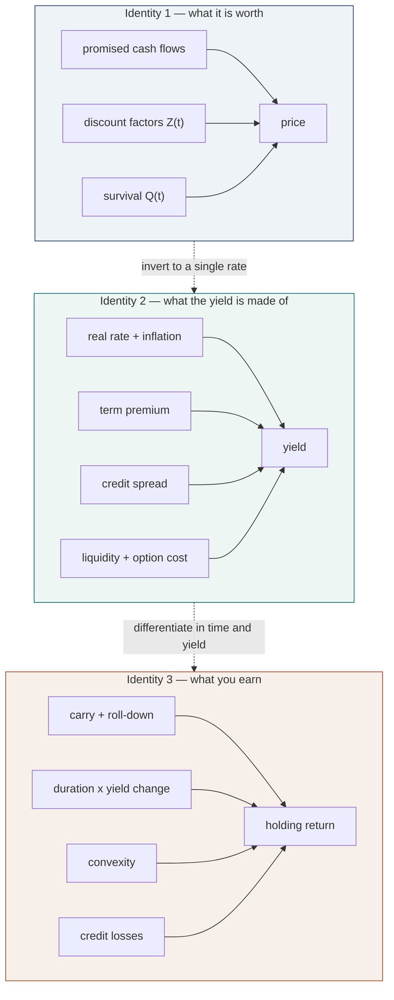
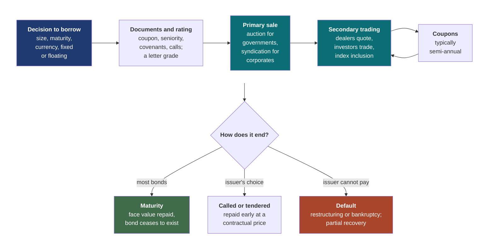
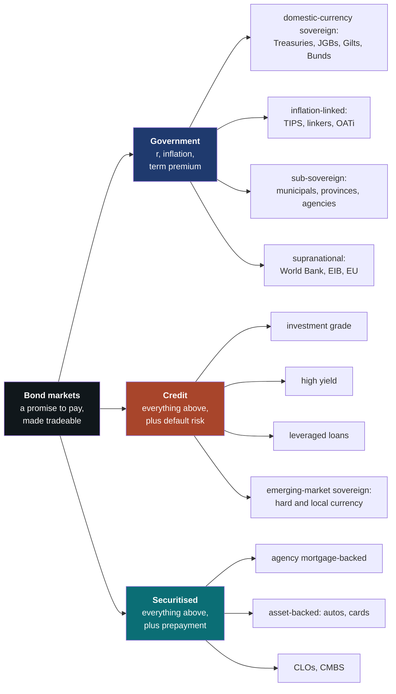
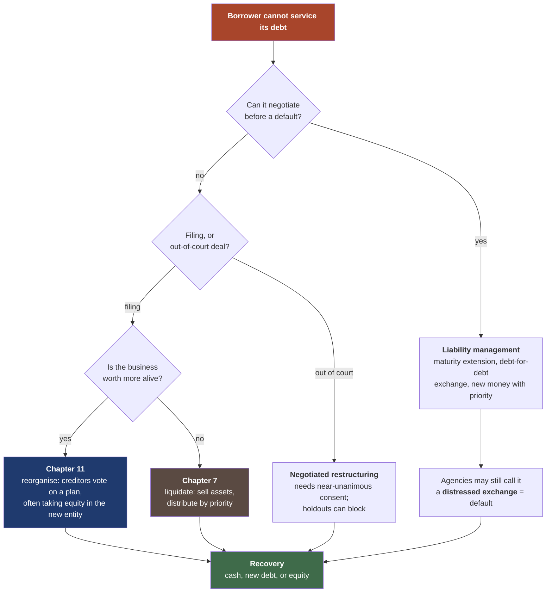
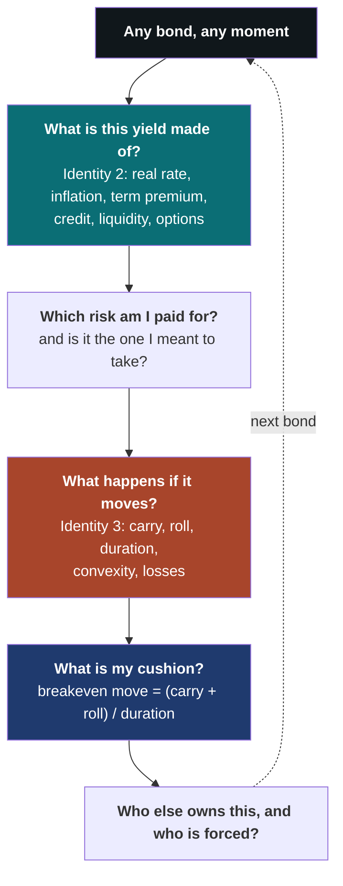
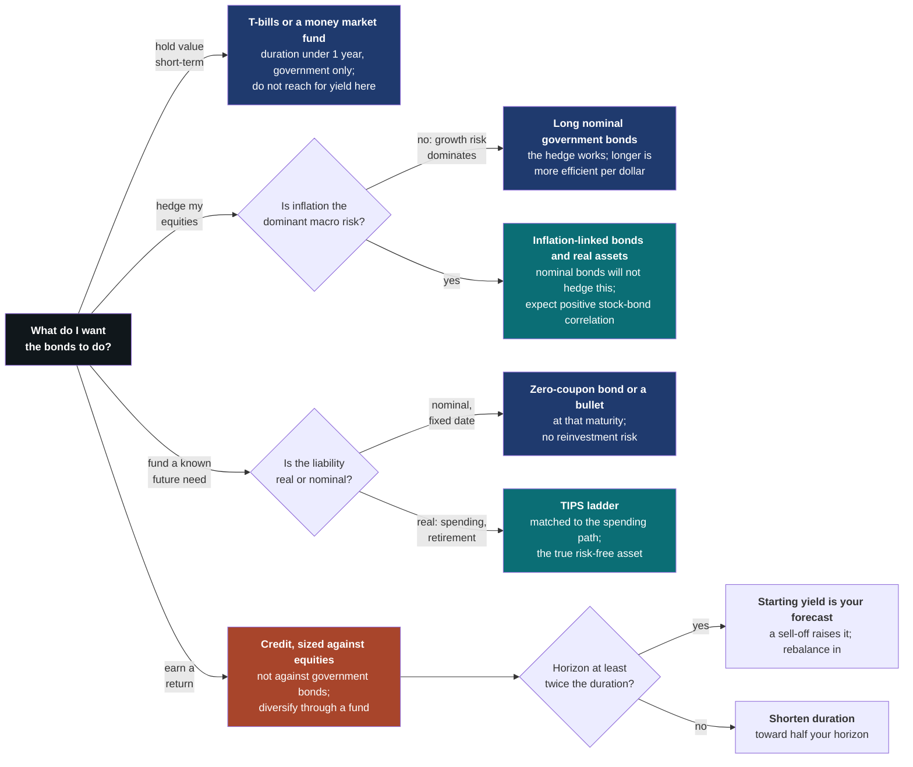

# Bonds and Bond Markets

### What a bond is, where its price comes from, why it moves, and what it does to a portfolio

---

```{=html}
<aside class="eli5">
```

# ELI5 — the short version {#eli5}

```{=latex}
\begin{eli5}
```

**In one sentence.** A bond is a fixed, tradeable schedule of promised payments, so only two things can move its price: what the market charges for money over time, and whether the market believes the payments will arrive.

**1. What the holder owns** ([§1](#1-what-a-bond-is)). A bond is a loan cut into tradeable pieces. The payments are fixed at issue and never change. Only the price that someone will pay today for that fixed schedule moves. Four decisions made at issue shape most of the bond's later behaviour: how long it runs, how big the coupon is, which currency it pays in, and where it sits in the queue if things go wrong.

**2. "Risk-free" means one specific thing** ([§1](#1-what-a-bond-is), [§3](#3-government-bonds)). It means that the payments will arrive, and nothing more. A long government bond can lose a third of its value along the way. In 2022 the safest bonds in the world had their worst calendar year on record. Nobody defaulted. The price of money changed.

**3. Duration is the whole rate story** ([§7](#7-duration-convexity)). Duration measures how much the price moves when yields move. Dollar for dollar, a 30-year bond carries roughly nine times the rate risk of a two-year bond. That ratio swamps the extra yield paid for going long. The useful arithmetic is the **cushion**: how far yields can rise before a year's income is wiped out. On a normal curve, it is about 385 basis points for a two-year bond and 30 for a 30-year bond. The long bond pays a third more yield for a thirteenth of the protection.

**4. Owning corporate debt is owning a government bond and selling insurance** ([§5](#5-corporate-credit)). A corporate bond is exactly a Treasury plus a written put on the company's assets. The rest of credit follows from that equivalence. It explains the shape of the returns: small steady gains and occasional large losses. It explains why spreads widen when the world gets volatile, and why leverage suits credit badly. Historically, spreads have been about twice the losses actually suffered. So roughly half the spread covers the losses. The other half pays for the risk that defaults arrive in clusters, at the worst moments.

**5. A spread never reveals the odds of default** ([§9](#9-credit-risk)). The market reveals the chance of default multiplied by the loss if default happens. It never reveals the two separately. Any statement of the form "the market implies a 4% chance of default" has quietly assumed a recovery rate. Those implied odds are also far higher than history, by a factor of about 10 for the best credits, because they are prices, not forecasts.

**6. The upward slope of the yield curve is mostly a fee, not a forecast** ([§11](#11-yield-curve)). Curves usually slope up, and rates usually do not rise. So most of the slope is compensation for committing money for longer, not a prediction. Inversion has preceded every US recession since the 1960s. That is real information with useless timing: the lead time has ranged from six months to two years, on a sample of eight.

**7. Who *must* trade explains more than valuation does** ([§12](#12-supply-demand)). Investors have strong maturity preferences. The people who could arbitrage those preferences have limited balance sheets. So supply and demand move prices. The biggest holders are the least price-sensitive, and the most price-sensitive ones are levered. That is how an ordinary shock becomes a dislocation. A bond index also weights by debt outstanding, so an indexed portfolio lends most to whoever has borrowed most.

**8. Whether bonds hedge stocks depends on inflation** ([§14](#14-bonds-equities)). Both are promises of future money. When the discount rate moves, they move together. When growth expectations move, they move in opposite directions. Whichever shock dominates sets the sign of the correlation. It was positive from the 1960s to the late 1990s, negative from about 1998 to 2020, and positive again in 2021–23. The regime variable is inflation. 2022 did not show that diversification failed. Nominal bonds hedge growth shocks, and they never hedged inflation shocks.

**9. The one fact that makes a bond investor calm** ([§17](#17-building-a-portfolio)). A portfolio that keeps its duration constant earns approximately its starting yield over a long enough horizon. A one-off rate shock washes out in about as many years as the portfolio's duration. So a rise in yields is *good* for any investor whose horizon is longer than their duration. The 2022 sell-off raised expected returns for exactly those investors. This is fixed income's version of "valuation predicts long-run returns", and it is far more reliable than the equity version.

---

**If you remember three things:** the only two levers are the price of money and the chance of being paid; duration, not yield, decides how much a bond moves; and credit is sold insurance, priced on the assumption that defaults arrive together, because they do.

```{=latex}
\end{eli5}
```

```{=html}
</aside>
```

---

**What this is.** This chapter is a first-principles tutorial on bonds. It covers the instrument, the markets it trades in, the arithmetic that prices it, the forces that move that price, and the decisions that face someone who puts money into it. Bonds are usually taught in one of two ways. One is a spreadsheet exercise: here is the present-value formula, now compute duration. The other is a vague reassurance that bonds are the safe part of a portfolio. Both are poor preparation. The formula says nothing about why a yield is 4% and not 7%. The reassurance was falsified in 2022, when a portfolio of the safest bonds in the world lost more than it ever had in a calendar year.

The chapter's claim is that one decomposition organises the whole subject. A bond's yield is a sum of components, and each component pays for carrying a specific risk. Which components are present identifies the market. How large they are says what the holder is paid. How they move determines the holder's return. Government bonds, corporate bonds, emerging-market debt, mortgage securities and inflation-linked bonds are not five subjects. They are one sum with different terms switched on.

**Who it is for.** The intended reader is numerate and technically strong, but not a fixed-income specialist. They want to understand bonds well enough to make decisions: to judge whether a yield is attractive, to know what a fund actually holds, to predict how a position behaves when the central bank moves, and to recognise the specific ways bond investors lose money. No prior fixed-income vocabulary is assumed. Intuition comes first throughout. Every formula is preceded by what it means and followed by a number.

**How to read this chapter.** The chapter has seven parts, and they are sequential. Part III uses Part I's vocabulary, and Part V is Part III applied.

- **Part I (§1–§2) — the object.** What a bond is, the mental models that mislead, the three identities that carry the rest of the chapter, and the life of a bond from issuance to repayment or default.
- **Part II (§3–§5) — the map.** Government bond markets and the risk-free curve. Sovereign borrowing outside the United States. Corporate credit, and where a bond sits in a company's capital structure.
- **Part III (§6–§9) — valuation and risk.** Discounting and yield. Duration and convexity. The family of spread measures, and which of them mean the same thing. Credit risk, default probability and recovery.
- **Part IV (§10–§12) — where yields come from.** The macroeconomics that sets the level of rates. The shape of the curve, and what it does and does not forecast. The supply-and-demand facts that academic models leave out.
- **Part V (§13–§15) — behaviour.** Why bonds sell off and rally, with the major episodes as worked examples. The bond–equity relationship, and why it flipped sign. The relationship to currencies.
- **Part VI (§16) — default.** What actually happens when a borrower cannot pay, for companies and for countries.
- **Part VII (§17–§19) — investing.** Constructing a bond portfolio, a consolidated list of the ways people lose money in this asset class, and a synthesis.

§20 is the reference list, grouped by kind. Appendix A collects the concepts that the main text relies on without fully developing them, ordered as a build-up.

Four sections matter most. **§1.4** states the three identities on which the chapter is built. **§6.4** explains why yield to maturity is not the expected return. **§7.5** sets out the cushion: how much of a sell-off a bond's yield can absorb. **§14** covers what bonds do and do not do for an equity portfolio.

**Objectives.** After this chapter, you should be able to:

- decompose a bond yield into the real rate, expected inflation, the term premium, the credit spread, the liquidity premium and the option cost, and say which terms a given market switches on;
- price a bond from its discount factors, and explain why yield to maturity is not the expected return;
- compute duration, DV01, convexity and the cushion, and use them to predict how a position responds to a rate move;
- read a credit spread as expected loss plus a risk premium, and explain why spread-implied default probabilities exceed historical default rates;
- explain what sets the level and slope of the yield curve, and what an inversion does and does not forecast;
- explain why the bond–equity correlation changes sign, and what that means for a stock–bond portfolio;
- build a bond portfolio around a duration target, and recognise the common ways that bond investors lose money.

**Relationship to the other chapters.** [Simple and Log Returns](log_returns.html) covers the return conventions used throughout. [Stochastic Processes](stochastic_processes.html) develops the Brownian machinery behind the term-structure models mentioned in §11.4. [Portfolio Construction and the Covariance Matrix](portfolio_construction.html) is the right frame for the allocation questions of §17. [Market Regimes and Machine Learning](market_regimes.html) is the right frame for the correlation regimes of §14. [Dealer Hedging and Gamma Exposure](dealer_hedging.html) explains the option machinery that §7.6 borrows for callable bonds and mortgages. Each chapter stands alone.

**Epistemic tags.** The chapters in this collection flag claims by status:

- **[Fact]** — replicated across independent datasets or implementations; broad agreement.
- **[Contested]** — documented, but with live disagreement about magnitude, robustness, or cause.
- **[Hypothesis]** — a proposed mechanism, not decisively tested.
- **[Practice]** — practitioner convention; the evidence may be private or absent. A [Practice] claim is not a debunked one.

Tags appear only where the status changes what a reader should do. A tag governs the sentence or clause it opens. Untagged sentences are definitions, derivations or arithmetic: true by construction rather than by evidence.

This chapter adds a fifth label. **[Computed]** marks numbers computed from the models in this chapter. The generating code is committed alongside as [`figures/bd_*.py`](https://github.com/rmahfoud/quant-research/tree/master/figures){target="_blank"}. Each script prints the numbers quoted in the text, so the assumptions can be changed and the numbers regenerated.

---

**Notation.** The table lists every symbol that recurs in the chapter, with the section that defines or first uses it. Symbols used in only one section are defined where they appear.

| Symbol | Meaning | Defined in |
|---|---|---|
| $C_t$ | Cash flow promised at time $t$ | §1.4 |
| $F$; $T$ | **Face** (par, principal, redemption) amount, 100 by convention, so prices are quoted per 100 of face; maturity date | §1.1, §5.5 |
| $P$; $P^{\text{clean}}$ | **Price**: the **dirty** price, the full amount that changes hands, unless a passage says otherwise; the quoted **clean** price, which excludes accrued interest | §1.4, §6.6 |
| $Z(t)$ | **Discount factor**: today's value of 1 unit paid at $t$; $Z(t)=(1+z(t))^{-t}$ | §1.4, §6.2 |
| $Q(t)$ | Probability-weighted chance that the payment due at $t$ arrives; 1 for a Treasury | §1.4 |
| $y$ | **Yield to maturity**: the single rate that makes discounted cash flows equal the price | §6.3 |
| $z(t)$ | **Spot** or **zero rate**: the rate for a single payment at $t$, with no intervening coupons | §6.2 |
| $f(t_1,t_2)$ | **Forward rate**: the rate for borrowing between two future dates, implied by today's curve | §6.2 |
| $D_{\text{mac}}$ | **Macaulay duration**: cash-flow-weighted average time to payment, in years | §7.1 |
| $D$ | **Modified duration**: percentage price change per unit change in yield | §7.2 |
| $\mathrm{DV01}$ | **Dollar value of a basis point**: price change per 0.01% yield move, in currency | §7.2 |
| $\mathcal{C}$ | **Convexity**: curvature of price in yield; the second derivative, scaled | §7.4 |
| $s$ | **Spread**: yield in excess of a reference rate | §8 |
| $\lambda$ | **Hazard rate**: instantaneous probability of default per unit of time | §9.2 |
| $R$ | **Recovery rate**: fraction of face value that creditors receive in default | §9.3 |
| $r$; $r^*$ | **Real interest rate**, the rate net of inflation; its long-run (natural) level | §1.4, §10.1, §10.2 |
| $\pi^e$ | **Expected inflation** over a stated horizon | §1.4 |
| $\mathrm{TP}$ | **Term premium**: extra yield for holding a long bond instead of rolling short ones | §1.4, §10.4 |
| $\mathrm{EL}$ | **Expected loss**: default probability times loss given default, per unit of exposure | §1.4, §9.1 |
| $\mathrm{CRP}$ | **Credit risk premium**: extra spread demanded for bearing default risk beyond its expected cost | §1.4, §9.2 |
| $\ell$ | **Liquidity premium**: extra yield for a bond that is harder to sell | §1.4, §3.3 |
| $o$ | **Option cost**: yield given up for an option that the borrower holds against the lender, such as a call or prepayment right | §1.4, §7.6 |
| $g$ | Real growth rate of the economy, compared with $r$ in debt dynamics | §10.6 |
| $\Delta y$ | Change in yield, in the same units as $y$, so a 100bp move is $\Delta y = 0.01$ | §1.4 |

Several symbols carry a qualification:

- A **basis point** (bp) is one hundredth of a percentage point: 100bp = 1%. Yields and spreads are quoted in basis points almost universally, and this chapter follows that convention.
- Appendix entries define local symbols. There $F$ can be a forward or futures price (A.7, A.17), $s$ a swap rate or a primary surplus (A.18, A.26), and $r_t$ a short rate (A.29).

**The running example** is a 10-year bond with a 4% annual coupon paid semi-annually, issued at par, so its price is 100 and its yield is 4.00%. It has a modified duration of 8.18 years and a convexity of 78.9. When a passage says "the bond" without qualification, it means this one.

---

## Table of contents

- [ELI5 — the short version](#eli5)

**Part I — The object**

1. [What a bond is](#1-what-a-bond-is)
2. [The life of a bond](#2-life-of-a-bond)

**Part II — The map of the market**

3. [Government bonds and the risk-free curve](#3-government-bonds)
4. [The rest of the world: sovereign and international markets](#4-international)
5. [Corporate credit and the capital structure](#5-corporate-credit)

**Part III — Valuation and risk**

6. [What a bond is worth](#6-valuation)
7. [Interest-rate risk: duration and convexity](#7-duration-convexity)
8. [Spreads: one idea, eight names](#8-spreads)
9. [Credit risk: default, recovery, and what the spread pays for](#9-credit-risk)

**Part IV — Where yields come from**

10. [The macro engine: real rates, inflation, and the central bank](#10-macro-engine)
11. [The yield curve](#11-yield-curve)
12. [Supply, demand, and who actually owns the bonds](#12-supply-demand)

**Part V — How bonds behave**

13. [Sell-offs and rallies](#13-selloffs-rallies)
14. [Bonds and equities](#14-bonds-equities)
15. [Bonds and currencies](#15-bonds-currencies)

**Part VI — When it goes wrong**

16. [Default, distress, and restructuring](#16-default)

**Part VII — Investing**

17. [Building a bond portfolio](#17-building-a-portfolio)
18. [Failure modes](#18-failure-modes)
19. [Synthesis](#19-synthesis)

**Reference**

20. [References](#20-references)
- [Appendix A — Concepts and prerequisites](#appendix-a)

---

# Part I — The object

## 1. What a bond is {#1-what-a-bond-is}

### 1.1 The promise

A bond is a loan that has been cut into tradeable pieces.

That sentence contains everything structural. Someone needs money: a government, a company, a city or a pool of mortgages. Rather than borrow it from one bank under one contract, the borrower writes a standardised promise: *pay the holder of this piece of paper 2 currency units every six months for 10 years, and 100 units at the end.* The borrower then sells tens of thousands of identical copies of that promise to whoever will buy them. Each copy is a bond. The buyer is a lender, and the seller is a borrower.

Two consequences follow immediately. They are the two facts that make bonds behave the way they do.

**The payments are fixed in advance.** They are not guaranteed, because the borrower may fail, but they are *specified*. The bond says 2 units every six months. If the borrower's profits triple, the bond still pays 2. If the borrower's profits collapse, the bond still demands 2, and the borrower must find it or default. A shareholder's claim floats with the fortunes of the business, and a bondholder's claim does not. This is the fundamental asymmetry of debt: **fixed upside, and downside only when the promise breaks.**

**The promise is transferable.** Because the pieces are standardised and identical, a holder can sell to someone else without renegotiating anything. The original borrower does not need to know or approve. That is the difference between a bond and a bank loan. It is what creates a *market*: a continuously updating price for the same promise as the world's opinion about it changes.

Together, the two facts yield the central puzzle of the asset class. The payments are fixed, and the price is not. So **the entire variation in a bond's price is variation in what the market will pay for a fixed schedule of payments.** Nothing about the bond itself changes when its price falls 20%. The coupon, the maturity and the borrower are all the same. What changed is the price of money, or the market's belief that the promise will be kept.

That deserves a statement as the first principle, because almost every mistake in fixed income comes from losing sight of it:

> A bond is a fixed schedule of promised payments. Its price is what that schedule is currently worth. Only two things can move the price: **the rate at which future money is discounted**, or **the market's belief about whether the payments will arrive**. Everything in this chapter is one of those two channels.

### 1.2 The intuitions to discard

Four mental models about bonds are common and intuitive, and they are wrong in ways that cost money. This subsection discards them explicitly before building anything.

**"Bonds are safe."** The question is: safe against what? A US Treasury bond carries essentially no risk of non-repayment, because the government prints the currency it owes. But in 2022 the Bloomberg US Aggregate index, dominated by Treasuries and high-quality corporates, returned about −13%. That was its worst calendar year in the half-century the index has existed, and nothing defaulted. Long Treasuries did far worse. A 30-year bond bought at a 2% yield and sold at 4% loses roughly a third of its value, which is equity-sized. [Fact] The safety of a government bond is safety of *repayment*, which is a different thing from safety of *price*. Confusing the two is the single most expensive error available in this asset class. The phrase "risk-free asset" enshrines it, and the phrase means free of default risk and nothing else.

**"Bonds pay a fixed rate, so the return is known."** The return is known only if the holder keeps the bond to maturity, reinvests every coupon at exactly the original yield, and the borrower pays in full. If any of those fails, the realised return differs, sometimes dramatically. §6.4 makes this precise. Yield to maturity is an internal rate of return, and an IRR is a *quoted* number, not a *forecast*.

**"A bond fund is a bond."** It is not, and the difference matters. An individual bond has a maturity date at which, absent default, the holder gets 100 back. That date anchors the outcome: price movements in between are unrealised for a holder who keeps the bond. A bond fund has no maturity date. It holds a rolling population of bonds, and it sells them before they mature to keep its duration constant. It therefore never "pulls to par". Suppose rates rise and stay risen. The individual bondholder eventually gets the money back. The fund holder's loss is permanent in price terms, and it is recovered only through the higher yields the fund now earns. Both end up in a similar place over a horizon equal to the duration (§17.3), but the paths and the psychology are completely different.

**"Higher yield means a better investment."** Yield is compensation for risk. A bond yielding 9% when Treasuries yield 4% does not offer 5% of free money. It offers 5% in exchange for the possibility of not being paid, plus the possibility of not being able to sell when desired. Over a full cycle, high-yield bonds have historically delivered a *net* premium after default losses. But the premium is considerably smaller than the headline spread suggests, because a meaningful fraction of the spread is expected loss rather than reward (§9.5). The instinct to reach for yield is the most reliably punished instinct in fixed income, and the punishment is measurable. Corporate bond funds systematically tilt toward bonds yielding more than their benchmark, most of all when rates are low, because the tilt attracts investor flows. The tilt raises raw returns but delivers negative risk-adjusted ones ([Choi & Kronlund, 2018](https://doi.org/10.1093/rfs/hhx132){target="_blank"}).

### 1.3 What a bond is not

Defining the object against its neighbours sharpens it. Each row of the table is a claim on someone's money, and the differences between rows are where bond behaviour comes from.

| | Payments | If the borrower fails | Maturity | Upside |
|---|---|---|---|---|
| **Bond** | Fixed and specified | Legal claim, senior to equity | Fixed date | Capped at the promised payments |
| **Bank loan** | Fixed or floating | Same claim, but privately negotiated | Fixed, often amortising | Capped; usually not traded |
| **Bank deposit** | Interest at the bank's discretion | Deposit insurance up to a limit | None | Capped |
| **Preferred stock** | Fixed dividend, but skippable | Junior to all debt | Often none | Capped |
| **Common equity** | Whatever is left over | Last in line, usually zero | None | Unlimited |
| **Convertible bond** | Fixed, plus a share conversion right | Bond claim | Fixed date | Participates in equity upside |

Two rows deserve a second look.

**Preferred stock is the instructive comparison.** It looks like a bond, with a fixed periodic payment, no maturity and no share in growth. But the issuer can *skip* the payment without triggering default. That single difference moves it from the debt side of the balance sheet to the equity side, and its price behaves accordingly. In a crisis, preferreds trade like equity, not like bonds. **The definitional core of a bond is not "fixed payments" but "fixed payments that can be enforced in court."**

**A convertible bond is genuinely two instruments.** It is a bond plus a call option on the issuer's equity, and it can usefully be priced as exactly that. This is the first appearance of a recurring theme. Many fixed-income instruments that look like distinct products are a plain bond plus or minus an option. Finding the decomposition is how to understand them (§7.6, §8.4).

### 1.4 Three identities {#three-identities}

This subsection states the spine. Three equations carry this entire chapter. They are three views of the same object: what the bond is worth, what its yield is made of, and what return it delivers.

**Identity 1 — the price.** A bond is worth the present value of what it pays, weighted by the chance of being paid:

$$
P \;=\; \sum_{t} \underbrace{C_t}_{\substack{\text{promised}\\\text{cash flow}}}
\;\times\; \underbrace{Z(t)}_{\substack{\text{discount}\\\text{factor}}}
\;\times\; \underbrace{Q(t)}_{\substack{\text{probability-weighted}\\\text{chance of payment}}}
$$

$C_t$ is the promise, and it comes from the bond's legal documents. $Z(t)$ is the price today of one unit of currency delivered at time $t$, and it comes from the market for government debt. $Q(t)$ captures the probability-weighted chance that the payment arrives, and it comes from the market's view of the borrower. For a US Treasury, $Q(t) = 1$, and the whole expression reduces to discounting. For a distressed corporate bond, $Q(t)$ does most of the work.

Everything in Part III is the arithmetic of this identity. Everything in Parts IV and V concerns what makes $Z(t)$ and $Q(t)$ move.

**Identity 2 — the yield decomposition.** Rather than working with $Z$ and $Q$ directly, the market quotes a single number, the yield, and decomposes it into additive pieces:

$$
y \;=\; \underbrace{r + \pi^e}_{\text{expected short rate path}}
\;+\; \underbrace{\mathrm{TP}}_{\substack{\text{term}\\\text{premium}}}
\;+\; \underbrace{\mathrm{EL} + \mathrm{CRP}}_{\text{credit spread}}
\;+\; \underbrace{\ell}_{\substack{\text{liquidity}\\\text{premium}}}
\;+\; \underbrace{o}_{\substack{\text{option}\\\text{cost}}}
$$

Read it from left to right. $r$ is the expected average **real** short-term interest rate over the bond's life. $\pi^e$ is expected inflation over the same period. Together they are what rolling short-term government paper would earn. $\mathrm{TP}$ is the **term premium**, the extra yield for committing for a long time instead. These first three terms make up the *government* curve. $\mathrm{EL}$ is the expected credit loss: default probability times loss given default. $\mathrm{CRP}$ is the **credit risk premium**, the extra return demanded for bearing default risk beyond its expected cost. $\ell$ compensates for not being able to sell easily. $o$ is the value of any options that the borrower holds against the lender, such as the right to repay early.

This is the map of the entire asset class, and the most useful half-page in this chapter. Every bond market in the world is this sum with a different subset of terms switched on, as the table shows.

```{=latex}
\newpage
```

| Instrument | $r$ | $\pi^e$ | $\mathrm{TP}$ | $\mathrm{EL}{+}\mathrm{CRP}$ | $\ell$ | $o$ |
|---|:-:|:-:|:-:|:-:|:-:|:-:|
| 3-month Treasury bill | ✓ | ✓ | — | — | — | — |
| 10-year Treasury note | ✓ | ✓ | ✓ | — | — | — |
| 10-year inflation-linked (TIPS) | ✓ | — | ✓† | — | small | — |
| Investment-grade corporate | ✓ | ✓ | ✓ | small | small | — |
| High-yield corporate | ✓ | ✓ | ✓ | **large** | ✓ | ✓ |
| Emerging-market sovereign, hard currency | ✓ | ✓ | ✓ | ✓ | ✓ | — |
| Agency mortgage pass-through | ✓ | ✓ | ✓ | — | small | **large** |
| Callable corporate | ✓ | ✓ | ✓ | ✓ | ✓ | ✓ |
| Corporate floating-rate note | ✓ | ✓ | ≈0‡ | ✓ | small | — |
| Leveraged loan | ✓ | ✓ | ≈0‡ | **large** | ✓ | ✓§ |

† A *real* term premium, for committing to a long real rate. ‡ A floater's coupon resets to the prevailing short rate, so it earns essentially no term premium and carries almost no duration (§3.2). § A loan's option is the borrower's right to repay at par, exercised when its *credit* improves rather than when rates fall (§5.4).

The figure draws the same table with representative magnitudes.

```{=latex}
\newpage
\begin{center}
\includegraphics[width=\linewidth]{quant-research/figures/bd_yield_stack.pdf}
\end{center}
```

```{=html}

```

The picture shows three things. First, the TIPS bar is short not because inflation-linked bonds are poor value, but because expected inflation has been removed from the number. A real yield and a nominal yield are quoted in different units, and comparing them directly is a category error. Second, about half of the *spread* of the B-rated corporate bar is expected loss rather than premium. It is compensation for defaults that should be expected, and that is the difference between a spread and a return. Third, the mortgage bar's excess over Treasuries is almost entirely option cost: the homeowner's right to refinance. An investor who buys agency mortgages for "spread" is therefore paid to sell options, not to take credit risk.

**Identity 3 — the return.** Identity 2 says what the yield is made of. This one says what happens to the investor's money. Over a holding period, to a good approximation,

$$
r_{\text{holding}} \;\approx\;
\underbrace{y\,\Delta t}_{\text{carry}}
\;+\; \underbrace{\text{roll-down}}_{\substack{\text{aging down}\\\text{the curve}}}
\;-\; \underbrace{D\,\Delta y}_{\substack{\text{duration}\\\text{effect}}}
\;+\; \underbrace{\tfrac{1}{2}\,\mathcal{C}\,(\Delta y)^2}_{\text{convexity}}
\;-\; \underbrace{L}_{\substack{\text{realised}\\\text{credit losses}}}
$$

The first two terms are the return for doing nothing, and they are known on the day of purchase. The third term is the bet. Duration $D$ converts a change in yield into a change in price, with a minus sign, because higher yields mean lower prices. The fourth term is a small correction. It is almost always favourable for a normal bond, and unfavourable for a mortgage or a callable bond. The last term is what the borrower failed to pay.

Every question of the form "why did the bonds lose money?" is answered by naming a term in this identity. Every bond strategy is a bet on one of them. The whole of Part V is this identity applied to history.

```{=latex}
\newpage
```

The diagram shows how the three identities connect.


```mermaid
flowchart TB
    subgraph ID1["Identity 1 — what it is worth"]
        direction LR
        A1["promised cash flows"] --> A2["price"]
        A3["discount factors Z(t)"] --> A2
        A4["survival Q(t)"] --> A2
    end
    subgraph ID2["Identity 2 — what the yield is made of"]
        direction LR
        B1["real rate + inflation"] --> B5["yield"]
        B2["term premium"] --> B5
        B3["credit spread"] --> B5
        B4["liquidity + option cost"] --> B5
    end
    subgraph ID3["Identity 3 — what you earn"]
        direction LR
        C1["carry + roll-down"] --> C5["holding return"]
        C2["duration x yield change"] --> C5
        C3["convexity"] --> C5
        C4["credit losses"] --> C5
    end
    ID1 -.->|"invert to a single rate"| ID2
    ID2 -.->|"differentiate in time and yield"| ID3
    style ID1 fill:#eef3f7,stroke:#1F3A6E
    style ID2 fill:#eef6f4,stroke:#0B6E75
    style ID3 fill:#f7f0ea,stroke:#A8452B
```

Identity 1 is the machinery. Identity 2 is Identity 1 inverted into a single quoted rate, then split into the risks that the rate pays for. Identity 3 is Identity 2 differentiated: what happens to the investor's money when the components move. **The pieces of a yield reveal both the risks being run and the return to expect.** That is the whole thesis.

### 1.5 Why anyone issues bonds

Half of the market's behaviour comes from the borrower's side, and it is usually skipped. Issuers are not passive suppliers of investment product. They are optimisers, and what they optimise shapes what is available to buy.

**Governments** issue because they spend more than they tax, and they must fund the difference. They are also, uniquely, the manufacturer of the currency they borrow in. That is why a government borrowing in its own currency is in a different risk category from every other borrower (§4.2). Beyond funding, governments issue because the market *wants* the product. Safe, liquid collateral is a raw material for the financial system. There is persistent evidence that investors pay a premium for Treasury securities over and above their cash flows. This "convenience yield" is worth perhaps 70 basis points on average ([Krishnamurthy & Vissing-Jorgensen, 2012](https://doi.org/10.1086/666526){target="_blank"}). [Fact]

**Companies** issue because debt is cheaper than equity, for two reasons. First, interest is tax-deductible in most jurisdictions and dividends are not, which is a direct subsidy. Second, debt is a less risky claim, so investors require less return for it. The counterweight is that debt must be serviced regardless of circumstances. More debt therefore raises the probability of financial distress. The classical treatment of this trade-off runs from [Modigliani & Miller (1958)](https://www.jstor.org/stable/1809766){target="_blank"} through the agency-cost literature ([Jensen & Meckling, 1976](https://doi.org/10.1016/0304-405X(76)90026-X){target="_blank"}; [Myers, 1977](https://doi.org/10.1016/0304-405X(77)90015-0){target="_blank"}), and §5.1 summarises it.

**The timing matters to investors.** Companies issue when issuing is cheap. Supply is therefore heaviest exactly when spreads are tight and credit standards are loose. [Greenwood & Hanson (2013)](https://doi.org/10.1093/rfs/hht028){target="_blank"} measure the *quality* of issuers coming to market by the share of issuance from low-rated firms. When that quality deteriorates, subsequent excess returns on corporate bonds are low. [Fact] The composition of new supply is a usable signal precisely because issuers are better informed about the cycle than buyers are. This is a general and slightly uncomfortable principle: in a market where one side chooses when to transact, that side has an edge.

> ### §1 Key takeaways
>
> 1. A bond is a fixed schedule of promised payments, made tradeable. All price variation is variation in what the market pays for that fixed schedule.
> 2. Only two channels move a bond's price: the discount rate applied to future money, and the belief that the money will arrive. Every mechanism in this chapter routes through one of them.
> 3. "Risk-free" means free of default risk and nothing else. A long Treasury can lose a third of its value, and has.
> 4. The definitional core of a bond is not fixed payments but *enforceable* fixed payments. That is what separates it from preferred stock.
> 5. Identity 2, the yield decomposition, is the map of the asset class. Every bond market is the same sum with a different subset of terms switched on.
> 6. Identity 3, the return decomposition, answers every question of why bonds moved. Carry and roll are known in advance, and duration is the bet.
> 7. Issuers choose when to sell. Supply is heaviest when issuing is cheapest, which is when future returns are worst.

---

## 2. The life of a bond {#2-life-of-a-bond}

Following one bond from birth to death is the fastest way to meet the institutions. The vocabulary introduced here recurs throughout: indenture, auction, on-the-run, TRACE and make-whole. Each term is easier to learn attached to a stage than as a glossary entry. The flowchart shows the stages.


```mermaid
flowchart TB
    subgraph LIFE[" "]
        direction LR
        A["<b>Decision to borrow</b><br/>size, maturity,<br/>currency, fixed<br/>or floating"] --> B["<b>Documents and rating</b><br/>coupon, seniority,<br/>covenants, calls;<br/>a letter grade"]
        B --> D["<b>Primary sale</b><br/>auction for<br/>governments,<br/>syndication for<br/>corporates"]
        D --> E["<b>Secondary trading</b><br/>dealers quote,<br/>investors trade,<br/>index inclusion"]
        E --> F["<b>Coupons</b><br/>typically<br/>semi-annual"]
        F --> E
    end
    LIFE --> G{"<b>How does it end?</b>"}
    G -->|"most bonds"| H["<b>Maturity</b><br/>face value repaid,<br/>bond ceases to exist"]
    G -->|"issuer's choice"| I["<b>Called or tendered</b><br/>repaid early at a<br/>contractual price"]
    G -->|"issuer cannot pay"| J["<b>Default</b><br/>restructuring or bankruptcy;<br/>partial recovery"]
    style LIFE fill:none,stroke:none
    style A fill:#1F3A6E,color:#fff
    style D fill:#0B6E75,color:#fff
    style E fill:#0B6E75,color:#fff
    style H fill:#3f6b4a,color:#fff
    style J fill:#A8452B,color:#fff
```

### 2.1 Birth: the terms of the promise

Before a bond exists, someone decides its shape. Four decisions determine almost everything about how it will behave.

**Maturity.** This is how long until the principal is repaid. It is the single biggest determinant of price volatility. A 30-year bond moves roughly nine times as much per unit of yield change as a 2-year bond (§7.2). Issuers pick maturity by trading off the cost of long-term funding against the risk of having to refinance at a bad moment. The choice matters for the market as a whole, because the government's choice of maturity changes the supply of duration that investors must hold ([Greenwood, Hanson & Stein, 2015](https://doi.org/10.1111/jofi.12253){target="_blank"}).

**Coupon.** This is the periodic payment. It is usually set so that the bond prices at or near 100 on the day of issue. A bond issued when 10-year yields are 4% carries roughly a 4% coupon. A bond's coupon is therefore a fossil record of the rate environment at its birth. That is why bond portfolios accumulated over decades contain wildly different coupons. Some bonds pay no coupon at all and are sold at a discount to face. These are **zero-coupon bonds**, and Treasury STRIPS are the standard example.

**Currency.** This decision determines who bears the exchange-rate risk. For sovereign borrowers it is nearly the whole story (§4.3).

**Seniority, security and covenants.** These determine where the lender stands if things go wrong. A **senior secured** bond has a claim on specific assets, and it is paid before others. A **subordinated** bond is paid after senior creditors are made whole. **Covenants** are contractual promises by the borrower, such as limits on additional debt, on asset sales and on dividends. They give lenders rights if the borrower's condition deteriorates. They are worth real money. Covenant violations transfer control rights to creditors and demonstrably change corporate behaviour, and investment falls sharply after a breach ([Chava & Roberts, 2008](https://doi.org/10.1111/j.1540-6261.2008.01391.x){target="_blank"}). [Fact]

All of this is written into an **indenture**, for a corporate bond under US law, or a **prospectus**. The document runs to hundreds of pages, and almost no investor reads it in full. In practice, investors rely on summaries and on covenant-scoring services. [Practice] This is a genuine information asymmetry. It is largest exactly where it matters most, in high-yield issuance, where the quality of documentation varies enormously and has deteriorated over the past two decades.

### 2.2 The primary market: how bonds are first sold

Governments and companies sell their bonds in structurally different ways, and the difference reveals something about both markets.

**Governments auction.** The US Treasury announces in advance that it will sell, say, $42 billion of 10-year notes on a particular date. Bidders submit either *competitive* bids, which specify a yield and size, or *non-competitive* bids, which accept whatever yield clears. The bidders are mostly **primary dealers**, a designated group of banks obliged to participate, plus direct institutional and retail bidders. The Treasury fills the issue from the lowest yield upward until it is sold, and everyone pays the **same** clearing yield. This "uniform price" or Dutch format replaced the older pay-your-bid format. Treasury experiments in the 1990s found that it reduced bidder caution and improved revenue ([Malvey & Archibald, 1998](https://home.treasury.gov/system/files/136/archive-documents/upas.pdf){target="_blank"}). [Contested] The theoretical comparison between formats is ambiguous, and the measured empirical gains were small.

The auction calendar is public, regular and enormous, and it leaves a measurable footprint on prices. Yields tend to rise into an auction and fall after it. That is consistent with dealers demanding compensation for temporarily absorbing supply ([Lou, Yan & Zhang, 2013](https://doi.org/10.1093/rfs/hht034){target="_blank"}). [Fact] This is a pure inventory effect in the most liquid market on earth. It calibrates expectations about how much price pressure supply can create in less liquid markets.

**Companies syndicate.** A company hires banks, which sound out investors and announce "initial price thoughts", an indicative spread. The banks take orders, and then tighten the spread if the book is oversubscribed. Allocation is discretionary: the syndicate decides who gets what. The new bond typically prices at a small concession to the issuer's existing bonds. This **new issue concession** is the sweetener that gets the deal done, and it widens sharply when markets are stressed. In a bad week, the corporate primary market simply closes, and no deals price at all. That is one of the cleaner real-time indicators of credit stress. [Practice]

### 2.3 The secondary market: dealers, not exchanges

This institutional fact surprises people coming from equities: **bonds overwhelmingly do not trade on exchanges.** There is no central limit order book for the 10-year Treasury note as there is for Apple stock. Bonds trade **over-the-counter**, bilaterally, through dealers. The dealers quote a price at which they will buy (bid) and a price at which they will sell (ask), and they hold inventory in between.

There are two reasons for this, one structural and one a consequence.

The structural reason is **fragmentation**. Apple has one common share. A large company may have 40 outstanding bonds with different maturities, coupons and covenants, and most of them do not trade on a given day. The US market has tens of thousands of distinct corporate bond issues against a few thousand listed stocks. A continuous two-sided market cannot be maintained in an instrument that trades twice a month. A structure of search and bargaining emerges instead. That is exactly the setting analysed by [Duffie, Gârleanu & Pedersen (2005)](https://doi.org/10.1111/j.1468-0262.2005.00639.x){target="_blank"}, whose central result is that **investors with worse outside options get worse prices.** [Fact] Retail investors in corporate bonds pay dramatically more than institutions for the same bond on the same day. Unusually, they pay *more* per bond on small trades, which is the opposite of the pattern in the equity market ([Edwards, Harris & Piwowar, 2007](https://doi.org/10.1111/j.1540-6261.2007.01240.x){target="_blank"}).

The consequence is **opacity**. US regulators addressed it in 2002 by requiring corporate bond trades to be reported to **TRACE** within minutes. The resulting natural experiment produced one of the cleanest results in market microstructure. Transaction costs fell substantially for bonds brought into the system, with no measurable damage to liquidity ([Bessembinder, Maxwell & Venkataraman, 2006](https://doi.org/10.1016/j.jfineco.2005.11.001){target="_blank"}; [Goldstein, Hotchkiss & Sirri, 2007](https://doi.org/10.1093/rfs/hhl020){target="_blank"}). [Fact] Transparency helped investors and cost dealers, which is why dealers opposed it.

Since roughly 2015 the corporate bond market has been **electronifying**. It is moving from telephone negotiation to request-for-quote platforms, where an investor pings several dealers simultaneously, and increasingly to all-to-all venues, where investors trade with each other. The economics are those expected when an auction replaces a search: more competition, tighter prices, and the largest benefit in the liquid part of the market ([Hendershott & Madhavan, 2015](https://doi.org/10.1111/jofi.12185){target="_blank"}). [Fact] Portfolio trading executes a basket of hundreds of bonds in one negotiated transaction. It has grown rapidly, and it is tied closely to the ETF market's ability to price baskets (§17.4). [Practice]

**The on-the-run distinction.** In government markets, the most recently issued bond of a given maturity is **on-the-run**, and everything older is **off-the-run**. The on-the-run bond is far more liquid, and it concentrates the trading and hedging activity. It therefore trades at a *lower* yield: buyers give up a few basis points for the ability to transact in size. The gap is a clean measure of the value of liquidity, and it widens sharply in crises ([Amihud & Mendelson, 1991](https://doi.org/10.1111/j.1540-6261.1991.tb04623.x){target="_blank"}; [Longstaff, 2004](https://doi.org/10.1086/386528){target="_blank"}). [Fact] It is also the source of a famous trade: buy the cheap off-the-run bond, sell the expensive on-the-run bond, and wait for convergence. The trade is correct on average. It was also a major component of what destroyed Long-Term Capital Management in 1998, because convergence trades funded with borrowed money can require more capital precisely when capital is scarce.

### 2.4 Living: coupons, ratings and index membership

Between issue and maturity, a bond mostly just pays coupons. Three things that matter can happen to it.

**Coupon payments** arrive, usually semi-annually in the US and UK and annually in much of Europe. Between payment dates, the buyer owes the seller the interest accrued so far. That is why quoted prices and settled prices differ (§6.6).

**Ratings change.** The agencies, Moody's, S&P and Fitch, assign letter grades that map to a broad ordering of credit quality. Ratings migrate. An issuer downgraded from BBB− to BB+ crosses the **investment-grade boundary** and becomes a "fallen angel". That matters far more than one notch should, because a large population of investors is contractually forbidden from holding sub-investment-grade paper. The resulting forced selling is a genuine, documented price effect. Insurers subject to ratings-based capital rules sell downgraded bonds, and those sales temporarily push prices below fundamental value ([Ellul, Jotikasthira & Lundblad, 2011](https://doi.org/10.1016/j.jfineco.2011.03.020){target="_blank"}). [Fact] It is also an opportunity. Investors without the constraint have historically bought fallen-angel bonds cheaply.

Ratings themselves deserve scepticism. They are explicitly *through-the-cycle* ordinal rankings, not probability estimates, and they lag market prices. [Fact] The issuer-pays business model also creates a conflict that shows up in the data: ratings are more favourable when competition among agencies is more intense ([Becker & Milbourn, 2011](https://doi.org/10.1016/j.jfineco.2011.03.012){target="_blank"}). **Recommendation: use ratings as a coarse sorting device, and as a description of who is *allowed* to own the bond, not as a risk measure.**

**Index membership changes.** A bond can be added to or dropped from a major index for falling below investment grade, for having less than a year to maturity, or for shrinking below a minimum size. Every index-tracking fund must then trade it. Index rules are therefore a significant, mechanical source of demand, and index construction is one of the underappreciated facts of the asset class (§12.5).

### 2.5 Early endings: calls, tenders and exchanges

Many bonds do not run to maturity, because the issuer has reserved the right to end them early or negotiates to do so.

**A call provision** gives the issuer the right to repay at a stated price on stated dates. The issuer exercises it when refinancing is cheaper, which means when rates have fallen or the issuer's credit has improved. This is straightforwardly bad for the holder, who gets the money back exactly when reinvesting it is least attractive. The compensation is a higher yield, which is the $o$ term of Identity 2. The consequences for price behaviour are severe enough to warrant their own treatment (§7.6).

**A make-whole call** is a gentler variant, common in investment-grade issuance. The issuer may call, but must pay the present value of the remaining cash flows, discounted at a Treasury yield plus a small spread. The make-whole price rises as rates fall, so the provision removes most of the harm. A make-whole bond behaves almost like a non-callable one. [Practice] Distinguishing a hard call schedule from a make-whole provision is one of the most valuable five minutes of document reading available.

**Tender offers and exchanges.** An issuer may simply offer to buy its bonds back. It pays a premium if it wants to retire expensive debt, or a deep discount if it is distressed. A **distressed exchange** swaps old bonds for new ones worth less. It is default by another name, and rating agencies classify it as such. It has become the dominant form of resolving corporate default. Most high-yield defaults now happen through negotiated liability management rather than a bankruptcy filing (§16.2). [Practice]

### 2.6 Death: maturity or default

Most bonds simply mature. The issuer pays the face value, and the bond ceases to exist. The holder's return over the whole life was determined by the purchase yield, the reinvestment of coupons, and nothing else.

The rest default. §16 covers what happens then in detail. In summary, default is not a binary wipeout. It starts a process that ends with creditors owning something: cash, new bonds, or equity in the reorganised business. For a senior unsecured corporate bond, that is worth perhaps 40% of face on average. The variation around the average is enormous. Recoveries are also systematically *lower* in exactly the years when defaults are most numerous ([Altman & Kishore, 1996](https://doi.org/10.2469/faj.v52.n6.2040){target="_blank"}; [Acharya, Bharath & Srinivasan, 2007](https://doi.org/10.1016/j.jfineco.2006.05.011){target="_blank"}). [Fact] That co-movement, with many defaults and low recoveries arriving together, makes credit risk a *systemic* exposure rather than a diversifiable one. It is the reason why a credit portfolio's loss distribution has such a long tail.

> ### §2 Key takeaways
>
> 1. Four birth decisions, maturity, coupon, currency and seniority, determine most of how a bond will behave for its whole life.
> 2. Governments auction on a public, regular calendar, and companies syndicate opportunistically. The difference shows up as predictable supply pressure in one market and closed windows in the other.
> 3. Bonds trade over-the-counter through dealers, not on exchanges, because there are an order of magnitude more bond issues than stocks, and most do not trade on a given day.
> 4. In a search market, the worse-informed and smaller counterparty gets a worse price. Retail investors pay dramatically more for corporate bonds than institutions do, and pay more per bond on small trades.
> 5. Post-trade transparency (TRACE) lowered transaction costs materially without damaging liquidity. It is one of the cleanest natural experiments in microstructure.
> 6. The yield gap between on-the-run and off-the-run bonds is the price of liquidity. It widens in crises, exactly when a convergence trade needs it not to.
> 7. Ratings are through-the-cycle ordinal rankings with a known issuer-pays conflict. Their main investment significance is determining who is *permitted* to hold the bond. The forced selling that follows a downgrade is a real, measurable price effect.
> 8. Check whether a call is a hard schedule or make-whole. The first materially changes the bond's risk, and the second barely does.

---

# Part II — The map of the market

The global bond market is on the order of $140 trillion, larger than the capitalisation of global equity markets. It is not one market but a nested set of them. Understanding the structure means understanding which of Identity 2's terms does the work in each. This part walks the three main territories, government, international sovereign and corporate, in that order, because each adds a component to the yield that the previous one lacked. The diagram maps the territories.

```{=latex}
\newpage
```


```mermaid
flowchart LR
    ROOT["<b>Bond markets</b><br/>a promise to pay,<br/>made tradeable"]
    ROOT --> GOV["<b>Government</b><br/>r, inflation,<br/>term premium"]
    ROOT --> CRED["<b>Credit</b><br/>everything above,<br/>plus default risk"]
    ROOT --> STRUCT["<b>Securitised</b><br/>everything above,<br/>plus prepayment"]
    GOV --> G1["domestic-currency sovereign:<br/>Treasuries, JGBs, Gilts, Bunds"]
    GOV --> G2["inflation-linked:<br/>TIPS, linkers, OATi"]
    GOV --> G3["sub-sovereign:<br/>municipals, provinces, agencies"]
    GOV --> G4["supranational:<br/>World Bank, EIB, EU"]
    CRED --> C1["investment grade"]
    CRED --> C2["high yield"]
    CRED --> C3["leveraged loans"]
    CRED --> C4["emerging-market sovereign:<br/>hard and local currency"]
    STRUCT --> S1["agency mortgage-backed"]
    STRUCT --> S2["asset-backed: autos, cards"]
    STRUCT --> S3["CLOs, CMBS"]
    style ROOT fill:#10171B,color:#fff
    style GOV fill:#1F3A6E,color:#fff
    style CRED fill:#A8452B,color:#fff
    style STRUCT fill:#0B6E75,color:#fff
```

## 3. Government bonds and the risk-free curve {#3-government-bonds}

### 3.1 Why this market is the reference

Every other bond in the world is priced relative to a government curve. The reason deserves a precise statement, because it is not that governments are morally trustworthy.

A government that borrows in a currency it issues **cannot be forced into nominal default.** It can always create the units it owes. This does not make the debt riskless in economic terms, because the creditor may be repaid in devalued money, which is a real loss. But it removes the *credit* term from Identity 2 and leaves only the rate terms. What remains is the purest available observation of the price of time and the price of inflation risk. That is what makes it a reference.

Three further properties make the US Treasury market in particular the global reference.

- **Size and homogeneity.** Around $29 trillion of marketable debt was outstanding in the mid-2020s, in a small number of standardised, fungible instruments issued on a predictable calendar.
- **Liquidity.** The on-the-run 10-year note trades with bid-ask spreads measured in fractions of a basis point, and at volumes that no other fixed-income instrument approaches.
- **Collateral status.** Treasuries are the dominant collateral in the repo market (§3.4). They are therefore not merely an investment but a *money-like* asset, used to fund positions across the entire financial system.

That last property has a price. Because Treasuries do a job beyond paying their cash flows, investors accept a lower yield than the cash flows alone justify. [Krishnamurthy & Vissing-Jorgensen (2012)](https://doi.org/10.1086/666526){target="_blank"} estimate this **convenience yield** at roughly 70 basis points on average. They show that it varies inversely with the supply of Treasury debt: when the government issues more, the premium shrinks. [Fact] A closely related literature finds that the "true" risk-free rate implied by option markets sits *above* the Treasury yield, which is the same observation from another angle ([van Binsbergen, Diamond & Grotteria, 2022](https://doi.org/10.1016/j.jfineco.2021.06.012){target="_blank"}). [Fact] The practical consequence is that the Treasury curve is the market's reference rate but *not* a clean measurement of the risk-free rate. It is the risk-free rate minus a time-varying convenience premium. Practitioners who need a genuine discount curve increasingly use the overnight indexed swap (OIS) curve instead (§8.2).

### 3.2 The instrument set

The US Treasury issues a deliberately small menu, shown in the table. Other developed sovereigns issue close analogues, and the vocabulary transfers.

| Instrument | Maturity at issue | Coupon | What it is for |
|---|---|---|---|
| **Bills** | 4 to 52 weeks | None; sold at a discount | Cash management; the front of the curve |
| **Notes** | 2, 3, 5, 7, 10 years | Semi-annual fixed | The core of the market |
| **Bonds** | 20 and 30 years | Semi-annual fixed | Long duration for liability matchers |
| **TIPS** | 5, 10, 30 years | Semi-annual on an inflation-adjusted principal | Real, not nominal, returns |
| **FRNs** | 2 years | Quarterly, resets to the 13-week bill rate | Near-zero duration |
| **STRIPS** | Any | None | Separated single cash flows; pure zero-coupon exposure |

Two of these deserve attention.

**STRIPS** are what a dealer creates by taking a coupon bond and selling each of its payments separately. A 30-year bond becomes 60 small zero-coupon claims plus one large principal claim. A coupon bond is *by definition* a portfolio of zero-coupon bonds, so stripping and reconstitution are nearly costless, and the prices must line up. This matters conceptually: **there is nothing primitive about a coupon bond.** The zero-coupon curve is the primitive object, and coupon bonds are portfolios of it. §6.2 builds everything on that footing. Practically, a 30-year STRIP has a duration of 30 years and is the most rate-sensitive liquid instrument available. That makes it the natural tool for pension funds matching very long liabilities.

**FRNs** are the opposite. Their coupon resets to the prevailing short rate every quarter, so their price barely moves when rates move. Their duration is measured in weeks. A floating-rate note is economically *cash plus a credit spread*. Recognising this dissolves much confusion about bank loans and other floating instruments (§5.4).

### 3.3 Inflation-linked bonds, and the breakeven trap

Inflation-linked bonds are the single most useful instrument for building correct intuition about what a yield means, and they are the most commonly misread.

**The mechanism.** A TIPS has a principal amount that is adjusted upward with the consumer price index. The coupon rate is fixed, but it applies to the *adjusted* principal, so both the coupon payments and the final redemption grow with inflation. Suppose an investor buys a 10-year TIPS at a 2% real yield. If inflation runs at 3%, the investor receives roughly 5% in nominal terms. If inflation runs at 8%, the investor receives roughly 10%. **The real return is locked, and the nominal return floats.** A conventional bond is the exact mirror: the nominal return is locked, and the real return floats.

This is the cleanest possible illustration of Identity 2. A nominal Treasury yield contains $r + \pi^e + \mathrm{TP}$. A TIPS yield contains $r + \mathrm{TP}^{\text{real}}$ and no $\pi^e$ at all. Subtracting them gives

$$
\underbrace{y^{\text{nominal}} - y^{\text{real}}}_{\text{breakeven inflation}}
\;=\; \pi^e \;+\; \underbrace{\mathrm{IRP}}_{\substack{\text{inflation risk}\\\text{premium}}}
\;-\; \underbrace{(\ell^{\text{TIPS}} - \ell^{\text{nominal}})}_{\substack{\text{relative}\\\text{liquidity}}}
$$

The difference is called **breakeven inflation**, and it is very widely quoted as "what the market expects inflation to be." **It is not.** It is expected inflation, *plus* the premium investors demand for bearing inflation uncertainty, *minus* the extra liquidity discount on TIPS. TIPS are a far smaller and less liquid market than nominal Treasuries. [Fact] Both correction terms are material, and both move around. In the autumn of 2008, TIPS breakevens briefly implied *deflation of several percent per year for a decade*. That was an implausible forecast. It was in fact mostly a collapse in TIPS liquidity, as leveraged holders were forced to sell ([Gürkaynak, Sack & Wright, 2010](https://doi.org/10.1257/mac.2.1.70){target="_blank"}; [Fleckenstein, Longstaff & Lustig, 2014](https://doi.org/10.1111/jofi.12032){target="_blank"}).

The Fleckenstein–Longstaff–Lustig result deserves emphasis, because it is remarkable. A TIPS combined with an inflation swap replicates a nominal Treasury's cash flows almost exactly. Yet the two packages persistently differ in price, sometimes by more than $20 per $100 of face. [Fact] That is a large, documented violation of the law of one price in the world's most liquid market. It survives because arbitraging it requires balance sheet, which is scarce exactly when the gap is widest. The general lesson recurs throughout Part V: **relative-value gaps in fixed income are usually funding constraints in disguise.**

The practical guidance has three parts.

- Use breakevens as a *market-implied* inflation compensation, not a forecast. When the two need to be distinguished, survey measures of expectations and model-based decompositions do the job better. [Practice]
- Treat breakeven moves during liquidity events as noise about inflation and signal about funding stress.
- For a real-money investor, one whose liabilities are real, such as a pension or a retiree, **the inflation-linked bond is the risk-free asset, and the nominal bond is the risky one.** The whole convention of calling nominal Treasuries "risk-free" is an artefact of measuring returns in nominal units.

### 3.4 The plumbing: repo, and why a government bond is a funding instrument

Government bond markets cannot be understood without **repo**, because most of the positions in them are financed rather than paid for.

A repurchase agreement is a sale with a promise to buy back. One party sells a Treasury bond today for $99 and agrees to repurchase it tomorrow for $99.01. Economically, this is a one-day secured loan. The seller has borrowed $99, the buyer holds the bond as collateral, and the price difference is the interest. The implied rate, the **repo rate**, is one of the most important prices in finance, because it is the cost of funding a bond position.

Three consequences follow, and each explains a part of market behaviour.

**Leverage is cheap and therefore ubiquitous.** A Treasury position that can be financed at close to the risk-free rate requires capital equal only to the haircut, often 1–2% for Treasuries. A hedge fund can therefore run a $50 billion Treasury position on $1 billion of capital. This is not pathological. It is how the market makes the tiny spreads on very safe instruments worth capturing. But it means that **positioning in this market is far larger than the capital behind it**, and that forced deleveraging can move prices violently (§13.4).

**Specific bonds can go "special".** Suppose many people want to short a particular bond, typically the on-the-run issue, because it is the hedging instrument of choice. The bond then becomes scarce as collateral, and lenders of it can demand a lower repo rate. A bond "on special" effectively earns its holder extra income, and that income is capitalised into a higher price and a lower yield ([Duffie, 1996](https://doi.org/10.1111/j.1540-6261.1996.tb02692.x){target="_blank"}). [Fact] Part of the on-the-run premium is precisely this.

**The cash–futures basis trade.** Treasury futures usually trade slightly rich to the underlying bonds, because many investors prefer the capital efficiency of futures. A levered fund can sell the future, buy the bond, finance the bond in repo and collect the small difference. The gap is a few basis points, so the trade runs at very high leverage, and it has grown to a very large scale ([Barth & Kahn, 2025](https://doi.org/10.1016/j.jmoneco.2025.103823){target="_blank"}). It is generally stabilising, because it links the futures and cash markets. But in March 2020 the unwinding of these positions contributed significantly to dysfunction in the Treasury market, and it remains a standing concern of financial stability authorities. [Contested] The size of the trade is well documented. Its precise contribution to March 2020 is debated.

### 3.5 When the safest market breaks

It is tempting to treat the Treasury market as a frictionless benchmark. Twice in recent memory it has not been one.

**The "flash rally" of October 2014.** The 10-year yield moved roughly 37 basis points intraday, most of it in a few minutes, with no news to explain it. The official post-mortem found no single cause. It pointed to changes in market structure as contributing conditions: principal trading firms, self-trading, and the withdrawal of dealer liquidity.

**March 2020.** This was the most consequential episode. The demand for cash became so intense that Treasuries, normally the asset everyone flees *to*, were sold heavily, and their yields *rose* during the worst of the equity collapse. The mechanism combined foreign official selling, mutual fund redemptions and the forced unwinding of levered relative-value positions. All of it hit dealer balance sheets that were constrained by post-crisis leverage rules. [He, Nagel & Song (2022)](https://doi.org/10.1016/j.jfineco.2021.06.002){target="_blank"} document the resulting "inconvenience yield": Treasuries traded *cheap* to their own derivatives, and the convenience premium inverted. [Fact] The Federal Reserve resolved the episode by buying roughly $1 trillion of Treasuries in a matter of weeks ([Vissing-Jorgensen, 2021](https://doi.org/10.1016/j.jmoneco.2021.09.005){target="_blank"}).

The lesson is not that Treasuries are dangerous. It is that **liquidity is a property of the market's capacity for intermediation, not of the instrument.** The bonds were exactly as safe on 18 March 2020 as on 18 February. What changed was the balance sheet available to stand between buyers and sellers. Every model that treats liquidity as an attribute of a security, rather than a state of the system, will be wrong at precisely the moment it matters. Whether the current structure remains adequate as the debt outstanding grows is an active policy debate ([Duffie, 2020](https://www.brookings.edu/wp-content/uploads/2020/05/WP62_Duffie_updated.pdf){target="_blank"}).

### 3.6 Government-adjacent markets

Two large markets sit beside the sovereign curve, and their existence is worth knowing.

**Agency and municipal debt.** In the US, government-sponsored enterprises issue debt with an implicit federal backstop, which since 2008 has been effectively explicit. They are Fannie Mae, Freddie Mac and the Federal Home Loan Banks. Their debt trades at a small spread to Treasuries. **Municipal bonds**, issued by states and cities, are the more interesting case. Their interest is generally exempt from federal income tax, so their yields are *lower* than taxable equivalents. Comparing them to Treasuries requires converting to a tax-equivalent basis. The naive conversion $y^{\text{taxable-equivalent}} = y^{\text{muni}}/(1-\text{tax rate})$ is a decent first pass. But the market does not price municipals as if all investors faced the same tax rate. The apparent cheapness of long municipals partly reflects the tax treatment of *capital gains* on bonds bought at a discount ([Ang, Bhansali & Xing, 2010](https://doi.org/10.1111/j.1540-6261.2009.01545.x){target="_blank"}). [Fact] Municipals also carry genuine credit risk: Detroit and Puerto Rico both defaulted in the 2010s. Even so, default rates for the general-obligation debt of US states and large cities have historically been far below corporate rates at equivalent ratings.

**Supranationals.** The World Bank, the European Investment Bank and, since 2020, the European Union itself issue highly rated bonds backed by member-state commitments. They are a small, high-quality corner of the market. Their main significance is as a benchmark for how a multi-sovereign credit prices.

> ### §3 Key takeaways
>
> 1. A government borrowing in its own currency cannot be forced into *nominal* default. That removes the credit term from Identity 2, and it is what makes its curve the reference.
> 2. Treasuries carry a convenience yield of roughly 70bp on average, because they function as collateral and not just as an investment. The Treasury curve is therefore the risk-free rate minus a time-varying premium, not the risk-free rate itself.
> 3. Zero-coupon bonds are the primitive, and coupon bonds are portfolios of them. STRIPS make this literal and tradeable.
> 4. A TIPS locks the real return and floats the nominal one, and a conventional bond does the reverse. For an investor with real liabilities, the inflation-linked bond is the safe asset.
> 5. Breakeven inflation is expected inflation plus an inflation risk premium minus a relative liquidity discount. Reading it as a forecast produced absurd conclusions in 2008, and will again.
> 6. Most positions in this market are financed through repo. Leverage is therefore large relative to capital, and the market's liquidity depends on dealer balance sheet.
> 7. In March 2020, Treasuries sold off during an equity crash and traded cheap to their own derivatives. Liquidity is a state of the system of intermediation, not a property of the bond.

---

## 4. The rest of the world: sovereign and international markets {#4-international}

The United States is roughly two-fifths of the global bond market. The other three-fifths are instructive precisely because they violate the assumptions that make Treasuries simple. Three deviations organise everything here, and each corresponds to switching a term of Identity 2 back on.

1. **The issuer does not control the currency.** Credit risk then returns, even for a sovereign. This is the euro area.
2. **The issuer borrows in someone else's currency.** The debt burden then moves with the exchange rate. This is the hard-currency problem of emerging markets.
3. **The investor's currency differs from the bond's.** Currency risk then swamps interest-rate risk, and the hedging decision matters more than the bond decision. This is §15.

### 4.1 The large developed markets

The table summarises the large developed markets.

| Market | Benchmark name | Distinguishing feature |
|---|---|---|
| Japan | JGBs | Enormous stock, extraordinary central bank ownership, decades at the zero bound |
| Euro area | Bunds (Germany) as benchmark; OATs, BTPs, Bonos | Many issuers, one currency, no single risk-free curve |
| United Kingdom | Gilts | Unusually long maturities, driven by pension demand |
| Canada, Australia | GoCs, ACGBs | Commodity-linked economies; smaller, well-run markets |
| China | CGBs | Large, increasingly index-included, partially open to foreigners |

**Japan** is the natural experiment in what happens when rates stay at zero for a very long time. The Bank of Japan bought assets and, from 2016, ran explicit **yield curve control**, pinning the 10-year yield in a band. As a result, the central bank came to own more than half of all outstanding JGBs. [Fact] Two lessons generalise. First, a determined central bank can hold a *nominal* yield essentially wherever it wants for a long time, because it can print the money to buy the bonds. The cost shows up elsewhere, in the currency and in the functioning of the market, rather than in the yield. Second, when the pin is eventually removed, the adjustment is abrupt, because the accumulated pressure has nowhere else to go.

**The euro area** is the important structural case, treated next.

**The UK gilt market** is shaped by an unusual demand structure. Defined-benefit pension funds with very long liabilities are large, and they want very long assets. The result is a gilt curve that is often *inverted at the long end*, with 50-year yields below 30-year yields. The cause is concentrated demand rather than any expectation about rates. It is the cleanest live demonstration of the preferred-habitat mechanism of §12.1, and it set up the crisis of 2022 described in §13.4.

### 4.2 The euro area: sovereign credit without a printing press

When Italy issues a bond denominated in euros, Italy does not control the euro. The European Central Bank does, and the ECB is prohibited from monetary financing of member states. Italian government debt therefore has something that US, Japanese and UK government debt in their own currencies does not: **a genuine possibility of default**. Italy can run out of euros in a way the US cannot run out of dollars.

That is why euro-area government bonds are quoted as a **spread to Bunds**. It is also why, during 2010–2012, that spread behaved like a credit spread rather than a rate differential. It widened violently, correlated with equity market stress and responded to fiscal news. The spread contains two things that are hard to separate. One is the risk that Italy does not pay in euros. The other is the risk that Italy stops using euros and pays in something else, called **redenomination risk**.

The episode also produced the clearest demonstration in modern markets that a sovereign bond price can be a self-fulfilling equilibrium. If investors believe Italy will default, they demand a higher yield. The higher yield raises Italy's interest burden, and the burden makes default more likely. Two equilibria exist for the same fundamentals. In July 2012, the ECB announced that it would do "whatever it takes", and followed with the Outright Monetary Transactions programme, which was never used. Spreads collapsed without a single bond being purchased. That is the behaviour expected if the market had been sitting in the bad equilibrium of a model with multiple equilibria. [Hypothesis] The multiple-equilibrium reading is the standard one and fits the facts. But it cannot be decisively separated from a story in which the ECB simply revealed private information about its reaction function.

**The general principle:** *whether a government controls the currency it borrows in is a more important fact about its debt than its ratio of debt to GDP.* Japan, with debt above 200% of GDP in its own currency, has never faced a solvency crisis. Greece did, at a lower ratio, in a currency it did not control.

### 4.3 Original sin and the two emerging markets

Emerging-market sovereign debt splits into two markets that share a name and almost nothing else.

**Hard-currency debt** is issued in dollars or euros. It carries genuine default risk, because the issuer cannot print the currency of repayment. Its yield decomposes as the US Treasury curve plus a credit spread. An investor holding it takes credit risk but no direct currency risk.

**Local-currency debt** is issued in the country's own currency. Default risk is lower, for the same reason it is lower for the US: the government can print. But the investor bears the exchange rate. The yield contains the country's own real rate, its own expected inflation, which is usually higher and more volatile, and a term premium reflecting that volatility.

Most developing countries were historically unable to borrow abroad in their own currency. Eichengreen and Hausmann named this **"original sin"**, and [Eichengreen, Hausmann & Panizza (2003)](https://www.nber.org/papers/w10036){target="_blank"} set out its consequences. The mechanism is vicious. The debt is in dollars and the revenue is in local currency, so a currency depreciation *increases* the real debt burden exactly when the economy is weakening. A shock that a floating exchange rate would have absorbed instead becomes a solvency problem. This mechanism lies behind most emerging-market crises of the 1980s and 1990s.

The encouraging development is that original sin has substantially receded. Many major emerging economies now issue most of their debt domestically, in local currency, with developed frameworks of inflation targeting and deeper domestic investor bases. [Fact] The corollary for investors is that the local-currency index is now the larger opportunity set. Its risk is predominantly **currency** risk, not credit risk, and that distinction governs how it should be sized in a portfolio (§15.4).

A further inconvenient fact is that **global** factors, such as US risk appetite and global volatility, drive sovereign credit spreads across countries far more than country-specific fundamentals do ([Longstaff, Pan, Pedersen & Singleton, 2011](https://doi.org/10.1257/mac.3.2.75){target="_blank"}). [Fact] A portfolio of 20 emerging-market sovereigns is much less diversified than it looks, because they are mostly one trade: global risk appetite.

### 4.4 Why sovereigns repay at all

This is a genuinely deep question with a satisfying literature, and the answer changes how to read a sovereign bond price.

When a company defaults, creditors can seize assets through bankruptcy courts. When a country defaults, they mostly cannot. A creditor cannot repossess Argentina. So why does any country ever repay?

The first answer was **reputation** ([Eaton & Gersovitz, 1981](https://doi.org/10.2307/2296886){target="_blank"}). Default means losing access to credit markets, and a country that expects to want to borrow again will pay to preserve that access. [Bulow & Rogoff (1989)](https://www.nber.org/papers/w2623){target="_blank"} then demonstrated that reputation alone is insufficient. A country that defaults and loses access to future borrowing can instead save what it would have repaid, somewhere no creditor can reach. It can then draw on those savings exactly as it would have drawn on new loans. Once self-insurance is available, losing its reputation costs it nothing. Repayment must therefore be sustained by **direct costs**: trade sanctions, seizure of assets abroad, and disruption of trade credit and the domestic banking system. [Fact] The modern quantitative models build on this. They generate default as an optimal decision that becomes attractive when output is low ([Arellano, 2008](https://doi.org/10.1257/aer.98.3.690){target="_blank"}).

Three practical consequences follow.

- **Sovereign default is a choice, not an event.** It happens when the cost of paying exceeds the cost of not paying. That is a political calculation, not an accounting one. It is why sovereign credit analysis is more political economy than spreadsheet, and why debt ratios predict default far less well than commonly expected.
- **Default is usually partial and negotiated.** The outcome is a restructuring with a haircut, and the size of that haircut is the key variable. [Cruces & Trebesch (2013)](https://doi.org/10.1257/mac.5.3.85){target="_blank"} show that larger haircuts are followed by significantly higher borrowing spreads and longer exclusion from markets. Countries therefore face a real trade-off, and the market does punish aggressive restructurings. [Fact]
- **The legal architecture matters.** Argentina's default of 2001 was followed by 15 years of litigation. In it, holdout creditors used a *pari passu* clause to block payments to the restructured majority. The response was the widespread adoption of **collective action clauses**, which let a supermajority of bondholders bind the minority. When buying a sovereign bond, the governing law and the CAC threshold are part of the purchase. [Practice]

> ### §4 Key takeaways
>
> 1. Three deviations from the Treasury case generate everything in international markets: the issuer does not control the currency, the issuer borrows in a foreign currency, or the investor's currency differs from the bond's.
> 2. Whether a government controls the currency it borrows in matters more than its ratio of debt to GDP. Japan, above 200%, has never had a solvency crisis, and Greece, at less, did.
> 3. Euro-area sovereign spreads are credit spreads, and they behave as if multiple equilibria exist. The OMT announcement of 2012 collapsed them without a single purchase.
> 4. Emerging-market debt is two unrelated asset classes. Hard-currency debt is a credit exposure, and local-currency debt is predominantly a currency exposure.
> 5. Sovereign credit spreads co-move strongly with global risk appetite, so a diversified basket of sovereigns is far less diversified than it appears.
> 6. Sovereigns repay because default carries direct economic costs, not because of reputation alone. Default is therefore a political choice, and debt ratios forecast it poorly.
> 7. Larger restructuring haircuts are followed by higher spreads and longer exclusion from markets. The market does price the borrower's revealed willingness to impose losses.

---

## 5. Corporate credit and the capital structure {#5-corporate-credit}

Corporate bonds add the credit term to Identity 2, and with it a whole second dimension of analysis: not just *when* the holder gets paid but *whether*, and if not, *how much*. This section builds the structure, which sets who gets paid in what order. It then gives the single most useful conceptual tool in credit: a corporate bond is a government bond minus an insurance policy that the holder has written.

### 5.1 How much a company borrows, and why

A company choosing its capital structure faces a trade-off that is easy to state and hard to optimise.

**For debt:** interest is tax-deductible in most jurisdictions, so the corporate tax rate subsidises each dollar of interest. Debt is also a less risky claim than equity, so it costs less. And debt imposes discipline. A manager who must service debt has less freedom to spend cash unwisely, which is the "free cash flow" argument of [Jensen (1986)](https://www.jstor.org/stable/1818789){target="_blank"}.

**Against debt:** it must be serviced regardless of circumstances. More of it raises the probability of financial distress, which is expensive even short of bankruptcy, because customers leave, suppliers tighten terms and talent departs. A heavily indebted firm also suffers **debt overhang** ([Myers, 1977](https://doi.org/10.1016/0304-405X(77)90015-0){target="_blank"}). Profitable investments may go unmade, because the gains accrue to creditors while shareholders fund the outlay.

For a bond investor, the useful implication is that **a company's leverage is a choice that reveals management's intentions**, and that the direction of travel matters more than the level. A firm deliberately levering up to buy back stock transfers value from bondholders to shareholders. The bond market prices this as "event risk". It is why covenants restricting dividends and buybacks are worth paying for.

### 5.2 The capital stack

If the company fails, claims are paid in a strict order. In principle, everything higher in the table is paid in full before anything lower receives anything.

| Rank | Claim | Typical recovery | Notes |
|---|---|:-:|---|
| 1 | Secured bank debt / first-lien loans | 60–80% | Claim on specific collateral |
| 2 | Second-lien loans | 30–50% | Same collateral, behind the first lien |
| 3 | Senior unsecured bonds | 35–45% | The typical "corporate bond" |
| 4 | Senior subordinated | 20–30% | Contractually behind senior |
| 5 | Junior subordinated / hybrids | 5–20% | Often with coupon deferral rights |
| 6 | Preferred stock | near 0 | Dividends skippable without default |
| 7 | Common equity | near 0 | Residual claim |

The recovery figures are long-run averages from rating-agency studies, and they vary enormously by industry, cycle and jurisdiction. Treat them as orders of magnitude, not estimates (§9.3). [Fact]

Three refinements matter more than the table suggests.

**Structural subordination.** A bond issued by a holding company ranks behind debt issued by the operating subsidiaries that actually own the assets, even if both are called "senior unsecured". The subsidiary's creditors are paid from the subsidiary's assets before anything flows up to the parent. Two bonds from the same group with identical labels can therefore have very different claims. [Practice] This is one of the most rewarding items to check in a bond prospectus.

**The stack is a contract, not a law of nature.** In March 2023, Credit Suisse's Additional Tier 1 (AT1) bonds, a form of bank capital designed to absorb losses, were written down to zero, while shareholders received shares in UBS. Holders reasonably expected to rank above equity. The contractual terms and the Swiss resolution framework said otherwise. [Fact] The episode is the definitive reminder that **seniority is whatever the documents and the applicable resolution law say it is**. In bank capital especially, the documents are unusual.

**Covenants determine whether the stack holds.** A borrower with weak covenants can move assets outside the reach of existing creditors, issue new debt that ranks ahead, or transfer collateral to a new entity. These practices are grouped under the informal heading of "liability management", and they have become common in the leveraged finance market. [Practice] The value of a senior claim depends on whether the borrower can create a more senior one.

### 5.3 The investment-grade boundary

Ratings map to a ladder, shown in the table. One rung on that ladder matters far more than the others.

| | Moody's | S&P / Fitch | Character |
|---|---|---|---|
| **Investment grade** | Aaa to Baa3 | AAA to BBB− | Institutional core holdings |
| **High yield** | Ba1 to C | BB+ to C | "Junk"; a different investor base |
| **Default** | D | D | In or near default |

The BBB−/BB+ boundary is an economic discontinuity rather than a small change in credit quality. A large population of investors is contractually restricted to investment grade: insurers under capital rules, many pension mandates, and index funds tracking IG benchmarks. A downgrade across the line therefore triggers mechanical selling into a market with a different and smaller buyer base. This produces measurable price pressure beyond fundamentals ([Ellul, Jotikasthira & Lundblad, 2011](https://doi.org/10.1016/j.jfineco.2011.03.020){target="_blank"}). [Fact]

Two practical consequences follow. First, the growth of the BBB segment, the lowest IG rung, is a standing systemic concern. A recession that downgrades a large share of it forces a lot of paper into a market too small to absorb it. Second, **fallen angels have historically been a good place to buy**, precisely because the selling is forced rather than informed. [Contested] The effect is documented, but it is not free money. The same bonds are also genuinely deteriorating, and the excess return net of subsequent defaults is smaller than the price dislocation suggests.

### 5.4 The instrument zoo

The table lists the main corporate credit instruments.

| Instrument | Rate | Seniority | The defining feature |
|---|---|---|---|
| Senior unsecured bond | Fixed | Senior | The reference corporate instrument |
| Leveraged loan | Floating | Senior secured | Near-zero duration; private documentation; prepayable at par |
| Convertible bond | Fixed, low | Senior | Holder may convert to equity |
| Hybrid / junior subordinated | Fixed, then resets | Deeply junior | Coupon deferrable; treated partly as equity by agencies |
| Bank AT1 / CoCo | Fixed, resets | Junior to all debt | Converts or writes down on a capital trigger |
| Private credit | Floating | Senior secured | Not traded; marked by the lender |

The two extremes teach the most.

**Leveraged loans** are floating-rate, so they carry almost no interest-rate duration. An investor in loans takes nearly pure credit risk. Loans are also callable at par at any time, which caps their upside. When a borrower's credit improves, the borrower refinances, so the loan cannot trade far above 100. A loan portfolio is thus structurally short optionality, with limited price upside and full downside. [Practice]

**Convertible bonds** are the clearest instance of the decomposition into a bond plus an option. A convert is a straight bond plus a call on the issuer's equity, and the issuer accepts a lower coupon in exchange for granting the call. Their pricing is an options problem more than a credit problem. So is the convertible arbitrage strategy built around buying them and shorting the equity.

### 5.5 The key equivalence: credit is a short put on the firm {#merton}

The idea that makes credit intelligible is due to [Merton (1974)](https://doi.org/10.1111/j.1540-6261.1974.tb03058.x){target="_blank"}.

Consider a firm whose assets are worth $V$, and which owes a single payment of $F$ at time $T$. At maturity, one of two things happens. If $V_T \ge F$, the debt is paid in full, and shareholders keep $V_T - F$. If $V_T < F$, the firm defaults, creditors take the assets, and shareholders get nothing.

Two definitions make the next step readable. A **call option** with strike $K$ is the right, but not the obligation, to buy an asset for $K$ at expiry. It pays $\max(S_T - K, 0)$: the amount by which the asset's final value $S_T$ exceeds the strike, or nothing. A **put option** is the right to *sell* for $K$, and it pays $\max(K - S_T, 0)$. Selling either one earns a premium today in exchange for that payoff tomorrow.

Now write down the payoffs:

$$
\text{equity}_T = \max(V_T - F,\ 0), \qquad
\text{debt}_T = \min(V_T,\ F) = F - \max(F - V_T,\ 0)
$$

The first is exactly a **call option** on the firm's assets with strike $F$. The second is the face value of the debt **minus a put option** on the firm's assets with the same strike. So

$$
\underbrace{\text{risky corporate bond}}_{\text{what you own}}
\;=\;
\underbrace{\text{risk-free bond}}_{\text{the promise}}
\;-\;
\underbrace{\text{put on firm assets}}_{\text{the insurance you wrote}}
$$

**The bondholder owns a Treasury and has sold the shareholders a put.** The credit spread is the premium on that put, expressed as an annual yield. That single statement explains most of credit's behaviour, and each consequence below is a direct reading of it.

- **Credit spreads should widen with asset volatility.** A put is worth more when the underlying is more volatile. That is why equity volatility predicts credit spreads, and why the credit and equity-volatility markets move together.
- **Credit spreads should widen with leverage.** More debt means a higher strike relative to the asset value, so the put is further in the money.
- **Credit is short optionality, and hence negatively skewed.** Selling a put earns a small premium most of the time and a large loss occasionally. A credit portfolio's return distribution looks like that of a short-volatility strategy because, in a precise sense, it *is* one.
- **A "distance to default" measure follows immediately**: how many standard deviations of asset value separate the firm from the default boundary. This is the basis of the commercial Moody's/KMV framework and of most quantitative default prediction.
- **Equity and credit should be hedgeable against each other.** That is the foundation of capital structure arbitrage.

The model's empirical failures are as informative as its successes, and they define the **credit spread puzzle** (§9.5). Merton-type models calibrated to match observed default rates and recovery rates predict spreads far below what investment-grade bonds actually yield, especially at short maturities ([Huang & Huang, 2012](https://doi.org/10.1093/rapstu/ras011){target="_blank"}). [Fact] Resolving that gap is the central empirical question in credit. The answer turns out to matter for whether to own credit at all.

### 5.6 Securitised credit, in one page

A large market sits beside corporate bonds and works differently. Instead of lending to a company, the investor buys a claim on a *pool* of loans held in a legal entity created for the purpose.

**Agency mortgage-backed securities** are the largest and most important. A pool of US residential mortgages, guaranteed against default by Fannie Mae, Freddie Mac or Ginnie Mae, is sold as a pass-through security. Credit risk is essentially absent. The entire risk is that homeowners **prepay**. They refinance when rates fall and stay put when rates rise. The investor therefore gets the money back exactly when reinvestment is worst, and is stuck exactly when it is best. That is a short option position. It is the $o$ term of Identity 2, and it makes agency MBS the canonical negatively convex instrument (§7.6).

The consequences reach beyond the asset class, because MBS investors hedge their changing duration by trading Treasuries. When rates fall, mortgages shorten, and a holder targeting a fixed duration must *buy* duration to replace what it lost. When rates rise, mortgages extend, and the holder must *sell*. Buying into rallies and selling into sell-offs amplifies moves in both directions. This convexity hedging is a documented driver of Treasury yield volatility ([Hanson, 2014](https://doi.org/10.1016/j.jfineco.2014.05.002){target="_blank"}; [Malkhozov, Mueller, Vedolin & Venter, 2016](https://doi.org/10.1093/rfs/hhv049){target="_blank"}). [Fact] It is one of the clearest cases in markets of one market's hedging demand becoming another market's price dynamics.

**Non-agency securitisations** take real credit risk and slice it into **tranches** of differing seniority. Examples are CLOs holding leveraged loans, ABS holding auto loans or credit card receivables, and CMBS holding commercial mortgages. The senior tranche absorbs losses last and is rated AAA. The equity tranche absorbs them first. The critical insight is that tranching does not remove risk. It **concentrates correlation risk in the senior tranche**. A AAA tranche is safe unless losses are widely correlated, in which case it is not safe at all. That is precisely what happened to subprime securitisations in 2007–08. The rating agencies' assumptions about correlation, not their assumptions about default, were the mechanism of failure.

> ### §5 Key takeaways
>
> 1. A company's leverage is a choice about the tax shield, the costs of distress and discipline. For a bondholder, the direction of travel matters more than the level, and it is why covenants have value.
> 2. Seniority is contractual, not natural. Structural subordination, liability management and resolution law can all invert the apparent ordering. Credit Suisse's AT1 wipeout in 2023 is the reference case.
> 3. The BBB−/BB+ boundary is an economic discontinuity, because a large investor population is contractually banned from crossing it. The forced selling is real and measurable.
> 4. Leveraged loans are credit risk with almost no duration, capped at par by the borrower's right to prepay. That is a structurally short-optionality position.
> 5. **The key equivalence:** owning a corporate bond is owning a Treasury and having sold a put on the firm's assets. Everything else about credit behaviour follows from that statement.
> 6. Credit is therefore a short-volatility exposure with negative skew, and its spread should widen, and does widen, with asset volatility and leverage.
> 7. Agency MBS carries no credit risk and enormous prepayment risk. Its holders' hedging amplifies Treasury moves in both directions.
> 8. Tranching does not remove risk. It concentrates *correlation* risk in the senior tranche, and that is what failed in 2007–08.

---

# Part III — Valuation and risk

## 6. What a bond is worth {#6-valuation}

### 6.1 The one idea

A bond is worth the present value of what it pays. That is the whole of valuation. Everything else is detail about how to compute the present value and how to quote the answer.

The reason why present value is the right concept deserves a statement rather than an assumption. Money available today can be lent out and will grow, and money promised for later cannot. A payment of 100 in five years is therefore worth less than 100 now. The shortfall is determined by what could be earned in the meantime. If safe five-year money earns 4% a year, then $100/(1.04)^5 = 82.19$ invested today becomes 100 in five years. Anyone offering that future 100 for more than 82.19 offers a worse deal than the alternative, and the offer should be declined.

Doing this for each of the bond's payments and adding up gives Identity 1. With no credit risk,

$$
P \;=\; \sum_{t} C_t \, Z(t), \qquad Z(t) = \frac{1}{(1+z(t))^{t}}
$$

$Z(t)$ is the **discount factor**: today's price of one currency unit delivered at time $t$. $z(t)$ is the corresponding **spot rate** or **zero rate**. The subscript matters. There is a different discount rate for each maturity, because money for two years and money for 10 years genuinely have different prices.

### 6.2 The curve, and three ways to say the same thing

The set of discount factors $\{Z(t)\}$ is the fundamental object. It can be quoted in three ways that all contain identical information, and confusing them is a standing source of error.

**Spot (zero) rates** $z(t)$ are the annualised rate for a single payment at $t$. **Forward rates** $f(t-1,t)$ are the rate for borrowing between two future dates, implied by today's prices. **Par yields** are the coupon rate that would make a bond of that maturity price at exactly 100.

They convert into each other exactly:

$$
(1+z(t))^{t} = (1+z(t-1))^{t-1}\,\bigl(1 + f(t-1,t)\bigr), \qquad
y^{\text{par}}(T) = \frac{1 - Z(T)}{\sum_{t \le T} Z(t)}
$$

The first says that lending for $t$ years must equal lending for $t-1$ years and then rolling into the forward. Otherwise there is an arbitrage. The second says that a par bond's coupon is set so that the present value of the coupons plus the discounted principal comes to 100.

A worked example makes the relationship concrete. Take spot rates of 3.00%, 3.40% and 3.70% for one, two and three years. The table derives the other two encodings.

| | Year 1 | Year 2 | Year 3 |
|---|---|---|---|
| Spot rate $z(t)$ | 3.000% | 3.400% | 3.700% |
| Discount factor $Z(t)$ | 0.97087 | 0.93532 | 0.89673 |
| Forward rate $f(t-1,t)$ | 3.000% | 3.802% | 4.303% |
| Par yield to $t$ | 3.000% | 3.393% | 3.684% |

Three observations follow, and all of them generalise. **[Computed]**

**Forwards exceed spots when the curve rises.** The 3-year spot rate of 3.70% is an average of the three one-year forwards: 3.000%, 3.802% and 4.303%. For the average to rise, the later terms must exceed it. This arithmetic lies behind a fact that many find surprising. An upward-sloping curve does not say that rates are expected to rise by the amount of the slope. It says that the *forwards* are above today's spot, which is a much weaker statement (§11.2).

**Par yields sit below spots on a rising curve.** The 3-year par yield is 3.684% against a 3-year spot of 3.700%, because a coupon bond's early payments are discounted at the lower short rates.

**A coupon bond's yield depends on its coupon.** Pricing a 3-year *5%* bond off this same curve gives 103.688 and a yield to maturity of 3.679%. That differs from both the 3-year spot rate and the par yield, purely because the bond's cash flows are weighted more toward the early, cheaper years. Two bonds maturing on the same day, with the same issuer and identical credit, can and do have different yields to maturity. That is not a mispricing. It is an artefact of the yield measure.

### 6.3 Yield to maturity: what it actually is

Quoting a whole curve is cumbersome, so the market compresses a bond's valuation into a single number. **Yield to maturity** is the one discount rate that, applied to every cash flow, reproduces the observed price:

$$
P \;=\; \sum_{t} \frac{C_t}{\left(1 + \tfrac{y}{m}\right)^{m t}}
$$

Here $m$ is the coupon frequency, 2 for a semi-annual bond. There is no closed form for $y$. It is found numerically, and it always exists and is unique for a bond with positive cash flows.

The crucial recognition is that **yield to maturity is an internal rate of return.** It is the constant rate that equates a stream of payments to a price. That gives it two properties, one convenient and one dangerous.

The convenient property is that it is a single, comparable, monotone summary. A higher price always means a lower yield. Every bond in the world can be quoted on it.

The dangerous property is that an IRR is a *description of a price*, not a *prediction of a return*, and it carries a silent assumption.

### 6.4 Why yield to maturity is not the expected return {#reinvestment}

Solving the equation above for the actual final wealth makes the assumption visible. The yield to maturity is the return earned **only if every coupon is reinvested at the yield to maturity itself.** The formula discounts each cash flow at $y$, which is the same as assuming that each cash flow compounds forward at $y$.

That assumption is almost never true, and the error is not small. Take the running example, a 10-year 4% bond bought at par, and vary only the rate at which coupons are reinvested. **[Computed]**

| Reinvestment rate | Terminal wealth per 100 | Realised annual return |
|---|---:|---:|
| 0% | 140.00 | 3.42% |
| 2% | 144.04 | 3.72% |
| 4% (= the yield) | 148.59 | **4.04%** |
| 6% | 153.74 | 4.39% |
| 8% | 159.56 | 4.78% |

A bond advertised as "yielding 4%" delivers anywhere from 3.42% to 4.78%, a range of 136 basis points, depending on something entirely outside the bond. The effect grows dramatically with maturity, because there are more coupons and they compound for longer. For a **30-year** 4% bond, the same exercise spans 2.66% to 6.01%. That is a range of 335 basis points, wider than most estimates of the entire expected equity risk premium.

The composition of the terminal wealth shows why. Hold the 30-year bond with coupons reinvested at 4%, and the final wealth is 328.10 per 100 invested. Of the 228.10 of income, 120 is coupons, and **108.10, or 47%, is interest earned on the coupons.** [Computed] Nearly half the "fixed income" of a long bond is not fixed at all. It depends on the rates encountered over the next 30 years.

Three implications follow.

- **A quoted yield is a price, not a forecast.** Use it to compare bonds, not to project wealth. An expected return requires an explicit model of the reinvestment path.
- **Zero-coupon bonds are the exception.** With no coupons there is nothing to reinvest, so a zero's yield *is* its locked-in return if it is held to maturity. That is why investors matching liabilities prefer them, and it is the honest version of "4% is locked in."
- **Reinvestment risk and price risk offset.** If rates rise, the price falls but reinvestment improves. At one particular horizon they cancel exactly, and that horizon is the duration (§7.3). This is not a coincidence. It is the deepest fact about duration, and the reason the concept exists.

### 6.5 Pull to par

A bond's price converges to its face value as maturity approaches, regardless of what happens in between, because at maturity the bond is simply a claim on 100 tomorrow. This is **pull to par**, and it has a consequence that many find counter-intuitive.

A bond trading at 108 is not "expensive". It is a bond with an above-market coupon. The holder will *lose* 8 points of price over its remaining life, offset by the higher coupons collected along the way. A bond trading at 92 is not "cheap". The holder will *gain* 8 points, which offsets its below-market coupon. Price levels relative to 100 reveal the coupon relative to current yields, and nothing about value.

Where price relative to 100 does matter is **tax**, and the details depend on the jurisdiction. Where the pull-to-par gain is taxed as a capital gain, more lightly than coupon income, a low-coupon bond bought below par is worth more after tax than an otherwise identical high-coupon bond. UK gilts, whose capital gains are exempt for individuals, are the clean case. US rules are less generous. A discount on a bond bought in the secondary market is generally taxed as ordinary income when realised, unless it is very small. Either way, the effect is real, and it shows up in relative pricing (§17.6).

### 6.6 The conventions, briefly

These are boring, and they are where implementation errors live. Each is a one-line idea.

**Clean and dirty price.** A bond accrues interest continuously but pays it twice a year. A buyer between payment dates owes the seller the interest accrued so far. Markets quote the **clean** price, which excludes the accrued interest, so that the quote does not sawtooth upward between coupons and drop on the payment date. The amount actually paid is the **dirty** price:
$$P^{\text{dirty}} = P^{\text{clean}} + \text{accrued interest}$$
All the analytics in this chapter, such as yield, duration and convexity, are computed from the dirty price, because that is the actual investment.

**Day counts.** This convention measures "the fraction of a period elapsed". US Treasuries use actual/actual. US corporates and municipals use 30/360, which pretends that every month has 30 days. Money markets often use actual/360, which quietly makes a quoted rate about 1.4% higher than it appears. The conventions differ by market for historical reasons and nothing else. But using the wrong one produces small, persistent errors that are hard to find.

**Settlement.** Treasuries settle T+1, and corporates T+2. Accrued interest is computed to the settlement date, not the trade date.

**Compounding frequency.** A 4% semi-annual yield is not 4% a year. It is $(1.02)^2 - 1 = 4.04\%$ effective. Comparing an annual-pay European bond to a semi-annual-pay US bond without converting introduces an error of 4 basis points at these levels, and more at higher yields.

### 6.7 What actually matters

Readers consistently misallocate effort here, so the ordering deserves an explicit statement. In descending order of the effect on the result:

1. **Which cash flows, and whether they arrive.** Seniority, covenants, call schedules and default risk dominate everything below.
2. **The discount curve.** Discounting off Treasuries, OIS or the issuer's own curve changes the answer far more than any convention.
3. **The reinvestment assumption**, when projecting a return rather than quoting a price.
4. **Compounding and day-count conventions.** Small but systematic.
5. **The root-finding algorithm for the yield.** Irrelevant, because any method converges.

Textbooks spend their time on the fifth item, and practitioners spend none.

> ### §6 Key takeaways
>
> 1. A bond is worth the present value of its payments. The set of discount factors is the primitive object. Spot rates, forward rates and par yields are three lossless encodings of it.
> 2. An upward-sloping curve makes forward rates exceed spot rates as a matter of arithmetic. It does not, by itself, say that the market expects rates to rise.
> 3. Two bonds with the same issuer and maturity can have different yields to maturity if their coupons differ. That is an artefact of the yield measure, not a mispricing.
> 4. Yield to maturity is an internal rate of return. It describes the price and silently assumes that every coupon is reinvested at that same rate.
> 5. That assumption is material. A 10-year 4% bond realises 3.42%–4.78% depending on reinvestment, and a 30-year bond realises 2.66%–6.01%. For the 30-year bond, 47% of total income is interest on interest.
> 6. Only a zero-coupon bond held to maturity truly locks in its quoted yield.
> 7. Price relative to 100 reveals the coupon, not the value. The exception is after tax, where the split between income and capital gain is real.
> 8. Effort belongs on which cash flows will arrive and which curve to discount with. It does not belong on conventions, and not at all on the root-finder.

---

## 7. Interest-rate risk: duration and convexity {#7-duration-convexity}

Duration is the most useful number in fixed income, and the most frequently misunderstood. It has three different definitions that turn out to be the same number, and people usually learn one without being told about the others. This section builds all three and shows why they coincide. It then turns to the cases where the whole framework quietly breaks.

### 7.1 Duration as a balance point

Start with the simplest reading. A bond pays a sequence of amounts at a sequence of dates. **Macaulay duration** is the average of those dates, weighted by the present value of what arrives on each. Every cash flow is discounted at the bond's own yield $y$, which by definition reproduces the price:

$$
D_{\text{mac}} \;=\; \frac{\sum_t t \cdot C_t \,(1+y/m)^{-mt}}{\sum_t C_t\,(1+y/m)^{-mt}}
\;=\; \sum_t t \cdot w_t, \qquad w_t = \frac{C_t\,(1+y/m)^{-mt}}{P}
$$

Discounting each cash flow off the zero curve instead, with $Z(t)$, gives a very slightly different number, the Fisher–Weil duration. On a flat curve the two coincide.

The weights $w_t$ sum to one, so this is a genuine weighted average, measured in years. Picture the bond's cash flows as weights placed along a timeline. Duration is where the fulcrum would balance it.

For the running example, a 10-year 4% semi-annual bond at par, the Macaulay duration is **8.34 years**. [Computed] It is less than 10, because the coupons arrive earlier than the principal and pull the balance point left. Three corollaries follow immediately.

- **A zero-coupon bond's duration equals its maturity**, exactly. There is only one cash flow, so the average date is that date. That is why a 30-year STRIP is the longest-duration instrument available.
- **A higher coupon means a shorter duration**, because more weight arrives early.
- **A higher yield means a shorter duration.** Discounting at a higher rate shrinks the distant cash flows more, which moves the balance point left. A 30-year bond is a much longer-duration instrument at 2% yields than at 8%.

### 7.2 Duration as price sensitivity

The balance-point picture is elegant, but the question people actually ask is more direct: *if yields move 1%, how much does the price move?* Answering it means taking the derivative of price with respect to yield. Differentiating $P = \sum_t C_t (1+y/m)^{-mt}$ term by term gives

$$
\frac{dP}{dy} \;=\; -\frac{1}{1+y/m}\sum_t t\,C_t\left(1+\frac{y}{m}\right)^{-mt}.
$$

The sum on the right is $P \times D_{\text{mac}}$, exactly the numerator of the weighted average from §7.1. Dividing both sides by $P$ gives

$$
\frac{1}{P}\frac{dP}{dy} \;=\; -\frac{D_{\text{mac}}}{1 + y/m} \;\equiv\; -D
$$

The quantity $D = D_{\text{mac}}/(1+y/m)$ is **modified duration**. For the running example, $D = 8.34/1.02 = 8.18$, so a 100 basis point rise in yield costs roughly 8.18% of value.

The practical units are

$$
\frac{\Delta P}{P} \approx -D\,\Delta y, \qquad
\mathrm{DV01} = D \times P \times 0.0001
$$

**DV01**, the dollar value of one basis point, is what trading desks actually use. It adds up across positions in currency terms, and it does not require everything to be expressed as a percentage. A $10 million position in the running example has a DV01 of about $8,180: each basis point of yield move is worth roughly eight thousand dollars. Risk limits, hedge ratios and portfolio construction are all done in DV01.

The scaling with maturity is the number to memorise. **[Computed]**

| Bond (4% coupon, at par) | Macaulay | Modified | DV01 per $10m | Convexity |
|---|---:|---:|---:|---:|
| 2-year | 1.94 | 1.90 | $1,904 | 4.6 |
| 10-year | 8.34 | 8.18 | $8,176 | 78.9 |
| 30-year | 17.73 | 17.38 | $17,380 | 420.8 |

Per dollar invested, a 30-year bond carries roughly nine times the interest-rate risk of a 2-year bond. That ratio, not the difference in yield, is the dominant fact when choosing where to sit on the curve.

### 7.3 Duration as the horizon where risk cancels

This third definition is the least known and the most illuminating. It explains why the same number serves two apparently unrelated purposes.

§6.4 noted that rising yields hurt the price and help reinvestment. The two effects run in opposite directions. There must therefore be a holding period at which they exactly offset: a horizon at which terminal wealth is insensitive to what happens to rates. That horizon is the Macaulay duration. The result is due to [Redington (1952)](https://www.actuaries.org.uk/documents/review-principles-life-office-valuations){target="_blank"}, who called the resulting strategy **immunisation**.

The demonstration is worth seeing numerically. Take the 10-year bond, shock yields immediately to some level, and reinvest all coupons at that level. The table records terminal wealth per 100 invested at various horizons. **[Computed]**

| Horizon | @2% | @3% | @4% | @5% | @6% | Range |
|---|---:|---:|---:|---:|---:|---:|
| 5.00 years | 130.40 | 126.02 | 121.90 | 118.03 | 114.40 | 16.00 |
| 7.00 years | 135.69 | 133.75 | 131.95 | 130.28 | 128.76 | 6.93 |
| **8.34 years** | **139.36** | **139.19** | **139.14** | **139.19** | **139.36** | **0.23** |
| 9.00 years | 141.20 | 141.96 | 142.82 | 143.81 | 144.92 | 3.72 |
| 10.00 years | 144.04 | 146.25 | 148.59 | 151.09 | 153.74 | 9.70 |

At the five-year horizon, a 400 basis point range of outcomes produces a 16-point spread in terminal wealth, and rising rates hurt. At the 10-year horizon the spread is 9.7 points, and rising rates *help*. At 8.34 years, the duration, the spread collapses to 0.23 points, essentially nothing.

The value at 8.34 years is also a *minimum*. Terminal wealth is 139.14 if nothing happens, and slightly higher for any move in either direction. That small upward curvature is convexity. It means that an immunised portfolio is not merely hedged but marginally long volatility.

The three definitions are therefore one number:

> **The equivalence.** Macaulay duration is (i) the weighted-average time to receive the bond's cash flows, (ii) up to the factor $1/(1+y/m)$, the percentage price sensitivity to yield, and (iii) the holding period over which price risk and reinvestment risk exactly cancel. These are the same quantity, not three quantities that happen to be close.

The third reading makes duration the organising concept of institutional bond investing. A pension fund with liabilities of duration 15 does not want a particular yield. It wants assets of duration 15, because that is the portfolio whose value moves with its obligations. Everything under the heading of **liability-driven investing** is this observation applied with leverage (§12.3, §13.4).

### 7.4 Convexity

Duration is a first derivative. It is therefore a straight-line approximation to a curved relationship, the first term of a Taylor expansion (A.3). The next term, the curvature, is **convexity**:

$$
\mathcal{C} = \frac{1}{P}\frac{d^2 P}{dy^2}, \qquad
\frac{\Delta P}{P} \approx -D\,\Delta y + \tfrac{1}{2}\,\mathcal{C}\,(\Delta y)^2
$$

The second term carries $(\Delta y)^2$, so it is positive whichever way yields move. For an ordinary bond, **convexity always favours the holder**: the gain in a rally exceeds the loss in an equal-sized sell-off. The figure shows the shape.

```{=latex}
\newpage
\begin{center}
\includegraphics[width=\linewidth]{quant-research/figures/bd_price_yield.pdf}
\end{center}
```

```{=html}

```

The table gives the magnitudes. **[Computed]**

| Move | 30-year actual | Duration only | Error | Duration + convexity | Error |
|---|---:|---:|---:|---:|---:|
| −100bp | +19.69% | +17.38% | −2.31 | +19.48% | −0.21 |
| +100bp | −15.45% | −17.38% | +1.93 | −15.28% | +0.18 |
| −300bp | +77.59% | +52.14% | −25.45 | +71.08% | −6.51 |
| +300bp | −37.42% | −52.14% | +14.72 | −33.20% | +4.21 |

The table has three readings.

**Convexity is worth real money in large moves.** The 30-year bond gains 19.69% on a 100bp rally and loses 15.45% on a 100bp sell-off. That is an asymmetry of 4.24 percentage points in the holder's favour, for free. At 300bp the asymmetry is enormous: +77.6% against −37.4%.

**Duration alone is dangerously wrong for long bonds in big moves.** It predicts a 52% loss on a 300bp sell-off, and the truth is 37%. A risk system using duration only overstates the downside of long bonds. Much worse, it *understates* their upside, which mis-sizes every trade.

**Convexity is a convenience, not an edge.** It is priced. All else equal, a bond with more convexity yields slightly less. That is exactly why long-dated and low-coupon bonds look expensive on simple yield comparisons. Convexity is bought with yield.

The rule of thumb that follows is that convexity matters little for short bonds and small moves, and a great deal for long bonds and large moves. For the 2-year bond, duration alone is accurate to two basis points on a 100bp move. For the 30-year bond at 300bp, it is off by 15 percentage points.

### 7.5 The cushion: how much of a sell-off a yield can absorb {#cushion}

Combining duration with Identity 3 gives the most practically useful calculation in bond investing. It turns "is this yield attractive?" into a question with an answer.

Over one year, the holder collects the yield (carry) and rolls down the curve. Against that, a rise in yield costs roughly $D \times \Delta y$. Setting the total to zero gives

$$
\Delta y^{\text{breakeven}} \;\approx\; \frac{\text{carry} + \text{roll}}{D}
$$

This is how much yields can rise before the year's return turns negative. It is the bond's **cushion**. It collapses with maturity, in a way that the modest upward slope of the yield curve entirely disguises. The figure shows the mechanism.

```{=latex}
\newpage
\begin{center}
\includegraphics[width=\linewidth]{quant-research/figures/bd_carry_roll.pdf}
\end{center}
```

```{=html}

```

The table applies it to a plain upward-sloping curve, from 3.45% at two years rising to 4.59% at 30. **[Computed]**

| Bond | Yield | Roll-down | Carry + roll | Breakeven rise | Return if +100bp | Return if −100bp |
|---|---:|---:|---:|---:|---:|---:|
| 2-year | 3.45% | +0.20% | 3.66% | **385bp** | +2.69% | +4.64% |
| 5-year | 3.90% | +0.46% | 4.37% | **122bp** | +0.76% | +8.14% |
| 10-year | 4.30% | +0.41% | 4.70% | **65bp** | −2.42% | +12.47% |
| 30-year | 4.59% | +0.03% | 4.62% | **30bp** | −9.66% | +22.56% |

Read the two ends against each other. The 30-year bond offers 114 basis points more yield than the 2-year bond, a 33% higher income. For that, its cushion falls from 385 basis points to 30. **The investor is paid a third more to take 13 times less protection.**

That trade-off sits at the heart of every maturity decision. Stated this way, the answer is situational rather than doctrinal. With a strong view that yields will fall, the long bond is where the leverage is: +22.6% against +4.6% on a 100bp rally. With no view, the short bond is paid to wait, and it can be wrong by nearly 4% before it costs anything.

The roll-down column also shows something. Roll-down is *largest in the middle of the curve*, not at the long end. The 5-year bond picks up 46 basis points of price from rolling down a steep part of the curve. The 30-year bond picks up 3, because the curve is flat out there. The intuition is that roll-down is the *slope* of the curve times duration. The slope dies out at the long end while duration keeps growing. This is the quantitative reason practitioners call the "belly" of the curve the carry-efficient place to sit. [Practice]

### 7.6 When convexity turns against the holder {#negative-convexity}

Everything above assumed that the bond's cash flows are fixed. For a large part of the bond market they are not, because the *borrower* holds an option to change them. Borrowers exercise options in their own favour, which by construction is against the holder.

There are two cases and one mechanism.

- **A callable bond.** The issuer may repay early. The issuer will do so when rates have fallen and refinancing is cheap.
- **A mortgage pass-through.** Homeowners may prepay. They do so when rates have fallen and refinancing is cheap.

In both cases the bond's upside is capped. As rates fall, the probability of early repayment rises, and the bond stops appreciating. The decomposition of §5.5 applies again, with a different option: **the holder owns a bond and has sold an option on interest rates.** The figure shows the effect.

```{=latex}
\newpage
\begin{center}
\includegraphics[width=\linewidth]{quant-research/figures/bd_negative_convexity.pdf}
\end{center}
```

```{=html}

```

The table shows that the asymmetry reverses completely. **[Computed]**

| Instrument | −100bp | +100bp | Asymmetry |
|---|---:|---:|---:|
| Option-free bullet | +8.58% | −7.79% | **+0.79pp** (helps the holder) |
| Callable from year 5 | +6.18% | −6.35% | −0.16pp |
| Mortgage pass-through | +3.37% | −6.63% | **−3.27pp** (hurts the holder) |

The pass-through loses roughly twice as much in a sell-off as it gains in an identical rally. That is the signature of a short option position, and it is the economic content of "negative convexity".

The right-hand panel of the figure shows the consequence that trips people up most. The pass-through's effective duration is about 5.6 years at a 4% yield, 1.7 years at 3% and 7.3 years at 5%. [Computed] **The position size changes without any trade.** A rally shortens the position exactly when being long would have paid. A sell-off lengthens it exactly when being long hurts. A risk report showing "duration 5.6" describes a number that will be 7.3 after a bad week. That is why practitioners quote *effective* duration. It is computed by actually repricing the instrument under shifted curves, rather than by differentiating a formula that assumes fixed cash flows.

Two consequences are worth carrying.

- **Never use analytic duration for an instrument with embedded options.** The formula in §7.2 assumes that $C_t$ does not depend on $y$. For a callable bond or an MBS it does, and the formula is not approximately wrong but structurally wrong.
- **The spread on these instruments is option premium, not risk premium.** An agency MBS yielding 75bp over Treasuries does not pay for credit risk, because there is none. It pays for having written an option to millions of homeowners. Whether that is a good trade depends on whether the premium exceeds the option's fair value. **Option-adjusted spread** is designed to answer that question (§8.4).

### 7.7 What duration does not capture

Duration answers one question: what if the whole curve moves in parallel? Curves do not move in parallel. Three extensions cover most of the gap.

**Key-rate durations.** Instead of one number, compute the sensitivity to a shift at each of several points on the curve, such as 2, 5, 10 and 30 years. A portfolio can have zero total duration and a large exposure to the curve *steepening*. Key-rate durations reveal that exposure, and aggregate duration hides it. Empirically, curve movements decompose almost entirely into three factors, level, slope and curvature, which account for the great majority of the variance ([Litterman & Scheinkman, 1991](https://doi.org/10.3905/jfi.1991.692347){target="_blank"}) [Fact]. Three numbers therefore usually suffice.

**Spread duration.** For a credit bond, the sensitivity to its *spread* moving is distinct from the sensitivity to the underlying government curve moving. Both are computed the same way, but the two move for different reasons and often in opposite directions. A 10-year corporate bond might have 7 years of rate duration and 7 years of spread duration, and lose on one while gaining on the other.

The refinement that matters here is **duration times spread (DTS)**. The empirical regularity is that spreads move *proportionally* rather than in parallel. A bond at 500bp moves about five times as much in basis points as a bond at 100bp. The right risk measure for credit is therefore spread duration multiplied by the spread level, not spread duration alone ([Ben Dor, Dynkin, Hyman, Houweling, van Leeuwen & Penninga, 2007](https://doi.org/10.3905/jpm.2007.674795){target="_blank"}). [Fact] This is one of the most useful practical results in credit portfolio management. It means that risk budgeting on spread duration alone systematically understates the risk of low-quality holdings.

**Empirical duration.** For high-yield bonds especially, the *measured* sensitivity to Treasury yields is much lower than analytic duration implies. Credit spreads tend to tighten when government yields rise, because improving growth drives both. A high-yield bond with 4 years of analytic duration may behave as though it had one or two. [Contested] The effect is well documented but unstable. It reverses in inflation-driven sell-offs, which is exactly when it is needed. 2022 was such a period. Rates rose and spreads widened together, and high-yield investors got the full duration they thought they had hedged away.

> ### §7 Key takeaways
>
> 1. Duration has three definitions, and they are the same number: the weighted-average time to cash flow, the percentage price sensitivity, and the horizon where price risk and reinvestment risk cancel.
> 2. The third definition is why institutions match duration to liabilities. A 10-year bond's terminal wealth at its 8.34-year duration horizon varies by 0.23 points across a 400bp range of yields, against 16 points at a 5-year horizon.
> 3. Per dollar, a 30-year bond carries about nine times the rate risk of a 2-year bond. That ratio dominates the yield difference in any maturity decision.
> 4. Convexity always helps an option-free bond. The 30-year bond gains 19.7% on a 100bp rally and loses 15.5% on a 100bp sell-off. Convexity is priced, so it is bought with yield.
> 5. **The cushion.** The breakeven yield rise is approximately (carry + roll) / duration. On a normal curve, that is 385bp for a 2-year bond and 30bp for a 30-year bond: a third more yield for a thirteenth of the protection.
> 6. Roll-down is largest in the belly of the curve, not at the long end, because the slope dies out while duration keeps growing.
> 7. Callable bonds and mortgages are short options. Their upside is capped, their convexity is negative, and their duration *shortens* in a rally. A pass-through can lose twice what it gains on a symmetric move.
> 8. Never use analytic duration on an instrument with embedded options. The formula assumes cash flows independent of yield, and there they are not.
> 9. For credit, use duration times spread, not spread duration alone. Spreads move proportionally, so at equal duration a 500bp bond carries roughly five times the risk of a 100bp bond.

---

## 8. Spreads: one idea, eight names {#8-spreads}

### 8.1 The idea, and why there are so many versions

A spread is a bond's yield in excess of some reference. That is the whole idea. It exists because the level of interest rates is common to every bond and says nothing about the *issuer*. Strip the level out, and what remains is the market's price for this particular borrower's risk.

The spread measures proliferate because the simple version dodges three legitimate questions. Excess over *what*: a government bond, a swap, or a whole curve? Measured *how*: one rate applied to everything, or a calculation consistent with the curve? And with embedded options handled *how*?

Getting this wrong is the commonest unforced error in credit analysis. Different desks quote different measures, all of them called "the spread", and the differences are large enough to reverse a relative-value conclusion.

### 8.2 The family

The table lists the family of spread measures.

| Measure | Reference | Definition | What it is good for |
|---|---|---|---|
| **Nominal / G-spread** | One government yield | Bond YTM minus the yield of a matched government bond | Quick quoting; the newspaper number |
| **I-spread** | One swap rate | Bond YTM minus the matched-maturity swap rate | Comparing to a bank's funding cost |
| **Z-spread** | The whole curve | The constant addition to every zero rate that reproduces the price | The correct curve-consistent measure |
| **ASW** | Floating index | The floating spread received after swapping the bond's fixed coupons | What a leveraged buyer actually earns |
| **Discount margin** | Floating index | The Z-spread of a floating-rate note | Loans and FRNs |
| **OAS** | The whole curve, with volatility | Z-spread minus the value of embedded options | Anything callable or prepayable |
| **CDS spread** | — | The annual premium to insure the issuer against default | Pure credit, no funding or curve |
| **Spread to worst** | One government yield | Spread to the least favourable call date | Callable high yield, as a convention |

The I-spread and the asset swap spread both use the swap curve, which needs a note. With LIBOR retired, the swap curve in the major currencies now references an overnight rate: SOFR in dollars, €STR in euros and SONIA in sterling. It is therefore an **overnight indexed swap (OIS)** curve: the fixed rate that exchanges for the compounded overnight rate over the swap's life ([Schrimpf & Sushko, 2019](https://www.bis.org/publ/qtrpdf/r_qt1903e.htm){target="_blank"}). An overnight loan carries almost no credit risk, and the swap exchanges no principal. The OIS curve is therefore the closest thing available to a clean risk-free discount curve, free of the convenience premium embedded in Treasury yields (§3.1).

Two of the measures deserve their reasoning spelled out.

**Z-spread** exists because a nominal spread compares a bond's *single* yield with a government bond's *single* yield, and single yields depend on the coupon (§6.2). Two bonds with identical credit risk and maturity but different coupons show different nominal spreads. Z-spread fixes this. It discounts each cash flow at the matching zero rate plus a constant $s$, and solves for $s$:

$$
P \;=\; \sum_t \frac{C_t}{\bigl(1 + (z(t) + s)/m\bigr)^{mt}}
$$

How much does this matter? On a steep curve rising from 2% to 6.5%, take bonds that genuinely carry an identical Z-spread of 100 basis points. **[Computed]**

| Bond | Price | Z-spread | Nominal spread | Gap |
|---|---:|---:|---:|---:|
| 30-year, 8% coupon | 115.41 | 100.0bp | 89.2bp | −10.8bp |
| 30-year, 1% coupon | 24.34 | 100.0bp | 127.4bp | +27.4bp |
| 10-year, 8% coupon | 115.46 | 100.0bp | 91.2bp | −8.8bp |
| 10-year, 1% coupon | 61.90 | 100.0bp | 114.4bp | +14.4bp |

The two 30-year bonds are equally risky by construction, and the nominal spread says that one is 38 basis points cheaper than the other. That is the entire spread differential between adjacent rating categories, manufactured from nothing but the curve's slope and the coupon. The gap shrinks as the curve flattens, and it vanishes when the curve is flat. That is why the sloppy measure survives: it is usually close enough, and then suddenly it is not.

**Asset swap spread** answers the leveraged investor's question. Buy the bond and enter a swap that pays its fixed coupons and receives a floating rate plus a spread. The result converts a fixed-rate credit bond into a floating-rate credit exposure. The spread received is the asset swap spread. It is what a bank funding at floating rates actually earns for taking the credit risk. The subtlety is that the standard "par asset swap" structures 100 notional of swap against a bond that may be priced at 115 or 85. That introduces a mismatch. ASW and Z-spread therefore agree closely for bonds near par, and diverge as the price moves away from it. [Practice]

### 8.3 The equivalences {#spread-equivalences}

The table below is the one to keep. It says which of these measures are the same thing, which are approximately the same and under what conditions, and which merely share a name.

| Relationship | Status | Condition / size of the gap |
|---|---|---|
| Z-spread $=$ nominal spread | **Exact** | Only if the zero curve is flat |
| Z-spread $\approx$ nominal spread | Approximate | Within a few bp for near-par bullets on a normal curve; tens of bp for off-par bonds on a steep curve |
| OAS $=$ Z-spread | **Exact** | Only for an option-free bond |
| OAS $=$ Z-spread $-$ option cost | **Exact, by definition** | The option cost is model-dependent, so OAS inherits that dependence |
| Discount margin $=$ Z-spread | **Exact in concept** | The same calculation applied to a floater; quoted margins also depend on the convention for projecting future coupons |
| ASW $\approx$ Z-spread | Approximate | Equal at par; diverges roughly in proportion to (price $-$ 100) |
| CDS spread $\approx$ bond spread over risk-free | Approximate | The difference is the **basis** (§8.5); driven by funding, deliverability and bond price |
| Spread $\approx \lambda(1-R)$ | Approximate | The **credit triangle**; exact in continuous time with a flat hazard rate (§9.2) |
| Spread duration $=$ rate duration | **Different** | Same formula, different risk; they often move oppositely |
| Spread to worst $=$ spread to maturity | **Different** | Equal only for a non-callable bond or one trading well below its call price |
| Index OAS $=$ average of constituent OAS | **Different** | Index spreads are market-value weighted, so they are dominated by the largest issuers |

The last three rows are where the real damage happens, because they share names with things they are not.

### 8.4 Option-adjusted spread

OAS is what remains of a bond's spread after paying for the options that the borrower holds against the holder. Conceptually,

$$
\mathrm{OAS} \;=\; \mathrm{Z\text{-}spread} \;-\; \underbrace{\text{option cost}}_{\text{annualised}}
$$

Computing it requires a model of how interest rates evolve, because the value of the borrower's option depends on the *volatility* of rates, not just their level. The standard procedure simulates many rate paths. It computes the cash flows along each path, exercising calls or prepaying as a rule dictates. It discounts them at the path's rates plus a constant $s$, and it solves for the $s$ at which the average equals the market price.

Three things matter about the resulting number.

**It is model-dependent, and the dependence is not small.** OAS depends on the assumed volatility and, for mortgages, on the prepayment model. Two dealers can quote materially different OAS for the same bond because they assume different things. An OAS is a statement about a bond *given a model*, not a property of the bond. [Practice]

**A negative OAS is meaningful, not an error.** It says that the bond is priced richer than the model thinks the options are worth. Usually, investors value something that the model omits, such as the instrument's liquidity or its role as collateral.

**For mortgages, OAS is effectively a bet on the prepayment model.** The largest source of return dispersion among MBS investors is not rate views but differences in prepayment forecasting. This is not a side issue. The whole asset class is a wager on household refinancing behaviour, and the quoted spread has already netted out someone's estimate of it.

### 8.5 CDS, and the basis

A **credit default swap** is insurance on a borrower. The buyer pays a fixed annual premium. If the borrower experiences a defined credit event, the seller compensates for the loss. It is the cleanest available measure of credit risk, because it contains no interest-rate exposure and requires no capital to fund a bond position.

In principle the arbitrage relationship is straightforward. Owning a corporate bond and buying protection on the issuer should leave a risk-free position, so

$$
\text{CDS spread} \;-\; \text{bond spread} \;=\; \underbrace{\text{the basis}}_{\text{should be zero}}
$$

It is not zero. The **CDS–bond basis** is a persistent, time-varying quantity. Its drivers are a compact list of everything that breaks textbook arbitrage.

- **Funding.** The arbitrage requires financing the bond. If the arbitrageur's funding cost exceeds the risk-free rate, the bond must yield more, which pushes the basis negative.
- **Balance sheet.** The trade consumes capital. When capital is scarce, as in 2008 and March 2020, the basis goes deeply negative and stays there. That is the same phenomenon as the TIPS–Treasury gap of §3.3.
- **Cheapest-to-deliver.** A CDS typically references a class of obligations, and the protection buyer can deliver the cheapest. That is a small option in the buyer's favour.
- **Bond price relative to par.** A bond trading at 60 has much less to lose in default than one at 100, so its spread and the CDS spread do not measure the same loss.

The basis is therefore a useful barometer: **a large negative basis means that capital is scarce, not that credit is cheap.** [Practice] Reading it as a mispricing has destroyed more than one levered credit fund.

### 8.6 Which measure to use

The table matches situations to measures.

| Situation | Use |
|---|---|
| Quoting quickly, near-par bullet, normal curve | Nominal spread |
| Comparing bonds with different coupons or maturities | Z-spread |
| Anything callable, puttable or prepayable | OAS — and ask about the model |
| Floating-rate note or leveraged loan | Discount margin |
| A leveraged or bank buyer | ASW |
| Comparing to the derivative market, or isolating pure credit | CDS spread |
| Callable high yield trading near its call price | Spread to worst |
| Risk-budgeting a credit portfolio | Duration times spread (§7.7) |

> ### §8 Key takeaways
>
> 1. A spread strips out the common level of rates and leaves the market's price for this borrower. The many versions differ in the reference, the treatment of the curve and the handling of options.
> 2. Z-spread is the measure consistent with the curve. On a steep curve, the nominal spread can manufacture a 38bp difference between two genuinely identical credits, purely from the coupon.
> 3. OAS equals Z-spread minus the annualised cost of the options that the borrower holds against the holder. It equals the Z-spread exactly for an option-free bond, and never otherwise.
> 4. OAS is model-dependent. Quoting one without the volatility and prepayment assumptions behind it is quoting half a number.
> 5. The CDS spread is the cleanest credit measure, because it carries no rate exposure and needs no funding.
> 6. The CDS–bond basis measures the cost of balance sheet, not a mispricing of credit. A deeply negative basis is a signal about funding conditions.
> 7. "Spread to worst" and "spread to maturity" are different numbers. Index spreads are market-value weighted, so they describe the largest issuers rather than the typical one.

---

## 9. Credit risk: default, recovery, and what the spread pays for {#9-credit-risk}

### 9.1 The four numbers

Credit risk reduces to four quantities, and almost all of credit analysis estimates them or argues about them.

- **Probability of default (PD)**: the chance that the borrower fails to pay over some horizon.
- **Loss given default (LGD)**: the fraction of the claim that is not recovered. Equivalently, $1-R$, where $R$ is the recovery rate.
- **Exposure at default (EAD)**: how much is owed at the moment of default. It is trivial for a bullet bond. It is not trivial for a revolving credit line, which borrowers draw down precisely as they deteriorate.
- **Default correlation**: the tendency of borrowers to fail together.

Expected loss is $\mathrm{PD} \times \mathrm{LGD} \times \mathrm{EAD}$, and it is the easy part. The fourth number makes credit hard, because it determines the *shape* of the loss distribution rather than its mean. A portfolio's diversification is entirely a claim about it. Take a book of 200 loans, each with a 2% expected loss. Its loss distribution is comfortable if defaults are independent, and terrifying if a common factor drives them, which one does.

### 9.2 The credit triangle {#credit-triangle}

The single most useful relationship in credit connects a spread to a default rate, and it takes three lines to derive.

Model default as arriving at random with a constant intensity $\lambda$, a **hazard rate**. The probability of defaulting in the next instant $dt$, given survival so far, is then $\lambda\,dt$. Chaining that survival requirement across every instant between now and $t$ compounds to a survival probability of $e^{-\lambda t}$. Now hold a bond paying a spread $s$ over the risk-free rate. Over an instant, the holder earns $s\,dt$ extra. With probability $\lambda\,dt$, the borrower defaults and the holder loses a fraction $(1-R)$ of the money. For the position to be fair,

$$
\underbrace{s\,dt}_{\text{what you earn}} \;=\; \underbrace{\lambda\,dt \,(1-R)}_{\text{what you expect to lose}}
\qquad\Longrightarrow\qquad
\boxed{\;s \;=\; \lambda\,(1-R)\;}
$$

This is the **credit triangle**. Spread, hazard rate and recovery are three corners of one relationship, and any two determine the third. The table works it in the usual direction, from an observed spread to an implied default rate. **[Computed]**

| Spread | Assumed recovery | Implied hazard $\lambda$ | Implied 5-year default probability |
|---:|---:|---:|---:|
| 100bp | 40% | 1.67% / yr | 8.0% |
| 100bp | 20% | 1.25% / yr | 6.1% |
| 100bp | 70% | 3.33% / yr | 15.4% |
| 500bp | 40% | 8.33% / yr | 34.1% |
| 500bp | 20% | 6.25% / yr | 26.8% |

Three lessons follow, and each matters in practice.

**A single spread cannot separate PD from recovery.** Only the product $\lambda(1-R)$ is observed. A bond at 500bp is consistent with a hazard of 8.33% a year and 40% recovery, or with 6.25% a year and 20% recovery, and the market price cannot say which. Any statement of the form "the market is pricing a 34% chance of default" really means "the market is pricing a 34% chance of default *conditional on an assumed recovery*". The assumption is usually someone's convention rather than an estimate. [Practice]

**Spreads translate into large-sounding default probabilities.** An ordinary high-yield spread of 500 basis points implies a one-in-three chance of default over five years. Whether that is the market's actual belief is the subject of §9.4, and the answer is no.

**The relationship explains why senior secured debt yields less.** Higher recovery mechanically means a lower spread for the same default risk.

### 9.3 Recovery is not a constant

The triangle treats $R$ as a fixed number. It is not. The way it varies makes credit a systematic risk rather than a diversifiable one.

Long-run averages from rating-agency studies give roughly 60–80% for senior secured bank debt, 35–45% for senior unsecured bonds and 20–30% for subordinated debt. [Fact] But the dispersion around those averages is enormous, and it is not random. Recovery depends on three things.

- **How much debt sits ahead of the claim.** This is the dominant driver. A senior unsecured bond behind a large secured loan may recover almost nothing.
- **Whether the assets have value outside the firm.** An airline's aircraft have a liquid resale market. A software company's assets are mostly its people, who leave.
- **The state of the industry.** This is the important one.

[Acharya, Bharath & Srinivasan (2007)](https://doi.org/10.1016/j.jfineco.2006.05.011){target="_blank"} document that creditors recover significantly less when the defaulting firm's *industry* is distressed, because the natural buyers of its assets are themselves constrained. [Fact] Industries tend to be distressed when many of their firms are defaulting. This produces a systematic negative correlation between default rates and recovery rates: **the years with the most defaults are also the years with the worst recoveries.** [Altman, Brady, Resti & Sironi (2005)](https://doi.org/10.1086/497044){target="_blank"} estimate this relationship directly. [Fact]

The consequence is that a credit portfolio's bad years are much worse than a model of independent defaults predicts. Two variables that a simple model treats as separate move together against the holder. Any credit risk model that assumes a fixed recovery rate understates tail risk, and by a lot.

### 9.4 Risk-neutral and real-world default probabilities

This distinction is the most important conceptual point in the section. Skipping it leads directly to the wrong conclusion about whether credit is worth owning.

The probability implied by a spread is a **risk-neutral** probability. It is the default rate that would make the bond fairly priced *if investors were indifferent to risk*. They are not. Investors demand compensation for bearing default risk beyond its expected cost, and that compensation inflates the implied probability above the true one.

The gap is large. [Fact] Historical default rates for investment-grade issuers have averaged well below a quarter of a percent per year. Investment-grade spreads have averaged over 100 basis points, which implies risk-neutral default rates several times the historical ones. The ratio is largest for the highest-quality credits. For Aaa and Aa names, implied default rates can exceed historical rates by an order of magnitude.

The spread therefore does two jobs at once, exactly as Identity 2 says:

$$
s \;=\; \underbrace{\mathrm{EL}}_{\substack{\text{what you actually}\\\text{expect to lose}}}
\;+\; \underbrace{\mathrm{CRP}}_{\substack{\text{what you demand}\\\text{for bearing it}}}
\;+\; \underbrace{\ell}_{\text{illiquidity}} \;+\; \underbrace{\text{tax}}_{\substack{\text{in some}\\\text{jurisdictions}}}
$$

The tax term is the one piece not in Identity 2, because it belongs to the holder rather than to the bond. US corporate coupons bear state income tax that Treasury coupons do not. A taxable buyer therefore needs extra yield to be indifferent, and when such buyers are marginal, the requirement shows up in the price (§9.5).

Separating these components is the central empirical problem in credit, and it has a name.

### 9.5 The credit spread puzzle

**The puzzle.** Structural models in the Merton tradition (§5.5), calibrated to match observed default rates, recovery rates and equity premia, predict credit spreads far below the observed ones. The gap is largest for investment grade, and at short maturities. The canonical statement is [Huang & Huang (2012)](https://doi.org/10.1093/rapstu/ras011){target="_blank"}. They find that credit risk accounts for only a modest fraction of the spread on investment-grade bonds, and that the share rises as quality falls. [Fact]

A complementary decomposition by [Elton, Gruber, Agrawal & Mann (2001)](https://doi.org/10.1111/0022-1082.00324){target="_blank"} finds that expected default loss explains a surprisingly small part of the spread between corporates and Treasuries. A substantial part is US state taxes, which apply to corporate coupon income but not to Treasury income. Most of the rest behaves like a systematic risk premium, moving with the same factors that price equities. [Fact]

**The candidate resolutions** each have a real case.

- **Defaults cluster in bad states.** Losing money on bonds at the same moment that equities fall and jobs are at risk is far worse than losing the same amount at random. [Chen, Collin-Dufresne & Goldstein (2009)](https://doi.org/10.1093/rfs/hhn078){target="_blank"} show that a model with the countercyclical risk aversion needed to explain the equity premium also generates realistic credit spreads. That links the two puzzles into one. It is currently the most persuasive strand. [Contested]
- **Skewness and undiversifiability.** A credit portfolio's return is negatively skewed by construction (§5.5). The number of names needed to diversify it is far larger than for equities, so investors reasonably demand a premium ([Amato & Remolona, 2003](https://www.bis.org/publ/qtrpdf/r_qt0312.pdf){target="_blank"}). [Contested]
- **Illiquidity.** Corporate bonds are genuinely hard to trade. The illiquid component of the spread is measurable and large, especially in crises ([Bao, Pan & Wang, 2011](https://doi.org/10.1111/j.1540-6261.2011.01655.x){target="_blank"}; [Dick-Nielsen, Feldhütter & Lando, 2012](https://doi.org/10.1016/j.jfineco.2011.10.009){target="_blank"}). [Fact]
- **There is no puzzle.** A more recent line argues that the puzzle is an artefact of calibration choices, and that it largely disappears with better inputs for default probability. [Contested]

**The view taken here**, and it is a view, is that the truth is a mixture. The practically important part is not the decomposition but the residual. Over the long sweep of history, credit spreads have averaged roughly twice realised default losses ([Giesecke, Longstaff, Schaefer & Strebulaev, 2011](https://doi.org/10.1016/j.jfineco.2011.01.011){target="_blank"}). Credit *has* therefore paid a genuine premium. The premium is considerably smaller than the headline spread, and it is earned in a shape that punishes leverage and forced selling. [Fact] Sizing a credit allocation off the quoted spread, rather than off the spread net of expected loss, is the single most common error in this asset class.

### 9.6 The default cycle

Defaults are not a constant background rate. They arrive in waves, and the waves are tightly linked to the credit cycle.

The mechanism is a feedback loop that runs the same way every time. Spreads are tight, so borrowing is cheap. Cheap borrowing attracts weaker borrowers, and lenders relax covenants to win business. Leverage builds. Then something changes, such as a recession, a rate shock or a commodity move, and the weakest of the recent cohort cannot refinance. Defaults rise, spreads widen and lending stops. More borrowers then fail because they cannot refinance, rather than because their business failed.

That last step is the one most often underweighted. [Practice] **Many corporate defaults are refinancing failures rather than business failures.** A company with a viable business and a bond maturing in a closed market defaults. The same company with the same business and a five-year runway does not. That is why the **maturity wall**, the schedule of upcoming refinancings, is a genuinely useful forward-looking indicator. It is also why central bank actions that reopen credit markets reduce defaults so effectively.

Two regularities are usable. First, [Greenwood & Hanson (2013)](https://doi.org/10.1093/rfs/hht028){target="_blank"} show that the *quality* of issuers coming to market predicts subsequent credit excess returns. When the share of junk issuance is high, returns are subsequently low. [Fact] Second, spreads themselves are mean-reverting and mildly predictive of their own future returns. That is the credit analogue of the carry effect found across asset classes ([Koijen, Moskowitz, Pedersen & Vrugt, 2018](https://doi.org/10.1016/j.jfineco.2017.11.002){target="_blank"}).

### 9.7 How practitioners actually estimate default risk

The table compares the five main approaches.

| Approach | Core idea | Strength | Weakness |
|---|---|---|---|
| **Ratings** | Agency ordinal judgment | Comparable across issuers and time; drives mandates | Lags; through-the-cycle by design; issuer-pays conflict |
| **Structural (Merton/KMV)** | Default when asset value hits the debt boundary | Uses market data; updates continuously; economically interpretable | Needs unobservable asset value and volatility; underpredicts short-horizon spreads |
| **Reduced-form** | Default is a jump with an intensity fitted to prices | Fits market prices well; natural for derivatives pricing | Says nothing about *why*; no economic content |
| **Accounting scores** | Ratios combined into a discriminant score ([Altman, 1968](https://doi.org/10.1111/j.1540-6261.1968.tb00843.x){target="_blank"}) | Simple, transparent, long track record | Backward-looking; poor for financials and asset-light firms |
| **Market-implied** | Read the CDS or bond spread directly | Fastest-updating; incorporates everything known | Contains a risk premium, so it is not a probability (§9.4) |

The honest summary is that these approaches complement rather than compete. Market-implied measures move first and contain a premium. Structural models give an economic story. Ratings determine who may hold the bond. Accounting scores catch the deteriorations that markets have not yet noticed. A credit process using only one of them has a predictable blind spot. [Practice]

> ### §9 Key takeaways
>
> 1. Credit risk is four numbers: default probability, loss given default, exposure and correlation. The fourth is the hard one, and it determines the shape of the loss distribution.
> 2. **The credit triangle:** spread $= \lambda(1-R)$. Any two of spread, hazard rate and recovery determine the third.
> 3. A spread cannot separate default probability from recovery, because only their product is observable. Every claim that "the market implies an X% default chance" hides a recovery assumption.
> 4. Recovery rates fall in the years when default rates rise, because the buyers of distressed assets are themselves distressed. Fixed-recovery models substantially understate tail risk.
> 5. Default probabilities implied by spreads are risk-neutral. They exceed historical default rates by a wide margin, and by an order of magnitude for the highest-quality credits.
> 6. The credit spread puzzle: structural models explain only part of investment-grade spreads. Taxes, illiquidity and a genuine risk premium for defaults clustering in bad states each account for some of the rest.
> 7. Historically, credit spreads have averaged roughly twice realised default losses. Credit pays a real premium of about half the headline spread, in a shape hostile to leverage.
> 8. Many defaults are refinancing failures rather than business failures. That is why the maturity wall is informative, and why reopening credit markets prevents defaults.

---

# Part IV — Where yields come from

Part III took yields as given and asked what follows. Part IV asks where they come from. The organising device remains Identity 2. This part walks its first three terms, the real rate, expected inflation and the term premium. It then turns to the facts of supply and demand that determine them in practice rather than in theory.

## 10. The macro engine: real rates, inflation, and the central bank {#10-macro-engine}

### 10.1 The first split: real and nominal

A lender cares about purchasing power, not currency units. A loan at 5% while prices rise 3% gains 2% of real buying power. This gives the **Fisher relation** ([Fisher, 1930](https://www.econlib.org/library/YPDBooks/Fisher/fshToI.html){target="_blank"}):

$$
\underbrace{y}_{\text{nominal}} \;\approx\; \underbrace{r}_{\text{real}} \;+\; \underbrace{\pi^e}_{\text{expected inflation}}
$$

Exactly, $(1+y) = (1+r)(1+\pi^e)$. The additive version drops a cross-term that is negligible at ordinary rates and not at high ones.

The split is the right first cut, because entirely different forces determine the two halves. The supply of savings and the demand for investment set the real rate, which reflects the deep structure of the economy. The central bank's target, and the market's belief that it will be achieved, set expected inflation. **A bond yield's movements can always be usefully sorted into "the real economy changed" and "the inflation outlook changed". The two have opposite implications for almost everything else in a portfolio** (§14).

### 10.2 What sets the real rate

The real interest rate is the price that balances the desire to save against the desire to invest. If people want to save more than firms want to invest, the price of capital falls until the two match.

Economists call the level that prevails when the economy is at full employment with stable inflation the **natural rate**, or $r^*$. It is not observable. It must be inferred from the behaviour of output and inflation. The standard estimation approach is due to [Laubach & Williams (2003)](https://doi.org/10.1162/003465303772815934){target="_blank"}, extended internationally by [Holston, Laubach & Williams (2017)](https://doi.org/10.1016/j.jinteco.2017.01.004){target="_blank"}. Their central finding is the dominant macro-financial fact of the past 40 years: **$r^*$ declined substantially, and in nearly every developed economy simultaneously.** [Fact] Estimates of the US $r^*$ fell from around 3–4% in the 1980s to below 1% by the mid-2010s.

[Rachel & Summers (2019)](https://doi.org/10.1353/eca.2019.0000){target="_blank"} survey the candidate explanations. Demographics raised desired saving. Slower productivity growth reduced desired investment. Rising inequality concentrated income among high savers. Demand for safe assets increased. They add that *without* the offsetting rise in government debt and pension spending, the natural rate of the private sector would have fallen further still. [Contested] The direction is agreed, but the relative weights are not. The measurement itself is imprecise enough that the confidence bands on $r^*$ are embarrassingly wide.

Three things follow for an investor. First, **the familiar level of yields is not a constant of nature.** It is a slowly moving equilibrium that can shift by percentage points over a decade. Second, **estimates of $r^*$ are too imprecise to trade on directly.** But the *direction* of revisions matters, and in the early 2020s those revisions turned upward. Third, **the whole framework concerns the real rate.** Inflation shocks do not move $r^*$. They move the other term.

### 10.3 What sets expected inflation

In a modern inflation-targeting regime, expected inflation is mostly the central bank's target plus the market's doubt about it. When a central bank is credible, long-horizon inflation expectations barely move in response to actual inflation. That property is called **anchoring**, and it is the central bank's most valuable asset.

The inflation episode of 2021–23 is the natural test. US inflation reached levels unseen since the early 1980s. Ten-year breakevens rose, but by far less than realised inflation. They peaked around 3%, against headline inflation above 8%. [Fact] That gap is anchoring at work. The market believed that the overshoot was temporary, because it believed that the Federal Reserve would act. In the late 1970s, by contrast, long-horizon expectations moved with realised inflation. Re-anchoring them required the Volcker disinflation, at enormous cost.

The practical reading is to **watch the level of long-horizon breakevens, not short ones.** Short breakevens mechanically track energy prices and say nothing about the regime. A move in five-year-forward five-year breakevens is a statement about the central bank's credibility. It is one of the few genuinely high-information prices in macro.

### 10.4 The term premium {#term-premium}

The first two terms explain the level of short rates. The third explains why long rates differ from the expected average of short rates.

**The concept.** The 10-year yield can be earned by buying a 10-year bond, or by rolling one-year bonds 10 times. The two are not the same. The first locks in a known nominal return. The second is exposed to whatever short rates turn out to be. The **term premium** is the extra yield that the long bond must offer to make investors indifferent:

$$
y_{10} \;=\; \underbrace{\frac{1}{10}\,\mathbb{E}\!\left[\sum_{k=0}^{9} y_1^{(t+k)}\right]}_{\text{expected average short rate}} \;+\; \mathrm{TP}_{10}
$$

**Why it should be positive, and why it might not be.** The standard argument is that a long bond's price is volatile, so a risk-averse investor demands compensation. But that argument assumes that the investor cares about short-horizon price volatility. A pension fund with 30-year liabilities faces the *opposite* problem. For it, the risky asset is cash. Rolling short exposes it to a fall in rates, which raises the value of its obligations. For such an investor the long bond is the hedge, and it might accept a *negative* term premium to hold it.

The sign of the term premium therefore depends on who is marginal. More fundamentally, it depends on whether bonds hedge or amplify an investor's other risks. **That is the same question as the bond–equity correlation of §14, and the match is not a coincidence.** Suppose the dominant macro shock is a demand shock: growth falls, inflation falls, and bonds rally while equities fall. Bonds are then insurance, and the term premium can be negative. Suppose instead that the dominant shock is a supply shock: inflation rises, growth falls, and bonds *and* equities fall together. Bonds are then risk, and the term premium must be positive. The formal version of this argument is [Campbell, Pflueger & Viceira (2020)](https://doi.org/10.1086/710082){target="_blank"}. It is the most useful single idea in this part of the chapter.

**Measurement, and its difficulties.** The term premium is not observable. It is the residual after subtracting an expectation that nobody can see, so every estimate is a model output. Two standard estimates are the affine model of [Kim & Wright (2005)](https://www.federalreserve.gov/pubs/feds/2005/200533/200533abs.html){target="_blank"} ("affine" is unpacked in §11.4) and the regression-based estimator of [Adrian, Crump & Moench (2013)](https://doi.org/10.1016/j.jfineco.2013.04.009){target="_blank"}. The New York Fed maintains the latter publicly. The two agree on the broad picture, and they disagree on levels by enough to matter.

The broad picture is that **the US 10-year term premium fell steadily from the 1980s, and it was estimated as *negative* for much of the period from 2016 to 2021.** [Fact] A negative term premium means that investors accepted *less* than the expected average short rate to own a 10-year bond. They paid for duration rather than being paid for it. That is an extraordinary state of affairs. Its explanations are the subject of §12: central bank purchases, regulatory demand for safe assets and a global savings glut all removed duration from the market. It reversed sharply in 2022–23.

**Practical guidance.** [Practice] Treat estimates of the term premium as a coarse regime indicator, not a valuation signal. A negative term premium says that something other than payment to holders is holding up the long end, which is a fragile condition. But the estimates are too model-dependent and too heavily revised to trade directly.

### 10.5 The central bank

Central banks set one price directly and influence the rest.

**The policy rate** is the overnight rate at which banks lend reserves to each other. The central bank sets it by choosing the rate it pays on reserves. This anchors the very front of the curve exactly. Everything beyond overnight is the market's guess about the future path of that rate, plus the term premium.

The transmission runs through expectations. When a central bank raises rates by 25 basis points, the two-year yield may move 40 basis points or not at all. The outcome depends entirely on what the move tells the market about the *path*. **The policy decision matters far less than the signal it sends about the trajectory.** That is why central bank communication is treated as a policy instrument in its own right, and why the largest yield moves often happen on days with no policy change.

**Quantitative easing** is the purchase of long-dated bonds with newly created reserves. It works through two channels. The *signalling* channel: buying long bonds commits the bank to keeping short rates low, because raising them would inflict losses on its own portfolio. The *portfolio-balance* channel: removing duration from the market forces the remaining holders to hold less of it. If investors have preferences over maturities, rather than being indifferent arbitrageurs, that raises the price of what remains ([Vayanos & Vila, 2021](https://doi.org/10.3982/ECTA17440){target="_blank"}). The empirical literature broadly supports material effects ([Gagnon, Raskin, Remache & Sack, 2011](https://www.ijcb.org/journal/ijcb11q1a1.htm){target="_blank"}; [Krishnamurthy & Vissing-Jorgensen, 2011](https://doi.org/10.1353/eca.2011.0019){target="_blank"}; [D'Amico & King, 2013](https://doi.org/10.1016/j.jfineco.2012.11.007){target="_blank"}). The estimates cluster around tens of basis points per few hundred billion of purchases. [Contested] The sign and existence of the effect are well established. Its magnitude varies by study and by market conditions, and it appears larger when markets are stressed and smaller when they are calm.

**Quantitative tightening** is the reverse, and the asymmetry is instructive. QE was announced with fanfare as a stimulus tool. QT runs quietly on autopilot, and the evidence suggests that its effects are smaller and slower. [Contested] The plausible reason is that QE's largest channel operates through signalling and the relief of stress. Neither has a mirror image in an orderly runoff.

### 10.6 Fiscal policy, and when it takes over

Government borrowing is the supply side of the government bond market. For most of the past 40 years, its effect on yields was small enough to argue about. Two developments have made it live again.

**The stock of debt has grown substantially** across developed economies. The composition of holders has also shifted, from price-insensitive official buyers toward price-sensitive private ones (§12.4).

**The relationship between $r$ and $g$ has become the centre of the debate.** [Blanchard (2019)](https://doi.org/10.1257/aer.109.4.1197){target="_blank"} made an influential argument. When the interest rate on government debt is below the economy's growth rate, debt can be rolled indefinitely without ever being repaid, and the fiscal costs of debt are much lower than conventionally assumed. [Contested] The arithmetic is correct, and the policy conclusion is disputed. The sharpest objection is that the condition $r < g$ is not guaranteed to persist, and that it fails precisely when its failure is least affordable.

The limiting case is **fiscal dominance**: the point at which the debt burden constrains the central bank, because raising rates far enough to control inflation would make the debt unsustainable. The classic analysis is [Sargent & Wallace (1981)](https://www.minneapolisfed.org/research/quarterly-review/some-unpleasant-monetarist-arithmetic){target="_blank"}. Their "unpleasant arithmetic" is that a government committed to deficits eventually forces the central bank to monetise them, so tight money today buys looser money tomorrow. The modern literature on the fiscal theory develops this into a full theory of the price level ([Cochrane, 2023](https://press.princeton.edu/books/hardcover/9780691242248/the-fiscal-theory-of-the-price-level){target="_blank"}). [Contested] It is a serious, internally consistent framework, and how well the data discriminate it from conventional monetary theory remains debated.

For an investor, the practical question is narrower and answerable: **at what point does a deficit start to be priced as credit risk rather than as supply?** The UK supplied the answer for an advanced economy in September 2022 (§13.4). Suppose a fiscal announcement causes the currency to fall, long yields to rise and equities to fall, all at once. The market has then stopped treating the issuer as risk-free. The simultaneity is the signal, because ordinary supply pressure raises yields while supporting the currency.

> ### §10 Key takeaways
>
> 1. Split every yield move into "the real economy changed" and "the inflation outlook changed". The two have opposite implications for the rest of a portfolio.
> 2. The natural real rate $r^*$ fell by percentage points across the developed world over 40 years. The level of yields is a slow-moving equilibrium, not a constant.
> 3. Anchored inflation expectations are why 10-year breakevens peaked near 3% while realised inflation exceeded 8%. Long-horizon breakevens measure central bank credibility, and short ones measure energy prices.
> 4. The term premium is the extra yield for committing long rather than rolling short. Its *sign* depends on whether bonds hedge or amplify investors' other risks, which is the same question as the bond–equity correlation.
> 5. The US 10-year term premium was estimated as negative for much of 2016–2021: investors paid for duration rather than being paid for it. The estimates are model-dependent, so treat them as a regime indicator, not a trade.
> 6. Decisions on the policy rate matter far less than what they signal about the path. The largest yield moves often occur with no policy change.
> 7. QE works through signalling and portfolio balance, with effects of tens of basis points and a larger impact when markets are stressed. QT is not symmetric.
> 8. Fiscal risk becomes credit risk at an identifiable moment: when yields rise, the currency falls and equities fall, simultaneously.

---

## 11. The yield curve {#11-yield-curve}

### 11.1 The shapes and what they mean

Plotting yield against maturity gives the yield curve, the single most watched picture in macro finance. It takes four characteristic shapes, sketched below.

```
 NORMAL (upward)        FLAT                   INVERTED               HUMPED
 y │            ╭────   y │                    y │╲                   y │     ╭──╮
   │        ╭───╯         │                      │ ╲                    │   ╭─╯  ╰──╮
   │     ╭──╯             │ ──────────────       │  ╲──╮                │  ╱       ╰────
   │  ╭──╯                │                      │     ╰───╮            │ ╱
   │╭─╯                   │                      │         ╰─────       │╱
   └─────────────── T     └─────────────── T     └─────────────── T     └─────────────── T

 Expansion, or a term   Transition, or a term  Policy is tight and    Near a turning point:
 premium for committing premium offsetting     expected to ease; a    hikes priced first,
 long. The usual state. expected rate cuts.    recession signal.      then cuts.
```

The intuitive reading of an upward slope is "the market expects rates to rise". That reading is *mostly wrong*, and the reason is the substance of this section. The curve is normally upward-sloping, as it has been for the great majority of observations. But rates have not risen most of the time. The slope is therefore mostly term premium, not expectation.

### 11.2 The expectations hypothesis and its failure

**The hypothesis.** In its pure form, long yields are the average of expected future short yields. The term premium is then zero, and today's forward rates are unbiased forecasts of future spot rates. It is an appealing idea, because it says that the curve contains only information and no compensation.

**It is false, and it fails systematically.** Two classic tests show it.

[Fama & Bliss (1987)](https://www.jstor.org/stable/1814539){target="_blank"} regressed a bond's excess return over the following year on the spread between its forward rate and the current spot rate. Under the expectations hypothesis, that spread is pure forecast and should predict nothing. In fact it predicts strongly, with explanatory power rising with the horizon. [Fact] **When forward rates are high relative to spot, long bonds subsequently earn high excess returns.**

[Campbell & Shiller (1991)](https://doi.org/10.2307/2298008){target="_blank"} ran the complementary test, regressing the *change* in long yields on the slope of the curve. The expectations hypothesis predicts a coefficient of $+1$: a steep curve means that long yields rise. The estimated coefficients are consistently *negative*. [Fact] When the curve is steep, long yields have historically tended to *fall*. This is the opposite of the textbook prediction, and it is one of the most robust anomalies in empirical finance.

[Cochrane & Piazzesi (2005)](https://doi.org/10.1257/0002828053828581){target="_blank"} tightened the result considerably. A single linear combination of forward rates, a tent-shaped weighting across maturities, predicts one-year excess returns on bonds of every maturity, with an $R^2$ of roughly a third. [Fact] One factor prices the risk premium of the whole curve.

**The critique matters.** These are predictive regressions on overlapping annual returns, from a short sample of genuinely persistent variables. That is the setting where standard inference misleads most. [Bauer & Hamilton (2018)](https://www.nber.org/papers/w23480){target="_blank"} show that once small-sample bias and the persistence of the regressors are handled properly, the evidence for several proposed predictors of bond returns weakens substantially, and some of it does not survive. [Contested] The core Fama–Bliss and Campbell–Shiller results are more robust than the later macro-based extensions. But the honest summary is that **bond risk premia are time-varying and predictable, and this is known much less precisely than the published $R^2$ figures suggest.**

**What to take from it.** The practically usable conclusion is modest and durable: on average, a steep curve is compensation rather than forecast. A steep curve is therefore a reason to *own* duration, not to avoid it. The converse, that an inverted curve is a reason to avoid duration, is much weaker, because inversion carries a second meaning.

### 11.3 Inversion and recessions

An inverted curve, with short yields above long ones, is the most reliable recession indicator in the standard macro toolkit. It is also one of the most over-read.

**The record.** The spread between the 10-year and three-month Treasury yields has inverted before every US recession since the 1960s, with roughly one false positive ([Estrella & Hardouvelis, 1991](https://doi.org/10.1111/j.1540-6261.1991.tb02674.x){target="_blank"}; [Estrella & Mishkin, 1998](https://doi.org/10.1162/003465398557320){target="_blank"}). [Fact] It outperforms most alternatives, including surveys and signals from the equity market.

**The mechanism.** Inversion is not a cause. It is the market saying that policy is tight now and will have to be eased. The central bank sets short rates, and it has raised them to slow the economy. Long rates are an average of expected future short rates. If the market expects the cuts, long rates sit below short ones. **An inverted curve is a forecast of rate cuts, and rate cuts happen in recessions.**

**The four caveats** have all burned people.

- **The lead time is long and variable.** Historically it has run anywhere from about six months to two years between inversion and recession. A signal that fires up to two years early is nearly useless for timing anything.
- **The choice of spread changes the answer.** The spread of 10-year over three-month yields has the better record. The more widely quoted spread of 10-year over 2-year yields is noisier.
- **The sample is small**, at roughly eight or nine US recessions. Any claim of high reliability from nine observations should be discounted heavily. [Contested]
- **The term premium contaminates the signal.** If the curve is flat because central bank purchases compressed the term premium, rather than because the market expects cuts, the signal means something different. This was the substance of the live debate over the inversions of 2019 and 2022, and it remains unresolved. [Contested]

The view taken here is that inversion is real information about the stance of policy relative to the economy. Its timing variance makes it close to useless as a trading signal. [Practice] **Recommendation: treat inversion as one input to an assessment of the regime, not as a trigger.**

### 11.4 Modelling the curve

There are three levels of machinery, in increasing order of commitment.

**Statistical decomposition.** The classic result is that essentially all movement of the curve comes from three factors ([Litterman & Scheinkman, 1991](https://doi.org/10.3905/jfi.1991.692347){target="_blank"}), described in the table.

| Factor | Shape | Interpretation | Share of variance |
|---|---|---|---|
| **Level** | All maturities move together | Inflation and $r^*$ | Most of it |
| **Slope** | Short and long move oppositely | The policy cycle | Most of the rest |
| **Curvature** | The middle moves against the ends | Policy-path timing | Small |

Together these explain the great majority of the variation in yield changes, and the level factor dominates. [Fact] That is why a portfolio's duration, its exposure to the level, is the first risk number anyone computes. It is also why key-rate durations beyond three points rarely add much.

**Parametric fitting.** To get a smooth curve from a scatter of bond prices, the standard is the functional form of [Nelson & Siegel (1987)](https://www.jstor.org/stable/2352957){target="_blank"} and its extension by [Svensson (1994)](https://www.nber.org/papers/w4871){target="_blank"}. A small number of parameters produces level, slope and curvature components by construction. The Federal Reserve publishes daily fitted curves on this basis ([Gürkaynak, Sack & Wright, 2007](https://doi.org/10.1016/j.jmoneco.2007.06.029){target="_blank"}), and that dataset is the standard input for research.

**Arbitrage-free models.** For pricing derivatives, fitting the curve is not enough. The model must rule out arbitrage across maturities and over time. The lineage runs from the one-factor equilibrium models of [Vasicek (1977)](https://doi.org/10.1016/0304-405X(77)90016-2){target="_blank"} and [Cox, Ingersoll & Ross (1985)](https://doi.org/10.2307/1911242){target="_blank"}, through models calibrated to fit today's curve exactly ([Ho & Lee, 1986](https://doi.org/10.1111/j.1540-6261.1986.tb02528.x){target="_blank"}; [Hull & White, 1990](https://doi.org/10.1093/rfs/3.4.573){target="_blank"}). It reaches the general framework of [Heath, Jarrow & Morton (1992)](https://doi.org/10.2307/2951677){target="_blank"}, which models the evolution of the entire forward curve. The workhorse is the affine class, in which yields are linear in a set of state variables ([Duffie & Kan, 1996](https://doi.org/10.1111/j.1467-9965.1996.tb00123.x){target="_blank"}). [Piazzesi (2010)](https://doi.org/10.1016/B978-0-444-50897-3.50015-8){target="_blank"} is the standard survey.

[Practice] **Recommendation: outside a derivatives book, the first level is almost always needed, and the third rarely.** Level, slope and curvature, plus a fitted curve, answer most investment questions. Affine models are for pricing options on rates, and their track record at *forecasting* is unimpressive.

### 11.5 Curve trades

Because the curve moves in factors, positions can be built to isolate them. The table lists the standard trades.

| Trade | Construction | The bet |
|---|---|---|
| **Duration long/short** | Own or short bonds outright | The level factor |
| **Steepener** | Long short-maturity, short long-maturity, duration-matched | The slope factor: curve steepens |
| **Flattener** | The reverse | Curve flattens |
| **Butterfly** | Long the wings, short the belly (or reverse) | The curvature factor |
| **Carry/roll trade** | Own the point with the best carry-plus-roll per unit of duration | Nothing happens |

The trade worth understanding as an investor, rather than a trader, is the last. §7.5 showed that on a normal curve a five-year bond earns 4.37% of carry and roll, and can absorb 122 basis points of sell-off before losing money. A 30-year bond earns 4.62% and can absorb 30. Positioning in the belly is, in a precise sense, the place with the highest return per unit of risk *if the curve does not move*. The curve does not move most of the time, so this is a defensible default. [Practice]

Two cautions apply. First, a duration-matched steepener is not risk-free. It has significant exposure to curvature, and duration-matching is valid only for small moves. Second, carry trades in bonds, like carry trades everywhere, have negatively skewed returns. They earn small amounts steadily and lose large amounts occasionally. [Koijen, Moskowitz, Pedersen & Vrugt (2018)](https://doi.org/10.1016/j.jfineco.2017.11.002){target="_blank"} document this general property across asset classes. [Fact]

> ### §11 Key takeaways
>
> 1. The curve is usually upward-sloping, and rates usually do not rise. The slope is therefore mostly term premium, not expectation.
> 2. The expectations hypothesis fails systematically. When forwards are high relative to spot, long bonds subsequently earn high excess returns. When the curve is steep, long yields have historically *fallen*, not risen.
> 3. A single tent-shaped combination of forward rates predicts a third of the variation in one-year bond excess returns across all maturities.
> 4. That literature is weaker than its published statistics suggest once small-sample bias and the persistence of the regressors are handled. Premia are predictable, but the precision is overstated.
> 5. A steep curve is compensation, so it is a reason to own duration. An inverted curve does not support the symmetric argument, because it also carries a forecast of cuts.
> 6. Inversion has preceded every US recession since the 1960s, with a lead time of six months to two years, on a sample of eight or nine. It is real information with useless timing.
> 7. Level, slope and curvature explain nearly all movement of the curve, and level dominates. Three numbers describe a portfolio's curve risk.
> 8. Affine term-structure models are for pricing rate options, not for forecasting yields. Most investment questions need only a fitted curve and three factors.

---

## 12. Supply, demand, and who actually owns the bonds {#12-supply-demand}

### 12.1 Why supply and demand should not matter, and does

In a frictionless model, the quantity of bonds outstanding does not affect their price. Bonds are claims on cash flows. If the government issues more 10-year notes, arbitrageurs short them against other maturities until yields are consistent again. Supply changes who holds what, not what things are worth.

That argument requires arbitrageurs with unlimited capital and no preferences over maturity. Neither condition holds. Real investors have strong maturity preferences arising from their liabilities and their regulators. Real arbitrageurs have finite balance sheets. Once both facts are admitted, quantities matter.

This is the **preferred habitat** theory, proposed by [Modigliani & Sutch (1966)](https://www.jstor.org/stable/1821246){target="_blank"} and formalised by [Vayanos & Vila (2021)](https://doi.org/10.3982/ECTA17440){target="_blank"}. Investors have preferred maturities. Arbitrageurs connect the segments, but they are risk-averse and capital-constrained. The model's central prediction is that **a change in the supply of bonds at one maturity moves yields there and, attenuated, elsewhere.** That is exactly what QE was designed to exploit.

The empirical support is good. [Greenwood & Vayanos (2014)](https://doi.org/10.1093/rfs/hht133){target="_blank"} show that when the government's debt is tilted toward long maturities, long bonds subsequently earn higher excess returns. The market must be paid more to absorb more duration. [Fact] [Greenwood, Hanson & Stein (2015)](https://doi.org/10.1111/jofi.12253){target="_blank"} develop the corresponding theory of the optimal maturity of government debt.

**The general principle extends well beyond bonds.** Suppose a large share of a market's holders are price-insensitive, buying for regulatory, mandate or policy reasons rather than because the price is attractive. Prices can then depart from fundamental value. The departure persists until someone is paid enough to take the other side.

### 12.2 The holder base

Knowing who owns an asset reveals how it will behave under stress, because it reveals who is forced to sell and who is free to buy. The table lists the main holders.

| Holder | Why they hold | Price-sensitive? | Behaviour under stress |
|---|---|:-:|---|
| **Central banks (domestic)** | Monetary policy | No | Buy more, usually |
| **Foreign official reserves** | Currency management, safety | No | May sell to defend a currency |
| **Banks** | Liquidity regulation; collateral | Partly | Constrained by leverage rules |
| **Insurers** | Match long liabilities | Partly | Forced sellers on downgrade |
| **Pension funds** | Match long liabilities | Partly | Can be forced sellers if levered (§13.4) |
| **Mutual funds and ETFs** | On behalf of end investors | Yes | Sell on redemptions |
| **Hedge funds** | Relative value, levered | Very | Forced to deleverage |
| **Households** | Income, safety | Yes | Usually stabilising |

Two features of this table drive most of what happens in a crisis.

**The largest holders are the least price-sensitive.** Central banks and foreign official institutions have together held a very large share of Treasury debt. They do not buy because yields are attractive. A change in *their* behaviour is therefore a pure supply shock to everyone else.

**The most price-sensitive holders are levered.** Hedge funds running relative-value trades provide much of the market's day-to-day liquidity, and they are the first to withdraw when funding tightens. This asymmetry turns a shock into a dislocation: the marginal buyer disappears precisely when the marginal seller appears (§3.5, §13.4).

### 12.3 Liability-driven demand

The most important non-economic source of demand for bonds is an accounting identity.

A defined-benefit pension fund owes a stream of payments decades into the future. Under modern accounting, those liabilities are *discounted at a market interest rate*. When rates fall, the present value of the liabilities rises, and the fund's deficit widens. The hedge is to own long-duration assets whose value rises at the same time: long government bonds and swaps.

This creates the defining feature of demand at the long end: **pension funds want long bonds most when long bonds are most expensive.** Falling yields simultaneously widen their deficit and raise the price of the hedge. The resulting demand function is structurally destabilising and amplifies momentum. It explains persistent oddities such as the UK's inverted long end (§4.1).

Insurance regulation does something similar. Solvency-style frameworks require insurers to hold capital against duration mismatch. That pushes them toward long bonds, and toward selling anything downgraded, which is the forced-selling channel of [Ellul, Jotikasthira & Lundblad (2011)](https://doi.org/10.1016/j.jfineco.2011.03.020){target="_blank"}. Bank liquidity rules similarly require holdings of high-quality liquid assets, of which government bonds are the primary example. That creates a large regulatory bid that is insensitive to yield.

### 12.4 The shifting holder base

Two shifts over several decades have changed the market's character.

**The rise and partial retreat of official demand.** Through the 2000s and 2010s, the accumulation of foreign official reserves, and then central bank QE, absorbed enormous quantities of duration. This is the leading candidate explanation for the negative term premium of §10.4. With price-insensitive buyers absorbing the supply, price-sensitive investors did not need to be paid to hold it. The subsequent reversal, QT plus diversification by reserve managers, moves duration back to investors who must be compensated. It is a structural argument for a higher term premium. [Hypothesis] The mechanism is well supported, and the magnitude of the reversal is not yet established.

**The growth of funds and ETFs.** A growing share of corporate credit is held through vehicles that offer daily liquidity on an underlying asset that does not have it. This is a genuine structural fragility. [Goldstein, Jiang & Ng (2017)](https://doi.org/10.1016/j.jfineco.2017.09.002){target="_blank"} document that corporate bond funds exhibit a *concave* relationship between flows and performance. Bad performance triggers disproportionate outflows, which is the signature of a run incentive. [Fact] The mechanism is a first-mover advantage. Redeeming early exits at today's stale price, while the costs of liquidating fall on those who stay.

### 12.5 Index demand

A large share of bond money tracks an index, and bond indices have a design problem that equity indices do not.

An equity index weights companies by market capitalisation, which is what the market thinks they are worth. A bond index weights issuers by **amount of debt outstanding**. So **an indexed bond portfolio lends the most to whoever has borrowed the most.** In the government sector this is arguably fine. In credit, it selects toward the most levered issuers. The maturity profile of the index is also determined by issuers' funding choices rather than by any investor's needs.

The consequence is that the index has drifted with issuance. When corporate treasurers lock in low long-term rates, the index's duration extends, and the risk of every index-tracking fund rises without anyone deciding it. [Practice] Anyone benchmarked to a bond index should know that borrowers set the benchmark's risk.

### 12.6 What to do with all this

Three conclusions are usable.

**Track the marginal buyer.** The question "who has to buy this, and who has to sell it?" explains more short-horizon bond price action than any valuation model. Changes in central bank programmes, in regulatory treatment and in index rules are genuine price events.

**Expect dislocations where price-insensitive holders dominate.** The TIPS–Treasury gap (§3.3), the CDS–bond basis (§8.5) and the on-the-run premium (§2.3) all persist because arbitraging them requires balance sheet, which is scarce when the gap is widest. They are opportunities for patient unlevered capital and traps for levered capital.

**Treat supply as a slow variable and positioning as a fast one.** Plans for debt issuance move yields over quarters. Forced deleveraging moves them over days. Most large short-horizon bond moves are positioning, not fundamentals.

> ### §12 Key takeaways
>
> 1. Supply and demand move bond prices because investors have maturity preferences and arbitrageurs have finite balance sheets. Preferred-habitat theory is the formal version, and it is well supported.
> 2. When the government tilts issuance long, long bonds subsequently earn higher excess returns. The market must be paid to absorb duration.
> 3. The largest holders of government bonds are the least price-sensitive, and the most price-sensitive holders are levered. That asymmetry turns a shock into a dislocation.
> 4. Hedging of pension liabilities makes demand for long bonds strongest when long bonds are most expensive. The demand function structurally amplifies momentum.
> 5. Official buyers absorbed duration for decades, which is the leading explanation for the negative term premium of the late 2010s. The reversal is a structural argument for a higher premium.
> 6. Corporate bond funds face a genuine run incentive. Outflows respond disproportionately to bad performance, because redeeming early pushes the cost of liquidation onto others.
> 7. Bond indices weight by debt outstanding. An indexed portfolio therefore lends most to whoever borrowed most, and issuers rather than investors set its duration.
> 8. "Who must buy and who must sell?" explains more short-horizon price action than any valuation model.

---

# Part V — How bonds behave

## 13. Sell-offs and rallies {#13-selloffs-rallies}

### 13.1 Four kinds of sell-off

Identity 3 says that a bond's return is carry plus roll, minus duration times the yield change, plus convexity, minus credit losses. Carry and roll are known in advance, and convexity is small. **Essentially every large bond move is therefore either a yield change or a credit loss.** Yield changes come in three kinds, distinguished by which term of Identity 2 moved.

That gives four kinds of bond sell-off, shown in the table. This whole section argues that they are genuinely different events requiring different responses.

| Type | What moved | Typical trigger | Duration of the episode |
|---|---|---|---|
| **1. Rate-path repricing** | $r + \pi^e$ | Inflation data, central bank shift | Months to years |
| **2. Term-premium repricing** | $\mathrm{TP}$ | Supply, positioning, policy uncertainty | Weeks to months |
| **3. Credit repricing** | $\mathrm{EL} + \mathrm{CRP}$ | Recession fears, defaults, a sector shock | Months |
| **4. Forced deleveraging** | $\ell$, and everything | Margin calls, redemptions, a funding freeze | Days |

**The diagnostic is what *else* moved.** The next table is the most useful in the section, because it classifies an episode while it is happening rather than afterwards.

| Bonds | Equities | Currency | Credit spreads | Diagnosis |
|---|---|---|---|---|
| ↓ | ↓ | ↑ | modest ↑ | **Inflation / hawkish policy repricing.** The classic 2022 pattern |
| ↓ | ↑ | ↑ | ↓ | **Good-news growth repricing.** Bonds fall because the economy is fine |
| ↓ | ↓ | ↓ | ↑ | **Fiscal or credit repricing of the sovereign.** The market has stopped treating the issuer as safe |
| ↓ | ↓ | mixed | ↑ sharply | **Liquidity event.** Correlations break, everything is sold for cash |
| ↑ | ↓ | ↑ | ↑ | **Flight to quality.** Bonds doing the job they are held for |

Row three is the one to internalise. In an advanced economy, government bonds falling *while the currency falls* is qualitatively different from bonds falling with a rising currency. The first is a solvency signal. The second is ordinary monetary tightening. The UK in September 2022 is the clean case (§13.4).

### 13.2 A sell-off, decomposed

Take the running 10-year bond through two years. In one, yields rise 250 basis points, approximately the US experience in 2022. In the other, they fall 150. The figure decomposes each year's return.

```{=latex}
\newpage
\begin{center}
\includegraphics[width=\linewidth]{quant-research/figures/bd_attribution.pdf}
\end{center}
```

```{=html}

```

The table gives the arithmetic. **[Computed]**

| Component | Yields +250bp | Yields −150bp |
|---|---:|---:|
| Coupon (carry) | +4.00% | +4.00% |
| Roll-down | +0.60% | +0.60% |
| Duration, $-D\,\Delta y$ | −18.76% | +11.26% |
| Convexity, $+\tfrac12\mathcal{C}(\Delta y)^2$ | +2.06% | +0.74% |
| Cross terms | −0.26% | +0.11% |
| **Total** | **−12.35%** | **+16.71%** |

The **cross terms** are the small gap left when a second-order approximation, duration plus convexity, stands in for the bond's actual repricing over a full year rather than an instant. §7.4 shows the same kind of gap growing with the size of the yield move, and A.3 has the expansion. It is never the story.

Four readings generalise.

**The coupon is nearly irrelevant in a big year.** Four points of income stand against 19 points of price loss. Whenever anything interesting happens, the entire apparatus of "income investing" concerns the smallest term in the equation.

**Convexity contributes two percentage points**, unprompted and for free. It is the difference between a bad year and a slightly worse one, and it is why the duration-only approximation overstates losses.

**The same bond makes 16.7% when yields fall 150.** The bond loses 12.35% on a 250bp rise and gains 16.71% on a 150bp fall. That asymmetry between the two columns is why "bonds are boring" is a claim about the recent past rather than about the instrument.

**This is the whole explanation of 2022.** It was not a credit event or a liquidity event. It was a rate-path repricing of unusual size. It hit portfolios whose duration a decade of low coupons had extended, because low coupons mean long duration (§7.1). The US Aggregate index returned roughly −13%, and long Treasuries far worse. [Fact] Nothing about it was mysterious. It was Identity 3 with a large $\Delta y$.

### 13.3 The episodes

The table summarises the main episodes and their lessons.

```{=latex}
\newpage
```

| Episode | Type | What happened | The lesson |
|---|---|---|---|
| **1994** | 1 | The Fed raised rates from 3% to 6% in a year; 10-year yields rose roughly 200bp | A well-telegraphed tightening can still be a shock if positioning is long |
| **1998 LTCM** | 4 | Convergence trades unwound; off-the-run spreads blew out; Treasuries rallied | Relative-value trades need capital exactly when capital vanishes |
| **2008** | 3 then 4 | Treasuries rallied hard; high-yield spreads reached extraordinary levels | Government bonds and credit are opposite trades in a crisis |
| **2013 taper tantrum** | 2 | A hint of reduced purchases moved 10-year yields well over 100bp higher within four months | Term premium can reprice violently on a change in expected *supply* |
| **March 2020** | 4 | Treasuries sold off *during* an equity crash; the Fed bought ~$1tn | Even the safest market can lose its liquidity |
| **2022** | 1 | Inflation forced the fastest tightening in decades; bonds and equities fell together | The bond–equity hedge fails in inflation shocks (§14) |
| **Sept 2022 UK** | 1, 3 then 4 | A fiscal announcement triggered gilt losses, then LDI margin calls, then a doom loop | Leverage inside a "safe" strategy is the danger |
| **March 2023** | Rally | Bank failures drove one of the largest short-dated Treasury rallies on record | Flight to quality still works when the shock is not inflationary |

The pattern across episodes is this: **types 1 through 3 are repricings that can be held through. Type 4 is a liquidity event that hurts leveraged holders and *creates opportunity* for unleveraged ones.** Distinguishing them in real time is the practical skill, and the diagnostic table of §13.1 is the tool.

### 13.4 Three worth understanding in detail

**1994: the well-telegraphed shock.** The Federal Reserve began raising rates from 3% in February 1994, and reached 6% within a year. Nothing about the direction was secret. Bonds still had one of their worst years. Positioning had been built for the low-rate environment that preceded the hikes, and the *pace* was faster than the market had priced. The episode produced the bankruptcy of Orange County, a municipality that had levered a bond portfolio to enhance yield. It also produced a series of derivative blow-ups at corporates that had sold rate volatility for income. **The recurring lesson: the damage in a rate shock concentrates in positions that were short volatility or levered, not in the bonds themselves.**

**March 2020: when the safe asset was sold.** §3.5 covers the episode. The critical fact for an investor is that a Treasury position was marked *down* during the sharpest equity decline in decades. That lasted roughly two weeks, before the position resumed its normal behaviour. A risk framework that assumed government bonds rally in a crisis was exactly wrong for a fortnight, at the worst possible moment. **The lesson: the flight-to-quality property of government bonds is reliable against economic shocks and unreliable against liquidity shocks. In a liquidity shock, people want cash rather than safety, and the most saleable asset is the one that gets sold.**

**September 2022, UK gilts: leverage inside a hedge.** This is the most instructive episode of the modern era, because every component was individually reasonable.

UK pension funds had large, long-dated liabilities (§12.3). They hedged them by holding long gilts. They also wanted to own return-seeking assets, so they used *leveraged* exposure, through gilt repo and swaps, to get the duration with less capital. That is liability-driven investing, and as a hedging strategy it is correct.

On 23 September 2022, the government announced large unfunded tax cuts. Gilt yields rose sharply, an ordinary repricing of types 1 and 3. But leveraged duration positions require collateral, and rising yields generated margin calls. For a 30-year position, the calls were on the order of 15% of notional for a 100 basis point rise (A.16). Meeting them required selling assets. The most liquid asset was gilts. Selling gilts pushed yields higher, which generated more margin calls. **A hedge against falling rates had become a forced seller into rising rates.** The Bank of England intervened with emergency purchases of long gilts on 28 September. It did so explicitly on grounds of financial stability rather than monetary policy, which is an unusual and revealing admission.

Three general lessons apply far beyond gilts.

- **Leverage converts a price move into a solvency event.** The underlying hedge was sound, and the leverage on top of it was the mechanism of failure.
- **A crowded hedge is not a hedge.** When all holders of a position face the same trigger, their collective response moves the price against all of them.
- **Liquidity is correlated with the hedged risk.** The asset that must be sold to meet a margin call is the asset whose price caused the call.

### 13.5 What makes bonds rally

The mirror image is shorter to state, because the causes are fewer.

- **Expected policy easing.** This is the dominant driver: weak growth data, falling inflation, or a dovish shift by the central bank.
- **Flight to quality.** Equity declines, geopolitical shocks and bank failures trigger it. It works when the shock is disinflationary, which most shocks are, but not all.
- **Compression of the term premium.** Central bank purchases, regulatory demand or a fall in rate volatility cause it. Lower expected volatility directly reduces the compensation required for duration risk.
- **Convexity hedging.** When yields fall, mortgage portfolios shorten in duration, and their hedgers must buy duration, which pushes yields lower still (§5.6). It is a genuine amplification mechanism in both directions.

March 2023 is the clean modern example of the second cause. The failure of Silicon Valley Bank was itself caused by unhedged interest-rate risk in a bond portfolio, which is a tidy irony. It triggered a flight to quality that moved two-year Treasury yields down by roughly 100 basis points in three days, among the largest such moves on record. [Fact] Bonds worked exactly as advertised, because the shock was a banking shock rather than an inflation shock.

### 13.6 What to watch

For a holder of bonds, these are the variables that actually change the outcome, in descending order.

1. **The inflation trajectory.** It determines whether the central bank is easing or tightening, and whether bonds hedge equities.
2. **The central bank's reaction function.** What matters is not the next decision but what the market believes about the path.
3. **Real yields.** They separate a repricing of growth from a repricing of inflation. Nominal yields rising with stable breakevens is a real-rate story. It means something different from nominal yields rising together with breakevens.
4. **Positioning and leverage.** These are not observable directly, but proxies reveal them: the CDS–bond basis, repo spreads, dealer inventories and futures positioning.
5. **Credit spreads**, as a cross-check. Government yields rising while credit spreads tighten is a growth story. Both widening is a problem.

For a developed-market government bond, the issuer's fundamentals appear nowhere on this list. That is correct, and it is the practical content of §3.1.

> ### §13 Key takeaways
>
> 1. Every large bond move is a yield change or a credit loss. Yield changes come in three kinds, rate path, term premium and credit, plus a fourth category, forced deleveraging, that ignores fundamentals entirely.
> 2. Diagnose an episode by what *else* moved. In an advanced economy, bonds and the currency falling together is a solvency signal. Bonds falling with a rising currency is ordinary tightening.
> 3. In a big year the coupon is almost irrelevant: four points of income against 19 points of price. Income investing concerns the smallest term.
> 4. 2022 was not mysterious. It was Identity 3 with a large yield move, hitting portfolios whose duration a decade of low coupons had extended.
> 5. Repricings can be held through. Liquidity events hurt the leveraged and create opportunities for everyone else.
> 6. Flight to quality works against economic shocks and fails against liquidity shocks. In a liquidity shock people want cash, and the most saleable asset is the first sold.
> 7. The UK LDI episode is the definitive modern lesson. A sound hedge, made levered, became a forced seller into the move it was meant to protect against.
> 8. What matters for a holder of government bonds is inflation, the policy reaction function, real yields and positioning. The issuer's finances are nearly irrelevant until, suddenly, they are the whole story.

---

## 14. Bonds and equities {#14-bonds-equities}

### 14.1 The two-shock framework

The relationship between bonds and stocks looks empirical and unstable. It can actually be deduced from one observation, and the observation makes the instability predictable rather than mysterious.

A stock price is the present value of future profits. A bond price is the present value of future coupons. **Both are present values, and they share a denominator.** Schematically,

$$
P^{\text{equity}} = \sum_t \frac{\mathbb{E}[\text{profit}_t]}{(1+y_t+\text{ERP})^t},
\qquad
P^{\text{bond}} = \sum_t \frac{C_t}{(1+y_t)^t}
$$

$\mathrm{ERP}$ is the **equity risk premium**: the extra return that equity investors demand over the bond yield for bearing the risk that profits are not fixed. The bond has a fixed numerator, and the equity's numerator moves with the economy. The sketch considers the two kinds of shock separately.

```
                         DISCOUNT-RATE SHOCK              CASH-FLOW (GROWTH) SHOCK
                         rates rise, profits unchanged    growth falls, rates fall too

   Equities              ↓  (bigger denominator)          ↓  (smaller numerator)
   Bonds                 ↓  (bigger denominator)          ↑  (smaller denominator)
   ─────────────────────────────────────────────────────────────────────────────────
   Correlation           POSITIVE                         NEGATIVE
   Bonds as a hedge      fail                             work
   Term premium          positive (bonds are risky)       can be negative (bonds insure)
```

**Whichever shock dominates determines the sign of the correlation.** That is the whole framework, and it explains every regime in the historical record.

The third row deserves attention. The same logic determines the sign of the term premium (§10.4). Bonds that hedge an investor's other risks are worth holding at a lower yield. Bonds that amplify those risks require a premium. The bond–equity correlation and the term premium are the same question asked twice, which is a satisfying piece of internal consistency in this subject.

### 14.2 The historical record

The correlation is not a constant, and its regime shifts are large and long-lived, as the table shows. [Fact]

| Era | Sign | Dominant shock | What it felt like |
|---|---|---|---|
| **1960s–1990s** | **Positive** | Inflation | Bonds and equities fell together; diversification came from elsewhere |
| **~1998–2020** | **Negative** | Growth and deflation fear | Bonds rallied in every equity sell-off; 60/40 looked like free lunch |
| **2021–2023** | **Positive** | Inflation | 2022: both fell hard, simultaneously |

The shift around 1998 is well documented. [Campbell, Sunderam & Viceira (2017)](https://doi.org/10.1561/104.00000030){target="_blank"} title it precisely: nominal bonds moved from being "inflation bets" to "deflation hedges". [Fact] An entire generation of investment practice was built during the regime of negative correlation, and it implicitly assumes that regime. That practice includes the modern 60/40 portfolio, risk parity and the use of Treasuries as the standard equity hedge.

**For portfolio construction, this matters more than almost anything else in this chapter.** The diversification benefit of bonds is not a property of bonds. It is a property of the macroeconomic regime.

### 14.3 Why it flips

[Campbell, Pflueger & Viceira (2020)](https://doi.org/10.1086/710082){target="_blank"} give the mechanism, which is the two-shock framework made rigorous. Two ingredients determine the sign.

**Which shocks dominate.** Suppose the main disturbances in an economy are demand shocks: consumers spend less, and investment falls. Growth and inflation then move *together* downward. The central bank eases, bonds rally and equities fall, so the correlation is negative. Suppose instead that the main disturbances are supply shocks, such as energy prices, supply chains and wars. Inflation then rises while growth falls. The central bank tightens, and bonds and equities both fall, so the correlation is positive.

**How the central bank responds.** A central bank that responds aggressively to inflation converts inflation shocks into real-rate shocks, which hurt both assets. One that accommodates lets inflation run. That hurts bonds more than equities, because equities have some claim on nominal revenues.

The regime variable is therefore **inflation**, and specifically whether inflation is a live concern. The empirical rule is this: **when inflation is low and stable, bonds hedge equities. When inflation is the dominant macro risk, they do not.** [Fact]

A complementary literature finds that the correlation also has a flight-to-quality component that macro fundamentals do not capture. It moves with liquidity and risk appetite, on horizons shorter than any on which macro variables change ([Baele, Bekaert & Inghelbrecht, 2010](https://doi.org/10.1093/rfs/hhq014){target="_blank"}). [Fact] Both channels are real. The macro channel sets the multi-year regime, and the flight-to-quality channel drives day-to-day comovement.

### 14.4 What 2022 actually demonstrated

In 2022, a US 60/40 portfolio had one of its worst years in modern history, with both legs down by double digits. [Fact] The common reaction was that diversification had failed. A more precise statement is available.

**Diversification did not fail. It was never designed for this shock.** Bonds hedge *growth* risk. They have never hedged *inflation* risk, and the framework above says that they cannot, because an inflation shock raises the discount rate applied to both assets. In terms of the 1970s this was entirely familiar. It was novel only to people whose experience began in the 1990s.

The deeper point concerns **equity duration**. Equities are long-duration assets. A growth company's value is concentrated in distant cash flows, so its price is highly sensitive to the discount rate. In 2022, long-duration equities, such as technology and unprofitable growth companies, fell together with long-duration bonds. They fell for the same reason, in the same proportion to their durations. Investors who believed they were diversified across asset classes discovered that they held one factor, duration, twice.

**The right lesson concerns the hedge for inflation, not bonds.** The assets that hedge inflation shocks are inflation-linked bonds, commodities and, to some degree, short-duration equities with pricing power. A portfolio that holds nominal bonds as its only defensive asset is hedged against only one of the two shocks that matter.

### 14.5 Credit is equity in disguise

The corporate bond's relationship with equities is different and simpler, and §5.5 already gave it. Owning a corporate bond is owning a Treasury and having sold a put on the firm. A corporate bond is therefore *long* a rate instrument and *short* an equity-like exposure.

This has consequences that persistently surprise people.

- **High-yield bonds behave like equities in a crisis.** Their correlations with equities rise sharply exactly when they are needed low, because the sold put goes into the money precisely when equities fall.
- **Investment-grade credit is mostly a rate exposure**, with a modest equity component. High-yield is mostly an equity exposure with a modest rate component. These are different asset classes wearing the same label.
- **A "balanced" portfolio of equities and high-yield bonds is not balanced.** It is a concentrated bet on corporate health, expressed twice.
- **Empirically, corporate bond returns load on factors closely related to equity risk.** Downside risk and credit-quality factors explain a large part of the cross-section of credit returns ([Bai, Bali & Wen, 2019](https://doi.org/10.1016/j.jfineco.2018.08.002){target="_blank"}). [Fact]

The practical implication for portfolio construction is to allocate to bonds by *function*, not by label. Government bonds are the growth hedge. Inflation-linked bonds are the inflation hedge. Credit is a return-seeking asset. It belongs in the same mental bucket as equities, sized against the equity allocation rather than added to the "safe" side.

### 14.6 Practical guidance

- **Identify the regime before sizing bonds as a hedge.** The operative variable is whether inflation is a live macro risk. When it is, expect bonds and equities to fall together, and size accordingly.
- **Do not estimate the bond–equity correlation from a long sample.** A 20-year average spans a regime shift and describes neither regime. A shorter window conditioned on the inflation environment is more honest, if noisier.
- **Separate the growth hedge from the inflation hedge.** Nominal government bonds do the first, and inflation-linked bonds and real assets do the second. Holding only the first is a common and expensive gap.
- **Count duration once, across the whole portfolio.** Long-duration equities and long bonds are the same exposure.
- **Put credit on the risky side of the ledger**, and size it against equities. Its behaviour in the tail is equity-like by construction, not by accident.

> ### §14 Key takeaways
>
> 1. Stocks and bonds are both present values sharing a discount rate. Discount-rate shocks move them together, and cash-flow shocks move them oppositely. Whichever dominates sets the sign of the correlation.
> 2. The correlation was positive from the 1960s to the late 1990s, negative from around 1998 to 2020, and positive again in 2021–23. These are long regimes, not noise.
> 3. The regime variable is inflation. When inflation is low and stable, bonds hedge equities. When inflation is the dominant risk, they cannot.
> 4. The same logic sets the sign of the term premium. The bond–equity correlation and the term premium are one question asked twice.
> 5. 2022 did not show that diversification failed. It showed that nominal bonds hedge growth shocks and have never hedged inflation shocks.
> 6. Long-duration equities and long bonds are the same exposure. Investors who felt diversified in 2022 held duration twice.
> 7. A corporate bond is a Treasury plus a short equity put. High-yield is an equity exposure with a rate component, not the reverse.
> 8. Allocate bonds by function: government bonds as the growth hedge, inflation-linked bonds as the inflation hedge, and credit on the risky side alongside equities.

---

## 15. Bonds and currencies {#15-bonds-currencies}

### 15.1 The identity that kills the yield pickup

This fact should be learned before any other in international fixed income, because it invalidates the most common reason given for buying foreign bonds.

Consider a dollar investor. Australian 10-year bonds yield 5%, and US 10-year bonds yield 4%. That is a percentage point of extra yield, from an equally safe sovereign. The investor does not want the currency risk, so hedges it by selling Australian dollars forward.

**The hedge removes the yield pickup almost exactly.** The forward exchange rate is not a forecast. Arbitrage sets it so that borrowing in one currency, converting, investing and converting back gives the same return as investing at home. That relationship is **covered interest parity**:

$$
\frac{\mathrm{Fwd}}{S} \;=\; \frac{1 + i_{\text{dom}}}{1 + i_{\text{for}}}
$$

Here $S$ and $\mathrm{Fwd}$ are the spot and forward exchange rates, not to be confused with the bond's face value $F$ from the notation block. The $i$ are short-term **nominal** money-market rates, not the real rate $r$ used elsewhere in this chapter. If Australian short rates are above US short rates, the Australian dollar trades at a forward *discount* by exactly that difference. Selling it forward then costs exactly the rate differential.

Working through the algebra, the hedged return on a foreign bond is approximately

$$
\underbrace{y^{\text{for}}}_{\substack{\text{foreign bond}\\\text{yield}}}
\;-\; \underbrace{\bigl(i^{\text{for}} - i^{\text{dom}}\bigr)}_{\text{hedging cost}}
\;=\; \underbrace{i^{\text{dom}}}_{\substack{\text{your own}\\\text{short rate}}}
\;+\; \underbrace{\bigl(y^{\text{for}} - i^{\text{for}}\bigr)}_{\substack{\text{the foreign bond's premium}\\\text{over its own short rate}}}
$$

**A currency-hedged foreign bond pays the investor's domestic short rate plus the foreign bond's spread over its own short rate.** The level of foreign yields is irrelevant. Only the *shape* of the foreign curve relative to its own policy rate matters.

This is the single most useful piece of arithmetic in cross-border fixed income, and it reframes the question entirely. Foreign bonds are not bought for yield. They are bought because their curve is steeper than the home curve, or because their central bank is at a different point in its cycle, so that their bonds will rally when home bonds do not. The diversification is across **monetary cycles**, not across yield levels. [Fact]

### 15.2 When covered interest parity breaks

CIP was treated as a near-identity before 2008. It is not one now.

[Du, Tepper & Verdelhan (2018)](https://doi.org/10.1111/jofi.12620){target="_blank"} document persistent, systematic deviations, called the **cross-currency basis**. They are large enough to matter. They widen at quarter-ends and year-ends, and they correlate with regulatory constraints on banks. [Fact] The mechanism is that the arbitrage requires a bank balance sheet, and post-crisis leverage rules make balance sheet costly. The regulation is the friction.

The consequence is directional and exploitable. For most major currencies, the basis has run in a direction that *penalises* non-dollar investors hedging into dollars, and *rewards* dollar investors hedging into those currencies. A dollar-based investor buying hedged Japanese or European bonds has often earned a few tenths of a percent above the return implied by CIP. A Japanese investor buying hedged Treasuries has paid it. [Fact] This is a real, persistent transfer. It is the reason Japanese life insurers periodically retreat from buying hedged Treasuries, an event that moves the US long end.

The pattern now appears for the third time: TIPS–Treasury (§3.3), the CDS–bond basis (§8.5), and the cross-currency basis here. **Every persistent arbitrage-like gap in fixed income is the price of balance sheet.** With this in view, a whole class of apparent free lunches resolves into a single explanation.

### 15.3 Unhedged: the carry trade and its crash risk

An investor who does *not* hedge bets that the exchange rate will not move as the forward implies. This is the question of **uncovered interest parity**, and the empirical answer is one of the oldest anomalies in finance.

UIP says that high-interest-rate currencies should depreciate by the interest differential, leaving expected returns equal. [Fama (1984)](https://doi.org/10.1016/0304-3932(84)90046-1){target="_blank"} showed the opposite. High-interest-rate currencies have historically depreciated *less* than the differential, and often appreciated. [Fact] Borrowing in low-rate currencies and lending in high-rate ones, the **carry trade**, has therefore earned a positive average return.

The catch is the shape of those returns. Carry trade returns are strongly negatively skewed: long stretches of steady gains, punctuated by sharp losses concentrated in periods of global risk aversion. [Lustig, Roussanov & Verdelhan (2011)](https://doi.org/10.1093/rfs/hhr068){target="_blank"} show that the returns compensate for exposure to a common risk factor, rather than being a free lunch. [Fact] The colloquial description, picking up nickels in front of a steamroller, fairly describes the return distribution. It is the same shape as credit (§5.5) and as bond carry trades (§11.5). That is not a coincidence: they are all short-volatility positions.

### 15.4 Hedged or unhedged: making the decision

The decision should depend on how much risk the currency actually adds, and the answer depends sharply on maturity. The table takes a major exchange rate with 8.5% annualised volatility, and bonds with typical yield volatility. **[Computed]**

| Foreign bond | Bond return vol | Unhedged total vol | Share of variance from FX |
|---|---:|---:|---:|
| 2-year | 1.5% | 8.6% | **97%** |
| 10-year | 7.4% | 11.2% | 57% |
| 30-year | 15.6% | 17.8% | 23% |

To a first approximation, an unhedged foreign 2-year bond is **not a bond position at all.** It is a currency position with a small coupon attached, and it should be evaluated as one. At the long end the bond dominates. That is why unhedged long foreign bonds are at least arguably a bond investment.

Four practical rules follow.

- [Practice] **Recommendation: hedge by default.** For a passive holder over long horizons, currency risk is uncompensated, and it multiplies the volatility of a low-volatility asset.
- **Hedging is nearly free in risk terms, and roughly neutral in expected return**, up to the cross-currency basis. The "cost of hedging" that brokers quote is the interest differential, which the investor was never entitled to keep.
- **Take currency exposure deliberately, if at all.** Size it as a currency allocation, not as a side effect of a bond decision.
- **The exception is emerging-market local debt**, where the currency *is* the asset class and the yield partly compensates for it. Hedging EM local currency is expensive and partially self-defeating, because it strips out precisely the risk premium that motivated the investment. [Practice]

### 15.5 When a bond sell-off becomes a currency crisis

The most dangerous configuration in sovereign debt is when rates and the currency move together in the wrong direction. The mechanism deserves a statement, because it is the practical content of row three of the diagnostic in §13.1.

In an advanced economy, the normal response to rising yields is a *stronger* currency, because higher rates attract capital. When yields rise and the currency *falls* at the same time, capital is leaving despite higher compensation. Investors are then worried about being repaid in real terms, whether through default, inflation or depreciation. That is the signature of a repricing of sovereign risk rather than a monetary one.

In emerging markets with foreign-currency debt (§4.3), the escalation is a loop. Depreciation raises the local-currency value of dollar debt, which worsens solvency. That drives more capital out, which deepens the depreciation. The self-reinforcing character is what makes these crises fast.

A credible policy response breaks the loop: large rate rises to defend the currency, IMF support or fiscal correction. Each is costly. That is why prevention dominates cure: borrowing in local currency, holding reserves and keeping the fiscal position credible. For an investor, the actionable version is this: **in a country with significant foreign-currency debt, the currency leads the bond, not the other way round.** [Practice]

> ### §15 Key takeaways
>
> 1. Hedging a foreign bond's currency removes the yield pickup almost exactly, because the interest differential sets the forward rate.
> 2. A hedged foreign bond pays the investor's own short rate plus the foreign bond's premium over *its* short rate. The purchase is a curve shape and a monetary cycle, not a yield.
> 3. Covered interest parity has failed persistently since 2008. The cross-currency basis is the price of bank balance sheet. It runs in a direction that rewards dollar investors hedging out, and penalises the reverse.
> 4. TIPS–Treasury, the CDS–bond basis and the cross-currency basis show the same thing: every persistent arbitrage-like gap in fixed income is the price of balance sheet.
> 5. Uncovered interest parity fails too, which is why the carry trade has positive average returns. Those returns have sharply negative skew, the same short-volatility shape as credit.
> 6. By variance, an unhedged foreign 2-year bond is 97% currency risk. It is a currency position, not a bond position.
> 7. Hedge by default, and take currency exposure deliberately if it is wanted. The exception is emerging-market local debt, where the currency is the asset class.
> 8. Yields rising while the currency falls is a signal of sovereign risk. Where foreign-currency debt is significant, the currency leads the bond.

---

# Part VI — When it goes wrong

## 16. Default, distress, and restructuring {#16-default}

### 16.1 What default actually means

"Default" sounds binary, and it is not. Three different definitions are in active use, and they disagree.

- **Contractual default.** The borrower breaches the indenture through a missed payment, a covenant violation or a bankruptcy filing. Missed payments usually have a grace period, typically 30 days.
- **Rating agency default.** The agencies also classify a **distressed exchange**, which swaps old debt for new debt worth less, as a default. The reasonable grounds are that creditors took a loss under duress.
- **CDS credit event.** This is a narrower, contractually defined list: bankruptcy, failure to pay and, in some contracts, restructuring. An ISDA committee determines it, not a court.

The gaps between these definitions matter. A company can restructure its debt at a substantial loss to creditors without triggering a CDS payout, if the restructuring is engineered to fall outside the contractual definition. Several high-profile disputes have turned on exactly this. **A credit hedge built from CDS hedges the contractual definition, not the economic one.** [Practice]

### 16.2 The resolution paths

The flowchart traces the paths from distress to recovery.


```mermaid
flowchart TB
    A["<b>Borrower cannot service its debt</b>"] --> B{"Can it negotiate<br/>before a default?"}
    B -->|yes| C["<b>Liability management</b><br/>maturity extension, debt-for-debt<br/>exchange, new money with priority"]
    B -->|no| D{"Filing, or<br/>out-of-court deal?"}
    C --> C1["Agencies may still call it<br/>a <b>distressed exchange</b> = default"]
    D -->|out of court| E["<b>Negotiated restructuring</b><br/>needs near-unanimous consent;<br/>holdouts can block"]
    D -->|filing| F{"Is the business<br/>worth more alive?"}
    F -->|yes| G["<b>Chapter 11</b><br/>reorganise: creditors vote on a plan,<br/>often taking equity in the new entity"]
    F -->|no| H["<b>Chapter 7</b><br/>liquidate: sell assets,<br/>distribute by priority"]
    G --> I["<b>Recovery</b><br/>cash, new debt, or equity"]
    H --> I
    E --> I
    C1 --> I
    style A fill:#A8452B,color:#fff
    style G fill:#1F3A6E,color:#fff
    style H fill:#5A4A42,color:#fff
    style I fill:#3f6b4a,color:#fff
```

**Chapter 11**, the US reorganisation process, exists because a business is usually worth more running than dismantled. Management typically stays in control as "debtor in possession". The company gets an automatic stay on collection. It can borrow new money that ranks ahead of everything existing, called DIP financing. Creditors vote on a plan of reorganisation by class. Bondholders commonly emerge owning equity in the reorganised company. That is why distressed debt investing is, in practice, a form of private equity with a legal process attached.

**Chapter 7** is liquidation, used when there is no viable business to preserve.

**Out-of-court restructuring** is faster and cheaper. But under US law it requires near-unanimous consent for changes to payment terms, so a small holdout can block a deal that a large majority wants. The workaround is the **exchange offer** with coercive features. It offers new bonds, and simultaneously strips the covenants from the old ones, so that not participating is worse than participating.

**Liability management exercises** are the modern dominant form, and they have changed the character of high-yield defaults. Rather than filing, a distressed borrower negotiates with a subset of creditors. It extends maturities, moves valuable collateral to a new entity outside the reach of existing lenders, or issues new debt that primes the existing stack. Creditors inside the deal do well, and those outside it do badly. **As a result, the *identity* of the co-creditors and the precision of the documents now matter as much as the company's fundamentals.** [Practice] This is a genuine deterioration in the position of a passive credit investor over the past decade.

### 16.3 Absolute priority, and how it bends

The **absolute priority rule** says that junior claims receive nothing until senior claims are paid in full. It is the foundation of the capital stack in §5.2, and the reason why seniority is priced.

The rule is routinely bent. Equity holders frequently receive something in a reorganisation even when creditors are impaired. The reasons are practical rather than legal. Management, which is aligned with equity, controls the process and the information. The value of the firm is genuinely uncertain, so there is room to argue. Creditors also trade some value for a faster resolution. The bankruptcy literature documents these deviations well. [Fact]

The practical implications are unglamorous and important. **Time is a cost.** A Chapter 11 case runs from a few months, if pre-negotiated, to two years or more, if contested. During that time the claim earns nothing, so a 40% recovery two years out is worth substantially less than 40% today. **Control is worth money.** Creditors who organise into a group with counsel systematically do better than those who do not. **Valuation disputes are the substance of the process.** The entire negotiation concerns what the reorganised business is worth, because that determines where the value breaks.

### 16.4 What drives recovery

Recovery varies far more than average figures suggest, and the drivers can be identified in advance. The table lists them.

| Driver | Effect | Why |
|---|---|---|
| **Debt ahead of the claim** | Dominant | Value is consumed top-down; being behind a large secured loan can mean nothing |
| **Asset tangibility** | Large | Aircraft and real estate have buyers; brand and human capital do not |
| **Industry distress** | Large | Natural buyers are constrained exactly when assets come to market |
| **Cycle timing** | Large | Recoveries fall when defaults rise |
| **Jurisdiction** | Large | Creditor-friendly regimes recover more; process length varies widely |
| **Covenant quality** | Growing | Weak documents permit collateral to be moved before default |

The second, third and fourth drivers interact badly. [Acharya, Bharath & Srinivasan (2007)](https://doi.org/10.1016/j.jfineco.2006.05.011){target="_blank"} show that industry distress drives recoveries down materially. Industry distress is also what causes the defaults in the first place, so the correlation is structural rather than incidental. [Fact] A model using a constant recovery rate is not conservatively wrong. It is wrong in the direction of understating exactly the scenario that matters.

### 16.5 Sovereign restructuring

There is no bankruptcy court for countries, so the process is negotiation conducted in the shadow of litigation.

**The mechanics.** A government announces that it cannot pay. It proposes an exchange of old bonds for new ones with lower coupons and longer maturities, and bondholders decide whether to accept. The **haircut** is the loss in present value. It is usually much larger than the headline reduction in face value, because extending maturity at below-market coupons destroys value even with full principal.

**Collective action clauses** are the institutional response to the holdout problem (§4.4). Modern sovereign bonds include clauses that let a supermajority bind all holders. After Argentina's litigation saga, these clauses were strengthened to aggregate across bond series. That prevents a holdout from acquiring a blocking position in a single small issue.

**The official sector runs in parallel.** The Paris Club coordinates bilateral government creditors. The IMF provides financing conditional on policy reform, and its lending rules effectively require a restructuring to restore sustainability. A complication of the past decade is that a large share of developing-country debt is now owed to creditors outside these frameworks. That has made recent restructurings markedly slower.

**The costs are real and measurable.** [Cruces & Trebesch (2013)](https://doi.org/10.1257/mac.5.3.85){target="_blank"} find that larger haircuts are followed by higher spreads and longer exclusion from markets, with effects that persist for years. [Fact] This is the empirical content of the claim in §4.4 that direct costs sustain repayment. Countries face a genuine trade-off between relief today and access tomorrow, and they make the trade visibly.

### 16.6 Distressed investing

Defaulted and near-defaulted bonds trade, and a specialised industry buys them. Its economics are worth understanding even for investors who never participate. This industry is the marginal buyer that sets the price of a bond when it deteriorates.

The trade is a claim about valuation plus a claim about process. What is the enterprise worth, and where in the capital structure does that value run out? The answer identifies the **fulcrum security**: the most senior claim that is not paid in full, and that therefore receives equity in the reorganised company. Buying the fulcrum is buying the post-reorganisation equity cheaply.

Three features shape the business. First, returns depend heavily on legal and procedural skill rather than on credit analysis alone. Second, positions are illiquid and long-dated, which is why the capital is locked up. Third, the strategy is **inherently capacity-constrained and contrarian.** It works because forced sellers, such as index funds, insurers and ratings-constrained mandates, must sell what distressed buyers want to buy (§5.3). In a real sense, the returns are payment for providing liquidity to the constrained.

### 16.7 Holding a deteriorating bond

The practical guidance follows the order in which the decisions arise.

1. **Decide early whether to hold or sell.** The worst outcome is selling after the price has fallen but before the process that would have recovered value. Forced sellers transfer value to distressed buyers, and not being forced is an edge.
2. **Read the documents before the price moves, not after.** Seniority, collateral, guarantees and the covenant package determine the recovery, and they can be known in advance.
3. **Know the co-creditors.** In a liability management exercise, the losses concentrate outside the deal.
4. **Value time.** A recovery two years out, discounted at a distressed rate, is worth far less than its face figure.
5. **Do not average down on a credit without a view on the fulcrum.** Buying more of a bond that will be wiped out is the most common way to turn a manageable loss into a total one.

> ### §16 Key takeaways
>
> 1. "Default" has three definitions, contractual, rating-agency and CDS credit event, and they disagree. A CDS hedge covers the contractual definition, not the economic one.
> 2. Chapter 11 reorganises a business that is worth more alive than dead. Creditors often emerge owning the equity, which makes distressed debt a form of private equity.
> 3. Liability management exercises now dominate high-yield defaults. The identity of the co-creditors and the precision of the documents matter as much as the company's fundamentals.
> 4. Absolute priority is routinely bent. Equity often receives something, because management controls the process and valuation is genuinely disputable.
> 5. Above all, recovery depends on how much debt sits ahead of the claim. Asset tangibility, industry distress and cycle timing follow. The last two correlate with default rates, against the holder.
> 6. Sovereign restructuring is negotiation in the shadow of litigation. Collective action clauses solve the holdout problem. Larger haircuts buy relief today at the cost of access tomorrow.
> 7. Distressed investors are paid for supplying liquidity to constrained sellers. The constrained seller is the source of their return.
> 8. Decide early whether to hold or sell, and never average down on a credit without a view on where the value breaks.

---

# Part VII — Investing

## 17. Building a bond portfolio {#17-building-a-portfolio}

### 17.1 First, what job are the bonds doing?

Almost every mistake in bond allocation comes from skipping this question. Bonds do at least four distinct jobs, and the right holding is different for each, as the table shows.

| Job | What it needs | What it does not need |
|---|---|---|
| **Preserve capital / hold cash** | Short maturity, high quality | Yield, credit, duration |
| **Hedge equity risk** | Long duration, government, nominal | Credit — it fails exactly when the hedge is needed |
| **Match a known future liability** | Duration matched to the liability; inflation-linked if the liability is real | Anything with optionality |
| **Earn a return** | Credit, spread, term premium | The pretence that this is the "safe" sleeve |

The recurring error is holding one instrument and expecting it to do two jobs. A high-yield bond fund held as "the safe part of the portfolio" is a return-seeking asset with equity-like tail behaviour (§14.5). An intermediate corporate bond fund held as an equity hedge is half hedge and half the thing being hedged. **Separating the jobs, and holding a distinct instrument for each, is the most valuable single structural decision in fixed income.**

### 17.2 Individual bonds, funds, or ETFs

The table compares the three ways to hold bonds.

| | Individual bonds | Mutual fund | ETF |
|---|---|---|---|
| Maturity date | Yes — pulls to par | No — constant duration | No, except target-maturity funds |
| Diversification | Poor unless many are held | Good | Good |
| Transaction cost | High for retail (§2.3) | Embedded | Low on-screen; embedded in creation |
| Liquidity | Poor | Daily at NAV | Intraday on exchange |
| Tax control | Full | None — the holder inherits the fund's gains | Better than a mutual fund |
| Best for | Liability matching; Treasuries | Credit, where diversification matters most | Trading, rebalancing, liquid exposure |

**For Treasuries, buying individual bonds is entirely reasonable.** They are homogeneous, and there is no credit analysis to do. Diversification is irrelevant, because every issue has the same credit. Retail platforms and direct purchase at auction give decent execution.

**For corporate credit, funds dominate for almost everyone.** Diversifying idiosyncratic default risk needs dozens of issuers. Retail execution costs on individual corporate bonds are punitive ([Edwards, Harris & Piwowar, 2007](https://doi.org/10.1111/j.1540-6261.2007.01240.x){target="_blank"}), and the analysis required per name is real work. The exception is a portfolio large enough to build genuine diversification directly.

### 17.3 The hold-to-maturity argument, and what is actually true {#duration-targeting}

"Holding to maturity makes price moves irrelevant" is the most common defence of individual bonds over funds. It is half right, and the correct half is more interesting than the usual argument.

**What is wrong with it.** Holding to maturity does not make the holder whole. Suppose a 4% bond is held and rates go to 7%. The holder receives 100 back, but has spent 10 years earning 4% in a 7% world. The opportunity loss is real, and the holder has simply chosen not to mark it. The accounting differs, and the economics do not.

**What is right, and better.** A bond *fund* also recovers from a rate shock, and a precise result says how long it takes. [Leibowitz, Bova & Kogelman (2014)](https://doi.org/10.2469/faj.v70.n1.5){target="_blank"} show that the annualised return of a portfolio held at a constant duration $D$ converges around its **starting yield**, in both mean and dispersion, over a horizon of about $2D - 1$ years. The result holds across a wide range of rate paths. [Fact]

The mechanism is the immunisation logic of §7.3, applied year after year. A rate rise costs price now and pays a higher reinvestment rate afterwards, and over the right horizon the two cancel. Which horizon is "right" depends on the shape of the rate path, and seeing that is more useful than the headline. The table simulates a portfolio that rolls a 7-year par bond every year. Its Macaulay duration is 6.17, so $2D-1 \approx 11$, and its starting yield is 4.04% (effective annual). **[Computed]**

| Rate path | 3 years | 6 years ($\approx D$) | 11 years ($\approx 2D{-}1$) | 15 years |
|---|---:|---:|---:|---:|
| +300bp at once, then flat | 0.92% | **3.98%** | 5.39% | 5.85% |
| −200bp at once, then flat | 6.25% | **4.11%** | 3.15% | 2.84% |
| Rising 25bp every year | 3.00% | 3.39% | **4.06%** | 4.59% |
| Falling 25bp every year | 5.13% | 4.76% | **4.15%** | 3.67% |
| Random walk, 80bp a year: mean | 4.07% | 4.05% | 4.03% | 4.04% |
| Random walk: dispersion (sd) | 1.99% | 1.03% | **0.77%** | 0.98% |

Three patterns are worth carrying away.

**A one-off shock is neutralised at the duration.** Both one-time moves bring the annualised return back to within about a tenth of a percentage point of the starting yield at six years. That is the immunisation horizon of §7.3 again, now for a portfolio rather than a single bond.

**A steady trend takes about $2D-1$ years.** When yields keep moving, every year delivers a fresh price change, so the reinvestment effect needs longer to catch up. Both trend rows are back within about a tenth of a percentage point of the starting yield by 11 years, which is where the published result lives.

**Across random paths, the starting yield is the forecast, and the forecast is sharpest near $2D-1$.** The mean annualised return equals the starting yield at every horizon. The dispersion around it falls from 2.0% at three years to its minimum of about 0.75% at 10 to 11 years, and then widens again. Over very long horizons, the reinvestment yield has itself drifted far from its starting point.

**The consequences are the practical payoff of this whole chapter's machinery.**

- **A bond fund's starting yield is the best simple forecast of its return over one to two durations.** For a typical aggregate bond fund, with a duration near six, that is roughly six to 11 years. This is the closest thing in fixed income to the equity market's regularity that starting valuation predicts long-run return, and it is considerably more reliable.
- **A rate rise is good news for a long-horizon bond investor.** In the first row, the +300bp shock produces the *highest* 11-year and 15-year returns in the table, because every subsequent coupon is reinvested at the higher rate. A sell-off is a mark-to-market loss for a short-horizon investor, and a gift to a long-horizon one.
- **The distinction between individual bonds and funds is mostly psychological.** Both recover. The individual bond does so through a maturity date, and the fund through reinvestment. If the psychological difference prevents selling at the bottom, it has real value, but it is a behavioural benefit, not a financial one.

### 17.4 Bond ETFs

Bond ETFs hold illiquid assets and offer intraday liquidity. That sounds like an obvious contradiction, and mostly it is not one.

The mechanism works as follows. Authorised participants can create or redeem ETF shares in kind, exchanging a basket of bonds for shares. If the ETF trades above the value of its holdings, they create shares and sell them. If it trades below, they redeem. This arbitrage keeps the ETF near fair value, *when the underlying can be traded*.

In March 2020, several corporate bond ETFs traded at discounts of several percent to their reported net asset value, which was widely reported as a failure. [Fact] The better interpretation is the opposite. Corporate bond NAVs are computed from matrix-pricing models and from stale quotes on bonds that had not traded. The ETF price was a live, executable market. **The ETF was not wrong about the bonds. The NAV was wrong about the bonds.** [Contested] This reading is now widely held but not universal. The discounts were also larger than staleness alone explains, which points to genuine liquidity premia as well.

The durable lessons are three. An ETF's premium or discount is information about the liquidity of the underlying market, not a mispricing to arbitrage. ETFs have become a mechanism of price discovery for the underlying market. And funds that deal daily while holding illiquid assets carry a genuine first-mover advantage on redemption ([Goldstein, Jiang & Ng, 2017](https://doi.org/10.1016/j.jfineco.2017.09.002){target="_blank"}). That is a reason to prefer ETFs over mutual funds for illiquid credit. The ETF holder exits at a market-clearing price, rather than pushing the cost of liquidation onto the people who stayed.

### 17.5 Ladders, barbells and bullets

The table compares three ways to distribute a portfolio across maturities.

| Structure | What it is | Duration | Convexity | Suits |
|---|---|---|---|---|
| **Bullet** | Everything at one maturity | Concentrated | Lowest | Matching a single liability |
| **Ladder** | Equal amounts at 1, 2, 3, … years | Middling, self-maintaining | Middling | Ongoing cash needs; simplicity |
| **Barbell** | Very short plus very long | Same as a bullet, if matched | **Highest** | A view on curve shape; wanting convexity |

The non-obvious point is that **a barbell and a bullet with the same duration do not have the same risk.** The barbell has materially more convexity, because convexity grows much faster with maturity than duration does. From the 2-year to the 30-year bond, duration rises about ninefold and convexity about ninetyfold (§7.2), so the long leg contributes disproportionately. A duration-matched barbell therefore outperforms a bullet on any large parallel move, in either direction. It underperforms if the curve flattens or steepens against it, and it yields slightly less, because convexity is priced (§7.4).

A **ladder** is the retail workhorse, and it deserves its reputation. It produces a predictable schedule of maturing principal. It automatically reinvests a slice each year at prevailing rates, so it adapts to the rate environment, and it requires no view. Its duration is roughly half the longest rung, and it maintains that duration automatically. Over a full cycle, a 10-year ladder and a bond fund with a constant duration of 5 are close economic substitutes. The ladder costs more to build and offers better behavioural properties.

### 17.6 Costs and taxes

**Costs.** For government bonds, execution is cheap, and fees should be near zero. For credit, the dominant costs are the bid-ask spread and, for retail, the dealer markup. These can exceed a year of the spread the investor was trying to capture. The practical rule is that **in fixed income, the cost of trading is a larger share of the expected return than in equities.** Turnover is therefore more expensive, and buy-and-hold is more attractive, than intuition suggests.

**Taxes.** Bonds are tax-inefficient in a way that equities are not. Coupon income is taxed annually at income rates, whether or not it is spent, while equity returns are largely deferred capital gains. Five specifics matter.

- **Discount and premium bonds are not tax-equivalent, even at the same yield.** How the pull to par (§6.5) is taxed depends on the jurisdiction. Where it counts as a capital gain taxed below coupon income, a low-coupon bond bought below par beats a high-coupon one after tax. UK gilts held by individuals are the clean case. In the US, market discount is generally taxed as ordinary income unless it is very small, and that threshold alone moves municipal bond prices ([Ang, Bhansali & Xing, 2010](https://doi.org/10.1111/j.1540-6261.2009.01545.x){target="_blank"}). Either way, bonds of the same issuer and maturity can trade at slightly different yields because of it.
- **Bonds belong in tax-sheltered accounts** where the choice exists. This is one of the few genuinely free improvements available in portfolio construction.
- **Municipal bonds** are exempt from US federal income tax, which is why they yield less. The comparison to taxable bonds must be on a tax-equivalent basis, and the right adjustment is more subtle than dividing by one minus the tax rate ([Ang, Bhansali & Xing, 2010](https://doi.org/10.1111/j.1540-6261.2009.01545.x){target="_blank"}).
- **TIPS generate phantom income.** The inflation adjustment to principal is taxed in the year it accrues, though it is received only at maturity. In a taxable account, a TIPS can generate a tax bill that exceeds its cash coupon.
- **Treasury interest is exempt from US state and local tax.** That is worth real money in high-tax states, and it is part of why corporate spreads look wider than pure credit risk justifies (§9.5).

### 17.7 Active or passive

The case for indexing is weaker in bonds than in equities. The reason is structural, not that bond managers are more skilled: **the index itself is poorly designed** (§12.5). Weighting by debt outstanding lends most to the most indebted, and lets issuers set the portfolio's duration.

But the usual evidence for active management in bonds is contaminated. Active bond funds have on average beaten their benchmarks more often than active equity funds. Their returns are substantially explained by systematically holding *more credit risk and more duration* than the benchmark, which is a harvest of risk premia rather than skill. [Contested] Once returns are adjusted for exposure to credit and duration, the outperformance shrinks considerably.

[Practice] **Recommendation: use cheap passive exposure for government bonds**, where the index problem is mild and the securities are homogeneous. **Consider active or alternative weighting for credit**, where the index's flaws are real and avoiding deteriorating issuers has value. Pay for it at a price that reflects what it actually is. Check whether the manager's returns come from skill or from a permanently higher exposure to risk.

### 17.8 Putting it together

The steps below form a workable default framework, to be adapted rather than copied.

1. **Decide the job** (§17.1). Write down which of the four jobs the bonds are for, and in what proportion.
2. **Set duration from the horizon, not from a rate view.** With a genuine liability, match it. When hedging equities, duration is the hedge, and longer is more efficient per dollar. Without either, a duration near half the investment horizon is a defensible starting point. It puts the horizon at about $2D-1$, where the starting yield is the most reliable forecast (§17.3). The intermediate part of the curve is also where carry per unit of duration is best (§7.5).
3. **Choose nominal or real by the nature of the liability.** If spending is real, inflation-linked bonds are the risk-free asset, and nominal bonds are the speculation (§3.3).
4. **Size credit against equities, not against government bonds.** Credit belongs in the risk budget with the risk assets (§14.5).
5. **Hedge foreign currency** unless the exposure is specifically wanted (§15.4).
6. **Put each holding in the right account**, and keep costs near zero for the government portion.
7. **Rebalance mechanically.** Rebalancing itself buys after sell-offs, which is the behaviour that §17.3 says is rewarded.

> ### §17 Key takeaways
>
> 1. Identify which of four jobs the bonds are doing, cash, equity hedge, liability match or return-seeking, and hold a distinct instrument for each. One instrument doing two jobs does both badly.
> 2. Individual Treasuries are fine. Individual corporate bonds usually are not, because retail execution costs are punitive and diversification needs dozens of names.
> 3. "Hold to maturity" does not make the holder whole, who still spent years earning a below-market rate. The accounting differs, and the economics do not.
> 4. **The return of a constant-duration bond portfolio is anchored to its starting yield.** A one-off shock is neutralised in about $D$ years, and a steady trend in about $2D-1$. Dispersion across random paths is smallest near $2D-1$, which is six to 11 years for a typical aggregate fund. This is the fixed-income version of "valuation predicts long-run return", and it is more reliable than the equity version.
> 5. A rate rise is therefore *good* for a long-horizon bond investor. The 2022 sell-off raised expected returns for anyone whose horizon exceeded the portfolio's duration.
> 6. A bond ETF's discount to NAV in a crisis usually reveals stale NAVs, not a mispricing. ETFs also avoid the first-mover problem that mutual funds dealing daily have.
> 7. A duration-matched barbell has more convexity than a bullet. It wins on large parallel moves either way, and loses on reshaping of the curve.
> 8. Bonds are tax-inefficient. Put them in sheltered accounts, and note that TIPS generate taxable income that has not been received.
> 9. Index passively in governments. Scrutinise credit indices, and check whether an active manager's outperformance is skill or a permanently higher exposure to risk.

---

```{=latex}
\newpage
```

## 18. Failure modes {#18-failure-modes}

This section collects the chapter's warnings in one place. They are grouped by the kind of mistake, because the fixes cluster the same way: misreading a number, mismeasuring a risk, building the wrong structure, or being forced to act at the wrong time.

### 18.1 Misreading a number

| Mistake | Mechanism | Fix | § |
|---|---|---|---|
| Treating yield to maturity as expected return | YTM assumes coupons reinvest at YTM; a 30-year 4% bond realises 2.7%–6.0% depending on the path | Model reinvestment, or use a zero-coupon bond | §6.4 |
| Reading breakeven inflation as an inflation forecast | It is expectation plus an inflation risk premium minus a liquidity discount; in 2008 it implied a decade of deflation | Use it as market-implied compensation; compare with surveys | §3.3 |
| Treating a credit spread as extra return | Roughly half a high-yield spread is expected loss | Size off spread minus expected loss | §9.5 |
| Treating ratings as probabilities | Through-the-cycle ordinal rankings, with an issuer-pays conflict | Use for eligibility and coarse sorting only | §2.4 |
| Comparing a TIPS yield to a nominal yield | Different units — one is real, one nominal | Compare real with real, or add breakevens | §3.3 |
| Quoting an OAS without its assumptions | OAS depends on the volatility and prepayment model | Always ask what model produced it | §8.4 |
| Reading a nominal spread off a steep curve | Coupon differences manufacture tens of basis points | Use Z-spread | §8.2 |
| "The market prices an X% default chance" | Only $\lambda(1-R)$ is observable, and the implied rate is risk-neutral | State the recovery assumption; do not confuse risk-neutral with real-world | §9.2, §9.4 |

### 18.2 Mismeasuring a risk

| Mistake | Mechanism | Fix | § |
|---|---|---|---|
| Analytic duration on a callable bond or MBS | The formula assumes cash flows independent of yield; there they are not | Effective duration by repricing under shifted curves | §7.6 |
| Duration without convexity on long bonds | Duration alone predicts −52% on a 300bp sell-off; the truth is −37% | Include the convexity term for long bonds and large moves | §7.4 |
| Spread duration without spread level | Spreads move proportionally, so a 500bp bond carries ~5× the risk of a 100bp bond at equal duration | Risk-budget on duration times spread | §7.7 |
| Constant recovery assumptions | Recoveries fall when defaults rise, so tails are worse than modelled | Make recovery cycle-dependent, or stress it explicitly | §9.3 |
| Estimating the bond–equity correlation on a long sample | The sample spans a regime change and describes neither regime | Condition on the inflation environment | §14.2 |
| Counting duration once per asset class | Long-duration equities and long bonds are the same exposure | Aggregate duration across the whole portfolio | §14.4 |
| Trusting empirical duration on high yield | It reverses in inflation-driven sell-offs, which is when it matters | Do not rely on spread/rate offsets for hedging | §7.7 |
| Treating liquidity as a property of a security | It is a state of the intermediation system; Treasuries were illiquid in March 2020 | Stress liquidity by scenario, not by instrument | §3.5 |

### 18.3 Building the wrong structure

| Mistake | Mechanism | Fix | § |
|---|---|---|---|
| Reaching for yield | Yield is compensation for risk; the instinct is systematically punished, and is measurable in fund behaviour | Decompose any yield advantage into which of Identity 2's terms it comes from | §1.2, §1.4 |
| Holding credit as "the safe sleeve" | Credit is a short put on the firm; its tail behaviour is equity-like | Size credit against equities in the risk budget | §14.5 |
| One instrument doing two jobs | An intermediate corporate fund is half hedge, half the thing being hedged | One instrument per job | §17.1 |
| Unhedged foreign bonds | An unhedged foreign 2-year is 97% currency risk by variance | Hedge by default; take currency risk deliberately if wanted | §15.4 |
| Owning only nominal bonds as the defensive asset | Nominal bonds hedge growth shocks, never inflation shocks | Hold inflation-linked bonds for the other shock | §14.4 |
| Ignoring index duration drift | Bond indices weight by debt outstanding, so issuers set the portfolio's duration | Monitor benchmark duration as a decision, not a given | §12.5 |
| Buying agency MBS "for the spread" | The spread is option premium for options written to homeowners | Judge it on OAS, and recognise the short convexity | §5.6, §7.6 |
| Assuming a AAA tranche is AAA-safe | Tranching concentrates correlation risk in the senior tranche | Ask what correlation assumption supports the rating | §5.6 |

### 18.4 Being forced to act

This group is the most expensive, because these failures convert a temporary price move into a permanent loss.

| Mistake | Mechanism | Fix | § |
|---|---|---|---|
| Levering a hedge | Margin calls force selling into the hedged move; UK LDI, September 2022 | Stress the collateral path, not just the hedge ratio | §13.4 |
| Running convergence trades on borrowed money | Gaps widen when capital is scarce; LTCM 1998, March 2020 | Assume the gap doubles before it closes | §2.3, §8.5 |
| Selling at the bottom of a rate shock | A sell-off *raises* long-horizon returns; selling converts it to a loss | Set the horizon at purchase; rebalance mechanically | §17.3 |
| Averaging down on a deteriorating credit | Without a view on the fulcrum security, the added bonds may be what gets wiped out | Form a view on where value breaks, or do not add | §16.7 |
| Being the constrained seller | Forced sellers transfer value to distressed and opportunistic buyers | Avoid mandates that force sales; know the triggers | §5.3, §16.6 |
| Trading credit frequently | Transaction costs are a larger share of expected return than in equities | Low turnover; use ETFs for tactical exposure | §17.6 |

### 18.5 The three that cost the most

If the list is too long to remember, these three have done the most damage. Each is an instance of the same underlying error: treating a *conditional* property as an unconditional one.

1. **Believing bonds are safe without asking "safe against what".** Safe against default is not safe against rates, and not safe against inflation. In 2022, holders of the safest bonds in the world lost roughly an eighth of their money (§13.2).
2. **Believing bonds hedge equities unconditionally.** They hedge growth shocks. The hedge fails in inflation shocks, and it fails by construction, not by accident.
3. **Adding leverage to something safe.** Every major bond market accident of the past three decades was leverage applied to an instrument or strategy whose *unlevered* risk was genuinely small: 1994, LTCM, March 2020 and UK LDI in 2022. Small risk, levered, is not small risk.

---

## 19. Synthesis {#19-synthesis}

### 19.1 The framework, restated

Everything in this chapter is three identities and a habit.

**Identity 1 — price.** A bond is a schedule of promised payments. Its price is that schedule discounted and weighted by the chance of being paid. Only two things move it: the discount rate, or the belief that the payments arrive.

**Identity 2 — yield.** The quoted yield decomposes into a real rate, expected inflation, a term premium, a credit spread, a liquidity premium and an option cost. Every bond market on earth is that sum with a different subset of terms switched on. Which terms are present shows which market this is. How large they are shows what the investor is paid. Which one is moving shows what is happening.

**Identity 3 — return.** The return is carry plus roll-down, minus duration times the yield change, plus convexity, minus credit losses. The first two terms are known on the day of purchase. The third is the bet. The fourth is a small gift, unless the holder has sold options, in which case it is a small tax. The fifth is what the borrower failed to pay.

**The habit** is to decompose before judging. Faced with any yield, ask which of Identity 2's terms it is made of. Faced with any move, ask which term moved. Faced with any position, ask which term it pays to bear, and whether that is the intended risk.

The diagram turns the habit into a loop.


```mermaid
flowchart TB
    Q["<b>Any bond, any moment</b>"] --> A["<b>What is this yield made of?</b><br/>Identity 2: real rate, inflation, term premium,<br/>credit, liquidity, options"]
    A --> B["<b>Which risk am I paid for?</b><br/>and is it the one I meant to take?"]
    B --> C["<b>What happens if it moves?</b><br/>Identity 3: carry, roll, duration,<br/>convexity, losses"]
    C --> D["<b>What is my cushion?</b><br/>breakeven move = (carry + roll) / duration"]
    D --> E["<b>Who else owns this, and who is forced?</b>"]
    E -.->|"next bond"| Q
    style Q fill:#10171B,color:#fff
    style A fill:#0B6E75,color:#fff
    style C fill:#A8452B,color:#fff
    style D fill:#1F3A6E,color:#fff
```

The loop is the point. It is a small number of questions that apply unchanged to a Treasury bill, a Brazilian local-currency bond and a distressed second-lien loan.

### 19.2 A decision tree

The decision tree ends in a named holding for each job.

```{=latex}
\newpage
```


```mermaid
flowchart LR
    S["<b>What do I want<br/>the bonds to do?</b>"]
    S -->|"hold value<br/>short-term"| CASH["<b>T-bills or a money market fund</b><br/>duration under 1 year, government only;<br/>do not reach for yield here"]
    S -->|"hedge my<br/>equities"| HEDGE{"Is inflation the<br/>dominant macro risk?"}
    S -->|"fund a known<br/>future need"| LIAB{"Is the liability<br/>real or nominal?"}
    S -->|"earn a<br/>return"| RET["<b>Credit, sized against equities</b><br/>not against government bonds;<br/>diversify through a fund"]
    HEDGE -->|"no: growth risk<br/>dominates"| H1["<b>Long nominal government bonds</b><br/>the hedge works; longer is<br/>more efficient per dollar"]
    HEDGE -->|"yes"| H2["<b>Inflation-linked bonds and real assets</b><br/>nominal bonds will not hedge this;<br/>expect positive stock-bond correlation"]
    LIAB -->|"nominal,<br/>fixed date"| L1["<b>Zero-coupon bond or a bullet</b><br/>at that maturity;<br/>no reinvestment risk"]
    LIAB -->|"real: spending,<br/>retirement"| L2["<b>TIPS ladder</b><br/>matched to the spending path;<br/>the true risk-free asset"]
    RET --> R1{"Horizon at least<br/>twice the duration?"}
    R1 -->|"yes"| R2["<b>Starting yield is your forecast</b><br/>a sell-off raises it; rebalance in"]
    R1 -->|"no"| R3["<b>Shorten duration</b><br/>toward half your horizon"]
    style S fill:#10171B,color:#fff
    style CASH fill:#1F3A6E,color:#fff
    style H1 fill:#1F3A6E,color:#fff
    style H2 fill:#0B6E75,color:#fff
    style L1 fill:#1F3A6E,color:#fff
    style L2 fill:#0B6E75,color:#fff
    style RET fill:#A8452B,color:#fff
```

**Whatever the branch:** hedge foreign currency, hold bonds in tax-sheltered accounts, count duration once across the whole portfolio, and never lever the safe sleeve.

### 19.3 A roadmap for starting from scratch

The roadmap is staged, with a gate at each stage. The early stages are unglamorous, and skipping them is the usual cause of expensive surprises.

**Stage 1 — get the arithmetic right.** Build a bond pricer: cash flow schedule, discount factors, yield solver, accrued interest, and duration and convexity by both analytic formula and finite difference. *Gate:* the analytic and numerical durations agree to four decimal places for a bullet and disagree for a callable, and the reason can be explained.

**Stage 2 — build a curve.** Bootstrap zero rates from bills and coupon bonds, fit a Nelson–Siegel or spline curve, and compute forwards and par yields from it. *Gate:* the curve reprices the bonds it was built from to within a basis point, and the forward rates are smooth rather than saw-toothed.

**Stage 3 — compute spreads properly.** Compute the Z-spread against the curve, then compare it with the nominal spread. *Gate:* the result of §8.2 is reproduced: two bonds with identical Z-spreads show very different nominal spreads on a steep curve.

**Stage 4 — decompose returns.** Take a real bond over a real period, and attribute its return to carry, roll, duration, convexity and residual. *Gate:* the residual is small, and what drives it can be explained when it is not.

**Stage 5 — add credit.** Add the credit triangle, survival curves from CDS or bond spreads, and the distinction between risk-neutral and real-world probabilities. *Gate:* the recovery assumption behind the implied default probabilities can be stated, together with how the answer changes if it is wrong.

**Stage 6 — only now, form views.** These include term premium estimates, curve trades, credit selection and tactical duration. *Gate:* each view can be named as a view about a specific term of Identity 2.

### 19.4 Advice for someone starting today

1. **Ask "safe against what?" whenever someone calls a bond safe.** Safety from default, safety from rates and safety from inflation are three different properties, and no single instrument has all three.
2. **Learn Identity 2 and use it constantly.** Every yield is a sum. Decompose it before forming any opinion about whether it is attractive.
3. **Yield is not return.** It is a price quoted in a convenient unit, and it silently assumes a reinvestment path that will not occur.
4. **Duration is the only number that matters most of the time.** It has three meanings that are the same number. Learn all three.
5. **Compute the cushion.** Carry plus roll, divided by duration, shows how wrong a view can be before it costs anything. It is the fastest way to size a position honestly.
6. **Bonds hedge growth, not inflation.** A portfolio that holds nominal bonds as its only defensive asset is hedged against only one of the two shocks that matter.
7. **Credit is a short put.** Put it on the risky side of the portfolio, size it against equities, and expect its correlations to rise exactly when they are needed low.
8. **Never lever the safe part.** Every large bond accident in 30 years was safe things, levered.
9. **A rate rise is good news when the horizon is longer than the portfolio's duration**, and comfortably so beyond twice the duration. This inverts the instinct that makes people sell at the bottom. For a long-horizon investor, it is the most valuable single fact in this chapter.
10. **Ask who is forced.** Forced buyers and forced sellers explain more short-horizon bond price action than any model. Not being forced is the most durable edge available to a private investor.

### 19.5 What is not known

Honesty about the boundaries matters, because several of this chapter's most useful claims sit on softer ground than their prominence suggests.

**The term premium is modelled, not measured.** Every estimate depends on an assumed model of expectations, and reasonable models disagree by enough to change the sign in some periods. Statements about whether the long end is "cheap" rest on this foundation and should be held loosely.

**Why credit spreads are as wide as they are is not known.** The credit spread puzzle (§9.5) has candidate resolutions but no consensus decomposition. That decomposition determines how much of a spread is *return* rather than *expected loss*. The gap is therefore not academic. It is the central uncertainty in sizing a credit allocation.

**Bond return predictability is real, and weaker than published.** The Fama–Bliss, Campbell–Shiller and Cochrane–Piazzesi results survive. But the statistical inference in this literature has known problems, and the out-of-sample performance of these predictors has been notably worse than the in-sample performance.

**The correlation regime can be classified, not forecast.** It is clear that the bond–equity correlation depends on whether inflation is the dominant shock. When the regime will change cannot be said, and the mechanism gives no timing.

**Structural change may be underway, and it will be recognised only afterwards.** The holder base of government debt has shifted from price-insensitive to price-sensitive holders (§12.4). Debt stocks are larger, and the capacity for intermediation has not grown in proportion. These point toward higher term premia and more frequent liquidity events. Whether that is a regime change or a phase is genuinely unknown. [Hypothesis]

What *is* solid is the machinery. Identity 1 is arithmetic. Identity 3 is a Taylor expansion. The credit triangle is a no-arbitrage condition. The three meanings of duration are a theorem. The decomposition in Identity 2 is a definition, and definitions cannot be wrong. Only the estimates of its components can be wrong. Knowing which component is uncertain is most of what it means to understand this asset class.

> ### §19 Key takeaways
>
> 1. Three identities carry the asset class: price as discounted, survival-weighted cash flows; yield as a sum of rate, inflation, term, credit, liquidity and option terms; and return as carry, roll, duration, convexity and losses.
> 2. The habit is to decompose before judging: which terms make up a yield, which term moved, and which term a position pays to bear.
> 3. Choose holdings by job, set duration from the horizon, hedge currency, and never lever the safe sleeve.

---

```{=latex}
\newpage
```

# 20. References {#20-references}

The references are grouped by kind, because each kind is read differently. Every entry carries a link where one can be found. Freely readable copies are preferred over paywalled publisher pages. Where the published article is paywalled, the working-paper version is linked.

## 20.1 If you only read five things

1. **Tuckman & Serrat**, *Fixed Income Securities* — the best single technical reference, and the one to own.
2. **[Merton (1974)](https://doi.org/10.1111/j.1540-6261.1974.tb03058.x){target="_blank"}** — a short paper that makes credit intelligible.
3. **[Campbell, Pflueger & Viceira (2020)](https://www.nber.org/papers/w20070){target="_blank"}** — why bonds sometimes hedge equities and sometimes do not.
4. **Ilmanen**, *Expected Returns*, chapters on bonds — the best available synthesis of what each part of a yield has historically paid.
5. **[Leibowitz, Bova & Kogelman (2014)](https://doi.org/10.2469/faj.v70.n1.5){target="_blank"}** — the duration-targeting result. It answers the question most bond investors actually ask: what a bond portfolio returns over a holding horizon.

## 20.2 Books

**Modern technical references**

- **Tuckman, B. & Serrat, A. (2022).** [*Fixed Income Securities: Tools for Today's Markets*, 4th ed.](https://www.wiley.com/en-us/Fixed+Income+Securities%3A+Tools+for+Today%27s+Markets%2C+4th+Edition-p-9781119835554) Wiley. — The standard bridge between practitioner and academic work. It is careful on conventions, curve construction and relative value.
- **Veronesi, P. (2010).** [*Fixed Income Securities: Valuation, Risk, and Risk Management*.](https://www.wiley.com/en-us/Fixed+Income+Securities%3A+Valuation%2C+Risk%2C+and+Risk+Management-p-9780470109106) Wiley. — More model-oriented. Good on term-structure models and risk management.
- **Fabozzi, F. J. (ed.) (2021).** *The Handbook of Fixed Income Securities*, 9th ed. McGraw-Hill. — An encyclopaedic reference, not a book to read through. It is the place to look up an unfamiliar instrument.
- **Duffie, D. & Singleton, K. (2003).** [*Credit Risk: Pricing, Measurement, and Management*.](https://press.princeton.edu/books/hardcover/9780691090467/credit-risk) Princeton University Press. — The standard treatment of reduced-form credit modelling.
- **Ilmanen, A. (2011).** [*Expected Returns: An Investor's Guide to Harvesting Market Rewards*.](https://www.wiley.com/en-us/Expected+Returns%3A+An+Investor%27s+Guide+to+Harvesting+Market+Rewards-p-9781119990727) Wiley. — The most useful single book on what each risk premium has actually paid. The bond chapters are excellent.

**Historical and institutional**

- **Homer, S. & Sylla, R. (2005).** *A History of Interest Rates*, 4th ed. Wiley. — Four thousand years of interest rates. It shows that no particular rate level is normal.
- **Garbade, K. (2012).** [*Birth of a Market: The U.S. Treasury Securities Market from the Great War to the Great Depression*.](https://direct.mit.edu/books/monograph/2195/Birth-of-a-MarketThe-U-S-Treasury-Securities) MIT Press. — How the US Treasury market was built.
- **Stigum, M. & Crescenzi, A. (2007).** *Stigum's Money Market*, 4th ed. McGraw-Hill. — The reference on repo, bills and short-term funding plumbing.
- **Reinhart, C. & Rogoff, K. (2009).** [*This Time Is Different: Eight Centuries of Financial Folly*.](https://press.princeton.edu/books/paperback/9780691152646/this-time-is-different) Princeton University Press. — Sovereign default across centuries. [Contested] The authors' related debt-threshold work was the subject of a well-known replication dispute. The historical narrative is the durable contribution.
- **Sturzenegger, F. & Zettelmeyer, J. (2006).** *Debt Defaults and Lessons from a Decade of Crises*. MIT Press. — The best account of how sovereign restructurings actually work.
- **Cochrane, J. (2023).** [*The Fiscal Theory of the Price Level*.](https://press.princeton.edu/books/hardcover/9780691242248/the-fiscal-theory-of-the-price-level) Princeton University Press. — [Contested] A complete alternative account of what determines inflation, and therefore nominal yields.

**Foundational classics**

- **Macaulay, F. R. (1938).** [*Some Theoretical Problems Suggested by the Movements of Interest Rates, Bond Yields and Stock Prices in the United States since 1856*.](https://www.nber.org/books/maca38-1) NBER. — Where duration comes from.
- **Fisher, I. (1930).** [*The Theory of Interest*.](https://www.econlib.org/library/YPDBooks/Fisher/fshToI.html) Macmillan. — The real/nominal decomposition, and still the clearest statement of it.
- **Hicks, J. R. (1939).** *Value and Capital*. Oxford University Press. — The original liquidity-preference argument for a positive term premium.

## 20.3 Yields, curves and term premia

- **Redington, F. M. (1952).** ["Review of the Principles of Life-Office Valuations."](https://www.actuaries.org.uk/documents/review-principles-life-office-valuations) *Journal of the Institute of Actuaries* 78(3), 286–340. [[DOI]](https://doi.org/10.1017/S0020268100052811) — Immunisation: the result that duration is the horizon where price and reinvestment risk cancel (§7.3).
- **Fama, E. & Bliss, R. (1987).** ["The Information in Long-Maturity Forward Rates."](https://www.jstor.org/stable/1814539) *American Economic Review* 77(4). — The first clean evidence against the expectations hypothesis.
- **Campbell, J. & Shiller, R. (1991).** ["Yield Spreads and Interest Rate Movements: A Bird's Eye View."](https://doi.org/10.2307/2298008) *Review of Economic Studies* 58(3), 495–514. — The regression whose coefficient has the wrong sign.
- **Cochrane, J. & Piazzesi, M. (2005).** ["Bond Risk Premia."](https://www.nber.org/papers/w9178) *American Economic Review* 95(1), 138–160. [[DOI]](https://doi.org/10.1257/0002828053828581) — One tent-shaped factor prices the whole curve's risk premium.
- **Adrian, T., Crump, R. & Moench, E. (2013).** ["Pricing the Term Structure with Linear Regressions."](https://doi.org/10.1016/j.jfineco.2013.04.009) *Journal of Financial Economics* 110(1), 110–138. — The term premium estimates the New York Fed publishes. See the [data page](https://www.newyorkfed.org/research/data_indicators/term-premia-tabs).
- **Kim, D. & Wright, J. (2005).** ["An Arbitrage-Free Three-Factor Term Structure Model and the Recent Behavior of Long-Term Yields."](https://www.federalreserve.gov/pubs/feds/2005/200533/200533abs.html) FEDS 2005-33. — The other standard term premium series.
- **Litterman, R. & Scheinkman, J. (1991).** ["Common Factors Affecting Bond Returns."](https://doi.org/10.3905/jfi.1991.692347) *Journal of Fixed Income* 1(1), 54–61. — Level, slope, curvature. [paywalled]
- **Nelson, C. & Siegel, A. (1987).** ["Parsimonious Modeling of Yield Curves."](https://www.jstor.org/stable/2352957) *Journal of Business* 60(4), 473–489. — The functional form still in standard use.
- **Svensson, L. (1994).** ["Estimating and Interpreting Forward Interest Rates: Sweden 1992–1994."](https://www.nber.org/papers/w4871) NBER Working Paper 4871. — The standard extension of Nelson–Siegel.
- **Gürkaynak, R., Sack, B. & Wright, J. (2007).** ["The U.S. Treasury Yield Curve: 1961 to the Present."](https://doi.org/10.1016/j.jmoneco.2007.06.029) *Journal of Monetary Economics* 54(8), 2291–2304. — The Fed's daily fitted curve dataset, and the standard research input.
- **Gürkaynak, R., Sack, B. & Wright, J. (2010).** ["The TIPS Yield Curve and Inflation Compensation."](https://doi.org/10.1257/mac.2.1.70) *American Economic Journal: Macroeconomics* 2(1), 70–92. — Why breakevens are not forecasts (§3.3).
- **Estrella, A. & Hardouvelis, G. (1991).** ["The Term Structure as a Predictor of Real Economic Activity."](https://doi.org/10.1111/j.1540-6261.1991.tb02674.x) *Journal of Finance* 46(2), 555–576. — Curve inversion and recessions.
- **Estrella, A. & Mishkin, F. (1998).** ["Predicting U.S. Recessions: Financial Variables as Leading Indicators."](https://doi.org/10.1162/003465398557320) *Review of Economics and Statistics* 80(1), 45–61. — The follow-up that established which spread works best.
- **Ilmanen, A. (1995).** ["Time-Varying Expected Returns in International Bond Markets."](https://doi.org/10.1111/j.1540-6261.1995.tb04792.x) *Journal of Finance* 50(2), 481–506. — Bond risk premia are predictable outside the US too.

**Term-structure models**

- **Vasicek, O. (1977).** ["An Equilibrium Characterization of the Term Structure."](https://doi.org/10.1016/0304-405X(77)90016-2) *Journal of Financial Economics* 5(2), 177–188. — The first tractable one-factor model.
- **Cox, J., Ingersoll, J. & Ross, S. (1985).** ["A Theory of the Term Structure of Interest Rates."](https://doi.org/10.2307/1911242) *Econometrica* 53(2), 385–407. — The general-equilibrium version, with rates that cannot go negative.
- **Ho, T. & Lee, S. (1986).** ["Term Structure Movements and Pricing Interest Rate Contingent Claims."](https://doi.org/10.1111/j.1540-6261.1986.tb02528.x) *Journal of Finance* 41(5), 1011–1029. — The first model calibrated to fit today's curve exactly.
- **Hull, J. & White, A. (1990).** ["Pricing Interest-Rate-Derivative Securities."](https://doi.org/10.1093/rfs/3.4.573) *Review of Financial Studies* 3(4), 573–592. — The workhorse for pricing rate options.
- **Heath, D., Jarrow, R. & Morton, A. (1992).** ["Bond Pricing and the Term Structure of Interest Rates: A New Methodology."](https://doi.org/10.2307/2951677) *Econometrica* 60(1), 77–105. — Models the evolution of the whole forward curve. The general framework.
- **Black, F. (1976).** ["The Pricing of Commodity Contracts."](https://doi.org/10.1016/0304-405X(76)90024-6) *Journal of Financial Economics* 3(1–2), 167–179. — The formula for options on forwards, and through it the market's convention for quoting interest rate options. [paywalled]
- **Duffie, D. & Kan, R. (1996).** ["A Yield-Factor Model of Interest Rates."](https://doi.org/10.1111/j.1467-9965.1996.tb00123.x) *Mathematical Finance* 6(4), 379–406. — The affine class, which contains almost everything used in practice.
- **Piazzesi, M. (2010).** ["Affine Term Structure Models."](https://doi.org/10.1016/B978-0-444-50897-3.50015-8) In *Handbook of Financial Econometrics*, 691–766. — The standard survey. [paywalled]

## 20.4 Credit

- **Merton, R. (1974).** ["On the Pricing of Corporate Debt: The Risk Structure of Interest Rates."](https://doi.org/10.1111/j.1540-6261.1974.tb03058.x) *Journal of Finance* 29(2), 449–470. — Equity is a call on the firm, and risky debt is a risk-free bond minus a put (§5.5). The foundation of credit modelling.
- **Black, F. & Cox, J. (1976).** ["Valuing Corporate Securities: Some Effects of Bond Indenture Provisions."](https://doi.org/10.1111/j.1540-6261.1976.tb01891.x) *Journal of Finance* 31(2), 351–367. — Merton extended to default before maturity and to covenants.
- **Leland, H. (1994).** ["Corporate Debt Value, Bond Covenants, and Optimal Capital Structure."](https://doi.org/10.1111/j.1540-6261.1994.tb02452.x) *Journal of Finance* 49(4), 1213–1252. — Endogenous default and optimal leverage in one framework.
- **Jarrow, R. & Turnbull, S. (1995).** ["Pricing Derivatives on Financial Securities Subject to Credit Risk."](https://doi.org/10.1111/j.1540-6261.1995.tb05167.x) *Journal of Finance* 50(1), 53–85. — The reduced-form alternative: default as a jump with an intensity.
- **Duffie, D. & Singleton, K. (1999).** ["Modeling Term Structures of Defaultable Bonds."](https://doi.org/10.1093/rfs/12.4.687) *Review of Financial Studies* 12(4), 687–720. — The reduced-form framework in its standard form.
- **Duffee, G. (1999).** ["Estimating the Price of Default Risk."](https://doi.org/10.1093/rfs/12.1.197) *Review of Financial Studies* 12(1), 197–226. — Early evidence that spreads contain a large risk premium.
- **Elton, E., Gruber, M., Agrawal, D. & Mann, C. (2001).** ["Explaining the Rate Spread on Corporate Bonds."](https://doi.org/10.1111/0022-1082.00324) *Journal of Finance* 56(1), 247–277. — Decomposes the spread. Expected loss is a small part of it. Taxes and a systematic premium are large parts.
- **Collin-Dufresne, P., Goldstein, R. & Martin, J. S. (2001).** ["The Determinants of Credit Spread Changes."](https://doi.org/10.1111/0022-1082.00402) *Journal of Finance* 56(6), 2177–2207. — Structural variables explain little of spread *changes*. A common factor explains most of them.
- **Huang, J.-Z. & Huang, M. (2012).** ["How Much of the Corporate-Treasury Yield Spread Is Due to Credit Risk?"](https://doi.org/10.1093/rapstu/ras011) *Review of Asset Pricing Studies* 2(2), 153–202. — The canonical statement of the credit spread puzzle.
- **Amato, J. & Remolona, E. (2003).** ["The Credit Spread Puzzle."](https://www.bis.org/publ/qtrpdf/r_qt0312.pdf) *BIS Quarterly Review*, December 2003. — The skewness-and-undiversifiability explanation, clearly argued.
- **Chen, L., Collin-Dufresne, P. & Goldstein, R. (2009).** ["On the Relation Between the Credit Spread Puzzle and the Equity Premium Puzzle."](https://doi.org/10.1093/rfs/hhn078) *Review of Financial Studies* 22(9), 3367–3409. — The most persuasive resolution: one mechanism explains both.
- **Giesecke, K., Longstaff, F., Schaefer, S. & Strebulaev, I. (2011).** ["Corporate Bond Default Risk: A 150-Year Perspective."](https://doi.org/10.1016/j.jfineco.2011.01.011) *Journal of Financial Economics* 102(2), 233–250. — The long-run record of defaults against spreads. Essential calibration.
- **Altman, E. (1968).** ["Financial Ratios, Discriminant Analysis and the Prediction of Corporate Bankruptcy."](https://doi.org/10.1111/j.1540-6261.1968.tb00843.x) *Journal of Finance* 23(4), 589–609. — The Z-score, and the origin of quantitative default prediction.
- **Altman, E. & Kishore, V. (1996).** ["Almost Everything You Wanted to Know about Recoveries on Defaulted Bonds."](https://doi.org/10.2469/faj.v52.n6.2040) *Financial Analysts Journal* 52(6), 57–64. — The reference recovery statistics.
- **Altman, E., Brady, B., Resti, A. & Sironi, A. (2005).** ["The Link between Default and Recovery Rates."](https://doi.org/10.1086/497044) *Journal of Business* 78(6), 2203–2228. — Recoveries fall when defaults rise, quantified.
- **Acharya, V., Bharath, S. & Srinivasan, A. (2007).** ["Does Industry-wide Distress Affect Defaulted Firms? Evidence from Creditor Recoveries."](https://doi.org/10.1016/j.jfineco.2006.05.011) *Journal of Financial Economics* 85(3), 787–821. — Why the correlation between default rates and recoveries is structural.
- **Asquith, P., Mullins, D. & Wolff, E. (1989).** ["Original Issue High Yield Bonds: Aging Analyses of Defaults, Exchanges, and Calls."](https://doi.org/10.1111/j.1540-6261.1989.tb02631.x) *Journal of Finance* 44(4), 923–952. — Established that cumulative high-yield default rates are far higher than annual rates suggest.
- **Becker, B. & Milbourn, T. (2011).** ["How Did Increased Competition Affect Credit Ratings?"](https://doi.org/10.1016/j.jfineco.2011.03.012) *Journal of Financial Economics* 101(3), 493–514. — Competition among agencies made ratings *more* favourable, not more accurate.
- **Ellul, A., Jotikasthira, C. & Lundblad, C. (2011).** ["Regulatory Pressure and Fire Sales in the Corporate Bond Market."](https://doi.org/10.1016/j.jfineco.2011.03.020) *Journal of Financial Economics* 101(3), 596–620. — The forced-selling effect at the investment-grade boundary.
- **Greenwood, R. & Hanson, S. (2013).** ["Issuer Quality and Corporate Bond Returns."](https://www.nber.org/papers/w17197) *Review of Financial Studies* 26(6), 1483–1525. [[DOI]](https://doi.org/10.1093/rfs/hht028) — The composition of issuance predicts credit returns.
- **Bai, J., Bali, T. & Wen, Q. (2019).** ["Common Risk Factors in the Cross-Section of Corporate Bond Returns."](https://doi.org/10.1016/j.jfineco.2018.08.002) *Journal of Financial Economics* 131(3), 619–642. — A factor model for credit, with downside risk central.
- **Kelly, B., Palhares, D. & Pruitt, S. (2023).** ["Modeling Corporate Bond Returns."](https://doi.org/10.1111/jofi.13233) *Journal of Finance* 78(4), 1967–2008. — A modern, high-dimensional treatment of the credit cross-section.

## 20.5 Market structure, liquidity and funding

- **Duffie, D., Gârleanu, N. & Pedersen, L. H. (2005).** ["Over-the-Counter Markets."](https://www.nber.org/papers/w10816) *Econometrica* 73(6), 1815–1847. [[DOI]](https://doi.org/10.1111/j.1468-0262.2005.00639.x) — Search and bargaining. A trader's outside option determines the price the trader gets.
- **Edwards, A., Harris, L. & Piwowar, M. (2007).** ["Corporate Bond Market Transaction Costs and Transparency."](https://doi.org/10.1111/j.1540-6261.2007.01240.x) *Journal of Finance* 62(3), 1421–1451. — Retail investors pay far more. Costs are highest on small trades.
- **Bessembinder, H., Maxwell, W. & Venkataraman, K. (2006).** ["Market Transparency, Liquidity Externalities, and Institutional Trading Costs in Corporate Bonds."](https://doi.org/10.1016/j.jfineco.2005.11.001) *Journal of Financial Economics* 82(2), 251–288. — The TRACE natural experiment.
- **Goldstein, M., Hotchkiss, E. & Sirri, E. (2007).** ["Transparency and Liquidity: A Controlled Experiment on Corporate Bonds."](https://doi.org/10.1093/rfs/hhl020) *Review of Financial Studies* 20(2), 235–273. — The controlled version of the same experiment.
- **Hendershott, T. & Madhavan, A. (2015).** ["Click or Call? Auction versus Search in the Over-the-Counter Market."](https://doi.org/10.1111/jofi.12185) *Journal of Finance* 70(1), 419–447. — Electronic request-for-quote against telephone search.
- **Bao, J., Pan, J. & Wang, J. (2011).** ["The Illiquidity of Corporate Bonds."](https://doi.org/10.1111/j.1540-6261.2011.01655.x) *Journal of Finance* 66(3), 911–946. — Measuring the illiquidity component of the spread.
- **Dick-Nielsen, J., Feldhütter, P. & Lando, D. (2012).** ["Corporate Bond Liquidity Before and After the Onset of the Subprime Crisis."](https://doi.org/10.1016/j.jfineco.2011.10.009) *Journal of Financial Economics* 103(3), 471–492. — How much of the crisis spread widening was liquidity.
- **Feldhütter, P. (2012).** ["The Same Bond at Different Prices."](https://doi.org/10.1093/rfs/hhr093) *Review of Financial Studies* 25(4), 1155–1206. — Identical claims trading at different prices, and why.
- **Amihud, Y. & Mendelson, H. (1991).** ["Liquidity, Maturity, and the Yields on U.S. Treasury Securities."](https://doi.org/10.1111/j.1540-6261.1991.tb04623.x) *Journal of Finance* 46(4), 1411–1425. — The on-the-run premium, measured.
- **Longstaff, F. (2004).** ["The Flight-to-Liquidity Premium in U.S. Treasury Bond Prices."](https://doi.org/10.1086/386528) *Journal of Business* 77(3), 511–526. — Treasuries against agency bonds: the pure liquidity premium.
- **Ang, A., Bhansali, V. & Xing, Y. (2010).** ["Taxes on Tax-Exempt Bonds."](https://doi.org/10.1111/j.1540-6261.2009.01545.x) *Journal of Finance* 65(2), 565–601. — How the tax treatment of market discount moves municipal bond prices.
- **Duffie, D. (1996).** ["Special Repo Rates."](https://doi.org/10.1111/j.1540-6261.1996.tb02692.x) *Journal of Finance* 51(2), 493–526. — Why a bond in demand to short trades rich.
- **Hu, G. X., Pan, J. & Wang, J. (2013).** ["Noise as Information for Illiquidity."](https://www.nber.org/papers/w16468) *Journal of Finance* 68(6), 2341–2382. [[DOI]](https://doi.org/10.1111/jofi.12083) — Deviations from a smooth curve as a measure of arbitrage capital.
- **Gorton, G. & Metrick, A. (2012).** ["Securitized Banking and the Run on Repo."](https://doi.org/10.1016/j.jfineco.2011.03.016) *Journal of Financial Economics* 104(3), 425–451. — How a funding market freezes.
- **Malvey, P. & Archibald, C. (1998).** ["Uniform-Price Auctions: Update of the Treasury Experience."](https://home.treasury.gov/system/files/136/archive-documents/upas.pdf) US Treasury, Office of Market Finance. — The Treasury's own evaluation of the switch to uniform-price auctions (§2.2).
- **Lou, D., Yan, H. & Zhang, J. (2013).** ["Anticipated and Repeated Shocks in Liquid Markets."](https://doi.org/10.1093/rfs/hht034) *Review of Financial Studies* 26(8), 1891–1912. — The Treasury auction cycle's price footprint.
- **He, Z., Nagel, S. & Song, Z. (2022).** ["Treasury Inconvenience Yields during the COVID-19 Crisis."](https://www.nber.org/papers/w27416) *Journal of Financial Economics* 143(1), 57–79. [[DOI]](https://doi.org/10.1016/j.jfineco.2021.06.002) — When the convenience yield inverted.
- **Vissing-Jorgensen, A. (2021).** ["The Treasury Market in Spring 2020 and the Response of the Federal Reserve."](https://doi.org/10.1016/j.jmoneco.2021.09.005) *Journal of Monetary Economics* 124, 19–47. — What broke, and what fixed it.
- **Duffie, D. (2020).** ["Still the World's Safe Haven? Redesigning the U.S. Treasury Market After the COVID-19 Crisis."](https://www.brookings.edu/wp-content/uploads/2020/05/WP62_Duffie_updated.pdf) Brookings. — The structural diagnosis and the proposed fixes.
- **Barth, D. & Kahn, R. J. (2025).** ["Hedge Funds and the Treasury Cash-Futures Basis Trade."](https://doi.org/10.1016/j.jmoneco.2025.103823) *Journal of Monetary Economics* 155. — Sizing and mechanics of the levered basis trade.
- **van Binsbergen, J., Diamond, W. & Grotteria, M. (2022).** ["Risk-Free Interest Rates."](https://doi.org/10.1016/j.jfineco.2021.06.012) *Journal of Financial Economics* 143(1), 1–29. — A risk-free rate measured from options, above the Treasury yield.
- **Fleckenstein, M., Longstaff, F. & Lustig, H. (2014).** ["The TIPS–Treasury Bond Puzzle."](https://www.nber.org/papers/w16358) *Journal of Finance* 69(5), 2151–2197. [[DOI]](https://doi.org/10.1111/jofi.12032) — A large and persistent violation of the law of one price.
- **Shleifer, A. & Vishny, R. (1997).** ["The Limits of Arbitrage."](https://doi.org/10.1111/j.1540-6261.1997.tb03807.x) *Journal of Finance* 52(1), 35–55. — Why arbitrageurs who invest other people's money cut positions exactly when mispricing is widest.
- **Schrimpf, A. & Sushko, V. (2019).** ["Beyond LIBOR: A Primer on the New Benchmark Rates."](https://www.bis.org/publ/qtrpdf/r_qt1903e.htm) *BIS Quarterly Review*, March 2019. — What replaced LIBOR and why it matters for discounting.

## 20.6 Macro, policy, supply and demand

- **Laubach, T. & Williams, J. (2003).** ["Measuring the Natural Rate of Interest."](https://doi.org/10.1162/003465303772815934) *Review of Economics and Statistics* 85(4), 1063–1070. — The standard $r^*$ estimator.
- **Holston, K., Laubach, T. & Williams, J. (2017).** ["Measuring the Natural Rate of Interest: International Trends and Determinants."](https://doi.org/10.1016/j.jinteco.2017.01.004) *Journal of International Economics* 108, S59–S75. — The decline is global and synchronised.
- **Rachel, Ł. & Summers, L. (2019).** ["On Secular Stagnation in the Industrialized World."](https://doi.org/10.1353/eca.2019.0000) *Brookings Papers on Economic Activity* 2019(1), 1–76. — Why private-sector $r^*$ fell further than the observed rate.
- **Modigliani, F. & Sutch, R. (1966).** ["Innovations in Interest Rate Policy."](https://www.jstor.org/stable/1821246) *American Economic Review*, Papers and Proceedings. — The original preferred-habitat argument.
- **Vayanos, D. & Vila, J.-L. (2021).** ["A Preferred-Habitat Model of the Term Structure of Interest Rates."](https://www.nber.org/papers/w15487) *Econometrica* 89(1), 77–112. [[DOI]](https://doi.org/10.3982/ECTA17440) — Preferred habitat made rigorous. The theoretical basis for QE.
- **Greenwood, R. & Vayanos, D. (2014).** ["Bond Supply and Excess Bond Returns."](https://www.nber.org/papers/w13806) *Review of Financial Studies* 27(3), 663–713. [[DOI]](https://doi.org/10.1093/rfs/hht133) — More long-maturity supply, higher subsequent long-bond returns.
- **Greenwood, R., Hanson, S. & Stein, J. (2015).** ["A Comparative-Advantage Approach to Government Debt Maturity."](https://doi.org/10.1111/jofi.12253) *Journal of Finance* 70(4), 1683–1722. — How a government should choose its maturity profile, and what that does to the market.
- **Krishnamurthy, A. & Vissing-Jorgensen, A. (2012).** ["The Aggregate Demand for Treasury Debt."](https://doi.org/10.1086/666526) *Journal of Political Economy* 120(2), 233–267. — The convenience yield, measured.
- **Krishnamurthy, A. & Vissing-Jorgensen, A. (2011).** ["The Effects of Quantitative Easing on Interest Rates."](https://doi.org/10.1353/eca.2011.0019) *Brookings Papers on Economic Activity* 2011(2), 215–287. — Which channels QE actually works through.
- **Gagnon, J., Raskin, M., Remache, J. & Sack, B. (2011).** ["The Financial Market Effects of the Federal Reserve's Large-Scale Asset Purchases."](https://www.ijcb.org/journal/ijcb11q1a1.htm) *International Journal of Central Banking* 7(1), 3–43. — The first systematic event study of QE.
- **D'Amico, S. & King, T. (2013).** ["Flow and Stock Effects of Large-Scale Treasury Purchases."](https://doi.org/10.1016/j.jfineco.2012.11.007) *Journal of Financial Economics* 108(2), 425–448. — Separating the temporary flow effect from the permanent stock effect.
- **Blanchard, O. (2019).** ["Public Debt and Low Interest Rates."](https://www.nber.org/papers/w25621) *American Economic Review* 109(4), 1197–1229. [[DOI]](https://doi.org/10.1257/aer.109.4.1197) — What $r<g$ means for the fiscal cost of debt. [Contested]
- **Sargent, T. & Wallace, N. (1981).** ["Some Unpleasant Monetarist Arithmetic."](https://www.minneapolisfed.org/research/quarterly-review/some-unpleasant-monetarist-arithmetic) Federal Reserve Bank of Minneapolis *Quarterly Review* 5(3). — The original fiscal dominance argument.
- **Jiang, Z., Lustig, H., Van Nieuwerburgh, S. & Xiaolan, M. (2024).** ["The U.S. Public Debt Valuation Puzzle."](https://www.nber.org/papers/w26583) *Econometrica* 92(4), 1309–1347. [[DOI]](https://doi.org/10.3982/ECTA20497) — Compares the market value of US debt with the present value of projected surpluses. The two do not reconcile.
- **Goldstein, I., Jiang, H. & Ng, D. (2017).** ["Investor Flows and Fragility in Corporate Bond Funds."](https://doi.org/10.1016/j.jfineco.2017.09.002) *Journal of Financial Economics* 126(3), 592–613. — The concave flow-performance relationship and the run incentive.
- **Choi, J. & Kronlund, M. (2018).** ["Reaching for Yield in Corporate Bond Mutual Funds."](https://doi.org/10.1093/rfs/hhx132) *Review of Financial Studies* 31(5), 1930–1965. — Funds reach for yield to attract flows, especially when rates are low. The tilt earns higher raw returns and inflows, but negative risk-adjusted returns.
- **Koont, N., Ma, Y., Pástor, Ľ. & Zeng, Y. (2025).** ["Steering a Ship in Illiquid Waters: Active Management of Passive Funds."](https://doi.org/10.1093/rfs/hhaf034) *Review of Financial Studies* 38(10), 2887–2935. — How bond ETFs actually manage liquidity mismatch.

## 20.7 Cross-asset, currency and sovereign

- **Campbell, J., Sunderam, A. & Viceira, L. (2017).** ["Inflation Bets or Deflation Hedges? The Changing Risks of Nominal Bonds."](https://www.nber.org/papers/w14701) *Critical Finance Review* 6(2), 263–301. [[DOI]](https://doi.org/10.1561/104.00000030) — Documenting the sign change in bonds' equity beta.
- **Campbell, J., Pflueger, C. & Viceira, L. (2020).** ["Macroeconomic Drivers of Bond and Equity Risks."](https://www.nber.org/papers/w20070) *Journal of Political Economy* 128(8), 3148–3185. [[DOI]](https://doi.org/10.1086/710082) — Why the correlation flips, and how the monetary policy rule drives it. The most useful paper for §14.
- **Baele, L., Bekaert, G. & Inghelbrecht, K. (2010).** ["The Determinants of Stock and Bond Return Comovements."](https://doi.org/10.1093/rfs/hhq014) *Review of Financial Studies* 23(6), 2374–2428. — Macro fundamentals explain less of the comovement than liquidity and risk appetite.
- **Fama, E. (1984).** ["Forward and Spot Exchange Rates."](https://doi.org/10.1016/0304-3932(84)90046-1) *Journal of Monetary Economics* 14(3), 319–338. — The forward premium puzzle: the failure of uncovered interest parity.
- **Lustig, H., Roussanov, N. & Verdelhan, A. (2011).** ["Common Risk Factors in Currency Markets."](https://www.nber.org/papers/w14082) *Review of Financial Studies* 24(11), 3731–3777. [[DOI]](https://doi.org/10.1093/rfs/hhr068) — Carry returns as compensation for a common risk factor.
- **Du, W., Tepper, A. & Verdelhan, A. (2018).** ["Deviations from Covered Interest Rate Parity."](https://www.nber.org/papers/w23170) *Journal of Finance* 73(3), 915–957. [[DOI]](https://doi.org/10.1111/jofi.12620) — The cross-currency basis. Regulation is the friction that sustains it.
- **Eaton, J. & Gersovitz, M. (1981).** ["Debt with Potential Repudiation: Theoretical and Empirical Analysis."](https://doi.org/10.2307/2296886) *Review of Economic Studies* 48(2), 289–309. — The reputational theory of sovereign repayment.
- **Bulow, J. & Rogoff, K. (1989).** ["Sovereign Debt: Is to Forgive to Forget?"](https://www.nber.org/papers/w2623) *American Economic Review* 79(1). — Reputation alone is not enough. Direct costs of default must sustain repayment.
- **Arellano, C. (2008).** ["Default Risk and Income Fluctuations in Emerging Economies."](https://doi.org/10.1257/aer.98.3.690) *American Economic Review* 98(3), 690–712. — The modern quantitative sovereign default model.
- **Aguiar, M. & Gopinath, G. (2006).** ["Defaultable Debt, Interest Rates and the Current Account."](https://doi.org/10.1016/j.jinteco.2005.05.005) *Journal of International Economics* 69(1), 64–83. — Default driven by trend growth shocks.
- **Cole, H. & Kehoe, T. (2000).** ["Self-Fulfilling Debt Crises."](https://doi.org/10.1111/1467-937X.00123) *Review of Economic Studies* 67(1), 91–116. — The standard model of a run on a sovereign.
- **Cruces, J. & Trebesch, C. (2013).** ["Sovereign Defaults: The Price of Haircuts."](https://doi.org/10.1257/mac.5.3.85) *American Economic Journal: Macroeconomics* 5(3), 85–117. — Bigger haircuts, higher subsequent spreads, longer exclusion.
- **Longstaff, F., Pan, J., Pedersen, L. H. & Singleton, K. (2011).** ["How Sovereign Is Sovereign Credit Risk?"](https://www.nber.org/papers/w13658) *American Economic Journal: Macroeconomics* 3(2), 75–103. [[DOI]](https://doi.org/10.1257/mac.3.2.75) — Global risk appetite dominates country fundamentals.
- **Eichengreen, B., Hausmann, R. & Panizza, U. (2003).** ["Currency Mismatches, Debt Intolerance and Original Sin."](https://www.nber.org/papers/w10036) NBER Working Paper 10036. — Why borrowing in a foreign currency is dangerous.
- **Jordà, Ò., Knoll, K., Kuvshinov, D., Schularick, M. & Taylor, A. (2019).** ["The Rate of Return on Everything, 1870–2015."](https://doi.org/10.1093/qje/qjz012) *Quarterly Journal of Economics* 134(3), 1225–1298. — The long-run return record for bonds alongside every other asset. The best available calibration of long-horizon expectations.

## 20.8 Corporate finance and capital structure

- **Modigliani, F. & Miller, M. (1958).** ["The Cost of Capital, Corporation Finance and the Theory of Investment."](https://www.jstor.org/stable/1809766) *American Economic Review* 48(3), 261–297. — The irrelevance benchmark that every later theory departs from.
- **Jensen, M. & Meckling, W. (1976).** ["Theory of the Firm: Managerial Behavior, Agency Costs and Ownership Structure."](https://doi.org/10.1016/0304-405X(76)90026-X) *Journal of Financial Economics* 3(4), 305–360. — Why the conflict between shareholders and creditors shapes debt contracts.
- **Jensen, M. (1986).** ["Agency Costs of Free Cash Flow, Corporate Finance, and Takeovers."](https://www.jstor.org/stable/1818789) *American Economic Review* 76(2), 323–329. — The disciplining role of debt.
- **Myers, S. (1977).** ["Determinants of Corporate Borrowing."](https://doi.org/10.1016/0304-405X(77)90015-0) *Journal of Financial Economics* 5(2), 147–175. — Debt overhang. Too much debt makes a firm pass up good investments.
- **Chava, S. & Roberts, M. (2008).** ["How Does Financing Impact Investment? The Role of Debt Covenants."](https://doi.org/10.1111/j.1540-6261.2008.01391.x) *Journal of Finance* 63(5), 2085–2121. — Covenant violations transfer control and change behaviour, measurably.
- **Bradley, M. & Roberts, M. (2015).** ["The Structure and Pricing of Corporate Debt Covenants."](https://doi.org/10.1142/S2010139215500019) *Quarterly Journal of Finance* 5(2). — What covenants are worth in yield terms.

## 20.9 Mortgages and securitised credit

- **Gabaix, X., Krishnamurthy, A. & Vigneron, O. (2007).** ["Limits of Arbitrage: Theory and Evidence from the Mortgage-Backed Securities Market."](https://www.nber.org/papers/w11851) *Journal of Finance* 62(2), 557–595. [[DOI]](https://doi.org/10.1111/j.1540-6261.2007.01217.x) — Prepayment risk is priced because the marginal investor is specialised and constrained.
- **Hanson, S. (2014).** ["Mortgage Convexity."](https://doi.org/10.1016/j.jfineco.2014.05.002) *Journal of Financial Economics* 113(2), 270–299. — MBS hedging as a driver of Treasury yield dynamics.
- **Malkhozov, A., Mueller, P., Vedolin, A. & Venter, G. (2016).** ["Mortgage Risk and the Yield Curve."](https://doi.org/10.1093/rfs/hhv049) *Review of Financial Studies* 29(5), 1220–1253. — The same mechanism, in the term structure.

## 20.10 Practitioner research

This research is directly usable. It is also produced by people who sell the products it studies. Discount it accordingly, but do not ignore it: much of the implementation evidence exists nowhere else.

- **Leibowitz, M., Bova, A. & Kogelman, S. (2014).** ["Long-Term Bond Returns under Duration Targeting."](https://doi.org/10.2469/faj.v70.n1.5) *Financial Analysts Journal* 70(1), 31–51. — The $2D-1$ convergence result of §17.3. The most practically useful bond paper on this list.
- **Ben Dor, A., Dynkin, L., Hyman, J., Houweling, P., van Leeuwen, E. & Penninga, O. (2007).** ["DTS (Duration Times Spread)."](https://doi.org/10.3905/jpm.2007.674795) *Journal of Portfolio Management* 33(2), 77–100. — Spreads move proportionally, so risk scales with duration times spread. [paywalled] [Contested] The authors worked at a bank that sold credit analytics. The result has nonetheless replicated widely.
- **Asvanunt, A. & Richardson, S. (2017).** ["The Credit Risk Premium."](https://doi.org/10.3905/jfi.2017.26.3.006) *Journal of Fixed Income* 26(3), 6–24. — A long-history estimate of what credit has actually paid over duration-matched Treasuries. [Contested] The authors are at AQR, which runs credit strategies.
- **Israel, R., Palhares, D. & Richardson, S. (2018).** ["Common Factors in Corporate Bond Returns."](https://papers.ssrn.com/sol3/papers.cfm?abstract_id=2576784) *Journal of Investment Management* 16(2). — Carry, defensive, momentum and value in credit. [Contested] The same interest disclosure applies.
- **Houweling, P. & van Zundert, J. (2017).** ["Factor Investing in the Corporate Bond Market."](https://doi.org/10.2469/faj.v73.n2.1) *Financial Analysts Journal* 73(2), 100–115. — An independent replication of credit factors. [Contested] The authors are at Robeco, an asset manager.
- **Koijen, R., Moskowitz, T., Pedersen, L. H. & Vrugt, E. (2018).** ["Carry."](https://doi.org/10.1016/j.jfineco.2017.11.002) *Journal of Financial Economics* 127(2), 197–225. — Carry as a unified concept across asset classes, including bonds. Academic, with practitioner co-authors.
- **Frazzini, A. & Pedersen, L. H. (2014).** ["Betting Against Beta."](https://doi.org/10.1016/j.jfineco.2013.10.005) *Journal of Financial Economics* 111(1), 1–25. — Includes the fixed-income evidence that low-duration bonds have had better risk-adjusted returns, attributed to leverage aversion.
- **Fama, E. & French, K. (1993).** ["Common Risk Factors in the Returns on Stocks and Bonds."](https://doi.org/10.1016/0304-405X(93)90023-5) *Journal of Financial Economics* 33(1), 3–56. — The TERM and DEF factors: the original bond risk factors.

## 20.11 Critiques and cautions

A bibliography that lists only a field's successes misleads. The papers below limit how confidently the rest should be read.

- **Bauer, M. & Hamilton, J. (2018).** ["Robust Bond Risk Premia."](https://www.nber.org/papers/w23480) *Review of Financial Studies* 31(2). — Much of the bond-return predictability literature does not survive proper small-sample inference. Read alongside §11.2.
- **Stambaugh, R. (1999).** ["Predictive Regressions."](https://doi.org/10.1016/S0304-405X(99)00041-0) *Journal of Financial Economics* 54(3), 375–421. — The finite-sample bias that inflates a predictive slope when a persistent predictor's shocks are correlated with returns.
- **Huang, J.-Z. & Huang, M. (2012).** *(above)* — Structural credit models do not explain observed spreads. The foundational critique of §5.5's framework.
- **[Collin-Dufresne, Goldstein & Martin (2001)](https://doi.org/10.1111/0022-1082.00402){target="_blank"}.** *(above)* — Structural variables explain little of spread *changes*. Explaining changes is harder than explaining levels.
- **[Becker & Milbourn (2011)](https://doi.org/10.1016/j.jfineco.2011.03.012){target="_blank"}.** *(above)* — Much of the institutional bond market's plumbing depends on ratings. Those ratings respond to competitive pressure.
- **[Amato & Remolona (2003)](https://www.bis.org/publ/qtrpdf/r_qt0312.pdf){target="_blank"}.** *(above)* — Argues that the puzzle reflects how hard it is to diversify a negatively skewed portfolio. On this view, it is not mispricing.
- **[He, Nagel & Song (2022)](https://www.nber.org/papers/w27416){target="_blank"}**, **[Vissing-Jorgensen (2021)](https://doi.org/10.1016/j.jmoneco.2021.09.005){target="_blank"}**, **[Duffie (2020)](https://www.brookings.edu/wp-content/uploads/2020/05/WP62_Duffie_updated.pdf){target="_blank"}** *(above)* — Three independent demonstrations that Treasuries behave as a safe asset only while intermediaries have balance-sheet capacity.

## 20.12 Data and official sources

- [**FRED**](https://fred.stlouisfed.org/) — Federal Reserve Bank of St. Louis. Yields, spreads, breakevens, and index option-adjusted spreads. The default starting point.
- [**Federal Reserve fitted yield curves**](https://www.federalreserve.gov/data/nominal-yield-curve.htm) — the Gürkaynak–Sack–Wright daily zero curve, updated.
- [**NY Fed term premium estimates**](https://www.newyorkfed.org/research/data_indicators/term-premia-tabs) — the ACM series of §10.4.
- [**US Treasury auction results and debt data**](https://www.treasurydirect.gov/) — issuance calendar, auction statistics, and the outstanding debt profile.
- [**BIS debt securities statistics**](https://www.bis.org/statistics/secstats.htm) — the standard source for international bond market size and composition.
- [**FINRA TRACE**](https://www.finra.org/filing-reporting/trace) — US corporate bond transaction reporting. The underlying data for most microstructure research.
- **Rating agency default studies** — Moody's and S&P publish annual default and recovery studies. They are the reference series for every calibration in §9. They are free with registration.

---

```{=latex}
\newpage
```

# Appendix A — Concepts and prerequisites {#appendix-a}

This appendix collects the concepts that the main text uses without fully developing them. Each entry has the same four parts: what the concept is, its formal definition, why it appears in this chapter, and where to go deeper. The entries are ordered so that each relies only on earlier ones. A reader who meets an unfamiliar term in the main text can look it up in the index below. A reader without a finance background can read the appendix straight through as a build-up.

Symbols defined inside an entry are local to it, unless they also appear in the notation table at the front of the chapter.

| Concept | Used in | Concept | Used in |
|---|---|---|---|
| [A.1 Compounding conventions](#a1) | §6.6, §9.2 | [A.18 Interest rate swaps and OIS](#a18) | §3.1, §8.2 |
| [A.2 Internal rate of return](#a2) | §1.2, §6.3 | [A.19 Covered and uncovered interest parity](#a19) | §15.1–§15.3 |
| [A.3 Taylor expansion](#a3) | §1.4, §7.4, §13.2 | [A.20 Credit default swaps](#a20) | §8.5, §16.1 |
| [A.4 Law of one price and replication](#a4) | §3.3, §6.2, §15.1 | [A.21 Uniform-price and pay-as-bid auctions](#a21) | §2.2 |
| [A.5 Convenience yield](#a5) | §1.5, §3.1 | [A.22 Over-the-counter markets](#a22) | §2.3, §17.2 |
| [A.6 Call and put options](#a6) | §1.3, §5.5, §7.6 | [A.23 ETF creation and redemption](#a23) | §17.4 |
| [A.7 Volatility and option value](#a7) | §5.5, §8.4 | [A.24 Reserves and the policy rate](#a24) | §10.5 |
| [A.8 Long and short optionality](#a8) | §5.5, §7.4, §15.3 | [A.25 State-space models and the Kalman filter](#a25) | §10.2 |
| [A.9 Hazard rates and survival](#a9) | §1.4, §9.2 | [A.26 Debt dynamics: $r-g$](#a26) | §10.6 |
| [A.10 Systematic risk and factor models](#a10) | §9.5, §14.5, §15.3 | [A.27 Multiple equilibria](#a27) | §4.2, §13.4 |
| [A.11 Risk-neutral probabilities](#a11) | §9.4, §9.5 | [A.28 Principal components of the curve](#a28) | §7.7, §11.4 |
| [A.12 Default correlation](#a12) | §5.6, §9.1 | [A.29 Affine term-structure models](#a29) | §10.4, §11.4 |
| [A.13 Distance to default](#a13) | §5.5, §9.7 | [A.30 Modigliani–Miller and the trade-off theory](#a30) | §1.5, §5.1 |
| [A.14 Discriminant analysis and the Z-score](#a14) | §9.7 | [A.31 Agency costs and debt overhang](#a31) | §1.5, §5.1 |
| [A.15 Repurchase agreements](#a15) | §3.4 | [A.32 Absolute priority and Chapter 11](#a32) | §16.2–§16.3 |
| [A.16 Margin and mark-to-market](#a16) | §3.4, §13.4 | [A.33 Predictive regressions and their traps](#a33) | §11.2 |
| [A.17 Bond futures and the basis](#a17) | §3.4, §8.5 | [A.34 Risk contributions and risk parity](#a34) | §14.2, §14.4 |

**Part 1 — Time, prices and arbitrage**

## A.1 Compounding conventions {#a1}

**What it is.** An interest rate is incomplete until its compounding frequency is known. "4% a year" paid as 2% every six months turns 100 into 104.04 after a year, because the second half-year earns interest on the first half-year's interest. Markets quote rates under different conventions. Most European government bonds compound annually. US Treasuries and corporates compound semi-annually. Money-market instruments use simple interest. Two rates quoted under different conventions are numbers in different units. *Continuous* compounding is the limit of compounding ever more often. It is rarely quoted, but it is the natural convention for mathematics. Under it, growth factors become exponentials, and exponentials multiply by adding their exponents.

**Formally.** A rate $y$ compounded $m$ times a year grows 1 unit to $(1+y/m)^{mt}$ over $t$ years. Its effective annual rate is $(1+y/m)^m - 1$. The continuously compounded rate $y_c$ satisfies $e^{y_c t} = (1+y/m)^{mt}$, so $y_c = m\ln(1+y/m)$. Thus 4% semi-annual is 4.04% effective annual and 3.96% continuous. Under continuous compounding the discount factor is $Z(t) = e^{-z_c(t)\,t}$, and rates over consecutive periods add in the exponent.

**Why it appears here.** The notation table writes $Z(t)$ with annual compounding. §6.3 and §6.6 work with semi-annual yields and warn about converting between conventions. The survival probability $e^{-\lambda t}$ behind the credit triangle (§9.2) is a continuous-time object.

**Going deeper.** Sections 1 and 3 of [Simple and Log Returns](log_returns.html): a continuously compounded rate is a log return. [Tuckman & Serrat (2022)](https://www.wiley.com/en-us/Fixed+Income+Securities%3A+Tools+for+Today%27s+Markets%2C+4th+Edition-p-9781119835554){target="_blank"} on quoting conventions.

## A.2 Internal rate of return {#a2}

**What it is.** The internal rate of return (IRR) is the single constant rate that makes the present value of an investment's cash flows equal to its price. It compresses a whole schedule of payments into one number, so that investments with different schedules can be compared. The compression hides an assumption: one rate applies to every period. In particular, every interim cash flow is assumed to be reinvested at that same rate until the end.

**Formally.** For a price $P$ paid for cash flows $C_t$, the IRR is the root $k$ of $\sum_t C_t(1+k)^{-t} - P = 0$. When every cash flow is positive, as for a bond, the left-hand side falls steadily as $k$ rises. It falls from $\sum_t C_t - P$ at $k=0$ towards $-P$, so there is exactly one root. The root is negative only if the price exceeds the undiscounted sum of the payments. An investment whose cash flows change sign more than once can have several IRRs, and then the number is ambiguous. Terminal wealth equals $P(1+k)^T$ exactly when every interim cash flow earns $k$ until $T$.

**Why it appears here.** Yield to maturity is a bond's IRR (§6.3). The reinvestment assumption is the reason a yield is not an expected return (§1.2, §6.4).

**Going deeper.** [Tuckman & Serrat (2022)](https://www.wiley.com/en-us/Fixed+Income+Securities%3A+Tools+for+Today%27s+Markets%2C+4th+Edition-p-9781119835554){target="_blank"} on yield measures.

## A.3 Taylor expansion, and why the return identity is one {#a3}

**What it is.** Any smooth function can be approximated near a point by its value, slope and curvature there: a straight line corrected by a parabola. Duration is the slope of price against yield. Convexity is the curvature. Carry is the slope against time. Identity 3 is this approximation applied to a bond's price. That is why it is accurate for small moves and increasingly wrong for large ones.

**Formally.** For a price that depends on yield and time,

$$
P(y+\Delta y,\;t+\Delta t) \;\approx\; P + \frac{\partial P}{\partial t}\Delta t
+ \frac{\partial P}{\partial y}\Delta y + \frac{1}{2}\frac{\partial^2 P}{\partial y^2}(\Delta y)^2 .
$$

Dividing by $P$, and using $D = -\frac{1}{P}\frac{\partial P}{\partial y}$ and $\mathcal{C} = \frac{1}{P}\frac{\partial^2 P}{\partial y^2}$, gives $\frac{\Delta P}{P} \approx \frac{1}{P}\frac{\partial P}{\partial t}\Delta t - D\,\Delta y + \frac{1}{2}\mathcal{C}(\Delta y)^2$. At an unchanged yield, a bond's price drift plus its coupon income earns exactly the yield. That supplies the carry term $y\,\Delta t$. Roll-down enters through $\Delta y$. On a sloped curve, the yield at which the bond is valued changes as its maturity shortens, even if the curve stays put. The expansion drops the third derivatives and the interaction between time and yield. These dropped terms are the "cross terms" of §13.2.

**Why it appears here.** Identity 3 (§1.4). Duration and convexity (§7.2, §7.4). The return attribution of §13.2. The remark in §19.5 that Identity 3 is a Taylor expansion.

**Going deeper.** [Tuckman & Serrat (2022)](https://www.wiley.com/en-us/Fixed+Income+Securities%3A+Tools+for+Today%27s+Markets%2C+4th+Edition-p-9781119835554){target="_blank"} on DV01, duration and convexity.

## A.4 The law of one price, replication and the limits of arbitrage {#a4}

**What it is.** Two assets that deliver identical cash flows in every possible future must cost the same today. If they did not, a trader could buy the cheap one, sell the dear one, and keep the difference with no risk. That is an *arbitrage*. The presumption that such opportunities are competed away is the backbone of fixed-income and derivatives pricing. *Replication* is the constructive version. Build a portfolio of already-priced instruments that reproduces a security's payoffs, and the security must be worth what the portfolio costs. The *limits of arbitrage* are the catch. Arbitrage needs capital, financing and patience. A trade that is riskless at maturity can lose heavily along the way. So gaps can open wide, and stay open, when capital is scarce.

**Formally.** If a payoff $X$ equals $\sum_i w_i X_i$ in every state, the law of one price requires $\text{price}(X) = \sum_i w_i\,\text{price}(X_i)$. A coupon bond is the portfolio $\sum_t C_t \times (\text{zero-coupon bond maturing at } t)$, so $P = \sum_t C_t\,Z(t)$. This is Identity 1 without default. The limits-of-arbitrage argument of [Shleifer & Vishny (1997)](https://doi.org/10.1111/j.1540-6261.1997.tb03807.x){target="_blank"} runs as follows. Arbitrageurs invest other people's money and face withdrawals after losses. So they are forced to cut positions exactly when the mispricing is widest.

**Why it appears here.** Coupon bonds as portfolios of zeros, and STRIPS (§3.2, §6.2). The TIPS–Treasury gap (§3.3). The CDS–bond basis (§8.5). Covered interest parity and its failure (§15.1–§15.2). The recurring conclusion that persistent gaps are the price of balance sheet (§15.2).

**Going deeper.** [Shleifer & Vishny (1997)](https://doi.org/10.1111/j.1540-6261.1997.tb03807.x){target="_blank"}. [Gabaix, Krishnamurthy & Vigneron (2007)](https://www.nber.org/papers/w11851){target="_blank"} for the mortgage-market evidence. Section 3.2 of [Dealer Hedging and Gamma Exposure](dealer_hedging.html) for replication in options.

## A.5 Convenience yield {#a5}

**What it is.** The convenience yield is the part of an asset's return that comes from the services it provides by being held, not from its cash flows. For a Treasury, those services include posting it as collateral and meeting a liquidity regulation. They also include parking cash safely and selling in size in almost any market. Holders receive these services in kind. So they accept a lower cash yield than the cash flows alone would justify. The term comes from commodity markets, where holding physical inventory carries a similar non-cash benefit.

**Formally.** Let $y^{\text{obs}}$ be the observed yield. Let $y^{\text{cf}}$ be the yield the same cash flows would command without the services, for example on an equally safe but less money-like claim. The convenience yield is $y^{\text{cf}} - y^{\text{obs}}$. [Krishnamurthy & Vissing-Jorgensen (2012)](https://doi.org/10.1086/666526){target="_blank"} measure it from the spread of the highest-quality corporate bonds over Treasuries. They find that it shrinks as the supply of Treasuries grows. That is a downward-sloping demand curve for safety and liquidity.

**Why it appears here.** It explains why the Treasury curve is not a clean risk-free curve (§1.5, §3.1), and why practitioners discount with OIS instead (§8.2). In March 2020 it briefly turned negative (§3.5).

**Going deeper.** [Krishnamurthy & Vissing-Jorgensen (2012)](https://doi.org/10.1086/666526){target="_blank"}. [He, Nagel & Song (2022)](https://www.nber.org/papers/w27416){target="_blank"}. [van Binsbergen, Diamond & Grotteria (2022)](https://doi.org/10.1016/j.jfineco.2021.06.012){target="_blank"}.

**Part 2 — Options**

## A.6 Call and put options {#a6}

**What it is.** An option is a right without an obligation. A *call* is the right to buy an asset at a fixed price, the *strike*. A *put* is the right to sell at the strike. The buyer pays a premium up front. The seller keeps the premium and carries the obligation. The holder exercises only when exercise pays, so the payoff is one-sided. That asymmetry is the source of both an option's value and its characteristic risk.

**Formally.** At expiry, with the underlying worth $S_T$ and strike $K$, a call pays $\max(S_T-K,\,0)$ and a put pays $\max(K-S_T,\,0)$. An option is *in the money* when immediate exercise would pay, and *out of the money* when it would not. The part of its value above what immediate exercise would yield is its *time value*. For European options on an asset that pays nothing before expiry, **put–call parity** holds: $\text{Call} - \text{Put} = S - K\,Z(T)$. Merton's model (§5.5) is parity with the firm as the underlying. Equity is a call on the assets $V$ with strike $F$. Debt is $F\,Z(T)$ minus a put. Since equity plus debt equals $V$, the identity $\text{Call} - \text{Put} = V - F\,Z(T)$ follows.

**Why it appears here.** Convertible bonds (§1.3, §5.4). Credit as a short put on the firm (§5.5). Callable bonds, where the issuer holds a call on its own debt (§2.5, §7.6). Mortgages, where each homeowner holds a prepayment option (§5.6).

**Going deeper.** Sections 2.1–2.6 of [Dealer Hedging and Gamma Exposure](dealer_hedging.html), which build option vocabulary from zero.

## A.7 Volatility and option value {#a7}

**What it is.** An option's payoff is floored on one side, so more uncertainty about the underlying helps the holder. Bigger moves in the favourable direction raise the payoff. Bigger moves in the other direction cannot push it below zero. So an option's value rises with the volatility of what it is written on. Volatility cannot be observed directly. It can only be estimated from history or implied from option prices. That makes it the central, and most argued-over, pricing input.

**Formally.** Take an option on a forward price $F$ with strike $K$, expiry $T$ and lognormal volatility $\sigma$. The [Black (1976)](https://doi.org/10.1016/0304-405X(76)90024-6){target="_blank"} formula values the call at $Z(T)\,[\,F\,N(d_1) - K\,N(d_2)\,]$, with $d_{1,2} = [\ln(F/K) \pm \tfrac{1}{2}\sigma^2 T]/(\sigma\sqrt{T})$ and $N$ the standard normal distribution function. Its sensitivity to $\sigma$ is positive for calls and puts alike. For an option on a bond, the bond's price volatility is approximately its duration times the volatility of its yield. The §7.6 figure uses this conversion to price the callable bond.

**Why it appears here.** Credit spreads widen with the firm's asset volatility (§5.5). Option-adjusted spreads depend on the assumed volatility of rates (§8.4). The callable bond of §7.6.

**Going deeper.** Sections 3.1–3.3 and 3.7 of [Dealer Hedging and Gamma Exposure](dealer_hedging.html). [Hull & White (1990)](https://doi.org/10.1093/rfs/3.4.573){target="_blank"} for options on interest rates.

## A.8 Long and short optionality: convexity, gamma and skew {#a8}

**What it is.** An option owner's gains accelerate when the market moves in their favour, and their losses slow down when it does not. The owner is *long convexity*. The seller is in the reverse position: a small premium in quiet times, and large losses in violent ones. Bond convexity and option *gamma* are the same object: the curvature of value against the thing that moves it. A short-convexity position has a return distribution with a long left tail, that is, negative *skewness*. That is why carry trades, credit and mortgage-backed securities share a family resemblance.

**Formally.** For a value $V(x)$, $\Delta V \approx V'\,\Delta x + \tfrac{1}{2}V''(\Delta x)^2$, and $V'' > 0$ is long convexity. Suppose $x$ moves with zero mean and variance $\sigma^2$ a year. Then the curvature term contributes about $\tfrac{1}{2}V''\sigma^2$ a year on average. For a bond, that is $\tfrac{1}{2}\mathcal{C}\sigma_y^2$ of return, with $\sigma_y$ the yield's volatility. That is why convexity is priced: a more convex bond yields less, and a short-convexity instrument must yield more (§7.4, §7.6). Skewness is $\mathbb{E}[(X-\mu)^3]/\sigma^3$. Selling insurance-like payoffs makes it negative. Negative skew also diversifies slowly. Averaging many independent positions shrinks variance like one over their number. Losses from a shared shock do not average away (A.12).

**Why it appears here.** Convexity helps and is priced (§7.4). Negative convexity in callables and mortgages (§7.6). Credit as a short put (§5.5). Carry trades in bonds and currencies (§11.5, §15.3). The diversification argument in the credit spread puzzle (§9.5).

**Going deeper.** Sections 3.5 and 4.4–4.5 of [Dealer Hedging and Gamma Exposure](dealer_hedging.html). Its identity that a hedged option earns its gamma times the variance surprise is the general form of convexity's payoff.

**Part 3 — Probability and credit**

## A.9 Hazard rates, Poisson arrivals and survival {#a9}

**What it is.** A hazard rate models an event that can strike at any moment without warning, such as a default or a machine failure. The *hazard rate* is the probability per unit of time that the event happens now, given that it has not happened yet. A constant hazard makes the event memoryless. A borrower that has survived five years is then exactly as likely to default in the coming year as a new one. In reduced-form credit models, default is the first arrival of a Poisson process with this intensity.

**Formally.** With hazard $\lambda(t)$ and default time $T_D$, $\Pr(T_D \in (t, t+dt] \mid T_D > t) = \lambda(t)\,dt$. The survival probability is $S(t) = \Pr(T_D > t) = \exp\!\big(-\int_0^t \lambda(u)\,du\big)$, which is $e^{-\lambda t}$ for a constant hazard. The exponential comes from chaining. Surviving to $t$ means surviving each of many short intervals in turn, and $\prod (1-\lambda\,\Delta t) \to e^{-\lambda t}$ as the intervals shrink. The probability of default within one year is $1 - e^{-\lambda}$. This is close to $\lambda$ when $\lambda$ is small: 1.66% for a hazard of 1.67% a year.

**Why it appears here.** The survival term $Q(t)$ of Identity 1 (§1.4). The credit triangle (§9.2). Reduced-form models (§9.7).

**Going deeper.** [Duffie & Singleton (2003)](https://press.princeton.edu/books/hardcover/9780691090467/credit-risk){target="_blank"}. [Jarrow & Turnbull (1995)](https://doi.org/10.1111/j.1540-6261.1995.tb05167.x){target="_blank"} and [Duffie & Singleton (1999)](https://doi.org/10.1093/rfs/12.4.687){target="_blank"} for the pricing framework. The Poisson process appears in section 9 of [Stochastic Processes](stochastic_processes.html).

## A.10 Systematic risk and factor models {#a10}

**What it is.** Not every risk is paid. A risk that can be diversified away earns no premium in equilibrium, because anyone who bears it can shed it for free. One company's bad luck is an example: it washes out across a large portfolio. A risk that cannot be diversified away must be paid, because someone has to hold it. A recession that hurts almost everything at once is an example. Factor models make this operational. They write each asset's return as exposures to a few common sources of risk, plus an idiosyncratic remainder. Expected excess returns then compensate only the common exposures.

**Formally.** A linear factor model writes an asset's excess return as $R_i = \alpha_i + \sum_k \beta_{ik} f_k + e_i$. The $f_k$ are common factors, the $\beta_{ik}$ are the asset's exposures to them, and $e_i$ is a residual uncorrelated with the factors and across assets. If the factors capture all priced risk, then $\mathbb{E}[R_i] = \sum_k \beta_{ik}\,\gamma_k$, with $\gamma_k$ the premium per unit of exposure to factor $k$. Then $\alpha_i = 0$: the residual earns nothing, however volatile it is. For bonds, [Fama & French (1993)](https://doi.org/10.1016/0304-405X(93)90023-5){target="_blank"} proposed two such factors. The *term* factor is long government bonds minus bills. The *default* factor is long corporate bonds minus long government bonds.

**Why it appears here.** Why a credit spread contains a premium beyond expected loss (§9.4–§9.5). Why sovereign spreads move with global risk appetite (§4.3). The claims that credit, carry trades and currency carry are compensation for exposure to common risk, not free money (§14.5, §15.3).

**Going deeper.** [Fama & French (1993)](https://doi.org/10.1016/0304-405X(93)90023-5){target="_blank"}. [Bai, Bali & Wen (2019)](https://doi.org/10.1016/j.jfineco.2018.08.002){target="_blank"} for credit. [Lustig, Roussanov & Verdelhan (2011)](https://www.nber.org/papers/w14082){target="_blank"} for currencies.

## A.11 Risk-neutral and real-world probabilities {#a11}

**What it is.** Two different sets of probabilities describe the same future. *Real-world* (physical) probabilities describe how often things actually happen. *Risk-neutral* probabilities are the ones under which every price equals its expected payoff discounted at the risk-free rate. They differ because investors are not indifferent to risk. A payoff that arrives in a recession, when money is scarce, is worth more than the same payoff in a boom. Risk-neutral probabilities fold that valuation into the probabilities themselves, overweighting bad states. They are the right tool for pricing and the wrong tool for forecasting.

**Formally.** Absent arbitrage, there is a positive *stochastic discount factor* $M$ with $\text{price}(X) = \mathbb{E}^{\mathbb{P}}[M X]$ for every payoff $X$. Define $\mathbb{Q}$ by $d\mathbb{Q}/d\mathbb{P} = M/\mathbb{E}^{\mathbb{P}}[M]$. Then $\text{price}(X) = Z\,\mathbb{E}^{\mathbb{Q}}[X]$, where $Z = \mathbb{E}^{\mathbb{P}}[M]$ is the risk-free discount factor. Where $M$ is high, in bad times, $\mathbb{Q}$ puts more weight than $\mathbb{P}$. Defaults cluster in bad times. So the risk-neutral default probability exceeds the real-world one, and the gap is the credit risk premium expressed as a probability.

**Why it appears here.** Default probabilities implied from spreads are risk-neutral, which is why they exceed historical default rates (§9.2, §9.4). The survival term $Q(t)$ in Identity 1 is of this kind (§1.4). The credit spread puzzle asks how large the gap should be (§9.5).

**Going deeper.** [Duffie & Singleton (2003)](https://press.princeton.edu/books/hardcover/9780691090467/credit-risk){target="_blank"}. [Chen, Collin-Dufresne & Goldstein (2009)](https://doi.org/10.1093/rfs/hhn078){target="_blank"} on why the gap is large. Section 3.2 of [Dealer Hedging and Gamma Exposure](dealer_hedging.html) on how replication leads to risk-neutral pricing.

## A.12 Default correlation and the one-factor model {#a12}

**What it is.** Borrowers fail together because they share an economy. Default correlation does not change a portfolio's *expected* loss, which is just the sum of the individual expected losses. It does transform the *distribution* around it. With independent defaults, a large portfolio loses almost exactly its expected loss every year. With correlated defaults, it loses little in most years and a great deal in a few. Tranching (§5.6) slices exactly this distribution. That is why a senior tranche's safety is a bet on correlation.

**Formally.** In the one-factor Gaussian model, borrower $i$ defaults if $\sqrt{\rho}\,M + \sqrt{1-\rho}\,\varepsilon_i < N^{-1}(\mathrm{PD})$. Here $M$ is a common factor, the $\varepsilon_i$ are independent, both are standard normal, and $\rho$ is the asset correlation. Given $M$, defaults are independent with probability $\mathrm{PD}(M) = N\big([N^{-1}(\mathrm{PD}) - \sqrt{\rho}\,M]/\sqrt{1-\rho}\big)$. So in a large portfolio the default *rate* is $\mathrm{PD}(M)$. It is random, and driven entirely by the common factor. With a 2% default probability: **[Computed]**

| Asset correlation | Median year | 1-in-100 year | 1-in-1,000 year |
|---:|---:|---:|---:|
| 0.0 | 2.0% | 2.0% | 2.0% |
| 0.1 | 1.5% | 8.2% | 12.8% |
| 0.2 | 1.1% | 12.9% | 22.6% |
| 0.3 | 0.7% | 17.6% | 33.3% |

Raising the correlation makes the typical year *better* and the bad year far worse. That is the signature of a risk that averaging cannot remove. The same model underlies the bank capital rules for credit risk.

**Why it appears here.** The fourth number of credit risk (§9.1). Tranching and the 2007–08 failure (§5.6). The co-movement of default and recovery rates (§9.3).

**Going deeper.** [Duffie & Singleton (2003)](https://press.princeton.edu/books/hardcover/9780691090467/credit-risk){target="_blank"}.

## A.13 Distance to default {#a13}

**What it is.** Distance to default turns the Merton model of §5.5 into a single comparable number. It counts how many standard deviations the value of a firm's assets sits above the level at which the firm could no longer cover its debt. A firm with assets far above its debt and stable asset values is many standard deviations from default. A highly levered firm in a volatile business is only a few.

**Formally.** Let the asset value be $V$, debt $F$ due at horizon $T$, expected asset growth $\mu$ and asset volatility $\sigma_V$. Then $\mathrm{DD} = [\ln(V/F) + (\mu - \tfrac{1}{2}\sigma_V^2)\,T]/(\sigma_V\sqrt{T})$. Under the model's lognormal assumption the default probability is $N(-\mathrm{DD})$. Neither $V$ nor $\sigma_V$ is observed. Both are backed out of the equity price and equity volatility, using the fact that equity is a call on $V$. Commercial implementations map DD to default frequencies empirically, instead of trusting the normal tail.

**Why it appears here.** §5.5 names it as a direct consequence of the Merton view. §9.7 lists the structural approach among the ways to estimate default risk.

**Going deeper.** [Merton (1974)](https://doi.org/10.1111/j.1540-6261.1974.tb03058.x){target="_blank"}. [Duffie & Singleton (2003)](https://press.princeton.edu/books/hardcover/9780691090467/credit-risk){target="_blank"}.

## A.14 Discriminant analysis and the Z-score {#a14}

**What it is.** Discriminant analysis is a classic statistical recipe for sorting cases into two groups. It finds the weighted combination of measurements that best separates the groups, for example firms that went bankrupt from firms that did not. It then scores new cases by that combination. Altman's Z-score applies it to five accounting ratios. It is still a standard first screen for distress.

**Formally.** Linear discriminant analysis chooses weights $a$ to maximise the distance between the two groups' average scores, relative to the spread within groups. The solution is $a \propto \Sigma_W^{-1}(\bar{x}_1 - \bar{x}_0)$, where $\bar{x}_1, \bar{x}_0$ are the groups' mean ratio vectors and $\Sigma_W$ is their pooled within-group covariance matrix. A firm's score is $a^\top x$, and a threshold classifies it. The weights are proportional to the coefficients of a linear regression of the group label on the ratios. [Altman (1968)](https://doi.org/10.1111/j.1540-6261.1968.tb00843.x){target="_blank"} uses five ratios. Four are working capital, retained earnings, operating earnings and sales, each scaled by total assets. The fifth is the market value of equity relative to total liabilities.

**Why it appears here.** The accounting-score row of the §9.7 table.

**Going deeper.** [Altman (1968)](https://doi.org/10.1111/j.1540-6261.1968.tb00843.x){target="_blank"}. Section 3.2 of [Foundations of Econometrics](econometrics_foundations.html) on linear projection, of which discriminant analysis is a special case.

**Part 4 — Instruments and plumbing**

## A.15 Repurchase agreements {#a15}

**What it is.** A repo is a short-term loan secured by a bond, written as a sale plus an agreed repurchase. The cash lender holds the bond as collateral and lends somewhat less than its value. The gap, the *haircut*, protects the lender if the bond falls in price. Most repo is *general collateral*: any bond of a class will do, and the rate sits close to the overnight policy rate. Sometimes a particular bond is in heavy demand, typically to cover short sales. It then trades *special*: cash lenders accept a lower rate to get that bond specifically.

**Formally.** Against a bond worth $P$ with haircut $h$, the cash lent is $P(1-h)$. For a $d$-day term at the money-market convention, the repurchase price is $P(1-h)(1 + r_{\text{repo}}\,d/360)$. The maximum leverage is roughly $1/h$. A 2% haircut supports a position about 50 times the equity behind it. *Specialness* is the general collateral rate minus the special rate. A bond expected to stay special earns its owner that saving, and is priced higher for it ([Duffie, 1996](https://doi.org/10.1111/j.1540-6261.1996.tb02692.x){target="_blank"}).

**Why it appears here.** Financing and leverage in the Treasury market (§3.4). The basis trade (§3.4). LTCM and March 2020 (§2.3, §3.5). Funding costs in the CDS–bond basis (§8.5).

**Going deeper.** Stigum & Crescenzi (2007). [Duffie (1996)](https://doi.org/10.1111/j.1540-6261.1996.tb02692.x){target="_blank"}. [Gorton & Metrick (2012)](https://doi.org/10.1016/j.jfineco.2011.03.016){target="_blank"} on how repo funding can run.

## A.16 Margin, collateral and mark-to-market {#a16}

**What it is.** Derivative and repo positions are revalued every day. The side that has lost must post cash or bonds to the side that has gained. This payment is *variation margin*. It keeps the credit exposure between counterparties small. It also converts price moves into immediate demands for cash. A position can be economically sound, even perfectly hedged against the liabilities it exists to match. It can still fail because it cannot find the cash for today's call.

**Formally.** Variation margin paid on a day equals the fall in the position's value, $-\Delta V$. For a rate position, that is about its DV01 times the yield move in basis points. *Initial margin* is an extra buffer sized to cover a severe move. For scale, take a long position of 1 billion in 30-year bonds or receive-fixed swaps at a 4% yield. It loses about 155 million if yields rise 100 basis points (174 million by duration alone). The cash must be found at once, whatever has happened to the liabilities being hedged. **[Computed]**

**Why it appears here.** The UK LDI episode, where rising yields generated collateral calls that forced gilt sales (§13.4). Leverage in repo and futures (§3.4). LTCM (§2.3).

**Going deeper.** [Duffie (2020)](https://www.brookings.edu/wp-content/uploads/2020/05/WP62_Duffie_updated.pdf){target="_blank"} on dealer balance sheets and market functioning.

## A.17 Bond futures, cheapest-to-deliver and the basis {#a17}

**What it is.** A Treasury futures contract obliges the seller to deliver a government bond on a future date at a price fixed today. The seller may choose which bond to deliver from a basket of eligible issues, each scaled by a *conversion factor*. In practice one issue is cheapest to deliver, and the futures price tracks it. The *basis* is the gap between a bond's cash price and its futures-implied price. The *basis trade* buys the cash bond, finances it in repo and sells the future. It earns the difference between the financing rate implied by the prices and the actual repo rate.

**Formally.** For a deliverable bond $i$ with conversion factor $\mathrm{CF}_i$ and futures price $F$, $\text{basis}_i = P_i^{\text{clean}} - F\cdot\mathrm{CF}_i$. The cheapest-to-deliver issue is the one with the highest *implied repo rate*: the return from buying it now and delivering it into the future. The basis trade earns roughly the implied repo rate minus the actual repo rate over the holding period. That difference is small, so the trade is run at high leverage.

**Why it appears here.** The cash–futures basis trade and its role in March 2020 (§3.4). The delivery option as a template for the cheapest-to-deliver option in CDS (§8.5).

**Going deeper.** [Tuckman & Serrat (2022)](https://www.wiley.com/en-us/Fixed+Income+Securities%3A+Tools+for+Today%27s+Markets%2C+4th+Edition-p-9781119835554){target="_blank"} on note and bond futures. [Barth & Kahn (2025)](https://doi.org/10.1016/j.jmoneco.2025.103823){target="_blank"}.

## A.18 Interest rate swaps and OIS {#a18}

**What it is.** An interest rate swap is an agreement to exchange a fixed interest rate for a floating one. The rates apply to a notional amount that never changes hands. One side pays, say, 4% a year fixed. The other pays whatever the floating rate turns out to be. The fixed rate that makes the swap worth nothing at inception is the *swap rate*. Swap rates by maturity form the market's other main yield curve. In an *overnight indexed swap* (OIS), the floating leg compounds an overnight rate such as SOFR, €STR or SONIA. So the OIS curve carries almost no bank credit risk.

**Formally.** Consider paying a fixed rate $s$ on accrual fractions $\alpha_i$, against a floating leg worth par at inception. The swap is fair when $s\sum_i \alpha_i Z(t_i) = 1 - Z(T)$, so

$$
s_T \;=\; \frac{1 - Z(T)}{\sum_i \alpha_i\,Z(t_i)},
$$

which is the par-yield formula of §6.2. A receive-fixed swap is economically a fixed-rate bond financed by a floating-rate note. So its DV01 is close to that of a par bond of the same maturity.

**Why it appears here.** OIS as a cleaner discount curve (§3.1, §8.2). The I-spread and the asset swap spread (§8.2). Inflation swaps in the TIPS–Treasury comparison (§3.3). Pension liability hedging (§12.3, §13.4).

**Going deeper.** [Schrimpf & Sushko (2019)](https://www.bis.org/publ/qtrpdf/r_qt1903e.htm){target="_blank"}. [Tuckman & Serrat (2022)](https://www.wiley.com/en-us/Fixed+Income+Securities%3A+Tools+for+Today%27s+Markets%2C+4th+Edition-p-9781119835554){target="_blank"} on swaps.

## A.19 Covered and uncovered interest parity {#a19}

**What it is.** These are two statements about how interest rates and exchange rates connect. *Covered* parity is an arbitrage relation. Investing abroad, and locking in the exchange rate home with a forward contract, must earn the same as investing at home. *Uncovered* parity is a hypothesis. Investing abroad *without* the hedge should earn the same as at home on average, because high-rate currencies should depreciate by the rate difference. Covered parity held almost exactly until 2008 and has deviated persistently since. Uncovered parity has failed for as long as it has been tested.

**Formally.** Let $S$ and $\mathrm{Fwd}$ be the spot and forward prices of one unit of foreign currency in domestic units. Let $i_{\text{dom}}, i_{\text{for}}$ be the nominal interest rates for the forward's term. Covered parity is $\mathrm{Fwd}/S = (1+i_{\text{dom}})/(1+i_{\text{for}})$. A persistent deviation is measured by the *cross-currency basis*: the adjustment to one currency's rate needed to restore equality. Uncovered parity is $\mathbb{E}[S_T]/S = (1+i_{\text{dom}})/(1+i_{\text{for}})$. The standard test regresses the realised change in the exchange rate on the forward premium. Parity implies a slope of one. Estimates have typically been below zero ([Fama, 1984](https://doi.org/10.1016/0304-3932(84)90046-1){target="_blank"}).

**Why it appears here.** The identity that hedging removes a foreign bond's yield pickup (§15.1). The cross-currency basis (§15.2). The carry trade (§15.3).

**Going deeper.** [Du, Tepper & Verdelhan (2018)](https://www.nber.org/papers/w23170){target="_blank"}. [Fama (1984)](https://doi.org/10.1016/0304-3932(84)90046-1){target="_blank"}. [Lustig, Roussanov & Verdelhan (2011)](https://www.nber.org/papers/w14082){target="_blank"}.

## A.20 Credit default swaps {#a20}

**What it is.** A credit default swap (CDS) is insurance against a borrower's default, traded as a derivative. The protection buyer pays a regular premium. If a defined *credit event* occurs, the seller pays the buyer the loss. The loss is face value minus the recovery value of the defaulted debt, fixed by an industry auction. A court does not decide whether a credit event has happened. A committee of dealers and investors decides, under the industry's standard contract terms: the ISDA Determinations Committee. That is why the CDS definition of default is contractual, and narrower than the economic one. Anyone can buy protection, whether or not they own the bonds. So CDS are used both to hedge and to take views.

**Formally.** With survival probabilities $S(t)$ (A.9) and recovery $R$, the premium leg is worth $s\sum_i \alpha_i Z(t_i) S(t_i)$. The protection leg is worth $(1-R)\sum_i Z(t_i)\,[S(t_{i-1}) - S(t_i)]$. Setting them equal, with a flat hazard over short periods, gives $s \approx \lambda(1-R)$. This is the credit triangle of §9.2, derived from the contract itself. Contracts now trade with standardised coupons, such as 100 or 500 basis points. An upfront payment makes up the difference from the fair spread.

**Why it appears here.** CDS as the cleanest credit measure, and the CDS–bond basis (§8.5). The three definitions of default, and why a CDS hedges only the contractual one (§16.1).

**Going deeper.** [Duffie & Singleton (2003)](https://press.princeton.edu/books/hardcover/9780691090467/credit-risk){target="_blank"}.

## A.21 Uniform-price and pay-as-bid auctions {#a21}

**What it is.** These are two ways to sell a fixed quantity to many bidders. In a *pay-as-bid* (discriminatory) auction, each winner pays its own bid. So bidders shade their bids below their true value to avoid overpaying. They also worry about the *winner's curse*: winning precisely because they valued the bond more than everyone else. In a *uniform-price* auction, every winner pays the same market-clearing price. That weakens the incentive to shade. The US Treasury has used the uniform format for all its auctions since 1998.

**Formally.** Each bid is a yield and a quantity. Bids are sorted from the lowest yield upward. The clearing (stop-out) yield $y^*$ is the highest yield needed to fill the offering. In a uniform-price auction, every accepted bid is filled at $y^*$, with bids exactly at $y^*$ pro-rated. In pay-as-bid, each is filled at its own yield. Theory does not rank the two formats' revenue in general.

**Why it appears here.** The primary market for government bonds (§2.2).

**Going deeper.** [Malvey & Archibald (1998)](https://home.treasury.gov/system/files/136/archive-documents/upas.pdf){target="_blank"} on the Treasury's own experiment.

## A.22 Over-the-counter markets and search frictions {#a22}

**What it is.** On an exchange, orders meet in a central book. In an over-the-counter market, trading is bilateral. An investor asks dealers for prices, one at a time or through an electronic request, and bargains. Prices then depend on who the investor is and what alternatives they have. An investor who can easily call 10 dealers gets a better price than one who can call one. A dealer holding inventory charges for the risk and the balance sheet it uses. *Search frictions* are the costs of finding and negotiating with a counterparty.

**Formally.** In the model of [Duffie, Gârleanu & Pedersen (2005)](https://www.nber.org/papers/w10816){target="_blank"}, investors meet dealers at a rate that reflects their search technology. They split the gains from trade by bargaining. The bid–ask spread an investor pays rises with the dealer's bargaining power. It falls with how quickly the investor could find another dealer. So better-connected investors face tighter spreads for the same bond.

**Why it appears here.** Why bonds trade through dealers instead of on exchanges, and why retail investors pay more (§2.3, §17.2). The value of dealer balance sheet in a crisis (§3.5).

**Going deeper.** [Duffie, Gârleanu & Pedersen (2005)](https://www.nber.org/papers/w10816){target="_blank"}. [Hendershott & Madhavan (2015)](https://doi.org/10.1111/jofi.12185){target="_blank"}. Section 1.2 of [Dealer Hedging and Gamma Exposure](dealer_hedging.html) on what a market maker sells.

## A.23 ETF creation, redemption and NAV {#a23}

**What it is.** A bond ETF's shares trade on an exchange all day. The bonds it owns trade over the counter, if at all. The link between the two is a group of large dealers, the *authorised participants*. They can deliver a basket of bonds to the fund in exchange for new shares (creation). They can also hand shares back in exchange for bonds (redemption). When the ETF's price rises above the value of its holdings, they create and sell shares. When it falls below, they buy shares and redeem them. The *net asset value* (NAV) is the fund's estimate of its holdings' value. For bonds, the NAV relies largely on *matrix prices*. These are estimates for bonds that did not trade, interpolated from the prices of comparable bonds that did.

**Formally.** The premium is $(\text{ETF price} - \text{NAV})/\text{NAV}$. Arbitrage keeps it within the cost of creating or redeeming, which includes the bid–ask spread on the underlying bonds. When those costs spike, the band widens. If the NAV is stale, a large "discount" can simply mean that the ETF price has moved and the NAV has not.

**Why it appears here.** ETF discounts in March 2020 (§17.4). The run incentive in daily-dealing mutual funds (§12.4).

**Going deeper.** [Koont, Ma, Pástor & Zeng (2025)](https://doi.org/10.1093/rfs/hhaf034){target="_blank"}. [Goldstein, Jiang & Ng (2017)](https://doi.org/10.1016/j.jfineco.2017.09.002){target="_blank"} for the mutual fund comparison.

**Part 5 — Macro, policy and the curve**

## A.24 Central bank reserves and the policy rate {#a24}

**What it is.** Reserves are the deposits that commercial banks hold at the central bank. Banks use them to pay one another. Modern central banks set overnight interest rates largely by choosing what they pay on those reserves. No bank will lend overnight for less than it can earn risk-free at the central bank. So the rate on reserves acts as a floor under market rates. Quantitative easing creates reserves. The central bank pays for the bonds it buys by crediting the reserve accounts of the sellers' banks.

**Formally.** The US operates an "ample reserves" framework. The Federal Reserve announces a target range for the federal funds rate. It steers market rates into the range with two administered rates. The first is the interest it pays on banks' reserve balances. The second is the rate on an overnight reverse repo facility, which is open to a wider set of institutions such as money market funds. Short-term market rates trade close to these administered rates for as long as reserves remain plentiful.

**Why it appears here.** How the policy rate anchors the front of the curve, and how QE and QT work (§10.5).

**Going deeper.** Stigum & Crescenzi (2007) on money-market plumbing.

## A.25 State-space models and the Kalman filter {#a25}

**What it is.** A state-space model estimates something unobservable from things that can be observed. The unobserved quantity, such as the natural real rate, evolves over time by a simple rule. The observed data, such as output and inflation, depend on it plus noise. The Kalman filter updates the best estimate of the hidden quantity each period. It weights the new data by how informative they are, relative to the uncertainty already carried forward.

**Formally.** The model has a state equation $\xi_{t+1} = \Phi\,\xi_t + w_t$ and an observation equation $\zeta_t = \Lambda\,\xi_t + v_t$, with independent Gaussian noises $w_t$ and $v_t$. The filter alternates two steps. The prediction is $\hat\xi_{t\mid t-1} = \Phi\,\hat\xi_{t-1\mid t-1}$. The correction is $\hat\xi_{t\mid t} = \hat\xi_{t\mid t-1} + G_t\,(\zeta_t - \Lambda\,\hat\xi_{t\mid t-1})$. The gain $G_t$ is large when the data are precise relative to the prior. Output and inflation carry little information about the natural rate. When observations are this uninformative, the gain is small, the estimate moves slowly, and its confidence band is wide.

**Why it appears here.** The Laubach–Williams and Holston–Laubach–Williams estimates of $r^*$ (§10.2). Many term-premium models are estimated the same way (§10.4).

**Going deeper.** [Laubach & Williams (2003)](https://doi.org/10.1162/003465303772815934){target="_blank"}. Appendix A.25 of [Foundations of Econometrics](econometrics_foundations.html).

## A.26 Government debt dynamics: $r - g$ {#a26}

**What it is.** A government's debt, measured against the size of the economy, grows with the interest it pays and shrinks as the economy grows. Suppose the interest rate on the debt exceeds the growth rate. Then debt compounds faster than the economy, and must eventually be stabilised with budget surpluses. Suppose instead that growth exceeds the rate. Then the debt ratio shrinks by itself, and the government can run modest deficits indefinitely without the ratio rising.

**Formally.** Let $b$ be debt-to-GDP, $r$ the real interest rate on the debt and $g$ the real growth rate. Let $s$ be the primary surplus (the budget balance excluding interest) as a share of GDP. Then $b_{t+1} = b_t\,(1+r)/(1+g) - s_{t+1}$. The same identity holds with nominal rates on both sides, since inflation cancels. The ratio is stable when $s = b\,(r-g)/(1+g)$. At a debt ratio of 100% and 2% real growth: **[Computed]**

| $r - g$ | Primary balance that holds debt/GDP steady |
|---:|---:|
| −1 point | deficit of 0.98% of GDP |
| 0 | balanced budget excluding interest |
| +2 points | surplus of 1.96% of GDP |

**Why it appears here.** Blanchard's argument about low rates and fiscal dominance (§10.6). Why the euro-area sovereigns of §4.2 were so sensitive to their own borrowing rate.

**Going deeper.** [Blanchard (2019)](https://www.nber.org/papers/w25621){target="_blank"}. [Jiang, Lustig, Van Nieuwerburgh & Xiaolan (2024)](https://www.nber.org/papers/w26583){target="_blank"}. [Sargent & Wallace (1981)](https://www.minneapolisfed.org/research/quarterly-review/some-unpleasant-monetarist-arithmetic){target="_blank"}.

## A.27 Multiple equilibria and self-fulfilling crises {#a27}

**What it is.** Sometimes expectations, not fundamentals alone, set an outcome, because the expectations change the fundamentals. Suppose investors fear that a government will default. They demand a high yield. The high yield raises the government's interest bill. The larger bill makes default likelier, so the fear is justified. If investors are calm, the yield stays low, and the calm is justified too. Both outcomes are self-consistent. Which one prevails is a coordination problem. A credible backstop can select the good outcome without ever being used. Once investors believe in it, the bad outcome stops being self-consistent.

**Formally.** The sovereign's yield must solve a fixed point, $y = r_f + \lambda(y)\,(1-R)$. This is the credit triangle of §9.2, with $r_f$ the rate on safe debt. The default intensity $\lambda$ rises with the interest burden, and so with $y$ itself. If $\lambda(y)$ is steep enough over some range, the equation has two stable solutions. One has a low yield and little default risk. The other has a high yield and a lot of default risk. An unstable solution separates them. Bank runs have the same structure. So does the first-mover advantage in daily-dealing bond funds.

**Why it appears here.** The euro-area crisis and the ECB's "whatever it takes" (§4.2). The doom loop in the UK LDI episode (§13.4). The run incentive in bond funds (§12.4).

**Going deeper.** [Cole & Kehoe (2000)](https://doi.org/10.1111/1467-937X.00123){target="_blank"}, the standard model of self-fulfilling debt crises.

## A.28 Principal components of the yield curve {#a28}

**What it is.** Yields at different maturities move together, but not identically. Principal component analysis finds the few independent patterns of movement that account for most of the variation. For the yield curve there are three. A *level* shift moves everything together. A change in *slope* moves short and long rates in opposite directions. A change in *curvature* moves the middle against the ends. These three patterns explain nearly everything, so three numbers can summarise a whole curve's risk.

**Formally.** Collect changes in yields at $n$ maturities and compute their covariance matrix $\Sigma$. Its eigendecomposition $\Sigma = V\,\Omega\,V^\top$ gives orthogonal directions and their variances. The directions are the columns of $V$, the components' *loadings*. The variances are the diagonal entries $\omega_k$ of $\Omega$. Component $k$ explains the share $\omega_k / \sum_j \omega_j$ of total variance. For yield curves the first loading vector is nearly flat. The second changes monotonically across maturities. The third is hump-shaped.

**Why it appears here.** Level, slope and curvature (§11.4). Why key-rate durations beyond three points add little (§7.7).

**Going deeper.** [Litterman & Scheinkman (1991)](https://doi.org/10.3905/jfi.1991.692347){target="_blank"}. Appendix A.28 of [Portfolio Construction and the Covariance Matrix](portfolio_construction.html) on principal component analysis in general.

## A.29 Affine term-structure models {#a29}

**What it is.** In an affine term-structure model, a handful of unobserved factors drive the short-term interest rate. Every bond yield is a linear ("affine") function of those factors. The requirement of no arbitrage across maturities pins down the coefficients. The linearity makes pricing tractable. The model specifies both how the factors actually evolve and how they are priced. So it can split each yield into an expected-rate part and a term premium.

**Formally.** Let a state vector $X_t$ follow a Gaussian autoregression, and let the short rate be $r_t = \delta_0 + \delta_1^\top X_t$. Then the price of a zero-coupon bond with $n$ periods to maturity takes the form $\exp(A_n + B_n^\top X_t)$. Its yield, $-(A_n + B_n^\top X_t)/n$, is therefore linear in the state. The coefficients $A_n$ and $B_n$ follow recursions set by the factor dynamics under the pricing (risk-neutral) measure. The term premium is the model yield minus the average of expected future short rates, computed under the real-world dynamics. The simplest member is the one-factor model of [Vasicek (1977)](https://doi.org/10.1016/0304-405X(77)90016-2){target="_blank"}. In it, the short rate mean-reverts: $dr_t = \kappa(\theta - r_t)\,dt + \sigma\,dW_t$.

**Why it appears here.** The Kim–Wright and Adrian–Crump–Moench term premium estimates (§10.4). The modelling lineage of §11.4.

**Going deeper.** [Piazzesi (2010)](https://doi.org/10.1016/B978-0-444-50897-3.50015-8){target="_blank"}. [Duffie & Kan (1996)](https://doi.org/10.1111/j.1467-9965.1996.tb00123.x){target="_blank"}. [Stochastic Processes](stochastic_processes.html) for the Brownian motion $W_t$.

**Part 6 — Corporate finance and distress**

## A.30 Modigliani–Miller and the trade-off theory {#a30}

**What it is.** Modigliani–Miller is the baseline result of corporate finance. Assume a world without taxes, bankruptcy costs or information problems. In that world, how a firm splits its financing between debt and equity cannot change its total value. Slicing a pie differently does not make it bigger. Everything interesting about corporate debt comes from the ways the real world departs from that baseline. The main departures give the *trade-off theory*. Debt adds value through the tax deductibility of interest. It destroys value through the expected costs of financial distress. A firm settles where the two balance at the margin.

**Formally.** Without frictions, $V_{\text{levered}} = V_{\text{unlevered}}$. With a corporate tax rate $\phi$ and permanent debt $D_{\text{debt}}$, the tax shield adds $\phi\,D_{\text{debt}}$. The trade-off theory writes $V_{\text{levered}} = V_{\text{unlevered}} + \mathrm{PV}(\text{tax shields}) - \mathrm{PV}(\text{distress costs})$. It puts optimal leverage where the marginal tax benefit equals the marginal expected distress cost. [Leland (1994)](https://doi.org/10.1111/j.1540-6261.1994.tb02452.x){target="_blank"} derives this inside a structural credit model.

**Why it appears here.** Why companies issue debt (§1.5), and how much (§5.1).

**Going deeper.** [Modigliani & Miller (1958)](https://www.jstor.org/stable/1809766){target="_blank"}. [Leland (1994)](https://doi.org/10.1111/j.1540-6261.1994.tb02452.x){target="_blank"}.

## A.31 Agency costs and debt overhang {#a31}

**What it is.** Managers, shareholders and creditors want different things, and the conflicts cost money. Two conflicts matter most to bondholders. The first is *asset substitution*. Shareholders of a heavily indebted firm gain from gambling, because they keep the upside while creditors absorb the downside. The second is *debt overhang*. Shareholders may turn down a profitable investment, because most of its benefit would go to making the existing debt safer. Covenants exist largely to contain these incentives.

**Formally.** Both follow from the Merton view (§5.5, A.6). Equity is a call on the firm's assets, so its value rises with asset volatility. Shifting into riskier projects therefore pays shareholders at creditors' expense. Overhang works as follows. A project costing $I$, funded by the shareholders, raises firm value by $\Delta V > I$. Part of that gain, $\Delta D_{\text{debt}}$, accrues to creditors as their claim becomes safer. Shareholders go ahead only if $\Delta V - \Delta D_{\text{debt}} > I$. So projects with $I < \Delta V < I + \Delta D_{\text{debt}}$ are rejected, even though they create value.

**Why it appears here.** The costs of debt (§1.5, §5.1). The value of covenants (§2.1, §5.2). Event risk from debt-funded buybacks (§5.1).

**Going deeper.** [Jensen & Meckling (1976)](https://doi.org/10.1016/0304-405X(76)90026-X){target="_blank"}. [Myers (1977)](https://doi.org/10.1016/0304-405X(77)90015-0){target="_blank"}. [Chava & Roberts (2008)](https://doi.org/10.1111/j.1540-6261.2008.01391.x){target="_blank"} on covenants in action.

## A.32 The absolute priority rule and Chapter 11 {#a32}

**What it is.** These are the rules that decide who gets what when a US company reorganises. Creditors are grouped into classes by the nature of their claims. The company proposes a plan stating what each class receives, and the classes vote. The *absolute priority rule* says that a dissenting senior class must be paid in full before any junior class receives anything. The *fulcrum* is the class whose claim the reorganised firm's value covers only in part. It typically receives most of the new equity.

**Formally.** A class accepts a plan if two conditions hold among the claims voting in that class. Creditors holding at least two-thirds of the amount must approve. More than half of the number of claims must also approve. A plan can be confirmed over a dissenting class, which is called a *cramdown*. This requires that at least one impaired class accepts. It also requires that the plan is "fair and equitable" to the dissenter, which for unsecured creditors means absolute priority. New *debtor-in-possession* financing can be granted priority over existing claims to keep the business running.

**Why it appears here.** The resolution paths, and why absolute priority bends in practice (§16.2–§16.3). The fulcrum security in distressed investing (§16.6).

**Going deeper.** [Acharya, Bharath & Srinivasan (2007)](https://doi.org/10.1016/j.jfineco.2006.05.011){target="_blank"} on how the process shows up in recoveries. Sturzenegger & Zettelmeyer (2006) for the sovereign contrast, where none of this machinery exists.

**Part 7 — Statistics and portfolios**

## A.33 Predictive regressions and their traps {#a33}

**What it is.** A predictive regression regresses future returns on something known today, such as the slope of the curve or a forward spread, to see whether it forecasts them. The method is simple. The inference is treacherous in exactly the setting of §11.2. The predictors move slowly and the samples are short. Multi-year returns sampled every month overlap, so consecutive observations share most of their information. Each of these features makes the evidence look stronger than it is.

**Formally.** The regression is $r_{t \to t+h} = a + b\,x_t + \varepsilon_{t+h}$. With overlapping $h$-period returns, the errors are serially correlated, and naive standard errors understate the uncertainty. Autocorrelation-robust corrections help, but they are unreliable in short samples. Suppose $x_t$ is persistent and its innovations are correlated with returns. Then $\hat{b}$ is biased in finite samples. This is the bias of [Stambaugh (1999)](https://doi.org/10.1016/S0304-405X(99)00041-0){target="_blank"}. For an autoregressive predictor with persistence $\phi$ over $T$ observations, it is approximately $-(\sigma_{uv}/\sigma_v^2)(1+3\phi)/T$. Here $\sigma_{uv}$ is the covariance between the return and predictor innovations, and $\sigma_v^2$ is the predictor innovation's variance. In-sample $R^2$ also rises mechanically with the horizon, even when predictability is modest.

**Why it appears here.** The expectations-hypothesis tests, and the critique of bond-return predictability (§11.2).

**Going deeper.** Section 6.6 and Appendix A.22 of [Simple and Log Returns](log_returns.html). Section 4.5 of [Foundations of Econometrics](econometrics_foundations.html) on autocorrelation-robust standard errors. [Bauer & Hamilton (2018)](https://www.nber.org/papers/w23480){target="_blank"}.

## A.34 Risk contributions, risk parity and the 60/40 portfolio {#a34}

**What it is.** A portfolio's *capital* weights say where the money is. Its *risk contributions* say where the volatility comes from. The two can be very different. The classic 60/40 portfolio holds 60% equities and 40% bonds. It is balanced by capital, but it carries almost all of its risk in equities, because equities are far more volatile. *Risk parity* sizes assets so that each contributes equally to risk. For a stock–bond portfolio, that means holding far more bonds, usually with leverage to reach a useful return. Both designs depend on the stock–bond correlation. Risk parity depends on it heavily.

**Formally.** With weights $w$ and covariance matrix $\Sigma$, asset $i$ contributes $w_i(\Sigma w)_i$ to the portfolio variance $w^\top\Sigma w$. The contributions sum to the total. With 16% equity volatility and 6% bond volatility: **[Computed]**

| Stock–bond correlation | 60/40 volatility | Equity share of risk |
|---:|---:|---:|
| −0.3 | 9.17% | 101% |
| 0.0 | 9.90% | 94% |
| +0.3 | 10.57% | 89% |

At a negative correlation, the bond sleeve's contribution is itself negative: it subtracts risk. That is the regime §14.2 describes. Equal risk contributions from two assets require weights inversely proportional to their volatilities. Here that is 27% equities and 73% bonds, before leverage.

**Why it appears here.** The 60/40 portfolio and risk parity as products of the negative-correlation regime (§14.2), and what 2022 did to them (§14.4).

**Going deeper.** Section 4.5 of [Portfolio Construction and the Covariance Matrix](portfolio_construction.html) on risk-based portfolios.

---

These documents were generated in whole or in part with the help of a large language model.
Dedicated to the public domain under the [CC0 1.0 Universal Public Domain Dedication](https://creativecommons.org/publicdomain/zero/1.0/).

[Index](index.html) · [Source](https://github.com/rmahfoud/quant-research)
