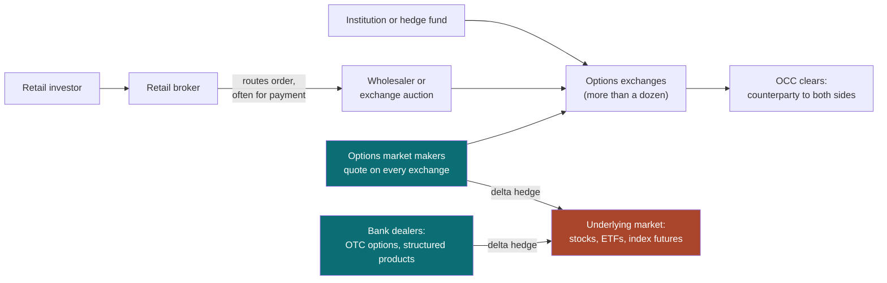
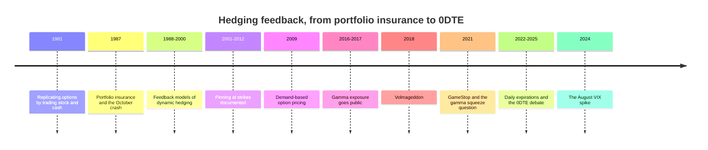
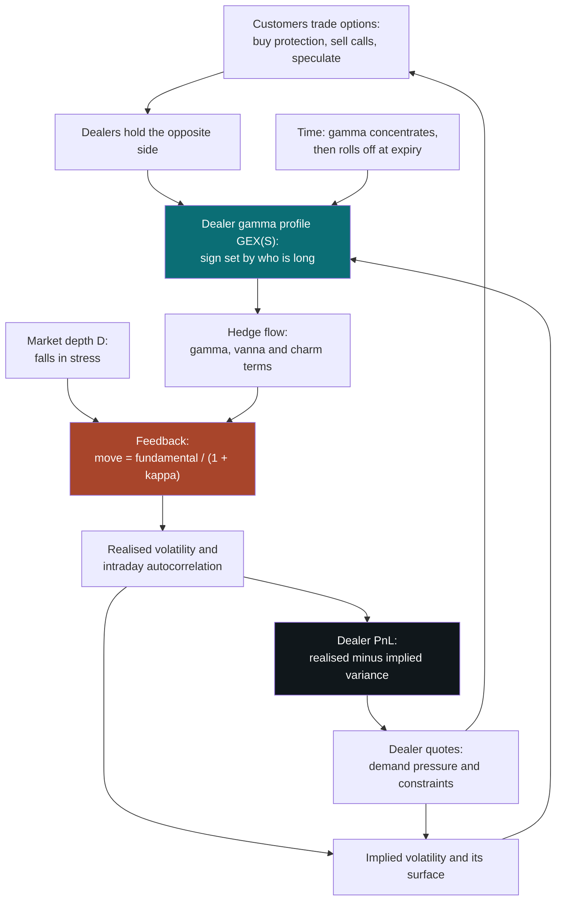
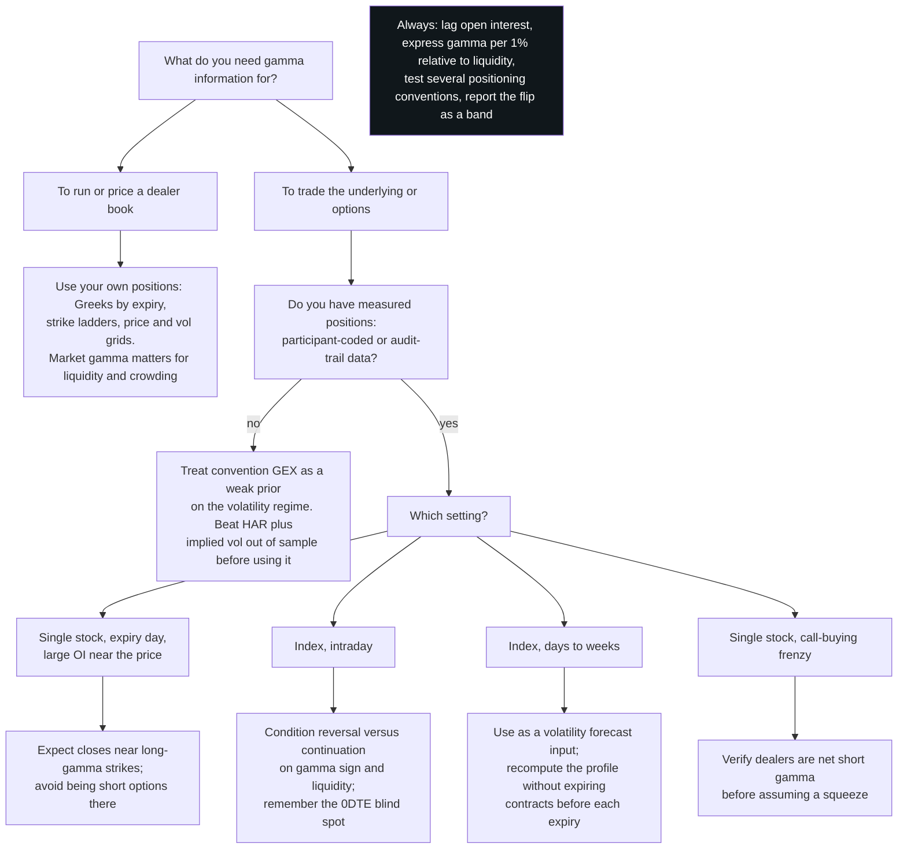

# Dealer Hedging and Gamma Exposure

### How options market makers hedge, what their hedging does to prices, and how to read it from either side of the trade

---

```{=html}
<aside class="eli5">
```

# ELI5 — the short version {#eli5}

```{=latex}
\begin{eli5}
```

**In one sentence.** Options dealers are forced traders — what they must buy or sell after a price move is dictated by their inventory rather than their opinion — and this document is about when that forced trading really moves the market and when the story is only a story.

**1. Why a dealer has to trade at all** ([§1](#1-market-makers-and-dealers), [§3](#3-value-and-greeks)). A market maker's job is to be the counterparty anyone can trade against, earning the spread, without taking a view. Sell you a call and it immediately buys shares to cancel the directional exposure. The catch is that an option's directional exposure *changes as the price moves* — the right hedge at 100 is not the right hedge at 101 — so the hedge has to be redone continually. The rate at which the required hedge changes is **gamma**, and the re-hedging is mechanical: position, price, time and volatility determine it, not judgement. That is what makes it possible to reason about at the level of the whole market.

**2. Two directions, and the whole argument hangs on which one you are in** ([§5](#5-the-gamma-quadrant)). A dealer who is *short* gamma must buy after a rise and sell after a fall, pushing the market the way it is already going. A dealer who is *long* gamma does the opposite — selling strength, buying weakness — and damps the move. Which applies depends on whether customers have been buying options from dealers or selling options to them.

**3. Options are in zero net supply** ([§2](#2-options-from-zero), [§6](#6-gamma-exposure)). For every long there is a short, so gamma across all holders sums to exactly zero. "The market is short gamma" is therefore never a fact about contracts; it is a claim about *who* is on each side, and that one side hedges while the other does not. This is the hinge of the entire subject and also its weakest link: published open interest says how many contracts exist and never who is long.

**4. The one piece of arithmetic** ([§4](#4-delta-hedging)). Hold an option, hedge it continuously, and your profit is gamma multiplied by the gap between how much the price actually moved and how much it was priced to move. There is a break-even move — about 1.05% a day at 20% volatility — and losses beyond it grow quadratically. The premium a short-gamma dealer collects each day is precisely the rent on that exposure.

**5. How large is the effect, really?** ([§7](#7-what-hedging-does-to-prices)). Hedging multiplies a price move by a factor that depends on dealer gamma divided by how much money it takes to shift the market 1%. Long gamma shrinks moves, short gamma magnifies them, and at the extreme the arithmetic runs away entirely. But the calibrated magnitudes are modest: \$5 billion of index gamma per 1% changes volatility by only 5–13%, and the study that used *measured* dealer positions found at most 3.3 points added to S&P daily volatility across 2020–2023. The direction is established; the size for broad indices is contested. Some of the correlation people quote also runs backwards — calm markets and positive gamma go together partly by construction.

**6. What is actually well documented** ([§8](#8-episodes)). Pinning: near expiry, single-stock prices really are drawn toward strikes with large open interest. It is the best-evidenced hedging effect in the field, and it occurs exactly where the mechanics should be strongest — small scale, specific strikes, close to expiry. The famous stories fare worse. In GameStop, position data showed market makers *buying* calls, which contradicts the gamma-squeeze narrative; in August 2024, dealers mattered through wider quotes and thinner liquidity rather than through hedging.

**7. Two traps in the popular version** ([§6](#6-gamma-exposure)). "Calls are positive gamma, puts are negative" is an assumption about who is long, not a property of the contracts — and once hedging starts, a dealer short calls and a dealer short puts make identical trades. And gamma-flip levels and "walls" are model outputs with wide error bands: getting the positioning assumption wrong does not add noise, it flips the sign — in the worked example, from plus 3.9 million dollars per 1% move to minus 63 million.

**8. What it is good for** ([§10](#10-how-traders-use-this)). A conditioning variable, not a signal. It says something about whether moves will be amplified or damped and whether the day will be choppy — never about direction — and to be worth anything it must beat a volatility forecast that already uses implied volatility. Most of its practical value is defensive: sizing, and not supplying liquidity into a hedging cascade.

---

**If you remember three things:** the hedging flow is real and mechanical, but only the *unmatched* side of it can move anything; every published gamma number rests on a guess about who is long, and that guess controls the sign; and the documented effects are small and local — pins near expiry — rather than the index-wide forces of market commentary.

```{=latex}
\end{eli5}
```

```{=html}
</aside>
```

---

**What this is.** A from-first-principles tutorial on the business of making
markets in options, on the dynamic hedging that business requires, and on the
claim — now repeated daily in market commentary — that the hedging of options
dealers moves the underlying market. "Dealers are short gamma", "we crossed the
gamma flip", "the pin at 6,000 should hold into expiry", "vanna and charm will
support the market after the Fed": these sentences compress a long chain of
reasoning, and each link in the chain can be stated precisely, checked, and in
places shown to be wrong. This document builds the chain one link at a time,
starting from what an option is.

**Who it is for.** A reader who is mathematically comfortable and technically
strong, but not an options specialist, and who wants to *use* this material:
to build a gamma-exposure estimate, to test whether it predicts anything, or
to reason about their own positions when the market is moved by someone else's
hedging. Nothing is assumed about options beyond the word. Every basic concept —
bid and ask, call and put, open interest, delta — is defined before it is used,
and every formula is preceded by what it means and followed by a number.

**How to read it.** The document has four parts, and they are cumulative.

- **Part I (§1–§3) — foundations.** What a market maker does and how it earns
  money; what an option is; how an option is priced by replication, and the
  sensitivities (the "Greeks") that fall out of the price. If you already trade
  options, skim §1.1, §2.5 and §3.9 — the rest will be familiar.
- **Part II (§4–§5) — hedging.** How a dealer neutralises the direction of an
  option position, the single identity that says what a hedged option earns,
  and the full quadrant of worked examples: a customer buying or selling a call
  or a put, and exactly what the dealer on the other side then does as the price
  moves.
- **Part III (§6–§8) — from one book to the market.** How individual positions
  aggregate into a market-wide gamma exposure, why that aggregate cannot be
  observed and must be inferred, what the hedging does to prices (the feedback
  multiplier, the gamma flip, expiry, pinning, charm and vanna, 0DTE options,
  squeezes), and what the historical episodes do and do not show.
- **Part IV (§9–§12) — using it.** How dealers use this information, how traders
  on the other side use it, how to compute and validate a gamma-exposure signal
  without fooling yourself, and a synthesis.

§13 is the reference list, grouped by kind. Appendix A collects every concept the
main text leans on without fully explaining, ordered so that it reads as a
build-up.

If you read four things, read **§4.4** (the identity that explains why dealers
hedge and what it costs them), **§5.7–§5.8** (the quadrant on one page, and why
call-versus-put does not matter for gamma), **§6.3** (why nobody actually knows
the sign of dealer gamma), and **§7.1–§7.3** (the feedback multiplier and how big
it realistically is).

**Relationship to the other notes.** [Simple and Log Returns](log_returns.html)
covers the return conventions used for volatility here. [Trend-Following in
Financial Markets](trend_following.html) derives the convexity of trend rules;
§5.10 shows that a trend follower and a short-gamma options dealer place the same
trades for opposite reasons. [Market Regimes and Machine Learning](market_regimes.html)
is the right frame for treating "the dealer gamma regime" as a conditioning
variable in §10 and §11. Each note stands alone.

**Epistemic tags.** Claims are flagged by status where the status changes what
you should do:

- **[Fact]** — replicated across independent datasets or implementations, with
  broad agreement among people who have looked.
- **[Contested]** — documented, but with live disagreement about magnitude,
  robustness, or cause.
- **[Hypothesis]** — a proposed mechanism, not decisively tested.
- **[Practice]** — practitioner convention. May well be right; the evidence is
  private or absent.

Untagged sentences are definitions, derivations, or arithmetic. Results from
simulations I ran while writing are labelled **[Simulated]**; the generating code
is committed alongside this document in `figures/dh_*.py`, and each script prints
the numbers quoted in the text, so you can change my parameters and rerun.

---

**Notation.** The **underlying** is the asset an option is written on — a stock,
an exchange-traded fund, an index, or a futures contract. $S$ (or $S_t$) is its
price, and a one-period **return** is $\Delta S / S$. An option has **strike**
$K$ and **expiry** $T$; $\tau = T - t$ is the time remaining, always measured in
years. $r$ is the risk-free interest rate and $q$ the underlying's dividend
yield; to keep the arithmetic clean, every worked example sets $r = q = 0$
unless it says otherwise.

$\sigma$ is **volatility**: the annualised standard deviation of log returns
(§3.1). Two versions must be kept apart. $\sigma_i$ is **implied** volatility,
the number that reproduces an option's market price (§3.7); $\sigma_r$ is
**realised** volatility, the number the price path actually delivers. Volatility
is quoted in percent, and a "vol point" is one percentage point of $\sigma$.

$V$ is the value of an option, $C$ a call and $P$ a put. $N(\cdot)$ is the
standard normal cumulative distribution function and $\varphi(\cdot)$ its
density. $d_1$ and $d_2$ are the Black–Scholes quantities of §3.3.

The option **Greeks** are partial derivatives of $V$, per option and per unit of
the underlying:

$$
\Delta = \frac{\partial V}{\partial S}, \qquad
\Gamma = \frac{\partial^2 V}{\partial S^2}, \qquad
\Theta = \frac{\partial V}{\partial t}, \qquad
\nu = \frac{\partial V}{\partial \sigma}, \qquad
\text{vanna} = \frac{\partial \Delta}{\partial \sigma}, \qquad
\text{charm} = \frac{\partial \Delta}{\partial t}.
$$

$\Theta$ and charm differentiate with respect to calendar time $t$ moving
forward, so $\partial/\partial t = -\partial/\partial \tau$. $\nu$ is vega; the
Greek letter nu stands in because "vega" is not a Greek letter.

$M$ is the **contract multiplier** — the number of units of the underlying one
contract controls, 100 for US equity and index options. $n$ is a signed position
in contracts (positive is long); $n^{D}$ is the position held by **dealers**, the
hedging intermediaries of §1. $\mathrm{OI}$ is open interest (§2.5).

At the market level, $\mathrm{GEX}(S)$ is **dealer gamma exposure** in dollars
per 1% move: the dollar value of the underlying that dealers must sell (if
positive) or buy (if negative) to stay hedged after a 1% rise in the price, as
defined in §6.1. $D$ is **market depth** in the same units — the dollars of
trading that move the price by 1% — and $\kappa = \mathrm{GEX}/D$ is the
dimensionless **feedback strength** of §7.1. $\Pi$ is the profit and loss (P&L)
of a hedged position, $\Delta t$ a hedging interval, and $N_h$ the number of
rehedges over an option's life.

One collision is held apart by typography throughout: $\Delta$ alone is the
Greek, while $\Delta S$ and $\Delta t$ are changes in price and in time.

---

## Table of contents

- [ELI5 — the short version](#eli5)

**Part I — Foundations**

1. [Market makers and dealers](#1-market-makers-and-dealers)
2. [Options from zero](#2-options-from-zero)
3. [What an option is worth, and how that value moves](#3-value-and-greeks)

**Part II — Hedging**

4. [Delta hedging, and the identity that governs it](#4-delta-hedging)
5. [The gamma quadrant](#5-the-gamma-quadrant)

**Part III — From one book to the market**

6. [Gamma exposure](#6-gamma-exposure)
7. [What hedging does to prices](#7-what-hedging-does-to-prices)
8. [Episodes: what history does and does not show](#8-episodes)

**Part IV — Using it**

9. [How dealers use this](#9-how-dealers-use-this)
10. [How traders on the other side use this](#10-how-traders-use-this)
11. [Measuring it yourself](#11-measuring-it-yourself)
12. [Synthesis](#12-synthesis)
13. [References](#13-references)

**Appendix**

- [A. Concepts and prerequisites](#appendix-a-concepts-and-prerequisites) — every
  idea the main text leans on without fully explaining, built from first
  principles and ordered by dependency.

---

```{=latex}
\newpage
```

# 1. Market makers and dealers {#1-market-makers-and-dealers}

## 1.1 The wrong intuition

The most common mental model of a market maker is a casino. You buy a call
option; somebody sold it to you; that somebody is "the house", and the house is
betting that the stock will not go up. If the stock rallies, the house loses and
you win. On this view, the options market is a set of bets between customers and
dealers, and a dealer with a large book of sold calls is a large bet against a
rally.

Almost every part of that picture is wrong, and the way it is wrong is the
subject of this document.

A market maker does not want your bet. What it wants is to be paid for
*immediacy* — for being there, with a price, at the moment you want to trade —
and then to get rid of the risk that trading with you created. Within seconds of
selling you a call, a well-run options market maker has bought shares of the
underlying stock (or futures on it) in the amount that makes its position
indifferent to small moves in the price. It no longer cares, to first order,
whether the stock goes up or down. What it now cares about is how *much* the
stock moves, how its position changes as it does, and how much it will cost to
keep re-neutralising that position until the option expires.

That re-neutralising is **dynamic hedging**, and it is not optional: it is the
price of being in the business without being a gambler. It is also mechanical. A
dealer's position, the price, the time to expiry and the volatility together
determine how many shares it must hold; when any of them changes, the dealer must
trade. Because the trades are forced by arithmetic rather than by opinion, and
because dealers as a group can hold very large option positions, the trades can
be large enough to move the market that is being hedged. That is the whole idea
behind "gamma exposure". Everything after this section is about making it
precise.

Two corrections to the casino picture follow immediately and are worth stating
before anything else.

1. **Dealers do not "want" the price to go anywhere.** Commentary routinely says
   that dealers "need" the market to fall, or "defend" a strike. A hedged dealer
   has no directional preference to defend. Its hedging trades have predictable
   *side effects* on prices, and those side effects can look like intent. They
   are not.
2. **The option contracts themselves do nothing to prices.** Options are side
   bets in zero net supply (§2.5): for every contract someone holds long,
   someone else holds it short. What can move the underlying is the *hedging* —
   and only the hedging done by one side that the other side does not offset.

## 1.2 What a market maker sells: immediacy

Start with the simplest market maker, one that trades a single stock and holds
no options.

At any moment it posts two prices. The **bid** is the price at which it will buy;
the **ask** (or **offer**) is the price at which it will sell. The ask is higher
than the bid, and the gap between them is the **bid–ask spread**. The average of
the two is the **midpoint** or **mid**, which is the usual working estimate of
what the stock is "really" worth right now. A quote of 99.98 bid, 100.02 offered
is written 99.98 / 100.02; the mid is 100.00 and the spread is 4 cents, or
4 basis points (a **basis point**, "bp", is one hundredth of a percent).

A customer who wants to sell immediately sells at the bid; one who wants to buy
immediately pays the ask. If one of each arrives, the market maker buys 1,000
shares at 99.98, sells 1,000 shares at 100.02, and has earned $40 without ever
holding a view on the stock. That is the business: **capture the spread, many
times a day, carrying as little risk in between as possible.**

The two customers did not have to arrive at the same moment, and that gap is
where both of a market maker's problems live.

**Problem one: inventory risk.** Suppose the seller arrives first. The market
maker now owns 1,000 shares that it did not want, and it owns them until a buyer
turns up. If the price falls by 30 cents in the meantime, the $40 spread becomes a
$260 loss. A market maker's holding of the thing it makes a market in is its
**inventory**, and the risk of holding it is **inventory risk**. [Ho and Stoll
(1981)](https://ideas.repec.org/a/eee/jfinec/v9y1981i1p47-73.html){target="_blank"} showed the natural defence: a dealer holding unwanted inventory shades
*both* quotes downward, making its bid less attractive (so fewer people sell to
it) and its offer more attractive (so more people buy from it), until the
inventory is worked off. A market maker's quotes are therefore not only a price;
they are an inventory-management tool. [Avellaneda and Stoikov (2008)](https://people.orie.cornell.edu/sfs33/LimitOrderBook.pdf){target="_blank"} turned the
same idea into the model most electronic market makers start from, in which the
quotes are centred not on the mid but on a **reservation price** that moves
against the inventory in proportion to the dealer's risk aversion, the variance
of the price, and the time left in the trading session.

**Problem two: adverse selection.** Suppose instead the seller knew something —
an earnings miss about to be announced — and the price drops to 99.50 a minute
later. The market maker bought at 99.98 from someone who knew the stock was worth
less. Trading with better-informed counterparties is **adverse selection**, and
it is the reason a spread exists even for a market maker that does not mind
risk: [Glosten and Milgrom (1985)](https://milgrom.people.stanford.edu/wp-content/uploads/1984/09/Bid-Ask-and-Transaction-Prices.pdf){target="_blank"} showed that if some fraction of order flow is
informed, a competitive market maker must set a spread wide enough that what it
earns from uninformed traders covers what it loses to informed ones. [Kyle
(1985)](https://www.jstor.org/stable/1913210){target="_blank"} added the matching idea on the price side: when market makers cannot tell
informed from uninformed orders, every order moves the price a little, in
proportion to its size. The slope of that relation — how far the price moves per
unit traded — is **Kyle's lambda**, and it will reappear in §7 as the price impact
of dealers' own hedging trades.

Put together: **a market maker earns the spread, loses on inventory it cannot
offload, and loses to counterparties who know more than it does.** Everything a
market maker does — how it quotes, how fast it hedges, when it widens its spread
or pulls its quotes entirely — is a trade-off between those three quantities.
[Fact] These are the foundational results of market microstructure, surveyed in
[Biais, Glosten and Spatt (2005)](https://www.sciencedirect.com/science/article/pii/S1386418104000382){target="_blank"}, and the evidence that dealer inventory moves
prices is direct: [Hendershott and Menkveld (2014)](http://faculty.haas.berkeley.edu/hender/price_pressures.pdf){target="_blank"}, using New York Stock
Exchange intermediary data, estimate that inventory-driven price pressure averages
0.49% with a half-life of under a day.

## 1.3 An options market maker's version of the same problem

An options market maker faces the same three quantities, with one change that
alters everything: its inventory is not shares but *options*, and the risk of an
option position does not stay put.

If a stock market maker is long 1,000 shares, its exposure to a $1 move is $1,000
whether the stock is at 100 or at 110. If an options market maker sells 10 call
contracts, its exposure to a $1 move is about $511 at a stock price of 100, and
about $648 a day later if the price has moved to 102 (§5.3 works this out). The
exposure changes *because the price changed*. Neutralising the exposure once is
not enough; it must be done again every time the price moves, and every time a
day passes, and every time the
market's estimate of volatility changes. The quantity that governs how fast the
exposure changes with the price is **gamma**, and a dealer's problem is gamma
management in the way a stock market maker's problem is inventory management.

The three quantities of §1.2 survive, transformed:

| Stock market maker | Options market maker |
|------------------|----------------------------------------|
| Earns the bid–ask spread on shares | Earns the bid–ask spread on options, plus or minus the difference between the volatility it sold (or bought) and the volatility that is realised (§4.4) |
| Inventory risk: holding shares it does not want | Delta risk, hedged continuously; gamma, vega and jump risk that hedging the underlying cannot remove (§4.9) |
| Adverse selection: informed traders | Informed traders in the options *and* in the underlying; the options market is a venue where informed traders act ([Easley, O'Hara and Srinivas, 1998](https://www.ssrn.com/abstract=98724){target="_blank"}; [Pan and Poteshman, 2006](https://www.mit.edu/~junpan/volume.pdf){target="_blank"}) |
| Shades quotes against inventory | Shades option quotes against its *Greeks* — against accumulated gamma and vega, not just contract counts (§9.2) |

The second row carries the weight. An options market maker cannot get rid of all
of its risk by trading the underlying; it can only get rid of the first-order,
directional part of it. What remains is priced into option spreads — [Jameson and
Wilhelm (1992)](https://onlinelibrary.wiley.com/doi/abs/10.1111/j.1540-6261.1992.tb04409.x){target="_blank"} found that the risks of discrete rebalancing and uncertain
volatility explain a significant share of quoted spreads on Chicago Board Options
Exchange options — and it is what the rest of Part II is about.

## 1.4 Market maker, dealer, liquidity provider: names that overlap

The words in this area are used loosely, sometimes interchangeably, sometimes
with precise legal meanings. What matters for this document is behaviour, not
registration, but the labels are worth sorting out.

| Term | What it usually means | Relevance here |
|--------------|----------------------------|----------------------------|
| **Market maker** | A firm registered with an exchange that has an obligation to post two-sided quotes in some set of products, in exchange for fee rebates or priority | Options market makers ("OMMs") are the core hedgers |
| **Dealer** | A firm that trades as *principal* — for its own account — rather than as an agent for a customer; covers exchange market makers and bank derivatives desks | In gamma-exposure language, "dealer" means *whoever is on the other side of customer option trades and hedges them*. I follow that usage |
| **Liquidity provider** | Anyone who posts resting orders that others trade against, whether obligated or not | Broader than market makers; includes proprietary trading firms that are not registered market makers |
| **Specialist / designated market maker** | The single firm with special obligations in a listed stock on some exchanges | Historical background; not central to options |
| **Wholesaler / internaliser** | A firm that executes retail brokerage orders against its own inventory, typically paying the broker for the flow | In US options, the same large firms are often both wholesalers and exchange market makers |
| **Intermediary** | The academic umbrella term for dealers and market makers together | Used by the demand-pressure and intermediary-constraint literature (§6.3, §9.6) |
| **End user / customer** | Everyone else: institutions, retail investors, hedge funds, corporations | The side whose positions are *not* assumed to be dynamically hedged |

The large options market makers in the United States are a small group of
specialised trading firms — names such as Citadel Securities, Susquehanna, Optiver,
IMC, Jane Street and Wolverine recur — alongside the derivatives desks of the major
banks, which dominate over-the-counter (off-exchange) options and structured
products. The defining property for everything that follows is not the legal
category. It is this: **a dealer is a participant who hedges its option
position mechanically in the underlying.** An end user is one who, as a modelling
assumption, does not.

## 1.5 Who trades with whom in listed options

A listed option in the United States is traded on one of more than a dozen
competing exchanges, and every trade is **cleared** by the Options Clearing
Corporation (OCC), which becomes the legal counterparty to both sides: the buyer
holds a contract against the OCC, and so does the seller. That is what makes
listed options safe to trade with strangers. It also means that, legally, nobody
holds an option "against" a particular dealer; economically, though, every long
position was created by somebody's short one, and the question "who is short?"
is the question this document keeps returning to.

Each trade is tagged by the exchange with the **capacity** of each side — broadly,
*customer*, *professional customer*, *broker-dealer* (a firm's own account) and
*market maker* — and as **opening** (creating a new position) or **closing**
(reducing an existing one). Those tags are the raw material for measuring who
holds what, and they are mostly not public in real time. §6.3 and §11.2 describe
what is available.

```{=latex}
\newpage
```

The flow of a typical trade looks like this:



Three features of this picture matter later.

- **The hedging lands in a different market from the option.** An S&P 500 index
  option is traded on Cboe, but the dealer who sold it hedges with S&P 500 futures
  on the CME, with SPY exchange-traded fund shares, or with baskets of stocks.
  Gamma exposure is a claim that trading in one market (options) mechanically
  generates trading in another (the underlying).
- **Bank dealers are invisible to exchange data.** Over-the-counter options,
  variance swaps and structured notes create hedging needs that appear in no
  public open-interest file. Any gamma-exposure estimate built from listed open
  interest is blind to them. [Fact]
- **Retail flow is intermediated.** Most retail option orders reach an exchange
  through a broker that routes them to a wholesaler or into a price-improvement
  auction. The SEC's staff report on the January 2021 meme-stock episode ([SEC, 2021](https://www.sec.gov/files/staff-report-equity-options-market-struction-conditions-early-2021.pdf){target="_blank"}) is the best single public description of this structure, and §8.5
  returns to what it found.

> ### §1 Key takeaways
>
> 1. A market maker sells immediacy and earns the bid–ask spread; it does not want
>    directional bets and neutralises them as fast as it can.
> 2. Its two enemies are inventory risk (holding what it did not want) and adverse
>    selection (trading with people who know more). Its quotes are tools for
>    managing both.
> 3. An options market maker's inventory is options, whose directional exposure
>    changes every time the price moves. Neutralising it once is not enough;
>    it must hedge *dynamically*, and the rate at which the exposure changes is
>    gamma.
> 4. Dynamic hedging is mechanical — forced by position, price, time and
>    volatility — and therefore predictable in direction, which is why it can be
>    reasoned about at the market level.
> 5. Options are in zero net supply. The contracts themselves do nothing to the
>    underlying; only the hedging of one side, unoffset by the other, can.
> 6. "Dealer" in this document means whoever is on the other side of customer
>    option trades *and hedges them*. Bank dealers' over-the-counter positions
>    create hedging that no public data captures.

---

# 2. Options from zero {#2-options-from-zero}

## 2.1 The contract

An **option** is a contract that gives its holder a right without an obligation.

- A **call option** gives the holder the right to **buy** the underlying at a fixed
  price, the **strike** $K$, on or before a fixed date, the **expiry** $T$.
- A **put option** gives the holder the right to **sell** the underlying at the
  strike, on or before expiry.

The holder pays for this right up front. The price is the **premium**. The holder
is said to be **long** the option, or to have **bought** it; the other side, who
received the premium and took on the obligation to deliver (for a call) or to
take delivery (for a put) if the holder chooses, is **short** the option, or has
**sold** or **written** it. Deciding to use the right is **exercising** the
option; being on the short side when that happens is being **assigned**.

A holder exercises only when it pays to. A call with strike 100 is worth
exercising at expiry if the underlying trades above 100, because the holder buys
at 100 something worth more; otherwise it is thrown away. So the call's value at
expiry — its **payoff** — is

$$
C_T = \max(S_T - K,\ 0), \qquad P_T = \max(K - S_T,\ 0),
$$

where $S_T$ is the underlying's price at expiry and $P_T$ is the matching payoff of
a put. Read them as: *the call pays the amount by which the price finishes above
the strike, or nothing; the put pays the amount by which it finishes below, or
nothing.*

Listed equity and index options in the United States have a **contract
multiplier** $M = 100$: one contract controls 100 shares (or 100 times the index
level), and prices are quoted per unit. An option quoted at $2.29 therefore costs
$229 per contract. Every position size in this document is stated either in contracts
or in options — one option being the claim on a single unit of the underlying, so 10
contracts are 1,000 options — and it says which.

## 2.2 Exercise and settlement

Two contract features look like administrative detail and turn out to matter a
great deal for hedging flows near expiry (§7.7).

**Exercise style.** An **American** option can be exercised at any time up to
expiry. A **European** option can be exercised only at expiry. US single-stock
options and exchange-traded fund (ETF) options such as those on SPY and QQQ are
American; options on the S&P 500 index itself (ticker SPX) are European.

**Settlement.** A **physically settled** option delivers the underlying: exercising
a stock call means actually receiving 100 shares per contract and paying the
strike. A **cash-settled** option pays the difference between the settlement price
and the strike in cash. Stock and ETF options are physically settled; index
options, which have no deliverable, are cash-settled.

**Settlement price and timing.** Index options add one more wrinkle. The standard
monthly SPX contracts, expiring on the third Friday of the month, are **AM-settled**:
they stop trading on Thursday, and their final value is computed from the
*opening* prices of the index's component stocks on Friday morning. The weekly and
daily SPX contracts (ticker SPXW) are **PM-settled** at Friday's — or that day's —
closing value. SPXW expirations now exist for every trading day of the week; the
Tuesday and Thursday expirations were added in April and May 2022, which is what
made **zero-days-to-expiry (0DTE)** trading possible every day (§7.9).

**Automatic exercise and pin risk.** At expiry, the OCC automatically exercises
any listed option that is in the money by at least a cent, unless its holder
instructs otherwise. For physically settled options, holders may submit or
reverse exercise instructions for some time *after* the closing bell. If a stock
closes almost exactly at a strike, a dealer who is short that strike does not
know until the next morning whether it has been assigned — whether it will wake
up owning, or short, a block of shares it did not plan to have. That uncertainty
is **pin risk**, and it is one reason dealers manage their positions around large
strikes in the final hours before expiry (§9.5).

## 2.3 The four basic positions

There are two kinds of option and two sides to each trade, so there are four basic
positions. They are the four corners of the quadrant that organises §5, and it is
worth fixing their payoffs and profits now.

**Profit and loss (P&L)** is the payoff minus what was paid, or plus what was
received. Take a strike of 100 and a premium of $2.29 for both the call and the
put (the value §3.3 derives for a 30-day option at 20% volatility). At expiry,
per option:

| Price at expiry $S_T$ | 80 | 90 | 95 | 100 | 105 | 110 | 120 |
|--------------------------------------------|------:|------:|------:|------:|------:|------:|------:|
| **Long call**: $\max(S_T-100,0) - 2.29$ | −2.29 | −2.29 | −2.29 | −2.29 | +2.71 | +7.71 | +17.71 |
| **Short call**: $2.29 - \max(S_T-100,0)$ | +2.29 | +2.29 | +2.29 | +2.29 | −2.71 | −7.71 | −17.71 |
| **Long put**: $\max(100-S_T,0) - 2.29$ | +17.71 | +7.71 | +2.71 | −2.29 | −2.29 | −2.29 | −2.29 |
| **Short put**: $2.29 - \max(100-S_T,0)$ | −17.71 | −7.71 | −2.71 | +2.29 | +2.29 | +2.29 | +2.29 |

Four features of this table carry forward.

1. **Long and short are exact mirror images.** Every dollar one side makes, the
   other loses. Options are a zero-sum transfer between the two sides *before*
   counting hedging and costs.
2. **The buyer's loss is capped; the seller's is not (or barely).** A long option
   can lose at most its premium. A short call can lose without limit as the price
   rises; a short put can lose up to the strike minus the premium.
3. **Calls profit from rises and puts from falls — for the holder.** The long call
   breaks even at 102.29, the long put at 97.71.
4. **The kink.** Every payoff is two straight lines joined at the strike. That kink
   is where all of the interesting behaviour of options comes from: before expiry
   the kink is smoothed into a curve, and the *curvature* of that curve is gamma.

The figure shows the four positions twice: dashed at expiry, and solid as they
would be valued if the price moved *now*, 30 days before expiry. The solid curves
are smooth versions of the dashed ones. Their slope at today's price is **delta**,
their curvature is **gamma**, and the small annotations say how many shares a
holder of one contract would trade to neutralise that slope — the hedge that §4
develops.

```{=latex}
\begin{center}
\includegraphics[width=0.92\linewidth]{quant-research/figures/dh_payoffs.pdf}
\end{center}
```

```{=html}
<style>
/* Figures for this document. Prefix "mdd-", shared with the other notes and
   distinct from the reading widget's "rdw-". Narrow viewports reclaim the
   body's side padding so the figure gets the full width. */
.mdd-fig {
  display: block; width: 100%; height: auto;
  max-width: 680px; margin: 1.6rem auto;
  /* the reading widget adds a light plate (padding) in dark mode */
  box-sizing: border-box;
}
@media (max-width: 760px) {
  .mdd-fig { width: calc(100% + 64px); max-width: none; margin-left: -32px; margin-right: -32px; }
}
@media (max-width: 600px) { /* pandoc's own stylesheet drops body padding to 12px here */
  .mdd-fig { width: calc(100% + 24px); margin-left: -12px; margin-right: -12px; }
}
</style>


```

Look at the curvature, not the slope. The two *long* positions curve upward — a
smile — whether they are calls or puts. The two *short* positions curve downward —
a frown. Call versus put decides which way the curve slopes; long versus short
decides which way it bends. That observation, made precise in §2.6 and §5.1, is
the most important sign rule in this document.

## 2.4 Moneyness, intrinsic value and time value

Traders describe an option by where the underlying stands relative to the strike.

- A call is **in the money (ITM)** when $S > K$, **out of the money (OTM)** when
  $S < K$, and **at the money (ATM)** when $S \approx K$. For a put, the
  inequalities reverse.
- **Intrinsic value** is what the option would pay if exercised now:
  $\max(S-K, 0)$ for a call, $\max(K-S, 0)$ for a put.
- **Time value** (or **extrinsic value**) is the premium minus the intrinsic value:
  what the holder pays for the possibility that the price moves further in its
  favour before expiry.

At $S = 100$, a 95-strike call is in the money with intrinsic value 5; §3 prices
it at 5.57, so it carries 0.57 of time value. The 95-strike put is out of the
money, has no intrinsic value, and its entire premium of 0.57 is time value. The
at-the-money 100 strike has zero intrinsic value and the largest time value of
all, 2.29. **Time value is largest at the money** — where the outcome is most
uncertain — and it is the part of the premium that decays to nothing by expiry
(§3.6).

Practitioners also label strikes by **delta** rather than by price: a "25-delta
put" is the put whose delta (§3.4) is −0.25, wherever that strike happens to lie.
Delta works as a moneyness coordinate that adjusts automatically for volatility and
time to expiry, which is why volatility surfaces and positioning reports are often
organised by it.

## 2.5 Open interest: every long has a short

Two numbers describe how much an option is traded, and they are easy to confuse.

- **Volume** is the number of contracts that changed hands during a day.
- **Open interest (OI)** is the number of contracts *outstanding* — created and not
  yet closed — at the end of a day.

A trade can create, transfer, or destroy open interest, depending on whether each
side is **opening** (establishing a position) or **closing** (unwinding one):

| Day | Trade | Buyer | Seller | Volume | Change in OI | OI after |
|----|--------------------|------------------|------------------|------:|------:|------:|
| 1 | A buys 10 calls from B | A opens (now long 10) | B opens (now short 10) | 10 | +10 | 10 |
| 2 | C buys 5 calls from A | C opens (long 5) | A closes (long 5) | 5 | 0 | 10 |
| 3 | B buys 5 calls from C | B closes (short 5) | C closes (flat) | 5 | −5 | 5 |

After day 3, A is long 5 and B is short 5. Open interest is 5, and total volume
over the three days was 20.

Now the fact that the rest of this document is built on:

> **Options are in zero net supply.** Every contract of open interest is one long
> position and one short position. Summed over *everybody*, the net position in
> every option is exactly zero — and therefore so is the net delta, the net gamma
> and every other Greek.

It follows that "the market is long gamma" is meaningless as a statement about all
holders together. A claim about gamma exposure is always a claim about **one group**
of holders — the dealers — whose gamma is offset by an equal and opposite gamma
held by everyone else. It can only matter for prices if the two groups **behave
differently**: if dealers hedge dynamically and the other side, as a group, does
not. That behavioural asymmetry is the load-bearing assumption of every gamma
exposure model, and §6.3 examines it.

Open interest is published once a day, after the OCC processes the day's trades,
so the figure available at the start of a trading day describes positions as of
the previous close. It says how many contracts exist, never who holds which side.
Both facts return in §6.3 and §11.

## 2.6 Put–call parity: the first equivalence

A call and a put with the same strike and expiry look like opposites. They are
more closely related than that: each can be built from the other.

Compare two portfolios, holding European options on a stock that pays no dividend,
with zero interest rates:

- **Portfolio A:** one call, plus $K$ in cash.
- **Portfolio B:** one put, plus one share of the stock.

At expiry, if $S_T > K$, portfolio A exercises the call and is worth $S_T$;
portfolio B's put expires worthless and it holds a share worth $S_T$. If
$S_T \le K$, A lets the call lapse and holds $K$ in cash; B exercises the put,
selling its share for $K$. **Both portfolios are worth $\max(S_T, K)$ in every
state of the world.** If two portfolios have identical payoffs in every state,
they must cost the same today, or anyone could buy the cheap one, sell the dear
one, and pocket the difference at no risk. So

$$
C + K = P + S
\qquad\Longleftrightarrow\qquad
C - P = S - K .
$$

With interest rates and dividends the same argument gives
$C - P = S e^{-q\tau} - K e^{-r\tau}$. This is **put–call parity**, stated in this
form by [Stoll (1969)](https://onlinelibrary.wiley.com/doi/abs/10.1111/j.1540-6261.1969.tb01694.x){target="_blank"}. The numbers of §2.3 obey it: the 100-strike call and put
both cost 2.29 and $S - K = 0$; the 95-strike call costs 5.57 and the 95-strike put
0.57, and their difference is exactly $100 - 95 = 5$.

Differentiate parity with respect to the underlying price — once for delta, again
for gamma — and with respect to volatility for vega, since the right-hand side
$S - K$ has no $\sigma$ in it. All three consequences for hedging appear at once:

$$
\Delta_C - \Delta_P = 1, \qquad \Gamma_C = \Gamma_P, \qquad \nu_C = \nu_P .
$$

**A call and a put with the same strike and expiry have exactly the same gamma and
the same vega.** Their deltas differ by exactly one share. A long call is a long put
plus one share of stock; once you hedge away the delta, the share disappears into
the hedge, and **a delta-hedged call and a delta-hedged put are the same position.**
§5.8 shows this numerically, trade for trade. It is the reason that, for gamma
exposure, the question "calls or puts?" is secondary to "who is long?".

Parity holds exactly for European options such as SPX, up to financing and
dividend assumptions. For American options it becomes a pair of inequalities,
because early exercise has value, and prices can deviate from it visibly when the
stock is hard to borrow. GameStop options in January 2021 are the extreme example;
[Hilliard and Hilliard (2023)](https://papers.ssrn.com/sol3/papers.cfm?abstract_id=3911491){target="_blank"} find that the apparent violations there are largely
accounted for by the costs of short selling rather than free money. The gamma
equivalence survives these frictions approximately. [Fact]

> ### §2 Key takeaways
>
> 1. A call is the right to buy at the strike, a put the right to sell. The holder
>    is long and paid a premium; the writer is short and received it. Listed
>    contracts control 100 units of the underlying.
> 2. Payoffs are kinked at the strike. Before expiry the kink is a curve: its slope
>    is delta, its curvature is gamma.
> 3. Long positions curve up and short positions curve down, whether they are calls
>    or puts. Call versus put sets the slope; long versus short sets the curvature.
> 4. Exercise style and settlement are not details: AM versus PM settlement,
>    physical delivery and automatic exercise shape the flows on expiry day and
>    create pin risk for dealers.
> 5. Open interest counts contracts outstanding, published once a day, and never
>    says who is long.
> 6. Options are in zero net supply, so aggregate gamma across all holders is zero.
>    Gamma exposure is only meaningful for one group — dealers — and only matters if
>    that group hedges while the other side does not.
> 7. Put–call parity makes a same-strike call and put interchangeable up to a share
>    of stock: identical gamma, identical vega, deltas one apart.

---

# 3. What an option is worth, and how that value moves {#3-value-and-greeks}

## 3.1 Volatility: the input you cannot see

An option's payoff depends on where the price ends up, and nobody knows that.
What turns out to matter for its value is not *which way* the price is likely to
go but *how far* it is likely to wander. The measure of that wandering is
volatility.

Let the **log return** over a period be $\ln(S_{t+1}/S_t)$ — for small moves,
almost identical to the percentage change. If log returns over successive days are
independent with standard deviation $\sigma_{\text{day}}$, the variance of the sum
of $n$ days' returns is $n\,\sigma_{\text{day}}^2$, so the standard deviation grows
with the **square root** of time:

$$
\sigma_{n\ \text{days}} = \sigma_{\text{day}} \sqrt{n}.
$$

**Volatility** $\sigma$ is this standard deviation scaled to one year. With about
252 trading days in a year, $\sigma = \sigma_{\text{day}}\sqrt{252}$, and since
$\sqrt{252} \approx 16$, practitioners use the **rule of 16**: an annual volatility
of 16% means a typical daily move of about 1%. A stock with 20% volatility moves
about 1.26% on a typical day, and about $20\% \times \sqrt{30/365} = 5.7\%$ over the
30 calendar days of the option priced below. [Simple and Log
Returns](log_returns.html) derives why log returns are the natural unit here.

Two volatilities must be kept apart from the start, and the difference between
them is where options market making earns or loses its money:

- **Realised volatility** $\sigma_r$ is measured after the fact from the price path.
- **Implied volatility** $\sigma_i$ is the volatility that makes a pricing model
  reproduce an option's market price (§3.7). It is the market's price for
  future volatility, not a measurement of it.

## 3.2 Replication: why an option can be priced at all

Here is the central idea of option pricing, in a world simple enough to check by
hand.

A stock is at 100. Tomorrow it will be at 110 or at 90. A call with strike 100 will
pay 10 if the stock rises and 0 if it falls. What is the call worth today?

The naive answer — the expected payoff, which needs the probability of a rise — is
not the answer. Instead, try to **manufacture** the call. Buy $h$ shares and hold
$b$ dollars of cash (borrowing if $b$ is negative; take the interest rate to be
zero). Tomorrow this portfolio is worth $110h + b$ or $90h + b$. Choose $h$ and $b$
so it pays exactly what the call pays:

$$
110h + b = 10, \qquad 90h + b = 0
\qquad\Longrightarrow\qquad
h = \frac{10 - 0}{110 - 90} = 0.5, \qquad b = -45 .
$$

Half a share and a loan of 45 reproduce the call in both states. The portfolio
costs $0.5 \times 100 - 45 = 5$ today, so the call must cost 5. If it sold for 6,
you could sell the call, build the portfolio for 5, and keep 1 with no risk;
if it sold for 4, you would do the reverse. **The probability of a rise never
entered the calculation.** Whether the stock is 90% or 10% likely to go up, anyone
can manufacture the call for 5, so nobody pays more.

The number of shares in the replicating portfolio, $h = 0.5$, is the **hedge
ratio**, and it is the option's **delta**. A dealer who *sells* this call for 5 and
*buys* half a share, borrowing the difference, has no risk at all: whatever
happens, its shares and loan exactly cover what it owes on the call.

Now add a second day. From 110 the stock goes to 120 or 100; from 90, to 100 or 80.
The call pays 20, 0 or 0. Work backwards through the tree, replicating one step at a
time:

| Node | Next prices | Call pays next | Hedge $h$ | Call value |
|---|---|---|---:|---:|
| After a rise, $S = 110$ | 120 or 100 | 20 or 0 | 1.0 | 10 |
| After a fall, $S = 90$ | 100 or 80 | 0 or 0 | 0.0 | 0 |
| Today, $S = 100$ | 110 or 90 | 10 or 0 | 0.5 | 5 |

The hedge that was 0.5 today becomes **1.0 after a rise** and **0.0 after a fall**.
To stay hedged, the dealer who sold the call must *buy* another half share after
the price goes up, at 110, and *sell* its half share after the price goes down, at
90. It buys high and sells low, every time. Follow any path through the tree —
up-then-down, down-then-up, up-up, down-down — and net the shares' gain or loss
against what the dealer then owes on the call, and the result is a loss of exactly
5 on every path. (Check the extreme case: on up-up, the shares alone *gain*
$0.5\times10 + 1.0\times10 = 15$, but the call finishes owing 20 — still a net of
$-5$.) The premium it collected was 5, so the hedge exactly breaks even.

That is the whole theory of option pricing in one sentence: **an option's time
value is the cost of the rebalancing its replication requires.** The rate at which
the hedge must change as the price moves is **gamma**. In this toy tree the cost
is the same on every path; in a real market it is not, and the gap between the
rebalancing cost the premium assumed and the one actually incurred is the
subject of §4.

## 3.3 The Black–Scholes formula, read as a recipe

Shrink the tree's steps towards zero, letting the price follow a random walk in
log returns with constant volatility $\sigma$, and replication still works: at
every instant there is a number of shares that makes the hedged position riskless
over the next instant. The replication cost becomes a closed form, derived by
[Black and Scholes (1973)](https://www.journals.uchicago.edu/doi/10.1086/260062){target="_blank"} and [Merton (1973)](https://www.maths.tcd.ie/~dmcgowan/Merton.pdf){target="_blank"}. For a European call and put on an
underlying paying dividend yield $q$, with interest rate $r$:

$$
\begin{aligned}
C &= S e^{-q\tau} N(d_1) - K e^{-r\tau} N(d_2), \\
P &= K e^{-r\tau} N(-d_2) - S e^{-q\tau} N(-d_1), \\
d_1 &= \frac{\ln(S/K) + (r - q + \tfrac12 \sigma^2)\,\tau}{\sigma\sqrt{\tau}},
\qquad d_2 = d_1 - \sigma\sqrt{\tau}.
\end{aligned}
$$

Read the call formula as the recipe it is: **hold $e^{-q\tau}N(d_1)$ shares and
borrow $K e^{-r\tau} N(d_2)$ in cash.** $N(d_1)$ is the hedge ratio of §3.2, grown
up. $N(d_2)$ has its own reading: it is the probability that the call finishes in
the money under the **risk-neutral** probabilities — the probabilities that price
assets as if no investor demanded compensation for risk, which Appendix A explains.
The quantity $\sigma\sqrt{\tau}$ is the standard deviation of the log return over
the option's remaining life, and $d_1$ and $d_2$ measure the distance from the
strike in units of it.

Take the example used throughout this document: $S = K = 100$, $\sigma = 20\%$,
$\tau = 30/365$, $r = q = 0$. Then $\sigma\sqrt{\tau} = 0.0573$,
$d_1 = 0.0287$, $d_2 = -0.0287$, $N(d_1) = 0.51144$ and $N(d_2) = 0.48856$, so

$$
C = 100 \times (0.51144 - 0.48856) = 2.29 .
$$

By put–call parity with $S = K$, the put also costs 2.29. Those are the premiums
of §2.3.

The model's assumptions are all false in some respect, and the ways they fail are
the ways hedging fails (§4.9). Volatility is not constant; it varies over time
and across strikes. Prices gap, especially overnight and on news, so trading is
not continuous. Trading costs money. Returns have fatter tails than the lognormal
distribution allows. [Fact] The formula survives anyway because markets use it as
a *language*: options are quoted in the volatility that makes the formula match
the price (§3.7), and dealers compute their hedges from the formula evaluated at
those volatilities. [Practice]

## 3.4 Delta

**Delta** is the sensitivity of the option's value to the underlying price,
$\Delta = \partial V / \partial S$. From the formula (with $q = 0$):

$$
\Delta_C = N(d_1) \in (0, 1), \qquad \Delta_P = N(d_1) - 1 \in (-1, 0).
$$

Across strikes, for our 30-day, 20%-volatility option on a stock at 100:

| Strike | 90 | 95 | 100 | 105 | 110 |
|---|---:|---:|---:|---:|---:|
| Call delta | 0.969 | 0.822 | 0.511 | 0.205 | 0.051 |
| Put delta | −0.031 | −0.178 | −0.489 | −0.795 | −0.949 |

Delta has three readings, and all three are useful.

1. **Slope.** A $1 rise in the stock raises the at-the-money call by about $0.51
   and lowers the put by about $0.49.
2. **Hedge ratio.** A holder of one call is exposed like a holder of 0.511 shares;
   selling 0.511 shares neutralises that exposure for small moves.
3. **Rough probability.** Delta is close to the (risk-neutral) probability of
   finishing in the money — exactly $N(d_2)$ for that, which is near $N(d_1)$ for
   short-dated options. A 5-delta option is a long shot.

A **position delta** multiplies by the number of contracts and the multiplier:
10 contracts of the at-the-money call carry $10 \times 100 \times 0.5114 = 511.4$
**share-equivalents** of delta, and 10 short contracts carry −511.4. Multiplying by
the price gives **dollar delta**: $511.4 \times \$100 = \$51{,}140$ of stock
exposure.

## 3.5 Gamma

**Gamma** is the rate at which delta changes as the price changes,
$\Gamma = \partial \Delta / \partial S = \partial^2 V / \partial S^2$ — the
curvature of the solid curves in the §2.3 figure. For calls and puts alike (§2.6):

$$
\Gamma = \frac{e^{-q\tau}\,\varphi(d_1)}{S\,\sigma\sqrt{\tau}} .
$$

For the at-the-money 30-day option, $\Gamma = 0.0695$: when the stock rises from
100 to 101, the call's delta rises from 0.511 to about 0.580. For 10 contracts,
that is $1{,}000 \times 0.0695 = 69.5$ shares of delta per $1 move — the number of
shares a hedger must trade after each $1 move to stay neutral. A **long** option
position has **positive** gamma; a **short** position has **negative** gamma; that
is true of calls and puts equally.

The formula has $\sigma\sqrt{\tau}$ in the denominator, and three consequences follow
that recur for the rest of this document.

**Gamma is concentrated near the strike.** $\varphi(d_1)$ is largest when $d_1 = 0$,
so gamma peaks close to the money and falls away on both sides.

**Gamma explodes into expiry, near the strike.** As $\tau \to 0$ the at-the-money
gamma grows like $1/\sqrt{\tau}$, while the band of prices over which gamma is
large narrows. The same at-the-money option has gamma 0.0695 with 30 days left,
0.144 with 7, 0.381 with 1 and 0.762 with a quarter of a day.

**Away from the strike, gamma peaks and then dies.** An option whose strike is a
log distance $x = |\ln(S/K)|$ from the price has gamma that *rises* as expiry
approaches only until the remaining standard deviation shrinks to that distance,
and then *collapses* to zero: the option is now almost certain to expire worthless
(or almost certain to be exercised), so its delta is pinned at 0 (or ±1). The peak
comes where $\sigma\sqrt{\tau} = x$ — maximising $\varphi(d_1)/\sqrt{\tau}$ over $\tau$
gives

$$
\tau^\star \approx \frac{x^2}{\sigma^2} .
$$

For a strike 2% away at 20%
volatility the peak comes 3.6 days before expiry; for 5%, 21.7 days before.

```{=latex}
\begin{center}
\includegraphics[width=\linewidth]{quant-research/figures/dh_greeks_expiry.pdf}
\end{center}
```

```{=html}

```

**Low volatility means high, narrow gamma.** Gamma at the money is inversely
proportional to $\sigma$. In a calm market with implied volatility of 12%, the same
open interest carries about two-thirds more at-the-money gamma than at 20%, packed
into a narrower range of prices. This is purely mechanical, and it matters when
interpreting data: gamma exposure estimates will read high in calm markets partly
*because* the market is calm, whatever the effect of hedging on calm itself. §10.1
returns to this confound.

## 3.6 Theta, and why it is gamma's mirror image

**Theta** is the change in an option's value as time passes with everything else
held fixed, $\Theta = \partial V / \partial t$. Long options lose value as time
passes: the at-the-money 30-day option loses $0.0381 per day, and 10 contracts
lose $38.11. The loss accelerates as expiry approaches, because it is the time
value of §2.4 draining away.

Theta is not an independent quantity. The replication argument of §3.2, carried
out in continuous time, produces a partial differential equation that every option
price must satisfy — the **Black–Scholes equation**:

$$
\Theta + \tfrac12 \sigma^2 S^2\, \Gamma + r S \Delta - r V = 0 .
$$

With $r = 0$ it reduces to a statement a trader can say aloud:

$$
\Theta = -\tfrac12 \sigma^2 S^2\, \Gamma .
$$

**Theta is the rent paid for gamma.** An option with a lot of gamma decays fast,
and an option whose value does not decay has no gamma. Check it on the example:
$\tfrac12 \times 0.20^2 \times 100^2 \times 0.0695 = 13.91$ per year, or $0.0381$ per
day. The holder of gamma pays this rent every day; the seller collects it. §4.4
shows what each gets in return.

A practical wrinkle: options decay over weekends and holidays, when the underlying
does not trade. The formulas above use calendar days (a year of 365), which spreads
decay evenly over days that have no price moves; many desks instead measure time in
trading days or in "variance time" that weights days by their expected activity.
[Practice] This document uses calendar days throughout, so a day's theta is
matched against a day's move.

## 3.7 Vega and implied volatility

**Vega** is the sensitivity to volatility, $\nu = \partial V/\partial \sigma =
S e^{-q\tau}\varphi(d_1)\sqrt{\tau}$. The at-the-money 30-day option gains $0.114 for
each percentage point of volatility; 10 contracts gain $114. Vega, like gamma, is
identical for a call and a put of the same strike and expiry.

Because volatility is the only input to the formula that cannot be observed,
options markets turn the formula around. Given an option's market price, the
**implied volatility** is the value of $\sigma$ that makes the formula return that
price. Options are quoted and compared in implied volatility, the way bonds are
quoted in yield.

If the model were right, every option on the same underlying would have the same
implied volatility. They do not. Implied volatility varies with the strike — the
**smile** or, for equity indices where it slopes down from low strikes to high,
the **skew** — and with the expiry — the **term structure**. The whole map from
(strike, expiry) to implied volatility is the **volatility surface**. The downward
skew in equity index options, in which out-of-the-money puts are priced at much
higher implied volatility than calls, has been a permanent feature of the market
since the 1987 crash. [Fact] Part of the explanation is demand: end users buy
index puts for protection, dealers who absorb that demand cannot hedge it
perfectly, and they charge for the risk they keep ([Bollen and Whaley, 2004](https://papers.ssrn.com/sol3/papers.cfm?abstract_id=319261){target="_blank"};
[Gârleanu, Pedersen and Poteshman, 2009](https://nbgarleanu.github.io/DBOP.pdf){target="_blank"}). [Contested] as to how much of the skew is
explained by demand, relative to fear of crashes itself.

Two consequences for hedging:

- **Greeks depend on which volatility you use.** The same option has a different
  delta at 15% than at 25%. A dealer computes its hedge from its own volatility
  surface, and two dealers with different surfaces hedge the same option
  differently.
- **When the price moves, the surface moves too — somehow.** If every strike keeps
  its implied volatility as the price moves, the surface is **sticky strike**; if
  implied volatility moves with moneyness, so that an option's volatility depends on
  its delta rather than its strike, it is **sticky delta**. Neither is exactly
  right. The choice changes the gamma a model assigns to a position at a
  hypothetical price, and therefore where a computed "gamma flip" lies (§6.5).
  [Practice]

## 3.8 The cross-Greeks that move hedges: vanna and charm

Gamma describes how delta changes when the price moves. Delta also changes when
volatility changes and when time passes, and those changes force hedging trades
even on a day when the price is still.

**Vanna** is the change in delta per unit of volatility. With $r = q = 0$:

$$
\text{vanna} = \frac{\partial \Delta}{\partial \sigma} = -\frac{\varphi(d_1)\, d_2}{\sigma} .
$$

It is the same for a call and a put. Its sign follows $-d_2$: positive for strikes
above the price, negative for strikes below. Intuitively, higher volatility makes
an out-of-the-money option more likely to finish in the money, so its delta grows
in magnitude: an out-of-the-money call's delta rises, and an out-of-the-money put's
delta becomes more negative. Lower volatility does the reverse. For a 95-strike put
at 30 days and 20% volatility, vanna is −0.0113 per volatility point: if implied
volatility falls from 20% to 17%, the put's delta shrinks from −0.178 to about
−0.141.

**Charm** is the change in delta as time passes, with price and volatility fixed:

$$
\text{charm} = \frac{\partial \Delta}{\partial t} = \frac{\varphi(d_1)\, d_2}{2\tau} ,
$$

again with $r = q = 0$ and again the same for calls and puts. As expiry approaches,
an out-of-the-money option's delta drains towards zero and an in-the-money option's
delta grows towards ±1, because the outcome is becoming certain. The 95-strike put's
delta goes from −0.178 to −0.174 in one day, and to −0.148 after a week, with the
price unchanged.

| 30 days, 20% vol, $S = 100$ | 95 put | 100 call or put | 105 call |
|---|---:|---:|---:|
| Delta | −0.178 | +0.511 / −0.489 | +0.205 |
| Gamma | 0.0454 | 0.0695 | 0.0496 |
| Vega per vol point | 0.0747 | 0.1143 | 0.0816 |
| Vanna per vol point | −0.0113 | +0.0006 | +0.0125 |
| Charm per day | +0.0038 | −0.0002 | −0.0042 |

At the money, vanna and charm are nearly zero; away from the money they are
substantial, and they have *opposite signs* on the two sides of the price. §7.8
turns them into flows.

## 3.9 Units: share, dollar and percent Greeks

Greeks per option are clean for mathematics and useless for comparing positions
across underlyings trading at 100, 600 and 6,000. Every desk and every data vendor
rescales them, usually without saying which way. Here are the conventions, for a
position of 10 at-the-money 30-day calls (1,000 options) on a stock at 100:

| Quantity | Formula | Value | What it tells you |
|--------------------|----------------------------|-------------:|------------------------------------|
| Share delta | $n M \Delta$ | 511 shares | Shares to sell to hedge |
| Dollar delta | $n M \Delta\, S$ | $51,140 | Stock-equivalent exposure |
| Share gamma | $n M \Gamma$ | 69.5 shares per $1 | Shares to trade per $1 move |
| Dollar gamma per 1% | $n M \Gamma\, S^2 \times 0.01$ | $6,955 | Dollars of stock to trade per 1% move |
| Gamma P&L of a 1% move | $\tfrac12 n M \Gamma\, (0.01 S)^2$ | $34.78 | What a long holder gains from a 1% move, before theta |
| Theta per day | $n M \Theta / 365$ | −$38.11 | Daily decay |
| Vega per vol point | $n M \nu \times 0.01$ | $114.33 | P&L per point of implied volatility |

The row that matters most later is **dollar gamma per 1%**. It is the dollar value
of the underlying a hedger must trade when the price moves by 1%, and it is
comparable across underlyings, price levels and contract sizes: a position in SPX
options and a position in SPY options can be added once both are in dollars per
1%. Gamma exposure (§6) is this quantity summed over a dealer population. Note the
relation between two rows: the gamma P&L of a 1% move equals
$\tfrac12 \times 0.01 \times$ the dollar gamma per 1%.

> ### §3 Key takeaways
>
> 1. Volatility is the standard deviation of log returns per year; it scales with
>    the square root of time. By the rule of 16, 16% volatility is about 1% a day.
> 2. An option is priced by replication, not by forecasting: the premium is what it
>    costs to manufacture the payoff by trading the underlying, and it does not
>    depend on the probability of a rise.
> 3. Replicating a call means buying after rises and selling after falls. An
>    option's time value is the cost of that rebalancing.
> 4. Delta is the hedge ratio; gamma is how fast it changes. Gamma is largest near
>    the strike, explodes into expiry at the money, dies away from the money, and is
>    inversely proportional to volatility.
> 5. Theta is the rent for gamma: with zero rates,
>    $\Theta = -\tfrac12\sigma^2S^2\Gamma$ exactly.
> 6. Markets quote options in implied volatility, which varies by strike and expiry.
>    Every Greek depends on the volatility assumed, and on how the surface is assumed
>    to move with the price.
> 7. Vanna and charm move delta when volatility changes and when time passes. They are
>    near zero at the money and opposite in sign on either side of it.
> 8. Dollar gamma per 1% move — the dollars a hedger must trade per 1% move — is the
>    unit in which gamma can be compared and aggregated.

---

# 4. Delta hedging, and the identity that governs it {#4-delta-hedging}

## 4.1 Why a market maker hedges

Suppose a market maker sells a customer 10 at-the-money 30-day calls and does
nothing else. It is now short 511 share-equivalents of the stock (§3.4). At 20%
volatility the stock's typical daily move is about $1.05 (§3.1, but counting
calendar days, as §3.6 does), so the position's daily P&L has a standard deviation of about
$511 \times \$1.05 \approx \$535$. What did the market maker earn for taking that
on? If it sold the calls five cents above their fair value, $50.

Unhedged, the spread is noise. The market maker has become a speculator with a
tiny edge and a large bet it never meant to place. So it buys 511 shares. Now a
small move up loses on the calls what it gains on the shares, and a small move
down does the reverse. What is left is the curvature: over a typical day, the
hedged position's P&L has a standard deviation of about $54 (§4.7) — a tenfold
reduction — and that residual is governed by gamma. Hedging does not make the risk disappear. It
converts a large, *directional* risk into a smaller, *non-directional* one: a bet
on how much the price moves, not on which way.

## 4.2 Static and dynamic hedging

There are two ways to neutralise an option.

- **Static hedging** offsets it with another option: buy back the same call from
  someone else, or buy a similar one. A perfect static hedge removes delta, gamma
  and vega at once and never needs adjusting. It requires a counterparty willing to
  sell at a price that leaves the spread intact, which is exactly what a market
  maker cannot count on.
- **Dynamic hedging** offsets the option's delta by trading the underlying, and keeps
  doing so as the delta changes. It can always be done, in any size the underlying
  market can absorb, and it removes only the first-order risk.

Real books use both. A market maker's inventory nets thousands of options across
strikes and expiries; it hedges the **net delta** of the whole book in the most
liquid instrument available — index futures for index options, the stock or ETF
for single-name options — and it manages net gamma and vega by adjusting its option
quotes to attract offsetting trades (§9.2). [Practice] Gamma exposure is about the
dynamic part: the net gamma that could not be offset with other options, whose
ever-changing delta must therefore be hedged by trading the underlying.

## 4.3 A dealer sells calls and hedges for a week

The rest of this section rests on one worked example. A dealer sells 10 contracts
(1,000 options) of the at-the-money 30-day call at 20% implied volatility, buys the
delta hedge, and re-hedges once a day at the close. Implied volatility stays at 20%
throughout, so the only things moving are the price and the calendar. To keep the
arithmetic simple, the week has no weekend: five consecutive days, each carrying both
a price move and a day of decay. Here are two different weeks.

**A quiet week.** The stock ends the week where it started, at 100, after small
moves.

| Day | Price | Call delta | Hedge trade (shares) | Day P&L | Identity (§4.4) | Cumulative |
|---:|---:|---:|---:|---:|---:|---:|
| 0 | 100.00 | 0.511 | buy 511.4 | | | |
| 1 | 100.40 | 0.539 | +28.0 | +32.86 | +32.54 | +32.86 |
| 2 | 100.10 | 0.518 | −21.2 | +35.95 | +35.58 | +68.81 |
| 3 | 99.70 | 0.489 | −29.4 | +33.93 | +33.71 | +102.74 |
| 4 | 100.20 | 0.526 | +36.7 | +31.39 | +30.86 | +134.13 |
| 5 | 100.00 | 0.510 | −15.1 | +39.85 | +39.46 | +173.97 |

**A wild week.** The stock also ends the week at 100, after large swings.

| Day | Price | Call delta | Hedge trade (shares) | Day P&L | Identity (§4.4) | Cumulative |
|---:|---:|---:|---:|---:|---:|---:|
| 0 | 100.00 | 0.511 | buy 511.4 | | | |
| 1 | 102.00 | 0.648 | +136.4 | −99.84 | −100.99 | −99.84 |
| 2 | 99.60 | 0.482 | −165.6 | −155.89 | −149.13 | −255.73 |
| 3 | 101.90 | 0.646 | +163.3 | −150.22 | −151.80 | −405.94 |
| 4 | 98.80 | 0.421 | −224.6 | −301.22 | −284.37 | −707.16 |
| 5 | 100.00 | 0.510 | +89.5 | −12.42 | −13.73 | −719.58 |

"Hedge trade" is the number of shares bought (+) or sold (−) at that day's close to
restore the hedge. "Day P&L" is exact: the change in the value of the 1,000 short calls
(repriced at 20% volatility with one day less to run) plus the gain or loss on the shares
held over the day. "Identity" is the one-line approximation derived next.

Read the two tables side by side.

- **Same start, same end, opposite result.** Both weeks start and finish at 100. The
  calls are worth $2.088 at the end of both, down from $2.287: $199 of time decay,
  collected by the dealer either way. In the quiet week the dealer keeps most of it
  and makes $174. In the wild week it loses $720. The difference is entirely in the
  *path*: annualised, the quiet week realised 7.1% volatility and the wild week 43%.
- **Every hedge trade in the wild week chases the move.** The dealer buys 136 shares
  after the rise to 102, sells 166 after the fall to 99.60, buys 163 after the rise to
  101.90, sells 225 after the fall to 98.80. A dealer short options, hedging, **buys
  after rises and sells after falls**, and the bigger the move, the bigger the trade.
  That is the replication cost of §3.2, now incurred at real prices on a real path.
- **The trades are large relative to the move that caused them.** Day 4's move of 3%
  forced the dealer to sell 225 shares — 44% of its initial hedge — at the low. If
  many dealers hold the same position, their combined selling lands in the market at
  the same moment. That is the seed of §7.

## 4.4 The identity: hedged P&L is gamma times the variance surprise

Hold one long option worth $V(S, t)$ and short $\Delta$ shares against it, with zero
interest rates. Over a short interval in which the price changes by $\Delta S$, the
hedged position's P&L is

$$
\Delta \Pi = \Delta V - \Delta \cdot \Delta S .
$$

Expand the option's value to second order in the price move and first order in time:

$$
\Delta V \approx \Theta\, \Delta t + \Delta \cdot \Delta S + \tfrac12 \Gamma\, (\Delta S)^2 .
$$

The delta terms cancel — that is what hedging is for — leaving

$$
\Delta \Pi \approx \Theta\, \Delta t + \tfrac12 \Gamma\, (\Delta S)^2 .
$$

Now use §3.6: an option marked at implied volatility $\sigma_i$ has
$\Theta = -\tfrac12 \sigma_i^2 S^2 \Gamma$. Substituting,

$$
\Delta \Pi \;\approx\; -\tfrac12 \sigma_i^2 S^2 \Gamma\, \Delta t + \tfrac12 \Gamma (\Delta S)^2
\;=\; \tfrac12\, \Gamma \left[ (\Delta S)^2 - \sigma_i^2 S^2 \Delta t \right],
$$

and factoring $S^2$ out of both terms inside the brackets:

$$
\boxed{\;
\Delta \Pi \;\approx\; \tfrac12\, \Gamma S^2
\left[ \left(\frac{\Delta S}{S}\right)^{2} - \sigma_i^2\, \Delta t \right]
\;}
$$

For a **short** option, flip the sign. This is the most useful equation in this
document, and it says, in words:

> **The P&L of a delta-hedged option over any interval is one half of its dollar
> gamma, times the difference between the squared return that actually happened and
> the variance that implied volatility charged for the interval.**

The "Identity" column of the tables above is this formula, and it tracks the exact
P&L to within a few dollars a day. Its error grows with the size of the move
(day 4 of the wild week: −$301 exact against −$284), because it ignores the
third-order change in gamma with the price. It also leaves out P&L from changes in
implied volatility itself, which is vega's job. With non-zero interest rates, the
financing of the option and of the hedge contributes terms that cancel, and the
identity is unchanged.

Five things follow.

**1. There is a break-even move.** The bracket is zero when
$|\Delta S / S| = \sigma_i \sqrt{\Delta t}$. At 20% implied volatility and one
calendar day, that is a move of 1.047%. A dealer short gamma makes money on any day
that moves less than that, and loses — quadratically — on any day that moves more.
For the 1,000 short calls of §4.3, a 1% day is almost exactly break-even; a 2% day
loses about \$101, nearly three days' worth of time decay;
a 3% day loses about \$275,
seven days' worth.

**2. Gamma is a position in variance, and theta is its price.** Long gamma is a
purchase of realised variance at the implied price; short gamma is a sale. The
position's direction is irrelevant — the squared return in the bracket does not care
about sign. That is why a hedged dealer does not "want" the price to go anywhere, and
why the only thing it wants from the path is that it be quieter (if short gamma) or
wilder (if long gamma) than implied volatility charged for.

**3. Summed over the option's life, the P&L is a weighted variance surprise.** Adding
up the intervals,

$$
\Pi_{\text{total}} \approx \tfrac12 \sum_t \Gamma_t S_t^2
\left[ \left(\frac{\Delta S_t}{S_t}\right)^{2} - \sigma_i^2 \Delta t \right],
$$

and in continuous time this becomes the robustness result of [El Karoui,
Jeanblanc-Picqué and Shreve (1998)](https://doi.org/10.1111/1467-9965.00047){target="_blank"}: for options with convex payoffs such as calls and
puts, a seller who hedges with a volatility at or above the true one at every moment
cannot lose on the hedged position, a seller who hedges below it cannot win, and the
size of the gain or loss is the integral of dollar gamma against the gap between the
two variances.

**4. The expected P&L is a volatility spread.** For an option sold at $\sigma_i$,
hedged at $\sigma_i$, and held to expiry while the underlying actually moves with
volatility $\sigma_r$, the expected P&L (with no drift and zero rates) is exactly the
difference in the option's price at the two volatilities, $V(\sigma_i) - V(\sigma_r)$,
which is close to $\nu \times (\sigma_i - \sigma_r)$. The figure below simulates it.
For our option, realised volatility of 10% earns $1.14 per option on average — half
the premium — and 30% loses $1.14. **[Simulated]**

**5. The P&L is not deterministic even when volatility is right.** The scatter around
the line in the figure is hedging error, the subject of §4.7: with realised volatility
between 15% and 25%, the dealer lost money on 46% of paths, and with realised
volatility between 25% and 30%, on 96% of them. **[Simulated]**

```{=latex}
\begin{center}
\includegraphics[width=\linewidth]{quant-research/figures/dh_hedge_pnl.pdf}
\end{center}
```

```{=html}

```

## 4.5 Long gamma and short gamma, as businesses

The identity turns "long gamma" and "short gamma" from jargon into two businesses
with opposite economics.

| | **Long gamma** (owns options, hedges) | **Short gamma** (sold options, hedges) |
|---------------------------|--------------------------------------|--------------------------------------|
| Hedge trade after a rise | Sells | Buys |
| Hedge trade after a fall | Buys | Sells |
| Daily cash flow from time | Pays theta | Collects theta |
| Makes money when | Realised volatility exceeds implied | Realised volatility is below implied |
| Typical P&L pattern | Many small losses, occasional large gains | Many small gains, occasional large losses |
| Effect of its hedging on the price | Leans against moves: stabilising | Chases moves: destabilising |
| Practitioner name | "Gamma scalping" | "Selling premium", "short vol" |

A long-gamma hedger sells into every rally and buys every dip, and each of those
round trips locks in a small gain; whether the gains outrun the rent is a question
about realised volatility. A short-gamma hedger does the opposite, collects the rent,
and pays out when the market moves. Neither is a directional bet. **Both are
volatility bets, and their hedging has opposite effects on the market they trade
in** — the observation that §7 turns into a model.

Which side do dealers end up on? That depends on what customers want, and §6.3
shows the answer differs by product and era. What *is* established is that selling
equity index volatility has been compensated on average: delta-hedged positions in
S&P 500 index options have lost money for buyers ([Bakshi and Kapadia, 2003](https://people.umass.edu/~nkapadia/docs/Bakshi_and_Kapadia_2003_RFS.pdf){target="_blank"}), and
implied variance on the index has exceeded subsequently realised variance on average,
by a margin that constitutes a large **variance risk premium** ([Carr and Wu, 2009](https://doi.org/10.1093/rfs/hhn038){target="_blank"}).
[Fact] That premium is not free money. It is the price of the rare large losses in
the right-hand column, and it is earned by whoever holds short index gamma through
the crash that eventually comes.

## 4.6 Which volatility to hedge at

The dealer in §4.3 computed its hedge from the implied volatility of 20%, even though
the path it faced realised something else. It could not have done otherwise, since
realised volatility is only known afterwards. But the choice has consequences worth
knowing, set out by [Carr and Madan (1998)](https://www.researchgate.net/publication/2852582_Towards_a_Theory_of_Volatility_Trading){target="_blank"} and [Ahmad and Wilmott (2005)](https://www.wilmott.com/which-free-lunch-would-you-like-today-sir-delta-hedging-volatility-arbitrage-and-optimal-portfolios-riaz-ahmad-and-paul-wilmott/){target="_blank"}.

- **Hedging at implied volatility** makes each day's P&L the clean identity of §4.4:
  smooth and explainable, and consistent with marking the option to market. The
  *total* P&L, however, is path-dependent. It is the dollar-gamma-weighted sum of
  variance surprises, so variance that arrives when the price sits near the strike
  late in the option's life counts heavily, and variance that arrives far from the
  strike counts for almost nothing. Two paths with identical realised volatility can
  produce very different results.
- **Hedging at the (known) realised volatility** would lock the total P&L at
  $V(\sigma_i) - V(\sigma_r)$ regardless of path, but the daily mark-to-market would
  swing, because the hedge no longer matches the option's market sensitivity.

Dealers overwhelmingly hedge with deltas from their implied volatility surface,
because their risk limits, capital and P&L are measured on marked-to-market
positions. [Practice] For gamma exposure, this matters in one way: the hedge flows
that the market sees are computed from *implied* volatilities, so a model of those
flows should use implied volatilities too (§11.3).

## 4.7 Discrete hedging: the error that does not diversify

The identity holds interval by interval. A dealer that re-hedges once a day faces,
each day, a squared return that is a random draw around the variance implied
volatility charged for. Even if implied volatility is exactly right on average, a day's
squared return is not its average. Writing the day's return as
$\sigma\sqrt{\Delta t}\,Z$ with $Z$ standard normal, each interval contributes
$\tfrac12 \Gamma S^2 \sigma^2 \Delta t\,(Z^2 - 1)$: mean zero, standard deviation
proportional to gamma. [Boyle and Emanuel (1980)](https://www.sciencedirect.com/science/article/abs/pii/0304405X80900033){target="_blank"} derived this distribution, and
[Bertsimas, Kogan and Lo (2000)](https://papers.ssrn.com/sol3/papers.cfm?abstract_id=116688){target="_blank"} showed how the accumulated error behaves for general
payoffs and processes.

For an at-the-money option hedged $N_h$ times over its life, with volatility exactly
as priced, the standard deviation of the total hedging error is approximately

$$
\operatorname{sd}(\Pi) \approx \sqrt{\frac{\pi}{4}} \cdot \nu \cdot \frac{\sigma}{\sqrt{N_h}},
$$

a rule of thumb due to [Derman (1999)](https://emanuelderman.com/when-you-cannot-hedge-continuously-the-corrections-of-black-scholes/){target="_blank"}, whose simulations put the error at 16% of the
premium for daily rehedging. The right-hand panel of the figure reproduces it, and the
numbers are sobering. **[Simulated]**

| Rehedges over 30 days | Error sd per option | As % of premium |
|---:|---:|---:|
| 2 | $1.27 | 55.7% |
| 8 | $0.68 | 29.6% |
| 30 (daily) | $0.36 | 15.7% |
| 120 (four times a day) | $0.18 | 8.0% |
| 480 (sixteen times a day) | $0.09 | 4.0% |

**Halving the error takes four times as many trades.** And two facts make it worse
than a per-option number suggests.

- **The error does not diversify within an underlying.** Every option on the S&P 500
  is hedged against the *same* price path. A dealer with ten thousand index options
  does not have ten thousand independent hedging errors; it has one path, weighted by
  its net gamma. [Fact] Diversification comes only from books on unrelated
  underlyings.
- **Real hedging is not free.** Each extra rehedge pays a spread and moves the price.
  That trade-off is the next subsection.

## 4.8 Transaction costs and hedging bands

[Leland (1985)](https://onlinelibrary.wiley.com/doi/abs/10.1111/j.1540-6261.1985.tb02383.x){target="_blank"} showed that proportional trading costs can be folded into the
replication argument as a change of volatility. If each round trip in the underlying
costs a fraction $k$ of the price and the hedger rebalances every $\Delta t$, the
hedger of a *short* option should price and hedge as if volatility were

$$
\tilde\sigma = \sigma \sqrt{1 + \mathrm{Le}}, \qquad
\mathrm{Le} = \sqrt{\frac{2}{\pi}}\; \frac{k}{\sigma\sqrt{\Delta t}} .
$$

The **Leland number** $\mathrm{Le}$ grows as the hedging interval shrinks, because
more frequent trading means more costs. With a round-trip cost of 10 bp and 20%
volatility, daily hedging calls for pricing at 20.75%, four hedges a day at 21.5%,
and hourly hedging around the clock at 23.4%. A market maker selling options at 20%
and hedging aggressively is giving away its edge in costs.

The better answer is not to hedge on a clock at all. [Hodges and Neuberger (1989)](https://www.econbiz.de/Record/optimal-replication-of-contingent-claims-under-transactions-costs-hodges-stewart/10001083702){target="_blank"} posed
the problem as optimal hedging under costs for a utility-maximising hedger, and [Whalley
and Wilmott (1997)](https://users.ox.ac.uk/~ofrcinfo/file_links/mf_papers/1999mf08.pdf){target="_blank"} solved the small-cost limit: **do nothing while the position's delta
stays within a band around the Black–Scholes delta, and trade back to the edge of the
band when it leaves.** The band's half-width, in units of delta per option, is

$$
w = \left( \frac{3\, c\, \Gamma^2 S}{2\, a} \right)^{1/3},
$$

where $c$ is again the proportional cost (the same role $k$ played above) and $a$ the
hedger's risk aversion. Two features
matter more than the constants. The band scales as the **cube root** of cost, so
doubling costs widens it by only 26%. And it scales as $\Gamma^{2/3}$: high-gamma
positions get wider bands in delta terms, but narrower ones in terms of how far the
price can move before a trade ($w/\Gamma \propto \Gamma^{-1/3}$). Near expiry and near
the strike, where gamma is large, hedgers trade more often.

In practice desks combine clocks, price-move triggers and delta bands, hedge the net
delta of the book rather than of each option, and execute the hedge with algorithms
that spread it over time rather than hitting the market at once. [Practice] The
consequence for gamma exposure is important and often forgotten: **the hedge flow a
dealer population actually sends to the market is lumpier, later and smaller than
"dollar gamma times the move"**, which is best read as an upper bound on the
immediate flow and a fair description only on average over many moves.

## 4.9 What dynamic hedging cannot fix

The identity of §4.4 is an expansion for *small* moves over *short* intervals in a
market that is *always open* and *liquid*. Each qualifier is a way it fails.

| Risk | Why trading the underlying cannot remove it | What dealers do instead |
|--------------------|----------------------------------------------|------------------------------|
| **Gaps and jumps** | The hedge cannot be adjusted during an overnight gap or a news jump; the whole move is paid at $\tfrac12 \Gamma (\Delta S)^2$ | Hold less net short gamma into events; buy wings (§9.4) |
| **Volatility changes** | A jump in implied volatility reprices every option at once (vega), independently of the price | Vega limits; offsetting option trades |
| **Liquidity** | Hedging costs spike exactly when moves are large and many hedgers trade the same way | Wider quotes, smaller size, pre-hedging |
| **Model and skew** | A wrong volatility surface gives a wrong delta, and the hedge is wrong before the price moves | Surface calibration; conservative marks |
| **Basis** | Index options hedged with futures or ETFs, or the market exposure of single-stock books hedged with index futures: the hedge does not track the option's underlying exactly | Basis limits; direct hedges near expiry |
| **Pin and assignment** | Physical settlement at a strike leaves the post-expiry share position unknown (§2.2) | Reduce positions at large strikes into expiry (§9.5) |

Gaps deserve a number. Take the 1,000 short at-the-money calls of §4.3 and let the stock
open 5% higher tomorrow. The hedged position loses $773 — twenty days of time decay —
and a 5% gap down loses \$812.
A 10% gap loses \$2,709, more than the total time decay
the dealer could have collected over the option's remaining month. No rehedging
frequency helps: the move happened while the market was closed.

The last risk is not in the table because it is not a risk to one dealer. It is a risk
to the market: if dealers as a group hold large net short gamma, their hedge trades are
large, simultaneous and in the direction of the move. That is where Part III begins.

> ### §4 Key takeaways
>
> 1. Hedging converts a large directional risk into a smaller bet on the size of moves;
>    it does not remove risk.
> 2. The hedged P&L over an interval is $\tfrac12\Gamma S^2[(\Delta S/S)^2 - \sigma_i^2\Delta t]$:
>    gamma times the surprise in realised variance relative to implied.
> 3. There is a break-even move, $\sigma_i\sqrt{\Delta t}$ — about 1.05% a day at 20%
>    volatility. Short gamma loses quadratically beyond it.
> 4. A short-gamma hedger buys after rises and sells after falls; a long-gamma hedger
>    does the reverse. Both are volatility bets; their hedging has opposite effects on
>    prices.
> 5. Expected hedged P&L is the volatility spread $V(\sigma_i)-V(\sigma_r)$, but the
>    outcome is path-dependent: variance realised near the strike and near expiry
>    counts most.
> 6. Discrete hedging error falls only like $1/\sqrt{N_h}$ and does not diversify
>    across options on the same underlying.
> 7. Costs favour hedging bands whose width scales with the cube root of cost; real
>    hedge flows are lumpier, later and smaller than dollar gamma times the move.
> 8. Gaps, volatility shocks and liquidity crises are unhedgeable by trading the
>    underlying, and they are what short gamma is really paid to bear.

---

# 5. The gamma quadrant {#5-the-gamma-quadrant}

This section is the heart of Part II. A customer can buy or sell, and the option can
be a call or a put, so there are four trades a dealer can end up on the other side of.
For each one we fix the same numbers, put the dealer into the position, hedge it, and
then move the price up and down to see exactly what the dealer's hedging does.

## 5.1 Four sign rules

Everything in the quadrant follows from four rules, three of which you have already
met.

**Rule 0 — the dealer holds the opposite of the customer.** If a customer buys an
option from a dealer, the dealer is short it; if a customer sells, the dealer is long.

**Rule 1 — gamma depends only on long or short.** Long options have positive gamma and
short options negative gamma, for calls and puts alike (§2.6, §3.5).

**Rule 2 — delta depends on both.** Long call: positive delta. Short call: negative.
Long put: negative. Short put: positive.

**Rule 3 — the initial hedge follows delta; every later hedge trade follows gamma.**
To neutralise a position with delta $\Delta_{\text{pos}}$, a hedger takes
$-\Delta_{\text{pos}}$ shares. After the price moves by $\Delta S$, the position's delta
has changed by about $\Gamma_{\text{pos}}\,\Delta S$, so the hedger must trade

$$
\text{hedge trade} \approx -\,\Gamma_{\text{pos}}\,\Delta S \quad\text{shares}.
$$

With positive gamma, a rise ($\Delta S > 0$) means selling and a fall means buying.
With negative gamma, a rise means buying and a fall means selling.

The consequence is worth saying before the examples prove it: **which way the dealer
trades *after* the price moves has nothing to do with whether the option is a call or a
put.** Calls and puts only decide the sign of the initial hedge.

## 5.2 The set-up

All four cases use the example of §3: a stock at 100; a strike of 100; 30 days to
expiry; 20% implied volatility, unchanged throughout; zero rates and dividends. The
trade is 10 contracts, or 1,000 options. Per option:

| | Call | Put |
|---|---:|---:|
| Premium | 2.2872 | 2.2872 |
| Delta | +0.5114 | −0.4886 |
| Gamma | 0.06955 | 0.06955 |
| Theta per day | −0.0381 | −0.0381 |
| Vega per vol point | 0.1143 | 0.1143 |

In each case, the dealer hedges at the moment of the trade, a day passes, the price is
somewhere between 98 and 102, and the dealer re-hedges. The tables show the dealer's
P&L on the options and on the hedge, the total, the position's new delta, and the hedge
trade required to become neutral again (positive means buy).

## 5.3 Case 1 — a customer buys calls; the dealer is short calls

**Who and why.** Buying calls is how an investor bets on a rise with limited downside
and leverage: $2,287 controls exposure to about 51,000 dollars' worth of stock. Call
buyers include retail speculators, investors expecting news, and short sellers capping
their risk. In single stocks, waves of call buying are what "gamma squeeze" stories are
about (§7.10).

**The dealer's position.** Short 1,000 calls: delta −511 shares, gamma −69.5 shares per
$1, theta +$38.11 a day (it collects decay), vega −$114 per volatility point.

**The hedge.** The dealer is short 511 shares' worth of exposure, so it **buys 511
shares**.

| One day later, price at | 98 | 99 | 100 | 101 | 102 |
|------------------------|------:|------:|------:|------:|------:|
| P&L on short calls | +919.52 | +514.22 | +38.43 | −507.91 | −1,122.71 |
| P&L on 511 shares | −1,022.87 | −511.44 | 0.00 | +511.44 | +1,022.87 |
| **Total** | **−103.35** | **+2.79** | **+38.43** | **+3.52** | **−99.84** |
| New position delta | −370.6 | −440.3 | −511.2 | −581.1 | −647.8 |
| **Re-hedge trade** | **sell 140.8** | **sell 71.1** | 0.2 | **buy 69.7** | **buy 136.4** |

**What happened.** If the stock rises to 101, the calls are more likely to finish in the
money; the short position's delta falls to −581, and the dealer must **buy** another 70
shares — at the higher price. If it falls to 99, the delta shrinks to −440 and the dealer
must **sell** 71 shares — at the lower price. The dealer buys strength and sells weakness.
On a quiet day it keeps the $38 of decay; a $1 move roughly breaks even; a $2 move in
either direction costs about $100.

**Effect on the market.** The dealer's re-hedging adds buying to rallies and selling to
declines: **it amplifies moves.** The more calls customers have bought, the stronger the
effect.

## 5.4 Case 2 — a customer sells calls; the dealer is long calls

**Who and why.** Selling calls against a stock one owns — **covered call writing** or
**overwriting** — is how investors earn income from holdings they would be willing to
sell at a higher price. It is done by individuals, pension funds, and a large family of
income-oriented exchange-traded funds. [Lakonishok, Lee, Pearson and Poteshman (2007)](https://www.business.kaist.ac.kr/faculty/inmoo/articles/lakonishokleepearsonpoteshman22may2006.pdf){target="_blank"} found
that a large share of call writing by non-market-maker investors was part of covered
positions. Selling the upside is also one leg of a **collar** (§5.9).

**The dealer's position.** Long 1,000 calls: delta +511, gamma +69.5 shares per $1,
theta −$38.11 a day (it pays decay), vega +$114 per volatility point.

**The hedge.** The dealer is long 511 shares' worth of exposure, so it **sells 511
shares** (short, or against other inventory).

| One day later, price at | 98 | 99 | 100 | 101 | 102 |
|------------------------|------:|------:|------:|------:|------:|
| P&L on long calls | −919.52 | −514.22 | −38.43 | +507.91 | +1,122.71 |
| P&L on short 511 shares | +1,022.87 | +511.44 | 0.00 | −511.44 | −1,022.87 |
| **Total** | **+103.35** | **−2.79** | **−38.43** | **−3.52** | **+99.84** |
| New position delta | +370.6 | +440.3 | +511.2 | +581.1 | +647.8 |
| **Re-hedge trade** | **buy 140.8** | **buy 71.1** | −0.2 | **sell 69.7** | **sell 136.4** |

**What happened.** Every number of Case 1 with the sign reversed. When the stock rises,
the long calls' delta grows and the dealer **sells** more shares — into the rally. When
it falls, the dealer **buys** — into the decline. The dealer pays $38 a day in decay and
earns it back only on days that move more than about 1%.

**Effect on the market.** The dealer sells rallies and buys dips: **it dampens moves.**
Large customer call overwriting, by leaving dealers long calls, tends to calm the price
around the strikes being sold. At the market level this is [Hypothesis]; §7.4 weighs the
evidence.

## 5.5 Case 3 — a customer buys puts; the dealer is short puts

**Who and why.** Buying puts is **portfolio insurance**: an investor who owns stocks,
or an index fund, pays a premium to cap losses below the strike — a **protective put**.
It is also how bearish speculators bet on a fall with limited risk. In equity index
options, persistent institutional demand for out-of-the-money puts is the leading
explanation of the index skew (§3.7).

**The dealer's position.** Short 1,000 puts: delta **+489** (a short put gains when the
price rises), gamma −69.5 shares per $1, theta +$38.11 a day, vega −$114 per point.

**The hedge.** The dealer is long 489 shares' worth of exposure, so it **sells 489
shares**.

| One day later, price at | 98 | 99 | 100 | 101 | 102 |
|------------------------|------:|------:|------:|------:|------:|
| P&L on short puts | −1,080.48 | −485.78 | +38.43 | +492.09 | +877.29 |
| P&L on short 489 shares | +977.13 | +488.56 | 0.00 | −488.56 | −977.13 |
| **Total** | **−103.35** | **+2.79** | **+38.43** | **+3.52** | **−99.84** |
| New position delta | +629.4 | +559.7 | +488.8 | +418.9 | +352.2 |
| **Re-hedge trade** | **sell 140.8** | **sell 71.1** | 0.2 | **buy 69.7** | **buy 136.4** |

**What happened.** When the price falls, the puts move towards the money, the short
puts' delta *grows* from +489 to +560, and the dealer must **sell** 71 more shares — into
the decline. When the price rises, the delta shrinks and the dealer **buys** back shares —
into the rally. Look at the last two rows of Cases 1 and 3: **the totals and the re-hedge
trades are identical, to the cent and to the share.** §5.8 explains why.

**Effect on the market.** Selling into declines and buying into rallies: **it amplifies
moves** — and it does so most violently in a selloff, which is exactly when customers buy
the most puts, and when implied volatility rises and inflicts a vega loss on the dealer at
the same time. This is the case behind every story of dealer hedging accelerating a crash.
[Hypothesis]; §7.5 weighs the evidence.

## 5.6 Case 4 — a customer sells puts; the dealer is long puts

**Who and why.** Selling puts earns the premium in exchange for an obligation to buy
the stock at the strike if it falls — **cash-secured put writing**, sometimes described
as getting paid to place a limit order below the market. Income strategies, systematic
put-writing indices and funds, and retail investors "selling premium" all do it.

**The dealer's position.** Long 1,000 puts: delta −489, gamma +69.5 shares per $1, theta
−$38.11 a day, vega +$114 per point.

**The hedge.** The dealer is short 489 shares' worth of exposure, so it **buys 489
shares**.

| One day later, price at | 98 | 99 | 100 | 101 | 102 |
|------------------------|------:|------:|------:|------:|------:|
| P&L on long puts | +1,080.48 | +485.78 | −38.43 | −492.09 | −877.29 |
| P&L on 489 shares | −977.13 | −488.56 | 0.00 | +488.56 | +977.13 |
| **Total** | **+103.35** | **−2.79** | **−38.43** | **−3.52** | **+99.84** |
| New position delta | −629.4 | −559.7 | −488.8 | −418.9 | −352.2 |
| **Re-hedge trade** | **buy 140.8** | **buy 71.1** | −0.2 | **sell 69.7** | **sell 136.4** |

**What happened.** The mirror of Case 3, and — in its last two rows — an exact copy of
Case 2. When the price falls, the long puts' delta becomes more negative and the dealer
**buys** more shares into the decline; when it rises, the dealer **sells** into the rally.

**Effect on the market.** **It dampens moves.** Widespread customer put selling leaves
dealers long gamma below the market, cushioning declines towards the strikes that were
sold. [Hypothesis]

## 5.7 The quadrant on one page

The four cases collapse into a two-by-two grid in which **only the columns matter**:

| | Customer **buys** — dealer is **short** | Customer **sells** — dealer is **long** |
|-----------|--------------------------------------|--------------------------------------|
| **Calls** | Dealer short gamma. Hedge: buy. Then buys rallies, sells dips. **Amplifies.** | Dealer long gamma. Hedge: sell. Then sells rallies, buys dips. **Dampens.** |
| **Puts** | Dealer short gamma. Hedge: sell. Then buys rallies, sells dips. **Amplifies.** | Dealer long gamma. Hedge: buy. Then sells rallies, buys dips. **Dampens.** |

The same information in full, for reference:

| Customer trade | Typical customer motive | Dealer holds | Dealer delta | Dealer gamma | Dealer theta |
|--------------|------------------------|------------|-------:|------:|------:|
| Buys calls | Upside speculation, leverage | Short calls | − | − | + |
| Sells calls | Overwriting, income, collars | Long calls | + | + | − |
| Buys puts | Protection, bearish speculation | Short puts | + | − | + |
| Sells puts | Income, "get paid to buy the dip" | Long puts | − | + | − |

| Dealer holds | Initial hedge | Hedge trade after a rise | Hedge trade after a fall | Effect on moves |
|------------|------------|------------------|------------------|-----------------|
| Short calls | Buy shares | Buy more | Sell | Amplifies |
| Long calls | Sell shares | Sell more | Buy | Dampens |
| Short puts | Sell shares | Buy back | Sell more | Amplifies |
| Long puts | Buy shares | Sell | Buy more | Dampens |

Three sentences summarise the section:

1. **Customers buying options — calls or puts — leave dealers short gamma, and dealer
   hedging then chases the price.**
2. **Customers selling options — calls or puts — leave dealers long gamma, and dealer
   hedging then leans against the price.**
3. **The initial hedge depends on call versus put; everything after it depends only on
   who is long.**

## 5.8 Why call versus put does not matter: parity, trade by trade

Cases 1 and 3 produced the same P&L and the same re-hedge trades in every scenario, as
did Cases 2 and 4. This is not a coincidence of the numbers chosen; it is put–call
parity (§2.6).

Write the dealer's hedged short put as *short one put and short 0.4886 shares* (the put's
delta hedge). Substitute parity, $P = C - S + K$:

$$
-P - 0.4886\,S \;=\; -(C - S + K) - 0.4886\,S \;=\; \underbrace{-C + 0.5114\,S}_{\text{hedged short call}} \;-\; K .
$$

The hedged short put *is* a hedged short call plus a fixed amount of cash, $-K$, and
cash does not move. Every future price, every P&L, every hedge trade is the same. In
words: a put is a call plus a short position in the stock; once the dealer has hedged,
the short stock has been absorbed into the hedge, and what is left is the same curvature.

The equivalence is exact for European options with zero rates and dividends, and very
close otherwise. It has a practical consequence that reaches all the way to §6: **a gamma
exposure model that gives calls a positive sign and puts a negative sign is not making a
claim about calls and puts.** It is making an assumption about *who is long each*:
that customers mostly sell calls and buy puts. Change that assumption and the sign of the
answer changes with it.

## 5.9 Combinations, collars, and a dealer's book

Customers trade combinations, and dealers hold books. The quadrant extends by adding.

- **A straddle** is a call and a put at the same strike. A customer who buys a straddle
  leaves the dealer short both: gamma −139 shares per $1 for 10 of each, twice Case 1,
  with almost no initial delta (the dealer buys about 23 shares, the difference between the
  two deltas). Twice the amplifying flow.
- **A call spread** — buying the 100-strike call and selling the 105 — leaves the dealer
  short the 100 and long the 105. With the stock at 100 the dealer's gamma is
  $-69.5 + 49.6 = -19.9$ shares per $1 per 1,000 options: short gamma, but a little over
  a quarter of Case 1's. As the price climbs towards 105, the long 105s dominate and the dealer's gamma
  turns positive. **One position, opposite hedging behaviour at different prices.**
- **A collar** is what an investor who owns stock does to protect it cheaply: buy an
  out-of-the-money put and pay for it by selling an out-of-the-money call. For 10,000
  contracts of a 95-strike put and a 105-strike call, the dealer ends up long the 105 calls
  and short the 95 puts. Its gamma at 100 is small and positive (+4,186 shares per $1),
  but at 95 it is short $5.1 million of dollar gamma per 1% move, and at 105 it is long
  $5.8 million. **Below the market the dealer amplifies; above it, it dampens.** Some large
  funds run systematic index collars that reset on a fixed calendar, and their strikes are
  closely watched for exactly this reason. [Practice]

A dealer's book is the sum of thousands of such positions, and its gamma is a function of
the price: a **gamma profile**, positive at some prices and negative at others. The collar
book above is the simplest interesting case — short gamma below, long gamma above — and it
is, not by accident, the shape usually attributed to the whole index options market: the
aggregate of many customers who own stock, buy downside protection and sell upside calls.
§6 builds that aggregate.

## 5.10 Others who trade like hedgers

The flows of §5.3–§5.6 are not unique to options dealers. Any strategy that **manufactures
an option by trading** places the same trades as a dealer hedging the opposite option,
because replicating a long option means buying after rises and selling after falls (§3.2),
and replicating a short option means the reverse.

| Participant | Trades after a rise | Trades after a fall | What it is replicating | Effect on moves |
|--------------------------|------------|------------|--------------------------|--------------|
| Dealer short options, hedging | Buys | Sells | A long option, against its short one | Amplifies |
| Portfolio insurer | Buys | Sells | A long put on its portfolio | Amplifies |
| Leveraged or inverse ETF | Buys | Sells | Constant daily leverage | Amplifies |
| Trend follower | Buys | Sells | A long, straddle-like payoff | Amplifies |
| Dealer long options, hedging | Sells | Buys | A short option, against its long one | Dampens |
| Fixed-weight rebalancer | Sells | Buys | A short, option-like payoff | Dampens |

Three of these rows are worth a sentence each.

**Portfolio insurance** in the 1980s was exactly Case 3 without the dealer: instead of
buying puts, institutions replicated them by selling index futures as prices fell, following
the recipe of [Rubinstein and Leland (1981)](https://www.tandfonline.com/doi/abs/10.2469/faj.v37.n4.63){target="_blank"}. The replication required selling into the
decline, and on 19 October 1987 it did. §8.1 tells that story.

**Leveraged and inverse ETFs** must rebalance every day to keep their leverage constant. A
fund with leverage $L$ and assets $A$ whose index returns $\rho$ must trade

$$
\text{rebalance} = L(L-1)\, A\, \rho
$$

in the index at the close, which is positive — buying after a rise — for $L > 1$ and, perhaps
surprisingly, also for inverse funds with $L < 0$ ([Cheng and Madhavan, 2009](https://papers.ssrn.com/sol3/papers.cfm?abstract_id=1539120){target="_blank"}). $10 billion
in 3× funds on an index that rises 2% must buy $1.2 billion at the close: a short-gamma
position of $600 million per 1% move. Whether this measurably moves prices is
[Contested]: [Ivanov and Lenkey (2018)](https://papers.ssrn.com/sol3/papers.cfm?abstract_id=2504012){target="_blank"} find that investor flows into and out of the funds
offset much of the rebalancing, while [Barbon, Beckmeyer, Buraschi and Moerke (2021)](https://papers.ssrn.com/sol3/papers.cfm?abstract_id=3925725){target="_blank"} find
end-of-day effects from both leveraged-ETF rebalancing and options delta hedging, with the
ETF effect fading over time.

**Trend followers** buy strength and sell weakness at horizons of weeks to months, and their
returns resemble long straddles; the companion note [Trend-Following in Financial
Markets](trend_following.html) shows in its fifth section that a trend rule is long the
energy of the filtered trend and short realised variance, and that its convexity is
synthetic and exposed to gaps. Those are the two defining properties of a short-gamma
dealer's *hedge*. A trend follower is, in trading terms, a hedger without the option.

The table has a lesson for anyone reading "dealer gamma" commentary: dealers are not the only
source of move-amplifying flow, and a model that attributes every accelerating selloff to
options hedging has left out several neighbours who trade the same way.

> ### §5 Key takeaways
>
> 1. The dealer holds the opposite of the customer. Customers buying options leave dealers
>    short gamma; customers selling options leave dealers long gamma.
> 2. A short-gamma dealer's hedging buys rallies and sells dips and amplifies moves; a
>    long-gamma dealer's hedging sells rallies and buys dips and dampens them.
> 3. Call versus put determines only the initial hedge. After that, a dealer short calls and
>    a dealer short puts make identical trades and identical P&L — exactly, by put–call
>    parity.
> 4. For 1,000 at-the-money options, each $1 move forces about 70 shares of re-hedging; each
>    $2 move, about 140. The dealer collects or pays $38 a day in decay for the privilege.
> 5. A "calls positive, puts negative" gamma convention is an assumption about who is long,
>    not a property of the contracts.
> 6. Combinations have gamma that changes sign with the price. A collar leaves the dealer
>    short gamma below the market and long above it — the shape usually attributed to the
>    whole index market.
> 7. Anyone who manufactures an option by trading — portfolio insurers, leveraged ETFs, trend
>    followers — places the same trades as a dealer hedging the opposite option.

---

# 6. Gamma exposure {#6-gamma-exposure}

## 6.1 From one book to a market

§5 followed one dealer and one position. The claim that dealer hedging moves markets is a
claim about all dealers and all positions on an underlying at once. The construction is
the obvious one: add up.

For each option series $i$ on the underlying — each combination of strike, expiry and call
or put — let $n_i^{D}$ be the dealers' net position in contracts (positive if dealers are net
long). The dealers' combined gamma, in shares of the underlying per $1 move, is
$\sum_i n_i^{D} M\, \Gamma_i(S)$. Converting to dollars per 1% move as in §3.9 gives the
central quantity of Part III:

$$
\boxed{\;
\mathrm{GEX}(S) \;=\; \sum_i n_i^{D}\, M\, \Gamma_i(S)\; S^2 \times 0.01
\;}
$$

**Read it as an order that will be placed if the price moves.** If GEX is positive, then
after a 1% rise dealers must *sell* GEX dollars of the underlying to stay hedged, and after
a 1% fall they must *buy* it. If GEX is negative, after a 1% rise they must *buy* |GEX|
dollars, and after a 1% fall *sell* it. Positive GEX is the collective version of Cases 2
and 4; negative GEX is Cases 1 and 3.

The formula looks innocent. It rests on six assumptions, and most of this section is
about how far each holds.

1. **The dealers' positions $n_i^{D}$ are known.** They are not; they must be inferred
   (§6.3). This is by far the weakest link.
2. **Dealers hedge fully, to the model delta.** In practice they hedge in bands, net
   across books, and spread execution over time (§4.8).
3. **Each option's gamma is the Black–Scholes gamma at its implied volatility.** Dealers'
   own models differ, and gamma at a hypothetical price depends on how the volatility
   surface is assumed to move (§3.7).
4. **The move is small.** GEX is a slope; for large moves the whole profile matters
   (§6.5).
5. **Every product on the same underlying risk is included.** For the S&P 500 that means
   index options (SPX and SPXW), options on the SPY and other ETFs, options on E-mini
   futures, and ideally over-the-counter positions — the last of which are invisible.
6. **Nobody else offsets the hedging.** If the other side of the dealers' options also
   hedges dynamically, the two hedges cancel (§2.5).

[SqueezeMetrics (2017)](https://squeezemetrics.com/download/white_paper.pdf){target="_blank"}, the practitioner white paper that popularised the term, states
four assumptions of its own, and they map onto these: every option is facilitated by a
delta hedger; calls are sold by investors and bought by market makers; puts are bought
by investors and sold by market makers; and market makers hedge precisely to the option's
delta — adopted, the paper says, because hedging bands cannot be observed.

## 6.2 Units and normalisations

Gamma exposure numbers quoted in commentary differ by factors of 100 or more for the same
market, because they use different units. Before comparing any two numbers, find out
which of these they are.

| Convention | Formula per series | Units | Comparable across price levels? |
|------------------------|------------------------------|------------------------------|------------------|
| Share gamma | $n M \Gamma$ | Shares (or index units) per 1-point move | No |
| Dollar gamma per point | $n M \Gamma\, S$ | Dollars of delta per 1-point move | No |
| **Dollar gamma per 1%** | $n M \Gamma\, S^2 \times 0.01$ | Dollars to trade per 1% move | **Yes** |
| Gamma P&L per 1% | $\tfrac12 n M \Gamma\, (0.01 S)^2$ | Dollars of P&L from a 1% move | Yes |
| Normalised by liquidity | GEX divided by daily dollar volume or depth | Dimensionless | Yes, across assets and time |

The SqueezeMetrics formula, for example, is $\Gamma \times \mathrm{OI} \times 100$ — share
gamma — with the note that for the index it is expressed in dollars. This document uses
dollar gamma per 1% throughout.

To calibrate intuition for the size of these numbers, take the S&P 500 at 6,000 with 15%
implied volatility. **One at-the-money SPX contract carries about $55,600 of dollar gamma
per 1% with 30 days to expiry.** A hundred thousand such contracts — a large but ordinary
concentration of open interest — carry $5.6 billion. The same hundred thousand contracts
carry $30.5 billion with one day left and $61 billion with a quarter of a day left, because
of the $1/\sqrt{\tau}$ scaling of §3.5; at 30% implied volatility with 30 days left, they
carry only $2.8 billion.

Products on the same underlying combine once each is in dollars per 1%: an SPY option
contract (100 shares of an ETF priced near a tenth of the index) carries about a tenth of
the dollar gamma of the matching SPX contract, and E-mini futures options have a multiplier
of 50 rather than 100.

Raw dollars are still not the right unit for asking *whether hedging matters*, because $5
billion of hedging means something different in a market that trades $400 billion a day
than in a stock that trades $400 million. §7.1 introduces the ratio that does answer that
question.

## 6.3 The positioning problem: who is actually long?

Open interest says how many contracts exist. It never says who holds which side (§2.5).
The dealers' net position $n_i^{D}$ in every series must therefore be assumed or estimated,
and there are five ways to do it.

| Approach | How dealer positions are assigned | Strengths | Weaknesses |
|----------------------|----------------------------|----------------------|----------------------------|
| **Sign convention** | Dealers long all call OI and short all put OI | Needs only public open interest | Wrong whenever customers buy calls or sell puts; wrong for many single stocks; cannot adapt |
| **All short** | Dealers short all OI | A worst-case bound | Contradicted by the evidence below for single stocks |
| **Flow accumulation** | Sum signed opening and closing volume by participant type from exchange open–close data | Uses actual capacity codes; adapts to behaviour | Needs long history and every exchange; assumes which participants hedge |
| **Trade-side inference** | Classify each trade as a customer buy or sell by comparing its price to the quotes | Public tick data; captures intraday flow | Many option trades print at the midpoint, in auctions or as multi-leg orders, where the side is ambiguous |
| **Audit-trail data** | Exchange or regulatory records with each side's identity | Closest to the truth | Not available in real time; mostly academic |

Vendors blend these in undisclosed proportions. The trade-side approach relies on quote
rules of the kind [Lee and Ready (1991)](https://onlinelibrary.wiley.com/doi/abs/10.1111/j.1540-6261.1991.tb02683.x){target="_blank"} evaluated for stocks; in options, [Savickas and Wilson
(2003)](https://www.cambridge.org/core/journals/journal-of-financial-and-quantitative-analysis/article/abs/on-inferring-the-direction-of-option-trades/FDA4541B57F78B2C8DCE129AFC25AAF0){target="_blank"} found that the standard rules signed only 59% to 83% of classifiable trades correctly.
A dealer's net position is a small difference between large gross flows, so misclassifying
a fifth of trades can reverse its sign. Exchange open–close files — Cboe's covers its four options exchanges,
tags each side as customer, professional customer, broker-dealer or market maker, and marks
it as opening or closing — are the best public input, and SPX options, which trade only on
Cboe, are the rare product where one exchange's file covers the whole market.

What does the measured evidence say? It says the sign convention is right in some places,
wrong in others, and that the answer changes over time.

| Study | Market and period | What it found about dealers' net position |
|--------------------|------------------------|--------------------------------------------|
| [Lakonishok, Lee, Pearson and Poteshman (2007)](https://www.business.kaist.ac.kr/faculty/inmoo/articles/lakonishokleepearsonpoteshman22may2006.pdf){target="_blank"} | CBOE single-stock options, 1990–2001 | Non-market-makers held more written than purchased open interest in *both* calls and puts: market makers net long both |
| [Gârleanu, Pedersen and Poteshman (2009)](https://nbgarleanu.github.io/DBOP.pdf){target="_blank"} | CBOE index and single-stock options, 1996–2001 | End users net long S&P 500 index options, with large net long positions in out-of-the-money puts: dealers net short index options. End users net *short* single-stock options |
| [SqueezeMetrics (2017)](https://squeezemetrics.com/download/white_paper.pdf){target="_blank"} | SPX options | *Assumes* dealers long calls, short puts — a convention, not a measurement |
| SEC staff ([SEC, 2021](https://www.sec.gov/files/staff-report-equity-options-market-struction-conditions-early-2021.pdf){target="_blank"}) | GameStop options, January 2021 | Market makers were buying, not writing, calls; customer volume was driven more by put buying than call buying |
| [Cboe (2023)](https://www.cboe.com/insights/posts/volatility-insights-evaluating-the-market-impact-of-spx-0-dte-options){target="_blank"} | SPX 0DTE options, 2023 | Market makers' net 0DTE gamma small and balanced through the day — from the exchange that lists the product |
| [Adams, Fontaine and Ornthanalai (2024)](https://papers.ssrn.com/sol3/papers.cfm?abstract_id=4881008){target="_blank"} | SPX 0DTE options | Market makers match most 0DTE order flow, and absorb positions opened earlier that become 0DTE |
| [Amaya, Garcia-Ares, Pearson and Vasquez (2025)](https://cdn.cboe.com/resources/education/research_publications/gammasqueezes.pdf){target="_blank"} | SPX and SPXW, Cboe trade records, July 2020 – June 2023 | Aggregate market-maker gamma typically positive, but often negative |

Four lessons follow, and they should shape any gamma-exposure number you build or buy.

- **Index and single-stock markets differ.** The classic evidence has dealers short index
  options — especially downside puts — and long single-stock options. [Fact] for the
  samples studied. A convention calibrated to one is wrong for the other.
- **Behaviour changes.** The 2020–2021 surge in retail call buying, the growth of
  covered-call income funds, and the rise of 0DTE trading each changed who holds what. A
  fixed convention cannot see any of it.
- **Sign errors are not noise.** In the worked example below, flipping the convention
  changes the answer from +\$3.9 million to −\$63 million per 1%. A wrong positioning
  assumption does not make a GEX estimate imprecise; it makes it *wrong-signed*.
- **"Dealers hedge, customers don't" is itself an approximation.** Proprietary trading
  firms and volatility hedge funds hedge too, while many customers hold static positions.
  [Ni, Pearson, Poteshman and White (2021)](https://papers.ssrn.com/sol3/papers.cfm?abstract_id=970592){target="_blank"} sort holders into those "likely to hedge" —
  market makers and firm proprietary traders — and those not, rather than by the dealer
  label.

Interested parties deserve a flag. SqueezeMetrics and other vendors sell gamma data;
Cboe earns fees on the options whose market impact its research finds to be modest; and
the academic committee that criticised the SEC's GameStop report (§8.5) included the
founder of a gamma-analytics firm. None of that makes their work wrong. It is a reason to
weight independent replications more heavily.

## 6.4 A worked calculation

Here is the whole computation on a chain small enough to check by hand: a stock at 100,
one expiry 30 days away, five strikes, and the sign convention (dealers long calls, short
puts). Implied volatility slopes down across strikes, as index skew does.

| Strike | Implied vol | Call OI | Put OI | Gamma per option | $ per 1% per contract |
|---:|---:|---:|---:|---:|---:|
| 90 | 24% | 2,000 | 25,000 | 0.01702 | 170.2 |
| 95 | 22% | 5,000 | 30,000 | 0.04427 | 442.7 |
| 100 | 20% | 20,000 | 15,000 | 0.06955 | 695.5 |
| 105 | 18% | 30,000 | 3,000 | 0.05065 | 506.5 |
| 110 | 17% | 15,000 | 1,000 | 0.01268 | 126.8 |

The last column is $\Gamma \times S^2 \times 0.01 \times M$ (§6.2) with $S=100$ and $M=100$
substituted — $\Gamma \times 100^2 \times 0.01 \times 100$: the dollar gamma per 1% of one
contract. Multiply by open interest and apply the signs:

| Strike | From dealers' long calls ($m) | From dealers' short puts ($m) | Net ($m per 1%) |
|---:|---:|---:|---:|
| 90 | +0.34 | −4.26 | −3.92 |
| 95 | +2.21 | −13.28 | −11.07 |
| 100 | +13.91 | −10.43 | +3.48 |
| 105 | +15.19 | −1.52 | +13.68 |
| 110 | +1.90 | −0.13 | +1.78 |
| **Total** | **+33.56** | **−29.62** | **+3.95** |

At a price of 100, dealers are net long $3.95 million of gamma per 1%: after a 1% rise they
sell about $4 million of stock, after a 1% fall they buy it. Three things are visible even
in five rows.

- **The total is a small difference between two large numbers.** $33.6 million of call
  gamma against $29.6 million of put gamma. A modest error in either side's positioning
  swamps the net.
- **The contributions are local.** The 105 strike contributes most at a price of 100
  because it combines heavy call open interest with substantial gamma; the 90 strike
  contributes little despite large put open interest, because a 90-strike option on a
  stock at 100 has little gamma with 30 days left.
- **The convention decides the sign.** If dealers were instead short everything, the
  total at 100 would be **−$63.2 million** per 1%.

Now recompute the total at other prices, holding each strike's implied volatility fixed — the
sticky-strike convention of §3.7:

| Price | 94 | 96 | 97 | 98 | 99 | 100 | 102 | 104 | 106 |
|---|---:|---:|---:|---:|---:|---:|---:|---:|---:|
| GEX ($m per 1%) | −20.7 | −15.3 | −11.4 | −6.7 | −1.5 | +3.9 | +14.7 | +23.5 | +28.8 |

The total crosses zero at **99.28**, only 0.7% below the current price. Above it, dealers'
hedging leans against moves; below it, the heavy put open interest at 95 and 90 comes into
range and dealers' hedging increasingly chases them.

## 6.5 The gamma profile and the gamma flip

The row you just computed is a **gamma profile**: total dealer gamma exposure as a
function of a hypothetical underlying price. The price at which it crosses zero is the
**gamma flip**, also called the **zero-gamma level**. The figure shows the profile for a
larger synthetic index chain with two expiries — a front month with 7 days left and a back
month with 35 — under the same convention.

```{=latex}
\begin{center}
\includegraphics[width=0.92\linewidth]{quant-research/figures/dh_gex_profile.pdf}
\end{center}
```

```{=html}

```

Today the flip is at 99.3 and, at the current price of 100, dealers are long $43.7 million
of gamma per 1%. **[Simulated]** One week later — the same open interest in the back month,
the same implied volatilities, *the same price* — the front month has expired, and with it
the long gamma dealers held in heavy near-the-money call open interest. The flip has moved
to 101.8, and at a price of 100 dealers are now *short* $55.3 million per 1%. Nothing
happened to the price. The regime changed because contracts expired. §7.7 returns to this.

Four things move the profile and its flip, and it is worth separating them.

1. **Time.** Near-dated gamma concentrates around its strikes and then disappears at
   expiry (§3.5). The flip can move a long way on expiry days with no price change at all.
2. **Implied volatility.** Higher implied volatility spreads each option's gamma over a
   wider range of prices and lowers it at the money, flattening the profile; lower implied
   volatility sharpens it.
3. **New positions.** Every day's trading changes open interest, and customers' buying and
   selling changes the dealers' side of it.
4. **The model itself.** The sign convention, the products included, and whether the
   surface is treated as sticky-strike or sticky-delta each move the computed flip.

The price itself moves *along* the profile rather than moving it, but it changes which part
of the profile is relevant, and under a sticky-delta assumption it reshapes the profile too.

**The flip is a model output, not an observable.** It inherits every uncertainty of §6.1
and §6.3, and a profile with a shallow slope near zero can put the flip anywhere within a
range of several percent. A published flip level quoted to the index point conveys a
precision that does not exist. [Practice] — vendors publish point estimates; I would treat
any flip as a band whose width is at least the change produced by switching between two
reasonable positioning assumptions.

## 6.6 Walls, pins, and other strike-level features

Traders name several features of the by-strike picture.

- **Call wall** — the strike with the largest dealer call gamma (under the convention,
  where call open interest and gamma combine most heavily). In the synthetic chain, 100.
- **Put wall** — the strike with the largest dealer put gamma. In the synthetic chain, 95.
- **High-gamma strikes** — strikes carrying large gamma of either kind, especially in an
  expiry that is close.

The practitioner reading is that a call wall acts as resistance and a put wall as support.
[Practice] It is worth being precise about what the mechanics do and do not support.

Near a **call wall held long by dealers**, dealer gamma is positive and large, so hedging
leans against moves through the strike: a mechanical reason for rallies to slow there. But
if customers are *long* those calls — speculative call buying rather than overwriting — the
same strike is where dealer hedging *accelerates* a rally. The wall's effect depends entirely
on the positioning assumption behind it.

Near a **put wall held short by dealers**, dealer gamma is at its most *negative*, so hedging
amplifies moves towards the strike — the opposite of support. The mechanical case for
"support" is subtler: once the price falls well through a large put strike, those puts are
deep in the money, their gamma fades (their delta saturates at −1), and the selling pressure
from re-hedging them *diminishes*. The hedging pressure peaks around the wall and weakens
beyond it. That can slow a decline below the wall; it does not make the wall hold.

**Max pain** is a different idea that often travels with these. It is the strike at which the
total intrinsic value paid to option holders at expiry would be smallest, computed from open
interest alone, and the folklore says prices gravitate towards it into expiry. It contains no
hedging mechanism. Prices do cluster at strikes with large open interest on expiration days
(§7.7), but I am not aware of peer-reviewed evidence that they gravitate to the max-pain strike
as such. [Practice]

## 6.7 Same name, different thing

| Term | What it usually means | What to check |
|------------------------|----------------------------------------|------------------------------------|
| **GEX** (SqueezeMetrics) | $\Gamma \times \mathrm{OI} \times 100$, calls positive, puts negative, summed over all strikes and expiries | A convention, not a measurement; share units |
| **Net gamma**, **dealer gamma** (vendors) | Proprietary estimates of dealers' gamma, often in dollars per 1% | Undisclosed positioning model; units |
| **Market-maker gamma** (academic) | Gamma of positions measured from capacity-coded or audit-trail data | Historical only; which participants are counted |
| **Gamma flip**, **zero gamma** | Price at which a modelled profile crosses zero | Moves with time, volatility and positions; wide error band |
| **Vendor trigger levels** | Proprietary levels below which dealer hedging is said to add volatility | Definitions differ from zero gamma |
| **Call wall**, **put wall** | Strike with the largest dealer call or put gamma | By open interest, by gamma, or by dollar gamma? |
| **Delta exposure (DEX)** | Dealers' net option delta before hedging | If dealers are hedged, it describes their hedge book, not a directional exposure |
| **Vanna and charm exposure** | Aggregate dealer vanna (per volatility point) or charm (per day) | Same positioning problem, plus surface dynamics |
| **Gamma squeeze** | Short-gamma hedging feeding a rally in a single stock | Often applied to any rally with call buying |
| **Max pain** | Strike minimising holders' payout at expiry | Not a hedging concept |

> ### §6 Key takeaways
>
> 1. Gamma exposure is dealers' aggregate dollar gamma per 1% move: the dollars of the
>    underlying dealers must sell (if positive) or buy (if negative) after a 1% rise.
> 2. It rests on six assumptions, and the weakest is that dealers' positions are known.
>    Open interest never says who is long.
> 3. Measured positions differ by market and era: dealers have historically been short
>    index options (especially puts) and long single-stock options, and 0DTE positions
>    appear largely balanced. A fixed sign convention cannot see any of this.
> 4. Positioning errors flip signs rather than adding noise: in the worked example,
>    +\$3.9 million per 1%
>    becomes −\$63 million.
> 5. Quote gamma exposure in dollars per 1% and compare it to liquidity; raw numbers
>    across sources differ by orders of magnitude because of units alone.
> 6. The gamma profile shows gamma exposure at hypothetical prices; the flip is where it
>    crosses zero. The flip is a model output with a wide band, and it moves with time,
>    volatility and positions — sometimes a long way on expiry days, with no price change.
> 7. Walls and pins describe where hedging pressure concentrates, not levels that must hold;
>    their meaning depends on the positioning assumption behind them. Max pain is not a
>    hedging concept.

---

# 7. What hedging does to prices {#7-what-hedging-does-to-prices}

## 7.1 The feedback multiplier

Everything so far has described what dealers *must trade*. Whether that trading moves the
price depends on a second quantity: how much trading the market can absorb. Here is the
simplest model that contains both, and it is worth deriving because every more elaborate
model in the literature is a version of it.

Suppose news, or other traders, would move the price by $x_f$ percent if dealers did
nothing: the **fundamental move**. Let the actual move be $x$ percent. Dealers holding gamma
exposure GEX must trade $-\mathrm{GEX} \times x$ dollars to stay hedged (selling after a
rise if GEX is positive). Let the market's **depth** $D$ be the dollars of one-sided trading
that move the price by 1%, so that dealers' hedging adds $-(\mathrm{GEX}/D)\, x$ percent to
the move. The actual move must then satisfy

$$
x = x_f - \kappa\, x, \qquad \kappa = \frac{\mathrm{GEX}}{D},
$$

and solving,

$$
\boxed{\; x = \frac{x_f}{1 + \kappa} \;}
$$

**Every move — and therefore realised volatility — is multiplied by $1/(1+\kappa)$.** The
dimensionless ratio $\kappa$ is dealer gamma measured in units of the market's capacity to
absorb it.

- **Dealers long gamma, $\kappa > 0$:** the multiplier is below one. Hedging absorbs part of
  every move. With $\kappa = 0.25$, a 1% fundamental move becomes 0.8%.
- **Dealers short gamma, $\kappa < 0$:** the multiplier exceeds one. With $\kappa = -0.2$,
  a 1% fundamental move becomes 1.25%, and 20% volatility becomes 25%.
- **As $\kappa \to -1$** the multiplier grows without bound. Dealers' hedging demand for any
  move exceeds what the market can absorb at that move, and the loop has no stable
  solution: the price must gap until something else — new sellers of the options, dealers
  abandoning their hedges, a trading halt — breaks the loop.

This one line is the skeleton of a mature theoretical literature. [Grossman (1988)](https://www.nber.org/papers/w2357){target="_blank"} argued
that replacing traded options with synthetic ones — portfolio insurance — removes
information the market needs to supply liquidity for the replication trades. [Gennotte and
Leland (1990)](https://ideas.repec.org/a/aea/aecrev/v80y1990i5p999-1021.html){target="_blank"} showed that when hedging demand is underestimated and liquidity is thin, a
small amount of hedging can produce a price *discontinuity*: a crash. [Frey and Stremme
(1997)](https://www.ssrn.com/abstract=6267){target="_blank"} derived how volatility is transformed by the demand of dynamic hedgers, finding that
it rises and becomes price- and time-dependent; [Sircar and Papanicolaou (1998)](http://math.stanford.edu/~papanico/pubftp/feedback.pdf){target="_blank"}, [Platen and
Schweizer (1998)](https://people.math.ethz.ch/~mschweiz/Files/smile_sfb373.pdf){target="_blank"} and [Schönbucher and Wilmott (2000)](https://www.semanticscholar.org/paper/The-Feedback-Effect-of-Hedging-in-Illiquid-Markets-Wilmott-Sch%C3%B6nbucher/44519ebebadbf4ce61e18e17df2573a7a257d5c5){target="_blank"} built the resulting nonlinear
Black–Scholes models, in which hedgers' own aggregate gamma, scaled by illiquidity, enters
the volatility of the price they are hedging. In each of them the effective volatility has a
denominator that approaches zero as liquidity-scaled hedging demand grows, and that
singularity is the model's crash. $\kappa$ is the same object with the stochastic calculus
removed.

```{=latex}
\begin{center}
\includegraphics[width=\linewidth]{quant-research/figures/dh_feedback.pdf}
\end{center}
```

```{=html}

```

## 7.2 The same fact at two horizons: autocorrelation and volatility

The loop above is solved instantaneously, as if dealers hedged at the same moment the
price moved. They do not. They hedge a little later — at the next rebalance, the next band
crossing, the close. Let each bar's return be a fundamental shock $e_t$ plus the price impact
of dealers hedging the *previous* bar's move:

$$
r_t = e_t - \kappa\, r_{t-1} .
$$

This small change makes the effect visible in a second place.

- **Autocorrelation.** Consecutive returns now have correlation $-\kappa$. Long-gamma
  hedging turns each move into a partial reversal (negative autocorrelation); short-gamma
  hedging turns it into a partial continuation (positive autocorrelation). In the simulation
  behind the figure, $\kappa = \pm 0.3$ produces lag-one autocorrelations of ∓0.30.
  **[Simulated]**
- **Volatility over longer windows.** Summing the returns over a day, the fundamental shocks
  are scaled by $1/(1+\kappa)$ — the same multiplier as the instantaneous loop: the recursion
  telescopes when summed, leaving $(1+\kappa)\sum r_t \approx \sum e_t$ once the leftover
  endpoint terms are negligible. The simulation
  gives a daily volatility ratio of 0.770 for $\kappa = 0.3$ (theory 0.769) and 1.427 for
  $\kappa = -0.3$ (theory 1.429). **[Simulated]**
- **Volatility at the bar level barely changes.** Bar-by-bar volatility rises by only about
  5% at $|\kappa| = 0.3$ in either direction. A market in which dealers are long gamma can
  look just as noisy tick by tick while being markedly quieter over a day.

So the two empirical signatures of dealer hedging are the same fact seen at two horizons:
**intraday autocorrelation of returns, and realised volatility over the day.** The right-hand
panel of the figure shows both on one simulated day built from identical shocks: the
long-gamma path chops back and forth and goes nowhere; the short-gamma path trends.

The empirical literature has looked in both places.

- [Barbon and Buraschi (2020)](https://papers.ssrn.com/sol3/papers.cfm?abstract_id=3725454){target="_blank"} link large aggregate imbalances in dealers' gamma to intraday
  momentum when dealers are short and reversal when they are long, and argue the channel
  depends on limited liquidity rather than on information or funding frictions.
- [Baltussen, Da, Lammers and Martens (2021)](https://www3.nd.edu/~zda/intramom.pdf){target="_blank"} find, in more than 60 futures markets from 1974
  to 2020, that the return over the last 30 minutes of trading is predicted by the return over
  the rest of the day, that the effect reverses over the following days, and that it is linked
  to the gamma hedging demand of options market makers and leveraged ETFs. The reversal matters:
  price pressure reverses, information does not.
- [Gao, Han, Li and Zhou (2018)](https://papers.ssrn.com/sol3/papers.cfm?abstract_id=2440866){target="_blank"} documented the same intraday momentum in the S&P 500 ETF but
  attributed it to infrequent portfolio rebalancing and late-informed trading — alternative
  mechanisms that produce the same signature. [Contested] as to how much of intraday momentum
  hedging explains.
- [Ni, Pearson, Poteshman and White (2021)](https://papers.ssrn.com/sol3/papers.cfm?abstract_id=970592){target="_blank"}, across individual stocks, find that stock
  volatility is lower when investors likely to hedge — market makers and firm proprietary
  traders — hold net purchased option positions, and higher, with more large moves, when they
  hold net written ones.

## 7.3 How big is it?

The multiplier is only as interesting as $\kappa$ is large, and $\kappa$ needs a number for
market depth $D$. The best-established empirical regularity for that is the **square-root
law of market impact**: a large order of $Q$ dollars, executed over the day in a market that
trades $V$ dollars a day with daily volatility $\sigma_d$, moves the price by about

$$
\text{impact} \approx Y\, \sigma_d \sqrt{Q / V},
$$

with $Y$ a constant of order one, a relation that has held across assets and decades of data
([Tóth and co-authors, 2011](https://arxiv.org/abs/1105.1694){target="_blank"}; [Bouchaud, Bonart, Donier and Gould, 2018](https://www.cambridgebookshop.co.uk/products/trades-quotes-and-prices){target="_blank"}). [Fact] This is the price
impact promised in §1.2, but concave rather than linear: unlike [Kyle's (1985)](https://www.jstor.org/stable/1913210){target="_blank"} constant lambda,
impact grows more slowly than order size. Treat the hedge flow triggered by a 1% move as such
an order, and $\kappa$ is the resulting impact as a fraction of that 1% — which makes $D$
itself depend on the size of the flow, since a concave law has no single order-independent
depth.

For the S&P 500, where futures alone trade on the order of $400 billion a day ([Cboe, 2023](https://www.cboe.com/insights/posts/volatility-insights-evaluating-the-market-impact-of-spx-0-dte-options){target="_blank"}),
take dealer gamma of $5 billion per 1% — about what a hundred thousand at-the-money 30-day
index contracts carry (§6.2, rounded). Under stated assumptions, the calibration gives:

| Situation | Dealer GEX per 1% | Daily volume | Daily vol | $\lvert\kappa\rvert$ for $Y$ = 0.5 to 1 | Volatility multiplier |
|--------------------------|--------:|--------:|------:|------------:|--------------------------|
| S&P 500, 30-day gamma, normal liquidity | $5bn | $400bn | 1% | 0.06–0.11 | 0.90–0.95 long; 1.06–1.13 short |
| The same contracts, one day before expiry | $30bn | $400bn | 1% | 0.14–0.28 | 0.78–0.88 long; 1.16–1.38 short |
| 30-day gamma, stressed liquidity | $5bn | $150bn | 2% | 0.18–0.37 | 0.73–0.85 long; 1.22–1.58 short |
| Mid-cap stock, dealers short after call buying | −$200m | $1bn | 3% | 0.67–1.34 | 3× to unstable |

These are illustrations of the arithmetic, not measurements, and they carry the model's
assumptions: every dealer hedges fully, the hedge flow is not netted against other flows, and
the square-root law applies to it. **[Simulated]** in the sense of calibrated. But the first row
agrees with the best measurement available. [Amaya, Garcia-Ares, Pearson and Vasquez (2025)](https://cdn.cboe.com/resources/education/research_publications/gammasqueezes.pdf){target="_blank"},
using Cboe records of every SPX trade to construct market makers' actual positions from July
2020 to June 2023, estimate that the *largest* effect of market-maker gamma was to raise
annualised daily volatility by 3.3 points and 30-minute volatility by 6.4 points, with a median
effect of reducing daily volatility by 0.08 points. They conclude that these are not large
next to ordinary day-to-day swings in realised volatility, whose standard deviation in their
sample was 4.5 points.

Three things make $\kappa$ larger than the headline row, and they are where the interesting
episodes live.

1. **Expiry.** The same open interest carries several times the gamma in its final day (row 2),
   concentrated around a few strikes (§7.7).
2. **Stress.** Depth falls and volatility rises together (row 3). Worse, negative dealer gamma
   tends to arrive *after* declines, which push prices towards the strikes of the puts
   customers own, just as liquidity is deteriorating. The magnitude of $\kappa$ tends to grow
   exactly when its sign is negative — the interaction the phrase "gamma fragility" in Barbon
   and Buraschi's title refers to. [Hypothesis]
3. **Single stocks.** Dealer gamma can be a large fraction of daily volume in a stock under
   concentrated call buying, and the calibration then crosses the singularity (row 4). That is
   the arithmetic of a squeeze (§7.10).

One further consequence of the square-root law is easy to miss. Because impact grows only with
the square root of the hedge, the *relative* feedback is strongest for small moves and weakest
for large ones: in the first row's market, the effective $\kappa$ is about 0.35 for a 0.1% move
but 0.11 for a 1% move and 0.07 for a 3% move. Hedging should therefore be most visible where
moves are small — intraday chop, closing prices pulled onto strikes — and least decisive in the
middle of a large repricing, unless liquidity itself collapses. [Hypothesis]

## 7.4 The long-gamma regime

When dealers are net long gamma — customers have, on balance, sold them options near the
current price — the mechanics predict a recognisable market.

- Realised volatility below implied, as hedging absorbs part of each move.
- Negative intraday autocorrelation: moves that partially reverse.
- Narrow daily ranges, and closes gravitating towards large strikes into expiry (§7.7).

The evidence that this regime exists at all comes mostly from measured positions. Amaya and
co-authors find index volatility falls when market-maker gamma is positive, which it usually
was in SPX between 2020 and 2023, though the typical effect is small. [Adams, Fontaine and
Ornthanalai (2024)](https://papers.ssrn.com/sol3/papers.cfm?abstract_id=4881008){target="_blank"} find index volatility 60 to 90 annualised basis points lower on days when
0DTE options trade, which they attribute to market makers' hedging of expiring positions. Ni and
co-authors find the same direction in single stocks. [SqueezeMetrics (2017)](https://squeezemetrics.com/download/white_paper.pdf){target="_blank"} reported that S&P 500
daily returns had a standard deviation of 0.55% after days in the highest quartile of its GEX
measure and 0.85% after days in the second-highest — a striking gap, from an interested party,
with no controls.

That last point is the problem with the whole regime. **High gamma-exposure readings and low
volatility are linked mechanically, whether or not hedging calms anything.** The same open
interest produces higher at-the-money gamma when implied volatility is low (§3.5), and calm
markets tend to be rising markets, in which the price has moved up towards call strikes and away
from put strikes. A sign-convention GEX will therefore read high in calm markets *because* they
are calm, and volatility clusters, so calm tends to continue. A study that finds high GEX followed
by low volatility without controlling for current implied and realised volatility has not
distinguished hedging from persistence. [Contested]

The same caution applies to a popular recent hypothesis: that the growth of funds selling index
calls for income has left dealers structurally long gamma and suppressed index volatility.
[Hypothesis] It is consistent with the mechanics of Case 2 (§5.4). I know of no study that
separates it from everything else that happened to volatility over the same years.

## 7.5 The short-gamma regime

When dealers are net short gamma — customers have bought options near the price, above all puts
in a falling market — the mechanics predict the mirror image.

- Realised volatility above what fundamentals alone would produce.
- Positive intraday autocorrelation: moves that extend, often into the close, when hedging
  concentrates.
- "Air pockets": declines that accelerate as they approach large put strikes.

Here the measured evidence is consistent in direction. Ni and co-authors find higher stock
volatility and more frequent large moves when likely hedgers are net written; Amaya and co-authors
find index volatility elevated when market-maker gamma turns negative; Baltussen and co-authors
connect end-of-day momentum to short-gamma hedging demand.

The confound runs the other way from §7.4. Dealer gamma usually turns negative *after* a decline
has pushed prices into the strikes of protective puts, by which time volatility is already
elevated, implied volatility has jumped, and liquidity has thinned. Negative gamma and high
volatility then appear together partly because the selloff caused both. Studies that use lagged
gamma and control for lagged volatility — Amaya and co-authors estimate models with lagged squared
returns; Ni and co-authors use stock-level panels — address part of this. The direction of the
effect is established with measured positions; its size for broad indices, and how much of it is
causal, is [Contested].

## 7.6 Crossing the flip

The commentary version of the gamma flip is a switch: above it the market is calm, below it the
market is violent. The mechanics say something more interesting.

**At the flip, dealer hedging does nothing.** Gamma exposure is zero there, so $\kappa$ is zero,
and hedging neither dampens nor amplifies. Crossing the flip is not a jump from full dampening to
full amplification. It is passing through neutrality into a region where amplification *grows*
with distance below the flip — following the slope of the profile — until the profile's trough,
typically near the largest put strikes, beyond which it fades as those puts go deep into the money.

**What does change at the flip is the sign.** A decline that starts above the flip is resisted by
hedging; if it continues through the flip, every further decline adds hedging pressure instead of
absorbing it. That asymmetry is why the flip can matter as a *level* even though the hedging effect
at the level itself is zero. [Hypothesis]

**The flip also moves while you cross it.** A selloff raises implied volatility, which reshapes the
profile, and prompts new put buying, which leaves dealers shorter still and pushes the flip *up* —
towards, or above, a falling price. The regime can therefore deepen faster than the price falls.
[Hypothesis]

Two practical conclusions follow. First, because the flip's location is uncertain by several percent
(§6.5), classify regimes with a buffer — for example, by the distance from the flip in units of daily
volatility — rather than by which side of a point estimate the price sits. Second, the more informative
quantity is usually not where the profile crosses zero but **how negative it becomes within one or two
days' typical move below the price**: the depth and slope of the trough, which set how large $\kappa$
can get if the decline continues. That is my view, not an established result.

## 7.7 Approaching expiry

Four things happen as options approach expiry, and together they explain most of what is distinctive
about expiration days.

**1. Gamma concentrates.** At-the-money gamma grows like $1/\sqrt{\tau}$ while out-of-the-money gamma
dies (§3.5). Open interest that was a gentle slope of gamma exposure a month earlier becomes, in the
final days, a set of sharp spikes at the strikes nearest the price. A hundred thousand at-the-money
SPX contracts carry \$5.6 billion per 1% with 30 days left and
\$30.5 billion with one (§6.2).

**2. Long-gamma strikes pin; short-gamma strikes repel.** Suppose dealers are long a large amount of
options at a strike close to the price on expiry day. Above the strike, their hedging sells into every
uptick; below it, it buys every downtick; and as the hours pass, gamma at the strike grows. Charm
reinforces the pull: above the strike the calls' deltas rise towards one as time passes, so dealers
must sell more; below it the deltas drain towards zero, so dealers buy back hedges. Both push the
price towards the strike. If dealers are short the strike, every sign reverses and the price is pushed
away. The figure simulates an expiry day with a stock starting near a strike carrying large open interest.

```{=latex}
\begin{center}
\includegraphics[width=0.92\linewidth]{quant-research/figures/dh_pinning.pdf}
\end{center}
```

```{=html}

```

With no hedging dealers, 4.6% of simulated days close within 10 cents of the strike. With dealers
long the strike, 12.2% do; with dealers short it, 0.9%. **[Simulated]**, with liquidity-limited
hedging and parameters set out in `dh_pinning.py`.

The theory is due to [Krishnan and Nelken (2001)](https://www.risk.net/infrastructure/1530420/effect-stock-pinning-upon-option-prices){target="_blank"} and [Avellaneda and Lipkin (2003)](https://www.cis.upenn.edu/~mkearns/finread/PinningPaper.pdf){target="_blank"}, who wrote down the
price dynamics with a drift towards the strike that becomes singular as expiry approaches; [Jeannin,
Iori and Samuel (2008)](https://ideas.repec.org/a/taf/quantf/v8y2008i8p823-831.html){target="_blank"} extended it to show that short positions repel. The evidence is among the best
in this field. [Ni, Pearson and Poteshman (2005)](https://papers.ssrn.com/sol3/papers.cfm?abstract_id=519044){target="_blank"} found that closing prices of optionable US stocks
cluster at strike prices on expiration dates, altering the returns of optionable stocks by at least
16.5 basis points on each expiration date, and attributed the clustering to hedge rebalancing by option
market makers and to deliberate manipulation by firm proprietary traders. [Fact] for single stocks.
[Golez and Jackwerth (2012)](https://d-nb.info/1112655492/34){target="_blank"} found S&P 500 futures pulled towards the at-the-money strike on days when
options on the futures expire, and pushed *away* from it just before index options expire, which they
attribute to hedge rebalancing and unwinding.

**3. Pin risk makes dealers trade.** A dealer short a physically settled strike near the price does not
know whether it will be assigned (§2.2), so it tends to reduce or hedge the exposure in the final hours,
adding flow at exactly the strikes that matter (§9.5). [Practice]

**4. Roll-off.** At expiry the options disappear, and so do the dealers' gamma and the hedges against
it. Two consequences follow.

- **The regime can change with no price move.** In the synthetic chain of §6.5, the front expiry's
  roll-off moved the flip from 99.3 to 101.8 and turned $43.7 million of long gamma at a price of 100
  into $55.3 million of short gamma. **[Simulated]**
- **Hedges must be unwound.** For cash-settled index options, dealers holding futures against in-the-money
  positions must trade them away around the settlement print — the opening auction for AM-settled
  monthlies, the close for PM-settled contracts. For physically settled options, exercise delivers stock
  that may be sold the next session.

The practitioner claim that volatility tends to rise in the days after large monthly expirations, as
long-gamma positions roll off — sometimes called a "window of weakness" — follows from the mechanics
when dealers were long gamma going in. The systematic evidence is anecdotal. [Practice] It is a testable
event study, and §11.4 describes how to test it without fooling yourself.

The calendar of these events: the **monthly** expiry on the third Friday; the **quarterly** expiry in
March, June, September and December, when index futures, index options and single-stock options expire
together ("triple witching"); the expiry of options and futures on the **VIX** — Cboe's index of the
S&P 500's expected volatility over the next 30 days, computed from a wide strip of index option quotes —
on a Wednesday, 30 days before the following month's
SPX expiry; and, since 2022, a **daily** SPX expiry.

## 7.8 Charm and vanna: flows without price moves

Gamma exposure describes only one reason a dealer's hedge changes. Write the change in the dealers'
aggregate position delta over an interval, in shares, and the required hedge trade is minus that:

$$
\text{hedge trade} \;\approx\; -\left( \Gamma_{D}\, \Delta S \;+\; \text{vanna}_{D}\, \Delta\sigma \;+\;
\text{charm}_{D}\, \Delta t \right),
$$

where $\Gamma_D$, $\text{vanna}_D$ and $\text{charm}_D$ are dealers' aggregate Greeks in shares. Gamma
exposure is the first term. The second and third trade **without any move in the price**: when implied
volatility changes, and simply because time passes.

Take a concrete book. Customers have bought protection: dealers are short 10,000 contracts of a 95-strike
put, 30 days from expiry, with the stock at 100 and implied volatility at 20%. The dealers' position delta
is +177,940 shares, so they hold a short hedge of 177,940 shares.

| What changes | Dealers' new position delta | Hedge trade required |
|------------------------------------|-----------------:|-------------------------------|
| One day passes, nothing else (charm) | +174,108 | **Buy 3,832 shares** ($0.4m) |
| One week passes, nothing else (charm) | +147,601 | **Buy 30,339 shares** ($3.0m) |
| Implied volatility falls 3 points (vanna) | +140,783 | **Buy 37,157 shares** ($3.7m) |
| Implied volatility rises 5 points (vanna) | +226,177 | **Sell 48,237 shares** ($4.8m) |
| For comparison: the price falls 1% (gamma) | +227,242 | **Sell 49,301 shares** ($4.9m) |

A three-point fall in implied volatility forces almost as much buying as a 1% price move forces selling.
From these mechanics, practitioners tell three stories. [Practice] throughout, with the mechanisms as
stated and the market-level magnitudes untested.

- **Charm into expiry.** When dealers are short out-of-the-money puts, the passage of time steadily shrinks
  those puts' deltas, and dealers buy back hedges day after day — a supportive drift into a monthly expiry
  that stops when the puts expire.
- **The vanna rally.** When a feared event passes — a central-bank meeting, an inflation print — implied
  volatility falls, dealers short puts buy back hedges, the price rises, and because equity implied
  volatility tends to fall as prices rise, the loop reinforces itself.
- **The vanna selloff.** The mirror image: a decline lifts implied volatility, the puts' deltas grow, and
  dealers must sell more than gamma alone would require.

Two caveats keep these in proportion. Every sign reverses if dealers are *long* the out-of-the-money
options — if customers sold the puts. And I am not aware of peer-reviewed work isolating aggregate
charm or vanna flows in index markets; the concepts are exact for any hedged book, while their market
impact is a [Hypothesis].

## 7.9 Zero-days-to-expiry options

Options that expire on the day they are traded — including older contracts in their final session — have
gone from a curiosity to the largest segment of index options. Cboe reports that they grew from about 5%
of SPX volume in 2016 to more than 40% after daily expirations were introduced in 2022 ([Cboe, 2023](https://www.cboe.com/insights/posts/volatility-insights-evaluating-the-market-impact-of-spx-0-dte-options){target="_blank"}), and
reached a record 62% in August 2025 ([Cboe, 2025](https://www.cboe.com/insights/posts/spx-0-dte-options-jump-to-record-62-share-in-august){target="_blank"}).

For gamma exposure they matter for two reasons. First, their gamma per contract is enormous (§3.5): with
hours left, a modest position at the money carries more hedging need than a large position a month out.
Second, **most 0DTE positions are opened and closed within the day, so they never appear in the open
interest published the next morning.** A gamma-exposure estimate built from that file misses, by
construction, the part of the market with the most gamma. [Fact]

Whether 0DTE trading destabilises the index has been the most publicised debate in this area, and it has
been argued with data.

| Study | Data | Finding |
|----------------------------|------------------------------|--------------------------------------------|
| [Brogaard, Han and Won (2023)](https://papers.ssrn.com/sol3/papers.cfm?abstract_id=4426358){target="_blank"} | 0DTE share of index option volume; staggered introduction of weekly expirations as an instrument | Higher 0DTE trading raises index volatility: one standard deviation more 0DTE volume, about 9% more volatility relative to its mean |
| [Dim, Eraker and Vilkov (2024)](https://papers.ssrn.com/sol3/Delivery.cfm/4692190.pdf?abstractid=4692190){target="_blank"} | Open-interest gamma and intraday volume in SPX 0DTEs | High 0DTE gamma does not propagate past volatility; volume shocks do not amplify recent returns |
| [Adams, Fontaine and Ornthanalai (2024)](https://papers.ssrn.com/sol3/papers.cfm?abstract_id=4881008){target="_blank"} | Days with and without 0DTE expiries before daily expirations existed | Index volatility 60–90 annualised basis points lower on 0DTE days; market makers' hedging of expiring positions dampens |
| [Amaya, Garcia-Ares, Pearson and Vasquez (2025)](https://cdn.cboe.com/resources/education/research_publications/gammasqueezes.pdf){target="_blank"} | Cboe records of every SPX trade, market-maker positions each minute | Market-maker gamma usually positive; maximum effect on volatility modest |
| [Cboe (2023)](https://www.cboe.com/insights/posts/volatility-insights-evaluating-the-market-impact-of-spx-0-dte-options){target="_blank"} | Cboe's own capacity-coded SPX data | Market makers' net 0DTE gamma of $170 million to $670 million through the day, a fraction of a percent of S&P futures liquidity — from the exchange that lists the product |

My read: [Contested], but the studies that measure market makers' actual positions agree that those
positions are usually net long gamma and that the average effect is mild dampening. When they are
short — which Amaya and co-authors find is not rare — the amplification they estimate is not large
relative to ordinary swings in volatility. The
strongest destabilising result relates volatility to 0DTE *volume*, which is not the same as dealers'
gamma. And every study ends by 2023 or 2024, before 0DTE options passed 60% of SPX volume.

## 7.10 Single stocks and gamma squeezes

A **gamma squeeze** is the short-gamma loop of §7.1 in a single stock, driven by call buying. Customers buy
large quantities of short-dated out-of-the-money calls; dealers who sold them are short gamma and buy stock
to hedge; the price rises; the calls move towards the money, where their gamma is larger (§3.5); dealers must
buy more. In a stock whose daily volume is small relative to dealers' hedging needs, the calibration of §7.3
puts $\kappa$ near or past the singularity. Short sellers covering into the rally add to the same buying.

The mechanism is sound, and there is systematic evidence that it operates: Ni and co-authors' result that
stock volatility rises when likely hedgers are net short options is the general form, and [Zaynutdinova,
Strong and Baig (2025)](https://papers.ssrn.com/sol3/Delivery.cfm/5959235.pdf?abstractid=5959235&mirid=1){target="_blank"}, in a working paper, identify gamma-squeeze events followed by an average cumulative
abnormal return of 5.13% over the next month.

The most famous case is also the best cautionary tale. In January 2021, GameStop's share price rose more than
tenfold in a few weeks amid heavy retail options trading, and "gamma squeeze" became the popular explanation.
The SEC staff's report ([SEC, 2021](https://www.sec.gov/files/staff-report-equity-options-market-struction-conditions-early-2021.pdf){target="_blank"}) found no evidence of one: individual customers' options volume rose from
$58.5 million on 21 January to $2.4 billion on 27 January, but the increase was driven more by the buying of
*puts* than of calls, and market makers were *buying* calls rather than writing them. An ad hoc committee of
academics ([Mitts and co-authors, 2022](https://papers.ssrn.com/sol3/papers.cfm?abstract_id=4030179){target="_blank"}) argued that the staff's analysis could not rule out short or gamma
squeezes. [Contested] The lesson survives the dispute: **call buying followed by a rally is not evidence of a
gamma squeeze.** A squeeze requires dealers to be net short gamma and hedging, and position data can show
that they were not.

> ### §7 Key takeaways
>
> 1. Dealer hedging multiplies moves by $1/(1+\kappa)$, where $\kappa$ is gamma exposure divided by market
>    depth. Long gamma dampens, short gamma amplifies, and $\kappa \to -1$ is a singularity: the model's crash.
> 2. With realistic lags the same effect appears as intraday autocorrelation — negative when dealers are long,
>    positive when short — and as scaled volatility over the day.
> 3. Calibrated with the square-root impact law, 30-day index gamma of $5 billion per 1% moves volatility by
>    only 5–13%. Measured market-maker gamma in SPX raised daily volatility by at most 3.3 points over
>    2020–2023.
> 4. $\kappa$ grows near expiry, in stressed liquidity, and in single stocks under concentrated call buying,
>    and its magnitude tends to grow when its sign is negative.
> 5. High gamma exposure coincides with calm markets partly by construction; negative gamma coincides with
>    volatility partly because selloffs cause both. The direction of the hedging effect is established with
>    measured positions; its size for broad indices is contested.
> 6. At the gamma flip, hedging does nothing; what changes is the sign of the feedback. The depth of the profile
>    below the price matters more than the zero crossing.
> 7. Near expiry, gamma concentrates at strikes: long-gamma strikes pin, short-gamma strikes repel, and roll-off
>    can change the regime with no price move. Pinning in single stocks is among the best-documented effects in
>    this field.
> 8. Charm and vanna force hedging without price moves; a three-point fall in implied volatility can require
>    almost as much buying as a 1% move. Their market-level effects are untested.
> 9. 0DTE options carry enormous gamma that end-of-day open interest cannot see; the studies that measure
>    positions find mild dampening on average.
> 10. A rally with call buying is not proof of a gamma squeeze; GameStop's January 2021 data showed market makers
>     buying calls.

---

# 8. Episodes: what history does and does not show {#8-episodes}

History offers few clean experiments in this field. Positions are rarely observed, the
events that make hedging interesting are the ones in which everything else is happening
too, and narratives form within hours. Each episode below is worth knowing for what it rules
in or out, and each is given the same four fields: what happened, the hedging mechanism
proposed, what it taught, and what remains in dispute.



## 8.1 October 1987: portfolio insurance

**What happened.** On Monday 19 October 1987 the Dow Jones Industrial Average fell 22.6%,
the largest one-day percentage decline in its history. [Fact]

**The mechanism.** Portfolio insurance, sold to pension funds through the 1980s, promised a
floor under an equity portfolio without buying puts; [Leland and Rubinstein (1988)](https://www.researchgate.net/publication/265430746_The_Evolution_of_Portfolio_Insurance){target="_blank"} recount how it
was conceived and grew. It *replicated* a protective put by
selling index futures as prices fell and buying them back as prices rose, following the logic
of [Rubinstein and Leland (1981)](https://www.tandfonline.com/doi/abs/10.2469/faj.v37.n4.63){target="_blank"} — Case 3 of §5.5 with no dealer in the middle. The Brady
Commission's report ([Presidential Task Force on Market Mechanisms, 1988](https://www.sechistorical.org/collection/papers/1980/1988_0101_BradyReport.pdf){target="_blank"}) concluded that
portfolio insurers' selling was central to the crash: on 19 October their futures sales
amounted to the equivalent of about $4 billion of stock, more than 40% of futures volume
excluding locals (independent floor traders dealing for their own account), and index
arbitrage — buying the now-cheap futures and selling the equivalent basket of stocks to close
the gap — carried that selling into the stock market, as [Carlson (2007)](https://www.federalreserve.gov/pubs/feds/2007/200713/200713pap.pdf){target="_blank"} summarises.

**What it taught.** Synthetic options behave like short gamma at market scale, and replication
assumes a liquidity that disappears when many replicators trade the same way at once. The
episode generated the theory of §7.1: [Grossman (1988)](https://www.nber.org/papers/w2357){target="_blank"} on why synthetic puts are not
equivalent to traded ones, [Gennotte and Leland (1990)](https://ideas.repec.org/a/aea/aecrev/v80y1990i5p999-1021.html){target="_blank"} on how thin liquidity turns a little
hedging into a discontinuity, and [Jacklin, Kleidon and Pfleiderer (1992)](https://academic.oup.com/rfs/article-abstract/5/1/35/1599650){target="_blank"} on how a market that
*underestimates* the amount of dynamic hedging can overprice stocks until the hedging reveals
itself in a collapse.

**Still disputed.** How much portfolio insurance *caused* the decline, as opposed to
accompanying and accelerating it. [Shiller (1988)](https://www.nber.org/system/files/chapters/c10958/c10958.pdf){target="_blank"}, surveying investors at the time, argued that
the crash reflected a shift in investor sentiment, of which portfolio insurance was one
expression rather than an independent cause. [Contested]

## 8.2 2001–2012: pinning is documented

**What happened.** A sequence of papers established that option expirations leave marks on
underlying prices: [Krishnan and Nelken (2001)](https://www.risk.net/infrastructure/1530420/effect-stock-pinning-upon-option-prices){target="_blank"} on single stocks, [Avellaneda and Lipkin (2003)](https://www.cis.upenn.edu/~mkearns/finread/PinningPaper.pdf){target="_blank"} on the
mechanism, [Ni, Pearson and Poteshman (2005)](https://papers.ssrn.com/sol3/papers.cfm?abstract_id=519044){target="_blank"} on the clustering of US stock closes at strikes on
expiration dates, and [Golez and Jackwerth (2012)](https://d-nb.info/1112655492/34){target="_blank"} on pinning and anti-pinning in S&P 500 futures.

**The mechanism.** Delta hedging by dealers long gamma at strikes near the price, reinforced by
charm near expiry (§7.7), plus — in the single-stock evidence — manipulation by proprietary
traders with an interest in where the stock closed.

**What it taught.** Hedging effects are clearest where the square-root law says they should be
(§7.3): at small scales, near expiry, in the final minutes, and around specific strikes. This is
the most solid empirical ground in the subject. [Fact]

**Still disputed.** The split between hedging and manipulation in single stocks, and whether
pinning in index markets has weakened as expirations multiplied. [Contested]

## 8.3 2009–2017: from demand pressure to gamma exposure

**What happened.** [Gârleanu, Pedersen and Poteshman (2009)](https://nbgarleanu.github.io/DBOP.pdf){target="_blank"} showed that dealers who cannot hedge
perfectly charge more for options that end users demand, which explains part of the index skew,
and documented that end users were net long index options and net short single-stock options.
[Chen, Joslin and Ni (2019)](https://www.nber.org/papers/w25573){target="_blank"} showed that the terms on which intermediaries absorb deep out-of-the-money
put demand vary with their balance-sheet constraints. Meanwhile SqueezeMetrics released its gamma
exposure white paper in 2016, revised in 2017, and the term entered market commentary, followed by
commercial data services and bank strategists' notes.

**The mechanism.** Positioning, rather than prices alone, as the state variable: who holds the
options determines both how they are priced (demand pressure) and how their hedging moves the
underlying (gamma exposure).

**What it taught.** The academic and practitioner strands arrived at the same object from different
directions. The academic strand measured positions and asked about prices of options; the practitioner
strand assumed positions and asked about prices of the underlying.

**Still disputed.** Whether assumed-position gamma exposure has predictive content beyond implied and
realised volatility (§7.4, §11.4). [Contested]

## 8.4 February 2018: Volmageddon

**What happened.** On 5 February 2018 the S&P 500 fell 4.1% and the VIX index (§7.7) more than doubled, from 17.31 to 37.32 — then the largest one-day rise
in its history. Exchange-traded products that paid the
inverse of VIX futures lost more than 90% of their value in a day, and the largest was shut down
(Augustin, Cheng and Van den Bergen, 2021). [Fact]

**The mechanism.** Not options dealers, but the same arithmetic. An inverse volatility product must
rebalance daily by *buying* VIX futures after volatility rises — the $L(L-1)$ rebalancing of §5.10 with
$L = -1$ — and leveraged long-volatility products must buy too. Their combined rebalancing was large,
predictable in timing, and concentrated in the final minutes of trading, in a futures market that could
not absorb it.

**What it taught.** Hedging and rebalancing feedback operates wherever a large position must trade in
proportion to recent moves, not only in dealers' option books; and predictable rebalancing is
front-runnable, which pulls the price move forward rather than preventing it. Augustin and co-authors
draw the parallel with portfolio insurance explicitly.

**Still disputed.** The role of anticipatory trading around the known rebalancing window. [Contested]

## 8.5 January 2021: GameStop and the gamma-squeeze question

**What happened.** GameStop's shares rose more than tenfold in a few weeks, amid record retail trading in
the stock and its options, heavy short interest, and broker trading restrictions.

**The mechanism proposed.** A gamma squeeze (§7.10): retail call buying leaving dealers short gamma, their
hedge purchases feeding the rally, combined with a short squeeze.

**What it taught.** That the data can contradict a compelling story. The SEC staff ([SEC, 2021](https://www.sec.gov/files/staff-report-equity-options-market-struction-conditions-early-2021.pdf){target="_blank"}) found no
evidence of a gamma squeeze: the surge in customer options volume was driven more by put buying than call
buying, and market makers were buying calls rather than writing them.

**Still disputed.** An ad hoc academic committee ([Mitts and co-authors, 2022](https://papers.ssrn.com/sol3/papers.cfm?abstract_id=4030179){target="_blank"}) argued that the staff's data
and methods could not rule out short or gamma squeezes. [Contested] The committee included the founder of a
gamma-analytics firm, which is worth knowing and is not a reason to dismiss its argument.

## 8.6 2022–2025: daily expirations and the 0DTE debate

**What happened.** The addition of Tuesday and Thursday SPX expirations in 2022 completed a daily
expiry cycle, and zero-days-to-expiry trading grew from a minority of SPX volume to more than 60% of it by
2025 (§7.9). Market commentary warned of a "Volmageddon 2.0" in which market makers short 0DTE gamma
would amplify an intraday crash.

**The mechanism proposed.** Enormous same-day gamma, held short by dealers, hedged intraday into a market
that could not absorb it.

**What it taught.** That measured positions settle questions that assumed positions cannot. The studies
using market makers' actual positions (§7.9) find them usually long gamma, with modest average effects;
the concern rested largely on assumed positions and on volume.

**Still disputed.** The size of rare negative-gamma episodes, and whether the conclusions survive the
growth since 2023. [Contested]

## 8.7 August 2024: the VIX spike that was about quotes

**What happened.** On 5 August 2024, during the unwinding of yen carry trades — positions funded by
borrowing cheaply in yen to hold higher-yielding assets (A.23) — the VIX recorded its largest
one-day spike on record, exceeding its moves in 2008 and March 2020, touching levels above 60 before US
markets opened. By the end of that week the S&P 500 had recovered its losses.

**The mechanism proposed.** In real time, dealer gamma was among the first explanations offered.

**What it taught.** [Todorov and Vilkov (2024)](https://www.bis.org/publ/bisbull95.htm){target="_blank"} found that the spike owed much to market makers' *quoting*:
the VIX is computed from option quotes, not trades, and the widening of bid–ask spreads — especially on
puts — as market makers protected themselves from an imbalanced book lifted the quote midpoints that enter
the calculation. Volatility ETFs and dispersion trades — bets that index volatility is priced high relative
to the volatility of its members (A.22) — were unlikely to have been the main driver. Dealers
mattered, but through withdrawing liquidity rather than through delta hedging.

**Still disputed.** Little about the mechanism; the episode's lesson is methodological. Stress events invite
gamma explanations, and the first explanation is often not the right one.

> ### §8 Key takeaways
>
> 1. The 1987 crash established that synthetic option replication behaves like short gamma at market scale,
>    and generated the feedback theory of §7.1; how much it caused the crash remains disputed.
> 2. Pinning at strikes near expiry is the most solidly documented hedging effect, in exactly the conditions
>    the square-root law favours: small scale, near expiry, specific strikes.
> 3. Volmageddon showed the same feedback arithmetic in volatility products, with no options dealers involved.
> 4. GameStop showed that position data can contradict a compelling gamma-squeeze story.
> 5. The 0DTE debate showed that measured positions settle questions assumed positions cannot.
> 6. August 2024 showed dealers mattering through quotes and liquidity, not hedging — and that the first
>    explanation of a stress event is often wrong.

---

# 9. How dealers use this {#9-how-dealers-use-this}

A dealer does not need a gamma-exposure *estimate*: it knows its own positions exactly. What it
needs is to turn those positions into risk it can see, prices that manage it, and hedges that
keep it bounded. The market-wide picture matters to a dealer in a narrower way — as information
about crowding and liquidity. This section is necessarily inference about private practice from
public sources and first principles. [Practice] throughout unless marked otherwise.

## 9.1 The risk report: Greeks, ladders and scenario grids

An options desk's daily risk report aggregates Greeks by underlying, by expiry bucket and by
strike, in the share, dollar and per-1% units of §3.9. Three views do most of the work.

- **Gamma and vega by expiry.** Near-dated gamma behaves differently from far-dated gamma (§3.5),
  and vega in the front month responds to different events than vega a year out.
- **Strike ladders.** Gamma and open positions by strike around the current price, with the next
  expiry highlighted: this is where pin risk (§9.5) and pinning flows live.
- **Scenario grids.** The book's P&L revalued under joint shocks to the price and to implied
  volatility — the "slide". Greeks describe small moves; grids describe large ones, including the
  gaps no hedge can prevent (§4.9).

Here is the grid for the simplest interesting book, the collar book of §5.9: long 10,000 contracts
of a 105-strike call and short 10,000 of a 95-strike put, 30 days to expiry, delta-hedged at a price
of 100. P&L in millions of dollars:

| Implied vol shock ↓ / price shock → | −10% | −5% | 0% | +5% | +10% |
|---|---:|---:|---:|---:|---:|
| −5 points | −1.44 | +0.22 | −0.03 | −0.21 | +1.42 |
| unchanged | −1.73 | −0.24 | 0.00 | +0.31 | +1.80 |
| +5 points | −2.07 | −0.61 | +0.03 | +0.74 | +2.23 |
| +10 points | −2.40 | −0.90 | +0.07 | +1.09 | +2.64 |
| *Dollar gamma, $m per 1%* | −3.94 | −5.09 | +0.42 | +5.79 | +5.11 |

Read it the way a risk manager would. Small moves barely matter: the book is hedged and its gamma at
100 is almost zero. A 10% decline costs \$1.7 million, and \$2.4 million if implied volatility rises
10 points at the same time — which, in equity markets, it usually does. A 10% rally *makes* money.
The bottom row is the book's gamma profile: short gamma below the price, long gamma above, the collar
shape. A desk running this book knows before anything happens that in a selloff it will be a
short-gamma hedger selling into the decline, and that the loss will be worst in exactly the scenario
where everyone else's hedging and liquidity look the same.

## 9.2 Pricing the inventory: quotes as a risk tool

A stock market maker shades its quotes against its inventory (§1.2). An options market maker shades
them against its *Greeks*. A dealer that has accumulated short downside gamma and vega raises both its
bid and its offer on downside puts — making further put buying more expensive and put selling more
attractive — until customers' trades bring the book back towards balance. Stoikov and Sağlam (2009)
derive optimal option quotes under inventory risk, and show when inventory should matter: if the
underlying could be traded continuously and costlessly, delta hedging would remove all risk and quotes
would not depend on inventory; it is the unhedgeable residue — discrete trading, volatility risk,
jumps — that makes inventory shape prices.

The market-level version is **demand-based option pricing**. [Gârleanu, Pedersen and Poteshman (2009)](https://nbgarleanu.github.io/DBOP.pdf){target="_blank"}
show that when competitive dealers cannot hedge perfectly, end users' demand for an option raises its
price in proportion to the variance of the part of the option that cannot be hedged, and raises the
prices of other options in proportion to the covariance of their unhedgeable parts. End users' net
demand for index puts then helps explain why index options are expensive and skewed. [Muravyev (2016)](https://papers.ssrn.com/sol3/papers.cfm?abstract_id=1963865){target="_blank"}
finds that inventory risk has a first-order effect on option prices, with order imbalances attributable
to inventory risk having a much larger price impact than earlier estimates suggested. [Fact] that dealer
positioning is priced; [Contested] as to how much of the index skew it explains.

There is a lesson here for traders on the other side. **Dealer positioning is already partly in option
prices.** When dealers are short and constrained, implied volatility and skew rise. A gamma-exposure
signal that does not add information beyond implied volatility may simply be a noisier reading of
something the options market has already priced. [Hypothesis]; §11.4 shows how to test it.

## 9.3 Hedging policy in practice

- **Hedge the net, not the parts.** Delta is aggregated across the whole book on an underlying and hedged
  once; offsetting options never generate a trade.
- **Use the cheapest instrument that tracks.** Index options are hedged mostly with index futures, which
  trade almost around the clock; ETF options with the ETF or the index future; single-stock options with the
  stock. Cross-hedging related underlyings — SPX, SPY and E-mini futures — is routine, and leaves basis risk.
- **Hedge in bands, with judgement about time.** The band logic of §4.8 sets how far delta may drift;
  schedules and events set when it is reviewed. Gamma is often reduced ahead of scheduled announcements.
- **Execute like any large trader.** Hedges are worked with execution algorithms that participate in volume
  rather than crossing the spread at once, because a dealer's own price impact is a hedging cost. Many
  electronic market makers hedge within moments of an option fill, while others let hedge needs accumulate.
- **Mind the close.** Positions are marked at the close and exposed overnight, so desks re-hedge towards the
  end of the session. That concentration is one reason the end-of-day momentum of Baltussen and co-authors
  (§7.2) is where hedging effects appear. [Hypothesis]

## 9.4 Hedging gamma with options, and what that does to the market

A dealer that is uncomfortably short gamma can do better than hedge it in the underlying: it can buy gamma
back, by buying options. Buying back the same strikes, or cheaper out-of-the-money "wings" that protect
against large moves, reduces the dealer's hedging needs and its exposure to gaps.

At the market level, this is subject to a conservation law that follows from §2.5. **Gamma bought from
another hedger is gamma that hedger no longer has.** If one market maker buys puts from another, the first
becomes less short gamma and the second more; the market-wide hedging flow does not change. Aggregate dealer
gamma changes only when options move between hedgers and *non*-hedgers: when an end user who does not hedge —
an overwriter, a pension fund selling puts — takes the other side. Persuading end users to do so takes price:
higher implied volatility for the options dealers want to buy. This is the demand-pressure mechanism of §9.2
seen from the dealer's side, and it is why a market in which dealers are collectively short gamma tends to be
a market in which implied volatility is rising.

## 9.5 Expiry, pin and dividend risk

- **Pin risk.** A dealer short a physically settled strike at which the stock is closing faces uncertain
  assignment (§2.2), and after-hours news can change holders' exercise decisions. Dealers reduce or re-hedge
  such positions during the final session, adding flow at exactly the strikes where pinning operates (§7.7).
- **Settlement risk.** AM-settled index options settle on a value computed from the opening prints of the
  index's component stocks, not on a price anyone can trade at the open. A dealer hedged into Thursday's close
  holds basis risk until Friday's settlement value is known.
- **Early exercise and dividends.** Holders of in-the-money American calls exercise before ex-dividend dates to
  capture the dividend. A dealer short those calls can find itself unexpectedly short stock across the
  dividend.
- **The roll.** At each expiry, hedges against expiring options must be unwound or rolled into positions
  against the next expiry, which is the unwinding flow of §7.7.

## 9.6 Tail risk, capital and intermediary constraints

The risks that hedging in the underlying cannot remove (§4.9) are managed with capital, margin and limits:
stress-scenario losses like the corners of the §9.1 grid, exchange margin, and bank capital rules. Those
constraints bind hardest in stress, and when they bind, dealers supply less.

- **Prices respond.** [Chen, Joslin and Ni (2019)](https://www.nber.org/papers/w25573){target="_blank"} show that when intermediaries' constraints tighten, the
  terms on which they absorb public demand for crash protection worsen: options become more expensive, risk
  premia rise across markets, and broker-dealers deleverage. [Fact] for the relation they document.
- **Quotes widen.** In August 2024, market makers widened option spreads, particularly on puts, to avoid
  imbalanced books; because the VIX is computed from quotes, the index spiked ([Todorov and Vilkov, 2024](https://www.bis.org/publ/bisbull95.htm){target="_blank"}).
- **Liquidity falls exactly when $\kappa$ matters.** Wider quotes and smaller size are a fall in the depth
  $D$ of §7.1, arriving together with the negative dealer gamma that follows selloffs. The dealer's rational
  risk management and the market's fragility are the same event seen from two sides. [Hypothesis]

> ### §9 Key takeaways
>
> 1. Dealers know their own positions; what they manage is Greeks by expiry and strike, and P&L under joint
>    price and volatility shocks.
> 2. A collar-shaped book loses most in a selloff with rising volatility — the scenario in which every other
>    hedger and liquidity provider is under the same pressure.
> 3. Dealers shade option quotes against their Greeks, and dealer positioning is priced: demand for options
>    dealers cannot hedge raises their prices. A gamma signal must beat what implied volatility already says.
> 4. Real hedging nets across books, uses futures, runs in bands and concentrates towards the close.
> 5. Buying gamma from another hedger does not change market-wide hedging flow; only trades with non-hedging end
>    users do, and they require paying up in implied volatility.
> 6. Constraints bind in stress: dealers widen quotes and reduce size, lowering market depth exactly when dealer
>    gamma turns negative.

---

# 10. How traders on the other side use this {#10-how-traders-use-this}

## 10.1 What gamma information is, and what it is not

Before any use, the properties of the information set its limits. Everything in Parts II and III reduces to
seven statements about a gamma-exposure estimate built from public data.

1. **It is about volatility, not direction.** Hedging chases or leans against moves in whichever direction they
   come (§4.4). A reading that "dealers need the market higher" misunderstands the mechanism.
2. **It rests on a positioning assumption that can be wrong-signed** (§6.3).
3. **It is stale.** Open interest describes the previous close, and the day's 0DTE positions — the largest
   concentrations of gamma — are invisible to it (§7.9).
4. **It is partial.** Over-the-counter positions and some venues are missing.
5. **Its effect on broad indices is modest** — a few volatility points at the extremes in measured data — and
   larger near expiry, in thin liquidity and in single stocks (§7.3).
6. **It is confounded with the volatility regime itself** (§7.4, §7.5): high readings coincide with calm, and
   negative readings with stress, partly by construction.
7. **It is public.** Many participants watch the same levels, and anticipatory trading can pull moves forward;
   but a hedge that *must* be executed does not disappear because it is anticipated. [Hypothesis]

What survives these limits is a **conditioning variable**: information that shifts the probability of calmer
or wilder, choppier or trendier price action, most usefully in the situations where §7.3 says the effect is
large.

## 10.2 Use 1: a conditional volatility forecast

The natural use is as an input to a forecast of realised volatility over the next session or the next few
days, and the natural test is whether it adds anything to what a good baseline already knows. The standard
baseline is a regression of realised volatility on its own recent values at daily, weekly and monthly
horizons — the **HAR** model of [Corsi (2009)](https://statmath.wu.ac.at/~hauser/LVs/FinEtricsQF/References/Corsi2009JFinEtrics_LMmodelRealizedVola.pdf){target="_blank"} — augmented with implied volatility such as the VIX. Candidate
gamma features:

- the sign and magnitude of dealer gamma, normalised by liquidity (dollar gamma per 1% divided by average
  daily dollar volume, a proxy for $\kappa$);
- the distance from the price to the flip, in units of daily volatility;
- the share of gamma expiring within the forecast horizon;
- the depth of the profile within one or two days' typical move below the price (§7.6).

What should you expect? For broad indices, small incremental improvements, concentrated in particular regimes.
[Maurer (2026)](https://papers.ssrn.com/sol3/papers.cfm?abstract_id=6650858){target="_blank"}, a working paper, reports for example that dealer gamma adds forecasting information about the
size of overnight gaps only when the VIX is low, and that pooling calm and stressed days hides the effect.
[Hypothesis] — one unrefereed study, but its structure is exactly the one to expect if the baseline already
captures stressed regimes. A forecast improved in this way is useful for sizing positions to a volatility
target, for comparing implied volatility with expected realised volatility, and for setting stops.

## 10.3 Use 2: choosing between reversal and continuation

The second signature of hedging is autocorrelation (§7.2): partial reversals when dealers are long gamma,
continuations when they are short. The corresponding tactics are to **fade moves and expect ranges when the
estimated dealer position is long gamma**, and to **respect breakouts and expect extension — especially late in
the session — when it is short**. The empirical anchors are Barbon and Buraschi's link between dealer gamma
imbalance and intraday momentum or reversal, and the last-half-hour momentum of Baltussen and co-authors.
[Hypothesis] as a trading rule. Two cautions: the effect is small relative to the costs most traders pay, and
the regime estimate is least reliable exactly where it changes sign.

## 10.4 Use 3: the expiry calendar

Expiry is where the mechanics are strongest and the evidence best.

- **Single stocks with large open interest at a strike near the price on expiration day** are more likely than
  usual to close at that strike ([Ni, Pearson and Poteshman, 2005](https://papers.ssrn.com/sol3/papers.cfm?abstract_id=519044){target="_blank"}). A trader short options at that strike is
  exposed to pin risk; a trader betting on a late breakout through it is betting against a documented effect.
- **Index expiries** bring hedge unwinding around settlement — the opening for AM-settled monthlies, the close
  for PM-settled contracts — and pinning or anti-pinning in index futures around serial and index option
  expirations ([Golez and Jackwerth, 2012](https://d-nb.info/1112655492/34){target="_blank"}).
- **After expiry**, the regime can change with no price move (§6.5). The practical habit is to recompute the
  gamma profile *excluding* the expiring contracts before the expiry happens, so that the post-expiry regime is
  known in advance rather than discovered.

## 10.5 Use 4: strike levels

Walls and high-gamma strikes mark where hedging pressure concentrates (§6.6), and traders commonly treat them
as support and resistance. [Practice] The defensible way to use them is as **conditional expectations about
volatility near those prices** — dampening near large long-gamma strikes, acceleration towards large
short-gamma ones — rather than as levels that must hold. They are also the easiest features to fool yourself with, because strikes sit at round numbers and prices
cluster at round numbers anyway. Any test of a "wall" effect needs round-number levels *without* large open
interest as its control.

## 10.6 Use 5: choosing options strategies

A trader who sells options is short gamma exactly as the dealer in Cases 1 and 3 is (§5.3, §5.5), with the same
identity governing the result. A market in which dealers are collectively short gamma is therefore the worst
environment to be short gamma yourself: realised volatility is elevated and moves extend. The mirror image is
that long-gamma regimes favour selling premium, *but* implied volatility is typically already low in those
regimes, so the edge is not the regime label. It is the gap between implied volatility and the realised
volatility you forecast (§10.2) — the variance risk premium, conditioned on the regime. A regime that flips on a
shock turns a steady premium-selling strategy into Case 3 within hours.

## 10.7 Use 6: risk management

Much of the practical value of gamma information is defensive.

- Reduce leverage and widen stops when estimated dealer gamma is deeply negative and liquidity thin: moves and
  gaps will be larger than recent history suggests.
- Avoid supplying liquidity into accelerating moves in short-gamma regimes; the other side of your limit order
  may be a hedger who must keep trading.
- Treat long-gamma calm with suspicion ahead of large expiries: the long gamma that produced the calm may roll off
  on a known date.
- Add a dealer-gamma dimension to your own stress scenarios, alongside the price and volatility shocks of §9.1.

## 10.8 Anti-patterns

| Anti-pattern | Why it fails | Do instead |
|--------------------------|--------------------------------------------|------------------------------------|
| Treating the flip as a precise trigger | It is a model output uncertain by several percent (§6.5) | Use a band; measure distance in units of volatility |
| Assuming dealers are long calls and short puts everywhere | Evidence differs for single stocks and has changed over time (§6.3) | Use participant-coded data; test several conventions |
| Using same-day open interest in a backtest | Open interest is published the next morning | Lag it; timestamp every input |
| Ignoring 0DTE | The largest gamma never appears in open interest (§7.9) | Use intraday flow-based estimates, or restrict claims accordingly |
| Reading direction into hedging | Hedging is direction-neutral (§4.4) | Read it as a volatility and autocorrelation regime |
| Testing levels without a baseline | Strikes are round numbers | Compare with matched round levels without open interest |
| Crediting every selloff to gamma | Leveraged ETFs, trend followers, volatility targeters and liquidity withdrawal amplify too (§5.10, §8.7) | Attribute with position data, not narrative |
| Assuming the effect is large | Measured index effects are a few volatility points at most (§7.3) | Size accordingly; focus on expiry, stress and single stocks |
| Trusting a signal because everyone watches it | Crowding pulls moves forward and decays signals | Test out of sample; monitor decay after publication |

> ### §10 Key takeaways
>
> 1. Gamma information is a conditioning variable for volatility and autocorrelation, not a directional signal
>    or a price target.
> 2. Its most defensible use is as an input to a volatility forecast, and it must beat a HAR-plus-implied-volatility
>    baseline to be worth anything.
> 3. Tactically it suggests fading moves when dealers are long gamma and respecting extensions when they are short;
>    the effect is small relative to most traders' costs.
> 4. Expiry is where the mechanics are strongest: pins in single stocks, unwinding around index settlement, and
>    regime changes as contracts roll off, which can be computed in advance.
> 5. Walls are places where hedging pressure concentrates, not levels that must hold, and they must be tested against
>    round numbers.
> 6. For option sellers, a dealer short-gamma regime is the worst environment to be short gamma; in long-gamma regimes
>    the edge is still implied versus forecast realised volatility, not the label.
> 7. Much of the value is defensive: sizing, stops, and not supplying liquidity into hedging cascades.

---

# 11. Measuring it yourself {#11-measuring-it-yourself}

## 11.1 What matters, in order

Readers building a gamma-exposure estimate for the first time tend to spend their effort in the reverse
order of what matters. Here is the order I would spend it in.

| Rank | Decision | Why it ranks here |
|---:|------------------------------|--------------------------------------------------|
| 1 | **Positioning** — which side dealers hold in each series | Errors flip the sign of the answer (§6.3) |
| 2 | **Coverage and timing** — every product on the underlying, correct timestamps, the 0DTE blind spot | Missing products bias the magnitude; look-ahead invalidates every test |
| 3 | **The volatility surface** — implied volatility by series, and how it moves with the price | Moves gamma at hypothetical prices and therefore the flip (§3.7, §6.5) |
| 4 | **Hedging realism** — bands, lags, netting | Real flows are smaller and later than dollar gamma (§4.8) |
| 5 | **Normalisation** — by liquidity | Turns dollars into the $\kappa$ that determines impact (§7.1) |
| 6 | **Presentation** — profiles, flips, walls | Easiest to build, least important |

Most public tools invest heavily in rank 6 and assume rank 1. The worked example of §6.4 showed why that is
backwards: the convention changed the answer from +\$3.9 million to −\$63 million per 1%.

## 11.2 Data

| Input | Typical source | Timing and caveats |
|----------------------------|--------------------------------|--------------------------------------------|
| Open interest by series | OCC and exchanges, via data vendors | Published before the next session, as of the previous close |
| Option quotes and implied volatility | The consolidated options feed (OPRA); vendors; academic histories such as OptionMetrics | Compute implied volatility from midpoints consistently, or use one vendor's surface throughout |
| Participant-coded volume | Exchange open–close files, such as Cboe's, which record buys and sells by customer, professional customer, broker-dealer and market maker, opening and closing | End of day or intraday snapshots; each file covers only its own exchanges; Cboe's main exchange history starts in 2011 |
| Trades and quotes | OPRA tick data | For trade-side inference, with its midpoint ambiguity (§6.3) |
| Underlying prices and volume | Stock, ETF and futures exchanges | For normalising by liquidity |
| Rates and dividends | Treasury curves; dividend forecasts or parity-implied carry | Matter for long-dated and deep in-the-money deltas |

Two points about participant-coded data save a lot of confusion. First, **a participant class's net position
changes by its buys minus its sells**, whatever the opening and closing flags say: an opening buy and a closing
buy both add to the net position. The flags matter for open interest accounting, not for the net. Second, the
net position in a series is the running sum of those changes **since the series was listed**, on **every exchange
that lists it**. For SPX, which trades only on Cboe, one exchange's files suffice; for SPY or a single stock,
options trade on many exchanges, and a single exchange's file measures only part of the flow.

## 11.3 A reference implementation

The code below computes a dealer gamma profile from an option chain, under any of three positioning inputs: the
sign convention, the all-short bound, or measured dealer positions. It holds each series' implied volatility fixed
as the hypothetical price moves — the sticky-strike assumption of §3.7 — and measures time to expiry in calendar
years. Run against the five-strike chain of §6.4, it returns +$3.946 million per 1% at a price of 100 and a flip at
99.28, and −$63.2 million under the all-short convention.

```{=latex}
\newpage
```

```python
import math

import numpy as np
import pandas as pd

YEAR_SECONDS = 365.0 * 86400.0


def bs_gamma(spot: np.ndarray, strike: np.ndarray, tau: np.ndarray, vol: np.ndarray,
             rate: float = 0.0, div: float = 0.0) -> np.ndarray:
    d1 = (np.log(spot / strike) + (rate - div + 0.5 * vol**2) * tau) / (vol * np.sqrt(tau))
    numerator = np.exp(-div * tau - 0.5 * d1**2)
    denominator = math.sqrt(2 * math.pi) * spot * vol * np.sqrt(tau)
    return numerator / denominator


def dealer_contracts(chain: pd.DataFrame, convention: str) -> np.ndarray:
    oi = chain["open_interest"].to_numpy(dtype=float)
    is_call = chain["type"].eq("C").to_numpy()
    if convention == "long_calls_short_puts":
        return np.where(is_call, oi, -oi)
    if convention == "short_all":
        return -oi
    if convention == "measured":
        return chain["dealer_net"].to_numpy(dtype=float)
    raise ValueError(f"unknown convention: {convention}")


def gex_profile(chain: pd.DataFrame, spots: np.ndarray, asof: pd.Timestamp,
                convention: str = "long_calls_short_puts", multiplier: float = 100.0,
                rate: float = 0.0, div: float = 0.0) -> pd.Series:
    # dealer $ gamma per 1% move at each hypothetical spot, implied vols held fixed by series
    tau = (chain["expiry"] - asof).dt.total_seconds().to_numpy() / YEAR_SECONDS
    live = tau > 0
    c, tau = chain.loc[live], tau[live]
    n = dealer_contracts(c, convention) * multiplier
    k = c["strike"].to_numpy(dtype=float)
    vol = c["iv"].to_numpy(dtype=float)
    s = np.asarray(spots, dtype=float)[:, None]
    g = bs_gamma(s, k[None, :], tau[None, :], vol[None, :], rate, div)
    gex = (n[None, :] * g).sum(axis=1) * s[:, 0] ** 2 * 0.01
    return pd.Series(gex, index=np.asarray(spots, dtype=float), name="gex_usd_per_1pct")


def gamma_flip(profile: pd.Series, spot: float) -> float | None:
    x, y = profile.index.to_numpy(dtype=float), profile.to_numpy()
    crossings = np.flatnonzero(np.sign(y[:-1]) * np.sign(y[1:]) < 0)
    if crossings.size == 0:
        return None
    i = crossings[np.argmin(np.abs(x[crossings] - spot))]
    return float(x[i] - y[i] * (x[i + 1] - x[i]) / (y[i + 1] - y[i]))


def dealer_net_positions(flows: pd.DataFrame,
                         dealer_classes: tuple[str, ...] = ("market_maker",)) -> pd.Series:
    # flows: one row per series, date and participant class, with contracts bought and sold,
    # covering every exchange that lists the series from the day it was listed
    d = flows[flows["participant_class"].isin(dealer_classes)]
    change = (d["buy_qty"] - d["sell_qty"]).groupby([d["series"], d["date"]]).sum()
    return change.groupby(level="series").cumsum().rename("dealer_net")
```

A typical call, with `chain` holding one row per series (`type`, `strike`, `expiry`, `iv`, `open_interest`, and
optionally `dealer_net`):

```python
asof = pd.Timestamp("2026-09-11 16:00")
spots = np.round(np.arange(0.85, 1.15, 0.0005) * spot, 4)
profile = gex_profile(chain, spots, asof, convention="long_calls_short_puts")
flip = gamma_flip(profile, spot)
at_spot = profile.iloc[np.argmin(np.abs(profile.index - spot))]
gamma_to_volume = at_spot / avg_daily_dollar_volume
```

Five implementation notes, each of which changes answers.

1. **Combine products in dollars per 1%.** Compute a profile for each product on the same underlying risk —
   SPX, SPY, E-mini futures options — on a common grid of *percentage* moves, each with its own price and
   multiplier, then add.
2. **Decide what "live" means on expiry day.** The code drops expired series at `asof`. For a profile computed
   before the open on an expiry day, AM-settled contracts are effectively gone and PM-settled ones are at their
   most concentrated.
3. **Guard the surface.** Stale or crossed quotes produce absurd implied volatilities and, near expiry, absurd
   gammas. Filter by quote quality and cap implied volatility before computing.
4. **Know what the Greeks ignore.** Black–Scholes gamma for American options is a good approximation except for
   deep in-the-money options near early-exercise boundaries, such as calls before an ex-dividend date.
5. **Report ranges, not points.** Compute the profile under at least two positioning inputs and two surface
   assumptions, and publish the spread of the flip across them (§6.5).

## 11.4 Validating a gamma signal without fooling yourself

A gamma-exposure signal is exceptionally easy to backtest badly: it is built from data with awkward timestamps,
it is mechanically correlated with volatility, and it comes with many free choices. This protocol is ordered
from cheapest to most expensive, and each stage is a gate.

**Stage 0 — reproduce what must be true.** The computed profile should reproduce the worked example of §6.4.
Swapping a call for a put at the same strike, with the delta adjusted, should leave gamma unchanged (§5.8).
Historical gamma readings should correlate *negatively* with the level of implied volatility, for the
mechanical reason of §3.5. If they do not, something is wrong with the data.

**Stage 1 — define the target and horizon exactly.** Candidates: next-session realised variance from intraday
returns; the absolute size of the overnight gap; the lag-one autocorrelation of 30-minute returns; the
predictability of the last half hour from the rest of the day. Each maps to a different claim in §7.

**Stage 2 — fix information timing.** Open interest dated $t$ is usable only from the session after $t$.
Implied volatilities come from the previous close. Participant-coded files are usable from their publication
time, not their trade date. Every feature carries the timestamp at which it became known.

**Stage 3 — build the baseline you must beat.** A HAR model of realised volatility ([Corsi, 2009](https://statmath.wu.ac.at/~hauser/LVs/FinEtricsQF/References/Corsi2009JFinEtrics_LMmodelRealizedVola.pdf){target="_blank"}) with daily,
weekly and monthly lags, plus implied volatility, day-of-week and expiry-day indicators, and indicators for
scheduled announcements such as central-bank decisions and inflation releases.

**Stage 4 — add the gamma features.** Sign and magnitude normalised by liquidity, distance to the flip in units
of daily volatility, gamma expiring within the horizon, and the depth of the profile below the price (§10.2).
Include interactions with liquidity, because §7.3 says the effect should scale with it.

**Stage 5 — evaluate out of sample.** Use rolling or expanding estimation windows. Compare volatility forecasts
with a loss function that is robust to noise in the realised-volatility proxy, such as QLIKE ([Patton, 2011](https://public.econ.duke.edu/~ap172/Patton_vol_proxies_JoE_2011.pdf){target="_blank"}), and
test the difference in accuracy formally ([Diebold and Mariano, 1995](https://www.sas.upenn.edu/~fdiebold/papers/paper68/pa.dm.pdf){target="_blank"}).

**Stage 6 — attack the result.** It must survive every reasonable positioning convention, not just the one that
worked; separate products (SPX and SPY); sub-periods before and after daily expirations began in 2022; and
placebos — shuffled positioning signs, or open interest shifted by a week. Count every convention, horizon and
threshold you tried, and discount the best result for the number of trials.

**Stage 7 — measure economic significance.** Translate the forecast improvement into volatility points and into
the after-cost P&L of a sizing rule that uses it. A statistically significant improvement of a tenth of a
volatility point is not a trading signal.

Three specific claims deserve specific designs.

- **"Volatility rises after large expiries."** An event study around monthly expiries, comparing realised
  volatility before and after, split by the amount of dealer gamma that rolls off, with non-expiry Fridays as
  placebos and controls for the volatility term structure and the macroeconomic calendar.
- **"Walls act as support and resistance."** Price behaviour as the price approaches strikes with large estimated
  dealer gamma, against matched round-number levels without open interest (§10.5).
- **"Prices pin on expiry."** Distance from the close to the nearest large-open-interest strike on expiry days
  against non-expiry days, following [Ni, Pearson and Poteshman (2005)](https://papers.ssrn.com/sol3/papers.cfm?abstract_id=519044){target="_blank"}.

## 11.5 Pitfalls checklist

- [ ] Open interest lagged to its publication time; no same-day open interest in any feature.
- [ ] Every product on the underlying included, or the omission stated.
- [ ] The 0DTE blind spot acknowledged in every intraday claim.
- [ ] Results reported under at least two positioning inputs.
- [ ] Gamma expressed in dollars per 1% and normalised by liquidity.
- [ ] Flip reported as a band.
- [ ] Baseline includes implied volatility and HAR lags.
- [ ] Out-of-sample evaluation with a robust loss and a formal comparison.
- [ ] Number of trials counted.
- [ ] Economic significance after costs.

> ### §11 Key takeaways
>
> 1. Spend effort on positioning first and presentation last; most tools do the reverse.
> 2. A participant class's net position is its cumulative buys minus sells since listing, on every exchange listing
>    the series.
> 3. Compute profiles per product in dollars per 1% on a common percentage grid, then add; guard the implied
>    volatility surface; report ranges across positioning and surface assumptions.
> 4. Validate in gated stages: reproduce what must be true, fix timing, beat a HAR-plus-implied-volatility baseline
>    out of sample, attack the result with placebos and alternative conventions, and measure economic value after costs.

---

# 12. Synthesis {#12-synthesis}

## 12.1 The framework on one page

Everything in this document follows from a sign rule and three identities.

**The sign rule.** Options are in zero net supply, and the dealer holds the opposite of the customer. A
position's gamma is positive if it is long options and negative if short, for calls and puts alike. So the
sign of dealer gamma is a statement about *who is long*, never about the contracts (§2.5, §5.8).

**Identity 1 — what a hedged option earns** (§4.4):

$$
\Delta \Pi \approx \tfrac12\, \Gamma S^2 \left[ \left(\frac{\Delta S}{S}\right)^{2} - \sigma_i^2\, \Delta t \right].
$$

This is why dealers hedge, why short gamma collects theta and fears large moves, why hedged dealers have no
directional preference, and why selling index options earns a premium that is really a price for crash risk.

**Identity 2 — what a hedge must trade** (§5.1, §7.8):

$$
\text{hedge trade} \approx -\left( \Gamma_{D}\, \Delta S + \text{vanna}_{D}\, \Delta\sigma + \text{charm}_{D}\, \Delta t \right).
$$

This is the quadrant, gamma exposure (the first term, aggregated), and the flows that arrive without price moves
(the second and third).

**Identity 3 — what the hedge does to the price** (§7.1):

$$
x = \frac{x_f}{1+\kappa}, \qquad \kappa = \frac{\mathrm{GEX}}{D}.
$$

This is dampening, amplification, the singularity behind crashes and squeezes, the autocorrelation signature,
pinning, and — through the calibration of §7.3 — the reason the effect on broad indices is modest except near
expiry, in stress, and in single stocks.

The loop that connects them:



The loop has two places where information about positioning leaks into prices: through the hedge flow into the
underlying, and through dealers' quotes into implied volatility. A
trader who reads gamma exposure is trying to anticipate the first. The options market has often already priced
part of it through the second (§9.2).

## 12.2 A decision tree



## 12.3 A staged build, with gates

The early stages are infrastructure, not the interesting part, and skipping them is the usual reason gamma
signals fail.

| Stage | Build | Gate before moving on |
|---:|--------------------------|--------------------------------------------------|
| 1 | Black–Scholes Greeks and an implied volatility surface | Reproduce the §3 and §5 numbers; call and put gamma identical at a strike |
| 2 | Option chain and open interest ingestion with timestamps | Open interest totals reconcile with the clearing house; no feature uses data before its publication time |
| 3 | Positioning: conventions, plus participant-coded flow accumulation where available | Measured net positions never exceed open interest; results computed under at least two conventions |
| 4 | Gamma profile, flip and walls, across all products on the underlying | The §6.4 worked example reproduced exactly |
| 5 | Normalisation by liquidity | Implied $\kappa$ of the order of §7.3 for the index; larger near expiry |
| 6 | Validation, as in §11.4 | Out-of-sample improvement over HAR plus implied volatility, robust across conventions and placebos |
| 7 | Production: pre-open computation, intraday updates if flow data exist | Monitoring for decay after deployment |

If stage 6 fails, stop. A gamma profile that does not improve a volatility forecast can still be a useful
description of where hedging pressure sits, but it should not size a position.

## 12.4 Ten things I would tell someone starting today

1. **Learn the hedged P&L identity until you can do it in your head.** Nearly every dealer behaviour in this
   document follows from it.
2. **Gamma's sign is who is long, not call versus put.** Every gamma-exposure number is an assumption about who
   is long, whether or not it says so.
3. **Spend your effort on positioning, not on prettier profiles.** A wrong sign is not imprecision; it is the
   opposite answer.
4. **Put gamma in dollars per 1% and divide by liquidity before believing it matters.** Raw billions mean nothing
   without depth.
5. **Expect modest effects on broad indices.** Measured market-maker gamma moved SPX volatility by a few points at
   most over 2020–2023. Look for bigger effects where $\kappa$ is large: expiry, stress, single stocks.
6. **Lag open interest by a day, and remember that 0DTE is invisible to it.**
7. **Treat the flip as a band, and look at the depth of the profile below the price** rather than at the zero
   crossing.
8. **Beat implied volatility and a HAR model before claiming a signal.** High gamma coincides with calm partly by
   construction.
9. **Do not read direction into hedging.** Dealers do not need the market anywhere; their hedging chases or leans
   against moves in whichever direction they come.
10. **When a stress event happens, wait for position data before accepting a gamma explanation.** GameStop and
    August 2024 both had better explanations than the first one offered.

## 12.5 What is known, what is not, and what I would bet on

**Known.** The mechanics are exact: the sign rules, the parity equivalence, the hedged P&L identity and the
scaling of discrete hedging error are mathematics, not hypotheses. Stock prices cluster at strikes on expiration
dates, and hedge rebalancing is part of the reason. Dealers were historically net short index options, especially
downside puts, and net long single-stock options. Measured hedger positions relate to volatility in the direction
the mechanics predict, in single stocks and in the index. Intraday momentum exists across many futures markets.

**Not known.** How much gamma exposure computed from *public* data adds to implied and realised volatility out of
sample; whether aggregate charm and vanna flows move index prices measurably; whether volatility reliably rises
after large expiries; how the market has changed since 0DTE options passed half of SPX volume, beyond the samples
that end in 2023–2024; and how large the over-the-counter positions that no public data captures really are.

**What I would bet on.** That position-measured dealer gamma has small but real conditional effects on volatility,
concentrated near expiry and in thin liquidity; that convention-based gamma exposure mostly repackages the level of
implied volatility and the recent path of prices, and adds little beyond them for broad indices; that pinning is the
most reliable effect to build on; and that genuine gamma squeezes in single stocks happen, but more rarely than they
are claimed. These are my judgements, and §11.4 describes how to test every one of them.

---

# 13. References {#13-references}

Grouped by kind. Where a free copy exists it is the link; paywalled-only entries are marked. Working papers are
marked as such, and practitioner sources from parties with a commercial interest in the conclusion are flagged.

## 13.1 Option pricing and hedging

- **Stoll, H. R. (1969).** ["The Relationship Between Put and Call Option Prices."](https://onlinelibrary.wiley.com/doi/abs/10.1111/j.1540-6261.1969.tb01694.x)
  *Journal of Finance* 24(5), 801–824. [[paywalled]] — Put–call parity, four years before Black–Scholes (§2.6).
- **Black, F. & Scholes, M. (1973).** ["The Pricing of Options and Corporate Liabilities."](https://www.journals.uchicago.edu/doi/10.1086/260062)
  *Journal of Political Economy* 81(3), 637–654. [[paywalled]] — The replication argument and the formula (§3.3).
- **Merton, R. C. (1973).** ["Theory of Rational Option Pricing."](https://www.maths.tcd.ie/~dmcgowan/Merton.pdf)
  *Bell Journal of Economics and Management Science* 4(1), 141–183. — The rigorous companion to Black–Scholes.
- **Boyle, P. P. & Emanuel, D. (1980).** ["Discretely Adjusted Option Hedges."](https://www.sciencedirect.com/science/article/abs/pii/0304405X80900033)
  *Journal of Financial Economics* 8(3), 259–282. [[paywalled]] — The distribution of hedging error when
  rebalancing is discrete (§4.7).
- **Rubinstein, M. & Leland, H. E. (1981).** ["Replicating Options with Positions in Stock and Cash."](https://www.tandfonline.com/doi/abs/10.2469/faj.v37.n4.63)
  *Financial Analysts Journal* 37(4), 63–72. [[paywalled]] — The recipe portfolio insurance followed (§5.10, §8.1).
- **Leland, H. E. (1985).** ["Option Pricing and Replication with Transactions Costs."](https://onlinelibrary.wiley.com/doi/abs/10.1111/j.1540-6261.1985.tb02383.x)
  *Journal of Finance* 40(5), 1283–1301. [[paywalled]] — Trading costs as an adjustment to volatility (§4.8).
- **Hodges, S. D. & Neuberger, A. (1989).** ["Optimal Replication of Contingent Claims under Transactions Costs."](https://www.econbiz.de/Record/optimal-replication-of-contingent-claims-under-transactions-costs-hodges-stewart/10001083702)
  *Review of Futures Markets* 8, 222–239. — Hedging under costs posed as utility maximisation. Link is a
  catalogue record.
- **Whalley, A. E. & Wilmott, P. (1997).** ["An Asymptotic Analysis of an Optimal Hedging Model for Option Pricing with Transaction Costs."](https://users.ox.ac.uk/~ofrcinfo/file_links/mf_papers/1999mf08.pdf)
  *Mathematical Finance* 7(3), 307–324. — The no-transaction band and its cube-root scaling (§4.8). Link is a
  working-paper version.
- **El Karoui, N., Jeanblanc-Picqué, M. & Shreve, S. E. (1998).** ["Robustness of the Black and Scholes Formula."](https://doi.org/10.1111/1467-9965.00047)
  *Mathematical Finance* 8(2), 93–126. [[paywalled]] — Hedging with the wrong volatility, made rigorous (§4.4).
- **Carr, P. & Madan, D. (1998).** ["Towards a Theory of Volatility Trading."](https://www.researchgate.net/publication/2852582_Towards_a_Theory_of_Volatility_Trading)
  In R. Jarrow (ed.), *Volatility: New Estimation Techniques for Pricing Derivatives*, Risk Books. — The P&L of a
  delta-hedged option as a gamma-weighted bet on variance (§4.4, §4.6).
- **Derman, E. (1999).** ["When You Cannot Hedge Continuously: The Corrections to Black–Scholes."](https://emanuelderman.com/when-you-cannot-hedge-continuously-the-corrections-of-black-scholes/)
  Goldman Sachs Quantitative Strategies research note; also published in *Risk*. — The $\sqrt{\pi/4}$ rule for
  hedging error (§4.7).
- **Bertsimas, D., Kogan, L. & Lo, A. W. (2000).** ["When Is Time Continuous?"](https://papers.ssrn.com/sol3/papers.cfm?abstract_id=116688)
  *Journal of Financial Economics* 55(2), 173–204. — Replication error under discrete trading, in general (§4.7).
- **Ahmad, R. & Wilmott, P. (2005).** ["Which Free Lunch Would You Like Today, Sir? Delta Hedging, Volatility Arbitrage and Optimal Portfolios."](https://www.wilmott.com/which-free-lunch-would-you-like-today-sir-delta-hedging-volatility-arbitrage-and-optimal-portfolios-riaz-ahmad-and-paul-wilmott/)
  *Wilmott Magazine*, November, 64–79. — Hedging at implied versus realised volatility, with the consequences for
  P&L paths (§4.6).

## 13.2 Market making and microstructure

- **Ho, T. & Stoll, H. R. (1981).** ["Optimal Dealer Pricing under Transactions and Return Uncertainty."](https://ideas.repec.org/a/eee/jfinec/v9y1981i1p47-73.html)
  *Journal of Financial Economics* 9(1), 47–73. [[paywalled]] — Quotes shaded against inventory (§1.2).
- **Glosten, L. R. & Milgrom, P. R. (1985).** ["Bid, Ask and Transaction Prices in a Specialist Market with Heterogeneously Informed Traders."](https://milgrom.people.stanford.edu/wp-content/uploads/1984/09/Bid-Ask-and-Transaction-Prices.pdf)
  *Journal of Financial Economics* 14(1), 71–100. — Why adverse selection alone produces a spread (§1.2).
- **Kyle, A. S. (1985).** ["Continuous Auctions and Insider Trading."](https://www.jstor.org/stable/1913210)
  *Econometrica* 53(6), 1315–1335. [[paywalled]] — Price impact proportional to order size (§1.2).
- **Lee, C. M. C. & Ready, M. J. (1991).** ["Inferring Trade Direction from Intraday Data."](https://onlinelibrary.wiley.com/doi/abs/10.1111/j.1540-6261.1991.tb02683.x)
  *Journal of Finance* 46(2), 733–746. [[paywalled]] — The standard trade-classification rule (§6.3).
- **Jameson, M. & Wilhelm, W. (1992).** ["Market Making in the Options Markets and the Costs of Discrete Hedge Rebalancing."](https://onlinelibrary.wiley.com/doi/abs/10.1111/j.1540-6261.1992.tb04409.x)
  *Journal of Finance* 47(2), 765–779. [[paywalled]] — Rebalancing and volatility risk priced in option spreads (§1.3).
- **Easley, D., O'Hara, M. & Srinivas, P. S. (1998).** ["Option Volume and Stock Prices: Evidence on Where Informed Traders Trade."](https://www.ssrn.com/abstract=98724)
  *Journal of Finance* 53(2), 431–465. — Informed trading migrates to options (§1.3).
- **Savickas, R. & Wilson, A. J. (2003).** ["On Inferring the Direction of Option Trades."](https://www.cambridge.org/core/journals/journal-of-financial-and-quantitative-analysis/article/abs/on-inferring-the-direction-of-option-trades/FDA4541B57F78B2C8DCE129AFC25AAF0)
  *Journal of Financial and Quantitative Analysis* 38(4), 881–902. [[paywalled]] — How often trade-side rules
  misclassify option trades (§6.3).
- **Biais, B., Glosten, L. & Spatt, C. (2005).** ["Market Microstructure: A Survey of Microfoundations, Empirical Results, and Policy Implications."](https://www.sciencedirect.com/science/article/pii/S1386418104000382)
  *Journal of Financial Markets* 8(2), 217–264. — The survey to read first on microstructure (§1.2).
- **Avellaneda, M. & Stoikov, S. (2008).** ["High-Frequency Trading in a Limit Order Book."](https://people.orie.cornell.edu/sfs33/LimitOrderBook.pdf)
  *Quantitative Finance* 8(3), 217–224. — The reservation-price model of electronic market making (§1.2).
- **Stoikov, S. & Sağlam, M. (2009).** ["Option Market Making under Inventory Risk."](https://people.orie.cornell.edu/sfs33/StoikovSaglam.pdf)
  *Review of Derivatives Research* 12(1), 55–79. — When inventory should move option quotes (§9.2).
- **Tóth, B., Lempérière, Y., Deremble, C., de Lataillade, J., Kockelkoren, J. & Bouchaud, J.-P. (2011).** ["Anomalous Price Impact and the Critical Nature of Liquidity in Financial Markets."](https://arxiv.org/abs/1105.1694)
  *Physical Review X* 1, 021006. — The square-root impact law and why liquidity is fragile (§7.3).
- **Hendershott, T. & Menkveld, A. J. (2014).** ["Price Pressures."](http://faculty.haas.berkeley.edu/hender/price_pressures.pdf)
  *Journal of Financial Economics* 114(3), 405–423. — Direct evidence that intermediary inventory moves prices (§1.2).

## 13.3 Who holds options, and what demand does to prices

- **Bakshi, G. & Kapadia, N. (2003).** ["Delta-Hedged Gains and the Negative Market Volatility Risk Premium."](https://people.umass.edu/~nkapadia/docs/Bakshi_and_Kapadia_2003_RFS.pdf)
  *Review of Financial Studies* 16(2), 527–566. — Buyers of delta-hedged index options lose on average (§4.5).
- **Bollen, N. P. B. & Whaley, R. E. (2004).** ["Does Net Buying Pressure Affect the Shape of Implied Volatility Functions?"](https://papers.ssrn.com/sol3/papers.cfm?abstract_id=319261)
  *Journal of Finance* 59(2), 711–753. — Demand for index puts moves the skew (§3.7).
- **Pan, J. & Poteshman, A. M. (2006).** ["The Information in Option Volume for Future Stock Prices."](https://www.mit.edu/~junpan/volume.pdf)
  *Review of Financial Studies* 19(3), 871–908. — Option order flow predicts stock returns (§1.3).
- **Lakonishok, J., Lee, I., Pearson, N. D. & Poteshman, A. M. (2007).** ["Option Market Activity."](https://www.business.kaist.ac.kr/faculty/inmoo/articles/lakonishokleepearsonpoteshman22may2006.pdf)
  *Review of Financial Studies* 20(3), 813–857. — Who holds which side of single-stock options; the prevalence of
  covered calls (§5.4, §6.3). Link is a working-paper version.
- **Gârleanu, N., Pedersen, L. H. & Poteshman, A. M. (2009).** ["Demand-Based Option Pricing."](https://nbgarleanu.github.io/DBOP.pdf)
  *Review of Financial Studies* 22(10), 4259–4299. — End users long index options and short single-stock options;
  demand pressure priced through the unhedgeable part of the option. The single most useful paper for §6.3 and §9.2.
- **Carr, P. & Wu, L. (2009).** ["Variance Risk Premiums."](https://doi.org/10.1093/rfs/hhn038)
  *Review of Financial Studies* 22(3), 1311–1341. [[paywalled]] — The variance risk premium measured directly (§4.5).
- **Muravyev, D. (2016).** ["Order Flow and Expected Option Returns."](https://papers.ssrn.com/sol3/papers.cfm?abstract_id=1963865)
  *Journal of Finance* 71(2), 673–708. — Inventory risk is first-order in option prices (§9.2).
- **Chen, H., Joslin, S. & Ni, S. X. (2019).** ["Demand for Crash Insurance, Intermediary Constraints, and Risk Premia in Financial Markets."](https://www.nber.org/papers/w25573)
  *Review of Financial Studies* 32(1), 228–265. — Intermediary constraints and the price of crash protection (§6.3, §9.6).

## 13.4 Hedging feedback: theory

- **Grossman, S. J. (1988).** ["An Analysis of the Implications for Stock and Futures Price Volatility of Program Trading and Dynamic Hedging Strategies."](https://www.nber.org/papers/w2357)
  *Journal of Business* 61(3), 275–298. — Why synthetic options are not the same as traded ones (§7.1, §8.1).
- **Gennotte, G. & Leland, H. (1990).** ["Market Liquidity, Hedging, and Crashes."](https://ideas.repec.org/a/aea/aecrev/v80y1990i5p999-1021.html)
  *American Economic Review* 80(5), 999–1021. [[paywalled]] — A little hedging in a thin market as a discontinuity (§7.1).
- **Jacklin, C. J., Kleidon, A. W. & Pfleiderer, P. (1992).** ["Underestimation of Portfolio Insurance and the Crash of October 1987."](https://academic.oup.com/rfs/article-abstract/5/1/35/1599650)
  *Review of Financial Studies* 5(1), 35–63. [[paywalled]] — Crashes from underestimated hedging demand (§8.1).
- **Frey, R. & Stremme, A. (1997).** ["Market Volatility and Feedback Effects from Dynamic Hedging."](https://www.ssrn.com/abstract=6267)
  *Mathematical Finance* 7(4), 351–374. — How hedging demand transforms volatility (§7.1).
- **Platen, E. & Schweizer, M. (1998).** ["On Feedback Effects from Hedging Derivatives."](https://people.math.ethz.ch/~mschweiz/Files/smile_sfb373.pdf)
  *Mathematical Finance* 8(1), 67–84. — Feedback as a source of smile-like implied volatility (§7.1).
- **Sircar, K. R. & Papanicolaou, G. (1998).** ["General Black-Scholes Models Accounting for Increased Market Volatility from Hedging Strategies."](http://math.stanford.edu/~papanico/pubftp/feedback.pdf)
  *Applied Mathematical Finance* 5(1), 45–82. — The nonlinear pricing equation with feedback (§7.1).
- **Schönbucher, P. J. & Wilmott, P. (2000).** ["The Feedback Effect of Hedging in Illiquid Markets."](https://www.semanticscholar.org/paper/The-Feedback-Effect-of-Hedging-in-Illiquid-Markets-Wilmott-Sch%C3%B6nbucher/44519ebebadbf4ce61e18e17df2573a7a257d5c5)
  *SIAM Journal on Applied Mathematics* 61(1), 232–272. — Replication in illiquid markets (§7.1).
- **Krishnan, H. & Nelken, I. (2001).** ["The Effect of Stock Pinning upon Option Prices."](https://www.risk.net/infrastructure/1530420/effect-stock-pinning-upon-option-prices)
  *Risk*, December. [[paywalled]] — Early statement of pinning (§7.7).
- **Avellaneda, M. & Lipkin, M. D. (2003).** ["A Market-Induced Mechanism for Stock Pinning."](https://www.cis.upenn.edu/~mkearns/finread/PinningPaper.pdf)
  *Quantitative Finance* 3(6), 417–425. — The pinning model with a singular drift at the strike (§7.7).
- **Jeannin, M., Iori, G. & Samuel, D. (2008).** ["Modeling Stock Pinning."](https://ideas.repec.org/a/taf/quantf/v8y2008i8p823-831.html)
  *Quantitative Finance* 8(8), 823–831. [[paywalled]] — Extends the model; short positions repel (§7.7).

## 13.5 Hedging feedback: evidence

- **Ni, S. X., Pearson, N. D. & Poteshman, A. M. (2005).** ["Stock Price Clustering on Option Expiration Dates."](https://papers.ssrn.com/sol3/papers.cfm?abstract_id=519044)
  *Journal of Financial Economics* 78(1), 49–87. — The best evidence in the field: closes cluster at strikes (§7.7).
- **Cheng, M. & Madhavan, A. (2009).** ["The Dynamics of Leveraged and Inverse Exchange-Traded Funds."](https://papers.ssrn.com/sol3/papers.cfm?abstract_id=1539120)
  *Journal of Investment Management* 7(4). — The rebalancing arithmetic of leveraged ETFs (§5.10).
- **Golez, B. & Jackwerth, J. C. (2012).** ["Pinning in the S&P 500 Futures."](https://d-nb.info/1112655492/34)
  *Journal of Financial Economics* 106(3), 566–585. — Pinning and anti-pinning in index futures (§7.7).
- **Gao, L., Han, Y., Li, S. Z. & Zhou, G. (2018).** ["Market Intraday Momentum."](https://papers.ssrn.com/sol3/papers.cfm?abstract_id=2440866)
  *Journal of Financial Economics* 129(2), 394–414. — Intraday momentum in the S&P 500 ETF, with non-hedging
  explanations (§7.2).
- **Ivanov, I. T. & Lenkey, S. L. (2018).** ["Do Leveraged ETFs Really Amplify Late-Day Returns and Volatility?"](https://papers.ssrn.com/sol3/papers.cfm?abstract_id=2504012)
  *Journal of Financial Markets* 41, 36–56. — Fund flows offset much of the rebalancing (§5.10).
- **Barbon, A. & Buraschi, A. (2020).** ["Gamma Fragility."](https://papers.ssrn.com/sol3/papers.cfm?abstract_id=3725454)
  Working paper, University of St. Gallen. — Dealer gamma imbalance, liquidity, and intraday momentum or reversal (§7.2).
- **Baltussen, G., Da, Z., Lammers, S. & Martens, M. (2021).** ["Hedging Demand and Market Intraday Momentum."](https://www3.nd.edu/~zda/intramom.pdf)
  *Journal of Financial Economics* 142(1), 377–403. — Last-half-hour momentum across 60 futures markets, linked to
  short-gamma hedging (§7.2).
- **Barbon, A., Beckmeyer, H., Buraschi, A. & Moerke, M. (2021).** ["Liquidity Provision to Leveraged ETFs and Equity Options Rebalancing Flows: Evidence from End-of-Day Stock Prices."](https://papers.ssrn.com/sol3/papers.cfm?abstract_id=3925725)
  Working paper, Swiss Finance Institute. — Separates leveraged-ETF and options hedging effects at the close (§5.10).
- **Ni, S. X., Pearson, N. D., Poteshman, A. M. & White, J. (2021).** ["Does Option Trading Have a Pervasive Impact on Underlying Stock Prices?"](https://papers.ssrn.com/sol3/papers.cfm?abstract_id=970592)
  *Review of Financial Studies* 34(4), 1952–1986. — Net positions of likely hedgers and stock volatility (§6.3, §7.2).
- **Zaynutdinova, G. R., Strong, C. & Baig, A. S. (2025).** ["Seeking Gamma: Lessons from the Meme Frenzy."](https://papers.ssrn.com/sol3/Delivery.cfm/5959235.pdf?abstractid=5959235&mirid=1)
  Working paper. — Identifies gamma-squeeze events and their returns (§7.10).
- **Maurer, M. (2026).** ["Dealer Gamma Exposure and Overnight Gap Risk: Incremental Information in Low-Volatility Regimes."](https://papers.ssrn.com/sol3/papers.cfm?abstract_id=6650858)
  Working paper, unrefereed. — Dealer gamma's forecasting value conditional on the VIX regime (§10.2).

## 13.6 Zero-days-to-expiry options

- **Brogaard, J., Han, J. & Won, P. Y. (2023).** ["Does 0DTE Options Trading Increase Volatility?"](https://papers.ssrn.com/sol3/papers.cfm?abstract_id=4426358)
  Working paper; earlier titled "How Does Zero-Day-to-Expiry Options Trading Affect the Volatility of Underlying
  Assets?" — The case that 0DTE volume raises index volatility (§7.9).
- **Dim, C., Eraker, B. & Vilkov, G. (2024).** ["0DTEs: Trading, Gamma Risk and Volatility Propagation."](https://papers.ssrn.com/sol3/Delivery.cfm/4692190.pdf?abstractid=4692190)
  Working paper. — 0DTE gamma does not propagate volatility (§7.9).
- **Adams, G., Fontaine, J.-S. & Ornthanalai, C. (2024).** ["The Market for 0DTE: The Role of Liquidity Providers in Volatility Attenuation."](https://papers.ssrn.com/sol3/papers.cfm?abstract_id=4881008)
  Working paper. — Identification from days without 0DTE expiries; market makers dampen (§6.3, §7.9).
- **Amaya, D., Garcia-Ares, P. A., Pearson, N. D. & Vasquez, A. (2025).** ["0DTE Index Options and Market Volatility: How Large is Their Impact?"](https://cdn.cboe.com/resources/education/research_publications/gammasqueezes.pdf)
  Working paper. — Market-maker positions from every SPX trade; the maximum effect on volatility (§6.3, §7.3).
  Uses data provided by Cboe; hosted by Cboe.
- **Cboe (2023).** ["Volatility Insights: Much Ado About 0DTEs — Evaluating the Market Impact of SPX 0DTE Options."](https://www.cboe.com/insights/posts/volatility-insights-evaluating-the-market-impact-of-spx-0-dte-options)
  Cboe Global Markets, by M. Xu. — Market makers' net 0DTE gamma from exchange data (§6.3, §7.9). Interested party:
  Cboe lists SPX options.
- **Cboe (2025).** ["SPX 0DTE Options Jump to Record 62% Share in August."](https://www.cboe.com/insights/posts/spx-0-dte-options-jump-to-record-62-share-in-august)
  Cboe Global Markets. — 0DTE share of SPX volume (§7.9). Interested party.

## 13.7 Episodes and official reports

- **Presidential Task Force on Market Mechanisms (1988).** ["Report of the Presidential Task Force on Market Mechanisms."](https://www.sechistorical.org/collection/papers/1980/1988_0101_BradyReport.pdf)
  US Government Printing Office. — The Brady report on October 1987 (§8.1).
- **Leland, H. E. & Rubinstein, M. (1988).** ["The Evolution of Portfolio Insurance."](https://www.researchgate.net/publication/265430746_The_Evolution_of_Portfolio_Insurance)
  In D. Luskin (ed.), *Portfolio Insurance: A Guide to Dynamic Hedging*, Wiley. — The history, by its inventors (§8.1).
- **Shiller, R. J. (1988).** ["Portfolio Insurance and Other Investor Fashions as Factors in the 1987 Stock Market Crash."](https://www.nber.org/system/files/chapters/c10958/c10958.pdf)
  *NBER Macroeconomics Annual* 3, 287–297. — Survey evidence that sentiment, not only insurance, drove the crash (§8.1).
- **Carlson, M. (2007).** ["A Brief History of the 1987 Stock Market Crash with a Discussion of the Federal Reserve Response."](https://www.federalreserve.gov/pubs/feds/2007/200713/200713pap.pdf)
  Finance and Economics Discussion Series 2007-13, Federal Reserve Board. — Accessible summary, including the Brady
  report's figures (§8.1).
- **Augustin, P., Cheng, I.-H. & Van den Bergen, L. (2021).** ["Volmageddon and the Failure of Short Volatility Products."](https://papers.ssrn.com/sol3/papers.cfm?abstract_id=3819342)
  *Financial Analysts Journal* 77(3), 35–51. — February 2018 (§8.4).
- **SEC (2021).** ["Staff Report on Equity and Options Market Structure Conditions in Early 2021."](https://www.sec.gov/files/staff-report-equity-options-market-struction-conditions-early-2021.pdf)
  US Securities and Exchange Commission. — GameStop, and the best public description of US options market
  structure for individual investors (§1.5, §7.10, §8.5).
- **Mitts, J., Battalio, R. H., Brogaard, J., Cain, M. D., Glosten, L. R. & Kochuba, B. (2022).** ["A Report by the Ad Hoc Academic Committee on Equity and Options Market Structure Conditions in Early 2021."](https://papers.ssrn.com/sol3/papers.cfm?abstract_id=4030179)
  Working paper. — The critique of the SEC report (§8.5). One author founded a gamma-analytics firm.
- **Hilliard, J. E. & Hilliard, J. (2023).** ["The GameStop Short Squeeze: Put–Call Parity and the Effect of Frictions Before, During and After the Squeeze."](https://papers.ssrn.com/sol3/papers.cfm?abstract_id=3911491)
  *Journal of Futures Markets* 43(5), 635–661. — Put–call parity under short-selling frictions, in the most
  extreme case on record (§2.6).
- **Todorov, K. & Vilkov, G. (2024).** ["Anatomy of the VIX Spike in August 2024."](https://www.bis.org/publ/bisbull95.htm)
  *BIS Bulletin* 95, Bank for International Settlements. — Quotes, not hedging, behind the spike (§8.7, §9.6).

## 13.8 Practitioner sources and data

- **SqueezeMetrics (2017).** ["Gamma Exposure (GEX): Quantifying Hedge Rebalancing in SPX Options."](https://squeezemetrics.com/download/white_paper.pdf)
  White paper, March 2016, revised December 2017. — The document that popularised gamma exposure, with its four
  assumptions stated (§6.1, §6.3, §7.4). Interested party: the firm sells the data.
- **Cboe Open-Close Volume Summary.** [Product description.](https://datashop.cboe.com/cboe-options-open-close-volume-summary)
  — Participant-coded opening and closing volume for Cboe's options exchanges (§6.3, §11.2).

## 13.9 Books and econometric tools

- **Taleb, N. N. (1997).** *Dynamic Hedging: Managing Vanilla and Exotic Options.* Wiley. — The practitioner's
  book on what hedging actually involves. Dated in its products, not in its insight.
- **Harris, L. (2003).** ["Trading and Exchanges: Market Microstructure for Practitioners."](https://global.oup.com/academic/product/trading-and-exchanges-9780195144703)
  Oxford University Press. — Who trades, why, and how markets are organised.
- **Gatheral, J. (2006).** ["The Volatility Surface: A Practitioner's Guide."](https://onlinelibrary.wiley.com/doi/book/10.1002/9781119202073)
  Wiley. — How the surface is modelled and why it moves.
- **Sinclair, E. (2013).** ["Volatility Trading."](https://onlinelibrary.wiley.com/doi/book/10.1002/9781118662724)
  2nd ed., Wiley. — Hedging, the variance premium and trade evaluation, for traders.
- **Natenberg, S. (2015).** ["Option Volatility and Pricing."](https://www.mheducation.com/highered/mhp/product/option-volatility-pricing-advanced-trading-strategies-techniques-2nd-edition.html)
  2nd ed., McGraw-Hill. — The book trading firms give new options traders.
- **Bouchaud, J.-P., Bonart, J., Donier, J. & Gould, M. (2018).** ["Trades, Quotes and Prices: Financial Markets Under the Microscope."](https://www.cambridgebookshop.co.uk/products/trades-quotes-and-prices)
  Cambridge University Press. — Market impact and liquidity from the data up (§7.3).
- **Hull, J. C. (2021).** ["Options, Futures, and Other Derivatives."](https://www.pearson.com/en-us/subject-catalog/p/options-futures-and-other-derivatives/P200000005938)
  11th ed., Pearson. — The standard textbook reference for contract mechanics and pricing.
- **Diebold, F. X. & Mariano, R. S. (1995).** ["Comparing Predictive Accuracy."](https://www.sas.upenn.edu/~fdiebold/papers/paper68/pa.dm.pdf)
  *Journal of Business and Economic Statistics* 13(3), 253–263. — Testing whether one forecast beats another (§11.4).
- **Corsi, F. (2009).** ["A Simple Approximate Long-Memory Model of Realized Volatility."](https://statmath.wu.ac.at/~hauser/LVs/FinEtricsQF/References/Corsi2009JFinEtrics_LMmodelRealizedVola.pdf)
  *Journal of Financial Econometrics* 7(2), 174–196. — The HAR baseline every gamma signal must beat (§10.2, §11.4).
- **Patton, A. J. (2011).** ["Volatility Forecast Comparison Using Imperfect Volatility Proxies."](https://public.econ.duke.edu/~ap172/Patton_vol_proxies_JoE_2011.pdf)
  *Journal of Econometrics* 160(1), 246–256. — Which loss functions rank volatility forecasts correctly (§11.4).

## 13.10 If you only read eight things

In order:

1. **[Gârleanu, Pedersen and Poteshman (2009)](https://nbgarleanu.github.io/DBOP.pdf){target="_blank"}** — who holds options, and why it shows up in their prices.
2. **[Derman (1999)](https://emanuelderman.com/when-you-cannot-hedge-continuously-the-corrections-of-black-scholes/){target="_blank"}** — six pages on what hedging really costs, with the rule of thumb for hedging error.
3. **[SqueezeMetrics (2017)](https://squeezemetrics.com/download/white_paper.pdf){target="_blank"}** — the practitioner framing, with its assumptions stated plainly enough to criticise.
4. **[Ni, Pearson and Poteshman (2005)](https://papers.ssrn.com/sol3/papers.cfm?abstract_id=519044){target="_blank"}** — the strongest evidence that hedging moves prices.
5. **[Ni, Pearson, Poteshman and White (2021)](https://papers.ssrn.com/sol3/papers.cfm?abstract_id=970592){target="_blank"}** — measured hedger positions and volatility, across stocks.
6. **[Baltussen, Da, Lammers and Martens (2021)](https://www3.nd.edu/~zda/intramom.pdf){target="_blank"}** — the intraday signature, across markets and decades.
7. **[Amaya, Garcia-Ares, Pearson and Vasquez (2025)](https://cdn.cboe.com/resources/education/research_publications/gammasqueezes.pdf){target="_blank"}** — how large the effect is when positions are measured.
8. **[SEC (2021)](https://www.sec.gov/files/staff-report-equity-options-market-struction-conditions-early-2021.pdf){target="_blank"}, then [Mitts and co-authors (2022)](https://papers.ssrn.com/sol3/papers.cfm?abstract_id=4030179){target="_blank"}** — a gamma-squeeze story, the data, and the dispute.

---

# Appendix A. Concepts and prerequisites {#appendix-a-concepts-and-prerequisites}

Everything the main text leans on without stopping to explain. The reader this is
written for is mathematically comfortable but has not necessarily seen
stochastic calculus, market microstructure or forecast-evaluation econometrics
before: they hit "quadratic variation" in §4.4 or "QLIKE" in §11.4, want the
idea and the precise definition rather than a citation, and would rather not
leave the document to get them.

Entries are ordered by **dependency**, not alphabetically — a later entry uses
an earlier one — and grouped into four parts that are themselves in dependency
order, so the appendix reads as a build-up from probability, through market
mechanics, to the volatility products and the forecasting toolkit the later
sections use. Cross-references between entries are written "(A.3)"; references
back to the main text are "§x.y" as everywhere else in the document.

Each entry gives the idea in words first, then the formal definition, then why
it appears here, then where to go deeper. Notation follows the main text's
notation block exactly; where a standard formula from another field would
collide with it — the document's $r$ is the risk-free rate, not a return; its
$P$ is a put's price, not a probability — the collision is flagged and a
substitute symbol is introduced explicitly, rather than reusing the letter and
hoping context disambiguates it.

**Index.** Where each concept first bites:

| Concept | First used | Concept | First used |
|---|---|---|---|
| [The lognormal distribution and fat tails](#a1) | §3.1 | [Kyle's lambda and the square-root law](#a15) | §1.2 |
| [Brownian motion and GBM](#a2) | §3.2 | [Payment for order flow](#a16) | §1.5 |
| [Quadratic variation and Itô's lemma](#a3) | §4.4 | [Short selling and hard-to-borrow](#a17) | §2.6 |
| [The law of $Z^2$ and $\sqrt{N}$ error growth](#a4) | §4.7 | [Cost of carry and basis risk](#a18) | §4.9 |
| [Self-financing strategies and replication](#a5) | §3.2 | [Front-running and anticipatory trading](#a19) | §8.4 |
| [Risk-neutral probability](#a6) | §3.3 | [Variance swaps and the variance risk premium](#a20) | §1.3 |
| [Convexity and one-sided super-hedging](#a7) | §4.4 | [The VIX index](#a21) | §7.7 |
| [Nonlinear PDEs and model blow-up](#a8) | §7.1 | [Dispersion trading](#a22) | §8.7 |
| [Asymptotic analysis](#a9) | §4.8 | [The carry trade and its unwinds](#a23) | §8.7 |
| [Autocorrelation, AR(1), the variance ratio](#a10) | §7.2 | [The HAR model](#a24) | §10.2 |
| [Volatility clustering](#a11) | §7.4 | [The QLIKE loss](#a25) | §11.4 |
| [Expected utility and risk aversion](#a12) | §1.2 | [The Diebold–Mariano test](#a26) | §11.4 |
| [Inventory models: Ho–Stoll, Avellaneda–Stoikov](#a13) | §1.2 | [Event studies and placebo tests](#a27) | §11.4 |
| [Glosten–Milgrom and adverse selection](#a14) | §1.2 | [Multiple testing and data snooping](#a28) | §11.4 |

---

**Part I — Probability and stochastic calculus.** The main text prices options
and hedges them by an argument that is really a chain of eleven ideas from
probability and stochastic calculus, compressed into a few lines at §3.2–§4.8.
This part unpacks the chain in the order it is actually used: what kind of
randomness a price has, what continuous trading does to it, the calculus that
follows, and the statistics of the errors that remain once you try to trade it.

## A.1 The lognormal distribution, and fat tails {#a1}

**The idea.** A stock price cannot go negative, and a 100-point move means
something different at a price of 100 than at a price of 10,000. Both problems
disappear if you model not the price itself but its *ratio* from one day to the
next, and treat the ratio's logarithm as the well-behaved, symmetric,
additive quantity. That is the entire motivation for the lognormal model: it is
the simplest distribution for a positive quantity whose *percentage* changes,
not its absolute changes, are the stable, aggregatable thing.

**Formally.** A positive random variable $S_T$ is **lognormally** distributed if
$\ln(S_T/S_0)$ is normal. Writing the mean and variance of that log-return as
$(\mu - \tfrac12\sigma^2)\tau$ and $\sigma^2\tau$ — the reason for the
$-\tfrac12\sigma^2$ centring term is A.2 — gives
$S_T = S_0 \exp\{(\mu - \tfrac12\sigma^2)\tau + \sigma\sqrt\tau\,Z\}$ for
$Z \sim N(0,1)$. **Kurtosis** is $\mathbb E[(X-\mathbb E X)^4]/\operatorname{Var}(X)^2$;
a normal distribution has kurtosis exactly 3, and **excess kurtosis** is
kurtosis minus 3. A lognormal price implies log returns with zero excess
kurtosis. Real daily returns do not: they show reliably positive excess
kurtosis — more small, quiet days and more extreme days than the lognormal
predicts, with less in between — a property inherited from **volatility
clustering** (A.11) even when each day, conditional on its own local variance,
is close to normal.

**Why it appears here.** §3.1 defines $\sigma$ as the annualised standard
deviation of log returns, which is only the *second* moment of a distribution
the model otherwise assumes is lognormal; §3.3 lists "returns have fatter
tails than the lognormal distribution allows" among the ways every Black–Scholes
assumption is false, which is this entry's second paragraph in one clause.

**Deeper.** [Hull (2021)](https://www.pearson.com/en-us/subject-catalog/p/options-futures-and-other-derivatives/P200000005938){target="_blank"}, in its chapter on the Black–Scholes–Merton model, for the lognormal assumption behind the
pricing formula; Cont, R. (2001). "Empirical Properties of Asset Returns:
Stylized Facts and Statistical Issues." *Quantitative Finance* 1(2), 223–236,
for the fat tails and the other stylised facts return series share.

## A.2 Brownian motion and geometric Brownian motion {#a2}

**The idea.** Shrink the up-or-down step of §3.2's binomial tree — a fixed
percentage move over a fixed short interval — towards an instant, keeping the
*variance per unit time* fixed rather than the step itself. What is left in the
limit is a process that is continuous, has no memory beyond its current level,
and whose increments over any interval are normal with variance proportional to
the interval's length. That process is Brownian motion, and a stock price built
from it — by feeding it through the same exponential that turned a random log
return into a positive price in A.1 — is geometric Brownian motion (GBM). It is
the continuous-time version of the tree, nothing more exotic.

**Formally. Brownian motion** $W_t$ satisfies $W_0=0$, has independent
increments, $W_t - W_s \sim N(0,\,t-s)$ for $t>s$, and continuous paths.
**Geometric Brownian motion** solves the stochastic differential equation
$dS_t = \mu S_t\,dt + \sigma S_t\,dW_t$, with solution
$S_t = S_0\exp\{(\mu-\tfrac12\sigma^2)t + \sigma W_t\}$ — A.1's lognormal price
with $\tau=t$. The Cox–Ross–Rubinstein tree with $n$ steps over $[0,\tau]$, up
and down factors $u=e^{\sigma\sqrt{\tau/n}}$ and $d=1/u$, converges as
$n\to\infty$ to exactly this distribution. Note what is *not* in the main
text's notation block: the real-world drift $\mu$. It never needs a symbol,
because A.5's replication argument prices the option without ever using it.

**Why it appears here.** §3.3: "Shrink the tree's steps towards zero, letting
the price follow a random walk in log returns with constant volatility
$\sigma$, and replication still works" is precisely this limit, stated in one
clause; §3.2 is the tree it is the limit of.

**Deeper.** Cox, J. C., Ross, S. A. & Rubinstein, M. (1979). "Option Pricing: A
Simplified Approach." *Journal of Financial Economics* 7(3), 229–263, for the
tree and its continuous limit; [Merton (1973)](https://www.maths.tcd.ie/~dmcgowan/Merton.pdf){target="_blank"} for the continuous-time model
directly.

## A.3 Quadratic variation, and Itô's lemma {#a3}

**The idea.** Ordinary calculus has a rule of thumb: over a short interval,
squared changes are negligible next to first-order changes, so $(dx)^2$ is
dropped from any Taylor expansion. Brownian motion breaks that rule. Its path
is so jagged that the sum of squared increments over a partition does not
shrink to zero as the partition refines — it converges to the *length of the
interval itself*, a finite, non-zero, deterministic number. That single fact is
the reason a second-order term survives every hedging calculation in this
document: what calculus calls second-order and negligible, Brownian motion
delivers as first-order and unavoidable. Itô's lemma is simply the chain rule
rewritten to keep that term.

**Formally.** For a partition of $[0,t]$ with mesh going to zero, the
**quadratic variation** of Brownian motion is
$\sum_k (W_{t_{k+1}}-W_{t_k})^2 \to t$, written $[W,W]_t = t$, or informally
$(dW_t)^2 = dt$. For $S_t$ following A.2's GBM and $f(S,t)$ twice differentiable
in $S$, **Itô's lemma** gives

$$
df = \left(\frac{\partial f}{\partial t} + \mu S\frac{\partial f}{\partial S}
+ \tfrac12\sigma^2 S^2\frac{\partial^2 f}{\partial S^2}\right) dt
+ \sigma S \frac{\partial f}{\partial S}\, dW_t .
$$

The extra term $\tfrac12\sigma^2S^2 f_{SS}\,dt$, absent from the ordinary chain
rule, is exactly the quadratic-variation correction: $(dS)^2 = \sigma^2S^2\,dt$
to leading order, not zero. (Here $dS$ and $dt$ are infinitesimals, distinct
from the document's Greek $\Delta$, exactly as the notation block already
separates $\Delta$ from $\Delta S$ and $\Delta t$.)

**Why it appears here.** §4.4 derives $\Delta V \approx \Theta\Delta t +
\Delta\cdot\Delta S + \tfrac12\Gamma(\Delta S)^2$ — a finite-difference Itô
expansion — and the whole point of the section is that the $\tfrac12\Gamma(\Delta
S)^2$ term does *not* vanish: "why the $(\Delta S)^2$ term survives" is this
entry's first paragraph applied to $V(S,t)$.

**Deeper.** Shreve, S. E. (2004). *Stochastic Calculus for Finance II:
Continuous-Time Models.* Springer, chapters 4–5 — the standard applied
treatment, built around exactly this application.

## A.4 The law of $Z^2$, and why summed errors grow like $\sqrt{N}$ {#a4}

**The idea.** Two separate facts, both needed for §4.7's arithmetic of hedging
error. First: squaring a standard normal draw does not give you back something
normal — it gives you a distribution concentrated near zero with a long right
tail, because negative and positive draws of the same magnitude both land on
the same positive square. Second: independent random errors do not add up in
proportion to their number; their *variances* add, so their combined *size*
(standard deviation) grows only with the square root of the number of them.
Averaging $N$ independent errors of fixed size shrinks the result by the same
$\sqrt N$, the other side of the same fact.

**Formally.** If $Z\sim N(0,1)$, then $Z^2$ follows the **chi-squared
distribution with one degree of freedom**, $\chi^2_1$, with $\mathbb E[Z^2]=1$
and $\operatorname{Var}(Z^2)=2$. If $X_1,\dots,X_N$ are independent with mean
zero and variance $v$ each, $\operatorname{Var}(\sum_k X_k) = Nv$, so
$\operatorname{sd}(\sum_k X_k) = \sqrt{N}\cdot\sqrt v$, while
$\operatorname{sd}(N^{-1}\sum_k X_k) = \sqrt v/\sqrt N$.

**Why it appears here.** §4.7 writes a day's hedging error as
$\tfrac12\Gamma S^2\sigma^2\Delta t\,(Z^2-1)$: mean zero because
$\mathbb E[Z^2]=1$, and its scale is fixed by $\operatorname{Var}(Z^2-1)=2$.
Summing $N_h$ independent such errors over an option's life and using the
second fact gives Derman's rule
$\operatorname{sd}(\Pi)\approx\sqrt{\pi/4}\cdot\nu\cdot\sigma/\sqrt{N_h}$ —
the same $\sqrt N$ law that §3.1 already used, in its growing rather than
shrinking direction, to scale daily volatility up to annual.

**Deeper.** [Boyle and Emanuel (1980)](https://www.sciencedirect.com/science/article/abs/pii/0304405X80900033){target="_blank"} — the paper that derives this
distribution for discrete hedging error directly; [Bertsimas, Kogan and Lo (2000)](https://papers.ssrn.com/sol3/papers.cfm?abstract_id=116688){target="_blank"}
for the general case.

## A.5 Self-financing strategies, and replication {#a5}

**The idea.** §3.2's replication argument only works because the hedger never
adds or removes outside cash: every share bought is paid for by borrowing more,
and every share sold pays down the loan, both at the price prevailing *right
then*. A trading strategy with that property — its value moves only because
the things it holds change in value, never because money is injected — is
called self-financing, and it is the formal content of "manufacturing" a
payoff by trading rather than by anything else.

**Formally.** A strategy holds $\phi_t$ shares and $\psi_t$ units of a cash
account $B_t$ (with $B_t=e^{rt}$), worth $\Pi_t = \phi_tS_t+\psi_tB_t$ — a
different letter from the document's $V$ deliberately, since $V$ already names
the option's own value, and $\Pi_t$ matches the document's use of $\Pi$ for a
hedged position's P&L, of which this is the running total. It is
**self-financing** if $d\Pi_t = \phi_t\,dS_t+\psi_t\,dB_t$: value changes come
only from price moves, not from rebalancing itself. A strategy **replicates** a
claim paying $V_T$ if $\Pi_T=V_T$ in every state; no-arbitrage then forces
$V_t=\Pi_t$ for every earlier $t$, since a gap would let anyone buy the cheaper
of the two and sell the dearer for a riskless profit — §3.2's argument exactly.

**Why it appears here.** §3.2 builds the two-state replicating portfolio "buy
$h$ shares and hold $b$ dollars of cash" and rebalances it one step at a time
without ever adding money; §4.4's identity is what that same rebalancing costs
once the steps shrink to instants (A.3).

**Deeper.** Harrison, J. M. & Pliska, S. R. (1981). "Martingales and Stochastic
Integrals in the Theory of Continuous Trading." *Stochastic Processes and Their
Applications* 11(3), 215–260 — the rigorous foundation; [Black and Scholes
(1973)](https://www.journals.uchicago.edu/doi/10.1086/260062){target="_blank"} and [Merton (1973)](https://www.maths.tcd.ie/~dmcgowan/Merton.pdf){target="_blank"} for the application.

## A.6 Risk-neutral probability {#a6}

**The idea.** §3.2's central surprise is that the probability of the stock
rising never enters the option's price. That does not mean probability is
irrelevant to pricing — it means the *real-world* probability is irrelevant,
because pricing by replication implicitly uses a *different* set of
probabilities: the ones under which every traded asset, once you strip out the
time value of money, is expected to go nowhere. Those are not anyone's actual
beliefs. They are a bookkeeping device — a change of measure that makes the
replication argument's arithmetic come out as an expectation — and they are
called risk-neutral because under them nobody needs to be compensated for
risk: every asset already earns the riskless rate.

**Formally.** Write $\mathbb P$ for the real-world (physical) probability
measure and $\mathbb Q$ for an equivalent measure (blackboard letters here
specifically to avoid the document's own $P$, which names a put's price, not a
probability). The **fundamental theorem of asset pricing** says a market is
arbitrage-free essentially iff such a $\mathbb Q$ exists under which every
discounted traded price is a martingale; a claim's no-arbitrage price is then
$V_0 = e^{-r\tau}\,\mathbb E^{\mathbb Q}[V_T]$. Under $\mathbb Q$ the stock's
drift becomes $r-q$, replacing whatever real-world $\mu$ it actually has (A.2)
— which is why $\mu$ never needed a symbol in the first place. For the
Black–Scholes call, $N(d_2) = \mathbb Q(S_T>K)$ exactly: the risk-neutral
probability of finishing in the money.

**Why it appears here.** §3.3 states this outright and defers it here: "$N(d_2)$
... is the probability that the call finishes in the money under the
**risk-neutral** probabilities — the probabilities that price assets as if no
investor demanded compensation for risk, which Appendix A explains."

**Deeper.** Harrison, J. M. & Kreps, D. M. (1979). "Martingales and Arbitrage in
Multiperiod Securities Markets." *Journal of Economic Theory* 20(3), 381–408 —
the origin of the theorem; Cox, Ross and Rubinstein (1979) (A.2) for the
concrete two-state version; [Hull (2021)](https://www.pearson.com/en-us/subject-catalog/p/options-futures-and-other-derivatives/P200000005938){target="_blank"}, on binomial trees.

## A.7 Convexity, and one-sided super-hedging {#a7}

**The idea.** A hedger who does not know the true future volatility, only some
guess, would like a guarantee that goes beyond "right on average": a guarantee
that holds on *every* path, however the price actually moves. It turns out such
a guarantee exists, and it costs nothing beyond guessing on the safe side. If
you sell an option whose payoff curves the right way — a call or a put, not
some exotic shape — and you *always* hedge using a volatility input at least as
large as whatever volatility actually turns out to occur, moment to moment, you
cannot lose, no matter what the price does. Guess low instead and you cannot
win. The direction of the guess, not its accuracy, is what is guaranteed.

**Formally.** A payoff is **convex** in $S$ if its second derivative is
non-negative wherever it exists — true of both $\max(S-K,0)$ and
$\max(K-S,0)$, so $\Gamma\ge0$ for a long position in either. Let $\hat\sigma_t$
be the (possibly time-varying, model-free) volatility used to compute hedging
deltas, and let $\sigma_t$ be the true instantaneous volatility actually
realised along a given path, unknown and possibly not even following a fixed
model. If $\hat\sigma_t \ge \sigma_t$ for (almost) every $t$ along that path, a
**seller** who hedges at $\hat\sigma_t$ has hedged P&L $\ge 0$ *on that path* —
not merely in expectation. If instead $\hat\sigma_t\le\sigma_t$ everywhere, the
seller's hedged P&L is $\le 0$ on that path.

**Why it appears here.** This is §4.4 point 3, quoted directly: "for options
with convex payoffs such as calls and puts, a seller who hedges with a
volatility at or above the true one at every moment cannot lose on the hedged
position, a seller who hedges below it cannot win" — a pathwise reading of the
boxed identity $\Delta\Pi\approx\tfrac12\Gamma S^2[(\Delta S/S)^2-\hat\sigma^2\Delta t]$,
term by term, rather than only on average.

**Deeper.** [El Karoui, Jeanblanc-Picqué and Shreve (1998)](https://doi.org/10.1111/1467-9965.00047){target="_blank"} — the paper that
makes this rigorous.

## A.8 Nonlinear partial differential equations, and model blow-up {#a8}

**The idea.** The Black–Scholes equation (§3.6) assumes the hedger's own
trading has no effect on the price it is hedging. Once dealers as a group are
large enough to move the market, that assumption breaks, and the equation
governing the option's value has to feed the hedgers' own gamma back into the
volatility they face. The pricing equation stops being *linear* in the option
value: the effective volatility a position experiences now depends on the
position itself, through how much of it needs to be hedged. Push that feedback
hard enough — in a large enough position, or a thin enough market — and the
equation can develop a genuine mathematical singularity: a point at which the
model's own effective volatility is predicted to be infinite. That is not a
numerical artefact; it is the model's way of saying a crash is coming.

**Formally.** Where the ordinary Black–Scholes equation is
$\Theta+\tfrac12\sigma^2S^2\Gamma+rS\Delta-rV=0$ with constant $\sigma$, a
feedback model replaces $\sigma$ with an **effective volatility**
$\hat\sigma(S,t,\Gamma)$ that increases with the hedging demand $\Gamma$
generates, making the equation quasi-linear (the coefficient of the highest
derivative, $\Gamma$ itself, depends on the solution). In the models cited
below, $\hat\sigma^2$ takes the schematic form $\sigma^2$ divided by a factor
that shrinks towards zero as aggregate, liquidity-scaled hedging demand grows —
so $\hat\sigma \to \infty$ at a finite level of that demand: a **blow-up**, the
continuous-time twin of the document's own $\kappa\to-1$ singularity (§7.1).

**Why it appears here.** §7.1: "In each of them the effective volatility has a
denominator that approaches zero as liquidity-scaled hedging demand grows, and
that singularity is the model's crash. $\kappa$ is the same object with the
stochastic calculus removed" — this entry is the calculus $\kappa$ was removed
from.

**Deeper.** [Frey and Stremme (1997)](https://www.ssrn.com/abstract=6267){target="_blank"}; [Schönbucher and Wilmott (2000)](https://www.semanticscholar.org/paper/The-Feedback-Effect-of-Hedging-in-Illiquid-Markets-Wilmott-Sch%C3%B6nbucher/44519ebebadbf4ce61e18e17df2573a7a257d5c5){target="_blank"} — both
build the nonlinear equation and its singularity explicitly.

## A.9 Asymptotic (small-parameter) analysis {#a9}

**The idea.** Some problems have no clean closed-form solution but do have a
small, natural parameter — a trading cost, a rebalancing interval — that
vanishes in some limit where the problem *does* simplify. Asymptotic analysis
expands the true solution as a power series in that small parameter around the
solvable limit, keeping the first term or two and discarding the rest as
negligible. The art is in the power: the right expansion is not always in the
parameter itself, but sometimes in a fractional power of it, because that is
the scaling at which the terms of the problem actually balance.

**Formally.** For a small parameter $\varepsilon$, seek a solution as
$f(x;\varepsilon) = f_0(x) + \varepsilon^{p} f_1(x) + O(\varepsilon^{2p})$ for
whatever power $p$ makes the leading correction balance a term otherwise left
out of $f_0$ — a **distinguished limit**. Whalley and Wilmott's hedging-band
problem (§4.8) is solved this way in the small proportional cost $c$: balancing
the cost of trading against the risk of not trading forces the band's
half-width to scale as $c^{1/3}$, giving
$w = (3c\Gamma^2S/2a)^{1/3}$ — a *cube-root*, not linear, law, and a textbook
example of a distinguished limit rather than a naive first-order expansion.

**Why it appears here.** §4.8's source is literally named for this technique:
[Whalley and Wilmott (1997)](https://users.ox.ac.uk/~ofrcinfo/file_links/mf_papers/1999mf08.pdf){target="_blank"} is titled "An Asymptotic Analysis of an Optimal
Hedging Model for Option Pricing with Transaction Costs," and the section's own
observation that "the band scales as the cube root of cost, so doubling costs
widens it by only 26%" is exactly the distinguished-limit scaling in action.

**Deeper.** [Whalley and Wilmott (1997)](https://users.ox.ac.uk/~ofrcinfo/file_links/mf_papers/1999mf08.pdf){target="_blank"} directly; [Hodges and Neuberger (1989)](https://www.econbiz.de/Record/optimal-replication-of-contingent-claims-under-transactions-costs-hodges-stewart/10001083702){target="_blank"}
for the utility-maximisation problem it is the small-cost limit of.

## A.10 Autocorrelation, the AR(1) process, and the variance ratio {#a10}

**The idea.** If today's return tells you something about tomorrow's — on
average pulling it in the same direction (momentum) or the opposite one
(reversal) — returns are **autocorrelated**, and market efficiency in its
weakest form says they should not be, beyond what trading costs can exploit.
The simplest model of a small departure from that ideal makes each return a
fixed fraction of the previous one, plus fresh news; and a natural way to
detect the departure without fitting that model directly is to compare how
fast variance grows with the horizon, since independent returns must have
variance grow exactly in proportion to time (A.4), while dependent ones do not.

**Formally.** An **AR(1) process** is $r_t = \phi\, r_{t-1} + e_t$, with $e_t$
mean-zero and uncorrelated with $r_{t-1}$; its lag-1 autocorrelation is exactly
$\phi$, and its lag-$k$ autocorrelation is $\phi^k$, decaying geometrically. The
**variance ratio** at horizon $q$ is
$\operatorname{VR}(q) = \operatorname{Var}(r_t^{(q)})\big/\big(q\operatorname{Var}(r_t)\big)$,
where $r_t^{(q)}$ is the $q$-period return; under an uncorrelated random walk
$\operatorname{VR}(q)=1$ for every $q$, while $\operatorname{VR}(q)>1$ signals
positive autocorrelation and $\operatorname{VR}(q)<1$ negative.

**Why it appears here.** §7.2's lagged feedback $r_t = e_t - \kappa\, r_{t-1}$
is an AR(1) with $\phi=-\kappa$ exactly, which is why "consecutive returns now
have correlation $-\kappa$" follows immediately; and the section's own ratio of
daily to bar-level volatility (0.770 for $\kappa=0.3$, matching the multiplier
$1/(1+\kappa)$ of §7.1) is a variance ratio computed at a one-day horizon.

**Deeper.** Lo, A. W. & MacKinlay, A. C. (1988). "Stock Market Prices Do Not
Follow Random Walks: Evidence from a Simple Specification Test." *Review of
Financial Studies* 1(1), 41–66 — the variance-ratio test; Hamilton, J. D.
(1994). *Time Series Analysis.* Princeton University Press, chapters 3–4, for
AR processes generally.

## A.11 Volatility clustering {#a11}

**The idea.** Returns themselves are close to uncorrelated, as A.10 says they
should be — but their *magnitudes* are not. A large move, of either sign, tends
to be followed by more large moves, and a quiet spell tends to stay quiet, so
that "how much" is predictable even when "which way" is not. This is
volatility clustering, and it is one of the oldest and most robust facts about
return data: it is why a single unconditional standard deviation is a poor
description of risk on any given day, and why the natural model for variance
is itself autoregressive, one level up from the returns.

**Formally.** Returns $r_t$ show volatility clustering if $r_t$ is close to
serially uncorrelated while $r_t^2$ (or $|r_t|$) is positively autocorrelated
over long lags. The canonical model is **GARCH(1,1)**:
$r_t = \sigma_t Z_t$ with $Z_t$ iid standard normal and
$\sigma_t^2 = \omega + \alpha\, r_{t-1}^2 + \beta\, \sigma_{t-1}^2$, where
$\omega>0$ and $\alpha,\beta\ge0$ with $\alpha+\beta<1$ for stationarity;
$\sigma_t^2$ here is the same conditional variance the document calls
$\sigma_r^2$ once realised and annualised, just written with a time subscript
to track how it evolves.

**Why it appears here.** §7.4's caution is exactly this fact used as a
confound: "calm markets tend to be rising markets... and volatility clusters,
so calm tends to continue. A sign-convention GEX will therefore read high in
calm markets *because* they are calm... A study that finds high GEX followed by
low volatility without controlling for current implied and realised volatility
has not distinguished hedging from persistence" — clustering alone predicts
exactly the pattern a naive gamma-exposure study would credit to hedging.

**Deeper.** Engle, R. F. (1982). "Autoregressive Conditional Heteroscedasticity
with Estimates of the Variance of United Kingdom Inflation." *Econometrica*
50(4), 987–1007; Bollerslev, T. (1987). "A Conditionally Heteroskedastic Time
Series Model for Speculative Prices and Rates of Return." *Review of Economics and
Statistics* 69(3), 542–547.

---

**Part II — Market microstructure and trading mechanics.** §1 sketches why a
market maker's spread exists and how price impact works, in a few paragraphs
that lean on a specific, citable literature; §2, §4 and §8 add short-selling
frictions, cost of carry and anticipatory trading. These eight entries give
that literature's actual models, in the order the main text needs them: first
the decision theory underneath every quote (A.12), then the two competing
explanations for why a spread exists at all (A.13, A.14), then what happens
once orders start moving prices (A.15), and finally the institutional plumbing
— order flow, borrowing, arbitrage, anticipation — that the later sections
assume.

## A.12 Expected utility, and the risk-aversion coefficient {#a12}

**The idea.** To say a market maker "dislikes risk" precisely, you need more
than a preference ranking; you need a way to compare a certain amount of money
with a risky one of the same average value, and to say by how much the risky
one is worth less. Expected utility theory supplies that: an agent evaluates a
risky prospect not by its average payoff but by the average of some concave
function of the payoff, and concavity — the function bending down as wealth
rises — is what makes a sure thing preferable to a fair bet of equal
expectation. How sharply it bends is a single number, and that number is what
"risk aversion" means formally.

**Formally.** An agent with utility $U(\cdot)$, increasing and concave
($U''<0$), ranks a random wealth outcome $\tilde W$ by $\mathbb E[U(\tilde W)]$.
The **Arrow–Pratt coefficient of absolute risk aversion** is
$a(W) = -U''(W)/U'(W)$ — the document's own notation, since §4.8 calls it $a$
directly. For a small risk $\tilde x$ with mean zero, the certainty equivalent
falls short of $\mathbb E[\tilde x]$ by approximately
$\tfrac12\, a\operatorname{Var}(\tilde x)$: the standard local approximation
that both entries below build on.

**Why it appears here.** §1.2 introduces the Avellaneda–Stoikov reservation
price as moving "against the inventory in proportion to the dealer's risk
aversion, the variance of the price, and the time left in the trading session"
(A.13); §4.8's hedging-band width depends on the same coefficient $a$ (A.9).
Both are the certainty-equivalent adjustment of this entry, applied to a
market maker's inventory instead of a generic small risk.

**Deeper.** Pratt, J. W. (1964). "Risk Aversion in the Small and in the Large."
*Econometrica* 32(1/2), 122–136 — defines the coefficient; von Neumann, J. &
Morgenstern, O. (1944). *Theory of Games and Economic Behavior.* Princeton
University Press, for the axiomatic foundation.

## A.13 Inventory models of market making {#a13}

**The idea.** A market maker holding unwanted shares faces a risk from every
further minute it holds them, and the natural defence is to make holding them
less likely: quote a less attractive price on the side that would add to the
position, and a more attractive one on the side that would reduce it. Ho and
Stoll formalised this first, for how *both* quotes should shade against
inventory; Avellaneda and Stoikov later gave the idea a clean, usable
form — center the quotes not on the market's mid-price but on a price that has
already been shifted, by exactly the amount a risk-averse dealer with that
inventory would accept, before spreading a bid and ask symmetrically around
it.

**Formally.** Let $y$ be the dealer's current signed inventory in shares (not
$q$, which the document reserves for the dividend yield), $s$ the mid-price,
$\sigma^2$ the variance of the asset's return, $a$ the risk-aversion
coefficient (A.12), and $T-t$ the time left in the trading session — a
session horizon, distinct from the document's option-expiry $\tau=T-t$.
Avellaneda and Stoikov's **reservation price** is
$R(s,t) = s - y\,a\,\sigma^2\,(T-t)$: below the mid when long ($y>0$), above it
when short, by more as inventory, risk aversion, variance or remaining time
grow. Bid and ask are then set symmetrically (or asymmetrically, in the fuller
model) around $R$, not around $s$.

**Why it appears here.** §1.2: "[Ho and Stoll (1981)](https://ideas.repec.org/a/eee/jfinec/v9y1981i1p47-73.html){target="_blank"} showed the natural defence:
a dealer holding unwanted inventory shades *both* quotes downward... [Avellaneda
and Stoikov (2008)](https://people.orie.cornell.edu/sfs33/LimitOrderBook.pdf){target="_blank"} turned the same idea into the model most electronic market
makers start from, in which the quotes are centred not on the mid but on a
reservation price."

**Deeper.** [Ho and Stoll (1981)](https://ideas.repec.org/a/eee/jfinec/v9y1981i1p47-73.html){target="_blank"}; [Avellaneda and Stoikov (2008)](https://people.orie.cornell.edu/sfs33/LimitOrderBook.pdf){target="_blank"}.

## A.14 The Glosten–Milgrom model, and adverse selection {#a14}

**The idea.** Even a market maker who is completely indifferent to risk still
needs a spread, for a reason that has nothing to do with inventory: some of the
people it trades with know more than it does. If a fraction of incoming orders
come from traders who know the asset is worth more (or less) than the current
price, and place orders accordingly, then a market maker who sets the same
price for everyone will systematically overpay the informed sellers and
underpay the informed buyers, funded by whatever it earns from the
uninformed. The only defence is to charge every trader — informed and
uninformed alike — a price that already reflects this: pushing the ask above,
and the bid below, what the asset would be worth if nobody knew anything extra.

**Formally.** At each of a sequence of times, one trader arrives and buys,
sells, or does not trade. With probability $\mu\in(0,1)$ the trader is
**informed**: they know the asset's true value $V\in\{V_L,V_H\}$ and trade in
the direction it implies. With probability $1-\mu$ the trader is uninformed,
buying or selling for reasons unrelated to value. A competitive, zero-profit
market maker who cannot tell the two apart sets
$\text{ask}=\mathbb E[V\mid\text{buy arrives}]$ and
$\text{bid}=\mathbb E[V\mid\text{sell arrives}]$ by Bayes' rule; because a buy is
relatively more likely when $V=V_H$, the ask exceeds the unconditional mean and
the bid falls short of it, and a spread opens with no inventory motive at all.

**Why it appears here.** §1.2: "[Glosten and Milgrom (1985)](https://milgrom.people.stanford.edu/wp-content/uploads/1984/09/Bid-Ask-and-Transaction-Prices.pdf){target="_blank"} showed that if some
fraction of order flow is informed, a competitive market maker must set a
spread wide enough that what it earns from uninformed traders covers what it
loses to informed ones" — this is that model, made explicit.

**Deeper.** [Glosten and Milgrom (1985)](https://milgrom.people.stanford.edu/wp-content/uploads/1984/09/Bid-Ask-and-Transaction-Prices.pdf){target="_blank"}.

## A.15 Price impact: Kyle's lambda and the square-root law {#a15}

**The idea.** Once a market maker cannot tell an informed order from an
uninformed one, the safest response to *any* order is to move the price a
little in the direction it points, whether or not that particular trader knows
anything — protection on average, even though it is wrong most of the time
about any one trade. How much to move it, per unit traded, is price impact, and
it turns out empirically not to be a fixed number: the price concession needed
to trade a given fraction of a day's volume grows only with the *square root*
of the size traded, not in proportion to it, so a ten-times-bigger order costs
only about three times as much per share, not ten times. Two further
distinctions matter alongside the shape of the curve: part of any order's
impact is a temporary concession that fades once the order stops, and part is
a permanent revision that persists because the order revealed something; and
because the curve is concave rather than a straight line, "depth" — dollars per
percent moved — is not a single number, but depends on how large a move you ask
about.

**Formally.** **Kyle's lambda** posits a linear relation, $\Delta P = \lambda Q$
for signed net order flow $Q$ — the original, tractable case. The
better-supported empirical form is the **square-root law**: for an order of
$Q$ dollars executed over a day trading $V$ dollars with daily volatility
$\sigma_d$,
$\text{impact} \approx Y\,\sigma_d\sqrt{Q/V}$, $Y$ a constant of order one.
Differentiating, the *marginal* impact of an extra dollar falls as $Q$ grows —
the source of the concavity — so an effective depth $D=Q/\text{impact}$ is
itself a function of $Q$, not a constant.

**Why it appears here.** §1.2 introduces Kyle's lambda directly; §7.3 uses the
square-root law to calibrate $\kappa$ and states the concavity's consequence
explicitly: "a concave law has no single order-independent depth," with the
worked numbers showing effective $\kappa$ falling from 0.35 at a 0.1% move to
0.07 at a 3% move. §7.2's finding that hedging-induced returns partially
*reverse* at the next lag (negative autocorrelation under long gamma) is the
temporary-impact component of this entry unwinding once the (uninformative,
mechanical) hedging pressure passes.

**Deeper.** [Kyle (1985)](https://www.jstor.org/stable/1913210){target="_blank"}; [Tóth and co-authors (2011)](https://arxiv.org/abs/1105.1694){target="_blank"}.

## A.16 Payment for order flow, wholesalers, and price-improvement auctions {#a16}

**The idea.** A retail broker's individual customer orders are, in aggregate,
close to uninformed — no single retail order is likely to be driven by
material non-public information — which makes that flow attractive to trade
against. Rather than sending each order to an exchange, many US retail brokers
route it to a wholesaler, who pays the broker for the right to fill it, either
by trading against its own inventory (internalising it) or by running it
through an auction that invites other liquidity providers to better the
public quote. Both routes typically fill the retail customer at a price at
least as good as the best publicly displayed price, which is the
"price improvement" the arrangement is named for.

**Formally.** A **wholesaler** pays a retail broker a per-share (or
per-contract) rebate for first refusal on that broker's marketable order flow.
It then either **internalises** the order — executing against its own book at
or better than the National Best Bid and Offer (NBBO) — or exposes it to a
**price-improvement auction**, a brief competitive window in which other
participants may execute at a price better than the NBBO. The wholesaler's
profit is the spread it captures on internalised flow, net of the rebate paid
and whatever it then costs to hedge the resulting position.

**Why it appears here.** §1.5's flow diagram routes retail orders through "a
retail broker" to a "wholesaler or exchange auction... often for payment," and
notes that "the same large firms are often both wholesalers and exchange
market makers" (§1.4) — this entry is the arrangement that diagram compresses
into one arrow.

**Deeper.** [SEC (2021)](https://www.sec.gov/files/staff-report-equity-options-market-struction-conditions-early-2021.pdf){target="_blank"} — the report the main text calls "the best single public
description of this structure."

## A.17 Short selling, stock borrow, and "hard to borrow" {#a17}

**The idea.** Selling a stock you do not own requires borrowing shares from
someone who does, delivering the borrowed shares to the buyer, and eventually
returning equivalent shares to the lender. That borrowing is not free, and its
price is set by supply and demand for lendable shares like any other rental
market: a stock most holders are happy to lend out is "easy to borrow" and
nearly costless to short; a stock in high demand from short sellers relative to
its lendable float is "hard to borrow," and the fee can be large enough to
erode or reverse an otherwise-profitable short position, or to make the
no-arbitrage relationships of §2.6 fail to hold exactly.

**Formally.** A short seller borrows shares through their broker, posts cash
collateral (typically around 102% of the position's value), and pays an
annualised **borrow fee** $f$ on that value. The lender pays a **rebate rate**
on the posted collateral equal to a reference rate minus $f$; when $f$ exceeds
the reference rate the rebate is negative and the short seller pays net cash
to maintain the position. A stock is **hard to borrow (HTB)** when scarce
lendable supply pushes $f$ to a level that materially changes the economics of
shorting it, or of positions — such as the reverse-conversion arbitrage behind
put–call parity — that implicitly require a short stock position to enforce.

**Why it appears here.** §2.6: "prices can deviate from it visibly when the
stock is hard to borrow. GameStop options in January 2021 are the extreme
example; [Hilliard and Hilliard (2023)](https://papers.ssrn.com/sol3/papers.cfm?abstract_id=3911491){target="_blank"} find that the apparent violations there
are largely accounted for by the costs of short selling rather than free
money."

**Deeper.** [Hilliard and Hilliard (2023)](https://papers.ssrn.com/sol3/papers.cfm?abstract_id=3911491){target="_blank"}; D'Avolio, G. (2002). "The Market for
Borrowing Stock." *Journal of Financial Economics* 66(2–3), 271–306 — the
standard reference on the stock-loan market itself.

## A.18 Index arbitrage, the futures basis, cost of carry, and basis risk {#a18}

**The idea.** A stock index future and the basket of stocks it tracks are two
different ways to hold the same exposure, and the difference between their
prices cannot exceed what it costs to convert one into the other — borrow cash
and buy the basket instead of the future, or short the basket and lend the
proceeds instead of buying the future — before someone does exactly that and
captures the gap risk-free. The fair gap is set entirely by financing:
the interest that must be paid (or is earned) holding the future's cash
substitute for the time until it expires, net of the dividends the basket pays
in the meantime that the future does not. Any hedge built from a related-but-not-identical
instrument inherits a smaller version of the same problem: the hedge and the
thing it hedges can drift apart even with no arbitrage opportunity involved,
simply because they are not literally the same claim.

**Formally.** A futures contract's no-arbitrage (**cost-of-carry**) fair value
is $F_0 = S_0\,e^{(r-q)\tau}$ — the document's own $S$, $r$, $q$ and $\tau$,
since this is the same discounting that prices any forward claim. The
**basis** is the difference between spot and futures prices (or its percentage
form); **index arbitrage** is the trade that should hold it near its fair
value, buying the cheaper side and selling the dearer. **Basis risk** is
exposure to unexpected moves in the basis itself — the hedge and the hedged
exposure decoupling — when a position in one instrument (SPX options, say) is
hedged with a related but distinct one (E-mini futures, an ETF, a basket).

**Why it appears here.** §8.1's account of 19 October 1987 describes "index
arbitrage — buying the now-cheap futures and selling the equivalent basket of
stocks to close the gap"; §4.9 lists "basis" as a risk dynamic hedging cannot
fix, since "the hedge does not track the option's underlying exactly"; §9.5
notes the AM-settlement basis risk a dealer holds "until Friday's settlement
value is known."

**Deeper.** [Hull (2021)](https://www.pearson.com/en-us/subject-catalog/p/options-futures-and-other-derivatives/P200000005938){target="_blank"}, on the determination of forward and futures prices, for cost-of-carry pricing; [Carlson
(2007)](https://www.federalreserve.gov/pubs/feds/2007/200713/200713pap.pdf){target="_blank"} for its role in 1987.

## A.19 Front-running, and anticipatory trading around predictable flows {#a19}

**The idea.** If a large, price-moving trade is going to happen, and you can
see it coming — because you were told, or because a mechanical rule makes its
timing and direction public knowledge — you can trade ahead of it and let the
trade itself pay for your position. Doing this does not stop the impact the
big trade was always going to have; it mostly moves that impact earlier,
spreading it across the period between when it became foreseeable and when it
actually executes, and often making the anticipatory buying (or selling) a
self-fulfilling accelerant in its own right.

**Formally.** Take A.15's linear-impact toy model: a flow of size $Q$ known in
advance to arrive at time 2 with impact $\lambda Q$. If anticipatory traders
believe this and trade ahead at time 1, their own buying (or selling) moves the
price by some fraction of $\lambda Q$ *before* time 2, so the total impact
$\lambda Q$ is realised earlier and smoothed across both periods rather than
concentrated at time 2 — the total is essentially unchanged, but its timing is
pulled forward, and if the anticipatory trade is itself large the pulling
forward can overshoot.

**Why it appears here.** §8.4's account of Volmageddon: "predictable
rebalancing is front-runnable, which pulls the price move forward rather than
preventing it," with "the role of anticipatory trading around the known
rebalancing window" flagged as still disputed; §10.1 makes the general point
for gamma exposure itself: "a hedge that *must* be executed does not disappear
because it is anticipated."

**Deeper.** [Augustin and co-authors (2021)](https://papers.ssrn.com/sol3/papers.cfm?abstract_id=3819342){target="_blank"}.

---

**Part III — Volatility products and strategies.** §1.3, §7.7 and §8.7 assume
the reader already knows what a variance swap is, how the VIX is built from
one, and what a dispersion or carry trade does — assumptions this part makes
good on, in the order the products actually nest: a variance swap first, since
the VIX is a portfolio of the trades that replicate one; dispersion trading,
which is a bet on the correlation embedded in the gap between index and
single-stock variance; and the carry trade, whose August 2024 unwind shares
this document's own feedback mechanism (§7.1) even though no options dealer is
involved.

## A.20 Variance swaps, and the variance risk premium {#a20}

**The idea.** An option is a bet on volatility bundled together with a bet on
direction, since its payoff depends on where the price ends up, not only on
how much it moved. A variance swap strips the direction out: it is a contract
whose only payoff is the difference between the variance that actually
occurred and a variance level fixed in advance, with no strike, no moneyness,
and (to a good approximation) no dependence on the path taken to get there. It
exists because trading realised volatility directly, without the
delta-hedging machinery of Part II of the main text, is exactly what many
volatility traders and hedgers want, and because it can be built, and priced,
from a portfolio of ordinary options.

**Formally.** A **variance swap** pays its long side
$N_{\text{var}}(\sigma_r^2 - K_{\text{var}}^2)$ at maturity, where $\sigma_r^2$
is realised annualised variance over the swap's life (from a pre-agreed daily
log-return sampling rule), $K_{\text{var}}$ is the fixed **variance strike**
set so the swap costs nothing to enter — a different symbol from the
document's own strike $K$, since this is a level of variance, not of price —
and $N_{\text{var}}$ is the variance notional. No-arbitrage pricing under
$\mathbb Q$ (A.6) gives $K_{\text{var}}^2 = \mathbb E^{\mathbb Q}[\sigma_r^2]$,
which a classic replication argument shows equals a fixed, model-free weighted
integral over option prices at every strike for that expiry — the fact A.21
turns into an index. The **variance risk premium** is
$K_{\text{var}}^2 - \mathbb E^{\mathbb P}[\sigma_r^2]$: the gap between the
priced-in and the physically expected variance, positive on average for equity
indices, meaning sellers of variance are paid, on average, to bear crash risk.

**Why it appears here.** §4.5: "implied variance on the index has exceeded
subsequently realised variance on average, by a margin that constitutes a
large **variance risk premium** ([Carr and Wu, 2009](https://doi.org/10.1093/rfs/hhn038){target="_blank"})"; §1.3 lists the
variance-versus-realised gap as the first row of what an options market maker
earns or loses relative to a stock market maker.

**Deeper.** [Carr and Wu (2009)](https://doi.org/10.1093/rfs/hhn038){target="_blank"}; [Carr and Madan (1998)](https://www.researchgate.net/publication/2852582_Towards_a_Theory_of_Volatility_Trading){target="_blank"} for the replication
argument itself.

## A.21 The VIX index {#a21}

**The idea.** If a variance swap's fair strike is a specific weighted average
of option prices across every strike at one expiry (A.20), you can compute
that average continuously from the options market without anyone actually
trading a swap, and publish the result as an index. That is what the VIX is: not
a forecast in the sense of a model's output, but a direct, formulaic reading of
what a strip of real S&P 500 option quotes currently says a variance swap on
the index would cost, converted to a volatility (a square root) and annualised
to a 30-day horizon. Because it is built from *quotes* — bid–ask midpoints on
resting orders — rather than from trades, anything that moves those quotes
moves the index, whether or not a single contract changes hands.

**Formally.** The published construction is, schematically,

$$
\text{VIX}^2 = \frac{2}{\tau}\sum_i \frac{\Delta K_i}{K_i^2}\, e^{r\tau}\, Q(K_i)
\;-\; \frac{1}{\tau}\left(\frac{F}{K_0}-1\right)^2,
$$

summing out-of-the-money option prices $Q(K_i)$ across a wide strip of strikes
$K_i$ with spacing $\Delta K_i$, $F$ the forward index level, $K_0$ the first
strike below $F$, and $\tau$ fixed at 30 calendar days — the document's own
$K$, $\tau$ and $r$, since these are literally SPX option strikes, time to a
target expiry, and the discount rate. The sum is precisely a discretisation of
A.20's variance-swap replication integral.

**Why it appears here.** §7.7 defines the VIX as "Cboe's index of the S&P
500's expected volatility over the next 30 days, computed from a wide strip of
index option quotes"; §8.7's account of August 2024 rests on exactly the
"quotes, not trades" mechanism: "the widening of bid–ask spreads — especially
on puts — as market makers protected themselves from an imbalanced book lifted
the quote midpoints that enter the calculation," and §8.4's Volmageddon is a
feedback loop in products written on this same index.

**Deeper.** Carr, P. & Wu, L. (2006). "A Tale of Two Indices." *Journal of
Derivatives* 13(3), 13–29 — the academic account of the VIX as a variance-swap
rate; [Todorov and Vilkov (2024)](https://www.bis.org/publ/bisbull95.htm){target="_blank"} for the quoting mechanism in practice.

## A.22 Dispersion trading {#a22}

**The idea.** An index's variance and the variance of its constituents are
linked by a fixed accounting identity through the constituents' pairwise
correlations: a basket of stocks that all move independently diversifies away
much of its variance, while one where every stock moves together does not.
Index and single-stock options are, separately, priced markets for each side
of that identity, and they need not agree on the correlation implied by
comparing the two. A dispersion trade takes a position on that gap — typically
selling index variance and buying a weighted basket of single-stock variance,
a bet that stocks will move together *less* than the two options markets
jointly imply, or the reverse trade if the bet runs the other way.

**Formally.** With portfolio weights $w_k$ and constituent volatilities
$\sigma_k$ for stocks $k=1,\dots,n$ — subscripted by stock, not to be confused
with the document's own $\sigma_i$ for *implied* volatility, an unrelated use
of the same letter "i" — index variance decomposes as

$$
\sigma_{\text{index}}^2 = \sum_k w_k^2\sigma_k^2
+ \sum_{k\ne l} w_k w_l\, \sigma_k\sigma_l\, \rho_{kl} .
$$

Assuming a single **implied correlation** $\rho$ common to every pair and
solving using each side's own quoted implied volatility gives a market-implied
$\rho$; a dispersion trade is short (or long) index implied variance and long
(or short) the weighted single-name implied variances, a direct bet that
*realised* correlation will differ from this implied $\rho$.

**Why it appears here.** §8.7 lists dispersion trades, alongside volatility
ETFs, among the mechanisms considered and largely ruled out for the August 2024
VIX spike: "Volatility ETFs and dispersion trades were unlikely to have been
the main driver."

**Deeper.** Driessen, J., Maenhout, P. & Vilkov, G. (2009). "The Price of
Correlation Risk: Evidence from Equity Options." *Journal of Finance* 64(3),
1377–1406.

## A.23 The carry trade, and its unwinds {#a23}

**The idea.** Borrow in a currency with a low interest rate, convert the
proceeds, and invest in a currency (or any asset) with a higher one: if
exchange rates did not move enough to offset the rate gap, this is free money,
and on average, historically, they have not moved enough — a durable, if
occasionally violent, anomaly against the theory that they should. The trade
is usually run with leverage, which is fine as long as the funding currency
stays cheap and the position's value stays comfortably above margin
requirements. When the funding currency instead strengthens sharply, leveraged
positions lose money and face margin calls at the same time, forcing exactly
the deleveraging — sell the funded asset, buy back the funding currency — that
pushes the funding currency up and the funded asset down further: the same
forced, mechanical, self-reinforcing loop as §7.1's dealer hedging, with margin
calls in the role dealers' gamma plays there.

**Formally.** Ignoring transaction costs, a carry trade funded in currency $f$
at rate $r_f$ and invested in currency $d$ at rate $r_d$ profits by
approximately $(r_d - r_f) - \Delta e$, where $\Delta e$ is the funding
currency's appreciation over the holding period (subscripted rates here,
distinct from the document's single risk-free $r$, because two currencies are
in play). **Uncovered interest rate parity** predicts $\mathbb E[\Delta e]$
should exactly offset $r_d-r_f$ on average; the persistent, documented failure
of this prediction is the "forward premium puzzle" the carry trade exploits. An
**unwind** is the forced deleveraging described above, typically triggered by a
sudden move in $\Delta e$ against the trade.

**Why it appears here.** §8.7: "On 5 August 2024, during the unwinding of yen
carry trades, the VIX recorded its largest one-day spike on record."

**Deeper.** Brunnermeier, M. K., Nagel, S. & Pedersen, L. H. (2008). "Carry
Trades and Currency Crashes." *NBER Macroeconomics Annual* 23, 313–347;
[Todorov and Vilkov (2024)](https://www.bis.org/publ/bisbull95.htm){target="_blank"} for the August 2024 episode specifically.

---

**Part IV — Forecasting and evaluation.** §10 and §11 ask whether a gamma
signal is worth anything, and answering that honestly needs a specific
econometric toolkit: a baseline forecast to beat, a loss function that ranks
forecasts fairly even when the thing being forecast cannot be observed
directly, a formal test of whether one forecast beats another, a design for
testing a narrower causal claim, and a discipline for not fooling yourself
after trying many variations. The five entries below are in the order §11.4
actually applies them.

## A.24 The HAR model of realised volatility {#a24}

**The idea.** The single best predictor of tomorrow's volatility is recent
volatility, but "recent" is not one number: a trader who reacts to today's move,
one who reacts to the week's, and one who reacts to the month's are all real
and all price-relevant, and a forecast that only uses one horizon throws away
what the others know. The HAR model's insight is that you do not need a
sophisticated long-memory process to capture this — averaging realised
variance over a few very different, simply chosen horizons and regressing on
all of them at once reproduces most of the long-memory-like behaviour real
volatility shows, with an ordinary linear regression.

**Formally.** With $RV_t$ the realised variance on day $t$ (the document's
$\sigma_{r,t}^2$, annualised and dated),

$$
RV_{t+1} = c + \beta_d\, RV_t + \beta_w\, \overline{RV}_{t-5,t}
+ \beta_m\, \overline{RV}_{t-22,t} + \varepsilon_{t+1},
$$

where $\overline{RV}_{t-5,t}$ and $\overline{RV}_{t-22,t}$ are the averages of
$RV$ over the past 5 and 22 trading days (roughly a week and a month). All
three coefficients are typically positive, reflecting persistence at every
horizon simultaneously.

**Why it appears here.** §10.2: "The standard baseline is a regression of
realised volatility on its own recent values at daily, weekly and monthly
horizons — the **HAR** model of [Corsi (2009)](https://statmath.wu.ac.at/~hauser/LVs/FinEtricsQF/References/Corsi2009JFinEtrics_LMmodelRealizedVola.pdf){target="_blank"}, augmented with implied
volatility such as the VIX," which §11.4 then makes the literal gate: "build
the baseline you must beat."

**Deeper.** [Corsi (2009)](https://statmath.wu.ac.at/~hauser/LVs/FinEtricsQF/References/Corsi2009JFinEtrics_LMmodelRealizedVola.pdf){target="_blank"}.

## A.25 The QLIKE loss, and robust forecast comparison {#a25}

**The idea.** You cannot grade a volatility forecast against the truth,
because the truth — the instantaneous variance actually driving the price at
each moment — is never observed; you can only grade it against a *proxy*, such
as variance estimated from a day's worth of intraday returns, which is itself
noisy. An ordinary loss function like squared error can be fooled by that
noise: a *worse* forecast can look better than a *better* one purely because of
how the errors interact with the proxy's own measurement error. QLIKE is a
loss function chosen specifically to avoid this trap — its ranking of two
forecasts is provably preserved even when the proxy used to compute it is
noisy, provided the noise is unbiased.

**Formally.** For a realised-variance proxy $\sigma_r^2$ and a forecast $h$ of
the same (both variances, not volatilities),

$$
\text{QLIKE}(\sigma_r^2, h) = \frac{\sigma_r^2}{h} - \ln\!\left(\frac{\sigma_r^2}{h}\right) - 1 .
$$

It is non-negative, zero only when $h=\sigma_r^2$, and asymmetric in a way that
penalises under-prediction of large realised values more heavily than
over-prediction — appropriate for a quantity, variance, that is itself
non-negative and heavy-tailed.

**Why it appears here.** §11.4 Stage 5: "Compare volatility forecasts with a
loss function that is robust to noise in the realised-volatility proxy, such as
QLIKE ([Patton, 2011](https://public.econ.duke.edu/~ap172/Patton_vol_proxies_JoE_2011.pdf){target="_blank"})."

**Deeper.** [Patton (2011)](https://public.econ.duke.edu/~ap172/Patton_vol_proxies_JoE_2011.pdf){target="_blank"}.

## A.26 The Diebold–Mariano test {#a26}

**The idea.** Suppose one volatility forecast's average QLIKE loss (A.25) over
a backtest is a little lower than another's. Is that a real, reliable
difference, or could it easily have arisen from noise in the same sample? The
Diebold–Mariano test answers exactly this, treating each period's *difference*
in loss between the two forecasts as a time series in its own right and asking
whether its mean is reliably different from zero — carefully accounting for
the fact that forecast errors from overlapping or persistent volatility are
themselves autocorrelated, so a naive standard error would understate the true
uncertainty.

**Formally.** With loss differential
$d_t = L(\sigma_{r,t}^2, h_{1,t}) - L(\sigma_{r,t}^2, h_{2,t})$ between two
forecasts' losses at each $t=1,\dots,T$,

$$
\mathrm{DM} = \frac{\bar d}{\sqrt{\widehat{\operatorname{avar}}(\bar d)}}
\;\xrightarrow{d}\; N(0,1) \quad \text{under } H_0: \mathbb E[d_t]=0,
$$

where $\bar d = T^{-1}\sum_t d_t$ and the denominator is a heteroskedasticity-
and autocorrelation-consistent standard error of the mean (not the document's
market depth $D$, an unrelated use of a similar-looking letter). Rejecting
$H_0$ says one forecast beats the other by more than sampling noise would
produce.

**Why it appears here.** §11.4 Stage 5, immediately after QLIKE: "test the
difference in accuracy formally ([Diebold and Mariano, 1995](https://www.sas.upenn.edu/~fdiebold/papers/paper68/pa.dm.pdf){target="_blank"})" — the gate a
candidate gamma feature must clear against the HAR baseline (A.24).

**Deeper.** [Diebold and Mariano (1995)](https://www.sas.upenn.edu/~fdiebold/papers/paper68/pa.dm.pdf){target="_blank"}.

## A.27 Event studies, and placebo tests {#a27}

**The idea.** To test a claim like "volatility rises after large option
expiries," it is not enough to show that volatility was high after expiries
happened — volatility is high after all sorts of things, including nothing in
particular. An event study isolates the claim by comparing an outcome around
the events of interest against the same outcome around carefully matched
non-events — dates that share every observable feature of a real event except
the one mechanism under test. If the true events differ systematically from
their placebos, the difference is evidence for the mechanism; if they do not,
the original claim was picking up something else the calendar already
explains.

**Formally.** Define an event date $\tau=0$ for each occurrence (each monthly
expiry, say), an outcome window such as realised volatility over
$[\tau, \tau+5]$ trading days, and a placebo set of pseudo-events sharing
observable characteristics but lacking the mechanism (non-expiry Fridays, or
the same dates shifted by a fixed offset). Compare the outcome's distribution
across true events and placebos — typically a difference in means, or a
regression with an event indicator and controls for known confounders such as
day-of-week effects and the macro calendar — and attribute a significant gap to
the mechanism unique to true events.

**Why it appears here.** §11.4's design for the expiry-volatility claim:
"An event study around monthly expiries, comparing realised volatility before
and after, split by the amount of dealer gamma that rolls off, with non-expiry
Fridays as placebos and controls for the volatility term structure and the
macroeconomic calendar."

**Deeper.** MacKinlay, A. C. (1997). "Event Studies in Economics and Finance."
*Journal of Economic Literature* 35(1), 13–39 — the standard methodological
survey.

## A.28 Multiple testing, and data snooping {#a28}

**The idea.** If you try twenty configurations of a trading rule against pure
noise, at a significance threshold that should produce one false positive in
twenty by chance, you should expect to *find* a "significant" result even
though nothing real is there — and, worse, you will not be able to tell which
one it is from the rest. Reporting only the best of many tried configurations,
without saying how many were tried, silently swaps the honest question ("is
this real?") for a biased one ("what is the largest number this noisy process
happened to produce?"), and the gap between the two grows every time another
configuration is added to the search.

**Formally.** If $m$ independent trials (a lowercase $m$, distinct from the
document's contract multiplier $M$) each test a true null at significance
level $\alpha$, the chance that *at least one* is falsely significant is
$1-(1-\alpha)^m$, approaching 1 quickly as $m$ grows. If each trial's statistic
is, under the null, a draw from a standard normal, the *expected maximum* over
$m$ independent draws grows like $\sqrt{2\ln m}$ rather than staying at zero —
so the benchmark "the best of $m$" must beat is this inflated quantity, not the
single-trial null, and simple corrections (Bonferroni: require
$p<\alpha/m$ for any one trial to count) or explicit deflation by
$\sqrt{2\ln m}$ restore an honest test.

**Why it appears here.** §11.4 Stage 6: "It must survive every reasonable
positioning convention, not just the one that worked... Count every
convention, horizon and threshold you tried, and discount the best result for
the number of trials" — the discipline this entry makes precise.

**Deeper.** White, H. (2000). "A Reality Check for Data Snooping."
*Econometrica* 68(5), 1097–1126; Harvey, C. R., Liu, Y. & Zhu, H. (2016).
"...and the Cross-Section of Expected Returns." *Review of Financial Studies*
29(1), 5–68 — the finance-specific treatment.

---

[Index](index.html) · [Source](https://github.com/rmahfoud/quant-research)
