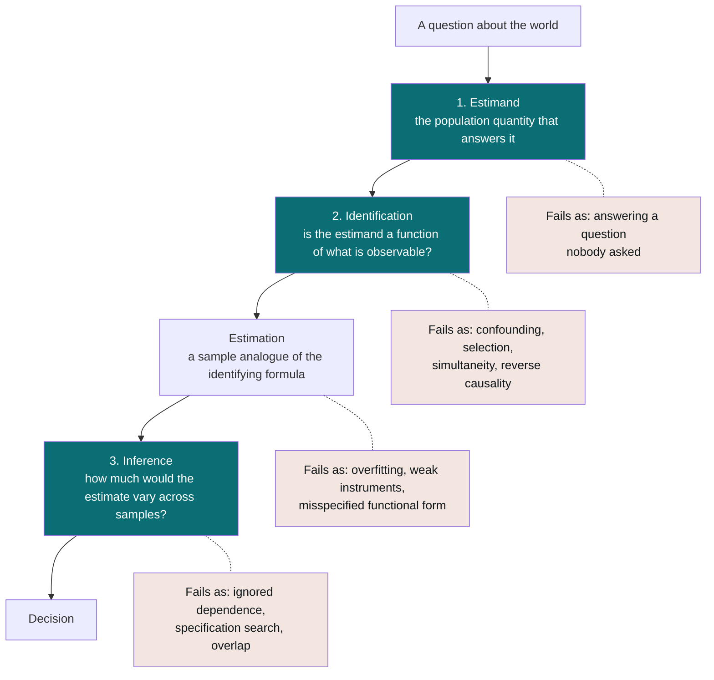
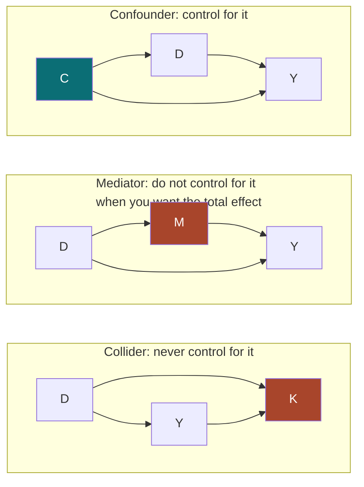
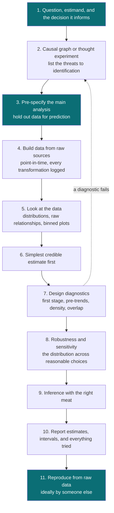
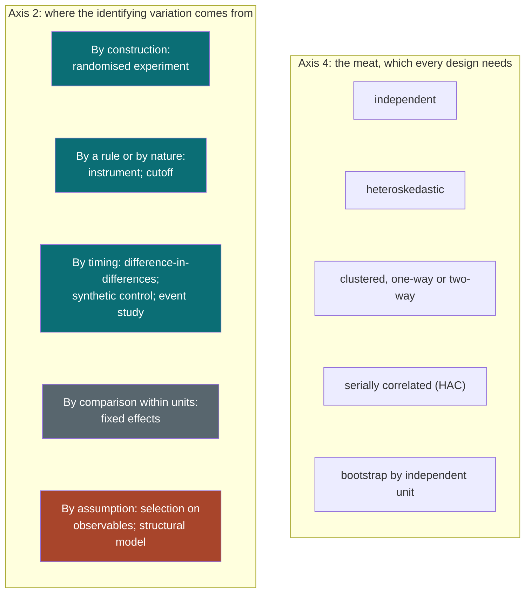
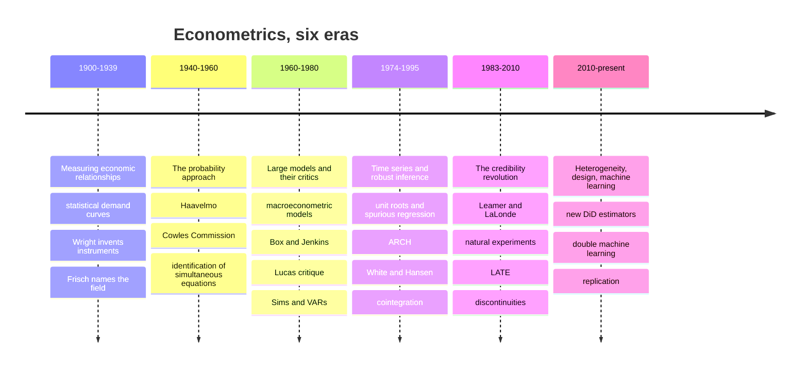
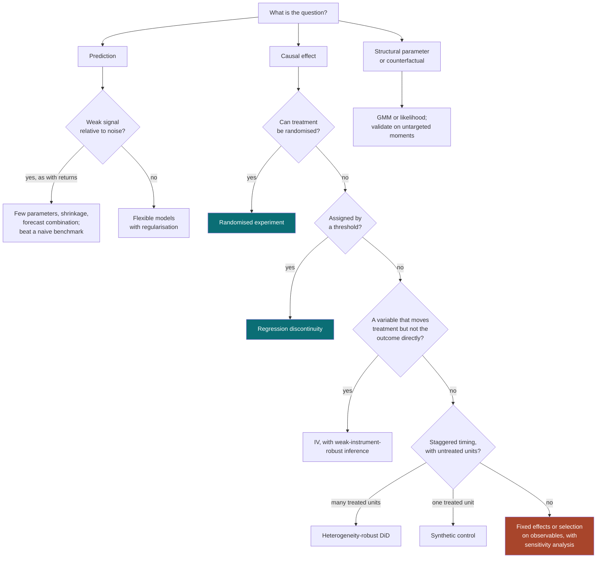

# Foundations of Econometrics

### Estimands, identification, and inference: what a regression can tell you, and how sure to be

---

```{=html}
<aside class="eli5">
```

# ELI5 — the short version {#eli5}

```{=latex}
\begin{eli5}
```

**In one sentence.** A regression tells you how two things move together; turning that into "this causes that" needs an assumption the data can never check for you, and this document is about which assumption, how to argue for it, and how sure you are then allowed to be.

**1. A coefficient is not an effect** ([§1](#1-what-econometrics-is), [§3](#3-regression)). What a regression computes is a ratio: how much two things vary together, divided by how much one of them varies. That number always exists and always means something. Calling it "the effect of X on Y" is a separate claim about *why* X differs from row to row. If the firms that advertise more are also better run, the advertising coefficient is carrying both.

**2. Three questions, strictly in order** ([§1](#1-what-econometrics-is)). What exactly am I trying to measure? Can it be recovered at all from this data? How precisely has it been estimated? Errors flow downward and never upward: flawless statistics cannot rescue a quantity the data cannot identify, and no amount of data fixes the wrong target. Nearly all real disputes are about the first two questions, and nearly all the effort goes into the third.

**3. Your residuals cannot warn you** ([§3](#3-regression)). This is the fact that surprises people most. The leftovers from a regression are *mathematically guaranteed* to be uncorrelated with the variables you regressed on — that is how the fitting works. So no residual plot and no diagnostic computed from the output can detect the problem that matters most. The evidence for it has to come from outside the regression entirely.

**4. Two unrelated ways to be wrong** ([§1](#1-what-econometrics-is), [§4](#4-inference)). Being wrong about *why* the variation exists gives you a wrong answer. Being wrong about *how dependent* your observations are gives you a right answer with a fake error bar. Every standard-error correction you have heard of addresses the second, and none of them touches the first.

**5. Rows are not information** ([§2](#2-probability), [§4](#4-inference)). Precision depends on the number of genuinely independent pieces of information. A highly persistent series of 1,000 observations can be worth about 53 of them; forty years of overlapping twelve-month returns can be worth about forty. Grouped data are worse than they look: with fifty groups of a hundred and a within-group correlation of just 0.05, the naive standard error is 2.4 times too small.

**6. An underpowered study does not merely miss things — it misleads** ([§4](#4-inference)). If your design can only detect effects much larger than the truth, then the only findings that clear the significance bar are the overestimates. Work out the smallest effect you *could* detect — roughly 2.8 standard errors — before you look at the result.

**7. Controls create bias as easily as they remove it** ([§6](#6-endogeneity)). Control for a genuine common cause and you remove bias. Control for something sitting *between* cause and effect and you subtract away part of what you were measuring. Control for something that both variables influence and you can reverse the sign outright. Survivorship, database inclusion and any filter based on what happened later belong to that third category, and they are everywhere in financial data.

**8. Two traps specific to time** ([§8](#8-time-series)). Regress one aimless wandering series on a completely unrelated one and you will usually find a "significant" relationship — and collecting more data makes this worse rather than better. And "Granger causality" is not causality: it says one series helps predict another, which is a statement about precedence.

**9. What machine learning does and does not change** ([§10](#10-prediction)). It is very good at "what happens next" and it is not a research design — it estimates things, it does not identify them, and feature importances describe the model rather than the world. Ordinary cross-validation also leaks badly here: walk forward, drop the overlapping labels, group by date, and treat a hyperparameter search as the pile of multiple tests it is.

**10. Where results actually go wrong** ([§9](#9-financial-econometrics), [§11](#11-practice)). Mostly in the data: joins, units, timing, corporate actions, delistings. Plot everything before estimating anything. Published return predictors lose about a quarter of their edge out of sample and more than half after publication, and published test statistics bunch suspiciously just above the significance threshold — most of all in the designs that give the researcher the most freedom. The remedies are procedural: keep a log of everything you tried, and report the range of estimates across all the reasonable choices instead of a curated table of the flattering ones.

---

**If you do only three things:** state what you are trying to measure before estimating anything, argue for identification from outside the regression rather than from its output, and count independent observations rather than rows.

```{=latex}
\end{eli5}
```

```{=html}
</aside>
```

---

**What this is.** A first-principles tutorial on econometrics, meaning the methods for
learning about economic and financial relationships from data that nobody designed
as an experiment. It covers the foundations (what a regression actually estimates,
and what probability theory contributes), the methods (the estimator family, the
inference machinery, the research designs that turn correlations into causal
claims, and time-series econometrics), and the practice (how empirical work goes
wrong, and the working habits that stop it). The emphasis throughout is on
intuition and use. Every formula is preceded by what it means and followed by a
number, and every method is described by how it breaks as well as by how it works.

**Who it is for.** A reader who is mathematically comfortable and technically
strong but has not been trained as an econometrician, and who wants to *do*
something with this material: run a regression and know what it means, evaluate an
empirical claim, build a forecasting or signal-research pipeline that does not fool
its builder, or read the empirical finance literature critically. Nothing is
assumed beyond calculus, linear algebra, and the vocabulary of probability. Where a
concept is used before it is fully explained, Appendix A builds it from the ground
up.

**How to read it.** The document has six parts.

- **Part I (§1–§3): what econometrics is for.** §1 states the idea that organises
  everything else, and nobody should skip it. §2 is the minimum probability you need;
  skim it if you know the material, but read §2.2 and §2.5. §3 builds regression from
  the conditional expectation function, and its §3.4 and §3.5 are the two results the
  rest of the document leans on most.
- **Part II (§4–§5): estimation and inference.** §4 is about standard errors, tests,
  and the ways they mislead. It is the most practically important section for someone
  who already runs regressions. §5 shows that OLS, instrumental variables, GMM, and
  maximum likelihood are one estimator with different inputs.
- **Part III (§6–§7): identification.** §6 is the anatomy of endogeneity, the reason
  a regression coefficient differs from a causal effect. §7 surveys the research
  designs that address it: experiments, instruments, panels, difference-in-differences,
  regression discontinuity, synthetic control, and structural models.
- **Part IV (§8): time series.** What changes when observations are ordered in time,
  from autoregressions to unit roots, cointegration, VARs, volatility models, breaks,
  and forecast evaluation.
- **Part V (§9–§11): practice.** §9 covers the econometrics specific to finance:
  predictive regressions, event studies, asset-pricing tests, panel standard errors,
  and the replication debate. §10 is prediction, model selection, and machine
  learning. §11 is workflow, reporting, and a catalogue of failure modes.
- **Part VI (§12–§15): synthesis.** §12 collects the taxonomy and the equivalences, §13
  is the history, §14 the synthesis and a decision tree, and §15 the references.

If you read four things, read **§1.5–§1.6** (the master form and the sandwich),
**§3.4–§3.5** (what "controlling for" does and what leaving something out costs),
**§4.4** (why 5,000 observations can carry the information of 840), and **§6.5** (the
controls that create bias rather than remove it). If you work on return prediction,
add §2.5, §8.3, §9.2, and §10.6.

**Relationship to the other notes.** [Simple and Log Returns](log_returns.html) §6
treats the time-series econometrics of returns (unit roots, volatility models,
cointegration, long-horizon predictive regressions) from the side of the return
convention. This document supplies the general machinery behind it.
[Market Regimes and Machine Learning](market_regimes.html) goes deep on structural
breaks, regime-switching models, and time-series validation, which appear here only
in outline (§8.7, §10.6). [Portfolio Construction and the Covariance
Matrix](portfolio_construction.html) covers covariance estimation, shrinkage, and the
statistics of Sharpe ratios. The momentum and trend-following notes apply the tools
here to specific signals. Each note stands alone.

**A warning about scope.** [Practice] Nothing here is investment advice. The
numerical illustrations are simulations built to isolate one mechanism at a time,
not evidence about any market. Where a number comes from my own simulation rather
than a published study, I say so.

**Epistemic tags.** Claims are flagged by status where the status changes what you
should do:

- **[Fact]**: a mathematical result, or an empirical finding that has been replicated or
  independently reanalysed, with broad agreement among people who have looked.
- **[Contested]**: documented, but with live disagreement about magnitude,
  robustness, or cause.
- **[Hypothesis]**: a proposed mechanism, not decisively tested.
- **[Practice]**: practitioner or professional convention. It may well be right, but
  the evidence for it is informal or absent.

Untagged sentences are definitions, derivations, or arithmetic, true by construction
rather than by evidence. Results from simulations I ran while writing are labelled
**[Simulated]**. The generating code is committed alongside this document in
`figures/em_*.py`, and each script prints the numbers quoted in the text, so you can
change the parameters and rerun.

---

**Notation.** Units of observation are indexed by $i = 1, \dots, n$ in a
cross-section and by $t = 1, \dots, T$ in a time series. A panel has $N$ units observed
over $T$ periods. Data can be grouped into $G$ **clusters** indexed by $g$, with $n_g$
observations in cluster $g$.

$Y_i$ is an outcome. $X_i \in \mathbb{R}^k$ is a column vector of $k$ regressors,
usually including a constant, so $X_i'\beta$ is a scalar (a prime denotes transpose).
Bold capitals stack observations: $\mathbf{X}$ is the $n \times k$ matrix whose rows
are $X_i'$, and $\mathbf{Y}$ is the $n$-vector of outcomes. The one exception is §8.5, where bold lowercase letters are
vectors of several time series at one date and plain capitals are coefficient matrices, as is
standard for vector autoregressions. $Z_i \in \mathbb{R}^\ell$
is a vector of $\ell \ge k$ **instruments**, and $C_i$ is a control variable. A hat
denotes an estimate ($\hat\beta$), a bar a sample average ($\bar Y$), and a subscript
zero the true value of a generic parameter vector $\theta$ ($\theta_0$).

Two error terms are kept strictly apart, because the distinction between them carries
much of §1 and §3. $e_i$ is the **projection error**, defined as whatever is left of
$Y_i$ after the best linear prediction from $X_i$. It is uncorrelated with $X_i$ *by
construction* (§3.2). $u_i$ is a **structural error**, the unobserved part of an
equation that is meant to describe how $Y_i$ is actually generated, such as a causal
or behavioural relationship. Whether $u_i$ is uncorrelated with $X_i$ is an
*assumption*. $\hat e_i$ is a regression residual. $\varepsilon_t$ is a
white-noise innovation in a time-series model.

$m(x) = \mathbb{E}[Y_i \mid X_i = x]$ is the **conditional expectation function**
(CEF), and $\epsilon_i = Y_i - m(X_i)$ its **CEF error**: mean-independent of $X_i$ by
construction (§3.1), a stronger property than $e_i$'s mere uncorrelatedness above, per
the hierarchy of §2.2. In causal settings $D_i \in \{0, 1\}$ is a treatment indicator, $Y_i(1)$ and
$Y_i(0)$ are **potential outcomes** with and without treatment, and $\tau_i = Y_i(1) -
Y_i(0)$ is the unit-level treatment effect (§6.1).

The master form of §1.5 writes an estimator as the solution of a **moment condition**
$\mathbb{E}[\psi_i(\theta_0)] = 0$, where $\psi_i(\theta)$ is a function of unit $i$'s
data and the parameter. $Q = \mathbb{E}[\partial\psi_i(\theta_0)/\partial\theta']$ is its
**Jacobian** (the "bread"), and $\Omega$ is the long-run variance of the scaled moment
sum $n^{-1/2}\sum_i\psi_i(\theta_0)$ (the "meat"). $W$ is a GMM weighting
matrix. $Q_{XX} = \mathbb{E}[X_iX_i']$.

In regressions, $\alpha$ is an intercept, $\alpha_i$ a unit fixed effect, and
$\lambda_t$ a time fixed effect. In the omitted-variable formula of §3.5, $\gamma$ is
the effect of the omitted variable and $\delta$ its projection coefficient on the
included regressor. $\pi$ is a first-stage coefficient in instrumental variables and
$F$ the first-stage $F$-statistic. $\kappa$ is a regularisation penalty (§5.6, §10.4).

In time series, $\phi$ is an autoregressive coefficient, $\rho_j$ the autocorrelation
at lag $j$, and $h$ a forecast or return horizon. $\rho_u$ and $\rho_x$, with letter
subscripts, are **intra-cluster** correlations of the error and the regressor (§4.4).
$\sigma^2$ is an error variance and $\sigma_t^2$ a conditional variance. The GARCH
parameters of §8.6 are written $\omega, a, b$ rather than the literature's $\omega,
\alpha, \beta$, so that $\alpha$ and $\beta$ keep their regression meanings.
$n_{\text{eff}}$ is an effective sample size.

$\Phi$ and $\varphi$ are the standard normal distribution and density functions.
$\mathbb{1}\{\cdot\}$ is an indicator. $\xrightarrow{p}$ and $\xrightarrow{d}$ denote
convergence in probability and in distribution, $\operatorname{plim}$ a probability
limit, and $\operatorname{Avar}$ an asymptotic variance. $\operatorname{se}(\cdot)$ is a
standard error and $\mathrm{SR}$ a Sharpe ratio. Significance levels are written as
percentages and have no symbol.

---

## Table of contents

- [ELI5 — the short version](#eli5)

**Part I — What econometrics is for**

1. [What econometrics is](#1-what-econometrics-is)
2. [The probability you actually need](#2-probability)
3. [Regression from first principles](#3-regression)

**Part II — Estimation and inference**

4. [Inference: how sure should you be?](#4-inference)
5. [One estimator family](#5-estimators)

**Part III — Identification**

6. [Endogeneity: why a coefficient is not an effect](#6-endogeneity)
7. [Research designs](#7-designs)

**Part IV — Time series**

8. [Time-series econometrics](#8-time-series)

**Part V — Practice**

9. [Financial econometrics](#9-financial-econometrics)
10. [Prediction, model selection, and machine learning](#10-prediction)
11. [The practice of applied econometrics](#11-practice)

**Part VI — Synthesis**

12. [Taxonomy and equivalences](#12-taxonomy)
13. [How the field evolved](#13-history)
14. [Synthesis](#14-synthesis)
15. [References](#15-references)

- [Appendix A: Concepts and prerequisites](#appendix-a)

---

```{=latex}
\newpage
```

# Part I — What econometrics is for

# 1. What econometrics is {#1-what-econometrics-is}

## 1.1 The wrong intuition

Here is the picture most people arrive with:

> *Econometrics is statistics applied to economic data. You regress an outcome on the
> variables you think matter, check which coefficients are significant, and read each
> significant coefficient as the effect of its variable.*

Every clause is defensible on its own, and the sentence as a whole is badly wrong in
three specific ways. Each one corresponds to a part of this document.

**A regression coefficient is not an effect.** A coefficient summarises how the
average outcome differs between units whose regressor differs, after a linear
adjustment for the other regressors. It becomes an *effect*, meaning what would happen
if you changed the regressor, only under an assumption about *why* the regressor
differs across units. Take firms that buy back their own shares. A regression of
subsequent returns on a buyback indicator compares firms that chose to repurchase with
firms that did not. Managers tend to repurchase when they believe their stock is cheap,
so the coefficient mixes any effect of the buyback itself with the private information
that prompted it. Both components are economically interesting, and they call for
opposite conclusions. Separating them is the subject of Part III.

**Significance is neither truth nor importance.** A $t$-statistic is an estimate
divided by its standard error, and the standard error is computed under an assumed
model of how the sample could have come out differently. Get that model wrong, for
instance by ignoring that observations share shocks, that returns overlap, or that
twenty specifications were tried before this one, and the $t$-statistic is off by
*factors*, not decimals (§4). Separately, a precisely estimated effect can be
economically trivial, and an important effect can be imprecisely estimated.

**The hard part is not the fitting.** A regression takes microseconds to compute. The
intellectual content of econometrics is the argument connecting the number the
computer produces to the question being asked, and that argument is about the process
that *generated* the data, not about the data themselves. This is why two competent
econometricians can run the same regression on the same data and disagree completely
about what it means. They are not disagreeing about arithmetic. They disagree about the
data-generating process.

The profession's own reckoning with the naive picture came from a clean test. In the
1970s the National Supported Work Demonstration randomly assigned disadvantaged workers
to a job-training programme, so its true effect on earnings was known from the
experiment. [LaLonde (1986)](https://ideas.repec.org/a/aea/aecrev/v76y1986i4p604-20.html){target="_blank"} set aside the experimental control group, substituted
comparison samples drawn from standard household surveys, and applied the
non-experimental estimators that economists were then using to evaluate training
programmes. **[Fact]** The resulting estimates were scattered widely around the
experimental benchmark, many of them far off and some with the wrong sign, and the
specification tests of the day did not reliably separate the good estimates from the
bad. That paper is a large part of why the field now talks about research design
before it talks about estimators (§13).

The better mental model:

> **Econometrics is the discipline of stating, and defending, the conditions under
> which a number computed from data answers a question about the world. The
> computation is easy and is almost always a valid answer to *some* question. The work
> is making it an answer to yours.**

## 1.2 The problem: data that nobody randomised

A physicist who wants to know how a spring responds to force can apply the force. An
economist who wants to know how earnings respond to schooling cannot assign schooling,
and a financial economist who wants to know how prices respond to index inclusion
cannot assign stocks to indices. Almost all economic and financial data are
**observational**: they record the outcomes of decisions made by people and firms
pursuing their own ends.

That single structural fact is what makes econometrics a discipline rather than a
branch of statistics. **The variation in the data was generated by agents optimising
with information the econometrician does not see.** People choose schooling partly on
ability, which also affects earnings. Firms choose leverage partly on the stability
of their cash flows, which also affects their risk. Investors buy funds after good
performance, and the resulting inflows affect subsequent performance. Central banks
raise rates when they expect inflation, so a naive regression can make rate rises
appear to cause the inflation they were responding to.

Trygve Haavelmo gave the field its framing in 1944. Treat observed economic data as a
single draw from a joint probability distribution. That distribution is generated by
a system of behavioural relationships, such as demand curves, decision rules, and
pricing equations. The relationships are what you want to learn. The distribution is
all you can see. Whether the former can be recovered from the latter is the question
of **identification**, and it has to be answered before any estimation starts.

Three consequences recur throughout the document:

1. **Correlation mixes effects with selection.** When a regressor is a choice, it is
   correlated with the reasons for the choice, and those reasons usually affect the
   outcome too (§6).
2. **Jointly determined variables cannot be regressed on each other and interpreted.**
   Price and quantity are set together by supply and demand, so a scatter of the two
   traces out neither curve ([Working, 1927](https://doi.org/10.2307/1883501){target="_blank"}). The same holds for returns and order flow,
   volume and volatility, and fund flows and fund performance (§6.4).
3. **Relationships estimated under one regime can break when the regime changes.**
   Agents re-optimise when policy or market structure changes, so a relationship that
   was stable in the past need not survive an intervention ([Lucas, 1976](<https://doi.org/10.1016/s0167-2231(76)80003-6>){target="_blank"}). This is the
   econometric root of models that work in backtests and fail when deployed (§7.8, §8.7).

Finance deserves a remark here, because much of it looks like it escapes these
problems. A trader who wants tomorrow's expected return is asking a *prediction*
question, not a causal one, and prediction does not need identification (§1.4). But
two things keep finance inside the tent. First, a great deal of finance *is* causal:
whether index inclusion moves prices, whether buybacks create value, whether a
regulation changes liquidity. Second, prediction has its own version of the problem.
A predictive relationship is only useful if it holds in data the model has not seen,
and the forces that make it unstable are exactly the re-optimisation and selection
above. The inference problems of §4 (dependent data, overlapping horizons, many tested
hypotheses) apply everywhere with full force.

## 1.3 Three questions, in order

Every empirical claim, whether a published paper, a backtest, or a regression in a
notebook, is an answer to three questions. They have to be answered in order.

**1. What is the estimand?** The estimand is the precise population quantity you want
to know. "The effect of index inclusion on prices" is not an estimand. "The average
change in a stock's price over the month after it is added to the S&P 500, relative to
what its price would have been had it not been added, among stocks of the kind that get
added" is one. The estimand is defined by a thought experiment, not by the data. The
data will never tell you which question to ask.

**2. Is it identified?** Could the estimand be recovered from the population
distribution of the observable variables, that is, from an infinite amount of data?
Identification is a property of the assumptions and the data-generating process, not of
the sample. If the estimand is not identified, more data only give you a more precise
estimate of the wrong thing. This is where the economics lives. Every identifying
assumption is a claim about behaviour, such as "the lottery number affected earnings
only through military service" or "firms just above and just below the index cutoff are
otherwise comparable."

**3. How precisely is it estimated?** Given identification and an estimator, how much
would the estimate vary across the samples you could have drawn instead? This is
**inference**, and its central object is the standard error (§4).

The ordering matters because errors propagate downwards and never upwards. A perfect
standard error around an unidentified parameter is worthless, and an elegant estimator
cannot rescue a badly chosen estimand. Yet practice routinely inverts the order. People
choose the estimator first (because the software offers it), worry about standard errors
second, and state the identifying assumption last or not at all.



## 1.4 Four kinds of question

"What does the data say about $X$ and $Y$?" hides four different questions. They need
different assumptions and different evaluation, and confusing them is one of the most
common errors in empirical work.

| Question | Estimand | What must be true | How it is checked | Typical tools |
|---|---|---|---|---|
| **Description** | A conditional mean or linear projection | Only sampling assumptions | Inference alone | Regression read as a projection; portfolio sorts |
| **Prediction** | $\mathbb{E}[Y_{t+h} \mid \mathcal{F}_t]$, or a forecast that minimises a loss | The relationship is stable out of sample | Out-of-sample evaluation | Forecasting models; machine learning (§8.8, §10) |
| **Causal effect** | An average effect of a well-defined intervention | An identifying assumption about why treatment varies | Design diagnostics, placebo tests, sensitivity analysis | Experiments, IV, panels, DiD, RD (§7) |
| **Structural parameter** | A deep parameter of preferences or technology | The economic model is correctly specified | Fit to features of the data the model was not tuned to | GMM, maximum likelihood, simulated moments (§5, §7.8) |

$\mathcal{F}_t$ in the table is the information available at time $t$.

The same regression can be read as any of the four, and the reading is determined by
what you are willing to assume, not by the output. A regression of next month's return
on this month's book-to-market ratio is a perfectly valid *description* and a possibly
useful *prediction*. It is not an estimate of what would happen to a firm's return if
you changed its book value, and nothing in the output warns you against reading it that
way. §10.1 returns to this as the distinction between problems about $\hat Y$ and
problems about $\hat\beta$.

Most machine learning in finance is prediction. Most empirical corporate finance is
causal. Asset-pricing tests sit closer to the structural end, because the moment
conditions come from an economic model of prices. Knowing which one you are doing
tells you which of the later sections are your problem.

## 1.5 The master form: one equation behind every estimator

Here is the idea that organises the rest of the document. Almost every estimator in
econometrics is defined by a **moment condition**: a function of the data and the
parameters whose population expectation is zero at the true parameter value,

$$
\mathbb{E}\big[\psi_i(\theta_0)\big] = 0 .
$$

The estimator is the **sample analogue**. Choose $\hat\theta$ so that the sample average
of $\psi_i$ is zero, or as close to zero as possible when there are more equations than
unknowns:

$$
\frac{1}{n}\sum_{i=1}^{n} \psi_i(\hat\theta) = 0 .
$$

That is all an estimator is. What distinguishes one method from another is only the
choice of $\psi$.

| Estimator | Moment function $\psi_i(\theta)$ | The assumption hidden in "$=0$" |
|---|---|---|
| Sample mean | $Y_i - \mu$ | None; this is the definition of $\mu$ |
| OLS | $X_i\,(Y_i - X_i'\beta)$ | The error is uncorrelated with $X_i$. This is automatic for a projection and an assumption for a causal $\beta$ |
| Instrumental variables | $Z_i\,(Y_i - X_i'\beta)$ | The instruments are uncorrelated with the structural error |
| Maximum likelihood | $\partial \log f(Y_i \mid X_i; \theta)/\partial\theta$ | The model's density is correct, or at least its score has mean zero |
| Fixed effects | $(X_{it} - \bar X_i)(Y_{it} - \bar Y_i - (X_{it} - \bar X_i)'\beta)$ | Regressors are uncorrelated with the error at every date: strict exogeneity |
| Quantile regression | $X_i\,\big(q - \mathbb{1}\{Y_i < X_i'\beta\}\big)$ | $X_i'\beta$ is the conditional $q$-quantile |
| Asset-pricing Euler equation | $Z_t\,\big(M_{t+1}(\theta)\,R_{t+1} - 1\big)$ | Investors' first-order condition holds and $Z_t$ is known at $t$ |

In the last two rows, $q \in (0,1)$ is the quantile of interest, $R_{t+1}$ a gross
asset return, and $M_{t+1}(\theta)$ a **stochastic discount factor**, the model's
valuation of a unit payoff at $t+1$ (§5.3). In the fixed-effects row, $\bar X_i$ and
$\bar Y_i$ are unit $i$'s averages over time (§7.4).

Three facts follow from writing estimators this way, and each one is used repeatedly
later on.

**Identification is uniqueness of the solution.** A parameter is identified when the
population moment condition holds at $\theta_0$ and nowhere else. For linear moment
conditions this reduces to a rank condition. Instrumental variables, for example, needs
$\mathbb{E}[Z_iX_i']$ to have full column rank, which is the formal version of "the
instruments must actually move the regressors" (§7.3).

**The substantive assumption is always an orthogonality condition.** Some observed
variable is uncorrelated with some unobserved one. And in the just-identified case,
where there are exactly as many equations as unknowns, *the data cannot check it*,
because the estimator forces the sample analogue to hold exactly. OLS residuals are
orthogonal to the regressors by construction, so no plot of residuals against $X$ can
ever reveal that $X$ is correlated with the structural error. **[Fact]** Endogeneity is
invisible in the residuals of the regression it contaminates. Over-identified models
permit a partial check, and only of whether the instruments agree with each other
(§5.3).

**A new method changes only what is required to be orthogonal to the error.** Adding
controls asks for orthogonality conditional on the controls. Fixed effects ask for
orthogonality with within-unit variation only. Instrumental variables ask for
orthogonality with the instrument rather than the regressor. Regression discontinuity
asks for it only in a small window around a cutoff. When you meet a new design, the
first question to ask is *which orthogonality condition it buys, and at what price*.

## 1.6 The sandwich: one formula behind every standard error

The master form also gives every standard error in econometrics, through one
derivation. Start from the sample moment condition at the estimate and expand it
around the truth. To first order,

$$
0 = \frac{1}{n}\sum_{i=1}^{n} \psi_i(\hat\theta)
\;\approx\; \frac{1}{n}\sum_{i=1}^{n} \psi_i(\theta_0)
\;+\; \underbrace{\Big[\frac{1}{n}\sum_{i=1}^{n} \frac{\partial \psi_i(\theta_0)}{\partial\theta'}\Big]}_{\to\, Q}
\,(\hat\theta - \theta_0) .
$$

Solve for the estimation error and scale by $\sqrt n$:

$$
\sqrt{n}\,(\hat\theta - \theta_0) \;\approx\; -\,Q^{-1}\,\frac{1}{\sqrt n}\sum_{i=1}^{n}\psi_i(\theta_0) .
$$

The estimation error is a fixed matrix times a scaled sum of the moment contributions.
A central limit theorem (§2.4) makes that sum approximately normal, with variance
$\Omega$. So

$$
\operatorname{Avar}\big(\sqrt n\,(\hat\theta - \theta_0)\big)
\;=\; \underbrace{Q^{-1}}_{\text{bread}}\;\underbrace{\Omega}_{\text{meat}}\;\underbrace{Q^{-1\prime}}_{\text{bread}},
\qquad
\Omega = \lim_{n\to\infty}\operatorname{Var}\Big(\frac{1}{\sqrt n}\sum_{i=1}^{n}\psi_i(\theta_0)\Big).
$$

Dividing by $n$ gives the approximate variance of $\hat\theta$ itself, and the square
roots of its diagonal are the standard errors.

The two ingredients do different jobs, and it is worth holding them apart.

- **The bread, $Q$, is set by the model.** It measures how sharply the moment condition
  responds when the parameter moves. For OLS, $\psi_i = X_i(Y_i - X_i'\beta)$, so $Q =
  -\mathbb{E}[X_iX_i'] = -Q_{XX}$. More variation in the regressors gives a larger
  bread and a smaller variance, which is why an experiment with a wide spread of
  treatment doses is more informative than one with a narrow spread.
- **The meat, $\Omega$, is set by the dependence in the data.** It is the variance of a
  sum. If the moment contributions are independent across observations, it is the sum
  of their variances. If they are correlated, the covariances enter too, and with many
  positively correlated pairs they come to dominate.

Every standard-error "correction" in applied work is a different estimate of the meat.
Each makes a different assumption about which observations are independent of which.

| Name | Estimate of the meat $\Omega$ | Independence it assumes |
|---|---|---|
| Classical | $\hat\sigma^2\hat Q_{XX}$ | All observations independent, with equal error variance |
| Heteroskedasticity-robust (White) | $\frac1n\sum_i \hat e_i^2 X_iX_i'$ | All observations independent, variances free |
| Cluster-robust | $\frac1n\sum_g \big(\sum_{i \in g} X_i\hat e_i\big)\big(\sum_{i\in g} X_i\hat e_i\big)'$ | Independent across clusters; anything goes within |
| Newey–West (HAC) | Weighted sum of sample autocovariances of $X_t\hat e_t$ | Serial dependence that dies out with the lag |
| Driscoll–Kraay | Newey–West applied to cross-sectional sums | Arbitrary cross-sectional dependence, fading serial dependence |
| Fama–MacBeth | Variance of the period-by-period estimates | Independence over time; arbitrary within a period |
| Two-way clustered | Firm-clustered + time-clustered − heteroskedasticity-robust | Independence across both firms and dates, except through those two groupings |

All of them use the same bread. §4 derives the table's entries and says when each is
right, and the equivalence between the rows is exact in a few cases (§12.2).

The table implies the most important practical fact about inference, and the second
idea that organises this document:

> **The precision of an estimate is set by the number of independent pieces of
> information in the meat, not by the number of rows in the data.**

Two numbers make the point. Take 5,000 observations in 50 groups of 100, where the
regressor is set at the group level and 5% of the error variance is shared within a
group. The effective sample size is about 840, and classical standard errors reject a
true null hypothesis 42% of the time at a nominal 5% (§4.4). **[Simulated]** Or take 40
years of monthly data on 12-month returns. It has 480 rows, but when estimating an
average 12-month return it carries roughly 40 non-overlapping observations' worth of
information (§4.5).

**The spine, stated once.** Every estimate can go wrong in two ways, and they come from
different places:

> **Bias comes from a false orthogonality condition. False precision comes from a
> wrong meat.**

Almost every method in the rest of this document does one of three things. It makes an
orthogonality condition more credible (Part III), it estimates the meat honestly (§4,
§8, §9), or it trades a little bias for a large reduction in variance (§5.6, §10). When
a new technique appears, placing it in one of those three bins tells you most of what
you need to know about it.

## 1.7 What econometrics is not

Several distinctions come up so often that they are worth fixing at the start.

| Often conflated | The difference |
|---|---|
| Econometrics and statistics | The same mathematics. Econometrics adds data generated by optimising agents, which makes identification the central problem, and economic models that supply moment conditions. Other fields have converged on the same problems under other names: epidemiology's "confounding" is econometrics' "omitted variable bias." |
| Econometrics and machine learning | Machine learning optimises out-of-sample prediction of $Y$. Much of econometrics estimates a parameter with a causal or structural meaning and an honest measure of its uncertainty. The tools now cross over (§10); the goals do not. |
| A good fit and a good model | A high $R^2$ says nothing about identification, and a low one is compatible with a precisely estimated causal effect (§3.8). |
| Statistically significant and important | Significance measures signal relative to noise. Importance is about magnitude (§4.10). |
| Unbiased and consistent | Unbiased means right on average at a fixed sample size. Consistent means converging to the truth as the sample grows. Neither implies the other (§2.3). |
| Granger causality and causality | Granger causality means that the past of $X$ improves forecasts of $Y$. It is predictive precedence and says nothing about what an intervention on $X$ would do (§8.5). |
| The error term and the residual | The error ($u_i$ or $e_i$) is a population object. The residual $\hat e_i$ is computed from a sample, and is orthogonal to the regressors by construction (§3.3). |
| A backtest and an econometric study | They are the same thing. A backtest estimates a mean from dependent data after a search over specifications, and inherits every problem in §4 and §9 whether or not anyone acknowledges it (§9.7). |

> ### §1 Key takeaways
>
> 1. A regression coefficient is a ratio of covariance to variance, not an effect. It becomes an
>    effect only under an assumption about why the regressor varies across units.
> 2. Econometrics exists because economic data are generated by agents who choose their
>    regressors with information the analyst does not have.
> 3. Answer three questions in order: what is the estimand, is it identified, and how
>    precisely is it estimated. Errors propagate downwards, never upwards.
> 4. Description, prediction, causal effects, and structural parameters are four
>    different questions. The same regression can serve any of them, and the output never
>    tells you which.
> 5. Almost every estimator solves a sample moment condition. The substantive
>    assumption is always an orthogonality condition, and in the just-identified case the
>    data cannot test it.
> 6. Every standard error is a sandwich: bread from the model, meat from the dependence in
>    the data. Every standard-error correction is a different estimate of the meat.
> 7. Bias comes from a false orthogonality condition; false precision comes from a wrong
>    meat. Precision is governed by the number of independent pieces of information, not
>    the number of rows.

```{=latex}
\newpage
```

# 2. The probability you actually need {#2-probability}

This section is the minimum probability theory that the rest of the document leans on.
It is written to be read quickly by someone who has seen the definitions before. The
two subsections that are not standard textbook fare, and that nobody should skip, are
§2.2 (three different strengths of "unrelated") and §2.5 (how dependence spends
observations).

## 2.1 Populations, samples, and the data-generating process

A random variable is a model of what the data *could have been*. The
**data-generating process** (DGP) is the joint probability distribution from which the
observed data are one draw. In a cross-section it is the distribution of $(Y_i, X_i,
Z_i, \dots)$ for a randomly drawn unit. In a time series it is the stochastic process
that produced the whole path.

An estimate is uncertain because a different draw would have produced a different
estimate, and a standard error quantifies that variation. It is therefore only
meaningful once you have said *what is being redrawn*. There are two standard answers.

- **Sampling-based uncertainty.** The data are a random sample from a larger
  population, and the uncertainty is about which units happened to be sampled. This is
  the textbook picture, and it fits survey data.
- **Design-based uncertainty.** The data cover the entire population of interest, such
  as all fifty US states or every stock in an index, so no sampling variation exists in
  the usual sense. What is random is which units received the treatment, and so which
  potential outcome of each unit you get to see. [Abadie, Athey, Imbens & Wooldridge
  (2020)](https://arxiv.org/abs/1706.01778){target="_blank"} show that
  conventional standard errors remain sensible for causal questions under this reading,
  but can be conservative, and that for purely descriptive questions about a fully
  observed population they answer a question nobody asked.

Finance has a third answer, and it matters for everything that follows. When you study
every listed stock, the cross-section is not a sample. **The sample is the history.**
The relevant thought experiment is that the same economy could have produced a
different sequence of shocks, and the uncertainty is over which history occurred. That
is why the number of independent time periods, not the number of stocks, usually
governs precision in empirical finance (§2.5, §9.1).

## 2.2 Conditional expectation, and three strengths of "unrelated"

**Conditional expectation.** $\mathbb{E}[Y \mid X]$ is the average of $Y$ among units
with a given value of $X$, viewed as a function of $X$. Three properties make it the
central object of the field.

1. **It is the best predictor.** Among all functions $g(X)$, the one that minimises the
   mean squared error $\mathbb{E}[(Y - g(X))^2]$ is $g(X) = \mathbb{E}[Y \mid X]$. To see
   why, add and subtract the conditional mean:
   $$
   \mathbb{E}\big[(Y - g(X))^2\big] = \mathbb{E}\big[(Y - \mathbb{E}[Y\mid X])^2\big] + \mathbb{E}\big[(\mathbb{E}[Y\mid X] - g(X))^2\big].
   $$
   The cross term vanishes because the prediction error $Y - \mathbb{E}[Y \mid X]$ has
   mean zero at every value of $X$. The first term does not depend on $g$, and the second
   is zero only when $g$ equals the conditional mean.
2. **The law of iterated expectations.** $\mathbb{E}[Y] = \mathbb{E}\big[\mathbb{E}[Y \mid
   X]\big]$: the overall average is the average of the group averages, weighted by group
   size.
3. **The law of total variance.** $\operatorname{Var}(Y) = \operatorname{Var}\big(\mathbb{E}[Y
   \mid X]\big) + \mathbb{E}\big[\operatorname{Var}(Y \mid X)\big]$. Total variation splits
   into the part explained by $X$ and the part left over. $R^2$ is a sample version of
   the first share (§3.8).

**Three strengths of "unrelated."** Econometric assumptions constantly require an
unobserved $U$ (with $\mathbb{E}[U] = 0$) to be "unrelated" to an observed $X$. There
are three distinct ways to say this, in increasing strength:

| Condition | Statement | What it rules out | What needs it |
|---|---|---|---|
| **Uncorrelated** | $\mathbb{E}[XU] = 0$ | A *linear* relationship between $X$ and $U$ | Consistency of OLS and IV |
| **Mean-independent** | $\mathbb{E}[U \mid X] = 0$ | *Any* relationship between $X$ and the average of $U$ | Unbiasedness; treating any function of $X$ as a valid regressor or instrument |
| **Independent** | $U \perp X$ | Any relationship between $X$ and the whole distribution of $U$ | Quantile and distributional claims; randomisation |

Each implies the one above it, and neither converse holds. The standard
counterexample takes $X \sim N(0,1)$ and $U = X^2 - 1$. Then $\mathbb{E}[XU] =
\mathbb{E}[X^3] - \mathbb{E}[X] = 0$, so the two are uncorrelated and a regression of $U$
on $X$ has a slope of exactly zero, even though $U$ is a deterministic function of $X$.

Financial returns are the practical version of the same gap. **[Fact]** Daily returns on
broad equity indices are close to uncorrelated over time, but they are far from
independent, because large moves cluster: squared returns are strongly autocorrelated.
Between the two sits the **martingale difference** property, $\mathbb{E}[r_{t+1} \mid
\mathcal{F}_t] = 0$ for a demeaned return $r_{t+1}$, which says the past cannot predict
the *level* of future returns while leaving their variance free to be predictable. The
distinction has consequences. A test of "no autocorrelation" whose standard errors
assume independence is mis-sized on returns, because independence is false even when
the hypothesis being tested is true (§8.1).

## 2.3 Estimators are random variables

An estimator $\hat\theta$ is a function of the sample, so it has a distribution: the
**sampling distribution**, meaning the distribution of $\hat\theta$ across all the
samples the DGP could have produced. Three summaries of it matter.

- **Bias:** $\mathbb{E}[\hat\theta] - \theta_0$, whether the estimator is right on
  average.
- **Variance:** how much it moves from sample to sample. The **mean squared error**
  combines the two: $\operatorname{MSE} = \text{bias}^2 + \text{variance}$.
- **Consistency:** whether $\hat\theta \xrightarrow{p} \theta_0$ as the sample grows,
  that is, whether the estimator converges to the truth.

Unbiasedness and consistency are logically independent. Using only the first
observation, $\hat\mu = Y_1$, is an unbiased estimator of a mean, but its variance never
shrinks, so it is inconsistent. The OLS estimate of an autoregressive coefficient $\phi$
is biased downward in finite samples, by roughly $-(1+3\phi)/T$ ([Kendall, 1954](https://doi.org/10.2307/2332720){target="_blank"}), but it is
consistent. The bias matters when $T$ is small and $\phi$ is near one, as §9.2 shows.

Econometrics mostly cares about consistency rather than unbiasedness, for a practical
reason: almost no estimator used in practice is unbiased. Instrumental variables,
maximum likelihood, and every nonlinear estimator are biased in finite samples. The
working questions are whether the estimator converges to the right thing, and whether
the sample is large enough that the remaining bias is small relative to the standard
error.

The MSE decomposition also foreshadows a theme of §5.6 and §10. **An estimator with some
bias can have a lower mean squared error than an unbiased one**, if the bias buys a large
enough reduction in variance. Shrinkage estimators exploit this deliberately.

## 2.4 The two limit theorems, and what they quietly require

**The law of large numbers (LLN)** says that sample averages converge to population
means. It needs a finite mean and either independence or dependence that fades with
distance. For time series the relevant condition is **ergodicity**, which says that
averaging along one long path is equivalent to averaging across many independent paths.

**The central limit theorem (CLT)** says that sample averages are approximately normal,
with a spread that shrinks at rate $\sqrt n$:

$$
\sqrt{n}\,(\bar Y - \mu) \xrightarrow{d} N(0, \sigma^2).
$$

It needs a finite variance and, again, independence or fading dependence. Under
dependence, $\sigma^2$ becomes the *long-run* variance of §2.5.

Three consequences for practice:

1. **The $\sqrt n$ rule.** Standard errors fall like $1/\sqrt n$, so halving a standard
   error takes four times the data. Equivalently, detecting an effect half as large
   requires a sample four times as big. Precision is expensive, and it gets more
   expensive quickly.
2. **The approximation is to the average, not to the data.** The CLT says nothing about
   whether individual observations are normal. It justifies $t$-tests on regression
   coefficients, which are weighted averages, with non-normal data. It does not justify
   treating tail probabilities of the data themselves as normal.
3. **Heavy tails slow the approximation down.** When the variance exists but higher
   moments are large or infinite, the CLT still holds eventually, but the sample size
   needed for it can be very large. **[Fact]** Daily equity returns have tails heavy
   enough that the fourth moment may not exist ([Cont, 2001](https://doi.org/10.1080/713665670){target="_blank"}). Their means and variances
   behave tolerably, but any statistic that depends on fourth moments, such as sample
   kurtosis, the standard error of a variance estimate, or the non-normal standard error
   of a Sharpe ratio, is far less precise than its formula suggests.

## 2.5 Effective sample size: dependence spends observations

The CLT's variance for the mean of a stationary series is not $\sigma^2$ but the
**long-run variance**, which includes all the autocovariances. The variance of a sample
mean of $T$ observations is approximately

$$
\operatorname{Var}(\bar Y) \approx \frac{\sigma^2}{T}\Big(1 + 2\sum_{j=1}^{\infty}\rho_j\Big),
$$

where $\rho_j$ is the autocorrelation at lag $j$. Positive autocorrelation inflates the
variance, because neighbouring observations repeat part of the same information.
Comparing this with the independent case defines the **effective sample size**:

$$
n_{\text{eff}} = \frac{T}{1 + 2\sum_{j\ge1}\rho_j}.
$$

For a first-order autoregression, $\rho_j = \phi^j$ and the sum is geometric, which gives

$$
n_{\text{eff}} = T\,\frac{1-\phi}{1+\phi}.
$$

| Persistence $\phi$ | $n_{\text{eff}}/T$ | 1,000 observations are worth |
|---|---|---|
| 0 | 1.000 | 1,000 |
| 0.5 | 0.333 | 333 |
| 0.9 | 0.053 | 53 |
| 0.99 | 0.005 | 5 |

The same arithmetic holds across clusters. If $n$ observations fall into groups of size
$\bar n_g$ and every pair within a group has correlation $\rho$, the effective sample size
for a mean is $n / (1 + (\bar n_g - 1)\rho)$. For a regression coefficient the formula
picks up the within-group correlation of the regressor as well, which gives the Moulton
factor of §4.4.

**Overlapping observations** are the case finance meets most. A series of overlapping
$h$-period returns built from $T$ one-period returns carries roughly the information of
$T/h$ non-overlapping ones when estimating a mean. Forty years of monthly data on
12-month returns have 480 rows and about 40 independent observations.

**Merton's asymmetry.** The precision of an estimated *mean* return depends on the
calendar span of the data, not on how finely it is sampled. The mean return over forty
years is the total log price change divided by forty, and sampling daily instead of
monthly does not change the endpoints. With annual volatility of 16%, the standard
error of a mean annual return estimated from 40 years is $16\%/\sqrt{40} = 2.5\%$, so a
6% equity premium is known only to within about $\pm 5$ percentage points at 95%
confidence. *Variances* behave oppositely: summing squared high-frequency returns
estimates variance more and more precisely as the sampling interval shrinks ([Merton,
1980](https://www.nber.org/papers/w0444){target="_blank"}). This single asymmetry explains
a great deal of empirical finance: why risk models work far better than return forecasts,
why the covariance matrix is estimable and the mean vector is not, and why the evidence
for any return anomaly is always weaker than its $t$-statistic makes it look.

## 2.6 The delta method, and other tools for approximations

Three results let you manipulate estimates the way you would manipulate the numbers
they estimate.

- **The continuous mapping theorem.** If $\hat\theta \xrightarrow{p} \theta_0$ and $g$ is
  continuous, then $g(\hat\theta) \xrightarrow{p} g(\theta_0)$.
- **Slutsky's theorem.** A statistic that converges in distribution, multiplied by
  something that converges in probability, converges to the obvious product. This is
  what licenses replacing an unknown variance with a consistent estimate inside a
  $t$-statistic.
- **The delta method.** If $\sqrt n(\hat\theta - \theta_0) \xrightarrow{d} N(0, V)$ and
  $g$ is differentiable, then
  $$
  \sqrt n\,\big(g(\hat\theta) - g(\theta_0)\big) \xrightarrow{d} N\big(0,\; g'(\theta_0)^2\,V\big).
  $$
  The standard error of a smooth function of an estimate is the standard error of the
  estimate times the slope of the function.

**A worked example, and its failure.** A shock to an AR(1) process decays like
$\phi^h$, so its **half-life**, the horizon at which half of it is gone, is $\ln(0.5) /
\ln(\phi)$. Suppose $\hat\phi = 0.95$ with a standard error of 0.02. The point estimate
of the half-life is $0.693/0.0513 = 13.5$ periods. Its derivative with respect to $\phi$
is $\ln(2) / (\phi\,(\ln\phi)^2) = 0.693/(0.95 \times 0.00263) = 277$, so the
delta-method standard error is $277 \times 0.02 = 5.5$ periods, giving an interval of
roughly $13.5 \pm 11$.

That interval is badly wrong, and the way it is wrong generalises. Two standard errors
above the estimate, $\phi = 0.99$ implies a half-life of 69 periods, not $13.5 + 11 = 24.5$.
The half-life is so nonlinear near $\phi = 1$ that a linear approximation across the
confidence region is meaningless. Whenever a parameter sits near a boundary, whether a
unit root, a variance near zero, or a correlation near one, delta-method intervals mislead.
Transform the endpoints of an interval for $\phi$ instead, or bootstrap (§4.9).

A second example is the one quants use most. For independent, normally distributed
returns, the delta method gives the standard error of an estimated per-period Sharpe
ratio as approximately $\sqrt{(1 + \mathrm{SR}^2/2)/T}$ ([Lo,
2002](https://www.tandfonline.com/doi/abs/10.2469/faj.v58.n4.2453){target="_blank"}). In
annual units, with a true Sharpe ratio of 0.5, that is about $1.06/\sqrt{\text{years}}$. It
takes around 18 years of data for the estimate to sit two standard errors from zero.

## 2.7 When asymptotics lie

Asymptotic approximations are statements about what happens as some quantity goes to
infinity. Trouble starts when the quantity that actually governs the approximation is
not the one you think is large.

| Situation | What is really small | Symptom | Where |
|---|---|---|---|
| Few clusters, or few *treated* clusters | The number of clusters, not observations | Tests reject true nulls far too often | §4.4 |
| Weak instruments | The first-stage signal | IV biased toward OLS; oversized $t$-tests | §7.3 |
| Near-unit-root regressors | The distance of $\phi$ from one, times $T$ | Spurious significance; Stambaugh bias | §8.3, §9.2 |
| Long overlapping horizons | The number of non-overlapping periods | Oversized Newey–West tests | §4.5, §9.2 |
| Heavy tails | The effective number of tail observations | Unstable higher-moment estimates | §2.4 |
| Many parameters | Observations per parameter | In-sample fit far above out-of-sample fit | §10.2 |
| Estimation after model selection | Nothing: the approximation is invalid | Confidence intervals too narrow | §10.3 |
| Maxima over many tests | Nothing: not a smooth function of means | Naive bootstrap fails | §4.8, §4.9 |

> ### §2 Key takeaways
>
> 1. A standard error is meaningless until you say what is being redrawn. In finance the
>    sample is usually the history, not the cross-section.
> 2. "Uncorrelated," "mean-independent," and "independent" are different assumptions.
>    Returns are close to uncorrelated and far from independent, and tests that confuse the
>    two are mis-sized.
> 3. Consistency matters more than unbiasedness in practice, because almost no estimator
>    in use is unbiased. A little bias can buy a large reduction in variance.
> 4. Precision grows like $\sqrt n$: four times the data halves the standard error.
> 5. Dependence spends observations. An AR(1) with $\phi = 0.9$ turns 1,000 observations
>    into about 53, and 40 years of overlapping 12-month returns into about 40.
> 6. The precision of a mean return depends on calendar span, not sampling frequency;
>    the precision of a variance improves with frequency. This asymmetry shapes most of
>    empirical finance.
> 7. The delta method fails near boundaries such as unit roots. When a parameter is near
>    a boundary, transform interval endpoints or bootstrap.
> 8. Asymptotic approximations fail when the quantity that governs them (clusters,
>    instrument strength, distance from a unit root, independent periods) is small, however
>    many rows the data have.

```{=latex}
\newpage
```

# 3. Regression from first principles {#3-regression}

Regression is usually taught as a model: assume $Y = X'\beta + u$ with some list of
properties for $u$, then estimate $\beta$. This section builds it the other way round,
starting from objects that exist whether or not any model is true. The payoff is a clean
answer to the question the rest of the document keeps asking: when does a regression
coefficient mean what you want it to mean?

## 3.1 The conditional expectation function

The **conditional expectation function** (CEF) $m(x) = \mathbb{E}[Y_i \mid X_i = x]$ gives
the average outcome at each value of the regressors. Define the CEF error as whatever is
left over:

$$
Y_i = m(X_i) + \epsilon_i, \qquad \epsilon_i = Y_i - \mathbb{E}[Y_i \mid X_i].
$$

By the law of iterated expectations, $\mathbb{E}[\epsilon_i \mid X_i] = 0$
automatically. **This is a definition, not an assumption.** Every outcome can be split
into its conditional mean and a mean-independent remainder, whatever the data are and
whatever caused them. So a statement like "the error has mean zero given $X$" has no
content until the error is given some meaning *beyond* "whatever is left over." That
meaning is exactly what §3.2 separates out.

By §2.2, the CEF is the best predictor of $Y$ given $X$. The average log wage at each
level of schooling, or the average next-month return at each level of the dividend yield,
is a CEF. It describes the data. It does not, by itself, say what would happen to a
person's wage if they stayed in school longer, or to a market's return if its dividend
yield were changed.

## 3.2 Linear projection: the regression that always exists

The CEF can be any shape. The **linear projection** of $Y$ on $X$ is the best *linear*
predictor, the vector $\beta$ that minimises the mean squared error of $X'\beta$:

$$
\beta = \arg\min_b \mathbb{E}\big[(Y_i - X_i'b)^2\big] = \mathbb{E}[X_iX_i']^{-1}\,\mathbb{E}[X_iY_i].
$$

It exists whenever second moments are finite and no regressor is an exact linear
combination of the others. Its error $e_i = Y_i - X_i'\beta$ satisfies the first-order
condition

$$
\mathbb{E}[X_i e_i] = 0
$$

**by construction**. With a single regressor and an intercept, the slope reduces to the
familiar $\operatorname{Cov}(X, Y)/\operatorname{Var}(X)$.

Two facts connect the projection to the CEF. If the CEF happens to be linear, the two
coincide. If it is not, the projection is still the best linear *approximation* to the
CEF, in the sense of minimising $\mathbb{E}[(m(X_i) - X_i'b)^2]$. So a regression is always
a valid summary of how the average outcome varies with the regressors, to the extent a
straight line can summarise it.

That is the first half of the central point of this section:

> **A regression is never wrong. It always estimates the linear projection, a well-defined
> population object. What can be wrong is the claim about what the projection measures.**

Now bring in the second half. Suppose that $Y$ is actually generated by a **structural
equation**, one meant to describe cause and effect:

$$
Y_i = X_i'\beta_s + u_i,
$$

where $\beta_s$ is defined by a thought experiment (change $X$, hold everything else
fixed, watch $Y$) and $u_i$ collects everything else that affects $Y$. Nothing
guarantees $\mathbb{E}[X_iu_i] = 0$. Substitute the structural equation into the projection
formula:

$$
\beta = \mathbb{E}[X_iX_i']^{-1}\,\mathbb{E}\big[X_i(X_i'\beta_s + u_i)\big]
= \beta_s + \underbrace{\mathbb{E}[X_iX_i']^{-1}\,\mathbb{E}[X_iu_i]}_{\text{endogeneity bias}} .
$$

This one line is the whole problem of Part III. **The regression estimates $\beta$. You
want $\beta_s$. They differ by the projection of the structural error on the
regressors**, and that term is zero exactly when the regressors are uncorrelated with
everything else that moves the outcome. No amount of data shrinks it, because it is a
difference between two population quantities. The projection error $e_i$ is uncorrelated
with $X_i$ by definition. The structural error $u_i$ is uncorrelated with $X_i$ only if
the world cooperates.

## 3.3 OLS: the sample moment condition, and its geometry

Ordinary least squares replaces population moments with sample moments:

$$
\hat\beta = \Big(\sum_{i=1}^n X_iX_i'\Big)^{-1}\sum_{i=1}^n X_iY_i = (\mathbf{X}'\mathbf{X})^{-1}\mathbf{X}'\mathbf{Y}.
$$

Its defining property is the **normal equations** $\mathbf{X}'(\mathbf{Y} -
\mathbf{X}\hat\beta) = 0$, the sample analogue of $\mathbb{E}[X_ie_i] = 0$. This is the
master form of §1.5 with $\psi_i(\beta) = X_i(Y_i - X_i'\beta)$.

**The geometry.** Think of $\mathbf{Y}$ as a point in $n$-dimensional space and the $k$
columns of $\mathbf{X}$ as spanning a $k$-dimensional flat subspace. OLS finds the
point of that subspace closest to $\mathbf{Y}$, which is its orthogonal projection:

$$
\hat{\mathbf{Y}} = \mathbf{P}\mathbf{Y}, \quad \mathbf{P} = \mathbf{X}(\mathbf{X}'\mathbf{X})^{-1}\mathbf{X}', \qquad
\hat{\mathbf{e}} = \mathbf{M}\mathbf{Y}, \quad \mathbf{M} = \mathbf{I} - \mathbf{P}.
$$

The residual vector is perpendicular to every column of $\mathbf{X}$, and therefore to the
fitted values.

```
                          Y (the data: a point in n dimensions)
                          ●
                         /|
                        / |
                       /  |  ê = MY   residual: perpendicular to the
                      /   |           plane, hence to every regressor
                     /    |
      ──────────────/─────●──────────────────────────
     /             /      Ŷ = PY                    /
    /             ●                                /
   /             origin                           /
  /                                              /
 /      the plane spanned by the columns of X   /
───────────────────────────────────────────────
```

Two consequences of the picture are worth fixing.

- **Pythagoras gives $R^2$.** With an intercept, the total sum of squares of $Y$ around its
  mean splits exactly into the explained part, $\|\hat{\mathbf{Y}} - \bar Y\|^2$, and the
  residual part, $\|\hat{\mathbf{e}}\|^2$.
- **Residuals cannot reveal endogeneity.** $\mathbf{X}'\hat{\mathbf{e}} = 0$ holds in every
  sample by construction, whatever the true relationship between $X$ and $u$ (§1.5).

**Leverage and influence.** The diagonal element $\mathbf{P}_{ii}$ is observation $i$'s
**leverage**, a number between 0 and 1 that measures how far its regressors lie from
the bulk of the data. The leverages sum to $k$. High-leverage observations pull the
fitted plane toward themselves, so their residuals are *shrunk*: under homoskedasticity
$\operatorname{Var}(\hat e_i) = \sigma^2(1 - \mathbf{P}_{ii})$. Dropping observation
$i$ changes the estimate by

$$
\hat\beta - \hat\beta_{(-i)} = (\mathbf{X}'\mathbf{X})^{-1}X_i\,\frac{\hat e_i}{1 - \mathbf{P}_{ii}},
$$

so an observation is influential when it has both high leverage and a large residual.
Financial data are full of such points: crash months, microcap stocks, and firms with
extreme accounting ratios. **[Practice]** Before believing a coefficient, compute how much
it moves when the most influential 1% of observations are dropped. If the answer is
"most of the way to zero," the finding belongs to those observations, not to the sample.

## 3.4 Frisch–Waugh–Lovell: what "controlling for" means

Split the regressors into two groups, $\mathbf{Y} = \mathbf{X}_1\beta_1 + \mathbf{X}_2\beta_2 +
\mathbf{e}$. The **Frisch–Waugh–Lovell (FWL) theorem** says that the multiple-regression
coefficient $\hat\beta_1$ can be computed in two steps:

1. Regress $\mathbf{X}_1$ on $\mathbf{X}_2$ and keep the residuals $\tilde{\mathbf{X}}_1 =
   \mathbf{M}_2\mathbf{X}_1$, the part of $\mathbf{X}_1$ that $\mathbf{X}_2$ cannot
   linearly predict. Here $\mathbf{M}_2 = \mathbf{I} - \mathbf{X}_2(\mathbf{X}_2'\mathbf{X}_2)^{-1}\mathbf{X}_2'$.
2. Regress $\mathbf{Y}$ on $\tilde{\mathbf{X}}_1$:
   $\hat\beta_1 = (\tilde{\mathbf{X}}_1'\tilde{\mathbf{X}}_1)^{-1}\tilde{\mathbf{X}}_1'\mathbf{Y}$.

Residualising $\mathbf{Y}$ on $\mathbf{X}_2$ as well gives the same coefficient. The
theorem follows from the geometry of §3.3: the component of $\mathbf{X}_1$ lying inside
the space of $\mathbf{X}_2$ is already accounted for by $\mathbf{X}_2$'s coefficients, so
only the orthogonal component can identify $\beta_1$.

The interpretation is the most useful single idea in applied regression:

> **"Controlling for $X_2$" means using only the variation in $X_1$ that $X_2$ cannot
> predict.** The coefficient is estimated entirely from that residual variation.

Four consequences follow, and each one comes back later.

**1. Controls consume identifying variation.** The precision of $\hat\beta_1$ depends on
how much residual variation remains. If $R^2_{1\cdot2}$ is the $R^2$ from regressing
$X_1$ on the controls, the variance of $\hat\beta_1$ is inflated by the **variance inflation
factor** $1/(1 - R^2_{1\cdot 2})$ relative to a regression with no controls. With
$R^2_{1\cdot2} = 0.9$, the standard error is $\sqrt{10} = 3.2$ times larger, as if the sample
were ten times smaller. "Multicollinearity" is not a violation of any assumption. It is a
shortage of independent variation, which is why Goldberger (1991) suggested renaming it
"micronumerosity."

**2. The estimate is local to the residual variation.** Suppose you regress stock
returns on analyst coverage, controlling for firm size. Size explains most of the
cross-sectional variation in coverage, so the coefficient is identified from firms with
*unusually* high or low coverage for their size. Those firms are unusual in other ways too,
such as recent listings, controversy, or index membership. The estimate describes them, and
extrapolating it to a typical firm is an additional assumption.

**3. Regression weights observations by the conditional variance of the regressor.**
With a binary treatment and a set of discrete controls, the OLS coefficient is a weighted
average of the treatment–control differences within each cell of the controls, with each
cell weighted by its size times $p(1-p)$, where $p$ is the share treated in that cell
([Angrist, 1998](https://www.nber.org/papers/w5192){target="_blank"}). Cells where almost everyone or almost no one is treated get almost no
weight. If the effect differs across cells, the regression coefficient is neither the
average effect in the population nor the average effect on the treated. It is a
variance-weighted average that can be dominated by an unrepresentative subset ([Aronow &
Samii, 2016](https://doi.org/10.1111/ajps.12185){target="_blank"}; [Słoczyński,
2022](https://papers.ssrn.com/sol3/papers.cfm?abstract_id=3619680){target="_blank"}).

**4. Fixed effects and "partialling out" are FWL.** Adding a dummy for every firm is
algebraically identical to subtracting each firm's mean from both sides (§7.4). The
double machine learning estimator of §10.5 is FWL with the linear first-step regressions
replaced by flexible predictions.

## 3.5 The omitted variable bias formula

FWL says what including a control does. The **omitted variable bias** (OVB) formula says
what leaving one out costs. Suppose the regression you would like to run is

$$
Y_i = \alpha + \beta X_i + \gamma C_i + u_i ,
$$

and the one you can run omits $C_i$. Write the projection of the omitted variable on the
included one as $C_i = \delta_0 + \delta X_i + v_i$. Substituting,

$$
Y_i = (\alpha + \gamma\delta_0) + (\beta + \gamma\delta)\,X_i + (\gamma v_i + u_i),
$$

and because $v_i$ is uncorrelated with $X_i$ by construction, the short regression's
slope converges to

$$
\operatorname{plim}\hat\beta_{\text{short}} = \beta + \gamma\,\delta .
$$

In words: **the bias equals the effect of the omitted variable on the outcome, times the
coefficient of the omitted variable on the included one.** Both links must be present.
An omitted variable that affects $Y$ but is uncorrelated with $X$ costs precision, not
bias. One that is correlated with $X$ but does not affect $Y$ costs nothing.

| | Omitted variable correlated positively with $X$ ($\delta > 0$) | Correlated negatively ($\delta < 0$) |
|---|---|---|
| **Omitted variable raises $Y$** ($\gamma > 0$) | Upward bias | Downward bias |
| **Omitted variable lowers $Y$** ($\gamma < 0$) | Downward bias | Upward bias |

**A worked example, with illustrative numbers.** Suppose a regression of log earnings on
years of schooling gives $\hat\beta_{\text{short}} = 0.10$, a 10% earnings gain per year.
Ability is unobserved. Suppose one standard deviation of ability raises log earnings by
$\gamma = 0.05$ holding schooling fixed, and each year of schooling is associated with
$\delta = 0.4$ standard deviations more ability. The bias is $0.05 \times 0.4 = 0.02$, so the
causal return would be about 0.08. A fifth of the naive estimate is selection. The formula
does not tell you $\gamma$ and $\delta$, but it tells you exactly what you would need to
believe about them to defend the estimate, and that turns a vague worry into a specific
argument.

The formula has three further uses.

- **Signing the bias without data.** If you can argue the direction of both links, you know
  whether the estimate is an upper or a lower bound.
- **Coefficient stability as evidence.** If adding a set of observed controls barely moves
  the coefficient, and those controls are informative about the unobserved ones, the
  remaining bias may be small. §6.7 makes this argument formal, and shows its limits.
- **Noisy controls control only partly.** A control measured with error is only
  partially correlated with the true confounder, so including it removes only part of the
  bias. In the simulation of §6.5, controlling for a proxy with a reliability of 0.5 removes
  under 40% of the bias. **[Simulated]** "We controlled for it" often means "we controlled for
  a noisy version of it."

The multivariate generalisation is the endogeneity-bias formula at the end of §3.2. OVB
is its most common special case.

## 3.6 Reading coefficients

A coefficient is only interpretable in the units of the model it came from.

| Specification | Interpretation of the slope |
|---|---|
| $Y = \alpha + \beta X$ | A one-unit difference in $X$ goes with $\beta$ units of $Y$ |
| $\log Y = \alpha + \beta X$ | A one-unit difference in $X$ goes with about $100\beta\%$ of $Y$; exactly $100(e^{\beta} - 1)\%$ |
| $Y = \alpha + \beta\log X$ | A 1% difference in $X$ goes with $\beta/100$ units of $Y$ |
| $\log Y = \alpha + \beta\log X$ | An **elasticity**: a 1% difference in $X$ goes with $\beta\%$ of $Y$ |
| $\log Y = \alpha + \beta D$, $D$ binary | A proportional difference of exactly $e^{\beta} - 1$ |
| $Y = \alpha + \beta_1X + \beta_2X^2$ | The slope $\beta_1 + 2\beta_2X$ varies with $X$ |
| $Y = \alpha + \beta_1X + \beta_2Z + \beta_3XZ$ | The slope of $X$ is $\beta_1 + \beta_3Z$; $\beta_1$ alone is the slope where $Z = 0$ |

Four traps are common enough to name.

- **Log approximations fail for large coefficients.** A dummy coefficient of 0.3 in a log
  regression is a 35% difference, not 30%, and $-0.3$ is $-26\%$, not $-30\%$.
- **Main effects in interaction models are evaluated at zero.** If $Z$ is firm size in
  dollars, $\beta_1$ is the effect of $X$ for a firm of size zero, which does not exist.
  Centre $Z$ at a meaningful value before interacting.
- **Logs of variables with zeros are not unit-free.** Transforms like $\log(1 + Y)$ or
  $\operatorname{arcsinh}(Y)$, often applied to trading volume, counts, or R&D spending, give
  coefficients that change when $Y$ is rescaled, so the "percentage" reading is not
  well-defined ([Chen & Roth, 2024](https://doi.org/10.1093/qje/qjad054){target="_blank"}).
- **Predicting $\log Y$ is not predicting $Y$.** $\exp(\mathbb{E}[\log Y \mid X])$ is the
  conditional *geometric* mean, which is below $\mathbb{E}[Y \mid X]$. Retransforming a
  log-scale forecast needs a correction ([Simple and Log Returns](log_returns.html) §11.5).

"Holding other variables constant" deserves a warning of its own. It describes the
arithmetic of the linear projection, a partial derivative of $X'\beta$. It is *not* a
description of a feasible change in the world. If analyst coverage causes firms to grow,
then "the effect of coverage holding size constant" asks what coverage does through every
channel *except* size, which may not be the question anyone wanted answered (§6.5).

## 3.7 The classical assumptions, ranked by what breaks

Textbooks list the assumptions of the linear model as if they were equally important. They
are not. What matters is what goes wrong when each one fails.

| Assumption | What it buys | If it fails | The modern response |
|---|---|---|---|
| **Exogeneity:** $\mathbb{E}[u_i \mid X_i] = 0$ | $\hat\beta$ estimates the structural $\beta_s$ | **Wrong answer**, and more data do not help | Research design (Part III) |
| **Independence across observations** | The simple meat | **Wrong precision**, often by large factors | Cluster-robust or HAC standard errors (§4) |
| **Homoskedasticity** | Classical standard errors; OLS is efficient | Wrong precision, usually too small; some efficiency lost | Heteroskedasticity-robust standard errors (§4.3) |
| **Linearity** of the interpreted model | The coefficient has the meaning assigned to it | You estimate the best linear approximation, which may mislead | Flexible specifications; binned scatter plots (§11.4) |
| **No perfect collinearity** | A unique $\hat\beta$ | Not identified | Reparametrise. Near-collinearity costs precision, not bias |
| **Normal errors** | Exact finite-sample $t$ and $F$ distributions | Almost nothing in moderate samples, by the CLT | Asymptotic inference; the bootstrap in small samples |

The ranking is the point. **[Fact]** A failure of exogeneity gives the wrong answer. A
failure of independence or homoskedasticity gives the wrong confidence in an answer. A
failure of normality in a sample of reasonable size gives almost nothing.

The **Gauss–Markov theorem** says that under the first five assumptions OLS has the
smallest variance among linear unbiased estimators. It gets more attention than it earns.
The class of "linear unbiased" estimators is narrow, efficiency is a second-order concern
next to bias, and since [White (1980)](https://doi.org/10.2307/1912934){target="_blank"} valid inference has not needed homoskedasticity at all.
Its main modern use is as a reminder of what is lost by *not* weighting when the error
variance is known.

## 3.8 R-squared, and what it is not

$R^2 = 1 - \sum_i \hat e_i^2 / \sum_i (Y_i - \bar Y)^2$ is the share of the sample variance of
$Y$ captured by the linear projection. It also equals the squared correlation between $Y$ and
the fitted values $\hat Y$. It measures fit, and nothing else.

- **It is not a test of causal validity.** A randomised experiment with a noisy outcome can
  estimate a treatment effect precisely with an $R^2$ of 0.02. Two unrelated trending series
  can produce an $R^2$ above 0.3 about a third of the time, from nothing but shared drift
  (§8.3).
- **It is not a measure of out-of-sample performance.** In-sample $R^2$ never falls when a
  regressor is added, whatever the regressor is (§10.2).
- **A small $R^2$ can be economically large.** This is the version that matters in finance.

The last point deserves its derivation, because it recalibrates intuition about return
predictability. Consider an investor with mean-variance preferences and risk aversion
$\gamma_r$ who holds a risky asset with excess return mean $\mu$, volatility $\sigma$, and
Sharpe ratio $S = \mu/\sigma$. Without a forecast, the optimal weight is $\mu/(\gamma_r\sigma^2)$
and the expected excess return on the investor's portfolio is $S^2/\gamma_r$. Now give the
investor a predictor that explains a fraction $R^2$ of the variance of the asset's return.
The conditional mean $\mu_t$ then has variance $R^2\sigma^2$ around $\mu$, and the unexplained
variance is $(1 - R^2)\sigma^2$. The optimal weight becomes $\mu_t/(\gamma_r(1-R^2)\sigma^2)$,
and the expected portfolio excess return is this weight times $\mu_t$, averaged over its
distribution: $\mathbb{E}[\mu_t^2]/(\gamma_r(1-R^2)\sigma^2)$. Since $\mu_t$ has mean $\mu$
and variance $R^2\sigma^2$, $\mathbb{E}[\mu_t^2] = \mu^2 + R^2\sigma^2$, so the expected
portfolio excess return becomes

$$
\frac{\mathbb{E}[\mu_t^2]}{\gamma_r(1-R^2)\sigma^2} = \frac{\mu^2 + R^2\sigma^2}{\gamma_r(1-R^2)\sigma^2} = \frac{S^2 + R^2}{\gamma_r(1-R^2)} .
$$

Relative to no forecast, expected return rises by a factor of $(1 + R^2/S^2)/(1 - R^2)$,
which is approximately $1 + R^2/S^2$. **The right benchmark for a predictive $R^2$ is the
squared Sharpe ratio, not 1.** A monthly Sharpe ratio of 0.12 (about 0.42 annualised) gives
$S^2 = 0.0144$. A monthly $R^2$ of 0.5% would then raise expected return by about 35%. This
is the logic of [Campbell & Thompson (2008)](https://www.nber.org/papers/w11468){target="_blank"},
and it is why an out-of-sample $R^2$ that looks negligible can be worth money.

The same logic cuts the other way. Because the benchmark is so small, an in-sample $R^2$ of
that size is also easy to produce by accident, through a search over predictors, overlapping
observations, or a persistent regressor (§9.2). The relevant statistic for prediction is the
**out-of-sample** $R^2$,

$$
R^2_{\text{OS}} = 1 - \frac{\sum_t (r_t - \hat r_t)^2}{\sum_t (r_t - \bar r_t)^2},
$$

where $\hat r_t$ is the forecast made with information available before $t$ and $\bar r_t$ is
the historical average at that date. It can be, and often is, negative (§8.8).

> ### §3 Key takeaways
>
> 1. The error of the conditional expectation function is mean-independent of the
>    regressors by definition. "The error has mean zero" says nothing until the error is
>    given a structural meaning.
> 2. A regression always estimates the linear projection, a valid population object. It
>    equals the causal coefficient only when the structural error is uncorrelated with the
>    regressors, and the gap does not shrink with sample size.
> 3. Residuals are orthogonal to regressors by construction, so no residual diagnostic can
>    detect endogeneity.
> 4. Controlling for a variable means using only the variation it cannot predict. Controls
>    consume identifying variation and make the estimate local to the observations that
>    retain it.
> 5. Omitted variable bias is the omitted variable's effect times its coefficient on the
>    included regressor. Use the formula to sign biases, and remember that a noisy control
>    removes only part of one.
> 6. With heterogeneous effects, regression reports a variance-weighted average that can
>    be dominated by an unrepresentative subset of the data.
> 7. Rank the classical assumptions by consequence: exogeneity failures give wrong answers,
>    dependence and heteroskedasticity give wrong precision, and non-normality rarely
>    matters.
> 8. Judge a predictive $R^2$ against the squared Sharpe ratio. A monthly $R^2$ of 0.5% can
>    be economically large, and is also easy to manufacture in-sample.

```{=latex}
\newpage
```

# Part II — Estimation and inference

# 4. Inference: how sure should you be? {#4-inference}

Identification decides whether an estimate is aimed at the right target. Inference
decides how far from the target it is likely to land. This section is about the second
question, and its central message is the one from §1.6: every standard error rests on an
assumption about which observations are independent of which, and when that assumption is
wrong the error is measured in factors, not decimals.

## 4.1 What a standard error measures

A **standard error** is an estimate of the standard deviation of an estimator's sampling
distribution: how much the estimate would vary across the samples the data-generating
process could have produced. A **$t$-statistic** divides the distance between the estimate
and a hypothesised value by the standard error. A **95% confidence interval**, roughly the
estimate plus or minus two standard errors, is a procedure that covers the true value in
95% of repeated samples.

That last sentence is easy to misread. A computed interval either contains the true value
or it does not, so it is not "95% likely" to contain it in any frequentist sense. The
reading that is both correct and useful is this: **the confidence interval is the set of
parameter values that the data do not reject at the 5% level.** Values inside it are
compatible with the data, and values outside it are not. Read that way, an interval of
$[-0.1, 3.0]$ and one of $[-0.01, 0.02]$ are both "not significant," and they say completely
different things.

Every standard error is conditional on the model of how the sample could have come out
differently. §4.2–§4.5 are four versions of that model.

## 4.2 The sandwich, derived for OLS

Substitute $Y_i = X_i'\beta + e_i$ into the OLS formula and rearrange:

$$
\sqrt n\,(\hat\beta - \beta) = \Big(\frac1n\sum_{i=1}^n X_iX_i'\Big)^{-1}\,\frac{1}{\sqrt n}\sum_{i=1}^n X_ie_i .
$$

The first factor converges to $Q_{XX}^{-1}$. The second is a scaled sum of the moment
contributions $X_ie_i$, and a central limit theorem makes it approximately normal with
variance $\Omega = \operatorname{Var}\big(n^{-1/2}\sum_i X_ie_i\big)$. So

$$
\operatorname{Avar}\big(\sqrt n(\hat\beta - \beta)\big) = Q_{XX}^{-1}\,\Omega\,Q_{XX}^{-1}.
$$

This is §1.6 with the OLS bread. Everything in the rest of this section is a statement
about $\Omega$.

- **If the observations are independent**, the cross-products between different
  observations have expectation zero and $\Omega = \mathbb{E}[e_i^2X_iX_i']$.
- **If, in addition, the error variance does not depend on $X$**
  ($\mathbb{E}[e_i^2 \mid X_i] = \sigma^2$), then $\Omega = \sigma^2 Q_{XX}$, and the sandwich
  collapses to the classical formula $\sigma^2 Q_{XX}^{-1}$.

The classical standard error is therefore the *most* restrictive special case, not the
neutral default. It assumes both independence and constant variance, and it is correct only
when both hold.

## 4.3 Heteroskedasticity

Replace the population meat with its sample analogue and you get the
**heteroskedasticity-robust** or **White** variance estimator ([White,
1980](https://doi.org/10.2307/1912934){target="_blank"}):

$$
\hat V_{\text{HC}} = (\mathbf{X}'\mathbf{X})^{-1}\Big(\sum_{i=1}^n \hat e_i^2 X_iX_i'\Big)(\mathbf{X}'\mathbf{X})^{-1}.
$$

It is consistent whatever form the heteroskedasticity takes. Several small-sample variants
exist. HC1 rescales by $n/(n-k)$. HC2 and HC3 divide each squared residual by $(1 -
\mathbf{P}_{ii})$ and $(1 - \mathbf{P}_{ii})^2$ respectively, which undoes the shrinkage of
high-leverage residuals noted in §3.3. HC3 is close to a jackknife and performs best in small
samples with influential points ([MacKinnon & White,
1985](https://doi.org/10.1016/0304-4076(85)90158-7){target="_blank"}).

Three practical points:

- **Heteroskedasticity does not bias $\hat\beta$.** It only corrupts the classical standard
  error, and usually makes it too small. That happens whenever the error variance is larger
  where the regressor is far from its mean, which is typical: small firms have both extreme
  characteristics and volatile returns.
- **[Practice] Use robust standard errors by default.** In samples of reasonable size they
  cost almost nothing when the errors happen to be homoskedastic, and they protect you when
  they are not.
- **Weighting recovers efficiency when the variance is predictable.** Weighted least
  squares divides each observation by its error standard deviation. Scaling returns by a
  volatility forecast before regressing is exactly this, and it is often a larger
  improvement than any change of estimator. A large gap between classical and robust
  standard errors is also a useful signal that the model is misspecified in some other way
  ([King & Roberts, 2015](https://doi.org/10.1093/pan/mpu015){target="_blank"}).

## 4.4 Clustering

Now drop independence. Suppose observations come in $G$ groups (states, industries, trading
days, firms), and errors are correlated within a group but independent across groups. How
wrong is the classical standard error?

**The Moulton factor.** With equal group sizes $\bar n_g$, an intra-cluster correlation of
the error $\rho_u$, and an intra-cluster correlation of the regressor $\rho_x$, the true
variance of the OLS slope exceeds the classical formula by approximately ([Moulton,
1990](https://doi.org/10.2307/2109724){target="_blank"})

$$
\frac{\operatorname{Var}_{\text{true}}(\hat\beta)}{\operatorname{Var}_{\text{classical}}(\hat\beta)} \approx 1 + (\bar n_g - 1)\,\rho_x\,\rho_u .
$$

The formula is worth reading term by term.

- **Both correlations must be present.** If the regressor varies independently within
  groups ($\rho_x = 0$), correlated errors cost nothing. Clustering matters most when the
  regressor is *constant* within groups ($\rho_x = 1$), as with a state law, an industry
  shock, or a date-level event.
- **Large groups amplify small correlations.** The factor multiplies $\rho_u$ by
  $\bar n_g - 1$. An error correlation of 0.05 is negligible with groups of 3 and enormous
  with groups of 1,000.

Take 50 groups of 100 observations, a group-level regressor, and $\rho_u = 0.05$. The
factor is $1 + 99 \times 0.05 = 5.95$, so the true standard error is $\sqrt{5.95} = 2.44$ times
the classical one, and the 5,000 observations carry the information of about 840 independent
ones. A classical $t$-statistic of 2.4 is really about 1.0. With groups of 1,000 instead, the same
correlation gives a factor of $1 + 999 \times 0.05 = 51$: standard errors 7.1 times too small. The simulation in the left panel
below confirms it: classical standard errors reject a true null 42% of the time at a
nominal 5%, and 57% of the time when $\rho_u = 0.1$. Heteroskedasticity-robust errors are no
better, because the problem is not heteroskedasticity. **[Simulated]**

```{=latex}
\begin{center}
\includegraphics[width=\linewidth]{quant-research/figures/em_clustering.pdf}
\end{center}
```

```{=html}
<style>
/* Figures for this document. Prefix "mdd-", shared with the other notes and
   distinct from the reading widget's "rdw-". Narrow viewports reclaim the
   body's side padding so the figure gets the full width. */
.mdd-fig {
  display: block; width: 100%; height: auto;
  max-width: 680px; margin: 1.6rem auto;
  /* the reading widget adds a light plate (padding) in dark mode */
  box-sizing: border-box;
}
@media (max-width: 760px) {
  .mdd-fig { width: calc(100% + 64px); max-width: none; margin-left: -32px; margin-right: -32px; }
}
@media (max-width: 600px) { /* pandoc's own stylesheet drops body padding to 12px here */
  .mdd-fig { width: calc(100% + 24px); margin-left: -12px; margin-right: -12px; }
}
</style>

```

**The cluster-robust estimator** lets the errors within each group be correlated
arbitrarily and sums the moment contributions group by group before squaring:

$$
\hat V_{\text{CR}} = (\mathbf{X}'\mathbf{X})^{-1}\Big(\sum_{g=1}^{G} \mathbf{X}_g'\hat{\mathbf{e}}_g\hat{\mathbf{e}}_g'\mathbf{X}_g\Big)(\mathbf{X}'\mathbf{X})^{-1},
$$

where $\mathbf{X}_g$ and $\hat{\mathbf{e}}_g$ stack the observations in group $g$. The usual
small-sample adjustment multiplies by $\frac{G}{G-1}\cdot\frac{n-1}{n-k}$, and tests use the
$t$ distribution with $G - 1$ degrees of freedom. The meat is now estimated from $G$
group sums. **The effective number of observations for inference is the number of clusters,
not the number of rows.**

**Where to cluster.** Two rules are in use, and they usually agree.

- **The design rule.** Cluster at the level at which the treatment or regressor was
  assigned, or at which the sample was drawn. If a policy varies by state, cluster by state.
  [Abadie, Athey, Imbens & Wooldridge (2023)](https://arxiv.org/abs/1710.02926){target="_blank"}
  show that this, rather than the presence of within-group residual correlation, is what
  justifies clustering, and that clustering at a coarser level than the design requires can be
  unnecessarily conservative.
- **The conservative rule.** Cluster at the broadest level at which errors might be
  correlated, provided there are enough clusters ([Cameron & Miller,
  2015](https://doi.org/10.3368/jhr.50.2.317){target="_blank"}). Coarser clusters remove more
  dependence, and leave fewer clusters to estimate the meat from.

**Few clusters, and few treated clusters.** Cluster-robust inference is an asymptotic
approximation in $G$, and it degrades when clusters are few (a common rule of thumb is fewer
than 40 to 50), unequal in size, or, worst of all, when only a few of them are treated. The
right panel above holds $G = 50$ and varies the number of treated clusters. With one treated
cluster the cluster-robust $t$-test rejects a true null 77% of the time, with two 33%, with
five 12%, and with ten 8%. **[Simulated]** The reason is mechanical: a treated cluster's
own dummy-like variation lets OLS fit that cluster's mean almost exactly, so its residual sum,
which is precisely the piece of the meat that measures the treatment's noise, is forced toward
zero. The **wild cluster bootstrap**, which flips the signs of whole clusters' residuals at
random and re-estimates, is the standard remedy ([Cameron, Gelbach & Miller,
2008](https://www.nber.org/papers/t0344){target="_blank"}). As the panel shows, it errs the
other way with one or two treated clusters, where it almost never rejects, and becomes
reliable from about five ([MacKinnon & Webb, 2017](https://doi.org/10.1002/jae.2508){target="_blank"};
[MacKinnon, Nielsen & Webb, 2023](https://arxiv.org/abs/2205.03285){target="_blank"}). With a
single treated unit, cluster-based inference is not available at all, and the design has to
change: randomisation inference (§7.2), synthetic control (§7.7), or the approach of [Conley &
Taber (2011)](https://doi.org/10.1162/rest_a_00049){target="_blank"}.

**Two dimensions at once.** Finance panels are often correlated both within firms over
time and across firms at a date. **Two-way clustering** adds the firm-clustered and
date-clustered meats and subtracts the heteroskedasticity-robust one that both double-count
([Cameron, Gelbach & Miller, 2011](https://www.nber.org/papers/t0327){target="_blank"};
[Thompson, 2011](https://papers.ssrn.com/sol3/papers.cfm?abstract_id=914002){target="_blank"}).
It needs many clusters in *both* dimensions, which is why §9.5 recommends it for panels
of thousands of firms over decades and not for ten years of annual data.

**The canonical warning.** **[Fact]** [Bertrand, Duflo & Mullainathan
(2004)](https://www.nber.org/papers/w8841){target="_blank"} took about 20 years of state-level
data on women's wages from the Current Population Survey, assigned fake "laws" to randomly chosen
states and years, and ran the standard difference-in-differences regression with conventional
standard errors. The placebo laws
were significant at 5% in up to 45% of simulations. Outcomes that are serially correlated
within a state make the effective sample the number of states, not the number of
state-years. Clustering by state repairs it, when there are enough states.

## 4.5 Serial correlation and HAC standard errors

Time series are one cluster, ordered. The moment contributions $\psi_t = X_te_t$ are
correlated with their neighbours, and the meat is the **long-run variance**

$$
\Omega = \sum_{j=-\infty}^{\infty}\Gamma_j, \qquad \Gamma_j = \mathbb{E}\big[\psi_t\psi_{t-j}'\big],
$$

the sum of all the autocovariances of the moment contributions. It is the multivariate
version of the variance inflation in §2.5.

**The Newey–West estimator** truncates the sum at a lag $L$ and down-weights distant lags
linearly:

$$
\hat\Omega_{\text{NW}} = \hat\Gamma_0 + \sum_{j=1}^{L}\Big(1 - \frac{j}{L+1}\Big)\big(\hat\Gamma_j + \hat\Gamma_j'\big).
$$

The linear **Bartlett weights** are not decoration. They guarantee that the estimate is
positive semi-definite, so that no variance comes out negative, which the unweighted sum does
not ([Newey & West, 1987](https://www.nber.org/papers/t0055){target="_blank"}). Such estimators
are called **HAC**, for heteroskedasticity and autocorrelation consistent.

**The bandwidth is a bias–variance choice.** Too small an $L$ misses autocorrelation and
understates the variance. Too large an $L$ makes the variance estimate noisy, which fattens the
tails of the $t$-statistic. The textbook rule $L = 0.75\,T^{1/3}$ errs toward the first failure.
[Lazarus, Lewis, Stock & Watson (2018)](https://doi.org/10.1080/07350015.2018.1506926){target="_blank"}
simulate a regression with $T = 200$ and moderately persistent regressor and error, and find
that this rule with normal critical values rejects a true null 9% to 18% of the time at a
nominal 5%, depending on the persistence. **[Fact]** Their recommendation is a much larger
bandwidth, $L = 1.3\,T^{1/2}$, combined with **fixed-$b$** critical values that account for the
noise in the variance estimate, or an equal-weighted cosine estimator with $\nu = 0.4\,T^{2/3}$
terms and Student-$t$ critical values with $\nu$ degrees of freedom. Both cut the distortions
roughly in half.

**Overlapping observations** are where HAC inference fails most often in finance. Regress
$h$-month returns on a predictor using monthly data, and consecutive dependent variables share
$h - 1$ months. Under the null of no predictability the error is a moving average of order
$h - 1$, so Newey–West with at least $h - 1$ lags is consistent in principle. In a sample of
realistic length it is not close. With 40 years of monthly data and an exogenous, persistent
predictor, Newey–West with $h$ lags rejects a true null 15% of the time at $h = 12$ and 28% at
$h = 60$. Classical standard errors reject 57% and 78%. **[Simulated]** Standard errors that
impose the null of no predictability when estimating the meat, due to [Hodrick
(1992)](https://www.nber.org/papers/t0108){target="_blank"}, hold the 5% line (§9.2).

The underlying rule is the one from §2.5: **a long-horizon regression has about $T/h$
independent observations, and no standard-error formula can manufacture information the data do
not contain.** A formula can only fail to notice that it is missing.

## 4.6 Tests, p-values, and confidence intervals

A **hypothesis test** is a rule for rejecting a null hypothesis. Its **size** is the probability
of rejecting when the null is true, its **power** the probability of rejecting when a given
alternative is true. Every section so far has been about keeping the actual size close to the
nominal one.

The **p-value** is the probability, computed as if the null hypothesis were true, of a test
statistic at least as extreme as the one observed. Implicit in that computation are the model
assumptions and the premise that this was the only test that was going to be run. The American
Statistical Association's statement on p-values ([Wasserstein & Lazar,
2016](https://doi.org/10.1080/00031305.2016.1154108){target="_blank"}) lists the misreadings
worth avoiding:

- A p-value is **not** the probability that the null hypothesis is true.
- It is **not** the probability that the result "is due to chance."
- It does **not** measure the size or importance of an effect.
- A threshold such as 0.05 does **not** separate real effects from spurious ones.

**Confidence intervals invert tests.** The 95% interval is the set of null values that a 5%
test would not reject (§4.1). Reporting the interval rather than the p-value keeps the magnitude
in view.

**Three ways to test a restriction.** When a model is estimated by maximum likelihood, there
are three classical ways to test a restriction such as $\theta = \theta_{\text{null}}$. They
measure the same discrepancy along different axes of the log-likelihood curve, written $LL(\theta)$
in the diagram.

```
   log-likelihood LL(θ)
            │
    LL(θ̂)   ┤                   ●   unrestricted maximum
            │                .     .
            │             .           .           LR: the vertical drop from LL(θ̂)
            │           .               .             to LL(θ_null), times 2
            │         .                   .
LL(θ_null)  ┤ ─ ─ ─ ●                      .      LM: the slope of LL at θ_null
            │     ╱ restricted point        .         (zero if the null is right)
            │    ╱  slope = score             .
            │                                     Wald: the horizontal distance
            └───────┬───────────┬─────────────►θ      θ̂ − θ_null, scaled by the
                 θ_null         θ̂                     curvature at θ̂
```

- The **Wald** test estimates only the unrestricted model and asks whether $\hat\theta$ is far
  from $\theta_{\text{null}}$ in standard-error units. Every $t$-test in a regression table is a
  Wald test.
- The **likelihood ratio (LR)** test estimates both models and compares their fit.
- The **Lagrange multiplier (LM)** or **score** test estimates only the restricted model and
  asks whether the log-likelihood is still rising there.

Under the null and a correctly specified likelihood, the three are asymptotically equivalent.
In finite samples they differ, and the Wald test has one known weakness: it is not invariant to
how the restriction is written, so testing $\beta = 1$ and testing $1/\beta = 1$ can give different
answers. The LM form is convenient when the unrestricted model is hard to estimate, which is why
many specification tests are LM tests. With one restriction, the $F$-statistic is the square of
the $t$-statistic.

## 4.7 Power, and the winner's curse

A test with low power does not just miss real effects. **When it does find one, it exaggerates
it.** The estimates that clear a significance bar are disproportionately the ones that overshot.

Two numbers make power concrete. For a two-sided 5% test to have 80% power, the true effect
must be about $1.96 + 0.84 = 2.8$ standard errors. That is the **minimum detectable effect**,
and it should be computed *before* an analysis rather than after. The right panel of the figure
in §4.8 plots the exaggeration of statistically significant estimates against power. At 80%
power, significant estimates overstate the true effect by 12% on average. At 50% power they
overstate it by 41%, and at 18% power by a factor of 2.4. At very low power a meaningful share of
significant estimates even have the wrong sign: about one in five at 6% power. **[Simulated]** The
framework, "Type M" (magnitude) and "Type S" (sign) errors, is from [Gelman & Carlin
(2014)](https://doi.org/10.1177/1745691614551642){target="_blank"}.

This matters because low power is normal. [Ioannidis, Stanley & Doucouliagos
(2017)](https://doi.org/10.1111/ecoj.12461){target="_blank"} surveyed 159 empirical economics
literatures containing about 64,000 estimates. They put median statistical power at 18% or less,
and estimate that nearly 80% of reported effects are exaggerated, typically by a factor of two.
**[Contested]** The magnitudes depend on their meta-analytic estimate of each literature's true
effect, which is itself uncertain, but the direction of the conclusion is not in serious dispute.

**The finance version.** Suppose a strategy has a true annual Sharpe ratio of 0.3 and you
backtest it over ten years. Its expected $t$-statistic is $0.3 \times \sqrt{10} = 0.95$, and the
power of a 5% test is about 16%. If the backtest nonetheless comes out significant, the Sharpe
ratio it reports is about 0.8 on average, roughly 2.6 times the truth. The strategies that
look good enough to deploy are systematically the ones whose backtests got lucky, which is one
reason live performance disappoints even when nothing is wrong with the strategy.

## 4.8 Multiple testing and the garden of forking paths

A 5% test rejects a true null 5% of the time. Run 20 independent tests of true nulls and the
chance that at least one rejects is $1 - 0.95^{20} = 64\%$.

Real specification searches are not independent. Specifications that share data and differ in
a control or a sample period produce correlated test statistics. Correlation slows the problem
down but does not stop it. With a correlation of 0.5 between every pair of specifications,
20 tries find "significance" 42% of the time and 100 tries 78% of the time. With a correlation
of 0.9, the figures are 16% and 22%. The expected largest $|t|$ among $K$ independent null
statistics is about 1.9 for $K = 10$, 2.8 for $K = 100$, and 3.4 for $K = 1{,}000$. **[Simulated]**

```{=latex}
\begin{center}
\includegraphics[width=\linewidth]{quant-research/figures/em_forking_paths.pdf}
\end{center}
```

```{=html}

```

**Explicit multiplicity has standard corrections.** They control different error rates.

| Target | What it controls | Standard procedure | When it fits |
|---|---|---|---|
| Family-wise error rate | The probability of *any* false rejection | Bonferroni (test at $5\%/K$), or Holm's step-down version | A few tests, where any false claim is costly |
| False discovery rate | The expected *share* of rejections that are false | [Benjamini & Hochberg (1995)](https://doi.org/10.1111/j.2517-6161.1995.tb02031.x){target="_blank"} | Screening many candidates, where some false positives are tolerable |
| Best of many strategies | Whether the best performer beats a benchmark by more than luck | White's reality check; Hansen's SPA test; Romano–Wolf stepdown | Backtests and forecast comparisons (§9.6) |

For the cross-section of stock returns, [Harvey, Liu & Zhu
(2016)](https://www.nber.org/papers/w20592){target="_blank"} catalogue several hundred
published return predictors and argue that, given the search that produced them, a new one
should clear a $t$-statistic of about 3.0 rather than 2.0.

**Implicit multiplicity is the harder problem.** [Gelman & Loken
(2014)](https://doi.org/10.1511/2014.111.460){target="_blank"} call it the **garden of forking
paths**. A researcher who never runs more than one regression can still face a multiple-testing
problem, because the choices of sample period, outlier rule, control set, horizon, and
functional form were made after seeing the data, and would have been made differently had the
data been different. A p-value is only valid under the premise that the analysis would have been
the same for any data set, and that premise is almost never true.

The remedies share one idea, which is to separate the choices from the data that judge them:

- **Pre-specify** the analysis before seeing the outcome data, formally in a pre-analysis plan
  or informally in a dated note.
- **Hold out data** that are touched once, at the end.
- **Report every specification tried**, for example as a specification curve (§11.4), so a
  reader can see the whole distribution rather than the chosen tail.
- **Raise the threshold** in proportion to the search, as with the $t > 3$ hurdle or the
  deflated Sharpe ratio ([Portfolio Construction](portfolio_construction.html), Appendix A.46).
- **Label exploratory findings as hypotheses** to be tested on new data.

## 4.9 The bootstrap

The **bootstrap** approximates an estimator's sampling distribution by treating the sample as if
it were the population: draw many samples from the data with replacement, recompute the
estimate in each, and use the spread of the recomputed estimates ([Efron,
1979](https://doi.org/10.1214/aos/1176344552){target="_blank"}). It replaces analytical
derivations with computation, and for complicated estimators it is often the only practical
route to a standard error.

**The one rule: resample the independent units.** The bootstrap is only as good as its
assumption about what is independent, which is the same assumption the meat makes.

| Dependence | Resample | Name |
|---|---|---|
| Independent observations | Individual observations, with $Y$ and $X$ together | Pairs bootstrap |
| Clusters | Whole clusters | Cluster (block) bootstrap |
| Independent observations, heteroskedastic errors | Flip residual signs at random, keeping $X$ fixed | Wild bootstrap |
| Few clusters | Flip the signs of whole clusters' residuals | Wild cluster bootstrap (§4.4) |
| Time series | Contiguous blocks of observations | Moving block ([Künsch, 1989](https://doi.org/10.1214/aos/1176347265){target="_blank"}) or stationary bootstrap ([Politis & Romano, 1994](https://doi.org/10.1080/01621459.1994.10476870){target="_blank"}) |

Two refinements matter in practice. Bootstrapping the $t$-statistic (the **percentile-$t$**
method) is more accurate than bootstrapping the estimate itself, because the $t$-statistic's
distribution depends less on unknown parameters. And for time series, a block has to be longer
than the dependence it is meant to preserve. Volatility clustering in daily returns decays over
weeks to months, so blocks of a few days destroy it.

**When the bootstrap fails.** It is not a universal solvent.

- **The resampling scheme destroys the relevant dependence.** An independent bootstrap of
  autocorrelated or volatility-clustered returns understates uncertainty in the same way
  classical standard errors do.
- **The statistic is an extreme.** The maximum Sharpe ratio across $K$ strategies is not a smooth
  function of means, and a naive bootstrap of it is inconsistent. White's reality check exists to
  handle this case.
- **The parameter is at or near a boundary**, as with unit roots or variances near zero.
- **There are too few independent units**: a handful of clusters or independent periods leaves
  too little to resample.

## 4.10 Statistical significance and economic significance

Statistical significance measures how clearly an estimate is distinguished from zero relative to
its noise. Economic significance measures whether the effect is large enough to matter. The two
are independent. [McCloskey & Ziliak
(1996)](https://econpapers.repec.org/RePEc:aea:jeclit:v:34:y:1996:i:1:p:97-114){target="_blank"}
found that 70% of the full-length empirical papers in the *American Economic Review* in the
1980s did not distinguish between them.

The practical consequences:

- **Report magnitudes in meaningful units**: the effect of a one-standard-deviation change,
  annualised returns, basis points, dollars. Put the confidence interval next to the point
  estimate.
- **A precisely estimated zero is a finding.** An interval of $[-0.02, 0.01]$ rules out every
  economically meaningful effect. An interval of $[-3, 5]$ rules out nothing, and "not significant"
  hides that difference.
- **With enough data everything is significant.** With ten million observations, standard errors
  are tiny and trivial effects clear any threshold. The question becomes whether the effect is large
  enough to act on, and whether it survives the biases that no sample size removes (§3.2).

> ### §4 Key takeaways
>
> 1. A confidence interval is the set of values the data do not reject. Read it, not the p-value.
> 2. The classical standard error is the most restrictive special case of the sandwich. It
>    assumes independence and constant variance, and it is correct only when both hold.
> 3. Heteroskedasticity does not bias coefficients; it corrupts classical standard errors. Use
>    robust standard errors by default.
> 4. Clustering matters when both the regressor and the error are correlated within groups, and
>    large groups amplify small correlations. With 50 groups of 100 and an error correlation of
>    0.05, classical standard errors are 2.4 times too small.
> 5. The effective sample size for inference is the number of clusters, and with a binary
>    treatment the number of treated clusters. With one or two treated clusters, conventional
>    cluster-robust inference fails outright.
> 6. Newey–West with textbook bandwidths is oversized in realistic samples. Use larger bandwidths
>    with fixed-$b$ critical values, and do not trust any HAC correction to rescue long overlapping
>    horizons.
> 7. Low power does not just miss effects, it exaggerates the ones it finds. Compute the minimum
>    detectable effect, about 2.8 standard errors, before looking at results.
> 8. Specification search inflates false positives even when the specifications are correlated
>    and even when no one runs more than one regression. Separate analysis choices from the data
>    that judge them.
> 9. Bootstrap the independent units. Resampling observations from dependent data reproduces the
>    classical mistake.

```{=latex}
\newpage
```

# 5. One estimator family {#5-estimators}

Textbooks present OLS, instrumental variables, GMM, and maximum likelihood as four
separate techniques, each with its own chapter. This section presents them as one
technique, the master form of §1.5, with four ways of choosing the moment function. Seeing
them this way makes the relationships between them obvious, gives every standard error
from one formula, and makes clear which choice actually matters. That choice is the moment
condition, not the estimator.

## 5.1 The method of moments

The oldest estimation idea is also the most general. A model implies that certain
population averages take certain values. Replace population averages with sample averages
and solve for the parameters.

The simplest case is a mean and a variance. The model says $\mathbb{E}[Y_i - \mu] = 0$
and $\mathbb{E}[(Y_i - \mu)^2 - \sigma^2] = 0$. Setting the sample versions to zero gives
$\hat\mu = \bar Y$ and $\hat\sigma^2 = \frac1n\sum_i (Y_i - \bar Y)^2$.

OLS is the same move applied to the projection's first-order condition $\mathbb{E}[X_i(Y_i -
X_i'\beta)] = 0$. When there are as many moment conditions as parameters, the model is
**just-identified**: the sample equations can be solved exactly, and the asymptotic variance
is the sandwich $Q^{-1}\Omega Q^{-1\prime}$ from §1.6.

## 5.2 Instrumental variables as a moment condition

Suppose the structural equation is $Y_i = X_i'\beta + u_i$ and some regressors are
correlated with $u_i$, so that OLS converges to the wrong thing (§3.2). Suppose also that a
vector of **instruments** $Z_i$ satisfies two conditions.

- **Relevance:** $\mathbb{E}[Z_iX_i']$ has full column rank. The instruments move the
  endogenous regressors.
- **Exogeneity:** $\mathbb{E}[Z_iu_i] = 0$. The instruments are uncorrelated with everything
  else that affects the outcome. This includes the **exclusion restriction**, the requirement
  that $Z$ affects $Y$ only through $X$.

The second condition is a moment condition, $\mathbb{E}[Z_i(Y_i - X_i'\beta)] = 0$. With as many
instruments as regressors, its sample analogue solves to

$$
\hat\beta_{\text{IV}} = (\mathbf{Z}'\mathbf{X})^{-1}\mathbf{Z}'\mathbf{Y}.
$$

With one regressor, one instrument, and an intercept, this is a ratio of two regression
slopes:

$$
\hat\beta_{\text{IV}} = \frac{\widehat{\operatorname{Cov}}(Z, Y)}{\widehat{\operatorname{Cov}}(Z, X)}
= \frac{\widehat{\operatorname{Cov}}(Z,Y)/\widehat{\operatorname{Var}}(Z)}{\widehat{\operatorname{Cov}}(Z,X)/\widehat{\operatorname{Var}}(Z)}
= \frac{\text{reduced form: effect of } Z \text{ on } Y}{\text{first stage: effect of } Z \text{ on } X}.
$$

**The intuition in one sentence:** IV uses only the part of the variation in $X$ that is
driven by $Z$, and converts the effect of $Z$ on $Y$ into an effect of $X$ on $Y$ by dividing
by how much $Z$ moved $X$.

When $Z$ is binary this is the **Wald estimator**, the difference in average outcomes between
the $Z = 1$ and $Z = 0$ groups divided by the difference in their average treatment. The
canonical example is [Angrist (1990)](https://economics.mit.edu/sites/default/files/publications/Angrist%201990%20-%20Lifetime%20Earnings%20and%20the%20Vietname%20.pdf){target="_blank"}.
The Vietnam-era draft lottery assigned men eligibility for conscription at random by birth date.
Eligibility raised the probability of military service, and eligible men later earned less. The
ratio of the earnings gap to the service gap estimates the effect of service itself: in the early
1980s, white veterans earned roughly 15% less than comparable non-veterans. Nobody chose their
lottery number, which is the whole argument for exogeneity, and the lottery affected earnings,
it is assumed, only by changing who served.

**Two-stage least squares.** With more instruments than endogenous regressors, the
instruments are combined optimally under homoskedasticity by projecting $X$ on $Z$ and using
the fitted values:

$$
\hat\beta_{\text{2SLS}} = (\mathbf{X}'\mathbf{P}_Z\mathbf{X})^{-1}\mathbf{X}'\mathbf{P}_Z\mathbf{Y},
\qquad \mathbf{P}_Z = \mathbf{Z}(\mathbf{Z}'\mathbf{Z})^{-1}\mathbf{Z}'.
$$

The name describes a computation, and the computation hides a trap. **[Practice]** Never run the
second stage by hand as an OLS regression of $Y$ on $\hat X$ and report its standard errors. The
point estimate is right, but the residuals are computed using $\hat X$ instead of $X$, so the
standard errors are wrong. Use a routine that computes 2SLS as one estimator.

IV is consistent but biased in finite samples, with the bias pointing toward OLS and growing
as the first stage weakens. §7.3 covers what happens when instruments are weak or invalid, which
is where most of the practical difficulty lies.

## 5.3 GMM: more moments than parameters

With $\ell$ moment conditions and $k < \ell$ parameters, the model is **over-identified**. The
sample moments cannot all be set to zero at once, so the **generalised method of moments**
(GMM) makes them jointly as small as possible in a weighted sense ([Hansen,
1982](https://doi.org/10.2307/1912775){target="_blank"}):

$$
\hat\theta_{\text{GMM}} = \arg\min_\theta\; \bar\psi(\theta)'\,W\,\bar\psi(\theta),
\qquad \bar\psi(\theta) = \frac1n\sum_{i=1}^n\psi_i(\theta).
$$

Any positive definite weighting matrix $W$ gives a consistent estimator. The general
asymptotic variance is

$$
\operatorname{Avar}\big(\sqrt n(\hat\theta - \theta_0)\big) = (Q'WQ)^{-1}\,Q'W\,\Omega\,WQ\,(Q'WQ)^{-1},
$$

the same sandwich with the weighting matrix folded into the bread. It is smallest when
$W = \Omega^{-1}$, which gives $(Q'\Omega^{-1}Q)^{-1}$. **The efficient weighting
matrix puts more weight on the moments that are estimated more precisely.** In practice this
takes two steps: estimate with a simple $W$, use the residuals to estimate $\Omega$,
and re-estimate with $\hat\Omega^{-1}$. 2SLS is GMM with $W = (\mathbf{Z}'\mathbf{Z}/n)^{-1}$,
which is the efficient choice when the errors are homoskedastic.

**The $J$-test.** Over-identification buys a test. If all $\ell$ moment conditions are valid,
the minimised objective, scaled by $n$ and computed with the efficient weighting matrix,

$$
J = n\,\bar\psi(\hat\theta)'\,\hat\Omega^{-1}\,\bar\psi(\hat\theta) \xrightarrow{d} \chi^2_{\ell - k},
$$

is chi-squared with $\ell - k$ degrees of freedom. A large $J$ says the moment conditions cannot
all hold at once. Be precise about what that does and does not establish.

- **It can detect instruments that disagree with each other.** If one instrument implies
  $\beta = 0.1$ and another implies $\beta = 0.5$, they cannot both be valid.
- **It cannot detect instruments that are wrong in the same way.** If every instrument is
  correlated with the error in the same direction, they agree on the same wrong answer and $J$
  is small.
- **In a just-identified model it is identically zero.** There is nothing to test, which is
  §1.5's point that the orthogonality condition is untestable when it is exactly identifying.

A passed $J$-test is weak evidence of validity. A failed one is strong evidence of a problem.

**GMM in asset pricing.** GMM was built for moment conditions that come from economic theory,
and asset pricing is its native habitat. An investor's first-order condition says that for any
gross return $R_{t+1}$,

$$
\mathbb{E}\big[M_{t+1}(\theta)\,R_{t+1} - 1 \,\big|\, \mathcal{F}_t\big] = 0,
\qquad M_{t+1}(\theta) = d\,\Big(\frac{C_{t+1}}{C_t}\Big)^{-\eta},
$$

where the **stochastic discount factor** $M_{t+1}$ in the power-utility example is built from
consumption growth, a subjective discount factor $d$, and relative risk aversion $\eta$. Because
the condition holds conditional on information at $t$, any variable $Z_t$ known at $t$ gives an
unconditional moment condition $\mathbb{E}[Z_t(M_{t+1}(\theta)R_{t+1} - 1)] = 0$. [Hansen &
Singleton (1982)](https://doi.org/10.2307/1911873){target="_blank"} estimated $d$ and $\eta$
this way. Almost all of empirical asset pricing can be written in this form, which is the
organising theme of Cochrane's *Asset Pricing* (2005).

**Two practical warnings.**

- **[Fact] Efficient GMM with many moments behaves badly in finite samples.** The estimated
  weighting matrix is noisy, and its inverse overweights moments that happen to look precise in
  the sample. [Altonji & Segal (1996)](https://www.nber.org/papers/t0156){target="_blank"} found
  large small-sample biases in efficient GMM for covariance structures, with equally weighted
  moments performing better. Iterated and continuously updated GMM help somewhat ([Hansen, Heaton
  & Yaron, 1996](https://doi.org/10.1080/07350015.1996.10524656){target="_blank"}).
- **[Practice] Statistical efficiency is not economic relevance.** The efficient weighting matrix
  may concentrate on portfolio combinations that are estimated precisely but are economically
  uninteresting, such as extreme long–short positions. Asset-pricing tests often deliberately use
  a pre-specified weighting matrix, such as equal weights on test portfolios, so that the model is
  judged on the returns an investor actually cares about ([Hansen & Jagannathan,
  1997](https://doi.org/10.1111/j.1540-6261.1997.tb04813.x){target="_blank"}).

## 5.4 Maximum likelihood, and quasi-likelihood

If the model specifies the full conditional distribution of the data, $f(Y_i \mid X_i; \theta)$,
the **maximum likelihood estimator** (MLE) chooses the parameter under which the observed data
were most probable:

$$
\hat\theta_{\text{ML}} = \arg\max_\theta \sum_{i=1}^n \log f(Y_i \mid X_i;\theta).
$$

Its first-order condition sets the sample average of the **score** $s_i(\theta) = \partial\log
f(Y_i \mid X_i;\theta)/\partial\theta$ to zero, so MLE is a method-of-moments estimator with
$\psi_i = s_i$. The population moment condition $\mathbb{E}[s_i(\theta_0)] = 0$ holds whenever
the model is correct, because differentiating $\int f(y \mid x;\theta)\,dy = 1$ with respect to
$\theta$ gives $\int \partial f/\partial\theta\,dy = 0$, which is the expected score.

**Why MLE is efficient, and when that stops being true.** Under correct specification the
**information matrix equality** holds: the variance of the score equals minus the expected
Hessian of the log-likelihood,

$$
\mathbb{E}\big[s_i(\theta_0)s_i(\theta_0)'\big] = -\,\mathbb{E}\Big[\frac{\partial s_i(\theta_0)}{\partial\theta'}\Big] \equiv \mathcal{I}(\theta_0).
$$

In sandwich terms, the meat equals minus the bread, and $Q^{-1}\Omega Q^{-1\prime}$ collapses to
$\mathcal{I}(\theta_0)^{-1}$, the inverse **Fisher information**. That is the Cramér–Rao lower
bound, so no regular consistent estimator is more precise. For the linear model with normal
errors, the MLE of $\beta$ is exactly OLS.

The equality is a consequence of the model being right. When the density is misspecified, the
MLE converges to a **pseudo-true** value, the parameter whose implied distribution is closest to
the truth in Kullback–Leibler divergence, and the two sides of the equality no longer match
([White, 1982](https://doi.org/10.2307/1912526){target="_blank"}). The estimator is then a
**quasi-maximum likelihood estimator** (QMLE), and its standard errors must use the full sandwich:
the Hessian for the bread, the outer product of the scores for the meat.

**Some quasi-likelihoods are robust, and some are not.** This is the practical content of QMLE
theory.

- **Robust.** A Gaussian likelihood for a GARCH model gives consistent estimates of the mean and
  variance parameters even when returns are fat-tailed, provided the conditional mean and variance
  equations are right ([Bollerslev & Wooldridge,
  1992](https://doi.org/10.1080/07474939208800229){target="_blank"}). The Poisson likelihood gives
  consistent estimates of an exponential conditional mean for any non-negative outcome, count or
  not, and handles zeros that a log-linear regression cannot ([Santos Silva & Tenreyro,
  2006](https://doi.org/10.1162/rest.88.4.641){target="_blank"}).
- **Not robust.** Probit and logit coefficients are inconsistent when the latent error is
  heteroskedastic or has the wrong distribution, although average marginal effects are often
  approximately right. Censored-regression (Tobit) estimates depend heavily on normality.

**When to reach for likelihood.** Use it when the distribution itself is the object of interest,
as with volatility, tail risk, durations, and default probabilities; when latent states must be
filtered, as in the regime-switching models of [Market Regimes and Machine
Learning](market_regimes.html); or when efficiency in a small sample is worth the risk of
misspecification.

## 5.5 M-estimators beyond the mean

Everything so far targets conditional *means*. The same machinery handles any estimator defined
by minimising a sum, known collectively as **M-estimators**.

**Quantile regression** ([Koenker & Bassett, 1978](https://doi.org/10.2307/1913643){target="_blank"})
estimates how the conditional $q$-quantile of $Y$ depends on $X$, by minimising $\sum_i
\rho_q(Y_i - X_i'\beta)$ with the asymmetric "check" loss $\rho_q(v) = v\,(q - \mathbb{1}\{v <
0\})$. The median regression $q = 0.5$ is least absolute deviations. It is the natural tool for
questions about tails: the conditional 5% quantile of a portfolio's return is a value-at-risk
model ([Engle & Manganelli, 2004](https://doi.org/10.1198/073500104000000370){target="_blank"}). It
is also robust to outliers in $Y$, though not in $X$. One interpretive caution: a quantile
coefficient describes how a quantile of the *distribution* shifts. It is not the effect on the
particular unit that happened to sit at that quantile, unless units keep their ranks.

**Robust regression** ([Huber, 1964](https://doi.org/10.1214/aoms/1177703732){target="_blank"})
replaces squared loss with a loss that grows only linearly for large residuals, so a few extreme
observations cannot dominate the fit. It changes the estimand as well as the estimator. In finance
the extreme observations are often the economically important ones, so "robust to the crash" is a
modelling decision rather than a technical fix.

## 5.6 Shrinkage and the Bayesian reading

Every estimator so far is unbiased or consistent. §2.3 noted that a biased estimator can have a
lower mean squared error. Shrinkage estimators exploit that trade deliberately.

**Ridge regression** adds a penalty on the size of the coefficients:

$$
\hat\beta_{\text{ridge}} = \arg\min_b \sum_{i=1}^n (Y_i - X_i'b)^2 + \kappa\,\|b\|^2 = (\mathbf{X}'\mathbf{X} + \kappa \mathbf{I})^{-1}\mathbf{X}'\mathbf{Y}.
$$

The penalty pulls the coefficients toward zero, adds bias, and reduces variance. It helps most
when there are many regressors, each with a small effect, and the regressors are correlated.
Replacing $\|b\|^2$ with $\sum_j|b_j|$ gives the **LASSO**, which also sets some coefficients
exactly to zero (§10.4).

**The Bayesian reading.** With normal errors of variance $\sigma^2$ and a prior belief that each
coefficient is normal around zero with variance $\tau^2$, the posterior mean of $\beta$ is exactly
the ridge estimator with $\kappa = \sigma^2/\tau^2$. The LASSO is the posterior mode under a
Laplace (double-exponential) prior. **A penalty is a prior, and a prior is a penalty.** Choosing
$\kappa$ by cross-validation is choosing how strongly to believe that effects are small.

That shrinkage can dominate the obvious estimator is not a heuristic. **[Fact]** When estimating
three or more means at once, shrinking all the sample means toward a common value gives a lower
total mean squared error than the sample means themselves, whatever the true means are. This is
Stein's paradox, explained accessibly by [Efron & Morris
(1977)](https://doi.org/10.1038/scientificamerican0577-119){target="_blank"}. Unbiasedness, in
that setting, is not a virtue.

Shrinkage earns its keep in econometrics in three recurring places.

- **Many related effects.** Estimates of skill for thousands of fund managers, or of accuracy for
  thousands of analysts, should be shrunk toward the group average in proportion to their noise.
  The raw extremes are mostly luck (empirical Bayes).
- **Forecasting with many parameters.** Vector autoregressions with a "Minnesota" prior that pulls
  each variable toward a random walk forecast macroeconomic series far better than unrestricted ones
  ([Litterman, 1986](https://doi.org/10.2307/1391384){target="_blank"}).
- **Covariance matrices.** The shrinkage estimators of [Portfolio
  Construction](portfolio_construction.html) are the same idea applied to $\Sigma$.

When the data are informative, Bayesian and frequentist answers converge: in regular models with
large samples the posterior is approximately normal around the MLE with the sandwich-free variance
$\mathcal{I}^{-1}/n$. They diverge exactly where the data are weak, with small samples, weak
identification, or many parameters. That is where the prior is doing the work, and where it
should be reported and defended like any other assumption.

## 5.7 Choosing among them

| Estimator | Key assumption | Robust to | Typical use | Typical failure |
|---|---|---|---|---|
| OLS | Regressors uncorrelated with the error | Non-normality; heteroskedasticity and dependence, with the right meat | Linear conditional means | Endogeneity |
| IV / 2SLS | Valid, relevant instruments | Endogeneity of the regressor | Causal effects from natural experiments | Weak or invalid instruments (§7.3) |
| Efficient GMM | Valid moment conditions | The distributional form | Many theory-based moments | Finite-sample bias with many moments |
| Maximum likelihood | The full distribution is right | Nothing beyond the model | Volatility, discrete outcomes, latent states | Inconsistency under misspecification |
| Quasi-ML | Only the parts of the model that matter | A wrong distribution, in robust cases | GARCH; count-type outcomes | Invalid standard errors if the sandwich is skipped |
| Quantile regression | A linear conditional quantile | Outliers in $Y$ | Tails, value-at-risk, heterogeneity | Misreading distributional shifts as individual effects |
| Ridge, LASSO, Bayes | The prior or penalty is sensible | Overfitting | Prediction with many regressors | Biased coefficients; invalid naive inference (§10.3) |

The table should not obscure the ordering from §1.3. **[Practice]** Among the three things you
choose, the orthogonality condition, the meat, and the estimator, the estimator is usually the least
consequential. A well-identified parameter estimated by plain OLS with the right standard errors
beats a badly identified one estimated by an elegant method. The exact algebraic relationships among
the estimators in this section are collected in §12.2.

> ### §5 Key takeaways
>
> 1. OLS, IV, GMM, and maximum likelihood are one estimator: each sets a sample average of a
>    moment function to zero, and each gets its standard error from the same sandwich.
> 2. IV is a ratio: the effect of the instrument on the outcome divided by its effect on the
>    regressor. It uses only the variation in the regressor that the instrument drives.
> 3. Never compute 2SLS standard errors by running the second stage by hand.
> 4. Over-identification buys a $J$-test, which can catch instruments that disagree and cannot
>    catch instruments that are wrong in the same way.
> 5. Efficient GMM is fragile in finite samples with many moments; pre-specified weights are often
>    more reliable and more economically meaningful.
> 6. MLE is efficient because, under correct specification, the meat equals minus the bread.
>    Under misspecification, use the sandwich and know which quasi-likelihoods remain consistent.
> 7. A penalty is a prior. Shrinkage trades bias for variance, and when many related quantities are
>    estimated at once it provably beats the unbiased estimates.
> 8. The estimator is the least consequential of the three choices. Get the orthogonality condition
>    and the meat right first.

```{=latex}
\newpage
```

# Part III — Identification

# 6. Endogeneity: why a coefficient is not an effect {#6-endogeneity}

§3.2 reduced the central problem of the field to one line: a regression estimates $\beta_s$
plus a bias term that is zero only when the regressors are uncorrelated with the structural
error. This section is the anatomy of that bias term: what it means in causal language, the
five mechanisms that produce it, and the one idea (randomisation) that removes it by
construction. §7 then surveys the designs that try to approximate randomisation when nobody
randomised.

## 6.1 Potential outcomes

The cleanest language for causal questions is the **potential outcomes** framework, due to
Neyman and developed by [Rubin (1974)](https://doi.org/10.1037/h0037350){target="_blank"}. For
each unit $i$ and a binary treatment $D_i$, imagine two outcomes: $Y_i(1)$, what would happen if
the unit were treated, and $Y_i(0)$, what would happen if it were not. The unit's causal effect
is the difference, $\tau_i = Y_i(1) - Y_i(0)$. The observed outcome is whichever potential
outcome the treatment selected:

$$
Y_i = D_i\,Y_i(1) + (1 - D_i)\,Y_i(0).
$$

**The fundamental problem of causal inference** is that $\tau_i$ is never observed, because no
unit is both treated and untreated at the same moment ([Holland,
1986](https://doi.org/10.1080/01621459.1986.10478354){target="_blank"}). Every causal estimate is
therefore a statement about *averages*, and the average has to be chosen.

| Estimand | Definition | Answers |
|---|---|---|
| Average treatment effect (ATE) | $\mathbb{E}[\tau_i]$ | What if everyone were treated, versus no one? |
| Average effect on the treated (ATT) | $\mathbb{E}[\tau_i \mid D_i = 1]$ | What did the treatment do for those who got it? |
| Average effect on the untreated (ATU) | $\mathbb{E}[\tau_i \mid D_i = 0]$ | What would extending it to the rest do? |
| Conditional average effect (CATE) | $\mathbb{E}[\tau_i \mid X_i = x]$ | How does the effect vary with characteristics? |
| Local average effect (LATE) | The effect for units whose treatment an instrument changes | What does IV actually estimate? (§7.3) |

When effects are the same for everyone, these coincide. When they differ, which is the normal
case, they differ, and a method that is unbiased for one is generally biased for another. The
estimand has to be stated before the design is chosen (§1.3).

Take index inclusion as an example. For a stock added to the S&P 500, $Y_i(1)$ is its return
over the following month and $Y_i(0)$ is the return it would have had if it had not been added.
The ATT is the average inclusion effect on stocks that were added. It is the natural estimand,
and it is not the effect that adding a randomly chosen stock would have.

**SUTVA.** The framework assumes the **stable unit treatment value assumption**: a unit's
potential outcomes do not depend on other units' treatments, and there is only one version of the
treatment. The first half fails constantly in finance. The return to a trading strategy depends
on how many others trade it. Adding one stock to an index moves the prices of its close
substitutes. A regulation that constrains some banks pushes activity toward the others, which
contaminates exactly the control group used to measure its effect. When interference is present,
the "effect" a design estimates is a contrast between treated and control units *in the presence
of spillovers*, which may be very different from the effect of treating everyone.

## 6.2 The selection bias decomposition

What does the simple comparison of treated and untreated units estimate? Add and subtract the
treated units' untreated potential outcome:

$$
\underbrace{\mathbb{E}[Y_i \mid D_i = 1] - \mathbb{E}[Y_i \mid D_i = 0]}_{\text{observed difference}}
= \underbrace{\mathbb{E}[Y_i(1) - Y_i(0) \mid D_i = 1]}_{\text{ATT}}
+ \underbrace{\mathbb{E}[Y_i(0) \mid D_i = 1] - \mathbb{E}[Y_i(0) \mid D_i = 0]}_{\text{selection bias}} .
$$

The selection-bias term compares the *untreated* outcomes of the two groups. It asks whether the
units that got treated would have done differently from the others even without treatment. It is
the potential-outcomes version of the omitted-variable term of §3.5.

Back to share repurchases. If managers buy back stock when they believe it is undervalued, then
repurchasing firms would have earned higher returns than other firms *even had they not
repurchased*, so $\mathbb{E}[Y_i(0) \mid D_i = 1] > \mathbb{E}[Y_i(0) \mid D_i = 0]$. The
selection bias is positive, and the naive return difference overstates whatever the buyback
itself contributes. Selection can also run the other way. People who go to hospital are less
healthy afterwards than people who do not, because the untreated health of those who seek treatment
is worse, which can overwhelm any benefit of the treatment in a naive comparison.

## 6.3 Why randomisation works

If treatment is assigned at random, it is independent of the potential outcomes: $D_i \perp
(Y_i(1), Y_i(0))$. Then the untreated potential outcome has the same distribution in both groups,
the selection-bias term is exactly zero, and the simple difference in means estimates the ATT,
which equals the ATE. In regression language, a randomly assigned regressor is uncorrelated with
the structural error by construction, so the endogeneity term of §3.2 vanishes.

Randomisation balances *unobserved* characteristics as well as observed ones, in expectation. No
other device does. That is why the randomised experiment is the reference point for every design
in §7, each of which is an argument that some feature of the world assigned treatment "as good as
randomly" for some units. **[Practice]** The most useful question to ask about any observational
study is: *what experiment is this trying to approximate, and where does the approximation break?*

Finance has a few genuine experiments. The best known is the SEC's **Regulation SHO pilot**. The
SEC sorted the stocks in the 2004 Russell 3000 by listing market and trading volume and designated
every third one a pilot stock, exempt from short-sale price tests from May 2005 to August 2007
([SEC, 2007](https://www.sec.gov/news/studies/2007/regshopilot020607.pdf){target="_blank"}). Dozens
of papers have used it to estimate the effects of short-selling constraints on outcomes from
liquidity to earnings management ([Fang, Huang & Karpoff,
2016](https://doi.org/10.1111/jofi.12369){target="_blank"}). Its heavy reuse became a lesson of its
own: [Heath, Ringgenberg, Samadi & Werner (2023)](https://www.federalreserve.gov/econres/ifdp/files/ifdp1339.pdf){target="_blank"}
show that when many outcomes are tested against the same experiment, many results that were
significant in isolation do not survive a correction for multiple testing (§4.8). A clean experiment
does not protect against the garden of forking paths.

## 6.4 Five routes to a correlated error

Every failure of exogeneity comes from one of five mechanisms. Naming the mechanism tells you
the likely direction of the bias and what could fix it.

**1. Omitted variables (confounding).** Something that affects the outcome also affects the
regressor. The bias is the OVB formula of §3.5. For example, a regression of fund returns on fund
size that omits manager skill is biased if skill attracts inflows (raising size) and also raises
returns.

**2. Measurement error.** The regressor is measured with noise, $X_i = X_i^* + v_i$, where $v_i$
is independent of everything else. Then the error in the regression on the observed $X_i$
includes $-\beta v_i$, which is correlated with $X_i$, and

$$
\operatorname{plim}\hat\beta = \beta\,\lambda, \qquad \lambda = \frac{\operatorname{Var}(X^*)}{\operatorname{Var}(X^*) + \operatorname{Var}(v)} .
$$

The **reliability ratio** $\lambda$ is between 0 and 1, so classical measurement error
**attenuates** the coefficient toward zero. A reliability of 0.5 halves it. Measurement error in the
*outcome* adds noise without bias. With several regressors, measurement error in one biases the
others too, in directions that are hard to sign.

The consequence people most often miss concerns panels. **Fixed effects and differencing
remove signal and keep noise.** Suppose the true regressor is persistent, with a correlation of 0.9
between adjacent periods, and the measurement error is independent over time with a levels
reliability of 0.8. First-differencing cuts the variance of the true regressor to $2(1 - 0.9) = 0.2$
of its level, but doubles the noise variance to $2 \times 0.25 = 0.5$ in the same units. The reliability
of the differenced regressor is $0.2/(0.2 + 0.5) = 0.29$, down from 0.8 ([Griliches & Hausman,
1986](https://www.nber.org/papers/t0037){target="_blank"}). A "within-firm" estimate that is much
smaller than the pooled one may reflect attenuation rather than confounding in the pooled regression.

Finance is full of regressors estimated with error: betas from a first-pass time-series regression
(§9.4), expected returns proxied by characteristics, expectations proxied by analyst forecasts,
liquidity proxied by spreads.

**3. Simultaneity.** The outcome also affects the regressor, because both are determined together.
The founding example is supply and demand. Quantity and price are set jointly by two equations, and a
regression of quantity on price traces out a mixture of the two curves, weighted by which curve's
shocks happen to be larger. If demand shocks dominate, the regression recovers something close to
the *supply* curve ([Working, 1927](https://doi.org/10.2307/1883501){target="_blank"}). Instrumental
variables were invented to solve exactly this problem (§7.3; [Stock & Trebbi,
2003](https://doi.org/10.1257/089533003769204416){target="_blank"}). Finance equivalents include
order flow and returns (informed traders buy because they expect returns, and returns attract
momentum traders), fund flows and performance, and trading volume and volatility.

**4. Sample selection.** The outcome is observed only for a subsample chosen in a way related to the
outcome. Wages are observed only for people who work, and fund returns only for funds that survive.
[Heckman (1979)](https://doi.org/10.2307/1912352){target="_blank"} showed that selection is an
omitted variable: within the selected sample, the expected error depends on the regressors through
the probability of selection. Correcting it credibly requires a variable that affects selection but not
the outcome, which is an exclusion restriction by another name.

The finance case is **survivorship bias**. [Brown, Goetzmann, Ibbotson & Ross
(1992)](https://terpconnect.umd.edu/~wermers/ftpsite/FAME/Brown_Goetzmann_Ibbotson_Ross.pdf){target="_blank"}
showed that because poorly performing funds disappear from the data, a sample truncated by survival
can display apparent persistence in performance even when none exists. **[Fact]** Its sibling is
look-ahead bias in sample construction, such as backtesting on today's index constituents, which
guarantees that every stock in the sample survived to today.

**5. Bad controls.** Conditioning on the wrong variable *creates* a correlation between the
regressor and the error where none existed. This mechanism is the least intuitive of the five,
because it is caused by an action normally taken to reduce bias. It gets its own subsection.

## 6.5 Causal graphs: confounders, mediators, colliders

A **directed acyclic graph** (DAG) draws variables as nodes and direct causal effects as arrows
([Pearl, 2009](https://doi.org/10.1017/CBO9780511803161){target="_blank"}). Its value for applied work
is one question it answers mechanically: *which variables should I control for?* Three elementary
structures cover almost every case.



- **A confounder** ($C \to D$ and $C \to Y$) opens a non-causal "back-door" path from $D$ to $Y$.
  Conditioning on $C$ blocks it.
- **A mediator** ($D \to M \to Y$) carries part of the causal effect. Conditioning on $M$ removes that
  part, leaving only the direct effect.
- **A collider** ($D \to K \leftarrow Y$) blocks the path between its causes *by default*.
  Conditioning on $K$ opens it, manufacturing an association between $D$ and $Y$ that has nothing to
  do with the effect of $D$.

The formal rule is the **back-door criterion**. A set of controls identifies the effect of $D$ on $Y$
if it blocks every path from $D$ to $Y$ that begins with an arrow *into* $D$, and contains no variable
caused by $D$.

The simulation below makes the three cases concrete. In every scenario the true effect of $D$ on $Y$
is 1. Omitting a confounder gives 1.49, and controlling for it gives 1.00, but controlling for a noisy
proxy of it (reliability 0.5) gives 1.30, removing less than 40% of the bias. Omitting a mediator
correctly gives the total effect of 1.00, and controlling for it gives only the direct part, 0.20.
Omitting a collider correctly gives 1.00. Controlling for it gives $-0.60$, flipping the sign, and
merely restricting the sample to units with a positive value of the collider gives 0.53.
**[Simulated]**

```{=latex}
\begin{center}
\includegraphics[width=\linewidth]{quant-research/figures/em_controls.pdf}
\end{center}
```

```{=html}

```

The collider mechanism is easy to see with an example. Suppose that among all managers, skill and
personal connections are independent, and a firm hires anyone whose skill *plus* connections clears a
bar. Among hired managers, those with weak connections must have strong skill to have been hired, so
skill and connections are negatively correlated in the hired sample, although they are unrelated in
the population. Conditioning on having been hired, the collider, created the correlation.

Finance supplies colliders in quantity:

- **Survival and database inclusion.** A firm or fund stays in the data if its performance and its
  characteristics jointly keep it alive. Any study restricted to survivors conditions on a collider.
- **Post-treatment controls.** If analyst coverage raises liquidity and liquidity affects returns,
  "controlling for liquidity" when estimating the effect of coverage on returns removes a mediated
  channel. If liquidity is also affected by returns, it is a collider as well.
- **Selecting on outcomes.** Studying "stocks that hit a 52-week high" or "funds that raised a second
  fund" conditions on a variable that depends on past returns.

Two further lessons. First, **"only control for pre-treatment variables" is necessary but not
sufficient.** A pre-treatment variable can still be a collider on a path between unobserved causes of
treatment and outcome, although such cases usually produce small biases ([Cinelli, Forney & Pearl,
2024](https://papers.ssrn.com/sol3/papers.cfm?abstract_id=3689437){target="_blank"}). Second, graphs
and potential outcomes are complements rather than rivals. Graphs are best at deciding what to control
for, and potential outcomes are best at defining estimands, handling heterogeneous effects, and
connecting to design-based inference ([Imbens, 2020](https://www.nber.org/papers/w26104){target="_blank"}).

## 6.6 Selection on observables: regression, matching, and weighting

When no natural experiment is available, the fallback is to assume that the observed covariates
capture everything that jointly drives treatment and outcomes. Formally, two conditions:

- **Unconfoundedness** (conditional independence): $(Y_i(1), Y_i(0)) \perp D_i \mid X_i$. Among units
  with the same covariates, treatment is as good as random.
- **Overlap:** $0 < p(X_i) < 1$, where $p(x) = \Pr(D_i = 1 \mid X_i = x)$ is the **propensity score**.
  Every kind of unit has some chance of being in either group.

Under both, the ATE is identified by comparing treated and untreated units with the same covariates and
averaging: $\text{ATE} = \mathbb{E}\big[\mathbb{E}[Y_i \mid D_i = 1, X_i] - \mathbb{E}[Y_i \mid D_i = 0,
X_i]\big]$. [Rosenbaum & Rubin (1983)](https://doi.org/10.1093/biomet/70.1.41){target="_blank"} showed
that if unconfoundedness holds given $X$, it holds given the scalar $p(X)$ alone, which turns matching
on many covariates into matching on one number.

There are four families of estimator:

| Estimator | What it models | Idea |
|---|---|---|
| Regression adjustment | The outcome, $\mathbb{E}[Y \mid D, X]$ | Predict both potential outcomes for everyone and average the difference |
| Matching | Neither, directly | Compare each treated unit with untreated units with similar $X$ or similar $p(X)$ |
| Inverse probability weighting | The treatment, $p(X)$ | Reweight so that both groups resemble the full population: $\mathbb{E}\big[\tfrac{D_iY_i}{p(X_i)} - \tfrac{(1-D_i)Y_i}{1 - p(X_i)}\big]$ |
| Doubly robust (augmented IPW) | Both | Consistent if *either* the outcome model or the propensity model is right; the basis of §10.5 |

**The point that matters most:** none of these estimators relaxes unconfoundedness. They differ only in
how they use $X$, and the choice among them is second-order compared with whether $X$ contains the
confounders. **[Practice]** Matching is not a research design. It is a way of doing covariate
adjustment, and it inherits the adjustment's assumption.

**Overlap is the check you can actually run.** Plot the estimated propensity score separately for
treated and untreated units. Where the distributions do not overlap, the effect is being extrapolated
from functional form, and inverse probability weights explode as $p(X)$ approaches 0 or 1. Trimming the
sample to the region of common support changes the estimand, but honestly.

**The LaLonde question, forty years on.** [Dehejia & Wahba
(1999)](https://www.nber.org/papers/w6586){target="_blank"} revisited LaLonde's data and found that
propensity score methods, on a subsample with two years of pre-programme earnings, came close to the
experimental benchmark. [Smith & Todd (2005)](https://papers.ssrn.com/sol3/papers.cfm?abstract_id=286297){target="_blank"}
showed that the result was sensitive to the sample and the specification. **[Contested]** The most
recent reassessment, by [Imbens & Xu (2025)](https://arxiv.org/abs/2406.00827){target="_blank"}, finds
that modern methods give robust estimates once covariate overlap is ensured, but that robustness is not
credibility: whether the estimates can be read causally has to be judged by validation exercises, such as
placebo tests, not by goodness of fit. My reading is that modern methods cannot recover the benchmark
merely by being modern. The ingredient that separates good
estimates from bad is the validation, not the estimator.

## 6.7 Sensitivity analysis: how much confounding would it take?

Unconfoundedness cannot be tested, because the confounders it worries about are unobserved. What can
be done is to ask how strong an unobserved confounder would have to be to overturn the result, and then
argue about whether one that strong is plausible.

- **Selection on observables as a guide.** [Altonji, Elder & Taber
  (2005)](https://doi.org/10.1086/426036){target="_blank"} proposed using the degree of selection on
  observed characteristics to bound selection on unobserved ones.
- **Coefficient stability, done properly.** [Oster (2019)](https://doi.org/10.1080/07350015.2016.1227711){target="_blank"}
  formalised the common practice of watching how a coefficient moves when controls are added. Movement
  is only informative relative to how much explanatory power the controls add, so the method uses the
  change in both the coefficient and the $R^2$. It reports $\delta$, the ratio of selection on
  unobservables to selection on observables that would drive the effect to zero, given an assumed
  maximum attainable $R^2$. Her suggested defaults are a maximum $R^2$ of 1.3 times the $R^2$ with
  controls, and $|\delta| > 1$ as the robustness threshold. **[Contested]** Both the default and the
  premise that observed controls are representative of unobserved ones are debated.
- **Partial $R^2$ benchmarks.** [Cinelli & Hazlett (2020)](https://doi.org/10.1111/rssb.12348){target="_blank"}
  extend the OVB formula to report a **robustness value**: the minimum share of the residual variance of
  both the treatment and the outcome that a confounder would have to explain to eliminate the estimate.
  The number can be benchmarked against observed covariates, as in "a confounder would need to be three
  times as strongly related to treatment as firm size is."

**[Practice]** Any estimate that rests on selection on observables should be reported with a
sensitivity statistic. An effect that a confounder half as strong as firm size would erase is a
hypothesis. One that would need a confounder ten times as strong is evidence.

> ### §6 Key takeaways
>
> 1. Causal effects are defined by potential outcomes, and no unit's effect is ever observed.
>    Choose the average (ATE, ATT, LATE, CATE) before choosing the method.
> 2. A naive comparison equals the effect on the treated plus selection bias: the difference in
>    what the two groups would have experienced without treatment.
> 3. Randomisation removes selection bias by construction, including bias from unobserved
>    characteristics. Every observational design is an argument that something mimicked it.
> 4. Endogeneity has five sources: omitted variables, measurement error, simultaneity, sample
>    selection, and bad controls. Naming the source tells you the direction of the bias.
> 5. Measurement error attenuates, and fixed effects make it worse: differencing a persistent
>    regressor can cut its reliability from 0.8 to about 0.3.
> 6. Control for confounders; do not control for mediators when you want the total effect; never
>    control for colliders. Controlling for a collider can reverse the sign of an estimate.
> 7. Survivorship, database inclusion, and selection on outcomes are colliders, and they are
>    everywhere in financial data.
> 8. Regression, matching, weighting, and doubly robust estimators all rest on the same untestable
>    assumption. What you can check is overlap, and what you should report is a sensitivity
>    statistic.

```{=latex}
\newpage
```

# 7. Research designs {#7-designs}

## 7.1 How to read this section

A **research design** is an argument that some source of variation in the regressor is as good as
random, together with an estimator that uses only that variation. Each design in this section buys a
particular orthogonality condition, the master form of §1.5, at a particular price.

| Design | The orthogonality condition it buys | The price |
|---|---|---|
| Randomised experiment (§7.2) | Treatment is independent of potential outcomes, by construction | Cost, feasibility, and external validity |
| Instrumental variables (§7.3) | An instrument is uncorrelated with the structural error | An exclusion restriction, and a local estimand |
| Panel fixed effects (§7.4) | Within-unit changes in the regressor are uncorrelated with within-unit changes in the error | Strict exogeneity; only time-invariant confounders are removed |
| Difference-in-differences (§7.5) | Treatment timing is unrelated to untreated trends | Parallel trends |
| Regression discontinuity (§7.6) | Crossing a cutoff is unrelated to the error near the cutoff | An estimand that exists only at the cutoff |
| Synthetic control (§7.7) | A weighted donor pool tracks the treated unit's untreated path | Long pre-periods, and good pre-treatment fit |
| Structural estimation (§7.8) | Whatever the economic model implies | The model has to be right |

Selection on observables, the fallback design, was covered in §6.6. Every design below is described
with the same fields, so that failure modes can be compared directly across designs: **intuition**,
**estimand**, **identifying assumption**, **estimation**, **inference**, **diagnostics**, **failure
modes**, **in finance**, and **when preferred**. The failure modes carry the most practical value and
get the most room.

## 7.2 Randomised experiments

**Intuition.** Assign treatment by coin flip, so that nothing about a unit can influence whether it is
treated, and compare average outcomes.

**Estimand.** The ATE, which equals the ATT. If some units do not comply with their assignment, the
comparison by *assignment* estimates the **intention-to-treat** effect, the effect of being offered
treatment. The effect of treatment itself on those who comply is then an instrumental-variables
problem, with assignment as the instrument (§7.3).

**Identifying assumption.** Random assignment, SUTVA (§6.1), and no attrition that differs by
treatment arm.

**Estimation.** The difference in means. Adding pre-treatment covariates in a regression does not
affect unbiasedness but can sharpen precision considerably. Interacting the treatment indicator with
demeaned covariates guarantees that adjustment does not hurt precision in large samples ([Lin,
2013](https://doi.org/10.1214/12-aoas583){target="_blank"}). Covariates measured *after* treatment
must never be added (§6.5).

**Inference.** Robust standard errors, clustered at the unit of randomisation. In small experiments,
**randomisation inference** is exact: recompute the statistic under every reassignment that could have
happened, and see where the actual one falls.

**Diagnostics.** A balance table of pre-treatment covariates across arms tests the randomisation
*procedure*. With many covariates a few will differ by chance, which is not evidence of a problem.
Also check attrition by arm and compliance rates.

**Failure modes.**

- **Non-compliance** dilutes the intention-to-treat effect and changes the estimand.
- **Differential attrition** turns an experiment back into an observational study. If the treated units
  who drop out are those for whom treatment failed, the surviving comparison is biased.
- **Spillovers** contaminate the control group. Randomising at a higher level, such as markets rather
  than stocks or days rather than orders, can contain them at a large cost in clusters.
- **Small samples** produce chance imbalances large enough to matter, which stratified or paired
  randomisation reduces.
- **Many outcomes** create multiple testing (§4.8), which is why pre-specifying the primary outcome is
  standard.
- **External validity.** An experiment identifies an effect for its population, its context, and its
  scale. General-equilibrium effects that appear only when the treatment is scaled up are invisible in it.

**In finance.** Genuine experiments are rare but valuable: the Regulation SHO pilot (§6.3), the SEC's
Tick Size Pilot, and field experiments in household finance. The most common experiment a quant runs is
an **A/B test of an execution algorithm**. Randomise at the level of the order or the day, cluster
inference by day, because every order on a given day shares the same market conditions, and be alert to
interference, because two algorithms trading the same names can move each other's prices.

**When preferred.** Whenever it is feasible. Every other design in this section is a substitute for
it.

## 7.3 Instrumental variables

**Intuition.** Find something that moves the regressor for reasons unrelated to the outcome's other
causes, and use only the variation it creates (§5.2).

**Estimand.** With a constant effect, the structural coefficient. With effects that differ across units,
IV estimates a **local average treatment effect** (LATE): the average effect among **compliers**, the
units whose treatment status the instrument actually changes ([Imbens & Angrist,
1994](https://www.nber.org/papers/t0118){target="_blank"}; [Angrist, Imbens & Rubin,
1996](https://www.nber.org/papers/t0136){target="_blank"}). Units that would be treated whatever the
instrument says, or untreated whatever it says, contribute nothing. Two consequences follow. Different
valid instruments can legitimately give different answers, because they shift different compliers. And
a failed over-identification test may reflect heterogeneous effects rather than invalid instruments.

**Identifying assumptions.** Four, and the last two are untestable.

1. **Relevance.** The instrument moves the treatment. This one is testable.
2. **Independence.** The instrument is as good as randomly assigned.
3. **Exclusion.** The instrument affects the outcome *only* through the treatment.
4. **Monotonicity.** The instrument pushes everyone's treatment in the same direction, so there are no
   "defiers."

**Estimation.** 2SLS. With many instruments, limited-information maximum likelihood (LIML) is less biased.

**Inference.** Robust or clustered standard errors when the instrument is strong. When it may be weak,
use tests whose size does not depend on instrument strength. The **Anderson–Rubin test** ([Anderson &
Rubin, 1949](https://doi.org/10.1214/aoms/1177730090){target="_blank"}) regresses $Y - X\beta_0$ on the
instruments and tests whether they matter. It is valid at any strength in the just-identified case, and
its confidence set is obtained by collecting the values of $\beta_0$ it does not reject. [Moreira
(2003)](https://doi.org/10.1111/1468-0262.00438){target="_blank"} extends the idea to over-identified
models.

**Diagnostics.**

- **The first stage.** The regression of the endogenous regressor on the instruments, $X_i = Z_i'\pi + v_i$,
  is the first stage. Report it, with a first-stage $F$-statistic for $\pi = 0$ that is robust to the
  dependence in the data. With heteroskedastic or clustered errors, that is the "effective $F$" of [Montiel
  Olea & Pflueger (2013)](https://doi.org/10.1080/00401706.2013.806694){target="_blank"}, not the classical
  one.
- **The reduced form.** Regress the outcome directly on the instrument. It is an ordinary regression, immune
  to weak-instrument problems, and if it is zero there is no effect to find.
- **Balance and placebos.** The instrument should not predict pre-determined characteristics, or outcomes that
  the treatment cannot affect.

**Failure modes.**

*Weak instruments.* When the first stage is weak, 2SLS is biased toward OLS and its $t$-test rejects true
nulls too often. The figure below simulates a just-identified model with strong endogeneity (a correlation
of 0.8 between the first-stage and structural errors) and a true effect of zero. With an expected
first-stage $F$ of 2, the median 2SLS estimate is 0.29, over a third of the way to the OLS estimate of 0.80.
With an expected $F$ of 10 the median bias has gone, but the estimate's spread is wide and the $t$-test
still rejects at 7%. **[Simulated]**

```{=latex}
\begin{center}
\includegraphics[width=\linewidth]{quant-research/figures/em_weak_iv.pdf}
\end{center}
```

```{=html}

```

The dashed line in the right panel is the more important result. It shows what the $t$-test does in only
those samples whose first-stage $F$ clears 10, which is what a literature that screens on $F > 10$ ends up
reporting. When the true expected $F$ is 5, the samples that pass the screen reject the true null 44% of the
time. **[Simulated]** Passing the screen selects samples where the first stage looks strong *by chance*,
and because the first-stage and structural errors are correlated, those are also the samples where the
estimate is furthest from the truth.

The published thresholds tell the same story. **[Fact]** For one instrument, keeping the size of a nominal
5% test below 10% requires a first-stage $F$ above 16.38 ([Stock & Yogo,
2005](https://www.nber.org/papers/t0284){target="_blank"}). [Lee, McCrary, Moreira & Porter
(2022)](https://arxiv.org/abs/2010.05058){target="_blank"} show that a true 5% test needs $F$ above 104.7, or
equivalently a critical value of 3.43 instead of 1.96 when $F$ is 10. Re-examining 57 IV papers in the
*American Economic Review*, they find that about half of the results presumed significant are not.

*Invalid exclusion.* The instrument affects the outcome through another channel. Weather is a popular
instrument, and [Mellon (2025)](https://doi.org/10.1111/ajps.12894){target="_blank"} catalogues close to
two hundred variables that published studies have linked to weather. Each one is a potential channel that
violates the exclusion restriction of every other weather-IV study.

*Weak instruments amplify small violations.* The large-sample bias of IV is $\operatorname{Cov}(Z, u) /
\operatorname{Cov}(Z, X)$. A weak first stage divides a small correlation with the error by a small
correlation with the treatment. **An instrument that is both slightly invalid and weak can be worse than
OLS.**

*Many instruments.* 2SLS with many instruments over-fits the first stage and drifts toward OLS. **[Fact]**
[Bound, Jaeger & Baker (1995)](https://doi.org/10.2307/2291055){target="_blank"} showed that a famous
estimate of the return to schooling, which used quarter of birth interacted with many other variables as
instruments, could be closely reproduced with *randomly generated* instruments.

*Fragile inference in practice.* [Young (2022)](https://doi.org/10.1016/j.euroecorev.2022.104112){target="_blank"}
re-examined 1,309 IV regressions from 30 papers in the American Economic Association's journals. He found
that non-independent errors and high leverage, results that hinge on a few clusters or observations,
distort size and power, that first-stage $F$ pretests are largely uninformative, and that IV estimates
rarely reject the OLS estimate despite being substantively different from it. **[Contested]**

*The wrong estimand.* LATE is the effect for compliers, who may be unrepresentative. Whether that is a
feature or a flaw is a live debate ([Deaton, 2010](https://doi.org/10.1257/jel.48.2.424){target="_blank"};
[Imbens, 2010](https://doi.org/10.1257/jel.48.2.399){target="_blank"}). **[Contested]**

*Shift-share instruments.* "Bartik" instruments combine exposure shares with aggregate shocks. The
identifying variation can come from the shares or from the shocks, and the assumptions needed are different
in each case ([Goldsmith-Pinkham, Sorkin & Swift, 2020](https://www.nber.org/papers/w24408){target="_blank"};
[Borusyak, Hull & Jaravel, 2022](https://www.nber.org/papers/w24997){target="_blank"}).

**In finance.** The cautionary tale is the mutual-fund flow instrument. Large outflows force funds to sell
their holdings, so flow-induced selling was used as a source of price pressure unrelated to fundamentals
([Coval & Stafford, 2007](https://www.nber.org/papers/w11357){target="_blank"}; [Edmans, Goldstein & Jiang,
2012](https://doi.org/10.1111/j.1540-6261.2012.01738.x){target="_blank"}), and a large literature used it to
study how mispricing affects corporate decisions. [Wardlaw (2020)](https://papers.ssrn.com/sol3/papers.cfm?abstract_id=3248750){target="_blank"}
showed that the standard construction of the measure is mechanically a function of the stock's own realised
return in the outflow quarter. With that removed, the price effect is small and does not reverse, and many
downstream results do not hold. **[Contested]** An instrument that contains the outcome is not excluded.
More constructive uses include demand-system asset pricing, which instruments for prices using features of
investors' mandates ([Koijen & Yogo, 2019](https://www.nber.org/papers/w21749){target="_blank"}), and
monetary-policy surprises measured from futures prices (§8.5).

**When preferred.** When some feature of the world moves the treatment for reasons you can argue are
unrelated to the outcome, and you can defend the exclusion restriction channel by channel.

## 7.4 Panel data and fixed effects

**Intuition.** Compare each unit with itself at other times, removing everything about it that does not
change.

**Model and estimand.**

$$
Y_{it} = \alpha_i + \lambda_t + X_{it}'\beta + u_{it} ,
$$

where $\alpha_i$ absorbs every time-invariant characteristic of unit $i$, observed or not, and $\lambda_t$
absorbs every shock common to all units at date $t$. The coefficient $\beta$ is identified from **within-unit
changes** in $X$ relative to the average change at that date.

**Identifying assumption.** **Strict exogeneity**: $\mathbb{E}[u_{it} \mid X_{i1}, \dots, X_{iT}, \alpha_i] =
0$. The error at any date is unrelated to the regressors at *every* date. That rules out time-varying
confounders, and it rules out feedback from past outcomes to current regressors.

**Estimation.** The **within estimator** subtracts each unit's time average from every variable and runs
OLS. By Frisch–Waugh–Lovell (§3.4) this is identical to including a dummy variable for every unit. With two
periods, first-differencing gives the same estimate. The two-way version also removes date means, and
high-dimensional variants absorb interactions such as industry-by-year effects.

**Random effects** assume $\alpha_i$ is uncorrelated with the regressors, and in exchange use the
between-unit variation too. In economics that assumption is rarely credible, because the unobserved
unit characteristic is usually the reason for worrying in the first place. The **Hausman test** compares
the two estimators ([Hausman, 1978](https://doi.org/10.2307/1913827){target="_blank"}).
[Mundlak (1978)](https://doi.org/10.2307/1913646){target="_blank"} showed that adding the unit averages
of the regressors to a random-effects model reproduces the fixed-effects coefficients exactly, which
turns the choice into a regression specification.

**Inference.** Cluster by unit, which allows for serial correlation within units (§4.4). Cluster two-way
if shocks are also shared across units at a date.

**Diagnostics.** How much of the regressor's variance is within units? How many units change their
treatment, and are they typical? Does the estimate change sharply between pooled and fixed-effects
specifications, and if so, is that confounding or attenuation (§6.4)?

**Failure modes.**

- **Only time-invariant confounders are removed.** A confounder that changes over time, such as a
  firm's growth opportunities, is untouched.
- **Feedback violates strict exogeneity.** If a bad year leads a firm to change its leverage, current
  leverage depends on past errors. With a lagged dependent variable and fixed effects, the within
  estimator is biased by roughly $-(1 + \phi)/(T - 1)$ in panels with $T$ periods ([Nickell,
  1981](https://doi.org/10.2307/1911408){target="_blank"}). With ten periods and $\phi = 0.5$ the bias
  is about $-0.17$, a third of the true coefficient. GMM estimators that use lagged levels as instruments
  address it ([Arellano & Bond, 1991](https://doi.org/10.2307/2297968){target="_blank"}), and become
  weak-instrument problems when $\phi$ is near one.
- **Measurement error is amplified**, as §6.4 showed, because demeaning removes signal and keeps noise.
- **Identification from a few switchers.** If the regressor rarely changes within units (a state law,
  a CEO's characteristics), the estimate comes from the small and possibly unusual set of units where it
  does.
- **Fixed effects can absorb the variation of interest.** With firm fixed effects, the effect of a
  slow-moving characteristic like governance quality is estimated from its noise.
- **Substitutes for fixed effects are not fixed effects.** **[Fact]** [Gormley & Matsa
  (2014)](https://papers.ssrn.com/sol3/papers.cfm?abstract_id=2023868){target="_blank"} show that two
  common shortcuts in finance, subtracting the industry mean from the dependent variable ("industry-adjusting")
  and adding the group mean of the dependent variable as a control, give inconsistent estimates. Use the
  fixed-effects estimator.

**In finance.** Firm fixed effects are the workhorse of empirical corporate finance: capital structure,
investment, and payout policy. Fund and manager fixed effects separate skill from style. Stock fixed
effects in return-predictability regressions deserve caution, since demeaning a persistent predictor over
a short window creates the finite-sample biases of §9.2.

**When preferred.** When the main worry is a stable unobserved characteristic of each unit, and the
regressor changes within units for reasons unrelated to the outcome's recent history.

## 7.5 Difference-in-differences

**Intuition.** Compare the change over time in a group that was treated with the change in a group that was
not. The untreated group's change stands in for what would have happened to the treated group.

**Estimand.** The ATT, for the treated group, in the post-treatment period.

**The two-by-two case.** With a treated and a control group, observed before and after,

$$
\hat\tau_{\text{DiD}} = \big(\bar Y_{\text{treated, post}} - \bar Y_{\text{treated, pre}}\big) - \big(\bar Y_{\text{control, post}} - \bar Y_{\text{control, pre}}\big) .
$$

It equals the coefficient on the interaction in a regression of $Y$ on a treated-group indicator, a
post-period indicator, and their product. First-differencing removes each group's fixed level, and the
second difference removes the common time shock.

**Identifying assumption.** **Parallel trends**: without treatment, the treated group's average outcome
would have changed by the same amount as the control group's. Add no anticipation, meaning outcomes do
not respond before treatment begins, and SUTVA. Note that parallel trends is a statement about a particular
*scale*. If the groups start at different levels, trends cannot be parallel in both levels and logs, so
choosing the scale is part of the assumption.

**Estimation.** The **two-way fixed effects** (TWFE) regression $Y_{it} = \alpha_i + \lambda_t + \tau D_{it} +
u_{it}$, where $D_{it}$ switches on when unit $i$ is treated. The **event-study** version replaces $\tau
D_{it}$ with separate coefficients for each period relative to treatment, including periods before it.

**The staggered-adoption problem.** With a single treatment date, TWFE equals the 2×2 estimator. When
units are treated at *different* dates and effects vary over time, it does not, and the reason is
worth working through by hand. Take two groups over three periods. The early group is treated from
period 2, and the late group from period 3. Untreated outcomes are flat, so parallel trends holds exactly.
Write $\tau_{E2}$ and $\tau_{E3}$ for the early group's treatment effects in periods 2 and 3, and
$\tau_{L3}$ for the late group's effect in period 3.

By Frisch–Waugh–Lovell (§3.4), the TWFE coefficient is the regression of $Y$ on the treatment indicator
after removing unit and period means from it. For a balanced panel, that residual is $\tilde D_{it} =
D_{it} - \bar D_{i\cdot} - \bar D_{\cdot t} + \bar D$:

| | Period 1 | Period 2 | Period 3 |
|---|---|---|---|
| Treatment $D_{it}$, early group | 0 | 1 | 1 |
| Treatment $D_{it}$, late group | 0 | 0 | 1 |
| Residual $\tilde D_{it}$, early group | $-1/6$ | $+1/3$ | $-1/6$ |
| Residual $\tilde D_{it}$, late group | $+1/6$ | $-1/3$ | $+1/6$ |

The sum of squared residuals is $1/3$. The unit and period effects in the outcome are orthogonal to
$\tilde D$, so only the treatment effects contribute to $\sum \tilde D_{it}Y_{it}$, and

$$
\hat\tau_{\text{TWFE}} = 3\Big(\tfrac13\,\tau_{E2} - \tfrac16\,\tau_{E3} + \tfrac16\,\tau_{L3}\Big) = \tau_{E2} - \tfrac12\,\tau_{E3} + \tfrac12\,\tau_{L3}.
$$

**The early group's second-period effect enters with a negative weight.** In period 3 the early group,
already treated, is serving as the *control* for the late group, so growth in its treatment effect is
subtracted as if it were a trend. If every effect equals 1, TWFE gives 1, correctly. If effects grow with
exposure, $(\tau_{E2}, \tau_{E3}, \tau_{L3}) = (1, 2, 1)$, TWFE gives 0.5 while the average effect on the
treated is $4/3$. If they grow faster, $(1, 4, 1)$, TWFE gives $-0.5$: **a negative estimate when every
treatment effect is positive.** This is the mechanism documented by [Goodman-Bacon
(2021)](https://www.nber.org/papers/w25018){target="_blank"} and [de Chaisemartin & D'Haultfœuille
(2020)](https://arxiv.org/abs/1803.08807){target="_blank"}. **[Fact]**

The remedy is to compare treated units only with units that are not yet treated, or never treated.
Several estimators do this: group-by-period effects that are then aggregated ([Callaway & Sant'Anna,
2021](https://arxiv.org/abs/1803.09015){target="_blank"}), interaction-weighted event studies ([Sun &
Abraham, 2021](https://arxiv.org/abs/1804.05785){target="_blank"}), and imputation of untreated outcomes
from untreated observations ([Borusyak, Jaravel & Spiess, 2024](https://arxiv.org/abs/2108.12419){target="_blank"}).
[Roth, Sant'Anna, Bilinski & Poe (2023)](https://arxiv.org/abs/2201.01194){target="_blank"} is the guide
to choosing among them. [Baker, Larcker & Wang (2022)](https://papers.ssrn.com/sol3/papers.cfm?abstract_id=3794018){target="_blank"}
show that the problem affects published work in finance and accounting, where staggered designs are
common.

**Inference.** Cluster at the level at which treatment is assigned. [Bertrand, Duflo & Mullainathan
(2004)](https://www.nber.org/papers/w8841){target="_blank"} is the warning (§4.4), and the few-treated-clusters
problem of §4.4 applies with full force when a policy changes in only a handful of states.

**Diagnostics.**

- **The event-study plot.** Estimated effects in the periods before treatment should be near zero.
- **Placebo dates and placebo outcomes.** Pretend treatment happened earlier, or look at outcomes it could
  not have affected.
- **The scale.** Check whether conclusions survive switching between levels and logs.

Pre-trend tests deserve a caution of their own. They have low power, so passing them is weak evidence,
and reporting only designs that pass them biases the resulting estimates ([Roth,
2022](https://doi.org/10.1257/aeri.20210236){target="_blank"}). A more honest approach bounds how far
post-treatment trends could depart from parallel, in proportion to the departures seen before treatment,
and reports the range of effects consistent with that bound ([Rambachan & Roth,
2023](https://doi.org/10.1093/restud/rdad018){target="_blank"}).

**Failure modes.**

- **Non-parallel trends from selection into timing.** Units adopt a treatment *because* of how their
  outcomes are evolving. **[Fact]** Workers who enter training programmes experience an earnings decline
  just before entering, which reverses whether or not the training works, so a naive DiD overstates the
  effect ([Ashenfelter & Card, 1985](https://www.nber.org/papers/w1489){target="_blank"}). Firms adopt
  policies when they are in trouble, and mean reversion then masquerades as a treatment effect.
- **Anticipation.** In financial markets, prices respond at announcement, not at the effective date, so a
  DiD keyed to the effective date misses most of the effect.
- **Staggered timing with heterogeneous effects**, above.
- **Spillovers** to the control group, and changes in the composition of either group over time.
- **Policy endogeneity and institutional context.** **[Contested]** [Karpoff & Wittry
  (2018)](https://papers.ssrn.com/sol3/papers.cfm?abstract_id=2493913){target="_blank"} show that the
  effect of state antitakeover laws on a firm's takeover protection depends on other state laws, the firm's
  existing defences, and court decisions, and that tests which ignore this context can support misleading
  inferences from the laws used as natural experiments.

**In finance.** Staggered state antitakeover laws ([Bertrand & Mullainathan,
2003](https://doi.org/10.1086/376950){target="_blank"}), bank deregulation, and regulatory changes that
affect some firms or markets before others.

**When preferred.** When a policy or shock hits some units at some times, a comparison group plausibly
shares the treated group's trends, and there are enough pre-treatment periods to check.

## 7.6 Regression discontinuity

**Intuition.** When treatment is assigned by whether a continuous **running variable** crosses a cutoff,
units just above and just below the cutoff are nearly identical except for treatment. The jump in the
average outcome at the cutoff is the treatment effect.

**Estimand.** The effect *at the cutoff*: $\tau(c) = \mathbb{E}[Y_i(1) - Y_i(0) \mid R_i = c]$, where $R_i$ is
the running variable and $c$ the cutoff. In a **sharp** design, treatment switches on exactly at the cutoff.
In a **fuzzy** design only the probability of treatment jumps, and the ratio of the outcome jump to the
treatment jump is an IV estimate, a LATE for compliers at the cutoff ([Hahn, Todd & van der Klaauw,
2001](https://doi.org/10.1111/1468-0262.00183){target="_blank"}).

**Identifying assumption.** The average potential outcomes are continuous in the running variable at the
cutoff. Nothing else jumps there, and units cannot precisely sort themselves to one side.

**Estimation.** Fit separate local linear regressions on each side of the cutoff, within a bandwidth,
typically weighting nearer observations more heavily, and take the difference of the two fitted values at
the cutoff. Choose the bandwidth by a data-driven mean-squared-error rule. Do **not** fit high-order
polynomials to the whole range: they put erratic weight on observations far from the cutoff and give
misleading confidence intervals ([Gelman & Imbens, 2019](https://www.nber.org/papers/w20405){target="_blank"}).

**Inference.** A bandwidth chosen to minimise mean squared error deliberately leaves some bias, which
invalidates conventional confidence intervals. Use **robust bias-corrected** intervals ([Calonico,
Cattaneo & Titiunik, 2014](https://doi.org/10.3982/ecta11757){target="_blank"}). A discrete running
variable, such as an integer rank or a rounded score, needs special treatment ([Kolesár & Rothe,
2018](https://doi.org/10.1257/aer.20160945){target="_blank"}).

**Diagnostics.**

- **Manipulation.** A jump in the *density* of the running variable at the cutoff suggests units sorting
  themselves ([McCrary, 2008](https://www.nber.org/papers/t0334){target="_blank"}; [Cattaneo, Jansson &
  Ma, 2020](https://doi.org/10.1080/01621459.2019.1635480){target="_blank"}).
- **Covariate balance.** Pre-determined characteristics should not jump at the cutoff.
- **Placebo cutoffs and bandwidth sensitivity.** There should be no jumps at fake cutoffs, and the estimate
  should not hinge on one bandwidth. A "donut" design that drops the observations closest to the cutoff
  checks for sorting right at the threshold.

**Failure modes.**

- **Manipulation of the running variable**, which recreates selection at exactly the point where the design
  needs none.
- **Compound treatments.** Other rules use the same cutoff, so the jump bundles several effects.
- **A coarse running variable**, which leaves no observations genuinely close to the cutoff.
- **Extrapolation.** The effect at the cutoff can differ from the effect anywhere else.
- **Specification search** over bandwidths, kernels, and polynomial orders.

**In finance.** The canonical application is the annual reconstitution of the Russell 1000 and Russell
2000 indices. Stocks are ranked by market capitalisation in May, and a stock just below the 1,000th rank
lands at the top of the Russell 2000 with a large index weight, while one just above lands at the bottom of
the Russell 1000 with a small weight. The design has been used to estimate the effect of index weight on
prices ([Chang, Hong & Liskovich, 2015](https://www.nber.org/papers/w19290){target="_blank"}) and of passive
ownership on governance ([Appel, Gormley & Keim, 2016](https://papers.ssrn.com/sol3/papers.cfm?abstract_id=2475150){target="_blank"}).
The complications illustrate the failure modes above. Russell ranks on its own proprietary capitalisation
measure, which researchers can only approximate, and since 2007 a "banding" rule has meant that a stock's
assignment depends on its previous index as well as its rank. Both features blur the discontinuity and
change which comparisons are valid, and the literature has argued at length about the right specification
([Appel, Gormley & Keim, 2024](https://papers.ssrn.com/sol3/papers.cfm?abstract_id=2641548){target="_blank"}).
**[Contested]** Other thresholds used in finance include debt covenant limits ([Chava & Roberts,
2008](https://doi.org/10.1111/j.1540-6261.2008.01391.x){target="_blank"}), close shareholder votes, and
credit-rating boundaries.

**When preferred.** Whenever a rule assigns treatment by a threshold on a variable that units cannot
precisely control. It is the most credible observational design, for the effect it identifies.

## 7.7 Synthetic control

**Intuition.** When a single aggregate unit is treated, such as a country, a state, or a market, build a
weighted average of untreated units that tracked the treated unit closely before treatment. Its path after
treatment is the counterfactual.

**Estimand.** The effect on the treated unit, period by period after treatment.

**Identifying assumption.** The weighted donor combination continues to track the treated unit's untreated
outcome after treatment. A sufficient condition is that outcomes follow a factor structure, with the
treated unit's factor loadings matched by the donors'. Also required: no spillovers onto the donors, and no
other shock to the treated unit at the same time.

**Estimation.** Choose non-negative donor weights that sum to one and minimise the distance between the
treated unit and the weighted donors in pre-treatment outcomes and predictors ([Abadie & Gardeazabal,
2003](https://www.nber.org/papers/w8478){target="_blank"}; [Abadie, Diamond & Hainmueller,
2010](https://www.nber.org/papers/t0335){target="_blank"}). The constraints keep the counterfactual an
interpolation of real units rather than an extrapolation.

**Inference.** By placebo. Apply the method to every donor as if it had been treated, and see where the
treated unit's post-treatment divergence, relative to its pre-treatment fit, ranks among the placebos.
With 19 donors, being the most extreme of 20 units corresponds to a p-value of 0.05.

**Diagnostics.** Pre-treatment fit, first of all: if the synthetic unit does not track the treated unit
before treatment, do not use it. Also check the weights, which should be sparse and interpretable, and
whether results survive dropping each donor in turn.

**Failure modes.**

- **Poor pre-treatment fit**, often because the treated unit is extreme and lies outside what any
  combination of donors can reproduce.
- **Short pre-periods**, which let the weights fit noise rather than structure.
- **Specification search** over predictors and donor pools, which can manufacture results ([Ferman, Pinto &
  Possebom, 2020](https://doi.org/10.1002/pam.22206){target="_blank"}).
- **Contaminated donors** that were themselves affected by the treatment.

Synthetic difference-in-differences combines synthetic-control unit weights with time weights and DiD's
fixed effects, and is more robust than either parent when the pre-period fit is imperfect ([Arkhangelsky,
Athey, Hirshberg, Imbens & Wager, 2021](https://arxiv.org/abs/1812.09970){target="_blank"}). [Abadie
(2021)](https://doi.org/10.1257/jel.20191450){target="_blank"} sets out the data requirements.

**In finance.** A regulation or market-structure change in one country's market, or a shock to a single
exchange, with other markets as donors.

**When preferred.** One or a few treated aggregate units, a long pre-treatment series, and a pool of
comparable untreated units.

## 7.8 Structural estimation

**Intuition.** Write down a model of the decisions that generated the data, with parameters for
preferences, technology, constraints, and beliefs. Estimate the parameters, then use the model to answer
counterfactual questions, including questions about interventions that have never happened.

**Estimand.** Deep parameters, and the counterfactuals they imply.

**Identifying assumption.** The model itself: its functional forms, distributional assumptions, and
equilibrium concept, together with whatever variation in the data pins down each parameter. **The model is
the identification.** Good structural work shows which features of the data identify which parameters, so
that a reader can judge whether identification comes from variation or from functional form.

**Estimation.** Maximum likelihood, GMM, or the **simulated method of moments**, which simulates the model
and chooses parameters to match selected moments of the data.

**Inference.** The sandwich, or the bootstrap. [Andrews, Gentzkow & Shapiro
(2017)](https://doi.org/10.1093/qje/qjx023){target="_blank"} show how to report which moments drive which
estimates, which makes the identification argument inspectable.

**Diagnostics.** Fit to moments that were *not* used in estimation, and plausibility of counterfactuals.

**Failure modes.**

- **Identification by functional form**, where the estimate is determined by an assumption no data could
  check.
- **Misspecification that propagates to counterfactuals**, often invisibly, because the counterfactual is by
  definition outside the data.
- **Computational fragility**: local optima and sensitivity to starting values.
- **Many modelling choices**, which create their own garden of forking paths.
- **Parameters that are not really invariant.** The Lucas critique (§1.2) motivates structural models, but it
  applies to them too if the "deep" parameters would change with policy.

**In finance.** Consumption-based asset pricing estimated by GMM (§5.3); dynamic corporate finance models
estimated by simulated moments ([Hennessy & Whited, 2007](https://doi.org/10.1111/j.1540-6261.2007.01255.x){target="_blank"});
demand-system asset pricing, which borrows the structural demand estimation of industrial organisation
([Berry, Levinsohn & Pakes, 1995](https://www.nber.org/papers/w4264){target="_blank"}; [Koijen & Yogo,
2019](https://www.nber.org/papers/w21749){target="_blank"}); and term-structure models estimated by the
Kalman filter.

**The debate.** How much weight to put on design-based versus structural evidence is the longest-running
argument in modern empirical economics. The design-based side argues that credible identification of a
well-defined effect beats an ambitious model whose assumptions cannot be checked ([Angrist & Pischke,
2010](https://www.nber.org/papers/w15794){target="_blank"}). The structural side argues that design-based
estimates are local, often answer questions nobody asked, and cannot say anything about interventions
outside the data without a model anyway ([Keane, 2010](https://doi.org/10.1016/j.jeconom.2009.09.003){target="_blank"};
[Heckman, 2010](https://www.nber.org/papers/w16110){target="_blank"}; [Deaton,
2010](https://doi.org/10.1257/jel.48.2.424){target="_blank"}). **[Contested]** My view is that the two are
complements, and that the best current work uses quasi-experimental variation to discipline a structural
model, so that the model's extrapolations are anchored by effects that were credibly identified.

**When preferred.** When the question is a counterfactual outside the range of the data, a welfare
calculation, or a mechanism, and when the relevant policy would change the environment that generated the
data.

```{=latex}
\newpage
```

## 7.9 Comparison

| Design | Estimand | Identifying assumption | What the data can check | Characteristic failure |
|---|---|---|---|---|
| Randomised experiment | ATE; intention-to-treat | Random assignment | Balance, attrition, compliance | Spillovers; external validity |
| Regression discontinuity | Effect at the cutoff | Continuity at the cutoff | Density, covariate balance, placebo cutoffs | Manipulation; extrapolation |
| Instrumental variables | LATE for compliers | Exclusion, independence, monotonicity | First stage, reduced form, placebos | Weak or invalid instruments |
| Difference-in-differences | ATT | Parallel trends | Pre-trends (weakly), placebos | Selection into timing; staggered bias |
| Synthetic control | Effect on one treated unit | Donors track the untreated path | Pre-treatment fit, placebos | Poor fit; specification search |
| Panel fixed effects | Within-unit effect | Strict exogeneity | Within variation; switchers | Time-varying confounders; feedback |
| Selection on observables | ATE or ATT | Unconfoundedness | Overlap only | Unobserved confounding |
| Structural | Deep parameters; counterfactuals | The model | Untargeted moments | Misspecification |

**[Practice]** My ranking of credibility, for the effect each design identifies and with competent
execution: randomised experiments, then regression discontinuity, then instrumental variables with a
genuinely random instrument and difference-in-differences with a well-understood policy, then synthetic
control and panel fixed effects, then selection on observables. A structural model is as credible as its
weakest assumption. The ranking is about *internal* validity. An experiment on the wrong population can be
less useful than a careful observational study of the right one, and a regression discontinuity says
nothing about units far from its cutoff.

> ### §7 Key takeaways
>
> 1. Every research design buys an orthogonality condition at a price. Ask which condition, and whether the
>    price is worth paying, before asking about estimators.
> 2. IV estimates the effect for compliers, not for everyone, and weak instruments bias it toward OLS while
>    making its $t$-test lie. A true 5% test needs a first-stage $F$ near 105, not 10, and screening on
>    $F > 10$ makes reported results worse, not better.
> 3. Weak instruments turn small exclusion violations into large biases. Always report the reduced form.
> 4. Fixed effects remove only time-invariant confounders, fail under feedback from outcomes to regressors,
>    and amplify measurement error. Industry-adjusting the dependent variable is not a substitute.
> 5. With staggered adoption and effects that change over time, two-way fixed effects can report a negative
>    effect when every true effect is positive. Use estimators that compare treated units only with
>    not-yet-treated or never-treated ones.
> 6. Pre-trend tests are weak evidence. Report sensitivity to plausible departures from parallel trends.
> 7. Regression discontinuity is the most credible observational design for the effect at its cutoff, and says
>    nothing beyond it. Test for manipulation and use robust bias-corrected intervals.
> 8. Synthetic control is for one treated aggregate unit with a long pre-period; poor pre-treatment fit
>    disqualifies it.
> 9. Structural models answer questions designs cannot, at the cost of assumptions designs do not need. The
>    strongest evidence combines them.

```{=latex}
\newpage
```

# Part IV — Time series

# 8. Time-series econometrics {#8-time-series}

A cross-section is many units observed once. A time series is one unit observed many times, and that
single structural difference changes almost everything. There is only one history, so "repeated sampling"
has to be reinterpreted. Observations are dependent, so the meat of every standard error changes. And
variables can wander without limit, which breaks the asymptotic approximations of §2. This section covers
the ideas a practitioner needs. [Simple and Log Returns](log_returns.html) §6 applies several of them to
returns specifically, and [Market Regimes and Machine Learning](market_regimes.html) takes regime-switching
and change-point models much further.

## 8.1 What changes when observations are ordered

**Stationarity replaces random sampling.** A process is **covariance stationary** if its mean and variance
are constant over time and the covariance between two observations depends only on how far apart they are.
Combined with **ergodicity**, the requirement that dependence fade fast enough for time averages to converge to
population averages, it lets a single long history stand in for many independent draws. Without it, the
average of one path need not estimate anything.

**The autocorrelation function** $\rho_j = \operatorname{Corr}(y_t, y_{t-j})$ summarises linear dependence. The
**partial** autocorrelation at lag $j$ is the correlation between $y_t$ and $y_{t-j}$ after removing the effect of
the intermediate lags, which is the coefficient on $y_{t-j}$ in a regression on $j$ lags.

**Three strengths of "unpredictable"** mirror the three strengths of "unrelated" in §2.2. **White noise** is
uncorrelated with its past. A **martingale difference sequence** has a conditional mean of zero given its past.
An **i.i.d.** sequence is independent of its past. Returns come close to the middle one and are far from the
last, because their variance is predictable.

**Testing for autocorrelation** illustrates why the distinction matters. The Ljung–Box statistic ([Ljung & Box,
1978](https://doi.org/10.1093/biomet/65.2.297){target="_blank"}) sums squared sample autocorrelations and
compares the total with a chi-squared distribution, which is valid when the series is i.i.d. On returns with
volatility clustering it rejects too often, because the squared-autocorrelation variance it assumes is too
small. The **variance ratio** compares the variance of $q$-period returns with $q$ times the variance of
one-period returns,

$$
\mathrm{VR}(q) = \frac{\operatorname{Var}(r_t + \dots + r_{t-q+1})}{q\operatorname{Var}(r_t)} = 1 + 2\sum_{j=1}^{q-1}\Big(1 - \frac{j}{q}\Big)\rho_j ,
$$

which equals 1 for uncorrelated returns and exceeds 1 under positive autocorrelation. [Lo & MacKinlay
(1988)](https://www.nber.org/papers/w2168){target="_blank"} built a version whose standard errors are robust to
heteroskedasticity, and rejected the random walk for weekly US stock index returns. The variance ratio as a
trading statistic is developed in section 4.5.1 of [Momentum in Financial Markets](momentum_deep_dive.html).

## 8.2 Autoregressions and the Wold decomposition

**The AR(1) model**, $y_t = c + \phi y_{t-1} + \varepsilon_t$ with $|\phi| < 1$, carries most of the intuition
of time-series dynamics in one parameter.

| Property | Formula | With $\phi = 0.9$ |
|---|---|---|
| Mean | $\mu = c/(1 - \phi)$ | |
| Variance | $\sigma^2/(1 - \phi^2)$ | 5.3 times the innovation variance |
| Autocorrelation at lag $j$ | $\phi^j$ | 0.59 at lag 5 |
| Response at horizon $h$ to a unit shock | $\phi^h$ | 0.35 after 10 periods |
| Half-life of a shock | $\ln(0.5)/\ln\phi$ | 6.6 periods |
| Forecast | $\mathbb{E}[y_{t+h} \mid \mathcal{F}_t] = \mu + \phi^h(y_t - \mu)$ | Reverts to the mean |
| Effective sample size for the mean | $T(1-\phi)/(1+\phi)$ | 5.3% of $T$ (§2.5) |

Higher-order **autoregressions** add lags. **Moving-average** models, $y_t = \varepsilon_t + \theta_1\varepsilon_{t-1}
+ \dots$, model a shock that echoes for a fixed number of periods and then stops, and **ARMA** models combine
the two.

**The Wold decomposition** explains why these simple models are so general. Every covariance-stationary process
can be written as a deterministic component plus an infinite moving average of its own one-step-ahead linear
forecast errors. The consequence cuts both ways. **Linear ARMA models can reproduce the autocovariances of any
stationary process, and they are blind to everything else.** Volatility clustering, asymmetric responses, and any
predictability that is not linear leave the autocovariances untouched, and so are invisible to them (§8.6).

**The Box–Jenkins workflow**, from Box and Jenkins's 1970 book, is still the right order of operations: identify
a candidate model from the sample autocorrelations and partial autocorrelations, estimate it, check that its
residuals look like white noise, and only then forecast. Choosing lag lengths by information criteria involves a
real trade-off. The **AIC** ([Akaike, 1974](https://doi.org/10.1109/tac.1974.1100705){target="_blank"})
targets forecast accuracy and tends to choose too many lags. The **BIC** ([Schwarz,
1978](https://doi.org/10.1214/aos/1176344136){target="_blank"}) penalises parameters more heavily and picks the
true order with probability approaching one when the true model is among the candidates. **[Practice]** For
forecasting use AIC or cross-validation; for describing the dynamics, BIC. The humbling historical footnote is
that simple ARIMA models forecast US macroeconomic aggregates about as well as the large structural models of
the 1960s (§13).

## 8.3 Unit roots and spurious regression

**The random walk** $y_t = y_{t-1} + \varepsilon_t$ is the AR(1) with $\phi = 1$, and at that value every property
in the table above breaks. The variance grows linearly with time, so the process has no fixed variance to
estimate. Shocks never decay, so the half-life is infinite. There is no mean for the forecast to revert to. A
series like this is **integrated of order one**, written I(1): its first difference is stationary, but its level
is not.

**Testing for a unit root.** The **Dickey–Fuller** test regresses the change on the lagged level, $\Delta y_t =
\alpha + \gamma y_{t-1} + \sum_j\delta_j\Delta y_{t-j} + \varepsilon_t$, and tests $\gamma = 0$ ([Dickey & Fuller,
1979](https://doi.org/10.2307/2286348){target="_blank"}). Under the null the regressor is itself a random walk,
so the $t$-statistic does not have a $t$ distribution. Its 5% critical value with a constant is about $-2.86$,
far below the $-1.65$ of a standard one-sided test. The test also has low power: with samples of typical length
it cannot reliably tell $\phi = 1$ from $\phi = 0.97$, which is a very different process, with a half-life of 23
periods. The **KPSS** test reverses the null to stationarity ([Kwiatkowski, Phillips, Schmidt & Shin,
1992](https://doi.org/10.1016/0304-4076(92)90104-y){target="_blank"}), and running both is common.

Whether macroeconomic series have unit roots was a major debate. [Nelson & Plosser
(1982)](https://doi.org/10.1016/0304-3932(82)90012-5){target="_blank"} could not reject a unit root in most US
macroeconomic series, and [Perron (1989)](https://doi.org/10.2307/1913712){target="_blank"} showed that allowing
for a few structural breaks reversed many of those conclusions. **[Contested]** The practical lesson is that
unit-root tests are rarely decisive, and **[Practice]** the decision to difference a series should rest on the
economics and on the question as much as on a test.

**Spurious regression.** Regress one random walk on another, independent one, and the regression will usually
report a strong, significant relationship. The phenomenon was described by [Yule
(1926)](https://doi.org/10.2307/2341482){target="_blank"}, quantified by [Granger & Newbold
(1974)](https://doi.org/10.1016/0304-4076(74)90034-7){target="_blank"}, and explained by [Phillips
(1986)](https://doi.org/10.1016/0304-4076(86)90001-1){target="_blank"}. Under the null, the estimated slope does not
converge to zero but to a random variable, and the $t$-statistic grows without bound at rate $\sqrt T$.

The figure shows how severe this is. With 100 observations of two independent random walks, the conventional
$t$-test rejects "no relationship" 76% of the time at a nominal 5%. With 1,600 observations it rejects 94% of the
time: **more data makes it worse.** Newey–West standard errors lower the rates to 59% and 85%, and do not fix the
problem. The median $R^2$ is about 0.17 at every sample length, and a third of the regressions report an $R^2$
above 0.3. **[Simulated]**

```{=latex}
\begin{center}
\includegraphics[width=\linewidth]{quant-research/figures/em_spurious.pdf}
\end{center}
```

```{=html}

```

The remedies are to difference both series, which answers a different question (how *changes* relate); to
include lagged levels of both variables, which restores standard inference for some coefficients; or, if the
levels genuinely move together, to model the relationship as cointegration. In finance, price levels,
dividend–price ratios, interest rates, and volatility are all at or near unit roots, and a regression of one price
level on another is spurious until shown otherwise.

## 8.4 Cointegration and error correction

Two I(1) series are **cointegrated** if some linear combination of them, $y_t - \beta x_t$, is stationary. They
share a common stochastic trend, wander together, and the gap between them keeps reverting. The combination is
the **cointegrating relationship**.

**Estimation.** The [Engle & Granger (1987)](https://doi.org/10.2307/1913236){target="_blank"} procedure has two
steps. First, regress $y_t$ on $x_t$ in levels. When the series are cointegrated, this regression is not
spurious. The estimate of $\beta$ is **superconsistent**, converging at rate $T$ rather than $\sqrt T$ ([Stock,
1987](https://doi.org/10.2307/1911260){target="_blank"}), because any wrong $\beta$ leaves a non-stationary residual
that the least-squares criterion punishes heavily. Second, test the residual for a unit root, using Engle–Granger
critical values, which are more negative than Dickey–Fuller ones because the residual was chosen to look
stationary. The [Johansen (1991)](https://doi.org/10.2307/2938278){target="_blank"} procedure estimates the whole
system by maximum likelihood and allows for several cointegrating relationships.

**The error-correction model.** Cointegration implies, and is implied by, a model in which changes respond to
the previous period's deviation from equilibrium:

$$
\Delta y_t = \alpha\,(y_{t-1} - \beta x_{t-1}) + \text{lagged changes} + \varepsilon_t ,
$$

with $\alpha < 0$ measuring the speed at which a gap closes. This equivalence is the Granger representation
theorem.

**In finance.** Pairs trading is cointegration in practice: the spread between two related prices is traded
on the expectation that it reverts ([Gatev, Goetzmann & Rouwenhorst, 2006](https://doi.org/10.1093/rfs/hhj020){target="_blank"}).
Spot and futures prices, yields of different maturities, and log prices and log dividends are other examples.
Whether a pair should be modelled as a stationary spread or a stationary ratio is its own decision ([Simple and
Log Returns](log_returns.html) §6.4).

**Failure modes.**

- **Multiple testing.** Screening 1,000 candidate pairs with a 5% cointegration test finds about 50 "cointegrated"
  pairs even if none is.
- **Low power and breaks.** Cointegration tests struggle to separate slow mean reversion from none, and a
  relationship that held in the sample can break precisely when a position is on.
- **Inference on $\beta$.** Superconsistency does not make the levels regression's $t$-statistics standard, and
  inference needs estimators designed for it, such as dynamic OLS with leads and lags.

## 8.5 Vector autoregressions, impulse responses, and identification

**The reduced-form VAR.** Stack several series in a vector $\mathbf{y}_t$ and regress each on lags of all of them:

$$
\mathbf{y}_t = \mathbf{c} + A_1\mathbf{y}_{t-1} + \dots + A_p\mathbf{y}_{t-p} + \mathbf{e}_t, \qquad \operatorname{Var}(\mathbf{e}_t) = \Sigma_e .
$$

Each equation is estimated by OLS. [Sims (1980)](https://doi.org/10.2307/1912017){target="_blank"} proposed VARs as
an alternative to large structural models whose identifying restrictions he called "incredible." With $k$ variables
and $p$ lags there are $k^2p$ coefficients, which is why shrinkage priors are standard for forecasting (§5.6).

**Granger causality** asks whether the past of one series improves forecasts of another, given the second
series's own past ([Granger, 1969](https://doi.org/10.2307/1912791){target="_blank"}). It is a test of predictive
content and nothing more. **[Fact]** Stock prices Granger-cause GDP because prices anticipate economic news, not
because the stock market drives output. Forecasts of rain Granger-cause rain.

**Structural VARs and the identification problem.** The reduced-form errors $\mathbf{e}_t$ are mixtures of
economically meaningful **structural shocks** $\boldsymbol{\varepsilon}_t$, such as a monetary policy shock or an oil
supply shock: $\mathbf{e}_t = B\boldsymbol{\varepsilon}_t$. With structural shocks normalised to unit variance,
$\Sigma_e = BB'$. That gives $k(k+1)/2$ equations for the $k^2$ unknowns in $B$, so $k(k-1)/2$ restrictions are
needed. This is exactly the simultaneity problem of §6.4, in dynamic form. The standard solutions:

| Approach | The restriction | Main weakness |
|---|---|---|
| Recursive (Cholesky) ordering | Variables are ordered so that each responds to earlier ones within the period, and not to later ones | Results depend on an ordering that is often arbitrary |
| Long-run restrictions | Some shocks have no permanent effect on some variables ([Blanchard & Quah, 1989](https://www.nber.org/papers/w2737){target="_blank"}) | Sensitive to how low-frequency dynamics are modelled |
| Sign restrictions | Shocks move variables in theoretically signed directions | Identify a set of models, not a single one |
| External instruments | An outside measure of the shock serves as an instrument ([Mertens & Ravn, 2013](https://doi.org/10.1257/aer.103.4.1212){target="_blank"}) | The instrument's relevance and exclusion |

**High-frequency identification** is the external-instrument approach with the most influence on finance. The
change in federal funds futures prices in a narrow window around a monetary policy announcement measures the
*surprise* component of the decision ([Kuttner, 2001](https://papers.ssrn.com/sol3/papers.cfm?abstract_id=218892){target="_blank"};
[Gürkaynak, Sack & Swanson, 2005](https://papers.ssrn.com/sol3/papers.cfm?abstract_id=633281){target="_blank"}).
Within thirty minutes nothing else systematically moves interest rates, so the surprise is plausibly exogenous.
It is an event study (§9.3) used as an instrument. One complication is that a surprise can also reveal the central
bank's private information about the economy, so a rate rise can signal strength as well as tightening ([Nakamura &
Steinsson, 2018](https://www.nber.org/papers/w19260){target="_blank"}). **[Contested]**

**Impulse responses and local projections.** An **impulse response** traces the effect of a one-time structural
shock on each variable over subsequent horizons. A VAR computes it by iterating the estimated dynamics forward.
**Local projections** estimate it directly, with one regression per horizon of $y_{t+h}$ on the shock and controls
([Jordà, 2005](https://doi.org/10.1257/0002828053828518){target="_blank"}). Local projections are more robust to
misspecified dynamics and noisier. **[Fact]** In population, with unrestricted lag structures, the two estimate the
same impulse responses, so the choice between them is a finite-sample bias–variance trade-off rather than a
difference in what is estimated ([Plagborg-Møller & Wolf, 2021](https://doi.org/10.3982/ecta17813){target="_blank"}).
Because the dependent variable at horizon $h$ overlaps with its neighbours, local-projection inference faces the
overlap problem of §4.5, and augmenting the regression with lags of the outcome makes it much simpler ([Montiel Olea
& Plagborg-Møller, 2021](https://doi.org/10.3982/ecta18756){target="_blank"}).

## 8.6 Volatility: ARCH, GARCH, and realised variance

**The stylised fact.** **[Fact]** Asset returns are nearly uncorrelated, but their squares and absolute values are
strongly and persistently autocorrelated. Calm periods and turbulent periods cluster ([Cont,
2001](https://doi.org/10.1080/713665670){target="_blank"}). Volatility is predictable even when returns are not.

**ARCH and GARCH.** [Engle (1982)](https://doi.org/10.2307/1912773){target="_blank"} modelled the conditional
variance as a function of past squared shocks. The GARCH(1,1) model ([Bollerslev,
1986](https://public.econ.duke.edu/~boller/Published_Papers/joe_86.pdf){target="_blank"}) adds the past conditional
variance:

$$
\sigma_t^2 = \omega + a\,\varepsilon_{t-1}^2 + b\,\sigma_{t-1}^2 ,
$$

where $\varepsilon_t = \sigma_t z_t$ and $z_t$ is an i.i.d. shock with unit variance. Its properties are easy to
read off.

- **The long-run variance** is $\omega/(1 - a - b)$, provided $a + b < 1$.
- **Persistence** is $a + b$. A variance shock has a half-life of $\ln 0.5/\ln(a+b)$ periods: 34 days at 0.98, and
  69 days at 0.99. **[Fact]** Estimates for daily equity index returns typically put $a + b$ in the high 0.9s.
- **GARCH(1,1) is an ARMA(1,1) in squared shocks.** Writing $v_t = \varepsilon_t^2 - \sigma_t^2$, which is a
  martingale difference, gives $\varepsilon_t^2 = \omega + (a+b)\varepsilon_{t-1}^2 + v_t - b\,v_{t-1}$. The machinery
  of §8.2 applies directly.

GARCH models are estimated by maximum likelihood, and Gaussian quasi-maximum likelihood with sandwich standard
errors is consistent even though returns are not normal (§5.4). **Asymmetric** versions let volatility respond more
to negative returns than to positive ones, which fits equity data better ([Nelson,
1991](https://doi.org/10.2307/2938260){target="_blank"}; [Glosten, Jagannathan & Runkle,
1993](https://doi.org/10.1111/j.1540-6261.1993.tb05128.x){target="_blank"}).

**Realised variance.** With intraday data, variance can be *measured* rather than modelled. Summing squared
high-frequency returns over a day estimates that day's variance, with an error that shrinks as the sampling interval
shrinks, up to the point where market microstructure noise takes over ([Andersen, Bollerslev, Diebold & Labys,
2003](https://www.nber.org/papers/w8160){target="_blank"}). This is Merton's asymmetry (§2.5) put to work: finer
sampling does nothing for the precision of a mean return and a great deal for the precision of a variance. The
**HAR** model, which regresses tomorrow's realised variance on its daily, weekly, and monthly averages, is simple and
hard to beat ([Corsi, 2009](https://doi.org/10.1093/jjfinec/nbp001){target="_blank"}).

**Evaluating volatility forecasts** has a trap of its own: the target is never observed, so forecasts are compared
with a noisy proxy such as a squared return. [Patton (2011)](https://doi.org/10.1016/j.jeconom.2010.03.034){target="_blank"}
showed that only certain loss functions, notably mean squared error and the "QLIKE" loss, rank forecasts consistently
when the proxy is noisy but unbiased. Others can prefer the wrong forecast. **[Fact]** In the most thorough horse
race, [Hansen & Lunde (2005)](https://papers.ssrn.com/sol3/papers.cfm?abstract_id=264571){target="_blank"} compared
330 ARCH-type models. For exchange rates they found no evidence that anything beats a GARCH(1,1). For IBM stock
returns, models with a leverage effect were clearly better.

## 8.7 Structural breaks and parameter instability

A relationship estimated over a long sample assumes the parameters were constant throughout. Tests for **structural
breaks** check that assumption.

- **A known break date.** The [Chow (1960)](https://doi.org/10.2307/1910133){target="_blank"} test compares
  coefficients estimated before and after the date.
- **An unknown break date.** Computing the Chow statistic at every candidate date and taking the largest is a
  multiple-testing problem, so the maximum has its own, larger critical values ([Andrews,
  1993](https://doi.org/10.2307/2951764){target="_blank"}). A Chow test at a date chosen *after looking at a plot* is
  this sup-test with the wrong critical values.
- **Several breaks.** [Bai & Perron (1998)](https://doi.org/10.2307/2998540){target="_blank"} estimate the number and
  location of multiple breaks.

**Breaks and forecasting.** When parameters change, a rolling estimation window adapts and an expanding window is
more precise, so the choice is a bias–variance trade-off. [Pesaran & Timmermann
(2007)](https://doi.org/10.1016/j.jeconom.2006.03.010){target="_blank"} show that it can pay to include some
pre-break data even after a break, trading a little bias for a large reduction in variance. **[Practice]**
Averaging forecasts across several window lengths is a common robust alternative to choosing one. Regime-switching and change-point models, which treat instability as a process rather
than an event, are the subject of [Market Regimes and Machine Learning](market_regimes.html) §5.

## 8.8 Forecasting and forecast evaluation

**Choose the loss function first.** The mean squared error is minimised by the conditional mean, the absolute error
by the conditional median, and the asymmetric "tick" loss of quantile regression (§5.5) by a conditional quantile.
A forecast is good or bad *for a loss*, and evaluating with a different loss from the one the forecast targets gives
misleading rankings.

**Evaluate out of sample, honestly.** A **pseudo-out-of-sample** exercise re-estimates the model at each forecast
date using only data available at that date, with either a rolling or an expanding window. "Only data available at
that date" is stricter than it sounds. It includes the choice of model, the choice of predictors, the tuning of
hyperparameters, and the data themselves. Macroeconomic data are revised after release, and a forecast evaluated with
final revised data uses information nobody had ([Croushore & Stark,
2001](https://doi.org/10.1016/s0304-4076(01)00072-0){target="_blank"}). Accounting data are available only months
after the period they describe. The out-of-sample $R^2$ of §3.8 is the standard summary.

**Comparing two forecasts.** The **Diebold–Mariano** test takes the difference between two forecasts' losses at each
date and tests whether its mean is zero, with a HAC standard error ([Diebold & Mariano,
1995](https://www.nber.org/papers/t0169){target="_blank"}). It was designed to compare *forecasts*. It is not valid
for comparing a model with a larger model that nests it when both are estimated. Under the null that the extra
predictors are useless, the larger model still pays for estimating them, which inflates its loss and makes the test
too conservative, so real predictive content is missed. [Clark & West
(2007)](https://www.nber.org/papers/t0326){target="_blank"} adjust for exactly that noise. [Giacomini & White
(2006)](https://doi.org/10.1111/j.1468-0262.2006.00718.x){target="_blank"} reframe the question as a comparison of
forecasting *methods*, estimation windows included.

**The equity premium debate** is the best-known application, and it is unresolved. **[Contested]**

- [Goyal & Welch (2008)](https://www.nber.org/papers/w10483){target="_blank"} examined the predictors proposed in the
  literature (dividend yields, earnings yields, interest rates, and others) and found that they predicted poorly both
  in and out of sample over the preceding 30 years, were unstable, and would not have helped an investor.
- [Campbell & Thompson (2008)](https://www.nber.org/papers/w11468){target="_blank"} showed that imposing weak economic
  restrictions, such as a non-negative forecast of the premium, lets many predictors beat the historical mean out of
  sample, with small $R^2$ values that are economically meaningful (§3.8).
- [Cochrane (2008)](https://www.nber.org/papers/w12026){target="_blank"} argued that the right test is joint. If
  dividend growth is unpredictable, as it appears to be, then the variation in dividend yields has to come from
  predictable returns.
- [Rapach, Strauss & Zhou (2010)](https://doi.org/10.1093/rfs/hhp063){target="_blank"} found that simple averages of
  the individual forecasts beat the historical mean out of sample, even though most individual predictors did not.
  [Goyal, Welch & Zafirov (2024)](https://doi.org/10.1093/rfs/hhae044){target="_blank"} updated the original evaluation
  with newer predictors and found the record still weak.

My reading is that equity premium predictability is real, small, and unstable, and that the econometric problems of
§9.2 make its in-sample strength look larger than it is.

**Combine forecasts.** Averaging forecasts from different models is one of the most reliable improvements in
forecasting ([Bates & Granger, 1969](https://doi.org/10.1057/jors.1969.103){target="_blank"}). **[Fact]** Simple equal
weights usually beat weights estimated to be optimal. This "forecast combination puzzle" is explained by the error in
estimating the weights, which outweighs the gain from optimising them ([Smith & Wallis,
2009](https://doi.org/10.1111/j.1468-0084.2008.00541.x){target="_blank"}), the same logic as the shrinkage of §5.6.

> ### §8 Key takeaways
>
> 1. Stationarity and ergodicity are what let one history stand in for many samples. Without them, time averages need
>    not estimate anything.
> 2. Returns are close to a martingale difference sequence and far from i.i.d. Tests that assume independence are
>    mis-sized on them; use heteroskedasticity-robust versions.
> 3. Linear time-series models describe autocovariances completely and are blind to predictable volatility and
>    nonlinear dependence.
> 4. Unit-root tests have nonstandard critical values and low power. Decide whether to difference on economics as much
>    as on tests.
> 5. Regressing one random walk on an independent one rejects "no relationship" most of the time, and more data make it
>    worse. Newey–West does not fix it.
> 6. Cointegration makes levels regressions meaningful, and screening many pairs for it is a multiple-testing
>    exercise.
> 7. Granger causality is predictive precedence, not causation. Structural VARs need identifying restrictions, and
>    high-frequency event windows are the most credible source of them for monetary shocks.
> 8. Volatility is highly persistent and predictable. GARCH(1,1) is an ARMA(1,1) in squared shocks, and realised
>    variance turns high-frequency data into precise variance measurement.
> 9. Choose the loss first, evaluate out of sample with only information available at the time, use Clark–West rather
>    than Diebold–Mariano for nested models, and average forecasts.

```{=latex}
\newpage
```

# Part V — Practice

# 9. Financial econometrics {#9-financial-econometrics}

Everything in Parts I–IV applies to financial data. This section is about where it bites hardest. Finance
combines the problems of the earlier sections in an unusually unfavourable way: the signals are small, the
noise is large and fat-tailed, the dependence runs across both time and assets, the predictors are
persistent, the data have been searched by thousands of researchers for decades, and the act of publishing
a finding changes the process that generated it.

## 9.1 Why financial data are statistically hostile

| Property | Consequence | Where |
|---|---|---|
| **Low signal-to-noise.** Monthly return predictability rarely exceeds an $R^2$ of a few percent | The $t$-statistic of a strategy's mean is roughly its Sharpe ratio times the square root of the number of years, so a Sharpe ratio of 0.5 needs about 16 years to reach $t = 2$ (18 once the estimation-uncertainty correction of §2.6 is included) | §2.5, §4.7 |
| **Fat tails and volatility clustering** | Classical and i.i.d. standard errors are wrong; higher moments are estimated imprecisely | §2.4, §8.6 |
| **Common factors across assets** | Thousands of stocks at one date are far fewer independent observations; inference clusters by date | §4.4, §9.5 |
| **Persistent predictors.** Valuation ratios and interest rates are near unit roots | Biased slopes and oversized tests in predictive regressions | §8.3, §9.2 |
| **Overlapping horizons** | A 40-year sample of annual returns has about 40 observations, whatever the sampling frequency | §4.5 |
| **Non-stationarity and adaptation** | Relationships break, and published anomalies decay | §8.7, §9.6 |
| **Survivorship and look-ahead** | Samples that condition on the future, and datasets revised after the fact | §6.4, §9.7 |
| **Collective data mining** | Decades of research on the same databases turn every new result into the best of an unknown number of tries | §4.8, §9.6 |
| **Microcaps** | They are about 60% of listed US stocks and about 3% of market value ([Fama & French, 2008](https://papers.ssrn.com/sol3/papers.cfm?abstract_id=911960){target="_blank"}), so equal-weighted results describe them | §9.6 |

The effect of publication deserves a number. **[Fact]** [McLean & Pontiff
(2016)](https://papers.ssrn.com/sol3/papers.cfm?abstract_id=2156623){target="_blank"} studied 97 return predictors
from the academic literature and found portfolio returns 26% lower in the period between the end of the original
sample and publication, and 58% lower after publication. The first number is an upper bound on how much of the
original result was statistical overfitting. The difference between the two, about a third, is consistent with
investors trading on published results.

## 9.2 Predictive regressions

The canonical return-forecasting regression pairs a return equation with an equation for a persistent predictor
such as the dividend yield:

$$
r_{t+1} = \alpha + \beta\,x_t + u_{t+1}, \qquad x_{t+1} = \theta + \phi\,x_t + v_{t+1} .
$$

For valuation ratios, the two innovations are strongly negatively correlated. A positive return shock raises the
price, and the higher price mechanically lowers the dividend yield in the same period.

**Stambaugh bias.** Because $x_t$ is a lagged dependent variable in its own equation, $\hat\phi$ is biased
downward, by roughly $-(1+3\phi)/T$ (§2.3). The return equation's slope inherits that bias through the correlation
of the innovations ([Stambaugh, 1999](https://www.nber.org/papers/t0240){target="_blank"}):

$$
\mathbb{E}[\hat\beta - \beta] \approx \frac{\sigma_{uv}}{\sigma_v^2}\;\mathbb{E}[\hat\phi - \phi],
$$

where $\sigma_{uv}$ is the covariance of the innovations and $\sigma_v^2$ the variance of the predictor's innovation.
With $\sigma_{uv} < 0$ and $\hat\phi$ biased down, $\hat\beta$ is biased *up*, toward finding that a high dividend
yield predicts high returns.

The left panel of the figure simulates 40 years of monthly data with no predictability at all, a predictor with
$\phi = 0.99$, and an innovation correlation of $-0.95$. The predictor's autoregressive coefficient is underestimated
by 0.009 on average, close to the approximation's 0.008. The average estimated slope is about 1.4 standard errors
above zero (the approximation gives 1.2), the average $t$-statistic is 0.82 instead of zero, and a one-sided 5% test
for positive predictability rejects 18% of the time. **[Simulated]**

```{=latex}
\begin{center}
\includegraphics[width=\linewidth]{quant-research/figures/em_predictive.pdf}
\end{center}
```

```{=html}

```

**Long-horizon regressions.** Regressing returns over $h$ months on today's predictor was once thought to reveal
predictability that short horizons missed, because $R^2$ values grow with the horizon. Much of that growth is
mechanical. The right panel removes the Stambaugh problem by making the predictor exogenous, and keeps only the
overlap of §4.5. With no predictability, the median $R^2$ at a 60-month horizon is 5.5%, and one simulated sample in
ten reports an $R^2$ above 27%. Classical standard errors reject a true null 57% of the time at 12 months and 78% at
60. Newey–West with $h$ lags rejects 15% and 28%. [Hodrick (1992)](https://www.nber.org/papers/t0108){target="_blank"} standard errors, which impose the null of no
predictability when estimating the meat, stay at 5%. **[Simulated]** [Valkanov
(2003)](https://doi.org/10.1016/s0304-405x(03)00065-5){target="_blank"} derives the non-standard behaviour of
long-horizon regressions formally. [Boudoukh, Richardson & Whitelaw
(2008)](https://www.nber.org/papers/w11841){target="_blank"} show that estimates at different horizons are so highly
correlated that the long-horizon evidence adds little to the short-horizon evidence it is built from.

**What to do.**

- **Estimate at the shortest sensible horizon**, and treat long-horizon results as a presentation of short-horizon
  evidence, not as additional evidence.
- **Use inference designed for persistent predictors.** Bias-corrected slopes, Hodrick standard errors, or the IVX
  approach, which remains valid whether the predictor is stationary, near a unit root, or exactly at one ([Kostakis,
  Magdalinos & Stamatogiannis, 2015](https://doi.org/10.1093/rfs/hhu139){target="_blank"}).
- **Evaluate out of sample** (§8.8), with the caveat that out-of-sample tests have low power and can miss real but
  small predictability.
- **Test the joint implications.** If a valuation ratio does not predict cash flows, it must predict returns (§8.8).

## 9.3 Event studies

**The design.** An event study measures how security prices respond to news, such as an earnings announcement, a
merger, an index inclusion, or a regulatory decision, by comparing returns around the event with what they would
normally have been ([Fama, Fisher, Jensen & Roll, 1969](https://doi.org/10.2307/2525569){target="_blank"}; [MacKinlay,
1997](https://ideas.repec.org/a/aea/jeclit/v35y1997i1p13-39.html){target="_blank"}).

1. Fix the event date and an **event window**, such as the day before to the day after.
2. In an earlier **estimation window**, fit a model of normal returns, typically the market model $r_{it} = a_i + b_i
   r_{mt} + e_{it}$.
3. Compute each day's **abnormal return**, $AR_{it} = r_{it} - (\hat a_i + \hat b_i r_{mt})$, sum it over the event
   window into a **cumulative abnormal return** (CAR), and average across events.

**The identifying assumption.** Prices incorporate the news within the window, nothing else moves the stock during
the window, and the normal-return model is adequate. Over short windows the last condition barely matters: expected
daily returns are tiny compared with event-day volatility, so any reasonable model gives nearly the same answer
([Brown & Warner, 1985](https://doi.org/10.1016/0304-405x(85)90042-x){target="_blank"}).

**The joint-hypothesis problem.** Any test of whether prices react "correctly" is jointly a test of a model of
expected returns ([Fama, 1970](https://doi.org/10.2307/2325486){target="_blank"}). Over a three-day window the model
is nearly irrelevant. Over three years it dominates everything.

**Failure modes.**

- **Event clustering.** When many firms share an event date, as with an industry-wide regulation, their abnormal
  returns are cross-sectionally correlated and conventional $t$-statistics are overstated. Form a portfolio of the
  affected firms and treat it as one observation, or adjust for the correlation ([Kolari & Pynnönen,
  2010](https://doi.org/10.1093/rfs/hhq072){target="_blank"}).
- **Event-induced variance.** Volatility rises on event days, which invalidates tests that standardise by
  estimation-window variance.
- **Leakage and anticipation.** If news leaks before the window, the measured response is too small.
- **Confounding news** inside the window.
- **Long horizons.** Over months or years, small errors in the expected-return model compound, long-horizon returns
  are skewed, and overlapping events are correlated. **[Contested]** [Barber & Lyon
  (1997)](https://doi.org/10.1016/s0304-405x(96)00890-2){target="_blank"} show that common long-horizon test statistics
  are misspecified. [Fama (1998)](https://papers.ssrn.com/sol3/papers.cfm?abstract_id=15108){target="_blank"} argues
  that long-term return anomalies tend to disappear under reasonable changes in method, and [Mitchell & Stafford
  (2000)](https://papers.ssrn.com/sol3/papers.cfm?abstract_id=94137){target="_blank"} show that correcting for the
  correlation between overlapping events removes much of the evidence for long-run abnormal performance after
  corporate events. Behavioural-finance researchers dispute how general that conclusion is.

"Event study" means something related but different in the difference-in-differences literature, where it is a DiD
with separate coefficients for each period around treatment (§7.5, §12.3).

## 9.4 Testing asset pricing models

A **factor model** says that the differences in expected returns across assets are explained by their exposure to a
few common sources of risk, the **factors**, collected in a vector $f_t$ of factor returns. An asset's **loadings** (its
betas) $b_i$ measure how strongly its return moves with each factor, and the model's prediction is that expected excess
returns line up with the loadings: assets with more exposure to a priced factor earn more, and nothing else earns
anything. Testing a factor model means testing that prediction.

**Time-series tests.** When the factors are themselves traded portfolio returns, regress each test asset's excess
return on the factor returns, $r^e_{it} = \alpha_i + b_i'f_t + e_{it}$. The model predicts that every $\alpha_i$ is
zero. The [Gibbons, Ross & Shanken (1989)](https://doi.org/10.2307/1913625){target="_blank"} test checks them jointly,
and has a clean economic reading: it asks whether adding the test assets to the factors would significantly raise the
highest attainable Sharpe ratio.

**Cross-sectional tests: Fama–MacBeth.** The two-pass procedure of [Fama & MacBeth
(1973)](https://doi.org/10.1086/260061){target="_blank"} first estimates each asset's factor loadings from time-series
regressions. Then, at every date $t$, it regresses the cross-section of returns on the estimated loadings (or on firm
characteristics) to get a slope $\hat\lambda_t$, the period's reward per unit of exposure. The estimate is the
time-series average of $\hat\lambda_t$, and its standard error is the standard deviation of $\hat\lambda_t$ divided
by $\sqrt T$.

The standard error's logic is worth understanding, because it defines what the procedure does and does not fix.
**Each date contributes one observation, so correlation across assets within a date is handled automatically. Correlation
of $\hat\lambda_t$ over time is not.** With persistent characteristics, the slopes are serially correlated, and the
time series of $\hat\lambda_t$ needs a Newey–West standard error. The procedure also does nothing about firm-level
persistence in the residuals (§9.5).

**Errors in variables.** The loadings used in the second pass are estimates, so the second-pass slopes suffer from the
attenuation of §6.4 and their standard errors are too small. [Shanken (1992)](https://doi.org/10.1093/rfs/5.1.1){target="_blank"}
derived the correction to the standard errors. Grouping stocks into portfolios reduces the noise in the loadings, but
it also discards cross-sectional variation, which is why [Ang, Liu & Schwarz
(2020)](https://papers.ssrn.com/sol3/papers.cfm?abstract_id=1106463){target="_blank"} argue for individual stocks with an
appropriate correction, and [Jegadeesh, Noh, Pukthuanthong, Roll & Wang (2019)](https://doi.org/10.1016/j.jfineco.2019.02.010){target="_blank"}
use loadings estimated in separate subsamples as instruments.

**Two traps specific to these tests.**

- **Useless factors look priced.** **[Fact]** [Kan & Zhang
  (1999)](http://www-2.rotman.utoronto.ca/~kan/3032/pdf/EmpiricalTestsOftheCAPMAndMulti-factorModels/Kan_Zhang_JF_1999.pdf){target="_blank"}
  show that a factor unrelated to returns can appear significantly priced in two-pass regressions, and that the problem
  gets *worse* with longer samples. It is the weak-instrument problem of §7.3 in asset-pricing form: a factor with
  near-zero loadings leaves the second pass dividing by nearly nothing. Tests robust to this exist ([Kleibergen,
  2009](https://doi.org/10.1016/j.jeconom.2009.01.013){target="_blank"}).
- **The test assets set a low bar.** Portfolios sorted on size and book-to-market have such a strong factor structure that
  almost any candidate factor correlated with the size and value factors fits their average returns with a high
  cross-sectional $R^2$. [Lewellen, Nagel & Shanken (2010)](https://web.mit.edu/lewellen/www/Documents/AssetPricingTests.pdf){target="_blank"}
  recommend adding test portfolios unrelated to the sorting characteristics, such as industries, and reporting a GLS
  $R^2$, which is tied to the efficiency of the model's factor-mimicking portfolio and is a stricter hurdle.

**The SDF approach.** Any linear factor model can be written as a stochastic discount factor that is linear in the factors
and estimated by GMM from $\mathbb{E}[M_{t+1}R^e_{t+1}] = 0$ (§5.3). The [Hansen & Jagannathan
(1997)](https://doi.org/10.1111/j.1540-6261.1997.tb04813.x){target="_blank"} distance then measures how far a misspecified
model is from pricing the assets correctly, in units an investor can interpret.

## 9.5 Panel standard errors in finance

Finance panels have two dependence dimensions. A **firm effect** is persistence within a firm over time, for example in
leverage or in a firm's residual returns. A **time effect** is correlation across firms at a date, as with market-wide shocks.
The two call for different corrections, and the literature long used the wrong one for its setting. **[Fact]** Surveying 207
panel-data papers in the three leading finance journals, [Petersen (2009)](https://www.kellogg.northwestern.edu/faculty/petersen/htm/papers/standarderror.html){target="_blank"}
found that 42% did not adjust standard errors for dependence in the residuals. He also found that the common practice in
asset pricing, Fama–MacBeth, corrects for time effects and not firm effects, while White standard errors correct for
neither.

| Dependence in the residuals | Use |
|---|---|
| Time effect only (cross-sectional correlation at each date) | Fama–MacBeth, or cluster by date, given many dates |
| Firm effect only (persistence within firms) | Cluster by firm |
| Both | Two-way clustering; or date fixed effects plus firm clustering, if the time effect is common to all firms |
| Time effects that persist across dates | Driscoll–Kraay standard errors ([Driscoll & Kraay, 1998](https://doi.org/10.1162/003465398557825){target="_blank"}), or Newey–West on the Fama–MacBeth slopes |

The limits of §4.4 still apply. Two-way clustering with ten years of annual data has ten time clusters, which is not enough.

## 9.6 Multiple testing, the factor zoo, and replication

Finance has run the multiple-testing experiment of §4.8 at an industrial scale. Several hundred variables have been published as
predictors of the cross-section of stock returns, most of them tested on the same US databases. How many are real is one of the
field's live disputes, and the positions are worth setting side by side. **[Contested]**

- **Raise the bar.** [Harvey, Liu & Zhu (2016)](https://www.nber.org/papers/w20592){target="_blank"} argue that, given the search,
  a new factor should clear $t > 3.0$.
- **Most anomalies fail.** [Hou, Xue & Zhang (2020)](https://www.nber.org/papers/w23394){target="_blank"} re-examine 452 anomalies
  with NYSE breakpoints and value-weighted returns, which limit the influence of microcaps. 65% fail to reach $|t| \ge 1.96$, and 82%
  fail a multiple-testing hurdle of 2.78.
- **Most anomalies replicate.** [Jensen, Kelly & Pedersen (2023)](https://www.nber.org/papers/w28432){target="_blank"} build 153
  factors in 93 countries and, using a Bayesian model that accounts for multiple testing, find that the large majority replicate,
  against the 35% implied by Hou, Xue & Zhang's criteria. The factors cluster into 13 themes and work out of sample and across
  countries. [Chen & Zimmermann (2022)](https://papers.ssrn.com/sol3/papers.cfm?abstract_id=3604626){target="_blank"} reproduce
  nearly all of several hundred published predictors using the original papers' own methods, and publish the code.
- **The case for higher hurdles is hard to identify.** [Chen (2025)](https://arxiv.org/abs/2204.10275){target="_blank"} argues that
  because results that failed the old hurdle were never published, the data cannot pin down how much higher the hurdle should be,
  whereas false-discovery rates for published findings can be estimated well, and are modest.

My reading is that these conflict less than their titles suggest. Hou, Xue & Zhang ask whether an anomaly survives an
implementation that downweights microcaps, which is closer to asking whether it is economically important. Jensen, Kelly & Pedersen,
and Chen & Zimmermann, ask whether the original statistical finding reproduces. Both camps find that many anomalies are concentrated in
small, illiquid stocks and have weakened since publication. The practical implication is the same from either side: a new predictor
should be tested value-weighted, net of costs, out of sample, and against the existing factor themes before it is believed.

**Data snooping in trading rules** is the same problem one level up. [Sullivan, Timmermann & White
(1999)](https://doi.org/10.1111/0022-1082.00163){target="_blank"} applied White's reality check (§4.8) to a universe of several
thousand technical trading rules on a century of daily Dow Jones data, adjusting for the full search that produced the best rule. In the
ten years that followed their original sample, the best rules were not profitable. Earlier, [Lo & MacKinlay (1990)](https://www.nber.org/papers/w3001){target="_blank"} had shown how forming test
portfolios on characteristics that were chosen *because* they are known to be related to returns biases asset-pricing tests toward
rejection.

## 9.7 Backtests are econometrics

A backtest estimates the mean return of a strategy. The mean is the hardest parameter in finance to estimate (§2.5). The estimate
comes from dependent data (§4.5), after a search over configurations (§4.8), frequently with information that was not available at
the time (§6.4), and net of costs that were assumed rather than measured. Every failure in this document can appear in a backtest,
and none of them announces itself in the output.

| Failure | Mechanism | Fix |
|---|---|---|
| Look-ahead in the data | Restated financials, revised macroeconomic data, today's index constituents | Point-in-time data with realistic reporting lags |
| Look-ahead in the method | Full-sample normalisation, z-scores, or hyperparameters tuned on the test period | Strict walk-forward estimation of *everything* |
| Survivorship | Delisted securities, or their final returns, missing from the data | Include delistings and delisting returns |
| Best of many configurations | The reported strategy is the maximum of a noisy search | Holdout data; deflated Sharpe ratio; reality check (§4.8) |
| Overlapping positions | Holding periods longer than the rebalancing interval | Hodrick or HAC standard errors; the $T/h$ rule (§4.5) |
| Microcap dominance | Equal weights on stocks that cannot be traded in size | Value weights, NYSE breakpoints, liquidity filters |
| Assumed costs | Spreads and impact omitted or understated | Cost models calibrated to trade size and capacity |
| Too short a sample | A Sharpe ratio of 0.5 needs about 16 years to reach $t = 2$ | Compute the power first (§4.7) |

Two numbers from earlier sections belong next to every backtest. If a strategy's true Sharpe ratio is 0.3 and it is tested for ten
years, a backtest that clears $t = 2$ reports a Sharpe ratio of about 0.8 on average (§4.7). And the average published anomaly lost
more than half its return after publication (§9.1). The expected out-of-sample performance of a strategy selected from a search is
materially below its backtest, even if nothing was done wrong. [Portfolio Construction](portfolio_construction.html), Appendix A.45–A.46,
gives the standard error of a Sharpe ratio and the deflated Sharpe ratio. [Momentum in Financial Markets](momentum_deep_dive.html) and
[Market Regimes and Machine Learning](market_regimes.html) cover walk-forward and purged validation in detail.

> ### §9 Key takeaways
>
> 1. Financial data combine small signals, fat tails, cross-sectional and serial dependence, persistent predictors, and decades of
>    collective data mining. Assume every problem in Parts I–IV is present until shown otherwise.
> 2. Published return predictors lose about a quarter of their return out of sample and more than half after publication.
> 3. Persistent predictors whose innovations are correlated with returns bias predictive slopes upward. Long-horizon regressions add
>    little independent evidence and inflate $R^2$ mechanically.
> 4. Short-window event studies are robust to the choice of expected-return model; long-window ones are dominated by it. Correct for
>    clustering of events in time.
> 5. Fama–MacBeth standard errors handle correlation across assets within a date, not persistence over time or within firms. First-pass
>    betas are noisy regressors.
> 6. Useless factors can look priced in two-pass tests, and size/value-sorted test portfolios set a low bar. Add unrelated test assets.
> 7. Identify whether residuals have firm effects, time effects, or both before choosing a standard error; many published papers did
>    not.
> 8. The replication debate turns partly on definitions. Either way, test a new predictor value-weighted, net of costs, out of sample,
>    and against existing factor themes.
> 9. A backtest is an econometric estimate of the hardest parameter in finance. Expect its out-of-sample performance to be materially
>    lower, even when nothing was done wrong.

```{=latex}
\newpage
```

# 10. Prediction, model selection, and machine learning {#10-prediction}

Machine learning has changed empirical finance more than any other development of the past fifteen years,
and its relationship to econometrics is often misunderstood in both directions. Econometricians sometimes
treat it as curve-fitting without inference. Machine-learning practitioners sometimes treat econometrics as
a collection of outdated linear models. The accurate picture is that they answer different questions, share
most of their mathematics, and are most powerful in combination.

## 10.1 Two questions: $\hat Y$ and $\hat\beta$

[Breiman (2001)](https://doi.org/10.1214/ss/1009213726){target="_blank"} described "two cultures" of
statistical modelling: one that assumes a data-generating model and estimates its parameters, and one that
treats the mechanism as unknown and optimises predictive accuracy. [Shmueli
(2010)](https://papers.ssrn.com/sol3/papers.cfm?abstract_id=1351252){target="_blank"} put the same point as
*explaining* versus *predicting*. For applied work, [Mullainathan & Spiess
(2017)](https://doi.org/10.1257/jep.31.2.87){target="_blank"} give the sharpest form: some problems are about
$\hat Y$, a good prediction of the outcome, and some are about $\hat\beta$, a good estimate of a parameter.

Machine learning is built for $\hat Y$ problems, and it is very good at them. Its parameters are not built to
be interpreted. When predictors are correlated, a LASSO fitted on two random halves of the same data can select
quite different variables while producing nearly identical predictions. The predictions are stable, and the
coefficients that generate them are not. **Feature importances from a predictive model are statements about
the model, not about the world.**

Some decisions genuinely need only a prediction. [Kleinberg, Ludwig, Mullainathan & Obermeyer
(2015)](https://doi.org/10.1257/aer.p20151023){target="_blank"} call them "prediction policy problems": deciding
whether to carry an umbrella requires a forecast of rain, not the causal effect of umbrellas on rain. In finance,
return forecasting, risk models, and default prediction are $\hat Y$ problems. Evaluating whether a hedging
programme reduced a firm's cost of capital, or whether a regulation reduced liquidity, is a $\hat\beta$ problem.

The two errors mirror each other. Reading a predictive model's coefficients causally is the mistake of §1.4.
Using a causal estimate to predict outcomes in a different population or period assumes an external validity the
design never established.

## 10.2 Overfitting, measured

For linear regression with $k$ estimated coefficients, $n$ observations, and error variance $\sigma^2$, the
expected mean squared error in the estimation sample is $\sigma^2(1 - k/n)$, while the expected error on new
observations with the same regressors is $\sigma^2(1 + k/n)$. **[Fact]** The gap, about $2\sigma^2k/n$, is the
**optimism** of in-sample fit, and it is the basis of Mallows's $C_p$ and of the AIC. With 20 coefficients and 100
observations, in-sample error understates the noise variance by 20% and out-of-sample error exceeds it by 20%.

This arithmetic is decisive for return prediction, and it is worth a short derivation. Suppose the true predictors
explain a share $\rho^2$ of the variance of returns, and they are estimated by OLS with $k$ coefficients. The
forecast's out-of-sample mean squared error is roughly $(1 - \rho^2)(1 + k/n)$ in units of the return variance,
while the historical mean's is roughly $1 + 1/n$. Out-of-sample $R^2$ compares the two,
$R^2_{\text{OS}} = 1 - \text{MSE}_{\text{model}}/\text{MSE}_{\text{null}}$ (§3.8), so it is approximately

$$
R^2_{\text{OS}} \approx \rho^2 - \frac{k}{n}\,(1 - \rho^2) \approx \rho^2 - \frac{k}{n},
$$

which is positive only if $n > k/\rho^2$. With a true monthly $R^2$ of 1% and ten predictors, that is 1,000
months, or 83 years. **An unrestricted regression of monthly returns on ten individually sensible predictors is
expected to lose to the historical mean out of sample, even if every predictor is genuinely informative.** This is
my calculation, and it is the reason shrinkage, sign restrictions, and forecast combination (§8.8) matter so much
in this setting: each one reduces the effective $k$.

The same logic is at the centre of a live debate. [Kelly, Malamud & Zhou
(2024)](https://www.nber.org/papers/w30217){target="_blank"} argue that heavily over-parameterised models, with
far more parameters than observations and strong ridge shrinkage, can predict returns *better* than parsimonious
ones, a "virtue of complexity." [Nagel (2025)](https://www.nber.org/papers/w34104){target="_blank"} shows that the
method, trained in short rolling windows, reduces to a volatility-timed momentum strategy. That strategy happened
to perform well historically, and the method constructs the same strategy on artificial data in which returns
reverse, where it performs poorly. **[Contested]**

## 10.3 Model selection: AIC, BIC, and cross-validation

Choosing among models trades fit against complexity, and the three standard tools target different things.

| Criterion | Formula or procedure | What it targets | Tendency |
|---|---|---|---|
| **AIC** | $-2\log L + 2k$ | Expected out-of-sample log loss | Picks larger models; good for prediction |
| **BIC** | $-2\log L + k\log n$ | The true model, if it is among the candidates | Picks smaller models; consistent for the true order |
| **Cross-validation** | Fit on part of the data, score on the held-out part, rotate | Out-of-sample loss, directly | Only as honest as its splits (§10.6) |

$L$ is the maximised likelihood, and $k$ the number of estimated parameters.

**Inference after selection is invalid.** Choosing a model with the data and then reporting that model's standard
errors as if it had been fixed in advance gives confidence intervals that are too narrow. The distribution of an
estimator after data-driven selection is not normal and cannot be estimated uniformly well ([Leeb & Pötscher,
2005](https://doi.org/10.1017/s0266466605050036){target="_blank"}). **[Fact]** The most common instance in applied
work is choosing control variables by their significance. A control that is insignificant in the outcome equation
but strongly correlated with the treatment gets dropped, and the omitted-variable bias of §3.5 returns. §10.5 gives
the fix.

## 10.4 Regularisation

Shrinkage (§5.6) is the main defence against overfitting when the number of candidate predictors is large.

- **Ridge** shrinks all coefficients proportionally. It suits many small, correlated effects, which is the usual
  shape of return predictability.
- **LASSO** shrinks and sets some coefficients exactly to zero ([Tibshirani,
  1996](https://doi.org/10.1111/j.2517-6161.1996.tb02080.x){target="_blank"}). Its selections are unstable when
  predictors are correlated, and the retained coefficients are biased toward zero.
- **Elastic net** mixes the two penalties.
- **Trees, boosting, and neural networks** allow nonlinearity and interactions, and are regularised by depth,
  learning rate, early stopping, and dropout rather than by an explicit coefficient penalty.

Every penalty strength or architecture choice is a hyperparameter, tuned by cross-validation. The benchmark
evidence for return prediction is [Gu, Kelly & Xiu (2020)](https://www.nber.org/papers/w25398){target="_blank"}.
With more than 900 candidate predictors, ordinary least squares on all of them had a negative out-of-sample $R^2$.
Penalised and dimension-reduction linear models recovered small positive values, and tree ensembles and neural
networks did best, with the best neural network reaching a monthly out-of-sample $R^2$ of about 0.4% for individual
stocks. By the arithmetic of §3.8 those are economically meaningful
numbers, and by the arithmetic of §10.2 they are about what careful regularisation should be expected to deliver.

## 10.5 Machine learning for causal parameters

The most important recent development at the boundary is the use of machine learning *inside* causal estimators.
The problem it solves is common. You want the effect $\theta$ of a treatment $D$ on $Y$, and there are many potential
confounders $X$, more than a regression can handle without overfitting, or entering in unknown nonlinear ways.

**Why naive approaches fail.** Fit a LASSO of $Y$ on $D$ and $X$, and the penalty drops controls that are weakly
related to $Y$ even when they are strongly related to $D$. That is omitted-variable bias created by the regularisation
itself.

**Post-double selection.** [Belloni, Chernozhukov & Hansen (2014)](https://arxiv.org/abs/1201.0224){target="_blank"}
select controls that predict $Y$, separately select controls that predict $D$, and regress $Y$ on $D$ and the *union*.
A confounder strongly related to either side is kept, and inference on $\theta$ is valid under approximate sparsity.

**Double/debiased machine learning (DML).** [Chernozhukov et al. (2018)](https://arxiv.org/abs/1608.00060){target="_blank"}
generalise the idea. Take the partially linear model $Y = \theta D + g(X) + u$ and $D = \pi(X) + v$, where $\pi(X)$ is a
flexible first stage, the nonlinear counterpart of the coefficient $\pi$ of §7.3. Write $\ell(X) \equiv \mathbb{E}[Y \mid X]
= \theta\,\pi(X) + g(X)$ for the best prediction of $Y$ from $X$ alone. It is not the same function as $g$, because $X$
predicts $Y$ partly through $D$.

1. Predict $Y$ from $X$ with any machine-learning method to get $\hat\ell(X)$, and predict $D$ from $X$ the same way
   to get $\hat\pi(X)$.
2. Regress the residual $Y - \hat\ell(X)$ on the residual $D - \hat\pi(X)$. The slope is $\hat\theta$.

This is Frisch–Waugh–Lovell (§3.4) with flexible first stages. Two ingredients make it work:

- **Neyman orthogonality.** The moment condition $\mathbb{E}\big[(Y - \ell(X) - \theta(D - \pi(X)))(D - \pi(X))\big] = 0$
  is insensitive, to first order, to small errors in the two prediction functions. The regularisation bias of the
  machine learning step therefore does not pass through to $\hat\theta$.
- **Cross-fitting.** The prediction functions are estimated on folds of the data that are not used to compute the
  residuals, so their overfitting does not contaminate the second step.

The result is a $\sqrt n$-consistent, approximately normal $\hat\theta$ with an ordinary sandwich standard error. It is
the master form of §1.5 with a carefully chosen $\psi$. For effects that vary with characteristics, **causal forests**
estimate the conditional average treatment effect with valid confidence intervals ([Wager & Athey,
2018](https://arxiv.org/abs/1510.04342){target="_blank"}). [Athey & Imbens (2019)](https://arxiv.org/abs/1903.10075){target="_blank"}
survey the toolkit.

**What machine learning does not do: it does not create identification.** DML still requires unconfoundedness given
$X$ (§6.6). It makes adjusting for many controls feasible without bias; it does not make the controls sufficient.
Machine learning is an estimator, not a research design.

## 10.6 Validation with dependent data

Cross-validation estimates out-of-sample loss honestly only if the held-out data are genuinely unseen. Random
$K$-fold cross-validation assumes the observations are exchangeable. With time series, overlapping labels, or assets that
share shocks, that assumption fails, and information leaks from the training folds into the test folds.

- **Serial dependence.** A test observation's neighbours in time sit in the training set and carry information about it.
- **Overlapping labels.** A 20-day forward return on Monday and one on Tuesday share 19 days. With one in training and one
  in testing, the model is partly scored on the data it learned from.
- **Cross-sectional dependence.** Stocks on the same date share market and industry shocks, so splitting assets rather
  than dates leaks the date's shock.

The remedies follow from the leak:

- **Walk-forward (forward-chaining) validation.** Train only on the past, and test on the future.
- **Purging and embargo.** Remove training observations whose label windows overlap the test period, and a buffer after
  it ([López de Prado, 2018](https://openlibrary.org/isbn/9781119482086){target="_blank"}; [Market Regimes and Machine
  Learning](market_regimes.html) §10.3 and Appendix A.33).
- **Group by date** when splitting panels.
- **Nested validation.** Tune hyperparameters inside the training folds only, and keep a final holdout that is used once.

One more trap sits on top of all of these. **Hyperparameter search is multiple testing.** The cross-validated loss of
the best of 200 configurations is an optimistic estimate of that configuration's out-of-sample loss, for exactly the
reason in §4.8. The holdout exists to measure how optimistic.

> ### §10 Key takeaways
>
> 1. Machine learning answers $\hat Y$ questions and econometric designs answer $\hat\beta$ questions. Feature importances
>    describe a model, not the world.
> 2. In-sample fit overstates out-of-sample fit by about $2\sigma^2k/n$. For return prediction, an unrestricted regression
>    needs roughly $k/\rho^2$ observations just to beat the historical mean.
> 3. AIC targets prediction, BIC targets the true model, and cross-validation targets out-of-sample loss directly. Standard
>    errors after data-driven model selection are invalid.
> 4. Shrinkage is the main defence against overfitting. Realistic out-of-sample monthly $R^2$ values for individual stocks are
>    fractions of a percent, and are economically meaningful.
> 5. Selecting controls by significance recreates omitted-variable bias. Use double selection or double machine learning,
>    whose orthogonal moments and cross-fitting deliver valid inference on a causal parameter.
> 6. Machine learning is an estimator, not a research design. DML still needs unconfoundedness.
> 7. Random $K$-fold cross-validation leaks on time series, overlapping labels, and panels. Walk forward, purge, embargo, group
>    by date, and treat hyperparameter search as multiple testing.

```{=latex}
\newpage
```

# 11. The practice of applied econometrics {#11-practice}

The previous sections describe methods. This one describes the habits that decide whether methods produce knowledge.
Almost none of it is mathematically difficult, and almost all of it is routinely skipped.

## 11.1 Where the effort should go

**[Practice]** Ranked by how much they typically determine whether a result is right:

1. **The question and the estimand.** What decision will the answer inform, and what exact population quantity would
   inform it? A wrong estimand makes everything downstream irrelevant.
2. **The data.** How each variable was measured, when it was known, and who is missing. Data errors are the most
   common cause of wrong results, and the least discussed.
3. **The identification strategy**, or for a prediction problem, the validation design. This is where the orthogonality
   condition is won or lost.
4. **The specification**: functional form, controls, sample definition.
5. **Inference**: the meat.
6. **The estimator.**
7. **Software and computation.**

Effort is usually allocated in close to the reverse order, because the bottom of the list is where the interesting
tools are and the top is where the tedious work is. The allocation that works is the one on the list, and early
stages are not preliminaries to the analysis: they are most of it.

## 11.2 A workflow



Two steps deserve emphasis because they are the ones most often skipped. **Step 3** separates choices from the data
that judge them (§4.8). A dated note written before the outcome data are examined is enough for most internal
research. **Step 5** catches problems no estimator can: [Anscombe (1973)](https://doi.org/10.1080/00031305.1973.10478966){target="_blank"}
constructed four datasets with identical means, variances, correlations, and regression lines that look completely
different when plotted. Binned scatter plots are the standard way to look at a conditional mean with many observations,
and they have their own pitfalls, notably residualising the controls in a way that distorts the picture ([Cattaneo, Crump,
Farrell & Feng, 2024](https://papers.ssrn.com/sol3/papers.cfm?abstract_id=3344739){target="_blank"}).

The dotted arrow matters as much as the solid ones. When a design diagnostic fails, the right response is to return to
the identification argument, not to search for a specification in which the diagnostic passes.

## 11.3 Data work

**[Practice]** Most wrong results in empirical finance are data errors, not econometric errors. The recurring ones:

- **Joins.** Merges that silently duplicate or drop rows. Count rows before and after every join, and check key
  uniqueness on both sides.
- **Units and scales.** Returns in percent in one table and decimals in another; thousands versus millions; currencies;
  share counts before and after splits.
- **Timing.** When was each value *knowable*? Accounting data are released months after the fiscal period they describe,
  which is why the standard academic convention matches fiscal-year accounting data with returns only from the middle of
  the following calendar year. Macroeconomic series are revised after release (§8.8). Timestamps need time zones, and
  closing prices from different exchanges are not simultaneous.
- **Corporate actions and delistings.** Splits, spin-offs, ticker changes, and the final returns of delisted securities.
- **Outliers.** Winsorising at the 1st and 99th percentiles is a choice of estimand as well as a cleaning step: a winsorised
  mean is a different quantity. In finance the extreme observations are often the economically important ones, so every
  outlier rule should be justified by the question and reported.
- **Missing data.** Dropping incomplete observations is harmless only if missingness is unrelated to the outcome. In finance
  it rarely is. Firms stop reporting on the way to distress, and funds stop reporting after bad performance.

## 11.4 Specification and robustness

**Functional form.** A linear specification estimates the best linear approximation to the conditional mean (§3.2), which
is fine when it is close and misleading when it is not. Binned plots, splines, and tests for omitted nonlinearity, such as
the RESET test ([Ramsey, 1969](https://doi.org/10.1111/j.2517-6161.1969.tb00796.x){target="_blank"}), show which case you
are in.

**Diagnostics are also forks.** Running a diagnostic, respecifying when it fails, and reporting the specification that passes
is a specification search with extra steps. Decide in advance which diagnostic results would change the specification, and
report them whatever they show.

**Robustness tables versus specification curves.** A conventional robustness table shows a handful of alternatives chosen by
the author, and so shows the tail of a distribution the author selected. A **specification curve** estimates the model under
every combination of reasonable analytical choices, sorts the estimates, and displays which choices produced which estimates
([Simonsohn, Simmons & Nelson, 2020](https://doi.org/10.1038/s41562-020-0912-z){target="_blank"}). The idea goes back to
Leamer's "extreme bounds" ([Leamer, 1983](https://pricetheory.uchicago.edu/levitt/Papers/Leamer1983.pdf){target="_blank"}),
which asked whether a coefficient keeps its sign across all specifications, and to [Sala-i-Martin
(1997)](https://www.nber.org/papers/w6252){target="_blank"}, who argued for looking at the whole distribution of estimates
across millions of control sets rather than the extremes. The claim a specification curve supports is honest: "across
the choices a reasonable analyst might make, the estimate lies in this range."

**Sensitivity to what was not observed** belongs in the same section of a report as sensitivity to what was (§6.7).

## 11.5 Reporting

- **Report magnitudes with intervals**, in units a decision-maker understands (§4.10).
- **Show the design, not just the estimate.** For IV, the first stage and the reduced form. For difference-in-differences,
  the event-study plot. For regression discontinuity, the binned outcome around the cutoff and the density test. For synthetic
  control, the pre-treatment fit and the placebo distribution. For selection on observables, the overlap of propensity scores.
- **Report what was tried.** State the number of specifications estimated, the choices made after seeing the data, and which
  results were confirmatory and which exploratory.
- **Make it reproducible.** Leading economics journals now require data and code sufficient to reproduce the results, and
  internal research should meet the same standard.

The reason for these norms is measurable. **[Fact]** [Brodeur, Lé, Sangnier & Zylberberg
(2016)](https://papers.ssrn.com/sol3/papers.cfm?abstract_id=2238281){target="_blank"} found that the distribution of test
statistics published in top economics journals has a shortage just below conventional significance thresholds and an excess
just above them. [Brodeur, Cook & Heyes (2020)](https://doi.org/10.1257/aer.20190687){target="_blank"} examined thousands of
hypothesis tests in 25 leading journals and found that the problem varies by method: it is substantial in IV and
difference-in-differences studies, and much smaller in randomised trials and regression discontinuity designs. The designs
that leave more discretion to the researcher show more signs of it.

**[Practice]** In a quantitative research group, the equivalent of a pre-registration is a **research log** that records every
backtest run, not just the ones that were kept. It turns "how many things did we try?" from a guess into a number, which is what
the deflated Sharpe ratio and every multiple-testing correction need as an input (§4.8).

## 11.6 A catalogue of failure modes

The table collects the failure modes of the whole document in one place, with a pointer to where each is explained.

```{=latex}
\newpage
```

| Failure | Mechanism | How it shows up, and how to check | Fix |
|---|---|---|---|
| Confounding | A common cause of regressor and outcome | Coefficient moves when controls are added; check stability relative to $R^2$ | Research design; sensitivity analysis (§3.5, §6.7) |
| Bad control | Conditioning on a mediator or collider | Estimate changes sharply, even in sign, when a control is added; check timing | Drop post-treatment and collider controls (§6.5) |
| Survivorship and selection | The sample depends on the outcome | Results differ between the survivor sample and the full universe | Point-in-time universe with delistings (§6.4) |
| Measurement error | Noise in the regressor | Attenuation; within estimates far below pooled | A second measure as an instrument (§6.4) |
| Simultaneity | The outcome moves the regressor | Implausible signs; check timing and economics | IV; high-frequency identification (§6.4, §8.5) |
| Weak instruments | A tiny first stage | Small robust first-stage $F$; IV close to OLS | Anderson–Rubin inference; better instruments (§7.3) |
| Invalid exclusion | The instrument affects the outcome directly | Placebo outcomes respond | Map every channel; bound the violation (§7.3) |
| Staggered two-way fixed effects | Already-treated units used as controls | Negative weights; odd event-study patterns | Clean-comparison DiD estimators (§7.5) |
| Non-parallel trends | Selection into treatment timing | Pre-trends; dips before treatment | Sensitivity bounds; better comparison groups (§7.5) |
| Ignored clustering | Correlation within groups | Classical standard errors far below clustered | Cluster at the assignment level (§4.4) |
| Few treated clusters | The meat comes from a handful of sums | Huge $t$-statistics from one or two treated groups | Wild cluster bootstrap; randomisation inference (§4.4) |
| Overlapping observations | Shared returns across rows | $t$-statistics and $R^2$ grow with horizon | Hodrick standard errors; count $T/h$ (§4.5, §9.2) |
| Persistent predictors | Stambaugh bias | High persistence and correlated innovations | Bias correction; IVX (§9.2) |
| Spurious regression | Independent trending series | High $R^2$; non-stationary residuals | Difference, or test for cointegration (§8.3) |
| Structural breaks | Parameters change | Drifting rolling estimates; out-of-sample collapse | Break tests; window averaging (§8.7) |
| Overfitting | Too many parameters for the signal | In-sample far above out-of-sample | Shrinkage; fewer parameters (§10.2) |
| Validation leakage | Dependence across folds | Cross-validated score far above live performance | Walk-forward, purging, grouping by date (§10.6) |
| Specification search | The garden of forking paths | Test statistics bunched just above thresholds | Pre-specification; holdout; specification curves (§4.8, §11.4) |
| Winner's curse | Low power plus a significance filter | Effects shrink when replicated | Compute power first; shrink estimates (§4.7) |
| Look-ahead | Information unavailable at the time | Backtest far above live | Point-in-time data (§9.7) |
| Manual two-stage estimation | Second-stage residuals use fitted values | Wrong standard errors | Estimate 2SLS as one step (§5.2) |
| Generated regressors | A regressor estimated in a first step | Standard errors too small | Bootstrap both steps together ([Pagan, 1984](https://doi.org/10.2307/2648877){target="_blank"}) |
| Mechanical correlation | Regressor and outcome share a component | Significance with no economic mechanism | Rebuild the variables (§7.3) |
| Regression to the mean | Selecting units for extreme values | Extremes "revert" with or without treatment | A comparison group selected the same way |
| Aggregation reversal | Pooling groups of different composition | Pooled and within-group slopes differ in sign | Within-group estimates; fixed effects (§3.4) |
| Extrapolation | Estimates where the data are sparse | Poor overlap; estimates driven by functional form | Trim; state the local estimand (§6.6, §7.6) |

> ### §11 Key takeaways
>
> 1. Effort should go to the question, the data, and identification before specification, inference, and estimators, which
>    is close to the reverse of how it is usually spent.
> 2. Most wrong results in empirical finance are data errors: joins, units, timing, corporate actions, delistings.
> 3. Plot the data before estimating anything. Summary statistics can be identical for data that look nothing alike.
> 4. Diagnostics that trigger respecification are forks in the path. Decide in advance what they would change.
> 5. Report a specification curve rather than a curated robustness table: the claim is the range of estimates across
>    reasonable choices.
> 6. Show the design (first stage, event-study plot, density test, pre-period fit, overlap), not just the estimate.
> 7. Published test statistics bunch just above significance thresholds, most of all in the designs with the most
>    researcher discretion. Keep a log of everything tried.

```{=latex}
\newpage
```

# Part VI — Synthesis

# 12. Taxonomy and equivalences {#12-taxonomy}

## 12.1 The design space as a product

A flat list of methods ("OLS, IV, GMM, fixed effects, DiD, clustered errors, Newey–West, LASSO…") hides the fact that
these are answers to different questions. Every empirical study is a *coordinate* in a product space of four
independent choices, and most methods in the literature are names for a choice on one axis only.

| Axis | What it decides | Choices |
|---|---|---|
| **1. Estimand** | Which question is answered | A projection (description); a forecast under a loss; ATE, ATT, LATE, or CATE; a structural parameter |
| **2. Identifying variation** | What is assumed uncorrelated with the error (the orthogonality condition) | Randomisation; controls; an instrument; within-unit changes; treatment timing; a cutoff; donor weights; a model |
| **3. Estimator** | How the sample moment condition is formed and solved | OLS; IV and GMM; maximum and quasi-maximum likelihood; quantile and robust M-estimators; shrinkage; machine-learning-assisted (DML) |
| **4. Meat** | What is independent of what | Independent; heteroskedastic; clustered one-way or two-way; HAC; Driscoll–Kraay; Fama–MacBeth; bootstrap by the independent unit |

A prediction problem replaces axis 2 with a **validation design**: in-sample fit, random cross-validation, walk-forward,
or purged and grouped splits (§10.6).

Seen this way, "difference-in-differences with clustered standard errors" is a coordinate (ATT, timing, OLS with fixed effects,
clustered by state), and so is "a Fama–MacBeth regression" (a projection or risk premium, characteristics as regressors, period-by-period
OLS, a meat that treats each date as one observation). The empty cells are informative too. There is no reason, for instance, not
to pair a regression-discontinuity design with a wild cluster bootstrap when the running variable is assigned at the cluster level.



The shading runs from variation that is random by construction to variation that is random only by assumption. The meat is
drawn separately because it is not a design: every design needs one, and choosing it is a question about the data rather than
about identification.

## 12.2 Equivalences

Things that look different and are provably the same. The status column says whether the identity is exact, holds only
asymptotically, or holds under a stated condition.

```{=latex}
\newpage
```

| Relationship | Status | Where |
|---|---|---|
| **Estimators** | | |
| OLS is the method of moments with $\psi_i = X_i(Y_i - X_i'\beta)$ | Exact | §3.3 |
| OLS is the Gaussian maximum likelihood estimator of $\beta$ | Exact | §5.4 |
| Just-identified IV, 2SLS, and GMM with any weighting matrix coincide | Exact | §5.2–§5.3 |
| 2SLS is GMM with $W = (\mathbf{Z}'\mathbf{Z}/n)^{-1}$, and efficient GMM under homoskedasticity | Exact; efficiency conditional | §5.3 |
| Simple IV is the reduced-form slope divided by the first-stage slope | Exact | §5.2 |
| A multiple-regression coefficient is the slope on the residualised regressor (Frisch–Waugh–Lovell) | Exact | §3.4 |
| Unit dummies and within-unit demeaning give the same coefficients | Exact | §7.4 |
| First differences equal the within estimator when $T = 2$ | Exact | §7.4 |
| Random effects plus unit means of the regressors reproduce fixed effects (Mundlak) | Exact | §7.4 |
| The 2×2 difference-in-differences equals the interaction coefficient in two-way fixed effects | Exact | §7.5 |
| Staggered two-way fixed effects is a weighted average of 2×2 comparisons, with weights that can be negative | Exact decomposition | §7.5 |
| Fuzzy regression discontinuity is IV with the cutoff indicator as the instrument | Exact, locally | §7.6 |
| Ridge is a posterior mean under a normal prior; LASSO a posterior mode under a Laplace prior | Exact | §5.6 |
| Double machine learning in the partially linear model is Frisch–Waugh–Lovell with flexible first stages | Exact in form | §10.5 |
| **Interpretation** | | |
| Omitted variable bias is a special case of the endogeneity term $\mathbb{E}[X_iX_i']^{-1}\mathbb{E}[X_iu_i]$ | Exact | §3.2, §3.5 |
| Selection bias in potential outcomes is omitted variable bias in regression language | Conceptually identical | §6.2 |
| Heckman's selection correction adds the omitted inverse-Mills-ratio term, $\varphi(\cdot)/\Phi(\cdot)$ | Exact under normality | §6.4 |
| OLS with a binary treatment and saturated controls is a variance-weighted average of cell effects | Exact | §3.4 |
| IV with heterogeneous effects estimates the effect for compliers (LATE) | Exact under monotonicity | §7.3 |
| **Inference** | | |
| Classical standard errors are the sandwich with a homoskedastic, independent meat | Exact | §4.2 |
| Cluster-robust with one observation per cluster is heteroskedasticity-robust | Exact up to a finite-sample factor | §4.4 |
| Two-way clustered variance is firm-clustered plus time-clustered minus heteroskedasticity-robust | Exact | §4.4 |
| Newey–West is a Bartlett-kernel estimate of the long-run variance (the spectral density at frequency zero) | Exact | §4.5 |
| HC3 is close to the jackknife variance | Approximate | §4.3 |
| Wald, likelihood ratio, and Lagrange multiplier tests agree | Asymptotic, under correct specification | §4.6 |
| The $F$-statistic for one restriction is the squared $t$-statistic | Exact | §4.6 |
| $R^2$ is the squared correlation between $Y$ and $\hat Y$ (with an intercept) | Exact | §3.8 |
| **Time series and asset pricing** | | |
| A stationary AR(1) is an MA($\infty$) with coefficients $\phi^j$ | Exact | §8.2 |
| Every covariance-stationary process is deterministic plus MA($\infty$) (Wold) | Exact | §8.2 |
| GARCH(1,1) is ARMA(1,1) in squared shocks | Exact | §8.6 |
| Cointegration is equivalent to an error-correction representation | Exact (Granger representation) | §8.4 |
| Local projections and VARs estimate the same impulse responses | Exact in population | §8.5 |
| The variance ratio is one plus a weighted sum of autocorrelations | Exact | §8.1 |
| The GRS test asks whether test assets raise the factors' maximum Sharpe ratio | Exact | §9.4 |
| A linear factor model is a stochastic discount factor linear in the factors | Exact | §9.4 |

## 12.3 Same name, different thing

| Term | One meaning | Another meaning |
|---|---|---|
| **Fixed effects** | Unit-specific intercepts, allowed to correlate with the regressors (econometrics) | Non-random effects, as opposed to random effects in a mixed model (statistics) |
| **Random effects** | Intercepts assumed uncorrelated with the regressors (panel econometrics) | Hierarchical coefficients with a distribution, estimated with shrinkage (mixed models) |
| **Robust** | Standard errors valid under heteroskedasticity or dependence | Estimators insensitive to outliers; or a robustness check across specifications |
| **Event study** | Abnormal returns around news (finance, §9.3) | A difference-in-differences with coefficients for each period around treatment (§7.5) |
| **Causality** | The effect of an intervention (§6.1) | Granger causality: the past of one series predicts another (§8.5) |
| **Structural** | A model of economic behaviour (§7.8) | A VAR with identified shocks (§8.5); a structural *break* is a parameter change (§8.7) |
| **Exogenous** | Uncorrelated with the error (§3.2) | Strictly exogenous: uncorrelated at every date (§7.4); determined outside the economic model |
| **Bias** | Finite-sample bias, $\mathbb{E}[\hat\theta] - \theta_0$ | Inconsistency, a probability limit away from the truth; the two are routinely conflated |
| **Efficient** | Minimum-variance among a class of estimators | Informationally efficient markets |
| **Significance** | Statistical: signal relative to noise | Economic: size relative to what matters (§4.10) |
| **$R^2$** | In-sample fit (§3.8) | Out-of-sample $R^2$ against a benchmark (§8.8); GLS $R^2$ in asset-pricing tests (§9.4) |
| **Heterogeneity** | Treatment effects that differ across units (§6.1) | Unobserved unit characteristics, as absorbed by fixed effects (§7.4) |
| **Identification** | The estimand is a function of the observable distribution (§1.3) | Uniqueness of parameters in a statistical model; recovering structural shocks in a VAR |
| **Factor** | A priced risk factor | A statistical factor from principal components; a categorical variable in software |
| **Instrument** | A variable satisfying relevance and exclusion (§7.3) | A tradable security |

## 12.4 Which choice matters most

The product space has four axes, and they do not matter equally.

- **For causal questions, the identifying variation dominates.** LaLonde's comparison (§1.1) and its successors show
  estimates on the same data varying by more than the effect itself when the source of variation changes. Under a
  *fixed* identifying assumption with good overlap, different estimators tend to agree with each other ([Imbens & Xu,
  2025](https://arxiv.org/abs/2406.00827){target="_blank"}), and whether they agree with the truth depends on the assumption,
  not on which estimator was used. **[Practice]**
- **For inference, the meat dominates.** Choosing the wrong dependence structure changes standard errors by factors of two to
  seven in realistic settings (§4.4, §4.5, §9.2). No estimator choice has an effect of that size on precision.
- **For prediction, the effective number of parameters relative to the signal dominates.** With low signal-to-noise, the
  $k/n$ term of §10.2 decides whether a model beats a naive benchmark, which is why shrinkage and combination beat cleverness.
- **The estimator is rarely the binding choice**, except in the weak-identification cases (weak instruments, many moments,
  near-unit roots) where the default estimator's approximations break down.

> ### §12 Key takeaways
>
> 1. Every empirical study is a coordinate on four axes: estimand, identifying variation, estimator, and meat. Most method names
>    describe one axis only.
> 2. The meat is not a design. Every design needs one, and choosing it is a question about the dependence in the data.
> 3. Many apparently different methods are algebraically identical: IV is a ratio of regressions, fixed effects are demeaning,
>    DML is Frisch–Waugh–Lovell, fuzzy RD is IV, ridge is a Bayesian posterior.
> 4. Many shared names hide different objects: "event study," "robust," "fixed effects," "structural," and "causality" each mean at
>    least two things.
> 5. Identifying variation dominates causal conclusions, the meat dominates inference, and the parameter count relative to signal
>    dominates prediction. The estimator is rarely the binding choice.

```{=latex}
\newpage
```

# 13. How the field evolved {#13-history}

The history is worth a few thousand words because it explains why the field's concerns are what they are: why
"identification" is the first word an econometrician reaches for, why standard errors are clustered by reflex, and why
a finance seminar asks about data mining before it asks about the model. Each era is summarised in four parts: its
contribution, what changed as a result, its limitations, and what survives.



## 13.1 Era I — Measuring economic relationships (1900–1939)

*Thesis: statistics met economic theory, and immediately ran into the identification problem.*

**Contribution.** Economists began estimating demand curves from market data. [Working
(1927)](https://doi.org/10.2307/1883501){target="_blank"} showed that a scatter of prices and quantities traces a demand curve only
if supply shifts while demand stays put, which stated the identification problem two decades before it was named. The
following year, Philip Wright's book on tariffs on animal and vegetable oils included an appendix that derived instrumental
variables as a solution ([Stock & Trebbi, 2003](https://doi.org/10.1257/089533003769204416){target="_blank"}). [Yule
(1926)](https://doi.org/10.2307/2341482){target="_blank"} documented nonsense correlations between time series, and [Frisch &
Waugh (1933)](https://doi.org/10.2307/1907330){target="_blank"} proved the partialling-out theorem. Ragnar Frisch coined
"econometrics" and helped found the Econometric Society and its journal. The first volume of *Econometrica* carried
[Cowles (1933)](https://doi.org/10.2307/1907042){target="_blank"}, which examined the recommendations of 45 professional
forecasting agencies and found no evidence that they did better than chance: the first test of market efficiency, and the
first finance paper in the field's flagship journal.

**What changed.** Economic relationships became quantities to be estimated rather than asserted.

**Limitations.** There was no probability model for the errors, identification was handled case by case, and the most
ambitious project, Tinbergen's statistical business-cycle models, drew a critique from [Keynes
(1939)](https://doi.org/10.1093/ej/49.195.558){target="_blank"} that the era could not answer: the method needs a complete
list of causes, relationships that stay stable, and a way to tell causation from correlation.

**Lasting influence.** Instrumental variables, partialling out, spurious correlation, and the identification problem are all
still core, which makes this the era with the highest ratio of lasting ideas to papers.

## 13.2 Era II — The probability approach (1940–1960)

*Thesis: economic data are draws from a probability model, and identification is a property of that model.*

**Contribution.** [Haavelmo (1943)](https://doi.org/10.2307/1905714){target="_blank"} showed that least squares applied to one
equation of a simultaneous system is inconsistent. [Haavelmo (1944)](https://doi.org/10.2307/1906935){target="_blank"} argued that
economic data should be treated as realisations from a joint distribution generated by a system of behavioural equations,
the framing of §1.2. The Cowles Commission turned this into a programme. [Koopmans (1949)](https://doi.org/10.2307/1905689){target="_blank"}
formalised identification, with the rank and order conditions for simultaneous equations, and Anderson and Rubin developed
estimation and inference for them ([Anderson & Rubin, 1949](https://doi.org/10.1214/aoms/1177730090){target="_blank"}).

**What changed.** Econometrics became a probabilistic discipline with its own theory, and "identification" acquired a precise
meaning.

**Limitations.** The identifying restrictions came from economic theory and were taken on trust. Computing power and data were
too limited to test much. [Koopmans (1947)](https://doi.org/10.2307/1928627){target="_blank"} attacked the empirical
business-cycle measurement of the NBER as "measurement without theory," opening an argument between theory-led and data-led
empirical work that is still running (§7.8).

**Lasting influence.** The structural tradition and the language of identification. Frisch and Tinbergen shared the first
economics Nobel prize in 1969, and Haavelmo received his in 1989.

## 13.3 Era III — Large models and their critics (1960–1980)

*Thesis: large structural models promised policy evaluation, and lost on forecasting to simple time-series methods and on
theory to rational expectations.*

**Contribution.** Macroeconometric models with hundreds of equations were built for forecasting and policy analysis. Box and
Jenkins's 1970 book systematised ARIMA modelling. [Nelson (1972)](https://ideas.repec.org/a/aea/aecrev/v62y1972i5p902-17.html){target="_blank"}
found that simple ARIMA forecasts contained information that the forecasts of the large FRB–MIT–Penn model missed, and were
competitive with them. [Granger (1969)](https://doi.org/10.2307/1912791){target="_blank"} gave a testable definition of
predictive causality. [Lucas (1976)](https://doi.org/10.1016/s0167-2231(76)80003-6){target="_blank"} argued that the models'
estimated relationships would shift whenever policy changed, because they summarised decisions made under the old policy.
[Sims (1980)](https://doi.org/10.2307/1912017){target="_blank"} called the models' identifying restrictions "incredible" and
proposed vector autoregressions instead.

**What changed.** Confidence in large structural models collapsed. Forecasting and policy analysis came apart, and time-series
methods rose.

**Limitations.** VARs bought credibility by giving up economic content, and the Lucas critique applies with equal force to
reduced-form relationships.

**Lasting influence.** Structural VARs remain the workhorse of empirical macroeconomics (§8.5), and the Lucas critique is the
standard warning about relationships that break when deployed. Sargent and Sims shared the 2011 Nobel prize.

## 13.4 Era IV — Time series and robust inference (1974–1995)

*Thesis: the classical assumptions were systematically wrong for economic data, and the field built tools that did not need
them.*

**Contribution.** Nonstationarity: [Granger & Newbold (1974)](https://doi.org/10.1016/0304-4076(74)90034-7){target="_blank"}
on spurious regression, [Dickey & Fuller (1979)](https://doi.org/10.2307/2286348){target="_blank"} on unit-root testing,
[Engle & Granger (1987)](https://doi.org/10.2307/1913236){target="_blank"} on cointegration. Volatility: [Engle
(1982)](https://doi.org/10.2307/1912773){target="_blank"} on ARCH. Robust inference: [White
(1980)](https://doi.org/10.2307/1912934){target="_blank"} on heteroskedasticity, [White (1982)](https://doi.org/10.2307/1912526){target="_blank"}
on misspecified likelihoods, [Hansen (1982)](https://doi.org/10.2307/1912775){target="_blank"} on GMM, and [Newey & West
(1987)](https://www.nber.org/papers/t0055){target="_blank"} on autocorrelation. Microeconometrics: [Heckman
(1979)](https://doi.org/10.2307/1912352){target="_blank"} on selection, discrete-choice models, and panel methods. Finance
built its own econometrics in parallel: event studies ([Fama, Fisher, Jensen & Roll, 1969](https://doi.org/10.2307/2525569){target="_blank"}),
two-pass tests ([Fama & MacBeth, 1973](https://doi.org/10.1086/260061){target="_blank"}), Euler-equation GMM ([Hansen & Singleton,
1982](https://doi.org/10.2307/1911873){target="_blank"}), and portfolio efficiency tests ([Gibbons, Ross & Shanken,
1989](https://doi.org/10.2307/1913625){target="_blank"}), gathered in Campbell, Lo and MacKinlay's 1997 textbook.

**What changed.** Standard errors robust to heteroskedasticity and dependence became the default, and nonstationarity and time-varying
volatility were modelled rather than ignored.

**Limitations.** Robust inference did nothing about identification, and the specification searches that Leamer was about to attack
went on unchanged.

**Lasting influence.** Close to all of the standard-error practice of §4, GARCH, GMM in asset pricing, and cointegration. Heckman and
McFadden shared the 2000 Nobel prize, Engle and Granger the 2003 prize, and Hansen shared the 2013 prize with Fama and Shiller.

## 13.5 Era V — The credibility revolution (1983–2010)

*Thesis: credible causal claims come from research design, not from modelling.*

**Contribution.** [Leamer (1983)](https://pricetheory.uchicago.edu/levitt/Papers/Leamer1983.pdf){target="_blank"} argued that
specification searches made most econometric conclusions fragile, and [LaLonde (1986)](https://ideas.repec.org/a/aea/aecrev/v76y1986i4p604-20.html){target="_blank"}
showed non-experimental estimators failing against an experimental benchmark (§1.1). The response was to look for variation that was
random for reasons outside the model: a draft lottery ([Angrist, 1990](https://economics.mit.edu/sites/default/files/publications/Angrist%201990%20-%20Lifetime%20Earnings%20and%20the%20Vietname%20.pdf){target="_blank"}),
quarter of birth ([Angrist & Krueger, 1991](https://www.nber.org/papers/w3572){target="_blank"}), a minimum-wage increase in one state
but not its neighbour ([Card & Krueger, 1994](https://www.nber.org/papers/w4509){target="_blank"}). The theory followed: LATE ([Imbens
& Angrist, 1994](https://www.nber.org/papers/t0118){target="_blank"}), weak instruments ([Bound, Jaeger & Baker,
1995](https://doi.org/10.2307/2291055){target="_blank"}; [Staiger & Stock, 1997](https://www.nber.org/papers/t0151){target="_blank"}),
regression discontinuity ([Hahn, Todd & van der Klaauw, 2001](https://doi.org/10.1111/1468-0262.00183){target="_blank"}), synthetic
control ([Abadie & Gardeazabal, 2003](https://www.nber.org/papers/w8478){target="_blank"}), and clustering in difference-in-differences
([Bertrand, Duflo & Mullainathan, 2004](https://www.nber.org/papers/w8841){target="_blank"}). Angrist and Pischke's *Mostly Harmless
Econometrics* (2009) and their 2010 essay named the movement.

**What changed.** "What is your identification strategy?" became the first question in applied microeconomics and much of empirical
corporate finance, and randomised field experiments spread through development economics. Banerjee, Duflo, and Kremer shared the 2019
Nobel prize for experiments, and Card, Angrist, and Imbens the 2021 prize for natural experiments.

**Limitations.** Local estimands and limited external validity, argued forcefully by the structural side ([Keane,
2010](https://doi.org/10.1016/j.jeconom.2009.09.003){target="_blank"}; [Deaton, 2010](https://doi.org/10.1257/jel.48.2.424){target="_blank"};
[Heckman, 2010](https://www.nber.org/papers/w16110){target="_blank"}). And, as the later evidence on p-hacking shows (§11.5), designs
constrain researcher discretion without removing it.

**Lasting influence.** It is the dominant paradigm of applied microeconomics and of causal work in corporate finance.

## 13.6 Era VI — Heterogeneity, design, and machine learning (2010–present)

*Thesis: the credibility revolution's tools were re-examined under heterogeneous effects, and machine learning was absorbed as an
estimator.*

**Contribution.** Difference-in-differences with staggered timing was shown to fail under heterogeneous effects, and new estimators
followed within a few years (§7.5). Weak-instrument practice was reassessed ([Andrews, Stock & Sun,
2019](https://doi.org/10.1146/annurev-economics-080218-025643){target="_blank"}; [Lee, McCrary, Moreira & Porter,
2022](https://arxiv.org/abs/2010.05058){target="_blank"}), and the foundations of clustering were reworked ([Abadie, Athey, Imbens & Wooldridge,
2023](https://arxiv.org/abs/1710.02926){target="_blank"}). Machine learning entered causal inference with valid inference ([Belloni,
Chernozhukov & Hansen, 2014](https://arxiv.org/abs/1201.0224){target="_blank"}; [Chernozhukov et al., 2018](https://arxiv.org/abs/1608.00060){target="_blank"};
[Wager & Athey, 2018](https://arxiv.org/abs/1510.04342){target="_blank"}). Meta-research documented low power and selective reporting
([Ioannidis, Stanley & Doucouliagos, 2017](https://doi.org/10.1111/ecoj.12461){target="_blank"}; [Brodeur, Cook & Heyes,
2020](https://doi.org/10.1257/aer.20190687){target="_blank"}), and journals began requiring replication packages. In finance, the factor zoo
and its replication debate (§9.6), machine-learning asset pricing ([Gu, Kelly & Xiu, 2020](https://www.nber.org/papers/w25398){target="_blank"}),
and demand-system asset pricing ([Koijen & Yogo, 2019](https://www.nber.org/papers/w21749){target="_blank"}) reshaped the empirical agenda.

**What changed.** Two-way fixed effects stopped being the default for staggered designs, weak-instrument-robust inference became expected,
machine-learning estimators gained valid confidence intervals, and replication became a condition of publication.

**Limitations.** Methods now turn over faster than practice can absorb them, each new estimator carries assumptions of its own, and none of
them substitutes for a credible source of variation.

**Lasting influence.** It is too early to judge. My expectation is that heterogeneity-robust difference-in-differences and double machine
learning will be routine within a decade, and that the argument over whether complexity is a virtue in return prediction will still be open.

> ### §13 Key takeaways
>
> 1. The identification problem was stated in 1927 and instrumental variables were invented in 1928, to estimate supply and demand. The
>    field's central concern is as old as the field.
> 2. Haavelmo's probability approach made identification a property of a model, and the structural tradition followed from it.
> 3. Large structural models lost on forecasting to simple time-series models and on theory to the Lucas critique; VARs replaced them in
>    macroeconomics.
> 4. The 1980s made inference robust to heteroskedasticity, autocorrelation, and misspecification, and did nothing for identification.
> 5. The credibility revolution moved the source of credibility from the model to the research design, at the cost of local estimands.
> 6. The current era is re-examining those designs under heterogeneous effects, absorbing machine learning as an estimator, and confronting
>    evidence of low power and selective reporting.

```{=latex}
\newpage
```

# 14. Synthesis {#14-synthesis}

## 14.1 The framework on one page

Everything in this document is three questions, one equation, and two ways to fail.

**The three questions** (§1.3). What is the estimand? Is it identified? How precisely is it estimated? They are answered
in that order, errors flow downward, and prediction problems replace the second question with an honest validation design.

**The one equation** (§1.5–§1.6). Every estimator solves a sample moment condition, and every standard error is the sandwich
around it:

$$
\frac1n\sum_{i=1}^n\psi_i(\hat\theta) = 0,
\qquad
\operatorname{Avar}\big(\sqrt n(\hat\theta - \theta_0)\big) = Q^{-1}\,\Omega\,Q^{-1\prime}.
$$

The choice of $\psi$ states the orthogonality condition, which is the identifying assumption. The bread $Q$ comes from the
model. The meat $\Omega$ comes from the dependence in the data.

**The two ways to fail.** Bias comes from a false orthogonality condition: confounding, measurement error, simultaneity,
selection, or a bad control (§6). False precision comes from a wrong meat: ignored clustering, serial correlation, overlap,
too few independent units, or a specification search that the standard error never saw (§4). The research designs of §7 exist
to make the first failure less likely. The standard-error machinery of §4, §8, and §9 exists to prevent the second. Shrinkage
and validation (§5.6, §10) trade a little of the first for a large reduction in variance when the goal is prediction.

```
QUESTION ─► ESTIMAND ─► ORTHOGONALITY CONDITION ─► MOMENT ψ ─► ESTIMATE θ̂
                                   │                  │
      wrong? ──────────────────────┘                  │
      BIAS: confounding, measurement error,           │
      simultaneity, selection, bad controls           │
      remedy: research design (§6–§7)                 │
                                                      ▼
                                            SANDWICH  Q⁻¹ Ω Q⁻¹'  ─► STANDARD ERROR
                                                        │   │
                                    bread: the model ───┘   └─── meat: dependence in the data
                                                                 │
                    wrong? ──────────────────────────────────────┘
                    FALSE PRECISION: clustering, serial correlation, overlap,
                    few units, specification search
                    remedy: count independent units (§4, §8, §9)
```

## 14.2 A decision tree

The tree branches on the questions that actually change what you should do, and ends in named methods. The steps listed
after it apply whichever branch you take.

```{=latex}
\newpage
```



**Whatever the branch:** choose the meat by the dependence in the data, count the independent units, check when every
variable was known, and report intervals together with everything that was tried.

The shaded warning on the selection-on-observables leaf is deliberate. It is where analyses end up when no better source of
variation exists, and it is where a sensitivity analysis (§6.7) is not optional.

## 14.3 A roadmap for building an empirical research capability

For a team or an individual building the capability to produce empirical results that survive contact with new data, in stages,
each with a gate that has to be passed before moving on. The first two stages are infrastructure, not the interesting part, and
skipping them is the usual reason later stages fail.

| Stage | Build | Gate before moving on |
|---|---|---|
| **0. Data** | Point-in-time data with reporting lags; delistings and corporate actions; tests on every join | Reproduce a published series, such as a standard factor's returns, to within a small tolerance |
| **1. Inference core** | Regression with heteroskedasticity-robust, clustered, two-way, HAC, Driscoll–Kraay, and Fama–MacBeth errors; a simulation harness | Recover known answers in simulations with known dependence, including this document's clustering and overlap simulations |
| **2. Designs** | IV with Anderson–Rubin inference; heterogeneity-robust DiD; RD with robust bias-corrected intervals | Replicate one published design end to end |
| **3. Time series and forecasting** | Unit-root and cointegration tools; GARCH and HAR; walk-forward evaluation; Diebold–Mariano and Clark–West | Reproduce a known *negative* out-of-sample result |
| **4. Prediction** | Shrinkage and tree models; purged, grouped validation; a research log with trial counts | Every reported result has a computable number of trials behind it |
| **5. Causal machine learning and structure** | Double machine learning; causal forests; a small structural model estimated by simulated moments | DML matches OLS in simple simulated designs and removes regularisation bias in hard ones |

A reading order that follows the same arc: *Mastering 'Metrics* for intuition; *Mostly Harmless Econometrics*, *The Mixtape*, or
*The Effect* for designs; Wooldridge for panels, or Hansen for theory; Hamilton for time series; Campbell, Lo and MacKinlay, and
Cochrane for finance; and the *Applied Causal Inference* book for machine learning. §15.1 has the details.

## 14.4 Things I would tell someone starting today

1. **Write down the estimand before touching the data.** If you cannot say which population quantity would answer the question,
   no estimate will.
2. **Ask what experiment the study approximates**, and where the approximation breaks.
3. **Count the independent units** before trusting a standard error: clusters, treated clusters, non-overlapping periods. The rows
   do not matter.
4. **Plot the raw data and the reduced form** before estimating anything more elaborate.
5. **Controls are not free.** Draw the causal graph, and never control for anything the treatment could have caused.
6. **Treat any $t$-statistic below about 3 that came out of a search as a hypothesis**, not a finding.
7. **Compute the minimum detectable effect first.** If the plausible effect is smaller, a significant result is more likely an
   exaggeration than a discovery.
8. **A backtest estimates a mean from dependent data after a search.** Expect it to shrink out of sample, even when nothing was
   done wrong.
9. **Use the simplest estimator the design allows**, and spend the effort on data and diagnostics.
10. **Simulate your method on data where you know the answer**, including data where the answer is zero. Every figure in this
    document was produced that way, and each one found a failure that the textbook formula hides.
11. **Keep a log of everything you run.** It is the only way to know how many things you tried.
12. **For prediction, the only sample that counts is the one the model never saw. For causation, the nearest equivalent is a
    placebo test.**

## 14.5 What is and is not known

**Settled.** The mathematics of estimation and inference, meaning moment conditions, the sandwich, and the asymptotic theory behind
both, is settled, and so are the mechanisms of failure: omitted variables, measurement error, simultaneity, selection, colliders,
spurious regression, and specification search. So is the need for inference that respects the dependence in the data. For causal
questions it is also settled that the source of variation matters far more than the choice of estimator.

**Contested.** How much weight local, design-based estimates deserve relative to structural models (§7.8). How many published return
predictors reflect real, exploitable effects (§9.6). Whether heavily over-parameterised models genuinely improve return prediction
(§10.2). How far pre-analysis plans and multiple-testing hurdles should go, given their cost in missed discoveries (§4.8, §9.6).

**Open.** Three problems seem to me both important and unsolved. The first is **inference with few independent episodes**. Finance has
one history, a handful of crises, and a few regimes, and no standard-error formula creates independence the data lack. The second is
**external validity**: when an effect estimated in one market, period, or population transfers to another. Most of the field's tools
say nothing about it. The third is **interference and reflexivity**. In markets, one participant's treatment changes the prices faced
by the others, violating the no-interference assumption at the heart of causal inference, and publishing a finding changes the process
that produced it.

Econometrics cannot make data answer a question the data do not contain the answer to. What it can do, and what this document has tried
to make usable, is say precisely which questions a given dataset can answer, under which assumptions, and with how much confidence.

```{=latex}
\newpage
```

# 15. References {#15-references}

Grouped by kind, because the kinds are read differently. Each entry says why it matters. Where a free copy exists it is
the link, usually a working-paper or author version, which can differ from the published version in detail. Entries
linked to a publisher page may be paywalled.

## 15.1 Textbooks and guides

- **Angrist & Pischke (2015).** [*Mastering 'Metrics: The Path from Cause to Effect.*](https://press.princeton.edu/books/paperback/9780691152844/mastering-metrics)
  Princeton University Press. — The best first book: five research designs taught through examples, with almost no matrix
  algebra.
- **Angrist & Pischke (2009).** [*Mostly Harmless Econometrics: An Empiricist's Companion.*](https://press.princeton.edu/books/paperback/9780691120355/mostly-harmless-econometrics)
  Princeton University Press. — The design-based toolkit at graduate level, and the source of the regression-as-projection
  presentation in §3.
- **Huntington-Klein (2021).** [*The Effect: An Introduction to Research Design and Causality.*](https://theeffectbook.net/)
  CRC Press; free online. — The clearest book on *thinking* about identification.
- **Cunningham (2021).** [*Causal Inference: The Mixtape.*](https://mixtape.scunning.com/) Yale University Press; free online. —
  Designs with code in several languages; strong on causal graphs and difference-in-differences.
- **Hernán & Robins (2020).** [*Causal Inference: What If.*](https://miguelhernan.org/whatifbook) Chapman & Hall/CRC; free
  online. — The epidemiology tradition's treatment of potential outcomes and graphs, excellent on time-varying treatments.
- **Imbens & Rubin (2015).** [*Causal Inference for Statistics, Social, and Biomedical Sciences.*](https://doi.org/10.1017/CBO9781139025751)
  Cambridge University Press. — The potential-outcomes framework in full, especially experiments and selection on observables.
- **Pearl (2009).** [*Causality: Models, Reasoning, and Inference*, 2nd ed.](https://doi.org/10.1017/CBO9780511803161) Cambridge
  University Press. — The graphical approach to causation, including the back-door criterion of §6.5.
- **Wooldridge (2010).** [*Econometric Analysis of Cross Section and Panel Data*, 2nd ed.](https://mitpress.mit.edu/9780262232586/econometric-analysis-of-cross-section-and-panel-data/)
  MIT Press. — The reference for microeconometrics and panels.
- **Hansen (2022).** [*Econometrics.*](https://www.ssc.wisc.edu/~bhansen/econometrics/) Princeton University Press. — A modern,
  rigorous graduate text built on projection and the sandwich; the textbook closest to this document's organisation.
- **Hayashi (2000).** [*Econometrics.*](https://press.princeton.edu/books/hardcover/9780691010182/econometrics) Princeton University
  Press. — GMM as the organising principle of the whole field, with finance applications.
- **Hamilton (1994).** [*Time Series Analysis.*](https://press.princeton.edu/books/hardcover/9780691042893/time-series-analysis)
  Princeton University Press. — Still the standard graduate time-series reference.
- **Kilian & Lütkepohl (2017).** [*Structural Vector Autoregressive Analysis.*](https://doi.org/10.1017/9781108164818) Cambridge
  University Press. — Identification in VARs, comprehensively.
- **Elliott & Timmermann (2016).** [*Economic Forecasting.*](https://press.princeton.edu/books/hardcover/9780691140131/economic-forecasting)
  Princeton University Press. — Loss functions, evaluation, combination, and breaks, rigorously.
- **Hyndman & Athanasopoulos (2021).** [*Forecasting: Principles and Practice*, 3rd ed.](https://otexts.com/fpp3/) OTexts; free
  online. — Practical forecasting with code.
- **Campbell, Lo & MacKinlay (1997).** [*The Econometrics of Financial Markets.*](https://press.princeton.edu/books/hardcover/9780691043012/the-econometrics-of-financial-markets)
  Princeton University Press. — The classic financial econometrics text: event studies, predictability, asset-pricing tests.
- **Cochrane (2005).** [*Asset Pricing*, revised ed.](https://press.princeton.edu/books/hardcover/9780691121376/asset-pricing)
  Princeton University Press. — Asset pricing as GMM on the stochastic discount factor.
- **Cattaneo, Idrobo & Titiunik (2020).** [*A Practical Introduction to Regression Discontinuity Designs: Foundations.*](https://arxiv.org/abs/1911.09511)
  Cambridge University Press. — The implementation guide to regression discontinuity, by the authors of its standard tools.
- **Chernozhukov, Hansen, Kallus, Spindler & Syrgkanis (2024).** [*Applied Causal Inference Powered by ML and AI.*](https://causalml-book.org/)
  Free online. — Double machine learning and its relatives, from the people who developed them.
- **Hastie, Tibshirani & Friedman (2009).** [*The Elements of Statistical Learning*, 2nd ed.](https://hastie.su.domains/ElemStatLearn/)
  Springer; free online. — The machine-learning reference an econometrician can read.
- **Gelman, Hill & Vehtari (2020).** [*Regression and Other Stories.*](https://avehtari.github.io/ROS-Examples/) Cambridge University
  Press. — Applied regression with an emphasis on simulation and model checking.
- **López de Prado (2018).** [*Advances in Financial Machine Learning.*](https://openlibrary.org/isbn/9781119482086) Wiley. — Purged
  and embargoed validation and backtest overfitting; opinionated, and useful for the validation chapters alone.

## 15.2 Classic books

No stable free copies are linked for these.

- **Wright, P. G. (1928).** *The Tariff on Animal and Vegetable Oils.* Macmillan. — Its Appendix B derives instrumental variables;
  see [Stock & Trebbi (2003)](https://doi.org/10.1257/089533003769204416) for the story.
- **Tinbergen, J. (1939).** *Statistical Testing of Business-Cycle Theories.* League of Nations. — The first macroeconometric
  models, and the target of [Keynes (1939)](https://doi.org/10.1093/ej/49.195.558){target="_blank"}.
- **Box, G. E. P. & Jenkins, G. M. (1970).** *Time Series Analysis: Forecasting and Control.* Holden-Day. — The ARIMA methodology
  of §8.2.
- **Goldberger, A. S. (1991).** *A Course in Econometrics.* Harvard University Press. — Econometrics built from the conditional
  expectation function, and the origin of "micronumerosity."

## 15.3 Foundations and history

- **Yule (1926).** ["Why Do We Sometimes Get Nonsense-Correlations between Time-Series?"](https://doi.org/10.2307/2341482) *Journal of
  the Royal Statistical Society* 89(1), 1–63. — Spurious correlation between trending series, sixty years before the theory.
- **Working (1927).** ["What Do Statistical 'Demand Curves' Show?"](https://doi.org/10.2307/1883501) *Quarterly Journal of Economics*
  41(2), 212–235. — The identification problem, stated before it had a name.
- **Frisch & Waugh (1933).** ["Partial Time Regressions as Compared with Individual Trends."](https://doi.org/10.2307/1907330)
  *Econometrica* 1(4), 387–401. — The partialling-out theorem of §3.4.
- **Cowles (1933).** ["Can Stock Market Forecasters Forecast?"](https://doi.org/10.2307/1907042) *Econometrica* 1(3), 309–324. — 45
  forecasting services, no evidence of skill: the first test of market efficiency.
- **Keynes (1939).** ["Professor Tinbergen's Method."](https://doi.org/10.1093/ej/49.195.558) *Economic Journal* 49(195), 558–577. —
  The first great critique of econometric modelling; most of its objections are still live.
- **Haavelmo (1943).** ["The Statistical Implications of a System of Simultaneous Equations."](https://doi.org/10.2307/1905714)
  *Econometrica* 11(1), 1–12. — Least squares is inconsistent in a simultaneous system.
- **Haavelmo (1944).** ["The Probability Approach in Econometrics."](https://doi.org/10.2307/1906935) *Econometrica* 12 (Supplement). —
  The founding statement of econometrics as inference about a probability model (§1.2).
- **Koopmans (1947).** ["Measurement Without Theory."](https://doi.org/10.2307/1928627) *Review of Economics and Statistics* 29(3),
  161–172. — The theory-versus-data argument, in its first form.
- **Koopmans (1949).** ["Identification Problems in Economic Model Construction."](https://doi.org/10.2307/1905689) *Econometrica*
  17(2), 125–144. — Identification made formal.
- **Anderson & Rubin (1949).** ["Estimation of the Parameters of a Single Equation in a Complete System of Stochastic Equations."](https://doi.org/10.1214/aoms/1177730090)
  *Annals of Mathematical Statistics* 20(1), 46–63. — LIML, and the test that remains valid with weak instruments (§7.3).
- **Nelson (1972).** ["The Prediction Performance of the FRB-MIT-PENN Model of the U.S. Economy."](https://ideas.repec.org/a/aea/aecrev/v62y1972i5p902-17.html)
  *American Economic Review* 62(5), 902–917. — Simple ARIMA forecasts carried information a large structural model missed.
- **Lucas (1976).** ["Econometric Policy Evaluation: A Critique."](https://doi.org/10.1016/s0167-2231(76)80003-6) *Carnegie-Rochester
  Conference Series on Public Policy* 1, 19–46. — Estimated relationships shift when policy changes.
- **Sims (1980).** ["Macroeconomics and Reality."](https://doi.org/10.2307/1912017) *Econometrica* 48(1), 1–48. — "Incredible"
  identifying restrictions, and the VAR alternative.
- **Stock & Trebbi (2003).** ["Retrospectives: Who Invented Instrumental Variable Regression?"](https://doi.org/10.1257/089533003769204416)
  *Journal of Economic Perspectives* 17(3), 177–194. — Stylometric detective work on the origin of IV, and a clear introduction to it.
- **Angrist & Pischke (2010).** ["The Credibility Revolution in Empirical Economics: How Better Research Design Is Taking the Con out of Econometrics."](https://www.nber.org/papers/w15794)
  *Journal of Economic Perspectives* 24(2), 3–30. — The manifesto of design-based empirical work.
- **Imbens & Xu (2025).** ["Comparing Experimental and Nonexperimental Methods: What Lessons Have We Learned Four Decades after LaLonde (1986)?"](https://arxiv.org/abs/2406.00827)
  *Journal of Economic Perspectives* 39(4), 173–201. — What modern methods do and do not fix, on LaLonde's own data.

## 15.4 Regression, inference, and standard errors

- **Kendall (1954).** ["Note on Bias in the Estimation of Autocorrelation."](https://doi.org/10.2307/2332720) *Biometrika* 41(3/4),
  403–404. — The finite-sample bias of the autoregressive coefficient behind Stambaugh bias.
- **Anscombe (1973).** ["Graphs in Statistical Analysis."](https://doi.org/10.1080/00031305.1973.10478966) *The American Statistician*
  27(1), 17–21. — Four datasets, one regression line: plot the data.
- **Ramsey (1969).** ["Tests for Specification Errors in Classical Linear Least-Squares Regression Analysis."](https://doi.org/10.1111/j.2517-6161.1969.tb00796.x)
  *Journal of the Royal Statistical Society, Series B* 31(2), 350–371. — The RESET test for omitted nonlinearity.
- **White (1980).** ["A Heteroskedasticity-Consistent Covariance Matrix Estimator and a Direct Test for Heteroskedasticity."](https://doi.org/10.2307/1912934)
  *Econometrica* 48(4), 817–838. — Robust standard errors; retired the homoskedasticity assumption.
- **Pagan (1984).** ["Econometric Issues in the Analysis of Regressions with Generated Regressors."](https://doi.org/10.2307/2648877)
  *International Economic Review* 25(1), 221–247. — Why regressors estimated in a first step need corrected standard errors.
- **MacKinnon & White (1985).** ["Some Heteroskedasticity-Consistent Covariance Matrix Estimators with Improved Finite Sample Properties."](https://doi.org/10.1016/0304-4076(85)90158-7)
  *Journal of Econometrics* 29(3), 305–325. — HC2 and HC3.
- **Kiefer & Vogelsang (2005).** ["A New Asymptotic Theory for Heteroskedasticity-Autocorrelation Robust Tests."](https://doi.org/10.1017/s0266466605050565)
  *Econometric Theory* 21(6). [[paywalled]] — Fixed-$b$ asymptotics for HAC tests.
- **Newey & West (1987).** ["A Simple, Positive Semi-Definite, Heteroskedasticity and Autocorrelation Consistent Covariance Matrix."](https://www.nber.org/papers/t0055)
  *Econometrica* 55(3), 703–708. — The HAC estimator of §4.5.
- **Moulton (1990).** ["An Illustration of a Pitfall in Estimating the Effects of Aggregate Variables on Micro Units."](https://doi.org/10.2307/2109724)
  *Review of Economics and Statistics* 72(2), 334–338. — The Moulton factor.
- **Angrist (1998).** ["Estimating the Labor Market Impact of Voluntary Military Service Using Social Security Data on Military Applicants."](https://www.nber.org/papers/w5192)
  *Econometrica* 66(2), 249–288. — Regression with a binary treatment as a variance-weighted average of cell effects.
- **Efron (1979).** ["Bootstrap Methods: Another Look at the Jackknife."](https://doi.org/10.1214/aos/1176344552) *Annals of
  Statistics* 7(1), 1–26. — The bootstrap.
- **Künsch (1989).** ["The Jackknife and the Bootstrap for General Stationary Observations."](https://doi.org/10.1214/aos/1176347265)
  *Annals of Statistics* 17(3), 1217–1241. — The moving block bootstrap.
- **Politis & Romano (1994).** ["The Stationary Bootstrap."](https://doi.org/10.1080/01621459.1994.10476870) *Journal of the American
  Statistical Association* 89(428), 1303–1313. — Blocks of random length.
- **Benjamini & Hochberg (1995).** ["Controlling the False Discovery Rate: A Practical and Powerful Approach to Multiple Testing."](https://doi.org/10.1111/j.2517-6161.1995.tb02031.x)
  *Journal of the Royal Statistical Society, Series B* 57(1), 289–300. — The false discovery rate.
- **Driscoll & Kraay (1998).** ["Consistent Covariance Matrix Estimation with Spatially Dependent Panel Data."](https://doi.org/10.1162/003465398557825)
  *Review of Economics and Statistics* 80(4), 549–560. — Standard errors robust to cross-sectional and serial dependence.
- **Merton (1980).** ["On Estimating the Expected Return on the Market: An Exploratory Investigation."](https://www.nber.org/papers/w0444)
  *Journal of Financial Economics* 8(4), 323–361. — Means need calendar span; variances need sampling frequency (§2.5).
- **Cont (2001).** ["Empirical Properties of Asset Returns: Stylized Facts and Statistical Issues."](https://doi.org/10.1080/713665670)
  *Quantitative Finance* 1(2), 223–236. — Heavy tails, volatility clustering, and the other stylised facts.
- **Lo (2002).** ["The Statistics of Sharpe Ratios."](https://www.tandfonline.com/doi/abs/10.2469/faj.v58.n4.2453) *Financial Analysts
  Journal* 58(4), 36–52. — The standard error of a Sharpe ratio, with serial correlation.
- **Bertrand, Duflo & Mullainathan (2004).** ["How Much Should We Trust Differences-in-Differences Estimates?"](https://www.nber.org/papers/w8841)
  *Quarterly Journal of Economics* 119(1), 249–275. — Placebo laws significant in up to 45% of simulations.
- **Cameron, Gelbach & Miller (2008).** ["Bootstrap-Based Improvements for Inference with Clustered Errors."](https://www.nber.org/papers/t0344)
  *Review of Economics and Statistics* 90(3), 414–427. — The wild cluster bootstrap.
- **Conley & Taber (2011).** ["Inference with 'Difference in Differences' with a Small Number of Policy Changes."](https://doi.org/10.1162/rest_a_00049)
  *Review of Economics and Statistics* 93(1), 113–125. — Inference with very few treated groups.
- **Cameron, Gelbach & Miller (2011).** ["Robust Inference with Multiway Clustering."](https://www.nber.org/papers/t0327) *Journal of
  Business and Economic Statistics* 29(2), 238–249. — Two-way clustering.
- **Thompson (2011).** ["Simple Formulas for Standard Errors That Cluster by Both Firm and Time."](https://papers.ssrn.com/sol3/papers.cfm?abstract_id=914002)
  *Journal of Financial Economics* 99(1), 1–10. — Two-way clustering for finance panels.
- **Cameron & Miller (2015).** ["A Practitioner's Guide to Cluster-Robust Inference."](https://doi.org/10.3368/jhr.50.2.317) *Journal
  of Human Resources* 50(2), 317–372. — The practical reference on clustering.
- **King & Roberts (2015).** ["How Robust Standard Errors Expose Methodological Problems They Do Not Fix."](https://doi.org/10.1093/pan/mpu015)
  *Political Analysis* 23(2), 159–179. — A gap between classical and robust errors is a diagnostic.
- **Aronow & Samii (2016).** ["Does Regression Produce Representative Estimates of Causal Effects?"](https://doi.org/10.1111/ajps.12185)
  *American Journal of Political Science* 60(1), 250–267. — Regression's effective sample.
- **Wasserstein & Lazar (2016).** ["The ASA Statement on p-Values: Context, Process, and Purpose."](https://doi.org/10.1080/00031305.2016.1154108)
  *The American Statistician* 70(2), 129–133. — What p-values do not mean.
- **MacKinnon & Webb (2017).** ["Wild Bootstrap Inference for Wildly Different Cluster Sizes."](https://doi.org/10.1002/jae.2508)
  *Journal of Applied Econometrics* 32(2), 233–254. — When few clusters are treated.
- **Lazarus, Lewis, Stock & Watson (2018).** ["HAR Inference: Recommendations for Practice."](https://doi.org/10.1080/07350015.2018.1506926)
  *Journal of Business and Economic Statistics* 36(4), 541–559. — Larger bandwidths and fixed-$b$ critical values.
- **Abadie, Athey, Imbens & Wooldridge (2020).** ["Sampling-Based versus Design-Based Uncertainty in Regression Analysis."](https://arxiv.org/abs/1706.01778)
  *Econometrica* 88(1), 265–296. — What a standard error means when the whole population is observed.
- **Słoczyński (2022).** ["Interpreting OLS Estimands When Treatment Effects Are Heterogeneous: Smaller Groups Get Larger Weights."](https://papers.ssrn.com/sol3/papers.cfm?abstract_id=3619680)
  *Review of Economics and Statistics* 104(3), 501–509. — What regression weights do to heterogeneous effects.
- **Abadie, Athey, Imbens & Wooldridge (2023).** ["When Should You Adjust Standard Errors for Clustering?"](https://arxiv.org/abs/1710.02926)
  *Quarterly Journal of Economics* 138(1), 1–35. — Clustering as a question about design.
- **MacKinnon, Nielsen & Webb (2023).** ["Cluster-Robust Inference: A Guide to Empirical Practice."](https://arxiv.org/abs/2205.03285)
  *Journal of Econometrics* 232(2), 272–299. — The current practical guide.
- **Chen & Roth (2024).** ["Logs with Zeros? Some Problems and Solutions."](https://doi.org/10.1093/qje/qjad054) *Quarterly Journal of
  Economics* 139(2), 891–936. — Why $\log(1+Y)$ coefficients are not percentages.
- **Cattaneo, Crump, Farrell & Feng (2024).** ["On Binscatter."](https://papers.ssrn.com/sol3/papers.cfm?abstract_id=3344739) *American
  Economic Review* 114(5), 1488–1514. — Binned scatter plots done correctly.

## 15.5 Estimation: moments, likelihood, and shrinkage

- **Huber (1964).** ["Robust Estimation of a Location Parameter."](https://doi.org/10.1214/aoms/1177703732) *Annals of Mathematical
  Statistics* 35(1), 73–101. — Robust M-estimation.
- **Efron & Morris (1977).** ["Stein's Paradox in Statistics."](https://doi.org/10.1038/scientificamerican0577-119) *Scientific
  American* 236(5), 119–127. — Why shrinkage beats unbiased estimates, for a general reader.
- **Koenker & Bassett (1978).** ["Regression Quantiles."](https://doi.org/10.2307/1913643) *Econometrica* 46(1), 33–50. — Quantile
  regression.
- **Hansen (1982).** ["Large Sample Properties of Generalized Method of Moments Estimators."](https://doi.org/10.2307/1912775)
  *Econometrica* 50(4), 1029–1054. — GMM.
- **Hansen & Singleton (1982).** ["Generalized Instrumental Variables Estimation of Nonlinear Rational Expectations Models."](https://doi.org/10.2307/1911873)
  *Econometrica* 50(5), 1269–1286. — GMM applied to consumption Euler equations.
- **White (1982).** ["Maximum Likelihood Estimation of Misspecified Models."](https://doi.org/10.2307/1912526) *Econometrica* 50(1),
  1–25. — Quasi-maximum likelihood and the sandwich.
- **Litterman (1986).** ["Forecasting with Bayesian Vector Autoregressions: Five Years of Experience."](https://doi.org/10.2307/1391384)
  *Journal of Business and Economic Statistics* 4(1), 25–38. — The Minnesota prior in practice.
- **Bollerslev & Wooldridge (1992).** ["Quasi-Maximum Likelihood Estimation and Inference in Dynamic Models with Time-Varying Covariances."](https://doi.org/10.1080/07474939208800229)
  *Econometric Reviews* 11(2), 143–172. — Why Gaussian GARCH estimates survive fat tails.
- **Altonji & Segal (1996).** ["Small-Sample Bias in GMM Estimation of Covariance Structures."](https://www.nber.org/papers/t0156) *Journal
  of Business and Economic Statistics* 14(3), 353–366. — Efficient GMM's finite-sample problem.
- **Hansen, Heaton & Yaron (1996).** ["Finite-Sample Properties of Some Alternative GMM Estimators."](https://doi.org/10.1080/07350015.1996.10524656)
  *Journal of Business and Economic Statistics* 14(3), 262–280. — Iterated and continuously updated GMM.
- **Hansen & Jagannathan (1997).** ["Assessing Specification Errors in Stochastic Discount Factor Models."](https://doi.org/10.1111/j.1540-6261.1997.tb04813.x)
  *Journal of Finance* 52(2), 557–590. — The HJ distance, and pre-specified weighting.
- **Engle & Manganelli (2004).** ["CAViaR: Conditional Autoregressive Value at Risk by Regression Quantiles."](https://doi.org/10.1198/073500104000000370)
  *Journal of Business and Economic Statistics* 22(4), 367–381. — Value-at-risk as a quantile regression.
- **Santos Silva & Tenreyro (2006).** ["The Log of Gravity."](https://doi.org/10.1162/rest.88.4.641) *Review of Economics and Statistics*
  88(4), 641–658. — Poisson quasi-likelihood instead of log-linear regression.

## 15.6 Causal inference: potential outcomes, graphs, and selection

- **Rubin (1974).** ["Estimating Causal Effects of Treatments in Randomized and Nonrandomized Studies."](https://doi.org/10.1037/h0037350)
  *Journal of Educational Psychology* 66(5), 688–701. — Potential outcomes.
- **Heckman (1979).** ["Sample Selection Bias as a Specification Error."](https://doi.org/10.2307/1912352) *Econometrica* 47(1),
  153–161. — Selection as an omitted variable.
- **Rosenbaum & Rubin (1983).** ["The Central Role of the Propensity Score in Observational Studies for Causal Effects."](https://doi.org/10.1093/biomet/70.1.41)
  *Biometrika* 70(1), 41–55. — The propensity score.
- **Holland (1986).** ["Statistics and Causal Inference."](https://doi.org/10.1080/01621459.1986.10478354) *Journal of the American
  Statistical Association* 81(396), 945–960. — The fundamental problem of causal inference.
- **Griliches & Hausman (1986).** ["Errors in Variables in Panel Data."](https://www.nber.org/papers/t0037) *Journal of Econometrics*
  31(1), 93–118. — Why differencing amplifies measurement error.
- **Brown, Goetzmann, Ibbotson & Ross (1992).** ["Survivorship Bias in Performance Studies."](https://terpconnect.umd.edu/~wermers/ftpsite/FAME/Brown_Goetzmann_Ibbotson_Ross.pdf)
  *Review of Financial Studies* 5(4), 553–580. — Survival alone can manufacture performance persistence.
- **Dehejia & Wahba (1999).** ["Causal Effects in Nonexperimental Studies: Reevaluating the Evaluation of Training Programs."](https://www.nber.org/papers/w6586)
  *Journal of the American Statistical Association* 94(448), 1053–1062. — Propensity scores on LaLonde's data.
- **Altonji, Elder & Taber (2005).** ["Selection on Observed and Unobserved Variables: Assessing the Effectiveness of Catholic Schools."](https://doi.org/10.1086/426036)
  *Journal of Political Economy* 113(1), 151–184. — Observables as a guide to unobservables.
- **Smith & Todd (2005).** ["Does Matching Overcome LaLonde's Critique of Nonexperimental Estimators?"](https://papers.ssrn.com/sol3/papers.cfm?abstract_id=286297)
  *Journal of Econometrics* 125(1–2), 305–353. — The rebuttal to Dehejia and Wahba.
- **Lin (2013).** ["Agnostic Notes on Regression Adjustments to Experimental Data: Reexamining Freedman's Critique."](https://doi.org/10.1214/12-aoas583)
  *Annals of Applied Statistics* 7(1). — Covariate adjustment in experiments, done safely.
- **Fang, Huang & Karpoff (2016).** ["Short Selling and Earnings Management: A Controlled Experiment."](https://doi.org/10.1111/jofi.12369)
  *Journal of Finance* 71(3), 1251–1294. — One of many uses of the Regulation SHO pilot.
- **SEC (2007).** ["Economic Analysis of the Short Sale Price Restrictions Under the Regulation SHO Pilot."](https://www.sec.gov/news/studies/2007/regshopilot020607.pdf)
  Office of Economic Analysis, US Securities and Exchange Commission. — The pilot's design and the regulator's own evaluation.
- **Oster (2019).** ["Unobservable Selection and Coefficient Stability: Theory and Evidence."](https://doi.org/10.1080/07350015.2016.1227711)
  *Journal of Business and Economic Statistics* 37(2), 187–204. — Coefficient stability, made rigorous.
- **Cinelli & Hazlett (2020).** ["Making Sense of Sensitivity: Extending Omitted Variable Bias."](https://doi.org/10.1111/rssb.12348)
  *Journal of the Royal Statistical Society, Series B* 82(1), 39–67. — Robustness values and benchmarks.
- **Imbens (2020).** ["Potential Outcome and Directed Acyclic Graph Approaches to Causality: Relevance for Empirical Practice in Economics."](https://www.nber.org/papers/w26104)
  *Journal of Economic Literature* 58(4), 1129–1179. — Graphs and potential outcomes, compared.
- **Cinelli, Forney & Pearl (2024).** ["A Crash Course in Good and Bad Controls."](https://papers.ssrn.com/sol3/papers.cfm?abstract_id=3689437)
  *Sociological Methods & Research* 53(3), 1071–1104. — Short, graphical, and essential for §6.5.

## 15.7 Research designs

**Instrumental variables**

- **Angrist (1990).** ["Lifetime Earnings and the Vietnam Era Draft Lottery: Evidence from Social Security Administrative Records."](https://economics.mit.edu/sites/default/files/publications/Angrist%201990%20-%20Lifetime%20Earnings%20and%20the%20Vietname%20.pdf)
  *American Economic Review* 80(3), 313–336. — The draft lottery as an instrument.
- **Angrist & Krueger (1991).** ["Does Compulsory School Attendance Affect Schooling and Earnings?"](https://www.nber.org/papers/w3572)
  *Quarterly Journal of Economics* 106(4), 979–1014. — Quarter of birth as an instrument.
- **Imbens & Angrist (1994).** ["Identification and Estimation of Local Average Treatment Effects."](https://www.nber.org/papers/t0118)
  *Econometrica* 62(2), 467–475. — LATE.
- **Bound, Jaeger & Baker (1995).** ["Problems with Instrumental Variables Estimation When the Correlation Between the Instruments and the Endogenous Explanatory Variable Is Weak."](https://doi.org/10.2307/2291055)
  *Journal of the American Statistical Association* 90(430), 443–450. — Random instruments reproduce a famous estimate.
- **Angrist, Imbens & Rubin (1996).** ["Identification of Causal Effects Using Instrumental Variables."](https://www.nber.org/papers/t0136)
  *Journal of the American Statistical Association* 91(434), 444–455. — IV in potential-outcomes language.
- **Staiger & Stock (1997).** ["Instrumental Variables Regression with Weak Instruments."](https://www.nber.org/papers/t0151) *Econometrica*
  65(3), 557–586. — Weak-instrument asymptotics and the $F > 10$ rule.
- **Moreira (2003).** ["A Conditional Likelihood Ratio Test for Structural Models."](https://doi.org/10.1111/1468-0262.00438) *Econometrica*
  71(4), 1027–1048. — Weak-instrument-robust tests for over-identified models.
- **Stock & Yogo (2005).** ["Testing for Weak Instruments in Linear IV Regression."](https://www.nber.org/papers/t0284) In Andrews & Stock
  (eds.), *Identification and Inference for Econometric Models*, Cambridge University Press, 80–108. — The critical values.
- **Deaton (2010).** ["Instruments, Randomization, and Learning about Development."](https://doi.org/10.1257/jel.48.2.424) *Journal of
  Economic Literature* 48(2), 424–455. — The case against local estimands.
- **Imbens (2010).** ["Better LATE Than Nothing: Some Comments on Deaton (2009) and Heckman and Urzua (2009)."](https://doi.org/10.1257/jel.48.2.399)
  *Journal of Economic Literature* 48(2), 399–423. — The case for them.
- **Montiel Olea & Pflueger (2013).** ["A Robust Test for Weak Instruments."](https://doi.org/10.1080/00401706.2013.806694) *Journal of
  Business and Economic Statistics* 31(3), 358–369. — The effective first-stage $F$.
- **Andrews, Stock & Sun (2019).** ["Weak Instruments in Instrumental Variables Regression: Theory and Practice."](https://doi.org/10.1146/annurev-economics-080218-025643)
  *Annual Review of Economics* 11, 727–753. — The modern review.
- **Goldsmith-Pinkham, Sorkin & Swift (2020).** ["Bartik Instruments: What, When, Why, and How."](https://www.nber.org/papers/w24408)
  *American Economic Review* 110(8), 2586–2624. — Shift-share instruments identified from the shares.
- **Borusyak, Hull & Jaravel (2022).** ["Quasi-Experimental Shift-Share Research Designs."](https://www.nber.org/papers/w24997) *Review of
  Economic Studies* 89(1), 181–213. — Identified from the shocks.
- **Lee, McCrary, Moreira & Porter (2022).** ["Valid t-Ratio Inference for IV."](https://arxiv.org/abs/2010.05058) *American Economic
  Review* 112(10), 3260–3290. — A true 5% test needs $F > 104.7$.

**Panels and fixed effects**

- **Hausman (1978).** ["Specification Tests in Econometrics."](https://doi.org/10.2307/1913827) *Econometrica* 46(6), 1251–1271. — The
  Hausman test.
- **Mundlak (1978).** ["On the Pooling of Time Series and Cross Section Data."](https://doi.org/10.2307/1913646) *Econometrica* 46(1),
  69–85. — Correlated random effects reproduce fixed effects.
- **Nickell (1981).** ["Biases in Dynamic Models with Fixed Effects."](https://doi.org/10.2307/1911408) *Econometrica* 49(6), 1417–1426.
  — The bias from lagged dependent variables with fixed effects.
- **Arellano & Bond (1991).** ["Some Tests of Specification for Panel Data: Monte Carlo Evidence and an Application to Employment Equations."](https://doi.org/10.2307/2297968)
  *Review of Economic Studies* 58(2), 277–297. — Dynamic panel GMM.
- **Gormley & Matsa (2014).** ["Common Errors: How to (and Not to) Control for Unobserved Heterogeneity."](https://papers.ssrn.com/sol3/papers.cfm?abstract_id=2023868)
  *Review of Financial Studies* 27(2), 617–661. — Industry-adjusting is not a fixed effect.

**Difference-in-differences**

- **Ashenfelter & Card (1985).** ["Using the Longitudinal Structure of Earnings to Estimate the Effect of Training Programs."](https://www.nber.org/papers/w1489)
  *Review of Economics and Statistics* 67(4), 648–660. — The pre-programme dip.
- **Card & Krueger (1994).** ["Minimum Wages and Employment: A Case Study of the Fast-Food Industry in New Jersey and Pennsylvania."](https://www.nber.org/papers/w4509)
  *American Economic Review* 84(4), 772–793. — The canonical difference-in-differences.
- **Bertrand & Mullainathan (2003).** ["Enjoying the Quiet Life? Corporate Governance and Managerial Preferences."](https://doi.org/10.1086/376950)
  *Journal of Political Economy* 111(5), 1043–1075. — Staggered state antitakeover laws.
- **de Chaisemartin & D'Haultfœuille (2020).** ["Two-Way Fixed Effects Estimators with Heterogeneous Treatment Effects."](https://arxiv.org/abs/1803.08807)
  *American Economic Review* 110(9), 2964–2996. — Negative weights.
- **Callaway & Sant'Anna (2021).** ["Difference-in-Differences with Multiple Time Periods."](https://arxiv.org/abs/1803.09015) *Journal
  of Econometrics* 225(2), 200–230. — Group-by-period effects.
- **Goodman-Bacon (2021).** ["Difference-in-Differences with Variation in Treatment Timing."](https://www.nber.org/papers/w25018) *Journal
  of Econometrics* 225(2), 254–277. — The decomposition of two-way fixed effects.
- **Sun & Abraham (2021).** ["Estimating Dynamic Treatment Effects in Event Studies with Heterogeneous Treatment Effects."](https://arxiv.org/abs/1804.05785)
  *Journal of Econometrics* 225(2), 175–199. — Interaction-weighted event studies.
- **Roth (2022).** ["Pretest with Caution: Event-Study Estimates after Testing for Parallel Trends."](https://doi.org/10.1257/aeri.20210236)
  *American Economic Review: Insights* 4(3), 305–322. — Why passing a pre-trend test proves little.
- **Baker, Larcker & Wang (2022).** ["How Much Should We Trust Staggered Difference-in-Differences Estimates?"](https://papers.ssrn.com/sol3/papers.cfm?abstract_id=3794018)
  *Journal of Financial Economics* 144(2), 370–395. — The staggered-timing problem in finance and accounting.
- **Rambachan & Roth (2023).** ["A More Credible Approach to Parallel Trends."](https://doi.org/10.1093/restud/rdad018) *Review of Economic
  Studies* 90(5), 2555–2591. — Sensitivity to departures from parallel trends.
- **Roth, Sant'Anna, Bilinski & Poe (2023).** ["What's Trending in Difference-in-Differences? A Synthesis of the Recent Econometrics Literature."](https://arxiv.org/abs/2201.01194)
  *Journal of Econometrics* 235(2), 2218–2244. — The guide to choosing among the new estimators.
- **Borusyak, Jaravel & Spiess (2024).** ["Revisiting Event-Study Designs: Robust and Efficient Estimation."](https://arxiv.org/abs/2108.12419)
  *Review of Economic Studies* 91(6), 3253–3285. — The imputation estimator.

**Regression discontinuity**

- **Hahn, Todd & van der Klaauw (2001).** ["Identification and Estimation of Treatment Effects with a Regression-Discontinuity Design."](https://doi.org/10.1111/1468-0262.00183)
  *Econometrica* 69(1), 201–209. — Regression discontinuity formalised.
- **McCrary (2008).** ["Manipulation of the Running Variable in the Regression Discontinuity Design: A Density Test."](https://www.nber.org/papers/t0334)
  *Journal of Econometrics* 142(2), 698–714. — The density test.
- **Chava & Roberts (2008).** ["How Does Financing Impact Investment? The Role of Debt Covenants."](https://doi.org/10.1111/j.1540-6261.2008.01391.x)
  *Journal of Finance* 63(5), 2085–2121. — Covenant thresholds as a discontinuity.
- **Calonico, Cattaneo & Titiunik (2014).** ["Robust Nonparametric Confidence Intervals for Regression-Discontinuity Designs."](https://doi.org/10.3982/ecta11757)
  *Econometrica* 82(6), 2295–2326. — Robust bias-corrected intervals.
- **Chang, Hong & Liskovich (2015).** ["Regression Discontinuity and the Price Effects of Stock Market Indexing."](https://www.nber.org/papers/w19290)
  *Review of Financial Studies* 28(1), 212–246. — The Russell cutoff and prices.
- **Appel, Gormley & Keim (2016).** ["Passive Investors, Not Passive Owners."](https://papers.ssrn.com/sol3/papers.cfm?abstract_id=2475150)
  *Journal of Financial Economics* 121(1), 111–141. — The Russell cutoff and governance.
- **Kolesár & Rothe (2018).** ["Inference in Regression Discontinuity Designs with a Discrete Running Variable."](https://doi.org/10.1257/aer.20160945)
  *American Economic Review* 108(8), 2277–2304. — Coarse running variables.
- **Gelman & Imbens (2019).** ["Why High-Order Polynomials Should Not Be Used in Regression Discontinuity Designs."](https://www.nber.org/papers/w20405)
  *Journal of Business and Economic Statistics* 37(3), 447–456. — The title is the finding.
- **Cattaneo, Jansson & Ma (2020).** ["Simple Local Polynomial Density Estimators."](https://doi.org/10.1080/01621459.2019.1635480) *Journal
  of the American Statistical Association* 115(531), 1449–1455. — The modern manipulation test.
- **Appel, Gormley & Keim (2024).** ["Identification Using Russell 1000/2000 Index Assignments: A Discussion of Methodologies."](https://papers.ssrn.com/sol3/papers.cfm?abstract_id=2641548)
  *Critical Finance Review* 13(1–2), 151–224. — How to use, and misuse, the Russell reconstitution.

**Synthetic control and structural estimation**

- **Abadie & Gardeazabal (2003).** ["The Economic Costs of Conflict: A Case Study of the Basque Country."](https://www.nber.org/papers/w8478)
  *American Economic Review* 93(1), 113–132. — The first synthetic control.
- **Abadie, Diamond & Hainmueller (2010).** ["Synthetic Control Methods for Comparative Case Studies: Estimating the Effect of California's Tobacco Control Program."](https://www.nber.org/papers/t0335)
  *Journal of the American Statistical Association* 105(490), 493–505. — The method and its placebo inference.
- **Ferman, Pinto & Possebom (2020).** ["Cherry Picking with Synthetic Controls."](https://doi.org/10.1002/pam.22206) *Journal of Policy
  Analysis and Management* 39(2), 510–532. — Specification search in synthetic control.
- **Abadie (2021).** ["Using Synthetic Controls: Feasibility, Data Requirements, and Methodological Aspects."](https://doi.org/10.1257/jel.20191450)
  *Journal of Economic Literature* 59(2), 391–425. — When synthetic control is appropriate.
- **Arkhangelsky, Athey, Hirshberg, Imbens & Wager (2021).** ["Synthetic Difference-in-Differences."](https://arxiv.org/abs/1812.09970)
  *American Economic Review* 111(12), 4088–4118. — Combining synthetic control and difference-in-differences.
- **Berry, Levinsohn & Pakes (1995).** ["Automobile Prices in Market Equilibrium."](https://www.nber.org/papers/w4264) *Econometrica* 63(4),
  841–890. — Structural demand estimation with instruments.
- **Hennessy & Whited (2007).** ["How Costly Is External Financing? Evidence from a Structural Estimation."](https://doi.org/10.1111/j.1540-6261.2007.01255.x)
  *Journal of Finance* 62(4), 1705–1745. — Simulated method of moments in corporate finance.
- **Andrews, Gentzkow & Shapiro (2017).** ["Measuring the Sensitivity of Parameter Estimates to Estimation Moments."](https://doi.org/10.1093/qje/qjx023)
  *Quarterly Journal of Economics* 132(4), 1553–1592. — Making structural identification inspectable.
- **Koijen & Yogo (2019).** ["A Demand System Approach to Asset Pricing."](https://www.nber.org/papers/w21749) *Journal of Political
  Economy* 127(4), 1475–1515. — Structural demand estimation for asset markets.
- **Keane (2010).** ["Structural vs. Atheoretic Approaches to Econometrics."](https://doi.org/10.1016/j.jeconom.2009.09.003) *Journal of
  Econometrics* 156(1), 3–20. — The structural side of the debate.
- **Heckman (2010).** ["Building Bridges between Structural and Program Evaluation Approaches to Evaluating Policy."](https://www.nber.org/papers/w16110)
  *Journal of Economic Literature* 48(2), 356–398. — An attempt to reconcile the two.

## 15.8 Time series and forecasting

- **Bates & Granger (1969).** ["The Combination of Forecasts."](https://doi.org/10.1057/jors.1969.103) *Operational Research Quarterly*
  20(4), 451–468. — Forecast combination.
- **Granger (1969).** ["Investigating Causal Relations by Econometric Models and Cross-Spectral Methods."](https://doi.org/10.2307/1912791)
  *Econometrica* 37(3), 424–438. — Granger causality.
- **Chow (1960).** ["Tests of Equality Between Sets of Coefficients in Two Linear Regressions."](https://doi.org/10.2307/1910133)
  *Econometrica* 28(3), 591–605. — The Chow test.
- **Akaike (1974).** ["A New Look at the Statistical Model Identification."](https://doi.org/10.1109/tac.1974.1100705) *IEEE Transactions
  on Automatic Control* 19(6), 716–723. — The AIC.
- **Granger & Newbold (1974).** ["Spurious Regressions in Econometrics."](https://doi.org/10.1016/0304-4076(74)90034-7) *Journal of
  Econometrics* 2(2), 111–120. — Spurious regression, quantified.
- **Schwarz (1978).** ["Estimating the Dimension of a Model."](https://doi.org/10.1214/aos/1176344136) *Annals of Statistics* 6(2),
  461–464. — The BIC.
- **Ljung & Box (1978).** ["On a Measure of Lack of Fit in Time Series Models."](https://doi.org/10.1093/biomet/65.2.297) *Biometrika*
  65(2), 297–303. — The portmanteau test.
- **Dickey & Fuller (1979).** ["Distribution of the Estimators for Autoregressive Time Series with a Unit Root."](https://doi.org/10.2307/2286348)
  *Journal of the American Statistical Association* 74(366), 427–431. — Unit-root testing.
- **Engle (1982).** ["Autoregressive Conditional Heteroscedasticity with Estimates of the Variance of United Kingdom Inflation."](https://doi.org/10.2307/1912773)
  *Econometrica* 50(4), 987–1007. — ARCH.
- **Nelson & Plosser (1982).** ["Trends and Random Walks in Macroeconomic Time Series: Some Evidence and Implications."](https://doi.org/10.1016/0304-3932(82)90012-5)
  *Journal of Monetary Economics* 10(2), 139–162. — Unit roots in macroeconomic data.
- **Bollerslev (1986).** ["Generalized Autoregressive Conditional Heteroskedasticity."](https://public.econ.duke.edu/~boller/Published_Papers/joe_86.pdf)
  *Journal of Econometrics* 31(3), 307–327. — GARCH.
- **Phillips (1986).** ["Understanding Spurious Regressions in Econometrics."](https://doi.org/10.1016/0304-4076(86)90001-1) *Journal of
  Econometrics* 33(3), 311–340. — Why spurious regression happens.
- **Engle & Granger (1987).** ["Co-Integration and Error Correction: Representation, Estimation, and Testing."](https://doi.org/10.2307/1913236)
  *Econometrica* 55(2), 251–276. — Cointegration.
- **Stock (1987).** ["Asymptotic Properties of Least Squares Estimators of Cointegrating Vectors."](https://doi.org/10.2307/1911260)
  *Econometrica* 55(5), 1035–1056. — Superconsistency.
- **Blanchard & Quah (1989).** ["The Dynamic Effects of Aggregate Demand and Supply Disturbances."](https://www.nber.org/papers/w2737)
  *American Economic Review* 79(4), 655–673. — Long-run restrictions.
- **Perron (1989).** ["The Great Crash, the Oil Price Shock, and the Unit Root Hypothesis."](https://doi.org/10.2307/1913712) *Econometrica*
  57(6), 1361–1401. — Breaks versus unit roots.
- **Johansen (1991).** ["Estimation and Hypothesis Testing of Cointegration Vectors in Gaussian Vector Autoregressive Models."](https://doi.org/10.2307/2938278)
  *Econometrica* 59(6), 1551–1580. — System cointegration.
- **Nelson (1991).** ["Conditional Heteroskedasticity in Asset Returns: A New Approach."](https://doi.org/10.2307/2938260) *Econometrica*
  59(2), 347–370. — EGARCH.
- **Kwiatkowski, Phillips, Schmidt & Shin (1992).** ["Testing the Null Hypothesis of Stationarity Against the Alternative of a Unit Root."](https://doi.org/10.1016/0304-4076(92)90104-y)
  *Journal of Econometrics* 54(1–3), 159–178. — The KPSS test.
- **Andrews (1993).** ["Tests for Parameter Instability and Structural Change with Unknown Change Point."](https://doi.org/10.2307/2951764)
  *Econometrica* 61(4), 821–856. — The sup-test for an unknown break.
- **Glosten, Jagannathan & Runkle (1993).** ["On the Relation between the Expected Value and the Volatility of the Nominal Excess Return on Stocks."](https://doi.org/10.1111/j.1540-6261.1993.tb05128.x)
  *Journal of Finance* 48(5), 1779–1801. — Asymmetric GARCH.
- **Diebold & Mariano (1995).** ["Comparing Predictive Accuracy."](https://www.nber.org/papers/t0169) *Journal of Business and Economic
  Statistics* 13(3), 253–263. — The Diebold–Mariano test.
- **Bai & Perron (1998).** ["Estimating and Testing Linear Models with Multiple Structural Changes."](https://doi.org/10.2307/2998540)
  *Econometrica* 66(1), 47–78. — Multiple breaks.
- **Croushore & Stark (2001).** ["A Real-Time Data Set for Macroeconomists."](https://doi.org/10.1016/s0304-4076(01)00072-0) *Journal of
  Econometrics* 105(1), 111–130. — Data vintages.
- **Kuttner (2001).** ["Monetary Policy Surprises and Interest Rates: Evidence from the Fed Funds Futures Market."](https://papers.ssrn.com/sol3/papers.cfm?abstract_id=218892)
  *Journal of Monetary Economics* 47(3), 523–544. — Monetary surprises from futures prices.
- **Andersen, Bollerslev, Diebold & Labys (2003).** ["Modeling and Forecasting Realized Volatility."](https://www.nber.org/papers/w8160)
  *Econometrica* 71(2), 579–625. — Realised variance.
- **Gürkaynak, Sack & Swanson (2005).** ["Do Actions Speak Louder Than Words? The Response of Asset Prices to Monetary Policy Actions and Statements."](https://papers.ssrn.com/sol3/papers.cfm?abstract_id=633281)
  *International Journal of Central Banking* 1(1), 55–93. — High-frequency identification.
- **Hansen & Lunde (2005).** ["A Forecast Comparison of Volatility Models: Does Anything Beat a GARCH(1,1)?"](https://papers.ssrn.com/sol3/papers.cfm?abstract_id=264571)
  *Journal of Applied Econometrics* 20(7), 873–889. — 330 volatility models, compared.
- **Jordà (2005).** ["Estimation and Inference of Impulse Responses by Local Projections."](https://doi.org/10.1257/0002828053828518)
  *American Economic Review* 95(1), 161–182. — Local projections.
- **Gatev, Goetzmann & Rouwenhorst (2006).** ["Pairs Trading: Performance of a Relative-Value Arbitrage Rule."](https://doi.org/10.1093/rfs/hhj020)
  *Review of Financial Studies* 19(3), 797–827. — Pairs trading, evaluated.
- **Giacomini & White (2006).** ["Tests of Conditional Predictive Ability."](https://doi.org/10.1111/j.1468-0262.2006.00718.x)
  *Econometrica* 74(6), 1545–1578. — Comparing forecasting methods.
- **Clark & West (2007).** ["Approximately Normal Tests for Equal Predictive Accuracy in Nested Models."](https://www.nber.org/papers/t0326)
  *Journal of Econometrics* 138(1), 291–311. — The nested-model correction.
- **Pesaran & Timmermann (2007).** ["Selection of Estimation Window in the Presence of Breaks."](https://doi.org/10.1016/j.jeconom.2006.03.010)
  *Journal of Econometrics* 137(1), 134–161. — Windows and breaks.
- **Corsi (2009).** ["A Simple Approximate Long-Memory Model of Realized Volatility."](https://doi.org/10.1093/jjfinec/nbp001) *Journal of
  Financial Econometrics* 7(2), 174–196. — The HAR model.
- **Smith & Wallis (2009).** ["A Simple Explanation of the Forecast Combination Puzzle."](https://doi.org/10.1111/j.1468-0084.2008.00541.x)
  *Oxford Bulletin of Economics and Statistics* 71(3), 331–355. — Why equal weights win.
- **Patton (2011).** ["Volatility Forecast Comparison Using Imperfect Volatility Proxies."](https://doi.org/10.1016/j.jeconom.2010.03.034)
  *Journal of Econometrics* 160(1), 246–256. — Which loss functions rank volatility forecasts correctly.
- **Mertens & Ravn (2013).** ["The Dynamic Effects of Personal and Corporate Income Tax Changes in the United States."](https://doi.org/10.1257/aer.103.4.1212)
  *American Economic Review* 103(4), 1212–1247. — External instruments in VARs.
- **Nakamura & Steinsson (2018).** ["High-Frequency Identification of Monetary Non-Neutrality: The Information Effect."](https://www.nber.org/papers/w19260)
  *Quarterly Journal of Economics* 133(3), 1283–1330. — What monetary surprises reveal.
- **Montiel Olea & Plagborg-Møller (2021).** ["Local Projection Inference Is Simpler and More Robust Than You Think."](https://doi.org/10.3982/ecta18756)
  *Econometrica* 89(4), 1789–1823. — Lag-augmented local projections.
- **Plagborg-Møller & Wolf (2021).** ["Local Projections and VARs Estimate the Same Impulse Responses."](https://doi.org/10.3982/ecta17813)
  *Econometrica* 89(2), 955–980. — The title is the result.

## 15.9 Financial econometrics

- **Fama, Fisher, Jensen & Roll (1969).** ["The Adjustment of Stock Prices to New Information."](https://doi.org/10.2307/2525569)
  *International Economic Review* 10(1), 1–21. — The first event study.
- **Fama (1970).** ["Efficient Capital Markets: A Review of Theory and Empirical Work."](https://doi.org/10.2307/2325486) *Journal of
  Finance* 25(2), 383–417. — The joint-hypothesis problem.
- **Fama & MacBeth (1973).** ["Risk, Return, and Equilibrium: Empirical Tests."](https://doi.org/10.1086/260061) *Journal of Political
  Economy* 81(3), 607–636. — Two-pass cross-sectional regression.
- **Brown & Warner (1985).** ["Using Daily Stock Returns: The Case of Event Studies."](https://doi.org/10.1016/0304-405x(85)90042-x)
  *Journal of Financial Economics* 14(1), 3–31. — Event studies with daily data.
- **Lo & MacKinlay (1988).** ["Stock Market Prices Do Not Follow Random Walks: Evidence from a Simple Specification Test."](https://www.nber.org/papers/w2168)
  *Review of Financial Studies* 1(1), 41–66. — The heteroskedasticity-robust variance ratio.
- **Gibbons, Ross & Shanken (1989).** ["A Test of the Efficiency of a Given Portfolio."](https://doi.org/10.2307/1913625) *Econometrica*
  57(5), 1121–1152. — The GRS test.
- **Lo & MacKinlay (1990).** ["Data-Snooping Biases in Tests of Financial Asset Pricing Models."](https://www.nber.org/papers/w3001)
  *Review of Financial Studies* 3(3), 431–467. — Data snooping in portfolio formation.
- **Hodrick (1992).** ["Dividend Yields and Expected Stock Returns: Alternative Procedures for Inference and Measurement."](https://www.nber.org/papers/t0108)
  *Review of Financial Studies* 5(3), 357–386. — Standard errors for long-horizon regressions.
- **Shanken (1992).** ["On the Estimation of Beta-Pricing Models."](https://doi.org/10.1093/rfs/5.1.1) *Review of Financial Studies* 5(1),
  1–33. — The errors-in-variables correction.
- **Barber & Lyon (1997).** ["Detecting Long-Run Abnormal Stock Returns: The Empirical Power and Specification of Test Statistics."](https://doi.org/10.1016/s0304-405x(96)00890-2)
  *Journal of Financial Economics* 43(3), 341–372. — Long-horizon tests are misspecified.
- **MacKinlay (1997).** ["Event Studies in Economics and Finance."](https://ideas.repec.org/a/aea/jeclit/v35y1997i1p13-39.html)
  *Journal of Economic Literature* 35(1), 13–39. — The standard guide.
- **Fama (1998).** ["Market Efficiency, Long-Term Returns, and Behavioral Finance."](https://papers.ssrn.com/sol3/papers.cfm?abstract_id=15108)
  *Journal of Financial Economics* 49(3), 283–306. — Long-term anomalies are fragile to method.
- **Kan & Zhang (1999).** ["Two-Pass Tests of Asset Pricing Models with Useless Factors."](http://www-2.rotman.utoronto.ca/~kan/3032/pdf/EmpiricalTestsOftheCAPMAndMulti-factorModels/Kan_Zhang_JF_1999.pdf)
  *Journal of Finance* 54(1), 203–235. — Useless factors look priced.
- **Stambaugh (1999).** ["Predictive Regressions."](https://www.nber.org/papers/t0240) *Journal of Financial Economics* 54(3), 375–421. —
  Stambaugh bias.
- **Sullivan, Timmermann & White (1999).** ["Data-Snooping, Technical Trading Rule Performance, and the Bootstrap."](https://doi.org/10.1111/0022-1082.00163)
  *Journal of Finance* 54(5), 1647–1691. [[paywalled]] — The reality check applied to trading rules.
- **Mitchell & Stafford (2000).** ["Managerial Decisions and Long-Term Stock Price Performance."](https://papers.ssrn.com/sol3/papers.cfm?abstract_id=94137)
  *Journal of Business* 73(3), 287–329. — Correlated long-horizon abnormal returns.
- **White (2000).** ["A Reality Check for Data Snooping."](https://doi.org/10.1111/1468-0262.00152) *Econometrica* 68(5), 1097–1126. — The
  reality check.
- **Valkanov (2003).** ["Long-Horizon Regressions: Theoretical Results and Applications."](https://doi.org/10.1016/s0304-405x(03)00065-5)
  *Journal of Financial Economics* 68(2), 201–232. — The asymptotics of long-horizon regressions.
- **Hansen, P. R. (2005).** ["A Test for Superior Predictive Ability."](https://papers.ssrn.com/sol3/papers.cfm?abstract_id=264569) *Journal
  of Business and Economic Statistics* 23(4), 365–380. — The SPA test.
- **Romano & Wolf (2005).** ["Stepwise Multiple Testing as Formalized Data Snooping."](https://papers.ssrn.com/sol3/papers.cfm?abstract_id=563209)
  *Econometrica* 73(4), 1237–1282. — Which strategies beat the benchmark.
- **Coval & Stafford (2007).** ["Asset Fire Sales (and Purchases) in Equity Markets."](https://www.nber.org/papers/w11357) *Journal of
  Financial Economics* 86(2), 479–512. — Flow-induced trading.
- **Boudoukh, Richardson & Whitelaw (2008).** ["The Myth of Long-Horizon Predictability."](https://www.nber.org/papers/w11841) *Review of
  Financial Studies* 21(4), 1577–1605. — Long horizons add little independent evidence.
- **Campbell & Thompson (2008).** ["Predicting Excess Stock Returns Out of Sample: Can Anything Beat the Historical Average?"](https://www.nber.org/papers/w11468)
  *Review of Financial Studies* 21(4), 1509–1531. — Small $R^2$, meaningful value.
- **Cochrane (2008).** ["The Dog That Did Not Bark: A Defense of Return Predictability."](https://www.nber.org/papers/w12026) *Review of
  Financial Studies* 21(4), 1533–1575. — The joint test.
- **Fama & French (2008).** ["Dissecting Anomalies."](https://papers.ssrn.com/sol3/papers.cfm?abstract_id=911960) *Journal of Finance*
  63(4), 1653–1678. — Anomalies by size group; the microcap problem.
- **Goyal & Welch (2008).** ["A Comprehensive Look at the Empirical Performance of Equity Premium Prediction."](https://www.nber.org/papers/w10483)
  *Review of Financial Studies* 21(4), 1455–1508. — The out-of-sample challenge.
- **Petersen (2009).** ["Estimating Standard Errors in Finance Panel Data Sets: Comparing Approaches."](https://www.kellogg.northwestern.edu/faculty/petersen/htm/papers/standarderror.html)
  *Review of Financial Studies* 22(1), 435–480. — Firm effects, time effects, and which standard error handles which.
- **Kleibergen (2009).** ["Tests of Risk Premia in Linear Factor Models."](https://doi.org/10.1016/j.jeconom.2009.01.013) *Journal of
  Econometrics* 149(2), 149–173. — Inference robust to weak factors.
- **Kolari & Pynnönen (2010).** ["Event Study Testing with Cross-Sectional Correlation of Abnormal Returns."](https://doi.org/10.1093/rfs/hhq072)
  *Review of Financial Studies* 23(11), 3996–4025. — Event clustering.
- **Lewellen, Nagel & Shanken (2010).** ["A Skeptical Appraisal of Asset Pricing Tests."](https://web.mit.edu/lewellen/www/Documents/AssetPricingTests.pdf)
  *Journal of Financial Economics* 96(2), 175–194. — Why high cross-sectional $R^2$ is easy.
- **Rapach, Strauss & Zhou (2010).** ["Out-of-Sample Equity Premium Prediction: Combination Forecasts and Links to the Real Economy."](https://doi.org/10.1093/rfs/hhp063)
  *Review of Financial Studies* 23(2), 821–862. — Combination rescues equity premium forecasts.
- **Edmans, Goldstein & Jiang (2012).** ["The Real Effects of Financial Markets: The Impact of Prices on Takeovers."](https://doi.org/10.1111/j.1540-6261.2012.01738.x)
  *Journal of Finance* 67(3), 933–971. — Flow-induced price pressure as an instrument.
- **Bailey & López de Prado (2014).** ["The Deflated Sharpe Ratio: Correcting for Selection Bias, Backtest Overfitting, and Non-Normality."](https://papers.ssrn.com/sol3/papers.cfm?abstract_id=2460551)
  *Journal of Portfolio Management* 40(5), 94–107. — Adjusting a Sharpe ratio for the search behind it.
- **Kostakis, Magdalinos & Stamatogiannis (2015).** ["Robust Econometric Inference for Stock Return Predictability."](https://doi.org/10.1093/rfs/hhu139)
  *Review of Financial Studies* 28(5), 1506–1553. — IVX.
- **Harvey, Liu & Zhu (2016).** ["...and the Cross-Section of Expected Returns."](https://www.nber.org/papers/w20592) *Review of Financial
  Studies* 29(1), 5–68. — The factor zoo and the $t > 3$ hurdle.
- **McLean & Pontiff (2016).** ["Does Academic Research Destroy Stock Return Predictability?"](https://papers.ssrn.com/sol3/papers.cfm?abstract_id=2156623)
  *Journal of Finance* 71(1), 5–32. — Returns 26% lower out of sample and 58% lower after publication.
- **Jegadeesh, Noh, Pukthuanthong, Roll & Wang (2019).** ["Empirical Tests of Asset Pricing Models with Individual Assets: Resolving the Errors-in-Variables Bias in Risk Premium Estimation."](https://doi.org/10.1016/j.jfineco.2019.02.010)
  *Journal of Financial Economics* 133(2), 273–298. — Instrumented betas for individual stocks.
- **Ang, Liu & Schwarz (2020).** ["Using Stocks or Portfolios in Tests of Factor Models."](https://papers.ssrn.com/sol3/papers.cfm?abstract_id=1106463)
  *Journal of Financial and Quantitative Analysis* 55(3), 709–750. — Portfolios discard information.
- **Hou, Xue & Zhang (2020).** ["Replicating Anomalies."](https://www.nber.org/papers/w23394) *Review of Financial Studies* 33(5),
  2019–2133. — 65% of 452 anomalies fail with microcaps controlled.
- **Chen & Zimmermann (2022).** ["Open Source Cross-Sectional Asset Pricing."](https://papers.ssrn.com/sol3/papers.cfm?abstract_id=3604626)
  *Critical Finance Review* 11(2), 207–264. — Nearly all published predictors reproduced from the original methods, with open code.
- **Jensen, Kelly & Pedersen (2023).** ["Is There a Replication Crisis in Finance?"](https://www.nber.org/papers/w28432) *Journal of Finance*
  78(5), 2465–2518. — Most factors replicate, in a Bayesian model estimated across 93 countries.
- **Goyal, Welch & Zafirov (2024).** ["A Comprehensive 2022 Look at the Empirical Performance of Equity Premium Prediction."](https://doi.org/10.1093/rfs/hhae044)
  *Review of Financial Studies* 37(11), 3490–3557. — The update.
- **Chen (2025).** ["Do t-Statistic Hurdles Need to Be Raised?"](https://arxiv.org/abs/2204.10275) *Management Science* 71(7), 5830–5848. —
  The case that higher hurdles are hard to justify empirically.

## 15.10 Prediction and machine learning

- **Tibshirani (1996).** ["Regression Shrinkage and Selection via the Lasso."](https://doi.org/10.1111/j.2517-6161.1996.tb02080.x) *Journal
  of the Royal Statistical Society, Series B* 58(1), 267–288. — The LASSO.
- **Breiman (2001).** ["Statistical Modeling: The Two Cultures."](https://doi.org/10.1214/ss/1009213726) *Statistical Science* 16(3),
  199–231. — Modelling versus predicting.
- **Leeb & Pötscher (2005).** ["Model Selection and Inference: Facts and Fiction."](https://doi.org/10.1017/s0266466605050036) *Econometric
  Theory* 21(1), 21–59. — Why post-selection inference fails.
- **Shmueli (2010).** ["To Explain or to Predict?"](https://papers.ssrn.com/sol3/papers.cfm?abstract_id=1351252) *Statistical Science* 25(3),
  289–310. — The same distinction, for applied researchers.
- **Belloni, Chernozhukov & Hansen (2014).** ["Inference on Treatment Effects after Selection among High-Dimensional Controls."](https://arxiv.org/abs/1201.0224)
  *Review of Economic Studies* 81(2), 608–650. — Post-double selection.
- **Kleinberg, Ludwig, Mullainathan & Obermeyer (2015).** ["Prediction Policy Problems."](https://doi.org/10.1257/aer.p20151023) *American
  Economic Review* 105(5), 491–495. — Decisions that need only predictions.
- **Mullainathan & Spiess (2017).** ["Machine Learning: An Applied Econometric Approach."](https://doi.org/10.1257/jep.31.2.87) *Journal of
  Economic Perspectives* 31(2), 87–106. — $\hat Y$ versus $\hat\beta$.
- **Chernozhukov, Chetverikov, Demirer, Duflo, Hansen, Newey & Robins (2018).** ["Double/Debiased Machine Learning for Treatment and Structural Parameters."](https://arxiv.org/abs/1608.00060)
  *Econometrics Journal* 21(1), C1–C68. — DML.
- **Wager & Athey (2018).** ["Estimation and Inference of Heterogeneous Treatment Effects Using Random Forests."](https://arxiv.org/abs/1510.04342)
  *Journal of the American Statistical Association* 113(523), 1228–1242. — Causal forests.
- **Athey & Imbens (2019).** ["Machine Learning Methods That Economists Should Know About."](https://arxiv.org/abs/1903.10075) *Annual
  Review of Economics* 11, 685–725. — The review.
- **Gu, Kelly & Xiu (2020).** ["Empirical Asset Pricing via Machine Learning."](https://www.nber.org/papers/w25398) *Review of Financial
  Studies* 33(5), 2223–2273. — The benchmark comparison for return prediction.
- **Kelly, Malamud & Zhou (2024).** ["The Virtue of Complexity in Return Prediction."](https://www.nber.org/papers/w30217) *Journal of
  Finance* 79(1), 459–503. — The case for over-parameterised models.
- **Nagel (2025).** ["Seemingly Virtuous Complexity in Return Prediction."](https://www.nber.org/papers/w34104) NBER Working Paper 34104. —
  The case against.

## 15.11 Critiques, debates, and meta-research

A bibliography that lists only a field's methods is advertising. These are the papers that challenge how the methods are used.

- **Leamer (1983).** ["Let's Take the Con Out of Econometrics."](https://pricetheory.uchicago.edu/levitt/Papers/Leamer1983.pdf) *American
  Economic Review* 73(1), 31–43. — Specification search makes inference fragile.
- **LaLonde (1986).** ["Evaluating the Econometric Evaluations of Training Programs with Experimental Data."](https://ideas.repec.org/a/aea/aecrev/v76y1986i4p604-20.html)
  *American Economic Review* 76(4), 604–620. — Non-experimental estimators against an experimental benchmark.
- **McCloskey & Ziliak (1996).** ["The Standard Error of Regressions."](https://econpapers.repec.org/RePEc:aea:jeclit:v:34:y:1996:i:1:p:97-114)
  *Journal of Economic Literature* 34(1), 97–114. — Statistical significance mistaken for economic significance.
- **Sala-i-Martin (1997).** ["I Just Ran Two Million Regressions."](https://www.nber.org/papers/w6252) *American Economic Review* 87(2),
  178–183. — The distribution of estimates across specifications; the link is the working-paper version, "four million."
- **Gelman & Carlin (2014).** ["Beyond Power Calculations: Assessing Type S (Sign) and Type M (Magnitude) Errors."](https://doi.org/10.1177/1745691614551642)
  *Perspectives on Psychological Science* 9(6), 641–651. — The winner's curse, quantified.
- **Gelman & Loken (2014).** ["The Statistical Crisis in Science."](https://doi.org/10.1511/2014.111.460) *American Scientist* 102(6),
  460–465. — The garden of forking paths.
- **Brodeur, Lé, Sangnier & Zylberberg (2016).** ["Star Wars: The Empirics Strike Back."](https://papers.ssrn.com/sol3/papers.cfm?abstract_id=2238281)
  *American Economic Journal: Applied Economics* 8(1), 1–32. — Test statistics bunch above significance thresholds.
- **Ioannidis, Stanley & Doucouliagos (2017).** ["The Power of Bias in Economics Research."](https://doi.org/10.1111/ecoj.12461) *Economic
  Journal* 127(605), F236–F265. — Median power of 18% or less.
- **Karpoff & Wittry (2018).** ["Institutional and Legal Context in Natural Experiments: The Case of State Antitakeover Laws."](https://papers.ssrn.com/sol3/papers.cfm?abstract_id=2493913)
  *Journal of Finance* 73(2), 657–714. — Context changes the inferences of nine natural-experiment studies.
- **Brodeur, Cook & Heyes (2020).** ["Methods Matter: p-Hacking and Publication Bias in Causal Analysis in Economics."](https://doi.org/10.1257/aer.20190687)
  *American Economic Review* 110(11), 3634–3660. — More in IV and DiD, less in RCTs and RD.
- **Simonsohn, Simmons & Nelson (2020).** ["Specification Curve Analysis."](https://doi.org/10.1038/s41562-020-0912-z) *Nature Human
  Behaviour* 4(11), 1208–1214. — Reporting the whole distribution of specifications.
- **Wardlaw (2020).** ["Measuring Mutual Fund Flow Pressure as Shock to Stock Returns."](https://papers.ssrn.com/sol3/papers.cfm?abstract_id=3248750)
  *Journal of Finance* 75(6), 3221–3243. — An instrument that contained the outcome.
- **Young (2022).** ["Consistency without Inference: Instrumental Variables in Practical Application."](https://doi.org/10.1016/j.euroecorev.2022.104112)
  *European Economic Review* 147, 104112. — Published IV inference is fragile.
- **Heath, Ringgenberg, Samadi & Werner (2023).** ["Reusing Natural Experiments."](https://www.federalreserve.gov/econres/ifdp/files/ifdp1339.pdf)
  *Journal of Finance* 78(4), 2329–2364. — Many tests on one experiment need multiple-testing corrections.
- **Mellon (2025).** ["Rain, Rain, Go Away: 194 Potential Exclusion-Restriction Violations for Studies Using Weather as an Instrumental Variable."](https://doi.org/10.1111/ajps.12894)
  *American Journal of Political Science* 69(3), 881–898. — One instrument, hundreds of channels.

## 15.12 If you only read ten things

In this order:

1. **[Angrist & Pischke (2015)](https://press.princeton.edu/books/paperback/9780691152844/mastering-metrics){target="_blank"}**, *Mastering 'Metrics*, for the intuition behind research designs.
2. **[Huntington-Klein (2021)](https://theeffectbook.net/){target="_blank"}**, *The Effect*, for thinking about identification before estimation.
3. **[Leamer (1983)](https://pricetheory.uchicago.edu/levitt/Papers/Leamer1983.pdf){target="_blank"}** and **[Angrist & Pischke (2010)](https://www.nber.org/papers/w15794){target="_blank"}**, read together, for why research design became the centre of the field.
4. **[Cameron & Miller (2015)](https://doi.org/10.3368/jhr.50.2.317){target="_blank"}**, for what standard errors assume and how to cluster.
5. **[Cinelli, Forney & Pearl (2024)](https://papers.ssrn.com/sol3/papers.cfm?abstract_id=3689437){target="_blank"}**, for which controls help and which hurt.
6. **[Roth, Sant'Anna, Bilinski & Poe (2023)](https://arxiv.org/abs/2201.01194){target="_blank"}**, for difference-in-differences as it is now done.
7. **[Andrews, Stock & Sun (2019)](https://doi.org/10.1146/annurev-economics-080218-025643){target="_blank"}**, for weak instruments and what to do about them.
8. **[Stambaugh (1999)](https://www.nber.org/papers/t0240){target="_blank"}** and **[Goyal & Welch (2008)](https://www.nber.org/papers/w10483){target="_blank"}**, for what goes wrong in return-prediction regressions.
9. **[Harvey, Liu & Zhu (2016)](https://www.nber.org/papers/w20592){target="_blank"}** and **[Jensen, Kelly & Pedersen (2023)](https://www.nber.org/papers/w28432){target="_blank"}**, read together, for the replication debate in finance.
10. **[Chernozhukov et al. (2018)](https://arxiv.org/abs/1608.00060){target="_blank"}**, or the *Applied Causal Inference* book, for machine learning in the service of causal questions.

```{=latex}
\newpage
```

# Appendix A: Concepts and prerequisites {#appendix-a}

Everything the main text leans on without stopping to explain. The reader this is written for is
mathematically comfortable but does not do econometrics for a living: they meet "fixed-$b$ critical values" or
"Neyman orthogonality" somewhere in the middle of an argument, want the idea rather than a textbook chapter, and
would rather not leave the document to get it.

Entries are ordered by **dependency**, not alphabetically, and grouped into seven parts that are themselves in
dependency order, so the appendix reads as a build-up. Each entry gives the idea in words first, then the formal
definition, then why it appears in this document, then where to go deeper. Notation follows the main text's
Notation block. Where a standard formula from another literature would collide with it, the entry says so and keeps
the other literature's letters local to that entry.

Nothing here is needed to follow the *argument* of the document. A good deal of it is needed to implement it.

**Index.** Where each concept first appears:

| Concept | First used | Concept | First used |
|---|---|---|---|
| [Information sets and martingale differences](#a1) | §1.4 | [Local polynomial regression](#a22) | §7.6 |
| [Stationarity and ergodicity](#a2) | §2.4 | [Approximate sparsity](#a23) | §10.5 |
| [Convergence, Slutsky, continuous mapping](#a3) | §1.6 | [Neyman orthogonality, cross-fitting](#a24) | §10.5 |
| [The chi-squared distribution](#a4) | §5.3 | [The Kalman filter](#a25) | §7.8 |
| [Long-run variance, spectral density](#a5) | §4.5 | [Granger representation theorem](#a26) | §8.4 |
| [Fixed-$b$ asymptotics](#a6) | §4.5 | [Market microstructure noise](#a27) | §8.6 |
| [Kullback–Leibler, pseudo-true values](#a7) | §5.4 | [MSE and QLIKE for volatility](#a28) | §8.6 |
| [Fisher information, Cramér–Rao](#a8) | §5.4 | [IVX](#a29) | §9.2 |
| [Priors as penalties](#a9) | §5.6 | [Excess returns, Sharpe ratio](#a30) | §2.4 |
| [Stein's paradox, empirical Bayes](#a10) | §5.6 | [Risk aversion and the SDF](#a31) | §1.5 |
| [Truncated normal, inverse Mills ratio](#a11) | §6.4 | [Portfolio sorts and breakpoints](#a32) | §1.4 |
| [Jackknife and block bootstraps](#a12) | §4.3 | [Tangency portfolio, GLS $R^2$](#a33) | §9.4 |
| [Wild cluster bootstrap](#a13) | §4.4 | [The Shanken correction](#a34) | §9.4 |
| [Randomisation inference](#a14) | §4.4 | [Driscoll–Kraay standard errors](#a35) | §1.6 |
| [Family-wise error and FDR](#a15) | §4.8 | [The deflated Sharpe ratio](#a36) | §4.8 |
| [Reality check, SPA, stepdown](#a16) | §4.8 | [Trees, forests, boosting](#a37) | §10.4 |
| [The Hausman test](#a17) | §7.4 | [Mallows's $C_p$](#a38) | §10.2 |
| [d-separation, back-door criterion](#a18) | §6.5 | | |
| [Oster's $\delta$, robustness value](#a19) | §6.7 | | |
| [Weak-instrument tools](#a20) | §7.3 | | |
| [Dynamic panel GMM](#a21) | §7.4 | | |

---

**Part I — Probability and asymptotics.** The approximations that every standard error in the document relies on,
and the time-series conditions under which they hold.

## A.1 Information sets, filtrations, and martingale differences {#a1}
**The idea.** A forecast can only use what is known when it is made. An **information set** is the formal name for
"everything known at time $t$": past prices, past data releases, the forecaster's own past forecasts. Information
accumulates, so each period's set contains the previous one. A sequence is a **martingale difference** if nothing in
the information set helps predict its next *value on average*, although it may still help predict its size. That
gap between unpredictable levels and predictable magnitudes is the statistical signature of asset returns.

**Formally.** A **filtration** is an increasing sequence of information sets (σ-algebras) $\mathcal{F}_0 \subseteq
\mathcal{F}_1 \subseteq \cdots$; a process $x_t$ is **adapted** if $x_t$ is known at $t$. A sequence $\varepsilon_t$
with $\mathbb{E}|\varepsilon_t| < \infty$ is a martingale difference sequence if

$$
\mathbb{E}[\varepsilon_{t+1} \mid \mathcal{F}_t] = 0 .
$$

If second moments exist, this implies $\mathbb{E}[\varepsilon_{t+1}\,h] = 0$ for any $h$ known at $t$, so the sequence is
uncorrelated with every function of the past. It does not imply independence: $\mathbb{E}[\varepsilon_{t+1}^2 \mid
\mathcal{F}_t]$ can vary, which is exactly what GARCH models (§8.6).

**Why it appears here.** The prediction estimand in §1.4 is a conditional expectation given $\mathcal{F}_t$. §2.2 and
§8.1 place returns between "uncorrelated" and "independent" using this definition. The Hodrick standard errors of §4.5
and §9.2 impose the null that returns are a martingale difference sequence, and the Euler equations of §5.3 are
martingale-difference conditions on pricing errors.

**Deeper.** [Hamilton (1994)](https://press.princeton.edu/books/hardcover/9780691042893/time-series-analysis){target="_blank"}, chapter
7; section 8 of [Stochastic Processes](stochastic_processes.html) builds filtrations from σ-algebras.

## A.2 Stationarity and ergodicity {#a2}
**The idea.** With one history, the only way to learn about a process is to average over time. That works only if
two things hold. The process must be **stationary**: its statistical behaviour does not change with the calendar, so
early and late observations are draws from the same rules. And it must be **ergodic**: a single long path eventually
explores the full range of the process's behaviour, so the time average converges to the average over all possible
paths. A process can be stationary without being ergodic. Flip a coin once, then report its outcome every day forever:
the series is stationary, but its time average is the one flip, not one-half.

**Formally.** A process is **strictly stationary** if the joint distribution of $(y_{t_1+h}, \dots, y_{t_k+h})$ does not
depend on $h$. It is **covariance stationary** if $\mathbb{E}[y_t] = \mu$ and $\operatorname{Cov}(y_t, y_{t-j}) =
\gamma_j$ do not depend on $t$. A covariance-stationary process is **ergodic for the mean** if $\bar y_T
\xrightarrow{p} \mu$; a sufficient condition is absolutely summable autocovariances, $\sum_j |\gamma_j| < \infty$, which
is also what makes the long-run variance of A.5 finite.

**Why it appears here.** §2.4 states that the law of large numbers needs "independence or dependence that fades with
distance", and ergodicity is the precise version. §8.1 makes stationarity the time-series substitute for random
sampling, and §8.3 is about what happens when it fails.

**Deeper.** [Hamilton (1994)](https://press.princeton.edu/books/hardcover/9780691042893/time-series-analysis){target="_blank"}, chapter
3; [Hansen (2022)](https://www.ssc.wisc.edu/~bhansen/econometrics/){target="_blank"}, the time-series chapters.

## A.3 Convergence in probability and in distribution; Slutsky and continuous mapping {#a3}
**The idea.** Asymptotic theory uses two different senses of "settling down". An estimate **converges in
probability** to a number when, in large samples, it is almost certainly close to that number; that is consistency. A
statistic **converges in distribution** when the *shape* of its sampling distribution approaches a limit, even though the
statistic itself keeps varying from sample to sample; that is what licenses normal critical values. Two workhorse
results let you combine the two kinds of limit the way you would combine ordinary numbers.

**Formally.** $X_n \xrightarrow{p} c$, written $\operatorname{plim} X_n = c$, if $\Pr(|X_n - c| > \epsilon) \to 0$ for every
$\epsilon > 0$. $X_n \xrightarrow{d} X$ if the distribution function of $X_n$ converges to that of $X$ at every point where
the latter is continuous. The **continuous mapping theorem**: if $g$ is continuous, $X_n \xrightarrow{p} c$ implies $g(X_n)
\xrightarrow{p} g(c)$ and $X_n \xrightarrow{d} X$ implies $g(X_n) \xrightarrow{d} g(X)$. **Slutsky's theorem**: if $X_n
\xrightarrow{d} X$ and $Y_n \xrightarrow{p} c$, then $X_n + Y_n \xrightarrow{d} X + c$, $X_nY_n \xrightarrow{d} cX$, and
$X_n/Y_n \xrightarrow{d} X/c$ for $c \ne 0$.

**Why it appears here.** The sandwich derivation of §1.6 and §4.2 uses both: the bread converges in probability, the
scaled moment sum converges in distribution, and Slutsky combines them. A $t$-statistic with an *estimated* standard
error is asymptotically normal by Slutsky (§2.6). The delta method of §2.6 is the continuous mapping theorem with a
first-order expansion.

**Deeper.** [Hansen (2022)](https://www.ssc.wisc.edu/~bhansen/econometrics/){target="_blank"}, the chapters on asymptotic theory;
[Hayashi (2000)](https://press.princeton.edu/books/hardcover/9780691010182/econometrics){target="_blank"}, chapter 2.

## A.4 The chi-squared distribution and degrees of freedom {#a4}
**The idea.** A test of several restrictions at once asks how far the estimates are from the null in several
directions, and squared distances add up. If each direction contributes an independent standard normal discrepancy,
the sum of the squares has a **chi-squared** distribution. Its **degrees of freedom** count the independent directions
in which the null could be violated.

**Formally.** If $Z_1, \dots, Z_q$ are independent $N(0,1)$, then $\sum_{j=1}^q Z_j^2 \sim \chi^2_q$, with mean $q$ and variance
$2q$. The 5% critical values are 3.84 for $q=1$ (the square of 1.96), 5.99 for $q=2$, and 18.31 for $q=10$. A **Wald
statistic** for $q$ linear restrictions $R\theta = r$ is

$$
(R\hat\theta - r)'\,\big[R\,\hat V R'\big]^{-1}(R\hat\theta - r) \xrightarrow{d} \chi^2_q
$$

under the null, where $\hat V$ is the estimated variance of $\hat\theta$; it is a squared $t$-statistic generalised to
several dimensions. In the $J$-test the degrees of freedom are $\ell - k$ because estimating $k$ parameters lets the
estimator set $k$ combinations of the $\ell$ sample moments to zero, leaving only $\ell - k$ that can reveal a violation.

**Why it appears here.** The $J$-test of §5.3, the Ljung–Box test of §8.1, the Hausman test (A.17), the Anderson–Rubin
test (A.20), and every joint test in §4.6.

**Deeper.** [Hansen (2022)](https://www.ssc.wisc.edu/~bhansen/econometrics/){target="_blank"}, the chapters on hypothesis testing and
GMM.

## A.5 The long-run variance as a spectral density at frequency zero {#a5}
**The idea.** Any stationary series can be decomposed into cycles of different frequencies, fast wiggles and slow
swells, and the **spectral density** says how much of the variance sits at each frequency. A long average washes out the
fast wiggles and keeps the slow swells. The variance of a long average is therefore governed by the spectral density at
the slowest frequency, zero. That is why the "meat" of a time-series standard error and the spectral density at zero are
the same object.

**Formally.** For a covariance-stationary vector series $\psi_t$ with autocovariances $\Gamma_j$, the spectral density is
$f(\omega) = \frac{1}{2\pi}\sum_{j=-\infty}^{\infty}\Gamma_j e^{-i\omega j}$. At $\omega = 0$,

$$
2\pi f(0) = \sum_{j=-\infty}^{\infty}\Gamma_j = \Omega ,
$$

the long-run variance of §4.5. Kernel estimators such as Newey–West estimate $f(0)$ by a weighted sum of sample
autocovariances; the **bandwidth** $L$ controls how many are included, which is equivalent to how wide a band of low
frequencies is averaged.

**Why it appears here.** §4.5 defines the HAC meat as $\sum_j \Gamma_j$, and §12.2 lists Newey–West as a Bartlett-kernel
estimate of the spectral density at zero.

**Deeper.** [Hamilton (1994)](https://press.princeton.edu/books/hardcover/9780691042893/time-series-analysis){target="_blank"}, chapters
6 and 10.

## A.6 Fixed-$b$ asymptotics {#a6}
**The idea.** Conventional theory for HAC standard errors assumes the bandwidth is a vanishing fraction of the sample, so
the estimated long-run variance can be treated as exact. In real samples the bandwidth is a noticeable fraction of $T$,
the variance estimate is itself noisy, and a $t$-statistic that divides by it has fatter tails than a normal. **Fixed-$b$**
theory holds the ratio $b = L/T$ fixed as the sample grows, derives the distribution the $t$-statistic actually has, and
gives critical values that account for the noise in the denominator.

**Formally.** With $b$ fixed, the HAC $t$-statistic converges to a nonstandard distribution that depends on the kernel and
on $b$, and whose critical values rise with $b$. For the equal-weighted cosine estimator with $\nu$ terms, the limit is
exactly Student-$t$ with $\nu$ degrees of freedom, which makes the method easy to use. Larger bandwidths reduce the bias of
the variance estimate, and fixed-$b$ critical values pay for the extra noise, which is the trade [Lazarus, Lewis, Stock &
Watson (2018)](https://doi.org/10.1080/07350015.2018.1506926){target="_blank"} optimise.

**Why it appears here.** The recommended procedure of §4.5: a Newey–West bandwidth of $1.3\,T^{1/2}$ with fixed-$b$
critical values, or the cosine estimator with $\nu = 0.4\,T^{2/3}$ and $t_\nu$ critical values.

**Deeper.** [Kiefer & Vogelsang (2005)](https://doi.org/10.1017/s0266466605050565){target="_blank"}; [Lazarus, Lewis, Stock & Watson
(2018)](https://doi.org/10.1080/07350015.2018.1506926){target="_blank"}.

---

**Part II — Likelihood, information, and priors.** What maximum likelihood is estimating when the model is wrong,
why it is efficient when the model is right, and how priors turn into penalties.

## A.7 Kullback–Leibler divergence and pseudo-true parameters {#a7}
**The idea.** A misspecified model cannot match the true distribution of the data, but some parameter values bring it
closer than others. **Kullback–Leibler divergence** measures "closer" as the average shortfall in log-likelihood from
using the model instead of the truth. Maximum likelihood on a wrong model converges to the parameter that minimises
this divergence, called the **pseudo-true** value. Whether that value is the parameter you care about depends on which
parts of the model are wrong.

**Formally.** For a true density $p$ and a model density $q_\theta$,

$$
\operatorname{KL}(p \,\|\, q_\theta) = \mathbb{E}_p\big[\log p(Y) - \log q_\theta(Y)\big] \ge 0,
$$

with equality only when the two coincide. Maximising the expected log-likelihood $\mathbb{E}_p[\log q_\theta(Y)]$ is
the same as minimising the divergence, so the MLE satisfies $\hat\theta \xrightarrow{p} \theta^* = \arg\min_\theta
\operatorname{KL}(p\,\|\,q_\theta)$. For Gaussian quasi-likelihood in a regression or GARCH model, $\theta^*$ equals the
true conditional-mean and conditional-variance parameters whenever those two equations are correctly specified, even if
the shocks are not normal.

**Why it appears here.** §5.4's quasi-maximum likelihood: which misspecified likelihoods still estimate the right thing,
and why their standard errors need the sandwich.

**Deeper.** [White (1982)](https://doi.org/10.2307/1912526){target="_blank"}.

## A.8 Fisher information, the information matrix equality, and the Cramér–Rao bound {#a8}
**The idea.** If the log-likelihood falls away steeply on either side of its peak, the data pin the parameter down
tightly; if it is flat, many values fit almost equally well. **Fisher information** measures that curvature at the true
value. The **Cramér–Rao bound** turns it into a floor on precision: no unbiased estimator can have a smaller variance than
the inverse of the information. Maximum likelihood attains the bound in large samples, when the model is correct.

**Formally.** With per-observation score $s_i(\theta) = \partial \log f(Y_i \mid X_i;\theta)/\partial\theta$, which has
mean zero at $\theta_0$, the information is

$$
\mathcal{I}(\theta_0) = \mathbb{E}\big[s_i(\theta_0)s_i(\theta_0)'\big] = -\mathbb{E}\Big[\frac{\partial^2 \log f(Y_i\mid X_i;\theta_0)}{\partial\theta\,\partial\theta'}\Big].
$$

The second equality, the **information matrix equality**, requires correct specification. The Cramér–Rao bound says
$\operatorname{Var}(\tilde\theta) \ge \mathcal{I}(\theta_0)^{-1}/n$ for any unbiased $\tilde\theta$. For a normal mean with
known variance $\sigma^2$, $\mathcal{I} = 1/\sigma^2$ and the bound is $\sigma^2/n$, which the sample mean attains. Under
misspecification the two expectations differ, and the MLE's variance is the sandwich $H^{-1}JH^{-1}/n$, with $H$ minus the
expected Hessian and $J$ the variance of the score.

**Why it appears here.** §5.4 explains MLE's efficiency as the meat equalling minus the bread, which is this equality in
sandwich language.

**Deeper.** [Hansen (2022)](https://www.ssc.wisc.edu/~bhansen/econometrics/){target="_blank"}, the chapters on maximum likelihood.

## A.9 Priors as penalties {#a9}
**The idea.** A Bayesian estimate combines what the data say (the likelihood) with what was believed beforehand (the
prior). A prior belief that coefficients are probably small pulls estimates toward zero, and the strength of the pull
depends on how confident the prior is relative to how noisy the data are. Written out, the most probable coefficients
under such a prior are exactly the solution of a penalised regression, so every penalty in machine learning corresponds to
a prior, and every prior to a penalty.

**Formally.** With $\mathbf{Y} \mid \beta \sim N(\mathbf{X}\beta, \sigma^2 I)$ and prior $\beta \sim N(0, \tau^2 I)$, the posterior
mean and mode are

$$
\big(\mathbf{X}'\mathbf{X} + \kappa I\big)^{-1}\mathbf{X}'\mathbf{Y}, \qquad \kappa = \sigma^2/\tau^2,
$$

the ridge estimator of §5.6. A Laplace prior with density proportional to $e^{-|\beta_j|/c}$ gives a posterior mode that
minimises $\|\mathbf{Y} - \mathbf{X}\beta\|^2 + (2\sigma^2/c)\sum_j|\beta_j|$, which is the LASSO. The **Minnesota prior** for
vector autoregressions centres each equation on a random walk (a coefficient of one on the variable's own first lag,
zero elsewhere), with prior variances that shrink as the lag length grows and that are tighter on other variables' lags
than on a variable's own.

**Why it appears here.** §5.6 ("a penalty is a prior, and a prior is a penalty"), the Bayesian VARs mentioned there, and the
regularised predictors of §10.4.

**Deeper.** [Litterman (1986)](https://doi.org/10.2307/1391384){target="_blank"}; [Tibshirani (1996)](https://doi.org/10.1111/j.2517-6161.1996.tb02080.x){target="_blank"}.

## A.10 Stein's paradox and empirical Bayes {#a10}
**The idea.** Estimate the skill of 2,000 fund managers from their track records, and the top of the ranking is
populated partly by skill and partly by luck. Pulling every estimate toward the group average removes some of the luck and
lowers the total error, even though it biases each individual estimate. **Stein's paradox** is the surprising theorem that
this shrinkage beats the unshrunk estimates for any true values once three or more are estimated together. **Empirical
Bayes** chooses how much to shrink from the data: the spread of the estimates, compared with their noise, reveals how much
genuine variation there is.

**Formally.** Let $\hat\theta_i \sim N(\theta_i, s^2)$ independently for $i = 1, \dots, p$ with $p \ge 3$. The James–Stein
estimator $\tilde\theta_i = \big(1 - (p-2)s^2/\sum_j\hat\theta_j^2\big)\hat\theta_i$ has lower total mean squared error than
$\hat\theta_i$ for every value of the $\theta_i$. In the empirical Bayes version, the true values are drawn from
$N(\mu, A)$, and the posterior mean is

$$
\mu + \frac{A}{A + s^2}\,(\hat\theta_i - \mu),
$$

with $\mu$ and $A$ estimated from the cross-section ($A$ as the variance of the estimates minus $s^2$). The noisier the
estimates, or the less true dispersion, the harder the shrinkage.

**Why it appears here.** §5.6 states Stein's paradox and recommends shrinking manager and analyst estimates. The same logic
underlies the forecast-combination puzzle of §8.8 and the winner's curse of §4.7.

**Deeper.** [Efron & Morris (1977)](https://doi.org/10.1038/scientificamerican0577-119){target="_blank"}.

## A.11 The truncated normal and the inverse Mills ratio {#a11}
**The idea.** If an outcome is observed only when some unobserved index is high enough (a wage only when someone chose to
work, a fund's return only when it survived), the observed errors are not mean zero: they are the errors of units that were
lucky enough to be selected. How far their average is shifted depends on how likely selection was. For normal errors the
shift has a closed form, the **inverse Mills ratio**, and Heckman's selection correction adds it to the regression as the
omitted variable.

**Formally.** For $v \sim N(0,1)$, $\mathbb{E}[v \mid v > -a] = \varphi(a)/\Phi(a) \equiv \lambda(a)$, which is large when
$a$ is small (selection is rare and only large $v$ get through) and near zero when $a$ is large. In Heckman's model, $Y_i =
X_i'\beta + u_i$ is observed only if $W_i'\gamma_s + v_i > 0$, with $(u_i, v_i)$ jointly normal, $\operatorname{Var}(v_i)
= 1$, and correlation $\rho_s$. Then

$$
\mathbb{E}[Y_i \mid X_i, \text{selected}] = X_i'\beta + \rho_s\sigma_u\,\lambda(W_i'\gamma_s),
$$

so a probit for selection gives $\hat\lambda$, which is added as a regressor. Because $\lambda$ is nearly linear over much
of its range, credible identification needs a variable in $W_i$ that affects selection but not $Y_i$. The letters
$W_i$, $\gamma_s$, and $\rho_s$ are local to this entry.

**Why it appears here.** §6.4 describes selection as an omitted variable, and the §12.2 equivalences table names this term.

**Deeper.** [Heckman (1979)](https://doi.org/10.2307/1912352){target="_blank"}; [Wooldridge (2010)](https://mitpress.mit.edu/9780262232586/econometric-analysis-of-cross-section-and-panel-data/){target="_blank"},
the chapter on sample selection.

---

**Part III — Testing and resampling.** Standard errors computed by resampling, tests that are exact by design, and the
corrections for testing many hypotheses at once.

## A.12 The jackknife, the percentile-$t$ bootstrap, and block bootstraps {#a12}
**The idea.** The **jackknife** recomputes an estimate $n$ times, each time leaving out one observation, and uses how
much the estimate moves to estimate its variance. The bootstrap (§4.9) resamples with replacement instead. Two
refinements matter. Resampling the $t$-statistic rather than the estimate, the **percentile-$t$** method, gives more
accurate intervals because a $t$-statistic's distribution depends less on unknown parameters. And for dependent data,
resampling **blocks** of consecutive observations preserves the dependence inside each block.

**Formally.** The jackknife variance is $\frac{n-1}{n}\sum_{i}\big(\hat\theta_{(-i)} - \bar\theta_{(\cdot)}\big)^2$, where
$\hat\theta_{(-i)}$ omits observation $i$ and $\bar\theta_{(\cdot)}$ averages them. A percentile-$t$ interval bootstraps
$t^* = (\hat\theta^* - \hat\theta)/\operatorname{se}^*$ and reports $[\hat\theta - t^*_{0.975}\operatorname{se},\ \hat\theta -
t^*_{0.025}\operatorname{se}]$. The **moving block bootstrap** resamples overlapping blocks of fixed length $L_b$, which must
grow with the sample (a common rate is $T^{1/3}$). The **stationary bootstrap** draws blocks of random, geometrically
distributed length with mean $L_b$, so that the resampled series is itself stationary.

**Why it appears here.** §4.3 notes that HC3 is close to the jackknife, and §4.9's table and refinements rest on these
constructions.

**Deeper.** [Efron (1979)](https://doi.org/10.1214/aos/1176344552){target="_blank"}; [Künsch (1989)](https://doi.org/10.1214/aos/1176347265){target="_blank"};
[Politis & Romano (1994)](https://doi.org/10.1080/01621459.1994.10476870){target="_blank"}.

## A.13 The wild and wild cluster bootstrap {#a13}
**The idea.** Keep the regressors fixed, and create new artificial samples by multiplying each residual by a random sign.
Each observation keeps its own error variance, so heteroskedasticity is preserved without modelling it. The **cluster**
version flips the sign of a whole cluster's residuals at once, which also preserves any correlation inside the cluster.
Because the procedure uses the actual cluster structure rather than an approximation that assumes many clusters, it
remains accurate with far fewer clusters than the cluster-robust $t$-test.

**Formally.** Estimate the model imposing the null (the **restricted** version), with residuals $\tilde u_i$. For $b = 1,
\dots, B$, draw a weight $w_g$ for each cluster, either $\pm 1$ with equal probability (Rademacher) or from the six-point
Webb distribution $\{\pm\sqrt{1/2}, \pm 1, \pm\sqrt{3/2}\}$; form $Y_i^* = X_i'\tilde\beta + w_{g(i)}\tilde u_i$, re-estimate,
and compute the cluster-robust $t^*_b$. The p-value is the share of $|t^*_b|$ at least as large as the observed $|t|$. With
$G$ clusters, Rademacher weights generate only $2^G$ distinct samples, which is why Webb weights are used when $G$ is small.
When only one or two clusters are treated, sign flips of their residual sums cannot reproduce the treatment's noise, and the
procedure becomes very conservative (§4.4).

**Why it appears here.** The remedy for few clusters in §4.4, simulated in that section's figure.

**Deeper.** [Cameron, Gelbach & Miller (2008)](https://www.nber.org/papers/t0344){target="_blank"}; [MacKinnon, Nielsen & Webb
(2023)](https://arxiv.org/abs/2205.03285){target="_blank"}.

## A.14 Randomisation inference {#a14}
**The idea.** In an experiment, the uncertainty comes from the coin flips that assigned treatment. Under the null that
treatment did nothing to anyone, every unit's outcome would have been the same under any assignment, so the outcomes under
every alternative assignment are known. Recompute the test statistic for all the assignments the design could have produced,
and see how extreme the actual one is. The resulting p-value is exact in any sample size and needs no distributional
assumption.

**Formally.** Test the **sharp null** $Y_i(1) = Y_i(0)$ for all $i$. For a statistic $T(\mathbf{d}, \mathbf{Y})$, such as the
difference in means under assignment vector $\mathbf{d}$, the p-value is the share of assignments $\mathbf{d}$ allowed by the
randomisation design with $|T(\mathbf{d}, \mathbf{Y})| \ge |T(\mathbf{D}, \mathbf{Y})|$, where $\mathbf{D}$ is the realised
assignment. When there are too many assignments to enumerate, a large random sample of them suffices. The test concerns the
sharp null of no effect for anyone, which is stronger than a zero *average* effect.

**Why it appears here.** §4.4 and §7.2 recommend it for small experiments and single treated units, and the placebo inference
of synthetic control in §7.7 is a version of it.

**Deeper.** [Imbens & Rubin (2015)](https://doi.org/10.1017/CBO9781139025751){target="_blank"}, the chapter on Fisher's exact p-values.

## A.15 Family-wise error and false discovery rates {#a15}
**The idea.** When many hypotheses are tested, "5%" can mean two different things. The **family-wise error rate** is the
probability of making *any* false discovery; controlling it is strict and appropriate when a single false claim is costly.
The **false discovery rate** is the expected *share* of discoveries that are false; controlling it allows many discoveries
while bounding how contaminated they are, which suits screening.

**Formally.** With $K$ tests and p-values sorted as $p_{(1)} \le \dots \le p_{(K)}$:

- **Bonferroni** rejects $H_j$ when $p_j \le \alpha/K$; the family-wise error rate is at most $\alpha$.
- **Holm** rejects $H_{(1)}, H_{(2)}, \dots$ in order while $p_{(j)} \le \alpha/(K - j + 1)$; it controls the same rate and
  is never less powerful.
- **Benjamini–Hochberg** finds the largest $j$ with $p_{(j)} \le j\alpha/K$ and rejects $H_{(1)}, \dots, H_{(j)}$; the false
  discovery rate is at most $\alpha$ for independent or positively dependent tests.

With $K = 100$ and $\alpha = 5\%$, Bonferroni requires $p \le 0.0005$, a two-sided $|t|$ above about 3.48.

**Why it appears here.** The table of corrections in §4.8, and the $t > 3$ hurdle for new return predictors in §9.6.

**Deeper.** [Benjamini & Hochberg (1995)](https://doi.org/10.1111/j.2517-6161.1995.tb02031.x){target="_blank"}; [Harvey, Liu & Zhu
(2016)](https://www.nber.org/papers/w20592){target="_blank"}.

## A.16 Testing the best of many: reality check, SPA, and stepdown {#a16}
**The idea.** After searching over many strategies or forecasting models, the question worth testing is whether *any* of
them genuinely beats a benchmark, and the natural statistic is the performance of the best one. Its distribution under the
null must reflect both the size of the search and the correlation among the candidates, which share the same data. White's
reality check obtains that distribution by bootstrapping all candidates together over the same resampled dates.

**Formally.** For candidate $k$ at date $t$, let $d_{k,t}$ be its performance relative to the benchmark, such as a loss
difference or a return difference, with sample mean $\bar d_k$. The null is $\max_k \mathbb{E}[d_{k,t}] \le 0$ and the statistic is
$V = \max_k \sqrt{T}\,\bar d_k$. A stationary bootstrap (A.12) resamples the same dates for every candidate, and the p-value is the
share of bootstrap values $\max_k\sqrt{T}(\bar d^*_k - \bar d_k)$ that exceed $V$. Hansen's **SPA** test studentises each
candidate and stops very poor candidates from inflating the null distribution, which makes it more powerful. The
**Romano–Wolf stepdown** procedure goes further and identifies *which* candidates beat the benchmark, while controlling the
family-wise error rate.

**Why it appears here.** §4.8's table, and the trading-rule evidence in §9.6.

**Deeper.** [White (2000)](https://doi.org/10.1111/1468-0262.00152){target="_blank"}; [Hansen (2005)](https://papers.ssrn.com/sol3/papers.cfm?abstract_id=264569){target="_blank"};
[Romano & Wolf (2005)](https://papers.ssrn.com/sol3/papers.cfm?abstract_id=563209){target="_blank"}.

## A.17 The Hausman test {#a17}
**The idea.** Compare two estimators: one that is consistent whether or not an assumption holds but is imprecise, and one
that is more efficient but consistent only if the assumption holds. If the assumption is true, both converge to the same
value and their difference is just noise. If the difference is too large to be noise, reject the assumption.

**Formally.** With $\hat\theta_C$ consistent under both hypotheses and $\hat\theta_E$ efficient under the null,

$$
H = (\hat\theta_C - \hat\theta_E)'\big[\hat V_C - \hat V_E\big]^{-1}(\hat\theta_C - \hat\theta_E) \xrightarrow{d} \chi^2_q ,
$$

where $q$ is the number of coefficients compared. The simple variance of the difference, $\hat V_C - \hat V_E$, is valid only
because $\hat\theta_E$ is efficient under the null. In panels, fixed effects play $\hat\theta_C$ and random effects play
$\hat\theta_E$, and the null is that the unit effects are uncorrelated with the regressors. With clustered or heteroskedastic
errors random effects is no longer efficient, and the usual robust alternative is the Mundlak regression of §7.4 with a
cluster-robust Wald test on the unit means. The same logic compares OLS with IV to test for endogeneity.

**Why it appears here.** §7.4's choice between fixed and random effects.

**Deeper.** [Hausman (1978)](https://doi.org/10.2307/1913827){target="_blank"}; [Wooldridge (2010)](https://mitpress.mit.edu/9780262232586/econometric-analysis-of-cross-section-and-panel-data/){target="_blank"},
the chapter on linear panel models.

---

**Part IV — Identification machinery.** The formal tools behind the research designs of §6, §7, and §10.5.

## A.18 d-separation and the back-door criterion {#a18}
**The idea.** A causal graph is a map of which variables can pass statistical association to which others. Association
flows along any path between two variables, whatever the direction of its arrows, unless something blocks it. Conditioning on
a variable in the middle of a chain or a fork blocks the flow; conditioning on a collider, where two arrows meet, *opens* a
path that was blocked. The back-door criterion uses these rules to decide which controls identify a causal effect.

**Formally.** A path between $D$ and $Y$ is **blocked** by a set of variables $S$ if it contains a chain $A \to B \to C$ or a
fork $A \leftarrow B \to C$ with $B$ in $S$, or a collider $A \to B \leftarrow C$ with neither $B$ nor any of its descendants in
$S$. If every path is blocked, $D$ and $Y$ are **d-separated** given $S$, and they are then independent conditional on $S$ in
every distribution the graph allows. A set $S$ satisfies the **back-door criterion** for the effect of $D$ on $Y$ if no member
of $S$ is a descendant of $D$ and $S$ blocks every path from $D$ to $Y$ that begins with an arrow into $D$. The effect is then
identified by the adjustment formula

$$
\mathbb{E}\big[Y \mid \operatorname{do}(D = d)\big] = \sum_{s}\mathbb{E}[Y \mid D = d, S = s]\,\Pr(S = s),
$$

where $\operatorname{do}(D = d)$ denotes setting $D$ by intervention rather than observing it.

**Why it appears here.** §6.5's rules for confounders, mediators, and colliders, and its warning that some pre-treatment
controls are colliders.

**Deeper.** [Pearl (2009)](https://doi.org/10.1017/CBO9780511803161){target="_blank"}; [Cinelli, Forney & Pearl (2024)](https://papers.ssrn.com/sol3/papers.cfm?abstract_id=3689437){target="_blank"}.

## A.19 Sensitivity analysis: Oster's $\delta$ and the robustness value {#a19}
**The idea.** Unobserved confounding cannot be tested, but its required strength can be measured: how strong would a
confounder have to be to explain the estimate away? Both methods here calibrate that strength against something observed.
Oster's $\delta$ compares it with the selection implied by the controls you have. The robustness value expresses it as the
share of variance the confounder would need to explain.

**Formally.** *Oster.* Let $\mathring\beta, \mathring R^2$ come from the regression without controls and $\tilde\beta,
\tilde R^2$ from the regression with them. Suppose selection on unobservables is $\delta$ times selection on observables,
and that a regression including every confounder would reach $R_{\max}^2$. The bias-adjusted coefficient is approximately

$$
\beta^* \approx \tilde\beta - \delta\,\big(\mathring\beta - \tilde\beta\big)\,\frac{R_{\max}^2 - \tilde R^2}{\tilde R^2 - \mathring R^2}.
$$

One reports the $\delta$ that sets $\beta^* = 0$, or $\beta^*$ at $\delta = 1$ with $R_{\max}^2 = 1.3\,\tilde R^2$.
*Cinelli and Hazlett.* With $t_D$ the treatment's $t$-statistic and $df$ the residual degrees of freedom, let $f =
|t_D|/\sqrt{df}$. The **robustness value** $\tfrac12\big(\sqrt{f^4 + 4f^2} - f^2\big)$ is the smallest partial $R^2$, with both
the treatment and the outcome, that a confounder would need to reduce the estimate to zero.

**Why it appears here.** §6.7 recommends reporting one of these whenever an estimate rests on selection on observables.

**Deeper.** [Oster (2019)](https://doi.org/10.1080/07350015.2016.1227711){target="_blank"}; [Cinelli & Hazlett (2020)](https://doi.org/10.1111/rssb.12348){target="_blank"}.

## A.20 Weak-instrument tools: Anderson–Rubin, LIML, and the effective $F$ {#a20}
**The idea.** When instruments are weak, the 2SLS $t$-statistic is far from normal (§7.3). There are three responses. Use a
test whose validity does not depend on instrument strength (Anderson–Rubin). Use an estimator that is less biased toward OLS
(LIML). And measure strength with a statistic suited to the dependence in the data (the effective $F$).

**Formally.** *Anderson–Rubin.* To test $\beta = \beta_0$, regress $Y_i - X_i'\beta_0$ on the instruments and any exogenous
controls, and test that the instrument coefficients are zero, with a robust Wald statistic compared to $\chi^2_\ell$. Under the
null the dependent variable is just the structural error, so the test is valid however weak the instruments are. Collecting
the $\beta_0$ values it does not reject gives a confidence set, which can be very wide or unbounded when the instruments are
weak, honestly reflecting how little they reveal. *LIML* belongs to the family of $k$-class estimators, which includes OLS
($k = 0$) and 2SLS ($k = 1$); it chooses $k$ from the data, slightly above one. It equals 2SLS in just-identified models, and is
approximately median-unbiased with many instruments, at the cost of fatter tails. *The effective $F$* of Montiel Olea and
Pflueger rescales the first-stage $F$-statistic to account for heteroskedasticity, clustering, or serial correlation, and
compares it with critical values for the bias of 2SLS; in just-identified models it equals the robust first-stage $F$.

**Why it appears here.** §7.3's inference and diagnostics for IV.

**Deeper.** [Anderson & Rubin (1949)](https://doi.org/10.1214/aoms/1177730090){target="_blank"}; [Montiel Olea & Pflueger
(2013)](https://doi.org/10.1080/00401706.2013.806694){target="_blank"}; [Andrews, Stock & Sun (2019)](https://doi.org/10.1146/annurev-economics-080218-025643){target="_blank"}.

## A.21 Dynamic panel GMM {#a21}
**The idea.** With a lagged dependent variable and unit fixed effects, demeaning biases the estimate (Nickell bias, §7.4).
First-differencing removes the fixed effect but creates a new problem: the differenced lag is correlated with the differenced
error, because both contain last period's shock. Levels of the dependent variable from two or more periods back are
correlated with the differenced lag but, if the shocks are serially uncorrelated, not with the differenced error, so they can
serve as instruments.

**Formally.** In $Y_{it} = \phi Y_{i,t-1} + X_{it}'\beta + \alpha_i + u_{it}$, differencing gives $\Delta Y_{it} = \phi\,\Delta
Y_{i,t-1} + \Delta X_{it}'\beta + \Delta u_{it}$, where $\Delta Y_{i,t-1}$ and $\Delta u_{it}$ both contain $u_{i,t-1}$. If
the $u_{it}$ are serially uncorrelated, the moment conditions $\mathbb{E}[Y_{i,t-s}\,\Delta u_{it}] = 0$ for $s \ge 2$ identify
$\phi$ by GMM (§5.3). Two diagnostics are standard: the differenced residuals should show first-order but no second-order
autocorrelation, and the $J$-test should not reject. The number of instruments grows with the square of $T$, and too many
instruments bias the estimate toward OLS. When $\phi$ is near one, lagged levels predict differences poorly and the instruments
are weak; "system GMM", which adds equations in levels, is the usual response.

**Why it appears here.** §7.4 names it as the fix for the Nickell bias.

**Deeper.** [Arellano & Bond (1991)](https://doi.org/10.2307/2297968){target="_blank"}; [Wooldridge (2010)](https://mitpress.mit.edu/9780262232586/econometric-analysis-of-cross-section-and-panel-data/){target="_blank"},
the chapter on dynamic panel models.

## A.22 Local polynomial regression and bandwidth choice {#a22}
**The idea.** To estimate a regression function at one point without assuming its shape, fit a straight line using only
the data near that point, weighting the nearest observations most. The **bandwidth** defines "near". A wide bandwidth uses
more data, which cuts variance but lets curvature further away bias the fit; a narrow one does the reverse. Regression
discontinuity needs these fits at the edge of the data, on each side of the cutoff, where global polynomials behave worst.

**Formally.** On the right of a cutoff $c$, with running variable $R_i$ and kernel $K$, solve

$$
\min_{a,\,b}\ \sum_{i:\,R_i \ge c} K\Big(\frac{R_i - c}{h}\Big)\big(Y_i - a - b(R_i - c)\big)^2 ,
$$

do the same on the left, and estimate the jump as $\hat a_+ - \hat a_-$. The triangular kernel $K(z) = \max(0, 1 - |z|)$ is
standard. The bias of a local linear fit is of order $h^2$, and the bandwidth that minimises mean squared error shrinks like
$n^{-1/5}$. At that bandwidth the bias is of the same order as the standard error, so a conventional confidence interval is
centred in the wrong place. **Robust bias correction** estimates the bias with a higher-order fit, subtracts it, and widens the
standard error to account for the correction.

**Why it appears here.** §7.6's estimation and inference for regression discontinuity.

**Deeper.** [Calonico, Cattaneo & Titiunik (2014)](https://doi.org/10.3982/ecta11757){target="_blank"}; [Cattaneo, Idrobo & Titiunik
(2020)](https://arxiv.org/abs/1911.09511){target="_blank"}.

## A.23 Approximate sparsity {#a23}
**The idea.** With hundreds of candidate controls, estimation is only feasible if most of them barely matter. **Sparsity**
means that only a few have non-zero coefficients. **Approximate sparsity** relaxes this to realism: a few controls matter a
lot, and the many small effects that remain add up to an error smaller than the sampling noise. Under that condition, a
selection method that finds the important few loses little.

**Formally.** A conditional mean $\mathbb{E}[Y \mid X] = \sum_{j=1}^{p}\beta_jX_j$ with possibly $p > n$ is approximately
sparse if it can be approximated by some $s$ of the regressors with an approximation error whose root mean square is of
order $\sqrt{s/n}$, where $s$ is small relative to $n$ (inference results require $s$ to grow slowly relative to $n$, up to
logarithmic factors in $p$). The LASSO then selects a model whose prediction error is close to what an oracle that knew
the $s$ important controls would achieve.

**Why it appears here.** §10.5 states that post-double-selection inference is valid under approximate sparsity.

**Deeper.** [Belloni, Chernozhukov & Hansen (2014)](https://arxiv.org/abs/1201.0224){target="_blank"}; [Chernozhukov, Hansen, Kallus, Spindler &
Syrgkanis (2024)](https://causalml-book.org/){target="_blank"}.

## A.24 Neyman orthogonality and cross-fitting {#a24}
**The idea.** Machine-learning predictions are deliberately biased by regularisation. If a causal estimate depends on them
directly, that bias passes straight through. The fix is to build the estimating equation so that small errors in the
auxiliary predictions do not move the causal estimate *to first order*. Their effect then enters only as the product of two
small errors, which is negligible. **Cross-fitting** adds a second protection: the predictions used for each observation are
made by models that never saw that observation, so overfitting cannot contaminate the estimate.

**Formally.** A moment function $\psi(W;\theta,\eta)$ with nuisance functions $\eta$ is **Neyman orthogonal** if its expectation
has zero derivative in every direction of $\eta$ at the truth:

$$
\frac{\partial}{\partial r}\,\mathbb{E}\big[\psi(W;\theta_0,\,\eta_0 + r(\eta - \eta_0))\big]\Big|_{r=0} = 0 .
$$

For §10.5's partialling-out moment, $\psi = \big(Y - \ell(X) - \theta(D - \pi(X))\big)\big(D - \pi(X)\big)$ with $\eta = (\ell,
\pi)$. Perturbing $\ell$ changes the expectation by a multiple of $\mathbb{E}[D - \pi(X) \mid X] = 0$, and perturbing $\pi$ by a
multiple of $\mathbb{E}[u \mid X] = 0$, so both derivatives vanish. The remaining bias is of order $\|\hat\ell - \ell\|\cdot\|\hat\pi -
\pi\|$, which is small enough for $\sqrt{n}$-inference if each prediction error shrinks faster than $n^{-1/4}$. **Cross-fitting**
splits the sample into folds, fits $\hat\ell$ and $\hat\pi$ on all folds but one, computes residuals on the held-out fold, rotates,
and estimates $\theta$ from the pooled residuals. Here $W$ collects the data, and $r$ is a scalar.

**Why it appears here.** The two "ingredients" of double machine learning in §10.5.

**Deeper.** [Chernozhukov et al. (2018)](https://arxiv.org/abs/1608.00060){target="_blank"}.

---

**Part V — Time series and volatility.**

## A.25 The Kalman filter {#a25}
**The idea.** Many economic quantities are never observed directly, such as the true level of a trend, a factor that drives
the yield curve, or an expected return. The **Kalman filter** tracks such a hidden state from noisy observations. Each period
it predicts the state and the next observation, sees the actual observation, and corrects the prediction by an amount
proportional to the surprise. The correction is larger when the prediction was uncertain and smaller when the observation is
noisy. The prediction errors also give the likelihood of the model, so its parameters can be estimated by maximum likelihood.

**Formally.** With state $\xi_t = F\xi_{t-1} + \eta_t$ and observation $y_t = H\xi_t + w_t$, where $\operatorname{Var}(\eta_t) =
\Sigma_\eta$ and $\operatorname{Var}(w_t) = \Sigma_w$:

$$
\begin{aligned}
\text{predict:}\quad & \hat\xi_{t|t-1} = F\hat\xi_{t-1|t-1}, \qquad P_{t|t-1} = FP_{t-1|t-1}F' + \Sigma_\eta,\\
\text{update:}\quad & \mathcal{G}_t = P_{t|t-1}H'\big(HP_{t|t-1}H' + \Sigma_w\big)^{-1},\\
& \hat\xi_{t|t} = \hat\xi_{t|t-1} + \mathcal{G}_t\big(y_t - H\hat\xi_{t|t-1}\big), \qquad P_{t|t} = (I - \mathcal{G}_tH)P_{t|t-1}.
\end{aligned}
$$

$P$ is the variance of the state estimate and $\mathcal{G}_t$ the **gain**. The letters in this entry are local to it.

**Why it appears here.** §7.8 lists term-structure models estimated by the Kalman filter among structural models in finance.

**Deeper.** [Hamilton (1994)](https://press.princeton.edu/books/hardcover/9780691042893/time-series-analysis){target="_blank"}, chapter 13;
section 6.6 of [Trend-Following in Financial Markets](trend_following.html) applies it to trend estimation.

## A.26 The Granger representation theorem {#a26}
**The idea.** If several non-stationary series are cointegrated, the gaps between them are stationary, so something must keep
pulling them back together. The **Granger representation theorem** says the pull has to show up in the short-run dynamics: at
least one of the series must respond to last period's deviation from the long-run relationship. Cointegration and error
correction are two descriptions of the same system.

**Formally.** Let $\mathbf{y}_t$ be a vector of $n_y$ integrated series. They are cointegrated with rank $r$ if there are $r$
linearly independent vectors, the columns of an $n_y \times r$ matrix $\mathsf{B}$, such that $\mathsf{B}'\mathbf{y}_t$ is stationary.
Then the vector autoregression can be written as the **vector error-correction model**

$$
\Delta\mathbf{y}_t = \mathsf{A}\,\mathsf{B}'\mathbf{y}_{t-1} + \sum_{j=1}^{p-1}\Gamma_j\,\Delta\mathbf{y}_{t-j} + \mathbf{e}_t ,
$$

where the $n_y \times r$ matrix $\mathsf{A}$ holds the speeds of adjustment. The rank of $\mathsf{A}\mathsf{B}'$ is $r$. With $r = 0$
the model is a VAR in differences, and with $r = n_y$ the series are stationary in levels. The Johansen procedure estimates $r$
by testing the rank of this matrix. The letters $\mathsf{A}$, $\mathsf{B}$, $\Gamma_j$, and $n_y$ are local to this entry.

**Why it appears here.** §8.4's error-correction model and the equivalence listed in §12.2.

**Deeper.** [Engle & Granger (1987)](https://doi.org/10.2307/1913236){target="_blank"}; [Johansen (1991)](https://doi.org/10.2307/2938278){target="_blank"}.

## A.27 Market microstructure noise {#a27}
**The idea.** Transaction prices are not the "efficient" price. They bounce between the bid and the ask, move in discrete
ticks, and carry temporary price impact. Each deviation is tiny, but unlike genuine price moves it does not shrink when you
sample more often. At high enough frequency the noise dominates squared returns, and realised variance measures the noise
rather than the volatility.

**Formally.** Write the observed log price as $p_t^{\text{obs}} = p_t^* + \upsilon_t$, with $\upsilon_t$ independent noise of variance
$\sigma_\upsilon^2$. An observed return over a short interval is then the efficient return plus $\upsilon_t - \upsilon_{t-1}$.
With $M$ intraday returns, realised variance has expectation of about the integrated variance plus $2M\sigma_\upsilon^2$, so its
bias grows linearly with the sampling frequency. The same differenced noise gives observed returns a negative first-order
autocorrelation. The standard responses are sampling at moderate frequencies, such as every five minutes, or noise-robust
estimators such as realised kernels and pre-averaging.

**Why it appears here.** §8.6 names noise as the limit on realised variance's precision.

**Deeper.** [Andersen, Bollerslev, Diebold & Labys (2003)](https://www.nber.org/papers/w8160){target="_blank"}.

## A.28 Loss functions for volatility forecasts: MSE and QLIKE {#a28}
**The idea.** Variance is never observed, so volatility forecasts are scored against a noisy stand-in such as a squared return.
Some loss functions rank competing forecasts in the same order whether they are scored against the true variance or against an
unbiased noisy stand-in; others can prefer the wrong forecast. Mean squared error and QLIKE are in the first group.

**Formally.** Let $\hat h_t$ be a variance forecast and $\hat\sigma_t^2$ a proxy with $\mathbb{E}[\hat\sigma_t^2 \mid
\mathcal{F}_{t-1}] = \sigma_t^2$. The two standard robust losses are

$$
\operatorname{MSE}_t = \big(\hat\sigma_t^2 - \hat h_t\big)^2, \qquad
\operatorname{QLIKE}_t = \frac{\hat\sigma_t^2}{\hat h_t} - \log\frac{\hat\sigma_t^2}{\hat h_t} - 1 .
$$

Both have expected loss minimised by $\hat h_t = \sigma_t^2$. QLIKE depends only on the ratio of proxy to forecast, so it is
scale-free and less dominated by a few turbulent days than MSE. Losses such as the mean squared error of volatilities or of log
variances are not robust in this sense.

**Why it appears here.** §8.6's warning about evaluating volatility forecasts.

**Deeper.** [Patton (2011)](https://doi.org/10.1016/j.jeconom.2010.03.034){target="_blank"}; [Hansen & Lunde (2005)](https://papers.ssrn.com/sol3/papers.cfm?abstract_id=264571){target="_blank"}.

## A.29 IVX {#a29}
**The idea.** A predictor that is nearly a random walk gives the predictive regression a nonstandard sampling distribution,
and the right correction depends on exactly how persistent the predictor is, which is itself poorly estimated (§9.2). **IVX**
sidesteps the problem. It builds an instrument from the predictor's own past changes, filtered so that the instrument is
deliberately less persistent than the predictor, and uses it in an IV regression. The resulting test statistic is
approximately normal whatever the predictor's persistence.

**Formally.** For $r_{t+1} = \alpha + \beta x_t + u_{t+1}$, construct $\tilde z_t = \sum_{j=0}^{t-1}\varrho^{\,j}\,\Delta x_{t-j}$
with $\varrho = 1 - c_z/T^{a}$, for a constant $c_z > 0$ and $a \in (0,1)$. This makes $\tilde z_t$ "mildly integrated", less
persistent than a unit root but more than a stationary series. Using $\tilde z_t$ as an instrument for $x_t$ gives a Wald
statistic with a $\chi^2$ limit whether $x_t$ is stationary, local to a unit root, or exactly integrated. The price is some
loss of power when the predictor is in fact stationary and exogenous. The symbols $\varrho$, $c_z$, and $a$ are local to this
entry.

**Why it appears here.** §9.2's list of inference methods for persistent predictors.

**Deeper.** [Kostakis, Magdalinos & Stamatogiannis (2015)](https://doi.org/10.1093/rfs/hhu139){target="_blank"}.

---

**Part VI — Finance.** The finance vocabulary and machinery used in §3.8, §4.7, and §9.

## A.30 Excess returns and the Sharpe ratio {#a30}
**The idea.** An investment's **excess return** is what it earns above a risk-free rate, the reward for bearing risk. The
**Sharpe ratio** divides the average excess return by its volatility: reward per unit of risk. It does not change with leverage,
since doubling a position doubles both the numerator and the denominator. It is also, almost exactly, the signal-to-noise ratio
that determines how hard a strategy's mean return is to estimate.

**Formally.** With excess return $r^e_t$, $\mathrm{SR} = \mathbb{E}[r^e_t]/\operatorname{sd}(r^e_t)$. For independent returns,
a per-period Sharpe ratio scales to annual units by $\sqrt{A}$, with $A$ periods per year. The $t$-statistic of the mean excess
return over $T$ periods is approximately $\mathrm{SR}_{\text{period}}\sqrt{T}$, which equals the annual Sharpe ratio times the
square root of the number of years. For independent normal returns the standard error of an estimated per-period Sharpe ratio
is approximately $\sqrt{(1 + \mathrm{SR}^2/2)/T}$ (§2.6).

**Why it appears here.** Throughout: the precision of means (§2.5–§2.6), the value of predictability (§3.8), the winner's curse
(§4.7), and backtests (§9.1, §9.7).

**Deeper.** [Lo (2002)](https://www.tandfonline.com/doi/abs/10.2469/faj.v58.n4.2453){target="_blank"}; Appendix A.32 and A.45 of [Portfolio
Construction and the Covariance Matrix](portfolio_construction.html).

## A.31 Risk aversion, rational expectations, and the stochastic discount factor {#a31}
**The idea.** An investor values a payoff by how much an extra dollar is worth in the state of the world where it arrives. A
dollar in a recession, when consumption is low, is worth more than a dollar in a boom. The **stochastic discount factor** is
that state-by-state valuation, and the price of every asset is its expected payoff weighted by it. **Risk aversion** controls
how steeply the valuation rises in bad states. **Rational expectations** is the assumption that investors' expectations are the
true conditional expectations, which is what allows an econometrician to test the resulting pricing equations using realised
data.

**Formally.** With power (constant relative risk aversion) utility $u(C) = C^{1-\eta}/(1-\eta)$, relative risk aversion
$-Cu''(C)/u'(C)$ equals $\eta$. An investor who can buy an asset with gross return $R_{t+1}$ is at an optimum only if
$u'(C_t) = d\,\mathbb{E}_t[u'(C_{t+1})R_{t+1}]$, which rearranges to

$$
\mathbb{E}_t\big[M_{t+1}R_{t+1}\big] = 1, \qquad M_{t+1} = d\,\big(C_{t+1}/C_t\big)^{-\eta},
$$

and for an excess return, $\mathbb{E}_t[M_{t+1}r^e_{t+1}] = 0$. Under rational expectations $\mathbb{E}_t$ is the mathematical
expectation given $\mathcal{F}_t$ (A.1), so any variable known at $t$ is a valid instrument. The mean-variance investor of §3.8,
who maximises expected return minus $\gamma_r/2$ times variance, corresponds to quadratic utility, whose marginal utility is
linear, so that investor's discount factor is linear in the return on their portfolio.

**Why it appears here.** The Euler-equation row of §1.5's table, GMM estimation in §5.3, the SDF approach to asset-pricing tests
in §9.4, the rational-expectations critique in §13.3, and the optimal portfolio in §3.8.

**Deeper.** [Cochrane (2005)](https://press.princeton.edu/books/hardcover/9780691121376/asset-pricing){target="_blank"}; [Hansen & Singleton
(1982)](https://doi.org/10.2307/1911873){target="_blank"}.

## A.32 Portfolio sorts, value weighting, and NYSE breakpoints {#a32}
**The idea.** The simplest non-parametric test of whether a characteristic predicts returns is to rank stocks on it every
period, group them into portfolios, and track each portfolio's subsequent return. The return of the top group minus the bottom
group is the characteristic's "factor" return. Two implementation choices decide whether the result describes the economy or its
smallest stocks: how stocks are weighted inside each portfolio, and where the group boundaries are drawn.

**Formally.** At each rebalancing date, compute percentile **breakpoints** of the characteristic, assign stocks to groups, and
compute next-period portfolio returns, either equal-weighted, $\frac{1}{N_p}\sum_i r_i$, or **value-weighted**, $\sum_i
\frac{\mathit{ME}_i}{\sum_j \mathit{ME}_j} r_i$, where $\mathit{ME}_i$ is market capitalisation at formation and $N_p$ the number of stocks
in the portfolio. **NYSE breakpoints** compute the percentiles from New York Stock Exchange stocks only, which are larger on
average, and then assign every stock. Without them, the extreme groups fill with microcaps, which are about 60% of stocks and
about 3% of market value (§9.1). Evidence comes from the time series of the long–short return, with HAC standard errors, and from
its alpha against existing factor models (§9.4).

**Why it appears here.** §1.4 lists portfolio sorts as a descriptive tool, and the replication debate in §9.6 turns partly on
weighting and breakpoints.

**Deeper.** [Fama & French (2008)](https://papers.ssrn.com/sol3/papers.cfm?abstract_id=911960){target="_blank"}; [Hou, Xue & Zhang
(2020)](https://www.nber.org/papers/w23394){target="_blank"}.

## A.33 Mean-variance efficiency, the tangency portfolio, and the GLS $R^2$ {#a33}
**The idea.** Among all combinations of a set of risky assets, one has the highest Sharpe ratio: the **tangency portfolio**. A
factor model is exactly right when some combination of its factors reaches that maximum, so that adding the test assets cannot
improve on the factors. That is why the time-series test of a factor model can be read as a question about Sharpe ratios, and
why a goodness-of-fit measure for a factor model should weight pricing errors by how much they matter for the maximum Sharpe
ratio rather than equally.

**Formally.** For assets with mean excess returns $\mu$ and covariance matrix $\Sigma$, the maximum squared Sharpe ratio is
$\mu'\Sigma^{-1}\mu$, attained by weights proportional to $\Sigma^{-1}\mu$. If $\alpha$ collects the test assets' intercepts in
regressions on the factors, and $\Sigma_e$ their residual covariance, then

$$
\alpha'\Sigma_e^{-1}\alpha = \mathrm{SR}^2(\text{factors and test assets}) - \mathrm{SR}^2(\text{factors}),
$$

which is what the GRS statistic scales and tests. A **GLS $R^2$** in a cross-sectional regression weights pricing errors by the
inverse covariance matrix, so it measures errors on the portfolio combinations that matter for the maximum Sharpe ratio, and it
is tied to how close the model's **factor-mimicking portfolio**, the combination of test assets most correlated with the
factor, comes to the tangency portfolio. In this entry $\mu$ and $\alpha$ are vectors over test assets.

**Why it appears here.** §9.4's reading of the GRS test and Lewellen, Nagel and Shanken's recommendation.

**Deeper.** [Gibbons, Ross & Shanken (1989)](https://doi.org/10.2307/1913625){target="_blank"}; [Lewellen, Nagel & Shanken
(2010)](https://web.mit.edu/lewellen/www/Documents/AssetPricingTests.pdf){target="_blank"}; [Cochrane (2005)](https://press.princeton.edu/books/hardcover/9780691121376/asset-pricing){target="_blank"}.

## A.34 Errors in betas: the Shanken correction {#a34}
**The idea.** Fama–MacBeth standard errors treat the first-pass betas as if they were known. They are estimated, so the
second-pass risk premia inherit extra uncertainty that the standard errors miss. Shanken derived the adjustment. It inflates the
variance by a factor that grows with the squared Sharpe ratio of the factors, and adds a term for the sampling variation of
the factors themselves.

**Formally.** For an OLS second pass with $K$ factors, estimated premia $\hat\lambda$, factor covariance matrix $\Sigma_f$, and
Fama–MacBeth variance $\hat V_{\text{FM}}$, the corrected variance is approximately

$$
\hat V_{\text{Shanken}} = \big(1 + \hat\lambda'\Sigma_f^{-1}\hat\lambda\big)\,\hat V_{\text{FM}} + \frac{\Sigma_f}{T}.
$$

For traded factors, $\lambda'\Sigma_f^{-1}\lambda$ is the factors' maximum squared Sharpe ratio per period, which is small in
monthly data (a monthly Sharpe ratio of 0.15 gives a multiplier of about 1.02), so the correction matters most with several
factors or high Sharpe ratios. Here $K$ is the number of factors.

**Why it appears here.** §9.4's discussion of errors in variables in two-pass tests.

**Deeper.** [Shanken (1992)](https://doi.org/10.1093/rfs/5.1.1){target="_blank"}; [Cochrane (2005)](https://press.princeton.edu/books/hardcover/9780691121376/asset-pricing){target="_blank"},
the chapter on regression-based tests.

## A.35 Driscoll–Kraay standard errors {#a35}
**The idea.** Sum each date's moment contributions across all firms, producing a single time series with one observation per
date. Whatever correlation exists across firms at a date is inside that sum. Then apply Newey–West to the time series, which
handles correlation across dates. The result is robust to arbitrary cross-sectional dependence and to serial dependence that
fades, provided there are many dates.

**Formally.** With $h_t = \sum_i X_{it}\hat e_{it}$ and Bartlett weights $w_j = 1 - j/(L+1)$,

$$
\hat V_{\text{DK}} = (\mathbf{X}'\mathbf{X})^{-1}\Big[\sum_t h_th_t' + \sum_{j=1}^{L}w_j\sum_t\big(h_th_{t-j}' + h_{t-j}h_t'\big)\Big](\mathbf{X}'\mathbf{X})^{-1}.
$$

Consistency requires the number of dates to grow; the number of firms can be fixed or large.

**Why it appears here.** The standard-error table in §1.6 and the panel table in §9.5.

**Deeper.** [Driscoll & Kraay (1998)](https://doi.org/10.1162/003465398557825){target="_blank"}; [Petersen (2009)](https://www.kellogg.northwestern.edu/faculty/petersen/htm/papers/standarderror.html){target="_blank"}.

## A.36 The deflated Sharpe ratio {#a36}
**The idea.** The best of many backtests reports a Sharpe ratio biased upward by the search that selected it. The **deflated
Sharpe ratio** asks whether the best result beats what the best of that many unskilled trials would have produced by luck,
after also accounting for the sample length and for non-normal returns. It converts "my best configuration scored 1.4" into the
probability that the configuration has genuine skill.

**Formally.** The expected maximum Sharpe ratio across $K$ independent unskilled trials is approximately

$$
\mathrm{SR}_0 = \sqrt{\operatorname{Var}(\widehat{\mathrm{SR}}_k)}\,\Big[(1 - \gamma_E)\,\Phi^{-1}\big(1 - \tfrac{1}{K}\big) + \gamma_E\,\Phi^{-1}\big(1 - \tfrac{1}{Ke}\big)\Big],
$$

where $\gamma_E \approx 0.5772$ is the Euler–Mascheroni constant and $\operatorname{Var}(\widehat{\mathrm{SR}}_k)$ is the variance
of the Sharpe ratios across trials. The deflated Sharpe ratio is then

$$
\Phi\!\left(\frac{(\widehat{\mathrm{SR}} - \mathrm{SR}_0)\sqrt{T - 1}}{\sqrt{1 - \hat s_3\,\widehat{\mathrm{SR}} + \tfrac{\hat s_4 - 1}{4}\,\widehat{\mathrm{SR}}^2}}\right),
$$

with $\hat s_3$ and $\hat s_4$ the skewness and kurtosis of returns. The number of trials $K$ should count *effectively independent*
trials, which is smaller than the raw count when configurations are correlated (§4.8). In this entry $K$ is the number of trials.

**Why it appears here.** §4.8 and §9.7 list it among the adjustments for search, and §11.5's research log exists to supply $K$.

**Deeper.** [Bailey & López de Prado (2014)](https://papers.ssrn.com/sol3/papers.cfm?abstract_id=2460551){target="_blank"}; Appendix A.46 of
[Portfolio Construction and the Covariance Matrix](portfolio_construction.html).

---

**Part VII — Machine learning.**

## A.37 Trees, forests, boosting, and neural-network regularisation {#a37}
**The idea.** A **regression tree** splits the data into boxes using thresholds on the predictors ("book-to-market above 0.8
and size below the median") and predicts the average outcome in each box, so it captures nonlinearities and interactions
without being told about them. A single deep tree overfits badly. A **random forest** averages many trees, each grown on a
bootstrap sample and allowed to split only on a random subset of predictors, which reduces variance. **Boosting** grows a
sequence of small trees, each fitted to what the ensemble so far has failed to explain, and adds each with a small weight,
which reduces bias gradually. **Neural networks** stack layers of nonlinear transformations and are kept from overfitting by
weight penalties, **early stopping** (halting training when validation loss stops improving), **dropout** (randomly silencing
units during training), and averaging several networks. A **causal forest** grows trees whose splits seek differences in
treatment effects rather than in outcomes, and uses separate subsamples to choose the splits and to estimate the effects
within them, which is what makes its confidence intervals valid.

**Formally.** A tree predicts $\hat f(x) = \sum_{m} c_m\,\mathbb{1}\{x \in \mathcal{R}_m\}$ for boxes $\mathcal{R}_m$ chosen greedily
to reduce squared error, with $c_m$ the mean outcome in box $m$. A forest averages $B$ trees, $\bar f(x) = \frac1B\sum_b \hat
f_b(x)$. Boosting builds $\hat f_M(x) = \sum_{m=1}^{M}\varsigma\,\hat t_m(x)$, where each small tree $\hat t_m$ is fitted to the
current residuals (for squared loss) and $\varsigma$ is a small learning rate. The tuning parameters (depth, number of trees,
learning rate, penalties) are chosen by validation (§10.6). The symbols in this entry are local to it.

**Why it appears here.** §10.4's comparison of return-prediction methods, and the causal forests of §10.5.

**Deeper.** [Hastie, Tibshirani & Friedman (2009)](https://hastie.su.domains/ElemStatLearn/){target="_blank"}, chapters 9, 10, and 15; [Wager &
Athey (2018)](https://arxiv.org/abs/1510.04342){target="_blank"}; [Gu, Kelly & Xiu (2020)](https://www.nber.org/papers/w25398){target="_blank"}.

## A.38 Mallows's $C_p$ and the optimism of in-sample fit {#a38}
**The idea.** A model's error on the data it was fitted to understates its error on new data, and the understatement grows
with the number of parameters, because each parameter lets the fit absorb some of the noise. **Mallows's $C_p$** adds the
expected understatement back to the in-sample error, so that models of different sizes can be compared on an estimate of their
out-of-sample error without holding out data.

**Formally.** For linear regression with $k$ coefficients, $n$ observations, and error variance $\sigma^2$, the expected
in-sample mean squared error falls short of the expected out-of-sample error at the same regressor values by $2\sigma^2k/n$
(§10.2). One common form of the criterion is

$$
C_p = \frac{1}{n}\sum_{i=1}^{n}\hat e_i^2 + \frac{2k\hat\sigma^2}{n},
$$

with $\hat\sigma^2$ estimated from a large model. Choosing the model with the smallest $C_p$ approximately minimises expected
prediction error. With normal errors and known $\sigma^2$, ranking models by $C_p$ is equivalent to ranking them by the AIC.

**Why it appears here.** §10.2 derives the optimism and names $C_p$ as the criterion built on it.

**Deeper.** [Hastie, Tibshirani & Friedman (2009)](https://hastie.su.domains/ElemStatLearn/){target="_blank"}, chapter 7.

---

These documents were generated in whole or in part with the help of a large language model.
Dedicated to the public domain under the [CC0 1.0 Universal Public Domain Dedication](https://creativecommons.org/publicdomain/zero/1.0/).

[Index](index.html) · [Source](https://github.com/rmahfoud/quant-research)
