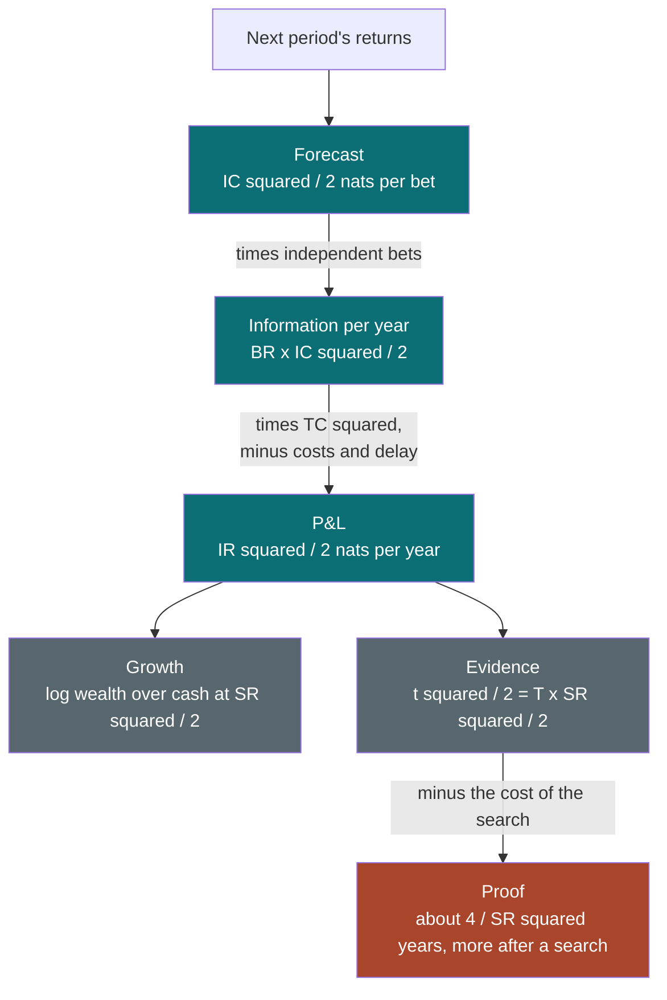

# Edge as Information

### Sharpe, IR, IC and the fundamental law as one idea: how much your forecasts know, and how long it takes to prove it

---

```{=html}
<aside class="eli5">
```

# ELI5 — the short version {#eli5}

```{=latex}
\begin{eli5}
```

**In one sentence.** The Sharpe ratio, the information ratio and the information coefficient are not three different scores but one measurement of how much a strategy knows about the future, taken at different stages; seen that way, they explain why good forecasts look feeble, why so little of a forecast reaches the profits, and why it takes years to prove anything.

**1. One thing, measured at four stages** ([§1](#1-what-an-edge-is)). A strategy makes a forecast, turns it into positions, earns profits and losses, and builds a track record. The information coefficient scores the forecast, the transfer coefficient the positions, the information ratio or Sharpe ratio the profits, and the t-statistic the record. Each stage can only lose what the forecast knew. None of them can add to it.

**2. Every ratio is signal over noise** ([§2](#2-signal-and-noise)). Each of these numbers divides a steady part by a random part. That is why they all grow with the square root of the number of independent bets: the steady part adds up bet by bet, while the noise grows only with the square root of the count. A strategy with a Sharpe ratio of one, which is good, still loses money on 47.5% of days and in about one year out of six.

**3. Good forecasts look like noise** ([§2](#2-signal-and-noise)). A forecast that picks the better of two stocks 51.6% of the time is a good one. Plotted point by point you cannot see it at all; it shows up only when hundreds of bets are averaged. Even three thousand bets measure how good it is only roughly.

**4. Edge is information, and it can be counted in bits** ([§3](#3-edge-as-information)). Information theory, the mathematics built for telephone lines, gives all these ratios a common unit. A good forecast carries about a five-hundredth of a coin toss of information per bet. In 1956 John Kelly showed that, at fair odds, money can grow exactly as fast as information arrives, and no faster: each bit can at most double your wealth. A strategy with a Sharpe ratio of one learns less than one bit about the market in a year.

**5. Work in squares** ([§3](#3-edge-as-information)). Information from independent sources adds up, and information is the square of these ratios, not the ratios themselves. That is all the famous "fundamental law of active management" says: it is bookkeeping. It is also why adding a second, unrelated strategy with a Sharpe ratio of a half lifts a portfolio from 0.5 to 0.71, as much as making the first strategy 41% better, and the second strategy is usually far easier to find.

**6. Information only leaks** ([§6](#6-using-it)). Rules such as not being allowed to sell short, trading costs and slow execution each lose some of what the forecast knew. In the document's worked example, a forecast promised an information ratio of 3.1 plausibly delivers about 0.5, keeping some 3% of the information it was sold on. The cheapest place to win some back is usually how faithfully the portfolio expresses the forecasts, not a cleverer forecast.

**7. The promise of breadth is mostly hollow** ([§7](#7-where-it-breaks)). The arithmetic treats 500 stocks as 500 independent bets. They are not: stocks move together, and a signal that fails in a given month fails on all of them at once. So adding stocks stops helping long before the arithmetic says it should, and the consistency of the forecast from month to month, not the size of the universe, sets the limit.

**8. Proof takes years** ([§3](#3-edge-as-information)). The same squared number that measures information also measures evidence. To show at the usual standard that an edge is real, a strategy needs about four divided by its squared Sharpe ratio in years of live results: four years at a Sharpe ratio of one, sixteen at a half. Every doubling of the number of ideas tried before this one was chosen adds roughly one more bit of evidence to collect. A top-quartile manager trails the benchmark over three years about one time in five, and a manager with no skill posts a top-quartile record just as often.

**9. Distrust numbers that look too good** ([§5](#5-the-ratio-zoo), [§7](#7-where-it-breaks)). Rival ratios such as Sortino and Calmar add nothing when returns behave normally, and they are noisier. Strategies that sell insurance look superb until the disaster they are paid to bear. A backtested Sharpe ratio above two is more often a mistake in the data than a discovery.

---

**If you do only three things:** compare and combine edges in squares, not ratios; before trusting a forecast's promise, count only truly independent bets and list every way the information leaks on its way to the profits; and before judging any track record, ask whether it has run for four divided by its squared Sharpe ratio in years, and longer if many ideas were tried.

```{=latex}
\end{eli5}
```

```{=html}
</aside>
```

A Sharpe ratio, an information ratio, an information coefficient and a
t-statistic are usually taught as four scorecards, each with its own formula and
its own folklore. They are one quantity, measured at different points on the path
from a forecast to a track record, and that quantity has a name in another field:
**information**. This document builds that view from the ground up and then puts
it to work. It covers how to read each ratio and what values to expect, how
signals and strategies combine, how much of a forecast survives into the P&L, and
how long a track record has to run before it says anything at all.

The emphasis is on intuition and on what practitioners actually compute. The
mathematics is kept to what makes the intuition exact, and the information theory
underneath is collected in Appendix A for a reader who wants it built from
scratch.

**How to read it.** §1 is the whole argument in miniature, with one worked
example carried from forecast to P&L. §2 is the signal-to-noise view: the gentler
of the two framings, and enough on its own to fix most misreadings of a Sharpe
ratio. §3 is the information view, and the spine of the document. §4 takes the
core ratios one at a time in a fixed format, and §5 places the wider family
(Sortino, Calmar, Omega and the rest) on one grid. §6 is practice: turning a
signal into an expected return, measuring and combining signals, counting breadth,
raising the transfer coefficient, sizing, and judging a track record. §7 is where
the framework breaks, §8 a short history, §9 the synthesis, and §10 the
references.

If you want the idea and nothing else, read §1, §2.6, §3.3 and §3.6. If you build
signals, read §2.2, §3.4 and §6.1 to §6.5. If you allocate money to strategies or
managers, read §2.5, §3.6, §6.6, §6.7 and §7.3. Appendix A is the information
theory: entropy, mutual information, relative entropy, channel capacity, the
data-processing inequality and Kelly's horse race, each with the derivation the
main text skips. Appendix B defines the remaining statistical and market
vocabulary, built up in dependency order.

**Relationship to the other notes.** [Systematic Trading
Strategies](systematic_strategies.html) uses the fundamental law to explain why
diversified rules win; this document is where the law comes from and where it
breaks.
[Momentum in Financial Markets](momentum_deep_dive.html) applies these metrics to
one family of signals in its section on testing. [Simple and Log
Returns](log_returns.html) derives the Kelly growth rate that §3.2 leans on.
[Portfolio Construction and the Covariance Matrix](portfolio_construction.html)
is the detail behind how forecasts become weights, the step the transfer
coefficient scores. [Foundations of Econometrics](econometrics_foundations.html)
covers effective sample size and multiple testing in general, and [Value at
Risk](value_at_risk.html) the tail measures that appear in §5. Each stands alone.

**Where the numbers come from.** Every number in the text is either arithmetic
from a stated formula or the output of a seeded simulation on synthetic data, and
no market data is used. The scripts that produce them are
[`figures/ei_*.py`](https://github.com/rmahfoud/quant-research/tree/master/figures){target="_blank"}
in the source repository; [`figures/ei_numbers.py`](https://github.com/rmahfoud/quant-research/blob/master/figures/ei_numbers.py){target="_blank"}
prints the tables that have no figure. Synthetic data is deliberate: the point is
what the ratios mean, and a simulation is the only place where the true value is
known and the measured one can be compared against it.

**A warning about scope.** Nothing here is investment advice. The
worked strategies are illustrations chosen to make the arithmetic visible.

**Epistemic tags.** Claims are flagged by status:

- **[Fact]** — replicated across independent datasets or implementations, with
  broad agreement among people who have looked.
- **[Contested]** — documented, but with live disagreement about magnitude,
  robustness, or cause.
- **[Hypothesis]** — a proposed mechanism, not decisively tested.
- **[Practice]** — practitioner convention. May well be right; the evidence is
  private or absent.

Untagged sentences are definitions, derivations, or arithmetic — true by
construction rather than by evidence — or findings attributed in the sentence to a
named study, whose standing is that of the study.

---

**Notation.** Returns are per period, and every ratio is **annualised** unless the
text says otherwise. $r_t$ is a strategy's return in period $t$ in excess of cash,
with mean $\mu$ and standard deviation $\sigma$, so the **Sharpe ratio** is
$\mathrm{SR} = \mu / \sigma$. Against a benchmark, $\alpha$ is the mean
**residual return** (the part not explained by the benchmark) and $\omega$ its
standard deviation, the **residual risk** (often loosely called the **tracking
error**; §3.7 gives the difference), so the **information ratio** is
$\mathrm{IR} = \alpha / \omega$. $q$ is the number of periods in a year: 12 for
monthly data, 252 for daily.

$s$ is a forecast, or **signal**, standardised to mean zero and variance one, and
$y$ the outcome it forecasts, standardised the same way: usually an asset's
residual return over the next period, divided by its residual volatility (§6.1)
and standardised across assets. The **information coefficient** is
$\mathrm{IC} = \operatorname{Corr}(s, y)$. In a cross-sectional strategy it is
computed across assets each period, giving a series $\mathrm{IC}_t$ with mean
$\overline{\mathrm{IC}}$ over time. The series varies for two reasons: sampling
noise, with variance about $1/N$, and genuine variation in how well the signal
works from one period to the next, whose standard deviation is $\sigma_{\mathrm{IC}}$.
The standard deviation of the measured series, which contains both, is
$\hat\sigma_{\mathrm{IC}}$, with $\hat\sigma_{\mathrm{IC}}^2 \approx
\sigma_{\mathrm{IC}}^2 + 1/N$ (§7.1).
$N$ is the number of assets, and $\mathrm{BR}$ the **breadth**: the number of
independent bets per year. $\mathrm{TC}$ is the **transfer coefficient**, the
correlation between the positions a forecast calls for and the positions actually
held. $\rho$ is a correlation between two things named where it appears.

$T$ is the length of a track record in years, and the **t-statistic** of a mean is
written $t$ without a subscript, so it cannot be confused with the time index.
$K$ is the number of strategies or variants tried before one was kept. $\Phi$ is
the standard normal distribution function. $R^2$ is the share of an outcome's
variance a forecast explains. $\mathrm{SNR}$ is the engineer's signal-to-noise
ratio, a ratio of variances rather than of standard deviations (§2.2). Bold
symbols are vectors and matrices: in §6.3, $\mathbf{ic}$ is a vector of ICs and
$\mathbf{C}$ the correlation matrix of the signals (in §6.6, $\mathbf{C}$ is the
correlation matrix of strategy returns). $\mathcal{N}(\mu, \sigma^2)$ is a normal
distribution with mean $\mu$ and variance $\sigma^2$. At the level of single assets,
$\alpha_i$ is asset $i$'s forecast residual return, $\sigma_i$ its residual
volatility and $\Delta w_i$ its active weight (§4.5, §6.1); $r_B$ is the
benchmark's excess return and $\beta$ a strategy's sensitivity to it (§4.2).

For information, $H$ is entropy, $I(X;Y)$ the **mutual information** between $X$
and $Y$, and $D(P\,\|\,Q)$ the **relative entropy** (Kullback–Leibler divergence)
of $P$ from $Q$. Information measured with the natural logarithm is in **nats**
and with base-two logarithms in **bits**; one nat is $1/\ln 2 \approx 1.44$
bits. $g$ is a growth rate of log wealth and $f$ a fraction of wealth bet, or a
leverage. Symbols used in only one section are defined where they appear.

---

## Table of contents

- [ELI5 — the short version](#eli5)

1. [What an edge is](#1-what-an-edge-is)
2. [Signal and noise](#2-signal-and-noise)
3. [Edge as information](#3-edge-as-information)
4. [The core ratios, one at a time](#4-the-core-ratios)
5. [Beyond the standard deviation: the ratio zoo](#5-the-ratio-zoo)
6. [Using it](#6-using-it)
7. [Where it breaks](#7-where-it-breaks)
8. [How the ideas evolved](#8-how-the-ideas-evolved)
9. [Synthesis](#9-synthesis)
10. [References](#10-references)

- [Appendix A. Information theory for investors](#appendix-a-information-theory)
- [Appendix B. Concepts and prerequisites](#appendix-b-concepts-and-prerequisites)

---

```{=latex}
\newpage
```

# 1. What an edge is {#1-what-an-edge-is}

## 1.1 The wrong intuition

Two beliefs do most of the damage, and they pull in opposite directions.

The first is that **the ratios are separate scorecards.** A quant reports an IC,
a portfolio manager an information ratio, an allocator a Sharpe ratio, a
statistician a t-statistic, and each treats the others' number as a different
fact about the strategy. They are not different facts. The IC measures how much a
forecast knows about one bet. The information ratio measures how much of that
knowledge reached the P&L in a year. The t-statistic measures how much of it a
track record has managed to reveal. One quantity is being followed down a pipe,
and the useful questions are about what happens to it at each joint.

The second belief is that **small numbers mean small edges.** A correlation of
0.05 between a forecast and the next month's return explains a quarter of one
percent of the variance. It gets the direction right 51.6% of the time. Plotted
as a scatter, it is indistinguishable from noise (§2.2). Most people who see it
for the first time conclude that it is worthless. Applied once a month to 500
stocks whose surprises are independent, it would produce an information ratio of
3.9, a number few investors have ever sustained. The truth for real signals is in
between and is mostly about why the second figure is never reached (§1.4, §7.1),
but the intuition that such a signal is worthless is wrong by an order of
magnitude.

Both beliefs dissolve once the ratios are seen as measurements of one thing. The
rest of this section sets out that one thing.

## 1.2 One pipeline, four ratios

An active strategy is a pipeline with four stages. A **forecast** says something
about next period's returns. **Positions** are taken because of it. The positions
produce a **P&L**. The P&L accumulates into a **track record** that the manager,
and everyone who allocates to them, uses to judge whether the forecast was any
good. Each stage has its own ratio.


- The **information coefficient** (IC) is the correlation between the forecast
  and the outcome, bet by bet (§4.3).
- The **transfer coefficient** (TC) is the correlation between the positions the
  forecast calls for and the positions actually held, after constraints (§4.5).
- The **information ratio** (IR) is the annual residual return divided by its
  volatility, and the **Sharpe ratio** the same thing measured against cash rather
  than a benchmark (§4.1, §4.2).
- The **t-statistic** is the information ratio multiplied by the square root of
  the number of years observed (§4.7).

The labels on the arrows are what happens between stages, and every one of them
subtracts. Nothing that happens after the forecast is made can add to what it
knows. That fact has a precise form (§3.5), and it is why the realistic question
about a strategy is never "how good is the signal?" but "how much of the signal
survives?"

## 1.3 Three ideas the rest hangs on

Everything in this document follows from three ideas and one corollary.

**Idea 1 — every ratio is a signal-to-noise ratio** (§2). Sharpe, IR, IC and the
t-statistic all have the form *systematic part divided by random part*. That is
why they share a scaling law: averaging $n$ independent observations multiplies
any of them by $\sqrt{n}$. Annualising a Sharpe ratio with $\sqrt{12}$ and the
fundamental law's $\sqrt{\mathrm{BR}}$ are the same law applied in time and across
assets. It is also why they share a failure: the law holds only when the noise is
independent, and in markets it rarely is.

**Idea 2 — squares are information, and information adds** (§3). The square of
an IC is, to a very good approximation, twice the information, in nats, that one
bet carries about its outcome. The square of an information ratio is, likewise,
twice the information a year of bets carries. The fundamental law, $\mathrm{IR}^2 = \mathrm{IC}^2 \times
\mathrm{BR}$, is therefore bookkeeping: independent bets each contribute their
share and the shares add. Squared Sharpe ratios of uncorrelated strategies add for
the same reason. Ratios are the wrong unit to reason in; their squares are the
right one.

**Idea 3 — information only leaks** (§3.5). A forecast is processed into
positions, and positions into P&L. Processing can destroy information but never
create it. The transfer coefficient is the part of the leak that constraints cause,
and its square is the share of the information that reaches the portfolio.
Costs, delays and estimation error leak more. A realistic plan for a strategy is
an inventory of leaks.

**The corollary: one number does three jobs** (§3.6). Half the squared Sharpe
ratio, $\mathrm{SR}^2/2$, is at once the rate at which a growth-optimal investor's
log wealth outgrows cash, the information the strategy extracts from the market
each year, and the evidence an observer accumulates each year that the edge is
real. The last of these turns into the most useful rule of thumb in the document:
a strategy with Sharpe ratio $\mathrm{SR}$ needs about $4 / \mathrm{SR}^2$ years of
live returns before its t-statistic can be expected to reach two. That is four years at a Sharpe
ratio of one and sixteen years at one half, before any allowance for the other
strategies that were tried and discarded.

## 1.4 A worked instance

Here is one signal followed through the pipeline. It is a monthly forecast of
which of 500 stocks will beat the others over the next month, with an average
information coefficient of 0.04: a good signal by practitioners' standards
(§4.3).

- **One bet.** An IC of 0.04 calls the direction of a stock's relative return
  correctly 51.3% of the time. In information terms each bet carries about 0.0012
  bits, so it takes some 860 bets to learn one bit, the information in a single
  fair coin toss (§3.1).
- **The promise.** The fundamental law counts $500 \times 12 = 6{,}000$ bets a
  year and promises $\mathrm{IR} = 0.04 \times \sqrt{6{,}000} = 3.10$.
- **Breadth that is really there.** The 500 bets in a month are not
  independent: the signal works better in some months than in others, so all 500
  outcomes share a common component. If the IC itself varies from month to month
  with a standard deviation of 0.08, a typical value, on top of the sampling noise
  from having only 500 stocks, the attainable information ratio falls to 1.51
  (§7.1 gives the formula). Three quarters of the information the law promised
  was never there.
- **Constraints.** A transfer coefficient of 0.6, at the top of the usual
  long-only range and below a typical long-short one (§4.5), cuts the information
  ratio to 0.91.
- **Delay.** Losing a tenth of the IC between the forecast and the trade, from
  stale data or slow execution, leaves 0.82.
- **Costs.** Trading costs of 1.5% a year, against a tracking error of 5%, take
  0.3 off the information ratio, leaving 0.52.

```{=latex}
\begin{center}
\includegraphics[width=\linewidth]{quant-research/figures/ei_leak.pdf}
\end{center}
```

```{=html}

```

In the units that add, squared information ratios, the strategy keeps 2.8% of
what the fundamental law promised. (Strictly, costs are not a loss of information
but a deduction from the return; the chart shows them in the same units because
what matters is what is left.) The final 0.52 is still a strategy most
institutions would be pleased to run. But it needs $4 / 0.52^2 \approx 15$ years
of live returns before its t-statistic reaches two, against five months for the
3.10 it was sold as. That gap between the promise and what can be proved is
the subject of most of what follows.

## 1.5 What this document is not

It is not a guide to finding signals: where forecasts come from is the subject of
the strategy notes, and here a forecast is taken as given and scored. It is not a
catalogue of performance ratios, although §5 places the common ones on a single
grid. And it is not a treatment of portfolio optimisation, which appears only
through the transfer coefficient. It is about measurement: what each number means,
how the numbers relate, and how much each can be trusted.

> ### §1 Key takeaways
>
> 1. The IC, the transfer coefficient, the information ratio and the t-statistic
>    score the four stages of one pipeline (forecast, positions, P&L, track
>    record) and follow one quantity down it.
> 2. Every one of them is a signal-to-noise ratio, so all of them scale with the
>    square root of the number of independent observations, and all of them break
>    when the observations are not independent.
> 3. Reason in squares. Squared ratios are information, and information from
>    independent sources adds; the fundamental law is that bookkeeping.
> 4. Information only leaks between stages. The realistic question is how much of
>    a signal survives, not how good it is.
> 5. A good signal with an IC of 0.04 on 500 stocks is promised an information
>    ratio of 3.1 and plausibly delivers about 0.5, keeping some 3% of the promised
>    information.
> 6. A strategy needs roughly $4/\mathrm{SR}^2$ years for its t-statistic to reach
>    two: four years at a Sharpe ratio of one, sixteen at one half.

```{=latex}
\newpage
```

# 2. Signal and noise {#2-signal-and-noise}

This section is the gentler of the two framings. It needs nothing beyond means,
standard deviations and correlations, and on its own it fixes most of the ways a
Sharpe ratio gets misread. §2.6 then shows that it is the information framing of
§3 in different units.

## 2.1 Every ratio is a mean over a standard deviation

Each of the core ratios divides a systematic part by a random part:

| Ratio | Signal (top) | Noise (bottom) | Measured per |
|---|---|---|---|
| Sharpe ratio | mean return over cash, $\mu$ | its standard deviation, $\sigma$ | year |
| Information ratio | mean residual return, $\alpha$ | residual risk, $\omega$ | year |
| Information coefficient | covariance of forecast and outcome | product of their standard deviations | bet |
| IC information ratio | mean IC, $\overline{\mathrm{IC}}$ | standard deviation of the measured IC over time, $\hat\sigma_{\mathrm{IC}}$ | period |
| t-statistic | sample mean | standard error of the sample mean | whole record |

Each answers the same question: how many units of noise is the signal worth? A
Sharpe ratio of 0.5 says that a year's expected excess return is half a standard
deviation of a year's excess return. A t-statistic of 2 says that the average
return over the whole record is two standard errors from zero. The information
coefficient is the odd one out only in appearance: a correlation is the covariance
of two standardised variables, so it too is a systematic part (the co-movement of
forecast and outcome) measured in units of their noise.

Seeing them as one kind of object explains their arithmetic. A Sharpe ratio
measured monthly and one measured annually differ by $\sqrt{12}$ for the same
reason that a t-statistic is a Sharpe ratio times $\sqrt{T}$: both convert a
signal-to-noise ratio for one period into one for many periods (§2.3).

## 2.2 Correlation as a signal fraction

Write the standardised outcome as a part the forecast explains plus a part it
does not:

$$
y \;=\; \mathrm{IC}\cdot s \;+\; \sqrt{1-\mathrm{IC}^2}\;\varepsilon ,
$$

where $s$ is the standardised forecast and $\varepsilon$ is noise with variance
one, independent of $s$. The two parts have variances $\mathrm{IC}^2$ and
$1-\mathrm{IC}^2$, so

$$
R^2 = \mathrm{IC}^2, \qquad
\mathrm{SNR} \;=\; \frac{\text{variance of the signal part}}{\text{variance of the noise part}} \;=\; \frac{\mathrm{IC}^2}{1-\mathrm{IC}^2}.
$$

$\mathrm{SNR}$ here is the engineer's signal-to-noise ratio, a ratio of variances
(powers). The ratios of §2.1 are ratios of amplitudes, measured in standard
deviations, and for a small IC the power ratio is close to the square of the
amplitude ratio: $\mathrm{SNR} \approx \mathrm{IC}^2$. §2.6 turns on that square.

At an IC of 0.05 the signal part carries a quarter of one percent of the
variance, and the noise variance is four hundred times the signal's. This is what
such a forecast looks like:

```{=latex}
\begin{center}
\includegraphics[width=\linewidth]{quant-research/figures/ei_signal_cloud.pdf}
\end{center}
```

```{=html}

```

The left panel is a good signal. Bet by bet it is invisible; there is no pattern
in the grey cloud that an eye could find. It shows up only in averages: the 300
bets with the highest forecasts beat the 300 with the lowest by a fifth of a
standard deviation. The right panel, an IC of 0.30, is what people imagine a
working forecast looks like. In liquid markets nobody has one for long (§4.3).

The left panel also shows how hard an IC is to measure. Its true value is 0.05,
and 3,000 bets estimated it at 0.032. The standard error of a correlation
estimated from $n$ independent pairs is close to $1/\sqrt{n}$, here 0.018, so even
3,000 bets pin the IC down only to within about $\pm 0.04$, two standard errors
either side. A signal has to be used many times before anyone, its owner
included, knows how good it is.

The **hit rate**, the share of bets whose direction is right, is a third view of
the same number. If forecast and outcome are jointly normal with correlation
$\mathrm{IC}$, the probability that they have the same sign is
$\tfrac12 + \arcsin(\mathrm{IC})/\pi$:

| IC | 0.02 | 0.05 | 0.10 | 0.20 | 0.30 |
|---|---|---|---|---|---|
| Hit rate | 50.6% | 51.6% | 53.2% | 56.4% | 59.7% |

Below about 0.3 the hit rate is close to $\tfrac12 + \mathrm{IC}/\pi$: each 0.01 of
IC buys about a third of a percentage point of hit rate. These are not just the
hit rates of one kind of forecast: Appendix A.8 shows that the information an IC of
0.05 carries caps the hit rate of any method at 52.5%. Hit rate is a coarse
summary, because it ignores how big the wins and losses are; §4.6 says when it
misleads.

## 2.3 The square-root law

Add up $n$ independent bets, each with the same expected payoff $m$ and the same
standard deviation $v$. The expected total is $n m$; the standard deviation of the
total is $\sqrt{n}\, v$, because variances add while standard deviations do not.
The signal-to-noise ratio of the total is

$$
\frac{n\,m}{\sqrt{n}\,v} \;=\; \sqrt{n}\;\frac{m}{v}.
$$

Signal accumulates in proportion to the number of bets; noise only in proportion
to its square root. That one line is the engine of every active strategy, and it
works the same way in two directions.

- **In time.** A year is $q$ periods, so an annual Sharpe ratio is the per-period
  Sharpe ratio times $\sqrt{q}$, and a t-statistic over $T$ years is the annual
  Sharpe ratio times $\sqrt{T}$.
- **Across assets.** A year of a strategy is $\mathrm{BR}$ independent bets, each
  with signal-to-noise ratio close to $\mathrm{IC}$ (a position proportional to the
  standardised forecast earns $s\,y$, whose mean is $\mathrm{IC}$ and whose standard
  deviation is $\sqrt{1+\mathrm{IC}^2}$, close to one), so the annual information
  ratio is $\mathrm{IC}\sqrt{\mathrm{BR}}$. That is Grinold's fundamental law of
  active management ([Grinold, 1989](https://doi.org/10.3905/jpm.1989.409211){target="_blank"}),
  and it is the square-root law with bets in place of periods.

The law also explains why good strategies feel bad from the inside. A strategy
with an annual Sharpe ratio of 1 has a daily Sharpe ratio of $1/\sqrt{252} =
0.063$. Day by day it is a coin that comes up heads 52.5% of the time: it loses
money on 47.5% of days, 38.6% of months and 15.9% of years (§2.5). The edge is
real and the experience is mostly noise.

## 2.4 Where the square-root law fails

The law needs the noise in the bets to be independent. It rarely is, and the
failures come in three kinds.

**Noise shared across bets.** If the surprises in $N$ bets share an average
pairwise correlation $\rho$, the variance of their average is that of
$N/(1+(N-1)\rho)$ independent bets. This **effective number of independent
bets** (not the entropy-based "effective number of bets" of Appendix A.12) falls
startlingly fast:

| Average correlation of the surprises, 500 bets | 0 | 0.002 | 0.005 | 0.01 | 0.02 | 0.05 |
|---|---|---|---|---|---|---|
| Effective number of independent bets | 500 | 250 | 143 | 84 | 46 | 19 |

A correlation of 0.01, far too small to see in any single pair of stocks, turns
500 bets into 84. This is why cross-sectional strategies neutralise their
positions against market, sector and style factors: shared factor exposure is
precisely a correlation between the surprises in different bets, and removing it
is how $\rho$ is pushed toward zero.

**Noise shared across time.** If returns are autocorrelated, a year is not $q$
independent periods. [Lo (2002)](https://doi.org/10.2469/faj.v58.n4.2453){target="_blank"}
gives the correct multiplier for annualising a Sharpe ratio:

$$
\eta(q) \;=\; \frac{q}{\sqrt{q + 2\sum_{k=1}^{q-1}(q-k)\,\rho_k}},
$$

where $\rho_k$ is the autocorrelation of returns at lag $k$. With no
autocorrelation it is $\sqrt{q}$. For monthly returns whose first-order
autocorrelation $\rho_1$ decays geometrically, so that $\rho_k = \rho_1^k$:

| Monthly autocorrelation | −0.1 | 0 | 0.1 | 0.2 | 0.3 | 0.4 |
|---|---|---|---|---|---|---|
| Correct multiplier (vs $\sqrt{12} = 3.46$) | 3.80 | 3.46 | 3.16 | 2.88 | 2.61 | 2.36 |
| Overstatement from using $\sqrt{12}$ | −9% | 0% | +10% | +20% | +32% | +47% |

Positive autocorrelation is the signature of returns that are smoothed, by stale
prices in illiquid assets or by a manager marking their own book, and it makes
$\sqrt{12}$ overstate the annual Sharpe ratio (§7.3). Negative autocorrelation,
common in mean-reverting strategies, does the reverse.

**Noise that never averages.** Some noise is common to every bet in a period,
however many bets there are. The most important case is the IC itself varying
from one period to the next: in a month when the signal does not work, it fails on
all 500 stocks at once. That component does not shrink with breadth, so it puts a
ceiling on the information ratio. It is the main reason the fundamental law
overpromises, and §7.1 measures it.

## 2.5 What a Sharpe ratio feels like

A Sharpe ratio is an abstraction until it is translated into experiences an
investor actually has. For normal, independent returns:

| Sharpe | Losing month | Losing year | Losing 5 years | Worst 10-year drawdown, expected | P(drawdown > 2 vol) | Years to $t = 2$ |
|---|---|---|---|---|---|---|
| 0.25 | 47% | 40% | 29% | 3.0 × annual vol | 81% | 64 |
| 0.5 | 44% | 31% | 13% | 2.4 × | 64% | 16 |
| 0.75 | 41% | 23% | 4.7% | 2.1 × | 45% | 7.1 |
| 1.0 | 39% | 16% | 1.3% | 1.8 × | 27% | 4.0 |
| 1.5 | 33% | 6.7% | < 0.1% | 1.4 × | 7.5% | 1.8 |
| 2.0 | 28% | 2.3% | < 0.1% | 1.2 × | 1.7% | 1.0 |
| 3.0 | 19% | 0.1% | < 0.1% | 0.9 × | 0.1% | 0.4 |

The chance of losing money over a period of $\tau$ years is
$\Phi(-\mathrm{SR}\sqrt{\tau})$, and the last column is $4/\mathrm{SR}^2$ (§3.6).
Drawdowns are in units of annual volatility ("2 vol" is twice the annual
volatility), measured on log wealth, from 4,000 simulated ten-year daily paths.

Three readings are worth remembering.

- **Sharpe ratios below one are mostly noise at any horizon an investor
  watches.** A Sharpe-0.5 strategy loses money in almost a third of calendar
  years, and in one five-year stretch out of eight.
- **Drawdowns are large and normal.** A Sharpe-0.5 strategy run at 10% volatility
  should expect a worst drawdown in a decade of about 24% in log terms, roughly a
  fifth of peak wealth, and has a two-in-three chance of exceeding 20% in log
  terms (18% of peak wealth). A rule that fires a manager at a drawdown of that
  size fires most good Sharpe-0.5 managers within ten years. Real returns have
  fatter tails than these, so real drawdowns are worse.
- **The proof column is the brutal one.** It is the subject of §3.6.

## 2.6 From signal-to-noise to information

Signal-to-noise ratios have a natural unit in communication theory.
[Shannon (1948)](https://people.math.harvard.edu/~ctm/home/text/others/shannon/entropy/entropy.pdf){target="_blank"}
showed that a channel that adds Gaussian noise to a signal, at signal-to-noise
ratio $\mathrm{SNR}$, can carry at most

$$
C \;=\; \tfrac12 \log_2\!\left(1 + \mathrm{SNR}\right) \ \text{bits per use}
$$

(the capacity of the Gaussian channel, which the Shannon–Hartley formula restates
per second; Appendix A.6). Treat the forecast as a message the market is sending
about next period's return, with the noise of §2.2. Substitute
$\mathrm{SNR} = \mathrm{IC}^2/(1-\mathrm{IC}^2)$, so that $1 + \mathrm{SNR} =
1/(1-\mathrm{IC}^2)$:

$$
C \;=\; -\tfrac12 \log_2\!\left(1 - \mathrm{IC}^2\right) \;\approx\; \frac{\mathrm{IC}^2}{2\ln 2}\ \text{bits} \;=\; \frac{\mathrm{IC}^2}{2}\ \text{nats}.
$$

Because a normally distributed input is the one that achieves this capacity, the
exact expression is also the **mutual information** between a forecast and an
outcome that are jointly normal with correlation $\mathrm{IC}$ (Appendix A.4): the
amount by which knowing the forecast reduces uncertainty about the outcome. So the
signal-to-noise view and the information view are one view in two units, and the
conversion between them is where the square comes from. A ratio is an amplitude.
Its square is information.

> ### §2 Key takeaways
>
> 1. Every core ratio is a signal-to-noise ratio: a systematic part divided by a
>    random part, in units of noise.
> 2. An IC is a signal fraction. At 0.05 the signal carries 0.25% of the variance,
>    is invisible bet by bet, and shows up only in averages.
> 3. An IC is hard to measure: from $n$ independent bets its standard error is
>    about $1/\sqrt{n}$, so 3,000 bets pin it down only to $\pm 0.04$.
> 4. The square-root law, signal growing with $n$ and noise with $\sqrt{n}$, is
>    behind both the $\sqrt{12}$ of annualisation and the $\sqrt{\mathrm{BR}}$ of
>    the fundamental law.
> 5. The law fails when noise is shared. A 0.01 correlation among surprises cuts
>    500 bets to 84; autocorrelation of 0.2 makes $\sqrt{12}$ overstate a Sharpe
>    ratio by 20%; variation in the IC over time sets a ceiling breadth cannot
>    lift.
> 6. A Sharpe ratio of 1 loses money on 47.5% of days and 16% of years; a Sharpe
>    ratio of 0.5 has a two-in-three chance of a drawdown above twice its annual
>    volatility within a decade.
> 7. Shannon's capacity formula, applied to a forecast, turns a signal-to-noise
>    ratio into information: about $\mathrm{IC}^2/2$ nats per bet.

```{=latex}
\newpage
```

# 3. Edge as information {#3-edge-as-information}

## 3.1 What information means here

Information, in Shannon's sense, is the reduction of uncertainty, measured by the
number of yes-or-no questions it would settle. Learning the outcome of a fair coin
toss is one **bit**. Learning which of eight equally likely outcomes occurred is
three bits. A message that changes the odds without settling anything carries a
fraction of a bit. The uncertainty of a random outcome before any message arrives
is its **entropy**, and the information a forecast carries about an outcome, its
mutual information, is how much the entropy of the outcome falls once the forecast
is known (Appendix A.1 to A.3).

For a forecast and outcome that are jointly normal with correlation
$\mathrm{IC}$, §2.6 gave the amount: $-\tfrac12\log_2(1-\mathrm{IC}^2)$ bits per
bet, close to $\mathrm{IC}^2/2$ nats. Put in numbers:

| IC | 0.01 | 0.02 | 0.05 | 0.10 | 0.20 |
|---|---|---|---|---|---|
| Bits per bet | 0.00007 | 0.0003 | 0.0018 | 0.0073 | 0.029 |
| Bets needed to learn one bit | 13,900 | 3,500 | 550 | 140 | 34 |

This is the clearest statement of what active management is. A good signal tells
you roughly a five-hundredth of a coin toss about each bet. The business is to
collect those fractions of a bit thousands of times a year and pay as little as
possible to do it. Everything in §3.3 and §3.5 is a consequence of taking that
sentence literally.

One difference between the two measures matters later. Mutual information counts
any dependence between forecast and outcome, linear or not. The IC counts only the
linear part. For jointly normal variables they agree; for a forecast whose payoff
is in the tails, or that works only for large signals, the IC understates what it
knows (§7.5).

## 3.2 Kelly: money grows at the rate information arrives

In 1956 John Kelly, a physicist at Bell Labs, asked what a private wire is worth
to a gambler who receives tips on horse races over it, when the wire is noisy and
the tips are sometimes wrong. His answer, in a paper titled *A New Interpretation
of Information Rate* ([Kelly, 1956](https://www.princeton.edu/~wbialek/rome/refs/kelly_56.pdf){target="_blank"}),
is the bridge between information theory and money: **if the odds are fair, the
fastest rate at which a gambler's wealth can grow is exactly the rate at which
the wire carries information about the race.**

A two-horse race makes it concrete. The horses are equally matched and each pays
2-for-1, which is fair, and the wire names the winner correctly 60% of the time.
The growth-optimal gambler bets 60% of their wealth on the tipped horse and 40% on
the other. When the tip is right, wealth multiplies by $0.6 \times 2 = 1.2$; when it is wrong, by $0.8$. The
expected growth of log wealth per race is

$$
0.6\log_2 1.2 + 0.4 \log_2 0.8 \;=\; 0.029 \ \text{bits},
$$

and the mutual information between tip and winner is $1 - H(0.6) = 0.029$ bits,
where $H(0.6)$ is the entropy of a 60–40 coin. They are the same number, and the
identity is exact (Appendix A.10). Each bit of information doubles wealth; the
gambler with 0.029 bits a race doubles their money every 34 races.

Markets are not horse races, but the identity survives to leading order. For a
strategy with Sharpe ratio $\mathrm{SR}$, rebalanced continuously at the
growth-optimal leverage, log wealth outgrows cash at the rate

$$
g^\ast \;=\; \frac{\mathrm{SR}^2}{2} \ \text{per year}
$$

([Simple and Log Returns](log_returns.html) derives it). The same calculation can
be run bet by bet. Take a forecast with correlation $\mathrm{IC}$ to a zero-mean,
normally distributed return, both standardised. Given the forecast $s$, the
return has mean $\mathrm{IC}\cdot s$ and variance $1-\mathrm{IC}^2$ (§2.2), so that
bet's Sharpe ratio is $\mathrm{IC}\cdot s/\sqrt{1-\mathrm{IC}^2}$. Sizing each bet at
its growth-optimal leverage earns half that squared, and averaging over forecasts
(the mean of $s^2$ is one) gives $\mathrm{IC}^2/(2(1-\mathrm{IC}^2))$ nats per bet,
against the mutual information $-\tfrac12\ln(1-\mathrm{IC}^2)$:

| IC | 0.05 | 0.10 | 0.20 | 0.30 | 0.50 |
|---|---|---|---|---|---|
| Growth ÷ information | 1.001 | 1.005 | 1.021 | 1.049 | 1.159 |

For every IC a practitioner will meet, growth and information agree to within a
fraction of a percent. The small excess at large ICs is an artefact of the
quadratic approximation to log growth behind $\mathrm{SR}^2/2$, which overstates
growth when a single bet's Sharpe ratio, given its forecast, is large. In general
markets [Barron & Cover (1988)](https://doi.org/10.1109/18.21241){target="_blank"}
proved the inequality that holds without any distributional assumption: side
information can raise the growth rate of wealth by at most its mutual information
with the market. A bit can at most double your money.

Converted, the Sharpe ratios that practitioners talk about are startlingly small
amounts of information:

| Annual Sharpe | 0.5 | 1.0 | 1.5 | 2.0 | 3.0 |
|---|---|---|---|---|---|
| Nats a year, $\mathrm{SR}^2/2$ | 0.125 | 0.50 | 1.13 | 2.0 | 4.5 |
| Bits a year | 0.18 | 0.72 | 1.6 | 2.9 | 6.5 |

A strategy with a Sharpe ratio of one, the level that gets a strategy funded,
learns less than one bit about the market each year. That is not a paradox. It is
the reason edges are hard to find, easy to lose, and slow to prove.

Kelly's growth-optimal bet is used here as a yardstick, not a recommendation.
Whether anyone should actually maximise expected log wealth is a separate and
contested question ([Samuelson, 1971](https://finance.martinsewell.com/money-management/Samuelson1971.pdf){target="_blank"});
§6.6 covers what practitioners do instead.

## 3.3 Squares add: the fundamental law as bookkeeping

Square the fundamental law and halve both sides:

$$
\underbrace{\frac{\mathrm{IR}^2}{2}}_{\text{information per year}} \;=\; \mathrm{BR} \;\times\; \underbrace{\frac{\mathrm{IC}^2}{2}}_{\text{information per bet}} .
$$

Read this way the law stops being a formula and becomes an accounting identity:
a year of independent bets carries the sum of what each bet carries. The square
root in $\mathrm{IC}\sqrt{\mathrm{BR}}$ is only what bookkeeping in squares looks
like when it is reported as a ratio.

| IC | Bets a year | IR | Nats a year | Years to $t = 2$ |
|---|---|---|---|---|
| 0.05 | 12 (one market, monthly) | 0.17 | 0.015 | 133 |
| 0.05 | 600 (50 markets, monthly) | 1.22 | 0.75 | 2.7 |
| 0.05 | 6,000 (500 independent stocks, monthly) | 3.87 | 7.5 | 0.3 |
| 0.10 | 250 (one market, daily) | 1.58 | 1.25 | 1.6 |

The first row is a market timer with a good signal: a Sharpe ratio too small to
confirm in a lifetime. The third is what the same skill would earn if 500 stocks
really were 500 independent bets, which they are not (§2.4, §7.1). The law is
exact bookkeeping; the hard part is counting the bets.

The same rule governs everything that combines independent sources of edge.

**Strategies.** The best mix of uncorrelated strategies, with risk allocated in
proportion to each one's Sharpe ratio, has a squared Sharpe ratio equal to the sum
of theirs (§6.6). The reason is one line of mean-variance algebra: the best
attainable squared Sharpe ratio from strategies with mean excess returns $\mu$ (a
vector) and covariance matrix $\Sigma$ is $\mu^{\top}\Sigma^{-1}\mu$, and when
$\Sigma$ is diagonal that is $\sum_i \mu_i^2/\sigma_i^2 = \sum_i \mathrm{SR}_i^2$
(Appendix B.40). Two uncorrelated strategies with Sharpe ratio 0.5 make 0.71;
three make 0.87. For $n$ strategies of equal Sharpe ratio with pairwise
correlation $\rho$, the combination's Sharpe ratio is
$\mathrm{SR}\sqrt{n/(1+(n-1)\rho)}$, which can never exceed $\mathrm{SR}/\sqrt{\rho}$
however many are added:

| Ten strategies of Sharpe 0.5, pairwise correlation | 0 | 0.1 | 0.3 | 0.5 |
|---|---|---|---|---|
| Combined Sharpe | 1.58 | 1.15 | 0.82 | 0.67 |

**Active bets on a benchmark.** [Treynor & Black (1973)](https://doi.org/10.1086/295508){target="_blank"}
showed that adding active positions to a benchmark portfolio gives a best
achievable squared Sharpe ratio equal to the benchmark's plus the sum of the
squared **appraisal ratios** (residual return over residual risk) of the active
positions, whose residual returns the model takes to be uncorrelated. Information
from security analysis adds to the market's.

**Timing.** [Campbell & Thompson (2008)](https://www.nber.org/papers/w11468){target="_blank"}
showed that a forecast of the market with predictive $R^2$ lets an investor raise
the Sharpe ratio $\mathrm{SR}$ of a buy-and-hold position to
$\sqrt{(\mathrm{SR}^2 + R^2)/(1-R^2)}$, with the Sharpe ratio and $R^2$ both
measured per period. Timing a market whose annual Sharpe ratio is 0.4 (0.115 a
month) with a monthly $R^2$ of 1% raises the annual Sharpe ratio to 0.53; an $R^2$
of 0.25% raises it to 0.44. An $R^2$ that every econometrics course would call
negligible is worth a third more Sharpe ratio. (Set the market's own Sharpe ratio
to zero and the formula gives $R/\sqrt{1-R^2}$, close to $R$, which is the timing
forecast's IC: one bet a period with a Sharpe ratio of about the IC, so twelve a
year give $\mathrm{IC}\sqrt{12}$, the fundamental law with a breadth of twelve.)

Three working consequences follow from the bookkeeping.

- **Price improvements in squares.** Raising an IC by 10% raises information by
  21%, and so does raising the transfer coefficient by 10%. Raising breadth by 10%
  raises information by only 10%. A unit of effort should go wherever it buys the
  most squared ratio, and that is often the transfer coefficient (§6.5).
- **A second strategy beats a better first one.** Adding an uncorrelated
  Sharpe-0.5 strategy to an existing Sharpe-0.5 strategy lifts the total to 0.71,
  the same as improving the first strategy's Sharpe ratio by 41%. The second is
  usually far easier to find.
- **Correlation of noise is what matters.** The combination formula depends on
  the correlation of the strategies' returns, which is dominated by their noise.
  Two strategies built on different ideas but exposed to the same factor are, for
  this purpose, one strategy.

## 3.4 Redundancy: correlated signals carry overlapping information

When two signals are correlated, part of what one knows the other already knew.
For standardised signals with ICs $a$ and $b$ and correlation $\rho$ between them,
the best linear combination has

$$
\mathrm{IC}_{\text{combined}}^2 \;=\; \frac{a^2 + b^2 - 2\rho\, a b}{1-\rho^2}.
$$

| IC of signal 1 | IC of signal 2 | Correlation between signals | Combined IC | Weight on signal 2, per unit of signal 1 |
|---|---|---|---|---|
| 0.04 | 0.04 | 0 | 0.057 | +1.0 |
| 0.04 | 0.04 | 0.3 | 0.050 | +1.0 |
| 0.04 | 0.04 | 0.5 | 0.046 | +1.0 |
| 0.04 | 0.04 | 0.8 | 0.042 | +1.0 |
| 0.04 | 0.02 | 0.5 | 0.040 | 0 |
| 0.04 | 0 | 0.5 | 0.046 | −0.5 |
| 0.04 | 0 | 0.8 | 0.067 | −0.8 |

The first four rows are the intuitive case: two equally good signals help less the
more they overlap, and at a correlation of 0.8 the second adds only 5%. The fifth
row is the trap. A signal with half the IC of the first, correlated 0.5 with it,
adds nothing at all: everything it knows about returns it knows through the first
signal.

The last two rows are the surprise. A signal with **no** predictive power of its
own, but correlated with the first, raises the combined IC, and at a correlation of
0.8 raises it by two thirds. It works by measuring part of the first signal's
noise, so that subtracting it leaves a cleaner forecast. This is what
neutralising a signal against its industry, size or market beta does: if a value
signal is partly a bet on which sectors are cheap, and sector membership carries
noise but little information about next month's relative returns, removing the
sector component raises the IC. It does not contradict §3.5, because the second
signal is a new input: information about the noise is still information.

## 3.5 Information only leaks

Suppose the positions are connected to the outcome only through the forecast: the
portfolio is built from the forecast, plus constraints, costs and noise that know
nothing more about the future. Then the positions cannot carry more information
about the outcome than the forecast did. This is the **data-processing
inequality** (Appendix A.7), and it is the formal version of a fact every
practitioner learns the hard way: nothing done to a signal after it is formed
makes it smarter.

The **transfer coefficient** measures one leak exactly.
[Clarke, de Silva & Thorley (2002)](https://papers.ssrn.com/sol3/papers.cfm?abstract_id=290916){target="_blank"}
showed that the fundamental law becomes

$$
\mathrm{IR} \;=\; \mathrm{TC} \times \mathrm{IC} \times \sqrt{\mathrm{BR}}
\qquad\Longrightarrow\qquad
\mathrm{IR}^2 \;=\; \mathrm{TC}^2 \times \mathrm{IC}^2 \times \mathrm{BR},
$$

where $\mathrm{TC}$ is the correlation between the risk-adjusted positions the
forecasts call for and those actually held. In squares, $\mathrm{TC}^2$ is the
share of the forecast's information that survives into the portfolio:

| Transfer coefficient | 1.0 | 0.9 | 0.8 | 0.6 | 0.5 | 0.4 | 0.3 |
|---|---|---|---|---|---|---|---|
| Information kept | 100% | 81% | 64% | 36% | 25% | 16% | 9% |

[Practice] Constrained portfolios commonly run transfer coefficients between about
0.3 and 0.9. [Clarke, de Silva & Thorley (2002)](https://papers.ssrn.com/sol3/papers.cfm?abstract_id=290916){target="_blank"} find that the long-only constraint
lowers it more than any other single restriction. A long-only manager with a TC of
0.4 is throwing away five sixths of their information before a single trade is
made.

The other leaks have the same character.

- **Delay.** Forecasts decay. If a signal's IC halves every $h$ days, a delay of
  $d$ days between forecast and trade multiplies the IC by $2^{-d/h}$ and the
  information by the square of that. A one-day delay on a signal with a five-day
  half-life keeps 87% of the IC and 76% of the information.
- **Estimation error.** The alphas fed to the optimiser are estimates. Error in
  them makes the portfolio partly a bet on the error, which carries no information
  about returns, and [Zhou (2008)](https://www.pm-research.com/content/iijpormgmt/34/4/26){target="_blank"}
  shows that unchecked it can destroy most of what the fundamental law promises.
- **Risk model error.** A misestimated covariance matrix tilts the portfolio
  toward bets that look diversifying and are not, which is another way of
  overcounting breadth.
- **Costs and turnover limits.** Strictly these are deductions rather than lost
  information, but a turnover limit acts like a delay: the portfolio trails the
  forecast, and the gap between them is information not acted on.

## 3.6 One number, three meanings: growth, evidence, proof

Compare two hypotheses about a strategy's annual returns: it has skill, with
returns distributed as $\mathcal{N}(\mu, \sigma^2)$, or it has none, with returns $\mathcal{N}(0,
\sigma^2)$. The relative entropy between the two, the expected log-likelihood ratio
that one year of returns provides in favour of skill when skill is real, is
(Appendix A.5)

$$
D\big(\mathcal{N}(\mu,\sigma^2)\,\big\|\,\mathcal{N}(0,\sigma^2)\big) \;=\; \frac{\mu^2}{2\sigma^2} \;=\; \frac{\mathrm{SR}^2}{2} \ \text{nats per year}.
$$

That is the same number as the Kelly growth rate of §3.2. One quantity, half the
squared Sharpe ratio, measures three different things:

1. **Growth.** How fast a growth-optimal investor's log wealth outgrows cash.
2. **Information.** How much the strategy learns about the market each year.
3. **Evidence.** How fast an observer of the returns becomes convinced that the
   skill is real.

The third meaning is the practical one, because it converts directly into time.
After $T$ years the expected evidence is $T\,\mathrm{SR}^2/2$ nats. The
t-statistic of the mean return is $t = \mathrm{SR}\sqrt{T}$, so the evidence is
$t^2/2$: half the squared t-statistic. The conventional bar of $t = 2$ is 2 nats of
evidence, a likelihood ratio of $e^2 \approx 7.4$ in favour of skill, and it is
reached after

$$
T \;=\; \frac{4}{\mathrm{SR}^2} \ \text{years}.
$$

This is when the *expected* t-statistic reaches two. The measured one scatters
around it with a standard deviation of about one, so a strategy observed for
exactly that long clears the bar only about half the time. To clear it four times
in five, the expected t-statistic must be about 2.8, which takes
$7.8/\mathrm{SR}^2$ years: nearly eight years at a Sharpe ratio of one, and
thirty-one at a half (Appendix B.13).

```{=latex}
\begin{center}
\includegraphics[width=\linewidth]{quant-research/figures/ei_track_record.pdf}
\end{center}
```

```{=html}

```

The left panel is the same fact as a confidence band. Measured from daily or
monthly data, the standard error of an annualised Sharpe ratio is close to
$1/\sqrt{T}$, almost whatever the true value. A Sharpe ratio of 1.0 measured over
ten years has a 95% range of 0.38 to 1.62; a Sharpe ratio of 0.5 over ten years
cannot be distinguished from zero. Ten years of a true Sharpe ratio of 1.0 and ten
years of a true 0.5 produce ranges that overlap over most of their width.

The right panel adds the cost of having looked. A researcher who tried $K$
strategies and kept the best one has to clear a higher bar, because the best of
$K$ lucky draws looks better than any single one. With the simplest correction
(Bonferroni: test each of the $K$ at a significance level of 5% divided by $K$,
which holds the chance of any false discovery at 5%), the bar and the evidence it
demands rise like this:

| Strategies tried, $K$ | 1 | 10 | 100 | 1,000 | 10,000 |
|---|---|---|---|---|---|
| Bar for the t-statistic | 1.96 | 2.81 | 3.48 | 4.06 | 4.56 |
| Evidence needed, nats | 1.9 | 3.9 | 6.1 | 8.2 | 10.4 |
| Years at Sharpe 1.0 | 3.8 | 7.9 | 12.1 | 16.4 | 20.8 |

Each tenfold increase in the search adds a little over 2 nats to the evidence
required, close to $\ln 10 = 2.3$: for large $K$ the evidence demanded grows like
$\ln K$. A doubling of the search therefore adds about $\ln 2$ nats, which is one
bit, so beyond the first few trials **each doubling of the search costs about one
bit of evidence**. At a Sharpe ratio of one, evidence arrives at half a nat a
year, so a bit, 0.69 nats, takes 1.4 years to collect. The information view makes
the multiple-testing penalty feel like what it is: a debt in the same currency as
the edge, paid in years.

There is one more way to see the identity. In the normal model, a growth-optimal
investor who knows $\mu$ and $\sigma$ holds leverage $f^\ast = \mu/\sigma^2$, and each
return $r$ changes their log wealth relative to cash by $f^\ast r - \tfrac12 (f^\ast)^2\sigma^2
= \mu r/\sigma^2 - \mu^2/(2\sigma^2)$ (Appendix A.11). The log-likelihood ratio
that the same return provides for "skill" against "no skill" is the log of the
ratio of the two normal densities, $\big(r^2 - (r-\mu)^2\big)/(2\sigma^2)$, which
expands to the same expression. Return by return, a Kelly investor's log wealth
is a running tally of the evidence for their own edge.

## 3.7 Same name, different thing

The vocabulary of this field was built by several communities that did not
coordinate. The collisions below cause real errors.

| Term | Meaning A | Meaning B | Why it matters |
|---|---|---|---|
| Information ratio | Residual return over residual risk, after removing the benchmark's beta (Grinold and Kahn) | Active return (portfolio minus benchmark) over tracking error, with no beta adjustment (common in consultants' reports) | A high-beta fund in a rising market has a high B and an unremarkable A |
| Appraisal ratio | Treynor and Black's residual return over residual risk for one security | Used interchangeably with meaning A of the information ratio | Same idea at different levels: one security, or the whole portfolio |
| Information coefficient | Cross-sectional correlation each period, then averaged | Time-series correlation of one asset's forecast and return | The cross-sectional version is what the fundamental law uses |
| IC (Pearson vs rank) | Correlation of raw forecasts and returns | Correlation of their ranks (Spearman) | Rank IC is robust to outliers; it is the usual report |
| Information | Shannon's information, measured in bits or nats | Informal "information" in "information ratio" and "information coefficient" | The names predate the connection; the connection is real, the naming is coincidence |
| Capacity | The maximum information rate of a channel (Shannon) | The amount of capital a strategy can run before costs erase its edge | Unrelated, though both are limits on how much edge can be extracted |
| Breadth | Number of assets in the universe | Number of independent bets per year | Only the second goes into the fundamental law |
| Sharpe ratio | Ex ante: expected excess return over expected volatility | Ex post: sample mean over sample standard deviation | The second is a noisy estimate of the first, with standard error near $1/\sqrt{T}$ |

> ### §3 Key takeaways
>
> 1. A forecast with an IC of 0.05 carries about 0.0018 bits per bet: some 550
>    bets per bit. Active management is the business of collecting tiny fractions
>    of a bit many times over.
> 2. With fair odds, wealth grows at exactly the rate information arrives
>    (Kelly). In markets the identity holds to leading order: $g^\ast =
>    \mathrm{SR}^2/2$, and a bit can at most double wealth.
> 3. A Sharpe ratio of one is less than one bit of information a year.
> 4. The fundamental law is bookkeeping in squares: information per year equals
>    breadth times information per bet. Squared Sharpe ratios of uncorrelated
>    strategies add for the same reason.
> 5. Correlated signals overlap. A weaker signal that is correlated with a
>    stronger one can add nothing, and a signal with no IC of its own can add a
>    great deal if it measures the first signal's noise.
> 6. Information only leaks. $\mathrm{TC}^2$ is the share of a forecast's
>    information that survives construction; a long-only TC of 0.4 keeps 16%.
> 7. $\mathrm{SR}^2/2$ is also the evidence per year for skill, so proving an
>    edge at $t = 2$ takes $4/\mathrm{SR}^2$ years, and each doubling of the
>    number of strategies tried costs about one more bit of evidence.

```{=latex}
\newpage
```

# 4. The core ratios, one at a time {#4-the-core-ratios}

Each ratio gets the same six fields, so they can be compared directly: the
**intuition**, the **definition**, how it is computed **in practice**, **what
good looks like**, its **failure modes**, and **when to use** it. §4.8 closes with
a comparison table.

## 4.1 The Sharpe ratio

**Intuition.** Return per unit of total risk, measured against cash. Because it
uses returns in excess of cash, it does not change when a position is levered up
or down: doubling the position doubles both the excess return and its volatility.
That makes it the natural yardstick for strategies that will be scaled to a common
risk level ([Sharpe, 1966](http://www.stat.ucla.edu/~nchristo/statistics_c183_c283/sharpe__mutual_fund_performance.pdf){target="_blank"};
[Sharpe, 1994](https://web.stanford.edu/~wfsharpe/art/sr/sr.htm){target="_blank"}).

**Definition.** $\mathrm{SR} = \mathbb{E}[r]/\sigma(r)$ for excess returns $r$.
The sample version divides the sample mean by the sample standard deviation, and
is annualised by multiplying by $\sqrt{q}$ when returns are independent over time.

**In practice.**

- Use **arithmetic** mean excess returns over a period short enough that
  compounding within it does not matter. For a levered strategy the "cash" rate is
  the rate at which leverage is actually financed.
- Check the autocorrelation of returns before multiplying by $\sqrt{q}$. If it is
  material, use Lo's multiplier (§2.4).
- Report a standard error. For independent normal returns the per-period Sharpe
  ratio estimated from $n$ periods has standard error close to
  $\sqrt{(1 + \mathrm{SR}_{\text{per period}}^2/2)/n}$
  ([Lo, 2002](https://doi.org/10.2469/faj.v58.n4.2453){target="_blank"}; Appendix
  A.9 shows where it comes from). Annualising multiplies it by $\sqrt{q}$, and with
  $n = qT$ periods in $T$ years the result is close to $1/\sqrt{T}$, because the
  per-period Sharpe ratio of monthly or daily data is too small for its square to
  matter.
- Allow for skew and fat tails. With skewness $\gamma_3$ and kurtosis $\gamma_4$
  (3 for a normal distribution), the variance of the per-period estimate becomes
  $\big(1 - \gamma_3\,\mathrm{SR}_{\text{per period}} + \tfrac{\gamma_4 - 1}{4}\,\mathrm{SR}_{\text{per period}}^2\big)/n$
  ([Opdyke, 2007](https://doi.org/10.1057/palgrave.jam.2250084){target="_blank"}),
  which reduces to the normal case at $\gamma_3 = 0$, $\gamma_4 = 3$. Negative skew
  widens the error bars on a positive Sharpe ratio. The correction matters for
  monthly data with strong skew and is negligible for daily data.

**What good looks like.** [Practice] Rough anchors, all before fees and
all varying by period: a broad equity market around 0.3 to 0.4 over the long
run; a single well-known factor (value, momentum, carry) around 0.3 to 0.6;
diversified trend-following around 0.5 to 0.8 over long histories; a
multi-strategy platform's target well above 1; market making in its niche far
above 2, at capacity measured in millions rather than billions. A backtest above
2 on daily or slower data deserves suspicion before celebration (§7.4).

**Failure modes.** It treats upside and downside volatility alike, so it misses
skew: strategies that sell insurance show high Sharpe ratios until the event they
are paid for (§5.3). It is inflated by smoothed returns (§7.3). It assumes
leverage is available at the cash rate, which for an individual or a constrained
fund it is not. It is a single number estimated with error near $1/\sqrt{T}$, and
after a search across variants it is biased upward (§4.7).

**When to use it.** Comparing strategies or funds that will be held standalone or
levered to a common risk; sizing (§6.6); combining uncorrelated strategies (§3.3).

## 4.2 The information ratio, and the appraisal ratio

**Intuition.** The Sharpe ratio of the bet against a benchmark: how much return a
manager adds per unit of risk taken by departing from the benchmark.

**Definition.** Regress the strategy's excess returns on the benchmark's excess
returns $r_{B,t}$: $r_t = \alpha + \beta\, r_{B,t} + \varepsilon_t$, where $\beta$
is the strategy's sensitivity to the benchmark and $\varepsilon_t$ its residual
return in period $t$. The residual risk is $\omega = \sigma(\varepsilon)$ and
$\mathrm{IR} = \alpha/\omega$, annualised. This is the Grinold–Kahn definition and
the one the fundamental law uses. The common alternative divides the mean active
return, portfolio minus benchmark, by its standard deviation. Active return is
$\alpha + (\beta - 1)\,r_{B,t} + \varepsilon_t$, so the two agree only when
$\beta = 1$ (§3.7). Both denominators go by the name tracking error. Treynor and
Black's **appraisal ratio** is the same residual quantity for a single security.

**In practice.** Use the benchmark the manager is actually paid against, or a
factor model if the question is skill beyond known factors. Report the IR with
its t-statistic, $\mathrm{IR}\sqrt{T}$, since they are the same estimate seen two
ways ([Goodwin, 1998](https://doi.org/10.2469/faj.v54.n4.2196){target="_blank"},
who also compares the ways of annualising it). For a market-neutral strategy the
information ratio and the Sharpe ratio are nearly the same number.

**What good looks like.** [Practice] Grinold and Kahn's rule of thumb is that an
IR of 0.5 is good, 0.75 very good and 1.0 exceptional, with a top-quartile manager
around 0.5 before fees. Studies of realised IRs over long windows find these
levels harder to sustain than the rule suggests, and few long-only managers keep an
IR above 0.5 over ten years (Goodwin, 1998, reports distributions by style).

**Failure modes.** A misspecified benchmark turns a style tilt into apparent
alpha: a small-cap fund measured against a large-cap index reports the small-cap
premium as skill. Using active return without the beta adjustment rewards
high-beta funds in rising markets. A very small tracking error makes the ratio
fragile: fees and small mismatches with the benchmark are then large next to the
denominator. And like the Sharpe ratio it is scale-free, the same at any level of
active risk, so on its own it cannot say how much active risk to take; that needs
an aversion to active risk as well, and then the answer is proportional to the IR
(§6.6).

**When to use it.** Judging skill relative to a mandate; allocating active-risk
budgets across managers (§6.6).

## 4.3 The information coefficient

**Intuition.** The correlation between a forecast and what followed, bet by bet.
It scores a signal before any portfolio is built, which is what makes it the
researcher's measure ([Ambachtsheer, 1974](https://doi.org/10.3905/jpm.1974.408485){target="_blank"}
used it early to describe forecasting skill).

**Definition.** For a cross-sectional signal, each period $t$ compute
$\mathrm{IC}_t = \operatorname{Corr}_i\big(s_{i,t},\, y_{i,t+1}\big)$ across assets
$i$. The **rank IC** uses ranks instead of raw values (Spearman correlation). The
summary statistics are the mean $\overline{\mathrm{IC}}$, the standard deviation
of the measured series $\hat\sigma_{\mathrm{IC}}$, the **IC information ratio**
$\overline{\mathrm{IC}}/\hat\sigma_{\mathrm{IC}}$, and its t-statistic,
$\overline{\mathrm{IC}}/\hat\sigma_{\mathrm{IC}}$ times the square root of the number
of periods.

**In practice.** See the checklist in §6.2. The short version: residual returns,
point-in-time data, a forward window that matches the holding period, ranks
rather than raw values, the whole $\mathrm{IC}_t$ series rather than its mean, and
the decay of the IC as the forward window is lengthened.

**What good looks like.** [Practice] Grinold and Kahn's calibration: 0.05 is good,
0.10 great, 0.15 world class. Monthly cross-sectional ICs for published equity
factors are mostly 0.02 to 0.05. An IC above 0.15 sustained on a large, liquid
universe is more likely a bug or a look-ahead than a discovery. The IC information
ratio matters as much as the mean: a signal with mean 0.03 and standard deviation
0.05 is far better than one with mean 0.05 and standard deviation 0.20 (§7.1).

**Failure modes.** Look-ahead in the data; a universe padded with small, illiquid
stocks where the signal works on paper and cannot be traded; outliers driving a
Pearson IC; raw returns that let factor exposure masquerade as skill; overlapping
forward windows that inflate the t-statistic; and a mean that hides how unreliable
the signal is from month to month.

**When to use it.** Signal research and comparison, before portfolio
construction; monitoring a live signal's health.

## 4.4 Breadth

**Intuition.** The number of independent bets a strategy makes in a year: the
$n$ of the square-root law.

**Definition.** Implicitly, the number that makes the fundamental law hold:
$\mathrm{BR} = (\mathrm{IR}/\mathrm{IC})^2$, or
$(\mathrm{IR}/(\mathrm{TC}\cdot\mathrm{IC}))^2$ once the transfer coefficient of
§3.5 is counted. Explicitly, the number of assets times the number of independent
forecast refreshes per year, discounted for the redundancy among them: for $N$
assets whose surprises are correlated $\rho$ on average, the divisor is the
$1 + (N-1)\rho$ of §2.4. Breadth is not Meucci's entropy-based effective number of
bets (Appendix A.12), which measures how evenly risk is spread rather than how much
information the bets carry.

**In practice.** Never count assets times rebalances. Count **independent**
bets: discount for correlation among the surprises (§2.4), for variation in the IC
over time (§7.1), and for rebalances that do not bring new information. If a
signal changes slowly, rebalancing it daily makes 252 trades on one forecast, not
252 forecasts. [Buckle (2004)](https://link.springer.com/article/10.1057/palgrave.jam.2240118){target="_blank"}
shows how correlation among forecasts enters. The most honest count works
backwards: realised IR divided by the product of realised TC and IC, squared
(§6.4).

**What good looks like.** [Practice] Implied breadth is usually one to two orders
of magnitude below the naive count. The worked example of §1.4 applies only one of
the discounts: variation in the IC alone cuts 6,000 naive bets to about 1,400,
before correlated surprises or slow-moving forecasts take their share.

**Failure modes.** Overcounting is the failure, and every mechanism above causes
it. Counting assets on which the signal has no skill also inflates breadth: a bet
with zero IC adds a bet to the count and nothing to the information.

**When to use it.** Planning: choosing between a wider universe, faster trading
and a better signal; explaining why a strategy's realised IR fell short of its
promise.

## 4.5 The transfer coefficient

**Intuition.** How faithfully the portfolio expresses the forecasts.

**Definition.** The cross-sectional correlation between the risk-adjusted active
positions the forecasts call for and those actually held
([Clarke, de Silva & Thorley, 2002](https://papers.ssrn.com/sol3/papers.cfm?abstract_id=290916){target="_blank"}).
With a diagonal risk model, it is the correlation across assets of
$\Delta w_i\,\sigma_i$, the active weight (portfolio weight minus benchmark weight)
times the asset's residual volatility, with $\alpha_i/\sigma_i$, the forecast alpha
per unit of volatility; $\alpha_i$ is the asset's expected residual return (§6.1).
The unconstrained mean-variance portfolio holds $\Delta w_i \propto
\alpha_i/\sigma_i^2$, which makes the two quantities proportional and the TC
exactly one; constraints are what pull it below one. The later version,
[Clarke, de Silva & Thorley (2006)](https://papers.ssrn.com/sol3/papers.cfm?abstract_id=934440){target="_blank"},
handles a full covariance matrix and makes $\mathrm{IR} = \mathrm{TC} \times
\mathrm{IC} \times \sqrt{\mathrm{BR}}$ exact.

**In practice.** Compute it at each rebalance from the optimiser's unconstrained
and constrained solutions and track it over time. Its square is the share of the
forecast's information the portfolio keeps (§3.5).

**What good looks like.** [Practice] An unconstrained portfolio has a TC of 1. A
long-short portfolio with ordinary position and factor limits typically runs 0.7
to 0.9; long-only portfolios commonly sit between 0.3 and 0.6, and the long-only
constraint costs more than any other single restriction.

**Failure modes.** A high TC is only as good as the forecasts: perfectly
expressing a wrong alpha is perfectly expressing an error. TC ignores costs, so a
portfolio can score well by trading too much. And it is measured against the
model's idea of the ideal portfolio, so a bad risk model can make a poor portfolio
look faithful.

**When to use it.** Designing constraints; choosing between long-only, extension
(130/30) and long-short structures; diagnosing why a good IC produced a poor IR.

## 4.6 Hit rate and payoff ratio

**Intuition.** How often a strategy is right, and how much it makes when right
compared with what it loses when wrong.

**Definition.** The hit rate $p$ is the share of bets with positive P&L. The
payoff ratio $b$ is the average winning bet divided by the size of the average
losing one. The expected P&L per bet, in units of the average loss, is
$p\,b - (1-p)$, which is zero at $p = 1/(1+b)$: a strategy whose wins average
twice its losses breaks even at a hit rate of one in three. So any hit rate is
compatible with any edge once $b$ is free. For jointly normal forecasts and
outcomes, hit rate and IC are linked by the arcsine rule of §2.2.

**In practice.** [Practice] Trend-following strategies typically win on a
minority of trades, often 35% to 45%, with average wins two or more times the
average loss. Mean-reversion and liquidity-providing strategies show the opposite
shape: high hit rates, small wins and occasional large losses.

**What good looks like.** There is no good hit rate in isolation. What matters is
the pair, and whether it matches the strategy's stated logic.

**Failure modes.** [Practice] A high hit rate is often the signature of a short tail
position, selling insurance that pays a little most of the time, which is exactly
the case the Sharpe ratio also misses. Hit rates count trades rather than dollars,
so a strategy can be right on most trades and lose on the few large ones.

**When to use it.** Diagnosing the shape of a payoff; checking that the P&L is
consistent with the IC; explaining a strategy to someone who will not read a
Sharpe ratio.

## 4.7 The t-statistic, and its corrected cousins

**Intuition.** How much evidence the track record provides that the mean return is
not zero. In the units of §3.6, half its square is the evidence in nats.

**Definition.** $t = \mathrm{SR}\sqrt{T}$ for an annual Sharpe ratio over $T$ years.
Three refinements correct for its two known blind spots, non-normality and
selection:

- The **probabilistic Sharpe ratio** (PSR) is the probability that the true Sharpe
  ratio exceeds a benchmark level $\mathrm{SR}_0$, computed with the non-normal
  standard error of §4.1. Solved for the number of observations instead, it gives
  the **minimum track-record length**: the number needed for the PSR to reach a
  chosen confidence
  ([Bailey & López de Prado, 2012](https://papers.ssrn.com/sol3/papers.cfm?abstract_id=1821643){target="_blank"}).
- The **deflated Sharpe ratio** (DSR) sets $\mathrm{SR}_0$ to the Sharpe ratio
  the best of $K$ skill-less trials would be expected to show, so it asks whether
  the winner beat what luck alone would have produced
  ([Bailey & López de Prado, 2014](https://papers.ssrn.com/sol3/papers.cfm?abstract_id=2460551){target="_blank"}).
- The **haircut Sharpe ratio** adjusts the strategy's p-value for multiple testing
  and converts it back into the Sharpe ratio that would have that p-value on its
  own ([Harvey & Liu, 2015](https://papers.ssrn.com/sol3/papers.cfm?abstract_id=2345489){target="_blank"}).
  [Harvey, Liu & Zhu (2016)](https://www.nber.org/papers/w20592){target="_blank"}
  argue, from the number of factors the literature has tested, for a bar of $t > 3$
  on new factors.

**In practice.** Report the t-statistic alongside the number of variants tried,
counted honestly, including the ones abandoned. Compute the DSR when the number is
known. When it is not, compute it from the trials you do know about and treat the
result as understating the problem. Prefer out-of-sample and live evidence, which
no correction can replace.

**What good looks like.** [Practice] For a single pre-specified test, $t > 2$; after a
search, the bar of §3.6, which rises by about a bit of evidence per doubling of the
search.

**Failure modes.** The number of trials is rarely known: researchers do not count
dead ends, and a published strategy is the survivor of a whole profession's search.
Trials are correlated, so the effective $K$ is smaller than the raw count, which
the corrections handle only roughly. And everything here assumes the strategy's
returns are stationary; a regime change can make a correct test answer a question
nobody is asking any more.

**When to use it.** Deciding whether a backtest or a track record is evidence at
all; deciding how long to wait before judging.

## 4.8 Comparison

| Ratio | Scores which stage | Typical good value | Main failure | Use it for |
|---|---|---|---|---|
| IC | Forecast | 0.02–0.05 monthly; above 0.15 is suspicious | Look-ahead; factor exposure; hides month-to-month variation | Signal research |
| Breadth | Forecast | One to two orders below assets × rebalances | Overcounting | Planning |
| TC | Positions | 0.7–0.9 long-short; 0.3–0.6 long-only | Faithfully expressing a bad alpha | Constraint design |
| IR | P&L vs benchmark | 0.5 good; 1.0 exceptional | Wrong benchmark; beta confusion | Judging a mandate |
| Sharpe | P&L vs cash | 0.3–0.6 single factor; above 2 is suspicious | Blind to skew; inflated by smoothing | Comparing and sizing strategies |
| Hit rate | P&L, bet by bet | Meaningless alone | Hides payoff asymmetry | Diagnosing payoff shape |
| t, PSR, DSR | Track record | $t > 2$ alone; higher after a search | Unknown number of trials | Deciding what counts as evidence |

Values are practitioner rules of thumb [Practice] and vary by asset class, horizon
and period.

> ### §4 Key takeaways
>
> 1. The Sharpe ratio is leverage-invariant, which makes it the yardstick for
>    strategies that will be scaled; its standard error is about $1/\sqrt{T}$.
> 2. The information ratio is the Sharpe ratio of the bet against a benchmark.
>    Use the beta-adjusted residual version; the plain active-return version
>    rewards high beta in rising markets.
> 3. Monthly ICs of 0.02 to 0.05 are normal for good equity signals; above 0.15 on
>    a liquid universe, look for the bug first.
> 4. Breadth counts independent bets, not assets times rebalances. Estimate it
>    backwards, as $(\mathrm{IR}/(\mathrm{TC}\cdot\mathrm{IC}))^2$.
> 5. The transfer coefficient's square is the share of information kept;
>    long-only portfolios typically keep a tenth to a third.
> 6. Hit rate means nothing without the payoff ratio, and a high hit rate is a
>    warning sign of a short tail.
> 7. PSR, DSR and the haircut Sharpe ratio are corrections to the t-statistic for
>    non-normality and selection. None replaces out-of-sample evidence.

```{=latex}
\newpage
```

# 5. Beyond the standard deviation: the ratio zoo {#5-the-ratio-zoo}

Dozens of performance ratios exist, and most were invented to fix one thing the
Sharpe ratio misses. They make more sense on one grid than as a list.

## 5.1 One grid: what goes on top, what goes below

Every ratio in the family puts a measure of reward over a measure of risk. The
reward is excess return, residual return, or return above a target; the risk
measure is where they differ.

| Ratio | Reward | Risk measure | What it adds over Sharpe |
|---|---|---|---|
| Sharpe | Excess return | Standard deviation | — |
| Treynor | Excess return | Beta to the market | Charges only for market risk; right for one holding inside a diversified portfolio |
| Jensen's alpha | Intercept of the market regression | None: it is a return, not a ratio | Says how much, not how efficiently |
| M² (Modigliani) | Return the strategy would earn at the benchmark's volatility | Standard deviation, rescaled | Sharpe in percentage points, easier to communicate |
| Information ratio | Residual return | Residual risk | Benchmark-relative (§4.2) |
| Sortino | Return above a target | Downside deviation below the target | Ignores upside volatility |
| Calmar, MAR, Sterling | Annual return | Maximum (or average) drawdown | The path risk investors actually feel |
| Martin (Ulcer performance) | Excess return | Ulcer index: root-mean-square drawdown | Depth and duration of drawdowns |
| Omega | Expected gain above a threshold | Expected loss below it | Uses the whole distribution |
| STARR, conditional Sharpe | Excess return | Expected shortfall (CVaR) | Tail-sensitive denominator |
| Gain-to-pain | Sum of period returns | Sum of absolute losing-period returns | Simple and robust in short samples |

The original sources are Treynor (1965),
[Jensen (1968)](https://papers.ssrn.com/sol3/papers.cfm?abstract_id=244153){target="_blank"},
[Modigliani & Modigliani (1997)](https://doi.org/10.3905/jpm.23.2.45){target="_blank"},
[Sortino & Price (1994)](https://doi.org/10.3905/joi.3.3.59){target="_blank"} and
[Keating & Shadwick (2002)](https://people.duke.edu/~charvey/Teaching/BA453_2004/Keating_A_universal_performance.pdf){target="_blank"}.
The drawdown-based ratios, gain-to-pain and the expected-shortfall ratio are
practitioner conventions without a single canonical source. Expected shortfall is
treated at length in [Value at Risk](value_at_risk.html).

## 5.2 Under normality, they are all the Sharpe ratio in disguise

If returns are normal and independent, the mean and standard deviation fix the
whole distribution. Every total-risk measure in the table, from the downside
deviation to the expected shortfall, is then the standard deviation times a factor
that depends only on the Sharpe ratio and the horizon, provided any threshold sits
at zero excess return. Each of those ratios is an increasing function of the Sharpe
ratio alone, and **ranking strategies by any of them gives the same order as
ranking by Sharpe.** Treynor's ratio, Jensen's alpha and the information ratio
stand apart, because they measure risk against a market or a benchmark rather than
in total. The relations are simple:

- **Sortino** with a zero target is about $\sqrt{2}$ times the Sharpe ratio for
  the small per-period means of real strategies, because the downside deviation
  of a zero-mean normal variable is $\sigma/\sqrt{2}$. The simulation of §5.4 gives
  a median Sortino ratio of 1.49 for a true Sharpe ratio of 1, a little above
  $\sqrt{2}$ because even a daily mean of 0.06 standard deviations trims the
  downside deviation by about 5%.
- **M²** is the Sharpe ratio times the benchmark's volatility, plus the cash rate.
- **Omega** with its threshold at zero excess return, the **conditional Sharpe
  ratio** and the expected **Calmar ratio** over a fixed horizon all rise
  monotonically with the Sharpe ratio.

So under normality these ratios add no information about skill. Everything they
contribute comes from departures from normality, and everything they cost comes
from noise.

## 5.3 What they add when returns are not normal

[Fact] Real returns are skewed and fat-tailed, and some strategies are built to be.
Selling options, providing liquidity and carry trades earn a steady premium and
occasionally lose a large multiple of it. Their return distributions have a long
left tail that a short sample may not contain, so the sample standard deviation
understates the risk and the Sharpe ratio overstates the skill.
[Goetzmann, Ingersoll, Spiegel & Welch (2007)](https://www.ivo-welch.info/research/journalcopy/2007-rfs.pdf){target="_blank"}
show that a manager with no skill can raise any measure built on means and
variances by trading options to reshape the return distribution, and derive the
only family of measures that resists this: an average of a power utility of the
returns, their **manipulation-proof performance measure**.

The downside-based ratios help, partially. Sortino and Omega penalise a left tail
if the sample contains one; drawdown ratios penalise it after the event; the
expected-shortfall ratio penalises it if the shortfall estimate sees it. None of
them can see a tail that has not happened yet. That is a limit of the data, not of
the formulas, and the remedy is structural: ask what the strategy is paid for, and
stress it for that event.

[Practice] My working rule is to report the Sharpe ratio together with the skewness, the
kurtosis, the worst month, the maximum drawdown and the longest time to recover,
and to read a high hit rate with negative skew as a short-insurance position until
shown otherwise.

## 5.4 What they cost: noise

The ratios that use less of the data are noisier. Simulating three years of daily
returns at 10% volatility (three years is the window allocators commonly use)
gives these sampling distributions:

| True Sharpe | Ratio | Median | 10th to 90th percentile | (90th − 10th) ÷ median |
|---|---|---|---|---|
| 1.0 | Sharpe | 1.00 | 0.26 to 1.75 | 1.5 |
| 1.0 | Sortino | 1.49 | 0.37 to 2.72 | 1.6 |
| 1.0 | Calmar | 0.88 | 0.14 to 2.23 | 2.4 |
| 0.5 | Sharpe | 0.52 | −0.25 to 1.27 | 2.9 |
| 0.5 | Sortino | 0.75 | −0.34 to 1.91 | 3.0 |
| 0.5 | Calmar | 0.36 | −0.15 to 1.29 | 4.0 |

All three are dominated by noise over three years; the Calmar ratio is the worst,
because it rests on a single path event, the largest drawdown. Sortino is about as
noisy as Sharpe relative to its level, and for normal returns tells you nothing
Sharpe does not. A Calmar ratio of 0.88 and one of 2.2 are both consistent with
the same true Sharpe ratio of 1.

The practical ordering follows. Use the Sharpe ratio as the scale, because it is
the least noisy and the one the rest of the framework is built on. Use Sortino,
Omega and the tail ratios as diagnostics of skew, not as rival measures of skill.
Treat the maximum drawdown and the Calmar ratio as communication and as risk
limits, which is what investors use them for, and not as estimates of anything.

> ### §5 Key takeaways
>
> 1. Every ratio in the family is reward over risk; they differ almost entirely in
>    the risk measure.
> 2. For normal returns the total-risk ratios all rank strategies the same way as
>    the Sharpe ratio. Their only extra information is about non-normality.
> 3. Strategies that sell insurance show high Sharpe ratios and high hit rates
>    until the event. Downside ratios catch the tail only if the sample contains
>    it.
> 4. Drawdown-based ratios are the noisiest: over three years a true Sharpe ratio
>    of 1 can show a Calmar ratio anywhere from 0.14 to 2.2, and that is only the
>    middle 80% of outcomes.
> 5. Report Sharpe with skewness, kurtosis, worst month, maximum drawdown and
>    recovery time; use the other ratios as diagnostics, not verdicts.

```{=latex}
\newpage
```

# 6. Using it {#6-using-it}

This section is the working core: what practitioners compute, in the order they
compute it, from a raw signal to a sized allocation and a judgement about the
result.

## 6.1 Turning a signal into an alpha: volatility × IC × score

A signal is a ranking or a score, not an expected return. The step that turns one
into the other is the most important line of arithmetic in quantitative equity
management, and it comes straight from §2.2. If the standardised outcome is
$y = \mathrm{IC}\cdot s + \text{noise}$, the best linear forecast of $y$ given the
signal is $\mathrm{IC}\cdot s$: the regression slope of $y$ on $s$, which for two
standardised variables is their correlation. An asset's residual return is its
residual volatility times its standardised outcome, so converting from standard
deviations back to returns gives

$$
\alpha_i \;=\; \sigma_i \times \mathrm{IC} \times s_i ,
$$

where $\alpha_i$ is asset $i$'s forecast residual return over the horizon (a
per-asset forecast, unlike the strategy-level $\alpha$ of §4.2), $\sigma_i$ its
residual volatility over the same horizon and $s_i$ its standardised score
([Grinold, 1994](https://doi.org/10.3905/jpm.1994.409482){target="_blank"}).

| Residual volatility | IC | Score | Monthly alpha | Annualised |
|---|---|---|---|---|
| 25% a year (7.2% a month) | 0.03 | +1 | 0.22% | 2.6% |
| 25% a year | 0.03 | +2 | 0.43% | 5.2% |
| 25% a year | 0.05 | +1 | 0.36% | 4.3% |
| 25% a year | 0.05 | +2 | 0.72% | 8.7% |

Three consequences matter in practice.

- **The IC shrinks the score.** A stock two standard deviations above average on a
  signal with an IC of 0.05 is expected to beat its peers by a tenth of a standard
  deviation, not two. Feeding raw scores to an optimiser as if they were expected
  returns overstates confidence by a factor of $1/\mathrm{IC}$, twenty at an IC of
  0.05, and the optimiser will lever the overstatement.
- **Volatility scales the alpha, then the optimiser divides it back out.**
  Expected return is proportional to volatility, but a mean-variance position is
  proportional to expected return divided by variance:
  $\Delta w_i \propto \alpha_i/\sigma_i^2 = \mathrm{IC}\cdot s_i/\sigma_i$. So the
  risk-adjusted active position $\Delta w_i\,\sigma_i$ ends up proportional to
  $\mathrm{IC}\cdot s_i$. A good rule produces positions whose risk is
  proportional to the score.
- **The horizon must match.** The IC and the volatility must be measured over the
  same horizon as the forecast. A monthly IC multiplied by an annual volatility
  gives $\sqrt{12}$ times the monthly alpha it is meant to produce.

In the information view the rule extracts exactly what the forecast knows and no
more. It is the forecast's information expressed in units of return.

## 6.2 Measuring an IC properly

Most bad signals are not bad ideas but bad measurements. A checklist, roughly in
order of how often each item is the problem:

1. **Point-in-time data.** Use data as it was known on the forecast date, with
   realistic reporting lags. Revised fundamentals and today's index membership are
   the commonest sources of a too-good IC.
2. **Residual outcomes.** Measure the IC against returns net of the risk model's
   factors (market, sector, size, beta and the styles the strategy is not meant to
   bet on). Otherwise a value signal in a value rally reports factor returns as
   skill.
3. **A tradable universe.** Apply the liquidity and price filters the live
   strategy will use, and report the IC by size bucket. Many signals live in
   stocks that cannot be traded in size.
4. **Ranks first.** Report the rank IC; compute the Pearson IC as a check. A large
   gap means a few outliers carry the result.
5. **The whole series.** Compute $\mathrm{IC}_t$ every period and report its mean,
   standard deviation, IC information ratio and t-statistic. Plot its cumulative
   sum, which reads like an equity curve: regimes, decay and breaks show up there
   before they show up anywhere else.
6. **Non-overlapping windows.** If the forward window is longer than the sampling
   interval (a 21-day forward return sampled daily), consecutive ICs share most of
   their data. Use non-overlapping windows or autocorrelation-robust standard
   errors ([Newey & West, 1987](https://www.jstor.org/stable/1913610){target="_blank"}),
   or the t-statistic will be several times too large.
7. **The decay curve.** Compute the IC against forward returns over several
   horizons $\tau$, from a day to a quarter. How it changes with $\tau$ says how
   the signal's information arrives. The IC over $\tau$ is, roughly, the return
   the signal predicts over that horizon divided by the noise over it, and the
   noise grows like $\sqrt{\tau}$. So if the IC grows like $\sqrt{\tau}$, the
   predicted return grows in proportion to $\tau$: it accrues steadily and the
   signal is slow, and trading it faster adds turnover, not information. If the IC
   falls like $1/\sqrt{\tau}$, the predicted return does not grow at all: it is
   all near the start and the signal is fast, so delay is expensive (§3.5) and so
   is holding past the half-life.
8. **Stability.** Break the IC down by sector, by year, by volatility regime. A
   signal whose IC is moderate everywhere is worth more than one whose IC is high
   on average and concentrated in one sector or one decade.
9. **The trial count.** Record every variant tried (§4.7).

Two numbers summarise the result. The standard error of the mean IC over $n$
periods is $\hat\sigma_{\mathrm{IC}}/\sqrt{n}$. And the IC information ratio times
$\sqrt{q}$ is, by the arithmetic of §7.1, the information ratio the signal would
earn with a transfer coefficient of one and no costs: the ceiling every later
stage of the pipeline subtracts from. (Because $\hat\sigma_{\mathrm{IC}}$ contains
the sampling noise that §7.1 separates out, this is the value at the current
universe size, not §7.1's limit as $N$ grows.)

## 6.3 Combining signals

With several signals, the combined IC generalises §3.4. Collect the ICs in a
vector $\mathbf{ic}$ and the correlations between the signals in a matrix
$\mathbf{C}$. The best linear combination weights the standardised signals in
proportion to $\mathbf{C}^{-1}\mathbf{ic}$ and achieves

$$
\mathrm{IC}_{\text{combined}}^2 \;=\; \mathbf{ic}^{\top}\,\mathbf{C}^{-1}\,\mathbf{ic}.
$$

The combined IC then carries information exactly as a single IC does (Appendix
A.4). This is mean-variance optimisation with ICs in place of expected returns and
signal correlations in place of the covariance matrix, and it inherits the same
disease: the ICs are estimated with large error (§2.2) and $\mathbf{C}^{-1}$
amplifies it ([Portfolio Construction and the Covariance
Matrix](portfolio_construction.html) explains the mechanism).

[Practice] Practitioners therefore rarely use the formula raw. An equal-weighted
average of standardised, neutralised signals is a hard benchmark to beat without
long histories; IC-weighting that ignores correlations is the usual next step;
full $\mathbf{C}^{-1}$ weighting is shrunk heavily toward one of those. Two
diagnostics are worth more than the weights themselves:

- **Marginal IC.** Regress a candidate signal on the existing composite and
  measure the IC of the residual. That is the new information the signal brings:
  its square is exactly what the candidate adds to the composite's squared IC. It
  is often a small fraction of the candidate's standalone IC.
- **Correlation with what you already own.** A candidate correlated $\rho$ with a
  composite whose IC is $a$ adds nothing if its own IC is exactly $\rho a$, the
  boundary case in the fifth row of the table in §3.4. At a correlation of 0.7, a
  candidate exactly as good as the composite raises the combined IC by only 8.5%.
  A highly correlated signal earns its place only if its IC is far from $\rho a$:
  well above the composite's, or near zero, so that it measures the composite's
  noise (§3.4).

Weights that change with market conditions are tempting and usually overfit.
[Contested] Some practitioners report gains from timing signal weights; the
evidence that it survives out of sample is thin.

## 6.4 Counting breadth honestly

Breadth is the factor in the fundamental law that is most often overstated and
least often measured. Three habits keep it honest.

- **Neutralise, then count.** Strip out factor exposures before thinking of the
  stocks as separate bets, and estimate the residual correlation of the
  surprises. A residual correlation of 0.01 is the difference between 500 bets and
  84 (§2.4).
- **Count new information, not trades.** Rebalancing a slow signal more often
  makes more bets, but each carries less: if the expected return accrues evenly, a
  monthly IC is the annual IC divided by $\sqrt{12}$, so twelve monthly bets carry
  the same information as one annual bet. Faster trading adds breadth only when the
  signal itself refreshes faster.
- **Estimate it backwards.** Once there is a live or out-of-sample record, compute
  the implied breadth $(\mathrm{IR}/(\mathrm{TC}\cdot\mathrm{IC}))^2$ and compare it
  with the count you planned on. A large gap is the clearest diagnostic there is.

Breadth also has a cost. Bets in more assets, or more often, mean more trading,
and costs do not shrink when the horizon does. Short-horizon strategies earn an
edge per trade proportional to the IC times the volatility over the holding
period, which shrinks like the square root of the horizon, while costs per trade
stay fixed. [Intraday Momentum](intraday_momentum.html) works through that wall
for one family of strategies.

## 6.5 Raising the transfer coefficient

Because the transfer coefficient enters squared, it is often the cheapest place to
find information: raising it from 0.5 to 0.6 is worth as much as raising the IC by
a fifth, and the first is an engineering decision while the second is research.

What lowers it, roughly in order of cost:

- **The long-only constraint.** An underweight can be no larger than the stock's
  benchmark weight, and most stocks in a cap-weighted index have tiny weights. So
  most negative views, which make up half of any symmetric signal, are barely
  expressed.
- **Position limits**, which cap the strongest views where most of the alpha is.
- **Turnover limits and minimum trade sizes**, which make the portfolio trail the
  forecast.
- **Factor and sector constraints that fight the signal.** If a signal is partly
  a sector bet and the portfolio must be sector-neutral, the optimiser spends
  effort undoing the alpha.

What raises it:

- **Relax the long-only constraint** where the mandate allows: extension (130/30)
  structures exist mainly to raise the transfer coefficient.
- **Neutralise the signal, not the portfolio.** Removing unwanted exposures from
  the forecast before optimisation (§3.4) means the constraints no longer fight it.
- **Trade toward an aim portfolio.** Rather than capping turnover,
  [Gârleanu & Pedersen (2013)](https://nbgarleanu.github.io/DynTrad.pdf){target="_blank"}
  show that the optimal policy with trading costs moves partway each period toward a
  target that blends current and expected future alphas. It keeps the portfolio
  closer to the forecast for the same cost.
- **Prefer penalties to hard bounds.** A penalty lets the optimiser trade a
  constraint off against information rather than treating it as absolute.

## 6.6 Sizing: from Sharpe ratio to leverage

The growth-optimal (Kelly) leverage on a strategy with excess return $\mu$ and
volatility $\sigma$ is $f^\ast = \mu/\sigma^2$, and it delivers the growth rate
$\mathrm{SR}^2/2$ of §3.2 ([Simple and Log Returns](log_returns.html) derives
both). Multiplying, the volatility of the growth-optimal position is

$$
f^\ast \sigma \;=\; \frac{\mu}{\sigma} \;=\; \mathrm{SR}.
$$

**The growth-optimal volatility equals the Sharpe ratio.** A strategy with a
Sharpe ratio of one should, on this criterion, run at 100% annual volatility, and
at half that if run at half Kelly. Almost nobody does, and the reasons are
instructive.

- **Overbetting is far worse than underbetting.** At a fraction $c$ of the Kelly
  leverage, growth is $(2c - c^2)\,\mathrm{SR}^2/2$. Missing by the same factor
  costs very different amounts on the two sides: half Kelly keeps 75% of the
  growth with half the volatility, while double Kelly earns nothing, and anything
  beyond loses money in the long run.
- **The Sharpe ratio is an estimate.** With a standard error near $1/\sqrt{T}$, a
  ten-year record of Sharpe 1.0 is consistent with a true value of 0.4. Sizing at
  the estimate means overbetting in a large share of the worlds consistent with the
  data, and overbetting is the expensive side.
- **Returns are not normal.** Fat left tails make the true growth-optimal leverage
  lower than the formula says.

[Practice] Practitioners who use Kelly at all use a quarter to a half of it, and
most institutions run 10% to 20% volatility on strategies they believe have Sharpe
ratios near one, a small fraction of Kelly. Read in information terms, that
choice is a statement about how little they trust their own estimate.

**Allocating risk across strategies** follows the bookkeeping of §3.3. For
uncorrelated strategies, the combination with the highest Sharpe ratio allocates
risk in proportion to each one's Sharpe ratio, and its squared Sharpe ratio is the
sum of theirs. With correlations, the risk allocation is proportional to
$\mathbf{C}^{-1}$ times the vector of Sharpe ratios, where $\mathbf{C}$ is now the
correlation matrix of the strategies' returns: the same formula as for signals in
§6.3, with the same estimation problem and the same remedy of shrinking toward
equal risk. Grinold and Kahn's version for a single manager: the optimal active
risk is proportional to the information ratio, so a manager with twice the IR
should take twice the tracking error, and so expect four times the alpha.

## 6.7 Judging a track record

Combine §3.6 with the base rates and the arithmetic of manager selection becomes
uncomfortable. Suppose one manager in ten has real skill. A record that reaches
$t = 2$, credited with the full likelihood ratio of 7.4 that §3.6 assigns it, turns
prior odds of one to nine into posterior odds of $7.4/9 \approx 0.82$: a 45%
chance of skill, worse than a coin toss (Appendix B.14). The probabilities below
show the same problem from the other side.

| True IR | Chance of a negative residual return over 1 year | 3 years | 5 years | 10 years |
|---|---|---|---|---|
| 0.3 | 38% | 30% | 25% | 17% |
| 0.5 | 31% | 19% | 13% | 5.7% |
| 1.0 | 16% | 4.2% | 1.3% | 0.1% |

And from the other side: a manager with no skill at all shows a measured IR above
0.5 over three years 19% of the time, exactly as often as a top-quartile manager
with a true IR of 0.5 shows a negative one. A three-year review cannot tell them
apart. That is not a hypothetical problem.
[Goyal & Wahal (2008)](https://doi.org/10.1111/j.1540-6261.2008.01375.x){target="_blank"}
studied about 3,400 plan sponsors' hiring and firing decisions and found that
sponsors hire managers after strong returns and fire them after weak ones, and that
the managers they hire go on to do no better than the managers they fired would
have.

What to look at instead of, or alongside, the P&L:

- **The record at the bet level.** The P&L is the end of the pipe. A record of
  forecasts, positions and trades shows each stage separately: whether the IC was
  stable, how much the transfer coefficient and costs took, and whether a poor year
  came from the forecasts or from implementation. It can tell a skilled forecaster
  with poor implementation from a lucky one, which the P&L alone cannot.
- **Consistency with the stated logic.** A strategy that claims to be
  trend-following should show the payoff shape of §4.6; one that claims to be
  market-neutral should show it in its beta. Mismatches are informative long before
  the Sharpe ratio is.
- **The honest trial count.** For a backtest, ask how many variants were tried. For
  a manager, remember that the ones you see survived (§4.7).
- **Out-of-sample time.** Count only the years since the strategy was fixed. A
  backtest's in-sample years are, in information terms, worth far less than live
  ones, because the search has already spent their evidence.
- **Capacity and costs.** A strategy that worked at a hundred million may not work
  at a billion; the information is the same and the conversion rate to money is
  not.

> ### §6 Key takeaways
>
> 1. Turn scores into alphas with $\alpha_i = \sigma_i \times \mathrm{IC} \times s_i$. Raw
>    scores overstate confidence by $1/\mathrm{IC}$, and optimisers lever the
>    overstatement.
> 2. Measure ICs point-in-time, on residual returns, in a tradable universe, with
>    ranks, as a full time series, without overlapping windows, across horizons, and
>    with the trial count recorded.
> 3. The IC decay curve says how fast a signal's information arrives, and so how
>    fast to trade it and how much delay costs.
> 4. Combine signals by their marginal information. Equal-weighting standardised
>    signals is a strong benchmark; full $\mathbf{C}^{-1}$ weighting needs heavy
>    shrinkage.
> 5. Trading a slow signal faster adds trades, not information. Estimate breadth
>    backwards from realised IR, TC and IC.
> 6. The transfer coefficient is often the cheapest source of information: relax
>    long-only, neutralise the signal rather than the portfolio, trade toward an aim
>    portfolio.
> 7. The growth-optimal volatility equals the Sharpe ratio. Practitioners run a
>    small fraction of it, because overbetting is expensive and the Sharpe ratio is
>    uncertain.
> 8. A top-quartile manager loses to the benchmark, after adjusting for beta, over
>    three years one time in five, and a skill-less one beats it with a
>    top-quartile IR one time in five.
>    Judge the process at the bet level, not the three-year P&L.

```{=latex}
\newpage
```

# 7. Where it breaks {#7-where-it-breaks}

## 7.1 The fundamental law overpromises

[Fact] Realised information ratios fall far short of $\mathrm{IC}\sqrt{N q}$
computed from the number of assets $N$ and rebalances a year $q$. The question is
why. The answer this section develops, and in my view the largest single one, is
the one §2.4 previewed: the IC varies over time.

[Qian & Hua (2004)](https://papers.ssrn.com/sol3/papers.cfm?abstract_id=569281){target="_blank"}
made the point precisely. In a given period the realised IC of a signal across $N$
stocks differs from its long-run mean $\overline{\mathrm{IC}}$ for two reasons:
sampling noise, with variance about $1/N$ (the $1/\sqrt{n}$ standard error of §2.2,
with one pair per stock), and genuine variation in how well the signal works that
period, with standard deviation $\sigma_{\mathrm{IC}}$. The measured
$\mathrm{IC}_t$ series therefore has variance $\hat\sigma_{\mathrm{IC}}^2 \approx
\sigma_{\mathrm{IC}}^2 + 1/N$. With positions proportional to the scores (§6.1), a
period's P&L is roughly proportional to its realised IC, so the information ratio is
the mean of the realised IC over its standard deviation, annualised:

$$
\mathrm{IR} \;\approx\; \sqrt{q}\;\frac{\overline{\mathrm{IC}}}{\sqrt{\sigma_{\mathrm{IC}}^2 + 1/N}}
\;\;\xrightarrow{\;N\to\infty\;}\;\; \sqrt{q}\;\frac{\overline{\mathrm{IC}}}{\sigma_{\mathrm{IC}}} .
$$

The first expression is just the IC information ratio of §4.3,
$\overline{\mathrm{IC}}/\hat\sigma_{\mathrm{IC}}$, times $\sqrt{q}$; splitting its denominator in two shows where
breadth stops working. With $\sigma_{\mathrm{IC}} = 0$ it is
$\sqrt{q}\,\overline{\mathrm{IC}}\sqrt{N} = \overline{\mathrm{IC}}\sqrt{Nq}$,
Grinold's law with $\mathrm{BR} = Nq$. With any variation at all,
breadth stops helping once $1/N$ is small next to $\sigma_{\mathrm{IC}}^2$, and the
information ratio approaches a ceiling set by the signal's consistency rather than
its universe. Qian and Hua call the extra variance **strategy risk**, and note its
practical symptom: realised tracking error persistently exceeds what the risk model
predicted, because the risk model knows about the stocks' volatility and not about
the signal's.

```{=latex}
\begin{center}
\includegraphics[width=\linewidth]{quant-research/figures/ei_breadth.pdf}
\end{center}
```

```{=html}

```

With an average monthly IC of 0.05, a standard deviation of 0.10 caps the
information ratio at $\sqrt{12} \times 0.05/0.10 = 1.73$ however many stocks are
added, and 300 stocks already reach 1.50. [Practice] Genuine month-to-month
variation of 0.05 to 0.15 in the IC is common for equity signals, so for most
signals the ceiling, not the universe, is what binds.

The other critiques sharpen the same point.
[Ding & Martin (2017)](https://pdfs.semanticscholar.org/9cee/6ab8aaefee12ec74487798e04df91033f356.pdf){target="_blank"}
rebuild the law with the IC as a random factor return in a cross-sectional model
(with standardised signals and outcomes, the slope of each period's cross-sectional
regression of outcomes on the signal is that period's IC) and find the same thing
at work: a random IC is a component common to every bet in a
period, which makes the bets dependent across stocks (§2.4).
[Clarke, de Silva & Thorley (2006)](https://papers.ssrn.com/sol3/papers.cfm?abstract_id=934440){target="_blank"}
give an exact version with a full covariance matrix, in which the approximation
errors of the original disappear and the role of correlation is explicit.
[Zhou (2008)](https://www.pm-research.com/content/iijpormgmt/34/4/26){target="_blank"}
shows that error in the estimated alphas, left unmanaged, can consume most of the
promised value, and that scaling the active portfolio down recovers much of it.
[Buckle (2004)](https://link.springer.com/article/10.1057/palgrave.jam.2240118){target="_blank"}
pulls the other way in one respect: in his model, correlation among forecasts can
help when it is used rather than ignored, so the effect of correlation on breadth
depends on what is correlated with what.

[Contested] How much of the typical gap is due to IC variation, how much to
constraints and how much to costs is not settled, and varies by strategy. My read
is that IC variation dominates for diversified equity signals and costs dominate at
short horizons. Neither answer changes the planning rule: treat the measured IC
information ratio (§4.3) as the input, and the asset count as an upper bound on
breadth rather than an estimate of it.

## 7.2 Breadth, miscounted

Three ways of overstating breadth have appeared already: shared factor exposure
(§2.4), rebalancing a slow signal (§6.4) and IC variation (§7.1). Two more are worth
naming. **Adding universes where the signal has no skill** (the zero-IC bets of
§4.4) raises the count of bets and dilutes the IC, leaving the information
unchanged at best. And **pairs and spreads** are one bet, not two: a long and a
short position in two highly correlated stocks carry one forecast about their
relative performance.

## 7.3 Sharpe ratios that lie

A measured Sharpe ratio can be high for reasons that have nothing to do with
information.

- **Smoothing.** Illiquid assets are marked with stale or appraised prices, which
  spread a single economic shock over several reporting periods. Measured
  volatility falls and returns become positively autocorrelated.
  [Getmansky, Lo & Makarov (2004)](https://www.nber.org/papers/w9571){target="_blank"}
  show that this explains much of the serial correlation in hedge fund returns and
  give a corrected Sharpe ratio; §2.4's table shows how large the overstatement can
  be.
- **Selling the tail.** A strategy that sells out-of-the-money options earns a
  premium most months and occasionally loses many months' worth at once. Its
  Sharpe ratio over a calm sample is high and meaningless (§5.3).
- **Unavailable leverage.** The Sharpe ratio assumes the strategy can be scaled at
  the cash rate. For an investor who cannot borrow, or who faces margin limits, a
  low-volatility strategy with a high Sharpe ratio may deliver less return than a
  higher-volatility one with a lower ratio.
- **Gross of everything.** Fees, financing spreads, borrow costs for shorts and
  market impact all come off the numerator, and backtests routinely omit some of
  them.
- **Survivors.** Fund databases and published strategies are the ones that
  survived. The average measured Sharpe ratio of survivors overstates the average
  of the population they were drawn from.

## 7.4 Too good to be true: how high can a Sharpe ratio be?

Asset-pricing theory puts an upper bound on Sharpe ratios.
[Hansen & Jagannathan (1991)](https://doi.org/10.1086/261749){target="_blank"}
showed that no portfolio's Sharpe ratio can exceed the volatility of the
**stochastic discount factor** $M$ divided by its mean. $M$ is the random variable
that prices every payoff: a payoff's price today is $\mathbb{E}[M \times
\text{payoff}]$. The bound takes one line. An excess return $R^e$ costs nothing to
hold, so $0 = \mathbb{E}[M R^e] = \mathbb{E}[M]\,\mathbb{E}[R^e] + \operatorname{Cov}(M,
R^e)$, and since a covariance is never larger in size than the product of the two
standard deviations, $\mathbb{E}[R^e]/\sigma(R^e) \le \sigma(M)/\mathbb{E}[M]$.

A Sharpe ratio far above the market's implies either a discount factor far more
volatile than economic models can justify or a deal that should not survive
competition. [Cochrane & Saá-Requejo (2000)](https://www.johnhcochrane.com/research-all/beyond-arbitrage-good-deal-asset-price-bounds-in-incomplete-markets){target="_blank"}
turned this into **good-deal bounds**. Ruling out arbitrage excludes only deals with
an infinite Sharpe ratio; ruling out Sharpe ratios above a chosen multiple of the
market's is a stronger assumption, though far weaker than committing to a full
pricing model, and it narrows the range of prices a model allows.

The practitioner translation is a prior. [Practice] High Sharpe ratios exist, but
almost always in one of three places: where capacity is small (market making,
short-horizon arbitrage), where the strategy is paid for providing a service
(liquidity, insurance), or where the risk is hidden (a short tail that has not yet
appeared). A daily or slower strategy that backtests above 2 at meaningful scale is
far more likely to contain a mistake than a discovery. The usual mistakes are
look-ahead in the data, survivorship in the universe, fills at prices that could not
be traded (the close that generated the signal), unmodelled borrow costs, stale
prices in illiquid instruments, and overlapping returns counted as independent.

## 7.5 Where the information analogy breaks

The information view is a lens, and it distorts at the edges.

- **The growth–information identity is exact only in Kelly's setting:** fair
  odds, a complete set of bets, all wealth wagered. In markets it holds to leading
  order for small ICs (§3.2) and as an inequality in general
  ([Barron & Cover, 1988](https://doi.org/10.1109/18.21241){target="_blank"}).
- **Mutual information is hard to measure.** Simple estimators that bin the data
  are biased upward, and the bias is large next to the thousandths of a bit per bet
  that real signals carry (0.0003 to 0.007 bits for ICs of 0.02 to 0.10, §3.1;
  A.13 puts numbers on the bias). Nearest-neighbour estimators
  ([Kraskov, Stögbauer & Grassberger, 2004](https://arxiv.org/abs/cond-mat/0305641){target="_blank"})
  are much better and still need very large samples at these levels. My view is
  that mutual information is the right unit for thinking and a poor statistic for
  measuring; for detecting non-linear predictability, quantile spreads (the
  average outcome of the top bucket of forecasts minus that of the bottom) and tail
  ICs (the IC computed on the most extreme forecasts only) are more practical.
- **Information is not edge.** Costs, market impact and capacity convert
  information into money at a loss, and the exchange rate worsens with size.
- **Information decays.** Other participants learn it.
  [McLean & Pontiff (2016)](https://papers.ssrn.com/sol3/papers.cfm?abstract_id=2156623){target="_blank"}
  find that the returns to published equity anomalies are 26% lower out of sample
  and 58% lower after publication. Evidence accumulates about a target that moves.
- **Growth-optimality is not a recommendation.** Kelly's criterion is a yardstick
  for comparing information and growth. Whether to maximise expected log wealth is
  a question about preferences that the mathematics does not answer.

> ### §7 Key takeaways
>
> 1. Realised information ratios fall far short of IC times the square root of
>    assets times rebalances. Variation in the IC from period to period is, in my
>    view, the largest single reason; constraints and costs make up the rest.
> 2. With IC variation, the information ratio approaches a ceiling of
>    $\sqrt{q}\,\overline{\mathrm{IC}}/\sigma_{\mathrm{IC}}$; at a mean of 0.05 and
>    a standard deviation of 0.10, that is 1.73 with monthly rebalancing, however
>    many stocks are added.
> 3. Plan with the measured ratio of mean IC to its standard deviation, and treat
>    the asset count as an upper bound on breadth.
> 4. Smoothing, tail selling, unavailable leverage, omitted costs and survivorship
>    all raise measured Sharpe ratios without adding information.
> 5. Asset pricing bounds Sharpe ratios. A daily or slower backtest above 2 at scale
>    is more likely a bug, a niche or a hidden tail than a discovery.
> 6. The information analogy is exact only in Kelly's horse race, mutual
>    information is a poor statistic at real-world signal strengths, and the
>    information in a signal decays as others learn it.

```{=latex}
\newpage
```

# 8. How the ideas evolved {#8-how-the-ideas-evolved}

The ideas in this document came from four communities that mostly worked apart:
communication engineers, academic students of fund performance, practitioners of
quantitative active management, and statisticians of backtests. The history is
short enough for one timeline.

| Year | Milestone |
|---|---|
| 1948 | Shannon: information, entropy and channel capacity |
| 1956 | Kelly: the growth rate of wealth equals the information rate |
| 1965–68 | Treynor, Sharpe and Jensen: risk-adjusted performance |
| 1973 | Treynor and Black: squared appraisal ratios add |
| 1974 | Ambachtsheer: the information coefficient |
| 1988 | Barron and Cover: a bit at most doubles wealth |
| 1989–94 | Grinold: the fundamental law, and alpha as volatility times IC times score |
| 2002 | Clarke, de Silva and Thorley: the transfer coefficient; Lo: the statistics of Sharpe ratios |
| 2004 | Qian and Hua: variation in the IC as strategy risk |
| 2012–16 | Bailey and López de Prado, Harvey and Liu: Sharpe ratios corrected for selection |

| Community | Contribution | What changed | Limitation | What lasts |
|---|---|---|---|---|
| Communication engineers (Shannon, Kelly, Cover) | Information as a measurable quantity; growth of wealth as an information rate | Betting and investing could be analysed as channels | Built for fair odds and stationary sources; little contact with practitioners | The units, and the growth–information identity |
| Performance measurement (Treynor, Sharpe, Jensen, Treynor–Black) | Return per unit of risk; residual return; the appraisal ratio | Performance became risk-adjusted and benchmark-relative | Assumed normal returns and a known benchmark | The Sharpe and information ratios, and the additivity of squared ratios |
| Quantitative active management (Ambachtsheer, Grinold, Kahn, Clarke and colleagues, Qian) | The IC, the fundamental law, the alpha rule, the transfer coefficient | Forecasting skill, breadth and implementation could be priced against each other | The law's breadth term overstates independent bets | The planning framework of §6, with the corrections of §7.1 |
| Statistics of skill (Lo, Bailey and López de Prado, Harvey and Liu) | Standard errors, selection corrections, minimum track records | Backtests were recognised as searches, and Sharpe ratios as estimates | The number of trials is rarely known | The habit of asking how much evidence a record contains |

The threads were rarely tied together. Kelly's paper is about information rate,
Grinold's about breadth, Lo's about standard errors, and each community cites the
others sparingly. My reading is that the information view is mostly a matter of
noticing that they were computing the same quantity in different units, which is
what §3 does.

> ### §8 Key takeaways
>
> 1. The information-theoretic thread (Shannon, Kelly, Barron and Cover) predates
>    most of performance measurement and runs parallel to it.
> 2. The practitioner framework of IC, breadth and transfer coefficient was built
>    between 1974 and 2002 and corrected for IC variation and estimation error in
>    the 2000s.
> 3. The statistics of skill are the most recent layer and the most practically
>    urgent: they say how much of any of the other numbers is real.

```{=latex}
\newpage
```

# 9. Synthesis {#9-synthesis}

## 9.1 The framework on one page

| Relation | Formula | Status |
|---|---|---|
| Signal fraction | $R^2 = \mathrm{IC}^2$; $\ \mathrm{SNR} = \mathrm{IC}^2/(1-\mathrm{IC}^2)$ | Exact (linear model) |
| Hit rate | $\tfrac12 + \arcsin(\mathrm{IC})/\pi$ | Exact (jointly normal) |
| Information per bet | $-\tfrac12\ln(1-\mathrm{IC}^2) \approx \mathrm{IC}^2/2$ nats | Exact (jointly normal); approximation for small IC |
| Fundamental law, in squares | $\mathrm{IR}^2 = \mathrm{TC}^2 \times \mathrm{IC}^2 \times \mathrm{BR}$ | Exact to leading order in IC, given independent bets (Clarke, de Silva and Thorley's 2006 version is exact); BR is the hard part |
| Ceiling from IC variation | $\mathrm{IR} \le \sqrt{q}\;\overline{\mathrm{IC}}/\sigma_{\mathrm{IC}}$, with $\sigma_{\mathrm{IC}}$ the genuine variation | Approximate |
| Uncorrelated strategies | $\mathrm{SR}_{\text{combined}}^2 = \sum_i \mathrm{SR}_i^2$ | Exact (optimal risk weights) |
| Correlated signals | $\mathrm{IC}_{\text{combined}}^2 = \mathbf{ic}^{\top}\mathbf{C}^{-1}\mathbf{ic}$ | Exact (linear combination) |
| Alpha | $\alpha_i = \sigma_i \times \mathrm{IC} \times s_i$ | Exact (best linear forecast) |
| Growth | $g^\ast = \mathrm{SR}^2/2$; growth-optimal volatility $= \mathrm{SR}$ | Exact with continuous rebalancing and normal returns; approximate otherwise |
| Growth vs information | $g^\ast$ = information rate; in general $\le$ | Exact in Kelly's horse race; inequality in general |
| Evidence | $t^2/2 = T\,\mathrm{SR}^2/2$ nats | Exact (normal returns) |
| Time to proof | $T = 4/\mathrm{SR}^2$ years for the expected $t$ to reach 2 | Exact (normal returns) |
| Cost of searching | about 1 bit of extra evidence per doubling of trials | Approximation (Bonferroni, large $K$) |



## 9.2 A decision tree

Four questions cover most uses of the framework. Each row says what to compute
and what to do with it.

| What you are deciding | Compute | Then |
|---|---|---|
| Is this signal worth building? | Rank IC on residual returns, point-in-time, in a tradable universe; its mean, standard deviation and decay curve; its marginal IC against the signals you already have | Expect an information ratio no better than $\sqrt{q}$ times mean IC over its standard deviation, before construction and costs; build only if what survives the leaks clears your bar |
| How should forecasts become a portfolio? | Alphas as volatility × IC × score; the transfer coefficient of the constrained portfolio; costs per unit of active risk | Maximise $\mathrm{TC}^2$ times the information, net of costs: neutralise the signal rather than the portfolio, and trade toward an aim portfolio |
| Is this strategy or manager skilled? | Years observed against $4/\mathrm{SR}^2$; the number of variants tried; the deflated Sharpe ratio; the bet-level record | Wait, deflate, and judge the process; do not judge the three-year P&L |
| How much risk should it get? | Sharpe ratios and their correlations across strategies; the uncertainty in each estimate | Risk in proportion to Sharpe ratio, shrunk toward equal risk; a fraction of Kelly, with volatility well below the Sharpe ratio |

Whatever the question, four habits apply: reason in squares, count only independent
bets, list the leaks between forecast and P&L, and treat a Sharpe ratio above two as
a question rather than an answer.


## 9.3 Ten things I would tell someone starting today

1. **Square every ratio before you reason with it.** Squares are information and
   information adds; ratios do not.
2. **Expect small ICs.** A monthly IC of 0.03 is a real signal. An IC above 0.15 on a
   liquid universe is a bug until proven otherwise.
3. **Never use a raw score as an expected return.** Multiply by volatility and the
   IC first.
4. **Measure the IC's standard deviation, not just its mean.** The ratio of the
   two, times $\sqrt{q}$, is the information ratio before construction and costs:
   the ceiling on everything downstream.
5. **Count independent bets, not stocks.** Neutralise first, and estimate breadth
   backwards from realised results as soon as you have them.
6. **Look for information in the transfer coefficient.** It enters squared, and
   raising it is engineering rather than research.
7. **A second uncorrelated strategy usually beats a better first one.** The
   arithmetic of squares favours diversification over refinement.
8. **Run well below Kelly.** The growth-optimal volatility equals the Sharpe ratio,
   which nobody's estimate is good enough to justify.
9. **Divide four by the squared Sharpe ratio before judging anything.** That is
   how many years the record needs; add a bit of evidence for every doubling of the
   search.
10. **Treat a high Sharpe ratio as a question.** Ask what service is being sold,
    what tail is hidden, or what bug is in the data.

## 9.4 What is known, and what is not

**Known.** The identities of §9.1 are mathematics, not empirics: given their
assumptions, they hold. The scale of real-world skill is well documented: ICs of a
few hundredths, information ratios of a half to one for good managers, Sharpe
ratios that take years to confirm. That realised information ratios fall far short
of what asset counts promise is documented across many studies, and the main
mechanism, variation in the IC from period to period, is understood, even if its
share of the gap next to constraints and costs is not (§7.1).

**Not known.** The true breadth of any particular strategy, which can only be
estimated after the fact and with noise. The true number of trials behind any
published result or live fund, without which every correction for selection is a
guess. How much information remains in markets that many participants search with
the same tools, and how fast it decays after it is found. And whether non-linear
measures of predictability, which the information view naturally suggests, add
much in practice at the signal strengths that real markets allow; my guess is that
they add little except in the tails.

The framework's real value is that it makes these unknowns visible and puts them in
one currency. A strategy is an information budget: so many bits per bet, so many
bets per year, so much kept through construction, so much paid in costs, and so
many years before anyone, including its owner, can tell.

> ### §9 Key takeaways
>
> 1. One currency, half a squared ratio in nats, connects every stage from forecast
>    to proof.
> 2. The identities are exact under stated assumptions; the assumptions about
>    breadth and the number of trials are where the uncertainty lives.
> 3. Plan with measured IC consistency, a realistic transfer coefficient and costs;
>    judge with years observed against $4/\mathrm{SR}^2$ and an honest trial count.

```{=latex}
\newpage
```

# 10. References {#10-references}

Grouped by kind, because the kinds are read differently. Each entry says why it
matters. Where a free copy exists it is the link; paywalled-only entries are
marked, and entries without a link are ones for which I could not find a stable
copy.

## 10.1 Information theory and growth

- **Shannon, C. E. (1948).** ["A Mathematical Theory of Communication."](https://people.math.harvard.edu/~ctm/home/text/others/shannon/entropy/entropy.pdf)
  *Bell System Technical Journal* 27, 379–423 and 623–656.
  [[DOI]](https://doi.org/10.1002/j.1538-7305.1948.tb01338.x) — Entropy, mutual
  information and channel capacity, including the Gaussian-channel formula of §2.6.
- **Kelly, J. L., Jr. (1956).** ["A New Interpretation of Information Rate."](https://www.princeton.edu/~wbialek/rome/refs/kelly_56.pdf)
  *Bell System Technical Journal* 35(4), 917–926. — The growth of a gambler's
  wealth equals the information rate of their tips (§3.2). An information-theory
  paper, not a finance paper.
- **Barron, A. R. & Cover, T. M. (1988).** ["A Bound on the Financial Value of Information."](https://doi.org/10.1109/18.21241)
  *IEEE Transactions on Information Theory* 34(5), 1097–1100. *Paywalled.* — Side
  information raises the growth rate of wealth by at most its mutual information
  with the market: a bit can at most double wealth.
- **Cover, T. M. & Thomas, J. A. (2006).** [*Elements of Information Theory*, 2nd ed.](https://www.wiley.com/en-us/Elements+of+Information+Theory,+2nd+Edition-p-9780471241959)
  Wiley. — The standard text. Chapters 2, 7, 8, 9 and 11 cover Appendix A; chapters 6
  and 16 cover gambling and portfolio theory.
- **Thorp, E. O. (2006).** ["The Kelly Criterion in Blackjack, Sports Betting, and the Stock Market."](https://gwern.net/doc/statistics/decision/2006-thorp.pdf)
  In *Handbook of Asset and Liability Management*, Vol. 1, 385–428. North-Holland.
  — The practitioner's case for fractional Kelly (§6.6).
- **Kraskov, A., Stögbauer, H. & Grassberger, P. (2004).** ["Estimating Mutual Information."](https://arxiv.org/abs/cond-mat/0305641)
  *Physical Review E* 69, 066138. — The nearest-neighbour estimator of mutual
  information (§7.5, A.13).
- **Paninski, L. (2003).** ["Estimation of Entropy and Mutual Information."](https://www.cns.nyu.edu/pub/lcv/paninski-infoEst-2003.pdf)
  *Neural Computation* 15(6), 1191–1253. — Why simple estimators of mutual
  information are biased, and by how much (A.13).

## 10.2 Performance measurement

- **Treynor, J. L. (1965).** "How to Rate Management of Investment Funds."
  *Harvard Business Review* 43(1), 63–75. — Excess return per unit of beta (§5.1).
- **Sharpe, W. F. (1966).** ["Mutual Fund Performance."](http://www.stat.ucla.edu/~nchristo/statistics_c183_c283/sharpe__mutual_fund_performance.pdf)
  *Journal of Business* 39(1), 119–138. [[DOI]](https://doi.org/10.1086/294846) —
  The reward-to-variability ratio, introduced to rank mutual funds.
- **Jensen, M. C. (1968).** ["The Performance of Mutual Funds in the Period 1945–1964."](https://papers.ssrn.com/sol3/papers.cfm?abstract_id=244153)
  *Journal of Finance* 23(2), 389–416. [[DOI]](https://doi.org/10.1111/j.1540-6261.1968.tb00815.x) — Alpha as the intercept of the market
  regression.
- **Treynor, J. L. & Black, F. (1973).** ["How to Use Security Analysis to Improve Portfolio Selection."](https://doi.org/10.1086/295508)
  *Journal of Business* 46(1), 66–86. *Paywalled.* — The appraisal ratio, and the
  result that squared appraisal ratios add to the market's squared Sharpe ratio
  (§3.3).
- **Sharpe, W. F. (1994).** ["The Sharpe Ratio."](https://web.stanford.edu/~wfsharpe/art/sr/sr.htm)
  *Journal of Portfolio Management* 21(1), 49–58. [[DOI]](https://doi.org/10.3905/jpm.1994.409501)
  — The ratio, defined by its author, with the differential-return
  interpretation that makes it leverage-invariant.
- **Sortino, F. A. & Price, L. N. (1994).** ["Performance Measurement in a Downside Risk Framework."](https://doi.org/10.3905/joi.3.3.59)
  *Journal of Investing* 3(3). *Paywalled.* — Downside deviation in place of
  standard deviation.
- **Modigliani, F. & Modigliani, L. (1997).** ["Risk-Adjusted Performance."](https://doi.org/10.3905/jpm.23.2.45)
  *Journal of Portfolio Management* 23(2), 45–54. *Paywalled.* — M²: the Sharpe
  ratio restated as a return at the benchmark's risk.
- **Goodwin, T. H. (1998).** ["The Information Ratio."](https://doi.org/10.2469/faj.v54.n4.2196)
  *Financial Analysts Journal* 54(4), 34–43. *Paywalled.* — The information ratio
  and its t-statistic, methods of annualising it, and empirical distributions by
  style (§4.2).
- **Keating, C. & Shadwick, W. F. (2002).** ["A Universal Performance Measure."](https://people.duke.edu/~charvey/Teaching/BA453_2004/Keating_A_universal_performance.pdf)
  *Journal of Performance Measurement* 6(3), 59–84. — The Omega function.

## 10.3 Active management and the fundamental law

- **Ambachtsheer, K. P. (1974).** ["Profit Potential in an 'Almost Efficient' Market."](https://doi.org/10.3905/jpm.1974.408485)
  *Journal of Portfolio Management* 1(1), 84–87. *Paywalled.* — An early use of
  the information coefficient to describe forecasting skill.
- **Grinold, R. C. (1989).** ["The Fundamental Law of Active Management."](https://doi.org/10.3905/jpm.1989.409211)
  *Journal of Portfolio Management* 15(3), 30–37. *Paywalled.* — IR equals IC
  times the square root of breadth.
- **Grinold, R. C. (1994).** ["Alpha is Volatility Times IC Times Score."](https://doi.org/10.3905/jpm.1994.409482)
  *Journal of Portfolio Management* 20(4), 9–16. *Paywalled.* — The rule for
  turning scores into expected returns (§6.1).
- **Clarke, R., de Silva, H. & Thorley, S. (2002).** ["Portfolio Constraints and the Fundamental Law of Active Management."](https://papers.ssrn.com/sol3/papers.cfm?abstract_id=290916)
  *Financial Analysts Journal* 58(5), 48–66. [[DOI]](https://doi.org/10.2469/faj.v58.n5.2468)
  — The transfer coefficient, and the finding that the long-only constraint costs
  more than any other.
- **Clarke, R., de Silva, H. & Thorley, S. (2006).** ["The Fundamental Law of Active Portfolio Management."](https://papers.ssrn.com/sol3/papers.cfm?abstract_id=934440)
  *Journal of Investment Management* 4(3). — The exact version with a full
  covariance matrix.
- **Campbell, J. Y. & Thompson, S. B. (2008).** ["Predicting Excess Stock Returns Out of Sample: Can Anything Beat the Historical Average?"](https://www.nber.org/papers/w11468)
  *Review of Financial Studies* 21(4), 1509–1531. [[DOI]](https://doi.org/10.1093/rfs/hhm055)
  — How a small predictive $R^2$ becomes a large improvement in Sharpe ratio
  (§3.3).
- **Gârleanu, N. & Pedersen, L. H. (2013).** ["Dynamic Trading with Predictable Returns and Transaction Costs."](https://nbgarleanu.github.io/DynTrad.pdf)
  *Journal of Finance* 68(6), 2309–2340. — Trade partway toward an aim portfolio
  (§6.5).
- **Meucci, A. (2009).** ["Managing Diversification."](https://papers.ssrn.com/sol3/papers.cfm?abstract_id=1358533)
  *Risk* 22(5), 74–79. — The effective number of bets as the exponential of an entropy
  (A.12).

## 10.4 The statistics of skill

- **Newey, W. K. & West, K. D. (1987).** ["A Simple, Positive Semi-Definite, Heteroskedasticity and Autocorrelation Consistent Covariance Matrix."](https://www.jstor.org/stable/1913610)
  *Econometrica* 55(3), 703–708. *Paywalled.* — Standard errors for overlapping
  windows (§6.2).
- **Efron, B. & Morris, C. (1977).** ["Stein's Paradox in Statistics."](https://doi.org/10.1038/scientificamerican0577-119)
  *Scientific American* 236(5), 119–127. *Paywalled.* — Why shrinking noisy
  estimates toward a common value beats using them raw (Appendix B.21).
- **Jagannathan, R. & Ma, T. (2003).** ["Risk Reduction in Large Portfolios: Why Imposing the Wrong Constraints Helps."](https://www.nber.org/papers/w8922)
  *Journal of Finance* 58(4), 1651–1684. — Portfolio constraints act as
  shrinkage on the covariance matrix (Appendix B.41).
- **Lo, A. W. (2002).** ["The Statistics of Sharpe Ratios."](https://doi.org/10.2469/faj.v58.n4.2453)
  *Financial Analysts Journal* 58(4), 36–52. *Paywalled.* — The standard error of a
  Sharpe ratio and the autocorrelation-corrected annualisation of §2.4.
- **Opdyke, J. D. (2007).** ["Comparing Sharpe Ratios: So Where Are the p-Values?"](https://doi.org/10.1057/palgrave.jam.2250084)
  *Journal of Asset Management* 8(5), 308–336. *Paywalled.* — The standard error
  under skewness and kurtosis (§4.1).
- **Goyal, A. & Wahal, S. (2008).** ["The Selection and Termination of Investment Management Firms by Plan Sponsors."](https://doi.org/10.1111/j.1540-6261.2008.01375.x)
  *Journal of Finance* 63(4), 1805–1847. *Paywalled.* — Hiring on past returns does
  not deliver future returns (§6.7).
- **Bailey, D. H. & López de Prado, M. (2012).** ["The Sharpe Ratio Efficient Frontier."](https://papers.ssrn.com/sol3/papers.cfm?abstract_id=1821643)
  *Journal of Risk* 15(2), 3–44. [[DOI]](https://doi.org/10.21314/jor.2012.255) —
  The probabilistic Sharpe ratio and the minimum track-record length.
- **Bailey, D. H. & López de Prado, M. (2014).** ["The Deflated Sharpe Ratio: Correcting for Selection Bias, Backtest Overfitting and Non-Normality."](https://papers.ssrn.com/sol3/papers.cfm?abstract_id=2460551)
  *Journal of Portfolio Management* 40(5), 94–107. — The Sharpe ratio corrected for
  the number of trials.
- **Harvey, C. R. & Liu, Y. (2015).** ["Backtesting."](https://papers.ssrn.com/sol3/papers.cfm?abstract_id=2345489)
  *Journal of Portfolio Management* 42(1), 13–28. [[DOI]](https://doi.org/10.3905/jpm.2015.42.1.013)
  — Haircutting Sharpe ratios for multiple testing.
- **Harvey, C. R., Liu, Y. & Zhu, H. (2016).** ["…and the Cross-Section of Expected Returns."](https://www.nber.org/papers/w20592)
  *Review of Financial Studies* 29(1), 5–68. — The multiple-testing problem in
  factor research, and the case for $t > 3$.

## 10.5 Critiques and failure modes

- **Hansen, L. P. & Jagannathan, R. (1991).** ["Implications of Security Market Data for Models of Dynamic Economies."](https://doi.org/10.1086/261749)
  *Journal of Political Economy* 99(2), 225–262. *Paywalled.* — The volatility of
  the discount factor bounds every Sharpe ratio (§7.4).
- **Cochrane, J. H. & Saá-Requejo, J. (2000).** ["Beyond Arbitrage: Good-Deal Asset Price Bounds in Incomplete Markets."](https://www.johnhcochrane.com/research-all/beyond-arbitrage-good-deal-asset-price-bounds-in-incomplete-markets)
  *Journal of Political Economy* 108(1), 79–119. [[DOI]](https://doi.org/10.1086/262112) — Ruling out Sharpe ratios that
  are too good.
- **Qian, E. & Hua, R. (2004).** ["Active Risk and Information Ratio."](https://papers.ssrn.com/sol3/papers.cfm?abstract_id=569281)
  *Journal of Investment Management* 2(3). — Variation in the IC as a source of
  risk the risk model does not see, and the ceiling it puts on the information
  ratio (§7.1).
- **Buckle, D. (2004).** ["How to Calculate Breadth: An Evolution of the Fundamental Law of Active Portfolio Management."](https://link.springer.com/article/10.1057/palgrave.jam.2240118)
  *Journal of Asset Management* 4(6), 393–405. *Paywalled.* — Correlation among
  forecasts in the breadth term.
- **Getmansky, M., Lo, A. W. & Makarov, I. (2004).** ["An Econometric Model of Serial Correlation and Illiquidity in Hedge Fund Returns."](https://www.nber.org/papers/w9571)
  *Journal of Financial Economics* 74(3), 529–609. — Smoothed returns and the
  Sharpe ratios they inflate (§7.3).
- **Goetzmann, W., Ingersoll, J., Spiegel, M. & Welch, I. (2007).** ["Portfolio Performance Manipulation and Manipulation-Proof Performance Measures."](https://www.ivo-welch.info/research/journalcopy/2007-rfs.pdf)
  *Review of Financial Studies* 20(5), 1503–1546. — Any mean-variance measure can be
  gamed with options; the measure that cannot (§5.3).
- **Zhou, G. (2008).** ["On the Fundamental Law of Active Portfolio Management: What Happens If Our Estimates Are Wrong?"](https://www.pm-research.com/content/iijpormgmt/34/4/26)
  *Journal of Portfolio Management* 34(4), 26–33. *Paywalled.* — Estimation error
  in alphas, and how scaling recovers value.
- **McLean, R. D. & Pontiff, J. (2016).** ["Does Academic Research Destroy Stock Return Predictability?"](https://papers.ssrn.com/sol3/papers.cfm?abstract_id=2156623)
  *Journal of Finance* 71(1), 5–32. [[DOI]](https://doi.org/10.1111/jofi.12365) —
  Information decays after publication (§7.5).
- **Ding, Z. & Martin, R. D. (2017).** ["The Fundamental Law of Active Management: Redux."](https://pdfs.semanticscholar.org/9cee/6ab8aaefee12ec74487798e04df91033f356.pdf)
  *Journal of Empirical Finance* 43, 91–114. — The law rebuilt with a random IC in a
  cross-sectional factor model.
- **Samuelson, P. A. (1971).** ["The 'Fallacy' of Maximizing the Geometric Mean in Long Sequences of Investing or Gambling."](https://finance.martinsewell.com/money-management/Samuelson1971.pdf)
  *Proceedings of the National Academy of Sciences* 68, 2493–2496. — Why growth
  optimality is not a utility recommendation.

## 10.6 Books

- **Grinold, R. C. & Kahn, R. N. (1999).** [*Active Portfolio Management*, 2nd ed.](https://archive.org/details/activeportfoliom0000grin)
  McGraw-Hill. — The practitioner's framework: IC, breadth, the fundamental law,
  the alpha rule, and the calibration of what good looks like.
- **Pav, S. E. (2021).** [*The Sharpe Ratio: Statistics and Applications*.](https://www.routledge.com/The-Sharpe-Ratio-Statistics-and-Applications/Pav/p/book/9781032019307)
  Chapman & Hall/CRC. — Everything about the sampling distribution of the Sharpe
  ratio, in one place.
- **Isichenko, M. (2021).** [*Quantitative Portfolio Management: The Art and Science of Statistical Arbitrage*.](https://www.wiley.com/en-us/Quantitative+Portfolio+Management:+The+Art+and+Science+of+Statistical+Arbitrage-p-9781119821328)
  Wiley. — A practitioner's account of forecasting, combining forecasts and trading
  them, with the costs.
- **Paleologo, G. A. (2021).** [*Advanced Portfolio Management: A Quant's Guide for Fundamental Investors*.](https://openlibrary.org/books/OL33824468M/Advanced_Portfolio_Management)
  Wiley. — Factor models, risk and sizing for discretionary managers, with the same
  arithmetic in plainer clothes.
- **Cover, T. M. & Thomas, J. A. (2006).** *Elements of Information Theory*, listed
  in §10.1.

## 10.7 Further sources cited in the appendices

- **Fama, E. F. & MacBeth, J. D. (1973).** ["Risk, Return, and Equilibrium: Empirical Tests."](https://doi.org/10.1086/260061)
  *Journal of Political Economy* 81(3), 607–636. *Paywalled.* — Cross-sectional
  regressions period by period, whose slopes are the ICs of standardised signals
  (B.38).
- **Glosten, L. R. & Milgrom, P. R. (1985).** ["Bid, Ask and Transaction Prices in a Specialist Market with Heterogeneously Informed Traders."](https://milgrom.people.stanford.edu/wp-content/uploads/1984/09/Bid-Ask-and-Transaction-Prices.pdf)
  *Journal of Financial Economics* 14(1), 71–100. — Why a market maker's spread
  exists (B.51).
- **Berk, J. B. & Green, R. C. (2004).** ["Mutual Fund Flows and Performance in Rational Markets."](https://www.nber.org/papers/w9275)
  *Journal of Political Economy* 112(6), 1269–1295. — Decreasing returns to scale
  in active management, and why capacity caps what skill earns (B.46).
- **Cochrane, J. H. (2005).** [*Asset Pricing*, revised ed.](https://press.princeton.edu/books/hardcover/9780691121376/asset-pricing)
  Princeton University Press. — The stochastic discount factor and the bounds it
  puts on Sharpe ratios (B.52).
- **Brunnermeier, M. K., Nagel, S. & Pedersen, L. H. (2008).** ["Carry Trades and Currency Crashes."](https://www.nber.org/papers/w14473)
  *NBER Macroeconomics Annual* 23, 313–347. — The crash risk behind a carry
  strategy's smooth returns (B.50).
- **Asness, C. S., Moskowitz, T. J. & Pedersen, L. H. (2013).** ["Value and Momentum Everywhere."](https://papers.ssrn.com/sol3/papers.cfm?abstract_id=2174501)
  *Journal of Finance* 68(3), 929–985. — Value and momentum across asset classes
  (B.36).
- **Frazzini, A., Israel, R. & Moskowitz, T. J. (2018).** ["Trading Costs."](https://papers.ssrn.com/sol3/papers.cfm?abstract_id=3229719)
  Working paper, SSRN 3229719. — Costs measured on a large manager's own trades.
  [Contested] as evidence on capacity, because the authors' firm runs these
  strategies (B.43, B.46).
- **Sheppard, W. F. (1899).** "On the Application of the Theory of Error to Cases
  of Normal Distribution and Normal Correlation." *Philosophical Transactions of the
  Royal Society A*. — The arcsine formula for the probability that two
  correlated normal variables share a sign (B.4).

## 10.8 If you only read six things

1. **[Grinold & Kahn (1999)](https://archive.org/details/activeportfoliom0000grin){target="_blank"}**, the chapters on the fundamental law and on
   forecasting: the framework this document reinterprets.
2. **[Kelly (1956)](https://www.princeton.edu/~wbialek/rome/refs/kelly_56.pdf){target="_blank"}**: ten pages that connect information to money.
3. **[Qian & Hua (2004)](https://papers.ssrn.com/sol3/papers.cfm?abstract_id=569281){target="_blank"}**: why the fundamental law overpromises, and what to plan
   with instead.
4. **[Clarke, de Silva & Thorley (2002)](https://papers.ssrn.com/sol3/papers.cfm?abstract_id=290916){target="_blank"}**: the transfer coefficient, the cheapest
   source of information most portfolios ignore.
5. **[Lo (2002)](https://doi.org/10.2469/faj.v58.n4.2453){target="_blank"}** with **[Bailey & López de Prado (2014)](https://papers.ssrn.com/sol3/papers.cfm?abstract_id=2460551){target="_blank"}**: how much a Sharpe ratio is
   worth as evidence, before and after a search.
6. **[Cover & Thomas (2006)](https://www.wiley.com/en-us/Elements+of+Information+Theory,+2nd+Edition-p-9780471241959){target="_blank"}**, chapters 2 and 6: entropy, mutual information and the
   horse race, for a reader who wants Appendix A done properly.

```{=latex}
\newpage
```

# Appendix A. Information theory for investors {#appendix-a-information-theory}

The main text uses a handful of results from information theory and states them
without proof. This appendix builds them from scratch, in dependency order, for a
reader who is at home with probability but has not met the subject. Each entry
gives the idea in words first, then the formal statement, then where the main text
relies on it; a few end with where to go deeper. [Cover & Thomas (2006)](https://www.wiley.com/en-us/Elements+of+Information+Theory,+2nd+Edition-p-9780471241959){target="_blank"}
is the reference for all of it unless another is given.

| Entry | Used in | Entry | Used in |
|---|---|---|---|
| [A.1 Surprise and entropy](#a1) | §3.1 | [A.8 Fano's inequality](#a8) | §2.2 |
| [A.2 Bits and nats](#a2) | §2.6, §3.1 | [A.9 Fisher information](#a9) | §3.6, §4.1 |
| [A.3 Mutual information](#a3) | §2.6, §3.1 | [A.10 Kelly's horse race](#a10) | §3.2 |
| [A.4 The Gaussian pair](#a4) | §2.6, §3.1, §3.3, §6.3 | [A.11 Kelly in continuous markets](#a11) | §3.2, §3.6, §6.6 |
| [A.5 Relative entropy](#a5) | §3.6 | [A.12 Entropy as a count of bets](#a12) | §2.4, §4.4 |
| [A.6 Channel capacity](#a6) | §2.6 | [A.13 Estimating mutual information](#a13) | §7.5 |
| [A.7 Data processing](#a7) | §3.5 | | |

## A.1 Surprise and entropy {#a1}

**The idea.** An unlikely event is more informative than a likely one: learning
that the sun rose tells you nothing, learning that a 1-in-1,000 stock tripled
tells you a lot. Shannon measured the information in observing an outcome by its
**surprise**, the logarithm of one over its probability. Logarithms make
information from independent events add: the surprise of two independent events is
the sum of their surprises, because their probabilities multiply. **Entropy** is the
average surprise, the expected amount you learn when the outcome is revealed, and
so a measure of how uncertain you were before.

**Formally.** For a discrete random variable $X$ with probabilities $p(x)$, the
surprise of outcome $x$ is $-\log p(x)$ and the entropy is

$$
H(X) \;=\; -\sum_x p(x)\log p(x) \;=\; \mathbb{E}\big[-\log p(X)\big].
$$

A fair coin has entropy $\log_2 2 = 1$ bit; a coin that lands heads 60% of the time
has $H(0.6) = 0.971$ bits; a certain outcome has zero. Among distributions on $m$
outcomes, the uniform one has the largest entropy, $\log m$. For a continuous
variable with density $p(x)$ the analogue is the **differential entropy**
$h(X) = -\int p(x)\log p(x)\,dx$. For a normal variable with variance $\sigma^2$ it
is $\tfrac12\log(2\pi e\,\sigma^2)$. Differential entropy depends on the units of
$X$ and can be negative, so on its own it is not an amount of information; the
differences between differential entropies used below are.

**Where it bites.** §3.1's description of a forecast as a fraction of a coin toss.

**Deeper.** [Shannon (1948)](https://people.math.harvard.edu/~ctm/home/text/others/shannon/entropy/entropy.pdf){target="_blank"},
Part I; Cover & Thomas, chapter 2.

## A.2 Bits and nats {#a2}

**The idea.** The base of the logarithm sets the unit. Base two gives bits, the
number of yes-or-no questions; base $e$ gives nats, which make calculus cleaner.
Finance uses nats implicitly, because log returns are natural logarithms.

**Formally.** One nat is $1/\ln 2 \approx 1.443$ bits; one bit is $\ln 2 \approx
0.693$ nats. A growth rate of log wealth of $g$ per year, in natural-log units, is
$g$ nats per year in the units of A.10; wealth doubles once per $\ln 2$ nats, which
is once per bit.

**Where it bites.** Every conversion in §3: $\mathrm{SR}^2/2$ nats a year is
$\mathrm{SR}^2/(2\ln 2)$ bits a year.

## A.3 Conditional entropy and mutual information {#a3}

**The idea.** Knowing the forecast leaves you less uncertain about the outcome. The
uncertainty that remains is the **conditional entropy**, and the reduction is the
**mutual information**: how much one variable tells you about the other. It is
symmetric (the forecast tells you as much about the outcome as the outcome tells
you about the forecast), zero exactly when the two are independent, and never
negative.

**Formally.**

$$
H(Y \mid X) = -\mathbb{E}\big[\log p(Y \mid X)\big], \qquad
I(X;Y) = H(Y) - H(Y \mid X) = H(X) + H(Y) - H(X,Y).
$$

For continuous variables the same formulas hold with differential entropies, and
the units cancel, so mutual information is a genuine amount of information. Two
properties matter here. Mutual information is unchanged by any one-to-one
transformation of either variable, so replacing a forecast by its rank does not
change it. And it counts every kind of dependence, not just the linear kind that a
correlation measures.

**Where it bites.** §2.6 and §3.1, where the information a forecast carries is
defined; §3.1's remark that the IC can understate a non-linear forecast.

## A.4 The Gaussian pair {#a4}

**The idea.** For a forecast and outcome that are jointly normal, all the
dependence is in the correlation, so the mutual information must be a function of
the correlation alone. It is, and the function is simple.

**Formally.** Let $(X, Y)$ be jointly normal with unit variances and correlation
$\rho$; for a forecast and its outcome, $\rho$ is the IC. Then $Y$ given $X$ is
normal with variance $1-\rho^2$, so

$$
I(X;Y) = h(Y) - h(Y\mid X)
= \tfrac12\ln(2\pi e) - \tfrac12\ln\!\big(2\pi e\,(1-\rho^2)\big)
= -\tfrac12 \ln\!\left(1-\rho^2\right)\ \text{nats}.
$$

Expanding the logarithm, $I = \rho^2/2 + \rho^4/4 + \dots$, so for the correlations
of real forecasts $I \approx \rho^2/2$ nats with an error of under 0.2% at
$\rho = 0.05$. The same calculation for a vector of forecasts, combined linearly,
gives $-\tfrac12\ln(1-R^2)$, where $R^2$ is the squared multiple correlation:
the combined IC of §6.3 enters the information in exactly the same way as a single
IC.

**Where it bites.** §2.6 (the Shannon–Hartley bridge), §3.1 (the table of bits per
bet), §3.3 (information per bet as $\mathrm{IC}^2/2$), §6.3 (the combined IC of
several signals).

## A.5 Relative entropy {#a5}

**The idea.** Suppose the data come from distribution $P$ but you are considering
the alternative $Q$. Each observation gives you some evidence for $P$ over $Q$: the
logarithm of the ratio of their likelihoods. The **relative entropy**, or
Kullback–Leibler divergence, is the average of that evidence per observation when
$P$ is true. It is the rate at which you learn that you are in world $P$ and not
world $Q$.

**Formally.**

$$
D(P\,\|\,Q) = \mathbb{E}_P\!\left[\log\frac{p(X)}{q(X)}\right] \ \ge\ 0,
$$

with equality only when $P = Q$. It is not symmetric. For two normal distributions
with the same variance, $D\big(\mathcal{N}(\mu_1,\sigma^2)\,\|\,\mathcal{N}(\mu_2,\sigma^2)\big) =
(\mu_1-\mu_2)^2/(2\sigma^2)$. Mutual information is a special case:
$I(X;Y) = D\big(P_{XY}\,\|\,P_X P_Y\big)$, the evidence that $X$ and $Y$ are
dependent. The **Chernoff–Stein lemma** makes the "rate of learning" precise: when
testing $P$ against $Q$ with $n$ observations, and holding the chance of wrongly
rejecting $P$ fixed, the best achievable chance of wrongly accepting $P$ when $Q$ is
true falls like $e^{-nD(P\|Q)}$.

**Where it bites.** §3.6: the evidence a year of returns provides for skill is
$D\big(\mathcal{N}(\mu,\sigma^2)\,\|\,\mathcal{N}(0,\sigma^2)\big) = \mathrm{SR}^2/2$, the same number as
the Kelly growth rate. In Chernoff–Stein's terms: hold fixed the chance of
dismissing a manager who really has skill, and the chance of backing one who has
none falls like $e^{-T\,\mathrm{SR}^2/2}$ over $T$ years.

## A.6 Channel capacity and the Shannon–Hartley formula {#a6}

**The idea.** A **channel** takes an input and returns a noisy version of it. Its
**capacity** is the most information per use that can be pushed through it,
choosing the input distribution as cleverly as possible. Shannon's central theorem
is that information can be sent essentially without error at any rate below
capacity, and at no rate above it.

**Formally.** The capacity is $C = \max_{p(x)} I(X;Y)$. For the additive Gaussian
channel $Y = X + Z$, with input power (variance) limited to $\sigma_X^2$ and Gaussian
noise $Z$ of variance $\sigma_Z^2$, the maximising input is itself Gaussian and

$$
C = \tfrac12\log_2\!\left(1 + \frac{\sigma_X^2}{\sigma_Z^2}\right) \ \text{bits per use}.
$$

A channel used $2B$ times a second (bandwidth $B$) carries
$B\log_2(1 + \sigma_X^2/\sigma_Z^2)$ bits a second. That is the Shannon–Hartley
formula in its engineering form; §2.6 uses the per-use form above.

**Where it bites.** §2.6. In the model of §2.2 the input is $X = \mathrm{IC}\cdot s$
and the noise is $Z = \sqrt{1-\mathrm{IC}^2}\,\varepsilon$, so the signal-to-noise
ratio is $\mathrm{IC}^2/(1-\mathrm{IC}^2)$ and the capacity is
$-\tfrac12\log_2(1-\mathrm{IC}^2)$, the Gaussian mutual information
of A.4. In the forecasting application no one gets to choose the input; the point
is only that the normal case is the one where signal-to-noise and information are
the same thing in different units.

## A.7 The data-processing inequality {#a7}

**The idea.** If $Z$ is computed from $Y$, perhaps with extra randomness, but
without looking at $X$ again, then $Z$ cannot know more about $X$ than $Y$ did.
Processing can lose information about the source, never gain it.

**Formally.** If $X \to Y \to Z$ is a Markov chain (given $Y$, $Z$ is independent of
$X$), then

$$
I(X;Z) \;\le\; I(X;Y),
$$

with equality when $Z$ retains everything in $Y$ that is relevant to $X$ (when $Z$
is a **sufficient statistic** for $X$). The proof is two lines. The chain rule
splits what a pair of variables tells you about $X$ into what one of them tells you
plus what the other adds once the first is known, the **conditional mutual
information** $I(X;Z\mid Y)$, which like mutual information is never negative.
Splitting in both orders,
$I(X; Y, Z) = I(X;Y) + I(X; Z \mid Y) = I(X;Z) + I(X;Y\mid Z)$. The Markov property
makes $I(X;Z\mid Y) = 0$, so $I(X;Z) = I(X;Y) - I(X;Y\mid Z) \le I(X;Y)$.

**Where it bites.** §3.5. Returns, forecast, positions form such a chain whenever
the positions are built from the forecast and from inputs that carry no further
information about returns, so the positions cannot know more than the forecast.
The surprise of §3.4, a zero-IC signal that raises the combined IC, is not a
violation: the second signal is a new input about the noise, so the chain is not
the one the inequality describes.

## A.8 Fano's inequality {#a8}

**The idea.** If a forecast carries little information about a yes-or-no outcome,
it cannot call that outcome correctly much more than half the time. Fano's
inequality turns that intuition into a bound.

**Formally.** For a guess $\hat Y$ of a discrete outcome $Y$ made from $X$, with
error probability $P_e$, $H_b(P_e) + P_e\log(m - 1) \ge H(Y \mid X)$, where $m$ is the
number of possible outcomes and $H_b$ the entropy of a coin with bias $P_e$. For a
fair binary outcome, $m = 2$ and $H(Y\mid X) = 1 - I$ bits, so
$H_b(P_e) \ge 1 - I$.

| IC | 0.02 | 0.05 | 0.10 | 0.20 |
|---|---|---|---|---|
| Information about the direction, at most (bits) | 0.0003 | 0.0018 | 0.0073 | 0.029 |
| Best hit rate Fano allows | 51.0% | 52.5% | 55.0% | 60.1% |
| Hit rate of the Gaussian forecast (§2.2) | 50.6% | 51.6% | 53.2% | 56.4% |

(The direction of an outcome carries no more information than the outcome itself,
so the Gaussian mutual information bounds the information about the direction.)

**Where it bites.** §2.2's hit rates. Information caps the hit rate: no
forecasting method, however clever, can call the direction of a fair outcome
correctly more than 52.5% of the time with 0.0018 bits per bet.

## A.9 Fisher information and the Cramér–Rao bound {#a9}

**The idea.** Relative entropy measures how distinguishable two distributions
are. When the two differ only slightly in one parameter, it is proportional to the
squared difference, and the constant of proportionality is half the **Fisher
information**: how sharply the data respond to the parameter. The more sharply they
respond, the more precisely the parameter can be estimated, and the Cramér–Rao bound
makes that exact.

**Formally.** For a family of densities $p(x;\theta)$, the Fisher information per
observation is $\mathcal{I}(\theta) = \mathbb{E}\big[(\partial_\theta \ln
p(X;\theta))^2\big]$, and $D\big(p_\theta \,\|\, p_{\theta+\delta}\big) \approx
\tfrac12\,\mathcal{I}(\theta)\,\delta^2$. Any unbiased estimator from $n$
independent observations has variance at least $1/\big(n\,\mathcal{I}(\theta)\big)$,
and maximum likelihood attains the bound in large samples. For normal returns with
unknown mean and variance, the per-period Sharpe ratio $\mathrm{SR}$ has
inverse Fisher information $1 + \mathrm{SR}^2/2$, which is where the standard
error $\sqrt{(1+\mathrm{SR}^2/2)/n}$ of §4.1 comes from: the estimate's variance
from the mean is $1/n$ and from the standard deviation $\mathrm{SR}^2/(2n)$.

**Where it bites.** §3.6 and §4.1: the standard error of a Sharpe ratio is the
Cramér–Rao bound, so no estimator from returns alone can do much better.

## A.10 Kelly's horse race {#a10}

**The idea.** A gambler bets on repeated races and wants their wealth to grow as
fast as possible. Because wealth multiplies from race to race, the right objective
is the expected logarithm of the multiplier, and the optimal strategy turns out to
be to bet on each horse in proportion to the probability that it wins. With
private information, the probabilities are the conditional ones, and the gain in
growth rate is exactly the mutual information.

**Formally.** Horse $x$ wins with probability $p(x)$ and pays $o(x)$ for each unit
bet on it. The gambler spreads all their wealth across horses in fractions $b(x)$.
After a race won by $X$, wealth is multiplied by $b(X)\,o(X)$, so the growth rate is

$$
g(b) = \sum_x p(x)\log\big(b(x)\,o(x)\big)
= \sum_x p(x)\log o(x) - H(X) - D(p\,\|\,b).
$$

The relative entropy term is never negative and vanishes at $b = p$, so
proportional betting is optimal and $g^\ast = \sum_x p(x)\log o(x) - H(X)$. With
side information $Y$, bet $b(x\mid y) = p(x\mid y)$ and get
$g^\ast_Y = \sum_x p(x)\log o(x) - H(X\mid Y)$. The difference is

$$
g^\ast_Y - g^\ast = H(X) - H(X \mid Y) = I(X;Y),
$$

whatever the odds. With fair odds, $o(x) = 1/p(x)$, the first sum equals $H(X)$ and
$g^\ast = 0$: without information the gambler can only tread water, and with it the
growth rate itself equals the mutual information, which is §3.2's statement. The
two-horse example of §3.2 is this with $o = 2$, $p = \tfrac12$ and a tip that is
right 60% of the time.

**Where it bites.** §3.2, and the corollary that a bit of information can at most
double wealth.

**Deeper.** [Kelly (1956)](https://www.princeton.edu/~wbialek/rome/refs/kelly_56.pdf){target="_blank"};
Cover & Thomas, chapter 6.

## A.11 Kelly in continuous markets {#a11}

**The idea.** In a market with continuous trading and normally distributed
returns, the horse race becomes a choice of leverage, and the growth rate has a
simple closed form.

**Formally.** Hold a fraction $f$ of wealth in a strategy with excess return $\mu$
and volatility $\sigma$, rebalanced continuously. Log wealth grows in excess of cash
at $g(f) = f\mu - \tfrac12 f^2\sigma^2$, maximised at $f^\ast = \mu/\sigma^2$, where
$g^\ast = \mu^2/(2\sigma^2) = \mathrm{SR}^2/2$. At a fraction $c$ of the optimal
leverage, $g = (2c - c^2)\,g^\ast$.

If the strategy's expected return is not fixed but given by a forecast, write the
standardised return as $y = \rho s + \sqrt{1-\rho^2}\,\varepsilon$, as in §2.2, with
$s$ a standardised normal forecast and $\rho$ its correlation with a zero-mean
return. Given $s$, the return has mean $\rho s$ and variance $1-\rho^2$, so the
growth-optimal bettor earns the conditional $\mathrm{SR}^2/2$, which is
$\rho^2 s^2/\big(2(1-\rho^2)\big)$. Averaging over $s$, whose mean square is one,
gives $\rho^2/\big(2(1-\rho^2)\big) = \rho^2/2 + \rho^4/2 + \dots$ per bet, against
the mutual information $\rho^2/2 + \rho^4/4 + \dots$ of A.4: the two agree to
leading order (the table in §3.2). In general markets the gain from side
information is at most its mutual information
([Barron & Cover, 1988](https://doi.org/10.1109/18.21241){target="_blank"}).

**Where it bites.** §3.2 and §6.6: the growth rate, the growth-optimal volatility
of $\mathrm{SR}$, and the cost of overbetting.

**Deeper.** [Simple and Log Returns](log_returns.html), which derives the growth
rate from the log-return identities; [Thorp (2006)](https://gwern.net/doc/statistics/decision/2006-thorp.pdf){target="_blank"}
for practice.

## A.12 Entropy as a count of bets {#a12}

**The idea.** The exponential of an entropy is an **effective number** of
equally likely outcomes. A fair die has entropy $\ln 6$, and $e^{\ln 6} = 6$. A
loaded die that almost always shows six has entropy near zero, and an effective
number near one. The same trick counts how many independent bets a portfolio
really holds.

**Formally.** Decompose a portfolio's risk into contributions $p_j$ from $J$
uncorrelated sources, with $p_j \ge 0$ and $\sum_j p_j = 1$. The **effective number
of bets** is $\exp\!\big(-\sum_j p_j \ln p_j\big)$: $J$ when risk is spread evenly,
one when it is concentrated in a single source
([Meucci, 2009](https://papers.ssrn.com/sol3/papers.cfm?abstract_id=1358533){target="_blank"}).

**Where it bites.** §4.4. Meucci's count measures how evenly risk is spread over
independent sources; the breadth of the fundamental law counts independent bets
weighted by the information each carries. They answer different questions and both
are smaller, usually much smaller, than the number of positions.

## A.13 Estimating mutual information from data {#a13}

**The idea.** Mutual information is defined from the true joint distribution,
which is unknown. Estimating it from a sample is harder than estimating a
correlation, because the simple estimators are biased upward: any finite sample
shows some apparent dependence, even between independent variables.

**Formally.** The plug-in estimator bins both variables, computes the mutual
information of the empirical cell frequencies, and is biased upward by roughly
$(B_X - 1)(B_Y - 1)/(2n)$ nats for $B_X \times B_Y$ bins and $n$ observations
([Paninski, 2003](https://www.cns.nyu.edu/pub/lcv/paninski-infoEst-2003.pdf){target="_blank"}).
With ten bins on each axis the bias equals the 0.00125 nats of an IC-0.05 forecast
at about 32,000 observations, and falls to a tenth of it only at about 320,000.
Nearest-neighbour estimators
([Kraskov, Stögbauer & Grassberger, 2004](https://arxiv.org/abs/cond-mat/0305641){target="_blank"})
avoid binning and have much smaller bias, but at these signal strengths they too
need very large samples.

**Where it bites.** §7.5: mutual information is the right unit for reasoning about
edge and a poor statistic for measuring it. For a Gaussian-like signal the IC is a
far more efficient estimate of the same quantity, through A.4.

```{=latex}
\newpage
```

# Appendix B. Concepts and prerequisites {#appendix-b-concepts-and-prerequisites}

The main text assumes a reader who is comfortable with means, standard deviations
and correlations, and leaves the rest of its statistical and market vocabulary to
context. This appendix defines that vocabulary for a reader who is technically
strong but new to one side of it: a statistician who has never sat near a trading
desk, or a practitioner whose statistics have gone rusty. Nothing here is needed to
follow the argument; much of it is needed to check it, or to use it.

Entries are ordered by dependency, so each leans only on those before it, and
grouped into four parts. Each gives the idea in words first, then the formal
statement, then where the main text relies on it, and, where a canonical source
exists, where to go deeper. Notation follows the main text's notation block, and
symbols used within a single entry are defined there. Where an entry needs
information theory it points to Appendix A rather than repeating it. Epistemic tags
appear only on the few empirical claims.

| Entry | Used in | Entry | Used in |
|---|---|---|---|
| [B.1 Standardisation](#b1) | Notation, §2.2 | [B.28 Drawdowns](#b28) | §2.5, §5.1 |
| [B.2 Pearson and rank correlation](#b2) | §3.7, §4.3 | [B.29 Downside deviation and Omega](#b29) | §5.1 |
| [B.3 The bivariate normal](#b3) | §2.2 | [B.30 Value at risk and expected shortfall](#b30) | §5.1 |
| [B.4 The arcsine formula](#b4) | §2.2 | [B.31 Expected utility](#b31) | §3.2, §5.3 |
| [B.5 Variance of a sum](#b5) | §2.3 | [B.32 Benchmarks and active weights](#b32) | §1.2, §4.2 |
| [B.6 Effective number of observations](#b6) | §2.4, §3.3 | [B.33 Beta, alpha and residual risk](#b33) | §4.2 |
| [B.7 Autocorrelation](#b7) | §2.4 | [B.34 The covariance matrix](#b34) | §3.5, §4.5 |
| [B.8 Skewness and kurtosis](#b8) | §4.1, §5.3 | [B.35 Factor risk models](#b35) | §2.4, §7.1 |
| [B.9 Standard errors](#b9) | §2.2 | [B.36 Factor premia](#b36) | §4.1 |
| [B.10 The delta method](#b10) | §4.1 | [B.37 Neutralising a signal](#b37) | §2.4, §3.4 |
| [B.11 Likelihood and bias](#b11) | §3.6, §4.1 | [B.38 Cross-sectional and time-series](#b38) | §1.4, §3.7 |
| [B.12 Hypothesis tests](#b12) | §3.6 | [B.39 Long-only and long-short](#b39) | §1.4, §3.5 |
| [B.13 Power](#b13) | §3.6 | [B.40 Mean-variance optimisation](#b40) | §3.3, §4.5 |
| [B.14 Likelihood ratios and base rates](#b14) | §3.6, §6.7 | [B.41 Portfolio constraints](#b41) | §1.2, §6.5 |
| [B.15 Multiple testing](#b15) | §3.6, §4.7 | [B.42 Risk budgeting](#b42) | §6.6 |
| [B.16 The expected maximum of $K$ trials](#b16) | §4.7 | [B.43 Transaction costs](#b43) | §1.4, §3.5 |
| [B.17 PSR and minimum track record](#b17) | §4.7 | [B.44 Signal decay](#b44) | §1.4, §3.5 |
| [B.18 Overlap and HAC standard errors](#b18) | §6.2 | [B.45 The aim portfolio](#b45) | §6.5 |
| [B.19 Regression and $R^2$](#b19) | §2.2, §3.3 | [B.46 Capacity](#b46) | §3.7, §4.1 |
| [B.20 Combining predictors](#b20) | §3.4, §6.3 | [B.47 Data biases](#b47) | §4.3, §6.2 |
| [B.21 Estimation error and shrinkage](#b21) | §3.5, §6.3 | [B.48 Universes and quantiles](#b48) | §2.2, §6.2 |
| [B.22 Backtests and overfitting](#b22) | §1.3, §4.7 | [B.49 Return smoothing](#b49) | §2.4, §7.3 |
| [B.23 Stationarity and regimes](#b23) | §4.7 | [B.50 Options and short tails](#b50) | §4.6, §5.3 |
| [B.24 Excess return](#b24) | Notation, §4.1 | [B.51 Market making](#b51) | §4.1 |
| [B.25 Volatility and annualisation](#b25) | §2.3, §2.5 | [B.52 The stochastic discount factor](#b52) | §7.4 |
| [B.26 Leverage](#b26) | §4.1 | [B.53 Anomalies and decay](#b53) | §7.5 |
| [B.27 Log returns and growth](#b27) | §3.2 | [B.54 The institutional landscape](#b54) | §4.2, §6.7 |

---

**Part I — Statistics and estimation.** Every number in the main text is an
estimate, and most of its arguments are about how good an estimate it is. These
entries build the machinery in order: standardised variables and correlation, the
normal model behind the IC, how variances add and what correlation does to them,
standard errors and how to propagate them, tests, evidence and the cost of
searching, and finally regression and what happens when estimated inputs are handed
to an optimiser.

## B.1 Standardisation and cross-sectional z-scores {#b1}

**The idea.** A raw signal arrives in whatever units its inputs had: a price-to-book
ratio, a count of analyst upgrades. Before signals can be compared, combined or
turned into positions they need a common scale. Standardising gives one: subtract
the mean and divide by the standard deviation, so that every signal, every period,
has mean zero and variance one, and a score of $+2$ means two standard deviations
above average whatever was measured. In a cross-sectional strategy both are taken
across assets on each date, which also strips out anything common to every asset
that day.

**Formally.** For signal values $x_{i,t}$ on $N$ assets at date $t$, the
cross-sectional **z-score** is

$$
s_{i,t} = \frac{x_{i,t} - \bar x_t}{\operatorname{sd}_t(x)}, \qquad \bar x_t = \frac1N\sum_{i=1}^N x_{i,t},
$$

where $\operatorname{sd}_t$ is the standard deviation across assets at $t$. For
standardised variables covariance and correlation coincide,
$\operatorname{Corr}(x,y) = \mathbb{E}[s_x s_y]$, so the IC is also the average
payoff of a position equal to the score (§2.3). The outcome can be standardised the
same way or, as §6.1 does, asset by asset: $y_i$ is the residual return over the
residual volatility $\sigma_i$, which is what lets $\alpha_i = \sigma_i \times
\mathrm{IC} \times s_i$ convert back into returns. [Practice] Extreme scores are
usually clipped (winsorised), often at about $\pm 3$, so that one bad data point
cannot dominate a portfolio.

**Where it bites.** The notation block defines $s$ and $y$ as standardised; §2.2's
model and §6.1's alpha rule need it, and §6.3 combines signals only after
standardising them.

## B.2 Correlation: Pearson and rank {#b2}

**The idea.** A correlation measures, on a scale from $-1$ to $+1$, how far two
quantities move together once their units are removed. The ordinary (Pearson)
correlation uses the values themselves, so one extreme observation, such as a stock
that quadruples on a takeover bid, can dominate it. The rank (Spearman) correlation
replaces each value by its position in the sorted list, which bounds how much any
one observation can contribute. It asks only whether higher forecasts go with higher
outcomes, not by how much.

**Formally.** For $n$ pairs,

$$
r = \frac{\sum_i (x_i - \bar x)(y_i - \bar y)}{\sqrt{\sum_i (x_i - \bar x)^2\,\sum_i (y_i - \bar y)^2}},
$$

the sample version of $\operatorname{Cov}(X,Y)/(\sigma_X\sigma_Y)$. Spearman's $r_s$
is the same formula applied to the ranks; with no ties it equals $1 - 6\sum_i
d_i^2/\big(n(n^2-1)\big)$, where $d_i$ is the difference between the two ranks of
pair $i$. Working with ranks makes the rank IC unchanged by any increasing
transformation of the signal, a property it shares with mutual information
([A.3](#a3)). For jointly normal variables with correlation $\rho$, the population
Spearman correlation is $(6/\pi)\arcsin(\rho/2) \approx 0.955\,\rho$. On
well-behaved data a rank IC therefore runs about 5% below the Pearson IC, and a much
larger gap between the two points to outliers.

**Where it bites.** §3.7 and §4.3 (the rank IC as the usual report) and §6.2's
checklist (ranks first, Pearson as a check).

## B.3 The bivariate normal distribution {#b3}

**The idea.** Two quantities that are each normally distributed and linearly related
are described completely by their means, their standard deviations and one
correlation. That is the model behind most of §2 and §3: once forecast and outcome
are jointly normal, the hit rate, the information and the best forecast are all
functions of the IC alone. Its most useful property is what conditioning does.
Learning one variable shifts the other's mean in proportion to the correlation and
shrinks its variance, and the shrinkage is the same whatever value was observed.

**Formally.** $(X, Y)$ is standard bivariate normal with correlation $\rho$ if each
is $\mathcal{N}(0,1)$ and the joint density is

$$
p(x,y) = \frac{1}{2\pi\sqrt{1-\rho^2}}\,\exp\!\left(-\frac{x^2 - 2\rho xy + y^2}{2(1-\rho^2)}\right).
$$

Then $Y$ given $X = x$ is $\mathcal{N}(\rho x,\ 1-\rho^2)$. Equivalently, $Y = \rho
X + \sqrt{1-\rho^2}\,\varepsilon$ with $\varepsilon \sim \mathcal{N}(0,1)$
independent of $X$, which is §2.2's model with $X = s$ and $\rho = \mathrm{IC}$.
That linear model on its own needs only noise uncorrelated with the signal; joint
normality is the extra assumption behind §2.2's hit-rate rule and the information
formula of [A.4](#a4). $\Phi(z) = P(X \le z)$ is the standard normal distribution
function.

**Where it bites.** §2.2, and §3.2, where a bet's conditional mean $\mathrm{IC}\cdot
s$ and variance $1 - \mathrm{IC}^2$ give its growth-optimal size.

## B.4 Sheppard's arcsine formula {#b4}

**The idea.** How often does a forecast call the direction right, if forecast and
outcome are jointly normal ([B.3](#b3)) with correlation $\rho$? A picture answers
it. Any such pair can be written as the projections of one random point in the plane
onto two fixed axes at an angle $\theta$ to each other, with $\cos\theta = \rho$.
The two projections have opposite signs exactly when the point falls in one of two
opposite wedges, each of angle $\theta$, which happens with probability
$\theta/\pi$. Uncorrelated variables sit at right angles and agree half the time;
perfectly correlated ones share an axis and always agree.

**Formally.** Let $Z$ be a standard normal vector in the plane and $u$, $v$ unit
vectors at angle $\theta = \arccos\rho$, and set $X = u^\top Z$, $Y = v^\top Z$.
Then $(X, Y)$ is standard bivariate normal with correlation $\rho$, and

$$
P(XY > 0) = 1 - \frac{\arccos\rho}{\pi} = \frac12 + \frac{\arcsin\rho}{\pi},
$$

using $\arccos\rho = \pi/2 - \arcsin\rho$. For small $\rho$, $\arcsin\rho \approx
\rho$ and the hit rate is close to $\tfrac12 + \rho/\pi$.

**Where it bites.** §2.2's hit-rate table and §4.6, which link hit rate and IC for
jointly normal forecasts. [A.8](#a8) bounds the hit rate of any method from the
information alone.

**Deeper.** Sheppard, W. F. (1899), "On the Application of the Theory of Error to
Cases of Normal Distribution and Normal Correlation", *Philosophical Transactions of
the Royal Society A*.

## B.5 Variance of a sum, and the central limit theorem {#b5}

**The idea.** When independent random quantities are added, their means add and so
do their variances, which means standard deviations add only "in quadrature", like
the sides of a right-angled triangle. Ten independent bets of equal size have ten
times the expected profit and only $\sqrt{10}$ times the standard deviation.
Correlation breaks this: positively correlated terms add extra variance through
every pair. The central limit theorem adds that a sum of many independent terms with
finite variance is close to normal whatever each term's own distribution, which is
why annual returns, average ICs and t-statistics are routinely treated as normal
when daily returns are not.

**Formally.** For any random variables,

$$
\operatorname{Var}\Big(\sum_{i=1}^n X_i\Big) = \sum_{i=1}^n \operatorname{Var}(X_i) + 2\sum_{i<j}\operatorname{Cov}(X_i, X_j).
$$

With independent terms of standard deviation $v$, the sum has standard deviation
$\sqrt n\,v$ and the average $v/\sqrt n$. If the $X_i$ are independent and
identically distributed with mean $m$, then $\sqrt n\,(\bar X - m)/v$ approaches
$\mathcal{N}(0,1)$ as $n$ grows. Convergence is slower when the terms are skewed or
fat-tailed, and versions of the theorem exist for terms whose dependence fades with
distance.

**Where it bites.** §2.3's square-root law; §2.1 and §2.5, where the t-statistic and
the chance of a losing period, $\Phi(-\mathrm{SR}\sqrt{\tau})$, rely on normal sums.

**Deeper.** [Foundations of Econometrics](econometrics_foundations.html), section
2.4, on the two limit theorems and what they require.

## B.6 Equicorrelation and the effective number of observations {#b6}

**The idea.** Picture each of $N$ bets as a private surprise plus a share of one
common surprise. Averaging across bets washes out the private parts but never the
common one, so beyond some point adding bets stops reducing risk. The **effective
number** of independent bets is the number of truly independent ones that would give
the same variance of the average. A tiny average correlation is enough to make it
collapse, and it can never exceed one over that correlation.

**Formally.** Let $X_1, \dots, X_N$ have common variance $v^2$ and pairwise
correlation $\rho$. By [B.5](#b5),

$$
\operatorname{Var}(\bar X) = \frac{v^2}{N}\big(1 + (N-1)\rho\big), \qquad N_{\text{eff}} = \frac{N}{1+(N-1)\rho} \;\xrightarrow{\;N\to\infty\;}\; \frac1\rho .
$$

For $\rho \ge 0$ this is the one-factor picture made exact: $X_i =
v\big(\sqrt\rho\,F + \sqrt{1-\rho}\,e_i\big)$ with $F$ and the $e_i$ independent and
of unit variance. The same algebra sizes a combination of $n$ strategies with equal
Sharpe ratio, equal risk and pairwise correlation $\rho$: the mean of the sum grows
like $n$ and its standard deviation like $\sqrt{n(1+(n-1)\rho)}$, so

$$
\mathrm{SR}_{\text{combined}} = \mathrm{SR}\sqrt{\frac{n}{1+(n-1)\rho}} \;<\; \frac{\mathrm{SR}}{\sqrt\rho}.
$$

**Where it bites.** §2.4 (500 bets correlated 0.01 count as 84), §3.3 (the ceiling
on combined Sharpe ratios), §4.4 and §6.4 (the breadth divisor). Genuine variation
in the IC (§7.1) acts as exactly such a common component.

**Deeper.** [Foundations of Econometrics](econometrics_foundations.html), section
2.5, on effective sample size.

## B.7 Autocorrelation and the AR(1) process {#b7}

**The idea.** Autocorrelation is a series' correlation with its own past. If this
month's return tends to be followed by one of the same sign, shocks persist, months
are not independent draws, and a year holds fewer than twelve independent
observations. Annual variance is then more than twelve times monthly variance, and
multiplying a monthly Sharpe ratio by $\sqrt{12}$ overstates the annual one;
negative autocorrelation does the reverse. The simplest model of persistence is the
first-order autoregression, in which each period inherits a fixed fraction of the
previous period's deviation from the mean.

**Formally.** The lag-$k$ autocorrelation is $\rho_k = \operatorname{Corr}(r_t,
r_{t-k})$. For a stationary series with variance $\sigma^2$, [B.5](#b5) gives

$$
\operatorname{Var}\Big(\sum_{t=1}^{q} r_t\Big) = \sigma^2\Big(q + 2\sum_{k=1}^{q-1}(q-k)\,\rho_k\Big),
$$

because a lag of $k$ occurs $q-k$ times within a window of $q$ periods. The sum has
mean $q\mu$, so the annual Sharpe ratio is the per-period one times $q/\sqrt{q +
2\sum_k (q-k)\rho_k}$, which is Lo's multiplier $\eta(q)$ of §2.4. The **AR(1)**
process $r_t - \mu = \phi\,(r_{t-1} - \mu) + e_t$, with $|\phi| < 1$ and independent
noise $e_t$, has $\rho_k = \phi^k$: the geometric decay assumed in §2.4's table.

**Where it bites.** §2.4, §4.1's advice to check autocorrelation before annualising,
and §7.3, where smoothed marks produce it.

**Deeper.** [Lo (2002)](https://doi.org/10.2469/faj.v58.n4.2453){target="_blank"};
[Foundations of Econometrics](econometrics_foundations.html), section 8.2.

## B.8 Skewness, kurtosis and fat tails {#b8}

**The idea.** A mean and a standard deviation fix a distribution's centre and width,
and for a normal distribution nothing more is needed. **Skewness** measures
asymmetry: negative skew is the shape of many small gains and occasional large
losses, the signature of selling insurance. **Kurtosis** measures how much of the
variance comes from rare, extreme outcomes. High kurtosis means fat tails, with
moves of five or ten standard deviations far more common than a normal distribution
allows. Both are estimated badly, because the few largest observations dominate
them, and a sample that happens to contain no crash shows neither.

**Formally.** For returns with mean $\mu$ and standard deviation $\sigma$,

$$
\gamma_3 = \frac{\mathbb{E}\big[(r-\mu)^3\big]}{\sigma^3}, \qquad \gamma_4 = \frac{\mathbb{E}\big[(r-\mu)^4\big]}{\sigma^4}.
$$

A normal distribution has $\gamma_3 = 0$ and $\gamma_4 = 3$. Many sources report
**excess kurtosis**, $\gamma_4 - 3$, which is zero for the normal; the main text,
like Opdyke's formula in §4.1, uses raw kurtosis. [Fact] Daily returns of most
financial assets have kurtosis well above 3.

**Where it bites.** §4.1 (the non-normal standard error of a Sharpe ratio), §5.3
(what the ratio zoo adds when returns are not normal), §2.5 and §6.6 (fat tails make
drawdowns worse and the growth-optimal leverage lower).

**Deeper.** [Simple and Log Returns](log_returns.html), section 4.3, on what return
distributions actually look like.

## B.9 Standard errors and sampling distributions {#b9}

**The idea.** A statistic computed from data is itself a random variable: rerun
history with fresh noise and the sample mean, the Sharpe ratio or the IC would come
out different. Its spread across those imagined reruns is its **sampling
distribution**, and the standard deviation of that distribution is the **standard
error**. The standard error is the honest unit for any measured number: an IC of
0.03 with a standard error of 0.02 says far less than its value suggests.

**Formally.** The mean of $n$ independent observations with standard deviation
$\sigma$ has standard error $\sigma/\sqrt n$ ([B.5](#b5)). A sample correlation from
$n$ independent pairs drawn from a bivariate normal with correlation $\rho$ has

$$
\operatorname{se}(r) \approx \frac{1-\rho^2}{\sqrt n},
$$

which is close to $1/\sqrt n$ at the ICs of real signals. Because the distribution
of $r$ is skewed when $\rho$ is large, intervals for correlations are usually built
on **Fisher's transformation**, $z = \operatorname{artanh} r =
\tfrac12\ln\big((1+r)/(1-r)\big)$, which is close to normal with standard error
$1/\sqrt{n-3}$ whatever $\rho$ is. The mean of an IC series over $P$ periods has
standard error $\hat\sigma_{\mathrm{IC}}/\sqrt P$: once the IC varies from period to
period, the periods, not the individual bets, are the independent observations.

**Where it bites.** §2.2 (3,000 bets pin an IC down only to about $\pm 0.04$), §6.2
(the standard error of the mean IC) and §7.1 (the $1/N$ sampling variance of one
period's IC).

**Deeper.** [Foundations of Econometrics](econometrics_foundations.html), sections
2.3 and 4.1.

## B.10 The delta method {#b10}

**The idea.** Many statistics are smooth functions of simpler ones: a Sharpe ratio
is a mean divided by a standard deviation. If the simple ones are approximately
normal with known standard errors, a first-order Taylor expansion turns their errors
into the error of the function. Close to the true values every smooth function looks
linear, and the variance of a linear combination follows from [B.5](#b5).

**Formally.** If $\hat\theta$ is approximately normal with mean $\theta$ and
covariance matrix $\mathbf{V}/n$, then for a smooth function $g$ with gradient
$\nabla g$,

$$
\operatorname{Var}\big(g(\hat\theta)\big) \approx \frac1n\,\nabla g(\theta)^{\top}\,\mathbf{V}\,\nabla g(\theta).
$$

For the per-period Sharpe ratio, $g = \mu/\sigma$ with $\theta = (\mu, \sigma^2)$,
so $\partial g/\partial\mu = 1/\sigma$ and $\partial g/\partial\sigma^2 =
-\mu/(2\sigma^3)$. The sample mean and variance have $\operatorname{Var}(\hat\mu) =
\sigma^2/n$, $\operatorname{Var}(\hat\sigma^2) \approx (\gamma_4 - 1)\sigma^4/n$ and
$\operatorname{Cov}(\hat\mu, \hat\sigma^2) \approx \gamma_3\sigma^3/n$, with
$\gamma_3$ and $\gamma_4$ as in [B.8](#b8). Substituting,

$$
\operatorname{Var}\big(\widehat{\mathrm{SR}}\big) \approx \frac{1 - \gamma_3\,\mathrm{SR} + \tfrac{\gamma_4-1}{4}\,\mathrm{SR}^2}{n},
$$

which is §4.1's non-normal formula and, at $\gamma_3 = 0$ and $\gamma_4 = 3$, the
normal $(1 + \mathrm{SR}^2/2)/n$. [A.9](#a9) reaches the normal case from the Fisher
information.

**Where it bites.** §4.1's two standard errors for a Sharpe ratio, and through them
the probabilistic Sharpe ratio of §4.7.

**Deeper.** [Foundations of Econometrics](econometrics_foundations.html), section
2.6; [Opdyke (2007)](https://doi.org/10.1057/palgrave.jam.2250084){target="_blank"}.

## B.11 Likelihood, maximum likelihood, bias and efficiency {#b11}

**The idea.** The **likelihood** turns a probability model around. Instead of asking
how probable the data are for given parameters, it holds the observed data fixed and
asks which parameter values make them most probable; **maximum likelihood** picks
the value that does. Two properties judge any estimator. **Bias** is a systematic
tendency to miss in one direction, and **efficiency** is how small its random error
is compared with the best achievable. Selection creates bias out of unbiased
ingredients: each backtest's Sharpe ratio may be an unbiased estimate, but the best
of many is not.

**Formally.** For independent observations $x_1, \dots, x_n$ from a density
$p(x;\theta)$, the log-likelihood is $\ell(\theta) = \sum_i \ln p(x_i;\theta)$ and
the maximum-likelihood estimate is the $\hat\theta$ that maximises it. An
estimator's bias is $\mathbb{E}[\hat\theta] - \theta$, and its mean squared error is
the squared bias plus its variance. Under regularity conditions, maximum likelihood
is consistent and asymptotically normal with variance
$1/\big(n\,\mathcal{I}(\theta)\big)$, the Cramér–Rao bound of [A.9](#a9), so no
other well-behaved estimator does better in large samples. For normal returns the
maximum-likelihood estimates of $\mu$ and $\sigma^2$ are the sample mean and the
sample variance with divisor $n$.

**Where it bites.** [A.9](#a9) and [A.13](#a13), which speak of attaining the bound
and of upward bias; §4.1, where a Sharpe ratio kept after a search is biased upward;
§3.6, which reads evidence as a log-likelihood ratio.

**Deeper.** [Foundations of Econometrics](econometrics_foundations.html), section
5.4.

## B.12 Hypothesis tests, p-values and confidence intervals {#b12}

**The idea.** A test asks whether the data would be surprising if nothing were going
on. The **null hypothesis** is the boring explanation (no edge, a true mean of
zero); the test statistic measures how far the estimate sits from it in standard
errors ([B.9](#b9)); and the null is rejected when so large a distance would be rare
under it. Rejecting a true null is a **type I error**, a false discovery, whose
probability the **significance level** caps. A **p-value** is the probability, were
the null true, of a result at least as extreme as the one observed. It is not the
probability that the null is true, which also depends on how plausible the null was
beforehand.

**Formally.** For an estimate $\hat\theta$ with standard error $\operatorname{se}$,
the t-statistic for the null $\theta = 0$ is $t = \hat\theta/\operatorname{se}$,
which for a mean return over $T$ years is $\mathrm{SR}\sqrt T$. Under the null and
the central limit theorem ([B.5](#b5)), $t$ is approximately $\mathcal{N}(0,1)$. A
two-sided 5% test rejects when $|t| > 1.96$, the source of the "$t > 2$" convention;
a one-sided test of a positive edge rejects when $t > 1.645$. The two-sided p-value
is $2\,\Phi(-|t|)$, and a 95% **confidence interval**, $\hat\theta \pm
1.96\,\operatorname{se}$, is the set of null values the test would not reject.

**Where it bites.** §3.6: the bar of $t = 2$, and the 95% range of 0.38 to 1.62 for
a Sharpe ratio of 1.0 measured over ten years, which is $1 \pm 1.96/\sqrt{10}$.
Every correction in §4.7 adjusts this test.

**Deeper.** [Foundations of Econometrics](econometrics_foundations.html), section
4.6.

## B.13 Power, and the expected versus the realised t-statistic {#b13}

**The idea.** A test can fail in two ways. [B.12](#b12) controls the first, a false
discovery. The second, a **type II error**, is missing a real effect, and the
probability of avoiding it is the test's **power**. For a strategy with a genuine
edge, the t-statistic after $T$ years is a noisy number centred on $\mathrm{SR}\sqrt
T$ with a standard deviation of about one, so at the moment its expected value
reaches 2 it is as likely to be below the bar as above it. Low power has a second
cost, the **winner's curse**: among strategies that do clear the bar, measured
Sharpe ratios overstate true ones, because clearing it took luck.

**Formally.** With true annual Sharpe ratio $\mathrm{SR}$, the realised $t$ is
approximately $\mathcal{N}(\mathrm{SR}\sqrt T, 1)$, so the chance of clearing a bar
$c$ is

$$
P(t > c) \approx \Phi\big(\mathrm{SR}\sqrt T - c\big).
$$

At $T = 4/\mathrm{SR}^2$ the expected $t$ is 2, and the power against $c = 2$ is one
half. Power of 80% against $c = 1.96$ needs $\mathrm{SR}\sqrt T = 1.96 + 0.84 =
2.80$, or $T \approx 7.8/\mathrm{SR}^2$ years, nearly twice the rule of thumb.

**Where it bites.** §3.6, where a strategy observed for exactly $4/\mathrm{SR}^2$
years clears $t = 2$ only about half the time; §6.6, where the uncertainty in an
estimated Sharpe ratio argues for betting well below Kelly.

**Deeper.** [Foundations of Econometrics](econometrics_foundations.html), section
4.7, on power and the winner's curse.

## B.14 Likelihood ratios, prior odds and base rates {#b14}

**The idea.** A significance test ([B.12](#b12)) asks how surprising the data are
under one hypothesis. A **likelihood ratio** compares two: how much more probable
the data are if the manager is skilled than if not. It is the cleanest measure of
evidence, and Bayes's rule says exactly what it does to belief: it multiplies the
odds held beforehand. So evidence alone cannot say how likely skill is. That also
depends on the **base rate**, the share of skilled managers among those one might
have been looking at, and when skill is rare even strong evidence leaves the odds
modest.

**Formally.** For hypotheses $H_1$ and $H_0$ and data $D$,

$$
\underbrace{\frac{P(H_1 \mid D)}{P(H_0 \mid D)}}_{\text{posterior odds}} \;=\; \underbrace{\frac{P(D \mid H_1)}{P(D \mid H_0)}}_{\text{likelihood ratio}} \;\times\; \underbrace{\frac{P(H_1)}{P(H_0)}}_{\text{prior odds}} .
$$

Log-likelihood ratios ([B.11](#b11)) from independent observations add, which is why
evidence is counted in nats ([A.5](#a5)). When a hypothesis has free parameters, its
likelihood averaged over a prior on them gives the **Bayes factor**. If one manager
in ten is skilled (prior odds of 1 to 9), a record with likelihood ratio $e^2
\approx 7.4$ moves the odds to 7.4 to 9, a probability of skill of 45%. Setting the
alternative's mean at the observed estimate gives the largest likelihood ratio any
alternative can, $e^{t^2/2}$; against an alternative fixed in advance the ratio is
smaller.

**Where it bites.** §3.6, where $t = 2$ is read as a likelihood ratio of 7.4, and
§6.7, which combines that evidence with base rates.

**Deeper.** Harvey, C. R. (2017), "Presidential Address: The Scientific Outlook in
Financial Economics", *Journal of Finance*, on reading p-values through prior odds.

## B.15 Multiple testing {#b15}

**The idea.** Test one useless strategy at the 5% level and the chance of a false
discovery is 5%. Test a hundred and the chance of at least one exceeds 99%. A
researcher who reports only the best has hidden the denominator. Corrections come in
two strengths: control the chance of even one false discovery in the whole family,
or, less strictly, the expected share of false discoveries among the results
declared significant. **Data snooping** is the same problem spread across time and
people: when one dataset is searched again and again, the honest trial count
includes everyone's.

**Formally.** Among $K$ tests, the **family-wise error rate** is the probability of
at least one false rejection. **Bonferroni** tests each at level $\alpha/K$; since
the probability of a union is at most the sum of the probabilities, this holds the
family-wise rate at or below $\alpha$ whatever the dependence, conservatively when
the tests are correlated. The **false discovery rate** is the expected share of
false rejections among all rejections. The **Benjamini–Hochberg** procedure controls
it at $\alpha$ for independent or positively dependent tests: sort the p-values
$p_{(1)} \le \dots \le p_{(K)}$ and reject the $k$ smallest, where $k$ is the
largest index with $p_{(k)} \le k\alpha/K$. For large $K$ the Bonferroni bar on $t$
grows like $\sqrt{2\ln K}$, so the evidence it demands, $t^2/2$, grows like $\ln K$.

**Where it bites.** §3.6's table of bars and its rule of one bit of evidence per
doubling of the search; §4.7's haircut Sharpe ratio and the $t > 3$ bar for new
factors.

**Deeper.** [Foundations of Econometrics](econometrics_foundations.html), sections
4.8 and 9.6; [Benjamini & Hochberg
(1995)](https://doi.org/10.1111/j.2517-6161.1995.tb02031.x){target="_blank"};
[Harvey, Liu & Zhu (2016)](https://www.nber.org/papers/w20592){target="_blank"}.

## B.16 The expected maximum of $K$ trials {#b16}

**The idea.** Backtest $K$ strategies with no skill at all and keep the best. Its
Sharpe ratio will not be zero: it will be about as large as the luckiest of $K$
draws of noise. That number grows with $K$, but slowly, roughly like the square root
of its logarithm. The bar a genuine discovery has to clear is therefore not zero but
the best that luck could have done with the same number of tries ([B.15](#b15)).

**Formally.** For $K$ independent standard normal variables,

$$
\mathbb{E}\Big[\max_{k \le K} Z_k\Big] \;\approx\; (1-\gamma)\,\Phi^{-1}\!\Big(1 - \frac1K\Big) + \gamma\,\Phi^{-1}\!\Big(1 - \frac{1}{Ke}\Big),
$$

where $\gamma \approx 0.5772$ is the Euler–Mascheroni constant. The form comes from
extreme-value theory: suitably rescaled, the maximum of many independent normals
approaches a Gumbel distribution, whose mean involves $\gamma$. For $K = 100$ it
gives 2.53. The deflated Sharpe ratio sets its benchmark $\mathrm{SR}_0$ to this
value times the standard deviation of the Sharpe ratios across the trials. Over ten
years, where a Sharpe ratio's standard error is about $1/\sqrt{10} = 0.32$, the best
of 100 skill-less strategies is expected to show a Sharpe ratio of about 0.8.

**Where it bites.** §4.7 (the deflated Sharpe ratio) and §3.6 ("the best of $K$
lucky draws").

**Deeper.** [Bailey & López de Prado
(2014)](https://papers.ssrn.com/sol3/papers.cfm?abstract_id=2460551){target="_blank"}.

## B.17 The probabilistic Sharpe ratio and minimum track-record length {#b17}

**The idea.** The probabilistic Sharpe ratio converts a measured Sharpe ratio into a
confidence: the probability that the true Sharpe ratio exceeds a benchmark, given
how long the record is and how skewed and fat-tailed the returns are. Turned around,
it says how long a record must be before that confidence reaches a chosen level. It
is the test of [B.12](#b12) with the non-normal standard error of [B.10](#b10) in
the denominator.

**Formally.** For a per-period Sharpe ratio $\widehat{\mathrm{SR}}$ measured from
$n$ returns with skewness $\gamma_3$ and kurtosis $\gamma_4$, and a benchmark
$\mathrm{SR}_0$ in the same units,

$$
\mathrm{PSR}(\mathrm{SR}_0) = \Phi\!\left(\frac{(\widehat{\mathrm{SR}} - \mathrm{SR}_0)\sqrt{n-1}}{\sqrt{1 - \gamma_3\widehat{\mathrm{SR}} + \tfrac{\gamma_4-1}{4}\widehat{\mathrm{SR}}^2}}\right).
$$

Setting the PSR equal to a confidence level whose normal quantile is $z$ and solving
for $n$ gives the **minimum track-record length**,

$$
n_{\min} = 1 + \Big(1 - \gamma_3\widehat{\mathrm{SR}} + \tfrac{\gamma_4-1}{4}\widehat{\mathrm{SR}}^2\Big)\left(\frac{z}{\widehat{\mathrm{SR}} - \mathrm{SR}_0}\right)^2 .
$$

With normal returns, a small per-period Sharpe ratio and $\mathrm{SR}_0 = 0$,
converting to years and annual Sharpe ratios gives about $z^2/\mathrm{SR}^2$ years:
$3.8/\mathrm{SR}^2$ at $z = 1.96$, the main text's $4/\mathrm{SR}^2$. The deflated
Sharpe ratio is the PSR with $\mathrm{SR}_0$ taken from [B.16](#b16).

**Where it bites.** §4.7 (the PSR, the minimum track-record length and the deflated
Sharpe ratio).

**Deeper.** [Bailey & López de Prado
(2012)](https://papers.ssrn.com/sol3/papers.cfm?abstract_id=1821643){target="_blank"}.

## B.18 Overlapping observations and HAC standard errors {#b18}

**The idea.** Measure a signal's IC against 21-day forward returns every day, and
consecutive measurements share twenty of their twenty-one days. They are nearly the
same observation counted again, so a year of daily ICs holds about as much
independent information as twelve monthly ones, and treating them as independent
makes the standard error far too small. The fix is either to sample only
non-overlapping windows or to estimate the standard error in a way that allows for
the correlation. **HAC** (heteroskedasticity- and autocorrelation-consistent)
standard errors, of which Newey–West is the standard, do the latter.

**Formally.** A forward window of $h$ periods sampled every period induces
autocorrelation of about $1 - k/h$ at lags $k < h$, and [B.7](#b7)'s formula then
multiplies the variance of the mean by about $h$. A t-statistic computed as if the
data were independent is too large by about $\sqrt h$, more than four for $h = 21$.
Newey–West estimates the long-run variance from the sample autocovariances
$\hat\gamma_k$,

$$
\hat S = \hat\gamma_0 + 2\sum_{k=1}^{L}\Big(1 - \frac{k}{L+1}\Big)\hat\gamma_k ,
$$

and uses $\sqrt{\hat S/n}$ as the standard error of the mean ([B.9](#b9)); the
declining weights keep $\hat S$ positive. For overlapping windows the lag $L$ should
be at least $h - 1$.

**Where it bites.** §6.2's sixth item and §4.3's failure modes (overlapping forward
windows that inflate the t-statistic); §7.4 (overlapping returns counted as
independent).

**Deeper.** [Newey & West
(1987)](https://www.jstor.org/stable/1913610){target="_blank"}; [Foundations of
Econometrics](econometrics_foundations.html), section 4.5.

## B.19 Linear regression and $R^2$ {#b19}

**The idea.** A regression finds the straight line that best predicts one variable
from another, "best" meaning the smallest average squared error. The slope says how
far the prediction moves per unit of the predictor, and $R^2$ what share of the
outcome's variance the line explains. For standardised variables ([B.1](#b1)) the
slope is the correlation ([B.2](#b2)), so the best forecast of the outcome is the
score times the IC: an extreme score predicts a much less extreme outcome, which is
regression toward the mean. Out of sample, a forecast is judged against the squared
errors of a naive forecast it could have used instead.

**Formally.** The regression $y = a + b\,x + e$ fitted by **ordinary least squares**
(OLS) minimises $\sum_i e_i^2$, giving $\hat b =
\widehat{\operatorname{Cov}}(x,y)/\widehat{\operatorname{Var}}(x)$ and $\hat a =
\bar y - \hat b\,\bar x$, with residuals uncorrelated with $x$ by construction. $R^2
= 1 - \operatorname{Var}(e)/\operatorname{Var}(y)$: with one predictor it is
$\operatorname{Corr}(x,y)^2$, and with several the squared correlation between $y$
and its fitted value, the **squared multiple correlation**. Campbell and Thompson's
**out-of-sample** $R^2$ compares a forecast $\hat y_t$, made only with data
available at the time, with the historical average $\bar y_t$ known then:

$$
R^2_{\text{OS}} = 1 - \frac{\sum_t (y_t - \hat y_t)^2}{\sum_t (y_t - \bar y_t)^2},
$$

which is negative when the forecast does worse than the average.

**Where it bites.** §2.2 ($R^2 = \mathrm{IC}^2$), §3.3 (a predictive $R^2$ of 1%
raising a Sharpe ratio by a third), §6.1 (the alpha rule as a regression slope) and
§6.3 (the marginal IC, measured on a regression residual).

**Deeper.** [Foundations of Econometrics](econometrics_foundations.html), sections
3.2, 3.3 and 3.8; [Campbell & Thompson
(2008)](https://www.nber.org/papers/w11468){target="_blank"}.

## B.20 Combining predictors, and suppressors {#b20}

**The idea.** With several correlated signals, the best linear forecast weights each
by what it adds beyond the others, not by its own IC. Two consequences surprise
people. A decent signal can deserve zero weight, when everything it knows reaches
the outcome through a better signal it is correlated with. And a signal with no IC
of its own can deserve a large negative weight, when it is correlated with a good
signal's noise, because subtracting it cleans the good signal. Statisticians call
such a variable a **suppressor**.

**Formally.** Collect the standardised signals' ICs in a vector $\mathbf{ic}$ and
their correlations in a matrix $\mathbf{C}$; the inverse $\mathbf{C}^{-1}$ is the
matrix that undoes $\mathbf{C}$, so that $\mathbf{C}^{-1}\mathbf{C}$ is the
identity. The best linear forecast ([B.19](#b19)) weights the signals by $\mathbf{w}
= \mathbf{C}^{-1}\mathbf{ic}$, and its squared correlation with the outcome, the
combined IC squared, is the quadratic form
$\mathbf{ic}^\top\mathbf{C}^{-1}\mathbf{ic}$. For two signals with ICs $a$ and $b$
and correlation $\rho$,

$$
\begin{aligned}
w_1 &= \frac{a - \rho b}{1-\rho^2}, \qquad w_2 = \frac{b - \rho a}{1-\rho^2}, \\
\mathrm{IC}_{\text{combined}}^2 &= a^2 + \frac{(b - \rho a)^2}{1-\rho^2} = \frac{a^2 + b^2 - 2\rho ab}{1-\rho^2}.
\end{aligned}
$$

The middle form is the marginal-IC decomposition: $(b - \rho a)/\sqrt{1-\rho^2}$ is
the IC of the second signal after the first has been regressed out of it. The second
signal adds nothing when $b = \rho a$, and when $b = 0$ its weight is $-\rho$ times
the first's.

**Where it bites.** §3.4's table and its zero-IC surprise; §6.3's general formula
and the marginal-IC diagnostic.

**Deeper.** [Grinold & Kahn
(1999)](https://archive.org/details/activeportfoliom0000grin){target="_blank"}, the
chapters on forecasting.

## B.21 Estimation error, ill-conditioning and shrinkage {#b21}

**The idea.** Formulas such as $\mathbf{C}^{-1}\mathbf{ic}$ treat their inputs as
known, but they are estimates, and a matrix inverse is most sensitive exactly where
the inputs are least reliable. Inverting divides by the matrix's eigenvalues, and
the small ones belong to combinations of signals, or assets, that look nearly
redundant or nearly riskless. A small error there becomes a large weight, and the
optimiser bets on the errors. **Shrinkage** is the standard defence: pull each
estimate part of the way toward a simple, stable target, trading a little bias for a
large cut in variance.

**Formally.** A symmetric matrix with eigenvalues
$\lambda_1 \ge \dots \ge \lambda_n > 0$ has an inverse with eigenvalues $1/\lambda_j$, and its
**condition number** $\lambda_1/\lambda_n$ bounds how far relative errors in the inputs can be amplified.
Two signals correlated 0.8 have eigenvalues 1.8 and 0.2, a condition number of 9,
and weights carrying the factor $1/(1-\rho^2) = 2.8$ of [B.20](#b20). With ICs of
0.04 each the weights are 0.022, and an error of 0.01 in one IC, the standard error
from 10,000 bets, moves its weight by 0.028, more than the weight itself. A
shrinkage estimator is $\tilde\theta = (1-\delta)\,\hat\theta + \delta\,\theta_0$,
with target $\theta_0$ and intensity $0 \le \delta \le 1$. Equal weighting is
shrinkage all the way to the target.

**Where it bites.** §3.5 (estimation error and risk-model error as leaks, which
[Zhou
(2008)](https://www.pm-research.com/content/iijpormgmt/34/4/26){target="_blank"}
sizes), §6.3 (why full $\mathbf{C}^{-1}$ weighting is shrunk heavily) and §6.6
(shrinking risk allocations toward equal risk).

**Deeper.** [Portfolio Construction and the Covariance
Matrix](portfolio_construction.html), sections 2.3 and 5.7 on what inversion does
and section 6.5 on Ledoit–Wolf shrinkage; [Efron & Morris
(1977)](https://doi.org/10.1038/scientificamerican0577-119){target="_blank"} on
Stein's paradox, the reason shrinking beats the raw estimates.

## B.22 Backtests, overfitting and out-of-sample evidence {#b22}

**The idea.** A backtest runs a trading rule over historical data as though it had
been traded. The data used to design the rule, choose its parameters or decide which
variants to keep are **in-sample**; data that played no part are **out-of-sample**.
A rule tuned on a sample fits that sample's noise as well as its signal, so
in-sample performance overstates what the rule will do next, and that gap is
**overfitting**. It grows with the number of variants tried and the flexibility of
the rule. Only data the search never touched, a holdout or the live record after the
rule was frozen, give evidence the search has not already spent.

**Formally.** In the units of §3.6, a sample carrying $T\,\mathrm{SR}^2/2$ nats of
evidence loses roughly $\ln K$ nats to a search over $K$ independent variants
([B.15](#b15)), so a short sample searched hard may have nothing left.
**Walk-forward** testing refits the rule on a rolling window and evaluates it only
on the period that follows, so every reported return is out of sample with respect
to the fitting. It does not protect against choices made after looking at the
walk-forward results themselves.

**Where it bites.** §1.3 and §4.7 (allowing for strategies tried and discarded;
out-of-sample evidence, which no correction replaces) and §6.7 (counting only the
years since the strategy was fixed).

**Deeper.** [Foundations of Econometrics](econometrics_foundations.html), sections
9.7 and 10.2; [Systematic Trading Strategies](systematic_strategies.html), section
8.

## B.23 Stationarity and regime change {#b23}

**The idea.** Every estimate from history assumes the future is drawn from the same
distribution as the past. A process with that property, whose mean, variance and
correlations do not drift with the calendar, is **stationary**, and markets are only
roughly so. A **regime** is a stretch of time whose parameters differ from other
stretches (high- and low-volatility periods, the months a signal works and the
months it does not), and a **structural break** is a lasting change, such as an
anomaly's return after publication. Under regime change, a long record measures an
average over regimes that need not include the one coming next.

**Formally.** A series is covariance-stationary if $\mathbb{E}[r_t] = \mu$ and
$\operatorname{Cov}(r_t, r_{t-k}) = \gamma_k$ do not depend on $t$. A
regime-switching model lets the parameters depend on an unobserved state $S_t$, with
$r_t$ given $S_t = j$ having mean $\mu_j$ and variance $\sigma_j^2$, and $S_t$
moving between states with fixed transition probabilities. A time-varying IC is a
mild case: §7.1's $\sigma_{\mathrm{IC}}$ is the standard deviation of a signal's
true IC across periods.

**Where it bites.** §4.7 (a regime change can make a correct test answer a question
nobody is asking), §6.2 (the cumulative IC plot, and stability across volatility
regimes) and §7.5 (information decays as others learn it).

**Deeper.** [Foundations of Econometrics](econometrics_foundations.html), section
8.7; [Market Regimes and Machine Learning](market_regimes.html).

---

**Part II — Returns, risk and growth.** What the top and bottom of a Sharpe ratio
actually are: returns in excess of cash, volatility and how it scales with time,
leverage and why the ratio ignores it, compounding and the growth of log wealth, the
drawdown, downside and tail measures of §5, and the utility theory behind the debate
over Kelly's yardstick.

## B.24 Excess return and the financing rate {#b24}

**The idea.** A strategy's raw return mixes two things: what cash would have earned
with no risk at all, and what the strategy earns for bearing risk. Subtracting the
cash return isolates the second. It is also what makes the arithmetic of leverage
work: borrowing to double a position costs the cash rate, so what doubles is the
return over cash. For a real levered strategy the relevant rate is what the leverage
actually costs, which for most investors is above the cash rate.

**Formally.** With total return $R_t$ and cash (risk-free) rate $R_{f,t}$ over the
same period, the **excess return** is $r_t = R_t - R_{f,t}$. Exposure financed by
borrowing at a rate $R_{b,t}$ earns $R_t - R_{b,t}$ on the borrowed part, so the
spread $R_b - R_f$ comes straight off the numerator of its Sharpe ratio. A
dollar-neutral long-short book needs no cash subtracted: the short sale finances the
long side, so its return, long minus short, is already a return in excess of
financing, before the fee for borrowing the shorted stock.

**Where it bites.** The notation block, where $r_t$ is in excess of cash; §4.1,
where the "cash" rate of a levered strategy is the rate at which its leverage is
financed; §7.3 (unavailable leverage, financing spreads).

**Deeper.** [Sharpe
(1994)](https://web.stanford.edu/~wfsharpe/art/sr/sr.htm){target="_blank"}, which
defines the ratio on a zero-investment differential return.

## B.25 Volatility, annualisation and volatility targeting {#b25}

**The idea.** **Volatility** is the standard deviation of returns: the typical size
of a period's surprise. Because independent variances add ([B.5](#b5)), a year's
volatility is the per-period volatility times the square root of the number of
periods, while the expected return scales with the number itself, which is why
Sharpe ratios annualise with $\sqrt q$. Volatility is also a dial. "Running a
strategy at 10% volatility" means sizing it so that its annual P&L has a standard
deviation of 10% of capital; since scaling a position scales its excess return and
volatility together, the setting expresses appetite for risk, not skill.

**Formally.** With per-period mean $\mu$, volatility $\sigma$ and $q$ independent
periods a year, the annual mean is $q\mu$, the annual volatility $\sqrt q\,\sigma$
and the annual Sharpe ratio $\sqrt q\,\mu/\sigma$. Over $\tau$ years the same
scaling gives, for normal returns, a chance of losing money of
$\Phi(-\mathrm{SR}\sqrt\tau)$. **Volatility targeting** sets the position each
period to $\sigma_{\text{target}}/\hat\sigma_t$, with $\hat\sigma_t$ a forecast of
the strategy's volatility, so that realised risk stays near the target as markets
calm down or heat up.

**Where it bites.** §2.3 (annualisation), §2.5 (the chances of losing periods, and
drawdowns in units of annual volatility), §1.4 and §6.6 (strategies run at a stated
tracking error or volatility).

**Deeper.** [Simple and Log Returns](log_returns.html), section 3.5; [Value at
Risk](value_at_risk.html), section 5.4, on the square-root-of-time rule.

## B.26 Leverage and leverage invariance {#b26}

**The idea.** **Leverage** is exposure per unit of capital. Doubling a position
doubles its excess return ([B.24](#b24)) and its volatility ([B.25](#b25)), so their
ratio, the Sharpe ratio, does not move: it is a property of the strategy, and
leverage only chooses how much of the strategy to hold. That holds only while
leverage can be had in any amount at the cash rate. In practice it is limited by
**margin**, the collateral a broker or exchange requires against a position, and
losses on a levered position can trigger margin calls that force sales at the worst
moment.

**Formally.** A position of $f$ units of exposure per unit of capital, financed at
the cash rate, has excess return $f r_t$, mean $f\mu$, volatility $f\sigma$ and
Sharpe ratio $\mu/\sigma$ for every $f > 0$. If borrowing costs $R_b > R_f$,
levering beyond $f = 1$ costs $(f-1)(R_b - R_f)$ a period, and the Sharpe ratio
falls as $f$ rises. For long-short books, **gross leverage** is (long plus short)
over capital and **net exposure** is (long minus short) over capital.

**Where it bites.** §4.1 (why the Sharpe ratio is the yardstick for strategies that
will be scaled), §6.6 (Kelly leverage), §7.3 (unavailable leverage and margin
limits).

**Deeper.** [Systematic Trading Strategies](systematic_strategies.html), section
7.4, on capital, leverage and shorting.

## B.27 Log returns, compounding and volatility drag {#b27}

**The idea.** Wealth compounds: each period multiplies it. Logarithms turn
multiplication into addition, so log wealth is a running sum of log returns, and its
long-run growth rate is the average log return. That average is lower than the
average simple return by about half the variance: a gain of 10% followed by a loss
of 10% leaves you 1% down. This **volatility drag** is why growth first rises with
leverage and then falls ([B.26](#b26)), and why growth is a quadratic in leverage.

**Formally.** The log return is $\ell_t = \ln(1+R_t)$, and $\ln(W_T/W_0) = \sum_t
\ell_t$. The geometric mean return $G$, defined by $(1+G)^n = \prod_t (1+R_t)$, is
close to $\bar R - \sigma^2/2$ when returns are small. Hold a constant fraction $f$
of wealth in a strategy with excess return $\mu$ and volatility $\sigma$ per unit of
time. Over a short interval the levered excess return $x$ has $\mathbb{E}[x] =
f\mu\,\Delta t$ and $\mathbb{E}[x^2] \approx f^2\sigma^2\,\Delta t$, and $\ln(1+x)
\approx x - x^2/2$, so log wealth grows in excess of cash at

$$
g(f) = f\mu - \tfrac12 f^2\sigma^2 .
$$

This is exact for continuous rebalancing of a diffusion, and an approximation for
discrete periods that is accurate while each period's return is small. [A.11](#a11)
maximises it.

**Where it bites.** §3.2 and §6.6 (the growth rate $\mathrm{SR}^2/2$ and the
growth-optimal leverage), §3.2's table (the quadratic approximation overstating
growth at large ICs), §4.1 (arithmetic means over short periods), §2.5 (drawdowns
measured on log wealth).

**Deeper.** [Simple and Log Returns](log_returns.html), section 3.4 on volatility
drag and section 6.3 on where the $\sigma^2/2$ comes from in continuous time.

## B.28 Drawdowns and time to recovery {#b28}

**The idea.** A **drawdown** is how far wealth has fallen from its previous peak. It
is the risk investors actually feel, because it is what they see on a statement and
what they fire managers for. Unlike volatility it depends on the order of returns,
so it is a property of one path, and a single losing run sets the maximum drawdown
for a whole record. That makes it vivid and very noisy. The **time to recovery** is
how long wealth takes to regain its previous peak.

**Formally.** With running peak $M_t = \max_{s \le t} W_s$, the simple drawdown is
$1 - W_t/M_t$ and the log drawdown is $\ln M_t - \ln W_t$ ([B.27](#b27)). A log
drawdown of $x$ is a simple drawdown of $1 - e^{-x}$: 24% in log terms is 21% of
peak wealth, and 20% is 18%. The **maximum drawdown** is the largest drawdown within
a window. The ratios built on drawdowns divide an annual return by the maximum
drawdown (Calmar, MAR), by an average of the largest drawdowns (Sterling), or, for
the Martin ratio, by the **Ulcer index**, the root-mean-square drawdown, which
counts depth and duration together.

**Where it bites.** §2.5's table and its warning that large drawdowns are normal;
§5.1 and §5.4 (the drawdown ratios, and why they are the noisiest in the zoo).

**Deeper.** [Value at Risk](value_at_risk.html), section 7.7, on drawdown measures.

## B.29 Downside deviation, lower partial moments and Omega {#b29}

**The idea.** The standard deviation penalises a surprise gain as much as a surprise
loss. Downside measures count only outcomes below a target. The **lower partial
moments** average the shortfall below the target raised to a power, and the
**downside deviation** is the square root of the second one: a standard deviation
that ignores the upside. **Omega** compares the whole of the distribution above a
threshold with the whole of it below.

**Formally.** For a target $\tau$, $\operatorname{LPM}_k(\tau) =
\mathbb{E}\big[\max(\tau - r, 0)^k\big]$, averaged over all periods, not only the
losing ones. The downside deviation is $\sqrt{\operatorname{LPM}_2(\tau)}$ and the
**Sortino ratio** is $(\mu - \tau)/\sqrt{\operatorname{LPM}_2(\tau)}$; for a
zero-mean normal variable and $\tau = 0$ the downside deviation is $\sigma/\sqrt2$.
Omega is

$$
\Omega(\tau) = \frac{\mathbb{E}\big[\max(r - \tau, 0)\big]}{\mathbb{E}\big[\max(\tau - r, 0)\big]} = 1 + \frac{\mu - \tau}{\operatorname{LPM}_1(\tau)},
$$

the second form holding because the two expectations differ by $\mu - \tau$. Omega
is therefore a monotone function of a Sortino-like ratio with the first lower
partial moment in the denominator.

**Where it bites.** §5.1's grid, §5.2 (Sortino about $\sqrt2$ times Sharpe under
normality) and §5.4 (Sortino about as noisy as Sharpe).

**Deeper.** [Sortino & Price
(1994)](https://doi.org/10.3905/joi.3.3.59){target="_blank"}; [Keating & Shadwick
(2002)](https://people.duke.edu/~charvey/Teaching/BA453_2004/Keating_A_universal_performance.pdf){target="_blank"}.

## B.30 Value at risk and expected shortfall {#b30}

**The idea.** **Value at risk** (VaR) answers "how bad is a bad day?" with a
quantile: the loss exceeded only on the worst 1%, or 5%, of days. It says nothing
about how bad those days are. **Expected shortfall** (ES, also called CVaR) does: it
is the average loss on the days beyond the VaR, and it is the risk measure the
tail-sensitive ratios divide by.

**Formally.** For P&L $X$ over a horizon and a confidence level $c$,
$\operatorname{VaR}_c$ is the loss $v$ with $P(X < -v) = 1 - c$, and
$\operatorname{ES}_c = \mathbb{E}\big[-X \mid X \le -\operatorname{VaR}_c\big]$. For
normal P&L with mean $\mu$ and standard deviation $\sigma$,
$\operatorname{VaR}_{99\%} = 2.33\,\sigma - \mu$ and $\operatorname{ES}_{99\%} =
2.67\,\sigma - \mu$: each is the volatility times a constant, less the mean.
Expected shortfall is sub-additive (the ES of a combined book never exceeds the sum
of its parts' ES); VaR is not.

**Where it bites.** §5.1 (STARR and the conditional Sharpe ratio divide by expected
shortfall) and §5.2 (under normality they rank strategies exactly as the Sharpe
ratio does).

**Deeper.** [Value at Risk](value_at_risk.html), sections 5.6 and 7.1.

## B.31 Expected utility and risk aversion {#b31}

**The idea.** Economists model choice under risk as maximising the average of a
**utility** of wealth, a function that rises with wealth but ever more slowly. That
curvature is **risk aversion**: a sure amount is preferred to a gamble with the same
average. Kelly's criterion is the special case of logarithmic utility, and investors
more cautious than that should bet less. Samuelson's objection is that nothing makes
log utility right for everyone: that the Kelly bettor ends up richer than any other
strategy with probability approaching one does not mean another investor prefers the
Kelly bet.

**Formally.** An investor chooses $f$ to maximise $\mathbb{E}[U(W)]$, and **relative
risk aversion** is $\gamma = -W U''(W)/U'(W)$. **Power**, or constant relative risk
aversion (CRRA), utility $U(W) = W^{1-\gamma}/(1-\gamma)$ has the same $\gamma$ at
every level of wealth, and $\gamma \to 1$ gives $U = \ln W$. For a strategy with
excess return $\mu$ and volatility $\sigma$ under continuous rebalancing, the
optimal fraction is $f^\ast = \mu/(\gamma\sigma^2)$: the Kelly fraction of
[A.11](#a11) divided by $\gamma$, so half Kelly is optimal for $\gamma = 2$.
Goetzmann and colleagues' manipulation-proof measure is a certainty equivalent of
power utility, which an uninformed manager cannot raise by trading derivatives.

**Where it bites.** §3.2 and §7.5 (Kelly as a yardstick, not a recommendation), §6.6
(fractional Kelly), §5.3 (the manipulation-proof performance measure).

**Deeper.** [Samuelson
(1971)](https://finance.martinsewell.com/money-management/Samuelson1971.pdf){target="_blank"};
[Goetzmann, Ingersoll, Spiegel & Welch
(2007)](https://www.ivo-welch.info/research/journalcopy/2007-rfs.pdf){target="_blank"};
[Portfolio Construction and the Covariance Matrix](portfolio_construction.html),
section 7.12.

---

**Part III — Benchmarks, factors and portfolios.** The machinery between a forecast
and a position: benchmarks and the residual returns measured against them,
covariance matrices and the factor models that tame them, the factors a signal is
neutralised against, the structures a portfolio can take, and the optimiser, its
constraints and the risk budgets that the transfer coefficient and the sizing rules
of §6 score.

## B.32 Benchmarks, active weights and active return {#b32}

**The idea.** Most professional money is managed against a **benchmark**, an index
the client could own cheaply instead. The manager's contribution is then the
difference: the **active weights**, how much more or less of each asset the
portfolio holds than the benchmark does, and the **active return** they produce. A
manager who holds the benchmark exactly has zero active weights, zero active return
and no claim to a fee for skill.

**Formally.** With portfolio weights $w_i$ and benchmark weights $w_{B,i}$, the
active weight is $\Delta w_i = w_i - w_{B,i}$, and for a fully invested portfolio
the active weights sum to zero. The active return is $r_P - r_B = \sum_i \Delta
w_i\, r_i$, and its standard deviation, the **active risk**, is one of two
quantities that go by the name tracking error. Most equity benchmarks are
**capitalisation-weighted**: each stock's weight is its market value divided by the
total value of the index.

**Where it bites.** §1.2 and §4.2 (the information ratio as the Sharpe ratio of the
bet against a benchmark), §4.5 ($\Delta w_i$ in the transfer coefficient), §6.5 (why
cap weights make the long-only constraint bind).

**Deeper.** [Grinold & Kahn
(1999)](https://archive.org/details/activeportfoliom0000grin){target="_blank"}.

## B.33 Beta, alpha and residual risk {#b33}

**The idea.** Part of any portfolio's return is just its benchmark moving. **Beta**
measures how much: a beta of 1.2 means the portfolio tends to move 1.2% for each 1%
of benchmark. What is left after removing that part is the **residual return**; its
average is **alpha** and its volatility the **residual risk**. Alpha is what skill
is supposed to produce, because beta can be bought for almost nothing in an index
fund.

**Formally.** The market-model regression ([B.19](#b19)) of excess returns on the
benchmark's,

$$
r_t = \alpha + \beta\, r_{B,t} + \varepsilon_t, \qquad \beta = \frac{\operatorname{Cov}(r, r_B)}{\operatorname{Var}(r_B)},
$$

gives residual risk $\omega = \sigma(\varepsilon)$ and splits total variance as
$\sigma^2 = \beta^2\sigma_B^2 + \omega^2$. With the market portfolio as $r_B$ the
intercept is **Jensen's alpha**, which the CAPM predicts to be zero, every asset's
expected excess return being its $\beta$ times the market's. The two tracking errors
differ: one is $\omega$; the other is the standard deviation of the active return
$r_t - r_{B,t} = \alpha + (\beta-1)\,r_{B,t} + \varepsilon_t$, which is
$\sqrt{(\beta-1)^2\sigma_B^2 + \omega^2}$. A fund with beta 1.2 and residual risk
4%, against a benchmark with 16% volatility, has active risk of 5.1%, and in a year
when the benchmark beats cash by 10% its active return gains 2% from beta alone.

**Where it bites.** §4.2 and §3.7 (the Grinold–Kahn and active-return definitions of
the information ratio), §5.1 (Treynor's ratio and Jensen's alpha), §6.7 (a
market-neutral claim should show in the beta).

**Deeper.** [Jensen
(1968)](https://doi.org/10.1111/j.1540-6261.1968.tb00815.x){target="_blank"}.

## B.34 The covariance matrix {#b34}

**The idea.** A portfolio's risk depends not only on how volatile each holding is
but on how the holdings move together. The **covariance matrix** stores every
pairwise covariance, and portfolio variance is a weighted sum over all its entries.
With hundreds of assets it has more entries than a few years of data can estimate,
so practitioners impose structure rather than estimating it raw. The simplest
structure, the **diagonal** model, assumes the assets' residual returns are
uncorrelated and keeps only the variances.

**Formally.** For $N$ assets the covariance matrix $\Sigma$ is the $N \times N$
matrix with entries $\Sigma_{ij} = \operatorname{Cov}(r_i, r_j)$, and a portfolio
with weight vector $\mathbf{w}$ has variance $\mathbf{w}^\top\Sigma\,\mathbf{w}$.
Dividing each entry by the two volatilities gives the correlation matrix. $\Sigma$
has $N(N+1)/2$ distinct entries, 125,250 for 500 stocks against 30,000 returns in
five years of monthly data, and a sample covariance matrix estimated from $T \le N$
periods cannot be inverted. Under a diagonal model,
$\mathbf{w}^\top\Sigma\,\mathbf{w} = \sum_i w_i^2\sigma_i^2$.

**Where it bites.** §4.5 (the transfer coefficient under a diagonal risk model, and
its exact version with a full one), §3.5 (risk-model error as a leak), §6.3 and §6.6
(the correlation matrices of signals and of strategies). [B.21](#b21) is what goes
wrong when it is inverted.

**Deeper.** [Portfolio Construction and the Covariance
Matrix](portfolio_construction.html), sections 5.3 and 6.

## B.35 Factor risk models {#b35}

**The idea.** Stocks move together because they share exposures: to the market as a
whole, to their industry, and to broad characteristics such as size, value and
momentum. A **factor risk model** writes each stock's return as its exposures times
a handful of common **factor returns**, plus a **residual** (specific, or
idiosyncratic) return particular to that stock and uncorrelated with every other
stock's. The covariance matrix ([B.34](#b34)) then needs only the factors'
covariances and one residual variance per stock.

**Formally.** $r_i = \sum_{k=1}^{K} X_{ik} f_k + u_i$, with exposures $X_{ik}$,
factor returns $f_k$ whose covariance matrix is $\mathbf{F}$, and residuals $u_i$
uncorrelated across stocks with variances $\sigma_i^2$, the residual volatilities
squared. Then

$$
\Sigma = \mathbf{X}\mathbf{F}\mathbf{X}^\top + \operatorname{diag}\big(\sigma_1^2, \dots, \sigma_N^2\big).
$$

The model's **predicted tracking error** for active weights $\Delta\mathbf{w}$ is
$\sqrt{\Delta\mathbf{w}^\top\Sigma\,\Delta\mathbf{w}}$. When realised tracking error
runs persistently above it, something correlated across the bets is missing from the
model.

**Where it bites.** §2.4 (neutralising against market, sector and style factors),
§4.2 (a factor model as the benchmark for skill beyond known factors), §6.2
(residual outcomes), §7.1 (realised tracking error above predicted as the symptom of
strategy risk).

**Deeper.** [Portfolio Construction and the Covariance
Matrix](portfolio_construction.html), section 6.8.

## B.36 Factor premia and the common signal families {#b36}

**The idea.** A **factor premium** is the average return to owning assets with some
characteristic and shorting those without it ([B.35](#b35)). A handful of
characteristics recur across the literature and across asset classes, and most
quantitative signals are variants or blends of them. The families matter here
because a "new" signal is often an old factor in disguise, and two strategies that
load on the same factor are, for diversification, one strategy.

**Formally.** As long-short sorts unless noted:

- **Value**: cheap against expensive on book value, earnings or cash flow over
  price.
- **Momentum** (cross-sectional): winners against losers, typically on the past
  twelve months' return excluding the latest month.
- **Carry**: the return if prices do not change, such as a bond's yield, a
  currency's interest differential or a future's roll yield.
- **Size**: small companies against large.
- **Trend** (time-series momentum): each asset long if its own past return is
  positive, short if negative.
- **Short-term reversal** (mean reversion): last week's or month's losers against
  its winners.
- **Low risk and quality**: low-beta or low-volatility stocks, and profitable,
  stable companies, against their opposites.

**Where it bites.** §4.1 (the Sharpe ratios of single factors and of
trend-following), §3.3 (strategies exposed to the same factor are one strategy),
§6.2 (a value signal in a value rally), §4.6 (the payoff shapes of trend and mean
reversion).

**Deeper.** [Systematic Trading Strategies](systematic_strategies.html), section 5;
[Momentum in Financial Markets](momentum_deep_dive.html); [Asness, Moskowitz &
Pedersen
(2013)](https://papers.ssrn.com/sol3/papers.cfm?abstract_id=2174501){target="_blank"}.

## B.37 Neutralising a signal {#b37}

**The idea.** A raw signal usually mixes the bet its designer intended with bets
nobody chose: a value signal is partly a bet on cheap sectors, a momentum signal
partly a bet on high beta after a rising market. **Neutralising** removes the
unintended part by regressing the signal across assets on the exposures it should
not carry and keeping only the residual, which is uncorrelated with those exposures
by construction. If the removed exposures carried noise but little information, the
IC rises: the suppressor effect of [B.20](#b20).

**Formally.** Each period, with signal vector $\mathbf{s}$ and an exposure matrix
$\mathbf{X}$ (industry indicators, beta, size, other styles; [B.35](#b35)), the
neutralised signal is the regression residual

$$
\mathbf{s}^\perp = \mathbf{s} - \mathbf{X}\big(\mathbf{X}^\top\mathbf{X}\big)^{-1}\mathbf{X}^\top\mathbf{s},
$$

re-standardised as in [B.1](#b1). Neutralising against industry indicators alone is
the same as demeaning the signal within each industry. By the Frisch–Waugh–Lovell
theorem, regressing a residualised outcome on a residualised signal gives the same
slope as a regression of the outcome on the signal that controls for $\mathbf{X}$.
Neutralising the signal before optimisation differs from imposing neutrality on the
portfolio: the first removes the exposure from the forecast, the second leaves it in
and makes the optimiser fight it.

**Where it bites.** §2.4 and §6.4 (neutralise, then count bets), §3.4 (why
neutralising can raise the IC), §6.3 (combining standardised, neutralised signals),
§6.5 (neutralise the signal, not the portfolio).

**Deeper.** [Foundations of Econometrics](econometrics_foundations.html), section
3.4, on Frisch–Waugh–Lovell.

## B.38 Cross-sectional and time-series strategies {#b38}

**The idea.** A **cross-sectional** strategy compares assets with each other on each
date: it ranks them, buys the top and sells the bottom, and so bets on relative
returns while the market's direction largely cancels. A **time-series** strategy
judges each asset against its own history and can be long or short the whole market,
as trend-following and market timing are. The IC splits the same way. A
cross-sectional IC is a correlation across $N$ assets on one date, one number per
period; a time-series IC correlates one asset's forecasts with its returns over
time.

**Formally.** A cross-sectional regression ([B.19](#b19)) on each date,

$$
y_{i,t+1} = a_t + f_t\, s_{i,t} + e_{i,t+1},
$$

gives a slope $f_t$ that is the return on a portfolio with unit exposure to the
signal; for standardised $s$ and $y$ it equals $\mathrm{IC}_t$. The **Fama–MacBeth**
procedure averages the slopes over $P$ periods and takes the standard error from
their time series, giving $t = \bar f\big/\big(\operatorname{sd}(f)/\sqrt P\big)$.
That is the IC t-statistic of §4.3, and it is robust to correlation across assets
within a period, because each period contributes a single number.

**Where it bites.** §1.4 (a cross-sectional monthly forecast), §3.7 (the two
meanings of IC), §4.3 (the IC series and its t-statistic), §7.1 (Ding and Martin's
IC as a random factor return).

**Deeper.** [Fama & MacBeth
(1973)](https://doi.org/10.1086/260061){target="_blank"}; [Foundations of
Econometrics](econometrics_foundations.html), section 9.4.

## B.39 Long-only, long-short and market-neutral portfolios {#b39}

**The idea.** Portfolio structures differ in which views they can express. A
**long-only** portfolio can underweight a stock only down to zero, so a negative
view on a stock that is a tiny part of the benchmark ([B.32](#b32)) barely
registers. A **long-short** portfolio can sell short, borrowing shares to sell now
and buy back later, so negative views count as much as positive ones. A
**market-neutral** portfolio is long-short with its market exposure removed, so its
return is almost all residual. An **extension** portfolio such as **130/30** sits
between: 130% long and 30% short, net 100% long, with the short book funding more of
the positive views.

**Formally.** Long-only requires $w_i \ge 0$, so $\Delta w_i \ge -w_{B,i}$. The
average weight in a 500-stock index is 0.2%, and cap weights are skewed toward the
largest companies, so most stocks weigh less: a typical stock allows an underweight
of a fraction of a percentage point, against overweights of several points. **Dollar
neutrality** means long and short books of equal value; **beta neutrality** means
$\beta = 0$ ([B.33](#b33)), which makes the information ratio and the Sharpe ratio
nearly coincide. Short positions pay a **borrow fee**, which rises with how hard the
stock is to borrow.

**Where it bites.** §1.4, §4.5 and §4.8 (typical transfer coefficients by
structure), §3.5 (the long-only constraint costs more than any other), §6.5 (130/30
exists to raise the transfer coefficient), §4.2 (a market-neutral strategy's IR and
Sharpe ratio).

**Deeper.** [Clarke, de Silva & Thorley
(2002)](https://papers.ssrn.com/sol3/papers.cfm?abstract_id=290916){target="_blank"}.

## B.40 Mean-variance optimisation and the tangency portfolio {#b40}

**The idea.** Markowitz's problem: given expected returns and a covariance matrix
([B.34](#b34)), choose the weights that give the most expected return for the risk
taken. Every investor who cares only about mean and variance ends up holding the
same mix of risky assets, scaled up or down by appetite for risk. That mix, the
**tangency** or maximum-Sharpe portfolio, weights each asset by its expected return
per unit of variance, corrected for correlation, and its squared Sharpe ratio is the
sum of what each independent source of return contributes. That is why squared
Sharpe ratios add.

**Formally.** With a vector of expected excess returns $\mu$ and covariance matrix
$\Sigma$, maximising $\mathbf{w}^\top\mu -
\tfrac{\lambda}{2}\,\mathbf{w}^\top\Sigma\,\mathbf{w}$ gives

$$
\mathbf{w}^\ast = \frac1\lambda\,\Sigma^{-1}\mu, \qquad \mathrm{SR}_{\max}^2 = \mu^\top\Sigma^{-1}\mu ,
$$

where the risk aversion $\lambda$ changes only the scale. With uncorrelated assets
$\Sigma$ is diagonal, $w_i^\ast \propto \mu_i/\sigma_i^2$, the risk taken in each,
$w_i^\ast\sigma_i$, is proportional to its Sharpe ratio $\mu_i/\sigma_i$, and
$\mathrm{SR}_{\max}^2 = \sum_i \mathrm{SR}_i^2$. In terms of a vector of Sharpe
ratios $\mathbf{sr}$ and their correlation matrix $\mathbf{C}$, the risk allocation
is proportional to $\mathbf{C}^{-1}\mathbf{sr}$ and $\mathrm{SR}_{\max}^2 =
\mathbf{sr}^\top\mathbf{C}^{-1}\mathbf{sr}$: the algebra of [B.20](#b20) with Sharpe
ratios in place of ICs, and with the same sensitivity to estimation error
([B.21](#b21)).

**Where it bites.** §3.3 (squared Sharpe ratios of uncorrelated strategies add;
Treynor and Black), §4.5 and §6.1 (the unconstrained position $\Delta w_i \propto
\alpha_i/\sigma_i^2$, against which the transfer coefficient is measured), §6.3 and
§6.6 (the same formula for signals and for strategies).

**Deeper.** [Portfolio Construction and the Covariance
Matrix](portfolio_construction.html), sections 5.1 and 5.2; [Treynor & Black
(1973)](https://doi.org/10.1086/295508){target="_blank"}.

## B.41 Portfolio constraints, hard and soft {#b41}

**The idea.** Real portfolios are optimised under rules: caps on any one position,
limits on sector or factor exposure, a ceiling on turnover, a minimum trade size, no
short sales ([B.39](#b39)). Each rule pulls the portfolio away from what the
forecasts call for, and the transfer coefficient measures how far. A **hard**
constraint must hold whatever it costs; a **soft** one is a penalty in the
objective, which the optimiser can breach when the forecasts make it worthwhile.
Constraints are not pure loss: by ruling out extreme positions they also act as a
crude shrinkage against estimation error ([B.21](#b21)).

**Formally.** A constrained version of [B.40](#b40) maximises
$\alpha^\top\Delta\mathbf{w} -
\lambda\,\Delta\mathbf{w}^\top\Sigma\,\Delta\mathbf{w}$, with $\alpha$ the vector of
forecast residual returns, subject to constraints such as $|\Delta w_i| \le c$
(position limits), $\mathbf{X}^\top\Delta\mathbf{w} = \mathbf{0}$ (factor or sector
neutrality), $\sum_i |w_i - w_i^{\text{prev}}| \le L$ (turnover) and $w_i \ge 0$
(long-only). Each binding constraint has a **shadow price**, its Lagrange
multiplier: how much the objective would gain if the constraint were loosened by one
unit. A soft constraint replaces the bound by a penalty, such as $\kappa\sum_i |w_i
- w_i^{\text{prev}}|$ subtracted from the objective, which fixes the price of
turnover instead of its quantity.

**Where it bites.** §1.2 (constraints as the first leak), §4.5 (the transfer
coefficient as their cost), §6.5 (what lowers the transfer coefficient, and
penalties over hard bounds).

**Deeper.** [Portfolio Construction and the Covariance
Matrix](portfolio_construction.html), section 4.4; [Jagannathan & Ma
(2003)](https://www.nber.org/papers/w8922){target="_blank"}, on constraints as
shrinkage.

## B.42 Risk budgeting {#b42}

**The idea.** A portfolio of strategies or managers is best allocated in units of
risk rather than capital, because capital can be levered and risk is what each one
consumes. A **risk budget** says how much volatility or tracking error each
receives. Mean-variance logic ([B.40](#b40)) gives each uncorrelated strategy risk
in proportion to its Sharpe ratio. **Equal risk** gives them all the same, which is
what that rule says when the Sharpe ratios cannot be told apart, and so is the
natural target to shrink toward ([B.21](#b21)). For a single manager the same logic
sets the amount of active risk.

**Formally.** Grinold and Kahn's manager maximises value added, $\alpha -
\lambda\omega^2$, where $\omega$ is active risk and $\lambda$ the aversion to it.
With $\alpha = \mathrm{IR}\cdot\omega$,

$$
\omega^\ast = \frac{\mathrm{IR}}{2\lambda}, \qquad \alpha^\ast = \frac{\mathrm{IR}^2}{2\lambda}, \qquad \text{value added} = \frac{\mathrm{IR}^2}{4\lambda},
$$

so twice the information ratio justifies twice the tracking error and earns four
times the alpha. In practice $\lambda$ is backed out of the risk a client will
tolerate: a client content with 4% tracking error from a manager with an IR of 0.5
has $\lambda = 0.5/(2 \times 0.04) = 6.25$.

**Where it bites.** §6.6 (risk in proportion to Sharpe ratio, shrinking toward equal
risk, and active risk proportional to the IR) and §4.2's remark that the IR alone
cannot say how much active risk to take.

**Deeper.** [Grinold & Kahn
(1999)](https://archive.org/details/activeportfoliom0000grin){target="_blank"};
[Portfolio Construction and the Covariance Matrix](portfolio_construction.html),
section 7.6, on equal risk contribution.

---

**Part IV — Trading, data and the industry.** What converts information into money,
at a loss that grows with size; the ways a backtest's data can lie; the payoffs and
businesses behind unusually high Sharpe ratios, and the asset-pricing bound on them;
how published edges decay; and the institutions that use these ratios to hire and
fire.

## B.43 Transaction costs and turnover {#b43}

**The idea.** Every trade pays. The visible costs are commissions and the **bid–ask
spread**: buying at the ask and selling at the bid loses the spread on a round trip.
For large traders the bigger cost is **market impact**, the price moving against you
because you are trading, which grows with the trade's size relative to the market's
volume. Shorts add a **borrow fee** ([B.39](#b39)), and **slippage**, the gap
between the price when the signal fires and the price obtained, is a cost too.
**Turnover**, how much of the portfolio is traded each period, multiplies them all.

**Formally.** The value traded at a rebalance, as a share of capital, is
$\sum_i |w_{i,\text{new}} - w_{i,\text{old}}|$ (half of it is the one-way turnover usually
quoted), and annual cost is about annual value traded times cost per unit traded.
[Practice] Impact is commonly modelled as proportional to daily volatility times the
square root of the trade's share of daily volume,
$k\,\sigma_{\text{daily}}\sqrt{Q/V}$, with $k$ of order one. In units of the
information ratio, an annual cost $c$ against tracking error $\omega$ subtracts
$c/\omega$: 1.5% against 5% takes off 0.3.

**Where it bites.** §1.4 (costs taking 0.3 off the information ratio), §3.5 (costs
and turnover limits as leaks), §6.4 (fixed costs per trade against an edge that
shrinks with the horizon), §7.3 (backtests gross of costs).

**Deeper.** [Frazzini, Israel & Moskowitz
(2018)](https://papers.ssrn.com/sol3/papers.cfm?abstract_id=3229719){target="_blank"},
on costs measured from a large manager's own trades; [Isichenko
(2021)](https://www.wiley.com/en-us/Quantitative+Portfolio+Management:+The+Art+and+Science+of+Statistical+Arbitrage-p-9781119821328){target="_blank"}.

## B.44 Signal decay and half-life {#b44}

**The idea.** A forecast's value fades as the information in it reaches prices. A
signal whose edge arrives over the next day is worthless a week later; one about
slow-moving fundamentals stays useful for months. The **half-life** is the time it
takes the forecast's predictive power to halve. It sets how fast a signal must be
traded, how much a delay costs, and whether rebalancing more often adds information
or only trades.

**Formally.** Under exponential decay with half-life $h$, a forecast acted on $d$
periods late keeps a fraction $2^{-d/h}$ of its IC and $2^{-2d/h}$ of its
information: one day's delay on a five-day half-life keeps 87% and 76%. The **IC
decay curve** is a different object, the IC against cumulative forward returns over
horizons $\tau$. If the signal predicts a return accruing at rate $m(k)$ in the
$k$-th period ahead, the predicted cumulative return is $\sum_{k<\tau} m(k)$ while
the noise grows like $\sqrt\tau$ ([B.5](#b5)), so the curve rises like $\sqrt\tau$
while the predicted return accrues steadily and falls once it stops. With
exponential decay, $m(k) = m(0)\,2^{-k/h}$, and the total predictable return is
about $m(0)\,h/\ln 2$.

**Where it bites.** §1.4 (a tenth of the IC lost to delay), §3.5 (delay as a leak),
§6.2's decay curve, §6.4 (faster trading adds breadth only if the signal refreshes
faster).

**Deeper.** [Gârleanu & Pedersen
(2013)](https://nbgarleanu.github.io/DynTrad.pdf){target="_blank"}, whose model has
signals that decay at different speeds.

## B.45 The aim portfolio {#b45}

**The idea.** With trading costs, chasing the ideal portfolio every period is too
expensive, and capping turnover is crude. Gârleanu and Pedersen showed what is
optimal when costs rise with the square of the trade: move a fixed fraction of the
way each period toward an **aim portfolio**, which is not today's ideal portfolio
but a blend of it with the ideal portfolios expected in future. Slowly decaying
signals ([B.44](#b44)) get more weight in the aim, because positions built on them
will still be useful later; fast ones get less, because their edge is gone before
the position is built.

**Formally.** With quadratic costs ([B.43](#b43)), optimal holdings follow
$\mathbf{x}_t = \mathbf{x}_{t-1} + \theta\,\big(\mathbf{aim}_t -
\mathbf{x}_{t-1}\big)$ with $0 < \theta < 1$, where $\mathbf{aim}_t$ is a weighted
average of the current mean-variance portfolio ([B.40](#b40)) and the expected
future ones. The trading rate $\theta$ rises with risk aversion and falls with the
cost of trading.

**Where it bites.** §6.5, where trading toward an aim portfolio keeps the portfolio
closer to the forecast for the same cost.

**Deeper.** [Gârleanu & Pedersen
(2013)](https://nbgarleanu.github.io/DynTrad.pdf){target="_blank"}.

## B.46 Strategy capacity {#b46}

**The idea.** A strategy's **capacity** is how much capital it can run before
trading costs eat its edge. Gross alpha, in percent, does not depend on size, but
market impact per unit traded grows with the size of the trades ([B.43](#b43)), so
net alpha falls as assets grow. Dollar profit, assets times net alpha, first rises
with size and then falls, and capacity is usually quoted as the size at which net
alpha falls below a threshold or dollar profit peaks. The information in a signal
does not shrink with size; the rate at which it converts into money does.

**Formally.** In an illustrative model with gross alpha $\alpha$ and a cost rate
growing linearly with assets $A$, $c(A) = kA$, dollar profit $A(\alpha - kA)$ peaks
at $A^\ast = \alpha/(2k)$, where half the gross alpha goes on impact. Steeper cost
curves, faster signals with higher turnover and smaller, less liquid universes all
lower $A^\ast$.

**Where it bites.** §3.7 (Shannon's capacity and a strategy's capacity are
unrelated), §4.1 and §7.4 (high Sharpe ratios live where capacity is small), §6.7 (a
strategy that worked at a hundred million may not at a billion).

**Deeper.** [Frazzini, Israel & Moskowitz
(2018)](https://papers.ssrn.com/sol3/papers.cfm?abstract_id=3229719){target="_blank"},
which estimates the capacity of common factors; [Berk & Green
(2004)](https://www.nber.org/papers/w9275){target="_blank"}, on decreasing returns
to scale in active management.

## B.47 Data biases in backtests {#b47}

**The idea.** A backtest ([B.22](#b22)) can be no more honest than its data.
**Look-ahead bias** uses information that was not available when the forecast was
supposedly made. **Point-in-time** data, which records each value as it was known on
each date, including the lag before publication and any later revisions, is the
cure. **Survivorship bias** comes from building the sample out of assets or funds
that exist today, which silently drops the ones that failed. And a backtest that
trades at the price that generated its signal, such as the close it was computed
from, assumes a fill nobody could have had.

**Formally.** A forecast for period $t+1$ may use only information time-stamped
before the trade at $t$. Data released with a lag, such as quarterly accounts that
appear weeks after the quarter ends, enter on their release date; index membership
enters as of each date; delisted assets enter with their final returns, including
the delisting loss; and the fill is the first price obtainable after the signal,
such as the next open.

**Where it bites.** §4.3 and §6.2's first item (the commonest sources of a too-good
IC), §7.3 (survivors in fund databases), §7.4 (the usual mistakes behind a
backtested Sharpe ratio above 2).

**Deeper.** [Systematic Trading Strategies](systematic_strategies.html), section
8.4, on the bias catalogue; [Foundations of
Econometrics](econometrics_foundations.html), section 9.7.

## B.48 Universe construction and quantile portfolios {#b48}

**The idea.** The **universe** is the set of assets a strategy may trade on a given
date, and building it is part of the strategy: filters on market capitalisation,
share price, trading volume and borrowability decide which stocks count, and they
must be applied point-in-time ([B.47](#b47)). Many signals look strongest in the
smallest, least liquid stocks, which are exactly the ones that cannot be traded in
size. A **quantile portfolio** sorts the universe by the signal into equal groups,
such as deciles, and tracks each group's average outcome. The top-minus-bottom
spread, and the shape across groups, show whether the signal works throughout or
only at the extremes, which an IC cannot.

**Formally.** For jointly normal standardised forecast and outcome ([B.3](#b3)), the
expected outcome of the top decile is $\mathrm{IC}\cdot\mathbb{E}[s \mid s > 1.28] =
\mathrm{IC}\cdot\varphi(1.28)/0.1 = 1.75\,\mathrm{IC}$, where $\varphi$ is the
standard normal density and 1.28 the 90th percentile. The expected top-minus-bottom
decile spread is therefore about $3.5\,\mathrm{IC}$ standard deviations: 0.18 at an
IC of 0.05. A **tail IC** is the IC computed on the most extreme forecasts only.

**Where it bites.** §2.2 (the 300 highest of 3,000 forecasts beating the 300 lowest
by a fifth of a standard deviation), §4.3 and §6.2's third item (a universe padded
with untradable stocks; the IC by size bucket), §7.5 (quantile spreads and tail ICs
for non-linear predictability).

**Deeper.** [Foundations of Econometrics](econometrics_foundations.html), appendix
A.32, on portfolio sorts and breakpoints.

## B.49 Return smoothing {#b49}

**The idea.** An asset without a reliable market price, such as private equity,
property or an illiquid bond, is marked by appraisal or at its last trade, which may
be weeks old. A shock then reaches the reported returns gradually, spread over
several periods. The reported series is smoother than the truth: its volatility is
lower and its returns are positively autocorrelated ([B.7](#b7)). Its Sharpe ratio,
computed naively, is higher, although the investor's risk has not changed.

**Formally.** Getmansky, Lo and Makarov model reported returns as a moving average
of true ones, $r^\circ_t = \sum_{j=0}^{k}\theta_j\, r_{t-j}$ with $\theta_j \ge 0$
and $\sum_j\theta_j = 1$. The mean is unchanged, the variance falls to
$\sigma^2\sum_j\theta_j^2$, and the lag-$m$ autocorrelation is $\sum_j
\theta_j\theta_{j+m}\big/\sum_j\theta_j^2$. Spreading each shock evenly over two
months, $\theta = (\tfrac12, \tfrac12)$, halves the variance, raises the measured
monthly Sharpe ratio by 41% and gives a first-order autocorrelation of 0.5. Sums
over many periods are barely affected, so Lo's multiplier applied to the smoothed
series roughly recovers the true annual Sharpe ratio.

**Where it bites.** §2.4 (positive autocorrelation as the signature of smoothing)
and §7.3 (smoothing as one way a Sharpe ratio lies).

**Deeper.** [Getmansky, Lo & Makarov
(2004)](https://www.nber.org/papers/w9571){target="_blank"}.

## B.50 Options and short-tail payoffs {#b50}

**The idea.** An option gives the right, not the obligation, to buy (a **call**) or
sell (a **put**) at a fixed **strike** price by a set date, and the buyer pays a
**premium** for it. An **out-of-the-money** put has its strike below the current
price, so it pays only after a fall, like insurance. Selling such puts collects the
premium month after month and pays out rarely and heavily. That is a **short-tail**,
or short-volatility, payoff: small frequent gains, a high hit rate, negative skew
([B.8](#b8)), and a Sharpe ratio that looks excellent until the event it insures.
Strategies can have the same shape without options. The currency **carry trade**
borrows in low-interest currencies to hold high-interest ones and earns the
difference until the funding currency jumps.

**Formally.** At expiry a put with strike $K$ on an underlying at price $S$ pays
$\max(K - S, 0)$ and a call pays $\max(S - K, 0)$. A short put's P&L is the premium
minus $\max(K - S, 0)$: capped above at the premium and falling one-for-one with the
underlying below the strike. The payoff is concave, and its sample moments
understate its risk until the sample contains a fall through the strike.

**Where it bites.** §5.3 (selling options, liquidity provision and carry trades; the
manipulation result), §4.6 (a high hit rate as the signature of a short tail), §7.3
(selling the tail).

**Deeper.** [Systematic Trading Strategies](systematic_strategies.html), section
5.7, on volatility selling; [Brunnermeier, Nagel & Pedersen
(2008)](https://www.nber.org/papers/w14473){target="_blank"}, on carry trades and
currency crashes; [Implied Volatility](implied_volatility.html).

## B.51 Market making and liquidity provision {#b51}

**The idea.** A market maker quotes a price to buy (the bid) and a slightly higher
price to sell (the ask), and earns the difference from traders who want to trade now
rather than wait ([B.43](#b43)). Each trade carries a tiny edge, but there are
thousands a day, so by the square-root law ([B.5](#b5)) the Sharpe ratio can be very
high. Two risks offset the spread: **adverse selection**, trading against someone
who knows more, whose trades are the ones that move the price; and **inventory
risk**, holding a position through a sudden move. Capacity is small, because the
business can grow only as fast as others' demand to trade, and the tail is real,
because inventory piles up when markets gap.

**Formally.** A round trip that buys at the bid $b$ and sells at the ask $a$ earns
$a - b$, less the expected price move against the market maker given that it was
traded with, and less the cost of carrying inventory. In Glosten and Milgrom's model
the spread is set so that gains from uninformed traders exactly cover losses to
informed ones.

**Where it bites.** §4.1 (market making far above a Sharpe ratio of 2, at small
capacity), §4.6 (the high hit rates of liquidity provision), §7.4 (high Sharpe
ratios where a service is being sold).

**Deeper.** [Glosten & Milgrom
(1985)](https://milgrom.people.stanford.edu/wp-content/uploads/1984/09/Bid-Ask-and-Transaction-Prices.pdf){target="_blank"};
[Systematic Trading Strategies](systematic_strategies.html), section 5.8.

## B.52 The stochastic discount factor {#b52}

**The idea.** Asset pricing compresses everything about prices into one random
variable, the **stochastic discount factor** $M$: a number for each possible state
of the world tomorrow, large in bad states such as crashes and recessions, where an
extra dollar is worth a lot, and small in good ones. Every asset's price is the
average of its payoff weighted by $M$. That one idea explains risk premia, since an
asset that pays off badly when $M$ is high is cheap and so offers a high expected
return. It also bounds Sharpe ratios: an excess return can be at most perfectly
correlated with $M$, so no Sharpe ratio exceeds what the volatility of $M$ allows.

**Formally.** $\text{price} = \mathbb{E}[M \times \text{payoff}]$ for every traded
payoff. A positive $M$ with this property exists if and only if there is no
**arbitrage**: no position that costs nothing, can never lose and may gain. An
excess return costs nothing to hold, so $\mathbb{E}[M R^e] = 0$, which gives
$\mathbb{E}[R^e] = -\operatorname{Cov}(M, R^e)/\mathbb{E}[M]$. The **Cauchy–Schwarz
inequality**, $|\operatorname{Cov}(X,Y)| \le \sigma_X\sigma_Y$, which says that a
correlation lies between $-1$ and $1$ ([B.2](#b2)), then gives the
Hansen–Jagannathan bound $\mathbb{E}[R^e]/\sigma(R^e) \le \sigma(M)/\mathbb{E}[M]$.
In consumption models $M = \delta\,U'(C_{t+1})/U'(C_t)$: the rate, with time
discount $\delta$ and the marginal utility of [B.31](#b31), at which an investor
gives up consumption today for consumption tomorrow.

**Where it bites.** §7.4 (the Hansen–Jagannathan bound and good-deal bounds on
Sharpe ratios).

**Deeper.** [Cochrane
(2005)](https://press.princeton.edu/books/hardcover/9780691121376/asset-pricing){target="_blank"},
*Asset Pricing*; [Hansen & Jagannathan
(1991)](https://doi.org/10.1086/261749){target="_blank"}.

## B.53 Anomalies, publication and decay {#b53}

**The idea.** An **anomaly** is a predictable pattern in returns that the standard
risk model does not explain: a portfolio sorted on some characteristic
([B.36](#b36)) that earns a positive alpha ([B.33](#b33)). Three explanations
compete for any anomaly, and they predict different futures. If it is compensation
for risk, it should persist. If it is mispricing, it should shrink as arbitrageurs
learn of it and trade it away. If it is a product of data mining ([B.15](#b15)), it
should vanish out of sample. With many researchers searching the same datasets, the
third is a standing concern, and publication makes the second testable.

**Formally.** McLean and Pontiff split each anomaly's history into three periods:
the original study's sample, the time after the sample ends but before publication,
and the time after publication. The fall in returns from the first period to the
second (26%) is an upper bound on the share due to data mining; the further fall
after publication (to 58% below the in-sample level) measures what trading on the
published result takes away.

**Where it bites.** §7.5 (information decays as others learn it), §4.7 (the
multiple-testing case for $t > 3$ on new factors), §9.4 (how fast information decays
after it is found is not known).

**Deeper.** [McLean & Pontiff
(2016)](https://papers.ssrn.com/sol3/papers.cfm?abstract_id=2156623){target="_blank"};
[Systematic Trading Strategies](systematic_strategies.html), section 2.3;
[Foundations of Econometrics](econometrics_foundations.html), section 9.6.

## B.54 The institutional landscape {#b54}

**The idea.** Most of the ratios in this document are used to make decisions about
other people's money, along a chain of institutions. **Plan sponsors** (pension
funds, endowments, foundations) own the assets and hire **managers** to run portions
of them under **mandates**, contracts that fix the benchmark ([B.32](#b32)), the
constraints and the tracking-error budget. **Allocators** and investment
**consultants** select and monitor managers, largely by **peer rankings**: a return
or information ratio over a window, ranked against managers of the same style
(value, growth, small-cap), where **top quartile** means the best 25%. A
**multi-strategy platform** runs many independent teams under one central risk
allocation.

**Formally.** A **management fee** is a percentage of assets per year. A
**performance fee** is a share of profits, usually above a **hurdle** rate and a
**high-water mark**, the previous peak, so that losses must be recovered before the
fee is paid again. Fees come off the numerator of every ratio: a 1% fee against 5%
tracking error lowers the information ratio by 0.2, and returns reported **gross**
of fees overstate what investors received **net**.

**Where it bites.** §4.2 (the benchmark the manager is paid against; a top-quartile
IR of about 0.5), §4.1 (a multi-strategy platform's target), §6.7 (plan sponsors'
hiring and firing), §7.3 (Sharpe ratios gross of fees).

**Deeper.** [Goyal & Wahal
(2008)](https://doi.org/10.1111/j.1540-6261.2008.01375.x){target="_blank"}.

---

These documents were generated in whole or in part with the help of a large language model.
Dedicated to the public domain under the [CC0 1.0 Universal Public Domain Dedication](https://creativecommons.org/publicdomain/zero/1.0/).

[Index](index.html) · [Source](https://github.com/rmahfoud/quant-research)
