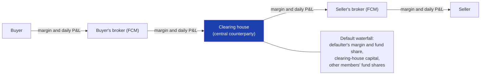
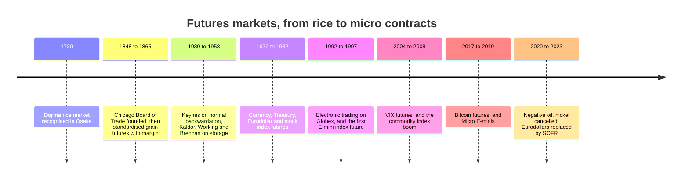
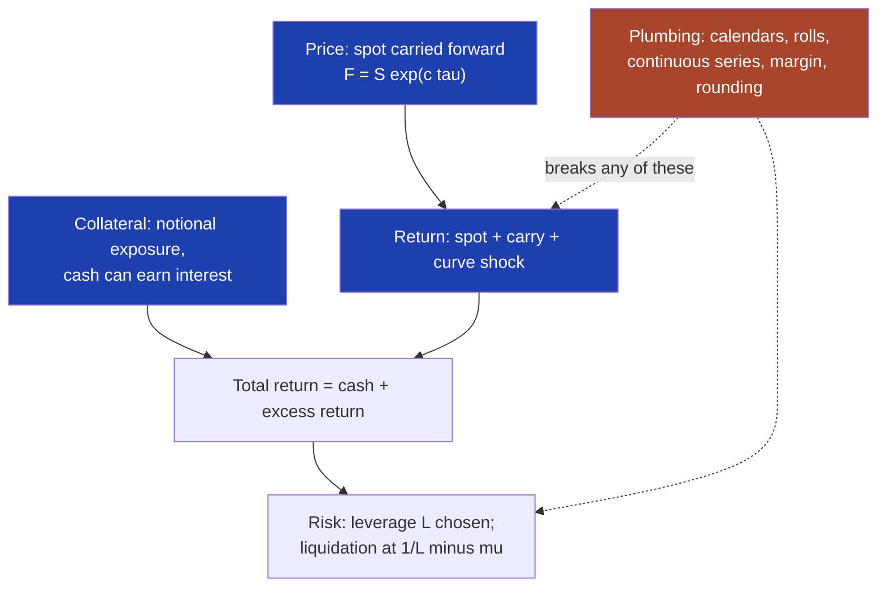
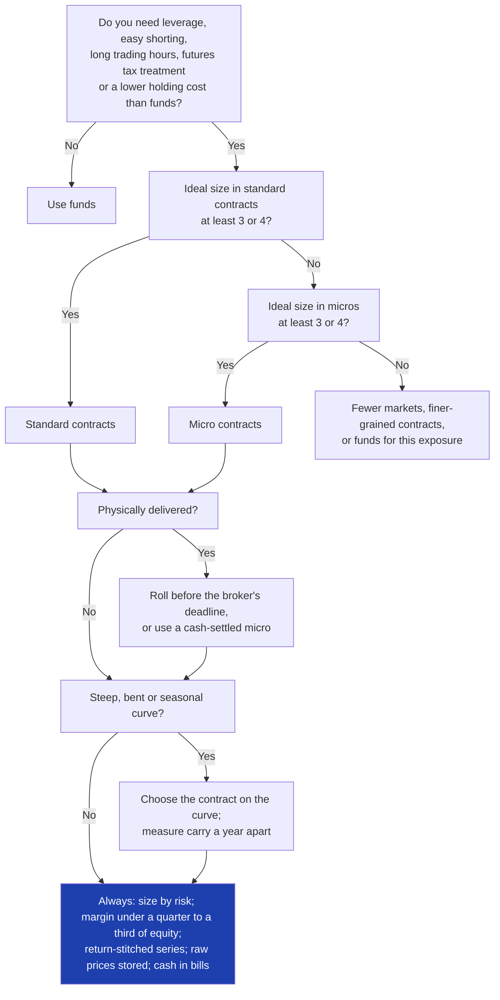

# Futures Mechanics and Carry

### Where a futures price and its return come from, and the rolls, series and margin a trader has to get right

---

```{=html}
<aside class="eli5">
```

# ELI5 — the short version {#eli5}

```{=latex}
\begin{eli5}
```

**In one sentence.** A futures contract is a promise to trade something later at a price fixed today; its price is mostly today's price plus the cost of holding the thing until then, its return is the change in today's price plus a "carry" you can read off the screen in advance, and most of what goes wrong with futures happens in the plumbing (expiry dates, stitched price charts and margin), not in the price.

**1. What you actually hold** ([§1](#1-what-a-futures-contract-is)). Buying a futures contract costs nothing up front. You leave a deposit, called margin, which is still your money, and every evening the exchange moves the day's gains and losses between buyers and sellers in cash. What you hold is exposure, and it is much bigger than the deposit: one E-mini S&P 500 contract moves like about 325,000 dollars of shares, against a deposit of about 25,000.

**2. Where the price comes from** ([§5](#5-the-futures-price)). For anything that can be bought and stored, the futures price is today's price plus what it costs to finance and store the thing until delivery, minus any income it pays meanwhile. Gold futures sit above gold because holding gold costs interest; stock-index futures sit slightly above the index when interest rates are higher than dividends. The futures price is not the market's forecast. Only for things that cannot be stored, such as the VIX volatility index, does it behave like a forecast, and a biased one.

**3. Upward and downward curves are a cost or a credit, not a prediction** ([§5](#5-the-futures-price), [§6](#6-where-a-futures-return-comes-from)). When later contracts cost more than earlier ones (contango), a buyer loses a little every day as the contract drifts down to today's price. When they cost less (backwardation), the buyer gains. That drift is carry: what you earn or pay if nothing else happens. Crude oil at 70 dollars, with next month at 70.80, costs a buyer about 14% a year if the price stands still.

**4. Rolling does not cost what people think** ([§6](#6-where-a-futures-return-comes-from), [§7](#7-rolling)). Contracts expire, so traders swap into the next one. The swap happens at market prices and neither makes nor loses money; the cost of an upward curve is paid daily, not at the swap. What matters is swapping before the contract's delivery dates, or your broker will close the position for you, and doing it as one order rather than two.

**5. A future plus cash is the asset itself** ([§1](#1-what-a-futures-contract-is), [§6](#6-where-a-futures-return-comes-from)). In a worked example, three small S&P contracts held for a quarter while the index went nowhere lost 492 dollars, but the cash behind them earned 725 in interest: 233 in total, close to the 232 in dividends the shares would have paid. So borrowing is a choice, not a feature: futures backed by the full amount in cash are not leveraged at all.

**6. The price chart is a construction** ([§8](#8-continuous-price-series)). There is no single futures price history, only a chain of contracts at different prices. Joining them needs an adjustment at every swap, and each way of adjusting keeps one thing true and makes another false. One popular method can show prices below zero that never traded; a chart that simply splices contracts books the gap between them as a gain or loss every month, which hides the carry. Use a percentage-correct series for research, and the real current contract for sizing.

**7. Margin decides when you are forced out** ([§9](#9-margin-and-leverage)). How far the price can move against you before the broker closes your position is roughly one divided by your leverage, minus a few per cent. At ten times leverage an ordinary 3% dip ends the trade. Exchanges also raise margin after big moves, exactly when you have the least to spare, so keep margin to about a quarter or a third of your account.

**8. Small contracts buy precision, not cheapness** ([§10](#10-micro-contracts-and-sizing)). Micro contracts are mostly a tenth of the standard size. An account of 100,000 dollars that wants S&P 500 exposure at its intended risk would need 0.29 standard contracts, which cannot be bought, or about three micros, which can. Micros cost more per dollar to trade, and spreading across many markets still needs a six-figure account.

**9. Carry is a signal, and a trap** ([§11](#11-carry-as-a-trading-signal), [§14](#14-failure-modes-and-case-studies)). Carry has predicted returns in stocks, bonds, currencies and commodities, but carry trades tend to crash together. A product that collected the steady drift of VIX futures lost about 96% of its value in one day in February 2018. Carry is the part of the return you know in advance, not the safe part.

---

**If you do only three things:** work out what one contract really controls and size by risk, never by the margin you are allowed; know every delivery date and roll early; and build research on a percentage-correct stitched series while keeping your spare cash earning interest.

```{=latex}
\end{eli5}
```

```{=html}
</aside>
```

---

**What this is.** For an individual with a large enough account, futures are
among the cheapest and most liquid ways to hold equity indices, government bonds,
currencies and commodities, often the most tax-efficient for a US taxpayer, and
the native instrument of trend-following and carry strategies. They are also the
instrument most often traded by people who could not say where the price comes
from, why a "continuous" chart of it can show prices below zero that no contract
ever traded at, or what the margin they posted actually buys. This document
builds futures from the contract up: what the specification sheet says, why the
futures price differs from the spot price, where a futures position's return
comes from, what rolling does and does not cost, how to turn a sequence of
expiring contracts into a usable price history, how margin and leverage work,
and what micro contracts change for a small account. Carry, the return a futures
position earns if nothing happens, runs through all of it, because it is the
part of the return you can see in advance.

**How to read it.** §1 is the conceptual core: the contract, the three ideas the
rest hangs on, and one position followed for a quarter. §2 is the anatomy of a
contract specification, with a reference table of the contracts an individual is
most likely to trade. §3 is history and §4 the bibliography. §5 and §6 are the
economics: what sets the futures price, and what a futures position earns. §7 to
§10 are the plumbing: rolling, continuous price series, margin, and micro
contracts and position sizing. §11 turns carry into a trading input. §12 shows
that most of the document is a handful of identities. §13 is the build: the data
you need and about sixty lines of code. §14 is the catalogue of how this goes
wrong, with case studies, and §15 synthesises.

If you trade futures already and want the parts that are usually skipped, read
§1.1, §6.3, §8.4 and §9.3. If you are about to place your first futures trade,
read §1, §2, §9 and §10 first, and §7 before your first expiry. If you build
backtests, §7.5, §8 and §13 are the ones that change results. Appendix A defines
the market and statistical vocabulary the main text leans on, built up in
dependency order.

**Relationship to the other notes.** [Systematic Trading
Strategies](systematic_strategies.html) treats carry as a strategy family and
computes the minimum account size for a diversified futures portfolio; this
document supplies the mechanics underneath both. [Trend-Following in Financial
Markets](trend_following.html) uses futures throughout and summarises the
stitching problem that §8 treats in full. [Bonds and Bond Markets](bond_markets.html)
covers Treasury futures, the cheapest-to-deliver bond and the cash–futures basis
trade, which §5.2 only sketches. [Implied Volatility](implied_volatility.html)
explains the VIX that VIX futures settle on, and [Value at Risk](value_at_risk.html)
the risk measure that exchanges use to set margin. Each stands alone.

**Where the numbers come from.** Contract specifications are the exchanges'
own, checked against their published pages in 2026; they change, and §2.3 says
how to check them. Worked examples use round illustrative prices, not quotes,
and are labelled **[Computed]** when the number follows from the document's own
arithmetic. The three figures are drawn from stylised or simulated markets, not
market data, because the point of each is a mechanism rather than a history;
their generators are [`figures/fm_*.py`](https://github.com/rmahfoud/quant-research/tree/master/figures){target="_blank"} in the source repository.

**A warning about scope.** [Practice] Nothing here is investment advice. Futures
can lose more than the money deposited against them. The rules described are US
exchange rules as of 2026 unless stated otherwise, and brokers layer their own
rules on top.

**Epistemic tags.** Claims are flagged by status:

- **[Fact]** — replicated across independent datasets or implementations, with
  broad agreement among people who have looked.
- **[Contested]** — documented, but with live disagreement about magnitude,
  robustness, or cause.
- **[Hypothesis]** — a proposed mechanism, not decisively tested.
- **[Practice]** — practitioner convention. May well be right; the evidence is
  private or absent.
- **[Computed]** — arithmetic from this document's own worked examples.

Untagged sentences are definitions, derivations, or contract terms — true by
construction or by rulebook rather than by evidence. The dated events in the
history of §3 are also untagged; each is sourced where it recurs later.

---

**Notation.** $S_t$ is the **spot price** of the underlying at time $t$: the price
for immediate delivery, or the index level. $F_t(T)$ is the **futures price** at
time $t$ of the contract that expires at $T$, and $\tau = T - t$ its **time to
expiry** in years. When only the contract matters, $F_t$ is the futures price of
whichever contract is being held. $F^{(1)}, F^{(2)}, \dots$ are the prices of the
first (the nearest, or after a roll date the contract held), second, and later
contracts, with expiries $T_1 < T_2 < \dots$
and times to expiry $\tau_1 < \tau_2 < \dots$.

The four ingredients of the **cost of carry**, all continuously compounded
annual rates: $r$ is the **financing rate** (the risk-free rate, or the **repo**
rate on a loan secured by the asset itself, at which the asset could be bought
with borrowed money); $q$ the **income yield** the
asset pays its holder (dividends, coupons, or a foreign interest rate); $u$ the
**storage cost** (warehousing, insurance); and $y$ the **convenience yield**, the
implicit benefit of having the physical commodity on hand. Their net,

$$
c = r + u - q - y,
$$

is the **net cost of carry**: positive when holding the asset costs money,
negative when it pays. **Carry** is its negative, $\kappa = -c$, the return a
long futures position earns per year if the spot price does not move and the
curve keeps its slope (§6.2). From §6.2 on, and in §1.5's second identity and
§5.3, $c_t(T)$ also names the observed slope
of the curve, the annualised log gap between a contract and spot, which equals
the net cost of carry when the cost-of-carry relation holds. In §5.1 and §5.6,
$U$ and $I$ are storage costs and income in dollars rather than as yields. The
**basis** is $F_t - S_t$; §12.3 lists the other things "basis" means.

$m$ is the contract **multiplier**, the dollars per point of the futures price
(50 for the E-mini S&P 500, 1,000 for crude oil quoted per barrel). $N$ is a
number of contracts, signed: positive for long, negative for short. The
**notional** or **exposure** of a position is $N m F_t$. $h$ is the **tick**, the
minimum price change, and $mh$ the **tick value** in dollars.

$A$ is the account's **equity** in dollars. $M^{\mathrm{M}}$ is the
**maintenance margin** per contract, and
$\mu = M^{\mathrm{M}} / (m F_t)$ is maintenance margin as a fraction of one
contract's notional. $L = |N| m F_t / A$ is **notional leverage**. $\sigma$ is the
annualised volatility of a contract's percentage returns, $\sigma^\star$ the
annual volatility the account targets, and $w$ the share of that risk budget
given to one market. $N^\star$ is the ideal, unrounded number of contracts that
budget implies (§10.2), $b$ the half-width of the no-trade buffer around it (§10.4),
and $s$ a trading signal scaled to lie between −1 and 1 (§12.1). $x^\star$ is the
adverse price move, as a fraction, that would take an account to liquidation
(§9.1).

$\Delta$ is a short holding period in years, and $\Delta x$ the change in $x$
over it. Where the period multiplies a rate it is written after it, so
$\kappa\,\Delta$ is the carry earned over the period, not a change in $\kappa$.
$\ln$ is the natural logarithm; returns written $\Delta \ln F$ are log returns.
Symbols used in only one section are defined where they appear.

---

## Table of contents

- [ELI5 — the short version](#eli5)

1. [What a futures contract is](#1-what-a-futures-contract-is)
2. [Reading a contract specification](#2-reading-a-contract-specification)
3. [How futures markets evolved](#3-how-futures-markets-evolved)
4. [Foundational references](#4-foundational-references)
5. [The futures price: cost of carry and the term structure](#5-the-futures-price)
6. [Where a futures return comes from](#6-where-a-futures-return-comes-from)
7. [Rolling](#7-rolling)
8. [Continuous price series](#8-continuous-price-series)
9. [Margin and leverage](#9-margin-and-leverage)
10. [Micro contracts and sizing a small account](#10-micro-contracts-and-sizing)
11. [Carry as a trading signal](#11-carry-as-a-trading-signal)
12. [Taxonomy and equivalences](#12-taxonomy-and-equivalences)
13. [Building it: data, calendars and code](#13-building-it)
14. [Failure modes and case studies](#14-failure-modes-and-case-studies)
15. [Synthesis](#15-synthesis)

- [Appendix A. Concepts and prerequisites](#appendix-a-concepts-and-prerequisites)

---

# 1. What a futures contract is {#1-what-a-futures-contract-is}

## 1.1 The wrong intuitions

Most of what goes wrong with futures goes wrong because of a picture inherited
from buying shares. Eight pieces of that picture need replacing before the rest
makes sense.

| The intuition | What is actually true | Where |
|---|---|---|
| The futures price is the market's forecast of the future spot price | For anything that can be stored or financed, it is mostly today's spot price plus the cost of carrying it to expiry. Only for a few contracts, such as VIX futures, is it a forecast, and then a biased one | §5 |
| Contango loses money at the roll, when you "sell low and buy high" | The roll is a value-neutral swap of one contract for another. The cost of contango is paid every day, as the contract you hold drifts down toward spot | §6.3 |
| Contango is bearish and backwardation bullish | The slope tells you the carry, the return if spot does not move. A contango market can rally and a backwardated one can collapse; the slope is a cost or a credit, not a direction | §5.4, §6.2 |
| Buying a contract costs the margin | It costs nothing. Margin is a deposit that remains yours and can earn interest; your exposure is the full notional value | §1.2, §9 |
| Futures are leveraged, so they are dangerous | Leverage is notional exposure divided by equity, and you choose it. One E-mini contract against 330,000 dollars of cash is unlevered | §9.3 |
| A continuous futures chart is a price history | It is a construction. Each method preserves one thing and breaks another, and some show prices that never traded, including negative ones | §8 |
| An index future tracks the index | It tracks the index's total return, dividends included, minus a financing rate | §5.2, §6.2 |
| Micro contracts are a cheap way to trade | Per dollar of exposure they cost more to trade. What they buy is granularity | §10 |

## 1.2 The contract: an agreement, settled every day

A **futures contract** is a standardised, exchange-traded agreement to buy or
sell a fixed quantity of something at a price agreed today, with delivery or
cash settlement at a fixed date later. The buyer is **long**, and gains if the
price rises; the seller is **short**, and gains if it falls. Two features
separate it from buying the thing itself.

**Entering costs nothing.** No money changes hands for the contract when the
trade is made. Both sides post **initial margin**, a performance bond, with
their broker. The bond is collateral against future losses, not a down payment,
and it still belongs to the trader who posted it.

**Gains and losses are paid every day.** At the end of each trading day the
exchange sets a **settlement price**. Every open position is marked to it, and
the day's change in value moves between accounts in cash, as **variation
margin**: from losers to winners, through the clearing house, before the next
day's open. A position of $N$ contracts receives

$$
\text{variation margin}_t = N\,m\,(F_t - F_{t-1})
$$

on trading day $t$, where $F_t$ is that day's settlement price and $F_{t-1}$ the
previous day's. For a long position ($N > 0$) the amount is negative when the
price fell; a negative amount is a payment. Because profits and losses are
settled daily, the contract itself is reset to zero value every evening: the
position is "repriced" to the new settlement price, and tomorrow's gain or loss
is measured from there. What you hold overnight is not an asset with a value but
an exposure to the next day's price change.

Most contracts never reach delivery. Traders close or **roll** them (§7) before
expiry; only a small fraction, commonly put at under 2%, ends in physical
delivery. Those that reach expiry settle in one of two ways:

- **Physical delivery.** The short delivers the commodity, bond or currency,
  and the long pays the final settlement price for it: barrels of crude at
  Cushing, Oklahoma; Treasury notes from a deliverable basket; euros into a
  bank account.
- **Cash settlement.** No goods change hands. The final variation-margin payment
  is computed against a reference price, such as the opening prices of the 500
  stocks in the S&P 500 on expiry morning.

## 1.3 Who stands behind it

The two parties to a futures trade never face each other. The exchange's
**clearing house** steps between them by **novation**: once the trade is
matched, it becomes the buyer to every seller and the seller to every buyer. A
trader's own counterparty is their **futures commission merchant** (FCM), the
broker that is a member of the clearing house or works through one.



The arrangement turns a web of bilateral credit exposures into a hub. The
clearing house protects itself with margin, a guarantee fund contributed by its
members, and its own capital. If a member defaults, the losses are absorbed in
layers, the **default waterfall**: first the defaulter's own margin and its share
of the guarantee fund, then a tranche of the clearing house's capital, then the
other members' shares of the fund. Customer money held by an FCM must be kept in
**segregated accounts**, separate from the firm's own. **[Fact]** The protection
is strong but not absolute: when MF Global failed in October 2011, about 1.6 billion dollars of segregated customer
money was missing, and customers were made whole only years later. The risk an
individual actually bears is the broker's, not the exchange's (§14.2).

## 1.4 Forward versus futures

A **forward** is the same agreement made privately between two parties: no
exchange, no daily settlement, and all the gain or loss paid at expiry. If
interest rates were known in advance, forward and futures prices would be
identical ([Cox, Ingersoll & Ross, 1981](https://doi.org/10.1016/0304-405X(81)90002-7){target="_blank"}). They differ only when
rates move with the price. Suppose the price tends to rise when rates rise. Then
the long receives variation margin just when it can be invested at a high rate,
and pays it just when it can be borrowed cheaply. That timing is worth something
to the long, so the futures price settles above the forward price; if the price
tends to fall when rates rise, it settles below. **[Fact]** For equity, commodity
and currency futures the difference is negligible. For long-dated interest-rate
futures, such as SOFR futures several years out, it is a measurable **convexity
adjustment**. A SOFR future is quoted as 100 minus the rate, so its price falls
when rates rise; the futures price therefore sits below the forward price, and
the futures rate above the forward rate.

Daily settlement has one practical consequence for hedgers. A short futures
hedge on a stock portfolio pays and receives cash daily while the portfolio's
gain or loss is unrealised, so the hedge needs a cash buffer. And because each
day's futures gain earns interest, and each day's loss costs interest, until the
hedge is lifted, the futures leg slightly outgrows the portfolio it offsets. A
precise hedger scales the contract count down by the discount factor to the
hedge's end to compensate (**tailing the hedge**). For an individual the
buffer matters and the tailing does not.

## 1.5 The spine: price, return, collateral

Three ideas generate nearly everything in this document. Each is an identity or
close to one, and each is the answer to a question a trader should be able to
answer about any contract.

**1. The price: spot, carried forward.** For anything that can be bought today
and held, the futures price is the spot price carried to expiry at the net cost
of carry:

$$
F_t(T) \;=\; S_t\, e^{c\,\tau}, \qquad c = r + u - q - y .
$$

Financing and storage make holding the asset expensive, and push the futures
price above spot. Income and convenience make holding it rewarding, and pull the
futures price below. Whether a curve slopes up (**contango**) or down
(**backwardation**) is the sign of $c$. For things that cannot be stored, such
as electricity or the VIX, the link breaks and the futures price is an
expectation adjusted by a risk premium (§5.4).

**2. The return: spot move plus carry.** Over a short period $\Delta$, a futures
position earns the spot price's log return, plus carry, plus a term for any
change in the curve's slope:

$$
\Delta \ln F \;=\; \Delta \ln S \;+\; \kappa_t\,\Delta \;+\; (c_{t+\Delta} - c_t)(\tau - \Delta) .
$$

Carry, $\kappa_t = -c_t$, is the part of the return you know in advance: what you
earn if nothing happens. In contango it is negative and is paid daily as the
contract converges to spot. The roll is not where it is paid (§6). The last term
is the change in the slope $c$ over the period, times the time the contract has
left to expiry: a steeper or flatter curve moves a distant contract more than a
near one. It is small for a contract a few weeks from expiry. Read with $c$ as the
observed slope of the curve, rather than the model's $r + u - q - y$, the
equation is an exact identity (§6.2).

**3. The collateral: exposure is notional, margin is a bond.** A futures
position is exposure to $N m F$ dollars of the underlying, bought with no money.
Your cash, the margin deposit included, stays yours and can earn interest separately,
provided it sits in bills or at a broker that pays interest (§9.5). So a fully
collateralised futures position, one backed by cash equal to its notional, earns

$$
\text{total return} \;=\; \text{interest on the collateral} \;+\; \text{futures excess return},
$$

where the **futures excess return** is the change in the futures price as a
fraction of the notional, $\Delta F / F$ (§6.1). Leverage is then a choice made
in the contract count, not a feature of the instrument. Margin caps how much
leverage you may take and decides when you are forced out, but it does not
measure risk (§9).

The first identity says what you are paying for. The second says what you earn.
The third says how much of it you hold, and what can force you to stop holding
it. Every section after this one elaborates one of the three.

## 1.6 A worked instance: one quarter of a Micro E-mini position

An account of 100,000 dollars wants exposure to about 100,000 dollars of the S&P
500. It buys three **Micro E-mini S&P 500** contracts (symbol MES, multiplier 5
dollars). Assume the index is at 6,500, the financing rate is 3.75%, the
index's dividend yield is 1.2%, and the December contract has 80 days to
expiry. **[Computed]**

**The price.** By the first identity, with $c = r - q = 2.55\%$:

$$
F = 6{,}500 \times e^{0.0255 \times 80/365} = 6{,}536.43 .
$$

The 36-point premium over the index is the financing a buyer of the stocks
would pay, less the dividends they would receive, over 80 days. Three
contracts give an exposure of $3 \times 5 \times 6{,}536.43 \approx 98{,}000$
dollars.

**The cash.** The broker requires initial margin of roughly 2,500 dollars a
contract, about 7,500 in total, held as cash in the account. The other 92,500 is
the trader's to keep in Treasury bills or a money-market fund. None of the
100,000 has been spent.

**The first week.** Suppose the contract settles over five days as follows. Each
point is worth $3 \times 5 = 15$ dollars to the position:

| Day | Settlement | Change (points) | Variation margin (dollars) | Cumulative |
|---|---:|---:|---:|---:|
| Entry | 6,536.50 | | | |
| 1 | 6,588.25 | +51.75 | +776.25 | +776.25 |
| 2 | 6,489.00 | −99.25 | −1,488.75 | −712.50 |
| 3 | 6,507.75 | +18.75 | +281.25 | −431.25 |
| 4 | 6,377.50 | −130.25 | −1,953.75 | −2,385.00 |
| 5 | 6,441.25 | +63.75 | +956.25 | −1,428.75 |

Cash moved every evening. The week's total, −1,428.75, is exactly
$15 \times (6{,}441.25 - 6{,}536.50)$: daily settlement changes when you are
paid, not how much, apart from interest on the payments (§1.4).

**The quarter, if the index goes nowhere.** Now suppose instead the index sits
at 6,500 for 72 days. The contract, with 8 days left, is then worth
$6{,}500 \times e^{0.0255 \times 8/365} = 6{,}503.63$. The futures position has
lost $15 \times (6{,}503.63 - 6{,}536.43) = 492$ dollars. That is carry: the
contract converged toward the index, a little every day.

Meanwhile the account's cash earned interest. Count only the part that matches
the notional, 98,046 dollars, because that is what an investor buying the stocks
would have spent; the remaining 1,954 earns the same interest either way.
Assuming the margin cash earns the bill rate too (§9.5), the collateral earned
$98{,}046 \times 3.75\% \times 72/365 = 725$ dollars of interest, counted as
simple interest, the way a money-market fund pays it (continuous compounding, the
convention of the price formula, adds about 3 dollars over a quarter). Futures plus
bills made $725 - 492 = 233$ dollars. An investor who had bought 98,046 dollars
of the index's stocks instead would have collected
$98{,}046 \times 1.2\% \times 72/365 = 232$ dollars of dividends, on a price that
also went nowhere. **[Computed]** The two are the same position, to within a
dollar: futures plus cash is the index, dividends included.

**The roll.** With 8 days left the trader rolls into March. The March contract,
with 99 days to expiry, is worth $6{,}500 \times e^{0.0255 \times 99/365} = 6{,}545.11$,
41.48 points above the December contract. Selling December at 6,503.63 and
buying March at 6,545.11 neither makes nor loses money: the trader swaps one
exposure for another at market prices. If the index stays at 6,500, the 41-point
gap is the next quarter's carry, paid in the same way, daily, over the 91 days
until the March contract in turn has 8 days left.

## 1.7 What a futures contract is not

| A futures contract is not | Because |
|---|---|
| An option | Both sides are obliged; the payoff is linear in the price, with no premium and no limited loss |
| A loan or a share | It pays no dividend or coupon and owns nothing; it is a commitment to trade at a fixed price |
| A forecast | Its price is mostly spot plus carry (§5.4) |
| An exchange-traded fund | A fund holds assets or futures and charges a fee; a contract is a standardised obligation with no manager, no fee, and an expiry |
| Bought "on margin" | Securities margin is a loan with interest; futures margin is a deposit that can earn it (§9) |
| A continuous instrument | Each contract expires; a continuous series is a construction (§8) |

> ### §1 Key takeaways
>
> 1. A futures contract costs nothing to enter. Margin is a performance bond that
>    stays yours, and your exposure is the full notional value, $N m F$.
> 2. Gains and losses settle in cash every day. Daily settlement changes when you
>    are paid, not how much (apart from interest on the payments, §1.4), but it
>    means losses must be funded immediately.
> 3. For any asset that can be held, the futures price is the spot price carried
>    forward at the net cost of carry: financing plus storage, minus income and
>    convenience.
> 4. A futures position earns the spot move plus carry. Carry is the part known in
>    advance, and it accrues daily, not at the roll.
> 5. Futures plus cash in Treasury bills is the underlying asset, income included,
>    to within a financing spread (§5.2). The worked Micro E-mini quarter shows it to
>    within a dollar.
> 6. Leverage is the notional exposure of the contracts held divided by the cash
>    behind it. It is chosen, not imposed by the instrument.
> 7. The clearing house removes counterparty risk between traders. It does not
>    remove the risk of your own broker.

# 2. Reading a contract specification {#2-reading-a-contract-specification}

Every futures contract is defined by a one-page specification published by its
exchange. Nearly every operational mistake an individual makes with futures, from
an unwanted delivery notice to a position ten times the intended size, is a
field on that page that was not read. This section goes through the fields, then
collects the contracts an individual is most likely to trade.

## 2.1 The fields, and why each one matters

| Field | What it says | E-mini S&P 500 (ES) | WTI crude oil (CL) |
|---|---|---|---|
| Underlying | What is bought or sold | The S&P 500 index | Light sweet crude oil delivered at Cushing, Oklahoma |
| Contract unit and multiplier | How much one contract controls; dollars per point of price | 50 dollars × index | 1,000 barrels; 1,000 dollars per dollar of price |
| Price quotation | The units of the price | Index points | Dollars and cents per barrel |
| Minimum tick | The smallest price change, and its dollar value | 0.25 points = 12.50 dollars | 0.01 dollars = 10 dollars |
| Listed months | Which expiries trade | March, June, September, December | Every month, for years ahead |
| Trading hours | When it trades | Nearly 23 hours a day, Sunday evening to Friday afternoon (US Central time) | The same |
| Last trading day | When trading in an expiry stops | 9:30 a.m. Eastern on the third Friday of the contract month | Three business days before the 25th calendar day of the month *before* the contract month |
| Settlement | How an open position at expiry is closed | Cash, against a special opening quotation of the index | Physical delivery of crude at Cushing |
| Daily settlement price | The price that sets daily variation margin | Set by the exchange from trading in a short window near the close | The same |
| Price limits | How far it may move in a session | Tiered limits tied to stock-market circuit breakers (§2.5) | Dynamic circuit breakers rather than fixed limits |

Five of those fields cause most of the trouble.

**The multiplier sets the size.** One E-mini S&P 500 contract at an index level
of 6,500 is a 325,000-dollar position. One crude oil contract at 65 dollars is
65,000 dollars of oil. Before anything else, compute $m F$ for each contract you
intend to trade: that is the exposure one contract adds, and it is often far
larger than the margin on the same page suggests.

**The tick value sets the cost unit.** Bid–ask spreads are quoted in ticks, and
in the liquid contracts are usually one tick wide. The cost of crossing the
spread once is half a tick in price terms, and a round trip that buys at the
offer and sells at the bid costs one tick. §2.6 turns this into basis points.

**The contract month is the delivery month, not the trading month.** The
"January 2027" crude oil contract stops trading around 20 December 2026, because
delivery happens during January. Traders who look only at the month in the
symbol are routinely surprised by how early energy contracts expire, and by how
early grain and metal contracts reach first notice.

**Physical delivery is real.** A long position still open in a physically
delivered contract once the notice period starts, or, for crude oil, after the
last trading day, can be assigned delivery (§2.4). An individual cannot take
1,000 barrels of crude at a pipeline hub, and brokers protect themselves by
closing customer positions before that point, usually at a time and price of the
broker's choosing.

**The settlement price is not the last trade.** Daily profit and loss, margin,
and most vendors' "close" are the exchange's settlement price, computed from
trading in a defined window. A backtest that uses last-trade prices for some
markets and settlement prices for others mixes two different clocks.

## 2.2 Month codes and symbols

Futures symbols are a **root**, a **month code**, and a **year**. The month
codes are a fixed alphabet shared by every exchange:

| Jan | Feb | Mar | Apr | May | Jun | Jul | Aug | Sep | Oct | Nov | Dec |
|---|---|---|---|---|---|---|---|---|---|---|---|
| F | G | H | J | K | M | N | Q | U | V | X | Z |

So ESZ6 is the December 2026 E-mini S&P 500, and CLF7 the January 2027 crude oil
contract. The single-digit year is ambiguous across decades, and data vendors and
brokers resolve it differently: ESZ26, ESZ2026, or a separate field holding
`202612`. Brokers also distinguish a contract's **symbol** from a unique
**contract identifier** and, for some products, a **trading class**, because the
same root can be listed on several exchanges or with several multipliers.
**[Practice]** Key every stored price on the exchange, the root, and the contract
month in `YYYYMM` form, never on a display symbol.

## 2.3 The contracts an individual is most likely to trade

The table below gives the specifications of the main US-listed contracts and
their micro versions, plus two European benchmarks. **[Practice]** Specifications
change: tick sizes are revised, months are added, settlement procedures are
redesigned. Check the exchange's own page before trading a contract for the
first time. CME's pages follow the pattern
`cmegroup.com/markets/<asset>/<group>/<product>.contractSpecs.html`.

Equity indices and rates:

| Contract | Exchange | Unit | Tick (dollar value) | Months | Settlement |
|---|---|---|---|---|---|
| E-mini S&P 500 (ES) | CME | 50 × index | 0.25 (12.50) | H M U Z | Cash |
| Micro E-mini S&P 500 (MES) | CME | 5 × index | 0.25 (1.25) | H M U Z | Cash |
| E-mini Nasdaq-100 (NQ) | CME | 20 × index | 0.25 (5.00) | H M U Z | Cash |
| Micro E-mini Nasdaq-100 (MNQ) | CME | 2 × index | 0.25 (0.50) | H M U Z | Cash |
| E-mini Russell 2000 (RTY) | CME | 50 × index | 0.10 (5.00) | H M U Z | Cash |
| Micro E-mini Russell 2000 (M2K) | CME | 5 × index | 0.10 (0.50) | H M U Z | Cash |
| E-mini Dow (YM) | CBOT | 5 × index | 1 (5.00) | H M U Z | Cash |
| Micro E-mini Dow (MYM) | CBOT | 0.50 × index | 1 (0.50) | H M U Z | Cash |
| Euro Stoxx 50 (FESX) | Eurex | 10 euros × index | 1 (10 euros) | H M U Z | Cash |
| 2-Year Treasury note (ZT) | CBOT | 200,000 face | 1/8 of 1/32 (7.8125) | H M U Z | Physical, deliverable basket |
| 5-Year Treasury note (ZF) | CBOT | 100,000 face | 1/4 of 1/32 (7.8125) | H M U Z | Physical, deliverable basket |
| 10-Year Treasury note (ZN) | CBOT | 100,000 face | 1/2 of 1/32 (15.625) | H M U Z | Physical, deliverable basket |
| Treasury bond (ZB) | CBOT | 100,000 face | 1/32 (31.25) | H M U Z | Physical, deliverable basket |
| Three-month SOFR (SR3) | CME | 25 per basis point | 0.0025 (6.25) near; 0.005 (12.50) other | Quarterly, years out | Cash |
| Euro-Bund (FGBL) | Eurex | 100,000 euros face | 0.01 (10 euros) | H M U Z | Physical, deliverable basket |

Commodities, currencies, crypto and volatility:

| Contract | Exchange | Unit | Tick (dollar value) | Months | Settlement |
|---|---|---|---|---|---|
| WTI crude oil (CL) | NYMEX | 1,000 barrels | 0.01 (10.00) | Every month | Physical |
| Micro WTI crude oil (MCL) | NYMEX | 100 barrels | 0.01 (1.00) | Every month | Cash, to the CL settlement |
| Henry Hub natural gas (NG) | NYMEX | 10,000 MMBtu | 0.001 (10.00) | Every month | Physical |
| Gold (GC) | COMEX | 100 troy ounces | 0.10 (10.00) | Active: G J M Q V Z | Physical |
| Micro gold (MGC) | COMEX | 10 troy ounces | 0.10 (1.00) | G J M Q V Z | Physical |
| Silver (SI) | COMEX | 5,000 troy ounces | 0.005 (25.00) | Active: H K N U Z | Physical |
| Copper (HG) | COMEX | 25,000 pounds | 0.0005 (12.50) | Active: H K N U Z | Physical |
| Corn (ZC) | CBOT | 5,000 bushels | 1/4 cent (12.50) | H K N U Z | Physical |
| Soybeans (ZS) | CBOT | 5,000 bushels | 1/4 cent (12.50) | F H K N Q U X | Physical |
| Euro FX (6E) | CME | 125,000 euros | 0.00005 (6.25) | H M U Z | Physical |
| Micro EUR/USD (M6E) | CME | 12,500 euros | 0.0001 (1.25) | H M U Z | Physical |
| Japanese yen (6J) | CME | 12,500,000 yen | 0.0000005 (6.25) | H M U Z | Physical |
| Bitcoin (BTC) | CME | 5 bitcoin | 5 dollars (25.00) | Every month | Cash, to a reference rate |
| Micro bitcoin (MBT) | CME | 0.1 bitcoin | 5 dollars (0.50) | Every month | Cash, to a reference rate |
| VIX futures (VX) | Cboe Futures Exchange | 1,000 × VIX | 0.05 (50.00) | Every month | Cash, to a special opening quotation |

Two patterns in the table matter for practice. The micro contracts are a tenth
of their parents for equity indices, currencies, gold and crude oil, and a
fiftieth for bitcoin. But a micro is not always settled the same way: the micro
crude contract is cash settled against the physically delivered parent, and
stops trading a business day earlier ([CME, Micro WTI fact card](https://www.cmegroup.com/trading/energy/files/micro-wti-crude-oil-futures-fact-card.pdf){target="_blank"}), while micro gold
is physically delivered like its parent. And "active months" matter in metals:
gold lists every month, but liquidity sits in the six marked, and a position in
an inactive month is hard to exit.

## 2.4 Last trading day, notice, and delivery

Physically delivered contracts have two dates that bound a long position's life.

The **first notice day** (FND) is the first day on which a short may notify the
clearing house that it intends to deliver. The clearing house then assigns the
delivery to a long, usually the one with the oldest open position. For grains and
metals the FND is around the last business day of the month before the contract
month; for Treasury futures, notices can begin just before the delivery month
starts, and the short chooses when within the month to deliver. The **last
trading day** (LTD) is when trading stops; crude oil, with no notice period
before it, delivers after the LTD to whoever is still long.

**[Practice]** Retail brokers do not let customers take delivery. They require
long positions in physically delivered contracts to be closed some days before
the FND or LTD and liquidate positions that are not. The practical rule is
simple: **know the FND and LTD of every physically delivered contract you hold,
and roll several business days before whichever comes first.** The cash-settled
micro crude contract exists largely so that small traders need not worry about
this.

Cash-settled contracts have their own expiry hazard. The E-mini S&P 500 settles
to a **special opening quotation** computed from the opening trade of each
constituent stock on expiry morning. Stocks open at different times and prices,
so the settlement value can differ materially from both the previous evening's
close and the index's first published print. A position left to expire is a bet
on that number.

## 2.5 Settlement prices, limits, and hours

**Settlement prices.** Exchanges compute the daily settlement price from trades
and quotes in a short window near the close, defined per contract; for thinly
traded deferred months, from spreads to the front month. Margin, profit and loss,
and the "close" in most historical data are this number.

**Price limits.** Some contracts cannot trade beyond a band around the previous
settlement. During the stock market's hours, US equity index futures carry
tiered limits of 7%, 13% and 20%, tied to the stock market's own circuit
breakers. Outside those hours they have a static 7% band with a 3.5% dynamic
circuit breaker, an arrangement that replaced a 5% overnight limit in October
2020 ([CME, price limits FAQ](https://www.cmegroup.com/trading/equity-index/faq-us-based-equity-index-price-limits.html){target="_blank"}).
Grain contracts have daily limits reset twice a year. **[Fact]** A market at its
limit can be **locked**: no one will trade at the limit price, and a trader who
needs to exit cannot. A stop order is not a guarantee of exit at any price.

**Hours.** CME's electronic markets trade nearly 23 hours a day from Sunday
evening to Friday afternoon, with a daily one-hour break. The overnight session
is real, and a large share of index moves happen in it, but liquidity is thinner
and spreads wider outside US daytime hours. **[Practice]** Rolls and large orders
belong in the main session.

## 2.6 Ticks as a cost unit

The useful number is cost in basis points of notional. For a round trip that
crosses a one-tick spread and pays a commission $k$ per contract per side,

$$
\text{cost (bp)} \;=\; 10^4 \times \frac{m h + 2k}{m F} .
$$

Assume, as illustrative 2026 retail figures that include exchange fees,
commissions of about 2.25 dollars a side for the E-mini and 0.60 for the micro.
At an index level of 6,500, a round trip in one E-mini costs
$12.50 + 4.50 = 17.00$ dollars on 325,000 of exposure, or 0.52 basis points. A
round trip in one micro costs $1.25 + 1.20 = 2.45$ dollars on 32,500, or 0.75
basis points. **[Computed]** The micro is about 45% more expensive per dollar of
exposure, because commissions do not scale down by ten. Both are small: a round
trip in either costs about what a fund charging 0.10% a year costs its holders in
three (E-mini) to four (micro) weeks. What the micro buys is not cheapness but the ability to hold
the position you want (§10).

> ### §2 Key takeaways
>
> 1. Compute $m F$, one contract's exposure, for every contract before trading it.
>    It is usually far larger than the margin.
> 2. The month in a symbol is the delivery month. Energy contracts stop trading in
>    the month before; grain and metal contracts reach first notice at the end of it.
> 3. Know the first notice day and last trading day of every physically delivered
>    contract you hold, and roll several business days before the earlier one, or
>    your broker will close the position for you.
> 4. Cash-settled index futures settle to an opening auction on expiry morning,
>    which is a separate bet. Roll before it.
> 5. Daily profit and loss is set by the exchange's settlement price, not the last
>    trade. Use settlement prices consistently in research.
> 6. Price limits can lock a market. A stop is not a guaranteed exit.
> 7. Micro contracts cost more per dollar of exposure than their parents. Their
>    value is granularity, not cost.

# 3. How futures markets evolved {#3-how-futures-markets-evolved}

Futures began as a solution to a storage problem and became the cheapest way to
hold almost any financial exposure. The history matters for practice in one
respect: almost every rule in §2 is a scar from a specific failure, and the
theory in §5 was worked out by economists trying to explain grain prices.



**Era I — storage and the grain trade (1730–1960s).** *Thesis: a futures price
is the price of storing something.*

- *Contribution.* Organised forward trading in rice in Osaka was officially
  recognised in 1730. The Chicago Board of Trade, founded in 1848, standardised
  grain contracts and imposed margin in 1865, and a separate clearing corporation
  followed in 1925. Keynes (1930) argued that because producers hedge by selling
  forward, speculators who take the other side must be paid, so futures prices
  should sit below expected spot prices: **normal backwardation**.
  [Kaldor (1939)](https://doi.org/10.2307/2967593){target="_blank"}, [Working (1949)](https://news.fbc.keio.ac.jp/~hayami/pdf/finance/futures/Working1949.pdf){target="_blank"} and Brennan (1958) answered with the
  **theory of storage**: the gap between futures and spot is the price of storage,
  and when inventories are scarce, holding the physical commodity yields a
  **convenience** that can make the gap negative.
- *What changed.* The futures price stopped being seen as a bet on the future and
  started being seen as a relationship between today's price and the cost of
  carrying the commodity forward.
- *Limitations.* Neither theory was decisively tested; the data and the
  econometrics came decades later.
- *Lasting influence.* Both theories are alive, and §5.4 is the argument between
  them.

**Era II — financial futures (1972–1990).** *Thesis: anything with a cost of
carry can have a futures contract.*

- *Contribution.* Currency futures opened in Chicago in 1972, after the end of
  fixed exchange rates. Treasury bill, Treasury bond and mortgage futures
  followed, then Eurodollar futures in 1981, the first to settle in cash rather
  than by delivery, which made index futures possible: Value Line and S&P 500
  index futures began in 1982. [Black (1976)](https://doi.org/10.1016/0304-405X(76)90024-6){target="_blank"} priced options on futures, and
  [Cox, Ingersoll & Ross (1981)](https://doi.org/10.1016/0304-405X(81)90002-7){target="_blank"} showed exactly when futures and forward prices
  differ.
- *What changed.* The cost-of-carry relation of §5.1 became an arbitrage
  relation enforced by index arbitrageurs and bond dealers, not just an
  economist's model. Futures became the cheapest way for institutions to adjust
  equity and bond exposure.
- *Limitations.* The October 1987 crash showed the arbitrage could break: index
  futures traded far below the value of the stocks as the stock market's
  plumbing failed to keep up.
- *Lasting influence.* Cash settlement, index futures, and the treatment of a
  futures price as "spot plus financing" are all from this era.

**Era III — electronic markets and smaller contracts (1992–2019).** *Thesis:
futures become a retail instrument.*

- *Contribution.* CME's Globex electronic platform launched in 1992, and the
  E-mini S&P 500, a fifth of the original contract's size and electronic from the
  start, in 1997. Electronic trading overtook the pits in the 2000s, and CME closed
  most of its futures pits in 2015. VIX futures listed in 2004. Commodity index
  funds, which hold rolling long positions in a basket of commodity futures, grew
  rapidly from about 2003. Bitcoin futures listed in December 2017. Micro E-mini
  equity index futures, a tenth of the E-mini, launched on 6 May 2019 and traded
  more than 310,000 contracts on their first day ([CME, 2019](https://www.cmegroup.com/media-room/press-releases/2019/5/07/micro_e-mini_futuresmakebigimpressiononfirstdayoftrading.html){target="_blank"}).
- *What changed.* An individual with a few hundred thousand dollars could hold a
  diversified futures portfolio sized in reasonable steps, and a smaller account a
  handful of fine-grained markets, nearly around the clock, at institutional
  spreads.
- *Limitations.* Retail access brought retail margin products, such as intraday
  margins of a few hundred dollars per E-mini, that make extreme leverage trivial
  to take by accident (§9.2).
- *Lasting influence.* This is the market an individual trades today.

**Era IV — the plumbing under stress (2008–present).** *Thesis: the rare events
are in the mechanics, not the prices.*

- *Contribution.* The 2008 commodity spike started a long argument over whether
  index funds' rolling purchases had distorted futures prices (§4.4). CME raised
  silver margins five times in nine days in 2011, as prices collapsed. The broker
  MF Global failed in October 2011 with about 1.6 billion dollars of customer
  money missing (§14.2). The May
  2020 WTI crude contract settled at −37.63 dollars a barrel on 20 April 2020,
  because storage at the delivery point was nearly full ([CFTC staff, 2020](https://www.cftc.gov/media/5296/InterimStaffReportNYMEX_WTICrudeOil/download){target="_blank"}).
  The London Metal Exchange suspended nickel trading and cancelled trades in
  March 2022. SOFR futures replaced Eurodollar futures in 2023, and CME moved its
  equity and energy margin to a historical value-at-risk model, SPAN 2, in 2023–2024.
- *What changed.* Practitioners learned that "the price can't go below zero",
  "the exchange will always let me trade", and "margin is stable" are assumptions,
  not facts.
- *Limitations.* Each event was handled after the fact, by rule changes.
- *Lasting influence.* Most of §14.

> ### §3 Key takeaways
>
> 1. The theory of futures prices is a theory of storage: the futures–spot gap is
>    the cost of carrying the asset, net of what holding it yields.
> 2. Cash settlement, introduced in 1981, is what made index, volatility and crypto
>    futures possible.
> 3. Since 2019, micro contracts have brought diversified, reasonably sized futures
>    portfolios within reach of accounts in the low hundreds of thousands.
> 4. The large failures of the last fifteen years were mechanical: negative
>    prices, margin spirals, cancelled trades and broker failures, not unusual
>    price moves alone.

# 4. Foundational references {#4-foundational-references}

## 4.1 The theory of the futures price

- **Keynes, J. M. (1930).** *A Treatise on Money*, vol. 2. Macmillan. — The
  origin of normal backwardation: speculators are paid to absorb hedgers' short
  positions. No authoritative free copy; most libraries hold it.
- **Kaldor, N. (1939).** ["Speculation and Economic Stability."](https://doi.org/10.2307/2967593)
  *Review of Economic Studies* 7(1), 1–27. [paywalled] — Introduces the
  convenience yield of holding stocks of a commodity.
- **Working, H. (1949).** ["The Theory of Price of Storage."](https://news.fbc.keio.ac.jp/~hayami/pdf/finance/futures/Working1949.pdf)
  *American Economic Review* 39(6), 1254–1262. — The spread between futures
  months as the market price of storage. Short and still the clearest statement.
- **Brennan, M. J. (1958).** "The Supply of Storage." *American Economic Review*
  48(1), 50–72. — Formalises the supply of storage and the convenience yield
  that rises as inventories fall.
- **Samuelson, P. A. (1965).** ["Proof That Properly Anticipated Prices Fluctuate Randomly."](https://doi.org/10.1142/9789814566926_0002)
  *Industrial Management Review* 6(2), 41–49. [paywalled] — Also the source of
  the "Samuelson effect": futures prices become more volatile as expiry
  approaches.
- **Black, F. (1976).** ["The Pricing of Commodity Contracts."](https://doi.org/10.1016/0304-405X(76)90024-6)
  *Journal of Financial Economics* 3(1–2), 167–179. [paywalled] — Futures as
  zero-cost contracts; the pricing of options on them.
- **Cox, J. C., Ingersoll, J. E. & Ross, S. A. (1981).** ["The Relation between Forward Prices and Futures Prices."](https://doi.org/10.1016/0304-405X(81)90002-7)
  *Journal of Financial Economics* 9(4), 321–346. [paywalled] — When daily
  settlement makes a futures price differ from a forward price (§1.4).
- **Gibson, R. & Schwartz, E. S. (1990).** ["Stochastic Convenience Yield and the Pricing of Oil Contingent Claims."](https://doi.org/10.1111/j.1540-6261.1990.tb05114.x)
  *Journal of Finance* 45(3), 959–976. [paywalled] — The convenience yield as a
  second, mean-reverting state variable.
- **Schwartz, E. S. (1997).** ["The Stochastic Behavior of Commodity Prices: Implications for Valuation and Hedging."](https://doi.org/10.1111/j.1540-6261.1997.tb02721.x)
  *Journal of Finance* 52(3), 923–973. [paywalled] — The standard one-, two- and
  three-factor models of the commodity term structure.
- **Litzenberger, R. H. & Rabinowitz, N. (1995).** ["Backwardation in Oil Futures Markets: Theory and Empirical Evidence."](https://doi.org/10.1111/j.1540-6261.1995.tb05187.x)
  *Journal of Finance* 50(5), 1517–1545. [paywalled] — Why oil is usually
  backwardated: reserves are options, and producers defer extraction when
  volatility is high.
- **Pindyck, R. S. (2001).** ["The Dynamics of Commodity Spot and Futures Markets: A Primer."](http://web.mit.edu/rpindyck/www/Papers/Dynamics_Comm_Spot.pdf)
  *Energy Journal* 22(3), 1–29. — The best short introduction to how inventories,
  spot prices, futures prices and volatility move together.

## 4.2 Futures risk premia and carry

- **Fama, E. F. & French, K. R. (1987).** ["Commodity Futures Prices: Some Evidence on Forecast Power, Premiums, and the Theory of Storage."](https://doi.org/10.1086/296385)
  *Journal of Business* 60(1), 55–73. [paywalled] — The basis splits into a
  forecast of the spot change and a premium, with the mix differing by commodity.
- **Bessembinder, H. (1992).** ["Systematic Risk, Hedging Pressure, and Risk Premiums in Futures Markets."](https://doi.org/10.1093/rfs/5.4.637)
  *Review of Financial Studies* 5(4), 637–667. [paywalled] — Returns in some
  futures markets vary with hedgers' net positions.
- **de Roon, F. A., Nijman, T. E. & Veld, C. (2000).** ["Hedging Pressure Effects in Futures Markets."](https://doi.org/10.1111/0022-1082.00253)
  *Journal of Finance* 55(3), 1437–1456. [paywalled] — Hedging pressure, in its
  own market and in related ones, predicts futures returns.
- **Gorton, G. & Rouwenhorst, K. G. (2006).** ["Facts and Fantasies about Commodity Futures."](https://www.nber.org/papers/w10595)
  *Financial Analysts Journal* 62(2), 47–68. — A fully collateralised
  commodity futures index earned an equity-like premium in 1959–2004, with
  negative correlation to stocks and bonds.
- **Erb, C. B. & Harvey, C. R. (2006).** ["The Strategic and Tactical Value of Commodity Futures."](https://papers.ssrn.com/sol3/papers.cfm?abstract_id=903770)
  *Financial Analysts Journal* 62(2), 69–97. — The average individual commodity
  future earned about nothing; the term structure explains which ones earned.
  The critique to read next to Gorton and Rouwenhorst.
- **Gorton, G. B., Hayashi, F. & Rouwenhorst, K. G. (2013).** ["The Fundamentals of Commodity Futures Returns."](https://www.nber.org/papers/w13249)
  *Review of Finance* 17(1), 35–105. — Inventories drive the basis and the
  premium; the link the theory of storage predicted.
- **Hong, H. & Yogo, M. (2012).** ["What Does Futures Market Interest Tell Us about the Macroeconomy and Asset Prices?"](https://www.nber.org/papers/w16712)
  *Journal of Financial Economics* 105(3), 473–490. — Open interest predicts
  returns where prices do not.
- **Szymanowska, M., de Roon, F., Nijman, T. & van den Goorbergh, R. (2014).** ["An Anatomy of Commodity Futures Risk Premia."](https://doi.org/10.1111/jofi.12096)
  *Journal of Finance* 69(1), 453–482. [paywalled] — Separates spot premia from
  term premia; sorting on the basis earns both.
- **Bhardwaj, G., Gorton, G. & Rouwenhorst, K. G. (2015).** ["Facts and Fantasies about Commodity Futures Ten Years Later."](https://www.nber.org/papers/w21243)
  NBER Working Paper 21243. — The 2006 conclusions largely held out of sample.
- **Koijen, R. S. J., Moskowitz, T. J., Pedersen, L. H. & Vrugt, E. B. (2018).** ["Carry."](https://www.nber.org/papers/w19325)
  *Journal of Financial Economics* 127(2), 197–225. [[DOI]](https://doi.org/10.1016/j.jfineco.2017.11.002)
  — Carry defined uniformly across asset classes as the return if prices do not
  change, and shown to predict returns in each (§11). The authors' firm runs
  carry strategies.
- **Brunnermeier, M. K., Nagel, S. & Pedersen, L. H. (2008).** ["Carry Trades and Currency Crashes."](https://www.nber.org/papers/w14473)
  *NBER Macroeconomics Annual* 23, 313–347. — Currency carry has negative
  skewness: high-yield currencies crash together when funding liquidity dries
  up (§11.3).
- **Levine, A., Ooi, Y. H., Richardson, M. & Sasseville, C. (2018).** ["Commodities for the Long Run."](https://www.nber.org/papers/w22793)
  *Financial Analysts Journal* 74(2), 55–68. — Commodity futures index returns
  since 1877: positive on average, with premia from both carry and spot. The
  authors include AQR employees.
- **Kang, W., Rouwenhorst, K. G. & Tang, K. (2020).** ["A Tale of Two Premiums: The Role of Hedgers and Speculators in Commodity Futures Markets."](https://doi.org/10.1111/jofi.12845)
  *Journal of Finance* 75(1), 377–417. [paywalled] — Hedgers pay an insurance
  premium over long horizons but earn a liquidity premium over short ones.
- **Rouwenhorst, K. G. & Tang, K. (2012).** ["Commodity Investing."](https://papers.ssrn.com/sol3/papers.cfm?abstract_id=2079664)
  *Annual Review of Financial Economics* 4, 447–467. — Survey; finds weak
  support for normal backwardation and more for storage.

## 4.3 Financial futures and the basis

- **Du, W., Tepper, A. & Verdelhan, A. (2018).** ["Deviations from Covered Interest Rate Parity."](https://www.nber.org/papers/w23170)
  *Journal of Finance* 73(3), 915–957. [[DOI]](https://doi.org/10.1111/jofi.12620)
  — Since 2008, currency forwards and futures persistently deviate from the
  interest-rate differential (§5.2).
- **Hazelkorn, T. M., Moskowitz, T. J. & Vasudevan, K. (2023).** ["Beyond Basis Basics: Liquidity Demand and Deviations from the Law of One Price."](https://papers.ssrn.com/sol3/papers.cfm?abstract_id=3543296)
  *Journal of Finance* 78(1), 301–345. [[DOI]](https://doi.org/10.1111/jofi.13198)
  — The equity index futures basis measures demand for leveraged exposure and
  predicts returns.
- **Simon, D. P. & Campasano, J. (2014).** ["The VIX Futures Basis: Evidence and Trading Strategies."](https://jod.pm-research.com/content/21/3/54.abstract)
  *Journal of Derivatives* 21(3), 54–69. [paywalled] — The VIX futures basis
  predicts futures returns, not changes in the VIX.
- **Eraker, B. & Wu, Y. (2017).** ["Explaining the Negative Returns to Volatility Claims: An Equilibrium Approach."](https://papers.ssrn.com/sol3/papers.cfm?abstract_id=2340070)
  *Journal of Financial Economics* 125(1), 72–98. The working paper was titled
  "Explaining the Negative Returns to VIX Futures and ETNs". — A constant
  one-month VIX futures position lost about 30% a year in 2006–2013.
- **Schmeling, M., Schrimpf, A. & Todorov, K. (2023).** ["Crypto Carry."](https://papers.ssrn.com/sol3/papers.cfm?abstract_id=4268371)
  BIS Working Paper / SSRN. — Bitcoin futures and perpetual swaps trade at large,
  variable premia to spot, driven by leveraged demand.

## 4.4 Rolling, index flows, and the financialisation debate

- **Mou, Y. (2011).** ["Limits to Arbitrage and Commodity Index Investment: Front-Running the Goldman Roll."](https://doi.org/10.2139/ssrn.1716841)
  Working paper, Columbia. — The predictable roll of the largest commodity index
  moved prices; strategies trading ahead of it earned large risk-adjusted
  returns in 2000–2010 (§7.4).
- **Bessembinder, H., Carrion, A., Tuttle, L. & Venkataraman, K. (2016).** ["Liquidity, Resiliency and Market Quality around Predictable Trades: Theory and Evidence."](https://cpb-us-w2.wpmucdn.com/people.smu.edu/dist/6/414/files/2020/07/Liquidity-reiliency-and-markey-quality-around-predictable-trades-theory-and-evidence-2016.pdf)
  *Journal of Financial Economics* 121(1), 142–166. — The US Oil Fund's monthly
  rolls in 2008–2009: predictable, but resilient markets absorbed them cheaply.
- **Tang, K. & Xiong, W. (2012).** ["Index Investment and the Financialization of Commodities."](https://doi.org/10.2469/faj.v68.n6.5)
  *Financial Analysts Journal* 68(6), 54–74. [paywalled] — Commodities in the
  major indices became more correlated with oil and with each other.
- **Irwin, S. H. & Sanders, D. R. (2011).** ["Index Funds, Financialization, and Commodity Futures Markets."](https://doi.org/10.1093/aepp/ppq032)
  *Applied Economic Perspectives and Policy* 33(1), 1–31. [paywalled] — Finds no
  direct link between index fund positions and futures price levels. The
  opposing view.

## 4.5 Exchange and regulatory documents

- **CME Group.** Contract specification pages, one per product, and the
  [equity index price limits FAQ](https://www.cmegroup.com/trading/equity-index/faq-us-based-equity-index-price-limits.html).
  The authoritative source for every number in §2.
- **CME Group.** ["SPAN 2 framework rollout."](https://www.cmegroup.com/solutions/risk-management/performance-bonds-margins/span-methodology-overview/launching-span-2.html)
  — How exchange margin is computed (§9.2).
- **US Code of Federal Regulations, 17 CFR 39.13.** ["Risk management."](https://www.ecfr.gov/current/title-17/chapter-I/part-39/subpart-B/section-39.13)
  — The rule requiring clearing houses to set futures margin at no less than 99%
  confidence over a one-day liquidation period.
- **CFTC staff (2020).** ["Interim Staff Report on Trading in NYMEX WTI Crude Oil Futures Contract Leading up to, on, and around April 20, 2020."](https://www.cftc.gov/media/5296/InterimStaffReportNYMEX_WTICrudeOil/download)
  — The official account of the negative oil price (§5.6, §14.2).

## 4.6 Books

- **Hull, J. C. (2021).** ["Options, Futures, and Other Derivatives."](https://www.pearson.com/en-us/subject-catalog/p/options-futures-and-other-derivatives/P200000005938)
  11th ed., Pearson. — The standard textbook for contract mechanics, cost of carry
  and hedging.
- **Geman, H. (2005).** *Commodities and Commodity Derivatives: Modeling and
  Pricing for Agriculturals, Metals and Energy.* Wiley. — Market-by-market
  commodity term structures.
- **Burghardt, G. & Belton, T. (2005).** *The Treasury Bond Basis*, 3rd ed.
  McGraw-Hill. — The reference on Treasury futures delivery, the
  cheapest-to-deliver bond and the basis.
- **Schwager, J. D. & Etzkorn, M. (2017).** *A Complete Guide to the Futures
  Market*, 2nd ed. Wiley. — Includes the classic practitioner treatment of
  continuous-contract construction.
- **Carver, R. (2015).** *Systematic Trading.* Harriman House. — Volatility
  targeting, position rounding and buffering for futures portfolios.
- **Carver, R. (2019).** [*Leveraged Trading.*](https://www.harriman-house.com/leveragedtrading)
  Harriman House. — Written for individuals using futures and other leveraged
  products with small accounts.
- **Carver, R. (2023).** *Advanced Futures Trading Strategies.* Harriman House.
  — Thirty strategies on more than 100 futures, with explicit treatment of
  rolling, carry measurement, minimum capital and contract selection. The most
  practically useful single book for an individual trading futures
  systematically.

## 4.7 Critiques

Three arguments in this literature are live, and a reader should hold both sides.

- **Is there a commodity futures premium at all?** Gorton and Rouwenhorst say an
  index of commodity futures earned an equity-like premium; Erb and Harvey say
  the average individual commodity future earned about nothing, and the index's
  return came from rebalancing and from the term structure. Bhardwaj, Gorton and
  Rouwenhorst's out-of-sample update and Levine et al.'s long history support a
  positive but noisy premium. §6.4 gives my read.
- **Normal backwardation or storage?** Keynes's hedging-pressure story has weak
  direct support (Rouwenhorst and Tang); the storage story has stronger support
  (Gorton, Hayashi and Rouwenhorst). Kang, Rouwenhorst and Tang reconcile them by
  horizon.
- **Did index investors move prices?** Tang and Xiong find their footprint in
  correlations, and Mou in prices around the roll; Irwin and Sanders find no link
  to price levels.

## 4.8 If you only read six things

1. **[Pindyck (2001)](http://web.mit.edu/rpindyck/www/Papers/Dynamics_Comm_Spot.pdf){target="_blank"}**, for the economics of spot, storage and futures prices.
2. **[Koijen, Moskowitz, Pedersen and Vrugt (2018)](https://www.nber.org/papers/w19325){target="_blank"}**, for carry as one idea across
   every asset class.
3. **[Gorton and Rouwenhorst (2006)](https://www.nber.org/papers/w10595){target="_blank"}** with **[Erb and Harvey (2006)](https://papers.ssrn.com/sol3/papers.cfm?abstract_id=903770){target="_blank"}**, read as a
   pair, for what a futures position in commodities earns.
4. **[Hull (2021)](https://www.pearson.com/en-us/subject-catalog/p/options-futures-and-other-derivatives/P200000005938){target="_blank"}**, the futures chapters, for the mechanics in standard form.
5. **Carver (2023)**, for the practical implementation an individual needs.
6. **The CFTC staff report on 20 April 2020**, for what happens when the
   mechanics in §2.4 meet a full storage tank.

# 5. The futures price: cost of carry and the term structure {#5-the-futures-price}

## 5.1 The cash-and-carry argument

Start with an asset you can buy today and hold. Suppose its spot price is $S$,
holding it until expiry costs $U$ dollars of storage and pays $I$ dollars of
income (both measured as their value at expiry, interest included), and money
can be borrowed or lent at a simple rate $r$ for the $\tau$ years to expiry.
There are two ways to own the asset at expiry: buy it now and carry it, or agree
today, through a futures contract, to buy it at expiry for $F$. Each of the two
trades below buys one of these and sells the other.

**Cash and carry.** Borrow $S$, buy the asset, store it, collect its income, and
sell a futures contract at $F$. At expiry, deliver the asset into the futures
contract and repay the loan. The profit, known today, is

$$
F - S(1 + r\tau) - U + I .
$$

If this were positive, anyone who could borrow, buy and store would do it, and
the selling of futures and buying of spot would close the gap.

**Reverse cash and carry.** Sell the asset now (short it, or sell from
inventory you hold), invest the proceeds, save the storage cost, forgo the
income, and buy a futures contract to get the asset back at expiry. The profit is
the negative of the one above. If it were positive, holders of the asset would
sell spot and buy futures.

When both trades are available, neither can be profitable, and

$$
F = S(1 + r\tau) + U - I .
$$

The same argument with costs and income written as continuously compounded
yields gives the form used in the rest of this document. Suppose the income is
a yield $q$ reinvested in the asset, and storage a yield $u$ paid by selling a
little of it, so that one unit held for $\tau$ years becomes $e^{(q - u)\tau}$
units. To own exactly one unit at expiry, buy $e^{-(q - u)\tau}$ units today
with $S e^{-(q - u)\tau}$ borrowed at the continuously compounded rate $r$, and
repay $S e^{-(q - u)\tau} e^{r\tau}$ at expiry. That repayment is what the
futures price must be:

$$
F_t(T) = S_t\, e^{(r + u - q)\tau} .
$$

From here on $r$, like $u$ and $q$, is a continuously compounded rate, as in the
notation block. For small rates the two forms agree, because
$e^{r\tau} \approx 1 + r\tau$.

The futures price is the spot price plus what it costs to carry the asset to
expiry. Nothing in the argument mentions expectations of the future spot price.
The price of a futures contract on a storable asset is set by the cost of
replicating it today, exactly as the price of an option is set by the cost of
replicating it ([Dealer Hedging and Gamma Exposure](dealer_hedging.html)
develops the option case).

**Where the argument breaks: physical commodities.** The reverse trade requires
someone to sell the physical commodity today and buy it back later through
futures. For a financial asset, someone always can: index arbitrageurs short
baskets of stocks, banks lend and borrow currencies, dealers repo bonds. For
crude oil, copper or wheat, the people holding inventory hold it because they
need it: a refinery that sells its crude to capture a futures discount has to
shut down. So the reverse trade does not enforce the lower bound, and the futures
price can fall below $S e^{(r+u)\tau}$ (the price above, with $q = 0$ because most
commodities pay no income; gold's lease rate, §5.2, is the exception) by any amount. Only the upper bound, which the
cash-and-carry trade enforces, survives:

$$
F_t(T) \;\le\; S_t\, e^{(r + u)\tau} \qquad \text{(storable commodity, with spare storage).}
$$

The **convenience yield** $y$ is defined to close the gap between the futures
price and that bound:

$$
F_t(T) = S_t\, e^{(r + u - q - y)\tau}, \qquad c = r + u - q - y .
$$

It is the implicit return to having the physical commodity on hand: the value of
not running out ([Kaldor, 1939](https://doi.org/10.2307/2967593){target="_blank"}; Brennan, 1958). It is
not observed directly. It is backed out of the futures price, so the equation is
true by construction, and the economic content is in what moves $y$: it rises as
inventories fall.

## 5.2 Asset by asset

Every futures market is the same equation with different ingredients switched on.

```{=latex}
\newpage
```

| Underlying | Financing $r$ | Income $q$ | Storage $u$ | Convenience $y$ | Usual shape | What enforces the price |
|---|---|---|---|---|---|---|
| Equity index | Repo or funding rate | Dividend yield | — | — | Gentle contango when rates exceed dividends | Index arbitrage |
| Currency | Domestic rate | Foreign rate | — | — | Contango when the domestic rate is higher | Covered interest parity |
| Government bond | Repo rate | Coupon yield | — | Delivery options | Below the cash bond when coupon exceeds repo | The cash–futures basis trade |
| Gold | Funding rate | Lease rate | Small | ≈ 0 | Close to full-carry contango | Lending and borrowing of bullion |
| Crude oil, metals, grains | Funding rate | — | Yes | Varies with inventories | Either | Storage owners, one way only |
| Natural gas, power | — | — | Limited or none | — | Seasonal | Expectations, within storage limits |
| VIX | — | — | — | — | Contango in calm markets, backwardation in stress | None: expectation plus a premium paid by longs |
| Bitcoin | Funding rate | — | — | — | Contango of variable size | Cash-and-carry funds, imperfectly |

**Equity indices.** With $c = r - q$, an index future trades above the index when
financing rates exceed the dividend yield, and below it when dividends exceed
rates. **[Fact]** Euro Stoxx 50 futures traded below the index for years while
euro rates were negative and dividend yields were around 3%: the curve was in
backwardation and a long position earned positive carry, without anyone
expecting European stocks to rise. The useful quantity is the **implied
financing rate**, the $r$ that makes $F = S e^{(r - q)\tau}$ hold at the
observed prices:

$$
r^{\text{impl}} = q + \frac{\ln(F/S)}{\tau} .
$$

It is the rate at which the futures market finances a long index position. Its
spread over a risk-free rate such as SOFR measures how much more, or less,
holding the index through futures costs than holding the stocks bought with
money borrowed at that rate. **[Fact]** The spread is not zero and not
constant: it widens at quarter-ends when bank balance sheets are
expensive, and it moves with demand for leveraged equity exposure. [Hazelkorn,
Moskowitz & Vasudevan (2023)](https://papers.ssrn.com/sol3/papers.cfm?abstract_id=3543296){target="_blank"} show across global index futures that a rich basis
coincides with heavy long demand from investors and predicts lower subsequent
returns. **[Contested]** How much of the spread is a balance-sheet cost and how
much a demand premium is not settled. For an individual the point is practical:
the financing spread embedded in an index future is the instrument's true cost,
and it can be larger than any commission.

**Currencies.** For a currency quoted as dollars per unit of foreign currency,
**covered interest parity** says $F = S e^{(r_{\$} - r_{\text{foreign}})\tau}$, where
$r_{\$}$ is the dollar interest rate and $r_{\text{foreign}}$ the foreign one, which
plays the part of the income yield $q$: the forward rate is the spot
rate adjusted by the interest differential, because borrowing
in one currency and lending in the other replicates the future. A long euro
futures position therefore earns carry of $r_{\text{EUR}} - r_{\$}$, which is
exactly the currency carry trade (see the carry section of [Systematic Trading
Strategies](systematic_strategies.html)). **[Fact]** Since 2008 the parity has
held only approximately: for the major currencies the deviation, the
**cross-currency basis**, has often been tens of basis points a year, reflecting
banks' balance-sheet costs ([Du, Tepper & Verdelhan, 2018](https://www.nber.org/papers/w23170){target="_blank"}). **[Practice]** For an
individual it is a small adjustment to the carry, not a reason to change a
position.

**Government bonds.** A Treasury future is a contract to deliver any bond from a
basket, each scaled by a conversion factor, at the short's choice, so it tracks
the bond that is **cheapest to deliver** (CTD). Its carry is the CTD's coupon
income minus its repo financing cost. When the yield curve slopes up, the coupon
yield exceeds the repo rate, carry is positive, and the futures price, multiplied
by the CTD's conversion factor, sits below the cash bond's price, as in the table. The
short's choice of which bond to deliver, and when, is worth something to the
short and pulls the futures price a little lower still; these delivery options
are what the table lists in the convenience column. **[Fact]**
With yields below the contracts' 6% notional coupon, the CTD tends to be the
shortest-duration issue in the basket, so a 10-year note future behaves like a
note of roughly seven years' maturity, not ten. For duration matching, use the
contract's DV01 as reported by the exchange or computed from the CTD, not the
"10-year" label. [Bonds and Bond Markets](bond_markets.html) treats the
deliverable basket, the CTD and the cash–futures basis trade in detail.

**Storable commodities.** This is where the theory of storage applies. When
inventories are ample, owning the commodity confers little convenience, $y$ is
near zero, and the curve sits near **full carry**: each later month above the
last by financing plus storage. When inventories are scarce, the convenience
yield rises and the curve inverts. **[Fact]** Inventories and the slope of the
futures curve move together across commodities, as the theory predicts
([Gorton, Hayashi & Rouwenhorst, 2013](https://www.nber.org/papers/w13249){target="_blank"}). Crude oil has spent long periods
in backwardation; [Litzenberger & Rabinowitz (1995)](https://doi.org/10.1111/j.1540-6261.1995.tb05187.x){target="_blank"} explain why with an
option argument: a producer with oil in the ground can always pump later, so it
pumps now only if the futures price, discounted, is below spot, and the higher
the volatility, the more valuable waiting is. Gold, which is held overwhelmingly
as an investment and is plentiful in vaults, sits close to full carry, with the
**lease rate** at which bullion can be lent playing the part of a small income
yield.

**Non-storables and the VIX.** Natural gas can be stored only within the limits
of injection and withdrawal capacity, so its curve is seasonal: winter months
trade at a premium to summer months every year, and the relation between months
runs through storage only within those limits. Electricity cannot be stored at
all, and each delivery month is a separate market. The VIX cannot be bought:
it is an index computed from option prices. Without a way to buy and hold the
underlying, there is no cash-and-carry argument, and a VIX future is priced as
an expectation of where the VIX will be at expiry, plus a risk premium. The
curve's usual upward slope is mostly that premium (§5.4).

**Bitcoin.** Cash and carry is possible: buy bitcoin or a spot fund, sell
futures. But the trade ties up capital and carries custody and exchange risk,
so the basis floats with demand for leveraged long exposure. **[Fact]** It has
ranged from near zero to well above the risk-free rate, and the annualised basis
between perpetual swaps and spot has been large and volatile ([Schmeling,
Schrimpf & Todorov, 2023](https://papers.ssrn.com/sol3/papers.cfm?abstract_id=4268371){target="_blank"}).

## 5.3 Contango and backwardation, precisely

The words have two meanings, and the literature uses both without warning.

| Term | Curve meaning (observable) | Keynes's meaning (a statement about expected returns) |
|---|---|---|
| Contango | Later contracts trade above earlier ones, or the future above spot: $c > 0$ | The futures price is above the expected future spot price: shorts are paid |
| Backwardation | Later contracts trade below earlier ones, or the future below spot: $c < 0$ | The futures price is below the expected future spot price: longs are paid ("normal backwardation") |

The two are independent. Gold is almost always in contango in the curve sense,
and could at the same time be in normal backwardation in Keynes's sense if
holders of gold futures earn a premium. The curve meaning is a fact about prices
today; the Keynes meaning is a claim about expected returns that can only be
estimated. In this document, unqualified "contango" and "backwardation" always
mean the curve.

**Full carry as an inventory gauge.** For a storable commodity with spare
storage, the curve cannot be steeper than full carry, financing plus storage,
or traders would buy spot, store it and sell futures. **[Practice]** Traders
therefore read a commodity spread as a percentage of full carry: a calendar spread
at 90% of full carry says inventories are comfortable; a spread in backwardation
says they are tight, and the depth of the backwardation says how tight. The
upper bound has an exception that §5.6 describes: when storage itself runs out,
its price can explode, and the curve can be steeper than any normal full-carry
calculation, a state traders call **super-contango**.

## 5.4 Is the futures price a forecast?

Write the futures price as an expectation adjusted by a premium:

$$
F_t(T) = E_t[S_T] - \pi_t(T),
$$

where $E_t[S_T]$ is the spot price expected at expiry given what is known at
$t$, and $\pi_t(T)$ is the **risk premium** in price units: the profit a long
position expects to make, per unit of the underlying, for bearing the risk. If
$\pi = 0$ the futures price is an unbiased forecast.

For a storable asset, the cost-of-carry relation pins $F_t(T)$ to today's spot
and today's carry, and says nothing about $\pi$. Whatever premium there is shows
up in the expected spot price instead: if longs are paid, $E_t[S_T]$ sits above
the futures price by $\pi$. Subtracting $S_t$ from both sides splits the basis
into two parts:

$$
F_t(T) - S_t = \big(E_t[S_T] - S_t\big) - \pi_t(T),
$$

the expected change in spot minus the premium. Two theories have competed for
ninety years to explain $\pi$.

- **Normal backwardation (hedging pressure).** Producers hedge by selling
  futures, more than consumers hedge by buying, so speculators must be paid to
  take the net long side: $\pi > 0$. **[Contested]** Hedgers' net positions do
  predict returns in some markets ([Bessembinder, 1992](https://doi.org/10.1093/rfs/5.4.637){target="_blank"}; [de Roon,
  Nijman & Veld, 2000](https://doi.org/10.1111/0022-1082.00253){target="_blank"}), but direct support for the theory as the general
  explanation of the commodity premium is weak ([Rouwenhorst & Tang, 2012](https://papers.ssrn.com/sol3/papers.cfm?abstract_id=2079664){target="_blank"}).
- **Storage.** The basis reflects inventories, and premia are higher when
  inventories are low and prices are more volatile. **[Fact]** The basis–inventory
  link is robust ([Gorton, Hayashi & Rouwenhorst, 2013](https://www.nber.org/papers/w13249){target="_blank"}).

[Fama & French (1987)](https://doi.org/10.1086/296385){target="_blank"} estimated the two parts of that split, the part of the basis that forecasts the spot
change and the part that is a premium, and found both, in different proportions
for different commodities. [Kang, Rouwenhorst & Tang (2020)](https://doi.org/10.1111/jofi.12845){target="_blank"} reconcile the
two theories by horizon: hedgers pay an insurance premium over long horizons,
while over days and weeks they earn a liquidity premium from speculators who
trade with momentum.

**The VIX is the clean case of a premium.** **[Fact]** [Simon & Campasano (2014)](https://jod.pm-research.com/content/21/3/54.abstract){target="_blank"} find
that the VIX futures basis predicts the futures' own returns, not changes in the
VIX: when the curve is in contango, the futures price falls toward the VIX, the
VIX does not rise to meet it. **[Fact]** A constant one-month position in VIX
futures lost about 30% a year from 2006 to 2013 ([Eraker & Wu, 2017](https://papers.ssrn.com/sol3/papers.cfm?abstract_id=2340070){target="_blank"}).

**[Practice]** My working rule for reading any curve: for financial and storable
underlyings, treat the slope as carry, a cost or credit you know in advance,
and do not read it as the market's view of direction. For non-storables and the
VIX, treat the slope as mostly a premium that the long pays. In neither case is
contango, by itself, a reason to expect the spot price to rise.

## 5.5 Reading a term structure

The figure shows the six shapes an individual meets most often, each drawn from
the cost-of-carry relation with the ingredient that dominates in that market,
except the VIX, which has no such relation and is drawn as an expectation plus a
premium paid by longs.

```{=latex}
\newpage
\begin{center}
\includegraphics[width=\linewidth]{quant-research/figures/fm_term_shapes.pdf}
\end{center}
```

```{=html}

```

Five things are worth reading off any curve.

**The front spread.** The log price of the first contract minus that of the
second, divided by the years between their expiries, is the annualised roll-down
of the second contract into the first, and approximately the front contract's own
carry (§6.2 derives it). It is the single most
useful number on the curve (§11.1).

**The shape further out.** Carry is not uniform along the curve. Crude oil in
backwardation is often steepest at the front; VIX futures in contango are always
steepest at the front, and nearly flat beyond the fourth month. Where you hold
on the curve decides how much carry you earn (§7.3).

**Seasonality.** In natural gas, grains, heating oil and gasoline, contracts for
different calendar months are different commodities: December corn is the new
crop, July corn the old one, and January gas is winter gas. The spread between
adjacent months mixes carry with seasonality, so carry must be measured between
contracts a year apart or against the usual seasonal shape (§11.2).

**Volatility by maturity.** **[Fact]** Front contracts move more than deferred
ones in most commodities, the **Samuelson effect**: shocks to supply and demand
hit today's scarcity hardest, and are expected to fade by later delivery dates.
In equity, bond and currency futures, where the curve is a financing
relationship, all contracts move almost one for one with spot.

**Calendar spreads are the curve's own market.** A long position in one month
against a short in another, a **calendar spread**, has almost no exposure to
the level of prices and is a pure position on the slope: in storable
commodities, on inventories. Exchanges list spreads as instruments in their own
right, and margin them far below the outright contracts (§9.6).

## 5.6 When storage runs out: super-contango and negative prices

The upper bound of §5.1 assumes spare storage. In April 2020 that assumption
failed at the delivery point of the WTI crude contract. **[Fact]** The pandemic
had cut oil demand, storage at Cushing, Oklahoma, was nearly full, and the May
contract, physically delivered at Cushing, was about to expire. Anyone long the
May contract at expiry had to take barrels at Cushing and put them somewhere. On
20 April 2020, the day before the last trading day, the May contract fell from
about 18 dollars to settle at −37.63: holders paid nearly 38 dollars a barrel to be
relieved of the obligation ([CFTC staff, 2020](https://www.cftc.gov/media/5296/InterimStaffReportNYMEX_WTICrudeOil/download){target="_blank"}). The June contract,
a month further from delivery, stayed well above zero.

Three lessons generalise.

- **A futures price can be negative when the contract is an obligation to take
  something costly to hold.** The cost-of-carry relation still held, in its
  dollar form. Read $F = S(1 + r\tau) + U - I$ of §5.1 with June as the futures
  and May as the spot: a trader could take May barrels, store them for a month
  and deliver them into June, so May could sit below June by as much as the
  dollar cost $U$ of that month's storage. That cost had become enormous for the
  few days left on the contract, because storage was what had run out. The
  exponential form cannot show this: $S e^{(r+u)\tau}$ is positive for any
  storage yield $u$, and only a dollar cost, which does not shrink with the
  price, can push a price below zero.
- **The front of a curve can detach from the rest.** A curve is a set of
  separate contracts linked by arbitrage, and the arbitrage needs a physical
  link. Remove the link and the front month trades on its own delivery problem.
- **Research tools fail at zero.** Log returns, ratio-adjusted series and
  percentage-based position sizing are undefined at a negative price. A data
  pipeline must either handle negative prices with additive methods or exclude
  the episode deliberately, and say so (§8, §13).

> ### §5 Key takeaways
>
> 1. For anything that can be bought and held, the futures price is set by
>    replication: spot plus financing plus storage, minus income. Expectations do
>    not enter.
> 2. For physical commodities only the upper bound is enforced. The convenience
>    yield, backed out of prices, measures how scarce inventories are.
> 3. The same equation covers every market: dividends for indices, the foreign
>    interest rate for currencies, coupons for bonds, the lease rate for gold.
> 4. "Contango" and "backwardation" describe the curve. Keynes's normal
>    backwardation is a different, unobservable claim about premia. Keep them
>    apart.
> 5. For financial and storable underlyings, read the slope as carry, not as a
>    forecast. For the VIX and other non-storables, it is mostly a premium paid by
>    longs.
> 6. The front spread, annualised, is the most useful number on a curve. Measure
>    seasonal markets against the same month a year apart.
> 7. Index futures embed a financing spread over the risk-free rate that varies
>    with demand for leverage. It is the instrument's true holding cost.
> 8. When storage runs out, the front of a physically delivered curve can go
>    anywhere, including below zero. Pipelines built on log returns break there.

# 6. Where a futures return comes from {#6-where-a-futures-return-comes-from}

## 6.1 Excess return and total return

A futures position costs nothing, so its profit and loss is not a return on any
investment. To express it as one, divide by the notional: the **futures excess
return** over a period is $\Delta F / F$, the change in the price of the contract
held, as a fraction of its price at the start of the period. It is called an
excess return because it is earned on top of whatever the collateral earns. A position backed by cash equal
to its full notional, invested in Treasury bills, earns

$$
\text{total return} = r^{\text{bill}}\,\Delta + \frac{\Delta F}{F} .
$$

Commodity index providers publish both versions: an **excess-return index**,
which compounds the futures returns alone, and a **total-return index**, which
adds the interest on fully collateralising Treasury bills. **[Fact]** The S&P
GSCI and Bloomberg commodity indices both come in these two forms.

Two practical consequences:

- **A futures return series is already an excess return.** Its Sharpe ratio is
  its mean over its standard deviation. Subtracting the risk-free rate a second
  time understates it, a common error in backtests that mix futures with funds.
- **Comparing futures with an asset needs the cash added back.** An index future
  and an index fund differ by the cash rate before any question of cost or
  tracking arises.

## 6.2 The decomposition: spot, carry, and the curve

Define the futures contract's **annualised log basis**,

$$
c_t(T) = \frac{\ln F_t(T) - \ln S_t}{\tau},
$$

so that $\ln F_t(T) = \ln S_t + c_t(T)\,\tau$ holds by construction. Under the
cost-of-carry model this $c$ is the net cost of carry of §5.1; in general it is
just the slope of the curve from spot to this contract. Now hold the same
contract for a short period $\Delta$, during which its time to expiry shrinks from
$\tau$ to $\tau - \Delta$. Write the definition at both dates, subtract, and add
and subtract $c_t(T)\,(\tau - \Delta)$:

$$
\begin{aligned}
\Delta \ln F &= \big[\ln S_{t+\Delta} + c_{t+\Delta}(T)\,(\tau - \Delta)\big] - \big[\ln S_t + c_t(T)\,\tau\big] \\
&= \Delta \ln S + \big[c_t(T)\,(\tau - \Delta) - c_t(T)\,\tau\big] + \big[c_{t+\Delta}(T) - c_t(T)\big](\tau - \Delta) \\
&= \underbrace{\Delta \ln S}_{\text{spot return}} \;\underbrace{-\; c_t\,\Delta}_{\text{carry}} \;+\; \underbrace{(c_{t+\Delta} - c_t)(\tau - \Delta)}_{\text{curve shock}} ,
\end{aligned}
$$

where the last line drops the $(T)$, since every $c$ refers to the same
contract. This is an identity, not a model. A futures position earns three things:

1. **The spot return.** What the underlying did.
2. **Carry**, $\kappa_t \Delta$ with $\kappa_t = -c_t$. Known at the start of the
   period. In contango ($c > 0$) it is negative: the contract drifts down toward
   spot. In backwardation it is positive.
3. **A curve shock.** If the slope changes, the contract's price moves by the
   change times the time left to expiry. It is a duration-like exposure to the
   slope of the curve: negligible for a front-month contract with a few weeks
   left, material for a contract a year out.

The identity is the same in every market; what differs is what $c$ contains.

- **Financial futures at fair value.** With $c = r - q$, both rates constant so
  that there is no curve shock, and the collateral earning $r$, the total return
  is $\Delta \ln S - (r - q)\,\Delta + r\,\Delta = \Delta \ln S + q\,\Delta$: the
  asset's price return plus its income. **Futures plus cash is the asset.**
  This is what the Micro E-mini quarter in §1.6 showed to within a dollar, and it
  holds up to the financing spread of §5.2.
- **Storable commodities.** With $c = r + u - y$, again constant, and the
  collateral earning $r$, the total return is $\Delta \ln S + (y - u)\,\Delta$:
  the return of buying the commodity and storing it, plus the convenience of having it, which a
  financial investor receives without needing a warehouse. When convenience
  exceeds storage, futures beat spot; when inventories are ample, they lag it.
- **The VIX.** The identity holds with $S$ the VIX index, but nothing ties $c$
  to a cost. The carry term is the roll-down of the futures toward the index,
  and, as §5.4 showed, the index has not risen to meet it on average.

**Measuring carry without a spot price.** For many commodities there is no clean
spot price, and the first contract is the practical anchor. Hold the second
contract for the $T_2 - T_1$ years until it has the first contract's current
time to expiry. If the curve is unchanged in time-to-expiry terms, so that a
contract with a given time to expiry trades at the same price then as now, the
second contract will then trade where the first trades today, so the roll-down
return is $\ln F^{(1)} - \ln F^{(2)}$ over $T_2 - T_1$ years, or, annualised,

$$
\kappa_t \;\approx\; \frac{\ln F^{(1)}_t - \ln F^{(2)}_t}{T_2 - T_1} .
$$

This is the carry measure used for commodities in practice and, in simple
rather than log form, in [Koijen et al. (2018)](https://www.nber.org/papers/w19325){target="_blank"}. It equals the spot-based carry exactly when the log curve is a
straight line in maturity, and differs from it when the curve bends. That
difference is the reason the choice of contract matters (§7.3).

```{=latex}
\begin{center}
\includegraphics[width=\linewidth]{quant-research/figures/fm_convergence.pdf}
\end{center}
```

```{=html}

```

## 6.3 Nothing happens at the roll

The most common explanation of contango's cost is that a long position must
"sell the cheap expiring contract and buy the expensive next one" at every roll.
The arithmetic of the explanation is right over a full cycle and wrong about
where the money goes, and the error leads to bad decisions.

Take crude oil with spot pinned and the curve unchanged: the expiring contract
at 70.00 and the next month at 70.80. **[Computed]**

- **Over the month**, the contract you hold, priced at 70.80 when you bought it,
  converges to 70.00 as it becomes the front month and approaches expiry. You lose
  80 cents a barrel, 800 dollars a contract, a little each day, through daily
  settlement. That is carry: $\ln(70.00/70.80) = -1.14\%$ a month, about −13.6% a
  year.
- **At the roll**, you sell the expiring contract at its market price, 70.00, and
  buy the next at its market price, 70.80. You exchange one zero-value position for
  another. The roll itself has no profit or loss beyond its trading costs.

The two accounts agree over a full cycle: 80 cents lost per month. But the folk
version locates the loss at the roll, and three mistakes follow from it:

1. **It suggests that rolling less often, or rolling at a better moment, avoids
   the cost.** It does not. A contract held longer converges longer. Holding a
   deferred contract changes the cost only if the curve is not a straight line
   (§7.3).
2. **It double counts in backtests.** The daily profit and loss of the contract
   held already contains the convergence. Subtracting the gap at each roll as a
   "roll cost" as well charges it twice.
3. **It hides the cost when spot moves.** In a rising market the contract may
   gain every day, and nothing looks like a loss. The carry is still there: the
   position gained 13.6% a year less than spot.

One second-order effect does happen at the roll. Rolling a fixed number of
contracts in contango increases the notional exposure, because each new contract
has a higher price, and so a larger notional, than the one it replaces. Holding exposure constant means buying
$F^{(1)}/F^{(2)} = 0.989$ new contracts per old one here. For a handful of
contracts this rounds away; for a large position it is a small rebalancing
trade.

## 6.4 What futures positions have earned

The decomposition says what to expect; the record says what happened.

**Equity index futures** earn the index's total return minus the financing rate
embedded in the basis, which is the risk-free rate plus a spread that varies
with demand for leverage (§5.2). For an individual, they are close substitutes
for an index fund plus cash.

**Currency futures** earn the spot change plus the interest differential. The
carry trade, long high-rate currencies against low-rate ones, has earned a
positive premium with severe crash risk (the carry section of [Systematic
Trading Strategies](systematic_strategies.html)).

**Commodity futures** are where the argument is.

- [Gorton & Rouwenhorst (2006)](https://www.nber.org/papers/w10595){target="_blank"} found that an equally weighted, fully
  collateralised index of commodity futures earned about the same excess return
  and Sharpe ratio as US equities from 1959 to 2004, with negative correlation to
  stocks and bonds and positive correlation to inflation. **[Fact]** [Bhardwaj, Gorton &
  Rouwenhorst (2015)](https://www.nber.org/papers/w21243){target="_blank"} found these conclusions largely held in the following
  decade.
- [Erb & Harvey (2006)](https://papers.ssrn.com/sol3/papers.cfm?abstract_id=903770){target="_blank"} found that the average *individual* commodity
  future earned roughly nothing. An index earned a premium mainly from
  rebalancing across volatile, weakly correlated contracts, and the cross-section
  of returns was explained by the term structure: commodities in backwardation
  earned more than those in contango.
- [Levine, Ooi, Richardson & Sasseville (2018)](https://www.nber.org/papers/w22793){target="_blank"}, with data back to 1877,
  found positive average returns to commodity futures indices, with premia
  associated with both carry and spot returns, varying with inflation and the
  business cycle.
- **[Fact]** [Szymanowska et al. (2014)](https://doi.org/10.1111/jofi.12096){target="_blank"} split the premia: sorting commodities on the
  basis earns spot premia, compensation for spot-price risk, of 5–14% a year,
  and term premia, compensation for changes in the basis, of 1–3%.

**[Contested]** My read: a diversified long-only commodity futures index has
earned a positive but noisy excess return over long histories, with long
stretches, much of the 2010s among them, in which it lost money while carry was
negative. Most of the difference between individual commodities is carry. A
long-only position that ignores the curve is a bet on the spot price that pays
whatever carry the market charges, and in contango that charge is steep.

**VIX futures** are the extreme. **[Fact]** A constant one-month long position lost about
30% a year from 2006 to 2013 ([Eraker & Wu, 2017](https://papers.ssrn.com/sol3/papers.cfm?abstract_id=2340070){target="_blank"}), the roll-down of a curve
that is usually in contango toward an index that does not, on average, rise to
meet it.

## 6.5 Carry as a breakeven

Taking expectations of the decomposition,

$$
E_t[\Delta \ln F] = E_t[\Delta \ln S] + \kappa_t\,\Delta + E_t[\text{curve shock}] .
$$

Carry is the only term known at the start. It is therefore a **breakeven**: the
spot move needed to offset it. In the crude example of §6.3, a long position
needs spot to rise 13.6% over a year just to match a position in cash. **[Practice]**
Before taking any directional view in futures, compute the carry over the
intended holding period and ask whether the view is larger than it. In steep
curves the answer is often no. VIX futures in calm markets and natural gas in the
shoulder seasons commonly embed several percent a month of negative carry at the
front, so a long position there needs a large, fast move to profit.

The same number protects a short position. A short VIX futures position in
contango earns the roll-down every day the VIX stays put, which is why it is
popular, and why it loses catastrophically on the day the VIX doubles (§14.2).
Carry is the known part of the return, not the safe part.

> ### §6 Key takeaways
>
> 1. A futures return is an excess return. Add the cash rate to compare it with an
>    asset, and do not subtract the risk-free rate again when computing its Sharpe
>    ratio.
> 2. Every futures return splits exactly into the spot return, carry (known in
>    advance), and a curve-shock term that matters only for longer-dated
>    contracts.
> 3. Financial futures plus cash replicate the asset including its income.
>    Commodity futures plus cash replicate storing the commodity, plus its
>    convenience yield.
> 4. Without a spot price, carry is the annualised log spread between the first two
>    contracts.
> 5. The roll is a value-neutral swap. The cost of contango accrues daily as the
>    contract converges, so rolling less often does not avoid it, and charging the
>    roll gap in a backtest double counts it.
> 6. Commodity futures indices have earned a positive but noisy premium over long
>    histories. Most of the difference between individual commodities is carry.
> 7. Carry is a breakeven: the spot move a directional view must exceed. In steep
>    curves it is large.

# 7. Rolling {#7-rolling}

## 7.1 What a roll is, and how to execute it

A **roll** closes a position in an expiring contract and opens the same position
in a later one. For a long position it is a sale of the near contract and a
purchase of the far one: a trade in the **calendar spread** between them. It
changes no exposure to the underlying, only which contract carries it.

There are two ways to execute it.

- **Two outright orders.** Sell one contract, then buy the other. This pays the
  bid–ask spread twice and carries **legging risk**: the market can move between
  the two fills, and on a fast day it will.
- **One spread order.** Exchanges list calendar spreads as instruments in their
  own right, quoted as the price difference between the two legs. An order to
  trade the spread fills both legs at once, in a spread market whose bid–ask is
  usually one tick wide in liquid markets, and the exchange's matching engine links the spread
  book to the outright books so that liquidity in either can fill it. **[Practice]**
  Roll with spread orders.

Sign conventions trip people up. On CME, buying a calendar spread means buying
the nearer month and selling the deferred one, so a long position rolls by
*selling* the spread and a short position by buying it. Confirm your platform's
convention on a small order before the first real roll.

## 7.2 When liquidity moves

Liquidity migrates from the expiring contract to the next one over a period that
is specific to each market. Rolling inside that window gets the tightest prices;
rolling far outside it means trading an illiquid contract on one side.

| Market | Expiry or notice | Where the roll happens |
|---|---|---|
| Equity index futures (ES, NQ, RTY, YM and micros) | Third Friday of March, June, September, December | The week or so before expiry; CME publishes a roll date after which the next contract is treated as the lead month |
| Treasury futures (ZT, ZF, ZN, ZB) | Delivery during the contract month; notices can start at the end of the month before | Late in February, May, August and November, before notices can begin |
| WTI crude oil (CL, MCL) | Trading ends about the 20th of the month before delivery; the micro a day earlier | One to two weeks before the last trading day, every month |
| Natural gas (NG) | Trading ends three business days before the delivery month | The days before the last trading day, every month |
| Gold, silver, copper | First notice on the last business day of the month before delivery | Several days before first notice, between active months only |
| Grains (ZC, ZS, ZW) | First notice on the last business day of the month before delivery | Before first notice |
| Currency futures (6E, 6J, M6E) | Trading ends two business days before the third Wednesday of the contract month | The week before expiry |
| VIX futures | A Wednesday, 30 days before the following month's S&P 500 option expiry | The days before expiry, every month |
| CME bitcoin futures | The last Friday of the contract month | The days before expiry, every month |

**[Practice]** For physically delivered contracts, the binding date is not the
exchange's but your broker's: the date by which it requires long positions to be
closed. Find it, put it in your calendar for every contract you hold, and roll
before it.

## 7.3 Which contract to hold

In equity, bond and currency futures the question barely arises: the deferred
contracts are illiquid and every contract moves with spot, so you hold the
front contract and roll it. In commodities and volatility the choice of contract
is a real decision, because carry, liquidity and volatility all vary along the
curve.

**Carry varies along the curve.** If the log curve were a straight line, every
contract would roll down at the same annual rate and the choice would not matter.
It is not. In crude oil backwardation the front of the curve is usually steepest,
so the front contract earns the most carry. In VIX contango the front is always
steepest, so the front contract pays the most: constant-maturity products
(§8.3) that hold mid-curve VIX futures have lost less to roll-down than
one-month products, in exchange for tracking the VIX less closely.

**Volatility varies along the curve.** By the Samuelson effect (§5.5), deferred
commodity contracts move less than the front. A position sized by volatility
(§10.2) will hold more of them, which is neither good nor bad, but changes the
contract count and the margin.

**Liquidity falls off along the curve.** Spreads widen and depth thins beyond
the first few contracts in most markets. **[Practice]** Holding the second or
third contract is usually fine in the large energy and metal markets and costly
elsewhere.

**Seasonality.** In seasonal markets, contracts for different months are
different commodities, and the roll from a summer to a winter contract changes
what you own. **[Practice]** Some systematic traders hold only one calendar month
a year in seasonal markets, rolling from December to December, say, which keeps
the exposure and the carry measurement consistent and cuts the number of rolls.

**Optimised rolling.** Some commodity indices choose, at each roll, the contract
with the most favourable implied roll yield, the carry of §6.2 measured for
each candidate contract, among those available. **[Fact]**
The DBIQ Optimum Yield index family, tracked by the Invesco DB Commodity Index
Tracking Fund, works this way. The rule is a carry strategy applied to contract
selection, and inherits carry's risks.

## 7.4 Predictable rolls, and who trades against them

A roll that everyone can predict is a roll that someone will trade ahead of.
**[Fact]** The S&P GSCI rolls its positions from the fifth to the ninth business
day of each month, a fifth each day. [Mou (2011)](https://doi.org/10.2139/ssrn.1716841){target="_blank"} found that this
"Goldman roll" moved calendar spreads measurably, that strategies trading ahead
of it earned Sharpe ratios as high as 4.39 from 2000 to early 2010, and that
index investors gave up about 3.6% a year to the price impact. [Bessembinder,
Carrion, Tuttle & Venkataraman (2016)](https://cpb-us-w2.wpmucdn.com/people.smu.edu/dist/6/414/files/2020/07/Liquidity-reiliency-and-markey-quality-around-predictable-trades-theory-and-evidence-2016.pdf){target="_blank"} studied the US Oil Fund's monthly rolls
in 2008–2009 and reached a gentler conclusion: strategic traders did trade ahead
of the fund, but the market was resilient enough that their activity improved
liquidity and the fund's proceeds.

**[Contested]** How large the effect is today, after publication and with index
funds spreading their rolls, is not settled. **[Practice]** The robust lesson is
cheap to apply: do not roll inside the published windows of the large index
funds, and do not roll at the same minute as everyone else. Rolling a few days
before the crowd, or spreading a large roll over several days, costs nothing.

## 7.5 Roll rules for backtests and live trading

A roll rule decides, for each date, which contract the position is in. It must
be computable from information available at the time.

- **Fixed schedule.** For each contract, set a roll date a fixed number of
  business days before the earlier of its last trading day and first notice day.
  **[Practice]** Five business days is a common default for cash-settled
  contracts; for physically delivered contracts held at a retail broker, roll
  before the broker's own deadline. The rule is reproducible, needs only the
  contract calendar, and is what §13 implements.
- **Volume or open-interest crossover.** Roll when the next contract's volume or
  open interest (the number of contracts still open) overtakes the current
  one's. It tracks real liquidity, but open
  interest is published the next morning, so a rule that uses it on the same day
  looks ahead. Lag it by a day ([Trend-Following in Financial
  Markets](trend_following.html) makes the same point).
- **Calendars.** Use the exchange's holiday calendar, not a national one. Exchanges
  close on days banks are open and the reverse.
- **Prices.** In a backtest, roll at both contracts' settlement prices on the roll
  date and charge the spread order's cost: about half a tick of the calendar
  spread plus two commissions. Do not also charge the price gap between the
  contracts (§6.3).
- **Never hold into delivery in the data.** Prices of a physically delivered
  contract in its last days, after most traders have left, are thin and
  sometimes extreme. A backtest that holds through them reports prices no
  individual could have traded at.

In live trading the same calendar drives alerts. **[Practice]** Generate the
roll schedule for every held contract when the position is opened, alert a few
days before each roll date, and check that the new contract has the open
interest you expect before rolling into it.

> ### §7 Key takeaways
>
> 1. A roll is a calendar spread trade. Execute it as one spread order, which is
>    cheaper and has no legging risk.
> 2. On CME, a long position rolls by selling the calendar spread. Confirm the sign
>    on your platform before the first roll.
> 3. Each market has its own roll window; for physically delivered contracts, your
>    broker's deadline binds before the exchange's.
> 4. In commodities and volatility, where you hold on the curve decides how much
>    carry you earn or pay, because curves are not straight lines.
> 5. Predictable index rolls have been traded against profitably. Roll before the
>    crowd's window, or spread the roll out.
> 6. A backtest needs a roll rule computable at the time: a fixed schedule from the
>    contract calendar, or lagged volume and open interest.
> 7. In a backtest, charge the spread trade's cost at the roll, never the price
>    gap between the contracts.

# 8. Continuous price series {#8-continuous-price-series}

## 8.1 The problem

A futures "price history" does not exist. What exists is a sequence of contracts,
each trading for a few months or years and then expiring, at prices that differ
from each other at any moment by the calendar spreads between them. Signals,
volatility estimates, backtests and charts all want one series. Building it means choosing which
property of the underlying contracts to keep, because no single series keeps
them all: market price levels, percentage returns, and dollar profit and loss
per contract cannot all be correct at once. [Trend-Following in Financial
Markets](trend_following.html) summarises the choice; this section works through
it.

## 8.2 A worked example

Two contracts, eight days, one roll at the close of day 4. On day 4 the expiring
contract settles at 102.00 and the new one at 104.00: the market is in
contango, and the gap is 2.00.

| Day | Old (expiring) | New (next) | Held over the day |
|---:|---:|---:|---|
| 1 | 100.00 | | Old |
| 2 | 101.00 | | Old |
| 3 | 100.50 | | Old |
| 4 | 102.00 | 104.00 | Old (roll at the close) |
| 5 | | 103.00 | New |
| 6 | | 105.00 | New |
| 7 | | 106.00 | New |
| 8 | | 105.00 | New |

The four constructions of the same history: **[Computed]**

| Day | Unadjusted | Back-adjusted | Ratio-adjusted | Return index (start 100) | True return |
|---:|---:|---:|---:|---:|---:|
| 1 | 100.00 | 102.00 | 101.96 | 100.00 | |
| 2 | 101.00 | 103.00 | 102.98 | 101.00 | +1.00% |
| 3 | 100.50 | 102.50 | 102.47 | 100.50 | −0.50% |
| 4 | 102.00 | 104.00 | 104.00 | 102.00 | +1.49% |
| 5 | 103.00 | 103.00 | 103.00 | 101.02 | −0.96% |
| 6 | 105.00 | 105.00 | 105.00 | 102.98 | +1.94% |
| 7 | 106.00 | 106.00 | 106.00 | 103.96 | +0.95% |
| 8 | 105.00 | 105.00 | 105.00 | 102.98 | −0.94% |

Read across day 5. A trader holding the new contract lost 1.00 point, 0.96%, from 104 to 103.
The unadjusted series shows a gain of 0.98%, from 102 to 103: it has booked the
2.00-point gap between the contracts as if it were a price move. The back-adjusted
series added the gap to the earlier history, so its day-5 change is the true
−1.00 point. The ratio-adjusted series scaled the earlier history by 104/102, so
its day-5 change is the true −0.96%. The return index compounds the true returns
and is the ratio-adjusted series divided by 1.0196.

Over the eight days, one contract with a multiplier of one made
$1.0 - 0.5 + 1.5 - 1.0 + 2.0 + 1.0 - 1.0 = 3.00$ points. The back-adjusted series
rises by exactly 3.00, from 102 to 105. The unadjusted series rises by 5.00,
overstating it by the gap. The ratio-adjusted series rises by 3.04, because its
point changes before the roll are scaled up by 104/102. It measures a position
of 1.0196 old contracts that rolls into one new contract, keeping its notional
unchanged at the roll (§6.3). The old contract rose 2.00 before the roll and the new one 1.00 after it,
so the position made $1.0196 \times 2.00 + 1.00 = 3.04$. That is a
constant-notional position, not a constant contract count.

## 8.3 The constructions

Each construction below is described with the same fields: what it does, what it
keeps, what it breaks, and what it is for.

**Unadjusted (spliced nearest contract)**

- *Construction.* On each date, the price of the contract held. At a roll the
  series jumps from one contract to the next.
- *Keeps.* Every level is a price that actually traded on that date.
- *Breaks.* Returns across rolls. Each roll books the price gap between the
  contracts as a return: in contango a fake gain, in backwardation a fake loss.
  Over years these add up to roughly the cumulative carry with the sign reversed,
  so they cancel it, and the series tracks spot rather than the position.
- *Use for.* Charts that must show the prices traders saw, and nothing
  quantitative. Never for returns or volatility.

**Back-adjusted (difference-adjusted, "panama")**

- *Construction.* At each roll, shift all earlier history by the price gap
  between the new and old contracts, so the series is continuous. The latest
  segment is the current contract's actual price.
- *Keeps.* Price differences: the change over any period is the dollar profit and
  loss, per unit of multiplier, of holding one contract throughout and rolling.
- *Breaks.* Levels before the last roll, and therefore percentage returns. The
  level on a past date is not a price anyone saw, and can be negative (§8.4).
  Every roll restates the entire history.
- *Use for.* Rules and accounting in price points with a constant contract count;
  the classic choice for systems specified in points. Not for anything in
  percentages.

**Ratio-adjusted (proportionally adjusted)**

- *Construction.* At each roll, multiply all earlier history by the ratio of the
  new contract's price to the old one's.
- *Keeps.* Percentage returns, exactly. Levels stay positive. Relative distances,
  such as "5% below the 52-week high", are preserved.
- *Breaks.* Dollar differences, and levels before the last roll. Every roll
  restates the history. Undefined if any price is zero or negative.
- *Use for.* Signals and volatility, when a rule needs a price level rather than
  returns.

**Return-stitched index**

- *Construction.* Compute each day's return within the contract held, and
  compound the returns from an arbitrary starting value. This is the futures
  excess-return index.
- *Keeps.* Percentage returns, exactly, and the history never changes when a new
  roll happens, because nothing is rescaled.
- *Breaks.* Levels have no market meaning at all.
- *Use for.* Research: signals, volatility, correlations, and the performance of a
  constant-notional position. Rescale it to today's price if a level is needed,
  and it becomes the ratio-adjusted series.

**Constant-maturity (interpolated)**

- *Construction.* Each day, a weighted average of two adjacent contracts, with
  weights chosen so the average always has the same time to expiry, say 30 days.
- *Keeps.* A fixed position on the curve, without jumps at rolls, which suits
  markets where carry varies steeply along the curve, such as the VIX.
- *Breaks.* It is not a tradable price on any day; replicating it means trading
  both contracts daily. Its "returns" ignore the cost of that daily rebalancing.
- *Use for.* Describing the curve and measuring carry at a fixed maturity. Some
  exchange-traded products hold exactly this mixture.

**Forward-adjusted**

- *Construction.* Like back-adjustment, but shift each new segment to join the
  old history, anchored at the first date instead of today.
- *Keeps.* The history never changes.
- *Breaks.* Today's level is not today's price, which makes any order or stop
  placed from it wrong.
- *Use for.* Rarely anything; mentioned because some vendors offer it.

| Construction | Levels are traded prices | Percentage returns correct | Dollar P&L per contract correct | History restated at each roll | Can go negative |
|---|---|---|---|---|---|
| Unadjusted | Yes | No | No | No | Only if prices do |
| Back-adjusted | Latest segment only | No | Yes | Yes | Yes |
| Ratio-adjusted | Latest segment only | Yes | No | Yes | No |
| Return-stitched | No | Yes | No | No | No |
| Constant-maturity | No | Approximately | No | No | Only if prices do |
| Forward-adjusted | First segment only | No | Yes | No | Yes |

## 8.4 What an adjusted level means

The two adjusted series have exact interpretations, and they are worth knowing
because they explain every strange thing an adjusted chart does.

Let $\Delta F_j$ be the day-$j$ price change of the contract held over day $j$, and
$R_j = \Delta F_j / F_{j-1}$ its return, where $F_{j-1}$ is that same contract's
price the day before (on day 5 of §8.2, the new contract's 104, not the old one's 102). Write
$F_{\text{today}}$ for the current contract's latest price, and
$P^{\text{back}}_t$ and $P^{\text{ratio}}_t$ for the back-adjusted and
ratio-adjusted levels on date $t$. Then, for any past date $t$,

$$
P^{\text{back}}_t = F_{\text{today}} - \sum_{t < j \le \text{today}} \Delta F_j,
\qquad
P^{\text{ratio}}_t = \frac{F_{\text{today}}}{\prod_{t < j \le \text{today}} (1 + R_j)} .
$$

In §8.2, for day 1: $105 - 3.00 = 102.00$, and $105 / 1.0298 = 101.96$.

**The back-adjusted level on a past date is today's price minus the dollars one
contract has earned since then** (per unit of multiplier). If a contract has
earned more than today's price since some date, the back-adjusted series is
negative on that date. That can happen in any market that rallied strongly in
backwardation and stayed high: the contract earned the spot rally *and* the
positive carry, and the sum can exceed the current price. **The ratio-adjusted
level on a past date is today's price divided by the growth of a
constant-notional position since then.** It is never negative, but in a market
with persistent negative carry, such as VIX futures, the early history is
enormous, because the position has shrunk so much since.

The simulation below shows both. A market spends six years in contango with a
flat spot price, then six in backwardation while spot quadruples.

```{=latex}
\begin{center}
\includegraphics[width=\linewidth]{quant-research/figures/fm_series.pdf}
\end{center}
```

```{=html}

```

Three readings, all **[Computed]** from the simulation:

- **All three series agree today and disagree about the past.** The
  back-adjusted series is below zero almost continuously from about year 3.5 to
  year 8, and intermittently from year 1.3, and reaches about −47 shortly after the regime change, a "price" that never
  existed, because a contract held from there earned more than its price today.
- **The unadjusted series hides the carry.** It sits on top of spot throughout
  (the two lines are almost indistinguishable) because it books the price gap
  between contracts as a return at every roll: a fake gain averaging about 1.3%
  a roll in the contango years and a fake loss in the backwardation years. Over
  the six contango years the fake gains add up to about 97 percentage points,
  which is roughly the carry the position actually paid.
- **The ratio-adjusted series is the position's real performance.** It falls
  during the contango years while spot is flat, and rises faster than spot
  during the backwardation years.

## 8.5 Which series for which job

| Job | Use | Why |
|---|---|---|
| Trend, momentum and other return-based signals | Return-stitched or ratio-adjusted | Percentage returns are exact |
| Volatility and correlation estimates | Return-stitched | Same; and no restatement when a new roll arrives |
| Rules that compare price with its own past levels, such as breakouts | Ratio-adjusted | Relative distances survive; back-adjusted levels distort them, unadjusted ones jump |
| Dollar risk of one contract, for sizing | Current contract's price × multiplier × volatility of returns | No adjusted level is a current price except the latest segment |
| Backtest profit and loss with whole contracts | Simulate the actual contracts and roll trades | Captures contract counts, rounding, and roll costs; back-adjusted differences are the shortcut for a constant count |
| Carry | Raw prices of two contracts on the same date | Carry is a cross-section of today's curve, not a time series |
| Charts of the prices traders watched, such as support and resistance | Each contract's actual prices | Only these were seen by the market |
| Periods with zero or negative prices | Back-adjusted, or contract-level data | Ratios and logarithms are undefined |

**[Practice]** My default: store every contract's raw daily settlement prices,
build a return-stitched series for research, rebuild the ratio-adjusted series
on demand when a rule needs levels, and size every position from the current
contract's actual price.

## 8.6 Data pitfalls

- **Vendors differ.** Continuous series from different vendors use different roll
  rules and adjustments, often without saying which. Two "continuous crude oil"
  series can have different returns on the same day. Know what you have, or build
  it yourself from contract prices.
- **Adjusted histories change.** A back- or ratio-adjusted series is restated at
  every roll. A database that stores adjusted levels and appends new ones mixes
  adjustments; a signal computed last month will not reproduce from this month's
  download. Store raw contract prices and rebuild.
- **Settlement versus last trade.** Mixing the two across markets or across time
  mixes clocks (§2.1). Old histories may come from floor sessions with different
  closing times.
- **The last days of a contract.** Thin trading in an expiring contract produces
  outliers. A roll rule that leaves the contract before them removes them from the
  series.
- **Specification changes.** Contracts are resized and re-ticked over time: the
  original S&P 500 futures contract's multiplier was cut from 500 to 250 dollars
  in 1997. A dollar-denominated history must be in the units of the contract you
  trade.
- **Calendars and closes.** Align markets on exchange calendars, never forward-fill
  across a roll, and remember that markets in different time zones close hours
  apart, which biases same-date correlations downward.
- **Survivorship.** Markets delist and contracts are discontinued. A universe of
  markets that trade today is selected for having survived.

> ### §8 Key takeaways
>
> 1. No continuous series keeps traded price levels, percentage returns and dollar
>    profit and loss at once. Choose by the job.
> 2. The unadjusted series books the price gap between contracts as a return at
>    every roll and hides the carry. Never compute returns from it.
> 3. The back-adjusted level on a past date is today's price minus what one
>    contract has earned since. It is exact for dollar profit and loss and can be
>    negative.
> 4. The ratio-adjusted level is today's price divided by a constant-notional
>    position's growth since. It is exact for percentage returns and is the
>    excess-return index rescaled.
> 5. Use return-stitched or ratio-adjusted series for signals and volatility, and
>    the current contract's actual price for sizing.
> 6. Adjusted histories are restated at every roll. Store raw contract prices and
>    rebuild; never store adjusted levels.

# 9. Margin and leverage {#9-margin-and-leverage}

## 9.1 How the account works

A futures account has a cash balance, which daily settlement changes every
evening, and a margin requirement, which depends on the positions held. The
difference is the **excess**: the cash free to absorb losses or open new
positions.

- **Initial margin** is the deposit required per contract to open a position.
- **Maintenance margin** is the lower level, typically about nine-tenths of the
  initial level at the exchange, below which the account may not fall.
- If equity falls below maintenance, the exchange's convention is a **margin
  call** to restore it to the initial level. **[Practice]** Retail brokers mostly
  skip the call: their systems liquidate positions automatically, in real time,
  at market, as soon as equity breaches the requirement, including in the thin
  overnight session.

Losses are not limited to the deposit. A position that gaps through its
liquidation level leaves a negative balance, and the trader owes it to the
broker.

The single most useful number about a futures position is how far the price can
move against it before liquidation. Write $L = |N| m F / A$ for the position's
notional leverage and $\mu = M^{\mathrm{M}} / (mF)$ for the maintenance margin as
a fraction of one contract's notional. An adverse move of $x$, as a fraction of
the price, loses $x\,|N| m F$ and leaves equity of $A - x\,|N| m F$. Liquidation
comes when that equity falls to the maintenance requirement, $|N| M^{\mathrm{M}}$.
Setting the two equal and dividing through by the notional $|N| m F$ gives

$$
x^\star = \frac{1}{L} - \mu .
$$

**The distance to liquidation is one over leverage, minus the maintenance
margin rate.** Margin rates are a few per cent of notional. At low leverage
$1/L$ is large and $\mu$ hardly matters; as leverage rises, $1/L$ shrinks towards
$\mu$ and the distance shrinks towards zero. The formula holds the maintenance
margin fixed in dollars; in a fast market it tends to rise instead (§9.4), which
brings liquidation closer. **[Computed]** Take the three Micro E-mini contracts of §1.6, about
98,000 dollars of exposure, but held against 10,000 dollars instead of 100,000.
Leverage is 9.8 and maintenance margin about 7% of notional, so a fall of
$1/9.8 - 7\% \approx 3.2\%$ triggers liquidation. **[Fact]** The S&P 500 falls
3.2% within a week in most years, so this position will eventually be liquidated
by ordinary market noise.

## 9.2 How margin is set

**Exchange margin.** The clearing house sets minimum margins. US rules require
them to cover at least 99% of price moves over a liquidation period of at least
one day for futures ([17 CFR 39.13](https://www.ecfr.gov/current/title-17/chapter-I/part-39/subpart-B/section-39.13){target="_blank"}). CME computed margins for decades
with SPAN, a grid of price and volatility scenarios introduced in 1988, and has
moved its equity and energy products to SPAN 2, a historical value-at-risk model
with stress and liquidity add-ons ([CME, SPAN 2](https://www.cmegroup.com/solutions/risk-management/performance-bonds-margins/span-methodology-overview/launching-span-2.html){target="_blank"}). Margin is therefore a
value-at-risk number of the kind [Value at Risk](value_at_risk.html) describes,
computed for the exchange's protection, not yours.

**How big it is.** In mid-2026 CME's initial margin for one E-mini S&P 500 contract was
about 25,000 dollars, against a notional of about 325,000 to 350,000: 7–8% of
notional. A normal-distribution one-day 99% loss for an index with 1% daily
volatility is about 2.3% of notional (2.33 daily standard deviations), so the
margin is roughly three times a calm day's tail loss. **[Practice]** Exchange
margin is deliberately that large, because the models draw on long histories that
include stress periods. Two consequences: in calm markets margin
looks generous, and after a shock it rises quickly.

**Broker margin.** Brokers add their own requirements on top of the exchange's,
and change them without notice, often raising them before elections, central-bank
meetings and holidays.

**Intraday margin.** **[Fact]** Many retail brokers offer **day-trade margin**
for positions closed before the session ends, as low as a few hundred dollars per
E-mini contract. At 400 dollars against 325,000 dollars of exposure, the
deposit is 0.12% of notional: leverage of over 800, consumed by a move of about
eight index points. **[Practice]** Treat day-trade margin as a broker's
convenience for scalpers, not as a guide to how much to hold.

## 9.3 Leverage is chosen, not given

Margin caps how much exposure you can take. It does not tell you how much you
should. The same 100,000-dollar account can hold the S&P 500 at very different
leverage. In the table, margin used and losses are percentages of the account's
equity; initial margin is taken as 2,500 dollars a micro (§1.6) and 25,000 an
E-mini (§9.2); and the fall to liquidation is $1/L - \mu$ with $\mu \approx 7\%$.
**[Computed]**

| Position (index at 6,500) | Notional | Leverage $L$ | Margin used | Loss on a 5% fall | Loss on a 12% fall | Fall to liquidation |
|---|---:|---:|---:|---:|---:|---:|
| 3 Micro E-mini | 97,500 | 0.98 | 7.5% | 4.9% | 11.7% | 96% |
| 1 E-mini | 325,000 | 3.25 | 25% | 16.3% | 39% | 23.8% |
| 3 E-mini | 975,000 | 9.75 | 75% | 48.8% | 117% | 3.3% |

The 12% fall is not hypothetical: the S&P 500 fell about 12% on 16 March 2020.
The first row is an unlevered index position, futures plus cash as in §1.6, and
on the worst day it lost what the index lost. The third row loses more
than the whole account on that day and owes the broker the rest; in practice it
would have been liquidated days earlier, at the bottom of a smaller move.

**Margin-to-equity.** Futures funds report the ratio of margin required to
account equity. **[Practice]** Diversified managed-futures funds commonly run at
roughly 10–20%. An individual with margin at 50% or more of equity is either
very concentrated or very levered, and a doubling of margin rates, which happens
in crises, would force them to cut positions at the worst moment.

**[Practice]** My rule is to size every position by risk first (§10.2), then check
two numbers: margin used below about a quarter to a third of equity, so that
margins can double without forcing a sale, and the distance to liquidation,
$1/L - \mu$, comfortably larger than the worst historical move over a few days.

## 9.4 When margin moves against you

**Margins rise when prices fall.** Margin models respond to volatility, so the
requirement rises after a large move, exactly when equity has fallen. **[Fact]**
Around silver's late-April 2011 peak, CME raised silver margins five times in
nine days, forcing leveraged holders to sell into a falling market. In March 2022
the London Metal Exchange suspended nickel trading and cancelled a day's trades
after the price more than doubled in hours, leaving short holders facing margin
calls they could not meet.

**Liquidation is at market.** Automatic liquidation sells at whatever the
market bids, possibly in the overnight session, possibly at a price limit.
**[Practice]** The account most likely to be liquidated is the one that sized its
positions by the margin available. The defence is the rule above: leave enough
room that the margin you need on the worst week is still well inside your equity.

## 9.5 Cash management

**The collateral's interest is part of the return.** The identity of §6.2, futures
plus cash equals the asset, assumes the cash earns the bill rate. Cash left idle
at a broker that pays little or nothing on small balances loses that rate
entirely: in the §1.6 example, 3.75% a year, more than the index's dividend
yield. **[Practice]** Keep unneeded cash in Treasury bills or a money-market fund,
or at a broker that pays close to the bill rate. Some brokers accept bills as
margin collateral, with a haircut.

**Variation margin is paid in cash.** Bills held as collateral do not pay a day's
loss; cash does. **[Practice]** Keep a cash buffer at the broker of several days'
worth of large losses, say three times the position's one-day 99% loss, and
sweep excess to bills periodically rather than daily.

**Foreign-currency contracts settle in their own currency.** A Euro Stoxx 50 or
Bund position on Eurex settles daily in euros. The euro balance that accumulates
is a currency position, and needs converting periodically if the account is
measured in dollars.

## 9.6 Spread margins

Clearing houses net offsetting risks. A calendar spread, long one month and short
another of the same contract, is margined at a fraction of the two outright
positions; related contracts, such as 5-year and 10-year Treasury futures, or the
E-mini S&P 500 and Nasdaq-100, receive partial credits against each other. This
makes spread positions cheap to margin and therefore easy to lever far beyond
their apparent risk. **[Fact]** Amaranth Advisors lost more than 6 billion dollars in
2006, most of it in September, on natural gas calendar spreads ([US Senate
Permanent Subcommittee on Investigations, 2007](https://www.hsgac.senate.gov/wp-content/uploads/imo/media/doc/REPORTExcessiveSpeculationintheNaturalGasMarket.pdf){target="_blank"}), positions whose low margin
reflected how rarely the spreads moved, not how far they could. Size spreads by
their own volatility, including how they behave in a squeeze, not by their margin.

> ### §9 Key takeaways
>
> 1. Margin is a deposit set by a value-at-risk model for the exchange's
>    protection. It caps leverage; it does not measure the risk you should take.
> 2. The distance to liquidation is one over leverage minus the maintenance margin
>    rate. At leverage near 10, a routine 3% move ends the position.
> 3. Leverage is notional divided by equity, and you choose it. Futures plus cash
>    at a leverage of one is an unlevered position.
> 4. Exchange margin is several times a calm day's tail loss and rises after
>    shocks, exactly when equity has fallen. Leave room for it to double.
> 5. Retail brokers liquidate automatically, at market, without a call. Losses can
>    exceed the deposit.
> 6. Day-trade margins of a few hundred dollars per E-mini imply leverage in the
>    hundreds. They are not a sizing guide.
> 7. Idle cash that earns nothing breaks the futures-plus-cash identity. Keep
>    collateral in bills and a cash buffer for variation margin.
> 8. Spread positions are cheap to margin and easy to over-lever. Size them by their
>    own risk.

# 10. Micro contracts and sizing a small account {#10-micro-contracts-and-sizing}

## 10.1 What micro contracts are

Micro contracts are copies of existing futures at a fraction of the size: a tenth
of the E-mini for equity indices, a tenth of the standard contract for crude oil,
gold and the main currency pairs, and a fiftieth for bitcoin (0.1 bitcoin against
5, §2.3). **[Fact]** CME's Micro E-mini equity
index futures launched on 6 May 2019, traded more than 310,000 contracts on
their first day ([CME, 2019](https://www.cmegroup.com/media-room/press-releases/2019/5/07/micro_e-mini_futuresmakebigimpressiononfirstdayoftrading.html){target="_blank"}), and passed a billion contracts,
futures and options together, in November 2021 ([CME, 2021](https://www.cmegroup.com/media-room/press-releases/2021/11/15/micro_e-mini_equityindexfuturesandoptionssurpass1billioncontract.html){target="_blank"}). Micro
contracts now exist in energy, metals, currencies, crypto and Treasury yields.

Three properties matter in practice.

- **Their liquidity is borrowed.** **[Practice]** Market makers keep a micro's price
  tied to its parent by arbitrage, so bid–ask spreads, measured in ticks, are
  similar, while the depth at each price is much smaller. For an individual's
  order sizes this rarely matters.
- **They are not always the same contract.** The micro crude contract is cash
  settled and stops trading a day before the physically delivered parent; micro
  gold is physically delivered. Read each specification (§2.3).
- **They cost more per dollar of exposure.** Commissions and exchange fees do not
  shrink by ten, so a round trip in a micro costs roughly half as much again as
  the same exposure in the parent (§2.6). What they buy is granularity.

## 10.2 Sizing a position from risk

Size positions by risk, not by margin or by notional. Suppose the account
targets an annual volatility $\sigma^\star$ and allocates a share $w$ of that
risk budget to one market. The position's annual dollar volatility should then be
$A \sigma^\star w$. One contract's annual dollar volatility is its notional times
the volatility of its percentage returns, $m F \sigma$. The ideal number of
contracts is the ratio:

$$
N^\star = \frac{A\, \sigma^\star\, w}{m\, F\, \sigma} .
$$

For a contract priced in a foreign currency, multiply the denominator by the
exchange rate, in dollars per unit of that currency, so that both sides are in
dollars. Use the volatility of the return-stitched series (§8.5), and the
current contract's actual price. Volatility grows with the square root of time,
so an annual figure is the daily standard deviation times $\sqrt{252}$, the
number of trading days in a year: 1% a day is about 16% a year.

**A worked case.** A 100,000-dollar account wants 15% annual volatility, all of it
in the S&P 500 ($w = 1$), whose volatility is 16%. **[Computed]**

- In E-mini contracts: $N^\star = 100{,}000 \times 0.15 / (50 \times 6{,}500 \times 0.16) = 0.29$.
  Rounding gives zero contracts and no position; one contract would carry 3.5 times
  the intended risk.
- In Micro E-mini contracts: $N^\star = 2.88$. Three contracts carry 15.6% volatility,
  4% more than intended.

The E-mini cannot express this account's view at all. The micro expresses it
within a few per cent.

## 10.3 How coarse is each contract?

The useful property of a contract for sizing is its annual dollar risk, $m F \sigma$:
the risk budget one contract consumes. At illustrative 2026 prices and typical
volatilities: **[Computed]**

| Contract | Illustrative price | Multiplier | Notional (dollars) | Assumed volatility | Annual dollar risk per contract |
|---|---:|---:|---:|---:|---:|
| Micro EUR/USD (M6E) | 1.15 | 12,500 euros | 14,375 | 8% | 1,150 |
| Micro WTI crude (MCL) | 65 | 100 barrels | 6,500 | 35% | 2,275 |
| Micro Russell 2000 (M2K) | 2,400 | 5 | 12,000 | 22% | 2,640 |
| Micro bitcoin (MBT) | 100,000 | 0.1 | 10,000 | 50% | 5,000 |
| Micro E-mini S&P 500 (MES) | 6,500 | 5 | 32,500 | 16% | 5,200 |
| Micro gold (MGC) | 3,800 | 10 | 38,000 | 16% | 6,080 |
| 10-Year Treasury note (ZN) | 112 | 1,000 | 112,000 | 6% | 6,720 |
| Micro Nasdaq-100 (MNQ) | 23,500 | 2 | 47,000 | 21% | 9,870 |
| WTI crude (CL) | 65 | 1,000 barrels | 65,000 | 35% | 22,750 |
| E-mini S&P 500 (ES) | 6,500 | 50 | 325,000 | 16% | 52,000 |
| Gold (GC) | 3,800 | 100 | 380,000 | 16% | 60,800 |

The prices are illustrative, not quotes; recompute with current ones. The
pattern is robust: one micro consumes between about 1,000 and 10,000 dollars a
year of risk, and its standard parent ten times as much (fifty for bitcoin).

**Rounding error.** Rounding an ideal position $N^\star$ to a whole number changes it
by up to half a contract, a relative error of up to $0.5 / N^\star$. Below about two
contracts the error can exceed 25%, and below half a contract the position
vanishes. **[Practice]** A position needs an ideal size of three or four contracts
to be adjusted in reasonable steps as volatility and signals change. In risk terms,
each market's budget $A \sigma^\star w$ must be at least three or four times one
contract's annual dollar risk.

**The minimum account.** Spreading a risk budget across several markets divides it:
ten markets with equal shares get $w = 0.1$ each. But markets that do not move
together partly cancel, so the portfolio's volatility is less than the sum of the
positions' volatilities, and every position can be scaled up by a
**diversification multiplier** to bring the total back to the target. For ten
equally weighted markets with average correlation 0.2, the portfolio's volatility
is $\sqrt{0.1 + 0.9 \times 0.2} \approx 0.53$ of what it would be if they moved in
lockstep, so the multiplier is $1/0.53 \approx 1.9$, and each market's budget
becomes $A\sigma^\star w$ times 1.9.

[Systematic Trading Strategies](systematic_strategies.html) works the arithmetic
through: with ten markets of roughly Micro E-mini risk and a 20% volatility
target, each market's budget is $A \times 0.20 \times 0.1 \times 1.9 \approx 0.038A$,
so one contract of each, at 5,200 dollars of risk, needs about 140,000 dollars,
and the three or four contracts that allow reasonable adjustment need about half
a million. The table above shows the escape route: a small account can diversify
across the fine-grained contracts (currencies, micro crude, small-cap equity)
long before it can hold several contracts of the coarse ones (micro gold, micro
Nasdaq, Treasury notes).

## 10.4 Buffering

An ideal position that drifts between 2.4 and 2.6 contracts as volatility
changes will, rounded, flip between 2 and 3 every few days, paying costs for
nothing. **[Practice]** Trade only when the current position falls outside a band
around the ideal: compute the band's edges as $N^\star \pm b$, rounded to whole
contracts, and if the current position is outside them, trade to the nearer edge,
not to $N^\star$. With $b = 0.5$ and the ideal drifting between 2.4 and 2.6, the
band runs from 2 to 3 throughout, so a position of either 2 or 3 is left alone.
A buffer $b$ of half a contract or more stops the flipping in small positions;
for larger ones, Carver (2015) suggests about a tenth of the average position.
§13.3 implements the rule in four lines.

## 10.5 Micros, standard contracts, or funds?

For most exposures an individual can choose between micro futures, standard
futures and exchange-traded funds.

| | Micro futures | Standard futures | Exchange-traded funds |
|---|---|---|---|
| Smallest position | One micro: about 6,000 to 50,000 dollars of exposure | About 65,000 to 400,000 dollars | One share |
| Holding cost | Financing spread in the basis, plus rolls | The same, with cheaper rolls per dollar | Expense ratio; commodity funds also pay the roll |
| Trading cost per dollar | Highest of the futures | Lowest | Spread and commission, often small |
| Leverage | Chosen freely; automatic liquidation; losses can exceed the deposit | The same | None without a margin account |
| Going short | Symmetric with going long | Symmetric | Borrow fees, or inverse funds that decay with volatility |
| US tax treatment | Section 1256: 60% long-term and 40% short-term gains, marked to market at year-end | The same | Ordinary rules for equity funds; commodity funds vary, some issuing partnership forms |
| Trading hours | Nearly 23 hours, 5 days | The same | Exchange hours |
| Operations | Rolls, notice dates, margin monitoring | The same | None |

**[Practice]** My view, which depends on taxes and the strategy: below roughly
50,000 dollars, funds for most exposures, with micros only for a few positions
sized with care; between about 50,000 and a few hundred thousand dollars, micros
for a diversified handful of markets and funds for the rest; above that,
standard contracts where they are fine-grained enough, micros to fill in. For a
US taxpayer running a strategy that trades often, the Section 1256 treatment
alone can decide in favour of futures (the tax section of [Systematic Trading
Strategies](systematic_strategies.html) has the comparison).

> ### §10 Key takeaways
>
> 1. Micro contracts are mostly a tenth of their parents. Their value is granularity; per
>    dollar of exposure they cost more to trade.
> 2. Size by risk: $N^\star = A\sigma^\star w / (mF\sigma)$, using the volatility of
>    the return-stitched series and the current contract's price.
> 3. Rounding to whole contracts distorts positions below three or four contracts and
>    erases them below half a contract. A standard E-mini cannot express a
>    100,000-dollar account's S&P 500 position; three micros can.
> 4. Even among micros, the risk one contract consumes differs by a factor of ten.
>    A small account diversifies first across the fine-grained ones.
> 5. Buffer: trade only when the position leaves a band around its ideal, and then
>    only to the band's edge.
> 6. Funds beat futures for very small accounts, where whole contracts are too
>    coarse. Futures win on capital efficiency, shorting, hours and, for US
>    taxpayers, often on tax.

# 11. Carry as a trading signal {#11-carry-as-a-trading-signal}

Carry is the part of a futures return known in advance. That makes it two
things at once: a cost or credit to account for in any position, and, because
it has predicted returns across asset classes, a signal in its own right. The
carry section of [Systematic Trading Strategies](systematic_strategies.html)
treats carry as a strategy family. This section is about measuring it correctly
and using it.

## 11.1 Measuring carry, market by market

[Koijen et al. (2018)](https://www.nber.org/papers/w19325){target="_blank"} define carry uniformly as the return of a futures
position if the spot price does not change: $(S - F)/F$, earned over the
contract's remaining life $\tau$, or $(S - F)/(F\tau)$ annualised. In practice
each asset class needs its own recipe.

| Asset class | Carry, annualised | What you need | Pitfalls |
|---|---|---|---|
| Equity index | $(S - F)/(F\tau) \approx q - r$ | Index level, front future, days to expiry | Dividends are seasonal, so a quarter's carry swings; average over a year, or use dividend futures |
| Currencies | $r_{\text{foreign}} - r_{\text{domestic}}$, or $(S - F)/(F\tau)$ | Spot and future, or the two interest rates | Quoting conventions: dollars per unit of foreign currency for CME contracts, the reverse in the spot market for some pairs |
| Government bonds | Coupon minus repo, plus roll-down along the curve | Yield curve and repo rate, or adjacent contracts | Deferred bond futures are illiquid, and the cheapest-to-deliver bond can differ between contracts |
| Commodities | $(\ln F^{(1)} - \ln F^{(2)})/(T_2 - T_1)$ | The two nearest liquid contracts | Seasonality (§11.2); illiquid or model-priced deferred months; the front month during delivery |
| VIX | $(\ln \text{VIX} - \ln F^{(1)})/\tau_1$, with $\tau_1 = T_1 - t$, or between the first two futures | Index and futures | Very large in calm markets, and mostly a premium (§5.4) |
| Bitcoin | $(S - F)/(F\tau)$, or the perpetual swap's funding rate | Reference rate and future | Large and volatile; exchange risk on the spot leg |

The simple form $(S - F)/(F\tau)$ and the log form $(\ln S - \ln F)/\tau$ agree to
first order when carry is a few per cent; where it is large, as in the VIX, they
differ, so pick one and use it consistently across markets.

**[Practice]** Two refinements matter more than the formula.

- **Divide by volatility.** Carry is in return units. A 10% carry on a market with
  40% volatility is a weaker signal than 5% on a market with 8% volatility.
  Carry divided by the market's volatility is the Sharpe ratio a position would
  earn from carry alone if the spot price were a random walk without drift, and it is the
  quantity to compare across markets.
- **Smooth it.** Measured carry jumps when the pair of contracts used changes at a
  roll, and seasonal carry swings within the year. **[Fact]** Koijen et al. find that
  averaging carry over the previous twelve months keeps most of the signal's
  performance while roughly halving turnover.

## 11.2 Seasonality: compare like with like

In natural gas, the grains, heating oil and gasoline, the spread between adjacent
contracts mixes carry with the seasonal pattern of the curve. In October the
natural gas spread from November to December is steep contango because December is
a winter month, not because storage is expensive. A carry signal built from that
spread would short natural gas every autumn for a reason unrelated to inventory.

**[Practice]** Two remedies.

- **Measure carry between contracts a year apart,** such as this December against
  next December. Seasonality cancels, and what remains is the curve's underlying
  slope.
- **Measure carry against its own seasonal norm:** the adjacent-contract spread
  minus the average spread between the same calendar months over previous years.

Holding only one calendar month a year in seasonal markets (§7.3) makes the first
remedy automatic.

## 11.3 The evidence

**[Fact]** Carry predicts futures returns in every major asset class, in the
cross-section and over time. A strategy long the highest-carry and short the
lowest-carry contracts within an asset class earned a Sharpe ratio of about 0.8
on average across asset classes, and a diversified combination across asset
classes about 1.2 ([Koijen et al., 2018](https://www.nber.org/papers/w19325){target="_blank"}; the authors' firm runs carry
strategies). In commodities specifically, sorting on the basis earns sizeable
spot and term premia ([Szymanowska et al., 2014](https://doi.org/10.1111/jofi.12096){target="_blank"}), the basis tracks
inventories ([Gorton, Hayashi & Rouwenhorst, 2013](https://www.nber.org/papers/w13249){target="_blank"}), and the relation between
basis and returns held up out of sample ([Bhardwaj, Gorton & Rouwenhorst, 2015](https://www.nber.org/papers/w21243){target="_blank"}).

**[Fact]** Carry strategies crash. Currency carry "goes up by the stairs and down
by the elevator": long positions in high-yield currencies unwind together when
risk appetite collapses, as in 1998 and 2008 ([Brunnermeier, Nagel & Pedersen,
2008](https://www.nber.org/papers/w14473){target="_blank"}). In commodities, high carry means scarce inventories, which means
higher volatility. Carry is partly a payment for bearing exactly the risks that
arrive together in a crisis.

**[Contested]** How much of the in-sample Sharpe ratio survives costs,
publication and capacity is unsettled. My expectation is a positive, modest, and
crash-prone premium, most valuable as one component of a diversified futures
portfolio.

## 11.4 Five ways to use carry

1. **As a strategy.** Long the highest risk-adjusted carry, short the lowest,
   within an asset class; or each market long or short on the sign of its own
   carry. The carry section of [Systematic Trading
   Strategies](systematic_strategies.html) covers the variants and their verdicts.
2. **As a tilt on another signal.** **[Practice]** Trend and carry are combined in
   many futures systems, because they are weakly correlated and fail at different
   times: trend is hurt by sharp reversals, carry by crises that trend can catch.
   A trend position that pays heavy carry needs a stronger trend to justify it.
3. **As a contract-selection rule.** Where the curve bends, hold the contract with
   the best carry per unit of risk among the liquid ones (§7.3).
4. **As a cost line.** Before any directional futures trade, compute the carry over
   the intended holding period: it is the breakeven the view must beat (§6.5).
5. **As a curve trade.** A calendar spread isolates the slope. In storable
   commodities it is a position on inventories: long the front against the back
   profits if stocks tighten. Size it by the spread's own volatility, including
   its behaviour in squeezes (§9.6).

A minimal monthly carry process for a futures portfolio: **[Practice]**

1. For each market, measure carry from the two nearest liquid contracts, or a year
   apart in seasonal markets.
2. Average it over recent months (Koijen et al. use twelve) to smooth roll jumps
   and seasonal swings.
3. Divide by the market's volatility.
4. Rank, or scale positions in proportion, across markets.
5. Size each position with the risk formula of §10.2, round, and buffer (§10.4).

## 11.5 How carry signals fail

- **Crashes.** The return distribution is negatively skewed. Size by what a crash
  does to the position, not by its volatility in quiet periods.
- **Seasonal mismeasurement.** Adjacent-month carry in a seasonal market trades
  the calendar (§11.2).
- **Fictitious prices.** Settlement prices of deferred months that barely trade are
  partly derived by the exchange from spreads to the front. Carry computed from
  them can show an opportunity no one could trade.
- **Delivery-month distortions.** A front contract in its delivery period, or
  squeezed near expiry, shows a carry that reflects one contract's delivery
  problem, not the market's (§5.6).
- **Crowding.** Carry is a well-known premium held with leverage. When holders
  unwind together, the losses are correlated across markets and across firms.

> ### §11 Key takeaways
>
> 1. Carry is the return if spot does not move. Measure it from the index and the
>    future for financial contracts, and from the two nearest liquid contracts for
>    commodities.
> 2. Divide carry by volatility to compare markets, and smooth it to avoid trading
>    roll jumps.
> 3. In seasonal markets, measure carry between contracts a year apart, or against
>    the seasonal norm.
> 4. Carry has predicted returns in every major asset class, with a diversified
>    in-sample Sharpe ratio near 1.2, and it crashes in crises.
> 5. Use it as a strategy, a tilt on trend, a contract-selection rule, a cost line
>    for directional views, or, through calendar spreads, a curve trade.
> 6. Size carry positions by their crash, not by their quiet-period volatility.

# 12. Taxonomy and equivalences {#12-taxonomy-and-equivalences}

## 12.1 The master form

Every futures position, in any market, is the same calculation with a handful of
slots. Over a period, the profit and loss of a futures portfolio is

$$
\text{P\&L} = \sum_i N_i\, m_i\, \Delta F_i,
\qquad
N_i = \operatorname{round}_b\!\left(\frac{A\,\sigma^\star\,w_i\,s_i}{m_i\,F_i\,\sigma_i}\right),
$$

where the sizing symbols are those of §10.2 for market $i$, $s_i$ is a signal
scaled to lie between −1 and 1, and $\operatorname{round}_b$ is rounding with a
buffer $b$ around the ideal position (§10.4). Each price change, written as
$\Delta F_i \approx F_i\,\Delta \ln F_i$, splits into spot return, carry and curve
shock (§6.2). The slots:

| Slot | What it decides | Choices | Where |
|---|---|---|---|
| Underlying | Which carry ingredients are switched on | Index, currency, bond, storable commodity, non-storable, volatility | §5.2 |
| Contract | Where on the curve the position sits | Front, deferred, one seasonal month, best carry | §7.3 |
| Roll rule | When the position changes contract | Fixed schedule; lagged volume or open-interest crossover | §7.5 |
| Series construction | What history the signal and volatility estimate see | Return-stitched, ratio-adjusted, back-adjusted | §8 |
| Signal | Direction and strength | Trend, carry, combinations | §11; the other notes |
| Sizing | How many contracts | Risk formula, rounding, buffer | §10 |
| Collateral and margin | What the cash earns; how much room there is | Bills, cash buffer, margin-to-equity limit | §9 |

**[Practice]** Which slots matter, by what you are trying to protect:

- **For returns**, the underlying and the signal dominate.
- **For survival**, sizing and margin dominate, with the delivery calendar
  close behind. None of the losses in §14 came from a bad signal; they came from
  sizing, margin, delivery, exchange rules or a broker.
- **For a backtest's validity**, the series construction and roll rule dominate.
  The wrong series silently adds or removes the carry.
- **For cost**, the contract choice dominates in steep, bent curves such as the
  VIX, and barely matters in equity, bond and currency futures.

## 12.2 Equivalences

| These | are the same as | Status |
|---|---|---|
| Futures on a financial asset, plus cash earning the bill rate | The underlying asset, income included (for a commodity: storing it, plus its convenience yield) | Exact under cost of carry with known income; otherwise up to the financing spread |
| A ratio-adjusted series | The excess-return index, rescaled to today's price | Exact, for the same roll schedule |
| The change in a back-adjusted series | The dollar profit and loss of one contract held and rolled, per unit of multiplier | Exact |
| Carry, $\kappa$ | Minus the net cost of carry: income plus convenience, minus financing and storage | Exact by definition, in log form |
| Commodity carry from the first two contracts | Carry measured from spot | Exact when the log curve, from spot out to the second contract, is a straight line in maturity; approximate otherwise |
| A long currency future | The carry trade: a deposit in the foreign currency financed in the domestic one | Exact under covered interest parity; the cross-currency basis is the gap |
| An equity index future | The index, financed at the implied financing rate | Exact, by definition of the implied rate |
| Roll yield, read as convergence | Carry, realised | Exact when the contract's annualised log basis $c$ is unchanged, whatever spot does; otherwise the curve shock of §6.2 is the gap |
| A calendar spread | A position on the curve's slope, nearly immune to its level | Approximate; immune to a parallel shift in log prices only with legs weighted by the price ratio (§6.3) |
| A forward price | The futures price | Exact with non-random interest rates; a convexity adjustment otherwise |
| Exchange margin | A one-day 99% value at risk of the position, plus add-ons | Approximate, by regulatory design |

## 12.3 Same name, different thing

| Term | One meaning | Another meaning | A third |
|---|---|---|---|
| Basis | $F - S$, as in this document and most financial-futures writing | $S - F$, "cash minus futures", in grain and physical trade | For Treasury futures, the cash bond's price minus the futures price multiplied by that bond's conversion factor |
| Contango, backwardation | The slope of the curve | Keynes: the futures price against the *expected* spot price | |
| Carry | The return if spot does not move (Koijen et al.; this document) | The *cost* of carry, $r + u - q - y$: the opposite sign | In bonds, coupon minus financing, sometimes excluding roll-down |
| Roll yield | The return from convergence toward spot: realised carry | The price gap between contracts at the roll: not a return at all | In index reporting, the excess return minus the spot return: a residual that includes curve shocks |
| Margin | Futures: a performance bond that can earn interest | Securities: a loan that charges it | |
| Front month | The nearest expiry | The most liquid contract, which after the roll date is the second | |
| Excess return | A futures return, earned on top of the collateral | An asset's return minus the risk-free rate | For financial futures at fair value the two coincide (§6.2) |

> ### §12 Key takeaways
>
> 1. Every futures position is one formula: contracts times multiplier times price
>    change, with contracts set by a risk budget, a signal and a rounding buffer.
> 2. Returns come from the underlying and the signal; survival from sizing and
>    margin; backtest validity from the series and the roll rule.
> 3. Futures plus cash is the asset. The ratio-adjusted series is the excess-return
>    index. The back-adjusted change is dollar profit and loss. Carry is minus the
>    net cost of carry. These four equivalences do most of the work.
> 4. "Basis", "carry" and "roll yield" each have several meanings, and for basis and
>    carry two of them have opposite signs. Check which one a source means before
>    using its numbers.

# 13. Building it: data, calendars and code {#13-building-it}

## 13.1 Where the effort should go

**[Practice]** In order of how much damage an error does:

1. **The contract master and its calendars.** Multipliers, ticks, settlement
   type, last trading day, first notice day, your broker's close-out deadline,
   and the exchange's holiday calendar. An error here produces a delivery notice,
   a forced liquidation, or a position ten times the intended size.
2. **Raw contract prices.** Daily settlement prices for every contract, stored
   per contract and validated. An error here corrupts every series built from
   them.
3. **The roll schedule and the stitched series.** A wrong roll rule or the wrong
   series adds or removes the carry from every backtest.
4. **Sizing and margin checks.** The risk formula, rounding, buffering, margin
   used and distance to liquidation. An error here is how accounts end.
5. **Execution.** Spread orders for rolls, and alerts before every roll date.
6. **The signal.** Last, not because it is unimportant, but because none of it
   matters if the five layers before it are wrong.

## 13.2 The contract master

One row per product, maintained by hand from the exchange's specification page
and the broker's rules, and versioned, because specifications change.

| Field | Example (Micro E-mini S&P 500) |
|---|---|
| Root, exchange, currency | MES, CME, USD |
| Multiplier; tick size; tick value | 5; 0.25; 1.25 |
| Listed months; months to trade | H M U Z; all |
| Settlement | Cash, special opening quotation |
| Last trading day rule | Third Friday of the contract month, 9:30 a.m. Eastern |
| First notice day rule | None (cash settled) |
| Broker close-out deadline | Broker-specific; record it |
| Roll offset | 5 exchange business days before the earliest of the above |
| Holiday calendar | CME equity calendar |
| Broker identifiers | Contract identifier and trading class at your broker |
| Specification history | Dated changes to multiplier, tick, months |

From the master, generate a table with one row per contract: identifier, expiry,
and the **last safe day**, the earliest of the last trading day, the first notice
day and the broker's deadline. The code below rolls a fixed number of exchange
business days before it.

## 13.3 The code

About sixty lines of Python with pandas. `closes` is a table of daily settlement
prices, one column per contract and missing outside its life; `last_day` (each
contract's last safe day, §13.2) and `expiry` are series indexed by contract.
**[Practice]** The functions assume each contract has a price on every day it is
held and on the roll date, and that the next contract is listed; check both
before trusting the output.

```{=latex}
\newpage
```

```python
import numpy as np
import pandas as pd


def roll_dates(last_day: pd.Series, offset: int, calendar: pd.offsets.CustomBusinessDay) -> pd.Series:
    """Leave each contract `offset` exchange business days before its last safe day."""
    return last_day.apply(lambda d: d - offset * calendar)


def held_contract(dates: pd.DatetimeIndex, rolls: pd.Series) -> pd.Series:
    """Contract held from each close: the first whose roll date is after it."""
    order = rolls.sort_values()
    k = np.searchsorted(order.to_numpy(), dates.to_numpy(), side="right")
    return pd.Series(order.index[k], index=dates)


def stitch(closes: pd.DataFrame, held: pd.Series) -> pd.DataFrame:
    """Within-contract returns and P&L, and the continuous series built from them."""
    px = closes.to_numpy()
    j = closes.columns.get_indexer(held)
    assert (j >= 0).all(), "a held contract has no price column"
    i = np.arange(1, len(closes))
    p0, p1 = px[i - 1, j[i - 1]], px[i, j[i - 1]]  # yesterday's contract, both days
    ret = np.r_[0.0, p1 / p0 - 1.0]
    pnl = np.r_[0.0, p1 - p0]
    front = px[np.arange(len(closes)), j]
    growth = np.cumprod(1.0 + ret)
    return pd.DataFrame({
        "front": front,                                         # unadjusted: levels only
        "ret": ret,                                             # signals and volatility
        "ratio": front[-1] * growth / growth[-1],               # ratio-adjusted
        "back": front[-1] - (pnl[::-1].cumsum()[::-1] - pnl),   # back-adjusted
    }, index=closes.index)


def carry(closes: pd.DataFrame, held: pd.Series, expiry: pd.Series) -> pd.Series:
    """Annualised log slope from the held contract to the next one."""
    order = list(expiry.sort_values().index)
    nxt = held.map(lambda c: order[order.index(c) + 1])
    n = np.arange(len(closes))
    f1 = closes.to_numpy()[n, closes.columns.get_indexer(held)]
    f2 = closes.to_numpy()[n, closes.columns.get_indexer(nxt)]
    years = (expiry[nxt].to_numpy() - expiry[held].to_numpy()) / np.timedelta64(365, "D")
    return pd.Series(np.log(f1 / f2) / years, index=closes.index)


def volatility(ret: pd.Series, span: int = 35) -> pd.Series:
    """Annualised exponentially weighted volatility of within-contract returns."""
    return ret.ewm(span=span).std() * np.sqrt(252)


def contracts(equity: float, target_vol: float, weight: float,
              multiplier: float, price: float, vol: float) -> float:
    """Unrounded position: the account's risk budget over one contract's dollar risk."""
    return equity * target_vol * weight / (multiplier * price * vol)


def rebalance(current: int, ideal: float, buffer: float) -> int:
    """Trade only when outside the rounded band around the ideal, and then to its edge."""
    lo, hi = int(np.floor(ideal - buffer + 0.5)), int(np.floor(ideal + buffer + 0.5))
    return min(max(current, lo), hi)
```

Used together, for one market:

```python
cal = pd.offsets.CustomBusinessDay(holidays=exchange_holidays)
held = held_contract(closes.index, roll_dates(last_day, 5, cal))
series = stitch(closes, held)
kappa = carry(closes, held, expiry)          # carry, for §11
vol = volatility(series["ret"])
ideal = contracts(100_000, 0.15, 1.0, 5, series["front"].iloc[-1], vol.iloc[-1])
target = rebalance(current_position, ideal, 0.5)
```

Five details in the code carry the arguments of this document:

- `held_contract` decides on each close which contract is held *from* that close,
  so a day's return is always computed within one contract (§8.2). For the same
  reason `front` already shows the new contract on a roll date, one day earlier
  than the unadjusted column of §8.2.
- `stitch` builds every series from within-contract changes; the ratio-adjusted
  series is the compounded returns rescaled to today's price, and the
  back-adjusted series is today's price minus what one contract has earned since,
  per unit of multiplier (§8.4). Their final values equal the current contract's
  price by construction.
- Sizing uses the current contract's actual price, `front`, and the volatility of
  `ret`, never an adjusted level (§8.5).
- `carry` reads two contracts on the same day: it is a cross-section of the
  curve, not a time series (§6.2). It measures the slope to the next contract in
  `expiry`, so in a seasonal market pass it only one calendar month's contracts,
  and the slope is measured a year apart (§11.2).
- `rebalance` trades only when the position leaves the band, and then only to its
  edge (§10.4).

For a backtest, the simulated position's profit and loss on each day is the
previous day's contract count times the multiplier times that day's change in
`back`, which is the price change of the contract held over the day, roll days
included. Charge the spread order's cost on each roll date, and nothing for the
price gap (§6.3).
For periods with negative prices, use the back-adjusted series and dollar profit
and loss only: `ret`, `ratio` and `carry` are undefined there (§5.6).

## 13.4 The daily routine

**[Practice]** A short list, run after the settlement prices arrive:

- **Prices.** Flag any settlement price that moved more than several standard
  deviations, or did not move at all, before anything uses it.
- **Positions.** Compare each position with its target, after buffering.
- **Risk.** Margin used as a share of equity; each position's distance to
  liquidation, $1/L - \mu$; the cash buffer against three times the one-day 99%
  loss.
- **Calendar.** Every held contract's roll date, first notice day and last trading
  day within the next ten business days; scheduled events that move these markets,
  such as central-bank meetings, inflation releases, the weekly US petroleum
  inventory report and the monthly USDA crop report.
- **Broker notices.** Margin changes and close-out deadlines.

## 13.5 Executing a roll

**[Practice]**

1. Confirm the next contract, and that its open interest and volume have overtaken
   or are approaching the current one's.
2. Find the listed calendar spread and confirm the sign convention (§7.1).
3. During the main session, place a limit order on the spread near its mid-price;
   improve it in one-tick steps if it does not fill.
4. Confirm both legs filled and that the position, contract identifiers and roll
   schedule in your records match the broker's.
5. For micro crude, remember it stops trading a day before the standard contract.

> ### §13 Key takeaways
>
> 1. Effort goes in the order calendars, raw prices, roll rule and series, sizing
>    and margin, execution, and only then the signal.
> 2. A versioned contract master, maintained from exchange pages and broker rules,
>    prevents the expensive errors: deliveries, liquidations and mis-sized
>    positions.
> 3. Store raw settlement prices per contract and build every series from
>    within-contract changes. Sixty lines of code are enough for the core.
> 4. Size from the current contract's real price and the volatility of stitched
>    returns, then round with a buffer.
> 5. A daily routine checks prices, positions, margin, distance to liquidation, and
>    every date that could force a trade.

# 14. Failure modes and case studies {#14-failure-modes-and-case-studies}

## 14.1 The catalogue

| Failure | Mechanism | Symptom | Prevention |
|---|---|---|---|
| Wrong size | Misread multiplier; standard contract confused with micro; contract priced in another currency | Profit and loss ten times what was expected | Compute $mF$ before every new contract; a contract master (§13.2) |
| Forced close or delivery near expiry | A physically delivered contract held past the broker's deadline | The broker closes the position at a poor price, or a delivery notice arrives | Roll before the earliest of first notice, last trading day and the broker's deadline (§2.4) |
| Expiry settlement surprise | An index future held into its opening-auction settlement | Final price far from the previous close | Roll before expiry morning (§2.4) |
| Liquidation by routine noise | Position sized by the margin available | Closed out on an ordinary move | Size by risk; check $1/L - \mu$ (§9.1) |
| Margin spiral | Margins raised after a shock, when equity has already fallen | Forced selling near the low | Keep margin below a quarter to a third of equity (§9.3) |
| Locked limit | The market at its price limit, with no one trading | Cannot exit; a stop does not fill | Size for gaps; do not rely on stops (§2.5) |
| Carry hidden in a backtest | Returns computed from an unadjusted series | Performance overstated in contango, understated in backwardation | Return-stitched series (§8) |
| Roll cost counted twice | The roll gap charged on top of daily profit and loss | Performance understated in contango | Charge only the spread trade's cost (§6.3) |
| Look-ahead in the roll | Same-day open interest used to decide the roll | A backtest that cannot be reproduced live | Fixed schedule, or lag by a day (§7.5) |
| Irreproducible research | Adjusted histories restated at every roll | Signals that change between downloads | Store raw contract prices; rebuild (§8.6) |
| Seasonal carry misread | Adjacent-month spreads in seasonal markets | A carry signal that trades the calendar | Compare contracts a year apart (§11.2) |
| Pipeline failure at negative prices | Log returns and ratios undefined | Missing or infinite values; crashes | Additive methods; handle the episode explicitly (§5.6) |
| Idle collateral | Cash that earns nothing | Futures lag the asset by the cash rate | Bills or a money-market fund (§9.5) |
| Broker failure | Customer money missing from segregated accounts | Funds frozen for years | Keep only needed cash at the broker; hold the rest separately (§14.2) |
| Short volatility through futures | Harvesting VIX roll-down | Years of small gains, then a catastrophic day | Size by the crash (§14.2) |
| Spread over-leverage | Low spread margins | Losses many times the margin on a squeeze | Size spreads by their own risk (§9.6) |

## 14.2 Case studies

**Negative oil, April 2020.** **[Fact]** Covered in §5.6: the May WTI contract settled at
−37.63 dollars on 20 April 2020 because anyone still long at expiry had to take
barrels at a nearly full storage hub ([CFTC staff, 2020](https://www.cftc.gov/media/5296/InterimStaffReportNYMEX_WTICrudeOil/download){target="_blank"}). The largest US
oil fund, which had held mostly front-month contracts, spread its holdings
across later months in the weeks that followed. *Lessons:* physical delivery
is a real obligation, the front of a curve can detach from the rest, and every
tool built on percentage returns breaks at zero.

**The inverse VIX note, 5 February 2018.** **[Fact]** The VelocityShares Daily Inverse VIX
Short-Term note held a daily-rebalanced short position in VIX futures, harvesting
the roll-down of a curve usually in contango. On 5 February the VIX more than
doubled in a day, and the note's indicative value fell by about 96%, from 115.55
to 4.22 dollars, triggering the issuer's right to redeem it ([Credit Suisse,
2018](https://www.sec.gov/Archives/edgar/data/1053092/000095010318001572/dp86358_ex9901.htm){target="_blank"}; [ETF.com](https://www.etf.com/sections/news/inverse-vix-etn-shuts-down){target="_blank"}). **[Contested]** How much the rebalancing of such
products, which had to buy VIX futures into the spike, worsened the move is
debated. *Lesson:* carry is the known part of a return, not the safe part. A
short-volatility position earns steadily because it is selling insurance against
exactly this day.

**Silver margins, 2011.** **[Fact]** Around silver's peak near 50 dollars an ounce
in late April 2011, and into May, CME raised margins five times in nine days, roughly
doubling the deposit required per contract ([CNBC, 2011](https://www.cnbc.com/2011/05/09/response-to-volatility-in-silver-takes-hold.html){target="_blank"}).
Leveraged holders were forced to sell into a falling market, and the price fell by
about a third within weeks. *Lesson:* margin is procyclical; size so that a
doubling of margin does not force a sale.

**Nickel, March 2022.** **[Fact]** After Russia's invasion of Ukraine, the London
Metal Exchange's three-month nickel price more than doubled, from about 48,000 to
above 100,000 dollars a tonne, within hours of trading on 8 March. The exchange
suspended trading and cancelled all nickel trades made that day, valued in the
later court case at about 12 billion dollars, a decision the English High Court
upheld ([LME
notice, 2022](https://www.lme.com/-/media/Files/News/Notices/2022/03/TRADING-22-052-SUSPENSION-OF-LME-NICKEL-MARKET.pdf){target="_blank"}). Short holders faced margin calls they could not meet;
holders of profitable trades saw them erased. *Lesson:* an exchange can halt a
market and unwind trades. Exchange rules, not just prices, are part of the risk.

**MF Global, 2011.** **[Fact]** When the broker MF Global failed in October 2011,
about 1.6 billion dollars that should have been held in segregated customer
accounts was missing. Customers' funds were frozen; the trustee eventually
returned 100% of customer claims, under a plan a court approved in November 2013 ([NPR, 2013](https://www.npr.org/sections/thetwo-way/2013/11/06/243553017/judge-mf-global-customers-to-recover-all-their-losses){target="_blank"}). *Lesson:* the
clearing house guarantees trades between brokers, not your broker's handling of
your cash. Keep at the broker the margin and buffer you need, and hold the rest
elsewhere.

**Amaranth, 2006.** **[Fact]** The hedge fund lost more than 6 billion dollars, mostly in
September 2006, on natural gas calendar spreads: long winter contracts, short
the months around them ([US Senate Permanent Subcommittee on Investigations,
2007](https://www.hsgac.senate.gov/wp-content/uploads/imo/media/doc/REPORTExcessiveSpeculationintheNaturalGasMarket.pdf){target="_blank"}). Spreads look low-risk because they usually move little, and are
margined accordingly. *Lesson:* size a spread by how it behaves when the
seasonal relationship breaks, not by its margin or its quiet-period volatility.

> ### §14 Key takeaways
>
> 1. Most futures disasters are mechanical: size, delivery, margin, liquidity and
>    broker failures, not unusual prices alone.
> 2. Most research errors with futures come from the wrong series or the wrong roll
>    accounting, and silently add or remove the carry.
> 3. A short-volatility position harvesting contango is a carry trade with a known
>    catastrophic tail. Size it by that tail.
> 4. Margin is procyclical, exchanges can halt markets and cancel trades, and
>    brokers can fail. Headroom and keeping only the cash you need at the broker
>    are the defences.

# 15. Synthesis {#15-synthesis}

## 15.1 The framework on one page

Three identities generate almost everything in this document.

- **Price.** For anything that can be held, $F = S e^{c\tau}$ with
  $c = r + u - q - y$: the spot price carried forward at the net cost of carrying
  it. Contango and backwardation are the sign of $c$. Where nothing can be held,
  the futures price is an expectation adjusted by a risk premium; for the VIX the
  premium is large and paid by longs.
- **Return.** $\Delta \ln F = \Delta \ln S + \kappa \Delta + \text{curve shock}$,
  with $\kappa = -c$. Carry is the known part of the return, paid daily as the
  contract converges, never at the roll.
- **Collateral.** Exposure is $N m F$, bought with no money; the cash can earn
  interest separately; total return is that interest plus the futures excess
  return. Leverage is chosen; margin decides only how much you may take and when you are forced
  out, at a distance of $1/L - \mu$.

Around them sits the plumbing, where most failures happen: the calendar of notice
and expiry dates, the construction of continuous series, margin, and the rounding
of positions into whole contracts.



## 15.2 A decision tree for an individual



## 15.3 A staged build, with gates

The early stages are infrastructure, not trading, and they are where futures
projects usually fail. **[Practice]**

1. **Contract master and calendars** for three to five markets. *Gate:* your
   generated roll dates, first notice days and broker deadlines for the past year
   match the exchange's and the broker's published dates.
2. **Raw prices and stitched series.** *Gate:* your stitched S&P 500 futures
   excess return, plus a bill rate, tracks the index's total return within a
   financing spread of a fraction of a per cent a year; your continuous series
   reproduce the adjusted columns of §8.2.
3. **Sizing and risk reporting.** *Gate:* a daily report of positions against
   targets, margin used, distance to liquidation, cash buffer and the dates in the
   next ten business days.
4. **One market, smallest size**, one to three micros, held through at least two
   rolls. *Gate:* rolls executed as spread orders, at the planned time, with your
   records matching the broker's.
5. **The diversified set your account supports** (§10.3). *Gate:* margin and
   buffer rules hold through a volatile month without a forced trade.
6. **Signals**: trend, carry, or both, from the other notes and §11.

## 15.4 Ten things I would tell someone starting today

1. Compute one contract's exposure, multiplier times price, before trading it.
   It is usually far larger than the margin.
2. Futures plus cash is the asset. A futures return is already an excess return.
3. Carry is paid every day as the contract converges. The roll is a value-neutral
   swap.
4. Read a curve's slope as carry, not as a forecast, except for the VIX and other
   things that cannot be stored, where it is mostly a premium.
5. Know every held contract's first notice day, last trading day and your
   broker's deadline. Roll early, with a spread order.
6. Use return-stitched series for research and the current contract's price for
   sizing. Store raw contract prices, never adjusted levels.
7. Size by risk, never by the margin available. Leverage is a number you choose.
8. Keep margin below a quarter to a third of equity, and know your distance to
   liquidation, one over leverage minus the maintenance rate.
9. Micros buy granularity, not cheapness. For very small accounts, funds are
   better.
10. Carry is the known part of the return, not the safe part. Size carry and
    short-volatility positions by their crash.

## 15.5 What is known, and what is not

The mechanics are not in doubt. The cost-of-carry relation for financial
futures, convergence at expiry, the decomposition of a futures return, the
meaning of each continuous series and the arithmetic of margin are definitions
and arbitrage relations; they hold by construction or are enforced every day by
people who make money when they fail. Most of this document is in that category,
and a reader can rely on it.

Some empirical regularities are robust: carry has predicted returns across asset
classes; commodity curves track inventories; the slope of the VIX futures curve
is mostly a premium; and predictable flows, such as index rolls, have been traded
against.

Much is genuinely open. How large the commodity futures premium will be is not
known, and the two best-documented answers, an equity-like premium for a
diversified index and roughly nothing for the average contract, are both
defensible. Whether hedging pressure or storage drives the premium is resolved
only partly, by horizon. How much of the financing spread in index futures is a
balance-sheet cost and how much a demand premium, and how much carry strategies
earn after costs now that they are widely known, are unsettled.

**[Practice]** My own bet: treat the mechanics as fixed, carry as a modest,
crash-prone premium worth holding in diversified form, and the commodity premium
as uncertain enough that a long-only commodity position is justified by its
diversification and inflation properties rather than by an expected return. And
spend the first months on the calendar, the data and the sizing, because that is
where an individual's futures trading is won or lost.

---

```{=latex}
\newpage
```

# Appendix A. Concepts and prerequisites {#appendix-a-concepts-and-prerequisites}

This appendix covers everything the main text leans on without stopping to explain it. It is
written for a reader who is at home with mathematics but does not work in finance.
Such a reader meets "the repo rate" in §5.1, "the cheapest-to-deliver bond" in
§5.2 or "SPAN 2" in §9.2, wants the idea rather than a citation, and would rather
not leave the document to get it.

Entries are ordered by **dependency**, not alphabetically: later ones use
earlier ones. They are grouped into six parts that are themselves in dependency
order, so the appendix reads as a build-up. Rates and statistics come first, then
how exchanges and accounts work, then the money markets, the arbitrage that ties
futures to spot and the financial underlyings, then commodities, volatility and
premia, then risk and sizing, and last the vocabulary of funds, data and
backtests. Each entry gives the idea in words first, then the formal definition,
then why it appears here, then where to go deeper. Notation follows the main
text's block exactly. Symbols an entry introduces are local to it. Where a
field's usual symbol would collide with the notation block, the entry uses
another and says so.

Nothing here is needed to follow the *argument* of the document. Much of it is
needed to check the argument, or to act on it.

**Index.** Where each concept first matters:

| Concept | First used | Concept | First used |
|---|---|---|---|
| [Continuous compounding, basis points](#a1) | §1.5 | [Storage, convenience yield](#a28) | §3 |
| [Log returns](#a2) | §1.5 | [Hubs, grades and units](#a29) | §1.2 |
| [Conditional expectation, martingales](#a3) | §5.4 | [Seasonal markets](#a30) | §5.2 |
| [Volatility, EWMA](#a4) | §9.2 | [Gold lease rate](#a31) | §5.2 |
| [Correlation, portfolio volatility](#a5) | §4.2 | [Real options](#a32) | §5.2 |
| [Sharpe ratio](#a6) | §6.1 | [Normal backwardation, COT](#a33) | §3 |
| [Skewness, crash risk](#a7) | §6.4 | [Spot, term, insurance premia](#a34) | §5.4 |
| [Rebalancing return](#a8) | §6.4 | [Samuelson effect, factor models](#a35) | §5.5 |
| [Exchanges, sessions, calendars](#a9) | §2.1 | [Squeezes and corners](#a36) | §9.6 |
| [Clearing houses, FCMs](#a10) | §1.3 | [VIX, volatility risk premium](#a37) | §1.1 |
| [Settlement, marking to market](#a11) | §1.2 | [Bitcoin reference rate, perpetuals](#a38) | §2.3 |
| [The margin account](#a12) | §1.2 | [Commodity indices](#a39) | §3 |
| [Orders, the order book](#a13) | §2.1 | [Financialisation, price impact](#a40) | §3 |
| [Listed calendar spreads](#a14) | §5.3 | [Value at risk](#a41) | §3 |
| [Price limits, circuit breakers](#a15) | §2.1 | [SPAN and SPAN 2](#a42) | §3 |
| [Expiry, notice, delivery](#a16) | §2.1 | [Leverage, margin-to-equity](#a43) | §9.3 |
| [Volume, open interest](#a17) | §2.3 | [Volatility targeting](#a44) | §10.2 |
| [Bills, money-market funds](#a18) | §1.6 | [Turnover, no-trade buffers](#a45) | §10.4 |
| [Repo](#a19) | §5.1 | [Crowding, carry unwinds](#a46) | §11.3 |
| [Arbitrage, replication](#a20) | §5.1 | [ETFs, ETNs, leveraged funds](#a47) | §1.7 |
| [SOFR, Eurodollar futures](#a21) | §1.4 | [Section 1256](#a48) | §10.5 |
| [Forwards, convexity, tailing](#a22) | §1.4 | [Roll-down, roll yield, roll gap](#a49) | §6.2 |
| [Duration, DV01](#a23) | §5.2 | [Non-synchronous closes](#a50) | §8.6 |
| [Treasury futures, CTD](#a24) | §2.3 | [Backtest biases](#a51) | §4.2 |
| [Covered interest parity](#a25) | §5.2 | [Cross-sectional, time-series](#a52) | §6.4 |
| [Index arbitrage, implied financing](#a26) | §3 | [Trend, momentum, breakouts](#a53) | §5.4 |
| [Options, Black model](#a27) | §1.7 | [Scheduled releases](#a54) | §13.4 |

---

**Part I — Rates, returns and statistics.** The arithmetic of rates and returns
that every formula in the document is written in, and the handful of statistics
it uses to describe risk.

## A.1 Continuous compounding, simple rates and basis points {#a1}
**The idea.** An interest rate describes growth, and the same growth gets a
different number depending on how often interest is added to principal. A simple
rate pays interest only on the original sum. An annually compounded rate adds the
interest once a year and then earns interest on it. A continuously compounded
rate adds it at every instant. Pricing theory uses continuous compounding because
it turns growth into exponentials. Rates add, carrying for two periods is the
product of carrying for each, and the futures price is spot times $e^{c\tau}$
whatever the horizon. Money markets and brokers quote simple rates instead. At
the rates and horizons of this document the two differ very little, but a formula
must use the convention it was derived in. Small rate differences are quoted in
basis points.

**Formally.** One dollar invested for $\tau$ years grows to $1 + r_s\tau$ at a
simple rate $r_s$, to $(1 + r_a)^\tau$ at an annually compounded rate $r_a$, and
to $e^{r\tau}$ at a continuously compounded rate $r$. The same growth requires

$$
r = \frac{\ln(1 + r_s\tau)}{\tau} = \ln(1 + r_a) .
$$

For small $r\tau$, $e^{r\tau} \approx 1 + r\tau$. This is the step §5.1 uses to
pass between its two forms of the cost-of-carry relation. The discount factor
$e^{-r\tau}$ is the value today of a dollar paid at $T$. A **basis point** (bp)
is $10^{-4}$, one hundredth of a per cent. A rate rising from 3.75% to 3.80% has
risen 5 bp, and a cost of 0.52 bp of notional is 0.0052% of it.

**Why it appears here.** The notation block makes $r$, $q$, $u$ and $y$
continuously compounded, so $F_t(T) = S_t e^{c\tau}$ in §1.5 and §5.1 is exact.
§1.6 computes the cash's interest at a simple rate. §2.6 states trading costs in
basis points, and §5.2 gives the cross-currency basis in them.

**Deeper.** [Hull (2021)](https://www.pearson.com/en-us/subject-catalog/p/options-futures-and-other-derivatives/P200000005938){target="_blank"}, the chapter on interest rates.

## A.2 Log prices and log returns {#a2}
**The idea.** A return can be measured two ways: as a ratio minus one, the simple
return, or as the change in the logarithm of the price, the log return. Logs turn
multiplication into addition. The log return over a month is the sum of the daily
log returns, so compounding becomes summing, and an exponential price path
becomes a straight line. For the small daily moves of most markets the two
measures nearly agree. They diverge for large moves. The log return does not
exist at all once a price touches zero or goes negative.

**Formally.** For prices $F_{t-1}$ and $F_t$, the simple return is
$R = F_t/F_{t-1} - 1$ and the log return is
$\Delta \ln F = \ln F_t - \ln F_{t-1} = \ln(1 + R)$. Then

$$
\ln F_T - \ln F_0 = \sum_{t=1}^{T} \Delta \ln F_t, \qquad \Delta \ln F = R - \tfrac12 R^2 + O(R^3),
$$

so $\Delta \ln F \approx \Delta F / F$ to first order, the approximation §12.1
uses. Log returns add over time but not across assets. A portfolio's simple
return is the weighted sum of its holdings' simple returns. Its log return is not
the weighted sum of theirs. The logarithm is defined only for positive arguments,
so any series, ratio or signal built from $\ln F$ or $F_t/F_{t-1}$ fails at
$F \le 0$.

**Why it appears here.** The return identity of §1.5 and §6.2 is written in log
returns, which is what makes it exact. §5.6 and §13.3 deal with the failure at
negative prices. The May 2020 WTI contract made log returns, ratio-adjusted
series and percentage-based sizing undefined.

**Deeper.** [Simple and Log Returns](log_returns.html), the note in this
collection devoted to the distinction.

## A.3 Conditional expectation, martingales and the random walk {#a3}
**The idea.** A forecast is an average over the outcomes still possible given
what is known now. Conditional expectation makes that precise: $E_t[X]$ is the
best guess of $X$ using only information available at $t$. A martingale is a
process whose best forecast of its own future value is its current value, so
nothing known today predicts which way it will move. A random walk is the
simplest example: a process whose steps are independent draws from one fixed
distribution. [Samuelson (1965)](https://doi.org/10.1142/9789814566926_0002){target="_blank"} observed that a price set as the expectation of a
future value must be a martingale. If the futures price is today's best forecast
of the spot price at expiry, any predictable change in it would already be in it.

**Formally.** Let $\mathcal{F}_t$ be the information available at $t$.
$E_t[X] = E[X \mid \mathcal{F}_t]$ is the function of that information that
minimises the mean squared error $E[(X - Z)^2]$ over all such functions $Z$.
The tower property, $E_t\big[E_{t+\Delta}[X]\big] = E_t[X]$, says that today's
forecast of tomorrow's forecast is today's forecast. A process $X_t$ is a
**martingale** if $E_t[X_{t+\Delta}] = X_t$ for all $\Delta > 0$. If
$F_t(T) = E_t[S_T]$, the tower property gives $E_t[F_{t+\Delta}(T)] = F_t(T)$:
an unbiased futures price is a martingale. With the premium of §5.4,
$F_t(T) = E_t[S_T] - \pi_t(T)$, and

$$
E_t[F_{t+\Delta}(T)] - F_t(T) = \pi_t(T) - E_t[\pi_{t+\Delta}(T)],
$$

so the futures price drifts toward the expected spot price as the premium runs
off, reaching it at expiry, where $\pi_T(T) = 0$. A **random walk** is
$X_{t+1} = X_t + \varepsilon_{t+1}$ with the $\varepsilon$ independent and
identically distributed. It is a martingale when $E[\varepsilon] = 0$, and a
random walk *with drift* otherwise.

**Why it appears here.** §5.4 writes the futures price as
$E_t[S_T] - \pi_t(T)$, and §6.5 takes $E_t$ of the return identity to make carry
a breakeven. §11.1's reading of carry divided by volatility as a Sharpe ratio
assumes the spot price is a random walk without drift, so that carry is the whole
expected return.

**Deeper.** [Samuelson (1965)](https://doi.org/10.1142/9789814566926_0002){target="_blank"};
D. Williams, *Probability with Martingales* (Cambridge University Press, 1991);
[Stochastic Processes](stochastic_processes.html) in this collection.

## A.4 Volatility: daily, annual and exponentially weighted {#a4}
**The idea.** Volatility is the standard deviation of returns: the typical size
of a move, whichever way it goes. It is quoted per year so that markets and
horizons can be compared. It scales with the square root of time, not with time,
because independent moves partly cancel. A market that moves 1% on a typical day
does not move 252% in a typical year but about 16%. Volatility also changes over
time, with calm and turbulent stretches. An estimate should therefore weight
recent days more than distant ones, and the exponentially weighted estimate does
this with a single parameter.

**Formally.** Suppose daily returns are uncorrelated with standard deviation
$\sigma_d$. Variance then adds over days, so the annual volatility is
$\sigma = \sigma_d\sqrt{252}$, where 252 is the usual count of trading days in a
year. Over $n$ days the standard deviation is $\sigma_d\sqrt{n}$. So 16% a year
is about 1% a day. The exponentially weighted moving average (EWMA) estimate of
daily variance updates once a day:

$$
\hat\sigma_{d,t}^2 = (1 - \alpha)\,\hat\sigma_{d,t-1}^2 + \alpha\,(R_t - \bar R_t)^2,
\qquad \alpha = \frac{2}{\text{span} + 1} .
$$

Here $R_t$ is the day's return, $\bar R_t$ the matching weighted mean (often set
to zero for daily returns), and the weight on a return $k$ days old is
proportional to $(1 - \alpha)^k$. A span of 35 gives $\alpha = 1/18 \approx 0.056$
and a half-life of $\ln 2 / \big({-\ln(1 - \alpha)}\big) \approx 12$ trading days.
pandas' `ewm(span=...)` uses this parameterisation, with a small-sample bias
correction.

**Why it appears here.** In the notation block, $\sigma$ is the annualised
volatility of a contract's percentage returns. §9.2 turns 1% daily volatility
into a one-day 99% loss, and §10.2 sizes positions from $\sigma$. §13.3's
`volatility` function is the EWMA above, annualised with $\sqrt{252}$.

**Deeper.** [Hull (2021)](https://www.pearson.com/en-us/subject-catalog/p/options-futures-and-other-derivatives/P200000005938){target="_blank"}, the chapter on estimating volatilities and correlations;
Carver (2015) and Carver (2023), on volatility estimates for sizing.

## A.5 Correlation and the volatility of a portfolio {#a5}
**The idea.** Two markets that do not move in lockstep partly cancel each other's
moves when held together, so a portfolio is less volatile than the sum of its
parts. Correlation measures how much they move together. It runs from −1 (exact
opposites) through 0 (unrelated) to +1 (lockstep). How much cancels depends on
correlation, not just on the number of markets: ten markets that all move
together behave like one market.

**Formally.** For returns $R_i$ and $R_j$ with volatilities $\sigma_i$ and
$\sigma_j$, the correlation is
$\rho_{ij} = \operatorname{Cov}(R_i, R_j)/(\sigma_i\sigma_j)$. A portfolio
holding fractions $v_i$ of its capital in each market (written $v$ because the
notation block reserves $w$ for risk shares) has variance

$$
\sigma_p^2 = \sum_i\sum_j v_i v_j\,\sigma_i\sigma_j\,\rho_{ij} .
$$

Suppose each of $n$ positions contributes the same volatility $\sigma_0 = v_i\sigma_i$,
and every pair has correlation $\bar\rho$. Then
$\sigma_p = n\sigma_0\sqrt{1/n + (1 - 1/n)\bar\rho}$. The square root is the
fraction of the lockstep volatility $n\sigma_0$ that remains. As $n$ grows it
falls toward $\sqrt{\bar\rho}$, so correlation, not the count of markets, sets
the floor. Correlation estimated from same-day returns is biased toward zero when
markets close at different times (A.50).

**Why it appears here.** §4.2 and §6.4 report commodity futures' negative
correlation with stocks and bonds, and §8.6 warns of the bias from markets closing
at different times. §10.3 uses the square-root formula, with $n = 10$ and
$\bar\rho = 0.2$, to get the diversification multiplier (A.44).

**Deeper.** H. Markowitz, "Portfolio Selection," *Journal of Finance* 7(1)
(1952), 77–91; [Portfolio Construction and the Covariance
Matrix](portfolio_construction.html) in this collection.

## A.6 The Sharpe ratio {#a6}
**The idea.** The Sharpe ratio is return per unit of risk. Scaling a position up
multiplies its excess return and its volatility by the same factor, so their ratio
does not change. That makes it the natural way to compare strategies that can be
levered up or down at will, as futures positions can. It is measured on *excess*
returns, because anyone can earn the cash rate without risk. What a strategy is
paid for is the return above it.

**Formally.** For excess returns $R^e$,
$\mathrm{SR} = E[R^e]/\operatorname{sd}(R^e)$. With $n$ periods a year and
independent returns, the mean scales by $n$ and the standard deviation by
$\sqrt n$, so an annual Sharpe ratio is $\sqrt{252}$ times a daily one. For an
asset, $R^e = R - r^{\text{bill}}\Delta$. A futures return $\Delta F/F$ is already
an excess return (§6.1), because the position is funded by nothing and the
collateral's interest is counted separately. Its Sharpe ratio is therefore its own
mean over its own standard deviation. Subtracting the bill rate again understates
it by $r^{\text{bill}}/\sigma$ a year. If spot is a driftless random walk (A.3)
and carry $\kappa$ is known in advance, a futures position's expected excess
return is $\kappa$, so $\kappa/\sigma$ is the Sharpe ratio of carry alone.

**Why it appears here.** §6.1 warns against subtracting the risk-free rate twice.
§7.4 and §11.3 report strategies' Sharpe ratios, and §11.1 divides carry by
volatility to compare markets.

**Deeper.** W. F. Sharpe, "The Sharpe Ratio," *Journal of Portfolio Management*
21(1) (1994), 49–58; A. W. Lo, "The Statistics of Sharpe Ratios," *Financial
Analysts Journal* 58(4) (2002), 36–52, for annualisation when returns are
autocorrelated.

## A.7 Skewness and crash risk {#a7}
**The idea.** Volatility treats a gain and a loss of the same size alike, but many
strategies are lopsided. They earn small, steady amounts most of the time and
lose a large amount rarely. Such a distribution is negatively skewed. Measured in
a quiet stretch, its volatility understates the risk badly, because the loss that
matters may not yet be in the sample. Selling insurance has this shape, and so
does any strategy paid for bearing a risk that arrives all at once.

**Formally.** The skewness of a return $R$ with mean $\bar R$ is
$E[(R - \bar R)^3]/\operatorname{sd}(R)^3$. It is zero for a symmetric
distribution and negative when the left tail is longer than the right. Take a
strategy that gains a small $g$ with probability $1 - p$ and loses a much larger
$\ell$ with a small probability $p$. Its skewness is strongly negative. In a
sample shorter than about $1/p$ periods its loss is often absent, so its sample
Sharpe ratio overstates its prospects. "Crash risk" in the document means this
left tail: large losses that arrive together across markets.

**Why it appears here.** §6.4 notes the currency carry trade's crash risk. §11.3
and §11.5 call carry's distribution negatively skewed and say to size by the
crash. §6.5 and §14.2 describe short VIX futures positions, which have exactly
the insurance-selling shape.

**Deeper.** [Brunnermeier, Nagel & Pedersen (2008)](https://www.nber.org/papers/w14473){target="_blank"},
on the skewness of currency carry.

## A.8 The rebalancing return {#a8}
**The idea.** A portfolio rebalanced to fixed weights sells what has risen and
buys what has fallen. When its holdings are volatile and imperfectly correlated,
this mechanically makes the portfolio compound faster than the weighted average
of its holdings' compound growth rates. No holding earns more. The gain comes from
diversification reducing the drag that volatility puts on compounding, and it is
why an index of commodity futures can grow faster than the typical commodity in
it.

**Formally.** A holding with arithmetic mean return $a_i$ and volatility
$\sigma_i$ has compound (log) growth of approximately $g_i \approx a_i - \tfrac12\sigma_i^2$.
A portfolio rebalanced to weights $v_i$ has arithmetic mean $\sum_i v_i a_i$ and
volatility $\sigma_p$ (A.5), so its growth is

$$
g_p \approx \sum_i v_i\, g_i + \tfrac12\Big(\sum_i v_i\,\sigma_i^2 - \sigma_p^2\Big).
$$

The bracketed term is the rebalancing (or diversification) return. It is zero when
all holdings are perfectly correlated with equal volatility. It grows with
volatility and with lower correlation. For example, take ten equally weighted
holdings with 30% volatility and pairwise correlation 0.2. Then
$\sigma_p^2 = 0.09 \times 0.28 \approx 0.025$, and the bracket is about
$\tfrac12(0.09 - 0.025) \approx 0.032$, or 3.2% a year.

**Why it appears here.** §4.7 and §6.4 report Erb and Harvey's finding: an
index's commodity premium came mainly from rebalancing across volatile, weakly
correlated contracts, while the average individual contract earned roughly
nothing.

**Deeper.** [Erb & Harvey (2006)](https://papers.ssrn.com/sol3/papers.cfm?abstract_id=903770){target="_blank"};
D. G. Booth & E. F. Fama, "Diversification Returns and Asset Contributions,"
*Financial Analysts Journal* 48(3) (1992), 26–32.

---

**Part II — Market structure and trading mechanics.** How exchanges, clearing
houses and brokers turn a futures contract into daily cash flows, and the orders,
limits and dates a position has to get through.

## A.9 Exchanges, trading sessions and holiday calendars {#a9}
**The idea.** A futures contract belongs to one exchange, which writes its rules,
lists its months and publishes its settlement prices. Most US contracts an
individual trades belong to CME Group. It owns four exchanges that kept their
historical specialities when they merged:

- the Chicago Mercantile Exchange (CME): equity indices, currencies and short-term interest rates;
- the Chicago Board of Trade (CBOT): Treasuries, the Dow and grains;
- the New York Mercantile Exchange (NYMEX): energy;
- COMEX: metals.

All four trade on one electronic platform, Globex. VIX futures trade on the Cboe
Futures Exchange (CFE), European index and bond futures on Eurex, and base metals
on the London Metal Exchange (LME), whose date structure differs from the rest.

**Formally.** A US-listed contract trades electronically for nearly 23 hours a
day, Sunday evening to Friday afternoon, Central time, with a daily one-hour
break. The *regular* or day session is the part that overlaps the underlying cash
market's hours. The rest is the *overnight* session, with thinner books and wider
spreads. A *trade date* starts the evening before, so a trade on Sunday evening
belongs to Monday's trade date and Monday's settlement. Each exchange publishes a
**holiday calendar** of closures and early closes. These differ by product group
and from national bank holidays, and business-day arithmetic for rolls and
expiries must use them. The LME lists a **prompt date** for every business day
out to three months, then weekly and monthly dates further out. Its benchmark
"three-month" price is for delivery three months from today. That makes it a
rolling, constant-maturity forward rather than a contract with a fixed expiry.

**Why it appears here.** §2.1 and §2.5 describe the sessions, and §2.3 lists
contracts by exchange. §7.5 and §13.3 build roll dates on exchange calendars.
§14.2 quotes the nickel case at the LME's three-month price.

**Deeper.** The exchanges' own contract-specification and holiday-calendar pages;
[Hull (2021)](https://www.pearson.com/en-us/subject-catalog/p/options-futures-and-other-derivatives/P200000005938){target="_blank"}, the chapter on futures markets and central counterparties.

## A.10 Clearing houses, FCMs and segregated accounts {#a10}
**The idea.** If every trader faced every counterparty directly, each would have
to judge the credit of strangers. A clearing house removes that need by standing
in the middle of every trade. It can do so cheaply because it nets. A member that
bought and sold the same contract with many counterparties owes the clearing
house only on its net position. The clearing house protects itself by collecting
margin and by keeping a pool of resources that absorbs a member's default in a
fixed order. An individual is not a member. They reach the clearing house through
a broker, and the broker is the weak link.

**Formally.** In the US a clearing house for futures is a **derivatives clearing
organization** (DCO), registered with the Commodity Futures Trading Commission
(CFTC). After **novation**, a trade between A and B becomes two contracts: A with
the DCO, and the DCO with B. The DCO's net position in every contract is
therefore zero, and its risk is that a member fails to pay variation margin. Its
**default waterfall** absorbs losses in this order:

1. the defaulter's margin;
2. the defaulter's contribution to the **guarantee fund**;
3. a slice of the DCO's own capital;
4. the other members' contributions.

A **futures commission merchant** (FCM) is a CFTC-registered broker that accepts
customers' money for futures, and clearing FCMs are DCO members. Customer funds
must be held in **segregated** accounts, apart from the FCM's own money. That
protection has two limits. Customer funds are pooled, so a shortfall can be shared
across an FCM's customers. And the insurance that covers US securities accounts
(SIPC) does not cover futures accounts.

**Why it appears here.** §1.3 describes the arrangement and diagrams it. §14.2's
MF Global case was a failure at the FCM layer, which the clearing house does not
guarantee.

**Deeper.** [Hull (2021)](https://www.pearson.com/en-us/subject-catalog/p/options-futures-and-other-derivatives/P200000005938){target="_blank"}, the chapter on futures markets and central
counterparties.

## A.11 Settlement prices and marking to market {#a11}
**The idea.** Daily settlement needs one official price per contract per day. The
exchange computes it by a published procedure rather than taking the last trade,
so that a single late print cannot move everyone's cash. Marking to market means
revaluing every open position at that price and paying the difference in cash.
For a heavily traded contract, the procedure gives a price close to where it
traded at the close. For a deferred month that barely trades, the exchange builds
the price from the spread to a liquid month. The "settlement" can then be a price
at which nothing traded.

**Formally.** On trading day $t$ the exchange publishes a settlement price $F_t$
for each listed contract. Typically it is a volume-weighted average of trades in a
short window near the close. When trades are scarce, it is derived from bids,
offers and spread trades. A deferred month with no trades is usually settled at
an anchor month's settlement plus the settled calendar spread between the two.
Marking to market pays $N m (F_t - F_{t-1})$ as **variation margin** (§1.2), after
which the position is carried at $F_t$. At expiry, a **final settlement price**
set by the contract's own rule (A.16) makes the last payment. Data vendors' daily
"close" for futures is usually the settlement price, not the last trade.

**Why it appears here.** §1.2 introduces daily settlement, and §2.1 and §2.5 warn
that settlement is not the last trade. §11.5 notes that carry measured from
spread-derived settlements of illiquid months can show an opportunity no one could
trade. §8.6, §13.1 and §13.3 treat raw settlement prices as the stored data.

**Deeper.** The settlement-procedure documents each exchange publishes per
product; [Hull (2021)](https://www.pearson.com/en-us/subject-catalog/p/options-futures-and-other-derivatives/P200000005938){target="_blank"}, the chapter on futures markets and central counterparties.

## A.12 The margin account: initial and maintenance margin, calls and liquidation {#a12}
**The idea.** Futures margin is collateral, not a loan. A share bought "on margin"
is partly paid for with money borrowed from the broker, who charges interest. A
futures contract costs nothing to buy, so nothing is borrowed. The margin is a
deposit that guarantees the trader can pay tomorrow's loss, and it is sized to
cover a bad day (A.41, A.42). There are two levels, so that an account does not
get a call for every small loss: a higher one to open a position, and a lower one
below which the account must not fall.

**Formally.** Write $M^{\mathrm{I}}$ for the initial margin per contract (a local
symbol). $A$ is the account's equity, which daily settlement changes by the
variation margin.

- The **initial** requirement for $|N|$ contracts is $|N| M^{\mathrm{I}}$. The
  **maintenance** requirement is $|N| M^{\mathrm{M}}$, which is lower: at the
  exchange, about nine-tenths of initial (§9.1).
- The **excess** is $A$ minus the requirement in force. Opening a position needs
  $A$ to cover the initial requirement summed over all positions.
- If $A$ falls below the maintenance requirement, the exchange convention is a
  **margin call** to restore $A$ to the initial requirement. Retail brokers more
  often liquidate positions automatically, at market.
- If the market gaps through the liquidation level, $A$ can go negative, and the
  trader owes the deficit.
- **Day-trade margin** is a broker's lower requirement for positions closed within
  the session. Positions still open at the session's end must meet full margin or
  are closed.

US **securities margin** (Regulation T) works differently. A buyer of shares
borrows up to half the purchase price from the broker and pays interest on the
loan.

**Why it appears here.** §1.2 calls margin a performance bond, and §1.7 contrasts
it with securities margin. §9.1, §9.2 and §9.3 build the liquidation distance
$x^\star = 1/L - \mu$, day-trade margin and the sizing rules on these definitions.

**Deeper.** [Hull (2021)](https://www.pearson.com/en-us/subject-catalog/p/options-futures-and-other-derivatives/P200000005938){target="_blank"}, the chapter on futures markets and central
counterparties; the appendix of [Systematic Trading
Strategies](systematic_strategies.html), on Regulation T.

## A.13 Orders and the order book {#a13}
**The idea.** An electronic market is a queue of standing offers to buy and sell.
The best price anyone will pay is the **bid**, and the best price anyone will
sell at is the **offer** (or ask). The gap between them is the **bid–ask spread**.
A trader who wants to trade at once pays the gap, "crossing the spread". A trader
willing to wait posts an order and may be filled later, or never. **Market
makers** are firms that post bids and offers continuously and earn the spread in
exchange for the risk of holding inventory. **Depth** is how many contracts are
offered at each price. A one-tick spread with little depth is cheap for a small
order and expensive for a large one.

**Formally.** The **mid-price** is the average of the best bid and the best offer.
A trade at the bid or the offer costs half the spread relative to the mid, and a
round trip costs the full spread. The main order types:

- A **market order** trades immediately against the best standing orders, at
  whatever price that takes.
- A **limit order** trades only at its stated price or better, and otherwise
  rests in the book.
- A **stop order** lies dormant until the market trades at its trigger price, then
  becomes a market order. It guarantees execution once triggered, but not the
  price. If the market jumps past the trigger, the fill can be far from it. If
  the market is locked at a limit (A.15), the fill may not happen at all.
- A **stop-limit** order becomes a limit order instead, which caps the price but
  may not fill.

**Why it appears here.** §2.1 and §2.6 measure costs in ticks of spread. §2.5 and
§14.1 warn that a stop is not a guaranteed exit. §10.1 notes that micro contracts
share their parents' spreads but not their depth. §13.5 rolls with a limit order
on the spread near its mid-price.

**Deeper.** L. Harris, *Trading and Exchanges: Market Microstructure for
Practitioners* (Oxford University Press, 2003).

## A.14 Calendar spreads as listed instruments {#a14}
**The idea.** A calendar spread is long one delivery month and short another of
the same contract. Both legs move with the price level, so the spread moves
mainly with the slope of the curve. Exchanges list spreads as instruments in
their own right, with their own order books. A trader can therefore buy or sell
the difference between two months in one order instead of two. The exchange's
matching engine also links each spread book to the books of its two legs, so
liquidity resting in any of the three can fill an order in the others.

**Formally.** A spread is quoted as the near leg's price minus the far leg's. On
CME, buying the spread buys the near month and sells the far one. An order in the
spread fills both legs at once, at prices that differ by exactly the traded
spread. **Implied** pricing combines orders across books in two ways. A bid for
the near month and an offer for the far month together imply a bid for the
spread (implied-in). A resting spread order and an outright order in one leg
together imply an order in the other leg (implied-out). An **outright** order is
an order in a single contract. Executing a roll as two outright orders pays two
spreads instead of one. It also carries **legging risk**: the price can move
between the two fills. Clearing houses margin a calendar spread far below two
outright positions (A.42).

**Why it appears here.** §5.3 reads spreads against full carry, and §5.5 calls
the spread the curve's own market. §7.1 and §13.5 roll with a spread order. §9.6
and §14.2 show how cheap spread margin invites over-leverage.

**Deeper.** Carver (2023), on executing rolls; the exchange's documentation of
its implied-matching functionality.

## A.15 Price limits, locked markets and circuit breakers {#a15}
**The idea.** Exchanges cap how far some contracts may move in a session, to slow
a panic and give traders time to post margin. The cost of a cap is that the market
may stop trading at it. If every seller wants a price below the limit and the
limit forbids it, nothing trades, and a trader who needs to get out cannot. Equity
index futures are tied to the stock market's own halts. Electronic markets also
add brief automatic pauses when prices move too fast.

**Formally.** A **daily price limit** is a band around the previous settlement
price outside which no trade may occur. A market is **limit up** or **limit down**
when it trades at the band's edge. It is **locked** when orders exist on only one
side at the limit, so nothing trades. For grains the bands are reset
periodically from the price level, and widened for the next session after a
limit close.

The US stock market's **market-wide circuit breakers** are set by falls in the
S&P 500 from the previous close. A 7% fall (Level 1) or a 13% fall (Level 2)
halts trading in all stocks for 15 minutes, if it comes before 3:25 p.m. Eastern.
A 20% fall (Level 3) halts trading for the rest of the day. CME's tiered limits
on equity index futures sit at the same three levels during the stock market's
hours.

A **dynamic circuit breaker** briefly pauses trading when the price moves more
than a set amount from a reference price over a rolling window. Trading then
resumes with the band re-centred.

**Why it appears here.** §2.1 lists price limits among the specification's
fields. §2.5 describes the equity index tiers, the overnight band and locked
markets. §9.4 and §14.1 warn that liquidation can happen at a limit, or not at
all.

**Deeper.** [CME, equity index price limits FAQ](https://www.cmegroup.com/trading/equity-index/faq-us-based-equity-index-price-limits.html){target="_blank"};
[Hull (2021)](https://www.pearson.com/en-us/subject-catalog/p/options-futures-and-other-derivatives/P200000005938){target="_blank"}, the chapter on futures markets and central counterparties.

## A.16 Expiry: notice, delivery and final settlement {#a16}
**The idea.** A contract's life ends in one of two ways. A physically delivered
contract ends with a short handing over the goods and a long paying for them. The
clearing house runs the hand-over as a sequence of notices over several days, and
anyone still long when notices begin can be chosen to receive. A cash-settled
contract ends with one last variation-margin payment, against a reference price
computed by a special procedure on expiry morning. Either way, a contract's last
days are governed by rules that a position held only for its price exposure does
not want to meet.

**Formally.** The **last trading day** (LTD) is the last day the contract trades.
The **first notice day** (FND) is the first day a short may give notice of
intention to deliver. CBOT's grain and Treasury contracts, for example, run
delivery as a three-day sequence:

1. *Position* (or *intention*) day: the short's clearing member declares its
   intention to deliver.
2. *Notice* day: the clearing house matches the short to a long, usually the
   holder of the oldest open long position, and notifies both.
3. *Delivery* day: the goods move and the long pays the invoice price.

Grains and metals have their FND before their LTD, so a long can be assigned
delivery while the contract still trades. Crude oil has its LTD first and delivers
to whoever is long when trading stops. Brokers set their own **close-out
deadlines**, earlier than either date.

A cash-settled index future settles to a **special opening quotation** (SOQ): the
index computed from each constituent stock's opening price on expiry morning. VIX
futures settle to an SOQ of the VIX, computed from the opening prices of S&P 500
options on the futures' expiry morning.

**Why it appears here.** §2.1 and §2.4 describe the dates and the SOQ, and §7.2
and §7.5 set roll dates from them. §13.2 records them in the contract master.
§14.1 lists the forced closes and settlement surprises they cause.

**Deeper.** [Hull (2021)](https://www.pearson.com/en-us/subject-catalog/p/options-futures-and-other-derivatives/P200000005938){target="_blank"}, the chapter on futures markets and central
counterparties; each contract's specification page (§2.3 gives CME's URL
pattern).

## A.17 Volume, open interest and active months {#a17}
**The idea.** Volume counts how many contracts changed hands in a session. Open
interest counts how many are still open at its end. They answer different
questions. Volume says where trading is happening today. Open interest says how
many positions exist, and so how many will have to be closed or rolled before
expiry. Every contract has one long and one short, which gives three cases:

- two traders opening new positions add one to open interest;
- two traders closing positions remove one;
- a trade that transfers an existing position leaves it unchanged.

In most markets both measures concentrate in one or two months at a time, the
**active** months. They migrate to the next month as expiry approaches.

**Formally.** Let $V_t$ be the number of contracts traded on day $t$ and
$\mathrm{OI}_t$ the number open at the end of day $t$, counting each contract once
rather than once per side. Then $\mathrm{OI}_t - \mathrm{OI}_{t-1}$ equals the
number of trades that opened two new positions minus the number that closed two
existing ones. Open interest is known only after the clearing house has processed
the day's trades, so exchanges publish it the following morning, often first as a
preliminary figure. A rule that rolls when the next contract's open interest
exceeds the current one's can therefore use $\mathrm{OI}_{t-1}$ on day $t$, but
not $\mathrm{OI}_t$. **Active months** are the cycle where liquidity concentrates.
For gold these are February, April, June, August, October and December. Other
months trade thinly.

**Why it appears here.** §2.3 warns about inactive metal months. §7.2 and §7.5
time rolls by the migration of liquidity, and §7.5 and §14.1 lag open interest to
avoid look-ahead (A.51). §13.5 checks open interest before rolling.

**Deeper.** [Hong & Yogo (2012)](https://www.nber.org/papers/w16712){target="_blank"},
on what open interest predicts; [Hull (2021)](https://www.pearson.com/en-us/subject-catalog/p/options-futures-and-other-derivatives/P200000005938){target="_blank"}, the chapter on futures markets and
central counterparties.

---

**Part III — Rates, arbitrage and financial underlyings.** The money-market rates
that finance a futures position, the arbitrage argument that ties futures to spot,
and the details of the interest-rate, bond, currency, equity index and option
markets the main text draws on.

## A.18 The risk-free rate: Treasury bills, money-market funds and collateral {#a18}
**The idea.** "Risk-free" in finance means free of default risk over a short
horizon. In dollars the benchmark is the yield on US Treasury bills: short-term
government debt that pays no coupon and is sold at a discount to the amount it
repays. A futures position's collateral can sit in bills, in a money-market fund
that holds bills and similar short instruments, or as cash at the broker. Which of
these it sits in decides whether the futures-plus-cash identity holds in practice.
Brokers that accept bills as margin value them at less than their market price.
This haircut protects the broker against a fall in the bills' value before they
can be sold.

**Formally.** A bill bought at price $P$ that repays 100 in $\tau$ years yields
the simple rate $r^{\text{bill}} = (100/P - 1)/\tau$. Bills are issued with
maturities from a few weeks to a year. The market quotes them on a discount basis
and on a bond-equivalent basis, both close to this rate for short bills. A
government **money-market fund** holds bills, repurchase agreements backed by
Treasuries (A.19) and similar instruments, and pays close to the bill rate less its
fee. Collateral with market value $V$ and **haircut** $\eta$ counts as
$(1 - \eta)V$ towards a margin requirement. Variation margin is paid in cash, so
bills held as collateral cover the requirement but not a day's loss.

**Why it appears here.** §1.5, §1.6 and §6.1 count the collateral's interest at
the bill rate as one of the two parts of a futures position's total return. §9.5
sets out cash management. Idle cash goes into bills or a money-market fund, bills
pledged as collateral carry a haircut, and a cash buffer covers variation margin.

**Deeper.** [Hull (2021)](https://www.pearson.com/en-us/subject-catalog/p/options-futures-and-other-derivatives/P200000005938){target="_blank"}, the chapter on interest rates; B. Tuckman & A. Serrat,
*Fixed Income Securities*, 3rd ed. (Wiley, 2011).

## A.19 Repo and the repo rate {#a19}
**The idea.** A repurchase agreement, or repo, is a loan secured by a security.
The borrower sells a bond to the lender today and agrees to buy it back later at a
slightly higher price, and the difference is the interest. If the borrower fails,
the lender keeps the bond, so the rate is close to risk-free. Repo is how dealers
finance holdings of bonds. It is also the rate at which an arbitrageur could
borrow to buy a bond and carry it. The mirror trade, a reverse repo, lends cash
against a bond, and is how a dealer borrows a bond to sell it short.

**Formally.** A repo sells a security for $P_0$ and repurchases it after $d$ days
for $P_1 > P_0$. The **repo rate** is the simple rate
$r^{\text{repo}} = (P_1/P_0 - 1) \times 360/d$, on the money-market convention of
a 360-day year. The cash lent is usually less than the security's value by a
haircut. *General collateral* repo accepts any security from a class and pays a
rate close to other secured overnight rates. A security in high demand to borrow
trades *special*, at a lower repo rate, because lenders of cash accept less
interest to get that particular bond. For a bond held with repo financing, carry
over a period is the coupon income minus the repo interest, the "coupon minus
repo" of §11.1. The Secured Overnight Financing Rate (A.21) is computed from
overnight Treasury repo trades.

**Why it appears here.** The notation block defines $r$ as "the risk-free or repo
rate", and §5.1 has dealers repo bonds to enforce the cost-of-carry bound. §5.2
and §11.1 make a bond future's carry the coupon of the cheapest-to-deliver bond
minus its repo cost.

**Deeper.** Burghardt & Belton (2005); Tuckman & Serrat (2011).

## A.20 Arbitrage, replication and the law of one price {#a20}
**The idea.** An arbitrage is a trade that costs nothing, cannot lose and might
win. In a market with many well-funded traders it cannot persist, because they
would keep doing it until prices moved to remove it. Two consequences follow. If
two portfolios pay the same in every future state, they must cost the same today:
the law of one price. And if a contract's payoff can be reproduced by trading
other instruments (a replication), the contract's price is pinned to the cost of
that replication, whatever anyone expects. The argument works only in directions
where the replicating trade can actually be done. If one leg requires selling
something nobody can sell short, only one of the two inequalities survives.

**Formally.** A self-financing strategy with value $V_t$ is an **arbitrage** if
$V_0 \le 0$, $V_T \ge 0$ in every state, and $V_T > 0$ with positive probability.
The fundamental theorem of asset pricing states that a market has no arbitrage if
and only if there is a probability measure $Q$ under which every traded price,
discounted at the riskless rate, is a martingale (A.3). $Q$ is called the
**risk-neutral** or pricing measure, and prices are discounted $Q$-expectations
of payoffs. A futures position costs nothing and pays $\Delta F$ daily, so the
futures price itself is a $Q$-martingale: $F_t(T) = E^Q_t[S_T]$.

**Short selling** is borrowing an asset, selling it, and buying it back later to
return it, paying the lender a **borrow fee** meanwhile. When shorting is
impossible or costly, any bound that requires it fails. That is why §5.1 keeps
only the upper bound for physical commodities. *Limits to arbitrage* are the
capital, margin and funding constraints that let prices stray from arbitrage
values for a while.

**Why it appears here.** §5.1 prices futures by replication and derives the
one-sided bound for commodities. §3 and §5.2 name the arbitrage that enforces
each market: index arbitrage, covered interest parity, the cash–futures basis
trade. §4.3 cites deviations from the law of one price, and §10.5 contrasts
shorting futures with paying stock borrow fees.

**Deeper.** [Hull (2021)](https://www.pearson.com/en-us/subject-catalog/p/options-futures-and-other-derivatives/P200000005938){target="_blank"}, the chapter on the determination of forward and futures
prices; A. Shleifer & R. W. Vishny, "The Limits of Arbitrage," *Journal of
Finance* 52(1) (1997), 35–55.

## A.21 SOFR, LIBOR and short-term interest-rate futures {#a21}
**The idea.** Short-term interest-rate futures let traders lock in, or bet on, the
average overnight rate over a future three-month period. The underlying is a
benchmark rate rather than an asset. The contract is quoted so that it behaves
like a bond: price is 100 minus the rate, so the price falls when rates rise. For
four decades the benchmark was LIBOR, an average of the rates at which banks said
they could borrow unsecured, and the contract was the Eurodollar future. LIBOR
rested on banks' estimates rather than on trades. It was retired for the dollar
in 2023, and its successor is SOFR, a rate computed from actual overnight repo
trades.

**Formally.** The **Secured Overnight Financing Rate** (SOFR) is published each
business day by the Federal Reserve Bank of New York. It is a volume-weighted
median of rates on overnight repo trades secured by Treasuries (A.19). A
**three-month SOFR future** settles to $100 - R$, where $R$ is the compounded
average of daily SOFR over the contract's three-month reference period, in per
cent. The contract's notional is one million dollars for a quarter of a year, so a
one-basis-point change in $R$ is worth $10^6 \times 10^{-4} \times 0.25 = 25$
dollars. The **Eurodollar** future it replaced settled to 100 minus three-month
dollar LIBOR, on the same 25-dollars-per-basis-point scale. Before expiry, the
futures rate $100 - F$ is the market's rate for the reference period, adjusted for
convexity (A.22).

**Why it appears here.** §1.4 uses SOFR futures several years out as the case
where futures and forward prices differ measurably, and §2.3 lists the contract.
§3 records Eurodollar futures as the first cash-settled contract and their
replacement by SOFR futures in 2023. §5.2 measures the financing spread in index
futures over SOFR.

**Deeper.** [Hull (2021)](https://www.pearson.com/en-us/subject-catalog/p/options-futures-and-other-derivatives/P200000005938){target="_blank"}, the chapter on interest rate futures.

## A.22 Forwards, the convexity adjustment and tailing the hedge {#a22}
**The idea.** A forward is a futures contract without the daily settlement: the
whole gain or loss is paid at expiry. If interest rates were fixed, the timing
would not matter and the two prices would agree. When rates are random and move
with the underlying, daily settlement favours one side. It hands that side its
gains when they can be reinvested at high rates, and its losses when they can be
financed cheaply, and the futures price adjusts to absorb the advantage. For
interest-rate futures, whose price is itself a function of rates, the effect is
systematic and grows with maturity. Tailing is the hedger's correction for the
same timing difference.

**Formally.** Take the risk-neutral measure $Q$ of A.20 and the stochastic
discount factor $D_T = \exp\big(-\int_t^T r_v\,dv\big)$, where $r_v$ is the
short-term rate at time $v$. The futures and forward prices are

$$
\begin{aligned}
F^{\text{fut}}_t &= E^Q_t[S_T], \qquad F^{\text{fwd}}_t = \frac{E^Q_t[D_T\,S_T]}{E^Q_t[D_T]}, \\
F^{\text{fut}}_t - F^{\text{fwd}}_t &= -\frac{\operatorname{Cov}^Q_t(D_T, S_T)}{E^Q_t[D_T]} .
\end{aligned}
$$

If $S_T$ tends to be high when rates are high, $D_T$ is low at those times, the
covariance is negative, and the futures price is above the forward. A SOFR future
is priced as 100 minus a rate. Its futures price is therefore below the forward
price, and the futures rate above the forward rate. In the simple Ho–Lee model of
rates, the forward rate equals the futures rate minus $\tfrac12\sigma_r^2 t_1 t_2$.
Here $\sigma_r$ is the annual volatility of the short rate in rate units, and
$t_1$ and $t_2$ are the times to the start and end of the reference period.

**Tailing**: a futures gain realised on day $t$ earns interest until the hedge
ends at $T_h$. A hedge needing the exposure of $N$ contracts at $T_h$ therefore
holds $N e^{-r(T_h - t)}$ contracts on day $t$.

**Why it appears here.** §1.4 states the forward–futures difference, the SOFR
convexity adjustment and tailing. §12.2 lists forward and futures prices as equal
exactly only when rates are not random.

**Deeper.** [Cox, Ingersoll & Ross (1981)](https://doi.org/10.1016/0304-405X(81)90002-7){target="_blank"};
[Hull (2021)](https://www.pearson.com/en-us/subject-catalog/p/options-futures-and-other-derivatives/P200000005938){target="_blank"}, the chapters on interest rate futures and on hedging strategies using
futures.

## A.23 Bond prices, yields, duration and DV01 {#a23}
**The idea.** A bond is a schedule of fixed payments, coupons plus a final
principal, and its price is their present value. The yield is the single discount
rate that makes that present value equal the market price, so prices and yields
move in opposite directions. Duration measures by how much. It is the percentage
change in price for a one-unit change in yield, and it equals the
payment-weighted average time to the bond's cash flows. Long bonds have high
duration and move a lot when yields change; short ones move little. DV01 is the
same sensitivity in dollars per basis point, which is what a hedger needs to
match two positions. The yield curve plots yields against maturity. When it
slopes up, a bond's yield falls as it ages toward shorter maturities and its price
rises. This is the bond version of roll-down.

**Formally.** A bond paying $C_j$ at times $t_j$ has price
$P = \sum_j C_j e^{-Y t_j}$ at continuously compounded yield $Y$. (The yield is
written $Y$, not $y$, because the notation block reserves $y$ for the convenience
yield.) Its duration is

$$
D = -\frac{1}{P}\frac{\partial P}{\partial Y} = \sum_j t_j\,\frac{C_j e^{-Y t_j}}{P},
$$

the present-value-weighted average time to payment, and
$\Delta P / P \approx -D\,\Delta Y$. The **DV01** (dollar value of a basis point)
is $D P \times 10^{-4}$ per unit of face value, scaled to the position. Two
positions are duration-matched when their DV01s are equal and opposite. When the
yield curve slopes up, long yields sit above short ones. A bond's coupon yield
then usually exceeds the overnight repo rate, so holding it with repo financing
has positive carry (A.19).

**Why it appears here.** §5.2 uses duration and DV01 to explain why a 10-year
note future behaves like a seven-year note, and the slope of the yield curve to
sign a bond future's carry. §11.1 adds roll-down along the curve to bond carry.

**Deeper.** [Bonds and Bond Markets](bond_markets.html) in this collection;
Tuckman & Serrat (2011).

## A.24 Treasury futures: the deliverable basket, conversion factors and the cheapest to deliver {#a24}
**The idea.** A Treasury future is not a contract on one bond. The short may
deliver any Treasury issue from a list with maturities in a set range. To make
different coupons and maturities roughly comparable, each bond's invoice price is
the futures price times a **conversion factor**. The factors are computed as if
every bond yielded 6%, so they equalise the bonds only when yields are 6%. At any
other yield one bond is the cheapest to deliver (CTD). The short will deliver it,
so the futures price tracks it. The short's freedom to choose which bond to
deliver, and when, has value, and the futures price is a little lower to pay for
it.

**Formally.** The **conversion factor** $\mathrm{CF}_i$ is the price per unit of
face value of bond $i$ at a 6% yield, with its maturity rounded down to whole
months or quarters. On delivery the long pays the short $F\,\mathrm{CF}_i$ plus
accrued interest per unit of face. The short delivers the bond that minimises the
**gross basis** of §12.3, $P_i - F\,\mathrm{CF}_i$. Since $F$ is common to all
bonds, that is approximately the bond with the smallest $P_i / \mathrm{CF}_i$.
For a yield $Y$ not too far from 6%, with duration $D_i$ (A.23),
$P_i(Y)/\mathrm{CF}_i \approx e^{D_i(0.06 - Y)}$, because $\mathrm{CF}_i \approx P_i(6\%)$.
Below 6% this ratio is smallest for the shortest-duration bond.

The short holds three **delivery options**:

- the *quality* option: which bond to deliver;
- the *timing* option: which day of the delivery month to deliver on;
- the *wild card* option: the short can give notice after the day's futures
  settlement price, which sets the invoice, is fixed, while cash bonds still
  trade.

Prices are quoted in points and thirty-seconds of a point per 100 of face, so
112-16 means $112 + 16/32$. The 10-year note's tick of half a thirty-second is
worth $100{,}000 \times (0.5/32)/100 = 15.625$ dollars. The **cash–futures basis
trade** buys the CTD with repo financing and sells futures. It earns the gap
between the financing rate the futures price implies (the *implied repo rate*)
and the actual repo rate.

**Why it appears here.** §2.3 lists the contracts and their deliverable baskets.
§5.2 explains the CTD, the delivery options and why the 10-year future behaves
like a seven-year note. §12.3 defines the Treasury basis.

**Deeper.** Burghardt & Belton (2005); [Bonds and Bond Markets](bond_markets.html).

## A.25 Covered interest parity, the cross-currency basis and the carry trade {#a25}
**The idea.** There are two ways to hold euros a year from now. One is to buy
euros today and deposit them at the euro rate. The other is to keep dollars at the
dollar rate and agree today to buy euros forward. Both start and end in the same
place, so the forward rate must make them cost the same. This pins the forward
exchange rate to the spot rate and the two interest rates. That is covered
interest parity, "covered" because the forward removes the exchange-rate risk.
The carry trade does the opposite. It holds the high-rate currency uncovered,
earning the rate difference and bearing the exchange-rate risk.

**Formally.** Take $S$ and $F$ in dollars per unit of foreign currency, and
continuously compounded rates $r_{\$}$ and $r_{\text{foreign}}$. Buy
$e^{-r_{\text{foreign}}\tau}$ units of foreign currency for
$S e^{-r_{\text{foreign}}\tau}$ dollars borrowed at $r_{\$}$. Deposit them, so
they grow to one unit at $T$, when you owe $S e^{(r_{\$} - r_{\text{foreign}})\tau}$
dollars. No arbitrage then gives

$$
F = S\,e^{(r_{\$} - r_{\text{foreign}})\tau},
$$

the cost-of-carry relation with $q = r_{\text{foreign}}$. The **cross-currency
basis** is the annualised spread that must be added to one of the two interest
rates to make this hold at market prices. Its sign depends on the convention. A
long futures position in the foreign currency earns carry of
$r_{\text{foreign}} - r_{\$}$ if spot does not move. *Uncovered* interest parity
is the hypothesis that the high-rate currency is expected to depreciate by exactly
the rate differential, so that the carry trade earns nothing on average. The main
text records that the carry trade has in fact earned a premium, with crash risk
(A.7).

**Why it appears here.** §5.2 states covered interest parity and the post-2008
basis. §6.4 and §12.2 equate a long currency future with the carry trade, and
§11.1 measures currency carry as the rate differential.

**Deeper.** [Du, Tepper & Verdelhan (2018)](https://www.nber.org/papers/w23170){target="_blank"};
[Hull (2021)](https://www.pearson.com/en-us/subject-catalog/p/options-futures-and-other-derivatives/P200000005938){target="_blank"}, the chapter on the determination of forward and futures prices; the
carry section of [Systematic Trading Strategies](systematic_strategies.html).

## A.26 Index arbitrage, fair value and the implied financing rate {#a26}
**The idea.** An equity index future can be replicated by buying every stock in the
index with borrowed money and collecting the dividends. Index arbitrageurs,
mostly dealers, do this whenever the future strays far enough from that cost,
selling the expensive side and buying the cheap one. The price at which the trade
breaks even is the future's **fair value**. Banks do the arbitrage on their
balance sheets, so its cost includes what that balance sheet costs. That cost
rises when regulation makes balance sheet scarce, notably around quarter-ends.

**Formally.** With dividend yield $q$ and financing rate $r$, fair value is
$F^\star = S e^{(r - q)\tau}$. With discrete dividends $D_j$ paid at times $t_j$,
it is $F^\star = \big(S - \sum_j D_j e^{-r(t_j - t)}\big)e^{r\tau}$. If $F$
exceeds $F^\star$ by more than costs, arbitrageurs buy the stocks and sell futures.
If $F$ falls below $F^\star$ by more than costs, they sell or short the stocks and
buy futures. The **implied financing rate** of §5.2,
$r^{\text{impl}} = q + \ln(F/S)/\tau$, is the $r$ that makes the observed $F$
fair. Its spread over SOFR (A.21) measures how much more, or less, futures holders
pay than a borrower at the benchmark rate.

Leverage-ratio rules require banks to hold capital against the size of their
balance sheets. Where those ratios are measured on quarter-end snapshots, balance
sheet is scarcest at quarter-ends. **Dividend futures**, listed on some indices,
settle to the dividends the index's constituents pay over a stated period. They
let a trader replace an estimated $q$ with a traded one.

**Why it appears here.** §3 credits index arbitrageurs with turning cost of carry
into an enforced relation. §5.2 defines the implied financing rate and describes
its quarter-end behaviour. §6.2 treats financial futures at fair value, and §11.1
suggests dividend futures for equity carry.

**Deeper.** [Hazelkorn, Moskowitz & Vasudevan (2023)](https://papers.ssrn.com/sol3/papers.cfm?abstract_id=3543296){target="_blank"};
[Du, Tepper & Verdelhan (2018)](https://www.nber.org/papers/w23170){target="_blank"},
on quarter-end balance-sheet effects; [Hull (2021)](https://www.pearson.com/en-us/subject-catalog/p/options-futures-and-other-derivatives/P200000005938){target="_blank"}, the chapter on the
determination of forward and futures prices.

## A.27 Options, options on futures and the Black model {#a27}
**The idea.** An option is the right, but not the obligation, to buy (a call) or
sell (a put) at a fixed price, the strike, on or before a date. The holder
exercises only when it pays, so the payoff is one-sided. The buyer pays a premium
up front and can lose no more. The seller can lose a great deal. An option's value
depends on how much the underlying is likely to move, so option prices encode the
market's volatility expectations. Options are compared by their implied
volatility: the volatility that reproduces each option's price. An option on a
futures contract delivers a futures position on exercise, and Black's 1976 model
prices it.

**Formally.** A European call on a futures price pays $(F_T - K)^+$ at expiry for
strike $K$, and a put pays $(K - F_T)^+$. Suppose $F$ follows a geometric Brownian
motion with volatility $\sigma$ (here the model's assumed volatility, not the
notation block's estimate). The [Black (1976)](<https://doi.org/10.1016/0304-405X(76)90024-6>){target="_blank"} call and put prices $C$ and $P$ are

$$
\begin{aligned}
C &= e^{-r\tau}\big[F\,\Phi(d_1) - K\,\Phi(d_2)\big], \qquad P = e^{-r\tau}\big[K\,\Phi(-d_2) - F\,\Phi(-d_1)\big], \\
d_1 &= \frac{\ln(F/K) + \tfrac12\sigma^2\tau}{\sigma\sqrt\tau}, \qquad d_2 = d_1 - \sigma\sqrt\tau,
\end{aligned}
$$

where $\Phi$ is the standard normal distribution function. The **implied
volatility** is the $\sigma$ that makes the formula equal an option's market
price. A futures contract has a linear payoff, $F_T - F_t$ per unit, while an
option's payoff is convex.

**Why it appears here.** §1.7 contrasts futures with options. §3 and §4.1 credit
[Black (1976)](<https://doi.org/10.1016/0304-405X(76)90024-6>){target="_blank"} with pricing options on futures. §5.1 compares futures replication
with option replication. §5.2 and §5.4 rest on the VIX, which is computed from
option prices (A.37).

**Deeper.** [Black (1976)](https://doi.org/10.1016/0304-405X(76)90024-6){target="_blank"};
[Hull (2021)](https://www.pearson.com/en-us/subject-catalog/p/options-futures-and-other-derivatives/P200000005938){target="_blank"}, the chapter on futures options and Black's model;
[Implied Volatility](implied_volatility.html) and [Dealer Hedging and Gamma
Exposure](dealer_hedging.html) in this collection.

---

**Part IV — Commodities, volatility and premia.** The economics of storable and
non-storable underlyings, the physical details of the main commodity markets, the
risk premia the literature argues over, and the index products whose flows move
prices.

## A.28 The theory of storage: convenience yield and full carry {#a28}
**The idea.** For a storable commodity, the gap between a later futures month and
an earlier one is the price of storing the commodity between the two dates. When
inventories are ample, the gap equals the full cost of carrying it, financing
plus warehousing, because anyone could buy now, store and sell forward. When
inventories are scarce, holders value having the commodity on hand, to keep a
refinery running or meet an order. They value it more than any futures contract
can compensate, so they will not sell it to capture a futures premium. That value
is the convenience yield. It rises steeply as inventories run down, and it is what
turns a curve from contango into backwardation. [Working (1949)](https://news.fbc.keio.ac.jp/~hayami/pdf/finance/futures/Working1949.pdf){target="_blank"} called the spread
"the price of storage". [Kaldor (1939)](https://doi.org/10.2307/2967593){target="_blank"} and Brennan (1958) supplied the convenience
yield.

**Formally.** Let $Z$ be the level of inventories. The theory posits a marginal
convenience yield $y(Z)$ that is decreasing and convex in $Z$. It is near zero when
stocks are ample and rises without bound as stocks approach the minimum needed to
operate. With $F_t(T) = S_t e^{(r + u - y)\tau}$, the curve sits at **full
carry**, $F_t(T) = S_t e^{(r + u)\tau}$, when $y \approx 0$. It slopes down when
$y > r + u$. Between two contracts, the spread as a **fraction of full carry** is

$$
\frac{F^{(2)} - F^{(1)}}{F^{(1)}\big(e^{(r + u)(T_2 - T_1)} - 1\big)} .
$$

The fraction is near one when storage is ample and negative in backwardation.
Full carry is an upper bound only while storage has spare capacity at a stable
cost. When storage fills, its marginal cost rises and $u$ stops being a constant.
The spread can then exceed any normal full-carry figure: **super-contango**.

**Why it appears here.** §3 introduces the theory and §5.1 defines the convenience
yield. §5.2 and §5.3 use full carry, and spreads as a fraction of it, as an
inventory gauge. §5.6 describes super-contango and negative prices. §11.4 calls a
calendar spread a position on inventories.

**Deeper.** [Working (1949)](https://news.fbc.keio.ac.jp/~hayami/pdf/finance/futures/Working1949.pdf){target="_blank"};
[Pindyck (2001)](http://web.mit.edu/rpindyck/www/Papers/Dynamics_Comm_Spot.pdf){target="_blank"};
[Gorton, Hayashi & Rouwenhorst (2013)](https://www.nber.org/papers/w13249){target="_blank"}.

## A.29 Physical underlyings: grades, delivery points and units {#a29}
**The idea.** A physically delivered contract specifies not just a quantity but
exactly what may be delivered, where, and in what unit. Those details decide what
its price means. A crude oil futures price is the price of a particular grade of
oil at a particular tank farm. A natural gas price is the price of gas at a
particular pipeline junction. When the delivery point has its own problem, as
Cushing did in April 2020, the futures price reflects that problem, not the
world price of the commodity.

**Formally.**

- **Crude oil.** **WTI** (West Texas Intermediate) is a light (low-density),
  sweet (low-sulphur) US crude. The NYMEX contract delivers 1,000 barrels of it,
  or of specified alternative grades, at **Cushing, Oklahoma**, a hub of
  pipelines and storage tanks.
- **Natural gas.** **Henry Hub** is a pipeline interconnection in Louisiana and
  the delivery point of NYMEX natural gas. Prices are quoted in dollars per
  **MMBtu**, a million British thermal units, which measures energy content.
- **Precious metals** are measured in **troy ounces** of about 31.1 grams, and
  delivered bars must meet a stated purity and bar size and come from an approved
  refiner.
- **Grains** are measured in **bushels**, a volume unit converted to a standard
  weight for each grain, with premiums and discounts for grade and delivery
  location.
- **Base metals** on the LME are measured in tonnes and delivered by warrant at
  approved warehouses.

**Why it appears here.** §1.2 and §2.1 cite delivery at Cushing, and §2.3 lists
the units. §5.6 and §14.2 explain negative oil as a storage problem at Cushing.
§7.2 times rolls by each market's delivery rules.

**Deeper.** [CFTC staff (2020)](https://www.cftc.gov/media/5296/InterimStaffReportNYMEX_WTICrudeOil/download){target="_blank"},
for Cushing in practice; Geman (2005), for market-by-market detail.

## A.30 Seasonal markets: gas storage, shoulder seasons and crop years {#a30}
**The idea.** In some markets the calendar month is part of the commodity. Natural
gas demand peaks in winter, and storage can move gas from summer to winter only as
fast as it can be pumped in and out. So winter contracts carry a premium every
year that storage cannot arbitrage away. Grain is harvested once a year. Storage
can carry old grain forward into the new crop year, but it cannot carry the coming
harvest back, so the months on either side of a harvest are linked in one
direction only. In both markets, the gap between adjacent months mixes carry with
a seasonal shape that repeats every year.

**Formally.** US gas storage is filled in the *injection* season, roughly April
to October, and drawn down in the *withdrawal* season, roughly November to March.
Both are subject to limits on total capacity and on daily injection and withdrawal
rates. The arbitrage bound of A.28 therefore links a summer month to a winter
month only up to the volume storage can move, and the winter premium can exceed
the cost of storage. The **shoulder seasons**, spring and autumn, fall between
heating and cooling demand, when demand is lowest. In grains, the **old crop** is
the stock from the last harvest and the **new crop** is the coming one. For US
corn, harvested in the autumn, July is conventionally the last old-crop contract
and December the first new-crop one. A July–December spread therefore prices the
coming harvest against existing stocks, not a storage cost. Carry in such markets
is measured between contracts a year apart, or as the deviation of the adjacent
spread from its seasonal average.

**Why it appears here.** §5.2 explains the seasonality of the gas curve, and §5.5
the distinction between new crop and old crop. §6.5 notes gas's steep negative
carry in the shoulder seasons. §7.3, §11.2 and §14.2 draw the consequences for
contract choice, carry measurement and Amaranth's spreads.

**Deeper.** Geman (2005); [Pindyck (2001)](http://web.mit.edu/rpindyck/www/Papers/Dynamics_Comm_Spot.pdf){target="_blank"}.

## A.31 The gold lease rate {#a31}
**The idea.** Gold pays no dividend, but a holder can lend it, to dealers,
jewellers or miners who need metal now, and earn a fee. That fee, the lease rate,
plays the part of an income yield in gold's cost of carry. Gold is held
overwhelmingly as an investment, and the stock in vaults is enormous relative to
industrial need. So the lease rate is usually small, convenience is negligible,
and the futures curve sits close to full carry.

**Formally.** With lease rate $\ell$ (continuously compounded), the cost-of-carry
relation for gold is

$$
F_t(T) = S_t\,e^{(r + u - \ell)\tau},
$$

so $\ell$ enters as $q$ does for an index, and $u$ is small. The futures curve
therefore implies a lease rate, $\ell = r + u - \ln(F/S)/\tau$. The bullion market
used to quote the gold forward offered rate (GOFO), a dollar interest rate minus
the lease rate, which is the same relation read the other way. A rise in the
lease rate signals that metal is scarce for immediate use, and it flattens the
curve.

**Why it appears here.** §5.2 lists the lease rate as gold's income yield and uses
it to explain gold's near-full-carry curve. §5.3 cites gold as a curve in contango
that could still pay a premium in Keynes's sense.

**Deeper.** [Hull (2021)](https://www.pearson.com/en-us/subject-catalog/p/options-futures-and-other-derivatives/P200000005938){target="_blank"}, the chapter on the determination of forward and futures
prices; Geman (2005).

## A.32 Real options and backwardation in oil {#a32}
**The idea.** A real option is an option embedded in a physical decision rather
than in a financial contract. An oil producer with oil in the ground owns one: it
can pump now or later. Waiting keeps the choice open, and an open choice is worth
more the more uncertain the price, just as an option's value rises with
volatility. A producer therefore pumps now only if selling today beats the
discounted futures price by enough to give up that option. For oil to keep
flowing, spot must sit above the discounted futures price. That is a structural
reason for backwardation, independent of hedging pressure.

**Formally.** Ignore extraction costs. A barrel produced now is worth $S_t$. A
barrel kept for production at $T$ and sold forward is worth $e^{-r\tau}F_t(T)$
today, plus the value $V_t$ of keeping the option to choose later, which increases
with the volatility of the price. Production now requires

$$
S_t - e^{-r\tau}F_t(T) \;\ge\; V_t \;>\; 0 .
$$

So in an equilibrium with positive production, the curve is in at least *weak*
backwardation, with discounted futures below spot. The backwardation is steeper
when volatility is high.

**Why it appears here.** §4.1 and §5.2 cite Litzenberger and Rabinowitz's
explanation of why crude oil has spent long periods in backwardation.

**Deeper.** [Litzenberger & Rabinowitz (1995)](https://doi.org/10.1111/j.1540-6261.1995.tb05187.x){target="_blank"};
A. K. Dixit & R. S. Pindyck, *Investment under Uncertainty* (Princeton University
Press, 1994).

## A.33 Normal backwardation, hedging pressure and the Commitments of Traders {#a33}
**The idea.** Keynes argued as follows. Producers of a commodity want to lock in a
price for what they will sell, so they sell futures. Consumers hedge less. The
difference must be taken up by speculators, who will do so only if they expect to
profit. The futures price must then sit below the expected spot price, and longs
earn a premium for providing insurance. The size of the imbalance between
hedgers' shorts and longs, hedging pressure, should drive the premium. Measuring it
needs data on who holds what, which the US regulator publishes weekly.

**Formally.** Normal backwardation means $\pi_t(T) > 0$ in
$F_t(T) = E_t[S_T] - \pi_t(T)$ (§5.4). It is a statement about expected returns
and cannot be read off the curve. **Hedging pressure** in a market is commonly
measured as

$$
\mathrm{HP} = \frac{\text{hedgers' short positions} - \text{hedgers' long positions}}{\text{hedgers' short positions} + \text{hedgers' long positions}} .
$$

Positive values mean hedgers are net short, and by Keynes's argument longs should
then be paid. The CFTC's **Commitments of Traders** (COT) reports split open
interest each week, as of Tuesday, by type of trader:

- the legacy report: *commercial* traders, presumed to be hedgers, and
  *non-commercial* ones, presumed to be speculators;
- the disaggregated report: producers, merchants, processors and users; swap
  dealers; managed money; and other reportables.

Traders classify themselves as commercial, so the split between hedgers and
speculators is approximate.

**Why it appears here.** §3 and §4.1 introduce Keynes's theory, and §5.3 separates
his sense of backwardation from the curve's. §4.7 and §5.4 weigh the evidence for
hedging pressure from [Bessembinder (1992)](https://doi.org/10.1093/rfs/5.4.637){target="_blank"} and [de Roon, Nijman and Veld (2000)](https://doi.org/10.1111/0022-1082.00253){target="_blank"}.

**Deeper.** [Bessembinder (1992)](https://doi.org/10.1093/rfs/5.4.637){target="_blank"};
[de Roon, Nijman & Veld (2000)](https://doi.org/10.1111/0022-1082.00253){target="_blank"};
[Rouwenhorst & Tang (2012)](https://papers.ssrn.com/sol3/papers.cfm?abstract_id=2079664){target="_blank"};
the CFTC's explanatory notes to the COT reports.

## A.34 Futures risk premia: spot, term, insurance and liquidity {#a34}
**The idea.** A risk premium is the return a position is expected to earn for
bearing risk, over and above what cash earns. Futures returns are already excess
returns, so for futures the premium is simply the expected return. The main text
uses two ways of splitting it.

- *By the risk borne.* The *spot* premium pays for exposure to the spot price. The
  *term* premium pays for exposure to changes in the slope of the curve, the extra
  risk that a position in a longer contract adds.
- *By who pays whom, and over what horizon.* Over long horizons, hedgers pay
  speculators an *insurance* premium for taking price risk. Over days and weeks,
  speculators who trade with momentum pay hedgers a *liquidity* premium for taking
  the other side of their trades.

**Formally.** In the notation of §5.4 the premium is
$\pi_t(T) = E_t[S_T] - F_t(T)$ in price units, or $\pi_t(T)/F_t(T)$ as an expected
return to expiry. An *unbiased* futures price has $\pi = 0$. In log terms, write
$s_t = \ln S_t$ and $f^{(n)}_t$ for the log price of a contract with $n$ periods to
expiry. Holding the one-period contract to expiry earns the **spot premium**
$E_t[s_{t+1}] - f^{(1)}_t$. Holding an $n$-period contract for one period earns
$E_t[f^{(n-1)}_{t+1}] - f^{(n)}_t$. The excess of that over the spot premium is
the **term premium** for maturity $n$, compensation for bearing changes in the
basis. The insurance and liquidity premia are told apart by horizon: the first
shows up in returns over months, the second over days and weeks.

**Why it appears here.** §5.4 defines the premium and reports Kang, Rouwenhorst
and Tang's reconciliation of the two theories by horizon. §6.4 and §11.3 report
Szymanowska et al.'s spot and term premia from sorting on the basis.

**Deeper.** [Szymanowska, de Roon, Nijman & van den Goorbergh (2014)](https://doi.org/10.1111/jofi.12096){target="_blank"};
[Kang, Rouwenhorst & Tang (2020)](https://doi.org/10.1111/jofi.12845){target="_blank"};
[Fama & French (1987)](https://doi.org/10.1086/296385){target="_blank"}.

## A.35 The Samuelson effect and factor models of the curve {#a35}
**The idea.** Front commodity contracts are more volatile than deferred ones, and
the reason is mean reversion. A shock to today's supply or demand moves today's
scarcity a lot. But traders expect inventories, production and consumption to
adjust, so the shock is expected to fade by later delivery dates, and later
contracts move less. Models of the term structure make this precise by treating
the log spot price, or the convenience yield, as a variable pulled back toward a
long-run level. The speed of that pull sets how fast volatility decays along the
curve.

**Formally.** In the one-factor model of [Schwartz (1997)](https://doi.org/10.1111/j.1540-6261.1997.tb02721.x){target="_blank"}, the log spot price
$x_t = \ln S_t$ follows $dx_t = \theta(\bar x - x_t)\,dt + \sigma_S\,dW_t$. This
is an Ornstein–Uhlenbeck process with mean-reversion speed $\theta$, long-run
level $\bar x$ and volatility $\sigma_S$, where $W$ is a Brownian motion. The log
futures price is then linear in $x_t$ with coefficient $e^{-\theta\tau}$, so

$$
\operatorname{sd}\big(d \ln F_t(T)\big) = \sigma_S\,e^{-\theta\tau}\sqrt{dt} .
$$

Volatility falls with time to expiry: this is the **Samuelson effect**. Without
mean reversion ($\theta = 0$), every contract has the spot's volatility, as in
financial futures. [Gibson and Schwartz (1990)](https://doi.org/10.1111/j.1540-6261.1990.tb05114.x){target="_blank"} add a second factor, a
mean-reverting convenience yield correlated with the spot price. [Schwartz (1997)](https://doi.org/10.1111/j.1540-6261.1997.tb02721.x){target="_blank"}
adds a third that makes the interest rate random. These models fit the whole
curve with a few state variables, and are the basis for valuing longer-dated
commodity claims.

**Why it appears here.** §4.1 introduces Samuelson, Gibson and Schwartz, and
Schwartz, and §5.5 describes volatility by maturity. §7.3 notes that under
volatility sizing, deferred contracts' lower volatility changes the contract
count.

**Deeper.** [Samuelson (1965)](https://doi.org/10.1142/9789814566926_0002){target="_blank"};
[Schwartz (1997)](https://doi.org/10.1111/j.1540-6261.1997.tb02721.x){target="_blank"};
[Gibson & Schwartz (1990)](https://doi.org/10.1111/j.1540-6261.1990.tb05114.x){target="_blank"}.

## A.36 Squeezes and corners {#a36}
**The idea.** A short in a physically delivered contract must either deliver or
buy the contract back before expiry. Suppose one trader, or a few acting together,
holds a large long position and controls much of the deliverable supply. The
shorts then have nowhere to get the goods and must buy back at whatever price the
longs demand. That is a **corner**. A milder version, where deliverable supply is
merely tight, is a **squeeze**. The expiring contract's price rises relative to
later months and to the physical market elsewhere. Calendar spreads can then move
many times their usual range.

**Formally.** In the language of A.28, a squeeze is a convenience yield specific
to one delivery period. The front contract's implied $y$ jumps while later months'
do not, so $F^{(1)} - F^{(2)}$ moves deep into backwardation for reasons that
belong to a single expiry. Exchanges and regulators limit the risk in three ways:
**position limits** and accountability levels in the expiring month, delivery
rules that widen the deliverable supply through alternative grades and locations,
and emergency powers to order liquidation or change margins.

**Why it appears here.** §9.6 and §11.4 say to size calendar spreads by how they
behave in a squeeze, not by their margin. §11.5 warns that a front contract
squeezed near expiry shows a carry that reflects one contract's delivery problem.

**Deeper.** Geman (2005); the CFTC's rules on speculative position limits.

## A.37 The VIX and the volatility risk premium {#a37}
**The idea.** The VIX is a number, not an asset. Cboe computes it continuously
through the trading day from the prices of S&P 500 options, as a measure of the
volatility the options market implies for the next 30 days. Nobody can buy it, so
no cash-and-carry trade ties VIX futures to it. Each future is a bet on where the
index will be on its expiry day. On average, implied volatility has exceeded the
volatility that followed, because option buyers pay for protection against
crashes. That difference, the volatility risk premium, is why the VIX futures
curve usually slopes up. It is also why sellers of VIX futures usually make money,
until the day they lose a great deal: selling volatility is selling insurance.

**Formally.** The VIX is $100\sqrt{V}$, where $V$ is a weighted sum of
out-of-the-money put and call prices across strikes $K_i$, with weights
proportional to $1/K_i^2$. $V$ estimates the risk-neutral expected variance of the
S&P 500's log return over the next 30 days, annualised. The **variance risk
premium** is defined here as $E^Q_t[\text{realised variance}] - E_t[\text{realised variance}]$,
the risk-neutral expectation (A.20) minus the real-world one. It is positive on
average; some authors use the opposite sign. A VIX future's price is
$F_t(T) = E_t[\mathrm{VIX}_T] - \pi_t(T)$, with $\pi_t(T) < 0$ in the usual case.
The futures price then exceeds the expected VIX, and longs pay the premium.
**Constant-maturity** VIX products hold a daily-rebalanced mix of adjacent futures
so that their average time to expiry stays fixed: about a month for short-term
products, longer for mid-term ones. They pay the roll-down of whichever part of
the curve they hold.

**Why it appears here.** §1.1 and §5.2 make the VIX the case where the futures
price is an expectation plus a premium. §5.4, §6.4 and §6.5 report the premium's
size and the short position's appeal. §7.3 and §8.3 discuss constant-maturity
products, and §14.2 describes the collapse of the inverse VIX note.

**Deeper.** [Implied Volatility](implied_volatility.html) in this collection;
[Simon & Campasano (2014)](https://jod.pm-research.com/content/21/3/54.abstract){target="_blank"};
[Eraker & Wu (2017)](https://papers.ssrn.com/sol3/papers.cfm?abstract_id=2340070){target="_blank"};
P. Carr & L. Wu, "Variance Risk Premiums," *Review of Financial Studies* 22(3)
(2009), 1311–1341.

## A.38 Bitcoin reference rates, perpetual swaps and funding {#a38}
**The idea.** Bitcoin trades on many unregulated spot exchanges at slightly
different prices. A cash-settled future therefore needs one reference price that
no single exchange can move, and CME's contracts settle to a benchmark computed
once a day from trades on several large exchanges. Most crypto leverage, though,
sits in perpetual swaps. These are futures-like contracts with no expiry, traded
on crypto exchanges. With no expiry to force convergence, they are held near spot
by periodic payments between longs and shorts.

**Formally.** The **CME CF Bitcoin Reference Rate** (BRR) is a once-a-day dollar
price of bitcoin, calculated by CF Benchmarks from trades on a set of constituent
spot exchanges during a fixed one-hour window in the London afternoon. Its method
is designed to dampen any one exchange's outliers, and CME bitcoin futures settle
to it at expiry. A **perpetual swap** makes a **funding payment** at the end of
every funding interval, commonly eight hours. The payment is proportional to the
gap between the perpetual's price and a spot index, plus a small interest
component. When the perpetual trades above spot, longs pay shorts. The annualised
funding rate is the perpetual's analogue of the annualised basis: a long perpetual
position earns minus the funding rate as carry.

**Why it appears here.** §2.3 notes that bitcoin futures settle to a reference
rate. §4.3 and §5.2 report the large and variable basis of futures and perpetuals
over spot. §11.1 measures bitcoin carry from the basis or from the funding rate.

**Deeper.** [Schmeling, Schrimpf & Todorov (2023)](https://papers.ssrn.com/sol3/papers.cfm?abstract_id=4268371){target="_blank"};
CF Benchmarks' published methodology for the BRR.

## A.39 Commodity indices and their rolls {#a39}
**The idea.** A commodity index is a rule for holding a basket of futures. It says
which commodities, in what weights, which contract of each, and when to roll.
Funds that track an index hold its futures and roll them on its schedule, so the
index's rules become real flows in the market. Each index comes in three versions
that answer different questions: how the futures prices moved, how a futures
position did, and how a fully collateralised position did.

**Formally.** The three versions are:

- The **spot index** tracks the price level of the nearby contracts and ignores
  the roll. It is the unadjusted series of §8.3, aggregated across commodities.
- The **excess-return index** compounds the returns of the futures positions
  actually held, rolling on the index's schedule. It is a return-stitched series
  (§8.3).
- The **total-return index** adds interest on Treasury bills equal to the
  notional: $\mathrm{TR}_t/\mathrm{TR}_{t-1} = \mathrm{ER}_t/\mathrm{ER}_{t-1} + r^{\text{bill}}\Delta$.

The main indices differ in weights and roll rules. The **S&P GSCI** weights
commodities by world production, which makes it heavily weighted to energy. It
rolls from the fifth to the ninth business day of each month, a fifth each day:
the "Goldman roll" of §7.4. The **Bloomberg Commodity Index** weights by liquidity
and production, with caps on any one sector. The **DBIQ Optimum Yield** indices
choose, at each roll, the contract with the most favourable implied roll yield
(A.49). The "roll yield" reported in index fact sheets is usually the
excess-return index's return minus the spot index's.

**Why it appears here.** §3 and §4.4 introduce index funds and the
financialisation debate, and §6.1 defines excess-return and total-return indices.
§7.3 describes optimised rolling, and §7.4 the Goldman roll and the traders who
trade ahead of it.

**Deeper.** [Gorton & Rouwenhorst (2006)](https://www.nber.org/papers/w10595){target="_blank"};
[Mou (2011)](https://doi.org/10.2139/ssrn.1716841){target="_blank"}; the index
providers' methodology documents.

## A.40 Financialisation, predictable flows and price impact {#a40}
**The idea.** From the early 2000s, investors who wanted commodity exposure bought
it through index funds that held rolling long futures positions. These funds were
large and predictable, and that raised two questions. Did their buying push
futures prices away from fundamentals? And did their fixed roll schedules let
other traders profit by trading ahead of them? Both questions turn on price
impact, how far a trade moves the price against the trader, and on resilience,
how fast the price recovers once the trade is done.

**Formally.** An order to buy $X$ contracts moves the price by an impact
$\mathcal{I}(X)$, which increases with $X$ and is larger the less liquid the
market. Impact has a *permanent* part, from the information the trade reveals or
a lasting shift in supply and demand. It also has a *transient* part that decays
after the trade, and **resilience** is the speed of that decay. A trader who knows
a large order is coming can buy first and sell to it, capturing part of its
transient impact, and the order's cost rises by the same amount. A flow that is
large relative to the market and fixed in its timing is the easiest to trade
against. Spreading it over more days, or varying its timing, reduces the
transient impact it pays. **Financialisation** names the broader hypothesis that
index investors changed how commodity prices behave, for instance by raising their
correlation with each other and with other assets.

**Why it appears here.** §3 and §4.4 introduce the debate, and §4.7 summarises
the opposing findings of Tang and Xiong, Mou, and Irwin and Sanders. §7.4 applies
it to the Goldman roll and the US Oil Fund's rolls, and draws the practical rule:
roll outside the large funds' windows.

**Deeper.** [Mou (2011)](https://doi.org/10.2139/ssrn.1716841){target="_blank"};
[Bessembinder, Carrion, Tuttle & Venkataraman (2016)](https://cpb-us-w2.wpmucdn.com/people.smu.edu/dist/6/414/files/2020/07/Liquidity-reiliency-and-markey-quality-around-predictable-trades-theory-and-evidence-2016.pdf){target="_blank"};
[Tang & Xiong (2012)](https://doi.org/10.2469/faj.v68.n6.5){target="_blank"};
[Irwin & Sanders (2011)](https://doi.org/10.1093/aepp/ppq032){target="_blank"}.

---

**Part V — Risk, margin and sizing.** How exchanges compute the margin they
demand, how leverage and margin are reported, and the volatility-based sizing that
the main text uses in place of sizing by margin.

## A.41 Value at risk {#a41}
**The idea.** Value at risk (VaR) answers one question: how much could this
position lose over a given horizon, in all but the worst small fraction of cases?
A one-day 99% VaR of 10,000 dollars says a loss larger than 10,000 dollars should
happen on about one day in a hundred. It says nothing about how large the loss is
on that day, which is its best-known weakness. Exchanges use VaR because it gives
one number per position and per portfolio, and US rules set futures margin as a
VaR.

**Formally.** For a loss $\mathcal{L}$ over a horizon,
$\mathrm{VaR}_\alpha = \inf\{\ell : P(\mathcal{L} \le \ell) \ge \alpha\}$, the
$\alpha$-quantile of the loss distribution. Suppose a position with notional
$|N| m F_t$ has a daily return that is normal with mean zero and standard
deviation $\sigma_d$ (A.4). Then

$$
\mathrm{VaR}_{0.99}^{\text{1 day}} = z_{0.99}\,\sigma_d\,|N| m F_t, \qquad z_{0.99} = \Phi^{-1}(0.99) \approx 2.33,
$$

so 1% daily volatility gives a one-day 99% VaR of 2.33% of notional. With
independent days, an $n$-day VaR is about $\sqrt{n}$ times the one-day figure.
*Historical* VaR drops the normal assumption. It takes the empirical quantile of
the losses today's positions would have suffered on each day of a historical
window. The **liquidation period** is the horizon over which a defaulter's
positions are assumed to be closed out. Exchange models add two components to
the VaR. A **stress** component covers losses in chosen historical or
hypothetical crises. A **liquidity** or concentration component adds margin for
positions too large to close within the liquidation period.

**Why it appears here.** §3 and §9.2 describe SPAN 2 as a historical VaR with
stress and liquidity add-ons, and §9.2 compares margin with a normal one-day 99%
loss. §9.5 and §13.4 size the cash buffer at three times that loss. §12.2 equates
exchange margin with a one-day 99% VaR plus add-ons.

**Deeper.** [Value at Risk](value_at_risk.html) in this collection; [Hull (2021)](https://www.pearson.com/en-us/subject-catalog/p/options-futures-and-other-derivatives/P200000005938){target="_blank"},
the chapter on value at risk and expected shortfall;
[17 CFR 39.13](https://www.ecfr.gov/current/title-17/chapter-I/part-39/subpart-B/section-39.13){target="_blank"}.

## A.42 SPAN, SPAN 2 and the rules for exchange margin {#a42}
**The idea.** A clearing house needs a margin rule that is fast, applies to whole
portfolios, and gives credit where positions offset. For decades CME's answer was
SPAN. It revalues each position under a fixed set of price and volatility
scenarios, charges the worst loss, and gives credits for spreads. Its
replacement, SPAN 2, is a historical value-at-risk model. Both respond to recent
volatility, which makes margin procyclical. It rises after a large move, when
traders have already lost money, and can force selling that makes the move worse.

**Formally.** **SPAN** (Standard Portfolio Analysis of Risk, CME, 1988) builds,
for each product, a *risk array*: the position's loss under 16 scenarios. These
are price moves of up to a full "price scan range" in each direction, each
combined with volatility up and down, plus two extreme moves. The *scanning risk*
is the worst of the 16. On top of it SPAN makes three adjustments:

- it adds an intra-commodity spread charge, because a calendar spread is not
  riskless;
- it subtracts an inter-commodity spread credit for related products, such as
  5-year and 10-year Treasury futures;
- it adds a delivery-month charge for positions near expiry.

**SPAN 2** replaces the scenario grid with a historical VaR of the portfolio
(A.41), plus stress, liquidity and concentration components. Under 17 CFR 39.13, a
derivatives clearing organization (A.10) must set initial margin to cover at least
99% of price changes over a liquidation period of at least one day for futures.
**Procyclicality** is the tendency of margin to rise with realised volatility. The
usual dampers are long look-back windows, stress periods kept in the sample, and
margin floors.

**Why it appears here.** §3 records the move to SPAN 2, and §9.2 describes both
models and the regulatory minimum. §9.4 and §14.2 cover the silver and nickel
margin spirals. §9.6 covers the spread credits that make spreads cheap to margin.

**Deeper.** [CME, SPAN 2 framework rollout](https://www.cmegroup.com/solutions/risk-management/performance-bonds-margins/span-methodology-overview/launching-span-2.html){target="_blank"};
[17 CFR 39.13](https://www.ecfr.gov/current/title-17/chapter-I/part-39/subpart-B/section-39.13){target="_blank"}.

## A.43 Leverage, margin-to-equity and managed-futures funds {#a43}
**The idea.** Leverage is how much exposure an account carries per dollar of
equity. For a single position the main text measures it by notional. That is
natural, but misleading across asset classes: a dollar of 2-year Treasury note
futures and a dollar of crude oil futures carry very different risk. Professional
futures managers therefore report risk-based measures. As a summary of how
stretched an account is, they also report the share of equity committed as
margin. Most of these managers are registered as **commodity trading advisors**
(CTAs), the US category for advisers who trade futures for clients. The funds they
run are called managed-futures funds, and many follow trends.

**Formally.** For positions $N_i$ in markets $i$, gross notional leverage is
$L = \sum_i |N_i|\,m_i F_i / A$, which generalises the notation block's
single-market $L$. Risk-weighted exposure replaces notional with annual dollar
volatility, $\sum_i |N_i|\,m_i F_i \sigma_i / A$: the sum of the positions' risk
budgets before diversification (A.44). With $M^{\mathrm{I}}_i$ the initial margin
per contract in market $i$ (as in A.12), **margin-to-equity** is

$$
\frac{\sum_i |N_i|\,M^{\mathrm{I}}_i}{A} .
$$

For a single market it equals $L$ times the initial margin rate
$M^{\mathrm{I}}/(mF)$. A doubling of margin rates doubles it. An account at 50%
margin-to-equity is forced to cut positions when margins double. An account at
25% is not.

**Why it appears here.** §1.1 and §9.3 define leverage as a choice. §9.3 reports
managed-futures funds' typical margin-to-equity, and sets the rule of keeping
margin below a quarter to a third of equity. §15.1 restates the liquidation
distance in terms of $L$.

**Deeper.** Carver (2015) and Carver (2023), on leverage and margin in futures
portfolios.

## A.44 Volatility targeting, risk budgets and the diversification multiplier {#a44}
**The idea.** Instead of deciding how many contracts to hold, decide how much risk
to take, and let the contract count follow. An account picks an annual volatility
it is willing to bear and divides that budget among markets. In each market it
holds as many contracts as it takes to use that market's share. When a market
becomes more volatile, its position shrinks; when it calms, the position grows.
Markets do not move in lockstep, so positions sized this way add up to less than
the target, and a multiplier scales them back up.

**Formally.** With target $\sigma^\star$, risk share $w_i$, and one contract's
annual dollar risk $m_i F_i \sigma_i$, the ideal position is
$N^\star_i = A\sigma^\star w_i/(m_i F_i \sigma_i)$ (§10.2). If every position sat
exactly at its budget, the portfolio's annual dollar volatility would be
$A\sigma^\star\sqrt{\mathbf{w}^\top \mathbf{P}\,\mathbf{w}}$. Here $\mathbf{w}$ is
the vector of risk shares and $\mathbf{P}$ the correlation matrix of the markets'
returns. The **diversification multiplier**

$$
\mathrm{DM} = \frac{1}{\sqrt{\mathbf{w}^\top \mathbf{P}\,\mathbf{w}}}
$$

restores the target. With $n$ equal shares and average correlation $\bar\rho$ it
is $1/\sqrt{1/n + (1 - 1/n)\bar\rho}$ (A.5). Practitioners estimate $\mathbf{P}$
conservatively and cap the multiplier. Correlations rise in crises, and an
overstated multiplier overstates every position. The signal $s_i$ of §12.1 scales
each position within its budget.

**Why it appears here.** The notation block defines $\sigma^\star$, $w$ and
$N^\star$. §10.2 derives the sizing formula, §10.3 the multiplier and the minimum
account, and §12.1 builds the master formula on both.

**Deeper.** Carver (2015); [Systematic Trading
Strategies](systematic_strategies.html), which works through the minimum account.

## A.45 Turnover and no-trade buffers {#a45}
**The idea.** A strategy that trades every time its ideal position changes pays
costs on every small change, and most of those changes reverse. Turnover measures
how much a strategy trades. When costs are proportional to the amount traded, the
best policy is not to chase the ideal. It is to leave the position alone while it
stays within a band around the ideal, and when it leaves the band, to trade only
back to the band's edge. The band accepts a small tracking error in exchange for
a large saving in costs. It matters most for small positions, where rounding to
whole contracts makes the target flicker across a boundary.

**Formally.** Annual turnover can be measured as the year's sum of
$|N_t - N_{t-1}|\,m F_t$, divided by average exposure or by equity. Annual cost is
turnover times the cost per unit traded (§2.6). The buffered rule of §10.4 sets
the band $[\,\operatorname{round}(N^\star - b),\ \operatorname{round}(N^\star + b)\,]$,
where $b$ is the buffer's half-width. If the position is outside the band, it
moves to the nearer edge. For a single asset with proportional costs, a classical
result in portfolio choice shows that the optimal policy takes exactly this
no-trade-region form (Davis and Norman, 1990). Smoothing a signal before sizing,
as §11.1 does for carry, reduces turnover by the same mechanism.

**Why it appears here.** §10.4 and §13.3 implement the buffer. §11.1 reports that
smoothing carry roughly halves turnover. §12.1 writes rounding with a buffer into
the master formula.

**Deeper.** Carver (2015); M. H. A. Davis & A. R. Norman, "Portfolio Selection
with Transaction Costs," *Mathematics of Operations Research* 15(4) (1990),
676–713.

## A.46 Crowding and carry unwinds {#a46}
**The idea.** A strategy that many investors hold with leverage carries a risk
its own history does not show: that they all exit at once. Carry trades are the
classic case. They earn small amounts steadily, so they attract capital and
leverage. When a shock causes losses, margin calls and risk limits force the most
leveraged holders to sell. Their selling moves prices against everyone else in
the same trade, and the losses spread. "Up by the stairs and down by the
elevator" describes the resulting pattern of slow gains and sudden losses, a
negatively skewed distribution (A.7).

**Formally.** The mechanism is a liquidity spiral, which runs in four steps:

1. A loss reduces holders' equity.
2. Margin requirements, which often rise with volatility (A.42), require positions
   to shrink by more than the loss alone would.
3. Many traders hold the same position, so the forced sales have price impact
   (A.40).
4. The price impact produces further losses, and the cycle repeats.

The mechanism makes the strategy's losses correlated across markets and across
firms precisely in crises. A volatility estimate from calm periods does not
capture this.

**Why it appears here.** §11.3 describes currency carry crashes, and §11.5 lists
crowding among the ways carry signals fail. §7.4's advice not to roll with the
crowd rests on the same price-impact mechanism.

**Deeper.** [Brunnermeier, Nagel & Pedersen (2008)](https://www.nber.org/papers/w14473){target="_blank"};
M. K. Brunnermeier & L. H. Pedersen, "Market Liquidity and Funding Liquidity,"
*Review of Financial Studies* 22(6) (2009), 2201–2238.

---

**Part VI — Funds, data, backtests and signals.** The fund alternatives an
individual weighs futures against, and the vocabulary of building series, testing
strategies and reading the signals the main text mentions.

## A.47 Exchange-traded products: ETFs, ETNs, and leveraged and inverse funds {#a47}
**The idea.** There are three kinds of product to keep apart.

- An **exchange-traded fund** (ETF) holds assets, or futures, and trades on an
  exchange like a share. Large dealers can swap shares for the underlying
  holdings and back, which keeps the price close to the value of what the fund
  holds. The fund charges an annual fee.
- An **exchange-traded note** (ETN) looks the same on a screen but holds nothing
  for its investors. It is an unsecured debt of the issuing bank, promising the
  return of an index minus a fee. Its holders bear the issuer's credit risk and
  its terms, including the right to redeem the note early.
- **Leveraged and inverse funds** promise a multiple of an index's *daily*
  return. Over longer periods their return depends on the path the index took,
  not just on where it ended.

**Formally.** The **expense ratio** is the annual fee as a fraction of assets,
deducted continuously from the fund's value. An ETN's **indicative value** is the
issuer's or exchange's running estimate of what the note is worth under its
formula. Prospectuses typically give the issuer the right to **accelerate**, or
redeem, the note at that value after specified events.

Take a fund that resets daily to $\beta$ times the index's return, where the index
has drift $a$ and volatility $\sigma$, and rebalancing is continuous. The fund's
log growth is $\beta a - \tfrac12\beta^2\sigma^2$, against
$\beta(a - \tfrac12\sigma^2)$ for $\beta$ times the index's own log growth. The
gap, $-\tfrac12(\beta^2 - \beta)\sigma^2$ a year, is the **volatility decay**. For
an inverse fund ($\beta = -1$) it is $-\sigma^2$, and for a twice-levered fund it
is also $-\sigma^2$. A fund holding commodity futures also earns the futures'
carry, so in contango it lags spot by the roll-down.

**Why it appears here.** §1.7 and §10.5 compare futures with ETFs, and §10.5
mentions the decay of inverse funds. §14.2's inverse VIX note was an ETN that the
issuer redeemed after its indicative value collapsed.

**Deeper.** M. Avellaneda & S. Zhang, "Path-Dependence of Leveraged ETF Returns,"
*SIAM Journal on Financial Mathematics* 1 (2010), 586–603; the appendix of
[Systematic Trading Strategies](systematic_strategies.html).

## A.48 US tax treatment: Section 1256 and partnership funds {#a48}
**The idea.** For a US taxpayer, regulated futures contracts are taxed under a
special regime that ignores how long a position was held. Gains are taxed as if
mostly long-term, which is favourable for anything held less than a year. Open
positions are treated as sold at the year-end price, so the tax cannot be
deferred. Some commodity funds that hold futures are organised as partnerships.
They pass the futures' tax treatment through to their holders, on a partnership
form rather than the usual one.

**Formally.** Section 1256 of the Internal Revenue Code (26 U.S.C. 1256) covers
regulated futures contracts. Gains and losses on them are treated as 60%
long-term and 40% short-term capital gains, whatever the holding period. Every
open position is **marked to market** at its fair value on the last business day
of the tax year. The gain or loss is recognised then, and the cost basis is reset.
A commodity pool organised as a publicly traded partnership reports each holder's
share of its income on **Schedule K-1** rather than Form 1099. The holder is taxed
on that share each year, whether or not anything is distributed. Equity ETFs, by
contrast, follow the ordinary holding-period rules.

**Why it appears here.** The document's opening paragraph calls futures often the
most tax-efficient choice for a US taxpayer. §10.5 lists the 60/40 treatment and
partnership forms in its comparison of micros, standard contracts and funds.

**Deeper.** 26 U.S.C. 1256; IRS Publication 550; the tax section of [Systematic
Trading Strategies](systematic_strategies.html).

## A.49 Roll-down, roll yield and the roll gap {#a49}
**The idea.** Three different quantities go by similar names, and confusing them
is the root of the folk account of contango.

- **Roll-down** is the return a contract earns as it ages along an unchanged
  curve, sliding from its current maturity toward a shorter one. It is realised
  carry.
- The **roll gap** is the price difference between the old and new contract on
  the day of a roll. It is not a return at all, because the roll swaps one
  zero-value position for another.
- Index providers' **"roll yield"** is a residual.

A related distinction sits underneath the continuous series of §8: whether a
position keeps its contract count or its notional at each roll.

**Formally.** With the curve unchanged in time-to-expiry terms, a contract held
for $\Delta$ years earns roll-down of $\kappa_t\Delta$ (§6.2). The *implied roll
yield* of contract $j$ is $(\ln F^{(j)} - \ln F^{(j+1)})/(T_{j+1} - T_j)$, the
annualised slope of the curve next to it. The roll gap at a roll from the first
contract to the second is $F^{(2)} - F^{(1)}$, a difference between two prices on
the same date. **Index roll yield** is the excess-return index's return minus the
spot index's (A.39), and it includes curve shocks. Positions differ in what they
hold constant at a roll:

- A **constant-count** position keeps $N$ contracts through the roll. Its profit
  is tracked by the back-adjusted series.
- A **constant-notional** position buys $F^{(1)}/F^{(2)}$ new contracts for each
  old one, keeping $N m F$ unchanged. It is tracked by the ratio-adjusted and
  return-stitched series.

**Why it appears here.** §6.2 and §6.3 separate roll-down from the roll gap. §7.3
uses implied roll yield to select contracts. §8.2 and §8.4 interpret the adjusted
series as constant-count and constant-notional positions. §12.3 lists the three
meanings of roll yield.

**Deeper.** [Koijen, Moskowitz, Pedersen & Vrugt (2018)](https://www.nber.org/papers/w19325){target="_blank"};
Carver (2023), on rolling and carry measurement.

## A.50 Non-synchronous closes, forward-filling and old floor sessions {#a50}
**The idea.** A daily price series records each market at its own close, and
closes are not simultaneous. Tokyo, London and Chicago settle hours apart. News
that arrives after one market has closed shows up in that market's return the next
day, but in the others' returns the same day. Same-date returns then understate
how closely markets move together. Forward-filling, carrying the last price over a
day a market was closed, papers over the gap. It does so by inventing a zero
return followed by a catch-up return. Older data adds a third clock problem.
Before electronic trading, many contracts traded only in floor sessions whose
hours and settlement times differed from today's.

**Formally.** Suppose each market's daily return is the sum of independent hourly
increments, and two markets' increments in the same hour have correlation $\rho$.
If their daily windows overlap for a fraction $\phi$ of the day, their same-date
correlation is about $\phi\rho$, biased toward zero. Part of the true correlation
appears instead between one market's return and the other's next-day return.
Summing same-day and adjacent-day covariances, or using weekly returns, largely
removes the bias. A forward-filled series replaces a missing $F_t$ with $F_{t-1}$.
The resulting zero return lowers measured volatility and correlation, and
forward-filling across a roll joins the prices of two different contracts. **Open
outcry** was face-to-face trading in an exchange's pit, with its own session
hours. CME closed most of its futures pits in 2015.

**Why it appears here.** §8.6 warns about markets in different time zones,
forward-filling across rolls, and floor sessions in old histories. §2.1 and §8.6
warn against mixing settlement and last-trade clocks.

**Deeper.** M. Scholes & J. Williams, "Estimating Betas from Nonsynchronous
Data," *Journal of Financial Economics* 5(3) (1977), 309–327; T. W. Epps,
"Comovements in Stock Prices in the Very Short Run," *Journal of the American
Statistical Association* 74(366) (1979), 291–298.

## A.51 Backtest biases: look-ahead, survivorship, out-of-sample decay and capacity {#a51}
**The idea.** A backtest simulates what a rule would have earned, and it flatters
the rule in predictable ways.

- **Look-ahead bias** uses information that was not available when the decision
  was made.
- **Survivorship bias** tests only on markets that still exist, which were
  selected for having survived.
- **In-sample** results, from the same data used to choose the rule, overstate
  what it will earn on new data, the **out-of-sample** period, because some of
  what was fitted was noise.
- **Publication decay**: published anomalies tend to weaken once traders exploit
  them.
- **Capacity**: any strategy's returns shrink as its capital grows, because its
  own trades move prices.

**Formally.** A decision at $t$ may depend only on the information set
$\mathcal{F}_t$ (A.3). Using any value published after $t$, such as day-$t$ open
interest released on day $t + 1$ (A.17), is look-ahead. Survivorship bias is the
difference between two averages: the performance of a universe selected by its
state at the end of the sample, and that of the universe as it existed at each
date. An in-sample estimate is computed on the data used to select or fit the
rule, and an out-of-sample estimate on data not used. If $M$ variants are tried,
the best in-sample result is biased upward even if none has an edge, by an amount
that grows with $M$. Publication decay is the fall in a strategy's returns after
publication. Capacity is the capital a strategy can deploy before its own price
impact (A.40) consumes the expected return.

**Why it appears here.** §4.2 cites Bhardwaj, Gorton and Rouwenhorst's
out-of-sample update. §7.4 and §11.3 question how much survives publication,
costs and capacity. §7.5 and §14.1 forbid look-ahead in roll rules, and §8.6
warns about survivorship in a universe of markets.

**Deeper.** R. D. McLean & J. Pontiff, "Does Academic Research Destroy Stock
Return Predictability?" *Journal of Finance* 71(1) (2016), 5–32; D. H. Bailey,
J. M. Borwein, M. López de Prado & Q. J. Zhu, "Pseudo-Mathematics and Financial
Charlatanism," *Notices of the AMS* 61(5) (2014), 458–471;
[Foundations of Econometrics](econometrics_foundations.html) in this collection.

## A.52 Cross-sectional and time-series signals {#a52}
**The idea.** A signal can rank markets against each other, or judge each market
on its own.

- A **cross-sectional** strategy goes long the markets with the highest signal
  and short those with the lowest, at each date. Its net exposure to the asset
  class is roughly zero, and it earns only the difference between winners and
  losers.
- A **time-series** strategy goes long or short each market according to the sign
  or size of its own signal, so it can be long everything at once.

The two can use the same carry or momentum measure and still behave quite
differently, because one bets on relative performance and the other on absolute
performance.

**Formally.** Given signals $s_{i,t}$ across $n$ markets, a cross-sectional rule
sets positions proportional to $s_{i,t} - \bar s_t$, where
$\bar s_t = n^{-1}\sum_i s_{i,t}$, or to ranks, so the positions sum to zero. A
time-series rule sets positions proportional to $s_{i,t}$ itself, or to its sign.
In the empirical literature, "in the cross-section" means comparing different
markets at the same date. "Over time", or "in the time series", means comparing
one market with itself at different dates.

**Why it appears here.** §6.4 reports that the cross-section of commodity returns
is explained by the term structure. §11.3 reports that carry predicts returns "in
the cross-section and over time". §11.4 gives both versions of the carry strategy.

**Deeper.** [Koijen, Moskowitz, Pedersen & Vrugt (2018)](https://www.nber.org/papers/w19325){target="_blank"};
T. J. Moskowitz, Y. H. Ooi & L. H. Pedersen, "Time Series Momentum," *Journal of
Financial Economics* 104(2) (2012), 228–250.

## A.53 Trend-following, momentum and price-level signals {#a53}
**The idea.** Trend-following bets that recent price moves continue: hold markets
that have risen, and short those that have fallen. Momentum is the academic name
for the same tendency, measured in returns. Many practitioners' rules are
expressed in price levels instead. A breakout rule buys when the price exceeds its
highest level of the last $n$ days. The 52-week high is the highest price of the
past year. Chartists add support and resistance: price levels at which they
believe buying or selling has clustered before. Level-based rules are sensitive
to how a continuous futures series is built, because adjusted series change past
levels.

**Formally.** Write $P_t$ for the level of whichever series a rule reads.

- A *time-series momentum* signal is the sign or size of the past return over a
  look-back window, for example $\ln P_t - \ln P_{t-252}$ for a year.
- A *moving-average crossover* compares exponentially weighted averages of price
  over a fast window and a slow window.
- A *breakout* signal fires when $P_t > \max_{t-n \le k < t} P_k$.
- A distance such as "5% below the 52-week high" is
  $P_t/\max_{t-252 < k \le t} P_k - 1$. Because it is a ratio, ratio adjustment
  preserves it and back adjustment does not (§8.3).
- Support and resistance are statements about traded prices, so they need each
  contract's actual prices.

**Why it appears here.** §5.4 mentions speculators who trade with momentum. §8.3
and §8.5 choose the series for momentum, breakout, 52-week-high and
support-and-resistance rules. §11.4 combines trend with carry.

**Deeper.** [Trend-Following in Financial Markets](trend_following.html) and
[Momentum in Financial Markets](momentum_deep_dive.html) in this collection;
Moskowitz, Ooi & Pedersen (2012).

## A.54 Scheduled data releases {#a54}
**The idea.** Some of the information that moves futures arrives on a published
timetable. For energy and grains the most important releases are government
inventory and crop reports. They update the market's estimate of supply and,
through the theory of storage (A.28), the slope of the curve. Price moves
concentrate around them and liquidity thins just before. A roll or large order
placed at the minute of a release pays for it.

**Formally.** The US Energy Information Administration (EIA) publishes the
**Weekly Petroleum Status Report**, with US crude and product inventories, usually
on Wednesday mornings. It also publishes a weekly natural gas storage report on
Thursdays. The US Department of Agriculture publishes the **World Agricultural
Supply and Demand Estimates** (WASDE) monthly, with projections of supply, use and
ending stocks by crop. What moves the price is the *surprise*, the release minus
the market's expectation, since the expected part is already in the price (A.3).

**Why it appears here.** §13.4's daily routine checks the calendar for these
releases, alongside central-bank meetings and inflation data.

**Deeper.** The EIA and USDA release calendars, published on their websites.

---

These documents were generated in whole or in part with the help of a large language model.
Dedicated to the public domain under the [CC0 1.0 Universal Public Domain Dedication](https://creativecommons.org/publicdomain/zero/1.0/).

[Index](index.html) · [Source](https://github.com/rmahfoud/quant-research)
