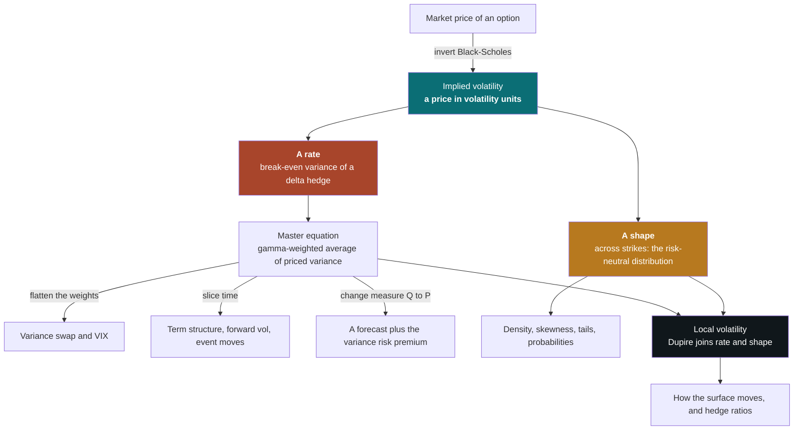
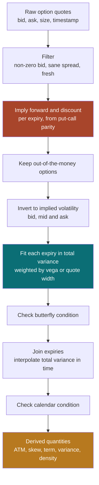
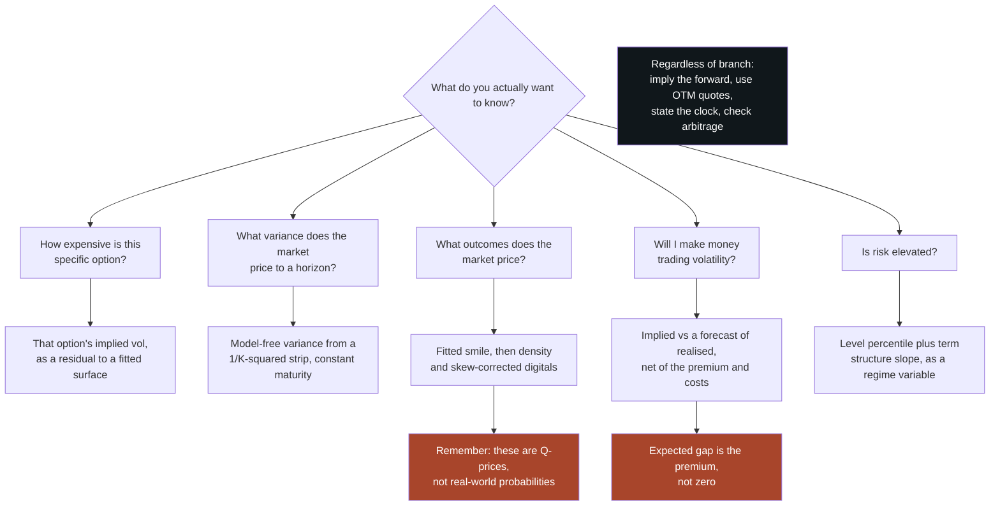

# Implied Volatility

### What the number means, how it is computed, how to look at it, and what practitioners do with it

---

```{=html}
<aside class="eli5">
```

# ELI5 — the short version {#eli5}

```{=latex}
\begin{eli5}
```

**In one sentence.** Implied volatility is not a forecast and not a price — it is a *unit*: the number you must feed a standard formula to make it agree with what an option actually costs, and this document is about the several different true things that one number tells you.

**1. It is a ruler, not a belief** ([§1](#1-the-number), [§2](#2-the-ruler)). Take an option's market price and ask what volatility would make the textbook formula produce exactly that price. The answer is the implied volatility. Nobody believes the textbook formula, any more than quoting a bond in yield terms means believing in a single constant interest rate. In both cases a price is run through a deliberately simple model to get a number that *compares* across instruments, which raw prices do not.

**2. There is no such thing as "the" implied volatility of a stock** ([§1](#1-the-number)). Every strike and every expiry has its own. The single number people quote is a convention about which one to use.

**3. Three true readings of the same number** ([§3](#3-a-price), [§4](#4-break-even), [§7](#7-smile)).

| Read it as | Meaning |
|---|---|
| A price in comparable units | Dollar prices spanning two orders of magnitude can all be "20% volatility". The unit removes the share price, the strike, the expiry and interest rates — which is why desks quote and mark in it |
| A break-even rate | Buy an option and hedge it continuously, and you gain on days the underlying moves more than implied volatility said, and lose on quieter days. At 20%, the break-even is about 1.26% a day |
| A distribution | Across strikes, the pattern of implied volatilities *is* the market's price-implied probability distribution, written as a departure from the bell-shaped default |

**4. Arithmetic worth memorising** ([§2](#2-the-ruler)). Divide an annual volatility by 16 to get the typical daily move: 16% a year is about 1% a day. And an at-the-money straddle costs roughly the expected size of the move over the option's life.

**5. It is a forecast with a fee attached** ([§6](#6-forecast)). Implied volatility genuinely does predict future realised volatility, better than forecasts built from history. But it runs high: on the S&P 500 it has averaged about four points above what subsequently happened, since 1990. That gap is not an error — it is the premium for writing insurance whose payoff is small steady gains and rare enormous losses. Selling it is a legitimate business with a brutal distribution, and it should be sized by what the bad day costs rather than by how calm the good ones are.

**6. Probabilities read off options are prices, not beliefs** ([§7](#7-smile)). Anything derived from option prices is computed in a world that deliberately overweights bad outcomes, so "the market implies a 12% chance of a 10% fall" is an upper bound on the real chance, not an estimate of it. And such probabilities live in the *slope* across strikes, not in any single strike's number: the shortcut of plugging one strike's own volatility into the formula overstated the chance of a 10% fall by three quarters in the worked example.

**7. Most of the difficulty is data, not theory** ([§9](#9-inverting), [§14](#14-failure-modes)). Getting the forward price right matters more than everything else combined — an error of half a percent manufactures 4.4 points of skew that does not exist. Far out-of-the-money quotes translate into nearly meaningless volatilities, because there a five-cent pricing error becomes hundreds of volatility points. Even the clock counts: the same intraday price implies volatilities differing by a factor of 2.3 depending on how you measure time to expiry.

**8. The VIX is the same object with the weights rearranged** ([§5](#5-price-of-variance)). Take a basket of out-of-the-money options weighted so that hedging it pays realised variance against a fixed strike, and you have a variance swap; discretise that and you have the VIX. The rearrangement is why an index can be published without anyone agreeing on a pricing model, and it also explains the "volatility crush" after an earnings date: a scheduled event is a lump of variance sitting in the term structure, and afterwards the lump has been spent.

---

**If you remember three things:** implied volatility is a unit of price rather than a prediction; every probability you read off it is a price, and therefore tilted toward bad outcomes; and when a surface looks strange, check the forward before checking anything else.

```{=latex}
\end{eli5}
```

```{=html}
</aside>
```

---

**What this is.** A from-first-principles tutorial on implied volatility — the most
quoted number in options markets, and one of the most casually misread. It gets
called the market's forecast of volatility, the price of an option, the fear gauge,
the width of a probability distribution and the break-even of a hedge. Each
description is right about something and wrong about something else. This document
takes the readings one at a time, shows exactly where each one comes from, and shows
that they are faces of a single object. It then covers how the number is computed
from real quotes (where nearly all of the practical difficulty lives), how it is
drawn, and what market makers, volatility traders, risk managers, allocators and
researchers actually do with it.

**Who it is for.** A reader who is mathematically comfortable and technically strong,
but not an options specialist, and who intends to *use* implied volatility: to build
a volatility surface, compute a VIX-style index, compare implied with realised
volatility, read a probability off option prices, or feed option-implied quantities
into a model. Intuition comes first throughout. Every formula is preceded by what it
means and followed by a number. Basic option vocabulary is defined briefly in §2;
[Dealer Hedging and Gamma Exposure](dealer_hedging.html) builds it from zero, and
this document assumes you can look there when a definition here feels thin.

**How to read it.** Five parts, following the four questions in the title.

- **Part I (§1–§2) — the concept.** What implied volatility is, the intuitions to
  discard, the one idea that organises everything else, and just enough
  Black–Scholes to make the definition precise.
- **Part II (§3–§8) — ways to read the number.** A price in volatility units; the
  break-even rate of a hedge; the price of future variance; a forecast with a risk
  premium attached; and a probability distribution written in lognormal units. §8
  joins the last two through local volatility and describes how the whole surface
  moves when the market moves.
- **Part III (§9–§11) — calculating it.** Inverting one price, building a surface
  from noisy quotes, and computing the derived quantities people actually quote:
  at-the-money volatility, skew, term structure, VIX-style variance, densities,
  event moves and implied correlation.
- **Part IV (§12) — visualising it.** The standard pictures, which question each
  one answers, and how each one misleads.
- **Part V (§13–§15) — using it.** How each kind of practitioner uses the number,
  a consolidated list of failure modes, and a synthesis.

§16 is the reference list, grouped by kind. Appendix A collects every concept the
main text leans on without fully explaining, ordered so that it reads as a build-up.

If you read four things, read **§1.4** (the spine: a price, a rate and a shape),
**§4.3** (why implied variance is a gamma-weighted average of the variance priced
in), **§7.2–§7.4** (why a smile is a distribution, and the probability trap that
follows), and **§9.4** (the inputs that matter far more than the root-finder).

**Relationship to the other notes.** [Dealer Hedging and Gamma
Exposure](dealer_hedging.html) derives the Greeks and the hedged-P&L identity in
detail (its sections 3 and 4) and explains who holds options and why that shows up in their
prices; this document uses those results and refers back rather than repeating
them. [Simple and Log Returns](log_returns.html) explains why volatility is defined
on log returns. [Market Regimes and Machine Learning](market_regimes.html) is the
right frame for using the VIX or the volatility term structure as a regime variable
(§13.5). [Stochastic Processes](stochastic_processes.html) covers the Brownian
motion the models here are built on. Each note stands alone.

**Epistemic tags.** Claims are flagged by status where the status changes what you
should do:

- **[Fact]** — replicated across independent datasets or implementations, with broad
  agreement among people who have looked.
- **[Contested]** — documented, but with live disagreement about magnitude,
  robustness, or cause.
- **[Hypothesis]** — a proposed mechanism, not decisively tested.
- **[Practice]** — practitioner convention. May well be right; the evidence is
  private or absent.

Untagged sentences are definitions, derivations, or arithmetic. Numbers that come
from simulations or stylised surfaces I built while writing are labelled
**[Simulated]**; the generating code is committed alongside this document in
`figures/iv_*.py`, and each script prints the numbers quoted in the text, so you can
change the parameters and rerun.

---

**Notation.** The **underlying** is the asset an option is written on; $S$ (or $S_t$)
is its price. An option has **strike** $K$ and **expiry** $T$; $\tau = T - t$ is the
time remaining, in years, counted in calendar days over 365 unless a passage says
otherwise. $r$ is the risk-free rate and $q$ the underlying's dividend (or carry)
yield. $F = S e^{(r-q)\tau}$ is the **forward price** for the option's expiry and
$D = e^{-r\tau}$ the **discount factor**. $k = \ln(K/F)$ is **log-moneyness**:
negative for strikes below the forward, positive above.

$V$ is an option's value, $C$ a call and $P$ a put. $N(\cdot)$ is the standard normal
cumulative distribution function and $\varphi(\cdot)$ its density. $\mathrm{BS}(\cdot)$
denotes the Black–Scholes price as a function of its inputs, and $d_1, d_2$ are the
quantities of §2.2. The Greeks are $\Delta = \partial V/\partial S$,
$\Gamma = \partial^2 V/\partial S^2$, $\nu = \partial V/\partial\sigma$ (vega) and
$\Theta = \partial V/\partial t$; $\Gamma S^2$ is **dollar gamma**.

Several volatilities must be kept apart, and the document is careful about which is
meant:

| Symbol | Name | What it is |
|---|---|---|
| $\sigma_i$, or $\sigma_i(K,T)$ | implied volatility | The number that makes $\mathrm{BS}$ reproduce a market price (§1.1); as a function of strike and expiry, the **surface** |
| $\sigma_t$ | instantaneous volatility | The true, unobserved volatility of the underlying at time $t$ in whatever process actually drives it |
| $\sigma_r$ | realised volatility | The volatility a price path actually delivered, measured afterwards from returns |
| $\sigma_{\text{loc}}(S,t)$ | local volatility | The volatility as a function of price and time that reproduces the whole surface (§8) |
| $\sigma_{\text{VS}}$ | variance-swap volatility | The square root of the fair variance of §5, of which the VIX is an instance |

$w(k,T) = \sigma_i^2(k,T)\,T$ is **total implied variance** at log-moneyness $k$ and
expiry $T$ — the variance of the log return to expiry that the option price implies.
Volatility is quoted in percent; a **vol point** is one percentage point of $\sigma$.
A surface is always described as seen today, so an expiry $T$ and the time remaining
to it coincide; $w(k,T)$ and $\partial w/\partial T$ follow the literature in writing $T$.

Two probability measures appear. $\mathbb{Q}$ is the **pricing** (risk-neutral)
measure under which discounted prices are expectations, and $\mathbb{P}$ is the
**physical** (real-world) measure under which events actually happen; the
blackboard letters keep $\mathbb{P}$ apart from the put price $P$. $f_T(K)$ is the
risk-neutral density of $S_T$ at $K$. $\Pi$ is the profit and loss (P&L) of a
hedged position. $\rho$ denotes a correlation — between price and volatility changes,
or between stocks in an index (§11.7) — or the rotation parameter of the SVI smile
(§10.4), which plays the same role; the passage always says which.

**The running example** is shared with the Dealer Hedging note: an underlying at 100,
a strike of 100, 30 calendar days to expiry ($\tau = 30/365$), $r = q = 0$ (so
$F = S = 100$ and $D = 1$), and 20% volatility. The call and the put each cost
**2.29**.

---

## Table of contents

- [ELI5 — the short version](#eli5)

**Part I — The concept**

1. [The number, and the intuitions to discard](#1-the-number)
2. [The ruler: just enough Black–Scholes](#2-the-ruler)

**Part II — Ways to read the number**

3. [A price in volatility units](#3-a-price)
4. [The break-even rate of a hedge](#4-break-even)
5. [The price of variance: variance swaps, the VIX and the term structure](#5-price-of-variance)
6. [A forecast with a premium attached](#6-forecast)
7. [A distribution in lognormal units: the smile](#7-smile)
8. [Local volatility, and how the surface moves](#8-local-vol-and-dynamics)

**Part III — Calculating it**

9. [Inverting one price](#9-inverting)
10. [From quotes to a surface](#10-surface)
11. [Derived quantities](#11-derived)

**Part IV — Visualising it**

12. [Pictures of implied volatility](#12-pictures)

**Part V — Using it**

13. [How practitioners use implied volatility](#13-uses)
14. [Failure modes](#14-failure-modes)
15. [Synthesis](#15-synthesis)
16. [References](#16-references)

**Appendix**

- [A. Concepts and prerequisites](#appendix-a-concepts-and-prerequisites) — every
  idea the main text leans on without fully explaining, built from first principles
  and ordered by dependency.

---

```{=latex}
\newpage
```

# 1. The number, and the intuitions to discard {#1-the-number}

## 1.1 The definition, with one number

An option's price depends on six inputs: the underlying price $S$, the strike $K$,
the time to expiry $\tau$, the interest rate $r$, the dividend yield $q$, and the
volatility $\sigma$ of the underlying over the option's life. Five of them can be
looked up. The sixth cannot, because it is a property of the future.

The Black–Scholes formula (§2.2) turns all six into a price. Implied volatility runs
the formula the other way: take the price the market is actually paying, hold the
five observable inputs fixed, and find the volatility that makes the formula agree.

$$
\mathrm{BS}\big(S, K, \tau, r, q, \sigma_i\big) = V_{\text{market}} .
$$

The solution $\sigma_i$ is the option's **implied volatility**. For the running
example, a 30-day at-the-money call trading at 2.29 has an implied volatility of
20%. If buyers bid it up to 2.52, its implied volatility becomes 22%: the option's
vega is 0.114 per vol point, so 23 cents of extra premium is two vol points.

Three things about this definition matter for everything that follows.

- **The formula is used as a conversion table, not as a description of the world.**
  Nothing in the definition says anyone believes returns are lognormal or that
  volatility is constant. The formula is a ruler: a fixed, agreed way of turning a
  dollar price into a number that can be compared across options.
- **It works only because price rises with volatility.** Every option is worth more
  when volatility is higher (§2.3), so each price corresponds to exactly one
  volatility. That monotonicity, not any belief about markets, is what makes the
  number well defined.
- **One option gives one number; a chain of options gives a surface.** Every strike
  and every expiry has its own implied volatility, and they are generally all
  different. "The implied volatility" of a stock or an index is always shorthand for
  one point on that surface, chosen by convention (§11.1).

## 1.2 An exact analogy: the yield of a bond

A bond's **yield to maturity** is the single discount rate that makes the present
value of its promised cash flows equal its market price. The calculation assumes a
flat interest-rate curve, which nobody believes. Bonds are quoted and compared in
yield anyway, because the conversion strips out coupon size, maturity and face value
and leaves a number that means roughly the same thing for every bond. When yields
differ across maturities, nobody concludes that the yield formula is broken; they
draw a **yield curve** and read it as information about what the flat-rate
assumption leaves out — expected future rates, and a term premium for bearing
duration risk.

Implied volatility is the same construction applied to options:

| | Bonds | Options |
|---|---|---|
| Observed | Price | Price |
| Ruler (a model nobody believes literally) | Flat-rate discounting | Black–Scholes with constant volatility |
| The number it yields | Yield to maturity | Implied volatility |
| Why the ruler works | Price falls monotonically as yield rises | Price rises monotonically with volatility |
| Variation across instruments | Yield curve, by maturity | Volatility surface, by strike and expiry |
| What the variation measures | Expected rates plus term premium | Expected variance plus variance risk premium, and the shape of the distribution |

The analogy is exact in structure, and it survives one level deeper: a yield
contains a risk premium on top of expected future rates, and an implied volatility
contains a risk premium on top of expected future variance (§6). Riccardo Rebonato's
often-repeated description of implied volatility is that it is the wrong number to put
into the wrong formula in order to obtain the right price
([Rebonato, 1999](https://www.wiley.com/en-us/Volatility+and+Correlation%3A+The+Perfect+Hedger+and+the+Fox%2C+2nd+Edition-p-9780470091395){target="_blank"}). The joke works because both
wrongs are deliberate and cancel exactly.

Where the analogy stops: a bond's cash flows are fixed, so its yield is a statement
about discounting alone. An option's payoff depends on the path, and in particular on
how much variance the path delivers where the option is sensitive to it. That is why
implied volatility has more readings than yield does.

## 1.3 Seven intuitions to discard

Most confusion about implied volatility comes from a handful of intuitions that are
half right. Naming them now saves a great deal of unlearning later.

| The intuition | Why it fails | What is true instead | Section |
|--------------------|------------------------------------|--------------------------------|------|
| "Implied volatility is the market's forecast of volatility" | It is a price, and prices contain risk premia. S&P 500 implied volatility has exceeded subsequently realised volatility by about 4 vol points on average since 1990 | A forecast plus a premium, plus the effect of supply and demand for options | §6 |
| "It is a parameter of a model the market believes" | The model is known to be false, and markets use it anyway | A unit of measurement; the *shape* of the surface records how the model is false | §3, §7 |
| "A stock has an implied volatility" | Every strike and expiry has its own | A surface; any single number is a convention | §10, §11.1 |
| "High implied volatility means options are expensive" | Expensive relative to what? | Rich or cheap only relative to the variance the option will actually experience where it has gamma, net of the premium for bearing that risk | §4, §6 |
| "An option's implied volatility is the underlying's volatility over the option's life" | Variance that arrives far from the strike barely affects an option | A dollar-gamma-weighted average of the variance priced along the paths from today's price to the strike | §4.3 |
| "Implied volatility measures moves in either direction equally" | Out-of-the-money puts and calls on an index trade at very different implied volatilities | Different strikes price different parts of the distribution; the downside wing prices crash risk | §7 |
| "$N(d_2)$ at the option's implied volatility is the probability of finishing in the money" | It ignores the skew, and it is the wrong probability measure | With a typical index skew, the naive number overstates the chance of finishing below a 10%-lower strike by about three quarters; and it is a pricing probability, not a real-world one | §6.1, §7.4 |

## 1.4 The spine: a price, a rate, and a shape

Three statements organise this whole document. Each later section is one of them
viewed up close, and the synthesis in §15 is the three of them viewed together.

**1. Implied volatility is a price.** It is an option price re-expressed in the unit
in which a lognormal, constant-volatility world would be flat. That is the definition
(§1.1), and it is why options are quoted, compared and marked in volatility (§3).

**2. Implied volatility is a rate.** The P&L of a delta-hedged option over a short
interval is half its dollar gamma times the gap between the variance that actually
happened and the variance implied volatility charged for:

$$
d\Pi = \tfrac12\,\Gamma S^2 \left(\sigma_t^2 - \sigma_i^2\right) dt .
$$

So implied variance is the **break-even variance rate** for anyone who hedges the
option (§4). Take expectations under the pricing measure, and demand that a fairly
priced option break even on average: implied variance becomes a **weighted average
of the variance the market has priced in**, with weights equal to the option's
dollar gamma along the paths it might follow. This is the master equation of the
document, derived in §4.3:

$$
\sigma_i^2 \;=\; \frac{\mathbb{E}^{\mathbb{Q}}\!\left[\displaystyle\int_0^T \Gamma_t S_t^2\, \sigma_t^2\, dt\right]}
{\mathbb{E}^{\mathbb{Q}}\!\left[\displaystyle\int_0^T \Gamma_t S_t^2\, dt\right]} .
$$

Three knobs in this equation generate most of the named readings of implied
volatility. Change the **weights** — replace one option's dollar gamma with the flat
dollar gamma of a strip of options weighted by $1/K^2$ — and you get the variance
swap and the VIX (§5). Change the **measure** from $\mathbb{Q}$ to $\mathbb{P}$ and
you get a forecast, with the variance risk premium as the gap (§6). Change the
**slice of time** the integral covers and you get forward volatility and the
variance of a single event, because total variance adds up over time (§5.4–§5.5).

**3. Implied volatility is a shape.** Across strikes at one expiry, option prices pin
down the whole risk-neutral probability distribution of the price at expiry: the
second derivative of the call price with respect to the strike *is* the density
(§7.2). The smile is that distribution written relative to a lognormal. Its level is
the width of the distribution, its slope is the skewness, and its curvature is the
fatness of the tails (§7.3).

The rate and the shape are joined by **local volatility** (§8). Dupire's formula says
the local variance at a strike and expiry is the rate at which total implied variance
grows with expiry, divided by a term that is proportional to the risk-neutral density
at that strike — a time-direction quantity over a strike-direction quantity. The two
no-arbitrage conditions every surface must satisfy are exactly the conditions that
the numerator be non-negative and the denominator positive.



The rest of Part II is a tour of this diagram, one reading per section, all using
the same template: the intuition, the formal statement, a number, what the reading is
good for, and how it misleads.

| Reading | What changes in the master equation | Section | What it is good for |
|---|---|---|---|
| A price in volatility units | Nothing: this is the definition | §3 | Quoting, comparing and marking options |
| The break-even rate of a hedge | Weights are this option's dollar gamma | §4 | Deciding whether to own or sell an option you will hedge |
| The price of variance | Weights flattened by a $1/K^2$ strip; time sliced | §5 | The VIX, variance swaps, term structure, event moves |
| A forecast with a premium | Measure $\mathbb{Q}$ replaced by $\mathbb{P}$ | §6 | Volatility forecasting; the variance risk premium |
| A distribution | Vary the strike instead of integrating over time | §7 | Probabilities, tails, skew |
| An average of local volatility | Weights live on a bridge from spot to strike | §8 | Pricing and hedging beyond vanilla options; surface dynamics |

```{=latex}
\newpage
```

## 1.5 How the idea evolved

| Year | Development | What changed |
|---|---|---|
| 1973 | Black–Scholes and Merton; listed equity options begin trading in Chicago | An option has a price, and one input that cannot be observed |
| 1976 | Implied standard deviations computed from option prices; Black's formula for options on futures | The number gets its name, and its first test as a forecast |
| 1987 | The October crash | The index skew appears, and never leaves |
| 1993 | Cboe's first volatility index, on S&P 100 options; the Heston model | Volatility becomes something you can quote, and something you can model as a process |
| 1994 | Local volatility, by Dupire and by Derman and Kani | One diffusion is shown to fit an entire surface |
| 1999 | Variance swaps and the replicating strip | Volatility becomes tradable without delta hedging |
| 2002 | SABR | A smile model built for hedging rather than only for fitting |
| 2003 | The VIX is redefined as model-free variance on S&P 500 options | The index becomes a variance-swap rate |
| 2004 | VIX futures list; the SVI parameterisation appears | Volatility becomes an asset class with its own term structure |
| 2009 | The variance risk premium is shown to predict equity returns | The gap between implied and realised becomes a research object |
| 2014 | Arbitrage-free SVI | Surface fitting acquires explicit no-arbitrage conditions |
| 2018 | "Volatility is rough" | The shape of the short end becomes a research field |
| 2022 | SPX options expire every trading day | Intraday implied volatility, and the clock behind it, become first-order |

The history falls into four eras, each with a one-line thesis.

**1973–1986: implied volatility as a by-product.** [Black and Scholes
(1973)](https://www.journals.uchicago.edu/doi/10.1086/260062){target="_blank"} and [Merton
(1973)](https://www.maths.tcd.ie/~dmcgowan/Merton.pdf){target="_blank"} gave a price that depended on one unobservable input, and within three years
[Latané and Rendleman
(1976)](https://onlinelibrary.wiley.com/doi/10.1111/j.1540-6261.1976.tb01892.x){target="_blank"} were computing the "implied standard deviation" from option prices
and asking whether it forecast future volatility. What changed: volatility became
something you could read off a market rather than only estimate from history. The
limitation, fairly judged, was that the number was treated as a single estimate of a
single parameter. Index smiles were mild before 1987, so little seemed lost. What
survives: the definition, unchanged.

**1987–1999: the smile becomes permanent, and gets modelled.** After the October 1987
crash, S&P 500 options have priced downside strikes at persistently higher implied
volatility than upside strikes ([Rubinstein,
1994](https://onlinelibrary.wiley.com/doi/abs/10.1111/j.1540-6261.1994.tb00079.x){target="_blank"}). [Fact] Practitioners stopped treating the smile as noise and started
treating it as information. [Heston (1993)](https://academic.oup.com/rfs/article-abstract/6/2/327/1574747){target="_blank"} produced smiles from stochastic volatility;
[Dupire (1994)](https://www.risk.net/derivatives/equity-derivatives/1500211/pricing-with-a-smile){target="_blank"} and [Derman and Kani
(1994)](https://emanuelderman.com/the-volatility-smile-and-its-implied-tree/){target="_blank"} showed how to recover the unique local volatility function consistent
with the whole surface. At the end of the decade, [Carr and Madan
(1998)](https://www.researchgate.net/publication/2852582_Towards_a_Theory_of_Volatility_Trading){target="_blank"} and [Demeterfi, Derman, Kamal and Zou
(1999)](https://emanuelderman.com/wp-content/uploads/1999/02/gs-volatility_swaps.pdf){target="_blank"} showed that a strip of options replicates a contract on realised
variance, making volatility itself tradable without any delta hedging. The
limitation: models that fit today's surface often predict tomorrow's surface badly
(§8.5). What survives: all of it, as the standard toolkit.

**2000–2014: implied volatility as an index, an asset and a risk factor.** In 2003
Cboe redefined the VIX as a model-free variance computed from S&P 500 options
([Carr and Wu, 2006](https://engineering.nyu.edu/sites/default/files/2021-03/carrwutaleoftwoindices.pdf){target="_blank"}), and futures and options on it followed. Academic
work measured the gap between implied and realised variance as a risk premium
([Carr and Wu, 2009](https://engineering.nyu.edu/sites/default/files/2019-01/CarrReviewofFinStudiesMarch2009-a.pdf){target="_blank"}) and found that it predicts equity returns
([Bollerslev, Tauchen and Zhou, 2009](https://public.econ.duke.edu/~boller/Published_Papers/rfs_09.pdf){target="_blank"}). Practitioners standardised how surfaces are
parameterised, notably with SVI, later given explicit no-arbitrage conditions by
[Gatheral and Jacquier (2014)](https://arxiv.org/abs/1204.0646){target="_blank"}. The limitation: volatility products concentrated
short-volatility risk in ways that were poorly understood until they failed (February
2018; [Dealer Hedging](dealer_hedging.html), section 8.4). What survives: the VIX as the
world's default measure of equity risk appetite.

**2015 onward: every horizon, every hour.** Options now expire daily, implied
volatility is computed intraday for options with hours to live, and the shape of the
short end of the surface has become a research field of its own — including the
[Contested] claim that the at-the-money skew follows a power law in maturity because
volatility is "rough" ([Gatheral, Jaisson and Rosenbaum, 2018](https://arxiv.org/abs/1410.3394){target="_blank"}; §8.4). What
changed: the clock used to measure time to expiry, a detail for 30-day options,
became first-order (§9.4).

> ### §1 Key takeaways
>
> 1. Implied volatility is the volatility that makes the Black–Scholes formula
>    reproduce a market price. The formula is used as a ruler, not as a belief.
> 2. The number is well defined only because option prices rise monotonically with
>    volatility.
> 3. It is exactly analogous to a bond's yield: a price converted into a comparable
>    rate through a deliberately simple model, whose variation across instruments is
>    information.
> 4. Every strike and expiry has its own implied volatility. "The" implied
>    volatility of an asset is a convention.
> 5. Implied volatility is simultaneously a price, a rate and a shape: the price of
>    the option in volatility units, the break-even variance rate of a delta hedge,
>    and — across strikes — the risk-neutral distribution written relative to a
>    lognormal.
> 6. Implied variance is a dollar-gamma-weighted average of the variance priced in.
>    Changing the weights gives the variance swap and the VIX; changing the measure
>    gives a forecast plus a risk premium; slicing time gives forward volatility.
> 7. It is not a pure forecast, not one number, not symmetric, and not a source of
>    real-world probabilities without correction.

---

# 2. The ruler: just enough Black–Scholes {#2-the-ruler}

## 2.1 Volatility, and the square root of time

**Volatility** $\sigma$ is the annualised standard deviation of log returns. If daily
log returns are independent, variances add, so the standard deviation over $n$ days
grows like $\sqrt{n}$. Over an option's remaining life $\tau$ the standard deviation
of the log return is $\sigma\sqrt{\tau}$, which this document calls **total
volatility**; its square $\sigma^2\tau$ is **total variance**.

With about 252 trading days a year and $\sqrt{252} \approx 16$, traders use the **rule
of 16**: 16% annual volatility is roughly a 1% move on a typical trading day. The
running example's 20% is a typical daily move of 1.26% on trading days (or 1.05% if
the year is counted as 365 calendar days, which spreads the same variance over more
days), and a standard deviation of $20\% \times \sqrt{30/365} = 5.73\%$ over the
option's 30 days. [Simple and Log Returns](log_returns.html) explains why log
returns, not simple returns, are the natural unit here.

## 2.2 What an option price really depends on

The Black–Scholes price of a European call, written in terms of the forward $F$ and
discount factor $D$ (the "Black" form, [Black, 1976a](https://ideas.repec.org/a/eee/jfinec/v3y1976i1-2p167-179.html){target="_blank"}), is

$$
C = D\left[F\,N(d_1) - K\,N(d_2)\right], \qquad
d_{1,2} = \frac{\ln(F/K) \pm \tfrac12\sigma^2\tau}{\sigma\sqrt{\tau}} ,
$$

and the put follows from **put–call parity**, $C - P = D(F - K)$, which holds for
European options regardless of any model. Read the formula as a recipe: $N(d_2)$ is
the risk-neutral probability that the call finishes in the money, and $d_2$ is the
distance from the forward to the strike measured in standard deviations of the log
return (with a small adjustment of half a variance). [Dealer
Hedging](dealer_hedging.html), sections 3.2 and 3.3, derives the formula from replication.

Now divide by $DF$ and write the strike as log-moneyness $k = \ln(K/F)$:

$$
\frac{C}{DF} = N(d_1) - e^{k} N(d_2), \qquad
d_{1,2} = -\frac{k}{\sigma\sqrt{\tau}} \pm \frac{\sigma\sqrt{\tau}}{2} .
$$

The normalised price depends on **exactly two numbers**: how far the strike is from the
forward, $k$, and how much the log price is expected to spread before expiry,
$\sigma\sqrt{\tau}$. Three consequences run through the rest of the document.

- **Rates and dividends enter only through $F$ and $D$.** Getting the forward right is
  therefore most of what "getting the inputs right" means (§9.4).
- **Volatility and time enter only through $\sigma\sqrt{\tau}$.** A one-year option at
  10% volatility and a four-year option at 5% volatility with the same moneyness have
  the same normalised price. What the option really prices is total volatility; the
  annualised $\sigma$ is a convention for comparing across expiries.
- **Total implied variance $w = \sigma_i^2\tau$ is the natural coordinate.** It is what
  the price actually pins down, and it adds up over time (§5.4). Surfaces are best
  built, interpolated and checked for arbitrage in $(k, w)$ rather than in
  $(K, \sigma_i)$ (§10).

Put–call parity has a consequence that is easy to state and powerful in practice: a
call and a put with the same strike and expiry must have **the same implied
volatility**, because the same $\sigma$ that prices one prices the other. When
computed call and put volatilities disagree, something is wrong with the inputs —
usually the forward — or the options are American (§9.4).

## 2.3 Why the formula can be run backwards

Vega, the sensitivity of the price to volatility, is

$$
\nu = \frac{\partial C}{\partial \sigma} = D F \,\varphi(d_1)\sqrt{\tau} \;>\; 0 ,
$$

strictly positive for any strike and any positive time to expiry, and the same for a
call and a put. The intuition is convexity: an option pays off asymmetrically, so
spreading out the distribution of the final price adds more to the winning outcomes
than it takes from the losing ones.

Positive vega, together with the limits of the price as volatility goes to zero and
to infinity, is what makes implied volatility well defined. As $\sigma \to 0$ the call
is worth its discounted intrinsic value against the forward, $D(F-K)^+$; as
$\sigma \to \infty$ it is worth $DF$. Every price strictly between those bounds
corresponds to **exactly one** volatility. A quoted price outside them has no implied
volatility at all — and since those bounds are no-arbitrage bounds, such a price is
either an arbitrage or, far more often, bad data.

```{=latex}
\begin{center}
\includegraphics[width=\linewidth]{quant-research/figures/iv_inversion.pdf}
\end{center}
```

```{=html}

```

The left panel is the whole idea of implied volatility in one picture: each curve is
monotone, so a price on the vertical axis can be read back to a volatility on the
horizontal axis. Two features of the curves matter later. The at-the-money curve is
almost a straight line through the origin (§2.4), so its inversion is easy and robust.
The out-of-the-money curves are flat near zero volatility and rise steeply only later;
where a curve is flat, a small change in price corresponds to a large change in
volatility. The right panel measures that fragility, and §9.3 returns to it.

## 2.4 The at-the-money shortcut, and the straddle as an expected move

At the money forward, $K = F$, so $k = 0$ and $d_{1,2} = \pm\tfrac12\sigma\sqrt{\tau}$.
Expanding the normal distribution function around zero,

$$
C_{\text{ATM}} = DF\left[N\!\left(\tfrac12\sigma\sqrt{\tau}\right) - N\!\left(-\tfrac12\sigma\sqrt{\tau}\right)\right]
\;\approx\; DF\,\sigma\sqrt{\tau}\,\varphi(0) \;=\; \frac{DF\,\sigma\sqrt{\tau}}{\sqrt{2\pi}} \;\approx\; 0.4\, DF\,\sigma\sqrt{\tau} .
$$

This is the approximation of [Brenner and Subrahmanyam
(1988)](https://www.tandfonline.com/doi/abs/10.2469/faj.v44.n5.80){target="_blank"}, and it is remarkably accurate for the options people trade most. For the
running example it gives $0.4 \times 100 \times 0.20 \times 0.2867 = 2.293$ against an
exact 2.287. Run it backwards and a trader can read implied volatility off an
at-the-money price without a computer: $\sigma_i \approx C/(0.4\,DF\sqrt{\tau}) =
19.94\%$. The shortcut's real lesson is that the at-the-money price is **almost linear
in volatility**, which is why at-the-money implied volatility is the most robust
number on the surface and why at-the-money vega barely depends on the level of
volatility.

The **straddle** — a call plus a put at the same strike — has a second reading that
practitioners use daily. At the money it costs about twice the call,
$0.8\,DF\sigma\sqrt{\tau}$. And if the change in the forward over the option's life is
roughly normal with standard deviation $F\sigma\sqrt{\tau}$, the expected *absolute*
change is $F\sigma\sqrt{\tau}\sqrt{2/\pi} = 0.798\,F\sigma\sqrt{\tau}$. The two
coincide:

> **An at-the-money straddle costs the discounted expected absolute move of the
> underlying over the option's life** — under the pricing measure, and to the extent
> the move is close to normal.

The running example's straddle costs 4.57, which is 4.57% of the price: the market is
pricing an average absolute move of about 4.6% over 30 days, corresponding to a
standard deviation of $4.57/0.798 = 5.73\%$. This is the "expected move" quoted around
earnings announcements (§5.5, §13.3). [Practice] Two caveats travel with it. It is a
risk-neutral expectation, so it includes whatever premium sellers of options demand
(§6). And fat tails change the ratio: for a distribution with more weight in the tails
and more in the centre, the mean absolute move is a smaller fraction of the standard
deviation than 0.8, so dividing a straddle price by 0.8 slightly understates the
standard deviation the market is pricing.

## 2.5 Other rulers: normal volatility and variance units

Black–Scholes is not the only ruler in use, and the choice of ruler changes what the
smile looks like.

- **Lognormal (Black–Scholes or Black-76) volatility**, in percent per square-root
  year. The convention for equities, foreign exchange and most commodities.
- **Normal (Bachelier) volatility**, in price units per square-root year — basis
  points a year for interest rates. The model lets the underlying's *change*, rather
  than its log change, be normally distributed. Near the money the two are related by
  $\sigma_N \approx \sigma_{\text{LN}}\,F$. Interest-rate options moved largely to
  normal-volatility quoting as rates approached zero, where lognormal volatility
  becomes enormous and unstable for small changes in the rate. [Practice]
- **Variance units.** Variance swaps are quoted as a volatility strike but pay on
  variance (§5.1), and some models are naturally stated in variance.

The ruler matters because a surface that is flat under one ruler is sloped under
another. If a market prices options exactly as the normal model with $\sigma_N = 20$
price units a year on a forward of 100, the equivalent lognormal volatility at strike
$K$ is approximately $\sigma_N \ln(F/K)/(F-K)$ ([Hagan, Kumar, Lesniewski and
Woodward, 2002](https://www.researchgate.net/publication/235622441_Managing_Smile_Risk){target="_blank"}): 21.1% at a strike of 90 and 19.1% at 110. A "flat" normal smile is a
lognormal skew of about one vol point per ten points of strike. Part of any skew is
therefore a statement about which ruler is being used, and comparisons of skew across
markets quoted under different conventions need conversion first.

> ### §2 Key takeaways
>
> 1. Volatility is the annualised standard deviation of log returns; over an option's
>    life the relevant number is total volatility $\sigma\sqrt{\tau}$. By the rule of 16,
>    16% is about 1% a trading day.
> 2. A normalised option price depends only on log-moneyness $k = \ln(K/F)$ and total
>    volatility. Rates and dividends matter only through the forward and the discount
>    factor.
> 3. Total implied variance $w = \sigma_i^2\tau$ is the coordinate the price actually
>    pins down, and the right one for building surfaces.
> 4. Vega is strictly positive, so every price inside the no-arbitrage bounds has
>    exactly one implied volatility; a price outside them has none.
> 5. A call and a put with the same strike and expiry have the same implied
>    volatility. Disagreement diagnoses bad inputs.
> 6. At the money, price is almost linear in volatility: $C \approx 0.4\,DF\sigma\sqrt{\tau}$.
>    The at-the-money straddle costs roughly the expected absolute move.
> 7. The ruler is a convention. Normal and lognormal volatilities give differently
>    shaped smiles for the same prices.

---

# 3. A price in volatility units {#3-a-price}

## 3.1 What the conversion removes

The first reading of implied volatility is the literal one: it is the option's price,
wearing different clothes. What the change of clothes accomplishes is best seen by
looking at prices that have nothing in common and volatilities that are identical.

| Option (20% volatility throughout) | Price |
|---|---:|
| 30-day at-the-money call, underlying at 100 | 2.29 |
| 30-day at-the-money call, underlying at 500 | 11.44 |
| One-year at-the-money call, underlying at 100 | 7.97 |
| 30-day 110-strike call, underlying at 100 | 0.12 |
| 30-day 90-strike put, underlying at 100 | 0.07 |

Every option in that table is priced at exactly 20% volatility, and their prices span
two orders of magnitude. Run it the other way and the point is sharper still: a price
of **2.29** is 20% volatility for the 30-day at-the-money call, 41.5% for a *seven-day*
at-the-money call, 5.7% for a *one-year* at-the-money call, and 50.2% for the 30-day
110-strike call. The dollar price on its own says nothing about whether an option is
dear.

The conversion strips out four things at once: the level of the underlying, the
strike, the time to expiry, and the financing and dividends (which enter only through
the forward and the discount factor, §2.2). What is left is a number on a scale where
"20%" means approximately the same thing for a 30-day option on a $40 stock and a
two-year option on an index at 6,000.

## 3.2 Trading, quoting and marking in volatility

Because the number is comparable, the market uses it as the unit of account.

**Quotes.** Over-the-counter foreign-exchange options are quoted directly in
volatility, with the strike specified by delta rather than by price (§10.4).
Interdealer trades in listed index options are often negotiated the same way: the two
sides agree a volatility and a reference price for the underlying, and the trade
prints as a package of options plus the delta hedge. [Practice] The dollar price is
then an output, computed from the agreed volatility.

**Marks and P&L attribution.** A dealer's book is marked to a fitted surface rather
than to individual screen prices, and the day's P&L is attributed to the Greeks. Take
the running example: the underlying rises 1%, one day passes, and implied volatility
falls by one point. The call's value changes by $+0.397$, decomposed as

$$
\underbrace{+0.511}_{\text{delta}} \;+\; \underbrace{+0.035}_{\text{gamma}} \;+\;
\underbrace{-0.038}_{\text{theta}} \;+\; \underbrace{-0.114}_{\text{vega}} \;=\; +0.394 ,
$$

with the remaining third of a cent coming from higher-order terms. The vega line —
"the market repriced volatility and it cost us eleven cents" — exists only because
prices have been converted into volatility. Without the conversion there is a P&L
number and no explanation of it.

**Relative value.** Once every option on an underlying is a point on a surface, the
natural questions become comparative: this put is 1.5 volatility points rich to the
fitted skew; this expiry is cheap to the ones either side of it; this stock's
volatility is high relative to its sector. Every one of those statements is a
statement about residuals from a fitted surface (§10.4), which is why the fitting
matters so much.

## 3.3 What the unit cannot remove

The conversion normalises the *model's* dimensions. It does not make different risks
comparable, and four confusions follow from forgetting that.

- **Different underlying risks.** A 30% implied volatility on a biotech stock facing a
  binary regulatory decision and a 30% implied volatility on an equity index are not
  the same price for the same thing. The first is mostly the price of one event
  (§5.5); the second is the price of a diffusive process plus crash insurance.
- **Different parts of the distribution.** The implied volatility of a 25-delta put and
  that of an at-the-money option are prices of different risks, which is why they
  differ and why the difference is information rather than error (§7).
- **The risk premium travels with the number.** Comparing implied volatilities across
  underlyings compares risk premia and hedging demand as much as expected variance
  (§6.3). Single-stock options and index options carry systematically different
  premia ([Driessen, Maenhout and Vilkov, 2009](https://papers.ssrn.com/sol3/papers.cfm?abstract_id=673425){target="_blank"}).
- **Model residue leaks in.** American exercise, discrete dividends, borrow costs and
  settlement conventions all distort the number if they are mishandled in the
  inversion (§9.4). A "high" implied volatility is sometimes just a wrong forward.

> ### §3 Key takeaways
>
> 1. Implied volatility is the option's price in a unit that removes the underlying's
>    level, the strike, the expiry, rates and dividends.
> 2. Dollar prices spanning two orders of magnitude can all be 20% volatility; one
>    dollar price can be 5.7% or 50% volatility depending on the contract.
> 3. Markets quote, negotiate and mark in volatility, and P&L attribution's vega line
>    exists only because of the conversion.
> 4. Relative-value statements about options are statements about residuals from a
>    fitted surface.
> 5. The unit does not make different risks comparable: event risk, skew, risk premia
>    and mishandled forwards all live inside the same number.

---

# 4. The break-even rate of a hedge {#4-break-even}

## 4.1 The identity, in one paragraph

Buy an option, sell $\Delta$ shares against it, and keep the hedge current. Over a
short interval in which the underlying moves by $\Delta S$, the hedged position's P&L
is, to second order,

$$
\Delta \Pi \;\approx\; \Theta\,\Delta t + \tfrac12 \Gamma (\Delta S)^2 ,
$$

because the delta terms cancel — that is what hedging is for. An option marked at
implied volatility $\sigma_i$ satisfies the Black–Scholes equation at that volatility,
which with zero rates says $\Theta = -\tfrac12 \sigma_i^2 S^2 \Gamma$: the option's time
decay is exactly the rent charged for its gamma. Substituting,

$$
\boxed{\;\Delta \Pi \;\approx\; \tfrac12\,\Gamma S^2\left[\left(\frac{\Delta S}{S}\right)^{\!2} - \sigma_i^2\,\Delta t\right]\;}
$$

**The P&L of a delta-hedged option is half its dollar gamma times the difference
between the squared return that happened and the variance that implied volatility
charged for.** [Dealer Hedging](dealer_hedging.html), section 4.4, derives this carefully, works
it through a week of hedging, and simulates its distribution; this document takes it
as given and asks what it says about the number $\sigma_i$.

It says that implied volatility is not really a forecast or an opinion. It is a
**rate**: the rate at which a hedger pays (in time decay) for the right to collect
squared returns, or collects in exchange for owing them.

## 4.2 The break-even move

Setting the bracket to zero gives the move at which a hedged option breaks even over
an interval:

$$
\left|\frac{\Delta S}{S}\right| = \sigma_i \sqrt{\Delta t} .
$$

At 20% implied volatility, one day's break-even is 1.26% if the year is counted in 252
trading days, or 1.05% if it is counted in 365 calendar days — the same option, two
conventions, and the difference matters over a weekend (§9.4).

| Implied volatility | Daily break-even (252-day year) | Daily break-even (365-day year) |
|---:|---:|---:|
| 10% | 0.63% | 0.52% |
| 16% | 1.01% | 0.84% |
| 20% | 1.26% | 1.05% |
| 32% | 2.02% | 1.68% |
| 80% | 5.04% | 4.19% |

This is the most practical single reading of implied volatility, and it converts the
number into a question a trader can actually answer: *will this underlying move more
or less than this each day?* Owning a hedged option is a bet on "more"; selling one is
a bet on "less"; and because the payoff is quadratic in the move, the loser on a big
day loses far more than the winner gains on a quiet one. At 20% implied volatility a
2% day delivers three and a half times the break-even variance, and a 3% day more
than eight times.

Over the option's whole life, the expected P&L of selling at $\sigma_i$ and living
through realised volatility $\sigma_r$ is the difference in Black–Scholes values,
$V(\sigma_i) - V(\sigma_r)$, which is close to $\nu \times (\sigma_i - \sigma_r)$: about
$\$1.14$ per option for each 10 volatility points, in the running example. But that is
an *expectation*. The realised outcome around it is hedging error, it falls only as
the square root of the number of rehedges, and it does not diversify across options on
the same underlying ([Dealer Hedging](dealer_hedging.html), section 4.7).

## 4.3 Implied variance is a gamma-weighted average

The identity holds interval by interval. Integrating it over the option's life turns
implied volatility from a per-day break-even into a statement about the entire future,
and this is the master equation of the document.

Work under the pricing measure $\mathbb{Q}$ with zero rates, and let the underlying
follow *any* continuous process whose instantaneous volatility $\sigma_t$ may itself be
random: $dS_t = \sigma_t S_t\, dW_t$. Let $V(S,t;\sigma_i)$ be the Black–Scholes value
of our option at the constant volatility $\sigma_i$. Itô's lemma plus the
Black–Scholes equation at $\sigma_i$ (the same substitution as in §4.1) gives

$$
dV = \Delta\, dS + \tfrac12 \Gamma S^2\left(\sigma_t^2 - \sigma_i^2\right) dt .
$$

Integrate from now to expiry. At expiry the Black–Scholes value equals the payoff, so

$$
\text{payoff} - V(S_0,0;\sigma_i) = \int_0^T \Delta\, dS + \tfrac12 \int_0^T \Gamma_t S_t^2\left(\sigma_t^2 - \sigma_i^2\right) dt .
$$

Now take expectations under $\mathbb{Q}$. The hedging term is a martingale and drops
out. The market price of the option is $\mathbb{E}^{\mathbb{Q}}[\text{payoff}]$, and by
the definition of implied volatility that price is exactly $V(S_0,0;\sigma_i)$. The
left-hand side is therefore zero, and rearranging what is left:

$$
\sigma_i^2 \;=\; \frac{\mathbb{E}^{\mathbb{Q}}\!\left[\displaystyle\int_0^T \Gamma_t S_t^2\, \sigma_t^2\, dt\right]}
{\mathbb{E}^{\mathbb{Q}}\!\left[\displaystyle\int_0^T \Gamma_t S_t^2\, dt\right]},
\qquad \Gamma_t = \Gamma^{\mathrm{BS}}(S_t,t;\sigma_i) .
$$

**An option's implied variance is a weighted average of the variance the market prices
in, with weights equal to the option's own dollar gamma along the paths the underlying
might take.** The relation is exact, not an approximation, given continuous paths and
the usual integrability. It is implicit — the weights are computed at $\sigma_i$
itself — but that does not weaken the reading, and the fixed point is unique in
practice. The representation is standard: it underlies the delta-hedging P&L analysis
of [Carr and Madan (1998)](https://www.researchgate.net/publication/2852582_Towards_a_Theory_of_Volatility_Trading){target="_blank"}, the local-volatility averaging results in
[Gatheral (2006)](https://onlinelibrary.wiley.com/doi/book/10.1002/9781119202073){target="_blank"}, and the survey of probabilistic interpretations in
[Lee (2005)](https://math.uchicago.edu/~rogerlee/impvol.pdf){target="_blank"}.

Four special cases show how much the equation explains on its own.

- **Constant volatility.** If $\sigma_t \equiv \sigma$, then $\sigma_i = \sigma$ for every
  strike and expiry: a flat surface. This is the Black–Scholes world, and it is the
  only world in which "the implied volatility" is a well-posed phrase.
- **Volatility that varies with time but not randomly.** If $\sigma_t = \sigma(t)$ is a
  known function of time, the weights cannot favour one level of the price over
  another, and the equation collapses to
  $\sigma_i^2 = \frac{1}{T}\int_0^T \sigma^2(t)\,dt$ — the root-mean-square of forward
  volatility. Every strike still has the same implied volatility: **a term structure
  with no smile**. This is the engine of §5.4.
- **Volatility that depends on the price level.** Now different strikes have their
  weights in different places (§4.4), so they average different volatilities and
  therefore differ: **a smile**. §8.2 makes this precise.
- **Volatility that is random but independent of the price.** The option price becomes
  an average of Black–Scholes prices over the distribution of average variance. Because
  the Black–Scholes price is convex in volatility away from the money (the second
  derivative, "vomma", is positive away from the money and negligible in a narrow band
  around the forward), averaging raises
  out-of-the-money prices more than at-the-money ones: **a symmetric smile**, with
  curvature growing in the uncertainty about volatility. Correlation between the price
  and its volatility tilts that smile into a skew (§8.4).

## 4.4 Where an option's weights live

The weights in the master equation are not abstract. Under Black–Scholes dynamics at
$\sigma_i$, the expected dollar gamma at each time and price level has an exact and
memorable form: it is a **Brownian bridge** from today's price to the strike on expiry
day.

```{=latex}
\begin{center}
\includegraphics[width=\linewidth]{quant-research/figures/iv_bridge.pdf}
\end{center}
```

```{=html}

```

The picture is worth dwelling on, because it answers a question that trips up almost
everyone: *which* volatility does an option's implied volatility refer to?

- For an **at-the-money** option, the weights form a lens centred on today's price. The
  option is a claim on variance delivered near the current price.
- For a **90-strike** option with the price at 100, the lens tilts: it runs from 100
  today to 90 on expiry day, and at the midpoint of the option's life its
  one-standard-deviation band covers roughly 92.2 to 97.6. [Simulated] The option is a
  claim on the variance that occurs *along the way down*. If volatility in that region
  is higher than volatility near 100 — which is exactly what the leverage effect and
  crash risk imply for equities — then this option's implied volatility is higher.
  **That is a skew, arrived at without any model.**
- In **time**, the weights are flat: each third of the option's life contributes exactly
  a third of the total weight. [Simulated] This is initially surprising, since gamma
  explodes near expiry. The resolution is that gamma explodes only *near the strike*,
  and the probability of being near the strike late in the option's life shrinks at
  exactly the compensating rate.

The last point needs care, because it is easy to state a contradiction. *Unconditionally*
the weight per unit time is flat. *Along a given path*, it is anything but: if the price
happens to sit at the strike with two days left, the dollar gamma there is enormous and
the variance delivered in those two days dominates the option's P&L. This is why a
hedged option's outcome is path-dependent even when total realised volatility comes in
exactly at implied ([Dealer Hedging](dealer_hedging.html), section 4.6).

## 4.5 What the master equation explains

Almost everything in Part II falls out of the same three knobs — the weights, the
measure, and the slice of time.

1. **Why each strike has its own number.** Different strikes weight different regions of
   price space. If volatility depends on the price level, their averages differ. The
   smile is not evidence that the market is confused about volatility; it is evidence
   that volatility is not a single number (§7, §8).
2. **Why "implied versus realised" is subtler than it looks.** The right comparison for a
   single option is implied variance against *dollar-gamma-weighted* realised variance,
   not against a plain close-to-close estimate over the same window (§11.8). Two paths
   with identical realised volatility hand a hedger very different P&L.
3. **Why flattening the weights gives a cleaner instrument.** If a portfolio's dollar
   gamma is the same at every price, the weighted average becomes a plain average, and
   the instrument pays realised variance with no dependence on where the price went.
   That portfolio exists, it is a $1/K^2$ strip of options, and it is a variance swap
   (§5.1).
4. **Why the term structure is an average of forward variances.** Slicing the integral in
   time gives additive total variance and the forward-variance reading (§5.4), and
   dropping a single dated lump of variance into the integral gives the implied move of
   an earnings announcement (§5.5).
5. **Why implied volatility is not a forecast.** Everything above is under $\mathbb{Q}$.
   Moving to the real-world measure introduces the variance risk premium, which is the
   entire subject of §6.
6. **Why the number is model-dependent in one specific way.** The weights come from
   Black–Scholes gamma at $\sigma_i$. That is a modelling choice baked into the
   definition, and it is the reason the same market can be described equally well by a
   local-volatility function, a stochastic-volatility model, or a jump model with very
   different behaviour (§8.4).

> ### §4 Key takeaways
>
> 1. A delta-hedged option's P&L is half its dollar gamma times realised squared return
>    minus the variance implied volatility charged for. Implied volatility is a rate,
>    not an opinion.
> 2. The daily break-even move is $\sigma_i\sqrt{\Delta t}$ — 1.26% a trading day at 20%
>    volatility. Losses beyond it grow quadratically.
> 3. Integrating the identity gives the master equation: implied variance is a
>    dollar-gamma-weighted average of the variance priced in, exactly, for any
>    continuous process.
> 4. Constant volatility gives a flat surface; deterministic time-varying volatility
>    gives a term structure with no smile; price-dependent volatility gives a skew;
>    random volatility independent of price gives a symmetric smile.
> 5. The weights are a Brownian bridge from today's price to the strike: an
>    out-of-the-money option prices the variance along the path to its strike, which is
>    where skew comes from.
> 6. Unconditionally the weights are flat in time; along any single path they are
>    concentrated wherever the price sits near the strike late in the option's life.
> 7. Flattening the weights, changing the measure, or slicing time generates the
>    variance swap, the forecast reading, and forward volatility respectively.

---

# 5. The price of variance: variance swaps, the VIX and the term structure {#5-price-of-variance}

## 5.1 Flattening the weights: the log contract and the variance swap

A single option's implied volatility mixes two things a volatility trader would rather
keep apart: how much variance the market prices, and *where* that variance has to
arrive to be worth anything (§4.4). The fix is to build a portfolio whose dollar gamma
is the same at every price level. Then the weights in the master equation are flat, the
weighted average becomes a plain average, and the position pays realised variance
regardless of the path.

Such a portfolio exists, and its construction is the one piece of financial
engineering every user of the VIX should be able to reproduce. A single option's
dollar gamma is a bump centred on its strike, and the size of that bump scales with
the square of the strike. So hold **$1/K^2$ of an option at every strike**: the bumps
then have equal area, and they sum to a constant. Concretely, for options priced at
one volatility,

$$
\int_0^{\infty} \frac{1}{K^2}\,\Gamma_K(S)\,S^2 \, dK \;=\; 1 \qquad\text{for every } S \text{ and every } \tau ,
$$

where $\Gamma_K$ is the gamma of the option struck at $K$ (this subscript is a strike, not
a time). It follows in two lines from $\Gamma_K S^2 = S\varphi(d_1)/(\sigma\sqrt{\tau})$, the
identity $S\varphi(d_1) = K\varphi(d_2)$, and changing the variable of integration from
$K$ to $d_1$.

Feed that portfolio into the hedged-P&L identity of §4.1. With dollar gamma constant at
$2/T$ (the $1/K^2$ strip scaled by $2/T$), the P&L of the delta-hedged strip over the
option's life is

$$
\Pi = \frac{1}{T}\int_0^T \sigma_t^2\,dt \;-\; \sigma_{\text{VS}}^2 ,
$$

realised variance minus a number fixed today. That is a **variance swap**: a contract
that pays the difference between realised variance and a strike, with no dependence on
the path beyond the variance itself. Its fair strike is the cost of the strip:

$$
\sigma_{\text{VS}}^2 \;=\; \frac{2}{T}\int_0^{\infty} \frac{\mathrm{OTM}(K)}{K^2}\,dK
$$

(with zero rates; $\mathrm{OTM}(K)$ is the out-of-the-money option at strike $K$ — a put
below the forward, a call above). Equivalently, the strip replicates a **log contract**
paying $-\tfrac{2}{T}\ln(S_T/F)$, whose dollar gamma is constant by inspection
([Neuberger, 1994](https://jpm.iijournals.com/content/20/2/74){target="_blank"}); the general statement that any payoff can be decomposed into a
bond, a forward and a strip of options with weight $f''(K)$ is the spanning formula of
[Carr and Madan (2001)](https://engineering.nyu.edu/sites/default/files/2019-01/CarrQuantFinance2001-a.pdf){target="_blank"}. The practitioner reference that made this
standard is [Demeterfi, Derman, Kamal and Zou (1999)](https://emanuelderman.com/wp-content/uploads/1999/02/gs-volatility_swaps.pdf){target="_blank"}, and the theoretical
statement — that this strip gives the $\mathbb{Q}$-expected integrated variance for *any*
continuous process, with no model at all — is [Britten-Jones and Neuberger
(2000)](https://onlinelibrary.wiley.com/doi/abs/10.1111/0022-1082.00228){target="_blank"}.

Two intuitions are worth carrying away. **Low strikes get more contracts**: $1/K^2$
weighting means far more puts than calls by contract count, which is why a
variance-swap rate is so sensitive to the price of deep out-of-the-money puts. And
**the strip is long convexity everywhere**, so it is the natural instrument for anyone
who wants to own or sell "volatility" without also taking a view on where the price
will be.

## 5.2 Model-free implied variance, and the VIX

Because the replication is model-free, the strip's cost is a direct reading of the
market's priced variance. Computing it continuously and publishing the answer is
exactly what a volatility index does. [Cboe's VIX methodology](https://cdn.cboe.com/api/global/us_indices/governance/Volatility_Index_Methodology_Cboe_Volatility_Index.pdf){target="_blank"}
sums out-of-the-money SPX option mid-quotes as

$$
\sigma^2 = \frac{2}{T}\sum_i \frac{\Delta K_i}{K_i^2}\,e^{RT}\,Q(K_i) \;-\; \frac{1}{T}\left(\frac{F}{K_0}-1\right)^{\!2} ,
$$

the discretised version of the integral above, in Cboe's own notation: $R$ is the
constant-maturity risk-free rate to that expiry (the $r$ of the notation block, sourced
as below), and $Q(K_i)$ is the midpoint quote at strike $K_i$ — an option price, not to
be confused with the measure $\mathbb{Q}$. The remaining term corrects for the fact that
the sum starts at $K_0$, the first listed strike below the forward, rather than exactly
at the forward. The published index then interpolates the two expiries that bracket 30
days — linearly in **total variance**, weighted by minutes — and annualises:
$\mathrm{VIX} = 100\sqrt{\text{(30-day interpolated variance)}}$.

The implementation details are worth knowing, because every one of them is a place your
own calculation can diverge from the published number:

| Rule | What Cboe does |
|---|---|
| Universe | Monthly AM-settled SPX options and weekly PM-settled SPXW options, quotes from Cboe's own exchange |
| Which options | Out-of-the-money only: puts below $K_0$, calls above, and the average of the put and call at $K_0$ |
| Price used | The midpoint of the bid–ask spread; only options with a non-zero bid |
| Strip truncation | Stop after **two consecutive strikes with zero bids**, and ignore anything beyond |
| Forward | Implied from put–call parity at the strike where the call and put prices are closest |
| Rates | Constant-maturity Treasury yields, cubic-spline interpolated to each expiry |
| Term interpolation | Linear in total variance, by minutes, to a constant 30 days |

The index has a history worth knowing too. The original 1993 VIX (now published as
VXO) was an average of Black–Scholes implied volatilities of near-the-money S&P 100
options ([Whaley, 1993](https://www.whaley.info/research-articles/1990-1999){target="_blank"}), which is a different object: [Carr and Wu
(2006)](https://engineering.nyu.edu/sites/default/files/2021-03/carrwutaleoftwoindices.pdf){target="_blank"} show that the old index approximates a *volatility*-swap rate while
the 2003 redefinition targets a *variance*-swap rate. The distinction is not academic;
it is most of §5.3.

## 5.3 Why the VIX is not at-the-money implied volatility

A VIX-style number and an at-the-money implied volatility are routinely treated as
interchangeable. They are not, and the gap between them has two separate causes.

**Cause 1: the whole smile enters, not just the middle.** The variance-swap rate is an
average of the smile's implied variances, weighted by the standard normal density in
the standardised strike variable $z = -d_2$:

$$
\sigma_{\text{VS}}^2 \;=\; \int_{-\infty}^{\infty} \varphi(z)\,\sigma_i^2\big(k(z)\big)\, dz .
$$

This identity — due to [Gatheral (2006)](https://onlinelibrary.wiley.com/doi/book/10.1002/9781119202073){target="_blank"}, and exact when paths are continuous and the map
from strike to $z$ is monotone — is the cleanest statement of the relationship between
"the VIX" and "the smile". I checked it numerically against the $1/K^2$ strip on three
stylised 30-day smiles, all with a 20.0% at-the-money volatility: [Simulated]

| Smile | At-the-money vol | Variance-swap vol from the strip | From the normal-weighted smile |
|---|---:|---:|---:|
| Flat | 20.00% | 20.00% | 20.00% |
| Symmetric smile | 20.00% | 21.98% | 21.98% |
| Equity-index skew | 19.99% | 23.55% | 23.55% |

The two computations agree to three decimals, and the message is plain: **wings raise a
variance-swap rate above at-the-money volatility, and a steep skew raises it a lot.**
Three and a half volatility points of the gap in the last row is not a forecast of
anything; it is the price of the out-of-the-money puts.

**Cause 2: a square root of an average is not an average of square roots.** A variance
swap pays variance; a volatility swap pays volatility. Since the square root is concave,

$$
\mathbb{E}\big[\sqrt{\text{variance}}\big] \;\le\; \sqrt{\mathbb{E}[\text{variance}]},
$$

so the fair volatility strike sits *below* the square root of the fair variance strike
by roughly $\operatorname{Var}(\text{realised variance}) / (8\,\sigma_{\text{VS}}^3)$.
With a 20% variance-swap rate and a standard deviation of realised variance equal to
half its mean, that convexity adjustment is about 0.6 volatility points. At-the-money
implied volatility is much closer to the volatility-swap rate than to the
variance-swap rate ([Carr and Lee, 2009](https://engineering.nyu.edu/sites/default/files/2021-03/annurev.financial.050808.114304.pdf){target="_blank"}), which is the formal version of
the rough practitioner statement that the VIX "sits above" 30-day at-the-money
volatility. [Practice]

The practical consequences are immediate. Do not compare a VIX-style index on one
underlying with an at-the-money volatility on another. Do not conclude that
"volatility rose" when a widening skew lifted a variance index while at-the-money
volatility was flat. And when you need a clean level, say which object you mean.

## 5.4 Total variance adds up: the term structure

Set the strike aside and slice the master equation in time instead. Because variance
accumulates, total implied variance is additive: the variance priced between two dates
is the difference of the total variances, and the **forward variance** between expiries
$T_1$ and $T_2$ is

$$
\sigma_{\text{fwd}}^2(T_1,T_2) \;=\; \frac{w(T_2) - w(T_1)}{T_2 - T_1}
\;=\; \frac{\sigma_i^2(T_2)\,T_2 - \sigma_i^2(T_1)\,T_1}{T_2 - T_1} .
$$

One month at 20% and two months at 22% imply a forward volatility of 23.8% for the
month in between — a number several points above either quoted volatility, which is
the usual source of surprise the first time someone computes one.

```{=latex}
\begin{center}
\includegraphics[width=\linewidth]{quant-research/figures/iv_term.pdf}
\end{center}
```

```{=html}

```

The left panel shows the three shapes that account for most of what term structures
ever do. [Simulated]

- **Contango.** In calm markets the curve slopes up: 11.4% at a week, 12.5% at a month,
  17.4% at a year in the stylised example. Short-dated variance is low, and the market
  prices mean reversion back to a higher long-run level.
- **Backwardation.** In stressed markets it inverts: 44.3% at a week falling to 27.7% at
  a year. Today is frightening; the market does not expect it to last.
- **An event hump.** A stock with an earnings announcement on day 20 has a flat 25%
  term structure for expiries *before* the event and a jump to 35.4% for the first
  expiry *after* it, decaying slowly thereafter as the fixed event variance is spread
  over more days.

The right panel is the same information in the coordinate that makes it obvious. In
total variance, each curve is increasing, its slope at any point is the forward
variance, and the event is a vertical step of exactly the event's variance. This is
also where the no-arbitrage condition lives: **total variance must be non-decreasing in
expiry** at a fixed moneyness, because forward variance cannot be negative. A one-month
option at 30% ($w = 0.0075$) alongside a two-month option at 20% ($w = 0.0067$) is not
a steep term structure, it is an arbitrage.

## 5.5 Events: extracting the implied move

The event hump is not a curiosity; it is how the options market prices scheduled
information, and reading it backwards is a standard desk calculation. Model total
variance as a diffusive part plus a lump that arrives on the event date:

$$
w(T) = \sigma_{\text{base}}^2\,T + \sigma_{\text{event}}^2 \cdot \mathbf{1}\{T \ge t_{\text{event}}\} .
$$

With expiries either side of the event, the lump is a difference:
$\sigma_{\text{event}}^2 = w(T_2) - w(T_1) - \sigma_{\text{base}}^2 (T_2 - T_1)$. In the
stylised example, a 14-day option at 25.0% and a 28-day option at 33.1% recover an
event standard deviation of exactly 6.00%, and hence an expected absolute move of
$6.00\% \times \sqrt{2/\pi} = 4.79\%$. [Simulated] With only one post-event expiry and
an assumed base volatility, the same arithmetic works with more assumption in it: a
30-day option at 40% against a 25% base implies an event standard deviation of 8.95%
and an expected absolute move of 7.1%.

This is the number quoted as "the options market is pricing a 7% move on earnings",
and §13.3 covers how it is used and misused. Two things about it are worth flagging
now. It is a **risk-neutral** expectation, so it carries whatever premium sellers of
event risk demand — and there is evidence that earnings-event volatility is priced at a
premium to what is realised, along with evidence that the implied event move is
genuinely informative about the size of the move that follows ([Dubinsky, Johannes,
Kaeck and Seeger, 2019](https://research.vu.nl/ws/portalfiles/portal/108247883/Option_Pricing_of_Earnings_Announcement_Risks.pdf){target="_blank"}). And the "vol crush" after the announcement is not
sentiment: the variance has been spent, the lump leaves the remaining total variance,
and implied volatility mechanically drops back to the base level.

The same decomposition explains why desks run a **variance clock** rather than a
calendar: weekends and holidays carry little variance, event days carry a lot, and
pricing a Friday-to-Monday option on calendar days overstates the variance the market
expects. [Practice]

## 5.6 Where the replication breaks

The variance-swap replication is exact only under assumptions, and every one of them
fails somewhere.

- **Jumps.** The strip replicates the log contract, and the log contract tracks
  quadratic variation only for continuous paths. A single jump of $\Delta\ln S = -20\%$
  (a drop in price of about 18%) contributes $(\Delta \ln S)^2 = 0.04$ to realised
  variance but only $0.0375$ to the log contract — the strip captures 94% of it, the
  error being third order in the jump size. Jump risk therefore drives a
  small wedge between a variance-swap rate and a VIX-style index, discussed in [Carr
  and Wu (2009)](https://engineering.nyu.edu/sites/default/files/2019-01/CarrReviewofFinStudiesMarch2009-a.pdf){target="_blank"} and [Carr and Lee (2009)](https://engineering.nyu.edu/sites/default/files/2021-03/annurev.financial.050808.114304.pdf){target="_blank"}.
- **Truncation.** The integral runs over all strikes; the market lists finitely many,
  and the VIX rule stops after two consecutive zero bids. Truncation always *understates*
  variance, and it understates it most when the tails are expensive — that is, in
  stress. [Andersen, Bondarenko and Gonzalez-Perez (2015)](https://papers.ssrn.com/sol3/papers.cfm?abstract_id=1787528){target="_blank"} show that the strike range
  entering the index varies over time and injects noise of its own.
- **Discretisation.** Strikes are spaced, so the sum approximates the integral. Wider
  spacing biases the answer, which matters more for single stocks than for SPX.
- **Quotes, not trades.** The index is built from bid–ask midpoints. Anything that
  widens quotes lifts the index even if nothing trades — the mechanism behind the
  August 2024 VIX spike ([Todorov and Vilkov, 2024](https://www.bis.org/publ/bisbull95.htm){target="_blank"}).
- **Settlement.** VIX derivatives settle against a special opening auction in the option
  strip, whose mechanics have attracted a [Contested] literature on manipulation
  ([Griffin and Shams, 2018](https://doi.org/10.2139/ssrn.2972979){target="_blank"}; Cboe disputes the interpretation).
- **Discrete monitoring.** Contractual realised variance is computed from daily closing
  log returns, not from the continuous quadratic variation the replication assumes.

None of this makes the construction unusable — it is the best-understood object in the
volatility world — but it does mean that a VIX-style number computed from your own
data and the published index will differ in the third decimal for boring reasons, and
in the first decimal in a crisis for interesting ones.

> ### §5 Key takeaways
>
> 1. A strip of options weighted $1/K^2$ has constant dollar gamma, so hedging it pays
>    realised variance against a fixed strike: that is a variance swap.
> 2. Its fair strike is model-free — it holds for any continuous process — which is why
>    a volatility index can be published without a pricing model.
> 3. The VIX is that strip, discretised: out-of-the-money mid-quotes, two expiries
>    bracketing 30 days, interpolated linearly in total variance.
> 4. A variance-swap rate exceeds at-the-money volatility for two reasons: the wings
>    enter the average (3.5 points on a stylised index skew), and variance swaps pay
>    variance rather than volatility (about 0.6 points of convexity).
> 5. Total implied variance is additive in time; its slope is forward variance, and
>    total variance must not decrease with expiry.
> 6. A scheduled event is a lump of variance in the term structure; differencing two
>    expiries recovers the market's expected move, and the post-event "vol crush" is
>    that lump being spent.
> 7. Jumps, truncation, discrete strikes and quote-based pricing all put a wedge
>    between the theory and a published index.

---

# 6. A forecast with a premium attached {#6-forecast}

## 6.1 Two probability measures

Everything in §4 and §5 was computed under $\mathbb{Q}$, the pricing measure. The
distinction between $\mathbb{Q}$ and the real-world measure $\mathbb{P}$ is the single
most important thing to hold on to when reading implied volatility as a forecast, and
it has a one-line intuition.

Prices are expectations of payoffs *weighted by how much a dollar is worth in each
state of the world*. A dollar delivered in a crash is worth more than a dollar
delivered in a rally, because it arrives when the holder is poor. Rolling that
weighting into the probabilities produces $\mathbb{Q}$: a set of probabilities that
overweights bad states relative to how often they actually happen. Implied volatility,
being a price, inherits that overweighting. So

$$
\underbrace{\sigma_i^2}_{\text{what options price}} \;=\;
\underbrace{\mathbb{E}^{\mathbb{P}}[\text{variance}]}_{\text{what you expect to happen}}
\;+\; \underbrace{\text{compensation for bearing the risk}}_{\text{§6.4, mechanisms 1 and 3}}
\;+\; \underbrace{\text{demand pressure and frictions}}_{\text{§6.4, mechanism 2}} .
$$

Two conventions before the evidence. The last two terms are not separately
identifiable from prices alone — both just make options expensive relative to expected
variance — so this document follows the literature and bundles them: the **variance
risk premium** is defined as implied minus expected realised variance, the whole gap,
so a positive premium means options are expensive relative to what happens; much of
the literature, including
[Carr and Wu (2009)](https://engineering.nyu.edu/sites/default/files/2019-01/CarrReviewofFinStudiesMarch2009-a.pdf){target="_blank"}, defines it with the opposite sign as realised minus
implied. And premia should be compared in **variance** units; the volatility-point
difference that practitioners quote mixes in the convexity of §5.3.

## 6.2 How good a forecast is implied volatility?

The empirical literature on this question is unusually clean, because it produced a
famous disagreement that was subsequently resolved.

- [Latané and Rendleman (1976)](https://onlinelibrary.wiley.com/doi/10.1111/j.1540-6261.1976.tb01892.x){target="_blank"} opened the question within three years of the
  Black–Scholes paper, finding that implied standard deviations were related to
  subsequent realised volatility.
- [Canina and Figlewski (1993)](https://academic.oup.com/rfs/article-abstract/6/3/659/1582244){target="_blank"} then found the opposite, and emphatically: for S&P 100
  index options, implied volatility had "virtually no correlation" with subsequent
  realised volatility and did not even subsume information in recent historical
  volatility.
- [Christensen and Prabhala (1998)](https://www.researchgate.net/publication/222305915_The_relation_between_implied_and_realized_volatility){target="_blank"} revisited the same market over a longer sample with
  non-overlapping monthly observations, instrumenting implied volatility to deal with
  measurement error, and found the reverse: implied volatility outperforms past
  realised volatility and subsumes it in some specifications. They attribute the
  earlier result partly to a regime shift around the 1987 crash and partly to the
  statistical treatment.
- [Jorion (1995)](https://ssrn.com/abstract=6117){target="_blank"} reached a similar conclusion in currency options: implied
  volatility beats time-series models, *and* is a biased forecast.
- [Jiang and Tian (2005)](https://papers.ssrn.com/sol3/papers.cfm?abstract_id=900697){target="_blank"} showed that the model-free (variance-swap) measure of §5
  subsumes both Black–Scholes implied volatility and past realised volatility.
- [Poon and Granger (2003)](https://www.aeaweb.org/articles?id=10.1257%2F002205103765762743){target="_blank"}, reviewing 93 studies, found option-implied forecasts
  generally the most accurate class of forecast among those compared.

**[Fact]** Implied volatility is an informative but biased forecast of subsequent
realised volatility: informative in that it beats or subsumes history-based forecasts
at horizons of a month or so, biased in that it sits above what is realised on average.

Two methodological points matter if you intend to test this yourself.
Realised variance is a noisy proxy for the thing being forecast, so forecast comparisons
need a loss function that is robust to that noise ([Patton,
2011](https://public.econ.duke.edu/~ap172/Patton_vol_proxies_JoE_2011.pdf){target="_blank"}). And overlapping windows — regressing 30-day realised volatility on
daily observations of 30-day implied volatility — induce serial correlation that makes
standard errors far too small.

## 6.3 The variance risk premium

The bias has a name, a sign, a size and a long list of citations.

**[Fact]** For equity indices, implied variance exceeds subsequently realised variance
on average, by a wide margin, and the gap is one of the more robust facts in asset
pricing. Over 1990–2024 the VIX averaged 19.6% against about 15.5% for the S&P 500's
subsequent 30-day realised volatility — roughly four volatility points ([Horstmeyer,
Handley and Manuel, 2024](https://rpc.cfainstitute.org/blogs/enterprising-investor/2024/how-well-does-the-market-predict-volatility){target="_blank"}, a practitioner piece whose methodology is not
fully described; treat the exact figure as indicative and the sign as settled). The
academic measurements agree: [Carr and Wu (2009)](https://engineering.nyu.edu/sites/default/files/2019-01/CarrReviewofFinStudiesMarch2009-a.pdf){target="_blank"} find strongly negative
variance risk premia on index variance swaps, [Bakshi and Kapadia (2003)](https://people.umass.edu/~nkapadia/docs/Bakshi_and_Kapadia_2003_RFS.pdf){target="_blank"}
find that buyers of delta-hedged index options lose on average, and [Coval and Shumway
(2001)](https://deepblue.lib.umich.edu/handle/2027.42/74142){target="_blank"} find that zero-beta at-the-money index straddles lose roughly 3% a week.

Four qualifications keep this from being a licence to print money.

- **The premium is concentrated in indices.** Single-stock variance risk premia are much
  smaller and often statistically indistinguishable from zero ([Carr and Wu,
  2009](https://engineering.nyu.edu/sites/default/files/2019-01/CarrReviewofFinStudiesMarch2009-a.pdf){target="_blank"}). [Driessen, Maenhout and Vilkov (2009)](https://papers.ssrn.com/sol3/papers.cfm?abstract_id=673425){target="_blank"} explain the difference:
  what is expensive about index options is correlation, not volatility.
- **It is concentrated at the short end.** [Dew-Becker, Giglio, Le and Rodriguez
  (2017)](https://stefanogiglio.org/papers/dew-becker-giglio-le-rodriguez-jfe-2017.pdf){target="_blank"} find that between 1996 and 2014 it was costless on average to hedge
  *news about future variance* at horizons from one quarter to fourteen years: only
  unexpected, transitory realised variance was priced.
- **It varies enormously over time, and that variation is informative.** [Bollerslev,
  Tauchen and Zhou (2009)](https://public.econ.duke.edu/~boller/Published_Papers/rfs_09.pdf){target="_blank"} show the premium predicts aggregate stock returns, most
  strongly at a quarterly horizon. [Bekaert and Hoerova (2014)](https://www.nber.org/papers/w18995){target="_blank"} decompose the
  squared VIX into a conditional-variance part and a premium part and find that the two
  components carry different predictive content for returns, economic activity and
  financial instability.
- **The average hides the shape.** Selling variance earns a small positive amount most
  months and loses catastrophically in a few. The premium is the fee for holding that
  distribution, not an anomaly, and the February 2018 collapse of short-volatility
  products is what its left tail looks like ([Dealer Hedging](dealer_hedging.html), section 8.4).

## 6.4 Why the premium exists

Three mechanisms, none of which excludes the others.

1. **Volatility is insurance.** A long-volatility position pays off precisely when
   markets fall and portfolios hurt, so it has a strongly negative beta to bad states.
   Investors will accept a negative expected return on such an asset for the same
   reason they pay for insurance. [Fact] for the hedging property; the magnitude it
   justifies is [Contested].
2. **Demand pressure meets constrained intermediaries.** End users are net buyers of
   index puts and net sellers of single-stock options; dealers take the other side and
   cannot hedge the residual risk perfectly (jumps, discrete rehedging, liquidity), so
   they charge for the inventory they carry ([Bollen and Whaley, 2004](https://papers.ssrn.com/sol3/papers.cfm?abstract_id=319261){target="_blank"};
   [Gârleanu, Pedersen and Poteshman, 2009](https://nbgarleanu.github.io/DBOP.pdf){target="_blank"}). This also explains why the premium is
   largest exactly where demand is largest — index downside strikes.
3. **Correlation risk.** For an index specifically, part of the premium is payment for
   the risk that correlations rise in a sell-off, which is what makes index variance
   spike more than component variance ([Driessen, Maenhout and Vilkov,
   2009](https://papers.ssrn.com/sol3/papers.cfm?abstract_id=673425){target="_blank"}).

Why it is not arbitraged away is a separate question with a practical answer: the trade
that harvests it has small steady gains and rare enormous losses, requires capital
against those losses, and is hardest to hold precisely when it is most profitable to
initiate.

## 6.5 Using a biased forecast

Given all of the above, here is what I would actually do with implied volatility when
the goal is a forecast.

- **Debias before use.** Regress realised variance on implied variance (and on a
  history-based forecast such as HAR) and use the fitted value, rather than implied
  variance raw. The slope is typically below one and the intercept positive. [Practice]
- **Work in variance, convert at the end.** Premia, forecasts and regressions are linear
  in variance and not in volatility.
- **Match the horizon exactly.** A 30-day implied volatility forecasts the next 30
  calendar days — roughly 21 trading days — and nothing else. Most "implied volatility
  doesn't work" results I have seen were horizon mismatches.
- **Do not trade the gap unless it exceeds the premium.** Implied volatility above your
  forecast is the normal state of the world. The tradable signal is the gap *relative to
  its own history*, net of hedging error and costs (§13.2).
- **For risk management, the bias is a feature.** An input that reacts within minutes to
  a shock and errs on the high side is what you want in a stress calculation, as long as
  you do not also call it an unbiased expectation (§13.4).

One deeper question is whether the entire real-world distribution can be recovered from
option prices rather than just corrected on average. [Ross (2015)](https://www.nber.org/papers/w17323){target="_blank"} showed that
under strong assumptions on preferences and state dynamics it can; [Borovička, Hansen
and Scheinkman (2016)](https://arxiv.org/abs/1412.0042){target="_blank"} showed that those assumptions do most of the work and that
the recovered measure generally is not the physical one. [Contested], and my read is
that the negative case is the stronger one: treat option-implied distributions as
prices, not probabilities.

> ### §6 Key takeaways
>
> 1. Implied volatility is computed under the pricing measure, which overweights bad
>    states. A forecast requires removing that weighting.
> 2. The early finding that implied volatility has no forecasting power was overturned:
>    it beats or subsumes history-based forecasts, and the model-free version subsumes
>    the Black–Scholes one.
> 3. It is nonetheless biased upward: the S&P 500's implied volatility has averaged
>    about four points above subsequent realised volatility since 1990.
> 4. The premium is concentrated in indices rather than single stocks, and at short
>    horizons rather than long ones.
> 5. It is compensation for a genuinely bad payoff distribution — small steady gains,
>    rare enormous losses — not an anomaly.
> 6. Debias by regression, work in variance units, match horizons exactly, and do not
>    mistake a normal premium for a trading signal.
> 7. Recovering real-world probabilities from option prices is contested; treat implied
>    distributions as prices.

---

# 7. A distribution in lognormal units: the smile {#7-smile}

## 7.1 A flat smile is a lognormal distribution

Fix an expiry and look across strikes. If every strike has the same implied volatility,
then every option is priced by the same Black–Scholes formula with the same $\sigma$,
and the distribution of the price at expiry that those prices imply is exactly
lognormal with log standard deviation $\sigma\sqrt{T}$. A flat smile *is* a lognormal
distribution, restated.

So every departure from flatness is a departure from lognormality, and the smile is a
picture of that departure in the most convenient possible coordinates: the vertical
axis says, strike by strike, *how wide a lognormal distribution would have to be to
price this particular option correctly*. An out-of-the-money put at a high implied
volatility is the market saying that the amount of probability mass below that strike
(weighted by how far below) is more than a lognormal fitted to at-the-money options
would put there.

## 7.2 Butterflies are probabilities: Breeden–Litzenberger

The connection between prices and the distribution is not an analogy; it is an
identity, and the cleanest derivation of it is a trade.

Buy one call at $K-h$, sell two at $K$, buy one at $K+h$. This **butterfly spread** pays
nothing unless the price finishes between $K-h$ and $K+h$; inside that range it pays a
triangle peaking at $h$ when the price finishes exactly at $K$. The triangle's area is
$h^2$. So for small $h$, the spread is a bet that pays about $h^2$ if the price lands
near $K$, and its price is the discounted probability of landing there times $h^2$.
Dividing by $h^2$ and taking the limit,

$$
f_T(K) \;=\; \frac{1}{D}\,\frac{\partial^2 C}{\partial K^2} ,
$$

the risk-neutral density of the price at expiry ([Breeden and Litzenberger,
1978](https://papers.ssrn.com/sol3/papers.cfm?abstract_id=2642349){target="_blank"}). The same logic one derivative earlier gives the digital: a call spread
$\big(C(K) - C(K+h)\big)/h$ pays 1 if the price exceeds $K$, so

$$
\mathbb{Q}(S_T > K) \;=\; -\frac{1}{D}\,\frac{\partial C}{\partial K} .
$$

**Option prices across strikes are the distribution.** Not an estimate of it, not a
model of it: a different encoding of the same information. The smile is that encoding
converted into volatility units, and §7.4 is what happens when people forget that the
conversion is nonlinear.

```{=latex}
\begin{center}
\includegraphics[width=\linewidth]{quant-research/figures/iv_smile_density.pdf}
\end{center}
```

```{=html}

```

## 7.3 Reading the shape: level, slope and curvature

The figure shows three 30-day smiles constructed to have the *same* 20% at-the-money
volatility, and the densities they encode. [Simulated] The numbers underneath are the
translation table.

| | Flat | Equity-index skew | Symmetric smile |
|---|---:|---:|---:|
| Implied vol at strike 80 | 20.0% | 39.5% | 30.2% |
| Implied vol at strike 90 | 20.0% | 30.1% | 24.3% |
| Implied vol at strike 100 | 20.0% | 20.0% | 20.0% |
| Implied vol at strike 110 | 20.0% | 18.5% | 23.8% |
| Standard deviation of the log return | 5.73% | 6.90% | 6.30% |
| Skewness of the log return | 0.00 | −2.00 | −0.08 |
| Excess kurtosis | 0.00 | +8.97 | +2.66 |
| Most likely price at expiry | 99.5 | 101.7 | 99.8 |

Three readings, in order of how often they are used:

- **Level → width.** The at-the-money volatility sets the scale of the distribution.
- **Slope → skewness.** A smile that falls from left to right encodes a
  left-skewed distribution. The index skew here has skewness $-2.0$ against zero for the
  lognormal. Note the counter-intuitive consequence visible in the figure: a
  left-skewed distribution has its *mode to the right* of the lognormal's (101.7 versus
  99.5). Mass is pulled out of the middle-left and pushed into both the far-left tail
  and the region just above the forward. The market is pricing "usually drifts up a
  little, occasionally collapses".
- **Curvature → tails.** A U-shaped smile encodes excess kurtosis: fat tails on both
  sides *and* a sharper peak, since the mass has to come from somewhere. The symmetric
  smile here has excess kurtosis of 2.7 with essentially no skewness.

To first order, and only for modest departures from lognormality, this is captured by a
Gram–Charlier expansion of the density in the spirit of [Corrado and Su
(1996)](https://onlinelibrary.wiley.com/doi/abs/10.1111/j.1475-6803.1996.tb00592.x){target="_blank"}:

$$
\sigma_i(d) \;\approx\; \bar{\sigma}\left[1 - \frac{\gamma_1}{6}\,d - \frac{\gamma_2}{24}\left(1 - d^2\right)\right] ,
$$

where $d \approx d_2$ is the standardised distance from the strike to the forward —
like $d_2$, it *falls* as the strike rises — and $\gamma_1$ the skewness and
$\gamma_2$ the excess kurtosis of the log return to expiry. Negative skewness tilts the
smile down to the right; positive excess kurtosis lifts both wings and depresses the
middle. Treat this as a qualitative map, not a calibration tool: with the skewness of
$-2$ that a real index smile implies, the first-order expansion is badly out of its
range of validity.

The model-free way to get the same information is to price the moments directly.
[Bakshi, Kapadia and Madan (2003)](https://people.umass.edu/~nkapadia/docs/Bakshi_Kapadia_Madan_2003_RFS.pdf){target="_blank"} show that risk-neutral variance, skewness and
kurtosis are each the price of a specific payoff, and therefore each replicable by a
strip of options with its own weighting function — the variance contract of §5.1 being
the first of the family. Cboe's SKEW index is a published transformation of the
30-day risk-neutral skewness computed this way (100 minus ten times the skewness), which
is why it rises when out-of-the-money puts richen relative to calls.

## 7.4 Probabilities from the smile, and the skew correction

Here is the single most common quantitative mistake made with implied volatility.

An analyst wants the probability that the index finishes below 90. They look up the
implied volatility at the 90 strike — 30.1% in the index-skew example — plug it into
$N(-d_2)$, and report 11.96%. The correct answer from the same smile is **6.83%**.
[Simulated] They have overstated the probability by three quarters.

The error is conceptual, not arithmetic. The probability is the *slope* of the price
curve across strikes, not a function of the *level* of one point on it. Differentiating
through the smile,

$$
\mathbb{Q}(S_T > K) \;=\; N(d_2) \;-\; \frac{\nu}{D}\,\frac{\partial \sigma_i}{\partial K} ,
$$

where $\nu$ is the call's vega and both terms are evaluated at the strike's own implied
volatility. The second term is the skew correction, and with a downward-sloping smile
it is positive: **the probability of finishing above any strike is higher than $N(d_2)$
suggests, and the probability of finishing below it is lower.** Plugging a high
out-of-the-money put volatility into a Black–Scholes probability treats the entire
distribution as that wide, when in fact only the tail is.

The full comparison on the stylised smiles: [Simulated]

| | Flat (lognormal) | Equity-index skew | Symmetric smile |
|---|---:|---:|---:|
| $\mathbb{Q}(S_T < 90)$, computed correctly | 3.52% | 6.83% | 4.93% |
| Naive $N(-d_2)$ at that strike's own vol | 3.52% | 11.96% | 6.96% |
| $\mathbb{Q}(S_T > 105)$, computed correctly | 18.95% | 16.65% | 16.63% |
| Naive $N(d_2)$ at that strike's own vol | 18.95% | 16.28% | 20.41% |

The skew roughly doubles the true probability of a 10% fall relative to a lognormal
fitted at the money (3.5% to 6.8%) — and the naive calculation nearly doubles it again.
Both errors are large, and they point in opposite directions, which is how a desk can
have two analysts disagreeing by a factor of three about the same strike.

Two further warnings attach to any probability read off options. It is a
$\mathbb{Q}$-probability, inflated relative to reality by the risk premium of §6, so it
is an upper bound on the real-world chance of the bad outcome rather than an estimate of
it. And delta is not a probability either: $\Delta = N(d_1)$, not $N(d_2)$, and both
differ from the skew-corrected number above. The "probability of profit" displayed by
retail options platforms is usually one of these three quantities, rarely labelled.
[Practice]

## 7.5 How steep the wings can be

There is a hard limit on how fast a smile can rise in the tails, and it is a
no-arbitrage result rather than a modelling convention. [Lee
(2004)](http://math.uchicago.edu/~rogerlee/moment.pdf){target="_blank"} showed that total implied variance can grow at most *linearly* in
log-moneyness:

$$
\limsup_{k\to\pm\infty} \frac{w(k)}{|k|} \;=\; \beta_{R,L} \in [0,2] ,
$$

and — the elegant part — the slope is pinned to the existence of moments. If the
risk-neutral distribution has finite moments of every order, the wings are asymptotically
flat in total-variance terms; the maximal slope of 2 corresponds to a distribution
whose moments blow up immediately. In volatility terms the bound says
$\sigma_i(k) \lesssim \sqrt{2|k|/T}$: at one month, no strike at half the forward can
have an implied volatility above about 411%; at one year, above about 118%.

The bound looks generous, and for quoted strikes it usually is. It bites in two places
that matter. First, **any smile parameterisation that is quadratic in log-moneyness
violates it eventually**, which is why fitted polynomials produce arbitrage when
extrapolated and why SVI's wings are linear by construction (§10.4). Second, every
computation that integrates across all strikes — variance-swap rates, densities,
risk-neutral moments — depends on how the wings are extrapolated beyond the last
quoted strike, and a Lee-consistent extrapolation is the minimum standard.

```{=latex}
\newpage
```

## 7.6 Why smiles look the way they do, by market

The shape of a smile is a fact about the market's participants and the underlying's
dynamics, and it differs systematically by asset class.

| Market | Typical shape | Main mechanisms | Status |
|---|---|---|---|
| Equity indices | Steep negative skew, mild right wing | Leverage and volatility feedback; crash-risk pricing; net end-user demand for puts against constrained dealers; correlation rising in sell-offs | [Fact] for the shape, [Contested] for the split |
| Single stocks | Flatter skew, more symmetric, event humps | Idiosyncratic upside jumps (takeovers, results) offset downside skew; less put demand | [Fact] |
| Foreign exchange | Broadly symmetric smile with a tilt that follows crash risk | Carry currencies price crash risk on the high-yield side | [Fact] |
| Commodities | Often positive skew (calls richer) | Supply shocks spike prices upward; storage constraints | [Practice] |
| Rates | Depends on the ruler; normal-volatility quoting flattens it | Zero-bound effects; lognormal quoting manufactures skew (§2.5) | [Practice] |

For equity indices specifically, the persistent downward skew dates from the 1987 crash
([Rubinstein, 1994](https://onlinelibrary.wiley.com/doi/abs/10.1111/j.1540-6261.1994.tb00079.x){target="_blank"}) and four mechanisms compete to explain it:

1. **Leverage.** A fall in equity raises a firm's debt-to-equity ratio and therefore the
   volatility of its equity — the explanation Fischer Black proposed in 1976, and
   measured by [Christie
   (1982)](https://www.sciencedirect.com/science/article/abs/pii/0304405X82900186){target="_blank"}. Real, but too small in magnitude to explain the observed asymmetry.
2. **Volatility feedback.** If volatility rises, required returns rise, so prices fall
   immediately: causation running the other way ([Campbell and Hentschel,
   1992](https://www.nber.org/papers/w3742){target="_blank"}).
3. **Crash risk.** The distribution genuinely has a fat left tail, and models with jumps
   fitted to option prices say the market prices a meaningful chance of a large drop
   ([Bates, 2000](https://www.nber.org/papers/w5894){target="_blank"}).
4. **Demand and intermediation.** End users buy index puts for protection; dealers who
   absorb that demand cannot hedge it perfectly and charge for the risk ([Bollen and
   Whaley, 2004](https://papers.ssrn.com/sol3/papers.cfm?abstract_id=319261){target="_blank"}; [Gârleanu, Pedersen and Poteshman, 2009](https://nbgarleanu.github.io/DBOP.pdf){target="_blank"}).

My own read, stated as a view rather than a finding: the index skew is mostly the price
of crash insurance sold by constrained intermediaries, sitting on top of a real but
smaller asymmetry in the physical distribution. The strongest evidence for the demand
channel is that skew is steepest exactly where end-user demand concentrates, and that
single-stock skews — where end users are net *sellers* of options — are much flatter
([Bakshi, Kapadia and Madan, 2003](https://people.umass.edu/~nkapadia/docs/Bakshi_Kapadia_Madan_2003_RFS.pdf){target="_blank"}). For foreign exchange, the analogous evidence
is that risk reversals on carry-trade currencies price the crash risk that those trades
actually exhibit ([Brunnermeier, Nagel and Pedersen, 2008](https://www.nber.org/papers/w14473){target="_blank"}).

> ### §7 Key takeaways
>
> 1. A flat smile is exactly a lognormal distribution; every departure from flat is a
>    departure from lognormality.
> 2. The second derivative of call prices across strikes is the risk-neutral density, and
>    the first derivative is the digital probability. Option prices *are* the
>    distribution.
> 3. Level maps to width, slope to skewness, curvature to fat tails. A left-skewed
>    distribution has a mode above the lognormal's, not below it.
> 4. Probabilities are slopes, not levels: plugging a strike's own implied volatility
>    into $N(-d_2)$ overstated the chance of a 10% fall by three quarters in the stylised
>    example. The correct reading adds a skew term.
> 5. Any probability from options is a $\mathbb{Q}$-probability, and therefore an upper
>    bound on the real-world chance of the bad state, not an estimate of it.
> 6. No-arbitrage caps wing growth at slope 2 in total variance, which kills quadratic
>    smile fits and disciplines every extrapolation.
> 7. Index skew is steep and persistent post-1987; single stocks are flatter, commodities
>    often tilt the other way, and part of any "skew" is an artefact of the quoting ruler.

---

# 8. Local volatility, and how the surface moves {#8-local-vol-and-dynamics}

## 8.1 Local volatility: the one diffusion that fits

The master equation of §4.3 says an option's implied variance averages the variance
priced along its own paths. That invites an inverse question: **is there a single
process whose options reproduce the entire observed surface?**

[Dupire (1994)](https://www.risk.net/derivatives/equity-derivatives/1500211/pricing-with-a-smile){target="_blank"} and [Derman and Kani (1994)](https://emanuelderman.com/the-volatility-smile-and-its-implied-tree/){target="_blank"} answered yes, and uniquely, within
the class of diffusions whose volatility is a deterministic function of price and time.
That function is **local volatility** $\sigma_{\text{loc}}(S,t)$, and it is recovered
from call prices by

$$
\sigma_{\text{loc}}^2(K,T) \;=\; \frac{\partial C/\partial T}{\tfrac12 K^2\, \partial^2 C/\partial K^2}
$$

(with zero rates and dividends). Read it as a ratio of two things §5 and §7 already
named. The numerator is how much option value one extra instant of expiry adds: the
variance the market prices *at that strike and date*. The denominator is the
risk-neutral density at that strike, times $K^2/2$. So

> **local variance = the value of one more instant of time, per unit of probability of
> being there.**

Local volatility is not a claim that volatility really is a function of the price. It
is the unique diffusion consistent with today's prices, and it is genuinely useful for
exactly that reason: it prices path-dependent payoffs consistently with the vanilla
market, and it gives a well-defined answer to "what variance does the surface price at
this price level and date".

## 8.2 Implied volatility averages local volatility

Combine Dupire with the bridge picture of §4.4 and a slogan falls out: an option's
implied variance is roughly the average of local variance along the Brownian bridge
from today's price to its strike ([Gatheral, 2006](https://onlinelibrary.wiley.com/doi/book/10.1002/9781119202073){target="_blank"}). In the short-maturity limit this
becomes exact and takes a memorable form ([Berestycki, Busca and Florent,
2002](https://citeseerx.ist.psu.edu/document?repid=rep1&type=pdf&doi=ce39cfb956af87ad11419a0dfdc4487fc4d732b0){target="_blank"}): implied volatility at log-moneyness $k$ is the **harmonic mean** of local
volatility between the forward and the strike,

$$
\frac{1}{\sigma_i(k)} \;=\; \frac{1}{k}\int_0^k \frac{dy}{\sigma_{\text{loc}}(y)} .
$$

The immediate consequence is the practitioner's **rule of two**: near the money, the
implied skew is about *half* the local skew, because the implied volatility at a strike
averages local volatility over the whole interval from the forward to that strike, and
the average of a linear function over an interval is its midpoint value.

```{=latex}
\begin{center}
\includegraphics[width=\linewidth]{quant-research/figures/iv_sticky.pdf}
\end{center}
```

```{=html}

```

The right panel makes the rule concrete. A local volatility that falls linearly from
42.3% at a strike of 80 to 10.5% at 110 generates implied volatilities of 29.8% and
14.7% at those strikes: the same 20% at the money, and roughly half the slope.
[Simulated] Two practical implications follow. A local-volatility surface calibrated to
a given implied skew is about twice as steep as that skew — which is why local volatility
produces such violent behaviour in the wings. And an implied skew tells you about
volatility *in the region between spot and strike*, not at the strike.

## 8.3 Dupire's formula joins the rate and the shape

Written in the surface's natural coordinates — total implied variance $w(k,T)$ against
log-moneyness — Dupire's formula becomes the bridge promised in §1.4
([Gatheral, 2006](https://onlinelibrary.wiley.com/doi/book/10.1002/9781119202073){target="_blank"}):

$$
\sigma_{\text{loc}}^2(k,T) \;=\; \frac{\partial w/\partial T}{g(k)}, \qquad
g(k) = \left(1 - \frac{k\,\partial_k w}{2w}\right)^{\!2} - \frac{(\partial_k w)^2}{4}\left(\frac{1}{w} + \frac14\right) + \frac{\partial_k^2 w}{2} .
$$

Everything in this document is in that equation. The numerator is the **rate**
direction: how fast total variance accumulates with expiry, which is forward variance
at that moneyness (§5.4). The denominator is the **shape** direction: $g(k)$ is
proportional to the risk-neutral density, via
$f(k) = g(k)\,e^{-d_2^2/2}/\sqrt{2\pi w}$ ([Gatheral and Jacquier,
2014](https://arxiv.org/abs/1204.0646){target="_blank"}).

That gives the cleanest possible statement of what a valid surface is. Local variance
must be non-negative and finite, so:

| Condition | Meaning | Violation is |
|---|---|---|
| $\partial w/\partial T \ge 0$ at fixed $k$ | Total variance never decreases with expiry | Calendar-spread arbitrage |
| $g(k) > 0$ for all $k$ | The implied density is positive | Butterfly arbitrage |
| $w(k)/|k| \le 2$ asymptotically | Wings grow no faster than linearly | Lee-bound violation (§7.5) |

An arbitrage-free surface is exactly one on which Dupire's formula returns a sensible
local variance everywhere — and conversely, the fastest way to find the arbitrage in a
fitted surface is to compute local variance and look for the places where it goes
negative or explodes (§10.6).

## 8.4 What generates a smile: stochastic volatility and jumps

Local volatility fits any surface, which means it explains nothing about *why* the
surface has the shape it does. Two mechanisms do.

**Stochastic volatility.** Let volatility itself be random ([Hull and White,
1987](https://onlinelibrary.wiley.com/doi/full/10.1111/j.1540-6261.1987.tb02568.x){target="_blank"}; [Heston, 1993](https://academic.oup.com/rfs/article-abstract/6/2/327/1574747){target="_blank"}). Uncertainty about the average variance
produces a symmetric smile through the convexity argument of §4.3, with curvature
growing in the volatility of volatility. Correlation between the price and its
volatility tilts that smile: negative correlation, the empirical norm for equities,
means high-variance paths tend to be down paths, so the weights of low-strike options
sit where variance is high, and their implied volatilities rise. Skew is therefore
roughly proportional to (correlation × volatility of volatility).

**Jumps.** Let the price be able to move discontinuously ([Merton,
1976](https://www.sciencedirect.com/science/article/abs/pii/0304405X76900222){target="_blank"}; [Bates, 2000](https://www.nber.org/papers/w5894){target="_blank"}). Jumps matter most at short horizons, because a
diffusion has almost no chance of travelling far in a day while a jump does. That
difference is sharp enough to be a test: [Carr and Wu (2003)](https://onlinelibrary.wiley.com/doi/abs/10.1046/j.1540-6261.2003.00616.x){target="_blank"} show that
out-of-the-money option prices decay at different rates as expiry approaches depending
on whether the process is continuous, discontinuous, or both, and find both components
in S&P 500 options.

The empirical discriminator between model families is the **term structure of the
at-the-money skew**. Pure stochastic-volatility diffusions generate short-dated smiles
that are far too flat compared with what trades. [Fact] Jumps steepen the short end.
The "rough volatility" literature reproduces the observed steepening with a
fractional-noise volatility process, predicting a power-law skew
$\propto T^{-\alpha}$ with $\alpha$ near $0.4$ ([Gatheral, Jaisson and Rosenbaum,
2018](https://arxiv.org/abs/1410.3394){target="_blank"}). [Contested]: [Guyon and El Amrani (2022)](https://papers.ssrn.com/sol3/papers.cfm?abstract_id=4174538){target="_blank"} find that a power law
fits well from about a month out but fails at the shortest maturities, where the
observed skew does not blow up, and that a capped or time-shifted power law fits the
whole term structure better with one extra parameter. My read: the power law is a good
description over the maturities most people trade, and the disagreement is about the
few days at the very short end — which happen to be exactly where the fastest-growing
part of the options market now lives.

## 8.5 When the price moves: sticky rules

Everything so far is about a surface at one instant. For anyone hedging, the harder
question is what the surface does *next*, because an option's delta depends on it.

Write the smile as a function of strike, and ask what happens when the underlying falls
5%. Three conventional answers ([Derman, 1999](https://emanuelderman.com/regimes-of-volatility-risk-april-1999/){target="_blank"}), all visible in the left panel of the
figure above: [Simulated]

| Rule | What stays fixed | At-the-money vol after a 5% fall | Skew-stickiness ratio |
|---|---|---:|---:|
| Sticky moneyness (sticky delta) | Volatility as a function of $K/S$ | 20.0% (unchanged) | 0 |
| Sticky strike | Volatility at each fixed strike | 25.0% (+5.0 points) | 1 |
| Local volatility ("sticky implied tree") | The local volatility function | 30.0% (+10.0 points) | 2 |

The **skew-stickiness ratio** $\mathcal{R}$ ([Bergomi,
2016](https://www.routledge.com/Stochastic-Volatility-Modeling/Bergomi/p/book/9781482244069){target="_blank"}) puts these on one scale: it is the move in at-the-money volatility per
unit of log price move, divided by the at-the-money skew. Sticky moneyness is
$\mathcal{R} = 0$, sticky strike is 1, local volatility is 2. Empirically, equity index
surfaces sit between 1 and 2 at short maturities. [Practice] [Derman
(1999)](https://emanuelderman.com/regimes-of-volatility-risk-april-1999/){target="_blank"} observed that the *regime* changes: calm, trending markets behave more
like sticky strike, frightened ones more like the local-volatility rule.

This is not a modelling nicety, because the rule determines the delta. Under a general
rule, the fixed-strike implied volatility moves by $(\mathcal{R}-1)$ times the skew for
each unit of log price move, so the smile-adjusted delta is

$$
\Delta = \Delta^{\mathrm{BS}} + \nu\,\frac{\partial \sigma_i}{\partial S} .
$$

With a negative skew and $\mathcal{R} > 1$, fixed-strike volatility *falls* when the
price rises, so the correct delta for a call is **below** the Black–Scholes delta —
which is what [Hull and White (2017)](https://ssrn.com/abstract=2658343){target="_blank"} find empirically when they estimate the
minimum-variance delta for equity index options. It also explains the practical
complaint about local-volatility models made by [Hagan, Kumar, Lesniewski and Woodward
(2002)](https://www.researchgate.net/publication/235622441_Managing_Smile_Risk){target="_blank"} when they introduced SABR: a local-volatility model fitted to today's
smile predicts that the smile moves in the *opposite* direction to the underlying,
which is the reverse of what is observed, and it produces unstable hedges as a result.

## 8.6 How surfaces actually move

Four empirical regularities, useful both for hedging and for building features.

- **A few factors explain most of it.** Daily changes in the surface are dominated by a
  level factor, followed by a slope or term factor and a curvature factor ([Cont and da
  Fonseca, 2002](http://rama.cont.perso.math.cnrs.fr/pdf/ImpliedVolDynamics.pdf){target="_blank"}). Modelling the surface as level × term structure × one shape
  (as in §10.3's rescaling) is not a bad first approximation. [Fact]
- **Level moves are strongly negatively correlated with the underlying.** For equity
  indices this is the leverage effect seen in implied rather than realised volatility,
  and it is pronounced for both continuous and jump moves ([Andersen, Bondarenko and
  Gonzalez-Perez, 2015](https://papers.ssrn.com/sol3/papers.cfm?abstract_id=1787528){target="_blank"}). It is also asymmetric: volatility rises more on down moves
  than it falls on up moves of the same size.
- **Volatility mean-reverts, and the term structure encodes the speed.** Short-dated
  implied volatility is far more variable than long-dated; [Stein
  (1989)](https://scholar.harvard.edu/stein/publications/overreactions-options-market){target="_blank"} argued that long-dated options nonetheless *over*react to short-dated
  shocks. [Contested], but the qualitative pattern — shocks decay along the term
  structure — is not in dispute.
- **Scheduled events reprice discontinuously.** The event lump of §5.5 enters the
  surface when the event enters the option's window and leaves the instant it is
  resolved.

> ### §8 Key takeaways
>
> 1. Local volatility is the unique diffusion consistent with an entire surface: the
>    value of one more instant of time at a strike, per unit of probability of being
>    there.
> 2. Implied volatility is approximately an average of local volatility along the bridge
>    from spot to strike, and exactly its harmonic mean in the short-maturity limit.
> 3. Hence the rule of two: local skew is about twice implied skew near the money.
> 4. Dupire's formula joins the two readings — forward variance over density — and the
>    no-arbitrage conditions are exactly that both are well behaved.
> 5. Stochastic volatility generates curvature through uncertainty about variance and
>    skew through spot–volatility correlation; jumps generate the steep short end.
> 6. The sticky rule you assume determines your delta. Empirical index surfaces sit
>    between sticky strike and local volatility, so the right call delta is below the
>    Black–Scholes one.
> 7. Surfaces move mostly in level, with slope and curvature second; level moves are
>    strongly and asymmetrically negatively correlated with the underlying.

---

```{=latex}
\newpage
```

# 9. Inverting one price {#9-inverting}

## 9.1 The problem, stated precisely

Given a market price $V$, a forward $F$, a discount factor $D$, a strike $K$ and a time
to expiry $\tau$, find $\sigma > 0$ such that $\mathrm{BS}(F,K,\tau,D,\sigma) = V$.

Three preliminaries make the rest easy and are skipped surprisingly often.

- **Work with the out-of-the-money option.** Convert a put to a call (or back) with
  put–call parity, and invert whichever is out of the money. In-the-money options carry
  intrinsic value that swamps the time value, so the same absolute price error becomes
  a larger relative error in the quantity that actually depends on volatility.
- **Check the no-arbitrage bounds first.** If $V \le D(F-K)^+$ or $V \ge DF$, there is no
  implied volatility. Return a missing value; do not clamp to a boundary, because a
  clamped 500% or 0.1% will silently pollute every average downstream.
- **Reduce to two variables.** As §2.2 showed, the normalised price depends only on
  $k = \ln(K/F)$ and total volatility $s = \sigma\sqrt{\tau}$. Solve for $s$, then divide
  by $\sqrt{\tau}$. This keeps the root-finder's scale independent of maturity.

## 9.2 Algorithms

**Bisection** always works: price is monotone in volatility, so a bracket of, say,
$[10^{-6}, 10]$ can be halved about fifty-five times to reach machine precision. It is slow
but unconditionally safe, and it is the right fallback inside any production routine.

**Newton–Raphson** uses vega, $\sigma_{n+1} = \sigma_n - (\mathrm{BS}(\sigma_n) - V)/\nu(\sigma_n)$,
and near the money it is extraordinarily fast. Start from the at-the-money shortcut of
§2.4 — $\sigma_0 = V/(0.4\,DF\sqrt{\tau})$ — and the running example converges in **one
step**: 19.944% goes to 20.000000%. [Simulated] Away from the money, closed-form
approximations that extend the shortcut, such as [Corrado and Miller (1996)](https://www.sciencedirect.com/science/article/abs/pii/0378426695000143){target="_blank"}, make
better starting values, though their errors grow with distance from the forward.

Away from the money it can fail badly, and the failure is instructive. Take the 110
call with 30 days left, priced at 25% volatility (0.321):

| Starting guess | Newton iterates |
|---|---|
| 20% | 26.66% → 25.08% → 25.0002% → 25.000000% |
| Manaster–Koehler 152.3% | 36.47% → 26.90% → 25.11% → 25.0004% → 25.000000% |
| 10% | 681% → −196% → diverged |
| 5% | vega is $3\times10^{-9}$; the step is numerically undefined |

The cure is a starting value that cannot overshoot. [Manaster and Koehler
(1982)](https://onlinelibrary.wiley.com/doi/10.1111/j.1540-6261.1982.tb01105.x){target="_blank"} showed that starting at the volatility where the price is an inflection
point in $\sigma$,

$$
\sigma_0 = \sqrt{\frac{2\,|\ln(F/K)|}{\tau}} ,
$$

makes Newton converge monotonically from above for any valid price — 152.3% for this
option, then down to the answer without oscillation. Below that point the price is
convex in volatility and above it concave, which is exactly the condition under which
Newton behaves.

**Production libraries** do something better. [Jäckel (2015)](https://onlinelibrary.wiley.com/doi/abs/10.1002/wilm.10395){target="_blank"} constructs
rational-function initial guesses tuned to the log-moneyness region, then applies two
Householder iterations of order four, reaching full double precision for every input in
at most two steps. It is the de facto standard, and open-source implementations exist.
[Practice] Unless you have a reason not to, use one of them; if you write your own,
use Newton from the Manaster–Koehler start with a bisection safeguard, and test it on
deep wings and on options with hours to expiry.

For **American** options there is no closed form to invert. Either price with a binomial
or trinomial tree inside the root-finder, or "de-Americanise" first: compute the early
exercise premium on a tree at a trial volatility, subtract it to get a European-equivalent
price, invert Black–Scholes, and iterate once or twice. [Practice]

## 9.3 Conditioning: when a cent is a volatility point

Inversion error is price error divided by vega:

$$
\Delta\sigma_i \approx \frac{\Delta V}{\nu} .
$$

Since vega collapses in the wings and at short maturities (§2.3), so does the
information content of a quoted price. The right panel of the §2.3 figure plots this;
here it is as numbers, for a five-cent price error at a flat 20% volatility:
[Simulated]

| Strike | 7 days | 30 days | 180 days |
|---:|---:|---:|---:|
| 90 | 1,324 vol pts | 2.49 vol pts | 0.25 vol pts |
| 95 | 5.16 | 0.67 | 0.20 |
| 100 | 0.91 | 0.44 | 0.18 |
| 105 | 4.17 | 0.61 | 0.19 |
| 110 | 322 | 1.66 | 0.21 |
| 120 | — | 62.6 | 0.38 |

At 30 days the at-the-money implied volatility is accurate to half a point on a
five-cent error, while the 120-strike number is noise: that option is worth about a
tenth of a cent at this volatility, so the "error" exceeds the price. At seven days the
usable range has narrowed to roughly 95–105. [Hentschel
(2003)](https://www.cambridge.org/core/journals/journal-of-financial-and-quantitative-analysis/article/abs/errors-in-implied-volatility-estimation/A7AB63150BBB5F2E8302FE96EE22D354){target="_blank"} makes this point formally and proposes weighted estimators; the
practical versions are:

- **Weight by vega** (or equivalently by the inverse of the implied-volatility
  bid–ask spread) when fitting a smile, so the wings cannot drag the fit.
- **Quote the uncertainty.** Convert the bid–ask spread into volatility:
  $\sigma_i^{\text{ask}} - \sigma_i^{\text{bid}} \approx (\text{ask} - \text{bid})/\nu$.
  An option whose volatility bid–ask is eight points wide should not be a data point.
- **Drop options priced within a tick or two of zero.** Their implied volatilities are
  determined by tick size, not by the market.

## 9.4 The inputs matter more than the algorithm

Having spent a section on root-finders, here is the order of importance in practice,
which is nearly the reverse of the order in which people usually worry about it.

**1. The forward (dividends, borrow, rates).** This dominates everything. Put–call parity
gives it for free: $C - P = D(F - K)$, so regressing the call-minus-put price on the
strike across near-the-money pairs yields $-D$ as the slope and $DF$ as the intercept.
Use the options' own implied forward rather than a spot price plus a dividend
assumption.

How badly does it matter? Take the running example and misestimate the forward by half
a point — 99.5 instead of 100, a 0.5% error, entirely plausible from a wrong dividend
or a hard-to-borrow stock. Inverting the *correct* market prices with the *wrong*
forward gives a call implied volatility of 22.17% and a put implied volatility of
17.77%. [Simulated] **A 0.5% forward error manufactures a 4.4-point call–put volatility
gap** — a completely fictitious skew, and a large one. This is also the best diagnostic
available: if your call and put implied volatilities disagree at the same strike, the
forward is wrong before anything else is.

**2. Synchronisation.** The option quote and the underlying price must be from the same
instant. Historical datasets where options close at 4:15pm and the underlying at 4:00pm
build a systematic error into every number. Using the implied forward sidesteps this
almost entirely, which is another reason to prefer it.

**3. The clock.** Time to expiry is measured in years, but which year? Calendar days over
365 spread variance evenly over days the market is shut; trading days over 252 assume
weekends carry none. For a 30-day option the difference is under a percent. For an
option with six hours to live it is enormous: six hours is $0.000685$ calendar-years but
$0.003663$ trading-years, so **the same price implies a volatility 2.3 times higher on
the calendar clock than on the trading clock**. Any comparison of intraday or
zero-days-to-expiry implied volatilities has to state its clock. Desks handle the
general case with a variance clock that weights each hour by its expected variance
share. [Practice]

**4. Exercise style.** Listed single-stock options in the US are American. The early
exercise premium is largest for in-the-money puts and for calls facing a dividend, so
inverting them with a European formula overstates volatility. Using out-of-the-money
options removes most of the problem at no cost.

**5. Which price.** Mid-quote is the default; last trade is stale and sometimes
hours old. Wide markets should be down-weighted, not averaged into the fit as if they
were equally informative.

**6. Discounting.** The rate matters only through $D$ and the forward, and for
short-dated options it is a rounding error — which is why it is safe to leave it last.

> ### §9 Key takeaways
>
> 1. Invert the out-of-the-money option, check the no-arbitrage bounds, and solve in
>    total volatility $\sigma\sqrt{\tau}$.
> 2. Newton from the at-the-money shortcut converges in one step near the money and
>    diverges in the wings; the Manaster–Koehler inflection start fixes that.
> 3. Use a proven implementation (Jäckel's is the standard) rather than writing your own
>    unless you have a reason.
> 4. Implied-volatility error is price error over vega, so wing and short-dated numbers
>    are noise: a five-cent error is half a point at the money and hundreds of points in
>    a seven-day wing.
> 5. Weight fits by vega, convert bid–ask spreads into volatility, and drop options
>    priced at a tick.
> 6. The forward matters more than everything else combined: a 0.5% error manufactures a
>    4.4-point fake skew. Imply it from put–call parity.
> 7. Disagreement between call and put implied volatility at the same strike is a
>    diagnostic, not a trading signal.

---

# 10. From quotes to a surface {#10-surface}

## 10.1 The pipeline

Building a surface is a data-engineering problem with a small amount of mathematics at
the end. The order of operations matters, because errors early on are impossible to
detect later.



## 10.2 Cleaning quotes

The filters below are conventional, and each one exists because of a specific way the
data lies. [Practice]

| Filter | Why |
|---|---|
| Drop zero or missing bids | The implied volatility is undefined or tick-determined (§9.3) |
| Drop crossed or locked markets | Stale or erroneous feed data |
| Drop quotes wider than a threshold in volatility terms | The midpoint carries almost no information |
| Keep out-of-the-money options only | Avoids American exercise premium and intrinsic-value dominance |
| Require a recent timestamp | An option that has not been quoted for an hour is not a price |
| Drop options priced within a tick or two of zero | Tick size, not volatility |
| Flag outliers against a first-pass fit rather than deleting them blind | Real dislocations exist and are sometimes the point |

Keep the bid and ask implied volatilities alongside the mid. They are the natural
weights for fitting and the natural error bars for any picture (§12.1).

## 10.3 Coordinates

The choice of horizontal axis changes what a surface looks like and what can be
compared.

| Coordinate | Definition | Good for | Watch out |
|---|---|---|---|
| Strike | $K$ | Trading a specific contract | Nothing is comparable across expiries or dates |
| Moneyness | $K/F$ | Simple comparisons | Ignores that a 10% move means more at a year than a week |
| Log-moneyness | $k=\ln(K/F)$ | The natural coordinate for the maths | Still maturity-dependent |
| Standardised moneyness | $k/(\sigma_{\text{ATM}}\sqrt{T})$ | Comparing shapes across expiries and regimes | Depends on the volatility level you divide by |
| Delta | $N(d_1)$ | FX convention, vendor surfaces | The strike behind a 25-delta point moves with volatility |

The payoff from the right coordinate is visible in the figure below. The top-left panel
is the same SSVI surface plotted against strike: the seven-day slice looks violently
steep and the one-year slice almost flat. The top-right panel divides each slice by its
own at-the-money volatility and plots it against standard deviations from the money — and
all four expiries collapse onto a single curve. [Simulated] A surface really is, to a
good approximation, **a level, a term structure, and one shape**.

```{=latex}
\begin{center}
\includegraphics[width=\linewidth]{quant-research/figures/iv_surface.pdf}
\end{center}
```

```{=html}

```

The delta axis deserves its own warning. A 25-delta put is a fixed *probability-like*
distance from the money, so the strike it refers to moves further away as volatility
rises. Comparing "25-delta skew" across a calm period and a crisis therefore mixes a
change in shape with a change in which strikes are being compared. [Practice]

## 10.4 Fitting one expiry

Fit in total variance $w$ against log-moneyness $k$, weighted by vega or by the inverse
of the quote width in volatility terms.

- **Polynomials in moneyness.** The "practitioner Black–Scholes" approach: fit a quadratic
  to implied volatilities and use it as an interpolator. [Dumas, Fleming and Whaley
  (1998)](https://www.nber.org/papers/w5500){target="_blank"} found that this ad hoc smoothing predicted and hedged at least as
  well as the deterministic local-volatility models of its day, which was an
  uncomfortable result at the time and remains a useful benchmark. Its fatal flaw is
  extrapolation: a quadratic in $k$ violates Lee's linear bound (§7.5), so densities
  computed from it go negative in the wings.
- **SVI.** The standard parametric smile, introduced by Gatheral at a 2004 conference and
  given explicit no-arbitrage conditions by [Gatheral and Jacquier
  (2014)](https://arxiv.org/abs/1204.0646){target="_blank"}:
  $$w(k) = a + b\left[\rho\,(k-m) + \sqrt{(k-m)^2 + s^2}\right].$$
  Five parameters with clean readings: $a$ the overall level, $b$ the angle between the
  wings, $\rho \in (-1,1)$ the rotation that produces skew, $m$ the horizontal
  translation, $s$ the smoothness at the money. The wings are linear by construction,
  which is what makes it Lee-consistent: the resulting wing-slope bound is exactly
  $b(1+|\rho|) \le 2$ (§7.5). That bound is necessary for an arbitrage-free fit but not
  sufficient by itself — it constrains the wings alone, and a calibration can satisfy it
  while still producing butterfly arbitrage nearer the money unless $s$ is also large
  enough relative to $b$ and $\rho$.
- **SSVI.** A surface-level version in which every slice is determined by the at-the-money
  total variance $\theta(T)$ and a single shape function $\phi(\theta)$ — typically a
  power law. It is arbitrage-free by construction under simple parameter conditions, and
  it is what generated the figure above. Its assumption (one shape, rescaled) is exactly
  the empirical regularity of §10.3.
- **SABR.** The rates and FX standard ([Hagan, Kumar, Lesniewski and Woodward,
  2002](https://www.researchgate.net/publication/235622441_Managing_Smile_Risk){target="_blank"}): a stochastic-volatility model with four parameters — level $\alpha$,
  backbone $\beta$ (0 for normal, 1 for lognormal), correlation $\rho$ for skew,
  volatility-of-volatility $\xi$ for curvature (written $\nu$ in the original paper, which
  would collide with vega here) — and a closed-form implied-volatility
  approximation. (Two of SABR's own letters are reused elsewhere in this document for
  unrelated quantities: $\alpha$ is also the rough-volatility exponent of §8.4, and
  $\beta$ is also Lee's wing exponent $\beta_{R,L}$ of §7.5.) The asymptotic formula can
  imply negative densities at low strikes and long maturities, which later
  arbitrage-free versions address. [Practice]
- **The FX three-point convention.** Foreign-exchange desks quote a smile as three
  numbers per expiry: at-the-money (usually the delta-neutral straddle), the 25-delta
  **risk reversal** $\sigma(25\Delta\text{c}) - \sigma(25\Delta\text{p})$, and the
  25-delta **butterfly** $\tfrac12[\sigma(25\Delta\text{c}) + \sigma(25\Delta\text{p})] -
  \sigma_{\text{ATM}}$, often with 10-delta points as well ([Reiswich and Wystup,
  2010](https://www.researchgate.net/publication/275905055_A_Guide_to_FX_Options_Quoting_Conventions){target="_blank"}). For the stylised surface above, the 30-day risk reversal is
  $-6.6$ volatility points and the butterfly $+0.8$. [Simulated]

What actually matters in a production fit is less the family than four properties: the
fit lies inside the bid–ask across the liquid strikes; it is arbitrage-free; its
parameters are stable from day to day (unstable parameters mean unstable hedges); and
it extrapolates sensibly beyond the quoted strikes.

## 10.5 Joining expiries

Interpolate **linearly in total variance at fixed moneyness**. This is what the VIX does
between its two bracketing expiries (§5.2), and it is the only interpolation that keeps
forward variance constant between quoted dates rather than manufacturing humps.
Interpolating implied volatility directly against time, by contrast, implies wobbling
forward variances and can even produce negative ones.

Two details. Interpolate at fixed *forward* moneyness, not fixed strike, so that the
forward's drift between expiries does not leak into the shape. And beyond the last
listed expiry, extrapolate with flat forward variance rather than flat volatility.
[Practice]

## 10.6 No-arbitrage checks

Run these on every surface, every day. They are cheap, and each one catches a class of
error that silently corrupts everything downstream.

| Check | Condition | Catches |
|---|---|---|
| Calendar | $w(k,T)$ non-decreasing in $T$ at fixed $k$ | Bad term interpolation, stale expiries, wrong forwards |
| Butterfly | $g(k) > 0$ for all $k$ (§8.3); equivalently call prices convex in $K$ | Overfitted smiles, negative densities |
| Wings | $w(k)/|k| \le 2$ asymptotically | Polynomial fits, reckless extrapolation |
| Digitals | $-\partial C/\partial K \in [0, D]$ | Non-monotone price curves |
| Parity | Call and put implied volatilities agree at each strike | Wrong forward (§9.4) |

The stylised SSVI surface above passes all of them: its minimum butterfly value is
$g = 0.25$ and total variance is strictly increasing in expiry everywhere on the grid.
[Simulated] The reason to care is that every derived quantity in §11 involves
differentiating or integrating the surface, and differentiation amplifies exactly the
small violations that eyeballing a plot will never reveal.

> ### §10 Key takeaways
>
> 1. Building a surface is mostly data work: filter, imply the forward, invert, fit,
>    check, join, check again.
> 2. Keep bid and ask implied volatilities; they are the fit weights and the error bars.
> 3. Plotted against strike, short expiries look steep for the wrong reason; rescaled by
>    at-the-money volatility and plotted in standard deviations, a whole surface is
>    nearly one shape.
> 4. Fit in total variance against log-moneyness. SVI and SSVI are the modern defaults;
>    polynomial fits violate the wing bound and produce negative densities.
> 5. A 25-delta point moves in strike terms as volatility changes, so delta-based skew
>    measures mix level and shape.
> 6. Interpolate between expiries linearly in total variance; anything else invents
>    forward-variance structure.
> 7. Check calendar, butterfly, wing, digital and parity conditions daily — derivatives
>    of the surface amplify violations you cannot see by eye.

---

# 11. Derived quantities {#11-derived}

A surface is rarely the end product. What gets stored, plotted, traded and fed into
models is a handful of numbers extracted from it. Each has conventions that differ
between desks, and mixing conventions is one of the most common sources of nonsense.

## 11.1 Which at-the-money?

"At-the-money implied volatility" names at least five different numbers.

| Definition | Strike | Notes |
|---|---|---|
| At-the-money spot | $K = S$ | Common in equity data; drifts with rates and dividends |
| At-the-money forward | $K = F$ | The natural choice; $k = 0$ |
| Delta-neutral straddle | $d_1 = 0$, i.e. $k = \tfrac12\sigma^2\tau$ | The FX convention |
| 50-delta call | $N(d_1) = 0.5$ | Same as the delta-neutral straddle for unadjusted deltas |
| Nearest listed strike | whatever trades | Introduces a sawtooth as the price moves between strikes |

The gaps are small for short-dated, low-volatility options and material otherwise. The
delta-neutral straddle sits at $k = \tfrac12\sigma^2\tau$ above the forward: 0.16% for a
30-day option at 20% volatility, but 2% for a one-year option. With a one-year skew of
0.4 volatility points per 1% of strike (§11.3), that is a 0.8-point difference between
two things both called "the at-the-money volatility". Always record which one you mean.

## 11.2 Constant-maturity series

To compare today's 30-day volatility with last year's, you need a constant-maturity
series, which means interpolating between listed expiries — again linearly in total
variance (§10.5), at fixed moneyness, as the VIX does. Two failure modes to avoid:
rolling from one listed expiry to the next produces a sawtooth that looks like signal
and is not; and letting the front expiry get within a few days of expiration imports the
noise of §9.3 into the series.

```{=latex}
\newpage
```

## 11.3 Skew, curvature and term-structure measures

| Measure | Definition | Captures | Pitfall |
|---|---|---|---|
| At-the-money slope | $\partial\sigma_i/\partial k$ at $k=0$ | Skew, locally | Sensitive to the fit near the money |
| Fixed-moneyness spread | $\sigma_i(90\%) - \sigma_i(100\%)$ | Skew over a fixed range | Means different things at different maturities |
| 25-delta risk reversal | $\sigma_i(25\Delta\text{c}) - \sigma_i(25\Delta\text{p})$ | Skew, FX convention | Strikes move with the volatility level |
| 25-delta butterfly | $\tfrac12[\sigma_i(25\Delta\text{c})+\sigma_i(25\Delta\text{p})] - \sigma_{\text{ATM}}$ | Curvature, fat tails | Same |
| Normalised skew | Slope $\times \sqrt{T}$, or risk reversal over at-the-money vol | Shape free of level and maturity | The right one for time series and cross-sections |
| Risk-neutral skewness | From the moment strips of §7.3 | Whole-distribution asymmetry | Needs the wings, hence extrapolation |
| Term slope | $\sigma_i(3\text{M}) - \sigma_i(1\text{M})$, or a ratio such as VIX to VIX3M, Cboe's three-month counterpart | Where the market thinks volatility is heading, plus term premia | Inverts in stress, which is the signal |

Two of these are worth dwelling on. **Normalisation matters**: raw skew measures rise
mechanically when the volatility level rises and shrink with maturity roughly as
$T^{-0.4}$ to $T^{-0.5}$ (§8.4), so an unnormalised skew time series is mostly a
disguised volatility time series. On the stylised surface, the at-the-money skew falls
from 2.85 volatility points per 1% of strike at a week to 0.40 at a year, with a fitted
exponent of $-0.50$. [Simulated] And the **term slope** is the single most useful summary
of the curve: its inversion is a reliable marker of stress, and it carries information
about the variance risk premium ([Johnson, 2017](https://www.travislakejohnson.com/pdfs/Johnson%20VIXTS%202017%20(JFQA).pdf){target="_blank"}).

## 11.4 Model-free implied variance in practice

To compute a VIX-style number on an arbitrary underlying, follow §5.2 but make three
choices deliberately.

- **Truncation versus extrapolation.** Cboe truncates after two consecutive zero bids,
  which is reproducible but makes the index's strike coverage vary with market
  conditions ([Andersen, Bondarenko and Gonzalez-Perez, 2015](https://papers.ssrn.com/sol3/papers.cfm?abstract_id=1787528){target="_blank"}). Integrating a
  fitted, Lee-consistent smile out to a fixed number of standard deviations instead
  gives a smoother series at the cost of a model in the tails. For research I prefer the
  fitted version and would report both.
- **Interpolation grid.** Sum over a fine strike grid from the fitted smile rather than
  over listed strikes; single-stock strike spacing is coarse enough to bias the sum.
- **Validation.** Compute the VIX itself with Cboe's exact rules and check you reproduce
  the published value to a few hundredths. Nothing else tests an implied-volatility
  pipeline as thoroughly, because the calculation touches the forward, the filters, the
  clock and the interpolation all at once. [Practice]

A related quantity worth knowing: weighting the same option strip by $1/F^2$ instead of
$1/K^2$ gives the risk-neutral variance of the *simple* return, which
[Martin (2017)](https://eprints.lse.ac.uk/67036/){target="_blank"} calls SVIX and shows is a lower bound on the equity risk premium
under a weak condition. It is the most direct route from option prices to an expected
return.

## 11.5 Densities and moments

Recover the density from the **fitted** smile, never by differencing raw prices twice —
market noise differentiates into garbage. Convenient forms:

$$
f(k) = \frac{g(k)}{\sqrt{2\pi w(k)}}\,e^{-d_2^2/2},
$$

with $g(k)$ the butterfly function of §8.3 ([Gatheral and Jacquier,
2014](https://arxiv.org/abs/1204.0646){target="_blank"}). [Malz (2014)](https://www.newyorkfed.org/research/staff_reports/sr677.html){target="_blank"} gives a robust recipe that interpolates
implied volatility in delta space with a clamped spline before differentiating;
[Jackwerth and Rubinstein (1996)](https://www.ssrn.com/abstract=7849){target="_blank"} give the smoothness-maximising alternative. The
tails beyond the quoted strikes are extrapolation, and every published density is partly
an assumption — a point central banks publishing these series have always been careful
to make ([Bank of England](https://www.bankofengland.co.uk/statistics/option-implied-probability-density-functions){target="_blank"} published such densities weekly until 2021;
the [Minneapolis Fed](https://www.minneapolisfed.org/banking/current-and-historical-market--based-probabilities){target="_blank"} publishes market-based probabilities today).

## 11.6 Forward volatility and event moves

Forward variance between two expiries is the difference of total variances (§5.4), and
the implied event move comes from the same arithmetic with a dated lump (§5.5). One
warning that catches people: **forward implied volatility is not the implied volatility
of a forward-starting option.** The former is a statement about the average variance
between two dates; the latter also depends on the forward smile and the volatility of
volatility, and trades at a different number.

## 11.7 Implied correlation

Index variance and constituent variances are linked by an accounting identity, so the
correlation the market prices can be backed out. Give stock $j$ an index weight
$\omega_j$ and an implied volatility $\sigma_j$, write $\sigma_{\text{idx}}$ for the index's
implied volatility, and assume a single correlation between every pair of stocks:

$$
\rho_{\text{imp}} = \frac{\sigma_{\text{idx}}^2 - \sum_j \omega_j^2 \sigma_j^2}{\sum_{j \ne l} \omega_j \omega_l \sigma_j \sigma_l} .
$$

An index at 18% built from 50 equally weighted stocks each at 30% implies a correlation
of **0.35**. Use variance-swap volatilities rather than at-the-money ones on both sides
if you can, since the identity is about variance. Implied correlation is the quantity a
dispersion trade is long or short (index volatility against constituent volatility), and
it carries its own risk premium: index options are expensive relative to single-stock
options precisely because correlation risk is priced ([Driessen, Maenhout and Vilkov,
2009](https://papers.ssrn.com/sol3/papers.cfm?abstract_id=673425){target="_blank"}).

## 11.8 Rank, percentile, and the implied–realised spread

**Implied-volatility rank** is $(\sigma_i - \min)/(\max - \min)$ over a lookback window;
**implied-volatility percentile** is the fraction of days in the window below today's
level. They are routinely treated as synonyms and routinely disagree. In the simulated
year in the figure of §12.6, implied volatility is 18.8% today, the year's low is 14.5%
and its high 54.7%: rank says **11%** and percentile says **56%**. [Simulated] One
three-week spike set the maximum and now dominates the rank; the percentile is unmoved
by it. Percentile is the more robust statistic, and neither one knows anything about the
current regime or about the premium.

For the **implied–realised spread**, decide what you are measuring before you compute it:

- *Ex post*, for measuring the premium: today's 30-day implied volatility against the
  realised volatility of the following 30 calendar days. This requires waiting, and it
  cannot be used as a signal without look-ahead.
- *Ex ante*, as a signal: today's implied volatility against **trailing** realised
  volatility, which is what [Goyal and Saretto (2009)](https://doi.org/10.1016/j.jfineco.2009.01.001){target="_blank"} use to predict
  delta-hedged option returns in the cross-section of stocks.

In both cases, match the horizon (30 calendar days is about 21 trading days), work in
variance and convert at the end, and remember §4.5: for a single option the theoretically
right comparison is dollar-gamma-weighted realised variance, not a plain estimator.

> ### §11 Key takeaways
>
> 1. "At-the-money" names at least five different strikes; the delta-neutral straddle sits
>    $\tfrac12\sigma^2\tau$ above the forward, worth 0.8 volatility points at a year.
> 2. Constant-maturity series require interpolation in total variance; rolling between
>    listed expiries manufactures a sawtooth.
> 3. Normalise skew measures by level and maturity, or the series is a disguised
>    volatility series.
> 4. The term-structure slope is the most informative single summary of the curve.
> 5. Validate a whole pipeline by reproducing the published VIX to a few hundredths.
> 6. Densities come from fitted smiles, and their tails are always partly assumption.
> 7. Forward implied volatility is not the volatility of a forward-starting option.
> 8. Implied-volatility rank and percentile can disagree by 45 points; prefer percentile,
>    and match horizons whenever comparing implied with realised.

---

# 12. Pictures of implied volatility {#12-pictures}

Implied volatility is one of the few quantities in finance that practitioners genuinely
look at rather than only compute. This section takes the standard pictures in turn and
says what each one answers and how each one misleads. The figures themselves have
already appeared where their concepts were introduced; the point here is the reading.

## 12.1 The smile, and the choice of axis

**What it shows.** One expiry: implied volatility against strike, log-moneyness, delta or
standardised moneyness (§10.3).

**How to read it.** Level is the market's price for variance near the money; the tilt is
the price of asymmetry; the curl is the price of tails. Overlay the bid and ask implied
volatilities as a band: it shows instantly which part of the smile is information and
which is an artefact of the quote width (§9.3).

**How it misleads.** A strike axis makes short-dated smiles look dramatic and long-dated
smiles look flat, most of which is the $\sqrt{T}$ scaling rather than a change of shape
(§10.3). A delta axis quietly changes which strikes are being compared as the level
moves.

## 12.2 The term structure

**What it shows.** At-the-money implied volatility against expiry (§5.4), ideally with the
total-variance version beside it.

**How to read it.** Slope in total variance is forward variance. Contango means the market
prices mean reversion upward; backwardation means it expects today's turbulence to fade;
a hump means a dated event.

**How it misleads.** Reading levels rather than slopes hides the forward variance, which
is where the information is. Comparing curves across dates without constant-maturity
interpolation compares different maturities. And weekly expiries produce a
weekend-shaped sawtooth in any curve plotted on a calendar clock (§9.4).

## 12.3 The whole surface

**What it shows.** Both dimensions at once, as a heat map with contours (the fourth panel
of the §10.3 figure), as small multiples of slices, or as a 3D rendering.

**How to read it.** The heat map is the only one of the three in which a reader can
actually retrieve a number; contours make the skew and term structure visible
simultaneously. Small multiples are better for comparing shapes. 3D renderings look
impressive and are nearly useless for reading values — they hide exactly the
short-maturity wing region where the interesting things happen.

**How it misleads.** Any surface plot flatters the interpolation: the plotted grid is
mostly points where no option trades.

A particularly useful variant is the **change** plot: today's surface minus yesterday's,
which shows immediately whether the day's move was level, skew or term (§8.6).

## 12.4 The distribution behind the smile

**What it shows.** The risk-neutral density implied by one expiry's smile (§7.2),
optionally against a lognormal fitted at the money.

**How to read it.** This is the picture that makes skew and kurtosis concrete, and the one
to put in front of a non-specialist. Plot the tails on a log scale if the tails are the
point.

**How it misleads.** Two ways, both serious. The tails beyond the quoted strikes are
extrapolation (§11.5). And the density is risk-neutral: it overstates the real-world
probability of the states people pay to hedge (§6.1). A density plot labelled
"the market's view of where the index will be" is wrong twice over.

## 12.5 Time series

**What it shows.** A single number through time: a VIX-style index, an at-the-money series,
a normalised skew, the term-structure ratio, or implied minus realised.

**How to read it.** Volatility series mean-revert, spike upward, and have strongly
right-skewed distributions; a log scale is usually the honest choice. For the
implied–realised comparison, plot realised volatility **forward-aligned** — the realised
volatility of the 30 days *after* each date, plotted at that date — so the picture answers
"was implied volatility too high?" rather than "did volatility just happen?".

**How it misleads.** The forward-alignment error above is the most common chart mistake in
this field: plotting trailing realised volatility against implied volatility makes
implied look like a lagging indicator of something it is actually forecasting.
Overlapping windows also make both series far smoother than the underlying information
warrants.

## 12.6 Cones, ranks and percentiles

**What it shows.** A **volatility cone** ([Burghardt and Lane,
1990](https://jpm.iijournals.com/content/16/2/72){target="_blank"}) plots percentiles of realised volatility by measurement horizon, with
the current implied term structure laid over it.

```{=latex}
\begin{center}
\includegraphics[width=\linewidth]{quant-research/figures/iv_cone.pdf}
\end{center}
```

```{=html}

```

**How to read it.** The cone's narrowing is the square-root law made visible: short windows
of realised volatility scatter widely, long ones average out. In the simulated example,
the 5th-to-95th percentile range is 7.0–28.8% at ten days and 11.2–21.8% at a year.
[Simulated] Laying the implied term structure over it shows where the market is pricing
volatility relative to how that underlying has actually behaved.

**How it misleads.** Three ways. The cone is **unconditional**: it mixes calm and crisis
history, so "below the median" does not mean cheap when today is calm. It compares
implied with realised, which differ by the risk premium, so implied volatility sitting a
few points above the median realised is the normal state of the world, not a sell signal
(§6.3). And rank versus percentile can disagree violently, as the right panel shows.

## 12.7 The spot–volatility scatter

**What it shows.** Daily log returns of the underlying against daily changes in
at-the-money implied volatility (or in a VIX-style index).

**How to read it.** The slope is the empirical spot–volatility beta, and dividing it by
the at-the-money skew gives the skew-stickiness ratio of §8.5 — the number that decides
whether your delta should be above or below the Black–Scholes one. Fit the two halves
separately: volatility rises more on down days than it falls on up days.

**How it misleads.** Fixed-strike and fixed-moneyness volatility changes are different
series, differing by the skew times the move; plotting one and interpreting it as the
other is an easy way to mis-measure the ratio.

```{=latex}
\newpage
```

## 12.8 Which picture answers which question

| Question | Picture | Look for |
|---|---|---|
| Is this option rich or cheap relative to its neighbours? | Smile with bid–ask band and fitted curve | Residual outside the band |
| What does the market price for variance to a horizon? | Term structure in total variance | Slope between the relevant dates |
| Is there an event, and how big? | Term structure, total-variance panel | A vertical step |
| What outcomes does the market price? | Implied density | Left-tail mass, mode location |
| Is volatility high for this asset? | Cone plus percentile of own history | Position versus conditional forecast, not versus median |
| Has the market's risk appetite changed today? | Surface-change plot; term-structure ratio | Level versus skew versus term; inversion |
| Should my delta be above or below Black–Scholes? | Spot–volatility scatter | Slope, and its asymmetry |
| Is my surface arbitrage-free? | Total variance against log-moneyness, all expiries | Crossing slices; non-convexity |

> ### §12 Key takeaways
>
> 1. The axis you plot a smile against determines what looks steep; rescaled
>    coordinates separate shape from level and maturity.
> 2. Plot bid and ask implied volatilities as a band — most wing "structure" is quote
>    width.
> 3. Read term structures in total variance, where the slope is forward variance and an
>    event is a step.
> 4. Heat maps with contours beat 3D surface renderings for every practical purpose.
> 5. Implied densities are extrapolated in the tails and risk-neutral everywhere;
>    label them as prices, not beliefs.
> 6. Align realised volatility *forward* when comparing it with implied, or you will
>    conclude that implied volatility lags what it is forecasting.
> 7. Volatility cones are unconditional and ignore the premium; rank and percentile can
>    disagree by 45 points on the same series.

---

```{=latex}
\newpage
```

# 13. How practitioners use implied volatility {#13-uses}

The same number serves very different purposes depending on who is holding it. This
section goes user by user. Each use follows the same template: the question being asked,
the implied-volatility quantity that answers it, the logic, and the way it fails.

## 13.1 Market makers

**Quoting.** A market maker does not price options one at a time; it runs a fitted
surface and generates quotes from it, shading for inventory. The surface is the pricing
engine, the quotes are its output, and a trade that arrives at a strike where the desk is
already long volatility gets a worse bid ([Dealer Hedging](dealer_hedging.html), section 9.2).
*Fails when* the surface is stale in a fast market — the worst quotes a desk shows are
the ones generated from yesterday's skew.

**Marking and P&L attribution.** Positions are marked to the surface and the day's P&L is
split into delta, gamma, theta and vega (§3.2). *Fails when* the surface used for marking
is the desk's own rather than a consensus one: a book can be marked into profit by moving
the skew, which is why independent price verification exists. [Practice]

**Choosing the hedge ratio.** Delta depends on what you assume the surface does when the
price moves (§8.5). Desks either assume a sticky rule or estimate the minimum-variance
delta empirically ([Hull and White, 2017](https://ssrn.com/abstract=2658343){target="_blank"}). *Fails when* the assumed rule and the
market's actual regime diverge — which [Derman (1999)](https://emanuelderman.com/regimes-of-volatility-risk-april-1999/){target="_blank"} showed happens as markets move
between calm and frightened states.

**Which volatility to hedge at.** Hedging with deltas from the implied surface makes daily
P&L match the identity of §4.1 and keeps the book consistent with its marks, at the cost
of path-dependent total P&L ([Dealer Hedging](dealer_hedging.html), section 4.6).

## 13.2 Volatility traders

**The core trade.** Buy an option and hedge it if you think realised volatility will beat
implied; sell and hedge if you think the reverse. Expected P&L is
$\nu \times (\sigma_i - \sigma_r)$ — about $\$1.14$ per option per 10 volatility points in
the running example — and the realised outcome scatters around it by the hedging error of
§4.2. *Fails when* the forecast edge is smaller than the premium (§6.3), the hedging
error, and costs. My rule of thumb: if the gap between implied volatility and a
defensible forecast is not several volatility points, there is no trade.

**Harvesting the variance risk premium.** Short straddles, strangles, put-writing and
short variance swaps all monetise the wedge of §6.3. The economics are sound and the
distribution is brutal: many small gains, rare enormous losses, with the losses arriving
exactly when everything else in the portfolio is also losing. Size it by stress loss, not
by volatility of returns. *Fails when* leverage is set from realised Sharpe ratios
computed in the calm period — the failure mode of February 2018.

**Term-structure trades.** Calendars express a view on forward variance rather than on
volatility. The curve's slope predicts the returns to holding variance exposure
([Johnson, 2017](https://www.travislakejohnson.com/pdfs/Johnson%20VIXTS%202017%20(JFQA).pdf){target="_blank"}), and the VIX futures premium behaves in ways that are informative
about risk pricing ([Cheng, 2019](https://papers.ssrn.com/sol3/papers.cfm?abstract_id=2495414){target="_blank"}). *Fails when* the trade is really a short-volatility
carry position in disguise, which most steep-contango calendar trades are.

**Skew trades.** Risk reversals and put spreads take a view on the shape rather than the
level. *Fails when* the position is unintentionally long or short the level too: a risk
reversal has vega if the smile shifts, and a "pure skew" trade needs the level hedged
deliberately.

**Dispersion.** Selling index volatility against buying constituent volatility is a short
position in implied correlation (§11.7), and its returns are compensation for correlation
risk ([Driessen, Maenhout and Vilkov, 2009](https://papers.ssrn.com/sol3/papers.cfm?abstract_id=673425){target="_blank"}). *Fails when* correlations go to one in a
crisis, which is the risk being paid for.

**Events.** Compare the implied event move (§5.5) with the distribution of the
underlying's historical moves on comparable events. *Fails when* the historical sample is
short, the company has changed, or the "premium" is really compensation for a genuinely
fatter tail ([Dubinsky, Johannes, Kaeck and Seeger, 2019](https://research.vu.nl/ws/portalfiles/portal/108247883/Option_Pricing_of_Earnings_Announcement_Risks.pdf){target="_blank"}).

**Cross-sectional volatility.** Rank stocks by the spread between trailing realised and
implied volatility and trade delta-hedged options accordingly ([Goyal and Saretto,
2009](https://doi.org/10.1016/j.jfineco.2009.01.001){target="_blank"}). *Fails when* transaction costs in single-stock options — which are
wide — eat the spread, which is the standard critique of this family of results.

## 13.3 Directional options traders

**Choosing the structure.** The surface tells you what your view costs in each form. In a
steep skew, outright puts are expensive and put spreads or put ratios are relatively
cheaper; when call skew is flat, overwriting earns little. The right question is never
"are options cheap?" but "which part of this surface is expensive relative to my view?"

**The expected move.** The at-the-money straddle prices the expected absolute move (§2.4),
and around events the term-structure decomposition gives the event's own share (§5.5).
This is the single most useful number for someone deciding whether an options trade
expresses their view: if you think the stock moves 3% on earnings and the options price
7%, buying premium is a bad way to be right.

**Probabilities.** Use the skew-corrected digital of §7.4, remember it is risk-neutral,
and treat any platform's "probability of profit" as a delta unless proven otherwise.

## 13.4 Risk managers

**Scenario grids.** Revalue the book over a grid of spot and volatility shocks, with the
volatility shock applied under an explicit sticky rule. Short-dated volatility moves more
than long-dated in any real shock, so scaling volatility shocks by roughly
$\sqrt{30/T}$ across the curve is a common convention. [Practice]

**Volatility inputs for risk models.** Implied volatility reacts within minutes to a
shock while historical estimators take weeks, which makes it attractive for risk
measurement; it also embeds the premium of §6.3, which makes it conservative. Both are
acceptable as long as the model documentation does not call it an unbiased forecast.

**Vega bucketing.** Vega is not one number: a book can be flat total vega and badly
exposed to the curve steepening or the skew rotating. Bucket by expiry and by moneyness.

**Model risk.** Marks, reserves and independent price verification all depend on the
surface, and the surface depends on the fit. *Fails when* a single vendor surface is used
both for marking and for validating the marks.

## 13.5 Allocators and macro investors

**A risk gauge.** The VIX is the market's most-watched measure of equity risk appetite —
the "investor fear gauge" ([Whaley, 2000](https://jpm.pm-research.com/content/26/3/12){target="_blank"}) — and cross-asset analogues exist for
rates, currencies and commodities. *Fails when* it is read as a forecast of direction: a
high VIX says options are expensive and recent moves have been large, not that the market
will fall.

**A regime variable.** The level and especially the term-structure slope work well as
conditioning variables: an inverted volatility curve is one of the cleaner markers of
market stress. [Market Regimes and Machine Learning](market_regimes.html) covers how to
use such a variable without fooling yourself.

**Volatility targeting.** Scaling exposure by inverse volatility can use implied rather
than realised volatility as the scaler, trading the premium's bias for faster reaction.
[Practice] The evidence on volatility-managed portfolios is built on realised measures
([Moreira and Muir, 2017](https://doi.org/10.3386/w22208){target="_blank"}), so an implied-volatility variant needs its own testing
rather than inheriting those results.

**Expected returns.** The SVIX bound of [Martin (2017)](https://eprints.lse.ac.uk/67036/){target="_blank"} turns option prices into a
lower bound on the equity premium, which spiked above 20% in late 2008 and averages
around 5%. It is the most direct use of implied volatility in asset allocation.

**Hedging cost.** How expensive tail protection is depends on skew and the premium, both
of which are cheapest when nobody wants them. The structural problem with tail hedging is
that its cost is a function of demand for it. [Practice]

```{=latex}
\newpage
```

## 13.6 Researchers: implied volatility as a signal

The option surface contains information the underlying's price history does not, and a
substantial literature tries to extract it.

| Signal | Finding | Status |
|---|---|---|
| Variance risk premium | Predicts aggregate equity returns, strongest at a quarterly horizon ([Bollerslev, Tauchen and Zhou, 2009](https://public.econ.duke.edu/~boller/Published_Papers/rfs_09.pdf){target="_blank"}) | [Fact] in sample; [Contested] out of sample |
| Call–put implied volatility spread | Stocks with relatively expensive calls outperform by about 50 bp a week ([Cremers and Weinbaum, 2010](https://papers.ssrn.com/sol3/papers.cfm?abstract_id=968237){target="_blank"}) | [Fact] in sample |
| Volatility smirk steepness | Steepest-smirk stocks underperform by about 10.9% a year ([Xing, Zhang and Zhao, 2010](https://doi.org/10.1017/S0022109010000220){target="_blank"}) | [Fact] in sample |
| Changes in implied volatility | Large increases in call implied volatility predict high returns; puts the reverse ([An, Ang, Bali and Cakici, 2014](https://www.nber.org/papers/w19590){target="_blank"}) | [Fact] in sample |
| Implied minus trailing realised | Predicts delta-hedged option returns cross-sectionally ([Goyal and Saretto, 2009](https://doi.org/10.1016/j.jfineco.2009.01.001){target="_blank"}) | [Contested] after costs |
| Sensitivity to aggregate volatility | Stocks loading positively on volatility innovations earn lower returns ([Ang, Hodrick, Xing and Zhang, 2006](https://doi.org/10.1111/j.1540-6261.2006.00836.x){target="_blank"}) | [Fact] |
| Option-implied political-event premia | Options spanning political events are more expensive ([Kelly, Pástor and Veronesi, 2016](https://www.nber.org/papers/w19812){target="_blank"}) | [Fact] |

Four cautions apply to all of them. Single-stock option spreads are wide, so paper
returns overstate achievable ones. Implied volatilities computed from closing quotes are
not tradable at those levels, so a signal built on them can be unimplementable. Stale
quotes create look-ahead when a "today" implied volatility reflects a price from hours
ago. And this is a heavily mined area, so published effects should be discounted for
selection ([Dealer Hedging](dealer_hedging.html), Appendix A.28, covers the multiple-testing
machinery).

For machine-learning features, the useful primitives are the ones this document has been
building: level, normalised skew, curvature, term slope, the variance risk premium, and
the daily changes in each. Normalise each by its own history, compute everything
point-in-time, and never feed a model a raw implied volatility whose units drift with the
volatility regime.

## 13.7 Outside trading

**Accounting.** Companies expensing employee stock options must estimate expected
volatility, and the SEC's guidance explicitly allows a company with actively traded
options to place greater — or even exclusive — reliance on implied volatility
([SEC Staff Accounting Bulletin 107, 2005](https://www.sec.gov/interps/account/sab107.pdf){target="_blank"}). This is implied volatility used as a
forecast in a legal document, premium and all.

**Central banks and policy analysis.** Option-implied densities are a standard tool for
reading market expectations around policy decisions: the [Bank of
England](https://www.bankofengland.co.uk/statistics/option-implied-probability-density-functions){target="_blank"} published implied probability density functions for the FTSE 100
and short sterling until 2021, and the [Federal Reserve Bank of
Minneapolis](https://www.minneapolisfed.org/banking/current-and-historical-market--based-probabilities){target="_blank"} publishes market-based probabilities of large moves. Both
institutions are careful to describe these as market-implied rather than actual
probabilities — the $\mathbb{Q}$-versus-$\mathbb{P}$ distinction of §6.1, taken seriously
in public.

**Corporate and credit applications.** Equity implied volatility feeds structural credit
models, where it proxies for asset volatility, and equity option prices around announced
deals encode the market's view of completion risk. [Practice]

> ### §13 Key takeaways
>
> 1. Market makers use the surface as the pricing engine, the marking basis and the
>    hedge-ratio generator; its staleness is their main operational risk.
> 2. For a volatility trader, the edge must exceed the premium plus hedging error plus
>    costs — several volatility points, not a fraction of one.
> 3. Selling variance is a sound business with a brutal distribution; size it by stress
>    loss rather than by return volatility.
> 4. Directional traders should ask which part of the surface is expensive relative to
>    their view, not whether options are cheap.
> 5. Risk managers get a fast-reacting, conservative input, provided nobody calls it
>    unbiased; bucket vega by expiry and moneyness.
> 6. Allocators use the level as a risk gauge, the slope as a regime variable, and the
>    SVIX bound as a direct read on expected returns.
> 7. Option-implied signals predict returns in sample across several independent
>    constructions; costs, stale quotes and selection are the standing objections.
> 8. Outside trading, implied volatility appears in accounting rules and central-bank
>    market monitoring, in both cases as a forecast that carries a premium.

---

```{=latex}
\newpage
```

# 14. Failure modes {#14-failure-modes}

Everything that goes wrong with implied volatility in practice falls into a short list.
This is that list, in the order in which the errors do damage.

| Failure | Mechanism | Symptom | Fix | § |
|---|---|---|---|---|
| Wrong forward | Dividends, borrow or rates assumed rather than implied | Call and put volatilities disagree; a fake skew | Imply the forward from put–call parity | §9.4 |
| Non-synchronous prices | Option quote and underlying from different instants | Spurious skew and noisy time series | Use the implied forward; check timestamps | §9.4 |
| Wrong clock | Calendar versus trading versus variance time | Intraday and weekend volatilities wrong by factors, not percents | State the convention; use a variance clock | §9.4 |
| American exercise | European formula on American prices | In-the-money options show inflated volatility | Use out-of-the-money options or a tree | §9.4 |
| Inverting noise | Vega small in wings and near expiry | Wild wing volatilities; unstable fits | Weight by vega; drop tick-priced options | §9.3 |
| Polynomial smile fits | Quadratic wings violate Lee's bound | Negative densities when extrapolated | Fit in total variance with linear wings (SVI) | §7.5, §10.4 |
| Interpolating volatility in time | Not linear in the additive quantity | Wobbling or negative forward variance | Interpolate total variance | §10.5 |
| Unchecked arbitrage | Fitted surface violates butterfly or calendar | Negative local variance; nonsense exotics | Run the §10.6 checks daily | §10.6 |
| Confusing index with at-the-money | VIX is a variance-swap rate, not an ATM volatility | Apparent "volatility spikes" that are skew moves | Compare like with like | §5.3 |
| $N(d_2)$ as a probability | Ignores skew; wrong measure | Overstated downside probabilities | Use the skew-corrected digital; label it risk-neutral | §7.4 |
| Treating implied as a forecast | Ignores the variance risk premium | Persistent "options are expensive" conclusions | Debias by regression; compare in variance units | §6.3, §6.5 |
| Horizon mismatch | 30-day implied against 20-day realised, or trailing instead of forward | Spurious forecast failure | Match horizons exactly; align forward | §11.8, §12.5 |
| Rank versus percentile | One spike sets the range | "Volatility is at 11% of its range" when it is mid-pack | Prefer percentile; show both | §11.8 |
| Unnormalised skew series | Skew scales with level and maturity | A skew time series that is really a volatility series | Normalise by level and $\sqrt{T}$ | §11.3 |
| Wrong sticky assumption | Delta depends on surface dynamics | Systematic hedging P&L leakage | Estimate the skew-stickiness ratio | §8.5 |
| Stale surface in a fast market | Fitted yesterday, quoted today | Adverse selection on every quote | Refit intraday; widen when uncertain | §13.1 |

Three of these deserve more than a table row.

**The wrong forward is the most damaging error in the field**, because it is invisible.
Everything downstream still computes: you get a surface, it has a skew, the skew has a
time series, and the time series correlates with things. The tell is the call–put
volatility gap at the same strike, which a 0.5% forward error blows out to 4.4 volatility
points (§9.4). Check it before anything else, every day, per expiry.

**Comparing implied with realised volatility goes wrong in four independent ways at
once**, and most published "implied volatility is useless" claims trip on at least one:
the horizon must match, the alignment must be forward, the comparison should be in
variance units, and the expected gap is not zero but the premium. For a single option, the
theoretically correct comparison is against dollar-gamma-weighted realised variance
(§4.5), which almost nobody computes and which matters most exactly when the price has
wandered far from the strike.

**Small arbitrage in a fitted surface becomes large nonsense downstream.** A butterfly
violation too small to see on a plot is a negative probability, and it becomes a negative
local variance (§8.3), an exotic price that is off by a factor, or a VIX-style integral
that is quietly wrong. Differentiation amplifies; always check the conditions rather than
the picture.

> ### §14 Key takeaways
>
> 1. The forward is the first thing to get right and the first thing to check; the
>    call–put volatility gap is the diagnostic.
> 2. Time conventions are not a detail: the same intraday price implies volatilities that
>    differ by a factor of 2.3 across clocks.
> 3. Wing implied volatilities are mostly noise; weight by vega and discard tick-priced
>    options.
> 4. Fit in total variance with linear wings and interpolate total variance in time;
>    anything else manufactures arbitrage.
> 5. Compare like with like: a variance-swap index is not an at-the-money volatility, and
>    implied is not realised.
> 6. Every probability from a surface is risk-neutral, and every tail is extrapolated.
> 7. Check arbitrage conditions numerically rather than visually, because the downstream
>    quantities differentiate the surface.

---

# 15. Synthesis {#15-synthesis}

## 15.1 The framework on one page

One number, defined by inverting a formula nobody believes, turns out to be three things
at once.

**A price.** Implied volatility is an option's price in the unit where a lognormal,
constant-volatility world is flat. Everything the ruler cannot express — fat tails,
asymmetry, volatility that moves — shows up as *shape* in the surface rather than as
error in the number. This is why the market kept a model it knows to be false: as a
coordinate system it is exact, and as a coordinate system it is all anyone needs.

**A rate.** A delta-hedged option earns half its dollar gamma times realised variance
minus implied variance. Implied volatility is therefore the break-even variance rate of
the hedge, and — taking expectations under the pricing measure — a dollar-gamma-weighted
average of the variance the market prices along the paths the option cares about:

$$
\sigma_i^2 = \frac{\mathbb{E}^{\mathbb{Q}}\!\left[\int_0^T \Gamma_t S_t^2 \sigma_t^2 dt\right]}
{\mathbb{E}^{\mathbb{Q}}\!\left[\int_0^T \Gamma_t S_t^2 dt\right]} .
$$

Flatten the weights with a $1/K^2$ strip and you get the variance swap and the VIX.
Slice the integral in time and you get forward variance and event moves. Change the
measure and you get a forecast, with the variance risk premium as the difference.

**A shape.** Across strikes, prices *are* the risk-neutral distribution: the second
strike-derivative of the call price is the density. The smile is that distribution
written in lognormal units, so level is width, slope is skewness, curvature is tails.

The two are one object. Dupire's formula divides the time-direction quantity by the
strike-direction quantity and returns local variance, and the conditions for a surface
to be arbitrage-free are exactly that this ratio is well behaved:

$$
\sigma_{\text{loc}}^2 = \frac{\partial w/\partial T}{g(k)}, \qquad
\underbrace{\partial w/\partial T \ge 0}_{\text{no calendar arbitrage}}, \qquad
\underbrace{g(k) > 0}_{\text{no butterfly arbitrage}} .
$$

```{=latex}
\newpage
```

## 15.2 Equivalences

The highest-value half-page in a document like this is usually the list of things that
look different and are the same, and things that share a name and are not.

| Claim | Status |
|---|---|
| Option price $\leftrightarrow$ implied volatility | **Exact** one-to-one inside the no-arbitrage bounds (vega > 0) |
| Call implied volatility $=$ put implied volatility at the same strike | **Exact** for European options with the right forward; deviations diagnose inputs |
| Theta $= -\tfrac12\sigma_i^2S^2\Gamma$ | **Exact** under Black–Scholes with zero rates |
| Implied variance $=$ dollar-gamma-weighted average of priced variance | **Exact** for continuous paths (§4.3) |
| $1/K^2$ strip $=$ log contract $=$ variance swap | **Exact** for continuous paths; jumps break it at third order |
| Variance-swap rate $=$ normal-weighted average of implied variance over $z=-d_2$ | **Exact** under the same conditions (verified numerically to three decimals, §5.3) |
| VIX$^2$ $=$ 30-day variance-swap rate | **Approximate**: discretisation, truncation, jumps |
| $\partial^2 C/\partial K^2 = D f_T(K)$ | **Exact** |
| Flat smile $\leftrightarrow$ lognormal distribution | **Exact** |
| No calendar arbitrage $\leftrightarrow$ total variance non-decreasing in expiry | **Exact** at fixed forward-moneyness |
| No butterfly arbitrage $\leftrightarrow$ $g(k)>0$ $\leftrightarrow$ positive density | **Exact** |
| ATM straddle $=$ expected absolute move | **Approximate**: $\sqrt{2/\pi}$ scaling, near-normal returns, and under $\mathbb{Q}$ |
| ATM implied volatility $\approx$ volatility-swap rate | **Approximate**, and better than treating it as a variance-swap rate |
| Implied skew $=$ half the local skew | **Asymptotic**, short maturities, near the money |
| Implied volatility $=$ harmonic mean of local volatility from spot to strike | **Asymptotic** (short maturity) |
| Sticky strike / sticky delta / local volatility $\leftrightarrow$ skew-stickiness ratio 1 / 0 / 2 | **Definitional**; real markets sit between 1 and 2 |

```{=latex}
\newpage
```

And the traps — same name, different object:

| Name used for both | The two things |
|---|---|
| "Implied volatility" | One option's inverted price; a VIX-style variance-swap rate; an at-the-money level; a whole surface |
| "Variance (or volatility) risk premium" | Implied minus expected realised in **volatility** points; the same in **variance** units (sign conventions also differ) |
| "Forward volatility" | The rate implied between two expiries; the implied volatility of a forward-starting option (different, §11.6) |
| "At-the-money" | Spot, forward, delta-neutral straddle, 50-delta, nearest listed strike (§11.1) |
| "IV rank" versus "IV percentile" | Range position versus frequency below (differed by 45 points in §11.8's example) |
| "Probability of finishing in the money" | $N(d_2)$; the skew-corrected digital; delta; and all three under $\mathbb{Q}$, not $\mathbb{P}$ |
| "Skew" | The slope of the smile; risk-neutral skewness; a risk reversal; the Cboe SKEW index |

## 15.3 A decision tree



```{=latex}
\newpage
```

## 15.4 A staged build, with gates

If the goal is a working implied-volatility pipeline, build it in this order and do not
pass a stage until its gate is clean. The early stages are unglamorous infrastructure,
and skipping them is the usual cause of failure.

| Stage | What you build | Gate |
|---|---|---|
| 0. Data | Quotes with bid, ask, size, timestamp; underlying prices; rates; expiry calendars | Timestamps align; expiry dates and settlement times are right |
| 1. Forward | Implied forward and discount per expiry from put–call parity | Call and put implied volatilities agree at each strike within the quote width |
| 2. Inversion | Implied volatilities for out-of-the-money options, with bid/ask volatilities | Round-trip: reprice from the volatility and recover the input price |
| 3. Smile fit | One arbitrage-free slice per expiry in total variance | Fit inside the bid–ask on liquid strikes; $g(k)>0$ everywhere |
| 4. Surface | Expiries joined by total-variance interpolation; constant-maturity series | Calendar condition holds; the constant-maturity series has no sawtooth |
| 5. Derived | ATM, skew, term slope, model-free variance, densities, event moves | Your VIX reproduces the published VIX to a few hundredths |
| 6. Research | History, premia, signals | No look-ahead; horizons matched; results survive costs |

## 15.5 Ten things I would tell someone starting today

1. **Get the forward right before anything else.** Imply it from put–call parity, check the
   call–put volatility gap daily, and treat a disagreement as a data bug rather than a
   trading signal.
2. **Work in total variance and log-moneyness.** Nearly every formula gets simpler, the
   no-arbitrage conditions become checkable, and interpolation stops manufacturing
   structure.
3. **Say which volatility you mean.** A VIX-style index, an at-the-money level and a
   25-delta put volatility are three different numbers, and most confused conversations
   about "volatility" are two people holding different ones.
4. **Expect implied to exceed realised.** Four volatility points on the S&P 500 over three
   decades. A strategy whose thesis is "options are expensive" has discovered the
   premium, not an edge.
5. **Never read probabilities off $N(d_2)$ at the strike's own volatility.** Use the
   skew-corrected digital, and remember it is still risk-neutral.
6. **Throw away the wings and short-dated quotes that vega says are noise.** Weight fits by
   vega; a five-cent error is hundreds of volatility points in a seven-day wing.
7. **Check arbitrage numerically, not visually.** Butterfly and calendar violations too
   small to see become negative densities and nonsense local variance.
8. **Decide your sticky rule explicitly.** Your delta depends on it, and the empirical
   answer for index options is somewhere between sticky strike and local volatility.
9. **Match horizons and align forward when comparing implied with realised.** Most claims
   that implied volatility fails as a forecast are horizon or alignment errors.
10. **Reproduce the published VIX as a test of your whole pipeline.** It exercises the
    forward, the filters, the clock and the interpolation simultaneously, and it is the
    only end-to-end check with a published answer.

## 15.6 What is known, and what is not

**Known, and not seriously disputed.** Implied volatility is a price, not a forecast. The
inversion is well defined and its conditioning is understood. The variance-swap
replication is exact for continuous paths and is the basis of every volatility index.
Option prices across strikes determine the risk-neutral distribution exactly. Equity
index skew has been persistently negative since 1987. Implied variance exceeds
subsequently realised variance on average for equity indices, by a margin large enough to
support an industry, and that premium is compensation for a genuinely bad payoff
distribution. Surfaces move mostly in level, and level moves are negatively correlated
with the underlying.

**Contested, with live disagreement.** How much of the index skew is crash risk in the
physical distribution versus a price charged by constrained intermediaries. Whether the
at-the-money skew follows a power law all the way to zero maturity, and therefore whether
"rough volatility" is the right description of the short end. Whether the option-implied
predictive signals survive costs and out-of-sample testing. Whether the real-world
distribution can be recovered from prices at all. The right skew-stickiness ratio, which
appears to be regime-dependent.

**Not known, and I would not pretend otherwise.** What the variance risk premium *should*
be, in the sense of a model that predicts its level rather than measuring it. How much of
the short end's behaviour is genuine information about jump risk and how much is the
market microstructure of options that expire in hours. Whether the surface's dynamics are
stable enough for any fitted sticky rule to hold up through the next regime change. If I
had to bet on where the next decade's useful results come from, it would be the
interaction between implied volatility and dealer positioning at very short horizons —
the subject the [Dealer Hedging](dealer_hedging.html) note takes up from the other side.

---

```{=latex}
\newpage
```

# 16. References {#16-references}

Grouped by kind. Where a free copy exists it is the link; paywalled-only entries are
marked. Practitioner sources from parties with a commercial interest in the conclusion
are flagged.

## 16.1 Option pricing and the Black–Scholes ruler

- **Black, F. & Scholes, M. (1973).** ["The Pricing of Options and Corporate Liabilities."](https://www.journals.uchicago.edu/doi/10.1086/260062)
  *Journal of Political Economy* 81(3), 637–654. [[paywalled]] — The formula that implied volatility inverts (§1.1, §2.2).
- **Merton, R. C. (1973).** ["Theory of Rational Option Pricing."](https://www.maths.tcd.ie/~dmcgowan/Merton.pdf)
  *Bell Journal of Economics and Management Science* 4(1), 141–183. — The rigorous companion, including the no-arbitrage bounds that make the inversion well posed (§2.3).
- **Black, F. (1976a).** ["The Pricing of Commodity Contracts."](https://ideas.repec.org/a/eee/jfinec/v3y1976i1-2p167-179.html)
  *Journal of Financial Economics* 3(1–2), 167–179. — The forward-based form of the formula used throughout §2.2. Link is a catalogue record.
- **Black, F. (1976b).** "Studies of Stock Price Volatility Changes." *Proceedings of the 1976 Meetings of the American Statistical Association, Business and Economic Statistics Section*, 177–181. — The origin of the leverage explanation for skew (§7.6). No free copy online.
- **Merton, R. C. (1976).** ["Option Pricing When Underlying Stock Returns Are Discontinuous."](https://www.sciencedirect.com/science/article/abs/pii/0304405X76900222)
  *Journal of Financial Economics* 3(1–2), 125–144. [[paywalled]] — Jumps, and the steep short-dated smiles they produce (§8.4).
- **Hull, J. & White, A. (1987).** ["The Pricing of Options on Assets with Stochastic Volatilities."](https://onlinelibrary.wiley.com/doi/full/10.1111/j.1540-6261.1987.tb02568.x)
  *Journal of Finance* 42(2), 281–300. [[paywalled]] — Random volatility, and the mixture argument behind smile curvature (§4.3, §8.4).
- **Heston, S. L. (1993).** ["A Closed-Form Solution for Options with Stochastic Volatility with Applications to Bond and Currency Options."](https://academic.oup.com/rfs/article-abstract/6/2/327/1574747)
  *Review of Financial Studies* 6(2), 327–343. [[paywalled]] — The workhorse stochastic-volatility model (§8.4).
- **Carr, P. & Madan, D. (2001).** ["Optimal Positioning in Derivative Securities."](https://engineering.nyu.edu/sites/default/files/2019-01/CarrQuantFinance2001-a.pdf)
  *Quantitative Finance* 1(1), 19–37. — The spanning formula: any payoff is a bond, a forward and a strip of options (§5.1).

## 16.2 Computing implied volatility

- **Latané, H. A. & Rendleman, R. J. (1976).** ["Standard Deviations of Stock Price Ratios Implied in Option Prices."](https://onlinelibrary.wiley.com/doi/10.1111/j.1540-6261.1976.tb01892.x)
  *Journal of Finance* 31, 369–381. [[paywalled]] — The first implied standard deviations, and the first test of them as forecasts (§1.5, §6.2).
- **Manaster, S. & Koehler, G. (1982).** ["The Calculation of Implied Variances from the Black–Scholes Model: A Note."](https://onlinelibrary.wiley.com/doi/10.1111/j.1540-6261.1982.tb01105.x)
  *Journal of Finance* 37(1), 227–230. [[paywalled]] — The starting value that makes Newton converge monotonically (§9.2).
- **Brenner, M. & Subrahmanyam, M. G. (1988).** ["A Simple Formula to Compute the Implied Standard Deviation."](https://www.tandfonline.com/doi/abs/10.2469/faj.v44.n5.80)
  *Financial Analysts Journal* 44(5), 80–83. [[paywalled]] — The at-the-money approximation $C \approx 0.4\,F\sigma\sqrt{\tau}$ (§2.4).
- **Corrado, C. J. & Miller, T. W. (1996).** ["A Note on a Simple, Accurate Formula to Compute Implied Standard Deviations."](https://www.sciencedirect.com/science/article/abs/pii/0378426695000143)
  *Journal of Banking and Finance* 20(3), 595–603. [[paywalled]] — A more accurate closed-form approximation near the money (§9.2).
- **Hentschel, L. (2003).** ["Errors in Implied Volatility Estimation."](https://www.cambridge.org/core/journals/journal-of-financial-and-quantitative-analysis/article/abs/errors-in-implied-volatility-estimation/A7AB63150BBB5F2E8302FE96EE22D354)
  *Journal of Financial and Quantitative Analysis* 38(4), 779–810. [[paywalled]] — How input errors propagate into implied volatility, and what to do about it (§9.3).
- **Jäckel, P. (2015).** ["Let's Be Rational."](https://onlinelibrary.wiley.com/doi/abs/10.1002/wilm.10395)
  *Wilmott* 2015(75), 40–53. [[paywalled]] — Machine-precision inversion in at most two iterations; the production standard (§9.2).

## 16.3 Variance swaps, the VIX and model-free implied variance

- **Neuberger, A. (1994).** ["The Log Contract."](https://jpm.iijournals.com/content/20/2/74)
  *Journal of Portfolio Management* 20(2), 74–80. [[paywalled]] — The contract whose dollar gamma is constant (§5.1).
- **Carr, P. & Madan, D. (1998).** ["Towards a Theory of Volatility Trading."](https://www.researchgate.net/publication/2852582_Towards_a_Theory_of_Volatility_Trading)
  In R. Jarrow (ed.), *Volatility: New Estimation Techniques for Pricing Derivatives*, Risk Books. — The delta-hedged option as a gamma-weighted bet on variance (§4.3, §5.1).
- **Demeterfi, K., Derman, E., Kamal, M. & Zou, J. (1999).** ["More Than You Ever Wanted to Know About Volatility Swaps."](https://emanuelderman.com/wp-content/uploads/1999/02/gs-volatility_swaps.pdf)
  Goldman Sachs Quantitative Strategies Research Notes; also published as "A Guide to Volatility and Variance Swaps," *Journal of Derivatives* 6(4), 9–32. — The clearest exposition of the replicating strip, and the paper the VIX methodology cites (§5.1).
- **Britten-Jones, M. & Neuberger, A. (2000).** ["Option Prices, Implied Price Processes, and Stochastic Volatility."](https://onlinelibrary.wiley.com/doi/abs/10.1111/0022-1082.00228)
  *Journal of Finance* 55(2), 839–866. [[paywalled]] — Model-free implied variance: the strip works for any continuous process (§5.1).
- **Whaley, R. E. (1993).** ["Derivatives on Market Volatility: Hedging Tools Long Overdue."](https://www.whaley.info/research-articles/1990-1999)
  *Journal of Derivatives* 1(1), 71–84. — The original volatility index (§1.5, §5.2). Link is the author's article list.
- **Whaley, R. E. (2000).** ["The Investor Fear Gauge."](https://jpm.pm-research.com/content/26/3/12)
  *Journal of Portfolio Management* 26(3), 12–17. [[paywalled]] — The reading of the index that stuck (§13.5).
- **Carr, P. & Wu, L. (2006).** ["A Tale of Two Indices."](https://engineering.nyu.edu/sites/default/files/2021-03/carrwutaleoftwoindices.pdf)
  *Journal of Derivatives* 13(3), 13–29. — Why the old index approximates a volatility-swap rate and the new one a variance-swap rate (§5.2, §5.3).
- **Jiang, G. J. & Tian, Y. S. (2005).** ["The Model-Free Implied Volatility and Its Information Content."](https://papers.ssrn.com/sol3/papers.cfm?abstract_id=900697)
  *Review of Financial Studies* 18(4), 1305–1342. — Model-free implied variance subsumes Black–Scholes implied volatility and past realised volatility (§6.2).
- **Carr, P. & Lee, R. (2009).** ["Volatility Derivatives."](https://engineering.nyu.edu/sites/default/files/2021-03/annurev.financial.050808.114304.pdf)
  *Annual Review of Financial Economics* 1, 319–339. — The survey: variance swaps, volatility swaps, the convexity gap, and what jumps break (§5.3, §5.6).
- **Cboe.** ["Volatility Index Methodology: Cboe Volatility Index."](https://cdn.cboe.com/api/global/us_indices/governance/Volatility_Index_Methodology_Cboe_Volatility_Index.pdf)
  Cboe Global Markets. — The authoritative construction rules quoted in §5.2. Interested party: Cboe lists the products written on the index.
- **Andersen, T. G., Bondarenko, O. & Gonzalez-Perez, M. T. (2015).** ["Exploring Return Dynamics via Corridor Implied Volatility."](https://papers.ssrn.com/sol3/papers.cfm?abstract_id=1787528)
  *Review of Financial Studies* 28(10), 2902–2945. — Strike-range variation injects noise into index-style measures; corridor measures as the fix (§5.6, §8.6, §11.4).
- **Griffin, J. M. & Shams, A. (2018).** ["Manipulation in the VIX?"](https://doi.org/10.2139/ssrn.2972979)
  *Review of Financial Studies* 31(4), 1377–1417. — Settlement-auction behaviour consistent with manipulation; contested by the exchange (§5.6).
- **Todorov, K. & Vilkov, G. (2024).** ["Anatomy of the VIX Spike in August 2024."](https://www.bis.org/publ/bisbull95.htm)
  *BIS Bulletin* 95, Bank for International Settlements. — Quotes, not trades, behind an index spike (§5.6).

## 16.4 Forecasting, and the variance risk premium

- **Canina, L. & Figlewski, S. (1993).** ["The Informational Content of Implied Volatility."](https://academic.oup.com/rfs/article-abstract/6/3/659/1582244)
  *Review of Financial Studies* 6(3), 659–681. [[paywalled]] — The strong negative result that started the debate (§6.2).
- **Jorion, P. (1995).** ["Predicting Volatility in the Foreign Exchange Market."](https://ssrn.com/abstract=6117)
  *Journal of Finance* 50(2), 507–528. — Implied volatility beats time-series models and is biased (§6.2).
- **Christensen, B. J. & Prabhala, N. R. (1998).** ["The Relation Between Implied and Realized Volatility."](https://www.researchgate.net/publication/222305915_The_relation_between_implied_and_realized_volatility)
  *Journal of Financial Economics* 50(2), 125–150. — The rebuttal: longer sample, non-overlapping data, instruments for measurement error (§6.2).
- **Coval, J. D. & Shumway, T. (2001).** ["Expected Option Returns."](https://deepblue.lib.umich.edu/handle/2027.42/74142)
  *Journal of Finance* 56(3), 983–1009. — Zero-beta index straddles lose about 3% a week (§6.3).
- **Bakshi, G. & Kapadia, N. (2003).** ["Delta-Hedged Gains and the Negative Market Volatility Risk Premium."](https://people.umass.edu/~nkapadia/docs/Bakshi_and_Kapadia_2003_RFS.pdf)
  *Review of Financial Studies* 16(2), 527–566. — Buyers of delta-hedged index options lose on average (§6.3).
- **Poon, S.-H. & Granger, C. W. J. (2003).** ["Forecasting Volatility in Financial Markets: A Review."](https://www.aeaweb.org/articles?id=10.1257%2F002205103765762743)
  *Journal of Economic Literature* 41(2), 478–539. [[paywalled]] — 93 studies compared; option-implied forecasts come out ahead (§6.2).
- **Carr, P. & Wu, L. (2009).** ["Variance Risk Premiums."](https://engineering.nyu.edu/sites/default/files/2019-01/CarrReviewofFinStudiesMarch2009-a.pdf)
  *Review of Financial Studies* 22(3), 1311–1341. — The premium measured directly on variance swaps, index by index and stock by stock (§6.1, §6.3).
- **Bollerslev, T., Tauchen, G. & Zhou, H. (2009).** ["Expected Stock Returns and Variance Risk Premia."](https://public.econ.duke.edu/~boller/Published_Papers/rfs_09.pdf)
  *Review of Financial Studies* 22(11), 4463–4492. — The premium predicts aggregate returns, most strongly quarterly (§6.3, §13.6).
- **Driessen, J., Maenhout, P. J. & Vilkov, G. (2009).** ["The Price of Correlation Risk: Evidence from Equity Options."](https://papers.ssrn.com/sol3/papers.cfm?abstract_id=673425)
  *Journal of Finance* 64(3), 1377–1406. — Index options are expensive because correlation risk is priced; single-stock options are not (§3.3, §6.3, §6.4, §11.7, §13.2).
- **Patton, A. J. (2011).** ["Volatility Forecast Comparison Using Imperfect Volatility Proxies."](https://public.econ.duke.edu/~ap172/Patton_vol_proxies_JoE_2011.pdf)
  *Journal of Econometrics* 160(1), 246–256. — Which loss functions rank volatility forecasts correctly when the target is measured with noise (§6.2).
- **Bekaert, G. & Hoerova, M. (2014).** ["The VIX, the Variance Premium and Stock Market Volatility."](https://www.nber.org/papers/w18995)
  *Journal of Econometrics* 183(2), 181–192. — Splitting the squared index into conditional variance and premium, and what each predicts (§6.3).
- **Dew-Becker, I., Giglio, S., Le, A. & Rodriguez, M. (2017).** ["The Price of Variance Risk."](https://stefanogiglio.org/papers/dew-becker-giglio-le-rodriguez-jfe-2017.pdf)
  *Journal of Financial Economics* 123(2), 225–250. — Only transitory realised variance is priced; hedging variance news was free on average (§6.3).
- **Martin, I. (2017).** ["What is the Expected Return on the Market?"](https://eprints.lse.ac.uk/67036/)
  *Quarterly Journal of Economics* 132(1), 367–433. — SVIX, and a lower bound on the equity premium from option prices (§11.4, §13.5).
- **Cheng, I.-H. (2019).** ["The VIX Premium."](https://papers.ssrn.com/sol3/papers.cfm?abstract_id=2495414)
  *Review of Financial Studies* 32(1), 180–227. — The premium in VIX futures falls when measured risk rises (§13.2).
- **Horstmeyer, D., Handley, A. & Manuel, A. C. F. (2024).** ["How Well Does the Market Predict Volatility?"](https://rpc.cfainstitute.org/blogs/enterprising-investor/2024/how-well-does-the-market-predict-volatility)
  CFA Institute *Enterprising Investor*. — Source of the 19.6% versus 15.5% comparison since 1990 (§6.3). A practitioner blog whose methodology is not fully described; the sign is well established elsewhere, the exact figure is indicative.

## 16.5 Smiles, densities and the shape of the distribution

- **Breeden, D. T. & Litzenberger, R. H. (1978).** ["Prices of State-Contingent Claims Implicit in Option Prices."](https://papers.ssrn.com/sol3/papers.cfm?abstract_id=2642349)
  *Journal of Business* 51(4), 621–651. — The second strike-derivative of the call price is the density (§7.2).
- **Christie, A. A. (1982).** ["The Stochastic Behavior of Common Stock Variances: Value, Leverage and Interest Rate Effects."](https://www.sciencedirect.com/science/article/abs/pii/0304405X82900186)
  *Journal of Financial Economics* 10(4), 407–432. [[paywalled]] — The leverage effect measured (§7.6).
- **Campbell, J. Y. & Hentschel, L. (1992).** ["No News is Good News: An Asymmetric Model of Changing Volatility in Stock Returns."](https://www.nber.org/papers/w3742)
  *Journal of Financial Economics* 31(3), 281–318. — Volatility feedback as the other direction of causation (§7.6).
- **Rubinstein, M. (1994).** ["Implied Binomial Trees."](https://onlinelibrary.wiley.com/doi/abs/10.1111/j.1540-6261.1994.tb00079.x)
  *Journal of Finance* 49(3), 771–818. [[paywalled]] — Documents the post-1987 index skew and recovers distributions from prices (§1.5, §7.6).
- **Corrado, C. J. & Su, T. (1996).** ["Skewness and Kurtosis in S&P 500 Index Returns Implied by Option Prices."](https://onlinelibrary.wiley.com/doi/abs/10.1111/j.1475-6803.1996.tb00592.x)
  *Journal of Financial Research* 19, 175–192. [[paywalled]] — The Gram–Charlier reading of the smile (§7.3).
- **Jackwerth, J. C. & Rubinstein, M. (1996).** ["Recovering Probability Distributions from Option Prices."](https://www.ssrn.com/abstract=7849)
  *Journal of Finance* 51(5), 1611–1631. — Smoothness-maximising density estimation (§11.5).
- **Bates, D. S. (2000).** ["Post-'87 Crash Fears in the S&P 500 Futures Option Market."](https://www.nber.org/papers/w5894)
  *Journal of Econometrics* 94(1–2), 181–238. — Jump-risk models fitted to the post-crash skew (§7.6, §8.4).
- **Bakshi, G., Kapadia, N. & Madan, D. (2003).** ["Stock Return Characteristics, Skew Laws, and the Differential Pricing of Individual Equity Options."](https://people.umass.edu/~nkapadia/docs/Bakshi_Kapadia_Madan_2003_RFS.pdf)
  *Review of Financial Studies* 16(1), 101–143. — Risk-neutral moments from option strips, and why index skew exceeds single-stock skew (§7.3, §7.6).
- **Lee, R. W. (2004).** ["The Moment Formula for Implied Volatility at Extreme Strikes."](http://math.uchicago.edu/~rogerlee/moment.pdf)
  *Mathematical Finance* 14(3), 469–480. — The wings can grow at most linearly in total variance (§7.5).
- **Bollen, N. P. B. & Whaley, R. E. (2004).** ["Does Net Buying Pressure Affect the Shape of Implied Volatility Functions?"](https://papers.ssrn.com/sol3/papers.cfm?abstract_id=319261)
  *Journal of Finance* 59(2), 711–753. — Demand moves the skew (§6.4, §7.6).
- **Brunnermeier, M. K., Nagel, S. & Pedersen, L. H. (2008).** ["Carry Trades and Currency Crashes."](https://www.nber.org/papers/w14473)
  *NBER Macroeconomics Annual* 23, 313–347. — Risk reversals as the price of currency crash risk (§7.6).
- **Gârleanu, N., Pedersen, L. H. & Poteshman, A. M. (2009).** ["Demand-Based Option Pricing."](https://nbgarleanu.github.io/DBOP.pdf)
  *Review of Financial Studies* 22(10), 4259–4299. — End-user demand and constrained intermediaries as a driver of the surface's shape (§6.4, §7.6).
- **Malz, A. M. (2014).** ["A Simple and Reliable Way to Compute Option-Based Risk-Neutral Distributions."](https://www.newyorkfed.org/research/staff_reports/sr677.html)
  Federal Reserve Bank of New York Staff Report 677. — A robust cookbook for densities (§11.5).
- **Ross, S. (2015).** ["The Recovery Theorem."](https://www.nber.org/papers/w17323)
  *Journal of Finance* 70(2), 615–648. — Conditions under which real-world probabilities can be recovered from prices (§6.5).
- **Borovička, J., Hansen, L. P. & Scheinkman, J. A. (2016).** ["Misspecified Recovery."](https://arxiv.org/abs/1412.0042)
  *Journal of Finance* 71(6), 2493–2544. — Why those conditions do the work, and the recovered measure generally is not the physical one (§6.5).

## 16.6 Local volatility, stochastic volatility and surface dynamics

- **Dupire, B. (1994).** ["Pricing with a Smile."](https://www.risk.net/derivatives/equity-derivatives/1500211/pricing-with-a-smile)
  *Risk* 7(1), 18–20. [[paywalled]] — The unique diffusion consistent with a surface (§8.1).
- **Derman, E. & Kani, I. (1994).** ["The Volatility Smile and Its Implied Tree."](https://emanuelderman.com/the-volatility-smile-and-its-implied-tree/)
  Goldman Sachs Quantitative Strategies Research Notes; published in *Risk* 7(2) as "Riding on a Smile". — The same idea, built as a tree (§8.1).
- **Derman, E. (1999).** ["Regimes of Volatility."](https://emanuelderman.com/regimes-of-volatility-risk-april-1999/)
  *Risk*, April. — Sticky strike, sticky moneyness and the implied tree, and the observation that markets switch between them (§8.5, §13.1).
- **Berestycki, H., Busca, J. & Florent, I. (2002).** ["Asymptotics and Calibration of Local Volatility Models."](https://citeseerx.ist.psu.edu/document?repid=rep1&type=pdf&doi=ce39cfb956af87ad11419a0dfdc4487fc4d732b0)
  *Quantitative Finance* 2(1), 61–69. — Implied volatility as the harmonic mean of local volatility in the short-maturity limit (§8.2).
- **Hagan, P. S., Kumar, D., Lesniewski, A. S. & Woodward, D. E. (2002).** ["Managing Smile Risk."](https://www.researchgate.net/publication/235622441_Managing_Smile_Risk)
  *Wilmott Magazine*, 84–108. — SABR, and the complaint about local volatility's smile dynamics that motivated it (§2.5, §8.5, §10.4).
- **Cont, R. & da Fonseca, J. (2002).** ["Dynamics of Implied Volatility Surfaces."](http://rama.cont.perso.math.cnrs.fr/pdf/ImpliedVolDynamics.pdf)
  *Quantitative Finance* 2(1), 45–60. — A few factors explain most daily surface variation (§8.6).
- **Carr, P. & Wu, L. (2003).** ["What Type of Process Underlies Options? A Simple Robust Test."](https://onlinelibrary.wiley.com/doi/abs/10.1046/j.1540-6261.2003.00616.x)
  *Journal of Finance* 58(6), 2581–2610. [[paywalled]] — Short-dated option prices distinguish diffusion from jumps; the S&P 500 has both (§8.4).
- **Lee, R. W. (2005).** ["Implied Volatility: Statics, Dynamics, and Probabilistic Interpretation."](https://math.uchicago.edu/~rogerlee/impvol.pdf)
  In *Recent Advances in Applied Probability*, Springer, 241–268. — The survey of what implied volatility means, including the weighted-average representations of §4.3.
- **Gatheral, J. & Jacquier, A. (2014).** ["Arbitrage-Free SVI Volatility Surfaces."](https://arxiv.org/abs/1204.0646)
  *Quantitative Finance* 14(1), 59–71. — SVI and SSVI with explicit no-arbitrage conditions; the density in terms of $g(k)$ (§8.3, §10.4, §11.5).
- **Bergomi, L. (2016).** ["Stochastic Volatility Modeling."](https://www.routledge.com/Stochastic-Volatility-Modeling/Bergomi/p/book/9781482244069)
  Chapman & Hall/CRC. — Forward-variance modelling, and the skew-stickiness ratio (§8.5).
- **Hull, J. & White, A. (2017).** ["Optimal Delta Hedging for Options."](https://ssrn.com/abstract=2658343)
  *Journal of Banking and Finance* 82, 180–190. — The minimum-variance delta, estimated (§8.5, §13.1).
- **Gatheral, J., Jaisson, T. & Rosenbaum, M. (2018).** ["Volatility is Rough."](https://arxiv.org/abs/1410.3394)
  *Quantitative Finance* 18(6), 933–949. — Fractional volatility and the power-law skew (§8.4).
- **Guyon, J. & El Amrani, M. (2022).** ["Does the Term-Structure of Equity At-the-Money Skew Really Follow a Power Law?"](https://papers.ssrn.com/sol3/papers.cfm?abstract_id=4174538)
  Working paper; a version appeared in *Risk*. — The power law fails at the shortest maturities; a capped version fits better (§8.4).
- **Stein, J. C. (1989).** ["Overreactions in the Options Market."](https://scholar.harvard.edu/stein/publications/overreactions-options-market)
  *Journal of Finance* 44(4), 1011–1023. — Long-dated implied volatility overreacts to short-dated shocks (§8.6).

## 16.7 Surface construction and quoting conventions

- **Dumas, B., Fleming, J. & Whaley, R. E. (1998).** ["Implied Volatility Functions: Empirical Tests."](https://www.nber.org/papers/w5500)
  *Journal of Finance* 53(6), 2059–2106. — Ad hoc smoothing of implied volatilities is a stubbornly good benchmark (§10.4).
- **Reiswich, D. & Wystup, U. (2010).** ["A Guide to FX Options Quoting Conventions."](https://www.researchgate.net/publication/275905055_A_Guide_to_FX_Options_Quoting_Conventions)
  *Journal of Derivatives* 18(2), 58–68. — At-the-money definitions, risk reversals and butterflies, precisely (§10.4, §11.1).

## 16.8 Implied volatility as a signal, and other uses

- **Burghardt, G. & Lane, M. (1990).** ["How to Tell If Options Are Cheap."](https://jpm.iijournals.com/content/16/2/72)
  *Journal of Portfolio Management* 16(2), 72–78. [[paywalled]] — The volatility cone (§12.6).
- **Ang, A., Hodrick, R. J., Xing, Y. & Zhang, X. (2006).** ["The Cross-Section of Volatility and Expected Returns."](https://doi.org/10.1111/j.1540-6261.2006.00836.x)
  *Journal of Finance* 61(1), 259–299. [[paywalled]] — Aggregate volatility risk is priced in the cross-section (§13.6).
- **Goyal, A. & Saretto, A. (2009).** ["Cross-Section of Option Returns and Volatility."](https://doi.org/10.1016/j.jfineco.2009.01.001)
  *Journal of Financial Economics* 94(2), 310–326. [[paywalled]] — The implied-minus-historical spread predicts delta-hedged option returns (§11.8, §13.2, §13.6).
- **Cremers, M. & Weinbaum, D. (2010).** ["Deviations from Put-Call Parity and Stock Return Predictability."](https://papers.ssrn.com/sol3/papers.cfm?abstract_id=968237)
  *Journal of Financial and Quantitative Analysis* 45(2), 335–367. — The call–put implied volatility spread predicts stock returns (§13.6).
- **Xing, Y., Zhang, X. & Zhao, R. (2010).** ["What Does the Individual Option Volatility Smirk Tell Us About Future Equity Returns?"](https://doi.org/10.1017/S0022109010000220)
  *Journal of Financial and Quantitative Analysis* 45(3), 641–662. [[paywalled]] — Steep smirks predict underperformance (§13.6).
- **An, B.-J., Ang, A., Bali, T. G. & Cakici, N. (2014).** ["The Joint Cross Section of Stocks and Options."](https://www.nber.org/papers/w19590)
  *Journal of Finance* 69(5), 2279–2337. — Changes in implied volatility predict stock returns (§13.6).
- **Kelly, B., Pástor, Ľ. & Veronesi, P. (2016).** ["The Price of Political Uncertainty: Theory and Evidence from the Option Market."](https://www.nber.org/papers/w19812)
  *Journal of Finance* 71(5), 2417–2480. — Options spanning political events are more expensive (§5.5, §13.6).
- **Johnson, T. L. (2017).** ["Risk Premia and the VIX Term Structure."](https://www.travislakejohnson.com/pdfs/Johnson%20VIXTS%202017%20(JFQA).pdf)
  *Journal of Financial and Quantitative Analysis* 52(6), 2461–2490. — The slope of the curve prices variance risk rather than forecasting the level (§11.3, §13.2).
- **Moreira, A. & Muir, T. (2017).** ["Volatility-Managed Portfolios."](https://doi.org/10.3386/w22208)
  *Journal of Finance* 72(4), 1611–1644. — Scaling exposure by volatility; the evidence base for volatility targeting (§13.5).
- **Dubinsky, A., Johannes, M., Kaeck, A. & Seeger, N. J. (2019).** ["Option Pricing of Earnings Announcement Risks."](https://research.vu.nl/ws/portalfiles/portal/108247883/Option_Pricing_of_Earnings_Announcement_Risks.pdf)
  *Review of Financial Studies* 32(2), 646–687. — Separating event variance from diffusive variance, and what the implied move is worth (§5.5, §13.2).
- **US Securities and Exchange Commission (2005).** ["Staff Accounting Bulletin No. 107."](https://www.sec.gov/interps/account/sab107.pdf)
  — Guidance permitting exclusive reliance on implied volatility when estimating expected volatility for option expensing (§13.7).
- **Bank of England.** ["Option-Implied Probability Density Functions."](https://www.bankofengland.co.uk/statistics/option-implied-probability-density-functions)
  — Weekly implied densities for the FTSE 100 and short sterling, discontinued in 2021; the documentation is a good short guide to the method (§11.5, §13.7).
- **Federal Reserve Bank of Minneapolis.** ["Market-Based Probabilities."](https://www.minneapolisfed.org/banking/current-and-historical-market--based-probabilities)
  — Option-implied probabilities of large moves, published and maintained (§11.5, §13.7).

## 16.9 Books and practitioner sources

- **Taleb, N. N. (1997).** *Dynamic Hedging: Managing Vanilla and Exotic Options.* Wiley. — What hedging an option book actually involves, including the parts models omit.
- **Rebonato, R. (1999).** ["Volatility and Correlation in the Pricing of Equity, FX and Interest-Rate Options."](https://www.wiley.com/en-us/Volatility+and+Correlation%3A+The+Perfect+Hedger+and+the+Fox%2C+2nd+Edition-p-9780470091395)
  Wiley; 2nd edition (2004) retitled *Volatility and Correlation: The Perfect Hedger and the Fox*. — Source of the description of implied volatility quoted in §1.2, and a careful treatment of what the number does and does not mean.
- **Gatheral, J. (2006).** ["The Volatility Surface: A Practitioner's Guide."](https://onlinelibrary.wiley.com/doi/book/10.1002/9781119202073)
  Wiley. — The single best book on this subject: local volatility, the variance-swap formula of §5.3, and the surface's dynamics.
- **Sinclair, E. (2013).** ["Volatility Trading."](https://onlinelibrary.wiley.com/doi/book/10.1002/9781118662724)
  2nd ed., Wiley. — The trading side: forecasting, position sizing, and evaluating volatility trades.
- **Natenberg, S. (2015).** ["Option Volatility and Pricing."](https://www.mheducation.com/highered/mhp/product/option-volatility-pricing-advanced-trading-strategies-techniques-2nd-edition.html)
  2nd ed., McGraw-Hill. — The book trading firms hand new options traders.
- **Hull, J. C. (2021).** ["Options, Futures, and Other Derivatives."](https://www.pearson.com/en-us/subject-catalog/p/options-futures-and-other-derivatives/P200000005938)
  11th ed., Pearson. — The standard textbook for contract mechanics and pricing.

## 16.10 If you only read eight things

In order:

1. **[Demeterfi, Derman, Kamal and Zou (1999)](https://emanuelderman.com/wp-content/uploads/1999/02/gs-volatility_swaps.pdf){target="_blank"}** — the replicating strip, explained so clearly that the VIX methodology cites it.
2. **[Lee (2005)](https://math.uchicago.edu/~rogerlee/impvol.pdf){target="_blank"}** — what implied volatility means, surveyed by someone who proved several of the results.
3. **[Breeden and Litzenberger (1978)](https://papers.ssrn.com/sol3/papers.cfm?abstract_id=2642349){target="_blank"}** — four pages that turn option prices into a probability distribution.
4. **[Gatheral (2006)](https://onlinelibrary.wiley.com/doi/book/10.1002/9781119202073){target="_blank"}** — the book to own if you work with surfaces.
5. **[Canina and Figlewski (1993)](https://academic.oup.com/rfs/article-abstract/6/3/659/1582244){target="_blank"}, then [Christensen and Prabhala (1998)](https://www.researchgate.net/publication/222305915_The_relation_between_implied_and_realized_volatility){target="_blank"}** — a textbook case of an empirical debate resolved by better statistics.
6. **[Carr and Wu (2009)](https://engineering.nyu.edu/sites/default/files/2019-01/CarrReviewofFinStudiesMarch2009-a.pdf){target="_blank"}** — the variance risk premium, measured properly.
7. **[Gatheral and Jacquier (2014)](https://arxiv.org/abs/1204.0646){target="_blank"}** — how to fit a surface that cannot be arbitraged.
8. **[Derman (1999)](https://emanuelderman.com/regimes-of-volatility-risk-april-1999/){target="_blank"}** — six pages on how the surface moves, which is the part that decides your hedge.

---

```{=latex}
\newpage
```

# Appendix A. Concepts and prerequisites {#appendix-a-concepts-and-prerequisites}

Every concept the main text uses without fully explaining, ordered so that each entry
leans only on the ones before it. Each entry gives the idea first, in plain language;
then the formal statement; then where the main text relies on it; then where to read
further. A reader who stops after "The idea" should still come away with something
usable. A.1–A.5 are the probability behind the main text, A.6–A.11 the pricing
machinery, A.12–A.16 models of the surface, A.17–A.25 statistics and econometrics, and
A.26–A.32 numerics and market practice.

| Concept | Where the main text leans on it | Entry |
|---|---|---|
| Brownian motion, and why variance grows with time | §2.1, §4.3, §4.4 | [A.1](#a1) |
| Quadratic variation, realised variance, and jumps | §5.1, §5.6 | [A.2](#a2) |
| Itô's lemma | §4.1, §4.3 | [A.3](#a3) |
| Martingales, and why a hedging gain has zero expected value | §4.3, §5.1 | [A.4](#a4) |
| The Brownian bridge | §4.4, §8.2 | [A.5](#a5) |
| State prices, the pricing measure, and the stochastic discount factor | §6.1, §7.2, §7.4, §12.4 | [A.6](#a6) |
| Convexity, Jensen's inequality, and convexity adjustments | §4.3, §5.3, §6.1 | [A.7](#a7) |
| European and American exercise | §9.2, §9.4, §10.2 | [A.8](#a8) |
| Static replication, and the spanning formula | §5.1, §7.3, §11.4 | [A.9](#a9) |
| SVIX, and option-implied expected returns | §11.4, §13.5 | [A.10](#a10) |
| Second-order Greeks: vomma and vanna | §4.3, §8.4 | [A.11](#a11) |
| Stochastic volatility models | §4.3, §8.4, §10.4 | [A.12](#a12) |
| Jump-diffusion models | §5.6, §8.4 | [A.13](#a13) |
| Fractional Brownian motion, the Hurst exponent, and rough volatility | §1.5, §8.4, §11.3 | [A.14](#a14) |
| The SVI and SSVI parameterisations | §10.3, §10.4, §10.6 | [A.15](#a15) |
| The minimum-variance delta | §8.5, §13.1 | [A.16](#a16) |
| Skewness, kurtosis, and the Gram–Charlier expansion | §7.3 | [A.17](#a17) |
| History-based volatility forecasts: GARCH and HAR | §6.2, §6.5, §12.6 | [A.18](#a18) |
| Measurement error, attenuation, and instrumental variables | §6.2 | [A.19](#a19) |
| Overlapping observations, and why they inflate significance | §6.2, §12.5 | [A.20](#a20) |
| Loss functions for volatility forecasts | §6.2 | [A.21](#a21) |
| Principal components | §8.6, §12.3 | [A.22](#a22) |
| Beta, and why insurance earns a negative return | §6.4, §13.6 | [A.23](#a23) |
| Index variance, implied correlation, and dispersion | §11.7, §13.2 | [A.24](#a24) |
| The recovery theorem, and why it is contested | §6.5 | [A.25](#a25) |
| Root-finding: bisection, Newton, and higher-order methods | §9.2 | [A.26](#a26) |
| Conditioning, and why numerical derivatives amplify noise | §9.3, §10.6, §11.5, §14 | [A.27](#a27) |
| Cubic splines | §11.5 | [A.28](#a28) |
| Binomial trees for American options | §9.2, §9.4 | [A.29](#a29) |
| Delta conventions, and delta as a strike coordinate | §10.3, §10.4, §11.1, §11.3 | [A.30](#a30) |
| Look-ahead bias, and data snooping | §12.5, §13.6, §15.4 | [A.31](#a31) |
| Structural credit models | §13.7 | [A.32](#a32) |

## A.1 Brownian motion, and why variance grows with time {#a1}

**The idea.** Take a random walk with many tiny independent steps and shrink the
steps toward zero while speeding up the clock. The limit is Brownian motion: a path
that is continuous but jagged at every scale, whose variance grows in proportion to
elapsed time. It is the noise source of every model in this document, and the reason
option prices depend on total volatility $\sigma\sqrt{\tau}$ rather than on $\sigma$
and $\tau$ separately.

**Formally.** A standard Brownian motion $W_t$ starts at zero, has independent
increments, and has $W_t - W_s \sim N(0, t-s)$ for $s < t$, with continuous paths.
Geometric Brownian motion, $dS_t = \mu S_t\,dt + \sigma S_t\,dW_t$, has the solution
$S_T = S_0 \exp\big((\mu - \tfrac12\sigma^2)T + \sigma W_T\big)$, so $\ln S_T$ is
normal and $S_T$ lognormal.

**Why it appears here.** The $\sqrt{\tau}$ scaling of §2.1; the process
$dS_t = \sigma_t S_t\,dW_t$ of §4.3; the bridge of §4.4 (A.5).

**Deeper.** [Stochastic Processes](stochastic_processes.html) builds it from the
ground up; [Dealer Hedging](dealer_hedging.html), Appendix A.2, connects it to option
pricing.

## A.2 Quadratic variation, realised variance, and jumps {#a2}

**The idea.** Add up the squared changes of a path over many small intervals. For a
smooth curve the sum vanishes as the intervals shrink; for a Brownian path it
converges to the elapsed time, and for a price path to the integrated variance. This
limit is what "realised variance" estimates, and what a variance swap pays. Jumps add
their own squared size to it, which is where the variance-swap replication of §5
stops being exact.

**Formally.** The quadratic variation of $X$ over $[0,T]$ is
$[X]_T = \lim \sum_k (X_{t_{k+1}} - X_{t_k})^2$ as the mesh goes to zero. For
$d\ln S_t = (\ldots)\,dt + \sigma_t\,dW_t$ plus jumps,
$[\ln S]_T = \int_0^T \sigma_t^2\,dt + \sum_{\text{jumps}} (\Delta \ln S)^2$. Realised
variance from daily log returns, $\sum_k r_k^2$, estimates it.

**Why it appears here.** §5.1 (the strip pays integrated variance) and §5.6 (a jump of
$-20$ log points adds $0.04$ to quadratic variation but only $0.0375$ to the log
contract).

**Deeper.** [Carr and Lee (2009)](https://engineering.nyu.edu/sites/default/files/2021-03/annurev.financial.050808.114304.pdf){target="_blank"}; [Dealer Hedging](dealer_hedging.html), Appendix A.3.

## A.3 Itô's lemma {#a3}

**The idea.** The ordinary chain rule fails for functions of Brownian motion, because
the squared increment $(dW)^2$ is of order $dt$ rather than negligibly small. The
correction is one extra second-derivative term, and in option pricing that term is
exactly where gamma meets variance: it is the $\tfrac12\Gamma S^2\sigma^2$ that the
hedged-P&L identity is built from.

**Formally.** For $V(S,t)$ with $dS_t = \sigma_t S_t\,dW_t$,
$$dV = \left(\partial_t V + \tfrac12\sigma_t^2 S_t^2\,\partial_S^2 V\right)dt + \partial_S V\,dS_t .$$

**Why it appears here.** The first step of the derivation in §4.3, and implicitly the
identity of §4.1.

**Deeper.** [Dealer Hedging](dealer_hedging.html), Appendix A.3;
[Stochastic Processes](stochastic_processes.html).

## A.4 Martingales, and why a hedging gain has zero expected value {#a4}

**The idea.** A martingale is a fair game: given everything known today, the expected
future value is today's value. Under the pricing measure, discounted prices are
martingales, and so is the gain from any reasonable trading strategy in them — you
cannot expect to profit from trading a fairly priced asset. That is why, in §4.3, the
term $\int \Delta\,dS$ disappears when expectations are taken.

**Formally.** $X$ is a martingale if $\mathbb{E}[X_t \mid \mathcal{F}_s] = X_s$ for
$s \le t$, where $\mathcal{F}_s$ is the information available at $s$. If $S$ is a
$\mathbb{Q}$-martingale and $\Delta$ is adapted and suitably integrable,
$\mathbb{E}^{\mathbb{Q}}\big[\int_0^T \Delta_t\,dS_t\big] = 0$.

**Why it appears here.** §4.3, and the replication arguments of §5.1.

**Deeper.** [Dealer Hedging](dealer_hedging.html), Appendices A.5–A.6.

## A.5 The Brownian bridge {#a5}

**The idea.** A Brownian motion forced to finish at a chosen point. Its paths start
where they must, end where they must, and wander in between, with the most freedom
in the middle of the interval and none at either end. Its mean path is the straight
line between the endpoints.

**Formally.** For $X_t = x_0 + \sigma W_t$ conditioned on $X_T = x_T$,
$$X_t \sim N\!\left(x_0 + (x_T - x_0)\frac{t}{T},\; \sigma^2\,\frac{t(T-t)}{T}\right).$$

**Why it appears here.** §4.4. Under Black–Scholes dynamics, the dollar gamma of a
strike-$K$ option at log-price $x$ and time $t$ is $K$ times the probability density of
travelling from $(x,t)$ to $(\ln K, T)$. Multiply by the density of reaching $(x,t)$
from today, and the product of the two densities is the density of a bridge from
$\ln S_0$ to $\ln K$, times a constant. That is why the weights in the figure of §4.4
form a lens from today's price to the strike, and why their total per unit time is
constant.

**Deeper.** [Gatheral (2006)](https://onlinelibrary.wiley.com/doi/book/10.1002/9781119202073){target="_blank"}, in the discussion of implied volatility as an
average of local volatility.

## A.6 State prices, the pricing measure, and the stochastic discount factor {#a6}

**The idea.** A state price is today's cost of receiving one dollar in one particular
future state of the world. Rescale all state prices so they sum to one and they look
like probabilities: that is the pricing measure $\mathbb{Q}$. States in which a dollar
is especially valuable — crashes, recessions — have high state prices relative to how
often they occur, so $\mathbb{Q}$ overweights them relative to the real-world
measure $\mathbb{P}$. The ratio between the two measures is proportional to the
**stochastic discount factor**, the marginal value of a dollar in each state.

**Formally.** For a payoff $X$ at $T$,
$\text{price} = \mathbb{E}^{\mathbb{P}}[mX] = D\,\mathbb{E}^{\mathbb{Q}}[X]$, with
$d\mathbb{Q}/d\mathbb{P} = m/\mathbb{E}^{\mathbb{P}}[m]$ (the Radon–Nikodym
derivative), where $m$ is high in bad states.

**Why it appears here.** §6.1 (implied volatility is a $\mathbb{Q}$ quantity), §7.2 (the
Breeden–Litzenberger density is a $\mathbb{Q}$ density), §7.4 and §12.4 (option-implied
probabilities overstate real-world ones for bad states).

**Deeper.** [Breeden and Litzenberger (1978)](https://papers.ssrn.com/sol3/papers.cfm?abstract_id=2642349){target="_blank"}; [Dealer Hedging](dealer_hedging.html),
Appendix A.6; A.25 for the inverse problem.

## A.7 Convexity, Jensen's inequality, and convexity adjustments {#a7}

**The idea.** For a convex function, the average of the function exceeds the function
of the average; for a concave one, the reverse. The square root is concave, so the
average of volatilities is below the square root of the average variance — which is
why a volatility swap is worth less than the square root of a variance swap, and why
comparisons made in volatility units and in variance units disagree. Convexity also
drives the smile: an option's price is convex in volatility away from the money, so
uncertainty about volatility raises out-of-the-money prices.

**Formally.** Jensen: $f(\mathbb{E}[X]) \le \mathbb{E}[f(X)]$ for convex $f$. For a
variance $V$ with mean $\mu$, a second-order expansion of $\sqrt{V}$ about $\mu$ gives
$\mathbb{E}\big[\sqrt{V}\big] \approx \sqrt{\mu} - \operatorname{Var}(V)/(8\mu^{3/2})$.

**Why it appears here.** §4.3 (the smile from random volatility), §5.3 (volatility swap
versus variance swap), §6.1 (premia in volatility versus variance units).

**Deeper.** [Carr and Lee (2009)](https://engineering.nyu.edu/sites/default/files/2021-03/annurev.financial.050808.114304.pdf){target="_blank"}.

## A.8 European and American exercise {#a8}

**The idea.** A European option can be exercised only at expiry; an American option at
any time before. The right to exercise early is worth something when holding the
option costs more than exercising it — for a deep in-the-money put, receiving the
strike now and earning interest on it; for a call, capturing a dividend. An American
option is therefore worth at least as much as its European twin, and the difference
(the early-exercise premium) has no closed form.

**Formally.** $V^{\text{Am}} = \sup_{\theta \le T} \mathbb{E}^{\mathbb{Q}}\big[D(\theta)\,\text{payoff}(S_\theta)\big]$
over stopping times $\theta$ (rules for when to exercise that use only information
available at the time).

**Why it appears here.** §9.2 and §9.4 (inverting American prices with a European formula
overstates volatility) and §10.2 (why surfaces are built from out-of-the-money
options, whose early-exercise premium is small).

**Deeper.** [Hull (2021)](https://www.pearson.com/en-us/subject-catalog/p/options-futures-and-other-derivatives/P200000005938){target="_blank"}.

## A.9 Static replication, and the spanning formula {#a9}

**The idea.** Any payoff that depends only on the final price can be assembled from a
bond, a forward and a continuum of out-of-the-money options, where the amount held at
each strike is the payoff's curvature there. Options are the market's supply of
curvature; everything else is linear. This is the engine behind the variance swap, the
risk-neutral moments, and SVIX.

**Formally.** For twice-differentiable $f$,
$$f(S_T) = f(F) + f'(F)(S_T - F) + \int_0^F f''(K)(K - S_T)^+\,dK + \int_F^\infty f''(K)(S_T - K)^+\,dK .$$
For the log contract $f(S) = -\tfrac{2}{T}\ln(S/F)$, $f''(K) = 2/(TK^2)$: the
$1/K^2$ strip of §5.1.

**Why it appears here.** §5.1, §7.3 (moment contracts) and §11.4 (SVIX's equal weights).

**Deeper.** [Carr and Madan (2001)](https://engineering.nyu.edu/sites/default/files/2019-01/CarrQuantFinance2001-a.pdf){target="_blank"}; [Demeterfi, Derman, Kamal and Zou (1999)](https://emanuelderman.com/wp-content/uploads/1999/02/gs-volatility_swaps.pdf){target="_blank"}.

## A.10 SVIX, and option-implied expected returns {#a10}

**The idea.** The $1/K^2$ strip of §5.1 prices the variance of the *log* return. Weight
every strike equally instead and the strip prices the risk-neutral variance of the
*simple* return. Martin showed that under a weak condition on how the market return
co-moves with the stochastic discount factor (A.6), that risk-neutral variance, divided
by the gross risk-free rate, is a lower bound on the market's expected excess return.
Option prices therefore give a real-time floor under the equity premium.

**Formally.** Applying the spanning formula (A.9) to $f(S) = S^2$, whose second
derivative is the constant 2, gives the first expression below for the gross market
return $R_T$ and gross risk-free return $R_f$; the second is Martin's bound.

$$
\operatorname{var}^{\mathbb{Q}}(R_T) = \frac{2R_f}{S_0^2}\int_0^\infty \mathrm{OTM}(K)\,dK,
\qquad
\mathbb{E}[R_T] - R_f \;\ge\; \frac{\operatorname{var}^{\mathbb{Q}}(R_T)}{R_f} .
$$

**Why it appears here.** §11.4 and §13.5.

**Deeper.** [Martin (2017)](https://eprints.lse.ac.uk/67036/){target="_blank"}.

## A.11 Second-order Greeks: vomma and vanna {#a11}

**The idea.** Vega measures sensitivity to volatility; **vomma** (or volga) measures how
vega itself changes with volatility — convexity in volatility. It is positive away from
the money, so owning out-of-the-money options is a position in the *volatility of
volatility*, and a market that prices uncertainty about volatility lifts the wings: that
is smile curvature. **Vanna** measures how delta changes with volatility, or
equivalently how vega changes with the price. It is what makes a position exposed to
the *correlation* between price and volatility, and so it is tied to skew.

**Formally.** $\text{vomma} = \partial^2 V/\partial\sigma^2 = \nu\,d_1 d_2/\sigma$, which
is negative only in the narrow band where $d_1$ and $d_2$ have opposite signs, around
the forward; $\text{vanna} = \partial^2 V/\partial S\,\partial\sigma = -\varphi(d_1)\,d_2/\sigma$
(zero rates and dividends).

**Why it appears here.** §4.3 (random volatility produces a smile through vomma) and §8.4
(volatility of volatility sets curvature; spot–volatility correlation sets skew).

**Deeper.** [Dealer Hedging](dealer_hedging.html), section 3.8, for vanna;
[Bergomi (2016)](https://www.routledge.com/Stochastic-Volatility-Modeling/Bergomi/p/book/9781482244069){target="_blank"} for how these sensitivities organise smile dynamics.

## A.12 Stochastic volatility models {#a12}

**The idea.** Let volatility follow its own random process, correlated with the price.
Two effects follow directly. Uncertainty about how much variance will arrive makes the
distribution of returns a mixture of normals with different widths — fat tails, hence
smile curvature. Correlation between price and volatility makes large down-moves more
likely to happen in high-volatility states — asymmetry, hence skew. The models differ
mainly in how volatility mean-reverts and how its own volatility scales.

**Formally.** Heston: $dS_t = \sqrt{v_t}\,S_t\,dW_t$ and
$dv_t = \kappa(\theta - v_t)\,dt + \xi\sqrt{v_t}\,dZ_t$ with
$\operatorname{corr}(dW, dZ) = \rho$: mean reversion speed $\kappa$, long-run variance
$\theta$, volatility of volatility $\xi$. Hull–White is the case in which volatility is
independent of the price ($\rho = 0$), where the option price is the Black–Scholes price
averaged over the distribution of realised average variance. SABR models the forward
directly, $dF_t = \alpha_t F_t^{\beta}\,dW_t$ with $d\alpha_t = \xi\,\alpha_t\,dZ_t$ (the
original paper writes $\nu$ for $\xi$), and comes with a closed-form approximate implied
volatility.

**Why it appears here.** §4.3 (the special cases of the master equation), §8.4 (what
generates a smile) and §10.4 (SABR as a fitting tool).

**Deeper.** [Hull and White (1987)](https://onlinelibrary.wiley.com/doi/full/10.1111/j.1540-6261.1987.tb02568.x){target="_blank"}; [Heston (1993)](https://academic.oup.com/rfs/article-abstract/6/2/327/1574747){target="_blank"}; [Hagan, Kumar, Lesniewski and Woodward (2002)](https://www.researchgate.net/publication/235622441_Managing_Smile_Risk){target="_blank"};
[Bergomi (2016)](https://www.routledge.com/Stochastic-Volatility-Modeling/Bergomi/p/book/9781482244069){target="_blank"}.

## A.13 Jump-diffusion models {#a13}

**The idea.** Add occasional discontinuous jumps to a diffusion. Over a very short
horizon a diffusion almost cannot travel far, while a jump can travel any distance at
once, so jumps make short-dated out-of-the-money options far more valuable than any
diffusion allows — a steep short-dated smile that flattens as maturity grows and the
diffusion catches up. Jumps with a negative average size make that smile a skew.

**Formally.** Merton: $dS_t/S_{t^-} = (r - \lambda\bar{k})\,dt + \sigma\,dW_t + (J-1)\,dN_t$,
where $N$ is a Poisson process with intensity $\lambda$, $\ln J$ is normal, and
$\bar{k} = \mathbb{E}[J - 1]$ keeps the discounted price a martingale. Under a pure
diffusion, an out-of-the-money option's price vanishes faster than any power of $T$ as
expiry approaches; with jumps it vanishes only in proportion to $T$ — the distinction
that the test of [Carr and Wu (2003)](https://onlinelibrary.wiley.com/doi/abs/10.1046/j.1540-6261.2003.00616.x){target="_blank"} exploits.

**Why it appears here.** §5.6 (jumps break the variance-swap replication) and §8.4.

**Deeper.** [Merton (1976)](https://www.sciencedirect.com/science/article/abs/pii/0304405X76900222){target="_blank"}; [Bates (2000)](https://www.nber.org/papers/w5894){target="_blank"}; [Carr and Wu (2003)](https://onlinelibrary.wiley.com/doi/abs/10.1046/j.1540-6261.2003.00616.x){target="_blank"}.

## A.14 Fractional Brownian motion, the Hurst exponent, and rough volatility {#a14}

**The idea.** Brownian motion has independent increments. Fractional Brownian motion
relaxes that: with Hurst exponent $H > \tfrac12$ increments are positively correlated
and paths look smoother and trendier; with $H < \tfrac12$ they are negatively correlated
and paths are rougher than Brownian motion. "Rough volatility" is the finding that the
logarithm of volatility behaves like fractional Brownian motion with $H$ around 0.1,
and its most visible consequence for options is an at-the-money skew that grows without
bound as maturity shrinks, roughly as $T^{H - 1/2}$.

**Formally.** $B^H$ is a Gaussian process with $B^H_0 = 0$ and
$\mathbb{E}\big[(B^H_t - B^H_s)^2\big] = |t-s|^{2H}$; $H = \tfrac12$ recovers Brownian
motion.

**Why it appears here.** §1.5, §8.4 and §11.3 (the power-law term structure of skew, and
the dispute over its shortest end).

**Deeper.** [Gatheral, Jaisson and Rosenbaum (2018)](https://arxiv.org/abs/1410.3394){target="_blank"}; [Guyon and El Amrani (2022)](https://papers.ssrn.com/sol3/papers.cfm?abstract_id=4174538){target="_blank"} for the
critique.

## A.15 The SVI and SSVI parameterisations {#a15}

**The idea.** SVI ("stochastic volatility inspired") describes one expiry's total implied
variance as a hyperbola in log-moneyness: two straight wings joined smoothly around the
money. Straight wings are what stochastic volatility models produce far from the money,
and what Lee's bound (§7.5) permits, and the five parameters each have a visual meaning.
SSVI ("surface SVI") ties the expiries together: every slice is determined by its own
at-the-money total variance $\theta$ and one shared shape function $\phi(\theta)$. That
is exactly the "level, term structure and one shape" structure that the rescaled panel
of §10.3 displays.

**Formally.** Raw SVI: $w(k) = a + b\big[\rho(k-m) + \sqrt{(k-m)^2 + s^2}\big]$, with
asymptotic slopes $b(1-\rho)$ on the left and $b(1+\rho)$ on the right. SSVI:
$w(k,\theta) = \tfrac{\theta}{2}\big[1 + \rho\phi(\theta)k + \sqrt{(\phi(\theta)k + \rho)^2 + 1 - \rho^2}\,\big]$.
Gatheral and Jacquier give simple sufficient conditions on $\rho$ and $\phi$ under which
an SSVI surface is free of static arbitrage; the surface in §10.3 satisfies them, and
the numerical checks of §10.6 confirm it.

**Why it appears here.** §10.3, §10.4 and §10.6.

**Deeper.** [Gatheral and Jacquier (2014)](https://arxiv.org/abs/1204.0646){target="_blank"}; [Gatheral (2006)](https://onlinelibrary.wiley.com/doi/book/10.1002/9781119202073){target="_blank"}.

## A.16 The minimum-variance delta {#a16}

**The idea.** The Black–Scholes delta says how much an option moves when the underlying
moves *and nothing else changes*. But implied volatility does change when the underlying
moves — for equity indices, systematically falling on rallies and rising on sell-offs.
The minimum-variance delta is the hedge ratio that minimises the variance of the hedged
position once that typical co-movement is included.

**Formally.**
$\Delta_{\text{MV}} = \Delta^{\mathrm{BS}} + \nu\,\mathbb{E}[d\sigma_i \mid dS]/dS$, the
expectation taken at a fixed strike. With a negative skew and a skew-stickiness ratio
above one (§8.5), fixed-strike implied volatility tends to fall as the price rises, so
$\Delta_{\text{MV}} < \Delta^{\mathrm{BS}}$ for calls.

**Why it appears here.** §8.5 and §13.1.

**Deeper.** [Hull and White (2017)](https://ssrn.com/abstract=2658343){target="_blank"}.

## A.17 Skewness, kurtosis, and the Gram–Charlier expansion {#a17}

**The idea.** Skewness is the standardised third moment: a measure of asymmetry,
negative when the left tail is longer. Excess kurtosis is the standardised fourth
moment minus 3: a measure of how much probability sits in the tails (and, to
compensate, in the centre) relative to a normal distribution. A Gram–Charlier expansion
approximates a density that is *close to* normal by multiplying the normal density by a
polynomial correction whose coefficients are exactly these two numbers.

**Formally.** For a standardised variable $z$,
$f(z) \approx \varphi(z)\big[1 + \tfrac{\gamma_1}{6}\mathrm{He}_3(z) + \tfrac{\gamma_2}{24}\mathrm{He}_4(z)\big]$
with Hermite polynomials $\mathrm{He}_3(z) = z^3 - 3z$ and
$\mathrm{He}_4(z) = z^4 - 6z^2 + 3$. The approximation can go negative when $\gamma_1$
or $\gamma_2$ is large, which is why §7.3 treats the smile formula derived from it as a
qualitative map only.

**Why it appears here.** §7.3.

**Deeper.** [Corrado and Su (1996)](https://onlinelibrary.wiley.com/doi/abs/10.1111/j.1475-6803.1996.tb00592.x){target="_blank"}; [Bakshi, Kapadia and Madan (2003)](https://people.umass.edu/~nkapadia/docs/Bakshi_Kapadia_Madan_2003_RFS.pdf){target="_blank"} for the model-free
moments.

## A.18 History-based volatility forecasts: GARCH and HAR {#a18}

**The idea.** Volatility clusters: calm follows calm and turbulence follows turbulence.
GARCH turns that into a recursion in which today's variance is a long-run level plus a
reaction to yesterday's squared return plus a large share of yesterday's variance. HAR
regresses realised variance on its own averages over the last day, week and month — a
crude but hard-to-beat approximation to long memory. These are the history-based
forecasts that implied volatility is compared against.

**Formally.** GARCH(1,1): $\sigma_t^2 = \omega + \alpha r_{t-1}^2 + \beta\sigma_{t-1}^2$,
with persistence $\alpha + \beta < 1$ and long-run variance $\omega/(1 - \alpha - \beta)$.
HAR: $RV_{t+1} = c + \beta_d RV_t + \beta_w RV_t^{(5)} + \beta_m RV_t^{(22)} + \varepsilon$,
where the superscripts denote trailing averages over 5 and 22 days.

**Why it appears here.** §6.2 and §6.5; the simulated returns behind the figure of §12.6
are a GARCH(1,1).

**Deeper.** [Poon and Granger (2003)](https://www.aeaweb.org/articles?id=10.1257%2F002205103765762743){target="_blank"}; [Dealer Hedging](dealer_hedging.html), Appendices
A.11 and A.24.

## A.19 Measurement error, attenuation, and instrumental variables {#a19}

**The idea.** When a regressor is measured with noise, the regression slope is biased
toward zero: the noise looks like variation in the regressor that the dependent
variable fails to respond to. Implied volatility is measured with noise (bid–ask
bounce, stale quotes, the input errors of §9), so a regression of realised on implied
volatility understates how informative implied volatility is. The fix is to replace
the noisy regressor with its projection on an **instrument** — a variable correlated
with the true regressor but not with the noise, such as lagged implied volatility.

**Formally.** If $x = x^* + u$ with $u$ independent noise, then the ordinary least
squares slope converges to $\beta\,\operatorname{Var}(x^*)/\big(\operatorname{Var}(x^*) + \operatorname{Var}(u)\big)$.

**Why it appears here.** §6.2 (the resolution of the forecasting debate).

**Deeper.** [Christensen and Prabhala (1998)](https://www.researchgate.net/publication/222305915_The_relation_between_implied_and_realized_volatility){target="_blank"}.

## A.20 Overlapping observations, and why they inflate significance {#a20}

**The idea.** Regress 30-day realised volatility on 30-day implied volatility sampled
every day, and consecutive observations share 29 of their 30 days. The regression
errors are then heavily autocorrelated, the effective number of independent
observations is about one thirtieth of the nominal count, and naive standard errors are
far too small. The remedies are to sample without overlap (monthly, for a monthly
horizon) or to use standard errors that account for autocorrelation, with a lag window
at least as long as the overlap.

**Why it appears here.** §6.2, §12.5.

**Deeper.** [Christensen and Prabhala (1998)](https://www.researchgate.net/publication/222305915_The_relation_between_implied_and_realized_volatility){target="_blank"} for a non-overlapping design.

## A.21 Loss functions for volatility forecasts {#a21}

**The idea.** True variance is never observed; it is estimated by realised variance,
which is noisy. Some loss functions still rank competing forecasts correctly on average
when scored against a noisy but unbiased proxy — squared error in variance, and QLIKE
— and others do not. QLIKE also penalises under-prediction more heavily than
over-prediction, which matches how risk managers are hurt by forecast errors.

**Formally.** For proxy $RV$ and forecast $h$,
$\mathrm{QLIKE}(RV, h) = RV/h - \ln(RV/h) - 1$, which is zero when $h = RV$.

**Why it appears here.** §6.2.

**Deeper.** [Patton (2011)](https://public.econ.duke.edu/~ap172/Patton_vol_proxies_JoE_2011.pdf){target="_blank"}; [Dealer Hedging](dealer_hedging.html), Appendix A.25.

## A.22 Principal components {#a22}

**The idea.** Given many correlated series — the implied volatilities at every point of
a surface — find the few directions along which they tend to move together. The first
direction explains the most variance, the second the most of what remains, and so on.
For implied-volatility surfaces the leading directions are recognisable: the whole
surface moving up and down (level), the short end moving against the long end or the
wings against the middle (slope and skew), and bending (curvature).

**Formally.** The eigenvectors of the covariance matrix of daily surface changes, ordered
by eigenvalue; each eigenvalue is the variance explained by its component. For a
surface treated as a continuous function, the same decomposition is called
Karhunen–Loève.

**Why it appears here.** §8.6 and §12.3.

**Deeper.** [Cont and da Fonseca (2002)](http://rama.cont.perso.math.cnrs.fr/pdf/ImpliedVolDynamics.pdf){target="_blank"}.

## A.23 Beta, and why insurance earns a negative return {#a23}

**The idea.** An asset's beta is its sensitivity to the market: the covariance of its
return with the market's, divided by the market's variance. Assets that pay off when
the market falls have negative beta and are valuable as hedges, so investors accept a
low or even negative expected return for holding them — the economics of insurance.
Long volatility is such an asset, which is the simplest explanation of why implied
variance exceeds expected realised variance.

**Formally.** $\beta_i = \operatorname{Cov}(R_i, R_m)/\operatorname{Var}(R_m)$; in the
capital asset pricing model, expected excess return is proportional to $\beta_i$.

**Why it appears here.** §6.4 and §13.6.

**Deeper.** [Ang, Hodrick, Xing and Zhang (2006)](https://doi.org/10.1111/j.1540-6261.2006.00836.x){target="_blank"}; [Bakshi and Kapadia (2003)](https://people.umass.edu/~nkapadia/docs/Bakshi_and_Kapadia_2003_RFS.pdf){target="_blank"}.

## A.24 Index variance, implied correlation, and dispersion {#a24}

**The idea.** An index is a portfolio, so its variance is the weighted sum of the
covariances of every pair of constituents. Each constituent's volatility is known from
its own options and the index's volatility from index options; the only unknown left is
how correlated the constituents are, and backing it out gives implied correlation. A
dispersion trade sells index volatility and buys constituent volatility: it profits when
realised correlation comes in below implied, and loses when correlations jump toward one
in a crisis, which is the risk its premium pays for.

**Formally.**
$\sigma_{\text{idx}}^2 = \sum_j \omega_j^2\sigma_j^2 + \sum_{j \ne l}\omega_j\omega_l\rho_{jl}\sigma_j\sigma_l$;
setting every $\rho_{jl} = \rho$ gives the formula of §11.7. With $N$ equal weights and a
common constituent volatility $\bar\sigma$, implied correlation is close to
$(\sigma_{\text{idx}}/\bar\sigma)^2$ for large $N$: $(18/30)^2 = 0.36$ against the exact
0.35 of §11.7.

**Why it appears here.** §11.7 and §13.2.

**Deeper.** [Driessen, Maenhout and Vilkov (2009)](https://papers.ssrn.com/sol3/papers.cfm?abstract_id=673425){target="_blank"}; [Dealer Hedging](dealer_hedging.html), Appendix A.22.

## A.25 The recovery theorem, and why it is contested {#a25}

**The idea.** Option prices reveal $\mathbb{Q}$, which is the real-world measure
multiplied by a risk adjustment; from prices alone only the product is visible. Ross
showed that under two strong assumptions — the state of the economy follows a finite
Markov chain, and the risk adjustment takes a specific transition-independent form —
linear algebra (the Perron–Frobenius theorem) separates the two. The critique is that
the assumption itself does the separating: in general the recovered measure differs
from the true one by an unidentified long-run risk adjustment.

**Why it appears here.** §6.5.

**Deeper.** [Ross (2015)](https://www.nber.org/papers/w17323){target="_blank"}; [Borovička, Hansen and Scheinkman (2016)](https://arxiv.org/abs/1412.0042){target="_blank"}.

## A.26 Root-finding: bisection, Newton, and higher-order methods {#a26}

**The idea.** To solve $f(\sigma) = 0$, bisection keeps a bracket known to contain the
root and halves it each step: slow but unconditionally safe. Newton's method follows the
tangent line to where it crosses zero: extremely fast near the root, because each step
roughly doubles the number of correct digits, but liable to overshoot badly where the
function is nearly flat or changes curvature. Householder methods use higher
derivatives to converge faster still; order four roughly quadruples the correct digits
per step.

**Formally.** Newton: $\sigma_{n+1} = \sigma_n - f(\sigma_n)/f'(\sigma_n)$, with error
$e_{n+1} \approx \frac{f''}{2f'}\,e_n^2$ near the root (quadratic convergence).
Bisection's error halves each step, so reaching machine precision (about $2\times10^{-16}$)
from a bracket of width 10 takes about 55 steps.

**Why it appears here.** §9.2 (why Newton fails from a low starting volatility in the
wings, and why the Manaster–Koehler start fixes it).

**Deeper.** [Manaster and Koehler (1982)](https://onlinelibrary.wiley.com/doi/10.1111/j.1540-6261.1982.tb01105.x){target="_blank"}; [Jäckel (2015)](https://onlinelibrary.wiley.com/doi/abs/10.1002/wilm.10395){target="_blank"}.

## A.27 Conditioning, and why numerical derivatives amplify noise {#a27}

**The idea.** A problem is ill-conditioned when a small error in its input produces a
large error in its output. Inverting a price into a volatility is ill-conditioned
wherever vega is small (§9.3). Differentiating noisy data is ill-conditioned
everywhere: a finite difference divides the noise by the step size, and a second
difference divides it by the square of the step. That is why densities must be taken
from a fitted smile rather than from raw prices, and why tiny arbitrage violations in a
fit become large errors in anything computed from its derivatives.

**Formally.** $\Delta\sigma_i \approx \Delta V/\nu$. For a second difference with step $h$
and independent price noise of standard deviation $\epsilon$, the error in the estimated
density is of order $\epsilon/h^2$.

**Why it appears here.** §9.3, §10.6, §11.5 and §14.

**Deeper.** [Hentschel (2003)](https://www.cambridge.org/core/journals/journal-of-financial-and-quantitative-analysis/article/abs/errors-in-implied-volatility-estimation/A7AB63150BBB5F2E8302FE96EE22D354){target="_blank"}; [Malz (2014)](https://www.newyorkfed.org/research/staff_reports/sr677.html){target="_blank"}.

## A.28 Cubic splines {#a28}

**The idea.** A cubic spline joins a sequence of points with cubic pieces whose values,
slopes and curvatures agree where they meet, giving a smooth curve through the data. A
*clamped* spline also fixes the slopes at the two ends, which is how a density recipe
keeps the curve from swinging wildly beyond the last quoted strike.

The alternative is to treat density recovery as a regularised inverse problem: choose the
smoothest density that reprices the quoted options to within their bid–ask spreads.

**Why it appears here.** §11.5 (interpolating implied volatility in delta space before
differentiating).

**Deeper.** [Malz (2014)](https://www.newyorkfed.org/research/staff_reports/sr677.html){target="_blank"}; [Jackwerth and Rubinstein (1996)](https://www.ssrn.com/abstract=7849){target="_blank"} for the
regularised alternative.

## A.29 Binomial trees for American options {#a29}

**The idea.** Chop the option's life into many short steps, let the price move up or down
by a fixed factor each step, and value the option backwards from expiry, using the
risk-neutral probabilities at each node. For an American option, compare the value of
continuing with the value of exercising at every node and keep the larger. As the
number of steps grows, the tree converges to the continuous-time price.

**Formally.** With step $\Delta t$: $u = e^{\sigma\sqrt{\Delta t}}$, $d = 1/u$,
$p = (e^{r\Delta t} - d)/(u - d)$, and at each node
$V = \max\big(\text{exercise value},\; e^{-r\Delta t}\,[pV_u + (1-p)V_d]\big)$.

**Why it appears here.** §9.2 (inverting American prices) and §9.4.

**Deeper.** [Hull (2021)](https://www.pearson.com/en-us/subject-catalog/p/options-futures-and-other-derivatives/P200000005938){target="_blank"}; [Dealer Hedging](dealer_hedging.html), section 3.2, for the one-step
replication argument the tree repeats.

## A.30 Delta conventions, and delta as a strike coordinate {#a30}

**The idea.** Markets often name a strike by its delta rather than its price: the
"25-delta put" is the put whose delta is $-0.25$. Because delta depends on the
volatility at that strike, finding the strike for a given delta means solving an
equation, and the answer moves when volatility moves. There are several deltas in use —
spot or forward, and in foreign exchange "premium-adjusted" deltas that account for the
premium being paid in the foreign currency — so a quoted "25 delta" needs its convention
stated.

**Formally.** Forward call delta $N(d_1)$; spot delta multiplies by $e^{-q\tau}$; the
premium-adjusted forward call delta is $(K/F)\,N(d_2)$. The strike for a target delta
solves $N\big(d_1(K, \sigma_i(K))\big) = \Delta$. The delta-neutral straddle strike has
$d_1 = 0$, that is $k = \tfrac12\sigma_i^2\tau$.

**Why it appears here.** §10.3, §10.4, §11.1 and §11.3.

**Deeper.** [Reiswich and Wystup (2010)](https://www.researchgate.net/publication/275905055_A_Guide_to_FX_Options_Quoting_Conventions){target="_blank"}.

## A.31 Look-ahead bias, and data snooping {#a31}

**The idea.** Look-ahead bias is using information that was not available when a
decision would have been made: an "end-of-day" implied volatility built from quotes
after the close, a realised volatility aligned forward and then used as a signal, a
surface refitted with tomorrow's data. Data snooping is testing many signals and
reporting the best: with enough attempts something always looks significant. Both
inflate backtests in exactly the option-implied signal literature of §13.6.

**Why it appears here.** §12.5, §13.6 and §15.4.

**Deeper.** [Dealer Hedging](dealer_hedging.html), Appendix A.28.

## A.32 Structural credit models {#a32}

**The idea.** A firm's equity can be viewed as a call option on the firm's assets, struck
at the face value of its debt: shareholders keep whatever is left after creditors are
paid, and nothing if the assets fall short. In that picture the volatility of the firm's
assets drives both its probability of default and its credit spread. Asset volatility
cannot be observed, so it is backed out from the volatility of the equity — for which
option-implied volatility is the forward-looking measure. This is the structural model
Merton introduced in 1974.

**Why it appears here.** §13.7.

**Deeper.** [Hull (2021)](https://www.pearson.com/en-us/subject-catalog/p/options-futures-and-other-derivatives/P200000005938){target="_blank"}, on credit risk.

---

These documents were generated in whole or in part with the help of a large language model.
Dedicated to the public domain under the [CC0 1.0 Universal Public Domain Dedication](https://creativecommons.org/publicdomain/zero/1.0/).

[Index](index.html) · [Source](https://github.com/rmahfoud/quant-research)
