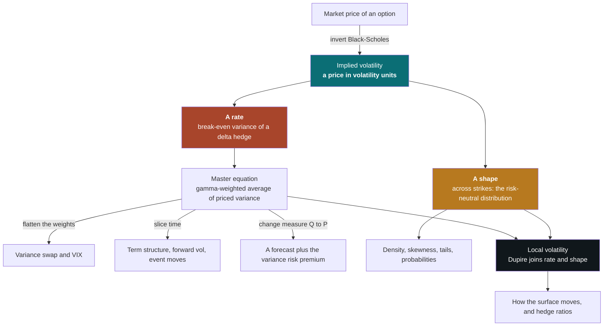
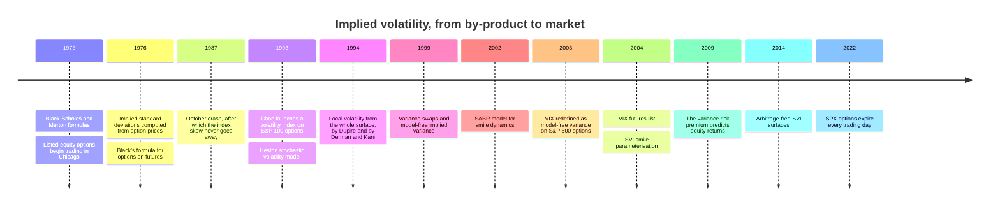

# Implied Volatility

### What the number means, how it is computed, how to look at it, and what practitioners do with it

---

**What this is.** A from-first-principles tutorial on implied volatility — the most
quoted number in options markets, and one of the most casually misread. It gets
called the market's forecast of volatility, the price of an option, the fear gauge,
the width of a probability distribution and the break-even of a hedge. Each
description is right about something and wrong about something else. This document
takes the readings one at a time, shows exactly where each one comes from, and shows
that they are faces of a single object. It then covers how the number is computed
from real quotes (where nearly all of the practical difficulty lives), how it is
drawn, and what market makers, volatility traders, risk managers, allocators and
researchers actually do with it.

**Who it is for.** A reader who is mathematically comfortable and technically strong,
but not an options specialist, and who intends to *use* implied volatility: to build
a volatility surface, compute a VIX-style index, compare implied with realised
volatility, read a probability off option prices, or feed option-implied quantities
into a model. Intuition comes first throughout. Every formula is preceded by what it
means and followed by a number. Basic option vocabulary is defined briefly in §2;
[Dealer Hedging and Gamma Exposure](dealer_hedging.html) builds it from zero, and
this document assumes you can look there when a definition here feels thin.

**How to read it.** Five parts, following the four questions in the title.

- **Part I (§1–§2) — the concept.** What implied volatility is, the intuitions to
  discard, the one idea that organises everything else, and just enough
  Black–Scholes to make the definition precise.
- **Part II (§3–§8) — ways to read the number.** A price in volatility units; the
  break-even rate of a hedge; the price of future variance; a forecast with a risk
  premium attached; and a probability distribution written in lognormal units. §8
  joins the last two through local volatility and describes how the whole surface
  moves when the market moves.
- **Part III (§9–§11) — calculating it.** Inverting one price, building a surface
  from noisy quotes, and computing the derived quantities people actually quote:
  at-the-money volatility, skew, term structure, VIX-style variance, densities,
  event moves and implied correlation.
- **Part IV (§12) — visualising it.** The standard pictures, which question each
  one answers, and how each one misleads.
- **Part V (§13–§15) — using it.** How each kind of practitioner uses the number,
  a consolidated list of failure modes, and a synthesis.

§16 is the reference list, grouped by kind. Appendix A collects every concept the
main text leans on without fully explaining, ordered so that it reads as a build-up.

If you read four things, read **§1.4** (the spine: a price, a rate and a shape),
**§4.3** (why implied variance is a gamma-weighted average of the variance priced
in), **§7.2–§7.4** (why a smile is a distribution, and the probability trap that
follows), and **§9.4** (the inputs that matter far more than the root-finder).

**Relationship to the other notes.** [Dealer Hedging and Gamma
Exposure](dealer_hedging.html) derives the Greeks and the hedged-P&L identity in
detail (its §3–§4) and explains who holds options and why that shows up in their
prices; this document uses those results and refers back rather than repeating
them. [Simple and Log Returns](log_returns.html) explains why volatility is defined
on log returns. [Market Regimes and Machine Learning](market_regimes.html) is the
right frame for using the VIX or the volatility term structure as a regime variable
(§13.5). [Stochastic Processes](stochastic_processes.html) covers the Brownian
motion the models here are built on. Each note stands alone.

**Epistemic tags.** Claims are flagged by status where the status changes what you
should do:

- **[Fact]** — replicated across independent datasets or implementations, with broad
  agreement among people who have looked.
- **[Contested]** — documented, but with live disagreement about magnitude,
  robustness, or cause.
- **[Hypothesis]** — a proposed mechanism, not decisively tested.
- **[Practice]** — practitioner convention. May well be right; the evidence is
  private or absent.

Untagged sentences are definitions, derivations, or arithmetic. Numbers that come
from simulations or stylised surfaces I built while writing are labelled
**[Simulated]**; the generating code is committed alongside this document in
`figures/iv_*.py`, and each script prints the numbers quoted in the text, so you can
change the parameters and rerun.

---

**Notation.** The **underlying** is the asset an option is written on; $S$ (or $S_t$)
is its price. An option has **strike** $K$ and **expiry** $T$; $\tau = T - t$ is the
time remaining, in years, counted in calendar days over 365 unless a passage says
otherwise. $r$ is the risk-free rate and $q$ the underlying's dividend (or carry)
yield. $F = S e^{(r-q)\tau}$ is the **forward price** for the option's expiry and
$D = e^{-r\tau}$ the **discount factor**. $k = \ln(K/F)$ is **log-moneyness**:
negative for strikes below the forward, positive above.

$V$ is an option's value, $C$ a call and $P$ a put. $N(\cdot)$ is the standard normal
cumulative distribution function and $\varphi(\cdot)$ its density. $\mathrm{BS}(\cdot)$
denotes the Black–Scholes price as a function of its inputs, and $d_1, d_2$ are the
quantities of §2.2. The Greeks are $\Delta = \partial V/\partial S$,
$\Gamma = \partial^2 V/\partial S^2$, $\nu = \partial V/\partial\sigma$ (vega) and
$\Theta = \partial V/\partial t$; $\Gamma S^2$ is **dollar gamma**.

Several volatilities must be kept apart, and the document is careful about which is
meant:

| Symbol | Name | What it is |
|---|---|---|
| $\sigma_i$, or $\sigma_i(K,T)$ | implied volatility | The number that makes $\mathrm{BS}$ reproduce a market price (§1.1); as a function of strike and expiry, the **surface** |
| $\sigma_t$ | instantaneous volatility | The true, unobserved volatility of the underlying at time $t$ in whatever process actually drives it |
| $\sigma_r$ | realised volatility | The volatility a price path actually delivered, measured afterwards from returns |
| $\sigma_{\text{loc}}(S,t)$ | local volatility | The volatility as a function of price and time that reproduces the whole surface (§8) |
| $\sigma_{\text{VS}}$ | variance-swap volatility | The square root of the fair variance of §5, of which the VIX is an instance |

$w(k,T) = \sigma_i^2(k,T)\,T$ is **total implied variance** at log-moneyness $k$ and
expiry $T$ — the variance of the log return to expiry that the option price implies.
Volatility is quoted in percent; a **vol point** is one percentage point of $\sigma$.

Two probability measures appear. $\mathbb{Q}$ is the **pricing** (risk-neutral)
measure under which discounted prices are expectations, and $\mathbb{P}$ is the
**physical** (real-world) measure under which events actually happen; the
blackboard letters keep $\mathbb{P}$ apart from the put price $P$. $f_T(K)$ is the
risk-neutral density of $S_T$ at $K$. $\Pi$ is the profit and loss (P&L) of a
hedged position. $\rho$ denotes a correlation — between price and volatility changes,
or between stocks in an index (§11.7) — or the rotation parameter of the SVI smile
(§10.4), which plays the same role; the passage always says which.

**The running example** is shared with the Dealer Hedging note: an underlying at 100,
a strike of 100, 30 calendar days to expiry ($\tau = 30/365$), $r = q = 0$ (so
$F = S = 100$ and $D = 1$), and 20% volatility. The call and the put each cost
**2.29**.

---

## Table of contents

**Part I — The concept**

1. [The number, and the intuitions to discard](#1-the-number)
2. [The ruler: just enough Black–Scholes](#2-the-ruler)

**Part II — Ways to read the number**

3. [A price in volatility units](#3-a-price)
4. [The break-even rate of a hedge](#4-break-even)
5. [The price of variance: variance swaps, the VIX and the term structure](#5-price-of-variance)
6. [A forecast with a premium attached](#6-forecast)
7. [A distribution in lognormal units: the smile](#7-smile)
8. [Local volatility, and how the surface moves](#8-local-vol-and-dynamics)

**Part III — Calculating it**

9. [Inverting one price](#9-inverting)
10. [From quotes to a surface](#10-surface)
11. [Derived quantities](#11-derived)

**Part IV — Visualising it**

12. [Pictures of implied volatility](#12-pictures)

**Part V — Using it**

13. [How practitioners use implied volatility](#13-uses)
14. [Failure modes](#14-failure-modes)
15. [Synthesis](#15-synthesis)
16. [References](#16-references)

**Appendix**

- [A. Concepts and prerequisites](#appendix-a-concepts-and-prerequisites) — every
  idea the main text leans on without fully explaining, built from first principles
  and ordered by dependency.

---

```{=latex}
\newpage
```

# 1. The number, and the intuitions to discard {#1-the-number}

## 1.1 The definition, with one number

An option's price depends on six inputs: the underlying price $S$, the strike $K$,
the time to expiry $\tau$, the interest rate $r$, the dividend yield $q$, and the
volatility $\sigma$ of the underlying over the option's life. Five of them can be
looked up. The sixth cannot, because it is a property of the future.

The Black–Scholes formula (§2.2) turns all six into a price. Implied volatility runs
the formula the other way: take the price the market is actually paying, hold the
five observable inputs fixed, and find the volatility that makes the formula agree.

$$
\mathrm{BS}\big(S, K, \tau, r, q, \sigma_i\big) = V_{\text{market}} .
$$

The solution $\sigma_i$ is the option's **implied volatility**. For the running
example, a 30-day at-the-money call trading at 2.29 has an implied volatility of
20%. If buyers bid it up to 2.52, its implied volatility becomes 22%: the option's
vega is 0.114 per vol point, so 23 cents of extra premium is two vol points.

Three things about this definition matter for everything that follows.

- **The formula is used as a conversion table, not as a description of the world.**
  Nothing in the definition says anyone believes returns are lognormal or that
  volatility is constant. The formula is a ruler: a fixed, agreed way of turning a
  dollar price into a number that can be compared across options.
- **It works only because price rises with volatility.** Every option is worth more
  when volatility is higher (§2.3), so each price corresponds to exactly one
  volatility. That monotonicity, not any belief about markets, is what makes the
  number well defined.
- **One option gives one number; a chain of options gives a surface.** Every strike
  and every expiry has its own implied volatility, and they are generally all
  different. "The implied volatility" of a stock or an index is always shorthand for
  one point on that surface, chosen by convention (§11.1).

## 1.2 An exact analogy: the yield of a bond

A bond's **yield to maturity** is the single discount rate that makes the present
value of its promised cash flows equal its market price. The calculation assumes a
flat interest-rate curve, which nobody believes. Bonds are quoted and compared in
yield anyway, because the conversion strips out coupon size, maturity and face value
and leaves a number that means roughly the same thing for every bond. When yields
differ across maturities, nobody concludes that the yield formula is broken; they
draw a **yield curve** and read it as information about what the flat-rate
assumption leaves out — expected future rates, and a term premium for bearing
duration risk.

Implied volatility is the same construction applied to options:

| | Bonds | Options |
|---|---|---|
| Observed | Price | Price |
| Ruler (a model nobody believes literally) | Flat-rate discounting | Black–Scholes with constant volatility |
| The number it yields | Yield to maturity | Implied volatility |
| Why the ruler works | Price falls monotonically as yield rises | Price rises monotonically with volatility |
| Variation across instruments | Yield curve, by maturity | Volatility surface, by strike and expiry |
| What the variation measures | Expected rates plus term premium | Expected variance plus variance risk premium, and the shape of the distribution |

The analogy is exact in structure, and it survives one level deeper: a yield
contains a risk premium on top of expected future rates, and an implied volatility
contains a risk premium on top of expected future variance (§6). Riccardo Rebonato's
often-repeated description of implied volatility is that it is the wrong number to put
into the wrong formula in order to obtain the right price
([Rebonato, 1999](https://www.wiley.com/en-us/Volatility+and+Correlation%3A+The+Perfect+Hedger+and+the+Fox%2C+2nd+Edition-p-9780470091395){target="_blank"}). The joke works because both
wrongs are deliberate and cancel exactly.

Where the analogy stops: a bond's cash flows are fixed, so its yield is a statement
about discounting alone. An option's payoff depends on the path, and in particular on
how much variance the path delivers where the option is sensitive to it. That is why
implied volatility has more readings than yield does.

## 1.3 Seven intuitions to discard

Most confusion about implied volatility comes from a handful of intuitions that are
half right. Naming them now saves a great deal of unlearning later.

| The intuition | Why it fails | What is true instead | Section |
|--------------------|------------------------------------|--------------------------------|------|
| "Implied volatility is the market's forecast of volatility" | It is a price, and prices contain risk premia. S&P 500 implied volatility has exceeded subsequently realised volatility by about 4 vol points on average since 1990 | A forecast plus a premium, plus the effect of supply and demand for options | §6 |
| "It is a parameter of a model the market believes" | The model is known to be false, and markets use it anyway | A unit of measurement; the *shape* of the surface records how the model is false | §3, §7 |
| "A stock has an implied volatility" | Every strike and expiry has its own | A surface; any single number is a convention | §10, §11.1 |
| "High implied volatility means options are expensive" | Expensive relative to what? | Rich or cheap only relative to the variance the option will actually experience where it has gamma, net of the premium for bearing that risk | §4, §6 |
| "An option's implied volatility is the underlying's volatility over the option's life" | Variance that arrives far from the strike barely affects an option | A dollar-gamma-weighted average of the variance priced along the paths from today's price to the strike | §4.3 |
| "Implied volatility measures moves in either direction equally" | Out-of-the-money puts and calls on an index trade at very different implied volatilities | Different strikes price different parts of the distribution; the downside wing prices crash risk | §7 |
| "$N(d_2)$ at the option's implied volatility is the probability of finishing in the money" | It ignores the skew, and it is the wrong probability measure | With a typical index skew, the naive number overstates the chance of finishing below a 10%-lower strike by about three quarters; and it is a pricing probability, not a real-world one | §6.1, §7.4 |

## 1.4 The spine: a price, a rate, and a shape

Three statements organise this whole document. Each later section is one of them
viewed up close, and the synthesis in §15 is the three of them viewed together.

**1. Implied volatility is a price.** It is an option price re-expressed in the unit
in which a lognormal, constant-volatility world would be flat. That is the definition
(§1.1), and it is why options are quoted, compared and marked in volatility (§3).

**2. Implied volatility is a rate.** The P&L of a delta-hedged option over a short
interval is half its dollar gamma times the gap between the variance that actually
happened and the variance implied volatility charged for:

$$
d\Pi = \tfrac12\,\Gamma S^2 \left(\sigma_t^2 - \sigma_i^2\right) dt .
$$

So implied variance is the **break-even variance rate** for anyone who hedges the
option (§4). Take expectations under the pricing measure, and demand that a fairly
priced option break even on average: implied variance becomes a **weighted average
of the variance the market has priced in**, with weights equal to the option's
dollar gamma along the paths it might follow. This is the master equation of the
document, derived in §4.3:

$$
\sigma_i^2 \;=\; \frac{\mathbb{E}^{\mathbb{Q}}\!\left[\displaystyle\int_0^T \Gamma_t S_t^2\, \sigma_t^2\, dt\right]}
{\mathbb{E}^{\mathbb{Q}}\!\left[\displaystyle\int_0^T \Gamma_t S_t^2\, dt\right]} .
$$

Three knobs in this equation generate most of the named readings of implied
volatility. Change the **weights** — replace one option's dollar gamma with the flat
dollar gamma of a strip of options weighted by $1/K^2$ — and you get the variance
swap and the VIX (§5). Change the **measure** from $\mathbb{Q}$ to $\mathbb{P}$ and
you get a forecast, with the variance risk premium as the gap (§6). Change the
**slice of time** the integral covers and you get forward volatility and the
variance of a single event, because total variance adds up over time (§5.4–§5.5).

**3. Implied volatility is a shape.** Across strikes at one expiry, option prices pin
down the whole risk-neutral probability distribution of the price at expiry: the
second derivative of the call price with respect to the strike *is* the density
(§7.2). The smile is that distribution written relative to a lognormal. Its level is
the width of the distribution, its slope is the skewness, and its curvature is the
fatness of the tails (§7.3).

The rate and the shape are joined by **local volatility** (§8). Dupire's formula says
the local variance at a strike and expiry is the rate at which total implied variance
grows with expiry, divided by a term that is proportional to the risk-neutral density
at that strike — a time-direction quantity over a strike-direction quantity. The two
no-arbitrage conditions every surface must satisfy are exactly the conditions that
the numerator be non-negative and the denominator positive.



The rest of Part II is a tour of this diagram, one reading per section, all using
the same template: the intuition, the formal statement, a number, what the reading is
good for, and how it misleads.

| Reading | What changes in the master equation | Section | What it is good for |
|---|---|---|---|
| A price in volatility units | Nothing: this is the definition | §3 | Quoting, comparing and marking options |
| The break-even rate of a hedge | Weights are this option's dollar gamma | §4 | Deciding whether to own or sell an option you will hedge |
| The price of variance | Weights flattened by a $1/K^2$ strip; time sliced | §5 | The VIX, variance swaps, term structure, event moves |
| A forecast with a premium | Measure $\mathbb{Q}$ replaced by $\mathbb{P}$ | §6 | Volatility forecasting; the variance risk premium |
| A distribution | Vary the strike instead of integrating over time | §7 | Probabilities, tails, skew |
| An average of local volatility | Weights live on a bridge from spot to strike | §8 | Pricing and hedging beyond vanilla options; surface dynamics |

## 1.5 How the idea evolved



The history falls into four eras, each with a one-line thesis.

**1973–1986: implied volatility as a by-product.** [Black and Scholes
(1973)](https://www.journals.uchicago.edu/doi/10.1086/260062){target="_blank"} and [Merton
(1973)](https://www.maths.tcd.ie/~dmcgowan/Merton.pdf){target="_blank"} gave a price that depended on one unobservable input, and within three years
[Latané and Rendleman
(1976)](https://onlinelibrary.wiley.com/doi/10.1111/j.1540-6261.1976.tb01892.x){target="_blank"} were computing the "implied standard deviation" from option prices
and asking whether it forecast future volatility. What changed: volatility became
something you could read off a market rather than only estimate from history. The
limitation, fairly judged, was that the number was treated as a single estimate of a
single parameter. Index smiles were mild before 1987, so little seemed lost. What
survives: the definition, unchanged.

**1987–1999: the smile becomes permanent, and gets modelled.** After the October 1987
crash, S&P 500 options have priced downside strikes at persistently higher implied
volatility than upside strikes ([Rubinstein,
1994](https://onlinelibrary.wiley.com/doi/abs/10.1111/j.1540-6261.1994.tb00079.x){target="_blank"}). [Fact] Practitioners stopped treating the smile as noise and started
treating it as information. [Heston (1993)](https://academic.oup.com/rfs/article-abstract/6/2/327/1574747){target="_blank"} produced smiles from stochastic volatility;
[Dupire (1994)](https://www.risk.net/derivatives/equity-derivatives/1500211/pricing-with-a-smile){target="_blank"} and [Derman and Kani
(1994)](https://emanuelderman.com/the-volatility-smile-and-its-implied-tree/){target="_blank"} showed how to recover the unique local volatility function consistent
with the whole surface. At the end of the decade, [Carr and Madan
(1998)](https://www.researchgate.net/publication/2852582_Towards_a_Theory_of_Volatility_Trading){target="_blank"} and [Demeterfi, Derman, Kamal and Zou
(1999)](https://emanuelderman.com/wp-content/uploads/1999/02/gs-volatility_swaps.pdf){target="_blank"} showed that a strip of options replicates a contract on realised
variance, making volatility itself tradable without any delta hedging. The
limitation: models that fit today's surface often predict tomorrow's surface badly
(§8.5). What survives: all of it, as the standard toolkit.

**2000–2014: implied volatility as an index, an asset and a risk factor.** In 2003
Cboe redefined the VIX as a model-free variance computed from S&P 500 options
([Carr and Wu, 2006](https://engineering.nyu.edu/sites/default/files/2021-03/carrwutaleoftwoindices.pdf){target="_blank"}), and futures and options on it followed. Academic
work measured the gap between implied and realised variance as a risk premium
([Carr and Wu, 2009](https://engineering.nyu.edu/sites/default/files/2019-01/CarrReviewofFinStudiesMarch2009-a.pdf){target="_blank"}) and found that it predicts equity returns
([Bollerslev, Tauchen and Zhou, 2009](https://public.econ.duke.edu/~boller/Published_Papers/rfs_09.pdf){target="_blank"}). Practitioners standardised how surfaces are
parameterised, notably with SVI, later given explicit no-arbitrage conditions by
[Gatheral and Jacquier (2014)](https://arxiv.org/abs/1204.0646){target="_blank"}. The limitation: volatility products concentrated
short-volatility risk in ways that were poorly understood until they failed (February
2018; [Dealer Hedging](dealer_hedging.html) §8.4). What survives: the VIX as the
world's default measure of equity risk appetite.

**2015 onward: every horizon, every hour.** Options now expire daily, implied
volatility is computed intraday for options with hours to live, and the shape of the
short end of the surface has become a research field of its own — including the
[Contested] claim that the at-the-money skew follows a power law in maturity because
volatility is "rough" ([Gatheral, Jaisson and Rosenbaum, 2018](https://arxiv.org/abs/1410.3394){target="_blank"}; §8.4). What
changed: the clock used to measure time to expiry, a detail for 30-day options,
became first-order (§9.4).

> ### §1 Key takeaways
>
> 1. Implied volatility is the volatility that makes the Black–Scholes formula
>    reproduce a market price. The formula is used as a ruler, not as a belief.
> 2. The number is well defined only because option prices rise monotonically with
>    volatility.
> 3. It is exactly analogous to a bond's yield: a price converted into a comparable
>    rate through a deliberately simple model, whose variation across instruments is
>    information.
> 4. Every strike and expiry has its own implied volatility. "The" implied
>    volatility of an asset is a convention.
> 5. Implied volatility is simultaneously a price, a rate and a shape: the price of
>    the option in volatility units, the break-even variance rate of a delta hedge,
>    and — across strikes — the risk-neutral distribution written relative to a
>    lognormal.
> 6. Implied variance is a dollar-gamma-weighted average of the variance priced in.
>    Changing the weights gives the variance swap and the VIX; changing the measure
>    gives a forecast plus a risk premium; slicing time gives forward volatility.
> 7. It is not a pure forecast, not one number, not symmetric, and not a source of
>    real-world probabilities without correction.

---

# 2. The ruler: just enough Black–Scholes {#2-the-ruler}

## 2.1 Volatility, and the square root of time

**Volatility** $\sigma$ is the annualised standard deviation of log returns. If daily
log returns are independent, variances add, so the standard deviation over $n$ days
grows like $\sqrt{n}$. Over an option's remaining life $\tau$ the standard deviation
of the log return is $\sigma\sqrt{\tau}$, which this document calls **total
volatility**; its square $\sigma^2\tau$ is **total variance**.

With about 252 trading days a year and $\sqrt{252} \approx 16$, traders use the **rule
of 16**: 16% annual volatility is roughly a 1% move on a typical trading day. The
running example's 20% is a typical daily move of 1.26% on trading days (or 1.05% if
the year is counted as 365 calendar days, which spreads the same variance over more
days), and a standard deviation of $20\% \times \sqrt{30/365} = 5.73\%$ over the
option's 30 days. [Simple and Log Returns](log_returns.html) explains why log
returns, not simple returns, are the natural unit here.

## 2.2 What an option price really depends on

The Black–Scholes price of a European call, written in terms of the forward $F$ and
discount factor $D$ (the "Black" form, [Black, 1976a](https://ideas.repec.org/a/eee/jfinec/v3y1976i1-2p167-179.html){target="_blank"}), is

$$
C = D\left[F\,N(d_1) - K\,N(d_2)\right], \qquad
d_{1,2} = \frac{\ln(F/K) \pm \tfrac12\sigma^2\tau}{\sigma\sqrt{\tau}} ,
$$

and the put follows from **put–call parity**, $C - P = D(F - K)$, which holds for
European options regardless of any model. Read the formula as a recipe: $N(d_2)$ is
the risk-neutral probability that the call finishes in the money, and $d_2$ is the
distance from the forward to the strike measured in standard deviations of the log
return (with a small adjustment of half a variance). [Dealer
Hedging](dealer_hedging.html) §3.2–§3.3 derives the formula from replication.

Now divide by $DF$ and write the strike as log-moneyness $k = \ln(K/F)$:

$$
\frac{C}{DF} = N(d_1) - e^{k} N(d_2), \qquad
d_{1,2} = -\frac{k}{\sigma\sqrt{\tau}} \pm \frac{\sigma\sqrt{\tau}}{2} .
$$

The normalised price depends on **exactly two numbers**: how far the strike is from the
forward, $k$, and how much the log price is expected to spread before expiry,
$\sigma\sqrt{\tau}$. Three consequences run through the rest of the document.

- **Rates and dividends enter only through $F$ and $D$.** Getting the forward right is
  therefore most of what "getting the inputs right" means (§9.4).
- **Volatility and time enter only through $\sigma\sqrt{\tau}$.** A one-year option at
  10% volatility and a four-year option at 5% volatility with the same moneyness have
  the same normalised price. What the option really prices is total volatility; the
  annualised $\sigma$ is a convention for comparing across expiries.
- **Total implied variance $w = \sigma_i^2\tau$ is the natural coordinate.** It is what
  the price actually pins down, and it adds up over time (§5.4). Surfaces are best
  built, interpolated and checked for arbitrage in $(k, w)$ rather than in
  $(K, \sigma_i)$ (§10).

Put–call parity has a consequence that is easy to state and powerful in practice: a
call and a put with the same strike and expiry must have **the same implied
volatility**, because the same $\sigma$ that prices one prices the other. When
computed call and put volatilities disagree, something is wrong with the inputs —
usually the forward — or the options are American (§9.4).

## 2.3 Why the formula can be run backwards

Vega, the sensitivity of the price to volatility, is

$$
\nu = \frac{\partial C}{\partial \sigma} = D F \,\varphi(d_1)\sqrt{\tau} \;>\; 0 ,
$$

strictly positive for any strike and any positive time to expiry, and the same for a
call and a put. The intuition is convexity: an option pays off asymmetrically, so
spreading out the distribution of the final price adds more to the winning outcomes
than it takes from the losing ones.

Positive vega, together with the limits of the price as volatility goes to zero and
to infinity, is what makes implied volatility well defined. As $\sigma \to 0$ the call
is worth its discounted intrinsic value against the forward, $D(F-K)^+$; as
$\sigma \to \infty$ it is worth $DF$. Every price strictly between those bounds
corresponds to **exactly one** volatility. A quoted price outside them has no implied
volatility at all — and since those bounds are no-arbitrage bounds, such a price is
either an arbitrage or, far more often, bad data.

```{=latex}
\begin{center}
\includegraphics[width=\linewidth]{quant-research/figures/iv_inversion.pdf}
\end{center}
```

```{=html}

```

The left panel is the whole idea of implied volatility in one picture: each curve is
monotone, so a price on the vertical axis can be read back to a volatility on the
horizontal axis. Two features of the curves matter later. The at-the-money curve is
almost a straight line through the origin (§2.4), so its inversion is easy and robust.
The out-of-the-money curves are flat near zero volatility and rise steeply only later;
where a curve is flat, a small change in price corresponds to a large change in
volatility. The right panel measures that fragility, and §9.3 returns to it.

## 2.4 The at-the-money shortcut, and the straddle as an expected move

At the money forward, $K = F$, so $k = 0$ and $d_{1,2} = \pm\tfrac12\sigma\sqrt{\tau}$.
Expanding the normal distribution function around zero,

$$
C_{\text{ATM}} = DF\left[N\!\left(\tfrac12\sigma\sqrt{\tau}\right) - N\!\left(-\tfrac12\sigma\sqrt{\tau}\right)\right]
\;\approx\; DF\,\sigma\sqrt{\tau}\,\varphi(0) \;=\; \frac{DF\,\sigma\sqrt{\tau}}{\sqrt{2\pi}} \;\approx\; 0.4\, DF\,\sigma\sqrt{\tau} .
$$

This is the approximation of [Brenner and Subrahmanyam
(1988)](https://www.tandfonline.com/doi/abs/10.2469/faj.v44.n5.80){target="_blank"}, and it is remarkably accurate for the options people trade most. For the
running example it gives $0.4 \times 100 \times 0.20 \times 0.2867 = 2.293$ against an
exact 2.287. Run it backwards and a trader can read implied volatility off an
at-the-money price without a computer: $\sigma_i \approx C/(0.4\,DF\sqrt{\tau}) =
19.94\%$. The shortcut's real lesson is that the at-the-money price is **almost linear
in volatility**, which is why at-the-money implied volatility is the most robust
number on the surface and why at-the-money vega barely depends on the level of
volatility.

The **straddle** — a call plus a put at the same strike — has a second reading that
practitioners use daily. At the money it costs about twice the call,
$0.8\,DF\sigma\sqrt{\tau}$. And if the change in the forward over the option's life is
roughly normal with standard deviation $F\sigma\sqrt{\tau}$, the expected *absolute*
change is $F\sigma\sqrt{\tau}\sqrt{2/\pi} = 0.798\,F\sigma\sqrt{\tau}$. The two
coincide:

> **An at-the-money straddle costs the discounted expected absolute move of the
> underlying over the option's life** — under the pricing measure, and to the extent
> the move is close to normal.

The running example's straddle costs 4.57, which is 4.57% of the price: the market is
pricing an average absolute move of about 4.6% over 30 days, corresponding to a
standard deviation of $4.57/0.798 = 5.73\%$. This is the "expected move" quoted around
earnings announcements (§5.5, §13.3). [Practice] Two caveats travel with it. It is a
risk-neutral expectation, so it includes whatever premium sellers of options demand
(§6). And fat tails change the ratio: for a distribution with more weight in the tails
and more in the centre, the mean absolute move is a smaller fraction of the standard
deviation than 0.8, so dividing a straddle price by 0.8 slightly understates the
standard deviation the market is pricing.

## 2.5 Other rulers: normal volatility and variance units

Black–Scholes is not the only ruler in use, and the choice of ruler changes what the
smile looks like.

- **Lognormal (Black–Scholes or Black-76) volatility**, in percent per square-root
  year. The convention for equities, foreign exchange and most commodities.
- **Normal (Bachelier) volatility**, in price units per square-root year — basis
  points a year for interest rates. The model lets the underlying's *change*, rather
  than its log change, be normally distributed. Near the money the two are related by
  $\sigma_N \approx \sigma_{\text{LN}}\,F$. Interest-rate options moved largely to
  normal-volatility quoting as rates approached zero, where lognormal volatility
  becomes enormous and unstable for small changes in the rate. [Practice]
- **Variance units.** Variance swaps are quoted as a volatility strike but pay on
  variance (§5.1), and some models are naturally stated in variance.

The ruler matters because a surface that is flat under one ruler is sloped under
another. If a market prices options exactly as the normal model with $\sigma_N = 20$
price units a year on a forward of 100, the equivalent lognormal volatility at strike
$K$ is approximately $\sigma_N \ln(F/K)/(F-K)$ ([Hagan, Kumar, Lesniewski and
Woodward, 2002](https://www.researchgate.net/publication/235622441_Managing_Smile_Risk){target="_blank"}): 21.1% at a strike of 90 and 19.1% at 110. A "flat" normal smile is a
lognormal skew of about one vol point per ten points of strike. Part of any skew is
therefore a statement about which ruler is being used, and comparisons of skew across
markets quoted under different conventions need conversion first.

> ### §2 Key takeaways
>
> 1. Volatility is the annualised standard deviation of log returns; over an option's
>    life the relevant number is total volatility $\sigma\sqrt{\tau}$. By the rule of 16,
>    16% is about 1% a trading day.
> 2. A normalised option price depends only on log-moneyness $k = \ln(K/F)$ and total
>    volatility. Rates and dividends matter only through the forward and the discount
>    factor.
> 3. Total implied variance $w = \sigma_i^2\tau$ is the coordinate the price actually
>    pins down, and the right one for building surfaces.
> 4. Vega is strictly positive, so every price inside the no-arbitrage bounds has
>    exactly one implied volatility; a price outside them has none.
> 5. A call and a put with the same strike and expiry have the same implied
>    volatility. Disagreement diagnoses bad inputs.
> 6. At the money, price is almost linear in volatility: $C \approx 0.4\,DF\sigma\sqrt{\tau}$.
>    The at-the-money straddle costs roughly the expected absolute move.
> 7. The ruler is a convention. Normal and lognormal volatilities give differently
>    shaped smiles for the same prices.

---
