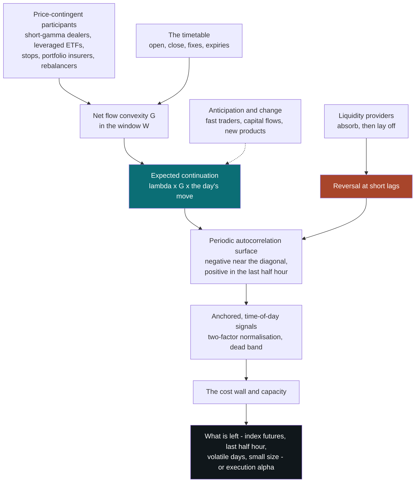
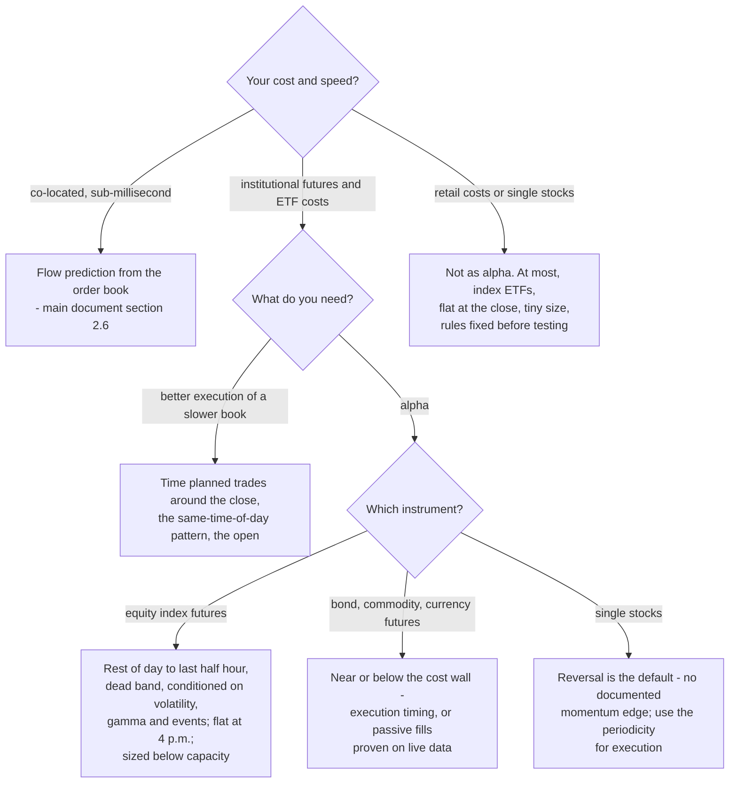

# Intraday Momentum

### A follow-up to the momentum deep dive: which of its ideas survive inside one trading session, and how they fail

---

```{=html}
<aside class="eli5">
```

# ELI5 — the short version {#eli5}

```{=latex}
\begin{eli5}
```

**In one sentence.** Within a single trading day, prices mostly snap back rather than trend; the one solid exception — a market that has moved strongly tends to move a little further in its last half hour — comes from traders who are obliged to buy after rises and sell after falls, and it is small, fading, and profitable only in the cheapest markets to trade.

**1. Shrinking the clock changes the game** ([§1](#1-the-question)). The momentum in the first document works because news seeps into prices over weeks. Within a day, news is priced in seconds — in thousandths of a second for major economic reports. So momentum on one-minute charts is not the same idea at a smaller size. It is a different bet, and usually a losing one.

**2. The default inside the day is snapping back** ([§2](#2-mechanisms)). When someone has to trade right now, a dealer takes the other side and charges for it by moving the price; when the pressure passes, the price drifts back. So short-term moves in individual stocks tend to reverse, not continue, over minutes to an hour.

**3. The exception is forced trading on a timetable** ([§2](#2-mechanisms)). Some players must trade in the direction the market has already moved. Funds that promise two or three times the index's daily return have to buy after up days and sell after down days, near the close. Options dealers who have sold options must do the same to stay hedged, and stop-loss orders fire as prices break through levels. That trading bunches up late in the day, so a market that has risen strongly by 3:30 tends to rise a little more by 4:00 — and then gives part of it back over the next day or two.

**4. How big is it?** ([§4](#4-evidence)) Across more than sixty futures markets and 45 years, a 1% move in a stock-index future before the last half hour has predicted about 0.04% more in the same direction. The more famous version, in which the first half hour predicts the last, mostly fails when tested on data it was not built on, and leans heavily on the 2008 crisis.

**5. Timing matters more than direction** ([§3](#3-signature)). Whether a move continues depends on *when* in the day it happens: the last half hour is special because that is when the forced trading happens. And randomness fools the eye. About one day in twenty looks like a clean "trend day" by pure chance — twelve a year.

**6. Costs decide almost everything** ([§6](#6-implementation)). The shorter you hold a position, the less the price moves while you hold it, but the cost of trading does not shrink. Holding for thirty minutes instead of a month needs a forecast about sixteen times sharper just to break even. Only the cheapest markets — the big stock-index futures and index funds — clear that bar. For individual stocks, no documented intraday momentum survives the cost of trading.

**7. It is small, which is why it survives** ([§6](#6-implementation)). Even in the deepest futures market in the world, the best-documented effect is worth a few million dollars a year at the size that makes the most money. That is too little for large funds to bother arbitraging away.

**8. Most intraday "discoveries" are illusions** ([§3](#3-signature), [§7](#7-testing)). Prices that bounce between the buying and selling price look like reversal. An index whose stocks have not all started trading looks like morning momentum. A clock that is off by one bar looks like skill. And there are millions of ways to slice a day, so the best of many tries always looks good. Popular breakout systems report spectacular results, but none has been checked by anyone independent, and their best numbers rest on many choices tested on the same data.

**9. The people who try mostly lose** ([§6](#6-implementation)). In Brazil, 97% of people who day-traded futures for at least 300 days lost money. In Taiwan, only a thin slice of day traders showed skill that lasted.

**10. The best use is better timing** ([§8](#8-practice)). If you run a slower strategy, the most reliable payoff is knowing *when* to trade: on a big up day, buy before the last half hour or wait a day rather than at the close, and avoid the first few minutes of the session.

---

**If you do only three things:** start from a named group of forced traders rather than from a chart; if you want profit rather than better timing, trade only the cheapest index futures; and run everything on fake random days before believing it.

```{=latex}
\end{eli5}
```

```{=html}
</aside>
```

---

**How to read this chapter.** This is a sequel. It assumes [Momentum in Financial Markets](momentum_deep_dive.html) — called *the main document* throughout — and re-derives nothing from it. The question it answers is narrow and practical: when the holding period shrinks from months to minutes or hours, which of the main document's ideas still hold, which change sign, and which simply stop meaning anything? Sections 1–3 build the model: what intraday momentum is, which mechanisms survive the shorter clock, and what the signature looks like inside a day. Section 4 surveys the evidence effect by effect. Section 5 is the heart of the chapter: it takes the main document's toolkit one concept at a time and says how each translates. Sections 6–7 are engineering — costs, capacity, execution, and testing — and sections 8–9 are practice and synthesis.

If you have time for one section, read §5. If you are about to backtest an intraday signal, read §7 first. Appendix A explains, from first principles, the market-microstructure and statistical concepts the text uses in passing — auctions, price impact, bid–ask bounce, out-of-sample $R^2$ and the rest — and its index says where each is first used.

**What this chapter takes as known.** The following are developed elsewhere in the collection, and are referenced here rather than repeated.

| Concept | Where it is developed |
|---|---|
| Incomplete adjustment, and the four explanation families for momentum | Sections 1.2–1.3 of the [main document](momentum_deep_dive.html#the-conceptual-model-incomplete-adjustment) |
| The variance ratio as the unifying diagnostic | Sections 1.2 and 4.5.1 of the [main document](momentum_deep_dive.html#variance-ratio-as-a-live-statistic) |
| The master form of momentum signals, the taxonomy and its equivalences | Section 5 of the [main document](momentum_deep_dive.html#5-taxonomy) |
| Volatility normalisation and signal transforms | Section 4.3 of the [main document](momentum_deep_dive.html#volatility-normalized-momentum) |
| Information coefficient, hit rate, multiple testing, the deflated Sharpe ratio | Section 7 of the [main document](momentum_deep_dive.html#7-testing-momentum-based-trading-signals) |
| Order-flow long memory, the propagator model, order-flow imbalance, order-book learning | Section 2.6 of the [main document](momentum_deep_dive.html#market-microstructure-and-order-flow) |
| Trend P&L as a weighted sum of autocovariances; the variance-ratio identity | Sections 5.2–5.4 of [Trend-Following](trend_following.html#expected-pl-is-a-weighted-sum-of-autocovariances) |
| Metaorders, risk-management flows and leveraged-ETF rebalancing as sources of trend | Section 2.4 of [Trend-Following](trend_following.html#family-c-mechanical-and-flow-driven-persistence) |
| Dealer gamma, the feedback multiplier, hedging-induced intraday autocorrelation, zero-day options | Sections 5–7 of [Dealer Hedging](dealer_hedging.html#the-same-fact-at-two-horizons-autocorrelation-and-volatility) |

**Epistemic tags.** As in the main document:

- **[Fact]** — replicated across independent datasets or implementations; broad agreement.
- **[Contested]** — documented, but with live disagreement about magnitude, robustness, or cause.
- **[Hypothesis]** — a proposed mechanism, not decisively tested.
- **[Practice]** — practitioner convention; may be right, but the evidence is private or absent.

**Notation.** Trading days (sessions) are indexed $d = 1,\dots,D$ and bars within a day $i = 1,\dots,M$: a 6.5-hour US equity session has $M = 13$ half-hours, 78 five-minute bars or 390 one-minute bars. $p_{d,i}$ is the log price at the end of bar $i$ on day $d$, $p_{d,0}$ the opening price, and $p_{d-1,M}$ the previous close. The bar return is $r_{d,i} = p_{d,i} - p_{d,i-1}$ and the overnight return is $r^{\text{on}}_d = p_{d,0} - p_{d-1,M}$. Windowed returns follow the main document: $r_{d,a:b} = p_{d,b} - p_{d,a}$.

The literature names five windows of the day, and so will this chapter: **ON** (overnight, previous close to open), **FH** (first half hour), **MID** (the middle, from the end of FH to an hour before the close), **SLH** (second-to-last half hour) and **LH** (last half hour). Two composites matter: $\text{ONFH} = \text{ON} + \text{FH}$, and **ROD**, the *rest of the day*, $= \text{ON} + \text{FH} + \text{MID} + \text{SLH}$ — everything from the previous close to thirty minutes before today's close. So $r^{\text{LH}}_d$ is the last half-hour return and $r^{\text{ROD}}_d$ is the return from yesterday's close to 30 minutes before today's.

Other recurring symbols:

- $\sigma_d$ is the close-to-close volatility of day $d$, and $s_i^2$ the share of a typical day's variance that falls in bar $i$ — the intraday profile — with bar $0$ standing for the overnight period and $\sum_{i=0}^{M} s_i^2 = 1$, so that $\operatorname{Var}(r_{d,i} \mid \sigma_d) \approx \sigma_d^2 s_i^2$. $\sigma_D$ is a typical daily volatility used in back-of-envelope calculations — a representative constant, not the volatility of any particular day.
- $\gamma(i,k) = \operatorname{Cov}(r_{d,i},\, r_{d,i-k})$, computed across days, is the **periodic autocovariance**: it depends on the time of day $i$ as well as the lag $k$. $\rho(i,k)$ is the corresponding correlation.
- $\mathrm{VR}_d = \big(\sum_{i=1}^{M} r_{d,i}\big)^2 / \sum_{i=1}^{M} r_{d,i}^2$, summed over the day's intraday bars only (excluding the overnight bar), is the **per-day variance ratio** (§3.4).
- $Q$ is an amount of order flow in dollars: signed net buying when it drives Kyle's linear impact, and the unsigned size of one trader's order in the square-root law (§2.5, §6.5). $\lambda$ is the price impact per dollar of net flow — Kyle's lambda, as in section 2.6 of the main document; $\lambda_W$ is $\lambda$ specific to a window $W$ later in the day (§1.3). $g_j$ is the **flow convexity** of participant class $j$: the dollars it must trade in the direction of the market per unit of return (§2.5). $G = \sum_j g_j$.
- $h$ is the holding period of a position, $\sigma_h$ the return volatility over it, $c$ the round-trip trading cost as a fraction of notional, and $\mathrm{IC}$ the information coefficient. $V$ is daily dollar volume and $Y$ the prefactor of the square-root impact law (§6.5).
- $\ell$ is the leverage multiple of a leveraged ETF ($\ell = 2, 3, -1, -2, -3$).

Two symbols are overloaded, as in the main document: $\beta$ is a predictive-regression slope in §4 and a factor loading in §5.6, and $\alpha$ appears only as a significance level. Each use is local.

---

## Table of contents

- [ELI5 — the short version](#eli5)

1. [The question: does momentum survive inside the day?](#1-the-question)
2. [Mechanisms: which explanations survive the shorter clock](#2-mechanisms)
3. [The signature: autocorrelation inside the day](#3-signature)
4. [The evidence, effect by effect](#4-evidence)
5. [Translating the main document's toolkit](#5-translation)
6. [Implementation: costs, capacity, execution and risk](#6-implementation)
7. [Testing intraday signals without fooling yourself](#7-testing)
8. [Practice: who uses intraday momentum, and how](#8-practice)
9. [Synthesis](#9-synthesis)
10. [References](#10-references)
- [Appendix A. Concepts and prerequisites](#appendix-a)

---

# 1. The question: does momentum survive inside the day? {#1-the-question}

## 1.1 The wrong intuition: momentum on a faster clock

The picture most people start with is scale invariance. If prices trend over months because they adjust slowly to news, they should trend over minutes for the same reason, only faster. Take the twelve-month signal, shrink it to sixty minutes, run it on one-minute bars. Every charting package encodes this picture in its time-frame selector: the same moving average, the same breakout rule, the same RSI, on any bar size you like.

Three facts break it, and each one is a theme of this chapter.

1. **Information is not slow inside the day.** The main document's first mechanism, slow diffusion of information, runs on a clock of weeks. Inside the day, public information is priced in seconds. The S&P 500 ETF (SPY) and the E-mini futures contract (ES) respond to macroeconomic surprises within five milliseconds ([Chordia, Green & Kottimukkalur, 2018](https://papers.ssrn.com/sol3/papers.cfm?abstract_id=3062161){target="_blank"}). Analysts' views broadcast live on CNBC are fully in the price within a minute when positive and within about fifteen minutes when negative ([Busse & Green, 2002](https://papers.ssrn.com/sol3/papers.cfm?abstract_id=270958){target="_blank"}). Even in 1984, with news arriving on a teleprinter, the returns to trading on earnings announcements were gone within five to ten minutes ([Patell & Wolfson, 1984](<https://doi.org/10.1016/0304-405X(84)90024-2>){target="_blank"}). What stays predictable for longer is not the price but the *order flow*. For actively traded NYSE stocks, [Chordia, Roll & Subrahmanyam (2005)](https://www.anderson.ucla.edu/documents/areas/fac/finance/17-01.pdf){target="_blank"} find that past returns predict nothing even over five-minute intervals, while order imbalances predicted returns for up to thirty minutes in 1996, ten minutes in 1999 and five minutes in 2002.
2. **The day is not a stationary process.** Volatility, volume and spreads follow a deterministic U shape across the session, and the flows that move prices arrive on a timetable: the open, the close, benchmark fixes, option expiries, scheduled announcements. The main document's unifying diagnostic, the variance ratio of a stationary return series, has no single value inside a day. It depends on *when* in the day you measure it.
3. **Costs do not shrink with the horizon.** The gross edge of a trade scales with the information coefficient times the volatility over the holding period, and that volatility shrinks with the square root of the horizon. The cost of a round trip does not shrink at all. So the IC needed to break even rises as one over the square root of the holding period: about sixteen times higher for a thirty-minute trade than for a one-month trade at the same cost per trade (§6.2).

The same indicator on minute bars is therefore a different bet. It is usually a bet *on* a negative autocorrelation (§3.3), made at a cost that is an order of magnitude larger relative to the edge. What survives the translation is narrower and more interesting than the naive picture: **conditional, scheduled continuation** — found mostly in index futures and index ETFs, concentrated in the last half hour of the session, and stronger on volatile days and when hedgers are positioned to amplify moves.

## 1.2 What "intraday momentum" names: five different objects

The phrase is used for at least five different things, and the literature is hard to read until they are separated. They differ in what predicts what, at what horizon, and for whom.

| # | Object | What predicts what | Where it is documented |
|---|---|---|---|
| 1 | **Market intraday momentum** | The day's return so far predicts the last half hour | Index futures and ETFs; also bonds, commodities, currencies, crypto |
| 2 | **Same-time-of-day continuation** | A stock's return in one half hour predicts the same half hour on later days | The US stock cross-section |
| 3 | **Microstructure momentum** | Order flow predicts the next seconds to minutes | Order books everywhere |
| 4 | **Breakout and trend-day trading** | A move out of an early-session range predicts continuation to the close | Mostly practitioner research |
| 5 | **The day–night split** | Where the main document's twelve-month momentum earns its return within the 24-hour cycle | The US stock cross-section |

The same five, by mechanism and by who can trade them:

| # | Horizon | Proposed mechanism | For a trader without co-location |
|---|---|---|---|
| 1 | 30 minutes, once a day | Flows that depend on the day's move and execute near the close (§2.5) | Positive, small, uneven over time (§4.1–4.2) |
| 2 | Days to weeks, at a fixed time | Repetitive institutional trading (§4.3) | An execution-timing tool, not a strategy |
| 3 | Milliseconds to minutes | Order splitting and queue dynamics | Flow is predictable, price barely; the fastest firms' business |
| 4 | Hours | A mix of object 1, stop cascades and attention | [Contested]: strong claims, weak independent evidence (§4.8) |
| 5 | Overnight versus intraday | Clienteles trading at different times of day (§4.4) | Momentum stocks have *underperformed* during the session |

Only objects 1 and 4 are what a trader usually means by the phrase. Object 2 is a seasonality, object 3 is the flow prediction that section 2.6 of the main document already covers, and object 5 is a fact about where the main document's momentum lives within the day. Behind all five sits the default that a sixth row would describe: **short-horizon reversal**, which is what an individual security's returns do inside the day when nothing scheduled is happening (§2.3).

## 1.3 The spine: flow, clock and cost

Three ideas generate the rest of this chapter. Each is the intraday counterpart of one leg of the main document's framework.

**(I) Flow, not news — the mechanism.** Inside the day, what adjusts slowly is not information but *inventory and pre-committed flow*. Some participants trade according to rules fixed in advance, as functions of the price and the clock: dealers hedging short option positions, leveraged ETFs restoring their leverage, stop-loss orders, portfolio insurers, benchmark trackers, funds that rebalance on a schedule. Many of them must trade *in the direction* of the day's move, and many do so at predictable times. Liquidity providers absorb whatever arrives in between and must be paid to hold it, which is why the default is reversal. A compact statement:

$$
\mathbb{E}\big[\, r_{d,W} \,\big|\, \mathcal{F}_{d,\tau} \big] \;\approx\; \lambda_W \, G \; r_{d,\,\text{prev close}:\tau}, \qquad G = \sum_j g_j .
$$

In words: the expected return in a window $W$ later in the day equals the price impact per dollar in that window, $\lambda_W$, times the net dollar flow that the day's move so far obliges participants to execute in it. Each participant class $j$ contributes its **flow convexity** $g_j$: the dollars it must trade in the direction of the market per unit of return. Positive-feedback traders (short-gamma hedgers, leveraged ETFs, stops) have $g_j > 0$; negative-feedback traders (long-gamma hedgers, profit-takers) have $g_j < 0$. When $G$ is near zero, liquidity provision leaves reversal as the only pattern. Two corrections complete the picture: traders who *anticipate* the flow buy before $W$ and move part of the effect earlier, and the flow's impact partly reverts once it stops (§2.4, §4.2). Every documented intraday continuation effect can be read as an estimate of $\lambda_W G$ for some window, and every documented decay as $G$ shrinking or being anticipated.

**(II) The clock — the signature.** Because volatility is periodic and flows arrive on a timetable, the object that replaces the main document's autocorrelation function $\rho_k$ is a surface, $\rho(i,k)$: the correlation between the return in bar $i$ and the return $k$ bars earlier, measured across days. The expected P&L of any linear intraday rule is the inner product of its weights with this surface (§3.2). Momentum lives in a few cells of the surface — chiefly the last half hour against the rest of the day — while the cells near the diagonal are negative. Normalisation has to use the time-of-day volatility profile, and the variance ratio has to be measured per window and per day (§3.4).

**(III) The cost wall — the economics.** Expected edge per trade is proportional to $\mathrm{IC} \cdot \sigma_h$, and $\sigma_h$ grows as $\sqrt{h}$; the cost per trade does not shrink. For a sign strategy the break-even information coefficient is

$$
\mathrm{IC}^\ast \;=\; \frac{c}{\sigma_h}\sqrt{\frac{\pi}{2}} ,
$$

derived in §6.2. Intraday effects survive only where $c/\sigma_h$ is tiny — index futures and the most liquid ETFs — or where the IC is unusually high, which happens precisely because the flows behind it are mechanical rather than informational. And the capacity is small: at the size that maximises profit, a trader keeps a third of the gross edge (§6.5).

The table maps the three legs onto the main document's framework (section 9.1 of the [main document](momentum_deep_dive.html#a-unifying-conceptual-framework)).

| Leg | Main document | Inside the day |
|---|---|---|
| Mechanism | Incomplete adjustment to information | Incomplete adjustment to *flow*: information is priced in seconds, while pre-committed, price-contingent flow and dealers' inventory adjust over hours |
| Signature | The variance-ratio profile $\mathrm{VR}(q)$ | The periodic autocorrelation surface $\rho(i,k)$, and the variance ratio per window and per day |
| Estimation | One master form: a normalised, weighted sum of past returns | Anchored, time-of-day kernels normalised by the intraday profile — and the cost wall decides which ones are worth estimating |

## 1.4 The intraday time-scale map

Section 1.5 of the [main document](momentum_deep_dive.html#momentum-across-time-scales) maps the sign of return predictability across horizons from seconds to years, and devotes two rows to the intraday range. This is those two rows, expanded.

```{=latex}
\newpage
```

| Horizon | Dominant sign in prices | Mechanism | Evidence |
|---|---|---|---|
| Milliseconds to seconds | Flow persistent, price close to a martingale; cross-market lead–lag | Order splitting, queue depletion, latency arbitrage | [Budish, Cramton & Shim (2015)](https://papers.ssrn.com/sol3/papers.cfm?abstract_id=2388265){target="_blank"}; [Chordia, Green & Kottimukkalur (2018)](https://papers.ssrn.com/sol3/papers.cfm?abstract_id=3062161){target="_blank"} |
| Seconds to minutes | Reversal in transaction prices | Bid–ask bounce; inventory; metaorder footprints | [Roll (1984)](https://doi.org/10.2307/2327617){target="_blank"}; [Chordia, Roll & Subrahmanyam (2005)](https://www.anderson.ucla.edu/documents/areas/fac/finance/17-01.pdf){target="_blank"} |
| Minutes to an hour | Reversal for single stocks, close to zero for indices | Temporary liquidity imbalances that resolve within an hour | [Heston, Korajczyk & Sadka (2010)](https://papers.ssrn.com/sol3/papers.cfm?abstract_id=1192643){target="_blank"}; [Herberger, Horn & Oehler (2020)](https://papers.ssrn.com/sol3/papers.cfm?abstract_id=3719233){target="_blank"} |
| Rest of day to last half hour | Continuation, at the index level | Price-contingent flows concentrated near the close | [Gao, Han, Li & Zhou (2018)](https://papers.ssrn.com/sol3/papers.cfm?abstract_id=2440866){target="_blank"}; [Baltussen, Da, Lammers & Martens (2021)](https://www3.nd.edu/~zda/intramom.pdf){target="_blank"} |
| Last half hour to next 1–3 days | Partial reversal | The price pressure of the close reverts | [Baltussen, Da, Lammers & Martens (2021)](https://www3.nd.edu/~zda/intramom.pdf){target="_blank"} |
| Close to next open | Positive drift in US equity futures until about 2020; reversal of end-of-day imbalances | Dealer inventory; risk premia | [Boyarchenko, Larsen & Whelan (2023)](https://www.newyorkfed.org/medialibrary/media/research/staff_reports/sr917.pdf){target="_blank"} |
| Same half hour on later days | Continuation in the cross-section | Repetitive institutional trading | [Heston, Korajczyk & Sadka (2010)](https://papers.ssrn.com/sol3/papers.cfm?abstract_id=1192643){target="_blank"} |

The pattern is the one the spine predicts. Unconditionally and at short lags, the sign is negative. The positive cells are scheduled: they sit at the times when flows that depend on the day's move have to execute.

---

> ### §1 Key takeaways
>
> 1. **Momentum is not scale-invariant.** The main document's primary mechanism, slow diffusion of information, runs out within minutes for public news in liquid markets. The twelve-month signal shrunk to sixty minutes is a different bet, usually on a negative autocorrelation.
> 2. **"Intraday momentum" names five different objects.** Only market intraday momentum (the day's move predicting the last half hour) and breakout trading are what traders usually mean; the rest are a seasonality, flow prediction, and a fact about where daily momentum accrues.
> 3. **The mechanism is flow, not news.** Participants whose trades are fixed functions of price and clock — hedgers, leveraged ETFs, stops, rebalancers — create continuation in the window where they execute; liquidity providers create reversal everywhere else. Expected continuation is roughly price impact times net flow convexity times the day's move.
> 4. **The signature is a surface, not a function.** Predictability depends on the time of day as well as the lag; the positive cells are scheduled, and the cells near the diagonal are negative.
> 5. **The economics is a cost wall.** The IC needed to break even rises as one over the square root of the holding period — about sixteen times higher at thirty minutes than at a month. Only the cheapest instruments clear it.
> 6. **Reversal is the intraday default.** Any intraday momentum claim must first explain why it beats the reversal that liquidity provision produces at every short lag.

---

# 2. Mechanisms: which explanations survive the shorter clock {#2-mechanisms}

Section 1.3 of the [main document](momentum_deep_dive.html#why-momentum-exists-despite-the-efficient-market-hypothesis) gives four families of explanation for momentum: slow information diffusion, behavioural bias, order flow, and risk. This section asks what each predicts at intraday horizons and what the evidence says. Two extra families appear once the clock shrinks, because they operate on exactly the intraday scale: **liquidity provision**, which produces reversal, and **price-contingent flow**, which produces continuation. The scorecard in §2.7 summarises.

## 2.1 Slow information diffusion: mostly dead inside the day

**What it would predict.** If news reached traders gradually within the session, prices would drift after announcements for minutes to hours, and a signal that followed the first move would profit.

**What the evidence says.** For public, hard information in liquid markets, adjustment is complete within seconds to minutes, and has been for decades.

- In 1979–1981 data, [Patell & Wolfson (1984)](<https://doi.org/10.1016/0304-405X(84)90024-2>){target="_blank"} find the initial reaction to earnings and dividend announcements in the first pair of price changes after the release. The returns to simple trading rules dissipate within five to ten minutes, although disturbances to variance and serial correlation persist for several hours and into the next day.
- [Busse & Green (2002)](https://papers.ssrn.com/sol3/papers.cfm?abstract_id=270958){target="_blank"} study analysts' reports broadcast live on CNBC. Prices respond within seconds; positive reports are fully incorporated within one minute, negative ones over about fifteen. Traders who act within fifteen seconds earn small but significant profits on positive midday reports.
- In foreign exchange, [Andersen, Bollerslev, Diebold & Vega (2003)](https://www.nber.org/papers/w8959){target="_blank"} find that macroeconomic surprises produce *jumps* in the conditional mean at the announcement, with bad news moving prices more than good news.
- [Chordia, Green & Kottimukkalur (2018)](https://papers.ssrn.com/sol3/papers.cfm?abstract_id=3062161){target="_blank"} find SPY and ES responding to macroeconomic surprises within five milliseconds. The profits from trading quickly are about \$19,000 per event in SPY and \$50,000 in ES, and order flow has become *less* informative over time, because prices now respond to news directly rather than through trading.

**The exceptions.** Negative news is slower than positive news in Busse and Green's data. Information that arrives overnight is processed through the open, which is where much of Patell and Wolfson's residual effect sits. And "late-informed trading" — the idea that some investors process the morning's information and act on it near the close — is one of the two explanations [Gao, Han, Li & Zhou (2018)](https://papers.ssrn.com/sol3/papers.cfm?abstract_id=2440866){target="_blank"} offer for market intraday momentum. [Baltussen, Da, Lammers & Martens (2021)](https://www3.nd.edu/~zda/intramom.pdf){target="_blank"} argue against it with a neat test: S&P 500 futures trade actively for fifteen minutes after the cash market closes, so informed traders could act then too, yet the predictability stops at 4:00 p.m., when index options and leveraged ETFs settle.

**Verdict.** **[Fact]** Public, hard information in liquid markets is priced in seconds to minutes. Slow diffusion cannot drive continuation over thirty minutes to hours in index futures, except in the weak form of late-informed trading, which is **[Contested]**.

## 2.2 Behavioural channels: pressure that reverses within minutes

**What it would predict.** Loss aversion, overconfidence and limited attention distort individual traders' decisions within the day. If those distortions moved prices persistently, they would create intraday trends.

**What the evidence says.** They move prices, but briefly, and the move reverses.

- [Coval & Shumway (2005)](https://papers.ssrn.com/sol3/papers.cfm?abstract_id=269113){target="_blank"} study proprietary traders in Treasury bond futures on the Chicago Board of Trade in 1998. Traders with morning losses were about 16% more likely to take above-average risk in the afternoon than traders with morning gains, and were willing to buy at higher prices and sell at lower ones. The prices they set reverted within ten minutes, and faster than prices set by other traders.
- [Barber & Odean (2008)](https://papers.ssrn.com/sol3/papers.cfm?abstract_id=460660){target="_blank"} show that individual investors are net buyers of attention-grabbing stocks: those in the news, with unusual volume, or with extreme one-day returns. [Berkman, Koch, Tuttle & Zhang (2012)](https://papers.ssrn.com/sol3/papers.cfm?abstract_id=1625495){target="_blank"} find the intraday footprint: attention-driven buying by individuals at the open produces high overnight returns followed by reversal during the trading day, concentrated in high-attention stocks.
- Sentiment extracted from social media shows one intraday predictive pattern worth knowing. [Renault (2017)](https://papers.ssrn.com/sol3/papers.cfm?abstract_id=3010856){target="_blank"} finds, in StockTwits messages from 2012 to 2016, that the change in investor sentiment over the first half hour predicts the SPY return over the last half hour, after controlling for past returns, driven by novice traders.

**Verdict.** **[Fact]** Behavioural pressure inside the day mostly shows up as transient price moves that reverse within minutes to a day. Behaviour can produce continuation only if it keeps generating flow in the same direction through the session — the attention buying behind "stocks in play" (§4.8) is the candidate — and that link is a **[Hypothesis]**.

## 2.3 Liquidity provision and inventory: the reversal engine

The main document treats liquidity provision as the reason one-month returns reverse ([Jegadeesh, 1990](https://doi.org/10.1111/j.1540-6261.1990.tb05110.x){target="_blank"}; [Lehmann, 1990](https://www.nber.org/papers/w2533){target="_blank"}). Inside the day it is the dominant force, and it is the baseline any momentum claim has to beat.

**The mechanism.** [Grossman & Miller (1988)](https://www.nber.org/papers/w2641){target="_blank"} model market makers as sellers of immediacy. A trader who must trade now pushes the price away from its fundamental value; the market maker absorbs the order into inventory, and the price concession pays for the risk of holding it until an offsetting trader arrives. The price then moves back. Any demand shock that carries no information therefore produces a temporary move that reverts over the market maker's inventory horizon — negative autocorrelation at that horizon.

**The evidence.**

- Using NYSE intermediary data, [Hendershott & Menkveld (2014)](http://faculty.haas.berkeley.edu/hender/price_pressures.pdf){target="_blank"} estimate that inventory-driven price pressure averages 0.49%, with a half-life of under a day.
- [Heston, Korajczyk & Sadka (2010)](https://papers.ssrn.com/sol3/papers.cfm?abstract_id=1192643){target="_blank"} attribute the short-term reversal in the US cross-section of half-hour returns to temporary liquidity imbalances lasting less than an hour, and to bid–ask bounce.
- [Nagel (2012)](https://www.nber.org/papers/w17653){target="_blank"} shows that the returns to short-term reversal strategies are returns to liquidity provision, and are highest when the VIX, and with it the cost of bearing inventory risk, is high.
- For German blue-chip stocks, [Herberger, Horn & Oehler (2020)](https://papers.ssrn.com/sol3/papers.cfm?abstract_id=3719233){target="_blank"} test sixteen intraday strategies on five-minute returns, with momentum formation and holding periods of 15 to 60 minutes and reversal periods of 60 to 300 minutes. They find no momentum and strong reversal — statistically significant, but too small to survive a retail investor's costs.
- The pattern also appears at scheduled points. Around the London 4 p.m. fix, [Evans (2018)](https://mpra.ub.uni-muenchen.de/58151/7/MPRA_paper_58151.pdf){target="_blank"} finds rate changes before and after the fix negatively correlated across 21 currency pairs in 2000–2013, unlike at other times of day. At the equity close, auction price deviations revert quickly and almost completely ([Bogousslavsky & Muravyev, 2023](https://papers.ssrn.com/sol3/papers.cfm?abstract_id=3485840){target="_blank"}).

**Verdict.** **[Fact]** Reversal is the default intraday sign for individual securities. The main document's instruction to skip the most recent month, to avoid a known opposite-signed effect, becomes an instruction to skip the last bar or bars and to work with midquotes (§5.1).

## 2.4 Metaorders: continuation that others see first

Section 2.6 of the [main document](momentum_deep_dive.html#market-microstructure-and-order-flow) develops the microstructure background: institutions split large orders (*metaorders*) into many child orders; the signs of those trades have long memory; the square-root law governs how impact grows with size; and the propagator model explains why prices stay close to a martingale although the flow is predictable. The intraday question is who can see a metaorder while it is running.

A metaorder executed over several hours pushes the price steadily while it runs and then partly reverts. That is continuation during execution — but it accrues to whoever detects the metaorder first, and the competition to do so is fierce.

- [van Kervel & Menkveld (2019)](https://papers.ssrn.com/sol3/papers.cfm?abstract_id=2619686){target="_blank"} find that high-frequency traders initially lean against large institutional orders, then switch to trading in the same direction — *back-running* — for the most informed and longest-lasting ones.
- [Hirschey (2021)](https://papers.ssrn.com/sol3/papers.cfm?abstract_id=2238516){target="_blank"} finds that high-frequency traders' aggressive purchases and sales lead those of other investors: they anticipate buying and selling pressure from patterns in past trades and orders, and in doing so raise other investors' costs.
- [Chordia, Roll & Subrahmanyam (2005)](https://www.anderson.ucla.edu/documents/areas/fac/finance/17-01.pdf){target="_blank"} find the window in which order imbalances predict NYSE returns shrinking from thirty minutes in 1996 to ten in 1999 and five in 2002, while the imbalances themselves stayed strongly autocorrelated. The flow stayed predictable; the price stopped being so.

The SEC's 2010 concept release on equity market structure names "order anticipation" and "momentum ignition" as strategies some investors regard as abusive ([Securities and Exchange Commission, 2010](https://www.sec.gov/files/rules/concept/2010/34-61358.pdf){target="_blank"}). That a regulator felt the need to name them says how contested this ground is.

**Verdict.** **[Fact]** for the flow: metaorders produce intraday continuation while they execute. **[Contested]** for whether a trader using bars can profit from it. A momentum rule on five-minute bars is a slow, noisy metaorder detector competing with fast, precise ones, and my expectation is that it sees each metaorder last.

## 2.5 Price-contingent flows: the momentum engine

This is the family that makes the master relation of §1.3 concrete. Each participant below trades according to a rule fixed in advance, as a function of the price and the clock, and many trade at predictable times of day.

**Leveraged and inverse ETFs.** A fund with net asset value $A$ and leverage $\ell$ holds exposure $\ell A$. After an underlying return $R$, its exposure has become $\ell A(1+R)$ while its net asset value has become $A(1+\ell R)$, so restoring the target exposure $\ell A(1+\ell R)$ requires a trade of

$$
\Delta X \;=\; \ell A (1 + \ell R) - \ell A (1 + R) \;=\; A\,\ell(\ell - 1)\,R .
$$

Because $\ell(\ell-1) > 0$ for every $\ell > 1$ *and* every $\ell < 0$, every leveraged and every inverse fund buys after the market rises and sells after it falls: its flow convexity is $g = A\,\ell(\ell-1)$. Per dollar of assets, $\ell = 2$ gives $2A$, $\ell = 3$ gives $6A$, $\ell = -1$ gives $2A$, $\ell = -2$ gives $6A$, and $\ell = -3$ gives $12A$ — the inverse funds are the most convex. Because these funds promise a multiple of the *daily* return, they rebalance near the close. As of February 2009, Cheng and Madhavan estimated leveraged-ETF rebalancing at 16.8% of market-on-close volume — orders executed at the closing auction's price (A.3) — on a day the market moved 1%, and 50.2% on a 5% day, as reported by [Baltussen, Da, Lammers & Martens (2021)](https://www3.nd.edu/~zda/intramom.pdf){target="_blank"}; see also [Cheng & Madhavan (2009)](https://papers.ssrn.com/sol3/papers.cfm?abstract_id=1539120){target="_blank"}. [Shum, Hejazi, Haryanto & Rodier (2016)](https://papers.ssrn.com/sol3/papers.cfm?abstract_id=2161057){target="_blank"} relate the rebalancing to end-of-day volatility. The counterweight: [Ivanov & Lenkey (2018)](https://papers.ssrn.com/sol3/papers.cfm?abstract_id=2504012){target="_blank"} show that investors' capital flows into and out of these funds offset much of the rebalancing — in the limit all of it — and find the net effect on late-day returns and volatility economically insignificant in 2006–2014. **[Contested]**.

**Dealers who are short gamma.** An options dealer hedges *delta* — it holds whatever amount of the underlying cancels its options' sensitivity to small price moves — and *gamma*, $\Gamma$, is the rate at which that sensitivity changes as the price moves (A.8). A dealer who hedges delta trades $-\Gamma\,\Delta S$ shares for a price change $\Delta S$, or $-\Gamma S^2 R$ dollars for a return $R$. When dealers are net short gamma ($\Gamma < 0$) they buy after rises and sell after falls, with $g = |\Gamma| S^2$; when they are long gamma, the sign reverses and they dampen moves. The derivation, the evidence and the zero-day-option complication are in sections 5–7 of [Dealer Hedging](dealer_hedging.html#the-feedback-multiplier) and are not repeated here. The intraday point is timing: a dealer can re-hedge at any time, but has reasons to finish before the close — overnight risk, capital requirements computed from end-of-day deltas, and better liquidity near the close ([Baltussen, Da, Lammers & Martens, 2021](https://www3.nd.edu/~zda/intramom.pdf){target="_blank"}).

**Stop-loss and take-profit orders.** [Osler (2003)](https://www.newyorkfed.org/medialibrary/media/research/staff_reports/sr125.pdf){target="_blank"} uses the order book of a large foreign-exchange dealer to show that take-profit orders cluster at round numbers, while stop-loss orders cluster just beyond them. Take-profits are negative feedback, so trends tend to reverse at round numbers; stop-losses are positive feedback, so trends accelerate once a round number is crossed. [Osler (2005)](https://www.newyorkfed.org/medialibrary/media/research/staff_reports/sr150.pdf){target="_blank"} documents the resulting *price cascades*: exchange rates move unusually fast when they reach levels where stop-losses cluster, almost 10% of stop and take-profit orders sit at rates ending in 00, and the response to stop-losses is larger and longer-lasting than the response to take-profits. Here the flow convexity is not a constant: it is zero until a level is reached, then a burst. That is the microstructural basis of support, resistance and breakout rules — and of why breakouts often overshoot and then fail.

**Portfolio insurance and volatility targeting.** Rules that cut exposure after losses or when volatility rises sell into declines. Their flow is positive feedback, usually executed daily near the close; the mechanics are in section 5.10 of [Dealer Hedging](dealer_hedging.html#others-who-trade-like-hedgers) and section 2.4 of [Trend-Following](trend_following.html#family-c-mechanical-and-flow-driven-persistence). **[Practice]** for the timing.

**Benchmark hedges at a fix.** Foreign investors who hedge the currency risk of an equity portfolio must resize the hedge when equity prices move, and many do it at month-end, at the London 4 p.m. fix. [Melvin & Prins (2015)](https://www.ecb.europa.eu/events/pdf/conferences/131216/Third_FX_Workshop_MELVIN_PRINS_Equity%20hedging%20and%20exchange%20rates%20Nov%202013.pdf){target="_blank"} find that, in 2004–2013, a market's relative equity appreciation predicts depreciation of its currency before the month-end fix, followed by partial reversal the next day. It is the cleanest example of the master relation outside equities: a flow proportional to a price, executed at a known time, moving the price in the window and reverting afterwards. [Ito & Yamada (2017)](https://www.nber.org/papers/w22820){target="_blank"} find related effects at the Tokyo fix, where customer orders are predictably biased towards buying foreign currency.

**Rebalancing on a schedule.** [Bogousslavsky (2016)](https://papers.ssrn.com/sol3/papers.cfm?abstract_id=2308366){target="_blank"} models investors who rebalance only at particular times. Their trading makes returns autocorrelated at the lags between rebalancing times, which produces intraday seasonality and, when some rebalance early in the day and others late, intraday momentum. The flow is scheduled rather than price-contingent, but its size depends on earlier shocks. Gao and co-authors cite it as their second explanation.

**The close as the meeting point.** Much of this flow meets at the closing auction. [Bogousslavsky & Muravyev (2023)](https://papers.ssrn.com/sol3/papers.cfm?abstract_id=3485840){target="_blank"} document that the closing auction's share of daily volume rose from 3.1% in 2010 to 7.5% in 2018, driven by indexing and ETFs. Closing prices usually match the pre-close bid or ask, price impact at the close is lower than during continuous trading, and deviations of the auction price revert quickly and almost completely.

The table collects the flow convexities. The master relation says that what matters for the last half hour is the net sum over the rows at that time of day.

```{=latex}
\newpage
```

| Participant | Flow convexity $g_j$ | When it trades | Sign | Evidence |
|---|---|---|---|---|
| Leveraged and inverse ETFs | $A\,\ell(\ell-1)$ | Last half hour, at the close | + | Cheng & Madhavan; Baltussen et al.; offset by capital flows (Ivanov & Lenkey) |
| Dealers short gamma | $\lvert\Gamma\rvert S^2$ | Continuously, completed by the close | + | Baltussen et al.; Dealer Hedging §7 |
| Dealers long gamma | $-\Gamma S^2$ | As above | − | [Ni et al. (2021)](https://papers.ssrn.com/sol3/papers.cfm?abstract_id=970592){target="_blank"}; [Barbon & Buraschi (2020)](https://papers.ssrn.com/sol3/papers.cfm?abstract_id=3725454){target="_blank"} |
| Stop-loss orders | A burst when a level is crossed | When levels are hit | + | [Osler (2005)](https://www.newyorkfed.org/medialibrary/media/research/staff_reports/sr150.pdf){target="_blank"} |
| Take-profit orders | A burst at round numbers | When levels are hit | − | [Osler (2003)](https://www.newyorkfed.org/medialibrary/media/research/staff_reports/sr125.pdf){target="_blank"} |
| Portfolio insurance, volatility targeting | Depends on the rule | Often daily, near the close | + | Trend-Following §2.4 |
| Currency hedgers of equity portfolios | Hedge ratio × equity value | Month-end fix | + (currency against equity move) | [Melvin & Prins (2015)](https://www.ecb.europa.eu/events/pdf/conferences/131216/Third_FX_Workshop_MELVIN_PRINS_Equity%20hedging%20and%20exchange%20rates%20Nov%202013.pdf){target="_blank"} |
| Liquidity providers | Absorb, then lay off | Continuously | − (with a lag) | Grossman & Miller; Hendershott & Menkveld |

The section references in the Evidence column are to the other documents in this collection.

**Is the mechanism big enough? An order-of-magnitude check.** Suppose leveraged-ETF rebalancing on a 1% day were of the order of half a percent of the day's volume. That is roughly what Cheng and Madhavan's 16.8% of closing volume implies when closing volume is a few percent of the day's, as it was around 2010. The square-root law, $I \approx Y \sigma_D \sqrt{Q/V}$ with $Y \approx 1$, then puts the impact of that flow at about $1\% \times \sqrt{0.005} \approx 7$ basis points. [Baltussen, Da, Lammers & Martens (2021)](https://www3.nd.edu/~zda/intramom.pdf){target="_blank"} estimate a pooled slope of 0.042 for equity index futures: a 1% move before the last half hour predicts about four basis points more in the same direction. Two independent sources, one order of magnitude. This is a consistency check, not a measurement: the square-root law describes a single metaorder, aggregate flow across many traders has closer to linear impact for small imbalances ([Patzelt & Bouchaud, 2018](https://arxiv.org/abs/1706.04163){target="_blank"}), and Ivanov and Lenkey's capital flows cut the other way. **[Hypothesis]**.

The deeper point is that $G$ is not a constant of nature. It changes sign (dealers long or short gamma), size (leveraged-ETF assets, investors' capital flows) and timing (zero-day options hedged within the day rather than at the close; the growth of the closing auction). Intraday momentum is a property of the *current composition of flow*, which is why it can decay or flip, and why a backtest over forty years is a backtest over several different markets (§7.5).

## 2.6 Risk premia and the day–night split

The fourth family, risk, makes predictions about *where* in the 24-hour cycle returns accrue rather than about continuation within the session. The evidence is striking and, for anyone trading the main document's momentum, directly relevant.

- **The equity premium has been earned overnight.** [Cliff, Cooper & Gulen (2008)](https://papers.ssrn.com/sol3/papers.cfm?abstract_id=1004081){target="_blank"} and [Kelly & Clark (2011)](https://doi.org/10.1057/jam.2011.2){target="_blank"} find that, for US equities, returns during trading hours have been close to zero or negative on average, and returns from close to open positive.
- **Much of it in one hour.** [Boyarchenko, Larsen & Whelan (2023)](https://www.newyorkfed.org/medialibrary/media/research/staff_reports/sr917.pdf){target="_blank"} locate the overnight return in ES futures during the opening hours of European markets, and link it to order imbalances at the previous US close, consistent with dealers being paid for carrying inventory overnight: sell-offs are followed by robust overnight reversals, rallies by modest ones. In a July 2026 update, the same authors report that the 2:00–3:00 a.m. window earned about 3.7% a year from 1998 to 2020 — more than 60% of the contract's 5.9% annualised close-to-close return — and has averaged close to zero since 2021. Their explanation: the dispersion of end-of-day order imbalances fell from 6.5% to 2.9%, as algorithms slice flow more finely ([Boyarchenko, Larsen & Whelan, 2026](https://libertystreeteconomics.newyorkfed.org/2026/07/the-disappearing-overnight-drift/){target="_blank"}).
- **Market risk is priced at night.** [Hendershott, Livdan & Rösch (2020)](https://papers.ssrn.com/sol3/papers.cfm?abstract_id=3117663){target="_blank"} find stock returns positively related to beta overnight and negatively during the trading day, in the US and internationally.
- **Momentum is earned overnight.** [Lou, Polk & Skouras (2019)](https://www.sciencedirect.com/science/article/pii/S0304405X19300650){target="_blank"} decompose fourteen trading strategies into overnight and intraday components. Momentum and reversal strategies earn their profits entirely overnight, most others entirely intraday, typically with the opposite sign in the other component — a "tug of war" between clienteles who trade at different times of day. [Bogousslavsky (2021)](https://papers.ssrn.com/sol3/papers.cfm?abstract_id=2869624){target="_blank"} adds that size and illiquidity premia are realised in the last thirty minutes of trading, while anomalies such as profitability and idiosyncratic volatility accrue during the day and lose overnight, consistent with mispricing at the open. [Akbas, Boehmer, Jiang & Koch (2022)](https://papers.ssrn.com/sol3/papers.cfm?abstract_id=3324880){target="_blank"} find that stocks with frequent positive overnight returns followed by negative daytime reversals — an intense daily tug of war — earn higher future returns.

**Verdict.** **[Fact]** for the day–night decomposition in US data: several independent papers, several decades. **[Contested]** for the mechanism. The split rests on opening prices, which are noisier than closing prices, so measurement is the first objection; the persistence of the pattern for years and across strategies makes pure noise an unlikely explanation. For this chapter the implication is blunt: the main document's twelve-month momentum is, in US stocks, an overnight phenomenon. A trader who buys momentum winners in the morning and sells them at the close is holding them through exactly the half of the day in which they have historically *underperformed*.

## 2.7 The scorecard

| Mechanism | Family in the main document | Intraday prediction | Horizon | Status |
|---|---|---|---|---|
| Slow diffusion of public news | Slow diffusion | Continuation after news | Seconds to 15 minutes | **[Fact]** that it is too fast for anyone but the fastest |
| Late-informed trading | Slow diffusion | Morning move predicts last half hour | Hours | **[Contested]** |
| Behavioural pressure | Behavioural bias | Transient pressure, then reversal | Minutes | **[Fact]** for reversal |
| Liquidity provision | Order flow | Reversal | Minutes to an hour; overnight | **[Fact]** |
| Metaorders | Order flow | Continuation while executing | Minutes to days | **[Fact]** for flow; **[Contested]** for slow traders |
| Price-contingent flows | Order flow | Continuation into the window where flows execute, reversal after | Last half hour; fixes | **[Fact]** that it exists; **[Contested]** shares |
| Risk premia | Risk | Returns accrue overnight | The 24-hour cycle | **[Contested]** mechanism |

Of the main document's four families, one dies inside the day (slow diffusion of public news), one survives mostly as reversal (behaviour), one changes character (risk becomes a statement about day versus night), and one dominates (order flow) — split into a reversal half and a continuation half.

---

> ### §2 Key takeaways
>
> 1. **Slow diffusion does not drive intraday momentum.** Public information in liquid markets is priced in milliseconds to minutes; even in 1984 the returns to trading on earnings news were gone within ten minutes.
> 2. **Behavioural pressure reverses.** Loss-averse traders move prices for minutes, attention buying at the open reverses during the day. Behaviour matters for intraday continuation only if it keeps generating flow.
> 3. **Liquidity provision makes reversal the default** for individual securities at lags under an hour. It is the baseline every intraday momentum claim must beat.
> 4. **Metaorders create continuation, but others see it first.** The window in which order imbalances predicted NYSE returns shrank from thirty minutes to five between 1996 and 2002.
> 5. **Price-contingent flows are the momentum engine.** Leveraged ETFs trade $A\,\ell(\ell-1)R$ in the direction of the move; short-gamma dealers, stops and hedgers of equity portfolios do the same, on a schedule. Intraday momentum is a property of the current flow composition, not a constant.
> 6. **The main document's momentum is earned overnight.** In US stocks, momentum profits accrue between the close and the open; during the session, momentum stocks have underperformed.

---

# 3. The signature: autocorrelation inside the day {#3-signature}

The main document's second leg is an observable signature: the variance-ratio profile, which says whether a market trends at a given horizon before any signal is built. This section rebuilds that signature for a process that is not stationary within the day.

## 3.1 Why the stationary diagnostics break

Three features of intraday data defeat a single autocorrelation function.

**The intraday profile.** Volatility, volume and spreads follow a U shape across the session, or a reverse J in which the open dominates. The pattern has been documented since [Wood, McInish & Ord (1985)](https://doi.org/10.1111/j.1540-6261.1985.tb04996.x){target="_blank"} and [Harris (1986)](<https://doi.org/10.1016/0304-405X(86)90044-9>){target="_blank"} in NYSE transaction data, and [Admati & Pfleiderer (1988)](https://doi.org/10.1093/rfs/1.1.3){target="_blank"} explain the concentration: traders who can choose when to trade cluster together to reduce their costs, and informed traders follow them. [Andersen & Bollerslev (1997)](<https://doi.org/10.1016/S0927-5398(97)00004-2>){target="_blank"} show how badly the profile distorts naive statistics. Left in, it dominates the autocorrelations of absolute returns and hides the slow decay of volatility persistence underneath; filtered out, the underlying dynamics appear. For signed returns, the damage is quieter but real: a lag-one autocorrelation pooled over all five-minute bars is mostly a statement about the first and last half hour, because those bars carry most of the variance.

**The overnight bar.** The previous close to the open is one "bar" spanning seventeen and a half hours of calendar time and a large, variable share of the day's variance. It is a different random variable from any intraday bar, and a rolling window that crosses it mixes the two.

**The timetable.** Flows arrive at fixed times: the opening auction, scheduled announcements at 8:30 and 10:00 a.m. and 2:00 p.m., the closing auction, month-end fixes, option expiries. Their effects sit at particular times of day, not at particular lags.

The formal name for a process whose mean and autocovariance repeat with a fixed period is *periodically correlated*, or *cyclostationary*. Intraday returns are, to a first approximation, periodically correlated with a period of one day. The right diagnostics are indexed by time of day.

## 3.2 The periodic autocovariance surface and the intraday P&L identity

Section 5.2 of [Trend-Following](trend_following.html#expected-pl-is-a-weighted-sum-of-autocovariances) proves that the expected P&L of a linear trend rule is a weighted sum of return autocovariances. The intraday version needs one more index.

Let a rule decide its position at the end of bar $i$ from the returns so far that day, including the overnight return, which we label bar $0$:

$$
x_{d,i} \;=\; \sum_{j=0}^{i} w_{i,j}\, r_{d,j} , \qquad r_{d,0} \equiv r^{\text{on}}_d .
$$

The weights $w_{i,j}$ depend on *both* the decision time $i$ and the bar $j$; for a session-anchored rule they reset every day. The rule holds $x_{d,i}$ over bar $i+1$, so its daily P&L is $\sum_{i} x_{d,i}\, r_{d,i+1}$, and its expectation is

$$
\mathbb{E}\Big[\sum_i x_{d,i}\, r_{d,i+1}\Big]
\;=\; \sum_i \sum_{j \le i} w_{i,j}\; \mathbb{E}\big[r_{d,j}\, r_{d,i+1}\big]
\;=\; \sum_i \sum_{j \le i} w_{i,j}\,\Big[\gamma(i{+}1,\; i{+}1{-}j) \;+\; \mu_j\, \mu_{i+1}\Big] ,
$$

where $\gamma(i,k)$ is the periodic autocovariance and $\mu_i$ the mean return of bar $i$ across days. So:

> **The expected P&L of any linear intraday rule is the inner product of its weight matrix with the periodic autocovariance surface, plus a term from time-of-day mean returns.**

Four readings of the identity make it useful.

- **Gao and co-authors' timing rule** puts weight only on the overnight bar and the first half hour, and holds a position only in the last half hour. It samples a single cell of the surface: the last half hour against the overnight-plus-first-half-hour return. Its sign-rule version is a nonlinear function of the same cell.
- **Baltussen and co-authors' rule** puts equal weight on every bar from the previous close to 3:30 p.m. It samples the whole column of the surface that ends at the last half hour.
- **A rolling five-minute momentum rule** — say, the sign of the last hour's return, re-evaluated every bar — puts its weight on the cells next to the diagonal, at every time of day. Those are the cells that bid–ask bounce and inventory make negative (§3.3). It is betting on the wrong part of the surface.
- **The drift term** $\mu_j \mu_{i+1}$ is the intraday version of the drift confound that section 5.3 of [Trend-Following](trend_following.html#the-drift-confound-stated-precisely) warns about. A rule that is usually long late in the day earns the average late-day return whether or not anything is predictable. In Gao and co-authors' SPY sample, simply being long in the last half hour earned −1.11% a year, so the drift term there worked *against* the timing rule rather than flattering it.

Two practical consequences follow. First, **estimate the surface before designing rules**: one regression per cell is cheap, and it shows where any rule's weights ought to sit. Second, **many rules that look different are different weightings of the same few cells**, which is the intraday version of the main document's equivalence results (§5.2).

## 3.3 What the surface looks like

No single paper estimates the whole surface, but the literature pins down enough cells to sketch it. The slopes quoted are predictive-regression coefficients, so 0.042 means that a 1% move in the predictor window forecasts a 4.2 basis-point move in the target window.

```{=latex}
\newpage
```

| Target ← predictor | Sign and size | Where | Source |
|---|---|---|---|
| Bar ← previous bar, 1–5 minutes, transaction prices | Negative; about −0.05 at one minute for a 5 bp spread | Single stocks | [Roll (1984)](https://doi.org/10.2307/2327617){target="_blank"}; §3.6 |
| Bar ← previous bar, 5 minutes, liquid stocks | About zero | NYSE stocks | [Chordia, Roll & Subrahmanyam (2005)](https://www.anderson.ucla.edu/documents/areas/fac/finance/17-01.pdf){target="_blank"} |
| Half hour ← earlier half hours, same day | Negative at short lags | US stocks | [Heston, Korajczyk & Sadka (2010)](https://papers.ssrn.com/sol3/papers.cfm?abstract_id=1192643){target="_blank"} |
| Last half hour ← rest of day | Positive; slope 0.042, $R^2$ 2.45% | Equity index futures | [Baltussen, Da, Lammers & Martens (2021)](https://www3.nd.edu/~zda/intramom.pdf){target="_blank"} |
| | Slope 0.019, $R^2$ 0.64% | Bond futures | same |
| | Slope 0.012 and 0.007, $R^2$ 0.15–0.19% | Commodity and currency futures | same |
| Last half hour ← overnight plus first half hour | Positive; slope 0.069, $R^2$ 1.6% | SPY | [Gao, Han, Li & Zhou (2018)](https://papers.ssrn.com/sol3/papers.cfm?abstract_id=2440866){target="_blank"} |
| Last half hour ← second-to-last half hour | Positive in equities and bonds, not in commodities or currencies | Futures | [Gao et al. (2018)](https://papers.ssrn.com/sol3/papers.cfm?abstract_id=2440866){target="_blank"}; [Baltussen et al. (2021)](https://www3.nd.edu/~zda/intramom.pdf){target="_blank"} |
| Last half hour today ← last half hour yesterday | Negative in equity index futures, positive in currency futures | Futures | [Baltussen et al. (2021)](https://www3.nd.edu/~zda/intramom.pdf){target="_blank"} |
| Next 1–3 days ← last half hour | Negative: the move partly reverses | Futures | [Baltussen et al. (2021)](https://www3.nd.edu/~zda/intramom.pdf){target="_blank"} |
| Same half hour, 1 to 40+ days later | Positive | US stocks, cross-section | [Heston, Korajczyk & Sadka (2010)](https://papers.ssrn.com/sol3/papers.cfm?abstract_id=1192643){target="_blank"} |
| Afternoon session ← morning session | Positive | Chinese stocks, across the lunch break | [Zhang, Ma & Zhu (2019)](https://doi.org/10.1016/j.econmod.2018.08.009){target="_blank"} |

Read as a picture, the surface is negative along a band next to the diagonal, close to zero in most of the interior, and positive in one column (the last half hour) and one set of long lags (the same time on later days, in the cross-section only). Momentum inside the day is not a property of the lag. It is a property of *where the target window sits in the day*.

## 3.4 The variance ratio, one day at a time

The main document computes the variance ratio as an average over many windows. Inside the day, a version computed for *each day* is more revealing:

$$
\mathrm{VR}_d \;=\; \frac{\big(\sum_{i=1}^{M} r_{d,i}\big)^2}{\sum_{i=1}^{M} r_{d,i}^2}
\;=\; 1 \;+\; \frac{2\sum_{1 \le i<j \le M} r_{d,i}\, r_{d,j}}{\sum_{i=1}^{M} r_{d,i}^2} .
$$

The sum runs over the day's $M$ intraday bars only, excluding the overnight bar $0$, which §3.1 treats separately as a different random variable. The numerator is the square of the day's net move; the denominator is the day's realised variance. The ratio exceeds 1 exactly when the day's bars are, on balance, positively correlated with one another — when the day trended — and falls below 1 when it chopped back and forth. Its average across days estimates one plus twice the variance-weighted average within-day autocorrelation: the one-day variance ratio, measured with intraday bars.

**Its null distribution is known, and it recalibrates intuition.** Suppose the day is a driftless random walk with *any* deterministic intraday volatility profile, and write $v_d = \sum_{i \ge 1} \operatorname{Var}(r_{d,i})$ for the variance of the session's net move. Then that net move is normal with variance $v_d$, and the realised variance $\sum_{i \ge 1} r_{d,i}^2$ converges to $v_d$ as the bars get finer (the property that makes realised variance a consistent estimator). So

$$
\mathrm{VR}_d \;\longrightarrow\; \frac{v_d\, Z^2}{v_d} \;=\; Z^2 \;\sim\; \chi^2_1 ,
$$

whatever the day's volatility and whatever the profile. The 5% critical value of $\chi^2_1$ is 3.84: a day whose net move is at least about twice its realised volatility. On pure noise, **one day in twenty** clears that bar — about twelve a year.

The simulation behind the figure checks this with persistent day-to-day volatility, fat-tailed shocks and a U-shaped profile: 5.0% of noise days exceed 3.84 with five-minute bars, and 5.1% with one-minute bars. Practitioners' *trend days* — the clean one-way sessions that close near their extreme — are, at that frequency, what noise produces. A trader who remembers them as evidence of intraday momentum is remembering the tail of a chi-squared distribution.

```{=latex}
\begin{center}
\includegraphics[width=\linewidth]{quant-research/figures/im_null_day.pdf}
\end{center}
```

```{=html}

```

Three uses follow.

- **The right diagnostic is the whole distribution.** Compare the empirical distribution of $\mathrm{VR}_d$ with $\chi^2_1$. A mean above 1 and excess mass in the upper tail is within-day persistence; a mean below 1 is within-day reversal. Conditional versions — on high-volatility days, on days when dealers are short gamma, on announcement days — are where the information is.
- **Prefer it to the efficiency ratio.** Section 4.5.3 of the [main document](momentum_deep_dive.html#efficiency-ratio-kaufman) describes Kaufman's efficiency ratio, $|\sum r| / \sum |r|$. Inside the day it depends on the bar size even on pure noise: the same simulation gives a mean of 0.118 with five-minute bars and 0.056 with one-minute bars. A threshold tuned at one bar size means nothing at another. The variance ratio is scale-free under the null.
- **Measure it on midquotes.** With transaction prices at fine sampling, bid–ask bounce inflates the realised variance in the denominator but not the net move in the numerator, which pushes $\mathrm{VR}_d$ below 1 and manufactures "reversal days". Use midquotes, or five-minute sampling, as with realised variance generally (Appendix A.4 of the [main document](momentum_deep_dive.html#a.4-volatility-and-its-estimation)).

## 3.5 Choosing the clock

A clock is a choice of what counts as one unit of time: a minute, a trade, a fixed amount of volume, or a fixed amount of variance. The choice matters because intraday returns look very different in different clocks.

[Clark (1973)](https://doi.org/10.2307/1913889){target="_blank"} modelled returns as a process running on a random "business time" driven by trading activity, which explains fat tails in calendar time as a mixture of normals. [Ané & Geman (2000)](https://doi.org/10.1111/0022-1082.00286){target="_blank"} find that in transaction time — counting trades rather than minutes — returns are close to normal. Sampling in volume or trade time largely removes the U shape, because volume and volatility move together. [Easley, López de Prado & O'Hara (2012)](https://papers.ssrn.com/sol3/papers.cfm?abstract_id=1695596){target="_blank"} popularised the *volume clock* for measuring order-flow toxicity. Their toxicity measure itself is **[Contested]**: [Andersen & Bondarenko (2014)](https://doi.org/10.1016/j.finmar.2013.05.005){target="_blank"} find it a poor predictor of short-run volatility, peaking after rather than before the 2010 Flash Crash, with its apparent predictive content largely a mechanical consequence of trading intensity.

There are two ways to remove the profile, and they suit different problems.

1. **Re-clock**: build bars of equal volume or an equal number of trades. Best for microstructure and flow work, where activity is the natural unit.
2. **Rescale**: keep clock-time bars and divide each return by an estimate of its standard deviation, $\hat\sigma_d\,\hat s_i$. This is the multiplicative decomposition of [Andersen & Bollerslev (1997)](<https://doi.org/10.1016/S0927-5398(97)00004-2>){target="_blank"}: a day-level volatility times a periodic intraday factor.

For intraday momentum, I recommend the second. The flows behind the effect are scheduled in clock time — the close is at 4:00 p.m. however much has traded — so the clock should stay the clock. The *normaliser* should carry the profile. §5.3 gives the practical version.

## 3.6 Measurement artefacts that look like momentum or reversal

Intraday data manufactures patterns. Six are common enough that every pipeline should be tested for them (§7.7).

1. **Bid–ask bounce.** If each bar closes on a buy or a sell at random, transaction-price returns acquire a lag-one autocovariance of $-s^2/4$ for a spread $s$ — the result of [Roll (1984)](https://doi.org/10.2307/2327617){target="_blank"}, which section A.2 of the [main document](momentum_deep_dive.html#a.2-the-random-walk-in-markets) derives. The *autocorrelation* is $-(s^2/4)/(\sigma_b^2 + s^2/2)$, where $\sigma_b$ is the bar's true volatility, so it grows as bars shrink. For a stock with 2% daily volatility and a 5 basis-point spread it is −0.054 at one minute and −0.012 at five; with a 15 basis-point spread, −0.26 at one minute, −0.09 at five and −0.02 at thirty (right panel of the figure above). In the same simulation, a one-minute reversal rule shows a profit of 0.48 basis points per bar on transaction prices with a 5 basis-point spread, and 3.2 with a 15 basis-point spread — and exactly zero on midquotes. The backtest pays itself part of a spread that a real trader would pay.
2. **Stale prices in a cash index.** An index computed from last trades mixes fresh and stale prices whenever its constituents trade at different times, which induces spurious positive autocorrelation ([Lo & MacKinlay, 1990](https://www.nber.org/papers/w2960){target="_blank"}). The open is the extreme case: at 9:30 nothing has traded, so the index's first print is essentially yesterday's close, and the overnight gap trickles in as constituents open. The simulation behind the figure assumes constituents open on average two minutes late, a stylised assumption: then only 39% of the overnight gap is visible after one minute and 92% after five. The correlation between the index's 9:30–9:35 change and its 9:35–10:00 change comes out at 0.18, against −0.02 for the true index. That is a spurious opening "momentum" with an $R^2$ of about 3% — double the 1.6% of the best-known intraday momentum result — produced by staleness alone. Use futures or ETFs, or rebuild the index from its constituents' actual opening prices. The same staleness makes the cash index's official open-to-close return contain most of the overnight return.
3. **Auction prints.** Official opening and closing prices come from auctions, whose prices can deviate from the continuous market and then revert ([Bogousslavsky & Muravyev, 2023](https://papers.ssrn.com/sol3/papers.cfm?abstract_id=3485840){target="_blank"}). Mixing auction prints with continuous-trading prices creates a bar with its own dynamics. Decide whether the last half hour ends at the auction price, which is tradable with market-on-close orders, or at the last continuous trade, and be consistent.
4. **Timestamps.** Bars labelled by their start time rather than their end time, exchange versus consolidated-feed timestamps, daylight-saving changes that fall on different dates in the US and Europe, and futures sessions that start the previous evening all misalign bars by one or more periods. An off-by-one bar is look-ahead (§7.3).
5. **The Epps effect.** Correlations measured with high-frequency returns shrink towards zero as the sampling interval falls, because assets trade asynchronously ([Epps, 1979](https://www.jstor.org/stable/2286325){target="_blank"}). At the extreme, [Budish, Cramton & Shim (2015)](https://papers.ssrn.com/sol3/papers.cfm?abstract_id=2388265){target="_blank"} show the correlation between ES and SPY breaking down at horizons of milliseconds. Intraday betas are therefore biased towards zero, and residual returns carry market moves that the beta missed (§5.6).
6. **Universe selection with later information.** A universe chosen using the whole day's volume or range — "stocks that gapped and ran" — uses information that did not exist at the time of the trade (§7.3).

---

> ### §3 Key takeaways
>
> 1. **Intraday returns are periodically correlated, not stationary.** The U-shaped profile, the overnight bar and the timetable of flows make any single autocorrelation or variance ratio a blend of different random variables.
> 2. **The expected P&L of a linear intraday rule is its weight matrix dotted into the periodic autocovariance surface**, plus a time-of-day drift term. Estimate the surface first; most rules are different weightings of the same few cells.
> 3. **The surface is negative next to the diagonal and positive in the last-half-hour column.** Intraday momentum is a property of where the target window sits in the day, not of the lag.
> 4. **Measure the variance ratio per day.** On noise it is chi-squared with one degree of freedom regardless of the volatility profile, so one day in twenty is a "trend day" by chance. Test the whole distribution, conditionally.
> 5. **Keep the clock, carry the profile in the normaliser.** Scheduled flows live in clock time; volatility lives in business time.
> 6. **Audit for artefacts before believing any pattern.** Bid–ask bounce creates reversal of −0.26 at one minute for a 15 basis-point spread; a stale cash index creates opening momentum with an $R^2$ of about 3%; timestamp slips create look-ahead.

---

# 4. The evidence, effect by effect {#4-evidence}

Each effect below draws on the same fields, in the same order, so that they can be compared directly; shorter entries with less to say fold several fields into one:

- **Claim** — what predicts what.
- **Construction** — predictor, target, universe and sample.
- **Magnitude** — the headline numbers, before costs unless stated.
- **Mechanism offered** — what the authors think causes it.
- **Replications and critiques** — who has checked it, and what they found.
- **Tradability** — whether it survives costs, and for whom.
- **Verdict** — my assessment, tagged.

## 4.1 Market intraday momentum: the first half hour predicts the last

**Claim.** The market's return from the previous close through the first half hour of trading predicts its return in the last half hour.

**Construction.** [Gao, Han, Li & Zhou (2018)](https://papers.ssrn.com/sol3/papers.cfm?abstract_id=2440866){target="_blank"} use SPY from 1993 to 2013, split into thirteen half hours, with the first half-hour return measured from the previous close so that it includes the overnight move. They also use the second-to-last half hour as a predictor, and repeat the analysis on ten other heavily traded ETFs and two international index futures.

**Magnitude.** In the working-paper version the slope is 0.069 and the $R^2$ 1.6%; the second-to-last half hour alone gives an $R^2$ of 1.1%, and the two together 2.6%. The out-of-sample $R^2$ — which compares forecasts made only with data available at the time against the historical average, and turns negative when the forecasts do worse (A.19) — is 1.2% for the first predictor and 1.8% for both. A timing strategy that is long or short in the last half hour according to the sign of the first half-hour return earns 6.67% a year with a volatility of 6.19%, a Sharpe ratio of 1.08, before costs, while simply being long in the last half hour earns −1.11% a year. The strategy's daily returns have a skewness of 0.90 and a kurtosis of 15.65.

The effect is heavily state-dependent. Sorted by first half-hour volatility, the $R^2$ is 0.6% (and insignificant) in the calmest third of days, 1.0% in the middle third and 3.3% in the most volatile third. It is stronger on high-volume days, in recessions and on days with major macroeconomic releases. In the financial crisis from December 2007 to June 2009 the first predictor's $R^2$ reaches 4.1%, and the two predictors together 6.9%; excluding those days, they fall to 0.8% and 1.1%.

**Mechanism offered.** Infrequent rebalancing by some institutions at the start and end of the day ([Bogousslavsky, 2016](https://papers.ssrn.com/sol3/papers.cfm?abstract_id=2308366){target="_blank"}), and late-informed traders who act near the close on information that arrived in the morning.

**Replications and critiques.**

- *International.* [Li, Sakkas & Urquhart (2022)](https://centaur.reading.ac.uk/95566/1/Accepted-Version.pdf){target="_blank"} find significant in-sample predictability in 12 of 16 developed equity markets in 2005–2017, stronger during the financial crisis — the US slope is about four times larger in the crisis than outside it — and stronger when liquidity is low, volatility high and information discrete. Out of sample the evidence is thinner than the paper's summary suggests: only 5 of the 16 markets have a positive out-of-sample $R^2$, although adjusted tests of forecast improvement reject the null in 10 and a forecast-encompassing test in 14.
- *Other markets.* The pattern appears in Chinese stocks, including the morning session predicting the afternoon across the lunch break ([Zhang, Ma & Zhu, 2019](https://doi.org/10.1016/j.econmod.2018.08.009){target="_blank"}); in four Chinese commodity futures, strongest after high-volume, high-volatility opening sessions ([Jin, Kearney, Li & Yang, 2020](https://papers.ssrn.com/sol3/papers.cfm?abstract_id=3493927){target="_blank"}); in the United States Oil Fund in 2006–2018, where only the first half hour predicts, its overnight component carries most of the information, and scheduled inventory announcements add nothing ([Wen, Gong, Ma & Xu, 2021](https://doi.org/10.1016/j.econmod.2020.03.004){target="_blank"}); in the rouble–dollar exchange rate in 2005–2014, where the authors reject informed trading in favour of liquidity providers' aversion to holding positions overnight ([Elaut, Frömmel & Lampaert, 2018](https://papers.ssrn.com/sol3/papers.cfm?abstract_id=2694985){target="_blank"}); and in bitcoin, which has no close, using trading volume to define a session ([Shen, Urquhart & Wang, 2022](https://centaur.reading.ac.uk/100181/3/21Sep2021Bitcoin%20Intraday%20Time-Series%20Momentum.R2.pdf){target="_blank"}). [Wen, Bouri, Xu & Zhao (2022)](https://papers.ssrn.com/sol3/papers.cfm?abstract_id=4080253){target="_blank"} find both momentum and reversal across cryptocurrencies.
- *Critiques.* [Rosa (2022)](https://doi.org/10.1002/fut.22375){target="_blank"} finds that the predictability *disappears* out of sample, and that a Markov-switching model identifies two regimes in which predictability depends on the strength of the signal; a strategy that trades only beyond a threshold beats one that is always active. [Baltussen, Da, Lammers & Martens (2021)](https://www3.nd.edu/~zda/intramom.pdf){target="_blank"} find, pooling 17 equity index futures over 1974–2020, that the first-half-hour predictor has an in-sample $R^2$ of 1.49% but an out-of-sample $R^2$ of **−1.71%**: it forecasts worse than the historical mean. When the first half hour and the rest of the day disagree in sign, the first half hour's coefficient has the *wrong* sign.

**Tradability.** In SPY or ES, costs are small relative to an average edge of about 2.6 basis points a day (§6.2). Capacity is small (§6.5).

**Verdict.** **[Fact]** that the pattern appears in-sample in many markets, and that it is strongest in volatile periods. **[Contested]** as a stable, unconditional effect: the published out-of-sample record is weak, and the headline results lean on a small number of crisis days — excluding eighteen months of 2007–2009 halves the $R^2$. My read is that the first half hour is a noisy proxy for the stronger rest-of-day predictor in §4.2, and that it should not be traded unconditionally.

## 4.2 The rest of the day predicts the last half hour: the hedging channel

**Claim.** The return from the previous close to 30 minutes before the close predicts the last half-hour return, across asset classes.

**Construction.** [Baltussen, Da, Lammers & Martens (2021)](https://www3.nd.edu/~zda/intramom.pdf){target="_blank"} use more than 60 futures — 17 equity index, 16 government bond, 21 commodity and 8 currency contracts — from 1974 to 2020, with each market's "common" trading hours, and pooled regressions with standard errors clustered by time and by market.

**Magnitude.**

| Asset class | Slope | $R^2$ | Out-of-sample $R^2$ | Timing Sharpe, before costs | Success rate |
|---|---|---|---|---|---|
| Equity index futures | 0.042 ($t$ = 7.3) | 2.45% | 2.88% | 1.73 | 55% |
| Government bond futures | 0.019 | 0.64% | 0.60% | 1.62 | 55% |
| Commodity futures | 0.012 | 0.15% | 0.07% | 1.42 | 56% |
| Currency futures | 0.007 | 0.19% | 0.26% | 0.87 | 53% |

The Sharpe ratios are for equal-weighted portfolios of the contracts in each class, which diversify across markets. Split in two, the equity slope falls from 0.060 (1974–1999) to 0.040 (2000–2020), the bond slope from 0.032 to 0.015, and the commodity slope from 0.016 to 0.010; in currencies the effect is insignificant after 2000. The authors report a positive Sharpe ratio net of costs for S&P 500 futures at a cost of one tick.

**Mechanism offered.** Hedging demand from participants who are short gamma, above all options market makers and leveraged ETFs. Four pieces of evidence support it. The effect is present in the S&P 500 when a proxy for dealers' gamma is negative and grows as it becomes more negative. Leveraged-ETF hedging demand predicts the size of the effect across indices and over time. The last half-hour move reverses over the following one to three days, significantly in equities, bonds and commodities, as price pressure should and information should not. And the predictability does not extend beyond 4:00 p.m. into the fifteen minutes during which S&P 500 futures keep trading after the cash close.

**Replications and critiques.**

- [Ivanov & Lenkey (2018)](https://papers.ssrn.com/sol3/papers.cfm?abstract_id=2504012){target="_blank"} argue that leveraged-ETF rebalancing, net of investors' capital flows, has an economically insignificant effect on late-day returns.
- [Barbon & Buraschi (2020)](https://papers.ssrn.com/sol3/papers.cfm?abstract_id=3725454){target="_blank"} link the *sign* of intraday autocorrelation to dealers' gamma: momentum when dealers are short, reversal when they are long. The mechanics and the zero-day-option debate are in section 7 of [Dealer Hedging](dealer_hedging.html#the-same-fact-at-two-horizons-autocorrelation-and-volatility).
- Gao and co-authors' infrequent-rebalancing and late-informed channels predict the same sign, so the channels are not mutually exclusive.

**Tradability.** For equity index futures the cost wall is cleared comfortably (§6.2). For bond, commodity and currency futures, whose slopes are a third to a sixth as large, the edge is close to or below the cost of crossing the spread; there the effect is better used to time trades than as a stand-alone strategy.

**Verdict.** **[Fact]** that the rest-of-day predictor works in-sample across four asset classes and out of sample in equities and bonds, and that it beats the first-half-hour predictor. **[Contested]** as to how much of it hedging explains. **[Fact]** that it has weakened since 2000 outside equities. This is the best-documented intraday momentum effect, and the one I would build on.

## 4.3 Same-time-of-day continuation in the cross-section

**Claim.** A stock's return in a given half hour predicts its return in the same half hour on subsequent days.

**Construction.** [Heston, Korajczyk & Sadka (2010)](https://papers.ssrn.com/sol3/papers.cfm?abstract_id=1192643){target="_blank"}, US stocks, half-hour returns.

**Magnitude.** Continuation at lags that are exact multiples of a trading day, lasting at least 40 trading days, alongside short-term reversal within the day. Volume, order imbalance, volatility and spreads show similar periodic patterns but do not explain the return pattern. The authors estimate that timing trades to this periodicity can reduce execution costs by the equivalent of the effective spread (A.1).

**Mechanism offered.** Institutions trading at the same time of day on consecutive days, as a large order is worked or a fund's flows recur. [Bogousslavsky (2016)](https://papers.ssrn.com/sol3/papers.cfm?abstract_id=2308366){target="_blank"} formalises the link, and [Murphy & Thirumalai (2017)](https://papers.ssrn.com/sol3/papers.cfm?abstract_id=2264704){target="_blank"} connect the pattern to repetitive institutional net order activity.

**Replications and critiques.** [Baltussen, Da, Lammers & Martens (2021)](https://www3.nd.edu/~zda/intramom.pdf){target="_blank"} find that the effect does not aggregate to the index: yesterday's last half-hour return predicts today's *negatively* in equity index futures. A cross-sectional seasonality, which removes the market, and a time-series effect, which is mostly the market, are different objects.

**Tradability.** As a stand-alone long–short strategy the per-trade return is small relative to single-stock costs. As an execution tool it is valuable.

**Verdict.** **[Fact]** for the pattern in US data; **[Hypothesis]** for the mechanism. Treat it as information about *when to trade*, not *what to trade*.

## 4.4 Where the main document's momentum is earned: overnight

**Claim.** In US stocks, the profits of twelve-month momentum accrue overnight, and the intraday component has the opposite sign.

**Construction.** [Lou, Polk & Skouras (2019)](https://www.sciencedirect.com/science/article/pii/S0304405X19300650){target="_blank"} decompose close-to-close returns of US stocks and fourteen trading strategies into close-to-open and open-to-close components.

**Magnitude.** Momentum and reversal strategies earn their profits entirely overnight; most other strategies earn theirs entirely intraday, typically with profits of opposite sign in the other component. Firm-level returns show continuation within each component and reversal across them, lasting years.

**Mechanism offered.** A tug of war between clienteles: individuals, who tend to trade near the open, against institutions, who trade during the day. The smoothed spread between a strategy's overnight and intraday components forecasts its future close-to-close performance.

**Replications and critiques.** [Bogousslavsky (2021)](https://papers.ssrn.com/sol3/papers.cfm?abstract_id=2869624){target="_blank"} finds that size and illiquidity premia are realised in the last thirty minutes, while profitability and idiosyncratic-volatility anomalies accrue during the day and lose overnight, consistent with mispricing at the open. [Hendershott, Livdan & Rösch (2020)](https://papers.ssrn.com/sol3/papers.cfm?abstract_id=3117663){target="_blank"} find market risk priced overnight and negatively priced during the day. [Akbas, Boehmer, Jiang & Koch (2022)](https://papers.ssrn.com/sol3/papers.cfm?abstract_id=3324880){target="_blank"} show that the intensity of the daily tug of war predicts future returns. The standing objection is measurement: opening prices are noisier than closing prices.

**Tradability.** Not a strategy in itself; a constraint on anyone trading momentum stocks within the day, and a consideration in when a slower momentum book trades (§8.2).

**Verdict.** **[Fact]** for the decomposition in US data. **[Contested]** for the mechanism.

## 4.5 Intraday cross-sectional momentum: mostly absent

**Claim.** Ranking stocks on their past-hour returns and buying the winners — Jegadeesh and Titman's portfolio shrunk to minutes — is profitable.

**Evidence against.** For German blue chips, [Herberger, Horn & Oehler (2020)](https://papers.ssrn.com/sol3/papers.cfm?abstract_id=3719233){target="_blank"} find no momentum at 15–60 minute horizons and strong but economically insignificant reversal at 60–300 minutes. [Heston, Korajczyk & Sadka (2010)](https://papers.ssrn.com/sol3/papers.cfm?abstract_id=1192643){target="_blank"} find reversal at short lags within the day in the US. [Chordia, Roll & Subrahmanyam (2005)](https://www.anderson.ucla.edu/documents/areas/fac/finance/17-01.pdf){target="_blank"} find liquid NYSE stocks weak-form efficient at five minutes: past returns alone predict nothing.

**Verdict.** **[Fact]** Reversal dominates the intraday cross-section at lags under an hour, and there is no robust evidence of cross-sectional intraday momentum outside the same-time-of-day seasonality of §4.3. This is where the main document's cross-sectional momentum fails to translate most completely.

## 4.6 Levels, stops and fixes

**Claim.** Continuation after a price crosses certain levels, and predictable drift into scheduled benchmark fixes.

**Evidence.**

- *Round numbers and stops.* Using a large dealer's foreign-exchange order book, [Osler (2003)](https://www.newyorkfed.org/medialibrary/media/research/staff_reports/sr125.pdf){target="_blank"} shows take-profit orders clustering at round numbers, where trends tend to reverse, and stop-loss orders clustering just beyond them, where trends accelerate once crossed. [Osler (2005)](https://www.newyorkfed.org/medialibrary/media/research/staff_reports/sr150.pdf){target="_blank"} documents the resulting price cascades: exchange rates move unusually fast on reaching levels where stop-losses cluster, and the response to stops is larger and longer-lasting than the response to take-profits.
- *Fixes.* Before the month-end London 4 p.m. fix, a market's relative equity appreciation predicts its currency's depreciation, with partial reversal the next day ([Melvin & Prins, 2015](https://www.ecb.europa.eu/events/pdf/conferences/131216/Third_FX_Workshop_MELVIN_PRINS_Equity%20hedging%20and%20exchange%20rates%20Nov%202013.pdf){target="_blank"}). Across 21 currency pairs in 2000–2013, rate changes into the fix and out of it are negatively correlated ([Evans, 2018](https://mpra.ub.uni-muenchen.de/58151/7/MPRA_paper_58151.pdf){target="_blank"}). At the Tokyo fix, customer orders are predictably biased towards buying foreign currency, and before 2008 the fixing rate set by banks was biased upwards ([Ito & Yamada, 2017](https://www.nber.org/papers/w22820){target="_blank"}).

**Tradability.** Stop cascades are fast and gappy — the rate can jump over levels without trading — so the continuation after a break is hard to capture. Fix flows are predictable in sign, but the pre-fix drift is partly offset by the post-fix reversal, and regulators have fined banks for trading around the fix.

**Verdict.** **[Fact]** for the order clustering and the fix patterns in the samples studied. **[Hypothesis]** that stop cascades explain breakout continuation in equities, where no comparable order-book study exists in the public literature.

## 4.7 Technical rules on intraday bars

**Claim.** Standard technical rules — moving averages, channels, oscillators, or rules found by search — are profitable on intraday data.

**Evidence.**

- [Neely & Weller (2003)](https://wrap.warwick.ac.uk/id/eprint/1846/1/WRAP_Neely_fwp99-02.pdf){target="_blank"} search for intraday rules on half-hourly exchange rates in 1996, using a genetic program (an automated search that breeds and mutates candidate trading rules) and an optimised linear forecasting model. Once realistic transaction costs and trading hours are imposed, neither method earns excess returns, although the rules find "remarkably stable patterns" in the data.
- [Marshall, Cahan & Cahan (2008)](https://doi.org/10.1016/j.jempfin.2006.05.003){target="_blank"} test 7,846 popular technical rules on five-minute data for an S&P 500 ETF in 2002–2003, with bootstrap tests and a correction for data snooping. None is profitable.
- [Schulmeister (2009)](https://papers.ssrn.com/sol3/papers.cfm?abstract_id=1714981){target="_blank"} tests 2,580 technical models on the S&P 500. On daily data, profitability has declined steadily since 1960 and turned negative in the early 1990s. On thirty-minute data, the same models earn an average *gross* return of 7.2% a year from 1983 to 2007, with no clear downward trend.
- A survey by [Neely & Weller (2012)](https://files.stlouisfed.org/files/htdocs/wp/2011/2011-001.pdf){target="_blank"} reports a tick-data rule for sterling–dollar that was profitable after costs in 2003 and not in 2008.

**Verdict.** **[Fact]** Generic technical rules on intraday bars do not survive realistic costs and corrections for data snooping. Where gross profits appear, they are in index futures, before costs — exactly where the cost wall says any residual edge would be.

## 4.8 Practitioner systems: opening-range breakouts, stocks in play and the noise area

These are the most widely circulated intraday momentum strategies, and the least independently verified.

**Claim.** A position taken when the price leaves a range defined early in the session, held to the close, earns large risk-adjusted returns.

**Construction and magnitude.**

- *The opening-range breakout (ORB)* is a practitioner rule usually credited to Crabel (1990): go long if the price breaks above the high of the first $N$ minutes, short if it breaks below the low, and exit at the close. [Holmberg, Lönnbark & Lundström (2013)](http://www.econ.umu.se/ueslpnr/ues845.pdf){target="_blank"} test a version on crude oil futures in 1983–2011 using only daily open, high, low and close prices, with entry thresholds set from the sample's return distribution: average returns of about 0.20–0.26% per trade and success rates near 61%, with zero commissions assumed and thresholds chosen on the full sample.
- [Zarattini & Aziz (2023)](https://papers.ssrn.com/sol3/papers.cfm?abstract_id=4416622){target="_blank"} run a five-minute ORB on QQQ in 2016–2023 and report an annualised alpha of 33% net of commissions — and 1,484% cumulative when the positions are held in a three-times leveraged ETF.
- [Zarattini, Barbon & Aziz (2024a)](https://alexandria.unisg.ch/bitstreams/3c2989c4-688d-4d78-8a71-f02690990d51/download){target="_blank"} extend the five-minute ORB to more than 7,000 US stocks in 2016–2023, entering on a stop order at the opening-range extreme in the direction of the first five-minute bar, with a stop loss at 10% of the 14-day average true range, a measure of the typical daily trading range (section 4.4.4 of the [main document](momentum_deep_dive.html#adx-and-directional-movement)). Across all eligible stocks the result is poor: 3.2% a year at 6.6% volatility, a Sharpe ratio of 0.48 against 0.78 for the S&P 500. Restricted to the twenty *stocks in play* with the highest relative volume in the first five minutes — stocks with unusual activity, mostly on news — it reports a net cumulative return above 1,600% and a Sharpe ratio of 2.81.
- [Zarattini, Aziz & Barbon (2024b)](https://alexandria.unisg.ch/bitstreams/a99aba00-f967-49b3-aceb-f544dc386e0b/download){target="_blank"} propose the *noise area* for SPY in 2007–early 2024. For each time of day, the band's half-width is the average absolute move from the open at that time over the previous 14 days, widened on one side by any overnight gap. Every half hour, the strategy goes long above the band and short below it, and exits at the close or on crossing to the other side of the band. With commissions of \$0.0035 per share and slippage of \$0.001, the paper reports that the base version earns 6.2% a year with a volatility of 10.9%, and a Sharpe ratio of 0.61. Adding a trailing stop at the volume-weighted average price (VWAP) raises the Sharpe ratio to 1.24 (9.7% a year at 7.7% volatility). Adding volatility-targeted sizing, aiming at 2% daily volatility with leverage capped at four, gives 19.6% a year at 14.3% volatility, a Sharpe ratio of 1.33, a hit rate of 43% and a maximum drawdown of 25%. All of these are the paper's own figures; its Sharpe ratios are not exactly the reported return divided by the reported volatility, so treat the second decimal with care.

**Mechanism offered.** Persistent imbalances between buyers and sellers, visible once the price leaves the range that "normal" noise would produce; for stocks in play, news and attention.

**Replications and critiques.**

- *Interested parties.* The three Zarattini papers are working papers in the Swiss Finance Institute series, not peer-reviewed. Andrew Aziz is the author of the day-trading guide *How to Day Trade for a Living*, runs the Bear Bull Traders day-trading community and founded a proprietary trading firm; Carlo Zarattini runs Concretum Group, a quantitative research firm; Andrea Barbon is an academic at the University of St. Gallen. That does not make the results wrong. It makes independent replication the standard to wait for.
- *The noise area on noise.* I ran the base noise-area rule, without the gap adjustment, on 20,000 simulated random-walk days with a realistic intraday profile (the figure in §3.4 uses the same simulation). The price is outside the band at **42%** of the half-hourly checks, and the rule trades on 86% of days. That is what the band's construction implies: under normality, the absolute move from the open exceeds its own mean with probability $P(|Z| > \sqrt{2/\pi}) \approx 0.42$. So the band is not a filter for "abnormal" imbalance. It is a threshold at about 0.8 standard deviations. On noise, the rule's gross P&L is zero, as it must be; everything in the reported results comes from the data — and from the choices made while studying it.
- *Degrees of freedom.* The reported Sharpe ratio rises from 0.61 to 1.24 when the VWAP stop is added and to 1.33 with sizing, each step evaluated on the same seventeen years. The 14-day window, the half-hourly decision times, the gap adjustment, the VWAP stop, the 2% target and the leverage cap are all choices, and a follow-up working paper already optimises the parameters and exits further ([Maróy, 2025](https://papers.ssrn.com/sol3/papers.cfm?abstract_id=5095349){target="_blank"}). The headline 19.6% a year is mostly leverage of two to four times applied to the 1.24-Sharpe version.
- *In its favour.* Seventeen years is long: at a Sharpe ratio of 1.33, the result is far too large to be produced by selection alone from any realistic number of trials (§7.2). And the rule's mechanism lines up with the academic evidence. It is a thresholded, early-entry version of the rest-of-day effect of §4.2, and thresholds help precisely because the effect is concentrated on large-move, high-volatility days (Gao and co-authors; Rosa).
- *Stocks in play.* The universe definition is the crux, and here the paper does it right: relative volume in the first five minutes is known at 9:35, before any entry. The cost model is the weak point. Costs are a commission of \$0.0035 a share on a \$25,000 account; I find no allowance for the spread or for slippage on stop-order entries in fast-moving stocks, which is the cost that matters most for this strategy (§6.2). The step from a Sharpe ratio of 0.48 for all stocks to 2.81 for the top twenty is also a selection made on the same eight years.

**Tradability.** Uncertain. The base SPY rule's Sharpe ratio of 0.61 net of the assumed costs is a more defensible anchor than the headline 1.33.

**Verdict.** **[Contested]**. The mechanism is plausible, and consistent with the rest-of-day effect; the magnitudes should be discounted heavily until someone without a stake in the result replicates them out of sample.

```{=latex}
\newpage
```

## 4.9 The scorecard

| Effect | Best evidence | Out of sample | Trend over time | Status |
|---|---|---|---|---|
| Rest of day → last half hour, index futures | 60+ futures, 1974–2020 | Positive in equities and bonds | Weaker since 2000, most outside equities | **[Fact]** exists; **[Contested]** cause |
| First half hour → last half hour | SPY 1993–2013; 16 markets | Mixed to negative | Concentrated in crises | **[Contested]** |
| Same half hour on later days | US stocks | Not a strategy; an execution tool | — | **[Fact]** pattern |
| Momentum earned overnight | US stocks, decades | Persistent for years | — | **[Fact]** pattern, **[Contested]** cause |
| Intraday cross-sectional momentum | DAX, NYSE | Absent; reversal instead | — | **[Fact]** absent |
| Stop cascades, fixes | FX order book; 21 currency pairs | — | Fix practices reformed | **[Fact]** in FX |
| Generic technical rules on intraday bars | 7,846 rules; 2,580 models | Fail after costs and snooping corrections | Gross profits persisted in index futures to 2007 | **[Fact]** fail |
| Opening-range and noise-area systems | Working papers by interested parties | Not independently replicated | — | **[Contested]** |

---

> ### §4 Key takeaways
>
> 1. **The best-documented effect is the rest of the day predicting the last half hour**, in 60+ futures over 1974–2020: slope 0.042 and out-of-sample $R^2$ 2.9% in equity index futures, with partial reversal over the next days.
> 2. **The first-half-hour version is weaker than its reputation.** Out of sample it fails in pooled equity futures ($R^2$ −1.7%) and in 11 of 16 international markets, and in SPY its $R^2$ halves when eighteen months of 2007–2009 are removed.
> 3. **Intraday momentum is strongest when it is hardest to trade**: on volatile, high-volume, news and crisis days, and with a heavy right tail (kurtosis 15.7 in SPY timing returns).
> 4. **The effect has weakened since 2000** in bonds, commodities and currencies, and its hedging explanation is contested by evidence that capital flows offset leveraged-ETF rebalancing.
> 5. **There is no robust intraday cross-sectional momentum.** Reversal dominates below an hour; the main document's momentum is earned overnight.
> 6. **Generic technical rules on intraday bars fail** realistic costs and snooping corrections; 7,846 rules on five-minute S&P 500 data produced nothing.
> 7. **Practitioner breakout systems report large numbers but have not been independently replicated.** The noise-area rule's band is crossed at 42% of checks on pure noise; its base Sharpe ratio of 0.61 is the anchor to use.

---

# 5. Translating the main document's toolkit {#5-translation}

This section takes the main document's toolkit one concept at a time and asks what happens to it inside the day. Each entry has the same five fields:

- **In the main document** — the concept, in one line, with a link.
- **Inside the day** — what changes.
- **Evidence** — what the literature of §4 says.
- **Verdict** — *translates*, *translates with changes*, *inverts*, or *does not apply*.
- **Pitfall** — the characteristic way it goes wrong inside the day.

The table in §5.11 collects the verdicts.

## 5.1 Lookback, holding period and the skip

**In the main document.** A lookback $L$ and a holding period $H$, both in bars, and the rule of skipping the most recent month to avoid its opposite-signed reversal (section 1.5 of the [main document](momentum_deep_dive.html#momentum-across-time-scales)).

**Inside the day.** The session replaces the rolling window as the natural unit. The lookback is *anchored* — from the previous close, or from the open — rather than a fixed number of bars back from now; the holding period is a fixed clock window, such as the last half hour, rather than a fixed number of bars forward. The skip survives in three new forms: skip the bounce (use midquotes, or leave out the last bar before a decision), skip the auction print if you cannot trade at it, and treat the overnight return as its own bar with its own weight rather than as one more intraday bar.

**Evidence.** The anchored rest-of-day window beats the shorter first-half-hour window out of sample in pooled equity futures ([Baltussen, Da, Lammers & Martens, 2021](https://www3.nd.edu/~zda/intramom.pdf){target="_blank"}). Reversal at the shortest lags is universal (§2.3).

**Verdict.** Translates with changes: rolling becomes anchored.

**Pitfall.** A rolling lookback that straddles the open mixes the overnight gap into an "intraday" signal, and at 9:45 a sixty-minute lookback is mostly yesterday. And a lookback counted in bars changes meaning with the bar size: twelve bars is an hour of five-minute bars and twelve minutes of one-minute bars.

## 5.2 The master form becomes an anchored, time-of-day kernel

**In the main document.** Almost every momentum signal is a normalised, weighted sum of past returns, $s_t = f\big(\sum_k w_k\, r_{t-k} / \hat\sigma_t\big)$, and different indicators are different kernels $w_k$ (section 5.2 of the [main document](momentum_deep_dive.html#the-master-form)).

**Inside the day.** The weights depend on the decision time as well as the lag, and reset at the start of each session:

$$
s_{d,i} \;=\; f\!\left( \frac{\sum_{j=0}^{i} w_{i,j}\, r_{d,j}}{\hat\sigma_{d,i}} \right) ,
$$

where $\hat\sigma_{d,i}$ is the volatility expected for the window being summed at that time of day (§5.3). By §3.2, the rule's expected P&L is the inner product of $w_{i,j}$ with the periodic autocovariance surface.

**Evidence.** The rules in §4 are all coordinates in this form, which gives a table of equivalences in the spirit of section 5.5 of the [main document](momentum_deep_dive.html#relationships-and-equivalences).

| Rule | As a coordinate in the master form | Exact or approximate |
|---|---|---|
| Gao and co-authors' timing rule | Decision at 3:30 p.m.; weight 1 on the overnight bar and the first half hour, 0 elsewhere; $f$ = sign; held for the last half hour | Exact |
| Baltussen and co-authors' rule | Decision at 3:30 p.m.; weight 1 on every bar since the previous close; $f$ = sign | Exact |
| Opening-range breakout | An anchored Donchian channel: the signal fires when the price leaves the range of the first $N$ minutes; $f$ is a step with memory | Exact as a channel rule; approximately a thresholded rest-of-day rule |
| Noise area | The cumulative return from the open, gap-adjusted, divided by the 14-day mean absolute move at that time of day; $f$ is a threshold with hysteresis at the opposite band | Exact |
| Price minus VWAP | An anchored moving-average displacement in volume time (derived below) | Exact |
| Moving-average crossover on five-minute bars | A rolling kernel across bars and sessions: weight on the cells next to the diagonal | A different object |

The VWAP entry deserves its one-line derivation, because VWAP is the intraday indicator most often used as a trend filter. Let $v_j$ be the volume in bar $j$, and for a decision at bar $i$ let $\Omega_j = \big(\sum_{m \le j} v_m\big) / \big(\sum_{m\le i} v_m\big)$ be the share of the volume traded by time $i$ that had already traded by the end of bar $j$. In logs, and with $\mathrm{vwap}_{d,i} \approx \sum_{j\le i} (v_j / \sum_{m\le i} v_m)\, p_{d,j}$, writing each price gap as a sum of returns, $p_{d,i} - p_{d,j} = \sum_{k=j+1}^{i} r_{d,k}$, and swapping the order of summation so that each return $r_{d,k}$ collects the weight of every bar $j < k$,

$$
p_{d,i} - \mathrm{vwap}_{d,i} \;\approx\; \sum_{j \le i} \frac{v_j}{\sum_{m\le i} v_m}\,\big(p_{d,i} - p_{d,j}\big) \;=\; \sum_{k=2}^{i} \Omega_{k-1}\, r_{d,k} .
$$

Each bar's return is weighted by the share of that volume which traded *before* it, so recent returns get more weight and the first bar none. That is exactly price minus a simple moving average anchored at the open, computed in volume time: section 4.1.5 of the [main document](momentum_deep_dive.html#moving-average-displacement-and-crossover), moved to a volume clock and a session anchor.

**Verdict.** Translates with changes, and the equivalences transfer: at a matched window and threshold, the ORB, the noise area and the rest-of-day sign rule are close to the same bet.

**Pitfall.** An anchored sum covers thirty minutes at 10:00 and six hours at 3:30, so its variance grows through the day. Without time-of-day normalisation, a fixed threshold fires mostly late and a sign rule is dominated by late-day noise.

## 5.3 Volatility normalisation becomes a two-factor normalisation

**In the main document.** Dividing by volatility is the highest-value transformation in the toolkit (section 4.3.1 of the [main document](momentum_deep_dive.html#volatility-normalized-momentum)).

**Inside the day.** The normaliser needs two factors: a day-level volatility $\hat\sigma_d$ and the intraday profile $\hat s_i$. For an anchored window, the expected standard deviation at time $i$ is

$$
\hat\sigma_{d,0:i} \;=\; \hat\sigma_d \Big(\sum_{j=0}^{i} \hat s_j^2\Big)^{1/2} .
$$

The sum starts at $j = 0$, the overnight bar, when the window starts at the previous close, and at $j = 1$ when it starts at the open. The day-level factor can use what is known before the window: yesterday's realised variance, a HAR-type forecast, the overnight gap and the range of the first half hour. The profile comes from trailing days. The noise area of §4.8 is a crude estimator of exactly this quantity: its fourteen-day mean absolute move at each time of day estimates $\sqrt{2/\pi}\,\hat\sigma_{d,0:i}$, with no adjustment for today's volatility.

There is a twist with no counterpart in the main document. Monthly momentum is normalised by volatility to equalise risk, and volatility is otherwise a nuisance. Inside the day, volatility is also a *state variable* that predicts how strong the effect will be: Gao and co-authors' $R^2$ is five times higher in the most volatile third of days than in the calmest. So **size positions by volatility, but condition the signal on it**. Dividing the signal by volatility and stopping there throws away the most predictive variable in the problem.

**Evidence.** [Gao, Han, Li & Zhou (2018)](https://papers.ssrn.com/sol3/papers.cfm?abstract_id=2440866){target="_blank"} on volatility terciles; [Li, Sakkas & Urquhart (2022)](https://centaur.reading.ac.uk/95566/1/Accepted-Version.pdf){target="_blank"} on high volatility and low liquidity; the gain from volatility-targeted sizing in [Zarattini, Aziz & Barbon (2024b)](https://alexandria.unisg.ch/bitstreams/a99aba00-f967-49b3-aceb-f544dc386e0b/download){target="_blank"} is small (a Sharpe ratio of 1.24 to 1.33) next to the gain from the exit rule.

**Verdict.** Translates, with a twist: normalise for risk, condition for strength.

**Pitfall.** Estimating the profile on the full sample is look-ahead. The profile also drifts — the closing auction's share of volume more than doubled between 2010 and 2018, and zero-day options changed the afternoon — so estimate it on trailing data.

## 5.4 Signal transforms and sizing become thresholds and dead bands

**In the main document.** Sign, rank, clip and squash matter much less than the horizon and the normaliser (section 4.3.4 of the [main document](momentum_deep_dive.html#signal-transforms-sign-rank-clip-and-squash)).

**Inside the day.** The transform matters *more*, because the cost of a trade is large relative to its expected edge. A dead band — do nothing unless the signal is beyond a threshold — is a cost filter as much as a signal filter: it trades only on the days when the expected move is large enough to pay for the round trip. And because the effect is concentrated on large-move, high-volatility days, the dead band also selects the days on which the signal is strongest.

**Evidence.** [Rosa (2022)](https://doi.org/10.1002/fut.22375){target="_blank"}: a threshold strategy beats an always-active one. [Baltussen, Da, Lammers & Martens (2021)](https://www3.nd.edu/~zda/intramom.pdf){target="_blank"}: trading only when the first half hour and the rest of the day agree in sign raises the Sharpe ratio in equity futures from 1.07 to 1.60 relative to the first half hour alone, by skipping the days on which the two disagree.

**Verdict.** Translates, and matters more inside the day than in the main document.

**Pitfall.** Thresholds are the most-tuned parameters in intraday research, and each one tried is a trial to count (§7.2).

## 5.5 Time-series versus cross-sectional momentum

**In the main document.** Time-series momentum (an asset against its own history) and cross-sectional momentum (an asset against its peers) are different products, with different crash risk (sections 4.6.1–4.6.2 of the [main document](momentum_deep_dive.html#time-series-momentum-absolute-momentum)).

**Inside the day.** The two separate completely. Time-series momentum survives at the level of the index: the rest-of-day effect is a market-level phenomenon. Cross-sectional momentum *inverts*: relative to the market, a stock's intraday move tends to reverse. A likely reason is that the price-contingent flows of §2.5 are market-level flows — index options, index leveraged ETFs, index futures hedges — while the flows that hit individual stocks within the day are mostly liquidity demands that get absorbed and laid off. The pattern is **[Fact]**; the reason is my **[Hypothesis]**.

**Evidence.** [Baltussen, Da, Lammers & Martens (2021)](https://www3.nd.edu/~zda/intramom.pdf){target="_blank"} for the index; [Herberger, Horn & Oehler (2020)](https://papers.ssrn.com/sol3/papers.cfm?abstract_id=3719233){target="_blank"} and [Heston, Korajczyk & Sadka (2010)](https://papers.ssrn.com/sol3/papers.cfm?abstract_id=1192643){target="_blank"} for the cross-section; §4.4 for where the cross-sectional momentum of the main document is earned.

**Verdict.** Time-series translates, at the index level. Cross-sectional inverts.

**Pitfall.** Using an equal-weighted basket of cash stocks as "the market" within the day inherits the staleness of §3.6. Use the futures contract.

## 5.6 Residual momentum and intraday betas

**In the main document.** Residual momentum strips out factor exposure before ranking, and has smaller crashes (section 4.6.4 of the [main document](momentum_deep_dive.html#residual-idiosyncratic-momentum)).

**Inside the day.** Betas estimated from high-frequency returns are biased towards zero by asynchronous trading — the Epps effect — so one-minute residuals still contain much of the market move they were meant to remove. A stock's beta also behaves differently overnight and during the session ([Hendershott, Livdan & Rösch, 2020](https://papers.ssrn.com/sol3/papers.cfm?abstract_id=3117663){target="_blank"}). Residualise against the futures contract, with betas estimated from daily or refresh-time-sampled data, not from one-minute returns.

**Evidence.** [Epps (1979)](https://www.jstor.org/stable/2286325){target="_blank"}; [Budish, Cramton & Shim (2015)](https://papers.ssrn.com/sol3/papers.cfm?abstract_id=2388265){target="_blank"}. There is no published evidence of profitable *residual* intraday momentum.

**Verdict.** Translates with care, and to no documented effect.

**Pitfall.** A residual reversal signal built on one-minute residuals is mostly a bet on the part of the market move that the beta missed.

## 5.7 Oscillators and channel indicators on intraday bars

**In the main document.** RSI, stochastics, Donchian channels and ADX, with conventional defaults such as fourteen bars (section 4.4 of the [main document](momentum_deep_dive.html#the-oscillator-family)).

**Inside the day.** Defaults specified in bars mean something different at each bar size. RSI(14) on one-minute bars covers fourteen minutes, the region where bid–ask bounce and inventory dominate, which makes it a reversal detector for liquidity effects rather than a momentum indicator. The efficiency ratio depends on the bar size even on pure noise (§3.4). Channel rules translate as anchored channels, the ORB (§5.2).

**Evidence.** [Marshall, Cahan & Cahan (2008)](https://doi.org/10.1016/j.jempfin.2006.05.003){target="_blank"}; [Neely & Weller (2003)](https://wrap.warwick.ac.uk/id/eprint/1846/1/WRAP_Neely_fwp99-02.pdf){target="_blank"}; [Schulmeister (2009)](https://papers.ssrn.com/sol3/papers.cfm?abstract_id=1714981){target="_blank"}.

**Verdict.** Does not translate as momentum. Short-window oscillators on minute bars measure bounce and inventory.

**Pitfall.** Tuning the defaults on intraday data: the parameter space is large and the effective sample is small (§7.1–7.2).

## 5.8 Regimes and conditioning

**In the main document.** A regime is best treated as a parameter of the return process — its volatility, its trend strength — rather than as a phenomenon (section 1.4 of the [main document](momentum_deep_dive.html#regime-as-a-parameter-not-a-phenomenon)).

**Inside the day.** The regime *is the composition of today's flow*: whether dealers are long or short gamma, how large leveraged-ETF assets are relative to volume, whether today holds an option expiry, an index rebalance, a month-end fix or a scheduled announcement, and how volatile the morning has been. These are known, or estimable, before the last half hour, and they are the variables that predict the strength and sign of intraday momentum.

**Evidence.** [Gao, Han, Li & Zhou (2018)](https://papers.ssrn.com/sol3/papers.cfm?abstract_id=2440866){target="_blank"} on volatility, volume, recessions and news days; [Baltussen, Da, Lammers & Martens (2021)](https://www3.nd.edu/~zda/intramom.pdf){target="_blank"} on dealers' gamma; [Barbon & Buraschi (2020)](https://papers.ssrn.com/sol3/papers.cfm?abstract_id=3725454){target="_blank"} on the sign flip; [Li, Sakkas & Urquhart (2022)](https://centaur.reading.ac.uk/95566/1/Accepted-Version.pdf){target="_blank"} on liquidity and information; [Rosa (2022)](https://doi.org/10.1002/fut.22375){target="_blank"} on Markov regimes; section 10.3 of [Dealer Hedging](dealer_hedging.html#use-2-choosing-between-reversal-and-continuation) on using the gamma estimate.

**Verdict.** Translates, and matters more than the signal's functional form.

**Pitfall.** Regime variables measured with look-ahead: an end-of-day gamma estimate, the full day's volume, or a news flag stamped with the day's date rather than the time of release.

## 5.9 Machine-learned intraday signals

**In the main document.** Machine learning in a low-signal setting; order-book tensors for intraday prediction (section 4.9 of the [main document](momentum_deep_dive.html#machine-learning-feature-representations)).

**Inside the day.** The features that the evidence supports are few: time of day, the day's return so far and its components, the day-level state (overnight gap, opening range, realised volatility), flow proxies (dealers' gamma, leveraged-ETF assets, published closing imbalances) and the event calendar. The labels are the return to the close, or over the last half hour. The dangerous part is validation. Bars from the same day are strongly dependent through the day's shared state, so cross-validation that shuffles bars leaks information between training and test sets. Purge and embargo by *day* (section 10.3 of [Market Regimes](market_regimes.html#cross-validation-design) covers the machinery).

**Evidence.** The published intraday momentum effects are low-dimensional and conditional; nothing in §4 suggests that a high-capacity model would find a large effect a regression misses, outside order-book prediction at horizons of seconds.

**Verdict.** Translates, with validation by day.

**Pitfall.** Shuffled cross-validation over bars, and target leakage through overlapping labels such as "return to the close" computed at every bar.

## 5.10 Calibration: what a good IC is inside the day

**In the main document.** A monthly cross-sectional IC of 0.02–0.05 is good; a 55% hit rate implies an IC near 0.16, which "should make you suspicious rather than pleased" (section 7.3.4 of the [main document](momentum_deep_dive.html#hit-rate-confusion-matrices-precision-and-recall)).

**Inside the day.** The best-documented intraday effects have ICs of that size. The rest-of-day effect in equity index futures has $R^2 = 2.45\%$, an IC of $\sqrt{0.0245} \approx 0.157$, and a reported success rate of 55%. By the arcsine identity of the main document's Appendix A.3, $\tfrac12 + \arcsin(0.157)/\pi = 55.0\%$: the two numbers agree. Here, though, the high IC is not a red flag, for three reasons. The bet is *narrow*, one window a day on one market, so there is no large cross-section across which a real edge would have been diluted. The flows behind it are *mechanical*, so no informed trader is being outsmarted. And the *capacity* is small, a few million dollars a year of profit at the optimal size in the deepest market (§6.5), so nobody large has a reason to arbitrage it away.

The main document's heuristic therefore translates as a different test. **An intraday IC is credible when it comes with a flow mechanism and a small capacity.** A high IC on a broad universe of single stocks, where the mechanism is information and the capacity would be large, deserves the main document's suspicion in full.

**Verdict.** Inverts in level, translates in spirit.

**Pitfall.** Taking the level of a published intraday IC as a reason to trust a *different* intraday signal.

```{=latex}
\newpage
```

## 5.11 The translation table

| Concept in the main document | Verdict inside the day | The one thing to change |
|---|---|---|
| Slow information diffusion | Does not apply (seconds to minutes) | Look for flow, not news |
| Variance ratio $\mathrm{VR}(q)$ | Translates with changes | Measure per window and per day, against $\chi^2_1$ |
| Lookback, holding period, the skip | Translates with changes | Anchor windows to the session; skip the bounce |
| Master form and equivalences | Translates with changes | Weights depend on time of day; many rules are one bet |
| Volatility normalisation | Translates, with a twist | Two factors; normalise for risk, condition for strength |
| Signal transforms | Translates, more important | Dead bands are cost filters |
| Time-series momentum | Translates at the index level | Trade futures, not baskets |
| Cross-sectional momentum | Inverts (reversal) | Use it for execution timing only |
| Residual momentum | Translates with care; no documented effect | Residualise with daily or refresh-time betas |
| Oscillators and channels | Oscillators do not translate; channels become ORB | Parameters are in clock time, not bars |
| Regimes | Translates, matters more | The regime is today's flow composition |
| Machine learning | Translates, with validation by day | Purge and embargo by day, not by bar |
| IC and hit-rate calibration | Inverts in level | Credible if mechanical, narrow and small |

---

> ### §5 Key takeaways
>
> 1. **Rolling windows become anchored ones.** The session is the unit: lookbacks start at the previous close or the open, holding periods are clock windows, and the overnight return is its own bar.
> 2. **The master form survives with time-of-day weights**, and the equivalences transfer: at a matched window and threshold, the opening-range breakout, the noise area and the rest-of-day sign rule are close to the same bet. Price minus VWAP is price minus an anchored moving average in volume time.
> 3. **Normalise for risk, condition for strength.** Inside the day, volatility is both a nuisance and the best predictor of how strong the effect will be.
> 4. **Dead bands matter more than in the main document**, because they filter costs as well as noise.
> 5. **Time-series momentum survives at the index level; cross-sectional momentum inverts.** Residual and oscillator-based versions have no documented intraday edge.
> 6. **The regime is today's flow composition** — dealers' gamma, leveraged-ETF assets, the event calendar — and it matters more than the signal's form.
> 7. **A high intraday IC is credible when it is mechanical, narrow and small in capacity.** An IC near 0.16 in index futures is plausible; the same IC on a broad universe of single stocks is a bug until proven otherwise.

---

# 6. Implementation: costs, capacity, execution and risk {#6-implementation}

## 6.1 What matters, in order

Readers consistently spend their effort in the wrong place, so here is the order I would use, most important first.

1. **Timestamps and data.** A one-bar misalignment is worth more than any effect in §4. Get the bar convention, the auction prints and the session boundaries right before anything else (§3.6, §7.3).
2. **The cost and fill model.** At intraday horizons the cost of a trade is of the same order as its expected edge, so a backtest's cost assumptions *are* its result.
3. **Conditioning on the day's state.** Volatility, dealers' gamma, events and the size of the day's move decide whether the effect is present at all (§5.8).
4. **The window.** Rest of day rather than first half hour; the last half hour rather than a rolling horizon.
5. **The signal's functional form.** Last — as in the main document.

## 6.2 The cost wall, derived

Let a signal $s$ and the return $r$ over the next holding period be jointly normal, with correlation $\mathrm{IC}$ and $r \sim N(0, \sigma_h^2)$. A sign strategy holds $\operatorname{sign}(s)$, and its expected return per trade is

$$
\mathbb{E}\big[\operatorname{sign}(s)\, r\big]
\;=\; \mathbb{E}\big[\operatorname{sign}(s)\; \mathbb{E}[r \mid s]\big]
\;=\; \mathrm{IC}\,\frac{\sigma_h}{\sigma_s}\, \mathbb{E}\,|s|
\;=\; \mathrm{IC}\;\sigma_h \sqrt{2/\pi} ,
$$

because $\mathbb{E}[r \mid s] = \mathrm{IC}\,\sigma_h\, s/\sigma_s$ and $\mathbb{E}|s| = \sigma_s\sqrt{2/\pi}$. The trade breaks even when this equals the round-trip cost $c$:

$$
\mathrm{IC}^\ast \;=\; \frac{c}{\sigma_h}\sqrt{\frac{\pi}{2}} \;\approx\; \frac{c}{\sigma_D}\sqrt{\frac{M}{h}}\;\sqrt{\frac{\pi}{2}} ,
$$

where the second form spreads the daily variance evenly over $M = 390$ one-minute bars (the notation section's bar count, at one-minute granularity), so that $\sigma_h \approx \sigma_D\sqrt{h/M}$. That approximation is good to a factor of about 1.5 at any single time of day, and it errs in the strategy's favour for the last half hour, which carries more than its even share of variance. Two facts drop out. The break-even IC scales with the **cost-to-volatility ratio** $c/\sigma_D$, which is a property of the instrument; and it scales as $1/\sqrt{h}$, a property of the horizon. From one month ($h = 21 \times 390$ minutes) to thirty minutes, $\sqrt{8190/30} \approx 16.5$: **at the same cost per trade, a thirty-minute trade needs about sixteen times the IC of a one-month trade.**

```{=latex}
\begin{center}
\includegraphics[width=\linewidth]{quant-research/figures/im_cost_wall.pdf}
\end{center}
```

```{=html}

```

The table applies the formula at thirty minutes. The costs are illustrative: one tick round trip, or a typical spread for stocks, with nothing for market impact or fees beyond a nominal allowance.

| Instrument | Round trip $c$ | Daily volatility | $c/\sigma_D$ | $\mathrm{IC}^\ast$ at 30 min | Documented IC at 30 min |
|---|---|---|---|---|---|
| S&P 500 futures (ES) | ~0.6 bp | 1.1% | 0.005 | 0.025 | 0.16 (equity index futures, rest of day) |
| SPY | ~0.4 bp | 1.1% | 0.004 | 0.016 | 0.13 (first half hour) |
| 10-year Treasury futures | ~1.4 bp | 0.45% | 0.031 | 0.14 | 0.08 (bond futures, pooled) |
| Crude oil futures | ~1.3 bp | 2.2% | 0.006 | 0.027 | 0.04 (commodity futures, pooled) |
| Euro futures | ~0.5 bp | 0.5% | 0.010 | 0.045 | 0.04 (currency futures, pooled) |
| Large-cap stock | ~3–4 bp | 1.8% | 0.02 | 0.09 | None documented |
| Small-cap stock | ~15–20 bp | 3% | 0.06 | 0.26 | None documented |

Only equity index futures and ETFs clear the wall with room to spare: the documented IC is about six times the break-even. Commodity and currency futures sit near break-even, and 10-year Treasury futures sit *below* it, because their tick is large relative to their volatility — a bond-futures intraday momentum strategy that crosses the spread every day loses money even if the effect is real. **[Hypothesis]** for these per-instrument readings, since the pooled ICs mix contracts with different costs. The broad conclusion is robust: intraday momentum is an index-futures phenomenon *economically*, whatever it is statistically.

## 6.3 Breadth is not free

The fundamental law of active management says the information ratio grows with the square root of the number of independent bets, $\mathrm{IR} \approx \mathrm{IC}\sqrt{\mathrm{BR}}$. Intraday trading looks rich in bets. Two things shrink that apparent breadth.

**Bets within a day are not independent.** They share the day's volatility, the dealers' positioning and the news. With $m$ bets a day whose returns have average pairwise correlation $\bar\rho$, the number of *effective* independent bets is

$$
m_{\text{eff}} \;=\; \frac{m}{1 + (m-1)\,\bar\rho} ,
$$

so ten intraday signals with $\bar\rho = 0.3$ are worth $10/3.7 \approx 2.7$ independent bets. As $m$ grows, $m_{\text{eff}}$ approaches $1/\bar\rho$, however many signals are added.

**The IC is not constant.** For a once-a-day strategy the law predicts $0.126 \times \sqrt{252} \approx 2.0$ for Gao and co-authors' first-half-hour signal, against a realised Sharpe ratio of 1.08. The gap is the variability of the IC itself: an effect concentrated on a few volatile days behaves like a smaller number of larger bets. The kurtosis of 15.65 in the strategy's daily returns is the same fact seen from the P&L side.

## 6.4 Execution: trading the window you forecast

The rest-of-day effect forecasts the move from 3:30 p.m. to the close. Capturing it cleanly takes decisions at both ends.

- **Entry at 3:30 p.m.** Liquidity is high late in the session (the right arm of the U), so the spread and impact are near their lowest. The signal must be computed from prices that are final at 3:30:00, and the order must reach the market after that — a decision that uses the 3:30:00 print and fills at it is look-ahead.
- **Exit at the close.** A market-on-close order fills at the closing-auction price and avoids paying the spread, but it must be entered before the exchange's cutoff — 3:50 p.m. at NYSE and 3:55 p.m. at Nasdaq — so the position cannot be managed after the cutoff. In the final minutes the exchanges publish the closing auction's order imbalance, which is a direct observation of part of the flow that drives the effect. **[Practice]**: desks that can react to it use it.
- **Futures after 4:00 p.m.** S&P 500 futures trade after the cash close, but the effect ends at 4:00 p.m. ([Baltussen, Da, Lammers & Martens, 2021](https://www3.nd.edu/~zda/intramom.pdf){target="_blank"}), so exit at 4:00 p.m. rather than holding into the futures-only period.
- **Passive entry.** Resting limit orders save the spread, but for a momentum strategy their fills are adversely selected. A buy order rests below the market and fills when sellers push the price down to it — on the days the signal is failing. On the days it works, the price runs away and the order never fills. The spread saved is usually smaller than the edge lost. **[Practice]**, and a general property of passive fills.

## 6.5 Capacity

The square-root law of market impact (section 2.6 of the [main document](momentum_deep_dive.html#market-microstructure-and-order-flow); [Tóth, Lempérière, Deremble, de Lataillade, Kockelkoren & Bouchaud, 2011](https://arxiv.org/abs/1105.1694){target="_blank"}) says that trading $Q$ dollars in a market with daily volume $V$ and daily volatility $\sigma_D$ moves the price by about $Y\sigma_D\sqrt{Q/V}$, with $Y$ of order one. Folding the constants for entry and exit into $Y$, a round trip of size $Q$ with expected gross edge $\Delta$ (as a return) makes

$$
\pi(Q) \;=\; Q\,\Delta \;-\; Y\sigma_D\, \frac{Q^{3/2}}{\sqrt{V}} .
$$

Setting $\pi'(Q) = \Delta - \tfrac32 Y\sigma_D\sqrt{Q/V} = 0$ gives the profit-maximising size and the profit at that size:

$$
Q^\ast \;=\; \frac{4}{9}\left(\frac{\Delta}{Y\sigma_D}\right)^{2} V , \qquad \pi(Q^\ast) \;=\; \frac{Q^\ast \Delta}{3} .
$$

At the optimum, impact consumes two-thirds of the gross edge, and the trader keeps one third.

Now the numbers. Gao and co-authors' first-half-hour strategy earned about 6.67% a year, or $\Delta \approx 2.6$ basis points a day. With $\sigma_D = 1.1\%$ and $Y = 1$, $Q^\ast/V = \tfrac49 (2.6/110)^2 \approx 2.5 \times 10^{-4}$. SPY trades of the order of \$30 billion a day and S&P 500 futures a few hundred billion, which puts the optimal position at roughly \$7.5 million in SPY and \$75 million in ES. The profit at that size in ES is $75\text{m} \times 0.00026 / 3 \approx \$6{,}500$ a day, or about \$1.6 million a year; with $Y = 0.5$, four times that. These are orders of magnitude from a stylised model, not estimates, and conditioning on volatile days raises $\Delta$ where it counts. But the conclusion is robust: **the best-documented intraday momentum effect is worth a few million dollars a year at its best size in the deepest futures market in the world.** That is a rounding error for a large fund — and the most convincing explanation of why the effect has not been arbitraged away.

## 6.6 Risk

- **Be flat at the close.** Everything in this chapter is an intraday bet. Holding a last-half-hour position overnight swaps it for a different bet, on the overnight return, which §2.6 shows has its own, very different, dynamics.
- **Put stops where the autocorrelation is positive.** [Kaminski & Lo (2014)](https://dspace.mit.edu/bitstream/handle/1721.1/114876/Lo_When%20Do%20Stop-Loss.pdf){target="_blank"} show that a stop-loss adds expected return when returns are positively autocorrelated and subtracts it when they are not; section 11.3 of [Trend-Following](trend_following.html#stops-and-a-result-that-surprises-people) develops the result. Inside the day the surface of §3.3 is negative next to the diagonal, so tight stops — the kind that trigger on a few minutes' noise — sit in the reversal zone and are expected to cost money. Stops should be wide enough to live at the scale of the effect's window.
- **Treat event days as a separate regime.** Releases at 8:30 a.m. fall before the open and into the overnight return; releases at 10:00 a.m. into the first hour; Federal Reserve announcements at 2:00 p.m. into the middle window. Option expiries, index rebalances (with very large closing imbalances), month-ends and half-day sessions change the flows and the depth. Model them separately or exclude them — but decide before testing.
- **Expect the tails to coincide with the signal.** The effect is strongest on the most volatile days (§4.1), which are also the days of trading halts, widened spreads and gaps. Single-stock limit-up/limit-down pauses and market-wide circuit breakers interrupt trading exactly when a momentum position is largest. In the Flash Crash of May 6, 2010, a large automated sell program in ES met evaporating depth, and [Kirilenko, Kyle, Samadi & Tuzun (2017)](https://papers.ssrn.com/sol3/papers.cfm?abstract_id=1686004){target="_blank"} find that the most active intraday intermediaries did not change their trading pattern as prices fell. A momentum-following or stop-driven strategy on such a day is on the same side as the cascade and fills at the worst prices of the day.
- **Size by volatility, and cap leverage.** Volatility-targeted sizing stabilises risk (§5.3), but a target set as a share of daily volatility implies leverage on calm days. Cap it, and remember that intraday leverage limits exist for a reason.

## 6.7 Base rates: who makes money trading within the day

Before building an intraday momentum strategy, look at the populations that already trade within the day.

- **Individual day traders, Taiwan, 1992–2006.** [Barber, Lee, Liu & Odean (2014)](https://faculty.haas.berkeley.edu/odean/papers/day%20traders/The%20Cross-Section%20of%20Speculator%20Skill.pdf){target="_blank"} find that few day traders earn positive abnormal returns net of fees. Skill exists and persists in a thin tail: the 500 top-ranked day traders go on to earn 37.9 basis points a day after fees, while the bottom-ranked lose 28.9.
- **Individual day traders, Brazil, 2013–2015 starts.** [Chague, De-Losso & Giovannetti (2019)](https://papers.ssrn.com/sol3/papers.cfm?abstract_id=3423101){target="_blank"} follow everyone who began day trading equity futures and persisted for at least 300 days. 97% lost money; 0.4% earned more than a bank teller's wage of US\$54 a day; the best earned US\$310 a day, with a standard deviation of US\$2,560. They find no evidence of learning.
- **High-frequency traders.** [Baron, Brogaard, Hagströmer & Kirilenko (2019)](https://doi.org/10.1017/S0022109018001096){target="_blank"} find that differences in relative latency account for large differences in high-frequency trading firms' performance, and that firms which move up the latency ranking after co-location upgrades trade more profitably.
- **Speed on announcements.** Even at five milliseconds, the profits from trading SPY and ES on macroeconomic surprises are about \$19,000 and \$50,000 per event ([Chordia, Green & Kottimukkalur, 2018](https://papers.ssrn.com/sol3/papers.cfm?abstract_id=3062161){target="_blank"}).

The picture is consistent with the cost wall and the capacity calculation: at retail costs the population loses; the profits that exist are small, and go to the fastest traders or to those with the cheapest execution in the deepest instruments.

---

> ### §6 Key takeaways
>
> 1. **Get the data and the cost model right before the signal.** A one-bar misalignment or a missing spread is larger than any documented intraday effect.
> 2. **The break-even IC is $(c/\sigma_h)\sqrt{\pi/2}$**, rising as $1/\sqrt{h}$ — about sixteen times higher at thirty minutes than at one month for the same cost.
> 3. **Only equity index futures and ETFs clear the cost wall with room to spare.** Commodity and currency futures sit near break-even; 10-year Treasury futures sit below it; no single-stock effect is documented that would clear it.
> 4. **Intraday breadth is overstated**: bets within a day share its state, and an IC concentrated in a few volatile days behaves like fewer, larger bets.
> 5. **Capacity is small.** At the profit-maximising size, impact eats two-thirds of the edge; the best-documented effect is worth a few million dollars a year in ES — which is why it survives.
> 6. **Stops belong where the autocorrelation is positive.** Tight stops sit in the intraday reversal zone and cost money.
> 7. **The base rates are brutal**: 97% of persistent Brazilian futures day traders lost money; in Taiwan, skill exists only in a thin tail.

---

# 7. Testing intraday signals without fooling yourself {#7-testing}

Section 7 of the [main document](momentum_deep_dive.html#7-testing-momentum-based-trading-signals) covers the general machinery: the evaluation ladder, walk-forward validation, the information coefficient, the deflated Sharpe ratio, the Reality Check, the bootstrap. All of it applies. This section covers only what is specific to intraday data — which is a great deal, because intraday data offers more ways to be wrong per unit of truth than any other.

## 7.1 The unit of evidence is the day

An intraday dataset has millions of bars and feels enormous. But for a signal that bets once a day, like the rest-of-day effect, the number of independent observations is the number of *days*, and bars within a day are not independent draws of anything.

For a predictive regression with $N$ days and a small correlation $\mathrm{IC}$, the $t$-statistic is approximately $\mathrm{IC}\sqrt{N}$, so reaching $t = 3$ needs $N \approx 9/R^2$ days:

| $R^2$ | Example | Days for $t = 3$ | Years |
|---|---|---|---|
| 2.5% | Rest of day → last half hour, equity index futures | 360 | 1.4 |
| 1.6% | First half hour → last half hour, SPY | 560 | 2.2 |
| 0.64% | Rest of day → last half hour, bond futures | 1,400 | 5.6 |
| 0.2% | Rest of day → last half hour, commodity and currency futures | 4,500 | 18 |

Three things make the real requirement larger than the table says.

- **Concentration.** When the effect lives on a few volatile days, the effective number of observations is smaller than $N$. In SPY, excluding the eighteen months from December 2007 to June 2009 halves the $R^2$ (§4.1). Always report results with the most volatile 1–5% of days removed, and by year.
- **Clustering in pooled samples.** A regression pooled across 17 equity index futures has 17 times the rows but not 17 times the information, because the same day's shock hits every market. Cluster standard errors by day, and by market when there are enough markets, as [Baltussen, Da, Lammers & Martens (2021)](https://www3.nd.edu/~zda/intramom.pdf){target="_blank"} do; section 4.4 of [Econometrics](econometrics_foundations.html#clustering) explains why.
- **Overlap.** A signal evaluated at every bar with a label such as "return to the close" produces overlapping labels within each day. Treat the day as the cluster, or keep one observation per day.

## 7.2 The multiple-testing space is larger than it looks

Section 7.6 of the [main document](momentum_deep_dive.html#multiple-testing-and-data-snooping) gives the expected best-of-$N$ Sharpe ratio under the null, $\operatorname{SE}(\mathrm{SR})\sqrt{2\ln N}$, about 1.2 for a thousand trials on ten years. Intraday research generates trials faster than any other kind, because the day can be sliced so many ways.

- **Windows.** A window is a contiguous run of bars. With thirteen half hours plus the overnight bar there are $14 \times 15/2 = 105$ of them to use as predictors, and as many as targets. With five-minute bars there are $79 \times 80/2 = 3{,}160$ of each, and millions of predictor–target pairs.
- **Everything else.** Thresholds, stops, exits, bar sizes, sizing rules, event filters and instruments multiply that count again.

The trials are correlated, so the effective number is far smaller than the raw count — but even $10^4$ effective trials on ten years of data give an expected best Sharpe ratio of $0.32 \times \sqrt{2 \ln 10^4} \approx 1.4$ under the null, and $10^6$ give 1.7.

Applied to the published results, the arithmetic cuts both ways, which is why it is worth doing.

- **Baltussen and co-authors' equity result is not selection.** A Sharpe ratio of 1.73 over 45 years has a standard error of about $1/\sqrt{45} = 0.15$, so selection alone would need $\sqrt{2\ln N} \approx 11.6$, or $N \approx 10^{29}$ trials. Something real is there.
- **The noise-area strategy is probably not *pure* selection either.** A Sharpe ratio of 1.33 over seventeen years (standard error 0.24) would need about three million independent trials. But the step from the base version's 0.61 to 1.33 came from a sequence of refinements chosen on the same sample, and it is that step, not the base, which the deflated Sharpe ratio should be applied to.

**Count your trials as you go**, including the ones abandoned in a notebook, and deflate by that count (section 7.6.2 of the main document). In intraday work the count is usually larger than you think.

## 7.3 Look-ahead traps specific to intraday data

The main document's look-ahead catalogue (section 6.10 of the [main document](momentum_deep_dive.html#avoiding-look-ahead-bias)) was written for daily bars. Intraday data adds its own.

1. **Bar labels.** Vendors label bars by their start time, their end time, or inconsistently. A bar stamped 15:30 that ends at 15:35 used as "the 15:30 price" is five minutes of look-ahead. Verify the convention against a known print before anything else.
2. **Same-bar fills.** A signal computed from a bar's close and filled at that same close assumes zero latency and zero information delay. Fill at the next quote after the decision, plus a latency allowance.
3. **The official close.** The closing-auction price is set at 4:00 p.m.; a decision that needs it cannot be made before the market-on-close cutoff (§6.4).
4. **Universe selection.** Choosing stocks by the whole day's volume, range or news — "stocks that gapped and ran" — uses information from after the decision. Define every filter as of the decision time, as the relative-volume filter of [Zarattini, Barbon & Aziz (2024a)](https://alexandria.unisg.ch/bitstreams/3c2989c4-688d-4d78-8a71-f02690990d51/download){target="_blank"} does.
5. **The normaliser.** An intraday volatility profile estimated on the full sample carries information about the future's volatility pattern into the past. Estimate it on trailing data.
6. **The path inside a bar.** Open–high–low–close bars do not say whether the high came before the low. A backtest of a breakout with a stop on such bars must assume an order, and the favourable assumption is look-ahead. [Holmberg, Lönnbark & Lundström (2013)](http://www.econ.umu.se/ueslpnr/ues845.pdf){target="_blank"} develop a test from daily open, high, low and close data precisely because intraday paths were unavailable; with intraday data, use it.
7. **Clocks and calendars.** Daylight-saving changes fall on different dates in the US and Europe, shifting cross-market windows by an hour for several weeks a year; futures sessions start the previous evening; half-day sessions close at 1:00 p.m. Each misaligns windows silently.
8. **Event timestamps.** A news or regime flag stamped with the day's date rather than its release time leaks the afternoon into the morning.

## 7.4 Fill realism

- **Market orders** pay half the spread plus impact on each side, and the spread depends on the time of day: widest in the first minutes, narrowest in the afternoon.
- **Limit orders** need a queue model. The "touch" assumption, that an order fills whenever the price reaches it, is optimistic; the realistic assumption is that it fills only when the price trades *through* it, or after the volume ahead of it in the queue has traded. And fills are adversely selected (§6.4).
- **The bounce as edge.** Any rule evaluated on transaction prices at fine resolution "earns" part of the spread (§3.6). If a strategy's P&L collapses when marked at midquotes, it was the bounce.
- **Auctions.** Market-on-close orders fill at the auction price, but with imbalance risk and a cutoff; in an index rebalance the auction can move against the imbalance side.
- **Latency.** Effects that live for seconds are gone for a trader whose decision loop takes seconds. At thirty minutes latency does not matter; at five it can.

## 7.5 Market-structure breaks

A long intraday sample spans several different markets. US equities alone went through decimal pricing (2001), Regulation NMS (adopted in 2005, in force by 2007), the growth of high-frequency trading in the second half of the 2000s, the Flash Crash of 2010 and the limit-up/limit-down regime that followed in 2012–2013, the rise of the closing auction from 3.1% to 7.5% of daily volume between 2010 and 2018 ([Bogousslavsky & Muravyev, 2023](https://papers.ssrn.com/sol3/papers.cfm?abstract_id=3485840){target="_blank"}), and daily expiries for S&P 500 options (2022), whose same-day hedging redistributes dealers' flows within the day (section 7.9 of [Dealer Hedging](dealer_hedging.html#zero-days-to-expiry-options)).

Each break changes a term of the master relation of §1.3: who is in $G$, how deep the market is in the window, or when the flow executes. A pooled 1974–2020 estimate is an average over regimes that may not include today's. Estimate by sub-period, and weight the recent structure.

## 7.6 Out-of-sample decay

Every intraday effect with a long enough record shows decay or instability.

- The window in which order imbalances predicted NYSE returns shrank from thirty minutes to five between 1996 and 2002 ([Chordia, Roll & Subrahmanyam, 2005](https://www.anderson.ucla.edu/documents/areas/fac/finance/17-01.pdf){target="_blank"}).
- The rest-of-day slope fell by a third in equity futures and by half in bond futures between 1974–1999 and 2000–2020, and vanished in currency futures ([Baltussen, Da, Lammers & Martens, 2021](https://www3.nd.edu/~zda/intramom.pdf){target="_blank"}).
- The first-half-hour effect fails out of sample in several studies ([Rosa, 2022](https://doi.org/10.1002/fut.22375){target="_blank"}; §4.1).
- The overnight drift in ES, 3.7% a year in its best hour from 1998 to 2020, has averaged close to zero since 2021, as end-of-day imbalances became less dispersed ([Boyarchenko, Larsen & Whelan, 2026](https://libertystreeteconomics.newyorkfed.org/2026/07/the-disappearing-overnight-drift/){target="_blank"}).

Across 97 cross-sectional predictors of stock returns, [McLean & Pontiff (2016)](https://papers.ssrn.com/sol3/papers.cfm?abstract_id=2156623){target="_blank"} find returns 26% lower out of sample and 58% lower after publication. There is no reason to expect intraday effects to fare better, and the flow-based ones have an additional failure mode: the flow can simply change. **Monitor the flow, not just the P&L.** If leveraged-ETF assets shrink, dealers' gamma turns positive, or the closing auction reorganises, the effect's premise has changed before its backtest has.

## 7.7 Synthetic nulls for intraday pipelines

The main document recommends running every pipeline on a random walk first. Intraday pipelines need a richer null, because the most dangerous artefacts come from the *data-generating details*: the profile, the bounce, the staleness. The simulation behind the figure in §3.4 is a template. It produced these benchmarks, which a correct pipeline should reproduce.

| Null | What a correct pipeline shows | What a broken one shows |
|---|---|---|
| Random-walk days with a U-shaped profile, fat tails and persistent volatility | Per-day variance ratios distributed as $\chi^2_1$: 5.0% above 3.84, mean 1.00 | A mean away from 1, or a tail that depends on the bar size |
| The same, run through the noise-area rule | Gross P&L of zero ($t = 0.03$), a hit rate of 50%, entries on 86% of days | Positive P&L — a leak in the band or the fills |
| Midquote random walk plus random bid–ask bounce (5 bp spread) | Lag-1 autocorrelation −0.054 at one minute; a reversal rule earns +0.48 bp per bar on transaction prices and zero at midquotes | Profit that survives marking at midquotes |
| A cash index built from constituents that open late | Opening correlation of 0.18 between the first five minutes and the next twenty-five in the stale index; −0.02 in the true one | The same "opening momentum" in futures data — an alignment bug |

Two more nulls are cheap and powerful for effects like the rest-of-day predictor. **Shuffle days**: permute the last half-hour returns across days within volatility buckets, which destroys the link to the rest of the day while keeping the dependence of both on volatility, and re-estimate the slope a thousand times. **Shift the window**: re-run the analysis with the target moved to a window where no scheduled flow executes, such as 1:00–1:30 p.m. An effect that appears in every window is a bug or a drift term, not a flow effect.

## 7.8 A checklist

- [ ] Bar timestamps verified against a known print; session boundaries, half days and daylight-saving dates handled.
- [ ] Decisions use only prices final at the decision time; fills at the next quote plus latency.
- [ ] Results marked at midquotes as well as transaction prices.
- [ ] Futures or ETFs used for the index, not the cash index at the open.
- [ ] Volatility profile and every filter estimated on trailing data only.
- [ ] Standard errors clustered by day, and by market in pooled panels.
- [ ] Results shown by year, by volatility tercile, and with the most volatile days removed.
- [ ] Every window, threshold, stop and filter tried is counted, and the Sharpe ratio deflated by the count.
- [ ] Costs at realistic levels for the time of day, plus a sensitivity at twice those levels.
- [ ] The synthetic nulls of §7.7 reproduced.
- [ ] A named flow mechanism, with a way to monitor it after deployment.

---

> ### §7 Key takeaways
>
> 1. **The unit of evidence is the day.** A once-a-day effect with $R^2 = 0.2\%$ needs about eighteen years to reach $t = 3$; concentration in volatile days makes the real requirement larger.
> 2. **Intraday research generates trials faster than any other kind.** Three thousand five-minute windows per side before any threshold or stop: count the trials and deflate.
> 3. **The long-sample results are not selection; the refinements may be.** Baltussen and co-authors' 45-year Sharpe ratio is far beyond what selection can produce, while the noise area's step from 0.61 to 1.33 is exactly what selection produces.
> 4. **Intraday look-ahead hides in labels and clocks**: bar-start timestamps, same-bar fills, the official close, full-day universe filters, full-sample profiles, the order of high and low within a bar.
> 5. **A long sample spans several markets.** Decimalisation, Regulation NMS, high-frequency trading, the growth of the closing auction and daily option expiries each changed the flows behind the effects.
> 6. **Every intraday effect with a long record has decayed or wobbled**, and flow effects can vanish when the flow changes, as the overnight drift did after 2020. Monitor the flow, not just the P&L.
> 7. **Run the intraday nulls**: profile, bounce and staleness each manufacture patterns a naive pipeline will report as alpha.

---

# 8. Practice: who uses intraday momentum, and how {#8-practice}

**[Practice]** Much of this section is inference about how firms work, from public descriptions and the structure of the evidence rather than from their books. Read it as informed inference.

## 8.1 Who harvests which piece

| Participant | Horizon | What they use | Where the edge comes from |
|---|---|---|---|
| High-frequency market makers | Milliseconds to seconds | Order-book state; flow prediction | Speed and queue position ([Baron, Brogaard, Hagströmer & Kirilenko, 2019](https://doi.org/10.1017/S0022109018001096){target="_blank"}) |
| High-frequency anticipatory traders | Seconds to minutes | Detecting metaorders from trades and orders | Speed and pattern recognition ([Hirschey, 2021](https://papers.ssrn.com/sol3/papers.cfm?abstract_id=2238516){target="_blank"}; [van Kervel & Menkveld, 2019](https://papers.ssrn.com/sol3/papers.cfm?abstract_id=2619686){target="_blank"}) |
| Options and delta-one desks | Minutes to the close | Their own hedging needs; estimates of market-wide gamma | Knowledge of positioning (section 9 of [Dealer Hedging](dealer_hedging.html#9-how-dealers-use-this)) |
| Execution desks and algorithms | Minutes to a day | Intraday profiles, time-of-day periodicity, the closing auction | Lower costs for clients ([Heston, Korajczyk & Sadka, 2010](https://papers.ssrn.com/sol3/papers.cfm?abstract_id=1192643){target="_blank"}) |
| Futures and systematic managers | Last half hour, and execution | Conditional rest-of-day signals; timing of their own trades | Low costs and many markets ([Baltussen, Da, Lammers & Martens, 2021](https://www3.nd.edu/~zda/intramom.pdf){target="_blank"}) |
| Proprietary firms and day traders | Minutes to hours | Breakouts, stocks in play | Attention, discipline and low costs — for the few who have them (§6.7) |

The pattern is the one the cost wall predicts. The further down the horizon, the more the edge is speed; the further up, the more it is cost and conditioning. In the middle, the effects of this chapter are most valuable to those who already have to trade.

## 8.2 Intraday momentum as execution alpha

For a reader of the main document who runs a slower momentum book, the most valuable use of this chapter is probably not a new strategy. It is better execution of the trades the slower book already has to make. Five uses, in rough order of evidence:

1. **Time around the close on large-move days.** When the market has moved strongly by 3:30 p.m., the rest-of-day effect predicts further movement in the same direction into the close, and a partial reversal over the following one to three days. A buyer on a strong up day therefore does better to buy before the last half hour, or to wait a day, than to buy at the close; a seller on the same day can sell into it. Baltussen and co-authors draw exactly this conclusion: investors can benefit by providing liquidity against predictable hedging flows, or by timing trades they had already planned. **[Fact]** for the pattern; **[Hypothesis]** for the size of the saving.
2. **Use the same-time-of-day pattern.** [Heston, Korajczyk & Sadka (2010)](https://papers.ssrn.com/sol3/papers.cfm?abstract_id=1192643){target="_blank"} estimate that timing trades to the half-hour periodicity can save about the effective spread.
3. **Trade momentum names at the close rather than the open.** In US stocks, momentum profits have accrued overnight (§4.4). A momentum book that rebalances at the next open misses that night's return on its new positions; one that rebalances at the close captures it. For a monthly rebalance this is one night in about twenty-one, so the gain is small — but it costs nothing. **[Hypothesis]**.
4. **Avoid the open for size.** Spreads are widest and prices noisiest in the first minutes, and the opening auction's price can deviate from the continuous market. Unless the information in the trade decays by the minute, there is little reason to pay the open's costs.
5. **Be the counterparty to predictable flow.** If late-day hedging flow is predictable in direction, providing the liquidity it needs, at a price, is paid — and the reversal over the following days is the payment.

## 8.3 What has held up, and what has not

| Held up | Weakened | Did not hold |
|---|---|---|
| Reversal at short intraday lags | The first half hour as a predictor of the last | Generic technical rules on intraday bars, after costs |
| Rest of day → last half hour, in equity index futures | Rest of day → last half hour in bonds, commodities and currencies | Cross-sectional intraday momentum |
| Momentum earned overnight in US stocks | The overnight drift in ES, after 2020 | Retail day trading as a population |
| Same-time-of-day continuation in the cross-section | The window in which order imbalances predict returns | The idea that slow diffusion of public news drives intraday trends |
| Public news priced in seconds to minutes | | |

## 8.4 An honest note on expected performance

- **A single equity index future**, trading the rest-of-day effect in the last half hour: a gross Sharpe ratio of the order of one historically, lower after costs, and probably lower in the current market structure than in the full-sample estimates (§7.5–7.6). My central expectation for a careful implementation today is a net Sharpe ratio between 0.3 and 0.8 on a single market, before diversification — an opinion, not a measurement.
- **Diversified across equity index futures**, higher, but the markets' last half hours are correlated through global risk, so the gain is less than the count of markets suggests (§6.3).
- **Capacity**: millions of dollars of annual profit, not hundreds of millions (§6.5).
- **A backtest above a Sharpe ratio of 2** for an intraday momentum strategy at realistic costs should be read as a problem with costs, fills or look-ahead until shown otherwise (§7.3–7.4).
- **The reliable payoff** of understanding intraday momentum is in execution and in risk management: knowing when a day's move is likely to extend into the close, and when it is likely to reverse.

---

> ### §8 Key takeaways
>
> 1. **The edge changes character along the horizon**: speed at the fast end, cost and conditioning at the slow end.
> 2. **For a slower momentum book, intraday momentum is execution alpha**: time trades around the close on large-move days, use the same-time-of-day pattern, avoid the open, and trade momentum names at the close.
> 3. **What held up**: short-lag reversal, the rest-of-day effect in equity index futures, the overnight accrual of momentum, and the speed of news.
> 4. **What did not**: intraday technical rules after costs, cross-sectional intraday momentum, and retail day trading.
> 5. **Expect a single-market net Sharpe ratio well below one and capacity in the millions.** Anything much better in a backtest is a problem to find.

---

# 9. Synthesis {#9-synthesis}

## 9.1 The framework on one page

The main document's synthesis has three legs: incomplete adjustment as the mechanism, the variance ratio as the signature, and one master form as the estimator. Inside the day each leg is replaced, and the replacement explains the evidence.

- **Mechanism: incomplete adjustment to flow.** Information is priced in seconds. What adjusts over hours is inventory and pre-committed, price-contingent flow. Positive-feedback participants create continuation in the window where they execute; liquidity providers create reversal everywhere else. The master relation $\mathbb{E}[r_{d,W}] \approx \lambda_W\, G\, r_{d,\text{prev close}:\tau}$ has three knobs — who is in $G$, how deep the market is in the window, and how much of the flow is anticipated — and every result in §4 turns one of them.
- **Signature: the periodic autocorrelation surface.** Negative next to the diagonal, positive in the last-half-hour column, positive at daily lags in the cross-section only. The per-day variance ratio, tested against $\chi^2_1$, is the one-number summary.
- **Estimator: the anchored, time-of-day kernel,** normalised by a two-factor volatility, conditioned on the day's state, and put through a dead band — then judged against the cost wall, which only equity index futures and ETFs clear with room to spare.

```{=latex}
\newpage
```



```{=latex}
\newpage
```

## 9.2 A decision tree



Whichever branch you are on, four steps are universal: verify timestamps and session boundaries, mark results at midquotes, count every window and threshold you try, and name the flow you are betting on, with a way to watch it.

## 9.3 A staged build, with gates

The early stages are infrastructure, not research, and skipping them is the usual cause of failure.

| Stage | Work | Gate before moving on |
|---|---|---|
| 0. Data and clocks | Bars with verified timestamps; session calendars; midquotes; auction prints kept separate; futures for indices | The synthetic nulls of §7.7 reproduce |
| 1. Measure the surface | Half-hour periodic autocorrelations for your instruments; the per-day variance-ratio distribution against $\chi^2_1$ | The negative band next to the diagonal appears, and the last-half-hour column is measured, not assumed |
| 2. Replicate the published effect | Rest of day → last half hour with the published window definitions; by sub-period; out-of-sample $R^2$ | Sign and rough size replicate in the last ten years, not only over the full sample |
| 3. Condition | Volatility terciles, dealers' gamma, event days, chosen and written down before looking | The effect is monotone in the conditioning variable |
| 4. Costs, execution, capacity | Fills at 3:30 p.m. plus latency; market-on-close exits; costs at twice the estimate; the capacity calculation of §6.5 | Positive net Sharpe ratio at twice the costs, at an intended size below half of $Q^\ast$ |
| 5. Shadow trading | Live signals and simulated fills against real quotes for six to twelve months | Fills and slippage match the model. This stage validates operations, not the effect: 250 days cannot confirm an $R^2$ of 2% |
| 6. Small live, monitored | Real size, with the flow — leveraged-ETF assets, dealers' gamma, the closing auction's share — tracked alongside the P&L | A kill rule written before launch, tied to both the P&L and the flow |

## 9.4 Ten things I would tell someone starting today

1. **Start from the flow, not the chart.** Name the participant who must trade, when, in which direction, and why, before testing anything.
2. **Assume reversal until shown otherwise.** It is the default at every short intraday lag.
3. **For alpha, trade index futures or ETFs or nothing.** Everything else is behind the cost wall.
4. **Use the rest of the day, not the first half hour.** It is the better predictor, and the one that survives out of sample.
5. **Condition on the day, and put a dead band on the signal.** The effect lives on volatile days; the dead band pays for the round trip.
6. **Treat the day as the unit of evidence, and the crisis days as the sample.** Show every result with the most volatile days removed.
7. **Count your windows.** The day can be sliced millions of ways, and each slice is a trial.
8. **Mark to midquotes, use futures for the index, and verify every timestamp.** The artefacts of §3.6 are larger than the effects of §4.
9. **Expect small and decaying.** A few million dollars a year at best, eroding as the flows change; if you run a slower book, the biggest win is better execution.
10. **Watch the flow composition.** When leveraged-ETF assets, dealers' gamma or the closing auction change, the effect changes, and the backtest will be the last to know.

## 9.5 What is known, what is not, and what I would bet on

**Known.** Public information in liquid markets is priced in seconds to minutes. Reversal dominates individual securities at intraday lags under an hour. In index futures, the day's move before the last half hour has predicted the last half hour across four asset classes for decades, with partial reversal afterwards. In US stocks, the main document's momentum has been earned overnight. Generic technical rules on intraday bars do not survive costs and corrections for data snooping. Most people who day trade lose money.

**Not known.** How much of the last-half-hour effect is hedging, how much leveraged-ETF rebalancing, how much scheduled rebalancing, and how much late-informed trading. Whether daily S&P 500 option expiries have strengthened the effect or dissolved it into the rest of the day — the evidence on zero-day options' effect on volatility is mixed (section 7.9 of [Dealer Hedging](dealer_hedging.html#zero-days-to-expiry-options)). Whether the rest-of-day effect has survived the market structure after 2020: I found no published out-of-sample test of that period. Whether the practitioner breakout systems replicate in independent hands. What causes the day–night split.

**What I would bet on.** The rest-of-day effect in equity index futures survives in a weaker, more conditional form, strongest on volatile days when dealers are short gamma. The first-half-hour version, and the practitioner systems' headline numbers, will not replicate at their published sizes. And for most readers of the main document, the lasting value of intraday momentum is not a strategy but a better understanding of when to trade.

The main document's decision tree ends its intraday branch with a warning: at that horizon, "this is order-flow prediction, not momentum". This chapter's answer is that the warning is right at the scale of seconds, where the flow is predicted from the order book, and needs a refinement at the scale of the session. There, a narrow slice of the flow can be predicted from the price itself, because some participants are obliged to trade as functions of the price. That slice is momentum in form and flow in substance. Momentum over months is incomplete adjustment to information; momentum within a day is incomplete adjustment to obligation.

---

# 10. References {#10-references}

Links go to a free copy where one exists (author pages, SSRN, NBER, arXiv, central-bank and university repositories), with the publisher's DOI where useful; entries marked *paywalled* have no free copy that I could find. Works already covered in the main document's bibliography — Jegadeesh & Titman, Moskowitz, Ooi & Pedersen, the deflated Sharpe ratio, the Reality Check — are not repeated here unless this chapter leans on them.

## 10.1 Intraday patterns, clocks and measurement

- **Wood, R. A., McInish, T. H. & Ord, J. K. (1985).** ["An Investigation of Transactions Data for NYSE Stocks."](https://doi.org/10.1111/j.1540-6261.1985.tb04996.x) *Journal of Finance* 40(3), 723–739. *Paywalled.* — The early documentation of the U shape in intraday returns and volatility (§3.1).
- **Harris, L. (1986).** ["A Transaction Data Study of Weekly and Intradaily Patterns in Stock Returns."](https://doi.org/10.1016/0304-405X(86)90044-9) *Journal of Financial Economics* 16(1), 99–117. *Paywalled.* — Intraday return patterns by time of day and weekday (§3.1).
- **Admati, A. R. & Pfleiderer, P. (1988).** ["A Theory of Intraday Patterns: Volume and Price Variability."](https://doi.org/10.1093/rfs/1.1.3) *Review of Financial Studies* 1(1), 3–40. *Paywalled.* — Why trading concentrates in time; the theory behind the U shape (§3.1).
- **Andersen, T. G. & Bollerslev, T. (1997).** ["Intraday Periodicity and Volatility Persistence in Financial Markets."](https://doi.org/10.1016/S0927-5398(97)00004-2) *Journal of Empirical Finance* 4(2–3), 115–158. *Paywalled.* — The multiplicative decomposition of intraday volatility, and why the profile must be removed before studying dynamics (§3.1, §3.5).
- **Clark, P. K. (1973).** ["A Subordinated Stochastic Process Model with Finite Variance for Speculative Prices."](https://doi.org/10.2307/1913889) *Econometrica* 41(1), 135–155. *Paywalled.* — Returns in business time; the origin of the clock question (§3.5).
- **Ané, T. & Geman, H. (2000).** ["Order Flow, Transaction Clock, and Normality of Asset Returns."](https://doi.org/10.1111/0022-1082.00286) *Journal of Finance* 55(5), 2259–2284. *Paywalled.* — In transaction time, returns are close to normal (§3.5).
- **Easley, D., López de Prado, M. & O'Hara, M. (2012).** ["Flow Toxicity and Liquidity in a High-Frequency World."](https://papers.ssrn.com/sol3/papers.cfm?abstract_id=1695596) *Review of Financial Studies* 25(5), 1457–1493. [[DOI]](https://doi.org/10.1093/rfs/hhs053) — The volume clock and the VPIN toxicity measure (§3.5).
- **Andersen, T. G. & Bondarenko, O. (2014).** ["VPIN and the Flash Crash."](https://doi.org/10.1016/j.finmar.2013.05.005) *Journal of Financial Markets* 17, 1–46. *Paywalled.* — The critique: VPIN is a poor predictor of short-run volatility and peaked after the Flash Crash (§3.5).
- **Roll, R. (1984).** ["A Simple Implicit Measure of the Effective Bid-Ask Spread in an Efficient Market."](https://doi.org/10.2307/2327617) *Journal of Finance* 39(4), 1127–1139. *Paywalled.* — Bid–ask bounce and its autocovariance (§3.6).
- **Lo, A. W. & MacKinlay, A. C. (1990).** ["An Econometric Analysis of Nonsynchronous Trading."](https://www.nber.org/papers/w2960) *Journal of Econometrics* 45(1–2), 181–211. [[DOI]](https://doi.org/10.1016/0304-4076(90)90098-E) — Stale prices create spurious autocorrelation in portfolios and indices (§3.6).
- **Epps, T. W. (1979).** ["Comovements in Stock Prices in the Very Short Run."](https://www.jstor.org/stable/2286325) *Journal of the American Statistical Association* 74(366), 291–298. *Paywalled.* — Correlations shrink as the sampling interval falls (§3.6, §5.6).

## 10.2 How fast prices absorb information

- **Patell, J. M. & Wolfson, M. A. (1984).** ["The Intraday Speed of Adjustment of Stock Prices to Earnings and Dividend Announcements."](https://doi.org/10.1016/0304-405X(84)90024-2) *Journal of Financial Economics* 13(2), 223–252. *Paywalled.* — Trading-rule returns gone within five to ten minutes, even in 1979–1981 (§2.1).
- **Busse, J. A. & Green, T. C. (2002).** ["Market Efficiency in Real Time."](https://papers.ssrn.com/sol3/papers.cfm?abstract_id=270958) *Journal of Financial Economics* 65(3), 415–437. [[DOI]](https://doi.org/10.1016/S0304-405X(02)00148-4) — CNBC reports priced within a minute (positive) or fifteen (negative) (§2.1).
- **Andersen, T. G., Bollerslev, T., Diebold, F. X. & Vega, C. (2003).** ["Micro Effects of Macro Announcements: Real-Time Price Discovery in Foreign Exchange."](https://www.nber.org/papers/w8959) *American Economic Review* 93(1), 38–62. [[DOI]](https://doi.org/10.1257/000282803321455151) — Announcement surprises produce jumps in exchange rates; bad news moves prices more (§2.1).
- **Chordia, T., Roll, R. & Subrahmanyam, A. (2005).** ["Evidence on the Speed of Convergence to Market Efficiency."](https://www.anderson.ucla.edu/documents/areas/fac/finance/17-01.pdf) *Journal of Financial Economics* 76(2), 271–292. [[DOI]](https://doi.org/10.1016/j.jfineco.2004.06.004) — Past returns predict nothing at five minutes; order imbalances did, for a shrinking window (§1.1, §2.4). One of the most important papers for this chapter.
- **Chordia, T., Green, T. C. & Kottimukkalur, B. (2018).** ["Rent Seeking by Low-Latency Traders: Evidence from Trading on Macroeconomic Announcements."](https://papers.ssrn.com/sol3/papers.cfm?abstract_id=3062161) *Review of Financial Studies* 31(12), 4650–4687. [[DOI]](https://doi.org/10.1093/rfs/hhy025) — SPY and ES respond within five milliseconds; profits per event are small (§2.1, §6.7).

## 10.3 Market intraday momentum

- **Gao, L., Han, Y., Li, S. Z. & Zhou, G. (2018).** ["Market Intraday Momentum."](https://papers.ssrn.com/sol3/papers.cfm?abstract_id=2440866) *Journal of Financial Economics* 129(2), 394–414. [[DOI]](https://doi.org/10.1016/j.jfineco.2018.05.009) — The first half hour predicts the last in SPY, 1993–2013; the paper that started the modern literature (§4.1). Figures quoted in this chapter are from the working-paper version.
- **Baltussen, G., Da, Z., Lammers, S. & Martens, M. (2021).** ["Hedging Demand and Market Intraday Momentum."](https://www3.nd.edu/~zda/intramom.pdf) *Journal of Financial Economics* 142(1), 377–403. [[DOI]](https://doi.org/10.1016/j.jfineco.2021.04.029) — Rest of day predicts the last half hour in 60+ futures, 1974–2020, linked to hedging; the best-documented effect (§4.2). If you read one paper from this list, read this one.
- **Li, Z., Sakkas, A. & Urquhart, A. (2022).** ["Intraday Time Series Momentum: Global Evidence and Links to Market Characteristics."](https://centaur.reading.ac.uk/95566/1/Accepted-Version.pdf) *Journal of Financial Markets* 57, 100619. [[DOI]](https://doi.org/10.1016/j.finmar.2021.100619) — Sixteen developed markets; strong in-sample, thinner out of sample than its summary suggests (§4.1).
- **Rosa, C. (2022).** ["Understanding Intraday Momentum Strategies."](https://doi.org/10.1002/fut.22375) *Journal of Futures Markets* 42(12), 2218–2234. *Paywalled.* — The critique: out-of-sample predictability disappears; thresholds help (§4.1, §5.4).
- **Elaut, G., Frömmel, M. & Lampaert, K. (2018).** ["Intraday Momentum in FX Markets: Disentangling Informed Trading from Liquidity Provision."](https://papers.ssrn.com/sol3/papers.cfm?abstract_id=2694985) *Journal of Financial Markets* 37, 35–51. [[DOI]](https://doi.org/10.1016/j.finmar.2016.09.002) — Rouble–dollar intraday momentum, attributed to liquidity providers' aversion to overnight positions (§4.1).
- **Zhang, Y., Ma, F. & Zhu, B. (2019).** ["Intraday Momentum and Stock Return Predictability: Evidence from China."](https://doi.org/10.1016/j.econmod.2018.08.009) *Economic Modelling* 76, 319–329. *Paywalled.* — Chinese stocks; the morning predicts the afternoon across the lunch break (§3.3, §4.1).
- **Jin, M., Kearney, F., Li, Y. & Yang, Y. C. (2020).** ["Intraday Time-Series Momentum: Evidence from China."](https://papers.ssrn.com/sol3/papers.cfm?abstract_id=3493927) *Journal of Futures Markets* 40(4), 632–650. [[DOI]](https://doi.org/10.1002/fut.22084) — Four Chinese commodity futures (§4.1).
- **Wen, Z., Gong, X., Ma, D. & Xu, Y. (2021).** ["Intraday Momentum and Return Predictability: Evidence from the Crude Oil Market."](https://doi.org/10.1016/j.econmod.2020.03.004) *Economic Modelling* 95, 374–384. *Paywalled.* — The United States Oil Fund, 2006–2018; the overnight component carries the signal (§4.1).
- **Shen, D., Urquhart, A. & Wang, P. (2022).** ["Bitcoin Intraday Time Series Momentum."](https://centaur.reading.ac.uk/100181/3/21Sep2021Bitcoin%20Intraday%20Time-Series%20Momentum.R2.pdf) *Financial Review* 57(2), 319–344. [[DOI]](https://doi.org/10.1111/fire.12290) — A market with no close, using volume to define the session (§4.1).
- **Wen, Z., Bouri, E., Xu, Y. & Zhao, Y. (2022).** ["Intraday Return Predictability in the Cryptocurrency Markets: Momentum, Reversal, or Both."](https://papers.ssrn.com/sol3/papers.cfm?abstract_id=4080253) *North American Journal of Economics and Finance* 62, 101733. [[DOI]](https://doi.org/10.1016/j.najef.2022.101733) — Both momentum and reversal across cryptocurrencies (§4.1).
- **Renault, T. (2017).** ["Intraday Online Investor Sentiment and Return Patterns in the U.S. Stock Market."](https://papers.ssrn.com/sol3/papers.cfm?abstract_id=3010856) *Journal of Banking & Finance* 84, 25–40. [[DOI]](https://doi.org/10.1016/j.jbankfin.2017.07.002) — First half-hour change in StockTwits sentiment predicts SPY's last half hour (§2.2).

## 10.4 The cross-section and the day–night split

- **Heston, S. L., Korajczyk, R. A. & Sadka, R. (2010).** ["Intraday Patterns in the Cross-section of Stock Returns."](https://papers.ssrn.com/sol3/papers.cfm?abstract_id=1192643) *Journal of Finance* 65(4), 1369–1407. [[DOI]](https://doi.org/10.1111/j.1540-6261.2010.01573.x) — Same-half-hour continuation for 40+ days; reversal within the day (§4.3).
- **Murphy, D. P. & Thirumalai, R. S. (2017).** ["Short-Term Return Predictability and Repetitive Institutional Net Order Activity."](https://papers.ssrn.com/sol3/papers.cfm?abstract_id=2264704) *Journal of Financial Research* 40(4), 455–477. [[DOI]](https://doi.org/10.1111/jfir.12131) — Links the periodicity to repeated institutional trading (§4.3).
- **Lou, D., Polk, C. & Skouras, S. (2019).** ["A Tug of War: Overnight versus Intraday Expected Returns."](https://www.sciencedirect.com/science/article/pii/S0304405X19300650) *Journal of Financial Economics* 134(1), 192–213. [[DOI]](https://doi.org/10.1016/j.jfineco.2019.03.011) — Momentum profits earned entirely overnight (§2.6, §4.4). Essential for anyone trading the main document's momentum.
- **Bogousslavsky, V. (2021).** ["The Cross-Section of Intraday and Overnight Returns."](https://papers.ssrn.com/sol3/papers.cfm?abstract_id=2869624) *Journal of Financial Economics* 141(1), 172–194. [[DOI]](https://doi.org/10.1016/j.jfineco.2020.07.020) — When in the day each anomaly accrues (§2.6, §4.4).
- **Hendershott, T., Livdan, D. & Rösch, D. (2020).** ["Asset Pricing: A Tale of Night and Day."](https://papers.ssrn.com/sol3/papers.cfm?abstract_id=3117663) *Journal of Financial Economics* 138(3), 635–662. [[DOI]](https://doi.org/10.1016/j.jfineco.2020.06.006) — Beta priced overnight, not intraday (§2.6, §5.6).
- **Akbas, F., Boehmer, E., Jiang, C. & Koch, P. D. (2022).** ["Overnight Returns, Daytime Reversals, and Future Stock Returns."](https://papers.ssrn.com/sol3/papers.cfm?abstract_id=3324880) *Journal of Financial Economics* 145(3), 850–875. [[DOI]](https://doi.org/10.1016/j.jfineco.2021.09.019) — The intensity of the daily tug of war predicts returns (§2.6).
- **Berkman, H., Koch, P. D., Tuttle, L. & Zhang, Y. J. (2012).** ["Paying Attention: Overnight Returns and the Hidden Cost of Buying at the Open."](https://papers.ssrn.com/sol3/papers.cfm?abstract_id=1625495) *Journal of Financial and Quantitative Analysis* 47(4), 715–741. [[DOI]](https://doi.org/10.1017/S0022109012000270) — Attention buying at the open, reversed during the day (§2.2).
- **Cliff, M., Cooper, M. J. & Gulen, H. (2008).** ["Return Differences between Trading and Non-Trading Hours: Like Night and Day."](https://papers.ssrn.com/sol3/papers.cfm?abstract_id=1004081) Working paper, SSRN 1004081. — The US equity premium earned overnight (§2.6).
- **Kelly, M. A. & Clark, S. P. (2011).** ["Returns in Trading versus Non-Trading Hours: The Difference Is Day and Night."](https://doi.org/10.1057/jam.2011.2) *Journal of Asset Management* 12(2), 132–145. *Paywalled.* — The same finding, independently (§2.6).
- **Boyarchenko, N., Larsen, L. C. & Whelan, P. (2023).** ["The Overnight Drift."](https://www.newyorkfed.org/medialibrary/media/research/staff_reports/sr917.pdf) *Review of Financial Studies* 36(9), 3502–3547. [[DOI]](https://doi.org/10.1093/rfs/hhad020) — US equity returns concentrated at the European open, linked to end-of-day imbalances (§2.6).
- **Boyarchenko, N., Larsen, L. C. & Whelan, P. (2026).** ["The Disappearing Overnight Drift."](https://libertystreeteconomics.newyorkfed.org/2026/07/the-disappearing-overnight-drift/) *Liberty Street Economics*, Federal Reserve Bank of New York, July 1. — The authors' own update: the drift has averaged close to zero since 2021. A blog post, cited because it is the primary source for the post-2020 data (§2.6, §7.6).

## 10.5 Flows: hedging, rebalancing, stops, fixes and the close

- **Cheng, M. & Madhavan, A. (2009).** ["The Dynamics of Leveraged and Inverse Exchange-Traded Funds."](https://papers.ssrn.com/sol3/papers.cfm?abstract_id=1539120) *Journal of Investment Management* 7(4). — The rebalancing arithmetic of leveraged ETFs (§2.5).
- **Ivanov, I. T. & Lenkey, S. L. (2018).** ["Do Leveraged ETFs Really Amplify Late-Day Returns and Volatility?"](https://papers.ssrn.com/sol3/papers.cfm?abstract_id=2504012) *Journal of Financial Markets* 41, 36–56. [[DOI]](https://doi.org/10.1016/j.finmar.2018.09.001) — Capital flows offset rebalancing; the effect on late-day returns is economically insignificant (§2.5, §4.2).
- **Shum, P., Hejazi, W., Haryanto, E. & Rodier, A. (2016).** ["Intraday Share Price Volatility and Leveraged ETF Rebalancing."](https://papers.ssrn.com/sol3/papers.cfm?abstract_id=2161057) *Review of Finance* 20(6), 2379–2409. [[DOI]](https://doi.org/10.1093/rof/rfv061) — Rebalancing and end-of-day volatility (§2.5).
- **Ni, S. X., Pearson, N. D., Poteshman, A. M. & White, J. (2021).** ["Does Option Trading Have a Pervasive Impact on Underlying Stock Prices?"](https://papers.ssrn.com/sol3/papers.cfm?abstract_id=970592) *Review of Financial Studies* 34(4), 1952–1986. [[DOI]](https://doi.org/10.1093/rfs/hhaa082) — Volatility lower when hedgers are net long options, higher when net short (§2.5).
- **Barbon, A. & Buraschi, A. (2020).** ["Gamma Fragility."](https://papers.ssrn.com/sol3/papers.cfm?abstract_id=3725454) Working paper, University of St. Gallen. — Dealers' gamma imbalance and the sign of intraday autocorrelation (§2.5, §4.2).
- **Bogousslavsky, V. (2016).** ["Infrequent Rebalancing, Return Autocorrelation, and Seasonality."](https://papers.ssrn.com/sol3/papers.cfm?abstract_id=2308366) *Journal of Finance* 71(6), 2967–3006. [[DOI]](https://doi.org/10.1111/jofi.12436) — The model behind scheduled-rebalancing explanations (§2.5, §4.3).
- **Bogousslavsky, V. & Muravyev, D. (2023).** ["Who Trades at the Close? Implications for Price Discovery and Liquidity."](https://papers.ssrn.com/sol3/papers.cfm?abstract_id=3485840) *Journal of Financial Markets* 66, 100852. [[DOI]](https://doi.org/10.1016/j.finmar.2023.100852) — The closing auction's growth, pricing and reversal (§2.5, §3.6).
- **Osler, C. L. (2003).** ["Currency Orders and Exchange Rate Dynamics: An Explanation for the Predictive Success of Technical Analysis."](https://www.newyorkfed.org/medialibrary/media/research/staff_reports/sr125.pdf) *Journal of Finance* 58(5), 1791–1819. [[DOI]](https://doi.org/10.1111/1540-6261.00588) — Take-profits at round numbers, stop-losses just beyond them; the microstructure of support and resistance (§2.5, §4.6).
- **Osler, C. L. (2005).** ["Stop-Loss Orders and Price Cascades in Currency Markets."](https://www.newyorkfed.org/medialibrary/media/research/staff_reports/sr150.pdf) *Journal of International Money and Finance* 24(2), 219–241. [[DOI]](https://doi.org/10.1016/j.jimonfin.2004.12.002) — Price cascades when stop clusters are hit (§2.5, §4.6).
- **Melvin, M. & Prins, J. (2015).** ["Equity Hedging and Exchange Rates at the London 4 p.m. Fix."](https://www.ecb.europa.eu/events/pdf/conferences/131216/Third_FX_Workshop_MELVIN_PRINS_Equity%20hedging%20and%20exchange%20rates%20Nov%202013.pdf) *Journal of Financial Markets* 22, 50–72. [[DOI]](https://doi.org/10.1016/j.finmar.2014.11.001) — A price-contingent flow at a scheduled time, with the reversal the master relation predicts (§2.5).
- **Evans, M. D. D. (2018).** ["Forex Trading and the WMR Fix."](https://mpra.ub.uni-muenchen.de/58151/7/MPRA_paper_58151.pdf) *Journal of Banking & Finance* 87, 233–247. [[DOI]](https://doi.org/10.1016/j.jbankfin.2017.09.017) — Negative autocorrelation into and out of the fix (§2.3, §4.6).
- **Ito, T. & Yamada, M. (2017).** ["Puzzles in the Tokyo Fixing in the Forex Market: Order Imbalances and Bank Pricing."](https://www.nber.org/papers/w22820) *Journal of International Economics* 109, 214–234. [[DOI]](https://doi.org/10.1016/j.jinteco.2017.09.005) — Predictable customer flow at the Tokyo fix (§2.5, §4.6).
- **Patzelt, F. & Bouchaud, J.-P. (2018).** ["Universal Scaling and Nonlinearity of Aggregate Price Impact in Financial Markets."](https://arxiv.org/abs/1706.04163) *Physical Review E* 97(1), 012304. [[DOI]](https://doi.org/10.1103/PhysRevE.97.012304) — Aggregate impact is close to linear for small imbalances (§2.5).

## 10.6 Liquidity provision, metaorders and high-frequency trading

- **Grossman, S. J. & Miller, M. H. (1988).** ["Liquidity and Market Structure."](https://www.nber.org/papers/w2641) *Journal of Finance* 43(3), 617–633. [[DOI]](https://doi.org/10.1111/j.1540-6261.1988.tb04594.x) — Market makers sell immediacy; price pressure reverts (§2.3).
- **Jegadeesh, N. (1990).** ["Evidence of Predictable Behavior of Security Returns."](https://doi.org/10.1111/j.1540-6261.1990.tb05110.x) *Journal of Finance* 45(3), 881–898. *Paywalled.* — Short-horizon reversal (§2.3).
- **Lehmann, B. N. (1990).** ["Fads, Martingales, and Market Efficiency."](https://www.nber.org/papers/w2533) *Quarterly Journal of Economics* 105(1), 1–28. [[DOI]](https://doi.org/10.2307/2937816) — Weekly reversal as liquidity provision (§2.3).
- **Nagel, S. (2012).** ["Evaporating Liquidity."](https://www.nber.org/papers/w17653) *Review of Financial Studies* 25(7), 2005–2039. [[DOI]](https://doi.org/10.1093/rfs/hhs066) — Reversal returns are liquidity-provision returns, highest when the VIX is high (§2.3).
- **Hendershott, T. & Menkveld, A. J. (2014).** ["Price Pressures."](http://faculty.haas.berkeley.edu/hender/price_pressures.pdf) *Journal of Financial Economics* 114(3), 405–423. [[DOI]](https://doi.org/10.1016/j.jfineco.2014.08.001) — Inventory-driven price pressure of 0.49% with a half-life under a day (§2.3).
- **Herberger, T. A., Horn, M. & Oehler, A. (2020).** ["Are Intraday Reversal and Momentum Trading Strategies Feasible? An Analysis for German Blue Chip Stocks."](https://papers.ssrn.com/sol3/papers.cfm?abstract_id=3719233) *Financial Markets and Portfolio Management* 34(2), 179–197. [[DOI]](https://doi.org/10.1007/s11408-020-00356-2) — No intraday momentum in DAX stocks; reversal too small to trade (§2.3, §4.5).
- **van Kervel, V. & Menkveld, A. J. (2019).** ["High-Frequency Trading around Large Institutional Orders."](https://papers.ssrn.com/sol3/papers.cfm?abstract_id=2619686) *Journal of Finance* 74(3), 1091–1137. [[DOI]](https://doi.org/10.1111/jofi.12759) — High-frequency traders lean against, then back-run, institutional orders (§2.4).
- **Hirschey, N. (2021).** ["Do High-Frequency Traders Anticipate Buying and Selling Pressure?"](https://papers.ssrn.com/sol3/papers.cfm?abstract_id=2238516) *Management Science* 67(6), 3321–3345. [[DOI]](https://doi.org/10.1287/mnsc.2020.3608) — Anticipatory trading ahead of other investors' flow (§2.4).
- **Tóth, B., Lempérière, Y., Deremble, C., de Lataillade, J., Kockelkoren, J. & Bouchaud, J.-P. (2011).** ["Anomalous Price Impact and the Critical Nature of Liquidity in Financial Markets."](https://arxiv.org/abs/1105.1694) *Physical Review X* 1(2), 021006. — The square-root impact law (§6.5).
- **Budish, E., Cramton, P. & Shim, J. (2015).** ["The High-Frequency Trading Arms Race: Frequent Batch Auctions as a Market Design Response."](https://papers.ssrn.com/sol3/papers.cfm?abstract_id=2388265) *Quarterly Journal of Economics* 130(4), 1547–1621. [[DOI]](https://doi.org/10.1093/qje/qjv027) — Correlations break down at millisecond horizons; the arms race (§1.4, §3.6).
- **Kirilenko, A., Kyle, A. S., Samadi, M. & Tuzun, T. (2017).** ["The Flash Crash: High-Frequency Trading in an Electronic Market."](https://papers.ssrn.com/sol3/papers.cfm?abstract_id=1686004) *Journal of Finance* 72(3), 967–998. [[DOI]](https://doi.org/10.1111/jofi.12498) — Intraday intermediation on May 6, 2010 (§6.6).
- **Coval, J. D. & Shumway, T. (2005).** ["Do Behavioral Biases Affect Prices?"](https://papers.ssrn.com/sol3/papers.cfm?abstract_id=269113) *Journal of Finance* 60(1), 1–34. [[DOI]](https://doi.org/10.1111/j.1540-6261.2005.00723.x) — Loss-averse traders move afternoon prices; the moves revert within ten minutes (§2.2).
- **Barber, B. M. & Odean, T. (2008).** ["All That Glitters: The Effect of Attention and News on the Buying Behavior of Individual and Institutional Investors."](https://papers.ssrn.com/sol3/papers.cfm?abstract_id=460660) *Review of Financial Studies* 21(2), 785–818. [[DOI]](https://doi.org/10.1093/rfs/hhm079) — Individuals buy attention-grabbing stocks (§2.2).
- **Securities and Exchange Commission (2010).** ["Concept Release on Equity Market Structure."](https://www.sec.gov/files/rules/concept/2010/34-61358.pdf) Release No. 34-61358. — Names order anticipation and momentum ignition as strategies of concern (§2.4).

## 10.7 Technical rules and practitioner systems

- **Neely, C. J. & Weller, P. A. (2003).** ["Intraday Technical Trading in the Foreign Exchange Market."](https://wrap.warwick.ac.uk/id/eprint/1846/1/WRAP_Neely_fwp99-02.pdf) *Journal of International Money and Finance* 22(2), 223–237. [[DOI]](https://doi.org/10.1016/S0261-5606(02)00101-8) — No excess returns under realistic costs and trading hours (§4.7).
- **Marshall, B. R., Cahan, R. H. & Cahan, J. M. (2008).** ["Does Intraday Technical Analysis in the U.S. Equity Market Have Value?"](https://doi.org/10.1016/j.jempfin.2006.05.003) *Journal of Empirical Finance* 15(2), 199–210. *Paywalled.* — 7,846 rules on five-minute data; none survive data-snooping corrections (§4.7).
- **Schulmeister, S. (2009).** ["Profitability of Technical Stock Trading: Has It Moved from Daily to Intraday Data?"](https://papers.ssrn.com/sol3/papers.cfm?abstract_id=1714981) *Review of Financial Economics* 18(4), 190–201. [[DOI]](https://doi.org/10.1016/j.rfe.2008.10.001) — Gross profits on thirty-minute S&P 500 data after daily profits vanished (§4.7).
- **Neely, C. J. & Weller, P. A. (2012).** ["Technical Analysis in the Foreign Exchange Market."](https://files.stlouisfed.org/files/htdocs/wp/2011/2011-001.pdf) In *Handbook of Exchange Rates*, Wiley, 343–373. [[DOI]](https://doi.org/10.1002/9781118445785.ch12) — A survey, including the decay of intraday rules (§4.7).
- **Crabel, T. (1990).** *Day Trading with Short Term Price Patterns and Opening Range Breakout.* Traders Press. — The practitioner source of the opening-range breakout. Out of print; no stable link.
- **Holmberg, U., Lönnbark, C. & Lundström, C. (2013).** ["Assessing the Profitability of Intraday Opening Range Breakout Strategies."](http://www.econ.umu.se/ueslpnr/ues845.pdf) *Finance Research Letters* 10(1), 27–33. [[DOI]](https://doi.org/10.1016/j.frl.2012.09.001) — An ORB test on crude oil futures from daily data (§4.8, §7.3).
- **Zarattini, C. & Aziz, A. (2023).** ["Can Day Trading Really Be Profitable? Evidence of Sustainable Long-term Profits from Opening Range Breakout (ORB) Day Trading Strategy vs. Benchmark in the US Stock Market."](https://papers.ssrn.com/sol3/papers.cfm?abstract_id=4416622) Working paper, SSRN 4416622. — Five-minute ORB on QQQ. Interested parties (§4.8).
- **Zarattini, C., Barbon, A. & Aziz, A. (2024a).** ["A Profitable Day Trading Strategy for the U.S. Equity Market."](https://alexandria.unisg.ch/bitstreams/3c2989c4-688d-4d78-8a71-f02690990d51/download) Swiss Finance Institute Research Paper 24-98. — ORB on stocks in play. Interested parties (§4.8).
- **Zarattini, C., Aziz, A. & Barbon, A. (2024b).** ["Beat the Market: An Effective Intraday Momentum Strategy for S&P500 ETF (SPY)."](https://alexandria.unisg.ch/bitstreams/a99aba00-f967-49b3-aceb-f544dc386e0b/download) Swiss Finance Institute Research Paper 24-97. — The noise area. Interested parties (§4.8).
- **Maróy, Á. (2025).** ["Improvements to Intraday Momentum Strategies Using Parameter Optimization and Different Exit Strategies."](https://papers.ssrn.com/sol3/papers.cfm?abstract_id=5095349) Working paper, SSRN 5095349. — A follow-up optimising the noise-area rule; an illustration of how fast the trial count grows (§4.8).

## 10.8 Who makes money trading within the day

- **Barber, B. M., Lee, Y.-T., Liu, Y.-J. & Odean, T. (2014).** ["The Cross-Section of Speculator Skill: Evidence from Day Trading."](https://faculty.haas.berkeley.edu/odean/papers/day%20traders/The%20Cross-Section%20of%20Speculator%20Skill.pdf) *Journal of Financial Markets* 18, 1–24. [[DOI]](https://doi.org/10.1016/j.finmar.2013.05.006) — Taiwan day traders: skill in a thin tail (§6.7).
- **Chague, F., De-Losso, R. & Giovannetti, B. (2019).** ["Day Trading for a Living?"](https://papers.ssrn.com/sol3/papers.cfm?abstract_id=3423101) Working paper, SSRN 3423101. — Brazilian futures day traders: 97% of the persistent lost money (§6.7).
- **Baron, M., Brogaard, J., Hagströmer, B. & Kirilenko, A. (2019).** ["Risk and Return in High-Frequency Trading."](https://doi.org/10.1017/S0022109018001096) *Journal of Financial and Quantitative Analysis* 54(3), 993–1024. — Relative latency drives high-frequency performance (§6.7).
- **Kaminski, K. M. & Lo, A. W. (2014).** ["When Do Stop-Loss Rules Stop Losses?"](https://dspace.mit.edu/bitstream/handle/1721.1/114876/Lo_When%20Do%20Stop-Loss.pdf) *Journal of Financial Markets* 18, 234–254. [[DOI]](https://doi.org/10.1016/j.finmar.2013.07.001) — Stops help under positive autocorrelation and hurt otherwise (§6.6).

## 10.9 Methodology, decay and critiques

- **McLean, R. D. & Pontiff, J. (2016).** ["Does Academic Research Destroy Stock Return Predictability?"](https://papers.ssrn.com/sol3/papers.cfm?abstract_id=2156623) *Journal of Finance* 71(1), 5–32. [[DOI]](https://doi.org/10.1111/jofi.12365) — Returns 26% lower out of sample and 58% lower after publication (§7.6).

The rest of the methodological machinery — the deflated Sharpe ratio, the Reality Check, the bootstrap, walk-forward validation — is in the main document's section 7 and its bibliography.

## 10.10 Books

- **Harris, L. (2003).** [*Trading and Exchanges: Market Microstructure for Practitioners.*](https://global.oup.com/academic/product/trading-and-exchanges-9780195144703) Oxford University Press. — The practitioner's microstructure text: order types, auctions, dealers, and why intraday prices move as they do.
- **Hasbrouck, J. (2007).** [*Empirical Market Microstructure: The Institutions, Economics, and Econometrics of Securities Trading.*](https://doi.org/10.1093/oso/9780195301649.001.0001) Oxford University Press. — The econometrics of trades and quotes: bounce, price impact, and measuring the information in order flow.
- **Bouchaud, J.-P., Bonart, J., Donier, J. & Gould, M. (2018).** [*Trades, Quotes and Prices: Financial Markets Under the Microscope.*](https://doi.org/10.1017/9781316659335) Cambridge University Press. — Order-flow long memory, propagators and the square-root law; the physics-flavoured complement to Hasbrouck.

## 10.11 Background works cited in the appendix

- **Glosten, L. R. & Milgrom, P. R. (1985).** ["Bid, Ask and Transaction Prices in a Specialist Market with Heterogeneously Informed Traders."](https://milgrom.people.stanford.edu/wp-content/uploads/1984/09/Bid-Ask-and-Transaction-Prices.pdf) *Journal of Financial Economics* 14(1), 71–100. [[DOI]](https://doi.org/10.1016/0304-405X(85)90044-3) — Adverse selection and the spread (A.2).
- **Kyle, A. S. (1985).** ["Continuous Auctions and Insider Trading."](https://doi.org/10.2307/1913210) *Econometrica* 53(6), 1315–1335. *Paywalled.* — Linear price impact of order flow (A.5).
- **Lee, C. M. C. & Ready, M. J. (1991).** ["Inferring Trade Direction from Intraday Data."](https://onlinelibrary.wiley.com/doi/abs/10.1111/j.1540-6261.1991.tb02683.x) *Journal of Finance* 46(2), 733–746. *Paywalled.* — The standard trade-signing algorithm (A.4).
- **Andersen, T. G., Bollerslev, T., Diebold, F. X. & Labys, P. (2003).** ["Modeling and Forecasting Realized Volatility."](https://www.nber.org/papers/w8160) *Econometrica* 71(2), 579–625. — The realised-variance framework (A.14).
- **Corsi, F. (2009).** ["A Simple Approximate Long-Memory Model of Realized Volatility."](https://doi.org/10.1093/jjfinec/nbp001) *Journal of Financial Econometrics* 7(2), 174–196. *Paywalled.* — The HAR model (A.18).
- **Gardner, W. A., Napolitano, A. & Paura, L. (2006).** ["Cyclostationarity: Half a Century of Research."](https://doi.org/10.1016/j.sigpro.2005.06.016) *Signal Processing* 86(4), 639–697. *Paywalled.* — Survey of periodically correlated processes (A.15).
- **Hurd, H. L. & Miamee, A. (2007).** [*Periodically Correlated Random Sequences: Spectral Theory and Practice.*](https://doi.org/10.1002/9780470182833) Wiley. — The textbook treatment (A.15).
- **Campbell, J. Y. & Thompson, S. B. (2008).** ["Predicting Excess Stock Returns Out of Sample: Can Anything Beat the Historical Average?"](https://www.nber.org/papers/w11468) *Review of Financial Studies* 21(4), 1509–1531. [[DOI]](https://doi.org/10.1093/rfs/hhm055) — The out-of-sample $R^2$ (A.19).
- **Clark, T. E. & West, K. D. (2007).** ["Approximately Normal Tests for Equal Predictive Accuracy in Nested Models."](https://www.nber.org/papers/t0326) *Journal of Econometrics* 138(1), 291–311. [[DOI]](https://doi.org/10.1016/j.jeconom.2006.05.023) — The nested-forecast test (A.20).
- **Cameron, A. C., Gelbach, J. B. & Miller, D. L. (2011).** ["Robust Inference with Multiway Clustering."](https://www.nber.org/papers/t0327) *Journal of Business & Economic Statistics* 29(2), 238–249. [[DOI]](https://doi.org/10.1198/jbes.2010.07136) — Two-way clustered standard errors (A.21).
- **Grinold, R. C. (1989).** ["The Fundamental Law of Active Management."](https://doi.org/10.3905/jpm.1989.409211) *Journal of Portfolio Management* 15(3), 30–37. *Paywalled.* — IC times the square root of breadth (A.22).
- **Hamilton, J. D. (1989).** ["A New Approach to the Economic Analysis of Nonstationary Time Series and the Business Cycle."](https://doi.org/10.2307/1912559) *Econometrica* 57(2), 357–384. *Paywalled.* — The Markov-switching filter (A.24).
- **López de Prado, M. (2018).** [*Advances in Financial Machine Learning.*](https://www.wiley.com/en-us/Advances+in+Financial+Machine+Learning-p-9781119482086) Wiley. — Purged and embargoed cross-validation (A.25).

## 10.12 If you only read seven things

1. **[Baltussen, Da, Lammers & Martens (2021)](https://www3.nd.edu/~zda/intramom.pdf){target="_blank"}** — the best-documented intraday momentum effect, its mechanism and its reversal.
2. **[Chordia, Roll & Subrahmanyam (2005)](https://www.anderson.ucla.edu/documents/areas/fac/finance/17-01.pdf){target="_blank"}** — why price is efficient at five minutes while flow is not.
3. **[Gao, Han, Li & Zhou (2018)](https://papers.ssrn.com/sol3/papers.cfm?abstract_id=2440866){target="_blank"}**, then **[Rosa (2022)](https://doi.org/10.1002/fut.22375){target="_blank"}** — the effect that started the literature, and the critique that it does not hold out of sample.
4. **[Lou, Polk & Skouras (2019)](https://www.sciencedirect.com/science/article/pii/S0304405X19300650){target="_blank"}** — where the main document's momentum is actually earned.
5. **[Heston, Korajczyk & Sadka (2010)](https://papers.ssrn.com/sol3/papers.cfm?abstract_id=1192643){target="_blank"}** — the intraday cross-section: reversal within the day, periodicity across days.
6. **[Osler (2005)](https://www.newyorkfed.org/medialibrary/media/research/staff_reports/sr150.pdf){target="_blank"}** — stop cascades: the microstructure of breakouts.
7. **[Barber, Lee, Liu & Odean (2014)](https://faculty.haas.berkeley.edu/odean/papers/day%20traders/The%20Cross-Section%20of%20Speculator%20Skill.pdf){target="_blank"}** and **[Chague, De-Losso & Giovannetti (2019)](https://papers.ssrn.com/sol3/papers.cfm?abstract_id=3423101){target="_blank"}** — the base rates, before you start.

---

# Appendix A. Concepts and prerequisites {#appendix-a}

Everything the main text leans on without stopping to explain. The reader this is written for is mathematically comfortable and has read the main document, but has not necessarily seen market microstructure or forecast-evaluation econometrics: they hit "market-on-close order" in §6.4 or "Clark–West test" in §4.1, want the idea and the precise definition rather than a citation, and would rather not leave the document to get them.

Entries are ordered by **dependency**, not alphabetically — a later entry uses an earlier one — and grouped into four parts: the mechanics of trading, the participants whose flows the chapter is about, the measurement problems of intraday data, and the statistics of prediction. Cross-references between entries are written "(A.3)"; references back to the main text are "§x.y" as everywhere else. Each entry gives the idea in words first, then the formal definition, then why it appears here, then where to go deeper. Concepts the main document already explains — the variance ratio, volatility normalisation, the deflated Sharpe ratio — get a short entry pointing to it.

**Index.** Where each concept first bites:

| Concept | First used | Concept | First used |
|---|---|---|---|
| [The order book, the spread and the midquote](#a1) | §1.1 | [Bid–ask bounce](#a12) | §1.4 |
| [Market orders, limit orders and adverse selection](#a2) | §6.4 | [Nonsynchronous trading and the Epps effect](#a13) | §3.6 |
| [Auctions and market-on-close orders](#a3) | §2.3 | [Realised variance and business time](#a14) | §3.4 |
| [Order flow and order imbalance](#a4) | §1.1 | [Periodically correlated processes](#a15) | §3.1 |
| [Price impact and the square-root law](#a5) | §1.3 | [The chi-squared distribution](#a16) | §3.4 |
| [Speed, and what fast traders do with it](#a6) | §1.2 | [VWAP, channels, the opening range and ATR](#a17) | §4.8 |
| [Trading halts](#a7) | §6.6 | [The HAR volatility forecast](#a18) | §5.3 |
| [Delta hedging and gamma](#a8) | §1.3 | [Predictive regressions and out-of-sample $R^2$](#a19) | §3.3 |
| [Leveraged and inverse ETFs](#a9) | §1.3 | [Tests for nested forecasts](#a20) | §4.1 |
| [Foreign-exchange fixes](#a10) | §2.3 | [Clustered standard errors](#a21) | §4.2 |
| [Stop-loss and take-profit orders](#a11) | §1.3 | [IC, hit rate and the fundamental law](#a22) | §1.3 |
| | | [The best of many backtests](#a23) | §7.2 |
| | | [Markov-switching models](#a24) | §4.1 |
| | | [Purged cross-validation](#a25) | §5.9 |

---

**Part I — The mechanics of trading.** The chapter's mechanism is flow, and flow only makes sense against the machinery it passes through: an order book that quotes two prices, auctions that set the open and the close, and a price that moves when someone insists on trading.

## A.1 The order book, the spread and the midquote {#a1}

**The idea.** Most modern markets are continuous auctions run through an *order book*: a list of standing offers to buy (bids) and to sell (asks, or offers) at each price. Nobody quotes "the price". There are always two — the best price at which you can sell immediately and the best at which you can buy — and the gap between them is the cost of trading in a hurry.

**Formally.** With best bid $b_t$ and best ask $a_t$, the **quoted spread** is $a_t - b_t$, usually expressed relative to the **midquote** $m_t = (a_t + b_t)/2$. A trade at price $p$ has **effective spread** $2\,|p - m_t|$: twice the distance from the midquote at the moment of the trade, which captures price improvement and trades that walk the book. The **tick size** is the minimum price increment — one cent for US stocks above a dollar, a quarter of an index point for S&P 500 futures — and a spread can never be narrower than one tick. A *round trip* that buys at the ask and sells at the bid pays one full spread in total, half on each leg.

**Why it appears here.** The cost wall of §6.2 is written in spreads and ticks; §3.6 and §7.4 turn on the difference between transaction prices and midquotes.

**Deeper.** [Harris (2003)](https://global.oup.com/academic/product/trading-and-exchanges-9780195144703){target="_blank"}, *Trading and Exchanges*, parts I–II; Appendix A.8 of the [main document](momentum_deep_dive.html#a.8-market-microstructure-and-trading-costs).

## A.2 Market orders, limit orders and adverse selection {#a2}

**The idea.** A **market order** trades immediately at the best available price and pays the spread for that immediacy. A **limit order** names its price and waits; it earns the spread instead of paying it, but it may never fill, and the fills it does get are not a random sample. A resting buy order is filled when a seller arrives — and sellers are most likely to arrive, and in size, when the price is about to fall. That is **adverse selection**: the limit orders that fill are disproportionately the ones you would rather had not.

**Formally.** In the model of [Glosten & Milgrom (1985)](https://milgrom.people.stanford.edu/wp-content/uploads/1984/09/Bid-Ask-and-Transaction-Prices.pdf){target="_blank"}, a market maker who cannot tell informed from uninformed traders sets the ask to the expected value of the asset *given that someone wants to buy*, and the bid to its expected value given that someone wants to sell. The spread is then the market maker's protection against informed traders, and a passive order's expected fill price is worse than the midquote at the time it was placed.

**Why it appears here.** §6.4 explains why passive entry usually hurts a momentum strategy; §7.4 on fill realism.

**Deeper.** [Glosten & Milgrom (1985)](https://milgrom.people.stanford.edu/wp-content/uploads/1984/09/Bid-Ask-and-Transaction-Prices.pdf){target="_blank"}; [Harris (2003)](https://global.oup.com/academic/product/trading-and-exchanges-9780195144703){target="_blank"}.

## A.3 Auctions and market-on-close orders {#a3}

**The idea.** US stock exchanges open and close the day with **call auctions**. Instead of matching orders one at a time, the exchange collects them for a period and then clears them all at a single price, the one that lets the most shares trade. The official opening and closing prices are these auction prices. Because index funds and ETFs are benchmarked to closing prices, they concentrate their trading in the closing auction.

**Formally.** A **market-on-close (MOC)** order executes at whatever the closing auction price turns out to be; a *limit-on-close* order adds a price limit. Orders must be entered before a cutoff — 3:50 p.m. at NYSE and 3:55 p.m. at Nasdaq — and in the final minutes the exchanges publish the auction's accumulated **order imbalance**, the excess of buy over sell interest. The closing auction's share of US daily volume rose from 3.1% in 2010 to 7.5% in 2018 ([Bogousslavsky & Muravyev, 2023](https://papers.ssrn.com/sol3/papers.cfm?abstract_id=3485840){target="_blank"}).

**Why it appears here.** §2.5 on the close as the meeting point of scheduled flows; §3.6 on auction prints as a measurement artefact; §6.4 on exiting at the close.

**Deeper.** [Bogousslavsky & Muravyev (2023)](https://papers.ssrn.com/sol3/papers.cfm?abstract_id=3485840){target="_blank"}; [Harris (2003)](https://global.oup.com/academic/product/trading-and-exchanges-9780195144703){target="_blank"}.

## A.4 Order flow and order imbalance {#a4}

**The idea.** Every trade has a buyer and a seller, so "buying pressure" cannot mean that more shares were bought than sold. It means that more trades were *initiated* by buyers — by someone willing to pay the ask rather than wait on the bid. **Order flow** is volume signed by who initiated it, and **order imbalance** is its sum over an interval.

**Formally.** Give trade $k$ of size $v_k$ the sign $q_k = +1$ if it was buyer-initiated and $-1$ if seller-initiated. Order imbalance over an interval is $\sum_k q_k v_k$, in shares or dollars, sometimes divided by total volume. Public data do not record the initiator, so the sign is inferred: trades above the midquote are classed as buys and below it as sells, with a *tick test* (the direction of the last price change) for trades exactly at the midquote — the procedure of [Lee & Ready (1991)](https://onlinelibrary.wiley.com/doi/abs/10.1111/j.1540-6261.1991.tb02683.x){target="_blank"}.

**Why it appears here.** §1.1 and §2.4: order imbalances predict returns over a window that shrank from thirty minutes to five; §2.6 on end-of-day imbalances and the overnight drift.

**Deeper.** [Lee & Ready (1991)](https://onlinelibrary.wiley.com/doi/abs/10.1111/j.1540-6261.1991.tb02683.x){target="_blank"}; [Hasbrouck (2007)](https://doi.org/10.1093/oso/9780195301649.001.0001){target="_blank"}.

## A.5 Price impact, Kyle's lambda and the square-root law {#a5}

**The idea.** Prices move *because* people trade, not merely while they trade: a market maker who cannot tell informed from uninformed flow must shade the price in the direction of net demand, since demand is evidence about value. How much the price moves per unit of flow is **price impact**. Two regularities matter here. For the *net* imbalance of many traders over a window, impact is close to proportional to the imbalance when it is small. For a *single* large order split into many pieces — a **metaorder** — impact grows only with the square root of its size.

**Formally.** In [Kyle (1985)](https://doi.org/10.2307/1913210){target="_blank"}, the price change is linear in net order flow, $\Delta p = \lambda Q$, where $\lambda$ measures illiquidity. Empirically, a metaorder of $Q$ dollars in a market trading $V$ dollars a day with daily volatility $\sigma_D$ moves the price by about

$$
I(Q) \;\approx\; Y \sigma_D \sqrt{Q/V}, \qquad Y \text{ of order } 1,
$$

largely independently of how long the execution takes ([Tóth, Lempérière, Deremble, de Lataillade, Kockelkoren & Bouchaud, 2011](https://arxiv.org/abs/1105.1694){target="_blank"}). Aggregate impact is close to linear for small imbalances and concave for large ones ([Patzelt & Bouchaud, 2018](https://arxiv.org/abs/1706.04163){target="_blank"}). After a metaorder ends, part of its impact decays.

**Why it appears here.** The $\lambda_W$ of the master relation (§1.3); the order-of-magnitude check in §2.5; the capacity calculation of §6.5.

**Deeper.** Section 2.6 and Appendix A.8 of the [main document](momentum_deep_dive.html#market-microstructure-and-order-flow); [Bouchaud, Bonart, Donier & Gould (2018)](https://doi.org/10.1017/9781316659335){target="_blank"}.

## A.6 Speed, and what fast traders do with it {#a6}

**The idea.** At the shortest horizons, the edge is being first. **Latency** is the time from a market event to your reaction to it; **co-location** — placing servers inside the exchange's data centre — and direct data feeds, which arrive before the consolidated public feed, reduce it to microseconds. The strategies that depend on speed include market making, arbitrage between related instruments, and two that regulators have singled out: **order anticipation**, detecting a large order in progress and trading ahead of or alongside it, and **momentum ignition**, trading aggressively to set off a rapid price move — for instance, through a level where stop-loss orders cluster (A.11) — and then trading against the reaction.

**Formally.** No formula; the terms are defined in the SEC's 2010 concept release on equity market structure.

**Why it appears here.** §1.4 and §2.4 on who sees flow first; §6.7 on who profits; §7.4 on latency in fill models.

**Deeper.** [Budish, Cramton & Shim (2015)](https://papers.ssrn.com/sol3/papers.cfm?abstract_id=2388265){target="_blank"}; [Baron, Brogaard, Hagströmer & Kirilenko (2019)](https://doi.org/10.1017/S0022109018001096){target="_blank"}; [Hirschey (2021)](https://papers.ssrn.com/sol3/papers.cfm?abstract_id=2238516){target="_blank"}.

## A.7 Trading halts {#a7}

**The idea.** Rules that stop trading when prices move too far, too fast, giving liquidity time to return. They exist because of days like the Flash Crash of May 6, 2010, and they bite precisely on the days a momentum position is largest.

**Formally.** US **market-wide circuit breakers** halt all stock trading for fifteen minutes when the S&P 500 falls 7% or 13% from the previous close (if before 3:25 p.m.), and for the rest of the day at 20%. Single-stock **limit-up/limit-down** rules, phased in from 2013, set price bands around a recent reference price; if a stock's price stays at a band for fifteen seconds, trading in it pauses for five minutes.

**Why it appears here.** §6.6 on tail risk; §7.5 on market-structure breaks.

**Deeper.** [Kirilenko, Kyle, Samadi & Tuzun (2017)](https://papers.ssrn.com/sol3/papers.cfm?abstract_id=1686004){target="_blank"} on the event that prompted the reforms.

---

**Part II — The participants.** The chapter's mechanism is a list of participants who must trade as functions of the price and the clock. This part explains, for each, why they must.

## A.8 Delta hedging and gamma {#a8}

**The idea.** An option dealer does not want to bet on the direction of the market, so it hedges each option with a position in the underlying that offsets the option's sensitivity to small price moves. That sensitivity changes as the price moves, so the hedge must be adjusted continually — and the direction of the adjustment depends on whether the dealer is net long or net short options.

**Formally.** An option's **delta** is $\partial V/\partial S$, the change in its value per unit change in the underlying's price $S$, and its **gamma** is $\Gamma = \partial^2 V / \partial S^2$, the change in delta. A dealer with net gamma $\Gamma$ that keeps delta at zero must trade $-\Gamma\,\Delta S$ shares after a price change $\Delta S$ — in dollars, $-\Gamma S^2 R$ for a return $R$. A dealer who is **short gamma** ($\Gamma < 0$) therefore buys after rises and sells after falls, amplifying moves; one who is **long gamma** does the opposite, damping them.

**Why it appears here.** §1.3 and §2.5, where short-gamma hedgers are one of the positive-feedback participants; §4.2 and §5.8 on gamma as the day's regime.

**Deeper.** Sections 3.4–3.5, 5 and 7 of [Dealer Hedging](dealer_hedging.html#gamma).

## A.9 Leveraged and inverse ETFs {#a9}

**The idea.** An exchange-traded fund that promises a fixed multiple $\ell$ of an index's *daily* return — two or three times, or minus one to minus three times for inverse funds. To keep that promise the fund must reset its exposure every day, and §2.5 shows that the reset always trades in the direction of the day's move.

**Formally.** A fund with net assets $A$ must trade $A\,\ell(\ell-1)R$ at the end of a day on which the index returned $R$ (§2.5). Because the promise is daily, returns over longer periods are not $\ell$ times the index's: they compound, and volatility erodes them.

**Why it appears here.** §1.3, §2.5 and §4.2: leveraged-ETF rebalancing is one of the two proposed drivers of the last-half-hour effect.

**Deeper.** [Cheng & Madhavan (2009)](https://papers.ssrn.com/sol3/papers.cfm?abstract_id=1539120){target="_blank"}; [Ivanov & Lenkey (2018)](https://papers.ssrn.com/sol3/papers.cfm?abstract_id=2504012){target="_blank"} for the counterweight of investors' capital flows.

## A.10 Foreign-exchange fixes {#a10}

**The idea.** Currencies trade around the clock with no official close, so benchmark rates are *fixed* at set times — at 4 p.m. in London and around 10 a.m. in Tokyo. Asset managers value portfolios and settle customer trades at these rates, so large volumes of predictable orders are executed at the fix, and the dealers who take them must hedge in the minutes around it.

**Formally.** The London 4 p.m. fix (the WM/Reuters benchmark) is computed from transactions and quotes in a short window around 4 p.m.; a customer order "at the fix" is filled by a dealer at that rate, leaving the dealer to trade the position in the market.

**Why it appears here.** §2.3 and §2.5, where fixes supply both a scheduled price-contingent flow and a scheduled reversal; §4.6.

**Deeper.** [Evans (2018)](https://mpra.ub.uni-muenchen.de/58151/7/MPRA_paper_58151.pdf){target="_blank"}; [Melvin & Prins (2015)](https://www.ecb.europa.eu/events/pdf/conferences/131216/Third_FX_Workshop_MELVIN_PRINS_Equity%20hedging%20and%20exchange%20rates%20Nov%202013.pdf){target="_blank"}; [Ito & Yamada (2017)](https://www.nber.org/papers/w22820){target="_blank"}.

## A.11 Stop-loss and take-profit orders {#a11}

**The idea.** Orders that wait for a price level and then trade. A **stop-loss** sells after the price has *fallen* through a level (or buys after it has risen through one): positive feedback, adding to the move. A **take-profit** sells when the price *rises* to a level: negative feedback, leaning against the move.

**Formally.** A stop-loss sell at level $K$ becomes a market sell order when the price first trades at or below $K$; a take-profit sell at $K$ becomes one when the price first trades at or above $K$. Because stop-losses become market orders, they execute at whatever price the market offers next, which in a fast move can be well beyond $K$.

**Why it appears here.** §1.3, §2.5 and §4.6 (Osler's price cascades); §6.6 on where stops belong.

**Deeper.** [Osler (2003)](https://www.newyorkfed.org/medialibrary/media/research/staff_reports/sr125.pdf){target="_blank"} and [Osler (2005)](https://www.newyorkfed.org/medialibrary/media/research/staff_reports/sr150.pdf){target="_blank"}; [Kaminski & Lo (2014)](https://dspace.mit.edu/bitstream/handle/1721.1/114876/Lo_When%20Do%20Stop-Loss.pdf){target="_blank"} on stops as a trading rule.

---

**Part III — Measuring intraday returns.** Most of what goes wrong in intraday research goes wrong before any model is fitted. This part covers the measurement machinery of §3.

## A.12 Bid–ask bounce {#a12}

**The idea.** If each recorded price is a trade, and trades land at random on the bid or the ask, prices zig-zag across the spread even when nothing about value has changed. The zig-zag makes consecutive price changes negatively correlated.

**Formally.** In the model of [Roll (1984)](https://doi.org/10.2307/2327617){target="_blank"}, the transaction price is $p_t = m_t + \tfrac{s}{2}\,q_t$, with $m_t$ a random walk whose increments have variance $\sigma_b^2$ per bar, $s$ the spread and $q_t = \pm 1$ independent and equally likely. Then $\Delta p_t = \Delta m_t + \tfrac{s}{2}(q_t - q_{t-1})$, so

$$
\operatorname{Var}(\Delta p_t) = \sigma_b^2 + \frac{s^2}{2}, \qquad
\operatorname{Cov}(\Delta p_t, \Delta p_{t-1}) = -\frac{s^2}{4}, \qquad
\rho_1 = -\frac{s^2/4}{\sigma_b^2 + s^2/2} .
$$

The autocorrelation grows in magnitude as bars shrink, because $\sigma_b^2$ shrinks with the bar and $s$ does not. Inverting the covariance gives Roll's estimator of the spread, $s = 2\sqrt{-\operatorname{Cov}}$.

**Why it appears here.** §3.3 and §3.6; the right panel of the figure in §3.4.

**Deeper.** [Roll (1984)](https://doi.org/10.2307/2327617){target="_blank"}; Appendix A.2 of the [main document](momentum_deep_dive.html#a.2-the-random-walk-in-markets).

## A.13 Nonsynchronous trading and the Epps effect {#a13}

**The idea.** Different securities trade at different moments, and a price is only updated when a trade happens. An index computed from last prices therefore mixes fresh and stale components, and it catches up with the news gradually as the stale ones trade — which looks like momentum in the index. The same asynchrony makes correlations between assets look weaker the finer the sampling: at one-second resolution two stocks that move together over a day barely seem related.

**Formally.** If a stock trades in any given interval only with some probability, its recorded return in an interval is the sum of its true returns since its last trade, so a portfolio's recorded return is a moving average of true returns, with positive autocorrelation ([Lo & MacKinlay, 1990](https://www.nber.org/papers/w2960){target="_blank"}). The **Epps effect** is the fall of measured correlation towards zero as the sampling interval shrinks ([Epps, 1979](https://www.jstor.org/stable/2286325){target="_blank"}).

**Why it appears here.** §3.6 on the stale cash index at the open; §5.6 on intraday betas.

**Deeper.** [Lo & MacKinlay (1990)](https://www.nber.org/papers/w2960){target="_blank"}; [Epps (1979)](https://www.jstor.org/stable/2286325){target="_blank"}.

## A.14 Realised variance and business time {#a14}

**The idea.** With intraday data, a day's variance can be *measured* rather than estimated from a model: add up the squared intraday returns. The finer the sampling, the more precise the measurement — until bid–ask bounce (A.12) starts adding its own variance. Separately, the rate at which prices move is not constant in clock time: it follows trading activity, so a clock that ticks with trades or volume ("business time") makes returns look far more regular.

**Formally.** **Realised variance** is $\mathrm{RV}_d = \sum_i r_{d,i}^2$. For a continuous price process it converges to the day's integrated variance as the bars shrink. With additive noise of variance $\omega^2$ in each recorded price, $\mathbb{E}[\mathrm{RV}_d] \approx \text{integrated variance} + 2M\omega^2$ for $M$ bars, so the bias grows with the sampling frequency; five-minute sampling is the usual compromise. A **business-time** clock replaces calendar time $t$ with a count of cumulative trades or volume.

**Why it appears here.** §3.4, where realised variance is the denominator of the per-day variance ratio; §3.5 on the choice of clock.

**Deeper.** [Andersen, Bollerslev, Diebold & Labys (2003)](https://www.nber.org/papers/w8160){target="_blank"}; [Clark (1973)](https://doi.org/10.2307/1913889){target="_blank"}; [Ané & Geman (2000)](https://doi.org/10.1111/0022-1082.00286){target="_blank"}; Appendix A.4 of the [main document](momentum_deep_dive.html#a.4-volatility-and-its-estimation).

## A.15 Periodically correlated processes {#a15}

**The idea.** A seasonal pattern in the mean is familiar: ice-cream sales peak every summer. A **periodically correlated** process has seasonality in its *covariances* too: how much today's value tells you about tomorrow's depends on the season. Intraday returns are like this, with a period of one day. The correlation between two consecutive five-minute returns is different at 9:35 than at 12:35, but the same at 9:35 on every day.

**Formally.** A process $X_t$ is periodically correlated with period $T$ if $\mathbb{E}[X_{t+T}] = \mathbb{E}[X_t]$ and $\operatorname{Cov}(X_{t+T}, X_{s+T}) = \operatorname{Cov}(X_t, X_s)$ for all $t, s$. Stacking each period's $T$ values into a vector turns it into an ordinary stationary vector process, which is why the natural estimator is the covariance by time-of-day slot, computed across periods: the chapter's $\gamma(i,k)$. The term *cyclostationary* is used for the same idea in signal processing.

**Why it appears here.** §3.1 and §3.2: it is the frame in which the main document's autocorrelation function becomes a surface.

**Deeper.** [Gardner, Napolitano & Paura (2006)](https://doi.org/10.1016/j.sigpro.2005.06.016){target="_blank"}, a survey; [Hurd & Miamee (2007)](https://doi.org/10.1002/9780470182833){target="_blank"}, a textbook.

## A.16 The chi-squared distribution {#a16}

**The idea.** The square of a standard normal variable. Its mean is one, but it is far from symmetric: most draws are small, and a few are large. That shape is why a ratio that is "on average 1" can still be well above 3 one time in twenty.

**Formally.** If $Z \sim N(0,1)$ then $Z^2 \sim \chi^2_1$, with density $f(x) = e^{-x/2}/\sqrt{2\pi x}$ for $x > 0$, mean 1 and variance 2. Its tail probabilities are those of $|Z|$: $P(Z^2 > 2.71) = 10\%$, $P(Z^2 > 3.84) = 5\%$ and $P(Z^2 > 6.63) = 1\%$, because $1.645^2 = 2.71$, $1.96^2 = 3.84$ and $2.576^2 = 6.63$.

**Why it appears here.** §3.4: the per-day variance ratio of a random walk is $\chi^2_1$.

**Deeper.** Any introductory statistics text; the left panel of the figure in §3.4 compares it with simulated days.

## A.17 VWAP, channels, the opening range and ATR {#a17}

**The idea.** Three reference levels that intraday traders watch. The **volume-weighted average price** (VWAP) is the average price at which the session's volume has traded; institutions use it as the benchmark against which their execution is judged. A **channel** is the range between the highest and lowest prices over a lookback. The **opening range** is the channel of the first few minutes of the session.

**Formally.** $\mathrm{VWAP}_{d,i} = \sum_{j \le i} v_j P_{d,j} \big/ \sum_{j \le i} v_j$, where $v_j$ is the volume in bar $j$ and $P_{d,j}$ its price. An $N$-minute opening-range breakout goes long when the price rises above the highest price of the first $N$ minutes and short when it falls below the lowest. Breakout systems often size their stops with the **average true range** (ATR): the average, over the last 14 days, of each day's true range — its high minus its low, widened to include any gap from the previous close.

**Why it appears here.** §4.8, where the practitioner systems use all four, and §5.2, where price minus VWAP is shown to be an anchored moving-average displacement in volume time.

**Deeper.** Section 4.4.3 of the [main document](momentum_deep_dive.html#channel-position-donchian-breakout-and-the-52-week-high) for channels; [Harris (2003)](https://global.oup.com/academic/product/trading-and-exchanges-9780195144703){target="_blank"} for VWAP as a benchmark.

## A.18 The HAR volatility forecast {#a18}

**The idea.** Tomorrow's volatility is best forecast from a mix of recent volatility at several horizons — yesterday's, last week's, last month's — because traders operating at those horizons all contribute to it. A regression on those three averages is cheap and hard to beat.

**Formally.** The heterogeneous autoregressive (HAR) model of [Corsi (2009)](https://doi.org/10.1093/jjfinec/nbp001){target="_blank"} is $\mathrm{RV}_{d+1} = \beta_0 + \beta_1 \mathrm{RV}_d + \beta_5 \overline{\mathrm{RV}}_{d-4:d} + \beta_{22} \overline{\mathrm{RV}}_{d-21:d} + \varepsilon_{d+1}$, where the bars denote averages of realised variance (A.14) over the past five and twenty-two days. It is often fitted to logarithms or square roots of realised variance.

**Why it appears here.** §5.3: a candidate for the day-level factor of the two-factor normaliser.

**Deeper.** [Corsi (2009)](https://doi.org/10.1093/jjfinec/nbp001){target="_blank"}; Appendix A.24 of [Dealer Hedging](dealer_hedging.html#a24).

---

**Part IV — The statistics of prediction.** The evidence of §4 is a set of predictive regressions, tested in and out of sample, often pooled across markets. This part explains the machinery well enough to read those papers critically.

## A.19 Predictive regressions and the out-of-sample $R^2$ {#a19}

**The idea.** To ask whether something known now predicts a later return, regress the later return on it. The in-sample $R^2$ says how well the fitted line explains the data it was fitted to, which always flatters the predictor. The honest version re-estimates the regression using only the data available at each date, forecasts one step ahead, and compares those forecasts with the simplest alternative: the average return so far.

**Formally.** The predictive regression is $r_{d+1} = \alpha + \beta x_d + \varepsilon_{d+1}$. With $\hat r_d$ the forecast from coefficients estimated on data up to the forecast date and $\bar r_d$ the historical mean up to the same date, the **out-of-sample $R^2$** of [Campbell & Thompson (2008)](https://www.nber.org/papers/w11468){target="_blank"} is

$$
R^2_{\text{OOS}} \;=\; 1 - \frac{\sum_d (r_d - \hat r_d)^2}{\sum_d (r_d - \bar r_d)^2} .
$$

It is positive when the predictive forecasts beat the historical mean, and negative when they do worse — which a noisily estimated but genuine predictor can do (A.20).

**Why it appears here.** §3.3, §4.1 and §4.2, where the first-half-hour predictor's in-sample $R^2$ of 1.49% becomes an out-of-sample $R^2$ of −1.71%; §7.1.

**Deeper.** [Campbell & Thompson (2008)](https://www.nber.org/papers/w11468){target="_blank"}; section 9.2 of [Econometrics](econometrics_foundations.html#predictive-regressions).

## A.20 Tests for nested forecasts {#a20}

**The idea.** Comparing a model with a predictor against one without it is a comparison of *nested* models, and it is biased against the predictor: even when the predictor genuinely helps, estimating its coefficient adds noise to the forecasts, which can make the bigger model's squared errors larger. Two tests correct for this, and they explain how a paper can report both a negative out-of-sample $R^2$ and significant out-of-sample predictability.

**Formally.** Let $e_{0,d}$ be the error of the historical-mean forecast, $e_{1,d}$ the error of the predictive forecast, and $\hat r_{0,d}, \hat r_{1,d}$ the two forecasts. The [Clark & West (2007)](https://www.nber.org/papers/t0326){target="_blank"} statistic averages

$$
f_d \;=\; e_{0,d}^2 - \big[\, e_{1,d}^2 - (\hat r_{0,d} - \hat r_{1,d})^2 \,\big]
$$

and tests whether its mean is positive with a one-sided $t$-test; the subtracted term removes the noise from estimating the extra coefficient. A **forecast-encompassing** test asks whether an optimal combination of the two forecasts would put any weight on the predictive one; rejecting "the mean forecast encompasses the predictive forecast" means the predictor adds information.

**Why it appears here.** §4.1, where [Li, Sakkas & Urquhart (2022)](https://centaur.reading.ac.uk/95566/1/Accepted-Version.pdf){target="_blank"} report positive out-of-sample $R^2$ in 5 of 16 markets but significant Clark–West statistics in 10 and encompassing rejections in 14.

**Deeper.** [Clark & West (2007)](https://www.nber.org/papers/t0326){target="_blank"}.

## A.21 Clustered standard errors and the effective number of observations {#a21}

**The idea.** Ordinary standard errors assume every observation is an independent draw. Observations that share a shock — returns from the same day in different markets, bars from the same day — are not, and treating them as independent overstates the precision of every estimate. Clustering computes the standard error while allowing arbitrary correlation *within* each group of related observations.

**Formally.** For a regression with observations grouped into clusters $g$, the clustered variance of the coefficients is the sandwich $(X'X)^{-1}\big(\sum_g X_g'\hat u_g \hat u_g' X_g\big)(X'X)^{-1}$, where $X_g$ and $\hat u_g$ are the regressors and residuals of cluster $g$; two-way clustering, by day and by market, combines two such terms ([Cameron, Gelbach & Miller, 2011](https://www.nber.org/papers/t0327){target="_blank"}). For $m$ observations with common pairwise correlation $\bar\rho$, the **effective number** of independent observations is $m/(1 + (m-1)\bar\rho)$.

**Why it appears here.** §6.3 on breadth; §7.1 on why the day is the unit of evidence.

**Deeper.** Section 4.4 of [Econometrics](econometrics_foundations.html#clustering); [Cameron, Gelbach & Miller (2011)](https://www.nber.org/papers/t0327){target="_blank"}.

## A.22 IC, hit rate and the fundamental law {#a22}

**The idea.** The information coefficient is the correlation between a forecast and what happened. Three translations make it usable: into the probability of getting the direction right, into expected profit per trade, and — with the number of independent bets — into a risk-adjusted return.

**Formally.** For jointly normal forecast and outcome with correlation $\mathrm{IC}$: the hit rate is $\tfrac12 + \arcsin(\mathrm{IC})/\pi$ (the arcsine identity); a sign strategy earns $\mathrm{IC}\,\sigma_h\sqrt{2/\pi}$ per trade (§6.2); and the **fundamental law of active management** ([Grinold, 1989](https://doi.org/10.3905/jpm.1989.409211){target="_blank"}) gives an information ratio of about $\mathrm{IC}\sqrt{\mathrm{BR}}$ for $\mathrm{BR}$ independent bets a year. The law is just the arithmetic of adding bets: $\mathrm{BR}$ bets, each with expected return proportional to $\mathrm{IC}$ and the same standard deviation, have a total expected return proportional to $\mathrm{BR}\cdot\mathrm{IC}$ and, if independent, a total standard deviation proportional to $\sqrt{\mathrm{BR}}$; the ratio is $\mathrm{IC}\sqrt{\mathrm{BR}}$. It therefore assumes independent bets and a constant IC — the two assumptions §6.3 shows failing inside the day. For a univariate regression, $R^2 = \mathrm{IC}^2$.

**Why it appears here.** §5.10 on calibration; §6.2 on the cost wall; §6.3 on breadth.

**Deeper.** Sections 7.3.1 and 7.3.4 and Appendix A.3 of the [main document](momentum_deep_dive.html#information-coefficient).

## A.23 The best of many backtests {#a23}

**The idea.** Try enough strategies with no edge and the best of them will look good. How good is predictable, and that prediction is the benchmark any selected backtest has to beat.

**Formally.** For a strategy with no edge, the annualised Sharpe ratio estimated from $T$ years of roughly independent returns has standard error close to $1/\sqrt{T}$, and the expected maximum of $N$ independent such estimates is about $\sqrt{2\ln N}/\sqrt{T}$. The $\sqrt{2\ln N}$ comes from the normal tail: the chance that one standard normal draw exceeds $x$ falls roughly like $e^{-x^2/2}$, so the level that one of $N$ draws can be expected to exceed solves $N e^{-x^2/2} \approx 1$, giving $x \approx \sqrt{2\ln N}$ — about 3.7 for a thousand draws and 5.3 for a million. The deflated Sharpe ratio turns this into a test that also accounts for the returns' skewness and kurtosis.

**Why it appears here.** §7.2.

**Deeper.** Section 7.6 of the [main document](momentum_deep_dive.html#multiple-testing-and-data-snooping).

## A.24 Markov-switching models {#a24}

**The idea.** A model in which the data alternate between a small number of unobserved states — calm and turbulent, say — each with its own parameters, and in which the state today makes some states more likely tomorrow than others. The model infers, day by day, the probability of being in each state.

**Formally.** A hidden state $z_d \in \{1, \dots, K\}$ follows a Markov chain with transition probabilities $P(z_d = k \mid z_{d-1} = j)$, and the observations depend on the state — for example $r_d \mid z_d = k \sim N(\mu_k, \sigma_k^2)$, or a regression whose slope depends on $k$. The likelihood is computed with the filter of [Hamilton (1989)](https://doi.org/10.2307/1912559){target="_blank"} and maximised numerically.

**Why it appears here.** §4.1, where [Rosa (2022)](https://doi.org/10.1002/fut.22375){target="_blank"} uses one to show that intraday predictability comes and goes with the strength of the signal; §5.8.

**Deeper.** [Hamilton (1989)](https://doi.org/10.2307/1912559){target="_blank"}; section 5 of [Market Regimes](market_regimes.html#5-the-formal-models).

## A.25 Purged cross-validation {#a25}

**The idea.** Cross-validation estimates how a model will do on new data by holding part of the data out. With time series, and especially with intraday data, a held-out observation and a training observation from the same day share information, so the held-out score is too optimistic. The fix is to remove from the training set everything whose information overlaps the test period, plus a buffer after it.

**Formally.** For a test fold covering a set of days, **purging** drops every training observation whose label window intersects those days — for a label like "return to the close", every bar of the same day — and an **embargo** also drops training observations from the days immediately after the fold.

**Why it appears here.** §5.9: intraday bars must be purged by day.

**Deeper.** [López de Prado (2018)](https://www.wiley.com/en-us/Advances+in+Financial+Machine+Learning-p-9781119482086){target="_blank"}, *Advances in Financial Machine Learning*, chapter 7; section 10.3 of [Market Regimes](market_regimes.html#cross-validation-design).

---

These documents were generated in whole or in part with the help of a large language model.
Dedicated to the public domain under the [CC0 1.0 Universal Public Domain Dedication](https://creativecommons.org/publicdomain/zero/1.0/).

[Index](index.html) · [Source](https://github.com/rmahfoud/quant-research)
