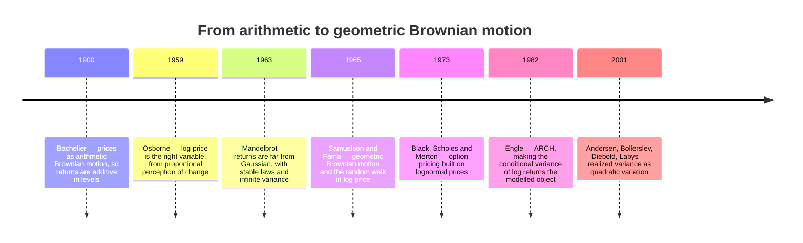
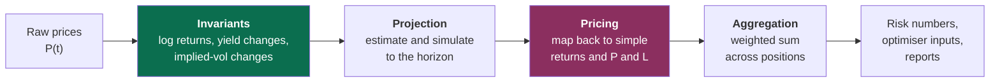
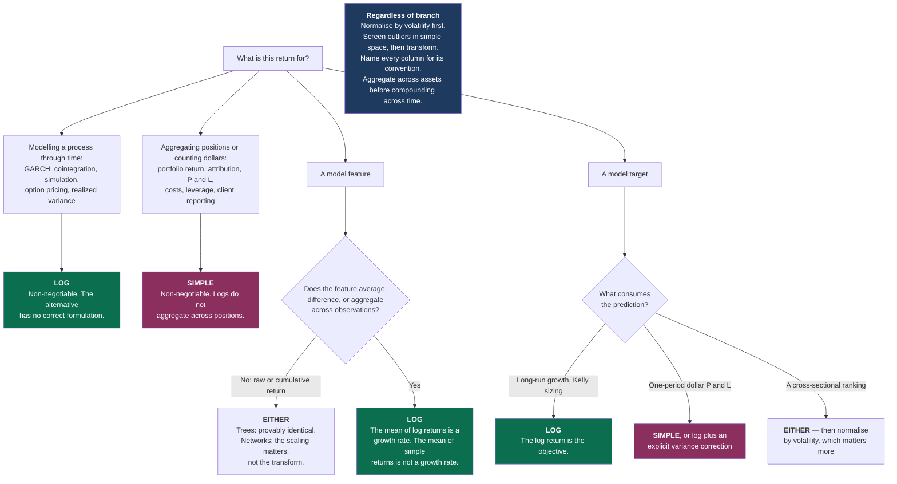

# Simple and Log Returns

### What changes when you take the logarithm, and when it matters

---

**How to read this document.** Sections 1–3 are the foundations: what a return is, the one theorem that explains why two conventions exist and why no third one can replace them, and a reference catalogue of the identities you will actually use. Sections 4–6 are the statistical theory — distributions, comparability across assets and across time, and the time-series econometrics that make the log transform non-negotiable in some settings. Sections 7–10 are practice: where the choice is forced in each direction, where it provably does not matter, how it goes wrong, and how to build working intuition. Section 11 is the machine-learning question — features and targets for gradient-boosted trees and neural networks — and is written to stand alone if that is all you came for. Sections 12–14 are convention, bibliography, and synthesis.

If you want the short answer, read §2, the table in §3.6, and §14.

Throughout, I flag claims by epistemic status:

- **[Fact]** — a mathematical identity, or a replicated empirical result with broad agreement across independent datasets.
- **[Contested]** — documented, but with live disagreement about magnitude, robustness, or cause.
- **[Hypothesis]** — a proposed mechanism, not decisively tested.
- **[Practice]** — practitioner convention; may well be right, but the evidence is private or absent.

**Notation.** $P_t$ is the price of an asset at time $t$ and $D_t$ any cash distribution paid over $(t-1, t]$. The **simple return** is $R_t = (P_t + D_t)/P_{t-1} - 1$ and the **log return** is $r_t = \ln(1 + R_t)$. When distributions are ignored (as they are in most of the notation below, for brevity) $r_t = p_t - p_{t-1}$ where $p_t = \ln P_t$. The **gross return** is $G_t = 1 + R_t = e^{r_t}$.

Moments are kept typographically distinct by convention, because the gap between them is the entire subject:

| Symbol | Meaning |
|---|---|
| $\mu = \mathbb{E}[R]$, $\sigma^2 = \operatorname{Var}(R)$ | mean and variance of the **simple** return |
| $m = \mathbb{E}[r]$, $s^2 = \operatorname{Var}(r)$ | mean and variance of the **log** return |
| $g$ | geometric mean return, defined by $1 + g = \exp(\mathbb{E}[r])$ |

Other recurring symbols: $W_t$ wealth at $t$; $A$ periods per year (252 for daily bars, 12 for monthly); $h$ a horizon in periods; $N$ assets indexed by $i$; $w_i$ portfolio weights with $\sum_i w_i = 1$; $\Sigma$ the $N \times N$ covariance matrix of simple returns; $L$ a leverage multiple; $\mathrm{SR}$ a Sharpe ratio; $R_f$ and $r_f$ the simple and log risk-free rate; $\mathcal{F}_t$ the information set at $t$; $\hat\sigma_t$ an estimate of the per-period return volatility formed from returns up to and including $r_t$ — so a *contemporaneous* return is normalised as $r_t/\hat\sigma_{t-1}$, which is what the document writes wherever the result is used as a feature; $\mathbb{1}\{\cdot\}$ an indicator. $\Phi$ is the standard normal CDF; lowercase $\phi$ is reserved throughout for a generic smooth transform, never for the normal density. A hat denotes an estimate, a bar a sample average. Bold denotes a cross-sectional vector over the $N$ assets.

Three symbols are deliberately overloaded because each usage is standard in its own literature, and each is disambiguated locally. $\sigma$ is a return volatility everywhere except §6.3, where it is the diffusion coefficient of a stochastic differential equation — the same object in the continuous-time limit, so that overload is a feature — and except §4.6, where $\sigma(\cdot)$ denotes a generated $\sigma$-algebra. $W_t$ is wealth everywhere except §6.3, where it is a standard Brownian motion. And $g$ is the geometric mean *simple* return, while $g^\ast$ in §7.1 is the maximised expected *log* growth rate — a log-space quantity, so the two are not the same object with and without a star.

---

## Table of contents

**Part I — Foundations**

1. [What a return is, and why there are two of them](#1-what-a-return-is-and-why-there-are-two-of-them)
2. [The spine: additivity or linearity, never both](#2-the-spine-additivity-or-linearity-never-both)
3. [The identity catalogue](#3-the-identity-catalogue)

**Part II — Statistical theory**

4. [Distributional properties: what actually differs](#4-distributional-properties-what-actually-differs)
5. [Comparability, laterally and longitudinally](#5-comparability-laterally-and-longitudinally)
6. [The time-series econometrics of returns](#6-the-time-series-econometrics-of-returns)

**Part III — Practice**

7. [Where the choice is forced](#7-where-the-choice-is-forced)
8. [Where it does not matter, quantified](#8-where-it-does-not-matter-quantified)
9. [Failure modes](#9-failure-modes)
10. [Building intuition](#10-building-intuition)

**Part IV — Machine learning, convention, synthesis**

11. [Returns as features and targets for GBT and DNN](#11-returns-as-features-and-targets-for-gbt-and-dnn)
12. [Academic and practitioner conventions](#12-academic-and-practitioner-conventions)
13. [Foundational references](#13-foundational-references)
14. [Synthesis](#14-synthesis)

- [Appendix A: Concepts and prerequisites](#appendix-a-concepts-and-prerequisites)
- [Appendix B: Additional works cited](#appendix-b-additional-works-cited)

---

# Part I — Foundations

## 1. What a return is, and why there are two of them {#1-what-a-return-is-and-why-there-are-two-of-them}

### 1.1 The primitive is wealth, not return

Start from the only thing that is physically real: a quantity of money. You hold $W_{t-1}$ dollars at the end of period $t-1$ and $W_t$ dollars at the end of period $t$. Everything else in this document is a way of describing the map $W_{t-1} \mapsto W_t$.

That map is a **multiplication**. Wealth does not gain a fixed number of dollars; it gets scaled by a factor. Write that factor explicitly:

$$W_t = W_{t-1} \cdot G_t, \qquad G_t = \frac{W_t}{W_{t-1}} > 0$$

$G_t$ is the **gross return**. It is the primitive object, and both of the conventions this document is about are just two different coordinate systems for describing the same $G_t$:

$$\underbrace{R_t = G_t - 1}_{\text{simple return}} \qquad\qquad \underbrace{r_t = \ln G_t}_{\text{log return}}$$

Neither is more fundamental than the other. Both are invertible reparameterisations of $G_t$, so both contain exactly the same information — a point worth stating early and loudly, because much of the folklore around log returns quietly assumes otherwise. What differs is which *algebraic operations* on the reparameterised quantity correspond to meaningful operations on wealth. That is the whole story, and §2 makes it precise.

**The map between them.** The relationship is a bijection from $(-1, \infty)$ onto $\mathbb{R}$:

$$r = \ln(1 + R) \qquad\Longleftrightarrow\qquad R = e^{r} - 1$$

It is smooth, strictly increasing, and strictly concave. Those three properties generate everything: strictly increasing means order is preserved (§11.2 leans hard on this); strictly concave means Jensen's inequality applies in one direction everywhere (§3 catalogues the consequences); and smooth means the second-order Taylor expansion around zero,

$$r = R - \frac{R^2}{2} + \frac{R^3}{3} - \cdots$$

converges for $|R| < 1$ and is dominated by the quadratic term at the magnitudes that occur in practice.

### 1.2 The wrong intuition, and why it costs money

Here is the mental model most people arrive with:

> *Log returns are an approximation to simple returns that is convenient because it makes them add up. The approximation is good for small returns and bad for large ones.*

Every clause is wrong in a way that matters.

**They are not an approximation.** $r = \ln(1+R)$ is an exact statement. Nothing is approximated. What is approximate is the *further* claim $r \approx R$, which is a different claim about a different pair of objects. Conflating "the log return" with "the approximation $r \approx R$" is the origin of most of the confusion in this area, because it makes people think the choice is a precision trade-off. It is not. It is a choice about which arithmetic operation you want to be exact.

**They do not "make returns add up" as a convenience.** They make returns add up *across time* at the exact cost of no longer adding up *across assets*. This is not a bargain you negotiated; it is a theorem (§2). Simple returns have the complementary exactness. There is no third convention that gets both, and there is no sense in which one of them is the "right" one to be approximated by the other.

**Whether the difference matters is not governed by "small versus large."** It is governed by *what you do next*. A single 40% move handled as a raw feature by a decision tree is entirely unaffected by the choice (§11.2). A sequence of 0.5% moves compounded over ten years and then annualised is materially affected, because the per-period gap $R_t - r_t \approx R_t^2/2$ is invisible on its own — $1.25\times10^{-5}$ here — but accumulates linearly in the number of periods, reaching about 3 percentage points over 2,520 trading days.

The better mental model:

> **Log returns are the natural coordinate for a process that evolves by multiplication. Simple returns are the natural coordinate for a quantity that is being added up across positions. Financial data does both, at different points in the same pipeline, which is why you need both and why you must know which one you are holding.**

### 1.3 Vocabulary and the things that share a name

Several distinct objects circulate under overlapping names. The table below is worth reading carefully once; ambiguity here is a common source of reconciliation errors between systems.

| Name | Definition | Also called |
|---|---|---|
| Gross return | $G_t = (P_t + D_t) / P_{t-1}$ | Wealth relative, price relative, growth factor |
| Simple return | $R_t = G_t - 1$ | Arithmetic return, linear return, discrete return, percentage return, holding-period return |
| Log return | $r_t = \ln G_t$ | Continuously compounded return, compounded return, geometric return†, logarithmic return |
| Cumulative simple return | $\prod_{i=1}^{h}(1+R_i) - 1$ | Total return over $h$, buy-and-hold return |
| Cumulative log return | $\sum_{i=1}^{h} r_i$ | — |
| Arithmetic mean return | $\bar R = \tfrac1h\sum_i R_i$ | Average return |
| Geometric mean return | $g = \left(\prod_i (1+R_i)\right)^{1/h} - 1$ | CAGR (annualised), time-weighted return |
| Excess return | $R_t - R_{f,t}$ | Risk premium (in expectation) |

† "Geometric return" is genuinely ambiguous in the wild: some authors mean the log return $r_t$, others the geometric mean $g$. They are related — $1 + g = \exp(\bar r)$ exactly, where $\bar r$ is the arithmetic mean of the log returns — but they are not the same object, and one is a per-period quantity while the other is a summary of a sample. I avoid the term.

Two further distinctions that cause more real-world damage than the log-versus-simple choice itself:

- **Price return versus total return.** $P_t/P_{t-1} - 1$ ignores dividends; $(P_t + D_t)/P_{t-1} - 1$ does not. For US equities this is worth roughly 1.5–2% per year at index level, which swamps every second-order effect discussed in this document. Whichever return convention you pick, get this right first.
- **Adjusted versus unadjusted prices.** Split and dividend adjustments are applied retroactively, which means a "close" series is a function of the date you downloaded it. A missed split adjustment shows up as a $-50\%$ return, which is a $-0.693$ log return and a $-50\%$ simple return — visible in either convention, but catastrophic in both. See §9.6.

### 1.4 The one-parameter family that contains both

It is worth seeing that simple and log returns are the two endpoints of a continuum, because it clarifies why there is nothing in between worth having. The Box–Cox family ([Box & Cox, 1964](https://www.jstor.org/stable/2984418){target="_blank"}) applied to the gross return $G = 1+R$ is

$$
f_\lambda(R) \;=\;
\begin{cases}
\dfrac{(1+R)^{\lambda} - 1}{\lambda}, & \lambda \neq 0 \\[2ex]
\ln(1+R), & \lambda = 0
\end{cases}
$$

The $\lambda = 0$ case is the limit of the others: $\lim_{\lambda\to 0}\frac{(1+R)^\lambda - 1}{\lambda} = \ln(1+R)$, by L'Hôpital or by expanding $(1+R)^\lambda = e^{\lambda\ln(1+R)} = 1 + \lambda\ln(1+R) + O(\lambda^2)$. And $\lambda = 1$ gives $f_1(R) = R$, the simple return exactly.

So the two conventions are $\lambda \in \{0, 1\}$ of a smooth family. Why does nobody use $\lambda = 0.4$? Because the properties that make the endpoints useful are not continuous in $\lambda$:

- Time additivity holds **only** at $\lambda = 0$.
- Portfolio linearity holds **only** at $\lambda = 1$.

At any interior $\lambda$ you get neither, and you have bought nothing in exchange except a better fit to some marginal distribution — which you can get more cheaply, and more interpretably, with a standardisation or a rank transform (§11.3). The trade-off in §2 is a corner solution, not a dial. [Fact]

That said, the Box–Cox framing does earn its keep in one place: it names what you are doing when you take logs, which is choosing a **variance-stabilising transform**, and connects it to a large statistical literature on when such transforms help. §2.5 develops that argument and §6.1 puts it to work.

### 1.5 Where the two conventions come from historically

The choice is old and was contested for decades. A compressed timeline of the moments where the field's view changed:



Four things worth taking from this.

**Bachelier's choice was not naive.** [Fact] Modelling the price itself as a Brownian motion gives a tractable theory and, at short horizons on liquid instruments, fits well. Its fatal defect is that it assigns positive probability to negative prices — a defect Bachelier himself noted. That defect is exactly the "$-100\%$ floor" that reappears in §4.2 as the reason simple returns cannot be Gaussian.

**Osborne's argument was psychophysical, not mathematical.** [Hypothesis] He argued in *Operations Research* in 1959 that investors perceive equal *ratios* of price as equally significant — the Weber–Fechner law from perception research — so the natural variable is $\ln P$. The argument is not a proof, and the modern justification is different (§6.1: variance stabilisation), but it was the reason the field moved.

**Mandelbrot's challenge was never fully resolved and still shapes practice.** [Contested] His 1963 finding that cotton price changes have far fatter tails than the Gaussian, possibly with infinite variance, is empirically robust in the tails. Whether the variance is genuinely infinite (stable-Paretian) or merely large and time-varying (conditional heteroskedasticity, as ARCH would later say) remains debated for high-frequency data, and it matters: infinite variance would break the $\sigma^2/2$ corrections that this entire document is built on. The modern consensus leans to finite variance with time-varying scale and tail index around 3–5 for daily equity returns — enough moments for the corrections to be meaningful, not enough for fourth-moment-based inference to be trustworthy.

**The log convention won in continuous-time finance and never fully won in the cross-section.** Derivatives pricing, volatility modelling, and time-series econometrics are conducted almost entirely in logs. Asset pricing tests, portfolio construction, and performance reporting are conducted almost entirely in simple returns. §12 argues this split is correct rather than sloppy.

> ### §1 Key takeaways
>
> 1. The primitive is the gross return $G_t = W_t/W_{t-1}$; simple and log returns are two invertible coordinates for it, carrying identical information.
> 2. The log return is not an approximation to anything. The *approximation* is $r \approx R$, which is a separate claim you should stop conflating with the definition.
> 3. Whether the choice matters is governed by what you do next — averaging, compounding, aggregating, or fitting — not by whether the returns are "large."
> 4. Simple and log returns are the $\lambda = 1$ and $\lambda = 0$ members of the Box–Cox family; nothing in between is useful, because the properties you want live only at the endpoints.
> 5. Total-versus-price return and correct split adjustment are worth more basis points than the entire log-versus-simple question. Fix those first.
> 6. The historical shift from Bachelier to Osborne to Samuelson was driven by the negative-price defect of additive price models, not by a desire for additivity.

---

## 2. The spine: additivity or linearity, never both {#2-the-spine-additivity-or-linearity-never-both}

This section contains the one idea that generates the rest of the document. Everything in §3 through §14 is a consequence, an instance, or a practical accommodation of it.

### 2.1 The two properties you want

Financial data gets aggregated along exactly two axes, and you would like your return measure to behave well along both.

**Axis 1 — time.** You held one asset for $h$ periods. The wealth relative over the whole span is the product of the per-period wealth relatives:

$$\frac{W_h}{W_0} \;=\; \prod_{i=1}^{h} (1 + R_i)$$

You want a return measure whose $h$-period value is the **sum** of its per-period values, because sums are what statistics is built on — means, variances, central limit theorems, linear regressions, and every horizon-scaling rule you have ever used.

**Axis 2 — assets.** You held $N$ assets with weights $w_i$ at the start of the period. The portfolio's wealth relative is the weighted average of the constituents':

$$1 + R_p \;=\; \sum_{i=1}^{N} w_i (1 + R_i) \qquad\Longrightarrow\qquad R_p \;=\; \sum_{i=1}^{N} w_i R_i$$

(The implication uses $\sum_i w_i = 1$.) You want a return measure that is **linear in the weights**, because that is what makes portfolio optimisation a quadratic program, what makes performance attribution add up, and what makes a factor model's left-hand side well defined.

Call the first property **time additivity** and the second **portfolio linearity**. Each of the two conventions satisfies exactly one.

$$
\begin{aligned}
\text{Log returns:}&\qquad r_{1:h} = \textstyle\sum_{i=1}^{h} r_i \quad\text{(exact)}, \qquad r_p \neq \textstyle\sum_i w_i r_i \\
\text{Simple returns:}&\qquad R_{1:h} \neq \textstyle\sum_{i=1}^{h} R_i, \qquad\qquad\;\; R_p = \textstyle\sum_i w_i R_i \quad\text{(exact)}
\end{aligned}
$$

### 2.2 The impossibility theorem

The natural next thought is: *surely some cleverer transform gets both.* It does not, and the proof is three lines.

> **Proposition.** Let $f : (-1, \infty) \to \mathbb{R}$ be continuous, and suppose both
>
> **(T)** $\;f\big((1+R_1)(1+R_2) - 1\big) = f(R_1) + f(R_2)$ for all $R_1, R_2 > -1$, and
>
> **(P)** $\;f\big(wR_1 + (1-w)R_2\big) = w\,f(R_1) + (1-w)\,f(R_2)$ for all $w \in [0,1]$, $R_1, R_2 > -1$.
>
> Then $f \equiv 0$.

**Proof.** Property (P) says $f$ is affine on the interval. To see it, put $b = f(0)$ and take $R_2 = 0$ in (P): $f(wR) - b = w\big(f(R) - b\big)$ for every $w \in [0,1]$, so $(f(R)-b)/R$ is one constant on $R > 0$ and one constant on $R \in (-1,0)$; picking $R_1 > 0 > R_2$ and the $w$ that makes $wR_1 + (1-w)R_2 = 0$ forces those two constants to agree. Hence $f(R) = aR + b$. Setting $R_1 = R_2 = 0$ in (T) gives $f(0) = 2f(0)$, so $f(0) = 0$, hence $b = 0$ and $f(R) = aR$. Now substitute into (T):

$$a\big[(1+R_1)(1+R_2) - 1\big] = a\big(R_1 + R_2 + R_1R_2\big) \;\overset{!}{=}\; aR_1 + aR_2$$

which forces $a R_1 R_2 = 0$ for all $R_1, R_2$, hence $a = 0$. $\blacksquare$

The proof runs just as cleanly from the other end. Property (T), rewritten in the gross return $x = 1+R$ with $\tilde f(x) \equiv f(x-1)$, is the multiplicative Cauchy equation $\tilde f(x_1 x_2) = \tilde f(x_1) + \tilde f(x_2)$ for all $x_1, x_2 > 0$, whose only continuous solutions are $\tilde f(x) = c \ln x$ (Aczél, 1966). So (T) alone pins $f$ down to a scalar multiple of the log return. Imposing (P) then requires

$$c\,\ln\!\big(w x_1 + (1-w)x_2\big) \;=\; c\,\big(w \ln x_1 + (1-w)\ln x_2\big)$$

and the **strict** concavity of $\ln$ makes $\ln\!\big(wx_1 + (1-w)x_2\big) > w\ln x_1 + (1-w)\ln x_2$ whenever $x_1 \neq x_2$ and $w \in (0,1)$. Multiplying a strict inequality by $c$ leaves it strict — in one direction or the other, depending on the sign of $c$ — unless $c = 0$. So $c = 0$.

**The obstruction is the cross-term.** Both proofs die on the same object: $R_1 R_2$. Compounding is multiplication, and multiplication generates a cross-term that no linear function can see. Simple returns are linear and therefore blind to it — which is precisely why they fail to compound. Log returns turn multiplication into addition and therefore see it — which is precisely why they fail to average across a portfolio.

You can carry this as one sentence: **you cannot linearise multiplication and preserve addition at the same time.**

### 2.3 The size of the error you make by ignoring it

The theorem says you must give up one property. It does not say how much that costs, which is the practically relevant question. Both gaps have clean second-order expressions, and — this is the satisfying part — the two gaps are the same object seen from two sides.

**Cost of using log returns across a portfolio.** By concavity of $\ln$ (Jensen's inequality),

$$r_p \;=\; \ln\Big(1 + \sum_i w_i R_i\Big) \;\ge\; \sum_i w_i \ln(1 + R_i) \;=\; \sum_i w_i r_i$$

so naively averaging log returns across a portfolio always *understates* the portfolio's return. (Jensen needs the weights to be a probability distribution, so this subsection assumes a long-only book, $w_i \ge 0$; with short positions the gap can run either way.) Expanding both sides to second order, with $\bar R_w \equiv \sum_i w_i R_i$:

$$r_p - \sum_i w_i r_i \;\approx\; \tfrac12\Big(\underbrace{\textstyle\sum_i w_i R_i^2 - \bar R_w^2}_{\text{weighted cross-sectional variance}}\Big) \;=\; \tfrac12 \operatorname{Var}_w(R)$$

The error is half the *cross-sectional dispersion of returns across your holdings*. On a diversified equity book with 2% daily cross-sectional return dispersion, that is $\tfrac12 (0.02)^2 = 2\times10^{-4}$, or 2 basis points per day — about 5% per year. Not a rounding error.

That quantity has a name in the portfolio literature: it is the **diversification return** or **rebalancing return** ([Booth & Fama, 1992](https://doi.org/10.2469/faj.v48.n3.26){target="_blank"}; [Willenbrock, 2011](https://arxiv.org/abs/1109.1256){target="_blank"}). In continuous time, for a portfolio rebalanced back to fixed weights $w$,

$$g_p - \sum_i w_i g_i \;=\; \tfrac12\Big(\sum_i w_i \sigma_i^2 - \sigma_p^2\Big) \;\ge\; 0$$

where $g_p$ is the portfolio's geometric mean return, $g_i$ the constituents', $\sigma_i^2$ their variances and $\sigma_p^2 = \mathbf{w}^\top \Sigma \mathbf{w}$ the portfolio variance. So the "error" you commit by mis-aggregating log returns *is* the diversification return, exactly. Two equally weighted, uncorrelated assets each with 30% volatility generate $\tfrac12(0.09 - 0.045) = 2.25\%$ per year of it. [Fact]

**Cost of using simple returns across time.** Compounding $h$ simple returns and comparing to their sum:

$$\prod_{i=1}^{h}(1+R_i) - 1 \;=\; \sum_i R_i \;+\; \underbrace{\sum_{i<j} R_i R_j}_{\text{first cross-term}} \;+\; \cdots$$

For $h$ uncorrelated returns with mean $\mu$, the leading discrepancy has expectation $\binom{h}{2}\mu^2 \approx \tfrac12 h^2\mu^2$ — it grows **quadratically** in the horizon. This is the mechanism behind the most common reporting error in the industry: reporting $A \cdot \bar R$ as an "annualised return." With daily $\bar R = 0.0004$ and $A = 252$, $A\bar R = 10.08\%$ while $(1+\bar R)^{252} - 1 = 10.60\%$: the cross-terms are worth 52 bp, and the linear figure sits *below* the compounded one by exactly that. Mind the direction — ignoring compounding understates. What makes $A\bar R$ the flattering number anyway is the second and larger effect it also ignores, volatility drag, which §3.5 nets out against this one.

### 2.4 Two exceptions worth knowing

The theorem is about exact properties for arbitrary inputs. Two special structures escape it, and both come up.

**Continuous rebalancing makes log returns portfolio-linear in the limit.** If weights are held fixed by continuous rebalancing, then over an infinitesimal interval the portfolio's *instantaneous* log return does satisfy $dr_p = \sum_i w_i \, dr_i + \tfrac12(\sum_i w_i\sigma_i^2 - \sigma_p^2)\,dt$ — linear up to the deterministic Itô correction, which is the diversification return again. This is why continuous-time portfolio theory is comfortable working in logs throughout, and discrete-time portfolio construction is not.

**Single-asset problems have no cross-section.** If $N = 1$, portfolio linearity is vacuous and nothing pushes back against log returns — right up to the point where you convert to dollars, which is still simple-return arithmetic (§7.2). A surprisingly large fraction of practical work — volatility estimation, single-name signal research, univariate time-series modelling — is in this regime, and the debate evaporates there.

### 2.5 The second job logs do, which has nothing to do with additivity

Additivity is the property everyone cites. It is not the property that makes the log transform indispensable in econometrics. That one is **variance stabilisation**, and it deserves separate billing because it is a genuinely different argument that happens to point the same way.

Suppose price evolves multiplicatively, so that the conditional variance of the price *change* scales with the square of the level:

$$\operatorname{Var}(P_t \mid P_{t-1}) \;=\; \sigma^2 P_{t-1}^2$$

This is not an assumption imposed for convenience; it is what "a 1% move" meaning the same thing at $P = 10$ and at $P = 1000$ implies. Now ask which transform $\phi(\cdot)$ makes the transformed series homoskedastic. By the delta method, expanding about the conditional mean $\mathbb{E}[P_t \mid P_{t-1}]$ — which is $P_{t-1}$ up to one period of drift — $\operatorname{Var}\big(\phi(P_t) \mid P_{t-1}\big) \approx \phi'(P_{t-1})^2 \operatorname{Var}(P_t \mid P_{t-1}) = \phi'(P_{t-1})^2 \sigma^2 P_{t-1}^2$. For this to be free of $P_{t-1}$ we need

$$\phi'(P) \;\propto\; \frac{1}{P} \qquad\Longrightarrow\qquad \phi(P) = a\ln P + b$$

**The logarithm is the unique variance-stabilising transform for a process whose volatility is proportional to its level** — unique up to the affine rescaling $a, b$, which stabilises nothing further and changes nothing. [Fact] That is the reason unit-root tests, cointegration, ARIMA, and GARCH are run on log prices rather than prices, and it is entirely independent of the additivity argument. If you differenced raw prices instead, you would get a series whose variance grew with the price level — an unmodelled trend in the second moment that would corrupt every standard error you computed.

This is also the honest answer to "why do econometricians love logs": not because returns add up, but because the residuals become homoskedastic and the asymptotic theory becomes valid.

### 2.6 The third generative idea: one correction term wearing many hats

The gap between the two conventions is, to leading order, always the same quantity. For any smooth $\phi$, the second-order delta method gives

$$\mathbb{E}[\phi(X)] \;\approx\; \phi(\mathbb{E}X) \;+\; \tfrac12\,\phi''(\mathbb{E}X)\operatorname{Var}(X)$$

Apply it with $\phi = \ln(1+\cdot)$, so $\phi'' (x) = -(1+x)^{-2}$:

$$\boxed{\;m \;=\; \mathbb{E}[\ln(1+R)] \;\approx\; \ln(1+\mu) - \frac{\sigma^2}{2(1+\mu)^2} \;\approx\; \mu - \frac{\sigma^2}{2}\;}$$

That $\sigma^2/2$ is the single most recurrent number in the analysis of returns. It appears in at least ten places that look unrelated until you notice they are all the same Taylor term. Here is the map; the sections listed derive each one and define the symbols local to each row.

| Appearance | Statement | Where |
|---|---|---|
| Jensen gap | $m \approx \mu - \sigma^2/2$ | §3.3 |
| Volatility drag | $g \approx \mu - \sigma^2/2$ | §3.4 |
| Lognormal mean | $\mathbb{E}[e^r] = e^{m + s^2/2}$ | §4.1 |
| Itô drift | $d\ln S = (\mu - \tfrac12\sigma^2)\,dt + \sigma\,dW$ | §6.3 |
| Black–Scholes $d_2$ | $d_2 = \dfrac{\ln(S/K) + (r_f - \tfrac12\sigma^2)T}{\sigma\sqrt T}$ | §7.1 |
| Kelly growth rate | $g^{\ast} = \mu^2/(2\sigma^2) = \mathrm{SR}^2/2$ | §7.1 |
| Diversification return | $g_p - \sum_i w_i g_i = \tfrac12\big(\sum_i w_i\sigma_i^2 - \sigma_p^2\big)$ | §2.3 |
| Sharpe-ratio gap | $\mathrm{SR}_{\text{simple}} - \mathrm{SR}_{\text{log}} \approx \sigma_{\text{ann}}/2$ | §8.3 |
| CAPM alpha bias | $\alpha^{\log} \approx \alpha - \tfrac12(\sigma_i^2 - \beta\sigma_M^2)$ | §9.3 |
| Retransformation bias | $\mathbb{E}[R \mid x] = e^{\,\hat m(x) + \hat s^2(x)/2} - 1$ | §11.5 |

If you learn one thing from this document, learn to recognise $\sigma^2/2$ on sight. Every time you see it, the same thing is happening: an expectation is being pushed through a concave function, and the curvature is charging you half the variance.

> ### §2 Key takeaways
>
> 1. Log returns are additive across time and not across assets; simple returns are linear across assets and not across time. This is a theorem, not a convention.
> 2. No transform achieves both. The obstruction is the cross-term $R_1R_2$ that multiplication generates and linearity cannot represent.
> 3. The error from mis-aggregating log returns across a portfolio equals half the cross-sectional variance of returns — which is exactly the diversification return, a real economic quantity, not a rounding error.
> 4. The error from mis-aggregating simple returns across time grows quadratically in the horizon; reporting $A\bar R$ as an annualised return is the standard instance.
> 5. Logs do a second, independent job: they are the unique variance-stabilising transform for a process whose volatility scales with its level. This, not additivity, is why time-series econometrics uses log prices.
> 6. One Taylor term, $\sigma^2/2$, generates volatility drag, the Itô correction, the Kelly growth rate, the Black–Scholes $d_2$, the diversification return, the Sharpe gap, and the retransformation bias. They are one fact seen ten times.

---

## 3. The identity catalogue {#3-the-identity-catalogue}

This section is reference material. It collects, in one place and with consistent notation, the relationships you will reach for. Each is marked **exact** (holds for any returns whatsoever), **exact under iid**, **exact under lognormality**, or **approximate** — the distinction is where most errors live, because approximate results get quoted as though they were identities.

### 3.1 Conversion

| Direction | Formula | Status |
|---|---|---|
| Simple $\to$ log | $r = \ln(1+R)$ | exact |
| Log $\to$ simple | $R = e^{r} - 1$ | exact |
| Small-return expansion | $r = R - \tfrac{R^2}{2} + \tfrac{R^3}{3} - \cdots$ | exact for $\lvert R\rvert < 1$ |
| First-order | $r \approx R$ | approximate |
| Second-order | $r \approx R - \tfrac12 R^2$ | approximate |

Domain constraints that are not negotiable: $R \in (-1, \infty)$ and $r \in (-\infty, \infty)$. A simple return of exactly $-1$ (total loss) maps to $r = -\infty$; a price series that touches zero or goes negative has no log return at all (§9.1).

### 3.2 Aggregation

**Across time**, over $h$ consecutive periods:

$$
\begin{aligned}
r_{1:h} &= \sum_{i=1}^{h} r_i && \textbf{exact, no assumptions} \\
1 + R_{1:h} &= \prod_{i=1}^{h} (1 + R_i) && \textbf{exact, no assumptions} \\
R_{1:h} &= \sum_{i=1}^{h} R_i + \sum_{i<j} R_iR_j + \cdots && \textbf{exact expansion}
\end{aligned}
$$

The first line is the entire practical case for log returns and it holds unconditionally — no independence, no stationarity, no distributional assumption. It is a restatement of $\ln(ab) = \ln a + \ln b$.

**Across assets**, for a portfolio with start-of-period weights $w_i$ summing to one:

$$
\begin{aligned}
R_p &= \sum_{i=1}^{N} w_i R_i && \textbf{exact, no assumptions} \\
r_p &= \ln\Big(1 + \sum_i w_i e^{r_i} - \sum_i w_i\Big) \;=\; \ln\Big(\sum_i w_i e^{r_i}\Big) && \textbf{exact, and not a sum} \\
r_p &\ge \sum_i w_i r_i, \qquad r_p - \sum_i w_i r_i \approx \tfrac12\operatorname{Var}_w(R) && \textbf{Jensen (long-only); approximate gap}
\end{aligned}
$$

The middle line is worth staring at: the portfolio log return is the log of a weighted average of exponentials — a *log-sum-exp*, the softmax-adjacent object that appears whenever you try to average in log space. It is smooth and convex in $\mathbf{r}$, and it is nothing like a weighted average of the $r_i$.

**Multiplicative chains.** Any decomposition of the form $1 + R = \prod_k (1 + R^{(k)})$ becomes exactly additive in logs. The common ones:

| Decomposition | Simple form | Log form |
|---|---|---|
| Currency translation | $R^{\mathrm{USD}} = R^{\mathrm{loc}} + R^{\mathrm{fx}} + R^{\mathrm{loc}}R^{\mathrm{fx}}$ | $r^{\mathrm{USD}} = r^{\mathrm{loc}} + r^{\mathrm{fx}}$ |
| Real from nominal ($\pi$ the inflation rate) | $1+R^{\mathrm{real}} = \frac{1+R^{\mathrm{nom}}}{1+\pi}$ | $r^{\mathrm{real}} = r^{\mathrm{nom}} - \ln(1+\pi)$ |
| Proportional fee $c$ | $1+R^{\mathrm{net}} = (1+R^{\mathrm{gr}})(1-c)$ | $r^{\mathrm{net}} = r^{\mathrm{gr}} + \ln(1-c)$ |
| Total from price return | $R^{\mathrm{TR}} = R^{\mathrm{PR}} + D_t/P_{t-1}$ | not additive |
| Constant leverage $L$ | $R^{L} = L\,R$ | not additive |

The last two rows are the ones people forget. **Dividends and leverage are additive in simple returns and not in logs.** A 3× daily-rebalanced ETF has simple return exactly $3R_t$ before costs, and log return $\ln(1 + 3R_t) \neq 3r_t$. If you want to reason about leveraged products, or attribute a total return into price and income components, simple returns are the exact currency and logs are the approximation. This is the cleanest available counterexample to "logs are always better."

### 3.3 Moments

**Distribution-free (delta method, second order).** For any return distribution with mean $\mu$ and variance $\sigma^2$:

$$m \;\approx\; \ln(1+\mu) - \frac{\sigma^2}{2(1+\mu)^2}\;\approx\; \mu - \frac{\sigma^2}{2}, \qquad\qquad s^2 \;\approx\; \frac{\sigma^2}{(1+\mu)^2}\;\approx\;\sigma^2$$

Read the second relation carefully: **the two conventions disagree about the mean at first order in the variance, and agree about the variance to that same order.** This asymmetry is the reason virtually every discrepancy in this document is a *level* discrepancy in a mean, not a scale discrepancy in a volatility. Volatility estimates barely care which convention you used. Return estimates care a great deal.

**Exact, under lognormality** ($r \sim \mathcal{N}(m, s^2)$, so $1+R$ is lognormal):

$$
\begin{aligned}
\mu &= e^{m + s^2/2} - 1 & s^2 &= \ln\!\left(1 + \frac{\sigma^2}{(1+\mu)^2}\right) \\
\sigma^2 &= (1+\mu)^2\big(e^{s^2} - 1\big) & m &= \ln(1+\mu) - \tfrac12 s^2 \\
\operatorname{skew}(R) &= \big(e^{s^2}+2\big)\sqrt{e^{s^2}-1} & \operatorname{exkurt}(R) &= e^{4s^2} + 2e^{3s^2} + 3e^{2s^2} - 6
\end{aligned}
$$

The left column goes log $\to$ simple; the right column inverts it. Both directions are needed constantly — the left when you have simulated log returns and want economic quantities, the right when you have a historical mean and volatility in percentage terms and want to parameterise a simulation.

The skewness formula is more informative than it looks. It says that **a perfectly symmetric log-return distribution produces a right-skewed simple-return distribution, with the skew growing in the horizon.** Concretely, for equity-like volatility:

| Horizon | $s$ | $\operatorname{skew}(R)$ | $\operatorname{exkurt}(R)$ |
|---|---|---|---|
| Daily | 0.0126 | 0.038 | 0.002 |
| Monthly | 0.058 | 0.174 | 0.054 |
| Annual | 0.20 | 0.614 | 0.678 |
| Annual, high-vol asset | 0.60 | 2.26 | 10.3 |

At daily frequency the induced skew is 0.04 — invisible next to the 0.1–0.5 of *actual* daily equity skew. At annual frequency it is 0.61, which is a substantial part of the observed right skew in long-horizon equity returns. This is a useful decomposition: some of the famous positive skew in long-horizon returns is not a fact about markets at all, it is the log transform's Jacobian. [Fact]

### 3.4 Geometric versus arithmetic mean, and volatility drag

The single most consequential identity in the whole area, because it is where money is actually lost.

**Distribution-free, in-sample.** For any sample of $h$ returns:

$$1 + g \;=\; \left(\prod_{i=1}^{h}(1+R_i)\right)^{1/h} \;=\; \exp\!\left(\frac1h\sum_{i=1}^{h} r_i\right) \;=\; \exp(\bar r)$$

and by the arithmetic–geometric mean inequality, $g \le \bar R$ always, with equality if and only if every $R_i$ is identical. The **arithmetic mean of a return series is an upper bound on what you actually earned**, and the bound is strict whenever returns vary at all.

**Second-order.** Expanding, with $\hat\sigma^2 = \tfrac1h\sum_i (R_i - \bar R)^2$ the in-sample variance:

$$g \;\approx\; \bar R - \tfrac12\hat\sigma^2$$

**Exact, under lognormality.** The relationship becomes an identity in log space:

$$\ln(1+\mu) - \ln(1+g) \;=\; \frac{s^2}{2}$$

and $g$ is the **median** of the simple-return distribution, while $\mu$ is its mean. The gap between them is entirely the lognormal's right skew.

The quantity $\mu - g \approx \sigma^2/2$ is **volatility drag** (also *variance drain*). Its practical implications are severe and non-obvious:

| Asset | $\mu$ | $\sigma$ | Drag $\sigma^2/2$ | $g \approx$ |
|---|---|---|---|---|
| US large-cap equity | 10% | 20% | 2.0% | 8.0% |
| 2× levered equity | 20% | 40% | 8.0% | 12.0% |
| 3× levered equity | 30% | 60% | 18.0% | 12.0% |
| 4× levered equity | 40% | 80% | 32.0% | 8.0% |
| High-vol single name | 20% | 60% | 18.0% | 2.0% |

Reading down the leverage column: doubling leverage doubles the arithmetic mean and *quadruples* the drag, so compound growth is a concave function of leverage that peaks and then falls. Its maximum is at $L^{\ast} = \mu/\sigma^2$, which is the Kelly fraction — the growth-optimal leverage falls straight out of the same $\sigma^2/2$ term (§7.1). For the 10%/20% asset, $L^\ast = 0.10/0.04 = 2.5$, and the numbers above show $g$ peaking between $2\times$ and $3\times$, exactly as predicted. [Fact]

This table is also the cleanest single argument for why **volatility is not merely a measure of risk — it is a direct subtraction from compound return.** An investor with no risk aversion at all, maximising terminal wealth, still cares about volatility, because volatility eats growth. That fact is invisible in simple-return arithmetic and immediate in log-return arithmetic.

### 3.5 Annualisation and horizon scaling

| Quantity | Log returns | Simple returns |
|---|---|---|
| Mean, $h$ periods | $h\,m$ (exact under iid) | $(1+\mu)^h - 1$ (exact under iid) |
| Variance, $h$ periods | $h\,s^2$ (exact under iid) | $(\sigma^2 + (1+\mu)^2)^h - (1+\mu)^{2h}$ (exact under iid) |
| Volatility scaling | $s\sqrt{h}$ (exact under iid) | $\sigma\sqrt{h}$ (approximate) |
| Annualised mean | $A\,m$ | $(1+\mu)^A - 1$ |
| Annualised volatility | $s\sqrt{A}$ | $\approx\sigma\sqrt{A}$ |

Three notes. First, the square-root-of-time rule is an *exact* consequence of iid additivity for log returns and only an approximation for simple returns; if you have ever wondered why the rule is stated so confidently, this is why. Second, all of it fails under autocorrelation, in either convention — the variance ratio $\operatorname{Var}(r_{1:h})/(h\,s^2)$ departs from 1 exactly when returns are serially correlated, which is the entire subject of momentum and mean-reversion testing. Third, the common shortcut of annualising a mean simple return as $A\bar R$ is wrong in a direction that flatters: for daily $\bar R = 4$ bp, $A\bar R = 10.1\%$ against a true compounded $10.6\%$; but the compounded figure also fails to subtract drag, so the honest annualised *growth* figure is $\exp(A\bar r)-1$, which is lower than both.

### 3.6 The summary table

If you read one thing in this document, read this.

```{=latex}
\newpage
```

| Operation | Exact in simple returns | Exact in log returns |
|---|---|---|
| Compound over time | ✗ (product) | **✓** (sum) |
| Aggregate across assets in a portfolio | **✓** (weighted sum) | ✗ (log-sum-exp) |
| Scale variance by $\sqrt{h}$ (iid) | ✗ | **✓** |
| Apply a proportional fee | ✗ | **✓** |
| Convert currency | ✗ | **✓** |
| Deflate by inflation | ✗ | **✓** |
| Add dividend income to a price return | **✓** | ✗ |
| Apply constant per-period leverage $L$ | **✓** | ✗ |
| Compute dollar P&L on a position | **✓** | ✗ |
| Bounded below at $-100\%$ | **✓** | ✗ (unbounded below) |
| Can be exactly Gaussian | ✗ | **✓** |
| Intraday values sum to the period return | ✗ | **✓** |
| Order-preserving relative to the other | **✓** | **✓** |

The last row is a reminder that the two are monotonically related, so any statement about *rankings* is convention-free — a fact that §11.2 turns into the central practical result for tree-based models.

> ### §3 Key takeaways
>
> 1. Time additivity of log returns and portfolio linearity of simple returns are unconditional identities. Everything else in the catalogue carries a distributional assumption; check which.
> 2. The two conventions disagree about means at order $\sigma^2$ and agree about variances at that order. Volatility estimates are nearly convention-free; return estimates are not.
> 3. Under lognormality, $\mu = e^{m+s^2/2}-1$ and $g = e^m - 1$: the arithmetic mean is the mean of the simple-return distribution and the geometric mean is its median.
> 4. Volatility drag $\mu - g \approx \sigma^2/2$ makes compound growth concave in leverage, peaking at the Kelly fraction $\mu/\sigma^2$. A 4× levered position on a 10%/20% asset compounds no better than the unlevered one.
> 5. Some of the observed right skew in long-horizon simple returns is manufactured by the transform itself: symmetric annual log returns with $s = 0.20$ imply skew 0.61 in simple returns.
> 6. Dividends and leverage are additive in simple returns, not in logs. Anyone who tells you logs are unconditionally better has not had to reconcile a leveraged product.

---

# Part II — Statistical theory

## 4. Distributional properties: what actually differs {#4-distributional-properties-what-actually-differs}

The folklore claim is that "log returns are normally distributed." That claim is false as an empirical statement about daily data and true as a statement about a *model*, and the gap between those two readings is where the useful content is.

### 4.1 The lognormal model and what it buys

Assume log returns are iid Gaussian, $r_t \sim \mathcal{N}(m, s^2)$. Then

$$P_T \;=\; P_0\exp\Big(\sum_{t=1}^{T} r_t\Big) \quad\Longrightarrow\quad \ln P_T \sim \mathcal{N}\big(\ln P_0 + Tm,\; T s^2\big)$$

so the price is lognormal at every horizon. Three consequences follow immediately, and together they explain why this model dominated finance for forty years:

1. **Prices stay positive.** $P_T = P_0 e^{X}$ with $X$ real is strictly positive by construction. Bachelier's defect is gone.
2. **The model is closed under time aggregation.** The sum of independent Gaussians is Gaussian, so a model calibrated on daily data makes an internally consistent statement about monthly data, with parameters $(Tm, Ts^2)$. No refitting, no inconsistency.
3. **Expectations of payoffs are computable in closed form.** $\mathbb{E}[e^{r}] = e^{m + s^2/2}$ is the moment generating function of the Gaussian evaluated at 1, and every Black–Scholes-type formula is an instance of integrating a payoff against a lognormal density.

Point 2 is the one that is usually taken for granted and is in fact the deepest. Spell it out.

### 4.2 Why simple returns cannot be Gaussian, and why it is not a technicality

Two arguments, one weak and one strong.

**The weak argument: support.** $R \ge -1$ always, because a limited-liability asset cannot lose more than everything. A Gaussian has support on all of $\mathbb{R}$, so it assigns positive probability to $R < -1$, i.e. to negative prices. How much probability depends only on how many standard deviations the $-1$ floor sits below the mean. At a daily equity volatility of $\sigma \approx 1.27\%$ and a mean of zero, the floor is $1/0.0127 \approx 79$ standard deviations out and the probability is $\Phi(-79) \approx 3\times 10^{-1358}$ — utterly negligible, which is why this argument alone persuades nobody. It becomes real at long horizons and high volatilities: for annual returns with $\sigma = 60\%$, again taking a zero mean, the floor is only $1/0.6 = 1.67$ standard deviations out, so $\Phi(-1.67) \approx 4.8\%$, and a Gaussian model would put nearly one chance in twenty on bankruptcy-or-worse for reasons of arithmetic rather than economics.

**The strong argument: closure under aggregation.** This one is decisive and is the sharpest available answer to "what statistical relationship holds for log returns but not simple returns."

For a distributional model to be *consistent across horizons* — to say the same thing about daily and monthly data — the quantity that aggregates additively must belong to a family closed under convolution. Reading a daily law *up* to monthly needs closure under convolution; reading a monthly law back *down* to daily needs the converse, that the law can be written as a sum of $n$ iid pieces. Requiring both at every horizon is exactly **infinite divisibility**: for every $n$ there must exist a distribution whose $n$-fold convolution is the horizon-$1$ law. The infinitely divisible laws are precisely the time-$1$ marginals of Lévy processes, and they are the entire menu of time-consistent models: Gaussian, Poisson, variance-gamma, normal-inverse-Gaussian, $\alpha$-stable, and their mixtures.

Log returns are the additive quantity, so any of these can be imposed on them and the model automatically extends coherently to every horizon. Simple returns are *not* additive: even if $R_1$ and $R_2$ were exactly Gaussian and independent, $R_{1:2} = R_1 + R_2 + R_1R_2$ is not Gaussian — the cross-term from §2.2 destroys the family.

Be precise about what that rules out, because the loose version of this claim is false. Every time-consistent model *can* be written in simple-return coordinates: push an infinitely divisible law for $r$ through $R = e^{r}-1$ and you get a family of simple-return laws that does aggregate correctly to any horizon — shifted-lognormal simple returns being the obvious example. What you cannot do is **choose the family in simple-return coordinates**. The simple-return families that survive aggregation are exactly the images under $R = e^{r}-1$ of the infinitely divisible ones, so the closure condition can only be *stated* in logs; and none of the distributions anyone would actually reach for on a simple-return series — Gaussian, Student-$t$, skew-$t$, a mixture of normals — is among them. [Fact]

That is the theorem behind the practitioner rule of thumb. It is not that log returns are more normal; it is that **log returns are the only coordinate in which "the distribution at horizon $h$" is determined by "the distribution at horizon 1."**

### 4.3 What the data actually looks like

The empirical regularities — [Cont's (2001)](http://www-stat.wharton.upenn.edu/~steele/Resources/FTSResources/StylizedFacts/Cont2001.pdf){target="_blank"} "stylized facts", the standard reference list — are the following, and they are what any candidate model has to reproduce. [Fact] for all of them, in the sense of being replicated across markets, asset classes and decades.

| Stylized fact | Statement | Convention-sensitive? |
|---|---|---|
| Heavy tails | Tail index roughly 3–5; far more mass beyond $\pm 4$ standard deviations than Gaussian | No, at daily frequency |
| No linear autocorrelation | $\rho_k(r)$ indistinguishable from zero beyond a few minutes for liquid assets | No |
| Volatility clustering | $\rho_k(\lvert r\rvert)$ positive and decaying slowly (hyperbolically) out to months | No |
| Aggregational Gaussianity | Distribution approaches Gaussian as the horizon grows | **Yes** — see below |
| Leverage effect | Returns negatively correlated with future volatility, asymmetrically | Slightly |
| Gain/loss asymmetry | Equity indices show negative skew; large drawdowns exceed large run-ups | **Yes** |
| Volume–volatility correlation | Trading volume correlates with all measures of volatility | No |

The column on the right is the part that gets lost when this list is quoted. **At daily frequency, on liquid equities, swapping conventions changes none of the first three qualitatively.** Sample excess kurtosis of daily S&P 500 returns is typically somewhere between 5 and 25 depending on the sample window and whether October 1987 is included. On a window with no crash in it the simple-return and log-return figures agree to within about a percent; on a window containing October 1987 the log figure is the larger of the two by a visible margin, for the reason §4.5 gives — the transform stretches the one observation that dominates the fourth moment. Either way the heavy tails are a fact about markets. They are not an artefact you can transform away, and anyone who tells you log returns "fix" non-normality is confusing the daily case with the annual case.

Where the convention genuinely bites is the fourth row and the two asymmetry rows below it.

### 4.4 Aggregational Gaussianity runs in opposite directions

This is the cleanest demonstration of the longitudinal comparability advantage, and it is worth working through.

Suppose per-period log returns are iid with finite variance (a real assumption — see the Mandelbrot caveat in §1.5 — but one the data supports at daily frequency for liquid assets). Then:

$$\frac{r_{1:h} - hm}{s\sqrt{h}} \;=\; \frac{1}{s\sqrt h}\sum_{i=1}^{h} \big(r_i - m\big) \quad\xrightarrow[\;h\to\infty\;]{d}\quad \mathcal{N}(0,1) \qquad\text{by the central limit theorem}$$

The standardisation matters: it is the *shape* of $r_{1:h}$ that becomes Gaussian, not its location or scale, both of which grow with $h$. Concretely, for iid summands the skewness of $r_{1:h}$ decays like $h^{-1/2}$ and its excess kurtosis like $h^{-1}$. Log returns get *more* Gaussian as you aggregate.

Meanwhile the corresponding simple return is $R_{1:h} = e^{r_{1:h}} - 1$, an exponential of an increasingly Gaussian variable, so $1 + R_{1:h}$ approaches a lognormal — and a lognormal's shape runs the other way. If log returns are exactly iid Gaussian, the horizon-$h$ log variance is $hs^2$ and §3.3's formulae apply verbatim with $s^2 \to hs^2$:

$$\operatorname{skew}\big(R_{1:h}\big) = \big(e^{h s^2}+2\big)\sqrt{e^{h s^2}-1}, \qquad \operatorname{exkurt}\big(R_{1:h}\big) = e^{4hs^2} + 2e^{3hs^2} + 3e^{2hs^2} - 6$$

Both grow without bound in $h$. So the two conventions diverge in behaviour as horizon grows, in opposite directions:

```{=latex}
\newpage
```

```
  Excess kurtosis versus horizon, equity-like data (s = 1.26%/day)

  20 ┤        ▓
     │         ▓                ▓  log returns    (empirical, fat-tailed)
  15 ┤          ▓▓
     │            ▓             ░  simple returns (induced by the transform alone)
  10 ┤             ▓▓
     │               ▓▓▓
   5 ┤                  ▓▓▓▓                                        ░░
     │                      ▓▓▓▓▓▓▓▓▓▓▓▓▓▓                ░░░░░░░░░░
   0 ┤        ░░░░░░░░░░░░░░░░░░░░░░░░░░░░░░░░░░░░░░░░░░░░▓▓▓▓▓▓▓▓▓▓▓▓
     └──┬─────┬──────┬──────┬───────┬────────┬────────┬────────┬──
        1d    5d     21d    63d     126d     252d     504d     1260d
                            horizon

  Log returns:    empirical excess kurtosis falls toward 0 as the CLT bites.
  Simple returns: only the excess kurtosis the transform itself manufactures,
                  assuming Gaussian log returns; it rises from ~0 to about 0.7
                  at one year and about 4.3 at five, and keeps climbing.

  The two curves measure different things and their levels are not comparable:
  real simple returns at 1 day carry the same fat tails as the log curve plus
  the (negligible) induced amount. What the picture shows is which way each
  effect runs. Past about six months the log curve sits on the floor at this
  resolution and is hidden under the induced curve until that one lifts off.
```

Two lessons. **Longitudinally, log returns are decisively more comparable**, because a distributional statement made at one horizon transfers to another. **At short horizons, the whole question is moot** — both are non-Gaussian for reasons that have nothing to do with the transform.

### 4.5 The tail asymmetry the transform introduces

Because $\ln(1+R)$ is concave, it compresses the right tail and stretches the left. The magnitudes are larger than most people expect:

| Event | $R$ | $r$ |
|---|---|---|
| Position doubles | $+100\%$ | $+0.693$ |
| Position up tenfold | $+900\%$ | $+2.303$ |
| Position halves | $-50\%$ | $-0.693$ |
| Position down 90% | $-90\%$ | $-2.303$ |
| Position down 99% | $-99\%$ | $-4.605$ |
| Position wiped out | $-100\%$ | $-\infty$ |

In simple-return coordinates the largest possible loss is 1 and the largest possible gain is unbounded, so the *simple* return has a bounded left tail and an unbounded right one. In log coordinates both tails are unbounded and a halving is exactly the mirror of a doubling.

This has a practical consequence that cuts against log returns and is worth flagging early because §11.3 returns to it: **for anything that squares its errors or assumes light tails, log returns can be the worse choice on crash-heavy data**, because a $-90\%$ day is a $-2.3$ observation in log space and only a $-0.9$ observation in simple space. If you are fitting a Gaussian likelihood to a series that contains delistings, halts, or bankruptcies, the log transform amplifies exactly the observations that will dominate your loss. [Practice]

### 4.6 What does not differ: the information

It is worth being explicit about a limit on how much the choice can possibly matter, because it constrains all the claims that follow.

The map $R \mapsto \ln(1+R)$ is a smooth bijection from $(-1,\infty)$ onto $\mathbb{R}$ with smooth inverse, hence a measurable isomorphism. Consequently the $\sigma$-algebras generated by the two series are identical (here $\sigma(\cdot)$ is the generated $\sigma$-algebra, not a volatility):

$$\sigma\big(R_1,\dots,R_n\big) \;=\; \sigma\big(r_1,\dots,r_n\big)$$

Anything measurable with respect to one is measurable with respect to the other. And take any two hypotheses $\mathcal{H}_0, \mathcal{H}_1$ about the data-generating process — the *same* two laws, each written out in whichever coordinate you are working in. Change of variables gives the $R$-coordinate density as the $r$-coordinate density times the Jacobian $\prod_{i=1}^{n} (1+R_i)^{-1}$, and that factor does not depend on the hypothesis, so it appears in numerator and denominator alike and cancels:

$$\frac{L_{\mathcal{H}_1}(r_1,\dots,r_n)}{L_{\mathcal{H}_0}(r_1,\dots,r_n)} \;=\; \frac{L_{\mathcal{H}_1}(R_1,\dots,R_n)}{L_{\mathcal{H}_0}(R_1,\dots,R_n)}$$

**A likelihood ratio test has identical power in either coordinate system.** [Fact] This is the honest answer to "can we draw more powerful conclusions using log returns?" — *not from the transform itself*. There is no information in one that is absent from the other, and no test that is intrinsically more powerful in one coordinate.

Power differences are real, but they enter through three doors, none of which is the transform:

1. **Model specification.** "Gaussian" is a different hypothesis in each coordinate, and the log-coordinate version fits financial data better. The power gain comes from the better hypothesis, not from the logarithm.
2. **Estimator bias.** A sample mean is not equivariant under a non-linear transform: $\overline{\ln(1+R)} \neq \ln(1+\bar R)$. If the estimand you care about is a compound growth rate, computing it in the wrong coordinate biases it by $\sigma^2/2$ regardless of sample size — an *inconsistency*, not just noise.
3. **Aggregation exactness.** If your pipeline sums returns anywhere, the sum means something exact in one coordinate and something approximate in the other.

Keep this filter in mind for the rest of the document. Every claimed advantage of one convention should reduce to one of those three, and if it does not, it is probably folklore.

> ### §4 Key takeaways
>
> 1. Log returns can be exactly Gaussian; simple returns cannot, because they are bounded below at $-100\%$ and because the Gaussian family is not closed under their aggregation rule.
> 2. The decisive theorem is closure: a distributional model consistent across horizons requires infinite divisibility of the *additive* quantity, and log returns are the only additive coordinate. The simple-return families that do aggregate are exactly the images of the infinitely divisible ones under $R = e^r - 1$ — the condition can only be stated in logs, and no family you would naturally write down in simple-return coordinates satisfies it.
> 3. At daily frequency neither convention is close to Gaussian, and the heavy tails and volatility clustering are there in both. The measured kurtosis diverges only on samples containing a crash, and then the log figure is the larger. Claims that logs "fix normality" confuse the daily case with the annual case.
> 4. As horizon grows, log returns become more Gaussian and simple returns become more lognormal and more skewed. This is the real longitudinal comparability advantage.
> 5. The log transform stretches the left tail and compresses the right; a $-90\%$ move is a $-2.3$ log observation. On crash-heavy data this can make squared-error objectives *worse* behaved in logs.
> 6. The transform is a bijection, so it adds no information and no test power. Every real advantage reduces to better model specification, unbiased estimation of a compound quantity, or exact aggregation.

---

## 5. Comparability, laterally and longitudinally {#5-comparability-laterally-and-longitudinally}

"Are log returns more comparable?" is really three questions wearing one coat, and they have three different answers. Separating them is most of the work.

| Sense of "comparable" | Question | Winner |
|---|---|---|
| **Scale invariance** | Does the number depend on the price level or position size? | Tie — both are scale-free |
| **Horizon invariance** | Does the number mean the same thing at 1 day and 1 year, and can I convert exactly? | **Log**, decisively |
| **Distributional comparability** | Do the same numeric values in two series carry the same statistical meaning? | Neither — see §5.4 |

### 5.1 Scale invariance: a tie, and it is worth saying why

Both conventions are invariant to the price level and to position size. A move from \$3.00 to \$3.06 and a move from \$300 to \$306 are both $R = 2\%$ and both $r = 0.0198$. This is sometimes offered as an argument for log returns; it is not, because simple returns have it too. The property comes from dividing by $P_{t-1}$, which both do.

There is one genuine wrinkle. Simple and log returns are scale-free in the price but **not** equally well behaved under *sign* changes, because the log is only defined on positive prices. Any quantity that can cross zero — a calendar spread, a P&L series, a basis, an interest rate in a negative-rate regime — has simple "returns" that are meaningless (dividing by a near-zero denominator) and log returns that are undefined. For these, neither convention applies and you should be working in differences of levels, not returns at all. See §9.1.

### 5.2 Longitudinal comparability: log returns win, on four separate counts

**Count 1 — exact horizon conversion.** $r_{1:h} = \sum_i r_i$ makes the $h$-period return the same kind of object as the 1-period return, just with $h$ times the mean and (under iid) $h$ times the variance. To put a 1-day and a 20-day move on the same axis, divide the 20-day log return by $\sqrt{20}$. The corresponding simple-return operation has no exact form.

**Count 2 — distributional consistency.** From §4.2: a distributional family imposed on log returns extends coherently to every horizon; one imposed on simple returns does not. Any statement of the form "this is a three-sigma move" transfers between horizons in log coordinates and does not in simple coordinates.

**Count 3 — symmetry, which is a metric property.** In log coordinates, a move up and the move that exactly undoes it are negatives of each other. In simple coordinates they are not:

| Move | Up leg | Down leg that undoes it | Symmetric? |
|---|---|---|---|
| Simple | $100 \to 150$ is $+50\%$ | $150 \to 100$ is $-33.3\%$ | No |
| Log | $100 \to 150$ is $+0.4055$ | $150 \to 100$ is $-0.4055$ | Yes |

Stated properly: $d(P_a, P_b) = \lvert \ln P_a - \ln P_b\rvert$ is a genuine metric on prices — non-negative, zero only when $P_a = P_b$, symmetric, and additive along a path, all inherited from $\lvert\cdot\rvert$ on $\mathbb{R}$ because $\ln$ is injective — and the log return is a signed distance in it. The magnitude of the simple return is not a metric. It fails symmetry: a $+x$ move followed by a $-x$ move leaves you at $(1+x)(1-x) = 1 - x^2$, not at 1, so $+10\%$ then $-10\%$ is $-1\%$ and $+50\%$ then $-50\%$ is $-25\%$; that $-x^2$ is the same cross-term as always. And it fails to add along a path: $100 \to 200 \to 400$ is $+100\%$ then $+100\%$ but $+300\%$ end to end, where in logs it is $0.693 + 0.693 = 1.386$ exactly.

This is why oscillator-style features built from simple returns have a small negative bias baked into them and their log-return counterparts do not. It is also why "the stock is down 50%, it needs to go up 50% to recover" is one of the most common pieces of retail arithmetic error: it needs $+100\%$, which is $+0.693$ in logs, the exact mirror of the $-0.693$ it took.

**Count 4 — regime comparability is unaffected, and that is the point.** Neither convention makes a 2020 return comparable to a 1995 return, because the thing that breaks that comparison is the volatility regime, not the transform. Daily S&P volatility ranged from roughly 0.35% in mid-2017 to roughly 5% in March 2020 — a factor of 14. No choice of return convention touches that. §5.4 says what does.

### 5.3 Lateral comparability: log returns do not win, with one exception

The honest answer to "are log returns more comparable across assets" is **no, not at short horizons, and not for the reason usually given.** Both conventions are already scale-free, so the naive argument ("logs put everything on the same scale") is confused — simple returns already do that.

There are two places where the claim has real content.

**Where it is true: long-horizon cross-sections.** From the skewness table in §3.3, the shape distortion the log transform corrects is governed by the horizon log volatility $s\sqrt{h}$, so it grows with both the asset's volatility and the horizon. Take a cross-section containing a 15%-volatility utility and a 120%-volatility crypto asset — annualised log volatilities, so at $h$ = one year the two have $s\sqrt h = 0.15$ and $1.20$. Feeding those into the §3.3 formulae gives simple-return distributions with induced skewness of 0.46 and 11.2 respectively — before any real economic skew — and induced excess kurtosis of 0.37 and 515. Regressing annual simple returns on characteristics across that cross-section gives you residuals whose shape varies across observations by a factor of 24 in skewness and 1,400 in kurtosis — which is exactly the setting where least squares behaves badly. In log coordinates the shapes are far closer. So: **for long-horizon cross-sectional regressions, use log returns.** [Practice], but well grounded.

**Where it is true: exact multiplicative decompositions across a cross-section.** If you hold foreign assets, the USD return of asset $i$ decomposes as

$$r_i^{\mathrm{USD}} \;=\; r_i^{\mathrm{loc}} \;+\; r^{\mathrm{fx}} \qquad\text{exactly, for every } i$$

so the currency effect is a *common additive constant* across the whole cross-section. In simple returns it is $R_i^{\mathrm{loc}} + R^{\mathrm{fx}} + R_i^{\mathrm{loc}}R^{\mathrm{fx}}$, with an interaction term that differs per asset. If you are decomposing a global book into local and currency contributions, or hedging a currency overlay, log coordinates make the decomposition exact and the simple coordinates do not. The same structure applies to inflation, fees, and any chain of gross returns. [Fact]

**Where it is false: leverage, income, and portfolio aggregation.** Repeating §3.2 because it is the standard over-correction: a leveraged product's return is exactly $L$ times the underlying's *simple* return, dividends add to the *simple* price return, and the portfolio's *simple* return is the weighted average of its constituents'. Push logs into any of those and you get an approximation where you had an identity.

### 5.4 What actually makes returns comparable, and the numbers that settle it

Both of the above are second-order effects. The first-order effect is volatility, and neither convention addresses it.

Consider a $+3\%$ daily move, and what it means across a realistic cross-section:

| Asset type | Typical daily $\hat\sigma$ | A $+3\%$ day, in $\hat\sigma$ units |
|---|---|---|
| Short-duration Treasury ETF | 0.10% | 30.0 |
| Utility sector ETF | 1.0% | 3.0 |
| S&P 500 index | 1.1% | 2.7 |
| Mega-cap technology single name | 2.0% | 1.5 |
| Bitcoin | 3.5% | 0.86 |
| Small-cap biotech | 5.0% | 0.60 |

The same number carries information ranging from "unremarkable" to "off the historical record", a spread of a factor of **50** in $\hat\sigma$ units. Now compare the effect of the convention choice on that same $+3\%$: $\ln(1.03) = 0.029559$, a difference of 4.4 basis points, or **1.5% of the value**.

> Volatility normalisation changes the meaning of a return by up to a factor of 50. The log-versus-simple choice changes its value by 1.5%. The former is roughly three orders of magnitude more important, and it is available in either convention.

This is the single most useful calibration in the document, and it should govern how much attention you give the rest of it. If you are choosing between:

1. simple returns, volatility-normalised, or
2. log returns, raw,

option 1 wins by a wide margin in almost every cross-sectional application. The right answer, of course, is log returns *and* volatility normalisation — but note that the normalisation is doing nearly all the work.

The standard forms:

$$z_{i,t} \;=\; \frac{r_{i,t}}{\hat\sigma_{i,t-1}}, \qquad\qquad u_{i,t} \;=\; \frac{\operatorname{rank}_i\big(r_{i,t}\big) - \tfrac12}{N_t}, \qquad\qquad \tilde z_{i,t} \;=\; \Phi^{-1}\big(u_{i,t}\big)$$

The first is a time-series normalisation (each asset against its own recent volatility, $\hat\sigma$ typically an EWMA or a rolling standard deviation with a 20–60 day window). The second is a cross-sectional rank transform: $\operatorname{rank}_i(\cdot)$ is asset $i$'s rank, from 1 to $N_t$, among the $N_t$ assets in the cross-section at time $t$, and subtracting $\tfrac12$ centres the resulting $u_{i,t}$ in $(0,1)$ so that the third expression, its Gaussianised version, never hits $\pm\infty$. The rank transform is scale-free, outlier-proof, and — importantly for §11 — **identical in both conventions**, since ranks are invariant under any strictly increasing map.

That last observation is worth pausing on: if your pipeline cross-sectionally ranks returns at any point, everything upstream of that rank is convention-free. A great deal of quantitative equity research has this shape, which is one reason the log-versus-simple debate feels less urgent to cross-sectional equity practitioners than to derivatives or risk people.

> ### §5 Key takeaways
>
> 1. "Comparable" splits into scale invariance (tie), horizon invariance (log wins decisively), and distributional comparability (neither — volatility normalisation wins).
> 2. Longitudinally, log returns win on exact horizon conversion, distributional consistency across horizons, and symmetry. Log price is a metric space; price is not.
> 3. A $+x$ move followed by a $-x$ move loses $x^2$. That cross-term is the same one from §2.2 and it is the arithmetic behind "down 50% needs up 100%."
> 4. Laterally, log returns do *not* win at short horizons — both conventions are already scale-free. They win at long horizons, where the induced skew of simple returns varies enormously across a heterogeneous cross-section.
> 5. The exact additive decomposition of currency, inflation and fee effects across a whole cross-section is a genuine lateral advantage of logs.
> 6. The same $+3\%$ move ranges from 0.6 to 30 standard deviations across a realistic cross-section. The convention choice moves the number by 1.5%. Normalise by volatility before you argue about the transform.
> 7. Any pipeline that cross-sectionally ranks returns is convention-free upstream of the rank.

---

## 6. The time-series econometrics of returns {#6-the-time-series-econometrics-of-returns}

This is where the log transform stops being a convenience and becomes a requirement. Each subsection names a standard piece of machinery and says exactly what breaks if you feed it simple returns.

### 6.1 Stationarity, unit roots, and the thing you should difference

The workhorse assumption of time-series econometrics is that the modelled series is covariance-stationary — constant mean, constant variance, autocovariances depending only on the lag. Prices are not. The question is what to do about it.

**Differencing the price does not work.** If price evolves multiplicatively, $P_t = P_{t-1}e^{r_t}$, then

$$\Delta P_t \;=\; P_{t-1}\big(e^{r_t} - 1\big) \qquad\Longrightarrow\qquad \operatorname{Var}(\Delta P_t \mid P_{t-1}) \;=\; P_{t-1}^2\operatorname{Var}(e^{r_t})$$

The differenced price has a variance proportional to the square of the level. In the 1980s the S&P traded near 150; today near 6,000. A dollar-change series spanning that period has a conditional variance 1,600 times larger at the end than at the start. That is not stationary, and no amount of differencing fixes it, because the problem is in the second moment rather than the first.

**Differencing the log price does work**, for exactly the reason developed in §2.5: $\ln$ is the variance-stabilising transform for a level-proportional process. So the canonical decomposition is

$$p_t = \ln P_t \;\sim\; I(1), \qquad\qquad r_t = \Delta p_t \;\sim\; I(0)$$

and every unit-root and cointegration procedure — ADF, Phillips–Perron, KPSS, Johansen — is run on $p_t$, never on $P_t$. Running an ADF test on raw prices is not merely stylistically wrong; the test statistic's asymptotic distribution is derived under homoskedastic innovations, and level-proportional heteroskedasticity invalidates the critical values. [Fact]

**The cost of differencing, and fractional differencing as the compromise.** Taking a full first difference achieves stationarity by erasing the series' memory of its own level: $r_t$ tells you nothing about where $p_t$ sits, and recovering that would take an unbounded window of past returns. In a forecasting context this is expensive, because level-dependent quantities — the log price relative to a moving average, the distance from a 52-week high, the level of a valuation ratio — carry signal that the differenced series no longer holds. The principled middle ground is fractional differencing ([Granger & Joyeux, 1980](https://doi.org/10.1111/j.1467-9892.1980.tb00297.x){target="_blank"}; [Hosking, 1981](https://doi.org/10.1093/biomet/68.1.165){target="_blank"}), applied to finance by López [de Prado (2018)](https://www.wiley.com/en-us/Advances+in+Financial+Machine+Learning-p-9781119482086){target="_blank"}:

$$\Delta^{d}p_t \;=\; \sum_{k=0}^{\infty} \binom{d}{k}(-1)^{k}\,p_{t-k}, \qquad 0 < d < 1$$

where $\binom{d}{k} = \frac{d(d-1)\cdots(d-k+1)}{k!}$ is the generalised binomial coefficient, so the expansion is the formal series for $(1-L)^d$ in the lag operator. Written out, $\Delta^d p_t = p_t - d\,p_{t-1} - \tfrac{d(1-d)}{2}p_{t-2} - \cdots$: because $d$ is not an integer the series never terminates, and its weights decay hyperbolically, like $k^{-(1+d)}$, rather than dying after one term as they do at $d = 1$. That slow decay is precisely the retained memory. In practice the sum is truncated once the weights fall below a tolerance, and $d$ is chosen as the smallest value passing an ADF test. The result is stationary but retains long memory. This is the correct answer to a question that comes up constantly in feature engineering — "should my feature be the price or the return?" — and the answer is "some fractional difference of the log price, and $d = 1$ is rarely optimal." [Practice], with a solid theoretical basis and modest published evidence.

### 6.2 Volatility models

**GARCH.** The standard specification ([Engle, 1982](https://www.jstor.org/stable/1912773){target="_blank"}; [Bollerslev, 1986](<https://doi.org/10.1016/0304-4076(86)90063-1>){target="_blank"}) is written on log returns:

$$r_t = m + \varepsilon_t, \qquad \varepsilon_t = \sigma_t z_t, \quad z_t \sim \text{iid}(0,1), \qquad \sigma_t^2 = \omega + \alpha\varepsilon_{t-1}^2 + \beta\sigma_{t-1}^2$$

At daily frequency you can estimate this on simple returns and get parameter estimates that agree to two or three decimal places; the reason for logs is not estimation, it is **aggregation of the forecast**. The multi-period variance forecast is

$$\operatorname{Var}_t\big(r_{t+1:t+h}\big) \;=\; \sum_{j=1}^{h}\mathbb{E}_t\big[\sigma_{t+j}^2\big]$$

which is exact because log returns are additive and $\varepsilon_t$ is a martingale difference, so the cross-covariances vanish; the corresponding sum in simple returns is wrong by the compounding cross-terms. Since the entire point of a GARCH model in production is to produce a horizon-$h$ risk number, this matters.

That sum has a closed form worth knowing. With $\lambda = \alpha + \beta$ the persistence and $\bar\sigma^2 = \omega/(1-\lambda)$ the long-run variance, taking $\mathbb{E}_t$ through the recursion and using $\mathbb{E}_t[\varepsilon_{t+j-1}^2] = \mathbb{E}_t[\sigma_{t+j-1}^2]$ gives $\mathbb{E}_t[\sigma_{t+j}^2] = \omega + \lambda\,\mathbb{E}_t[\sigma_{t+j-1}^2]$, which iterates from the $\mathcal{F}_t$-measurable $\sigma_{t+1}^2$ to

$$\mathbb{E}_t\big[\sigma_{t+j}^2\big] \;=\; \bar\sigma^2 + \lambda^{\,j-1}\big(\sigma_{t+1}^2 - \bar\sigma^2\big) \qquad\Longrightarrow\qquad \sum_{j=1}^{h}\mathbb{E}_t\big[\sigma_{t+j}^2\big] \;=\; h\bar\sigma^2 \;+\; \frac{1-\lambda^{h}}{1-\lambda}\big(\sigma_{t+1}^{2} - \bar\sigma^{2}\big)$$

So the per-period forecast decays geometrically to $\bar\sigma^2$, while the $h$-period forecast is $h$ periods of long-run variance plus a shock term that *saturates* at $(\sigma_{t+1}^2 - \bar\sigma^2)/(1-\lambda)$. Today's conditions shift the long-horizon variance forecast by a bounded amount; they do not change its slope in $h$. For daily equity data $\lambda$ is typically 0.94–0.99, giving a shock half-life $\ln 2 / \ln(1/\lambda)$ of about 11 trading days at the low end and 69 at the high end — two weeks to three months.

**EGARCH and the second logarithm.** [Nelson (1991)](https://www.jstor.org/stable/2938260){target="_blank"} models $\ln\sigma_t^2$ rather than $\sigma_t^2$. The motivation is the same one as for prices: the object is positive and multiplicative, so the log makes the parameter space unconstrained and the innovations closer to symmetric. When you see a log in a financial model, the question to ask is "what positive, multiplicatively-evolving quantity is this?" — the answer is nearly always the reason.

**Realized variance, where log returns are not optional.** Sum squared intraday log returns over a day, with $M$ intervals:

$$\mathrm{RV}_t \;=\; \sum_{j=1}^{M} r_{t,j}^2 \quad\xrightarrow[\;M\to\infty\;]{}\quad [\,p\,]_t \;=\; \int_{t-1}^{t}\sigma_u^2\,du$$

This is the **quadratic variation of the log-price semimartingale**, and the convergence result (Andersen, Bollerslev, Diebold & Labys, 2001, 2003; [Barndorff-Nielsen & Shephard, 2002](https://ideas.repec.org/p/oxf/wpaper/71.html){target="_blank"}) is stated for the log price. Take the quadratic variation of the *price* instead — sum squared dollar changes — and the limit is $[\,P\,]_t = \int_{t-1}^{t}\sigma_u^2 P_u^2\,du$: a quantity in squared dollars that scales with the price level, which is not a volatility and cannot be compared across assets or across time. [Fact]

Squaring *simple* returns is the intermediate case, and it is worth being exact about rather than lumping it in with dollar changes. Since $R_{t,j} = r_{t,j} + O(r_{t,j}^2)$, the discrepancy $\sum_j (R_{t,j}^2 - r_{t,j}^2) = \sum_j r_{t,j}^3 + \cdots$ is third order and vanishes as $M\to\infty$, so summed squared simple returns converge to the same integrated variance. The two estimators agree — at five-minute sampling on liquid equities they agree to about five decimal places — and the case for logs here is definitional rather than numerical.

That definitional case is the first genuinely non-negotiable one in this document: **integrated variance just is the quadratic variation of the log price.** There is no simple-return object it is the quadratic variation of; the nearest one, $[\,P\,]_t$, is the wrong thing entirely, and the entire asymptotic theory — the consistency result, the mixed-normal limit law, the jump-robust and noise-robust refinements — is written for $p$. Working in logs is how you stay inside the theory rather than beside it.

A third logarithm shows up here too: ABDL found that $\ln \mathrm{RV}_t$ is approximately Gaussian and much better behaved for modelling than $\mathrm{RV}_t$, which is heavily right-skewed. Volatility forecasting models (HAR and its descendants) are therefore usually fit to log realized variance.

### 6.3 Continuous time: Itô, and where the $\sigma^2/2$ comes from

Geometric Brownian motion is the statement that the *instantaneous simple return* is a diffusion with constant coefficients:

$$\frac{dS_t}{S_t} \;=\; \mu\,dt \;+\; \sigma\,dW_t$$

Here $W_t$ is a standard Brownian motion — the one place in the document where $W$ is not the wealth process — and $\sigma$ is the diffusion coefficient rather than a per-period return volatility, which is the deliberate overload flagged in the notation block. Applying Itô's lemma to $f(S) = \ln S$, with $f' = 1/S$ and $f'' = -1/S^2$:

$$d\ln S_t \;=\; \frac{1}{S_t}dS_t \;-\; \frac{1}{2}\frac{1}{S_t^2}\,d\langle S\rangle_t \;=\; \Big(\mu - \frac{\sigma^2}{2}\Big)dt \;+\; \sigma\,dW_t$$

using $d\langle S\rangle_t = \sigma^2S_t^2\,dt$. So over $[0,T]$,

$$\ln \frac{S_T}{S_0} \;\sim\; \mathcal{N}\Big(\big(\mu - \tfrac{\sigma^2}{2}\big)T,\;\; \sigma^2 T\Big)$$

Read that carefully, because it is the cleanest possible statement of the central theme. **In continuous time, the expected simple return per unit time is $\mu$ and the expected log return per unit time is $\mu - \sigma^2/2$, exactly — not approximately.** All the discrete-time $\sigma^2/2$ corrections in §3 are finite-sample versions of this identity. The Itô correction term *is* volatility drag; the two are the same fact in different notation.

Two further consequences:

- **Quadratic variation is level-free in logs.** $d\langle \ln S\rangle_t = \sigma^2\,dt$, a constant, while $d\langle S\rangle_t = \sigma^2 S_t^2\,dt$ grows with the price. This is §2.5's variance stabilisation, restated in continuous time.
- **The risk-neutral drift of the log price is $r_f - \sigma^2/2$, not $r_f$.** Under the pricing measure $\mathbb{Q}$, the discounted price is a martingale, so $\mathbb{E}^{\mathbb{Q}}[S_T] = S_0e^{r_fT}$ — a statement about the *simple* return. Translating to the log price via $\mathbb{E}[e^X] = e^{\mathbb{E}X + \operatorname{Var}(X)/2}$, applied to $X = \ln S_T$ with $\operatorname{Var}^{\mathbb{Q}}(X) = \sigma^2 T$, gives $\mathbb{E}^{\mathbb{Q}}[\ln S_T] = \ln S_0 + (r_f - \tfrac12\sigma^2)T$. Setting the log drift to $r_f$ in a Monte Carlo simulation is the single most common derivatives-pricing bug. Run the arithmetic backwards and the size of it is exact: with $\ln S_T \sim \mathcal{N}(\ln S_0 + r_fT,\,\sigma^2T)$ you get $\mathbb{E}^{\mathbb{Q}}[S_T] = S_0e^{r_fT}\cdot e^{\sigma^2T/2}$, so the simulated forward is too high by precisely $e^{\sigma^2T/2}$ — 2% for a one-year contract at 20% volatility — and every call price computed off it inherits an upward bias. [Fact]

### 6.4 Cointegration: a ratio hypothesis versus a spread hypothesis

Two integrated series are **cointegrated** if some linear combination of them is stationary ([Engle & Granger, 1987](https://www.jstor.org/stable/1913236){target="_blank"}). Applied to two assets, the choice of coordinate changes the economic hypothesis being tested, and this is not widely enough appreciated.

| Coordinate | Stationary object | Economic claim | Corresponding position |
|---|---|---|---|
| Log prices | $\ln P_A - \beta \ln P_B$ | The *ratio* $P_A/P_B^{\beta}$ mean-reverts | Constant dollar ratio $\beta$, continuously rebalanced |
| Levels | $P_A - \beta P_B$ | The dollar *spread* mean-reverts | Fixed share ratio, never rebalanced |

Neither implies the other, and the right one depends on how you intend to trade it. If your hedge is "hold $\beta$ shares of B for each share of A and never touch it", the level formulation is the honest one. If your hedge is "keep the dollar exposure ratio at $\beta$", the log formulation is. Most statistical-arbitrage implementations rebalance, and therefore should be testing the log relationship — but a great deal of published pairs-trading work tests the level relationship and then trades the rebalanced version, which is a specification error rather than a stylistic one. [Contested], in the sense that practitioners disagree about how much it matters empirically.

The log formulation has two further advantages that are decisive in practice. It survives a change of currency, which the level formulation does not. Quoting both legs in a new currency multiplies both prices by the same *time-varying* rate $X_t$. In logs at $\beta = 1$ the two $\ln X_t$ terms cancel outright and $\ln P_A - \ln P_B$ is literally the same series in any currency; away from $\beta = 1$ a term $(1-\beta)\ln X_t$ survives, so the relation has to be re-specified. In levels you get $X_t\big(P_A - \beta P_B\big)$ — a stationary spread multiplied by a unit-root process, which is not stationary for any choice of $\beta$, so re-estimating does not rescue it. (A constant change of *units* — pence to pounds, a share split — is harmless in both coordinates; it is the stochastic rate that does the damage.) And in economics generally, the cointegrating relationships that hold up — purchasing power parity, money demand, the consumption–wealth ratio, the term structure — are proportional relationships, which are linear in logs and non-linear in levels. That is why applied macroeconometrics is conducted almost entirely in logs.

### 6.5 The log-linear present-value identity

The return identity

$$1 + R_{t+1} \;=\; \frac{P_{t+1} + D_{t+1}}{P_t}$$

is exact and useless for analysis, because it is non-linear and cannot be iterated forward into a statement about long-run expectations. [Campbell & Shiller (1988)](https://pages.stern.nyu.edu/~dbackus/GE_asset_pricing/CampbellShiller%20RFS%2088.PDF){target="_blank"} resolved this by log-linearising around the mean log dividend–price ratio. Writing lowercase for logs, a first-order expansion gives

$$r_{t+1} \;\approx\; \kappa + \rho\,p_{t+1} + (1-\rho)\,d_{t+1} - p_t, \qquad \rho \;=\; \frac{1}{1 + \exp\big(\overline{d - p}\big)}$$

Here $\overline{d-p}$ is the sample mean of the log dividend–price ratio, so $\exp(\overline{d-p})$ is the average dividend yield itself and $\rho = 1/(1 + \text{yield})$: a discount factor slightly below one, and $\kappa$ the constant the expansion leaves behind. For US equities with an average dividend yield near 4%, $\rho = 1/1.04 \approx 0.96$ at annual frequency. Because this is *linear*, it can be iterated forward and solved, giving the identity that organises the entire return-predictability literature:

$$d_t - p_t \;\approx\; \text{const} \;+\; \mathbb{E}_t\sum_{j=0}^{\infty}\rho^{\,j}\Big(r_{t+1+j} \;-\; \Delta d_{t+1+j}\Big)$$

**A high dividend yield must forecast either high future returns or low future dividend growth — there is no third possibility.** That statement is not a model: it is an accounting identity, log-linearised, plus a transversality condition ruling out a bubble term $\lim_{j\to\infty}\rho^{\,j}(d_{t+j}-p_{t+j})$. Nothing in it is estimated, which is why the question "is the dividend yield a valid predictor?" has a different character from other predictor questions. [Campbell (1991)](https://www.jstor.org/stable/2233809){target="_blank"} extends the same machinery to decompose realised return variance into cash-flow news and discount-rate news.

None of this exists in simple returns. The log-linearisation is what makes the present-value relation iterable, and there is no simple-return counterpart. This is the second genuinely non-negotiable case.

### 6.6 Long-horizon predictive regressions

The standard predictability regression is

$$r_{t+1:t+h} \;=\; a \;+\; b\,x_t \;+\; \varepsilon_{t+1:t+h}$$

with $r_{t+1:t+h} = \sum_{j=1}^{h}r_{t+j}$, and $x_t$ a predictor such as the dividend yield or a valuation ratio. The left-hand side is a *sum*, which is the only reason the standard inference machinery — Hansen–Hodrick and Newey–West corrections for the overlapping-observation MA($h-1$) error structure — applies. Replace the sum with a compounded simple return and the error term's autocovariance structure is no longer the tractable moving average the corrections assume.

The same additivity requirement underlies the variance ratio ([Lo & MacKinlay, 1988](https://doi.org/10.1093/rfs/1.1.41){target="_blank"}),

$$\mathrm{VR}(q) \;=\; \frac{\operatorname{Var}\big(r_{t+1:t+q}\big)}{q\,\operatorname{Var}(r_{t+1})} \;=\; 1 + 2\sum_{k=1}^{q-1}\Big(1 - \frac{k}{q}\Big)\rho_k$$

with $\rho_k$ the lag-$k$ autocorrelation of the one-period log return. The second equality *is* the additivity of log returns plus the definition of autocovariance: expanding the variance of a sum of $q$ terms gives $q\gamma_0 + 2\sum_{k=1}^{q-1}(q-k)\gamma_k$, and dividing by $q\gamma_0$ produces the triangular Bartlett weights $1 - k/q$. There is no simple-return variance ratio, because $\operatorname{Var}(R_{t+1:t+q})$ is the variance of a product and has no expansion in the $\rho_k$ alone.

Two cautions that have nothing to do with the convention but that anybody running these regressions needs: overlapping observations inflate apparent $t$-statistics severely, and a persistent predictor correlated with the return innovation produces the Stambaugh bias in $\hat b$. Long-horizon predictability results have a poor replication record, and the log transform does not help with that.

> ### §6 Key takeaways
>
> 1. Difference the log price, never the price. Differencing the price leaves a series whose variance scales with the level, invalidating every unit-root critical value you might apply.
> 2. Full differencing is not free — it erases the series' memory of its own level. Fractional differencing with the smallest $d$ that achieves stationarity is the principled compromise, and $d=1$ is rarely optimal for forecasting.
> 3. GARCH parameters barely care which convention you fit on; GARCH *forecast aggregation* to horizon $h$ requires additivity and therefore log returns.
> 4. Realized variance is by definition the quadratic variation of the log price, and the whole asymptotic theory is written for $p$. Squaring simple returns happens to converge to the same limit; squaring dollar price changes converges to a level-dependent quantity that is not a volatility at all. The case for logs here is definitional, and it is not negotiable.
> 5. The Itô correction $-\sigma^2/2$ in $d\ln S$ *is* volatility drag. In continuous time the two conventions' drifts differ by exactly $\sigma^2/2$, not approximately.
> 6. Cointegration in logs tests a ratio hypothesis and corresponds to a rebalanced position; cointegration in levels tests a spread hypothesis and corresponds to a fixed-share position. Test the one you intend to trade.
> 7. The Campbell–Shiller decomposition, and with it the entire present-value approach to return predictability, exists only in logs. So does the variance ratio.

---

# Part III — Practice

## 7. Where the choice is forced {#7-where-the-choice-is-forced}

The two lists below are the practical payoff of Parts I and II. Each entry names an application, states which convention it requires, and says what specifically breaks if you use the other one.

### 7.1 Applications that require log returns

| Application | Why | Breaks how |
|---|---|---|
| Continuous-time models (SDEs, diffusions) | Itô calculus is applied to $\ln S$; the drift is $\mu - \sigma^2/2$ | Nothing in simple-return space has both constant SDE coefficients and positive prices: additive innovations in $P$ go negative, and $dS = \mu S\,dt + \sigma S\,dW$ has state-dependent ones |
| Option pricing | Every formula is a function of $\ln(S/K)$ and $\sigma\sqrt{T}$ | Setting the log drift to $r_f$ mis-prices by a factor $e^{\sigma^2T/2}$ in the forward |
| Realized variance | $\sum_j r_j^2$ estimates the quadratic variation of $\ln P$ | Squared *price changes* converge to $\int\sigma_u^2P_u^2\,du$, a level-dependent quantity; and intraday simple returns do not sum to the day's return, so $\sum_j R_j^2$ estimates the variability of nothing that aggregates |
| Cointegration, VECM | Economic equilibria are proportional relationships | A level cointegration test asks a different question and is not currency-invariant |
| Campbell–Shiller decomposition | Log-linearisation is what makes the present-value relation iterable | No simple-return counterpart exists |
| Long-horizon predictive regressions | The LHS must be an additive sum for the standard error corrections to apply | Overlapping-return error structure is no longer MA($h-1$) |
| Variance ratios | $\mathrm{VR}(q)$ expands in the autocorrelations only because returns add | No expansion exists in simple returns |
| Multi-horizon price simulation | Additive Gaussian innovations in $\ln P$ keep prices positive | Additive innovations in $P$ produce negative prices |
| Growth-optimal (Kelly) sizing | The objective is $\mathbb{E}[\ln W_T]$, which is additive over periods | The multi-period problem stops being separable |
| Long-horizon VaR / stress | Losses map back through $e^{r}-1 > -1$ | A Gaussian simple-return model assigns mass to losses beyond $-100\%$ |
| Currency, inflation and fee decomposition | Chains of gross returns are additive in logs | Interaction terms appear per asset and do not aggregate |
| Term-structure work | Continuously compounded yields make forward rates additive: $y_{0,T}T = \sum_k f_k\Delta_k$, for forward rates $f_k$ over sub-intervals of length $\Delta_k$ | Discretely compounded forwards chain multiplicatively: the yield is built from a product of $(1+f_k)^{\Delta_k}$, not a sum |

**The Kelly case is worth expanding**, because it is the one where the log appears for a reason that is neither "additivity is convenient" nor "logs stabilise variance."

An investor maximising expected terminal log wealth over $T$ periods faces

$$\max\;\mathbb{E}\big[\ln W_T\big] \;=\; \ln W_0 \;+\; \sum_{t=1}^{T}\mathbb{E}\big[\ln(1 + f_t R_t)\big]$$

where $f_t$ is the fraction of wealth at risk. Because the log turns the product into a sum, the multi-period problem **decomposes into $T$ independent one-period problems**. The optimal $f_t$ depends only on the current period's return distribution — the investor is *myopic*, and no dynamic programming is needed. This separability is a property of log utility specifically, and it is the structural reason the growth-optimal literature is written in logs rather than a stylistic preference.

For a small edge, the solution is

$$f^{\ast} \;\approx\; \frac{\mu}{\sigma^2}, \qquad\qquad g^{\ast} \;=\; \frac{\mu^2}{2\sigma^2} \;=\; \frac{\mathrm{SR}^2}{2}$$

where $\mu$ and $\sigma$ are the moments of the *excess* return, so that $\mathrm{SR} = \mu/\sigma$. Both come from expanding $\mathbb{E}[\ln(1+fR)] \approx f\mu - \tfrac12f^2\sigma^2$: a downward parabola in $f$, peaking at $f^\ast = \mu/\sigma^2$ with height $g^\ast = \mu^2/(2\sigma^2)$.

The second formula deserves to be better known. **A strategy with an annual Sharpe ratio of 1.0, run at full Kelly, compounds at 50% per year in excess of the risk-free rate.** That is a log growth rate, so it is a wealth multiple of $e^{0.5} = 1.65\times$ a year. That number surprises people, and it should immediately be paired with the leverage it requires: for $\mu = 10\%$ and $\sigma = 10\%$ — the same Sharpe-1.0 strategy — $f^\ast = 0.10/0.01 = 10\times$. Full Kelly is not a practical prescription; it is the *upper* end of a growth-versus-drawdown trade-off, and its drawdown properties are brutal (the probability of at some point halving your wealth under full Kelly is 50%). Practitioners run fractional Kelly — typically a quarter to a half — which sacrifices little growth (growth is quadratic near the peak, so half-Kelly retains 75% of $g^\ast$) for a large reduction in variance. [Practice]

**And the contested part.** [Kelly (1956)](https://www.princeton.edu/~wbialek/rome/refs/kelly_56.pdf){target="_blank"} and [Latané (1959)](https://www.jstor.org/stable/1826282){target="_blank"} proposed maximising expected log wealth as a general criterion, on the argument that a log-optimal strategy almost surely outgrows any other in the long run. Samuelson attacked this repeatedly and forcefully — most memorably in a 1979 note written in words of one syllable, save the last — on the ground that "almost surely ends up richer" does not imply "preferred", since expected utility is not determined by the limiting probability of dominance. [Merton & Samuelson (1974)](<https://doi.org/10.1016/0304-405X(74)90009-9>){target="_blank"} formalised the objection. [Markowitz (1976)](https://doi.org/10.1111/j.1540-6261.1976.tb03213.x){target="_blank"} defended the criterion's practical relevance, and Thorp has made the applied case for decades. **[Contested]**

My read: Samuelson is right on the mathematics and the Kelly camp is right about what to actually do. Maximising $\mathbb{E}[\ln W]$ is optimal if and only if your utility is logarithmic, and there is no theorem making log utility mandatory. But as an *engineering* heuristic for sizing a repeated bet where ruin is unacceptable and the horizon is long, fractional Kelly is hard to beat and its failure modes are well understood. Use it as a ceiling on leverage rather than as a target.

### 7.2 Applications that require simple returns

| Application | Why | Breaks how |
|---|---|---|
| Portfolio construction / mean-variance | The objective $\mathbf{w}^\top\boldsymbol\mu - \tfrac{\gamma}{2}\mathbf{w}^\top\Sigma\mathbf{w}$, with $\gamma$ the risk-aversion coefficient, is linear and quadratic in simple returns | The log-return objective is $\ln\big(\sum_i w_ie^{r_i}\big)$, a log-sum-exp; the problem stops being a QP |
| Factor models, CAPM, Fama–MacBeth | The dependent variable is a portfolio return, which must aggregate linearly | Intercepts pick up a $-\tfrac12(\sigma_i^2 - \beta_i\sigma_M^2)$ bias that grows with idiosyncratic volatility (§9.3) |
| Performance attribution | Contributions must sum to the total | Log contributions do not sum to the log total; the residual is the diversification return |
| Index construction | An index is a portfolio | Same as portfolio construction |
| Dollar P&L, position sizing, margin | P&L is $\text{notional} \times R$ | P&L is not $\text{notional}\times r$ |
| Transaction costs | Costs are proportional to notional traded, i.e. linear in prices | A log-space cost is not a dollar cost |
| Leveraged / inverse products | The product's return is exactly $L\,R$ per period | $\ln(1+LR) \neq L\ln(1+R)$ |
| Total-return construction | $R^{\mathrm{TR}} = R^{\mathrm{PR}} + D_t/P_{t-1}$ is additive in simple returns | Income and price components do not add in logs |
| Client and regulatory reporting | Convention and, in many jurisdictions, requirement | Reported figures will not reconcile to account statements |

The unifying principle is short: **anything that adds up across positions, and anything denominated in dollars, is simple.** Anything that compounds through time, or that is being modelled as a stochastic process, is log.

### 7.3 The two-space discipline

The resolution used by every well-built quantitative system is not to pick one convention but to be explicit about which space you are in at each stage. [Meucci (2010)](https://papers.ssrn.com/sol3/papers.cfm?abstract_id=1586656){target="_blank"} frames this as a three-step pipeline — find the invariants, project them to the horizon, then map back to simple returns for pricing and aggregation — and it is the single most useful organising idea for production code.



The **invariants** box is the important one. The quantity you should model is whichever transformation of the raw data is closest to independent and identically distributed across time — Meucci's **invariant**. For equity prices that is the log return. For interest rates it is the *yield change*, not the yield's log return, because rates are mean-reverting and can be negative. For options it is the change in implied volatility, or in log implied volatility. For credit it is the change in log spread.

So the honest general rule is not "use log returns"; it is **"find the invariant for this instrument, model that, and map back to simple returns before you aggregate or report."** [Practice] The log return is the answer for equity-like instruments, which is why it dominates the discussion, but the principle is what generalises.

The two boundary crossings are where bugs live. Going into invariant space, check the domain (no zero or negative prices). Coming out, remember that $\mathbb{E}[e^{r}] \neq e^{\mathbb{E}[r]}$ — the retransformation problem, which §11.5 treats in detail because it is the single most damaging error in machine-learning pipelines.

> ### §7 Key takeaways
>
> 1. Log returns are required wherever a continuous-time model, a quadratic variation, an iterated present-value identity, or an additive multi-period sum appears. For the present-value identity and the additive sum the alternative has no formulation at all; for the others it exists but sits outside the theory that supplies the estimators, standard errors, and bias corrections.
> 2. Simple returns are required wherever positions are aggregated or dollars are counted. Portfolio optimisation, attribution, P&L, costs, leverage, and reporting are all simple-return domains.
> 3. Log utility makes the multi-period portfolio problem separable into independent one-period problems. That structural fact, not convenience, is why growth-optimal theory lives in logs.
> 4. $g^\ast = \mathrm{SR}^2/2$: a Sharpe-1.0 strategy at full Kelly compounds at 50% a year — and needs roughly 10× leverage to do it. Run a fraction of Kelly; half-Kelly keeps 75% of the growth at a quarter of the variance.
> 5. Whether "maximise expected log wealth" is a normative criterion is genuinely contested. Samuelson's mathematical objection is correct; fractional Kelly remains an excellent engineering heuristic. Do not confuse the two claims.
> 6. Build systems around three explicit stages — invariants, projection, pricing — and convert deliberately at the boundaries rather than picking one convention globally.
> 7. The general rule is not "use logs" but "model the invariant." For equities that is the log return; for rates it is the yield change; for options the implied-volatility change.

---

## 8. Where it does not matter, quantified {#8-where-it-does-not-matter-quantified}

A document that only catalogues the differences leaves you over-cautious. Most of the time, on most data, in most pipelines, the choice is invisible. This section says precisely when, so you can stop worrying about it and go work on something that matters.

### 8.1 The divergence, tabulated

| $R$ | $r = \ln(1+R)$ | $r - R$ | Relative error $\lvert r-R\rvert/\lvert R\rvert$ |
|---|---|---|---|
| $+0.1\%$ | $+0.0009995$ | $-0.005$ bp | 0.05% |
| $+1\%$ | $+0.009950$ | $-0.50$ bp | 0.50% |
| $+3\%$ | $+0.029559$ | $-4.4$ bp | 1.5% |
| $+5\%$ | $+0.048790$ | $-12$ bp | 2.4% |
| $+10\%$ | $+0.095310$ | $-47$ bp | 4.7% |
| $+20\%$ | $+0.182322$ | $-1.77$ pp | 8.8% |
| $+50\%$ | $+0.405465$ | $-9.45$ pp | 18.9% |
| $+100\%$ | $+0.693147$ | $-30.7$ pp | 30.7% |
| $-1\%$ | $-0.010050$ | $-0.50$ bp | 0.50% |
| $-10\%$ | $-0.105361$ | $-54$ bp | 5.4% |
| $-50\%$ | $-0.693147$ | $-19.3$ pp | 38.6% |
| $-90\%$ | $-2.302585$ | $-140$ pp | 156% |

The rule to memorise: **the relative error of the approximation $r \approx R$ is about $\lvert R\rvert/2$.** A 1% return is approximated to within half a percent of itself; a 10% return to within 5%; a 50% return to within 25% (the true figure, 19%, is smaller because the cubic term pushes back).

### 8.2 The correlation between the two series

For a return series with volatility $\sigma$ and approximately symmetric distribution, the correlation between the simple and log versions is

$$\operatorname{Corr}(R, r) \;\approx\; \frac{1}{\sqrt{1 + \sigma^2/2}} \;\approx\; 1 - \frac{\sigma^2}{4}$$

*Derivation.* Write $r \approx R - \tfrac12R^2$ and take $R$ symmetric about zero with variance $\sigma^2$, and Gaussian where the fourth moment is needed. Then $\operatorname{Cov}(R, r) = \sigma^2 - \tfrac12\mathbb{E}[R^3] = \sigma^2$ by symmetry, and $\operatorname{Var}(r) = \sigma^2 + \tfrac14\operatorname{Var}(R^2) - \operatorname{Cov}(R, R^2) = \sigma^2(1 + \sigma^2/2)$, since the cross-term vanishes by the same symmetry and $\operatorname{Var}(R^2) = 2\sigma^4$ for a Gaussian. Divide: $\sigma^2\big/\sqrt{\sigma^2\cdot\sigma^2(1+\sigma^2/2)}$.

| Frequency | Typical $\sigma$ | $\operatorname{Corr}(R, r)$ |
|---|---|---|
| Daily equity | 1.3% | 0.999958 |
| Monthly equity | 5.8% | 0.99916 |
| Annual equity | 20% | 0.990 |
| Daily crypto | 3.5% | 0.99969 |
| Annual, 60%-vol asset | 60% | 0.921 |

At daily frequency the correlation between the two series is 1 to five significant figures. **Any statistic that is a smooth function of the series — an autocorrelation, a beta, an information coefficient, a signal's rank correlation with forward returns — will agree to a precision far below the sampling error of any sample you will ever have.** Put that in perspective: an information coefficient estimated on a decade of daily cross-sections has a standard error in the *second* decimal place, while the convention moves it in the fifth — three orders of magnitude below the noise in the estimate. If you rank rather than correlate, it moves it by exactly zero (§11.6).

### 8.3 The one daily-frequency statistic that does differ: the Sharpe ratio

There is an important exception, and it catches people out because it lives at daily frequency where everything else agrees.

The annualised Sharpe ratio computed on simple returns exceeds the one computed on log returns by

$$\mathrm{SR}_{\text{simple}} - \mathrm{SR}_{\text{log}} \;\approx\; \frac{(\mu - m)\sqrt{A}}{\sigma} \;=\; \frac{(\sigma^2/2)\sqrt{A}}{\sigma} \;=\; \frac{\sigma\sqrt{A}}{2} \;=\; \frac{\sigma_{\text{ann}}}{2}$$

**Switching from simple to log returns lowers your reported Sharpe by half your annualised volatility.** [Fact] The mechanism is entirely in the numerator: the denominators agree to order $\sigma^2$ (§3.3), while the means differ by the $\sigma^2/2$ that the annualisation then multiplies by $\sqrt{A}/\sigma$.

| Strategy annualised volatility | Sharpe difference |
|---|---|
| 5% (market-neutral, low gross) | 0.025 |
| 10% (typical hedge-fund target) | 0.05 |
| 20% (long-only equity) | 0.10 |
| 60% (levered or crypto) | 0.30 |
| 100% | 0.50 |

For a 60%-volatility strategy this is a third of a Sharpe unit — the difference between a fundable track record and an unfundable one. This is the clearest case in the document of a *reporting* statistic where the convention must be stated, because the number is materially different and both computations are defensible.

Which one should you report? The log-return Sharpe is the more conservative and the more meaningful, because its numerator is the compound growth rate you actually experience. But the industry convention is simple returns, and reporting a log Sharpe without saying so will make you look worse than your peers for no reason. **[Practice]** Report the simple-return Sharpe, state the convention, and know internally that the compound growth is $\sigma^2/2$ lower than the arithmetic mean suggests.

### 8.4 The decision rule

Put it together into something you can apply without thinking:

```
  Does the choice of return convention matter here?

  ┌─ Anything compounded or summed across periods?  ───────── YES ──┐
  │                                                                 │
  ├─ Anything aggregated across assets, or in dollars?  ───── YES ──┤
  │                                                                 │
  ├─ A return used as a regression or ML *target*?  ───────── YES ──┤
  │                                                                 ├── MATTERS
  ├─ A distributional assumption (normality, GARCH, VaR)?  ── YES ──┤
  │                                                                 │
  ├─ A performance statistic being reported?  ─────────────── YES ──┤
  │                                                                 │
  ├─ Horizon ≥ 1 month, or per-period volatility ≥ 5%?  ───── YES ──┘
  │
  └─ Otherwise: single-period, single-asset, raw feature,
     daily bars  ────────────────────────────────────────────  NO ───── DOES NOT
                                                                        MATTER
                                                   (the two series correlate at
                                                    0.99996 — see §8.2)
```

The last line covers a large fraction of day-to-day signal research on daily equity bars, which is why experienced practitioners often shrug at this question and why that shrug is nonetheless wrong as soon as the work moves into any of the six branches above.

> ### §8 Key takeaways
>
> 1. The relative error of $r \approx R$ is about $\lvert R\rvert/2$. At 1% it is half a percent; at 50% it is a fifth.
> 2. $\operatorname{Corr}(R, r) \approx 1 - \sigma^2/4$. For daily equity data that is 0.99996 — the two series are indistinguishable for any smooth statistic at any achievable sample size.
> 3. The Sharpe ratio is the exception at daily frequency: $\mathrm{SR}_{\text{simple}} - \mathrm{SR}_{\text{log}} \approx \sigma_{\text{ann}}/2$, which is 0.10 for a long-only equity book and 0.30 for a 60%-volatility one.
> 4. Report the simple-return Sharpe because that is the convention, state that you did, and know the compound figure is lower.
> 5. Six triggers make the choice matter: compounding, cross-sectional aggregation, use as a target, distributional assumptions, performance reporting, and horizons past a month or volatilities past 5% per period. Otherwise stop worrying about it.

---

## 9. Failure modes {#9-failure-modes}

Every entry below is something I have either done, debugged, or watched cost money. Each gives the mechanism, the symptom you would actually observe, and the fix.

### 9.1 The domain error: zero, negative, and sign-crossing quantities

**Mechanism.** $\ln(x)$ requires $x > 0$. The log return $\ln(1 + R)$ requires $R > -1$, i.e. a strictly positive price. Several financial quantities routinely violate this.

| Quantity | Why it breaks |
|---|---|
| Futures on a physically-settled commodity | WTI settled at $-\$37.63$ on 20 April 2020 |
| Calendar and inter-commodity spreads | Cross zero by construction |
| Interest rates in a negative-rate regime | EUR, JPY, CHF policy rates were negative for years |
| P&L series and account equity for a levered book | Can go to zero or below |
| Basis, carry, and any difference of two prices | Sign-crossing is the normal state |
| Delisted equity, bankruptcy | $R = -1$ exactly, so $r = -\infty$ |

**Symptom.** `RuntimeWarning: invalid value encountered in log`, followed by `NaN` that propagates silently through every downstream rolling window. Or, worse, no warning at all because the library returns `-inf`, which then poisons a rolling mean for the length of the window and produces a plausible-looking but entirely wrong feature.

**Fix.** For sign-crossing quantities, do not use returns at all — model the *difference* of the level, and normalise by a volatility estimate of that difference rather than by the level. For delistings, use the exchange's delisting return if you have it (CRSP provides one) and cap the log return at some finite floor otherwise; a $-100\%$ simple return should become something like $\ln(0.01) = -4.6$, not $-\infty$. Whatever floor you pick, write it down, because it will show up in your tail statistics.

### 9.2 `log` where you meant `log1p`

**Mechanism.** `np.log(R)` applied to a *return* series rather than a gross-return series. Roughly half of all returns are negative, so roughly half the output is `NaN`.

**Symptom.** This is the single most common code-level bug in the area, and it is insidious because gradient-boosting libraries accept `NaN` natively and treat it as a learnable branch. Your model trains, produces reasonable-looking metrics, and has silently turned your return feature into a *sign indicator* — every negative return became the same value. The feature importance will even look plausible.

**Fix.** `np.log1p(R)` for returns; `np.log(P).diff()` for prices. And assert on your feature matrices: a return-derived column with exactly the fraction of `NaN` that matches your fraction of negative returns is the tell.

The inverse error — applying `log1p` to something already in log space — is quieter and worse, because it produces no `NaN` at all. It merely applies $\ln(1+r)\approx r - r^2/2$ to a quantity that was already logged, which is a small distortion that will never announce itself. Name your columns so this is impossible: if the repository convention is `ret(1,close)` for simple and `log1p(ret(1,close))` for log, the name carries the state and a double application is visible in the column name.

### 9.3 Regressions run in the wrong space

**Mechanism.** The CAPM and every factor model are specified on simple excess returns, because the left-hand side must be a portfolio return that aggregates linearly. Run the same regression on log excess returns and the intercept absorbs a Jensen term:

$$\alpha^{\log} \;\approx\; \alpha \;-\; \tfrac12\big(\sigma_i^2 - \beta_i\sigma_M^2\big) \;=\; \alpha \;-\; \tfrac12\Big(\underbrace{\beta_i(\beta_i-1)\sigma_M^2}_{\text{small unless } \beta \text{ extreme}} \;+\; \underbrace{\sigma_{\varepsilon,i}^2}_{\text{idiosyncratic variance}}\Big)$$

*Derivation.* Take expectations through $m \approx \mu - \sigma^2/2$ (§3.3) on both the asset and the market, note that $r_f \approx R_f$ because the risk-free rate has no variance, and collect terms. The second equality is just $\sigma_i^2 = \beta_i^2\sigma_M^2 + \sigma_{\varepsilon,i}^2$, which turns $\sigma_i^2 - \beta_i\sigma_M^2$ into $\beta_i(\beta_i-1)\sigma_M^2 + \sigma_{\varepsilon,i}^2$.

**Symptom.** For $\beta = 1$ the bias is $-\tfrac12\sigma_\varepsilon^2$: a mechanical negative alpha proportional to idiosyncratic variance. A stock with 50% annualised idiosyncratic volatility picks up $-12.5\%$ per year of spurious alpha; one with 15% picks up $-1.1\%$. **You will manufacture a low-volatility anomaly of roughly 11 percentage points a year out of nothing.** [Fact] for the arithmetic.

**Fix.** Run asset-pricing regressions on simple excess returns. Note carefully that this is *not* a claim about the published idiosyncratic-volatility literature — Ang, Hodrick, Xing & Zhang and successors use simple returns and are not subject to this bias. It is a warning about what happens when a pipeline "logs everything" on the theory that logs are always better.

The same caution applies to any regression whose coefficient you intend to interpret in economic units. A beta estimated on log returns is a beta of log returns, and it is not the hedge ratio that makes a dollar-neutral position neutral.

### 9.4 Averaging log returns and calling it a return

**Mechanism.** $\overline{r}$ is a perfectly good estimate of the mean log return, and $e^{\bar r} - 1 = g$ is the geometric mean return. But $\bar r$ itself is not a return in any economic sense, and reporting it as the average return understates that average by $\sigma^2/2$.

**Symptom.** A performance report where the arithmetic "average daily return" times 252 does not match the equity curve. The gap will be almost exactly the annualised variance over two.

**Fix.** Decide which question you are answering. "What did I earn on average per period?" is $\bar R$. "At what rate did my wealth compound?" is $e^{\bar r}-1$. Report both if the audience might care; they are different and the difference is the volatility drag.

### 9.5 Aggregation errors in backtests

**Mechanism.** The two mirror-image errors:

- Computing a portfolio's return as $\sum_i w_i r_i$ (weighted average of constituent *log* returns) and treating it as the portfolio log return. This **understates** by $\tfrac12\operatorname{Var}_w(R)$ per period, where $\operatorname{Var}_w(R) = \sum_i w_iR_i^2 - \big(\sum_i w_iR_i\big)^2$ is the weighted cross-sectional dispersion of the constituent returns.
- Computing a strategy's multi-period return as $\sum_t R_t$ (sum of *simple* returns). This drops the compounding cross-terms $\sum_{i<j}R_iR_j$, and so **understates** the buy-and-hold return $\prod_t(1+R_t)-1$ by roughly $\tfrac12 h^2\mu^2$.

**Symptom.** On a 50-name book with 2% daily cross-sectional dispersion, the first error is about 2 bp/day, or roughly 5% per year of systematically missing return. That is larger than most alpha. The second grows with the square of the horizon: a decade of 10% annual returns compounds to 159% but sums to 100%.

**Fix.** The correct order of operations is always: aggregate across assets in **simple** space, then convert to log if you want to compound. Concretely, per period: $R_{p,t} = \sum_i w_{i,t}R_{i,t}$, then $r_{p,t} = \ln(1+R_{p,t})$, then $\text{cumulative} = \exp(\sum_t r_{p,t}) - 1$. Never the other order.

### 9.6 Data hygiene, which the log transform amplifies

**Mechanism.** A missed split adjustment turns a 2-for-1 split into a $-50\%$ return. In simple space that is $-0.5$; in log space it is $-0.693$. Squared for a variance estimate, it contributes 0.25 versus 0.48 — the log transform nearly doubles the damage a single bad print does to a volatility estimate.

More generally, the concavity of the log means **bad data on the downside is amplified and bad data on the upside is compressed**. A spurious $10\times$ price print contributes 9.0 to a simple-return series and 2.3 to a log series; a spurious $99\%$ drop contributes $-0.99$ and $-4.6$ respectively.

**Symptom.** Volatility estimates that spike on specific historical dates and cannot be reproduced from a different data vendor.

**Fix.** Clean before you transform. Screen on the *simple* return for implausible magnitudes (a $\pm 50\%$ daily move in a large-cap is nearly always a data error), cross-check against a second source, and only then take logs. Winsorise in whichever space you will model in, and be aware that a symmetric clip in one space is asymmetric in the other: clipping $r$ at $\pm 0.5$ allows simple returns in $[-39\%, +65\%]$, while clipping $R$ at $\pm 50\%$ allows log returns in $[-0.69, +0.41]$.

### 9.7 Exponentiating a forecast

**Mechanism.** You fit a model of $\mathbb{E}[r \mid x]$ and want $\mathbb{E}[R \mid x]$. Applying $e^{\hat r} - 1$ gives you the conditional *median*, not the conditional *mean*, and it is biased low by $\hat s^2(x)/2$.

**Symptom.** Forecast returns that are systematically below realised returns, with the gap largest for the most volatile names — which means the *ranking* is distorted, not just the level.

**Fix.** §11.5 in full. Briefly: either add $\hat s^2(x)/2$ from a companion volatility model, or use [Duan's (1983)](https://people.stat.sc.edu/hoyen/PastTeaching/STAT704-2022/Notes/Smearing.pdf){target="_blank"} smearing estimator, or — usually best — never leave log space at all and evaluate the model on the quantity you fit.

### 9.8 Mixing conventions across a system boundary

**Mechanism.** The research code computes log returns; the execution system computes simple; the risk system computes log; the reporting layer computes simple. Nobody is wrong, and the numbers do not reconcile.

**Symptom.** A persistent, small, unexplained difference between backtest and live P&L that scales with volatility. This is the classic signature: if the discrepancy is roughly $\sigma^2/2$ per period, you have a convention mismatch rather than a slippage problem.

**Fix.** Name columns for their convention (`ret(...)` versus `log1p(ret(...))`), and make the conversion an explicit, named transformation in the pipeline rather than an implicit assumption in each module. A one-line reconciliation test — compute the same period's return both ways in both systems and assert they agree after conversion — catches this permanently.

> ### §9 Key takeaways
>
> 1. Log returns require strictly positive prices. Spreads, negative rates, negative futures prices, and P&L series have no log return; model their level differences instead.
> 2. `np.log` where you meant `np.log1p` silently converts a return feature into a sign indicator, because gradient-boosting libraries absorb the `NaN`s without complaint.
> 3. Factor regressions run on log returns manufacture negative alpha proportional to idiosyncratic variance — about 11 percentage points a year between a 50%-IVOL and a 15%-IVOL stock.
> 4. The correct aggregation order is always: sum across assets in simple space, then log, then sum across time. Reversing it costs about the diversification return.
> 5. Concavity amplifies bad downside data and compresses bad upside data. Clean and screen in simple space, then transform.
> 6. If your backtest and live P&L differ by roughly $\sigma^2/2$ per period, you have a convention mismatch across a system boundary, not slippage.

---

## 10. Building intuition {#10-building-intuition}

The goal of this section is that you can look at a log return and feel what it means without converting it.

### 10.1 The three anchors

Memorise these and interpolate:

$$\ln(1.01) = 0.00995 \qquad\qquad \ln 2 = 0.693 \qquad\qquad \ln 10 = 2.303$$

From those three, everything else is arithmetic. $\ln 4 = 2\ln 2 = 1.386$. $\ln 100 = 2\ln 10 = 4.605$. $\ln 5 = \ln 10 - \ln 2 = 1.609$. $\ln 1.5 = \ln 3 - \ln 2 = 1.099 - 0.693 = 0.405$ — the one place a fourth number, $\ln 3 = 1.099$, is needed.

The reference points that matter for daily work:

| Log return | Simple return | Reads as |
|---|---|---|
| $0.01$ | $+1.005\%$ | "one percent" |
| $0.05$ | $+5.13\%$ | "five percent" |
| $0.10$ | $+10.5\%$ | "ten percent" |
| $0.25$ | $+28.4\%$ | "a quarter" |
| $0.405$ | $+50\%$ | "half up" |
| $0.693$ | $+100\%$ | "a double" |
| $1.0$ | $+172\%$ | "an $e$-fold" |
| $2.303$ | $+900\%$ | "a ten-bagger" |
| $-0.693$ | $-50\%$ | "a halving" |
| $-2.303$ | $-90\%$ | "down 90%" |

### 10.2 The mental model: log return counts doublings

The most useful single reframe is this: **a log return is a count of multiplications, in units of $e$.** Divide by $0.693$ and you get a count of *doublings*, which most people find more natural:

$$\text{doublings} \;=\; \frac{r}{\ln 2} \;=\; \frac{r}{0.693}$$

A cumulative log return of $+2.08$ is exactly three doublings, an $8\times$. A cumulative $-1.386$ is two halvings, a quarter of what you started with. Since log returns add, "how many doublings did this position go through" is a question you answer by summing and dividing — which is exactly why compounding calculations are trivial in log space and awkward in simple space.

The classic *rule of 70* is this identity in disguise: money growing at $x\%$ per period doubles in $\ln 2 / \ln(1+x/100) \approx 69.3/x$ periods.

### 10.3 The symmetry drill

Log space is symmetric; simple space is not. Internalise this by running the pairs:

```
     price path        simple returns          log returns          net
   ─────────────────────────────────────────────────────────────────────
   100 → 110 → 100    +10.0%,  −9.09%      +0.0953, −0.0953      exactly 0
   100 → 110 →  99    +10.0%, −10.00%      +0.0953, −0.1054      −1.0%
   100 → 150 → 100    +50.0%, −33.33%      +0.4055, −0.4055      exactly 0
   100 → 150 →  75    +50.0%, −50.00%      +0.4055, −0.6931      −25.0%
   100 →  50 → 100    −50.0%, +100.0%      −0.6931, +0.6931      exactly 0
```

The pattern to extract: **equal-and-opposite simple returns always lose you $x^2$; equal-and-opposite log returns always return you exactly to the start.** A whipsawing market with $\pm 2\%$ daily moves and no trend bleeds $0.02^2 = 4$ bp per round trip, which annualises to roughly 5% — the same volatility drag from §3.4, arriving by a different door.

### 10.4 The drag calculator

Carry one formula for mental arithmetic: **compound growth is arithmetic mean minus half the variance.** Since variance is volatility squared, and people think in volatility, the practical version is:

$$\text{drag} \;=\; \frac{\sigma^2}{2} \qquad\Longrightarrow\qquad \sigma = 20\% \Rightarrow 2\%, \quad \sigma = 40\% \Rightarrow 8\%, \quad \sigma = 60\% \Rightarrow 18\%$$

Note the quadratic: doubling volatility quadruples the drag. This one number is enough to answer several questions that otherwise require simulation. *Will this 3× levered ETF track three times the index over a year?* No — it will lag by $\tfrac12((3\sigma)^2 - 3\sigma^2) = 3\sigma^2$, which for a 20%-volatility index is 12 percentage points a year. *Is a 25%-return, 50%-volatility strategy better than a 10%-return, 15%-volatility one?* Compound growth is $25 - 12.5 = 12.5\%$ versus $10 - 1.1 = 8.9\%$; the first still wins, but by a quarter of what the headline suggests.

Let me verify the levered-ETF figure, since it is the most useful instance. A daily-rebalanced $L\times$ fund has simple return $LR_t$ per day, so its log drift is $L\mu - \tfrac12L^2\sigma^2$ against the index's $\mu - \tfrac12\sigma^2$. Multiplying the index's *compound* growth by $L$ gives $L\mu - \tfrac{L}{2}\sigma^2$. The shortfall is therefore $\tfrac12(L^2 - L)\sigma^2$, which for $L = 3$ and $\sigma = 20\%$ is $\tfrac12(9-3)(0.04) = 12\%$ per year. [Fact]

### 10.5 Reading a chart

Two habits that pay for themselves:

**Plot prices on a log axis, always.** On a log axis, equal vertical distances are equal *returns*, so a trend line has a constant growth rate and the visual slope is directly interpretable. On a linear axis, a stock that went from 10 to 20 looks like a smaller move than one that went from 100 to 120, which is backwards. Every long-history price chart on a linear axis is visually lying to you about the early period.

**Read the vertical distance as a log return.** On a log-price chart, the distance from a low to a high is the cumulative log return of that leg — no arithmetic required. Two legs of equal visual height are the same multiplicative move.

### 10.6 Three drills

Do these once and the intuition sticks.

1. **The reconciliation.** Take one asset's daily bars for a year. Compute (a) $\prod(1+R_t)-1$, (b) $\exp(\sum r_t)-1$, (c) $252\times\bar R$, (d) $\exp(252\bar r)-1$. Confirm that (a), (b) and (d) agree to machine precision — over a whole year of bars they are three spellings of one number — and that (c), the figure most performance reports quote, exceeds all three by roughly the annualised variance over two. Seeing the identity hold exactly, and the approximation fail by exactly the predicted amount, is worth more than reading about it.
2. **The drag demonstration.** Simulate a series with zero mean log return and 2% daily volatility. Its expected simple return per day is $+2$ bp and its expected terminal wealth is above its starting point, but its median terminal wealth is exactly its starting point and the probability of ending below it is one half at every horizon. Sit with the fact that positive expected return and zero expected growth coexist.
3. **The leverage curve.** For $\mu = 10\%$, $\sigma = 20\%$, plot $L\mu - \tfrac12L^2\sigma^2$ against $L$ from 0 to 6. Find the peak at $L = 2.5$, and note that $L = 5$ gives exactly the same growth as $L = 0$. This is the Kelly criterion, discovered by drawing a parabola.

> ### §10 Key takeaways
>
> 1. Three anchors — $\ln(1.01)=0.00995$, $\ln 2 = 0.693$, $\ln 10 = 2.303$ — plus additivity generate every conversion you need in your head.
> 2. A log return is a count of $e$-foldings; divide by $0.693$ to count doublings. Cumulative log return over a decade divided by $0.693$ is how many times your money doubled.
> 3. Equal-and-opposite *simple* returns lose $x^2$; equal-and-opposite *log* returns return exactly to par. That $x^2$ is volatility drag arriving by a different door.
> 4. Carry $\sigma^2/2$ as a mental subtraction. Drag is quadratic in volatility, so doubling volatility quadruples it.
> 5. A $3\times$ daily-rebalanced fund lags three times the index's compound growth by $\tfrac12(L^2-L)\sigma^2$, which is 12 percentage points a year on a 20%-volatility index. This is arithmetic, not fees.
> 6. Plot prices on a log axis. Every linear-axis long-history chart understates the early period's moves.

---

# Part IV — Machine learning, convention, synthesis

## 11. Returns as features and targets for GBT and DNN {#11-returns-as-features-and-targets-for-gbt-and-dnn}

This section is written to stand alone. It is also the section where the answer is most different from what people expect, because the dominant consideration for tree models is a theorem that makes the question moot, and the dominant consideration for everything else is a bias that has nothing to do with features at all.

### 11.1 Four decisions, not one

"Should I use log returns for my model?" bundles four independent questions that have different answers:

| Decision | The question |
|---|---|
| **(a) Raw features** | What convention for a single-period return used directly as an input? |
| **(b) Derived features** | What convention for moving averages, volatility estimates, z-scores, and spreads? |
| **(c) Target** | What convention for the quantity being predicted? |
| **(d) Objective** | What loss function, and does it align with the economic decision? |

The answer to (a) is usually "it does not matter". The answer to (b) is usually "log". The answer to (c) is "it depends on the economic objective, and getting it wrong introduces a bias that changes your rankings". The answer to (d) is where most of the money is, because it is the only one of the four that can put the model's objective at odds with the decision the model feeds. Taking them in order.

### 11.2 Gradient-boosted trees: the invariance result

This is the central practical fact of the section, and it is stronger than most practitioners realise.

> **Proposition (monotone invariance of axis-aligned trees).** Let $\phi$ be strictly increasing on the range of a feature $x_j$. Consider a decision-tree learner whose splits have the form $\mathbb{1}\{x_j \le \theta\}$, whose candidate thresholds are derived from the order statistics of $x_j$, and whose split criterion sees a candidate only through which training rows fall on each side of it. That learner induces exactly the same partition of the training rows on $\{x_j\}$ as on $\{\phi(x_j)\}$. Up to the relabelling $\theta \mapsto \phi(\theta)$ of the printed thresholds, the fitted trees are therefore identical — and with them the predictions and the gain-based feature importances.

**Proof sketch.** A threshold split on $x_j$ can only produce partitions of the training rows that are prefixes of the sort order of $x_j$; there are at most $n-1$ of them — one per boundary between adjacent *distinct* values — and every threshold falls into one. A strictly increasing $\phi$ preserves the sort order and preserves which values are tied, so exactly the same partitions are achievable, in the same order, with the thresholds relabelled as $\phi(\theta)$. The split criterion — squared-error reduction, Gini, entropy, or the gradient-and-Hessian gain of a boosted tree — is a function of the targets falling on each side of the candidate and not of the feature values themselves, so every candidate has the same gain in both coordinates. The greedy search therefore makes identical choices at every node, and since the trees are identical the residuals passed to the next boosting round are too, so the argument repeats over the whole ensemble. $\blacksquare$

Since $R \mapsto \ln(1+R)$ is strictly increasing on $(-1,\infty)$, **a gradient-boosted tree cannot tell the difference between a simple-return feature and its log-return counterpart.** [Fact] Not "the difference is small" — there is no difference. Same splits, same predictions, same importances, same everything but the printed threshold values.

The result survives histogram-based implementations, which is what you are actually using. XGBoost's `hist` method and LightGBM both bin features before searching, and both derive bin boundaries from order statistics — XGBoost from a weighted quantile sketch, LightGBM from the sorted distinct values and their counts. Quantiles and value counts are defined by rank, and rank is exactly what $\phi$ preserves, so every training row lands in the same bin in both coordinates and the argument above goes through bin by bin. That stays true when `max_bin` is small enough to force distinct values to share a bin, because which values get collapsed together is itself decided by rank. The one construction that *would* break invariance is equal-**width** binning, which cuts the observed range into intervals of equal size and therefore depends on the values rather than on their order; neither library uses it by default. Monotone constraints are preserved too, since they constrain the sign of a fitted relationship and $\phi$ changes no signs. So is XGBoost's learned default direction for missing values: the set of missing rows is the same in both coordinates, and the gain comparison that picks the direction is one of the gains the proposition has already fixed.

**Three caveats, all small and all real.** The invariance is exact in exact arithmetic; in floating point, two values that are distinct in one coordinate can round together in the other, breaking a tie and moving a split. Bin edges are placed *between* observed values — LightGBM uses the midpoint of an adjacent pair — and a midpoint is not preserved by $\phi$, so an unseen observation falling inside that gap can land on different sides of the same split in the two coordinates; the training partition is untouched, and the effect is confined to points within a bin width of a threshold. And $\phi = \ln(1+\cdot)$ is strictly increasing only on $(-1, \infty)$: a delisting return of exactly $-1$ leaves the domain and becomes `-inf` or `NaN`, which changes *which rows are missing* and hence the default direction the tree learns. That is not a monotone transform of anything, and it is the one route by which the log step genuinely alters a tree model (§9.1, §12.3).

**Where the invariance stops.** The proposition is about a *single feature entering a single split*. It does not extend to features that combine observations. Here is the boundary, precisely:

| Feature | Convention-invariant for a GBT? | Why |
|---|---|---|
| $R_t$ versus $r_t$ | **Yes** | Strictly monotone |
| Cumulative $h$-period return: $\prod(1+R_i)-1$ versus $\sum r_i$ | **Yes** | $\prod_i(1+R_i)-1 = e^{\sum_i r_i}-1$: each is a strictly increasing function of the other |
| Mean return over a window: $\tfrac1h\sum R_i$ versus $\tfrac1h\sum r_i$ | **No** | They differ by about half the mean squared return in the window, which varies window to window |
| EWMA of returns | **No** | Same reason |
| Rolling standard deviation | **No** | Averaging of squares |
| Z-score $r/\hat\sigma$ | **No** | A ratio of two non-invariant quantities |
| Difference of two returns, $r_t - r_{t-k}$ | **No** | Differences do not commute with $\phi$ |
| Portfolio or basket return | **No** | Cross-sectional aggregation |
| Cross-sectional rank of returns | **Yes** | Ranks are invariant under any increasing map |
| Cross-sectional z-score | **No** | Mean and standard deviation are not |
| Sign or direction indicator | **Yes** | Thresholds map through |

The second row is worth dwelling on because it is counterintuitive and useful: **a 20-day cumulative return is convention-free for a tree model**, since the log version is the log of the simple version. The 20-day *average* return is not, because averaging the logs and averaging the simple returns give genuinely different orderings across observations. So "momentum over the last quarter" as a cumulative return: doesn't matter. "Average daily return over the last quarter": matters.

**The practical implication.** For a GBT pipeline whose features are raw and cumulative returns, ranks, and indicators, spend zero time on this question. Use whatever your data layer produces, which is usually simple returns (§12.3), and avoid the `log1p` step entirely — it is a source of bugs (§9.2) with no offsetting benefit. Switch to logs the moment a feature averages, differences, or aggregates.

### 11.3 Neural networks: the transform matters, but not for the reason usually given

A neural network's first layer computes $Wx + b$, an affine map. Affine maps are not invariant to monotone transformations of their inputs, so unlike a tree, a network genuinely sees a different problem. But the usual explanation — "log returns are more normal, and networks like normal inputs" — is wrong at daily frequency (§4.3): daily returns are heavy-tailed and volatility-clustered in *both* coordinates, and the sample excess kurtosis of the two series differs only in the second decimal place. The true considerations point in a more mixed direction.

**What actually changes.** After the near-universal standardisation step, a monotone transform changes only the *shape* of the input distribution — its skewness and tail weight. For returns, the log transform:

- Compresses the right tail. A $+100\%$ move becomes $+0.69$; a $+900\%$ move becomes $+2.30$. This is genuinely helpful for assets with lottery-like upside, and it is why log returns are the right default for crypto, small caps, biotech, and anything with binary event risk. [Practice]
- **Stretches the left tail.** A $-50\%$ move becomes $-0.69$; a $-90\%$ move becomes $-2.30$. Since equity returns are already left-skewed, the log transform makes them *more* left-skewed, not less.

That second point catches people. On 19 October 1987 the S&P 500 fell 20.47%, a simple return of $-0.2047$ and a log return of $-0.2290$. After standardising by a pre-crash volatility of about 1%, that is a 20-sigma input in simple coordinates and a 23-sigma input in log coordinates. **If your concern is a handful of extreme observations dominating the gradient, log returns make the problem slightly worse for equity indices, not better.** [Fact] for the arithmetic; [Practice] for the claim that it matters to training.

**What to do instead.** The transformation that actually fixes network input conditioning is not the logarithm; it is one of:

$$
\underbrace{\frac{r - \operatorname{med}(r)}{\mathrm{IQR}(r)}}_{\text{robust scaling}}
\qquad
\underbrace{\frac{r_t}{\hat\sigma_t}}_{\text{volatility normalisation}}
\qquad
\underbrace{\Phi^{-1}\!\left(\frac{\operatorname{rank}(r) - \tfrac12}{n}\right)}_{\text{rank-Gauss}}
\qquad
\underbrace{\operatorname{clip}(z, -c, c)}_{\text{winsorisation}}
$$

Here $n$ is the number of observations being ranked, $\Phi$ the standard normal CDF, $z$ whatever standardised feature the earlier steps produced, and $c$ a clip level of three or four.

The rank-Gauss transform is worth singling out. It replaces a feature by the standard-normal quantiles of its own ranks, so the marginal is Gaussian by construction, it is completely insensitive to outliers, and — because it depends only on ranks — it is **identical whether you feed it simple or log returns**. If your network pipeline ends in a rank-Gauss step, the entire convention question upstream of it is moot, exactly as it is for a tree.

Volatility normalisation is the one that carries real information rather than merely conditioning: $r_t/\hat\sigma_t$ is approximately stationary across regimes and comparable across assets, which is the thing raw returns are not (§5.4). It should be the default for both model families.

### 11.4 Where the convention sits in the hierarchy of things that matter

Feature engineering effort is consistently misallocated. Ranked by the size of the effect on out-of-sample performance, in my experience and consistent with what published financial ML work reports — the ordering is a judgement, not a measured result, so treat the whole table as **[Practice]**:

| Rank | Decision | Typical magnitude of effect |
|---|---|---|
| 1 | Point-in-time correctness; no lookahead in any feature or label | Decides whether results are real at all |
| 2 | Purged, embargoed cross-validation respecting label overlap | Can swing measured performance by more than 100% |
| 3 | Volatility normalisation of features and targets | Large; often the single biggest modelling gain |
| 4 | Feature stationarity (fractional differencing over raw levels) | Moderate to large |
| 5 | Outlier treatment (winsorisation, robust scaling) | Moderate |
| 6 | Cross-sectional versus time-series feature construction | Moderate |
| 7 | **Log versus simple returns** | Small for features, moderate for targets |
| 8 | Hyperparameter tuning beyond a sensible default | Small |

Items 1 and 2 are not stylistic; they are the difference between a result and an artefact. Item 3 is roughly the size of everything below it combined. If you find yourself deliberating over item 7 while item 3 is unaddressed, you are optimising the wrong thing. The one exception is when the log-versus-simple choice appears in the *target*, which is item 7's genuinely consequential half and the subject of the next two subsections.

### 11.5 The target, and the retransformation bias

This is the part of the ML question where getting it wrong costs real money, and it is systematically under-discussed in the finance ML literature despite having been solved in health econometrics forty years ago.

**The setup.** You fit a model of the conditional mean log return, $\hat m(x) = \hat{\mathbb{E}}[r \mid x]$. You now want an expected simple return, because that is what a portfolio optimiser or a P&L calculation consumes. The naive step is $e^{\hat m(x)} - 1$. That is wrong:

$$\mathbb{E}[R \mid x] \;=\; \mathbb{E}\big[e^{r} \mid x\big] - 1 \;\ne\; e^{\mathbb{E}[r \mid x]} - 1$$

Under conditional lognormality the correct expression is

$$\mathbb{E}[R \mid x] \;=\; \exp\!\Big(\hat m(x) + \tfrac12 \hat s^2(x)\Big) - 1$$

where $\hat s^2(x)$ is the *conditional* variance of the log return at $x$ — the model's residual variance there, not the unconditional variance of the series. So $e^{\hat m(x)} - 1$ gives you the conditional **median**, not the mean. This is Goldberger's (1968) and [Duan's (1983)](https://people.stat.sc.edu/hoyen/PastTeaching/STAT704-2022/Notes/Smearing.pdf){target="_blank"} retransformation problem, and [Manning (1998)](https://ideas.repec.org/a/eee/jhecon/v17y1998i3p283-295.html){target="_blank"} is the standard treatment of what happens when the residual variance is not constant.

**Why it is worse in finance than elsewhere.** In most applications the correction $\tfrac12 s^2$ is roughly constant, so the bias is a level shift that does not change any decision. In finance $s^2(x)$ varies by an order of magnitude across the cross-section, so **the bias varies across observations and therefore changes the ranking.**

Concretely. Two stocks, both with a predicted log return of exactly zero. Stock A has 1% daily volatility, stock B has 5%.

| | $\hat m(x)$ | $\hat s(x)$ | $e^{\hat m}-1$ | $e^{\hat m + \hat s^2/2}-1$ |
|---|---|---|---|---|
| Stock A (low vol) | 0 | 1% | 0.0 bp | $+0.5$ bp |
| Stock B (high vol) | 0 | 5% | 0.0 bp | $+12.5$ bp |

Ranked by predicted log return the two are tied. Ranked by expected *simple* return, B beats A by 12 bp per day — roughly 30% per year, summed rather than compounded, if that were tradeable. A long-short book built on predicted log returns, then evaluated on realised simple returns, will look like it has a systematic short bias in high-volatility names, and the researcher will spend weeks looking for the signal that "caused" it.

**What to do.** In descending order of preference:

1. **Do not leave log space.** If the model is fit on log returns, evaluate it on log returns, and let the position-sizing layer handle the conversion once, explicitly, with a volatility model in hand. This is the cleanest and it is what the three-stage discipline of §7.3 prescribes.
2. **Predict the volatility-normalised return** $r_t/\hat\sigma_t$ instead. This is the fix that dominates, because it addresses the retransformation bias and the heteroskedasticity that causes it at the same time, and it is what you should be doing anyway for the reasons in §5.4. When the target is already scaled by $\hat\sigma$, the normalisation has made the residual variance roughly constant across the cross-section, so the correction collapses to that one constant times $\hat\sigma^2$ and needs no second model.
3. **Apply the correction explicitly** using a companion conditional-variance model: $\hat{\mathbb{E}}[R\mid x] = \exp(\hat m(x) + \tfrac12\hat s^2(x)) - 1$. This is correct if the conditional distribution is close to lognormal, which for daily returns it is not in the tails.
4. **Use [Duan's (1983)](https://people.stat.sc.edu/hoyen/PastTeaching/STAT704-2022/Notes/Smearing.pdf){target="_blank"} smearing estimator**, which replaces the parametric correction with the empirical residual distribution: $\hat{\mathbb{E}}[R\mid x] = \tfrac1n\sum_{j}\exp\big(\hat m(x) + \hat\varepsilon_j\big) - 1$. Non-parametric in the residual shape, but it assumes homoskedastic residuals — precisely the assumption finance violates. [Manning (1998)](https://ideas.repec.org/a/eee/jhecon/v17y1998i3p283-295.html){target="_blank"} shows that heteroskedasticity breaks smearing too, and recommends modelling the variance directly.
5. **Fit the simple return directly** if the economic objective is a one-period dollar return, accepting worse-conditioned targets in exchange for an unbiased estimate of the thing you actually want.

**And the deeper point.** Which target is "right" is not a statistical question, it is a question about the objective:

- If the decision is *"how much dollar P&L will this position make over the next period"*, the estimand is $\mathbb{E}[R \mid x]$ and simple returns are the aligned target.
- If the decision is *"what allocation maximises long-run compound growth"*, the estimand is $\mathbb{E}[r \mid x]$ and log returns are the aligned target — this is the Kelly objective of §7.1, and no correction is needed because log return *is* the objective.

The two rank assets differently, by exactly $\tfrac12 s^2(x)$. That is not a bug; it is the risk-aversion embedded in growth optimality showing up as a volatility penalty. Knowing which one your downstream system consumes is the whole decision.

### 11.6 Loss functions and economic alignment

A squared-error loss weights an observation by the square of its residual — and since a return model explains almost none of the variance, the residual is essentially the target itself. The two conventions square differently in the tails:

| Event | $R^2$ | $r^2$ | Ratio |
|---|---|---|---|
| $+100\%$ | 1.00 | 0.48 | log weights it $0.48\times$ |
| $-50\%$ | 0.25 | 0.48 | log weights it $1.92\times$ |
| $-90\%$ | 0.81 | 5.30 | log weights it $6.5\times$ |

So **MSE on log returns is a crash-sensitive loss, and MSE on simple returns is a rally-sensitive one.** If your economic objective is dollar P&L, the simple-return loss is the aligned one — a $+100\%$ winner really is worth twice a $-50\%$ loser in dollars. If your objective is survival and compounding, the log loss is aligned, because in growth terms a $-90\%$ move is $3.3\times$ the magnitude of a $+100\%$ move — it takes a tenfold recovery to undo, where the doubling is undone by a halving — and squaring turns that $3.3\times$ into the $6.5\times$ in the table.

Two further notes. Huber and quantile losses shrink the difference substantially by down-weighting the tails in both conventions, which is one reason they are a good default in this domain. And evaluation should mostly be done on **rank information coefficient**, $\operatorname{Corr}_{\text{Spearman}}(\hat y_{i,t}, y_{i,t+1})$, which is invariant to the convention on both sides and therefore sidesteps the question entirely — a property worth having in a metric you are going to compare across many experiments.

For calibration: a rank IC of 0.03 on daily cross-sectional equity returns is a real, tradeable signal. A sustained 0.10 is high enough that leakage — lookahead, survivorship, or a label that overlaps its own features — should be your first hypothesis rather than your last. A rank IC does not move at all when you switch conventions; even a *Pearson* IC, which does, moves by less than $10^{-4}$ at daily frequency (§8.2) — more than two orders of magnitude below the effect you are trying to detect, and far below its sampling error.

### 11.7 Recommendations

```{=latex}
\newpage
```

| Role in the pipeline | Recommendation | Rationale |
|---|---|---|
| Raw 1-period return, GBT feature | Either — use whatever your data layer gives | Monotone invariance; avoid the `log1p` bug surface |
| Raw 1-period return, DNN feature | Log, then robust-scale or rank-Gauss | Affine layers see shape — though if the pipeline ends in rank-Gauss, the log step changes nothing |
| Cumulative $h$-period return, either model | Either | Trees: exactly, since $\sum r_i$ is a monotone map of $\prod(1+R_i)-1$. Networks: the scaling dominates, as above |
| Mean or EWMA of returns | **Log** | The mean of logs is the compound growth rate; the mean of simple returns is not a growth rate at all |
| Volatility / dispersion estimates | **Log** | Matches the quadratic-variation target; horizon-consistent |
| Z-scored return $r_t/\hat\sigma_{t-1}$ | **Log**, numerator and denominator consistently | Highest-value feature transform available; do this first |
| Cross-sectional rank or quantile | Either | Rank-invariant |
| Basket, portfolio, or spread return | **Simple** to aggregate, then log | Aggregation order from §9.5 |
| Regression target, horizon $\ge$ 1 month | **Log**, or volatility-normalised log | Additivity and closure across horizons |
| Regression target, horizon 1 day | Volatility-normalised (either convention) | The normalisation dominates the transform |
| Classification target (direction, quintile) | Either | Thresholds map through |
| Target consumed by a P&L or optimiser | **Simple**, or log with an explicit variance correction | Retransformation bias changes rankings |
| Target for a growth or Kelly objective | **Log** | The log return is the objective |
| Reported metric | Rank IC (convention-free); state the convention on any Sharpe | §8.3 |

**The one-paragraph version.** For tree models, the log-versus-simple question is a non-question for raw and cumulative return features, and you should stop thinking about it. It becomes a real question the moment a feature averages, differences, or aggregates — there, use logs, because the average of log returns is a compound growth rate and the average of simple returns is not a growth rate of anything. For the target, the choice encodes your objective: log for growth, simple for dollar P&L, and if you convert between them, apply the $\tfrac12 s^2(x)$ correction or you will systematically misrank volatile assets. And before any of this, normalise by volatility, which is worth more than every other decision in this section combined.

> ### §11 Key takeaways
>
> 1. Axis-aligned trees are exactly invariant to strictly monotone feature transforms. A GBT literally cannot distinguish a simple-return feature from its log counterpart — same splits, same predictions, same importances.
> 2. The invariance extends to cumulative $h$-period returns, because $\sum r_i$ is the log of $\prod(1+R_i)$. It does *not* extend to averages, EWMAs, volatilities, z-scores, differences, or cross-sectional aggregates.
> 3. For neural networks the transform genuinely matters, but not as advertised: logs compress the right tail and *stretch the left*, making already-left-skewed equity returns more extreme. The 1987 crash is a 23-sigma input in logs and a 20-sigma input in simple returns.
> 4. Rank-Gauss and volatility normalisation are the transforms that actually fix conditioning, and both are convention-invariant. If your pipeline ends in a rank transform, the whole question is moot.
> 5. In the hierarchy of feature-engineering decisions, log-versus-simple ranks seventh. Point-in-time correctness, purged cross-validation, and volatility normalisation are each worth more, and the third is worth more than everything below it combined.
> 6. The retransformation bias is the real ML hazard: $e^{\hat m(x)}-1$ is a conditional median, not a mean, and the missing $\tfrac12 s^2(x)$ varies across the cross-section, so it changes rankings. Two stocks with identical predicted log returns and 1% versus 5% volatility differ by 12 bp per day in expected simple return.
> 7. The target convention encodes the objective: log return for growth maximisation, simple return for one-period dollar P&L. Pick deliberately, and convert once, explicitly.

---

## 12. Academic and practitioner conventions {#12-academic-and-practitioner-conventions}

The two communities use different conventions, and the split is not sloppiness. It tracks the theorem in §2 almost exactly: fields that aggregate across positions use simple returns, fields that model processes through time use logs.

### 12.1 Who uses what

| Field or function | Convention | Reason |
|---|---|---|
| Asset pricing (CAPM, Fama–French, Fama–MacBeth) | **Simple** | The dependent variable is a portfolio return that must aggregate linearly |
| Time-series econometrics (ARIMA, GARCH, VAR, VECM) | **Log** | Stationarity and variance stabilisation |
| Derivatives pricing and volatility modelling | **Log** | Itô calculus; everything is a function of $\ln(S/K)$ |
| Macroeconometrics (PPP, money demand, growth) | **Log** | Economic relationships are proportional; elasticities are log derivatives |
| Market microstructure | **Log** | Price impact and spreads are modelled proportionally |
| Performance measurement (GIPS and equivalents) | **Simple**, geometrically linked | Reported figures must reconcile to account statements |
| Portfolio construction and optimisation | **Simple** | Mean-variance is a quadratic program in simple returns |
| Risk management, scenario generation | **Log** for price-like factors, **absolute changes** for rate-like ones | The invariant principle of §7.3 |
| Risk reporting (VaR, ES in dollars) | **Simple** | The output is a currency amount |
| Execution and transaction-cost analysis | **Simple**, in basis points | Costs are proportional to notional |
| Financial machine learning | Mixed, often unstated | See §11 |

The pattern is legible once you look for it. The RiskMetrics Technical Document (1996) — the founding document of modern market-risk practice — models log changes in risk factors and then maps to dollar P&L for reporting, which is exactly the three-stage discipline of §7.3 written down thirty years ago. [Practice]

### 12.2 Where the two communities talk past each other

Three recurring frictions.

**"Returns are approximately normal."** An econometrician saying this means monthly or lower-frequency log returns, where it is defensible. A risk manager hearing it applies it to daily simple returns for a tail estimate, where it is badly wrong for reasons that have nothing to do with the transform. The claim needs both a frequency and a convention attached to be meaningful at all.

**Arithmetic versus geometric expected returns in portfolio optimisation.** Mean-variance optimisation takes arithmetic expected simple returns as inputs. A practitioner who estimates long-run expected returns from historical *compound* growth and feeds them to an optimiser has silently subtracted $\sigma^2/2$ per asset — and since the subtraction is asset-specific, it tilts the optimiser toward low-volatility assets by an amount that has nothing to do with the investor's risk aversion. This is a real and common error, and it is invisible because both numbers are "the expected return." [Practice] The correct input is $\mu$, and if your estimate is $g$, add back $\hat\sigma^2/2$.

**What "the market returned 10%" means.** Arithmetic mean of annual simple returns, compound annual growth rate, or something in between? For US equities over the long run the two differ by roughly two percentage points, which is a large fraction of the equity risk premium. Any statement about long-run returns that does not specify which is being quoted is under-determined by about the size of the effect being discussed.

### 12.3 A note on data vendors

Most return data you will consume is **simple** by default. CRSP holding-period returns, Bloomberg's `CHG_PCT`, and standard total-return series are all simple returns, with distributions folded in and delisting handled by convention. This matters because it means the log transform is a step *you* apply, at a point *you* choose — which is exactly the decision this document is about, and which is where the domain errors of §9.1 enter.

The delisting convention deserves specific attention. CRSP provides delisting returns, which can be $-1$ exactly, and if you take logs you get $-\infty$. Any pipeline that transforms returns to logs needs an explicit policy for this case, and "drop the row" is a survivorship bias, not a policy.

> ### §12 Key takeaways
>
> 1. The academic split maps onto the theorem: cross-sectional asset pricing uses simple returns because portfolios must aggregate; time-series and derivatives use logs because processes must be modelled.
> 2. Risk management already runs the invariant/projection/pricing discipline — model log changes, report dollars — and has since RiskMetrics in 1996.
> 3. Feeding compound growth rates to a mean-variance optimiser silently subtracts an asset-specific $\sigma^2/2$ and tilts the solution toward low-volatility assets. The optimiser wants arithmetic expected simple returns.
> 4. "The market returned 10%" is under-determined by about two percentage points until you say arithmetic or geometric.
> 5. Vendor data is simple by default, so the log transform is always a step you choose. Have an explicit policy for $R = -1$.

---

## 13. Foundational references {#13-foundational-references}

Annotated, grouped by kind, with a link for every entry where one is findable.

### 13.1 Books

**Modern, and what I would actually buy.**

- **Campbell, J. Y., Lo, A. W. & MacKinlay, A. C. (1997).** [*The Econometrics of Financial Markets.*](https://press.princeton.edu/books/hardcover/9780691043012/the-econometrics-of-financial-markets) Princeton University Press. — Chapter 1 is still the best single treatment of the definitions in §1 and §3, and the book is the standard reference for the empirical methodology in §6.
- **Tsay, R. S. (2010).** [*Analysis of Financial Time Series*, 3rd ed.](https://onlinelibrary.wiley.com/doi/book/10.1002/9780470644560) Wiley. — Chapter 1 covers the return definitions carefully and Chapter 3 the volatility models of §6.2. The most directly usable book on this list for someone implementing.
- **Meucci, A. (2005).** [*Risk and Asset Allocation.*](https://link.springer.com/book/10.1007/978-3-540-27904-4) Springer. — The systematic development of the invariant/projection/pricing pipeline of §7.3. Dense, and worth it.
- **Ruppert, D. & Matteson, D. S. (2015).** [*Statistics and Data Analysis for Financial Engineering*, 2nd ed.](https://link.springer.com/book/10.1007/978-1-4939-2614-5) Springer. — Best coverage of the transformation and distributional issues of §4, with R code.
- **McNeil, A. J., Frey, R. & Embrechts, P. (2015).** [*Quantitative Risk Management*, revised ed.](https://press.princeton.edu/books/hardcover/9780691166278/quantitative-risk-management) Princeton University Press. — The authority on tail modelling, and explicit about the convention question in risk factor mapping.
- **Shreve, S. E. (2004).** [*Stochastic Calculus for Finance II: Continuous-Time Models.*](https://link.springer.com/book/10.1007/978-0-387-40101-0) Springer. — For §6.3 done properly. Chapter 4 is the Itô material.
- **López de Prado, M. (2018).** [*Advances in Financial Machine Learning.*](https://www.wiley.com/en-us/Advances+in+Financial+Machine+Learning-p-9781119482086) Wiley. — Chapter 5 is the fractional-differencing treatment cited in §6.1; Chapter 7 the purged cross-validation of §11.4. Idiosyncratic and occasionally over-claimed, but the two chapters named are genuinely useful.
- **Bouchaud, J.-P. & Potters, M. (2003).** [*Theory of Financial Risk and Derivative Pricing*, 2nd ed.](https://www.cambridge.org/core/books/theory-of-financial-risk-and-derivative-pricing/1F3EBA5D6D3D4C2BA30ABEEEBAB50B03) Cambridge University Press. — The physicist's view of §4.3, and the most honest book on the list about how badly the Gaussian assumption fails.

**Classic, for lineage rather than current fact.**

- **Cootner, P. H., ed. (1964).** *The Random Character of Stock Market Prices.* MIT Press. — The collection that consolidated the random-walk literature, including the first English translation of Bachelier.

### 13.2 Papers specifically on the return-notion question

This is a small literature and unusually directly relevant; if the question in your head is "which one should I use", these four are the ones written to answer it.

- **Meucci, A. (2010).** ["Quant Nugget 2: Linear vs. Compounded Returns — Common Pitfalls in Portfolio Management."](https://papers.ssrn.com/sol3/papers.cfm?abstract_id=1586656) *GARP Risk Professional*, April 2010, 49–51. — Three pages, and the clearest statement anywhere of the "linear aggregates across securities, compounded aggregates across time" dichotomy. Start here.
- **Hudson, R. S. & Gregoriou, A. (2015).** ["Calculating and Comparing Security Returns Is Harder Than You Think: A Comparison Between Logarithmic and Simple Returns."](https://papers.ssrn.com/sol3/papers.cfm?abstract_id=1549328) *International Review of Financial Analysis* 38, 151–162. [[DOI]](https://doi.org/10.1016/j.irfa.2014.10.008) — Works through the empirical consequences of the choice on real data, including the non-monotone relationship between mean log and mean simple returns across a cross-section. The most thorough single treatment.
- **Dorfleitner, G. (2003).** ["Why the Return Notion Matters."](https://papers.ssrn.com/sol3/papers.cfm?abstract_id=302811) *International Journal of Theoretical and Applied Finance* 6(1), 73–88. — Shows that empirical conclusions about return distributions can flip depending on the notion used. Underread.
- **Blume, M. E. & Stambaugh, R. F. (1983).** ["Biases in Computed Returns: An Application to the Size Effect."](https://doi.org/10.1016/0304-405X(83)90056-9) *Journal of Financial Economics* 12(3), 387–404. [[paywalled]] — The canonical demonstration that how you compute and compound returns can manufacture an anomaly. Paired with Roll (1983) in the same issue.

### 13.3 Foundational, in reading order

- **Bachelier, L. (1900).** ["Théorie de la spéculation."](https://www.numdam.org/item/ASENS_1900_3_17__21_0/) *Annales scientifiques de l'École Normale Supérieure* (3) 17, 21–86. — Arithmetic Brownian motion on prices; the model whose negative-price defect motivated everything after it.
- **Osborne, M. F. M. (1959).** ["Brownian Motion in the Stock Market."](https://doi.org/10.1287/opre.7.2.145) *Operations Research* 7(2), 145–173. [[paywalled]] — The paper that argued for $\ln P$ as the state variable, on psychophysical grounds.
- **Mandelbrot, B. (1963).** ["The Variation of Certain Speculative Prices."](https://www.jstor.org/stable/2350970) *Journal of Business* 36(4), 394–419. [[paywalled]] — Fat tails, and the challenge to finite variance that §1.5 flags as still live.
- **Samuelson, P. A. (1965).** "Proof That Properly Anticipated Prices Fluctuate Randomly." *Industrial Management Review* 6(2), 41–49. — The martingale formalisation of efficiency, and the geometric-Brownian-motion framing.
- **Fama, E. F. (1965).** ["The Behavior of Stock-Market Prices."](https://www.jstor.org/stable/2350752) *Journal of Business* 38(1), 34–105. [[paywalled]] — The empirical companion, and where the log-return convention became standard in empirical finance.
- **Black, F. & Scholes, M. (1973).** ["The Pricing of Options and Corporate Liabilities."](https://www.jstor.org/stable/1831029) *Journal of Political Economy* 81(3), 637–654. [[paywalled]] — Lognormal prices, and the $\sigma^2/2$ in $d_2$.
- **Merton, R. C. (1973).** "Theory of Rational Option Pricing." *Bell Journal of Economics and Management Science* 4(1), 141–183.

### 13.4 Time-series econometrics

- **Engle, R. F. (1982).** ["Autoregressive Conditional Heteroscedasticity with Estimates of the Variance of United Kingdom Inflation."](https://www.jstor.org/stable/1912773) *Econometrica* 50(4), 987–1007. [[paywalled]]
- **Bollerslev, T. (1986).** ["Generalized Autoregressive Conditional Heteroskedasticity."](https://doi.org/10.1016/0304-4076(86)90063-1) *Journal of Econometrics* 31(3), 307–327. [[paywalled]]
- **Nelson, D. B. (1991).** ["Conditional Heteroskedasticity in Asset Returns: A New Approach."](https://www.jstor.org/stable/2938260) *Econometrica* 59(2), 347–370. [[paywalled]] — EGARCH, and the second logarithm of §6.2.
- **Engle, R. F. & Granger, C. W. J. (1987).** ["Co-integration and Error Correction: Representation, Estimation, and Testing."](https://www.jstor.org/stable/1913236) *Econometrica* 55(2), 251–276. [[paywalled]]
- **Lo, A. W. & MacKinlay, A. C. (1988).** ["Stock Market Prices Do Not Follow Random Walks: Evidence from a Simple Specification Test."](https://doi.org/10.1093/rfs/1.1.41) *Review of Financial Studies* 1(1), 41–66. — The variance ratio of §6.6.
- **Campbell, J. Y. & Shiller, R. J. (1988).** ["The Dividend-Price Ratio and Expectations of Future Dividends and Discount Factors."](https://pages.stern.nyu.edu/~dbackus/GE_asset_pricing/CampbellShiller%20RFS%2088.PDF) *Review of Financial Studies* 1(3), 195–228. — The log-linearisation of §6.5. Also [NBER w2100](https://www.nber.org/papers/w2100).
- **Granger, C. W. J. & Joyeux, R. (1980).** ["An Introduction to Long-Memory Time Series Models and Fractional Differencing."](https://doi.org/10.1111/j.1467-9892.1980.tb00297.x) *Journal of Time Series Analysis* 1(1), 15–29. [[paywalled]] — With Hosking (1981), the basis for §6.1's fractional differencing.

### 13.5 Volatility and realized variance

- **Andersen, T. G., Bollerslev, T., Diebold, F. X. & Labys, P. (2003).** ["Modeling and Forecasting Realized Volatility."](https://www.nber.org/papers/w8160) *Econometrica* 71(2), 579–625. — The realized-variance framework of §6.2, including the log-realized-variance finding.
- **Barndorff-Nielsen, O. E. & Shephard, N. (2002).** ["Econometric Analysis of Realised Volatility and Its Use in Estimating Stochastic Volatility Models."](https://ideas.repec.org/p/oxf/wpaper/71.html) *Journal of the Royal Statistical Society, Series B* 64(2), 253–280. — The asymptotic theory for realized variance as an estimator of quadratic variation.
- **Cont, R. (2001).** ["Empirical Properties of Asset Returns: Stylized Facts and Statistical Issues."](http://www-stat.wharton.upenn.edu/~steele/Resources/FTSResources/StylizedFacts/Cont2001.pdf) *Quantitative Finance* 1(2), 223–236. — The canonical stylized-facts list used in §4.3. If you read one paper about what return data actually looks like, read this one.

### 13.6 Growth optimality, and the debate about it

Give this subsection its own reading, because it is the clearest instance in finance of a genuine, unresolved disagreement between very good people.

- **Kelly, J. L., Jr. (1956).** ["A New Interpretation of Information Rate."](https://www.princeton.edu/~wbialek/rome/refs/kelly_56.pdf) *Bell System Technical Journal* 35(4), 917–926. — The origin. Note it is an information-theory paper, not a finance paper.
- **Latané, H. A. (1959).** ["Criteria for Choice Among Risky Ventures."](https://www.jstor.org/stable/1826282) *Journal of Political Economy* 67(2), 144–155. [[paywalled]] — The independent finance-side derivation.
- **Samuelson, P. A. (1971).** ["The 'Fallacy' of Maximizing the Geometric Mean in Long Sequences of Investing or Gambling."](https://finance.martinsewell.com/money-management/Samuelson1971.pdf) *Proceedings of the National Academy of Sciences* 68, 2493–2496. — The attack.
- **Merton, R. C. & Samuelson, P. A. (1974).** ["Fallacy of the Log-Normal Approximation to Optimal Portfolio Decision-Making Over Many Periods."](https://doi.org/10.1016/0304-405X(74)90009-9) *Journal of Financial Economics* 1(1), 67–94. [[paywalled]] — The formalisation of the attack.
- **Markowitz, H. M. (1976).** ["Investment for the Long Run: New Evidence for an Old Rule."](https://doi.org/10.1111/j.1540-6261.1976.tb03213.x) *Journal of Finance* 31(5), 1273–1286. [[paywalled]] — The defence.
- **Samuelson, P. A. (1979).** ["Why We Should Not Make Mean Log of Wealth Big Though Years to Act Are Long."](http://www-stat.wharton.upenn.edu/~steele/Courses/434F2005/Context/Kelly%20Resources/Samuelson1979.pdf) *Journal of Banking and Finance* 3(4), 305–307. — Written entirely in words of one syllable, except the last. Read it for the argument and for the performance.

### 13.7 Retransformation and the log-dependent-variable problem

This literature is in health economics, not finance, and is the reason §11.5 exists. Finance has largely failed to import it.

- **Duan, N. (1983).** ["Smearing Estimate: A Nonparametric Retransformation Method."](https://people.stat.sc.edu/hoyen/PastTeaching/STAT704-2022/Notes/Smearing.pdf) *Journal of the American Statistical Association* 78(383), 605–610. — The smearing estimator.
- **Manning, W. G. (1998).** ["The Logged Dependent Variable, Heteroscedasticity, and the Retransformation Problem."](https://ideas.repec.org/a/eee/jhecon/v17y1998i3p283-295.html) *Journal of Health Economics* 17(3), 283–295. — Shows heteroskedasticity breaks smearing too. This is the paper that maps most directly onto the finance problem, because finance is heteroskedastic by construction.

### 13.8 Compounding, diversification, and skewness

- **Booth, D. G. & Fama, E. F. (1992).** ["Diversification Returns and Asset Contributions."](https://doi.org/10.2469/faj.v48.n3.26) *Financial Analysts Journal* 48(3), 26–32. [[paywalled]] — The diversification return of §2.3. Note the authors' interest: Booth co-founded Dimensional Fund Advisors, which sells diversified portfolios. **[Contested]** in emphasis rather than in arithmetic — the identity is not in dispute, its interpretation as a "return" is.
- **Willenbrock, S. (2011).** ["Diversification Return, Portfolio Rebalancing, and the Commodity Return Puzzle."](https://arxiv.org/abs/1109.1256) *Financial Analysts Journal* 67(4), 42–49. — The clearest exposition of the same identity, and explicit that the diversification return is a rebalancing artefact rather than free money.
- **Bessembinder, H. (2018).** ["Do Stocks Outperform Treasury Bills?"](https://papers.ssrn.com/sol3/papers.cfm?abstract_id=2900447) *Journal of Financial Economics* 129(3), 440–457. — The most vivid illustration of compound-return skewness: the majority of individual US stocks have lifetime buy-and-hold returns below Treasury bills, and a small minority accounts for the entire net gain. This is §3.3's induced skewness at a 30-year horizon.

### 13.9 Machine learning

- **Gu, S., Kelly, B. & Xiu, D. (2020).** ["Empirical Asset Pricing via Machine Learning."](https://www.nber.org/papers/w25398) *Review of Financial Studies* 33(5), 2223–2273. — The benchmark study. Note their target construction and preprocessing choices, which are more consequential than their model choices.
- **Grinsztajn, L., Oyallon, E. & Varoquaux, G. (2022).** ["Why Do Tree-Based Models Still Outperform Deep Learning on Typical Tabular Data?"](https://proceedings.neurips.cc/paper_files/paper/2022/file/0378c7692da36807bdec87ab043cdadc-Paper-Datasets_and_Benchmarks.pdf) *NeurIPS Datasets and Benchmarks.* — The inductive-bias analysis behind §11.2 and §11.3. Their rotation-invariance argument is the mirror image of the one used here: an axis-aligned tree is invariant to per-feature monotone transforms and sensitive to rotations of the feature basis, while an MLP is invariant to rotations and sensitive to the transform. Tabular data has meaningful individual columns and no meaningful rotations, which is why the tree's bias is the better-matched one.
- **Shwartz-Ziv, R. & Armon, A. (2022).** ["Tabular Data: Deep Learning Is Not All You Need."](https://arxiv.org/abs/2106.03253) *Information Fusion* 81, 84–90. — The benchmarking companion.

### 13.10 If you only read five things

In order:

1. **[Meucci (2010)](https://papers.ssrn.com/sol3/papers.cfm?abstract_id=1586656){target="_blank"}**, three pages, for the dichotomy.
2. **[Campbell, Lo & MacKinlay (1997)](https://press.princeton.edu/books/hardcover/9780691043012/the-econometrics-of-financial-markets){target="_blank"}, Chapter 1**, for the definitions done carefully.
3. **[Cont (2001)](http://www-stat.wharton.upenn.edu/~steele/Resources/FTSResources/StylizedFacts/Cont2001.pdf){target="_blank"}**, for what the data actually looks like.
4. **[Hudson & Gregoriou (2015)](https://papers.ssrn.com/sol3/papers.cfm?abstract_id=1549328){target="_blank"}**, for the empirical consequences of the choice.
5. **[Manning (1998)](https://ideas.repec.org/a/eee/jhecon/v17y1998i3p283-295.html){target="_blank"}**, for the retransformation problem that finance keeps rediscovering.

If you are building machine-learning features specifically, substitute [Grinsztajn et al. (2022)](https://proceedings.neurips.cc/paper_files/paper/2022/file/0378c7692da36807bdec87ab043cdadc-Paper-Datasets_and_Benchmarks.pdf){target="_blank"} for item 3.

> ### §13 Key takeaways
>
> 1. The literature written directly on this question is small: [Meucci (2010)](https://papers.ssrn.com/sol3/papers.cfm?abstract_id=1586656){target="_blank"}, [Hudson & Gregoriou (2015)](https://papers.ssrn.com/sol3/papers.cfm?abstract_id=1549328){target="_blank"}, [Dorfleitner (2003)](https://papers.ssrn.com/sol3/papers.cfm?abstract_id=302811){target="_blank"}, and [Blume & Stambaugh (1983)](<https://doi.org/10.1016/0304-405X(83)90056-9>){target="_blank"} are most of it.
> 2. The retransformation problem was solved in health economics in the 1980s and finance has largely not imported the solution. [Duan (1983)](https://people.stat.sc.edu/hoyen/PastTeaching/STAT704-2022/Notes/Smearing.pdf){target="_blank"} and [Manning (1998)](https://ideas.repec.org/a/eee/jhecon/v17y1998i3p283-295.html){target="_blank"} are worth the hour.
> 3. The growth-optimality debate — Kelly and Latané versus Samuelson and Merton, with Markowitz defending — is a live disagreement, and reading both sides is more useful than reading either.
> 4. Practitioner sources on the diversification return come from firms that sell diversification. The arithmetic is not in dispute; the framing as a "return" is.

---

## 14. Synthesis {#14-synthesis}

### 14.1 The framework, restated

Three ideas generate everything in this document.

**One.** The gross return $G_t = W_t/W_{t-1}$ is the primitive. Simple and log returns are two coordinates for it, related by the strictly increasing, strictly concave bijection $r = \ln(1+R)$. They carry identical information; the transform adds no power to any test (§4.6).

**Two.** Log returns add across time; simple returns are linear across assets; **no transform does both**, because compounding generates a cross-term that linearity cannot represent (§2.2). The choice is therefore forced by which axis you are aggregating along, and a well-built system converts deliberately at the boundary rather than picking one convention globally.

**Three.** The gap between the two conventions is, to leading order, always $\sigma^2/2$ — one Taylor term from pushing an expectation through a concave function. It appears as volatility drag, the Itô correction, the Kelly growth rate, the Black–Scholes $d_2$, the diversification return, the Sharpe-ratio gap, the CAPM alpha bias, and the retransformation bias. Learning to recognise it on sight is most of what fluency in this area consists of (§2.6).

Everything else is a consequence. Variance stabilisation (§2.5) is why econometrics wants logs independently of additivity. Closure under aggregation (§4.2) is why only log returns admit a time-consistent distributional model. Monotone invariance (§11.2) is why tree models cannot see the difference at all.

### 14.2 The decision tree

```{=latex}
\newpage
```



### 14.3 A roadmap for building this correctly

Staged, with a gate at each stage. Stages 0 through 2 are infrastructure rather than the interesting part, and skipping them is the usual cause of failure.

**Stage 0 — Data correctness.** Total returns rather than price returns; split and dividend adjustments verified; an explicit written policy for delisting and $R = -1$; point-in-time discipline so that no feature can see a later revision. *Gate:* reconcile a full year of one instrument's returns against a second vendor to within a basis point, and confirm your delisting policy is a policy rather than a dropped row.

**Stage 1 — Choose the invariant, per instrument class.** Log returns for equities, ETFs, futures on positive-priced underlyings, and FX. Absolute changes for interest rates, spreads, and anything that crosses zero. Log implied-volatility changes for options. Write this down as a table, not as a convention in someone's head. *Gate:* one named transform function per instrument class, with a round-trip test asserting that inverse-of-forward is the identity to machine precision.

**Stage 2 — Normalisation.** A volatility estimator per instrument (EWMA or rolling standard deviation, 20–60 periods), and a normalised return $r_t/\hat\sigma_{t-1}$ — note the lag, since $\hat\sigma_t$ that uses $r_t$ is lookahead. Cross-sectional ranks where the application is cross-sectional. *Gate:* the distribution of the normalised feature in a high-volatility year (2008, 2020) is close to its distribution in a calm one (2017). If it is not, the normalisation is not doing its job and nothing downstream will be stable.

**Stage 3 — Aggregation discipline.** Exactly one place in the codebase converts between conventions, and it is a named function. Across assets in simple space; across time in log space; never the reverse. *Gate:* compute a portfolio's cumulative return by both routes — weighted simple returns then compounded, versus compounded constituents then weighted — and confirm the difference is the diversification return you predicted, not a number you cannot explain.

**Stage 4 — Targets tied to the objective.** Decide what the prediction is for before choosing its convention, and if you convert, apply the $\tfrac12\hat s^2(x)$ correction or document why you are not. *Gate:* a calibration check of predicted against realised returns, bucketed by volatility decile. A monotone tilt across the deciles is the retransformation bias, and it is the single most likely defect in a finance ML pipeline.

**Stage 5 — Reporting.** Every published statistic states its convention. *Gate:* the annualised arithmetic mean behind the Sharpe ratio in your tearsheet exceeds the compound growth of your equity curve by $\hat\sigma_{\text{ann}}^2/2$ — equivalently, recomputing that Sharpe on log returns lowers it by $\hat\sigma_{\text{ann}}/2$ (§8.3) — and you can say so without checking.

### 14.4 Things I would tell someone starting today

1. **Normalise by volatility before you argue about the transform.** It is worth roughly three orders of magnitude more (§5.4), and it is available in either convention.
2. **For tree models on raw or cumulative return features, this question does not exist.** The invariance is exact. Do not spend a week on it, and do not add a `log1p` step whose only effect is a new class of bug.
3. **The moment a feature averages, this question exists again.** The mean of log returns is a compound growth rate; the mean of simple returns is not a growth rate of anything.
4. **Know which axis you are aggregating along.** Across assets: simple. Across time: log. Write the conversion down as one named function and route everything through it.
5. **Carry $\sigma^2/2$ in your head.** Compound growth is arithmetic mean minus half the variance. Drag is quadratic in volatility. A $3\times$ levered fund lags $3\times$ the index by $3\sigma^2$ a year.
6. **Never exponentiate a forecast of a log return and call it an expected return.** It is a median, and the missing correction varies across the cross-section, which means it distorts your rankings and not just your levels.
7. **State the convention on every reported Sharpe ratio.** The two differ by half your annualised volatility, and that is a third of a unit for a levered book.
8. **Have an explicit policy for $R = -1$.** Dropping the row is survivorship bias wearing a `NaN` filter.
9. **Plot prices on a log axis.** Every linear-axis long-history chart lies to you about the early period.
10. **Fix total-return construction and split adjustment first.** They are worth more basis points than everything in this document combined.

### 14.5 What is and is not known

Worth being clear about the epistemic status of the whole.

**Settled.** All of Part I. The impossibility theorem, the identity catalogue, the moment relations, the closure argument, and the monotone-invariance result for trees are mathematics, and they are not going to change. The empirical stylized facts of §4.3 are as replicated as anything in finance gets.

**Genuinely contested.** Whether the return variance is finite, which matters because every $\sigma^2/2$ correction in this document assumes it is (§1.5). The tail-index estimates that support finiteness are themselves fragile, and the honest position is that finite variance is a working assumption that fits daily liquid-equity data adequately and that nobody should lean on for tail risk. Whether maximising expected log wealth is a normative criterion (§7.1) — Samuelson's objection is mathematically correct and the practical case for fractional Kelly is nonetheless strong, and these are not contradictory. Whether the log-versus-level distinction in cointegration matters empirically for pairs trading (§6.4), where practice is divided and published evidence is thin.

**Genuinely unknown, and this is the largest gap.** There is essentially no published systematic empirical study of the log-versus-simple choice in machine-learning pipelines for finance. Section 11 is built from a theorem (monotone invariance, which is airtight), a well-established econometric result imported from another field (retransformation bias, which is airtight), and practitioner reasoning about everything in between — and the last category is not evidence. The experiment that would settle it is not hard: take a fixed feature set, a fixed model, and a fixed evaluation protocol, and vary only the convention across features, derived features, and target, on several asset classes and several horizons. I would expect the result to be that features do not matter, derived features matter modestly, and the target matters a great deal in a way that is entirely explained by the retransformation term. But I have not run it, and I have not found anyone who has published it.

That is the honest state of the field: the mathematics is complete, the econometric consequences are well understood, and the machine-learning question — which is the one most people are actually asking in 2026 — rests more on inference than on evidence.

> ### §14 Key takeaways
>
> 1. One bijection, one impossibility theorem, one correction term. That is the whole subject.
> 2. Do not choose a convention globally. Choose one per stage, and convert deliberately in exactly one named place.
> 3. The universal steps, on every branch of the decision tree: normalise by volatility, screen outliers in simple space, name columns for their convention, aggregate across assets before compounding across time.
> 4. For tree models the question is provably moot on raw and cumulative return features, and returns the moment a feature averages.
> 5. For targets, the convention encodes the objective — log for growth, simple for dollar P&L — and converting between them without the $\tfrac12 s^2(x)$ term distorts rankings, not just levels.
> 6. The mathematics is settled; the finite-variance assumption and the normative status of Kelly are not; and the machine-learning question has almost no direct published evidence behind it.

---

## Appendix A: Concepts and prerequisites {#appendix-a-concepts-and-prerequisites}

The main text uses a good deal of machinery without stopping to define it. This appendix defines all of it, from first principles, for a reader who is mathematically strong but not already a quantitative finance specialist. Each entry gives the idea in plain language first, the formal statement second, then where the document leans on it and where to read more.

**Entries are ordered by dependency, not alphabetically** — later ones use earlier ones — so it reads as a build-up. Use the index to jump.

### Index

| Concept | Where the main text uses it |
|---|---|
| [A.1 Bijections and information](#a1) | §1.1, §4.6 |
| [A.2 Taylor expansion and the delta method](#a2) | §1.1, §2.5, §2.6, §3.3 |
| [A.3 Concavity and Jensen's inequality](#a3) | §1.1, §2.2, §2.3, §3.4 |
| [A.4 The Cauchy functional equations](#a4) | §2.2 |
| [A.5 The AM–GM inequality](#a5) | §3.4 |
| [A.6 Log-sum-exp](#a6) | §3.2, §7.2 |
| [A.7 Order statistics, ranks, and monotone invariance](#a7) | §5.4, §11.2, §11.3 |
| [A.8 Skewness and excess kurtosis](#a8) | §3.3, §4.3, §4.5 |
| [A.9 The lognormal distribution](#a9) | §3.3, §3.4, §4.1, §11.5 |
| [A.10 Heavy tails and the tail index](#a10) | §1.5, §4.3, §14.5 |
| [A.11 Infinite divisibility and Lévy processes](#a11) | §4.2, §14.1 |
| [A.12 Likelihood ratios and the power of a test](#a12) | §4.6 |
| [A.13 Heteroskedasticity and variance-stabilising transforms](#a13) | §2.5, §6.1, §11.5 |
| [A.14 Brownian motion, arithmetic and geometric](#a14) | §1.5, §4.1, §6.3 |
| [A.15 Itô's lemma and the Itô correction](#a15) | §2.4, §6.3, §7.1 |
| [A.16 Quadratic variation and realized variance](#a16) | §6.2, §7.1 |
| [A.17 Risk-neutral pricing and the forward](#a17) | §6.3, §7.1 |
| [A.18 Stationarity, unit roots, and I(0) versus I(1)](#a18) | §6.1 |
| [A.19 Fractional differencing and long memory](#a19) | §6.1, §11.4 |
| [A.20 ARCH and GARCH](#a20) | §6.2, §8.4 |
| [A.21 Cointegration and error correction](#a21) | §6.4, §7.1 |
| [A.22 Overlapping observations and long-horizon regressions](#a22) | §6.6 |
| [A.23 The variance ratio](#a23) | §3.5, §6.6 |
| [A.24 Price, total, and delisting returns](#a24) | §1.3, §9.1, §12.3 |
| [A.25 Volatility drag](#a25) | §3.4, §10.4 |
| [A.26 The diversification return](#a26) | §2.3, §9.5 |
| [A.27 The Sharpe ratio and annualisation](#a27) | §7.1, §8.3 |
| [A.28 CAPM, factor models, alpha, beta, and idiosyncratic volatility](#a28) | §7.2, §9.3 |
| [A.29 Mean-variance optimisation](#a29) | §7.2, §12.2 |
| [A.30 The Kelly criterion](#a30) | §3.4, §7.1 |
| [A.31 Value at Risk and expected shortfall](#a31) | §7.1, §12.1 |
| [A.32 Leveraged and inverse products](#a32) | §3.2, §10.4 |
| [A.33 Market invariants: the three-stage pipeline](#a33) | §7.3, §12.1 |
| [A.34 Conditional means, medians, and retransformation bias](#a34) | §9.7, §11.5 |
| [A.35 Gradient-boosted trees](#a35) | §11.2 |
| [A.36 Feature scaling: robust, rank-Gauss, and volatility normalisation](#a36) | §5.4, §11.3 |
| [A.37 Point-in-time data and purged cross-validation](#a37) | §11.4 |
| [A.38 The information coefficient](#a38) | §8.2, §11.6 |
| [A.39 Robust loss functions](#a39) | §11.6 |

---

### A.1 Bijections and information {#a1}

**Conceptually.** A bijection is a relabelling: a map that pairs each input with exactly one output and vice versa, so nothing is merged and nothing is lost. If you can always get back, the two descriptions contain the same facts — you have changed the language, not the content. This is why the whole document insists that neither return convention is "more informative" than the other.

**Formally.** $f : X \to Y$ is a bijection if it is injective ($f(a) = f(b) \Rightarrow a = b$) and surjective (every $y \in Y$ is some $f(x)$). When $X, Y$ carry $\sigma$-algebras and both $f$ and $f^{-1}$ are measurable, $f$ is a **measurable isomorphism**, and then for random variables $\sigma\big(f(X)\big) = \sigma(X)$: the two generate the same collection of events.

**Why it appears here.** $R \mapsto \ln(1+R)$ is a smooth bijection from $(-1,\infty)$ onto $\mathbb{R}$ with smooth inverse (§1.1). §4.6 uses the $\sigma$-algebra equality to argue that no test can be more powerful in one coordinate than the other, which bounds every claim the rest of the document makes.

**Deeper.** Any measure-theoretic probability text; Williams, *Probability with Martingales*, ch. 3.

### A.2 Taylor expansion and the delta method {#a2}

**Conceptually.** A smooth function near a point looks like a straight line, and looks even more like a parabola. The delta method is the statistical use of that fact: if you know the mean and variance of $X$ and you want the mean and variance of $g(X)$, expand $g$ around $\mathbb{E}X$ and keep two terms. The second term is where every $\sigma^2/2$ in this document comes from.

**Formally.** For $g$ twice differentiable and $X$ with mean $\mu_X$ and variance $\sigma_X^2$,

$$\mathbb{E}\big[g(X)\big] \approx g(\mu_X) + \tfrac12 g''(\mu_X)\,\sigma_X^2, \qquad \operatorname{Var}\big(g(X)\big) \approx g'(\mu_X)^2\,\sigma_X^2$$

The first is the second-order expansion of the mean; the second is the first-order (classical) delta method. Both are asymptotic in the sense that they improve as $\sigma_X^2 \to 0$; neither is exact for fixed variance.

**Why it appears here.** With $g = \ln(1+\cdot)$, $g'' (x)= -(1+x)^{-2}$, giving $m \approx \mu - \sigma^2/2$ — the master correction of §2.6, tabulated in ten guises. The variance form is what shows $s^2 \approx \sigma^2$, i.e. that volatility is nearly convention-free (§3.3). §2.5 uses the variance form to derive the log as the variance-stabilising transform.

**Deeper.** Casella & Berger, *Statistical Inference*, 2nd ed., section 5.5.4; van der Vaart, *Asymptotic Statistics*, ch. 3.

### A.3 Concavity and Jensen's inequality {#a3}

**Conceptually.** A concave function bends downward: the chord between two points on its graph lies below the curve. Averaging inputs and then applying the function therefore gives a bigger answer than applying the function and then averaging. Since the logarithm is concave, "the log of the average exceeds the average of the logs" — which is, in disguise, why an arithmetic mean return always beats the compound growth rate it delivers.

**Formally.** $\varphi$ is concave on an interval if $\varphi(\lambda x + (1-\lambda)y) \ge \lambda\varphi(x) + (1-\lambda)\varphi(y)$ for all $\lambda \in [0,1]$, and **strictly** concave if the inequality is strict whenever $x \ne y$ and $\lambda \in (0,1)$. Jensen's inequality extends this from two points to any probability distribution: for concave $\varphi$ and integrable $X$,

$$\mathbb{E}\big[\varphi(X)\big] \;\le\; \varphi\big(\mathbb{E}X\big)$$

with equality, in the strictly concave case, if and only if $X$ is almost surely constant. For convex $\varphi$ the inequality reverses.

**Why it appears here.** $\ln$ is strictly concave, which (i) kills the impossibility proof's second branch in §2.2, (ii) signs the portfolio-aggregation gap in §2.3 — note this needs the weights to be a probability distribution, hence the long-only caveat, (iii) gives $g \le \bar R$ in §3.4, and (iv) is the reason $\mathbb{E}[e^{r}] \ne e^{\mathbb{E}[r]}$ in §11.5.

**Deeper.** Hardy, Littlewood & Pólya, *Inequalities*, ch. 3; Boyd & Vandenberghe, *Convex Optimization*, section 3.1.

### A.4 The Cauchy functional equations {#a4}

**Conceptually.** Ask which functions turn one arithmetic operation into another — addition into addition, or multiplication into addition. With a mild regularity condition the answer is essentially unique: linear functions and logarithms respectively. This is why the log return is not one convention among many but *the* function that linearises compounding.

**Formally.** The four classical equations, each with its continuous solutions on the relevant domain:

| Equation | Continuous solutions |
|---|---|
| $f(x+y) = f(x) + f(y)$ | $f(x) = cx$ |
| $f(xy) = f(x) + f(y)$, $x,y>0$ | $f(x) = c\ln x$ |
| $f(x+y) = f(x)f(y)$ | $f(x) = e^{cx}$ |
| $f(xy) = f(x)f(y)$, $x,y>0$ | $f(x) = x^{c}$ |

Continuity can be weakened substantially — measurability, or boundedness on a set of positive measure, suffices. Without any regularity, pathological (non-measurable) solutions exist by the axiom of choice.

**Why it appears here.** §2.2's impossibility proposition runs the second equation: time additivity alone forces $f(R) = c\ln(1+R)$, and portfolio linearity then forces $c = 0$.

**Deeper.** Aczél, *Lectures on Functional Equations and Their Applications* (1966), ch. 2.

### A.5 The AM–GM inequality {#a5}

**Conceptually.** The average of a set of positive numbers is at least their geometric average, and the two coincide only when every number is the same. Applied to gross returns, this says compound growth can never exceed the arithmetic mean return, and falls short of it by an amount that grows with dispersion. It is volatility drag with no distributional assumption at all.

**Formally.** For $x_1,\dots,x_n > 0$,

$$\frac{1}{n}\sum_{i=1}^{n} x_i \;\ge\; \left(\prod_{i=1}^{n} x_i\right)^{1/n}$$

with equality if and only if $x_1 = \cdots = x_n$. It is Jensen's inequality for $\ln$ applied to the uniform distribution on $\{x_i\}$.

**Why it appears here.** §3.4 uses it with $x_i = 1+R_i$ to get $g \le \bar R$ as an unconditional, in-sample fact — distinct from the lognormal identity $\ln(1+\mu) - \ln(1+g) = s^2/2$, which needs a distributional assumption.

**Deeper.** Steele, *The Cauchy–Schwarz Master Class*, ch. 2.

### A.6 Log-sum-exp {#a6}

**Conceptually.** If you must average quantities that live in log space but whose *levels* are what matters, you have to exponentiate, average, and take the log again. The resulting function is smooth, convex, and behaves like a soft maximum: it is dominated by the largest input. It is emphatically not the average of the inputs.

**Formally.** $\operatorname{LSE}(z_1,\dots,z_n) = \ln\sum_i e^{z_i}$; the weighted version is $\ln\sum_i w_i e^{z_i}$. It is convex, satisfies $\max_i z_i \le \operatorname{LSE}(z) \le \max_i z_i + \ln n$, and its gradient is the softmax. Numerically it must be computed as $z^\ast + \ln\sum_i e^{z_i - z^\ast}$ with $z^\ast = \max_i z_i$, or it overflows.

**Why it appears here.** §3.2 shows the portfolio log return is exactly $r_p = \ln\sum_i w_i e^{r_i}$ — a weighted log-sum-exp, which is why it is nothing like $\sum_i w_i r_i$. §7.2 notes this is also why a log-return objective destroys the quadratic-program structure of mean-variance optimisation.

**Deeper.** Boyd & Vandenberghe, *Convex Optimization*, section 3.1.5.

### A.7 Order statistics, ranks, and monotone invariance {#a7}

**Conceptually.** Sort your observations. The sorted values are the order statistics; each observation's position in that sort is its rank. Anything computed only from ranks cannot notice a transformation that preserves the sorted order — which is exactly what a strictly increasing function does. This single fact is why gradient-boosted trees cannot distinguish simple from log returns.

**Formally.** For a sample $x_1,\dots,x_n$, the order statistics $x_{(1)} \le \cdots \le x_{(n)}$ are the sorted values, and $\operatorname{rank}(x_i) = \#\{j : x_j \le x_i\}$. If $\phi$ is strictly increasing then $\phi(x_{(k)}) = \big(\phi(x)\big)_{(k)}$ and $\operatorname{rank}(\phi(x_i)) = \operatorname{rank}(x_i)$ — ranks and sort order are preserved exactly, including which values are tied. Spearman correlation, quantiles, medians, and the empirical CDF are all rank-determined and hence invariant.

**Why it appears here.** §11.2's monotone-invariance proposition rests entirely on this. §5.4 and §11.3 use it in the other direction: a cross-sectional rank transform is convention-free, so any pipeline that ranks is unaffected by everything upstream of the rank.

**Deeper.** David & Nagaraja, *Order Statistics*, 3rd ed., ch. 1.

### A.8 Skewness and excess kurtosis {#a8}

**Conceptually.** Two shape summaries beyond mean and variance. Skewness measures lopsidedness: positive means a long right tail. Kurtosis measures how much probability sits far from the centre relative to a Gaussian; "excess" kurtosis subtracts the Gaussian's value so that zero means Gaussian-like tails. Financial returns have famously large excess kurtosis and mildly negative skew.

**Formally.** With $\mu_X = \mathbb{E}X$ and $\sigma_X^2 = \operatorname{Var}X$,

$$\operatorname{skew}(X) = \mathbb{E}\!\left[\left(\frac{X-\mu_X}{\sigma_X}\right)^{3}\right], \qquad \operatorname{exkurt}(X) = \mathbb{E}\!\left[\left(\frac{X-\mu_X}{\sigma_X}\right)^{4}\right] - 3$$

Both are dimensionless. Both require the corresponding moment to exist, which is a real caveat for return data (§A.10): sample kurtosis of a heavy-tailed series is badly behaved and grows with sample size rather than converging.

**Why it appears here.** §3.3 shows the log transform manufactures skewness in simple returns even when log returns are perfectly symmetric, and quantifies it by horizon. §4.3 and §4.5 use both to describe what return data actually looks like and what the transform does to the tails.

**Deeper.** [Cont (2001)](http://www-stat.wharton.upenn.edu/~steele/Resources/FTSResources/StylizedFacts/Cont2001.pdf){target="_blank"} for the empirical values; Kim & White, "On more robust estimation of skewness and kurtosis," *Finance Research Letters* 1(1), 2004, for why the classical estimators mislead here.

### A.9 The lognormal distribution {#a9}

**Conceptually.** A positive random variable whose logarithm is Gaussian. It arises whenever a quantity is built by multiplying many independent small factors, exactly as the central limit theorem produces the Gaussian for additive accumulation. Its defining awkwardness is that its mean sits above its median, by a factor that grows with variance — which is the entire content of volatility drag.

**Formally.** $X$ is lognormal with parameters $(m, s^2)$ if $\ln X \sim \mathcal{N}(m, s^2)$. Then

$$\mathbb{E}[X] = e^{m + s^2/2}, \quad \operatorname{Med}[X] = e^{m}, \quad \operatorname{Var}[X] = e^{2m+s^2}\big(e^{s^2}-1\big)$$

$$\operatorname{skew}(X) = \big(e^{s^2}+2\big)\sqrt{e^{s^2}-1}, \qquad \operatorname{exkurt}(X) = e^{4s^2}+2e^{3s^2}+3e^{2s^2}-6$$

The mean formula is the Gaussian moment generating function $\mathbb{E}[e^{tZ}] = e^{mt + s^2t^2/2}$ evaluated at $t = 1$.

**Why it appears here.** It is the model of §4.1 and the source of every "exact under lognormality" row in §3.3. The mean-versus-median gap is $\mu$ versus $g$ in §3.4. Its conditional version is the retransformation correction of §11.5.

**Deeper.** Aitchison & Brown, *The Lognormal Distribution* (1957); Johnson, Kotz & Balakrishnan, *Continuous Univariate Distributions*, vol. 1, ch. 14.

### A.10 Heavy tails and the tail index {#a10}

**Conceptually.** A distribution has heavy tails if extreme values are far more likely than a Gaussian would allow. The usual description is a power law: the probability of exceeding a large threshold falls off as a power of that threshold, and the exponent — the tail index — says how many moments exist. This matters enormously here, because every $\sigma^2/2$ correction in this document presumes the variance is finite.

**Formally.** $X$ has a regularly varying right tail with tail index $\alpha > 0$ if

$$\mathbb{P}(X > x) = x^{-\alpha}L(x), \qquad L \text{ slowly varying } \big(L(cx)/L(x) \to 1\big)$$

Then $\mathbb{E}[|X|^{p}] < \infty$ exactly for $p < \alpha$. So $\alpha > 2$ is needed for finite variance and $\alpha > 4$ for finite kurtosis. Daily equity return estimates typically land at $\alpha \approx 3$–$5$: variance finite, fourth moment marginal.

**Why it appears here.** §1.5 presents Mandelbrot's stable-Paretian challenge, under which $\alpha < 2$ and the variance is infinite. §4.3 gives the modern estimates, and §14.5 flags finite variance as the document's most load-bearing contested assumption.

**Deeper.** Embrechts, Klüppelberg & Mikosch, *Modelling Extremal Events*; Hill, "A simple general approach to inference about the tail of a distribution," *Annals of Statistics* 3(5), 1975, 1163–1174, for the standard estimator and its fragility.

### A.11 Infinite divisibility and Lévy processes {#a11}

**Conceptually.** Suppose you have a model for the distribution of a monthly return and you want it to imply a coherent model for daily returns. That is possible only if the monthly law can be written as the sum of 21 independent copies of *some* daily law — and if that works for every subdivision, the distribution is infinitely divisible. These are exactly the laws that extend to a continuous-time process with independent, stationary increments.

**Formally.** A law $\nu$ is **infinitely divisible** if for every $n \in \mathbb{N}$ there is a law $\nu_n$ whose $n$-fold convolution is $\nu$. Equivalently, its characteristic function has the Lévy–Khintchine representation

$$\ln \mathbb{E}\big[e^{i\theta X}\big] = i b\theta - \tfrac12 c\theta^2 + \int_{\mathbb{R}}\Big(e^{i\theta x} - 1 - i\theta x\,\mathbb{1}\{|x|<1\}\Big)\,\Pi(dx)$$

for a drift $b$, a diffusion coefficient $c \ge 0$, and a Lévy measure $\Pi$. The Gaussian, Poisson, variance-gamma, normal-inverse-Gaussian and $\alpha$-stable laws all qualify. Every infinitely divisible law is the time-1 marginal of a **Lévy process** — a process with stationary, independent increments.

**Why it appears here.** §4.2 uses this as the decisive argument: horizon-consistency requires the *additive* quantity to be infinitely divisible, and only log returns are additive. It is restated as the second of the three generative ideas in §14.1.

**Deeper.** Sato, *Lévy Processes and Infinitely Divisible Distributions*; Cont & Tankov, *Financial Modelling with Jump Processes*, ch. 3.

### A.12 Likelihood ratios and the power of a test {#a12}

**Conceptually.** A test's power is its probability of detecting an effect that is genuinely there. The Neyman–Pearson lemma says the most powerful test between two simple hypotheses compares their likelihood ratio to a threshold. If a change of variables leaves that ratio unchanged, it leaves the best achievable power unchanged too — you cannot gain statistical strength by relabelling your data.

**Formally.** For simple hypotheses $\mathcal{H}_0, \mathcal{H}_1$ with densities $p_0, p_1$, the Neyman–Pearson test rejects when $p_1(x)/p_0(x) > k$, and is uniformly most powerful at its size. Under a smooth bijection $y = \phi(x)$ densities transform by the Jacobian, $\tilde p_j(y) = p_j\big(\phi^{-1}(y)\big)\,\big|\tfrac{d}{dy}\phi^{-1}(y)\big|$, so the Jacobian factor is common to numerator and denominator and cancels: the likelihood ratio, and hence the test, is unchanged.

**Why it appears here.** §4.6 uses it to answer the document's third motivating question — whether log returns permit "more powerful conclusions" — in the negative, and to isolate the three doors through which real power differences actually enter.

**Deeper.** Lehmann & Romano, *Testing Statistical Hypotheses*, 3rd ed., ch. 3.

### A.13 Heteroskedasticity and variance-stabilising transforms {#a13}

**Conceptually.** Homoskedastic means constant variance; heteroskedastic means the variance changes with something — the level of the series, time, or a covariate. Most classical inference assumes the former. A variance-stabilising transform is a change of variable chosen precisely so that the transformed quantity has roughly constant variance, restoring the assumption.

**Formally.** If $\operatorname{Var}(X \mid \theta) = V(\theta)$ with $\mathbb{E}[X\mid\theta] = \theta$, then by the delta method $\operatorname{Var}\big(\phi(X)\mid\theta\big) \approx \phi'(\theta)^2 V(\theta)$, so the stabilising transform solves

$$\phi'(\theta) \;\propto\; \frac{1}{\sqrt{V(\theta)}} \qquad\Longrightarrow\qquad \phi(\theta) = \int^{\theta}\frac{du}{\sqrt{V(u)}}$$

Familiar cases: $V \propto \theta$ (Poisson) gives $\sqrt{\cdot}$; $V \propto \theta^2$ (multiplicative) gives $\ln$; $V \propto \theta^2(1-\theta)^2$ gives the logit. The Box–Cox family (§1.4) is the standard parametric search over such transforms.

**Why it appears here.** §2.5 derives the logarithm as the unique stabiliser for a level-proportional process, which is the econometric — as opposed to the additivity — case for logs, and the reason §6.1 differences the log price rather than the price. §11.5's retransformation bias is what happens when heteroskedasticity survives the transform anyway.

**Deeper.** Bartlett, "The use of transformations," *Biometrics* 3(1), 1947, 39–52; [Box & Cox (1964)](https://www.jstor.org/stable/2984418){target="_blank"}.

### A.14 Brownian motion, arithmetic and geometric {#a14}

**Conceptually.** Brownian motion is the continuous-time limit of a random walk: a path that is continuous everywhere, differentiable nowhere, with independent Gaussian increments whose variance grows linearly in time. *Arithmetic* Brownian motion adds these increments to the price, which lets the price go negative. *Geometric* Brownian motion adds them to the log price, so the price is an exponential and stays positive. The whole historical arc in §1.5 is the field moving from the first to the second.

**Formally.** A standard Brownian motion $W_t$ has $W_0 = 0$, independent increments, $W_t - W_u \sim \mathcal{N}(0, t-u)$, and continuous paths. Arithmetic Brownian motion is $dP_t = \mu\,dt + \sigma\,dW_t$; geometric Brownian motion is

$$dS_t = \mu S_t\,dt + \sigma S_t\,dW_t \qquad\Longleftrightarrow\qquad S_t = S_0\exp\Big(\big(\mu - \tfrac12\sigma^2\big)t + \sigma W_t\Big)$$

The equivalence is Itô's lemma (§A.15). Note that in this appendix and in §6.3, $W_t$ is a Brownian motion, not wealth.

**Why it appears here.** §4.1's lognormal model is the discrete-time shadow of geometric Brownian motion; §6.3 derives the $-\sigma^2/2$ from it; §1.5 explains why Bachelier's arithmetic version was superseded.

**Deeper.** Shreve, *Stochastic Calculus for Finance II*, ch. 3.

### A.15 Itô's lemma and the Itô correction {#a15}

**Conceptually.** The ordinary chain rule fails for Brownian paths. Because a Brownian path wiggles so violently that its squared increments accumulate at a *finite* rate — $(dW)^2$ behaves like $dt$, not like something negligible — the second-order term in a Taylor expansion survives into the differential. Itô's lemma is the corrected chain rule, and the surviving second-order term is the source of the $-\sigma^2/2$ that recurs throughout this document.

**Formally.** For $X_t$ with $dX_t = a\,dt + b\,dW_t$ and $f$ twice continuously differentiable,

$$df(X_t) \;=\; \underbrace{f'(X_t)\,dX_t}_{\text{ordinary chain rule}} \;+\; \underbrace{\tfrac12 f''(X_t)\,b^2\,dt}_{\text{Itô correction}}$$

Applied to $f = \ln$ and geometric Brownian motion, $f' = 1/S$, $f'' = -1/S^2$, $b = \sigma S$, giving $d\ln S = (\mu - \tfrac12\sigma^2)dt + \sigma\,dW$.

**Why it appears here.** §6.3 shows the Itô correction *is* volatility drag: in continuous time the expected simple and log returns differ by exactly $\sigma^2/2$, not approximately. §2.4 uses the same correction to show continuous rebalancing makes log returns portfolio-linear up to the diversification return.

**Deeper.** Shreve, *Stochastic Calculus for Finance II*, ch. 4; Øksendal, *Stochastic Differential Equations*, ch. 4.

### A.16 Quadratic variation and realized variance {#a16}

**Conceptually.** Chop a path into small intervals, square each increment, and add them up. For a smooth function this tends to zero; for a Brownian-like path it tends to a finite, positive limit that measures how much the path wiggled. That limit is the quadratic variation, and estimating it from high-frequency data is what "realized variance" means. The crucial subtlety is *which* path you take it of: the log price gives you a volatility, the price gives you a volatility times a squared price level.

**Formally.** For a semimartingale $X$ and partitions with mesh $\to 0$,

$$[X]_T \;=\; \lim \sum_{j}\big(X_{t_j} - X_{t_{j-1}}\big)^2$$

For $dX = a\,dt + b\,dW$, $[X]_T = \int_0^T b_u^2\,du$. So with $p = \ln P$ and $b = \sigma$, $[p]_T = \int_0^T\sigma_u^2\,du$ — the **integrated variance**, the estimand. With $P$ itself and $b = \sigma P$, $[P]_T = \int_0^T\sigma_u^2P_u^2\,du$, which is in squared currency units.

**Why it appears here.** §6.2 and §7.1. Note the correction the reviewers forced on an earlier draft of this document: summing squared *simple* returns converges to the same $\int\sigma_u^2\,du$ as log returns, because $R_j = r_j + O(r_j^2)$ and the discrepancy is third order. It is squared *price changes* that give the level-dependent limit. The case for logs here is definitional and theoretical, not a matter of the limits differing.

**Deeper.** [Andersen, Bollerslev, Diebold & Labys (2003)](https://www.nber.org/papers/w8160){target="_blank"}; [Barndorff-Nielsen & Shephard (2002)](https://ideas.repec.org/p/oxf/wpaper/71.html){target="_blank"}; Protter, *Stochastic Integration and Differential Equations*, ch. 2 for the general theory.

### A.17 Risk-neutral pricing and the forward {#a17}

**Conceptually.** In an arbitrage-free market there is a change of probability measure under which every discounted traded price is a fair game — a martingale. Prices of derivatives are then just discounted expectations under that measure. The measure is not a forecast of what will happen; it is a bookkeeping device that encodes the absence of arbitrage. Its practical trap is that the drift you impose is a drift on the *price*, and translating it into a drift on the *log* price picks up the usual $-\sigma^2/2$.

**Formally.** Under the risk-neutral measure $\mathbb{Q}$, with a constant risk-free rate $r_f$, $e^{-r_f t}S_t$ is a $\mathbb{Q}$-martingale, so $\mathbb{E}^{\mathbb{Q}}[S_T] = S_0e^{r_fT}$ — the **forward price**. Under geometric Brownian motion this forces $\mathbb{E}^{\mathbb{Q}}[\ln S_T] = \ln S_0 + (r_f - \tfrac12\sigma^2)T$, and any derivative with payoff $H(S_T)$ prices at $e^{-r_fT}\mathbb{E}^{\mathbb{Q}}[H(S_T)]$.

**Why it appears here.** §6.3 and the option-pricing row of §7.1: setting the log drift to $r_f$ rather than $r_f - \tfrac12\sigma^2$ inflates the simulated forward by $e^{\sigma^2T/2}$, about 2% at 20% volatility over a year.

**Deeper.** Shreve, *Stochastic Calculus for Finance II*, ch. 5; Björk, *Arbitrage Theory in Continuous Time*.

### A.18 Stationarity, unit roots, and I(0) versus I(1) {#a18}

**Conceptually.** Most time-series inference assumes the series looks statistically the same wherever you cut it — same mean, same variance, same autocorrelations. Prices manifestly do not: they wander. A series that becomes stationary after differencing once is called integrated of order one, and the wandering is attributed to a "unit root" in its autoregressive representation. Testing for one tells you whether to difference.

**Formally.** $X_t$ is **covariance stationary** if $\mathbb{E}X_t$, $\operatorname{Var}X_t$ and $\operatorname{Cov}(X_t, X_{t-k})$ are all finite and independent of $t$. $X_t \sim I(d)$ if $\Delta^d X_t$ is stationary and $\Delta^{d-1}X_t$ is not. An AR(1) $X_t = \phi X_{t-1} + \varepsilon_t$ has a unit root when $\phi = 1$, in which case it is a random walk and $I(1)$. Tests: **ADF** and **Phillips–Perron** take a unit root as the null; **KPSS** takes stationarity as the null. Their critical values are non-standard (Dickey–Fuller distributions) and are derived under homoskedastic innovations.

**Why it appears here.** §6.1: $p_t = \ln P_t$ is $I(1)$ and $r_t = \Delta p_t$ is $I(0)$, while differencing the raw price leaves level-proportional heteroskedasticity that invalidates those critical values.

**Deeper.** Hamilton, *Time Series Analysis*, ch. 15–17.

### A.19 Fractional differencing and long memory {#a19}

**Conceptually.** Differencing once achieves stationarity but throws away everything the series remembered about its level. Differencing a *fractional* number of times is a compromise: it removes just enough of the trend to pass a stationarity test while leaving slowly decaying dependence on the distant past intact. For forecasting this matters, because the level information you discard by full differencing is often exactly what was predictive.

**Formally.** Using the lag operator $L$, define for real $d$

$$\Delta^{d} = (1-L)^{d} = \sum_{k=0}^{\infty}\binom{d}{k}(-L)^{k}, \qquad \binom{d}{k} = \frac{d(d-1)\cdots(d-k+1)}{k!}$$

The weights decay like $k^{-(1+d)}$ — hyperbolically, not geometrically, which is what "long memory" means. A process is stationary with long memory for $0 < d < \tfrac12$. In practice the expansion is truncated once the weights fall below a tolerance, and $d$ is chosen as the smallest value passing an ADF test.

**Why it appears here.** §6.1 offers it as the principled answer to "should my feature be the price or the return?", and §11.4 ranks feature stationarity fourth in the hierarchy of things that matter.

**Deeper.** [Granger & Joyeux (1980)](https://doi.org/10.1111/j.1467-9892.1980.tb00297.x){target="_blank"}; [Hosking (1981)](https://doi.org/10.1093/biomet/68.1.165){target="_blank"}; López [de Prado (2018)](https://www.wiley.com/en-us/Advances+in+Financial+Machine+Learning-p-9781119482086){target="_blank"}, ch. 5.

### A.20 ARCH and GARCH {#a20}

**Conceptually.** Return volatility is not constant: quiet periods cluster and turbulent periods cluster. ARCH models make today's variance a function of yesterday's squared surprise; GARCH adds a term for yesterday's variance, which buys a long memory of past shocks with very few parameters. Both are specified on the additive quantity — the log return — because the whole point is to forecast the variance of a sum.

**Formally.** GARCH(1,1):

$$r_t = m + \varepsilon_t, \quad \varepsilon_t = \sigma_t z_t, \quad z_t \sim \text{iid}(0,1), \qquad \sigma_t^2 = \omega + \alpha\varepsilon_{t-1}^2 + \beta\sigma_{t-1}^2$$

with $\omega > 0$, $\alpha,\beta \ge 0$. Persistence is $\lambda = \alpha + \beta$; stationarity needs $\lambda < 1$; the long-run variance is $\bar\sigma^2 = \omega/(1-\lambda)$, and shocks decay with half-life $\ln 2/\ln(1/\lambda)$. **EGARCH** models $\ln\sigma_t^2$ instead, which removes the positivity constraints and allows an asymmetric response to negative returns.

**Why it appears here.** §6.2, and §8.4 lists "a distributional assumption is being made" as one of the six triggers that make the convention matter.

**Deeper.** [Engle (1982)](https://www.jstor.org/stable/1912773){target="_blank"}; [Bollerslev (1986)](<https://doi.org/10.1016/0304-4076(86)90063-1>){target="_blank"}; [Nelson (1991)](https://www.jstor.org/stable/2938260){target="_blank"}; Hansen & Lunde (2005) for how hard GARCH(1,1) is to beat.

### A.21 Cointegration and error correction {#a21}

**Conceptually.** Two series can each wander without bound and yet stay tethered to one another, so that some combination of them is stable. That is cointegration, and it is the formal content of "these two things move together in the long run" — a much stronger and more useful statement than correlation, which says nothing about levels. It is the statistical basis of pairs trading and of most long-run macroeconomic relationships.

**Formally.** $X_t, Y_t \sim I(1)$ are cointegrated if there exists $\beta \ne 0$ with $Y_t - \beta X_t \sim I(0)$. The **Granger representation theorem** says such a system has an error-correction form

$$\Delta Y_t = \gamma\big(Y_{t-1} - \beta X_{t-1}\big) + \text{(lags)} + \varepsilon_t, \qquad \gamma < 0$$

in which deviations from the equilibrium relation are pulled back. Engle–Granger tests it in two steps; Johansen's procedure handles several series and several cointegrating vectors at once.

**Why it appears here.** §6.4 shows that testing cointegration in logs versus in levels asks *different economic questions* — a ratio hypothesis versus a dollar-spread hypothesis — corresponding to a rebalanced versus a fixed-share position.

**Deeper.** [Engle & Granger (1987)](https://www.jstor.org/stable/1913236){target="_blank"}; [Johansen (1991)](https://www.jstor.org/stable/2938278){target="_blank"}; Hamilton, *Time Series Analysis*, ch. 19.

### A.22 Overlapping observations and long-horizon regressions {#a22}

**Conceptually.** If you regress the next twelve months' return on today's predictor, and you do this every month, consecutive observations share eleven months of data. The residuals are then mechanically correlated, ordinary standard errors are far too small, and $t$-statistics are inflated — often by a factor of two or three. This is the single most common reason long-horizon predictability results fail to replicate.

**Formally.** With $r_{t+1:t+h} = \sum_{j=1}^{h}r_{t+j}$ sampled at every $t$, the error term follows an MA($h-1$) process even under the null of no predictability. Hansen–Hodrick and Newey–West produce heteroskedasticity- and autocorrelation-consistent covariance estimates by weighting sample autocovariances out to a chosen lag; Newey–West uses Bartlett (triangular) weights $1 - k/(q+1)$ to guarantee positive semi-definiteness. Separately, the **Stambaugh bias** arises when the predictor is persistent and its innovation correlates with the return innovation, biasing the slope in small samples.

**Why it appears here.** §6.6 — and it is why the left-hand side must be an additive sum, which is a log-return property.

**Deeper.** [Hansen & Hodrick (1980)](https://www.jstor.org/stable/1837056){target="_blank"}; [Newey & West (1987)](https://www.jstor.org/stable/1913610){target="_blank"}; [Stambaugh (1999)](<https://doi.org/10.1016/S0304-405X(99)00041-0>){target="_blank"}; Boudoukh, Richardson & Whitelaw, "The myth of long-horizon predictability," *Review of Financial Studies* 21(4), 2008.

### A.23 The variance ratio {#a23}

**Conceptually.** If returns were unpredictable, variance would grow linearly with the horizon: two days of variance would be twice one day's. Measure how variance actually grows and you have a direct read on whether the series trends or mean-reverts, and at which horizon. Above one means trending; below means reverting.

**Formally.**

$$\mathrm{VR}(q) \;=\; \frac{\operatorname{Var}\big(r_{t+1:t+q}\big)}{q\,\operatorname{Var}(r_{t+1})} \;=\; 1 + 2\sum_{k=1}^{q-1}\Big(1 - \frac{k}{q}\Big)\rho_k$$

where $\rho_k$ is the lag-$k$ autocorrelation of $r$. The second equality follows from expanding the variance of the sum and collecting terms, and the triangular weights are the Bartlett weights again. Under a random walk $\mathrm{VR}(q) = 1$ for all $q$.

**Why it appears here.** §3.5 and §6.6, as the clearest example of a statistic that exists only because log returns add: there is no expansion of $\operatorname{Var}(R_{t+1:t+q})$ in the $\rho_k$ alone.

**Deeper.** [Lo & MacKinlay (1988)](https://doi.org/10.1093/rfs/1.1.41){target="_blank"}.

### A.24 Price, total, and delisting returns {#a24}

**Conceptually.** A stock pays you two ways: the price moves and it distributes cash. A price return counts only the first, a total return counts both. Getting this wrong is worth more than everything else in this document. Separately, companies disappear — through bankruptcy, merger, or exchange delisting — and what return you record in the final period is a convention with real consequences for measured performance.

**Formally.** Price return $R^{\mathrm{PR}}_t = P_t/P_{t-1} - 1$; total return $R^{\mathrm{TR}}_t = (P_t + D_t)/P_{t-1} - 1 = R^{\mathrm{PR}}_t + D_t/P_{t-1}$, where the second term is the dividend yield over the period. Note this decomposition is **additive in simple returns and not in logs**. A **delisting return** is the return recorded for the final partial period, based on the last traded or liquidation value; CRSP supplies one, and it can be exactly $-1$, whose log return is $-\infty$.

**Why it appears here.** §1.3 flags the total-versus-price distinction as more consequential than the whole log question; §9.1 and §12.3 treat the $R=-1$ case, where dropping the row is survivorship bias rather than a policy.

**Deeper.** Shumway, "The delisting bias in CRSP data," *Journal of Finance* 52(1), 1997, 327–340; [Bessembinder (2018)](https://papers.ssrn.com/sol3/papers.cfm?abstract_id=2900447){target="_blank"} for what the full lifetime distribution looks like.

### A.25 Volatility drag {#a25}

**Conceptually.** Volatility is not only a measure of risk; it is a direct subtraction from the rate at which money compounds. Two portfolios with the same average return but different volatility do not end up in the same place — the more volatile one ends up behind, and the gap is about half the variance per period. This is why an investor with no risk aversion whatsoever still cares about volatility.

**Formally.** With $\mu$ the arithmetic mean simple return and $g$ the geometric mean,

$$g \;\approx\; \mu - \frac{\sigma^2}{2}$$

exactly $\ln(1+\mu) - \ln(1+g) = s^2/2$ under lognormality, and unconditionally $g \le \bar R$ by AM–GM (§A.5). Because the drag is quadratic in $\sigma$, compound growth as a function of leverage $L$ is the downward parabola $L\mu - \tfrac12L^2\sigma^2$, peaking at $L^\ast = \mu/\sigma^2$ (§A.30) and returning to zero at $2L^\ast$.

**Why it appears here.** §3.4 tabulates it across leverage; §10.4 turns it into mental arithmetic; §6.3 identifies it with the Itô correction.

**Deeper.** Any treatment of the geometric mean criterion; [Willenbrock (2011)](https://arxiv.org/abs/1109.1256){target="_blank"} for the portfolio version.

### A.26 The diversification return {#a26}

**Conceptually.** A portfolio rebalanced back to fixed weights compounds faster than the weighted average of its constituents' compound growth rates. Nothing is created from nothing — the effect comes from the mechanical buying-low and selling-high that rebalancing performs, and from the fact that the portfolio's variance is lower than the average constituent's, so it suffers less drag.

**Formally.** For a continuously rebalanced portfolio with fixed weights $w$,

$$g_p - \sum_i w_i g_i \;=\; \tfrac12\Big(\sum_i w_i\sigma_i^2 - \sigma_p^2\Big) \;\ge\; 0, \qquad \sigma_p^2 = \mathbf{w}^\top\Sigma\mathbf{w}$$

Non-negativity is exactly the statement that a weighted average of variances is at least the variance of the weighted average. In discrete time, the per-period version is $\tfrac12\operatorname{Var}_w(R)$, half the *cross-sectional* variance of returns across holdings.

**Why it appears here.** §2.3 identifies it as precisely the error you commit by averaging log returns across a portfolio, which makes the mistake and the phenomenon the same object; §9.5 gives its magnitude on a real book.

**Deeper.** [Booth & Fama (1992)](https://doi.org/10.2469/faj.v48.n3.26){target="_blank"}; [Willenbrock (2011)](https://arxiv.org/abs/1109.1256){target="_blank"}, who is explicit that it is a rebalancing artefact rather than free money.

### A.27 The Sharpe ratio and annualisation {#a27}

**Conceptually.** Return per unit of risk: how much excess return a strategy earned for each unit of volatility it took. It is the industry's default single number, and its two well-known weaknesses are that it treats upside and downside volatility identically and that it is estimated with far more error than people assume.

**Formally.** For excess returns $R^e = R - R_f$,

$$\mathrm{SR} \;=\; \frac{\mathbb{E}[R^e]}{\sqrt{\operatorname{Var}(R^e)}}, \qquad \mathrm{SR}_{\text{ann}} = \sqrt{A}\;\mathrm{SR}_{\text{per period}}$$

The $\sqrt{A}$ scaling assumes iid returns, and inherits the exactness of the square-root-of-time rule — exact for log returns, approximate for simple ones. The standard error of an estimated Sharpe over $T$ periods is roughly $\sqrt{(1 + \mathrm{SR}^2/2)/T}$, which for a decade of daily data on a Sharpe-1 strategy is about 0.32: a ten-year backtest cannot reliably distinguish Sharpe 0.5 from Sharpe 1.5.

**Why it appears here.** §8.3 shows the convention moves the reported Sharpe by $\sigma_{\text{ann}}/2$ — 0.10 for a long-only equity book, 0.30 for a levered one — which makes it the one daily-frequency statistic where the choice must be disclosed.

**Deeper.** Lo, "The statistics of Sharpe ratios," *Financial Analysts Journal* 58(4), 2002, 36–52.

### A.28 CAPM, factor models, alpha, beta, and idiosyncratic volatility {#a28}

**Conceptually.** A factor model says most of what moves an asset is shared with the market or with a handful of other common drivers. Beta measures the sensitivity to a factor; alpha is what is left over on average once the factor exposures are paid for; idiosyncratic volatility is the scatter of what is left over. Alpha is the thing everyone claims and few have.

**Formally.** The CAPM regression on **simple excess returns**:

$$R_{i,t} - R_{f,t} \;=\; \alpha_i + \beta_i\big(R_{M,t} - R_{f,t}\big) + \varepsilon_{i,t}, \qquad \operatorname{Var}(\varepsilon_i) = \sigma_{\varepsilon,i}^2$$

so that $\sigma_i^2 = \beta_i^2\sigma_M^2 + \sigma_{\varepsilon,i}^2$, decomposing total into systematic and idiosyncratic variance. Multifactor versions add columns. **Fama–MacBeth** runs the cross-sectional regression period by period and averages the coefficients, with standard errors from their time-series variation.

**Why it appears here.** §7.2 lists these as simple-return domains because the left-hand side must aggregate linearly; §9.3 shows what running them in logs does — a mechanical $-\tfrac12\sigma_{\varepsilon,i}^2$ in the intercept, manufacturing about 11 percentage points a year of spurious alpha spread between a 50%- and a 15%-idiosyncratic-volatility stock.

**Deeper.** Cochrane, *Asset Pricing*, revised ed., ch. 12; [Fama & MacBeth (1973)](https://www.jstor.org/stable/1831028){target="_blank"}.

### A.29 Mean-variance optimisation {#a29}

**Conceptually.** Choose portfolio weights to trade expected return off against variance. Because the portfolio's expected return is linear in the weights and its variance is quadratic, the problem is a quadratic program — convex, fast, and with a closed form in the unconstrained case. That tractability is a direct consequence of using simple returns, and it is what a log-return objective destroys.

**Formally.**

$$\max_{\mathbf{w}}\;\; \mathbf{w}^\top\boldsymbol\mu \;-\; \frac{\gamma}{2}\,\mathbf{w}^\top\Sigma\mathbf{w} \qquad\text{subject to } \mathbf{1}^\top\mathbf{w} = 1$$

with $\gamma$ the risk-aversion coefficient. Unconstrained, the solution is $\mathbf{w}^\ast \propto \Sigma^{-1}\boldsymbol\mu$. The inputs are **arithmetic** expected simple returns; feeding it compound growth rates silently subtracts an asset-specific $\sigma_i^2/2$ and tilts the solution toward low-volatility assets for no economic reason.

**Why it appears here.** §7.2 and §12.2. The log-return version of the objective is a log-sum-exp (§A.6) and is not a quadratic program.

**Deeper.** Markowitz, "Portfolio selection," *Journal of Finance* 7(1), 1952, 77–91; Meucci, *Risk and Asset Allocation*, ch. 6.

### A.30 The Kelly criterion {#a30}

**Conceptually.** If you are going to make the same kind of bet repeatedly, reinvesting as you go, the size that maximises how fast your money grows is a specific fraction of your capital — proportional to your edge and inversely proportional to your variance. Bet more than twice that and you grow more slowly than not betting at all. The criterion falls out of maximising expected *log* wealth, which is why it lives in this document.

**Formally.** Maximise $\mathbb{E}[\ln(1+fR)]$ over the fraction $f$. Expanding, $\mathbb{E}[\ln(1+fR)] \approx f\mu - \tfrac12f^2\sigma^2$, a downward parabola with

$$f^{\ast} \;\approx\; \frac{\mu}{\sigma^2}, \qquad\qquad g^{\ast} \;=\; \frac{\mu^2}{2\sigma^2} \;=\; \frac{\mathrm{SR}^2}{2}$$

for excess-return moments $\mu, \sigma$. Because $\ln W_T = \ln W_0 + \sum_t \ln(1+f_tR_t)$ is additive, the multi-period problem separates into independent one-period problems — the investor is myopic and no dynamic programming is needed. **Fractional Kelly** bets $cf^\ast$ for $c < 1$; since growth is quadratic near its peak, $c = \tfrac12$ retains $1 - (1-\tfrac12)^2 = 75\%$ of $g^\ast$ at a quarter of the variance.

**Why it appears here.** §7.1, including the contested question of whether maximising expected log wealth is a *normative* criterion (it is optimal if and only if your utility is logarithmic) or merely a good engineering heuristic.

**Deeper.** [Kelly (1956)](https://www.princeton.edu/~wbialek/rome/refs/kelly_56.pdf){target="_blank"}; [Samuelson (1979)](http://www-stat.wharton.upenn.edu/~steele/Courses/434F2005/Context/Kelly%20Resources/Samuelson1979.pdf){target="_blank"} for the objection; MacLean, Thorp & Ziemba, eds., *The Kelly Capital Growth Investment Criterion* (2011), which collects both sides.

### A.31 Value at Risk and expected shortfall {#a31}

**Conceptually.** Two ways to summarise a loss distribution in one number. Value at Risk asks: what loss is exceeded only $1-\alpha$ of the time? Expected shortfall asks the better question: given that we are in that bad tail, how bad is it on average? The second is coherent in a technical sense the first is not, and has largely replaced it in regulation.

**Formally.** For a loss $L$ over a fixed horizon,

$$\mathrm{VaR}_\alpha(L) = \inf\{\ell : \mathbb{P}(L \le \ell) \ge \alpha\}, \qquad \mathrm{ES}_\alpha(L) = \mathbb{E}\big[L \mid L \ge \mathrm{VaR}_\alpha(L)\big]$$

VaR is a quantile and fails subadditivity — a portfolio's VaR can exceed the sum of its parts' — while ES does not.

**Why it appears here.** §7.1 lists long-horizon VaR as a log-return application: modelling in log space and mapping back through $e^r - 1 > -1$ respects the $-100\%$ floor, whereas a Gaussian simple-return model at long horizons and high volatility puts real mass on losses beyond total ruin.

**Deeper.** McNeil, Frey & Embrechts, *Quantitative Risk Management*, revised ed., ch. 2 and 8; Artzner et al., "Coherent measures of risk," *Mathematical Finance* 9(3), 1999, 203–228.

### A.32 Leveraged and inverse products {#a32}

**Conceptually.** A $3\times$ ETF promises three times the index's return *each day*, not over any longer period. Because it resets daily, its multi-period return is path dependent, and volatility drag hits it nine times harder than the index. Over a year it will lag three times the index's compound growth by a predictable amount that has nothing to do with fees.

**Formally.** A daily-reset $L\times$ fund has simple return exactly $L R_t$ each day (before costs and financing), so its log drift is $L\mu - \tfrac12L^2\sigma^2$ against $L$ times the index's compound growth $L(\mu - \tfrac12\sigma^2)$. The shortfall is

$$\tfrac12\big(L^2 - L\big)\sigma^2$$

which for $L = 3$ and $\sigma = 20\%$ is 12 percentage points a year.

**Why it appears here.** §3.2 uses it as the cleanest counterexample to "logs are always better" — leverage is exactly linear in *simple* returns and not in logs — and §10.4 makes the shortfall a mental calculation.

**Deeper.** Cheng & Madhavan, "The dynamics of leveraged and inverse exchange-traded funds," *Journal of Investment Management* 7(4), 2009.

### A.33 Market invariants: the three-stage pipeline {#a33}

**Conceptually.** Rather than asking "should I use log returns?", ask "what transformation of this instrument's data is closest to independent and identically distributed across time?" That quantity is the invariant, and it is what you model. You then project it to your horizon, and only at the end map back into the units in which money is counted. The answer differs by instrument: log returns for equities, yield *changes* for bonds, implied-volatility changes for options.

**Formally.** Meucci's three stages: **(1) quest for invariance** — find $X_t$ such that $\{X_t\}$ is iid; **(2) projection** — estimate the distribution of $X_{t+1:t+h}$, which is easy precisely because the increments are iid and additive; **(3) pricing** — map the projected invariant back to the P&L of the actual position, which reintroduces the non-linearity and must precede any aggregation across positions.

**Why it appears here.** §7.3 makes this the organising discipline of the whole document, and §12.1 notes that risk management has run it since RiskMetrics in 1996.

**Deeper.** Meucci, *Risk and Asset Allocation*, ch. 3; [Meucci (2010)](https://papers.ssrn.com/sol3/papers.cfm?abstract_id=1586656){target="_blank"}.

### A.34 Conditional means, medians, and retransformation bias {#a34}

**Conceptually.** If you fit a model in log space and then exponentiate its prediction, you do not get the average outcome — you get the middle one. The gap between them depends on how noisy that particular observation is. In finance the noisiness varies enormously across assets, so the gap varies too, and it therefore reorders your predictions rather than merely shifting them all by a constant. This is the most damaging quiet error in a finance ML pipeline.

**Formally.** For a model $\hat m(x) = \hat{\mathbb{E}}[r \mid x]$ with conditional residual variance $s^2(x)$, under conditional lognormality

$$\mathbb{E}[R \mid x] \;=\; \exp\!\Big(\hat m(x) + \tfrac12 s^2(x)\Big) - 1, \qquad \operatorname{Med}[R\mid x] = e^{\hat m(x)} - 1$$

**Duan's smearing estimator** replaces the parametric correction with the empirical residual distribution, $\hat{\mathbb{E}}[R\mid x] = \tfrac1n\sum_j\exp(\hat m(x) + \hat\varepsilon_j) - 1$, but assumes the residuals are homoskedastic — which is exactly what finance is not.

**Why it appears here.** §9.7 and §11.5. Two stocks with identical predicted log returns and 1% versus 5% daily volatility differ by 12 bp per day in expected simple return, which is enough to look like a systematic short bias in high-volatility names.

**Deeper.** [Duan (1983)](https://people.stat.sc.edu/hoyen/PastTeaching/STAT704-2022/Notes/Smearing.pdf){target="_blank"}; [Manning (1998)](https://ideas.repec.org/a/eee/jhecon/v17y1998i3p283-295.html){target="_blank"}; Goldberger (1968).

### A.35 Gradient-boosted trees {#a35}

**Conceptually.** Fit a shallow decision tree, look at what it got wrong, fit another tree to those errors, and repeat a thousand times. Each tree splits the data by asking yes/no questions about one feature at a time — "is the 20-day return above 3%?" — which means the model only ever cares about the *order* of a feature's values, never their spacing. That is the fact that makes the log-versus-simple question vanish for raw return features.

**Formally.** The ensemble is $F_M(x) = \sum_{k=1}^{M}\nu\,h_k(x)$, where each $h_k$ is a regression tree fit to the negative gradient (and, in second-order implementations, the Hessian) of the loss at the current prediction, and $\nu$ is the learning rate. Each internal node is an **axis-aligned split** $\mathbb{1}\{x_j \le \theta\}$. Because candidate thresholds are drawn from the observed order statistics of $x_j$ and the split criterion sees a candidate only through the partition of rows it induces, the whole procedure is invariant to any strictly increasing transform of any feature (§A.7).

**Why it appears here.** §11.2, which states and proves that invariance, maps its boundary — it survives cumulative returns, it fails for averages, differences, ratios and cross-sectional aggregates — and lists the practical caveats, including that $R = -1$ leaves the domain of $\ln(1+\cdot)$ and so genuinely changes which rows are missing.

**Deeper.** Friedman, "Greedy function approximation: a gradient boosting machine," *Annals of Statistics* 29(5), 2001, 1189–1232; [Chen & Guestrin (2016)](https://arxiv.org/abs/1603.02754){target="_blank"}; [Ke et al. (2017)](https://papers.nips.cc/paper_files/paper/2017/hash/6449f44a102fde848669bdd9eb6b76fa-Abstract.html){target="_blank"}.

### A.36 Feature scaling: robust, rank-Gauss, and volatility normalisation {#a36}

**Conceptually.** Three ways to make a feature comparable across assets and across time. Robust scaling recentres and rescales using order statistics so outliers cannot dominate. Rank-Gauss throws away the values entirely and keeps only the ordering, then reshapes it into a normal distribution. Volatility normalisation divides by a recent volatility estimate, which is the only one of the three that adds information rather than merely conditioning.

**Formally.**

$$\underbrace{\frac{x - \operatorname{med}(x)}{\mathrm{IQR}(x)}}_{\text{robust}}, \qquad \underbrace{\Phi^{-1}\!\left(\frac{\operatorname{rank}(x) - \tfrac12}{n}\right)}_{\text{rank-Gauss}}, \qquad \underbrace{\frac{r_t}{\hat\sigma_{t-1}}}_{\text{volatility normalisation}}$$

where $\Phi^{-1}$ is the inverse standard normal CDF and the $-\tfrac12$ is a plotting-position offset keeping the argument inside $(0,1)$. $\hat\sigma_{t-1}$ is typically an EWMA, $\hat\sigma_t^2 = \lambda\hat\sigma_{t-1}^2 + (1-\lambda)r_t^2$, or a rolling standard deviation over 20–60 periods; the lag matters, because a $\hat\sigma_t$ that uses $r_t$ is lookahead.

**Why it appears here.** §5.4 argues volatility normalisation is worth roughly three orders of magnitude more than the convention choice; §11.3 notes that rank-Gauss is convention-invariant, so any pipeline ending in it makes the whole question moot.

**Deeper.** LeCun et al., "Efficient BackProp," in *Neural Networks: Tricks of the Trade* (1998), for why input conditioning matters to gradient descent.

### A.37 Point-in-time data and purged cross-validation {#a37}

**Conceptually.** Two ways a backtest lies to you. The first is using data you could not have had: fundamentals get restated, index membership is assigned retroactively, and today's database is not what you would have seen. The second is subtler — if your label spans twelve months, an observation in your training set overlaps observations in your test set, so the two are not independent and your validation score is inflated.

**Formally.** **Point-in-time** data records, for each fact, both the date it refers to and the date it became known, so a query can reconstruct the information set $\mathcal{F}_t$ as of any past $t$. **Purging** removes from the training set every observation whose label window overlaps the test window; **embargoing** additionally drops a buffer of observations immediately after the test window, to break serial dependence that purging alone leaves.

**Why it appears here.** §11.4 ranks these first and second in the hierarchy of things that affect out-of-sample performance — above volatility normalisation, and far above the log-versus-simple choice at seventh.

**Deeper.** López [de Prado (2018)](https://www.wiley.com/en-us/Advances+in+Financial+Machine+Learning-p-9781119482086){target="_blank"}, ch. 7.

### A.38 The information coefficient {#a38}

**Conceptually.** How well does a signal rank what happens next? Correlate today's prediction with tomorrow's realised return across the cross-section, average over days, and you have the information coefficient. It is small in absolute terms and people consistently misjudge what a good value looks like — 0.03 is a real business, 0.10 sustained is usually a bug.

**Formally.** Per period, $\mathrm{IC}_t = \operatorname{Corr}\big(\hat y_{i,t},\, y_{i,t+1}\big)$ across assets $i$; the **rank IC** uses Spearman correlation, i.e. the Pearson correlation of the ranks, and is therefore invariant to any strictly increasing transform of either argument (§A.7). The **fundamental law of active management** relates it to the achievable Sharpe: $\mathrm{IR} \approx \mathrm{IC}\sqrt{\mathrm{breadth}}$.

**Why it appears here.** §8.2 uses it to show the convention moves any smooth statistic far below its own sampling error; §11.6 recommends it as the evaluation metric precisely because the rank version is exactly convention-free.

**Deeper.** Grinold & Kahn, *Active Portfolio Management*, 2nd ed., ch. 6.

### A.39 Robust loss functions {#a39}

**Conceptually.** Squared error punishes a large mistake enormously — quadruple the error, sixteen times the penalty — so a handful of extreme observations can dominate a fit. Robust losses grow more slowly in the tails, which stops rare events from steering the model. Quantile loss goes further and estimates a chosen percentile instead of the mean, which is often what you actually want from a return forecast.

**Formally.** Huber loss with threshold $\delta$ is quadratic near zero and linear beyond it:

$$
L_\delta(e) = \begin{cases}
\tfrac12 e^2, & |e| \le \delta \\
\delta\big(|e| - \tfrac12\delta\big), & |e| > \delta
\end{cases}
$$

Quantile (pinball) loss for level $\tau$ is $L_\tau(e) = \max\big(\tau e,\, (\tau-1)e\big)$, minimised in expectation at the $\tau$-quantile; $\tau = \tfrac12$ recovers absolute loss and estimates the median.

**Why it appears here.** §11.6 shows squared error on log returns is crash-sensitive while squared error on simple returns is rally-sensitive, and notes that Huber and quantile losses shrink the difference by down-weighting the tails in both conventions.

**Deeper.** Huber, *Robust Statistics*, 2nd ed.; Koenker, *Quantile Regression*.

---

## Appendix B: Additional works cited {#appendix-b-additional-works-cited}

Works referenced in passing in the main text that do not appear in §13.

- **Aczél, J. (1966).** *Lectures on Functional Equations and Their Applications.* Academic Press. — The standard reference for the Cauchy equations used in the impossibility proof of §2.2, including the regularity conditions under which continuity can be weakened to measurability.
- **Andersen, T. G., Bollerslev, T., Diebold, F. X. & Labys, P. (2001).** ["The Distribution of Realized Exchange Rate Volatility."](https://www.nber.org/papers/w6961) *Journal of the American Statistical Association* 96(453), 42–55. — The empirical companion to their 2003 *Econometrica* paper; the source of the observation that log realized volatility is close to Gaussian (§6.2).
- **Ang, A., Hodrick, R. J., Xing, Y. & Zhang, X. (2006).** ["The Cross-Section of Volatility and Expected Returns."](https://doi.org/10.1111/j.1540-6261.2006.00836.x) *Journal of Finance* 61(1), 259–299. [[paywalled]] — The idiosyncratic-volatility puzzle referenced in §9.3. Computed on simple returns, and therefore not subject to the bias described there.
- **Box, G. E. P. & Cox, D. R. (1964).** ["An Analysis of Transformations."](https://www.jstor.org/stable/2984418) *Journal of the Royal Statistical Society, Series B* 26(2), 211–252. [[paywalled]] — The transformation family of §1.4, and the general theory of variance-stabilising transforms behind §2.5.
- **Campbell, J. Y. (1991).** ["A Variance Decomposition for Stock Returns."](https://www.jstor.org/stable/2233809) *The Economic Journal* 101(405), 157–179. [[paywalled]] — Decomposes realised return variance into cash-flow news and discount-rate news using the log-linearisation of §6.5.
- **Chen, T. & Guestrin, C. (2016).** ["XGBoost: A Scalable Tree Boosting System."](https://arxiv.org/abs/1603.02754) *KDD '16*, 785–794. — Documents the weighted quantile sketch whose order-statistic basis preserves the monotone invariance of §11.2.
- **Cochrane, J. H. (2011).** ["Presidential Address: Discount Rates."](https://doi.org/10.1111/j.1540-6261.2011.01671.x) *Journal of Finance* 66(4), 1047–1108. — The modern synthesis of the log-linear present-value framework of §6.5.
- **Corsi, F. (2009).** ["A Simple Approximate Long-Memory Model of Realized Volatility."](https://doi.org/10.1093/jjfinec/nbp001) *Journal of Financial Econometrics* 7(2), 174–196. [[paywalled]] — The HAR model, usually fit on log realized variance (§6.2).
- **Fama, E. F. & MacBeth, J. D. (1973).** ["Risk, Return, and Equilibrium: Empirical Tests."](https://www.jstor.org/stable/1831028) *Journal of Political Economy* 81(3), 607–636. [[paywalled]] — The cross-sectional regression methodology that requires simple returns (§7.2).
- **Goldberger, A. S. (1968).** "The Interpretation and Estimation of Cobb-Douglas Functions." *Econometrica* 36(3–4), 464–472. — The earliest widely cited statement of the lognormal retransformation bias of §11.5.
- **Hansen, L. P. & Hodrick, R. J. (1980).** ["Forward Exchange Rates as Optimal Predictors of Future Spot Rates."](https://www.jstor.org/stable/1837056) *Journal of Political Economy* 88(5), 829–853. [[paywalled]] — Standard errors for overlapping-observation regressions (§6.6).
- **Hosking, J. R. M. (1981).** ["Fractional Differencing."](https://doi.org/10.1093/biomet/68.1.165) *Biometrika* 68(1), 165–176. [[paywalled]] — With Granger & Joyeux (1980), the basis for §6.1.
- **Johansen, S. (1991).** ["Estimation and Hypothesis Testing of Cointegration Vectors in Gaussian Vector Autoregressive Models."](https://www.jstor.org/stable/2938278) *Econometrica* 59(6), 1551–1580. [[paywalled]] — The multivariate cointegration procedure referenced in §6.1 and §6.4.
- **Ke, G. et al. (2017).** ["LightGBM: A Highly Efficient Gradient Boosting Decision Tree."](https://papers.nips.cc/paper_files/paper/2017/hash/6449f44a102fde848669bdd9eb6b76fa-Abstract.html) *NeurIPS 30.* — Histogram construction over sorted feature values; see §11.2.
- **Newey, W. K. & West, K. D. (1987).** ["A Simple, Positive Semi-Definite, Heteroskedasticity and Autocorrelation Consistent Covariance Matrix."](https://www.jstor.org/stable/1913610) *Econometrica* 55(3), 703–708. [[paywalled]] — §6.6.
- **J.P. Morgan / Reuters (1996).** [*RiskMetrics — Technical Document*, 4th ed.](https://www.msci.com/documents/10199/5915b101-4206-4ba0-aee2-3449d5c7e95a) — The founding document of modern market-risk practice, and an early instance of the invariant/projection/pricing discipline of §7.3.
- **Roll, R. (1983).** ["On Computing Mean Returns and the Small Firm Premium."](https://doi.org/10.1016/0304-405X(83)90055-7) *Journal of Financial Economics* 12(3), 371–386. [[paywalled]] — Companion to Blume & Stambaugh (1983); shows how the choice of return-computation method changes a measured anomaly.
- **Stambaugh, R. F. (1999).** ["Predictive Regressions."](https://doi.org/10.1016/S0304-405X(99)00041-0) *Journal of Financial Economics* 54(3), 375–421. [[paywalled]] — The small-sample bias in regressions with a persistent predictor (§6.6).
- **Thorp, E. O. (2006).** "The Kelly Criterion in Blackjack, Sports Betting, and the Stock Market." In *Handbook of Asset and Liability Management*, Vol. 1. North-Holland. — The applied defence of fractional Kelly referenced in §7.1.

---

[Index](index.html) · [Source](https://github.com/rmahfoud/quant-research)
