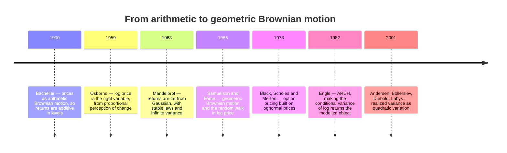
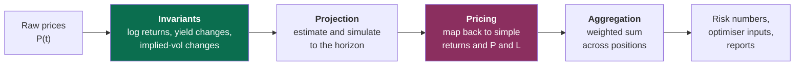
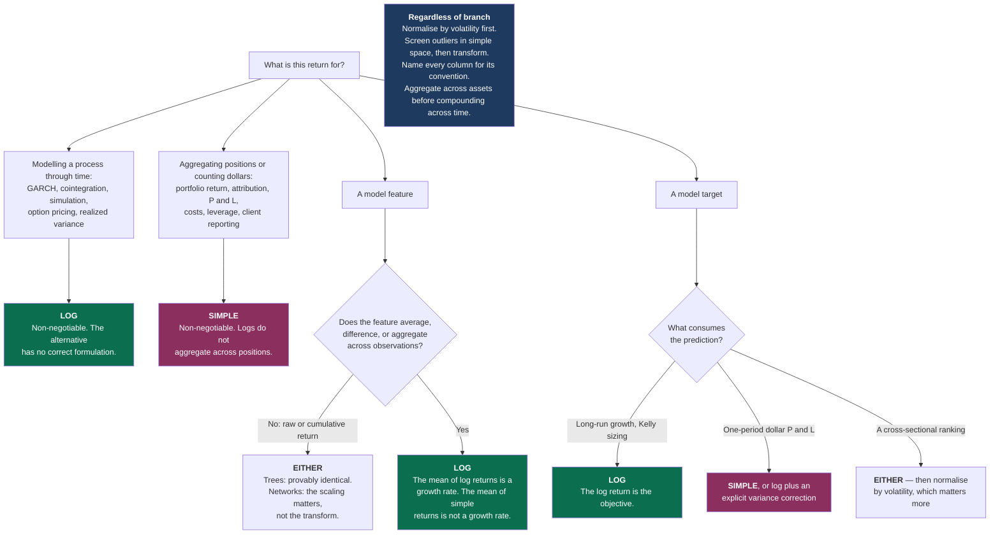

# Simple and Log Returns

### What changes when you take the logarithm, and when it matters

---

```{=html}
<aside class="eli5">
```

# ELI5 — the short version {#eli5}

```{=latex}
\begin{eli5}
```

**In one sentence.** The everyday percentage return and its logarithm describe the same gain, but each is exactly right for a different job: logarithms add up correctly over time, percentages add up correctly across a portfolio, and wherever the two disagree, the gap is about half the variance.

**1. Two labels for one fact** ([§1](#1-what-a-return-is-and-why-there-are-two-of-them)). A 5% gain multiplies money by 1.05. That gain can be written as 5%, or as its logarithm, about 0.0488. Neither number approximates the other, and neither carries more information. They are two scales for the same quantity, like Celsius and Fahrenheit.

**2. The one thing no measure can do** ([§2](#2-the-spine-additivity-or-linearity-never-both)). Log returns add up across *time*: the log returns of three days sum exactly to the three-day log return. Percentage returns add up across *positions*: a portfolio's percentage return is the weighted average of its holdings' returns. **No single measure does both.** This is a theorem, not a convention. Compounding produces a cross-term, the small extra gain earned on earlier gains, and plain addition cannot represent it. The direction of the sum settles the choice. Down a column of days, use logarithms. Across a row of positions, use percentages.

**3. Half the variance, again and again** ([§3](#3-the-identity-catalogue)). Averages are where the two measures part ways, and the gap is always about half the variance of the returns. The same small correction appears in many places that look unrelated: the drag that volatility puts on compound growth, the correction in continuous-time price models, the best size for a repeated bet, the bonus from rebalancing a portfolio, and the difference between two versions of the Sharpe ratio. Recognising it in each form is most of what fluency in this subject means.

**4. Equal and opposite is not a round trip** ([§5](#5-comparability-laterally-and-longitudinally), [§10](#10-building-intuition)). A rise of 10% followed by a fall of 10% leaves an investor down 1%. A fall of 50% needs a rise of 100% to recover. In logarithms, the same pairs of moves cancel exactly. The missing 1% is the half-variance term again. It also explains why a fund that promises three times an index's daily move trails three times the index's growth by about 12 percentage points a year, when the index swings about 20% a year. The shortfall is arithmetic, not fees.

**5. Where each one is compulsory** ([§7](#7-where-the-choice-is-forced)). Anything that models a price *through time* is written in logarithms: volatility models, option pricing, simulation, and measures of realized variance. For these, the percentage version has no correct formulation. Anything that *counts dollars* uses percentages: portfolio returns, attribution, profit and loss, costs, leverage, and client reporting. Logarithms do not add up across positions. A well-built system converts deliberately at the boundary instead of using one convention everywhere.

**6. Where it does not matter** ([§8](#8-where-it-does-not-matter-quantified), [§11](#11-returns-as-features-and-targets-for-gbt-and-dnn)). On daily stock data the two series have a correlation of 0.99996, and no statistic can tell them apart. For tree-based machine-learning models the two are *provably* identical, because a tree reads only the ordering of a feature, and the logarithm preserves order. The notable exception is the Sharpe ratio, the industry's standard score of return per unit of risk. Its two versions differ by about half the annual volatility: 0.1 for a long-only stock portfolio and 0.3 for a volatile one. A reported Sharpe ratio should say which version it is.

**7. What deserves the attention instead** ([§5](#5-comparability-laterally-and-longitudinally)). Dividing each return by an estimate of the asset's typical move size matters roughly a thousand times more than the choice of measure, and it works with either one. Across a realistic set of assets, the same 3% daily move ranges from half a typical move to thirty typical moves. The choice of measure changes the number by about 1.5%.

**8. How it goes wrong** ([§9](#9-failure-modes)). Logarithms need strictly positive prices, so spreads, interest rates, and profit-and-loss series have no log return at all. A common coding slip takes the logarithm of the return itself instead of one plus the return. The slip quietly turns a return into a sign indicator, and standard libraries absorb it without complaint. Converting a predicted log return back into a percentage gives a typical outcome, not an average one. The missing piece is larger for volatile assets, so it reshuffles a ranking instead of shifting it. Finally, when a backtest and live trading differ by about half the variance per period, the cause is a mismatch of conventions between systems, not trading costs.

---

**If you do only three things:** scale returns by their volatility before arguing about the measure; add up across positions in percentages and across time in logarithms, through exactly one conversion function; and expect the two measures to differ by about half the variance wherever an average is involved.

```{=latex}
\end{eli5}
```

```{=html}
</aside>
```

---


**How to read this document.** Sections 1–3 are the foundations: what a return is, the theorem that explains why two conventions exist and why no third can replace them, and a reference catalogue of the identities in daily use. Sections 4–6 are the statistical theory: distributions, comparability across assets and across time, and the time-series econometrics that make the log transform compulsory in some settings. Sections 7–10 are practice: where the choice is forced in each direction, where it provably does not matter, how it goes wrong, and how to build working intuition. Section 11 covers machine learning, with returns as features and targets for gradient-boosted trees and neural networks, and it stands alone for readers who need only that. Sections 12–14 cover conventions, references, and the synthesis. Appendix A defines the supporting concepts in dependency order, and Appendix B lists additional works cited.

For the short answer, read §2, the table in §3.6, and §14.

**Objectives.** After this chapter, you should be able to:

- explain why simple and log returns carry the same information, and why neither one approximates the other;
- state the impossibility theorem, which says that no return measure adds up both across time and across positions;
- recognise the half-variance gap $\sigma^2/2$ in its common forms, and estimate its size;
- choose the convention that each stage of a pipeline requires, and convert between conventions correctly;
- say when the choice cannot matter, including for tree-based models, and when it changes a result;
- diagnose the standard failures: domain errors, `log` in place of `log1p`, regressions in the wrong space, and retransformation bias.

**Epistemic tags.** The chapters in this collection flag claims by status:

- **[Fact]** — a mathematical identity, or a result replicated across independent datasets or implementations, with broad agreement.
- **[Contested]** — documented, but with live disagreement about magnitude, robustness, or cause.
- **[Hypothesis]** — a proposed mechanism, not decisively tested.
- **[Practice]** — practitioner convention; the evidence may be private or absent. A [Practice] claim is not a debunked one.

Tags appear only where the status changes what a reader should do. A tag governs the sentence or clause it opens.

**Notation.** The table lists every symbol that recurs in the chapter, with the section that defines or first uses it. Symbols used in a single derivation are defined where they appear.

| Symbol | Meaning | Defined in |
|---|---|---|
| $P_t$; $p_t = \ln P_t$ | Price of the asset at time $t$; log price | §1.3, §6.1 |
| $D_t$ | Cash distribution paid over $(t-1, t]$ | §1.3 |
| $G_t = 1 + R_t = e^{r_t}$ | **Gross return**, the primitive object | §1.1 |
| $R_t = (P_t + D_t)/P_{t-1} - 1$ | **Simple return** | §1.1 |
| $r_t = \ln(1 + R_t)$ | **Log return**; equal to $p_t - p_{t-1}$ when distributions are ignored, as in most formulas below | §1.1 |
| $R_{1:h}$; $r_{1:h}$ | Cumulative simple and log return over periods 1 to $h$ | §2.1 |
| $\mu = \mathbb{E}[R]$; $\sigma^2 = \operatorname{Var}(R)$ | Mean and variance of the **simple** return | §2.6 |
| $m = \mathbb{E}[r]$; $s^2 = \operatorname{Var}(r)$ | Mean and variance of the **log** return | §2.6 |
| $g$ | Geometric mean return, defined by $1 + g = \exp(\mathbb{E}[r])$ | §1.3, §3.4 |
| $\bar R$; $\bar r$ | Sample means of the simple and log returns | §1.3 |
| $W_t$ | Wealth at time $t$ | §1.1 |
| $A$ | Periods per year: 252 for daily bars, 12 for monthly | §2.3 |
| $h$ | A horizon, in periods | §2.1 |
| $N$; $i$; $w_i$ | Number of assets; asset index; portfolio weights, with $\sum_i w_i = 1$ | §2.1 |
| $R_p$; $r_p$ | Portfolio simple and log return | §2.1 |
| $\operatorname{Var}_w(R)$ | Weighted cross-sectional variance of returns across holdings | §2.3 |
| $\Sigma$; $\mathbf{w}$ | $N \times N$ covariance matrix of simple returns; vector of weights | §2.3 |
| $L$ | Leverage multiple | §3.2 |
| $\mathrm{SR}$ | Sharpe ratio | §7.1, §8.3 |
| $R_f$; $r_f$ | Simple and log risk-free rate | §1.3, §6.3 |
| $\mathcal{F}_t$ | Information set at time $t$ | §6.2 |
| $\hat\sigma_t$ | Estimate of per-period volatility formed from returns up to and including $r_t$; a contemporaneous return is normalised as $r_t/\hat\sigma_{t-1}$ | §5.4 |
| $\Phi$ | Standard normal CDF | §4.2 |
| $\phi$ | A generic smooth, strictly increasing transform; never the normal density | §2.5 |
| $\mathbb{1}\{\cdot\}$ | Indicator of the condition in braces | §11.2 |

A hat denotes an estimate and a bar a sample average. Bold denotes a cross-sectional vector over the $N$ assets. The typography of $\mu, \sigma$ versus $m, s$ keeps the moments of the two conventions distinct, because the gap between them is the subject of the chapter.

Four symbols carry a second meaning, each standard in its own literature and flagged where it occurs. $\sigma$ is a return volatility everywhere except §6.3, where it is the diffusion coefficient of a stochastic differential equation, and §4.6, where $\sigma(\cdot)$ denotes a generated $\sigma$-algebra. The first overload is harmless, because the two are the same object in the continuous-time limit. $W_t$ is wealth everywhere except §6.3 and §A.14, where it is a standard Brownian motion, and §6.3 writes the price as $S_t$. $g$ is the geometric mean *simple* return, while $g^\ast$ in §7.1 is the maximised expected *log* growth rate, so the two are different objects. $\lambda$ is the Box–Cox parameter in §1.4 and the GARCH persistence in §6.2.

Two departures from the collection's reserved letters are deliberate. Here $r$ is the log return, as in the econometrics of returns, and the risk-free rate is $r_f$. The price is $P_t$, because the lowercase $s$ is taken by the log-return volatility.

---

## Table of contents

- [ELI5 — the short version](#eli5)

**Part I — Foundations**

1. [What a return is, and why there are two of them](#1-what-a-return-is-and-why-there-are-two-of-them)
2. [The spine: additivity or linearity, never both](#2-the-spine-additivity-or-linearity-never-both)
3. [The identity catalogue](#3-the-identity-catalogue)

**Part II — Statistical theory**

4. [Distributional properties: what actually differs](#4-distributional-properties-what-actually-differs)
5. [Comparability, laterally and longitudinally](#5-comparability-laterally-and-longitudinally)
6. [The time-series econometrics of returns](#6-the-time-series-econometrics-of-returns)

**Part III — Practice**

7. [Where the choice is forced](#7-where-the-choice-is-forced)
8. [Where it does not matter, quantified](#8-where-it-does-not-matter-quantified)
9. [Failure modes](#9-failure-modes)
10. [Building intuition](#10-building-intuition)

**Part IV — Machine learning, convention, synthesis**

11. [Returns as features and targets for GBT and DNN](#11-returns-as-features-and-targets-for-gbt-and-dnn)
12. [Academic and practitioner conventions](#12-academic-and-practitioner-conventions)
13. [Foundational references](#13-foundational-references)
14. [Synthesis](#14-synthesis)

- [Appendix A: Concepts and prerequisites](#appendix-a-concepts-and-prerequisites)
- [Appendix B: Additional works cited](#appendix-b-additional-works-cited)

---

# Part I — Foundations

## 1. What a return is, and why there are two of them {#1-what-a-return-is-and-why-there-are-two-of-them}

### 1.1 The primitive is wealth, not return

Every return describes a change in a quantity of money. An investor holds $W_{t-1}$ dollars at the end of period $t-1$ and $W_t$ dollars at the end of period $t$. Each convention in this chapter is a way of describing the map $W_{t-1} \mapsto W_t$.

That map is a **multiplication**. Wealth does not gain a fixed number of dollars per period. It is scaled by a factor:

$$W_t = W_{t-1} \cdot G_t, \qquad G_t = \frac{W_t}{W_{t-1}} > 0$$

$G_t$ is the **gross return**, and it is the primitive object. The two conventions in this chapter are two coordinate systems for the same $G_t$:

$$\underbrace{R_t = G_t - 1}_{\text{simple return}} \qquad\qquad \underbrace{r_t = \ln G_t}_{\text{log return}}$$

Neither coordinate is more fundamental than the other. Each is an invertible function of $G_t$, so both carry exactly the same information. Much of the folklore around log returns assumes otherwise, which is why this point comes first. The conventions differ in which *algebraic operations* on the coordinate correspond to meaningful operations on wealth. §2 makes this precise.

**The map between them.** The two coordinates are related by a bijection from $(-1, \infty)$ onto $\mathbb{R}$:

$$r = \ln(1 + R) \qquad\Longleftrightarrow\qquad R = e^{r} - 1$$

The map is smooth, strictly increasing, and strictly concave, and each property has consequences. Because the map is strictly increasing, it preserves order, which §11.2 relies on. Because it is strictly concave, Jensen's inequality applies in one direction everywhere, and §3 catalogues the results. Because it is smooth, it has a Taylor expansion around zero:

$$r = R - \frac{R^2}{2} + \frac{R^3}{3} - \cdots$$

The series converges for $|R| < 1$. At the return magnitudes seen in practice, the quadratic term accounts for almost all of the gap between $r$ and $R$.

### 1.2 The wrong intuition, and why it costs money

Most readers arrive with the following mental model:

> *Log returns are an approximation to simple returns that is convenient because it makes them add up. The approximation is good for small returns and bad for large ones.*

Each clause of this model is wrong, and each error has consequences.

**Log returns are not an approximation.** The definition $r = \ln(1+R)$ is exact. The approximation is a separate claim, $r \approx R$, about a different pair of objects. Much of the confusion in this area comes from conflating the log return with the approximation $r \approx R$. The conflation suggests that the choice between conventions is a trade-off in precision. It is not. The choice is about which arithmetic operation should be exact.

**Log returns do not "make returns add up" as a convenience.** They make returns add up *across time*, and in exchange they stop adding up *across assets*. A theorem forces this exchange (§2). Simple returns have the complementary property. No third convention has both, and neither convention is the "right" one that the other approximates.

**Whether the difference matters depends on the next operation, not on the size of the return.** A decision tree that takes a single 40% move as a raw feature is unaffected by the choice (§11.2). A sequence of 0.5% moves that is compounded over ten years and then annualised is affected. Here the per-period gap $R_t - r_t \approx R_t^2/2$ is $1.25\times10^{-5}$, too small to notice on its own. The gap accumulates linearly in the number of periods, however, and over 2,520 trading days it reaches about 3 percentage points.

A better mental model:

> **Log returns are the natural coordinate for a process that evolves by multiplication. Simple returns are the natural coordinate for a quantity that is added up across positions. A financial data pipeline does both, at different stages. A practitioner therefore needs both conventions, and needs to know which one each number is in.**

### 1.3 Vocabulary and the things that share a name

Several distinct objects circulate under overlapping names, and the ambiguity is a common source of reconciliation errors between systems. The table gives each object one definition and lists its other names.

| Name | Definition | Also called |
|---|---|---|
| Gross return | $G_t = (P_t + D_t) / P_{t-1}$ | Wealth relative, price relative, growth factor |
| Simple return | $R_t = G_t - 1$ | Arithmetic return, linear return, discrete return, percentage return, holding-period return |
| Log return | $r_t = \ln G_t$ | Continuously compounded return, compounded return, geometric return†, logarithmic return |
| Cumulative simple return | $\prod_{i=1}^{h}(1+R_i) - 1$ | Total return over $h$, buy-and-hold return |
| Cumulative log return | $\sum_{i=1}^{h} r_i$ | — |
| Arithmetic mean return | $\bar R = \tfrac1h\sum_i R_i$ | Average return |
| Geometric mean return | $g = \left(\prod_i (1+R_i)\right)^{1/h} - 1$ | CAGR (annualised), time-weighted return |
| Excess return | $R_t - R_{f,t}$ | Risk premium (in expectation) |

† "Geometric return" is ambiguous in practice. Some authors mean the log return $r_t$, and others mean the geometric mean $g$. The two are related: $1 + g = \exp(\bar r)$ exactly, where $\bar r$ is the arithmetic mean of the log returns. They are still different objects, because $r_t$ is a per-period quantity and $g$ summarises a sample. This chapter does not use the term.

Two further distinctions cause more real-world damage than the choice between log and simple returns:

- **Price return versus total return.** The price return $P_t/P_{t-1} - 1$ ignores dividends, and the total return $(P_t + D_t)/P_{t-1} - 1$ includes them. For US equities at the index level, dividends are worth roughly 1.5–2% per year. That gap is larger than every second-order effect in this chapter, so it should be settled first, whichever convention is in use.
- **Adjusted versus unadjusted prices.** Data vendors apply split and dividend adjustments retroactively, so an adjusted "close" series depends on the date it was downloaded. A missed two-for-one split adjustment shows up as a $-50\%$ simple return, or a $-0.693$ log return. The error is visible in either convention and equally damaging in both (§9.6).

### 1.4 The one-parameter family that contains both

Simple and log returns are the two endpoints of a continuum. The continuum explains why no convention in between is worth using. The Box–Cox family ([Box & Cox, 1964](https://www.jstor.org/stable/2984418){target="_blank"}) applied to the gross return $G = 1+R$ is

$$
f_\lambda(R) \;=\;
\begin{cases}
\dfrac{(1+R)^{\lambda} - 1}{\lambda}, & \lambda \neq 0 \\[2ex]
\ln(1+R), & \lambda = 0
\end{cases}
$$

The $\lambda = 0$ case is the limit of the others: $\lim_{\lambda\to 0}\frac{(1+R)^\lambda - 1}{\lambda} = \ln(1+R)$. L'Hôpital's rule gives the limit, and so does the expansion $(1+R)^\lambda = e^{\lambda\ln(1+R)} = 1 + \lambda\ln(1+R) + O(\lambda^2)$. At the other end, $\lambda = 1$ gives $f_1(R) = R$, the simple return exactly.

The two conventions are therefore the members $\lambda \in \{0, 1\}$ of a smooth family. Intermediate values such as $\lambda = 0.4$ go unused, because the useful properties of the endpoints do not vary continuously with $\lambda$:

- Time additivity holds **only** at $\lambda = 0$.
- Portfolio linearity holds **only** at $\lambda = 1$.

An interior $\lambda$ has neither property. It buys only a better fit to some marginal distribution, and a standardisation or a rank transform (§11.3) gives that fit more cheaply and more interpretably. [Fact] The trade-off in §2 therefore has a corner solution. It is not a dial.

The Box–Cox framing is useful in one respect. It names what taking logs does: it applies a **variance-stabilising transform**. The name connects the log return to a large statistical literature on when such transforms help. §2.5 develops the argument, and §6.1 applies it.

### 1.5 Where the two conventions come from historically

The choice is old, and the field contested it for decades. The timeline marks the moments when the field's view changed.


```mermaid
timeline
    title From arithmetic to geometric Brownian motion
    1900 : Bachelier — prices as arithmetic Brownian motion, so returns are additive in levels
    1959 : Osborne — log price is the right variable, from proportional perception of change
    1963 : Mandelbrot — returns are far from Gaussian, with stable laws and infinite variance
    1965 : Samuelson and Fama — geometric Brownian motion and the random walk in log price
    1973 : Black, Scholes and Merton — option pricing built on lognormal prices
    1982 : Engle — ARCH, making the conditional variance of log returns the modelled object
    2001 : Andersen, Bollerslev, Diebold, Labys — realized variance as quadratic variation
```

Four lessons follow from this history.

**Bachelier's choice was not naive.** [Fact] A model of the price itself as a Brownian motion gives a tractable theory, and it fits well at short horizons on liquid instruments. Its fatal defect is that it assigns positive probability to negative prices, a defect Bachelier himself noted. The same defect reappears in §4.2 as the "$-100\%$ floor," the reason simple returns cannot be Gaussian.

**Osborne's argument was psychophysical, not mathematical.** [Hypothesis] Writing in *Operations Research* in 1959, Osborne argued that investors perceive equal *ratios* of price as equally significant. This is the Weber–Fechner law from perception research, and it makes $\ln P$ the natural variable. The argument is not a proof, and the modern justification is different (variance stabilisation, §6.1). It was nonetheless the reason the field moved.

**Mandelbrot's challenge was never fully resolved, and it still shapes practice.** [Contested] His 1963 finding that cotton price changes have far fatter tails than the Gaussian, possibly with infinite variance, is empirically robust in the tails. The open question is whether the variance is infinite, as in a stable-Paretian law, or merely large and time-varying, as ARCH models would later describe it. The question is still debated for high-frequency data, and the answer matters: infinite variance would break the $\sigma^2/2$ corrections on which this chapter is built. The modern consensus leans toward finite variance with a time-varying scale, and toward a tail index of about 3–5 for daily equity returns. With that tail index, enough moments exist for the corrections to be meaningful, but not enough for inference based on fourth moments to be trustworthy.

**The log convention won in continuous-time finance, but not in the cross-section.** Derivatives pricing, volatility modelling, and time-series econometrics work almost entirely in logs. Asset-pricing tests, portfolio construction, and performance reporting work almost entirely in simple returns. §12 argues that this split is correct, not sloppy.

> ### §1 Key takeaways
>
> 1. The primitive is the gross return $G_t = W_t/W_{t-1}$. Simple and log returns are two invertible coordinates for it, and they carry identical information.
> 2. The log return is an exact definition, not an approximation. The approximation is the separate claim $r \approx R$.
> 3. Whether the choice matters depends on the next operation (averaging, compounding, aggregating, or fitting), not on whether the returns are "large."
> 4. Simple and log returns are the $\lambda = 1$ and $\lambda = 0$ members of the Box–Cox family. No intermediate member is useful, because each desirable property holds only at one endpoint.
> 5. Total-versus-price returns and correct split adjustment are worth more basis points than the entire log-versus-simple question. Settle them first.
> 6. The historical shift from Bachelier to Osborne to Samuelson was driven by the negative-price defect of additive price models, not by a desire for additivity.

---

## 2. The spine: additivity or linearity, never both {#2-the-spine-additivity-or-linearity-never-both}

This section states the idea from which the rest of the chapter follows. Sections 3 through 14 are consequences of it, instances of it, or practical accommodations to it.

### 2.1 The two properties you want

Financial data is aggregated along two axes, and a return measure should behave well along both.

**Axis 1: time.** An investor holds one asset for $h$ periods. The wealth relative over the whole span is the product of the per-period wealth relatives:

$$\frac{W_h}{W_0} \;=\; \prod_{i=1}^{h} (1 + R_i)$$

The ideal return measure would make its $h$-period value the **sum** of its per-period values, because statistics is built on sums: means, variances, central limit theorems, linear regressions, and every horizon-scaling rule.

**Axis 2: assets.** An investor holds $N$ assets with weights $w_i$ at the start of the period. The portfolio's wealth relative is the weighted average of the constituents' wealth relatives:

$$1 + R_p \;=\; \sum_{i=1}^{N} w_i (1 + R_i) \qquad\Longrightarrow\qquad R_p \;=\; \sum_{i=1}^{N} w_i R_i$$

The implication uses $\sum_i w_i = 1$. Along this axis, the ideal return measure is **linear in the weights**. Linearity is what makes portfolio optimisation a quadratic program, what makes performance attribution add up, and what makes the left-hand side of a factor model well defined.

Call the first property **time additivity** and the second **portfolio linearity**. Each convention satisfies exactly one of them:

$$
\begin{aligned}
\text{Log returns:}&\qquad r_{1:h} = \textstyle\sum_{i=1}^{h} r_i \quad\text{(exact)}, \qquad r_p \neq \textstyle\sum_i w_i r_i \\
\text{Simple returns:}&\qquad R_{1:h} \neq \textstyle\sum_{i=1}^{h} R_i, \qquad\qquad\;\; R_p = \textstyle\sum_i w_i R_i \quad\text{(exact)}
\end{aligned}
$$

### 2.2 The impossibility theorem

A natural question is whether a cleverer transform could have both properties. None can, and the proof takes three lines.

> **Proposition.** Let $f : (-1, \infty) \to \mathbb{R}$ be continuous, and suppose both
>
> **(T)** $\;f\big((1+R_1)(1+R_2) - 1\big) = f(R_1) + f(R_2)$ for all $R_1, R_2 > -1$, and
>
> **(P)** $\;f\big(wR_1 + (1-w)R_2\big) = w\,f(R_1) + (1-w)\,f(R_2)$ for all $w \in [0,1]$, $R_1, R_2 > -1$.
>
> Then $f \equiv 0$.

**Proof.** Property (P) says that $f$ is affine on the interval. To see this, put $b = f(0)$ and take $R_2 = 0$ in (P). Then $f(wR) - b = w\big(f(R) - b\big)$ for every $w \in [0,1]$, so $(f(R)-b)/R$ is one constant on $R > 0$ and one constant on $R \in (-1,0)$. Choosing $R_1 > 0 > R_2$, and the $w$ that makes $wR_1 + (1-w)R_2 = 0$, forces the two constants to agree. Hence $f(R) = aR + b$. Setting $R_1 = R_2 = 0$ in (T) gives $f(0) = 2f(0)$, so $f(0) = 0$. Hence $b = 0$ and $f(R) = aR$. Substituting into (T) gives

$$a\big[(1+R_1)(1+R_2) - 1\big] = a\big(R_1 + R_2 + R_1R_2\big) \;\overset{!}{=}\; aR_1 + aR_2$$

which forces $a R_1 R_2 = 0$ for all $R_1, R_2$, hence $a = 0$. $\blacksquare$

The proof also works from the other end. Write property (T) in terms of the gross return $x = 1+R$, with $\tilde f(x) \equiv f(x-1)$. It becomes the multiplicative Cauchy equation $\tilde f(x_1 x_2) = \tilde f(x_1) + \tilde f(x_2)$ for all $x_1, x_2 > 0$, whose only continuous solutions are $\tilde f(x) = c \ln x$ ([Aczél, 1966](https://archive.org/details/lecturesonfuncti0000jacz){target="_blank"}). So (T) alone pins $f$ down to a scalar multiple of the log return. Property (P) then requires

$$c\,\ln\!\big(w x_1 + (1-w)x_2\big) \;=\; c\,\big(w \ln x_1 + (1-w)\ln x_2\big)$$

The **strict** concavity of $\ln$ makes $\ln\!\big(wx_1 + (1-w)x_2\big) > w\ln x_1 + (1-w)\ln x_2$ whenever $x_1 \neq x_2$ and $w \in (0,1)$. Multiplying a strict inequality by a nonzero $c$ keeps it strict, with the direction set by the sign of $c$. The equality can therefore hold only if $c = 0$.

**The obstruction is the cross-term.** Both proofs fail on the same object, the product $R_1 R_2$. Compounding is multiplication, and multiplication produces a cross-term that no linear function can represent. Simple returns are linear, so they cannot represent the cross-term, and that is why they fail to compound. Log returns turn multiplication into addition, so they absorb the cross-term, and that is why they fail to average across a portfolio.

The result fits in one sentence: **a transform cannot linearise multiplication and preserve addition at the same time.**

### 2.3 The size of the error from ignoring the theorem

The theorem says that one property must be given up. It does not say what giving it up costs, and the cost is the practical question. Both gaps have simple second-order expressions, and the two gaps turn out to be the same quantity seen from two sides.

**Cost of using log returns across a portfolio.** By the concavity of $\ln$ (Jensen's inequality),

$$r_p \;=\; \ln\Big(1 + \sum_i w_i R_i\Big) \;\ge\; \sum_i w_i \ln(1 + R_i) \;=\; \sum_i w_i r_i$$

So a naive average of log returns across a portfolio always *understates* the portfolio's log return. Jensen's inequality needs the weights to form a probability distribution, so this subsection assumes a long-only book, $w_i \ge 0$. With short positions, the gap can have either sign. Expanding both sides to second order, with $\bar R_w \equiv \sum_i w_i R_i$, gives

$$r_p - \sum_i w_i r_i \;\approx\; \tfrac12\Big(\underbrace{\textstyle\sum_i w_i R_i^2 - \bar R_w^2}_{\text{weighted cross-sectional variance}}\Big) \;=\; \tfrac12 \operatorname{Var}_w(R)$$

The error is half the *cross-sectional variance of returns across the holdings*. Take a diversified equity book whose daily cross-sectional return dispersion is 2%. The error is $\tfrac12 (0.02)^2 = 2\times10^{-4}$, or 2 basis points per day, which is about 5% per year.

The portfolio literature has a name for this quantity: the **diversification return**, or **rebalancing return** ([Booth & Fama, 1992](https://doi.org/10.2469/faj.v48.n3.26){target="_blank"}; [Willenbrock, 2011](https://arxiv.org/abs/1109.1256){target="_blank"}). In continuous time, for a portfolio rebalanced back to fixed weights $w$,

$$g_p - \sum_i w_i g_i \;=\; \tfrac12\Big(\sum_i w_i \sigma_i^2 - \sigma_p^2\Big) \;\ge\; 0$$

Here $g_p$ is the portfolio's geometric mean return, $g_i$ are the constituents' geometric mean returns, $\sigma_i^2$ are their variances, and $\sigma_p^2 = \mathbf{w}^\top \Sigma \mathbf{w}$ is the portfolio variance. [Fact] The "error" from mis-aggregating log returns is therefore exactly the diversification return. Two equally weighted, uncorrelated assets with 30% volatility each generate $\tfrac12(0.09 - 0.045) = 2.25\%$ per year of it.

**Cost of using simple returns across time.** Compare the compounded product of $h$ simple returns with their sum:

$$\prod_{i=1}^{h}(1+R_i) - 1 \;=\; \sum_i R_i \;+\; \underbrace{\sum_{i<j} R_i R_j}_{\text{first cross-term}} \;+\; \cdots$$

For $h$ uncorrelated returns with mean $\mu$, the leading discrepancy has expectation $\binom{h}{2}\mu^2 \approx \tfrac12 h^2\mu^2$. It grows **quadratically** in the horizon. This mechanism underlies the most common reporting error in the industry: quoting $A \cdot \bar R$ as an "annualised return." With a daily $\bar R = 0.0004$ and $A = 252$, $A\bar R = 10.08\%$, while $(1+\bar R)^{252} - 1 = 10.60\%$. The cross-terms are worth 52 bp, and the linear figure sits *below* the compounded one by that amount. Ignoring compounding therefore understates the return. $A\bar R$ is nonetheless the flattering number, because it also ignores a second and larger effect, volatility drag. §3.5 nets the two effects against each other.

### 2.4 Two exceptions

The theorem concerns exact properties for arbitrary inputs. Two special structures escape it, and both arise in practice.

**Continuous rebalancing makes log returns portfolio-linear in the limit.** Suppose continuous rebalancing holds the weights fixed. Over an infinitesimal interval, the portfolio's *instantaneous* log return then satisfies $dr_p = \sum_i w_i \, dr_i + \tfrac12(\sum_i w_i\sigma_i^2 - \sigma_p^2)\,dt$. The relation is linear up to a deterministic Itô correction, and that correction is the diversification return again. This is why continuous-time portfolio theory can work in logs throughout, while discrete-time portfolio construction cannot.

**Single-asset problems have no cross-section.** If $N = 1$, portfolio linearity is vacuous. Nothing then argues against log returns until the conversion to dollars, which still uses simple-return arithmetic (§7.2). A large share of practical work falls in this regime: volatility estimation, single-name signal research, and univariate time-series modelling. For that work, the debate does not arise.

### 2.5 The second job logs do, which has nothing to do with additivity

Additivity is the property usually cited for log returns. It is not the property that makes the log transform indispensable in econometrics. That property is **variance stabilisation**. It is a separate argument that happens to point the same way, so it gets its own subsection.

Suppose the price evolves multiplicatively, so that the conditional variance of the price *change* scales with the square of the price level:

$$\operatorname{Var}(P_t \mid P_{t-1}) \;=\; \sigma^2 P_{t-1}^2$$

This is not a convenience assumption. It follows from requiring that "a 1% move" mean the same thing at $P = 10$ and at $P = 1000$. The question is which transform $\phi(\cdot)$ makes the transformed series homoskedastic, and the delta method answers it. Expand about the conditional mean $\mathbb{E}[P_t \mid P_{t-1}]$, which equals $P_{t-1}$ up to one period of drift. Then $\operatorname{Var}\big(\phi(P_t) \mid P_{t-1}\big) \approx \phi'(P_{t-1})^2 \operatorname{Var}(P_t \mid P_{t-1}) = \phi'(P_{t-1})^2 \sigma^2 P_{t-1}^2$. For this variance to be free of $P_{t-1}$, the transform must satisfy

$$\phi'(P) \;\propto\; \frac{1}{P} \qquad\Longrightarrow\qquad \phi(P) = a\ln P + b$$

[Fact] **The logarithm is the unique variance-stabilising transform for a process whose volatility is proportional to its level.** It is unique up to the affine rescaling by $a$ and $b$, which changes nothing. This is why unit-root tests, cointegration, ARIMA, and GARCH are run on log prices rather than on prices, and the reason is independent of the additivity argument. Differencing raw prices instead would give a series whose variance grows with the price level. That unmodelled trend in the second moment would corrupt every standard error computed from the series.

This is also the accurate answer to the question of why econometricians prefer logs. The reason is not that returns add up. It is that the residuals become homoskedastic, so the asymptotic theory applies.

### 2.6 The third generative idea: one correction term in many forms

To leading order, the gap between the two conventions is always the same quantity. For any smooth $\phi$, the second-order delta method gives

$$\mathbb{E}[\phi(X)] \;\approx\; \phi(\mathbb{E}X) \;+\; \tfrac12\,\phi''(\mathbb{E}X)\operatorname{Var}(X)$$

Apply it with $\phi = \ln(1+\cdot)$, for which $\phi'' (x) = -(1+x)^{-2}$:

$$\boxed{\;m \;=\; \mathbb{E}[\ln(1+R)] \;\approx\; \ln(1+\mu) - \frac{\sigma^2}{2(1+\mu)^2} \;\approx\; \mu - \frac{\sigma^2}{2}\;}$$

The term $\sigma^2/2$ recurs more often than any other quantity in the analysis of returns. It appears in at least ten places that look unrelated but are all the same Taylor term. The table maps them. The sections listed derive each entry and define the symbols local to each row.

| Appearance | Statement | Where |
|---|---|---|
| Jensen gap | $m \approx \mu - \sigma^2/2$ | §3.3 |
| Volatility drag | $g \approx \mu - \sigma^2/2$ | §3.4 |
| Lognormal mean | $\mathbb{E}[e^r] = e^{m + s^2/2}$ | §4.1 |
| Itô drift | $d\ln S = (\mu - \tfrac12\sigma^2)\,dt + \sigma\,dW$ | §6.3 |
| Black–Scholes $d_2$ | $d_2 = \dfrac{\ln(S/K) + (r_f - \tfrac12\sigma^2)T}{\sigma\sqrt T}$ | §7.1 |
| Kelly growth rate | $g^{\ast} = \mu^2/(2\sigma^2) = \mathrm{SR}^2/2$ | §7.1 |
| Diversification return | $g_p - \sum_i w_i g_i = \tfrac12\big(\sum_i w_i\sigma_i^2 - \sigma_p^2\big)$ | §2.3 |
| Sharpe-ratio gap | $\mathrm{SR}_{\text{simple}} - \mathrm{SR}_{\text{log}} \approx \sigma_{\text{ann}}/2$ | §8.3 |
| CAPM alpha bias | $\alpha^{\log} \approx \alpha - \tfrac12(\sigma_i^2 - \beta\sigma_M^2)$ | §9.3 |
| Retransformation bias | $\mathbb{E}[R \mid x] = e^{\,\hat m(x) + \hat s^2(x)/2} - 1$ | §11.5 |

Each appearance of $\sigma^2/2$ has the same cause. An expectation passes through a concave function, and the curvature subtracts half the variance. Recognising the term on sight is the main skill this chapter builds.

> ### §2 Key takeaways
>
> 1. Log returns are additive across time but not across assets. Simple returns are linear across assets but not across time. This is a theorem, not a convention.
> 2. No transform achieves both properties. The obstruction is the cross-term $R_1R_2$, which multiplication produces and linearity cannot represent.
> 3. Averaging log returns across a portfolio understates the portfolio's log return by about half the cross-sectional variance of returns. That gap is exactly the diversification return, a real economic quantity.
> 4. Adding simple returns across time omits cross-terms that grow quadratically in the horizon. Reporting $A\bar R$ as an annualised return is the standard instance.
> 5. Logs do a second, independent job. They are the unique variance-stabilising transform for a process whose volatility scales with its level. This property, not additivity, is why time-series econometrics uses log prices.
> 6. One Taylor term, $\sigma^2/2$, generates volatility drag, the Itô correction, the Kelly growth rate, the Black–Scholes $d_2$, the diversification return, the Sharpe gap, and the retransformation bias. They are one fact in ten forms.

---

## 3. The identity catalogue {#3-the-identity-catalogue}

This section is reference material. It collects the relationships a practitioner needs, in one place and in consistent notation. Each relationship carries one of four labels: **exact** (holds for any returns), **exact under iid**, **exact under lognormality**, or **approximate**. Most errors in this area come from quoting an approximate result as if it were an identity, so the labels matter.

### 3.1 Conversion

The table lists the conversions between the two conventions, with the status of each.

| Direction | Formula | Status |
|---|---|---|
| Simple $\to$ log | $r = \ln(1+R)$ | exact |
| Log $\to$ simple | $R = e^{r} - 1$ | exact |
| Small-return expansion | $r = R - \tfrac{R^2}{2} + \tfrac{R^3}{3} - \cdots$ | exact for $\lvert R\rvert < 1$ |
| First-order | $r \approx R$ | approximate |
| Second-order | $r \approx R - \tfrac12 R^2$ | approximate |

The domains are fixed: $R \in (-1, \infty)$ and $r \in (-\infty, \infty)$. A simple return of exactly $-1$, a total loss, maps to $r = -\infty$. A price series that touches zero or goes negative has no log return at all (§9.1).

### 3.2 Aggregation

**Across time**, over $h$ consecutive periods:

$$
\begin{aligned}
r_{1:h} &= \sum_{i=1}^{h} r_i && \textbf{exact, no assumptions} \\
1 + R_{1:h} &= \prod_{i=1}^{h} (1 + R_i) && \textbf{exact, no assumptions} \\
R_{1:h} &= \sum_{i=1}^{h} R_i + \sum_{i<j} R_iR_j + \cdots && \textbf{exact expansion}
\end{aligned}
$$

The first line is the whole practical case for log returns, and it holds unconditionally. It needs no independence, no stationarity, and no distributional assumption, because it restates $\ln(ab) = \ln a + \ln b$.

**Across assets**, for a portfolio with start-of-period weights $w_i$ that sum to one:

$$
\begin{aligned}
R_p &= \sum_{i=1}^{N} w_i R_i && \textbf{exact, no assumptions} \\
r_p &= \ln\Big(1 + \sum_i w_i e^{r_i} - \sum_i w_i\Big) \;=\; \ln\Big(\sum_i w_i e^{r_i}\Big) && \textbf{exact, and not a sum} \\
r_p &\ge \sum_i w_i r_i, \qquad r_p - \sum_i w_i r_i \approx \tfrac12\operatorname{Var}_w(R) && \textbf{Jensen (long-only); approximate gap}
\end{aligned}
$$

The middle line deserves attention. The portfolio log return is the log of a weighted average of exponentials, a *log-sum-exp*. This object, a close relative of the softmax, appears whenever an average is taken in log space. It is smooth and convex in $\mathbf{r}$, and it is nothing like a weighted average of the $r_i$.

**Multiplicative chains.** Any decomposition of the form $1 + R = \prod_k (1 + R^{(k)})$ becomes exactly additive in logs. The table lists the common decompositions, together with two that do not chain.

| Decomposition | Simple form | Log form |
|---|---|---|
| Currency translation | $R^{\mathrm{USD}} = R^{\mathrm{loc}} + R^{\mathrm{fx}} + R^{\mathrm{loc}}R^{\mathrm{fx}}$ | $r^{\mathrm{USD}} = r^{\mathrm{loc}} + r^{\mathrm{fx}}$ |
| Real from nominal ($\pi$ the inflation rate) | $1+R^{\mathrm{real}} = \frac{1+R^{\mathrm{nom}}}{1+\pi}$ | $r^{\mathrm{real}} = r^{\mathrm{nom}} - \ln(1+\pi)$ |
| Proportional fee $c$ | $1+R^{\mathrm{net}} = (1+R^{\mathrm{gr}})(1-c)$ | $r^{\mathrm{net}} = r^{\mathrm{gr}} + \ln(1-c)$ |
| Total from price return | $R^{\mathrm{TR}} = R^{\mathrm{PR}} + D_t/P_{t-1}$ | not additive |
| Constant leverage $L$ | $R^{L} = L\,R$ | not additive |

The last two rows are the ones practitioners forget. **Dividends and leverage are additive in simple returns, not in logs.** A 3× daily-rebalanced ETF has a simple return of exactly $3R_t$ before costs, and a log return of $\ln(1 + 3R_t) \neq 3r_t$. For leveraged products, and for splitting a total return into price and income components, simple returns are exact and logs are the approximation. This is the clearest counterexample to the claim that logs are always better.

### 3.3 Moments

**Distribution-free (delta method, second order).** For any return distribution with mean $\mu$ and variance $\sigma^2$:

$$m \;\approx\; \ln(1+\mu) - \frac{\sigma^2}{2(1+\mu)^2}\;\approx\; \mu - \frac{\sigma^2}{2}, \qquad\qquad s^2 \;\approx\; \frac{\sigma^2}{(1+\mu)^2}\;\approx\;\sigma^2$$

The two relations differ in an important way. **The two conventions disagree about the mean at first order in the variance, and they agree about the variance to the same order.** This asymmetry explains why nearly every discrepancy in this chapter is a *level* discrepancy in a mean, not a scale discrepancy in a volatility. Volatility estimates barely depend on the convention. Return estimates depend on it a great deal.

**Exact, under lognormality** ($r \sim \mathcal{N}(m, s^2)$, so $1+R$ is lognormal):

$$
\begin{aligned}
\mu &= e^{m + s^2/2} - 1 & s^2 &= \ln\!\left(1 + \frac{\sigma^2}{(1+\mu)^2}\right) \\
\sigma^2 &= (1+\mu)^2\big(e^{s^2} - 1\big) & m &= \ln(1+\mu) - \tfrac12 s^2 \\
\operatorname{skew}(R) &= \big(e^{s^2}+2\big)\sqrt{e^{s^2}-1} & \operatorname{exkurt}(R) &= e^{4s^2} + 2e^{3s^2} + 3e^{2s^2} - 6
\end{aligned}
$$

The left column converts from log to simple, and the right column inverts it. Both directions are in constant use. The left column turns simulated log returns into economic quantities. The right column turns a historical mean and volatility in percentage terms into the parameters of a simulation.

The skewness formula carries a useful message. **A perfectly symmetric log-return distribution produces a right-skewed simple-return distribution, and the skew grows with the horizon.** The table shows the size of the effect for equity-like volatility.

| Horizon | $s$ | $\operatorname{skew}(R)$ | $\operatorname{exkurt}(R)$ |
|---|---|---|---|
| Daily | 0.0126 | 0.038 | 0.002 |
| Monthly | 0.058 | 0.174 | 0.054 |
| Annual | 0.20 | 0.614 | 0.678 |
| Annual, high-vol asset | 0.60 | 2.26 | 10.3 |

At daily frequency the induced skew is 0.04. It is invisible next to the *actual* skew of daily equity returns, which is 0.1–0.5 in size. At annual frequency the induced skew is 0.61, a substantial part of the observed right skew in long-horizon equity returns. [Fact] Some of the well-known positive skew in long-horizon returns is therefore not a property of markets. It comes from the Jacobian of the log transform.

### 3.4 Geometric versus arithmetic mean, and volatility drag

This identity has the largest practical consequences in the chapter, because it is where investors lose money.

**Distribution-free, in-sample.** For any sample of $h$ returns:

$$1 + g \;=\; \left(\prod_{i=1}^{h}(1+R_i)\right)^{1/h} \;=\; \exp\!\left(\frac1h\sum_{i=1}^{h} r_i\right) \;=\; \exp(\bar r)$$

By the arithmetic–geometric mean inequality, $g \le \bar R$ always, with equality if and only if every $R_i$ is identical. **The arithmetic mean of a return series is an upper bound on what the investor actually earned.** The bound is strict whenever returns vary at all.

**Second-order.** Expanding, with $\hat\sigma^2 = \tfrac1h\sum_i (R_i - \bar R)^2$ the in-sample variance:

$$g \;\approx\; \bar R - \tfrac12\hat\sigma^2$$

**Exact, under lognormality.** The relationship becomes an identity in log space:

$$\ln(1+\mu) - \ln(1+g) \;=\; \frac{s^2}{2}$$

Here $g$ is the **median** of the simple-return distribution, and $\mu$ is its mean. The gap between them comes entirely from the right skew of the lognormal.

The quantity $\mu - g \approx \sigma^2/2$ is called **volatility drag**, or *variance drain*. Its practical consequences are large and easy to miss, as the table shows.

| Asset | $\mu$ | $\sigma$ | Drag $\sigma^2/2$ | $g \approx$ |
|---|---|---|---|---|
| US large-cap equity | 10% | 20% | 2.0% | 8.0% |
| 2× levered equity | 20% | 40% | 8.0% | 12.0% |
| 3× levered equity | 30% | 60% | 18.0% | 12.0% |
| 4× levered equity | 40% | 80% | 32.0% | 8.0% |
| High-vol single name | 20% | 60% | 18.0% | 2.0% |

The leverage rows show the mechanism. Doubling leverage doubles the arithmetic mean and *quadruples* the drag. Compound growth is therefore a concave function of leverage: it rises, peaks, and then falls. The peak is at $L^{\ast} = \mu/\sigma^2$, the Kelly fraction, so the growth-optimal leverage follows from the same $\sigma^2/2$ term (§7.1). [Fact] For the 10%/20% asset, $L^\ast = 0.10/0.04 = 2.5$, and the table shows $g$ peaking between $2\times$ and $3\times$, as predicted.

The table is also the clearest argument that **volatility is a direct subtraction from compound return, not merely a measure of risk.** An investor who maximises the long-run growth rate of wealth cares about volatility even with no risk aversion at all, because volatility reduces growth. Simple-return arithmetic hides this fact, and log-return arithmetic shows it immediately.

### 3.5 Annualisation and horizon scaling

The table gives the horizon-scaling and annualisation rules in each convention.

| Quantity | Log returns | Simple returns |
|---|---|---|
| Mean, $h$ periods | $h\,m$ (exact under iid) | $(1+\mu)^h - 1$ (exact under iid) |
| Variance, $h$ periods | $h\,s^2$ (exact under iid) | $(\sigma^2 + (1+\mu)^2)^h - (1+\mu)^{2h}$ (exact under iid) |
| Volatility scaling | $s\sqrt{h}$ (exact under iid) | $\sigma\sqrt{h}$ (approximate) |
| Annualised mean | $A\,m$ | $(1+\mu)^A - 1$ |
| Annualised volatility | $s\sqrt{A}$ | $\approx\sigma\sqrt{A}$ |

Three points follow from the table. First, the square-root-of-time rule is an *exact* consequence of iid additivity for log returns, and only an approximation for simple returns. That exactness is why the rule is stated so confidently. Second, every rule in the table fails under autocorrelation, in either convention. The variance ratio $\operatorname{Var}(r_{1:h})/(h\,s^2)$ departs from 1 exactly when returns are serially correlated, and that departure is the subject of momentum and mean-reversion testing. Third, the common shortcut of annualising a mean simple return as $A\bar R$ errs in a flattering direction. For a daily $\bar R$ of 4 bp, $A\bar R = 10.1\%$, below the compounded $10.6\%$. The compounded figure, however, does not subtract volatility drag. The accurate annualised *growth* figure is $\exp(A\bar r)-1$, which is lower than both, so $A\bar R$ overstates growth.

```{=latex}
\newpage
```

### 3.6 The summary table

The table below is the most useful single reference in the chapter. It lists common operations and marks the convention in which each one is exact.

| Operation | Exact in simple returns | Exact in log returns |
|---|---|---|
| Compound over time | ✗ (product) | **✓** (sum) |
| Aggregate across assets in a portfolio | **✓** (weighted sum) | ✗ (log-sum-exp) |
| Scale variance by $\sqrt{h}$ (iid) | ✗ | **✓** |
| Apply a proportional fee | ✗ | **✓** |
| Convert currency | ✗ | **✓** |
| Deflate by inflation | ✗ | **✓** |
| Add dividend income to a price return | **✓** | ✗ |
| Apply constant per-period leverage $L$ | **✓** | ✗ |
| Compute dollar P&L on a position | **✓** | ✗ |
| Bounded below at $-100\%$ | **✓** | ✗ (unbounded below) |
| Can be exactly Gaussian | ✗ | **✓** |
| Intraday values sum to the period return | ✗ | **✓** |
| Order-preserving relative to the other | **✓** | **✓** |

The last row records that the two conventions are monotonically related, so any statement about *rankings* holds in both. §11.2 turns this fact into the central practical result for tree-based models.

> ### §3 Key takeaways
>
> 1. Time additivity of log returns and portfolio linearity of simple returns are unconditional identities. Every other entry in the catalogue carries a distributional assumption, and the assumption should be checked.
> 2. The two conventions disagree about means at order $\sigma^2$ and agree about variances to that order. Volatility estimates barely depend on the convention; return estimates do.
> 3. Under lognormality, $\mu = e^{m+s^2/2}-1$ and $g = e^m - 1$. The arithmetic mean is the mean of the simple-return distribution, and the geometric mean is its median.
> 4. Volatility drag $\mu - g \approx \sigma^2/2$ makes compound growth concave in leverage, with a peak at the Kelly fraction $\mu/\sigma^2$. A 4× levered position on a 10%/20% asset compounds no faster than the unlevered one.
> 5. The log transform itself manufactures some of the observed right skew in long-horizon simple returns. Symmetric annual log returns with $s = 0.20$ imply a skew of 0.61 in simple returns.
> 6. Dividends and leverage are additive in simple returns, not in logs. Leveraged products are the standard counterexample to the claim that logs are unconditionally better.

---

# Part II — Statistical theory

## 4. Distributional properties: what actually differs {#4-distributional-properties-what-actually-differs}

A common claim is that "log returns are normally distributed." As an empirical statement about daily data, the claim is false. As a statement about a *model*, it is true. The useful content of this section lies in the gap between those two readings.

### 4.1 The lognormal model and what it buys

Assume that log returns are iid Gaussian, $r_t \sim \mathcal{N}(m, s^2)$. Then

$$P_T \;=\; P_0\exp\Big(\sum_{t=1}^{T} r_t\Big) \quad\Longrightarrow\quad \ln P_T \sim \mathcal{N}\big(\ln P_0 + Tm,\; T s^2\big)$$

so the price is lognormal at every horizon. Three consequences follow, and together they explain why this model dominated finance for forty years:

1. **Prices stay positive.** $P_T = P_0 e^{X}$ with $X$ real is strictly positive by construction, which removes Bachelier's defect.
2. **The model is closed under time aggregation.** A sum of independent Gaussians is Gaussian. A model calibrated on daily data therefore makes an internally consistent statement about monthly data, with parameters $(Tm, Ts^2)$, and needs no refitting.
3. **Expectations of payoffs have closed forms.** $\mathbb{E}[e^{r}] = e^{m + s^2/2}$ is the moment generating function of the Gaussian evaluated at 1. Every Black–Scholes-type formula integrates a payoff against a lognormal density in the same way.

Point 2 is usually taken for granted, but it is the deepest of the three. §4.2 develops it.

### 4.2 Why simple returns cannot be Gaussian, and why it is not a technicality

There are two arguments. The first is weak, and the second is strong.

**The weak argument: support.** A limited-liability asset cannot lose more than everything, so $R \ge -1$ always. A Gaussian has support on all of $\mathbb{R}$, so it assigns positive probability to $R < -1$, that is, to negative prices. The amount of that probability depends only on how many standard deviations the $-1$ floor sits below the mean. Take a daily equity volatility of $\sigma \approx 1.27\%$ and a mean of zero. The floor is $1/0.0127 \approx 79$ standard deviations away, and the probability is $\Phi(-79) \approx 3\times 10^{-1358}$. That is negligible, which is why this argument alone persuades nobody. It becomes real at long horizons and high volatilities. For annual returns with $\sigma = 60\%$ and a zero mean, the floor is only $1/0.6 = 1.67$ standard deviations away, and $\Phi(-1.67) \approx 4.8\%$. A Gaussian model would then put nearly one chance in 20 on losing everything or more, for reasons of arithmetic rather than economics.

**The strong argument: closure under aggregation.** This argument is decisive. It is also the sharpest answer to the question of which statistical relationship holds for log returns but not for simple returns.

A distributional model is *consistent across horizons* when it says the same thing about daily and monthly data. Consistency constrains the law of the quantity that aggregates additively. Reading a daily law *up* to a monthly law needs that law's family to be closed under convolution. Reading a monthly law back *down* to a daily law needs the converse: the law must be expressible as a sum of $n$ iid pieces. Requiring both at every horizon is exactly **infinite divisibility**: for every $n$, some distribution must exist whose $n$-fold convolution is the horizon-$1$ law. The infinitely divisible laws are precisely the time-$1$ marginals of Lévy processes. They make up the entire menu of time-consistent models: Gaussian, Poisson, variance-gamma, normal-inverse-Gaussian, $\alpha$-stable, and their mixtures.

Log returns are the additive quantity. Any of these laws can be imposed on them, and the model then extends coherently to every horizon. Simple returns are *not* additive. Even if $R_1$ and $R_2$ were exactly Gaussian and independent, $R_{1:2} = R_1 + R_2 + R_1R_2$ would not be Gaussian, because the cross-term from §2.2 takes it out of the family.

The loose version of this claim is false, so the precise version matters. Every time-consistent model *can* be written in simple-return coordinates. Pushing an infinitely divisible law for $r$ through $R = e^{r}-1$ gives a family of simple-return laws that aggregates correctly to any horizon. Shifted-lognormal simple returns are the obvious example. What cannot be done is to **choose the family in simple-return coordinates**. [Fact] The simple-return families that survive aggregation are exactly the images under $R = e^{r}-1$ of the infinitely divisible ones, so the closure condition can only be *stated* in logs. None of the distributions a modeller would actually fit to a simple-return series (Gaussian, Student-$t$, skew-$t$, a mixture of normals) is among those images.

This theorem lies behind the practitioner rule of thumb. The point is not that log returns are more normal. The point is that **log returns are the only coordinate in which "the distribution at horizon $h$" is determined by "the distribution at horizon 1."**

### 4.3 What the data actually looks like

[Fact] The regularities in the table are the "stylized facts" of [Cont (2001)](http://www-stat.wharton.upenn.edu/~steele/Resources/FTSResources/StylizedFacts/Cont2001.pdf){target="_blank"}, the standard reference list, and each has been replicated across markets, asset classes, and decades. Any candidate model has to reproduce them. The right-hand column records whether the convention affects each one.

| Stylized fact | Statement | Convention-sensitive? |
|---|---|---|
| Heavy tails | Tail index roughly 3–5; far more mass beyond $\pm 4$ standard deviations than Gaussian | No, at daily frequency |
| No linear autocorrelation | $\rho_k(r)$ indistinguishable from zero beyond a few minutes for liquid assets | No |
| Volatility clustering | $\rho_k(\lvert r\rvert)$ positive and decaying slowly (hyperbolically) out to months | No |
| Aggregational Gaussianity | Distribution approaches Gaussian as the horizon grows | **Yes** — see below |
| Leverage effect | Returns negatively correlated with future volatility, asymmetrically | Slightly |
| Gain/loss asymmetry | Equity indices show negative skew; large drawdowns exceed large run-ups | **Yes** |
| Volume–volatility correlation | Trading volume correlates with all measures of volatility | No |

The right-hand column is the part that gets lost when this list is quoted. **At daily frequency, on liquid equities, switching conventions changes none of the first three facts qualitatively.** The sample excess kurtosis of daily S&P 500 returns typically lies between 5 and 25, depending on the sample window and on whether October 1987 is included. On a window without a crash, the simple-return and log-return figures agree to within about 1%. On a window that contains October 1987, the log figure is visibly larger, for the reason §4.5 gives: the transform stretches the single observation that dominates the fourth moment. Either way, the heavy tails are a property of markets, not an artefact that a transform can remove. A claim that log returns "fix" non-normality confuses the daily case with the annual case.

The convention does matter for the fourth row and for the two asymmetry rows below it.

### 4.4 Aggregational Gaussianity runs in opposite directions

This result is the clearest demonstration of the longitudinal advantage of log returns, so it is worth working through.

Suppose per-period log returns are iid with finite variance. The assumption is a real restriction (see the Mandelbrot caveat in §1.5), but the data support it at daily frequency for liquid assets. Then

$$\frac{r_{1:h} - hm}{s\sqrt{h}} \;=\; \frac{1}{s\sqrt h}\sum_{i=1}^{h} \big(r_i - m\big) \quad\xrightarrow[\;h\to\infty\;]{d}\quad \mathcal{N}(0,1) \qquad\text{by the central limit theorem}$$

The standardisation matters. The *shape* of $r_{1:h}$ becomes Gaussian, while its location and scale both grow with $h$. For iid summands, the skewness of $r_{1:h}$ decays like $h^{-1/2}$, and its excess kurtosis decays like $h^{-1}$. Log returns become *more* Gaussian under aggregation.

The corresponding simple return is $R_{1:h} = e^{r_{1:h}} - 1$, the exponential of an increasingly Gaussian variable. So $1 + R_{1:h}$ approaches a lognormal, and the shape of a lognormal moves the other way. If log returns are exactly iid Gaussian, the horizon-$h$ log variance is $hs^2$, and the formulae of §3.3 apply with $s^2$ replaced by $hs^2$:

$$\operatorname{skew}\big(R_{1:h}\big) = \big(e^{h s^2}+2\big)\sqrt{e^{h s^2}-1}, \qquad \operatorname{exkurt}\big(R_{1:h}\big) = e^{4hs^2} + 2e^{3hs^2} + 3e^{2hs^2} - 6$$

Both quantities grow without bound in $h$. As the horizon grows, the two conventions therefore diverge in opposite directions, as the chart shows.

```{=latex}
\newpage
```

```
  Excess kurtosis versus horizon, equity-like data (s = 1.26%/day)

  20 ┤        ▓
     │         ▓                ▓  log returns    (empirical, fat-tailed)
  15 ┤          ▓▓
     │            ▓             ░  simple returns (induced by the transform alone)
  10 ┤             ▓▓
     │               ▓▓▓
   5 ┤                  ▓▓▓▓                                        ░░
     │                      ▓▓▓▓▓▓▓▓▓▓▓▓▓▓                ░░░░░░░░░░
   0 ┤        ░░░░░░░░░░░░░░░░░░░░░░░░░░░░░░░░░░░░░░░░░░░░▓▓▓▓▓▓▓▓▓▓▓▓
     └──┬─────┬──────┬──────┬───────┬────────┬────────┬────────┬──
        1d    5d     21d    63d     126d     252d     504d     1260d
                            horizon

  Log returns:    empirical excess kurtosis falls toward 0 as the CLT bites.
  Simple returns: only the excess kurtosis the transform itself manufactures,
                  assuming Gaussian log returns; it rises from ~0 to about 0.7
                  at one year and about 4.3 at five, and keeps climbing.

  The two curves measure different things and their levels are not comparable:
  real simple returns at 1 day carry the same fat tails as the log curve plus
  the (negligible) induced amount. What the picture shows is which way each
  effect runs. Past about six months the log curve sits on the floor at this
  resolution and is hidden under the induced curve until that one lifts off.
```

The chart carries two lessons. **Longitudinally, log returns are decisively more comparable**, because a distributional statement made at one horizon transfers to another. **At short horizons, the question is moot**, because both series are non-Gaussian for reasons unrelated to the transform.

### 4.5 The tail asymmetry the transform introduces

Because $\ln(1+R)$ is concave, it compresses the right tail and stretches the left tail. The table shows that the magnitudes are larger than most readers expect.

| Event | $R$ | $r$ |
|---|---|---|
| Position doubles | $+100\%$ | $+0.693$ |
| Position up tenfold | $+900\%$ | $+2.303$ |
| Position halves | $-50\%$ | $-0.693$ |
| Position down 90% | $-90\%$ | $-2.303$ |
| Position down 99% | $-99\%$ | $-4.605$ |
| Position wiped out | $-100\%$ | $-\infty$ |

In simple-return coordinates the largest possible loss is 1 and the largest possible gain is unbounded. The *simple* return therefore has a bounded left tail and an unbounded right tail. In log coordinates both tails are unbounded, and a halving is the exact mirror of a doubling.

This asymmetry has a practical consequence that cuts against log returns, and §11.3 returns to it. [Practice] **For any method that squares its errors or assumes light tails, log returns can be the worse choice on crash-heavy data.** A $-90\%$ day is a $-2.3$ observation in log space and only a $-0.9$ observation in simple space. A Gaussian likelihood fitted in logs to a series that contains delistings, halts, or bankruptcies amplifies exactly the observations that will dominate the loss.

### 4.6 What does not differ: the information

There is a limit on how much the choice can matter at all, and it constrains every claim that follows.

The map $R \mapsto \ln(1+R)$ is a smooth bijection from $(-1,\infty)$ onto $\mathbb{R}$ with a smooth inverse, so it is a measurable isomorphism. The $\sigma$-algebras generated by the two series are therefore identical. Here $\sigma(\cdot)$ denotes the generated $\sigma$-algebra, not a volatility:

$$\sigma\big(R_1,\dots,R_n\big) \;=\; \sigma\big(r_1,\dots,r_n\big)$$

Anything measurable with respect to one series is measurable with respect to the other. Likelihood ratios agree as well. Take any two hypotheses $\mathcal{H}_0, \mathcal{H}_1$ about the data-generating process: the *same* two laws, each written in whichever coordinate is in use. By the change of variables, the density in $R$-coordinates equals the density in $r$-coordinates times the Jacobian $\prod_{i=1}^{n} (1+R_i)^{-1}$. That factor does not depend on the hypothesis, so it appears in the numerator and the denominator alike and cancels:

$$\frac{L_{\mathcal{H}_1}(r_1,\dots,r_n)}{L_{\mathcal{H}_0}(r_1,\dots,r_n)} \;=\; \frac{L_{\mathcal{H}_1}(R_1,\dots,R_n)}{L_{\mathcal{H}_0}(R_1,\dots,R_n)}$$

[Fact] **A likelihood ratio test has identical power in either coordinate system.** This settles whether log returns can support more powerful conclusions: the transform itself cannot make them more powerful. Neither series contains information absent from the other, and no test is intrinsically more powerful in one coordinate.

Differences in power do occur, but they enter through three channels, and the transform is none of them:

1. **Model specification.** "Gaussian" is a different hypothesis in each coordinate, and the log-coordinate version fits financial data better. The gain in power comes from the better hypothesis, not from the logarithm.
2. **Estimator bias.** A sample mean is not equivariant under a non-linear transform: $\overline{\ln(1+R)} \neq \ln(1+\bar R)$. If the estimand is a compound growth rate, computing it in the wrong coordinate biases it by $\sigma^2/2$ at any sample size. The error is an *inconsistency*, not noise.
3. **Aggregation exactness.** If a pipeline sums returns anywhere, the sum is exact in one coordinate and approximate in the other.

This filter applies to the rest of the chapter. Every claimed advantage of one convention should reduce to one of these three channels. A claimed advantage that does not is probably folklore.

> ### §4 Key takeaways
>
> 1. Log returns can be exactly Gaussian, and simple returns cannot. Simple returns are bounded below at $-100\%$, and the Gaussian family is not closed under their aggregation rule.
> 2. The decisive theorem is closure. A distributional model that is consistent across horizons requires infinite divisibility of the *additive* quantity, and log returns are the only additive coordinate. The simple-return families that do aggregate are exactly the images of the infinitely divisible ones under $R = e^r - 1$. The condition can only be stated in logs, and no family a modeller would naturally write down in simple-return coordinates satisfies it.
> 3. At daily frequency neither convention is close to Gaussian, and both show heavy tails and volatility clustering. The measured kurtosis differs only on samples that contain a crash, and then the log figure is the larger. Claims that logs "fix normality" confuse the daily case with the annual case.
> 4. As the horizon grows, log returns become more Gaussian, while simple returns become more lognormal and more skewed. This is the real longitudinal advantage of logs.
> 5. The log transform stretches the left tail and compresses the right tail: a $-90\%$ move is a $-2.3$ log observation. On crash-heavy data, this can make squared-error objectives *worse* behaved in logs.
> 6. The transform is a bijection, so it adds no information and no test power. Every real advantage reduces to better model specification, unbiased estimation of a compound quantity, or exact aggregation.

---

## 5. Comparability, laterally and longitudinally {#5-comparability-laterally-and-longitudinally}

The question "are log returns more comparable?" contains three separate questions, and they have three different answers. Separating them does most of the work. The table states each question and its answer.

| Sense of "comparable" | Question | Winner |
|---|---|---|
| **Scale invariance** | Does the number depend on the price level or position size? | Tie — both are scale-free |
| **Horizon invariance** | Does the number mean the same thing at 1 day and 1 year, and can it be converted exactly? | **Log**, decisively |
| **Distributional comparability** | Do the same numeric values in two series carry the same statistical meaning? | Neither — see §5.4 |

### 5.1 Scale invariance: a tie, and it is worth saying why

Both conventions are invariant to the price level and to position size. A move from \$3.00 to \$3.06 and a move from \$300 to \$306 are both $R = 2\%$ and both $r = 0.0198$. Scale invariance is sometimes offered as an argument for log returns. It is not one, because simple returns have it too: the property comes from dividing by $P_{t-1}$, which both conventions do.

One real complication remains. The two conventions are scale-free in the price, but they are **not** equally well behaved under *sign* changes, because the log is defined only for positive prices. Some quantities can cross zero: a calendar spread, a P&L series, a basis, or an interest rate in a negative-rate regime. For these, simple "returns" are meaningless, because the denominator can be near zero, and log returns are undefined. Neither convention applies, and the right tool is differences of levels, not returns (§9.1).

### 5.2 Longitudinal comparability: log returns win, on four separate counts

**Count 1: exact horizon conversion.** The identity $r_{1:h} = \sum_i r_i$ makes the $h$-period return the same kind of object as the one-period return, with $h$ times the mean and, under iid, $h$ times the variance. To put a one-day move and a 20-day move on the same axis, divide the 20-day log return by $\sqrt{20}$. The corresponding simple-return operation has no exact form.

**Count 2: distributional consistency.** By §4.2, a distributional family imposed on log returns extends coherently to every horizon, and one imposed on simple returns does not. A statement such as "this is a three-sigma move" therefore transfers between horizons in log coordinates but not in simple coordinates.

**Count 3: symmetry, which is a metric property.** In log coordinates, a move up and the move that exactly undoes it are negatives of each other. In simple coordinates they are not, as the table shows.

| Move | Up leg | Down leg that undoes it | Symmetric? |
|---|---|---|---|
| Simple | $100 \to 150$ is $+50\%$ | $150 \to 100$ is $-33.3\%$ | No |
| Log | $100 \to 150$ is $+0.4055$ | $150 \to 100$ is $-0.4055$ | Yes |

Stated precisely, $d(P_a, P_b) = \lvert \ln P_a - \ln P_b\rvert$ is a true metric on prices, and the log return is a signed distance in that metric. The distance is non-negative, zero only when $P_a = P_b$, and symmetric, and it adds up along a path that moves in one direction. Each property is inherited from $\lvert\cdot\rvert$ on $\mathbb{R}$, because $\ln$ is injective. The magnitude of the simple return has neither of the last two properties. First, it fails symmetry. A $+x$ move followed by a $-x$ move ends at $(1+x)(1-x) = 1 - x^2$, not at 1. So $+10\%$ then $-10\%$ gives $-1\%$, and $+50\%$ then $-50\%$ gives $-25\%$. The $-x^2$ is the same cross-term as before. Second, it fails to add along a path. The path $100 \to 200 \to 400$ is $+100\%$ and then $+100\%$, but $+300\%$ end to end. In logs it is $0.693 + 0.693 = 1.386$ exactly.

This is why oscillator-style features built from simple returns carry a small negative bias, and their log-return counterparts do not. It also explains a common error in retail arithmetic: the belief that a stock down 50% needs to rise 50% to recover. It needs $+100\%$, which is $+0.693$ in logs, the exact mirror of the $-0.693$ it lost.

**Count 4: regime comparability is unaffected, and that matters.** Neither convention makes a 2020 return comparable to a 1995 return. What breaks that comparison is the volatility regime, not the transform. Daily S&P 500 volatility ranged from roughly 0.35% in mid-2017 to roughly 5% in March 2020, a factor of 14. No choice of return convention changes that. §5.4 describes what does.

### 5.3 Lateral comparability: log returns do not win, with two exceptions

Are log returns more comparable across assets? **At short horizons they are not, and the usual argument for them is wrong.** Both conventions are already scale-free, so the naive argument that "logs put everything on the same scale" is confused: simple returns already do that.

The claim has real content in two places, and it fails in a third.

**Where it is true: long-horizon cross-sections.** The skewness table in §3.3 shows that the shape distortion the log transform removes depends on the horizon log volatility $s\sqrt{h}$. The distortion therefore grows with both the asset's volatility and the horizon. Consider a cross-section that contains a utility with 15% volatility and a crypto asset with 120% volatility. These are annualised log volatilities, so at $h$ = one year the two assets have $s\sqrt h = 0.15$ and $1.20$. The §3.3 formulae then give simple-return distributions with induced skewness of 0.46 and 11.2, before any real economic skew, and induced excess kurtosis of 0.37 and 515. A regression of annual simple returns on characteristics across this cross-section has residuals whose shape varies across observations by a factor of 24 in skewness and 1,400 in kurtosis. Least squares behaves badly in exactly that setting. In log coordinates the shapes are far closer. [Practice] **Recommendation: use log returns for long-horizon cross-sectional regressions.** The practice rests on the arithmetic above.

**Where it is true: exact multiplicative decompositions across a cross-section.** For a holder of foreign assets, the USD return of asset $i$ decomposes as

$$r_i^{\mathrm{USD}} \;=\; r_i^{\mathrm{loc}} \;+\; r^{\mathrm{fx}} \qquad\text{exactly, for every } i$$

so the currency effect is a *common additive constant* across the whole cross-section. In simple returns the decomposition is $R_i^{\mathrm{loc}} + R^{\mathrm{fx}} + R_i^{\mathrm{loc}}R^{\mathrm{fx}}$, with an interaction term that differs by asset. [Fact] For decomposing a global book into local and currency contributions, or for hedging a currency overlay, log coordinates make the decomposition exact and simple coordinates do not. The same structure applies to inflation, fees, and any chain of gross returns.

**Where it is false: leverage, income, and portfolio aggregation.** This repeats §3.2, because it is the standard over-correction. A leveraged product's return is exactly $L$ times the underlying's *simple* return. Dividends add to the *simple* price return. The portfolio's *simple* return is the weighted average of its constituents' simple returns. Moving any of these into logs replaces an identity with an approximation.

### 5.4 What actually makes returns comparable, and the numbers that settle it

The effects above are second-order. The first-order effect is volatility, and neither convention addresses it.

The table shows what a $+3\%$ daily move means across a realistic cross-section.

| Asset type | Typical daily $\hat\sigma$ | A $+3\%$ day, in $\hat\sigma$ units |
|---|---|---|
| Short-duration Treasury ETF | 0.10% | 30.0 |
| Utility sector ETF | 1.0% | 3.0 |
| S&P 500 index | 1.1% | 2.7 |
| Mega-cap technology single name | 2.0% | 1.5 |
| Bitcoin | 3.5% | 0.86 |
| Small-cap biotech | 5.0% | 0.60 |

The same number ranges in meaning from "unremarkable" to "off the historical record," a spread of a factor of **50** in $\hat\sigma$ units. Compare the effect of the convention on the same $+3\%$: $\ln(1.03) = 0.029559$, a difference of 4.4 basis points, or **1.5% of the value**.

> Volatility normalisation changes the meaning of a return by up to a factor of 50. The choice between log and simple returns changes its value by 1.5%. The former is roughly three orders of magnitude more important, and it is available in either convention.

This calibration is the most useful one in the chapter, and it should set how much attention the rest of the chapter deserves. Consider a choice between two options:

1. simple returns, volatility-normalised, or
2. log returns, raw.

Option 1 wins by a wide margin in almost every cross-sectional application. The best choice is log returns *and* volatility normalisation, but the normalisation does nearly all the work.

The standard forms are:

$$z_{i,t} \;=\; \frac{r_{i,t}}{\hat\sigma_{i,t-1}}, \qquad\qquad u_{i,t} \;=\; \frac{\operatorname{rank}_i\big(r_{i,t}\big) - \tfrac12}{N_t}, \qquad\qquad \tilde z_{i,t} \;=\; \Phi^{-1}\big(u_{i,t}\big)$$

The first is a time-series normalisation. It scales each asset by its own recent volatility, where $\hat\sigma$ is typically an EWMA or a rolling standard deviation over a 20–60 day window. The second is a cross-sectional rank transform. $\operatorname{rank}_i(\cdot)$ is asset $i$'s rank, from 1 to $N_t$, among the $N_t$ assets in the cross-section at time $t$. Subtracting $\tfrac12$ centres the resulting $u_{i,t}$ inside $(0,1)$, so the third expression, the Gaussianised rank, never reaches $\pm\infty$. The rank transform is scale-free and immune to outliers. It is also **identical in both conventions**, because ranks are invariant under any strictly increasing map. §11 relies on this property.

The property has a broad consequence. If a pipeline ranks returns cross-sectionally at any point, everything upstream of the rank is convention-free. Much quantitative equity research has this shape. That is one reason the log-versus-simple debate feels less urgent to cross-sectional equity practitioners than to derivatives or risk practitioners.

> ### §5 Key takeaways
>
> 1. "Comparable" splits into three senses: scale invariance (a tie), horizon invariance (log returns win decisively), and distributional comparability (neither convention wins; volatility normalisation does).
> 2. Longitudinally, log returns win on exact horizon conversion, distributional consistency across horizons, and symmetry. The log-price distance is a metric on prices; the magnitude of the simple return is not.
> 3. A $+x$ move followed by a $-x$ move loses $x^2$. This is the cross-term from §2.2, and it is the arithmetic behind "down 50% needs up 100%."
> 4. Laterally, log returns do *not* win at short horizons, because both conventions are already scale-free. They win at long horizons, where the induced skew of simple returns varies enormously across a heterogeneous cross-section.
> 5. The exact additive decomposition of currency, inflation, and fee effects across a whole cross-section is a real lateral advantage of logs.
> 6. The same $+3\%$ move ranges from 0.6 to 30 standard deviations across a realistic cross-section, while the convention moves the number by 1.5%. Normalise by volatility before arguing about the transform.
> 7. Any pipeline that ranks returns cross-sectionally is convention-free upstream of the rank.

---

## 6. The time-series econometrics of returns {#6-the-time-series-econometrics-of-returns}

In time-series econometrics the log transform stops being a convenience and becomes a requirement. Each subsection names a standard piece of machinery and states exactly what breaks when it receives simple returns.

### 6.1 Stationarity, unit roots, and the thing you should difference

The workhorse assumption of time-series econometrics is that the modelled series is covariance-stationary: its mean and variance are constant, and its autocovariances depend only on the lag. Prices are not stationary, and the question is what to do about it.

**Differencing the price does not work.** If the price evolves multiplicatively, $P_t = P_{t-1}e^{r_t}$, then

$$\Delta P_t \;=\; P_{t-1}\big(e^{r_t} - 1\big) \qquad\Longrightarrow\qquad \operatorname{Var}(\Delta P_t \mid P_{t-1}) \;=\; P_{t-1}^2\operatorname{Var}(e^{r_t})$$

The differenced price has a variance proportional to the square of the price level. In the 1980s the S&P 500 traded near 150, and today it trades near 6,000. A series of dollar changes over that period has a conditional variance 1,600 times larger at the end than at the start. That series is not stationary, and further differencing cannot fix it, because the problem is in the second moment, not the first.

**Differencing the log price does work**, for the reason developed in §2.5: $\ln$ is the variance-stabilising transform for a process whose volatility is proportional to its level. The canonical decomposition is therefore

$$p_t = \ln P_t \;\sim\; I(1), \qquad\qquad r_t = \Delta p_t \;\sim\; I(0)$$

Every unit-root and cointegration procedure (ADF, Phillips–Perron, KPSS, Johansen) is run on $p_t$, never on $P_t$. [Fact] An ADF test on raw prices is not merely poor style. The asymptotic distribution of its test statistic is derived under homoskedastic innovations, and heteroskedasticity proportional to the level invalidates the critical values.

**The cost of differencing, and fractional differencing as the compromise.** A full first difference achieves stationarity by erasing the series' memory of its own level. The return $r_t$ says nothing about where $p_t$ sits, and recovering the level would take an unbounded window of past returns. In forecasting, this loss is expensive. Level-dependent quantities carry signal that the differenced series no longer holds: the log price relative to a moving average, the distance from a 52-week high, or the level of a valuation ratio. The principled middle ground is fractional differencing ([Granger & Joyeux, 1980](https://doi.org/10.1111/j.1467-9892.1980.tb00297.x){target="_blank"}; [Hosking, 1981](https://doi.org/10.1093/biomet/68.1.165){target="_blank"}), which [López de Prado (2018)](https://www.wiley.com/en-us/Advances+in+Financial+Machine+Learning-p-9781119482086){target="_blank"} applied to finance:

$$\Delta^{d}p_t \;=\; \sum_{k=0}^{\infty} \binom{d}{k}(-1)^{k}\,p_{t-k}, \qquad 0 < d < 1$$

Here $\binom{d}{k} = \frac{d(d-1)\cdots(d-k+1)}{k!}$ is the generalised binomial coefficient, so the expansion is the formal series for $(1-L)^d$ in the lag operator. Written out, $\Delta^d p_t = p_t - d\,p_{t-1} - \tfrac{d(1-d)}{2}p_{t-2} - \cdots$. Because $d$ is not an integer, the series never terminates. Its weights decay hyperbolically, like $k^{-(1+d)}$, instead of stopping after one term as they do at $d = 1$. The slow decay is the retained memory. In practice the sum is truncated once the weights fall below a tolerance, and $d$ is set to the smallest value that passes an ADF test. The result is stationary but keeps long memory. Feature engineering raises a recurring question: should a feature be the price or the return? [Practice] The answer is some fractional difference of the log price, and $d = 1$ is rarely optimal. This practice has a solid theoretical basis and modest published evidence.

### 6.2 Volatility models

**GARCH.** The standard specification ([Engle, 1982](https://www.jstor.org/stable/1912773){target="_blank"}; [Bollerslev, 1986](<https://doi.org/10.1016/0304-4076(86)90063-1>){target="_blank"}) is written on log returns:

$$r_t = m + \varepsilon_t, \qquad \varepsilon_t = \sigma_t z_t, \quad z_t \sim \text{iid}(0,1), \qquad \sigma_t^2 = \omega + \alpha\varepsilon_{t-1}^2 + \beta\sigma_{t-1}^2$$

At daily frequency the model can be estimated on simple returns, and the parameter estimates agree to two or three decimal places. The reason for logs is not estimation but **aggregation of the forecast**. The multi-period variance forecast is

$$\operatorname{Var}_t\big(r_{t+1:t+h}\big) \;=\; \sum_{j=1}^{h}\mathbb{E}_t\big[\sigma_{t+j}^2\big]$$

The sum is exact because log returns are additive and $\varepsilon_t$ is a martingale difference, so the cross-covariances vanish. The corresponding sum in simple returns is wrong by the compounding cross-terms. In production, the purpose of a GARCH model is usually a horizon-$h$ risk number, so the difference matters.

The sum has a useful closed form. Let $\lambda = \alpha + \beta$ be the persistence and $\bar\sigma^2 = \omega/(1-\lambda)$ the long-run variance. Taking $\mathbb{E}_t$ through the recursion and using $\mathbb{E}_t[\varepsilon_{t+j-1}^2] = \mathbb{E}_t[\sigma_{t+j-1}^2]$ gives $\mathbb{E}_t[\sigma_{t+j}^2] = \omega + \lambda\,\mathbb{E}_t[\sigma_{t+j-1}^2]$. Iterating from the $\mathcal{F}_t$-measurable $\sigma_{t+1}^2$ gives

$$\mathbb{E}_t\big[\sigma_{t+j}^2\big] \;=\; \bar\sigma^2 + \lambda^{\,j-1}\big(\sigma_{t+1}^2 - \bar\sigma^2\big) \qquad\Longrightarrow\qquad \sum_{j=1}^{h}\mathbb{E}_t\big[\sigma_{t+j}^2\big] \;=\; h\bar\sigma^2 \;+\; \frac{1-\lambda^{h}}{1-\lambda}\big(\sigma_{t+1}^{2} - \bar\sigma^{2}\big)$$

The per-period forecast decays geometrically to $\bar\sigma^2$. The $h$-period forecast is $h$ periods of long-run variance plus a shock term that *saturates* at $(\sigma_{t+1}^2 - \bar\sigma^2)/(1-\lambda)$. Current conditions therefore shift the long-horizon variance forecast by a bounded amount, and they do not change its slope in $h$. For daily equity data, $\lambda$ is typically 0.94–0.99. The shock half-life $\ln 2 / \ln(1/\lambda)$ is then about 11 trading days at the low end and 69 at the high end, or two weeks to three months.

**EGARCH and the second logarithm.** [Nelson (1991)](https://www.jstor.org/stable/2938260){target="_blank"} models $\ln\sigma_t^2$ instead of $\sigma_t^2$. The motivation is the same as for prices. The variance is positive and evolves multiplicatively, so the log makes the parameter space unconstrained and the innovations closer to symmetric. Most logs in financial models have this explanation. On meeting one, the useful question is which positive, multiplicatively evolving quantity it transforms.

**Realized variance, where log returns are not optional.** Sum the squared intraday log returns over a day with $M$ intervals:

$$\mathrm{RV}_t \;=\; \sum_{j=1}^{M} r_{t,j}^2 \quad\xrightarrow[\;M\to\infty\;]{}\quad [\,p\,]_t \;=\; \int_{t-1}^{t}\sigma_u^2\,du$$

[Fact] This limit is the **quadratic variation of the log-price semimartingale**, and the convergence result (Andersen, Bollerslev, Diebold & Labys, 2001, 2003; [Barndorff-Nielsen & Shephard, 2002](https://ideas.repec.org/p/oxf/wpaper/71.html){target="_blank"}) is stated for the log price. The quadratic variation of the *price*, from summed squared dollar changes, has a different limit: $[\,P\,]_t = \int_{t-1}^{t}\sigma_u^2 P_u^2\,du$. That quantity is in squared dollars and scales with the price level. It is not a volatility, and it cannot be compared across assets or across time.

Squared *simple* returns are an intermediate case, and they deserve an exact treatment instead of being grouped with dollar changes. Since $R_{t,j} = r_{t,j} + O(r_{t,j}^2)$, the discrepancy $\sum_j (R_{t,j}^2 - r_{t,j}^2) = \sum_j r_{t,j}^3 + \cdots$ is third order and vanishes as $M\to\infty$. Summed squared simple returns therefore converge to the same integrated variance. At five-minute sampling on liquid equities, the two estimators agree to about five decimal places. The case for logs here is definitional, not numerical.

The definitional case is the first non-negotiable one in this chapter: **integrated variance is, by definition, the quadratic variation of the log price.** No simple-return object has it as its quadratic variation. The nearest candidate, $[\,P\,]_t$, is a different quantity. The whole asymptotic theory (the consistency result, the mixed-normal limit law, and the jump-robust and noise-robust refinements) is written for $p$. Working in logs keeps an analysis inside that theory.

A third logarithm appears here as well. Andersen, Bollerslev, Diebold, and Labys (ABDL) found that $\ln \mathrm{RV}_t$ is approximately Gaussian, and much better behaved for modelling than $\mathrm{RV}_t$, which is heavily right-skewed. Volatility forecasting models, HAR and its descendants, are therefore usually fitted to log realized variance.

### 6.3 Continuous time: Itô, and where the $\sigma^2/2$ comes from

Geometric Brownian motion states that the *instantaneous simple return* is a diffusion with constant coefficients:

$$\frac{dS_t}{S_t} \;=\; \mu\,dt \;+\; \sigma\,dW_t$$

Here $W_t$ is a standard Brownian motion; this is the one place in the chapter where $W$ is not wealth. $\sigma$ is the diffusion coefficient, not a per-period return volatility, which is the deliberate overload flagged in the notation block. Applying Itô's lemma to $f(S) = \ln S$, with $f' = 1/S$ and $f'' = -1/S^2$, gives

$$d\ln S_t \;=\; \frac{1}{S_t}dS_t \;-\; \frac{1}{2}\frac{1}{S_t^2}\,d\langle S\rangle_t \;=\; \Big(\mu - \frac{\sigma^2}{2}\Big)dt \;+\; \sigma\,dW_t$$

using $d\langle S\rangle_t = \sigma^2S_t^2\,dt$. Over $[0,T]$, therefore,

$$\ln \frac{S_T}{S_0} \;\sim\; \mathcal{N}\Big(\big(\mu - \tfrac{\sigma^2}{2}\big)T,\;\; \sigma^2 T\Big)$$

This result is the cleanest statement of the chapter's central theme. **In continuous time, the expected simple return per unit time is $\mu$, and the expected log return per unit time is $\mu - \sigma^2/2$. The relation is exact, not approximate.** The discrete-time $\sigma^2/2$ corrections in §3 are approximate versions of this identity. The Itô correction term *is* volatility drag, written in different notation.

Two further consequences follow:

- **Quadratic variation is level-free in logs.** $d\langle \ln S\rangle_t = \sigma^2\,dt$ is a constant, while $d\langle S\rangle_t = \sigma^2 S_t^2\,dt$ grows with the price. This is the variance stabilisation of §2.5, restated in continuous time.
- **The risk-neutral drift of the log price is $r_f - \sigma^2/2$, not $r_f$.** Under the pricing measure $\mathbb{Q}$ the discounted price is a martingale, so $\mathbb{E}^{\mathbb{Q}}[S_T] = S_0e^{r_fT}$. This is a statement about the *simple* return. The identity $\mathbb{E}[e^X] = e^{\mathbb{E}X + \operatorname{Var}(X)/2}$, applied to $X = \ln S_T$ with $\operatorname{Var}^{\mathbb{Q}}(X) = \sigma^2 T$, translates it to the log price: $\mathbb{E}^{\mathbb{Q}}[\ln S_T] = \ln S_0 + (r_f - \tfrac12\sigma^2)T$. Setting the log drift to $r_f$ in a Monte Carlo simulation is the most common derivatives-pricing bug. [Fact] Its size is exact. With $\ln S_T \sim \mathcal{N}(\ln S_0 + r_fT,\,\sigma^2T)$, the simulation gives $\mathbb{E}^{\mathbb{Q}}[S_T] = S_0e^{r_fT}\cdot e^{\sigma^2T/2}$. The simulated forward is too high by a factor of exactly $e^{\sigma^2T/2}$, which is 2% for a one-year contract at 20% volatility, and every call price computed from it inherits an upward bias.

### 6.4 Cointegration: a ratio hypothesis versus a spread hypothesis

Two integrated series are **cointegrated** if some linear combination of them is stationary ([Engle & Granger, 1987](https://www.jstor.org/stable/1913236){target="_blank"}). For a pair of assets, the choice of coordinate changes the economic hypothesis under test, a point that is not widely appreciated. The table sets out the two hypotheses.

| Coordinate | Stationary object | Economic claim | Corresponding position |
|---|---|---|---|
| Log prices | $\ln P_A - \beta \ln P_B$ | The *ratio* $P_A/P_B^{\beta}$ mean-reverts | Constant dollar ratio $\beta$, continuously rebalanced |
| Levels | $P_A - \beta P_B$ | The dollar *spread* mean-reverts | Fixed share ratio, never rebalanced |

Neither hypothesis implies the other, and the right one depends on how the pair will be traded. If the hedge is "hold $\beta$ shares of B for each share of A and never adjust," the level formulation matches it. If the hedge is "keep the dollar exposure ratio at $\beta$," the log formulation matches it. Most statistical-arbitrage implementations rebalance, so they should test the log relationship. [Contested] Much published pairs-trading work tests the level relationship and then trades the rebalanced version, which is a specification error, not a stylistic one. Practitioners disagree about how much the error matters empirically.

The log formulation has two further advantages, and both are decisive in practice. First, it survives a change of currency, and the level formulation does not. Quoting both legs in a new currency multiplies both prices by the same *time-varying* rate $X_t$. In logs at $\beta = 1$, the two $\ln X_t$ terms cancel, and $\ln P_A - \ln P_B$ is the same series in any currency. Away from $\beta = 1$ a term $(1-\beta)\ln X_t$ survives, so the relation has to be re-specified. In levels the spread becomes $X_t\big(P_A - \beta P_B\big)$, a stationary spread multiplied by a unit-root process. That product is not stationary for any choice of $\beta$, so re-estimation does not rescue it. A constant change of *units*, such as pence to pounds or a share split, is harmless in both coordinates; the damage comes from the stochastic rate. Second, the cointegrating relationships that hold up in economics are proportional relationships: purchasing power parity, money demand, the consumption–wealth ratio, and the term structure. Proportional relationships are linear in logs and non-linear in levels, which is why applied macroeconometrics works almost entirely in logs.

### 6.5 The log-linear present-value identity

The return identity

$$1 + R_{t+1} \;=\; \frac{P_{t+1} + D_{t+1}}{P_t}$$

is exact but of little use for analysis. It is non-linear, so it cannot be iterated forward into a statement about long-run expectations. [Campbell & Shiller (1988)](https://pages.stern.nyu.edu/~dbackus/GE_asset_pricing/CampbellShiller%20RFS%2088.PDF){target="_blank"} resolved this by log-linearising around the mean log dividend–price ratio. With lowercase letters for logs, a first-order expansion gives

$$r_{t+1} \;\approx\; \kappa + \rho\,p_{t+1} + (1-\rho)\,d_{t+1} - p_t, \qquad \rho \;=\; \frac{1}{1 + \exp\big(\overline{d - p}\big)}$$

Here $\overline{d-p}$ is the sample mean of the log dividend–price ratio, so $\exp(\overline{d-p})$ is the average dividend yield, and $\rho = 1/(1 + \text{yield})$ is a discount factor slightly below one. $\kappa$ is the constant the expansion leaves behind. For US equities with an average dividend yield near 4%, $\rho = 1/1.04 \approx 0.96$ at annual frequency. Because the approximation is *linear*, it can be iterated forward and solved. The result is the identity that organises the return-predictability literature:

$$d_t - p_t \;\approx\; \text{const} \;+\; \mathbb{E}_t\sum_{j=0}^{\infty}\rho^{\,j}\Big(r_{t+1+j} \;-\; \Delta d_{t+1+j}\Big)$$

**A high dividend yield must forecast either high future returns or low future dividend growth. No third possibility exists.** The statement is not a model. It is an accounting identity, log-linearised, plus a transversality condition that rules out a bubble term $\lim_{j\to\infty}\rho^{\,j}(d_{t+j}-p_{t+j})$. Nothing in it is estimated, so the question of whether the dividend yield is a valid predictor has a different character from other predictor questions. [Campbell (1991)](https://www.jstor.org/stable/2233809){target="_blank"} extends the same machinery to decompose realised return variance into cash-flow news and discount-rate news.

None of this exists in simple returns. The log-linearisation is what makes the present-value relation iterable, and it has no simple-return counterpart. This is the second non-negotiable case.

### 6.6 Long-horizon predictive regressions

The standard predictability regression is

$$r_{t+1:t+h} \;=\; a \;+\; b\,x_t \;+\; \varepsilon_{t+1:t+h}$$

with $r_{t+1:t+h} = \sum_{j=1}^{h}r_{t+j}$, and $x_t$ a predictor such as the dividend yield or a valuation ratio. The left-hand side is a *sum*. That is the only reason the standard inference machinery applies: the Hansen–Hodrick and Newey–West corrections for the MA($h-1$) error structure that overlapping observations create. If a compounded simple return replaces the sum, the autocovariance structure of the error is no longer the tractable moving average that the corrections assume.

The variance ratio ([Lo & MacKinlay, 1988](https://doi.org/10.1093/rfs/1.1.41){target="_blank"}) rests on the same additivity:

$$\mathrm{VR}(q) \;=\; \frac{\operatorname{Var}\big(r_{t+1:t+q}\big)}{q\,\operatorname{Var}(r_{t+1})} \;=\; 1 + 2\sum_{k=1}^{q-1}\Big(1 - \frac{k}{q}\Big)\rho_k$$

Here $\rho_k$ is the lag-$k$ autocorrelation of the one-period log return, and $\gamma_k$ below is the lag-$k$ autocovariance. The second equality *is* the additivity of log returns combined with the definition of autocovariance. The variance of a sum of $q$ terms expands to $q\gamma_0 + 2\sum_{k=1}^{q-1}(q-k)\gamma_k$, and dividing by $q\gamma_0$ produces the triangular Bartlett weights $1 - k/q$. No simple-return variance ratio exists, because $\operatorname{Var}(R_{t+1:t+q})$ is the variance of a product and has no expansion in the $\rho_k$ alone.

Two cautions apply to anyone running these regressions, although neither concerns the convention. Overlapping observations inflate apparent $t$-statistics severely. A persistent predictor whose innovations correlate with the return innovation produces the Stambaugh bias in $\hat b$. Long-horizon predictability results have a poor replication record, and the log transform does not improve it.

> ### §6 Key takeaways
>
> 1. Difference the log price, never the price. The differenced price has a variance that scales with the level, which invalidates every unit-root critical value.
> 2. Full differencing has a cost: it erases the series' memory of its own level. Fractional differencing with the smallest $d$ that achieves stationarity is the principled compromise, and $d=1$ is rarely optimal for forecasting.
> 3. GARCH parameter estimates barely depend on the convention. *Aggregating* a GARCH forecast to horizon $h$ requires additivity, and therefore log returns.
> 4. Realized variance is, by definition, the quadratic variation of the log price, and the asymptotic theory is written for $p$. Summed squared simple returns happen to converge to the same limit. Summed squared dollar changes converge to a level-dependent quantity that is not a volatility. The case for logs here is definitional and not negotiable.
> 5. The Itô correction $-\sigma^2/2$ in $d\ln S$ *is* volatility drag. In continuous time, the drifts of the two conventions differ by exactly $\sigma^2/2$.
> 6. Cointegration in logs tests a ratio hypothesis and corresponds to a rebalanced position. Cointegration in levels tests a spread hypothesis and corresponds to a fixed-share position. Test the hypothesis that matches the intended trade.
> 7. The Campbell–Shiller decomposition, and with it the present-value approach to return predictability, exists only in logs. So does the variance ratio.

---

# Part III — Practice

## 7. Where the choice is forced {#7-where-the-choice-is-forced}

The two tables in this section are the practical payoff of Parts I and II. Each row names an application, states the convention it requires, and says what breaks under the other convention.

### 7.1 Applications that require log returns

The first table lists the applications that require log returns.

| Application | Why | Breaks how |
|---|---|---|
| Continuous-time models (SDEs, diffusions) | Itô calculus is applied to $\ln S$; the drift is $\mu - \sigma^2/2$ | Nothing in simple-return space has both constant SDE coefficients and positive prices: additive innovations in $P$ go negative, and $dS = \mu S\,dt + \sigma S\,dW$ has state-dependent ones |
| Option pricing | Every formula is a function of $\ln(S/K)$ and $\sigma\sqrt{T}$ | Setting the log drift to $r_f$ mis-prices by a factor $e^{\sigma^2T/2}$ in the forward |
| Realized variance | $\sum_j r_j^2$ estimates the quadratic variation of $\ln P$ | Squared *price changes* converge to $\int\sigma_u^2P_u^2\,du$, a level-dependent quantity; and intraday simple returns do not sum to the day's return, so $\sum_j R_j^2$ estimates the variability of nothing that aggregates |
| Cointegration, VECM | Economic equilibria are proportional relationships | A level cointegration test asks a different question and is not currency-invariant |
| Campbell–Shiller decomposition | Log-linearisation is what makes the present-value relation iterable | No simple-return counterpart exists |
| Long-horizon predictive regressions | The LHS must be an additive sum for the standard error corrections to apply | Overlapping-return error structure is no longer MA($h-1$) |
| Variance ratios | $\mathrm{VR}(q)$ expands in the autocorrelations only because returns add | No expansion exists in simple returns |
| Multi-horizon price simulation | Additive Gaussian innovations in $\ln P$ keep prices positive | Additive innovations in $P$ produce negative prices |
| Growth-optimal (Kelly) sizing | The objective is $\mathbb{E}[\ln W_T]$, which is additive over periods | The multi-period problem stops being separable |
| Long-horizon VaR / stress | Losses map back through $e^{r}-1 > -1$ | A Gaussian simple-return model assigns mass to losses beyond $-100\%$ |
| Currency, inflation and fee decomposition | Chains of gross returns are additive in logs | Interaction terms appear per asset and do not aggregate |
| Term-structure work | Continuously compounded yields make forward rates additive: $y_{0,T}T = \sum_k f_k\Delta_k$, for forward rates $f_k$ over sub-intervals of length $\Delta_k$ | Discretely compounded forwards chain multiplicatively: the yield is built from a product of $(1+f_k)^{\Delta_k}$, not a sum |

**The Kelly case deserves expansion.** Here the log appears for a reason that is neither the convenience of additivity nor variance stabilisation.

An investor who maximises expected terminal log wealth over $T$ periods faces the problem

$$\max\;\mathbb{E}\big[\ln W_T\big] \;=\; \ln W_0 \;+\; \sum_{t=1}^{T}\mathbb{E}\big[\ln(1 + f_t R_t)\big]$$

where $f_t$ is the fraction of wealth at risk. Because the log turns the product into a sum, the multi-period problem **decomposes into $T$ independent one-period problems**. The optimal $f_t$ depends only on the current period's return distribution. The investor is *myopic*, and no dynamic programming is needed. This separability is specific to log utility. It is the structural reason that the growth-optimal literature is written in logs, not a stylistic preference.

For a small edge, the solution is

$$f^{\ast} \;\approx\; \frac{\mu}{\sigma^2}, \qquad\qquad g^{\ast} \;=\; \frac{\mu^2}{2\sigma^2} \;=\; \frac{\mathrm{SR}^2}{2}$$

where $\mu$ and $\sigma$ are the moments of the *excess* return, so that $\mathrm{SR} = \mu/\sigma$. Both results come from the expansion $\mathbb{E}[\ln(1+fR)] \approx f\mu - \tfrac12f^2\sigma^2$. This is a downward parabola in $f$, with its peak at $f^\ast = \mu/\sigma^2$ and a height of $g^\ast = \mu^2/(2\sigma^2)$.

The second formula deserves to be better known. **A strategy with an annual Sharpe ratio of 1.0, run at full Kelly, compounds at 50% per year in excess of the risk-free rate.** The 50% is a log growth rate, so it corresponds to a wealth multiple of $e^{0.5} = 1.65\times$ a year. The number surprises most readers, and it should be paired at once with the leverage it requires. For $\mu = 10\%$ and $\sigma = 10\%$, the same Sharpe-1.0 strategy, $f^\ast = 0.10/0.01 = 10\times$. Full Kelly is not a practical prescription. It is the *upper* end of a trade-off between growth and drawdown, and its drawdowns are severe: under full Kelly, the probability of halving wealth at some point is 50%. [Practice] Practitioners run fractional Kelly, typically a quarter to a half. Growth is quadratic near the peak, so half-Kelly keeps 75% of $g^\ast$ while cutting the variance substantially.

**The contested part.** [Contested] [Kelly (1956)](https://www.princeton.edu/~wbialek/rome/refs/kelly_56.pdf){target="_blank"} and [Latané (1959)](https://www.jstor.org/stable/1826282){target="_blank"} proposed maximising expected log wealth as a general criterion. Their argument was that a log-optimal strategy almost surely outgrows any other strategy in the long run. Samuelson attacked the proposal repeatedly, most memorably in a 1979 note written in words of one syllable, except the last. His ground was that "almost surely ends up richer" does not imply "preferred," because expected utility is not determined by the limiting probability of dominance. [Merton & Samuelson (1974)](<https://doi.org/10.1016/0304-405X(74)90009-9>){target="_blank"} formalised the objection. [Markowitz (1976)](https://doi.org/10.1111/j.1540-6261.1976.tb03213.x){target="_blank"} defended the criterion's practical relevance, and Thorp has made the applied case for decades.

The view taken here is that Samuelson is right on the mathematics, and the Kelly camp is right about practice. Maximising $\mathbb{E}[\ln W]$ is optimal if and only if utility is logarithmic, and no theorem makes log utility mandatory. As an *engineering* heuristic, however, fractional Kelly is hard to beat for sizing a repeated bet over a long horizon when ruin is unacceptable, and its failure modes are well understood. **Recommendation: use Kelly as a ceiling on leverage, not as a target.**

### 7.2 Applications that require simple returns

The second table lists the applications that require simple returns.

| Application | Why | Breaks how |
|---|---|---|
| Portfolio construction / mean-variance | The objective $\mathbf{w}^\top\boldsymbol\mu - \tfrac{\gamma}{2}\mathbf{w}^\top\Sigma\mathbf{w}$, with $\gamma$ the risk-aversion coefficient, is linear and quadratic in simple returns | The log-return objective is $\ln\big(\sum_i w_ie^{r_i}\big)$, a log-sum-exp; the problem stops being a QP |
| Factor models, CAPM, Fama–MacBeth | The dependent variable is a portfolio return, which must aggregate linearly | Intercepts pick up a $-\tfrac12(\sigma_i^2 - \beta_i\sigma_M^2)$ bias that grows with idiosyncratic volatility (§9.3) |
| Performance attribution | Contributions must sum to the total | Log contributions do not sum to the log total; the residual is the diversification return |
| Index construction | An index is a portfolio | Same as portfolio construction |
| Dollar P&L, position sizing, margin | P&L is $\text{notional} \times R$ | P&L is not $\text{notional}\times r$ |
| Transaction costs | Costs are proportional to notional traded, i.e. linear in prices | A log-space cost is not a dollar cost |
| Leveraged / inverse products | The product's return is exactly $L\,R$ per period | $\ln(1+LR) \neq L\ln(1+R)$ |
| Total-return construction | $R^{\mathrm{TR}} = R^{\mathrm{PR}} + D_t/P_{t-1}$ is additive in simple returns | Income and price components do not add in logs |
| Client and regulatory reporting | Convention and, in many jurisdictions, requirement | Reported figures will not reconcile to account statements |

The unifying principle is short. **Anything that adds up across positions, and anything denominated in dollars, uses simple returns.** Anything that compounds through time, or that is modelled as a stochastic process, uses log returns.

### 7.3 The two-space discipline

Well-built quantitative systems do not pick one convention. They state explicitly which space each stage works in. [Meucci (2010)](https://papers.ssrn.com/sol3/papers.cfm?abstract_id=1586656){target="_blank"} frames this as a three-step pipeline: find the invariants, project them to the horizon, and map back to simple returns for pricing and aggregation. The pipeline is the most useful organising idea for production code. The diagram shows its stages.


```mermaid
flowchart LR
    A["Raw prices<br/>P(t)"] --> B["<b>Invariants</b><br/>log returns, yield changes,<br/>implied-vol changes"]
    B --> C["<b>Projection</b><br/>estimate and simulate<br/>to the horizon"]
    C --> D["<b>Pricing</b><br/>map back to simple<br/>returns and P and L"]
    D --> E["<b>Aggregation</b><br/>weighted sum<br/>across positions"]
    E --> F["Risk numbers,<br/>optimiser inputs,<br/>reports"]
    style B fill:#0b6e4f,color:#fff
    style D fill:#8b2f5f,color:#fff
```

The **invariants** stage matters most. The quantity to model is the transformation of the raw data that is closest to independent and identically distributed across time, which Meucci calls the **invariant**. For equity prices the invariant is the log return. For interest rates it is the *yield change*, not the log return of the yield, because rates mean-revert and can be negative. For options it is the change in implied volatility, or in log implied volatility. For credit it is the change in log spread.

[Practice] The general rule is therefore not "use log returns." It is **"find the invariant for the instrument, model it, and map back to simple returns before aggregating or reporting."** The log return is the answer for equity-like instruments, which is why it dominates the discussion, but the principle is what generalises.

Bugs cluster at the two boundary crossings. On the way into invariant space, check the domain: no zero or negative prices. On the way out, remember that $\mathbb{E}[e^{r}] \neq e^{\mathbb{E}[r]}$. This is the retransformation problem. §11.5 treats it in detail, because it is the most damaging error in machine-learning pipelines.

> ### §7 Key takeaways
>
> 1. Log returns are required wherever a continuous-time model, a quadratic variation, an iterated present-value identity, or an additive multi-period sum appears. For the present-value identity and the additive sum, the alternative has no formulation at all. For the others, it exists but sits outside the theory that supplies the estimators, standard errors, and bias corrections.
> 2. Simple returns are required wherever positions are aggregated or dollars are counted. Portfolio optimisation, attribution, P&L, costs, leverage, and reporting are all simple-return domains.
> 3. Log utility makes the multi-period portfolio problem separable into independent one-period problems. That structural fact, not convenience, is why growth-optimal theory works in logs.
> 4. $g^\ast = \mathrm{SR}^2/2$: a Sharpe-1.0 strategy at full Kelly compounds at 50% a year, and needs roughly 10× leverage to do it. Run a fraction of Kelly. Half-Kelly keeps 75% of the growth at a quarter of the variance.
> 5. Whether "maximise expected log wealth" is a normative criterion is contested. Samuelson's mathematical objection is correct, and fractional Kelly remains an excellent engineering heuristic. The two claims are distinct.
> 6. Build systems around three explicit stages (invariants, projection, pricing), and convert deliberately at the boundaries instead of picking one convention globally.
> 7. The general rule is "model the invariant," not "use logs." For equities the invariant is the log return; for rates it is the yield change; for options it is the change in implied volatility.

---

## 8. Where it does not matter, quantified {#8-where-it-does-not-matter-quantified}

A catalogue of differences alone would make a reader over-cautious. Most of the time, on most data, in most pipelines, the choice has no visible effect. This section states precisely when that is the case, so that attention can go to the questions that matter.

### 8.1 The divergence, tabulated

The table compares each simple return with its log return and gives the error of the approximation $r \approx R$.

| $R$ | $r = \ln(1+R)$ | $r - R$ | Relative error $\lvert r-R\rvert/\lvert R\rvert$ |
|---|---|---|---|
| $+0.1\%$ | $+0.0009995$ | $-0.005$ bp | 0.05% |
| $+1\%$ | $+0.009950$ | $-0.50$ bp | 0.50% |
| $+3\%$ | $+0.029559$ | $-4.4$ bp | 1.5% |
| $+5\%$ | $+0.048790$ | $-12$ bp | 2.4% |
| $+10\%$ | $+0.095310$ | $-47$ bp | 4.7% |
| $+20\%$ | $+0.182322$ | $-1.77$ pp | 8.8% |
| $+50\%$ | $+0.405465$ | $-9.45$ pp | 18.9% |
| $+100\%$ | $+0.693147$ | $-30.7$ pp | 30.7% |
| $-1\%$ | $-0.010050$ | $-0.50$ bp | 0.50% |
| $-10\%$ | $-0.105361$ | $-54$ bp | 5.4% |
| $-50\%$ | $-0.693147$ | $-19.3$ pp | 38.6% |
| $-90\%$ | $-2.302585$ | $-140$ pp | 156% |

The rule to memorise: **the relative error of the approximation $r \approx R$ is about $\lvert R\rvert/2$.** A 1% return is approximated to within half a percent of itself, and a 10% return to within 5%. A 50% return would be approximated to within 25%, but the true figure, 19%, is smaller, because the cubic term pushes back.

### 8.2 The correlation between the two series

For a return series with volatility $\sigma$ and an approximately symmetric distribution, the correlation between the simple and log versions is

$$\operatorname{Corr}(R, r) \;\approx\; \frac{1}{\sqrt{1 + \sigma^2/2}} \;\approx\; 1 - \frac{\sigma^2}{4}$$

*Derivation.* Write $r \approx R - \tfrac12R^2$, and take $R$ symmetric about zero with variance $\sigma^2$, and Gaussian where the fourth moment is needed. Then $\operatorname{Cov}(R, r) = \sigma^2 - \tfrac12\mathbb{E}[R^3] = \sigma^2$ by symmetry. Also $\operatorname{Var}(r) = \sigma^2 + \tfrac14\operatorname{Var}(R^2) - \operatorname{Cov}(R, R^2) = \sigma^2(1 + \sigma^2/2)$, since the cross-term vanishes by the same symmetry and $\operatorname{Var}(R^2) = 2\sigma^4$ for a Gaussian. Dividing gives $\sigma^2\big/\sqrt{\sigma^2\cdot\sigma^2(1+\sigma^2/2)}$.

The table evaluates the correlation at typical volatilities.

| Frequency | Typical $\sigma$ | $\operatorname{Corr}(R, r)$ |
|---|---|---|
| Daily equity | 1.3% | 0.999958 |
| Monthly equity | 5.8% | 0.99916 |
| Annual equity | 20% | 0.990 |
| Daily crypto | 3.5% | 0.99969 |
| Annual, 60%-vol asset | 60% | 0.921 |

At daily frequency the correlation between the two series is 1 to five significant figures. **Any statistic that is a smooth function of the series agrees across conventions to a precision far below the sampling error of any achievable sample.** This covers an autocorrelation, a beta, an information coefficient, and a signal's rank correlation with forward returns. For scale, an information coefficient estimated on a decade of daily cross-sections has a standard error in the *second* decimal place. The convention moves it in the fifth decimal place, three orders of magnitude below the noise in the estimate. A rank-based statistic moves by exactly zero (§11.6).

### 8.3 The one daily-frequency statistic that does differ: the Sharpe ratio

The Sharpe ratio is an important exception. It catches practitioners out because it differs at daily frequency, where every other statistic agrees.

The annualised Sharpe ratio computed on simple returns exceeds the one computed on log returns by

$$\mathrm{SR}_{\text{simple}} - \mathrm{SR}_{\text{log}} \;\approx\; \frac{(\mu - m)\sqrt{A}}{\sigma} \;=\; \frac{(\sigma^2/2)\sqrt{A}}{\sigma} \;=\; \frac{\sigma\sqrt{A}}{2} \;=\; \frac{\sigma_{\text{ann}}}{2}$$

[Fact] **Switching from simple to log returns lowers the reported Sharpe ratio by half the annualised volatility.** The whole mechanism is in the numerator. The denominators agree to order $\sigma^2$ (§3.3), while the means differ by $\sigma^2/2$, and annualisation multiplies that difference by $\sqrt{A}/\sigma$. The table gives the size of the gap.

| Strategy annualised volatility | Sharpe difference |
|---|---|
| 5% (market-neutral, low gross) | 0.025 |
| 10% (typical hedge-fund target) | 0.05 |
| 20% (long-only equity) | 0.10 |
| 60% (levered or crypto) | 0.30 |
| 100% | 0.50 |

For a 60%-volatility strategy, the gap is a third of a Sharpe unit, enough to separate a fundable track record from an unfundable one. This is the clearest case in the chapter of a *reporting* statistic whose convention must be stated: the two numbers differ materially, and both computations are defensible.

The question is which one to report. The log-return Sharpe is the more conservative and the more meaningful, because its numerator is the compound growth rate an investor actually experiences. The industry convention, however, is simple returns, and an unlabelled log Sharpe makes a manager look worse than peers for no reason. [Practice] **Recommendation: report the simple-return Sharpe, state the convention, and remember that compound growth is $\sigma^2/2$ lower than the arithmetic mean suggests.**

### 8.4 The decision rule

The results of this section combine into a rule that can be applied mechanically:

```
  Does the choice of return convention matter here?

  ┌─ Anything compounded or summed across periods?  ───────── YES ──┐
  │                                                                 │
  ├─ Anything aggregated across assets, or in dollars?  ───── YES ──┤
  │                                                                 │
  ├─ A return used as a regression or ML *target*?  ───────── YES ──┤
  │                                                                 ├── MATTERS
  ├─ A distributional assumption (normality, GARCH, VaR)?  ── YES ──┤
  │                                                                 │
  ├─ A performance statistic being reported?  ─────────────── YES ──┤
  │                                                                 │
  ├─ Horizon ≥ 1 month, or per-period volatility ≥ 5%?  ───── YES ──┘
  │
  └─ Otherwise: single-period, single-asset, raw feature,
     daily bars  ────────────────────────────────────────────  NO ───── DOES NOT
                                                                        MATTER
                                                   (the two series correlate at
                                                    0.99996 — see §8.2)
```

The last line covers a large share of day-to-day signal research on daily equity bars. That is why experienced practitioners often dismiss this question. The dismissal is wrong as soon as the work moves into any of the six branches above.

> ### §8 Key takeaways
>
> 1. The relative error of $r \approx R$ is about $\lvert R\rvert/2$. At 1% it is half a percent; at 50% it is a fifth.
> 2. $\operatorname{Corr}(R, r) \approx 1 - \sigma^2/4$. For daily equity data the correlation is 0.99996, so the two series are indistinguishable for any smooth statistic at any achievable sample size.
> 3. The Sharpe ratio is the exception at daily frequency: $\mathrm{SR}_{\text{simple}} - \mathrm{SR}_{\text{log}} \approx \sigma_{\text{ann}}/2$, which is 0.10 for a long-only equity book and 0.30 for a 60%-volatility one.
> 4. Report the simple-return Sharpe because it is the convention, state the convention, and remember that the compound figure is lower.
> 5. Six triggers make the choice matter: compounding, cross-sectional aggregation, use as a target, distributional assumptions, performance reporting, and horizons past a month or volatilities past 5% per period. Outside them, the choice can be ignored.

---

## 9. Failure modes {#9-failure-modes}

Each entry below is a failure that occurs in production systems. Each gives the mechanism, the symptom a practitioner would observe, and the fix.

### 9.1 The domain error: zero, negative, and sign-crossing quantities

**Mechanism.** $\ln(x)$ requires $x > 0$. The log return $\ln(1 + R)$ therefore requires $R > -1$, that is, a strictly positive price. Several financial quantities routinely violate this requirement, as the table shows.

| Quantity | Why it breaks |
|---|---|
| Futures on a physically-settled commodity | WTI settled at $-\$37.63$ on 20 April 2020 |
| Calendar and inter-commodity spreads | Cross zero by construction |
| Interest rates in a negative-rate regime | EUR, JPY, CHF policy rates were negative for years |
| P&L series and account equity for a levered book | Can go to zero or below |
| Basis, carry, and any difference of two prices | Sign-crossing is the normal state |
| Delisted equity, bankruptcy | $R = -1$ exactly, so $r = -\infty$ |

**Symptom.** `RuntimeWarning: invalid value encountered in log`, followed by `NaN` values that propagate silently through every downstream rolling window. A worse case gives no warning at all: the library returns `-inf`, which poisons a rolling mean for the length of the window and produces a plausible-looking but wrong feature.

**Fix.** For sign-crossing quantities, do not use returns at all. Model the *difference* of the level, and normalise it by a volatility estimate of that difference, not by the level. For delistings, use the exchange's delisting return where available (CRSP provides one), and otherwise cap the log return at a finite floor. A $-100\%$ simple return should become something like $\ln(0.01) = -4.6$, not $-\infty$. Record whatever floor is chosen, because it will show up in the tail statistics.

### 9.2 `log` where you meant `log1p`

**Mechanism.** `np.log(R)` is applied to a *return* series instead of a gross-return series. Roughly half of all returns are negative, so roughly half the output is `NaN`.

**Symptom.** This is the most common code-level bug in the area, and it is hard to spot because gradient-boosting libraries accept `NaN` natively and treat it as a learnable branch. The model trains and produces reasonable-looking metrics. It has silently turned the return feature into a *sign indicator*, because every negative return became the same value. Even the feature importance looks plausible.

**Fix.** Use `np.log1p(R)` for returns and `np.log(P).diff()` for prices. Assert on feature matrices as well. A return-derived column whose fraction of `NaN` matches the fraction of negative returns is the giveaway.

The inverse error is applying `log1p` to a quantity already in log space. It is quieter and worse, because it produces no `NaN` at all. It applies $\ln(1+r)\approx r - r^2/2$ to an already-logged quantity, a small distortion that never announces itself. Column names should make this error impossible. If the repository convention is `ret(1,close)` for simple returns and `log1p(ret(1,close))` for log returns, the name carries the state, and a double application is visible in the column name.

### 9.3 Regressions run in the wrong space

**Mechanism.** The CAPM and every factor model are specified on simple excess returns, because the left-hand side must be a portfolio return that aggregates linearly. If the same regression is run on log excess returns, the intercept absorbs a Jensen term:

$$\alpha^{\log} \;\approx\; \alpha \;-\; \tfrac12\big(\sigma_i^2 - \beta_i\sigma_M^2\big) \;=\; \alpha \;-\; \tfrac12\Big(\underbrace{\beta_i(\beta_i-1)\sigma_M^2}_{\text{small unless } \beta \text{ extreme}} \;+\; \underbrace{\sigma_{\varepsilon,i}^2}_{\text{idiosyncratic variance}}\Big)$$

*Derivation.* Take expectations through $m \approx \mu - \sigma^2/2$ (§3.3) for both the asset and the market. Note that $r_f \approx R_f$, because the risk-free rate has no variance, and collect terms. The second equality uses $\sigma_i^2 = \beta_i^2\sigma_M^2 + \sigma_{\varepsilon,i}^2$, which turns $\sigma_i^2 - \beta_i\sigma_M^2$ into $\beta_i(\beta_i-1)\sigma_M^2 + \sigma_{\varepsilon,i}^2$.

**Symptom.** For $\beta = 1$ the bias is $-\tfrac12\sigma_\varepsilon^2$, a mechanical negative alpha proportional to idiosyncratic variance. A stock with 50% annualised idiosyncratic volatility picks up $-12.5\%$ per year of spurious alpha, and one with 15% picks up $-1.1\%$. [Fact] **The arithmetic alone manufactures a low-volatility anomaly of roughly 11 percentage points a year.**

**Fix.** Run asset-pricing regressions on simple excess returns. This is *not* a claim about the published idiosyncratic-volatility literature. Ang, Hodrick, Xing & Zhang and their successors use simple returns and are not subject to this bias. It is a warning about pipelines that "log everything" on the theory that logs are always better.

The same caution applies to any regression whose coefficient will be interpreted in economic units. A beta estimated on log returns is a beta of log returns. It is not the hedge ratio that makes a dollar-neutral position neutral.

### 9.4 Averaging log returns and calling it a return

**Mechanism.** $\overline{r}$ is a sound estimate of the mean log return, and $e^{\bar r} - 1 = g$ is the geometric mean return. But $\bar r$ itself is not a return in any economic sense. Reported as the average return, it understates that average by $\sigma^2/2$.

**Symptom.** In a performance report, the arithmetic "average daily return" times 252 does not match the equity curve. The gap is almost exactly the annualised variance divided by two.

**Fix.** Decide which question is being answered. "What was earned on average per period?" is answered by $\bar R$. "At what rate did wealth compound?" is answered by $e^{\bar r}-1$. Report both if the audience might care. They are different, and the difference is the volatility drag.

### 9.5 Aggregation errors in backtests

**Mechanism.** Two mirror-image errors occur:

- A portfolio's return is computed as $\sum_i w_i r_i$, the weighted average of constituent *log* returns, and treated as the portfolio log return. This **understates** the portfolio log return by $\tfrac12\operatorname{Var}_w(R)$ per period, where $\operatorname{Var}_w(R) = \sum_i w_iR_i^2 - \big(\sum_i w_iR_i\big)^2$ is the weighted cross-sectional dispersion of the constituent returns.
- A strategy's multi-period return is computed as $\sum_t R_t$, the sum of *simple* returns. This drops the compounding cross-terms $\sum_{i<j}R_iR_j$, and so it **understates** the buy-and-hold return $\prod_t(1+R_t)-1$ by roughly $\tfrac12 h^2\mu^2$.

**Symptom.** On a 50-name book with 2% daily cross-sectional dispersion, the first error is about 2 bp per day, or roughly 5% per year of systematically missing return. That is larger than most alpha. The second error grows with the square of the horizon: a decade of 10% annual returns compounds to 159% but sums to 100%.

**Fix.** The correct order of operations is always to aggregate across assets in **simple** space first, and then convert to logs to compound. Per period, $R_{p,t} = \sum_i w_{i,t}R_{i,t}$, then $r_{p,t} = \ln(1+R_{p,t})$, and finally $\text{cumulative} = \exp(\sum_t r_{p,t}) - 1$. Never use the reverse order.

### 9.6 Data hygiene, which the log transform amplifies

**Mechanism.** A missed split adjustment turns a two-for-one split into a $-50\%$ return. In simple space that return is $-0.5$, and in log space it is $-0.693$. Squared for a variance estimate, it contributes 0.25 in simple space and 0.48 in log space. The log transform nearly doubles the damage that a single bad print does to a volatility estimate.

More generally, the concavity of the log means that **bad data on the downside is amplified, and bad data on the upside is compressed**. A spurious $10\times$ price print contributes 9.0 to a simple-return series and 2.3 to a log series. A spurious $99\%$ drop contributes $-0.99$ and $-4.6$ respectively.

**Symptom.** Volatility estimates spike on specific historical dates, and the spikes cannot be reproduced with data from a different vendor.

**Fix.** Clean the data before transforming it. Screen the *simple* return for implausible magnitudes, since a $\pm 50\%$ daily move in a large-cap stock is nearly always a data error. Cross-check against a second source, and only then take logs. Winsorise in the space that will be modelled, and note that a symmetric clip in one space is asymmetric in the other. Clipping $r$ at $\pm 0.5$ allows simple returns in $[-39\%, +65\%]$, while clipping $R$ at $\pm 50\%$ allows log returns in $[-0.69, +0.41]$.

### 9.7 Exponentiating a forecast

**Mechanism.** A model is fitted to $\mathbb{E}[r \mid x]$, and the quantity wanted is $\mathbb{E}[R \mid x]$. Applying $e^{\hat r} - 1$ gives the conditional *median*, not the conditional *mean*, and it is biased low by $\hat s^2(x)/2$.

**Symptom.** Forecast returns sit systematically below realised returns, and the gap is largest for the most volatile names. The *ranking* is therefore distorted, not just the level.

**Fix.** §11.5 covers this in full. In brief, there are three options. Add $\hat s^2(x)/2$ from a companion volatility model; use the smearing estimator of [Duan (1983)](https://people.stat.sc.edu/hoyen/PastTeaching/STAT704-2022/Notes/Smearing.pdf){target="_blank"}; or, usually best, stay in log space and evaluate the model on the quantity it was fitted to.

### 9.8 Mixing conventions across a system boundary

**Mechanism.** The research code computes log returns, the execution system computes simple returns, the risk system computes log returns, and the reporting layer computes simple returns. No component is wrong, yet the numbers do not reconcile.

**Symptom.** A persistent, small, unexplained difference between backtest and live P&L that scales with volatility. This is the classic signature. A discrepancy of roughly $\sigma^2/2$ per period indicates a convention mismatch, not a slippage problem.

**Fix.** Name columns for their convention (`ret(...)` versus `log1p(ret(...))`), and make the conversion an explicit, named transformation in the pipeline instead of an implicit assumption in each module. A one-line reconciliation test catches the mismatch permanently: compute the same period's return both ways in both systems, and assert that they agree after conversion.

> ### §9 Key takeaways
>
> 1. Log returns require strictly positive prices. Spreads, negative rates, negative futures prices, and P&L series have no log return; model their level differences instead.
> 2. `np.log` in place of `np.log1p` silently converts a return feature into a sign indicator, because gradient-boosting libraries absorb the `NaN`s without complaint.
> 3. Factor regressions run on log returns manufacture a negative alpha proportional to idiosyncratic variance. Between a stock with 50% idiosyncratic volatility and one with 15%, the gap is about 11 percentage points a year.
> 4. The correct aggregation order is always: sum across assets in simple space, then take logs, then sum across time. Reversing the order costs about the diversification return.
> 5. Concavity amplifies bad downside data and compresses bad upside data. Clean and screen in simple space, then transform.
> 6. A backtest and a live P&L that differ by roughly $\sigma^2/2$ per period indicate a convention mismatch across a system boundary, not slippage.

---

## 10. Building intuition {#10-building-intuition}

This section aims to make a log return readable at a glance, without conversion.

### 10.1 The three anchors

Memorise these three values and interpolate from them:

$$\ln(1.01) = 0.00995 \qquad\qquad \ln 2 = 0.693 \qquad\qquad \ln 10 = 2.303$$

Everything else follows by arithmetic. $\ln 4 = 2\ln 2 = 1.386$. $\ln 100 = 2\ln 10 = 4.605$. $\ln 5 = \ln 10 - \ln 2 = 1.609$. $\ln 1.5 = \ln 3 - \ln 2 = 1.099 - 0.693 = 0.405$, which is the one place a fourth number, $\ln 3 = 1.099$, is needed.

The table lists the reference points that matter for daily work.

| Log return | Simple return | Reads as |
|---|---|---|
| $0.01$ | $+1.005\%$ | "one percent" |
| $0.05$ | $+5.13\%$ | "five percent" |
| $0.10$ | $+10.5\%$ | "ten percent" |
| $0.25$ | $+28.4\%$ | "a quarter" |
| $0.405$ | $+50\%$ | "half up" |
| $0.693$ | $+100\%$ | "a double" |
| $1.0$ | $+172\%$ | "an $e$-fold" |
| $2.303$ | $+900\%$ | "a ten-bagger" |
| $-0.693$ | $-50\%$ | "a halving" |
| $-2.303$ | $-90\%$ | "down 90%" |

### 10.2 The mental model: log return counts doublings

The most useful reframing is that **a log return counts multiplications, in units of $e$.** Dividing by $0.693$ gives a count of *doublings*, which most readers find more natural:

$$\text{doublings} \;=\; \frac{r}{\ln 2} \;=\; \frac{r}{0.693}$$

A cumulative log return of $+2.08$ is exactly three doublings, an $8\times$ gain. A cumulative $-1.386$ is two halvings, leaving a quarter of the starting value. Because log returns add, the number of doublings a position went through is found by summing and dividing. That is why compounding calculations are trivial in log space and awkward in simple space.

The classic *rule of 70* is this identity in disguise. Money that grows at $x\%$ per period doubles in $\ln 2 / \ln(1+x/100) \approx 69.3/x$ periods.

### 10.3 The symmetry drill

Log space is symmetric, and simple space is not. Working through the pairs below builds the intuition.

```
     price path        simple returns          log returns          net
   ─────────────────────────────────────────────────────────────────────
   100 → 110 → 100    +10.0%,  −9.09%      +0.0953, −0.0953      exactly 0
   100 → 110 →  99    +10.0%, −10.00%      +0.0953, −0.1054      −1.0%
   100 → 150 → 100    +50.0%, −33.33%      +0.4055, −0.4055      exactly 0
   100 → 150 →  75    +50.0%, −50.00%      +0.4055, −0.6931      −25.0%
   100 →  50 → 100    −50.0%, +100.0%      −0.6931, +0.6931      exactly 0
```

The pattern is general. **Equal-and-opposite simple returns always lose $x^2$, and equal-and-opposite log returns always return exactly to the start.** A whipsawing market with $\pm 2\%$ daily moves and no trend loses $0.02^2 = 4$ bp per round trip, which annualises to roughly 5%. This is the volatility drag of §3.4 again, reached by a different route.

### 10.4 The drag calculator

One formula handles most mental arithmetic: **compound growth equals the arithmetic mean minus half the variance.** Variance is volatility squared, and practitioners think in volatility, so the practical version is:

$$\text{drag} \;=\; \frac{\sigma^2}{2} \qquad\Longrightarrow\qquad \sigma = 20\% \Rightarrow 2\%, \quad \sigma = 40\% \Rightarrow 8\%, \quad \sigma = 60\% \Rightarrow 18\%$$

The relation is quadratic: doubling volatility quadruples the drag. This one number answers several questions that would otherwise need a simulation. *Will a 3× levered ETF track three times the index over a year?* No. It lags by $\tfrac12((3\sigma)^2 - 3\sigma^2) = 3\sigma^2$, which for a 20%-volatility index is 12 percentage points a year. *Is a strategy with a 25% return and 50% volatility better than one with a 10% return and 15% volatility?* Compound growth is $25 - 12.5 = 12.5\%$ for the first and $10 - 1.1 = 8.9\%$ for the second. The first still wins, but by about a quarter of the margin the headline numbers suggest.

The levered-ETF figure is the most useful instance, so it is worth verifying. A daily-rebalanced $L\times$ fund has a simple return of $LR_t$ per day, so its log drift is $L\mu - \tfrac12L^2\sigma^2$, against the index's $\mu - \tfrac12\sigma^2$. Multiplying the index's *compound* growth by $L$ gives $L\mu - \tfrac{L}{2}\sigma^2$. [Fact] The shortfall is therefore $\tfrac12(L^2 - L)\sigma^2$, which for $L = 3$ and $\sigma = 20\%$ is $\tfrac12(9-3)(0.04) = 12\%$ per year.

### 10.5 Reading a chart

Two habits pay for themselves.

**Plot prices on a log axis.** On a log axis, equal vertical distances are equal *returns*. A trend line then has a constant growth rate, and its visual slope can be read directly. On a linear axis, a stock that went from 10 to 20 looks like a smaller move than one that went from 100 to 120, which is backwards. A linear axis visually understates the moves in the early part of any long price history.

**Read vertical distance as a log return.** On a log-price chart, the distance from a low to a high is the cumulative log return of that leg, with no arithmetic required. Two legs of equal visual height are the same multiplicative move.

### 10.6 Three drills

Each drill takes a few minutes, and together they fix the intuition.

1. **The reconciliation.** Take one asset's daily bars for a year. Compute (a) $\prod(1+R_t)-1$, (b) $\exp(\sum r_t)-1$, (c) $252\times\bar R$, and (d) $\exp(252\bar r)-1$. Confirm that (a), (b), and (d) agree to machine precision, since over a full year of bars they are three expressions for one number. Then confirm that (c), the figure most performance reports quote, exceeds all three by roughly the annualised variance divided by two. Seeing the identity hold exactly, and the approximation fail by the predicted amount, teaches more than reading about it.
2. **The drag demonstration.** Simulate a series with a zero mean log return and 2% daily volatility. Its expected simple return is $+2$ bp per day, and its expected terminal wealth is above the starting value. Yet its median terminal wealth equals the starting value, and the probability of ending below the start is one half at every horizon. A positive expected return and zero expected growth coexist.
3. **The leverage curve.** For $\mu = 10\%$ and $\sigma = 20\%$, plot $L\mu - \tfrac12L^2\sigma^2$ against $L$ from 0 to 6. The peak is at $L = 2.5$, and $L = 5$ gives exactly the same growth as $L = 0$. The plot is the Kelly criterion, found by drawing a parabola.

> ### §10 Key takeaways
>
> 1. Three anchors, $\ln(1.01)=0.00995$, $\ln 2 = 0.693$, and $\ln 10 = 2.303$, combine with additivity to give every conversion needed for mental arithmetic.
> 2. A log return counts $e$-foldings; dividing by $0.693$ counts doublings. A decade's cumulative log return divided by $0.693$ is the number of times the money doubled.
> 3. Equal-and-opposite *simple* returns lose $x^2$, while equal-and-opposite *log* returns return exactly to par. The $x^2$ is volatility drag, reached by a different route.
> 4. Carry $\sigma^2/2$ as a mental subtraction. Drag is quadratic in volatility, so doubling volatility quadruples it.
> 5. A $3\times$ daily-rebalanced fund lags three times the index's compound growth by $\tfrac12(L^2-L)\sigma^2$, which is 12 percentage points a year on a 20%-volatility index. The lag is arithmetic, not fees.
> 6. Plot prices on a log axis. A linear axis understates the early moves in any long price history.

---

# Part IV — Machine learning, convention, synthesis

## 11. Returns as features and targets for GBT and DNN {#11-returns-as-features-and-targets-for-gbt-and-dnn}

This section is written to stand alone. Its answers also differ most from what practitioners expect. For tree models, the dominant consideration is a theorem that makes the question moot. For everything else, the dominant consideration is a bias that has nothing to do with features.

### 11.1 Four decisions, not one

The question "should a model use log returns?" bundles four independent questions with different answers. The table lists them.

| Decision | The question |
|---|---|
| **(a) Raw features** | What convention for a single-period return used directly as an input? |
| **(b) Derived features** | What convention for moving averages, volatility estimates, z-scores, and spreads? |
| **(c) Target** | What convention for the quantity being predicted? |
| **(d) Objective** | What loss function, and does it align with the economic decision? |

The answer to (a) is usually "it does not matter." The answer to (b) is usually "log." The answer to (c) is "it depends on the economic objective, and the wrong choice introduces a bias that changes rankings." Most of the money is in (d), because it is the only one of the four that can set the model's objective against the decision the model feeds. The subsections take them in order.

### 11.2 Gradient-boosted trees: the invariance result

This is the central practical result of the section, and it is stronger than most practitioners assume.

> **Proposition (monotone invariance of axis-aligned trees).** Let $\phi$ be strictly increasing on the range of a feature $x_j$. Consider a decision-tree learner whose splits have the form $\mathbb{1}\{x_j \le \theta\}$, whose candidate thresholds are derived from the order statistics of $x_j$, and whose split criterion sees a candidate only through which training rows fall on each side of it. That learner induces exactly the same partition of the training rows on $\{x_j\}$ as on $\{\phi(x_j)\}$. Up to the relabelling $\theta \mapsto \phi(\theta)$ of the printed thresholds, the fitted trees are therefore identical — and with them the predictions and the gain-based feature importances.

**Proof sketch.** A threshold split on $x_j$ can produce only those partitions of the training rows that are prefixes of the sort order of $x_j$. There are at most $n-1$ of them, one per boundary between adjacent *distinct* values, and every threshold falls into one. A strictly increasing $\phi$ preserves the sort order and preserves which values are tied. Exactly the same partitions are therefore achievable, in the same order, with the thresholds relabelled as $\phi(\theta)$. The split criterion (squared-error reduction, Gini, entropy, or the gradient-and-Hessian gain of a boosted tree) depends on the targets on each side of the candidate, not on the feature values themselves. Every candidate therefore has the same gain in both coordinates, and the greedy search makes identical choices at every node. Because the trees are identical, the residuals passed to the next boosting round are identical too, and the argument repeats over the whole ensemble. $\blacksquare$

Since $R \mapsto \ln(1+R)$ is strictly increasing on $(-1,\infty)$, **a gradient-boosted tree cannot distinguish a simple-return feature from its log-return counterpart.** [Fact] The difference is not small; it is zero. The splits, predictions, and importances are the same, and only the printed threshold values change.

The result survives the histogram-based implementations used in practice. XGBoost's `hist` method and LightGBM both bin features before searching, and both derive bin boundaries from order statistics: XGBoost from a weighted quantile sketch, and LightGBM from the sorted distinct values and their counts. Quantiles and value counts are defined by rank, and rank is exactly what $\phi$ preserves. Every training row therefore lands in the same bin in both coordinates, and the argument above holds bin by bin. It still holds when `max_bin` is small enough to force distinct values to share a bin, because rank also decides which values get merged. The one construction that *would* break invariance is equal-**width** binning, which cuts the observed range into intervals of equal size and so depends on the values, not on their order. Neither library uses it by default. Monotone constraints are preserved as well, since they constrain the sign of a fitted relationship and $\phi$ changes no signs. So is XGBoost's learned default direction for missing values. The set of missing rows is the same in both coordinates, and the gain comparison that picks the direction is one of the gains the proposition has already fixed.

**Three caveats, all small and all real.** First, the invariance is exact in exact arithmetic. In floating point, two values that are distinct in one coordinate can round together in the other, which breaks a tie and can move a split. Second, bin edges sit *between* observed values (LightGBM uses the midpoint of an adjacent pair), and $\phi$ does not preserve midpoints. An unseen observation that falls inside that gap can land on different sides of the same split in the two coordinates. The training partition is untouched, and the effect is confined to points within a bin width of a threshold. Third, $\phi = \ln(1+\cdot)$ is strictly increasing only on $(-1, \infty)$. A delisting return of exactly $-1$ leaves the domain and becomes `-inf` or `NaN`. That changes *which rows are missing*, and therefore the default direction the tree learns. It is not a monotone transform of anything, and it is the one route by which the log step really alters a tree model (§9.1, §12.3).

**Where the invariance stops.** The proposition concerns a *single feature entering a single split*. It does not extend to features that combine observations. The table marks the boundary.

| Feature | Convention-invariant for a GBT? | Why |
|---|---|---|
| $R_t$ versus $r_t$ | **Yes** | Strictly monotone |
| Cumulative $h$-period return: $\prod(1+R_i)-1$ versus $\sum r_i$ | **Yes** | $\prod_i(1+R_i)-1 = e^{\sum_i r_i}-1$: each is a strictly increasing function of the other |
| Mean return over a window: $\tfrac1h\sum R_i$ versus $\tfrac1h\sum r_i$ | **No** | They differ by about half the mean squared return in the window, which varies window to window |
| EWMA of returns | **No** | Same reason |
| Rolling standard deviation | **No** | Averaging of squares |
| Z-score $r/\hat\sigma$ | **No** | A ratio of two non-invariant quantities |
| Difference of two returns, $r_t - r_{t-k}$ | **No** | Differences do not commute with $\phi$ |
| Portfolio or basket return | **No** | Cross-sectional aggregation |
| Cross-sectional rank of returns | **Yes** | Ranks are invariant under any increasing map |
| Cross-sectional z-score | **No** | Mean and standard deviation are not |
| Sign or direction indicator | **Yes** | Thresholds map through |

The second row is counterintuitive and useful. **A 20-day cumulative return is convention-free for a tree model**, because the log version is the log of the simple version. The 20-day *average* return is not convention-free, because averaging the logs and averaging the simple returns give different orderings across observations. Momentum measured as a cumulative return over the last quarter is therefore unaffected by the convention. The average daily return over the last quarter is affected.

**The practical implication.** For a GBT pipeline whose features are raw and cumulative returns, ranks, and indicators, the question deserves no time. Use whatever the data layer produces, which is usually simple returns (§12.3), and skip the `log1p` step entirely: it is a source of bugs (§9.2) with no offsetting benefit. Switch to logs as soon as a feature averages, differences, or aggregates.

### 11.3 Neural networks: the transform matters, but not for the reason usually given

The first layer of a neural network computes $Wx + b$, an affine map. Affine maps are not invariant to monotone transformations of their inputs, so a network, unlike a tree, sees a different problem. The usual explanation is that "log returns are more normal, and networks like normal inputs." At daily frequency that explanation is wrong (§4.3). Daily returns are heavy-tailed and volatility-clustered in *both* coordinates, and the sample excess kurtosis of the two series differs only in the second decimal place. The real considerations point in a more mixed direction.

**What actually changes.** After the near-universal standardisation step, a monotone transform changes only the *shape* of the input distribution: its skewness and its tail weight. For returns, the log transform does two things:

- It compresses the right tail. A $+100\%$ move becomes $+0.69$, and a $+900\%$ move becomes $+2.30$. [Practice] This helps for assets with lottery-like upside, and it is why log returns are the right default for crypto, small caps, biotech, and anything with binary event risk.
- It **stretches the left tail.** A $-50\%$ move becomes $-0.69$, and a $-90\%$ move becomes $-2.30$. Equity returns are already left-skewed, so the log transform makes them *more* left-skewed, not less.

The second point is often missed. On 19 October 1987 the S&P 500 fell 20.47%, a simple return of $-0.2047$ and a log return of $-0.2290$. [Fact] Standardised by a pre-crash volatility of about 1%, that is a 20-sigma input in simple coordinates and a 23-sigma input in log coordinates. [Practice] **When the concern is a handful of extreme observations dominating the gradient, log returns make the problem slightly worse for equity indices, not better.**

**What to do instead.** The transformation that fixes the conditioning of network inputs is not the logarithm. It is one of the following:

$$
\underbrace{\frac{r - \operatorname{med}(r)}{\mathrm{IQR}(r)}}_{\text{robust scaling}}
\qquad
\underbrace{\frac{r_t}{\hat\sigma_t}}_{\text{volatility normalisation}}
\qquad
\underbrace{\Phi^{-1}\!\left(\frac{\operatorname{rank}(r) - \tfrac12}{n}\right)}_{\text{rank-Gauss}}
\qquad
\underbrace{\operatorname{clip}(z, -c, c)}_{\text{winsorisation}}
$$

Here $n$ is the number of observations being ranked, $\Phi$ is the standard normal CDF, $z$ is whatever standardised feature the earlier steps produced, and $c$ is a clip level of three or four.

The rank-Gauss transform deserves particular mention. It replaces a feature with the standard-normal quantiles of its own ranks. The marginal is therefore Gaussian by construction, and the transform is completely insensitive to outliers. Because it depends only on ranks, it is also **identical for simple and log returns**. A network pipeline that ends in a rank-Gauss step makes the whole convention question upstream of it moot, exactly as for a tree.

Volatility normalisation is the transform that carries real information, beyond improving conditioning. The ratio $r_t/\hat\sigma_t$ is approximately stationary across regimes and comparable across assets, which raw returns are not (§5.4). It should be the default for both model families.

### 11.4 Where the convention sits in the hierarchy of things that matter

Feature-engineering effort is consistently misallocated. The table ranks the main decisions by the size of their effect on out-of-sample performance. [Practice] The ranking reflects practitioner experience and is consistent with published financial ML work, but it is a judgement, not a measured result, so the tag covers the whole table.

| Rank | Decision | Typical magnitude of effect |
|---|---|---|
| 1 | Point-in-time correctness; no lookahead in any feature or label | Decides whether results are real at all |
| 2 | Purged, embargoed cross-validation respecting label overlap | Can swing measured performance by more than 100% |
| 3 | Volatility normalisation of features and targets | Large; often the single biggest modelling gain |
| 4 | Feature stationarity (fractional differencing over raw levels) | Moderate to large |
| 5 | Outlier treatment (winsorisation, robust scaling) | Moderate |
| 6 | Cross-sectional versus time-series feature construction | Moderate |
| 7 | **Log versus simple returns** | Small for features, moderate for targets |
| 8 | Hyperparameter tuning beyond a sensible default | Small |

Items 1 and 2 are not matters of style. They separate a result from an artefact. Item 3 is roughly the size of everything below it combined. Deliberating over item 7 while item 3 is unaddressed optimises the wrong thing. The one exception is the *target*, where the log-versus-simple choice has real consequences. That half of item 7 is the subject of the next two subsections.

### 11.5 The target, and the retransformation bias

In the machine-learning question, this is where a wrong choice costs real money. Finance ML literature discusses it far too little, although health econometrics solved it forty years ago.

**The setup.** A model estimates the conditional mean log return, $\hat m(x) = \hat{\mathbb{E}}[r \mid x]$. The downstream consumer, a portfolio optimiser or a P&L calculation, needs an expected simple return. The naive conversion is $e^{\hat m(x)} - 1$, and it is wrong:

$$\mathbb{E}[R \mid x] \;=\; \mathbb{E}\big[e^{r} \mid x\big] - 1 \;\ne\; e^{\mathbb{E}[r \mid x]} - 1$$

Under conditional lognormality the correct expression is

$$\mathbb{E}[R \mid x] \;=\; \exp\!\Big(\hat m(x) + \tfrac12 \hat s^2(x)\Big) - 1$$

where $\hat s^2(x)$ is the *conditional* variance of the log return at $x$: the model's residual variance there, not the unconditional variance of the series. The naive $e^{\hat m(x)} - 1$ therefore gives the conditional **median**, not the mean. This is the retransformation problem of [Goldberger (1968)](https://www.jstor.org/stable/1909517){target="_blank"} and [Duan (1983)](https://people.stat.sc.edu/hoyen/PastTeaching/STAT704-2022/Notes/Smearing.pdf){target="_blank"}. [Manning (1998)](https://ideas.repec.org/a/eee/jhecon/v17y1998i3p283-295.html){target="_blank"} is the standard treatment of the case where the residual variance is not constant.

**Why it is worse in finance than elsewhere.** In most applications the correction $\tfrac12 s^2$ is roughly constant, so the bias is a level shift that changes no decision. In finance, $s^2(x)$ varies by an order of magnitude across the cross-section. **The bias therefore varies across observations, and it changes the ranking.**

Consider two stocks, both with a predicted log return of exactly zero. Stock A has 1% daily volatility, and stock B has 5%. The table shows the two conversions.

| | $\hat m(x)$ | $\hat s(x)$ | $e^{\hat m}-1$ | $e^{\hat m + \hat s^2/2}-1$ |
|---|---|---|---|---|
| Stock A (low vol) | 0 | 1% | 0.0 bp | $+0.5$ bp |
| Stock B (high vol) | 0 | 5% | 0.0 bp | $+12.5$ bp |

Ranked by predicted log return, the two stocks are tied. Ranked by expected *simple* return, B beats A by 12 bp per day, roughly 30% per year if summed rather than compounded and if it were tradeable. A long-short book built on predicted log returns and evaluated on realised simple returns will appear to have a systematic short bias in high-volatility names. The apparent bias invites a long search for a signal that does not exist.

**What to do.** The options, in descending order of preference:

1. **Stay in log space.** If the model is fitted on log returns, evaluate it on log returns, and let the position-sizing layer handle the conversion once, explicitly, with a volatility model in hand. This is the cleanest option, and it is what the three-stage discipline of §7.3 prescribes.
2. **Predict the volatility-normalised return** $r_t/\hat\sigma_t$ instead. This fix dominates, because it addresses the retransformation bias and the heteroskedasticity that causes it at the same time, and §5.4 already recommends it. When the target is scaled by $\hat\sigma$, the residual variance becomes roughly constant across the cross-section. The correction then collapses to one constant times $\hat\sigma^2$ and needs no second model.
3. **Apply the correction explicitly** with a companion conditional-variance model: $\hat{\mathbb{E}}[R\mid x] = \exp(\hat m(x) + \tfrac12\hat s^2(x)) - 1$. The correction is right if the conditional distribution is close to lognormal, which for daily returns it is not in the tails.
4. **Use the smearing estimator of [Duan (1983)](https://people.stat.sc.edu/hoyen/PastTeaching/STAT704-2022/Notes/Smearing.pdf){target="_blank"}**, which replaces the parametric correction with the empirical residual distribution: $\hat{\mathbb{E}}[R\mid x] = \tfrac1n\sum_{j}\exp\big(\hat m(x) + \hat\varepsilon_j\big) - 1$. It is non-parametric in the residual shape, but it assumes homoskedastic residuals, which is precisely the assumption finance violates. [Manning (1998)](https://ideas.repec.org/a/eee/jhecon/v17y1998i3p283-295.html){target="_blank"} shows that heteroskedasticity breaks smearing too, and recommends modelling the variance directly.
5. **Fit the simple return directly** if the economic objective is a one-period dollar return. This accepts worse-conditioned targets in exchange for an unbiased estimate of the quantity actually wanted.

**The deeper point.** Which target is "right" is not a statistical question. It is a question about the objective:

- If the decision is *"how much dollar P&L will this position make over the next period,"* the estimand is $\mathbb{E}[R \mid x]$, and simple returns are the aligned target.
- If the decision is *"what allocation maximises long-run compound growth,"* the estimand is $\mathbb{E}[r \mid x]$, and log returns are the aligned target. This is the Kelly objective of §7.1, and it needs no correction, because the log return *is* the objective.

The two targets rank assets differently, by exactly $\tfrac12 s^2(x)$. The difference is not a bug. It is the risk aversion built into growth optimality, appearing as a volatility penalty. The decision comes down to which quantity the downstream system consumes.

### 11.6 Loss functions and economic alignment

A squared-error loss weights each observation by the square of its residual. A return model explains almost none of the variance, so the residual is essentially the target itself. The table shows that the two conventions square differently in the tails.

| Event | $R^2$ | $r^2$ | Ratio |
|---|---|---|---|
| $+100\%$ | 1.00 | 0.48 | log weights it $0.48\times$ |
| $-50\%$ | 0.25 | 0.48 | log weights it $1.92\times$ |
| $-90\%$ | 0.81 | 5.30 | log weights it $6.5\times$ |

**MSE on log returns is therefore a crash-sensitive loss, and MSE on simple returns is a rally-sensitive one.** If the economic objective is dollar P&L, the simple-return loss is aligned, since a $+100\%$ winner really is worth twice a $-50\%$ loser in dollars. If the objective is survival and compounding, the log loss is aligned. In growth terms a $-90\%$ move is $3.3\times$ the magnitude of a $+100\%$ move, because undoing it takes a tenfold recovery, while a halving undoes a doubling. Squaring turns that $3.3\times$ into an $11\times$ weight: 5.30 against 0.48 in the table.

Two further notes. Huber and quantile losses shrink the difference substantially, because they down-weight the tails in both conventions, and that is one reason they are a good default in this domain. Evaluation should mostly use the **rank information coefficient**, $\operatorname{Corr}_{\text{Spearman}}(\hat y_{i,t}, y_{i,t+1})$. It is invariant to the convention on both sides, so it sidesteps the question, which is a valuable property in a metric compared across many experiments.

For calibration, a rank IC of 0.03 on daily cross-sectional equity returns is a real, tradeable signal. A sustained 0.10 is high enough that leakage (lookahead, survivorship, or a label that overlaps its own features) should be the first hypothesis, not the last. A rank IC does not move at all when the convention changes. Even a *Pearson* IC, which does move, changes by less than $10^{-4}$ at daily frequency (§8.2). That is more than two orders of magnitude below the effect being detected, and far below its sampling error.

### 11.7 Recommendations

```{=latex}
\newpage
```

The table collects the recommendations of this section by role in the pipeline.

| Role in the pipeline | Recommendation | Rationale |
|---|---|---|
| Raw 1-period return, GBT feature | Either; use whatever the data layer gives | Monotone invariance; avoid the `log1p` bug surface |
| Raw 1-period return, DNN feature | Log, then robust-scale or rank-Gauss | Affine layers see shape — though if the pipeline ends in rank-Gauss, the log step changes nothing |
| Cumulative $h$-period return, either model | Either | Trees: exactly, since $\sum r_i$ is a monotone map of $\prod(1+R_i)-1$. Networks: the scaling dominates, as above |
| Mean or EWMA of returns | **Log** | The mean of logs is the compound growth rate; the mean of simple returns is not a growth rate at all |
| Volatility / dispersion estimates | **Log** | Matches the quadratic-variation target; horizon-consistent |
| Z-scored return $r_t/\hat\sigma_{t-1}$ | **Log**, numerator and denominator consistently | Highest-value feature transform available; do this first |
| Cross-sectional rank or quantile | Either | Rank-invariant |
| Basket, portfolio, or spread return | **Simple** to aggregate, then log | Aggregation order from §9.5 |
| Regression target, horizon $\ge$ 1 month | **Log**, or volatility-normalised log | Additivity and closure across horizons |
| Regression target, horizon 1 day | Volatility-normalised (either convention) | The normalisation dominates the transform |
| Classification target (direction, quintile) | Either | Thresholds map through |
| Target consumed by a P&L or optimiser | **Simple**, or log with an explicit variance correction | Retransformation bias changes rankings |
| Target for a growth or Kelly objective | **Log** | The log return is the objective |
| Reported metric | Rank IC (convention-free); state the convention on any Sharpe | §8.3 |

**The one-paragraph version.** For tree models, the log-versus-simple question does not arise for raw and cumulative return features. It becomes a real question as soon as a feature averages, differences, or aggregates. There, use logs, because the average of log returns is a compound growth rate and the average of simple returns is not a growth rate of anything. For the target, the choice encodes the objective: log for growth, simple for dollar P&L. A conversion between them needs the $\tfrac12 s^2(x)$ correction, or volatile assets will be systematically misranked. Before any of this, normalise by volatility, which is worth more than every other decision in this section combined.

> ### §11 Key takeaways
>
> 1. Axis-aligned trees are exactly invariant to strictly monotone feature transforms. A GBT cannot distinguish a simple-return feature from its log counterpart: the splits, predictions, and importances are the same.
> 2. The invariance extends to cumulative $h$-period returns, because $\sum r_i$ is the log of $\prod(1+R_i)$. It does *not* extend to averages, EWMAs, volatilities, z-scores, differences, or cross-sectional aggregates.
> 3. For neural networks the transform matters, but not for the advertised reason. Logs compress the right tail and *stretch the left*, which makes already-left-skewed equity returns more extreme. The 1987 crash is a 23-sigma input in logs and a 20-sigma input in simple returns.
> 4. Rank-Gauss and volatility normalisation are the transforms that fix conditioning, and both are convention-invariant. A pipeline that ends in a rank transform makes the whole question moot.
> 5. Among feature-engineering decisions, log versus simple ranks seventh. Point-in-time correctness, purged cross-validation, and volatility normalisation each matter more, and volatility normalisation matters more than everything below it combined.
> 6. The retransformation bias is the real ML hazard. $e^{\hat m(x)}-1$ is a conditional median, not a mean, and the missing $\tfrac12 s^2(x)$ varies across the cross-section, so it changes rankings. Two stocks with identical predicted log returns and volatilities of 1% and 5% differ by 12 bp per day in expected simple return.
> 7. The target convention encodes the objective: the log return for growth maximisation, the simple return for one-period dollar P&L. Choose deliberately, and convert once, explicitly.

---

## 12. Academic and practitioner conventions {#12-academic-and-practitioner-conventions}

The academic and practitioner communities use different conventions, and the split is not sloppiness. It tracks the theorem in §2 almost exactly: fields that aggregate across positions use simple returns, and fields that model processes through time use logs.

### 12.1 Who uses what

The table lists the convention each field uses and the reason.

| Field or function | Convention | Reason |
|---|---|---|
| Asset pricing (CAPM, Fama–French, Fama–MacBeth) | **Simple** | The dependent variable is a portfolio return that must aggregate linearly |
| Time-series econometrics (ARIMA, GARCH, VAR, VECM) | **Log** | Stationarity and variance stabilisation |
| Derivatives pricing and volatility modelling | **Log** | Itô calculus; everything is a function of $\ln(S/K)$ |
| Macroeconometrics (PPP, money demand, growth) | **Log** | Economic relationships are proportional; elasticities are log derivatives |
| Market microstructure | **Log** | Price impact and spreads are modelled proportionally |
| Performance measurement (GIPS and equivalents) | **Simple**, geometrically linked | Reported figures must reconcile to account statements |
| Portfolio construction and optimisation | **Simple** | Mean-variance is a quadratic program in simple returns |
| Risk management, scenario generation | **Log** for price-like factors, **absolute changes** for rate-like ones | The invariant principle of §7.3 |
| Risk reporting (VaR, ES in dollars) | **Simple** | The output is a currency amount |
| Execution and transaction-cost analysis | **Simple**, in basis points | Costs are proportional to notional |
| Financial machine learning | Mixed, often unstated | See §11 |

Once noticed, the pattern is clear. [Practice] The [RiskMetrics Technical Document (1996)](https://www.msci.com/documents/10199/5915b101-4206-4ba0-aee2-3449d5c7e95a){target="_blank"}, the founding document of modern market-risk practice, models log changes in risk factors and then maps them to dollar P&L for reporting. That is the three-stage discipline of §7.3, written down thirty years ago.

### 12.2 Where the two communities talk past each other

Three frictions recur.

**"Returns are approximately normal."** An econometrician who says this means monthly or lower-frequency log returns, where the claim is defensible. A risk manager who hears it may apply it to daily simple returns for a tail estimate, where it is badly wrong, for reasons unrelated to the transform. The claim is meaningful only with both a frequency and a convention attached.

**Arithmetic versus geometric expected returns in portfolio optimisation.** Mean-variance optimisation takes arithmetic expected simple returns as inputs. Suppose a practitioner estimates long-run expected returns from historical *compound* growth and feeds them to an optimiser. That practitioner has silently subtracted $\sigma^2/2$ from each asset. The subtraction is asset-specific, so it tilts the optimiser toward low-volatility assets by an amount unrelated to the investor's risk aversion. The error is real and common, and it is hard to see because both numbers are called "the expected return." [Practice] The correct input is $\mu$; given an estimate of $g$, add back $\hat\sigma^2/2$.

**What "the market returned 10%" means.** The figure could be the arithmetic mean of annual simple returns, the compound annual growth rate, or something in between. For US equities over the long run, the first two differ by roughly two percentage points, a large fraction of the equity risk premium. A statement about long-run returns that does not say which figure it quotes is uncertain by about the size of the effect under discussion.

### 12.3 A note on data vendors

Most vendor return data is **simple** by default. CRSP holding-period returns, Bloomberg's `CHG_PCT`, and standard total-return series are all simple returns, with distributions folded in and delistings handled by convention. The log transform is therefore a step the user applies, at a point the user chooses. That choice is the subject of this chapter, and it is where the domain errors of §9.1 enter.

The delisting convention needs specific attention. CRSP provides delisting returns, which can be exactly $-1$, and their logs are $-\infty$. Any pipeline that transforms returns to logs needs an explicit policy for this case. Dropping the row introduces survivorship bias; it is not a policy.

> ### §12 Key takeaways
>
> 1. The academic split maps onto the theorem. Cross-sectional asset pricing uses simple returns because portfolios must aggregate, and time-series work and derivatives use logs because processes must be modelled.
> 2. Risk management already runs the invariant, projection, and pricing discipline: model log changes, report dollars. It has done so since RiskMetrics in 1996.
> 3. Feeding compound growth rates to a mean-variance optimiser silently subtracts an asset-specific $\sigma^2/2$ and tilts the solution toward low-volatility assets. The optimiser needs arithmetic expected simple returns.
> 4. "The market returned 10%" is uncertain by about two percentage points until it says arithmetic or geometric.
> 5. Vendor data is simple by default, so the log transform is always a deliberate step. Have an explicit policy for $R = -1$.

---

## 13. Foundational references {#13-foundational-references}

The references are annotated and grouped by kind, and every entry carries a link where one exists.

### 13.1 Books

**Modern, and the ones worth buying.**

- **Campbell, J. Y., Lo, A. W. & MacKinlay, A. C. (1997).** [*The Econometrics of Financial Markets.*](https://press.princeton.edu/books/hardcover/9780691043012/the-econometrics-of-financial-markets) Princeton University Press. — Chapter 1 is still the best single treatment of the definitions in §1 and §3, and the book is the standard reference for the empirical methodology in §6.
- **Tsay, R. S. (2010).** [*Analysis of Financial Time Series*, 3rd ed.](https://onlinelibrary.wiley.com/doi/book/10.1002/9780470644560) Wiley. — Chapter 1 covers the return definitions carefully and Chapter 3 the volatility models of §6.2. The most directly usable book on this list for someone implementing.
- **Meucci, A. (2005).** [*Risk and Asset Allocation.*](https://link.springer.com/book/10.1007/978-3-540-27904-4) Springer. — The systematic development of the invariant/projection/pricing pipeline of §7.3. Dense, and worth it.
- **Ruppert, D. & Matteson, D. S. (2015).** [*Statistics and Data Analysis for Financial Engineering*, 2nd ed.](https://link.springer.com/book/10.1007/978-1-4939-2614-5) Springer. — Best coverage of the transformation and distributional issues of §4, with R code.
- **McNeil, A. J., Frey, R. & Embrechts, P. (2015).** [*Quantitative Risk Management*, revised ed.](https://press.princeton.edu/books/hardcover/9780691166278/quantitative-risk-management) Princeton University Press. — The authority on tail modelling, and explicit about the convention question in risk factor mapping.
- **Shreve, S. E. (2004).** [*Stochastic Calculus for Finance II: Continuous-Time Models.*](https://link.springer.com/book/10.1007/978-0-387-40101-0) Springer. — For §6.3 done properly. Chapter 4 is the Itô material.
- **López de Prado, M. (2018).** [*Advances in Financial Machine Learning.*](https://www.wiley.com/en-us/Advances+in+Financial+Machine+Learning-p-9781119482086) Wiley. — Chapter 5 is the fractional-differencing treatment cited in §6.1; Chapter 7 the purged cross-validation of §11.4. Idiosyncratic and occasionally over-claimed, but the two chapters named are genuinely useful.
- **Bouchaud, J.-P. & Potters, M. (2003).** [*Theory of Financial Risk and Derivative Pricing*, 2nd ed.](https://www.cambridge.org/core/books/theory-of-financial-risk-and-derivative-pricing/1F3EBA5D6D3D4C2BA30ABEEEBAB50B03) Cambridge University Press. — The physicist's view of §4.3, and the most honest book on the list about how badly the Gaussian assumption fails.

**Classic, for lineage rather than current fact.**

- **Cootner, P. H., ed. (1964).** [*The Random Character of Stock Market Prices.*](https://archive.org/details/randomcharactero00coot) MIT Press. — The collection that consolidated the random-walk literature, including the first English translation of Bachelier.

### 13.2 Papers specifically on the return-notion question

This literature is small and directly relevant. These four papers were written to answer the question of which convention to use.

- **Meucci, A. (2010).** ["Quant Nugget 2: Linear vs. Compounded Returns — Common Pitfalls in Portfolio Management."](https://papers.ssrn.com/sol3/papers.cfm?abstract_id=1586656) *GARP Risk Professional*, April 2010, 49–51. — Three pages, and the clearest statement anywhere of the "linear aggregates across securities, compounded aggregates across time" dichotomy. Start here.
- **Hudson, R. S. & Gregoriou, A. (2015).** ["Calculating and Comparing Security Returns Is Harder Than You Think: A Comparison Between Logarithmic and Simple Returns."](https://papers.ssrn.com/sol3/papers.cfm?abstract_id=1549328) *International Review of Financial Analysis* 38, 151–162. [[DOI]](https://doi.org/10.1016/j.irfa.2014.10.008) — Works through the empirical consequences of the choice on real data, including the non-monotone relationship between mean log and mean simple returns across a cross-section. The most thorough single treatment.
- **Dorfleitner, G. (2003).** ["Why the Return Notion Matters."](https://papers.ssrn.com/sol3/papers.cfm?abstract_id=302811) *International Journal of Theoretical and Applied Finance* 6(1), 73–88. — Shows that empirical conclusions about return distributions can flip depending on the notion used. Underread.
- **Blume, M. E. & Stambaugh, R. F. (1983).** ["Biases in Computed Returns: An Application to the Size Effect."](https://doi.org/10.1016/0304-405X(83)90056-9) *Journal of Financial Economics* 12(3), 387–404. [[paywalled]] — The canonical demonstration that the way returns are computed and compounded can manufacture an anomaly. Paired with Roll (1983) in the same issue.

### 13.3 Foundational, in reading order

- **Bachelier, L. (1900).** ["Théorie de la spéculation."](https://www.numdam.org/item/ASENS_1900_3_17__21_0/) *Annales scientifiques de l'École Normale Supérieure* (3) 17, 21–86. — Arithmetic Brownian motion on prices; the model whose negative-price defect motivated everything after it.
- **Osborne, M. F. M. (1959).** ["Brownian Motion in the Stock Market."](https://doi.org/10.1287/opre.7.2.145) *Operations Research* 7(2), 145–173. [[paywalled]] — The paper that argued for $\ln P$ as the state variable, on psychophysical grounds.
- **Mandelbrot, B. (1963).** ["The Variation of Certain Speculative Prices."](https://www.jstor.org/stable/2350970) *Journal of Business* 36(4), 394–419. [[paywalled]] — Fat tails, and the challenge to finite variance that §1.5 flags as still live.
- **Samuelson, P. A. (1965).** ["Proof That Properly Anticipated Prices Fluctuate Randomly."](https://doi.org/10.1142/9789814566926_0002) *Industrial Management Review* 6(2), 41–49. [[paywalled]] The link is to the World Scientific reprint; the original journal is not online. — The martingale formalisation of efficiency, and the geometric-Brownian-motion framing.
- **Fama, E. F. (1965).** ["The Behavior of Stock-Market Prices."](https://www.jstor.org/stable/2350752) *Journal of Business* 38(1), 34–105. [[paywalled]] — The empirical companion, and where the log-return convention became standard in empirical finance.
- **Black, F. & Scholes, M. (1973).** ["The Pricing of Options and Corporate Liabilities."](https://www.jstor.org/stable/1831029) *Journal of Political Economy* 81(3), 637–654. [[paywalled]] — Lognormal prices, and the $\sigma^2/2$ in $d_2$.
- **Merton, R. C. (1973).** ["Theory of Rational Option Pricing."](https://econpapers.repec.org/RePEc:rje:bellje:v:4:y:1973:i:spring:p:141-183) *Bell Journal of Economics and Management Science* 4(1), 141–183.

### 13.4 Time-series econometrics

- **Engle, R. F. (1982).** ["Autoregressive Conditional Heteroscedasticity with Estimates of the Variance of United Kingdom Inflation."](https://www.jstor.org/stable/1912773) *Econometrica* 50(4), 987–1007. [[paywalled]]
- **Bollerslev, T. (1986).** ["Generalized Autoregressive Conditional Heteroskedasticity."](https://doi.org/10.1016/0304-4076(86)90063-1) *Journal of Econometrics* 31(3), 307–327. [[paywalled]]
- **Nelson, D. B. (1991).** ["Conditional Heteroskedasticity in Asset Returns: A New Approach."](https://www.jstor.org/stable/2938260) *Econometrica* 59(2), 347–370. [[paywalled]] — EGARCH, and the second logarithm of §6.2.
- **Engle, R. F. & Granger, C. W. J. (1987).** ["Co-integration and Error Correction: Representation, Estimation, and Testing."](https://www.jstor.org/stable/1913236) *Econometrica* 55(2), 251–276. [[paywalled]]
- **Lo, A. W. & MacKinlay, A. C. (1988).** ["Stock Market Prices Do Not Follow Random Walks: Evidence from a Simple Specification Test."](https://doi.org/10.1093/rfs/1.1.41) *Review of Financial Studies* 1(1), 41–66. — The variance ratio of §6.6.
- **Campbell, J. Y. & Shiller, R. J. (1988).** ["The Dividend-Price Ratio and Expectations of Future Dividends and Discount Factors."](https://pages.stern.nyu.edu/~dbackus/GE_asset_pricing/CampbellShiller%20RFS%2088.PDF) *Review of Financial Studies* 1(3), 195–228. — The log-linearisation of §6.5. Also [NBER w2100](https://www.nber.org/papers/w2100).
- **Granger, C. W. J. & Joyeux, R. (1980).** ["An Introduction to Long-Memory Time Series Models and Fractional Differencing."](https://doi.org/10.1111/j.1467-9892.1980.tb00297.x) *Journal of Time Series Analysis* 1(1), 15–29. [[paywalled]] — With Hosking (1981), the basis for §6.1's fractional differencing.

### 13.5 Volatility and realized variance

- **Andersen, T. G., Bollerslev, T., Diebold, F. X. & Labys, P. (2003).** ["Modeling and Forecasting Realized Volatility."](https://www.nber.org/papers/w8160) *Econometrica* 71(2), 579–625. — The realized-variance framework of §6.2, including the log-realized-variance finding.
- **Barndorff-Nielsen, O. E. & Shephard, N. (2002).** ["Econometric Analysis of Realised Volatility and Its Use in Estimating Stochastic Volatility Models."](https://ideas.repec.org/p/oxf/wpaper/71.html) *Journal of the Royal Statistical Society, Series B* 64(2), 253–280. — The asymptotic theory for realized variance as an estimator of quadratic variation.
- **Cont, R. (2001).** ["Empirical Properties of Asset Returns: Stylized Facts and Statistical Issues."](http://www-stat.wharton.upenn.edu/~steele/Resources/FTSResources/StylizedFacts/Cont2001.pdf) *Quantitative Finance* 1(2), 223–236. — The canonical stylized-facts list used in §4.3, and the best single paper on what return data actually looks like.

### 13.6 Growth optimality, and the debate about it

This subsection deserves a reading of its own. It is the clearest instance in finance of an unresolved disagreement between first-rate researchers.

- **Kelly, J. L., Jr. (1956).** ["A New Interpretation of Information Rate."](https://www.princeton.edu/~wbialek/rome/refs/kelly_56.pdf) *Bell System Technical Journal* 35(4), 917–926. — The origin. Note it is an information-theory paper, not a finance paper.
- **Latané, H. A. (1959).** ["Criteria for Choice Among Risky Ventures."](https://www.jstor.org/stable/1826282) *Journal of Political Economy* 67(2), 144–155. [[paywalled]] — The independent finance-side derivation.
- **Samuelson, P. A. (1971).** ["The 'Fallacy' of Maximizing the Geometric Mean in Long Sequences of Investing or Gambling."](https://finance.martinsewell.com/money-management/Samuelson1971.pdf) *Proceedings of the National Academy of Sciences* 68, 2493–2496. — The attack.
- **Merton, R. C. & Samuelson, P. A. (1974).** ["Fallacy of the Log-Normal Approximation to Optimal Portfolio Decision-Making Over Many Periods."](https://doi.org/10.1016/0304-405X(74)90009-9) *Journal of Financial Economics* 1(1), 67–94. [[paywalled]] — The formalisation of the attack.
- **Markowitz, H. M. (1976).** ["Investment for the Long Run: New Evidence for an Old Rule."](https://doi.org/10.1111/j.1540-6261.1976.tb03213.x) *Journal of Finance* 31(5), 1273–1286. [[paywalled]] — The defence.
- **Samuelson, P. A. (1979).** ["Why We Should Not Make Mean Log of Wealth Big Though Years to Act Are Long."](http://www-stat.wharton.upenn.edu/~steele/Courses/434F2005/Context/Kelly%20Resources/Samuelson1979.pdf) *Journal of Banking and Finance* 3(4), 305–307. — Written entirely in words of one syllable, except the last. Read it for the argument and for the performance.

### 13.7 Retransformation and the log-dependent-variable problem

This literature comes from health economics, not finance, and §11.5 draws on it. Finance has largely not imported it.

- **Duan, N. (1983).** ["Smearing Estimate: A Nonparametric Retransformation Method."](https://people.stat.sc.edu/hoyen/PastTeaching/STAT704-2022/Notes/Smearing.pdf) *Journal of the American Statistical Association* 78(383), 605–610. — The smearing estimator.
- **Manning, W. G. (1998).** ["The Logged Dependent Variable, Heteroscedasticity, and the Retransformation Problem."](https://ideas.repec.org/a/eee/jhecon/v17y1998i3p283-295.html) *Journal of Health Economics* 17(3), 283–295. — Shows heteroskedasticity breaks smearing too. This is the paper that maps most directly onto the finance problem, because finance is heteroskedastic by construction.

### 13.8 Compounding, diversification, and skewness

- **Booth, D. G. & Fama, E. F. (1992).** ["Diversification Returns and Asset Contributions."](https://doi.org/10.2469/faj.v48.n3.26) *Financial Analysts Journal* 48(3), 26–32. [[paywalled]] — The diversification return of §2.3. Note the authors' interest: Booth co-founded Dimensional Fund Advisors, which sells diversified portfolios. [Contested] The dispute concerns emphasis, not arithmetic. The identity is not in question; its interpretation as a "return" is.
- **Willenbrock, S. (2011).** ["Diversification Return, Portfolio Rebalancing, and the Commodity Return Puzzle."](https://arxiv.org/abs/1109.1256) *Financial Analysts Journal* 67(4), 42–49. — The clearest exposition of the same identity, and explicit that the diversification return is a rebalancing artefact rather than free money.
- **Bessembinder, H. (2018).** ["Do Stocks Outperform Treasury Bills?"](https://papers.ssrn.com/sol3/papers.cfm?abstract_id=2900447) *Journal of Financial Economics* 129(3), 440–457. — The most vivid illustration of compound-return skewness: the majority of individual US stocks have lifetime buy-and-hold returns below Treasury bills, and a small minority accounts for the entire net gain. This is §3.3's induced skewness at a 30-year horizon.

### 13.9 Machine learning

- **Gu, S., Kelly, B. & Xiu, D. (2020).** ["Empirical Asset Pricing via Machine Learning."](https://www.nber.org/papers/w25398) *Review of Financial Studies* 33(5), 2223–2273. — The benchmark study. Note their target construction and preprocessing choices, which are more consequential than their model choices.
- **Grinsztajn, L., Oyallon, E. & Varoquaux, G. (2022).** ["Why Do Tree-Based Models Still Outperform Deep Learning on Typical Tabular Data?"](https://proceedings.neurips.cc/paper_files/paper/2022/file/0378c7692da36807bdec87ab043cdadc-Paper-Datasets_and_Benchmarks.pdf) *NeurIPS Datasets and Benchmarks.* — The inductive-bias analysis behind §11.2 and §11.3. Their rotation-invariance argument is the mirror image of the one used here: an axis-aligned tree is invariant to per-feature monotone transforms and sensitive to rotations of the feature basis, while an MLP is invariant to rotations and sensitive to the transform. Tabular data has meaningful individual columns and no meaningful rotations, which is why the tree's bias is the better-matched one.
- **Shwartz-Ziv, R. & Armon, A. (2022).** ["Tabular Data: Deep Learning Is Not All You Need."](https://arxiv.org/abs/2106.03253) *Information Fusion* 81, 84–90. — The benchmarking companion.

### 13.10 If you only read five things

In order:

1. **[Meucci (2010)](https://papers.ssrn.com/sol3/papers.cfm?abstract_id=1586656){target="_blank"}**, three pages, for the dichotomy.
2. **[Campbell, Lo & MacKinlay (1997)](https://press.princeton.edu/books/hardcover/9780691043012/the-econometrics-of-financial-markets){target="_blank"}, Chapter 1**, for the definitions done carefully.
3. **[Cont (2001)](http://www-stat.wharton.upenn.edu/~steele/Resources/FTSResources/StylizedFacts/Cont2001.pdf){target="_blank"}**, for what the data actually looks like.
4. **[Hudson & Gregoriou (2015)](https://papers.ssrn.com/sol3/papers.cfm?abstract_id=1549328){target="_blank"}**, for the empirical consequences of the choice.
5. **[Manning (1998)](https://ideas.repec.org/a/eee/jhecon/v17y1998i3p283-295.html){target="_blank"}**, for the retransformation problem that finance keeps rediscovering.

For work on machine-learning features, substitute [Grinsztajn et al. (2022)](https://proceedings.neurips.cc/paper_files/paper/2022/file/0378c7692da36807bdec87ab043cdadc-Paper-Datasets_and_Benchmarks.pdf){target="_blank"} for item 3.

> ### §13 Key takeaways
>
> 1. The literature written directly on this question is small: [Meucci (2010)](https://papers.ssrn.com/sol3/papers.cfm?abstract_id=1586656){target="_blank"}, [Hudson & Gregoriou (2015)](https://papers.ssrn.com/sol3/papers.cfm?abstract_id=1549328){target="_blank"}, [Dorfleitner (2003)](https://papers.ssrn.com/sol3/papers.cfm?abstract_id=302811){target="_blank"}, and [Blume & Stambaugh (1983)](<https://doi.org/10.1016/0304-405X(83)90056-9>){target="_blank"} are most of it.
> 2. The retransformation problem was solved in health economics in the 1980s and finance has largely not imported the solution. [Duan (1983)](https://people.stat.sc.edu/hoyen/PastTeaching/STAT704-2022/Notes/Smearing.pdf){target="_blank"} and [Manning (1998)](https://ideas.repec.org/a/eee/jhecon/v17y1998i3p283-295.html){target="_blank"} are worth the hour.
> 3. The growth-optimality debate is a live disagreement: Kelly and Latané on one side, Samuelson and Merton on the other, with Markowitz defending the criterion. Reading both sides is more useful than reading either.
> 4. Practitioner sources on the diversification return come from firms that sell diversification. The arithmetic is not in dispute; the framing as a "return" is.

---

## 14. Synthesis {#14-synthesis}

### 14.1 The framework, restated

Three ideas generate the rest of this chapter.

**One.** The gross return $G_t = W_t/W_{t-1}$ is the primitive. Simple and log returns are two coordinates for it, related by the strictly increasing, strictly concave bijection $r = \ln(1+R)$. They carry identical information, and the transform adds no power to any test (§4.6).

**Two.** Log returns add across time, and simple returns are linear across assets. **No transform does both**, because compounding generates a cross-term that linearity cannot represent (§2.2). The axis of aggregation therefore forces the choice. A well-built system converts deliberately at the boundary instead of picking one convention globally.

**Three.** To leading order, the gap between the two conventions is always $\sigma^2/2$, one Taylor term from pushing an expectation through a concave function. It appears as volatility drag, the Itô correction, the Kelly growth rate, the Black–Scholes $d_2$, the diversification return, the Sharpe-ratio gap, the CAPM alpha bias, and the retransformation bias. Recognising it on sight is most of what fluency in this area consists of (§2.6).

The other results follow from these three. Variance stabilisation (§2.5) is why econometrics wants logs, independently of additivity. Closure under aggregation (§4.2) is why only log returns admit a time-consistent distributional model. Monotone invariance (§11.2) is why tree models cannot see the difference at all.

### 14.2 The decision tree

The decision tree turns the framework into named choices, one per use of a return.

```{=latex}
\newpage
```


```mermaid
flowchart TD
    Q0["What is this return for?"]
    Q0 --> A1["Modelling a process through time:<br/>GARCH, cointegration, simulation,<br/>option pricing, realized variance"]
    Q0 --> A2["Aggregating positions or counting dollars:<br/>portfolio return, attribution, P and L,<br/>costs, leverage, client reporting"]
    Q0 --> A3["A model feature"]
    Q0 --> A4["A model target"]
    A1 --> L1["<b>LOG</b><br/>Non-negotiable. The alternative<br/>has no correct formulation."]
    A2 --> S1["<b>SIMPLE</b><br/>Non-negotiable. Logs do not<br/>aggregate across positions."]
    A3 --> Q1{"Does the feature average,<br/>difference, or aggregate<br/>across observations?"}
    Q1 -- "No: raw or cumulative return" --> E1["<b>EITHER</b><br/>Trees: provably identical.<br/>Networks: the scaling matters,<br/>not the transform."]
    Q1 -- "Yes" --> L2["<b>LOG</b><br/>The mean of log returns is a<br/>growth rate. The mean of simple<br/>returns is not a growth rate."]
    A4 --> Q2{"What consumes<br/>the prediction?"}
    Q2 -- "Long-run growth, Kelly sizing" --> L3["<b>LOG</b><br/>The log return is the objective."]
    Q2 -- "One-period dollar P and L" --> S2["<b>SIMPLE</b>, or log plus an<br/>explicit variance correction"]
    Q2 -- "A cross-sectional ranking" --> E2["<b>EITHER</b> — then normalise<br/>by volatility, which matters more"]
    ALL["<b>Regardless of branch</b><br/>Normalise by volatility first.<br/>Screen outliers in simple space, then transform.<br/>Name every column for its convention.<br/>Aggregate across assets before compounding across time."]
    style L1 fill:#0b6e4f,color:#fff
    style L2 fill:#0b6e4f,color:#fff
    style L3 fill:#0b6e4f,color:#fff
    style S1 fill:#8b2f5f,color:#fff
    style S2 fill:#8b2f5f,color:#fff
    style ALL fill:#1f3a5f,color:#fff
```

### 14.3 A roadmap for building this correctly

The roadmap has six stages, with a gate at the end of each. Stages 0 through 2 are infrastructure rather than the interesting part, and skipping them is the usual cause of failure.

**Stage 0: data correctness.** Use total returns rather than price returns, and verify the split and dividend adjustments. Write an explicit policy for delistings and $R = -1$. Enforce point-in-time discipline, so that no feature can see a later revision. *Gate:* reconcile a full year of one instrument's returns against a second vendor to within a basis point, and confirm that the delisting policy is a policy, not a dropped row.

**Stage 1: choose the invariant for each instrument class.** Use log returns for equities, ETFs, futures on positive-priced underlyings, and FX. Use absolute changes for interest rates, spreads, and anything that crosses zero. Use changes in log implied volatility for options. Record the choices in a table, not as a convention held in someone's head. *Gate:* one named transform function per instrument class, with a round-trip test asserting that inverse-of-forward is the identity to machine precision.

**Stage 2: normalisation.** Build a volatility estimator for each instrument (an EWMA or rolling standard deviation over 20–60 periods) and a normalised return $r_t/\hat\sigma_{t-1}$. Note the lag: a $\hat\sigma_t$ that uses $r_t$ is lookahead. Use cross-sectional ranks where the application is cross-sectional. *Gate:* the distribution of the normalised feature in a high-volatility year (2008, 2020) is close to its distribution in a calm one (2017). If it is not, the normalisation is not working, and nothing downstream will be stable.

**Stage 3: aggregation discipline.** Exactly one place in the codebase converts between conventions, and it is a named function. Aggregate across assets in simple space and across time in log space, never the reverse. *Gate:* compute a portfolio's cumulative return by both routes, weighted simple returns then compounded, and compounded constituents then weighted. Confirm that the difference is the predicted diversification return, not an unexplained number.

**Stage 4: targets tied to the objective.** Decide what the prediction is for before choosing its convention. After any conversion, apply the $\tfrac12\hat s^2(x)$ correction or document why it is omitted. *Gate:* a calibration check of predicted against realised returns, bucketed by volatility decile. A monotone tilt across the deciles is the retransformation bias, the most likely defect in a finance ML pipeline.

**Stage 5: reporting.** Every published statistic states its convention. *Gate:* the annualised arithmetic mean behind the Sharpe ratio in the tearsheet exceeds the compound growth of the equity curve by $\hat\sigma_{\text{ann}}^2/2$. Equivalently, recomputing that Sharpe on log returns lowers it by $\hat\sigma_{\text{ann}}/2$ (§8.3). The team can state this without checking.

### 14.4 Advice for someone starting today

These recommendations condense the chapter for a practitioner starting work in this area.

1. **Normalise by volatility before arguing about the transform.** It is worth roughly three orders of magnitude more (§5.4), and it is available in either convention.
2. **For tree models on raw or cumulative return features, the question does not exist.** The invariance is exact. Do not spend a week on it, and do not add a `log1p` step whose only effect is a new class of bug.
3. **As soon as a feature averages, the question exists again.** The mean of log returns is a compound growth rate; the mean of simple returns is not a growth rate of anything.
4. **Know which axis the aggregation runs along.** Across assets, use simple returns. Across time, use logs. Write the conversion as one named function and route everything through it.
5. **Carry $\sigma^2/2$ as a mental subtraction.** Compound growth is the arithmetic mean minus half the variance. Drag is quadratic in volatility. A $3\times$ levered fund lags $3\times$ the index by $3\sigma^2$ a year.
6. **Never exponentiate a forecast of a log return and call it an expected return.** The result is a median, and the missing correction varies across the cross-section, so it distorts rankings as well as levels.
7. **State the convention on every reported Sharpe ratio.** The two versions differ by half the annualised volatility, which is a third of a unit for a levered book.
8. **Have an explicit policy for $R = -1$.** Dropping the row is survivorship bias hidden behind a `NaN` filter.
9. **Plot prices on a log axis.** A linear axis understates the early moves in any long price history.
10. **Fix total-return construction and split adjustment first.** They are worth more basis points than everything else in this chapter combined.

### 14.5 What is and is not known

This subsection states the epistemic status of the chapter as a whole.

**Settled.** All of Part I. The impossibility theorem, the identity catalogue, the moment relations, the closure argument, and the monotone-invariance result for trees are mathematics, and they will not change. The stylized facts of §4.3 are as well replicated as anything in empirical finance.

**Contested.** Three questions remain open. The first is whether the return variance is finite, which matters because every $\sigma^2/2$ correction in this chapter assumes it is (§1.5). The tail-index estimates that support finiteness are themselves fragile. The defensible position is that finite variance is a working assumption that fits daily liquid-equity data adequately, and that no one should rely on it for tail risk. The second is whether maximising expected log wealth is a normative criterion (§7.1). Samuelson's objection is mathematically correct, and the practical case for fractional Kelly is nonetheless strong; the two positions do not contradict each other. The third is whether the log-versus-level distinction in cointegration matters empirically for pairs trading (§6.4). Practice is divided, and the published evidence is thin.

**Unknown, and the largest gap.** No systematic empirical study of the log-versus-simple choice in machine-learning pipelines for finance appears in the published literature. Section 11 rests on three supports. The first is a theorem, monotone invariance, which is airtight. The second is an established econometric result imported from another field, the retransformation bias, which is also airtight. The third is practitioner reasoning about everything in between, and practitioner reasoning is not evidence. The experiment that would settle the question is not hard to run. Fix a feature set, a model, and an evaluation protocol, and vary only the convention across raw features, derived features, and the target, on several asset classes and several horizons. [Hypothesis] The expected result is that raw features do not matter, derived features matter modestly, and the target matters a great deal, in a way fully explained by the retransformation term. The experiment has not been run for this chapter, and no published version of it has been found.

In summary, the mathematics is complete, and the econometric consequences are well understood. The machine-learning question, which is the one most practitioners are asking in 2026, rests more on inference than on evidence.

> ### §14 Key takeaways
>
> 1. The subject rests on one bijection, one impossibility theorem, and one correction term.
> 2. Do not choose a convention globally. Choose one for each stage, and convert deliberately in exactly one named place.
> 3. Four steps apply on every branch of the decision tree: normalise by volatility, screen outliers in simple space, name columns for their convention, and aggregate across assets before compounding across time.
> 4. For tree models the question is provably moot on raw and cumulative return features, and it returns as soon as a feature averages.
> 5. For targets, the convention encodes the objective: log for growth, simple for dollar P&L. Converting between them without the $\tfrac12 s^2(x)$ term distorts rankings, not just levels.
> 6. The mathematics is settled. The finite-variance assumption and the normative status of Kelly are not, and the machine-learning question has almost no direct published evidence behind it.

---

## Appendix A: Concepts and prerequisites {#appendix-a-concepts-and-prerequisites}

The main text uses a good deal of machinery without stopping to define it. This appendix defines each piece from first principles, for a reader who is mathematically strong but not a specialist in quantitative finance. Each entry gives the idea in plain language first and the formal statement second. It then says where the chapter relies on the concept and where to read more.

**The entries are ordered by dependency, not alphabetically.** Later entries use earlier ones, so the appendix reads as a build-up. The index below gives direct links.

### Index

| Concept | Where the main text uses it |
|---|---|
| [A.1 Bijections and information](#a1) | §1.1, §4.6 |
| [A.2 Taylor expansion and the delta method](#a2) | §1.1, §2.5, §2.6, §3.3 |
| [A.3 Concavity and Jensen's inequality](#a3) | §1.1, §2.2, §2.3, §3.4 |
| [A.4 The Cauchy functional equations](#a4) | §2.2 |
| [A.5 The AM–GM inequality](#a5) | §3.4 |
| [A.6 Log-sum-exp](#a6) | §3.2, §7.2 |
| [A.7 Order statistics, ranks, and monotone invariance](#a7) | §5.4, §11.2, §11.3 |
| [A.8 Skewness and excess kurtosis](#a8) | §3.3, §4.3, §4.5 |
| [A.9 The lognormal distribution](#a9) | §3.3, §3.4, §4.1, §11.5 |
| [A.10 Heavy tails and the tail index](#a10) | §1.5, §4.3, §14.5 |
| [A.11 Infinite divisibility and Lévy processes](#a11) | §4.2, §14.1 |
| [A.12 Likelihood ratios and the power of a test](#a12) | §4.6 |
| [A.13 Heteroskedasticity and variance-stabilising transforms](#a13) | §2.5, §6.1, §11.5 |
| [A.14 Brownian motion, arithmetic and geometric](#a14) | §1.5, §4.1, §6.3 |
| [A.15 Itô's lemma and the Itô correction](#a15) | §2.4, §6.3, §7.1 |
| [A.16 Quadratic variation and realized variance](#a16) | §6.2, §7.1 |
| [A.17 Risk-neutral pricing and the forward](#a17) | §6.3, §7.1 |
| [A.18 Stationarity, unit roots, and I(0) versus I(1)](#a18) | §6.1 |
| [A.19 Fractional differencing and long memory](#a19) | §6.1, §11.4 |
| [A.20 ARCH and GARCH](#a20) | §6.2, §8.4 |
| [A.21 Cointegration and error correction](#a21) | §6.4, §7.1 |
| [A.22 Overlapping observations and long-horizon regressions](#a22) | §6.6 |
| [A.23 The variance ratio](#a23) | §3.5, §6.6 |
| [A.24 Price, total, and delisting returns](#a24) | §1.3, §9.1, §12.3 |
| [A.25 Volatility drag](#a25) | §3.4, §10.4 |
| [A.26 The diversification return](#a26) | §2.3, §9.5 |
| [A.27 The Sharpe ratio and annualisation](#a27) | §7.1, §8.3 |
| [A.28 CAPM, factor models, alpha, beta, and idiosyncratic volatility](#a28) | §7.2, §9.3 |
| [A.29 Mean-variance optimisation](#a29) | §7.2, §12.2 |
| [A.30 The Kelly criterion](#a30) | §3.4, §7.1 |
| [A.31 Value at Risk and expected shortfall](#a31) | §7.1, §12.1 |
| [A.32 Leveraged and inverse products](#a32) | §3.2, §10.4 |
| [A.33 Market invariants: the three-stage pipeline](#a33) | §7.3, §12.1 |
| [A.34 Conditional means, medians, and retransformation bias](#a34) | §9.7, §11.5 |
| [A.35 Gradient-boosted trees](#a35) | §11.2 |
| [A.36 Feature scaling: robust, rank-Gauss, and volatility normalisation](#a36) | §5.4, §11.3 |
| [A.37 Point-in-time data and purged cross-validation](#a37) | §11.4 |
| [A.38 The information coefficient](#a38) | §8.2, §11.6 |
| [A.39 Robust loss functions](#a39) | §11.6 |

---


### A.1 Bijections and information {#a1}

**Conceptually.** A bijection is a relabelling. It pairs each input with exactly one output and each output with exactly one input, so nothing is merged and nothing is lost. Because the original can always be recovered, the two descriptions contain the same facts: the language changes, not the content. This is why the chapter insists that neither return convention is "more informative" than the other.

**Formally.** $f : X \to Y$ is a bijection if it is injective ($f(a) = f(b) \Rightarrow a = b$) and surjective (every $y \in Y$ is some $f(x)$). When $X, Y$ carry $\sigma$-algebras and both $f$ and $f^{-1}$ are measurable, $f$ is a **measurable isomorphism**, and then for random variables $\sigma\big(f(X)\big) = \sigma(X)$: the two generate the same collection of events.

**Why it appears here.** $R \mapsto \ln(1+R)$ is a smooth bijection from $(-1,\infty)$ onto $\mathbb{R}$ with a smooth inverse (§1.1). §4.6 uses the equality of $\sigma$-algebras to argue that no test can be more powerful in one coordinate than in the other. That argument bounds every claim the rest of the chapter makes.

**Deeper.** Any measure-theoretic probability text; Williams, *Probability with Martingales*, ch. 3.

### A.2 Taylor expansion and the delta method {#a2}

**Conceptually.** Near a point, a smooth function looks like a straight line, and it looks even more like a parabola. The delta method is the statistical use of this fact. Given the mean and variance of $X$, it approximates the mean and variance of $g(X)$ by expanding $g$ around $\mathbb{E}X$ and keeping two terms. Every $\sigma^2/2$ in this chapter comes from the second term.

**Formally.** For $g$ twice differentiable and $X$ with mean $\mu_X$ and variance $\sigma_X^2$,

$$\mathbb{E}\big[g(X)\big] \approx g(\mu_X) + \tfrac12 g''(\mu_X)\,\sigma_X^2, \qquad \operatorname{Var}\big(g(X)\big) \approx g'(\mu_X)^2\,\sigma_X^2$$

The first relation is the second-order expansion of the mean, and the second is the first-order (classical) delta method. Both are asymptotic: they improve as $\sigma_X^2 \to 0$, and neither is exact for a fixed variance.

**Why it appears here.** With $g = \ln(1+\cdot)$ and $g'' (x)= -(1+x)^{-2}$, the mean relation gives $m \approx \mu - \sigma^2/2$, the master correction of §2.6, tabulated there in ten forms. The variance relation shows that $s^2 \approx \sigma^2$, that is, that volatility barely depends on the convention (§3.3). §2.5 uses the variance relation to derive the log as the variance-stabilising transform.

**Deeper.** Casella & Berger, *Statistical Inference*, 2nd ed., section 5.5.4; van der Vaart, *Asymptotic Statistics*, ch. 3.

### A.3 Concavity and Jensen's inequality {#a3}

**Conceptually.** A concave function bends downward: the chord between two points on its graph lies below the curve. Averaging the inputs and then applying the function therefore gives a larger answer than applying the function and then averaging. The logarithm is concave, so the log of the average exceeds the average of the logs. In disguise, this is why an arithmetic mean return always exceeds the compound growth rate it delivers.

**Formally.** $\varphi$ is concave on an interval if $\varphi(\lambda x + (1-\lambda)y) \ge \lambda\varphi(x) + (1-\lambda)\varphi(y)$ for all $\lambda \in [0,1]$, and **strictly** concave if the inequality is strict whenever $x \ne y$ and $\lambda \in (0,1)$. Jensen's inequality extends this from two points to any probability distribution: for concave $\varphi$ and integrable $X$,

$$\mathbb{E}\big[\varphi(X)\big] \;\le\; \varphi\big(\mathbb{E}X\big)$$

with equality, in the strictly concave case, if and only if $X$ is almost surely constant. For convex $\varphi$ the inequality reverses.

**Why it appears here.** $\ln$ is strictly concave, and the chapter uses that fact four times. It rules out the second branch of the impossibility proof in §2.2. It fixes the sign of the portfolio-aggregation gap in §2.3, which needs the weights to form a probability distribution, hence the long-only caveat. It gives $g \le \bar R$ in §3.4. And it is the reason that $\mathbb{E}[e^{r}] \ne e^{\mathbb{E}[r]}$ in §11.5.

**Deeper.** Hardy, Littlewood & Pólya, *Inequalities*, ch. 3; Boyd & Vandenberghe, *Convex Optimization*, section 3.1.

### A.4 The Cauchy functional equations {#a4}

**Conceptually.** Ask which functions turn one arithmetic operation into another: addition into addition, or multiplication into addition. Under a mild regularity condition the answer is essentially unique. Linear functions turn addition into addition, and logarithms turn multiplication into addition. So the log return is not one convention among many. It is *the* function that linearises compounding.

**Formally.** The table lists the four classical equations, each with its continuous solutions on the relevant domain.

| Equation | Continuous solutions |
|---|---|
| $f(x+y) = f(x) + f(y)$ | $f(x) = cx$ |
| $f(xy) = f(x) + f(y)$, $x,y>0$ | $f(x) = c\ln x$ |
| $f(x+y) = f(x)f(y)$ | $f(x) = e^{cx}$ |
| $f(xy) = f(x)f(y)$, $x,y>0$ | $f(x) = x^{c}$ |

Continuity can be weakened substantially: measurability, or boundedness on a set of positive measure, suffices. Without any regularity condition, pathological (non-measurable) solutions exist by the axiom of choice.

**Why it appears here.** The impossibility proposition of §2.2 uses the second equation. Time additivity alone forces $f(R) = c\ln(1+R)$, and portfolio linearity then forces $c = 0$.

**Deeper.** Aczél, *Lectures on Functional Equations and Their Applications* (1966), ch. 2.

### A.5 The AM–GM inequality {#a5}

**Conceptually.** The ordinary average of a set of positive numbers is at least their geometric average, and the two coincide only when all the numbers are equal. Applied to gross returns, the inequality says that compound growth can never exceed the arithmetic mean return. The shortfall grows with dispersion. This is volatility drag with no distributional assumption at all.

**Formally.** For $x_1,\dots,x_n > 0$,

$$\frac{1}{n}\sum_{i=1}^{n} x_i \;\ge\; \left(\prod_{i=1}^{n} x_i\right)^{1/n}$$

with equality if and only if $x_1 = \cdots = x_n$. It is Jensen's inequality for $\ln$, applied to the uniform distribution on $\{x_i\}$.

**Why it appears here.** §3.4 applies it with $x_i = 1+R_i$ to get $g \le \bar R$ as an unconditional, in-sample fact. This differs from the lognormal identity $\ln(1+\mu) - \ln(1+g) = s^2/2$, which needs a distributional assumption.

**Deeper.** Steele, *The Cauchy–Schwarz Master Class*, ch. 2.

### A.6 Log-sum-exp {#a6}

**Conceptually.** Some quantities live in log space, but their *levels* are what matter. Averaging them requires exponentiating, averaging, and taking the log again. The resulting function is smooth and convex, and it behaves like a soft maximum, dominated by the largest input. It is not the average of the inputs.

**Formally.** $\operatorname{LSE}(z_1,\dots,z_n) = \ln\sum_i e^{z_i}$, and the weighted version is $\ln\sum_i w_i e^{z_i}$. The function is convex, it satisfies $\max_i z_i \le \operatorname{LSE}(z) \le \max_i z_i + \ln n$, and its gradient is the softmax. Numerically it must be computed as $z^\ast + \ln\sum_i e^{z_i - z^\ast}$ with $z^\ast = \max_i z_i$, or it overflows.

**Why it appears here.** §3.2 shows that the portfolio log return is exactly $r_p = \ln\sum_i w_i e^{r_i}$, a weighted log-sum-exp, which is why it is nothing like $\sum_i w_i r_i$. §7.2 notes that this is also why a log-return objective destroys the quadratic-program structure of mean-variance optimisation.

**Deeper.** Boyd & Vandenberghe, *Convex Optimization*, section 3.1.5.

### A.7 Order statistics, ranks, and monotone invariance {#a7}

**Conceptually.** Sort the observations. The sorted values are the order statistics, and each observation's position in the sort is its rank. A quantity computed only from ranks cannot detect a transformation that preserves the sorted order, and a strictly increasing function does exactly that. This one fact is why gradient-boosted trees cannot distinguish simple from log returns.

**Formally.** For a sample $x_1,\dots,x_n$, the order statistics $x_{(1)} \le \cdots \le x_{(n)}$ are the sorted values, and $\operatorname{rank}(x_i) = \#\{j : x_j \le x_i\}$. If $\phi$ is strictly increasing, then $\phi(x_{(k)}) = \big(\phi(x)\big)_{(k)}$ and $\operatorname{rank}(\phi(x_i)) = \operatorname{rank}(x_i)$. Ranks and sort order are preserved exactly, including which values are tied. Spearman correlation, quantiles, medians, and the empirical CDF are all determined by ranks, and hence invariant.

**Why it appears here.** The monotone-invariance proposition of §11.2 rests entirely on this fact. §5.4 and §11.3 use it in the other direction. A cross-sectional rank transform is convention-free, so a pipeline that ranks is unaffected by everything upstream of the rank.

**Deeper.** David & Nagaraja, *Order Statistics*, 3rd ed., ch. 1.

### A.8 Skewness and excess kurtosis {#a8}

**Conceptually.** These are two summaries of shape beyond the mean and variance. Skewness measures lopsidedness, and a positive value means a long right tail. Kurtosis measures how much probability sits far from the centre, relative to a Gaussian. *Excess* kurtosis subtracts the Gaussian's value, so that zero means Gaussian-like tails. Financial returns have large excess kurtosis and mildly negative skew.

**Formally.** With $\mu_X = \mathbb{E}X$ and $\sigma_X^2 = \operatorname{Var}X$,

$$\operatorname{skew}(X) = \mathbb{E}\!\left[\left(\frac{X-\mu_X}{\sigma_X}\right)^{3}\right], \qquad \operatorname{exkurt}(X) = \mathbb{E}\!\left[\left(\frac{X-\mu_X}{\sigma_X}\right)^{4}\right] - 3$$

Both are dimensionless, and both require the corresponding moment to exist. That requirement is a real caveat for return data (§A.10). The sample kurtosis of a heavy-tailed series behaves badly: it grows with the sample size instead of converging.

**Why it appears here.** §3.3 shows that the log transform manufactures skewness in simple returns even when log returns are perfectly symmetric, and it quantifies the effect by horizon. §4.3 and §4.5 use both measures to describe what return data looks like and what the transform does to the tails.

**Deeper.** [Cont (2001)](http://www-stat.wharton.upenn.edu/~steele/Resources/FTSResources/StylizedFacts/Cont2001.pdf){target="_blank"} for the empirical values; Kim & White, "On more robust estimation of skewness and kurtosis," *Finance Research Letters* 1(1), 2004, for why the classical estimators mislead here.

### A.9 The lognormal distribution {#a9}

**Conceptually.** A lognormal variable is a positive random variable whose logarithm is Gaussian. It arises whenever a quantity is built by multiplying many small independent factors, just as the central limit theorem produces the Gaussian for additive accumulation. Its characteristic feature is that its mean sits above its median, by a factor that grows with the variance. That gap is the whole content of volatility drag.

**Formally.** $X$ is lognormal with parameters $(m, s^2)$ if $\ln X \sim \mathcal{N}(m, s^2)$. Then

$$\mathbb{E}[X] = e^{m + s^2/2}, \quad \operatorname{Med}[X] = e^{m}, \quad \operatorname{Var}[X] = e^{2m+s^2}\big(e^{s^2}-1\big)$$

$$\operatorname{skew}(X) = \big(e^{s^2}+2\big)\sqrt{e^{s^2}-1}, \qquad \operatorname{exkurt}(X) = e^{4s^2}+2e^{3s^2}+3e^{2s^2}-6$$

The mean formula is the Gaussian moment generating function $\mathbb{E}[e^{tZ}] = e^{mt + s^2t^2/2}$ evaluated at $t = 1$.

**Why it appears here.** It is the model of §4.1, and the source of every "exact under lognormality" row in §3.3. The gap between its mean and median is the gap between $\mu$ and $g$ in §3.4. Its conditional version gives the retransformation correction of §11.5.

**Deeper.** Aitchison & Brown, *The Lognormal Distribution* (1957); Johnson, Kotz & Balakrishnan, *Continuous Univariate Distributions*, vol. 1, ch. 14.

### A.10 Heavy tails and the tail index {#a10}

**Conceptually.** A distribution has heavy tails if extreme values are far more likely than a Gaussian allows. The usual description is a power law. The probability of exceeding a large threshold falls off as a power of the threshold, and the exponent, called the tail index, determines how many moments exist. The tail index matters here because every $\sigma^2/2$ correction in this chapter presumes that the variance is finite.

**Formally.** $X$ has a regularly varying right tail with tail index $\alpha > 0$ if

$$\mathbb{P}(X > x) = x^{-\alpha}L(x), \qquad L \text{ slowly varying } \big(L(cx)/L(x) \to 1\big)$$

Then $\mathbb{E}[|X|^{p}] < \infty$ exactly for $p < \alpha$. Finite variance therefore needs $\alpha > 2$, and finite kurtosis needs $\alpha > 4$. Estimates for daily equity returns typically land at $\alpha \approx 3$–$5$: the variance is finite, and the fourth moment is marginal.

**Why it appears here.** §1.5 presents Mandelbrot's stable-Paretian challenge, under which $\alpha < 2$ and the variance is infinite. §4.3 gives the modern estimates, and §14.5 flags finite variance as the chapter's most consequential contested assumption.

**Deeper.** Embrechts, Klüppelberg & Mikosch, *Modelling Extremal Events*; Hill, "A simple general approach to inference about the tail of a distribution," *Annals of Statistics* 3(5), 1975, 1163–1174, for the standard estimator and its fragility.

### A.11 Infinite divisibility and Lévy processes {#a11}

**Conceptually.** Suppose a model gives the distribution of a monthly return, and it should also imply a coherent model for daily returns. That is possible only if the monthly law can be written as the sum of 21 independent copies of *some* daily law. If such a decomposition works for every subdivision, the distribution is infinitely divisible. These are exactly the laws that extend to a continuous-time process with independent, stationary increments.

**Formally.** A law $\nu$ is **infinitely divisible** if for every $n \in \mathbb{N}$ there is a law $\nu_n$ whose $n$-fold convolution is $\nu$. Equivalently, its characteristic function has the Lévy–Khintchine representation

$$\ln \mathbb{E}\big[e^{i\theta X}\big] = i b\theta - \tfrac12 c\theta^2 + \int_{\mathbb{R}}\Big(e^{i\theta x} - 1 - i\theta x\,\mathbb{1}\{|x|<1\}\Big)\,\Pi(dx)$$

for a drift $b$, a diffusion coefficient $c \ge 0$, and a Lévy measure $\Pi$. The Gaussian, Poisson, variance-gamma, normal-inverse-Gaussian and $\alpha$-stable laws all qualify. Every infinitely divisible law is the time-1 marginal of a **Lévy process** — a process with stationary, independent increments.

**Why it appears here.** §4.2 uses it as the decisive argument. Consistency across horizons requires the *additive* quantity to be infinitely divisible, and only log returns are additive. §14.1 restates the closure result among the consequences of the chapter's three generative ideas.

**Deeper.** Sato, *Lévy Processes and Infinitely Divisible Distributions*; Cont & Tankov, *Financial Modelling with Jump Processes*, ch. 3.

### A.12 Likelihood ratios and the power of a test {#a12}

**Conceptually.** A test's power is its probability of detecting an effect that is really there. The Neyman–Pearson lemma says that the most powerful test between two simple hypotheses compares their likelihood ratio with a threshold. A change of variables that leaves the ratio unchanged also leaves the best achievable power unchanged. Relabelling the data cannot add statistical strength.

**Formally.** For simple hypotheses $\mathcal{H}_0, \mathcal{H}_1$ with densities $p_0, p_1$, the Neyman–Pearson test rejects when $p_1(x)/p_0(x) > k$, and is uniformly most powerful at its size. Under a smooth bijection $y = \phi(x)$ densities transform by the Jacobian, $\tilde p_j(y) = p_j\big(\phi^{-1}(y)\big)\,\big|\tfrac{d}{dy}\phi^{-1}(y)\big|$, so the Jacobian factor is common to numerator and denominator and cancels: the likelihood ratio, and hence the test, is unchanged.

**Why it appears here.** §4.6 uses it to answer, in the negative, whether log returns permit "more powerful conclusions." It also isolates the three channels through which real differences in power enter.

**Deeper.** Lehmann & Romano, *Testing Statistical Hypotheses*, 3rd ed., ch. 3.

### A.13 Heteroskedasticity and variance-stabilising transforms {#a13}

**Conceptually.** A homoskedastic series has constant variance. A heteroskedastic series has a variance that changes with something: the level of the series, time, or a covariate. Most classical inference assumes homoskedasticity. A variance-stabilising transform is a change of variable chosen so that the transformed quantity has roughly constant variance, which restores the assumption.

**Formally.** If $\operatorname{Var}(X \mid \theta) = V(\theta)$ with $\mathbb{E}[X\mid\theta] = \theta$, then by the delta method $\operatorname{Var}\big(\phi(X)\mid\theta\big) \approx \phi'(\theta)^2 V(\theta)$, so the stabilising transform solves

$$\phi'(\theta) \;\propto\; \frac{1}{\sqrt{V(\theta)}} \qquad\Longrightarrow\qquad \phi(\theta) = \int^{\theta}\frac{du}{\sqrt{V(u)}}$$

Familiar cases: $V \propto \theta$ (Poisson) gives $\sqrt{\cdot}$; $V \propto \theta^2$ (multiplicative) gives $\ln$; $V \propto \theta^2(1-\theta)^2$ gives the logit. The Box–Cox family (§1.4) is the standard parametric search over such transforms.

**Why it appears here.** §2.5 derives the logarithm as the unique stabiliser for a process whose volatility is proportional to its level. This is the econometric case for logs, as opposed to the additivity case, and it is why §6.1 differences the log price instead of the price. The retransformation bias of §11.5 is what happens when heteroskedasticity survives the transform anyway.

**Deeper.** Bartlett, "The use of transformations," *Biometrics* 3(1), 1947, 39–52; [Box & Cox (1964)](https://www.jstor.org/stable/2984418){target="_blank"}.

### A.14 Brownian motion, arithmetic and geometric {#a14}

**Conceptually.** Brownian motion is the continuous-time limit of a random walk. Its paths are continuous everywhere and differentiable nowhere, and its increments are independent and Gaussian, with a variance that grows linearly in time. *Arithmetic* Brownian motion adds these increments to the price, which lets the price go negative. *Geometric* Brownian motion adds them to the log price, so the price is an exponential and stays positive. The historical arc in §1.5 is the field moving from the first model to the second.

**Formally.** A standard Brownian motion $W_t$ has $W_0 = 0$, independent increments, $W_t - W_u \sim \mathcal{N}(0, t-u)$, and continuous paths. Arithmetic Brownian motion is $dP_t = \mu\,dt + \sigma\,dW_t$; geometric Brownian motion is

$$dS_t = \mu S_t\,dt + \sigma S_t\,dW_t \qquad\Longleftrightarrow\qquad S_t = S_0\exp\Big(\big(\mu - \tfrac12\sigma^2\big)t + \sigma W_t\Big)$$

The equivalence is Itô's lemma (§A.15). Note that in this appendix and in §6.3, $W_t$ is a Brownian motion, not wealth.

**Why it appears here.** The lognormal model of §4.1 is the discrete-time counterpart of geometric Brownian motion. §6.3 derives the $-\sigma^2/2$ from it, and §1.5 explains why it superseded Bachelier's arithmetic version.

**Deeper.** Shreve, *Stochastic Calculus for Finance II*, ch. 3.

### A.15 Itô's lemma and the Itô correction {#a15}

**Conceptually.** The ordinary chain rule fails for Brownian paths. A Brownian path wiggles so much that its squared increments accumulate at a *finite* rate: $(dW)^2$ behaves like $dt$, not like a negligible quantity. The second-order term of a Taylor expansion therefore survives into the differential. Itô's lemma is the corrected chain rule, and the surviving second-order term is the source of the $-\sigma^2/2$ that recurs throughout this chapter.

**Formally.** For $X_t$ with $dX_t = a\,dt + b\,dW_t$ and $f$ twice continuously differentiable,

$$df(X_t) \;=\; \underbrace{f'(X_t)\,dX_t}_{\text{ordinary chain rule}} \;+\; \underbrace{\tfrac12 f''(X_t)\,b^2\,dt}_{\text{Itô correction}}$$

Applied to $f = \ln$ and geometric Brownian motion, $f' = 1/S$, $f'' = -1/S^2$, $b = \sigma S$, giving $d\ln S = (\mu - \tfrac12\sigma^2)dt + \sigma\,dW$.

**Why it appears here.** §6.3 shows that the Itô correction *is* volatility drag: in continuous time the expected simple and log returns differ by exactly $\sigma^2/2$. §2.4 uses the same correction to show that continuous rebalancing makes log returns portfolio-linear up to the diversification return.

**Deeper.** Shreve, *Stochastic Calculus for Finance II*, ch. 4; Øksendal, *Stochastic Differential Equations*, ch. 4.

### A.16 Quadratic variation and realized variance {#a16}

**Conceptually.** Chop a path into small intervals, square each increment, and add the squares. For a smooth function the sum tends to zero. For a Brownian-like path it tends to a finite, positive limit that measures how much the path wiggled. That limit is the quadratic variation, and estimating it from high-frequency data is what "realized variance" means. The key question is which path it is taken of. The log price gives a volatility, and the price gives a volatility times a squared price level.

**Formally.** For a semimartingale $X$ and partitions whose mesh tends to zero,

$$[X]_T \;=\; \lim \sum_{j}\big(X_{t_j} - X_{t_{j-1}}\big)^2$$

For $dX = a\,dt + b\,dW$, $[X]_T = \int_0^T b_u^2\,du$. So with $p = \ln P$ and $b = \sigma$, $[p]_T = \int_0^T\sigma_u^2\,du$ — the **integrated variance**, the estimand. With $P$ itself and $b = \sigma P$, $[P]_T = \int_0^T\sigma_u^2P_u^2\,du$, which is in squared currency units.

**Why it appears here.** §6.2 and §7.1 rely on it. One point needs care. Summed squared *simple* returns converge to the same $\int\sigma_u^2\,du$ as log returns, because $R_j = r_j + O(r_j^2)$ and the discrepancy is third order. It is squared *price changes* that give the level-dependent limit. The case for logs here is definitional and theoretical; the limits do not differ.

**Deeper.** [Andersen, Bollerslev, Diebold & Labys (2003)](https://www.nber.org/papers/w8160){target="_blank"}; [Barndorff-Nielsen & Shephard (2002)](https://ideas.repec.org/p/oxf/wpaper/71.html){target="_blank"}; Protter, *Stochastic Integration and Differential Equations*, ch. 2 for the general theory.

### A.17 Risk-neutral pricing and the forward {#a17}

**Conceptually.** In an arbitrage-free market, there is a change of probability measure under which every discounted traded price is a fair game, a martingale. Derivative prices are then discounted expectations under that measure. The measure is not a forecast. It is a bookkeeping device that encodes the absence of arbitrage. Its practical trap is that the imposed drift is a drift on the *price*, and translating it into a drift on the *log* price picks up the usual $-\sigma^2/2$.

**Formally.** Under the risk-neutral measure $\mathbb{Q}$, with a constant risk-free rate $r_f$, $e^{-r_f t}S_t$ is a $\mathbb{Q}$-martingale, so $\mathbb{E}^{\mathbb{Q}}[S_T] = S_0e^{r_fT}$ — the **forward price**. Under geometric Brownian motion this forces $\mathbb{E}^{\mathbb{Q}}[\ln S_T] = \ln S_0 + (r_f - \tfrac12\sigma^2)T$, and any derivative with payoff $H(S_T)$ prices at $e^{-r_fT}\mathbb{E}^{\mathbb{Q}}[H(S_T)]$.

**Why it appears here.** §6.3 and the option-pricing row of §7.1 rely on it. Setting the log drift to $r_f$ instead of $r_f - \tfrac12\sigma^2$ inflates the simulated forward by $e^{\sigma^2T/2}$, about 2% at 20% volatility over a year.

**Deeper.** Shreve, *Stochastic Calculus for Finance II*, ch. 5; Björk, *Arbitrage Theory in Continuous Time*.

### A.18 Stationarity, unit roots, and I(0) versus I(1) {#a18}

**Conceptually.** Most time-series inference assumes that the series looks statistically the same wherever it is cut, with the same mean, variance, and autocorrelations. Prices do not behave this way: they wander. A series that becomes stationary after one difference is called integrated of order one, and its wandering is attributed to a "unit root" in its autoregressive representation. A unit-root test tells the analyst whether to difference.

**Formally.** $X_t$ is **covariance stationary** if $\mathbb{E}X_t$, $\operatorname{Var}X_t$, and $\operatorname{Cov}(X_t, X_{t-k})$ are all finite and independent of $t$. $X_t \sim I(d)$ if $\Delta^d X_t$ is stationary and $\Delta^{d-1}X_t$ is not. An AR(1) process $X_t = \phi X_{t-1} + \varepsilon_t$ has a unit root when $\phi = 1$; it is then a random walk and $I(1)$. The **ADF** and **Phillips–Perron** tests take a unit root as the null hypothesis, and **KPSS** takes stationarity as the null. Their critical values are non-standard (Dickey–Fuller distributions), and they are derived under homoskedastic innovations.

**Why it appears here.** In §6.1, $p_t = \ln P_t$ is $I(1)$ and $r_t = \Delta p_t$ is $I(0)$. Differencing the raw price instead leaves heteroskedasticity proportional to the level, which invalidates those critical values.

**Deeper.** Hamilton, *Time Series Analysis*, ch. 15–17.

### A.19 Fractional differencing and long memory {#a19}

**Conceptually.** One difference achieves stationarity, but it discards everything the series remembered about its level. Differencing a *fractional* number of times is a compromise. It removes just enough of the trend to pass a stationarity test, and it keeps a slowly decaying dependence on the distant past. For forecasting this matters, because the level information that full differencing discards is often what was predictive.

**Formally.** Using the lag operator $L$, define for real $d$

$$\Delta^{d} = (1-L)^{d} = \sum_{k=0}^{\infty}\binom{d}{k}(-L)^{k}, \qquad \binom{d}{k} = \frac{d(d-1)\cdots(d-k+1)}{k!}$$

The weights decay like $k^{-(1+d)}$, hyperbolically rather than geometrically, which is what "long memory" means. A process is stationary with long memory for $0 < d < \tfrac12$. In practice the expansion is truncated once the weights fall below a tolerance, and $d$ is set to the smallest value that passes an ADF test.

**Why it appears here.** §6.1 offers it as the principled answer to the question of whether a feature should be the price or the return. §11.4 ranks feature stationarity fourth in the hierarchy of things that matter.

**Deeper.** [Granger & Joyeux (1980)](https://doi.org/10.1111/j.1467-9892.1980.tb00297.x){target="_blank"}; [Hosking (1981)](https://doi.org/10.1093/biomet/68.1.165){target="_blank"}; [López de Prado (2018)](https://www.wiley.com/en-us/Advances+in+Financial+Machine+Learning-p-9781119482086){target="_blank"}, ch. 5.

### A.20 ARCH and GARCH {#a20}

**Conceptually.** Return volatility is not constant. Quiet periods cluster, and so do turbulent ones. ARCH models make today's variance a function of yesterday's squared surprise. GARCH adds a term for yesterday's variance, which gives a long memory of past shocks with very few parameters. Both models are specified on the additive quantity, the log return, because their purpose is to forecast the variance of a sum.

**Formally.** GARCH(1,1):

$$r_t = m + \varepsilon_t, \quad \varepsilon_t = \sigma_t z_t, \quad z_t \sim \text{iid}(0,1), \qquad \sigma_t^2 = \omega + \alpha\varepsilon_{t-1}^2 + \beta\sigma_{t-1}^2$$

with $\omega > 0$ and $\alpha,\beta \ge 0$. The persistence is $\lambda = \alpha + \beta$, and stationarity needs $\lambda < 1$. The long-run variance is $\bar\sigma^2 = \omega/(1-\lambda)$, and shocks decay with half-life $\ln 2/\ln(1/\lambda)$. **EGARCH** models $\ln\sigma_t^2$ instead, which removes the positivity constraints and allows an asymmetric response to negative returns.

**Why it appears here.** §6.2 relies on it, and §8.4 lists "a distributional assumption is being made" among the six triggers that make the convention matter.

**Deeper.** [Engle (1982)](https://www.jstor.org/stable/1912773){target="_blank"}; [Bollerslev (1986)](<https://doi.org/10.1016/0304-4076(86)90063-1>){target="_blank"}; [Nelson (1991)](https://www.jstor.org/stable/2938260){target="_blank"}; [Hansen & Lunde (2005)](https://ideas.repec.org/a/jae/japmet/v20y2005i7p873-889.html){target="_blank"} for how hard GARCH(1,1) is to beat.

### A.21 Cointegration and error correction {#a21}

**Conceptually.** Two series can each wander without bound and still stay tied to one another, so that some combination of them is stable. That is cointegration. It is the formal content of "these two things move together in the long run," a much stronger and more useful statement than correlation, which says nothing about levels. Cointegration is the statistical basis of pairs trading and of most long-run macroeconomic relationships.

**Formally.** $X_t, Y_t \sim I(1)$ are cointegrated if there exists $\beta \ne 0$ with $Y_t - \beta X_t \sim I(0)$. The **Granger representation theorem** says such a system has an error-correction form

$$\Delta Y_t = \gamma\big(Y_{t-1} - \beta X_{t-1}\big) + \text{(lags)} + \varepsilon_t, \qquad \gamma < 0$$

in which deviations from the equilibrium relation are pulled back. Engle–Granger tests it in two steps; Johansen's procedure handles several series and several cointegrating vectors at once.

**Why it appears here.** §6.4 shows that testing cointegration in logs and testing it in levels ask *different economic questions*. The log test is a ratio hypothesis and corresponds to a rebalanced position. The level test is a dollar-spread hypothesis and corresponds to a fixed-share position.

**Deeper.** [Engle & Granger (1987)](https://www.jstor.org/stable/1913236){target="_blank"}; [Johansen (1991)](https://www.jstor.org/stable/2938278){target="_blank"}; Hamilton, *Time Series Analysis*, ch. 19.

### A.22 Overlapping observations and long-horizon regressions {#a22}

**Conceptually.** Suppose the next twelve months' return is regressed on today's predictor, once every month. Consecutive observations then share eleven months of data. The residuals are mechanically correlated, ordinary standard errors are far too small, and $t$-statistics are inflated, often by a factor of two or three. This is the most common reason long-horizon predictability results fail to replicate.

**Formally.** With $r_{t+1:t+h} = \sum_{j=1}^{h}r_{t+j}$ sampled at every $t$, the error term follows an MA($h-1$) process even under the null of no predictability. The Hansen–Hodrick and Newey–West estimators produce heteroskedasticity- and autocorrelation-consistent covariance estimates by weighting sample autocovariances out to a chosen lag. Newey–West uses Bartlett (triangular) weights $1 - k/(q+1)$, which guarantee positive semi-definiteness. Separately, the **Stambaugh bias** arises when the predictor is persistent and its innovation correlates with the return innovation; it biases the slope in small samples.

**Why it appears here.** §6.6 relies on it. It is also why the left-hand side must be an additive sum, which is a property of log returns.

**Deeper.** [Hansen & Hodrick (1980)](https://www.jstor.org/stable/1837056){target="_blank"}; [Newey & West (1987)](https://www.jstor.org/stable/1913610){target="_blank"}; [Stambaugh (1999)](<https://doi.org/10.1016/S0304-405X(99)00041-0>){target="_blank"}; Boudoukh, Richardson & Whitelaw, "The myth of long-horizon predictability," *Review of Financial Studies* 21(4), 2008.

### A.23 The variance ratio {#a23}

**Conceptually.** If returns were unpredictable, variance would grow linearly with the horizon, so two days of variance would be twice one day's. Measuring how variance actually grows gives a direct read on whether the series trends or mean-reverts, and at which horizon. A ratio above one indicates trending, and a ratio below one indicates reversion.

**Formally.**

$$\mathrm{VR}(q) \;=\; \frac{\operatorname{Var}\big(r_{t+1:t+q}\big)}{q\,\operatorname{Var}(r_{t+1})} \;=\; 1 + 2\sum_{k=1}^{q-1}\Big(1 - \frac{k}{q}\Big)\rho_k$$

where $\rho_k$ is the lag-$k$ autocorrelation of $r$. The second equality follows from expanding the variance of the sum and collecting terms, and the triangular weights are the Bartlett weights again. Under a random walk $\mathrm{VR}(q) = 1$ for all $q$.

**Why it appears here.** §3.5 and §6.6 use it as the clearest example of a statistic that exists only because log returns add. $\operatorname{Var}(R_{t+1:t+q})$ has no expansion in the $\rho_k$ alone.

**Deeper.** [Lo & MacKinlay (1988)](https://doi.org/10.1093/rfs/1.1.41){target="_blank"}.

### A.24 Price, total, and delisting returns {#a24}

**Conceptually.** A stock pays its holder in two ways: the price moves, and the company distributes cash. A price return counts only the first, and a total return counts both. Getting this distinction wrong costs more than everything else in this chapter. Separately, companies disappear through bankruptcy, merger, or delisting. The return recorded in the final period is a convention, and it has real consequences for measured performance.

**Formally.** The price return is $R^{\mathrm{PR}}_t = P_t/P_{t-1} - 1$. The total return is $R^{\mathrm{TR}}_t = (P_t + D_t)/P_{t-1} - 1 = R^{\mathrm{PR}}_t + D_t/P_{t-1}$, where the second term is the dividend yield over the period. This decomposition is **additive in simple returns and not in logs**. A **delisting return** is the return recorded for the final partial period, based on the last traded or liquidation value. CRSP supplies one, and it can be exactly $-1$, whose log return is $-\infty$.

**Why it appears here.** §1.3 flags the distinction between total and price returns as more consequential than the whole log question. §9.1 and §12.3 treat the case $R=-1$, where dropping the row introduces survivorship bias and is not a policy.

**Deeper.** Shumway, "The delisting bias in CRSP data," *Journal of Finance* 52(1), 1997, 327–340; [Bessembinder (2018)](https://papers.ssrn.com/sol3/papers.cfm?abstract_id=2900447){target="_blank"} for what the full lifetime distribution looks like.

### A.25 Volatility drag {#a25}

**Conceptually.** Volatility is not only a measure of risk. It is a direct subtraction from the rate at which money compounds. Two portfolios with the same average return but different volatilities do not end in the same place: the more volatile one falls behind, by about half the variance per period. This is why an investor who cares about long-run growth cares about volatility even without any risk aversion.

**Formally.** With $\mu$ the arithmetic mean simple return and $g$ the geometric mean,

$$g \;\approx\; \mu - \frac{\sigma^2}{2}$$

The relation is exact under lognormality in the form $\ln(1+\mu) - \ln(1+g) = s^2/2$, and $g \le \bar R$ holds unconditionally by AM–GM (§A.5). Because the drag is quadratic in $\sigma$, compound growth as a function of leverage $L$ is the downward parabola $L\mu - \tfrac12L^2\sigma^2$. It peaks at $L^\ast = \mu/\sigma^2$ (§A.30) and returns to zero at $2L^\ast$.

**Why it appears here.** §3.4 tabulates it across leverage, §10.4 turns it into mental arithmetic, and §6.3 identifies it with the Itô correction.

**Deeper.** Any treatment of the geometric mean criterion; [Willenbrock (2011)](https://arxiv.org/abs/1109.1256){target="_blank"} for the portfolio version.

### A.26 The diversification return {#a26}

**Conceptually.** A portfolio rebalanced back to fixed weights compounds faster than the weighted average of its constituents' compound growth rates. The extra growth is not created from nothing. It comes from the mechanical buying low and selling high that rebalancing performs. Equivalently, the portfolio's variance is lower than the average constituent variance, so the portfolio suffers less drag.

**Formally.** For a continuously rebalanced portfolio with fixed weights $w$,

$$g_p - \sum_i w_i g_i \;=\; \tfrac12\Big(\sum_i w_i\sigma_i^2 - \sigma_p^2\Big) \;\ge\; 0, \qquad \sigma_p^2 = \mathbf{w}^\top\Sigma\mathbf{w}$$

Non-negativity is exactly the statement that a weighted average of variances is at least the variance of the weighted average. In discrete time, the per-period version is $\tfrac12\operatorname{Var}_w(R)$, half the *cross-sectional* variance of returns across holdings.

**Why it appears here.** §2.3 identifies it as exactly the error made by averaging log returns across a portfolio, so the mistake and the phenomenon are the same quantity. §9.5 gives its magnitude on a real book.

**Deeper.** [Booth & Fama (1992)](https://doi.org/10.2469/faj.v48.n3.26){target="_blank"}; [Willenbrock (2011)](https://arxiv.org/abs/1109.1256){target="_blank"}, who is explicit that it is a rebalancing artefact rather than free money.

### A.27 The Sharpe ratio and annualisation {#a27}

**Conceptually.** The Sharpe ratio is return per unit of risk: the excess return a strategy earned for each unit of volatility it took. It is the industry's default single number. Its two well-known weaknesses are that it treats upside and downside volatility identically, and that it is estimated with far more error than most practitioners assume.

**Formally.** For excess returns $R^e = R - R_f$,

$$\mathrm{SR} \;=\; \frac{\mathbb{E}[R^e]}{\sqrt{\operatorname{Var}(R^e)}}, \qquad \mathrm{SR}_{\text{ann}} = \sqrt{A}\;\mathrm{SR}_{\text{per period}}$$

The $\sqrt{A}$ scaling assumes iid returns, and it inherits the exactness of the square-root-of-time rule: exact for log returns, approximate for simple ones. The standard error of a Sharpe ratio estimated over $T$ periods is roughly $\sqrt{(1 + \mathrm{SR}^2/2)/T}$. For a decade of daily data on a Sharpe-1 strategy, that is about 0.32, so a ten-year backtest cannot reliably distinguish a Sharpe ratio of 0.5 from one of 1.5.

**Why it appears here.** §8.3 shows that the convention moves the reported Sharpe ratio by $\sigma_{\text{ann}}/2$: 0.10 for a long-only equity book and 0.30 for a levered one. That makes it the one daily-frequency statistic whose convention must be disclosed.

**Deeper.** Lo, "The statistics of Sharpe ratios," *Financial Analysts Journal* 58(4), 2002, 36–52.

### A.28 CAPM, factor models, alpha, beta, and idiosyncratic volatility {#a28}

**Conceptually.** A factor model says that most of what moves an asset is shared with the market or with a handful of other common drivers. Beta measures the sensitivity to a factor. Alpha is the average return left over once the factor exposures are paid for, and idiosyncratic volatility is the scatter of what is left over. Alpha is widely claimed and rarely achieved.

**Formally.** The CAPM regression on **simple excess returns** is

$$R_{i,t} - R_{f,t} \;=\; \alpha_i + \beta_i\big(R_{M,t} - R_{f,t}\big) + \varepsilon_{i,t}, \qquad \operatorname{Var}(\varepsilon_i) = \sigma_{\varepsilon,i}^2$$

so that $\sigma_i^2 = \beta_i^2\sigma_M^2 + \sigma_{\varepsilon,i}^2$, which decomposes total variance into systematic and idiosyncratic parts. Multifactor versions add columns. **Fama–MacBeth** runs the cross-sectional regression period by period and averages the coefficients, with standard errors from their time-series variation.

**Why it appears here.** §7.2 lists these models as simple-return domains, because the left-hand side must aggregate linearly. §9.3 shows the effect of running them in logs: a mechanical $-\tfrac12\sigma_{\varepsilon,i}^2$ in the intercept. Between a stock with 50% idiosyncratic volatility and one with 15%, it manufactures a spurious alpha spread of about 11 percentage points a year.

**Deeper.** Cochrane, *Asset Pricing*, revised ed., ch. 12; [Fama & MacBeth (1973)](https://www.jstor.org/stable/1831028){target="_blank"}.

### A.29 Mean-variance optimisation {#a29}

**Conceptually.** Mean-variance optimisation chooses portfolio weights to trade expected return against variance. The portfolio's expected return is linear in the weights and its variance is quadratic, so the problem is a quadratic program: convex, fast, and with a closed form in the unconstrained case. That tractability is a direct consequence of using simple returns, and a log-return objective destroys it.

**Formally.**

$$\max_{\mathbf{w}}\;\; \mathbf{w}^\top\boldsymbol\mu \;-\; \frac{\gamma}{2}\,\mathbf{w}^\top\Sigma\mathbf{w} \qquad\text{subject to } \mathbf{1}^\top\mathbf{w} = 1$$

with $\gamma$ the risk-aversion coefficient. Unconstrained, the solution is $\mathbf{w}^\ast \propto \Sigma^{-1}\boldsymbol\mu$. The inputs are **arithmetic** expected simple returns. Feeding the optimiser compound growth rates silently subtracts an asset-specific $\sigma_i^2/2$ and tilts the solution toward low-volatility assets for no economic reason.

**Why it appears here.** §7.2 and §12.2 rely on it. The log-return version of the objective is a log-sum-exp (§A.6), not a quadratic program.

**Deeper.** Markowitz, "Portfolio selection," *Journal of Finance* 7(1), 1952, 77–91; Meucci, *Risk and Asset Allocation*, ch. 6.

### A.30 The Kelly criterion {#a30}

**Conceptually.** Consider making the same kind of bet repeatedly, reinvesting the proceeds each time. The bet size that maximises the growth rate of wealth is a specific fraction of capital, proportional to the edge and inversely proportional to the variance. Betting more than twice that fraction grows wealth more slowly than not betting at all. The criterion comes from maximising expected *log* wealth, which is why it belongs in this chapter.

**Formally.** Maximise $\mathbb{E}[\ln(1+fR)]$ over the fraction $f$. Expanding, $\mathbb{E}[\ln(1+fR)] \approx f\mu - \tfrac12f^2\sigma^2$, a downward parabola with

$$f^{\ast} \;\approx\; \frac{\mu}{\sigma^2}, \qquad\qquad g^{\ast} \;=\; \frac{\mu^2}{2\sigma^2} \;=\; \frac{\mathrm{SR}^2}{2}$$

for excess-return moments $\mu$ and $\sigma$. Because $\ln W_T = \ln W_0 + \sum_t \ln(1+f_tR_t)$ is additive, the multi-period problem separates into independent one-period problems. The investor is myopic, and no dynamic programming is needed. **Fractional Kelly** bets $cf^\ast$ for $c < 1$. Growth is quadratic near its peak, so $c = \tfrac12$ retains $1 - (1-\tfrac12)^2 = 75\%$ of $g^\ast$ at a quarter of the variance.

**Why it appears here.** §7.1 relies on it, including the contested question of its status. Maximising expected log wealth is optimal if and only if utility is logarithmic, so it may be a *normative* criterion or merely a good engineering heuristic.

**Deeper.** [Kelly (1956)](https://www.princeton.edu/~wbialek/rome/refs/kelly_56.pdf){target="_blank"}; [Samuelson (1979)](http://www-stat.wharton.upenn.edu/~steele/Courses/434F2005/Context/Kelly%20Resources/Samuelson1979.pdf){target="_blank"} for the objection; MacLean, Thorp & Ziemba, eds., *The Kelly Capital Growth Investment Criterion* (2011), which collects both sides.

### A.31 Value at Risk and expected shortfall {#a31}

**Conceptually.** These are two ways to summarise a loss distribution in one number. Value at Risk asks which loss is exceeded only $1-\alpha$ of the time. Expected shortfall asks a better question: given a loss in that bad tail, how large is it on average? Expected shortfall is coherent in a technical sense that Value at Risk is not, and it has largely replaced Value at Risk in regulation.

**Formally.** For a loss $L$ over a fixed horizon,

$$\mathrm{VaR}_\alpha(L) = \inf\{\ell : \mathbb{P}(L \le \ell) \ge \alpha\}, \qquad \mathrm{ES}_\alpha(L) = \mathbb{E}\big[L \mid L \ge \mathrm{VaR}_\alpha(L)\big]$$

VaR is a quantile, and it fails subadditivity: a portfolio's VaR can exceed the sum of its parts' VaRs. ES does not fail it.

**Why it appears here.** §7.1 lists long-horizon VaR as a log-return application. A model in log space, mapped back through $e^r - 1 > -1$, respects the $-100\%$ floor. A Gaussian simple-return model at long horizons and high volatility puts real probability on losses beyond total ruin.

**Deeper.** McNeil, Frey & Embrechts, *Quantitative Risk Management*, revised ed., ch. 2 and 8; Artzner et al., "Coherent measures of risk," *Mathematical Finance* 9(3), 1999, 203–228.

### A.32 Leveraged and inverse products {#a32}

**Conceptually.** A $3\times$ ETF promises three times the index's return *each day*, not over any longer period. Because it resets daily, its multi-period return depends on the path, and volatility drag hits it nine times harder than the index. Over a year it lags three times the index's compound growth by a predictable amount that has nothing to do with fees.

**Formally.** A daily-reset $L\times$ fund has a simple return of exactly $L R_t$ each day, before costs and financing. Its log drift is therefore $L\mu - \tfrac12L^2\sigma^2$, against $L$ times the index's compound growth, $L(\mu - \tfrac12\sigma^2)$. The shortfall is

$$\tfrac12\big(L^2 - L\big)\sigma^2$$

which for $L = 3$ and $\sigma = 20\%$ is 12 percentage points a year.

**Why it appears here.** §3.2 uses it as the clearest counterexample to the claim that logs are always better, because leverage is exactly linear in *simple* returns and not in logs. §10.4 turns the shortfall into a mental calculation.

**Deeper.** Cheng & Madhavan, "The dynamics of leveraged and inverse exchange-traded funds," *Journal of Investment Management* 7(4), 2009.

### A.33 Market invariants: the three-stage pipeline {#a33}

**Conceptually.** The question "should log returns be used?" is better replaced by another: which transformation of this instrument's data is closest to independent and identically distributed across time? That quantity is the invariant, and it is what gets modelled. The invariant is then projected to the horizon, and only at the end is it mapped back into the units in which money is counted. The answer differs by instrument: log returns for equities, yield *changes* for bonds, and implied-volatility changes for options.

**Formally.** Meucci's pipeline has three stages. **(1) Quest for invariance:** find $X_t$ such that $\{X_t\}$ is iid. **(2) Projection:** estimate the distribution of $X_{t+1:t+h}$, which is easy precisely because the increments are iid and additive. **(3) Pricing:** map the projected invariant back to the P&L of the actual position. This stage reintroduces the non-linearity, and it must precede any aggregation across positions.

**Why it appears here.** §7.3 makes this pipeline the organising discipline of the chapter, and §12.1 notes that risk management has run it since RiskMetrics in 1996.

**Deeper.** Meucci, *Risk and Asset Allocation*, ch. 3; [Meucci (2010)](https://papers.ssrn.com/sol3/papers.cfm?abstract_id=1586656){target="_blank"}.

### A.34 Conditional means, medians, and retransformation bias {#a34}

**Conceptually.** Exponentiating the prediction of a model fitted in log space does not give the average outcome. It gives the middle outcome. The gap between the two depends on how noisy the particular observation is. In finance the noise varies enormously across assets, so the gap varies too. It therefore reorders the predictions instead of shifting them all by a constant. This is the most damaging silent error in a finance ML pipeline.

**Formally.** For a model $\hat m(x) = \hat{\mathbb{E}}[r \mid x]$ with conditional residual variance $s^2(x)$, under conditional lognormality,

$$\mathbb{E}[R \mid x] \;=\; \exp\!\Big(\hat m(x) + \tfrac12 s^2(x)\Big) - 1, \qquad \operatorname{Med}[R\mid x] = e^{\hat m(x)} - 1$$

**Duan's smearing estimator** replaces the parametric correction with the empirical residual distribution, $\hat{\mathbb{E}}[R\mid x] = \tfrac1n\sum_j\exp(\hat m(x) + \hat\varepsilon_j) - 1$. It assumes that the residuals are homoskedastic, which is exactly what finance residuals are not.

**Why it appears here.** §9.7 and §11.5 rely on it. Two stocks with identical predicted log returns and daily volatilities of 1% and 5% differ by 12 bp per day in expected simple return. That is enough to look like a systematic short bias in high-volatility names.

**Deeper.** [Duan (1983)](https://people.stat.sc.edu/hoyen/PastTeaching/STAT704-2022/Notes/Smearing.pdf){target="_blank"}; [Manning (1998)](https://ideas.repec.org/a/eee/jhecon/v17y1998i3p283-295.html){target="_blank"}; [Goldberger (1968)](https://www.jstor.org/stable/1909517){target="_blank"}.

### A.35 Gradient-boosted trees {#a35}

**Conceptually.** Fit a shallow decision tree, examine what it got wrong, fit another tree to those errors, and repeat a thousand times. Each tree splits the data with yes-or-no questions about one feature at a time, such as "is the 20-day return above 3%?" The model therefore responds only to the *order* of a feature's values, never to their spacing. That fact makes the log-versus-simple question vanish for raw return features.

**Formally.** The ensemble is $F_M(x) = \sum_{k=1}^{M}\nu\,h_k(x)$. Each $h_k$ is a regression tree fitted to the negative gradient of the loss at the current prediction (and, in second-order implementations, to the Hessian), and $\nu$ is the learning rate. Each internal node is an **axis-aligned split** $\mathbb{1}\{x_j \le \theta\}$. Candidate thresholds are drawn from the observed order statistics of $x_j$, and the split criterion sees a candidate only through the partition of rows it induces. The whole procedure is therefore invariant to any strictly increasing transform of any feature (§A.7).

**Why it appears here.** §11.2 states and proves that invariance and maps its boundary: it survives cumulative returns, and it fails for averages, differences, ratios, and cross-sectional aggregates. §11.2 also lists the practical caveats, including that $R = -1$ leaves the domain of $\ln(1+\cdot)$ and so changes which rows are missing.

**Deeper.** Friedman, "Greedy function approximation: a gradient boosting machine," *Annals of Statistics* 29(5), 2001, 1189–1232; [Chen & Guestrin (2016)](https://arxiv.org/abs/1603.02754){target="_blank"}; [Ke et al. (2017)](https://papers.nips.cc/paper_files/paper/2017/hash/6449f44a102fde848669bdd9eb6b76fa-Abstract.html){target="_blank"}.

### A.36 Feature scaling: robust, rank-Gauss, and volatility normalisation {#a36}

**Conceptually.** These are three ways to make a feature comparable across assets and across time. Robust scaling recentres and rescales with order statistics, so outliers cannot dominate. Rank-Gauss discards the values entirely, keeps only their ordering, and reshapes the ordering into a normal distribution. Volatility normalisation divides by a recent volatility estimate. It is the only one of the three that adds information, beyond improving conditioning.

**Formally.**

$$\underbrace{\frac{x - \operatorname{med}(x)}{\mathrm{IQR}(x)}}_{\text{robust}}, \qquad \underbrace{\Phi^{-1}\!\left(\frac{\operatorname{rank}(x) - \tfrac12}{n}\right)}_{\text{rank-Gauss}}, \qquad \underbrace{\frac{r_t}{\hat\sigma_{t-1}}}_{\text{volatility normalisation}}$$

Here $\Phi^{-1}$ is the inverse standard normal CDF, and the $-\tfrac12$ is a plotting-position offset that keeps the argument inside $(0,1)$. $\hat\sigma_{t-1}$ is typically an EWMA, $\hat\sigma_t^2 = \lambda\hat\sigma_{t-1}^2 + (1-\lambda)r_t^2$, or a rolling standard deviation over 20–60 periods. The lag matters, because a $\hat\sigma_t$ that uses $r_t$ is lookahead.

**Why it appears here.** §5.4 argues that volatility normalisation is worth roughly three orders of magnitude more than the convention choice. §11.3 notes that rank-Gauss is convention-invariant, so a pipeline that ends in it makes the whole question moot.

**Deeper.** LeCun et al., "Efficient BackProp," in *Neural Networks: Tricks of the Trade* (1998), for why input conditioning matters to gradient descent.

### A.37 Point-in-time data and purged cross-validation {#a37}

**Conceptually.** A backtest can mislead in two ways. The first is using data that was not available at the time. Fundamentals get restated, index membership is assigned retroactively, and today's database differs from what an investor would have seen then. The second is subtler. If a label spans twelve months, an observation in the training set overlaps observations in the test set. The two sets are then not independent, and the validation score is inflated.

**Formally.** **Point-in-time** data records, for each fact, both the date it refers to and the date it became known, so a query can reconstruct the information set $\mathcal{F}_t$ as of any past $t$. **Purging** removes from the training set every observation whose label window overlaps the test window; **embargoing** additionally drops a buffer of observations immediately after the test window, to break serial dependence that purging alone leaves.

**Why it appears here.** §11.4 ranks these two practices first and second among the factors that affect out-of-sample performance. They rank above volatility normalisation, and far above the log-versus-simple choice, which ranks seventh.

**Deeper.** [López de Prado (2018)](https://www.wiley.com/en-us/Advances+in+Financial+Machine+Learning-p-9781119482086){target="_blank"}, ch. 7.

### A.38 The information coefficient {#a38}

**Conceptually.** The information coefficient measures how well a signal ranks what happens next. It correlates today's prediction with the next period's realised return across the cross-section, averaged over days. It is small in absolute terms, and practitioners consistently misjudge what a good value looks like. A value of 0.03 supports a real business, and a sustained 0.10 usually indicates a bug.

**Formally.** Per period, $\mathrm{IC}_t = \operatorname{Corr}\big(\hat y_{i,t},\, y_{i,t+1}\big)$ across assets $i$. The **rank IC** uses Spearman correlation, the Pearson correlation of the ranks, so it is invariant to any strictly increasing transform of either argument (§A.7). The **fundamental law of active management** relates the IC to the achievable information ratio (IR), the Sharpe ratio of active returns: $\mathrm{IR} \approx \mathrm{IC}\sqrt{\mathrm{breadth}}$.

**Why it appears here.** §8.2 uses it to show that the convention moves any smooth statistic far below its own sampling error. §11.6 recommends it as the evaluation metric, because the rank version is exactly convention-free.

**Deeper.** Grinold & Kahn, *Active Portfolio Management*, 2nd ed., ch. 6.

### A.39 Robust loss functions {#a39}

**Conceptually.** Squared error punishes a large mistake heavily: four times the error gives sixteen times the penalty. A handful of extreme observations can therefore dominate a fit. Robust losses grow more slowly in the tails, which stops rare events from steering the model. Quantile loss goes further and estimates a chosen percentile instead of the mean, which is often what a return forecast should deliver.

**Formally.** Huber loss with threshold $\delta$ is quadratic near zero and linear beyond it:

$$
L_\delta(e) = \begin{cases}
\tfrac12 e^2, & |e| \le \delta \\
\delta\big(|e| - \tfrac12\delta\big), & |e| > \delta
\end{cases}
$$

Quantile (pinball) loss for level $\tau$ is $L_\tau(e) = \max\big(\tau e,\, (\tau-1)e\big)$, minimised in expectation at the $\tau$-quantile; $\tau = \tfrac12$ recovers absolute loss and estimates the median.

**Why it appears here.** §11.6 shows that squared error on log returns is crash-sensitive, while squared error on simple returns is rally-sensitive. It notes that Huber and quantile losses shrink the difference by down-weighting the tails in both conventions.

**Deeper.** Huber, *Robust Statistics*, 2nd ed.; Koenker, *Quantile Regression*.

---

## Appendix B: Additional works cited {#appendix-b-additional-works-cited}

This appendix lists works cited in passing in the main text that do not appear in §13.

- **Aczél, J. (1966).** [*Lectures on Functional Equations and Their Applications.*](https://archive.org/details/lecturesonfuncti0000jacz) Academic Press. — The standard reference for the Cauchy equations used in the impossibility proof of §2.2, including the regularity conditions under which continuity can be weakened to measurability.
- **Andersen, T. G., Bollerslev, T., Diebold, F. X. & Labys, P. (2001).** ["The Distribution of Realized Exchange Rate Volatility."](https://www.nber.org/papers/w6961) *Journal of the American Statistical Association* 96(453), 42–55. — The empirical companion to their 2003 *Econometrica* paper; the source of the observation that log realized volatility is close to Gaussian (§6.2).
- **Ang, A., Hodrick, R. J., Xing, Y. & Zhang, X. (2006).** ["The Cross-Section of Volatility and Expected Returns."](https://doi.org/10.1111/j.1540-6261.2006.00836.x) *Journal of Finance* 61(1), 259–299. [[paywalled]] — The idiosyncratic-volatility puzzle referenced in §9.3. Computed on simple returns, and therefore not subject to the bias described there.
- **Box, G. E. P. & Cox, D. R. (1964).** ["An Analysis of Transformations."](https://www.jstor.org/stable/2984418) *Journal of the Royal Statistical Society, Series B* 26(2), 211–252. [[paywalled]] — The transformation family of §1.4, and the general theory of variance-stabilising transforms behind §2.5.
- **Campbell, J. Y. (1991).** ["A Variance Decomposition for Stock Returns."](https://www.jstor.org/stable/2233809) *The Economic Journal* 101(405), 157–179. [[paywalled]] — Decomposes realised return variance into cash-flow news and discount-rate news using the log-linearisation of §6.5.
- **Chen, T. & Guestrin, C. (2016).** ["XGBoost: A Scalable Tree Boosting System."](https://arxiv.org/abs/1603.02754) *KDD '16*, 785–794. — Documents the weighted quantile sketch whose order-statistic basis preserves the monotone invariance of §11.2.
- **Cochrane, J. H. (2011).** ["Presidential Address: Discount Rates."](https://doi.org/10.1111/j.1540-6261.2011.01671.x) *Journal of Finance* 66(4), 1047–1108. — The modern synthesis of the log-linear present-value framework of §6.5.
- **Corsi, F. (2009).** ["A Simple Approximate Long-Memory Model of Realized Volatility."](https://doi.org/10.1093/jjfinec/nbp001) *Journal of Financial Econometrics* 7(2), 174–196. [[paywalled]] — The HAR model, usually fit on log realized variance (§6.2).
- **Fama, E. F. & MacBeth, J. D. (1973).** ["Risk, Return, and Equilibrium: Empirical Tests."](https://www.jstor.org/stable/1831028) *Journal of Political Economy* 81(3), 607–636. [[paywalled]] — The cross-sectional regression methodology that requires simple returns (§7.2).
- **Goldberger, A. S. (1968).** ["The Interpretation and Estimation of Cobb-Douglas Functions."](https://www.jstor.org/stable/1909517) *Econometrica* 36(3), 464–472. [[paywalled]] — The earliest widely cited statement of the lognormal retransformation bias of §11.5.
- **Hansen, L. P. & Hodrick, R. J. (1980).** ["Forward Exchange Rates as Optimal Predictors of Future Spot Rates."](https://www.jstor.org/stable/1837056) *Journal of Political Economy* 88(5), 829–853. [[paywalled]] — Standard errors for overlapping-observation regressions (§6.6).
- **Hansen, P. R. & Lunde, A. (2005).** ["A Forecast Comparison of Volatility Models: Does Anything Beat a GARCH(1,1)?"](https://ideas.repec.org/a/jae/japmet/v20y2005i7p873-889.html) *Journal of Applied Econometrics* 20(7), 873–889. — The 330-model comparison behind the claim in §A.20 that GARCH(1,1) is hard to beat out-of-sample.
- **Hosking, J. R. M. (1981).** ["Fractional Differencing."](https://doi.org/10.1093/biomet/68.1.165) *Biometrika* 68(1), 165–176. [[paywalled]] — With Granger & Joyeux (1980), the basis for §6.1.
- **Johansen, S. (1991).** ["Estimation and Hypothesis Testing of Cointegration Vectors in Gaussian Vector Autoregressive Models."](https://www.jstor.org/stable/2938278) *Econometrica* 59(6), 1551–1580. [[paywalled]] — The multivariate cointegration procedure referenced in §6.1 and §6.4.
- **Ke, G. et al. (2017).** ["LightGBM: A Highly Efficient Gradient Boosting Decision Tree."](https://papers.nips.cc/paper_files/paper/2017/hash/6449f44a102fde848669bdd9eb6b76fa-Abstract.html) *NeurIPS 30.* — Histogram construction over sorted feature values; see §11.2.
- **Newey, W. K. & West, K. D. (1987).** ["A Simple, Positive Semi-Definite, Heteroskedasticity and Autocorrelation Consistent Covariance Matrix."](https://www.jstor.org/stable/1913610) *Econometrica* 55(3), 703–708. [[paywalled]] — §6.6.
- **J.P. Morgan / Reuters (1996).** [*RiskMetrics — Technical Document*, 4th ed.](https://www.msci.com/documents/10199/5915b101-4206-4ba0-aee2-3449d5c7e95a) — The founding document of modern market-risk practice, and an early instance of the invariant/projection/pricing discipline of §7.3.
- **Roll, R. (1983).** ["On Computing Mean Returns and the Small Firm Premium."](https://doi.org/10.1016/0304-405X(83)90055-7) *Journal of Financial Economics* 12(3), 371–386. [[paywalled]] — Companion to Blume & Stambaugh (1983); shows how the choice of return-computation method changes a measured anomaly.
- **Stambaugh, R. F. (1999).** ["Predictive Regressions."](https://doi.org/10.1016/S0304-405X(99)00041-0) *Journal of Financial Economics* 54(3), 375–421. [[paywalled]] — The small-sample bias in regressions with a persistent predictor (§6.6).
- **Thorp, E. O. (2006).** ["The Kelly Criterion in Blackjack, Sports Betting, and the Stock Market."](https://gwern.net/doc/statistics/decision/2006-thorp.pdf) In *Handbook of Asset and Liability Management*, Vol. 1, 385–428. North-Holland. — The applied defence of fractional Kelly referenced in §7.1.

---

These documents were generated in whole or in part with the help of a large language model.
Dedicated to the public domain under the [CC0 1.0 Universal Public Domain Dedication](https://creativecommons.org/publicdomain/zero/1.0/).

[Index](index.html) · [Source](https://github.com/rmahfoud/quant-research)
