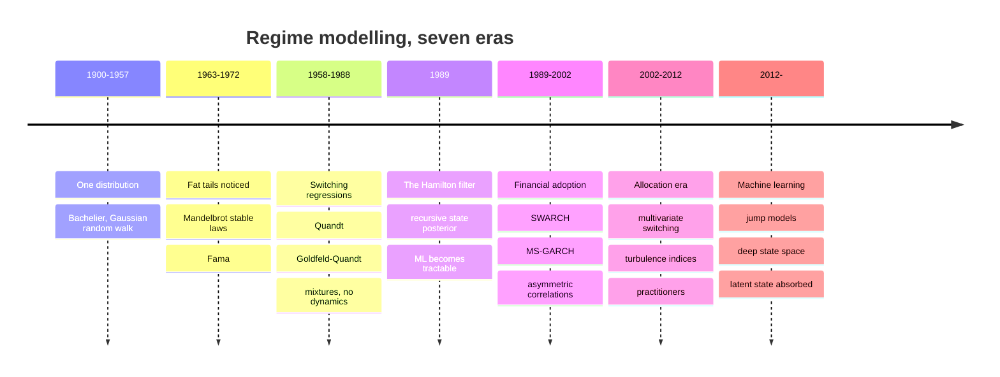
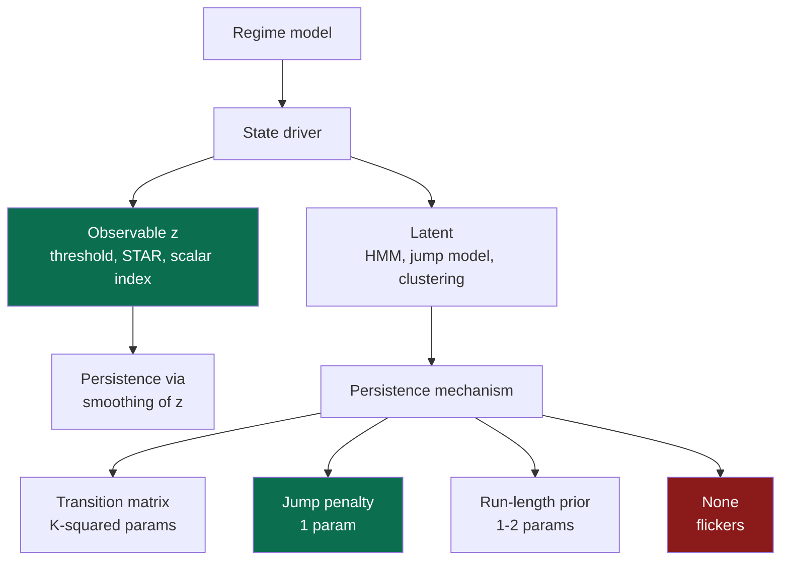
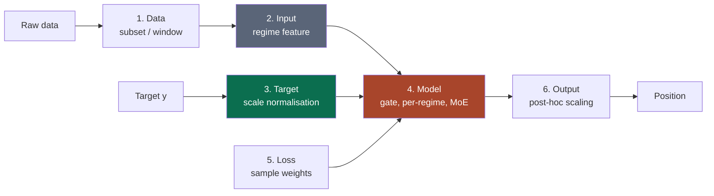
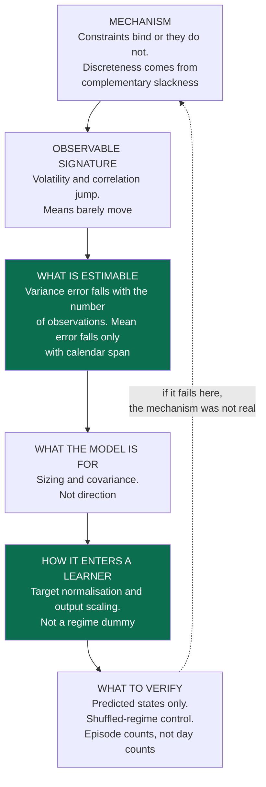
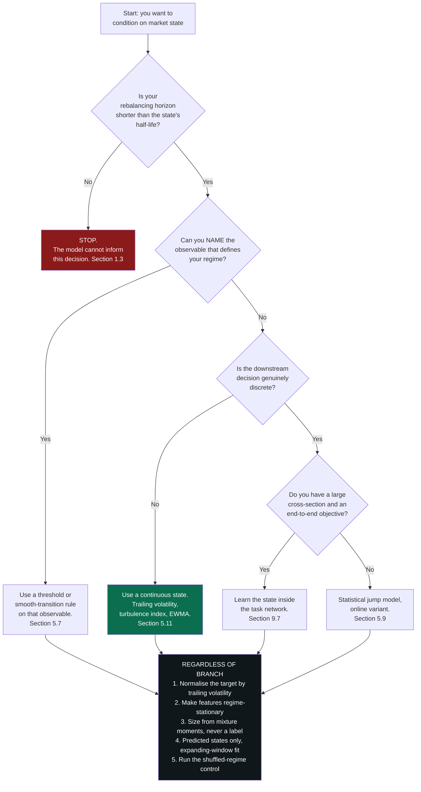

# Market Regimes and Machine Learning

### What a regime model actually estimates, and how to put one inside a GBT or a neural network

---

**What this is.** "Regime" is the most overloaded word in systematic trading. It
is used for a latent Markov state, for a VIX threshold, for a business-cycle
phase, for a correlation cluster, and for the vague feeling that this year is not
like last year. This document takes the concept apart: what a regime model *is*
mathematically, what the sixty years of literature on it has actually
established, which parts of that literature survive contact with out-of-sample
data, and — the part almost nothing is written about — how to wire a regime
model into a gradient-boosted tree or a deep network without either fooling
yourself or wasting the effort.

**How to read it.** Part I (§1–§7) is the model layer: what a regime is, why one
might exist, how the field arrived here, the formal model zoo, the taxonomy that
collapses it, and an honest scorecard of what works. Part II (§8–§12) is the
integration layer: the statistical framing that tells you *which* integration
scheme your problem calls for, the schemes themselves, the research and
evaluation protocol, and what to do in live trading.

Appendix A defines every concept the main text uses without explaining, ordered
so that it reads as a build-up rather than a glossary; §5 and §9 lean on it most.

If you read three things, read **§7.1** (why regime models identify volatility
and not returns, with the simulation), **§8.1–§8.2** (which kind of shift you
have, and which scheme addresses it), and **§10.2** (the eight ways regime
research leaks). If you are implementing, §9 and §10 are the working sections
and the rest is reference.

**Relationship to the other notes.** [Trend-Following in Financial
Markets](trend_following.html) derives what a trend rule earns; several of its
results reappear here, because a trend filter is a two-state regime classifier
with the states named "up" and "down". [Momentum in Financial
Markets](momentum_deep_dive.html) covers signal measurement, and [Simple and Log
Returns](log_returns.html) covers the return conventions used throughout. Each
stands alone.

**Epistemic tags.** Claims are flagged by status:

- **[Fact]** — replicated across independent datasets or implementations, with
  broad agreement among people who have looked.
- **[Contested]** — documented, but with live disagreement about magnitude,
  robustness, or cause.
- **[Hypothesis]** — a proposed mechanism, not decisively tested.
- **[Practice]** — practitioner convention. May well be right; the evidence is
  private or absent.

Untagged sentences are definitions, derivations, or arithmetic. Several results
below come from simulations I ran while writing; those are labelled
**[Simulated]** and the generating code is committed alongside this document in
`figures/`, so you can disagree with my parameters and rerun.

---

**Notation.** $r_t$ is the return of the traded asset over bar $t$ (log returns
unless noted), $A$ the number of bars per year (252 for daily data), and
$\mathcal{F}_t$ the information set available at the *end* of bar $t$.

$S_t \in \{1, \dots, K\}$ is the **regime** — a latent discrete state — and $K$
the number of regimes. $\mathbf{P}$ is the $K \times K$ transition matrix with
entries $p_{jk} = \Pr(S_{t+1} = k \mid S_t = j)$, and $\boldsymbol{\pi}$ its
stationary distribution. $\theta_k$ collects the parameters of the observation
distribution in state $k$; for Gaussian emissions these are $\mu_k$ and
$\sigma_k$.

Three different state beliefs recur throughout and are never interchangeable:

$$
\underbrace{\xi_{t|t-1}}_{\text{predicted}} = \Pr(S_t \mid \mathcal{F}_{t-1}),
\qquad
\underbrace{\xi_{t|t}}_{\text{filtered}} = \Pr(S_t \mid \mathcal{F}_{t}),
\qquad
\underbrace{\xi_{t|T}}_{\text{smoothed}} = \Pr(S_t \mid \mathcal{F}_{T}).
$$

Each is a $K$-vector of probabilities; $\xi_{t|t}^{(k)}$ denotes its $k$-th
component. $T$ is the last observation in the sample. The distinction between
these three objects is the single largest source of false results in this field,
and §5.1 is devoted to it.

On the machine-learning side, $x_t \in \mathbb{R}^d$ is the feature vector known
at $t$, $y_t$ the prediction target realised over $(t, t+h]$, and $h$ the
forecast horizon in bars. $f(\cdot)$ is the fitted model and
$m(x) = \mathbb{E}[y \mid x]$ the true conditional mean. When $f$ carries a
parameter argument — $f(\cdot \mid \theta_k)$ — it means the state-$k$
observation density instead; the argument is what distinguishes the two.
$p(x)$, $p(y \mid x)$ and $p(x, y)$ denote the feature, conditional, and joint
distributions; subscripting them by $k$ (as in $p_k(y \mid x)$) means
"conditional on regime $k$". $w_t$ is a training sample weight, $g(\cdot)$ a
gating function, and $\hat\sigma_t$ an $\mathcal{F}_t$-measurable estimate of
return volatility.

Two symbols carry a standing qualification: $\sigma$ is always a return
volatility (never a significance level or a sigmoid), and $K$ is always the
number of regimes (never a kernel or a Kalman gain).

---

## Table of contents

**Part I — What a regime is, and what is known about it**

1. [What a market regime is](#1-what-a-market-regime-is)
2. [Why regimes could exist](#2-why-regimes-could-exist)
3. [How the field evolved](#3-how-the-field-evolved)
4. [Foundational references](#4-foundational-references)
5. [The formal models](#5-the-formal-models)
6. [Taxonomy and equivalences](#6-taxonomy-and-equivalences)
7. [What is known to work, and what is not](#7-what-is-known-to-work-and-what-is-not)

**Part II — Putting regimes inside a learned model**

8. [Which shift do you have?](#8-which-shift-do-you-have)
9. [Integration schemes](#9-integration-schemes)
10. [Research and evaluation](#10-research-and-evaluation)
11. [Trading a regime-aware model](#11-trading-a-regime-aware-model)
12. [Synthesis](#12-synthesis)

**Appendix**

- [A. Concepts and prerequisites](#appendix-a-concepts-and-prerequisites) — every
  advanced idea the main text leans on, built from first principles and ordered by
  dependency. Start here if a term in §5 or §9 is unfamiliar.

---

# 1. What a market regime is {#1-what-a-market-regime-is}

## 1.1 The wrong intuition

Ask a portfolio manager what regime the market is in and you will get an answer:
risk-on, late-cycle, a high-inflation regime, a dispersion regime. The answer is
delivered as a statement about the world, in the same grammatical register as
"the S&P is at 5,400". That grammar is the problem, because it presupposes that
the regime is a fact about the market which you could in principle observe and
might currently be getting wrong.

It isn't. What you observe is a sequence of returns. Any such sequence can be
represented as a discrete-state process modulating a family of distributions, in
infinitely many ways. Fit a two-state Gaussian mixture and you get a calm state
and a turbulent one. Fit four and you get something like crash, slow growth,
bull, and recovery — which is exactly what [Guidolin and Timmermann (2007)](https://papers.ssrn.com/sol3/papers.cfm?abstract_id=940652){target="_blank"} report
for joint stock and bond returns, because four is what they fitted. Fit twelve
and the likelihood will find work for all twelve. None of these is more correct
than the others in any sense the data can adjudicate, because a $K$-component
mixture is a universal approximator for densities: with enough components you can
fit any distribution to any tolerance, and with enough states you can fit any
path.

So "this market has regimes" is not, on its own, a claim about the world. It
becomes one only when you fix $K$, fix the state dynamics, and commit to
out-of-sample evaluation. Everything hard about this field descends from that
sentence, and the fact that the standard test for "how many regimes are there"
does not have a standard distribution (§7.2) is not a technical footnote — it is
the central difficulty wearing a technical disguise.

## 1.2 The right starting point: a conditional density with a discrete bottleneck

Here is the object, stated once and used throughout. A regime model asserts that
the one-step-ahead predictive density of returns is a finite mixture:

$$
p(r_t \mid \mathcal{F}_{t-1})
  = \sum_{k=1}^{K} \underbrace{\xi_{t|t-1}^{(k)}}_{\text{weight}}
    \cdot \underbrace{f(r_t \mid \theta_k)}_{\text{component}} ,
$$

where $\xi_{t|t-1}^{(k)} = \Pr(S_t = k \mid \mathcal{F}_{t-1})$ is your predicted
probability of being in state $k$ and $f(\cdot \mid \theta_k)$ is the return
distribution that state implies. Read what this says:

- **The regime is never observed.** The mixture is what generates data; the state
  is a latent index. What you can compute is a *posterior over states*, never the
  state itself.
- **The state label is not the object; the predictive density is.** Collapsing
  $\xi_{t|t-1}$ to its argmax and treating that label as data throws away the
  model's own statement about how confident it is. This is the most common
  practitioner error in the field, and §9.1 says what to feed instead.
- **The model earns its keep only by beating the alternatives**, which are a
  single distribution ($K = 1$) and a continuously-varying parameter (stochastic
  volatility, GARCH). It frequently does not. §7.7.

The phrase to hold on to is **discrete bottleneck**. Asserting $K$ regimes is
asserting that everything relevant about the conditional distribution of returns
can be compressed into which of $K$ boxes you are in. That compression buys
statistical efficiency — every observation assigned to box $k$ contributes to
estimating the single parameter vector $\theta_k$ — and costs fidelity, because
the world is not boxes. Whether the trade is worth making is an empirical
question with a different answer for volatility (usually yes) than for expected
returns (usually no), and §7 is about why.

## 1.3 Persistence is the entire forecasting content

One consequence of §1.2 deserves its own subsection because it is quantitative,
it is routinely violated in practice, and it takes three lines to derive.

Suppose $S_t$ were independent across $t$ — a mixture with no memory. Then
$\Pr(S_t = k \mid \mathcal{F}_{t-1}) = \pi_k$ for every history, the predictive
density collapses to the *unconditional* mixture $\sum_k \pi_k f(\cdot \mid
\theta_k)$, and the model forecasts nothing. It has told you that returns are
fat-tailed and heteroskedastic on average. That is a real fact, but it is not a
signal.

All forecasting content therefore lives in the gap between the transition matrix
$\mathbf{P}$ and the no-memory matrix $\mathbf{1}\boldsymbol{\pi}^{\top}$, and
that gap is governed by the second-largest eigenvalue of $\mathbf{P}$. Write the
eigendecomposition of an ergodic chain: $\lambda_1 = 1$ with left eigenvector
$\boldsymbol{\pi}$, and the remaining eigenvalues $|\lambda_2| \ge \dots \ge
|\lambda_K|$ control the transient. Then

$$
\mathbf{P}^{h} = \mathbf{1}\boldsymbol{\pi}^{\top} + O(|\lambda_2|^{h}),
$$

so an $h$-step-ahead state forecast reverts to the unconditional distribution
geometrically at rate $|\lambda_2|$. For a two-state chain there is a closed
form:

$$
\lambda_2 = p_{11} + p_{22} - 1 ,
\qquad
\text{half-life} = \frac{\ln 2}{-\ln |\lambda_2|} \ \text{bars.}
$$

The absolute value matters only in the anti-persistent case
$p_{11} + p_{22} < 1$, where $\lambda_2 < 0$ and the state belief alternates as
it decays; fitted financial chains are sticky, with $\lambda_2$ close to one.

**This is a hard ceiling on the horizon at which a regime model can help you**,
and it is computable from the fitted transition matrix before you run a single
backtest. Take the calibration used throughout this document — $p_{11} = 0.99$
for a calm state with expected duration 100 days, $p_{22} = 0.96$ for a turbulent
state with expected duration 25 days. Then $\lambda_2 = 0.95$, the half-life is
13.5 days, and at a 60-day horizon $\lambda_2^{60} = 0.046$: **more than 95% of
the state information is gone.** A model fitted on daily data with these
dynamics cannot inform a quarterly asset-allocation decision, no matter how
convincing its in-sample regime plot looks. If you intend to rebalance
quarterly, you need a state process whose half-life is measured in quarters —
which is a different model with different data requirements, not the same model
sampled less often.

> **Diagnostic.** Compute $|\lambda_2|$ and its half-life the moment you fit a
> transition matrix, and compare it to your rebalancing horizon. If the half-life
> is shorter than the horizon, the regime model is decoration. **[Practice]**

## 1.4 The master form

Generalising §1.2 to cover everything in §5, a regime model is a pair of
equations — a state process and a state-conditional observation model:

$$
\begin{aligned}
S_t &\sim q\!\left(S_t \mid S_{t-1},\, z_{t-1};\, \psi\right)
   && \text{(state dynamics)} \\[2pt]
y_t \mid S_t = k &\sim f\!\left(\cdot \mid x_t;\, \theta_k\right)
   && \text{(regime-conditional observation model)}
\end{aligned}
$$

Here $\psi$ collects the parameters of the state process, $z_{t-1}$ is any
observable that may drive transitions, and $x_t$ any observable that may drive
the observation. Four slots vary, and every model in §5
is a choice of the four:

| Slot | Question | Range of choices |
|---|---|---|
| **What varies** | Which parameters depend on $k$? | mean only; variance only; mean and variance; full covariance; the whole regression function; the noise distribution |
| **State dynamics** | How does $S_t$ move? | Markov; semi-Markov with explicit durations; threshold on observable $z$; i.i.d. mixture; single permanent break |
| **State driver** | What determines the transition? | endogenous (past $y$); exogenous ($z$); free (latent only) |
| **Inference and use** | What do you condition on, and what consumes it? | predicted / filtered / smoothed; hard label or posterior; feeds parameters, weights, features, or a gate |

Two things are worth noticing immediately. First, the *inference and use* slot is
not part of the model — it is part of the research protocol — yet it swamps the
other three in its effect on measured performance. Second, most of the literature
varies slot 1 and slot 2 while holding slots 3 and 4 fixed, which is why the
model zoo of §5 looks larger than the design space of §6 turns out to be.

## 1.5 What a regime is not

A great deal of confusion is dissolved by putting the near neighbours in a table
and saying how each differs.

| Object | What it is | How it differs from a regime |
|---|---|---|
| **Trend** | a signed conditional mean, $\mathbb{E}[r_t \mid \mathcal{F}_{t-1}]$ | continuous-valued and *ordered*; regimes are categorical and unordered |
| **Structural break** | a one-time permanent parameter change | non-recurrent — you never come back, so there is nothing to estimate from history about the new state |
| **Stochastic volatility** | a continuous latent scale $\sigma_t$ | no discrete bottleneck; $\sigma_t$ takes a continuum of values |
| **GARCH** | $\sigma_t^2$ as a deterministic function of past returns | no latent state at all — $\sigma_t$ is $\mathcal{F}_{t-1}$-measurable, so there is nothing to filter |
| **Conditioning variable** | an observable such as the dividend yield or the VIX | observable and continuous; you can regress on it directly |
| **Business-cycle phase** | an economic classification (e.g. NBER dates) | published with a 6–18 month lag and revised; not $\mathcal{F}_t$-measurable, so unusable as a live signal † |
| **Microstructure state** | order-book condition (wide/tight, toxic/benign) | different time scale by five orders of magnitude, and a different object |
| **Cross-sectional cluster** | a partition of *assets* | a regime is a partition of *time*; the two are often confused because both use $k$-means |

† The NBER Business Cycle Dating Committee's announcements are the canonical
example of a variable that is informative, widely cited, and completely
untradable at the dates it labels. Any backtest that conditions on NBER
recession dates without lagging them by the actual announcement delay is
reporting a fantasy. **[Fact]**

The GARCH row is the one to sit with. **The most common alternative to a regime
model is not "no model" — it is a continuous-state model, and the continuous
model usually wins.** A regime model buys you interpretability and a natural
place to hang discrete decisions; it pays for that with a coarse approximation to
a state variable that is, on the evidence, continuous. §7.7 puts numbers on the
trade.

> ### §1 Key takeaways
>
> 1. A regime is a property of a model, not of the market. The question "what
>    regime are we in" is only well posed after you have fixed $K$ and the state
>    dynamics.
> 2. The object a regime model produces is a predictive *density*
>    $\sum_k \xi_{t|t-1}^{(k)} f(\cdot \mid \theta_k)$, not a label. Collapsing to
>    the argmax label discards the model's own uncertainty and is the most common
>    implementation error in the field.
> 3. All forecasting content lives in the persistence of the state. An i.i.d.
>    mixture predicts nothing beyond the unconditional distribution.
> 4. The second eigenvalue of the transition matrix sets a hard ceiling on the
>    useful forecast horizon. Compute its half-life before you backtest; if it is
>    shorter than your rebalancing interval, stop.
> 5. Regimes are categorical partitions of *time*. Trends, stochastic volatility,
>    GARCH, conditioning variables, and cross-sectional clusters are all
>    different objects, and three of them are usually better tools.
> 6. NBER-style economic regime labels are published with a lag and revised.
>    Using them unlagged is a look-ahead, not a modelling choice.

---

# 2. Why regimes could exist {#2-why-regimes-could-exist}

Before fitting anything it is worth asking what would have to be true of the
world for a *discrete* state model to be the right description. This matters more
than it sounds, because most proposed mechanisms predict *continuous* variation
in conditional moments, and a continuous mechanism observed through a discrete
model produces exactly the kind of unstable, sample-dependent state estimates
that §7 documents.

There is one mechanism family that genuinely predicts discreteness, and it is not
the one usually cited.

## 2.1 Family A — occasionally binding constraints

The strongest microfoundation for discreteness is an inequality constraint that
sometimes binds and sometimes does not. Intermediaries face leverage limits,
margin requirements, VaR budgets, and redemption thresholds. Each is a constraint
of the form $c(\text{state}) \le \bar{c}$, and the associated Lagrange multiplier
is exactly zero when it is slack and strictly positive when it binds. That is not
an approximation to a discrete state — **it is a discrete state**, arising from
the complementary-slackness condition of an optimisation problem.

The consequences are asymmetric and fast. Brunnermeier and Pedersen (2009) model
the feedback between market liquidity and funding liquidity, in which a shock
that tightens funding forces deleveraging, which widens spreads, which tightens
funding further. He and Krishnamurthy (2013) and Adrian, Etula and Muir (2014)
develop the asset-pricing consequences: intermediary net worth is a priced state
variable, and its effect on risk premia is strongly nonlinear near the
constraint. **[Contested]** — the mechanism is well formalised and the
intermediary-capital factor prices assets in-sample, but whether the
constraint-binding indicator is *measurable in real time* well enough to trade is
a different and much weaker claim.

This family predicts things the others do not, which makes it the most
falsifiable: state transitions should be **fast in one direction and slow in the
other** (constraints bind abruptly and relax gradually), correlations should
*rise* in the constrained state as everyone liquidates the same assets, and the
state should be visible in funding-market observables (repo spreads, cross-
currency basis, dealer balance sheets) before it is visible in returns.

## 2.2 Family B — policy and institutional regimes

Central-bank reaction functions really do change, discretely, when the committee
or the mandate changes. Sims and Zha (2006) fit a multivariate regime-switching
model to U.S. monetary policy and find three coefficient regimes roughly matching
the periods that narrative accounts identify. Their headline result is more
interesting than the existence of the regimes, though, and it recurs throughout
this document: **the best-fitting specification allowed time variation in
disturbance variances only.** When they allowed coefficients to switch as well,
the improvement was modest and the regime differences were too small to explain
the inflation of the 1970s–80s. **[Fact]**

Regulatory changes (Reg NMS, Basel III, the Volcker Rule), index-methodology
changes, and market-structure changes (decimalisation, the rise of ETFs) are the
same kind of event: genuinely discrete, dated, and externally observable. Note
what that last property implies — if the regime is externally observable, you
should condition on the observable directly rather than inferring a latent state
from returns. §7.4.

## 2.3 Family C — the leverage cycle and multiple equilibria

Geanakoplos's leverage cycle and the limits-to-arbitrage literature (Shleifer and
Vishny, 1997) describe positive feedback: falling prices reduce collateral value,
which forces sales, which lowers prices. Positive feedback loops admit multiple
equilibria, and multiple equilibria are discrete by construction. **[Hypothesis]**
— the theory is well developed, but distinguishing "the system jumped between
equilibria" from "a large shock hit a continuous system" using return data alone
has, to my knowledge, never been done convincingly.

## 2.4 Family D — investor composition and beliefs

Barberis, Shleifer and Vishny (1998) model investor sentiment *as* a
regime-switching process: the representative investor believes earnings follow
either a mean-reverting or a trending regime, and Bayesian updating between the
two generates under- and over-reaction. This is a rare case where the regime
model is the economic theory rather than a statistical convenience. Flow-driven
versions — retail participation, systematic-strategy crowding, dealer gamma
positioning — make the same argument about who is trading rather than what they
believe. **[Contested]**

## 2.5 Family E — the business cycle

Expected returns vary with business conditions: Fama and French (1989) show that
dividend yields and term spreads forecast returns with cyclical patterns, and
Cochrane's (2011) survey makes the case that essentially all of the variation in
asset prices is discount-rate variation, which is cyclical. Henkel, Martin and
Nardari (2011) sharpen this into a regime statement: **short-horizon return
predictability is concentrated in recessions and close to zero in expansions.**
[Farmer, Schmidt and Timmermann (2023)](https://papers.ssrn.com/sol3/papers.cfm?abstract_id=3152386){target="_blank"} find the same shape without imposing a
cycle — predictability arrives in short, localised "pockets".

This is the most economically respectable case for regime-conditional *return*
models, and it comes with two caveats. First, business-cycle phases are long: a
model with cycle-length persistence has perhaps 10–15 independent observations in
a post-war sample, which is the identification problem of §7.1 in its most acute
form. Second, the pockets result has been challenged — Cakici and co-authors
published a replication in the *Journal of Finance* in 2025 disputing the
out-of-sample economic significance. **[Contested]**

## 2.6 Family F — there are no regimes

The null deserves to be stated as forcefully as the alternatives, because it is
the hypothesis most consistent with the evidence and the one most rarely tested.

A single process with persistent stochastic volatility and heavy tails —
no discrete states anywhere — produces sample paths that a regime model will
happily describe with two to four states, with convincing-looking state plots and
a significant-looking likelihood improvement. [Diebold and Inoue (2001)](https://www.nber.org/papers/t0264){target="_blank"} prove a
version of this analytically: **stochastic regime switching and long memory are
easily confused, even asymptotically**, and a process with occasional breaks
generates estimated long-memory parameters, while a long-memory process generates
apparent breaks. Granger and Hyung (2004) demonstrate the same confusion
empirically on S&P 500 absolute returns. The precedent is Perron (1989), who
showed that a trend-stationary series with one break is nearly indistinguishable
from a unit root.

The practical statement: **a likelihood improvement from adding regimes is not
evidence that regimes exist.** It is evidence that your single-state model was
misspecified, which you already knew, and a mixture is a flexible way to absorb
misspecification. **[Fact]**

## 2.7 Telling the families apart

Most of the time you cannot, and pretending otherwise is how research programmes
die. But the families do make different predictions, and a few of them are
testable on data you already have.

| Prediction | Constraints (A) | Policy (B) | Leverage cycle (C) | Business cycle (E) | No regimes (F) |
|---|---|---|---|---|---|
| Transition asymmetry | fast in, slow out | either | fast in, slow out | symmetric | none expected |
| Correlations rise in bad state | strongly yes | no | yes | mildly | mildly † |
| State visible in non-return data | yes (funding) | yes (dated) | partly | yes (macro) | no |
| Optimal $K$ stable across samples | yes | yes | — | — | **no** |
| Beaten by a continuous-vol model | no | no | — | — | **yes** |

† A stochastic-volatility null does generate correlation increases in high-vol
periods, purely mechanically, because correlations estimated over high-variance
windows are biased upward when the common factor's variance rises faster than the
idiosyncratic. [Forbes and Rigobon (2002)](https://www.nber.org/papers/w7267){target="_blank"} made this point about "contagion" and it
applies verbatim here: **an increase in measured correlation during a crisis is
partly an artefact of the volatility increase, not independent evidence of a
regime.**

The last two rows are the ones to act on, and they yield two concrete
experiments you can run in an afternoon:

1. **Stability of $K$.** Fit $K = 2, 3, 4, 5$ on disjoint halves of your sample
   and on bootstrapped resamples. If the selected $K$ and the fitted $\theta_k$
   move around, you are fitting misspecification, not structure.
2. **The continuous-model horse race.** Fit a GARCH or stochastic-volatility
   model and a regime model, and compare *out-of-sample predictive
   log-likelihood*, not in-sample fit. In my experience and in most of the
   published comparisons, the continuous model wins on volatility and the two tie
   on everything else. **[Practice]**

And one more that is worth more than both: **make the state predict something it
was not fitted on.** A state extracted from equity returns that also lines up
with credit spreads, funding costs, or realised dispersion is more likely to be
real than one that only explains the series it was estimated from.

> ### §2 Key takeaways
>
> 1. Occasionally binding constraints are the only mechanism family that predicts
>    genuine discreteness rather than continuous variation, because a
>    complementary-slackness condition literally *is* a two-state system.
> 2. Policy regimes are real, dated, and externally observable — which argues for
>    conditioning on the observable rather than filtering a latent state.
> 3. Sims and Zha's result generalises: when you let both means and variances
>    switch, the variance switching does nearly all the work. This recurs at every
>    level of this document.
> 4. Return predictability is concentrated in bad times — the best economic case
>    for regime-conditional alpha — but bad times are rare, so the sample is tiny
>    and the finding is contested.
> 5. A stochastic-volatility process with no regimes anywhere produces data that
>    regime models fit beautifully. Likelihood improvement from adding states is
>    not evidence that states exist.
> 6. Two cheap discriminating tests: is the selected $K$ stable across subsamples,
>    and does a continuous-state model beat the discrete one out of sample? Run
>    both before building anything.
> 7. Rising correlations in crises are partly a mechanical artefact of rising
>    volatility ([Forbes and Rigobon, 2002](https://www.nber.org/papers/w7267){target="_blank"}), not independent evidence of a regime.

---

# 3. How the field evolved {#3-how-the-field-evolved}

The history is worth 2,000 words because it explains the shape of the current
literature — in particular why the econometrics is deep and the trading evidence
is thin, and why the machine-learning community rediscovered the same objects
under different names.



## 3.1 Era I — One distribution (1900–1957)

**Contribution.** Bachelier's 1900 thesis modelled prices as Brownian motion; the
mid-century finance literature adopted the Gaussian random walk as the baseline.

**What changed.** The idea that price changes are draws from a *fixed*
distribution, which is the null every subsequent era has been arguing with.

**Limitations.** Empirically wrong in the second and fourth moments, as the next
era established.

**Lasting influence.** Enormous, and mostly as a foil. Every regime paper's
introduction is a variation on "returns are not i.i.d. Gaussian".

## 3.2 Era II — Fat tails, and the first alternative to regimes (1963–1972)

**Contribution.** Mandelbrot (1963) documented that speculative price changes
have far heavier tails than the Gaussian and proposed stable Paretian
distributions; Fama (1965) confirmed and extended the evidence for U.S. stocks.

**What changed.** The field accepted non-normality. Critically, **the first
explanation offered was not regimes — it was a single heavy-tailed
distribution.** Mandelbrot's alternative was one law with infinite variance, not
two laws that alternate.

**Limitations.** Stable laws with $\alpha < 2$ imply infinite variance, which is
awkward for portfolio theory and, on the evidence of later work, not what the
data show; the tails are heavy but the variance appears finite.

**Lasting influence.** The unresolved question is the important legacy. "Is this
one fat-tailed process or two thin-tailed ones taking turns?" was never settled;
the profession simply moved on to models where the question does not have to be
answered. §2.6 and §7.7 are that question, still open.

## 3.3 Era III — Switching regressions (1958–1988)

**Contribution.** Quandt (1958) estimated a linear regression obeying two
separate regimes with an unknown switch point; Goldfeld and Quandt (1973)
introduced a Markov model for switching regressions.

**What changed.** Regimes became estimable objects rather than narrative
descriptions.

**Limitations.** The estimation was awkward and, in the mixture versions, the
state carried no persistence, so the models had no forecasting content (§1.3).
There was no efficient recursion for the state posterior, which made likelihood
evaluation expensive and multivariate extensions impractical.

**Lasting influence.** Direct — Hamilton's paper is explicitly a solution to the
computational problem this era posed.

## 3.4 Era IV — The Hamilton filter (1989)

**Contribution.** [Hamilton (1989)](https://www.econometricsociety.org/publications/econometrica/1989/03/01/new-approach-economic-analysis-nonstationary-time-series-and){target="_blank"} gave a recursive algorithm — one forward pass —
for the state posterior in a Markov-switching autoregression, making maximum
likelihood estimation tractable and, at the same time, making the distinction
between filtered and smoothed inference explicit and computable. Kim (1994)
supplied the efficient backward smoother that completes the pair.

**What changed.** Almost everything. This is the founding moment of the modern
field, and the filter is still what every implementation runs. Its structure —
predict, then update on the new observation — is identical to the Kalman filter
with a discrete state space, which is why the machine-learning literature's
forward-backward algorithm for HMMs (Baum et al., 1970; Rabiner, 1989) is the
same algorithm discovered a generation earlier in a different community.

**Limitations.** Hamilton's own application was to U.S. GNP growth, a
low-frequency, low-noise series. Financial returns are the opposite, and the
transplant was less successful than the enthusiasm of the following decade
suggested.

**Lasting influence.** Total. If you fit a regime model today, you are running
Hamilton's recursion.

## 3.5 Era V — Financial adoption, and the discovery that it is about variance (1989–2002)

**Contribution.** Turner, Startz and Nelson (1989) applied switching to stock
returns; Hamilton and Susmel (1994) combined switching with ARCH (SWARCH); Gray
(1996) and Haas, Mittnik and Paolella (2004) solved the path-dependence problem
that makes naive MS-GARCH inestimable; [Ang and Bekaert (2002)](https://business.columbia.edu/sites/default/files-efs/pubfiles/1971/1137.pdf){target="_blank"} built the
international asset-allocation application; Longin and Solnik (2001) and [Ang and
Chen (2002)](https://business.columbia.edu/sites/default/files-efs/pubfiles/1971/1137.pdf){target="_blank"} documented that correlations rise in down markets.

**What changed.** Two things, in opposite directions. Positively, the field
established that **regime models describe second moments well** — volatility
states are large, persistent, and estimable. Negatively, the critiques arrived
and were not answered. [Hansen (1992)](https://users.ssc.wisc.edu/~behansen/papers/jae_92.html){target="_blank"} showed that the likelihood-ratio test for
the number of regimes does not have a standard distribution, because the
transition probabilities are unidentified under the null; applying his bound to
Hamilton's own GNP model, **the switching specification could not reject a plain
AR(4)**. [Dacco and Satchell (1999)](<https://onlinelibrary.wiley.com/doi/abs/10.1002/(SICI)1099-131X(199901)18:1%3C1::AID-FOR685%3E3.0.CO;2-B>){target="_blank"} showed that regime-switching models fit
exchange rates beautifully in sample and lose to a random walk out of sample,
and — this is the part usually forgotten — explained *why*: the loss function is
asymmetric in the state-classification error, so even a model with correctly
estimated parameters forecasts worse than a constant if it misclassifies the
state often enough.

**Limitations.** The era's applied work systematically reported smoothed state
probabilities and in-sample fit.

**Lasting influence.** The second-moment result is the durable one. The
first-moment results from this era have mostly not replicated.

## 3.6 Era VI — Multivariate models and the allocation application (2002–2012)

**Contribution.** [Guidolin and Timmermann (2007)](https://papers.ssrn.com/sol3/papers.cfm?abstract_id=940652){target="_blank"} fitted four-state models to
joint stock and bond returns and solved the resulting dynamic portfolio problem;
Pelletier (2006) built regime-switching dynamic correlations; Kritzman and Li
(2010) introduced the Mahalanobis "turbulence" index and [Kritzman, Page and
Turkington (2012)](https://papers.ssrn.com/sol3/papers.cfm?abstract_id=2066848){target="_blank"} the practitioner framework built on it; [Bulla and co-authors
(2011)](https://mpra.ub.uni-muenchen.de/21154/){target="_blank"} ran the honest out-of-sample test of a Markov-switching allocation rule
including transaction costs.

**What changed.** The application shifted from *predicting returns* to *managing
risk*, which is where the evidence actually supports regime models. Kritzman,
Page and Turkington's framing — the value is in avoiding large losses, not in
picking direction — is the correct reading of the previous era's results.

**Limitations.** Much of the practitioner work in this era comes from firms that
sell regime-based products. That does not make it wrong — these authors have data
and implementation experience academics lack — but the backtests are
selection-prone and the reported improvements are typically not adjusted for the
number of specifications tried.

**Lasting influence.** High. This is the era whose framing most institutional
allocators still use.

## 3.7 Era VII — Machine learning, and the disappearing regime (2012–present)

**Contribution.** Several strands at once. Unsupervised methods —
Gaussian mixtures, $k$-means on engineered features, Wasserstein clustering of
correlation matrices — replaced likelihood-based HMMs where the emission model
was the weak link. Statistical jump models ([Bemporad et al., 2018](https://arxiv.org/abs/1711.09220){target="_blank"}; [Nystrup, Kolm
and Lindström, 2020](https://papers.ssrn.com/sol3/papers.cfm?abstract_id=3594875){target="_blank"}) replaced the probabilistic state process with an explicit
jump *penalty*, giving a convex-ish objective, a tunable persistence knob, and —
by the authors' simulations — better classification accuracy than a correctly
specified maximum-likelihood HMM. Deep latent-variable models (recurrent
switching linear dynamical systems, deep state-space models) brought
neural-network emissions to the same graphical structure.

**What changed.** The most consequential shift is a negative one. **The dominant
machine-learning approach to asset pricing does not use an explicit regime model
at all.** [Gu, Kelly and Xiu (2020)](https://www.nber.org/papers/w25398){target="_blank"} handle time variation by interacting stock
characteristics with a small set of observable macro predictors and letting the
function approximator find whatever conditional structure exists; [Chen, Pelger
and Zhu (2024)](https://arxiv.org/abs/1904.00745){target="_blank"} learn a latent macro state with a recurrent network as part of an
end-to-end asset-pricing objective rather than fitting it separately. The latent
state did not disappear — it got absorbed into the approximator, where it is
estimated jointly with the thing you actually care about instead of being handed
over from a separately fitted model with its own errors.

That is the bridge into Part II of this document, and it is worth stating as the
central practical question: **should the regime be a separate model whose output
you feed in, or a structure the learner discovers for itself?** §8 and §9 are the
answer, which is "it depends on which distribution is shifting", and §9.12 ranks
the options.

**Limitations.** The ML era has largely not engaged with the identification
critiques of Era V. A deep switching model has all of Hamilton's identification
problems plus its own, and the papers rarely report the diagnostics of §7.2.

> ### §3 Key takeaways
>
> 1. [Hamilton (1989)](https://www.econometricsociety.org/publications/econometrica/1989/03/01/new-approach-economic-analysis-nonstationary-time-series-and){target="_blank"} is the founding technical contribution; every implementation
>    since runs his recursion, which is the discrete-state Kalman filter and the
>    same object as the HMM forward algorithm from speech recognition.
> 2. The first proposed explanation for non-normal returns was one heavy-tailed
>    distribution, not two alternating ones. That debate was never settled — it
>    was bypassed — and it is still the live null.
> 3. The critiques landed early and were not answered. [Hansen (1992)](https://users.ssc.wisc.edu/~behansen/papers/jae_92.html){target="_blank"} showed the
>    number-of-regimes test is non-standard and that Hamilton's own model could
>    not reject an AR(4); [Dacco and Satchell (1999)](<https://onlinelibrary.wiley.com/doi/abs/10.1002/(SICI)1099-131X(199901)18:1%3C1::AID-FOR685%3E3.0.CO;2-B>){target="_blank"} showed out-of-sample failure
>    and explained the mechanism.
> 4. The durable empirical finding across every era is that regimes describe
>    second moments well and first moments badly.
> 5. The 2002–2012 practitioner era got the framing right — use regimes for risk,
>    not direction — but its evidence base is dominated by interested parties.
> 6. The modern machine-learning answer is usually to skip the explicit regime
>    model and let the approximator learn the conditioning. Whether that is right
>    depends on which distribution is shifting (§8).

---

# 4. Foundational references {#4-foundational-references}

Grouped by kind, because kinds are read differently. Each entry says why it
matters. Where a free copy exists it is linked from the title; paywalled-only
entries are marked.

## 4.1 The founding econometrics

- **Quandt, R. E. (1958).** "The Estimation of the Parameters of a Linear
  Regression System Obeying Two Separate Regimes." *Journal of the American
  Statistical Association* 53(284), 873–880. — The origin. Two regimes, one
  unknown switch point, no state process.
- **Goldfeld, S. M. & Quandt, R. E. (1973).** "A Markov Model for Switching
  Regressions." *Journal of Econometrics* 1(1), 3–15. — Adds the Markov chain.
  The model exists; the estimation is still impractical.
- **Hamilton, J. D. (1989).** ["A New Approach to the Economic Analysis of
  Nonstationary Time Series and the Business
  Cycle."](https://www.econometricsociety.org/publications/econometrica/1989/03/01/new-approach-economic-analysis-nonstationary-time-series-and)
  *Econometrica* 57(2), 357–384. — **The** paper. The recursive filter that makes
  everything else computable. Read §2–3 of it even if you read nothing else in
  this list.
- **Hamilton, J. D. (1994).** *Time Series Analysis.* Princeton University Press,
  chapter 22. — The textbook treatment of the filter, the smoother, and the
  EM algorithm, worked in full. This is the reference you will actually
  implement from.
- **Kim, C.-J. (1994).** "Dynamic Linear Models with Markov-Switching."
  *Journal of Econometrics* 60(1–2), 1–22. — The efficient backward smoother.
  Necessary for estimation; dangerous if you use its output as a signal (§5.1).
- **Kim, C.-J. & Nelson, C. R. (1999).** *State-Space Models with Regime
  Switching.* MIT Press. — The systematic treatment, including the Bayesian
  versions and the approximations that make multivariate models tractable.

## 4.2 Inference machinery, from the other community

The speech-recognition and machine-learning literature developed the same
algorithms independently, and its expositions are often clearer.

- **Baum, L. E., Petrie, T., Soules, G. & Weiss, N. (1970).** "A Maximization
  Technique Occurring in the Statistical Analysis of Probabilistic Functions of
  Markov Chains." *Annals of Mathematical Statistics* 41(1), 164–171. — The EM
  algorithm for HMMs, nineteen years before Hamilton and in a different field.
- **Rabiner, L. R. (1989).** "A Tutorial on Hidden Markov Models and Selected
  Applications in Speech Recognition." *Proceedings of the IEEE* 77(2), 257–286.
  — Still the best single exposition of forward-backward, Viterbi, and
  Baum-Welch. If Hamilton's notation is fighting you, read this instead.
- **Zucchini, W., MacDonald, I. L. & Langrock, R. (2016).** *Hidden Markov Models
  for Time Series: An Introduction Using R*, 2nd ed. Chapman & Hall/CRC. — The
  practical book. Numerical stability, scaling, label switching, model checking.
- **Frühwirth-Schnatter, S. (2006).** *Finite Mixture and Markov Switching
  Models.* Springer. — The Bayesian reference, and the best treatment of the
  label-switching and identification problems.
- **Cappé, O., Moulines, E. & Rydén, T. (2005).** *Inference in Hidden Markov
  Models.* Springer. — The theory: consistency, asymptotics, and what can and
  cannot be identified.
- **Fox, E. B., Sudderth, E. B., Jordan, M. I. & Willsky, A. S. (2011).**
  ["A Sticky HDP-HMM with Application to Speaker
  Diarization."](https://arxiv.org/abs/0905.2592) *Annals of Applied Statistics*
  5(2A), 1020–1056. — Nonparametric $K$ plus an explicit persistence prior. The
  right answer to "how many regimes" if you insist on a Bayesian one, and the
  origin of the "stickiness" idea that jump models later made explicit.

## 4.3 Regime models in finance — the empirical case

- **Turner, C. M., Startz, R. & Nelson, C. R. (1989).** "A Markov Model of
  Heteroskedasticity, Risk, and Learning in the Stock Market." *Journal of
  Financial Economics* 25(1), 3–22. — The first serious equity application.
- **Hamilton, J. D. & Susmel, R. (1994).** "Autoregressive Conditional
  Heteroskedasticity and Changes in Regime." *Journal of Econometrics* 64(1–2),
  307–333. — SWARCH: switching plus ARCH, and the demonstration that most of what
  looks like ARCH persistence is regime persistence.
- **Gray, S. F. (1996).** "Modeling the Conditional Distribution of Interest
  Rates as a Regime-Switching Process." *Journal of Financial Economics* 42(1),
  27–62. — Solves the path-dependence problem that makes naive MS-GARCH
  impossible to estimate.
- **Haas, M., Mittnik, S. & Paolella, M. S. (2004).** "A New Approach to
  Markov-Switching GARCH Models." *Journal of Financial Econometrics* 2(4),
  493–530. — The cleaner solution, and the one now generally used.
- **Ang, A. & Bekaert, G. (2002).** ["International Asset Allocation With Regime
  Shifts."](https://business.columbia.edu/sites/default/files-efs/pubfiles/1971/1137.pdf)
  *Review of Financial Studies* 15(4), 1137–1187. — The canonical allocation
  application: correlations and volatilities rise together in the bad state, and
  what that does to optimal portfolios.
- **Longin, F. & Solnik, B. (2001).** "Extreme Correlation of International
  Equity Markets." *Journal of Finance* 56(2), 649–676. — Correlation is not
  constant in the tails, established with extreme-value theory rather than by
  splitting the sample.
- **Ang, A. & Chen, J. (2002).** "Asymmetric Correlations of Equity Portfolios."
  *Journal of Financial Economics* 63(3), 443–494. — The same asymmetry
  domestically, with a statistic designed to avoid the conditioning bias.
- **Guidolin, M. & Timmermann, A. (2007).** ["Asset Allocation under Multivariate
  Regime Switching."](https://papers.ssrn.com/sol3/papers.cfm?abstract_id=940652)
  *Journal of Economic Dynamics and Control* 31(11), 3503–3544. — Four states for
  stocks and bonds jointly, and the dynamic programme that uses them.
- **Ang, A. & Timmermann, A. (2012).** ["Regime Changes and Financial
  Markets."](https://www.nber.org/papers/w17182) *Annual Review of Financial
  Economics* 4, 313–337. — **The single best entry point.** Balanced, current
  enough, and honest about what the models do not deliver.
- **Sims, C. A. & Zha, T. (2006).** "Were There Regime Switches in U.S. Monetary
  Policy?" *American Economic Review* 96(1), 54–81. — Rigorous multivariate
  switching applied to policy, with the recurring punchline: variances switch,
  coefficients barely do. [publisher — paywalled]
- **Henkel, S. J., Martin, J. S. & Nardari, F. (2011).** "Time-Varying
  Short-Horizon Predictability." *Journal of Financial Economics* 99(3), 560–580.
  — Return predictability concentrated in recessions. The strongest published
  case for regime-conditional expected returns.
- **Farmer, L. E., Schmidt, L. & Timmermann, A. (2023).** ["Pockets of
  Predictability."](https://papers.ssrn.com/sol3/papers.cfm?abstract_id=3152386)
  *Journal of Finance* 78(3), 1279–1341. — Predictability arrives in short local
  episodes rather than as a stable relationship. Read with the replication in
  §4.4.

## 4.4 The critiques — read these next to §4.3

A bibliography that lists only a field's successes is marketing. These are the
papers that constrain what you should believe.

- **Hansen, B. E. (1992).** ["The Likelihood Ratio Test under Nonstandard
  Conditions: Testing the Markov Switching Model of
  GNP."](https://users.ssc.wisc.edu/~behansen/papers/jae_92.html) *Journal of
  Applied Econometrics* 7(S1), S61–S82. — The number of regimes cannot be tested
  with a standard LR test, because the transition probabilities are unidentified
  under the null. Applying a valid bound, **Hamilton's own model does not reject
  a plain AR(4)**. This is the most important critique in the field and the least
  cited relative to its importance.
- **Garcia, R. (1998).** "Asymptotic Null Distribution of the Likelihood Ratio
  Test in Markov Switching Models." *International Economic Review* 39(3),
  763–788. — Works out the correct asymptotics in specific cases.
- **Cho, J. S. & White, H. (2007).** "Testing for Regime Switching."
  *Econometrica* 75(6), 1671–1720. — The modern treatment of the same problem.
- **Dacco, R. & Satchell, S. (1999).** ["Why Do Regime-Switching Models Forecast
  So Badly?"](https://onlinelibrary.wiley.com/doi/abs/10.1002/(SICI)1099-131X(199901)18:1%3C1::AID-FOR685%3E3.0.CO;2-B)
  *Journal of Forecasting* 18(1), 1–16. — Excellent in-sample fit, worse than a
  random walk out of sample, with an analysis of *why*: state misclassification
  costs more than correct state parameters gain. [publisher — paywalled]
- **Diebold, F. X. & Inoue, A. (2001).** ["Long Memory and Regime
  Switching."](https://www.nber.org/papers/t0264) *Journal of Econometrics*
  105(1), 131–159. — Regime switching and long memory are analytically confusable
  even asymptotically. The observational-equivalence problem stated precisely.
- **Granger, C. W. J. & Hyung, N. (2004).** "Occasional Structural Breaks and
  Long Memory with an Application to the S&P 500 Absolute Stock Returns."
  *Journal of Empirical Finance* 11(3), 399–421. — The same confusion,
  demonstrated on real data.
- **Perron, P. (1989).** "The Great Crash, the Oil Price Shock, and the Unit Root
  Hypothesis." *Econometrica* 57(6), 1361–1401. — The precedent from a different
  literature: breaks and persistence are nearly indistinguishable in finite
  samples. The lesson generalises.
- **Forbes, K. J. & Rigobon, R. (2002).** ["No Contagion, Only Interdependence:
  Measuring Stock Market Comovements."](https://www.nber.org/papers/w7267)
  *Journal of Finance* 57(5), 2223–2261. — Correlation measured on
  high-volatility subsamples is biased upward for mechanical reasons. Correct for
  it before claiming a correlation regime.
- **Psaradakis, Z. & Spagnolo, N. (2003).** "On the Determination of the Number
  of Regimes in Markov-Switching Autoregressive Models." *Journal of Time Series
  Analysis* 24(2), 237–252. — Information criteria for $K$, and how badly they
  behave.
- **Cakici, N. et al. (2025).** ["Pockets of Predictability: A
  Replication."](https://onlinelibrary.wiley.com/doi/abs/10.1111/jofi.13484)
  *Journal of Finance*. — Disputes the economic significance of the Farmer et al.
  result. Cite the original and this together or neither.

## 4.5 Structural breaks and change-point detection

Different object, adjacent literature, frequently the better tool (§5.8).

- **Chow, G. C. (1960).** "Tests of Equality Between Sets of Coefficients in Two
  Linear Regressions." *Econometrica* 28(3), 591–605. — The break test everyone
  learns first; requires a known break date, which you never have.
- **Andrews, D. W. K. (1993).** "Tests for Parameter Instability and Structural
  Change with Unknown Change Point." *Econometrica* 61(4), 821–856. — The
  sup-Wald test that fixes that.
- **Bai, J. & Perron, P. (1998).** "Estimating and Testing Linear Models with
  Multiple Structural Changes." *Econometrica* 66(1), 47–78. — Multiple unknown
  breaks, with a dynamic programme to locate them.
- **Adams, R. P. & MacKay, D. J. C. (2007).** ["Bayesian Online Changepoint
  Detection."](https://arxiv.org/abs/0710.3742) arXiv:0710.3742. — Online,
  exact, and the run-length posterior it produces is a genuinely useful
  real-time object. My default when the question is "did something just change"
  rather than "which of $K$ states are we in".
- **Killick, R., Fearnhead, P. & Eckley, I. A. (2012).** ["Optimal Detection of
  Changepoints with a Linear Computational
  Cost."](https://arxiv.org/abs/1101.1438) *Journal of the American Statistical
  Association* 107(500), 1590–1598. — PELT. Exact segmentation in
  linear time; the workhorse for offline analysis.
- **Truong, C., Oudre, L. & Vayatis, N. (2020).** "Selective Review of Offline
  Change Point Detection Methods." *Signal Processing* 167, 107299. — The survey,
  and the paper behind the `ruptures` package.

## 4.6 Practitioner and allocation work

Often the most directly usable material, and produced by people who sell the
thing. Interests noted.

- **Chow, G., Jacquier, E., Kritzman, M. & Lowry, K. (1999).** "Optimal
  Portfolios in Good Times and Bad." *Financial Analysts Journal* 55(3), 65–73. —
  The original "split the sample by turbulence and optimise separately" idea.
- **Kritzman, M. & Li, Y. (2010).** "Skulls, Financial Turbulence, and Risk
  Management." *Financial Analysts Journal* 66(5), 30–41. — The Mahalanobis
  turbulence index: a single scalar regime indicator with no latent state and no
  estimation problem. Underrated because it is simple.
- **Kritzman, M., Page, S. & Turkington, D. (2012).** ["Regime Shifts:
  Implications for Dynamic
  Strategies."](https://papers.ssrn.com/sol3/papers.cfm?abstract_id=2066848)
  *Financial Analysts Journal* 68(3), 22–39. — The practitioner framework.
  **[Contested]** — the authors' firm sells regime-based analytics, and the
  backtests are not adjusted for specification search.
- **Kritzman, M., Li, Y., Page, S. & Rigobon, R. (2011).** "Principal Components
  as a Measure of Systemic Risk." *Journal of Portfolio Management* 37(4),
  112–126. — The absorption ratio. A regime indicator built from the eigenvalue
  concentration of the correlation matrix rather than from returns.
- **Bulla, J., Mergner, S., Bulla, I., Sesboüé, A. & Chesneau, C. (2011).**
  ["Markov-Switching Asset Allocation: Do Profitable Strategies
  Exist?"](https://mpra.ub.uni-muenchen.de/21154/) *Journal of Asset Management*
  12(5), 310–321. — An honest out-of-sample test with transaction costs across
  three markets and forty years. The answer is a qualified yes, and the mechanism
  is volatility avoidance, not return prediction.
- **Nystrup, P., Madsen, H. & Lindström, E. (2018).** "Dynamic Portfolio
  Optimization Across Hidden Market Regimes." *Quantitative Finance* 18(1),
  83–95. — Careful work on the allocation problem with adaptive estimation.
  [publisher — paywalled]
- **Nystrup, P., Kolm, P. N. & Lindström, E. (2020).** ["Greedy Online
  Classification of Persistent Market States Using Realized Intraday Volatility
  Features."](https://papers.ssrn.com/sol3/papers.cfm?abstract_id=3594875)
  *Journal of Financial Data Science* 2(3), 25–39. — The statistical jump model
  applied online, with the striking claim that it beats a correctly specified
  maximum-likelihood HMM on classification accuracy. **[Contested]**, and worth
  replicating yourself; my read is that the advantage is real and comes from the
  jump penalty being a better-conditioned way to impose persistence than a
  transition matrix estimated from few transitions.
- **Bemporad, A., Breschi, V., Piga, D. & Boyd, S. (2018).** ["Fitting Jump
  Models."](https://arxiv.org/abs/1711.09220) *Automatica* 96, 11–21. — The
  method itself, from the control literature. Read this before the finance
  applications.
- **Asness, C., Ilmanen, A. & Maloney, T. (2017).** "Market Timing: Sin a
  Little." *Journal of Investment Management* 15(3), 23–40. — The best statement
  of the sceptical practitioner position on conditioning: timing works a bit,
  and much less than it appears to. **[Contested]** — AQR sells the strategies
  that do not require timing.

## 4.7 Machine learning: shift, architecture, and asset pricing

- **Quiñonero-Candela, J., Sugiyama, M., Schwaighofer, A. & Lawrence, N. D., eds.
  (2009).** *Dataset Shift in Machine Learning.* MIT Press. — The source of the
  covariate-shift / concept-drift vocabulary that §8 is built on.
- **Shimodaira, H. (2000).** "Improving Predictive Inference under Covariate
  Shift by Weighting the Log-Likelihood Function." *Journal of Statistical
  Planning and Inference* 90(2), 227–244. — Importance weighting, and the precise
  conditions under which it helps. It helps less often than people assume.
- **Gama, J., Žliobaitė, I., Bifet, A., Pechenizkiy, M. & Bouchachia, A. (2014).**
  ["A Survey on Concept Drift
  Adaptation."](https://mpechen.win.tue.nl/publications/pubs/Gama_ACMCS_AdaptationCD_accepted.pdf)
  *ACM Computing Surveys* 46(4), article 44. — The taxonomy of drift types and
  adaptation strategies. Almost everything finance calls "regime handling" is in
  here under another name, usually with more careful evaluation.
- **Jacobs, R. A., Jordan, M. I., Nowlan, S. J. & Hinton, G. E. (1991).**
  "Adaptive Mixtures of Local Experts." *Neural Computation* 3(1), 79–87. — The
  original mixture of experts. A gated regime model in everything but name, and
  thirty years older than the finance papers that reinvent it.
- **Peters, J., Bühlmann, P. & Meinshausen, N. (2016).** ["Causal Inference by
  Using Invariant Prediction: Identification and Confidence
  Intervals."](https://web.math.ku.dk/~peters/jonas_files/InvariantCausalPrediction.pdf)
  *Journal of the Royal Statistical Society: Series B* 78(5), 947–1012. — The
  inverse of regime modelling: instead of adapting to each regime, find the
  relationship that is *invariant* across them. §9.8 argues this is the most
  underused idea available to quantitative researchers.
- **Arjovsky, M., Bottou, L., Gulrajani, I. & Lopez-Paz, D. (2019).**
  ["Invariant Risk Minimization."](https://arxiv.org/abs/1907.02893)
  arXiv:1907.02893. — The deep-learning version. Read with Rosenfeld,
  Ravikumar and Risteski, ["The Risks of Invariant Risk
  Minimization"](https://arxiv.org/abs/2010.05761) (ICLR 2021), which shows it
  can fail badly outside its assumptions.
- **Grinsztajn, L., Oyallon, E. & Varoquaux, G. (2022).** ["Why Do Tree-Based
  Models Still Outperform Deep Learning on Typical Tabular
  Data?"](https://arxiv.org/abs/2207.08815) NeurIPS Datasets and Benchmarks. —
  Why your GBT beats your MLP, mechanistically: trees handle irregular target
  functions and tolerate uninformative features. Both properties matter
  enormously for regime features specifically (§9.10).
- **Gu, S., Kelly, B. & Xiu, D. (2020).** ["Empirical Asset Pricing via Machine
  Learning."](https://www.nber.org/papers/w25398) *Review of Financial Studies*
  33(5), 2223–2273. — The benchmark ML asset-pricing study. Note what it does
  about regimes: interacts characteristics with eight observable macro predictors
  and lets trees and networks find the structure. No latent state model anywhere.
- **Chen, L., Pelger, M. & Zhu, J. (2024).** ["Deep Learning in Asset
  Pricing."](https://arxiv.org/abs/1904.00745) *Management Science* 70(2),
  714–750. — Learns a latent macroeconomic state with an LSTM as part of an
  end-to-end no-arbitrage objective. The most sophisticated published example of
  the "let the network find the regime" approach.
- **Kelly, B., Malamud, S. & Zhou, K. (2024).** ["The Virtue of Complexity in
  Return Prediction."](https://www.nber.org/papers/w30217) *Journal of Finance*
  79(1), 459–503. — Argues against the instinct that instability demands simple
  models: heavily overparameterised models with strong shrinkage do better than
  parsimonious ones, even in short samples. **[Contested]** and directly relevant
  to whether you should be subsetting your data by regime at all (§9.4).
- **Linderman, S. et al. (2017).** ["Bayesian Learning and Inference in Recurrent
  Switching Linear Dynamical
  Systems."](https://proceedings.mlr.press/v54/linderman17a.html) AISTATS. —
  Latent discrete states whose transitions depend on the continuous state.
  The most natural modern generalisation of Hamilton's model, from neuroscience.
- **Perez, E., Strub, F., de Vries, H., Dumoulin, V. & Courville, A. (2018).**
  ["FiLM: Visual Reasoning with a General Conditioning
  Layer."](https://ojs.aaai.org/index.php/AAAI/article/view/11671) *AAAI*. —
  Feature-wise linear modulation: conditioning information produces a per-channel
  scale and shift on hidden activations. The correct way to inject a regime into
  a network (§9.11), from a completely unrelated field.
- **Shazeer, N. et al. (2017).** ["Outrageously Large Neural Networks: The
  Sparsely-Gated Mixture-of-Experts Layer."](https://arxiv.org/abs/1701.06538)
  ICLR. — Mixture of experts at scale, with the load-balancing and
  expert-collapse problems that §9.5 warns about, solved for a much larger
  regime.
- **Gibbs, I. & Candès, E. (2021).** ["Adaptive Conformal Inference Under
  Distribution Shift."](https://arxiv.org/abs/2106.00170) NeurIPS. — Prediction
  intervals with coverage guarantees that survive distribution shift. A stronger
  guarantee than anything else in this document, and directly usable for sizing.
- **Lim, B., Arık, S. Ö., Loeff, N. & Pfister, T. (2021).** ["Temporal Fusion
  Transformers for Interpretable Multi-Horizon Time Series
  Forecasting."](https://arxiv.org/abs/1912.09363) *International Journal of
  Forecasting* 37(4), 1748–1764. — Architecture with an explicit static-covariate
  encoder and per-feature gating, which is the natural place to inject a regime
  variable in a deep model (§9.11).

## 4.8 Evaluation and backtesting

- **Diebold, F. X. & Mariano, R. S. (1995).** "Comparing Predictive Accuracy."
  *Journal of Business & Economic Statistics* 13(3), 253–263. — The base test.
- **Giacomini, R. & White, H. (2006).** "Tests of Conditional Predictive
  Ability." *Econometrica* 74(6), 1545–1578. — Tests whether model A beats model
  B *given the current state*, which is exactly the regime question. Should be
  standard in this literature and is not.
- **Giacomini, R. & Rossi, B. (2010).** ["Forecast Comparisons in Unstable
  Environments."](https://ideas.repec.org/p/duk/dukeec/08-4.html) *Journal of
  Applied Econometrics* 25(4), 595–620. — The fluctuation test: does the relative
  performance of two models change over time? The single most useful diagnostic
  in this whole document (§10.6).
- **White, H. (2000).** "A Reality Check for Data Snooping." *Econometrica*
  68(5), 1097–1126. — And **Hansen, P. R. (2005)**, "A Test for Superior
  Predictive Ability," *JBES* 23(4), 365–380, which fixes its power problem.
- **Bailey, D. H. & López de Prado, M. (2014).** ["The Deflated Sharpe
  Ratio."](https://www.davidhbailey.com/dhbpapers/deflated-sharpe.pdf) *Journal
  of Portfolio Management* 40(5), 94–107. — Adjusts a Sharpe ratio for the number
  of trials and for non-normality. Essential once you start slicing by regime,
  which multiplies trials fast (§10.6).
- **Harvey, C. R., Liu, Y. & Zhu, H. (2016).** "…and the Cross-Section of
  Expected Returns." *Review of Financial Studies* 29(1), 5–68. — The multiple-
  testing problem in finance, with the recommended $t > 3$ threshold.
- **Pesaran, M. H. & Timmermann, A. (2007).** ["Selection of Estimation Window in
  the Presence of
  Breaks."](https://rady.ucsd.edu/_files/faculty-research/timmermann/estimation-window.pdf)
  *Journal of Econometrics* 137(1), 134–161. — How much history to train on when
  the data-generating process changes. The formal version of the question every
  practitioner answers by guessing.
- **López de Prado, M. (2018).** *Advances in Financial Machine Learning.*
  Wiley. — Purged and embargoed cross-validation, combinatorial purged CV,
  triple-barrier labelling. **[Contested]** in places — several claims are
  asserted rather than demonstrated — but the CV machinery in chapters 7 and 12
  is correct, necessary, and not available elsewhere in one place.
- **Arnott, R., Harvey, C. R. & Markowitz, H. (2019).** "A Backtesting Protocol
  in the Era of Machine Learning." *Journal of Financial Data Science* 1(1),
  64–74. — A short checklist worth rereading annually.

## 4.9 If you only read seven things

In this order:

1. **[Ang & Timmermann (2012)](https://www.nber.org/papers/w17182){target="_blank"}** — the survey. Two hours, and you will know the
   shape of the field.
2. **[Hamilton (1989)](https://www.econometricsociety.org/publications/econometrica/1989/03/01/new-approach-economic-analysis-nonstationary-time-series-and){target="_blank"}, §2–3** — the filter, from the source.
3. **[Hansen (1992)](https://users.ssc.wisc.edu/~behansen/papers/jae_92.html){target="_blank"}** — why you cannot test what you want to test.
4. **[Dacco & Satchell (1999)](<https://onlinelibrary.wiley.com/doi/abs/10.1002/(SICI)1099-131X(199901)18:1%3C1::AID-FOR685%3E3.0.CO;2-B>){target="_blank"}** — why in-sample fit does not transfer.
5. **[Diebold & Inoue (2001)](https://www.nber.org/papers/t0264){target="_blank"}** — why you might not have regimes at all.
6. **[Gama et al. (2014)](https://mpechen.win.tue.nl/publications/pubs/Gama_ACMCS_AdaptationCD_accepted.pdf){target="_blank"}** — the machine-learning vocabulary for the same problem,
   with better evaluation discipline.
7. **[Bulla et al. (2011)](https://mpra.ub.uni-muenchen.de/21154/){target="_blank"}** — what an honest out-of-sample regime backtest looks
   like, and how modest the answer is.

Items 3, 4, and 5 are the ones that will change what you build. Read them before
you write code, not after your backtest looks good.

---

# 5. The formal models {#5-the-formal-models}

This is the model zoo. §6 collapses it into a four-slot design space, so read this
for the mechanics and §6 for the map.

Before any of the models, one piece of discipline that governs all of them.

## 5.1 The filtration ladder

Every regime model produces a belief about the state. **Which information set
that belief conditions on is the single largest determinant of measured
performance, and it is not a modelling choice — it is a research-protocol
choice.** More regime research is invalidated by getting this wrong than by every
modelling error combined.

There are five rungs, in decreasing order of how good they look and increasing
order of how honest they are:

```
  Rung                                          Uses                        Tradable?
  ───────────────────────────────────────────────────────────────────────────────────
  1  Oracle     S_t                             the truth                   never
     └─ upper bound only; the number you can never reach

  2  Smoothed   xi(t|T)   with theta-hat(all)   all data, both directions   never
     └─ what every regime plot in every paper shows

  3  Filtered   xi(t|t)   with theta-hat(all)   all data, one direction     never
     └─ the leak that survives careful-looking pipelines

  4  Filtered   xi(t|t)   with theta-hat(1..t)  data through t              partly
     └─ honest, but r_t is in the conditioning set

  5  Predicted  xi(t|t-1) with theta-hat(..t-1) data through t-1            yes
     └─ the only object you can actually trade at the open of bar t
```

The four distinctions worth stating precisely:

**Smoothed versus filtered.** $\xi_{t|T} = \Pr(S_t \mid \mathcal{F}_T)$ uses the
*entire sample*, including everything that happened after $t$. It is the right
object for describing history and the wrong object for every other purpose.
Because the smoother is what produces the clean, decisive-looking regime plots
that appear in papers and pitch decks, it is easy to absorb an intuition about
how sharply regimes can be identified that is simply false in real time.

**Filtered versus predicted.** $\xi_{t|t}$ conditions on $r_t$. If your position
for bar $t$ must be set before $r_t$ is observed — which it must — then
$\xi_{t|t}$ is unavailable and you need $\xi_{t|t-1} = \mathbf{P}^{\top}
\xi_{t-1|t-1}$. The gap is one application of the transition matrix, which sounds
trivial and is not: §7.3 measures it at roughly a quarter of the Sharpe ratio in
a well-specified simulation where the states are easy to tell apart.

**Parameter leakage.** This is the one that survives. Suppose you carefully use
only $\xi_{t|t-1}$, but you estimated $\theta$ and $\mathbf{P}$ by maximum
likelihood on the whole sample. Then $\xi_{t|t-1}$ depends on the future through
$\hat\theta$, and the dependence is not small: the fitted state means and
variances *define* what "the turbulent state" means, and they were chosen with
knowledge of every turbulent episode in the sample. A model that "discovers" a
crash state has been told where the crashes are.

**Label leakage.** Related and worse. State $k$ has no intrinsic identity — the
likelihood is invariant to permuting the labels. Researchers routinely resolve
this by sorting states by their fitted mean and calling the low-mean one "bear".
Doing that on the full sample and then using the labels in a backtest is a
look-ahead of exactly the kind that produces beautiful equity curves. Sort by a
quantity that is monotone and stable — realised volatility is the usual choice —
and do the sorting inside the expanding window.

> **The protocol.** Every number you report should be labelled with its rung.
> Report rung 5 as the headline. Report rung 2 alongside it, deliberately, as a
> *diagnostic*: the ratio between them is a direct measure of how much of your
> result is look-ahead. If rung 2 looks wonderful and rung 5 looks like noise, you
> have learned something real — that the regime is only identifiable in
> hindsight — and that is a finding, not a failure. **[Practice]**

## 5.2 The Hamilton filter

The recursion is two lines, and writing them out demystifies the whole
apparatus.

Let $\xi_{t|t}$ be the $K$-vector of filtered state probabilities and let
$\eta_t$ be the $K$-vector of conditional observation densities,
$\eta_t^{(k)} = f(y_t \mid S_t = k, \mathcal{F}_{t-1}; \theta_k)$. Then:

$$
\begin{aligned}
\text{Predict:} \quad & \xi_{t|t-1} = \mathbf{P}^{\top} \xi_{t-1|t-1} \\[4pt]
\text{Update:} \quad & \xi_{t|t}
   = \frac{\xi_{t|t-1} \odot \eta_t}{\mathbf{1}^{\top}(\xi_{t|t-1} \odot \eta_t)}
\end{aligned}
$$

where $\odot$ is elementwise multiplication, and the recursion is started at
$\xi_{0|0} = \boldsymbol{\pi}$ (the stationary distribution) or at a diffuse
$1/K$ each. That is the entire filter: propagate the belief forward through the
chain, then reweight it by how well each state explains the new observation. It
is the Kalman filter with a discrete state space, and it is the forward pass of
the HMM forward-backward algorithm.

The denominator is not a nuisance. Expand it:

$$
\mathbf{1}^{\top}(\xi_{t|t-1} \odot \eta_t)
  = \sum_{k=1}^{K} \Pr(S_t = k \mid \mathcal{F}_{t-1}) \, f(y_t \mid S_t = k)
  = p(y_t \mid \mathcal{F}_{t-1}),
$$

which is exactly the predictive density of §1.2. So the log-likelihood is

$$
\ell(\theta, \mathbf{P}) = \sum_{t=1}^{T} \ln p(y_t \mid \mathcal{F}_{t-1}),
$$

the sum of one-step-ahead predictive log-densities. **Maximum likelihood for a
regime model is therefore optimising one-step-ahead density forecasting, and
nothing else.** If your decision problem is $h$-step-ahead, or asymmetric in the
cost of state errors, or cares about a functional of the distribution rather than
the whole density, maximum likelihood is optimising the wrong objective — which
is precisely the mechanism [Dacco and Satchell (1999)](<https://onlinelibrary.wiley.com/doi/abs/10.1002/(SICI)1099-131X(199901)18:1%3C1::AID-FOR685%3E3.0.CO;2-B>){target="_blank"} identified for why these
models forecast badly. §10.6 returns to this.

**Smoothing.** The Kim (1994) backward recursion runs from $t = T-1$ down:

$$
\xi_{t|T}^{(j)} = \xi_{t|t}^{(j)} \sum_{k=1}^{K}
  \frac{p_{jk} \, \xi_{t+1|T}^{(k)}}{\xi_{t+1|t}^{(k)}} .
$$

Read it as: the filtered belief at $t$, reweighted by how much the future
supported each of the states $t$ could have led to.

**Numerical practice.** Three things bite. (i) The elementwise products underflow
for long series — either rescale $\xi$ to sum to one at every step (as written
above, which is why it is written that way) or work in log space with
`logsumexp`. (ii) The likelihood surface is multimodal and EM converges to a
local optimum; restart from many initialisations and keep the best. (iii) Any
state can collapse onto a single observation with $\sigma_k \to 0$ and likelihood
$\to \infty$ — the classic degeneracy of Gaussian mixtures. Bound $\sigma_k$ from
below or put a prior on it. This is not a rare edge case; on daily financial
returns with $K \ge 3$ it happens routinely.

## 5.3 Markov-switching regressions {#53-markov-switching-regressions}

**Intuition.** The relationship you are estimating is not one relationship but
$K$ of them, and which one is active follows a hidden Markov chain.

**Definition.** For a regression target $y_t$ and predictors $x_t$,

$$
y_t = x_t^{\top}\beta_{S_t} + \sigma_{S_t}\varepsilon_t, \qquad
\varepsilon_t \sim \mathcal{N}(0,1), \qquad
\Pr(S_t = k \mid S_{t-1} = j) = p_{jk}.
$$

Special cases: $x_t = 1$ gives switching means; $x_t = (1, y_{t-1}, \dots)$ gives
the Markov-switching autoregression of [Hamilton (1989)](https://www.econometricsociety.org/publications/econometrica/1989/03/01/new-approach-economic-analysis-nonstationary-time-series-and){target="_blank"}; a vector $y_t$ gives
MS-VAR.

**Assumptions.** The chain is first-order and homogeneous (transition
probabilities constant through time); the state is independent of the innovation
given the past; $K$ is known; the emission family is correctly specified. The
first and third are the ones that fail. Transition probabilities that are
themselves time-varying are the rule rather than the exception; §5.7 sidesteps
the problem rather than solving it within this framework, by dropping the
latent Markov chain altogether in favour of a state that is an explicit
function of an observable $z$.

**Strengths.** Interpretable, likelihood-based, gives a full predictive density,
and the filter is exact. Handles the "different relationship in different
conditions" idea directly rather than through interactions.

**Weaknesses.** Parameter count grows as $K$ times (the number of regression
coefficients, plus one for $\sigma_k$) plus $K^2$ transition parameters —
strictly $K(K-1)$ of those are free, since every row of $\mathbf{P}$ sums to
one, and "$K^2$" is the shorthand used throughout. Identification is weak
(§7.1); the number of states is untestable by standard means (§7.2).

**Cost.** $O(TK^2)$ per likelihood evaluation, $O(TK^2 I)$ for EM with $I$
iterations. Trivial for $K \le 5$ and $T$ in the tens of thousands.

**Failure modes.** (i) A state collapses onto outliers and becomes a "crash
detector" that fires once and never generalises. (ii) With $K \ge 3$ and Gaussian
emissions on financial data, the extra states almost always split the volatility
dimension further rather than finding new mean behaviour — check this before
interpreting them. (iii) Estimated transition probabilities near 1 produce
near-absorbing states, which means the model has decided a break occurred rather
than a recurrent regime, and your out-of-sample state belief will be stuck.

**When preferred.** When you have a real economic reason to expect a small number
of discrete relationship regimes, when you want a density forecast rather than a
point forecast, and when $K \le 3$.

## 5.4 Estimation, and the four things that go wrong

Baum-Welch (EM for HMMs) alternates: run forward-backward to get
$\xi_{t|T}$ and the pairwise posteriors $\Pr(S_{t-1}=j, S_t=k \mid \mathcal{F}_T)$
(the E-step), then re-estimate $\theta_k$ as posterior-weighted moments and
$p_{jk}$ as posterior-weighted transition counts (the M-step). It is
monotone in the likelihood and it converges, but:

1. **Local optima.** The likelihood is multimodal in $K$ and in $\theta$. Fifty
   random restarts is not paranoid; it is the minimum.
2. **Label switching.** The likelihood is invariant under permutation of state
   labels, so the mapping from "state 1" to "the calm state" is arbitrary and can
   flip between refits. Impose an identifying restriction — sorting by
   $\sigma_k$ is the standard and the most stable choice — and apply it
   *inside* every window (§5.1).
3. **Degeneracy.** Unbounded likelihood as $\sigma_k \to 0$. Constrain or
   regularise.
4. **Small effective sample.** This is the one that matters. The information
   about $\theta_k$ comes only from observations assigned to state $k$, and the
   information about $p_{jk}$ comes only from observed *transitions*. A 20-year
   daily sample with a 25-day turbulent state entered twice a year contains
   roughly 40 transitions. **You are estimating a transition probability from
   forty events, not from five thousand observations**, and the standard error
   scales accordingly. §7.1 measures the consequence.

## 5.5 How many states, and how long they last

Two questions the literature answers badly.

**How many.** The likelihood-ratio test for $K$ versus $K+1$ does not have a
$\chi^2$ distribution, because under the null the extra state's parameters are
unidentified and the transition probabilities involving it lie on the boundary
([Hansen, 1992](https://users.ssc.wisc.edu/~behansen/papers/jae_92.html){target="_blank"}; Garcia, 1998; Cho & White, 2007). Information criteria are
routinely used instead and are known to over-select in this setting (Psaradakis
& Spagnolo, 2003). What I would actually do, in order of preference:

1. **Fix $K$ a priori from the decision problem.** If your portfolio has two
   settings, $K = 2$. This is not cheating; it is admitting that $K$ is a
   modelling choice (§1.1) and choosing it for a reason.
2. **Out-of-sample predictive log-likelihood** on a walk-forward split. Slow,
   honest, and directly relevant.
3. **Stability across subsamples.** If $K = 3$ is right, fitting it on halves
   should give recognisably the same three states. If it does not, $K$ is
   absorbing misspecification.
4. **Nonparametric $K$** via a sticky HDP-HMM ([Fox et al., 2011](https://arxiv.org/abs/0905.2592){target="_blank"}), which puts a
   prior over $K$ and a separate prior on persistence. Principled, expensive, and
   in my experience it returns more states than are useful for trading.

**How long.** A first-order Markov chain implies *geometric* sojourn times: the
probability of remaining in state $k$ for exactly $n$ periods is
$p_{kk}^{n-1}(1-p_{kk})$, so the modal duration is always 1 and the hazard of
leaving is constant. Financial regimes do not look like that — a crisis that has
lasted six months is not equally likely to end tomorrow as one that started
yesterday. Two fixes:

- **Hidden semi-Markov models** put an explicit distribution (negative binomial,
  say) on sojourn duration. Correct, and roughly an order of magnitude more
  parameters and code.
- **A stickiness prior** or a jump penalty (§5.9) inflates self-transitions
  without modelling duration explicitly. Cheaper, cruder, and usually enough.

The practical point is that **the geometric-duration assumption is the reason
naive HMMs produce implausibly choppy state sequences**, and that choppiness is
what destroys a trading strategy through turnover (§11.2). If your fitted state
path flickers, the model is telling you the duration assumption is wrong, not
that the market is flickering.

```{=latex}
\newpage
```

## 5.6 Switching volatility: SWARCH and MS-GARCH

**Intuition.** Volatility clusters *and* jumps between levels. GARCH captures the
clustering; a regime captures the level shifts. Doing both is natural and
technically awkward.

**Definition.** The naive combination is

$$
\sigma_t^2 = \omega_{S_t} + \alpha_{S_t}\varepsilon_{t-1}^2 + \beta_{S_t}\sigma_{t-1}^2,
$$

which is **inestimable**: $\sigma_{t-1}^2$ depends on $S_{t-1}$, which depends on
$S_{t-2}$, so evaluating the likelihood at time $t$ requires summing over all
$K^t$ state paths. This path-dependence problem is the reason MS-GARCH was hard
for a decade. Gray (1996) solves it by collapsing the conditional variance across
states at each step; Haas, Mittnik and Paolella (2004) solve it more cleanly by
running $K$ *parallel*, non-interacting GARCH recursions and letting the state
select which one is observed.

**Assumptions.** As §5.3, plus a GARCH functional form within each state.

**Strengths.** Hamilton and Susmel's (1994) central finding is worth internalising:
**a large part of what a single-regime GARCH reads as extreme volatility
persistence is actually regime persistence.** Fit GARCH to a series with two
volatility levels and you get $\alpha + \beta \approx 0.99$, an integrated
process, and forecasts that revert far too slowly. Allowing the level to switch
returns the within-regime persistence to plausible values.

**Weaknesses.** Many parameters ($K$ GARCH triples plus $K^2$ transitions),
badly conditioned. In head-to-head out-of-sample volatility forecasting, simple
alternatives — HAR on realised volatility, or an EWMA — are hard to beat.
**[Contested]**: the published comparisons are sensitive to the loss function and
the sample.

**Cost.** $O(TK^2)$ for the Haas et al. formulation; the Gray formulation is
similar but with a collapsing approximation.

**Failure modes.** (i) The high-volatility state absorbs a handful of crisis days
and its GARCH parameters are then estimated from almost nothing. (ii) With
$K = 3$ the middle state is frequently uninterpretable and unstable. (iii) The
model's volatility forecast at a transition jumps discontinuously, which produces
large discrete position changes in a vol-targeted strategy — a costly artefact of
the discretisation, not a feature.

**When preferred.** When you specifically need a *density* forecast whose shape
changes with the state, not just a variance forecast. If you need only the
variance, use HAR or EWMA and spend the saved complexity elsewhere. **[Practice]**

## 5.7 Observable-threshold models: TAR, SETAR, STAR

**Intuition.** Stop pretending the state is hidden. Declare it a function of
something you can see.

**Definition.** A threshold autoregression makes the regime a deterministic
function of an observable $z_{t-\ell}$:

$$
y_t = \begin{cases}
x_t^{\top}\beta_1 + \sigma_1\varepsilon_t & \text{if } z_{t-\ell} \le c \\
x_t^{\top}\beta_2 + \sigma_2\varepsilon_t & \text{if } z_{t-\ell} > c
\end{cases}
$$

with threshold $c$ and delay $\ell$ estimated by grid search over the likelihood.
When $z$ is a lag of $y$ itself this is a *self-exciting* TAR (SETAR; Tong,
1983). The *smooth transition* version (STAR; Teräsvirta, 1994) replaces the
indicator with a logistic or exponential function of $(z_{t-\ell} - c)$, giving a
continuous blend between the two regimes:

$$
y_t = \big(1 - G(z_{t-\ell}; \gamma, c)\big) \, x_t^{\top}\beta_1
    + G(z_{t-\ell}; \gamma, c) \, x_t^{\top}\beta_2 + \sigma\varepsilon_t,
\qquad
G(z;\gamma,c) = \frac{1}{1 + e^{-\gamma(z - c)}} .
$$

**Assumptions.** That the correct conditioning variable is observable and known.
Everything hangs on that.

**Strengths.** No filtering, no latent state, no look-ahead in the state estimate
— the regime at time $t$ is a function of data you had at $t$. Estimation is a
grid search over $(c, \ell)$ with OLS inside, which is fast and has no
local-optimum problem worth worrying about. **This is a much larger advantage
than the literature's relative neglect of these models suggests**, and it is the
reason practitioner "regime" definitions (VIX above 25, price below the 200-day
average, yield curve inverted) are threshold models whether or not anyone says
so.

**Weaknesses.** You must choose $z$. If the true state driver is not in your
candidate set, the model cannot find it, whereas an HMM can in principle. The
threshold $c$ is estimated by profiling the likelihood, which is a multiple-
testing exercise: searching 100 thresholds and reporting the best fit without
adjustment is a specification search.

**Cost.** $O(T \cdot |C| \cdot |L|)$ for a grid $C$ of thresholds and $L$ of
delays. Cheap.

**Failure modes.** (i) Threshold instability — refit on a new sample and $c$
moves, so the historical labelling changes retroactively. Fix $c$ at a round
number chosen a priori and you lose fit but gain everything else. (ii) A
threshold on a *non-stationary* $z$ (a price level, an unnormalised spread) gives
a regime definition that drifts out of range; always threshold a normalised
quantity. (iii) The hard-indicator version produces one-day round trips when $z$
sits at the threshold — see hysteresis in §11.2.

**When preferred.** **This should be your default.** If you can name the
observable that defines your regime, a threshold or smooth-transition model gives
you 80% of what an HMM gives with a tenth of the fragility, and the smooth
version fixes the choppiness for free. Reach for a latent-state model only when
you have tried this and the observable genuinely is not available. **[Practice]**

## 5.8 Structural breaks and change-point detection

**Intuition.** A different question: not "which of $K$ recurring states are we
in" but "did the process change, and when".

**Definition.** Offline, the multiple-break model of Bai and Perron (1998)
partitions $1..T$ into $m+1$ segments with constant parameters within each,
choosing break dates by dynamic programming to minimise the sum of segment
residual sums of squares plus a penalty; PELT ([Killick et al., 2012](https://arxiv.org/abs/1101.1438){target="_blank"}) does the
same in $O(T)$ under a penalty-additivity condition. Online, Bayesian online
changepoint detection ([Adams & MacKay, 2007](https://arxiv.org/abs/0710.3742){target="_blank"}) maintains a posterior over the *run
length* $\rho_t$ — how long since the last change — via a message-passing
recursion, and gives $p(y_{t+1} \mid y_{1:t})$ as a run-length-weighted mixture.

**Assumptions.** Breaks are permanent, not recurrent. Segments are independent
given the break structure.

**Strengths.** BOCPD in particular produces something a regime model does not:
an explicit, calibrated answer to "how confident am I that the world just
changed", available in real time and with no requirement to specify $K$. Its run-
length posterior is a genuinely useful input to a sizing rule (§11.1).

**Weaknesses.** Non-recurrence is the fundamental limitation. If you break, you
have no data on the new regime — that is the point of a break — so any model that
needs $\theta_{\text{new}}$ is starting from scratch. [Pesaran and Timmermann
(2007)](https://rady.ucsd.edu/_files/faculty-research/timmermann/estimation-window.pdf){target="_blank"} show the surprising and important consequence: **it can be optimal to
include pre-break data in estimation**, because the bias from the old regime is
sometimes smaller than the variance from a short post-break sample.

**Cost.** Bai-Perron $O(T^2)$, PELT $O(T)$ amortised, BOCPD $O(1)$ per step
($O(T)$ total) with run-length truncation, $O(t)$ per step ($O(T^2)$ total)
without.

**Failure modes.** (i) Every change-point method fires on volatility changes and
is nearly blind to mean changes — the same asymmetry as §7.1, for the same
reason. (ii) The penalty parameter directly controls how many breaks you find and
is nearly always tuned by eye. (iii) End-of-sample breaks are detected with a
long delay by construction, which is exactly when you need them.

**When preferred.** When the question is genuinely "has something changed" —
model monitoring, deciding when to retrain (§11.6), detecting the death of a
strategy — rather than "which state are we in". For that job it beats an HMM
comfortably.

## 5.9 Statistical jump models

**Intuition.** Keep the discrete state and the persistence, throw away the
probability model. Instead of a transition matrix, penalise switching directly.

**Definition.** Given features $u_t \in \mathbb{R}^d$ (typically volatility,
downside deviation, and trend measures computed over several windows), fit
$K$ centroids $\{c_k\}$ and a state path $\{s_t\}$ minimising

$$
\min_{\{c_k\}, \{s_t\}} \ \sum_{t=1}^{T} \lVert u_t - c_{s_t} \rVert^2
  \; + \; \lambda \sum_{t=2}^{T} \mathbb{1}[s_t \ne s_{t-1}] .
$$

The first term is $k$-means; the second is a **jump penalty** with a single
tunable $\lambda$ controlling persistence. The optimisation alternates between
assigning states by dynamic programming given centroids (exact, $O(TK^2)$, a
Viterbi-style recursion) and updating centroids given states (a mean). [Bemporad
et al. (2018)](https://arxiv.org/abs/1711.09220){target="_blank"} develop the general form; [Nystrup, Kolm and Lindström (2020)](https://papers.ssrn.com/sol3/papers.cfm?abstract_id=3594875){target="_blank"} apply
it online to market states.

**Assumptions.** That the regime is characterised by the *location* of a feature
vector, and that persistence can be imposed by a single scalar rather than by a
$K \times K$ matrix.

**Strengths.** Three that matter. (i) **One persistence parameter instead of
$K^2$**, estimated from a validation objective rather than from the handful of
observed transitions — this is the specific fix for the small-sample problem of
§5.4. (ii) No distributional assumption on returns, so no Gaussian-mixture
degeneracy and no sensitivity to fat tails. (iii) You choose the feature space,
so you can put realised volatility, drawdown, and dispersion in directly rather
than hoping a Gaussian mixture on returns recovers them. Nystrup et al. report
that it beats a *correctly specified* maximum-likelihood HMM on classification
accuracy in simulation. **[Contested]** — that is a strong claim from an
interested source, but the mechanism is plausible and I have seen the qualitative
result reproduce.

**Weaknesses.** No predictive density, no likelihood, no principled way to
compare $K$, and no probabilistic state — you get a hard label unless you build
a soft variant. Feature scaling matters a great deal and is a hidden researcher
degree of freedom.

**Cost.** $O\!\left(TK(K+d)\right)$ per sweep — $O(TKd)$ to score every
observation against every centroid, $O(TK^2)$ for the dynamic programme — and a
handful of sweeps. Fast enough to refit daily on decades of data.

**Failure modes.** (i) Features on different scales silently determine the
clustering; standardise inside the training window. (ii) $\lambda$ tuned on the
same data used to evaluate is a leak, and it is a powerful one because $\lambda$
controls turnover and therefore costs. (iii) The state path is the solution to a
global optimisation, so the *offline* fitted path is a smoothed object — using it
directly is rung 2 of §5.1. The online variant exists precisely to avoid this;
use it.

**When preferred.** As the default latent-state method for trading applications,
in my view. It gives up the density forecast — which you were probably not using
— in exchange for the two things that actually break HMMs in practice: transition
estimation from few events, and emission misspecification. **[Practice]**

## 5.10 Clustering-based regimes

**Intuition.** Regimes are groups of similar days. Cluster the days.

**Definition.** Build a feature vector $u_t$ per period, then apply an
unsupervised method: Gaussian mixture (which is an HMM with no transition
structure), $k$-means, agglomerative clustering, HDBSCAN, or — for
correlation-structure regimes — clustering the sequence of estimated correlation
matrices under a suitable metric.

**Assumptions.** That temporal order does not matter for defining the states
(though it obviously matters for using them).

**Strengths.** Trivially simple, no likelihood, arbitrary features, and it
sidesteps the emission-specification problem entirely.

**Weaknesses.** **No persistence.** A plain clustering of days produces a state
sequence that flickers, because nothing in the objective rewards staying put.
Practitioners then smooth the labels post hoc — which, done over a centred
window, is a look-ahead, and done over a trailing window, is just a slow-moving
feature you could have built directly. The statistical jump model is exactly
this method *with* a persistence term, which is why it dominates.

**Cost.** Trivial.

**Failure modes.** (i) Post-hoc label smoothing that peeks forward. (ii)
Clustering on full-sample-standardised features (a leak). (iii) Cluster identity
not stable across refits, so "regime 2" means something different each month.

**When preferred.** As an exploratory tool to find out whether your feature space
has any group structure at all, before committing to a model. Rarely as the
production state estimator — add the persistence term and you have §5.9.

## 5.11 Scalar regime indices

**Intuition.** Skip the state entirely. Build one number that goes up in bad
times, and condition on it.

**Definition.** Three that are worth knowing:

- **Financial turbulence** (Kritzman & Li, 2010): the squared Mahalanobis
  distance of today's cross-asset return vector $\mathbf{r}_t$ (a vector here,
  not the scalar $r_t$ of the notation block) from its historical mean,
  $d_t = (\mathbf{r}_t - \mu)^{\top}\Sigma^{-1}(\mathbf{r}_t - \mu)$, where $\mu$
  and $\Sigma$ are estimated on a trailing window. Large when returns are
  individually extreme *or* when the cross-sectional pattern is unusual, which is
  the informative part — a day where everything moves a normal amount but in the
  wrong relative directions scores high.
- **Absorption ratio** (Kritzman, Li, Page & Rigobon, 2011): the fraction of
  total cross-sectional variance explained by the first $n$ principal components.
  High absorption means the market is being driven by few factors — a
  fragility indicator.
- **Implied volatility level and term structure**: VIX, and the sign of the
  VIX futures basis. Crude, observable, and hard to beat.

**Assumptions.** That a scalar suffices, and that its trailing normalisation is
adequate.

**Strengths.** No latent state, no $K$, no filtering, no label switching, and
every value is $\mathcal{F}_t$-measurable by construction if you compute the
moments on a trailing window. As a *feature* for a machine-learning model
(Part II) this class is far more useful than a fitted state posterior, because it
is continuous, monotone, and has no identification problem.

**Weaknesses.** No model, so no density forecast, no probability, and no way to
say what the state implies for returns beyond what you fit downstream.

**Failure modes.** (i) Computing $\mu, \Sigma$ on the full sample — the standard
mistake, and it matters most exactly at the crisis dates you care about.
(ii) $\Sigma^{-1}$ is unstable when the number of assets approaches the window
length; shrink it. (iii) Turbulence and realised volatility are highly correlated,
so the incremental information over "vol is high" is smaller than the framing
suggests — test the increment explicitly.

**When preferred.** As the first thing you try, and often the last. If a scalar
turbulence index gets you 90% of the benefit of a four-state MS-VAR, and it
usually does, the MS-VAR is a research project rather than a trading edge.

## 5.12 Deep latent-state models

**Intuition.** Keep the graphical structure — latent state, observations — but
let neural networks parameterise the pieces.

**Definition.** Several distinct things travel under this heading:

- **HMM with neural emissions.** $f(y_t \mid S_t = k)$ becomes a network; the
  filter is unchanged. Rarely worth it, because emission misspecification is not
  usually the binding constraint.
- **Recurrent switching linear dynamical systems** ([Linderman et al., 2017](https://proceedings.mlr.press/v54/linderman17a.html){target="_blank"}). A
  discrete state indexes a *linear dynamical system* for a continuous latent
  state, and the discrete transitions depend on the continuous state:
  $\Pr(S_t \mid S_{t-1}, h_{t-1})$. This is the natural generalisation of
  Hamilton's model, and the state-dependent transitions are exactly what
  financial regimes need (crises beget crises).
- **Deep state-space models** (deep Kalman filters, structured inference
  networks). Continuous latent state, amortised variational inference. Not a
  regime model in the discrete sense, but occupies the same slot.
- **Learned state inside a task network** ([Chen, Pelger & Zhu, 2024](https://arxiv.org/abs/1904.00745){target="_blank"}). An LSTM
  compresses macro time series into a low-dimensional state that feeds an
  asset-pricing objective, trained end to end. **No separate regime model
  exists**; the state is whatever serves the task.

**Strengths.** Expressive; state-dependent transitions; and in the end-to-end
case, the state is optimised for the decision you care about rather than for
one-step density forecasting (§5.2).

**Weaknesses.** All of the identification problems of §7, plus variational
approximation error, plus far more hyperparameters, evaluated on samples that
support none of it. The financial applications I have read rarely report the
stability diagnostics of §2.7.

**Failure modes.** (i) Posterior collapse: the model ignores the latent state and
becomes a plain autoregression, which is easy to miss because the loss looks
fine. (ii) The learned state turns out to be a noisy proxy for realised
volatility — check, by regressing it on volatility, before claiming anything
else. (iii) Enormous specification search, unadjusted.

**When preferred.** In the end-to-end form, when you have a large panel and a
clear downstream objective — this is the version I would actually build. As a
standalone latent-state estimator, essentially never for a single series: you do
not have the data.

## 5.13 Supervised regime labels

**Intuition.** Define the regime by what happened next, then train a classifier
to predict it.

**Definition.** Construct a label from forward information — "the next 20 days
had realised volatility above the 80th percentile", or a trend-scanning label
that fits a line over a forward window and takes its $t$-statistic's sign, or a
triple-barrier label (López de Prado, 2018) recording which of a profit-taking,
stop-loss, or time barrier was hit first. Then train a supervised model to
predict that label from $\mathcal{F}_t$ features.

**Strengths.** It makes the target explicit and decision-relevant, which is a
real advantage over unsupervised states whose meaning is whatever the likelihood
found. It also converts the problem into standard supervised learning, with all
the evaluation machinery that brings.

**Weaknesses and the central trap.** The label spans $[t, t+h]$ while the
features stop at $t$, so **adjacent training examples share outcome data and are
massively dependent**. Standard $k$-fold cross-validation on such a dataset is
not slightly optimistic — it is meaningless, because a fold boundary at $t$ puts
overlapping labels on both sides. This is the problem purging and embargo exist
to solve (§10.3), and it is *the* reason financial ML papers with 0.9 AUC
disappear on live data.

**Failure modes.** (i) Unpurged CV, as above. (ii) Labels defined with
full-sample percentile thresholds ("the top quintile of forward volatility") —
the threshold itself is a look-ahead; use an expanding-window quantile.
(iii) Class balance shifting across time so the classifier learns the base rate
of the training era rather than the signal.

**When preferred.** When you want a regime for a specific decision and can state
that decision as a forward-looking event. Which, notably, is most of the time in
trading — and is why I would generally prefer a supervised, purged formulation
over an unsupervised state posterior for a machine-learning pipeline. **[Practice]**

```{=latex}
\newpage
```

## 5.14 Comparison

Ratings are my assessment, not measured quantities. "Real-time" means the state
estimate at $t$ uses only $\mathcal{F}_t$ without additional machinery.

| Method | State type | Persistence | Real-time | Params | Density forecast | Main failure |
|---|---|---|---|---|---|---|
| MS regression (§5.3) | latent, soft | Markov | filter needed | $K(d+1) + K^2$ | yes | weak identification |
| MS-GARCH (§5.6) | latent, soft | Markov | filter needed | $3K + K^2$ | yes | over-parameterised |
| Threshold / STAR (§5.7) | observed | via $z$ | **yes** | $2d + 4$ | yes | must choose $z$ |
| Change-point (§5.8) | run length | by construction | yes (BOCPD) | few | yes (BOCPD) | non-recurrent |
| Jump model (§5.9) | latent, hard | jump penalty | yes (online) | $Kd + 1$ | no | no likelihood |
| Clustering (§5.10) | latent, hard | **none** | yes | $Kd$ | no | flickers |
| Scalar index (§5.11) | observed | via window | **yes** | 0–2 | no | not a model |
| Deep latent (§5.12) | latent, soft | learned | filter needed | many | yes | data-hungry |
| Supervised label (§5.13) | defined | by label span | yes | model-dep. | no | CV leakage |

> ### §5 Key takeaways
>
> 1. The filtration ladder — oracle, smoothed, filtered-with-leaked-parameters,
>    filtered, predicted — determines your measured performance more than your
>    model choice does. Label every reported number with its rung.
> 2. The Hamilton filter is two lines: propagate the belief through the chain,
>    then reweight by the observation likelihood. Its normalising constant is the
>    predictive density, so maximum likelihood optimises one-step density
>    forecasting and nothing else.
> 3. A first-order Markov chain implies geometric sojourn times with a constant
>    exit hazard. That is why fitted state paths flicker, and flickering is what
>    kills a strategy through turnover.
> 4. Transition probabilities are estimated from the number of *transitions*, not
>    the number of observations. Twenty years of daily data may contain forty
>    regime changes.
> 5. If you can name the observable that defines your regime, use a threshold or
>    smooth-transition model. It gives most of the benefit with none of the
>    latent-state fragility, and it is what practitioner regime definitions
>    already are.
> 6. Statistical jump models are the best latent-state default for trading: one
>    persistence parameter instead of $K^2$, no distributional assumption, and an
>    online variant that does not smooth.
> 7. Change-point detection answers a different and often better question — "did
>    something just change" — and BOCPD's run-length posterior is directly usable
>    as a sizing input.
> 8. Supervised regime labels are the natural formulation for an ML pipeline and
>    carry one severe trap: overlapping labels make standard cross-validation
>    meaningless.

---

# 6. Taxonomy and equivalences {#6-taxonomy-and-equivalences}

§5 listed nine families. This section argues they are one model with four knobs,
that several of them are provably identical, and that one knob matters far more
than the other three.

## 6.1 The design space is a product, not a tree

Recall the master form of §1.4. Filling in the first three slots for each
family gives a coordinate table rather than a taxonomy — the fourth,
inference and use, is orthogonal to family choice and is treated separately
at the end of this section — and the empty cells are the interesting part,
because they are combinations nobody has tried.

| Family | What varies | State dynamics | Driver | Typical use |
|---|---|---|---|---|
| MS regression | $\beta_k, \sigma_k$ | Markov | latent | density forecast |
| MS-GARCH | $\omega,\alpha,\beta$ per state | Markov | latent | vol forecast |
| Threshold / STAR | $\beta_k, \sigma_k$ | indicator or logistic | **observable** | conditional regression |
| Change point | everything | single break / run length | latent | monitoring |
| Jump model | centroid $c_k$ | **jump penalty** | latent | classification |
| Clustering | centroid $c_k$ | **none** | latent | exploration |
| Scalar index | nothing (no states) | trailing window | **observable** | feature |
| Deep latent | network weights | learned, state-dependent | latent or both | end-to-end |
| Supervised label | label definition | label span | **defined** | classification |

Two structural observations. First, the "driver" column is close to binary in
practice — the state is either a function of something you can see, or it is
inferred from the series itself — and the observable branch is systematically
underused relative to how well it performs (§5.7). Second, the persistence
mechanism varies more than the literature acknowledges: a Markov chain, a jump
penalty, a run-length prior, and a trailing window are four different ways to say
"the state does not change every day", with very different statistical costs.

```{=latex}
\newpage
```



The green nodes are what I would reach for; the red one is what plain clustering
gives you and is the reason it needs a persistence term bolted on.

The two genuinely *orthogonal* modifiers, which are not branches of this tree and
apply to every leaf, are: **(a)** what information set the state estimate
conditions on (§5.1), and **(b)** whether the downstream consumer receives a hard
label or a full posterior. Both are protocol choices, both cut across every
model, and both matter more than the choice of leaf.

## 6.2 Equivalences

The highest-value table in this document. Things that look different and are the
same, marked **exact** where the identity holds without approximation.

| Claim | Status | Why |
|---|---|---|
| Hamilton filter $=$ HMM forward algorithm $=$ discrete-state Bayes filter | **exact** | Identical recursion; three literatures (econometrics, speech, control) named it separately |
| Kim smoother $=$ HMM forward-backward posterior | **exact** | Both compute $\Pr(S_t \mid \mathcal{F}_T)$; different factorisation, same number |
| Gaussian mixture model $=$ HMM with $\mathbf{P} = \mathbf{1}\boldsymbol{\pi}^{\top}$ | **exact** | A mixture is an HMM with no memory; hence forecasts nothing (§1.3) |
| **Jump model $=$ MAP state path of a restricted HMM** | **exact** | See derivation below — this is the important one |
| STAR with logistic transition $=$ two-expert mixture of experts with a logistic gate on one input | **exact** | Same functional form, invented twice |
| Regime dummy in an unregularised deep tree $=$ separate models per regime | **exact in the limit** | The tree splits on the dummy first, then grows independent subtrees (§9.4) |
| Vol-targeted position sizing $=$ regime conditioning with $K = \infty$ and a $1/\hat\sigma$ response | **exact** | Every vol-targeted strategy is already regime-conditional |
| $K=2$ HMM differing only in variance $\Rightarrow$ unconditional return distribution is a scale mixture of normals | **exact** | Hence symmetric, leptokurtic, and indistinguishable from a fat-tailed i.i.d. law on unconditional moments alone (§2.6) |
| MS-GARCH $\approx$ single GARCH with lower persistence plus level shifts | approximate | Hamilton & Susmel (1994): apparent IGARCH is partly unmodelled regime switching |
| Markov-switching volatility with large $K$ $\approx$ discretised stochastic volatility | approximate | The chain converges to a discretisation of the continuous latent scale |
| Long memory $\approx$ occasional regime switching | approximate | [Diebold & Inoue (2001)](https://www.nber.org/papers/t0264){target="_blank"}; mutually confusable even asymptotically |
| Exponentially decayed sample weights $\approx$ a break model with an unknown break date integrated out | approximate | Both downweight the past geometrically; the decay rate plays the role of the break hazard |
| BOCPD predictive density $\approx$ automatic estimation-window selection | approximate | Its forecast is a run-length-weighted mixture of fixed-window estimators |

**The jump-model identity, derived.** Take an HMM whose emissions are isotropic
Gaussians, of common variance $\sigma^2$ (the spread of the feature vector
around its centroid — not a return volatility), around centroids $c_k$,

$$
f(u_t \mid s_t = k) = (2\pi\sigma^2)^{-d/2}
  \exp\!\left(-\frac{\lVert u_t - c_k \rVert^2}{2\sigma^2}\right) ,
$$

and whose transition matrix is symmetric, $p_{kk} = p$ and $p_{jk} = (1-p)/(K-1)$
for $j \ne k$. The MAP (maximum a posteriori) state path maximises the joint
log-density of path and data,
$\ln \pi_{s_1} + \sum_{t \ge 2} \ln p_{s_{t-1} s_t} + \sum_t \ln f(u_t \mid s_t)$.
The first two of those terms nearly collapse. A symmetric chain has a uniform
stationary distribution, so $\ln \pi_{s_1} = -\ln K$ whichever state the path
starts in. And the transition term takes only two values, so it can be written as
a constant plus an indicator:

$$
\ln p_{s_{t-1} s_t}
  = \ln p \;-\; \mathbb{1}[s_t \ne s_{t-1}] \, \ln\!\frac{p\,(K-1)}{1-p} .
$$

Check both branches: with $s_t = s_{t-1}$ the indicator vanishes and this is
$\ln p$; otherwise it is $\ln p - \ln p - \ln(K-1) + \ln(1-p) =
\ln\frac{1-p}{K-1}$, as required. Sweeping every path-independent piece — the
$-\ln K$, the $(T-1)\ln p$, and the per-observation Gaussian normaliser
$-\tfrac{d}{2}\ln(2\pi\sigma^2)$ — into a constant leaves

$$
\sum_{t} \ln f(u_t \mid s_t) + \sum_{t \ge 2} \ln p_{s_{t-1} s_t}
= -\sum_{t} \frac{\lVert u_t - c_{s_t}\rVert^2}{2\sigma^2}
  - \ln\!\frac{p(K-1)}{1-p} \sum_{t \ge 2} \mathbb{1}[s_t \ne s_{t-1}]
  + \text{const} .
$$

Multiplying by $2\sigma^2$ and flipping the sign turns this maximisation into the
minimisation of §5.9, with

$$
\boxed{\ \lambda = 2\sigma^2 \ln\!\frac{p\,(K-1)}{1-p} \ }
$$

The two limits are the sanity check. $\lambda > 0$ exactly when $p > 1/K$ — that
is, exactly when the chain is *sticky*, more likely to stay than an independent
uniform draw would be. At $p = 1/K$ the states are i.i.d., $\lambda = 0$, and the
objective is plain $k$-means: §5.10, flickering and all. As $p \to 1$,
$\lambda \to \infty$ and no switch is ever worth paying for, leaving one state
for the whole path.

So the statistical jump model is not an *alternative* to the HMM — it is the
Viterbi decode of an HMM whose emissions are constrained to be isotropic with
equal variance and whose transitions are constrained to be symmetric. That
reframes its empirical advantage (§5.9): **the jump model wins not by escaping
the probabilistic framework but by imposing restrictions on it**, replacing
$K^2$ transition parameters estimated from a few dozen observed transitions with
one penalty tuned on a validation objective. It is a bias-variance trade made in
the right direction for the sample sizes available in finance. That is a much
better reason to use it than "clustering is simpler than likelihood".

## 6.3 Same name, different thing

The inverse table, and the source of a great deal of talking past each other.

| Term | Sense A | Sense B | Why it matters |
|---|---|---|---|
| **Regime** | macro state (inflationary, tightening); horizon: years | volatility state (calm, turbulent); horizon: weeks | Differ by two orders of magnitude in persistence. A model fitted for one cannot serve the other (§1.3) |
| **Regime detection** | "which of $K$ states are we in now" | "did the process just change" | Different questions; §5.8 answers the second much better than §5.3 does |
| **Clustering into regimes** | partition of *time* | partition of *assets* | Both are $k$-means; only the first is a regime |
| **Bull / bear market** | a latent state | a $\pm 20\%$ drawdown rule | The drawdown rule is assigned retroactively and is a look-ahead by construction |
| **Regime probability** | $\xi_{t|t-1}$, tradable | $\xi_{t|T}$, historical | The two differ by the entire value of the research (§5.1) |
| **Turbulence** | squared Mahalanobis distance of the return vector | realised volatility | Correlated at 0.7–0.9 in most samples; test the increment before claiming novelty |
| **Regime-switching model** | states switch parameters | states switch *the model itself* (gating) | Statistically similar, computationally and organisationally very different (§9.5) |

## 6.4 Which knob actually matters

The payoff of the taxonomy. In descending order of effect on realised
out-of-sample performance, based on what moves when I change it:

1. **The information set (§5.1).** Dominates. The difference between rung 2 and
   rung 5 is routinely larger than the difference between the best and worst
   model in §5.14. **[Practice]**, but held with high confidence — it is
   arithmetic, not opinion, once you measure both.
2. **Whether variance switches.** Yes, always, in every market I have looked at
   and in every published study. This is the one thing regime models reliably
   find. **[Fact]**
3. **Whether the driver is observable.** An observable driver removes the
   filtering problem, the label-switching problem, and most of the estimation
   error. When one exists, use it.
4. **The persistence mechanism.** A jump penalty or a run-length prior beats a
   freely estimated transition matrix at realistic sample sizes, for the
   parameter-counting reason in §6.2.
5. **Whether the mean switches.** Assume not (§7.1). If you must, demand
   out-of-sample evidence at the standard of §10, not a likelihood improvement.
6. **The number of states.** Matters less than every knob above it, which
   surprises people. Beyond $K = 2$ or $3$, additional states almost always
   subdivide the volatility axis, and the marginal decision value is near zero.
   **[Practice]**
7. **The emission family.** Matters least of all for trading purposes. Gaussian
   is wrong and it does not matter much, because you are using the state, not the
   density.

> ### §6 Key takeaways
>
> 1. The model zoo is a four-slot product space, not a taxonomy. The empty cells
>    are combinations nobody has tried, and some of them are good.
> 2. The statistical jump model is *exactly* the MAP path of an HMM with
>    isotropic equal-variance emissions and symmetric transitions, with
>    $\lambda = 2\sigma^2\ln[p(K-1)/(1-p)]$. Its advantage is parameter
>    restriction, not escape from probability.
> 3. A Gaussian mixture is an HMM with no memory and therefore forecasts nothing
>    beyond the unconditional distribution.
> 4. Every volatility-targeted strategy is already a regime-conditional strategy
>    with a continuum of states. Many people who say they do not use regime
>    models are using the most reliable one.
> 5. Long memory, stochastic volatility, and regime switching are mutually
>    confusable. Do not treat a likelihood improvement as evidence for one over
>    the others.
> 6. Ranked by effect on out-of-sample performance: information set $\gg$
>    variance switching $>$ observable driver $>$ persistence mechanism $>$ mean
>    switching $>$ number of states $>$ emission family.

---

# 7. What is known to work, and what is not {#7-what-is-known-to-work-and-what-is-not}

This is the section that should change what you build. Almost all of it reduces
to one asymmetry, so that comes first.

## 7.1 The identification asymmetry

**The claim.** Regime models estimate state *variances* precisely and state
*means* not at all, and this is a mathematical property of the estimation
problem, not a defect of any particular implementation.

**The mechanism**, in three lines. Suppose you observe $n$ i.i.d. draws from
$\mathcal{N}(\mu, \sigma^2)$ over a fixed calendar span $\tau$, at spacing
$\Delta$, so that $n = \tau/\Delta$. Here $\mu$ and $\sigma$ are *per bar*, so
the annualised quantities are $\mu_{\text{ann}} = \mu/\Delta$ and
$\sigma_{\text{ann}} = \sigma/\sqrt{\Delta}$. Then

$$
\operatorname{sd}(\hat\mu_{\text{ann}})
= \underbrace{\frac{\sigma}{\sqrt{n}}}_{\text{per bar}}
\cdot \underbrace{\frac{1}{\Delta}}_{\text{annualise}}
= \frac{\sigma}{\Delta\sqrt{n}}
\overset{\sigma \,=\, \sigma_{\text{ann}}\sqrt{\Delta}}{=}
\frac{\sigma_{\text{ann}}}{\sqrt{n\Delta}}
= \frac{\sigma_{\text{ann}}}{\sqrt{\tau}},
\qquad
\frac{\operatorname{sd}(\hat\sigma^2)}{\sigma^2} \approx \sqrt{\frac{2}{n}} .
$$

Sampling faster shrinks $\Delta$ and raises $n$ while leaving $\tau = n\Delta$
alone, which is the whole point: the standard error of the mean depends only on
the *calendar span* $\tau$ — going from daily to five-minute data does not help
it at all — while the *relative* error of the variance shrinks with the *number
of observations*, so higher frequency helps it directly. This is Merton's (1980)
observation, and it is the single most
important fact in quantitative finance that is not taught first. Applied to
regimes: a state occupied for two years' worth of days gives you thousands of
observations to pin down $\sigma_k$ and two years of calendar time to pin down
$\mu_k$.

**The measurement.** I simulated a two-state Gaussian HMM with parameters chosen
to be *generous* — a calm state at $+10\%$ drift and $12\%$ volatility, a
turbulent state at $-15\%$ drift and $32\%$ volatility, expected durations of 100
and 25 days — and fitted a correctly specified $K = 2$ model by EM to 400
independent ten-year daily samples. The model knows the right number of states,
the right emission family, and the right state dynamics. Nothing is misspecified.

```{=html}
<style>
/* Figures for this document. Prefix "mdd-", shared with the momentum and
   trend notes; distinct from the reading widget's "rdw-". Narrow viewports
   reclaim the body's side padding so the figure gets the full width. */
.mdd-fig {
  display: block; width: 100%; height: auto;
  max-width: 660px; margin: 1.6rem auto;
  /* the reading widget adds a light plate (padding) in dark mode */
  box-sizing: border-box;
}
@media (max-width: 760px) {
  .mdd-fig { width: calc(100% + 64px); max-width: none; margin-left: -32px; margin-right: -32px; }
}
@media (max-width: 600px) { /* pandoc's own stylesheet drops body padding to 12px here */
  .mdd-fig { width: calc(100% + 24px); margin-left: -12px; margin-right: -12px; }
}
</style>
```

```{=html}

```

```{=latex}
\begin{center}
\includegraphics[width=\linewidth]{quant-research/figures/regime_identification.pdf}
\end{center}
```

**[Simulated]** The numbers, with a 30-year arm added for scale. Both arms are
printed by `figures/regime_identification.py`.

| Quantity | True | 10 years: mean (sd) | 30 years: mean (sd) |
|---|---|---|---|
| Calm volatility | 12.0% | 12.0% (0.20 pp) | 12.0% (0.11 pp) |
| Turbulent volatility | 32.0% | 31.9% (1.17 pp) | 32.0% (0.65 pp) |
| Calm mean | +10.0% | +10.0% (4.6 pp) | +10.1% (2.5 pp) |
| Turbulent mean | −15.0% | −15.1% (**24.7 pp**) | −13.5% (**13.2 pp**) |
| Mean spread, calm − turbulent | +25.0 pp | +25.1 (sd 25.1), **wrong sign in 16.3% of samples**, s/n **1.00** | +23.6 (sd 13.4), wrong sign in 4.0%, s/n 1.76 |
| Volatility ratio, turbulent / calm | 2.67 | 2.66 (sd 0.11), s/n **15.8** | 2.67 (sd 0.06), s/n 28.5 |

Read the fifth row twice. **With ten years of daily data, a perfectly specified
model, and a true mean spread of 25 percentage points a year, the estimated
spread has the wrong sign one time in six.** Its signal-to-noise ratio is
1.00 — you have, in effect, a single noisy observation of it. The volatility
ratio in the very same fit has a signal-to-noise ratio of 15.8.

That factor of sixteen is the whole story of this field. And tripling the sample
to thirty years — more daily history than most instruments have — raises the mean
spread's signal-to-noise ratio only to 1.76, because it improves as
$\sqrt{\tau}$ and $\sqrt{3} = 1.73$. There is no amount of data you can
realistically obtain that fixes this.

**Why the two states differ so much in mean precision.** The turbulent state
holds 20% of the sample and has 2.67 times the volatility, so its mean standard
error is larger by $2.67 \times \sqrt{0.8/0.2} = 5.3$; measured, it is 5.4. The
arithmetic is boring and the consequence is not: **the state whose mean you most
want to know — the bad one — is the state whose mean you can least estimate**,
because it is rare and violent. This is structural and no amount of data
engineering fixes it.

## 7.2 You cannot test how many regimes there are

The likelihood-ratio statistic for $K$ versus $K+1$ regimes does not have a
$\chi^2$ null distribution. Two things go wrong simultaneously: under the null
that state $K+1$ does not exist, its parameters $\theta_{K+1}$ are completely
unidentified (any value gives the same likelihood), and the transition
probabilities into it are on the boundary of the parameter space. Standard
asymptotics require neither condition. [Hansen (1992)](https://users.ssc.wisc.edu/~behansen/papers/jae_92.html){target="_blank"} developed a valid bound
using empirical-process theory and applied it to Hamilton's own GNP model; **the
switching specification did not reject a plain AR(4).** **[Fact]**

The practical fallout:

- **A likelihood improvement means nothing on its own.** Adding a state always
  raises the likelihood; the question is by how much relative to a correct null,
  and you generally cannot compute that.
- **AIC and BIC over-select.** They assume the regularity conditions that fail
  here. Psaradakis and Spagnolo (2003) document the behaviour.
- **Parametric bootstrap is the practical route** — simulate from the fitted
  $K$-state model, refit $K$ and $K+1$, build the null distribution of the LR
  statistic empirically. It is expensive, it is correct, and almost nobody does
  it. If you are going to publish a claim about $K$, do this.
- **Or make $K$ a decision, not an inference** (§5.5). This is what I would do
  and I think it is intellectually honest rather than a dodge: $K$ is a modelling
  choice (§1.1), so choose it for the decision it serves and validate the whole
  pipeline out of sample.

## 7.3 What the filtration ladder costs

Using the same simulation with the **true parameters known** — so that this
measures only the information-set effect and not estimation error — here is what
each rung of §5.1 is worth. The strategy is deliberately crude: long when the
predicted state is calm, flat when it is turbulent.

```{=html}

```

```{=latex}
\begin{center}
\includegraphics[width=\linewidth]{quant-research/figures/regime_filtration.pdf}
\end{center}
```

**[Simulated]** Three findings, one of which surprised me:

1. **Smoothing costs less than I expected — when the states are far apart.**
   Smoothed and filtered give the same Sharpe to two decimals (0.71 versus 0.71).
   The reason is instructive: this regime is defined by a 2.67$\times$ volatility
   difference, and a single large return is nearly conclusive evidence, so the
   filter identifies the state within a day or two of a transition — **median
   detection lag 1.7 days**, against an expected turbulent spell of 25 days.
   Hindsight adds little when the present is already informative.
2. **Predicting costs a lot.** Going from $\xi_{t|t}$ to $\xi_{t|t-1}$ — one
   application of the transition matrix, the difference between "I know today was
   turbulent" and "I must decide before seeing today" — drops the Sharpe from
   0.71 to 0.54, about **a quarter of the edge**. This is the honest cost of
   tradability, it cannot be engineered away, and it is routinely omitted.
3. **The oracle is not above the filter.** 0.70 for perfect knowledge of the true
   state versus 0.71 filtered — within Monte Carlo error of each other. When
   separation is strong, inference is nearly free; the binding constraint is the
   one-step-ahead prediction, not the filtering.

**A fourth finding, on parameter leakage.** Repeat the exercise with the
parameters *estimated* rather than handed over, comparing a full-sample EM fit
against an honest expanding-window refit, both using predicted probabilities:

**[Simulated]** 30 runs of 20 years, states identified by fitted volatility
inside each fit.

| Calibration | Buy & hold | Full sample, smoothed | Full sample, predicted | Expanding window, predicted |
|---|---|---|---|---|
| Volatility and mean | 0.20 | 0.66 | 0.54 | **0.53** |
| Mean only | 0.50 | 0.02 | −0.02 | **−0.00** |

Two readings. First, in the top row **parameter leakage costs essentially
nothing**: 0.54 with the whole sample in hand against 0.53 without, standard
errors around 0.03. The reason is §7.1 again — the parameters that drive this
strategy are the state volatilities, and those are pinned down within a couple of
years, so knowing the rest of the sample adds nothing. Parameter leakage matters
where the fitted parameters are poorly determined, which means it matters most in
exactly the specifications that were never going to work.

Second, the bottom row is the whole cautionary tale in one line. **A pipeline
applied to a mean-only regime turns a 0.50 Sharpe buy-and-hold into zero**, and
the full-sample smoothed version — the one every paper plots — does no better.
The mechanism is label switching (§5.4). Identifying states by fitted volatility
is the correct convention, but when the states do not differ in volatility the
sort order is arbitrary, so "state 1" means something different in each refit and
the position series is close to a coin flip. A regime pipeline can be much worse
than no pipeline, and this is how.

The generalisation, which matters more than any of the four: **the smoothed-
versus-filtered gap grows as state separation shrinks.** Strong separation makes
smoothing unnecessary; weak separation makes it enormous and makes the whole
exercise futile anyway. Which brings us to the central table.

```{=latex}
\newpage
```

## 7.4 When does knowing the regime help at all?

Same simulation machinery, true parameters known throughout, 200 runs of 15
years, four calibrations that differ in *what separates the states*.

**[Simulated]**

| States separated by | Buy & hold | Oracle | Smoothed | Filtered | **Predicted** | Accuracy † | Lag ‡ |
|---|---|---|---|---|---|---|---|
| Volatility **and** mean (12/32% vol, +10/−15% mean) | 0.26 | 0.70 | 0.71 | 0.71 | **0.54** | 0.932 | 1.7 |
| Volatility only (12/32% vol, +5/+5% mean) | 0.26 | 0.33 | 0.33 | 0.33 | **0.29** | 0.932 | 1.7 |
| Mild volatility (15/22% vol, +12/−10% mean) | 0.42 | 0.67 | 0.69 | 0.70 | **0.50** | 0.852 | 7.7 |
| Mean only (20/20% vol, +20/−20% mean) | 0.55 | 0.84 | 0.61 | 0.56 | **0.55** | 0.794 | 25.4 |

† Accuracy of the *predicted* state label. The turbulent state occupies 20% of
the sample in every row, so a classifier that always says "calm" scores 0.800.
‡ Median days from a true transition into the turbulent state until the filtered
probability first exceeds one half. The expected turbulent spell is 25 days.

Four readings, in order of importance:

**(a) When the states differ only in volatility, knowing the state perfectly is
worth almost nothing to a directional strategy.** Row 2: the oracle earns 0.33
against a buy-and-hold 0.26, and the tradable version earns 0.29. You have
perfect foresight of a 2.67$\times$ volatility regime and it buys you three
hundredths of a Sharpe ratio. The entire gain is the mechanical one of avoiding
high-variance periods that have the same mean — a *sizing* effect, not a timing
effect, and §11.1 shows sizing captures it more cheaply.

**(b) When the states differ only in the mean, you cannot find them.** Row 4: the
oracle earns 0.84, a large edge, and the tradable version earns 0.55 — exactly
buy-and-hold. The predicted-state classifier scores 0.794 against a base rate of
0.800, so **it is worse than a constant that always says "calm."** Its median
detection lag is 25.4 days against a 25-day expected spell: by the time the
filter notices, the regime is over. Even the smoothed version, with the entire
sample in hand, only reaches 0.61. A 40-percentage-point annual mean difference
is invisible in daily returns because it amounts to 0.16% per day against a 1.26%
daily standard deviation.

**(c) Rows (a) and (b) together are the trap.** The states you can detect are the
ones that do not pay, and the states that would pay are the ones you cannot
detect. Every real regime strategy lives in row 1 or row 3, where the mean
difference *rides along with* the volatility difference and you detect the state
through volatility while being paid through the mean. That is a real effect —
Daniel and Moskowitz's (2016) momentum crashes are exactly it — but note that
your edge is then entirely dependent on the mean-volatility association
continuing to hold, which is the thing §7.1 says you cannot measure.

**(d) The realistic case is row 3, and it is worth 0.08 Sharpe.** A 15% versus
22% volatility split with a mild mean difference is roughly what equity index
regimes actually look like. Perfect foresight of the state is worth 0.25 Sharpe
over buy-and-hold; the tradable version is worth 0.08 — before costs, with the
true parameters handed to you, in a correctly specified simulation, with the
right $K$. Note also the detection lag of 7.7 days against a 25-day spell: you
spend the first third of every regime not knowing you are in it. **Whatever you
build will do worse than 0.08.** That is the number to hold in your head when
someone shows you a regime backtest adding 0.5 Sharpe.

## 7.5 The out-of-sample forecasting record

**[Fact]** Regime-switching models fit in-sample beautifully and forecast badly.
This has been the finding since [Dacco and Satchell (1999)](<https://onlinelibrary.wiley.com/doi/abs/10.1002/(SICI)1099-131X(199901)18:1%3C1::AID-FOR685%3E3.0.CO;2-B>){target="_blank"} and has not been
overturned. Their diagnosis is the part worth carrying: the loss from
misclassifying the state exceeds the gain from having the right parameters
conditional on classifying correctly, so a model can have every parameter right
and still lose to a constant forecast.

Formally, if the model predicts $\hat\mu_{S_t}$ and misclassifies with
probability $q$, the mean squared error picks up a term of order $q(1-q)(\mu_1 -
\mu_2)^2$. Since $(\mu_1 - \mu_2)^2$ is exactly what you were hoping to exploit,
the misclassification penalty scales with the size of the opportunity: **the
bigger the regime effect you are trying to capture, the more a classification
error costs you.** A model that gets the state right 80% of the time when the
base rate is 80% (row 4 above) has $q \approx 0.2$ and captures none of the mean
spread while paying the full variance penalty.

What *has* replicated:

- **Volatility forecasting improves.** Regime models beat single-regime GARCH on
  volatility, mostly by fixing the spurious near-integration (§5.6). **[Fact]**
  Though HAR and realised-volatility models beat both. **[Contested]**
- **Density and tail forecasts improve.** If you need the shape of the
  conditional distribution — for options, for VaR, for a utility-based
  allocation — the mixture genuinely helps. **[Fact]**
- **Correlation and co-movement structure improves.** [Ang and Bekaert (2002)](https://business.columbia.edu/sites/default/files-efs/pubfiles/1971/1137.pdf){target="_blank"},
  Longin and Solnik (2001). The bad state has higher correlations, and modelling
  that changes optimal portfolios materially. **[Fact]**, with the Forbes-Rigobon
  caveat that part of the effect is a volatility artefact.
- **Drawdown reduction is real; return improvement is not.** [Bulla et al. (2011)](https://mpra.ub.uni-muenchen.de/21154/){target="_blank"}
  find volatility down 41% on average with modest excess returns, across three
  markets and forty years, after costs. That is the honest summary of the entire
  applied literature. **[Fact]**

What has not replicated: regime-conditional expected-return prediction as a
standalone source of alpha. **[Fact]**

## 7.6 The scorecard

My assessment of each claimed use, with the evidence status.

| Use | Verdict | Status |
|---|---|---|
| Forecast volatility level shifts | **Works.** Large, persistent, estimable | [Fact] |
| Forecast correlation regime shifts | **Works**, partly artefactual | [Fact] / [Contested] |
| Improve density and tail forecasts | **Works** | [Fact] |
| Reduce drawdown and realised volatility | **Works** — this is the main benefit | [Fact] |
| Decide *when to retrain* a model | **Works**, and is underused | [Practice] |
| Size positions (risk targeting) | **Works** — but a continuous vol model does it better | [Fact] |
| Time direction from a latent state | **Does not work** standalone | [Fact] |
| Predict regime *transitions* ahead of time | **Does not work** | [Fact] |
| Select among strategies by regime | **Contested** — plausible, and the evidence is mostly in-sample | [Contested] |
| Improve an ML model's conditional mean | **Contested** — depends entirely on §8 | [Contested] |
| Explain history | Works, and is worth doing for its own sake | — |

## 7.7 Should you use a discrete model at all?

The comparison nobody runs. Before building a regime model, fit the two obvious
continuous alternatives and see whether the discrete one adds anything:

1. **EWMA or GARCH volatility**, with the position scaled by $1/\hat\sigma_t$.
2. **A continuous conditioning variable** — realised volatility, the VIX, a
   turbulence index — entered directly as a regressor or feature.

My read of the evidence and my own experience: **for volatility, the continuous
model wins; for decisions that are genuinely discrete, the regime model wins.**
The second half is the case for regime models and it is narrower than usually
presented. Genuinely discrete decisions exist — turn a strategy on or off, switch
a hedge, change a rebalancing frequency, escalate to a human — and for those a
calibrated state probability is the right object because the decision cannot
consume a continuous number anyway.

The corollary, which is the most useful sentence in this section: **if your
downstream consumer can take a continuous input, give it one.** Discretising the
world and then feeding the discretisation to a machine-learning model that would
happily have taken the underlying continuous variable is a lossy transformation
performed for no reason. §9.1 says what to feed instead.

> ### §7 Key takeaways
>
> 1. The identification asymmetry is arithmetic, not a defect: the standard error
>    of a mean depends on calendar span, the standard error of a variance on the
>    number of observations. Regime models therefore find volatility states and
>    not return states.
> 2. With ten years of daily data and a perfectly specified model, the estimated
>    mean spread between two states with a true 25-point annual gap has the wrong
>    sign in one sample out of six. The volatility ratio in the same fit has a
>    signal-to-noise ratio of 16.
> 3. You cannot test the number of regimes with a standard likelihood-ratio test.
>    Use a parametric bootstrap, or choose $K$ from the decision and validate the
>    pipeline out of sample.
> 4. Smoothing is a small cheat when states are well separated and a large one
>    when they are not — but the step from filtered to predicted costs about a
>    quarter of the Sharpe ratio even in the easy case, and that cost is real.
> 5. If the states differ only in volatility, perfect knowledge of the state is
>    worth about 0.03 Sharpe to a directional strategy. If they differ only in
>    the mean, the filter is worse than a constant guess and detects the regime
>    only after it has ended. Real strategies live in the middle, where the mean
>    difference rides along with the volatility difference — and there the
>    tradable edge is roughly 0.08 Sharpe under ideal conditions.
> 6. Misclassification cost scales with the square of the mean spread you are
>    trying to exploit, which is why bigger apparent opportunities are not easier.
> 7. The replicated benefits are volatility, correlation, density, and drawdown.
>    The unreplicated one is directional timing. Design accordingly.
> 8. If the downstream consumer can take a continuous input, do not discretise.

---

# 8. Which shift do you have? {#8-which-shift-do-you-have}

Part I was about estimating a regime. Part II is about using one, and it opens
with the question that determines everything downstream and that almost nobody
asks: **which distribution is actually changing?**

The answer picks the integration scheme. Getting it wrong means doing work that
cannot help — most commonly, adding a regime feature to address a problem that a
feature cannot address.

## 8.1 The three shifts, and what each demands

Write the joint distribution of features and target as
$p(x, y) = p(x)\,p(y \mid x)$. There are three ways it can change over time, and
they are not interchangeable.

**Covariate shift.** $p(x)$ changes; $p(y \mid x)$ is unchanged. The market moves
into a corner of feature space you have seen little of — volatility is at levels
last visited in 2008, spreads are wider than your training data — but the
*relationship* between features and returns is what it always was.

**Conditional-scale drift.** $\mathbb{E}[y \mid x]$ is unchanged;
$\operatorname{Var}(y \mid x)$ changes. Your signal predicts the same thing; the
noise around it is three times larger. This is technically a species of the next
category, but it demands a completely different remedy and is by far the most
common shift in financial data, so it gets its own name here.

**Concept drift.** $\mathbb{E}[y \mid x]$ changes. Momentum predicts positive
returns in calm markets and negative ones after a crash. The function you are
trying to learn is genuinely different in different regimes. This is the one
everybody means when they say "regime", and it is the rarest of the three.

The remedies do not overlap:

| Shift | What changes | Right response | Common wrong response |
|---|---|---|---|
| **Covariate** | $p(x)$ | Usually **nothing**. Ensure feature coverage; consider more capacity | Importance weighting — adds variance for no bias reduction |
| **Conditional-scale** | $\operatorname{Var}(y \mid x)$ | Normalise the target by conditional scale, **or** weight by $1/\hat\sigma^2$ (they are different — §8.4) | Add a volatility feature and hope the model figures it out |
| **Concept** | $\mathbb{E}[y \mid x]$ | Condition: interactions, gating, separate models, or a shorter window | Add a regime dummy (§8.3) |

**The covariate-shift row is the counterintuitive one.** If $p(y \mid x)$ is
genuinely unchanged and your model class contains the truth, covariate shift
costs you nothing asymptotically: the model learns the same function whatever the
input distribution. Shimodaira's (2000) result is precisely that importance
weighting helps *only* under misspecification or in finite samples, and it always
costs variance — the effective sample size falls to
$\left(\sum_i w_i\right)^2 / \sum_i w_i^2$, which for realistic financial weights
is often less than half the nominal sample. **[Fact]**

Since every model you fit is misspecified, the honest version is: weighting under
covariate shift trades a small bias reduction for a large variance increase, and
in the sample sizes available in finance the trade is usually bad. Diagnose the
shift before reaching for the remedy.

## 8.2 Six places regime information can enter

Regime information can enter a learned model at exactly six points. They are not
substitutes.



| # | Channel | Addresses | Cost | My ranking |
|---|---|---|---|---|
| 3 | **Target normalisation** | conditional-scale drift | near zero | **do this first, always** |
| 6 | **Output scaling** (position sizing) | conditional-scale drift | near zero | do this second |
| 2 | **Input feature** | concept drift, weakly | near zero | cheap, usually ineffective (§8.3) |
| 5 | **Sample weights** | covariate shift, scale drift | variance | situational |
| 1 | **Data subsetting / window** | concept drift, strongly | large variance cost | only with strong evidence |
| 4 | **Model structure** (gating, MoE) | concept drift, strongly | complexity, overfitting | last, and only if 1 works |

The ordering is the practical content of this whole document's second half. The
two channels that reliably pay are the two that address *scale*, which is the
thing you can actually measure (§7.1). The channels that address the conditional
*mean* are ranked last because the evidence that the conditional mean changes is
weak and the cost of acting on a false positive is high.

## 8.3 Why adding a regime dummy usually does nothing

This deserves a mechanism, not just an observation, because the observation is
universal and everyone re-derives the surprise independently.

Suppose you fit a gradient-boosted tree with features $x$ and add a regime
indicator $\hat S_t$. Four things work against it:

**(a) It is a coarsening of a feature you already have.** Your regime label was
derived from volatility, or from something highly correlated with volatility. If
realised volatility is already in $x$ — and it should be — the label carries
almost no incremental information. Worse, the split criterion actively prefers
the continuous parent: a tree searching for the best split will find a threshold
on continuous volatility that dominates the binary label's split, because the
binary label is one particular threshold on that same variable and the tree gets
to choose a better one. **The predictable consequence is that your regime feature
shows near-zero importance while volatility shows high importance, and this is
the correct behaviour, not a bug.**

**(b) A mean-function feature cannot express a variance change.** If the regime
changes only $\operatorname{Var}(y \mid x)$, then by construction
$\mathbb{E}[y \mid x, S] = \mathbb{E}[y \mid x]$ and the optimal tree ignores $S$
entirely. Nothing you do at the input can fix a problem that lives in the loss.
This is the single most common category error in applied regime work.

**(c) The interaction may be unlearnable.** For the model to use the regime it
must build an interaction: split on $S$, then split on a signal within each
branch. In a boosted tree this needs depth $\ge 2$ *and* enough samples in the
rare-regime leaf. With 20% of observations in the turbulent state and a
`min_samples_leaf` of a few hundred, a three-level interaction inside that state
has an effective sample of a few hundred observations — which are, additionally,
serially correlated, so the effective number of independent observations is far
smaller still.

**(d) The label is one bit.** A hard $K = 2$ label carries at most one bit per
observation, and a posterior probability not much more. Against a target with a
signal-to-noise ratio around 0.05, one bit is not much to work with.

**What actually helps**, in descending order:

1. **Give the model the continuous variable the label was made from.** Realised
   volatility, the turbulence index, the term-structure slope. Continuous,
   monotone, no identification problem, no look-ahead if computed on a trailing
   window.
2. **Give it the posterior, not the label**, if you insist on the state
   ($\xi_{t|t-1}^{(k)}$ as a real number in $[0,1]$).
3. **Build the interaction explicitly** as a feature: $x_j \cdot \xi^{(k)}$,
   rather than hoping the tree discovers it. This is what [Gu, Kelly and Xiu
   (2020)](https://www.nber.org/papers/w25398){target="_blank"} do with their macro predictors, and it is why their approach works
   without any latent-state machinery.

## 8.4 Normalisation is not weighting

Two ways to handle conditional-scale drift look interchangeable and encode
different beliefs about the world. Getting this wrong silently changes what you
are estimating.

**Model A — constant expected return.** The edge is a fixed number of basis
points regardless of the volatility environment:

$$
y_t = m(x_t) + \sigma_t \varepsilon_t .
$$

Here $\mathbb{E}[y \mid x]$ does not depend on $\sigma_t$. The efficient
estimator is **weighted least squares with $w_t = 1/\sigma_t^2$** — downweight
noisy periods. Normalising the target would be *wrong*: it would make the target
function $m(x)/\sigma_t$, which depends on $\sigma_t$, so you would have created
concept drift where there was none.

**Model B — constant Sharpe.** The edge scales with volatility, so the
information ratio is what is stable:

$$
y_t = \sigma_t\, m(x_t) + \sigma_t \varepsilon_t
\qquad\Longleftrightarrow\qquad
\frac{y_t}{\sigma_t} = m(x_t) + \varepsilon_t .
$$

Here **normalising the target is exactly right** — it recovers a homoskedastic
problem with a stable target function — and weighting is wrong, because after
normalisation the noise is already homoskedastic and weighting would distort it.

These prescribe opposite actions, so you have to decide. **The diagnostic:**
bucket your data by $\hat\sigma_t$, fit the model within each bucket, and regress
realised $y$ on the fitted $\hat m$ per bucket. If the slope is flat across
volatility buckets, you are in Model A; if the slope rises roughly in proportion
to $\sigma$, you are in Model B. Run it on your own data — the answer differs by
signal and by asset class, and the published evidence is genuinely divided
(Moreira and Muir, 2017, argue risk and return are *not* proportional, which
favours Model A for the market factor; Cederburg et al., 2020, dispute the
out-of-sample implementability). **[Contested]**

**Regardless of which model holds, normalise anyway**, for a reason independent
of both. An unweighted squared loss on raw returns implicitly weights each
observation by its conditional variance. Take the calibration from §7: 80% of
days at 12% volatility, 20% at 32%. The share of total squared error contributed
by the turbulent days is

$$
\frac{0.2 \times 0.32^2}{0.8 \times 0.12^2 + 0.2 \times 0.32^2}
= \frac{0.0205}{0.0320} = 64\% .
$$

**Twenty percent of your sample supplies sixty-four percent of the signal your
loss function responds to.** Your model is fitted predominantly to crises whether
you intended that or not, and no hyperparameter search will reveal this to you
because every configuration has the same problem. Normalising the target by a
trailing volatility estimate — $\tilde y_t = y_t / \hat\sigma_t$ — removes the
implicit reweighting and is, in my experience, the single highest-value change
available in a financial ML pipeline. **[Practice]**, held strongly.

## 8.5 Pooling: the identification asymmetry, restated as a decision rule

Here is where §7.1 pays off in a form you can act on.

Suppose the true parameter in regime $k$ is $\beta_k = \beta + \delta_k$ with
$\operatorname{Var}(\delta_k) = \tau^2$ — $\tau^2$ measures how much regimes
genuinely differ — and your per-regime estimate has sampling variance
$v = \sigma^2/n_k$. The optimal shrinkage of the per-regime estimate toward the
pooled one is the standard hierarchical weight

$$
\hat\beta_k^{\text{opt}} = w\,\hat\beta_k^{\text{(regime)}} + (1-w)\,\hat\beta^{\text{(pooled)}},
\qquad
w = \frac{\tau^2}{\tau^2 + v} .
$$

Fitting separate models per regime is $w = 1$. Ignoring regimes entirely is
$w = 0$. Adding a regime feature to a regularised model is somewhere in between,
with $w$ set implicitly by the regularisation. **The right value of $w$ is
determined by the ratio of genuine between-regime variation to estimation
noise** — and §7.1 tells you that ratio directly:

- **For means**, $\tau^2$ is small relative to $v$ (the mean spread has a
  signal-to-noise ratio near 1 in a decade of data). So $w \approx 0$: **pool.
  Do not fit separate mean models per regime.**
- **For variances and covariances**, $\tau^2$ is large relative to $v$ (the
  volatility ratio has a signal-to-noise ratio near 16). So $w \approx 1$:
  **subset. Estimate the risk model per regime.**

That is a clean, actionable, and slightly surprising conclusion, and it explains
a pattern that otherwise looks like inconsistency in practitioner behaviour: the
firms that use regimes successfully use them in the risk model and not in the
alpha model. They are not being timid. They are doing the arithmetic.

## 8.6 The inverse framing: invariance instead of adaptation

Every scheme so far adapts the model to the regime. There is an opposite
strategy, and it is underused.

Treat each regime as an **environment** and look for the predictor whose
conditional distribution $p(y \mid x_{\mathcal{S}})$ is the *same* in every
environment. [Peters, Bühlmann and Meinshausen's (2016)](https://web.math.ku.dk/~peters/jonas_files/InvariantCausalPrediction.pdf){target="_blank"} invariant causal
prediction formalises this: under assumptions, the set of features whose
conditional relationship is invariant across environments is exactly the set of
direct causes, and a model built on them generalises to environments you have
never seen — including future regimes that do not resemble any past one.

The practical version needs none of the causal machinery and takes an afternoon:

1. Partition history into regimes by any reasonable method (§5.11 is fine).
2. Fit your model separately in each regime.
3. Keep the features whose coefficient — or SHAP contribution, or partial
   dependence slope — has a **consistent sign and comparable magnitude** across
   all regimes. Discard the rest.
4. Refit on pooled data using only the surviving features.

This uses the regime decomposition as a *robustness filter* rather than as a
conditioning variable, which is a far better match to what regime estimates can
actually support. It is also the honest response to §7's scorecard: you cannot
reliably predict which regime you will be in, so prefer a model that does not
need to know.

Two caveats. Invariant risk minimization, the deep-learning version ([Arjovsky et
al., 2019](https://arxiv.org/abs/1907.02893){target="_blank"}), has known failure modes outside its assumptions — Rosenfeld,
Ravikumar and Risteski (2021) show it can select the wrong features when the
number of environments is small, which is exactly the financial situation.
**[Contested]** And a feature that is stable across the regimes *in your sample*
may not be stable across the next one; invariance testing is inductive, not a
guarantee. But as a feature-selection criterion aimed at robustness it dominates
the alternatives I know of. **[Practice]**

> ### §8 Key takeaways
>
> 1. Diagnose the shift before choosing the remedy. Covariate shift, conditional-
>    scale drift, and concept drift demand different and non-overlapping actions.
> 2. Pure covariate shift usually needs no response at all. Importance weighting
>    reduces effective sample size for a bias correction you often do not need.
> 3. A regime feature cannot fix a variance problem, because the variance does
>    not live in the mean function. This is the most common category error in the
>    field.
> 4. Your regime feature will show near-zero importance next to the continuous
>    variable it was derived from. That is correct behaviour: the tree can pick a
>    better threshold than you did.
> 5. Without target normalisation, twenty percent of your days supply sixty-four
>    percent of the squared error your loss responds to. You are fitting crises
>    whether you meant to or not.
> 6. Normalising the target and weighting by inverse variance are different
>    models — constant Sharpe versus constant expected return. Test which one your
>    data supports; the answer varies by signal.
> 7. The identification asymmetry becomes a pooling rule: pool the mean model
>    across regimes, subset the risk model by regime. Firms that use regimes
>    successfully do exactly this.
> 8. Consider inverting the problem: use regimes as environments to find the
>    features that are *invariant*, and build a model that does not need to know
>    the regime at all.

---

# 9. Integration schemes {#9-integration-schemes}

Nine schemes, each with the same fields: what it does, how you build it, which
shift it addresses, what it costs, how it fails, and my verdict. §9.10 and §9.11
are the model-family specifics; §9.12 ranks everything.

Throughout, $\hat\xi_t \equiv \xi_{t|t-1}$ is the **predicted** regime posterior
computed with expanding-window parameters (rung 5 of §5.1). Anything else is a
leak, and I will stop saying so.

## 9.1 Scheme 1 — regime as a feature

**What it does.** Adds regime information to $x_t$ and lets the learner use it.

**How.** Four encodings, in increasing order of usefulness:

1. **Hard label.** $\hat s_t = \arg\max_k \hat\xi_t^{(k)}$, integer-coded (use
   native categorical support in LightGBM or CatBoost) or one-hot. Throws away
   the posterior.
2. **Posterior.** $\hat\xi_t^{(1)}, \dots, \hat\xi_t^{(K-1)}$ as floats. Strictly
   more informative; costs nothing.
3. **The continuous parent.** The variable your regime was derived from —
   trailing realised volatility, the turbulence index, the VIX term-structure
   slope. Usually dominates both of the above (§8.3).
4. **Explicit interactions.** $x_j \cdot \hat\xi_t^{(k)}$ for the signals $x_j$
   you actually believe are regime-dependent. This is what [Gu, Kelly and Xiu
   (2020)](https://www.nber.org/papers/w25398){target="_blank"} do with macro predictors, and it is why their models capture
   conditional structure without any latent-state machinery.

Two features that are more useful than the state itself and are almost never
included:

- **Time since the last transition**, $t - \max\{u \le t : \hat s_u \ne \hat s_{u-1}\}$.
  This carries the duration information that the geometric-sojourn assumption
  (§5.5) throws away, it is continuous, and it lets the model learn that early
  and late in a regime behave differently. **[Practice]**
- **Posterior entropy**, $-\sum_k \hat\xi_t^{(k)} \ln \hat\xi_t^{(k)}$. A direct
  measure of "the model does not know what is going on", which is exactly the
  condition under which you want to reduce risk. Feeds naturally into §11.1.

**Addresses.** Concept drift, weakly.

**Cost.** Negligible. One to three columns.

**Failure modes.** (i) Near-zero feature importance next to the continuous parent
— expected, not a bug (§8.3). (ii) Look-ahead through the state estimate, which
is the default unless you built rung 5. (iii) The label's *meaning* changes
between refits (label switching), so the same column encodes different things at
different times — this silently poisons the model and is invisible in every
standard diagnostic.

**Verdict.** Cheap, do it, expect little. Include the posterior and the
time-since-transition; skip the hard label.

## 9.2 Scheme 2 — regime-conditional target normalisation

**What it does.** Divides the target by a conditional scale estimate, so the loss
weights every period equally.

**How.**

$$
\tilde y_t = \frac{y_t}{\hat\sigma_t}, \qquad
\hat\sigma_t^2 = \text{EWMA of } r^2 \text{ through } t,
\quad\text{or}\quad
\hat\sigma_t^2 = \sum_k \hat\xi_t^{(k)} \sigma_k^2 ,
$$

the second being the regime model's own predictive variance. Train on
$\tilde y$. The model now forecasts a **Sharpe ratio**, not a return; to size a
position from it, divide by $\hat\sigma_t$ again — the normalisation appears
twice, once in training and once in sizing, and both are correct.

**Addresses.** Conditional-scale drift. Directly and completely.

**Cost.** One column and one division. This is the cheapest high-value change in
the whole document.

**Failure modes.** Exactly one, and it is fatal: **$\hat\sigma_t$ must be
$\mathcal{F}_t$-measurable.** Normalising by realised volatility computed over
the label window $[t, t+h]$ — which is the natural thing to write and looks
identical in code — leaks the answer, because the denominator knows how volatile
the period you are predicting turned out to be. This produces spectacular
backtests. Use a trailing estimator and lag it explicitly.

**Verdict.** **Do this first, before anything else in this section.** If you take
one thing from Part II, take this.

## 9.3 Scheme 3 — sample weighting and window selection

**What it does.** Changes how much each historical observation counts, so the fit
reflects conditions resembling now.

**How.** Three variants:

- **Exponential decay.** $w_t = \lambda^{T-t}$. Choose the half-life, not
  $\lambda$; a half-life of 3–5 years is typical for daily equity data.
  **[Practice]**
- **Regime-similarity weighting.** $w_t = \hat\xi_t^{\top} \hat\xi_T$ — weight
  each historical observation by how much its regime posterior resembles today's.
  This is a *soft* version of subsetting (§9.4) and is strictly better behaved,
  because it degrades continuously instead of discarding 80% of the sample at a
  threshold. **[Practice]**
- **Window selection.** [Pesaran and Timmermann (2007)](https://rady.ucsd.edu/_files/faculty-research/timmermann/estimation-window.pdf){target="_blank"} give the formal treatment:
  the optimal window trades the bias from including pre-break data against the
  variance from a short post-break sample, and — the useful surprise —
  **including some pre-break data is often optimal.** The instinct to throw away
  everything before the last regime change is usually wrong.

**Addresses.** Covariate shift (weakly — see §8.1), conditional-scale drift, and
concept drift under a slow-drift model.

**Cost.** Variance. Always report the effective sample size

$$
n_{\text{eff}} = \frac{\left(\sum_t w_t\right)^2}{\sum_t w_t^2},
$$

and treat $n_{\text{eff}}$, not $T$, as your sample size in every subsequent
calculation. A 5-year half-life on 20 years of daily data gives
$n_{\text{eff}} \approx 1,800$ out of 5,040 — you have thrown away nearly
two-thirds of your data, which may be the right call but should be a decision
rather than a side effect.

**Failure modes.** (i) $n_{\text{eff}}$ collapse, unnoticed. (ii) Tuning the
half-life on the evaluation period. (iii) In tree models, weights change the
*split criterion* as well as the leaf values, so the effect is larger and less
predictable than in a linear model.

**Verdict.** Regime-similarity weighting is underused and worth trying.
Exponential decay is a reasonable default. Hard window truncation is usually
worse than both.

## 9.4 Scheme 4 — subsetting and per-regime models

**What it does.** Fits a separate model in each regime.

**How.** Partition the training data by $\hat s_t$ and fit $K$ models. Or —
much better — fit it as **explicit partial pooling**:

1. Fit a pooled model $f_0$ on all data.
2. For each regime $k$, fit a *correction* $f_k$ on the residuals
   $y_t - f_0(x_t)$ restricted to regime $k$, with strong regularisation.
3. Predict $f_0(x) + \sum_k \hat\xi^{(k)} f_k(x)$.

In boosting this is nearly free: train the pooled model, then continue boosting
per regime from the pooled model's predictions as the starting offset
(`init_score` in LightGBM, `base_margin` in XGBoost) with a small tree budget and
a high `lambda`. You get hierarchical shrinkage by construction, and the shrinkage
weight $w$ of §8.5 is controlled by the correction model's regularisation, where
you can see it and tune it.

**Addresses.** Concept drift, strongly.

**Cost.** The variance cost is severe and is the whole story. With $K$ regimes,
per-regime sample sizes fall by roughly $K$ (worse, since regimes are unequal),
and the rare regime — the one you care about — gets the smallest sample. §8.5 is
the calculation: this is only worth it when between-regime variation genuinely
exceeds estimation noise.

**Failure modes.** (i) The rare-regime model is fitted on a few hundred
autocorrelated observations and is noise. (ii) The regime assignment used for
partitioning is itself a fitted object with error, so you are subsetting on a
noisy label — errors compound. (iii) At inference the regime is uncertain and you
must pick a model; hard selection at a boundary produces large discontinuous
prediction changes.

**Verdict.** **For risk models, yes** — variances and correlations differ enough
between regimes to justify it (§8.5). **For alpha models, no**, unless you have
out-of-sample evidence at the standard of §10. If you do it, do it as partial
pooling, never as hard subsetting.

## 9.5 Scheme 5 — gating and mixture of experts

**What it does.** Runs several models and blends their predictions by a
regime-dependent gate. The generalisation of §9.4 to soft assignment.

**How.** $\hat y = \sum_k g_k(z) f_k(x)$ with $\sum_k g_k = 1$. The gate $g$ can
be the regime posterior itself ($g_k = \hat\xi^{(k)}$, no extra parameters), a
learned logistic function of observables, or — in a network — a learned softmax
trained end to end with the experts (Jacobs et al., 1991; sparsely-gated at scale
in Shazeer et al., 2017).

**Soft gating strictly dominates hard selection**, for a reason worth stating: at
a transition the posterior moves continuously from one expert to another, so the
prediction path is continuous and the turnover is bounded. Hard selection jumps,
and the jump is largest exactly when you are least sure. This is the same
argument as smooth-transition versus threshold models (§5.7), and it has the same
answer.

**Addresses.** Concept drift, strongly.

**Cost.** $K$ models to train, tune, and monitor. Real organisational cost, not
just compute.

**Failure modes.** (i) **Experts specialise on noise.** With a learned gate and
enough capacity, the model partitions the training data in whatever way minimises
training loss, which need not correspond to anything. Constrain the gate to a
small number of interpretable inputs. (ii) The gate memorises the training era's
regime sequence — check by evaluating gate outputs on a held-out period and
confirming they still respond to the inputs rather than to the calendar.
(iii) Expert collapse: one expert takes everything and the rest are dead weight.

**Verdict.** Worth it when you have genuinely different *strategies* to switch
between (a trend model and a mean-reversion model, say) rather than genuinely
different parameters of one model. In that case the gate is doing strategy
allocation, which is a real problem with real evidence behind it. As a way to add
capacity to a single model, use §9.1 interactions instead — cheaper and less
fragile.

## 9.6 Scheme 6 — regime as an auxiliary task

**What it does.** Adds a second output head that predicts the regime, trained
jointly, and then throws that head away at inference.

**How.** Loss $= \mathcal{L}_{\text{main}}(y, \hat y) + \alpha\,
\mathcal{L}_{\text{aux}}(s, \hat s)$ with a shared trunk. The auxiliary target
can be the *forward-looking* regime label (§5.13) — which is legitimate here in a
way it is not elsewhere, because you never use $\hat s$ at inference time, so
there is no look-ahead in deployment. It only shapes the representation.

**Addresses.** Concept drift, indirectly, by pushing the shared representation to
encode regime-relevant structure.

**Cost.** One head, one hyperparameter $\alpha$. No inference cost.

**Failure modes.** (i) $\alpha$ too large and the trunk optimises for regime
classification rather than for returns. (ii) Only applies to models with a shared
representation, so networks, not trees.

**Verdict.** Underused, cheap, low-risk, and it neatly sidesteps the tradability
problem that afflicts every other scheme. If you are building a network, try
this before you try gating. **[Practice]**

## 9.7 Scheme 7 — learned latent regimes inside the model

**What it does.** Does not fit a regime model at all. Gives the network the raw
conditioning series and lets it construct whatever state serves the objective.

**How.** A recurrent or attention encoder over macro and market series produces a
low-dimensional state $h_t$, concatenated with or modulating the main features.
[Chen, Pelger and Zhu (2024)](https://arxiv.org/abs/1904.00745){target="_blank"} do this with an LSTM inside a no-arbitrage
asset-pricing objective; the temporal fusion transformer's static-covariate
encoder ([Lim et al., 2021](https://arxiv.org/abs/1912.09363){target="_blank"}) is the same idea in a general forecasting
architecture; recurrent switching linear dynamical systems ([Linderman et al.,
2017](https://proceedings.mlr.press/v54/linderman17a.html){target="_blank"}) do it with an explicit discrete state.

**Addresses.** All three shifts, in principle.

**Cost.** Data. This is the scheme with the largest appetite and it is
unaffordable on a single time series.

**Failure modes.** (i) **Posterior collapse** — the latent is ignored and the
model reduces to a plain autoregression, with no visible symptom in the loss.
Test by ablating $h_t$ and confirming performance degrades. (ii) The learned
state turns out to be a noisy proxy for realised volatility — test by regressing
$h_t$ on volatility before claiming novelty; in my experience this is the modal
outcome. (iii) Vast specification search, unadjusted.

**Verdict.** The right answer if you have a large cross-section and a clear
end-to-end objective, because the state is then optimised for your decision
rather than for one-step density forecasting (§5.2). Not viable for a single
series.

## 9.8 Scheme 8 — regime-invariant representations

**What it does.** Inverts the objective: instead of adapting to regimes, finds
what does not change across them.

**How.** Three versions, increasing in ambition:

1. **Invariance filtering** (the practical one, §8.6). Fit per regime, keep the
   features with stable coefficients, refit pooled on those. No new machinery.
2. **Adversarial invariance** (DANN-style). Add a head that predicts the regime
   from the shared representation, and insert a gradient-reversal layer so the
   trunk is trained to make the regime *unpredictable* from its representation.
   Note that this is the exact opposite of §9.6, and both can be right — §9.6
   wants regime-aware features, §9.8 wants regime-invariant ones. Which you want
   depends on whether you believe the regime-specific component is signal or
   noise.
3. **IRM penalty** ([Arjovsky et al., 2019](https://arxiv.org/abs/1907.02893){target="_blank"}). Penalise the variance across
   environments of the gradient of the per-environment optimal classifier.

**Addresses.** All three shifts, by refusing to depend on them.

**Cost.** Version 1 is an afternoon. Versions 2 and 3 are research projects with
delicate optimisation.

**Failure modes.** (i) You may filter away real, exploitable, regime-specific
signal — invariance is a robustness constraint and it costs in-sample
performance by construction. (ii) IRM's guarantees need many environments;
finance offers few, and Rosenfeld et al. (2021) show it fails in that regime.
**[Contested]** (iii) Invariance across the regimes *in your sample* is not
invariance across the next one.

**Verdict.** Version 1 is the best-value idea in this section and I would run it
on any model I intended to deploy for years. Versions 2 and 3 are not yet worth
it for financial sample sizes.

## 9.9 Scheme 9 — meta-learning and fast adaptation

**What it does.** Trains the model so that a small number of gradient steps on
recent data adapts it to current conditions.

**How.** MAML-style bilevel optimisation, or the much simpler and usually
better online variant: keep training the deployed model on new data with a
learning rate and a forgetting factor.

**Addresses.** Concept drift, if it is slow.

**Cost.** Complexity, and a live-training system with all the operational risk
that implies.

**Failure modes.** (i) The adaptation set is tiny and noisy, so you adapt to
noise. (ii) Fast adaptation plus a genuine regime break means adapting to the
break as it happens, which is the worst possible timing. (iii) The deployed model
drifts away from anything you validated.

**Verdict.** Rarely worth it. The simple version — periodic retraining on an
expanding window with exponentially decayed weights (§9.3) — captures most of the
benefit with a fraction of the risk. **[Practice]**

```{=latex}
\newpage
```

## 9.10 What is specific to gradient-boosted trees

Five things, of which the second is the most important and the least discussed.

**(a) A binary regime indicator derived from a feature you already have is
exactly redundant.** A tree can place a split at any threshold on a continuous
feature $v$, so the indicator $\mathbb{1}[v > c]$ adds no representable function.
It can only change *which* function the greedy search finds, and the greedy
search will generally prefer the continuous parent because it can optimise the
threshold. This makes §8.3(a) precise for trees specifically. A *latent* state
posterior is not a monotone function of any single feature, so it is not
redundant — which is the one solid argument for using a fitted regime model
rather than a threshold rule as a GBT input.

**(b) Trees cannot extrapolate, and a new regime is precisely an extrapolation.**
Outside the training range of a feature, a tree returns the boundary leaf's
value — constant, forever. If volatility reaches a level never seen in training,
your model behaves as though volatility were at the training maximum. A linear
model would extrapolate (possibly badly, but responsively); a network extrapolates
smoothly; a tree flatlines. **This is the most serious regime-related weakness of
GBTs and it is usually invisible in backtests**, because the backtest period
contains the extremes that the training period lacks only at the very end.

The fix is to make features **regime-stationary by construction**, so that the
training range covers everything the future can produce:

- Normalise by a trailing scale: $x_j / \hat\sigma_t$ rather than $x_j$.
- Use trailing z-scores or, better, trailing *percentile ranks*, which are bounded
  in $[0,1]$ by construction.
- Cross-sectionally rank features within each date, which bounds them and removes
  the market-wide level entirely.

This is normally filed under "feature scaling" and almost nobody notices it is
the most effective regime adaptation available to a tree model. **[Practice]**,
held strongly.

**(c) Sample weights change splits, not just leaf values.** Unlike in a linear
model, weighting reshapes the tree structure. Effects are larger and less
predictable; check the resulting trees, not just the loss.

**(d) Monotonic constraints are a cheap robustness device.** If you believe the
relationship between a feature and the target has a stable sign across regimes
(higher volatility $\Rightarrow$ lower position size), impose it. LightGBM and
XGBoost both support per-feature monotone constraints. This encodes the
invariance of §9.8 without any of the machinery, and it prevents the model from
inventing a regime-specific reversal that is really noise.

**(e) Categorical encoding of the state.** With $K \le 4$, one-hot and native
categorical handling perform identically and neither matters. Do not spend time
here.

## 9.11 What is specific to deep networks

**(a) Concatenating the regime to the input is the weakest possible injection.**
A concatenated feature can only affect the output through whatever interactions
the network happens to learn, and early layers see it as one more coordinate
among hundreds. The stronger injection is **multiplicative modulation**: let the
regime produce a scale and shift applied to hidden activations,

$$
h^{(\ell)} \leftarrow \gamma^{(\ell)}(\hat\xi) \odot h^{(\ell)} + \beta^{(\ell)}(\hat\xi),
$$

which is feature-wise linear modulation (FiLM; [Perez et al., 2018](https://ojs.aaai.org/index.php/AAAI/article/view/11671){target="_blank"}), and is
architecturally the same idea as conditional normalisation. With this, the regime
can switch entire pathways on and off rather than nudging a sum, and it does so
with $2 \times \text{width}$ parameters per conditioned layer. **This is the
right way to condition a network on a regime** and it is rarely done in finance.

**(b) Batch normalisation is dangerous under distribution shift.** Its running
statistics are estimated on the training distribution; at inference in a new
regime the normalisation is calibrated to the wrong moments. Layer normalisation
depends only on the current sample and is safer. If you must use batch norm, at
minimum monitor the gap between running and batch statistics as a drift alarm.

**(c) Recurrent models learn regimes implicitly — which is both the appeal and
the trap.** An LSTM's hidden state *is* a learned continuous regime variable
(§9.7). It is also perfectly capable of encoding "this is the 2013 low-volatility
era" and using calendar position as a feature. Test for this by evaluating on
shuffled-era holdouts and by ablating the recurrent state.

**(d) Uncertainty comes cheap and is worth having.** Deep ensembles or MC dropout
give a predictive variance that rises in unfamiliar conditions, which is a
regime-aware sizing input (§11.1) obtained without any regime model. Conformal
prediction with an adaptive update ([Gibbs and Candès, 2021](https://arxiv.org/abs/2106.00170){target="_blank"}) gives coverage
guarantees that hold under distribution shift, which is a stronger property than
anything else in this document offers.

**(e) The static-covariate encoder pattern.** Architectures like the temporal
fusion transformer separate inputs into static covariates, known-future inputs,
and observed time series, with a variable-selection network per group. A regime
posterior slots naturally into the static-covariate path, where it gates variable
selection — this is FiLM by another name and it is built in.

## 9.12 Comparison and effort ordering

| Scheme | Shift addressed | Effort | Data cost | Fragility | Verdict |
|---|---|---|---|---|---|
| 2. Target normalisation | scale | trivial | none | low | **do first** |
| 1. Feature (posterior, time-since) | concept (weak) | trivial | none | low | do, expect little |
| 8.1 Invariance filtering | all | low | none | low | **high value** |
| 3. Sample weighting | scale, covariate | low | moderate | medium | situational |
| 6. Auxiliary task | concept | low | none | low | good for networks |
| 4. Partial pooling | concept | medium | high | medium | risk models yes, alpha no |
| 5. Gating / MoE | concept | high | high | high | only for strategy switching |
| 11a. FiLM conditioning | concept | medium | moderate | medium | best network injection |
| 7. Learned latent state | all | very high | very high | high | only with a large panel |
| 9. Meta-learning | concept | high | high | high | rarely |

**The ordering I would actually follow**, and the gate at each step:

1. **Normalise the target by trailing volatility** (§9.2). Gate: does out-of-sample
   information coefficient improve? It almost always does.
2. **Make every feature regime-stationary** — trailing z-scores or ranks (§9.10b).
   Gate: does performance in the most extreme out-of-sample period improve?
3. **Size positions by predicted volatility** (§11.1). Gate: does realised
   volatility of the strategy stabilise?
4. **Add the continuous conditioning variables as features** — volatility,
   turbulence, term structure (§9.1, encoding 3). Gate: incremental out-of-sample
   information coefficient over step 1.
5. **Run the invariance filter** (§9.8, version 1). Gate: does the reduced feature
   set hold up better in the worst out-of-sample regime?
6. **Only now**, add a fitted regime posterior and its interactions (§9.1,
   encodings 2 and 4). Gate: §10's ablation ladder, in full.
7. **Only if 6 clearly passes**, consider partial pooling or gating.

Steps 1–3 are not regime modelling and will deliver most of the benefit people
attribute to regime modelling. That is the honest summary of Part II.

> ### §9 Key takeaways
>
> 1. Normalise the target by a trailing volatility estimate. It is the cheapest
>    change available and it addresses the shift that actually dominates.
> 2. The denominator must be $\mathcal{F}_t$-measurable. Normalising by realised
>    volatility over the label window is the most spectacular leak in this
>    document.
> 3. Feed the posterior and the time since the last transition, not the hard
>    label. Duration is information the Markov assumption discards.
> 4. Regime-similarity sample weighting is a strictly better-behaved version of
>    subsetting. Always report effective sample size.
> 5. If you fit per-regime models, do it as partial pooling from a pooled base —
>    in boosting, via `init_score` — never as hard subsetting.
> 6. Soft gating dominates hard selection: the prediction path stays continuous
>    exactly where you are least certain.
> 7. Trees cannot extrapolate, so a new regime is a silent failure mode. Making
>    features regime-stationary by trailing normalisation or ranking is the single
>    most effective fix, and it is normally mislabelled as feature scaling.
> 8. In networks, condition multiplicatively (FiLM) rather than by concatenation,
>    and prefer layer norm to batch norm under shift.
> 9. The first three steps of the recommended ordering are not regime modelling at
>    all, and they deliver most of the benefit.

---

# 10. Research and evaluation {#10-research-and-evaluation}

Regime research fails at evaluation more often than at modelling, and it fails in
ways that are specific enough to enumerate. This section is a protocol.

## 10.1 The evaluation ladder

Cheap filters first, so that most ideas die before you have spent a week on them.

```
   0.  Persistence check          |lambda_2| half-life vs your horizon    minutes
   1.  Naive-null check           beat "yesterday's volatility"?          minutes
   2.  In-sample conditional fit  necessary, nowhere near sufficient      an hour
   3.  Purged walk-forward        rung-5 states only                      a day
   4.  Ablation ladder            each increment measured separately      days
   5.  Shuffled-regime control    is the gain from the regime at all?     hours
   6.  Regime-stratified report   with EPISODE counts, not day counts     hours
   7.  Formal tests               fluctuation test, DSR, conditional PA   hours
   8.  Shadow / paper trading     the only test that cannot be gamed      months
```

Steps 0 and 1 kill most ideas in under an hour, and both are skipped almost
universally. Step 0 is §1.3: compute the half-life implied by the fitted
transition matrix and compare it to your rebalancing horizon. Step 1 is: does
your elaborate state estimate beat the single feature "trailing 20-day realised
volatility, ranked"? If not — and it frequently does not — stop.

## 10.2 The eight leaks

Every one of these produces a better backtest, which is why they survive.

| # | Leak | Where it hides | Fix |
|---|---|---|---|
| 1 | **Smoothed states** | $\xi_{t|T}$ used as a signal | Use $\xi_{t|t-1}$ (§5.1) |
| 2 | **Full-sample parameters** | $\hat\theta$, $\hat{\mathbf{P}}$ fitted once on everything | Expanding-window refit |
| 3 | **Full-sample labelling** | states sorted by fitted mean or volatility over the whole sample | Sort inside each window, by a stable quantity |
| 4 | **Full-sample scaling** | feature z-scores, percentile thresholds, $K$, the jump penalty $\lambda$, the decay half-life | All chosen inside the training window |
| 5 | **Label-window normalisation** | $\hat\sigma_t$ computed over $[t, t+h]$ | Trailing estimator, explicitly lagged |
| 6 | **Overlapping labels in CV** | any $h > 1$ target with $k$-fold | Purge and embargo (§10.3) |
| 7 | **Tuning on the test period** | $K$, $\lambda$, half-life, thresholds | Nested validation, or pre-register |
| 8 | **Revised macro vintages** | GDP, payrolls, industrial production as regime inputs | Real-time vintage data |

Leak 8 is specific to this field and deserves elaboration, because regime models
attract macro inputs. **Macroeconomic series are revised, sometimes by more than
their own standard deviation, and the revisions can arrive years later.** A model
conditioned on final-vintage GDP growth is conditioned on numbers that did not
exist at the decision date. The Philadelphia Fed's real-time data set exists
precisely for this, and if your regime is macro-driven you need it. The NBER
recession indicator is the extreme case: the committee has announced turning
points more than a year after the fact (§1.5). **[Fact]**

Leak 3 is the subtlest and it does real damage. State labels are exchangeable
under the likelihood, so you must impose an identification rule. If you impose it
on the full sample — "state 2 is the one with the lower mean over 1990–2024" —
you have told the model which state is the bad one using the whole history. The
fix is to sort by a quantity that is (a) stable and (b) computed inside the
window: fitted volatility, ascending. And as §7.3 shows, when the states do not
differ in volatility, no rule works and the pipeline is worse than nothing.

## 10.3 Cross-validation design

Standard $k$-fold cross-validation is invalid here for three independent reasons,
and each one alone is disqualifying:

1. **Overlapping labels.** A target realised over $[t, t+h]$ shares data with the
   targets at $t+1, \dots, t+h-1$. A fold boundary in the middle of that window
   puts nearly identical observations on both sides.
2. **Serial correlation in features.** Trailing volatility at $t$ and $t+1$ are
   nearly the same number, so a training point adjacent to a test point is close
   to a copy of it.
3. **Regime blocks.** This one is specific to our problem and it is the worst.
   Regimes are persistent, so a random fold split places the *same regime* on
   both sides of every boundary. The model is then evaluated on regimes it was
   trained on, which is exactly the question you are trying to answer, answered
   in advance in the affirmative.

Purging and embargoing fix the first two:

```{=html}

```

```{=latex}
\begin{center}
\includegraphics[width=\linewidth]{quant-research/figures/purged_split.pdf}
\end{center}
```

The third needs a different remedy, and it is where the interesting design choice
lives:

- **Walk-forward** is the honest default. Train on $[0, T_i]$, test on
  $(T_i, T_{i+1}]$, roll. Every test period is genuinely future.
- **Combinatorial purged CV** (López de Prado, 2018) constructs many
  train/test path combinations from the same data with purging applied
  throughout, giving a *distribution* of backtest outcomes rather than a single
  path. This is the right answer to "was my walk-forward result luck", and it is
  worth the implementation cost.
- **Do not stratify folds by regime.** It is a natural instinct — ensure each
  fold contains both regimes so the estimates are stable — and it destroys the
  experiment, because it guarantees the model has seen the test regime.
- **Leave-one-episode-out** is the test I would actually run and report. Hold out
  the entire 2008 crisis, or March 2020, or the 2022 rate shock — one complete
  regime episode — train on everything else, evaluate there. It is not clean
  inference from one episode, but it is the closest available approximation to
  the question you actually care about, which is "how will this behave in a bad
  period it has not seen".

## 10.4 The ablation ladder

The specific experiment sequence. Every rung uses the **same** purged
walk-forward split, the same test period, and the same evaluation metric, so that
the increments are comparable. Report each increment with a standard error.

| Rung | Model | What it isolates |
|---|---|---|
| A0 | Unconditional constant | the null |
| A1 | Base model, raw target, raw features | your actual baseline |
| A2 | A1 + target volatility normalisation | conditional-scale drift (§9.2) |
| A3 | A2 + regime-stationary features (trailing ranks) | feature-range shift (§9.10b) |
| A4 | A3 + continuous conditioning variables | observable state, no latent model |
| A5 | A4 + regime posterior as a feature | what the latent model adds |
| A6 | A5 + regime $\times$ signal interactions | explicit concept-drift conditioning |
| A7 | A6 + partial pooling or gating | separate functions per regime |
| **C1** | **A5 with a *shuffled* regime** | **does the regime matter at all?** |
| **C2** | **A5 with a regime fitted on a different asset** | is it asset-specific or generic? |
| C3 | A5 with the regime replaced by trailing volatility rank | does the latent model beat the obvious proxy? |

**The two controls in bold are the ones that decide whether you have anything.**

**C1, the shuffled-regime control**, is the most important experiment in this
document and almost nobody runs it. Replace the fitted state path with a
synthetic one that has the *same marginal distribution and the same persistence*
but no relationship to the data — a block bootstrap of the state sequence, or a
simulated Markov chain with the fitted $\hat{\mathbf{P}}$. Refit everything. If
the shuffled version performs as well as the real one, your improvement came from
the extra model capacity and the extra column, not from the regime, and you have
learned something valuable for the cost of one rerun.

**C3 is the humility check.** If the latent-state posterior does not beat "the
percentile rank of trailing 20-day realised volatility", use the volatility rank.
It has no identification problem, no label switching, no filtering, and no
$K$.

## 10.5 Report by regime — and count episodes, not days

Any regime-conditional claim must be reported stratified by regime, with:

- performance within each regime,
- the number of **days** in each regime,
- and, separately and much more importantly, the number of **episodes**.

**The effective sample size for a regime-conditional claim is the number of
independent regime episodes, not the number of observations.** Twenty years of
daily data with a 25-day turbulent state entered roughly twice a year contains
about 40 episodes and about 1,000 turbulent days. Your standard errors are
governed by the 40.

The arithmetic is unforgiving. The standard error of an annualised Sharpe ratio
estimated over $y$ years is approximately $\sqrt{(1 + S^2/2)/y}$. If the
turbulent regime occupies 20% of a 20-year sample — four years of turbulent
time — then a within-regime Sharpe of 0.5 carries a standard error of **0.53**.

> You cannot distinguish "this strategy has a Sharpe of 0 in crises" from "this
> strategy has a Sharpe of 1 in crises" with twenty years of daily data. Any
> claim about crisis-regime performance that does not acknowledge this is
> reporting noise.

And that 0.53 is the *optimistic* figure, because the formula treats the four
years of turbulent days as independent observations. It answers "how precisely
have I measured performance in the crises I saw". The question you actually care
about — "will this work in the next crisis" — is governed by the forty episodes,
not the thousand days, and its standard error is correspondingly worse. The two
numbers are not in conflict; they bound different quantities, and the episode
count bounds the one that matters.

This is the same identification problem as §7.1, arriving from a different
direction, and it applies just as forcefully to the *evaluation* of a regime
strategy as to the *estimation* of a regime model.

## 10.6 Formal tests worth running

Four, in order of value per hour spent:

**Giacomini-Rossi fluctuation test (2010).** Compute the rolling relative
out-of-sample loss of model A versus model B and compare its path against
critical values that account for the fact that you are looking at the maximum
over time. This directly answers "does my model's advantage come and go", which
is the regime question stated as a forecasting question. **If your regime-aware
model is genuinely better, its advantage should be concentrated in the regime you
designed it for, and the fluctuation test will show you that.** If the advantage
wanders around with no relation to the regime, you have found something else.

**Giacomini-White conditional predictive ability (2006).** Tests whether A beats
B *conditional on the current state* rather than on average. This is precisely
the object of interest and it should be standard in this literature. It is not.

**Deflated Sharpe ratio (Bailey & López de Prado, 2014).** Adjusts an observed
Sharpe for the number of trials and for skew and kurtosis. Necessary here because
**regime slicing multiplies trials fast**: $K$ regimes $\times$ $M$
specifications $\times$ $W$ window choices, and each combination you looked at is
a trial whether or not you reported it. The arithmetic: the expected maximum of
20 independent standard normal draws is about 1.87 and of 100 about 2.51, so with
a within-regime Sharpe standard error of 0.53 (§10.5), **twenty honest trials
produce an expected best-of-sample crisis Sharpe of about 1.0 from pure noise.**
That is a more impressive number than most published regime results.

**Stationary bootstrap** (Politis & Romano, 1994) for confidence intervals on
path-dependent statistics. Block length should exceed your regime persistence, or
the bootstrap destroys the very structure you are testing — a subtle and common
error: resampling in blocks shorter than the regime half-life produces a null in
which regimes do not exist, which flatters any regime strategy.

## 10.7 Synthetic data: two tests, both essential

You have a generative model. Use it.

**Test 1 — recovery.** Simulate from a known regime process, run your entire
pipeline end to end, and check that it recovers the truth and that your reported
confidence intervals have the coverage they claim. Everything in §7 came from
this exercise, and every surprise in it was informative.

**Test 2 — the null.** Simulate from a process with **no regimes at all** — a
GARCH or stochastic-volatility model calibrated to the same unconditional moments
— and run the identical pipeline. **Your pipeline should report no edge.** If it
reports an edge, you have a bug or a leak, and you have found it before it cost
you money.

Test 2 is the one nobody runs and it catches more problems than any other single
check I know of. It is the direct operationalisation of §2.6: if a no-regime
process yields a regime strategy that appears to work, then your positive result
on real data means nothing.

## 10.8 The protocol, condensed

1. Fit the state model on the **training window only**. Refit on an expanding
   schedule. Never touch the test period.
2. Identify states by a rule computed inside the window (volatility, ascending).
3. Emit $\xi_{t|t-1}$ only. Store the rung with the number.
4. Normalise the target by a trailing volatility estimate; verify by construction
   that the denominator uses no data after $t$.
5. Split with purging and embargo sized to your label horizon. Prefer walk-forward;
   add combinatorial purged CV for a distribution.
6. Run the ablation ladder A0–A7 with identical splits and metrics.
7. Run controls C1 (shuffled regime), C2 (foreign regime), C3 (volatility rank).
   **If C1 matches A5, stop.**
8. Report stratified by regime, with episode counts and Sharpe standard errors.
9. Run the fluctuation test and the deflated Sharpe with an honest trial count.
10. Run the synthetic null. Confirm no edge.
11. Shadow-trade before sizing.

> ### §10 Key takeaways
>
> 1. Two checks costing under an hour — the transition-matrix half-life against
>    your horizon, and beating trailing volatility rank — kill most regime ideas.
>    Run them first.
> 2. There are eight distinct regime-specific leaks. Full-sample labelling and
>    revised macro vintages are the two that survive otherwise-careful pipelines.
> 3. $k$-fold CV fails here for three independent reasons; the regime-block reason
>    is the one purging does not fix.
> 4. Never stratify folds by regime. It guarantees the model has seen the test
>    regime and destroys the experiment.
> 5. The shuffled-regime control — same marginal, same persistence, no
>    relationship to the data — is the single most informative experiment
>    available, and it is almost never run.
> 6. The effective sample size for a regime claim is the number of episodes, not
>    days. Four years of crisis time gives a Sharpe standard error above 0.5.
> 7. Twenty honest trials produce an expected best crisis Sharpe near 1.0 under
>    the null. Deflate accordingly.
> 8. Bootstrap block length must exceed regime persistence, or your null has no
>    regimes in it and every regime strategy looks good.
> 9. Simulate from a no-regime process and confirm your pipeline finds nothing.
>    This catches more than any other single check.

---

# 11. Trading a regime-aware model {#11-trading-a-regime-aware-model}

You have a state posterior and a model. This section is about the last mile,
where most of the theoretical gain is lost.

## 11.1 Do not gate. Size.

The instinctive use of a regime model is a switch: risk-on, be invested;
risk-off, go flat. The better use is a dial. And the *correct* use is neither —
it is to feed the mixture's moments into the position rule and let the
arithmetic decide.

**The correct object.** Your model gives a predictive mixture (§1.2). Its first
two moments are

$$
\begin{aligned}
\mathbb{E}[r_t \mid \mathcal{F}_{t-1}] &= \sum_k \xi_{t|t-1}^{(k)} \mu_k \;\equiv\; \bar\mu_t, \\[4pt]
\operatorname{Var}[r_t \mid \mathcal{F}_{t-1}] &=
   \underbrace{\sum_k \xi_{t|t-1}^{(k)} \sigma_k^2}_{\text{within-state risk}}
   + \underbrace{\sum_k \xi_{t|t-1}^{(k)} (\mu_k - \bar\mu_t)^2}_{\text{state uncertainty}} ,
\end{aligned}
$$

and the mean-variance position is $\pi_t = \bar\mu_t / (\gamma \operatorname{Var}[r_t \mid \mathcal{F}_{t-1}])$.

**The position shrinks by itself, through the first term.** As the posterior
shifts toward the turbulent state the within-state term rises from
$\sigma_1^2$ to $\sigma_2^2$, so with the §7 calibration the predictive
volatility runs 12.0%, 19.1%, 24.2%, 28.4%, 32.0% as $\xi^{(2)}_{t|t-1}$ goes
0, 0.25, 0.5, 0.75, 1 — and since position scales as $1/\operatorname{Var}$, not
$1/\sigma$, the mean-variance position at full turbulence (mean held fixed, so
only this term is acting) is $(12.0/32.0)^2 =$ **14.1% of its calm-state size**.
No threshold, no hysteresis rule, no special
case: the de-risking is a consequence of taking the mixture seriously instead of
collapsing it to a label.

**The second term is real but small, and it is worth knowing why.** Both $\mu_k$
and $\sigma_k^2$ here are *per bar*, and a mean difference enters squared while a
variance enters linearly, so the between-state term is smaller by a factor of
order $A$. Concretely, at a 50/50 posterior between the $+10\%$ and $-15\%$
states, the between-state term contributes 0.79% of annualised volatility against
the within-state term's 24.2% — about one part in a thousand of the variance.
It is tempting to write the dispersion of *annualised* means,
$(0.125)^2 = 1.6\%$, and conclude that state uncertainty dominates; that is wrong
by the factor $A = 252$. Because the cumulative mean gap grows as $h$ while the
cumulative variance grows as $h$, the between-state term overtakes the
within-state term only at a horizon of roughly $\sigma^2/(\Delta\mu)^2 \approx
940$ bars — about **3.7 years**. Which is the identification asymmetry (§7.1)
arriving once more: uncertainty about *which mean* you face is negligible next to
uncertainty about *how volatile* things are, until you are holding for years.

This is the answer to §1.2's warning about argmax labels, stated operationally.
**Feed the moments, not the label.**

**The measurement.** From the same simulation as §7.4, comparing a hard gate
(flat when the predicted state is turbulent) against volatility sizing
(scale by $1/\sqrt{\operatorname{Var}}$) and the combination:

**[Simulated]**

| States separated by | Buy & hold | Gate | Size | Both |
|---|---|---|---|---|
| Volatility and mean | 0.26 | 0.54 | 0.45 | **0.57** |
| Volatility only | 0.26 | 0.29 | 0.31 | **0.31** |
| Mild volatility | 0.42 | 0.50 | 0.45 | **0.51** |
| Mean only | 0.55 | 0.55 | 0.55 | 0.55 |

Gating beats sizing when the states genuinely differ in mean; sizing beats gating
when they differ only in volatility; the combination wins or ties everywhere. But
the important reading is not which column is larger — it is **what each column's
advantage depends on**. Gating's edge depends entirely on $\mu_1 - \mu_2$, the
quantity §7.1 says you cannot estimate. Sizing's edge depends on
$\sigma_2/\sigma_1$, the quantity you can estimate to within a few percent.
**Under parameter uncertainty — which is the real world — sizing is the robust
choice, because its benefit does not depend on the number you cannot measure.**
The simulation above hands both quantities to the strategy for free; your
backtest will not.

## 11.2 Hysteresis, buffering, and the cube-root rule

A hard threshold at $\xi = 0.5$ produces chatter whenever the posterior loiters
near a half, which is exactly when the evidence is weakest and trading is least
justified. Three fixes, in increasing order of quality:

1. **Two thresholds (a Schmitt trigger** — the electronics term for a switch
   whose turn-on and turn-off points differ, so that a noisy input near the
   boundary cannot make it chatter**).** Enter the defensive state at
   $\xi > 0.7$, leave it at $\xi < 0.3$. Crude, effective, one extra parameter,
   and it introduces path dependence you must then model in the backtest.
2. **Continuous sizing** (§11.1). No chatter by construction, because the
   position is a continuous function of a continuous posterior. The cost moves
   from a few large trades to many small ones — and in the §7.4 calibration that
   is a large saving rather than a wash: total annual turnover falls from 8.8
   units under the hard gate to 4.0 under continuous sizing. **[Simulated]**
3. **A no-trade band.** Trade only when the target position differs from the
   current one by more than a band $\delta$. Under proportional transaction
   costs $\varepsilon$, the classical result (Constantinides, 1986; and the
   continuous-time treatments that followed) is that the optimal no-trade
   half-width scales as

   $$\delta \propto \varepsilon^{1/3}.$$

   **The cube root is the practically important part.** A ten-fold increase in
   trading costs widens the optimal band by only $10^{1/3} \approx 2.15$. People
   consistently over-widen bands in response to cost estimates; the correct
   response is much milder than intuition suggests. Under *quadratic* costs the
   answer is different and equally clean: Gârleanu and Pedersen (2013) show the
   optimal policy is to trade a constant fraction of the way toward an aim
   portfolio that is tilted toward slower-decaying signals — "aim in front of the
   target, and trade partially towards the aim". Regime signals decay fast
   (§1.3), so under this framework they get *less* weight in the aim than their
   raw strength suggests.

## 11.3 Does the overlay pay for itself?

Do this arithmetic before building anything, with numbers from §7.4 and the
turnover from the same simulation.

**[Simulated]** The mild-volatility calibration — the realistic one — gives a
gated strategy with mean absolute daily position change of **0.0350**, so annual
position turnover is $0.0350 \times 252 = 8.8$ units of $|\Delta \pi|$. Each
such unit is one unit traded in one direction, so the annual cost is
$8.8 \times c$ for a one-way cost $c$. The strategy runs at 15.0% annualised
volatility and beats buy-and-hold by 0.50 − 0.42 = 0.08 Sharpe, which is
$0.08 \times 0.150 \approx$ **118 basis points a year** gross — 118 rather than
the 120 the rounded factors suggest, because the underlying Sharpe gap is 0.0785,
not exactly 0.08. All four numbers are printed by
`figures/regime_filtration.py`.

| One-way cost | Annual cost | Net of 118 bp gross |
|---|---|---|
| 2 bp (index future) | 18 bp | **+100 bp** |
| 5 bp (liquid ETF) | 44 bp | **+74 bp** |
| 10 bp (single stock, in size) | 88 bp | +30 bp |
| 20 bp (less liquid) | 176 bp | **−58 bp** |

**The break-even one-way cost is $118/8.8 \approx 13$ basis points.** Comfortable
on futures and liquid ETFs, marginal on single stocks traded in size, and
negative beyond that — and all of it before you account for the 118 bp having
come from a simulation that handed you the true parameters, the right $K$, and
the right emission family. This single table should determine whether you start
the project.

Three implications. First, regime overlays belong on the most liquid instruments
you have — index futures, major FX, rates — which is exactly where the CTA
industry applies them, and that is not a coincidence. Second, if you must apply
one to a less liquid book, apply it at the *portfolio* level as an overlay on
aggregate exposure rather than instrument by instrument, so the turnover is paid
once on the cheapest hedging instrument. Third — and this is the cost argument
for §11.1's recommendation — **continuous sizing turns over 4.0 units a year
against the hard gate's 8.8**, so it clears the same gross benefit at 45% of the
cost. The sizing rule wins on the cost side as well as the robustness side.

## 11.4 Where regimes genuinely earn their keep: the covariance matrix

For a multi-asset book, the regime-conditional *covariance* matters more than the
regime-conditional mean, for a reason that is obvious once stated:
diversification is the thing that stops working when you need it, and a covariance
matrix estimated on a full sample understates crisis co-movement.

Practical approaches, in ascending order of ambition:

- **Two-state covariance blending.** Estimate $\Sigma_{\text{calm}}$ and
  $\Sigma_{\text{stress}}$ on turbulence-sorted subsamples (Chow, Jacquier,
  Kritzman & Lowry, 1999) and use
  $\Sigma_t = \xi^{(1)}_t \Sigma_{\text{calm}} + \xi^{(2)}_t \Sigma_{\text{stress}}$.
  Cheap and it captures most of the effect. This is §8.5's "subset the risk
  model" prescription, made concrete.
- **Stress-weighted shrinkage.** Shrink the sample covariance toward the stress
  covariance rather than toward the identity or a constant-correlation target.
  A one-line change to a standard pipeline with a much better prior.
- **Regime-switching DCC** (Pelletier, 2006) for a full dynamic model. More
  correct, considerably more machinery.

**The caveat travels with the recommendation.** Part of the measured correlation
increase in crises is a mechanical artefact of the volatility increase ([Forbes &
Rigobon, 2002](https://www.nber.org/papers/w7267){target="_blank"}). Apply their correction before you conclude that correlations
genuinely rose, or you will double-count: your volatility model already captured
the variance increase, and the "correlation regime" you then add on top is partly
the same effect a second time.

## 11.5 Capacity, crowding, and reflexivity

Regime signals have a specific and uncomfortable property: **they are public and
they all say the same thing at the same time.** Realised volatility, the VIX, the
200-day moving average, and every fitted two-state HMM will agree, because they
are all measuring the same underlying quantity (§6.2). The de-risking trade is
therefore among the most crowded trades in existence, and it arrives as a
simultaneous, mechanical, price-insensitive flow.

The reflexive consequence follows directly from §2.1: **your regime overlay is a
component of the mechanism that generates the regime.** Volatility rises,
volatility-targeting strategies mechanically reduce exposure, the selling pushes
prices down and volatility up, and the next round of de-risking follows. This is
the fire-sale channel with systematic strategies as the intermediary.
**[Hypothesis]** — the mechanism is well specified and the flow estimates are
large, but attributing specific episodes to it is contested.

What to do about it, practically:

- Assume your exits are correlated with everyone else's, and cost them at stress
  levels rather than at average levels. The cost table in §11.3 is optimistic for
  exactly the days when the overlay fires.
- Prefer signals with idiosyncratic timing where you can find them — a slower or
  faster horizon than the industry standard is a real, if small, edge.
- Size for the possibility that you cannot exit at all.

## 11.6 Monitoring: what breaks, and how you would know

A deployed regime model has specific failure modes with specific detectors.

| What breaks | Detector | Trigger |
|---|---|---|
| The state definition drifts | $\hat\sigma_k$, $\hat{\mathbf{P}}$ tracked across refits | any parameter moving more than its bootstrap CI |
| Label switching between refits | correlation of the new state path with the old on overlapping data | correlation below ~0.8 |
| The model has lost the plot | posterior entropy $-\sum_k \xi^{(k)}\ln\xi^{(k)}$ | sustained rise above its historical range |
| Occupancy drift | realised time in each state vs the stationary $\boldsymbol{\pi}$ | large or sustained divergence |
| Turnover blow-out | realised versus backtested turnover | ratio above ~1.5 |
| Feature extrapolation (trees) | share of predictions at a boundary leaf | any material rise (§9.10b) |
| The strategy itself is dying | BOCPD run-length posterior on the **strategy's own returns** | run-length posterior collapsing |

The last row is worth doing regardless of everything else in this document. A
change-point detector applied to your own P&L is the cleanest available answer to
"has this stopped working", it is model-free, and it is a much better use of
change-point machinery than trying to detect market regimes with it (§5.8).

Set the response in advance, and make it graduated: **reduce size** on entropy or
occupancy alarms, **retrain** on parameter drift, **halt and escalate** on
turnover blow-out or run-length collapse. Deciding these thresholds during a
drawdown is how they get overridden.

## 11.7 A reference architecture

The pipeline, with the filtration boundary drawn explicitly — everything to the
left of it may only use $\mathcal{F}_{t-1}$.

```
   ╔═══ F(t-1) ═══ everything inside this box may use only past data ═══╗
   ║                                                                    ║
   ║  prices      ──▶ trailing volatility  ─┐                           ║
   ║  macro (RT)  ──▶ turbulence index     ─┼─▶ state model ─▶ xi(t|t-1)║
   ║  x-section   ──▶ dispersion, corr     ─┘   refit expanding    │    ║
   ║                                                               │    ║
   ║  features    ──▶ trailing rank / z-score ────────────┐        │    ║
   ║                                                      ▼        ▼    ║
   ║  target y    ──▶ divide by trailing sigma ──▶ ┌────────────────┐   ║
   ║                                              │ model f(x, xi) │   ║
   ║                                              │  GBT or net    │   ║
   ║                                              └────────────────┘   ║
   ╚═══════════════════════════════════════════════════════│═══════════╝
                                                           │ Sharpe forecast
                                                           ▼
                   mixture moments ──▶ position = mu_bar / (gamma * Var)
                                                           │
                                     no-trade band, cost model
                                                           ▼
                                                        orders
                                                           │
                          monitors ◀───────────────  realised P and L
```

Three properties of this diagram are the point of it. **The state model and the
feature scaling sit inside the same causal boundary** — both must be refit on
expanding windows, and it is the feature scaling that people forget. **The target
normalisation happens before the model, and the position scaling after it**, so
the volatility estimate appears twice and both appearances are correct (§9.2).
And **the posterior reaches the position rule as moments, not as a label**, so
state uncertainty automatically reduces size (§11.1).

> ### §11 Key takeaways
>
> 1. Feed the mixture's moments to the position rule, not the argmax label. State
>    uncertainty then inflates predictive variance and shrinks the position
>    automatically — no threshold, no hysteresis rule.
> 2. Gating's benefit depends on the mean spread, which you cannot estimate.
>    Sizing's depends on the volatility ratio, which you can. Under parameter
>    uncertainty, size.
> 3. The optimal no-trade band widens as the *cube root* of transaction cost. A
>    tenfold cost increase roughly doubles the band. Do not over-widen.
> 4. Regime signals decay fast, so in a Gârleanu-Pedersen aim portfolio they
>    deserve less weight than their raw strength suggests.
> 5. Run the cost arithmetic first. A regime overlay is worth about 118 bp gross
>    in the realistic calibration, and the break-even one-way cost is 13 bp. That
>    determines whether the project exists.
> 6. The genuine multi-asset payoff is the regime-conditional covariance, not the
>    regime-conditional mean. Blend a stress covariance in by posterior weight.
> 7. Correct correlation increases for the volatility artefact before modelling
>    them, or you will count the same effect twice.
> 8. Everyone's regime signal fires at once, and your overlay is part of the
>    mechanism that produces the regime. Cost your exits at stress levels.
> 9. Run a change-point detector on your own P&L. It is the best available answer
>    to "has this stopped working", and a better use of the machinery than regime
>    detection.

---

# 12. Synthesis {#12-synthesis}

## 12.1 The framework in one loop

Four ideas generate everything in this document, and they chain.



Stated as prose, and this is the whole document compressed:

> A market regime is not a property of the market; it is a discrete bottleneck
> you impose on a conditional density, and its only forecasting content is the
> persistence of the state. Because the standard error of a variance falls with
> the number of observations while the standard error of a mean falls only with
> calendar span, a regime model can identify volatility states precisely and
> return states not at all. Everything downstream follows: the model is worth
> having for sizing and for covariance, not for direction; it enters a learned
> model through the target and the position rule, not through a feature; you pool
> the mean model across regimes and subset the risk model; and the only state
> estimate that means anything is the one-step-ahead prediction computed with
> parameters that have not seen the future.

## 12.2 Decision tree



Note where the tree sends most people: to a threshold rule on an observable, or
to a continuous state variable. The latent-state branch is reached only when you
genuinely cannot name the driver *and* your decision is genuinely discrete. That
is a narrower set of situations than the literature's volume would suggest.

## 12.3 A staged build, with gates

Each stage has a gate. Failing a gate means stopping, not tuning until it passes.

**Stage 0 — Infrastructure (two weeks, and it is not the interesting part).**
Point-in-time data with real-time macro vintages. A backtester that makes
look-ahead structurally impossible rather than merely discouraged — features and
targets carrying explicit timestamps, and an assertion that no feature timestamp
exceeds its decision timestamp. Purged, embargoed splits. *Gate: reproduce a
known-null result — run the whole pipeline on shuffled returns and confirm it
finds nothing.*

**Stage 1 — The baseline you must beat (one week).** Trailing volatility, ranked.
Position sized by inverse volatility. No regimes anywhere. *Gate: this is now
your benchmark, and every later stage is measured against it, not against
buy-and-hold.*

**Stage 2 — Target and feature normalisation (one week).** Vol-normalise the
target; convert every feature to a trailing rank or z-score. *Gate: out-of-sample
information coefficient improves, and performance in the most extreme held-out
period improves. If not, something is wrong — this almost always helps.*

**Stage 3 — Continuous conditioning (two weeks).** Add realised volatility,
turbulence, dispersion, term-structure slope as features and as explicit
interactions with your main signals. *Gate: incremental out-of-sample improvement
over Stage 2, with a standard error.*

**Stage 4 — A state model (three weeks).** A statistical jump model on volatility
features, online variant, expanding-window refit, states identified by fitted
volatility. Emit $\xi_{t|t-1}$. *Gate: beats Stage 3, and beats control C3 —
the trailing volatility rank. Most projects should end here, having failed this
gate, and that is a success: you have saved the three weeks that Stage 5 would
have cost.*

**Stage 5 — Conditioning on the state (three weeks).** Posterior as a feature,
time-since-transition, entropy; interactions with signals; regime-conditional
covariance for the portfolio. *Gate: the full ablation ladder of §10.4, including
the shuffled-regime control C1. If C1 matches, stop.*

**Stage 6 — Sizing and execution (two weeks).** Mixture moments into the position
rule. No-trade band from the cube-root rule. The cost table of §11.3, computed
with your own costs. *Gate: net of realistic stressed costs, the overlay still
pays.*

**Stage 7 — Monitoring (one week, and never finished).** The table in §11.6, with
pre-agreed graduated responses.

Stages 0 through 2 are infrastructure and normalisation. They are where the
benefit is, and they are the stages people skip in order to get to the modelling.

## 12.4 Ten things I would tell someone starting today

1. **Compute the transition matrix's second eigenvalue before anything else.** If
   its half-life is shorter than your rebalancing horizon, the project is over
   and you have spent ten minutes.
2. **Normalise your target by trailing volatility.** It is one line, it addresses
   the shift that actually dominates, and without it a fifth of your sample
   supplies two thirds of your loss.
3. **Assume the regime is volatility.** It nearly always is. Design for that and
   you will be right; design for a mean regime and the data will not support you.
4. **Never report a smoothed state probability without labelling it.** And never
   trade one.
5. **Sort states by fitted volatility, inside the estimation window.** Sorting by
   mean, or sorting on the full sample, is a look-ahead that hides well.
6. **Run the shuffled-regime control.** One rerun, and it is the difference
   between knowing and believing.
7. **Count episodes, not days.** Forty crises is your sample size, not five
   thousand observations, and the standard errors follow from the forty.
8. **Do the cost arithmetic before building.** 118 basis points gross against
   176 basis points of costs is a project you should not start.
9. **Pool the mean model, subset the risk model.** The identification asymmetry
   tells you which, and it is not a matter of taste.
10. **Try to falsify the regime rather than to find it.** Simulate from a
    no-regime process and confirm your pipeline reports nothing. If it reports
    something, everything else you have measured is uninterpretable.

## 12.5 What is known, what is not, and what I would bet on

**Known.** [Fact] Volatility comes in persistent levels, and models that
represent this — discrete or continuous — forecast better than models that do
not. Correlations rise in stressed periods, partly mechanically and partly not.
Regime-aware position sizing reduces realised volatility and drawdown, reliably,
across markets and decades. The likelihood-ratio test for the number of regimes
is invalid, and the standard errors on regime-conditional means are far larger
than the literature's presentation implies.

**Not known.** Whether financial "regimes" are genuinely discrete or a
discretisation of a continuous latent process. The evidence is compatible with
both and [Diebold and Inoue (2001)](https://www.nber.org/papers/t0264){target="_blank"} showed the two are analytically confusable, so
this may not be resolvable with return data at all. Whether regime-conditional
expected returns exist in a form stable enough to trade — the recession-
predictability results are real in sample and contested out of it. Whether the
crowding of systematic de-risking has changed the dynamics of the regimes
themselves, which I suspect it has and cannot demonstrate.

**What I would bet on.** That most of the value practitioners attribute to regime
models comes from three things that are not regime models: volatility-normalised
targets, volatility-scaled positions, and regime-stationary features. That the
correct use of a fitted state model, when one is justified at all, is to supply
moments to a sizing rule and a covariance to a portfolio optimiser — never a
label to a classifier. And that the highest-value unexploited idea in this space
is the inverse one: **using regimes as environments to find the relationships
that do not change, rather than as conditions to adapt to.** Invariance is a
better match than adaptation to what a forty-episode sample can actually support,
and it is where I would spend research time.

**The largest open methodological problem**, and it is the same one that afflicts
trend-following: the long-history evidence that regime overlays add value comes
disproportionately from firms that sell them, and the academic evidence is
dominated by in-sample fits and smoothed state probabilities. A study that ran
the protocol of §10 — rung-5 states, shuffled-regime controls, episode-counted
standard errors, realistic stressed costs — across many markets and a century of
data would settle more than any new model could. Nobody has an incentive to
publish it, which is precisely why it would be worth reading.

The consolation is that the parts of this field that survive scrutiny are the
parts you can verify yourself in an afternoon of simulation, and they point in a
consistent direction. Volatility is knowable and worth acting on. Direction, in
regimes as everywhere else, is not.

---

# Appendix A. Concepts and prerequisites {#appendix-a-concepts-and-prerequisites}

Everything the main text leans on without stopping to explain. Entries are
ordered by **dependency**, not alphabetically — later entries use earlier ones —
so the appendix reads as a build-up rather than a dictionary. Each entry gives
the idea in words first, then the formal definition, then why it appears here,
then where to go deeper.

**Index.** Where each concept is first used:

| Concept | First used | Concept | First used |
|---|---|---|---|
| [Filtration and measurability](#a1) | §1.2 | [Limits to arbitrage](#a21) | §2.3 |
| [Predictive density](#a2) | §1.2 | [Complementary slackness](#a22) | §2.1 |
| [Markov chains and mixing](#a3) | §1.3 | [Dataset shift](#a23) | §8.1 |
| [Sojourn times and the constant hazard](#a4) | §5.5 | [Importance weighting and ESS](#a24) | §8.1 |
| [Mixture distributions](#a5) | §1.2 | [Partial pooling and shrinkage](#a25) | §8.5 |
| [Heavy tails and stable laws](#a6) | §3.2 | [Invariant prediction](#a26) | §8.6 |
| [Latent variables and HMMs](#a7) | §1.2 | [Gradient boosting](#a27) | §9.1 |
| [Filtering and smoothing](#a8) | §5.1 | [Neural-network components](#a28) | §9.7 |
| [Maximum likelihood and EM](#a9) | §5.4 | [Conditioning a network](#a29) | §9.11 |
| [Identification and label switching](#a10) | §5.4 | [Mixture of experts](#a30) | §9.5 |
| [Non-standard LR tests](#a11) | §7.2 | [Variational inference](#a31) | §5.12 |
| [ARCH, GARCH, realised vol](#a12) | §1.5 | [Posterior collapse](#a32) | §9.7 |
| [Long memory](#a13) | §2.6 | [Purging, embargo, CPCV](#a33) | §10.3 |
| [Unit roots and breaks](#a14) | §2.6 | [Multiple testing](#a34) | §10.6 |
| [Change points and run length](#a15) | §5.8 | [Block bootstrap](#a35) | §10.6 |
| [Clustering and distances](#a16) | §3.7 | [Forecast-comparison tests](#a36) | §10.6 |
| [Mahalanobis distance and PCA](#a17) | §5.11 | [Conformal prediction](#a37) | §9.11 |
| [Bayesian nonparametrics](#a18) | §5.5 | [Real-time data vintages](#a38) | §10.2 |
| [Sharpe ratio and its error](#a19) | §7.3 | [Mean-variance sizing](#a39) | §11.1 |
| [Risk premia and priced factors](#a20) | §2.1 | [Transaction-cost models](#a40) | §11.2 |

---

## A.1 Filtration and measurability {#a1}
**The idea.** Time-series modelling needs a formal way to say "the information a
decision-maker actually has at time $t$", so that you can check whether a
quantity was computable then. A *filtration* is that bookkeeping device: a family
of information sets, one per time point, that only ever grows.

**Formally.** A filtration $\{\mathcal{F}_t\}_{t \ge 0}$ is an increasing family
of $\sigma$-algebras, $\mathcal{F}_s \subseteq \mathcal{F}_t$ for $s \le t$, on
the underlying probability space. A random variable $X$ is
**$\mathcal{F}_t$-measurable** if its value is determined by the information in
$\mathcal{F}_t$ — equivalently, if $\{X \le x\} \in \mathcal{F}_t$ for every $x$.
A process $\{\pi_t\}$ is **adapted** if $\pi_t$ is $\mathcal{F}_t$-measurable for
every $t$, and **predictable** if $\pi_t$ is $\mathcal{F}_{t-1}$-measurable.

**Why it appears here.** The entire filtration ladder of §5.1 is a statement
about which $\sigma$-algebra a state estimate is measurable with respect to:
$\xi_{t|t-1}$ is $\mathcal{F}_{t-1}$-measurable and therefore tradable at the
open of bar $t$; $\xi_{t|t}$ is only $\mathcal{F}_t$-measurable; $\xi_{t|T}$ is
measurable with respect to information that will not exist for years. "Look-ahead
bias" is the informal name for using a quantity that is not measurable with
respect to the information set your decision rule claims to use.

**Deeper.** Williams, *Probability with Martingales* (CUP, 1991), chapters 3 and
9. A companion note, [Stochastic Processes](stochastic_processes.html), builds
the measure-theoretic apparatus from $\sigma$-algebras up.

## A.2 Conditional distributions and the predictive density {#a2}
**The idea.** A forecast is not a number; it is a distribution. The object a
probabilistic time-series model produces at each step is the distribution of the
next observation given everything known so far.

**Formally.** The **one-step predictive density** is
$p(y_t \mid \mathcal{F}_{t-1})$, the conditional density of $y_t$ given the
information available at $t-1$. A point forecast is a functional of it — the
conditional mean $\mathbb{E}[y_t \mid \mathcal{F}_{t-1}]$ minimises expected
squared error, the conditional median minimises expected absolute error — so
choosing a point forecast is choosing a loss function, not a modelling step.

**Why it appears here.** §1.2 defines a regime model *as* a predictive density
with a particular structure, and §5.2 shows that the normalising constant of the
Hamilton filter's update step is exactly this density, which is why maximising
the likelihood is maximising one-step predictive performance and nothing else.

**Deeper.** Gneiting & Katzfuss, "Probabilistic Forecasting," *Annual Review of
Statistics and Its Application* 1 (2014), 125–151.

## A.3 Markov chains, transition matrices, and the second eigenvalue {#a3}
**The idea.** A Markov chain is the simplest model of a system that moves between
a finite set of states with memory of only where it is now. Its long-run
behaviour is governed by the eigenvalues of its transition matrix: the largest is
always 1 and describes the equilibrium, and the second largest tells you how fast
you forget where you started.

**Formally.** A time-homogeneous Markov chain on $\{1, \dots, K\}$ has transition
matrix $\mathbf{P}$ with $p_{jk} = \Pr(S_{t+1} = k \mid S_t = j)$, rows summing
to one. A **stationary distribution** $\boldsymbol{\pi}$ satisfies
$\boldsymbol{\pi}^{\top}\mathbf{P} = \boldsymbol{\pi}^{\top}$; for an irreducible
aperiodic (**ergodic**) chain it is unique and
$\mathbf{P}^h \to \mathbf{1}\boldsymbol{\pi}^{\top}$. Ordering the eigenvalues
$1 = \lambda_1 > |\lambda_2| \ge \dots \ge |\lambda_K|$, the convergence is
geometric at rate $|\lambda_2|$, which is called the **spectral gap**
($1 - |\lambda_2|$) or the chain's **mixing rate**. For $K = 2$,
$\lambda_2 = p_{11} + p_{22} - 1$.

**Why it appears here.** §1.3 uses $|\lambda_2|$ to put a hard ceiling on the
horizon at which a regime model can inform a decision: beyond a few multiples of
$\ln 2 / (-\ln|\lambda_2|)$ bars, the state forecast has reverted to the
unconditional distribution and carries no information.

**Deeper.** Levin & Peres, *Markov Chains and Mixing Times*, 2nd ed. (AMS, 2017),
chapter 12 for the eigenvalue connection.

## A.4 Sojourn times and the constant hazard {#a4}
**The idea.** How long a Markov chain stays in a state before leaving is
determined entirely by its self-transition probability, and the resulting
distribution has a peculiar property: however long you have already been in a
state, the chance of leaving in the next step is unchanged.

**Formally.** The **sojourn time** in state $k$ is
$D_k = \min\{d \ge 1 : S_{t+d} \ne k \mid S_t = \dots = S_{t+d-1} = k\}$, and for
a Markov chain $\Pr(D_k = d) = p_{kk}^{\,d-1}(1 - p_{kk})$ — a geometric
distribution with mean $1/(1 - p_{kk})$ and modal value 1. Its **hazard rate**,
$\Pr(D_k = d \mid D_k \ge d) = 1 - p_{kk}$, is constant in $d$: the distribution
is memoryless. A **hidden semi-Markov model** replaces the geometric with an
arbitrary duration distribution, restoring duration dependence at the cost of
substantially more machinery.

**Why it appears here.** §5.5 identifies the constant hazard as the reason fitted
regime paths flicker, and §11.2 shows that flicker is what destroys a strategy
through turnover. §9.1 recommends time-since-transition as a feature precisely
because it restores the duration information the Markov assumption discards.

**Deeper.** Yu, "Hidden Semi-Markov Models," *Artificial Intelligence* 174 (2010),
215–243.

## A.5 Mixture distributions and scale mixtures of normals {#a5}
**The idea.** A mixture is what you get when the data come from several different
distributions and you do not observe which. Mixing normals with different
variances is the standard way to build a fat-tailed, symmetric distribution out
of thin-tailed ingredients.

**Formally.** A finite mixture has density
$p(y) = \sum_{k=1}^{K} \pi_k f(y \mid \theta_k)$ with weights $\pi_k \ge 0$
summing to one. A **scale mixture of normals** is the special case
$f(y \mid \theta_k) = \mathcal{N}(y; \mu, \sigma_k^2)$ with a common mean: the
result is symmetric about $\mu$ and has excess kurtosis
$3\left(\mathbb{E}[\sigma^4]/(\mathbb{E}[\sigma^2])^2 - 1\right) > 0$ whenever
the $\sigma_k$ differ. Finite mixtures of Gaussians are dense in the space of
densities, so with enough components they approximate anything.

**Why it appears here.** §1.1 uses the universal-approximation property to argue
that "the data have regimes" is not on its own a testable claim. §6.2 notes that
a two-state model differing only in variance produces an unconditional
distribution that is a scale mixture of normals, hence indistinguishable from a
fat-tailed i.i.d. law on unconditional moments alone — which is §2.6's null.

**Deeper.** Frühwirth-Schnatter, *Finite Mixture and Markov Switching Models*
(Springer, 2006), chapters 1–3.

## A.6 Heavy tails, stable distributions, and infinite variance {#a6}
**The idea.** Financial returns have far more extreme observations than a normal
distribution allows. The first explanation offered was not that two regimes take
turns but that returns follow a single law with genuinely heavier tails — and the
most radical version of that claim gives up finite variance altogether.

**Formally.** A distribution has **heavy tails** if
$\Pr(|X| > x) \sim c x^{-\alpha}$ for some tail index $\alpha > 0$; moments of
order $\ge \alpha$ do not exist. **Excess kurtosis**
$\mathbb{E}[(X-\mu)^4]/\sigma^4 - 3$ is the standard finite-sample summary and is
positive for **leptokurtic** (fat-tailed, peaked) distributions. The **stable**
(or Lévy-stable) family is the class closed under convolution — sums of
independent stable variables are stable — parameterised by
$\alpha \in (0, 2]$, with $\alpha = 2$ the Gaussian and $\alpha < 2$ implying
$\mathbb{E}[X^2] = \infty$.

**Why it appears here.** §3.2: Mandelbrot's stable-Paretian proposal was the
field's first answer to non-normality, and it is a *single-regime* answer.
§2.6 and §6.2 record that the debate was never settled — a two-state scale
mixture ([mixtures](#a5)) and a fat-tailed i.i.d. law produce the same
unconditional moments, so unconditional evidence cannot separate them.

**Deeper.** Nolan, *Univariate Stable Distributions* (Springer, 2020), chapter 1;
Cont, "Empirical Properties of Asset Returns," *Quantitative Finance* 1(2)
(2001), 223–236, for what the stylised facts actually are.

## A.7 Latent variables and hidden Markov models {#a7}
**The idea.** A latent-variable model explains observed data by positing an
unobserved quantity that, if you knew it, would make the observations simple. A
hidden Markov model is the version where the unobserved quantity is a Markov
chain.

**Formally.** An HMM specifies a latent chain $S_t$ with transition matrix
$\mathbf{P}$ and **emission** (observation) densities
$f(y_t \mid S_t = k; \theta_k)$, with the conditional independence assumptions
that $S_t$ depends on the past only through $S_{t-1}$, and $y_t$ depends on
everything only through $S_t$. The joint density of a path is
$p(y_{1:T}, s_{1:T}) = \pi_{s_1} f(y_1 \mid \theta_{s_1}) \prod_{t=2}^{T}
p_{s_{t-1}s_t} f(y_t \mid \theta_{s_t})$, and the observed-data likelihood is
this summed over all $K^T$ paths — which is why the recursion of §5.2 matters.

**Why it appears here.** Every latent-state model in §5 is an HMM or a
generalisation of one. Hamilton's Markov-switching regression is an HMM whose
emissions are regressions.

**Deeper.** Rabiner (1989) for the clearest exposition; Zucchini, MacDonald &
Langrock (2016) for practice; Cappé, Moulines & Rydén (2005) for theory. All in
§4.2.

## A.8 Bayes filtering, smoothing, and Viterbi decoding {#a8}
**The idea.** Three different questions about a latent state, with three
different answers: what do I believe now given what I have seen so far
(filtering); what do I believe about the past given everything (smoothing); and
what single sequence of states best explains the whole record (decoding).

**Formally.** Given observations $y_{1:T}$:

- **Filtering** computes $\Pr(S_t \mid y_{1:t})$ by the forward recursion of
  §5.2 — predict through the chain, then reweight by the new observation's
  likelihood. Cost $O(TK^2)$.
- **Smoothing** computes $\Pr(S_t \mid y_{1:T})$ by combining the forward pass
  with a backward pass (Kim's recursion, or the $\alpha$–$\beta$ form). Same cost,
  but requires the whole sample.
- **Viterbi decoding** computes $\arg\max_{s_{1:T}} \Pr(s_{1:T} \mid y_{1:T})$,
  the single most probable *path*, by dynamic programming with $\max$ in place of
  $\sum$. Note that the Viterbi path is not the sequence of per-time-point
  marginal modes, and the two can differ substantially.

The Kalman filter is the same three algorithms for a linear-Gaussian continuous
state; the discrete and continuous cases are instances of one recursion.

**Why it appears here.** §5.1's ladder is precisely the distinction between
filtering and smoothing plus one extra step of prediction. §6.2 shows the
statistical jump model is a Viterbi decode of a restricted HMM.

**Deeper.** Särkkä & Svensson, *Bayesian Filtering and Smoothing*, 2nd ed. (CUP,
2023) — free online, and it presents the discrete and continuous cases under one
framework.

## A.9 Maximum likelihood and the EM algorithm {#a9}
**The idea.** With latent variables, the likelihood is a sum over all
unobserved configurations and is awkward to maximise directly. EM sidesteps this
by alternating between guessing the latent variables' distribution and
maximising as if that guess were data.

**Formally.** The **E-step** computes
$Q(\theta \mid \theta^{(i)}) = \mathbb{E}_{S \mid y, \theta^{(i)}}[\ln p(y, S \mid \theta)]$;
the **M-step** sets $\theta^{(i+1)} = \arg\max_\theta Q(\theta \mid \theta^{(i)})$.
Each iteration weakly increases the observed-data likelihood, so the sequence
converges — to a *local* optimum or a saddle point, not necessarily the global
one. For HMMs the E-step is forward-backward and the M-step is weighted moment
matching; the pair is called **Baum-Welch**.

**Why it appears here.** §5.4 is the practical failure list: local optima
(restart many times), degeneracy as $\sigma_k \to 0$ (the likelihood is
unbounded, so constrain or regularise), and the small effective sample for
transition probabilities.

**Deeper.** Dempster, Laird & Rubin, "Maximum Likelihood from Incomplete Data via
the EM Algorithm," *JRSS-B* 39(1) (1977), 1–38.

## A.10 Identification, label switching, and likelihood degeneracy {#a10}
**The idea.** Three distinct ways a mixture-like model can fail to have a
well-defined answer: the parameters may not be recoverable even in principle; the
labels attached to components may be arbitrary; and the likelihood may be
infinite at degenerate parameter values.

**Formally.** A model is **identified** if distinct parameter values imply
distinct distributions. Finite mixtures are identified only **up to permutation
of the components** — the likelihood is invariant under relabelling — which is
**label switching**. Resolving it requires an ordering constraint (for example
$\sigma_1 < \sigma_2 < \dots$), and *which* constraint you choose is a modelling
decision with consequences. Separately, a Gaussian mixture's likelihood is
**unbounded**: placing one component's mean on a data point and letting its
variance go to zero sends the likelihood to infinity, so the maximum-likelihood
estimator does not exist without a constraint or a prior.

**Why it appears here.** §5.4 and §10.2's leak 3. Sorting states by fitted mean,
or sorting on the full sample, is a look-ahead. §7.3 measures what happens when
the identification rule has nothing to grip: with equal volatilities the sort
order is arbitrary, and the strategy built on it turns a 0.50 Sharpe into zero.

**Deeper.** Frühwirth-Schnatter (2006), chapter 3, is the standard treatment of
both problems.

## A.11 Likelihood-ratio tests when the null is non-standard {#a11}
**The idea.** The usual $\chi^2$ null distribution for a likelihood-ratio test
requires the models to be nested in a well-behaved way. Testing "is there an
extra regime?" violates the requirements in two ways at once, and the standard
critical values are then meaningless.

**Formally.** Under the null of $K$ regimes, testing against $K+1$ fails
regularity because (i) the parameters $\theta_{K+1}$ of the extra component are
**unidentified under the null** — any value gives the same likelihood, so the
information matrix is singular (the *Davies problem*) — and (ii) the transition
probabilities into the extra state lie **on the boundary** of the parameter
space, where the asymptotic normality of the MLE fails. [Hansen (1992)](https://users.ssc.wisc.edu/~behansen/papers/jae_92.html){target="_blank"} obtains a
valid bound by treating the likelihood ratio as an empirical process indexed by
the nuisance parameters and taking a supremum; Cho and White (2007) derive the
limiting distribution under weaker conditions.

Two terms this drags in. **Information criteria** — $\mathrm{AIC} = -2\ell + 2k$
and $\mathrm{BIC} = -2\ell + k\ln n$ for $k$ parameters — penalise fit by
parameter count and are the usual fallback for choosing $K$; both are derived
under the same regularity conditions that fail here, which is why they
over-select. A **parametric bootstrap** sidesteps the theory entirely: simulate
many samples *from the fitted $K$-state model*, refit both $K$ and $K+1$ to each,
and read the null distribution of the likelihood-ratio statistic off the
simulations rather than off an asymptotic formula.

**Why it appears here.** §7.2. The practical consequences are that likelihood
improvement is not evidence, information criteria over-select, and the parametric
bootstrap is the only routinely correct route.

**Deeper.** Davies, "Hypothesis Testing When a Nuisance Parameter Is Present Only
Under the Alternative," *Biometrika* 74(1) (1987), 33–43; then [Hansen (1992)](https://users.ssc.wisc.edu/~behansen/papers/jae_92.html){target="_blank"} in
§4.4.

## A.12 ARCH, GARCH, stochastic volatility, and realised volatility {#a12}
**The idea.** Four ways to say that volatility varies over time, differing in
whether the variance is a deterministic function of the past, a latent random
process, or something you measure directly from high-frequency data.

**Formally.** With $r_t = \sigma_t \varepsilon_t$ and
$\varepsilon_t \sim (0, 1)$ i.i.d.:

- **ARCH($q$)**: $\sigma_t^2 = \omega + \sum_{i=1}^{q}\alpha_i r_{t-i}^2$. The
  variance is $\mathcal{F}_{t-1}$-measurable — there is nothing latent to filter.
- **GARCH(1,1)**: $\sigma_t^2 = \omega + \alpha r_{t-1}^2 + \beta \sigma_{t-1}^2$.
  Persistence is measured by $\alpha + \beta$; values near 1 imply shocks to
  variance decay very slowly ("IGARCH").
- **Stochastic volatility**: $\ln \sigma_t^2$ follows its own latent
  autoregression driven by a separate innovation. Now there *is* something to
  filter, and the state is continuous.
- **DCC** (dynamic conditional correlation; Engle, 2002) extends GARCH to many
  assets by modelling each series' variance separately and then letting the
  *correlation* matrix follow its own GARCH-like recursion — the multivariate
  member of this family, and the base that §11.4's regime-switching DCC extends.
- **Realised volatility**: $\mathrm{RV}_t = \sum_{i} r_{t,i}^2$ summed over
  intraday returns, a direct estimate rather than a model. The **HAR**
  (heterogeneous autoregressive) model regresses future RV on its daily, weekly,
  and monthly averages — three horizons standing in for three classes of trader.
- **EWMA**: $\hat\sigma_t^2 = (1-\lambda)r_{t-1}^2 + \lambda\hat\sigma_{t-1}^2$,
  which is GARCH(1,1) with $\omega = 0$ and $\alpha + \beta = 1$ — one parameter,
  no estimation, and the baseline that the rest of this list has to beat. Its
  **half-life** is $\ln 2 / (-\ln\lambda)$ bars.

**Why it appears here.** §1.5 distinguishes these from regimes; §5.6 notes
Hamilton and Susmel's finding that apparent IGARCH persistence is partly
unmodelled regime switching; §7.7 argues the continuous models usually win.

**Deeper.** Andersen, Bollerslev, Christoffersen & Diebold, "Volatility and
Correlation Forecasting," *Handbook of Economic Forecasting* vol. 1 (2006).

## A.13 Long memory and fractional integration {#a13}
**The idea.** A process has long memory when its autocorrelations decay slowly
enough that they are not summable — the past keeps mattering far longer than an
ARMA model can express. It matters here because a process with occasional regime
changes looks exactly like one.

**Formally.** A stationary process has **long memory** if its autocorrelation
satisfies $\rho_k \sim c k^{2d-1}$ as $k \to \infty$ for some $d \in (0, 1/2)$,
so that $\sum_k |\rho_k| = \infty$; equivalently its spectral density diverges at
the origin. The canonical model is **ARFIMA($p,d,q$)**, which applies the
fractional differencing operator $(1-L)^d$ with non-integer $d$.

**Why it appears here.** §2.6 and §6.2: [Diebold and Inoue (2001)](https://www.nber.org/papers/t0264){target="_blank"} prove that
stochastic regime switching generates estimated long memory and vice versa, even
asymptotically. The two are near-observationally-equivalent, which is why a
likelihood improvement from adding regimes is not evidence that regimes exist.

**Deeper.** Beran, Feng, Ghosh & Kulik, *Long-Memory Processes* (Springer, 2013),
chapter 1; and [Diebold & Inoue (2001)](https://www.nber.org/papers/t0264){target="_blank"} in §4.4.

## A.14 Unit roots, non-stationarity, and the break/persistence confusion {#a14}
**The idea.** A series can wander without returning to any fixed level either
because shocks to it never die away, or because its level occasionally jumps to a
new value. In finite samples these look almost identical, and the confusion is
the direct ancestor of §2.6's regime-versus-long-memory problem.

**Formally.** $y_t = \rho y_{t-1} + \varepsilon_t$ has a **unit root** when
$\rho = 1$, in which case shocks are permanent, the variance grows without bound,
and the process is **non-stationary** (no time-invariant distribution). Tests
such as augmented Dickey-Fuller test $H_0: \rho = 1$. A **trend-stationary with
breaks** alternative instead has $\rho < 1$ around a deterministic level that
shifts at a few dates. Perron (1989) showed that ignoring a genuine break makes
the unit-root null very hard to reject, and conversely.

**Why it appears here.** §2.6 and §3: this is the precedent for the document's
central identification worry. Occasional breaks masquerade as persistence and
persistence masquerades as breaks, in the unit-root literature (Perron), the
long-memory literature ([long memory](#a13); Diebold and Inoue), and the regime
literature alike. It is the same confusion three times.

**Deeper.** Hamilton, *Time Series Analysis* (Princeton, 1994), chapters 15–17.

## A.15 Change points, run length, and segmentation {#a15}
**The idea.** A different question from "which state are we in": has the
data-generating process changed, and when? Offline you segment a completed
record; online you maintain a belief about how long it has been since the last
change.

**Formally.** Offline **multiple change-point detection** partitions
$\{1,\dots,T\}$ into $m+1$ segments minimising
$\sum_{i} \mathcal{C}(y_{\tau_i+1:\tau_{i+1}}) + \beta m$, where $\mathcal{C}$ is
a segment cost (often twice the negative log-likelihood) and $\beta$ penalises
segments. Dynamic programming solves this exactly; **PELT** does so in $O(T)$
amortised time by pruning candidates that can never be optimal. Online,
**Bayesian online change-point detection** maintains a posterior over the **run
length** $\rho_t$ — the number of periods since the last change — via
$p(\rho_t, y_{1:t}) = \sum_{\rho_{t-1}} p(\rho_t \mid \rho_{t-1})\,
p(y_t \mid \rho_{t-1}, y^{(\rho)})\, p(\rho_{t-1}, y_{1:t-1})$,
and forecasts by mixing over run lengths.

**Why it appears here.** §5.8 argues change-point methods answer the "has it
changed" question better than regime models do, and §11.6 recommends running one
on your own strategy returns as the cleanest available death detector.

**Deeper.** Truong, Oudre & Vayatis (2020) for the offline survey; [Adams &
MacKay (2007)](https://arxiv.org/abs/0710.3742){target="_blank"} for BOCPD. Both in §4.5.

## A.16 Clustering: k-means, density-based methods, and distances between distributions {#a16}
**The idea.** Unsupervised grouping of observations, and the question of what
"similar" means. When the objects being grouped are themselves distributions or
covariance matrices rather than points, you need a distance that respects that.

**Formally.** **$k$-means** minimises
$\sum_t \lVert u_t - c_{z_t}\rVert^2$ over assignments $z$ and centroids $c$,
alternating between assigning each point to its nearest centroid and recomputing
centroids as means. It assumes roughly spherical, equal-sized clusters and
requires $k$ in advance. **Density-based** methods (DBSCAN, HDBSCAN) instead
define clusters as connected regions of high density, need no $k$, produce
arbitrary shapes, and label sparse points as noise. **Agglomerative** methods
merge the closest pair repeatedly, producing a dendrogram. For distributions, the
**Wasserstein** (optimal-transport, "earth mover's") distance
$W_p(P,Q) = \left(\inf_{\gamma \in \Gamma(P,Q)} \mathbb{E}_{(x,y)\sim\gamma}\lVert x-y\rVert^p\right)^{1/p}$
measures the minimum cost of transporting one distribution onto the other, and
unlike a KL divergence it is finite and well-behaved for distributions with
different supports.

**Why it appears here.** §3.7 and §5.10, where clustering is one route to regime
definition — and where the document's objection is that plain clustering has no
persistence term, which is exactly what §5.9's jump penalty adds.

**Deeper.** Campello, Moulavi & Sander, "Density-Based Clustering Based on
Hierarchical Density Estimates," PAKDD (2013), for HDBSCAN; Peyré & Cuturi,
["Computational Optimal Transport"](https://arxiv.org/abs/1803.00567),
arXiv:1803.00567, for Wasserstein distances.

## A.17 Mahalanobis distance, PCA, and the absorption ratio {#a17}
**The idea.** Two ways to summarise a cross-section of returns in one number: how
unusual today's pattern is relative to its historical shape, and how concentrated
the market's risk currently is in a few common factors.

**Formally.** The **Mahalanobis distance** of an observation
$r \in \mathbb{R}^N$ from a distribution with mean $\mu$ and covariance $\Sigma$
is $d = (r - \mu)^{\top}\Sigma^{-1}(r - \mu)$. It is scale-invariant and
accounts for correlation, so it is large both when individual moves are extreme
and when the *relative pattern* of moves is unusual. Under multivariate
normality, $d \sim \chi^2_N$. **Principal component analysis** diagonalises
$\Sigma = V \Lambda V^{\top}$ with eigenvalues
$\lambda_1 \ge \dots \ge \lambda_N$; the **absorption ratio** is
$\sum_{i=1}^{n} \lambda_i / \sum_{i=1}^{N} \lambda_i$ for a chosen $n$, the share
of total variance explained by the leading components.

**Why it appears here.** §5.11 presents both as scalar regime indices needing no
latent state and no $K$ — and §7.7 argues that if such an index gets you most of
the benefit, the latent-state model is a research project rather than an edge.
Note that $\Sigma^{-1}$ is unstable when $N$ approaches the estimation window
length; shrink it.

**Deeper.** Kritzman & Li (2010) and Kritzman, Li, Page & Rigobon (2011), both in
§4.6; Ledoit & Wolf, "Honey, I Shrunk the Sample Covariance Matrix," *Journal of
Portfolio Management* 30(4) (2004), 110–119, for the shrinkage.

## A.18 Bayesian nonparametrics: Dirichlet processes and the sticky HDP-HMM {#a18}
**The idea.** Rather than choosing the number of clusters or states in advance,
put a prior over models with *any* number of them and let the posterior decide,
with the number allowed to grow as data accumulate.

**Formally.** A **Dirichlet process** $\mathrm{DP}(\alpha, H)$ is a distribution
over distributions: draws are discrete with probability one, and the stick-breaking
construction generates weights $\beta_k = \beta'_k\prod_{j<k}(1-\beta'_j)$ with
$\beta'_k \sim \mathrm{Beta}(1,\alpha)$. Using it as the prior on mixture weights
gives an infinite mixture whose effective number of occupied components grows
like $\alpha \ln n$. A **hierarchical** DP shares one set of atoms across several
DPs, which is what lets every row of an HMM's transition matrix draw from the
same countable state set — the **HDP-HMM**. The **sticky** variant adds
$\kappa$ to the self-transition weight, encoding a prior belief in persistence
and preventing the rapid state-switching that plain HDP-HMMs are prone to.

**Why it appears here.** §5.5 offers this as the principled answer to "how many
regimes", and §4.2 recommends [Fox et al. (2011)](https://arxiv.org/abs/0905.2592){target="_blank"}. The document's reservation is
practical rather than theoretical: it returns more states than a trading decision
can use.

**Deeper.** Teh & Jordan, "Hierarchical Bayesian Nonparametric Models with
Applications," in *Bayesian Nonparametrics* (CUP, 2010); [Fox et al. (2011)](https://arxiv.org/abs/0905.2592){target="_blank"} in
§4.2.

## A.19 The Sharpe ratio, the information coefficient, and their standard errors {#a19}
**The idea.** The standard performance measures, and — more importantly here —
how badly they are estimated. Almost every disagreement about whether a regime
strategy works is really a disagreement about sampling error.

**Formally.** The **Sharpe ratio** is
$S = \mathbb{E}[r - r_f]/\operatorname{sd}(r)$, conventionally annualised by
multiplying a per-bar estimate by $\sqrt{A}$. For i.i.d. normal returns over $y$
years its estimator has approximate standard error

$$\operatorname{se}(\hat S) \approx \sqrt{\frac{1 + S^2/2}{y}},$$

which depends on the **calendar span**, not the sampling frequency — the same
asymmetry as §7.1. Serial correlation and non-normality inflate it further. The
**information coefficient** is the cross-sectional correlation between forecast
and realised return; the **fundamental law of active management** relates it to
the achievable information ratio as $\mathrm{IR} \approx \mathrm{IC}\sqrt{N}$ for
$N$ independent bets.

**Why it appears here.** §10.5: four years of turbulent time gives
$\operatorname{se}(\hat S) \approx 0.53$, so within-regime performance claims are
mostly noise. §7.3 and §7.4 report Sharpe ratios throughout.

**Deeper.** Lo, "The Statistics of Sharpe Ratios," *Financial Analysts Journal*
58(4) (2002), 36–52 — including the correction for serial correlation.

## A.20 Risk premia, priced factors, and discount-rate variation {#a20}
**The idea.** Asset-pricing vocabulary that the economic-mechanism sections
assume. An asset's expected return above the risk-free rate compensates for
bearing some risk; a variable is "priced" when exposure to it earns compensation;
and prices move either because expected cash flows changed or because the rate at
which they are discounted changed.

**Formally.** With stochastic discount factor $M_{t+1}$, no-arbitrage implies
$\mathbb{E}_t[M_{t+1}R_{t+1}] = 1$ for every gross return, which rearranges to
$\mathbb{E}_t[R^e_{t+1}] = -\operatorname{Cov}_t(M_{t+1}, R^e_{t+1})/\mathbb{E}_t[M_{t+1}]$
for excess returns: **risk premia are compensation for covariance with bad
times**. A **factor** $f$ is **priced** if $M$ loads on it, so that assets with
higher exposure $\beta_f$ earn higher average returns. Campbell's return
decomposition splits unexpected returns into news about future cash flows and
news about future discount rates; the empirical finding that most price variation
is **discount-rate variation** means expected returns move a great deal over
time — which is what makes conditional and regime-based models worth considering
at all. A **no-arbitrage objective** in a machine-learning model (§5.12) means
training the model so that its implied $M$ prices the assets, rather than fitting
returns directly.

**Why it appears here.** §2.1 (intermediary net worth as a priced state
variable), §2.5 (Fama-French and Cochrane on cyclical expected returns), and
§5.12 (Chen, Pelger and Zhu's end-to-end objective).

**Deeper.** Cochrane, *Asset Pricing*, rev. ed. (Princeton, 2005), chapters 1
and 20; Cochrane, "Presidential Address: Discount Rates," *Journal of Finance*
66(4) (2011), 1047–1108.

## A.21 Limits to arbitrage and multiple equilibria {#a21}
**The idea.** Textbook arbitrage assumes that mispricings are corrected by
traders with unlimited capital and unlimited patience. Real arbitrageurs manage
other people's money, face margin calls, and can be forced to liquidate exactly
when the opportunity is best — which can make mispricings self-reinforcing rather
than self-correcting.

**Formally.** Shleifer and Vishny (1997) model an arbitrageur whose capital
depends on past performance: an adverse price move causes withdrawals, forcing
liquidation, which moves the price further adversely. The feedback loop means the
price impact of a shock is amplified rather than damped, and — when the feedback
is strong enough — the system admits **multiple equilibria**: two or more
self-consistent price levels for the same fundamentals, with which one obtains
determined by beliefs or by history rather than by fundamentals. Formally these
arise when the excess-demand function crosses zero more than once, which requires
the positive feedback to dominate locally.

**Why it appears here.** §2.3. Multiple equilibria are the cleanest theoretical
route to genuine *discreteness* other than binding constraints
([complementary slackness](#a22)), because distinct equilibria are distinct by
construction. The document tags the family **[Hypothesis]** because
distinguishing "the system jumped between equilibria" from "a large shock hit a
continuous system" using return data alone has not been done convincingly.

**Deeper.** Shleifer & Vishny, "The Limits of Arbitrage," *Journal of Finance*
52(1) (1997), 35–55; Gromb & Vayanos, "Limits of Arbitrage," *Annual Review of
Financial Economics* 2 (2010), 251–275.

## A.22 Complementary slackness and occasionally binding constraints {#a22}
**The idea.** When an optimiser faces an inequality constraint, exactly one of
two things is true at the optimum: either the constraint is slack and its shadow
price is zero, or it binds and its shadow price is positive. That "exactly one of
two" is a genuine discreteness, produced by optimisation rather than assumed.

**Formally.** For $\min f(x)$ subject to $g(x) \le 0$, the Karush-Kuhn-Tucker
conditions include **complementary slackness**: $\lambda \, g(x^\star) = 0$ with
$\lambda \ge 0$. So either $g(x^\star) < 0$ and $\lambda = 0$, or $g(x^\star) = 0$
and $\lambda \ge 0$. The multiplier $\lambda$ — the shadow price of the
constraint — jumps from zero to positive as the constraint starts to bind, and
the solution's local behaviour changes qualitatively at that point.

**Why it appears here.** §2.1 argues this is the only mechanism family that
predicts genuine discreteness in markets rather than continuous variation:
intermediaries' leverage limits, margin requirements, and VaR budgets are
inequality constraints, so "constrained" and "unconstrained" really are two
states.

**Deeper.** Boyd & Vandenberghe, *Convex Optimization* (CUP, 2004), §5.5; then
Brunnermeier & Pedersen (2009) for the financial mechanism.

## A.23 Dataset shift: covariate shift, concept drift, prior shift {#a23}
**The idea.** "The distribution changed" is too coarse to act on. There are
several distinct things that can change, they have different consequences, and
they call for different remedies.

**Formally.** Write training and deployment joints as $p_{\text{tr}}(x, y)$ and
$p_{\text{te}}(x, y)$, and factor $p(x, y) = p(x)\,p(y \mid x)$. Then:

- **Covariate shift**: $p_{\text{tr}}(x) \ne p_{\text{te}}(x)$ but
  $p(y \mid x)$ unchanged.
- **Concept drift** (*real* drift): $p(y \mid x)$ changes. This is the only one
  that changes the function you are trying to learn.
- **Prior / label shift**: $p(y)$ changes with $p(x \mid y)$ fixed — the
  reverse factorisation, and the natural model for classification when class
  frequencies move.
- **Conditional-scale drift** is not standard terminology; §8.1 coins it for the
  case where $\mathbb{E}[y \mid x]$ is fixed but $\operatorname{Var}(y \mid x)$
  changes. It is formally a species of concept drift under a distributional loss,
  but it leaves the conditional *mean* function untouched, and its remedy is
  entirely different, so the document separates it.

**Why it appears here.** §8.1 and §8.2 use this taxonomy as the decision rule for
which integration scheme to reach for, and §8.3 explains that a regime feature
addresses only concept drift — which is why it so often does nothing.

**Deeper.** Quiñonero-Candela et al. (2009) and [Gama et al. (2014)](https://mpechen.win.tue.nl/publications/pubs/Gama_ACMCS_AdaptationCD_accepted.pdf){target="_blank"}, both in §4.7.

## A.24 Importance weighting and effective sample size {#a24}
**The idea.** If your training distribution is wrong, you can reweight training
points to look like the distribution you care about. It is unbiased and it is
expensive: reweighting concentrates the fit on fewer effective observations.

**Formally.** Under covariate shift with $p(y \mid x)$ unchanged, weighting each
training point by $w(x) = p_{\text{te}}(x)/p_{\text{tr}}(x)$ makes the weighted
training risk an unbiased estimate of the test risk (Shimodaira, 2000). But the
variance of a weighted estimator grows with the dispersion of the weights, and
the standard summary is the **effective sample size**

$$n_{\text{eff}} = \frac{\left(\sum_i w_i\right)^2}{\sum_i w_i^2} \le n ,$$

with equality only for uniform weights. Critically, if the model is **correctly
specified**, the unweighted MLE is already consistent under covariate shift, so
weighting buys nothing and costs variance; weighting helps only under
misspecification or in finite samples.

**Why it appears here.** §8.1's counterintuitive row, and §9.3, where
$n_{\text{eff}}$ is the number you should quote in place of $T$ after any
weighting scheme — an exponential-decay half-life of 5 years on 20 years of daily
data leaves roughly 1,800 effective observations out of 5,040.

**Deeper.** Shimodaira (2000) in §4.7; Sugiyama, Krauledat & Müller, "Covariate
Shift Adaptation by Importance Weighted Cross Validation," *JMLR* 8 (2007),
985–1005.

## A.25 Partial pooling, shrinkage, and hierarchical models {#a25}
**The idea.** When you have several related groups, you can estimate each
separately (noisy), pool them all together (biased), or do something in between.
The optimal in-between is determined by how much the groups genuinely differ
relative to how noisily you measure each one.

**Formally.** In the canonical normal hierarchical model, group $k$ has true
parameter $\beta_k = \beta + \delta_k$ with $\delta_k \sim (0, \tau^2)$, and the
per-group estimate $\hat\beta_k$ has sampling variance $v_k$. The posterior mean
(and the minimum-MSE linear combination) is

$$\hat\beta_k^{\text{opt}} = w_k \hat\beta_k + (1 - w_k)\hat\beta_{\text{pooled}},
\qquad w_k = \frac{\tau^2}{\tau^2 + v_k},$$

so $w_k \to 1$ (no pooling) when between-group variation dominates and
$w_k \to 0$ (complete pooling) when estimation noise dominates. This is the
James-Stein phenomenon in its interpretable form: shrinkage toward a common mean
strictly improves total MSE when groups are numerous and individually noisy.

**Why it appears here.** §8.5 turns the identification asymmetry into this
decision rule — pool the mean model across regimes ($\tau^2 \ll v$), subset the
risk model ($\tau^2 \gg v$) — and §9.4 gives the boosting recipe that implements
partial pooling in practice.

**Deeper.** Gelman & Hill, *Data Analysis Using Regression and
Multilevel/Hierarchical Models* (CUP, 2007), chapter 12.

## A.26 Invariant prediction and invariant risk minimization {#a26}
**The idea.** Instead of adapting a model to each environment, look for the
relationship that is the *same* in every environment. Under assumptions, that set
of predictors is the causal one, and a model built on it generalises to
environments you have never seen.

**Formally.** Given data from environments $e \in \mathcal{E}$, **invariant
causal prediction** seeks the subsets $\mathcal{S}$ of predictors for which
$Y^e \mid X^e_{\mathcal{S}} = x$ has the same distribution for all $e$. [Peters,
Bühlmann and Meinshausen (2016)](https://web.math.ku.dk/~peters/jonas_files/InvariantCausalPrediction.pdf){target="_blank"} test this hypothesis for each candidate subset
and take the intersection of the accepted ones, giving conservative confidence
sets for the causal predictors. **Invariant risk minimization** is the
gradient-based relaxation: find a representation $\Phi$ such that a single
classifier $w$ is simultaneously optimal on top of $\Phi$ in every environment,
enforced by penalising $\sum_e \lVert \nabla_{w \mid w=1} R^e(w \cdot \Phi)\rVert^2$.

**Why it appears here.** §8.6 and §9.8 argue this is the best-value underused
idea available: it uses regimes as *environments* to filter features for
robustness rather than as conditions to adapt to, which is a far better match to
what a forty-episode sample can support.

**Deeper.** [Peters, Bühlmann & Meinshausen (2016)](https://web.math.ku.dk/~peters/jonas_files/InvariantCausalPrediction.pdf){target="_blank"} and [Arjovsky et al. (2019)](https://arxiv.org/abs/1907.02893){target="_blank"},
both in §4.7 — and Rosenfeld, Ravikumar & Risteski (2021) for IRM's failure
modes.

## A.27 Gradient boosting: what the model class can and cannot represent {#a27}
**The idea.** A boosted tree ensemble builds a prediction as a sum of small
decision trees, each fitted to the errors of the ones before it. Two structural
properties of that class drive everything in §9.10: trees split on thresholds, so
they are invariant to monotone rescaling of features; and trees are piecewise
constant, so they cannot extrapolate.

**Formally.** Gradient boosting (Friedman, 2001) fits
$F_M(x) = F_0(x) + \nu\sum_{m=1}^{M} h_m(x)$, where each $h_m$ is a
regression tree fitted to the negative gradient of the loss at the current
prediction and $\nu$ is the learning rate. A tree of depth $d$ represents
interactions of order at most $d$. Because every split is a threshold test
$\mathbb{1}[x_j > c]$, the model is invariant to any strictly monotone
transformation of $x_j$ — which means an indicator $\mathbb{1}[x_j > c_0]$ you
supply is exactly representable from $x_j$ alone and adds no function to the
class. And because leaves hold constants, for $x_j$ outside the training range
the prediction equals the boundary leaf's value, constant forever.

**Why it appears here.** §9.10(a) makes the redundancy of a threshold-derived
regime feature precise; §9.10(b) identifies the inability to extrapolate as the
most serious regime-related weakness of GBTs and prescribes trailing
normalisation or ranking as the fix. §9.4's `init_score` recipe uses the fact
that boosting starts from an arbitrary offset $F_0$.

**Deeper.** Friedman, "Greedy Function Approximation: A Gradient Boosting
Machine," *Annals of Statistics* 29(5) (2001), 1189–1232; [Grinsztajn et al.
(2022)](https://arxiv.org/abs/2207.08815){target="_blank"} in §4.7 for why trees keep winning on tabular data.

## A.28 Neural-network components: recurrence, adversarial heads, and ensembles {#a28}
**The idea.** Five pieces of deep-learning machinery that §9 names in passing.
None is specific to finance; all are load-bearing for the schemes that use them.

**Formally.**

- **Recurrent networks and the LSTM.** A recurrent network carries a hidden state
  $h_t = \phi(h_{t-1}, u_t)$ along the sequence, so $h_t$ is a learned summary of
  the entire history — which is exactly a continuous, learned regime variable. The
  **long short-term memory** cell adds gated paths (input, forget, output) and an
  additive cell state, so gradients flow across long lags instead of vanishing.
- **Recurrent switching linear dynamical systems (rSLDS).** An HMM
  ([latent variables and HMMs](#a7)) whose discrete state indexes a *linear
  dynamical system* over a continuous latent state, and — the "recurrent" part —
  whose discrete transitions depend on that continuous state:
  $\Pr(S_t \mid S_{t-1}, h_{t-1})$. Hamilton's model is the special case with no
  continuous state and state-independent transitions.
- **Gradient reversal and domain-adversarial training (DANN).** Attach a second
  head that predicts the environment label from the shared representation, and
  insert a layer that is the identity forward and multiplies the gradient by
  $-\eta$ backward. The head is trained to *succeed* while the trunk is
  simultaneously trained to make it *fail*, so at convergence the representation
  carries no information about which environment produced it — the mechanical
  implementation of the invariance idea in [invariant prediction](#a26).
- **Deep ensembles and MC dropout.** Train $M$ networks from different random
  initialisations and take the spread of their predictions as an uncertainty
  estimate; or keep dropout active at inference and take the spread over stochastic
  forward passes. Both are cheap approximations to a predictive posterior, and
  both widen in regions the training data did not cover — which is the regime
  signal you wanted, obtained without a regime model.
- **MAML and bilevel optimisation.** Model-agnostic meta-learning trains
  parameters $\theta$ so that a *small number of gradient steps* on a new task's
  data performs well:
  $\min_\theta \sum_{\text{tasks}} \mathcal{L}_\tau\!\left(\theta - \alpha\nabla_\theta \mathcal{L}_\tau(\theta)\right)$.
  The nesting of one optimisation inside another is what "bilevel" means, and it
  is what makes the method expensive and delicate.

**Why it appears here.** §9.7 (recurrent and switching latent states), §9.8
(adversarial invariance), §9.9 (meta-learning), and §9.11(d) (cheap uncertainty
for sizing). The document's verdict on all five is the same: they are correct
machinery aimed at a sample size that does not support them, with the partial
exception of ensembling, which is nearly free.

**Deeper.** Hochreiter & Schmidhuber, "Long Short-Term Memory," *Neural
Computation* 9(8) (1997), 1735–1780; Ganin et al., ["Domain-Adversarial Training
of Neural Networks"](https://arxiv.org/abs/1505.07818), *JMLR* 17 (2016), 1–35;
Lakshminarayanan, Pritzel & Blundell, ["Simple and Scalable Predictive
Uncertainty Estimation Using Deep Ensembles"](https://arxiv.org/abs/1612.01474),
NeurIPS 2017; Finn, Abbeel & Levine, ["Model-Agnostic
Meta-Learning"](https://arxiv.org/abs/1703.03400), ICML 2017.

## A.29 Conditioning a neural network: FiLM, and batch versus layer norm {#a29}
**The idea.** There is a weak way and a strong way to tell a network about a side
variable. The weak way is to append it to the input. The strong way is to let it
*modulate* the network's internal activations multiplicatively.

**Formally.** **Feature-wise linear modulation** (FiLM) computes, from
conditioning information $c$, a per-channel scale and shift and applies them to a
hidden layer:
$h^{(\ell)} \leftarrow \gamma^{(\ell)}(c) \odot h^{(\ell)} + \beta^{(\ell)}(c)$.
Because the scale is multiplicative, a single conditioning value can switch whole
pathways on or off, which a concatenated input can only achieve through learned
interactions. **Batch normalisation** standardises activations using statistics
computed across the mini-batch during training and a running average at
inference; **layer normalisation** standardises across the features of a single
example, so it uses no cross-sample statistics and is unaffected by a shift in
the input distribution at inference.

**Why it appears here.** §9.11(a) and (b): FiLM is the right injection point for
a regime posterior, and batch norm's running statistics are calibrated to the
training regime, which makes it a hidden source of distribution-shift failure.

**Deeper.** [Perez et al. (2018)](https://ojs.aaai.org/index.php/AAAI/article/view/11671){target="_blank"} in §4.7; Dumoulin et al., ["Feature-wise
Transformations"](https://distill.pub/2018/feature-wise-transformations/),
*Distill* (2018), for the unifying view.

## A.30 Mixture of experts and gating {#a30}
**The idea.** Rather than one model that must handle every situation, train
several specialists and a router that decides how much to trust each one. When
the router's input is a regime posterior, this is regime switching in
machine-learning clothing.

**Formally.** A mixture of experts predicts
$\hat y(x) = \sum_{k=1}^{K} g_k(z)\, f_k(x)$ with gate outputs $g_k(z) \ge 0$
summing to one, typically a softmax of a learned function of gating inputs $z$.
Trained jointly, the gradient of the loss with respect to expert $k$ is scaled by
$g_k$, so experts specialise on the regions the gate assigns them. **Sparse
gating** keeps only the top few $g_k$ nonzero for efficiency, and then needs an
auxiliary load-balancing loss to prevent **expert collapse**, where the gate
routes everything to one expert.

**Why it appears here.** §9.5. The key structural point is that soft gating
dominates hard selection: the prediction path stays continuous through a
transition, so turnover is bounded exactly where confidence is lowest. §6.2
records that a smooth-transition model is exactly a two-expert MoE with a
logistic gate on one observable.

**Deeper.** Jacobs, Jordan, Nowlan & Hinton (1991) and [Shazeer et al. (2017)](https://arxiv.org/abs/1701.06538){target="_blank"},
both in §4.7.

## A.31 Variational inference and the evidence lower bound {#a31}
**The idea.** Exact Bayesian inference over a latent variable requires an
integral that is usually intractable. Variational inference replaces the integral
with an optimisation: pick a tractable family of approximate posteriors and find
the member closest to the true one.

**Formally.** For latent $z$ and data $y$, the marginal likelihood
$\ln p(y) = \ln \int p(y \mid z)p(z)\,dz$ is intractable. Introducing any
distribution $q(z)$ gives the decomposition

$$\ln p(y) = \underbrace{\mathbb{E}_{q}[\ln p(y \mid z)] - \mathrm{KL}\!\left(q(z) \,\|\, p(z)\right)}_{\text{ELBO } \mathcal{L}(q)} \;+\; \mathrm{KL}\!\left(q(z) \,\|\, p(z \mid y)\right),$$

and since the final KL is non-negative, $\mathcal{L}(q)$ is an **evidence lower
bound**: maximising it over $q$ simultaneously tightens the bound and drives $q$
toward the true posterior. **Amortised** inference replaces a per-datapoint
optimisation with a neural network $q_\phi(z \mid y)$ that outputs the approximate
posterior directly — the "encoder" of a variational autoencoder.

**Why it appears here.** §5.12's deep state-space models are trained this way,
and §9.7 warns that variational approximation error is one more source of
uncertainty stacked on top of every identification problem in §7. It is also the
setting in which [posterior collapse](#a32) occurs.

**Deeper.** Blei, Kucukelbir & McAuliffe, ["Variational Inference: A Review for
Statisticians"](https://arxiv.org/abs/1601.00670), *JASA* 112(518) (2017),
859–877.

## A.32 Posterior collapse {#a32}
**The idea.** A latent-variable model trained by variational inference can learn
to ignore its own latent variable entirely, becoming a plain conditional model
with an unused component — and the training loss will not tell you.

**Formally.** Take the ELBO of [variational inference](#a31),
$\mathbb{E}_{q(z \mid y)}[\ln p(y \mid z)] - \mathrm{KL}(q(z \mid y)\,\|\,p(z))$.
If the decoder $p(y \mid z)$ is expressive enough to model $y$ without $z$ — a
powerful autoregressive decoder, for instance — the optimiser can drive the KL
term to zero by setting $q(z \mid y) = p(z)$, at which point the latent carries no
information about the data and the encoder has been trained to ignore its input.
Nothing in the loss signals this: the ELBO looks healthy throughout, because the
decoder has absorbed the work.

**Why it appears here.** §9.7 lists it as the first failure mode of learned
latent-state models, with the diagnostic: ablate the latent and confirm that
performance actually degrades. In the financial setting the second diagnostic
matters just as much — regress the learned state on realised volatility and check
whether you have discovered anything beyond a noisy volatility proxy.

**Deeper.** Bowman et al., ["Generating Sentences from a Continuous
Space"](https://arxiv.org/abs/1511.06349), CoNLL 2016, where the phenomenon was
first characterised.

## A.33 Purging, embargo, and combinatorial purged cross-validation {#a33}
**The idea.** Financial ML targets are realised over a window, so nearby training
and test examples share outcome data. Standard cross-validation then measures how
well the model memorises overlapping labels. Purging and embargoing remove the
contaminated observations.

**Formally.** Let example $i$ have feature time $t_i$ and label window
$[t_i, t_i + h_i]$. **Purging** removes from the training set every $i$ whose
label window overlaps any test example's label window. **Embargo** additionally
removes training examples in a short interval immediately following the test
block, to break the serial correlation that survives purging via features rather
than labels. **Combinatorial purged cross-validation** forms many train/test
splits by choosing $k$ of $N$ contiguous groups as test blocks, applying purging
and embargo throughout, and thereby yields a *distribution* of backtest paths
rather than a single one.

**Why it appears here.** §10.3, where the third failure of $k$-fold — persistent
regimes appearing on both sides of every fold boundary — is the one purging does
*not* fix, and requires walk-forward or leave-one-episode-out instead.

**Deeper.** López de Prado (2018), chapters 7 and 12, in §4.8.

## A.34 Multiple testing, selection bias, and the deflated Sharpe ratio {#a34}
**The idea.** If you try many strategies and report the best, the best one looks
good partly because it is the best of many, not because it is good. Correcting
for that requires knowing how many things you tried.

**Formally.** The expected maximum of $n$ independent standard normal draws grows
roughly like $\sqrt{2\ln n}$ — concretely about 1.87 for $n = 20$ and 2.51 for
$n = 100$. So if each trial's Sharpe estimate has standard error
$\operatorname{se}$, the *expected* best-of-$n$ estimate under a true Sharpe of
zero is about $1.87\operatorname{se}$ at $n = 20$. The **deflated Sharpe ratio**
computes the probability that an observed Sharpe exceeds what selection alone
would produce, adjusting for the number of trials, the variance across trials,
the sample length, and the skewness and kurtosis of returns.

**Why it appears here.** §10.6. Regime work multiplies trials fast — $K$ regimes
times $M$ specifications times $W$ windows — and §10.5's standard error of 0.53
for a four-year crisis sample means twenty honest trials produce an expected best
crisis Sharpe near 1.0 from pure noise.

**Deeper.** Bailey & López [de Prado (2014)](https://www.davidhbailey.com/dhbpapers/deflated-sharpe.pdf){target="_blank"} and Harvey, Liu & Zhu (2016), both in
§4.8.

## A.35 The block and stationary bootstrap {#a35}
**The idea.** Resampling observations independently destroys serial dependence,
which is exactly the structure a time-series null needs to preserve. Block
methods resample contiguous stretches instead.

**Formally.** The **moving block bootstrap** resamples blocks of fixed length
$\ell$ with replacement and concatenates them. The **stationary bootstrap**
(Politis & Romano, 1994) uses geometrically distributed block lengths with mean
$1/q$, which makes the resampled series stationary. Consistency requires
$\ell \to \infty$ with $\ell/T \to 0$; in practice $\ell$ must exceed the
dependence horizon you wish to preserve.

**Why it appears here.** §10.6's warning: if your block length is shorter than
the regime half-life, the bootstrap null contains no regimes, and any regime
strategy will look significant against it. The block length is not a nuisance
parameter here — it defines the hypothesis being tested.

**Deeper.** Politis & Romano, "The Stationary Bootstrap," *JASA* 89(428) (1994),
1303–1313; Lahiri, *Resampling Methods for Dependent Data* (Springer, 2003).

## A.36 Forecast-comparison tests under instability {#a36}
**The idea.** Comparing two forecasting models means comparing two sequences of
losses. The standard test asks whether one is better *on average*; the tests that
matter here ask whether one is better *right now*, and whether the answer changes
over time.

**Formally.** Let $d_t = L(y_t, \hat y_t^A) - L(y_t, \hat y_t^B)$ be the loss
differential.

- **Diebold-Mariano** tests $H_0: \mathbb{E}[d_t] = 0$ using
  $\bar d / \sqrt{\widehat{\operatorname{avar}}(\bar d)/T}$ with a HAC variance
  estimate.
- **Giacomini-White conditional predictive ability** tests
  $H_0: \mathbb{E}[d_{t+1} \mid \mathcal{F}_t] = 0$ — whether the models are
  equally good *given the current state* — by testing whether $d_{t+1}$ is
  orthogonal to a chosen set of $\mathcal{F}_t$-measurable instruments.
- **The Giacomini-Rossi fluctuation test** computes a rolling Diebold-Mariano
  statistic over windows and compares its **maximum over time** against critical
  values that account for taking that maximum, so that "model A was better in the
  2000s and worse in the 2010s" becomes a testable statement rather than an
  eyeball impression.

**Why it appears here.** §10.6 ranks the fluctuation test as the most useful
diagnostic in the document, because a genuinely regime-aware model should have
its advantage *concentrated in the regime it was designed for* — and the test
shows you whether it does.

**Deeper.** Giacomini & White (2006) and [Giacomini & Rossi (2010)](https://ideas.repec.org/p/duk/dukeec/08-4.html){target="_blank"}, both in §4.8;
Rossi, "Forecasting in the Presence of Instabilities," *Journal of Economic
Literature* 59(4) (2021), 1135–1190, for the survey.

## A.37 Conformal prediction under distribution shift {#a37}
**The idea.** A way to produce prediction intervals with a guaranteed coverage
rate that does not depend on the model being correct — and an adaptive version
whose guarantee survives the distribution changing underneath it.

**Formally.** Split conformal prediction holds out a calibration set, computes
non-conformity scores $s_i = |y_i - \hat f(x_i)|$ on it, and forms the interval
$\hat f(x) \pm \hat q_{1-\alpha}$ where $\hat q_{1-\alpha}$ is the empirical
$(1-\alpha)$ quantile of the scores. Under exchangeability this has marginal
coverage at least $1 - \alpha$ regardless of the model. Exchangeability fails
under distribution shift, so **adaptive conformal inference** ([Gibbs & Candès,
2021](https://arxiv.org/abs/2106.00170){target="_blank"}) updates the nominal level online,
$\alpha_{t+1} = \alpha_t + \eta(\alpha - \mathbb{1}[y_t \notin C_t])$, which
recovers the long-run coverage rate without any distributional assumption.

**Why it appears here.** §9.11(d). It is the only tool in this document that
offers a guarantee holding *under* shift rather than a method that hopes to
adapt to it, and its output — an interval that widens in unfamiliar conditions —
is directly usable as a sizing input.

**Deeper.** Angelopoulos & Bates, ["A Gentle Introduction to Conformal Prediction
and Distribution-Free Uncertainty Quantification"](https://arxiv.org/abs/2107.07511),
arXiv:2107.07511; [Gibbs & Candès (2021)](https://arxiv.org/abs/2106.00170){target="_blank"} in §4.7.

## A.38 Real-time data vintages {#a38}
**The idea.** Macroeconomic statistics are estimates, published with a lag and
revised repeatedly afterwards. The number you can download today for a date in
1995 is not the number anyone had in 1995.

**Formally.** A **vintage** is the complete set of values for a series as
published at one point in time. A real-time data set is therefore two-dimensional
— indexed by observation date *and* vintage date — and a point-in-time query asks
for the value of period $s$ as known at date $v \ge s$. The Federal Reserve Bank
of Philadelphia maintains such a database for U.S. macro series, and ALFRED
provides vintage-aware access to FRED. Revisions are frequently larger than the
series' own standard deviation, and initial releases of quarterly GDP are revised
for years.

**Why it appears here.** §10.2's leak 8, and §1.5's note on NBER recession dates,
which are announced 6–18 months after the turning points they label. Any regime
model that conditions on macro data and does not use vintages is conditioning on
information that did not exist.

**Deeper.** Croushore & Stark, "A Real-Time Data Set for Macroeconomists,"
*Journal of Econometrics* 105(1) (2001), 111–130.

## A.39 Mean-variance sizing, Kelly, and volatility targeting {#a39}
**The idea.** Given a forecast of return and a forecast of risk, how large should
the position be? All the standard answers have the same shape: expected return
over variance, scaled by risk appetite.

**Formally.** Maximising $\mathbb{E}[\pi r] - \tfrac{\gamma}{2}\operatorname{Var}[\pi r]$
over the position $\pi$ gives

$$\pi^\star = \frac{\mathbb{E}[r \mid \mathcal{F}_{t-1}]}{\gamma \operatorname{Var}[r \mid \mathcal{F}_{t-1}]},$$

with the **Kelly** criterion the special case $\gamma = 1$ (log utility) and
**volatility targeting** the special case where the expected return is treated as
proportional to volatility, giving $\pi^\star \propto \sigma^\star/\hat\sigma_t$.
For a mixture predictive distribution the two moments are
$\bar\mu = \sum_k \xi^{(k)}\mu_k$ and
$\operatorname{Var} = \sum_k \xi^{(k)}\sigma_k^2 + \sum_k \xi^{(k)}(\mu_k - \bar\mu)^2$
— a within-state term plus a between-state term reflecting uncertainty about
which state you are in.

**Why it appears here.** §11.1 is the argument that these moments, not an argmax
label, are what a regime posterior should feed. §6.2 records the corollary that
every volatility-targeted strategy is already regime-conditional with a continuum
of states.

**Deeper.** MacLean, Thorp & Ziemba, eds., *The Kelly Capital Growth Investment
Criterion* (World Scientific, 2011), part I.

## A.40 Transaction-cost models and no-trade bands {#a40}
**The idea.** How costs are shaped determines the shape of the optimal trading
rule. Costs proportional to the amount traded produce a region where you do
nothing; costs quadratic in the trading *rate* produce partial adjustment toward
a target.

**Formally.** Under **proportional** costs $\varepsilon |\Delta \pi|$, the
optimal policy for a Merton-style problem is a **no-trade band**: do nothing
while the position lies inside an interval around the frictionless target, and
trade only to its nearest edge when you leave. The classical result is that the
band's half-width scales as $\varepsilon^{1/3}$ for small $\varepsilon$ — so a
tenfold cost increase widens it only about $2.15\times$. Under **quadratic**
costs $\tfrac{\lambda}{2}\Delta\pi^{\top}\Sigma\,\Delta\pi$, the optimal policy is
linear: trade a constant fraction of the way toward an **aim portfolio**, itself
a weighted average of current and expected future frictionless targets that
overweights slowly-decaying signals.

**Why it appears here.** §11.2. The cube-root scaling matters because people
consistently over-widen bands in response to cost estimates; and the aim-portfolio
result matters because regime signals decay fast (§1.3) and therefore deserve
*less* weight in the aim than their raw strength suggests.

**Deeper.** Constantinides (1986) and Gârleanu & Pedersen (2013), both cited in
§11; Davis & Norman, "Portfolio Selection with Transaction Costs," *Mathematics
of Operations Research* 15(4) (1990), 676–713, for the continuous-time band.

---

[Index](index.html) · [Source](https://github.com/rmahfoud/quant-research)
