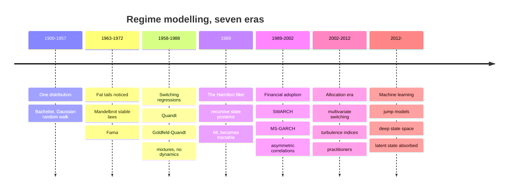
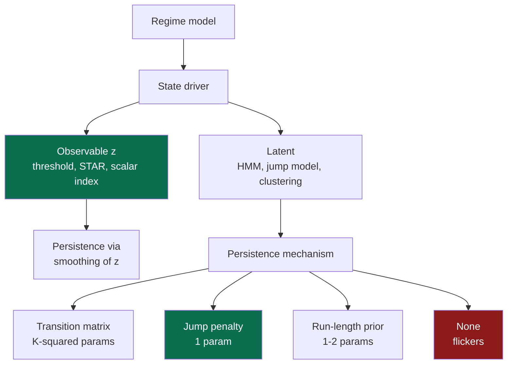
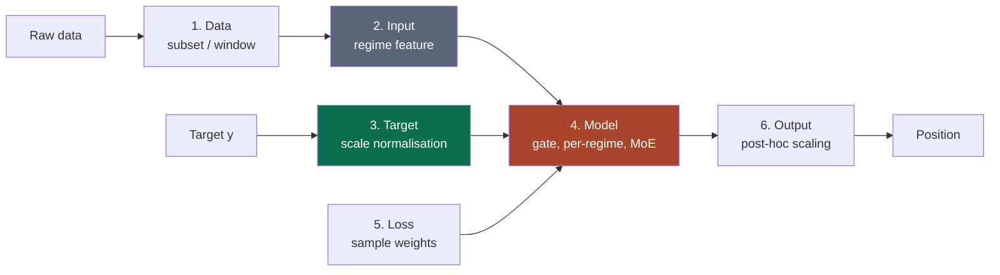
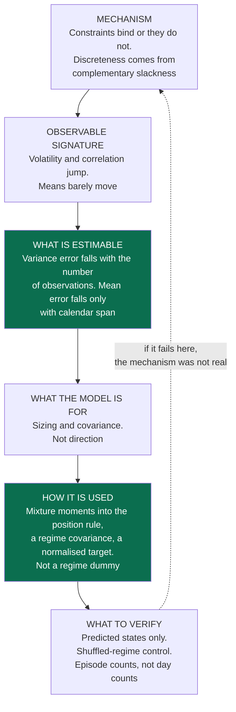
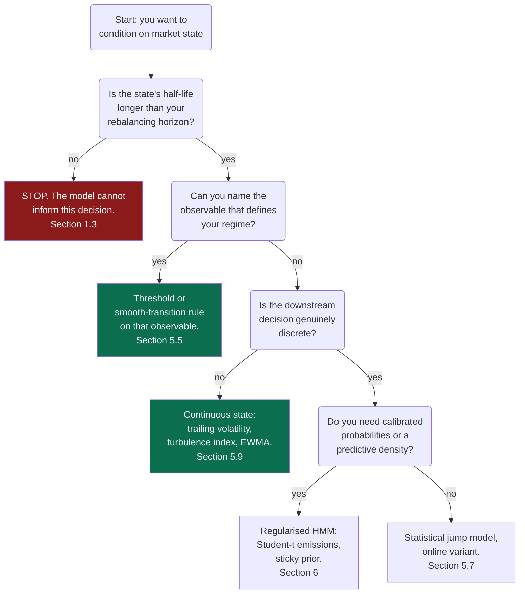

# Market Regimes and Hidden Markov Models

### What a regime model actually estimates, how to fit a hidden Markov model honestly, and where its output belongs

---

```{=html}
<aside class="eli5">
```

# ELI5 — the short version {#eli5}

```{=latex}
\begin{eli5}
```

**In one sentence.** A "regime" is not something the market has; it is a way of chopping time into a few boxes inside a model you chose — and the honest finding of sixty years of work, confirmed on a century of US stock returns, is that the standard model for it tells *calm* from *turbulent* well and *going up* from *going down* not at all, so its value lies in setting risk, not in picking direction.

**1. The word names a model output, and the output is a set of probabilities** ([§1](#1-what-a-market-regime-is)). "Which regime are we in?" has no answer until you have decided how many there are and how they behave. Two people using different models are not disagreeing about the world; they are using different rulers. And a good regime model never answers with a single label. It says something like "70% calm, 30% stressed". Flattening that into the most likely label throws away the model's own uncertainty, and it is the most common implementation error in the field.

**2. Everything useful comes from persistence** ([§1](#1-what-a-market-regime-is)). If the state were redrawn at random every day, the model would predict nothing. It is useful only because today's state tends to carry into tomorrow, and how fast that tendency fades puts a hard ceiling on how far ahead it can help. Work out how long the model's memory lasts; if it is shorter than the gap between your trades, stop.

**3. The workhorse is the hidden Markov model** ([§5](#5-the-formal-models), [§6](#6-hidden-markov-models-in-practice), [§7](#7-taxonomy-and-equivalences)). Picture a hidden switch with a few settings, each producing returns of a different character, and a rule for how often the switch flips. You never see the switch; you infer it from the returns. Most other regime methods — clustering, "jump" models, mixtures — turn out to be this same model with a restriction added or removed.

**4. The result that governs everything else** ([§8](#8-what-is-known-to-work-and-what-is-not)). How *volatile* a state is gets easier to estimate with more observations. Its average *return* improves only with more calendar time, which you cannot buy. Even with ten years of daily data and a perfectly specified model, the estimated return gap between two states comes out with the wrong sign about one time in six, while the volatility difference from the same fit is pinned down sixteen times more sharply. That is arithmetic, not bad implementation.

**5. A century of US stocks says the same** ([§6](#6-hidden-markov-models-in-practice)). Fitted the way it would have been in real time, a two-state model splits days into calm (about 10% annual volatility) and turbulent (about 28%). Looking back, the turbulent state seems to lose money and the calm one to make it — a gap of about 40 points a year. Forecasting ahead, the gap vanishes: the days the model flagged as turbulent *in advance* were more than twice as volatile and earned no less. The apparent "bear state" was hindsight.

**6. Fitting it well is mostly about buying persistence** ([§6](#6-hidden-markov-models-in-practice)). Twenty years of daily data hold only a few dozen regime changes, so the switching rule is estimated from very little. Letting each state have occasional extreme days, so that one bad day no longer counts as a regime change, doubled how long the fitted states last and halved how often they flip. Never let the model see the future: several popular software tools report hindsight-based probabilities by default.

**7. Fitting well is not evidence** ([§2](#2-why-regimes-could-exist)). A process whose volatility drifts smoothly, with no regimes anywhere, produces data that regime models fit beautifully, and adding states always improves the fit. On US stocks, a simple running volatility estimate with fat tails forecast tomorrow's range of outcomes better than the regime model did.

**8. So what is it worth?** ([§12](#12-trading-a-regime-aware-model)). Over 80 years of US data, shrinking the position when the model expects turbulence lifted risk-adjusted return a little — from about 0.52 to about 0.6, within the margin of error — and cut the worst loss from 59% to about 40%. Regimes earn their keep on risk, correlation and drawdown. Directional timing does not survive. Do the trading-cost arithmetic first: in a realistic simulation the overlay breaks even at about 13 basis points of one-way trading cost.

**9. Inside a forecasting model, scale matters more than the regime** ([§9](#9-which-shift-do-you-have), [§10](#10-conditioning-a-forecasting-model)). A regime feature cannot fix a problem with noise levels. The highest-value change is not a regime model at all: divide the thing you are predicting by a trailing volatility estimate. Without that, the most turbulent fifth of days supplies about two-thirds of the error the model learns from.

**10. Count episodes, not days** ([§11](#11-research-and-evaluation)). Your real sample is the number of separate crises, perhaps forty in twenty years. Four years of accumulated crisis leaves risk-adjusted return uncertain by more than 0.5. Shuffle the regime labels while keeping their persistence and confirm your result disappears; simulate from a process with no regimes and confirm your pipeline finds nothing.

---

**If you do only three things:** use regimes to set risk rather than direction, keep the probabilities and use only those computed before the fact, and normalise anything you forecast by trailing volatility.

```{=latex}
\end{eli5}
```

```{=html}
</aside>
```

---

**What this is.** "Regime" is the most overloaded word in systematic trading. It
is used for a latent Markov state, for a VIX threshold, for a business-cycle
phase, for a correlation cluster, and for the vague feeling that this year is not
like last year. This chapter takes the concept apart: what a regime model *is*
mathematically, what sixty years of literature on it has actually established,
which parts of that literature survive contact with out-of-sample data, how to
fit the central model of the field — the hidden Markov model — honestly, and how
to use its output for sizing, risk, and forecasting without fooling yourself or
wasting the effort.

**How to read it.** Part I (§1–§8) is the model layer: what a regime is, why one
might exist, how the field arrived here, the formal model zoo, the hidden Markov
model in practice, the taxonomy that collapses the zoo, and an honest scorecard
of what works. Part II (§9–§13) is the use layer: the statistical framing that
tells you *which* scheme your problem calls for when a forecasting model consumes
the regime, the schemes themselves, the research and evaluation protocol, and
what to do in live trading.

Appendix A defines every concept the main text uses without explaining, ordered
so that it reads as a build-up rather than a glossary; §5, §6 and §10 lean on it
most.

If you read three things, read **§8.1** (why regime models identify volatility
and not returns, with the simulation), **§6.11** (the same result on a century of
US equity returns, fitted walk-forward with Student-t emissions), and **§11.2** (the eight
ways regime research leaks). If you are implementing, §6, §10 and §11 are the
working sections and the rest is reference.

**What you will be able to do.** After this chapter you should be able to:

1. Say what a regime model estimates, and compute from a fitted transition matrix
   the horizon beyond which it cannot help.
2. Fit a hidden Markov model by EM with heavy-tailed emissions, a persistence
   prior and walk-forward parameters, and check it with pseudo-residuals.
3. Explain why state volatilities are identified and state means are not, and
   design around it.
4. Choose among threshold rules, continuous indices, jump models and HMMs for a
   given decision.
5. Feed a regime estimate into a position rule, a risk model or a forecasting
   model without look-ahead, and evaluate the result with episode-counted
   standard errors.

**Relationship to the other notes.** [Trend-Following in Financial
Markets](trend_following.html) derives what a trend rule earns; several of its
results reappear here, because a trend filter is a two-state regime classifier
with the states named "up" and "down". [Momentum in Financial
Markets](momentum_deep_dive.html) covers signal measurement, and [Simple and Log
Returns](log_returns.html) covers the return conventions used throughout. Each
stands alone.

**Epistemic tags.** Claims are flagged by status:

- **[Fact]** — replicated across independent datasets or implementations, with
  broad agreement among people who have looked.
- **[Contested]** — documented, but with live disagreement about magnitude,
  robustness, or cause.
- **[Hypothesis]** — a proposed mechanism, not decisively tested.
- **[Practice]** — practitioner convention. May well be right; the evidence is
  private or absent.

Untagged sentences are definitions, derivations, or arithmetic. Several results
come from simulations run for this chapter; those are labelled **[Simulated]**.
The worked example of §6.11 uses real data. The generating code for both is
committed alongside this document in
[`figures/`](https://github.com/rmahfoud/quant-research/tree/master/figures){target="_blank"}, so you can change the parameters and rerun.

---

**Notation.** $r_t$ is the return of the traded asset over bar $t$ (log returns
unless noted), $A$ the number of bars per year (252 for daily data), and
$\mathcal{F}_t$ the information set available at the *end* of bar $t$.

$s_t \in \{1, \dots, K\}$ is the **regime** — a latent discrete state — and $K$
the number of regimes. ($S_t$, the asset price elsewhere in these notes, does not
appear in this chapter.) $\mathbf{P}$ is the $K \times K$ transition matrix with
entries $p_{jk} = \Pr(s_{t+1} = k \mid s_t = j)$, $\boldsymbol{\pi}$ its
stationary distribution, and $\lambda_2$ its second-largest eigenvalue in
modulus. $\psi$ collects the parameters of the state process; in §6.6 the vectors
$\psi_{jk}$ are the coefficients that tie transitions to lagged covariates
$z_{t-1}$. $\theta_k$ collects the parameters of the observation (emission) distribution in
state $k$: for Gaussian emissions the mean $\mu_k$ and standard deviation
$\sigma_k$; for Student-t emissions (§6.3) the location $\mu_k$, the scale
$\sigma_k$ and the degrees of freedom $\nu_k$. $D_k$ is the length of a visit
to state $k$ (§6.5).

Three different state beliefs recur throughout and are never interchangeable:

$$
\underbrace{\xi_{t|t-1}}_{\text{predicted}} = \Pr(s_t \mid \mathcal{F}_{t-1}),
\qquad
\underbrace{\xi_{t|t}}_{\text{filtered}} = \Pr(s_t \mid \mathcal{F}_{t}),
\qquad
\underbrace{\xi_{t|T}}_{\text{smoothed}} = \Pr(s_t \mid \mathcal{F}_{T}).
$$

Each is a $K$-vector of probabilities; $\xi_{t|t}^{(k)}$ denotes its $k$-th
component. $T$ is the last observation in the sample. The distinction between
these three objects is the single largest source of false results in this field,
and §5.1 is devoted to it. The pairwise smoothed probability of a transition,
$\xi_{t-1,t|T}^{(jk)} = \Pr(s_{t-1} = j, s_t = k \mid \mathcal{F}_T)$, appears in
estimation (§6.1).

On the forecasting side, $x_t \in \mathbb{R}^d$ is the feature vector known
at $t$, $y_t$ the prediction target realised over $(t, t+h]$, and $h$ the
forecast horizon in bars. In §5 and §6, where the HMM's observation is not a
forecasting target, $y_t$ is simply the observation at $t$ (usually $r_t$).
$f(\cdot)$ is the fitted model and $m(x) = \mathbb{E}[y \mid x]$ the true
conditional mean. When $f$ carries a parameter argument — $f(\cdot \mid
\theta_k)$ — it means the state-$k$ observation density instead; the argument is
what distinguishes the two. $p(x)$, $p(y \mid x)$ and $p(x, y)$ denote the
feature, conditional, and joint distributions; subscripting them by $k$ (as in
$p_k(y \mid x)$) means "conditional on regime $k$". $w_t$ is a training sample
weight, $g(\cdot)$ a gating function, and $\hat\sigma_t$ an
$\mathcal{F}_t$-measurable estimate of return volatility.

Two symbols carry a standing qualification: $\sigma$ is always a return
volatility or scale (never a significance level or a sigmoid), and $K$ is always
the number of regimes (never a kernel or a Kalman gain).

Matrices and constant vectors are bold: $\mathbf{P}$, $\boldsymbol{\pi}$, and
$\mathbf{1}$, the vector of ones. Every other vector ($\xi$, $x_t$, $z_t$,
$\theta_k$) is plain, and the context says which it is. The one bold exception is
the cross-asset return vector $\mathbf{r}_t$ of §5.9. Symbols that belong to a
single model ($\beta$, $\omega$, $c$, $\gamma$ and similar) are defined where the
model appears, and a few letters change meaning between models. The one to watch
is $\lambda$: it is the second eigenvalue ($\lambda_2$), the jump penalty (§5.7, §7.2)
or an exponential decay factor (§6.8, §6.11, §10.3), and each use says which.
In §12 and A.45–A.46 a plain $\pi_t$ is a position size, not a component of the
stationary distribution (which is always $\boldsymbol{\pi}$ or $\pi_k$, indexed by state).

---

## Table of contents

- [ELI5 — the short version](#eli5)

**Part I — What a regime is, and what is known about it**

1. [What a market regime is](#1-what-a-market-regime-is)
2. [Why regimes could exist](#2-why-regimes-could-exist)
3. [How the field evolved](#3-how-the-field-evolved)
4. [Foundational references](#4-foundational-references)
5. [The formal models](#5-the-formal-models)
6. [Hidden Markov models in practice](#6-hidden-markov-models-in-practice)
7. [Taxonomy and equivalences](#7-taxonomy-and-equivalences)
8. [What is known to work, and what is not](#8-what-is-known-to-work-and-what-is-not)

**Part II — Using a regime model**

9. [Which shift do you have?](#9-which-shift-do-you-have)
10. [Conditioning a forecasting model on the regime](#10-conditioning-a-forecasting-model)
11. [Research and evaluation](#11-research-and-evaluation)
12. [Trading a regime-aware model](#12-trading-a-regime-aware-model)
13. [Synthesis](#13-synthesis)

**Appendix**

- [A. Concepts and prerequisites](#appendix-a-concepts-and-prerequisites) — every
  advanced idea the main text leans on, built from first principles and ordered by
  dependency. Start here if a term in §5, §6 or §10 is unfamiliar.

---

# 1. What a market regime is {#1-what-a-market-regime-is}

## 1.1 The wrong intuition

Ask a portfolio manager what regime the market is in and you will get an answer:
risk-on, late-cycle, a high-inflation regime, a dispersion regime. The answer is
delivered as a statement about the world, in the same grammatical register as
"the S&P is at 5,400". That grammar is the problem, because it presupposes that
the regime is a fact about the market which you could in principle observe and
might currently be getting wrong.

It isn't. What you observe is a sequence of returns. Any such sequence can be
represented as a discrete-state process modulating a family of distributions, in
infinitely many ways. Fit a two-state Gaussian mixture and you get a calm state
and a turbulent one. Fit four and you get something like crash, slow growth,
bull, and recovery — which is exactly what [Guidolin and Timmermann (2007)](https://papers.ssrn.com/sol3/papers.cfm?abstract_id=940652){target="_blank"} report
for joint stock and bond returns, because four is what they fitted. Fit twelve
and the likelihood will find work for all twelve. None of these is more correct
than the others in any sense the data can adjudicate, because a $K$-component
mixture is a universal approximator for densities: with enough components you can
fit any distribution to any tolerance, and with enough states you can fit any
path.

So "this market has regimes" is not, on its own, a claim about the world. It
becomes one only when you fix $K$, fix the state dynamics, and commit to
out-of-sample evaluation. Everything hard about this field descends from that
sentence, and the fact that the standard test for "how many regimes are there"
does not have a standard distribution (§8.2) is not a technical footnote — it is
the central difficulty wearing a technical disguise.

## 1.2 The right starting point: a conditional density with a discrete bottleneck

Here is the object, stated once and used throughout. A regime model asserts that
the one-step-ahead predictive density of returns is a finite mixture:

$$
p(r_t \mid \mathcal{F}_{t-1})
  = \sum_{k=1}^{K} \underbrace{\xi_{t|t-1}^{(k)}}_{\text{weight}}
    \cdot \underbrace{f(r_t \mid \theta_k)}_{\text{component}} ,
$$

where $\xi_{t|t-1}^{(k)} = \Pr(s_t = k \mid \mathcal{F}_{t-1})$ is your predicted
probability of being in state $k$ and $f(\cdot \mid \theta_k)$ is the return
distribution that state implies. Read what this says:

- **The regime is never observed.** The mixture is what generates data; the state
  is a latent index. What you can compute is a *posterior over states*, never the
  state itself.
- **The state label is not the object; the predictive density is.** Collapsing
  $\xi_{t|t-1}$ to its argmax and treating that label as data throws away the
  model's own statement about how confident it is. This is the most common
  practitioner error in the field, and §10.1 says what to feed instead.
- **The model earns its keep only by beating the alternatives**, which are a
  single distribution ($K = 1$) and a continuously-varying parameter (stochastic
  volatility, GARCH). It frequently does not. §8.7.

The phrase to hold on to is **discrete bottleneck**. Asserting $K$ regimes is
asserting that everything relevant about the conditional distribution of returns
can be compressed into which of $K$ boxes you are in. That compression buys
statistical efficiency — every observation assigned to box $k$ contributes to
estimating the single parameter vector $\theta_k$ — and costs fidelity, because
the world is not boxes. Whether the trade is worth making is an empirical
question with a different answer for volatility (usually yes) than for expected
returns (usually no), and §8 is about why.

## 1.3 Persistence is the entire forecasting content

One consequence of §1.2 deserves its own subsection because it is quantitative,
it is routinely violated in practice, and it takes three lines to derive.

Suppose $s_t$ were independent across $t$ — a mixture with no memory. Then
$\Pr(s_t = k \mid \mathcal{F}_{t-1}) = \pi_k$ for every history, the predictive
density collapses to the *unconditional* mixture $\sum_k \pi_k f(\cdot \mid
\theta_k)$, and the model forecasts nothing. It has told you that returns are
fat-tailed and heteroskedastic on average. That is a real fact, but it is not a
signal.

All forecasting content therefore lives in the gap between the transition matrix
$\mathbf{P}$ and the no-memory matrix $\mathbf{1}\boldsymbol{\pi}^{\top}$, and
that gap is governed by the second-largest eigenvalue of $\mathbf{P}$. Write the
eigendecomposition of an ergodic chain: $\lambda_1 = 1$ with left eigenvector
$\boldsymbol{\pi}$, and the remaining eigenvalues $|\lambda_2| \ge \dots \ge
|\lambda_K|$ control the transient. Then

$$
\mathbf{P}^{h} = \mathbf{1}\boldsymbol{\pi}^{\top} + O(|\lambda_2|^{h}),
$$

so an $h$-step-ahead state forecast reverts to the unconditional distribution
geometrically at rate $|\lambda_2|$. For a two-state chain there is a closed
form:

$$
\lambda_2 = p_{11} + p_{22} - 1 ,
\qquad
\text{half-life} = \frac{\ln 2}{-\ln |\lambda_2|} \ \text{bars.}
$$

The absolute value matters only in the anti-persistent case
$p_{11} + p_{22} < 1$, where $\lambda_2 < 0$ and the state belief alternates as
it decays; fitted financial chains are sticky, with $\lambda_2$ close to one.

**This is a hard ceiling on the horizon at which a regime model can help you**,
and it is computable from the fitted transition matrix before you run a single
backtest. Take the calibration used throughout this document — $p_{11} = 0.99$
for a calm state with expected duration 100 days, $p_{22} = 0.96$ for a turbulent
state with expected duration 25 days. Then $\lambda_2 = 0.95$, the half-life is
13.5 days, and at a 60-day horizon $\lambda_2^{60} = 0.046$: **more than 95% of
the state information is gone.** A model fitted on daily data with these
dynamics cannot inform a quarterly asset-allocation decision, no matter how
convincing its in-sample regime plot looks. If you intend to rebalance
quarterly, you need a state process whose half-life is measured in quarters —
which is a different model with different data requirements, not the same model
sampled less often.

> **Diagnostic.** Compute $|\lambda_2|$ and its half-life the moment you fit a
> transition matrix, and compare it to your rebalancing horizon. If the half-life
> is shorter than the horizon, the regime model is decoration. **[Practice]**

## 1.4 The master form

Generalising §1.2 to cover everything in §5, a regime model is a pair of
equations — a state process and a state-conditional observation model:

$$
\begin{aligned}
s_t &\sim q\!\left(s_t \mid s_{t-1},\, z_{t-1};\, \psi\right)
   && \text{(state dynamics)} \\[2pt]
y_t \mid s_t = k &\sim f\!\left(\cdot \mid x_t;\, \theta_k\right)
   && \text{(regime-conditional observation model)}
\end{aligned}
$$

Here $\psi$ collects the parameters of the state process, $z_{t-1}$ is any
observable that may drive transitions, and $x_t$ any observable that may drive
the observation. Four slots vary, and every model in §5
is a choice of the four:

| Slot | Question | Range of choices |
|---|---|---|
| **What varies** | Which parameters depend on $k$? | mean only; variance only; mean and variance; full covariance; the whole regression function; the noise distribution |
| **State dynamics** | How does $s_t$ move? | Markov; semi-Markov with explicit durations; threshold on observable $z$; i.i.d. mixture; single permanent break |
| **State driver** | What determines the transition? | endogenous (past $y$); exogenous ($z$); free (latent only) |
| **Inference and use** | What do you condition on, and what consumes it? | predicted / filtered / smoothed; hard label or posterior; feeds parameters, weights, features, or a gate |

Two things are worth noticing immediately. First, the *inference and use* slot is
not part of the model — it is part of the research protocol — yet it swamps the
other three in its effect on measured performance. Second, most of the literature
varies slot 1 and slot 2 while holding slots 3 and 4 fixed, which is why the
model zoo of §5 looks larger than the design space of §7 turns out to be.

## 1.5 What a regime is not

A great deal of confusion is dissolved by putting the near neighbours in a table
and saying how each differs.

| Object | What it is | How it differs from a regime |
|---|---|---|
| **Trend** | a signed conditional mean, $\mathbb{E}[r_t \mid \mathcal{F}_{t-1}]$ | continuous-valued and *ordered*; regimes are categorical and unordered |
| **Structural break** | a one-time permanent parameter change | non-recurrent — you never come back, so there is nothing to estimate from history about the new state |
| **Stochastic volatility** | a continuous latent scale $\sigma_t$ | no discrete bottleneck; $\sigma_t$ takes a continuum of values |
| **GARCH** | $\sigma_t^2$ as a deterministic function of past returns | no latent state at all — $\sigma_t$ is $\mathcal{F}_{t-1}$-measurable, so there is nothing to filter |
| **Conditioning variable** | an observable such as the dividend yield or the VIX | observable and continuous; you can regress on it directly |
| **Business-cycle phase** | an economic classification (e.g. NBER dates) | published with a 6–18 month lag and revised; not $\mathcal{F}_t$-measurable, so unusable as a live signal † |
| **Microstructure state** | order-book condition (wide/tight, toxic/benign) | different time scale by five orders of magnitude, and a different object |
| **Cross-sectional cluster** | a partition of *assets* | a regime is a partition of *time*; the two are often confused because both use $k$-means |

† The NBER Business Cycle Dating Committee's announcements are the canonical
example of a variable that is informative, widely cited, and completely
untradable at the dates it labels. Any backtest that conditions on NBER
recession dates without lagging them by the actual announcement delay is
reporting a fantasy. **[Fact]**

The GARCH row is the one to sit with. **The most common alternative to a regime
model is not "no model" — it is a continuous-state model, and the continuous
model usually wins.** A regime model buys you interpretability and a natural
place to hang discrete decisions; it pays for that with a coarse approximation to
a state variable that is, on the evidence, continuous. §8.7 puts numbers on the
trade.

> ### §1 Key takeaways
>
> 1. A regime is a property of a model, not of the market. The question "what
>    regime are we in" is only well posed after you have fixed $K$ and the state
>    dynamics.
> 2. The object a regime model produces is a predictive *density*
>    $\sum_k \xi_{t|t-1}^{(k)} f(\cdot \mid \theta_k)$, not a label. Collapsing to
>    the argmax label discards the model's own uncertainty and is the most common
>    implementation error in the field.
> 3. All forecasting content lives in the persistence of the state. An i.i.d.
>    mixture predicts nothing beyond the unconditional distribution.
> 4. The second eigenvalue of the transition matrix sets a hard ceiling on the
>    useful forecast horizon. Compute its half-life before you backtest; if it is
>    shorter than your rebalancing interval, stop.
> 5. Regimes are categorical partitions of *time*. Trends, stochastic volatility,
>    GARCH, conditioning variables, and cross-sectional clusters are all
>    different objects, and three of them are usually better tools.
> 6. NBER-style economic regime labels are published with a lag and revised.
>    Using them unlagged is a look-ahead, not a modelling choice.

---

# 2. Why regimes could exist {#2-why-regimes-could-exist}

Before fitting anything it is worth asking what would have to be true of the
world for a *discrete* state model to be the right description. This matters more
than it sounds, because most proposed mechanisms predict *continuous* variation
in conditional moments, and a continuous mechanism observed through a discrete
model produces exactly the kind of unstable, sample-dependent state estimates
that §8 documents.

There is one mechanism family that genuinely predicts discreteness, and it is not
the one usually cited.

## 2.1 Family A — occasionally binding constraints

The strongest microfoundation for discreteness is an inequality constraint that
sometimes binds and sometimes does not. Intermediaries face leverage limits,
margin requirements, VaR budgets, and redemption thresholds. Each is a constraint
of the form $c(\text{state}) \le \bar{c}$, and the associated Lagrange multiplier
is exactly zero when it is slack and strictly positive when it binds. That is not
an approximation to a discrete state — **it is a discrete state**, arising from
the complementary-slackness condition of an optimisation problem.

The consequences are asymmetric and fast. Brunnermeier and Pedersen (2009) model
the feedback between market liquidity and funding liquidity, in which a shock
that tightens funding forces deleveraging, which widens spreads, which tightens
funding further. He and Krishnamurthy (2013) and Adrian, Etula and Muir (2014)
develop the asset-pricing consequences: intermediary net worth is a priced state
variable, and its effect on risk premia is strongly nonlinear near the
constraint. **[Contested]** — the mechanism is well formalised and the
intermediary-capital factor prices assets in-sample, but whether the
constraint-binding indicator is *measurable in real time* well enough to trade is
a different and much weaker claim.

This family predicts things the others do not, which makes it the most
falsifiable: state transitions should be **fast in one direction and slow in the
other** (constraints bind abruptly and relax gradually), correlations should
*rise* in the constrained state as everyone liquidates the same assets, and the
state should be visible in funding-market observables (repo spreads, cross-
currency basis, dealer balance sheets) before it is visible in returns.

## 2.2 Family B — policy and institutional regimes

Central-bank reaction functions really do change, discretely, when the committee
or the mandate changes. Sims and Zha (2006) fit a multivariate regime-switching
model to U.S. monetary policy and find three coefficient regimes roughly matching
the periods that narrative accounts identify. Their headline result is more
interesting than the existence of the regimes, though, and it recurs throughout
this document: **the best-fitting specification allowed time variation in
disturbance variances only.** When they allowed coefficients to switch as well,
the improvement was modest and the regime differences were too small to explain
the inflation of the 1970s–80s. **[Fact]**

Regulatory changes (Reg NMS, Basel III, the Volcker Rule), index-methodology
changes, and market-structure changes (decimalisation, the rise of ETFs) are the
same kind of event: genuinely discrete, dated, and externally observable. Note
what that last property implies — if the regime is externally observable, you
should condition on the observable directly rather than inferring a latent state
from returns (§5.5, §7.4).

## 2.3 Family C — the leverage cycle and multiple equilibria

Geanakoplos's leverage cycle and the limits-to-arbitrage literature (Shleifer and
Vishny, 1997) describe positive feedback: falling prices reduce collateral value,
which forces sales, which lowers prices. Positive feedback loops admit multiple
equilibria, and multiple equilibria are discrete by construction. **[Hypothesis]**
— the theory is well developed, but distinguishing "the system jumped between
equilibria" from "a large shock hit a continuous system" using return data alone
has not, on the published evidence, been done convincingly.

## 2.4 Family D — investor composition and beliefs

Barberis, Shleifer and Vishny (1998) model investor sentiment *as* a
regime-switching process: the representative investor believes earnings follow
either a mean-reverting or a trending regime, and Bayesian updating between the
two generates under- and over-reaction. This is a rare case where the regime
model is the economic theory rather than a statistical convenience. Flow-driven
versions — retail participation, systematic-strategy crowding, dealer gamma
positioning — make the same argument about who is trading rather than what they
believe. **[Contested]**

## 2.5 Family E — the business cycle

Expected returns vary with business conditions: Fama and French (1989) show that
dividend yields and term spreads forecast returns with cyclical patterns, and
Cochrane's (2011) survey makes the case that essentially all of the variation in
asset prices is discount-rate variation, which is cyclical. Henkel, Martin and
Nardari (2011) sharpen this into a regime statement: **short-horizon return
predictability is concentrated in recessions and close to zero in expansions.**
[Farmer, Schmidt and Timmermann (2023)](https://papers.ssrn.com/sol3/papers.cfm?abstract_id=3152386){target="_blank"} find the same shape without imposing a
cycle — predictability arrives in short, localised "pockets".

This is the most economically respectable case for regime-conditional *return*
models, and it comes with two caveats. First, business-cycle phases are long: a
model with cycle-length persistence has perhaps 10–15 independent observations in
a post-war sample, which is the identification problem of §8.1 in its most acute
form. Second, the pockets result has been challenged — Cakici and co-authors
published a replication in the *Journal of Finance* in 2025 disputing the
out-of-sample economic significance. **[Contested]**

## 2.6 Family F — there are no regimes

The null deserves to be stated as forcefully as the alternatives, because it is
the hypothesis most consistent with the evidence and the one most rarely tested.

A single process with persistent stochastic volatility and heavy tails —
no discrete states anywhere — produces sample paths that a regime model will
happily describe with two to four states, with convincing-looking state plots and
a significant-looking likelihood improvement. [Diebold and Inoue (2001)](https://www.nber.org/papers/t0264){target="_blank"} prove a
version of this analytically: **stochastic regime switching and long memory are
easily confused, even asymptotically**, and a process with occasional breaks
generates estimated long-memory parameters, while a long-memory process generates
apparent breaks. Granger and Hyung (2004) demonstrate the same confusion
empirically on S&P 500 absolute returns. The precedent is Perron (1989), who
showed that a trend-stationary series with one break is nearly indistinguishable
from a unit root.

The practical statement: **a likelihood improvement from adding regimes is not
evidence that regimes exist.** It is evidence that your single-state model was
misspecified, which you already knew, and a mixture is a flexible way to absorb
misspecification. **[Fact]**

## 2.7 Telling the families apart

Most of the time you cannot, and pretending otherwise is how research programmes
die. But the families do make different predictions, and a few of them are
testable on data you already have.

| Prediction | Constraints (A) | Policy (B) | Leverage cycle (C) | Business cycle (E) | No regimes (F) |
|---|---|---|---|---|---|
| Transition asymmetry | fast in, slow out | either | fast in, slow out | symmetric | none expected |
| Correlations rise in bad state | strongly yes | no | yes | mildly | mildly † |
| State visible in non-return data | yes (funding) | yes (dated) | partly | yes (macro) | no |
| Optimal $K$ stable across samples | yes | yes | — | — | **no** |
| Beaten by a continuous-vol model | no | no | — | — | **yes** |

† A stochastic-volatility null does generate correlation increases in high-vol
periods, purely mechanically, because correlations estimated over high-variance
windows are biased upward when the common factor's variance rises faster than the
idiosyncratic. [Forbes and Rigobon (2002)](https://www.nber.org/papers/w7267){target="_blank"} made this point about "contagion" and it
applies verbatim here: **an increase in measured correlation during a crisis is
partly an artefact of the volatility increase, not independent evidence of a
regime.**

The last two rows are the ones to act on, and they yield two concrete
experiments you can run in an afternoon:

1. **Stability of $K$.** Fit $K = 2, 3, 4, 5$ on disjoint halves of your sample
   and on bootstrapped resamples. If the selected $K$ and the fitted $\theta_k$
   move around, you are fitting misspecification, not structure.
2. **The continuous-model horse race.** Fit a GARCH or stochastic-volatility
   model and a regime model, and compare *out-of-sample predictive
   log-likelihood*, not in-sample fit. In most published comparisons, and in the
   worked example of §6.11, the continuous model wins on volatility and the two
   are hard to separate on everything else. **[Practice]**

And one more that is worth more than both: **make the state predict something it
was not fitted on.** A state extracted from equity returns that also lines up
with credit spreads, funding costs, or realised dispersion is more likely to be
real than one that only explains the series it was estimated from.

> ### §2 Key takeaways
>
> 1. Occasionally binding constraints are the only mechanism family that predicts
>    genuine discreteness rather than continuous variation, because a
>    complementary-slackness condition literally *is* a two-state system.
> 2. Policy regimes are real, dated, and externally observable — which argues for
>    conditioning on the observable rather than filtering a latent state.
> 3. Sims and Zha's result generalises: when you let both means and variances
>    switch, the variance switching does nearly all the work. This recurs at every
>    level of this document.
> 4. Return predictability is concentrated in bad times — the best economic case
>    for regime-conditional alpha — but bad times are rare, so the sample is tiny
>    and the finding is contested.
> 5. A stochastic-volatility process with no regimes anywhere produces data that
>    regime models fit beautifully. Likelihood improvement from adding states is
>    not evidence that states exist.
> 6. Two cheap discriminating tests: is the selected $K$ stable across subsamples,
>    and does a continuous-state model beat the discrete one out of sample? Run
>    both before building anything.
> 7. Rising correlations in crises are partly a mechanical artefact of rising
>    volatility ([Forbes and Rigobon, 2002](https://www.nber.org/papers/w7267){target="_blank"}), not independent evidence of a regime.

---

# 3. How the field evolved {#3-how-the-field-evolved}

The history explains the shape of the current literature — in particular why
the econometrics is deep and the trading evidence is thin, and why the
speech-recognition and machine-learning communities developed the same objects
under different names.


```mermaid
timeline
    title Regime modelling, seven eras
    1900-1957 : One distribution : Bachelier, Gaussian random walk
    1963-1972 : Fat tails noticed : Mandelbrot stable laws : Fama
    1958-1988 : Switching regressions : Quandt : Goldfeld-Quandt : mixtures, no dynamics
    1989      : The Hamilton filter : recursive state posterior : ML becomes tractable
    1989-2002 : Financial adoption : SWARCH : MS-GARCH : asymmetric correlations
    2002-2012 : Allocation era : multivariate switching : turbulence indices : practitioners
    2012-     : Machine learning : jump models : deep state space : latent state absorbed
```

## 3.1 Era I — One distribution (1900–1957)

**Contribution.** Bachelier's 1900 thesis modelled prices as Brownian motion; the
mid-century finance literature adopted the Gaussian random walk as the baseline.

**What changed.** The idea that price changes are draws from a *fixed*
distribution, which is the null every subsequent era has been arguing with.

**Limitations.** Empirically wrong in the second and fourth moments, as the next
era established.

**Lasting influence.** Enormous, and mostly as a foil. Every regime paper's
introduction is a variation on "returns are not i.i.d. Gaussian".

## 3.2 Era II — Fat tails, and the first alternative to regimes (1963–1972)

**Contribution.** Mandelbrot (1963) documented that speculative price changes
have far heavier tails than the Gaussian and proposed stable Paretian
distributions; Fama (1965) confirmed and extended the evidence for U.S. stocks.

**What changed.** The field accepted non-normality. Critically, **the first
explanation offered was not regimes — it was a single heavy-tailed
distribution.** Mandelbrot's alternative was one law with infinite variance, not
two laws that alternate.

**Limitations.** Stable laws with $\alpha < 2$ imply infinite variance, which is
awkward for portfolio theory and, on the evidence of later work, not what the
data show; the tails are heavy but the variance appears finite.

**Lasting influence.** The unresolved question is the important legacy. "Is this
one fat-tailed process or two thin-tailed ones taking turns?" was never settled;
the profession simply moved on to models where the question does not have to be
answered. §2.6 and §8.7 are that question, still open.

## 3.3 Era III — Switching regressions (1958–1988)

**Contribution.** Quandt (1958) estimated a linear regression obeying two
separate regimes with an unknown switch point; Goldfeld and Quandt (1973)
introduced a Markov model for switching regressions.

**What changed.** Regimes became estimable objects rather than narrative
descriptions.

**Limitations.** The estimation was awkward and, in the mixture versions, the
state carried no persistence, so the models had no forecasting content (§1.3).
There was no efficient recursion for the state posterior, which made likelihood
evaluation expensive and multivariate extensions impractical.

**Lasting influence.** Direct — Hamilton's paper is explicitly a solution to the
computational problem this era posed.

## 3.4 Era IV — The Hamilton filter (1989)

**Contribution.** [Hamilton (1989)](https://www.econometricsociety.org/publications/econometrica/1989/03/01/new-approach-economic-analysis-nonstationary-time-series-and){target="_blank"} gave a recursive algorithm — one forward pass —
for the state posterior in a Markov-switching autoregression, making maximum
likelihood estimation tractable and, at the same time, making the distinction
between filtered and smoothed inference explicit and computable. [Kim (1994)](<https://doi.org/10.1016/0304-4076(94)90036-1>){target="_blank"}
supplied the efficient backward smoother that completes the pair.

**What changed.** Almost everything. This is the founding moment of the modern
field, and the filter is still what every implementation runs. Its structure —
predict, then update on the new observation — is identical to the Kalman filter
with a discrete state space, which is why the machine-learning literature's
forward-backward algorithm for HMMs ([Baum et al., 1970](https://doi.org/10.1214/aoms/1177697196){target="_blank"}; [Rabiner, 1989](https://doi.org/10.1109/5.18626){target="_blank"}) is the
same algorithm discovered a generation earlier in a different community.

**Limitations.** Hamilton's own application was to U.S. GNP growth, a
low-frequency, low-noise series. Financial returns are the opposite, and the
transplant was less successful than the enthusiasm of the following decade
suggested.

**Lasting influence.** Total. If you fit a regime model today, you are running
Hamilton's recursion.

## 3.5 Era V — Financial adoption, and the discovery that it is about variance (1989–2002)

**Contribution.** [Turner, Startz and Nelson (1989)](https://www.nber.org/papers/w2818){target="_blank"} applied switching to stock
returns; [Hamilton and Susmel (1994)](<https://doi.org/10.1016/0304-4076(94)90067-1>){target="_blank"} combined switching with ARCH (SWARCH); [Gray
(1996)](<https://doi.org/10.1016/0304-405X(96)00875-6>){target="_blank"} and [Haas, Mittnik and Paolella (2004)](https://doi.org/10.1093/jjfinec/nbh020){target="_blank"} solved the path-dependence problem
that makes naive MS-GARCH inestimable; [Ang and Bekaert (2002)](https://business.columbia.edu/sites/default/files-efs/pubfiles/1971/1137.pdf){target="_blank"} built the
international asset-allocation application; Longin and Solnik (2001) and [Ang and
Chen (2002)](https://doi.org/10.1016/S0304-405X(02)00068-5){target="_blank"} documented that correlations rise in down markets.

**What changed.** Two things, in opposite directions. Positively, the field
established that **regime models describe second moments well** — volatility
states are large, persistent, and estimable. Negatively, the critiques arrived
and were not answered. [Hansen (1992)](https://users.ssc.wisc.edu/~behansen/papers/jae_92.html){target="_blank"} showed that the likelihood-ratio test for
the number of regimes does not have a standard distribution, because the
transition probabilities are unidentified under the null; applying his bound to
Hamilton's own GNP model, **the switching specification could not reject a plain
AR(4)**. [Dacco and Satchell (1999)](<https://onlinelibrary.wiley.com/doi/abs/10.1002/(SICI)1099-131X(199901)18:1%3C1::AID-FOR685%3E3.0.CO;2-B>){target="_blank"} showed that regime-switching models fit
exchange rates beautifully in sample and lose to a random walk out of sample,
and — this is the part usually forgotten — explained *why*: the loss function is
asymmetric in the state-classification error, so even a model with correctly
estimated parameters forecasts worse than a constant if it misclassifies the
state often enough.

**Limitations.** The era's applied work systematically reported smoothed state
probabilities and in-sample fit.

**Lasting influence.** The second-moment result is the durable one. The
first-moment results from this era have mostly not replicated.

## 3.6 Era VI — Multivariate models and the allocation application (2002–2012)

**Contribution.** [Guidolin and Timmermann (2007)](https://papers.ssrn.com/sol3/papers.cfm?abstract_id=940652){target="_blank"} fitted four-state models to
joint stock and bond returns and solved the resulting dynamic portfolio problem;
Pelletier (2006) built regime-switching dynamic correlations; Kritzman and Li
(2010) introduced the Mahalanobis "turbulence" index and [Kritzman, Page and
Turkington (2012)](https://papers.ssrn.com/sol3/papers.cfm?abstract_id=2066848){target="_blank"} the practitioner framework built on it; [Bulla and co-authors
(2011)](https://mpra.ub.uni-muenchen.de/21154/){target="_blank"} ran the honest out-of-sample test of a Markov-switching allocation rule
including transaction costs.

**What changed.** The application shifted from *predicting returns* to *managing
risk*, which is where the evidence actually supports regime models. Kritzman,
Page and Turkington's framing — the value is in avoiding large losses, not in
picking direction — is the correct reading of the previous era's results.

**Limitations.** Much of the practitioner work in this era comes from firms that
sell regime-based products. That does not make it wrong — these authors have data
and implementation experience academics lack — but the backtests are
selection-prone and the reported improvements are typically not adjusted for the
number of specifications tried.

**Lasting influence.** High. This is the era whose framing most institutional
allocators still use.

## 3.7 Era VII — Machine learning, and the disappearing regime (2012–present)

**Contribution.** Several strands at once. Unsupervised methods —
Gaussian mixtures, $k$-means on engineered features, Wasserstein clustering of
correlation matrices — replaced likelihood-based HMMs where the emission model
was the weak link. Statistical jump models ([Bemporad et al., 2018](https://arxiv.org/abs/1711.09220){target="_blank"}; [Nystrup, Kolm
and Lindström, 2020](https://papers.ssrn.com/sol3/papers.cfm?abstract_id=3594875){target="_blank"}) replaced the probabilistic state process with an explicit
jump *penalty*, giving an objective whose state assignment is solved exactly by
dynamic programming (§5.7), a tunable persistence knob, and —
by the authors' simulations — better classification accuracy than a correctly
specified maximum-likelihood HMM. Deep latent-variable models (recurrent
switching linear dynamical systems, deep state-space models) brought
neural-network emissions to the same graphical structure.

**What changed.** The most consequential shift is a negative one. **The dominant
machine-learning approach to asset pricing does not use an explicit regime model
at all.** [Gu, Kelly and Xiu (2020)](https://www.nber.org/papers/w25398){target="_blank"} handle time variation by interacting stock
characteristics with a small set of observable macro predictors and letting the
function approximator find whatever conditional structure exists; [Chen, Pelger
and Zhu (2024)](https://arxiv.org/abs/1904.00745){target="_blank"} learn a latent macro state with a recurrent network as part of an
end-to-end asset-pricing objective rather than fitting it separately. The latent
state did not disappear — it got absorbed into the approximator, where it is
estimated jointly with the thing you actually care about instead of being handed
over from a separately fitted model with its own errors.

Meanwhile the likelihood-based HMM did not stand still. Student-t emissions,
semi-Markov durations, covariate-driven transitions, Bayesian estimation with
persistence priors and adaptive estimation with forgetting were refined and
brought to financial returns in this period (§6; several have older roots, §4),
and each addresses a specific failure of the 1989 model. The
practical question the era leaves is: **should the regime be a separate model
whose output you use directly or feed in, or a structure a forecasting model
discovers for itself?** §6.10 covers direct use, and §9 and §10 answer the
second half, which is "it depends on which distribution is shifting"; §10.9
ranks the options.

**Limitations.** The ML era has largely not engaged with the identification
critiques of Era V. A deep switching model has all of Hamilton's identification
problems plus its own, and the papers rarely report the diagnostics of §2.7
and §8.2.

> ### §3 Key takeaways
>
> 1. [Hamilton (1989)](https://www.econometricsociety.org/publications/econometrica/1989/03/01/new-approach-economic-analysis-nonstationary-time-series-and){target="_blank"} is the founding technical contribution; every implementation
>    since runs his recursion, which is the discrete-state Kalman filter and the
>    same object as the HMM forward algorithm from speech recognition.
> 2. The first proposed explanation for non-normal returns was one heavy-tailed
>    distribution, not two alternating ones. That debate was never settled — it
>    was bypassed — and it is still the live null.
> 3. The critiques landed early and were not answered. [Hansen (1992)](https://users.ssc.wisc.edu/~behansen/papers/jae_92.html){target="_blank"} showed the
>    number-of-regimes test is non-standard and that Hamilton's own model could
>    not reject an AR(4); [Dacco and Satchell (1999)](<https://onlinelibrary.wiley.com/doi/abs/10.1002/(SICI)1099-131X(199901)18:1%3C1::AID-FOR685%3E3.0.CO;2-B>){target="_blank"} showed out-of-sample failure
>    and explained the mechanism.
> 4. The durable empirical finding across every era is that regimes describe
>    second moments well and first moments badly.
> 5. The 2002–2012 practitioner era got the framing right — use regimes for risk,
>    not direction — but its evidence base is dominated by interested parties.
> 6. The modern machine-learning answer is usually to skip the explicit regime
>    model and let the approximator learn the conditioning. Whether that is right
>    depends on which distribution is shifting (§9). The HMM meanwhile gained the
>    refinements — heavy tails, durations, covariates, priors — that address its
>    original failures (§6).

---

# 4. Foundational references {#4-foundational-references}

Grouped by kind, because kinds are read differently. Each entry says why it
matters. Where a free copy exists it is linked from the title; paywalled-only
entries are marked.

## 4.1 The founding econometrics

- **Quandt, R. E. (1958).** "The Estimation of the Parameters of a Linear
  Regression System Obeying Two Separate Regimes." *Journal of the American
  Statistical Association* 53(284), 873–880. — The origin. Two regimes, one
  unknown switch point, no state process.
- **Goldfeld, S. M. & Quandt, R. E. (1973).** "A Markov Model for Switching
  Regressions." *Journal of Econometrics* 1(1), 3–15. — Adds the Markov chain.
  The model exists; the estimation is still impractical.
- **Hamilton, J. D. (1989).** ["A New Approach to the Economic Analysis of
  Nonstationary Time Series and the Business
  Cycle."](https://www.econometricsociety.org/publications/econometrica/1989/03/01/new-approach-economic-analysis-nonstationary-time-series-and)
  *Econometrica* 57(2), 357–384. — **The** paper. The recursive filter that makes
  everything else computable. Read §2–3 of it even if you read nothing else in
  this list.
- **Hamilton, J. D. (1990).** ["Analysis of Time Series Subject to Changes in
  Regime."](https://doi.org/10.1016/0304-4076(90)90093-9) *Journal of
  Econometrics* 45(1–2), 39–70. [publisher — paywalled] — The EM algorithm for
  Markov-switching models, in the notation econometricians use (§6.1).
- **Hamilton, J. D. (1994).** *Time Series Analysis.* Princeton University Press,
  chapter 22. — The textbook treatment of the filter, the smoother, and the
  EM algorithm, worked in full. This is the reference you will actually
  implement from.
- **Kim, C.-J. (1994).** ["Dynamic Linear Models with
  Markov-Switching."](https://doi.org/10.1016/0304-4076(94)90036-1) *Journal of Econometrics* 60(1–2), 1–22. — The efficient backward smoother.
  Necessary for estimation; dangerous if you use its output as a signal (§5.1).
- **Kim, C.-J. & Nelson, C. R. (1999).** [*State-Space Models with Regime
  Switching.*](https://doi.org/10.7551/mitpress/6444.001.0001) MIT Press. — The systematic treatment, including the Bayesian
  versions and the approximations that make multivariate models tractable.
- **Diebold, F. X., Lee, J.-H. & Weinbach, G. C. (1994).** ["Regime Switching
  with Time-Varying Transition
  Probabilities."](https://doi.org/10.1093/oso/9780198773917.003.0010) In C. P.
  Hargreaves, ed., *Nonstationary Time Series Analysis and Cointegration*, Oxford
  University Press, 283–302. [publisher — paywalled] — Transition probabilities
  that depend on observables, with an EM algorithm. The origin of §6.6.
- **Filardo, A. J. (1994).** ["Business-Cycle Phases and Their Transitional
  Dynamics."](https://doi.org/10.1080/07350015.1994.10524545) *Journal of
  Business & Economic Statistics* 12(3), 299–308. [publisher — paywalled] —
  Time-varying transitions driven by leading indicators; the standard applied
  template.
- **Durland, J. M. & McCurdy, T. H. (1994).** ["Duration-Dependent Transitions in
  a Markov Model of U.S. GNP
  Growth."](https://doi.org/10.1080/07350015.1994.10524543) *Journal of
  Business & Economic Statistics* 12(3), 279–288. [publisher — paywalled] —
  Transition probabilities that depend on how long the state has lasted (§6.5).
- **Hamilton, J. D. (2016).** ["Macroeconomic Regimes and Regime
  Shifts."](https://www.nber.org/papers/w21863) In J. B. Taylor & H. Uhlig,
  eds., *Handbook of Macroeconomics* vol. 2A, Elsevier, 163–201. — The founder's
  own retrospective: what the models have and have not delivered in
  macroeconomics.

## 4.2 Inference machinery, from the other community

The speech-recognition and machine-learning literature developed the same
algorithms independently, and its expositions are often clearer.

- **Baum, L. E., Petrie, T., Soules, G. & Weiss, N. (1970).** ["A Maximization
  Technique Occurring in the Statistical Analysis of Probabilistic Functions of
  Markov Chains."](https://doi.org/10.1214/aoms/1177697196) *Annals of Mathematical Statistics* 41(1), 164–171. — The EM
  algorithm for HMMs, nineteen years before Hamilton and in a different field.
- **Rabiner, L. R. (1989).** ["A Tutorial on Hidden Markov Models and Selected
  Applications in Speech Recognition."](https://doi.org/10.1109/5.18626) *Proceedings of the IEEE* 77(2), 257–286.
  — Still the best single exposition of forward-backward, Viterbi, and
  Baum-Welch. If Hamilton's notation is fighting you, read this instead.
- **Zucchini, W., MacDonald, I. L. & Langrock, R. (2016).** [*Hidden Markov Models
  for Time Series: An Introduction Using R*](https://doi.org/10.1201/b20790), 2nd ed. Chapman & Hall/CRC. — The
  practical book. Numerical stability, scaling, label switching, model checking.
- **Frühwirth-Schnatter, S. (2006).** [*Finite Mixture and Markov Switching
  Models.*](https://doi.org/10.1007/978-0-387-35768-3) Springer. — The Bayesian reference, and the best treatment of the
  label-switching and identification problems.
- **Cappé, O., Moulines, E. & Rydén, T. (2005).** [*Inference in Hidden Markov
  Models.*](https://doi.org/10.1007/0-387-28982-8) Springer. — The theory: consistency, asymptotics, and what can and
  cannot be identified.
- **Fox, E. B., Sudderth, E. B., Jordan, M. I. & Willsky, A. S. (2011).**
  ["A Sticky HDP-HMM with Application to Speaker
  Diarization."](https://arxiv.org/abs/0905.2592) *Annals of Applied Statistics*
  5(2A), 1020–1056. — Nonparametric $K$ plus an explicit persistence prior. The
  right answer to "how many regimes" if you insist on a Bayesian one, and the
  origin of the "stickiness" idea that jump models later made explicit.
- **Albert, J. H. & Chib, S. (1993).** ["Bayes Inference via Gibbs Sampling of
  Autoregressive Time Series Subject to Markov Mean and Variance
  Shifts."](https://doi.org/10.1080/07350015.1993.10509929) *Journal of
  Business & Economic Statistics* 11(1), 1–15. [publisher — paywalled] — The
  first Gibbs sampler for Markov-switching models, drawing one state at a time.
- **Carter, C. K. & Kohn, R. (1994).** ["On Gibbs Sampling for State Space
  Models."](https://doi.org/10.1093/biomet/81.3.541) *Biometrika* 81(3),
  541–553. [publisher — paywalled] — Forward filtering, backward sampling: draw
  the whole latent path at once.
- **Chib, S. (1996).** ["Calculating Posterior Distributions and Modal Estimates
  in Markov Mixture Models."](https://doi.org/10.1016/0304-4076(95)01770-4)
  *Journal of Econometrics* 75(1), 79–97. [publisher — paywalled] — The
  joint-path sampler for HMMs, which mixes far better than single-site sampling
  (§6.7).
- **Stephens, M. (2000).** ["Dealing with Label Switching in Mixture
  Models."](https://doi.org/10.1111/1467-9868.00265) *Journal of the Royal
  Statistical Society: Series B* 62(4), 795–809. [publisher — paywalled] —
  Relabelling MCMC draws after the fact.
- **Frühwirth-Schnatter, S. (2001).** ["Markov Chain Monte Carlo Estimation of
  Classical and Dynamic Switching and Mixture
  Models."](https://doi.org/10.1198/016214501750333063) *Journal of the
  American Statistical Association* 96(453), 194–209. [publisher — paywalled] —
  The random permutation sampler, and identification by ordering constraints.
- **Scott, S. L. (2002).** ["Bayesian Methods for Hidden Markov Models: Recursive
  Computing in the 21st Century."](https://doi.org/10.1198/016214502753479464)
  *Journal of the American Statistical Association* 97(457), 337–351.
  [publisher — paywalled] — The clearest review of the recursions behind Bayesian
  HMM computation.
- **Celeux, G. & Durand, J.-B. (2008).** ["Selecting Hidden Markov Model State
  Number with Cross-Validated
  Likelihood."](https://doi.org/10.1007/s00180-007-0097-1) *Computational
  Statistics* 23(4), 541–564. [publisher — paywalled] — Choosing $K$ by held-out
  likelihood rather than by an information criterion.
- **Langrock, R. & Zucchini, W. (2011).** ["Hidden Markov Models with Arbitrary
  State Dwell-Time Distributions."](https://doi.org/10.1016/j.csda.2010.06.015)
  *Computational Statistics & Data Analysis* 55(1), 715–724. [publisher —
  paywalled] — Semi-Markov durations approximated by an ordinary HMM with
  expanded states, so the standard machinery still applies (§6.5).
- **Cappé, O. (2011).** ["Online EM Algorithm for Hidden Markov
  Models."](https://arxiv.org/abs/0908.2359) *Journal of Computational and
  Graphical Statistics* 20(3), 728–749. — Recursive updating of HMM parameters as
  data arrive (§6.8).
- **Pohle, J., Langrock, R., van Beest, F. M. & Schmidt, N. M. (2017).**
  ["Selecting the Number of States in Hidden Markov Models: Pragmatic Solutions
  Illustrated Using Animal Movement."](https://arxiv.org/abs/1701.08673)
  *Journal of Agricultural, Biological and Environmental Statistics* 22(3),
  270–293. — Why information criteria over-select states, and a practical
  procedure. The application is ecology; the argument is general.
- **Software.** **Visser, I. & Speekenbrink, M. (2010)**, ["depmixS4: An R
  Package for Hidden Markov Models"](https://doi.org/10.18637/jss.v036.i07),
  *Journal of Statistical Software* 36(7); **O'Connell, J. & Højsgaard, S.
  (2011)**, ["Hidden Semi Markov Models for Multiple Observation Sequences: The
  mhsmm Package for R"](https://doi.org/10.18637/jss.v039.i04), *Journal of
  Statistical Software* 39(4); and **Ardia, D., Bluteau, K., Boudt, K., Catania,
  L. & Trottier, D.-A. (2019)**, ["Markov-Switching GARCH Models in R: The
  MSGARCH Package"](https://doi.org/10.18637/jss.v091.i04), *Journal of
  Statistical Software* 91(4). — The packages of §6.12.

## 4.3 Regime models in finance — the empirical case

- **Turner, C. M., Startz, R. & Nelson, C. R. (1989).** ["A Markov Model of
  Heteroskedasticity, Risk, and Learning in the Stock
  Market."](https://www.nber.org/papers/w2818) *Journal of
  Financial Economics* 25(1), 3–22. — The first serious equity application.
- **Hamilton, J. D. & Susmel, R. (1994).** ["Autoregressive Conditional
  Heteroskedasticity and Changes in
  Regime."](https://doi.org/10.1016/0304-4076(94)90067-1) *Journal of Econometrics* 64(1–2),
  307–333. — SWARCH: switching plus ARCH, and the demonstration that most of what
  looks like ARCH persistence is regime persistence.
- **Gray, S. F. (1996).** ["Modeling the Conditional Distribution of Interest
  Rates as a Regime-Switching Process."](https://doi.org/10.1016/0304-405X(96)00875-6)
  *Journal of Financial Economics* 42(1), 27–62. [publisher — paywalled] — Solves
  the path-dependence problem that makes naive MS-GARCH impossible to estimate.
- **Haas, M., Mittnik, S. & Paolella, M. S. (2004).** ["A New Approach to
  Markov-Switching GARCH Models."](https://doi.org/10.1093/jjfinec/nbh020) *Journal of Financial Econometrics* 2(4),
  493–530. — The cleaner solution, and the one now generally used.
- **Ang, A. & Bekaert, G. (2002).** ["International Asset Allocation With Regime
  Shifts."](https://business.columbia.edu/sites/default/files-efs/pubfiles/1971/1137.pdf)
  *Review of Financial Studies* 15(4), 1137–1187. — The canonical allocation
  application: correlations and volatilities rise together in the bad state, and
  what that does to optimal portfolios.
- **Longin, F. & Solnik, B. (2001).** "Extreme Correlation of International
  Equity Markets." *Journal of Finance* 56(2), 649–676. — Correlation is not
  constant in the tails, established with extreme-value theory rather than by
  splitting the sample.
- **Ang, A. & Chen, J. (2002).** "Asymmetric Correlations of Equity Portfolios."
  *Journal of Financial Economics* 63(3), 443–494. — The same asymmetry
  domestically, with a statistic designed to avoid the conditioning bias.
- **Guidolin, M. & Timmermann, A. (2007).** ["Asset Allocation under Multivariate
  Regime Switching."](https://papers.ssrn.com/sol3/papers.cfm?abstract_id=940652)
  *Journal of Economic Dynamics and Control* 31(11), 3503–3544. — Four states for
  stocks and bonds jointly, and the dynamic programme that uses them.
- **Ang, A. & Timmermann, A. (2012).** ["Regime Changes and Financial
  Markets."](https://www.nber.org/papers/w17182) *Annual Review of Financial
  Economics* 4, 313–337. — **The single best entry point.** Balanced, current
  enough, and honest about what the models do not deliver.
- **Sims, C. A. & Zha, T. (2006).** "Were There Regime Switches in U.S. Monetary
  Policy?" *American Economic Review* 96(1), 54–81. — Rigorous multivariate
  switching applied to policy, with the recurring punchline: variances switch,
  coefficients barely do. [publisher — paywalled]
- **Henkel, S. J., Martin, J. S. & Nardari, F. (2011).** "Time-Varying
  Short-Horizon Predictability." *Journal of Financial Economics* 99(3), 560–580.
  — Return predictability concentrated in recessions. The strongest published
  case for regime-conditional expected returns.
- **Schaller, H. & van Norden, S. (1997).** ["Regime Switching in Stock Market
  Returns."](https://doi.org/10.1080/096031097333745) *Applied Financial
  Economics* 7(2), 177–191. [publisher — paywalled] — Stock-market regimes whose
  transitions depend on deviations from fundamentals.
- **Rydén, T., Teräsvirta, T. & Åsbrink, S. (1998).** ["Stylized Facts of Daily
  Return Series and the Hidden Markov
  Model."](https://doi.org/10.1002/(SICI)1099-1255(199805/06)13:3%3C217::AID-JAE476%3E3.0.CO;2-V)
  *Journal of Applied Econometrics* 13(3), 217–244. [publisher — paywalled] —
  What a Gaussian HMM reproduces in daily returns, and the one fact it misses:
  the slow decay of autocorrelation in absolute returns.
- **Maheu, J. M. & McCurdy, T. H. (2000).** ["Identifying Bull and Bear Markets in
  Stock Returns."](https://papers.ssrn.com/sol3/papers.cfm?abstract_id=146531)
  *Journal of Business & Economic Statistics* 18(1), 100–112. — Duration-dependent
  switching on 160 years of monthly data; bull markets have a declining hazard.
- **Perez-Quiros, G. & Timmermann, A. (2000).** ["Firm Size and Cyclical
  Variations in Stock Returns."](https://doi.org/10.1111/0022-1082.00246)
  *Journal of Finance* 55(3), 1229–1262. [publisher — paywalled] — Time-varying
  transitions driven by monetary indicators, with small firms most exposed to the
  recession state.
- **Hardy, M. R. (2001).** ["A Regime-Switching Model of Long-Term Stock
  Returns."](https://doi.org/10.1080/10920277.2001.10595984) *North American
  Actuarial Journal* 5(2), 41–53. [publisher — paywalled] — The two-state
  regime-switching lognormal model, used for long-dated equity guarantees (§6.10).
- **Lunde, A. & Timmermann, A. (2004).** ["Duration Dependence in Stock Prices:
  An Analysis of Bull and Bear
  Markets."](https://doi.org/10.1198/073500104000000136) *Journal of Business &
  Economic Statistics* 22(3), 253–273. [publisher — paywalled] — Duration
  dependence in bull and bear markets dated by price rules.
- **Bulla, J. & Bulla, I. (2006).** ["Stylized Facts of Financial Time Series and
  Hidden Semi-Markov
  Models."](https://ideas.repec.org/a/eee/csdana/v51y2006i4p2192-2209.html)
  *Computational Statistics & Data Analysis* 51(4), 2192–2209. — Negative
  binomial sojourns reproduce the autocorrelation of squared returns better than
  geometric ones.
- **Kim, C.-J., Piger, J. & Startz, R. (2008).** ["Estimation of Markov
  Regime-Switching Regression Models with Endogenous
  Switching."](https://ideas.repec.org/p/fip/fedlwp/2003-015.html) *Journal of
  Econometrics* 143(2), 263–273. — What changes when the state is correlated
  with the shocks, and how to test for it.
- **Bulla, J. (2011).** ["Hidden Markov Models with t Components. Increased
  Persistence and Other Aspects."](https://doi.org/10.1080/14697681003685563)
  *Quantitative Finance* 11(3), 459–475. [publisher — paywalled] — Student-t
  emissions make the fitted states more persistent. The most useful single
  refinement for daily data (§6.3).
- **Guidolin, M. (2011).** ["Markov Switching Models in Empirical
  Finance."](https://doi.org/10.1108/S0731-9053(2011)000027B004) *Advances in
  Econometrics* 27B, 1–86. [publisher — paywalled] — A long survey of the
  applications, model by model.
- **Nystrup, P., Madsen, H. & Lindström, E. (2015).** ["Stylised Facts of
  Financial Time Series and Hidden Markov Models in Continuous
  Time."](https://ideas.repec.org/a/taf/quantf/v15y2015i9p1531-1541.html)
  *Quantitative Finance* 15(9), 1531–1541. — Documents how fitted HMM parameters
  drift through time.
- **Nystrup, P., Madsen, H. & Lindström, E. (2017).** ["Long Memory of Financial
  Time Series and Hidden Markov Models with Time-Varying
  Parameters."](https://orbit.dtu.dk/en/publications/long-memory-of-financial-time-series-and-hidden-markov-models-wit-2/)
  *Journal of Forecasting* 36(8), 989–1002. — Adaptive estimation with
  exponential forgetting; time-varying parameters reproduce long memory and
  improve density forecasts (§6.8).
- **Kole, E. & van Dijk, D. (2017).** ["How to Identify and Forecast Bull and
  Bear Markets?"](https://doi.org/10.1002/jae.2511) *Journal of Applied
  Econometrics* 32(1), 120–139. [publisher — paywalled] — Price rules date
  regimes better in sample; regime-switching models forecast better.
- **Farmer, L. E., Schmidt, L. & Timmermann, A. (2023).** ["Pockets of
  Predictability."](https://papers.ssrn.com/sol3/papers.cfm?abstract_id=3152386)
  *Journal of Finance* 78(3), 1279–1341. — Predictability arrives in short local
  episodes rather than as a stable relationship. Read with the replication in
  §4.4.

## 4.4 The critiques — read these next to §4.3

A bibliography that lists only a field's successes is marketing. These are the
papers that constrain what you should believe.

- **Hansen, B. E. (1992).** ["The Likelihood Ratio Test under Nonstandard
  Conditions: Testing the Markov Switching Model of
  GNP."](https://users.ssc.wisc.edu/~behansen/papers/jae_92.html) *Journal of
  Applied Econometrics* 7(S1), S61–S82. — The number of regimes cannot be tested
  with a standard LR test, because the transition probabilities are unidentified
  under the null. Applying a valid bound, **Hamilton's own model does not reject
  a plain AR(4)**. This is the most important critique in the field and the least
  cited relative to its importance.
- **Garcia, R. (1998).** ["Asymptotic Null Distribution of the Likelihood Ratio
  Test in Markov Switching Models."](https://doi.org/10.2307/2527399) *International Economic Review* 39(3),
  763–788. — Works out the correct asymptotics in specific cases.
- **Cho, J. S. & White, H. (2007).** ["Testing for Regime
  Switching."](https://doi.org/10.1111/j.1468-0262.2007.00809.x) *Econometrica* 75(6), 1671–1720. — The modern treatment of the same problem.
- **Dacco, R. & Satchell, S. (1999).** ["Why Do Regime-Switching Models Forecast
  So Badly?"](https://onlinelibrary.wiley.com/doi/abs/10.1002/(SICI)1099-131X(199901)18:1%3C1::AID-FOR685%3E3.0.CO;2-B)
  *Journal of Forecasting* 18(1), 1–16. — Excellent in-sample fit, worse than a
  random walk out of sample, with an analysis of *why*: state misclassification
  costs more than correct state parameters gain. [publisher — paywalled]
- **Diebold, F. X. & Inoue, A. (2001).** ["Long Memory and Regime
  Switching."](https://www.nber.org/papers/t0264) *Journal of Econometrics*
  105(1), 131–159. — Regime switching and long memory are analytically confusable
  even asymptotically. The observational-equivalence problem stated precisely.
- **Granger, C. W. J. & Hyung, N. (2004).** "Occasional Structural Breaks and
  Long Memory with an Application to the S&P 500 Absolute Stock Returns."
  *Journal of Empirical Finance* 11(3), 399–421. — The same confusion,
  demonstrated on real data.
- **Perron, P. (1989).** "The Great Crash, the Oil Price Shock, and the Unit Root
  Hypothesis." *Econometrica* 57(6), 1361–1401. — The precedent from a different
  literature: breaks and persistence are nearly indistinguishable in finite
  samples. The lesson generalises.
- **Forbes, K. J. & Rigobon, R. (2002).** ["No Contagion, Only Interdependence:
  Measuring Stock Market Comovements."](https://www.nber.org/papers/w7267)
  *Journal of Finance* 57(5), 2223–2261. — Correlation measured on
  high-volatility subsamples is biased upward for mechanical reasons. Correct for
  it before claiming a correlation regime.
- **Psaradakis, Z. & Spagnolo, N. (2003).** ["On the Determination of the Number
  of Regimes in Markov-Switching Autoregressive
  Models."](https://doi.org/10.1111/1467-9892.00305) *Journal of Time Series
  Analysis* 24(2), 237–252. — Information criteria for $K$, and how badly they
  behave.
- **Cakici, N. et al. (2025).** ["Pockets of Predictability: A
  Replication."](https://onlinelibrary.wiley.com/doi/abs/10.1111/jofi.13484)
  *Journal of Finance* 80(6), 3771–3790. — Disputes the economic significance of the Farmer et al.
  result. Cite the original and this together or neither.

## 4.5 Structural breaks and change-point detection

Different object, adjacent literature, frequently the better tool (§5.6).

- **Chow, G. C. (1960).** "Tests of Equality Between Sets of Coefficients in Two
  Linear Regressions." *Econometrica* 28(3), 591–605. — The break test everyone
  learns first; requires a known break date, which you never have.
- **Andrews, D. W. K. (1993).** "Tests for Parameter Instability and Structural
  Change with Unknown Change Point." *Econometrica* 61(4), 821–856. — The
  sup-Wald test that fixes that.
- **Bai, J. & Perron, P. (1998).** "Estimating and Testing Linear Models with
  Multiple Structural Changes." *Econometrica* 66(1), 47–78. — Multiple unknown
  breaks, with a dynamic programme to locate them.
- **Adams, R. P. & MacKay, D. J. C. (2007).** ["Bayesian Online Changepoint
  Detection."](https://arxiv.org/abs/0710.3742) arXiv:0710.3742. — Online,
  exact, and the run-length posterior it produces is a genuinely useful
  real-time object. The recommended default when the question is "did something just change"
  rather than "which of $K$ states are we in".
- **Killick, R., Fearnhead, P. & Eckley, I. A. (2012).** ["Optimal Detection of
  Changepoints with a Linear Computational
  Cost."](https://arxiv.org/abs/1101.1438) *Journal of the American Statistical
  Association* 107(500), 1590–1598. — PELT. Exact segmentation in
  linear time; the workhorse for offline analysis.
- **Truong, C., Oudre, L. & Vayatis, N. (2020).** "Selective Review of Offline
  Change Point Detection Methods." *Signal Processing* 167, 107299. — The survey,
  and the paper behind the `ruptures` package.

## 4.6 Practitioner and allocation work

Often the most directly usable material, and produced by people who sell the
thing. Interests noted.

- **Chow, G., Jacquier, E., Kritzman, M. & Lowry, K. (1999).** "Optimal
  Portfolios in Good Times and Bad." *Financial Analysts Journal* 55(3), 65–73. —
  The original "split the sample by turbulence and optimise separately" idea.
- **Kritzman, M. & Li, Y. (2010).** "Skulls, Financial Turbulence, and Risk
  Management." *Financial Analysts Journal* 66(5), 30–41. — The Mahalanobis
  turbulence index: a single scalar regime indicator with no latent state and no
  estimation problem. Underrated because it is simple.
- **Kritzman, M., Page, S. & Turkington, D. (2012).** ["Regime Shifts:
  Implications for Dynamic
  Strategies."](https://papers.ssrn.com/sol3/papers.cfm?abstract_id=2066848)
  *Financial Analysts Journal* 68(3), 22–39. — The practitioner framework.
  **[Contested]** — the authors' firm sells regime-based analytics, and the
  backtests are not adjusted for specification search.
- **Kritzman, M., Li, Y., Page, S. & Rigobon, R. (2011).** "Principal Components
  as a Measure of Systemic Risk." *Journal of Portfolio Management* 37(4),
  112–126. — The absorption ratio. A regime indicator built from the eigenvalue
  concentration of the correlation matrix rather than from returns.
- **Bulla, J., Mergner, S., Bulla, I., Sesboüé, A. & Chesneau, C. (2011).**
  ["Markov-Switching Asset Allocation: Do Profitable Strategies
  Exist?"](https://mpra.ub.uni-muenchen.de/21154/) *Journal of Asset Management*
  12(5), 310–321. — An honest out-of-sample test with transaction costs across
  three markets and forty years. The answer is a qualified yes, and the mechanism
  is volatility avoidance, not return prediction.
- **Ang, A. & Bekaert, G. (2004).** ["How Regimes Affect Asset
  Allocation."](https://www.nber.org/papers/w10080) *Financial Analysts Journal*
  60(2), 86–99. — The practitioner version of their 2002 paper: regime-switching
  allocation with a risk-free asset available.
- **Nystrup, P., Hansen, B. W., Madsen, H. & Lindström, E. (2015).**
  ["Regime-Based Versus Static Asset Allocation: Letting the Data
  Speak."](https://doi.org/10.3905/jpm.2015.42.1.103) *Journal of Portfolio
  Management* 42(1), 103–109. [publisher — paywalled] — Two-state regime
  inference driving allocation, against a static benchmark.
- **Nystrup, P., Madsen, H. & Lindström, E. (2018).** "Dynamic Portfolio
  Optimization Across Hidden Market Regimes." *Quantitative Finance* 18(1),
  83–95. — Careful work on the allocation problem with adaptive estimation.
  [publisher — paywalled]
- **Nystrup, P., Kolm, P. N. & Lindström, E. (2020).** ["Greedy Online
  Classification of Persistent Market States Using Realized Intraday Volatility
  Features."](https://papers.ssrn.com/sol3/papers.cfm?abstract_id=3594875)
  *Journal of Financial Data Science* 2(3), 25–39. — The statistical jump model
  applied online, with the striking claim that it beats a correctly specified
  maximum-likelihood HMM on classification accuracy. **[Contested]**, and worth
  replicating yourself. The likely source of the advantage is that a jump
  penalty is a better-conditioned way to impose persistence than a transition
  matrix estimated from few transitions (§7.2).
- **Bemporad, A., Breschi, V., Piga, D. & Boyd, S. (2018).** ["Fitting Jump
  Models."](https://arxiv.org/abs/1711.09220) *Automatica* 96, 11–21. — The
  method itself, from the control literature. Read this before the finance
  applications.
- **Asness, C., Ilmanen, A. & Maloney, T. (2017).** "Market Timing: Sin a
  Little." *Journal of Investment Management* 15(3), 23–40. — The best statement
  of the sceptical practitioner position on conditioning: timing works a bit,
  and much less than it appears to. **[Contested]** — AQR sells the strategies
  that do not require timing.

## 4.7 Dataset shift, conditioning, and learned states

- **Quiñonero-Candela, J., Sugiyama, M., Schwaighofer, A. & Lawrence, N. D., eds.
  (2009).** *Dataset Shift in Machine Learning.* MIT Press. — The source of the
  covariate-shift / concept-drift vocabulary that §9 is built on.
- **Shimodaira, H. (2000).** "Improving Predictive Inference under Covariate
  Shift by Weighting the Log-Likelihood Function." *Journal of Statistical
  Planning and Inference* 90(2), 227–244. — Importance weighting, and the precise
  conditions under which it helps. It helps less often than people assume.
- **Gama, J., Žliobaitė, I., Bifet, A., Pechenizkiy, M. & Bouchachia, A. (2014).**
  ["A Survey on Concept Drift
  Adaptation."](https://mpechen.win.tue.nl/publications/pubs/Gama_ACMCS_AdaptationCD_accepted.pdf)
  *ACM Computing Surveys* 46(4), article 44. — The taxonomy of drift types and
  adaptation strategies. Almost everything finance calls "regime handling" is in
  here under another name, usually with more careful evaluation.
- **Jacobs, R. A., Jordan, M. I., Nowlan, S. J. & Hinton, G. E. (1991).**
  "Adaptive Mixtures of Local Experts." *Neural Computation* 3(1), 79–87. — The
  original mixture of experts. A gated regime model in everything but name, and
  thirty years older than the finance papers that reinvent it.
- **Peters, J., Bühlmann, P. & Meinshausen, N. (2016).** ["Causal Inference by
  Using Invariant Prediction: Identification and Confidence
  Intervals."](https://web.math.ku.dk/~peters/jonas_files/InvariantCausalPrediction.pdf)
  *Journal of the Royal Statistical Society: Series B* 78(5), 947–1012. — The
  inverse of regime modelling: instead of adapting to each regime, find the
  relationship that is *invariant* across them. §9.6 argues this is underused,
  and §10.6 rates it the best-value scheme for a model meant to run for years.
- **Arjovsky, M., Bottou, L., Gulrajani, I. & Lopez-Paz, D. (2019).**
  ["Invariant Risk Minimization."](https://arxiv.org/abs/1907.02893)
  arXiv:1907.02893. — The deep-learning version. Read with Rosenfeld,
  Ravikumar and Risteski, ["The Risks of Invariant Risk
  Minimization"](https://arxiv.org/abs/2010.05761) (ICLR 2021), which shows it
  can fail badly outside its assumptions.
- **Grinsztajn, L., Oyallon, E. & Varoquaux, G. (2022).** ["Why Do Tree-Based
  Models Still Outperform Deep Learning on Typical Tabular
  Data?"](https://arxiv.org/abs/2207.08815) NeurIPS Datasets and Benchmarks. —
  Why tree ensembles beat networks on tabular data, mechanistically: trees handle
  irregular target functions and tolerate uninformative features. Both properties
  matter for regime features (§10.8).
- **Gu, S., Kelly, B. & Xiu, D. (2020).** ["Empirical Asset Pricing via Machine
  Learning."](https://www.nber.org/papers/w25398) *Review of Financial Studies*
  33(5), 2223–2273. — The benchmark ML asset-pricing study. Note what it does
  about regimes: interacts characteristics with eight observable macro predictors
  and lets trees and networks find the structure. No latent state model anywhere.
- **Chen, L., Pelger, M. & Zhu, J. (2024).** ["Deep Learning in Asset
  Pricing."](https://arxiv.org/abs/1904.00745) *Management Science* 70(2),
  714–750. — Learns a latent macroeconomic state with an LSTM as part of an
  end-to-end no-arbitrage objective. The most sophisticated published example of
  the "let the network find the regime" approach.
- **Kelly, B., Malamud, S. & Zhou, K. (2024).** ["The Virtue of Complexity in
  Return Prediction."](https://www.nber.org/papers/w30217) *Journal of Finance*
  79(1), 459–503. — Argues against the instinct that instability demands simple
  models: heavily overparameterised models with strong shrinkage do better than
  parsimonious ones, even in short samples. **[Contested]** and directly relevant
  to whether you should be subsetting your data by regime at all (§10.4).
- **Linderman, S. et al. (2017).** ["Bayesian Learning and Inference in Recurrent
  Switching Linear Dynamical
  Systems."](https://proceedings.mlr.press/v54/linderman17a.html) AISTATS. —
  Latent discrete states whose transitions depend on the continuous state.
  The most natural modern generalisation of Hamilton's model, from neuroscience.
- **Perez, E., Strub, F., de Vries, H., Dumoulin, V. & Courville, A. (2018).**
  ["FiLM: Visual Reasoning with a General Conditioning
  Layer."](https://ojs.aaai.org/index.php/AAAI/article/view/11671) *AAAI*. —
  Feature-wise linear modulation: conditioning information produces a per-channel
  scale and shift on hidden activations. The correct way to inject a regime into
  a network (§10.8), from a completely unrelated field.
- **Shazeer, N. et al. (2017).** ["Outrageously Large Neural Networks: The
  Sparsely-Gated Mixture-of-Experts Layer."](https://arxiv.org/abs/1701.06538)
  ICLR. — Mixture of experts at scale, with the load-balancing and
  expert-collapse problems that §10.5 warns about, solved for a much larger
  regime.
- **Gibbs, I. & Candès, E. (2021).** ["Adaptive Conformal Inference Under
  Distribution Shift."](https://arxiv.org/abs/2106.00170) NeurIPS. — Prediction
  intervals with coverage guarantees that survive distribution shift. A stronger
  guarantee than anything else in this document, and directly usable for sizing.

## 4.8 Evaluation and backtesting

- **Diebold, F. X. & Mariano, R. S. (1995).** "Comparing Predictive Accuracy."
  *Journal of Business & Economic Statistics* 13(3), 253–263. — The base test.
- **Diebold, F. X., Gunther, T. A. & Tay, A. S. (1998).** ["Evaluating Density
  Forecasts with Applications to Financial Risk
  Management."](https://www.nber.org/papers/t0215) *International Economic
  Review* 39(4), 863–883. — The probability integral transform as a check of a
  whole predictive density; the basis of HMM pseudo-residuals (§6.9).
- **Giacomini, R. & White, H. (2006).** "Tests of Conditional Predictive
  Ability." *Econometrica* 74(6), 1545–1578. — Tests whether model A beats model
  B *given the current state*, which is exactly the regime question. Should be
  standard in this literature and is not.
- **Giacomini, R. & Rossi, B. (2010).** ["Forecast Comparisons in Unstable
  Environments."](https://ideas.repec.org/p/duk/dukeec/08-4.html) *Journal of
  Applied Econometrics* 25(4), 595–620. — The fluctuation test: does the relative
  performance of two models change over time? The single most useful diagnostic
  in this whole document (§11.6).
- **White, H. (2000).** "A Reality Check for Data Snooping." *Econometrica*
  68(5), 1097–1126. — And **Hansen, P. R. (2005)**, "A Test for Superior
  Predictive Ability," *JBES* 23(4), 365–380, which fixes its power problem.
- **Bailey, D. H. & López de Prado, M. (2014).** ["The Deflated Sharpe
  Ratio."](https://www.davidhbailey.com/dhbpapers/deflated-sharpe.pdf) *Journal
  of Portfolio Management* 40(5), 94–107. — Adjusts a Sharpe ratio for the number
  of trials and for non-normality. Essential once you start slicing by regime,
  which multiplies trials fast (§11.6).
- **Harvey, C. R., Liu, Y. & Zhu, H. (2016).** "…and the Cross-Section of
  Expected Returns." *Review of Financial Studies* 29(1), 5–68. — The multiple-
  testing problem in finance, with the recommended $t > 3$ threshold.
- **Pesaran, M. H. & Timmermann, A. (2007).** ["Selection of Estimation Window in
  the Presence of
  Breaks."](https://rady.ucsd.edu/_files/faculty-research/timmermann/estimation-window.pdf)
  *Journal of Econometrics* 137(1), 134–161. — How much history to train on when
  the data-generating process changes. The formal version of the question every
  practitioner answers by guessing.
- **López de Prado, M. (2018).** *Advances in Financial Machine Learning.*
  Wiley. — Purged and embargoed cross-validation, combinatorial purged CV,
  triple-barrier labelling. **[Contested]** in places — several claims are
  asserted rather than demonstrated — but the CV machinery in chapters 7 and 12
  is correct, necessary, and not available elsewhere in one place.
- **Arnott, R., Harvey, C. R. & Markowitz, H. (2019).** "A Backtesting Protocol
  in the Era of Machine Learning." *Journal of Financial Data Science* 1(1),
  64–74. — A short checklist worth rereading annually.

## 4.9 If you only read eight things

In this order:

1. **[Ang & Timmermann (2012)](https://www.nber.org/papers/w17182){target="_blank"}** — the survey. Two hours, and you will know the
   shape of the field.
2. **[Hamilton (1989)](https://www.econometricsociety.org/publications/econometrica/1989/03/01/new-approach-economic-analysis-nonstationary-time-series-and){target="_blank"}, §2–3** — the filter, from the source.
3. **[Zucchini, MacDonald & Langrock (2016)](https://doi.org/10.1201/b20790){target="_blank"}** — the practical HMM book:
   estimation, model checking, and the extensions of §6, worked in code.
4. **[Hansen (1992)](https://users.ssc.wisc.edu/~behansen/papers/jae_92.html){target="_blank"}** — why you cannot test what you want to test.
5. **[Dacco & Satchell (1999)](<https://onlinelibrary.wiley.com/doi/abs/10.1002/(SICI)1099-131X(199901)18:1%3C1::AID-FOR685%3E3.0.CO;2-B>){target="_blank"}** — why in-sample fit does not transfer.
6. **[Diebold & Inoue (2001)](https://www.nber.org/papers/t0264){target="_blank"}** — why you might not have regimes at all.
7. **[Gama et al. (2014)](https://mpechen.win.tue.nl/publications/pubs/Gama_ACMCS_AdaptationCD_accepted.pdf){target="_blank"}** — the machine-learning vocabulary for the same problem,
   with better evaluation discipline.
8. **[Bulla et al. (2011)](https://mpra.ub.uni-muenchen.de/21154/){target="_blank"}** — what an honest out-of-sample regime backtest looks
   like, and how modest the answer is.

Items 4, 5, and 6 are the ones that will change what you build. Read them before
you write code, not after your backtest looks good.

---

# 5. The formal models {#5-the-formal-models}

This is the model zoo. §7 collapses it into a four-slot design space, so read this
for the mechanics and §7 for the map. The hidden Markov model of §5.2 and §5.3 is
the zoo's central member, and §6 treats it in depth: how to estimate it, which
refinements pay, and how to use its output.

Before any of the models, one piece of discipline that governs all of them.

## 5.1 The filtration ladder

Every regime model produces a belief about the state. **Which information set
that belief conditions on is the single largest determinant of measured
performance, and it is not a modelling choice — it is a research-protocol
choice.** More regime research is invalidated by getting this wrong than by every
modelling error combined.

There are five rungs, in decreasing order of how good they look and increasing
order of how honest they are:

```
  Rung                                          Uses                        Tradable?
  ───────────────────────────────────────────────────────────────────────────────────
  1  Oracle     s_t                             the truth                   never
     └─ upper bound only; the number you can never reach

  2  Smoothed   xi(t|T)   with theta-hat(all)   all data, both directions   never
     └─ what every regime plot in every paper shows

  3  Filtered   xi(t|t)   with theta-hat(all)   all data, one direction     never
     └─ the leak that survives careful-looking pipelines

  4  Filtered   xi(t|t)   with theta-hat(1..t)  data through t              partly
     └─ honest, but r_t is in the conditioning set

  5  Predicted  xi(t|t-1) with theta-hat(..t-1) data through t-1            yes
     └─ the only object you can actually trade at the open of bar t
```

The four distinctions worth stating precisely:

**Smoothed versus filtered.** $\xi_{t|T} = \Pr(s_t \mid \mathcal{F}_T)$ uses the
*entire sample*, including everything that happened after $t$. It is the right
object for describing history and the wrong object for every other purpose.
Because the smoother is what produces the clean, decisive-looking regime plots
that appear in papers and pitch decks, it is easy to absorb an intuition about
how sharply regimes can be identified that is simply false in real time.

**Filtered versus predicted.** $\xi_{t|t}$ conditions on $r_t$. If your position
for bar $t$ must be set before $r_t$ is observed — which it must — then
$\xi_{t|t}$ is unavailable and you need $\xi_{t|t-1} = \mathbf{P}^{\top}
\xi_{t-1|t-1}$. The gap is one application of the transition matrix, which sounds
trivial and is not: §8.3 measures it at roughly a quarter of the Sharpe ratio in
a well-specified simulation where the states are easy to tell apart.

**Parameter leakage.** This is the one that survives. Suppose you carefully use
only $\xi_{t|t-1}$, but you estimated $\theta$ and $\mathbf{P}$ by maximum
likelihood on the whole sample. Then $\xi_{t|t-1}$ depends on the future through
$\hat\theta$, and the dependence is not small: the fitted state means and
variances *define* what "the turbulent state" means, and they were chosen with
knowledge of every turbulent episode in the sample. A model that "discovers" a
crash state has been told where the crashes are.

**Label leakage.** Related and worse. State $k$ has no intrinsic identity — the
likelihood is invariant to permuting the labels. Researchers routinely resolve
this by sorting states by their fitted mean and calling the low-mean one "bear".
Doing that on the full sample and then using the labels in a backtest is a
look-ahead of exactly the kind that produces beautiful equity curves. Sort by a
quantity that is monotone and stable — realised volatility is the usual choice —
and do the sorting inside the expanding window.

> **The protocol.** Every number you report should be labelled with its rung.
> Report rung 5 as the headline. Report rung 2 alongside it, deliberately, as a
> *diagnostic*: the ratio between them is a direct measure of how much of your
> result is look-ahead. If rung 2 looks wonderful and rung 5 looks like noise, you
> have learned something real — that the regime is only identifiable in
> hindsight — and that is a finding, not a failure. **[Practice]**

## 5.2 The Hamilton filter

The recursion is two lines, and writing them out demystifies the whole
apparatus.

Let $\xi_{t|t}$ be the $K$-vector of filtered state probabilities and let
$\eta_t$ be the $K$-vector of conditional observation densities,
$\eta_t^{(k)} = f(y_t \mid s_t = k, \mathcal{F}_{t-1}; \theta_k)$. Then:

$$
\begin{aligned}
\text{Predict:} \quad & \xi_{t|t-1} = \mathbf{P}^{\top} \xi_{t-1|t-1} \\[4pt]
\text{Update:} \quad & \xi_{t|t}
   = \frac{\xi_{t|t-1} \odot \eta_t}{\mathbf{1}^{\top}(\xi_{t|t-1} \odot \eta_t)}
\end{aligned}
$$

where $\odot$ is elementwise multiplication, and the recursion is started at
$\xi_{0|0} = \boldsymbol{\pi}$ (the stationary distribution) or at a diffuse
$1/K$ each. That is the entire filter: propagate the belief forward through the
chain, then reweight it by how well each state explains the new observation. It
is the Kalman filter with a discrete state space, and it is the forward pass of
the HMM forward-backward algorithm.

The denominator is not a nuisance. Expand it:

$$
\mathbf{1}^{\top}(\xi_{t|t-1} \odot \eta_t)
  = \sum_{k=1}^{K} \Pr(s_t = k \mid \mathcal{F}_{t-1}) \, f(y_t \mid s_t = k)
  = p(y_t \mid \mathcal{F}_{t-1}),
$$

which is exactly the predictive density of §1.2. So the log-likelihood is

$$
\ell(\theta, \mathbf{P}) = \sum_{t=1}^{T} \ln p(y_t \mid \mathcal{F}_{t-1}),
$$

the sum of one-step-ahead predictive log-densities. **Maximum likelihood for a
regime model is therefore optimising one-step-ahead density forecasting, and
nothing else.** If your decision problem is $h$-step-ahead, or asymmetric in the
cost of state errors, or cares about a functional of the distribution rather than
the whole density, maximum likelihood is optimising the wrong objective — which
is precisely the mechanism [Dacco and Satchell (1999)](<https://onlinelibrary.wiley.com/doi/abs/10.1002/(SICI)1099-131X(199901)18:1%3C1::AID-FOR685%3E3.0.CO;2-B>){target="_blank"} identified for why these
models forecast badly. §8.5 returns to this.

**Smoothing.** The [Kim (1994)](<https://doi.org/10.1016/0304-4076(94)90036-1>){target="_blank"} backward recursion starts from $\xi_{T|T}$ (at the
last date, filtered and smoothed coincide) and runs from $t = T-1$ down:

$$
\xi_{t|T}^{(j)} = \xi_{t|t}^{(j)} \sum_{k=1}^{K}
  \frac{p_{jk} \, \xi_{t+1|T}^{(k)}}{\xi_{t+1|t}^{(k)}} .
$$

Read it as: the filtered belief at $t$, reweighted by how much the future
supported each of the states $t$ could have led to.

**Numerical practice.** Three things bite. (i) The elementwise products underflow
for long series — either rescale $\xi$ to sum to one at every step (as written
above, which is why it is written that way) or work in log space with
`logsumexp`. Rescaling loses nothing, because the log of each denominator is
the term $\ln p(y_t \mid \mathcal{F}_{t-1})$ of $\ell$, so the log-likelihood is
the running sum of those logs. (ii) The likelihood surface is multimodal and EM converges to a
local optimum; restart from many initialisations and keep the best. (iii) Any
state can collapse onto a single observation with $\sigma_k \to 0$ and likelihood
$\to \infty$ — the classic degeneracy of Gaussian mixtures. Bound $\sigma_k$ from
below or put a prior on it. This is not a rare edge case; on daily financial
returns with $K \ge 3$ it happens routinely.

## 5.3 Markov-switching regressions {#53-markov-switching-regressions}

**Intuition.** The relationship you are estimating is not one relationship but
$K$ of them, and which one is active follows a hidden Markov chain. This is the
hidden Markov model with regressions as its emissions; §6 covers estimation and
the practical refinements.

**Definition.** For a regression target $y_t$ and predictors $x_t$,

$$
y_t = x_t^{\top}\beta_{s_t} + \sigma_{s_t}\varepsilon_t, \qquad
\varepsilon_t \sim \mathcal{N}(0,1), \qquad
\Pr(s_t = k \mid s_{t-1} = j) = p_{jk}.
$$

Special cases: $x_t = 1$ gives switching means; $x_t = (1, y_{t-1}, \dots)$ gives
the Markov-switching autoregression of [Hamilton (1989)](https://www.econometricsociety.org/publications/econometrica/1989/03/01/new-approach-economic-analysis-nonstationary-time-series-and){target="_blank"}; a vector $y_t$ gives
MS-VAR.

**Assumptions.** The chain is first-order and homogeneous (transition
probabilities constant through time); the state is independent of the innovation
given the past; $K$ is known; the emission family is correctly specified. The
first and third are the ones that fail. Transition probabilities that are
themselves time-varying are the rule rather than the exception. §6.6 solves the
problem within this framework, by letting the transition probabilities depend on
lagged observables; §5.5 sidesteps it, by dropping the latent Markov chain
altogether in favour of a state that is an explicit function of an observable
$z$.

**Strengths.** Interpretable, likelihood-based, gives a full predictive density,
and the filter is exact. Handles the "different relationship in different
conditions" idea directly rather than through interactions.

**Weaknesses.** Parameter count grows as $K$ times (the number of regression
coefficients, plus one for $\sigma_k$) plus $K^2$ transition parameters —
strictly $K(K-1)$ of those are free, since every row of $\mathbf{P}$ sums to
one, and "$K^2$" is the shorthand used throughout. Identification is weak
(§8.1); the number of states is untestable by standard means (§8.2).

**Cost.** $O(TK^2)$ per likelihood evaluation, $O(TK^2 I)$ for EM with $I$
iterations (§6.1). Trivial for $K \le 5$ and $T$ in the tens of thousands.

**Failure modes.** (i) A state collapses onto outliers and becomes a "crash
detector" that fires once and never generalises. (ii) With $K \ge 3$ and Gaussian
emissions on financial data, the extra states almost always split the volatility
dimension further rather than finding new mean behaviour — check this before
interpreting them. (iii) Estimated transition probabilities near 1 produce
near-absorbing states, which means the model has decided a break occurred rather
than a recurrent regime, and your out-of-sample state belief will be stuck.

**When preferred.** When you have a real economic reason to expect a small number
of discrete relationship regimes, when you want a density forecast rather than a
point forecast, and when $K \le 3$. For daily returns, the variance-only
version with Student-t emissions (§6.3) is the specification to start from.

```{=latex}
\newpage
```

## 5.4 Switching volatility: SWARCH and MS-GARCH

**Intuition.** Volatility clusters *and* jumps between levels. GARCH captures the
clustering; a regime captures the level shifts. Doing both is natural and
technically awkward.

**Definition.** The naive combination is

$$
\sigma_t^2 = \omega_{s_t} + \alpha_{s_t}a_{t-1}^2 + \beta_{s_t}\sigma_{t-1}^2,
$$

where $a_t = \sigma_t\varepsilon_t$ is the unstandardised innovation and
$\omega$, $\alpha$, $\beta$ are GARCH coefficients (here $\beta$ is not the
regression coefficient of §5.3). This is **inestimable**: $\sigma_{t-1}^2$ depends
on $s_{t-1}$ and on $\sigma_{t-2}^2$, which depends on $s_{t-2}$ and on
$\sigma_{t-3}^2$, and so on back to the start of the sample. Evaluating the
likelihood at time $t$ therefore requires summing over all $K^t$ state paths. This path-dependence problem is the reason MS-GARCH was hard
for a decade. [Gray (1996)](<https://doi.org/10.1016/0304-405X(96)00875-6>){target="_blank"} solves it by collapsing the conditional variance across
states at each step; [Haas, Mittnik and Paolella (2004)](https://doi.org/10.1093/jjfinec/nbh020){target="_blank"} solve it more cleanly by
running $K$ *parallel*, non-interacting GARCH recursions and letting the state
select which one is observed.

**Assumptions.** As §5.3, plus a GARCH functional form within each state.

**Strengths.** [Hamilton and Susmel's (1994)](<https://doi.org/10.1016/0304-4076(94)90067-1>){target="_blank"} central finding is worth internalising:
**a large part of what a single-regime GARCH reads as extreme volatility
persistence is actually regime persistence.** Fit GARCH to a series with two
volatility levels and you get $\alpha + \beta \approx 0.99$, an integrated
process, and forecasts that revert far too slowly. Allowing the level to switch
returns the within-regime persistence to plausible values.

**Weaknesses.** Many parameters ($K$ GARCH triples plus $K^2$ transitions),
badly conditioned. In head-to-head out-of-sample volatility forecasting, simple
alternatives — HAR on realised volatility, or an EWMA — are hard to beat.
**[Contested]**: the published comparisons are sensitive to the loss function and
the sample.

**Cost.** $O(TK^2)$ for the Haas et al. formulation; the Gray formulation is
similar but with a collapsing approximation.

**Failure modes.** (i) The high-volatility state absorbs a handful of crisis days
and its GARCH parameters are then estimated from almost nothing. (ii) With
$K = 3$ the middle state is frequently uninterpretable and unstable. (iii) The
model's volatility forecast at a transition jumps discontinuously, which produces
large discrete position changes in a vol-targeted strategy — a costly artefact of
the discretisation, not a feature.

**When preferred.** When you specifically need a *density* forecast whose shape
changes with the state, not just a variance forecast. If you need only the
variance, use HAR or EWMA and spend the saved complexity elsewhere. **[Practice]**

## 5.5 Observable-threshold models: TAR, SETAR, STAR

**Intuition.** Stop pretending the state is hidden. Declare it a function of
something you can see.

**Definition.** A threshold autoregression makes the regime a deterministic
function of an observable $z_{t-\kappa}$:

$$
y_t = \begin{cases}
x_t^{\top}\beta_1 + \sigma_1\varepsilon_t & \text{if } z_{t-\kappa} \le c \\
x_t^{\top}\beta_2 + \sigma_2\varepsilon_t & \text{if } z_{t-\kappa} > c
\end{cases}
$$

with threshold $c$ and delay $\kappa \ge 1$ (so that the regime is known before
bar $t$ opens), both estimated by grid search over the likelihood. When $z$ is a
lag of $y$ itself this is a *self-exciting* TAR (SETAR; Tong, 1983). The *smooth
transition* version (STAR; Teräsvirta, 1994) replaces the indicator with a
logistic or exponential function of $(z_{t-\kappa} - c)$, giving a continuous
blend between the two regimes:

$$
y_t = \big(1 - G(z_{t-\kappa}; \gamma, c)\big) \, x_t^{\top}\beta_1
    + G(z_{t-\kappa}; \gamma, c) \, x_t^{\top}\beta_2 + \sigma\varepsilon_t,
\qquad
G(z;\gamma,c) = \frac{1}{1 + e^{-\gamma(z - c)}} .
$$

The weight $G$ rises from 0 to 1 as $z$ crosses $c$, and $\gamma > 0$ sets how
fast. As $\gamma \to \infty$ it becomes the indicator $\mathbb{1}[z > c]$ and the
model reduces to the threshold model above; as $\gamma \to 0$ it flattens to
$\tfrac12$ and the model to a single regression.

**Assumptions.** That the correct conditioning variable is observable and known.
Everything hangs on that.

**Strengths.** No filtering, no latent state, no look-ahead in the state estimate
— the regime at time $t$ is a function of data you had before $t$. Estimation is a
grid search over $(c, \kappa)$ with OLS inside, which is fast and has no
local-optimum problem worth worrying about. **This is a much larger advantage
than the literature's relative neglect of these models suggests**, and it is the
reason practitioner "regime" definitions (VIX above 25, price below the 200-day
average, yield curve inverted) are threshold models whether or not anyone says
so.

**Weaknesses.** You must choose $z$. If the true state driver is not in your
candidate set, the model cannot find it, whereas an HMM can in principle. The
threshold $c$ is estimated by profiling the likelihood, which is a multiple-
testing exercise: searching 100 thresholds and reporting the best fit without
adjustment is a specification search.

**Cost.** $O(T \cdot |C| \cdot |L|)$ for a grid $C$ of thresholds and $L$ of
delays. Cheap.

**Failure modes.** (i) Threshold instability — refit on a new sample and $c$
moves, so the historical labelling changes retroactively. Fix $c$ at a round
number chosen a priori and you lose fit but gain everything else. (ii) A
threshold on a *non-stationary* $z$ (a price level, an unnormalised spread) gives
a regime definition that drifts out of range; always threshold a normalised
quantity. (iii) The hard-indicator version produces one-day round trips when $z$
sits at the threshold — see hysteresis in §12.2.

**When preferred.** **This should be your default.** If you can name the
observable that defines your regime, a threshold or smooth-transition model gives
you 80% of what an HMM gives with a tenth of the fragility, and the smooth
version fixes the choppiness for free. Reach for a latent-state model only when
you have tried this and the observable genuinely is not available. **[Practice]**

## 5.6 Structural breaks and change-point detection

**Intuition.** A different question: not "which of $K$ recurring states are we
in" but "did the process change, and when".

**Definition.** Offline, the multiple-break model of Bai and Perron (1998)
partitions $1..T$ into $m+1$ segments with constant parameters within each,
choosing break dates by dynamic programming to minimise the sum of segment
residual sums of squares plus a penalty; PELT ([Killick et al., 2012](https://arxiv.org/abs/1101.1438){target="_blank"}) does the
same in $O(T)$ by pruning candidate break dates that can never be optimal, under a
mild condition on the segment cost. Online, Bayesian online
changepoint detection ([Adams & MacKay, 2007](https://arxiv.org/abs/0710.3742){target="_blank"}) maintains a posterior over the *run
length* $\rho_t$ — how long since the last change — via a message-passing
recursion, and gives $p(y_{t+1} \mid y_{1:t})$ as a run-length-weighted mixture.

**Assumptions.** Breaks are permanent, not recurrent. Segments are independent
given the break structure.

**Strengths.** BOCPD in particular produces something a regime model does not:
an explicit, calibrated answer to "how confident am I that the world just
changed", available in real time and with no requirement to specify $K$. Its run-
length posterior is a genuinely useful input to a sizing rule (§12.1).

**Weaknesses.** Non-recurrence is the fundamental limitation. If you break, you
have no data on the new regime — that is the point of a break — so any model that
needs $\theta_{\text{new}}$ is starting from scratch. [Pesaran and Timmermann
(2007)](https://rady.ucsd.edu/_files/faculty-research/timmermann/estimation-window.pdf){target="_blank"} show the surprising and important consequence: **it can be optimal to
include pre-break data in estimation**, because the bias from the old regime is
sometimes smaller than the variance from a short post-break sample.

**Cost.** Bai-Perron $O(T^2)$, PELT $O(T)$ amortised, BOCPD $O(1)$ per step
($O(T)$ total) with run-length truncation, $O(t)$ per step ($O(T^2)$ total)
without.

**Failure modes.** (i) Every change-point method fires on volatility changes and
is nearly blind to mean changes — the same asymmetry as §8.1, for the same
reason. (ii) The penalty parameter directly controls how many breaks you find and
is nearly always tuned by eye. (iii) End-of-sample breaks are detected with a
long delay by construction, which is exactly when you need them.

**When preferred.** When the question is genuinely "has something changed" —
model monitoring, deciding when to retrain (§12.6), detecting the death of a
strategy — rather than "which state are we in". For that job it beats an HMM
comfortably.

## 5.7 Statistical jump models

**Intuition.** Keep the discrete state and the persistence, throw away the
probability model. Instead of a transition matrix, penalise switching directly.

**Definition.** Given features $u_t \in \mathbb{R}^d$ (typically volatility,
downside deviation, and trend measures computed over several windows), fit
$K$ centroids $\{c_k\}$ and a state path $\{s_t\}$ minimising

$$
\min_{\{c_k\}, \{s_t\}} \ \sum_{t=1}^{T} \lVert u_t - c_{s_t} \rVert^2
  \; + \; \lambda \sum_{t=2}^{T} \mathbb{1}[s_t \ne s_{t-1}] .
$$

The first term is $k$-means; the second is a **jump penalty** with a single
tunable $\lambda$ controlling persistence. The optimisation alternates between
assigning states by dynamic programming given centroids (exact, $O(TK^2)$, a
Viterbi-style recursion) and updating centroids given states (a mean). The
recursion carries $V_t(k)$, the lowest cost of any path that ends in state $k$ at
$t$:
$V_t(k) = \lVert u_t - c_k \rVert^2 + \min\{V_{t-1}(k),\ \min_{j \ne k} V_{t-1}(j) + \lambda\}$.
Staying is free and switching costs $\lambda$. [Bemporad
et al. (2018)](https://arxiv.org/abs/1711.09220){target="_blank"} develop the general form; [Nystrup, Kolm and Lindström (2020)](https://papers.ssrn.com/sol3/papers.cfm?abstract_id=3594875){target="_blank"} apply
it online to market states.

**Assumptions.** That the regime is characterised by the *location* of a feature
vector, and that persistence can be imposed by a single scalar rather than by a
$K \times K$ matrix.

**Strengths.** Three that matter. (i) **One persistence parameter instead of
$K^2$**, estimated from a validation objective rather than from the handful of
observed transitions — this is the specific fix for the small-sample problem of
§6.1. (ii) No explicit distributional assumption on returns (§7.2 shows the
implicit one), so no Gaussian-mixture
degeneracy and no sensitivity to fat tails. (iii) You choose the feature space,
so you can put realised volatility, drawdown, and dispersion in directly rather
than hoping a Gaussian mixture on returns recovers them. Nystrup et al. report
that it beats a *correctly specified* maximum-likelihood HMM on classification
accuracy in simulation. **[Contested]** — that is a strong claim from an
interested source, but the mechanism is plausible and §7.2 shows why it should
hold.

**Weaknesses.** No predictive density, no likelihood, no principled way to
compare $K$, and no probabilistic state — you get a hard label unless you build
a soft variant. Feature scaling matters a great deal and is a hidden researcher
degree of freedom.

**Cost.** $O\!\left(TK(K+d)\right)$ per sweep — $O(TKd)$ to score every
observation against every centroid, $O(TK^2)$ for the dynamic programme — and a
handful of sweeps. Fast enough to refit daily on decades of data.

**Failure modes.** (i) Features on different scales silently determine the
clustering; standardise inside the training window. (ii) $\lambda$ tuned on the
same data used to evaluate is a leak, and it is a powerful one because $\lambda$
controls turnover and therefore costs. (iii) The state path is the solution to a
global optimisation, so the *offline* fitted path is a smoothed object — using it
directly is rung 2 of §5.1. The online variant exists precisely to avoid this;
use it.

**When preferred.** As a default latent-state method for trading applications
that need a hard label. It gives up the density forecast in exchange for
protection against the two things that break freely estimated HMMs in practice:
transition estimation from few events, and emission misspecification. A
regularised HMM — Student-t emissions and a sticky prior (§6.3, §6.7) — buys
much of the same protection and keeps the probabilities. **[Practice]**

## 5.8 Clustering-based regimes

**Intuition.** Regimes are groups of similar days. Cluster the days.

**Definition.** Build a feature vector $u_t$ per period, then apply an
unsupervised method: Gaussian mixture (which is an HMM with no transition
structure), $k$-means, agglomerative clustering, HDBSCAN, or — for
correlation-structure regimes — clustering the sequence of estimated correlation
matrices under a suitable metric.

**Assumptions.** That temporal order does not matter for defining the states
(though it obviously matters for using them).

**Strengths.** Trivially simple, no likelihood, arbitrary features, and it
sidesteps the emission-specification problem entirely.

**Weaknesses.** **No persistence.** A plain clustering of days produces a state
sequence that flickers, because nothing in the objective rewards staying put.
Practitioners then smooth the labels post hoc — which, done over a centred
window, is a look-ahead, and done over a trailing window, is just a slow-moving
feature you could have built directly. The statistical jump model is exactly
this method *with* a persistence term, which is why it dominates.

**Cost.** Trivial.

**Failure modes.** (i) Post-hoc label smoothing that peeks forward. (ii)
Clustering on full-sample-standardised features (a leak). (iii) Cluster identity
not stable across refits, so "regime 2" means something different each month.

**When preferred.** As an exploratory tool to find out whether your feature space
has any group structure at all, before committing to a model. Rarely as the
production state estimator — add the persistence term and you have §5.7.

## 5.9 Scalar regime indices

**Intuition.** Skip the state entirely. Build one number that goes up in bad
times, and condition on it.

**Definition.** Three that are worth knowing:

- **Financial turbulence** (Kritzman & Li, 2010): the squared Mahalanobis
  distance of today's cross-asset return vector $\mathbf{r}_t$ (a vector here,
  not the scalar $r_t$ of the notation block) from its historical mean,
  $d_t = (\mathbf{r}_t - \mu)^{\top}\Sigma^{-1}(\mathbf{r}_t - \mu)$, where $\mu$
  and $\Sigma$ are estimated on a trailing window. Large when returns are
  individually extreme *or* when the cross-sectional pattern is unusual, which is
  the informative part — a day where everything moves a normal amount but in the
  wrong relative directions scores high.
- **Absorption ratio** (Kritzman, Li, Page & Rigobon, 2011): the fraction of
  total cross-sectional variance explained by the first $n$ principal components.
  High absorption means the market is being driven by few factors — a
  fragility indicator.
- **Implied volatility level and term structure**: VIX, and the sign of the
  VIX futures basis. Crude, observable, and hard to beat.

**Assumptions.** That a scalar suffices, and that its trailing normalisation is
adequate.

**Strengths.** No latent state, no $K$, no filtering, no label switching, and
every value is $\mathcal{F}_t$-measurable by construction if you compute the
moments on a trailing window. As a *feature* for a forecasting model
(Part II) this class is far more useful than a fitted state posterior, because it
is continuous, monotone, and has no identification problem.

**Weaknesses.** No model, so no density forecast, no probability, and no way to
say what the state implies for returns beyond what you fit downstream.

**Failure modes.** (i) Computing $\mu, \Sigma$ on the full sample — the standard
mistake, and it matters most exactly at the crisis dates you care about.
(ii) $\Sigma^{-1}$ is unstable when the number of assets approaches the window
length; shrink it. (iii) Turbulence and realised volatility are highly correlated,
so the incremental information over "vol is high" is smaller than the framing
suggests — test the increment explicitly.

**When preferred.** As the first thing you try, and often the last. If a scalar
turbulence index gets you 90% of the benefit of a four-state MS-VAR, and it
usually does, the MS-VAR is a research project rather than a trading edge.
**[Practice]**

## 5.10 Deep latent-state models

**Intuition.** Keep the graphical structure of the HMM — a latent state and
observations that depend on it — but let neural networks parameterise the
pieces.

**Definition.** Four variants travel under this heading:

- **HMM with neural emissions.** $f(y_t \mid s_t = k)$ becomes a network; the
  filter is unchanged. Rarely worth it, because emission misspecification is
  usually fixed more cheaply by a Student-t (§6.3).
- **Recurrent switching linear dynamical systems** ([Linderman et al., 2017](https://proceedings.mlr.press/v54/linderman17a.html){target="_blank"}). A
  discrete state indexes a linear dynamical system for a continuous latent
  state $h_t$ (a hidden state, not the forecast horizon $h$), and the discrete
  transitions depend on it: $\Pr(s_t \mid s_{t-1}, h_{t-1})$. This generalises Hamilton's model in the
  direction of §6.6, with the covariate itself latent.
- **Deep state-space models** (deep Kalman filters, structured inference
  networks). A continuous latent state with amortised variational inference.
  Not a regime model in the discrete sense, but it occupies the same slot.
- **A learned state inside a task network** ([Chen, Pelger & Zhu, 2024](https://arxiv.org/abs/1904.00745){target="_blank"}). A
  recurrent network compresses macro series into a low-dimensional state that
  feeds an asset-pricing objective, trained end to end. No separate regime model
  exists; the state is whatever serves the task (§10.7).

**Strengths.** Expressive, with state-dependent transitions, and in the
end-to-end case the state is optimised for the decision rather than for one-step
density forecasting (§5.2).

**Weaknesses.** All of the identification problems of §8, plus variational
approximation error, plus many more hyperparameters, on samples that support
none of it. The financial applications rarely report the stability diagnostics
of §2.7.

**Failure modes.** (i) Posterior collapse: the model ignores the latent state
and becomes a plain autoregression, with no symptom in the loss. (ii) The learned
state is a noisy proxy for realised volatility; regress it on volatility before
claiming anything else. (iii) Large, unadjusted specification search.

**When preferred.** In the end-to-end form, with a large panel and a clear
downstream objective. As a standalone state estimator for a single series,
essentially never: the data do not support it.

## 5.11 Supervised regime labels

**Intuition.** Define the regime by what happened next, then train a classifier
to predict it.

**Definition.** Construct a label from forward information — "the next 20 days
had realised volatility above the 80th percentile", or a trend-scanning label
that fits a line over a forward window and takes its $t$-statistic's sign, or a
triple-barrier label (López de Prado, 2018) recording which of a profit-taking,
stop-loss, or time barrier was hit first. Then train a supervised model to
predict that label from $\mathcal{F}_t$ features.

**Strengths.** It makes the target explicit and decision-relevant, which is a
real advantage over unsupervised states whose meaning is whatever the likelihood
found. It also converts the problem into standard supervised learning, with all
the evaluation machinery that brings.

**Weaknesses and the central trap.** The label spans $(t, t+h]$ while the
features stop at $t$, so **adjacent training examples share outcome data and are
massively dependent**. Standard $k$-fold cross-validation on such a dataset is
not slightly optimistic — it is meaningless, because a fold boundary at $t$ puts
overlapping labels on both sides. This is the problem purging and embargo exist
to solve (§11.3), and it is *the* reason financial ML papers with 0.9 AUC
disappear on live data.

**Failure modes.** (i) Unpurged CV, as above. (ii) Labels defined with
full-sample percentile thresholds ("the top quintile of forward volatility") —
the threshold itself is a look-ahead; use an expanding-window quantile.
(iii) Class balance shifting across time so the classifier learns the base rate
of the training era rather than the signal.

**When preferred.** When you want a regime for a specific decision and can state
that decision as a forward-looking event. Which, notably, is most of the time in
trading. **Recommendation:** when the regime feeds one decision that can be
stated as a forward event, prefer a supervised, purged formulation to an
unsupervised state posterior. **[Practice]**

```{=latex}
\newpage
```

## 5.12 Comparison

Ratings are this chapter's assessment, not measured quantities. "Real-time"
means the state estimate at $t$ uses only $\mathcal{F}_t$ without additional
machinery. The three HMM refinements of §6 are listed with the zoo because they
change the attributes that discriminate.

| Method | State type | Persistence | Real-time | Params | Density forecast | Main failure |
|---|---|---|---|---|---|---|
| MS regression (§5.3) | latent, soft | Markov | filter needed | $K(d+1) + K^2$ | yes | weak identification |
| HMM, Student-t, sticky prior (§6.3, §6.7) | latent, soft | Markov, regularised | filter needed | $3K + K^2$ | yes | constant hazard |
| Hidden semi-Markov (§6.5) | latent, soft | explicit durations | filter needed | $4K + K^2$ | yes | few spells to fit durations |
| HMM with TVTP (§6.6) | latent, soft | Markov, driven by $z$ | filter needed | $2K + K^2\dim(z)$ | yes | overfits transitions |
| MS-GARCH (§5.4) | latent, soft | Markov | filter needed | $3K + K^2$ | yes | over-parameterised |
| Threshold / STAR (§5.5) | observed | via $z$ | **yes** | $2d + 4$ | yes | must choose $z$ |
| Change-point (§5.6) | run length | by construction | yes (BOCPD) | few | yes (BOCPD) | non-recurrent |
| Jump model (§5.7) | latent, hard | jump penalty | yes (online) | $Kd + 1$ | no | no likelihood |
| Clustering (§5.8) | latent, hard | **none** | yes | $Kd$ | no | flickers |
| Scalar index (§5.9) | observed | via window | **yes** | 0–2 | no | not a model |
| Deep latent (§5.10) | latent, soft | learned | filter needed | many | yes | data-hungry |
| Supervised label (§5.11) | defined | by label span | yes | model-dep. | no | CV leakage |

Parameter counts assume Gaussian emissions unless the row says Student-t, and
count $K^2$ for the transition matrix, the shorthand of §5.3.

> ### §5 Key takeaways
>
> 1. The filtration ladder — oracle, smoothed, filtered-with-leaked-parameters,
>    filtered, predicted — determines your measured performance more than your
>    model choice does. Label every reported number with its rung.
> 2. The Hamilton filter is two lines: propagate the belief through the chain,
>    then reweight by the observation likelihood. Its normalising constant is the
>    predictive density, so maximum likelihood optimises one-step density
>    forecasting and nothing else.
> 3. The hidden Markov model, under its econometric name of Markov-switching
>    regression, is the zoo's central member; §6 covers how to fit and use it.
> 4. Transition probabilities are estimated from the number of *transitions*, not
>    the number of observations. Twenty years of daily data may contain forty
>    regime changes, which is why every useful refinement buys persistence
>    cheaply.
> 5. If you can name the observable that defines your regime, use a threshold or
>    smooth-transition model. It gives most of the benefit with none of the
>    latent-state fragility, and it is what practitioner regime definitions
>    already are.
> 6. For a latent state, two defaults compete. A statistical jump model gives a
>    hard label from one persistence parameter, with no distributional
>    assumption. A regularised HMM — Student-t emissions, a sticky prior — gives
>    calibrated probabilities and a predictive density. Both beat a freely
>    estimated Gaussian HMM.
> 7. Change-point detection answers a different and often better question — "did
>    something just change" — and BOCPD's run-length posterior is directly usable
>    as a sizing input.
> 8. Supervised regime labels are the natural formulation when the regime serves
>    one forward-looking decision, and they carry one severe trap: overlapping
>    labels make standard cross-validation meaningless.

---

# 6. Hidden Markov models in practice {#6-hidden-markov-models-in-practice}

§5.2 and §5.3 defined the hidden Markov model and its filter. This section
covers what it takes to fit one and use it: estimation, the choice among the
four state beliefs, the emission model, the number of states, how long states
last, transitions that respond to observables, Bayesian and adaptive
estimation, model checking, direct use for forecasting and allocation, a worked
example on a century of US equity returns, and software.

Two terms need fixing first. A **hidden Markov model** (HMM) is any model with a
latent Markov chain $s_t$ and an observation density that depends on the current
state. A **Markov-switching model** is the econometric name for the same object,
usually with regressions as the state-conditional densities (§5.3). §7.2 shows
the identity is exact. This section says HMM throughout.

Three ideas organise the section, and every refinement below serves one of them:

1. **Transitions are scarce.** A twenty-year daily sample holds a few dozen
   visits to the rarer regime, and so a few dozen exits from each regime. Every
   parameter that governs the state process is estimated from those few dozen
   events, so the refinements that pay are the ones that
   buy persistence and stability cheaply: heavy-tailed emissions, priors, and
   restrictions.
2. **State means are not identified; state variances are.** §8.1 makes this
   precise. Restrict what you cannot estimate, and let the model spend its
   parameters on volatility.
3. **Only the predicted belief, computed with parameters estimated on past data,
   is tradable** (§5.1). Several standard software functions return a different
   object by default.

## 6.1 Estimation by EM, and what goes wrong

**The algorithm.** Maximum likelihood for an HMM is almost always computed by the
expectation–maximisation algorithm in its HMM form, **Baum–Welch** ([Baum et al.,
1970](https://doi.org/10.1214/aoms/1177697196){target="_blank"}; [Hamilton, 1990](https://doi.org/10.1016/0304-4076(90)90093-9){target="_blank"}, for the econometric version). Each iteration has two steps.

The **E-step** runs the forward filter of §5.2 and the backward smoother to obtain
two sets of posteriors under the current parameters: the smoothed state
probabilities $\xi_{t|T}^{(k)} = \Pr(s_t = k \mid \mathcal{F}_T)$, and the
pairwise probabilities of each transition,

$$
\xi_{t-1,t|T}^{(jk)} = \Pr(s_{t-1} = j,\ s_t = k \mid \mathcal{F}_T)
  = \frac{\xi_{t-1|t-1}^{(j)}\, p_{jk}\, f(y_t \mid \theta_k)\, b_t^{(k)}}
         {\sum_{j',k'} \xi_{t-1|t-1}^{(j')}\, p_{j'k'}\, f(y_t \mid \theta_{k'})\, b_t^{(k')}} ,
$$

where $b_t^{(k)}$ is the backward variable, proportional to
$p(y_{t+1:T} \mid s_t = k)$. In words: the probability that the chain moved from
$j$ to $k$ at $t$ is the belief in $j$ just before, times the chance of the move,
times how well state $k$ explains $y_t$, times how well it explains everything
after. The four factors are the pieces of the joint density of $s_{t-1} = j$,
$s_t = k$ and the data from $t$ on, given the past; the denominator rescales them
to sum to one, which is why $b_t$ only needs to be proportional. Summing the
pairwise probabilities over $k$ returns the smoothed probability,
$\sum_k \xi_{t-1,t|T}^{(jk)} = \xi_{t-1|T}^{(j)}$.

The **M-step** treats those posteriors as if they were observed fractional
counts. For Gaussian emissions the updates are weighted moments:

$$
\hat p_{jk} = \frac{\sum_{t=2}^{T} \xi_{t-1,t|T}^{(jk)}}{\sum_{t=2}^{T} \xi_{t-1|T}^{(j)}} ,
\qquad
\hat\mu_k = \frac{\sum_t \xi_{t|T}^{(k)}\, y_t}{\sum_t \xi_{t|T}^{(k)}} ,
\qquad
\hat\sigma_k^2 = \frac{\sum_t \xi_{t|T}^{(k)}\, (y_t - \hat\mu_k)^2}{\sum_t \xi_{t|T}^{(k)}} .
$$

The transition estimate is the expected number of $j \to k$ moves divided by the
expected number of days spent in $j$ that have a following day (days $1$ to
$T-1$). That ratio is the clearest statement of the small-sample problem below.
No iteration lowers the likelihood, and the sequence converges, but only to a
local optimum.

**The four things that go wrong.**

1. **Local optima.** The likelihood is multimodal in $(\theta, \mathbf{P})$.
   Fifty random restarts is not paranoid; it is the minimum.
2. **Label switching.** The likelihood is invariant under permutation of state
   labels, so the mapping from "state 1" to "the calm state" is arbitrary and can
   flip between refits. Impose an identifying restriction — sorting by
   $\sigma_k$ is the standard and the most stable choice — and apply it
   *inside* every window (§5.1).
3. **Degeneracy.** The likelihood is unbounded as $\sigma_k \to 0$: one state can
   collapse onto a single observation. Constrain $\sigma_k$ from below or put a
   prior on it (§6.7).
4. **Small effective sample.** This is the one that matters. The information
   about $\theta_k$ comes only from observations assigned to state $k$, and the
   information about $p_{jk}$ comes only from observed *transitions*. A 20-year
   daily sample with a 25-day turbulent state entered twice a year contains
   about 40 turbulent spells, so 40 entries and 40 exits. **You are estimating a
   transition probability from forty events, not from five thousand
   observations**, and the standard error scales accordingly.

The fourth item deserves a number. A turbulent state occupied for 1,000 days
(the 40 spells of 25 days) with $p_{22} = 0.96$ gives 1,000 stay-or-leave trials,
so $\hat p_{22}$ has a standard error of roughly
$\sqrt{0.96 \times 0.04 / 1{,}000} = 0.0062$. The expected spell length
$1/(1 - p_{22}) = 25$ days is a smooth function of $p_{22}$, and the standard
error of a smooth function is its derivative times the standard error of its
argument (the delta method). The derivative is $1/(1-p_{22})^2 = 625$, so the
standard error is about $625 \times 0.0062 \approx 3.9$ days, or 16% of its value.
The spells give the same answer directly: a geometric spell has a standard
deviation close to its mean (24.5 against 25 days), so the average of 40 spells
has a standard error of about $24.5/\sqrt{40} \approx 3.9$ days. That is the *best*
case, with the state path known. With the path inferred, the error is larger, and
the half-life of §1.3 inherits all of it.

**Initialisation.** [Practice] Start the volatilities at quantiles of $|y_t|$
(spread across the range), the means near the sample mean, and the transition
matrix sticky ($p_{kk}$ between 0.95 and 0.98). Run many random perturbations of
that start, and add one start from a cheap clustering of a trailing-volatility
feature. Keep the best likelihood, then look at the spread of the others: several
distinct optima within a few log-likelihood points of each other mean the data do
not pin the model down, and no single fit should be trusted.

**Direct maximisation as the alternative.** The log-likelihood is the sum of
log predictive densities that the filter already computes (§5.2), so it can be
handed straight to a quasi-Newton optimiser after reparameterising: logits for
each transition row, logs for the scales. EM is robust far from the optimum and
slow near it; quasi-Newton is the reverse. The usual combination is EM to get
close, then a few Newton steps to finish ([Zucchini, MacDonald & Langrock, 2016](https://doi.org/10.1201/b20790){target="_blank"}).
Direct maximisation is also the easy route for the extensions of §6.5 and §6.6,
whose M-steps have no closed form. **[Practice]**

**Standard errors.** Two routes. The inverse of the negative of the numerically
differentiated Hessian of the log-likelihood at the optimum (the inverse of the
observed information) is cheap. It is unreliable when $\hat p_{kk}$ sits near 1,
because the parameter is near the boundary of its space; report standard errors for the logit of $p_{kk}$, not for
$p_{kk}$ itself, or use the parametric bootstrap (simulate from the fitted model,
refit, read off the spread). The bootstrap is the safer default, and it is the
same machinery §8.2 recommends for testing $K$.

**Cost.** $O(TK^2)$ per E-step, so $O(TK^2 I R)$ for $I$ iterations and $R$
restarts. For $K \le 3$ and decades of daily data this is seconds in compiled
code. A walk-forward study refits the model once per period, which multiplies
the cost by the number of refits; warm-starting each refit from the previous
parameters cuts the iterations to a handful.

## 6.2 Which state belief for which job

An HMM can report four different things about the state, and they answer
different questions. The table puts them side by side. The first three are the
$\xi$ objects of the notation block.

| Object | Definition | Conditions on | Use | Tradable at the open of bar $t$? |
|---|---|---|---|---|
| Predicted | $\xi_{t\|t-1} = \mathbf{P}^{\top}\xi_{t-1\|t-1}$ | $\mathcal{F}_{t-1}$ | positions, forecasts | yes |
| Filtered | $\xi_{t\|t}$ (§5.2) | $\mathcal{F}_{t}$ | end-of-bar reporting | no; it uses $y_t$ |
| Smoothed | $\xi_{t\|T}$ (§5.2) | $\mathcal{F}_{T}$ | describing history, EM | never |
| Viterbi path | $\arg\max_{s_{1:T}} \Pr(s_{1:T} \mid \mathcal{F}_T)$ | $\mathcal{F}_{T}$ | labelling episodes | never |

The **Viterbi path** is the single most probable *sequence* of states. It is
computed by the forward recursion with $\max$ in place of $\sum$:

$$
\delta_t(k) = f(y_t \mid \theta_k)\, \max_{j}\, \delta_{t-1}(j)\, p_{jk} ,
$$

where $\delta_t(k)$ is the probability of the best path that ends in state $k$ at
$t$, together with the data through $t$, started at
$\delta_1(k) = \pi_k f(y_1 \mid \theta_k)$. The path is then read off by tracing
back the maximising $j$ from the best final state. It is not the same as taking
the most probable state at each date from $\xi_{t|T}$, and the two can differ for
long stretches: the path must be coherent as a whole. It can omit, for example, a
one-day visit to a state that the marginal probabilities favour for that day
alone, because the visit costs two transitions and no single path containing it
need be the most probable one. Like the smoother, the Viterbi path is
revised as data arrive. Its value at $t$ computed with data through $T > t$ is a
look-ahead. Its *terminal* value, recomputed each day with data through that day,
is $\mathcal{F}_t$-measurable, but it is a hard label with the defects §1.2
describes.

**The software trap.** [Fact] Common libraries return the smoothed or Viterbi
object by default, because those are what speech recognition and bioinformatics
need. In `hmmlearn`, `predict` returns the Viterbi path and `predict_proba`
returns smoothed posteriors over whatever array you pass. Passing the full
history and reading off the value at $t$ is rung 2 of the filtration ladder.
In `statsmodels`, a fitted Markov-switching model exposes
`predicted_marginal_probabilities`, `filtered_marginal_probabilities` and
`smoothed_marginal_probabilities` as separate attributes; only the first is
tradable, and only with parameters estimated on data before $t$. Writing the
forward filter yourself is twenty lines (§5.2) and removes the ambiguity.
§6.12 lists the packages.

## 6.3 Choosing the emission model

The emission density $f(y_t \mid \theta_k)$ decides what a state *is*. Three
choices matter: the distribution family, which observables enter $y_t$, and which
parameters are allowed to switch.

**Gaussian emissions.** The default, and the source of two practical problems.
First, a Gaussian calm state assigns a tiny density to a single large return, so
one outlier can force the filter into the turbulent state for a day and out
again. The model then reports a switch where nothing persistent happened. Second,
with $K \ge 3$ the likelihood will often devote a state to a handful of outliers
(the degeneracy of §6.1 in a milder form).

**Student-t emissions.** The fix for both. Within state $k$,

$$
f(y_t \mid \theta_k) = \frac{\Gamma\!\left(\frac{\nu_k+1}{2}\right)}{\Gamma\!\left(\frac{\nu_k}{2}\right)\sqrt{\nu_k\pi}\,\sigma_k}
  \left(1 + \frac{(y_t - \mu_k)^2}{\nu_k \sigma_k^2}\right)^{-\frac{\nu_k + 1}{2}} ,
$$

with location $\mu_k$, scale $\sigma_k$ and degrees of freedom $\nu_k$. Note that
$\sigma_k$ is now a *scale*, not a standard deviation: the state's volatility is
$\sigma_k\sqrt{\nu_k/(\nu_k - 2)}$ for $\nu_k > 2$. The density has polynomial
rather than exponential tails, so a single large return is plausible in either
state and no longer forces a switch.

Estimation stays within EM because the Student-t is a scale mixture of normals
([the Student-t distribution](#a9)): $y_t = \mu_k + \sigma_k \varepsilon_t /
\sqrt{\omega_t}$, with $\varepsilon_t \sim \mathcal{N}(0,1)$ and a latent
precision $\omega_t$ drawn from a gamma distribution with shape and rate both
$\nu_k/2$ (mean 1). Given $\omega_t$ the observation is Gaussian, so EM treats
$\omega_t$ as missing data. The E-step adds one quantity, the expected precision
of each observation in each state,

$$
\omega_{tk} = \frac{\nu_k + 1}{\nu_k + (y_t - \mu_k)^2 / \sigma_k^2} ,
$$

which is below 1 for any return more than one scale $\sigma_k$ from $\mu_k$ and
falls towards 0 for outliers. The M-step uses $\xi_{t|T}^{(k)}\omega_{tk}$ as the
weight in the mean and in the numerator of the scale update (the scale update
still divides by $\sum_t \xi_{t|T}^{(k)}$), and maximises over $\nu_k$
numerically. In effect, each state's moments are computed with outliers
automatically downweighted.

[Bulla (2011)](https://doi.org/10.1080/14697681003685563){target="_blank"} documents the consequence on daily index returns: Student-t components
make the fitted states markedly more persistent, because the transitions that
Gaussian components spent on outliers disappear. **[Fact]** The worked example of
§6.11 reproduces it on US data from 1926 to 2025: moving from Gaussian to
Student-t emissions roughly doubles both expected spell lengths (71 to 144 days
calm, 23 to 56 days turbulent) and halves the number of regime switches in the
smoothed path, from 4.6 to 2.1 a year. Persistence is what §1.3 says carries all
the forecasting content, and turnover is what §12.3 says decides whether a
strategy pays. **Recommendation: use Student-t emissions for daily returns.** The
cost is one parameter per state.

**Which observables enter $y_t$.** A univariate HMM on returns can only define
states by the distribution of returns. A multivariate emission on a feature
vector defines them by joint behaviour, and the choice of features *is* the
choice of what a regime means. Four rules apply. First, put in what you want the
state to track: log realised volatility from intraday data sharpens the
identification of volatility states far beyond what daily returns allow, which
is part of why the jump-model applications of §5.7 use realised-volatility
features. Second, transform features toward symmetry (log volatility, changes in
spreads rather than levels) so that a Gaussian or Student-t emission is not
grossly wrong. Third, standardise inside the training window, never on the full
sample (§11.2, leak 4). Fourth, watch the parameter count: a full covariance per
state costs $K\,d(d+1)/2$ parameters for $d$ features, so beyond three or four
features use a diagonal or factor covariance.

**Which parameters switch.** Every parameter allowed to vary by state is
estimated from that state's observations alone. §8.1 shows that state means are
estimated with an error larger than the differences you hope to find, while state
variances are pinned down precisely. Two consequences follow. A model with a
common mean, $\mu_k = \mu$, loses little likelihood and removes $K - 1$ noisy
parameters. And the in-sample mean spread a free-mean model reports is not a
forecast: the worked example finds a 42-point annualised gap between the
Student-t states' fitted means, and a realised gap of $-2.5$ points (standard
error 5.3) between the days the walk-forward model *predicted* to be calm and
turbulent (§6.11). **Recommendation: start with variance-only switching.** Free
the means only if the out-of-sample log score improves.

**Autoregressive emissions.** Hamilton's original model lets the autoregressive
coefficients switch. For daily returns the autoregressive terms are negligible
and add parameters for nothing; for macroeconomic growth rates and realised
volatility they matter, and §5.3 covers them.

## 6.4 How many states

The likelihood-ratio test for $K$ versus $K+1$ does not have a $\chi^2$
distribution, because under the null the extra state's parameters are
unidentified and the transition probabilities involving it lie on the boundary
([Hansen, 1992](https://users.ssc.wisc.edu/~behansen/papers/jae_92.html){target="_blank"}; [Garcia, 1998](https://doi.org/10.2307/2527399){target="_blank"}; [Cho & White, 2007](https://doi.org/10.1111/j.1468-0262.2007.00809.x){target="_blank"}; §8.2). Information criteria are
routinely used instead and are known to over-select in this setting ([Psaradakis
& Spagnolo, 2003](https://doi.org/10.1111/1467-9892.00305){target="_blank"}). [Pohle et al. (2017)](https://arxiv.org/abs/1701.08673){target="_blank"} explain why in general terms: any
misspecification of the emission or the dynamics shows up as extra structure,
and an additional state is the cheapest way for the likelihood to absorb it.
**[Fact]**

The worked example shows the pattern. On a century of daily US returns, BIC
improves from the two-state Gaussian model to the two-state Student-t model, to
the three-state Gaussian, to the three-state Student-t, and there is no reason to
expect it to stop. The three-state Gaussian model does not discover a new kind of
market. It splits the volatility axis into three levels, 8.1%, 16.5% and 41.5%
annualised (§6.11).

The recommended procedure, in order of preference:

1. **Fix $K$ a priori from the decision problem.** If the portfolio has two
   settings, $K = 2$. This is not cheating; it is admitting that $K$ is a
   modelling choice (§1.1) and choosing it for a reason.
2. **Out-of-sample predictive log-likelihood** on a walk-forward split, or
   cross-validated likelihood over blocks of the sample ([Celeux and Durand,
   2008](https://doi.org/10.1007/s00180-007-0097-1){target="_blank"}). Slow, honest, and directly relevant.
3. **Stability across subsamples.** If $K = 3$ is right, fitting it on halves
   should give recognisably the same three states. If it does not, $K$ is
   absorbing misspecification.
4. **Inspect the states, then choose pragmatically.** [Pohle et al. (2017)](https://arxiv.org/abs/1701.08673){target="_blank"}
   recommend fitting a range of $K$, checking each model's states and residuals
   (§6.9), and reporting more than one model when no choice is clearly better.
5. **Nonparametric $K$** via a sticky HDP-HMM ([Fox et al., 2011](https://arxiv.org/abs/0905.2592){target="_blank"}), which puts a
   prior over $K$ and a separate prior on persistence. Principled and expensive,
   and it tends to return more states than a trading decision can use.

## 6.5 How long states last: durations and semi-Markov models

**The problem.** A first-order Markov chain implies *geometric* sojourn times:
the probability of remaining in state $k$ for exactly $d$ periods is
$p_{kk}^{d-1}(1-p_{kk})$, so the modal duration is always 1 and the hazard of
leaving is constant ([sojourn times](#a6)). A crisis that has lasted six months
is, under the model, exactly as likely to end tomorrow as one that started
yesterday.

**The evidence.** [Rydén, Teräsvirta and Åsbrink (1998)](https://doi.org/10.1002/(SICI)1099-1255(199805/06)13:3%3C217::AID-JAE476%3E3.0.CO;2-V){target="_blank"} found that Gaussian HMMs
reproduce most stylised facts of daily returns but not the slow decay of the
autocorrelation of absolute returns, which is a statement about durations: a
geometric sojourn forgets too fast. [Bulla and Bulla (2006)](https://ideas.repec.org/a/eee/csdana/v51y2006i4p2192-2209.html){target="_blank"} show that
hidden semi-Markov models with negative binomial sojourns reproduce that
autocorrelation better. Direct tests of duration dependence point the same way:
[Durland and McCurdy (1994)](https://doi.org/10.1080/07350015.1994.10524543){target="_blank"} in GNP growth, [Maheu and McCurdy (2000)](https://papers.ssrn.com/sol3/papers.cfm?abstract_id=146531){target="_blank"},
who find that bull markets have a declining hazard in over 160 years of monthly
US returns, and [Lunde and Timmermann (2004)](https://doi.org/10.1198/073500104000000136){target="_blank"} for bull and bear markets
defined by price rules. **[Fact]** that the constant hazard is rejected;
**[Contested]** what shape the hazard has, since each study measures it on a few
dozen spells.

**The semi-Markov model.** A hidden semi-Markov model (HSMM) separates the two
jobs a transition matrix does. A duration distribution $\Pr(D_k = d)$ says how
long a visit to state $k$ lasts; an embedded chain with zero diagonal says where
the process goes when the visit ends. The workhorse duration family is the
shifted negative binomial,

$$
\Pr(D_k = d) = \binom{d + m_k - 2}{d - 1}\, q_k^{\,m_k} (1 - q_k)^{d-1},
\qquad d = 1, 2, \dots ,
$$

with shape $m_k > 0$ and success probability $q_k \in (0, 1)$. At $m_k = 1$ it is
the geometric distribution with $q_k = 1 - p_{kk}$, so the HMM is nested. For
$m_k > 1$ the hazard rises with duration (the longer the spell, the likelier it
ends); for $m_k < 1$ it falls (Maheu and McCurdy's bull markets). For integer
$m_k$, $D_k - 1$ is the sum of $m_k$ independent geometric waiting times, so the
spell must work through $m_k$ stages in sequence and rarely ends early. With
$m_k = 2$ and $q_k = 0.5$ the hazard at $d = 1, 2, 3, 4$ is $0.25, 0.33, 0.375,
0.40$, climbing towards $q_k$ from below. The mean duration is
$1 + m_k(1 - q_k)/q_k$, which is $1/q_k$ at $m_k = 1$.

**Estimation.** Two routes. The explicit-duration forward recursion tracks the
pair (state, time in state) and costs $O(TK D_{\max})$ for a maximum duration
$D_{\max}$, which must be set long enough to cover the longest plausible spell.
The cheaper route is due to [Langrock and Zucchini (2011)](https://doi.org/10.1016/j.csda.2010.06.015){target="_blank"}: represent state
$k$ by a block of $M_k$ sub-states that the chain moves through in order. The
block's internal transitions reproduce any duration distribution exactly up to
$M_k$ periods, with a geometric tail beyond. The result is an ordinary HMM with
$\sum_k M_k$ states, so the filter, the predicted probabilities and direct
likelihood maximisation all work unchanged. Summing the sub-state probabilities
recovers the probability of each regime.

**Duration-dependent switching** ([Durland & McCurdy, 1994](https://doi.org/10.1080/07350015.1994.10524543){target="_blank"}; [Maheu & McCurdy,
2000](https://papers.ssrn.com/sol3/papers.cfm?abstract_id=146531){target="_blank"}) is the close cousin: keep the Markov chain but let $p_{kk}$
depend on the current spell length through a logistic function, which the
filter handles by augmenting the state with a duration counter up to a cap.

**Failure modes.** (i) The duration shape is estimated from the number of
*spells*, a few dozen at best, so $m_k$ is weakly identified and its confidence
interval routinely spans 1. (ii) The current spell is right-censored in real
time: you know how long it has lasted, not how long it will last, which is
exactly the quantity the duration model is meant to supply. (iii) Truncating
$D_{\max}$ too short forces long spells to end.

**Cheaper ways to buy persistence.** Student-t emissions (§6.3) remove the
outlier-driven switches that make spells look short. A stickiness prior on the
diagonal of $\mathbf{P}$ (§6.7) or a jump penalty (§5.7) inflates
self-transitions without modelling duration. And a downstream model can be given
the time since the last transition as a feature (§10.1), which hands it the
duration information directly.

**Recommendation.** If the fitted state path flickers, the geometric-duration
assumption is the first suspect: **naive HMMs produce implausibly choppy state
sequences, and that choppiness is what destroys a trading strategy through
turnover (§12.2)**. Try Student-t emissions and a stickiness prior first. Fit an
HSMM only if those leave a measurable gap in out-of-sample log score, and judge
it on that score rather than on the likelihood. **[Practice]**

## 6.6 Transitions that respond to observables

§5.3 lists constant transition probabilities among the assumptions that fail in
practice. The direct fix is to let them depend on lagged observables.

**Definition.** With a vector of $\mathcal{F}_{t-1}$-measurable covariates
$z_{t-1}$ (including a constant), a **time-varying transition probability**
(TVTP) model sets each row of the transition matrix by a multinomial logit,

$$
p_{jk,t} = \Pr(s_t = k \mid s_{t-1} = j,\ z_{t-1})
  = \frac{\exp\!\left(z_{t-1}^{\top}\psi_{jk}\right)}{\sum_{l=1}^{K}\exp\!\left(z_{t-1}^{\top}\psi_{jl}\right)} ,
\qquad \psi_{jj} = 0 ,
$$

where the coefficient vectors $\psi_{jk}$ are the state-process parameters $\psi$
of the master form (§1.4), now driven by a covariate. Setting $\psi_{jj} = 0$ makes
staying the baseline, since adding the same number to every score in a row would
leave the probabilities unchanged. For $K = 2$ each row has a single free
coefficient vector, $\psi_j \equiv \psi_{jk}$ for the one $k \ne j$, and reduces
to a logistic function. The probability of leaving state $j$ is
$1/(1 + \exp(-z_{t-1}^{\top}\psi_j))$, so the probability of staying is
$p_{jj,t} = 1/(1 + \exp(z_{t-1}^{\top}\psi_j))$. A positive coefficient raises the
chance of leaving; flip its sign to parameterise persistence directly. With
$z_{t-1}$ equal to a constant alone, this is the constant-$\mathbf{P}$ model. The
filter is unchanged except that $\mathbf{P}$ becomes $\mathbf{P}_t$:
$\xi_{t|t-1} = \mathbf{P}_t^{\top}\xi_{t-1|t-1}$.

[Diebold, Lee and Weinbach (1994)](https://doi.org/10.1093/oso/9780198773917.003.0010){target="_blank"} introduced the model with an EM algorithm,
and [Filardo (1994)](https://doi.org/10.1080/07350015.1994.10524545){target="_blank"} applied it to business-cycle phases driven by leading
indicators. In finance, [Schaller and van Norden (1997)](https://doi.org/10.1080/096031097333745){target="_blank"} let stock-market
transitions depend on deviations of prices from fundamentals, and
[Perez-Quiros and Timmermann (2000)](https://doi.org/10.1111/0022-1082.00246){target="_blank"} used interest rates and money growth to
drive recession probabilities in small- and large-firm returns.

**Estimation.** The E-step is unchanged. The M-step for $\psi$ becomes a weighted
multinomial logistic regression of the pairwise posteriors
$\xi_{t-1,t|T}^{(jk)}$ on $z_{t-1}$, with no closed form; direct maximisation of
the likelihood (§6.1) is usually simpler.

**What it buys.** TVTP is the bridge between the latent and observable branches
of §7.1. The state is still filtered from the data, so the model can find a
regime the covariate does not name, but the regime's dynamics now respond to
something you can see. In one limit the bridge closes completely: if the
transition probabilities do not depend on the current state,
$p_{jk,t} = g_k(z_{t-1})$ for every $j$, then $\Pr(s_t = k \mid \mathcal{F}_{t-1})
= g_k(z_{t-1})$ and the model is a mixture of experts with an observable gate
(§7.2).

**Choosing $z$.** Lagged, normalised, and few: a trailing volatility rank, the
slope of the VIX futures curve, a credit spread change, the term spread for
macro regimes. Every covariate must be $\mathcal{F}_{t-1}$-measurable, built from
real-time vintages if macroeconomic (§11.2, leak 8), and stationary, since a
logit of a trending level drifts toward 0 or 1.

**Failure modes.**

1. **Parameter count against forty transitions.** TVTP has $K(K-1)\dim(z)$
   transition parameters, against $K(K-1)$ for a constant $\mathbf{P}$, all
   estimated from the few transitions in the sample. Overfitting is the default
   outcome. Penalise $\psi$ (a ridge term in
   the likelihood) or put a prior on it.
2. **A covariate that measures the state rather than predicting it.** A lagged
   VIX level predicts that the turbulent state will persist, because high
   implied volatility *is* turbulence. It does not predict entries before they
   start. Check whether the covariate improves the forecast of transitions *into*
   the turbulent state, not just of staying there.
3. **Degeneration into a threshold rule.** If the fitted logit is steep, the
   latent state becomes a near-deterministic function of $z$. Then the threshold
   or smooth-transition model of §5.5 is the honest description, with less
   machinery.
4. **Endogenous switching.** If the covariate responds to the same shocks that
   drive the state, the standard likelihood is misspecified. [Kim, Piger and
   Startz (2008)](https://ideas.repec.org/p/fip/fedlwp/2003-015.html){target="_blank"} develop the estimator that allows for it.

**The evidence.** In-sample improvements from TVTP are common and large;
out-of-sample improvements are rarer. [Kole and van Dijk (2017)](https://doi.org/10.1002/jae.2511){target="_blank"} compare
rule-based and regime-switching identification of bull and bear markets and
find rules better for dating states in sample and regime-switching models,
including versions with predictors, better for forecasting. **[Contested]**

**Recommendation.** One or two normalised covariates, a ridge penalty on $\psi$,
and judgment by out-of-sample log score against the constant-$\mathbf{P}$ model.
§8.6 scores "predict regime transitions ahead of time" as not working. TVTP is
the principled attempt, and that verdict stands unless your own out-of-sample
evidence overturns it.

## 6.7 Bayesian estimation

**Why.** A Bayesian treatment addresses the failures of §6.1 in three ways.
A prior on each $\sigma_k^2$ removes the degeneracy. A prior on each row of
$\mathbf{P}$ regularises transition probabilities estimated from forty events
and encodes the belief that regimes persist. And the posterior over parameters
lets the predictive density integrate over parameter uncertainty instead of
plugging in point estimates, which matters most for exactly the poorly determined
parameters: the state means and the transition probabilities.

**The priors.** Conjugate choices keep the algebra closed. Each transition row
gets a Dirichlet prior, $(p_{j1}, \dots, p_{jK}) \sim \mathrm{Dirichlet}(a_{j1},
\dots, a_{jK})$, whose parameters act as **pseudo-counts**: the prior behaves as
if $a_{jk}$ extra $j \to k$ transitions had been observed. Given a state path
with $n_{jk}$ observed transitions, the posterior is
$\mathrm{Dirichlet}(a_{j1} + n_{j1}, \dots, a_{jK} + n_{jK})$. A sticky prior puts
large pseudo-counts on the diagonal: $a_{kk} = 49$ and $a_{kj} = 1$ for $K = 2$
says "prior-mean persistence of 0.98, held with the weight of fifty days of data".
Means and variances get normal and inverse-gamma priors.

**The Gibbs sampler.** Bayesian HMMs are estimated by Markov chain Monte Carlo,
alternating three draws:

1. **The whole state path at once, by forward filtering, backward sampling**
   (FFBS). Run the filter of §5.2 forward. Draw $s_T$ from $\xi_{T|T}$. Then, for
   $t = T-1$ down to 1, draw $s_t$ from
   $\Pr(s_t = j \mid s_{t+1}, \mathcal{F}_t) \propto \xi_{t|t}^{(j)}\, p_{j s_{t+1}}$.
   [Carter and Kohn (1994)](https://doi.org/10.1093/biomet/81.3.541){target="_blank"} introduced the idea for state-space models and
   [Chib (1996)](https://doi.org/10.1016/0304-4076(95)01770-4){target="_blank"} for Markov mixtures.
2. **Each transition row** from its Dirichlet posterior, using the transition
   counts of the sampled path.
3. **Each state's emission parameters** from their conjugate posteriors, using
   the observations the sampled path assigns to that state.

Drawing the path jointly matters. The earlier single-site sampler of [Albert and
Chib (1993)](https://doi.org/10.1080/07350015.1993.10509929){target="_blank"} draws each $s_t$ given its neighbours, and with persistent states
it mixes very slowly, because with its neighbours held fixed a day inside a spell almost
always keeps its state, so a spell can change length only at its edges, one day at
a time. [Scott (2002)](https://doi.org/10.1198/016214502753479464){target="_blank"} reviews the recursions and
recommends the forward–backward sampler. **[Fact]**

**Label switching, again.** Under a symmetric prior the posterior is invariant to
relabelling the states, so the sampler can swap labels between sweeps and
posterior means of "state 1" average two different states. Three remedies:
impose the ordering $\sigma_1 < \dots < \sigma_K$ inside the sampler; use the
random permutation sampler of [Frühwirth-Schnatter (2001)](https://doi.org/10.1198/016214501750333063){target="_blank"}, which permutes
labels deliberately and then post-processes; or relabel the draws afterwards
([Stephens, 2000](https://doi.org/10.1111/1467-9868.00265){target="_blank"}).

**The cheap version.** The posterior *mode* under these priors is computed by EM
with one change to the M-step: add the prior pseudo-counts to the expected counts.
The mode of a Dirichlet distribution with parameters $b_1, \dots, b_K$ is
$(b_k - 1)/(\sum_l b_l - K)$, so the pseudo-counts that enter are $a_{jk} - 1$,
one fewer than the prior's parameters (the formula needs $a_{jk} \ge 1$). The
transition update becomes

$$
\hat p_{jk} = \frac{\sum_{t} \xi_{t-1,t|T}^{(jk)} + a_{jk} - 1}{\sum_{t} \xi_{t-1|T}^{(j)} + \sum_{l}(a_{jl} - 1)} ,
$$

so the sticky prior above adds 48 stays and no exits to the expected counts. The
variance update gains a floor from the inverse-gamma prior.
**Recommendation: use this penalised EM, with a weak sticky prior and a variance
prior, as the default fitting routine.** It costs nothing and fixes degeneracy
and erratic transitions. Reserve full MCMC for when you need the predictive
distribution to carry parameter uncertainty, as in allocation (§6.10).
**[Practice]**

**Failure modes.** (i) The prior dominates any rarely visited state, which is
often the state you care about; report how much the posterior moved from the
prior. (ii) MCMC convergence is not guaranteed and must be checked across
chains. (iii) A walk-forward study needs a full MCMC run per refit, which is
expensive enough that it tempts people into fitting once on the full sample,
which is leak 2 of §11.2.

## 6.8 Adaptive and online estimation

**The problem.** HMM parameters fitted to financial returns drift. [Rydén,
Teräsvirta and Åsbrink (1998)](https://doi.org/10.1002/(SICI)1099-1255(199805/06)13:3%3C217::AID-JAE476%3E3.0.CO;2-V){target="_blank"} found different parameters across
subperiods of the same index, and an expanding-window refit gives the 1930s the
same weight as last year. Three responses, in increasing order of continuity:

- **Rolling windows.** Refit on the last $W$ observations. Simple, but the window
  edge creates parameter jumps when a large observation drops out.
- **Exponential forgetting.** Maximise a weighted log-likelihood in which the
  contribution of observation $t$ is discounted by $\lambda^{T-t}$ for a
  forgetting factor $\lambda < 1$. The weights sum to $1/(1 - \lambda)$, which is
  the effective memory in observations ($\lambda = 0.998$ gives 500).
  [Nystrup, Madsen and Lindström (2017)](https://orbit.dtu.dk/en/publications/long-memory-of-financial-time-series-and-hidden-markov-models-wit-2/){target="_blank"}
  estimate a two-state Gaussian HMM this way and find that the time-varying
  parameters reproduce the long memory of squared daily returns, the stylised
  fact that defeats constant-parameter HMMs (§6.5), and improve one-step density
  forecasts. [Nystrup, Madsen and Lindström (2015)](https://ideas.repec.org/a/taf/quantf/v15y2015i9p1531-1541.html){target="_blank"} document the
  parameter drift that motivates it.
- **Online EM.** Update the expected sufficient statistics recursively as each
  observation arrives, with a step size that shrinks over time or stays constant
  ([Cappé, 2011](https://arxiv.org/abs/0908.2359){target="_blank"}). A constant step size is exponential forgetting in
  recursive form.

**The trade-off is the identification asymmetry again.** Forgetting reduces the
effective sample, and §8.1 says what survives a small sample: volatilities, not
means or transition probabilities. A memory of 500 days with a turbulent state
occupying 20% of the time contains about 100 turbulent days and perhaps four
spells, hence four entries and four exits. The state volatilities are estimable from that; the transition
probabilities are not. **Recommendation: forget fast for the emission scales and
slowly, or through a prior, for the transition matrix and the means.**
**[Practice]**

**Failure modes.** (i) The forgetting factor is a hyperparameter, and tuning it on
the evaluation period is leak 7 of §11.2. (ii) Short memories make label
switching between refits more likely; track the state identity across refits
(§12.6). (iii) Parameters that jump between refits make positions jump; §7.2
records that exponential weighting is itself approximately a break model with the
break date integrated out, so the same smoothing logic applies.

## 6.9 Model checking

A good likelihood does not show that a model is adequate, and §2.6 shows how a
model with no regimes can fit well. Four checks do the work.

**1. Pseudo-residuals.** If the model is correct, the probability integral
transform of each observation under its one-step predictive distribution,

$$
\mathrm{PIT}_t = \Pr(y \le y_t \mid \mathcal{F}_{t-1})
  = \sum_{k=1}^{K} \xi_{t|t-1}^{(k)}\, F(y_t \mid \theta_k) ,
$$

is independent and uniform on $[0, 1]$ ([Diebold, Gunther & Tay, 1998](https://www.nber.org/papers/t0215){target="_blank"}),
where $F(\cdot \mid \theta_k)$ is the state-$k$ distribution function. The
**pseudo-residual** $e_t = \Phi^{-1}(\mathrm{PIT}_t)$, with $\Phi$ the standard
normal distribution function, should then be independent standard normal
([Zucchini, MacDonald & Langrock, 2016](https://doi.org/10.1201/b20790){target="_blank"}). Read three things off them: a
quantile–quantile plot of $e_t$ against the normal (tails wrong means the
emission family is wrong); the autocorrelation of $e_t^2$ or $|e_t|$ (remaining
volatility clustering means the state process is too simple: too few states,
the wrong durations, or constant transitions); and the same statistics by
subperiod (parameter drift, §6.8). Compute them from predicted probabilities and
walk-forward parameters, so that the check is itself out of sample.

**2. The horse race.** Compare the average one-step log predictive density out
of sample against continuous benchmarks: an EWMA volatility with normal and
Student-t innovations, and a GARCH. Test the difference with a
Diebold–Mariano statistic and a HAC standard error (§11.6). This is the
experiment §2.7 recommends, and the worked example runs it.

**3. Stability across refits.** Track each parameter across walk-forward refits
against its bootstrap interval, and the correlation of overlapping state paths
between consecutive refits (§12.6).

**4. The decoded history.** Count switches per year and look at the spell
lengths. A state that is entered and left within days, repeatedly, is flicker,
not a regime; §6.3 and §6.5 say what to change.

## 6.10 Using the model directly: forecasts and allocation

An HMM is a complete predictive model, and it can drive decisions without any
downstream learner.

**Forecasting $h$ steps ahead.** The state forecast is
$\xi_{t+h|t} = (\mathbf{P}^{\top})^{h}\xi_{t|t}$, which decays toward
$\boldsymbol{\pi}$ at the rate $|\lambda_2|$ of §1.3. The predictive density of
$y_{t+h}$ is the mixture $\sum_k \xi_{t+h|t}^{(k)} f(\cdot \mid \theta_k)$. For
the cumulative return over the next $h$ bars, $R_{t,h} = \sum_{i=1}^{h} y_{t+i}$,
suppose the observations are independent given the state path (no autoregressive
terms). Conditioning on the path and applying the law of total variance, the
variance decomposes as

$$
\operatorname{Var}(R_{t,h} \mid \mathcal{F}_t)
  = \sum_{i=1}^{h} \mathbb{E}\!\left[\sigma_{s_{t+i}}^2 \mid \mathcal{F}_t\right]
  + \operatorname{Var}\!\left(\sum_{i=1}^{h} \mu_{s_{t+i}} \,\Big|\, \mathcal{F}_t\right) .
$$

The first term is the expected within-state variance along the path: given the
path the returns are independent, so their variances add. The second is the
uncertainty about which means the path will visit, and it includes
covariances between dates, because a persistent chain that is in the bad state on
one day is likely to be there the next. §12.1 shows that for single-asset daily
data the second term is negligible until the horizon reaches years. The variance
term is what an HMM forecasts well.

**Sizing a single asset.** §12.1 derives the mean-variance position from the
mixture's first two moments and shows that it de-risks smoothly as the
turbulent probability rises. That is the HMM used directly, and on the worked
example it is the best of the four strategies tested, though not by a margin the
sample can distinguish (§6.11).

**Multi-asset allocation.** With a vector of returns, each state has its own mean
vector and covariance matrix, and the allocation problem conditions on the
predicted state probabilities. [Ang and Bekaert (2002)](https://business.columbia.edu/sites/default/files-efs/pubfiles/1971/1137.pdf){target="_blank"} fit this to
international equity returns and find a bear state with higher volatilities and
higher correlations. Their allocation result is the useful one: the cost of
ignoring regimes is small for an all-equity portfolio, because diversification
still pays in both states, and large when a risk-free asset can be held, because
the model then moves into cash in the bad state. [Ang and Bekaert (2004)](https://www.nber.org/papers/w10080){target="_blank"}
give the practitioner version. [Guidolin and Timmermann (2007)](https://papers.ssrn.com/sol3/papers.cfm?abstract_id=940652){target="_blank"} solve the
dynamic problem with four states for stocks and bonds, and find optimal weights
that depend strongly on the current state and on the investment horizon, because
the state forecast reverts to $\boldsymbol{\pi}$ as the horizon lengthens.
[Nystrup, Hansen, Madsen and Lindström (2015)](https://doi.org/10.3905/jpm.2015.42.1.103){target="_blank"} report that regime-based
allocation adds value over a static benchmark out of sample. **[Contested]** —
the allocation literature's backtests share the specification-search problem of
§3.6.

**Long-horizon tail risk.** Actuaries use the HMM for a different job. The
two-state regime-switching lognormal model of [Hardy (2001)](https://doi.org/10.1080/10920277.2001.10595984){target="_blank"} prices
long-dated equity guarantees, where what matters is the left tail of cumulative
returns over ten years or more. A persistent high-volatility state fattens that
tail relative to a single lognormal, and the model became standard in actuarial
work on such guarantees. **[Practice]** This is an application that uses exactly
what the HMM estimates well, the volatility states and their persistence, and
none of what it estimates badly.

**Parameter uncertainty.** Plug-in allocations treat $\hat\mu_k$ as known, and
§8.1 shows they are noise. Two remedies: integrate over the posterior (§6.7), or
apply the pooling rule of §9.5 and set the state means equal while letting the
covariance matrices switch. **Recommendation: in allocation, switch the
covariance and pool the mean** unless out-of-sample evidence supports switching
means.

## 6.11 A worked example: a century of US equity returns

The example fits the models of this section to daily returns on the US stock
market, the way a researcher would have fitted them in real time, and reports
every number the earlier sections cite.

**Setup.** Daily value-weighted US market returns from the Kenneth French data
library, July 1926 to December 2025: 26,151 days of log returns with an
annualised volatility of 17.1%. The models are fitted to total returns; the
out-of-sample return tables use returns in excess of the risk-free rate. Four
models are fitted to the full sample for description: Gaussian and Student-t
emissions, with two and three states, all with freely switching means and
variances. For the out-of-sample work, the two-state Gaussian and Student-t models
are refitted at the start of every year from 1946 on, on an expanding window of
all earlier data, each refit warm-started from the previous one. States are
sorted by volatility inside every fit. Only the predicted probability
$\xi_{t|t-1}$ computed with that year's parameters is used for any out-of-sample
number. That is rung 5 of §5.1, over 20,337 days. Everything is printed by
[`figures/regime_hmm_worked.py`](https://github.com/rmahfoud/quant-research/blob/master/figures/regime_hmm_worked.py){target="_blank"}, which implements the
EM of §6.1 with the Student-t extension of §6.3 in numpy. It uses plain EM with a
variance floor and no priors (§6.7), and keeps the best of eight random starts for
each full-sample fit, fewer than §6.1 advises, to keep the run to a few minutes.

```{=latex}
\newpage
```

**The full-sample fits.** **[Fact]** for this sample; these are rung-2 numbers,
and describe history only.

| Model | Volatility by state | Mean by state | Expected spell (days) | Half-life of $\lambda_2$ | Smoothed switches per year | BIC |
|---|---|---|---|---|---|---|
| Gaussian, $K=2$ | 9.7%, 30.0% | +21.8%, −29.1% | 71, 23 | 11.7 days | 4.63 | −175,095 |
| Student-t, $K=2$ | 10.1%, 28.1% | +23.8%, −18.1% | 144, 56 | 27.6 days | 2.06 | −176,562 |
| Gaussian, $K=3$ | 8.1%, 16.5%, 41.5% | +26.1%, −3.0%, −39.9% | 41, 23, 27 | 19.8 days | 1.35 | −177,008 |
| Student-t, $K=3$ | 8.2%, 14.2%, 35.0% | +26.0%, +12.4%, −37.6% | 71, 46, 51 | 37.7 days | 1.19 | −177,531 |

Volatilities and means are annualised, from total log returns. The expected spell
is $1/(1 - p_{kk})$, and a smoothed switch is a crossing of one half by the
smoothed probability of the most volatile state. BIC is $-2\ln L + n_{\text{par}}\ln T$ for $n_{\text{par}}$ free parameters
(counting $K(K-1)$ for the transition matrix), so lower is better. The Student-t degrees of freedom are 5.5 (calm) and 4.1
(turbulent) in the two-state model, so returns are heavy-tailed *within* each
state, not only across them.

```{=html}
<style>
/* Figures for this document. Prefix "mdd-", shared with the momentum and
   trend notes; distinct from the reading widget's "rdw-". Narrow viewports
   reclaim the body's side padding so the figure gets the full width. */
.mdd-fig {
  display: block; width: 100%; height: auto;
  max-width: 660px; margin: 1.6rem auto;
  /* the reading widget adds a light plate (padding) in dark mode */
  box-sizing: border-box;
}
@media (max-width: 760px) {
  .mdd-fig { width: calc(100% + 64px); max-width: none; margin-left: -32px; margin-right: -32px; }
}
@media (max-width: 600px) { /* pandoc's own stylesheet drops body padding to 12px here */
  .mdd-fig { width: calc(100% + 24px); margin-left: -12px; margin-right: -12px; }
}
</style>
```

```{=html}

```

```{=latex}
\begin{center}
\includegraphics[width=\linewidth]{quant-research/figures/regime_hmm_worked.pdf}
\end{center}
```

**Out of sample, 1946 to 2025.** First, the density forecast: the average one-step
log predictive density, measured against an EWMA volatility ($\lambda = 0.94$)
with normal innovations, with Newey–West standard errors.

| Model | Average log score per day | Difference from EWMA normal (se) |
|---|---|---|
| EWMA, normal | 3.4131 | — |
| EWMA, Student-t ($\nu = 5.1$) | 3.4477 | +0.0346 (0.0081) |
| HMM, Gaussian | 3.4059 | −0.0073 (0.0093) |
| HMM, Student-t | 3.4318 | +0.0187 (0.0090) |

Second, what the predicted state separates. The table conditions realised
*excess* returns on whether the walk-forward Student-t model put the turbulent
probability above one half before the day began.

| Predicted state | Share of days | Annualised mean (se) | Annualised volatility |
|---|---|---|---|
| Calm | 76.2% | +7.4% (1.6) | 10.8% |
| Turbulent | 23.8% | +9.9% (5.0) | 24.5% |

Third, four ways to hold the market, all set from information through the
previous close: buy and hold; a gate that is out of the market whenever the
predicted turbulent probability exceeds one half; and two volatility targets
aiming at 15% a year with leverage capped at 2, one using the EWMA volatility and
one using the HMM's predictive variance (§12.1).

| Strategy | Return | Volatility | Sharpe | Max drawdown | Turnover per year |
|---|---|---|---|---|---|
| Buy and hold | 8.0% | 15.3% | 0.52 | 59.2% | 0.0 |
| HMM gate (Student-t) | 5.6% | 9.5% | 0.60 | 37.7% | 9.5 |
| EWMA volatility target | 8.8% | 15.5% | 0.57 | 62.5% | 8.7 |
| HMM volatility target (Student-t) | 8.4% | 13.5% | 0.62 | 44.3% | 14.2 |

Returns and volatilities are annualised excess returns. Average exposure is 1.00,
0.76, 1.33 and 1.12 respectively. The standard error of a Sharpe ratio near 0.5
over 81 years is about 0.12.

**[Fact]** for this sample, read in order of importance:

1. **The volatility levels are large and stable.** Calm volatility near 10% and
   turbulent volatility near 28–30% appear in every two-state fit, and the last
   walk-forward refit (data through 2024) gives 10.0% and 28.1%, matching the
   full-sample Student-t fit. The predicted state separates realised volatility
   by a factor of 2.3 out of sample. That shows the volatility levels are real;
   it does not show that they are discrete, which §2.6 says return data alone
   cannot settle.
2. **The mean spread is an in-sample artefact.** The Student-t states' fitted
   means differ by 42 percentage points a year. Out of sample, the days predicted
   turbulent earned *more* on average than the days predicted calm, and the
   difference, −2.5 points with a standard error of 5.3, is noise. The in-sample
   spread arises because the smoother and the filter use $y_t$ itself to classify
   day $t$: large negative returns arrive with rising volatility (the leverage
   effect), so they are assigned to the turbulent state *after the fact*. A
   prediction made before the day cannot use that association. This is §8.1 and
   §8.4 on real data.
3. **The emission family changes the dynamics, not just the tails.** Student-t
   emissions double the expected spells and halve the smoothed switching rate
   (§6.3).
4. **BIC does not stop.** Each larger model wins, and the third state subdivides
   the volatility axis (§6.4).
5. **The continuous model wins the density forecast.** An EWMA volatility with
   Student-t innovations beats the Student-t HMM by 0.016 log points a day, with a
   standard error of 0.003. Heavy tails matter more than regimes here: Student-t
   innovations add 0.035 to the EWMA and 0.026 to the HMM, while the regime
   structure adds nothing, since the Gaussian HMM trails the Gaussian EWMA by
   0.007 and the Student-t HMM trails the Student-t EWMA by 0.016. This is the
   result §2.7 and §8.7 predict.
6. **Every overlay helps a little, and the sample cannot rank them.** All three
   overlays raise the Sharpe ratio from 0.52 to between 0.57 and 0.62, which is
   at most one standard error. The difference shows in the drawdown: the gate and
   the HMM volatility target cut the worst loss from 59% to 38% and 44%. The EWMA
   target's drawdown is the worst of all, and its timing is instructive: buy and
   hold's worst loss ran from 2000 to 2009, the EWMA target's from 1968 to 1974,
   a slow decline in which trailing volatility stayed moderate and the strategy
   stayed levered all the way down. Volatility targeting protects against fast
   crashes, not slow ones.
7. **The predicted probability flickers; the smoothed one does not.** The
   walk-forward Student-t probability crosses one half 9.5 times a year, against
   2.1 for the smoothed path and 15.5 for the Gaussian predicted path. The
   bottom panel of the figure shows why: the smoother sees the whole crisis and
   draws a block; the filter re-decides every day. That flicker is the gate's
   turnover of 9.5 a year, one full position change per crossing, and it carries
   into the HMM volatility target's turnover of 14.2, against 8.7 for the EWMA
   target. §12.2 and §12.3 say what to do about it. In February 2020 the
   predicted probability crossed one half on the 25th, four trading days after
   the market's peak on the 19th.

The caveats are the ones §11.5 insists on. This is one market and one history,
with perhaps a few dozen independent turbulent episodes in the out-of-sample
period; the target volatility, the leverage cap and the refit schedule were set
once, not tuned, but they were set by someone who knew the history.

## 6.12 Software and an implementation checklist

| Package | Language | Models | State beliefs exposed | Watch for |
|---|---|---|---|---|
| `statsmodels` (`MarkovRegression`, `MarkovAutoregression`) | Python | Gaussian switching regressions and autoregressions, switching variance, TVTP through `exog_tvtp` | predicted, filtered, smoothed, as separate attributes | Gaussian only; fits once on what you pass, so the walk-forward loop is yours |
| `hmmlearn` | Python | Gaussian, Gaussian-mixture and discrete emissions | smoothed (`predict_proba`), Viterbi (`predict`) | no filtered or predicted output; both defaults look ahead |
| `depmixS4` ([Visser & Speekenbrink, 2010](https://doi.org/10.18637/jss.v036.i07){target="_blank"}) | R | GLM emissions, covariates on transitions and emissions | filtered and smoothed | covariate-driven transitions overfit easily |
| `MSGARCH` ([Ardia et al., 2019](https://doi.org/10.18637/jss.v091.i04){target="_blank"}) | R | Markov-switching GARCH (§5.4), Student-t and skewed emissions, ML and MCMC | filtered, smoothed, predictive | many parameters per state |
| `mhsmm` ([O'Connell & Højsgaard, 2011](https://doi.org/10.18637/jss.v039.i04){target="_blank"}) | R | hidden semi-Markov models (§6.5) | smoothed | duration distributions need many spells |

None of them runs a walk-forward study, sorts states inside each window, or
refuses to hand you a smoothed probability. The forward filter is short enough
to write and test against a library on the same parameters, and the script of
§6.11 is a numpy reference implementation.

**The checklist.**

1. Write down the decision the state will serve and fix $K$ from it (§6.4).
2. Compute the half-life of the fitted $|\lambda_2|$ and compare it to the
   holding period (§1.3).
3. Use Student-t emissions on daily returns; start with variance-only switching
   (§6.3).
4. Fit by penalised EM with a weak sticky prior and a variance floor, from many
   starts; keep the best and inspect the spread of the rest (§6.1, §6.7).
5. Sort states by volatility inside every estimation window (§6.1).
6. Refit on an expanding or exponentially weighted window; never use
   full-sample parameters out of sample (§6.8, §11.2).
7. Emit $\xi_{t|t-1}$ only, and label every reported number with its rung
   (§5.1, §6.2).
8. Check pseudo-residuals from the walk-forward fit (§6.9).
9. Race the model against an EWMA with Student-t innovations on out-of-sample
   log score (§6.9).
10. Count switches per year and turnover before costing anything (§6.11,
    §12.3).
11. Add durations (§6.5) or covariates (§6.6) only when the simple model fails a
    specific check, and judge them out of sample.

> ### §6 Key takeaways
>
> 1. An HMM's transition probabilities are estimated from the number of
>    transitions, a few dozen in twenty years of daily data. The expected spell
>    length of a turbulent state carries a standard error of about 16% even with
>    the state path known.
> 2. Four state beliefs exist — predicted, filtered, smoothed, Viterbi — and only
>    the first is tradable. Popular libraries return the smoothed or Viterbi
>    object by default.
> 3. Student-t emissions are the highest-value refinement for daily returns. On a
>    century of US data they double the expected spell lengths and halve the
>    switching rate, because single outliers stop forcing switches.
> 4. Let variances switch and pool the means. On US data the fitted states'
>    means differ by 42 points a year in sample, and the predicted states'
>    realised means differ by −2.5 points with a standard error of 5.3.
> 5. Information criteria keep adding states, and the extra states subdivide
>    volatility. Fix $K$ from the decision.
> 6. Constant hazards are rejected in the data. Semi-Markov models fix them at a
>    cost; heavy tails and sticky priors buy most of the persistence more cheaply.
> 7. Covariate-driven transitions bridge latent and observable regimes, and
>    overfit forty transitions easily. Regularise them and judge them out of
>    sample.
> 8. Penalised EM with Dirichlet and inverse-gamma priors is the default fitter:
>    it removes degeneracy and steadies the transition estimates at no cost.
> 9. Adaptive estimation should forget fast for volatilities and slowly for
>    transitions and means, because only the volatilities survive a short memory.
> 10. Check the model with pseudo-residuals and an out-of-sample race against an
>     EWMA with Student-t innovations. On US equities the EWMA wins the density
>     forecast; the HMM earns its place through sizing and drawdown, not through
>     forecasting returns.

---


# 7. Taxonomy and equivalences {#7-taxonomy-and-equivalences}

§5 listed nine families. This section argues they are one model with four slots
(§1.4), that several of them are provably identical, and that one slot, inference
and use, matters far more than the other three. §7.4 splits the four slots into
seven finer knobs and ranks them.

## 7.1 The design space is a product, not a tree

Recall the master form of §1.4. Filling in the first three slots for each
family gives a coordinate table rather than a taxonomy — the fourth,
inference and use, is orthogonal to family choice and is treated separately
at the end of this section — and the empty cells are the interesting part,
because they are combinations nobody has tried.

| Family | What varies | State dynamics | Driver | Typical use |
|---|---|---|---|---|
| MS regression / HMM | $\beta_k, \sigma_k$ | Markov | latent | density forecast |
| HMM with TVTP | $\beta_k, \sigma_k$ | Markov, covariate-driven | **latent and observable** | density forecast |
| Hidden semi-Markov | $\beta_k, \sigma_k$ | **explicit durations** | latent | density forecast |
| MS-GARCH | $\omega,\alpha,\beta$ per state | Markov | latent | vol forecast |
| Threshold / STAR | $\beta_k, \sigma_k$ | indicator or logistic | **observable** | conditional regression |
| Change point | everything | single break / run length | latent | monitoring |
| Jump model | centroid $c_k$ | **jump penalty** | latent | classification |
| Clustering | centroid $c_k$ | **none** | latent | exploration |
| Scalar index | nothing (no states) | trailing window | **observable** | feature |
| Deep latent | network weights | learned, state-dependent | latent or both | end-to-end |
| Supervised label | label definition | label span | **defined** | classification |

Two structural observations. First, the "driver" column is close to binary in
practice — the state is either a function of something you can see, or it is
inferred from the series itself — and the observable branch is systematically
underused relative to how well it performs (§5.5). Second, the persistence
mechanism varies more than the literature acknowledges: a Markov chain, a jump
penalty, a run-length prior, and a trailing window are four different ways to say
"the state does not change every day", with very different statistical costs.

```{=latex}
\newpage
```


```mermaid
flowchart TD
    ROOT["Regime model"] --> OBS["State driver"]
    OBS --> O1["Observable z<br/>threshold, STAR, scalar index"]
    OBS --> O2["Latent<br/>HMM, jump model, clustering"]
    O1 --> P1["Persistence via<br/>smoothing of z"]
    O2 --> P2["Persistence mechanism"]
    P2 --> M1["Transition matrix<br/>K-squared params"]
    P2 --> M2["Jump penalty<br/>1 param"]
    P2 --> M3["Run-length prior<br/>1-2 params"]
    P2 --> M4["None<br/>flickers"]
    style O1 fill:#0b6e4f,color:#fff
    style M2 fill:#0b6e4f,color:#fff
    style M4 fill:#8b1a1a,color:#fff
```

The green nodes are the recommended choices; the red one is what plain clustering
gives you and is the reason it needs a persistence term bolted on.

The two genuinely *orthogonal* modifiers, which are not branches of this tree and
apply to every leaf, are: **(a)** what information set the state estimate
conditions on (§5.1), and **(b)** whether the downstream consumer receives a hard
label or a full posterior. Both are protocol choices, both cut across every
model, and both matter more than the choice of leaf.

## 7.2 Equivalences

The highest-value table in this document. Things that look different and are the
same, marked **exact** where the identity holds without approximation.

| Claim | Status | Why |
|---|---|---|
| Hamilton filter $=$ HMM forward algorithm $=$ discrete-state Bayes filter | **exact** | Identical recursion; three literatures (econometrics, speech, control) named it separately |
| Kim smoother $=$ HMM forward-backward posterior | **exact** (discrete state only) | Both compute $\Pr(s_t \mid \mathcal{F}_T)$; different factorisation, same number. With a continuous state as well, Kim's smoother collapses mixtures and is approximate |
| Gaussian mixture model $=$ HMM with $\mathbf{P} = \mathbf{1}\boldsymbol{\pi}^{\top}$ | **exact** | A mixture is an HMM with no memory; hence forecasts nothing (§1.3) |
| **Jump model $=$ MAP state path of a restricted HMM** | **exact** for the path given the centroids | See derivation below — this is the important one |
| HSMM with geometric durations $=$ HMM | **exact** | The geometric is the semi-Markov duration with constant hazard (§6.5) |
| HSMM $\approx$ HMM on an expanded state space | approximate | Exact up to $M_k$ periods of duration, geometric beyond ([Langrock & Zucchini, 2011](https://doi.org/10.1016/j.csda.2010.06.015){target="_blank"}) |
| TVTP HMM whose transitions ignore the current state $=$ mixture of experts gated on $z$ | **exact** | If $p_{jk,t} = g_k(z_{t-1})$ for every $j$, then $\Pr(s_t = k \mid \mathcal{F}_{t-1}) = g_k(z_{t-1})$ (§6.6) |
| Student-t emission $=$ Gaussian emission with a gamma-distributed latent precision | **exact** | The scale-mixture representation that makes EM work (§6.3) |
| Penalised EM with Dirichlet transition priors $=$ posterior-mode Bayesian HMM | **exact** | The prior pseudo-counts are added to the expected counts (§6.7) |
| STAR with logistic transition $=$ two-expert mixture of experts with a logistic gate on one input | **exact** for the conditional mean | Same blended point forecast, invented twice (§10.5). The densities differ: STAR is one Gaussian with a blended mean, a density mixture of experts is a two-component mixture |
| Regime dummy interacted with every feature $=$ separate models per regime | **exact** for least squares; approximate for a deep tree | Least squares with the full set of interactions returns the per-regime coefficients. A deep tree can represent the same pair of fits and does so if it splits on the dummy first (§9.3, §10.4) |
| Vol-targeted position sizing $=$ regime conditioning with $K = \infty$ and a $1/\hat\sigma$ response | interpretation | Every vol-targeted strategy is already regime-conditional |
| $K=2$ HMM differing only in variance $\Rightarrow$ unconditional return distribution is a scale mixture of normals | **exact** | Hence symmetric, leptokurtic, and indistinguishable from a fat-tailed i.i.d. law on unconditional moments alone (§2.6) |
| Single GARCH with near-unit persistence $\approx$ MS-GARCH with lower within-regime persistence plus level shifts | approximate | [Hamilton & Susmel (1994)](<https://doi.org/10.1016/0304-4076(94)90067-1>){target="_blank"}: apparent IGARCH is partly unmodelled regime switching |
| Markov-switching volatility with large $K$ $\approx$ discretised stochastic volatility | approximate | The chain converges to a discretisation of the continuous latent scale |
| Long memory $\approx$ occasional regime switching | approximate | [Diebold & Inoue (2001)](https://www.nber.org/papers/t0264){target="_blank"}; mutually confusable even asymptotically |
| Exponentially decayed sample weights $\approx$ a break model with an unknown break date integrated out | approximate | Both downweight the past geometrically: with a constant per-bar break hazard, the chance that no break occurred in the last $s$ bars is $\lambda^s$ with $\lambda = 1 - \text{hazard}$ |
| BOCPD predictive density $\approx$ automatic estimation-window selection | approximate | Its forecast is a run-length-weighted mixture of fixed-window estimators |

**The jump-model identity, derived.** Take an HMM whose emissions are isotropic
Gaussians, of common variance $\sigma^2$ (the spread of the feature vector
around its centroid — not a return volatility), around centroids $c_k$,

$$
f(u_t \mid s_t = k) = (2\pi\sigma^2)^{-d/2}
  \exp\!\left(-\frac{\lVert u_t - c_k \rVert^2}{2\sigma^2}\right) ,
$$

and whose transition matrix is symmetric, $p_{kk} = p$ and $p_{jk} = (1-p)/(K-1)$
for $j \ne k$. The MAP (maximum a posteriori) state path maximises the joint
log-density of path and data,
$\ln \pi_{s_1} + \sum_{t \ge 2} \ln p_{s_{t-1} s_t} + \sum_t \ln f(u_t \mid s_t)$.
The first two of those terms nearly collapse. A symmetric chain has a uniform
stationary distribution, so $\ln \pi_{s_1} = -\ln K$ whichever state the path
starts in. And the transition term takes only two values, so it can be written as
a constant plus an indicator:

$$
\ln p_{s_{t-1} s_t}
  = \ln p \;-\; \mathbb{1}[s_t \ne s_{t-1}] \, \ln\!\frac{p\,(K-1)}{1-p} .
$$

Check both branches: with $s_t = s_{t-1}$ the indicator vanishes and this is
$\ln p$; otherwise it is $\ln p - \ln p - \ln(K-1) + \ln(1-p) =
\ln\frac{1-p}{K-1}$, as required. Sweeping every path-independent piece — the
$-\ln K$, the $(T-1)\ln p$, and the per-observation Gaussian normaliser
$-\tfrac{d}{2}\ln(2\pi\sigma^2)$ — into a constant leaves

$$
\sum_{t} \ln f(u_t \mid s_t) + \sum_{t \ge 2} \ln p_{s_{t-1} s_t}
= -\sum_{t} \frac{\lVert u_t - c_{s_t}\rVert^2}{2\sigma^2}
  - \ln\!\frac{p(K-1)}{1-p} \sum_{t \ge 2} \mathbb{1}[s_t \ne s_{t-1}]
  + \text{const} .
$$

Multiplying by $2\sigma^2$ and flipping the sign turns this maximisation into the
minimisation of §5.7, with

$$
\boxed{\ \lambda = 2\sigma^2 \ln\!\frac{p\,(K-1)}{1-p} \ }
$$

The two limits are the sanity check. $\lambda > 0$ exactly when $p > 1/K$ — that
is, exactly when the chain is *sticky*, more likely to stay than an independent
uniform draw would be. At $p = 1/K$ the states are i.i.d., $\lambda = 0$, and the
objective is plain $k$-means: §5.8, flickering and all. As $p \to 1$,
$\lambda \to \infty$ and no switch is ever worth paying for, leaving one state
for the whole path.

So the statistical jump model is not an *alternative* to the HMM — it is the
Viterbi decode of an HMM whose emissions are constrained to be isotropic with
equal variance and whose transitions are constrained to be symmetric. The identity is exact for the
path given the centroids and $\lambda$. The jump model also chooses the centroids
by minimising the same objective over path and centroids together, whereas
maximum likelihood for the HMM sums over paths, so the two fitted centroids can
differ. That reframes its empirical advantage (§5.7): **the jump model wins not by escaping
the probabilistic framework but by imposing restrictions on it**, replacing
$K^2$ transition parameters estimated from a few dozen observed transitions with
one penalty tuned on a validation objective. It is a bias-variance trade made in
the right direction for the sample sizes available in finance. That is a much
better reason to use it than "clustering is simpler than likelihood".

## 7.3 Same name, different thing

The inverse table, and the source of a great deal of talking past each other.

| Term | Sense A | Sense B | Why it matters |
|---|---|---|---|
| **Regime** | macro state (inflationary, tightening); horizon: years | volatility state (calm, turbulent); horizon: weeks | Differ by two orders of magnitude in persistence. A model fitted for one cannot serve the other (§1.3) |
| **Regime detection** | "which of $K$ states are we in now" | "did the process just change" | Different questions; §5.6 answers the second much better than §5.3 does |
| **Clustering into regimes** | partition of *time* | partition of *assets* | Both are $k$-means; only the first is a regime |
| **Bull / bear market** | a latent state | a $\pm 20\%$ drawdown rule | The drawdown rule is assigned retroactively and is a look-ahead by construction |
| **Regime probability** | $\xi_{t\|t-1}$, tradable | $\xi_{t\|T}$, historical | The two differ by the entire value of the research (§5.1) |
| **Turbulence** | squared Mahalanobis distance of the return vector | realised volatility | Correlated at 0.7–0.9 in most samples; test the increment before claiming novelty |
| **Regime-switching model** | states switch parameters | states switch *the model itself* (gating) | Statistically similar, computationally and organisationally very different (§10.5) |

## 7.4 Which knob actually matters

The payoff of the taxonomy. In descending order of effect on realised
out-of-sample performance, judged by how much measured results move when each
knob is changed:

1. **The information set (§5.1).** Dominates. The difference between rung 2 and
   rung 5 is routinely larger than the difference between the best and worst
   model in §5.12. **[Practice]**, but held with high confidence — it is
   arithmetic, not opinion, once you measure both.
2. **Whether variance switches.** Yes, always, in every published study and in
   the worked example of §6.11. This is the one thing regime models reliably
   find. **[Fact]**
3. **Whether the driver is observable.** An observable driver removes the
   filtering problem, the label-switching problem, and most of the estimation
   error. When one exists, use it.
4. **The persistence mechanism.** A jump penalty, a sticky prior or a run-length
   prior beats a freely estimated transition matrix at realistic sample sizes,
   for the parameter-counting reason in §7.2.
5. **Whether the mean switches.** Assume not (§8.1). If you must, demand
   out-of-sample evidence at the standard of §11, not a likelihood improvement.
6. **The number of states.** Matters less than every knob above it, which
   surprises people. Beyond $K = 2$ or $3$, additional states almost always
   subdivide the volatility axis, and the marginal decision value is near zero.
   **[Practice]**
7. **The emission family.** Matters least for *where* the states sit — Gaussian
   and Student-t fits agree on the state volatilities to within two points on
   US data (§6.11). It matters a great deal for *persistence*, which places it
   inside knob 4: heavy tails stop single outliers from forcing switches, and
   halve the switching rate. Use Student-t emissions for that reason, not for the
   density.

> ### §7 Key takeaways
>
> 1. The model zoo is a four-slot product space, not a taxonomy. The empty cells
>    are combinations nobody has tried, and some of them are good.
> 2. The statistical jump model is *exactly* the MAP path of an HMM with
>    isotropic equal-variance emissions and symmetric transitions, with
>    $\lambda = 2\sigma^2\ln[p(K-1)/(1-p)]$. Its advantage is parameter
>    restriction, not escape from probability.
> 3. A Gaussian mixture is an HMM with no memory and therefore forecasts nothing
>    beyond the unconditional distribution.
> 4. Every volatility-targeted strategy is already a regime-conditional strategy
>    with a continuum of states. Many people who say they do not use regime
>    models are using the most reliable one.
> 5. Long memory, stochastic volatility, and regime switching are mutually
>    confusable. Do not treat a likelihood improvement as evidence for one over
>    the others.
> 6. Ranked by effect on out-of-sample performance: information set $\gg$
>    variance switching $>$ observable driver $>$ persistence mechanism $>$ mean
>    switching $>$ number of states $>$ emission family — except that a
>    heavy-tailed emission is itself a persistence mechanism.
> 7. The HMM is the hub of the equivalence table. A mixture, a jump model, a
>    semi-Markov model, a covariate-driven model and a Student-t emission are each
>    an HMM with one restriction or one extension, so the HMM's diagnostics and
>    failure modes carry over to all of them.

---

# 8. What is known to work, and what is not {#8-what-is-known-to-work-and-what-is-not}

This is the section that should change what you build. Almost all of it reduces
to one asymmetry, so that comes first.

## 8.1 The identification asymmetry

**The claim.** Regime models estimate state *variances* precisely and state
*means* not at all, and this is a mathematical property of the estimation
problem, not a defect of any particular implementation.

**The mechanism**, in three lines. Suppose you observe $n$ i.i.d. draws from
$\mathcal{N}(\mu, \sigma^2)$ over a fixed calendar span $\tau$, at spacing
$\Delta$, so that $n = \tau/\Delta$. Here $\mu$ and $\sigma$ are *per bar*, so
the annualised quantities are $\mu_{\text{ann}} = \mu/\Delta$ and
$\sigma_{\text{ann}} = \sigma/\sqrt{\Delta}$. Then

$$
\operatorname{sd}(\hat\mu_{\text{ann}})
= \underbrace{\frac{\sigma}{\sqrt{n}}}_{\text{per bar}}
\cdot \underbrace{\frac{1}{\Delta}}_{\text{annualise}}
= \frac{\sigma}{\Delta\sqrt{n}}
\overset{\sigma \,=\, \sigma_{\text{ann}}\sqrt{\Delta}}{=}
\frac{\sigma_{\text{ann}}}{\sqrt{n\Delta}}
= \frac{\sigma_{\text{ann}}}{\sqrt{\tau}},
\qquad
\frac{\operatorname{sd}(\hat\sigma^2)}{\sigma^2} \approx \sqrt{\frac{2}{n}} .
$$

Sampling faster shrinks $\Delta$ and raises $n$ while leaving $\tau = n\Delta$
alone, which is the whole point: the standard error of the mean depends only on
the *calendar span* $\tau$ — going from daily to five-minute data does not help
it at all — while the *relative* error of the variance shrinks with the *number
of observations*, so higher frequency helps it directly. This is Merton's (1980)
observation, and it is the single most
important fact in quantitative finance that is not taught first. Applied to
regimes: a state occupied for two years' worth of days gives you thousands of
observations to pin down $\sigma_k$ and two years of calendar time to pin down
$\mu_k$.

**The measurement.** A simulation draws from a two-state Gaussian HMM with parameters chosen
to be *generous* — a calm state at $+10\%$ drift and $12\%$ volatility, a
turbulent state at $-15\%$ drift and $32\%$ volatility, expected durations of 100
and 25 days — and fitted a correctly specified $K = 2$ model by EM to 400
independent ten-year daily samples. The model knows the right number of states,
the right emission family, and the right state dynamics. Nothing is misspecified.

```{=html}

```

```{=latex}
\begin{center}
\includegraphics[width=\linewidth]{quant-research/figures/regime_identification.pdf}
\end{center}
```

**[Simulated]** The numbers, with a 30-year arm added for scale. Both arms are
printed by [`figures/regime_identification.py`](https://github.com/rmahfoud/quant-research/blob/master/figures/regime_identification.py){target="_blank"}.

| Quantity | True | 10 years: mean (sd) | 30 years: mean (sd) |
|---|---|---|---|
| Calm volatility | 12.0% | 12.0% (0.20 pp) | 12.0% (0.11 pp) |
| Turbulent volatility | 32.0% | 31.9% (1.17 pp) | 32.0% (0.65 pp) |
| Calm mean | +10.0% | +10.0% (4.6 pp) | +10.1% (2.5 pp) |
| Turbulent mean | −15.0% | −15.1% (**24.7 pp**) | −13.5% (**13.2 pp**) |
| Mean spread, calm − turbulent | +25.0 pp | +25.1 (sd 25.1), **wrong sign in 16.3% of samples**, s/n **1.00** | +23.6 (sd 13.4), wrong sign in 4.0%, s/n 1.76 |
| Volatility ratio, turbulent / calm | 2.67 | 2.66 (sd 0.11), s/n **15.8** | 2.67 (sd 0.06), s/n 28.5 |

Read the fifth row twice. **With ten years of daily data, a perfectly specified
model, and a true mean spread of 25 percentage points a year, the estimated
spread has the wrong sign one time in six.** Its signal-to-noise ratio is
1.00 — you have, in effect, a single noisy observation of it. The volatility
ratio in the very same fit has a signal-to-noise ratio of 15.8.

That factor of sixteen is the whole story of this field. And tripling the sample
to thirty years — more daily history than most instruments have — raises the mean
spread's signal-to-noise ratio only to 1.76, because it improves as
$\sqrt{\tau}$ and $\sqrt{3} = 1.73$. There is no amount of data you can
realistically obtain that fixes this.

**Why the two states differ so much in mean precision.** The turbulent state
holds 20% of the sample and has 2.67 times the volatility, so its mean standard
error is larger by $2.67 \times \sqrt{0.8/0.2} = 5.3$; measured, it is 5.4. The
arithmetic is boring and the consequence is not: **the state whose mean you most
want to know — the bad one — is the state whose mean you can least estimate**,
because it is rare and violent. This is structural and no amount of data
engineering fixes it.

## 8.2 You cannot test how many regimes there are

The likelihood-ratio statistic for $K$ versus $K+1$ regimes does not have a
$\chi^2$ null distribution. Two things go wrong simultaneously: under the null
that state $K+1$ does not exist, its parameters $\theta_{K+1}$ are completely
unidentified (any value gives the same likelihood), and the transition
probabilities into it are on the boundary of the parameter space. Standard
asymptotics require neither condition. [Hansen (1992)](https://users.ssc.wisc.edu/~behansen/papers/jae_92.html){target="_blank"} developed a valid bound
using empirical-process theory and applied it to Hamilton's own GNP model; **the
switching specification did not reject a plain AR(4).** **[Fact]**

The practical fallout:

- **A likelihood improvement means nothing on its own.** Adding a state always
  raises the likelihood; the question is by how much relative to a correct null,
  and you generally cannot compute that.
- **AIC and BIC over-select.** They assume the regularity conditions that fail
  here. [Psaradakis and Spagnolo (2003)](https://doi.org/10.1111/1467-9892.00305){target="_blank"} document the behaviour.
- **Parametric bootstrap is the practical route** — simulate from the fitted
  $K$-state model, refit $K$ and $K+1$, build the null distribution of the LR
  statistic empirically. It is expensive, it is correct, and almost nobody does
  it. If you are going to publish a claim about $K$, do this.
- **Or make $K$ a decision, not an inference** (§6.4). This is the
  recommended route, and it is honest rather than a dodge: $K$ is a modelling
  choice (§1.1), so choose it for the decision it serves and validate the whole
  pipeline out of sample.

## 8.3 What the filtration ladder costs

Using the same simulation with the **true parameters known** — so that this
measures only the information-set effect and not estimation error — here is what
each rung of §5.1 is worth. The strategy is deliberately crude: long when the
predicted state is calm, flat when it is turbulent.

```{=html}

```

```{=latex}
\begin{center}
\includegraphics[width=\linewidth]{quant-research/figures/regime_filtration.pdf}
\end{center}
```

**[Simulated]** Three findings, one of them unexpected:

1. **Smoothing costs less than expected — when the states are far apart.**
   Smoothed and filtered give the same Sharpe to two decimals (0.71 versus 0.71).
   The reason is instructive: this regime is defined by a 2.67$\times$ volatility
   difference, and a single large return is nearly conclusive evidence, so the
   filter identifies the state within a day or two of a transition — **median
   detection lag 1.7 days**, against an expected turbulent spell of 25 days.
   Hindsight adds little when the present is already informative.
2. **Predicting costs a lot.** Going from $\xi_{t|t}$ to $\xi_{t|t-1}$ — one
   application of the transition matrix, the difference between "I know today was
   turbulent" and "I must decide before seeing today" — drops the Sharpe from
   0.71 to 0.54, about **a quarter of the edge**. This is the honest cost of
   tradability, it cannot be engineered away, and it is routinely omitted.
3. **The oracle is not above the filter.** 0.70 for perfect knowledge of the true
   state versus 0.71 filtered — within Monte Carlo error of each other. When
   separation is strong, inference is nearly free; the binding constraint is the
   one-step-ahead prediction, not the filtering.

**A fourth finding, on parameter leakage.** Repeat the exercise with the
parameters *estimated* rather than handed over, comparing a full-sample EM fit
against an honest expanding-window refit, both using predicted probabilities:

**[Simulated]** 30 runs of 20 years, states identified by fitted volatility
inside each fit.

| Calibration | Buy & hold | Full sample, smoothed | Full sample, predicted | Expanding window, predicted |
|---|---|---|---|---|
| Volatility and mean | 0.20 | 0.66 | 0.54 | **0.53** |
| Mean only | 0.50 | 0.02 | −0.02 | **−0.00** |

Two readings. First, in the top row **parameter leakage costs essentially
nothing**: 0.54 with the whole sample in hand against 0.53 without, standard
errors around 0.03. The reason is §8.1 again — the parameters that drive this
strategy are the state volatilities, and those are pinned down within a couple of
years, so knowing the rest of the sample adds nothing. Parameter leakage matters
where the fitted parameters are poorly determined, which means it matters most in
exactly the specifications that were never going to work.

Second, the bottom row is the whole cautionary tale in one line. **A pipeline
applied to a mean-only regime turns a 0.50 Sharpe buy-and-hold into zero**, and
the full-sample smoothed version — the one every paper plots — does no better.
The mechanism is label switching (§6.1). Identifying states by fitted volatility
is the correct convention, but when the states do not differ in volatility the
sort order is arbitrary, so "state 1" means something different in each refit and
the position series is close to a coin flip. A regime pipeline can be much worse
than no pipeline, and this is how.

The generalisation, which matters more than any of the four: **the smoothed-
versus-filtered gap grows as state separation shrinks.** Strong separation makes
smoothing unnecessary; weak separation makes it enormous and makes the whole
exercise futile anyway. The central table follows in §8.4.

```{=latex}
\newpage
```

## 8.4 When does knowing the regime help at all?

Same simulation machinery, true parameters known throughout, 200 runs of 15
years, four calibrations that differ in *what separates the states*.

**[Simulated]**

| States separated by | Buy & hold | Oracle | Smoothed | Filtered | **Predicted** | Accuracy † | Lag ‡ |
|---|---|---|---|---|---|---|---|
| Volatility **and** mean (12/32% vol, +10/−15% mean) | 0.26 | 0.70 | 0.71 | 0.71 | **0.54** | 0.932 | 1.7 |
| Volatility only (12/32% vol, +5/+5% mean) | 0.26 | 0.33 | 0.33 | 0.33 | **0.29** | 0.932 | 1.7 |
| Mild volatility (15/22% vol, +12/−10% mean) | 0.42 | 0.67 | 0.69 | 0.70 | **0.50** | 0.852 | 7.7 |
| Mean only (20/20% vol, +20/−20% mean) | 0.55 | 0.84 | 0.61 | 0.56 | **0.55** | 0.794 | 25.4 |

† Accuracy of the *predicted* state label. The turbulent state occupies 20% of
the sample in every row, so a classifier that always says "calm" scores 0.800.
‡ Median days from a true transition into the turbulent state until the filtered
probability first exceeds one half. The expected turbulent spell is 25 days.

Four readings, in order of importance:

**(a) When the states differ only in volatility, knowing the state perfectly is
worth almost nothing to a directional strategy.** Row 2: the oracle earns 0.33
against a buy-and-hold 0.26, and the tradable version earns 0.29. You have
perfect foresight of a 2.67$\times$ volatility regime and it buys you three
hundredths of a Sharpe ratio. The entire gain is the mechanical one of avoiding
high-variance periods that have the same mean — a *sizing* effect, not a timing
effect, and §12.1 shows sizing captures it more cheaply.

**(b) When the states differ only in the mean, you cannot find them.** Row 4: the
oracle earns 0.84, a large edge, and the tradable version earns 0.55 — exactly
buy-and-hold. The predicted-state classifier scores 0.794 against a base rate of
0.800, so **it is worse than a constant that always says "calm."** Its median
detection lag is 25.4 days against a 25-day expected spell: by the time the
filter notices, the regime is over. Even the smoothed version, with the entire
sample in hand, only reaches 0.61. A 40-percentage-point annual mean difference
is invisible in daily returns because it amounts to 0.16% per day against a 1.26%
daily standard deviation.

**(c) Rows (a) and (b) together are the trap.** The states you can detect are the
ones that do not pay, and the states that would pay are the ones you cannot
detect. Every real regime strategy lives in row 1 or row 3, where the mean
difference *rides along with* the volatility difference and you detect the state
through volatility while being paid through the mean. That is a real effect —
Daniel and Moskowitz's (2016) momentum crashes are exactly it — but note that
your edge is then entirely dependent on the mean-volatility association
continuing to hold, which is the thing §8.1 says you cannot measure.

**(d) The realistic case is row 3, and it is worth 0.08 Sharpe.** A 15% versus
22% volatility split with a mild mean difference is roughly what equity index
regimes actually look like. Perfect foresight of the state is worth 0.25 Sharpe
over buy-and-hold; the tradable version is worth 0.08 — before costs, with the
true parameters handed to you, in a correctly specified simulation, with the
right $K$. Note also the detection lag of 7.7 days against a 25-day spell: you
spend the first third of every regime not knowing you are in it. **Whatever you
build will do worse than 0.08.** That is the number to hold in your head when
someone shows you a regime backtest adding 0.5 Sharpe.

## 8.5 The out-of-sample forecasting record

**[Fact]** Regime-switching models fit in-sample beautifully and forecast badly.
This has been the finding since [Dacco and Satchell (1999)](<https://onlinelibrary.wiley.com/doi/abs/10.1002/(SICI)1099-131X(199901)18:1%3C1::AID-FOR685%3E3.0.CO;2-B>){target="_blank"} and has not been
overturned. Their diagnosis is the part worth carrying: the loss from
misclassifying the state exceeds the gain from having the right parameters
conditional on classifying correctly, so a model can have every parameter right
and still lose to a constant forecast.

Formally, if the model predicts $\hat\mu_{s_t}$ and misclassifies with
probability $q$, the mean squared error picks up a term of order $q(1-q)(\mu_1 -
\mu_2)^2$. Since $(\mu_1 - \mu_2)^2$ is exactly what you were hoping to exploit,
the misclassification penalty scales with the size of the opportunity: **the
bigger the regime effect you are trying to capture, the more a classification
error costs you.** A model that gets the state right 80% of the time when the
base rate is 80% (row 4 above) has $q \approx 0.2$ and captures none of the mean
spread while paying the full variance penalty.

What *has* replicated:

- **Volatility forecasting improves.** Regime models beat single-regime GARCH on
  volatility, mostly by fixing the spurious near-integration (§5.4). **[Fact]**
  Though HAR and realised-volatility models beat both. **[Contested]**
- **Density and tail forecasts improve** over a constant-parameter model. If you
  need the shape of the conditional distribution — for options, for VaR, for a
  utility-based allocation — the mixture genuinely helps. **[Fact]** Against a
  continuous volatility model with heavy-tailed innovations it does not: on US
  equities the EWMA with Student-t innovations wins the density forecast
  (§6.11).
- **Correlation and co-movement structure improves.** [Ang and Bekaert (2002)](https://business.columbia.edu/sites/default/files-efs/pubfiles/1971/1137.pdf){target="_blank"},
  Longin and Solnik (2001). The bad state has higher correlations, and modelling
  that changes optimal portfolios materially. **[Fact]**, with the Forbes-Rigobon
  caveat that part of the effect is a volatility artefact.
- **Drawdown reduction is real; return improvement is not.** [Bulla et al. (2011)](https://mpra.ub.uni-muenchen.de/21154/){target="_blank"}
  find volatility down 41% on average with modest excess returns, across three
  markets and forty years, after costs. That is the honest summary of the entire
  applied literature. **[Fact]**

What has not replicated: regime-conditional expected-return prediction as a
standalone source of alpha. **[Fact]**

## 8.6 The scorecard

This chapter's assessment of each claimed use, with the evidence status.

| Use | Verdict | Status |
|---|---|---|
| Forecast volatility level shifts | **Works.** Large, persistent, estimable | [Fact] |
| Forecast correlation regime shifts | **Works**, partly artefactual | [Fact] / [Contested] |
| Improve density and tail forecasts | **Works** | [Fact] |
| Reduce drawdown and realised volatility | **Works** — this is the main benefit | [Fact] |
| Decide *when to retrain* a model | **Works**, and is underused | [Practice] |
| Size positions (risk targeting) | **Works** — and a continuous vol model does about as well (§6.11) | [Fact] |
| Time direction from a latent state | **Does not work** standalone | [Fact] |
| Predict regime *transitions* ahead of time | **Does not work** | [Fact] |
| Select among strategies by regime | **Contested** — plausible, and the evidence is mostly in-sample | [Contested] |
| Improve a forecasting model's conditional mean | **Contested** — depends entirely on §9 | [Contested] |
| Explain history | Works, and is worth doing for its own sake | — |

## 8.7 Should you use a discrete model at all?

The comparison nobody runs. Before building a regime model, fit the two obvious
continuous alternatives and see whether the discrete one adds anything:

1. **EWMA or GARCH volatility**, with the position scaled by $1/\hat\sigma_t$.
2. **A continuous conditioning variable** — realised volatility, the VIX, a
   turbulence index — entered directly as a regressor or feature.

The evidence, including the worked example of §6.11, reads: **for volatility,
the continuous model wins; for decisions that are genuinely discrete, the regime
model wins.**
The second half is the case for regime models and it is narrower than usually
presented. Genuinely discrete decisions exist — turn a strategy on or off, switch
a hedge, change a rebalancing frequency, escalate to a human — and for those a
calibrated state probability is the right object because the decision cannot
consume a continuous number anyway.

The corollary, which is the most useful sentence in this section: **if your
downstream consumer can take a continuous input, give it one.** Discretising the
world and then feeding the discretisation to a downstream model that would
happily have taken the underlying continuous variable is a lossy transformation
performed for no reason. §10.1 says what to feed instead.

> ### §8 Key takeaways
>
> 1. The identification asymmetry is arithmetic, not a defect: the standard error
>    of a mean depends on calendar span, the standard error of a variance on the
>    number of observations. Regime models therefore find volatility states and
>    not return states.
> 2. With ten years of daily data and a perfectly specified model, the estimated
>    mean spread between two states with a true 25-point annual gap has the wrong
>    sign in one sample out of six. The volatility ratio in the same fit has a
>    signal-to-noise ratio of 16.
> 3. You cannot test the number of regimes with a standard likelihood-ratio test.
>    Use a parametric bootstrap, or choose $K$ from the decision and validate the
>    pipeline out of sample.
> 4. Smoothing is a small cheat when states are well separated and a large one
>    when they are not — but the step from filtered to predicted costs about a
>    quarter of the Sharpe ratio even in the easy case, and that cost is real.
> 5. If the states differ only in volatility, perfect knowledge of the state is
>    worth about 0.03 Sharpe to a directional strategy. If they differ only in
>    the mean, the filter is worse than a constant guess and detects the regime
>    only after it has ended. Real strategies live in the middle, where the mean
>    difference rides along with the volatility difference — and there the
>    tradable edge is roughly 0.08 Sharpe under ideal conditions.
> 6. Misclassification cost scales with the square of the mean spread you are
>    trying to exploit, which is why bigger apparent opportunities are not easier.
> 7. The replicated benefits are volatility, correlation, density, and drawdown.
>    The unreplicated one is directional timing. Design accordingly.
> 8. If the downstream consumer can take a continuous input, do not discretise.

---

# 9. Which shift do you have? {#9-which-shift-do-you-have}

Part I was about estimating a regime. Part II is about using one. A regime
estimate has three possible consumers: a position rule, a risk model, and a
forecasting model that predicts returns or some other target. §6.10 showed an
HMM driving the first two on its own, and §12 returns to them. This section and
the next are about the third, and they apply to any forecasting model: a linear
regression, a regularised regression with interactions, a tree ensemble, or a
network. §10.8 collects the few points that depend on the model family.

The section opens with the question that determines everything downstream and
that almost nobody asks: **which distribution is actually changing?** The answer
picks the integration scheme. Getting it wrong means doing work that cannot
help — most commonly, adding a regime feature to address a problem that a
feature cannot address.

## 9.1 The three shifts, and what each demands

Write the joint distribution of features and target as
$p(x, y) = p(x)\,p(y \mid x)$. There are three ways it can change over time, and
they are not interchangeable.

**Covariate shift.** $p(x)$ changes; $p(y \mid x)$ is unchanged. The market moves
into a corner of feature space you have seen little of — volatility is at levels
last visited in 2008, spreads are wider than your training data — but the
*relationship* between features and returns is what it always was.

**Conditional-scale drift.** $\mathbb{E}[y \mid x]$ is unchanged;
$\operatorname{Var}(y \mid x)$ changes. Your signal predicts the same thing; the
noise around it is three times larger. This is technically a species of the next
category, but it demands a completely different remedy and is by far the most
common shift in financial data, so it gets its own name here.

**Concept drift.** $\mathbb{E}[y \mid x]$ changes. (In the machine-learning
literature the term covers any change in $p(y \mid x)$; here it is reserved for
the mean.) Momentum predicts positive returns in calm markets and negative ones
after a crash. The function you are
trying to learn is genuinely different in different regimes. This is the one
everybody means when they say "regime", and it is the rarest of the three.

The remedies do not overlap:

| Shift | What changes | Right response | Common wrong response |
|---|---|---|---|
| **Covariate** | $p(x)$ | Usually **nothing**. Ensure feature coverage; consider more capacity | Importance weighting — adds variance for no bias reduction |
| **Conditional-scale** | $\operatorname{Var}(y \mid x)$ | Normalise the target by conditional scale, **or** weight by $1/\hat\sigma^2$ (they are different — §9.4) | Add a volatility feature and hope the model figures it out |
| **Concept** | $\mathbb{E}[y \mid x]$ | Condition: interactions, gating, separate models, or a shorter window | Add a regime dummy (§9.3) |

**The covariate-shift row is the counterintuitive one.** If $p(y \mid x)$ is
genuinely unchanged and your model class contains the truth, covariate shift
costs you nothing asymptotically: the model learns the same function whatever the
input distribution. Shimodaira's (2000) result is precisely that importance
weighting helps *only* under misspecification or in finite samples, and it always
costs variance — the effective sample size falls to
$\left(\sum_i w_i\right)^2 / \sum_i w_i^2$, which for realistic financial weights
is often less than half the nominal sample. **[Fact]**

Since every model you fit is misspecified, the honest version is: weighting under
covariate shift trades a small bias reduction for a large variance increase, and
in the sample sizes available in finance the trade is usually bad. Diagnose the
shift before reaching for the remedy.

## 9.2 Six places regime information can enter

Regime information can enter a forecasting model at exactly six points. They are not
substitutes.


```mermaid
flowchart LR
    D["Raw data"] --> W["1. Data<br/>subset / window"]
    W --> F["2. Input<br/>regime feature"]
    F --> M["4. Model<br/>gate, per-regime, MoE"]
    T["Target y"] --> N["3. Target<br/>scale normalisation"]
    N --> M
    L["5. Loss<br/>sample weights"] --> M
    M --> O["6. Output<br/>post-hoc scaling"]
    O --> P["Position"]
    style N fill:#0b6e4f,color:#fff
    style F fill:#5a6578,color:#fff
    style M fill:#a8452b,color:#fff
```

| # | Channel | Addresses | Cost | Recommended order |
|---|---|---|---|---|
| 3 | **Target normalisation** | conditional-scale drift | near zero | **do this first, always** |
| 6 | **Output scaling** (position sizing) | conditional-scale drift | near zero | do this second |
| 2 | **Input feature** | concept drift, weakly | near zero | cheap, usually ineffective (§9.3) |
| 5 | **Sample weights** | covariate shift, scale drift | variance | situational |
| 1 | **Data subsetting / window** | concept drift, strongly | large variance cost | only with strong evidence |
| 4 | **Model structure** (gating, MoE) | concept drift, strongly | complexity, overfitting | last, and only if subsetting (channel 1) works |

The ordering is the practical content of this whole document's second half. The
two channels that reliably pay are the two that address *scale*, which is the
thing you can actually measure (§8.1). The channels that address the conditional
*mean* are ranked last because the evidence that the conditional mean changes is
weak and the cost of acting on a false positive is high.

## 9.3 Why adding a regime dummy usually does nothing

This deserves a mechanism, not just an observation, because the observation is
universal and everyone re-derives the surprise independently.

Suppose you fit a flexible forecasting model — a regression with interactions, a
tree ensemble, a network — with features $x$, and add a regime indicator
$\hat s_t$. Four things work against it:

**(a) It is a coarsening of a feature you already have.** Your regime label was
derived from volatility, or from something highly correlated with volatility. If
realised volatility is already in $x$ — and it should be — the label carries
almost no incremental information. Worse, a flexible learner actively prefers
the continuous parent. The binary label is one particular threshold on that same
variable, and the learner can choose a better function of it: a tree places its
own threshold, a spline or a network fits a smooth curve. **The predictable
consequence is that your regime feature shows near-zero importance while
volatility shows high importance, and this is the correct behaviour, not a
bug.**

**(b) A mean-function feature cannot express a variance change.** If the regime
changes only $\operatorname{Var}(y \mid x)$, then by construction
$\mathbb{E}[y \mid x, s] = \mathbb{E}[y \mid x]$ and the optimal predictor ignores $s$
entirely. Nothing you do at the input can fix a problem that lives in the loss.
This is the single most common category error in applied regime work.

**(c) The interaction may be unlearnable.** For the model to use the regime it
must build an interaction — a different slope on a signal in each state — and
whatever the learner, that interaction is estimated from the rare-regime
observations alone. In a regression it is one coefficient per signal fitted on
the turbulent subsample; in a tree it needs a split on the state followed by
splits on the signal inside each branch, with enough samples in the rare-regime
leaves. With 20% of observations in the turbulent state, an interaction of any
depth inside that state has an effective sample of at most a few hundred
observations per leaf or coefficient — which are, additionally, serially
correlated, so the effective number of independent observations is far smaller
still.

**(d) The label is one bit.** A hard $K = 2$ label carries at most one bit per
observation, and a posterior probability not much more. Against a target with a
signal-to-noise ratio around 0.05, one bit is not much to work with.

**What actually helps**, in descending order:

1. **Give the model the continuous variable the label was made from.** Realised
   volatility, the turbulence index, the term-structure slope. Continuous,
   monotone, no identification problem, no look-ahead if computed on a trailing
   window.
2. **Give it the posterior, not the label**, if you insist on the state
   ($\xi_{t|t-1}^{(k)}$ as a real number in $[0,1]$).
3. **Build the interaction explicitly** as a feature: $x_j \cdot \xi^{(k)}$,
   rather than hoping the model discovers it. This is what [Gu, Kelly and Xiu
   (2020)](https://www.nber.org/papers/w25398){target="_blank"} do with their macro predictors, and it is why their approach works
   without any latent-state machinery.

## 9.4 Normalisation is not weighting

Two ways to handle conditional-scale drift look interchangeable and encode
different beliefs about the world. Getting this wrong silently changes what you
are estimating.

**Model A — constant expected return.** The edge is a fixed number of basis
points regardless of the volatility environment:

$$
y_t = m(x_t) + \sigma_t \varepsilon_t .
$$

Here $\mathbb{E}[y \mid x]$ does not depend on $\sigma_t$. The efficient
estimator is **weighted least squares with $w_t = 1/\sigma_t^2$** — downweight
noisy periods. Normalising the target would be *wrong*: it would make the target
function $m(x)/\sigma_t$, which depends on $\sigma_t$, so you would have created
concept drift where there was none.

**Model B — constant Sharpe.** The edge scales with volatility, so the
information ratio is what is stable:

$$
y_t = \sigma_t\, m(x_t) + \sigma_t \varepsilon_t
\qquad\Longleftrightarrow\qquad
\frac{y_t}{\sigma_t} = m(x_t) + \varepsilon_t .
$$

Here **normalising the target is exactly right** — it recovers a homoskedastic
problem with a stable target function — and weighting is wrong, because after
normalisation the noise is already homoskedastic and weighting would distort it.

These prescribe opposite actions, so you have to decide. **The diagnostic:**
fit one model $\hat m$ on all the data, bucket the held-out observations by
$\hat\sigma_t$, and regress realised $y$ on $\hat m(x)$ within each bucket. Under
Model A the slope is the same in every bucket; under Model B it rises in
proportion to $\sigma$. (Fitting a separate model per bucket would give a slope
of one in both cases, because each fit absorbs its own bucket's scale.) Run it on your own data — the answer differs by
signal and by asset class, and the published evidence is genuinely divided
(Moreira and Muir, 2017, argue risk and return are *not* proportional, which
favours Model A for the market factor; Cederburg et al., 2020, dispute the
out-of-sample implementability). **[Contested]**

**Regardless of which model holds, normalise anyway**, for a reason independent
of both. An unweighted squared loss on raw returns implicitly weights each
observation by its conditional variance. Take the calibration from §8: 80% of
days at 12% volatility, 20% at 32%. The share of total squared error contributed
by the turbulent days is

$$
\frac{0.2 \times 0.32^2}{0.8 \times 0.12^2 + 0.2 \times 0.32^2}
= \frac{0.0205}{0.0320} = 64\% .
$$

**Twenty percent of your sample supplies sixty-four percent of the signal your
loss function responds to.** Your model is fitted predominantly to crises whether
you intended that or not, and no hyperparameter search will reveal this to you
because every configuration has the same problem. Normalising the target by a
trailing volatility estimate — $\tilde y_t = y_t / \hat\sigma_t$ — removes the
implicit reweighting and is, in practice, the single highest-value change
available in a financial forecasting pipeline. **[Practice]**, held strongly.

## 9.5 Pooling: the identification asymmetry, restated as a decision rule

Here is where §8.1 pays off in a form you can act on.

Suppose the true parameter in regime $k$ is $\beta_k = \beta + \delta_k$ with
$\operatorname{Var}(\delta_k) = \tau^2$ — $\tau^2$ measures how much regimes
genuinely differ — and your per-regime estimate has sampling variance
$v = \sigma^2/n_k$. The optimal shrinkage of the per-regime estimate toward the
pooled one is the standard hierarchical weight

$$
\hat\beta_k^{\text{opt}} = w\,\hat\beta_k^{\text{(regime)}} + (1-w)\,\hat\beta^{\text{(pooled)}},
\qquad
w = \frac{\tau^2}{\tau^2 + v} .
$$

Fitting separate models per regime is $w = 1$. Ignoring regimes entirely is
$w = 0$. Adding a regime feature to a regularised model is somewhere in between,
with $w$ set implicitly by the regularisation. **The right value of $w$ is
determined by the ratio of genuine between-regime variation to estimation
noise** — and §8.1 tells you that ratio directly:

- **For means**, $\tau^2$ is no larger than $v$ for the rare, volatile state
  whose mean matters most (even in the generous simulation of §8.1 the mean
  spread has a signal-to-noise ratio of 1 in a decade of data, and real spreads
  are smaller). So $w$ is small: **pool. Do not fit separate mean models per
  regime.**
- **For variances and covariances**, $\tau^2$ is large relative to $v$ (the
  volatility ratio has a signal-to-noise ratio near 16). So $w \approx 1$:
  **subset. Estimate the risk model per regime.**

That is a clean, actionable, and slightly surprising conclusion, and it explains
a pattern that otherwise looks like inconsistency in practitioner behaviour: the
firms that use regimes successfully use them in the risk model and not in the
alpha model. They are not being timid. They are doing the arithmetic.

## 9.6 The inverse framing: invariance instead of adaptation

Every scheme so far adapts the model to the regime. There is an opposite
strategy, and it is underused.

Treat each regime as an **environment** and look for the predictor whose
conditional distribution $p(y \mid x_{\mathcal{S}})$ is the *same* in every
environment. [Peters, Bühlmann and Meinshausen's (2016)](https://web.math.ku.dk/~peters/jonas_files/InvariantCausalPrediction.pdf){target="_blank"} invariant causal
prediction formalises this: under assumptions, the features that appear in every
invariant set are, with a stated confidence, direct causes (a conservative
subset of them, since a cause can go undetected), and a model built on them
generalises to environments you have never seen — including future regimes that
do not resemble any past one.

The practical version needs none of the causal machinery: fit the model
separately in each regime, keep the features whose effect has a consistent sign
and comparable magnitude in all of them, and refit on pooled data with only
those. §10.6 gives the procedure and its failure modes.

This uses the regime decomposition as a *robustness filter* rather than as a
conditioning variable, which is a far better match to what regime estimates can
actually support. It is also the honest response to §8's scorecard: you cannot
reliably predict which regime you will be in, so prefer a model that does not
need to know. The caveat is the usual one for induction: a feature that is stable
across the regimes *in your sample* may not be stable across the next one.
**[Practice]**

> ### §9 Key takeaways
>
> 1. Diagnose the shift before choosing the remedy. Covariate shift, conditional-
>    scale drift, and concept drift demand different and non-overlapping actions.
> 2. Pure covariate shift usually needs no response at all. Importance weighting
>    reduces effective sample size for a bias correction you often do not need.
> 3. A regime feature cannot fix a variance problem, because the variance does
>    not live in the mean function. This is the most common category error in the
>    field.
> 4. Your regime feature will show near-zero importance next to the continuous
>    variable it was derived from. That is correct behaviour: a flexible learner
>    can pick a better threshold, or a smooth curve, than you did.
> 5. Without target normalisation, twenty percent of your days supply sixty-four
>    percent of the squared error your loss responds to. You are fitting crises
>    whether you meant to or not.
> 6. Normalising the target and weighting by inverse variance are different
>    models — constant Sharpe versus constant expected return. Test which one your
>    data supports; the answer varies by signal.
> 7. The identification asymmetry becomes a pooling rule: pool the mean model
>    across regimes, subset the risk model by regime. Firms that use regimes
>    successfully do exactly this.
> 8. Consider inverting the problem: use regimes as environments to find the
>    features that are *invariant*, and build a model that does not need to know
>    the regime at all.

---

# 10. Conditioning a forecasting model on the regime {#10-conditioning-a-forecasting-model}

Seven schemes, each with the same fields: what it does, how you build it, which
shift it addresses, what it costs, how it fails, and a verdict. The first six
apply to any forecasting model. The seventh collects the variants that only a
network can implement. §10.8 lists what changes with the model family, and
§10.9 ranks everything.

Throughout, $\hat\xi_t$ is the regime posterior available when the forecast is
made at the end of bar $t$ for a target over $(t, t+h]$: the filtered
$\xi_{t|t}$, or equivalently the predicted belief $\xi_{t+1|t}$ for the first bar
of the target, computed with expanding-window parameters (§5.1). Anything that
uses data after $t$, in the state belief or in the parameters, is a leak, and
this section does not repeat the warning.

## 10.1 Scheme 1 — regime as a feature

**What it does.** Adds regime information to $x_t$ and lets the learner use it.

**How.** Four encodings, in increasing order of usefulness:

1. **Hard label.** $\hat s_t = \arg\max_k \hat\xi_t^{(k)}$, integer-coded (use
   native categorical support where the library has it) or one-hot. Throws away
   the posterior.
2. **Posterior.** $\hat\xi_t^{(1)}, \dots, \hat\xi_t^{(K-1)}$ as floats. Strictly
   more informative; costs nothing.
3. **The continuous parent.** The variable your regime was derived from —
   trailing realised volatility, the turbulence index, the VIX term-structure
   slope. Usually dominates both of the above (§9.3).
4. **Explicit interactions.** $x_j \cdot \hat\xi_t^{(k)}$ for the signals $x_j$
   you actually believe are regime-dependent. This is what [Gu, Kelly and Xiu
   (2020)](https://www.nber.org/papers/w25398){target="_blank"} do with macro predictors, and it is why their models capture
   conditional structure without any latent-state machinery.

Two features that are more useful than the state itself and are almost never
included:

- **Time since the last transition**, $t - \max\{u \le t : \hat s_u \ne \hat s_{u-1}\}$.
  This carries the duration information that the geometric-sojourn assumption
  (§6.5) throws away, it is continuous, and it lets the model learn that early
  and late in a regime behave differently. **[Practice]**
- **Posterior entropy**, $-\sum_k \hat\xi_t^{(k)} \ln \hat\xi_t^{(k)}$. A direct
  measure of "the model does not know what is going on", which is exactly the
  condition under which you want to reduce risk. Feeds naturally into §12.1.

**Addresses.** Concept drift, weakly.

**Cost.** Negligible. One to three columns.

**Failure modes.** (i) Near-zero feature importance next to the continuous parent
— expected, not a bug (§9.3). (ii) Look-ahead through the state estimate, which
is the default unless you built rung 5. (iii) The label's *meaning* changes
between refits (label switching), so the same column encodes different things at
different times — this silently poisons the model and is invisible in every
standard diagnostic.

**Verdict.** Cheap, do it, expect little. Include the posterior and the
time-since-transition; skip the hard label.

## 10.2 Scheme 2 — regime-conditional target normalisation

**What it does.** Divides the target by a conditional scale estimate, so the loss
weights every period equally.

**How.**

$$
\tilde y_t = \frac{y_t}{\hat\sigma_t}, \qquad
\hat\sigma_t^2 = \text{EWMA of } r^2 \text{ through } t,
\quad\text{or}\quad
\hat\sigma_t^2 = \sum_k \hat\xi_t^{(k)} \sigma_k^2 ,
$$

the second being the regime model's own predictive variance. Train on
$\tilde y$. The model now forecasts a **Sharpe ratio**, not a return; to size a
position from it, divide by $\hat\sigma_t$ again — the normalisation appears
twice, once in training and once in sizing, and both are correct.

**Addresses.** Conditional-scale drift. Directly and completely.

**Cost.** One column and one division. This is the cheapest high-value change in
the whole document.

**Failure modes.** Exactly one, and it is fatal: **$\hat\sigma_t$ must be
$\mathcal{F}_t$-measurable.** Normalising by realised volatility computed over
the label window $[t, t+h]$ — which is the natural thing to write and looks
identical in code — leaks the answer, because the denominator knows how volatile
the period you are predicting turned out to be. This produces spectacular
backtests. Use a trailing estimator and lag it explicitly.

**Verdict.** **Do this first, before anything else in this section.** If you take
one thing from Part II, take this.

## 10.3 Scheme 3 — sample weighting and window selection

**What it does.** Changes how much each historical observation counts, so the fit
reflects conditions resembling now.

**How.** Three variants:

- **Exponential decay.** $w_t = \lambda^{T-t}$. Choose the half-life, not
  $\lambda$; a half-life of 3–5 years is typical for daily equity data.
  **[Practice]**
- **Regime-similarity weighting.** $w_t = \hat\xi_t^{\top} \hat\xi_T$ — weight
  each historical observation by how much its regime posterior resembles today's.
  This is a *soft* version of subsetting (§10.4) and is strictly better behaved,
  because it degrades continuously instead of discarding 80% of the sample at a
  threshold. **[Practice]**
- **Window selection.** [Pesaran and Timmermann (2007)](https://rady.ucsd.edu/_files/faculty-research/timmermann/estimation-window.pdf){target="_blank"} give the formal treatment:
  the optimal window trades the bias from including pre-break data against the
  variance from a short post-break sample, and — the useful surprise —
  **including some pre-break data is often optimal.** The instinct to throw away
  everything before the last regime change is usually wrong.

**Addresses.** Covariate shift (weakly — see §9.1), conditional-scale drift, and
concept drift under a slow-drift model.

**Cost.** Variance. Always report the effective sample size

$$
n_{\text{eff}} = \frac{\left(\sum_t w_t\right)^2}{\sum_t w_t^2},
$$

and treat $n_{\text{eff}}$, not $T$, as your sample size in every subsequent
calculation. A 5-year half-life on 20 years of daily data gives
$n_{\text{eff}} \approx 3,200$ out of 5,040 — you have thrown away over a third of
your data's information, which may be the right call but should be a decision
rather than a side effect.

**Failure modes.** (i) $n_{\text{eff}}$ collapse, unnoticed. (ii) Tuning the
half-life on the evaluation period. (iii) In tree models, weights change the
*split criterion* as well as the leaf values, so the effect is larger and less
predictable than in a linear model.

**Verdict.** Regime-similarity weighting is underused and worth trying.
Exponential decay is a reasonable default. Hard window truncation is usually
worse than both.

## 10.4 Scheme 4 — subsetting and per-regime models

**What it does.** Fits a separate model in each regime.

**How.** Partition the training data by $\hat s_t$ and fit $K$ models. Or —
much better — fit it as **explicit partial pooling**:

1. Fit a pooled model $f_0$ on all data.
2. For each regime $k$, fit a *correction* $f_k$ on the residuals
   $y_t - f_0(x_t)$ restricted to regime $k$, with strong regularisation.
3. Predict $f_0(x) + \sum_k \hat\xi^{(k)} f_k(x)$.

Every model family has a cheap version. In a linear model, add regime-by-signal
interaction terms and put a ridge penalty on them alone, so the per-regime slopes
are shrunk toward the pooled slope. In boosting, train the pooled model, then
continue boosting per regime from the pooled model's predictions as the starting
offset (`init_score` in LightGBM, `base_margin` in XGBoost) with a small tree
budget and strong regularisation. In a network, the same structure is a shared
trunk with small per-regime heads and weight decay on the heads. Each gives
hierarchical shrinkage by construction, and the shrinkage weight $w$ of §9.5 is
set by the correction's regularisation, where you can see it and tune it.

**Addresses.** Concept drift, strongly.

**Cost.** The variance cost is severe and is the whole story. With $K$ regimes,
per-regime sample sizes fall by roughly $K$ (worse, since regimes are unequal),
and the rare regime — the one you care about — gets the smallest sample. §9.5 is
the calculation: this is only worth it when between-regime variation genuinely
exceeds estimation noise.

**Failure modes.** (i) The rare-regime model is fitted on a few hundred
autocorrelated observations and is noise. (ii) The regime assignment used for
partitioning is itself a fitted object with error, so you are subsetting on a
noisy label — errors compound. (iii) At inference the regime is uncertain and you
must pick a model; hard selection at a boundary produces large discontinuous
prediction changes.

**Verdict.** **For risk models, yes** — variances and correlations differ enough
between regimes to justify it (§9.5). **For alpha models, no**, unless you have
out-of-sample evidence at the standard of §11. If you do it, do it as partial
pooling, never as hard subsetting.

## 10.5 Scheme 5 — gating and mixture of experts

**What it does.** Runs several models and blends their predictions by a
regime-dependent gate. The generalisation of §10.4 to soft assignment.

**How.** $\hat y = \sum_k g_k(z) f_k(x)$ with $\sum_k g_k = 1$. The gate $g$ can
be the regime posterior itself ($g_k = \hat\xi^{(k)}$, no extra parameters), a
learned logistic function of observables, or — in a network — a learned softmax
trained end to end with the experts (Jacobs et al., 1991; sparsely-gated at scale
in Shazeer et al., 2017).

**Soft gating strictly dominates hard selection**, for a reason worth stating: at
a transition the posterior moves continuously from one expert to another, so the
prediction path is continuous and the turnover is bounded. Hard selection jumps,
and the jump is largest exactly when you are least sure. This is the same
argument as smooth-transition versus threshold models (§5.5), and it has the same
answer.

**Addresses.** Concept drift, strongly.

**Cost.** $K$ models to train, tune, and monitor. Real organisational cost, not
just compute.

**Failure modes.** (i) **Experts specialise on noise.** With a learned gate and
enough capacity, the model partitions the training data in whatever way minimises
training loss, which need not correspond to anything. Constrain the gate to a
small number of interpretable inputs. (ii) The gate memorises the training era's
regime sequence — check by evaluating gate outputs on a held-out period and
confirming they still respond to the inputs rather than to the calendar.
(iii) Expert collapse: one expert takes everything and the rest are dead weight.

**Verdict.** Worth it when you have genuinely different *strategies* to switch
between (a trend model and a mean-reversion model, say) rather than genuinely
different parameters of one model. In that case the gate is doing strategy
allocation, which is a real problem with real evidence behind it. As a way to add
capacity to a single model, use §10.1 interactions instead — cheaper and less
fragile.

## 10.6 Scheme 6 — invariance filtering

**What it does.** Inverts the objective. Instead of adapting the model to each
regime, it keeps only the relationships that do not change across regimes (§9.6).

**How.**

1. Partition history into regimes by any reasonable method; a scalar index
   (§5.9) or a two-state HMM (§6) is fine.
2. Fit the model separately in each regime.
3. Keep the features whose effect — a regression coefficient, a partial-dependence
   slope, a SHAP contribution — has a **consistent sign and comparable
   magnitude** in every regime. Discard the rest.
4. Refit on pooled data using only the surviving features.

Two heavier versions exist for networks: an adversarial head that makes the
regime unpredictable from the shared representation, and the invariant risk
minimisation penalty ([Arjovsky et al., 2019](https://arxiv.org/abs/1907.02893){target="_blank"}). Both need more environments
than finance supplies; Rosenfeld, Ravikumar and Risteski (2021) show that
invariant risk minimisation can select the wrong features when environments are
few. **[Contested]**

**Addresses.** All three shifts, by refusing to depend on them.

**Cost.** An afternoon for the filtering version.

**Failure modes.** (i) It may discard real, exploitable regime-specific signal;
invariance is a robustness constraint and costs in-sample fit by construction.
(ii) Invariance across the regimes in your sample is not invariance across the
next one. (iii) With noisy per-regime estimates, "consistent sign" fails by
chance; compare effects relative to their standard errors.

**Verdict.** The best-value idea in this section for any model meant to run for
years, because it asks of the regime estimate only what §8 says it can deliver: a
rough partition of history into environments. **[Practice]**

## 10.7 Scheme 7 — representation-learning variants

Four schemes need a network's shared representation or its training loop. They
are listed together because they share a verdict: correct machinery aimed at
sample sizes that rarely support it.

- **Regime as an auxiliary task.** Add a second output head that predicts the
  regime, trained jointly with a weight $\alpha$ on its loss, and discard the head
  at inference. The auxiliary target may be the forward-looking regime label of
  §5.11, because it is never used at inference and so creates no look-ahead in
  deployment; it only shapes the representation. Cheap and low-risk; if $\alpha$
  is too large, the trunk optimises for classifying regimes instead of
  predicting returns.
- **A learned latent state.** Feed the conditioning series to a recurrent or
  attention encoder and let it build whatever state serves the objective
  ([Chen, Pelger & Zhu, 2024](https://arxiv.org/abs/1904.00745){target="_blank"}; §5.10). The state is optimised for the decision
  rather than for one-step density forecasting, which is the appeal. It needs a
  large cross-section, it can collapse into an unused latent with no symptom in
  the loss, and the learned state is usually a noisy proxy for realised
  volatility; ablate it and regress it on volatility before claiming novelty.
- **Adversarial invariance.** The opposite of the auxiliary task: train the trunk
  so that a head *cannot* predict the regime (§10.6). Which of the two you want
  depends on whether you believe the regime-specific component is signal or
  noise.
- **Meta-learning.** Train so that a few gradient steps on recent data adapt the
  model. The adaptation set is tiny and noisy, and fast adaptation to a genuine
  break happens at the worst moment. Periodic retraining with exponentially
  decayed weights (§10.3) captures most of the benefit at a fraction of the
  risk.

**Verdict.** Try the auxiliary task before gating if you are already building a
network. Treat the rest as research projects. **[Practice]**

## 10.8 What changes with the model family

The schemes above are model-agnostic. A few details are not.

**Linear and regularised regression.** Interactions must be built explicitly,
which is an advantage: $x_j \cdot \hat\xi_t^{(k)}$ is one column with one
coefficient, visible and testable. Sample weights act exactly as weighted least
squares. A linear model extrapolates, so a feature outside its training range
still moves the prediction, sometimes too far; clipping or ranking features
bounds the damage.

**Tree ensembles.**

- *A binary regime indicator derived from a feature already in the model is
  exactly redundant.* A tree can split at any threshold on a continuous feature
  $v$, so $\mathbb{1}[v > c]$ adds no representable function. It can only change
  which function the greedy search finds, and the search will generally prefer
  the continuous parent. A *latent* state posterior is not a monotone function of
  any single feature, so it is not redundant, which is the one solid argument for
  using a fitted regime model rather than a threshold rule as a tree input.
- *Trees cannot extrapolate, and a new regime is precisely an extrapolation.*
  Outside the training range of a feature, a tree returns the boundary leaf's
  value, constant forever. If volatility reaches a level never seen in training,
  the model behaves as though volatility were at the training maximum. **This is
  the most serious regime-related weakness of tree models, and it is usually
  invisible in backtests**, because the backtest contains the extremes that
  training lacks only at the very end. The fix is to make features
  **regime-stationary by construction**, so that the training range covers what
  the future can produce: divide by a trailing scale ($x_j / \hat\sigma_t$), use
  trailing percentile ranks (bounded in $[0,1]$), or rank cross-sectionally
  within each date. This is normally filed under feature scaling, and it is the
  most effective regime adaptation available to a tree model. **[Practice]**,
  held strongly.
- *Sample weights change splits, not just leaf values*, so their effect is larger
  and less predictable than in a linear model; inspect the trees, not just the
  loss.
- *Monotone constraints are a cheap robustness device.* If a feature's effect
  should have a stable sign across regimes, impose it (LightGBM and XGBoost both
  support per-feature constraints). This encodes the invariance of §10.6 without
  any machinery.

**Networks.**

- *Concatenating the regime to the input is the weakest injection.* The stronger
  one is multiplicative: let the regime posterior produce a scale and shift for
  hidden activations, $a^{(\ell)} \leftarrow \gamma^{(\ell)}(\hat\xi) \odot
  a^{(\ell)} + \beta^{(\ell)}(\hat\xi)$, which is feature-wise linear modulation
  ([FiLM](#a35); [Perez et al., 2018](https://ojs.aaai.org/index.php/AAAI/article/view/11671){target="_blank"}). The regime can then switch pathways
  rather than nudge a sum.
- *Batch normalisation is a hidden shift hazard.* Its running statistics are
  calibrated to the training regime. Layer normalisation uses no cross-sample
  statistics and is safer.
- *Recurrent models can learn the calendar.* A hidden state can encode "this is
  the 2013 low-volatility era". Evaluate on held-out episodes (§11.3) and ablate
  the recurrent state.
- *Cheap uncertainty is worth having.* Deep ensembles widen their spread in
  unfamiliar conditions, which is a regime-aware sizing input obtained without a
  regime model.

**For every family**, adaptive conformal prediction ([Gibbs & Candès, 2021](https://arxiv.org/abs/2106.00170){target="_blank"})
wraps any point forecast in prediction intervals whose long-run coverage survives
distribution shift. It is the only tool in this document whose guarantee holds
*under* shift, and the interval's width is a direct sizing input (§12.1).

```{=latex}
\newpage
```

## 10.9 Comparison and effort ordering

| Scheme | Shift addressed | Effort | Data cost | Fragility | Verdict |
|---|---|---|---|---|---|
| 2. Target normalisation | scale | trivial | none | low | **do first** |
| 1. Feature (posterior, time since transition) | concept (weak) | trivial | none | low | do, expect little |
| 6. Invariance filtering | all | low | none | low | **high value** |
| 3. Sample weighting | scale, covariate | low | moderate | medium | situational |
| 4. Partial pooling | concept | medium | high | medium | risk models yes, alpha no |
| 5. Gating / mixture of experts | concept | high | high | high | only for strategy switching |
| 7. Representation-learning variants | concept | medium to very high | moderate to very high | high | auxiliary task worth a try; the rest rarely |

**The recommended ordering**, with the gate at each step:

1. **Normalise the target by trailing volatility** (§10.2). Gate: does out-of-sample
   information coefficient improve? It almost always does.
2. **Make every feature regime-stationary** — trailing z-scores or ranks (§10.8).
   Gate: does performance in the most extreme out-of-sample period improve?
3. **Size positions by predicted volatility** (§12.1). Gate: does realised
   volatility of the strategy stabilise?
4. **Add the continuous conditioning variables as features** — volatility,
   turbulence, term structure (§10.1, encoding 3). Gate: incremental out-of-sample
   information coefficient over step 1.
5. **Run the invariance filter** (§10.6). Gate: does the reduced feature set hold
   up better in the worst out-of-sample regime?
6. **Only now**, add a fitted regime posterior and its interactions (§10.1,
   encodings 2 and 4). Gate: §11's ablation ladder, in full.
7. **Only if 6 clearly passes**, consider partial pooling or gating.

Steps 1–3 are not regime modelling and will deliver most of the benefit people
attribute to regime modelling. That is the honest summary of this section.

> ### §10 Key takeaways
>
> 1. Normalise the target by a trailing volatility estimate. It is the cheapest
>    change available and it addresses the shift that actually dominates.
> 2. The denominator must be $\mathcal{F}_t$-measurable. Normalising by realised
>    volatility over the label window is the most spectacular leak in this
>    document.
> 3. Feed the posterior and the time since the last transition, not the hard
>    label. Duration is information the Markov assumption discards.
> 4. Regime-similarity sample weighting is a strictly better-behaved version of
>    subsetting. Always report effective sample size.
> 5. If you fit per-regime models, do it as partial pooling from a pooled base —
>    penalised interactions, boosting from an offset, or shrunk per-regime heads —
>    never as hard subsetting.
> 6. Soft gating dominates hard selection: the prediction path stays continuous
>    exactly where you are least certain.
> 7. Invariance filtering asks of the regime estimate only what it can deliver,
>    and is the best-value scheme for a model meant to last.
> 8. Trees cannot extrapolate, so a new regime is a silent failure for them.
>    Regime-stationary features — trailing normalisation or ranking — are the fix,
>    and they are normally mislabelled as feature scaling.
> 9. The first three steps of the recommended ordering are not regime modelling
>    at all, and they deliver most of the benefit.

---

# 11. Research and evaluation {#11-research-and-evaluation}

Regime research fails at evaluation more often than at modelling, and it fails in
ways that are specific enough to enumerate. This section is a protocol.

## 11.1 The evaluation ladder

Cheap filters first, so that most ideas die before you have spent a week on them.

```
   0.  Persistence check          |lambda_2| half-life vs your horizon    minutes
   1.  Naive-null check           beat "yesterday's volatility"?          minutes
   2.  In-sample conditional fit  necessary, nowhere near sufficient      an hour
   3.  Purged walk-forward        rung-5 states only                      a day
   4.  Ablation ladder            each increment measured separately      days
   5.  Shuffled-regime control    is the gain from the regime at all?     hours
   6.  Regime-stratified report   with EPISODE counts, not day counts     hours
   7.  Formal tests               fluctuation test, DSR, conditional PA   hours
   8.  Shadow / paper trading     the only test that cannot be gamed      months
```

Steps 0 and 1 kill most ideas in under an hour, and both are skipped almost
universally. Step 0 is §1.3: compute the half-life implied by the fitted
transition matrix and compare it to your rebalancing horizon. Step 1 is: does
your elaborate state estimate beat the single feature "trailing 20-day realised
volatility, ranked"? If not — and it frequently does not — stop.

## 11.2 The eight leaks

Every one of these produces a better backtest, which is why they survive.

| # | Leak | Where it hides | Fix |
|---|---|---|---|
| 1 | **Smoothed states** | $\xi_{t\|T}$ used as a signal | Use $\xi_{t\|t-1}$ (§5.1) |
| 2 | **Full-sample parameters** | $\hat\theta$, $\hat{\mathbf{P}}$ fitted once on everything | Expanding-window refit |
| 3 | **Full-sample labelling** | states sorted by fitted mean or volatility over the whole sample | Sort inside each window, by a stable quantity |
| 4 | **Full-sample scaling** | feature z-scores, percentile thresholds, $K$, the jump penalty $\lambda$, the decay half-life | All chosen inside the training window |
| 5 | **Label-window normalisation** | $\hat\sigma_t$ computed over $[t, t+h]$ | Trailing estimator, explicitly lagged |
| 6 | **Overlapping labels in CV** | any $h > 1$ target with $k$-fold | Purge and embargo (§11.3) |
| 7 | **Tuning on the test period** | $K$, $\lambda$, half-life, thresholds | Nested validation, or pre-register |
| 8 | **Revised macro vintages** | GDP, payrolls, industrial production as regime inputs | Real-time vintage data |

Leak 8 is specific to this field and deserves elaboration, because regime models
attract macro inputs. **Macroeconomic series are revised, sometimes by more than
their own standard deviation, and the revisions can arrive years later.** A model
conditioned on final-vintage GDP growth is conditioned on numbers that did not
exist at the decision date. The Philadelphia Fed's real-time data set exists
precisely for this, and if your regime is macro-driven you need it. The NBER
recession indicator is the extreme case: the committee has announced turning
points more than a year after the fact (§1.5). **[Fact]**

Leak 3 is the subtlest and it does real damage. State labels are exchangeable
under the likelihood, so you must impose an identification rule. If you impose it
on the full sample — "state 2 is the one with the lower mean over 1990–2024" —
you have told the model which state is the bad one using the whole history. The
fix is to sort by a quantity that is (a) stable and (b) computed inside the
window: fitted volatility, ascending. And as §8.3 shows, when the states do not
differ in volatility, no rule works and the pipeline is worse than nothing.

## 11.3 Cross-validation design

Standard $k$-fold cross-validation is invalid here for three independent reasons,
and each one alone is disqualifying:

1. **Overlapping labels.** A target realised over $[t, t+h]$ shares data with the
   targets at $t+1, \dots, t+h-1$. A fold boundary in the middle of that window
   puts nearly identical observations on both sides.
2. **Serial correlation in features.** Trailing volatility at $t$ and $t+1$ are
   nearly the same number, so a training point adjacent to a test point is close
   to a copy of it.
3. **Regime blocks.** This one is specific to regime research and it is the worst.
   Regimes are persistent, so a random fold split places the *same regime* on
   both sides of every boundary. The model is then evaluated on regimes it was
   trained on, which is exactly the question you are trying to answer, answered
   in advance in the affirmative.

Purging and embargoing fix the first two:

```{=html}

```

```{=latex}
\begin{center}
\includegraphics[width=\linewidth]{quant-research/figures/purged_split.pdf}
\end{center}
```

The third needs a different remedy, and it is where the interesting design choice
lives:

- **Walk-forward** is the honest default. Train on $[0, T_i]$, test on
  $(T_i, T_{i+1}]$, roll. Every test period is genuinely future.
- **Combinatorial purged CV** (López de Prado, 2018) constructs many
  train/test path combinations from the same data with purging applied
  throughout, giving a *distribution* of backtest outcomes rather than a single
  path. This is the right answer to "was my walk-forward result luck", and it is
  worth the implementation cost.
- **Do not stratify folds by regime.** It is a natural instinct — ensure each
  fold contains both regimes so the estimates are stable — and it destroys the
  experiment, because it guarantees the model has seen the test regime.
- **Leave-one-episode-out** is the recommended test to run and report. Hold out
  the entire 2008 crisis, or March 2020, or the 2022 rate shock — one complete
  regime episode — train on everything else, evaluate there. It is not clean
  inference from one episode, but it is the closest available approximation to
  the question you actually care about, which is "how will this behave in a bad
  period it has not seen".

## 11.4 The ablation ladder

The specific experiment sequence. Every rung uses the **same** purged
walk-forward split, the same test period, and the same evaluation metric, so that
the increments are comparable. Report each increment with a standard error.

| Rung | Model | What it isolates |
|---|---|---|
| A0 | Unconditional constant | the null |
| A1 | Base model, raw target, raw features | your actual baseline |
| A2 | A1 + target volatility normalisation | conditional-scale drift (§10.2) |
| A3 | A2 + regime-stationary features (trailing ranks) | feature-range shift (§10.8) |
| A4 | A3 + continuous conditioning variables | observable state, no latent model |
| A5 | A4 + regime posterior as a feature | what the latent model adds |
| A6 | A5 + regime $\times$ signal interactions | explicit concept-drift conditioning |
| A7 | A6 + partial pooling or gating | separate functions per regime |
| **C1** | **A5 with a *shuffled* regime** | **does the regime matter at all?** |
| **C2** | **A5 with a regime fitted on a different asset** | is it asset-specific or generic? |
| C3 | A5 with the regime replaced by trailing volatility rank | does the latent model beat the obvious proxy? |

**The two controls in bold are the ones that decide whether you have anything.**

**C1, the shuffled-regime control**, is the most important experiment in this
document and almost nobody runs it. Replace the fitted state path with a
synthetic one that has the *same marginal distribution and the same persistence*
but no relationship to the data — a block bootstrap of the state sequence, or a
simulated Markov chain with the fitted $\hat{\mathbf{P}}$. Refit everything. If
the shuffled version performs as well as the real one, your improvement came from
the extra model capacity and the extra column, not from the regime, and you have
learned something valuable for the cost of one rerun.

**C3 is the humility check.** If the latent-state posterior does not beat "the
percentile rank of trailing 20-day realised volatility", use the volatility rank.
It has no identification problem, no label switching, no filtering, and no
$K$.

## 11.5 Report by regime — and count episodes, not days

Any regime-conditional claim must be reported stratified by regime, with:

- performance within each regime,
- the number of **days** in each regime,
- and, separately and much more importantly, the number of **episodes**.

**The effective sample size for a regime-conditional claim is the number of
independent regime episodes, not the number of observations.** Twenty years of
daily data with a 25-day turbulent state entered roughly twice a year contains
about 40 episodes and about 1,000 turbulent days. Your standard errors are
governed by the 40.

The arithmetic is unforgiving. The standard error of an annualised Sharpe ratio
estimated over $y$ years is approximately $\sqrt{(1 + S^2/2)/y}$. If the
turbulent regime occupies 20% of a 20-year sample — four years of turbulent
time — then a within-regime Sharpe of 0.5 carries a standard error of **0.53**.

> You cannot distinguish "this strategy has a Sharpe of 0 in crises" from "this
> strategy has a Sharpe of 1 in crises" with twenty years of daily data. Any
> claim about crisis-regime performance that does not acknowledge this is
> reporting noise.

And that 0.53 is the *optimistic* figure, because the formula treats the four
years of turbulent days as independent observations. It answers "how precisely
have I measured performance in the crises I saw". The question you actually care
about — "will this work in the next crisis" — is governed by the forty episodes,
not the thousand days, and its standard error is correspondingly worse. The two
numbers are not in conflict; they bound different quantities, and the episode
count bounds the one that matters.

This is the same identification problem as §8.1, arriving from a different
direction, and it applies just as forcefully to the *evaluation* of a regime
strategy as to the *estimation* of a regime model.

## 11.6 Formal tests worth running

Four, in order of value per hour spent:

**Giacomini-Rossi fluctuation test (2010).** Compute the rolling relative
out-of-sample loss of model A versus model B and compare its path against
critical values that account for the fact that you are looking at the maximum
over time. This directly answers "does my model's advantage come and go", which
is the regime question stated as a forecasting question. **If your regime-aware
model is genuinely better, its advantage should be concentrated in the regime you
designed it for, and the fluctuation test will show you that.** If the advantage
wanders around with no relation to the regime, you have found something else.

**Giacomini-White conditional predictive ability (2006).** Tests whether A beats
B *conditional on the current state* rather than on average. This is precisely
the object of interest and it should be standard in this literature. It is not.

**Deflated Sharpe ratio (Bailey & López de Prado, 2014).** Adjusts an observed
Sharpe for the number of trials and for skew and kurtosis. Necessary here because
**regime slicing multiplies trials fast**: $K$ regimes $\times$ $M$
specifications $\times$ $W$ window choices, and each combination you looked at is
a trial whether or not you reported it. The arithmetic: the expected maximum of
20 independent standard normal draws is about 1.87 and of 100 about 2.51, so with
a within-regime Sharpe standard error of 0.53 (§11.5), **twenty honest trials
produce an expected best-of-sample crisis Sharpe of about 1.0 from pure noise.**
That is a more impressive number than most published regime results.

**Stationary bootstrap** (Politis & Romano, 1994) for confidence intervals on
path-dependent statistics. Block length should exceed your regime persistence, or
the bootstrap destroys the very structure you are testing — a subtle and common
error: resampling in blocks shorter than the regime half-life produces a null in
which regimes do not exist, which flatters any regime strategy.

## 11.7 Synthetic data: two tests, both essential

You have a generative model. Use it.

**Test 1 — recovery.** Simulate from a known regime process, run your entire
pipeline end to end, and check that it recovers the truth and that your reported
confidence intervals have the coverage they claim. Everything in §8 came from
this exercise, and every surprise in it was informative.

**Test 2 — the null.** Simulate from a process with **no regimes at all** — a
GARCH or stochastic-volatility model calibrated to the same unconditional moments
— and run the identical pipeline. **Your pipeline should report no edge.** If it
reports an edge, you have a bug or a leak, and you have found it before it cost
you money.

Test 2 is the one nobody runs and it catches more problems than any other single
check. It is the direct operationalisation of §2.6: if a no-regime
process yields a regime strategy that appears to work, then your positive result
on real data means nothing.

## 11.8 The protocol, condensed

1. Fit the state model on the **training window only**. Refit on an expanding
   schedule. Never touch the test period.
2. Identify states by a rule computed inside the window (volatility, ascending).
3. Emit $\xi_{t|t-1}$ only. Store the rung with the number.
4. Normalise the target by a trailing volatility estimate; verify by construction
   that the denominator uses no data after $t$.
5. Split with purging and embargo sized to your label horizon. Prefer walk-forward;
   add combinatorial purged CV for a distribution.
6. Run the ablation ladder A0–A7 with identical splits and metrics.
7. Run controls C1 (shuffled regime), C2 (foreign regime), C3 (volatility rank).
   **If C1 matches A5, stop.**
8. Report stratified by regime, with episode counts and Sharpe standard errors.
9. Run the fluctuation test and the deflated Sharpe with an honest trial count.
10. Run the synthetic null. Confirm no edge.
11. Shadow-trade before sizing.

> ### §11 Key takeaways
>
> 1. Two checks costing under an hour — the transition-matrix half-life against
>    your horizon, and beating trailing volatility rank — kill most regime ideas.
>    Run them first.
> 2. There are eight distinct regime-specific leaks. Full-sample labelling and
>    revised macro vintages are the two that survive otherwise-careful pipelines.
> 3. $k$-fold CV fails here for three independent reasons; the regime-block reason
>    is the one purging does not fix.
> 4. Never stratify folds by regime. It guarantees the model has seen the test
>    regime and destroys the experiment.
> 5. The shuffled-regime control — same marginal, same persistence, no
>    relationship to the data — is the single most informative experiment
>    available, and it is almost never run.
> 6. The effective sample size for a regime claim is the number of episodes, not
>    days. Four years of crisis time gives a Sharpe standard error above 0.5.
> 7. Twenty honest trials produce an expected best crisis Sharpe near 1.0 under
>    the null. Deflate accordingly.
> 8. Bootstrap block length must exceed regime persistence, or your null has no
>    regimes in it and every regime strategy looks good.
> 9. Simulate from a no-regime process and confirm your pipeline finds nothing.
>    This catches more than any other single check.

---

# 12. Trading a regime-aware model {#12-trading-a-regime-aware-model}

You have a state posterior, and perhaps a forecasting model that uses it. This
section is about the last mile, where most of the theoretical gain is lost.

## 12.1 Do not gate. Size.

The instinctive use of a regime model is a switch: risk-on, be invested;
risk-off, go flat. The better use is a dial. And the *correct* use is neither —
it is to feed the mixture's moments into the position rule and let the
arithmetic decide.

**The correct object.** Your model gives a predictive mixture (§1.2). Its first
two moments are

$$
\begin{aligned}
\mathbb{E}[r_t \mid \mathcal{F}_{t-1}] &= \sum_k \xi_{t|t-1}^{(k)} \mu_k \;\equiv\; \bar\mu_t, \\[4pt]
\operatorname{Var}[r_t \mid \mathcal{F}_{t-1}] &=
   \underbrace{\sum_k \xi_{t|t-1}^{(k)} \sigma_k^2}_{\text{within-state risk}}
   + \underbrace{\sum_k \xi_{t|t-1}^{(k)} (\mu_k - \bar\mu_t)^2}_{\text{state uncertainty}} ,
\end{aligned}
$$

and the mean-variance position is $\pi_t = \bar\mu_t / (\gamma \operatorname{Var}[r_t \mid \mathcal{F}_{t-1}])$.

**The position shrinks by itself, through the first term.** As the posterior
shifts toward the turbulent state the within-state term rises from
$\sigma_1^2$ to $\sigma_2^2$, so with the §8 calibration the predictive
volatility runs 12.0%, 19.1%, 24.2%, 28.4%, 32.0% as $\xi^{(2)}_{t|t-1}$ goes
0, 0.25, 0.5, 0.75, 1 — and since position scales as $1/\operatorname{Var}$, not
$1/\sigma$, the mean-variance position at full turbulence (mean held fixed, so
only this term is acting) is $(12.0/32.0)^2 =$ **14.1% of its calm-state size**.
No threshold, no hysteresis rule, no special
case: the de-risking is a consequence of taking the mixture seriously instead of
collapsing it to a label.

**The second term is real but small, and it is worth knowing why.** Both $\mu_k$
and $\sigma_k^2$ here are *per bar*, and a mean difference enters squared while a
variance enters linearly, so the between-state term is smaller by a factor of
order $A$. Concretely, at a 50/50 posterior between the $+10\%$ and $-15\%$
states, the between-state term contributes 0.79% of annualised volatility against
the within-state term's 24.2% — about one part in a thousand of the variance.
It is tempting to write the dispersion of *annualised* means,
$(0.125)^2 = 1.6\%$, and conclude that state uncertainty dominates; that is wrong
by the factor $A = 252$. Suppose the state stayed put for $h$ bars, which is the
case that favours the between-state term most. The squared gap between
cumulative means grows as $h^2$ while the cumulative variance grows only as $h$,
so the between-state term overtakes the within-state term only at a horizon of
roughly $4\sigma^2/(\Delta\mu)^2 \approx 940$ bars — about **3.7 years** — where
$\sigma^2$ and $\Delta\mu$ are per bar and the 4 is $1/[\xi(1-\xi)]$ at a 50/50
posterior. A state that mean-reverts, as these do, only pushes the crossover
later. Which is the identification asymmetry (§8.1) arriving once more: uncertainty about *which mean* you face is negligible next to
uncertainty about *how volatile* things are, until you are holding for years.

This is the answer to §1.2's warning about argmax labels, stated operationally.
**Feed the moments, not the label.**

**The measurement.** From the same simulation as §8.4, comparing a hard gate
(flat when the predicted state is turbulent) against volatility sizing
(scale by $1/\sqrt{\operatorname{Var}}$) and the combination:

**[Simulated]**

| States separated by | Buy & hold | Gate | Size | Both |
|---|---|---|---|---|
| Volatility and mean | 0.26 | 0.54 | 0.45 | **0.57** |
| Volatility only | 0.26 | 0.29 | 0.31 | **0.31** |
| Mild volatility | 0.42 | 0.50 | 0.45 | **0.51** |
| Mean only | 0.55 | 0.55 | 0.55 | 0.55 |

Gating beats sizing when the states genuinely differ in mean; sizing beats gating
when they differ only in volatility; the combination wins or ties everywhere. But
the important reading is not which column is larger — it is **what each column's
advantage depends on**. Gating's edge depends entirely on $\mu_1 - \mu_2$, the
quantity §8.1 says you cannot estimate. Sizing's edge depends on
$\sigma_2/\sigma_1$, the quantity you can estimate to within a few percent.
**Under parameter uncertainty — which is the real world — sizing is the robust
choice, because its benefit does not depend on the number you cannot measure.**
The simulation above hands both quantities to the strategy for free; your
backtest will not.

**On real data** the worked example of §6.11 runs the same comparison on US
equities from 1946 to 2025, with walk-forward parameters. The gate earns a Sharpe
ratio of 0.60 and the HMM volatility target 0.62, against 0.52 for buy and hold
and a standard error of about 0.12, so the sample cannot rank the two. They
differ where the arithmetic above says they should: the gate cut the maximum
drawdown further (38% against 44% for the volatility target) but gave up 2.4
points of annual return against buy and hold, because the days it sat out had
the same average return as the days it held. It
was paid entirely through volatility, which sizing captures without betting on
the mean.

## 12.2 Hysteresis, buffering, and the cube-root rule

A hard threshold at $\xi = 0.5$ produces chatter whenever the posterior loiters
near a half, which is exactly when the evidence is weakest and trading is least
justified. Three fixes, in increasing order of quality:

1. **Two thresholds (a Schmitt trigger** — the electronics term for a switch
   whose turn-on and turn-off points differ, so that a noisy input near the
   boundary cannot make it chatter**).** Enter the defensive state at
   $\xi > 0.7$, leave it at $\xi < 0.3$. Crude, effective, one extra parameter,
   and it introduces path dependence you must then model in the backtest.
2. **Continuous sizing** (§12.1). No chatter by construction, because the
   position is a continuous function of a continuous posterior. The cost moves
   from a few large trades to many small ones — and in the §8.4 calibration that
   is a large saving rather than a wash: total annual turnover falls from 8.8
   units under the hard gate to 4.0 under continuous sizing. **[Simulated]**
3. **A no-trade band.** Trade only when the target position differs from the
   current one by more than a band $\delta$. Under proportional transaction
   costs $\varepsilon$, the classical result (Constantinides, 1986; and the
   continuous-time treatments that followed) is that the optimal no-trade
   half-width scales as

   $$\delta \propto \varepsilon^{1/3}.$$

   **The cube root is the practically important part.** A ten-fold increase in
   trading costs widens the optimal band by only $10^{1/3} \approx 2.15$. People
   consistently over-widen bands in response to cost estimates; the correct
   response is much milder than intuition suggests. Under *quadratic* costs the
   answer is different and equally clean: Gârleanu and Pedersen (2013) show the
   optimal policy is to trade a constant fraction of the way toward an aim
   portfolio that is tilted toward slower-decaying signals — "aim in front of the
   target, and trade partially towards the aim". Regime signals decay fast
   (§1.3), so under this framework they get *less* weight in the aim than their
   raw strength suggests.

## 12.3 Does the overlay pay for itself?

Do this arithmetic before building anything, with numbers from §8.4 and the
turnover from the same simulation.

**[Simulated]** The mild-volatility calibration — the realistic one — gives a
gated strategy with mean absolute daily position change of **0.0350**, so annual
position turnover is $0.0350 \times 252 = 8.8$ units of $|\Delta \pi|$. Each
such unit is one unit traded in one direction, so the annual cost is
$8.8 \times c$ for a one-way cost $c$. The strategy runs at 15.0% annualised
volatility and beats buy-and-hold by 0.50 − 0.42 = 0.08 Sharpe, which is
$0.08 \times 0.150 \approx$ **118 basis points a year** gross — 118 rather than
the 120 the rounded factors suggest, because the underlying Sharpe gap is 0.0785,
not exactly 0.08. All four numbers are printed by
[`figures/regime_filtration.py`](https://github.com/rmahfoud/quant-research/blob/master/figures/regime_filtration.py){target="_blank"}.

| One-way cost | Annual cost | Net of 118 bp gross |
|---|---|---|
| 2 bp (index future) | 18 bp | **+100 bp** |
| 5 bp (liquid ETF) | 44 bp | **+74 bp** |
| 10 bp (single stock, in size) | 88 bp | +30 bp |
| 20 bp (less liquid) | 176 bp | **−58 bp** |

**The break-even one-way cost is $118/8.8 \approx 13$ basis points.** Comfortable
on futures and liquid ETFs, marginal on single stocks traded in size, and
negative beyond that — and all of it before you account for the 118 bp having
come from a simulation that handed you the true parameters, the right $K$, and
the right emission family. This single table should determine whether you start
the project.

Three implications. First, regime overlays belong on the most liquid instruments
you have — index futures, major FX, rates — which is exactly where the CTA
industry applies them, and that is not a coincidence. Second, if you must apply
one to a less liquid book, apply it at the *portfolio* level as an overlay on
aggregate exposure rather than instrument by instrument, so the turnover is paid
once on the cheapest hedging instrument. Third — and this is the cost argument
for §12.1's recommendation — **continuous sizing turns over 4.0 units a year
against the hard gate's 8.8**, so its trading cost is 45% of the gate's. Its
gross Sharpe in this calibration is lower (0.45 against 0.50, §12.1), but it does
not depend on the mean spread. The saving is not automatic: on the real data of
§6.11 the order reverses, with the HMM volatility target turning over 14.2 units
a year against the gate's 9.5. Measure the turnover of your own sizing rule
before costing it.

## 12.4 Where regimes genuinely earn their keep: the covariance matrix

For a multi-asset book, the regime-conditional *covariance* matters more than the
regime-conditional mean, for a reason that is obvious once stated:
diversification is the thing that stops working when you need it, and a covariance
matrix estimated on a full sample understates crisis co-movement.

Practical approaches, in ascending order of ambition:

- **Two-state covariance blending.** Estimate $\Sigma_{\text{calm}}$ and
  $\Sigma_{\text{stress}}$ on turbulence-sorted subsamples (Chow, Jacquier,
  Kritzman & Lowry, 1999) and use
  $\Sigma_t = \xi^{(1)}_t \Sigma_{\text{calm}} + \xi^{(2)}_t \Sigma_{\text{stress}}$.
  Cheap and it captures most of the effect. This is §9.5's "subset the risk
  model" prescription, made concrete.
- **Stress-weighted shrinkage.** Shrink the sample covariance toward the stress
  covariance rather than toward the identity or a constant-correlation target.
  A one-line change to a standard pipeline with a much better prior.
- **Regime-switching DCC** (Pelletier, 2006) for a full dynamic model. More
  correct, considerably more machinery.

**The caveat travels with the recommendation.** Part of the measured correlation
increase in crises is a mechanical artefact of the volatility increase ([Forbes &
Rigobon, 2002](https://www.nber.org/papers/w7267){target="_blank"}). Apply their correction before you conclude that correlations
genuinely rose, or you will double-count: your volatility model already captured
the variance increase, and the "correlation regime" you then add on top is partly
the same effect a second time.

## 12.5 Capacity, crowding, and reflexivity

Regime signals have a specific and uncomfortable property: **they are public and
they all say the same thing at the same time.** Realised volatility, the VIX, the
200-day moving average, and every fitted two-state HMM will agree, because they
are all measuring the same underlying quantity (§7.2). The de-risking trade is
therefore among the most crowded trades in existence, and it arrives as a
simultaneous, mechanical, price-insensitive flow.

The reflexive consequence follows directly from §2.1: **your regime overlay is a
component of the mechanism that generates the regime.** Volatility rises,
volatility-targeting strategies mechanically reduce exposure, the selling pushes
prices down and volatility up, and the next round of de-risking follows. This is
the fire-sale channel with systematic strategies as the intermediary.
**[Hypothesis]** — the mechanism is well specified and the flow estimates are
large, but attributing specific episodes to it is contested.

What to do about it, practically:

- Assume your exits are correlated with everyone else's, and cost them at stress
  levels rather than at average levels. The cost table in §12.3 is optimistic for
  exactly the days when the overlay fires.
- Prefer signals with idiosyncratic timing where you can find them — a slower or
  faster horizon than the industry standard is a real, if small, edge.
- Size for the possibility that you cannot exit at all.

## 12.6 Monitoring: what breaks, and how you would know

A deployed regime model has specific failure modes with specific detectors.

| What breaks | Detector | Trigger |
|---|---|---|
| The state definition drifts | $\hat\sigma_k$, $\hat{\mathbf{P}}$ tracked across refits | any parameter moving more than its bootstrap CI |
| Label switching between refits | correlation of the new state path with the old on overlapping data | correlation below ~0.8 |
| The model has lost the plot | posterior entropy $-\sum_k \xi^{(k)}\ln\xi^{(k)}$ | sustained rise above its historical range |
| Occupancy drift | realised time in each state vs the stationary $\boldsymbol{\pi}$ | large or sustained divergence |
| Turnover blow-out | realised versus backtested turnover | ratio above ~1.5 |
| Feature extrapolation (trees) | share of predictions at a boundary leaf | any material rise (§10.8) |
| The strategy itself is dying | BOCPD run-length posterior on the **strategy's own returns** | run-length posterior collapsing |

The last row is worth doing regardless of everything else in this document. A
change-point detector applied to your own P&L is the cleanest available answer to
"has this stopped working", it is model-free, and it is a much better use of
change-point machinery than trying to detect market regimes with it (§5.6).

Set the response in advance, and make it graduated: **reduce size** on entropy or
occupancy alarms, **retrain** on parameter drift, **halt and escalate** on
turnover blow-out or run-length collapse. Deciding these thresholds during a
drawdown is how they get overridden.

## 12.7 A reference architecture

The pipeline, with the filtration boundary drawn explicitly — everything to the
left of it may only use $\mathcal{F}_{t-1}$.

```
   ╔═══ F(t-1) ═══ everything inside this box may use only past data ═══╗
   ║                                                                    ║
   ║  prices      ──▶ trailing volatility  ─┐                           ║
   ║  macro (RT)  ──▶ turbulence index     ─┼─▶ state model ─▶ xi(t|t-1)║
   ║  x-section   ──▶ dispersion, corr     ─┘   refit expanding    │    ║
   ║                                                               │    ║
   ║  features    ──▶ trailing rank / z-score ────────────┐        │    ║
   ║                                                      ▼        ▼    ║
   ║  target y    ──▶ divide by trailing sigma ──▶ ┌────────────────┐   ║
   ║                                              │ model f(x, xi) │   ║
   ║                                              │  any learner   │   ║
   ║                                              └────────────────┘   ║
   ╚═══════════════════════════════════════════════════════│═══════════╝
                                                           │ Sharpe forecast
                                                           ▼
                   mixture moments ──▶ position = mu_bar / (gamma * Var)
                                                           │
                                     no-trade band, cost model
                                                           ▼
                                                        orders
                                                           │
                          monitors ◀───────────────  realised P and L
```

Three properties of this diagram are the point of it. **The state model and the
feature scaling sit inside the same causal boundary** — both must be refit on
expanding windows, and it is the feature scaling that people forget. **The target
normalisation happens before the model, and the position scaling after it**, so
the volatility estimate appears twice and both appearances are correct (§10.2).
And **the posterior reaches the position rule as moments, not as a label**, so
state uncertainty automatically reduces size (§12.1).

> ### §12 Key takeaways
>
> 1. Feed the mixture's moments to the position rule, not the argmax label. State
>    uncertainty then inflates predictive variance and shrinks the position
>    automatically — no threshold, no hysteresis rule.
> 2. Gating's benefit depends on the mean spread, which you cannot estimate.
>    Sizing's depends on the volatility ratio, which you can. Under parameter
>    uncertainty, size.
> 3. The optimal no-trade band widens as the *cube root* of transaction cost. A
>    tenfold cost increase roughly doubles the band. Do not over-widen.
> 4. Regime signals decay fast, so in a Gârleanu-Pedersen aim portfolio they
>    deserve less weight than their raw strength suggests.
> 5. Run the cost arithmetic first. A regime overlay is worth about 118 bp gross
>    in the realistic calibration, and the break-even one-way cost is 13 bp. That
>    determines whether the project exists.
> 6. The genuine multi-asset payoff is the regime-conditional covariance, not the
>    regime-conditional mean. Blend a stress covariance in by posterior weight.
> 7. Correct correlation increases for the volatility artefact before modelling
>    them, or you will count the same effect twice.
> 8. Everyone's regime signal fires at once, and your overlay is part of the
>    mechanism that produces the regime. Cost your exits at stress levels.
> 9. Run a change-point detector on your own P&L. It is the best available answer
>    to "has this stopped working", and a better use of the machinery than regime
>    detection.

---

# 13. Synthesis {#13-synthesis}

## 13.1 The framework in one loop

Six links generate everything in this document, and they chain.


```mermaid
flowchart TD
    M["MECHANISM<br/>Constraints bind or they do not.<br/>Discreteness comes from<br/>complementary slackness"]
      --> O["OBSERVABLE SIGNATURE<br/>Volatility and correlation jump.<br/>Means barely move"]
    O --> E["WHAT IS ESTIMABLE<br/>Variance error falls with the number<br/>of observations. Mean error falls only<br/>with calendar span"]
    E --> U["WHAT THE MODEL IS FOR<br/>Sizing and covariance.<br/>Not direction"]
    U --> C["HOW IT IS USED<br/>Mixture moments into the position rule,<br/>a regime covariance, a normalised target.<br/>Not a regime dummy"]
    C --> V["WHAT TO VERIFY<br/>Predicted states only.<br/>Shuffled-regime control.<br/>Episode counts, not day counts"]
    V -.->|"if it fails here,<br/>the mechanism was not real"| M
    style E fill:#0b6e4f,color:#fff
    style C fill:#0b6e4f,color:#fff
```

Stated as prose, and this is the whole document compressed:

> A market regime is not a property of the market; it is a discrete bottleneck
> you impose on a conditional density, and its only forecasting content is the
> persistence of the state. Because the standard error of a variance falls with
> the number of observations while the standard error of a mean falls only with
> calendar span, a regime model can identify volatility states precisely and
> return states not at all. Everything downstream follows: the model is worth
> having for sizing and for covariance, not for direction; it enters decisions
> through the position rule and the risk model, and a forecasting model through
> the target rather than through a feature; you pool the means across regimes and
> let the variances switch; the refinements that pay are the ones that buy
> persistence from a few dozen transitions, such as heavy-tailed emissions and
> sticky priors; and the only state estimate that means anything is the
> one-step-ahead prediction computed with parameters that have not seen the
> future.

```{=latex}
\newpage
```

## 13.2 Decision tree

The tree branches on the four questions that change the answer and ends in a
named choice.


```mermaid
flowchart TB
    Q0("Start: you want to<br/>condition on market state") --> Q1("Is the state's half-life<br/>longer than your<br/>rebalancing horizon?")
    Q1 -->|no| STOP["STOP. The model cannot<br/>inform this decision.<br/>Section 1.3"]
    Q1 -->|yes| Q2("Can you name the<br/>observable that defines<br/>your regime?")
    Q2 -->|yes| T1["Threshold or<br/>smooth-transition rule<br/>on that observable.<br/>Section 5.5"]
    Q2 -->|no| Q3("Is the downstream<br/>decision genuinely<br/>discrete?")
    Q3 -->|no| T2["Continuous state:<br/>trailing volatility,<br/>turbulence index, EWMA.<br/>Section 5.9"]
    Q3 -->|yes| Q4("Do you need calibrated<br/>probabilities or a<br/>predictive density?")
    Q4 -->|yes| T3["Regularised HMM:<br/>Student-t emissions,<br/>sticky prior.<br/>Section 6"]
    Q4 -->|no| T4["Statistical jump model,<br/>online variant.<br/>Section 5.7"]
    style STOP fill:#8b1a1a,color:#fff
    style T1 fill:#0b6e4f,color:#fff
    style T2 fill:#0b6e4f,color:#fff
```

Five steps apply on every branch: normalise any forecasting target by trailing
volatility; make features regime-stationary; size from mixture moments, never
from a label; use predicted states with expanding-window parameters only; and
run the shuffled-regime control.

Note where the tree sends most people: to a threshold rule on an observable, or
to a continuous state variable. The latent-state branches are reached only when
you genuinely cannot name the driver *and* your decision is genuinely discrete.
That is a narrower set of situations than the literature's volume would
suggest. Of the two latent branches, the HMM is the one to take when the output
must be a probability: for a position sized from mixture moments, a covariance
blended by state weight, or a decision that weighs the cost of being wrong.

## 13.3 A staged build, with gates

Each stage has a gate. Failing a gate means stopping, not tuning until it passes.

**Stage 0 — Infrastructure (two weeks, and it is not the interesting part).**
Point-in-time data with real-time macro vintages. A backtester that makes
look-ahead structurally impossible rather than merely discouraged — features and
targets carrying explicit timestamps, and an assertion that no feature timestamp
exceeds its decision timestamp. Purged, embargoed splits. *Gate: reproduce a
known-null result — run the whole pipeline on shuffled returns and confirm it
finds nothing.*

**Stage 1 — The baseline you must beat (one week).** Trailing volatility, ranked.
Position sized by inverse volatility. No regimes anywhere. *Gate: this is now
your benchmark, and every later stage is measured against it, not against
buy-and-hold.*

**Stage 2 — Target and feature normalisation (one week).** Vol-normalise the
target; convert every feature to a trailing rank or z-score. *Gate: out-of-sample
information coefficient improves, and performance in the most extreme held-out
period improves. If not, something is wrong — this almost always helps.*

**Stage 3 — Continuous conditioning (two weeks).** Add realised volatility,
turbulence, dispersion, term-structure slope as features and as explicit
interactions with your main signals. *Gate: incremental out-of-sample improvement
over Stage 2, with a standard error.*

**Stage 4 — A state model (three weeks).** A two-state HMM with Student-t
emissions, variance-only switching and a sticky prior, fitted by penalised EM
(§6.3, §6.7) — or a statistical jump model on volatility features, online variant
(§5.7). Expanding-window refit, states identified by fitted volatility. Emit
$\xi_{t|t-1}$. Check pseudo-residuals and race the HMM against an EWMA with
Student-t innovations (§6.9). *Gate: beats Stage 3, and beats control C3 — the
trailing volatility rank. Most projects should end here, having failed this
gate, and that is a success: you have saved the three weeks that Stage 5 would
have cost.*

**Stage 5 — Conditioning on the state (three weeks).** Posterior as a feature,
time-since-transition, entropy; interactions with signals; regime-conditional
covariance for the portfolio. If the HMM is used directly rather than through a
forecasting model, this stage is the direct use of §6.10. *Gate: the full ablation ladder of §11.4, including
the shuffled-regime control C1. If C1 matches, stop.*

**Stage 6 — Sizing and execution (two weeks).** Mixture moments into the position
rule. No-trade band from the cube-root rule. The cost table of §12.3, computed
with your own costs. *Gate: net of realistic stressed costs, the overlay still
pays.*

**Stage 7 — Monitoring (one week, and never finished).** The table in §12.6, with
pre-agreed graduated responses.

Stages 0 through 2 are infrastructure and normalisation. They are where the
benefit is, and they are the stages people skip in order to get to the modelling.

## 13.4 Ten rules for someone starting today

1. **Compute the transition matrix's second eigenvalue before anything else.** If
   its half-life is shorter than your rebalancing horizon, the project is over
   and you have spent ten minutes.
2. **Normalise your target by trailing volatility.** It is one line, it addresses
   the shift that actually dominates, and without it a fifth of your sample
   supplies two thirds of your loss.
3. **Assume the regime is volatility.** It nearly always is. Design for that and
   you will be right; design for a mean regime and the data will not support you.
4. **Never report a smoothed state probability without labelling it.** And never
   trade one.
5. **Sort states by fitted volatility, inside the estimation window.** Sorting by
   mean, or sorting on the full sample, is a look-ahead that hides well.
6. **Run the shuffled-regime control.** One rerun, and it is the difference
   between knowing and believing.
7. **Count episodes, not days.** Forty crises is your sample size, not five
   thousand observations, and the standard errors follow from the forty.
8. **Do the cost arithmetic before building.** 118 basis points gross against
   176 basis points of costs is a project you should not start.
9. **Pool the means, switch the variances, and use heavy-tailed emissions.** The
   identification asymmetry says which parameters to let vary, and Student-t
   emissions stop single outliers from inventing regime changes.
10. **Try to falsify the regime rather than to find it.** Simulate from a
    no-regime process and confirm your pipeline reports nothing. If it reports
    something, everything else you have measured is uninterpretable.

## 13.5 What is known, what is not, and where the evidence points

**Known.** [Fact] Volatility comes in persistent levels, and models that
represent this — discrete or continuous — forecast better than models that do
not. Correlations rise in stressed periods, partly mechanically and partly not.
Regime-aware position sizing reduces realised volatility and drawdown, reliably,
across markets and decades. The likelihood-ratio test for the number of regimes
is invalid, and the standard errors on regime-conditional means are far larger
than the literature's presentation implies.

**Not known.** Whether financial "regimes" are genuinely discrete or a
discretisation of a continuous latent process. The evidence is compatible with
both and [Diebold and Inoue (2001)](https://www.nber.org/papers/t0264){target="_blank"} showed the two are analytically confusable, so
this may not be resolvable with return data at all. Whether regime-conditional
expected returns exist in a form stable enough to trade — the recession-
predictability results are real in sample and contested out of it. Whether the
crowding of systematic de-risking has changed the dynamics of the regimes
themselves: plausible, and not demonstrated. **[Hypothesis]**

**Where the evidence points.** This is the chapter's assessment, not a settled
result. Most of the value practitioners attribute to regime models comes from
three things that are not regime models: volatility-normalised targets,
volatility-scaled positions, and regime-stationary features. When a fitted state
model is justified at all, its correct use is to supply moments to a sizing rule
and a covariance to a portfolio optimiser — never a label to a classifier. The
worked example of §6.11 is consistent with all of it: on a century of US data the
HMM's states separate volatility by a factor of 2.3 out of sample and separate
returns not at all, and the gain from using them is a modest Sharpe improvement
and a large drawdown reduction. And the highest-value unexploited idea in this
space is the inverse one: **using regimes as environments to find the
relationships that do not change, rather than as conditions to adapt to.**
Invariance is a better match than adaptation to what a forty-episode sample can
support, and it is where research time is best spent.

**The largest open methodological problem**, and it is the same one that afflicts
trend-following: the long-history evidence that regime overlays add value comes
disproportionately from firms that sell them, and the academic evidence is
dominated by in-sample fits and smoothed state probabilities. A study that ran
the protocol of §11 — rung-5 states, shuffled-regime controls, episode-counted
standard errors, realistic stressed costs — across many markets and a century of
data would settle more than any new model could. Nobody has an incentive to
publish it, which is precisely why it would be worth reading.

The consolation is that the parts of this field that survive scrutiny are the
parts you can verify yourself in an afternoon of simulation, and they point in a
consistent direction. Volatility is knowable and worth acting on. Direction, in
regimes as everywhere else, is not.

---

# Appendix A. Concepts and prerequisites {#appendix-a-concepts-and-prerequisites}

Everything the main text leans on without stopping to explain. Entries are
ordered by **dependency**, not alphabetically — later entries use earlier ones —
so the appendix reads as a build-up rather than a dictionary. Each entry gives
the idea in words first, then the formal definition, then why it appears here,
then where to go deeper.

**Index.** Where each concept is first used:

| Concept | First used | Concept | First used |
|---|---|---|---|
| [Filtration and measurability](#a1) | §1.2 | [Bayesian nonparametrics](#a24) | §6.4 |
| [Predictive density](#a2) | §1.2 | [Sharpe ratio and its error](#a25) | §5.1 |
| [PIT and pseudo-residuals](#a3) | §6.9 | [Risk premia and priced factors](#a26) | §2.1 |
| [Markov chains and mixing](#a4) | §1.3 | [Limits to arbitrage](#a27) | §2.3 |
| [Covariate-dependent transitions](#a5) | §6.6 | [Complementary slackness](#a28) | §2.1 |
| [Sojourn times and the constant hazard](#a6) | §6.5 | [Dataset shift](#a29) | §9.1 |
| [Mixture distributions](#a7) | §1.1 | [Importance weighting and ESS](#a30) | §9.1 |
| [Heavy tails and stable laws](#a8) | §3.2 | [Partial pooling and shrinkage](#a31) | §6.10 |
| [Student-t as a scale mixture](#a9) | §6.3 | [Invariant prediction](#a32) | §9.6 |
| [Latent variables and HMMs](#a10) | §1.2 | [Gradient boosting](#a33) | §9.3 |
| [Filtering, smoothing and Viterbi](#a11) | §5.1 | [Neural-network components](#a34) | §3.7 |
| [Maximum likelihood and EM](#a12) | §5.2 | [Conditioning a network](#a35) | §10.8 |
| [Standard errors for latent models](#a13) | §6.1 | [Mixture of experts](#a36) | §6.6 |
| [Online EM and forgetting](#a14) | §6.8 | [Variational inference](#a37) | §5.10 |
| [Identification and label switching](#a15) | §5.1 | [Posterior collapse](#a38) | §5.10 |
| [Bayesian computation for HMMs](#a16) | §6.7 | [Purging, embargo, CPCV](#a39) | §5.11 |
| [Non-standard LR tests](#a17) | §1.1 | [Multiple testing](#a40) | §3.6 |
| [ARCH, GARCH, realised vol](#a18) | §1.2 | [Block bootstrap](#a41) | §11.4 |
| [Long memory](#a19) | §2.6 | [Forecast-comparison tests](#a42) | §6.9 |
| [Unit roots and breaks](#a20) | §2.6 | [Conformal prediction](#a43) | §10.8 |
| [Change points and run length](#a21) | §5.6 | [Real-time data vintages](#a44) | §1.5 |
| [Clustering and distances](#a22) | §1.5 | [Mean-variance sizing](#a45) | §6.10 |
| [Mahalanobis distance and PCA](#a23) | §3.6 | [Transaction-cost models](#a46) | §12.2 |

---

## A.1 Filtration and measurability {#a1}
**The idea.** Time-series modelling needs a formal way to say "the information a
decision-maker actually has at time $t$", so that you can check whether a
quantity was computable then. A *filtration* is that bookkeeping device: a family
of information sets, one per time point, that only ever grows.

**Formally.** A filtration $\{\mathcal{F}_t\}_{t \ge 0}$ is an increasing family
of $\sigma$-algebras, $\mathcal{F}_s \subseteq \mathcal{F}_t$ for $s \le t$, on
the underlying probability space. A random variable $X$ is
**$\mathcal{F}_t$-measurable** if its value is determined by the information in
$\mathcal{F}_t$ — equivalently, if $\{X \le x\} \in \mathcal{F}_t$ for every $x$.
A process $\{X_t\}$ is **adapted** if $X_t$ is $\mathcal{F}_t$-measurable for
every $t$, and **predictable** if $X_t$ is $\mathcal{F}_{t-1}$-measurable.

**Why it appears here.** The entire filtration ladder of §5.1 is a statement
about which $\sigma$-algebra a state estimate is measurable with respect to:
$\xi_{t|t-1}$ is $\mathcal{F}_{t-1}$-measurable and therefore tradable at the
open of bar $t$; $\xi_{t|t}$ is only $\mathcal{F}_t$-measurable; $\xi_{t|T}$ is
measurable with respect to information that will not exist for years. "Look-ahead
bias" is the informal name for using a quantity that is not measurable with
respect to the information set your decision rule claims to use.

**Deeper.** Williams, *Probability with Martingales* (CUP, 1991), chapters 3 and
9. A companion note, [Stochastic Processes](stochastic_processes.html), builds
the measure-theoretic apparatus from $\sigma$-algebras up.

## A.2 Conditional distributions and the predictive density {#a2}
**The idea.** A forecast is not a number; it is a distribution. The object a
probabilistic time-series model produces at each step is the distribution of the
next observation given everything known so far.

**Formally.** The **one-step predictive density** is
$p(y_t \mid \mathcal{F}_{t-1})$, the conditional density of $y_t$ given the
information available at $t-1$. A point forecast is a functional of it — the
conditional mean $\mathbb{E}[y_t \mid \mathcal{F}_{t-1}]$ minimises expected
squared error, the conditional median minimises expected absolute error — so
choosing a point forecast is choosing a loss function, not a modelling step.

The quality of a density forecast is measured by a **scoring rule**. The
**log score** is $\ln p(y_t \mid \mathcal{F}_{t-1})$ evaluated at the outcome
that occurred; averaged over an out-of-sample period, higher is better. It is
**proper**: in expectation it is maximised by reporting the true predictive
density, so a forecaster cannot gain by shading the forecast. Maximum likelihood
maximises the in-sample average log score.

**Why it appears here.** §1.2 defines a regime model *as* a predictive density
with a particular structure, and §5.2 shows that the normalising constant of the
Hamilton filter's update step is exactly this density, which is why maximising
the likelihood is maximising one-step predictive performance and nothing else. §6.4, §6.9 and §6.11 compare models by their out-of-sample average log score.

**Deeper.** Gneiting & Katzfuss, "Probabilistic Forecasting," *Annual Review of
Statistics and Its Application* 1 (2014), 125–151.

## A.3 The probability integral transform and pseudo-residuals {#a3}
**The idea.** If a forecast distribution is right, then the probability it
assigned to "an outcome no larger than what happened" should look like a fair
random number between 0 and 1, every day. Checking that is a way to test a
whole predictive density, not just its mean.

**Formally.** For a continuous predictive distribution function
$F_t(y) = \Pr(y_t \le y \mid \mathcal{F}_{t-1})$, the **probability integral
transform** is $\mathrm{PIT}_t = F_t(y_t)$. If $F_t$ is the true conditional
distribution, the $\mathrm{PIT}_t$ are independent and uniform on $[0,1]$
([Diebold, Gunther & Tay, 1998](https://www.nber.org/papers/t0215){target="_blank"}). Applying the inverse standard normal
distribution function gives **pseudo-residuals** $e_t = \Phi^{-1}(\mathrm{PIT}_t)$,
which are then independent standard normal; normal quantile plots and
autocorrelation functions of $e_t$, $e_t^2$ and $|e_t|$ test the tails and the
dynamics separately. For an HMM, $F_t$ is the mixture
$\sum_k \xi_{t|t-1}^{(k)} F(\cdot \mid \theta_k)$.

**Why it appears here.** §6.9 uses pseudo-residuals as the main model check for
an HMM, computed from predicted probabilities and walk-forward parameters so the
check is itself out of sample.

**Deeper.** [Zucchini, MacDonald & Langrock (2016)](https://doi.org/10.1201/b20790){target="_blank"}, chapter 6, in §4.2.

## A.4 Markov chains, transition matrices, and the second eigenvalue {#a4}
**The idea.** A Markov chain is the simplest model of a system that moves between
a finite set of states with memory of only where it is now. Its long-run
behaviour is governed by the eigenvalues of its transition matrix: the largest is
always 1 and describes the equilibrium, and the second largest tells you how fast
you forget where you started.

**Formally.** A time-homogeneous Markov chain on $\{1, \dots, K\}$ has transition
matrix $\mathbf{P}$ with $p_{jk} = \Pr(s_{t+1} = k \mid s_t = j)$, rows summing
to one. A **stationary distribution** $\boldsymbol{\pi}$ satisfies
$\boldsymbol{\pi}^{\top}\mathbf{P} = \boldsymbol{\pi}^{\top}$; for an irreducible
aperiodic (**ergodic**) chain it is unique and
$\mathbf{P}^h \to \mathbf{1}\boldsymbol{\pi}^{\top}$. Ordering the eigenvalues
$1 = \lambda_1 > |\lambda_2| \ge \dots \ge |\lambda_K|$, the convergence is
geometric at rate $|\lambda_2|$, which is called the **spectral gap**
($1 - |\lambda_2|$) or the chain's **mixing rate**. For $K = 2$,
$\lambda_2 = p_{11} + p_{22} - 1$.

A state $k$ is **absorbing** if $p_{kk} = 1$: once entered, it is never left.
A fitted $\hat p_{kk}$ very close to 1 behaves almost the same way within any
realistic sample.

**Why it appears here.** §1.3 uses $|\lambda_2|$ to put a hard ceiling on the
horizon at which a regime model can inform a decision: beyond a few multiples of
$\ln 2 / (-\ln|\lambda_2|)$ bars, the state forecast has reverted to the
unconditional distribution and carries no information. §5.3 warns that near-absorbing fitted states mean the model has found a break rather than a recurring regime.

**Deeper.** Levin & Peres, *Markov Chains and Mixing Times*, 2nd ed. (AMS, 2017),
chapter 12 for the eigenvalue connection.

## A.5 Covariate-dependent transitions and the multinomial logit {#a5}
**The idea.** A transition matrix whose rows change with the weather. Each row
is still a probability distribution over where to go next, but the
probabilities are now a smooth function of something observed.

**Formally.** The **multinomial logit** maps $K$ real scores $\zeta_1, \dots,
\zeta_K$ to probabilities $\exp(\zeta_k)/\sum_l \exp(\zeta_l)$, which are positive
and sum to one. Adding the same constant to every score changes nothing, so one
score per row is fixed at zero for identification. A **time-varying transition
probability** model sets the scores of row $j$ to $z_{t-1}^{\top}\psi_{jk}$, with
$\psi_{jj} = 0$, so $p_{jk,t} = \exp(z_{t-1}^{\top}\psi_{jk}) /
\sum_l \exp(z_{t-1}^{\top}\psi_{jl})$. For two states each row reduces to the
logistic function $1/(1 + e^{-u})$ of one linear score. The chain is no longer
homogeneous, so the stationary distribution and the second eigenvalue of §1.3
become functions of $z$.

**Why it appears here.** §6.6 builds covariate-driven transitions this way,
and §7.2 records the limit in which they become a mixture of experts.

**Deeper.** [Diebold, Lee & Weinbach (1994)](https://doi.org/10.1093/oso/9780198773917.003.0010){target="_blank"} and [Filardo (1994)](https://doi.org/10.1080/07350015.1994.10524545){target="_blank"}, both in §4.1.

## A.6 Sojourn times and the constant hazard {#a6}
**The idea.** How long a Markov chain stays in a state before leaving is
determined entirely by its self-transition probability, and the resulting
distribution has a peculiar property: however long you have already been in a
state, the chance of leaving in the next step is unchanged.

**Formally.** The **sojourn time** in state $k$ is
$D_k = \min\{d \ge 1 : s_{t+d} \ne k \mid s_t = \dots = s_{t+d-1} = k\}$, and for
a Markov chain $\Pr(D_k = d) = p_{kk}^{\,d-1}(1 - p_{kk})$ — a geometric
distribution with mean $1/(1 - p_{kk})$ and modal value 1. Its **hazard rate**,
$\Pr(D_k = d \mid D_k \ge d) = 1 - p_{kk}$, is constant in $d$: the distribution
is memoryless. A **hidden semi-Markov model** replaces the geometric with an
arbitrary duration distribution, restoring duration dependence at the cost of
substantially more machinery. The usual choice is the shifted **negative
binomial**, $\Pr(D_k = d) = \binom{d + m - 2}{d - 1} q^{m}(1-q)^{d-1}$, which is
the geometric at $m = 1$, has a rising hazard for $m > 1$ and a falling hazard
for $m < 1$. Any duration distribution can be approximated by an ordinary HMM in
which each regime is a block of sub-states visited in sequence; the
approximation is exact up to the block length.

In real time the current spell is **right-censored**: you know it has lasted at
least $d$ periods, not how long it will last. The relevant quantity is then the
conditional distribution $\Pr(D_k = d + u \mid D_k > d)$ of the remaining
duration, which under the geometric is the same for every $d$ and under a
semi-Markov model is not.

**Why it appears here.** §6.5 identifies the constant hazard as the reason fitted
regime paths flicker, and §12.2 shows that flicker is what destroys a strategy
through turnover. §10.1 recommends time-since-transition as a feature precisely
because it restores the duration information the Markov assumption discards.

**Deeper.** Yu, "Hidden Semi-Markov Models," *Artificial Intelligence* 174 (2010),
215–243.

## A.7 Mixture distributions and scale mixtures of normals {#a7}
**The idea.** A mixture is what you get when the data come from several different
distributions and you do not observe which. Mixing normals with different
variances is the standard way to build a fat-tailed, symmetric distribution out
of thin-tailed ingredients.

**Formally.** A finite mixture has density
$p(y) = \sum_{k=1}^{K} \pi_k f(y \mid \theta_k)$ with weights $\pi_k \ge 0$
summing to one. A **scale mixture of normals** is the special case
$f(y \mid \theta_k) = \mathcal{N}(y; \mu, \sigma_k^2)$ with a common mean: the
result is symmetric about $\mu$ and has excess kurtosis
$3\left(\mathbb{E}[\sigma^4]/(\mathbb{E}[\sigma^2])^2 - 1\right) > 0$ whenever
the $\sigma_k$ differ. Finite mixtures of Gaussians are dense in the space of
densities, so with enough components they approximate anything.

**Why it appears here.** §1.1 uses the universal-approximation property to argue
that "the data have regimes" is not on its own a testable claim. §7.2 notes that
a two-state model differing only in variance produces an unconditional
distribution that is a scale mixture of normals, hence indistinguishable from a
fat-tailed i.i.d. law on unconditional moments alone — which is §2.6's null.

**Deeper.** Frühwirth-Schnatter, *Finite Mixture and Markov Switching Models*
(Springer, 2006), chapters 1–3.

## A.8 Heavy tails, stable distributions, and infinite variance {#a8}
**The idea.** Financial returns have far more extreme observations than a normal
distribution allows. The first explanation offered was not that two regimes take
turns but that returns follow a single law with genuinely heavier tails — and the
most radical version of that claim gives up finite variance altogether.

**Formally.** A distribution has **heavy tails** if
$\Pr(|X| > x) \sim c x^{-\alpha}$ for some tail index $\alpha > 0$; moments of
order $\ge \alpha$ do not exist. **Excess kurtosis**
$\mathbb{E}[(X-\mu)^4]/\sigma^4 - 3$ is the standard finite-sample summary and is
positive for **leptokurtic** (fat-tailed, peaked) distributions. The **stable**
(or Lévy-stable) family is the class closed under convolution — sums of
independent stable variables are stable — parameterised by
$\alpha \in (0, 2]$, with $\alpha = 2$ the Gaussian and $\alpha < 2$ implying
$\mathbb{E}[X^2] = \infty$.

**Why it appears here.** §3.2: Mandelbrot's stable-Paretian proposal was the
field's first answer to non-normality, and it is a *single-regime* answer.
§2.6 and §7.2 record that the debate was never settled — a two-state scale
mixture ([mixtures](#a7)) and a fat-tailed i.i.d. law produce the same
unconditional moments, so unconditional evidence cannot separate them.

**Deeper.** Nolan, *Univariate Stable Distributions* (Springer, 2020), chapter 1;
Cont, "Empirical Properties of Asset Returns," *Quantitative Finance* 1(2)
(2001), 223–236, for what the stylised facts actually are.

## A.9 The Student-t distribution as a scale mixture of normals {#a9}
**The idea.** A Student-t variable is a normal variable whose variance was
itself drawn at random, from a distribution that occasionally produces a large
value. That is why it has heavy tails, and why it can be estimated with the
same tools as a normal.

**Formally.** With location $\mu$, scale $\sigma$ and degrees of freedom
$\nu > 0$, the density is
$\frac{\Gamma((\nu+1)/2)}{\Gamma(\nu/2)\sqrt{\nu\pi}\,\sigma}\left(1 + \frac{(y-\mu)^2}{\nu\sigma^2}\right)^{-(\nu+1)/2}$.
Its tails decay as $|y|^{-(\nu+1)}$, so moments of order $\nu$ and above do not
exist; the variance is $\sigma^2\nu/(\nu - 2)$ for $\nu > 2$, and $\nu \to \infty$
recovers the normal. The **scale-mixture representation** is
$y = \mu + \sigma\varepsilon/\sqrt{\omega}$ with $\varepsilon \sim
\mathcal{N}(0,1)$ and $\omega \sim \mathrm{Gamma}(\nu/2, \nu/2)$ (shape and rate) independent.
Given $y$, the latent precision has conditional mean
$\mathbb{E}[\omega \mid y] = (\nu + 1)/(\nu + (y - \mu)^2/\sigma^2)$, which is
small for outlying $y$. Treating $\omega$ as missing data turns maximum
likelihood for $\mu$ and $\sigma$ into an EM algorithm of weighted least
squares, with the outliers downweighted.

**Why it appears here.** §6.3 recommends Student-t emissions for daily returns,
and the weights $\omega_{tk}$ there are this conditional mean, state by state.
§7.2 lists the representation among the exact equivalences.

**Deeper.** Lange, Little & Taylor, "Robust Statistical Modeling Using the t
Distribution," *Journal of the American Statistical Association* 84(408)
(1989), 881–896; [Bulla (2011)](https://doi.org/10.1080/14697681003685563){target="_blank"} in §4.3 for HMMs.

## A.10 Latent variables and hidden Markov models {#a10}
**The idea.** A latent-variable model explains observed data by positing an
unobserved quantity that, if you knew it, would make the observations simple. A
hidden Markov model is the version where the unobserved quantity is a Markov
chain.

**Formally.** An HMM specifies a latent chain $s_t$ with transition matrix
$\mathbf{P}$ and **emission** (observation) densities
$f(y_t \mid s_t = k; \theta_k)$, with the conditional independence assumptions
that $s_t$ depends on the past only through $s_{t-1}$, and $y_t$ depends on
everything only through $s_t$. The joint density of a path is
$p(y_{1:T}, s_{1:T}) = \pi_{s_1} f(y_1 \mid \theta_{s_1}) \prod_{t=2}^{T}
p_{s_{t-1}s_t} f(y_t \mid \theta_{s_t})$, and the observed-data likelihood is
this summed over all $K^T$ paths — which is why the recursion of §5.2 matters.

**Why it appears here.** Every latent-state model in §5 is an HMM or a
generalisation of one. Hamilton's Markov-switching regression is an HMM whose
emissions are regressions.

**Deeper.** [Rabiner (1989)](https://doi.org/10.1109/5.18626){target="_blank"} for the clearest exposition; [Zucchini, MacDonald &
Langrock (2016)](https://doi.org/10.1201/b20790){target="_blank"} for practice; [Cappé, Moulines & Rydén (2005)](https://doi.org/10.1007/0-387-28982-8){target="_blank"} for theory. All in
§4.2.

## A.11 Bayes filtering, smoothing, and Viterbi decoding {#a11}
**The idea.** Three different questions about a latent state, with three
different answers: what is the state now, given the data so far (filtering);
what was the state in the past, given all the data (smoothing); and what single
sequence of states best explains the whole record (decoding).

**Formally.** Given observations $y_{1:T}$:

- **Filtering** computes $\Pr(s_t \mid y_{1:t})$ by the forward recursion of
  §5.2 — predict through the chain, then reweight by the new observation's
  likelihood. Cost $O(TK^2)$.
- **Smoothing** computes $\Pr(s_t \mid y_{1:T})$ by combining the forward pass
  with a backward pass (Kim's recursion, or the $\alpha$–$\beta$ form). Same cost,
  but requires the whole sample.
- **Viterbi decoding** computes $\arg\max_{s_{1:T}} \Pr(s_{1:T} \mid y_{1:T})$,
  the single most probable *path*, by dynamic programming with $\max$ in place of
  $\sum$. Note that the Viterbi path is not the sequence of per-time-point
  marginal modes, and the two can differ substantially.

The Kalman filter is the same three algorithms for a linear-Gaussian continuous
state; the discrete and continuous cases are instances of one recursion.

The **backward variable** $b_t^{(k)} \propto p(y_{t+1:T} \mid s_t = k)$ is
computed from $b_T^{(k)} = 1$ by
$b_t^{(j)} \propto \sum_k p_{jk}\, f(y_{t+1} \mid \theta_k)\, b_{t+1}^{(k)}$, and the
smoothed probability is proportional to $\xi_{t|t}^{(k)} b_t^{(k)}$; this is the
"$\alpha$–$\beta$" form, with $\alpha$ the unnormalised forward variable. The
**pairwise** posterior $\Pr(s_{t-1} = j, s_t = k \mid \mathcal{F}_T)$ multiplies
the filtered belief at $t-1$, the transition probability, the emission density
at $t$ and the backward variable at $t$. Viterbi decoding, the jump model's state
assignment and offline change-point segmentation are all **dynamic
programmes**: each finds the best path by keeping, for every state at every
date, only the best way of arriving there.

**Why it appears here.** §5.1's ladder is precisely the distinction between
filtering and smoothing plus one extra step of prediction. §7.2 shows the
statistical jump model is a Viterbi decode of a restricted HMM. §6.1 uses the backward variable and the pairwise posteriors in the E-step, and §6.2 compares the four state beliefs, including the Viterbi path; §5.6 and §5.7 rely on the same dynamic-programming idea.

**Deeper.** Särkkä & Svensson, *Bayesian Filtering and Smoothing*, 2nd ed. (CUP,
2023) — free online, and it presents the discrete and continuous cases under one
framework.

## A.12 Maximum likelihood and the EM algorithm {#a12}
**The idea.** With latent variables, the likelihood is a sum over all
unobserved configurations and is awkward to maximise directly. EM sidesteps this
by alternating between guessing the latent variables' distribution and
maximising as if that guess were data.

**Formally.** The **E-step** computes
$Q(\theta \mid \theta^{(i)}) = \mathbb{E}_{s_{1:T} \mid y, \theta^{(i)}}[\ln p(y, s_{1:T} \mid \theta)]$;
the **M-step** sets $\theta^{(i+1)} = \arg\max_\theta Q(\theta \mid \theta^{(i)})$.
Each iteration weakly increases the observed-data likelihood, so the sequence
converges — to a *local* optimum or a saddle point, not necessarily the global
one. For HMMs the E-step is forward-backward and the M-step is weighted moment
matching; the pair is called **Baum-Welch**.

The alternative to EM is **direct numerical maximisation** of the
log-likelihood. Constrained parameters are first mapped to unconstrained ones —
each transition row through a multinomial logit, each scale through its
logarithm — so that a **quasi-Newton** optimiser, which builds up an
approximation to the curvature from successive gradients, can search freely.

**Why it appears here.** §6.1 is the practical failure list: local optima
(restart many times), degeneracy as $\sigma_k \to 0$ (the likelihood is
unbounded, so constrain or regularise), and the small effective sample for
transition probabilities. §6.1 recommends EM to get close to the optimum and quasi-Newton steps to finish.

**Deeper.** Dempster, Laird & Rubin, "Maximum Likelihood from Incomplete Data via
the EM Algorithm," *JRSS-B* 39(1) (1977), 1–38.

## A.13 Standard errors for latent-variable models {#a13}
**The idea.** A maximum-likelihood estimate comes with a measure of how sharply
the likelihood peaks around it. The sharper the peak, the more precisely the
data determine the parameter. Two ways to measure it: the curvature at the
peak, or the spread of estimates across simulated samples.

**Formally.** The **observed information** is the negative Hessian of the
log-likelihood at the estimate, $\mathcal{J}(\hat\theta) = -\nabla^2
\ell(\hat\theta)$, and $\mathcal{J}(\hat\theta)^{-1}$ approximates the
covariance of $\hat\theta$. For an HMM the Hessian is computed numerically from
the filter's log-likelihood, or from the EM quantities by Louis's identity. The
approximation relies on the estimate being interior and the likelihood being
locally quadratic, and both fail for a transition probability near 1; working
with $\operatorname{logit}(p_{kk})$ helps. The **parametric bootstrap** avoids
the approximation: simulate many samples from the fitted model, refit each, and
read the standard error off the spread of the refitted parameters.

Standard errors for a function of the parameters, such as the expected spell
length $1/(1 - p_{kk})$, follow from the **delta method**: for a smooth $g$,
$\operatorname{se}(g(\hat\theta)) \approx |g'(\hat\theta)|\,\operatorname{se}(\hat\theta)$,
with the gradient in place of the derivative for a vector $\theta$.

**Why it appears here.** §6.1 recommends the bootstrap for HMM standard errors
and shows that a turbulent state's expected spell length is uncertain by about
16% even when the state path is known.

**Deeper.** Louis, "Finding the Observed Information Matrix When Using the EM
Algorithm," *Journal of the Royal Statistical Society: Series B* 44(2) (1982),
226–233; [Zucchini, MacDonald & Langrock (2016)](https://doi.org/10.1201/b20790){target="_blank"}, chapter 3, in §4.2.

## A.14 Online EM and exponential forgetting {#a14}
**The idea.** Instead of refitting a model from scratch whenever data arrive,
update a running summary of the data and re-derive the parameters from it.
Discounting old observations in that summary lets the parameters drift with the
market.

**Formally.** EM's M-step for many models, the HMM included, depends on the data
only through expected **sufficient statistics** — weighted counts, sums and sums
of squares. **Online EM** updates them recursively,
$\hat S_t = (1 - \gamma_t)\hat S_{t-1} + \gamma_t\,\tilde S_t$, where $\tilde S_t$ is
the new observation's expected contribution and $\gamma_t$ a step size, then
recomputes the parameters from $\hat S_t$. A step size that shrinks like $1/t$
converges to the batch estimate; a constant step size $\gamma$ weights the
observation from $u$ periods ago by $\gamma(1-\gamma)^u$, which is **exponential
forgetting** with factor $\lambda = 1 - \gamma$ and effective memory of about
$1/\gamma$ observations — the same weighting as an EWMA.

**Why it appears here.** §6.8 uses forgetting to let HMM parameters drift, and
recommends a shorter memory for volatilities than for transition probabilities.

**Deeper.** [Cappé (2011)](https://arxiv.org/abs/0908.2359){target="_blank"} in §4.2; [Nystrup, Madsen & Lindström (2017)](https://orbit.dtu.dk/en/publications/long-memory-of-financial-time-series-and-hidden-markov-models-wit-2/){target="_blank"} in §4.3
for the financial application.

## A.15 Identification, label switching, and likelihood degeneracy {#a15}
**The idea.** Three distinct ways a mixture-like model can fail to have a
well-defined answer: the parameters may not be recoverable even in principle; the
labels attached to components may be arbitrary; and the likelihood may be
infinite at degenerate parameter values.

**Formally.** A model is **identified** if distinct parameter values imply
distinct distributions. Finite mixtures are identified only **up to permutation
of the components** — the likelihood is invariant under relabelling — which is
**label switching**. Resolving it requires an ordering constraint (for example
$\sigma_1 < \sigma_2 < \dots$), and *which* constraint you choose is a modelling
decision with consequences. Separately, a Gaussian mixture's likelihood is
**unbounded**: placing one component's mean on a data point and letting its
variance go to zero sends the likelihood to infinity, so the maximum-likelihood
estimator does not exist without a constraint or a prior.

**Why it appears here.** §5.1's label leakage, §6.1 and §11.2's leak 3. Sorting states by fitted mean,
or sorting on the full sample, is a look-ahead. §8.3 measures what happens when
the identification rule has nothing to grip: with equal volatilities the sort
order is arbitrary, and the strategy built on it turns a 0.50 Sharpe into zero.

**Deeper.** [Frühwirth-Schnatter (2006)](https://doi.org/10.1007/978-0-387-35768-3){target="_blank"}, chapter 3, is the standard treatment of
both problems.

## A.16 Bayesian computation for HMMs: conjugate priors, Gibbs sampling and FFBS {#a16}
**The idea.** Bayesian estimation replaces "the best parameters" with a
distribution over plausible parameters. For an HMM that distribution has no
closed form, but it can be explored by simulation: alternately guess the hidden
state path given the parameters, and the parameters given the path, many times
over.

**Formally.** A prior is **conjugate** when the posterior is in the same family.
The **Dirichlet** distribution on a probability vector $(p_1, \dots, p_K)$, with
density proportional to $\prod_k p_k^{a_k - 1}$, is conjugate to counts: after
observing $n_k$ outcomes of each type the posterior is
$\mathrm{Dirichlet}(a_1 + n_1, \dots, a_K + n_K)$, so the $a_k$ act as prior
pseudo-counts. The normal and inverse-gamma distributions are conjugate for a
mean and a variance. **Gibbs sampling** draws each block of unknowns from its
distribution conditional on the current values of the others; repeated, the
draws converge to the joint posterior. For an HMM the blocks are the state path,
the transition rows and the emission parameters. **Forward filtering, backward
sampling** draws the whole path at once: run the filter, draw $s_T$ from
$\xi_{T|T}$, then draw each $s_t$ from
$\Pr(s_t = j \mid s_{t+1}, \mathcal{F}_t) \propto \xi_{t|t}^{(j)} p_{j s_{t+1}}$
going backwards. Label switching (the previous entry) reappears as draws that
swap state labels between sweeps.

Two practical notes. The posterior **mode** of a Dirichlet is
$(a_k - 1 + n_k)/\sum_l (a_l - 1 + n_l)$, so in penalised EM each prior
parameter contributes $a_k - 1$ pseudo-counts, not $a_k$. And a ridge penalty
$\tfrac{\rho}{2}\lVert\psi\rVert^2$ on regression-type coefficients is the
log of a Gaussian prior with variance $1/\rho$, so penalised maximum likelihood
is a posterior mode. MCMC output must be checked for **mixing**: draws are
autocorrelated, and samplers that update one state at a time mix far more slowly
than block samplers such as FFBS. Running several chains from dispersed starts
and comparing them is the minimum check.

**Why it appears here.** §6.7 uses this machinery for priors that encode
persistence and remove degeneracy, and recommends its posterior-mode shortcut,
penalised EM, as the default fitting routine. §6.6 recommends a ridge penalty on the transition coefficients, which is the same idea.

**Deeper.** [Chib (1996)](https://doi.org/10.1016/0304-4076(95)01770-4){target="_blank"} and [Scott (2002)](https://doi.org/10.1198/016214502753479464){target="_blank"} in §4.2;
[Frühwirth-Schnatter (2006)](https://doi.org/10.1007/978-0-387-35768-3){target="_blank"}, chapters 11–13.

## A.17 Likelihood-ratio tests when the null is non-standard {#a17}
**The idea.** The usual $\chi^2$ null distribution for a likelihood-ratio test
requires the models to be nested in a well-behaved way. Testing "is there an
extra regime?" violates the requirements in two ways at once, and the standard
critical values are then meaningless.

**Formally.** Under the null of $K$ regimes, testing against $K+1$ fails
regularity because (i) the parameters $\theta_{K+1}$ of the extra component are
**unidentified under the null** — any value gives the same likelihood, so the
information matrix is singular (the *Davies problem*) — and (ii) the transition
probabilities into the extra state lie **on the boundary** of the parameter
space, where the asymptotic normality of the MLE fails. [Hansen (1992)](https://users.ssc.wisc.edu/~behansen/papers/jae_92.html){target="_blank"} obtains a
valid bound by treating the likelihood ratio as an empirical process indexed by
the nuisance parameters and taking a supremum; [Cho and White (2007)](https://doi.org/10.1111/j.1468-0262.2007.00809.x){target="_blank"} derive the
limiting distribution under weaker conditions.

Two terms this drags in. **Information criteria** — $\mathrm{AIC} = -2\ell + 2k$
and $\mathrm{BIC} = -2\ell + k\ln n$ for $k$ parameters — penalise fit by
parameter count and are the usual fallback for choosing $K$; both are derived
under the same regularity conditions that fail here, which is why they
over-select. A **parametric bootstrap** sidesteps the theory entirely: simulate
many samples *from the fitted $K$-state model*, refit both $K$ and $K+1$ to each,
and read the null distribution of the likelihood-ratio statistic off the
simulations rather than off an asymptotic formula.

**Why it appears here.** §1.1 and §3.5 state the problem, and §8.2 works it through. The practical consequences are that likelihood
improvement is not evidence, information criteria over-select, and the parametric
bootstrap is the only routinely correct route. §6.4 applies them to choosing the number of states.

**Deeper.** Davies, "Hypothesis Testing When a Nuisance Parameter Is Present Only
Under the Alternative," *Biometrika* 74(1) (1987), 33–43; then [Hansen (1992)](https://users.ssc.wisc.edu/~behansen/papers/jae_92.html){target="_blank"} in
§4.4.

## A.18 ARCH, GARCH, stochastic volatility, and realised volatility {#a18}
**The idea.** Several ways to say that volatility varies over time, differing in
whether the variance is a deterministic function of the past, a latent random
process, or something you measure directly from high-frequency data.

**Formally.** With $r_t = \sigma_t \varepsilon_t$ and
$\varepsilon_t \sim (0, 1)$ i.i.d.:

- **ARCH($q$)**: $\sigma_t^2 = \omega + \sum_{i=1}^{q}\alpha_i r_{t-i}^2$. The
  variance is $\mathcal{F}_{t-1}$-measurable — there is nothing latent to filter.
- **GARCH(1,1)**: $\sigma_t^2 = \omega + \alpha r_{t-1}^2 + \beta \sigma_{t-1}^2$.
  Persistence is measured by $\alpha + \beta$; values near 1 imply shocks to
  variance decay very slowly ("IGARCH").
- **Stochastic volatility**: $\ln \sigma_t^2$ follows its own latent
  autoregression driven by a separate innovation. Now there *is* something to
  filter, and the state is continuous.
- **DCC** (dynamic conditional correlation; Engle, 2002) extends GARCH to many
  assets by modelling each series' variance separately and then letting the
  *correlation* matrix follow its own GARCH-like recursion — the multivariate
  member of this family, and the base that §12.4's regime-switching DCC extends.
- **Realised volatility**: $\mathrm{RV}_t = \sum_{i} r_{t,i}^2$ summed over
  intraday returns, a direct estimate rather than a model. The **HAR**
  (heterogeneous autoregressive) model regresses future RV on its daily, weekly,
  and monthly averages — three horizons standing in for three classes of trader.
- **EWMA**: $\hat\sigma_t^2 = (1-\lambda)r_{t-1}^2 + \lambda\hat\sigma_{t-1}^2$,
  which is GARCH(1,1) with $\omega = 0$ and $\alpha + \beta = 1$ — one parameter,
  no estimation, and the baseline that the rest of this list has to beat. Its
  **half-life** is $\ln 2 / (-\ln\lambda)$ bars.

**Why it appears here.** §1.2 names GARCH and stochastic volatility as the continuous alternatives to a regime model and §1.5 distinguishes them from regimes; §5.4 notes
Hamilton and Susmel's finding that apparent IGARCH persistence is partly
unmodelled regime switching; §8.7 argues the continuous models usually win.

**Deeper.** Andersen, Bollerslev, Christoffersen & Diebold, "Volatility and
Correlation Forecasting," *Handbook of Economic Forecasting* vol. 1 (2006).

## A.19 Long memory and fractional integration {#a19}
**The idea.** A process has long memory when its autocorrelations decay slowly
enough that they are not summable — the past keeps mattering far longer than an
ARMA model can express. It matters here because a process with occasional regime
changes looks exactly like one.

**Formally.** A stationary process has **long memory** if its autocorrelation
satisfies $\rho_k \sim c k^{2d-1}$ as $k \to \infty$ for some $d \in (0, 1/2)$,
so that $\sum_k |\rho_k| = \infty$; equivalently its spectral density diverges at
the origin. The canonical model is **ARFIMA($p,d,q$)**, which applies the
fractional differencing operator $(1-L)^d$ with non-integer $d$.

**Why it appears here.** §2.6 and §7.2: [Diebold and Inoue (2001)](https://www.nber.org/papers/t0264){target="_blank"} prove that
stochastic regime switching generates estimated long memory and vice versa, even
asymptotically. The two are near-observationally-equivalent, which is why a
likelihood improvement from adding regimes is not evidence that regimes exist.

**Deeper.** Beran, Feng, Ghosh & Kulik, *Long-Memory Processes* (Springer, 2013),
chapter 1; and [Diebold & Inoue (2001)](https://www.nber.org/papers/t0264){target="_blank"} in §4.4.

## A.20 Unit roots, non-stationarity, and the break/persistence confusion {#a20}
**The idea.** A series can wander without returning to any fixed level either
because shocks to it never die away, or because its level occasionally jumps to a
new value. In finite samples these look almost identical, and the confusion is
the direct ancestor of §2.6's regime-versus-long-memory problem.

**Formally.** $y_t = \rho y_{t-1} + \varepsilon_t$ has a **unit root** when
$\rho = 1$, in which case shocks are permanent, the variance grows without bound,
and the process is **non-stationary** (no time-invariant distribution). Tests
such as augmented Dickey-Fuller test $H_0: \rho = 1$. A **trend-stationary with
breaks** alternative instead has $\rho < 1$ around a deterministic level that
shifts at a few dates. Perron (1989) showed that ignoring a genuine break makes
the unit-root null very hard to reject, and conversely.

**Why it appears here.** §2.6 and §4.4: this is the precedent for the document's
central identification worry. Occasional breaks masquerade as persistence and
persistence masquerades as breaks, in the unit-root literature (Perron), the
long-memory literature ([long memory](#a19); Diebold and Inoue), and the regime
literature alike. It is the same confusion three times.

**Deeper.** Hamilton, *Time Series Analysis* (Princeton, 1994), chapters 15–17.

## A.21 Change points, run length, and segmentation {#a21}
**The idea.** A different question from "which state are we in": has the
data-generating process changed, and when? Offline you segment a completed
record; online you maintain a belief about how long it has been since the last
change.

**Formally.** Offline **multiple change-point detection** partitions
$\{1,\dots,T\}$ into $m+1$ segments minimising
$\sum_{i} \mathcal{C}(y_{\tau_i+1:\tau_{i+1}}) + \beta m$, where $\mathcal{C}$ is
a segment cost (often twice the negative log-likelihood) and $\beta$ penalises
segments. Dynamic programming solves this exactly; **PELT** does so in $O(T)$
amortised time by pruning candidates that can never be optimal. Online,
**Bayesian online change-point detection** maintains a posterior over the **run
length** $\rho_t$ — the number of periods since the last change — via
$p(\rho_t, y_{1:t}) = \sum_{\rho_{t-1}} p(\rho_t \mid \rho_{t-1})\,
p(y_t \mid \rho_{t-1}, y^{(\rho)})\, p(\rho_{t-1}, y_{1:t-1})$,
and forecasts by mixing over run lengths.

**Why it appears here.** §5.6 argues change-point methods answer the "has it
changed" question better than regime models do, and §12.6 recommends running one
on your own strategy returns as the cleanest available death detector.

**Deeper.** Truong, Oudre & Vayatis (2020) for the offline survey; [Adams &
MacKay (2007)](https://arxiv.org/abs/0710.3742){target="_blank"} for BOCPD. Both in §4.5.

## A.22 Clustering: k-means, density-based methods, and distances between distributions {#a22}
**The idea.** Unsupervised grouping of observations, and the question of what
"similar" means. When the objects being grouped are themselves distributions or
covariance matrices rather than points, you need a distance that respects that.

**Formally.** **$k$-means** minimises
$\sum_t \lVert u_t - c_{z_t}\rVert^2$ over assignments $z$ and centroids $c$,
alternating between assigning each point to its nearest centroid and recomputing
centroids as means. It assumes roughly spherical, equal-sized clusters and
requires $k$ in advance. **Density-based** methods (DBSCAN, HDBSCAN) instead
define clusters as connected regions of high density, need no $k$, produce
arbitrary shapes, and label sparse points as noise. **Agglomerative** methods
merge the closest pair repeatedly, producing a dendrogram. For distributions, the
**Wasserstein** (optimal-transport, "earth mover's") distance
$W_p(P,Q) = \left(\inf_{\gamma \in \Gamma(P,Q)} \mathbb{E}_{(x,y)\sim\gamma}\lVert x-y\rVert^p\right)^{1/p}$
measures the minimum cost of transporting one distribution onto the other, and
unlike a KL divergence it is finite and well-behaved for distributions with
different supports.

**Why it appears here.** §1.5, where regimes (partitions of time) are told apart from cross-sectional clusters, and §3.7 and §5.8, where clustering is one route to regime
definition — and where the document's objection is that plain clustering has no
persistence term, which is exactly what §5.7's jump penalty adds.

**Deeper.** Campello, Moulavi & Sander, "Density-Based Clustering Based on
Hierarchical Density Estimates," PAKDD (2013), for HDBSCAN; Peyré & Cuturi,
["Computational Optimal Transport"](https://arxiv.org/abs/1803.00567),
arXiv:1803.00567, for Wasserstein distances.

## A.23 Mahalanobis distance, PCA, and the absorption ratio {#a23}
**The idea.** Two ways to summarise a cross-section of returns in one number: how
unusual today's pattern is relative to its historical shape, and how concentrated
the market's risk currently is in a few common factors.

**Formally.** The **Mahalanobis distance** of an observation
$r \in \mathbb{R}^N$ from a distribution with mean $\mu$ and covariance $\Sigma$
is $d = (r - \mu)^{\top}\Sigma^{-1}(r - \mu)$. It is scale-invariant and
accounts for correlation, so it is large both when individual moves are extreme
and when the *relative pattern* of moves is unusual. Under multivariate
normality, $d \sim \chi^2_N$. **Principal component analysis** diagonalises
$\Sigma = V \Lambda V^{\top}$ with eigenvalues
$\lambda_1 \ge \dots \ge \lambda_N$; the **absorption ratio** is
$\sum_{i=1}^{n} \lambda_i / \sum_{i=1}^{N} \lambda_i$ for a chosen $n$, the share
of total variance explained by the leading components.

**Why it appears here.** §3.6 introduces the turbulence index by name. §5.9 presents both as scalar regime indices needing no
latent state and no $K$, and says that if such an index gets you most of
the benefit, the latent-state model is a research project rather than an edge;
§8.7 lists a turbulence index among the continuous alternatives to fit first.
Note that $\Sigma^{-1}$ is unstable when $N$ approaches the estimation window
length; shrink it.

**Deeper.** Kritzman & Li (2010) and Kritzman, Li, Page & Rigobon (2011), both in
§4.6; Ledoit & Wolf, "Honey, I Shrunk the Sample Covariance Matrix," *Journal of
Portfolio Management* 30(4) (2004), 110–119, for the shrinkage.

## A.24 Bayesian nonparametrics: Dirichlet processes and the sticky HDP-HMM {#a24}
**The idea.** Rather than choosing the number of clusters or states in advance,
put a prior over models with *any* number of them and let the posterior decide,
with the number allowed to grow as data accumulate.

**Formally.** A **Dirichlet process** $\mathrm{DP}(\alpha, H)$ is a distribution
over distributions: draws are discrete with probability one, and the stick-breaking
construction generates weights $\beta_k = \beta'_k\prod_{j<k}(1-\beta'_j)$ with
$\beta'_k \sim \mathrm{Beta}(1,\alpha)$. Using it as the prior on mixture weights
gives an infinite mixture whose effective number of occupied components grows
like $\alpha \ln n$. A **hierarchical** DP shares one set of atoms across several
DPs, which is what lets every row of an HMM's transition matrix draw from the
same countable state set — the **HDP-HMM**. The **sticky** variant adds
$\kappa$ to the self-transition weight, encoding a prior belief in persistence
and preventing the rapid state-switching that plain HDP-HMMs are prone to.

**Why it appears here.** §6.4 offers this as the principled answer to "how many
regimes", and §4.2 recommends [Fox et al. (2011)](https://arxiv.org/abs/0905.2592){target="_blank"}. The document's reservation is
practical rather than theoretical: it returns more states than a trading decision
can use.

**Deeper.** Teh & Jordan, "Hierarchical Bayesian Nonparametric Models with
Applications," in *Bayesian Nonparametrics* (CUP, 2010); [Fox et al. (2011)](https://arxiv.org/abs/0905.2592){target="_blank"} in
§4.2.

## A.25 The Sharpe ratio, the information coefficient, and their standard errors {#a25}
**The idea.** The standard performance measures, and — more importantly here —
how badly they are estimated. Almost every disagreement about whether a regime
strategy works is really a disagreement about sampling error.

**Formally.** The **Sharpe ratio** is
$S = \mathbb{E}[r - r_f]/\operatorname{sd}(r)$, conventionally annualised by
multiplying a per-bar estimate by $\sqrt{A}$. For i.i.d. normal returns over $y$
years its estimator has approximate standard error

$$\operatorname{se}(\hat S) \approx \sqrt{\frac{1 + S^2/2}{y}},$$

which depends on the **calendar span**, not the sampling frequency — the same
asymmetry as §8.1. Serial correlation and non-normality inflate it further. The
**information coefficient** is the cross-sectional correlation between forecast
and realised return; the **fundamental law of active management** relates it to
the achievable information ratio as $\mathrm{IR} \approx \mathrm{IC}\sqrt{N}$ for
$N$ independent bets.

**Why it appears here.** §5.1 and §6.11 quote Sharpe ratios and their error first. §11.5: four years of turbulent time gives
$\operatorname{se}(\hat S) \approx 0.53$, so within-regime performance claims are
mostly noise. §8.3 and §8.4 report Sharpe ratios throughout. §6.11 quotes the standard error of a Sharpe ratio over 81 years of data.

**Deeper.** Lo, "The Statistics of Sharpe Ratios," *Financial Analysts Journal*
58(4) (2002), 36–52 — including the correction for serial correlation.

## A.26 Risk premia, priced factors, and discount-rate variation {#a26}
**The idea.** Asset-pricing vocabulary that the economic-mechanism sections
assume. An asset's expected return above the risk-free rate compensates for
bearing some risk; a variable is "priced" when exposure to it earns compensation;
and prices move either because expected cash flows changed or because the rate at
which they are discounted changed.

**Formally.** With stochastic discount factor $M_{t+1}$, no-arbitrage implies
$\mathbb{E}_t[M_{t+1}R_{t+1}] = 1$ for every gross return, which rearranges to
$\mathbb{E}_t[R^e_{t+1}] = -\operatorname{Cov}_t(M_{t+1}, R^e_{t+1})/\mathbb{E}_t[M_{t+1}]$
for excess returns: **risk premia are compensation for covariance with bad
times**. A **factor** $f$ is **priced** if $M$ loads on it, so that assets with
higher exposure $\beta_f$ earn higher average returns. Campbell's return
decomposition splits unexpected returns into news about future cash flows and
news about future discount rates; the empirical finding that most price variation
is **discount-rate variation** means expected returns move a great deal over
time — which is what makes conditional and regime-based models worth considering
at all. A **no-arbitrage objective** in a machine-learning model (§5.10) means
training the model so that its implied $M$ prices the assets, rather than fitting
returns directly.

**Why it appears here.** §2.1 (intermediary net worth as a priced state
variable), §2.5 (Fama-French and Cochrane on cyclical expected returns), and
§5.10 (Chen, Pelger and Zhu's end-to-end objective).

**Deeper.** Cochrane, *Asset Pricing*, rev. ed. (Princeton, 2005), chapters 1
and 20; Cochrane, "Presidential Address: Discount Rates," *Journal of Finance*
66(4) (2011), 1047–1108.

## A.27 Limits to arbitrage and multiple equilibria {#a27}
**The idea.** Textbook arbitrage assumes that mispricings are corrected by
traders with unlimited capital and unlimited patience. Real arbitrageurs manage
other people's money, face margin calls, and can be forced to liquidate exactly
when the opportunity is best — which can make mispricings self-reinforcing rather
than self-correcting.

**Formally.** Shleifer and Vishny (1997) model an arbitrageur whose capital
depends on past performance: an adverse price move causes withdrawals, forcing
liquidation, which moves the price further adversely. The feedback loop means the
price impact of a shock is amplified rather than damped, and — when the feedback
is strong enough — the system admits **multiple equilibria**: two or more
self-consistent price levels for the same fundamentals, with which one obtains
determined by beliefs or by history rather than by fundamentals. Formally these
arise when the excess-demand function crosses zero more than once, which requires
the positive feedback to dominate locally.

**Why it appears here.** §2.3. Multiple equilibria are the cleanest theoretical
route to genuine *discreteness* other than binding constraints
([complementary slackness](#a28)), because distinct equilibria are distinct by
construction. The document tags the family **[Hypothesis]** because
distinguishing "the system jumped between equilibria" from "a large shock hit a
continuous system" using return data alone has not been done convincingly.

**Deeper.** Shleifer & Vishny, "The Limits of Arbitrage," *Journal of Finance*
52(1) (1997), 35–55; Gromb & Vayanos, "Limits of Arbitrage," *Annual Review of
Financial Economics* 2 (2010), 251–275.

## A.28 Complementary slackness and occasionally binding constraints {#a28}
**The idea.** When an optimiser faces an inequality constraint, exactly one of
two things is true at the optimum: either the constraint is slack and its shadow
price is zero, or it binds and its shadow price is positive. That "exactly one of
two" is a genuine discreteness, produced by optimisation rather than assumed.

**Formally.** For $\min f(x)$ subject to $g(x) \le 0$, the Karush-Kuhn-Tucker
conditions include **complementary slackness**: $\lambda \, g(x^\star) = 0$ with
$\lambda \ge 0$. So either $g(x^\star) < 0$ and $\lambda = 0$, or $g(x^\star) = 0$
and $\lambda \ge 0$. The multiplier $\lambda$ — the shadow price of the
constraint — jumps from zero to positive as the constraint starts to bind, and
the solution's local behaviour changes qualitatively at that point.

**Why it appears here.** §2.1 argues this is the only mechanism family that
predicts genuine discreteness in markets rather than continuous variation:
intermediaries' leverage limits, margin requirements, and VaR budgets are
inequality constraints, so "constrained" and "unconstrained" really are two
states.

**Deeper.** Boyd & Vandenberghe, *Convex Optimization* (CUP, 2004), section 5.5; then
Brunnermeier & Pedersen (2009) for the financial mechanism.

## A.29 Dataset shift: covariate shift, concept drift, prior shift {#a29}
**The idea.** "The distribution changed" is too coarse to act on. There are
several distinct things that can change, they have different consequences, and
they call for different remedies.

**Formally.** Write training and deployment joints as $p_{\text{tr}}(x, y)$ and
$p_{\text{te}}(x, y)$, and factor $p(x, y) = p(x)\,p(y \mid x)$. Then:

- **Covariate shift**: $p_{\text{tr}}(x) \ne p_{\text{te}}(x)$ but
  $p(y \mid x)$ unchanged.
- **Concept drift** (*real* drift): $p(y \mid x)$ changes. This is the only one
  that changes the function you are trying to learn.
- **Prior / label shift**: $p(y)$ changes with $p(x \mid y)$ fixed — the
  reverse factorisation, and the natural model for classification when class
  frequencies move.
- **Conditional-scale drift** is not standard terminology; §9.1 coins it for the
  case where $\mathbb{E}[y \mid x]$ is fixed but $\operatorname{Var}(y \mid x)$
  changes. It is formally a species of concept drift under a distributional loss,
  but it leaves the conditional *mean* function untouched, and its remedy is
  entirely different, so the document separates it.

**Why it appears here.** §9.1 and §9.2 use this taxonomy as the decision rule for
which integration scheme to reach for, and §9.3 explains that a regime feature
addresses only concept drift — which is why it so often does nothing.

**Deeper.** Quiñonero-Candela et al. (2009) and [Gama et al. (2014)](https://mpechen.win.tue.nl/publications/pubs/Gama_ACMCS_AdaptationCD_accepted.pdf){target="_blank"}, both in §4.7.

## A.30 Importance weighting and effective sample size {#a30}
**The idea.** If your training distribution is wrong, you can reweight training
points to look like the distribution you care about. It is unbiased and it is
expensive: reweighting concentrates the fit on fewer effective observations.

**Formally.** Under covariate shift with $p(y \mid x)$ unchanged, weighting each
training point by $w(x) = p_{\text{te}}(x)/p_{\text{tr}}(x)$ makes the weighted
training risk an unbiased estimate of the test risk (Shimodaira, 2000). But the
variance of a weighted estimator grows with the dispersion of the weights, and
the standard summary is the **effective sample size**

$$n_{\text{eff}} = \frac{\left(\sum_i w_i\right)^2}{\sum_i w_i^2} \le n ,$$

with equality only for uniform weights. Critically, if the model is **correctly
specified**, the unweighted MLE is already consistent under covariate shift, so
weighting buys nothing and costs variance; weighting helps only under
misspecification or in finite samples.

**Why it appears here.** §9.1's counterintuitive row, and §10.3, where
$n_{\text{eff}}$ is the number you should quote in place of $T$ after any
weighting scheme — an exponential-decay half-life of 5 years on 20 years of daily
data leaves roughly 3,200 effective observations out of 5,040.

**Deeper.** Shimodaira (2000) in §4.7; Sugiyama, Krauledat & Müller, "Covariate
Shift Adaptation by Importance Weighted Cross Validation," *JMLR* 8 (2007),
985–1005.

## A.31 Partial pooling, shrinkage, and hierarchical models {#a31}
**The idea.** When you have several related groups, you can estimate each
separately (noisy), pool them all together (biased), or do something in between.
The optimal in-between is determined by how much the groups genuinely differ
relative to how noisily you measure each one.

**Formally.** In the canonical normal hierarchical model, group $k$ has true
parameter $\beta_k = \beta + \delta_k$ with $\delta_k \sim (0, \tau^2)$, and the
per-group estimate $\hat\beta_k$ has sampling variance $v_k$. The posterior mean
(and the minimum-MSE linear combination) is

$$\hat\beta_k^{\text{opt}} = w_k \hat\beta_k + (1 - w_k)\hat\beta_{\text{pooled}},
\qquad w_k = \frac{\tau^2}{\tau^2 + v_k},$$

so $w_k \to 1$ (no pooling) when between-group variation dominates and
$w_k \to 0$ (complete pooling) when estimation noise dominates. This is the
James-Stein phenomenon in its interpretable form: shrinkage toward a common mean
strictly improves total MSE when groups are numerous and individually noisy.

**Why it appears here.** §6.10 first applies a pooling rule (equal state means,
switching covariances). §9.5 turns the identification asymmetry into this
decision rule — pool the mean model across regimes ($\tau^2$ small against $v$),
subset the risk model ($\tau^2 \gg v$) — and §10.4 gives recipes (linear,
boosting, network) that implement partial pooling in practice.

**Deeper.** Gelman & Hill, *Data Analysis Using Regression and
Multilevel/Hierarchical Models* (CUP, 2007), chapter 12.

## A.32 Invariant prediction and invariant risk minimization {#a32}
**The idea.** Instead of adapting a model to each environment, look for the
relationship that is the *same* in every environment. Under assumptions, the
predictors that survive are causal (not necessarily all of the causal ones), and
a model built on them generalises to environments you have never seen.

**Formally.** Given data from environments $e \in \mathcal{E}$, **invariant
causal prediction** seeks the subsets $\mathcal{S}$ of predictors for which
$Y^e \mid X^e_{\mathcal{S}} = x$ has the same distribution for all $e$. [Peters,
Bühlmann and Meinshausen (2016)](https://web.math.ku.dk/~peters/jonas_files/InvariantCausalPrediction.pdf){target="_blank"} test this hypothesis for each candidate subset
and take the intersection of the accepted ones, giving conservative confidence
sets for the causal predictors. **Invariant risk minimization** is the
gradient-based relaxation: find a representation $\Phi$ such that a single
classifier $w$ is simultaneously optimal on top of $\Phi$ in every environment,
enforced by penalising $\sum_e \lVert \nabla_{w \mid w=1} R^e(w \cdot \Phi)\rVert^2$.

**Why it appears here.** §9.6 and §10.6 argue this is the best-value underused
idea available: it uses regimes as *environments* to filter features for
robustness rather than as conditions to adapt to, which is a far better match to
what a forty-episode sample can support.

**Deeper.** [Peters, Bühlmann & Meinshausen (2016)](https://web.math.ku.dk/~peters/jonas_files/InvariantCausalPrediction.pdf){target="_blank"} and [Arjovsky et al. (2019)](https://arxiv.org/abs/1907.02893){target="_blank"},
both in §4.7 — and Rosenfeld, Ravikumar & Risteski (2021) for IRM's failure
modes.

## A.33 Gradient boosting: what the model class can and cannot represent {#a33}
**The idea.** A boosted tree ensemble builds a prediction as a sum of small
decision trees, each fitted to the errors of the ones before it. Two structural
properties of that class drive everything in §10.8: trees split on thresholds, so
they are invariant to monotone rescaling of features; and trees are piecewise
constant, so they cannot extrapolate.

**Formally.** Gradient boosting (Friedman, 2001) fits
$F_M(x) = F_0(x) + \nu\sum_{m=1}^{M} h_m(x)$, where each $h_m$ is a
regression tree fitted to the negative gradient of the loss at the current
prediction and $\nu$ is the learning rate. A tree of depth $d$ represents
interactions of order at most $d$. Because every split is a threshold test
$\mathbb{1}[x_j > c]$, the model is invariant to any strictly monotone
transformation of $x_j$ — which means an indicator $\mathbb{1}[x_j > c_0]$ you
supply is exactly representable from $x_j$ alone and adds no function to the
class. And because leaves hold constants, for $x_j$ outside the training range
the prediction equals the boundary leaf's value, constant forever.

**Why it appears here.** §9.3 uses the tree's freedom to place its own threshold to explain why a regime dummy shows little importance. §10.8 makes the redundancy of a threshold-derived
regime feature precise, and identifies the inability to extrapolate as the
most serious regime-related weakness of GBTs and prescribes trailing
normalisation or ranking as the fix. §10.4's `init_score` recipe uses the fact
that boosting starts from an arbitrary offset $F_0$.

**Deeper.** Friedman, "Greedy Function Approximation: A Gradient Boosting
Machine," *Annals of Statistics* 29(5) (2001), 1189–1232; [Grinsztajn et al.
(2022)](https://arxiv.org/abs/2207.08815){target="_blank"} in §4.7 for why trees keep winning on tabular data.

## A.34 Neural-network components: recurrence, switching dynamics, and ensembles {#a34}
**The idea.** The pieces of deep-learning machinery that §5.10 and §10.7 name in
passing. None is specific to finance.

**Formally.**

- **Recurrent networks and the LSTM.** A recurrent network carries a hidden state
  $h_t = \phi(h_{t-1}, u_t)$ along the sequence, so $h_t$ is a learned summary of
  the history — a continuous, learned regime variable. The **long short-term
  memory** cell adds gated paths and an additive cell state, so gradients flow
  across long lags instead of vanishing.
- **Recurrent switching linear dynamical systems (rSLDS).** An HMM
  ([latent variables and HMMs](#a10)) whose discrete state indexes a *linear
  dynamical system* over a continuous latent state, and whose discrete
  transitions depend on that continuous state: $\Pr(s_t \mid s_{t-1}, h_{t-1})$.
  Hamilton's model is the special case with no continuous state and
  state-independent transitions; the TVTP model of §6.6 is the case where the
  continuous driver is observed.
- **Deep ensembles and MC dropout.** Train several networks from different random
  initialisations and take the spread of their predictions as an uncertainty
  estimate, or keep dropout active at inference and take the spread over
  stochastic forward passes. Both widen in regions the training data did not
  cover.
- **Adversarial heads and meta-learning**, in one line each. A gradient-reversal
  layer trains a shared representation to make an auxiliary regime classifier
  *fail*, so the representation carries no regime information. Model-agnostic
  meta-learning trains parameters so that a few gradient steps on new data
  perform well, at the cost of a nested optimisation.

**Why it appears here.** §3.7 and §5.10 and §10.7 (learned and switching latent states,
adversarial invariance, meta-learning) and §10.8 (cheap uncertainty for sizing).
The chapter's verdict on all of them is the same: correct machinery aimed at a
sample size that rarely supports it, with the partial exception of ensembling,
which is nearly free.

**Deeper.** Hochreiter & Schmidhuber, "Long Short-Term Memory," *Neural
Computation* 9(8) (1997), 1735–1780; [Linderman et al. (2017)](https://proceedings.mlr.press/v54/linderman17a.html){target="_blank"} in §4.7;
Lakshminarayanan, Pritzel & Blundell, ["Simple and Scalable Predictive
Uncertainty Estimation Using Deep Ensembles"](https://arxiv.org/abs/1612.01474),
NeurIPS 2017.

## A.35 Conditioning a neural network: FiLM, and batch versus layer norm {#a35}
**The idea.** There is a weak way and a strong way to tell a network about a side
variable. The weak way is to append it to the input. The strong way is to let it
*modulate* the network's internal activations multiplicatively.

**Formally.** **Feature-wise linear modulation** (FiLM) computes, from
conditioning information $c$, a per-channel scale and shift and applies them to a
hidden layer:
$a^{(\ell)} \leftarrow \gamma^{(\ell)}(c) \odot a^{(\ell)} + \beta^{(\ell)}(c)$, where
$a^{(\ell)}$ is the activation vector of layer $\ell$.
Because the scale is multiplicative, a single conditioning value can switch whole
pathways on or off, which a concatenated input can only achieve through learned
interactions. **Batch normalisation** standardises activations using statistics
computed across the mini-batch during training and a running average at
inference; **layer normalisation** standardises across the features of a single
example, so it uses no cross-sample statistics and is unaffected by a shift in
the input distribution at inference.

**Why it appears here.** §10.8: FiLM is the right injection point for
a regime posterior, and batch norm's running statistics are calibrated to the
training regime, which makes it a hidden source of distribution-shift failure.

**Deeper.** [Perez et al. (2018)](https://ojs.aaai.org/index.php/AAAI/article/view/11671){target="_blank"} in §4.7; Dumoulin et al., ["Feature-wise
Transformations"](https://distill.pub/2018/feature-wise-transformations/),
*Distill* (2018), for the unifying view.

## A.36 Mixture of experts and gating {#a36}
**The idea.** Rather than one model that must handle every situation, train
several specialists and a router that decides how much to trust each one. When
the router's input is a regime posterior, this is regime switching in
machine-learning clothing.

**Formally.** A mixture of experts predicts
$\hat y(x) = \sum_{k=1}^{K} g_k(z)\, f_k(x)$ with gate outputs $g_k(z) \ge 0$
summing to one, typically a softmax of a learned function of gating inputs $z$.
Trained jointly, the gradient of the loss with respect to expert $k$ is scaled by
$g_k$, so experts specialise on the regions the gate assigns them. **Sparse
gating** keeps only the top few $g_k$ nonzero for efficiency, and then needs an
auxiliary load-balancing loss to prevent **expert collapse**, where the gate
routes everything to one expert.

**Why it appears here.** §10.5. The key structural point is that soft gating
dominates hard selection: the prediction path stays continuous through a
transition, so turnover is bounded exactly where confidence is lowest. §7.2
records that a smooth-transition model is exactly (for the conditional mean) a
two-expert MoE with a logistic gate on one observable, and that a covariate-driven HMM whose
transitions ignore the current state is one too (§6.6).

**Deeper.** Jacobs, Jordan, Nowlan & Hinton (1991) and [Shazeer et al. (2017)](https://arxiv.org/abs/1701.06538){target="_blank"},
both in §4.7.

## A.37 Variational inference and the evidence lower bound {#a37}
**The idea.** Exact Bayesian inference over a latent variable requires an
integral that is usually intractable. Variational inference replaces the integral
with an optimisation: pick a tractable family of approximate posteriors and find
the member closest to the true one.

**Formally.** For latent $z$ and data $y$, the marginal likelihood
$\ln p(y) = \ln \int p(y \mid z)p(z)\,dz$ is intractable. Introducing any
distribution $q(z)$ gives the decomposition

$$\ln p(y) = \underbrace{\mathbb{E}_{q}[\ln p(y \mid z)] - \mathrm{KL}\!\left(q(z) \,\|\, p(z)\right)}_{\text{ELBO } \mathcal{L}(q)} \;+\; \mathrm{KL}\!\left(q(z) \,\|\, p(z \mid y)\right),$$

and since the final KL is non-negative, $\mathcal{L}(q)$ is an **evidence lower
bound**: maximising it over $q$ simultaneously tightens the bound and drives $q$
toward the true posterior. **Amortised** inference replaces a per-datapoint
optimisation with a neural network $q_\phi(z \mid y)$ that outputs the approximate
posterior directly — the "encoder" of a variational autoencoder.

**Why it appears here.** §5.10's deep state-space models are trained this way,
and §5.10 warns that variational approximation error is one more source of
uncertainty stacked on top of every identification problem in §8. It is also the
setting in which [posterior collapse](#a38) occurs.

**Deeper.** Blei, Kucukelbir & McAuliffe, ["Variational Inference: A Review for
Statisticians"](https://arxiv.org/abs/1601.00670), *JASA* 112(518) (2017),
859–877.

## A.38 Posterior collapse {#a38}
**The idea.** A latent-variable model trained by variational inference can learn
to ignore its own latent variable entirely, becoming a plain conditional model
with an unused component — and the training loss will not tell you.

**Formally.** Take the ELBO of [variational inference](#a37),
$\mathbb{E}_{q(z \mid y)}[\ln p(y \mid z)] - \mathrm{KL}(q(z \mid y)\,\|\,p(z))$.
If the decoder $p(y \mid z)$ is expressive enough to model $y$ without $z$ — a
powerful autoregressive decoder, for instance — the optimiser can drive the KL
term to zero by setting $q(z \mid y) = p(z)$, at which point the latent carries no
information about the data and the encoder has been trained to ignore its input.
Nothing in the loss signals this: the ELBO looks healthy throughout, because the
decoder has absorbed the work.

**Why it appears here.** §5.10 lists it as the first failure mode of learned
latent-state models, and §10.7 gives the diagnostic: ablate the latent and confirm that
performance actually degrades. In the financial setting the second diagnostic
matters just as much — regress the learned state on realised volatility and check
whether you have discovered anything beyond a noisy volatility proxy.

**Deeper.** Bowman et al., ["Generating Sentences from a Continuous
Space"](https://arxiv.org/abs/1511.06349), CoNLL 2016, where the phenomenon was
first characterised.

## A.39 Purging, embargo, and combinatorial purged cross-validation {#a39}
**The idea.** Financial ML targets are realised over a window, so nearby training
and test examples share outcome data. Standard cross-validation then measures how
well the model memorises overlapping labels. Purging and embargoing remove the
contaminated observations.

**Formally.** Let example $i$ have feature time $t_i$ and label window
$[t_i, t_i + h_i]$. **Purging** removes from the training set every $i$ whose
label window overlaps any test example's label window. **Embargo** additionally
removes training examples in a short interval immediately following the test
block, to break the serial correlation that survives purging via features rather
than labels. **Combinatorial purged cross-validation** forms many train/test
splits by choosing $k$ of $N$ contiguous groups as test blocks, applying purging
and embargo throughout, and thereby yields a *distribution* of backtest paths
rather than a single one.

**Why it appears here.** §11.3, where the third failure of $k$-fold — persistent
regimes appearing on both sides of every fold boundary — is the one purging does
*not* fix, and requires walk-forward or leave-one-episode-out instead. §5.11 raises the overlapping-label problem first, for supervised regime labels.

**Deeper.** López de Prado (2018), chapters 7 and 12, in §4.8.

## A.40 Multiple testing, selection bias, and the deflated Sharpe ratio {#a40}
**The idea.** If you try many strategies and report the best, the best one looks
good partly because it is the best of many, not because it is good. Correcting
for that requires knowing how many things you tried.

**Formally.** The expected maximum of $n$ independent standard normal draws grows
roughly like $\sqrt{2\ln n}$ — concretely about 1.87 for $n = 20$ and 2.51 for
$n = 100$. So if each trial's Sharpe estimate has standard error
$\operatorname{se}$, the *expected* best-of-$n$ estimate under a true Sharpe of
zero is about $1.87\operatorname{se}$ at $n = 20$. The **deflated Sharpe ratio**
computes the probability that an observed Sharpe exceeds what selection alone
would produce, adjusting for the number of trials, the variance across trials,
the sample length, and the skewness and kurtosis of returns.

**Why it appears here.** §3.6 and §5.5 flag unadjusted specification search; §11.6 corrects for it. Regime work multiplies trials fast — $K$ regimes
times $M$ specifications times $W$ windows — and §11.5's standard error of 0.53
for a four-year crisis sample means twenty honest trials produce an expected best
crisis Sharpe near 1.0 from pure noise.

**Deeper.** [Bailey & López de Prado (2014)](https://www.davidhbailey.com/dhbpapers/deflated-sharpe.pdf){target="_blank"} and Harvey, Liu & Zhu (2016), both in
§4.8.

## A.41 The block and stationary bootstrap {#a41}
**The idea.** Resampling observations independently destroys serial dependence,
which is exactly the structure a time-series null needs to preserve. Block
methods resample contiguous stretches instead.

**Formally.** The **moving block bootstrap** resamples blocks of fixed length
$\ell$ with replacement and concatenates them. The **stationary bootstrap**
(Politis & Romano, 1994) uses geometrically distributed block lengths with mean
$1/q$, which makes the resampled series stationary. Consistency requires
$\ell \to \infty$ with $\ell/T \to 0$; in practice $\ell$ must exceed the
dependence horizon you wish to preserve.

**Why it appears here.** §11.4's shuffled-regime control resamples the state path in blocks, and §11.6's warning: if your block length is shorter than
the regime half-life, the bootstrap null contains no regimes, and any regime
strategy will look significant against it. The block length is not a nuisance
parameter here — it defines the hypothesis being tested.

**Deeper.** Politis & Romano, "The Stationary Bootstrap," *JASA* 89(428) (1994),
1303–1313; Lahiri, *Resampling Methods for Dependent Data* (Springer, 2003).

## A.42 Forecast-comparison tests under instability {#a42}
**The idea.** Comparing two forecasting models means comparing two sequences of
losses. The standard test asks whether one is better *on average*; the tests that
matter here ask whether one is better *right now*, and whether the answer changes
over time.

**Formally.** Let $d_t = L(y_t, \hat y_t^A) - L(y_t, \hat y_t^B)$ be the loss
differential.

- **Diebold-Mariano** tests $H_0: \mathbb{E}[d_t] = 0$ using
  $\bar d / \sqrt{\widehat{\operatorname{avar}}(\bar d)/T}$ with a HAC variance
  estimate.
- **Giacomini-White conditional predictive ability** tests
  $H_0: \mathbb{E}[d_{t+1} \mid \mathcal{F}_t] = 0$ — whether the models are
  equally good *given the current state* — by testing whether $d_{t+1}$ is
  orthogonal to a chosen set of $\mathcal{F}_t$-measurable instruments.
- **The Giacomini-Rossi fluctuation test** computes a rolling Diebold-Mariano
  statistic over windows and compares its **maximum over time** against critical
  values that account for taking that maximum, so that "model A was better in the
  2000s and worse in the 2010s" becomes a testable statement rather than an
  eyeball impression.

A **HAC** (heteroskedasticity and autocorrelation consistent) variance
estimate, of which the **Newey–West** estimator is the standard example, adds
down-weighted autocovariances of $d_t$ up to some lag to its variance, so that
the standard error of $\bar d$ remains valid when the loss differentials are
serially correlated, as daily ones are.

**Why it appears here.** §11.6 ranks the fluctuation test as the most useful
diagnostic in the document, because a genuinely regime-aware model should have
its advantage *concentrated in the regime it was designed for* — and the test
shows you whether it does. §6.9 and §6.11 compare density forecasts this way, with Newey–West standard errors.

**Deeper.** Giacomini & White (2006) and [Giacomini & Rossi (2010)](https://ideas.repec.org/p/duk/dukeec/08-4.html){target="_blank"}, both in §4.8;
Rossi, "Forecasting in the Presence of Instabilities," *Journal of Economic
Literature* 59(4) (2021), 1135–1190, for the survey.

## A.43 Conformal prediction under distribution shift {#a43}
**The idea.** A way to produce prediction intervals with a guaranteed coverage
rate that does not depend on the model being correct — and an adaptive version
whose guarantee survives the distribution changing underneath it.

**Formally.** Split conformal prediction holds out a calibration set, computes
non-conformity scores $s_i = |y_i - \hat f(x_i)|$ on it, and forms the interval
$\hat f(x) \pm \hat q_{1-\alpha}$ where $\hat q_{1-\alpha}$ is the empirical
$(1-\alpha)$ quantile of the scores. Under exchangeability this has marginal
coverage at least $1 - \alpha$ regardless of the model. Exchangeability fails
under distribution shift, so **adaptive conformal inference** ([Gibbs & Candès,
2021](https://arxiv.org/abs/2106.00170){target="_blank"}) updates the nominal level online,
$\alpha_{t+1} = \alpha_t + \eta(\alpha - \mathbb{1}[y_t \notin C_t])$, which
recovers the long-run coverage rate without any distributional assumption.

**Why it appears here.** §10.8. It is the only tool in this document that
offers a guarantee holding *under* shift rather than a method that hopes to
adapt to it, and its output — an interval that widens in unfamiliar conditions —
is directly usable as a sizing input.

**Deeper.** Angelopoulos & Bates, ["A Gentle Introduction to Conformal Prediction
and Distribution-Free Uncertainty Quantification"](https://arxiv.org/abs/2107.07511),
arXiv:2107.07511; [Gibbs & Candès (2021)](https://arxiv.org/abs/2106.00170){target="_blank"} in §4.7.

## A.44 Real-time data vintages {#a44}
**The idea.** Macroeconomic statistics are estimates, published with a lag and
revised repeatedly afterwards. The number you can download today for a date in
1995 is not the number anyone had in 1995.

**Formally.** A **vintage** is the complete set of values for a series as
published at one point in time. A real-time data set is therefore two-dimensional
— indexed by observation date *and* vintage date — and a point-in-time query asks
for the value of period $s$ as known at date $v \ge s$. The Federal Reserve Bank
of Philadelphia maintains such a database for U.S. macro series, and ALFRED
provides vintage-aware access to FRED. Revisions are frequently larger than the
series' own standard deviation, and initial releases of quarterly GDP are revised
for years.

**Why it appears here.** §1.5's note on NBER recession dates, which are announced
6–18 months after the turning points they label; §6.6, which requires real-time
vintages for macro covariates; and §11.2's leak 8. Any regime
model that conditions on macro data and does not use vintages is conditioning on
information that did not exist.

**Deeper.** Croushore & Stark, "A Real-Time Data Set for Macroeconomists,"
*Journal of Econometrics* 105(1) (2001), 111–130.

## A.45 Mean-variance sizing, Kelly, and volatility targeting {#a45}
**The idea.** Given a forecast of return and a forecast of risk, how large should
the position be? All the standard answers have the same shape: expected return
over variance, scaled by risk appetite.

**Formally.** Maximising $\mathbb{E}[\pi r] - \tfrac{\gamma}{2}\operatorname{Var}[\pi r]$
over the position $\pi$ gives

$$\pi^\star = \frac{\mathbb{E}[r \mid \mathcal{F}_{t-1}]}{\gamma \operatorname{Var}[r \mid \mathcal{F}_{t-1}]},$$

with the **Kelly** criterion the special case $\gamma = 1$ (log utility) and
**volatility targeting** the special case where the expected return is treated as
proportional to volatility, giving $\pi^\star \propto \sigma^\star/\hat\sigma_t$.
For a mixture predictive distribution the two moments are
$\bar\mu = \sum_k \xi^{(k)}\mu_k$ and
$\operatorname{Var} = \sum_k \xi^{(k)}\sigma_k^2 + \sum_k \xi^{(k)}(\mu_k - \bar\mu)^2$
— a within-state term plus a between-state term reflecting uncertainty about
which state you are in.

**Why it appears here.** §12.1 is the argument that these moments, not an argmax
label, are what a regime posterior should feed. §7.2 records the corollary that
every volatility-targeted strategy is already regime-conditional with a continuum
of states. §6.10 extends the two-moment decomposition, which is the law of total variance, to cumulative returns over $h$ bars.

**Deeper.** MacLean, Thorp & Ziemba, eds., *The Kelly Capital Growth Investment
Criterion* (World Scientific, 2011), part I.

## A.46 Transaction-cost models and no-trade bands {#a46}
**The idea.** How costs are shaped determines the shape of the optimal trading
rule. Costs proportional to the amount traded produce a region where you do
nothing; costs quadratic in the trading *rate* produce partial adjustment toward
a target.

**Formally.** Under **proportional** costs $\varepsilon |\Delta \pi|$, the
optimal policy for a Merton-style problem is a **no-trade band**: do nothing
while the position lies inside an interval around the frictionless target, and
trade only to its nearest edge when you leave. The classical result is that the
band's half-width scales as $\varepsilon^{1/3}$ for small $\varepsilon$ — so a
tenfold cost increase widens it only about $2.15\times$. Under **quadratic**
costs $\tfrac{\lambda}{2}\Delta\pi^{\top}\Sigma\,\Delta\pi$, the optimal policy is
linear: trade a constant fraction of the way toward an **aim portfolio**, itself
a weighted average of current and expected future frictionless targets that
overweights slowly-decaying signals.

**Why it appears here.** §12.2. The cube-root scaling matters because people
consistently over-widen bands in response to cost estimates; and the aim-portfolio
result matters because regime signals decay fast (§1.3) and therefore deserve
*less* weight in the aim than their raw strength suggests.

**Deeper.** Constantinides (1986) and Gârleanu & Pedersen (2013), both cited in
§12; Davis & Norman, "Portfolio Selection with Transaction Costs," *Mathematics
of Operations Research* 15(4) (1990), 676–713, for the continuous-time band.

---

These documents were generated in whole or in part with the help of a large language model.
Dedicated to the public domain under the [CC0 1.0 Universal Public Domain Dedication](https://creativecommons.org/publicdomain/zero/1.0/).

[Index](index.html) · [Source](https://github.com/rmahfoud/quant-research)
