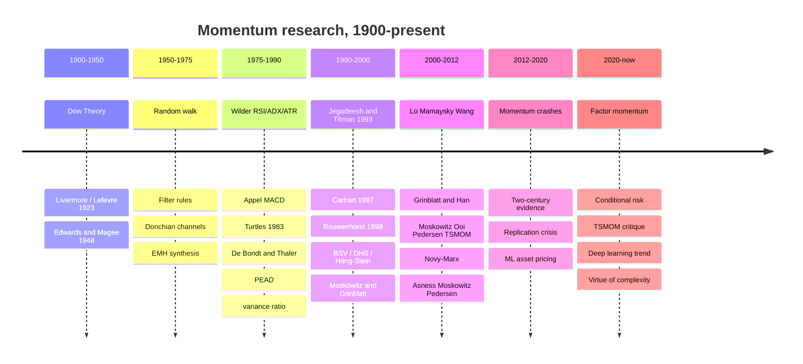
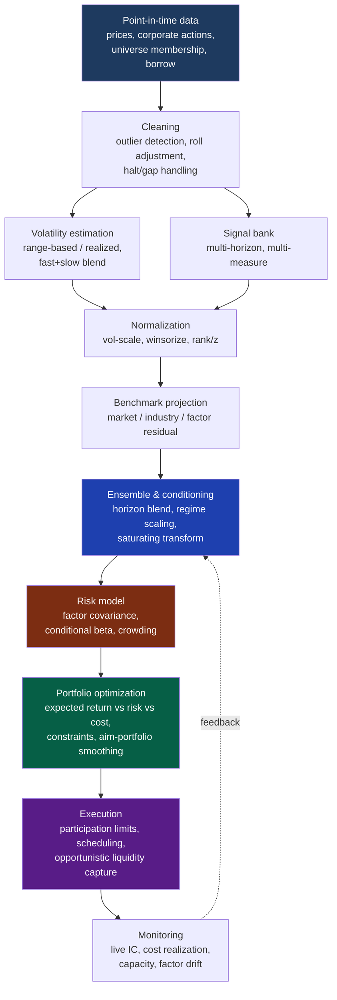
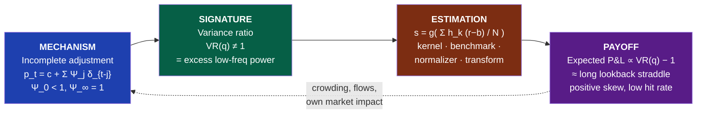
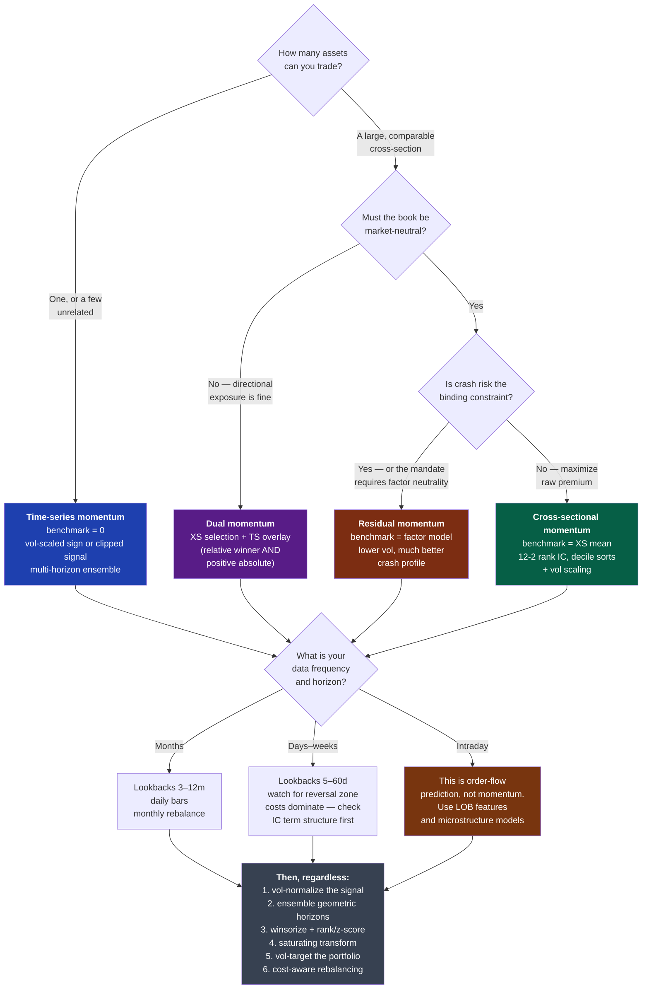

# Momentum in Financial Markets

### A first-principles tutorial for quantitative practitioners

---

**How to read this document.** Sections 1–3 are conceptual and historical: they build the mental model and the bibliography. Section 4 is the technical core — a survey of every serious way to *measure* momentum. Sections 5–7 are engineering: taxonomy, implementation, and evaluation. Sections 8–9 are synthesis.

Throughout, I flag claims by epistemic status:

- **[Fact]** — replicated empirical result with broad agreement across independent datasets.
- **[Contested]** — empirically documented but with live disagreement about magnitude, robustness, or cause.
- **[Hypothesis]** — a proposed mechanism, not directly testable or not decisively tested.
- **[Practice]** — practitioner convention or folklore; may be right, but the evidence is private or absent.

**Notation.** $P_t$ is price at time $t$; $p_t = \ln P_t$; the simple return is $R_t = P_t/P_{t-1} - 1$ and the log return $r_t = p_t - p_{t-1}$. $\mu$ denotes an unconditional mean return, $\sigma$ a volatility, $\rho_k = \operatorname{Corr}(r_t, r_{t-k})$ the lag-$k$ autocorrelation. $\mathcal{F}_t$ is the information set available at $t$. $L$ is a lookback length, $H$ a holding period, both in bars. Bold symbols are cross-sectional vectors over $N$ assets.

Two conventions used constantly below. **Windowed returns:** $r_{a:b} \equiv \sum_{i=a+1}^{b} r_i = p_b - p_a$ is the cumulative log return over the half-open window $(a, b]$, so $r_{t-L:t}$ spans $L$ bars ending at $t$, and $r_{t:t+H}$ is the forward return over the next $H$ bars. **Estimates** carry hats: $\hat\sigma_t$ is an estimate, formed from information available at $t$, of the *per-bar* return volatility.

Other recurring symbols: $N$ assets, $T$ bars of history, $A$ bars per year (252 for daily), $q$ the aggregation horizon of a variance ratio, $s_{i,t}$ a signal, $w_{i,t}$ a portfolio weight, $\sigma^\ast$ a volatility target, $\mathbb{1}\{\cdot\}$ an indicator, $Z(\cdot)$ and $Z^{-1}(\cdot)$ the standard normal CDF and its inverse. Bar extremes are written $\mathrm{Hi}_t$ and $\mathrm{Lo}_t$ rather than $H_t, L_t$, because $H$ and $L$ are already the holding period and the lookback.

A few symbols are unavoidably overloaded because their usage is standard in different literatures: $\alpha$ is an EMA smoothing constant in §4 and Jensen's alpha in §7; $\beta$ is a regression slope in §4.2 and a factor loading in §4.6.4 and §7.4.4; $\lambda$ is an EWMA decay in §4 and Kyle's price-impact coefficient in §2.6. Each occurrence is disambiguated locally, and the full glossary is in [Appendix A.11](#a11-glossary-of-symbols).

---

## Table of contents

1. [What is momentum?](#1-what-is-momentum)
2. [Historical evolution of momentum research](#2-historical-evolution-of-momentum-research)
3. [Foundational references](#3-foundational-references)
4. [Mathematical and statistical characterizations](#4-mathematical-and-statistical-characterizations-of-momentum)
5. [Taxonomy](#5-taxonomy)
6. [Practical implementation](#6-practical-implementation)
7. [Testing momentum-based trading signals](#7-testing-momentum-based-trading-signals)
8. [Current best practices](#8-current-best-practices)
9. [Synthesis](#9-synthesis)
- [Appendix A: Concepts from first principles](#appendix-a-concepts-from-first-principles)
- [Appendix B: Additional works cited](#appendix-b-additional-works-cited)

Appendix A is a self-contained reference for every advanced concept the main text uses in passing. Each entry gives a plain-language definition first and a mathematical one second; entries are cross-referenced from the sections that use them.

---

# 1. What is momentum? {#1-what-is-momentum}

## 1.1 The wrong intuition, and why it matters

The word "momentum" is borrowed from mechanics, and the borrowing is actively misleading. A physical body in motion has a conserved quantity, mass times velocity, that persists unless a force acts on it. Prices have no such conserved quantity. There is no mass, no inertia, and no reason at all for a price that rose yesterday to keep rising today. If you start from the physics metaphor you will build models that assume persistence and get destroyed by the first regime change.

The correct starting point is informational. Reduce everything to one question:

> **Is the conditional expectation of the next return a function of past returns?**
> $$\mathbb{E}[r_{t+1} \mid r_t, r_{t-1}, \ldots] \ne \mathbb{E}[r_{t+1}]$$

Momentum is the assertion that this function is *increasing* in past returns over some horizon. That is all. It is a statement about the **joint distribution of returns at different lags**, not about any force acting on price.

Two clarifications about that sentence, because both matter later. First, the object being asserted is a *conditional first* moment — an expected return. Second, what makes that conditional mean vary is the *second*-moment structure of the process: the best linear forecast from one lag is $\mu + \rho_1\,(r_t - \mu)$, so it is the autocovariances that carry the predictability. Every estimator in §4 is ultimately reading autocovariances in order to say something about a conditional mean. Keeping the two straight prevents the common error of testing for one and claiming the other.

## 1.2 The conceptual model: incomplete adjustment

Here is the model I recommend carrying in your head. It generates essentially all the momentum phenomenology from one assumption.

Work in logs throughout, so that returns add. Let $v_t$ be the log of the "true" value of an asset — whatever the price would be if every participant instantly knew everything and could trade frictionlessly at scale. Suppose $v$ follows a random walk with innovations $\delta_t$:

$$v_t = v_{t-1} + \delta_t, \qquad \delta_t \sim \text{iid}(0, \sigma_\delta^2)$$

Under the strict Efficient Market Hypothesis, $p_t = v_t$ and returns are unpredictable. Now relax that in the mildest possible way: let the price adjust only *partially* to each innovation, with the remainder arriving over subsequent periods. Define the **cumulative impulse response** $\Psi_j$ = the fraction of a value innovation that has been impounded into price $j$ periods after it arrives, with $\Psi_{-1} = 0$. The log price is then a distributed lag on value innovations:

$$p_t \;=\; c \;+\; \sum_{j \ge 0} \Psi_j \, \delta_{t-j}, \qquad \lim_{j\to\infty}\Psi_j = 1$$

where $c$ is a constant of integration (the level from which the innovations accumulate). The terminal condition $\Psi_\infty = 1$ says the price *eventually* gets there — no permanent mispricing. But if $\Psi_0 < 1$, it gets there gradually. An equivalent and more intuitive way to write the same thing is

$$p_t \;=\; \underbrace{v_t}_{\text{fundamental value}} \;-\; \underbrace{\sum_{j\ge0}\left(1-\Psi_j\right)\delta_{t-j}}_{\text{news not yet impounded}}$$

— price is value minus the backlog. The backlog term is stationary (since $1-\Psi_j \to 0$) even though $p_t$ and $v_t$ are not, which is what makes the model well behaved: the *mispricing* is bounded, the *price* is a random walk plus a bounded correction. Differencing gives the return as a moving average of the same innovations, with weights equal to the **per-period** impulse response $\psi_j \equiv \Psi_j - \Psi_{j-1}$:

$$r_t \;=\; p_t - p_{t-1} \;=\; \sum_{j\ge0}\big(\Psi_j - \Psi_{j-1}\big)\,\delta_{t-j} \;=\; \sum_{j\ge0}\psi_j\,\delta_{t-j}, \qquad \sum_{j\ge0}\psi_j = 1$$

This is an MA($\infty$) process in $\delta$, so its autocorrelations follow immediately:

$$\rho_k \;=\; \frac{\sum_{j\ge0}\psi_j\,\psi_{j+k}}{\sum_{j\ge0}\psi_j^2}$$

Everything follows from the *sign pattern* of $\psi$. Pure under-reaction means the price only ever moves toward value and never past it, i.e. $\psi_j \ge 0$ for all $j$ — and then every term in the numerator above is non-negative, so $\rho_k > 0$ at every lag shorter than the adjustment period (and zero beyond it). **A single serially uncorrelated shock to value, impounded gradually, manufactures autocorrelated returns.** Momentum is the *shadow of incomplete adjustment*.

It is worth seeing how sharp this is. If adjustment is instantaneous ($\psi_0 = 1$, all other $\psi_j = 0$) then $\rho_k = 0$ for all $k$ and there is no momentum. If instead half the shock lands immediately and half the next period ($\psi_0 = \psi_1 = \tfrac12$), then $\sum_j\psi_j^2 = \tfrac12$ and $\sum_j \psi_j\psi_{j+1} = \tfrac14$, giving $\rho_1 = 0.5$ and $\rho_k = 0$ for $k \ge 2$. **The speed of adjustment *is* the autocorrelation** — they are two descriptions of the same number.

Two immediate corollaries that most intuitions miss:

1. **Momentum implies eventual reversal.** Because $\Psi_\infty = 1$ is a fixed budget, an impulse response that undershoots early must catch up later — and if it *overshoots* (the empirically relevant case, $\Psi_K > 1$ for intermediate $K$), it must come back down. Overshoot means some $\psi_j < 0$ at longer lags, which is exactly negative autocorrelation at those lags. Momentum and long-horizon reversal are two readings of one impulse-response function. **[Fact]** Any dataset showing 3–12 month momentum in equities also shows 3–5 year reversal (De Bondt & Thaler, 1985).

2. **Momentum is horizon-specific by construction.** The sign of the autocorrelation depends on where you sample the impulse response. That is why the same asset can be mean-reverting at 1 day, trending at 6 months, and mean-reverting at 4 years, with no contradiction.

### The one diagnostic that ties it all together: the variance ratio

Everything in Section 4 is, at bottom, an estimator of this object. Define the $q$-period **variance ratio** (Lo & MacKinlay, 1988):

$$\mathrm{VR}(q) \;=\; \frac{\operatorname{Var}(p_t - p_{t-q})}{q \cdot \operatorname{Var}(p_t - p_{t-1})} \;=\; 1 + 2\sum_{k=1}^{q-1}\left(1 - \frac{k}{q}\right)\rho_k$$

Under a random walk, $\mathrm{VR}(q) = 1$ for all $q$: variance scales linearly with time. Then:

- $\mathrm{VR}(q) > 1$: the $q$-scale is **trending** (prices diffuse faster than a random walk; positive net autocorrelation up to lag $q$).
- $\mathrm{VR}(q) < 1$: the $q$-scale is **mean-reverting**.

The function $q \mapsto \mathrm{VR}(q)$ — the *variance ratio profile* — is the single most informative descriptive statistic about momentum in a series. It tells you *at what horizon* the asset trends, which directly sets your lookback. I would rather see a variance-ratio profile than a backtest equity curve when evaluating an unfamiliar market.

```{=latex}
\newpage
```

```
   VR(q)
    1.3 |                    ,--·--·--.
        |                  ,'          `·.
    1.1 |               ,·'                `·.
    1.0 |······················································  random walk
    0.9 |        ·.  ,'                          `·.
        |          `·                                 `·-·-·-·
    0.7 |__________________________________________________________
         1d    5d    1m    3m    6m    12m   24m   48m      q  (log scale)
         └ reversal ┘└──── momentum ────┘      └── reversal ──┘
          (liquidity)   (under-reaction)        (over-reaction /
                                                 valuation anchor)
```

*Schematic variance-ratio profile for a typical liquid equity. **[Fact]** The three-regime shape — short-horizon reversal, intermediate-horizon trend, long-horizon reversal — is robust across US equities, international equities, and many futures markets, though the crossover points differ by asset class and era.*

This picture also gives the cleanest available statement of what a trend-following P&L *is*. Dao, Nguyen, Deremble, Lempérière, Bouchaud & Potters (2017) show that the expected P&L of a canonical trend rule on a single asset is, to leading order, proportional to the difference between the asset's variance measured at the trend's timescale and its variance measured at the rebalancing timescale:

$$\mathbb{E}[\text{trend P\&L}] \;\propto\; \underbrace{\sigma^2_{\text{long horizon}} - \sigma^2_{\text{short horizon}}}_{\;\propto\; \mathrm{VR}(q) - 1}$$

Both variances here are **per unit of time** — that is, $\sigma^2_{\text{long horizon}} = \operatorname{Var}(p_t - p_{t-q})/q$ and $\sigma^2_{\text{short horizon}} = \operatorname{Var}(p_t - p_{t-1})$. Written that way the identification with the variance ratio is immediate, since $\mathrm{VR}(q) - 1 = (\sigma^2_{\text{long horizon}} - \sigma^2_{\text{short horizon}})/\sigma^2_{\text{short horizon}}$. Comparing raw (un-normalized) variances at two horizons would tell you nothing, because the longer one is mechanically larger.

**A trend follower is structurally long the variance ratio.** That single sentence explains the convexity of CTA returns, why trend does well in dispersive crises and badly in choppy ranges, and why "trend following is a long straddle" (Fung & Hsieh, 2001) is more than an analogy.

## 1.3 Why momentum exists despite the Efficient Market Hypothesis

First, a clarification that resolves half the confusion in this debate. The EMH as stated by Fama (1970) is not the claim that returns are unpredictable. It is the claim that prices reflect information *given a model of equilibrium expected returns*. Any test of efficiency is a **joint test** of (a) efficiency and (b) the assumed asset-pricing model. If momentum earns positive average returns, either markets are inefficient or your model of risk is wrong. You cannot tell which from the return data alone. This is the **joint hypothesis problem**, and it is why the momentum debate has run for thirty years without resolution.

Second, the "no free lunch" version of the EMH — that risk-adjusted excess returns net of costs should be competed away — was never a claim that they vanish *instantly* or *completely*. It is a claim about limits. Grossman & Stiglitz (1980) made this precise: if prices were fully revealing, no one would pay to gather information; so in equilibrium prices must be *slightly* inefficient, by exactly enough to compensate information gathering. Momentum lives in that gap.

With that framing, here are the four families of explanation. They are not mutually exclusive, and the honest position is that all four contribute in proportions nobody has pinned down.

### (A) Slow information diffusion — **[Hypothesis, well-formalized]**

Hong & Stein (1999) build a model with two agent types: "newswatchers" who trade on private fundamental signals that diffuse gradually across the population, and "momentum traders" who condition only on past prices. Gradual diffusion alone generates under-reaction and hence momentum; adding momentum traders who arbitrage the under-reaction necessarily generates *over*-reaction at longer horizons, hence reversal. The model produces the full momentum-then-reversal impulse response from one friction.

Supporting evidence **[Fact]**: momentum is stronger in stocks with low analyst coverage and small size (Hong, Lim & Stein, 2000); post-earnings-announcement drift (Bernard & Thomas, 1989, 1990) is a clean case of information impounding over weeks after a *public* announcement; Chan, Jegadeesh & Lakonishok (1996) show momentum and PEAD are related but not identical.

### (B) Behavioral biases — **[Hypothesis, contested]**

Three canonical models, all published 1998–1999, all producing momentum + reversal from different psychology:

- **Barberis, Shleifer & Vishny (1998)**: conservatism (under-reaction to individual signals) plus the representativeness heuristic (over-extrapolation of streaks). Investors are slow to update, then over-extrapolate.
- **Daniel, Hirshleifer & Subrahmanyam (1998)**: overconfidence in private signals plus biased self-attribution. Confirming public news inflates confidence asymmetrically, driving continued over-reaction — momentum — followed by correction.
- **Grinblatt & Han (2005)** and **Frazzini (2006)**: the **disposition effect**. Investors sitting on gains sell too early and investors sitting on losses hold too long. This creates a supply overhang above the reference price (the aggregate cost basis) that *retards* upward adjustment to good news. Momentum is then predictable from unrealized capital gains, which is exactly what these papers find. This is my favorite of the three because it makes a sharp auxiliary prediction that is confirmed independently of returns.

The critique of behavioral explanations is fair and should be taken seriously: they are flexible enough to explain almost any pattern ex post, and the profession has not converged on which bias dominates.

### (C) Order flow and market microstructure — **[Fact for the mechanism, Hypothesis for the magnitude]**

This is the explanation that most appeals to engineers because it requires no psychology at all, only the mechanics of execution.

Institutions cannot execute a large position instantaneously without paying ruinous impact. So they slice a **metaorder** into child orders executed over hours, days, or weeks. Two robust microstructure facts follow:

1. **Order flow has long memory.** The sign sequence of market orders is positively autocorrelated with a slowly decaying (power-law) autocorrelation function, out to thousands of trades (Lillo & Farmer, 2004; Bouchaud, Gefen, Potters & Wyart, 2004). This is a direct fingerprint of order splitting.
2. **The square-root law of impact.** The expected price impact of a metaorder of size $Q$ in a market with daily volume $V$ and volatility $\sigma$ is approximately
   $$\Delta p \;\approx\; Y \sigma \sqrt{Q/V}, \qquad Y = O(1)$$
   The units matter and are easy to get wrong: $Q$ and $V$ are in the *same* units (both in shares, or both in currency), so $Q/V$ is the dimensionless participation fraction; $\sigma$ is the *daily* return volatility; and $\Delta p$ is therefore a **relative** price move, not a currency amount. Empirically $Y \approx 0.5$–$1$. This concave, roughly universal relation holds across markets, asset classes and decades (see Bouchaud, Bonart, Donier & Gould, 2018, for the synthesis), and it reappears in §6.8 as the binding constraint on capacity.

Put these together: a persistent, one-directional flow that takes weeks to complete pushes price persistently in one direction. Anyone who detects it earns momentum returns. Crucially, part of the impact **decays** after the metaorder finishes — which again produces momentum followed by partial reversal.

A second-order microstructure channel is *mechanical flow*: index inclusion, rebalancing of risk-parity and volatility-target funds, option dealer hedging (gamma imbalance), and the trend followers themselves. These generate price-contingent order flow, which is a positive feedback loop by construction.

### (D) Risk-based / rational explanations — **[Contested, and improving]**

If momentum portfolios are simply riskier in a way standard models miss, there is no puzzle. Early versions of this argument were weak — momentum's CAPM beta is near zero and it survives Fama–French three-factor adjustment (which is why Carhart, 1997, added it as a fourth factor rather than explaining it away). But the modern versions are much stronger:

- **Conditional betas.** Kelly, Moskowitz & Pruitt (2021, *JFE* 140) show, using instrumented principal components, that past-return characteristics predict future *realized betas*, and that time-varying conditional risk exposures explain a sizable fraction of momentum and long-term reversal returns. This is currently the most serious rational challenge.
- **Momentum's dynamic beta.** Daniel & Moskowitz (2016) and Geczy & Samonov (2016) document that the momentum portfolio's market beta swings systematically with the market state — sharply negative after bear markets. The momentum premium partly compensates for a *conditional* crash exposure, not an unconditional one.
- **Real options / growth-rate risk.** Berk, Green & Naik (1999) and Johnson (2002) show that firms whose expected growth rate has risen mechanically have both higher past returns and higher risk, generating momentum in equilibrium.

### The honest summary

**[Fact]** Momentum returns exist, out-of-sample, across asset classes, countries and two centuries. **[Contested]** Why. My recommendation for a practitioner: hold the microstructure/flow explanation as the primary mechanism because it is directly observable, hold slow diffusion and the disposition effect as strong secondary channels, and treat the risk-based explanations as a warning that some of your "alpha" is a conditional beta you have not measured. That last point is not academic hygiene — it is the reason momentum crashes.

## 1.4 Momentum is not: trend, drift, volatility, mean reversion, acceleration, or regime

These are conflated constantly, including in published work. Precision here pays for itself.

```{=latex}
\newpage
```

| Concept | Formal object | What it is about | Confusable with momentum because… |
|---|---|---|---|
| **Momentum** | $\mathbb{E}[r_{t+1}\mid r_{t-L:t}]$ increasing in past returns; for a linear forecast this is $\rho_k > 0$ | *Conditional first moment*, driven by second-moment (autocovariance) structure | — |
| **Trend** | A low-frequency component $\tau_t$ in a decomposition $p_t = \tau_t + c_t + \varepsilon_t$ | A property of the *price path*, an unobserved state | Trend-followers profit from both; the P&L doesn't distinguish them |
| **Drift** | $\mu = \mathbb{E}[r_t]$, unconditional | A constant, not a prediction | A positive $\mu$ makes naive momentum tests look significant |
| **Volatility** | $\sigma_t^2 = \operatorname{Var}(r_t \mid \mathcal{F}_{t-1})$ | *Conditional second moment* | Both are persistent; vol clustering is far stronger than return autocorrelation |
| **Mean reversion** | $\rho_k < 0$ at the relevant $k$ | Same object, opposite sign | Literally the same statistic at a different horizon |
| **Acceleration** | $\partial^2 p/\partial t^2$; change in momentum | Second derivative of the level | "Momentum of momentum"; very low signal-to-noise |
| **Regime** | Latent state $S_t \in \{1..K\}$ modulating parameters | A *parameter* of the above, not a quantity | Regimes make momentum appear and disappear |

Three of these distinctions are worth expanding because they cause real losses.

### Trend vs. momentum: the sharpest distinction in this document

Consider a price process that is a deterministic upward line plus iid noise:

$$p_t = \mu t + \varepsilon_t, \qquad \varepsilon_t \sim \text{iid}(0,\sigma^2_\varepsilon)$$

This series has a **perfect trend** and **negative** return autocorrelation. The return is $r_t = \mu + \varepsilon_t - \varepsilon_{t-1}$, an MA(1) with a unit negative coefficient, whose autocorrelation is $\rho_1 = -\sigma^2_\varepsilon / 2\sigma^2_\varepsilon = -1/2$ and $\rho_k = 0$ beyond. So the series has a trend and *anti*-momentum: after an up move you should expect a down move. Conversely, a process $r_t = \phi r_{t-1} + u_t$ with $\phi > 0$ and zero mean has momentum but no trend in the level sense — it wanders.

**Trend is about the level; momentum is about the returns.** A trend-following *rule* — say, long when $P_t > \mathrm{MA}_L(P)_t$ — is agnostic: it monetizes drift, trend, *and* return autocorrelation indiscriminately. That's fine for making money and terrible for research, because it means a profitable trend backtest tells you nothing about which of the three is present, and they have completely different stability properties. Drift is stable and low-information; return autocorrelation is fragile and high-information.

This distinction has a precise consequence in Section 7. **[Contested]** Huang, Li, Wang & Zhou (2020, *JFE* 135) argue that the canonical time-series momentum test — regress $r_{t+1}$ on $\operatorname{sign}(r_{t-12:t})$ — is confounded, because $\mathbb{E}[r_{t+1}\cdot\operatorname{sign}(r_{t-12:t})]$ is positive whenever $\mu > 0$ even with *zero* predictability. After controlling for the unconditional mean they find little evidence of an absolute time-series momentum effect in their sample. Moskowitz, Ooi & Pedersen (2012) and subsequent replications dispute the strength of this critique. **This is a live and important disagreement, and it directly determines how you must specify your own tests.**

### Volatility vs. momentum

Decompose $r_t = \mu_t + \sigma_t \epsilon_t$ with $\epsilon_t$ standardized. Momentum is a claim about $\mu_t$; volatility clustering is a claim about $\sigma_t$. Empirically **[Fact]** the persistence in $\sigma_t$ is an order of magnitude stronger and more reliable than the persistence in $\mu_t$: daily $|r_t|$ has autocorrelation of 0.2–0.4 at lag 1 decaying slowly, while daily $r_t$ has autocorrelation near zero. Two consequences:

1. Volatility is the *easy* prediction problem, and every momentum measure that divides by an estimate of $\sigma$ is exploiting the easy problem to sharpen the hard one.
2. A raw return signal is contaminated: a large past return may indicate direction (momentum) or merely high volatility. Normalizing separates the two. This is the single highest-value transformation in Section 4.

### Regime as a parameter, not a phenomenon

"Momentum works in trending regimes" is nearly a tautology. The useful version is that the *parameters* — the sign and magnitude of $\rho_k$, the optimal lookback, the vol level — are state-dependent. Cooper, Gutierrez & Hameed (2004) show **[Fact]** that momentum profits in US equities are concentrated following positive market states and are near zero or negative following negative ones. Daniel & Moskowitz (2016) sharpen this: momentum crashes occur in panic states with high volatility and a rebounding market.

The practical implication is that regime conditioning is *not* an optional refinement. It is the difference between a strategy with a −70% drawdown and one without.

## 1.5 Momentum across time scales

Momentum is not one phenomenon. Different horizons have different signs, different causes, different capacities and different decay rates. The table below is the map.

```{=latex}
\newpage
```

| Horizon | Dominant effect | Mechanism | Capacity | Notes |
|---|---|---|---|---|
| Sub-second to minutes | **Momentum** in order flow; price near-efficient | Order splitting, queue dynamics, latency arbitrage | Very low | Flow is predictable; *price* is much less so because market makers offset it |
| Minutes to hours | Mixed; intraday momentum at specific times | Metaorder execution, VWAP/close flows | Low | **[Fact]** "Intraday momentum": the first half-hour return predicts the last half-hour return (Gao, Han, Li & Zhou, 2018) |
| 1 day – 1 month | **Reversal** (cross-sectional) | Compensation for liquidity provision; bid-ask bounce | Medium | Jegadeesh (1990), Lehmann (1990). Crucial: the classic momentum signal *skips* this month for exactly this reason |
| 2 – 12 months | **Momentum** — the classic effect | Under-reaction, flow, disposition effect | High | Jegadeesh & Titman (1993). The 12-2 or 12-1 signal is the canonical form |
| 1 – 3 years | Weak / transition | — | — | Signal largely absent |
| 3 – 5 years | **Reversal** | Over-reaction correction, valuation anchoring | High | De Bondt & Thaler (1985); this is where value lives |

Two refinements that matter:

**Echo / intermediate-horizon momentum. [Contested]** Novy-Marx (2012, *JFE* 103) shows that in US equities, returns from $t-12$ to $t-7$ predict future returns *better* than returns from $t-6$ to $t-2$ — momentum is an "echo," not smoothly decaying persistence. This is uncomfortable for any simple under-reaction story and is not uniformly robust across markets and later samples. Take it as a real feature of US equity data whose generality is unsettled.

**Time-scale is asset-class dependent. [Fact]** Futures trend following works well at 1–12 month lookbacks (Moskowitz, Ooi & Pedersen, 2012; Hurst, Ooi & Pedersen, 2017); currency momentum is weaker and more crash-prone (Menkhoff, Sarno, Schmeling & Schrimpf, 2012); commodity momentum interacts strongly with the term structure/carry (Erb & Harvey, 2006). Do not port an equity lookback to a futures book without re-deriving it.

## 1.6 The life cycle of a trend

This section is deliberately labeled **[Practice / Hypothesis]**. The four-phase description below is a useful organizing device with partial empirical support, not an established taxonomy. It is worth stating precisely because it clarifies *which statistical problem you are solving in each phase.*

```{=latex}
\newpage
```

```
      price
        │                                       ╭─╮  ╭╮
        │                                    ╭──╯ ╰──╯╰─╮   ← EXHAUSTION
        │                              ╭─────╯          ╰╮     vol↑, accel↓,
        │                        ╭─────╯                 ╰──╮  crowding↑
        │                 ╭──────╯                          ╰─────╮
        │           ╭─────╯    ← CONTINUATION                      ╰──── REVERSAL
        │      ╭────╯            best signal-to-noise                    fast, convex
        │  ╭───╯   ← INITIATION                                          losses
        │╭─╯╰╮╭╯     low SNR, high false-positive rate
        ╰╯   ╰╯
        └──────────────────────────────────────────────────────────── time

  signal    │  weak, ambiguous │   strong, stable  │ strong but    │ inverts
  quality   │  many false      │   ρ_k > 0         │ decaying;     │ abruptly
            │  positives       │                   │ accel < 0     │
  vol       │  rising          │   moderate,       │ rising        │ spikes
            │                  │   clustered       │               │
  what to   │  small size,     │   full size,      │ reduce, tighten│ be flat
  do        │  wide stops      │   vol-target      │ vol scaling    │ or reversed
```

**Initiation.** The statistical problem is *detection*: distinguishing the onset of a persistent drift from noise. Signal-to-noise is at its worst here, because by construction you have few observations of the new state. Any detector is trading off Type I against Type II error, and lookback length *is* that trade-off dial: short lookbacks detect early with many false positives, long lookbacks detect late with few. There is no free lunch and no parameter that resolves it — only your cost structure can tell you where to sit on the curve. **[Fact]** The distribution of trend-following trade P&L is heavily right-skewed with a low hit rate (typically 30–45%); most detections are false and are stopped out cheaply, and a minority pay for everything.

**Continuation.** The statistical problem is *estimation and sizing*: given that a trend exists, how large is the drift relative to volatility, and how much risk should you take? Autocorrelation is positive, volatility is clustered and comparatively predictable, and this is where volatility-scaled position sizing (§4.3.1, §6.7) earns most of its keep.

**Exhaustion.** The statistical problem is *change-point detection*, and it is the hardest of the four. Candidate observable markers **[Practice, weakly supported]**: rising volatility with flat or declining absolute price progress (i.e. deteriorating "efficiency ratio"); negative acceleration while momentum remains positive; divergence between price extremes and oscillator extremes; and crowding measures (positioning data, factor-return correlation, dealer gamma). I want to be honest: none of these is a robust standalone signal in published evidence. Treat exhaustion detection as risk *reduction*, not as a reversal trade.

**Reversal.** Momentum's losses are not symmetric with its gains. **[Fact]** Daniel & Moskowitz (2016) document "momentum crashes": in panic states — following market declines, with high volatility — the momentum portfolio's conditional beta turns sharply negative, because the "loser" leg is loaded with high-beta distressed names. When the market rebounds, the short leg explodes. The canonical episodes are July–August 1932 (the momentum strategy lost roughly 90% in two months) and March–May 2009 (roughly −70%+ for US equity momentum). The payoff structure resembles being **short a call option on the market conditional on being in a panic state**.

This is why the modern treatment of momentum is inseparable from risk management. It is not a bolt-on; it changes the strategy's fundamental character.

---

> ### §1 Key takeaways
>
> 1. Momentum is a statement about the **conditional distribution of returns given past returns**, not a force. Drop the physics metaphor.
> 2. It arises from **incomplete price adjustment**. One assumption — that information is impounded gradually — generates momentum, subsequent reversal, and horizon dependence simultaneously.
> 3. The **variance-ratio profile** $\mathrm{VR}(q)$ is the unifying diagnostic. Trend-following P&L is structurally long $\mathrm{VR}(q) - 1$.
> 4. EMH does not forbid momentum: tests of efficiency are joint tests with an asset-pricing model, and Grossman–Stiglitz guarantees a residual inefficiency. Four explanation families — slow diffusion, behavioral bias, order flow, conditional risk — all have support; none is decisive.
> 5. **Trend ≠ momentum ≠ drift.** A trend rule monetizes all three, which is why a profitable backtest is not evidence of predictability. Specify tests that separate them (see the Huang et al. critique).
> 6. Sign flips by horizon: reversal at days, momentum at 2–12 months, reversal at 3–5 years. Skipping the most recent month is not a hack; it avoids a known opposite-signed effect.
> 7. Momentum's loss distribution is **conditionally crash-prone**, driven by a beta that flips in panic states. Risk management is intrinsic to the strategy, not an add-on.

---

# 2. Historical evolution of momentum research {#2-historical-evolution-of-momentum-research}

The history of momentum is a history of the same idea being discovered independently by three communities that barely spoke to each other — chart-reading speculators, systematic futures traders, and academic financial economists — and only converging in the 2010s. Reading it in order is worthwhile because each community found something the others missed, and because most "new" ideas in this space are rediscoveries.



## 2.1 Era I — Chart reading and the birth of the trend concept (1900–1950)

### Dow Theory (Charles Dow's editorials 1899–1902; codified by Hamilton, 1922; Rhea, 1932)

**Contribution.** The first systematic articulation of markets as having *nested trends* at multiple time scales — primary (years), secondary (weeks–months), and minor (days) — and the first explicit continuation principle: a trend is assumed to remain in force until a definite reversal signal appears. Dow theory also introduced *confirmation*: a signal in one index (Industrials) required corroboration from another (Rails) before it counted.

**What changed.** It reframed price behavior from "a series of unrelated quotations" to "a state that persists." That state framing — trend as a latent regime with detection and confirmation rules — is the direct intellectual ancestor of every regime-switching model in §4.7.2.

**Limitations.** Purely qualitative, non-falsifiable as stated, and dependent on the interpreter. Rhea's codification was retrospective.

**Lasting influence.** Substantial, and — unusually for technical analysis — partially vindicated empirically. Brown, Goetzmann & Kumar (1998, *Journal of Finance*) reconstructed Hamilton's actual *Wall Street Journal* market calls from 1902–1929 and found they generated positive risk-adjusted returns relative to a buy-and-hold benchmark. **[Fact, single study]** The multi-timescale decomposition remains standard practice.

### Jesse Livermore / Edwin Lefèvre, *Reminiscences of a Stock Operator* (1923); Livermore, *How to Trade in Stocks* (1940)

**Contribution.** The practitioner's articulation of pyramiding into strength, cutting losses fast, and the "line of least resistance" — i.e., trade breakouts from consolidation ranges. Livermore also articulated position sizing conditioned on confirmation.

**What changed.** It established the *asymmetric* payoff discipline — small frequent losses financed by rare large gains — that later became the defining statistical signature of trend following. This is the practitioner discovery of positive skew, forty years before anyone measured it.

**Limitations.** Anecdotal, survivorship-biased (Livermore's own record was catastrophic at the end), and the book is a novelization.

**Lasting influence.** Enormous culturally; the loss-cutting and pyramiding rules are essentially a discrete approximation to volatility-scaled position sizing.

### Edwards & Magee, *Technical Analysis of Stock Trends* (1948)

**Contribution.** The systematic catalogue of chart patterns, support/resistance, and trendline construction — the first attempt to make chart reading reproducible.

**What changed.** It made technical analysis *teachable* and thus scalable to a profession.

**Limitations.** No statistical validation; the pattern vocabulary is a textbook case of ex-post pattern-fitting with enormous researcher degrees of freedom. Most of the specific patterns have never survived rigorous testing.

**Lasting influence.** Mixed. The *pattern catalogue* is largely discredited as a source of edge. The *concepts* — support/resistance as reference-price effects, consolidation-then-breakout, volume confirmation — have partial modern grounding in the disposition effect and in order-book liquidity structure. Lo, Mamaysky & Wang (2000, *JF*) later gave the pattern-recognition program its only serious statistical treatment (see §2.4).

## 2.2 Era II — The random walk and the first quantitative tests (1950–1975)

### Kendall (1953), Osborne (1959), Samuelson (1965), Fama (1965)

**Contribution.** Empirical demonstration that stock price changes are approximately serially uncorrelated, and Samuelson's theoretical proof that *properly anticipated prices fluctuate randomly* — that unpredictability is a *consequence* of rational forecasting, not an accident.

**What changed.** Everything. This was the moment the academy declared technical analysis worthless and the practitioner and academic communities split for thirty years.

**Limitations.** Two, both consequential. First, the tests were low-powered: they mostly examined lag-1 autocorrelation of daily returns, which is precisely where momentum *isn't*. A 5% annual predictable component is economically enormous and statistically nearly invisible at daily lag 1. Second, Samuelson's theorem says returns are unpredictable *relative to the correct risk-adjusted discount rate*, which is not the same as unpredictable.

**Lasting influence.** The random walk remains the correct null hypothesis, and this is its real legacy: it forced every subsequent claim to be stated as a rejection of a specific null with a specific test statistic.

### Alexander (1961) filter rules; Fama & Blume (1966)

**Contribution.** The first rigorous backtests. Alexander's "x% filter" — buy after a rise of x% from a low, sell after a fall of x% from a high — is a trend-following rule, and Alexander found it profitable. Fama & Blume re-examined it with correct handling of transaction costs and dividends and found the profits vanished.

**What changed.** Practitioners learned (or should have) that **costs, not signals, determine viability**; academics learned that mechanical rules could be tested. The Alexander→Fama-Blume sequence is the first instance of the field's dominant recurring narrative: a promising rule, a costs-and-methodology correction, and a much smaller residual.

**Limitations.** Single market, short sample, no multiple-testing control on the filter width.

**Lasting influence.** Enormous methodologically. Every backtest since owes its structure to this exchange.

### Fama (1970), "Efficient Capital Markets"

**Contribution.** The weak/semi-strong/strong taxonomy and — the part that actually matters — the **joint hypothesis** insight.

**Lasting influence.** It defines the terms of the argument to this day. Any claim "momentum is an anomaly" is really "momentum is unexplained by the models we've tried."

## 2.3 Era III — Trend following becomes an industry (1950–1990)

This strand developed almost entirely outside the academy, in commodity futures.

### Richard Donchian (1950s–1970s)

**Contribution.** The first published *mechanical* trend systems: the 5/20 dual moving-average crossover and the N-day channel breakout ("Donchian channel"). Donchian ran what is generally regarded as the first publicly offered managed futures fund (1949).

**What changed.** Trend following became a *rule*, not a judgment — fully specifiable, auditable, and therefore capable of being run at scale by an institution.

**Limitations.** No risk model, no portfolio construction, no cost analysis, no statistical validation. Parameters chosen by inspection.

**Lasting influence.** The moving-average crossover and the channel breakout remain, to this day, the two most-used trend primitives on earth. §4.1.5 and §4.4.3 are their formalizations.

### The Turtle experiment (Dennis & Eckhardt, 1983)

**Contribution.** A natural experiment: Richard Dennis taught a fully specified breakout system (Donchian-style entries, ATR-based position sizing, portfolio heat limits) to novices to test whether trading was teachable. Several turtles produced strong multi-year records.

**What changed.** It demonstrated that the edge lived in **the system and the risk sizing**, not in the trader. Crucially, the Turtle rules were the first widely disseminated system where position size was explicitly $\propto 1/\text{ATR}$ — volatility-scaled sizing, a decade before it appeared in the academic literature.

**Limitations.** Uncontrolled, small $n$, survivorship-reported, in a commodity environment (1980s) unusually favorable to trend. Subsequent decades were far less kind.

**Lasting influence.** Very large in practice. ATR-normalized sizing and per-position risk budgeting are now universal.

### Welles Wilder, *New Concepts in Technical Trading Systems* (1978); Gerald Appel, MACD (late 1970s)

**Contribution.** Wilder introduced, in one book, RSI, ADX/DMI, ATR, and Parabolic SAR — an extraordinary density of durable primitives. Appel introduced MACD.

**What changed.** It gave practitioners a *vocabulary* of bounded, comparable, normalized quantities. In particular ATR (a volatility estimate) and RSI (a bounded oscillator) were early solutions to problems the academy would later formalize as volatility scaling and cross-sectional standardization.

**Limitations.** All parameters were chosen by inspection with no validation; the smoothing constants (Wilder's 14-period, the 12/26/9 MACD) are arbitrary and have been over-fit by two generations of retail traders. Wilder's own theoretical justifications are ad hoc.

**Lasting influence.** Underrated by academics, overrated by retail. Stripped of their folklore, several of these are respectable statistics: ADX is a normalized measure of directional consistency, ATR is a range-based volatility estimator (and range estimators are genuinely more efficient than close-to-close ones — see Parkinson, 1980; Garman & Klass, 1980; Yang & Zhang, 2000), and MACD is a band-pass filter. See §4.

### Fung & Hsieh (2001), "The Risk in Hedge Fund Strategies: Theory and Evidence from Trend Followers"

**Contribution.** Showed that CTA returns are well replicated by portfolios of **lookback straddles** — options that pay the maximum price range over a period.

**What changed.** This is the moment trend following was correctly re-classified as an *option-like payoff* rather than a return-predicting strategy. It explains the positive skew, the convexity vs. equities, and the "crisis alpha" property.

**Lasting influence.** Foundational. It underlies the modern framing of trend as a portfolio hedge, and it prefigures the Dao et al. (2017) variance-difference decomposition.

## 2.4 Era IV — The academic momentum revolution (1985–2000)

### De Bondt & Thaler (1985), "Does the Stock Market Overreact?"

**Contribution.** Documented that 3–5 year losers subsequently outperform 3–5 year winners — long-horizon **reversal**.

**What changed.** It was the first credible modern rejection of weak-form efficiency using past prices alone, and it launched behavioral finance.

**Limitations.** Contested on risk-adjustment and size effects (Chan, 1988; Ball & Kothari, 1989).

**Lasting influence.** It established the *long* end of the momentum-reversal spectrum, and it framed the question that Jegadeesh & Titman answered at the short end.

### **Jegadeesh & Titman (1993)** — the canonical paper

> *"Returns to Buying Winners and Selling Losers: Implications for Stock Market Efficiency," Journal of Finance 48(1), 65–91.*

**Contribution.** Sorting US stocks on past 3–12 month returns and buying the top decile / shorting the bottom decile earns roughly 1% per month over 1965–1989, and — critically — the effect is *not* explained by market risk, size, or the then-known systematic risk exposures. They also documented that the profits partially reverse over the following two years.

**What changed.** This is the hinge of the entire field. Momentum went from "chartist superstition" to "the most robust anomaly in asset pricing" essentially overnight. It legitimized past-price predictors as a research object.

**Limitations.** Single market, single sample, no transaction costs, and — as they carefully noted — the strategy's short leg concentrates in small illiquid names where costs are largest.

**Lasting influence.** It defines the standard construction still in use: rank on cumulative return over $t{-}12$ to $t{-}2$ (skipping the most recent month to avoid short-term reversal and bid-ask bounce), hold 1–6 months, decile or tercile sorts, rebalanced monthly. Jegadeesh & Titman (2001) confirmed persistence out-of-sample in the 1990s. If you read one paper, read this one.

### Carhart (1997), "On Persistence in Mutual Fund Performance"

**Contribution.** Added momentum (UMD/WML) as a fourth factor to the Fama–French three-factor model, and showed that most apparent mutual-fund skill persistence is just passive momentum exposure.

**What changed.** Momentum was institutionalized as a *factor*. Every subsequent performance attribution had to control for it. It also delivered a deflationary message about active management that is still being absorbed.

**Limitations.** Carhart added momentum atheoretically — as an empirical control, not as a risk factor with an economic story. Fama & French (1996) had already conceded they could not explain momentum with their three-factor model, and their five-factor model (2015) still does not include it. Fama & French (2016) acknowledge the model's continued failure on momentum.

**Lasting influence.** UMD is a standard data series (Kenneth French's library) and the default control in empirical finance.

### Rouwenhorst (1998); Asness, Liew & Stevens (1997); Moskowitz & Grinblatt (1999)

**Contribution.** Out-of-sample generalization. Rouwenhorst found momentum in 12 European markets; Asness, Liew & Stevens found it across country indices; Moskowitz & Grinblatt found that much of individual-stock momentum is attributable to **industry** momentum.

**What changed.** Momentum stopped looking like a US data-mining artifact. The industry result additionally reframed momentum as possibly a *group-level* phenomenon rather than a stock-level one — a thread that leads directly to factor momentum in the 2020s.

**Limitations.** Overlapping data, correlated markets, and the possibility of a common global data-snooping bias (all researchers looking at the same 1926–1995 window).

### The 1998–1999 behavioral trilogy: BSV, DHS, Hong & Stein

**Contribution.** Three internally consistent models generating momentum-then-reversal from psychological primitives. See §1.3(B).

**What changed.** Momentum acquired *theories*, which made it respectable. Hong & Stein in particular gave a mechanism (gradual information diffusion) with testable cross-sectional implications, confirmed by Hong, Lim & Stein (2000).

**Limitations.** All three are flexible; none has been decisively confirmed or rejected against the others. This remains true today.

**Lasting influence.** The vocabulary — under-reaction, over-reaction, gradual diffusion, self-attribution — is now standard even among people who do not accept the models.

### The data-snooping counter-attack: Brock, Lakonishok & LeBaron (1992) → Sullivan, Timmermann & White (1999)

**Contribution.** Brock, Lakonishok & LeBaron tested 26 classic moving-average and trading-range-breakout rules on the Dow from 1897–1986 and found significant predictive power. Sullivan, Timmermann & White re-examined the *same* rules using White's (2000) Reality Check to correct for the fact that those 26 rules were the survivors of decades of collective search, evaluating a universe of ~8,000 rules. Their finding: the best rules were still significant in the original sample, but the effect had largely disappeared in post-1986 data.

**What changed.** This exchange is the single most important methodological lesson in the field. **The universe of rules you searched, not the rule you report, determines significance.** It is the origin of everything in §7.6.

**Lasting influence.** Decisive. Any momentum backtest presented today without a multiple-testing adjustment should be treated as uninformative.

### Lo, Mamaysky & Wang (2000), "Foundations of Technical Analysis"

**Contribution.** Used nonparametric kernel regression to define chart patterns (head-and-shoulders, etc.) algorithmically, then tested whether the conditional return distribution differs from the unconditional one. It does, for several patterns, with statistical significance.

**What changed.** It gave the *only* rigorous treatment of the Edwards–Magee program, and its conclusion was nuanced: patterns carry incremental information, but not obviously enough to be profitable after costs.

**Lasting influence.** Methodologically important as a template for testing shape-based signals. Practically, it legitimized asking the question without endorsing the answer.

## 2.5 Era V — Consolidation, generalization, risk management (2000–2016)

### Grinblatt & Han (2005); Frazzini (2006) — the disposition effect

**Contribution.** Showed that a measure of aggregate **unrealized capital gains** (built from turnover-weighted historical cost basis) subsumes much of the momentum effect, and that momentum is stronger where the disposition effect should bind hardest (e.g. around mutual-fund holdings with large embedded gains/losses).

**What changed.** For the first time, a behavioral explanation made an *independent, non-return* prediction that was confirmed. This is the strongest behavioral evidence in the momentum literature.

**Limitations.** Reference-price construction requires strong assumptions; results are sensitive to it.

### Moskowitz, Ooi & Pedersen (2012), "Time Series Momentum" (*JFE*)

**Contribution.** Established that momentum operates on an asset's *own* past returns (an absolute, sign-based signal) rather than only relative to peers — across 58 futures markets covering equities, bonds, currencies and commodities, over 1965–2009. A diversified, volatility-scaled TSMOM portfolio delivered high Sharpe with positive skew and low correlation to traditional assets.

**What changed.** This paper is the bridge between the academy and the CTA industry. It gave the trend-following business a peer-reviewed identity and a canonical construction: sign of the trailing 12-month return, positions scaled to a constant per-asset volatility target, aggregated across a diversified futures universe.

**Limitations. [Contested]** Huang, Li, Wang & Zhou (2020, *JFE* 135, 774–794) argue the core test conflates predictability with a positive unconditional mean, and after appropriate controls find little evidence of an absolute TSMOM effect. Goyal & Jegadeesh (2018, *RFS*) also show that the difference between time-series and cross-sectional momentum is largely a *net long position* in the market, not different predictability. The AQR-affiliated response maintains the effect is real. This debate is unresolved and you should read both sides.

**Lasting influence.** Very large. Volatility-scaled TSMOM on a diversified futures universe is the standard academic benchmark for trend following.

### Asness, Moskowitz & Pedersen (2013), "Value and Momentum Everywhere" (*JF*)

**Contribution.** Demonstrated that value and momentum work in *eight* markets and asset classes, and — the key result — that momentum is **positively correlated across asset classes** and **negatively correlated with value**, suggesting common global factor structure rather than eight independent anomalies.

**What changed.** It moved the conversation from "does momentum exist here?" to "what is the common factor?" and made the value/momentum combination the default diversified factor portfolio. Their proposed candidate mechanism was **liquidity risk / funding constraints** as the common driver.

**Limitations.** The common-factor interpretation is not uniquely identified; correlated anomalies could reflect correlated data-mining or correlated flows.

### Barroso & Santa-Clara (2015); Daniel & Moskowitz (2016) — momentum crashes

**Contribution.** Both papers address momentum's catastrophic tail. Daniel & Moskowitz characterize the option-like conditional beta (see §1.6) and propose a dynamically hedged/scaled momentum. Barroso & Santa-Clara show that scaling momentum exposure by the *inverse of its own recent realized volatility* — "risk-managed momentum" — nearly doubles the Sharpe ratio and dramatically reduces the crash.

**What changed.** Volatility scaling of the *strategy* (not just the assets) became standard. This is arguably the most valuable practical result of the last 15 years, and it generalizes: Moreira & Muir (2017, *JF*) show volatility management improves Sharpe for many factors.

**Limitations. [Contested]** Cederburg, O'Doherty, Wang & Yan (2020) and others question how much of the volatility-managed improvement survives out-of-sample and realistic costs, given the high turnover. The improvement is largest exactly where turnover is largest.

**Lasting influence.** Very large and immediate; essentially every practitioner momentum book now vol-scales.

### Long-history validations: Lempérière et al. (2014); Geczy & Samonov (2016); Hurst, Ooi & Pedersen (2017)

**Contribution.** Independent extensions of momentum/trend evidence far outside the original samples. Lempérière, Deremble, Seager, Potters & Bouchaud reconstructed trend-following returns back to 1800 for commodities and indices, reporting a t-statistic of roughly 10 since 1800 (≈5 since 1960) after removing the assets' upward drift. Geczy & Samonov built a US security price database from 1801 and found pre-1927 momentum profits positive and significant. Hurst, Ooi & Pedersen documented a century of positive trend-following returns across 67 markets.

**What changed.** These effectively closed the "it's just data mining on the CRSP sample" objection. They are the strongest available evidence that momentum is a structural feature of markets.

**Limitations.** Pre-modern data quality, survivorship in historical price series, no realistic cost model for 19th-century markets, and (a subtle one) these authors were not blind to the modern result.

## 2.6 Market microstructure and order flow

This strand runs in parallel and only recently merged with the momentum literature.

**Kyle (1985); Glosten & Milgrom (1985).** Contribution: formal models in which prices move because *order flow reveals information*, with a linear (Kyle's $\lambda$) or Bayesian updating structure. What changed: price impact stopped being a friction and became the *mechanism of price formation*. Lasting influence: total — every impact model descends from these.

**Lillo & Farmer (2004); Bouchaud, Gefen, Potters & Wyart (2004).** Contribution: the empirical discovery that order-flow signs have **long memory** (power-law autocorrelation, Hurst exponent typically ≈0.6–0.8) while prices remain close to a martingale. Bouchaud et al.'s **propagator model** resolves the apparent paradox: impact of each trade decays over time in exactly the way needed to offset the predictable flow, so the market is "statistically efficient" despite predictable order flow. What changed: it showed that predictability of *flow* is not the same as predictability of *price*, and that liquidity providers' response is what enforces efficiency. Limitations: the model is descriptive and calibration-heavy. Lasting influence: this is the theoretical backbone of modern execution and of high-frequency momentum.

**The square-root law of market impact.** Contribution: the empirical regularity $\Delta p \approx Y\sigma\sqrt{Q/V}$, documented across markets and decades, with $Y \approx 0.5{-}1$. What changed: it makes momentum's *capacity* computable rather than a matter of opinion, and it makes the causal link between institutional metaorders and multi-day price drift quantitative. Limitations: the exponent is not exactly 1/2 in all datasets, the theoretical justification (latent liquidity / locally linear order book) remains debated. Lasting influence: it is the single most important formula for anyone sizing a momentum strategy.

**Order-flow imbalance at high frequency (Cont, Kukanov & Stoikov, 2014; Sirignano & Cont, 2019).** Contribution: showed that short-horizon price changes are explained overwhelmingly by *order flow imbalance* — a linear relation with high $R^2$ at the sub-minute scale — and that a deep network trained on limit-order-book data learns a nearly universal price-formation mapping that transfers across stocks. What changed: intraday "momentum" was correctly re-identified as *flow prediction*. Lasting influence: this is what high-frequency momentum actually is; it has little to do with the 12-month effect.

**The synthesis reference** here is Bouchaud, Bonart, Donier & Gould, *Trades, Quotes and Prices* (2018).

## 2.7 Modern quantitative approaches (2016–present)

### The replication crisis arrives

**Harvey, Liu & Zhu (2016), "…and the Cross-Section of Expected Returns" (*RFS*)** catalogued 300+ published factors and argued that, given the search intensity, a $t$-statistic threshold of about **3.0** (not 2.0) is the minimum for a newly claimed factor. Harvey & Liu (2015, 2020) developed backtest-haircut and multiple-testing procedures. Hou, Xue & Zhang (2020, *RFS*) replicated ~450 anomalies and found the majority insignificant under equal-weighting with microcap controls.

**Momentum's status in this crisis is unusually good. [Fact]** It is among the small set of anomalies that survives essentially every replication protocol, across countries, asset classes, and centuries. That is the strongest argument for building on it.

### Factor momentum

**Gupta & Kelly (2019, *JPM* 45(3), 13–36)**, **Ehsani & Linnainmaa (2022, *JF* 77(3), 1877–1919)**, and **Arnott, Clements, Kalesnik & Linnainmaa (2023, *RFS* 36(8), 3034–3070)** independently established that **factors themselves exhibit momentum** — a factor's own recent return predicts its next return — and, more provocatively, that individual-stock momentum may be a *manifestation* of factor momentum rather than an independent phenomenon. Ehsani & Linnainmaa argue that the momentum factor is essentially the aggregation of autocorrelation in other factors' returns.

**What changed.** This reframes momentum as a property of *risk-factor time series* rather than of individual securities, connecting it to the older Moskowitz–Grinblatt industry-momentum result. **[Contested]** How completely factor momentum subsumes stock momentum is disputed.

### Machine learning

**Gu, Kelly & Xiu (2020, *RFS*)** benchmarked ML methods for return prediction and found tree ensembles and neural networks materially outperform linear models, with **momentum-family predictors consistently among the most important features**. **Lim, Zohren & Roberts (2019)** introduced "Deep Momentum Networks" — directly optimizing Sharpe with LSTMs over trend features; **Wood, Giegerich, Roberts & Zohren (2021)** extended this with attention/Transformers. **López de Prado (2018)** contributed the essential methodological apparatus: triple-barrier labeling, meta-labeling, purged and embargoed cross-validation, and the Deflated Sharpe Ratio.

**Kelly, Malamud & Zhou (2024, *JF*), "The Virtue of Complexity in Return Prediction"** argues — against decades of parsimony orthodoxy — that heavily over-parameterized models with appropriate ridge regularization can outperform, exhibiting "double descent." **[Contested]** and important if true.

**Limitations, stated plainly.** ML has improved momentum's *combination and conditioning* — how to blend horizons, when to turn it off, how to size — far more than its *core prediction*. **[Practice]** The consensus among people who have actually deployed these is that raw ML alpha over a well-constructed volatility-scaled multi-horizon trend baseline is real but modest, and the risk of overfitting is severe.

---

> ### §2 Key takeaways
>
> 1. The same effect was found three times: by chartists (as trend), by CTAs (as a mechanical rule), and by academics (as a factor). Each community contributed something: **multi-scale structure and confirmation** (Dow), **loss-cutting and volatility-based sizing** (Livermore, Donchian, Turtles), and **statistical validation with risk adjustment** (Jegadeesh & Titman onward).
> 2. **Jegadeesh & Titman (1993)** is the hinge. The 12-2 construction it established is still the default.
> 3. **Sullivan, Timmermann & White (1999)** is the methodological hinge: the size of the search space determines significance, not the reported rule.
> 4. **Moskowitz, Ooi & Pedersen (2012)** legitimized time-series momentum and connected the academy to the CTA industry; **Huang et al. (2020)** issued the most serious challenge to it. Read both.
> 5. **Daniel & Moskowitz (2016)** and **Barroso & Santa-Clara (2015)** established that momentum's tail is a conditional-beta phenomenon and that volatility scaling largely fixes it. This is the highest-value practical result of the modern era.
> 6. Microstructure has supplied the most *mechanistic* explanation: metaorder splitting + square-root impact ⇒ multi-day persistent drift. It also supplies the capacity formula.
> 7. Momentum is one of the few anomalies that **survived the replication crisis** cleanly.
> 8. The current frontier is: momentum as a property of *factors* rather than securities; conditional-risk explanations; and ML for conditioning and combination rather than for raw prediction.

---

# 3. Foundational references {#3-foundational-references}

This is a curated reading list, not a bibliography. I have ordered each category roughly by the sequence in which I would read them. Items marked ★ are the ones I would consider genuinely non-optional for a quantitative practitioner working on momentum.

## 3.1 Classic books

| Work | Why it matters | Read it for |
|---|---|---|
| Lefèvre, E. (1923). [*Reminiscences of a Stock Operator.*](https://archive.org/details/reminiscencesofs00lefe) | The founding text of speculative discipline; a novelization of Jesse Livermore | The asymmetric payoff mindset: small losses, large wins, pyramiding into strength. Read as literature and psychology, not method |
| Rhea, R. (1932). [*The Dow Theory.*](https://openlibrary.org/books/OL6279382M/The_Dow_theory) | Codification of Dow/Hamilton | Multi-timescale trend structure and confirmation logic |
| Edwards, R. D. & Magee, J. (1948). [*Technical Analysis of Stock Trends.*](https://doi.org/10.4324/9781315115719) | The pattern canon | Historical literacy. Understand what practitioners believed; do not adopt the patterns uncritically |
| Wilder, J. W. (1978). [*New Concepts in Technical Trading Systems.*](https://archive.org/details/newconceptsintec00wild) | Source of RSI, ADX/DMI, ATR, Parabolic SAR | The original definitions, which differ from most software implementations. Essential if you implement these |
| Graham, B. & Dodd, D. (1934). [*Security Analysis.*](https://openlibrary.org/isbn/9780070244962) | The intellectual opposition | Understand the value case; value and momentum are the two halves of a well-diversified factor book |
| Schwager, J. (1989, 1992). [*Market Wizards*](https://openlibrary.org/isbn/9780887306105) / *The New Market Wizards.* | Interviews with practitioners including many trend followers | Practitioner intuition about risk sizing and drawdown tolerance, unavailable in journals. Heavily survivorship-biased — read accordingly |

## 3.2 Modern books

| Work | Why it matters |
|---|---|
| ★ Grinold, R. C. & Kahn, R. N. (1999). [*Active Portfolio Management*](https://archive.org/details/activeportfoliom0000grin), 2nd ed. | The framework for turning any signal into a portfolio. The Fundamental Law, information coefficients, transfer coefficients, risk budgeting. If you build momentum portfolios and have not read this, stop and read it |
| ★ Bouchaud, J.-P., Bonart, J., Donier, J. & Gould, M. (2018). [*Trades, Quotes and Prices: Financial Markets Under the Microscope.*](https://doi.org/10.1017/9781316659335) | The definitive modern microstructure text: order-flow long memory, propagator models, the square-root impact law. This is where momentum's *mechanism* and *capacity limit* both live |
| ★ López de Prado, M. (2018). [*Advances in Financial Machine Learning.*](https://openlibrary.org/isbn/9781119482086) | Purged/embargoed cross-validation, triple-barrier labeling, meta-labeling, fractional differentiation, backtest overfitting. Opinionated and occasionally overreaching, but the CV methodology alone justifies it |
| Ilmanen, A. (2011). [*Expected Returns.*](https://doi.org/10.1002/9781118467190) | The best single synthesis of the empirical evidence on all major return sources, momentum included. Encyclopedic and even-handed |
| Antonacci, G. (2014). [*Dual Momentum Investing.*](https://openlibrary.org/isbn/9780071849449) | The clearest practitioner exposition of combining absolute (time-series) and relative (cross-sectional) momentum. Simple, and the simplicity is the point |
| Clenow, A. (2013). [*Following the Trend.*](https://doi.org/10.1002/9781394320516) | An honest, implementable account of how a diversified futures trend program is actually built — universe, sizing, rebalancing, and realistic expectations |
| Chan, E. (2013). [*Algorithmic Trading: Winning Strategies and Their Rationale.*](https://doi.org/10.1002/9781118676998) | Practical treatment of momentum vs. mean reversion with runnable code and sane discussion of regime |
| Harvey, C. R., Rattray, S. & Van Hemert, O. (2021). [*Strategic Risk Management.*](https://openlibrary.org/isbn/9781119773917) | Modern treatment of defensive strategies, drawdown control, and where trend fits in a portfolio |
| Satchell, S. & Grant, A., eds. (2020). [*Market Momentum: Theory and Practice.*](https://doi.org/10.1002/9781119599364) | Edited volume; includes the published version of Baltas & Kosowski's TSMOM implementation study |
| Tsay, R. S. (2010). [*Analysis of Financial Time Series*](https://doi.org/10.1002/9780470644560), 3rd ed. | The econometrics substrate: ARMA, GARCH, state space, regime switching |
| Durbin, J. & Koopman, S. J. (2012). [*Time Series Analysis by State Space Methods*](https://doi.org/10.1093/acprof:oso/9780199641178.001.0001), 2nd ed. | The reference for Kalman/state-space trend extraction (§4.7.1) |

## 3.3 Foundational academic papers

**The core momentum papers** (read in this order):

1. ★ **Jegadeesh, N. & Titman, S. (1993).** "[Returns to Buying Winners and Selling Losers: Implications for Stock Market Efficiency](https://doi.org/10.1111/j.1540-6261.1993.tb04702.x)." *Journal of Finance* 48(1), 65–91. — *The* paper.
2. **De Bondt, W. & Thaler, R. (1985).** "[Does the Stock Market Overreact](https://doi.org/10.1111/j.1540-6261.1985.tb05004.x)?" *Journal of Finance* 40(3), 793–805. — The long-horizon reversal counterpart.
3. **Jegadeesh, N. & Titman, S. (2001).** "[Profitability of Momentum Strategies: An Evaluation of Alternative Explanations](https://doi.org/10.3386/w7159)." *Journal of Finance* 56(2), 699–720. — The out-of-sample confirmation and the reversal evidence.
4. **Carhart, M. (1997).** "[On Persistence in Mutual Fund Performance](https://onlinelibrary.wiley.com/doi/pdfdirect/10.1111/j.1540-6261.1997.tb03808.x)." *Journal of Finance* 52(1), 57–82. — Momentum as a factor.
5. ★ **Moskowitz, T., Ooi, Y. H. & Pedersen, L. H. (2012).** "[Time Series Momentum](https://doi.org/10.2139/ssrn.2089463)." *Journal of Financial Economics* 104(2), 228–250.
6. ★ **Asness, C., Moskowitz, T. & Pedersen, L. H. (2013).** "[Value and Momentum Everywhere](https://doi.org/10.2139/ssrn.2174501)." *Journal of Finance* 68(3), 929–985.
7. ★ **Daniel, K. & Moskowitz, T. (2016).** "[Momentum Crashes](https://doi.org/10.3386/w20439)." *Journal of Financial Economics* 122(2), 221–247.
8. **Barroso, P. & Santa-Clara, P. (2015).** "[Momentum Has Its Moments](https://doi.org/10.1016/j.jfineco.2014.11.010)." *Journal of Financial Economics* 116(1), 111–120.

**Statistical foundations:**

9. ★ **Lo, A. W. & MacKinlay, A. C. (1988).** "[Stock Market Prices Do Not Follow Random Walks: Evidence from a Simple Specification Test](https://www.nber.org/papers/w2168)." *Review of Financial Studies* 1(1), 41–66. — The variance ratio.
10. ★ **Lo, A. W. & MacKinlay, A. C. (1990).** "[When Are Contrarian Profits Due to Stock Market Overreaction](https://doi.org/10.3386/w2977)?" *Review of Financial Studies* 3(2), 175–205. — The decomposition of cross-sectional profits into autocovariance, cross-serial covariance, and dispersion in means. Essential for understanding *what you are actually harvesting*.
11. **Lewellen, J. (2002).** "[Momentum and Autocorrelation in Stock Returns](https://doi.org/10.1093/rfs/15.2.533)." *Review of Financial Studies* 15(2), 533–564. — Shows momentum in size/B-M portfolios arises largely from negative cross-serial correlation, not own-autocorrelation.
12. **Jegadeesh, N. (1990).** "[Evidence of Predictable Behavior of Security Returns](https://doi.org/10.1111/j.1540-6261.1990.tb05110.x)." *Journal of Finance* 45(3), 881–898; and **Lehmann, B. (1990),** "Fads, Martingales, and Market Efficiency," *QJE* 105(1), 1–28. — Short-horizon reversal; why you skip the last month.

**Mechanism papers:**

13. **Barberis, N., Shleifer, A. & Vishny, R. (1998).** "[A Model of Investor Sentiment](https://doi.org/10.3386/w5926)." *JFE* 49(3), 307–343.
14. **Daniel, K., Hirshleifer, D. & Subrahmanyam, A. (1998).** "[Investor Psychology and Security Market Under- and Overreactions](http://deepblue.lib.umich.edu/bitstream/2027.42/73431/1/0022-1082.00077.pdf)." *Journal of Finance* 53(6), 1839–1885.
15. ★ **Hong, H. & Stein, J. (1999).** "[A Unified Theory of Underreaction, Momentum Trading, and Overreaction in Asset Markets](https://www.nber.org/papers/w6324)." *Journal of Finance* 54(6), 2143–2184.
16. **Hong, H., Lim, T. & Stein, J. (2000).** "[Bad News Travels Slowly: Size, Analyst Coverage, and the Profitability of Momentum Strategies](https://doi.org/10.3386/w6553)." *Journal of Finance* 55(1), 265–295.
17. ★ **Grinblatt, M. & Han, B. (2005).** "[Prospect Theory, Mental Accounting, and Momentum](https://utoronto.scholaris.ca/bitstreams/3a09de05-9370-4e68-a03d-ccce917a5cb6/download)." *JFE* 78(2), 311–339.
18. **Vayanos, D. & Woolley, P. (2013).** "[An Institutional Theory of Momentum and Reversal](https://doi.org/10.1093/rfs/hht014)." *RFS* 26(5), 1087–1145. — Momentum from delegated-management fund flows; a rational, flow-based alternative to behavioral stories.
19. ★ **Kelly, B., Moskowitz, T. & Pruitt, S. (2021).** "[Understanding Momentum and Reversal](https://doi.org/10.1016/j.jfineco.2020.06.024)." *JFE* 140(3), 726–743. — The strongest modern conditional-risk explanation.

**Microstructure:**

20. **Kyle, A. (1985).** "[Continuous Auctions and Insider Trading](https://doi.org/10.2307/1913210)." *Econometrica* 53(6), 1315–1335.
21. **Glosten, L. & Milgrom, P. (1985).** "[Bid, Ask and Transaction Prices in a Specialist Market…](https://doi.org/10.1016/0304-405x(85)90044-3)" *JFE* 14(1), 71–100.
22. ★ **Lillo, F. & Farmer, J. D. (2004).** "[The Long Memory of the Efficient Market](https://doi.org/10.2202/1558-3708.1226)." *Studies in Nonlinear Dynamics & Econometrics* 8(3).
23. **Bouchaud, J.-P., Gefen, Y., Potters, M. & Wyart, M. (2004).** "[Fluctuations and Response in Financial Markets: The Subtle Nature of 'Random' Price Changes](https://doi.org/10.2139/ssrn.507322)." *Quantitative Finance* 4(2), 176–190. — The propagator model.
24. **Cont, R., Kukanov, A. & Stoikov, S. (2014).** "[The Price Impact of Order Book Events](https://doi.org/10.2139/ssrn.1712822)." *Journal of Financial Econometrics* 12(1), 47–88.

**Refinements and variants:**

25. **Moskowitz, T. & Grinblatt, M. (1999).** "[Do Industries Explain Momentum](https://onlinelibrary.wiley.com/doi/pdfdirect/10.1111/0022-1082.00146)?" *Journal of Finance* 54(4), 1249–1290.
26. **George, T. & Hwang, C.-Y. (2004).** "[The 52-Week High and Momentum Investing](https://doi.org/10.1111/j.1540-6261.2004.00695.x)." *Journal of Finance* 59(5), 2145–2176.
27. **Novy-Marx, R. (2012).** "[Is Momentum Really Momentum](https://doi.org/10.1016/j.jfineco.2011.05.003)?" *JFE* 103(3), 429–453. — Echo momentum.
28. **Blitz, D., Huij, J. & Martens, M. (2011).** "[Residual Momentum](https://doi.org/10.2139/ssrn.2319861)." *Journal of Empirical Finance* 18(3), 506–518.
29. **Rouwenhorst, K. G. (1998).** "[International Momentum Strategies](https://doi.org/10.2139/ssrn.4407)." *Journal of Finance* 53(1), 267–284.
30. **Menkhoff, L., Sarno, L., Schmeling, M. & Schrimpf, A. (2012).** "[Currency Momentum Strategies](https://doi.org/10.2139/ssrn.1773543)." *JFE* 106(3), 660–684.
31. **Ehsani, S. & Linnainmaa, J. (2022).** "[Factor Momentum and the Momentum Factor](https://doi.org/10.1111/jofi.13131)." *Journal of Finance* 77(3), 1877–1919.
32. **Arnott, R., Clements, M., Kalesnik, V. & Linnainmaa, J. (2023).** "[Factor Momentum](https://doi.org/10.1093/rfs/hhad006)." *RFS* 36(8), 3034–3070.

**Critiques you must read:**

33. ★ **Huang, D., Li, J., Wang, L. & Zhou, G. (2020).** "[Time Series Momentum: Is It There](https://doi.org/10.2139/ssrn.3165284)?" *JFE* 135(3), 774–794.
34. **Goyal, A. & Jegadeesh, N. (2018).** "[Cross-Sectional and Time-Series Tests of Return Predictability: What Is the Difference](https://doi.org/10.1093/rfs/hhx131)?" *RFS* 31(5), 1784–1824.
35. ★ **Sullivan, R., Timmermann, A. & White, H. (1999).** "[Data-Snooping, Technical Trading Rule Performance, and the Bootstrap](https://onlinelibrary.wiley.com/doi/pdfdirect/10.1111/0022-1082.00163)." *Journal of Finance* 54(5), 1647–1691.
36. ★ **Harvey, C., Liu, Y. & Zhu, H. (2016).** "[…and the Cross-Section of Expected Returns](https://doi.org/10.3386/w20592)." *RFS* 29(1), 5–68.
37. **Hou, K., Xue, C. & Zhang, L. (2020).** "[Replicating Anomalies](https://doi.org/10.1093/rfs/hhy131)." *RFS* 33(5), 2019–2133.
38. **Novy-Marx, R. & Velikov, M. (2016).** "[A Taxonomy of Anomalies and Their Trading Costs](https://doi.org/10.3386/w20721)." *RFS* 29(1), 104–147.

**Methodology / evaluation:**

39. ★ **White, H. (2000).** "[A Reality Check for Data Snooping](https://onlinelibrary.wiley.com/doi/pdfdirect/10.1111/1468-0262.00152)." *Econometrica* 68(5), 1097–1126.
40. **Hansen, P. R. (2005).** "[A Test for Superior Predictive Ability](https://doi.org/10.2139/ssrn.264569)." *Journal of Business & Economic Statistics* 23(4), 365–380.
41. **Romano, J. & Wolf, M. (2005).** "[Stepwise Multiple Testing as Formalized Data Snooping](https://doi.org/10.2139/ssrn.563209)." *Econometrica* 73(4), 1237–1282.
42. **Politis, D. & Romano, J. (1994).** "[The Stationary Bootstrap](https://doi.org/10.1080/01621459.1994.10476870)." *JASA* 89(428), 1303–1313.
43. ★ **Bailey, D. & López de Prado, M. (2014).** "[The Deflated Sharpe Ratio: Correcting for Selection Bias, Backtest Overfitting, and Non-Normality](https://doi.org/10.2139/ssrn.2460551)." *Journal of Portfolio Management* 40(5), 94–107.
44. **Lo, A. W. (2002).** "[The Statistics of Sharpe Ratios](https://doi.org/10.2469/faj.v58.n4.2453)." *Financial Analysts Journal* 58(4), 36–52.
45. **Newey, W. & West, K. (1987).** "[A Simple, Positive Semi-Definite, Heteroskedasticity and Autocorrelation Consistent Covariance Matrix](https://doi.org/10.2307/1913610)." *Econometrica* 55(3), 703–708.
46. **Benjamini, Y. & Hochberg, Y. (1995).** "[Controlling the False Discovery Rate](https://doi.org/10.1111/j.2517-6161.1995.tb02031.x)." *JRSS-B* 57(1), 289–300.

## 3.4 Review and survey papers

- ★ **Jegadeesh, N. & Titman, S. (2011).** "[Momentum](https://doi.org/10.2139/ssrn.1919226)." *Annual Review of Financial Economics* 3, 493–509. — The authors' own retrospective; the single best short survey.
- **Asness, C., Frazzini, A., Israel, R. & Moskowitz, T. (2014).** "[Fact, Fiction, and Momentum Investing](https://doi.org/10.2139/ssrn.2435323)." *Journal of Portfolio Management* 40(5), 75–92. — Systematically addresses the ten most common objections (taxes, costs, small caps, crashes, short-side dependence). Written by interested parties, and still the best rebuttal document available.
- **Subrahmanyam, A. (2018).** "[Equity Market Momentum: A Synthesis of the Literature and Suggestions for Future Work](https://doi.org/10.1016/j.pacfin.2018.08.004)." *Pacific-Basin Finance Journal* 51, 291–296.
- **Bouchaud, J.-P., Farmer, J. D. & Lillo, F. (2009).** "[How Markets Slowly Digest Changes in Supply and Demand](https://doi.org/10.2139/ssrn.1266681)." In *Handbook of Financial Markets: Dynamics and Evolution*. — The microstructure survey most relevant to momentum.
- **Nagel, S. (2013).** "[Empirical Cross-Sectional Asset Pricing](https://doi.org/10.3386/w18554)." *Annual Review of Financial Economics* 5, 167–199.
- **Gu, S., Kelly, B. & Xiu, D. (2020).** "[Empirical Asset Pricing via Machine Learning](https://doi.org/10.3386/w25398)." *RFS* 33(5), 2223–2273. — Functions as the ML survey for this domain.

## 3.5 Practitioner papers

These are white papers and practitioner-journal articles. They are less rigorously refereed than journal articles and their authors have commercial interests — but several contain the most directly usable results in the entire literature.

- ★ **Hurst, B., Ooi, Y. H. & Pedersen, L. H. (2017).** "[A Century of Evidence on Trend-Following Investing](https://doi.org/10.2139/ssrn.2993026)." *Journal of Portfolio Management* 44(1), 15–29. (AQR.) — 1880–2016, 67 markets.
- ★ **Lempérière, Y., Deremble, C., Seager, P., Potters, M. & Bouchaud, J.-P. (2014).** "[Two Centuries of Trend Following](https://arxiv.org/abs/1404.3274)." *Journal of Investment Strategies* 3(3), 41–61. (CFM.) — arXiv:1404.3274.
- ★ **Dao, T.-L., Nguyen, T.-T., Deremble, C., Lempérière, Y., Bouchaud, J.-P. & Potters, M. (2017).** "[Tail Protection for Long Investors: Trend Convexity at Work](https://arxiv.org/abs/1607.02410)." *Journal of Investment Strategies*. — arXiv:1607.02410. The variance-difference decomposition of trend P&L.
- ★ **Fung, W. & Hsieh, D. (2001).** "[The Risk in Hedge Fund Strategies: Theory and Evidence from Trend Followers](https://doi.org/10.1093/rfs/14.2.313)." *RFS* 14(2), 313–341. — Lookback straddles. (Academic, but functions as the practitioner's model of CTA payoff.)
- **Geczy, C. & Samonov, M. (2016).** "[Two Centuries of Price Return Momentum](https://doi.org/10.2469/faj.v72.n5.1)." *Financial Analysts Journal* 72(5), 32–56.
- **Levine, A. & Pedersen, L. H. (2016).** "[Which Trend Is Your Friend](https://doi.org/10.2139/ssrn.2603731)?" *Financial Analysts Journal* 72(3), 51–66. — Shows that time-series regression, moving-average crossover, and other trend rules are near-equivalent once horizon-matched. A liberating result: stop tuning indicator forms, start tuning horizons.
- ★ **Baltas, N. & Kosowski, R. (2020).** "[Demystifying Time-Series Momentum Strategies: Volatility Estimators, Trading Rules and Pairwise Correlations](https://papers.ssrn.com/sol3/papers.cfm?abstract_id=2140091)." In Satchell & Grant, eds., *Market Momentum.* (SSRN 2140091.) — The most practically useful implementation study: which volatility estimator, which trading rule, and how correlation structure affects diversification and turnover.
- **Bruder, B., Dao, T.-L., Richard, J.-C. & Roncalli, T. (2013).** "[Trend Filtering Methods for Momentum Strategies](https://papers.ssrn.com/sol3/papers.cfm?abstract_id=2289097)." SSRN 2289097. (Lyxor.) — Explicit treatment of moving averages, L1/L2 trend filtering, and Kalman filters as signal extraction.
- **Moreira, A. & Muir, T. (2017).** "[Volatility-Managed Portfolios](https://doi.org/10.3386/w22208)." *Journal of Finance* 72(4), 1611–1644.
- **Harvey, C., Hoyle, E., Korgaonkar, R., Rattray, S., Sargaison, M. & Van Hemert, O. (2018).** "[The Impact of Volatility Targeting](https://doi.org/10.2139/ssrn.3175538)." *Journal of Portfolio Management* 45(1), 14–33. (Man Group.)
- **Frazzini, A., Israel, R. & Moskowitz, T. (2018).** "[Trading Costs](https://papers.ssrn.com/sol3/papers.cfm?abstract_id=3229719)." SSRN 3229719. (AQR.) — Live-execution cost estimates from ~$1.7 trillion of real trades; the best public evidence on momentum's true capacity, and it is far more optimistic than academic estimates based on quoted spreads. **[Contested]** — for the obvious reason that AQR runs momentum.
- **Grinold, R. (1989).** "[The Fundamental Law of Active Management](https://doi.org/10.3905/jpm.1989.409211)." *Journal of Portfolio Management* 15(3), 30–37. — $\mathrm{IR} \approx \mathrm{IC}\sqrt{\mathrm{breadth}}$.
- **Clarke, R., de Silva, H. & Thorley, S. (2002).** "[Portfolio Constraints and the Fundamental Law of Active Management](https://doi.org/10.2469/faj.v58.n5.2468)." *Financial Analysts Journal* 58(5), 48–66. — Adds the transfer coefficient; explains why real portfolios capture far less than the theoretical IR.
- **Lim, B., Zohren, S. & Roberts, S. (2019).** "[Enhancing Time-Series Momentum Strategies Using Deep Neural Networks](https://doi.org/10.2139/ssrn.3369195)." *Journal of Financial Data Science* 1(4), 19–38.

## 3.6 If you only read six things

1. Jegadeesh & Titman (1993) — the effect.
2. Lo & MacKinlay (1988, 1990) — what you are actually measuring.
3. Moskowitz, Ooi & Pedersen (2012) **with** Huang, Li, Wang & Zhou (2020) — the effect and its most serious critique, together.
4. Daniel & Moskowitz (2016) — the tail, and why risk management is intrinsic.
5. Grinold & Kahn (1999) — how to turn a signal into a portfolio.
6. Sullivan, Timmermann & White (1999) — why your backtest is probably wrong.

---

> ### §3 Key takeaways
>
> 1. The literature has a small, stable core. Six papers plus one book get you 80% of the way; the rest is refinement.
> 2. **Read critiques alongside claims.** Every major momentum result has a serious published challenge; pairing them is the fastest route to calibrated belief.
> 3. Practitioner white papers (AQR, CFM, Man, Lyxor) contain some of the most directly usable results — long-history validation, cost estimates, implementation studies — but the authors are commercially interested. Weight accordingly, and prefer those with reproducible methodology.
> 4. The microstructure literature is under-read by momentum practitioners and is where the mechanism and the capacity constraint actually live.

---

# 4. Mathematical and statistical characterizations of momentum {#4-mathematical-and-statistical-characterizations-of-momentum}

## 4.0 Preliminaries

### What are all of these estimating?

Every measure below is an estimator of some functional of the same underlying object: the **conditional mean of future returns given the recent price path**. Write the target as

$$m_t(H) \;=\; \mathbb{E}\!\left[\textstyle\sum_{h=1}^{H} r_{t+h} \;\middle|\; \mathcal{F}_t\right]$$

and note that under the incomplete-adjustment model of §1.2, $m_t(H)$ depends on the past return path mostly through a small number of summaries: the *magnitude* of recent net movement, its *consistency*, and the *volatility* against which both should be judged. That is the entire design space. Almost every indicator ever invented is a particular way of trading off:

$$\underbrace{\text{signal strength}}_{\text{how far price moved}} \quad\text{vs.}\quad \underbrace{\text{signal reliability}}_{\text{how consistently}} \quad\text{vs.}\quad \underbrace{\text{scale}}_{\text{relative to what noise}} \quad\text{vs.}\quad \underbrace{\text{latency}}_{\text{how quickly detected}}$$

Once you see this, the taxonomy in §5 mostly writes itself, and the empirical fact that most momentum measures correlate at 0.8–0.95 with each other stops being surprising.

### A warning about the estimand

There is a second, quieter question hiding in every measure: **is the target the conditional mean, or the conditional Sharpe?** These are different objects, they have different units, and confusing them produces position sizes that are wrong by a factor of volatility:

- $\mathbb{E}[r_{t+1}\mid\mathcal{F}_t]$ is an **expected return**. It is in return units.
- $\mathbb{E}[r_{t+1}\mid\mathcal{F}_t]/\sigma_t$ is an **expected Sharpe**. It is dimensionless.

The way to keep this straight is not to memorize a rule about "divide once or twice", but to *count the powers of $\sigma$ in the final weight*. Under a mean–variance objective the optimal position is

$$w_t \;=\; \frac{1}{\gamma}\cdot\frac{\mathbb{E}[r_{t+1}\mid\mathcal{F}_t]}{\sigma_t^2} \;=\; \frac{1}{\gamma}\cdot\frac{\text{expected Sharpe}}{\sigma_t}$$

with $\gamma$ a risk-aversion constant. So the *total* number of $\sigma$'s in the denominator of your weight should be **two if your signal is an expected-return estimate, and one if it is an expected-Sharpe estimate.** It does not matter whether the division happens in the signal or in the sizing step; what matters is the total. Three common, internally consistent designs:

| Signal $s_t$ | Sizing rule | Total $\sigma$ power | Implied belief |
|---|---|:--:|---|
| $r_{t-L:t}$ (raw past return) | $w \propto s_t/\sigma_t^2$ | 2 | Past return predicts future *return*, with a coefficient that does not depend on volatility |
| $r_{t-L:t}/(\sigma_t\sqrt L)$ (vol-normalized) | $w \propto s_t/\sigma_t$ | 2 | Same belief, written in Sharpe units — algebraically identical to the row above |
| $\operatorname{sign}(r_{t-L:t})$ | $w \propto s_t/\sigma_t$ | 1 | Only direction is informative; expected Sharpe is constant given the direction (this is TSMOM, §4.6.1) |

**[Practice]** Most professionals build the signal as an expected-Sharpe estimate and then size at $w \propto s_t/\sigma_t$, which is the second or third row. The genuine and very common error is losing count: normalizing the signal by $\sigma$, z-scoring it against a window that *also* reflects volatility, and then sizing by $1/\sigma$ again — arriving at a $\sigma$ power nobody chose. Decide the intended power explicitly, write it in a comment, and check it by asking what the design implies about how expected return scales with volatility. §6.7 revisits this at the implementation level.

### Notation for computational cost

Costs are given as (i) **naive** per-bar cost recomputing from scratch, and (ii) **streaming** cost with incremental state. For live systems only the second matters; for research backtests over $T$ bars and $N$ assets the naive cost is what you pay unless you vectorize.

### The generic template used below

For each measure: **Intuition → Definition → Assumptions → Strengths → Weaknesses → Cost → Robustness → Failure modes → When professionals prefer it.**

---

## 4.1 The price-difference family

These measure *how far price has moved*. They are the oldest, simplest, and — with normalization — still the most used.

### 4.1.1 Simple and cumulative return over a lookback

**Intuition.** The most direct possible statement of "it went up."

**Definition.** Over a lookback of $L$ bars ending at $t$, with an optional skip of $S$ bars:

$$\text{MOM}^{\text{simple}}_{t}(L,S) = \frac{P_{t-S}}{P_{t-L}} - 1 \qquad\qquad \text{MOM}^{\text{cum}}_t(L,S) = \prod_{i=t-L+1}^{t-S}(1+R_i) - 1$$

These are the same quantity when returns are total returns of a single asset with no cash flows; they differ when you are compounding a *return series* (e.g. a strategy or a portfolio) rather than reading two prices. The canonical equity momentum signal is $L = 12$ months, $S = 1$ month: $P_{t-1\text{m}}/P_{t-12\text{m}} - 1$, an eleven-month window ending one month before formation. In the standard "(2,12)" notation this means using return lags 2 through 12 and skipping lag 1 — the most recent month — because that horizon is dominated by short-term *reversal* (§1.5).

**Assumptions.** That the aggregate net displacement over the window is a sufficient statistic for the direction of future drift; that the path taken is irrelevant; that the window is the right horizon.

**Strengths.** Transparent, non-parametric, no tuning beyond $L$ and $S$, directly comparable to the academic literature, minimal degrees of freedom.

**Weaknesses.** (a) **Path-blind** — a smooth 20% rise and a violent round-trip ending 20% up score identically, though their predictive content differs. (b) **Endpoint-sensitive** — the value depends entirely on two prices; a single bad print at either end corrupts it. (c) **Scale-dependent** across assets — a 20% move in a utility and in a biotech are not comparable. (d) Discrete window edges cause a signal "cliff" when a large return rolls out of the window.

**Computational cost.** Naive $O(1)$ (two price lookups). This is the cheapest measure there is.

**Robustness.** Moderate. Robust to specification (any $L$ in 6–12 months works in equities **[Fact]**), fragile to bad data at endpoints.

**Failure modes.**
- **Endpoint contamination:** a stale, erroneous, or non-adjusted price at $t-L$ silently sets the signal for the whole window.
- **Corporate-action leakage:** unadjusted splits/dividends produce enormous spurious momentum. This is the #1 source of fake momentum alpha in practice.
- **Window-edge discontinuity:** the "drop-off effect," where a single large old return exiting the window flips the signal with no new information. This creates turnover uncorrelated with information.
- **Survivorship:** if delisted names are dropped, past losers vanish and momentum looks better than it was.

**When preferred.** As the *default* and as the *benchmark*. If a fancier measure cannot beat 12-2 cumulative return after costs, it is not worth its complexity. Also strongly preferred in academic replication and in any context where you must defend your construction to a risk committee.

### 4.1.2 Log returns

**Intuition.** Work in a space where returns add rather than compound.

**Definition.** $\;\text{MOM}^{\log}_t(L,S) = p_{t-S} - p_{t-L} = \sum_{i=t-L+1}^{t-S} r_i$.

**Why it matters.** Four concrete reasons, not aesthetics:

1. **Additivity across time.** The $L$-period log return is the sum of one-period log returns, so windowed sums, regressions, EWMAs and filters are all linear operations. This is why every regression-based and filter-based method below operates on $p_t$, not $P_t$.
2. **Symmetry.** A round trip from $A$ to $B$ and back gives log returns of exactly equal magnitude and opposite sign, whereas the simple returns do not ($+100\%$ out, $-50\%$ back). Simple returns are bounded below by $-100\%$ and unbounded above, so their cross-sectional distribution is mechanically right-skewed; logs remove that asymmetry.
3. **Better distributional behavior.** Log returns are closer to (though still not) Gaussian, which matters for every $t$-statistic you compute.
4. **The Jensen gap is real.** $\mathbb{E}[\ln(1+R)] \approx \mu - \sigma^2/2$. A high-volatility asset with the same arithmetic mean has a lower geometric mean. Ranking on simple cumulative returns therefore has a built-in bias *toward high-volatility names*, which is one reason unadjusted cross-sectional momentum portfolios load on volatility.

**Weaknesses.** Log returns do not aggregate across assets in a portfolio (portfolio log return ≠ weighted sum of asset log returns). For portfolio accounting, use simple returns; for signal construction, use logs.

**Cost.** $O(1)$; one $\ln$ per bar, cached.

**When preferred.** Always, for signal construction. **[Practice]** Essentially universal in professional signal code. Note that the sign — and hence any sign-based rule — is identical, so this matters for magnitudes, rankings, and regressions, not for a pure `sign()` trend rule.

### 4.1.3 Rate of change (ROC) and the "momentum indicator"

**Intuition.** ROC is exactly §4.1.1 expressed as a percentage; the classical "momentum indicator" is its un-normalized difference form.

**Definition.**
$$\text{ROC}_t(L) = 100\cdot\left(\frac{P_t}{P_{t-L}}-1\right), \qquad \text{MOM}^{\text{raw}}_t(L) = P_t - P_{t-L}$$

**Assessment.** ROC is the same estimator as simple lookback return and inherits all its properties. The *difference* form $P_t - P_{t-L}$ should essentially never be used: it is in price units, so it is neither comparable across assets nor stationary within one asset over a long history. It exists only because it was easy to compute by hand in 1970.

**When preferred.** ROC when you want the familiar name; otherwise use §4.1.1. There is no situation in which the raw difference form is the right choice.

### 4.1.4 Exponential (EWMA) momentum

**Intuition.** Replace the hard window with an exponentially decaying one: recent returns matter more, and there is no cliff when old data drops out.

**Definition.** The same filter is parameterized three ways in practice, and the three are related by $\alpha = 1 - \lambda$:

$$\text{EWMA}_t = (1-\lambda)\,r_t + \lambda\,\text{EWMA}_{t-1} \quad\Longleftrightarrow\quad \text{EWMA}_t = (1-\lambda)\sum_{k\ge0}\lambda^k r_{t-k}$$

- **Decay** $\lambda \in (0,1)$: the weight retained on the existing state each bar. Equivalently the **smoothing constant** $\alpha = 1-\lambda$, the weight given to the new observation.
- **Half-life** $h$: the lag at which the weight has halved, $\lambda^h = \tfrac12$, so $h = \ln 2/\ln(1/\lambda)$.
- **Span** $n$: the convention used by most software (including pandas), defined by $\alpha = 2/(n+1)$, chosen precisely so that the EWMA's centre of mass matches a simple $n$-bar window's.

Equivalently on prices, $\bar P_t = \alpha P_t + (1-\alpha)\bar P_{t-1}$, and the momentum signal is $p_t - \ln \bar P_t$ (see §4.1.5).

The **effective lookback** of an EWMA is its centre of mass — the average lag of the weight it applies:

$$\text{COM} \;=\; \sum_{k\ge0} k\,\lambda^k(1-\lambda) \;=\; \frac{\lambda}{1-\lambda} \;=\; \frac{1-\alpha}{\alpha} \;=\; \frac{n-1}{2}$$

Use this to horizon-match an EWMA against a simple window: a simple window of length $L$ has centre of mass $(L-1)/2$, so set $\lambda/(1-\lambda) = (L-1)/2$, i.e. span $n = L$. (The last equality above is exactly why the span convention exists.) **Failing to horizon-match is the most common reason two "equivalent" trend measures give different answers.**

**Assumptions.** Geometrically decaying relevance of past information. This is the correct weighting if the underlying state follows a random walk observed with noise (the steady-state Kalman filter for a local-level model *is* an EWMA — see §4.7.1). That is a real theoretical justification, not a convenience argument.

**Strengths.** No window-edge discontinuity; smoother signal ⇒ lower turnover; $O(1)$ state; naturally handles ragged/irregular sampling if you use time-based decay $\lambda = e^{-\Delta t/\tau}$.

**Weaknesses.** Infinite memory means old shocks never fully leave (they decay but never drop out); harder to reason about "what window am I using"; initialization bias for the first few $1/(1-\lambda)$ bars.

**Cost.** Streaming $O(1)$ time and $O(1)$ memory. Naive backtest: $O(T)$ single pass. Cheapest of all filters.

**Robustness.** High. Smoothly degrades under parameter misspecification. **[Fact]** Levine & Pedersen (2016) show that once horizon-matched, EWMA-based, MA-crossover-based and regression-based trend signals produce very similar portfolios — the functional form is second-order to the horizon.

**Failure modes.** Initialization bias (burn in for $\ge 5$ half-lives before trusting output); on data with gaps, calendar-decay vs. bar-decay mismatch quietly changes the horizon; a single outlier is *never* fully forgotten.

**When preferred.** In live systems with latency or memory constraints; in high-frequency contexts; whenever turnover matters; and as the base primitive for MACD, ADX, and volatility estimation. **[Practice]** The most-used smoother in production trading systems, by a wide margin.

### 4.1.5 Moving-average displacement and crossover

**Intuition.** Compare the current price (or a fast average) to a slow average. If price is above its own recent average, it has been rising.

**Definition.** Let $\mathrm{MA}_n$ denote a simple or exponential moving average of length/span $n$. Three related forms:

$$\text{Displacement:}\quad D_t(n) = \frac{P_t}{\mathrm{MA}_n(P)_t} - 1 \;\;\approx\;\; p_t - \ln \mathrm{MA}_n(P)_t$$
$$\text{Crossover:}\quad X_t(n_f, n_s) = \mathrm{MA}_{n_f}(P)_t - \mathrm{MA}_{n_s}(P)_t, \qquad n_f < n_s$$
$$\text{Normalized crossover:}\quad \tilde X_t = \frac{\mathrm{MA}_{n_f} - \mathrm{MA}_{n_s}}{\sigma_t \cdot P_t}$$

**The key structural insight.** A crossover is a **band-pass filter** on the log-price. Since $\mathrm{MA}_{n}$ is a low-pass filter, the difference of two low-pass filters passes frequencies between them and attenuates both faster and slower components. Equivalently, and more usefully, work on log prices and expand everything in terms of returns. Writing $\mathrm{MA}_n(p)_t = \frac1n\sum_{j=0}^{n-1}p_{t-j}$ and substituting $p_{t-j} = p_t - \sum_{i<j} r_{t-i}$ gives the two identities from which everything else follows:

$$p_t - \mathrm{MA}_{n}(p)_t \;=\; \sum_{k=0}^{n-2} \frac{n-1-k}{n}\, r_{t-k}$$
$$\mathrm{MA}_{n_f}(p)_t - \mathrm{MA}_{n_s}(p)_t \;=\; \sum_{k\ge 0} w_k\, r_{t-k}, \qquad w_k = \left(\frac{n_s-1-k}{n_s}\right)^{\!+} - \left(\frac{n_f-1-k}{n_f}\right)^{\!+}$$

where $(x)^+ = \max(x,0)$. Both are written for *simple* moving averages; the exponential case has the same structure with geometric rather than linear decay ($p_t - \mathrm{EMA}_\alpha(p)_t = \sum_k (1-\alpha)^{k+1}r_{t-k}$). The first kernel is a **descending ramp**: maximum weight on the most recent return, decaying linearly to zero at lag $n-1$. The second is **non-negative and hump-shaped**, rising linearly to a peak at lag $n_f - 1$ and falling linearly to zero at lag $n_s - 1$ — a band-pass, as claimed.

**Every price-difference measure is a weighted sum of past returns; they differ only in the kernel.** Lookback return uses a rectangular kernel, EWMA an exponential one, MA displacement a descending ramp, a crossover a hump, and the regression slope of §4.2.1 a centred parabola. *All of them are the same estimator with different weights.* This is the single most clarifying fact in Section 4, and it explains why they correlate so highly.

```
Kernel weights w_k applied to past returns r_{t-k}, by measure
(all normalized to unit sum; k = lags into the past →)

Lookback return    ████████████████████                     rectangular
(L-period sum)     └──────── L ────────┘                    w_k = 1/L, k < L

EWMA               █████▓▓▓▓▒▒▒▒░░░░·······················  exponential
                   ← most weight on recent                  w_k ∝ λ^k

MA displacement    ████████▇▇▆▆▅▅▄▄▃▃▂▂▁▁                   descending ramp
(P vs MA_n)        ← peak at lag 0, zero at k = n−1          w_k ∝ n−1−k

MA crossover       ▁▃▅▇███▇▅▃▂▁▁                            hump / band-pass
(fast − slow)      ← peak at k = n_f − 1                    zero beyond n_s−1

Regression slope   ▁▂▄▆▇███████▇▆▄▂▁                        centred parabola
(over L bars)      └──────── L ────────┘                    w_k ∝ (k+1)(L−1−k)
```

**Assumptions.** That a low-pass-filtered price is a usable estimate of an unobserved trend level, and that the deviation of price from it is informative about direction rather than about mean-reverting noise. Note that the *opposite* assumption — deviation from the mean is mean-reverting — gives you Bollinger-band contrarian trading from the identical statistic. **The same number is a momentum signal or a reversion signal depending on the horizon.** Horizon determines which.

**Strengths.** Smooth, path-aware (unlike endpoint measures), low turnover, extremely well understood, cheap. The displacement form has an appealing interpretation as "excess price above fair recent level."

**Weaknesses.** Lag: an $\mathrm{MA}_n$ lags price by roughly $(n-1)/2$ bars (SMA) or $1/\alpha - 1$ bars (EMA). Crossovers whipsaw in ranging markets — mathematically because you are band-passing a frequency band where the variance ratio is below 1. Two parameters instead of one.

**Cost.** SMA: $O(1)$ streaming with a ring buffer; EMA: $O(1)$ with a scalar. Naive $O(n)$ per bar.

**Robustness.** High for the displacement form, moderate for crossovers (the ratio $n_s/n_f$ matters more than either level; **[Practice]** ratios in 3:1 to 4:1 are conventional and roughly optimal in the sense of maximizing band-pass gain per unit of turnover).

**Failure modes.** Choppy/ranging markets produce a rapid sequence of small losses — the classic trend-follower's death by a thousand cuts. Formally: crossover P&L $\propto \mathrm{VR}(q)-1$ at the band's centre frequency $q$, so if that band is mean-reverting you lose systematically, not randomly. Gaps cause the MA and price to separate discontinuously. On assets with strong seasonality, the band-pass may sit on the seasonal frequency and pick up pure noise.

**When preferred.** Whenever turnover matters and you want path-awareness. **[Practice]** Multi-horizon crossover ensembles (e.g. spans 8/24, 16/48, 32/96, following the Baz et al. / Man AHL convention) are close to industry standard for futures trend, because averaging across horizons is far more robust than choosing one.

### 4.1.6 MACD

**Intuition.** A crossover with a second smoothing applied to the crossover itself, giving both level and rate-of-change of the trend.

**Definition.** With conventional spans 12, 26, 9:

$$\text{MACD}_t = \mathrm{EMA}_{12}(P)_t - \mathrm{EMA}_{26}(P)_t$$
$$\text{Signal}_t = \mathrm{EMA}_9(\text{MACD})_t, \qquad \text{Histogram}_t = \text{MACD}_t - \text{Signal}_t$$

A **volatility-normalized MACD** is far more useful and is what a professional would actually build (this construction follows Baz et al., 2015):

$$y_t = \frac{\mathrm{EMA}_{n_f}(P)_t - \mathrm{EMA}_{n_s}(P)_t}{\text{std}_{63}(P)_t}, \qquad z_t = \frac{y_t}{\text{std}_{252}(y)_t}, \qquad u_t = \frac{z_t \exp(-z_t^2/4)}{0.89}$$

Read the three steps as three separate normalizations. The first divides a price-unit crossover by a 63-day standard deviation *of prices*, making $y_t$ dimensionless. The second divides by the trailing 252-day standard deviation of $y$ itself, putting $z_t$ on a roughly unit-variance scale comparable across assets and eras. The third is a smooth **response function** $z \mapsto z e^{-z^2/4}$, which is linear near zero, peaks at $z = \sqrt2$ with value $\sqrt2 e^{-1/2} \approx 0.86$, and decays back toward zero for large $|z|$; the divisor $0.89$ simply rescales it so the maximum response is close to $1$. So the transform boosts moderate signals and *attenuates extreme ones* — encoding the empirical view that very extreme trends are near exhaustion. Note this is genuinely different from clipping: clipping holds an extreme signal at its cap, whereas this function walks it back down toward zero. **[Practice]** This attenuation is common in production trend systems and is one of the few places where practitioner intuition has clearly outrun the academic literature.

**Assumptions.** Same as crossover, plus: the *acceleration* of the trend (the histogram) carries incremental information beyond its level.

**Strengths.** Combines level and change; the histogram is a genuine second-derivative signal; well understood by everyone.

**Weaknesses.** Three parameters, none of which has any justification beyond convention. **Not normalized** in its raw form, so it is not comparable across assets or across time within an asset — this alone disqualifies raw MACD from any cross-sectional application. Heavily over-fit by retail traders, meaning any published MACD backtest should be treated as data-snooped.

**Cost.** $O(1)$ streaming (three EMA states).

**Robustness.** The *normalized* version is robust; the raw version is not, and the 12/26/9 parameters carry no special status.

**Failure modes.** Divergence-based rules ("price makes a new high, MACD does not") are the classic MACD application and are notoriously prone to hindsight bias: divergences are obvious after the fact and frequent-but-unreliable in real time. **[Practice]** I would not build a strategy on divergence signals without an unusually careful out-of-sample study.

**When preferred.** In its volatility-normalized form, as one member of a multi-horizon trend ensemble. Raw MACD is a legacy artifact.

---

## 4.2 The regression family

These fit a model to the price path and use its parameters. They are path-aware by construction and provide a natural notion of *confidence*.

### 4.2.1 Rolling linear-regression slope

**Intuition.** Fit a straight line through the last $L$ log-prices; its slope is the drift rate.

**Definition.** Regress $p_{t-L+1..t}$ on time $\tau = 1..L$:

$$p_\tau = a + b\tau + \varepsilon_\tau, \qquad \hat b_t = \frac{\sum_{\tau}(\tau - \bar\tau)(p_\tau - \bar p)}{\sum_\tau (\tau-\bar\tau)^2} = \frac{\operatorname{Cov}(\tau, p)}{\operatorname{Var}(\tau)}$$

$\hat b_t$ is a log-return per bar; annualize by multiplying by the number of bars per year. Sometimes reported as **annualized exponential regression slope**, $\left(e^{\hat b}\right)^{252}-1$.

**The kernel view.** Since $\operatorname{Var}(\tau)$ is constant for a fixed window, $\hat b_t$ is a linear combination of the *log prices* with weights $\propto (\tau - \bar\tau)$ — negative on the first half of the window, positive on the second. Rewriting in terms of *returns* (substituting $p_\tau = p_{t-L+1} + \sum_{u \le \tau} r_u$ and collecting terms) gives a strictly positive, symmetric, centre-weighted kernel:

$$\hat b_t \;=\; \frac{6}{L(L^2-1)}\sum_{k=0}^{L-2}(k+1)\,(L-1-k)\;r_{t-k}$$

The weights trace a downward parabola: zero at both ends of the window, maximal in the middle. This is why the slope is **much less endpoint-sensitive** than a lookback return — a genuine and underappreciated advantage — and it is the entry for "regression slope" in the kernel chart of §4.1.5. Note the two views are not in conflict: the weights are signed and ramp-like *on prices*, and positive and parabolic *on returns*.

**Assumptions.** Log-price is locally linear in time (constant drift over the window); errors are additive, homoskedastic and uncorrelated. The last is emphatically false for financial data — errors are autocorrelated and heteroskedastic — which corrupts the *standard error* but leaves $\hat b$ itself unbiased.

**Strengths.** Path-aware; robust to endpoint noise; interpretable units (drift per unit time); provides $R^2$ and $t$-statistic as free byproducts; naturally extends to weighted or robust regression.

**Weaknesses.** Assumes linear trend in log space, so it under-responds to accelerating trends and mis-specifies curved paths. More expensive than a difference. Still window-edge sensitive (though less so than endpoints).

**Cost.** Naive $O(L)$ per bar per asset. **Streaming $O(1)$**: maintain running sums $\sum p$, $\sum \tau p$, $\sum p^2$ with a ring buffer to subtract the departing observation; $\sum \tau$ and $\sum\tau^2$ are constants. This is worth implementing — the naive version is a real bottleneck at $N \times L$ scale. Beware catastrophic cancellation in long-running sums; use Welford-style updates or periodic recomputation in float64.

**Robustness.** Good. Notably more robust than lookback return to single-bar data errors, because a bad point in the middle of the window has bounded leverage.

**Failure modes.** A single extreme outlier at the *edge* of the window has maximum leverage on the slope (regression leverage is highest at extreme $x$). Non-stationary volatility means OLS over-weights the high-volatility part of the window. Log-linear fit badly misrepresents a parabolic blow-off.

**When preferred.** When you need an interpretable drift estimate and a confidence measure together; when data quality is imperfect; when comparing trends across assets with different price levels. **[Practice]** Widely used in equity momentum screens (the "annualized exponential regression slope × $R^2$" construction, popularized in Clenow's books, is a slope-times-confidence composite).

### 4.2.2 Regression $t$-statistic

**Intuition.** A slope of 0.1%/day means something different if the fit is tight than if it is noise. Divide the slope by its standard error.

**Definition.**

$$t_t = \frac{\hat b_t}{\mathrm{SE}(\hat b_t)}, \qquad \mathrm{SE}(\hat b_t) = \sqrt{\frac{\hat\sigma_\varepsilon^2}{\sum_\tau(\tau - \bar\tau)^2}}, \qquad \hat\sigma_\varepsilon^2 = \frac{1}{L-2}\sum_\tau \hat\varepsilon_\tau^2$$

Since $\sum_\tau(\tau-\bar\tau)^2 = L(L^2-1)/12$, we get the useful scaling

$$t_t \;=\; \hat b_t\,\frac{\sqrt{L(L^2-1)/12}}{\hat\sigma_\varepsilon} \;\;\sim\;\; \frac{\hat b_t}{\hat\sigma_\varepsilon}\cdot \frac{L^{3/2}}{\sqrt{12}}$$

Note that $t$ grows like $L^{3/2}$ at a fixed *per-bar* drift-to-noise ratio $b/\sigma_\varepsilon$: **longer windows mechanically produce larger $t$-statistics for the same underlying trend strength.** If you rank signals by $t$ across different lookbacks you will systematically favor the longest one. Either fix $L$ across the comparison, or rescale explicitly — and be precise about which quantity you want, because the two natural choices differ:

$$\frac{\hat b_t}{\hat\sigma_\varepsilon} = t_t\cdot\frac{\sqrt{12}}{L^{3/2}} \quad\text{(drift per bar, in per-bar noise units)}$$
$$\frac{\sqrt{L}\,\hat b_t}{\hat\sigma_\varepsilon} = t_t\cdot\frac{\sqrt{12}}{L} \quad\text{(drift over the whole window, in window-return units)}$$

The first is a per-bar Sharpe; the second is the regression analogue of the volatility-normalized momentum of §4.3.1, $r_{t-L:t}/(\hat\sigma\sqrt L)$, and is usually what you want when blending horizons in an ensemble. A rescaling by $t/\sqrt L$ is sometimes suggested and is neither of these — it equals $\sqrt{12}\,L\,\hat b_t/\hat\sigma_\varepsilon$, which still grows linearly in $L$.

**Assumptions.** All the OLS assumptions, *plus* correct standard errors — which requires iid homoskedastic residuals. **This assumption fails badly on financial data.** For inference you must use HAC (Newey–West, 1987) standard errors. For *signal construction*, the naive $t$ is still a usable monotone transform, but do not interpret its magnitude as a p-value.

**Strengths.** Automatically volatility-normalized (the $\hat\sigma_\varepsilon$ in the denominator), so it is directly comparable across assets — this is its main advantage over the raw slope. Combines strength and consistency in one number. Dimensionless.

**Weaknesses.** Conflates two things you may want separately (drift and its precision). $L^{3/2}$ scaling makes cross-horizon comparison invalid. Sensitive to residual autocorrelation. Not bounded.

**Cost.** Streaming $O(1)$ with the same running sums as §4.2.1 plus $\sum p^2$.

**Robustness.** Good as a ranking statistic. Poor as an inferential statistic without HAC correction.

**Failure modes.** Volatility collapse inflates $t$ spuriously (small $\hat\sigma_\varepsilon$ in the denominator) — a quiet drifting market can produce enormous $t$-statistics that reverse violently. Consider flooring $\hat\sigma_\varepsilon$ at a percentile of its own history. Residual autocorrelation can inflate $t$ by a factor of 2–3.

**When preferred.** Cross-sectional ranking across heterogeneous-volatility assets; screening universes; whenever "how sure am I" needs to enter the signal. **[Practice]** A very common professional choice for equity momentum screens, precisely because of its built-in normalization.

### 4.2.3 $R^2$ and slope×$R^2$ composites

The regression $R^2$ measures how *linear* — how consistent — the trend has been. On its own it is directionless. Two standard uses:

$$\text{Composite:}\quad \hat b_t \cdot R^2_t \qquad\qquad \text{Filter:}\quad \hat b_t \cdot \mathbb{1}\{R^2_t > c\}$$

The composite down-weights erratic trends smoothly; the filter excludes them. **[Practice]** Both are common; the composite is preferable because thresholds create turnover cliffs.

Note the relation $t^2 = \frac{R^2}{1-R^2}(L-2)$, so slope, $t$, and $R^2$ are three views of two underlying quantities (drift and noise). Using all three as separate ML features adds collinearity, not information.

### 4.2.4 The equivalence result you should internalize

Levine & Pedersen (2016) show that time-series regression signals, moving-average crossovers, and "past return" signals produce highly similar trend portfolios once **horizon-matched**. The practical corollary is important and freeing:

> **Choosing the functional form of your trend measure is a low-value decision. Choosing the horizon (and the normalization) is a high-value decision.**

Spend your research budget accordingly. **[Fact, within the trend-following literature]** — this is a robustly replicated finding across futures trend research, though the equivalence is looser in cross-sectional equity applications where normalization differences bite harder.

---

## 4.3 The normalization family

Normalization is where most of the practical value in momentum signal construction lives. The raw price-difference measures of §4.1 are not comparable across assets, across time, or across horizons. Fixing that is worth more than any indicator choice.

### 4.3.1 Volatility-normalized momentum

**Intuition.** A 10% move in a 10%-vol asset is a three-sigma event; in a 60%-vol asset it is noise. Measure movement in units of its own noise.

**Definition.** The core construction, in the two forms you will meet:

$$s_t = \frac{r_{t-L:t}}{\hat\sigma_t \sqrt{L}} \qquad\text{(window displacement, in standard deviations of the window)}$$
$$s^{\text{bar}}_t = \frac{r_{t-L:t}/L}{\hat\sigma_t} \qquad\text{(drift per bar, in units of per-bar vol)}$$

where $\hat\sigma_t$ is an estimate of per-bar return volatility. These are **not interchangeable**: $s^{\text{bar}}_t = s_t/\sqrt L$, so they agree only up to a factor that depends on the horizon. For a single fixed $L$ either is fine, since the difference is absorbed by a constant. Across horizons only the first is right, and this is the source of a common and quiet bug.

The reason is the $\sqrt L$. Under a random walk the $L$-period return has standard deviation $\sigma\sqrt L$, so dividing by $\hat\sigma_t\sqrt L$ makes $s_t$ approximately $N(0,1)$ *under the null of no momentum, at every $L$*. That common null scale is exactly what makes signals from different lookbacks addable in an ensemble (§6.1). Dividing by $L$ instead — the intuitive "average return per bar" — shrinks long-horizon signals by $\sqrt L$ relative to short ones, so a 252-day signal enters an equal-weighted ensemble with roughly a third of the weight of a 21-day signal, which is nobody's intent.

**Choice of $\hat\sigma$ matters more than people expect.** Options, in increasing order of statistical efficiency:

| Estimator | Formula sketch | Notes |
|---|---|---|
| Rolling close-to-close SD | $\sqrt{\frac{1}{n-1}\sum (r_i - \bar r)^2}$ | Simplest; noisy; equal weights are a poor model of vol dynamics |
| EWMA (RiskMetrics) | $\hat\sigma^2_t = \lambda\hat\sigma^2_{t-1} + (1-\lambda)r_t^2$ | $O(1)$; $\lambda\approx0.94$ daily is the classic; responsive |
| GARCH(1,1) | $\sigma_t^2 = \omega + \alpha r_{t-1}^2 + \beta\sigma_{t-1}^2$ | Best pure-return model; needs fitting; mean-reverting to $\omega/(1-\alpha-\beta)$ |
| Parkinson (1980) | $\frac{1}{4\ln 2}\left(\ln \mathrm{Hi}_t/\mathrm{Lo}_t\right)^2$ | Uses the bar range; ~5× more efficient than close-to-close |
| Garman–Klass (1980) | uses open, high, low, close | More efficient still; assumes no drift and no jumps |
| Yang–Zhang (2000) | combines overnight + open-to-close | Handles opening gaps and drift; **[Practice]** often the best single choice for daily bars |
| Realized volatility | $\sum_{\text{intraday}} r_i^2$ | Most efficient if you have intraday data; needs microstructure-noise handling |

**[Fact]** Baltas & Kosowski (2020) show that using a more efficient volatility estimator in a TSMOM strategy materially reduces turnover (they report >⅓ reduction) with no statistically significant performance loss. Volatility estimation is not a detail.

**Assumptions.** That volatility is (a) persistent enough to be forecastable from its recent history, and (b) the right scale for the signal. Both are well supported. Also implicitly: that expected return scales with volatility, so that dividing gives a stationary quantity.

**Strengths.** Makes signals comparable across assets and across time; removes the mechanical bias toward high-vol names; dramatically improves cross-sectional signal quality; and it exploits the *most* predictable feature of returns (volatility) to sharpen the least predictable (direction).

**Weaknesses.** Introduces a second estimation problem with its own lookback parameter. In a volatility *collapse*, the denominator shrinks and the signal explodes — a real and dangerous failure mode. It also implicitly assumes the Sharpe-ratio target of §4.0; if you actually want expected return, this is the wrong transform.

**Cost.** $O(1)$ streaming with EWMA vol; $O(n)$ or more for GARCH refitting (fit infrequently, filter continuously).

**Robustness.** High. **[Practice]** This is probably the single highest-value transformation in the whole toolkit and I would apply it by default.

**Failure modes.**
- **Denominator collapse:** floor $\hat\sigma$ at, say, its 10th historical percentile, or blend with a long-run estimate.
- **Vol lookback mismatch:** if the vol window is much shorter than the signal window, the signal inherits vol-window noise. **[Practice]** A vol lookback of the same order as the signal lookback, or somewhat shorter, is conventional.
- **Regime shift in vol:** after a structural vol change, the normalization is wrong for as long as the vol window.
- **Stale vol into a crisis:** a backward-looking $\hat\sigma$ under-estimates risk at the start of a shock, so signals *and* positions are too large exactly when they should not be.

**When preferred.** Nearly always. Explicitly: whenever combining assets, whenever ranking cross-sectionally, whenever building a multi-horizon ensemble.

### 4.3.2 Sharpe-like momentum

**Intuition.** Compute the *realized Sharpe ratio* over the lookback and use it as the signal. A high-Sharpe past is a strong, consistent past.

**Definition.**

$$\text{SharpeMOM}_t(L) = \frac{\bar r_{t-L:t}}{\hat\sigma_{t-L:t}}\sqrt{A}$$

where $\bar r$ is the mean per-bar log return over the window, $\hat\sigma$ its standard deviation over the *same* window, and $A$ is bars per year for annualization.

**Relationship to other measures.** Note that $\text{SharpeMOM}$ is a $t$-statistic in disguise: $t = \bar r/(\hat\sigma/\sqrt L) = \text{SharpeMOM}\cdot\sqrt{L}/\sqrt A$. So Sharpe momentum, the $t$-statistic of a mean, and volatility-normalized momentum are the same family. The regression $t$ of §4.2.2 differs only in fitting a time trend (centre-weighted parabolic kernel on returns) rather than a mean (rectangular kernel).

**Assumptions.** That in-window Sharpe predicts out-of-window Sharpe — i.e., persistence in the *risk-adjusted* drift, not just the raw drift. Also that the in-window volatility is the right conditioning scale (as opposed to a forward-looking or longer-run estimate).

**Strengths.** Dimensionless and directly comparable across everything; ranks assets by exactly the quantity a mean–variance optimizer wants; penalizes erratic paths automatically.

**Weaknesses.** Using the *same window* for numerator and denominator induces a subtle negative dependence: a large return in the window raises both. This attenuates extreme signals — sometimes desirable, but it is an unintended shrinkage you should be aware of. Very noisy for short $L$: the standard error of a Sharpe estimate on $n$ observations is roughly $\sqrt{(1 + \text{SR}^2/2)/n}$ (Lo, 2002). A 6-month window of daily data is $n \approx 126$, giving a standard error of about $1/\sqrt{126} \approx 0.09$ *in per-day units*; annualizing multiplies by $\sqrt{252} \approx 15.9$, so the annualized Sharpe estimated over 6 months has a standard error above **1.4** — wider than the entire plausible range of true Sharpes. **Short-window Sharpe estimates are almost pure noise and this is not widely enough appreciated.**

**Cost.** $O(1)$ streaming (running mean and variance via Welford).

**Robustness.** Moderate. Good for $L \ge$ 1 year of daily data, poor below ~3 months.

**Failure modes.** Low-volatility drift assets (e.g. a pegged currency, a short-vol strategy, an illiquid asset with stale prices) produce enormous Sharpe momentum right up until they break. **This measure systematically over-ranks assets whose volatility is understated because of stale or smoothed pricing.** Guard with a liquidity filter and a stale-price detector.

**When preferred.** Cross-sectional ranking over long lookbacks; multi-asset-class contexts where volatilities differ by an order of magnitude; anywhere the downstream consumer is a mean–variance optimizer.

### 4.3.3 Z-scored momentum

**Intuition.** Express the signal in standard deviations relative to a reference distribution. Two very different reference distributions are used, and conflating them is a common error.

**Definition.**

$$\text{Time-series z:}\quad z^{TS}_{i,t} = \frac{s_{i,t} - \mu_{i,t}(s)}{\sigma_{i,t}(s)} \qquad \text{(vs. this asset's own signal history)}$$
$$\text{Cross-sectional z:}\quad z^{CS}_{i,t} = \frac{s_{i,t} - \frac{1}{N}\sum_j s_{j,t}}{\text{sd}_j(s_{j,t})} \qquad \text{(vs. today's peers)}$$

**These answer different questions.** The time-series z asks "is this asset trending unusually strongly *for itself*?" The cross-sectional z asks "is this asset trending strongly *relative to its peers today*?" The cross-sectional version mechanically removes the market/common component (it is a demeaning), making the resulting portfolio dollar-neutral by construction; the time-series version does not and leaves net market exposure.

**Assumptions.** TS-z: the signal's own distribution is stationary over the standardizing window. CS-z: the cross-section is comparable — same asset class, similar liquidity, similar volatility, no strong industry clustering.

**Strengths.** Puts everything on a common scale for combination; makes ensembles across measures and horizons meaningful; CS-z automatically neutralizes common factors; both are trivially interpretable.

**Weaknesses.** Standardization is sensitive to outliers *in the standardizing set* — a single extreme value inflates the denominator and shrinks everything else. **[Practice]** Winsorize at ±3σ (or use MAD-based robust z: $(s - \text{median})/(1.4826\cdot\text{MAD})$) before or instead. CS-z assumes a roughly symmetric cross-section; with skewed signals, ranks are safer.

**Cost.** TS-z: $O(1)$ streaming. CS-z: $O(N)$ per rebalance (or $O(N\log N)$ if you use ranks), which is negligible.

**Robustness.** High with robust statistics, moderate without.

**Failure modes.**
- **Small $N$:** cross-sectional z with $N < 30$ is dominated by estimation noise in the cross-sectional moments.
- **Non-stationary cross-section:** in a crisis, cross-sectional dispersion explodes, so today's z-scores are not comparable to last month's. If you size on z, your gross exposure will silently change with dispersion.
- **Regime change in the signal's own distribution** breaks TS-z.
- **Double normalization:** vol-normalizing and *then* z-scoring by a window that also reflects vol changes can over-shrink. Know what each step removes.

**When preferred.** Whenever combining multiple signals; CS-z is the standard preprocessing for cross-sectional equity factors. **[Practice]** Rank-based normalization (map to $[-1,1]$ by cross-sectional rank, or apply a normal-score/Van der Waerden transform) is often preferred over z-scoring in equity work precisely because it is fully outlier-immune. The cost is losing magnitude information, which matters if genuine signal strength varies.

### 4.3.4 Signal transforms: sign, rank, clip, and squash

The final step from a normalized signal to a position deserves explicit thought. Common choices, each encoding a different belief:

| Transform | Form | Encodes |
|---|---|---|
| **Sign** | $\operatorname{sign}(s_t)$ | Only the direction is informative; magnitude is noise. Maximally robust, discards information, minimal turnover |
| **Linear** | $s_t$ | Signal magnitude is proportional to expected Sharpe. Highest turnover, most sensitive to outliers |
| **Clipped linear** | $\text{clip}(s_t, -c, c)$ | Linear but bounded; the practical default |
| **Rank** | cross-sectional rank scaled to $[-1,1]$ | Only ordering is informative; robust to outliers and to distributional change |
| **$\tanh$ / squash** | $\tanh(k s_t)$ | Smooth saturation; differentiable (matters for ML) |
| **Response function** | $s\,e^{-s^2/4}$ | Saturation *and decay* — extreme trends are attenuated toward zero |

**[Fact]** Moskowitz, Ooi & Pedersen (2012) found that the *sign* of the past 12-month return performs comparably to magnitude-scaled versions in futures TSMOM, which is strong evidence that most of the information is in the direction. **[Contested]** Other studies find modest benefit to magnitude scaling. My reading: sign is a remarkably strong baseline and the burden of proof is on magnitude.

---

## 4.4 The oscillator family

Oscillators map the price path into a bounded range, usually by comparing the current level to a recent range or by comparing up-moves to down-moves. They were designed for chart-reading and are *widely misused* — most of them are constructed to identify overbought/oversold conditions (a mean-reversion use) yet are described as "momentum indicators."

**The essential clarification.** A bounded oscillator can be read two ways:

- **As a momentum signal:** high value ⇒ strong uptrend ⇒ go long. (Trend continuation.)
- **As a reversion signal:** high value ⇒ overbought ⇒ go short. (Mean reversion.)

These are opposite trades from the same number. **Which is right is determined entirely by the horizon and by the variance ratio at that horizon, not by the indicator.** Any source that tells you "RSI > 70 means sell" without specifying a horizon and providing evidence is selling folklore.

### 4.4.1 RSI (Relative Strength Index)

**Intuition.** Over the last $n$ bars, what fraction of total absolute movement was upward?

**Definition** (Wilder, 1978). With $U_i = \max(r_i, 0)$ and $D_i = \max(-r_i, 0)$, and Wilder's smoothing (an EMA with $\alpha = 1/n$):

$$\overline{U}_t = \frac{(n-1)\overline U_{t-1} + U_t}{n},\quad \overline D_t = \frac{(n-1)\overline D_{t-1} + D_t}{n}, \quad \mathrm{RS}_t = \frac{\overline U_t}{\overline D_t}$$
$$\mathrm{RSI}_t = 100 - \frac{100}{1+\mathrm{RS}_t} = 100\cdot\frac{\overline U_t}{\overline U_t + \overline D_t}$$

The last form is the illuminating one: **RSI is the smoothed up-move share of total absolute movement, rescaled to [0,100].** It is a normalized measure where the normalizer is total absolute movement — a robust volatility proxy. A driftless symmetric series sits at 50; the deviation from 50 is what carries the signal.

Two notes that matter in practice. First, the name is a historical misnomer: RSI is a *single-asset* statistic, unrelated to cross-sectional relative strength (§4.6.3). Second, Wilder's smoothing is slower than its parameter suggests — with $\alpha = 1/n$ its centre of mass is $n-1$ bars, which by the identity of §4.1.4 corresponds to a conventional EMA **span of $2n-1$**. So the standard RSI(14) has the memory of a 27-bar EMA, not a 14-bar one. Horizon-match accordingly before comparing it with anything else.

**Assumptions.** That the ratio of up-movement to total movement over $n$ bars is informative; that the two are on the same scale (they are, by construction).

**Strengths.** Bounded, hence directly comparable across assets and time with no further normalization — a real advantage. Robust to outliers relative to a raw return (a single huge day contributes to both numerator and denominator). $O(1)$ streaming. Non-linear in a way that saturates, which is often desirable.

**Weaknesses.** The bounding is also the weakness: RSI **saturates** in strong trends, sitting at 80+ for months and carrying no further information exactly when the trend is strongest. The conventional 30/70 thresholds are pure convention with no derivation. Wilder's smoothing differs from the "standard" EMA, so implementations disagree; and the first $n$ bars are initialization-dependent. Different data vendors report different RSI values for the same series — verify your implementation against a known reference.

**Cost.** $O(1)$ streaming, two EMA states.

**Robustness.** Structurally robust (bounded, self-normalizing), but the *thresholds* are not robust at all and are the most over-fit parameters in technical analysis.

**Failure modes.**
- **Trend saturation:** shorting "overbought" RSI in a strong trend is a classic way to lose money continuously. **[Fact]** In assets with positive drift, an unconditional "sell when RSI > 70" rule loses money.
- **Implementation divergence** across libraries (Wilder vs. simple vs. exponential smoothing).
- **Threshold overfitting:** the 30/70 levels are the single most data-snooped parameters in retail trading.

**When preferred.** As a *bounded, self-normalizing feature* in an ML model or an ensemble — this is its most defensible modern use. As a short-horizon **mean-reversion** signal in the 1-day to 2-week band where the variance ratio is genuinely below 1 (this has real support in equity data). **[Practice]** Rarely used as a standalone momentum signal by professionals; commonly used as one feature among many.

### 4.4.2 Stochastic oscillator

**Intuition.** Where does the current close sit within the recent high–low range? Closing near the top of the range is strength.

**Definition** (Lane). Over $n$ bars:

$$\%K_t = 100\cdot\frac{P_t - \min_{i\in[t-n+1,\,t]} \mathrm{Lo}_i}{\max_{i\in[t-n+1,\,t]} \mathrm{Hi}_i - \min_{i\in[t-n+1,\,t]} \mathrm{Lo}_i}, \qquad \%D_t = \mathrm{SMA}_3(\%K)_t$$

**Assessment.** $\%K$ is the **normalized position within the recent range** — the same underlying idea as the Donchian channel position and the 52-week-high measure (both §4.4.3), just with a shorter window and a percentage scale. It uses high/low data, which is more informative than closes alone.

**Assumptions.** That range position, not net displacement, is the informative summary. This is a *rank-like* statistic and is therefore robust to the distribution of returns — an underrated strength.

**Strengths.** Bounded; robust (it is essentially an order statistic); uses intrabar information; cheap.

**Weaknesses.** Determined entirely by three numbers (current close, window max, window min), so it throws away the shape of the path. Extremely sensitive to a single extreme high or low, which sets the denominator for $n$ bars. Saturates in trends like RSI. Very noisy at small $n$.

**Cost.** Naive $O(n)$; streaming $O(1)$ amortized using monotonic deques for the rolling min/max (a worthwhile implementation for large $N\times T$).

**Robustness.** Moderate. The rank-like construction is robust; the min/max dependence is not.

**Failure modes.** A single erroneous tick in the high or low corrupts the indicator for $n$ bars — and bad high/low data is far more common than bad closes in most vendor feeds. Saturation in trends. On gappy or thin instruments the range is unrepresentative.

**When preferred.** Short-horizon reversion; as a bounded ML feature; when you specifically want intrabar range information. **[Practice]** More common in intraday than in daily systematic work.

### 4.4.3 Channel position, Donchian breakout, and the 52-week high

**Intuition.** Is price at a new extreme relative to its recent history?

**Definition.**
$$\text{Donchian breakout:}\quad \text{long if } P_t > \max_{i\in[t-n,\,t-1]}\mathrm{Hi}_i,\quad \text{short if } P_t < \min_{i\in[t-n,\,t-1]}\mathrm{Lo}_i$$
$$\text{Channel position:}\quad C_t(n) = \frac{P_t - \min_{i\in[t-n,\,t]}\mathrm{Lo}_i}{\max_{i\in[t-n,\,t]}\mathrm{Hi}_i - \min_{i\in[t-n,\,t]}\mathrm{Lo}_i} \in [0,1]$$
$$\text{52-week high proximity:}\quad \Phi_t = \frac{P_t}{\max_{i \in [t-252,\,t]} P_i} \in (0,1]$$

Note the breakout rule excludes the current bar from its window (it compares today's price against the previous $n$ bars' extremes) while channel position includes it; using the same window for both would make a breakout impossible by construction, since $P_t$ can never exceed a maximum it is part of.

**Why this deserves separate treatment.** George & Hwang (2004) found **[Fact, replicated]** that proximity to the 52-week high predicts returns *and largely subsumes* conventional cross-sectional momentum in their sample — a striking result, because $\Phi_t$ uses only two prices and no return path at all. The interpretation is behavioral: the 52-week high is a psychologically salient **anchor**, and investors under-react to news that would push price through it. This is one of the cleanest cases where a behavioral mechanism makes a sharp, confirmed prediction.

**Assumptions.** That extremes are salient reference points; that breaking one signals information not yet impounded. For the Donchian version: that the distribution of future returns conditional on a new $n$-bar extreme is favorably shifted.

**Strengths.** Extremely simple and non-parametric (order statistics only); robust to the return distribution; naturally produces the asymmetric, positively skewed payoff of trend following; the 52-week-high version has strong independent empirical support.

**Weaknesses.** Binary (breakout) versions have severe path-dependence at the threshold: repeated marginal breaks produce whipsaw. Max/min are maximally outlier-sensitive. No magnitude information in the breakout form. Discontinuous, hence high turnover near thresholds.

**Cost.** $O(1)$ amortized streaming with monotonic deques; $O(n)$ naive.

**Robustness.** The channel-position and 52-week-high (continuous) forms are robust. The breakout (binary) form is much less so, and its performance is sensitive to $n$.

**Failure modes.** Whipsaw around the threshold is the dominant one — hence the classic practitioner fix of using asymmetric entry/exit channels (e.g. 55-bar entry, 20-bar exit, as in the Turtle system), which is a crude hysteresis. Bad high/low ticks. In heavily gapping markets, the "breakout price" is never available for execution.

**When preferred.** Futures trend following (breakouts remain a core primitive); equity momentum screens via 52-week-high proximity; anywhere you want a signal robust to return-distribution assumptions. **[Practice]** Continuous channel position is generally preferred over binary breakout in modern systematic work, because it produces the same information with far less turnover.

### 4.4.4 ADX and directional movement

**Intuition.** Separate two questions: *which direction* is price moving, and *how consistently*. ADX answers the second, and it is the only classical indicator designed specifically to measure **trend quality rather than trend direction**.

**Definition** (Wilder, 1978). Directional movement per bar:

$$+\mathrm{DM}_t = \begin{cases} \mathrm{Hi}_t - \mathrm{Hi}_{t-1} & \text{if } (\mathrm{Hi}_t - \mathrm{Hi}_{t-1}) > (\mathrm{Lo}_{t-1}-\mathrm{Lo}_t) \text{ and } > 0\\ 0 & \text{otherwise}\end{cases}$$

with $-\mathrm{DM}_t$ symmetric (swap the roles of the two comparisons). In words: a bar earns up-directional movement only if it extended further above the previous bar's high than it extended below the previous bar's low, so at most one of $\pm\mathrm{DM}$ is nonzero on any bar. Let $\mathrm{TR}_t = \max(\mathrm{Hi}_t - \mathrm{Lo}_t,\, |\mathrm{Hi}_t - P_{t-1}|,\, |\mathrm{Lo}_t - P_{t-1}|)$ be the true range — the bar's range widened to include any overnight gap — and let $\widetilde{\cdot}$ be Wilder smoothing over $n$ (default 14). Then:

$$+\mathrm{DI}_t = 100\frac{\widetilde{+\mathrm{DM}}_t}{\widetilde{\mathrm{TR}}_t},\qquad -\mathrm{DI}_t = 100\frac{\widetilde{-\mathrm{DM}}_t}{\widetilde{\mathrm{TR}}_t}$$
$$\mathrm{DX}_t = 100\cdot\frac{|{+\mathrm{DI}_t} - {-\mathrm{DI}_t}|}{{+\mathrm{DI}_t} + {-\mathrm{DI}_t}}, \qquad \mathrm{ADX}_t = \widetilde{\mathrm{DX}}_t$$

**Read it this way:** DX is the *normalized absolute imbalance* between up-directional and down-directional movement — a directional-consistency ratio in $[0,100]$. ADX is its smoothed version. It is directionless by construction (the absolute value), which is exactly the point: **ADX is a conditioning variable, not a signal.**

**Assumptions.** That directional consistency of high/low extensions measures trend strength; that TR is the right normalizer. Both are heuristic but reasonable.

**Strengths.** Genuinely orthogonal information to direction: it measures the *quality* of a trend. Bounded and self-normalizing. Uses intrabar data. Conceptually it is a crude estimator of the same thing as the variance ratio and the efficiency ratio (§4.5) — i.e. "is this market trending or chopping?"

**Weaknesses.** Baroque definition with several arbitrary choices (why this DM rule? why 14?). Double smoothing makes it **very laggy** — ADX typically confirms a trend well after it is established. Vendor implementations differ. It has no probabilistic interpretation.

**Cost.** $O(1)$ streaming (several EMA states).

**Robustness.** Moderate. The concept is robust; the specific construction and the conventional threshold (ADX > 25 = "trending") are not.

**Failure modes.** Lag means ADX often peaks near trend exhaustion — using "rising ADX" as an entry filter systematically enters late. High ADX simply means *consistent movement*, which occurs both in healthy trends and in blow-off tops. It cannot distinguish them.

**When preferred.** As a **regime filter** — turn trend signals on when ADX is high, off when low — or as a continuous weight. **[Practice]** Common as a filter; I would prefer the efficiency ratio or a variance-ratio estimate (§4.5) for the same job, since both are simpler and have clearer statistical meaning. Its enduring popularity is partly historical.

---

## 4.5 Persistence and trend-quality metrics

These do not tell you *which way*. They tell you *whether the momentum hypothesis currently applies* — which, given the regime-dependence established in §1.4, is arguably more valuable.

### 4.5.1 Variance ratio (as a live statistic)

**Definition.** With $T$ observations of $r$ and aggregation $q$ (Lo & MacKinlay, 1988):

$$\widehat{\mathrm{VR}}(q) = \frac{\hat\sigma^2_q}{q\,\hat\sigma^2_1},\qquad \hat\sigma^2_q = \frac{1}{m}\sum_{t=q}^{T}\left(\sum_{j=0}^{q-1} r_{t-j} - q\bar r\right)^2$$

Here $\hat\sigma^2_q$ is the variance of the *overlapping* $q$-period return and $\hat\sigma^2_1$ the variance of the one-period return, so the ratio is dimensionless and equals 1 under a random walk. The divisor $m$ is $T-q+1$ for the simple estimator; Lo & MacKinlay's unbiased version uses $m = q(T-q+1)(1-q/T)$, which corrects the downward bias from overlapping windows and from estimating $\bar r$. **Use the unbiased version for anything but a quick look** — the bias is largest exactly at the long horizons you care about.

Under the random-walk null with heteroskedasticity, the standardized statistic $\sqrt{T}(\widehat{\mathrm{VR}}(q)-1)$ is asymptotically normal with a computable variance — Lo & MacKinlay give both the homoskedastic and heteroskedasticity-robust versions. **Use the robust version**; financial returns are never homoskedastic, and under the naive version volatility clustering alone will produce apparent rejections of the random walk.

**Strengths.** It is the *definition* of what momentum is, with a proper inferential theory. It tells you the horizon at which momentum exists rather than assuming one.

**Weaknesses.** Needs a lot of data — for $q$ = 12 months you need decades to estimate precisely. Overlapping windows induce autocorrelation in the estimator. Not usable as a fast-moving live signal.

**Cost.** $O(Tq)$ naive, $O(T)$ with cumulative sums per $q$.

**When preferred.** In *research*, as the first diagnostic on any new market. Rarely as a live signal. If you take one habit from this document, make it running a variance-ratio profile before designing a momentum signal for an unfamiliar instrument.

### 4.5.2 Hurst exponent

**Intuition.** A single exponent describing how the range or variance of a series scales with the observation window. $H = 0.5$ is a random walk; $H > 0.5$ is persistent (trending); $H < 0.5$ is anti-persistent.

**Definition.** For fractional Brownian motion, $\operatorname{Var}(p_{t+q}-p_t) \propto q^{2H}$, so $H$ is estimable by regressing $\log \operatorname{Var}(p_{t+q}-p_t)$ on $\log q$ and halving the slope. Note the direct relation to the variance ratio: $\mathrm{VR}(q) \propto q^{2H-1}$. **The Hurst exponent is a parametric summary of the variance-ratio profile** — it assumes the profile is a straight line in log-log space.

**Strengths.** One interpretable number; the mental model ($H>0.5$ ⇒ trend) is genuinely useful.

**Weaknesses, and they are severe.** Estimates of $H$ on financial data are notoriously unstable and estimator-dependent (rescaled range vs. detrended fluctuation analysis vs. wavelet vs. variance-scaling all disagree). Short samples produce $H$ estimates biased away from 0.5. Volatility clustering alone can produce apparent $H \ne 0.5$ with no return predictability whatsoever. And the fBm model that gives $H$ its meaning is a poor description of returns.

**Cost.** $O(T\log T)$ typically; not streaming-friendly.

**Failure modes.** **The dominant one is over-interpretation.** An estimated $H = 0.58$ on 500 observations is very often statistically indistinguishable from 0.5. Always bootstrap a confidence interval; you will usually find it straddles 0.5.

**When preferred.** As exploratory research on long histories. **[Practice]** I would not put a live Hurst estimate in a production signal without extraordinary evidence, and the published claims of Hurst-based regime switching should be treated skeptically.

### 4.5.3 Efficiency ratio (Kaufman)

**Intuition.** How much net progress did price make per unit of total travel? A straight line scores 1; a round trip scores 0.

**Definition.**

$$\mathrm{ER}_t(n) = \frac{|P_t - P_{t-n}|}{\sum_{i=t-n+1}^{t} |P_i - P_{i-1}|} \;\in[0,1]$$

**Assessment.** This is the cleanest trend-quality statistic available: one line, no parameters beyond $n$, bounded, and with an immediate geometric interpretation (net displacement divided by path length). The more crooked the path, the longer the denominator for a given numerator, so ER decreases as the path's roughness — its discrete fractal dimension — increases.

**Calibrate it before using it.** ER is *not* centred on any fixed value: under a driftless random walk, expected net displacement grows like $\sqrt n$ while expected path length grows like $n$, so

$$\mathbb{E}[\mathrm{ER}_t(n)] \;\approx\; \frac{1}{\sqrt n} \qquad\text{(random-walk benchmark)}$$

That is 0.22 at $n=20$ and 0.10 at $n=100$. An ER of 0.3 is therefore evidence of trending at $n=100$ and evidence of *nothing* at $n=10$, and any fixed threshold ("ER > 0.3 means trending") is silently a statement about one particular window length. The relation to the variance ratio is the same observation in different clothing: it is $\mathrm{ER}_t(n)\sqrt n$, not ER itself, that behaves like $\sqrt{\mathrm{VR}(n)}$ — an $L^1$ (absolute-deviation) analogue of the $L^2$ variance ratio, more robust to fat tails and with no inferential theory.

Kaufman's **Adaptive Moving Average (KAMA)** uses ER to interpolate the EMA smoothing constant between fast and slow: $\alpha_t = [\mathrm{ER}_t(\alpha_{\text{fast}} - \alpha_{\text{slow}}) + \alpha_{\text{slow}}]^2$. This makes the filter fast in trends and slow in chop — an elegant idea and a good template for adaptive smoothing generally.

**Strengths.** Simple, bounded, cheap, interpretable, directionless (hence usable as a pure conditioner). Strictly preferable to ADX for most filtering purposes.

**Weaknesses.** Sensitive to $n$, and — as above — its null level moves with $n$, so thresholds do not transfer across window lengths. A large gap inflates numerator and denominator unequally. No inferential theory.

**Cost.** $O(1)$ streaming with a rolling sum of $|{\Delta P}|$.

**Failure modes.** Under-sampling: with small $n$ the null level is high (0.45 at $n=5$) and the estimate is noisy, so short windows look "trending" almost all the time. In gappy markets it is distorted.

**When preferred.** As a regime/quality conditioner and for adaptive smoothing. **[Practice]** Underused relative to its merit.

### 4.5.4 Autocorrelation, run statistics, and signal decay

Three direct persistence diagnostics worth computing:

$$\text{Rolling autocorrelation:}\quad \hat\rho_k(t) = \frac{\sum (r_i - \bar r)(r_{i-k}-\bar r)}{\sum (r_i-\bar r)^2}$$

Very noisy: under the null of independence $\operatorname{SE}(\hat\rho_k) \approx 1/\sqrt{n}$, so on 250 daily observations the standard error is $\approx 0.063$ and an estimate must exceed roughly $2\times$ that — about $\pm0.13$ — before it is distinguishable from zero at the 5% level. Since true daily $\rho_1$ is typically well under 0.05, a one-year rolling window cannot detect it even in principle: **rolling autocorrelation is essentially unusable as a live signal** and should be reserved for research on long samples. This is a case where the honest calculation is worth doing before writing any code.

$$\text{Signal decay / IC term structure:}\quad \mathrm{IC}(h) = \operatorname{Corr}\!\left(s_t,\; r_{t+1:t+h}\right)\ \text{ as a function of } h$$

**This is the most useful persistence metric of the three, and it belongs in every research workflow.** The IC term structure directly tells you your optimal holding period: hold until the marginal IC no longer covers the marginal trading cost. It also reveals the momentum-to-reversal crossover empirically for *your* signal on *your* universe, which is far more actionable than any published horizon.

**Run statistics** (length distribution of consecutive same-sign returns, compared against a binomial null) are a classic non-parametric test of independence. They are intuitive and weak: they have low power against the small autocorrelations that actually generate momentum profits.

---

## 4.6 The relational family: what is momentum measured *against*?

Everything so far measured a single asset against its own past. This section changes the reference point, and the choice of reference point is a **first-order decision** — larger in its consequences than any indicator choice.

### 4.6.1 Time-series momentum (absolute momentum)

**Intuition.** Compare an asset to zero. Own it if it has been going up.

**Definition.** For asset $i$ with lookback $L$ and volatility target $\sigma^\ast$:

$$w_{i,t} = \frac{\sigma^\ast}{\hat\sigma_{i,t}}\cdot \operatorname{sign}\!\left(r_{i,t-L:t}\right) \qquad\text{(Moskowitz, Ooi \& Pedersen, 2012)}$$

with the portfolio return $\;R^{\text{TSMOM}}_{t+1} = \frac{1}{N}\sum_i w_{i,t}\, r_{i,t+1}$.

**The critical statistical caveat.** Consider the expected profit of the un-normalized version:

$$\mathbb{E}\!\left[r_{i,t-L:t}\cdot r_{i,t+1}\right] \;=\; \underbrace{\sum_{k=1}^{L}\operatorname{Cov}(r_{i,t+1-k},\,r_{i,t+1})}_{\text{genuine predictability}} \;+\; \underbrace{L\,\mu_i^2}_{\text{just a positive mean}}$$

**The second term is positive whenever the asset has any nonzero unconditional drift, with zero predictability.** This is the core of the Huang, Li, Wang & Zhou (2020) critique. A TSMOM test that does not remove the unconditional mean is partly a test of "do these assets go up," which is not news.

For a sign-based rule the algebra is different but the intuition survives: $\mathbb{E}[\operatorname{sign}(r_{t-L:t})r_{t+1}] > 0$ arises partly because $\Pr[\operatorname{sign}(r_{t-L:t}) = +1] > 1/2$ when $\mu > 0$. **[Practice]** The fix is to demean: test on returns in excess of the asset's own long-run mean, or include a constant-long benchmark in the comparison, or (best) evaluate the strategy against a passive long-only benchmark with matched volatility. If your TSMOM does not beat a vol-matched buy-and-hold, you have measured drift.

**Assumptions.** The asset's own past predicts its own future; the sign is sufficient; volatility is forecastable.

**Strengths.** Works on a single asset (no cross-section needed); naturally produces the convex, positively skewed, "crisis alpha" profile because it can go short the whole market; directly implementable in futures; explicitly de-risks via vol targeting; conceptually simple.

**Weaknesses.** Retains net market exposure — a TSMOM book is often net long, so part of its return is beta. Requires shorting (or at least the ability to go flat). Whipsaws in ranging markets. Vulnerable to the drift confound above.

**Cost.** $O(N)$ per rebalance; trivial.

**Robustness.** **[Fact]** High across futures, validated over a century-plus (Hurst, Ooi & Pedersen, 2017; Lempérière et al., 2014). **[Contested]** In equities individually, weaker; the diversified futures portfolio is where the evidence is strongest.

**Failure modes.** Sharp V-shaped reversals (positions are maximally wrong at the turn). Sustained low-volatility ranges. Correlated positioning across a diversified book during a macro shock — the "diversification" is often much lower than the historical correlation matrix suggests, because trend books converge onto the same trades. Baltas & Kosowski's dynamic-leverage adjustment for pairwise signed correlations addresses exactly this.

**When preferred.** Futures/macro trend programs; overlay and tail-hedge applications; any single-asset context; whenever you want the convexity.

### 4.6.2 Cross-sectional momentum (relative momentum)

**Intuition.** Compare each asset to its peers. Own the relative winners, short the relative losers.

**Definition.** With signal $s_{i,t}$ (typically $r_{i,t-12m:t-1m}$) and $\bar s_t$ its cross-sectional mean:

$$w_{i,t} = \frac{c}{N}\left(s_{i,t} - \bar s_t\right) \qquad\text{or, in the sorted-portfolio form,}\qquad w_{i,t} = \tfrac{1}{n}\mathbb{1}\{i \in \text{top decile}\} - \tfrac{1}{n}\mathbb{1}\{i\in\text{bottom decile}\}$$

By construction $\sum_i w_{i,t} = 0$: the portfolio is dollar-neutral (not, note, beta-neutral).

**The decomposition you must know.** Following Lo & MacKinlay (1990) and Jegadeesh & Titman (1995), for the weighting scheme $w_{i,t} = \frac{1}{N}(R_{i,t-1}-\bar R_{t-1})$, with $\Gamma$ the lag-1 cross-autocovariance matrix ($\Gamma_{ij} = \operatorname{Cov}(R_{i,t-1}, R_{j,t})$) and $\iota$ a vector of ones:

$$\mathbb{E}[\pi_t] \;=\; \underbrace{\frac{N-1}{N^2}\operatorname{tr}(\Gamma)}_{\text{(A) own-autocovariance}} \;-\; \underbrace{\frac{1}{N^2}\sum_{i\ne j}\Gamma_{ij}}_{\text{(B) cross-serial (lead-lag)}} \;+\; \underbrace{\sigma^2_\mu}_{\text{(C) dispersion in means}}$$

where $\sigma^2_\mu = \frac{1}{N}\sum_i(\mu_i-\bar\mu)^2$.

This is worth staring at, because it says cross-sectional momentum profits have **three completely different sources**:

- **(A)** Genuine individual return persistence. This is what everyone assumes momentum is.
- **(B)** Negative *lead-lag* structure. If stock $i$'s move today predicts stock $j$'s move tomorrow *positively* (a lead-lag effect, e.g. large caps leading small caps), term (B) *reduces* momentum profits. Contrarian profits come from positive lead-lag. Lewellen (2002) argues that momentum in size and book-to-market portfolios comes largely from this channel rather than from (A) — a genuinely surprising result.
- **(C)** Pure cross-sectional dispersion in *unconditional* expected returns. **This requires no predictability whatsoever.** If some stocks simply have permanently higher expected returns, a strategy that buys past winners will overweight them and earn $\sigma^2_\mu > 0$. This is a risk-premium exposure masquerading as a timing signal.

The practical implication: **a profitable cross-sectional momentum backtest is not evidence of return persistence.** To claim persistence, you must show the profit survives removal of (C) — e.g. by demeaning each asset's returns by its own full-sample mean (an in-sample adjustment usable for attribution, not for trading) or by testing within groups of ex-ante similar expected return.

**Assumptions.** The cross-section is comparable (same asset class, similar liquidity and risk); relative ranking is the informative quantity; shorting is feasible.

**Strengths.** Market-neutral by construction, so it hedges the common factor and isolates the relative signal; large breadth, which by the Fundamental Law ($\mathrm{IR}\approx\mathrm{IC}\sqrt{\mathrm{breadth}}$) supports a much higher information ratio than TSMOM for the same IC; naturally self-normalizing across time (rank-based); huge academic literature and standard benchmarks.

**Weaknesses.** Requires a cross-section (useless for a single asset); requires shorting, which is where the costs, borrow constraints, and crash risk concentrate; **crash-prone** — the conditional-beta problem of §1.6 is specifically a cross-sectional-momentum problem; implicitly takes unhedged industry and factor bets unless neutralized.

**Cost.** $O(N\log N)$ per rebalance for sorting; negligible.

**Robustness.** **[Fact]** Very high in equities across countries and centuries; weaker but present in other asset classes.

**Failure modes.**
- **Momentum crashes** after bear markets (Daniel & Moskowitz, 2016).
- **Unintended factor bets:** winners and losers differ systematically in beta, industry, size, and volatility. Without neutralization you are running an uncontrolled factor portfolio.
- **Short-leg infeasibility:** the profits historically concentrate in the short leg, which is where borrow is hardest and costs highest (Novy-Marx & Velikov, 2016).
- **Universe contamination:** including microcaps inflates paper returns dramatically and unrealizably.

**When preferred.** Equity long/short; any large homogeneous cross-section; whenever market-neutrality is required.

### 4.6.3 Relative strength

"Relative strength" is a term used for two different things; disambiguate before using it.

**(a) Ratio-based relative strength** — a *pairwise* or *benchmark-relative* momentum:

$$\mathrm{RS}_{i,t} = \frac{P_{i,t}/P_{i,t-L}}{P_{B,t}/P_{B,t-L}} \qquad\text{or, in log form,}\qquad r_{i,t-L:t} - r_{B,t-L:t}$$

This is momentum of the *ratio series* $P_i/P_B$, i.e. momentum of the relative price. It is the natural signal for sector rotation, country rotation, and style rotation, and it is what the "relative rotation graph" family visualizes.

**(b) Rank-based relative strength** — the cross-sectional percentile of the momentum signal (e.g. the IBD "RS rating," a 1–99 percentile). This is just §4.6.2's signal expressed as a rank.

**Assessment.** Form (a) is genuinely distinct and useful: it is a two-asset time-series momentum on a spread, and it inherits the properties of §4.6.1 applied to the ratio. Its main hazard is that the ratio's volatility is not the asset's volatility, so you must re-estimate $\sigma$ on the ratio series, not on the legs. Form (b) is cross-sectional momentum and should be discussed as such.

**When preferred.** Sector/country/style rotation; pairs and spread trading; benchmark-relative mandates where the objective genuinely *is* relative return.

### 4.6.4 Residual (idiosyncratic) momentum

**Intuition.** Strip out the part of an asset's past return that is explained by common factors, and rank on what's left. If Nvidia rose 40% because semiconductors rose 40%, that is a sector bet, not a stock signal.

**Definition** (Blitz, Huij & Martens, 2011). For each asset, estimate a factor model over a rolling window (typically 36 months):

$$r_{i,\tau} = \alpha_i + \beta_i^{\mathrm{MKT}}\mathrm{MKT}_\tau + \beta_i^{\mathrm{SMB}}\mathrm{SMB}_\tau + \beta_i^{\mathrm{HML}}\mathrm{HML}_\tau + \varepsilon_{i,\tau}$$

Then form the momentum signal on the standardized residuals over the ranking window:

$$s^{\text{resid}}_{i,t} = \frac{\sum_{\tau=t-12}^{t-2}\hat\varepsilon_{i,\tau}}{\hat\sigma(\hat\varepsilon_i)\sqrt{11}}$$

**Assumptions.** The factor model is correctly specified and its betas are stable over the estimation window; the residual is the "true" idiosyncratic signal.

**Strengths.** **[Fact]** Blitz, Huij & Martens report that residual momentum achieves roughly comparable or better risk-adjusted returns to conventional momentum with substantially lower volatility, and — crucially — that it largely avoids the dynamic factor exposures that cause momentum crashes. This is the most important practical claim: residual momentum's crash profile is much better because it does not accumulate the conditional beta that blows up.

Additional strengths: much lower factor/industry concentration; the residual standardization is a natural volatility adjustment; it makes the strategy's alpha claim honest by construction.

**Weaknesses.** Adds a factor-model estimation step with its own specification risk (which factors? which window?); beta estimation error propagates into the signal; higher turnover; and it *removes* the industry-momentum component, which Moskowitz & Grinblatt (1999) showed is a real source of returns. You are deliberately discarding a profitable component in exchange for lower crash risk. Whether that trade is worth it depends on your risk budget.

**Cost.** $O(N \cdot K^2 \cdot W)$ for rolling regressions with $K$ factors over window $W$ — the most expensive signal in §4.6, though still trivial at $N\sim$ thousands with vectorized normal equations and incremental updates.

**Robustness.** Good, but sensitive to factor model choice. **[Practice]** Many firms use a commercial risk model (Barra, Axioma) for the residualization rather than Fama–French factors, which is generally an improvement.

**Failure modes.** Estimation-window beta instability, especially through a regime change — betas estimated over 2019–2021 were badly wrong for 2022. Factor-model omission: if a true common factor is missing, its return leaks into "residual" momentum and you are back to a factor bet you did not intend. Overlapping ranking and estimation windows can induce look-ahead if implemented carelessly.

**When preferred.** Equity long/short where crash risk is the binding constraint; portfolios that must be factor-neutral for mandate reasons; combining with conventional momentum (the two are imperfectly correlated and blend well).

### 4.6.5 Dual momentum: combining absolute and relative

**[Practice]** A widely used composition (Antonacci, 2014): first select the cross-sectional winner among a set of assets (relative momentum), then require that the winner also have positive absolute momentum versus cash or T-bills (time-series momentum); otherwise hold cash.

The logic is that the two reference points fail differently: relative momentum keeps you in the *best* asset but not necessarily a *good* one (in 2008 it kept you in the least-bad equity market); absolute momentum gets you out of falling markets but has no view on which asset. Composing them addresses both. The empirical support is mostly backtest-based and the specific published parameterizations are certainly data-snooped, but the *structural* argument is sound and the composition principle generalizes well.

---

## 4.7 Probabilistic and state-space approaches

The measures above are estimators without explicit models. State-space methods make the model explicit, which buys you three things: principled handling of noise, a *distribution* over the trend rather than a point estimate, and a natural way to handle missing data and irregular sampling.

### 4.7.1 Kalman filter / local linear trend

**Intuition.** Posit an unobserved trend that evolves smoothly, and a noisy observed price. Optimally infer the trend and its slope, updating recursively. The output is not just a trend estimate but a *posterior variance* — you know how confident to be.

**Definition.** The **local linear trend** model. State $x_t = (\mu_t, \beta_t)'$ = (level, slope):

$$\begin{aligned} \mu_t &= \mu_{t-1} + \beta_{t-1} + \eta_t, & \eta_t &\sim N(0,\sigma^2_\eta)\\ \beta_t &= \beta_{t-1} + \zeta_t, & \zeta_t &\sim N(0,\sigma^2_\zeta)\\ p_t &= \mu_t + \varepsilon_t, & \varepsilon_t &\sim N(0,\sigma^2_\varepsilon)\end{aligned}$$

In matrix form $x_t = Fx_{t-1} + w_t$, $p_t = Hx_t + \varepsilon_t$ with $F = \begin{pmatrix}1 & 1\\ 0 & 1\end{pmatrix}$ and $H = \begin{pmatrix}1 & 0\end{pmatrix}$. The Kalman recursion gives $\hat x_{t|t}$ and $P_{t|t}$, and the **momentum signal is the filtered slope** $\hat\beta_{t|t}$, with a natural $t$-statistic $\hat\beta_{t|t}/\sqrt{[P_{t|t}]_{22}}$.

**The result that connects this to everything else.** For the simpler **local level** model ($\beta \equiv 0$), the steady-state Kalman filter is *exactly* an EWMA, with gain

$$K = \frac{\sqrt{q^2 + 4q} - q}{2}, \qquad q = \frac{\sigma^2_\eta}{\sigma^2_\varepsilon} \quad(\text{the signal-to-noise ratio})$$

**So the EWMA is not an ad-hoc smoother — it is the optimal filter for a random-walk signal in white noise, and its decay parameter is a statement about the signal-to-noise ratio.** This retroactively justifies a century of practitioner smoothing, and it tells you how to set $\lambda$: estimate $q$, don't guess. Similarly, the local linear trend filter is a second-order generalization corresponding to a double-EMA. Bruder, Dao, Richard & Roncalli (2013) work through these correspondences explicitly.

**Assumptions.** Linear Gaussian dynamics; known (or estimated) variances; correct state dimension. Gaussianity is false for financial data, but the Kalman filter remains the *minimum mean-squared-error linear* estimator regardless of distribution — a useful robustness property.

**Strengths.** Principled and optimal within its class; delivers uncertainty quantification for free (rare and valuable); handles missing observations and irregular sampling natively; $O(1)$ per step in the state dimension; naturally extends to multivariate (common trends across assets), time-varying parameters, and non-Gaussian/nonlinear variants (EKF/UKF, particle filters).

**Weaknesses.** You must specify or estimate $\sigma^2_\eta, \sigma^2_\zeta, \sigma^2_\varepsilon$, and these hyperparameters largely determine the effective lookback — so you have not escaped parameter selection, only reparameterized it (arguably into more interpretable coordinates, which is a genuine gain). MLE estimation of the variances on financial data is unstable and often hits boundary solutions ($\sigma^2_\zeta \to 0$, collapsing to a constant slope). Assumes Gaussian noise, so jumps are badly handled — a single jump is interpreted as a large trend change.

**Cost.** $O(d^3)$ per step for state dimension $d$ (here $d = 2$, so trivial). MLE fitting is $O(T)$ per likelihood evaluation × optimizer iterations; fit offline, filter online.

**Robustness.** Moderate. Robust to mild misspecification, fragile to jumps and to variance misestimation. **[Practice]** Robustify by using a Student-$t$ observation density (via a particle filter or a variational approximation), or simply by winsorizing the innovation $p_t - H\hat x_{t|t-1}$ at a few posterior standard deviations. The latter is cheap and effective.

**Failure modes.** Variance misspecification producing either a signal that never moves or one that chases noise. Jumps interpreted as trend changes. Overconfidence: the posterior variance is only correct if the model is, and it usually isn't — do not treat $\hat\beta/\mathrm{SE}$ as a calibrated $t$-statistic.

**When preferred.** When you need uncertainty estimates for sizing; with irregular or missing data (intraday, illiquid assets, multi-market with different holidays); multivariate settings where you want a common trend across related assets; when you want interpretable hyperparameters. **[Practice]** More used in fixed income and FX than in equities, and more in research than in production trend systems — where, empirically, it does not beat a well-tuned EWMA ensemble by enough to justify the complexity.

### 4.7.2 Regime-switching models

**Intuition.** Rather than one trend, posit $K$ latent states with different means and volatilities, and infer the state probability.

**Definition.** A Hamilton (1989) Markov-switching model: latent $S_t \in \{1..K\}$ with transition matrix $\Pi$, and

$$r_t \mid S_t = k \;\sim\; N(\mu_k, \sigma_k^2)$$

The forward filter gives $\Pr[S_t = k\mid \mathcal{F}_t]$, and a natural signal is $\sum_k \Pr[S_t=k\mid\mathcal{F}_t]\,\mu_k/\sigma_k$ — a probability-weighted expected Sharpe. Extensions: switching AR coefficients (so momentum itself is regime-dependent), factor-model regimes, and hidden semi-Markov models with explicit duration distributions.

**Strengths.** Directly models the regime dependence that §1.4 identified as first-order; produces calibrated *probabilities* rather than scores; can encode the empirical fact that high-volatility states have both different means and different persistence.

**Weaknesses.** Notoriously prone to in-sample overfitting: with enough states you can fit anything, and the fitted states often lack out-of-sample meaning. Label-switching and local optima in EM. **The most common practical failure is that the fitted regimes turn out to be nothing but volatility regimes** — which you could have identified with a rolling standard deviation at a fraction of the complexity. Regime identification is inherently lagged: you learn you were in a new regime only after enough evidence accumulates.

**Cost.** EM/Baum–Welch is $O(TK^2)$ per iteration; filtering is $O(K^2)$ per step. Refit infrequently.

**Failure modes.** Look-ahead bias is *rampant* here: fitting the model on the full sample and then using smoothed state probabilities $\Pr[S_t\mid\mathcal{F}_T]$ is a devastating and very common error. Only *filtered* probabilities $\Pr[S_t\mid\mathcal{F}_t]$ from a model fit on data through $t$ are legitimate. Many published regime-switching results do not clear this bar.

**When preferred.** As a *conditioning* layer over simpler momentum signals — scaling exposure by the probability of a trending regime — rather than as the signal itself. **[Practice]** Widely used for risk overlays and drawdown control; rarely for primary signal generation.

### 4.7.3 Bayesian online change-point detection

**Intuition.** Maintain a posterior over "how long has the current regime lasted," updating with each observation. A change point resets the run length.

**Reference.** Adams & MacKay (2007), "Bayesian Online Changepoint Detection" (arXiv:0710.3742).

**Assessment.** Conceptually the right tool for trend initiation and exhaustion (§1.6), because it explicitly represents the *detection* problem. It gives a run-length posterior from which you can compute expected trend age, which is directly interpretable. The cost is $O(t)$ per step naively (mitigated by pruning low-probability run lengths), and performance depends heavily on the hazard rate prior and the observation model.

**[Practice]** Elegant, occasionally used, not mainstream. Its main practical value is as a *risk* signal ("the probability that the regime just changed is high, reduce size") rather than a directional one.

---

## 4.8 Spectral and frequency-domain approaches

**Intuition.** A price series is a superposition of components at different frequencies. Momentum is *excess power at low frequencies* relative to a random walk. Every trend filter is a low-pass or band-pass operation, and viewing it that way makes the design trade-offs explicit.

**The core objects.**

For a linear filter with impulse response $\{h_k\}$, the output is $y_t = \sum_k h_k p_{t-k}$ with **transfer function**

$$H(\omega) = \sum_k h_k e^{-i\omega k}, \qquad |H(\omega)| = \text{gain}, \quad -\frac{\arg H(\omega)}{\omega} = \text{phase lag at frequency }\omega$$

This is genuinely useful: it lets you compute, for any smoother, exactly how much of each frequency it passes and how many bars of lag it introduces at that frequency. An SMA of length $n$ has $H(\omega) = \frac{1}{n}\frac{\sin(n\omega/2)}{\sin(\omega/2)}e^{-i\omega(n-1)/2}$ — a constant $(n-1)/2$ bars of lag, with **sidelobes** (the sinc pattern) that pass some high-frequency energy and can even invert its sign. An EMA has smoothly decaying gain and frequency-dependent lag. If you have ever wondered why an SMA sometimes behaves strangely, the sidelobes are why.

**Spectral density and the variance ratio.** Let $f_r(\omega)$ be the spectral density of returns. Under a random walk, returns are white noise and $f_r(\omega)$ is flat. Momentum is $f_r(0) > \sigma^2/2\pi$ — excess power at zero frequency. And indeed

$$\lim_{q\to\infty}\mathrm{VR}(q) = \frac{2\pi f_r(0)}{\sigma_r^2}$$

**The long-horizon variance ratio *is* the normalized spectral density of returns at zero frequency.** This closes the loop with §1.2 and gives the whole document one unifying object.

**Methods in use:**

| Method | What it does | Assessment |
|---|---|---|
| Fourier / periodogram | Decompose into fixed sinusoids | Assumes stationarity, which is false. Useful for filter design and diagnosis, poor for prediction. Genuine periodicity in returns is rare outside known seasonals |
| Wavelet MRA | Time-*and*-frequency localized decomposition | The right tool for non-stationary series; gives multi-horizon momentum components that are orthogonal by construction. Boundary effects at the right edge (i.e. now) are the practical killer — use only causal/undecimated variants with proper boundary handling |
| Hodrick–Prescott filter | Penalized-smoothness trend extraction | **Do not use for signals.** It is two-sided (uses future data) — an immediate look-ahead bug — and even its one-sided variant has documented artifacts. Hamilton (2018), "Why You Should Never Use the Hodrick-Prescott Filter," is the definitive critique |
| $L^1$ trend filtering | Piecewise-linear trend via $\ell_1$ penalty on second differences | Kim, Koh, Boyd & Gorinevsky (2009). Produces exactly the "trend with kinks" structure practitioners draw by hand. Same two-sided caveat unless run causally |
| Empirical mode decomposition | Adaptive data-driven decomposition | Attractive in principle; no theory, mode-mixing problems, and not causal. **[Practice]** Treat with skepticism |

**Assumptions.** Linearity and (for Fourier) stationarity. Financial series are neither.

**Strengths.** Makes the lag/smoothness trade-off *explicit and computable* rather than a matter of taste. Provides a principled multi-horizon decomposition. Clarifies that most indicators are the same filter in disguise.

**Weaknesses.** Non-stationarity undermines the framework's foundation. Edge effects at the most recent observation — the only one you can trade on — are worst exactly where you need the estimate. Very easy to introduce look-ahead through two-sided filters.

**Cost.** FFT $O(T\log T)$; wavelet MRA $O(T)$; $\ell_1$ trend filtering is a convex program, $O(T)$ with specialized solvers.

**Failure modes.** **Look-ahead via two-sided filtering is the dominant failure and it is very common.** Any filter that is symmetric in time — HP, Butterworth applied with `filtfilt`, centered moving averages, most `scipy.signal` defaults — uses future data. If you have ever seen a beautiful "trend extraction" chart, check whether it is causal. Second: spurious cycles. Finite samples of a random walk produce apparent periodicities (the "Slutsky–Yule effect": differencing and averaging operations *manufacture* cycles from noise).

**When preferred.** For *diagnosis* and *filter design*, not for direct signal generation. **[Practice]** A useful, mostly-neglected competence: understanding your smoother's transfer function tells you its true lookback and lag, which is what actually matters. Direct spectral trading signals are a niche with limited public evidence of success.

---

## 4.9 Machine-learning feature representations

**Intuition.** Rather than choosing a momentum measure, supply many and let a learned model determine the mapping from past returns to expected future returns.

### Feature designs, roughly in order of increasing structure

| Representation | Form | Notes |
|---|---|---|
| **Multi-horizon normalized returns** | $\{r_{t-L:t}/(\hat\sigma_t\sqrt L)\}$ for $L \in \{5,21,63,126,252\}$ | The workhorse. Compact, interpretable, spans the horizon space. **[Practice]** Start here; it is hard to beat |
| **Normalized MACD panel** | $u_t(n_f,n_s)$ for several span pairs | Baz et al. (2015) construction; a smoothed, saturating basis over horizons |
| **Indicator zoo** | RSI, ADX, stochastic, ER, channel position, … | Highly collinear. Adds multiple-testing risk more than information. Use only with strong regularization |
| **Raw return sequence** | $(r_{t-k})_{k=0}^{K}$ into a CNN/LSTM/Transformer | Lets the model learn the kernel. Needs a lot of data; prone to overfitting |
| **Path signatures** | Iterated integrals of the price path (rough-path theory) | Lyons; Levin, Lyons & Ni (2013). A principled, order-truncated basis for *path-dependent* functionals — genuinely captures order-of-events information that all §4.1 measures discard. Underused; dimension grows fast with truncation order |
| **Wavelet coefficients** | Causal MRA detail coefficients | Orthogonal multi-horizon basis; boundary effects |
| **Order-book tensors** | LOB levels and flows | For intraday only (Zhang, Zohren & Roberts, 2019; Sirignano & Cont, 2019) |
| **Learned latents** | Autoencoder / self-supervised embeddings | Attractive but hard to validate; opacity is a real operational cost |

### Labels and objectives

The choice of *target* matters at least as much as the features:

- **Fixed-horizon return** $r_{t+1:t+h}$ — simple; ignores path and risk.
- **Volatility-scaled return** $r_{t+1:t+h}/\hat\sigma_t$ — targets Sharpe rather than return; usually better behaved.
- **Triple-barrier labeling** (López de Prado, 2018) — label by which of {profit target, stop loss, time limit} is hit first. Encodes the actual trading decision including path dependence. **[Practice]** Valuable, and the associated *meta-labeling* idea (a primary model gives direction; a secondary model predicts whether to act) is genuinely useful for separating signal from sizing.
- **Direct Sharpe optimization** (Lim, Zohren & Roberts, 2019) — make the loss function the negative Sharpe of the resulting position series. Elegant because it optimizes the actual objective and skips the prediction-to-position mapping entirely.

### Assumptions, strengths, weaknesses

**Assumptions.** That the mapping from past to future is stable enough to learn; that you have enough effectively-independent observations. The second is the binding constraint and it is routinely violated. With 30 years of daily data you have ~7,500 observations, and with overlapping labels and cross-sectional correlation, your *effective* sample size is one to two orders of magnitude smaller. **This is the central difficulty of ML in finance and no amount of model sophistication fixes it.**

**Strengths.** Captures interactions (e.g. momentum conditional on volatility conditional on dispersion) that hand-built signals miss; handles many horizons coherently; can learn the nonlinear saturation practitioners impose by hand; **[Fact]** Gu, Kelly & Xiu (2020) show real out-of-sample gains from nonlinear methods, with momentum features consistently among the most important.

**Weaknesses.** Overfitting risk is severe and the usual defenses (i.i.d. cross-validation) are invalid. Low signal-to-noise means high-capacity models mostly fit noise. Non-stationarity means the learned mapping decays. Opacity impedes risk management and post-mortems — when a black box loses money you cannot tell whether the edge decayed or the pipeline broke.

**Cost.** Feature construction $O(NT\cdot F)$; training from minutes (GBM) to hours/days (deep nets); inference trivial. The real cost is *research iteration* time and the compute needed for honest nested cross-validation.

**Robustness.** **[Contested]** Tree ensembles with heavy regularization and few features are reasonably robust; deep sequence models on raw returns are not, in my reading of the public evidence. Kelly, Malamud & Zhou (2024) argue that heavily over-parameterized ridge-regularized models can be robust ("the virtue of complexity"), which cuts against the conventional parsimony view. This is unresolved.

**Failure modes — the ones that actually bite:**

1. **Normalization leakage.** Computing z-scores, scalers, or feature medians over the full sample before splitting. This is the most common leak in practice and it is silent.
2. **Overlapping labels.** With $h$-day forward returns, adjacent samples share $h-1$ days of outcome. Naive $k$-fold CV puts near-identical samples in train and test. Fix: **purging** (drop training samples whose label window overlaps the test set) and **embargo** (drop a further buffer after the test set) — López de Prado (2018).
3. **Survivorship and point-in-time errors.** Using today's index membership, restated fundamentals, or a delisting-free universe.
4. **Cross-sectional correlation.** $N$ assets on the same day are not $N$ independent samples. Sample weighting by uniqueness helps; block bootstrap by date is better.
5. **Hyperparameter search on the test set.** If you tune on your OOS period, it is no longer OOS. Nested CV or a locked holdout is the only defense.
6. **Regime shift.** A model trained on 2010–2019 learned a regime of falling rates and suppressed volatility.

**When preferred.** **[Practice]** For *combining* signals, *conditioning* them on state, and *sizing* — not for discovering raw directional alpha from scratch. The professional consensus, insofar as one can infer it from published work and hiring patterns, is that ML's contribution to momentum is in the ensembling and risk layers. A gradient-boosted model over 10–20 well-motivated, orthogonalized features with purged CV is a defensible design; a Transformer on raw returns generally is not.

---

## 4.10 Comparison table

Ratings are my assessment on a 1–5 scale, synthesizing the evidence discussed above; treat them as an opinionated summary, not a measurement. "Cost" is streaming cost per bar per asset.

| Measure | Family | Path-aware | Normalized | Bounded | Cost | Robustness | Typical use |
|---|---|:--:|:--:|:--:|---|:--:|---|
| Lookback / cumulative return | Price-diff | ✗ | ✗ | ✗ | $O(1)$ | ★★★★☆ | Benchmark, XS ranking |
| Log return sum | Price-diff | ✗ | ✗ | ✗ | $O(1)$ | ★★★★☆ | Default building block |
| ROC | Price-diff | ✗ | ✗ | ✗ | $O(1)$ | ★★★★☆ | Same as lookback return |
| EWMA momentum | Price-diff | ✓ | ✗ | ✗ | $O(1)$ | ★★★★★ | Live systems, low turnover |
| MA displacement | Price-diff | ✓ | partial | ✗ | $O(1)$ | ★★★★☆ | Trend state |
| MA crossover | Price-diff | ✓ | ✗ | ✗ | $O(1)$ | ★★★★☆ | Futures trend ensembles |
| MACD (normalized) | Price-diff | ✓ | ✓ | ~ | $O(1)$ | ★★★☆☆ | Ensemble member |
| Regression slope | Regression | ✓ | ✗ | ✗ | $O(1)$† | ★★★★☆ | Interpretable drift |
| Regression $t$-stat | Regression | ✓ | ✓ | ✗ | $O(1)$† | ★★★★☆ | XS screens |
| Slope × $R^2$ | Regression | ✓ | partial | ✗ | $O(1)$† | ★★★★☆ | Quality-weighted trend |
| Vol-normalized momentum | Normalization | ✗ | ✓ | ✗ | $O(1)$ | ★★★★★ | **Default transform** |
| Sharpe momentum | Normalization | ✓ | ✓ | ✗ | $O(1)$ | ★★★☆☆ | Long-lookback XS ranking |
| Z-score (TS / XS) | Normalization | — | ✓ | ✗ | $O(1)$/$O(N)$ | ★★★★☆ | Signal combination |
| RSI | Oscillator | ✓ | ✓ | ✓ | $O(1)$ | ★★★☆☆ | ML feature; ST reversion |
| Stochastic %K | Oscillator | ✗ | ✓ | ✓ | $O(1)$‡ | ★★★☆☆ | ML feature; intraday |
| Channel position | Oscillator | ✗ | ✓ | ✓ | $O(1)$‡ | ★★★★☆ | Trend state, robust |
| Donchian breakout | Oscillator | ✗ | ✓ | ✓ | $O(1)$‡ | ★★★☆☆ | Futures trend entry |
| 52-week high proximity | Oscillator | ✗ | ✓ | ✓ | $O(1)$‡ | ★★★★☆ | Equity XS momentum |
| ADX / DMI | Persistence | ✓ | ✓ | ✓ | $O(1)$ | ★★★☆☆ | Regime filter |
| Efficiency ratio | Persistence | ✓ | ✓ | ✓ | $O(1)$ | ★★★★☆ | Regime filter, adaptive α |
| Variance ratio | Persistence | ✓ | ✓ | ✗ | $O(q)$ | ★★★★★§ | Research diagnostic |
| Hurst exponent | Persistence | ✓ | ✓ | ✓ | $O(T\log T)$ | ★★☆☆☆ | Research only |
| IC term structure | Persistence | — | ✓ | ✓ | $O(T)$ | ★★★★★ | Holding-period choice |
| Time-series momentum | Relational | ✗ | ✓ | ~ | $O(1)$ | ★★★★☆ | Futures/macro trend |
| Cross-sectional momentum | Relational | ✗ | ✓ | ~ | $O(N\log N)$ | ★★★★☆ | Equity long/short |
| Relative strength (ratio) | Relational | ✗ | ✗ | ✗ | $O(1)$ | ★★★☆☆ | Sector/country rotation |
| Residual momentum | Relational | ✗ | ✓ | ✗ | $O(NK^2W)$ | ★★★★☆ | Factor-neutral equity L/S |
| Kalman slope | State-space | ✓ | ✓¶ | ✗ | $O(d^3)$ | ★★★☆☆ | Uncertainty-aware sizing |
| Regime probability | State-space | ✓ | ✓ | ✓ | $O(K^2)$ | ★★☆☆☆ | Risk overlay |
| Wavelet components | Spectral | ✓ | ✗ | ✗ | $O(T)$ | ★★☆☆☆ | Multi-horizon research |
| ML ensemble | ML | ✓ | ✓ | ~ | varies | ★★★☆☆ | Combination & conditioning |

† $O(L)$ naive; $O(1)$ with running sums. ‡ $O(1)$ amortized with monotonic deques; $O(n)$ naive. § As a *diagnostic*; not usable as a live signal. ¶ Via the posterior variance.

**An empirical note that should shape your priorities. [Fact]** Within a matched horizon, most of these measures correlate at 0.80–0.95 with one another on the same data. The *large* differences in realized performance come from (i) horizon, (ii) normalization, (iii) the reference point (own past vs. peers vs. factors), and (iv) position sizing and cost control. The differences *between indicator formulas at a fixed horizon* are small. Budget your research time in that order.

---

> ### §4 Key takeaways
>
> 1. Every momentum measure is an estimator of $\mathbb{E}[r_{t+1:t+H}\mid \mathcal{F}_t]$, differing in **kernel shape, normalization, reference point, and latency**.
> 2. **The kernel view unifies §4.1–4.2.** Applied to past returns: lookback return = rectangular kernel; EWMA = exponential; MA displacement = descending ramp; crossover = hump/band-pass; regression slope = centred parabola. This is why they correlate so highly, and why Levine & Pedersen find them near-equivalent once horizon-matched.
> 3. **Normalize by volatility.** It is the highest-value transformation available, it exploits the most predictable feature of returns, and it makes signals comparable across everything. Decide explicitly whether your estimand is expected return or expected Sharpe.
> 4. **The reference point is a first-order choice.** Own past (TSMOM) ⇒ convexity, net market exposure, single-asset viability. Peers (XSMOM) ⇒ market neutrality, high breadth, crash exposure. Factor residuals ⇒ lower crash risk at the cost of discarding industry momentum.
> 5. **Know what you are harvesting.** The Lo–MacKinlay decomposition shows cross-sectional momentum profits can come from own-autocovariance, lead-lag structure, *or* pure dispersion in unconditional means — the last requiring no predictability at all. The analogous $L\mu^2$ term confounds naive TSMOM tests.
> 6. **Oscillators are conditioners, not signals.** RSI, stochastic, and ADX are bounded and self-normalizing, which makes them good ML features and good regime filters. Their conventional thresholds are the most over-fit numbers in finance.
> 7. **Persistence metrics deserve more attention than they get.** The variance ratio profile and the IC term structure answer "does momentum apply here, and at what horizon" — a more valuable question than "which indicator."
> 8. **The EWMA is the steady-state Kalman filter** for a random walk in noise. Smoothing constants are statements about signal-to-noise ratios, and can be estimated rather than guessed.
> 9. **Spectral thinking is for diagnosis and filter design.** Its main practical payoff is preventing look-ahead bias from two-sided filters — a very common bug.
> 10. **ML's realistic contribution is combination, conditioning, and sizing**, not raw directional discovery. Its dominant risk is overfitting under a much smaller effective sample size than the nominal one.

---

# 5. Taxonomy {#5-taxonomy}

## 5.1 The problem with one-dimensional taxonomies

Textbooks usually classify momentum measures into a flat list — "price-based, oscillator-based, regression-based" — which obscures more than it reveals, because a given measure sits in several categories at once. A volatility-normalized regression $t$-statistic computed cross-sectionally on factor residuals is simultaneously regression-based, normalization-based, cross-sectional, and residual. A flat taxonomy cannot represent it.

The useful structure is **a set of orthogonal design axes**. Any momentum measure is a point in this space, and building a new one means choosing a coordinate on each axis. This also makes the design space enumerable, which is the point.

## 5.2 The master form

Nearly every measure in §4 can be written as

$$\boxed{\;s_{i,t} \;=\; g\!\left(\frac{\displaystyle\sum_{k\ge0} h_k \left(r_{i,t-k} - b_{i,t-k}\right)}{\mathcal{N}_{i,t}}\right)\;}$$

with four independently chosen components:

| Component | Role | Choices |
|---|---|---|
| $h_k$ | **Kernel** — how past returns are weighted | rectangular (lookback return), exponential (EWMA), descending ramp (MA displacement), hump/band-pass (crossover), centred parabola (regression slope), order-statistic (channel position), learned (ML) |
| $b_{i,t}$ | **Benchmark** — what the return is measured against | $0$ (TSMOM), risk-free rate, an index or peer asset (relative strength), the cross-sectional mean (XSMOM), a fitted factor model (residual momentum) |
| $\mathcal{N}_{i,t}$ | **Normalizer** — the scale | $1$ (raw), $\hat\sigma_{i,t}\sqrt L$ (vol-normalized), in-window SD (Sharpe), total absolute movement (RSI, ER), window range (stochastic, channel), cross-sectional SD (XS z-score), residual SE (regression $t$) |
| $g(\cdot)$ | **Transform** — signal to position | identity, $\operatorname{sign}$, clip, rank, $\tanh$, $z e^{-z^2/4}$, threshold |

Two things follow immediately. First, **the design space is a product, not a list** — there are hundreds of "indicators" in the literature and only a few dozen genuinely distinct points in this space. Second, **the axes are not equally important**: empirically, $b$ and $\mathcal{N}$ (and the kernel's *horizon*, though not its *shape*) drive results; $g$ matters for turnover and tails; the kernel shape barely matters at all.

Three families sit partly outside the master form and deserve separate treatment: **persistence metrics** (which estimate *whether* momentum applies rather than its direction), **state-space methods** (which produce a posterior rather than a point estimate), and **learned representations** (where $h$ and $g$ are estimated rather than chosen).

## 5.3 The taxonomy

```mermaid
flowchart TB
    ROOT["Momentum measures"]

    subgraph A["A. Directional estimators — estimate WHICH WAY"]
        direction TB
        A1["A1 Price-difference — kernel on raw returns<br/>lookback / ROC / log-return · EWMA · MA / MACD"]
        A2["A2 Regression — fit a trend model<br/>OLS slope · t-statistic · R-squared composites"]
        A3["A3 Oscillator — bounded, range-relative<br/>RSI · stochastic / channel · Donchian / 52-week high"]
        A1 --> A2 --> A3
    end

    subgraph B["B. Persistence / quality — estimate WHETHER momentum applies"]
        direction TB
        B1["variance ratio VR(q)"]
        B2["Hurst exponent"]
        B3["efficiency ratio, ADX"]
        B4["autocorrelation, run stats, IC term structure"]
        B1 --> B2 --> B3 --> B4
    end

    subgraph C["C. Probabilistic / state-space — estimate a DISTRIBUTION"]
        direction TB
        C1["Kalman / local linear trend"]
        C2["Markov regime switching"]
        C3["Bayesian changepoint"]
        C1 --> C2 --> C3
    end

    subgraph D["D. Learned — estimate the MAPPING itself"]
        direction TB
        D1["GBM / RF on engineered features"]
        D2["LSTM / Transformer on sequences"]
        D3["path signatures, wavelets, learned embeddings"]
        D1 --> D2 --> D3
    end

    subgraph N["Orthogonal modifiers — applied to any of the above"]
        direction TB
        N1["Benchmark: zero / index / cross-section / factor residual"]
        N2["Normalizer: volatility / range / cross-sectional SD / rank"]
        N3["Transform: sign / clip / rank / squash"]
        N4["Horizon: the highest-value parameter of all"]
        N1 --> N2 --> N3 --> N4
    end

    ROOT --> A --> B --> C --> D --> N

    style ROOT fill:#1f2937,color:#fff
    style A fill:#1e40af,color:#fff
    style B fill:#065f46,color:#fff
    style C fill:#7c2d12,color:#fff
    style D fill:#581c87,color:#fff
    style N fill:#374151,color:#fff
```



**The critical structural point** is the separation between the four *estimator families* (A–D) and the four *modifiers* (N1–N4). The modifiers apply to essentially any estimator, combinatorially. "Cross-sectional momentum" is not a category alongside "regression momentum" — it is a **benchmark choice** that can be applied to a regression slope, an EWMA, an RSI, or an ML output. Failing to see this leads people to believe they are comparing alternatives when they are comparing incommensurable combinations.

## 5.4 The benchmark axis, made explicit

This axis is worth its own treatment because it is the one most often left implicit. Every measure subtracts *something* before measuring movement, even when the something is zero:

$$\tilde r_{i,t} = r_{i,t} - b_{i,t}$$

| Benchmark $b_{i,t}$ | Resulting measure | Portfolio property | What it isolates |
|---|---|---|---|
| $0$ | Time-series / absolute momentum | Net long or short; directional | Total return direction |
| $r^f_t$ (risk-free) | Excess-return momentum | Same, cash-aware | Risk premium direction |
| $r_{B,t}$ (an index) | Relative strength | Long/short vs. benchmark | Benchmark-relative performance |
| $\bar r_t$ (cross-sectional mean) | Cross-sectional momentum | Dollar-neutral | Idiosyncratic + factor tilts |
| $\hat\beta_i' f_t$ (factor model) | Residual momentum | Dollar- and factor-neutral | Pure idiosyncratic |
| $\hat\beta_i'f_t$ with industry dummies | Industry-neutral momentum | Also industry-neutral | Within-industry idiosyncratic |

Reading down this table is reading a sequence of increasingly aggressive projections. Each step removes a component of return — and removes both its risk and its expected return. **The choice of benchmark is a choice about which risks you are willing to be paid for.** Cross-sectional momentum is paid for taking industry and factor bets; residual momentum refuses that payment in exchange for a much better crash profile. Neither is right; they are different products.

Note also the identity that ties the first and fourth rows: **cross-sectional momentum is time-series momentum applied to market-relative returns.** They are not different phenomena; they are the same operator with different benchmarks. Goyal & Jegadeesh (2018) make essentially this point formally, showing that the difference between them is largely a time-varying net long position in the market.

## 5.5 Relationships and equivalences

Exact and approximate identities worth knowing, because they prevent you from "diversifying" across measures that are the same measure:

| Relationship | Status |
|---|---|
| ROC $\equiv$ simple lookback return | Exact (rescaling) |
| Sharpe momentum $\equiv$ $t$-stat of the in-window mean $\times \sqrt{A/L}$ | Exact |
| Regression $t$ $\equiv$ slope / residual SE, with $t \propto L^{3/2}\cdot(b/\sigma_\varepsilon)$ | Exact |
| $t^2 = \frac{R^2}{1-R^2}(L-2)$ | Exact — slope, $t$, $R^2$ are three views of two quantities |
| MA crossover $\equiv$ band-pass filter on log price $\equiv$ hump-kernel weighted sum of returns | Exact |
| MA crossover $\approx$ difference of two lookback returns of different lengths | Approximate |
| EWMA $\equiv$ steady-state Kalman filter for a local-level model | Exact, at steady state |
| Double EMA $\approx$ local-linear-trend Kalman filter | Approximate |
| $\mathrm{VR}(q) = 1 + 2\sum_{k<q}(1-k/q)\rho_k$ | Exact |
| $\lim_{q\to\infty}\mathrm{VR}(q) = 2\pi f_r(0)/\sigma_r^2$ | Exact — the long-horizon variance ratio is the normalized spectral density of returns at zero frequency |
| Hurst exponent $\equiv$ log-log slope of the VR profile ($\mathrm{VR}(q)\propto q^{2H-1}$) | Exact under fBm; approximate otherwise |
| $\mathrm{ER}(n)\sqrt n \approx$ a robust, $L^1$ analogue of $\sqrt{\mathrm{VR}(n)}$ (note the $\sqrt n$: ER itself is $\approx n^{-1/2}$ under a random walk) | Heuristic |
| ADX $\approx$ a smoothed, range-based directional-consistency ratio | Heuristic; same purpose as ER |
| XSMOM $\equiv$ TSMOM on market-relative returns | Exact given equal weights |
| Residual momentum $\equiv$ XSMOM with a multi-factor rather than single-mean benchmark | Structural |
| Trend-following P&L $\propto \sigma^2_{\text{long}} - \sigma^2_{\text{short}} \propto \mathrm{VR}(q)-1$ | Leading order (Dao et al., 2017) |
| Trend-following payoff $\approx$ long lookback straddle | Empirical (Fung & Hsieh, 2001) |

The last three deserve emphasis. They say that a trend follower's P&L, the variance ratio, and an option payoff are three descriptions of one thing. If you internalize only one connection from this document, make it that one.

---

> ### §5 Key takeaways
>
> 1. Momentum measures form a **product space**, not a list: kernel × benchmark × normalizer × transform, with horizon as an additional dimension of the kernel.
> 2. Four estimator families answer different questions: **directional** (which way), **persistence** (does momentum apply), **probabilistic** (with what confidence), **learned** (what is the mapping). A complete system uses at least the first two.
> 3. **Benchmark choice is orthogonal to estimator choice** and is more consequential. Zero → convexity and net exposure; cross-sectional mean → market neutrality; factor residual → factor neutrality and a much better crash profile.
> 4. Many "different" measures are provably the same. Check the equivalence table before assuming an ensemble is diversified.
> 5. Horizon is the highest-value parameter, and kernel shape is the lowest. Allocate research effort accordingly.

---

# 6. Practical implementation {#6-practical-implementation}

This section is about the decisions that determine whether a correct signal becomes a profitable strategy. In my experience the ordering of impact is roughly: **look-ahead bias > costs and capacity > normalization and vol scaling > horizon > everything else.** The first two can turn a real edge into a fictitious one or an unimplementable one; the last is where most people spend their time.

## 6.1 Lookback selection

**Do not optimize a single lookback.** The parameter surface for momentum is noisy, and the argmax of an in-sample Sharpe over lookbacks is a heavily biased estimate of the best out-of-sample lookback. Instead:

1. **Derive a prior from the data's structure.** Compute the variance-ratio profile (§4.5.1) and the IC term structure (§4.5.4) on a *research* sample. These tell you where momentum lives in this market, before you have fit anything.
2. **Check that the parameter surface is a plateau, not a peak.** Plot Sharpe (or IC) against lookback. A broad region of similar performance is evidence of a real effect; an isolated spike is evidence of overfitting. **[Practice]** This diagnostic is cheap and I would treat a spiky surface as disqualifying.
3. **Ensemble across horizons rather than choosing one.** Average the normalized signals from several lookbacks:
   $$s_t = \frac{1}{M}\sum_{m=1}^{M} \frac{r_{t-L_m:t}}{\hat\sigma_t\sqrt{L_m}}, \qquad L_m \in \{21, 63, 126, 252\}$$
   **[Fact]** Multi-horizon ensembling reliably improves out-of-sample robustness at a small cost in in-sample Sharpe. The mechanism is straightforward: it is a form of parameter-uncertainty averaging, and the horizon at which momentum is strongest varies over time.
4. **Space horizons geometrically**, not arithmetically. Lookbacks of 21/63/126/252 days span the space efficiently; 60/70/80/90 does not — those four signals are nearly the same signal.
5. **Horizon-match across measure types** using the effective lookback (centre of mass), or your "ensemble" will be an accidental overweight of one horizon.

**A caution about the canonical 12-2.** It is a good default for US equity cross-sectional momentum and it is the standard for comparability. But it is also the single most-searched parameter pair in the history of finance, and its apparent optimality partly reflects that. In a new market, derive your own.

## 6.2 Sampling frequency

There is a precise and underappreciated result here (Merton, 1980):

> **Increasing sampling frequency does not improve the estimate of a drift; it does improve the estimate of a volatility.**

For a diffusion with drift $\mu$ and volatility $\sigma$ observed over calendar span $T$ with $n$ samples, $\operatorname{SE}(\hat\mu) = \sigma/\sqrt{T}$ — *independent of $n$*. Meanwhile $\operatorname{SE}(\hat\sigma) \approx \sigma/\sqrt{2n}$, which shrinks with $n$. The consequences are direct:

- **For the momentum signal (a drift-like quantity), the calendar span of your history is what matters.** Ten years of daily data contains roughly the same information about drift as ten years of 5-minute data. This is why momentum research is fundamentally data-constrained and why decades-long histories and broad cross-sections are so valuable.
- **For volatility (the normalizer), use the highest frequency you can handle cleanly.** Intraday realized volatility is far more precise than daily close-to-close, subject to microstructure-noise handling (use 5-minute sampling or a noise-robust estimator rather than tick-by-tick).

Other frequency considerations: match the bar frequency to the horizon (daily bars for multi-month momentum; there is no benefit and considerable noise in using tick data for a 6-month signal); beware that intraday data introduces intraday seasonality (the U-shaped volume/volatility pattern) that must be removed before any normalization; and for multi-market portfolios, decide explicitly whether "daily" means each market's own close (non-synchronous, creating spurious lead-lag) or a common snapshot time.

## 6.3 Overlapping windows

If you form monthly signals from 12-month lookbacks, consecutive observations share 11 months of data. This has three consequences:

1. **Test statistics are inflated.** The effective sample size is roughly $T/h$, not $T$, for $h$-period overlapping observations. A naive $t$-statistic can be overstated by a factor of $\sqrt h$ in the worst case.
2. **The fix for inference** is HAC standard errors — Newey & West (1987) with lag truncation of at least $h-1$ (Hansen & Hodrick, 1980, for the overlapping-forecast case). Even these are known to be undersized in small samples; the honest approach is to report both HAC-corrected statistics and a block-bootstrap distribution (§7.7.1).
3. **A cleaner alternative for strategy evaluation**: form overlapping portfolios properly. Jegadeesh & Titman's original approach holds $H$ sub-portfolios simultaneously, each formed a month apart and each held $H$ months, so the aggregate is rebalanced monthly with $1/H$ turnover. This uses all the data without pretending the observations are independent, and it produces a return series you can evaluate with standard tools.

**[Practice]** Report the non-overlapping-equivalent sample size prominently. "20 years of monthly data with a 12-month lookback" sounds like 240 observations and behaves closer to 20.

## 6.4 Normalization and smoothing

Covered statistically in §4.3; the implementation notes:

- **Normalize before combining, always.** Signals on different scales combined by simple averaging are combined by their variances, not by your intent.
- **Separate signal smoothing from position smoothing.** Smoothing the signal changes what you predict (and adds lag); smoothing the position changes only turnover. If your goal is cost reduction, smooth the *position*: $w_t = \theta w_t^{\text{target}} + (1-\theta)w_{t-1}$. This is not just a heuristic — it approximates the optimal policy under quadratic transaction costs (Gârleanu & Pedersen, 2013), where the optimal trade is a partial step toward an "aim" portfolio.
- **No-trade bands** are the other standard cost control: only rebalance when $|w^{\text{target}} - w^{\text{current}}|$ exceeds a threshold. Under proportional costs the optimal policy genuinely has this form. Bands introduce path dependence into the backtest, so implement them in the simulator, not as a post-hoc filter.
- **Avoid double smoothing.** An EWMA of a moving average of a smoothed price is a filter whose effective lag you almost certainly have not computed. Compute the transfer function or at least the centre of mass of the composition.

## 6.5 Handling gaps, holidays and non-synchronous data

Practical, high-frequency-of-occurrence problems:

- **Overnight gaps.** Close-to-close returns include the overnight move; open-to-close do not. Signals built on one and executed against the other are inconsistent. Decide once.
- **Trading halts and limit moves.** A halted or limit-locked instrument has no tradable price; carrying forward the last print creates artificial zero-return bars that deflate volatility estimates and inflate Sharpe.
- **Cross-market holidays.** A global futures portfolio has markets closed on different days. Forward-filling introduces artificial zero returns and spurious cross-market lead-lag. **[Practice]** Prefer to compute returns only on days a market actually traded, and handle the resulting ragged panel explicitly — this is a genuine advantage of state-space methods, which handle missing observations natively.
- **Futures roll.** This is the largest source of silent error in futures momentum research. A continuous series must be constructed by either back-adjustment (subtract the roll gap from all history — can produce negative prices in long histories, and makes percentage returns meaningless before the adjustment point) or ratio-adjustment (multiply — preserves positive prices and return semantics, generally preferable). **Never compute returns across an unadjusted roll**; the resulting spurious jump is often larger than any real signal. And note that back-adjusted price *levels* are not real prices, so any measure using price levels (channel position, 52-week high) must be computed carefully.
- **Currency.** For international portfolios, decide whether signals are computed on local-currency or base-currency returns. They differ, and FX momentum will leak into your equity momentum if you use base-currency returns without intending to.

## 6.6 Outliers

Momentum signals are sums of returns, and sums are not robust. A single erroneous print can dominate a lookback window.

Use two thresholds for two different jobs — a loose one for automatic bounding, a tight one for human attention:

- **Winsorize, don't drop.** Clip every return at, say, ±5 MAD-based standard deviations (§4.3.3). This preserves the observation count and the direction while bounding any single bar's leverage over the signal. Dropping creates its own biases, since the bars you drop are not missing at random.
- **Flag and inspect separately.** Raise an alert on the genuinely implausible — returns beyond ~10 robust standard deviations, price moves inconsistent with the bar's own high/low range, zero-volume bars with nonzero returns. These want a human, not a rule. Log and inspect; do not silently repair.
- **Distinguish errors from events.** A −40% day may be a bad tick or may be a real crash, and these require opposite handling. Cross-checks: does the move appear in the high/low? Is there corresponding volume? Do related instruments move? Was there a corporate action? **[Practice]** The most common cause of a "−40% day" in equity data is an unadjusted corporate action, and the second most common is a real event.
- **Use robust estimators where cheap.** Median-based volatility (MAD), trimmed means, Theil–Sen regression slope instead of OLS. The efficiency loss is small; the robustness gain is large.
- **Cross-sectional winsorization before z-scoring**, always (§4.3.3).

## 6.7 Volatility scaling

Three distinct places volatility scaling can be applied, and they do different things:

$$\underbrace{s_{i,t} = \frac{r_{i,t-L:t}}{\hat\sigma_{i,t}\sqrt L}}_{\text{(1) signal normalization}}\qquad \underbrace{w_{i,t} = s_{i,t}\cdot\frac{\sigma^\ast}{\hat\sigma_{i,t}}}_{\text{(2) position sizing}}\qquad \underbrace{W_t = w_t \cdot \frac{\sigma^\ast_p}{\hat\sigma_{p,t}}}_{\text{(3) portfolio vol targeting}}$$

(1) makes signals comparable across assets and horizons; (2) equalizes each asset's risk contribution; (3) stabilizes portfolio-level risk over time. They are answers to three different questions and all three are standard.

Applying (1) and (2) together divides by $\hat\sigma$ twice. Per the accounting rule in §4.0, that is exactly right when the raw signal is a *return*-scale predictor, because the mean–variance weight is $\mathbb{E}[r]/\sigma^2$ — the two divisions are the two powers of $\sigma$, one contributed by each step. It is one too many if the signal has already been reduced to a direction or a bounded score, as in TSMOM, where $w \propto \operatorname{sign}(\cdot)\,\sigma^\ast/\hat\sigma$ has a single power. Step (3) is different in kind: it divides by an estimate of *portfolio* volatility, not asset volatility, and does not enter the per-asset count at all. **[Practice]** Write down the intended total power of $\hat\sigma$ before you write the code; the failure mode is arriving at a power nobody chose.

For (3), portfolio vol targeting: **[Fact]** Harvey et al. (2018) find that vol targeting improves risk-adjusted returns for risk assets and for trend strategies, largely because volatility is persistent and negatively related to subsequent returns for equities. **[Contested]** The benefit is smaller once realistic costs and the increased turnover are charged, and it is weakest for assets without a strong vol-return relation (bonds, commodities).

Practical cautions: use a *forecast* of volatility, not a trailing realization (they differ most exactly when it matters); the vol estimate is stale entering a shock, so consider blending a fast and a slow estimator and taking the max for risk purposes; cap leverage independently of the vol target, because a vol-collapse regime will otherwise demand extreme gross exposure; and remember that a vol target is a *feedback loop* — many funds doing it simultaneously creates correlated deleveraging.

## 6.8 Transaction costs, liquidity, and capacity

Momentum is a *high-turnover* strategy, so costs are not a rounding error — they are the difference between an anomaly and a business.

**Cost model.** A usable decomposition:

$$\text{cost per trade} \;=\; \underbrace{\tfrac{1}{2}\,\text{spread}}_{\text{immediate}} \;+\; \underbrace{Y\,\sigma\sqrt{Q/V}}_{\text{impact (square-root law)}} \;+\; \underbrace{\text{fees, borrow, financing}}_{\text{explicit}}$$

Every term is expressed as a **fraction of notional traded**, so they are addable and directly comparable to an alpha also expressed in return units: the spread is the relative bid-ask spread, $\sigma$ is daily return volatility, and $Q/V$ is your order as a fraction of daily volume (§1.3). The square-root term is the one that binds at scale, and its concavity is the key economic fact: **doubling your size raises your cost per share by only $\sqrt2$**, so capacity degrades gracefully rather than catastrophically — but it degrades, and total cost still rises by $2\sqrt2$.

**Capacity.** A rough but genuinely useful calculation: if a strategy has expected gross alpha $\alpha$ per unit turnover and you trade $Q$ against volume $V$, net alpha goes to zero when $Y\sigma\sqrt{Q/V} = \alpha$, giving

$$Q^\ast \;\approx\; V\left(\frac{\alpha}{Y\sigma}\right)^{\!2}$$

Run this before building anything. It answers "how much money can this hold" in one line, and the quadratic dependence on $\alpha/\sigma$ means small differences in edge produce large differences in capacity.

**The evidence is genuinely contested.** **[Contested]** Academic estimates using quoted spreads and effective-spread proxies (Lesmond, Schill & Zhou, 2004; Novy-Marx & Velikov, 2016) find momentum's profits substantially or entirely consumed by costs, especially in the short leg and in small caps. Frazzini, Israel & Moskowitz (2018), using ~$1.7 trillion of AQR's own live executions, find real-world costs roughly an order of magnitude lower than those proxies and conclude momentum remains implementable at very large scale. Both sides have a point: quoted-spread proxies genuinely overstate the costs paid by a patient, opportunistic trader; and AQR's estimates come from a firm with best-in-class execution and an interest in the answer. **[Practice]** My reading: costs are much lower than naive proxies suggest *if* you trade patiently and can shape your participation, and much higher than AQR's numbers if you cannot.

**Turnover control.** The main levers, in order of effectiveness: (i) longer holding periods, guided by the IC term structure — hold until marginal IC no longer covers marginal cost; (ii) position smoothing / partial adjustment toward the aim portfolio; (iii) no-trade bands; (iv) cost-aware portfolio optimization with an explicit transaction-cost penalty; (v) trading the *change* in signal rather than rebalancing to target; (vi) crossing internally against other strategies.

**Liquidity screening.** Exclude names below a floor of dollar volume; cap position size at a fraction of ADV (**[Practice]** 5–10% of ADV as a *position* limit and 5–20% as a *participation rate* limit are common); and be aware that liquidity is itself momentum-correlated — the names you most want to trade after a big move are often the ones whose liquidity has just deteriorated.

## 6.9 Regime dependence and parameter sensitivity

**Regime conditioning** — established as first-order in §1.4. The main practical approaches, in increasing order of complexity and decreasing order of my confidence in them:

1. **Volatility scaling** (§6.7). This is regime conditioning, implicitly and robustly: it reduces exposure in exactly the high-volatility states where momentum crashes occur. **[Fact]** It captures most of the available benefit, which is why Barroso & Santa-Clara's result is so valuable.
2. **Market-state conditioning.** Reduce momentum exposure after market declines (Cooper, Gutierrez & Hameed, 2004; Daniel & Moskowitz, 2016). Simple, well documented, few parameters.
3. **Trend-quality conditioning.** Scale by efficiency ratio, ADX, or an estimated variance ratio.
4. **Explicit regime models** (§4.7.2). Powerful and dangerous; the look-ahead risk is severe.

**Parameter sensitivity.** Test it deliberately:

- **Plateau test.** Vary each parameter over a wide range and plot the performance surface. Want plateaus.
- **Perturbation test.** Randomly jitter all parameters by ±20% simultaneously, 1,000 times, and look at the *distribution* of outcomes. If the median is far below the tuned value, you have overfit.
- **Count your degrees of freedom.** Every threshold, window, and filter is a parameter — including the ones you chose "obviously." Feed the honest count into your multiple-testing correction (§7.6).
- **Prefer parameter-free or parameter-light forms** where performance is comparable. A signal with two parameters that performs 90% as well as one with eight is the better signal.

## 6.10 Avoiding look-ahead bias

This is where backtests die. Look-ahead bias is not one bug; it is a family, and most instances are silent — they produce beautiful results with no error message.

**A checklist, roughly ordered by how often I have seen each cause real damage:**

1. **Retroactively adjusted prices.** Split and dividend adjustment factors are applied to the *entire history* when the event occurs. If your database stores adjusted prices as of today, then a backtest "on 2015-06-01" sees prices adjusted for a 2018 split. For total-return momentum this is usually acceptable (the adjusted series is the correct total-return series); for anything using price *levels* — a $5 minimum price filter, channel position, 52-week high — it is a genuine leak. Use point-in-time unadjusted prices with as-of adjustment factors.
2. **Survivorship bias.** A universe built from currently-listed securities excludes every company that went to zero. **[Fact]** This inflates momentum backtests substantially, because momentum's short leg is precisely the names that die. Use a point-in-time universe including delisted securities with proper delisting returns (CRSP provides these; many vendors do not).
3. **Index-membership look-ahead.** Using today's S&P 500 constituents for a 2005 backtest is a severe and very common leak — you have selected companies that *became* large.
4. **Signal-to-execution timing.** If the signal uses the close of day $t$, you cannot trade at the close of day $t$. Trade at the open of $t+1$, or the close of $t+1$, or model a realistic execution window. **[Practice]** The "signal at close, fill at same close" bug is the single most common cause of an implausibly good backtest, and its effect is largest for short-horizon signals.
5. **Two-sided filters.** Anything centred or applied with `filtfilt`, plus the HP filter, plus smoothed (as opposed to filtered) state-space estimates. See §4.8.
6. **Full-sample normalization.** Computing z-scores, winsorization thresholds, scalers, or PCA loadings over the whole sample. Use expanding or rolling windows.
7. **Restated fundamentals and macro data.** If your momentum is conditioned on any fundamental or macro variable, use point-in-time vintages: GDP, earnings, and index levels are all revised.
8. **Corporate-action and identifier mapping.** Ticker reuse (a delisted ticker reassigned to a new company) silently splices two unrelated price series. Map by permanent identifiers.
9. **Parameter selection on the full sample** — the most consequential and least visible form. If you chose your lookback by looking at full-sample results, your "out-of-sample" test is in-sample. This is what §7 is about.

**A test I recommend:** shift every signal back by one extra bar and re-run. If performance collapses, your edge lived in the last bar and you should look very hard at your timing assumptions. Legitimate multi-month momentum should be almost unaffected by a one-day delay.

---

> ### §6 Key takeaways
>
> 1. Impact ordering: **look-ahead bias > costs and capacity > normalization and vol scaling > horizon > indicator choice.** Spend time in that order.
> 2. **Don't optimize a lookback — ensemble geometrically spaced ones**, and demand a plateau in the parameter surface, not a peak.
> 3. **Sampling frequency helps volatility estimation, not drift estimation** (Merton, 1980). Momentum research is calendar-span-constrained; use high-frequency data for the denominator only.
> 4. Overlapping windows inflate $t$-statistics by up to $\sqrt h$. Use HAC errors and report the effective sample size.
> 5. **Futures roll adjustment and corporate-action adjustment are the two silent killers** of price-based research. Ratio-adjust futures; use point-in-time adjustment factors for equities.
> 6. Vol scaling appears in three places — signal, position, portfolio. Applying it more than once is fine but must be deliberate.
> 7. **Compute capacity before building:** $Q^\ast \approx V(\alpha/Y\sigma)^2$. The square-root impact law makes this a one-line calculation.
> 8. Costs are genuinely contested. Quoted-spread proxies overstate them for patient traders; live-execution studies from interested parties understate them for everyone else. Model your own.
> 9. Regime conditioning is mostly achieved by **volatility scaling** — the simplest method captures most of the benefit and carries the least overfitting risk.
> 10. Run the **one-extra-bar-delay test**. It catches a large fraction of timing leaks in one line.

---

# 7. Testing momentum-based trading signals {#7-testing-momentum-based-trading-signals}

## 7.1 The evaluation ladder

The most common evaluation mistake is applying strategy-level metrics to a signal, or signal-level metrics to a deployment decision. Evaluation proceeds in stages, and each stage has its own question, its own metrics, and its own failure modes:

```
   Stage 1: PREDICTION          "Does s_t contain information about r_{t+h}?"
     └─ IC, rank IC, IC term structure, predictive R², hit rate
        ↓ if yes
   Stage 2: SIGNAL QUALITY      "Is that information stable, distinct, and usable?"
     └─ IC-IR, subsample stability, decay rate, orthogonality to known factors
        ↓ if yes
   Stage 3: STRATEGY            "Does a portfolio built on it make money?"
     └─ Sharpe, Sortino, max drawdown, Calmar, skew, alpha/beta
        ↓ if yes
   Stage 4: STATISTICAL VALIDITY "Would it survive if I'd never seen this data?"
     └─ HAC t-stats, bootstrap, Reality Check, Deflated Sharpe, PBO
        ↓ if yes
   Stage 5: DEPLOYABILITY       "Does it survive costs, capacity, and my existing book?"
     └─ net Sharpe, turnover, capacity, marginal contribution, operational risk
```

**Fail fast at the top.** Stage 1 is cheap and kills most ideas; Stage 5 is expensive. Running a full portfolio backtest on a signal whose IC you have not measured is the wrong order, and it is the order most people use because backtests are more fun than correlations.

## 7.2 Validation protocols

### 7.2.1 In-sample vs. out-of-sample — and the meta-problem

The standard prescription — develop on a training period, validate on a held-out period — is necessary and *insufficient*, for a reason that deserves to be stated bluntly:

> **You only get to use a held-out sample once.** The moment you look at OOS results and go back to modify the strategy, that sample is in-sample. Every subsequent "out-of-sample" test on it is contaminated, and the contamination compounds silently.

In practice researchers iterate dozens of times against the same "out-of-sample" period. The result is a strategy fitted to the full history through a slow, undocumented, and therefore uncorrectable search. This is why the multiple-testing methods of §7.6 exist, and why the only genuinely clean OOS test is **live paper trading on data that did not exist when the model was built**.

**[Practice]** A workable discipline: split into *train* (develop freely), *validation* (iterate, but count every iteration), and a **locked holdout** that you touch exactly once, at the end, with a pre-registered decision rule. Write down the number of configurations you tried; you will need it for §7.6.

### 7.2.2 Rolling vs. expanding windows

| Scheme | Training set | Rationale | Best when |
|---|---|---|---|
| **Expanding** | All data from start to $t$ | Uses maximum data; parameter estimates stabilize | The DGP is stable; parameters are constants |
| **Rolling** | Fixed window ending at $t$ | Adapts to regime change; discards stale data | The DGP drifts; recent data is more relevant |

**[Practice]** For momentum, expanding windows for *structural* estimates (factor loadings, long-run volatility, the shape of the IC term structure) and rolling windows for *state* estimates (current volatility, current regime). A common hybrid weights observations with exponential decay, which is a continuous interpolation between the two and usually better than either.

Note that both introduce a subtle issue: with an expanding window, later periods are estimated with more data than earlier ones, so measured performance improves over time for purely statistical reasons. Do not read that as the strategy getting better.

### 7.2.3 Walk-forward validation

The core protocol for time-series strategy development:

```
   |—— train ——|— test —|
        |—— train ——|— test —|
             |—— train ——|— test —|
                  |—— train ——|— test —|
   ────────────────────────────────────────────→ time

   Anchored (expanding train) or rolling (fixed-width train).
   Concatenate the test segments → one OOS performance series.
```

At each step: fit/select parameters on the training window, apply them unchanged to the test window, record results, advance. Concatenating the test segments gives a single OOS track record where every observation was genuinely predicted with only prior information.

**Strengths.** Respects causality; simulates the actual research-and-redeploy process; produces a usable OOS series; reveals parameter *instability* over time (plot the selected parameters — if they jump around, your optimization is fitting noise).

**Weaknesses.** Expensive (one fit per step). Consumes data — early observations are only ever training. And it is *not* immune to overfitting: if you tune the walk-forward *design* (window lengths, refit frequency, parameter grid) by looking at the concatenated OOS result, you have overfit at the meta-level. **[Practice]** This meta-overfitting is extremely common and rarely acknowledged.

### 7.2.4 Cross-validation for time series

Standard $k$-fold CV is invalid on time series for two reasons: it trains on the future to predict the past, and — more insidiously — **overlapping labels leak information across folds**. With an $h$-day forward return label, an observation at $t$ and one at $t+1$ share $h-1$ days of outcome. If one is in train and the other in test, you are testing on data you trained on.

The fixes (López de Prado, 2018):

- **Purging.** Remove from the training set any observation whose label window overlaps the test set's time span.
- **Embargo.** Additionally remove training observations for a buffer period *after* the test set, to handle serial correlation in features that would otherwise leak backward.
- **Combinatorial Purged Cross-Validation (CPCV).** Instead of one train/test split per fold, form all $\binom{K}{k}$ combinations of $k$ test groups out of $K$, generating many distinct backtest paths. This yields a *distribution* of OOS performance rather than a single number — which is the right output, because a single OOS Sharpe carries almost no information about its own uncertainty.

```
    Purged, embargoed split:

    ├──── train ────┤ ✂purge✂ ├── TEST ──┤ ✂embargo✂ ├──── train ────┤
                     ↑                                 ↑
              drop training samples          drop training samples whose
              whose label windows            features overlap the test
              extend into TEST               period's serial correlation
```

**[Practice]** For cross-sectional equity work, also **group by date**: all assets on the same day must go to the same fold, because they are not independent observations.

### 7.2.5 What good practice actually looks like

A defensible protocol, in order:

1. Fix the universe, the data pipeline, and the cost model *before* looking at any performance.
2. Explore on a train period; form hypotheses; count configurations tried.
3. Walk-forward validate, with purging where labels overlap.
4. Compute the full metric suite (§7.3–7.5) on the concatenated OOS series.
5. Apply multiple-testing correction using your honest trial count (§7.6).
6. Bootstrap for confidence intervals (§7.7).
7. Touch the locked holdout once.
8. Paper trade before allocating capital. **[Practice]** A 6–12 month paper-trading period catches implementation bugs, data-vendor differences, and cost misestimation that no backtest will.

## 7.3 Stage 1–2 metrics: forecasting and signal quality

### 7.3.1 Information coefficient

$$\mathrm{IC}_t = \operatorname{Corr}_{i}\!\left(s_{i,t},\; r_{i,t+1:t+h}\right) \quad\text{(cross-sectional, computed each period)}$$

The IC is *the* signal-quality metric. Report the full time series of $\mathrm{IC}_t$, not just its mean.

**Calibration for what "good" means. [Fact]** A monthly cross-sectional IC of 0.02–0.05 is a genuinely useful equity signal; 0.05–0.10 is excellent; anything above 0.15 sustained over a large liquid universe should trigger a search for a bug or a leak. This surprises people, and it is worth internalizing: **useful financial signals explain a tiny fraction of variance.**

**IC-IR (the information ratio of the IC):**

$$\mathrm{IC\text{-}IR} = \frac{\overline{\mathrm{IC}}}{\operatorname{sd}(\mathrm{IC}_t)}, \qquad t\text{-stat} = \mathrm{IC\text{-}IR}\cdot\sqrt{T}$$

This is more informative than the mean IC alone, because a signal with mean IC of 0.03 and IC standard deviation of 0.05 is far better than one with mean 0.05 and standard deviation 0.20.

**The Fundamental Law** (Grinold, 1989) connects IC to the achievable information ratio:

$$\mathrm{IR} \;\approx\; \mathrm{IC}\cdot\sqrt{\mathrm{breadth}}$$

and Clarke, de Silva & Thorley (2002) add the **transfer coefficient** $\mathrm{TC}$ — the correlation between your ideal and actual (constrained, cost-limited) portfolios:

$$\mathrm{IR} \;\approx\; \mathrm{TC}\cdot\mathrm{IC}\cdot\sqrt{\mathrm{breadth}}$$

**This is the single most useful formula for deciding what to work on.** It says that improving the IC from 0.03 to 0.035 (hard) is worth the same as improving the transfer coefficient from 0.5 to 0.58 (often much easier — relax a constraint, reduce a cost, widen a band). **[Practice]** Most practitioners' realized TC is 0.3–0.6, which means most of the theoretical alpha is lost in implementation, not in prediction.

### 7.3.2 Rank correlation (Spearman IC)

$$\mathrm{IC}^{\text{rank}}_t = \operatorname{Corr}\!\left(\operatorname{rank}(s_{\cdot,t}),\; \operatorname{rank}(r_{\cdot,t+1})\right)$$

**Strongly preferred over Pearson IC for cross-sectional work.** Financial returns are fat-tailed, and a single extreme return can dominate a Pearson correlation across hundreds of names — Pearson IC computed on a 500-stock universe in a month with one +300% biotech is essentially a measurement of that one stock. Spearman is immune.

**[Practice]** Report both. A large gap between Pearson and Spearman IC tells you the signal's apparent value is concentrated in extremes — which may be real (momentum does have fat-tailed payoffs) or may be one data error.

### 7.3.3 Predictive $R^2$ and why it looks so bad

For a univariate predictor, $R^2 \approx \mathrm{IC}^2$. An IC of 0.05 gives $R^2 = 0.25\%$.

**Do not be discouraged by this, and do not let anyone use it against you.** Campbell & Thompson (2008) make the point precisely: a monthly out-of-sample $R^2$ of 0.5% is economically large for a mean-variance investor. The reason is that returns are almost all noise, so explaining a small fraction of a large variance is worth a great deal when you can lever and diversify.

Use the **out-of-sample** $R^2$ against a benchmark forecast (usually the historical mean):

$$R^2_{\mathrm{OOS}} = 1 - \frac{\sum_t (r_t - \hat r_t)^2}{\sum_t (r_t - \bar r_{t-1})^2}$$

which can be negative — and frequently is, for published predictors, which is exactly what Goyal & Welch (2008) found for most equity-premium predictors. Negative $R^2_{\mathrm{OOS}}$ is a strong disqualifier.

### 7.3.4 Hit rate, confusion matrices, precision and recall

**Hit rate** = fraction of correct directional calls. Two essential cautions:

**(a) The right benchmark is not 50%.** For jointly normal signal and return, the orthant-probability identity gives

$$\Pr[\operatorname{sign}(s) = \operatorname{sign}(r)] = \frac12 + \frac{\arcsin(\mathrm{IC})}{\pi}$$

So an IC of 0.05 corresponds to a hit rate of **51.6%**. A hit rate of 55% implies an IC near 0.16, which for a liquid universe should make you suspicious rather than pleased. Anyone reporting a 70% hit rate on liquid instruments has a bug, a tiny sample, or a strategy with catastrophic tail losses.

**(b) Hit rate is nearly irrelevant to profitability.** Expected value is what matters:

$$\mathbb{E}[\text{P\&L}] = p\cdot \mathbb{E}[\text{win}] - (1-p)\cdot \mathbb{E}[|\text{loss}|]$$

**[Fact]** Trend-following strategies typically have hit rates of 30–45% and are profitable because the win/loss size ratio exceeds 2:1. Optimizing for hit rate actively destroys trend strategies, because it pushes you to take profits early and let losses run — the exact inversion of what makes them work. **A high hit rate combined with a low payoff ratio is the signature of a short-volatility strategy**, which will look excellent until it doesn't.

**Confusion matrices, precision and recall** are appropriate when the signal is genuinely a classifier — e.g. a meta-labeling model deciding whether to *act* on a primary signal, or a regime classifier. In that framing: precision = of the trades taken, what fraction were profitable; recall = of the profitable opportunities, what fraction were captured. This is a natural and useful framing for meta-labeling specifically (López de Prado, 2018), because the primary model sets direction and the secondary model is a genuine binary decision.

For a directional forecast on continuous returns, confusion matrices **discard magnitude information**, which is where the P&L is. Use them as diagnostics (is the signal asymmetric between longs and shorts? does it fail specifically in one direction?), not as objectives.

### 7.3.5 IC term structure and decay

Plot $\mathrm{IC}(h)$ against forecast horizon $h$. This single chart answers:
- What is my optimal holding period? (Where marginal IC stops covering marginal cost.)
- How fast does my edge decay? (Steep decay ⇒ high turnover ⇒ costs dominate.)
- Where does momentum turn into reversal *for my signal on my universe*? (More reliable than any published horizon.)

**[Practice]** I would consider this chart mandatory in any momentum signal review, and it is more informative than the equity curve.

## 7.4 Stage 3 metrics: strategy performance

### 7.4.1 Sharpe ratio

$$\mathrm{SR} = \frac{\mathbb{E}[R_p] - R_f}{\operatorname{sd}(R_p)}, \qquad \mathrm{SR}_{\text{ann}} = \mathrm{SR}_{\text{period}}\cdot\sqrt{A}$$

**The $\sqrt A$ annualization assumes iid returns and is wrong when they are autocorrelated.** Lo (2002) gives the correction: for returns with autocorrelations $\rho_k$, the $q$-period Sharpe is

$$\mathrm{SR}(q) = \frac{q}{\sqrt{q + 2\sum_{k=1}^{q-1}(q-k)\rho_k}}\cdot\mathrm{SR}$$

Positive autocorrelation in *strategy* returns (common in illiquid or smoothed-price strategies) means naive annualization **overstates** the Sharpe — sometimes by 50% or more. Check your strategy's own return autocorrelation before annualizing.

**Standard error.** For iid returns (Lo, 2002):

$$\operatorname{SE}(\widehat{\mathrm{SR}}) \approx \sqrt{\frac{1 + \mathrm{SR}^2/2}{T}}$$

Work the standard example through, because the magnitude surprises people. Ten years of monthly data is $T = 120$ observations; an annual Sharpe of 1.0 is a monthly Sharpe of $1/\sqrt{12} \approx 0.29$. Then $\operatorname{SE}(\widehat{\mathrm{SR}}_{\text{monthly}}) = \sqrt{(1 + 0.29^2/2)/120} \approx 0.093$, and annualizing multiplies by $\sqrt{12}$, giving a standard error of the *annualized* Sharpe of roughly **0.33**.

So a backtest that reports an annualized Sharpe of 1.0 over ten years carries a 95% confidence interval of about $1.0 \pm 1.96(0.33) = [0.35,\, 1.65]$. **A decade of data is consistent with the truth being anywhere from "barely worth trading" to "excellent."** This should govern how much weight you place on any single backtest number, and — since the interval is this wide even before accounting for the fact that you *selected* this strategy from many — it is the strongest argument for the multiple-testing corrections in §7.6.

**Weaknesses.** Ignores skew and kurtosis, so it flatters short-volatility strategies and penalizes the positive skew of trend following. Not sub-additive in an intuitive way. Easily gamed by return smoothing.

### 7.4.2 Sortino ratio

$$\text{Sortino} = \frac{\mathbb{E}[R_p] - \tau}{\sqrt{\mathbb{E}[\min(R_p - \tau, 0)^2]}}$$

Penalizes only downside deviation relative to a target $\tau$. **Appropriate for momentum specifically**, because trend-following returns are positively skewed and the Sharpe ratio penalizes their upside volatility as if it were risk. **[Practice]** Report both; a Sortino much higher than the Sharpe is evidence of the positive skew you want, and the reverse is a warning.

Caveat: the downside deviation is estimated from fewer observations (only the negative ones), so it is noisier than the full standard deviation — Sortino has a wider confidence interval than Sharpe on the same data.

### 7.4.3 Maximum drawdown and Calmar

With $W_t$ the equity curve, the drawdown at $t$ is the shortfall from the running peak, and MDD is its worst value over the sample:

$$\mathrm{DD}_t = 1 - \frac{W_t}{\max_{s\le t} W_s}, \qquad \mathrm{MDD} = \max_{t \le T}\,\mathrm{DD}_t, \qquad \text{Calmar} = \frac{\text{annualized return}}{\mathrm{MDD}}$$

The normalization belongs *inside* the maximum — each drawdown is measured against the peak that preceded it, not against a single global peak.

**MDD's statistical properties are terrible and this is not widely enough appreciated:**

- It is a **single-realization extreme-value statistic** — one number from one path. Its sampling distribution is very wide.
- It is **mechanically increasing in sample length.** A 30-year backtest will show a larger MDD than a 10-year one for the same process. Comparing MDDs across strategies with different histories is meaningless.
- It is **highly sensitive to the start date**.

**[Practice]** Use MDD for *operational* purposes — can the business survive this? does it breach a risk limit? — not for strategy comparison. For comparison, prefer the *distribution* of drawdowns from a block bootstrap (§7.7), which tells you what drawdowns the process generates rather than which one happened to occur. Report the expected maximum drawdown and its 95th percentile, not the realized one.

Calmar inherits all of MDD's problems and adds return-estimate noise. It is popular with allocators; treat it as a communication tool.

### 7.4.4 Alpha, beta, and factor attribution

Regress strategy returns on a factor model:

$$R_{p,t} - R_{f,t} = \alpha + \beta_{\mathrm{MKT}}\mathrm{MKT}_t + \beta_{\mathrm{SMB}}\mathrm{SMB}_t + \beta_{\mathrm{HML}}\mathrm{HML}_t + \beta_{\mathrm{UMD}}\mathrm{UMD}_t + \varepsilon_t$$

For a momentum strategy, **including UMD is the essential test**: if your novel signal's alpha vanishes against UMD, you have rebuilt the momentum factor. That is not worthless — it may be a cheaper or higher-capacity implementation — but it is a different claim and should be made honestly.

**Two things to add beyond the standard regression:**

1. **Conditional beta.** Given §1.6, estimate beta separately in up/down markets and in high/low volatility states, or use an interaction term $\beta_{\text{down}}\cdot\mathrm{MKT}_t\cdot\mathbb{1}\{\text{bear}\}$. **[Fact]** Unconditional beta near zero with strongly time-varying conditional beta is momentum's signature, and reporting only the unconditional number hides the crash risk.
2. **Option-like exposure.** Regress on $\max(\mathrm{MKT},0)$ and $\min(\mathrm{MKT},0)$ separately, or include $\mathrm{MKT}^2$. Trend strategies show positive convexity (long straddle-like); cross-sectional momentum shows negative convexity in panics.

## 7.5 Statistical significance done properly

**The $t$-statistic problems specific to this domain:**

1. **Autocorrelation and overlapping data** inflate naive $t$-stats. Use Newey–West with lag $\ge h-1$.
2. **Fat tails** mean the normal approximation is poor in small samples. Bootstrap.
3. **The threshold should not be 2.** Harvey, Liu & Zhu (2016) argue for $t > 3.0$ for a *newly proposed* factor, given the intensity of collective search. For a strategy you found after trying 50 configurations, even 3.0 is generous.
4. **Cross-sectional dependence.** $N$ stocks on the same day are one observation's worth of macro information, not $N$. Cluster standard errors by date, or use Fama–MacBeth with appropriate corrections.

## 7.6 Multiple testing and data snooping

This is the most important part of Section 7. The core problem, stated precisely:

> If you test $M$ independent strategies with no true edge, the expected maximum Sharpe among them is roughly $\operatorname{SE}(\mathrm{SR})\cdot\sqrt{2\ln M}$. With $M = 1{,}000$ and a 10-year monthly backtest ($\operatorname{SE}\approx0.33$), the expected best *pure-noise* Sharpe is about **1.2**.

A backtest Sharpe of 1.2 after a thousand trials is *exactly what noise looks like*. This is not a subtle effect.

### 7.6.1 White's Reality Check (White, 2000)

Tests the null that the best of $M$ candidate strategies has no superior predictive ability over a benchmark, correctly accounting for the fact that you selected the best.

**Procedure.** Let $f_{m,t}$ be model $m$'s performance relative to benchmark at $t$, $\bar f_m$ its mean, and $V = \max_m \sqrt{T}\bar f_m$. Generate bootstrap resamples (stationary bootstrap, §7.7) of the *joint* performance series across all $M$ models, compute $V^\ast_b = \max_m \sqrt{T}(\bar f^\ast_{m,b} - \bar f_m)$ for each, and get the $p$-value as the fraction of $V^\ast_b$ exceeding $V$.

**Key property.** It resamples all models *jointly*, so it correctly handles the correlation among them — which matters enormously, since 1,000 momentum rules are not 1,000 independent tests.

**Limitation.** It can be conservative when many poor models are included (the "worst-case" null is unrealistically pessimistic). **Hansen's (2005) SPA test** fixes this by studentizing and down-weighting clearly inferior models; **prefer SPA in practice.** For identifying *which* models are significant rather than just whether any is, use **Romano & Wolf (2005)** stepwise multiple testing.

### 7.6.2 Deflated Sharpe Ratio (Bailey & López de Prado, 2014)

Adjusts an observed Sharpe for (a) the number of trials, (b) the variance of Sharpes across trials, (c) non-normality of returns, and (d) sample length.

First, the expected maximum Sharpe under the null of no skill across $M$ independent trials:

$$\mathbb{E}[\max_m \mathrm{SR}_m] \approx \sqrt{\operatorname{Var}(\mathrm{SR}_m)}\left[(1-\gamma)\,Z^{-1}\!\left(1-\tfrac1M\right) + \gamma\, Z^{-1}\!\left(1-\tfrac{1}{Me}\right)\right]$$

with $\gamma\approx0.5772$ (Euler–Mascheroni) and $Z^{-1}$ the inverse normal CDF. This becomes the benchmark $\mathrm{SR}_0$. Then the DSR is the Probabilistic Sharpe Ratio evaluated against it:

$$\mathrm{DSR} = Z\!\left(\frac{(\widehat{\mathrm{SR}} - \mathrm{SR}_0)\sqrt{T-1}}{\sqrt{1 - \hat\gamma_3\widehat{\mathrm{SR}} + \frac{\hat\gamma_4 - 1}{4}\widehat{\mathrm{SR}}^2}}\right)$$

where $\hat\gamma_3$ is the skewness and $\hat\gamma_4$ the kurtosis of the strategy's returns (the skew and excess-kurtosis terms are what make it robust to non-normality — negative skew and fat tails widen the effective denominator and lower the DSR).

**Interpret DSR precisely.** It is the probability that the strategy's *true* Sharpe exceeds $\mathrm{SR}_0$ — that is, exceeds the level that your search process would be expected to produce from strategies with **no skill at all**. It is not the probability that the true Sharpe exceeds zero, and the distinction is the entire point: a DSR of 0.6 does not mean "60% likely to be profitable", it means the result is barely distinguishable from the best of $M$ coin flips. Conventional practice treats DSR > 0.95 as the bar.

**Strengths.** Directly usable, handles non-normality, and forces you to state $M$ — which is the real discipline it imposes. **Weaknesses.** Requires an honest $M$ (nobody has one), and assumes a specific distribution of trial Sharpes.

**A related and very useful tool:** the **Probability of Backtest Overfitting (PBO)** via combinatorially symmetric cross-validation (Bailey, Borwein, López de Prado & Zhu, 2017): split the sample into $S$ blocks, form all splits into train/test halves, select the best configuration in-sample, and measure how often it ranks below median out-of-sample. PBO above ~0.5 means your selection procedure is worse than random.

### 7.6.3 False discovery rate

When testing many signals and wanting to control the *proportion* of false positives among discoveries rather than the probability of any false positive, use Benjamini–Hochberg (1995): sort $p$-values ascending, find the largest $k$ with $p_{(k)} \le \frac{k}{M}q$, reject all up to $k$. This is far less conservative than Bonferroni and generally the right choice when screening a signal library.

**[Practice]** The honest, simple version of all this: **write down every configuration you test in a log, including the ones you abandoned after five minutes.** The number in that log is your $M$. Most researchers underestimate it by an order of magnitude.

## 7.7 Bootstrapping and Monte Carlo

### 7.7.1 Which bootstrap

Plain iid bootstrap is **invalid** on financial time series — it destroys serial dependence, including volatility clustering and the autocorrelation that momentum depends on. Use:

- **Block bootstrap** — resample contiguous blocks of length $b$. Preserves dependence within blocks; the choice of $b$ matters and should exceed your signal's memory.
- **Stationary bootstrap** (Politis & Romano, 1994) — geometric random block lengths with mean $1/p$. Produces a stationary resampled series and is less sensitive to the block-length choice. **[Practice]** The default, and what White's Reality Check assumes.
- **Circular block bootstrap** — wraps around, giving all observations equal resampling probability.

**Uses.** Confidence intervals for Sharpe, IC, and drawdown; the null distribution for Reality Check / SPA; and — most valuably — the *distribution of maximum drawdown*, which is the only honest way to interpret that statistic.

### 7.7.2 Permutation and randomization tests

Genuinely useful and underused:

- **Shuffle the signal, keep returns.** Destroys any signal-return relation while preserving both marginal distributions and the return series' dependence. Repeat 1,000 times to get the null distribution of your performance metric. If your real strategy sits inside that distribution, stop.
- **Shuffle returns across assets within a date.** Preserves the cross-sectional distribution and the market factor while destroying asset-specific predictability. Isolates whether your edge is asset selection or market timing.
- **Randomize entry timing.** Keep position sizes and holding periods; randomize when trades start. Tests whether the *timing* carries information or just the exposure profile.

### 7.7.3 Monte Carlo

- **Synthetic price paths.** Simulate from a fitted model (GARCH, jump diffusion, regime-switching) *with and without* a momentum component, and verify your pipeline detects the effect when it is there and does not when it isn't. **This is the single best way to validate a research pipeline** and almost nobody does it. If your pipeline reports a Sharpe of 1.5 on data you generated as a pure random walk, you have a bug — and you will find it much faster this way than by reasoning about the code.
- **Trade-order randomization.** Reshuffle the sequence of realized trade P&Ls to get a distribution of equity curves and drawdowns. Note this destroys serial dependence, so it *understates* drawdown risk — treat it as a lower bound.
- **Parameter Monte Carlo.** Sample parameters from plausible priors rather than optimizing, and report the resulting performance distribution. This is the honest answer to "what would I have earned without hindsight."

## 7.8 Which metrics matter for which purpose

| Purpose | Primary metrics | Secondary | Actively misleading here |
|---|---|---|---|
| **Forecasting** — does the signal predict? | Rank IC, IC-IR, IC term structure, $R^2_{\mathrm{OOS}}$ | Pearson IC, hit rate | Sharpe (conflates prediction with sizing); MDD |
| **Signal quality** — is it stable and distinct? | IC-IR, subsample IC stability, decay rate, correlation to existing signals, factor-neutralized IC | Turnover-adjusted IC, IC by sector/size/regime | Total return; single-period IC |
| **Portfolio construction** — how do I trade it? | Transfer coefficient, marginal contribution to portfolio Sharpe, factor exposures, conditional beta, correlation to existing book | Turnover, breadth | Standalone Sharpe (ignores diversification); hit rate |
| **Deployability** — should this get capital? | Net-of-cost Sharpe, capacity $Q^\ast$, turnover, bootstrapped drawdown distribution, DSR/PBO, Sortino | Calmar, realized MDD, operational complexity | Gross Sharpe; in-sample anything; realized MDD alone |

Two cross-cutting points:

- **Stage-appropriate metrics only.** A signal with excellent IC and terrible standalone Sharpe may be a superb *addition* to a portfolio; judging it on standalone Sharpe kills it wrongly. Conversely, a strategy with a great Sharpe and 800% annual turnover is not deployable regardless of how good the signal is.
- **Always report net of realistic costs.** A gross-of-cost momentum backtest is not a partial result — it is a different and much less interesting quantity. **[Practice]** Report gross and net side by side; the *gap* is itself diagnostic, and a strategy whose gap exceeds its net Sharpe is a cost-model bet, not an alpha bet.

---

> ### §7 Key takeaways
>
> 1. **Evaluate in stages** — prediction → signal quality → strategy → statistical validity → deployability — and fail fast at the top.
> 2. **IC is the core signal metric.** Monthly cross-sectional IC of 0.02–0.05 is genuinely good; use Spearman for fat tails; report the IC *series* and its IR, not just the mean.
> 3. **$\mathrm{IR}\approx\mathrm{TC}\cdot\mathrm{IC}\cdot\sqrt{\text{breadth}}$** tells you where to spend effort. Most alpha is lost in implementation (TC), not prediction (IC).
> 4. **A hit rate of 51.6% corresponds to an IC of 0.05.** Anything much above that on liquid instruments is a bug. Hit rate is nearly irrelevant to profitability — expected value is what matters, and trend strategies win at 30–45% hit rates.
> 5. **A 10-year backtest showing Sharpe 1.0 has a 95% interval of roughly [0.35, 1.65].** $\operatorname{SE}(\widehat{\mathrm{SR}})\approx\sqrt{(1+\mathrm{SR}^2/2)/T}$, about 0.33 annualized on monthly data. Internalize this before believing any single number.
> 6. **Max drawdown is a one-observation extreme-value statistic** that grows mechanically with sample length. Use the bootstrapped drawdown *distribution* for comparison; the realized one for operations.
> 7. **Multiple testing is the dominant threat.** Expected best-of-$M$ noise Sharpe $\approx \operatorname{SE}(\mathrm{SR})\sqrt{2\ln M}$ — about 1.2 for 1,000 trials on 10 years of monthly data. Use SPA (preferred over the plain Reality Check), the Deflated Sharpe Ratio, and PBO, and keep an honest log of trials.
> 8. **Use purged, embargoed, date-grouped CV.** Standard $k$-fold leaks through overlapping labels and cross-sectional correlation.
> 9. **Bootstrap with blocks, not iid.** And run your pipeline on synthetic random-walk data — if it finds alpha there, you have a bug.
> 10. **You get one clean out-of-sample test.** Everything after the first look is in-sample. Paper trading on genuinely new data is the only fully honest validation.

---

# 8. Current best practices {#8-current-best-practices}

A caveat before this section: no one outside a firm knows exactly how it trades. What follows is inferred from published research by practitioner-affiliated authors, disclosed methodologies in fund documents and index construction rules, conference material, and the observable characteristics of returns. Treat the whole section as **[Practice]** with an inference step attached.

## 8.1 The central shift: momentum is a building block, not a strategy

The most important thing to understand about how sophisticated firms think about momentum is that **essentially none of them run a standalone momentum strategy.** Momentum is treated as:

- **a risk premium** to be harvested cheaply and at scale, alongside value, carry, quality, and defensive;
- **a source of convexity** whose main portfolio role is diversifying and tail-hedging a long-only book;
- **one input among many** into a combined signal, rather than a decision rule.

This reframing has consequences that cascade through every design decision. If momentum is a portfolio component, then its *standalone* Sharpe is not the objective — its *marginal contribution* to the combined portfolio is. If it is a convexity source, then its positive skew is a feature to be protected, and optimizing its hit rate would destroy the product. If it is a risk premium, then fee levels, capacity and cost efficiency matter more than incremental signal improvement.

## 8.2 What has stood the test of time

**[Fact] 1. The effect itself.** Momentum survived the replication crisis better than almost any other anomaly: it works across 200 years, dozens of countries, and every major asset class, and it was documented out-of-sample after publication. This is the most robust finding in the field.

**[Fact] 2. Diversification is the largest single Sharpe lever.** A diversified futures trend program has historically achieved Sharpe ratios far above any of its individual markets, because the trend signals are only weakly correlated across markets most of the time. Nothing else in this document improves risk-adjusted return as much as adding uncorrelated markets. Hurst, Ooi & Pedersen's century-long evidence rests on this.

**[Fact] 3. Volatility scaling.** At the asset level (equal risk contribution), the strategy level (Barroso & Santa-Clara's risk-managed momentum), and the portfolio level (vol targeting). This is now universal and it is the highest-value practical refinement of the last two decades.

**[Fact] 4. Multi-horizon ensembling.** Averaging signals across geometrically spaced lookbacks is more robust out-of-sample than any single horizon. Standard in production trend systems.

**[Fact] 5. Skipping the most recent period** in cross-sectional equity momentum, to avoid short-horizon reversal.

**[Fact] 6. Combining momentum with value.** Their negative correlation (Asness, Moskowitz & Pedersen, 2013) makes the combination materially better than either alone. The value/momentum pair is the foundation of modern multi-factor investing.

**[Fact] 7. Costs and turnover as first-class design constraints**, not post-hoc adjustments. Cost-aware portfolio optimization, no-trade bands, and partial adjustment toward an aim portfolio.

**[Practice] 8. Robust signal transforms.** Sign, rank, clipping, and saturating response functions instead of raw magnitudes. The evidence that magnitude adds much beyond direction is weak.

## 8.3 What has been superseded or demoted

**Single-indicator systems.** The evidence that indicator *form* matters much at a fixed horizon is weak (Levine & Pedersen, 2016). Systems described in terms of a specific indicator ("a MACD strategy") are a retail framing.

**Fixed oscillator thresholds.** RSI 30/70, ADX 25, and their relatives have no derivation and are heavily data-snooped. Where oscillators are used professionally, they are used as continuous conditioners or ML features.

**Unmanaged momentum.** Running cross-sectional momentum without volatility scaling and without factor neutralization is now considered a strictly dominated design, given how cheaply the crash risk can be reduced.

**Single-market trend following.** Dominated by diversified implementations, for the reason in §8.2.

**"Momentum is purely behavioral."** The conditional-risk literature (Daniel & Moskowitz, 2016; Kelly, Moskowitz & Pruitt, 2021) is serious enough that treating all momentum returns as free alpha is naïve. Some fraction is compensation for a conditional beta that appears exactly when you least want it.

**Grid-search parameter optimization.** Replaced by ensembling, regularization, and — where optimization is used at all — walk-forward selection with explicit multiple-testing accounting.

**Naive TSMOM tests.** Post-Huang et al. (2020), a time-series momentum claim that does not control for the unconditional mean is not taken seriously.

**Chart-pattern recognition** as a primary signal. Lo, Mamaysky & Wang (2000) gave it its most rigorous hearing and the verdict was "some information, unclear profitability."

## 8.4 How a sophisticated implementation looks today

Piecing together the disclosed methodology across the industry, a modern momentum implementation has roughly this shape:



Three observations about this picture:

1. **The signal bank is a small part of it.** Most of the diagram — and most of the headcount at a serious firm — is data, risk, portfolio construction, and execution. This is the clearest signal about where the competitive edge now lies.
2. **The feedback loop from monitoring to conditioning is live.** Realized IC and realized costs are tracked continuously against expectations, and material divergence triggers investigation.
3. **The risk model is separate from the signal.** Factor exposures are measured and controlled explicitly, not implicitly hoped-for.

**The competitive frontier has moved from signal to implementation.** Everyone knows about 12-2 momentum. Nobody's edge is that they discovered it. The edge is in trading it more cheaply, at greater capacity, with better crash management, and in combination with signals that offset its weaknesses.

## 8.5 An honest note on expected performance

**[Fact]** The 2010s were a materially weaker decade for both diversified trend following and equity cross-sectional momentum than the preceding three decades. Trend following faced a low-volatility, mean-reverting, central-bank-dominated environment; equity momentum suffered a severe reversal in March–May 2009 and another in November 2020 (the vaccine-announcement rotation), among others.

**[Contested]** Whether this reflects genuine alpha decay from crowding and lower fees, or an ordinary run of bad luck for a strategy whose Sharpe is around 0.5–1.0 (and which therefore has decade-long drawdown-prone periods as a matter of arithmetic). Both camps have reasonable arguments. Note the arithmetic: a strategy with a true Sharpe of 0.7 has roughly a 1-in-4 chance of a negative 3-year period and a meaningful chance of a flat decade. **A weak decade is not, by itself, evidence of decay.**

**[Practice]** Plan for a true Sharpe in the 0.4–0.8 range for a well-built, realistically-costed, diversified momentum program at meaningful scale. Backtests showing 2.0+ are almost always measuring overfitting, unrealistic costs, or capacity you do not have.

## 8.6 Where active research is focused

1. **Is stock momentum derivative?** The factor-momentum literature (Gupta & Kelly, 2019; Ehsani & Linnainmaa, 2022; Arnott et al., 2023) argues that momentum in individual stocks may be a *consequence* of autocorrelation in factor returns. If true, it changes both the mechanism story and the optimal implementation. **[Contested]**, actively worked.

2. **How much is conditional risk?** Kelly, Moskowitz & Pruitt (2021) and the IPCA program. If a large fraction of momentum returns is compensation for time-varying beta, the "alpha" framing is wrong and the hedging implications are direct.

3. **Crash prediction and dynamic hedging.** Beyond volatility scaling: predicting the conditional beta, hedging the option-like exposure explicitly, and using options rather than dynamic replication.

4. **Machine learning — where and how much.** The "virtue of complexity" claim (Kelly, Malamud & Zhou, 2024) cuts against decades of parsimony orthodoxy. Whether heavily over-parameterized models genuinely help in low-signal financial settings is one of the most consequential open questions in the field.

5. **Crowding measurement.** Positioning data, factor-return correlation, dealer gamma, and short-interest metrics as inputs to a *capacity- and crowding-aware* momentum. Momentum is unusual in that its own popularity plausibly changes its behavior — the feedback loop is real (Vayanos & Woolley, 2013, formalizes one version).

6. **Alternative data and momentum in information space.** News sentiment, revision momentum, flow and positioning data, options-implied signals. The question is whether these are new momentum sources or faster versions of the same one.

7. **Intraday and microstructure momentum.** Order-flow-based prediction with deep learning (Sirignano & Cont, 2019; Zhang, Zohren & Roberts, 2019). High-capacity constraints, but genuine and growing.

8. **Cross-asset and macro momentum.** Trend in macro variables (inflation, growth, policy) as a conditioner for asset momentum; interaction with carry.

9. **New asset classes.** Crypto shows strong momentum characteristics in a short, non-stationary, and heavily retail-driven history. **[Contested]** — the sample is short enough that confident claims are unwarranted, and the microstructure differs materially.

10. **Non-linear response functions.** The empirical shape of the optimal map from signal strength to position — where saturation and attenuation should kick in — is under-studied relative to its practical importance.

---

> ### §8 Key takeaways
>
> 1. **Momentum is a component, not a product.** It is harvested as a risk premium, used as a convexity source, and combined with offsetting signals — especially value.
> 2. **Survived:** the effect itself, diversification, volatility scaling at three levels, multi-horizon ensembling, skip-a-month, value/momentum combination, cost-aware construction, robust transforms.
> 3. **Superseded:** single-indicator systems, fixed oscillator thresholds, unmanaged momentum, single-market trend, grid-search optimization, naive TSMOM tests, pure-behavioral framing.
> 4. **The edge has moved from signal to implementation.** Data quality, risk modeling, portfolio construction, execution, and capacity management are where the differences now are.
> 5. **Calibrate expectations honestly:** 0.4–0.8 realistic Sharpe at scale, with decade-long weak periods that are statistically ordinary. A weak decade is not proof of decay.
> 6. **Live frontiers:** factor momentum vs. stock momentum; how much is conditional beta; ML complexity; crowding; microstructure momentum; response-function shape.

---

# 9. Synthesis {#9-synthesis}

## 9.1 A unifying conceptual framework

Everything in this document reduces to three linked ideas.

### (I) The generating mechanism: incomplete adjustment

Information arrives and is impounded into price *gradually* — because it diffuses through a heterogeneous population, because agents are biased, because large orders must be split, and because risk is repriced with a lag. Formally (§1.2), the log price is a distributed lag on value innovations, $p_t = c + \sum_j \Psi_j\delta_{t-j}$, where $\Psi_j$ is the fraction of an innovation impounded within $j$ periods, $\Psi_j \to 1$, and $\Psi_0 < 1$. Returns then inherit the per-period response $\psi_j = \Psi_j - \Psi_{j-1}$ as their moving-average weights, and their autocorrelation is $\rho_k = \sum_j \psi_j\psi_{j+k}/\sum_j\psi_j^2$. This one assumption generates momentum ($\psi_j \ge 0$), subsequent reversal (overshoot, $\Psi_K > 1$ then $\psi_j < 0$), and horizon dependence together. It also explains why momentum's magnitude varies with the *frictions* in a market rather than with anything about the assets themselves.

### (II) The observable signature: the variance ratio

The impulse response is unobservable, but its integral is not. The variance-ratio profile

$$\mathrm{VR}(q) = \frac{\operatorname{Var}(p_t - p_{t-q})}{q\operatorname{Var}(p_t-p_{t-1})} = 1 + 2\sum_{k<q}\left(1-\tfrac{k}{q}\right)\rho_k \;\xrightarrow[q\to\infty]{}\; \frac{2\pi f_r(0)}{\sigma_r^2}$$

tells you, for each horizon $q$, whether prices diffuse faster (trend) or slower (reversion) than a random walk. And the P&L of a trend follower is, to leading order, proportional to $\mathrm{VR}(q)-1$ at the strategy's horizon (Dao et al., 2017). **The thing you measure, the thing you trade, and the thing that pays you are the same object.**

Three views of one quantity:
- **Time domain:** positive autocorrelation of returns at lag $\le q$.
- **Frequency domain:** excess spectral power at low frequencies.
- **P&L domain:** long-horizon variance exceeding short-horizon variance — equivalently, a long straddle position (Fung & Hsieh, 2001).

### (III) The estimation problem: one master form

Every measure is a choice of four things:

$$s_{i,t} \;=\; g\!\left(\frac{\sum_{k\ge0}h_k\,(r_{i,t-k}-b_{i,t-k})}{\mathcal{N}_{i,t}}\right)$$

**kernel** $h$ (which horizon, which weighting) · **benchmark** $b$ (measured against what) · **normalizer** $\mathcal{N}$ (in what units) · **transform** $g$ (how aggressively to act).

And the empirical ordering of importance is: **horizon > benchmark ≈ normalizer > transform > kernel shape.**



The dashed feedback arrow is not decoration. Trend followers' own flows contribute to the impulse response they are trying to detect, which is why crowding is a live concern and why the effect is self-limiting rather than self-destroying.

## 9.2 A decision tree for choosing a momentum measure



**A separate, prior question that the tree assumes you have answered:** *does momentum exist in this market at this horizon at all?* Run a variance-ratio profile and an IC term structure before anything else. If $\mathrm{VR}(q) \le 1$ across your candidate horizons and the IC term structure is flat or negative, no choice of indicator will help.

## 9.3 Recommendations for building a systematic momentum strategy from scratch

A staged roadmap. **Do not skip stages, and do not proceed to the next until the current one is clean.** Roughly half of these stages have nothing to do with momentum, which is the point.

### Stage 0 — Infrastructure (weeks, and worth every day)

- Point-in-time data: prices, corporate actions as *as-of* adjustment factors, universe membership, delisting returns, borrow availability.
- A backtester with explicit, auditable timing: signal computed on bar $t$, executed on $t+1$. Make the lag a parameter so you can run the delay test of §6.10.
- A realistic cost model: half-spread + $Y\sigma\sqrt{Q/V}$ + fees + borrow.
- **Validate the pipeline on synthetic data** (§7.7.3): a pure random walk must produce a Sharpe near zero, and a synthetic series with a known injected AR(1) must produce a detectable signal of the right sign and rough magnitude. This is the highest-return hour you will spend.

### Stage 1 — Characterize the market before modeling it

- Variance-ratio profile with heteroskedasticity-robust confidence bands, per market and per era.
- IC term structure for a simple lookback-return signal across horizons.
- Volatility dynamics: persistence, clustering, and the relation between volatility and subsequent returns.
- Liquidity profile: ADV distribution, spreads, and how they behave in stress.

**Decision point.** If momentum is not visible here, stop. You have saved yourself months.

### Stage 2 — Build the simplest thing that could work

$$s_{i,t} = \frac{r_{i,t-252:t-21}}{\hat\sigma_{i,t}\sqrt{231}}, \qquad w_{i,t} = \text{clip}\!\left(\text{rank-}z(s_{i,t}),\,-2,\,2\right)\cdot\frac{\sigma^\ast}{\hat\sigma_{i,t}}$$

Monthly rebalance, no optimization, no filters, no regime conditioning. **This is your benchmark, and it is a hard one to beat.** Every subsequent addition must justify itself against it, net of costs, out of sample.

### Stage 3 — Add the refinements that are known to work, in order of evidence

1. **Multi-horizon ensemble** (geometric spacing: 21/63/126/252).
2. **Portfolio volatility targeting.**
3. **Risk-managed scaling** by the strategy's own trailing volatility (Barroso & Santa-Clara).
4. **Factor/industry neutralization**, or residual momentum, if crash risk binds.
5. **Cost-aware rebalancing:** no-trade bands and partial adjustment toward the aim portfolio.
6. **Diversification across markets and asset classes** — this is the largest single improvement available and it belongs earlier if you can access the markets.

Measure the marginal contribution of each addition separately, net of cost, out of sample. **[Practice]** Expect roughly half of them to add less than you hoped, and expect the diversification step to add more.

### Stage 4 — Validate honestly

- Walk-forward with purged, embargoed, date-grouped splits.
- Block bootstrap for all confidence intervals, including the drawdown distribution.
- Deflated Sharpe Ratio and PBO using your honest trial count.
- Permutation test: shuffle the signal and confirm the real result sits outside the null distribution.
- Subsample stability: by decade, by volatility regime, by market state, by sector, by size bucket. **[Practice]** Momentum that works only in one decade or one sector is not momentum.
- The one-extra-bar delay test.

### Stage 5 — Deploy carefully

- Paper trade for 6–12 months. Compare realized IC and realized costs against backtest expectations; the gap is your model error.
- Start at a fraction of target size and scale in as realized costs confirm the model.
- Instrument everything: live IC, turnover, cost per trade vs. predicted, factor exposures, and drawdown against the bootstrapped distribution.
- Pre-commit to a shutdown rule *before* you start, expressed relative to the bootstrapped drawdown distribution rather than to a round number. Decide in advance what evidence would convince you the edge is gone — otherwise you will decide it during a drawdown, which is the worst possible time.

### Six things I would tell someone starting today

1. **Spend your first month on data and pipeline correctness, not on signals.** Most failed momentum research fails on data, and the failure is silent.
2. **Beat the simple benchmark or use the simple benchmark.** Complexity must earn its place net of costs, out of sample.
3. **Diversify across markets before optimizing within one.** It is the largest available Sharpe improvement and the least likely to be overfit.
4. **Volatility-scale everything.** Signal, position, portfolio. It is nearly free and it addresses momentum's single worst characteristic.
5. **Count your trials honestly and deflate accordingly.** The expected best-of-1,000 noise Sharpe on a decade of monthly data is about 1.2. If your result is not clearly above that, you have found nothing.
6. **Know which of the three sources you are harvesting** — own-autocovariance, lead-lag structure, or dispersion in unconditional means. They have completely different stability and capacity properties, and only the first is what most people mean by "momentum."

## 9.4 Closing

Momentum is the most durable empirical regularity in financial markets and simultaneously one of the least understood. It has survived two centuries of data, thirty years of academic scrutiny, a replication crisis that killed most of its peers, and its own widespread adoption. Yet there is still no consensus on why it exists, and the most serious modern explanations — conditional risk, order-flow mechanics, delegated-management flows — would each imply meaningfully different implementations.

The practical resolution is not to wait for the theory. It is to build systems that work under any of the competing explanations: diversified across markets so that no single mechanism is load-bearing; volatility-scaled so that the crash exposure is bounded whether it comes from behavioral over-extension or from a conditional beta; cost-aware so that the edge survives implementation; and honestly validated so that you know what you actually have.

And keep the variance-ratio profile on the wall. When someone shows you a new momentum indicator, the question is not what shape its kernel is. The question is what horizon it operates at, what it is measured against, what units it is in, and whether that market trends at that horizon at all.

---

> ### §9 Key takeaways
>
> 1. **One mechanism:** incomplete adjustment of price to information, from frictions in diffusion, psychology, execution, and risk repricing.
> 2. **One signature:** the variance-ratio profile — equivalently, excess low-frequency spectral power, equivalently, long-horizon variance exceeding short-horizon variance. What you measure and what pays you are the same object.
> 3. **One master form:** $s = g\big(\sum h_k(r-b)/\mathcal{N}\big)$. Choose horizon first, benchmark and normalizer second, transform third, kernel shape last.
> 4. **The decision tree runs on two questions:** how many comparable assets do you have, and do you need market/factor neutrality. Those determine the benchmark, which is the highest-consequence choice.
> 5. **Build in stages, and half of them are not about momentum.** Infrastructure → characterize → simplest thing → known refinements → honest validation → careful deployment.
> 6. **Diversify, volatility-scale, count your trials.** If you do only three things, do those.

---

# Appendix A: Concepts from first principles {#appendix-a-concepts-from-first-principles}

The main text uses a large number of concepts in passing, on the assumption that a quantitative practitioner has met them before. This appendix removes that assumption. Every entry is written twice: **as an idea**, in plain language and from first principles, and then **formally**, with the definition you would implement or cite. Entries are grouped by subject rather than by order of appearance, and each says where the main text relies on it.

Nothing here is needed to follow the *argument* of the document. Most of it is needed to *implement* it.

---

## A.1 Time series and stochastic processes

**Stochastic process.** *Idea:* a model not of the one price path you observed, but of the whole population of paths the market could have produced. Every claim like "returns are unpredictable" is a claim about that population; you get to see one draw from it, which is the fundamental difficulty of the entire field. *Formally:* a family $\{X_t\}_{t\in\mathbb{Z}}$ of random variables on a common probability space; the observed data $(x_1,\dots,x_T)$ is a single realization.

**Stationarity.** *Idea:* the statistical behaviour of the process does not depend on *when* you look. Some version of this is what licenses learning from history at all — without it, an average over the past estimates nothing in particular, because the thing being averaged changed while you were averaging. *Formally:* **strict** stationarity requires the joint distribution of $(X_t,\dots,X_{t+k})$ to be invariant to time shifts. **Weak (covariance)** stationarity — the version actually used — requires only

$$\mathbb{E}[X_t] = \mu, \qquad \operatorname{Var}(X_t) = \sigma^2 < \infty, \qquad \operatorname{Cov}(X_t, X_{t-k}) = \gamma_k$$

with all three independent of $t$. Prices are not stationary (their variance grows without bound); returns approximately are, over moderate spans; volatility regimes break even that. *Used in:* §4.8, §6.9, §7.2.2.

**Ergodicity.** *Idea:* one long path eventually visits the whole population, so a time average converges to the population average. Stationarity says the population is stable; ergodicity says a single history is enough to learn it. A market with a permanent structural break is non-ergodic, and no amount of data from before the break tells you about after. *Formally:* $\frac1T\sum_{t=1}^{T}X_t \to \mathbb{E}[X_t]$ almost surely as $T\to\infty$.

**Autocovariance and autocorrelation.** *Idea:* the extent to which a series remembers itself $k$ steps back. This is the raw material of momentum: it *is* the object all of §4 estimates. *Formally:* $\gamma_k = \operatorname{Cov}(r_t, r_{t-k})$ and $\rho_k = \gamma_k/\gamma_0 \in [-1,1]$. The sequence $\{\rho_k\}$ is the autocorrelation function (ACF). Under independence $\rho_k = 0$ for $k\neq0$, and the sample estimate has standard error $\approx 1/\sqrt{T}$ (§4.5.4).

**White noise, martingale difference, and iid — the hierarchy.** *Idea:* three progressively stronger versions of "unpredictable", frequently conflated. Only the weakest is actually tested by most momentum studies, and only the strongest rules out volatility clustering. *Formally:*

- **White noise:** $\mathbb{E}[r_t]=0$, $\operatorname{Cov}(r_t,r_{t-k})=0$ for $k\ne0$. Rules out *linear* predictability only.
- **Martingale difference sequence (MDS):** $\mathbb{E}[r_t \mid \mathcal{F}_{t-1}] = 0$. Rules out predictability of the *mean* by any function of the past, linear or not.
- **iid:** the returns are independent and identically distributed. Rules out predictability of *anything*, including volatility.

Financial returns are close to white noise, arguably close to an MDS, and emphatically not iid — volatility is predictable (§1.4). This hierarchy is why "returns are unforecastable" and "returns are random" are different claims.

**Random walk.** The null hypothesis of the entire field, and the object every measure in §4 is defined against. Because it carries more weight than any other single concept here — and because a random walk generates far more apparent structure than people expect — it has its own section: see **A.2** below.

**Moving-average process and the Wold representation.** *Idea:* any well-behaved stationary series can be written as a weighted sum of its own past shocks. The weights *are* the process — they encode all of its linear memory. The incomplete-adjustment model of §1.2 is exactly this, with the weights interpreted as the speed at which information gets impounded. *Formally:* an MA($q$) is $r_t = \sum_{j=0}^{q}\psi_j\varepsilon_{t-j}$; **Wold's theorem** says any covariance-stationary process with no deterministic component has an MA($\infty$) representation $r_t = \mu + \sum_{j\ge0}\psi_j\varepsilon_{t-j}$ with $\sum\psi_j^2 < \infty$. Its autocorrelations are

$$\rho_k = \frac{\sum_{j\ge0}\psi_j\psi_{j+k}}{\sum_{j\ge0}\psi_j^2}$$

*Used in:* §1.2 (this is where $\rho_k$ comes from), §9.1.

**Autoregressive process.** *Idea:* the complementary description — today's value is a fraction of yesterday's plus fresh noise. It generates geometrically decaying memory from one parameter. *Formally:* AR(1) is $r_t = \phi r_{t-1} + u_t$ with $|\phi|<1$, giving $\rho_k = \phi^k$. Momentum is $\phi>0$; short-horizon reversal is $\phi<0$. Injecting a known $\phi$ into synthetic data is the standard way to check that a research pipeline can detect an effect it is supposed to detect (§7.7.3).

**Impulse response function.** *Idea:* if one unit of news arrives today and nothing else ever happens, what does the price path look like from here? The shape of that path is the entire content of the momentum story: gradual rise means under-reaction; rise-then-fall means over-reaction and eventual reversal. *Formally:* the cumulative response $\Psi_j = \sum_{i\le j}\psi_i$ is the fraction of a shock impounded within $j$ periods, and $\psi_j$ is its per-period increment. $\Psi_j \uparrow 1$ monotonically is pure under-reaction; $\Psi_j$ overshooting 1 and returning is over-reaction. *Used in:* §1.2, §2.6 (the propagator model is an estimated impulse response), §9.1.

**Variance ratio, derived.** *Idea:* compare how far the price actually wanders over $q$ periods against how far a random walk with the same one-period variance would wander. Greater than one means the steps reinforce each other (trend); less than one means they cancel (reversion). *Formally:* start from the variance of a sum,

$$\operatorname{Var}\Big(\sum_{i=0}^{q-1} r_{t-i}\Big) = q\gamma_0 + 2\sum_{k=1}^{q-1}(q-k)\gamma_k$$

divide by $q\gamma_0$, and the definition of §1.2 falls out:

$$\mathrm{VR}(q) = 1 + 2\sum_{k=1}^{q-1}\left(1-\frac{k}{q}\right)\rho_k$$

The triangular weights $(1-k/q)$ arise because there are $q-k$ pairs of observations separated by $k$ lags inside a window of $q$. This is why VR is a *cumulative* statistic: it aggregates all autocorrelations up to lag $q$, which is both its strength (power against many small correlations) and its weakness (it cannot say which lag is responsible). *Used in:* everywhere.

**Long memory.** *Idea:* memory that decays so slowly that it never really goes away — the sum of all autocorrelations diverges. Short-memory processes forget geometrically; long-memory ones forget like a power law, so events from long ago still matter. Order flow has this property (§2.6); returns do not. *Formally:* $\rho_k \sim c\,k^{-\alpha}$ with $0<\alpha<1$, so $\sum_k\rho_k = \infty$. Equivalently the spectral density diverges at zero frequency.

**Fractional Brownian motion and the Hurst exponent.** *Idea:* a one-parameter family of processes interpolating between "reverting", "random walk" and "trending", where the parameter says how the range of the series grows with the length of the window. It is a clean idealization and a poor description of real returns, which is why §4.5.2 is sceptical of it. *Formally:* fBm $B_H(t)$ has $\operatorname{Var}(B_H(t+q)-B_H(t)) = \sigma^2 q^{2H}$ with $H\in(0,1)$: $H=\tfrac12$ is a standard random walk, $H>\tfrac12$ persistent, $H<\tfrac12$ anti-persistent. Comparing with the definition of VR gives $\mathrm{VR}(q)\propto q^{2H-1}$, so **$H$ is nothing but the log-log slope of the variance-ratio profile, forced to be a straight line.** Whenever the real profile is not a straight line — and it never is, since real markets revert at short horizons and trend at intermediate ones — a single $H$ is an average over incompatible regimes.

**Jensen's inequality and the arithmetic/geometric gap.** *Idea:* compounding punishes volatility. Two assets with the same average return but different volatilities do not end up in the same place; the more volatile one ends up behind. Ranking assets on cumulative simple return therefore quietly rewards volatility. *Formally:* for a concave function, $\mathbb{E}[f(X)]\le f(\mathbb{E}[X])$; with $f=\ln$ and a second-order expansion,

$$\underbrace{\mathbb{E}[\ln(1+R)]}_{\text{geometric, } \approx\, g} \;\approx\; \underbrace{\mathbb{E}[R]}_{\text{arithmetic, }\mu} \;-\; \frac{\sigma^2}{2}$$

*Used in:* §4.1.2.

---

## A.2 The random walk in markets

The random walk is not just one model among many. It is the **null hypothesis against which every claim in this document is defined**: momentum is a departure from it, mean reversion is the opposite departure, and the variance ratio is a direct measurement of the size of the departure. Getting it right therefore matters twice over — once for what it says about markets, and once because *a random walk manufactures a startling amount of apparent structure on its own*, and most false discoveries in this field are that structure being mistaken for signal.

Historically, the model is older than everything in §2: Louis **Bachelier** (1900) modelled Paris bond prices as what we now call Brownian motion, five years before Einstein used the same mathematics for suspended particles, and sixty years before the finance profession rediscovered it.

**The random walk, in three strengths.** *Idea:* "random walk" names three different claims of increasing severity, and conflating them is the single most common confusion in this literature. Financial returns satisfy the weakest, arguably satisfy the middle one, and definitively violate the strongest — because volatility is predictable even when direction is not. A test that rejects the strongest version may be detecting nothing but volatility clustering. *Formally:* writing $p_t = \mu + p_{t-1} + \varepsilon_t$, the standard taxonomy (Campbell, Lo & MacKinlay, 1997) is:

| | Assumption on $\{\varepsilon_t\}$ | Rules out | Consistent with markets? |
|---|---|---|---|
| **RW1** | iid | Any dependence at all, including in volatility | **No** — volatility clusters |
| **RW2** | Independent, not identically distributed | Any dependence, allows changing variance | Closer, but still strong |
| **RW3** | Uncorrelated ($\operatorname{Cov}(\varepsilon_t,\varepsilon_{t-k})=0$) | Linear predictability only | **Approximately yes** |

Momentum is a claim that even RW3 fails. This is why §4.5.1 insists on the **heteroskedasticity-robust** variance-ratio statistic: the naive version tests RW1, so it rejects on volatility clustering alone and tells you nothing about predictability. It also maps onto the hierarchy in A.1 — RW3 is white-noise increments, RW2 is close to an MDS, RW1 is full independence. *Used in:* §1.4, §4.5.1.

**Why the random walk is the right null: Samuelson's argument.** *Idea:* unpredictability is not an assumption about investor psychology; it is a *consequence* of forecasting being done well. If everyone's best estimate of tomorrow's price is already today's price, then whatever moves the price tomorrow must be something nobody could forecast — otherwise it would already be in today's price. Randomness is what competent anticipation looks like from the outside. *Formally:* if $p_t = \mathbb{E}[p_{t+1}\mid\mathcal{F}_t]$, then $\varepsilon_{t+1} = p_{t+1}-p_t$ satisfies $\mathbb{E}[\varepsilon_{t+1}\mid\mathcal{F}_t]=0$ — a martingale difference sequence by construction. Samuelson (1965). The general no-arbitrage version is the **First Fundamental Theorem of Asset Pricing**: absence of arbitrage is equivalent to the existence of a measure $\mathbb{Q}$ under which discounted prices are martingales.

**But a random walk is neither necessary nor sufficient for efficiency.** *Idea:* the point on which half the popular discussion goes wrong. Efficiency requires prices to be a martingale *after* adjusting for the equilibrium expected return; if that expected return varies over time — as risk premia demonstrably do — then prices are predictable and the market may still be perfectly efficient. Conversely, a price could pass every random-walk test and still be wildly mispriced relative to fundamentals. *Formally:* efficiency asserts $\mathbb{E}[r_{t+1}\mid\mathcal{F}_t] = \mu_t$ where $\mu_t$ is the model-implied required return; a random walk asserts $\mu_t = \mu$ constant. The gap between these two statements *is* the joint hypothesis problem (§1.3), and it is why rejecting the random walk does not by itself demonstrate inefficiency. *Used in:* §1.3, §2.2.

**Moments and covariance structure.** *Idea:* the arithmetic that produces every scaling rule in the document. A random walk's level has a variance that grows without bound, which is why prices are not stationary and why you must work with returns; but its *increments* are perfectly well behaved. Also worth internalizing: the correlation between the price now and the price later decays only like a square root, so a random walk is extremely persistent in levels while being entirely unpredictable in changes. *Formally:* with $p_t = p_0 + \mu t + \sum_{i\le t}\varepsilon_i$ and $\operatorname{Var}(\varepsilon)=\sigma^2$,

$$\mathbb{E}[p_t] = p_0 + \mu t, \qquad \operatorname{Var}(p_t) = \sigma^2 t, \qquad \operatorname{Cov}(p_s,p_t) = \sigma^2\min(s,t), \qquad \operatorname{Corr}(p_s,p_t) = \sqrt{s/t}$$

for $s<t$. Increments over non-overlapping intervals are uncorrelated and $\operatorname{Var}(p_{t+q}-p_t) = q\sigma^2$ — variance linear in horizon, the fingerprint the variance ratio measures.

**The two scaling laws — and the single most consequential piece of arithmetic here.** *Idea:* over a span of $T$ periods, the *drift* accumulates in proportion to $T$ while the *noise* accumulates only in proportion to $\sqrt{T}$. Signal therefore grows faster than noise, but only slowly — and everything about how hard this field is follows from that one fact. It sets the annualization conventions, it sets how long you must wait to know whether a strategy works, and it is the reason more frequent sampling does not help. *Formally:* signal $\mu T$ against noise $\sigma\sqrt T$ gives a $t$-statistic

$$t = \frac{\mu T}{\sigma\sqrt T} = \frac{\mu}{\sigma}\sqrt{T} = \mathrm{SR}\cdot\sqrt{T}$$

with $\mathrm{SR}$ the annualized Sharpe ratio and $T$ in **years**. Three direct consequences:

- **Annualization.** Mean returns scale by $A$, volatilities by $\sqrt A$, and Sharpe ratios by $\sqrt A$ (§7.4.1).
- **Detection time.** To reach $t = 2$ requires $T = (2/\mathrm{SR})^2$ years: **4 years at Sharpe 1.0, 16 years at Sharpe 0.5, 64 years at Sharpe 0.25.** Since §8.5 puts a realistic momentum program at Sharpe 0.4–0.8, *a full career is barely enough to establish that it works* — and by the Harvey–Liu–Zhu threshold of $t>3$, it is not enough. This is the honest reason the field leans so hard on breadth, on centuries of data, and on the Fundamental Law.
- **Frequency does not help.** Both $\mu T$ and $\sigma\sqrt T$ depend on the calendar span, not on how finely you slice it. Sampling ten times more often within the same span leaves $\operatorname{SE}(\hat\mu) = \sigma/\sqrt T$ untouched while cutting $\operatorname{SE}(\hat\sigma)\approx\sigma/\sqrt{2n}$ by a factor of three. This is **Merton's (1980) result**: high-frequency data is a gift for the denominator of your signal and useless for the numerator. *Used in:* §6.2, §7.4.1.

**Continuous-time limit: Brownian motion.** *Idea:* zoom out from a random walk with tiny steps and you get a continuous process whose shape does not depend on what the individual steps looked like. This universality is why the Gaussian appears everywhere in finance despite nobody believing returns are Gaussian — it is a statement about *sums*, not about individual returns. It also tells you exactly when to distrust it: the convergence needs finite variance and weak dependence, and fat-tailed, dependent financial returns approach the limit slowly, especially in the tails you care about. *Formally:* **Donsker's theorem** (the functional CLT) says that for iid $\varepsilon_i$ with mean 0 and variance $\sigma^2$,

$$\frac{1}{\sigma\sqrt n}\sum_{i=1}^{\lfloor nt\rfloor}\varepsilon_i \;\Longrightarrow\; W_t$$

a standard Wiener process: $W_0=0$, independent increments, $W_t - W_s \sim N(0, t-s)$, continuous paths that are nowhere differentiable. The non-differentiability is not a technicality — it is the formal statement that a price has no "velocity", which is where §1.1's rejection of the physics metaphor comes from.

**Geometric Brownian motion, and why we work in logs.** *Idea:* a plain random walk in price levels allows negative prices and makes a $1 move equally significant for a $10 stock and a $1,000 one. Making the *log* price the random walk fixes both: prices stay positive, and returns become additive across time. The subtlety this exposes is the **variance drag** — an asset with a positive expected return still has a lower expected *growth rate*, by exactly half its variance. *Formally:* $dP_t/P_t = \mu\,dt + \sigma\,dW_t$ makes $P_t$ lognormal, and Itô's lemma gives the log dynamics

$$d\ln P_t = \left(\mu - \tfrac{\sigma^2}{2}\right)dt + \sigma\,dW_t$$

so the median outcome grows at $\mu - \sigma^2/2$ while the mean grows at $\mu$. This is the continuous-time form of the Jensen gap in A.1, and it is the mechanism behind cross-sectional momentum's mechanical tilt toward volatile names (§4.1.2). *Used in:* §4.1.2.

```{=latex}
\newpage
```

**A random walk looks like it trends — the entries that cost people the most money.** *Idea:* the deepest practical point in this section. Human pattern recognition badly overestimates how much structure a random walk *should* show, so chart-based trend identification produces confident findings on data with no predictability whatsoever. Three specific results are worth knowing by heart because each contradicts the naive intuition:

- **The arcsine law.** The fraction of time a driftless random walk spends above its starting point does *not* concentrate near one-half. Its limiting density is $f(x) = \frac{1}{\pi\sqrt{x(1-x)}}$ on $(0,1)$ — **U-shaped**, so the single most likely outcomes are spending almost *all* the time above, or almost all below. A random walk typically looks like it has a persistent bias. The same arcsine distribution governs the timing of the maximum and the time of the last visit to the origin.
- **Sign changes are rare.** The expected number of sign changes in $n$ steps is asymptotically $\sqrt{2n/\pi}$ — about **13 times in 250 steps, not 125**. Long one-sided excursions are the norm, not the exception, so "this market has been in an uptrend for months" is the *expected* appearance of no trend at all.
- **Drawdowns are large.** For driftless Brownian motion the expected maximum drawdown over $[0,T]$ is $\mathbb{E}[\mathrm{MDD}] = \sqrt{\pi/2}\;\sigma\sqrt{T} \approx 1.25\,\sigma\sqrt T$ — and it grows with the observation window forever. Any drawdown you observe must be compared against this benchmark before being called evidence of anything (§7.4.3).

The operational conclusion: **before concluding a market trends, compute what a random walk would have looked like.** That is what §7.7.3's synthetic-data check does, and it is why the variance-ratio profile with confidence bands beats eyeballing a chart.

**Barriers, first passage and the reflection principle.** *Idea:* the mathematics of stops and targets. If you exit a position at either a profit target or a stop loss, then even with *zero* edge your hit rate is determined entirely by where you put the two barriers — a tight target and a wide stop wins most of the time and makes no money. This is the formal reason §7.3.4 insists hit rate is nearly irrelevant, and it is what triple-barrier labeling (A.10) has to be interpreted against. *Formally:* the **reflection principle** gives the distribution of the running maximum,

$$\Pr\Big[\max_{s\le t}W_s \ge a\Big] = 2\Pr[W_t\ge a]$$

and for a driftless walk started at 0 with an upper barrier $+a$ and a lower barrier $-b$ (the gambler's-ruin problem),

$$\Pr[\text{hit } +a \text{ before } -b] = \frac{b}{a+b}, \qquad \mathbb{E}[\text{time to hit either}] = \frac{ab}{\sigma^2}$$

Note the expected P&L is $\frac{b}{a+b}\cdot a - \frac{a}{a+b}\cdot b = 0$ regardless of how you set the barriers — the win rate and the win size trade off exactly, as they must. *Used in:* §7.3.4, §4.9.

**Spurious regression between random walks.** *Idea:* regress one random walk on another, completely independent one, and you will usually get a "significant" coefficient and a high $R^2$ — and the problem gets *worse*, not better, with more data. The cause is that the regression residuals are themselves a random walk, so the standard errors are computed under an assumption that is catastrophically wrong. Any regression run on price *levels* — pairs relationships, "leading indicators", macro variables against prices — is guilty until proven innocent. *Formally:* Granger & Newbold (1974) found $|t|>2$ in roughly three-quarters of regressions between independent random walks at $T=100$; Phillips (1986) showed the $t$-statistic diverges at rate $\sqrt T$ while $R^2$ converges to a non-degenerate random variable rather than to zero. The fixes are to regress differences rather than levels, or to establish cointegration first. This is also the deep reason §4.2.1's regression-of-price-on-time needs care: fitting a trend line to an I(1) series will report an impressively significant slope on data with no trend at all.

**Unit roots and why you cannot settle this with a test.** *Idea:* "is this a random walk or a slowly mean-reverting series?" is not answerable in finite samples. A process reverting with coefficient 0.99 per day is economically enormous — it implies a half-life of about 69 days, i.e. shocks fully wash out within a year — yet is statistically almost indistinguishable from 1.00 over decades. Low power here is not a defect of any particular test; it is intrinsic. *Formally:* the model $p_t = \phi p_{t-1}+\varepsilon_t$ has a **unit root** at $\phi=1$ (non-stationary, shocks permanent) and is stationary for $|\phi|<1$ (shocks decay with half-life $\ln 2/\ln(1/\phi)$). Augmented Dickey–Fuller tests $H_0:\phi=1$, and has notoriously low power against local alternatives $\phi = 1 - c/T$. The practical implication for this document: do not expect a hypothesis test to tell you whether momentum exists. Estimate the variance-ratio profile and the IC term structure, and look at *magnitudes with confidence bands*.

**What actually breaks the random walk in real markets — and why most of it is not tradable.** *Idea:* the first autocorrelation a naive study finds is almost never momentum. It is microstructure. Two mechanisms dominate, they have opposite signs, and neither is exploitable after costs — so the working assumption should be that any autocorrelation found at short horizons is an artefact until shown otherwise. *Formally:*

- **Bid-ask bounce** induces *negative* first-order autocorrelation in transaction-price returns. Under Roll's (1984) model, with effective spread $s$ and no information flow, $\operatorname{Cov}(\Delta p_t,\Delta p_{t-1}) = -s^2/4$, so the spread can be backed out as $s = 2\sqrt{-\operatorname{Cov}}$. Prices oscillate between bid and ask with no change in value whatsoever. This is the microstructure half of why the classic momentum signal skips the most recent month (§1.5).
- **Stale and non-synchronous prices** induce *positive* autocorrelation, and spurious *cross*-autocorrelation that looks exactly like a lead-lag effect. If a large stock trades at 16:00:00 and a small one last traded at 15:47, the index return attributes part of today's news to the small stock tomorrow. Lo & MacKinlay (1990b) show this manufactures both index-level autocorrelation and large-cap-leads-small-cap patterns from nothing — which is directly relevant to term (B) of the profit decomposition in §4.6.2, and is why illiquid or smoothed assets show inflated Sharpe ratios (§4.3.2). *Used in:* §1.5, §4.3.2, §4.6.2, §6.5.

---

## A.3 Estimation, inference, and the multiple-testing apparatus

**Ordinary least squares and leverage.** *Idea:* fit a line by minimizing squared vertical distances. The fitted slope is a *weighted average of the data*, and the weights are not equal: points far from the centre of the $x$-range pull hardest. That is why a bad print at the edge of a regression window does more damage than one in the middle. *Formally:* $\hat\beta = (X'X)^{-1}X'y$; the hat matrix $\mathbf{H} = X(X'X)^{-1}X'$ has diagonal entries $h_{ii}$ (the **leverage** of observation $i$) summing to the number of parameters. For a time-trend regression, $h_{ii}$ is maximal at the two ends of the window. *Used in:* §4.2.1.

**Heteroskedasticity and autocorrelation.** *Idea:* OLS's *estimates* survive most violations of its assumptions; its *standard errors* do not. If residuals cluster in volatility or are serially correlated, the usual formula counts each observation as fresh information when it is not, and the resulting $t$-statistics are too large — often by a factor of two or three. *Formally:* homoskedasticity is $\operatorname{Var}(\varepsilon_t\mid X)=\sigma^2$ constant; no autocorrelation is $\operatorname{Cov}(\varepsilon_t,\varepsilon_{t-k})=0$. Financial residuals violate both.

**HAC (Newey–West) standard errors.** *Idea:* rebuild the standard error to count correlated observations only once. You do this by adding the estimated covariances between nearby residuals back into the variance, with weights that taper to zero after a chosen number of lags. *Formally:* with $g_t = x_t\hat\varepsilon_t$,

$$\hat S = \hat\Gamma_0 + \sum_{k=1}^{K}\left(1 - \frac{k}{K+1}\right)\left(\hat\Gamma_k + \hat\Gamma_k'\right), \qquad \hat\Gamma_k = \frac1T\sum_t g_t g_{t-k}'$$

and $\operatorname{Var}(\hat\beta) = (X'X)^{-1}\hat S(X'X)^{-1}$. The Bartlett weights $(1-k/(K+1))$ guarantee a positive semi-definite result — the point of Newey & West (1987). Choose $K \ge h-1$ for $h$-period overlapping data. *Used in:* §6.3, §7.5.

**Overlapping observations and effective sample size.** *Idea:* if you compute a 12-month return every month, consecutive observations share 11 months of the same data. You have far fewer independent observations than rows in your dataframe, and every naive significance test is correspondingly overconfident. *Formally:* with $h$-period overlap the effective sample size is roughly $T/h$, and a naive $t$-statistic is inflated by up to $\sqrt{h}$. Hansen & Hodrick (1980) give the correction for overlapping forecast horizons. *Used in:* §6.3.

**Statistical power.** *Idea:* the probability that a test finds an effect that is genuinely there. Momentum research is a low-power environment — real effects are small relative to noise — which produces two symmetric errors: believing a null result means "no effect", and believing a significant result means "real effect" when the search was wide. *Formally:* power $= 1 - \Pr[\text{Type II error}]$, increasing in effect size, sample size, and the significance threshold. The 1950s random-walk tests (§2.2) were low-powered against exactly the alternatives that later proved real.

**Bootstrap.** *Idea:* rather than deriving the sampling distribution of a statistic mathematically, manufacture it by resampling the data you have. Financial data requires resampling *blocks* rather than individual observations, because shuffling single returns destroys the serial dependence that the strategy trades. *Formally:*

- **iid bootstrap:** draw $T$ observations with replacement. Invalid for time series.
- **Block bootstrap:** draw contiguous blocks of length $b$; choose $b$ larger than the memory of your signal.
- **Stationary bootstrap** (Politis & Romano, 1994): block lengths are geometric with mean $1/p$, which makes the resampled series stationary and removes the sharp sensitivity to $b$.
- **Circular block bootstrap:** wrap the series end-to-start so every observation is sampled equally often.

*Used in:* §7.7.1.

**Permutation (randomization) test.** *Idea:* destroy exactly the relationship you claim to have found, leaving everything else intact, and see how often chance reproduces your result. It is the most assumption-free test available and it is under-used. *Formally:* under the null of no signal-return relation, the labels are exchangeable; compute your statistic on many random relabelings to obtain its null distribution, and read the $p$-value as the fraction of permuted statistics exceeding the observed one. *Used in:* §7.7.2.

**Family-wise error rate vs. false discovery rate.** *Idea:* two different things you might want to control when running many tests. FWER controls the chance of *even one* false positive — appropriate when a single false discovery is costly. FDR controls the *expected proportion* of your discoveries that are false — appropriate when screening a library of candidate signals, where a few duds among many hits is tolerable. *Formally:* with $M$ tests, FWER $=\Pr[\text{at least one false rejection}]$; Bonferroni controls it by testing each at $q/M$, which is very conservative when tests are correlated. FDR $= \mathbb{E}[V/R]$ (false rejections over total rejections); **Benjamini–Hochberg (1995)** controls it by sorting $p$-values ascending and rejecting the largest $k$ satisfying $p_{(k)} \le \frac{k}{M}q$. *Used in:* §7.6.3.

**Expected maximum of $M$ draws.** *Idea:* the punchline of the multiple-testing problem. Take the best of many pure-noise strategies and it will look good — not because anything is real, but because maxima of random variables grow predictably with how many you took. The growth is slow (logarithmic), which is precisely why it fools people: a thousand trials is not ten times worse than a hundred, it is only about 15% worse, so intuition badly under-weights it. *Formally:* for $M$ iid standard normals, $\mathbb{E}[\max_m Z_m] \approx \sqrt{2\ln M}$, so the expected best Sharpe among $M$ skill-free backtests is $\approx \operatorname{SE}(\mathrm{SR})\sqrt{2\ln M}$. More precisely the maximum follows a **Gumbel** distribution, and the refined approximation used by the Deflated Sharpe Ratio,

$$\mathbb{E}[\max_m \mathrm{SR}_m] \approx \sqrt{\operatorname{Var}(\mathrm{SR}_m)}\left[(1-\gamma)Z^{-1}\!\left(1-\tfrac1M\right) + \gamma Z^{-1}\!\left(1-\tfrac{1}{Me}\right)\right]$$

uses the Euler–Mascheroni constant $\gamma \approx 0.5772$, which is the mean of the standard Gumbel distribution. *Used in:* §7.6.

**White's Reality Check and Hansen's SPA.** *Idea:* a formal test of "is the best of my $M$ strategies better than the benchmark, given that I picked it *because* it was best?" The crucial feature is that it resamples all $M$ strategies *together*, so it accounts for the fact that a thousand similar momentum rules are nowhere near a thousand independent tests. *Formally:* with $f_{m,t}$ the performance of model $m$ over the benchmark, test $H_0: \max_m \mathbb{E}[f_m]\le0$ using $V=\max_m\sqrt T\bar f_m$ against a bootstrap distribution of $V^\ast = \max_m\sqrt T(\bar f_m^\ast - \bar f_m)$. **Hansen's (2005) SPA** studentizes each $f_m$ and down-weights models that are clearly inferior, which removes the Reality Check's conservatism when the candidate set contains many bad models. **Romano & Wolf (2005)** extends this to identify *which* models survive. *Used in:* §7.6.1.

**Probabilistic and Deflated Sharpe Ratio.** *Idea:* convert an observed Sharpe into a probability that the true Sharpe beats a stated benchmark, correcting both for non-normal returns and for the fact that you selected this strategy out of many. The Deflated version simply sets the benchmark to the level that selection alone would have produced. *Formally:* the Probabilistic Sharpe Ratio against threshold $\mathrm{SR}_0$ is

$$\mathrm{PSR}(\mathrm{SR}_0) = Z\!\left(\frac{(\widehat{\mathrm{SR}} - \mathrm{SR}_0)\sqrt{T-1}}{\sqrt{1 - \hat\gamma_3\widehat{\mathrm{SR}} + \frac{\hat\gamma_4-1}{4}\widehat{\mathrm{SR}}^2}}\right)$$

with $\hat\gamma_3$ skewness and $\hat\gamma_4$ kurtosis; the **DSR** is $\mathrm{PSR}$ evaluated at $\mathrm{SR}_0 = \mathbb{E}[\max_m\mathrm{SR}_m]$ from the entry above. Negative skew and fat tails reduce it — correctly, since they mean the realized Sharpe is a less reliable estimate. *Used in:* §7.6.2.

**Probability of backtest overfitting (PBO).** *Idea:* instead of asking whether a particular strategy is overfit, ask whether your *selection procedure* is. Split the data many ways, choose the best configuration on each in-sample half, and see how it ranks out-of-sample. If your winners land below median as often as not, your procedure is no better than picking at random. *Formally:* via combinatorially symmetric cross-validation (Bailey, Borwein, López de Prado & Zhu, 2017): partition into $S$ blocks, form all $\binom{S}{S/2}$ train/test splits, and estimate $\mathrm{PBO}=\Pr[\text{IS-best configuration ranks below median OOS}]$. Above ~0.5 is disqualifying. *Used in:* §7.6.2.

**Cross-validation, purging and embargo.** *Idea:* ordinary $k$-fold cross-validation is invalid on financial data twice over: it trains on the future to predict the past, and — more insidiously — adjacent observations share overlapping label windows, so nearly identical rows end up on both sides of the split. Purging deletes training rows whose outcome window touches the test period; the embargo deletes a further buffer to handle residual serial correlation. *Formally:* for a label spanning $[t, t+h]$, purge any training observation with a label window intersecting the test span, then embargo an additional $\delta$ observations after the test block. **CPCV** forms all $\binom{K}{k}$ choices of $k$ test groups from $K$, yielding a *distribution* of backtest paths rather than one number. *Used in:* §7.2.4.

**Clustered standard errors and Fama–MacBeth.** *Idea:* five hundred stocks on the same day are not five hundred independent observations — they mostly move together. Treating them as independent inflates $t$-statistics enormously. The two standard fixes are to cluster standard errors by date, or to run one cross-sectional regression per period and do inference on the resulting time series of coefficients. *Formally:* Fama–MacBeth estimates $\hat\beta_t$ cross-sectionally at each $t$, then reports $\bar\beta = \frac1T\sum_t\hat\beta_t$ with $\operatorname{SE} = \operatorname{sd}(\hat\beta_t)/\sqrt T$ — HAC-corrected if the $\hat\beta_t$ are autocorrelated, which with overlapping momentum windows they are. *Used in:* §7.5.

**Robust statistics: MAD and winsorization.** *Idea:* one bad print should not be able to set your signal. The mean and standard deviation have a breakdown point of zero — a single arbitrary observation can move them arbitrarily far — whereas the median and the median absolute deviation tolerate up to half the sample being garbage. Winsorizing (clipping to a percentile) keeps the observation and its direction while bounding its influence; deleting it silently biases the sample. *Formally:* $\mathrm{MAD} = \operatorname{median}_i|x_i - \operatorname{median}(x)|$, and $1.4826\cdot\mathrm{MAD}$ is a consistent estimator of $\sigma$ for Gaussian data (the constant is $1/Z^{-1}(0.75)$). Robust $z$-score: $(x - \operatorname{median})/(1.4826\,\mathrm{MAD})$. *Used in:* §4.3.3, §6.6.

**Orthant probability (the arcsine identity).** *Idea:* the exact translation between "how correlated is my signal with returns" and "how often do I get the direction right". It is the reason a 51.6% hit rate is a good signal and a 70% hit rate is a bug. *Formally:* for a bivariate normal pair with correlation $\rho$,

$$\Pr[\operatorname{sign}(X)=\operatorname{sign}(Y)] = \frac12 + \frac{\arcsin\rho}{\pi}$$

so hit rate $\approx \tfrac12 + \rho/\pi$ for small $\rho$. *Used in:* §7.3.4.

**Welford's algorithm and catastrophic cancellation.** *Idea:* the textbook variance formula $\mathbb{E}[X^2]-\mathbb{E}[X]^2$ subtracts two large nearly equal numbers, and in floating point that destroys precision — a real bug in long-running streaming code, where it can yield negative variances. Welford's update keeps a running mean and a running sum of squared deviations from it, which never requires the dangerous subtraction. *Formally:* with $\bar x_n$ the running mean and $M_{2,n}=\sum_{i\le n}(x_i-\bar x_n)^2$,

$$\bar x_n = \bar x_{n-1} + \frac{x_n - \bar x_{n-1}}{n}, \qquad M_{2,n} = M_{2,n-1} + (x_n - \bar x_{n-1})(x_n - \bar x_n)$$

and $\hat\sigma^2 = M_{2,n}/(n-1)$. *Used in:* §4.2.1, §4.3.2.

**Monotonic deque for rolling extremes.** *Idea:* a rolling maximum over a window of $n$ looks like it must cost $O(n)$ per bar, but it does not: keep a queue of candidates in decreasing order, discard any element that a newer, larger element makes irrelevant, and each observation is pushed and popped exactly once. This turns every channel, Donchian and stochastic indicator into an $O(1)$ amortized computation. *Formally:* maintain a deque of indices whose values are monotonically decreasing; pop from the back while the incoming value exceeds the back, pop from the front when its index leaves the window; the front is always the window maximum. Total work $O(T)$ over $T$ bars. *Used in:* §4.4.2, §4.4.3.

---

## A.4 Volatility and its estimation

**Conditional variance and volatility clustering.** *Idea:* volatility is not a constant to be estimated once but a state that moves and, unlike returns, moves *predictably*: turbulent days follow turbulent days. This is the single most reliable regularity in financial data, and every normalization in §4.3 is an attempt to borrow its predictability to help with the much harder problem of direction. *Formally:* $\sigma_t^2 = \operatorname{Var}(r_t\mid\mathcal{F}_{t-1})$. Empirically $\operatorname{Corr}(|r_t|,|r_{t-1}|)\approx0.2$–$0.4$ and decays slowly, while $\operatorname{Corr}(r_t,r_{t-1})\approx0$. *Used in:* §1.4, §4.3.

**EWMA (RiskMetrics) volatility.** *Idea:* estimate today's variance as a decaying average of past squared returns, so recent observations dominate and old ones fade rather than dropping off a cliff. One parameter, $O(1)$ state, no fitting. *Formally:* $\hat\sigma^2_t = \lambda\hat\sigma^2_{t-1} + (1-\lambda)r_t^2$, with $\lambda = 0.94$ the RiskMetrics daily convention (a half-life of about 11 days). It is the GARCH model below with $\omega=0$ and $\alpha+\beta=1$ — that is, an *integrated* process with no long-run level to revert to. *Used in:* §4.3.1.

**GARCH(1,1).** *Idea:* the same decaying average, plus an anchor. Variance is pulled toward a long-run level, so forecasts at long horizons converge to the unconditional variance rather than wandering. This matters when you are forecasting volatility over the life of a position rather than nowcasting it. *Formally:*

$$\sigma_t^2 = \omega + \alpha r_{t-1}^2 + \beta\sigma_{t-1}^2, \qquad \alpha+\beta<1$$

with unconditional variance $\omega/(1-\alpha-\beta)$ and shock half-life $\ln 2/\ln(1/(\alpha+\beta))$. Typical daily equity estimates have $\alpha+\beta\approx0.97$–$0.99$, i.e. a half-life of weeks to months. *Used in:* §4.3.1.

**Estimator efficiency and range-based estimators.** *Idea:* a close-to-close return tells you where a price ended, not how far it travelled to get there. The bar's high and low contain much more information about volatility for the same one bar of data, so range-based estimators reach a given precision with a fraction of the observations — which matters because a short volatility window is what keeps the estimate responsive. *Formally:* efficiency is the ratio of variances of two unbiased estimators. Relative to close-to-close, **Parkinson (1980)** is about 5× efficient, $\hat\sigma^2_P = \frac{1}{4\ln2}(\ln \mathrm{Hi}_t/\mathrm{Lo}_t)^2$; **Garman–Klass (1980)** adds open and close for roughly 7×, at the cost of assuming no drift and no jumps; **Yang–Zhang (2000)** combines an overnight component, an open-to-close component and the Rogers–Satchell drift-independent term, which is why it handles opening gaps and is often the best single choice for daily bars. *Used in:* §4.3.1.

**Realized variance and microstructure noise.** *Idea:* if you have intraday data you can measure a day's volatility almost exactly by summing squared intraday returns — in theory the estimate improves without limit as you sample faster. In practice it does not, because at very fine scales you are measuring bid-ask bounce rather than price, and the estimator diverges. Five-minute sampling is the standard compromise. *Formally:* $\mathrm{RV}_t = \sum_{i=1}^{n} r_{t,i}^2 \to \int_t^{t+1}\sigma^2_s\,ds$ as $n\to\infty$ under a pure diffusion; with additive noise $\tilde p = p + u$, $\mathbb{E}[\mathrm{RV}] = \mathrm{IV} + 2n\operatorname{Var}(u)$, so the bias grows linearly in the sampling frequency. Noise-robust alternatives include two-scale estimators and realized kernels. *Used in:* §4.3.1, §6.2.

**Volatility targeting.** *Idea:* hold risk, not notional, constant. If volatility doubles, halve the position. Because volatility is persistent and forecastable, this delivers a much more stable risk profile than a fixed position size, and it happens to reduce exposure precisely in the states where momentum crashes. *Formally:* $w_t = w^{\text{signal}}_t\cdot\sigma^\ast/\hat\sigma_t$ at the asset level, or $W_t = w_t\cdot\sigma^\ast_p/\hat\sigma_{p,t}$ at the portfolio level using a forecast of portfolio volatility from the covariance matrix. Note it is a *feedback rule*: many funds running it simultaneously produce correlated, volatility-triggered deleveraging. *Used in:* §6.7, §8.2.

---

## A.5 State-space models and filtering

**State-space model.** *Idea:* separate what you want to know from what you can see. Posit a hidden state that evolves according to simple dynamics, and observations that are the state plus noise. Almost every smoother in technical analysis is an implicit answer to this problem; writing the model down explicitly lets you derive the right answer instead of guessing it. *Formally:* a linear Gaussian state-space model is

$$x_t = F x_{t-1} + w_t,\quad w_t\sim N(0,Q); \qquad y_t = Hx_t + \varepsilon_t,\quad \varepsilon_t\sim N(0,R)$$

with $x_t$ the unobserved state and $y_t$ the observation. *Used in:* §4.7.1.

**Kalman filter.** *Idea:* a two-step loop. *Predict* where the state should be, using the dynamics; then *update* that prediction with the new observation, weighting the two by how much you trust each. The weight — the gain — rises when the state is volatile relative to the observation noise, which is to say the filter automatically becomes more responsive when the signal is strong relative to the noise. Its output includes a variance, so you know how much to trust the estimate. *Formally:*

$$\hat x_{t|t-1} = F\hat x_{t-1|t-1}, \qquad P_{t|t-1} = FP_{t-1|t-1}F' + Q$$
$$K_t = P_{t|t-1}H'\left(HP_{t|t-1}H'+R\right)^{-1}$$
$$\hat x_{t|t} = \hat x_{t|t-1} + K_t\left(y_t - H\hat x_{t|t-1}\right), \qquad P_{t|t} = (I-K_tH)P_{t|t-1}$$

The term $y_t - H\hat x_{t|t-1}$ is the **innovation** — the part of the new observation you could not have predicted — and winsorizing it is the cheapest way to make the filter robust to jumps. *Used in:* §4.7.1.

**Filtering, prediction and smoothing — and why the difference is a backtest bug.** *Idea:* three different questions about the same state. Filtering asks "what is the state *now*, given everything up to now" — the only one you can trade on. Smoothing asks "what was the state *back then*, given everything including what happened afterwards" — which produces beautiful charts and, if used in a backtest, catastrophic look-ahead bias. *Formally:* filtered $\Pr[x_t\mid\mathcal{F}_t]$, predicted $\Pr[x_{t+k}\mid\mathcal{F}_t]$, smoothed $\Pr[x_t\mid\mathcal{F}_T]$ with $T>t$. **Only filtered quantities are admissible in a signal.** *Used in:* §4.7.2, §6.10.

**Local level and local linear trend models.** *Idea:* the two simplest useful state-space models. The local level says "there is a true price wandering underneath the noisy observed one." The local linear trend adds a slope that itself wanders — so it estimates both where the price is and how fast it is moving, which is exactly a momentum signal with an error bar attached. *Formally:* local level is $\mu_t=\mu_{t-1}+\eta_t$, $y_t=\mu_t+\varepsilon_t$. Local linear trend adds $\mu_t = \mu_{t-1}+\beta_{t-1}+\eta_t$ and $\beta_t=\beta_{t-1}+\zeta_t$, i.e. $F = \left(\begin{smallmatrix}1&1\\0&1\end{smallmatrix}\right)$ and $H=\left(\begin{smallmatrix}1&0\end{smallmatrix}\right)$. *Used in:* §4.7.1.

**Steady state and the EWMA equivalence.** *Idea:* run a Kalman filter long enough on a time-invariant model and the gain stops changing — the uncertainty reaches an equilibrium between the noise added by the dynamics and the information supplied by observations. For the local level model, the resulting fixed-gain recursion *is* an exponentially weighted moving average. This is the theoretical justification for a century of practitioner smoothing, and it converts the arbitrary question "what decay should I use?" into the answerable one "what is the signal-to-noise ratio?" *Formally:* let $q = \sigma^2_\eta/\sigma^2_\varepsilon$ be the **signal-to-noise ratio**. The steady-state prior variance $P^-$ is the positive root of $\left(P^-\right)^2 - \sigma^2_\eta P^- - \sigma^2_\eta\sigma^2_\varepsilon = 0$, and the corresponding gain $K = P^-/(P^-+\sigma^2_\varepsilon)$ simplifies to

$$K = \frac{\sqrt{q^2+4q}-q}{2}$$

after which $\hat\mu_t = \hat\mu_{t-1} + K(y_t - \hat\mu_{t-1})$ — an EWMA with $\alpha = K$. Larger $q$ (a signal that moves fast relative to its noise) gives a larger gain and a shorter effective lookback. *Used in:* §4.1.4, §4.7.1, §5.5.

**Hidden Markov and Markov-switching models.** *Idea:* rather than one set of parameters, posit a small number of unobserved regimes, each with its own mean and volatility, and a matrix of probabilities for switching between them. You never observe the regime; you infer a probability distribution over it and act on that. *Formally:* latent $S_t\in\{1..K\}$ with transition matrix $\Pi_{jk}=\Pr[S_t=k\mid S_{t-1}=j]$ and $r_t\mid S_t=k \sim N(\mu_k,\sigma^2_k)$. The **forward algorithm** produces filtered probabilities recursively:

$$\Pr[S_t=k\mid\mathcal{F}_t] \;\propto\; f(r_t\mid S_t=k)\sum_j \Pi_{jk}\Pr[S_{t-1}=j\mid\mathcal{F}_{t-1}]$$

Parameters are fitted by **EM / Baum–Welch**, which alternates computing state probabilities given parameters and re-estimating parameters given state probabilities; it converges to a local optimum only, and is sensitive to initialization and to label switching. *Used in:* §4.7.2.

**Bayesian online change-point detection.** *Idea:* maintain a probability distribution over "how long the current regime has been running." Each new observation either extends the current run or resets it to zero, and the posterior over run length tells you both how mature the regime is and how likely a break just occurred. It is the natural formalization of the trend life-cycle of §1.6. *Formally:* with run length $\rho_t$ and hazard rate $H(\rho)$ (the prior probability of a change given the run so far), the recursion is

$$\Pr[\rho_t, \mathcal{F}_t] = \sum_{\rho_{t-1}} \Pr[\rho_{t-1},\mathcal{F}_{t-1}]\; \pi(r_t\mid\rho_{t-1})\; \begin{cases} H(\rho_{t-1}) & \rho_t = 0\\ 1-H(\rho_{t-1}) & \rho_t = \rho_{t-1}+1\end{cases}$$

Cost is $O(t)$ per step unless low-probability run lengths are pruned. Adams & MacKay (2007). *Used in:* §4.7.3.

---

## A.6 Signal processing

**Linear filter and convolution.** *Idea:* a filter is a recipe for producing an output series as a weighted sum of the input's recent past. Every moving average, crossover, EWMA and regression slope in §4 is one, and their apparent variety is entirely a matter of which weights. *Formally:* $y_t = \sum_{k\ge0}h_k x_{t-k}$, with $\{h_k\}$ the **impulse response** (the output produced by a single unit spike at the input). A filter is **causal** if $h_k = 0$ for $k<0$ — it uses no future data. *Used in:* §4.1.5, §4.8.

**Transfer function, gain and phase lag.** *Idea:* feed a filter a pure oscillation and it returns the same oscillation, shrunk by some factor and shifted in time. Doing this at every frequency completely characterizes the filter: the shrink factor is the gain, the shift is the lag. This is how you find out what your smoother is *actually* doing, as opposed to what its parameter name suggests. *Formally:* the discrete-time Fourier transform of the impulse response,

$$H(\omega) = \sum_k h_k e^{-i\omega k}, \qquad \text{gain} = |H(\omega)|, \qquad \text{phase lag} = -\frac{\arg H(\omega)}{\omega}$$

For an $n$-bar SMA, $H(\omega)=\frac1n\frac{\sin(n\omega/2)}{\sin(\omega/2)}e^{-i\omega(n-1)/2}$: the lag is a constant $(n-1)/2$ bars at every frequency, and the magnitude is a **Dirichlet kernel** with **sidelobes** — secondary bumps of alternating sign that let some high-frequency energy through with its sign inverted. That is the formal reason an SMA occasionally behaves in ways that surprise people. *Used in:* §4.8.

**Low-pass, high-pass and band-pass.** *Idea:* a moving average keeps slow movements and suppresses fast ones (low-pass). Subtracting a moving average from the price does the opposite (high-pass). Subtracting a slow average from a fast one keeps an intermediate band and suppresses both extremes (band-pass) — which is exactly what a crossover is, and it makes explicit that a crossover has a *characteristic horizon* determined by both spans, not just the fast one. *Formally:* the crossover kernel of §4.1.5 has $H(0)=0$ (constant drift is removed, since both averages contain it equally) and $|H(\omega)|\to0$ as $\omega\to\pi$, with a peak in between.

**Spectral density and the Wiener–Khinchin relation.** *Idea:* the same information as the autocorrelation function, viewed as "how much of the series' variance sits at each speed of oscillation." Momentum is excess variance at slow speeds. It is a genuinely useful reframing because filters are simple in frequency space and messy in time space. *Formally:* $f_r(\omega) = \frac{1}{2\pi}\sum_{k=-\infty}^{\infty}\gamma_k e^{-i\omega k}$, with the inverse relation $\gamma_k = \int_{-\pi}^{\pi}f_r(\omega)e^{i\omega k}d\omega$. White noise has $f_r(\omega)=\sigma^2/2\pi$, flat. At zero frequency $2\pi f_r(0)=\sum_k\gamma_k = \gamma_0(1+2\sum_{k\ge1}\rho_k)$, which gives the identity closing §4.8:

$$\lim_{q\to\infty}\mathrm{VR}(q) = \frac{2\pi f_r(0)}{\sigma_r^2}$$

Filtering multiplies spectra: $f_y(\omega)=|H(\omega)|^2 f_x(\omega)$, which is why frequency-domain reasoning about filters is so much easier than time-domain reasoning. *Used in:* §4.8, §5.5.

**Two-sided filters and look-ahead.** *Idea:* the most attractive smoothers are symmetric in time — they use as much data after each point as before, which is why they have no lag and look so clean. That is also why they cannot be traded: at time $t$ they require data from after $t$. This is the most common way a look-ahead bug enters a research pipeline, because nothing errors and the chart looks wonderful. *Formally:* any $h_k$ with support on $k<0$ is non-causal; `filtfilt`-style forward-backward filtering, centred moving averages, the Hodrick–Prescott filter and Kalman *smoothed* states are all in this class. *Used in:* §4.8, §6.10.

**Hodrick–Prescott and $\ell_1$ trend filtering.** *Idea:* extract a trend by asking for the curve that stays close to the data while being as smooth as possible, with a knob controlling the trade-off. Penalizing squared second differences (HP) gives a smoothly curving trend; penalizing absolute second differences ($\ell_1$) gives a piecewise-linear trend with sharp kinks — which is closer to how practitioners actually draw trendlines. Both are two-sided as usually implemented. *Formally:*

$$\text{HP:}\;\min_\tau \sum_t (p_t-\tau_t)^2 + \eta\sum_t\big[(\tau_{t+1}-\tau_t)-(\tau_t-\tau_{t-1})\big]^2$$
$$\ell_1:\;\min_\tau \sum_t (p_t-\tau_t)^2 + \eta\sum_t\big|(\tau_{t+1}-\tau_t)-(\tau_t-\tau_{t-1})\big|$$

Hamilton (2018) is the definitive critique of the HP filter: it manufactures dynamics that are artefacts of the filter rather than properties of the data, and its endpoint behaviour is unreliable. Kim, Koh, Boyd & Gorinevsky (2009) for $\ell_1$. *Used in:* §4.8.

**Wavelet multiresolution analysis.** *Idea:* Fourier analysis tells you which frequencies are present but not *when*, which is useless for a series whose behaviour changes over time. Wavelets localize in both time and frequency, decomposing a series into components at successive scales — a natural multi-horizon momentum decomposition. The catch is the right-hand edge: near the most recent observation, which is the only one you can trade on, the filter runs out of data. *Formally:* successive convolution with scaling and wavelet filters yields detail coefficients at dyadic scales $2^j$ that sum back to the original series. Use undecimated/causal variants with explicit boundary handling. *Used in:* §4.8, §4.9.

**Slutsky–Yule effect.** *Idea:* averaging and differencing operations *create* apparent cycles in data that has none. A moving average of pure noise oscillates, convincingly and meaninglessly. Any claim of a discovered "market cycle" must first rule out that the cycle was manufactured by the smoothing used to find it. *Formally:* if $x_t$ is white noise, the filtered series $y_t=\sum h_k x_{t-k}$ has spectral density $|H(\omega)|^2\sigma^2/2\pi$, which peaks wherever $|H|$ peaks — a spectral peak in the *output* with no corresponding structure in the input. *Used in:* §4.8.

---

## A.7 Portfolio theory and performance measurement

**Mean–variance optimization.** *Idea:* if you care about expected return and dislike variance, and you trade off the two linearly, then the optimal position in an asset is its expected return divided by its variance. Everything about position sizing in this document is a special case. The formula also explains why the units of your signal matter so much: expected return and expected Sharpe imply different powers of volatility in the answer. *Formally:* maximizing $\mathbb{E}[w'r] - \frac{\gamma}{2}w'\Sigma w$ gives $w^\ast = \frac{1}{\gamma}\Sigma^{-1}\mathbb{E}[r]$; for a single asset $w^\ast \propto \mu/\sigma^2 = \mathrm{SR}/\sigma$. *Used in:* §4.0, §6.7.

**Sharpe ratio and its sampling distribution.** *Idea:* excess return per unit of volatility — the standard scale-free measure of a strategy's quality, and one whose *uncertainty* is far larger than most people assume. It also embeds two assumptions that are wrong for trend following: that returns are iid (so it can be annualized by $\sqrt{A}$) and that upside and downside deviations are equally undesirable. *Formally:* $\mathrm{SR} = (\mathbb{E}[R_p]-R_f)/\operatorname{sd}(R_p)$, annualized as $\mathrm{SR}\sqrt{A}$ under iid returns, with

$$\operatorname{SE}(\widehat{\mathrm{SR}}) \approx \sqrt{\frac{1+\mathrm{SR}^2/2}{T}}$$

(Lo, 2002). With autocorrelated returns the correct multi-period scaling replaces $\sqrt q$ by $q/\sqrt{q+2\sum_{k=1}^{q-1}(q-k)\rho_k}$, which is *smaller* than $\sqrt q$ when $\rho_k>0$ — so smoothed or illiquid strategies overstate their Sharpe under naive annualization. *Used in:* §7.4.1.

**Skewness and kurtosis.** *Idea:* the third and fourth moments describe the shape the Sharpe ratio ignores. Positive skew means many small losses and rare large gains — the trend-following signature, and a *desirable* property that Sharpe actively penalizes because the large gains inflate the denominator. Excess kurtosis means fat tails in both directions. *Formally:* $\gamma_3 = \mathbb{E}[(X-\mu)^3]/\sigma^3$ and $\gamma_4 = \mathbb{E}[(X-\mu)^4]/\sigma^4$ (Gaussian: 0 and 3). *Used in:* §7.4.2, §7.6.2.

**Sortino ratio.** *Idea:* Sharpe with the upside removed from the risk measure, so that a strategy is not penalized for making money in large jumps. Appropriate for positively skewed strategies; noisier than Sharpe because it estimates the denominator from only the losing observations. *Formally:* $(\mathbb{E}[R_p]-\tau)/\sqrt{\mathbb{E}[\min(R_p-\tau,0)^2]}$ for a target $\tau$. *Used in:* §7.4.2.

**Drawdown as an extreme-value statistic.** *Idea:* maximum drawdown is a single realized extreme from a single path. It is not an estimate of anything stable: it grows mechanically with how long you watch, and two identical strategies observed over different spans will report different MDDs for purely statistical reasons. Use it for operational limits, never for comparison. *Formally:* $\mathrm{MDD} = \max_t(1 - W_t/\max_{s\le t}W_s)$. For a driftless random walk, expected maximum drawdown grows like $\sqrt{T}$; with positive drift it grows like $\log T$. The honest object to compare across strategies is the *bootstrapped distribution* of drawdowns. *Used in:* §7.4.3.

**Information coefficient.** *Idea:* the correlation between what you predicted and what happened. It is the cleanest measure of a signal's raw forecasting power, and its typical magnitude in liquid markets — 0.02 to 0.05 — is the number every practitioner should have calibrated, because it converts an intuition of "mostly noise" into a workable design target. *Formally:* $\mathrm{IC}_t = \operatorname{Corr}_i(s_{i,t}, r_{i,t+1:t+h})$ computed across assets each period; the Spearman (rank) version is preferred for fat-tailed data. The **IC-IR** is $\overline{\mathrm{IC}}/\operatorname{sd}(\mathrm{IC}_t)$ and its $t$-statistic is $\mathrm{IC\text{-}IR}\sqrt{T}$. *Used in:* §7.3.1.

**Fundamental Law of Active Management.** *Idea:* skill and breadth substitute for one another. A weak signal applied independently to many assets can produce the same information ratio as a strong signal applied to few — with the crucial caveat that "independently" is doing enormous work, since correlated bets do not count separately. The refinement adds a third term for the fraction of your theoretical edge that survives contact with constraints and costs. *Formally:* $\mathrm{IR}\approx\mathrm{IC}\sqrt{\mathrm{breadth}}$ (Grinold, 1989), refined to $\mathrm{IR}\approx\mathrm{TC}\cdot\mathrm{IC}\cdot\sqrt{\mathrm{breadth}}$ (Clarke, de Silva & Thorley, 2002), where the **transfer coefficient** TC is the correlation between the unconstrained optimal portfolio and the one you actually hold. Typical realized TC is 0.3–0.6, meaning most theoretical alpha is lost in implementation rather than prediction. *Used in:* §7.3.1.

**Factor models, alpha and beta.** *Idea:* decompose a return into the part explained by exposure to known common risks and the part that is not. "Alpha" is only ever alpha *relative to a specified model* — which is why the momentum debate is unresolvable from returns alone (§1.3) and why any new momentum signal must be regressed against UMD before its novelty can be claimed. *Formally:* $R_{p,t}-R_{f,t} = \alpha + \sum_k\beta_k F_{k,t} + \varepsilon_t$. Standard factors: **MKT** (market excess return), **SMB** (small minus big), **HML** (high minus low book-to-market), **UMD/WML** (winners minus losers — the momentum factor, Carhart 1997), plus RMW and CMA in the Fama–French five-factor model. *Used in:* §4.6.4, §7.4.4.

**Conditional beta.** *Idea:* an exposure that changes with the state of the world. A strategy can have a market beta of zero on average while being reliably long the market in calm periods and violently short it in panics — which is momentum's actual risk profile, and which an unconditional regression reports as "market neutral". *Formally:* $\beta_t = \beta_0 + \beta_1 \mathbb{1}\{\text{bear}\} + \beta_2\hat\sigma_{m,t} + \dots$, estimated with interaction terms or state-dependent subsamples. Daniel & Moskowitz (2016) show momentum's conditional beta turns sharply negative after market declines. *Used in:* §1.6, §7.4.4.

**Convexity, straddles and the lookback straddle.** *Idea:* a payoff is convex when large moves in *either* direction help you — the shape of an option position, and, empirically, the shape of a trend-following return profile. The reason is mechanical: a trend follower increases exposure as a move extends, which replicates the delta profile of a long option. The best available model of a trend program's payoff is a portfolio of options that pay the largest move within a period. *Formally:* a **straddle** is a long call plus a long put at the same strike, paying $|S_T-K|$; a **lookback straddle** pays $\max_{t\le T}S_t - \min_{t\le T}S_t$, the full range. Fung & Hsieh (2001) show CTA returns are well replicated by portfolios of lookback straddles; Dao et al. (2017) derive the same convexity from the variance difference $\mathrm{VR}(q)-1$. *Used in:* §1.2, §2.3, §5.5.

**Aim portfolio and no-trade bands.** *Idea:* with trading costs, the optimal portfolio is not the one your signal implies today — it is a partial step from where you are toward a weighted average of where your signal points now and where it will point later. Under proportional costs the optimum instead becomes a no-trade region: do nothing until the drift from target is large enough to be worth paying for. *Formally:* under quadratic costs, Gârleanu & Pedersen (2013) show the optimal policy is $w_t = (1-\theta)w_{t-1} + \theta\,\text{aim}_t$, with $\text{aim}_t$ a discounted average of expected future optimal portfolios and $\theta$ set by the cost-to-risk ratio. Under proportional costs the optimum is a band: trade only to the nearest edge of a no-trade region around the target. *Used in:* §6.4, §6.8.

---

## A.8 Market microstructure and trading costs

**Limit order book.** *Idea:* the market is a queue of resting buy and sell orders at each price. A trade happens when an incoming order crosses the spread and consumes resting liquidity, moving the price by however much it eats. Prices move because of order flow, not despite it — which is the mechanistic root of momentum at short horizons. *Formally:* the book is a set of (price, quantity) pairs on each side; the **spread** is best ask minus best bid, **depth** is the quantity available at or near the top, and the **mid** is their average.

**Metaorder and child orders.** *Idea:* an institution wanting to buy a million shares cannot buy them at once without paying enormously, so it splits the parent decision into hundreds of small child orders executed over hours or days. The direct consequence is a persistent, one-directional pressure on price lasting as long as the execution — which is a mechanical source of return autocorrelation requiring no psychology at all. *Formally:* a metaorder of total size $Q$ executed over a period at **participation rate** $\phi = Q/(V\cdot\text{duration})$, where $V$ is average daily volume (**ADV**). Institutional practice caps $\phi$ at 5–20%. *Used in:* §1.3, §2.6, §6.8.

**Kyle's lambda.** *Idea:* the first formal model in which price impact is not a friction but the *mechanism of price discovery*: a market maker who cannot tell informed from uninformed flow must move the price in proportion to net order flow, because flow is evidence about value. Impact is the price of information, not a tax. *Formally:* in Kyle (1985), the equilibrium pricing rule is linear, $\Delta p = \lambda\,\Omega$, where $\Omega$ is net order flow and $\lambda$ measures illiquidity — the inverse of market depth. *Used in:* §2.6.

**Adverse selection (Glosten–Milgrom).** *Idea:* a market maker loses to informed traders and must recoup it from uninformed ones. The bid-ask spread is precisely that compensation. This is why spreads widen when information asymmetry rises, and why "the spread" is not an arbitrary fee. *Formally:* the bid and ask are conditional expectations of value given the direction of the incoming order, $\text{ask} = \mathbb{E}[V\mid\text{buy}]$ and $\text{bid} = \mathbb{E}[V\mid\text{sell}]$; the spread is the resulting gap. *Used in:* §2.6.

**Square-root law of market impact.** *Idea:* the most robust quantitative regularity in trading. Impact grows with the *square root* of size, not linearly — trading four times as much costs twice as much per share. This concavity is what makes large-scale systematic trading possible at all, and it converts "how much capacity does this strategy have?" from an opinion into a calculation. *Formally:*

$$\Delta p \approx Y\sigma\sqrt{Q/V}, \qquad Y\approx0.5\text{–}1$$

with $Q$ and $V$ in matching units, $\sigma$ the daily return volatility, and $\Delta p$ a relative price move. The leading explanation is **latent liquidity**: most trading intention is never displayed in the book, and the density of latent orders near the current price vanishes linearly, which integrates to a square root. *Used in:* §1.3, §2.6, §6.8.

**Capacity.** *Idea:* the size at which your own impact eats your entire edge. Because impact is concave and edge is linear in size, there is a well-defined crossing point, and it depends on the *square* of your edge-to-volatility ratio — so a modestly better signal supports a disproportionately larger business. *Formally:* setting $Y\sigma\sqrt{Q/V} = \alpha$ gives $Q^\ast \approx V(\alpha/Y\sigma)^2$. *Used in:* §6.8.

**Order-flow long memory and the propagator model.** *Idea:* a genuine paradox and its resolution. The signs of successive market orders are strongly and persistently autocorrelated — the fingerprint of order splitting, visible thousands of trades out — yet prices remain nearly unpredictable. The resolution is that each trade's impact *decays* over time in exactly the way needed to cancel the predictability of the flow. Liquidity providers, in other words, enforce efficiency. The practical lesson is that **predictable flow is not the same as predictable price**. *Formally:* trade signs $\epsilon_t$ have $\operatorname{Corr}(\epsilon_t,\epsilon_{t-k}) \sim k^{-\alpha}$ with $\alpha<1$ (long memory, Hurst $\approx0.6$–$0.8$); the propagator model writes

$$p_t = \sum_{k<t} G(t-k)\,\epsilon_k f(v_k) + \text{noise}$$

with a decaying kernel $G$ fine-tuned against the flow autocorrelation to leave prices a near-martingale (Bouchaud, Gefen, Potters & Wyart, 2004). *Used in:* §1.3, §2.6.

**Order flow imbalance.** *Idea:* at sub-minute horizons, price changes are almost entirely explained by the net imbalance between buying and selling pressure at the top of the book. What is called "intraday momentum" is really flow prediction, and it has little in common with the 12-month effect. *Formally:* $\mathrm{OFI}$ aggregates signed changes in bid and ask queue sizes over an interval; $\Delta p_t = \beta\,\mathrm{OFI}_t + \varepsilon_t$ achieves high $R^2$ at short horizons (Cont, Kukanov & Stoikov, 2014). *Used in:* §2.6.

**Cost decomposition.** *Idea:* the total cost of trading splits into an unavoidable immediate component (crossing the spread), a size-dependent component (impact), and explicit charges. Only the second is under your control through sizing and patience, and only the second binds at scale. *Formally:* cost per unit notional $= \tfrac12\text{spread} + Y\sigma\sqrt{Q/V} + \text{fees, borrow, financing}$. **Implementation shortfall** measures the whole thing empirically as the gap between the price when the decision was made and the average realized fill. *Used in:* §6.8.

---

## A.9 Asset pricing and behavioral concepts

**The three forms of the Efficient Market Hypothesis.** *Idea:* a graded claim about which information is already in the price. Weak form says past prices are; semi-strong says all public information is; strong says private information is too. Momentum, being built from past prices alone, is a challenge to the weakest form — which is what made Jegadeesh & Titman (1993) so consequential. *Formally:* prices reflect information set $\mathcal{I}$ if $\mathbb{E}[r_{t+1}\mid\mathcal{I}_t]$ equals the equilibrium expected return, with $\mathcal{I}$ = past prices (weak), public information (semi-strong), all information (strong). *Used in:* §1.3, §2.2.

**The joint hypothesis problem.** *Idea:* you cannot test market efficiency on its own. Efficiency says prices are right *given* the correct model of what returns should be — so any rejection is a rejection of the pair, and you can never tell from returns alone whether the market was wrong or your risk model was. Thirty years of the momentum debate is this problem playing out. *Formally:* a test of $\mathbb{E}[r_{t+1}\mid\mathcal{I}_t] = f(\text{risk}; \theta)$ is jointly a test of efficiency and of the specification $f$. Fama (1970). *Used in:* §1.3, §2.2.

**Grossman–Stiglitz.** *Idea:* perfectly efficient prices are self-defeating. If prices already revealed everything, nobody would pay to gather information; but then prices could not reveal anything. So equilibrium requires prices to be slightly inefficient — by exactly enough to pay for the research that keeps them nearly efficient. Momentum lives in that gap, and this is why "the anomaly should have been arbitraged away" is not, on its own, an argument. *Formally:* Grossman & Stiglitz (1980); an informationally efficient equilibrium with costly information does not exist, so the equilibrium noise level is set by the cost of information acquisition. *Used in:* §1.3.

**Risk premium vs. alpha.** *Idea:* two economically opposite explanations of the same positive average return. A risk premium is compensation for bearing an exposure that hurts when it hurts most — it should persist, and it should not be levered without thought. Alpha is a mispricing — it should decay as it is exploited. Momentum has candidate explanations of both kinds, and the practical implication is that you should be unwilling to assume it is all alpha. *Formally:* under a factor model, the premium is $\beta'\mathbb{E}[F]$ and the alpha is the intercept; the distinction depends entirely on which factors are in the model. *Used in:* §1.3, §8.3.

**Post-earnings-announcement drift.** *Idea:* the cleanest natural experiment in under-reaction. After an earnings surprise — a public, dated, unambiguous piece of news — prices continue drifting in the direction of the surprise for weeks. Whatever else is true, information is demonstrably not impounded instantly. *Formally:* portfolios sorted on standardized unexpected earnings earn significant abnormal returns over the following 60 days (Bernard & Thomas, 1989, 1990). *Used in:* §1.3.

**Prospect theory, mental accounting and the disposition effect.** *Idea:* investors evaluate outcomes as gains and losses relative to a reference point rather than as levels of wealth, are risk-averse over gains and risk-seeking over losses, and track each position in a separate mental account. The behavioral consequence is the **disposition effect**: sell winners too early, hold losers too long. The market consequence is momentum — selling pressure above the aggregate cost basis retards the price's adjustment to good news. This is the behavioral story with the strongest independent confirmation, because it predicts something *other than returns* (the relationship to unrealized capital gains) and that prediction holds. *Formally:* value function $v(x)$ concave for $x>0$, convex for $x<0$, steeper for losses; Grinblatt & Han (2005) build a turnover-weighted reference price and show it subsumes much of momentum. *Used in:* §1.3, §2.5.

**Conservatism and representativeness.** *Idea:* two opposed judgement biases which, combined, generate momentum then reversal. Conservatism means updating too little on each new piece of evidence (under-reaction, short horizon). Representativeness means treating a short run of similar outcomes as evidence of a pattern (over-extrapolation, longer horizon). Barberis, Shleifer & Vishny (1998) show that a regime-switching belief model with both produces the observed impulse response. *Used in:* §1.3.

**Overconfidence and biased self-attribution.** *Idea:* investors over-weight their own private analysis, and — the crucial asymmetry — treat confirming public news as proof of their skill while dismissing disconfirming news as noise. Confidence therefore *rises* on confirmation and barely falls on contradiction, driving continued over-reaction before the eventual correction. Daniel, Hirshleifer & Subrahmanyam (1998). *Used in:* §1.3.

**Anchoring.** *Idea:* people judge a value by adjusting from a salient reference number, and adjust insufficiently. The 52-week high is such a reference: near it, investors are reluctant to bid higher regardless of news, so good news is impounded slowly and the price drifts through the anchor over time. This makes a sharp prediction that George & Hwang (2004) confirmed — proximity to the 52-week high predicts returns using no return path at all. *Used in:* §4.4.3.

**Limits to arbitrage and delegated management flows.** *Idea:* even if a mispricing is obvious, correcting it requires capital that is willing to bear interim losses. Delegated managers face redemptions precisely when their positions move against them, so capital flows *out* of underperforming strategies and *into* outperforming ones — which amplifies price moves rather than damping them. This produces momentum from entirely rational agents facing an agency friction. *Formally:* Vayanos & Woolley (2013) model fund flows responding to past performance, generating momentum at short horizons and reversal at long. *Used in:* §1.3, §8.6.

**Instrumented PCA (IPCA).** *Idea:* rather than assuming factor loadings are constant, let each asset's exposures be functions of its observable characteristics — so a stock that has recently risen may thereby *become* a higher-beta stock. If past returns predict future betas, then part of what looks like momentum alpha is compensation for a risk exposure that the characteristic was signalling all along. This is currently the most serious rational challenge to momentum. *Formally:* $r_{i,t+1} = \beta(z_{i,t})'f_{t+1} + \varepsilon_{i,t+1}$ with $\beta(z) = \Gamma'z$ estimated jointly with the latent factors $f$; Kelly, Moskowitz & Pruitt (2021). *Used in:* §1.3, §8.6.

**Point-in-time data, survivorship and delisting returns.** *Idea:* a database that has been kept tidy has usually been kept tidy by deleting the past. If your universe contains only companies that still exist, you have removed exactly the names momentum's short leg would have held; if your prices are adjusted with today's split factors, a price-level filter is reading the future. Reconstructing what was *knowable at the time* is unglamorous and is where most silent backtest failures live. *Formally:* a point-in-time database stores each fact with the date it became known, so a query "as of $t$" returns the vintage available at $t$. **Delisting returns** record the terminal value received when a security stops trading (often large and negative); omitting them biases every long-history study upward. *Used in:* §6.10.

**Corporate-action adjustment and futures roll.** *Idea:* a price series is not a natural object; it is a construction. Splits and dividends make the raw series discontinuous, and expiring futures contracts must be spliced into a continuous series that does not exist in the market. Both operations are where fake momentum comes from. *Formally:* **back-adjustment** subtracts each roll gap from all prior history — preserving differences but destroying price levels and potentially producing negative prices over long histories. **Ratio-adjustment** multiplies by the gap ratio, preserving positive prices and percentage returns; it is generally preferable. Either way, **back-adjusted price levels are not real prices**, so any level-based measure (channel position, 52-week high, price filters) needs care. *Used in:* §6.5, §6.10.

---

## A.10 Machine learning in a low-signal setting

**Bias–variance trade-off.** *Idea:* prediction error decomposes into error from a model too rigid to capture the truth and error from a model so flexible it fits the noise. In finance the signal is so small that the second term dominates almost immediately, which is why heavy regularization and few features usually beat sophistication. *Formally:* $\mathbb{E}[(y-\hat f(x))^2] = \text{Bias}^2 + \text{Variance} + \sigma^2_{\text{irreducible}}$.

**Regularization: ridge and lasso.** *Idea:* penalize the size of the fitted coefficients so the model cannot chase noise. Ridge shrinks all coefficients smoothly toward zero — the right default when predictors are correlated, as momentum features always are. Lasso can set coefficients exactly to zero, performing selection, which is attractive but unstable when predictors are collinear. *Formally:* ridge minimizes $\|y-X\beta\|^2 + \eta\|\beta\|_2^2$ with closed form $\hat\beta = (X'X+\eta I)^{-1}X'y$; lasso uses $\eta\|\beta\|_1$. *Used in:* §4.9, §2.7.

**Double descent and the "virtue of complexity".** *Idea:* the classical picture says test error falls, then rises as you add parameters. The modern observation is that if you keep going *past* the point where the model can fit the training data exactly, test error can fall again — because among the many perfect fits, the regularizer picks a well-behaved one. Kelly, Malamud & Zhou (2024) argue this holds in return prediction, which cuts directly against decades of parsimony orthodoxy. It is **[Contested]** and consequential if true. *Formally:* test error as a function of the parameter-to-sample ratio $P/T$ peaks near the interpolation threshold $P/T=1$ and can decline for $P/T\gg1$ under ridge regularization. *Used in:* §2.7, §4.9.

**Tree ensembles.** *Idea:* a single decision tree is a set of nested if-then splits — high variance, but it captures interactions and nonlinearity automatically. Averaging many de-correlated trees (random forest) reduces the variance; fitting trees sequentially to the previous ensemble's errors (gradient boosting) reduces the bias. Boosted trees on a modest set of well-motivated features are the workhorse of applied return prediction. *Formally:* a random forest averages trees grown on bootstrap samples with random feature subsets; gradient boosting fits $F_m = F_{m-1} + \nu h_m$ where $h_m$ approximates the negative gradient of the loss at $F_{m-1}$ and $\nu$ is a learning rate. *Used in:* §4.9.

**Sequence models: LSTM, attention and Transformers.** *Idea:* rather than choosing the kernel that weights past returns, let the model learn it. A recurrent network carries a hidden state forward through time with learned gates controlling what to remember; an attention mechanism instead computes, for each output, a set of learned weights over all input positions — a *data-dependent* kernel, which is the natural generalization of everything in §4.1.5. The cost is a very large number of parameters against a very small effective sample. *Formally:* attention computes $\operatorname{softmax}(QK'/\sqrt{d})V$ for learned query, key and value projections. Lim, Zohren & Roberts (2019); Wood et al. (2021). *Used in:* §4.9.

**Triple-barrier labeling and meta-labeling.** *Idea:* the usual label — the return over the next $h$ days — describes something no trader does. A real position ends when it hits a profit target, a stop, or a time limit, whichever comes first, so the label should record which one. **Meta-labeling** then splits the problem in two: a primary model decides direction, and a secondary model decides whether to act and how large — which lets you optimize sizing separately from prediction, and it is a genuinely useful separation. *Formally:* label $y_t\in\{+1,-1,0\}$ by which of the upper barrier ($+a\hat\sigma_t$), lower barrier ($-b\hat\sigma_t$) or vertical barrier (time limit) is touched first (López de Prado, 2018). *Used in:* §4.9, §7.3.4.

**Sample uniqueness and effective sample size.** *Idea:* with overlapping labels and hundreds of correlated assets, the number of rows in your training set radically overstates how much independent information you have. This — not model choice — is the binding constraint on machine learning in finance, and no architecture fixes it. *Formally:* the uniqueness of observation $i$ is the average, over the bars its label spans, of the reciprocal of the number of labels covering that bar; weighting samples by uniqueness, or bootstrapping by date blocks, restores approximately correct inference. *Used in:* §4.9.

**Path signatures.** *Idea:* a principled basis for functions of a *path* rather than of its endpoints. The signature collects iterated integrals along the path; low-order terms recover displacement, next-order terms capture the *order in which* moves happened, and so on. It is the natural formal answer to the "path-blind" weakness of §4.1.1, and it is under-used relative to its elegance. *Formally:* for a path $X:[0,T]\to\mathbb{R}^d$, the signature is the collection $S(X)^{i_1\dots i_k} = \int_{0<t_1<\dots<t_k<T} dX^{i_1}_{t_1}\cdots dX^{i_k}_{t_k}$, truncated at order $k$; dimension grows like $d^k$. Lyons; Levin, Lyons & Ni (2013). *Used in:* §4.9.

**Fractional differentiation.** *Idea:* differencing a price series to make it stationary destroys almost all of its memory — you are handed returns, which barely remember anything. Fractional differencing takes a *non-integer* difference, removing just enough non-stationarity to satisfy a statistical test while retaining as much memory as possible. *Formally:* $(1-B)^d$ expanded as a binomial series with $d\in(0,1)$, applied to log prices and truncated by weight threshold; choose the smallest $d$ passing an ADF test (López de Prado, 2018). *Used in:* §3.2.

---

```{=latex}
\newpage
```

## A.11 Glossary of symbols {#a11-glossary-of-symbols}

| Symbol | Meaning | Where |
|---|---|---|
| $P_t,\;p_t$ | Price; log price, $p_t=\ln P_t$ | throughout |
| $R_t,\;r_t$ | Simple return; log return, $r_t = p_t-p_{t-1}$ | throughout |
| $r_{a:b}$ | Cumulative log return over $(a,b]$, $= p_b - p_a$ | throughout |
| $\mathrm{Hi}_t,\;\mathrm{Lo}_t$ | Bar high; bar low | §4.3.1, §4.4 |
| $\mu,\;\sigma$ | Unconditional mean return; volatility | throughout |
| $\hat\sigma_t$ | Estimate at $t$ of per-bar return volatility | §4.3, §6.7 |
| $\sigma^\ast$ | Volatility target | §4.6.1, §6.7 |
| $\gamma_k,\;\rho_k$ | Lag-$k$ autocovariance; autocorrelation | §1.2, A.1 |
| $\delta_t$ | Innovation to fundamental value | §1.2 |
| $\Psi_j,\;\psi_j$ | Cumulative; per-period impulse response | §1.2, §9.1 |
| $\mathcal{F}_t$ | Information set available at $t$ | throughout |
| $L,\;S,\;H$ | Lookback; skip; holding period, in bars | §4.1.1 |
| $q$ | Aggregation horizon of a variance ratio | §1.2, §4.5.1 |
| $N,\;T$ | Number of assets; number of bars | throughout |
| $A$ | Bars per year (252 daily, 12 monthly) | §4.3.2, §7.4.1 |
| $\mathrm{VR}(q)$ | Variance ratio at horizon $q$ | §1.2, §4.5.1 |
| $f_r(\omega)$ | Spectral density of returns | §4.8 |
| $H(\omega)$ | Filter transfer function | §4.8 |
| $h_k$ | Filter kernel / impulse response weights | §4.1.5, §5.2 |
| $b_{i,t}$ | Benchmark subtracted before measuring | §5.2, §5.4 |
| $\mathcal{N}_{i,t}$ | Normalizer | §5.2 |
| $g(\cdot)$ | Signal-to-position transform | §5.2 |
| $s_{i,t},\;w_{i,t}$ | Signal; portfolio weight | throughout |
| $\lambda,\;\alpha$ | EWMA decay; smoothing constant, $\alpha=1-\lambda$ | §4.1.4 |
| $n_f,\;n_s$ | Fast; slow moving-average span | §4.1.5 |
| $\hat b_t$ | Rolling regression slope | §4.2.1 |
| $\hat\sigma_\varepsilon$ | Regression residual standard deviation | §4.2.2 |
| $\Gamma$ | Lag-1 cross-autocovariance matrix | §4.6.2 |
| $\sigma^2_\mu$ | Cross-sectional dispersion of mean returns | §4.6.2 |
| $x_t,\;F,\;H,\;K_t,\;P_{t\mid t}$ | State; transition; observation matrix; Kalman gain; state covariance | §4.7.1, A.5 |
| $S_t,\;\Pi$ | Latent regime; transition matrix | §4.7.2 |
| $\mathrm{IC},\;\mathrm{IR},\;\mathrm{TC}$ | Information coefficient; information ratio; transfer coefficient | §7.3.1 |
| $\mathrm{SR},\;\mathrm{DSR}$ | Sharpe ratio; Deflated Sharpe Ratio | §7.4.1, §7.6.2 |
| $M$ | Number of strategy configurations tried | §7.6 |
| $Z(\cdot),\;Z^{-1}(\cdot)$ | Standard normal CDF; its inverse | §7.6.2 |
| $\gamma_3,\;\gamma_4$ | Skewness; kurtosis | §7.6.2 |
| $Q,\;V,\;Y$ | Order size; daily volume; impact coefficient | §1.3, §6.8 |
| $Q^\ast$ | Capacity | §6.8 |
| $\mathbb{1}\{\cdot\}$ | Indicator function | throughout |

---

# Appendix B: Additional works cited {#appendix-b-additional-works-cited}

- Adams, R. P. & MacKay, D. J. C. (2007). "[Bayesian Online Changepoint Detection](https://arxiv.org/abs/0710.3742)." arXiv:0710.3742.
- Alexander, S. (1961). "Price Movements in Speculative Markets: Trends or Random Walks." *Industrial Management Review* 2(2), 7–26. *(No open source for the original; reprinted as ch. 7 of Cootner, P., ed. (1964),* [*The Random Character of Stock Market Prices*](https://archive.org/details/randomcharactero00coot)*.)*
- Bachelier, L. (1900). [*Théorie de la spéculation.*](http://www.numdam.org/item/10.24033/asens.476.pdf) *Annales Scientifiques de l'École Normale Supérieure* 3(17), 21–86. *(The original random-walk model of prices, five years before Einstein.)*
- Baz, J., Granger, N., Harvey, C. R., Le Roux, N. & Rattray, S. (2015). "[Dissecting Investment Strategies in the Cross Section and Time Series](https://papers.ssrn.com/sol3/papers.cfm?abstract_id=2695101)." SSRN 2695101. *(Source of the volatility-normalized MACD and the $z e^{-z^2/4}$ response function.)*
- Bailey, D., Borwein, J., López de Prado, M. & Zhu, Q. J. (2014). "[Pseudo-Mathematics and Financial Charlatanism: The Effects of Backtest Overfitting on Out-of-Sample Performance](https://doi.org/10.1090/noti1105)." *Notices of the AMS* 61(5), 458–471.
- Bailey, D., Borwein, J., López de Prado, M. & Zhu, Q. J. (2017). "[The Probability of Backtest Overfitting](https://escholarship.org/uc/item/4w1110bb)." *Journal of Computational Finance* 20(4), 39–69.
- Bernard, V. & Thomas, J. (1989). "[Post-Earnings-Announcement Drift: Delayed Price Response or Risk Premium](https://doi.org/10.2307/2491062)?" *Journal of Accounting Research* 27, 1–36.
- Berk, J., Green, R. & Naik, V. (1999). "[Optimal Investment, Growth Options, and Security Returns](https://onlinelibrary.wiley.com/doi/pdfdirect/10.1111/0022-1082.00161)." *Journal of Finance* 54(5), 1553–1607.
- Brock, W., Lakonishok, J. & LeBaron, B. (1992). "[Simple Technical Trading Rules and the Stochastic Properties of Stock Returns](https://doi.org/10.1111/j.1540-6261.1992.tb04681.x)." *Journal of Finance* 47(5), 1731–1764.
- Brown, S., Goetzmann, W. & Kumar, A. (1998). "[The Dow Theory: William Peter Hamilton's Track Record Reconsidered](https://onlinelibrary.wiley.com/doi/pdfdirect/10.1111/0022-1082.00054)." *Journal of Finance* 53(4), 1311–1333.
- Bruder, B., Dao, T.-L., Richard, J.-C. & Roncalli, T. (2013). "[Trend Filtering Methods for Momentum Strategies](https://papers.ssrn.com/sol3/papers.cfm?abstract_id=2289097)." SSRN 2289097.
- Campbell, J. & Thompson, S. (2008). "[Predicting Excess Stock Returns Out of Sample: Can Anything Beat the Historical Average](http://nrs.harvard.edu/urn-3:HUL.InstRepos:2622619)?" *RFS* 21(4), 1509–1531.
- Campbell, J. Y., Lo, A. W. & MacKinlay, A. C. (1997). [*The Econometrics of Financial Markets.*](https://doi.org/10.1515/9781400830213) Princeton University Press. *(Source of the RW1/RW2/RW3 taxonomy.)*
- Chan, L., Jegadeesh, N. & Lakonishok, J. (1996). "[Momentum Strategies](https://doi.org/10.3386/w5375)." *Journal of Finance* 51(5), 1681–1713.
- Cooper, M., Gutierrez, R. & Hameed, A. (2004). "[Market States and Momentum](https://doi.org/10.2139/ssrn.299927)." *Journal of Finance* 59(3), 1345–1365.
- Dickey, D. & Fuller, W. (1979). "[Distribution of the Estimators for Autoregressive Time Series with a Unit Root](https://doi.org/10.2307/2286348)." *JASA* 74(366), 427–431.
- Erb, C. & Harvey, C. (2006). "[The Strategic and Tactical Value of Commodity Futures](https://doi.org/10.3386/w11222)." *Financial Analysts Journal* 62(2), 69–97.
- Fama, E. (1970). "[Efficient Capital Markets: A Review of Theory and Empirical Work](https://doi.org/10.2307/2325486)." *Journal of Finance* 25(2), 383–417.
- Fama, E. & Blume, M. (1966). "[Filter Rules and Stock Market Trading](https://doi.org/10.1086/294849)." *Journal of Business* 39(1), 226–241.
- Fama, E. & French, K. (1996). "[Multifactor Explanations of Asset Pricing Anomalies](https://doi.org/10.1111/j.1540-6261.1996.tb05202.x)." *Journal of Finance* 51(1), 55–84.
- Fama, E. & French, K. (2015). "[A Five-Factor Asset Pricing Model](https://doi.org/10.1016/j.jfineco.2014.10.010)." *JFE* 116(1), 1–22.
- Fama, E. & French, K. (2016). "[Dissecting Anomalies with a Five-Factor Model](https://doi.org/10.1093/rfs/hhv043)." *RFS* 29(1), 69–103.
- Frazzini, A. (2006). "[The Disposition Effect and Underreaction to News](https://onlinelibrary.wiley.com/doi/pdfdirect/10.1111/j.1540-6261.2006.00896.x)." *Journal of Finance* 61(4), 2017–2046.
- Gao, L., Han, Y., Li, S. Z. & Zhou, G. (2018). "[Market Intraday Momentum](https://doi.org/10.1016/j.jfineco.2018.05.009)." *JFE* 129(2), 394–414.
- Gârleanu, N. & Pedersen, L. H. (2013). "[Dynamic Trading with Predictable Returns and Transaction Costs](https://research.cbs.dk/en/publications/a781b731-1e3f-4875-b746-db13b3a88b9e)." *Journal of Finance* 68(6), 2309–2340.
- Garman, M. & Klass, M. (1980). "[On the Estimation of Security Price Volatilities from Historical Data](https://doi.org/10.1086/296072)." *Journal of Business* 53(1), 67–78.
- Goyal, A. & Welch, I. (2008). "[A Comprehensive Look at the Empirical Performance of Equity Premium Prediction](https://doi.org/10.1093/rfs/hhm014)." *RFS* 21(4), 1455–1508.
- Granger, C. & Newbold, P. (1974). "[Spurious Regressions in Econometrics](https://doi.org/10.1016/0304-4076(74)90034-7)." *Journal of Econometrics* 2(2), 111–120.
- Grossman, S. & Stiglitz, J. (1980). "[On the Impossibility of Informationally Efficient Markets](https://www.aeaweb.org/aer/top20/70.3.393-408.pdf)." *American Economic Review* 70(3), 393–408.
- Hamilton, J. (1989). "[A New Approach to the Economic Analysis of Nonstationary Time Series and the Business Cycle](https://doi.org/10.2307/1912559)." *Econometrica* 57(2), 357–384.
- Hamilton, J. (2018). "[Why You Should Never Use the Hodrick-Prescott Filter](https://doi.org/10.3386/w23429)." *Review of Economics and Statistics* 100(5), 831–843.
- Hansen, L. P. & Hodrick, R. (1980). "[Forward Exchange Rates as Optimal Predictors of Future Spot Rates](https://doi.org/10.1086/260910)." *Journal of Political Economy* 88(5), 829–853.
- Jegadeesh, N. & Titman, S. (1995). "[Overreaction, Delayed Reaction, and Contrarian Profits](https://doi.org/10.1093/rfs/8.4.973)." *RFS* 8(4), 973–993.
- Johnson, T. (2002). "[Rational Momentum Effects](https://doi.org/10.2139/ssrn.250760)." *Journal of Finance* 57(2), 585–608.
- Kelly, B., Malamud, S. & Zhou, K. (2024). "[The Virtue of Complexity in Return Prediction](https://doi.org/10.3386/w30217)." *Journal of Finance* 79(1), 459–503.
- Kim, S.-J., Koh, K., Boyd, S. & Gorinevsky, D. (2009). "[$\ell_1$ Trend Filtering](https://doi.org/10.1137/070690274)." *SIAM Review* 51(2), 339–360.
- Lesmond, D., Schill, M. & Zhou, C. (2004). "[The Illusory Nature of Momentum Profits](https://doi.org/10.2139/ssrn.256926)." *JFE* 71(2), 349–380.
- Levin, D., Lyons, T. & Ni, H. (2013). "[Learning from the Past, Predicting the Statistics for the Future, Learning an Evolving System](https://arxiv.org/abs/1309.0260)." arXiv:1309.0260. *(Path signatures.)*
- Lo, A. W. & MacKinlay, A. C. (1990b). "[An Econometric Analysis of Nonsynchronous Trading](https://www.nber.org/papers/w2960)." *Journal of Econometrics* 45(1–2), 181–211. *(Distinct from the 1990 contrarian-profits paper, §3.3 item 10.)*
- Magdon-Ismail, M., Atiya, A., Pratap, A. & Abu-Mostafa, Y. (2004). "[On the Maximum Drawdown of a Brownian Motion](https://www.cambridge.org/core/services/aop-cambridge-core/content/view/F9E3B8A454B020DDEBF0AC3390EF7807/S0021900200014108a.pdf/div-class-title-on-the-maximum-drawdown-of-a-brownian-motion-div.pdf)." *Journal of Applied Probability* 41(1), 147–161.
- Merton, R. (1980). "[On Estimating the Expected Return on the Market](https://doi.org/10.1016/0304-405x(80)90007-0)." *JFE* 8(4), 323–361.
- Parkinson, M. (1980). "[The Extreme Value Method for Estimating the Variance of the Rate of Return](https://doi.org/10.1086/296071)." *Journal of Business* 53(1), 61–65.
- Phillips, P. C. B. (1986). "[Understanding Spurious Regressions in Econometrics](https://doi.org/10.1016/0304-4076(86)90001-1)." *Journal of Econometrics* 33(3), 311–340.
- Roll, R. (1984). "[A Simple Implicit Measure of the Effective Bid-Ask Spread in an Efficient Market](https://doi.org/10.2307/2327617)." *Journal of Finance* 39(4), 1127–1139.
- Samuelson, P. (1965). "[Proof That Properly Anticipated Prices Fluctuate Randomly](https://doi.org/10.1142/9789814566926_0002)." *Industrial Management Review* 6(2), 41–49.
- Sirignano, J. & Cont, R. (2019). "[Universal Features of Price Formation in Financial Markets: Perspectives from Deep Learning](https://doi.org/10.2139/ssrn.3141294)." *Quantitative Finance* 19(9), 1449–1459.
- Wood, K., Giegerich, S., Roberts, S. & Zohren, S. (2021). "[Trading with the Momentum Transformer](https://arxiv.org/abs/2112.08534)." arXiv:2112.08534.
- Yang, D. & Zhang, Q. (2000). "[Drift-Independent Volatility Estimation Based on High, Low, Open, and Close Prices](https://doi.org/10.1086/209650)." *Journal of Business* 73(3), 477–492.
- Zhang, Z., Zohren, S. & Roberts, S. (2019). "[DeepLOB: Deep Convolutional Neural Networks for Limit Order Books](https://arxiv.org/pdf/1808.03668)." *IEEE Transactions on Signal Processing* 67(11), 3001–3012.
