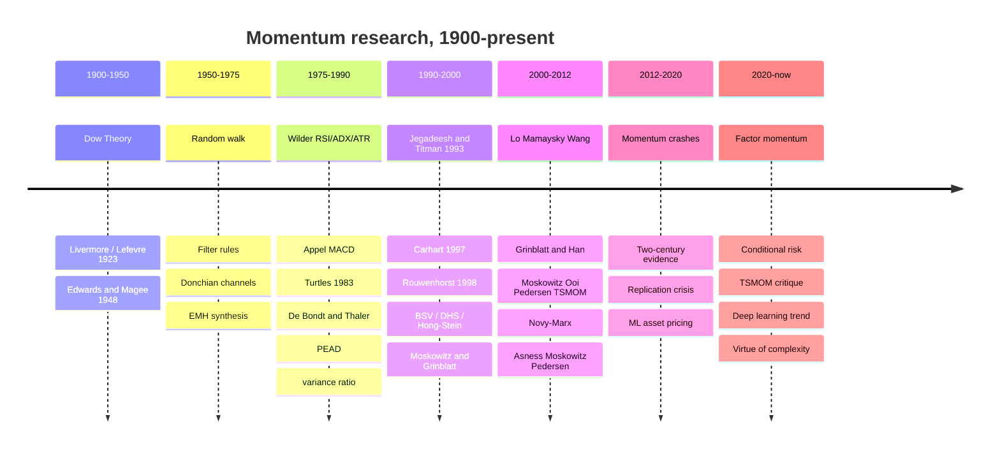
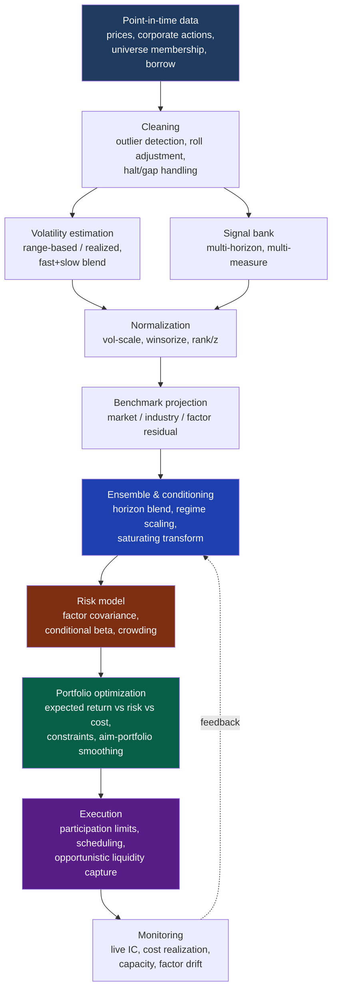
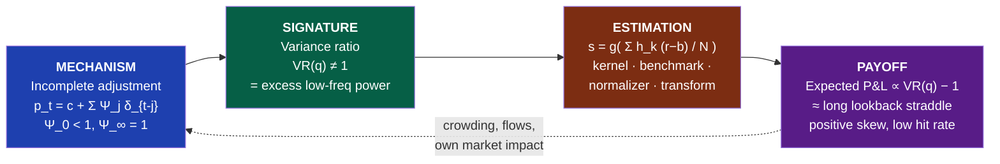
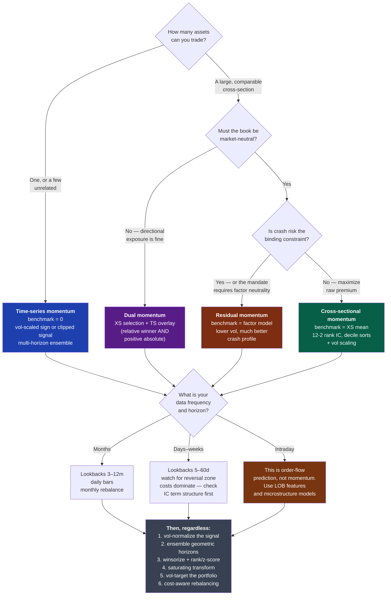

# Momentum in Financial Markets

### A first-principles tutorial for quantitative practitioners

---

```{=html}
<aside class="eli5">
```

# ELI5 — the short version {#eli5}

```{=latex}
\begin{eli5}
```

**In one sentence.** Prices take in news slowly, so something that has been rising for a few months tends to keep rising a little longer.

**1. It is not physics** ([§1](#1-what-is-momentum)). A rolling ball keeps rolling because physics makes it. A price has nothing like that, and yesterday's rise exerts no force on today. What actually happens is that good news makes a company worth more, and the price gets there *in steps* rather than in one jump. Some people hear the news today and others next week. A large fund needs weeks to finish buying. Owners sitting on gains sell too early and hold the price back. Momentum is the price still catching up. If the crowd overshoots, the price has to come back down later, which is reversal. One story explains both.

**2. Why nobody has traded it away.** If prices were ever perfectly right, nobody would be paid for the research that keeps them right, so a small gap always stays open. Some of the profit may also be payment for the risk of crashes rather than free money, and nobody knows the mix. What is settled is that the effect is real. It holds across two centuries of data, dozens of countries and every major asset class. It also survived the replication crisis that eliminated most other market anomalies.

**3. The time scale decides the sign.**

| Look back over… | What tends to happen next |
|---|---|
| Days to a month | It **bounces back** |
| 2–12 months | It **keeps going** — classic momentum |
| 3–5 years | It **bounces back** again — where "value" lives |

That is why the standard stock signal uses the past 12 months but skips the most recent one: the latest month points the other way.

**4. One number says whether a market trends at all.** Picture three walkers. One flips a coin at every step. One tends to carry on the way it was already going. One tends to double back. After 100 steps, the second is far from home and the third is still near it. The *variance ratio* asks which of the three a price resembles over a given span. It is the first thing to measure on an unfamiliar market, and a trend follower's profit is essentially proportional to it.

**5. What running it feels like.** Trend following is right only 30–45% of the time. Most trends are false starts that get cut for a small loss, and the rare real ones pay for everything. That is the shape of an insurance policy, which is why trend following tends to pay out in crises. Chasing a higher win rate destroys it.

**6. The crash.** The stock-picking version buys winners and sells losers short. After a market collapse, the "losers" are the most beaten-up, riskiest names. When the market rebounds, they rocket, and the strategy is on the wrong side. It lost roughly 90% in two months in 1932, and around 70% in 2009. The best defence is dull: bet smaller when markets are wild.

**7. Nearly every indicator is the same indicator** ([§4](#4-mathematical-and-statistical-characterizations-of-momentum), [§5](#5-taxonomy)). Moving averages, crossovers, MACD and regression slopes all add up recent price moves with different weights. At a matched look-back, they agree almost completely. What actually matters comes in this order. First is how far back the signal looks. Second is what it measures against: zero, peers, or a factor model, which are three different products with different crash risk. Third is dividing by how jumpy the asset is, the single highest-value step in the toolkit. Only then, a long way behind, comes the formula itself.

**8. The hard part is not finding a signal but avoiding self-deception** ([§6](#6-practical-implementation), [§7](#7-testing-momentum-based-trading-signals)). Test a thousand worthless strategies, and the best will show a Sharpe ratio near 1.2 on luck alone. So keep an honest count of everything tried. Real signals are barely better than a coin flip: being right 51.6% of the time is good, and 70% means something is broken. A 10-year Sharpe ratio of 1.0 is consistent with anything from 0.35 to 1.65. The most common bug is using information that was not yet available, such as trading at the closing price that produced the signal. And randomness itself looks like a trend. A coin-flip price crosses back over its starting level about 13 times in 250 days, not 125. So run the pipeline on fake random data first, and treat any profit it finds there as a bug.

**9. What to expect** ([§8](#8-current-best-practices), [§9](#9-synthesis)). A realistic, fully costed program earns a Sharpe ratio of 0.4–0.8. A backtest above 2 is measuring overfitting, unrealistic costs, or capacity that does not exist. At 0.5, it takes about 16 years of results before the number convinces anyone, so a bad decade proves nothing either way. Nobody serious runs momentum on its own. It is one ingredient, and the edge now lies in clean data, cheap execution and crash control rather than in the signal.

---

**If you do only three things:** diversify across many markets, scale the position down when volatility rises, and count every configuration you tested.

```{=latex}
\end{eli5}
```

```{=html}
</aside>
```

---

**How to read this chapter.** Sections 1–3 are conceptual and historical. §1 builds the mental model: momentum as incomplete adjustment of price to news, and the variance ratio as its signature. §2 traces how three communities discovered the effect, and §3 is the annotated reading list. Section 4 is the technical core: a survey of every serious way to *measure* momentum, each method described with the same fields in the same order. Sections 5–7 are engineering. §5 reduces the measures to one master form with four design choices, §6 covers implementation, and §7 covers evaluation. Sections 8 and 9 are the synthesis: current practice, a decision tree, and a staged roadmap for building a strategy.

Different readers can start in different places.

- Readers who want the model and its consequences should read §1, §5 and §9.1.
- Readers building a signal should read §4.0, §4.3, §5.2 and §6.
- Readers judging a backtest should read §6.10 and §7.

Appendix A defines, from first principles, every advanced concept the main text uses in passing, and A.11 is the full glossary of symbols. Appendix B lists the works cited in the text beyond the reading list of §3.

**Objectives.** After this chapter, you should be able to:

- explain momentum as incomplete price adjustment, and derive momentum and reversal from one impulse response;
- read a variance-ratio profile, and use it to say whether and at what horizon a market trends;
- write any common momentum measure as a kernel, benchmark, normalizer and transform, and say which choices matter most;
- separate momentum from trend, drift and volatility, and specify tests that do not confuse them;
- normalize, size and combine momentum signals without losing count of the powers of volatility;
- evaluate a momentum backtest honestly, with corrections for overlapping data, multiple testing and costs.

**Epistemic tags.** The chapters in this collection flag claims by status:

- **[Fact]** — replicated across independent datasets or implementations; broad agreement.
- **[Contested]** — documented, but with live disagreement about magnitude, robustness, or cause.
- **[Hypothesis]** — a proposed mechanism, not decisively tested.
- **[Practice]** — practitioner convention; the evidence may be private or absent. A [Practice] claim is not a debunked one.

Tags appear only where the status changes what a reader should do. A tag governs the sentence, list item or heading it opens. A few claims carry a qualified or compound tag, such as **[Fact, single study]** or **[Fact for the mechanism, Hypothesis for the magnitude]**, where a single tag would mislead.

**Notation.** The table lists the symbols that recur in the chapter, with the section that defines or first uses each. Symbols used in a single section are defined where they appear, and [Appendix A.11](#a11-glossary-of-symbols) gives the full glossary. Bold symbols are cross-sectional vectors over $N$ assets.

| Symbol | Meaning | Defined in |
|---|---|---|
| $P_t$; $p_t$ | Price at time $t$; log price, $p_t = \ln P_t$ | §1.2, §4.1 |
| $R_t$; $r_t$ | Simple return, $R_t = P_t/P_{t-1} - 1$; log return, $r_t = p_t - p_{t-1}$ | §4.1.1, §4.1.2 |
| $r_{a:b}$ | **Windowed return**: the cumulative log return over the half-open window $(a, b]$, $r_{a:b} = \sum_{i=a+1}^{b} r_i = p_b - p_a$. So $r_{t-L:t}$ spans the $L$ bars ending at $t$, and $r_{t:t+H}$ is the forward return over the next $H$ bars | §4.1 |
| $\mu$; $\sigma$ | Unconditional mean return; volatility | §1.1, §4.0 |
| $\hat\sigma_t$ | **Estimate**, formed from information available at $t$, of the *per-bar* return volatility (estimates carry hats) | §4.3.1 |
| $\sigma^\ast$ | Volatility target | §4.6.1, §6.7 |
| $\rho_k$ | Lag-$k$ autocorrelation, $\operatorname{Corr}(r_t, r_{t-k})$ | §1.1, A.1 |
| $v_t$; $\delta_t$ | Log of fundamental value; innovation to it | §1.2 |
| $\Psi_j$; $\psi_j$ | Cumulative impulse response; per-period impulse response, $\psi_j = \Psi_j - \Psi_{j-1}$ | §1.2 |
| $\mathcal{F}_t$ | Information set available at $t$ | §1.1 |
| $L$; $S$; $H$ | Lookback; skip; holding period, all in bars | §4.1.1 |
| $q$; $\mathrm{VR}(q)$ | Aggregation horizon; variance ratio at that horizon | §1.2 |
| $N$; $T$; $A$ | Number of assets; bars of history; bars per year (252 daily, 12 monthly) | §4.0, §4.3.2 |
| $s_{i,t}$; $w_{i,t}$ | Signal; portfolio weight | §4.0 |
| $h_k$; $b_{i,t}$; $\mathcal{N}_{i,t}$; $g(\cdot)$ | Kernel, benchmark, normalizer and transform of the master form | §5.2 |
| $\mathrm{Hi}_t$; $\mathrm{Lo}_t$ | Bar high; bar low | §4.3.1, §4.4 |
| $\mathrm{IC}$; $\mathrm{IR}$; $\mathrm{TC}$ | Information coefficient; information ratio; transfer coefficient | §7.3.1 |
| $M$ | Number of strategy configurations tried | §7.6 |
| $Q$; $V$; $Y$ | Order size; daily volume; impact coefficient | §1.3, §6.8 |
| $Z(\cdot)$; $Z^{-1}(\cdot)$ | Standard normal CDF; its inverse | §7.6.2 |
| $\mathbb{1}\{\cdot\}$ | Indicator | §4.2.3 |

Bar extremes are written $\mathrm{Hi}_t$ and $\mathrm{Lo}_t$ rather than $H_t$ and $L_t$, because $H$ and $L$ are already the holding period and the lookback. A few symbols are unavoidably overloaded, because each use is standard in its own literature:

- $\alpha$ is an EMA smoothing constant in §4 and Jensen's alpha in §7.
- $\beta$ is a regression slope in §4.2 and a factor loading in §4.6.4 and §7.4.4.
- $\lambda$ is an EWMA decay in §4 and Kyle's price-impact coefficient in §2.6.
- $H(\omega)$ is a filter's transfer function in §4.8, and $H$ is the observation matrix of a state-space model in §4.7.1.
- $\gamma$ is a risk-aversion constant in §4.0 and the Euler–Mascheroni constant in §7.6.2; $\gamma_k$ is an autocovariance, and $\gamma_3$, $\gamma_4$ are skewness and kurtosis.

Each occurrence is disambiguated where it appears.

---

## Table of contents

- [ELI5 — the short version](#eli5)

1. [What is momentum?](#1-what-is-momentum)
2. [Historical evolution of momentum research](#2-historical-evolution-of-momentum-research)
3. [Foundational references](#3-foundational-references)
4. [Mathematical and statistical characterizations](#4-mathematical-and-statistical-characterizations-of-momentum)
5. [Taxonomy](#5-taxonomy)
6. [Practical implementation](#6-practical-implementation)
7. [Testing momentum-based trading signals](#7-testing-momentum-based-trading-signals)
8. [Current best practices](#8-current-best-practices)
9. [Synthesis](#9-synthesis)
- [Appendix A: Concepts from first principles](#appendix-a-concepts-from-first-principles)
- [Appendix B: Additional works cited](#appendix-b-additional-works-cited)

Appendix A is a self-contained reference for every advanced concept the main text uses in passing. Each entry gives a plain-language definition first and a mathematical one second, and says which sections use it.

---

# 1. What is momentum? {#1-what-is-momentum}

## 1.1 The wrong intuition, and why it matters

The word "momentum" is borrowed from mechanics, and the borrowing misleads. A physical body in motion has a conserved quantity, mass times velocity, which persists unless a force acts on it. Prices have no such conserved quantity. They have no mass and no inertia. Nothing makes a price that rose yesterday keep rising today. Models built on the physical metaphor assume persistence, and they fail at the first regime change.

The correct starting point is informational. Everything reduces to one question:

> **Is the conditional expectation of the next return a function of past returns?**
> $$\mathbb{E}[r_{t+1} \mid r_t, r_{t-1}, \ldots] \ne \mathbb{E}[r_{t+1}]$$

Momentum is the claim that this function *increases* with past returns over some horizon. Nothing more is claimed. The claim concerns the **joint distribution of returns at different lags**, not any force acting on price.

Two clarifications about that claim matter later. First, the claim concerns a *conditional first* moment: an expected return. Second, the *second*-moment structure of the process is what makes that conditional mean vary. The best linear forecast from one lag is $\mu + \rho_1\,(r_t - \mu)$, so the autocovariances carry the predictability. Every estimator in §4 reads autocovariances in order to say something about a conditional mean. Keeping the two moments distinct prevents a common error: testing for one and claiming the other.

## 1.2 The conceptual model: incomplete adjustment

The model below generates almost all of momentum's observed behavior from one assumption. The view taken here is that it is the right mental model to carry throughout.

Work in logs throughout, so that returns add. Let $v_t$ be the log of the "true" value of an asset: the price that would hold if every participant instantly knew everything and could trade at scale without friction. Suppose $v$ follows a random walk with innovations $\delta_t$:

$$v_t = v_{t-1} + \delta_t, \qquad \delta_t \sim \text{iid}(0, \sigma_\delta^2)$$

Under the strict Efficient Market Hypothesis, $p_t = v_t$, and returns are unpredictable. Now relax that assumption in the mildest possible way. Let the price adjust only *partially* to each innovation, with the remainder arriving over later periods. Define the **cumulative impulse response** $\Psi_j$ as the fraction of a value innovation that has been impounded into price $j$ periods after it arrives, with $\Psi_{-1} = 0$. The log price is then a distributed lag on value innovations:

$$p_t \;=\; c \;+\; \sum_{j \ge 0} \Psi_j \, \delta_{t-j}, \qquad \lim_{j\to\infty}\Psi_j = 1$$

where $c$ is a constant of integration, the level from which the innovations accumulate. The terminal condition $\Psi_\infty = 1$ says the price *eventually* reaches value, so no mispricing is permanent. But if $\Psi_0 < 1$, the price gets there gradually. The value process can be written in the same form, $v_t = c + \sum_{j\ge0}\delta_{t-j}$, with the same constant. That gives an equivalent and more intuitive form:

$$p_t \;=\; \underbrace{v_t}_{\text{fundamental value}} \;-\; \underbrace{\sum_{j\ge0}\left(1-\Psi_j\right)\delta_{t-j}}_{\text{news not yet impounded}}$$

Price is value minus the backlog of news. The backlog term is stationary, even though $p_t$ and $v_t$ are not. Stationarity needs $1-\Psi_j \to 0$ fast enough to be square-summable, which any finite adjustment window satisfies. This property makes the model well behaved: the *mispricing* is stationary, and the *price* is a random walk plus a stationary correction. Differencing gives the return as a moving average of the same innovations. The weights are the **per-period** impulse response $\psi_j \equiv \Psi_j - \Psi_{j-1}$:

$$r_t \;=\; p_t - p_{t-1} \;=\; \sum_{j\ge0}\big(\Psi_j - \Psi_{j-1}\big)\,\delta_{t-j} \;=\; \sum_{j\ge0}\psi_j\,\delta_{t-j}, \qquad \sum_{j\ge0}\psi_j = 1$$

This is an MA($\infty$) process in $\delta$, so its autocorrelations follow directly:

$$\rho_k \;=\; \frac{\sum_{j\ge0}\psi_j\,\psi_{j+k}}{\sum_{j\ge0}\psi_j^2}$$

Everything follows from the *sign pattern* of $\psi$. Pure under-reaction means the price only ever moves toward value and never past it, so $\psi_j \ge 0$ for all $j$. Every term in the numerator above is then non-negative. So $\rho_k \ge 0$ at every lag, and $\rho_k = 0$ beyond the adjustment period. The inequality is strict at every lag inside the adjustment window whenever $\psi$ has contiguous support, which is the realistic case. A $\psi$ with gaps, such as $(\tfrac12, 0, \tfrac12)$, gives $\rho_1 = 0$ with $\rho_2 = \tfrac12$. **A single serially uncorrelated shock to value, impounded gradually, produces autocorrelated returns.** Momentum is the *shadow of incomplete adjustment*.

The mapping is sharp. If adjustment is instantaneous ($\psi_0 = 1$, all other $\psi_j = 0$), then $\rho_k = 0$ for all $k$, and there is no momentum. Suppose instead that half the shock lands immediately and half the next period ($\psi_0 = \psi_1 = \tfrac12$). Then $\sum_j\psi_j^2 = \tfrac12$ and $\sum_j \psi_j\psi_{j+1} = \tfrac14$, which gives $\rho_1 = 0.5$ and $\rho_k = 0$ for $k \ge 2$. **The speed of adjustment and the return autocorrelation are one fact seen twice.** The mapping is general, but the matching numbers are not. The two halves coincide here only because $\psi_0 = \psi_1$ is exactly the configuration that maximizes $\rho_1$ for an MA(1). If 70% of the shock lands immediately and 30% the next period, then $\rho_1 = 0.21/0.58 \approx 0.36$, not $0.7$.

Two corollaries follow that most intuitions miss.

1. **Momentum must decay, but reversal needs more than that.** It is tempting to argue that the fixed budget $\Psi_\infty = 1$ forces reversal. It does not. It only forces momentum to be *transient*. If $\psi_j \ge 0$ throughout, the price creeps up to value and never past it. Then $\rho_k \ge 0$ out to the adjustment window and zero beyond, with no reversal at any horizon. Reversal requires a separate, empirically relevant assumption: **overshoot**, $\Psi_K > 1$ for some intermediate $K$. The budget then forces the price back down, which puts $\psi_j < 0$ at longer lags. Overshoot buys less than it seems to, for two reasons. First, it does not make $\rho_k$ negative lag by lag. Each $\rho_k$ is a *sum of products* $\sum_j \psi_j\psi_{j+k}$, so weights of mixed sign can still leave $\rho_k > 0$ at the very lags where the negative $\psi$'s sit. Second, overshoot is necessary but not sufficient for *net* reversal. The variance-ratio identity in the next subsection makes this exact: net reversal means $\sum_j\psi_j^2 > 1$, and mild overshoot does not get there. Momentum and long-horizon reversal are two readings of one impulse-response function. **[Fact]** Datasets that show 3–12 month momentum in equities generally also show 3–5 year reversal ([De Bondt & Thaler, 1985](https://doi.org/10.1111/j.1540-6261.1985.tb05004.x){target="_blank"}).

2. **Momentum is horizon-specific by construction.** The sign of the autocorrelation depends on where the impulse response is sampled. So the same asset can be mean-reverting at 1 day, trending at 6 months, and mean-reverting at 4 years, with no contradiction.

### The one diagnostic that ties it all together: the variance ratio

Every estimator in Section 4 is, at bottom, an estimator of this object. Define the $q$-period **variance ratio** ([Lo & MacKinlay, 1988](https://www.nber.org/papers/w2168){target="_blank"}):

$$\mathrm{VR}(q) \;=\; \frac{\operatorname{Var}(p_t - p_{t-q})}{q \cdot \operatorname{Var}(p_t - p_{t-1})} \;=\; 1 + 2\sum_{k=1}^{q-1}\left(1 - \frac{k}{q}\right)\rho_k$$

The second equality is the usual Bartlett-weighted expansion. The variance ratio can also be read straight off the impulse response, without passing through the autocorrelations. Adopt $\Psi_j \equiv 0$ for $j < 0$. Then $p_t - p_{t-q} = \sum_{j\ge0}\left(\Psi_j - \Psi_{j-q}\right)\delta_{t-j}$, and

$$\mathrm{VR}(q) \;=\; \frac{\sum_{j\ge0}\left(\Psi_j - \Psi_{j-q}\right)^2}{q\,\sum_{j\ge0}\psi_j^2}, \qquad\qquad \mathrm{VR}(\infty) \;=\; \frac{1}{\sum_{j\ge0}\psi_j^2}$$

The variance-ratio profile *is* a picture of $\Psi$. The limiting case settles corollary 1 above. Under pure under-reaction, $\psi_j \ge 0$ and $\sum_j \psi_j = 1$. Together these give $\sum_j \psi_j^2 \le \left(\max_j \psi_j\right)\sum_j\psi_j \le 1$, hence $\mathrm{VR}(\infty) \ge 1$. **No amount of merely gradual adjustment can produce net reversal.** Only overshoot severe enough to push $\sum_j\psi_j^2$ above 1 can. The equality case $\sum_j\psi_j^2 = 1$ forces $\psi$ to be a single spike: the whole shock lands in one period, possibly with a lag. That case is the random walk.

Under a random walk, $\mathrm{VR}(q) = 1$ for all $q$, because variance scales linearly with time. Departures from 1 read as follows:

- $\mathrm{VR}(q) > 1$: the $q$-scale is **trending**. Prices diffuse faster than a random walk, and the net autocorrelation out to lag $q-1$ is positive.
- $\mathrm{VR}(q) < 1$: the $q$-scale is **mean-reverting**.

The function $q \mapsto \mathrm{VR}(q)$, the *variance-ratio profile*, is the single most informative descriptive statistic about momentum in a series. It shows *at what horizon* the asset trends, and that horizon directly sets the lookback. [Practice] **Recommendation: when evaluating an unfamiliar market, study its variance-ratio profile before any backtest equity curve.** The figure shows a schematic profile.

```{=latex}
\newpage
```

```{=html}
<style>
/* Figures for this document. Prefix "mdd-", distinct from the reading
   widget's "rdw-" and the random-walk figure's "rw-". Narrow viewports
   reclaim the body's side padding so the figure gets the full width. */
.mdd-fig {
  display: block; width: 100%; height: auto;
  max-width: 640px; margin: 1.6rem auto;
  /* the reading widget adds a light plate (padding) in dark mode */
  box-sizing: border-box;
}
@media (max-width: 760px) {
  .mdd-fig { width: calc(100% + 64px); max-width: none; margin-left: -32px; margin-right: -32px; }
}
@media (max-width: 600px) { /* pandoc's own stylesheet drops body padding to 12px here */
  .mdd-fig { width: calc(100% + 24px); margin-left: -12px; margin-right: -12px; }
}
</style>


```

```{=latex}
\begin{center}
\includegraphics[width=\linewidth]{quant-research/figures/vr_profile.pdf}
\end{center}
```

*Schematic variance-ratio profile for a typical liquid equity. **[Fact]** The three-regime shape is robust across US equities, international equities, and many futures markets: short-horizon reversal, intermediate-horizon trend, and long-horizon reversal. The crossover points differ by asset class and era.*

The same picture gives the cleanest available statement of what a trend-following P&L *is*. [Dao, Nguyen, Deremble, Lempérière, Bouchaud & Potters (2017)](https://arxiv.org/abs/1607.02410){target="_blank"} show that the expected P&L of a canonical trend rule on a single asset is, to leading order, proportional to a difference of two variances. One is the asset's variance measured at the trend's timescale. The other is its variance measured at the rebalancing timescale:

$$\mathbb{E}[\text{trend P\&L}] \;\propto\; \underbrace{\sigma^2_{\text{long horizon}} - \sigma^2_{\text{short horizon}}}_{\;\propto\; \mathrm{VR}(q) - 1}$$

Both variances here are **per unit of time**: $\sigma^2_{\text{long horizon}} = \operatorname{Var}(p_t - p_{t-q})/q$ and $\sigma^2_{\text{short horizon}} = \operatorname{Var}(p_t - p_{t-1})$. Written this way, the link to the variance ratio is immediate, since $\mathrm{VR}(q) - 1 = (\sigma^2_{\text{long horizon}} - \sigma^2_{\text{short horizon}})/\sigma^2_{\text{short horizon}}$. Comparing raw, unnormalized variances at two horizons would say nothing, because the longer one is mechanically larger.

The underbrace needs care, though. Rearranging the identity gives $\sigma^2_{\text{long horizon}} - \sigma^2_{\text{short horizon}} = \sigma^2_{\text{short horizon}}\left(\mathrm{VR}(q) - 1\right)$. So the P&L of a *raw* trend rule tracks $\mathrm{VR}(q)-1$ only at fixed $\sigma^2_{\text{short horizon}}$. The proportionality does not survive a comparison across assets, or across time for one asset whose volatility moves. The normalization that every practitioner already applies removes the leftover factor. The raw rule carries two powers of $\sigma_{\text{short horizon}}$: one in the signal, which is a past return, and one in the return it is multiplied by. Standardizing the signal by its own volatility *and* sizing the position at $1/\sigma_{\text{short horizon}}$ divides out both powers. What remains is $\mathbb{E}[\text{P\&L}] \propto \mathrm{VR}(q) - 1$ itself. So the **fully volatility-scaled** trend rule, not the raw one, is cleanly long the variance ratio. That is the version of the statement worth remembering.

**A trend follower is structurally long the variance ratio.** This one sentence explains three things: the convexity of CTA returns; why trend does well in dispersive crises and badly in choppy ranges; and why "trend following is a long straddle" ([Fung & Hsieh, 2001](https://doi.org/10.1093/rfs/14.2.313){target="_blank"}) is more than an analogy.

## 1.3 Why momentum exists despite the Efficient Market Hypothesis

A first clarification resolves half the confusion in this debate. The EMH as stated by [Fama (1970)](https://doi.org/10.2307/2325486){target="_blank"} is not the claim that returns are unpredictable. It is the claim that prices reflect information *given a model of equilibrium expected returns*. Any test of efficiency is therefore a **joint test** of (a) efficiency and (b) the assumed asset-pricing model. If momentum earns positive average returns, either markets are inefficient or the model of risk is wrong. Return data alone cannot tell which. This is the **joint hypothesis problem**, and it is why the momentum debate has run for 30 years without resolution.

A second clarification concerns the "no free lunch" version of the EMH. That version says risk-adjusted excess returns net of costs should be competed away. It never claimed that they vanish *instantly* or *completely*. It is a claim about limits. [Grossman & Stiglitz (1980)](https://www.aeaweb.org/aer/top20/70.3.393-408.pdf){target="_blank"} made this precise. If prices were fully revealing, no one would pay to gather information. So in equilibrium, prices must be *slightly* inefficient, by exactly enough to compensate information gathering. Momentum lives in that gap.

Within this framing, four families of explanation compete. They are not mutually exclusive. The defensible position is that all four contribute, in proportions nobody has pinned down.

### (A) Slow information diffusion — **[Hypothesis, well-formalized]**

[Hong & Stein (1999)](https://www.nber.org/papers/w6324){target="_blank"} build a model with two types of agent. "Newswatchers" trade on private fundamental signals that diffuse gradually across the population. "Momentum traders" condition only on past prices. Gradual diffusion alone generates under-reaction, and hence momentum. Momentum traders who arbitrage the under-reaction then necessarily generate *over*-reaction at longer horizons, and hence reversal. One friction produces the full momentum-then-reversal impulse response.

Supporting evidence **[Fact]**: momentum is stronger in stocks with low analyst coverage and small size ([Hong, Lim & Stein, 2000](https://doi.org/10.3386/w6553){target="_blank"}). Post-earnings-announcement drift (Bernard & Thomas, 1989, 1990) is a clean case of information being impounded over weeks after a *public* announcement. [Chan, Jegadeesh & Lakonishok (1996)](https://doi.org/10.3386/w5375){target="_blank"} show that momentum and PEAD are related but not identical.

### (B) Behavioral biases — **[Hypothesis, contested]**

Three canonical models, all published in 1998–1999, produce momentum and reversal from different psychology:

- **[Barberis, Shleifer & Vishny (1998)](https://doi.org/10.3386/w5926){target="_blank"}**: conservatism, which is under-reaction to individual signals, plus the representativeness heuristic, which is over-extrapolation of streaks. Investors are slow to update, and then they over-extrapolate.
- **[Daniel, Hirshleifer & Subrahmanyam (1998)](http://deepblue.lib.umich.edu/bitstream/2027.42/73431/1/0022-1082.00077.pdf){target="_blank"}**: overconfidence in private signals plus biased self-attribution. Confirming public news inflates confidence more than disconfirming news deflates it. This drives continued over-reaction, which is momentum, followed by correction.
- **[Grinblatt & Han (2005)](https://utoronto.scholaris.ca/bitstreams/3a09de05-9370-4e68-a03d-ccce917a5cb6/download){target="_blank"}** and **[Frazzini (2006)](https://onlinelibrary.wiley.com/doi/pdfdirect/10.1111/j.1540-6261.2006.00896.x){target="_blank"}**: the **disposition effect**. Investors sitting on gains sell too early, and investors sitting on losses hold too long. This creates a supply overhang above the reference price, the aggregate cost basis, which *slows* upward adjustment to good news. Momentum should then be predictable from unrealized capital gains, and that is exactly what these papers find. The view taken here is that this is the strongest of the three, because it makes a sharp auxiliary prediction that is confirmed independently of returns.

The standard critique of behavioral explanations is fair. They are flexible enough to explain almost any pattern after the fact, and the profession has not agreed on which bias dominates.

### (C) Order flow and market microstructure — **[Fact for the mechanism, Hypothesis for the magnitude]**

This explanation appeals most to engineers, because it needs no psychology at all, only the mechanics of execution.

Institutions cannot execute a large position instantaneously without paying ruinous impact. So they slice a **metaorder** into child orders executed over hours, days or weeks. Two robust microstructure facts follow:

1. **Order flow has long memory.** The sign sequence of market orders is positively autocorrelated. Its autocorrelation function decays slowly, as a power law, out to thousands of trades ([Lillo & Farmer, 2004](https://doi.org/10.2202/1558-3708.1226){target="_blank"}; [Bouchaud, Gefen, Potters & Wyart, 2004](https://doi.org/10.2139/ssrn.507322){target="_blank"}). This is a direct fingerprint of order splitting.
2. **The square-root law of impact.** The expected price impact of a metaorder of size $Q$, in a market with daily volume $V$ and volatility $\sigma$, is approximately
   $$\Delta p \;\approx\; Y \sigma \sqrt{Q/V}, \qquad Y = O(1)$$
   The units matter and are easy to get wrong. $Q$ and $V$ are in the *same* units, both in shares or both in currency, so $Q/V$ is the dimensionless participation fraction. $\sigma$ is the *daily* return volatility. So $\Delta p$ is a **relative** price move, not a currency amount. Empirically, $Y \approx 0.5$–$1$. This concave, roughly universal relation holds across markets, asset classes and decades; Bouchaud, Bonart, Donier & Gould (2018) give the synthesis. It reappears in §6.8 as the binding constraint on capacity.

Together, these facts produce momentum. A persistent, one-directional flow that takes weeks to complete pushes the price persistently in one direction. Anyone who detects that flow earns momentum returns. And part of the impact **decays** after the metaorder finishes, which again produces momentum followed by partial reversal.

A second microstructure channel is *mechanical flow*. Index inclusion, the rebalancing of risk-parity and volatility-target funds, option dealer hedging (gamma imbalance), and trend followers themselves all generate order flow that depends on price. Such flow is a positive feedback loop by construction.

### (D) Risk-based / rational explanations — **[Contested, and improving]**

If momentum portfolios are simply riskier in a way standard models miss, there is no puzzle. Early versions of this argument were weak. Momentum's CAPM beta is near zero, and momentum survives the Fama–French three-factor adjustment. That is why Carhart (1997) added momentum as a fourth factor rather than explaining it away. The modern versions are much stronger:

- **Conditional betas.** [Kelly, Moskowitz & Pruitt](https://doi.org/10.1016/j.jfineco.2020.06.024){target="_blank"} (2021, *JFE* 140) use instrumented principal components. They show that past-return characteristics predict future *realized betas*, and that time-varying conditional risk exposures explain a sizable fraction of momentum and long-term reversal returns. This is currently the most serious rational challenge.
- **Momentum's dynamic beta.** [Daniel & Moskowitz (2016)](https://doi.org/10.3386/w20439){target="_blank"} and [Geczy & Samonov (2016)](https://doi.org/10.2469/faj.v72.n5.1){target="_blank"} document that the momentum portfolio's market beta swings systematically with the market state. It turns sharply negative after bear markets. The momentum premium therefore partly compensates for a *conditional* crash exposure, not an unconditional one.
- **Real options / growth-rate risk.** [Berk, Green & Naik (1999)](https://onlinelibrary.wiley.com/doi/pdfdirect/10.1111/0022-1082.00161){target="_blank"} and [Johnson (2002)](https://doi.org/10.2139/ssrn.250760){target="_blank"} show that firms whose expected growth rate has risen mechanically have both higher past returns and higher risk. That combination generates momentum in equilibrium.

### The honest summary

**[Fact]** Momentum returns exist out of sample, across asset classes, countries and two centuries. **[Contested]** Why they exist is unsettled. [Practice] **Recommendation: treat the microstructure and flow explanation as the primary mechanism, because it is directly observable.** Treat slow diffusion and the disposition effect as strong secondary channels. Treat the risk-based explanations as a warning that some apparent "alpha" is a conditional beta that has not been measured. That last point matters in practice: it is the reason momentum crashes.

## 1.4 Momentum is not: trend, drift, volatility, mean reversion, acceleration, or regime

These concepts are conflated constantly, including in published work. The table separates them.

```{=latex}
\newpage
```

| Concept | Formal object | What it is about | Confusable with momentum because… |
|---|---|---|---|
| **Momentum** | $\mathbb{E}[r_{t+1}\mid r_{t-L:t}]$ increasing in past returns; for a linear forecast this is $\rho_k > 0$ | *Conditional first moment*, driven by second-moment (autocovariance) structure | — |
| **Trend** | A low-frequency component $\tau_t$ in a decomposition $p_t = \tau_t + c_t + \varepsilon_t$ | A property of the *price path*, an unobserved state | Trend-followers profit from both; the P&L doesn't distinguish them |
| **Drift** | $\mu = \mathbb{E}[r_t]$, unconditional | A constant, not a prediction | A positive $\mu$ makes naive momentum tests look significant |
| **Volatility** | $\sigma_t^2 = \operatorname{Var}(r_t \mid \mathcal{F}_{t-1})$ | *Conditional second moment* | Both are persistent; vol clustering is far stronger than return autocorrelation |
| **Mean reversion** | $\rho_k < 0$ at the relevant $k$ | Same object, opposite sign | Literally the same statistic at a different horizon |
| **Acceleration** | $\partial^2 p/\partial t^2$; change in momentum | Second derivative of the level | "Momentum of momentum"; very low signal-to-noise |
| **Regime** | Latent state $S_t \in \{1..K\}$ modulating parameters | A *parameter* of the above, not a quantity | Regimes make momentum appear and disappear |

Three of these distinctions deserve more space, because confusing them causes real losses.

### Trend vs. momentum: the sharpest distinction in this document

Consider a price process that is a deterministic upward line plus iid noise:

$$p_t = \mu t + \varepsilon_t, \qquad \varepsilon_t \sim \text{iid}(0,\sigma^2_\varepsilon)$$

This series has a **perfect trend** and **negative** return autocorrelation. The return is $r_t = \mu + \varepsilon_t - \varepsilon_{t-1}$, an MA(1) with a unit negative coefficient. Its autocorrelation is $\rho_1 = -\sigma^2_\varepsilon / 2\sigma^2_\varepsilon = -1/2$, with $\rho_k = 0$ beyond. So the series has a trend and *anti*-momentum: an up move predicts a down move. Conversely, a process $r_t = \phi r_{t-1} + u_t$ with $\phi > 0$ and zero mean has momentum but no trend in the level sense. It wanders.

**Trend is about the level; momentum is about the returns.** A trend-following *rule*, such as "long when $P_t > \mathrm{MA}_L(P)_t$", does not distinguish them. It profits from drift, trend *and* return autocorrelation alike. That is fine for making money and bad for research. A profitable trend backtest says nothing about which of the three is present, and the three have completely different stability properties. Drift is stable and carries little information. Return autocorrelation is fragile and carries a lot.

This distinction has a precise consequence in Section 7. **[Contested]** [Huang, Li, Wang & Zhou](https://doi.org/10.2139/ssrn.3165284){target="_blank"} (2020, *JFE* 135) argue that the canonical time-series momentum test is confounded. The test regresses $r_{t+1}$ on $\operatorname{sign}(r_{t-12:t})$. But $\mathbb{E}[r_{t+1}\cdot\operatorname{sign}(r_{t-12:t})]$ is positive whenever $\mu > 0$, even with *zero* predictability. After controlling for the unconditional mean, they find little evidence of an absolute time-series momentum effect in their sample. [Moskowitz, Ooi & Pedersen (2012)](https://doi.org/10.2139/ssrn.2089463){target="_blank"} and later replications dispute the strength of this critique. **The disagreement is live and important, and it determines how any new test must be specified.**

### Volatility vs. momentum

Decompose $r_t = \mu_t + \sigma_t \epsilon_t$, with $\epsilon_t$ standardized. Momentum is a claim about $\mu_t$. Volatility clustering is a claim about $\sigma_t$. Empirically, **[Fact]** the persistence in $\sigma_t$ is an order of magnitude stronger and more reliable than the persistence in $\mu_t$. Daily $\lvert r_t\rvert$ has an autocorrelation of 0.2–0.4 at lag 1, decaying slowly, while daily $r_t$ has an autocorrelation near zero. Two consequences follow:

1. Volatility is the *easy* prediction problem. Every momentum measure that divides by an estimate of $\sigma$ uses the easy problem to sharpen the hard one.
2. A raw return signal is contaminated. A large past return may indicate direction, which is momentum, or merely high volatility. Normalizing separates the two. This is the single highest-value transformation in Section 4.

### Regime as a parameter, not a phenomenon

"Momentum works in trending regimes" is nearly a tautology. The useful version says that the *parameters* are state-dependent: the sign and size of $\rho_k$, the optimal lookback, and the level of volatility. [Cooper, Gutierrez & Hameed (2004)](https://doi.org/10.2139/ssrn.299927){target="_blank"} show **[Fact]** that momentum profits in US equities are concentrated after positive market states, and are near zero or negative after negative ones. [Daniel & Moskowitz (2016)](https://doi.org/10.3386/w20439){target="_blank"} sharpen this: momentum crashes occur in panic states, with high volatility and a rebounding market.

In practice, regime conditioning is *not* an optional refinement. It separates a strategy with a −70% drawdown from one without.

## 1.5 Momentum across time scales

Momentum is not one phenomenon. Different horizons have different signs, causes, capacities and decay rates. The table maps them.

```{=latex}
\newpage
```

| Horizon | Dominant effect | Mechanism | Capacity | Notes |
|---|---|---|---|---|
| Sub-second to minutes | **Momentum** in order flow; price near-efficient | Order splitting, queue dynamics, latency arbitrage | Very low | Flow is predictable; *price* is much less so because market makers offset it |
| Minutes to hours | Mixed; intraday momentum at specific times | Metaorder execution, VWAP/close flows | Low | **[Fact]** "Intraday momentum": the first half-hour return predicts the last half-hour return ([Gao, Han, Li & Zhou, 2018](https://doi.org/10.1016/j.jfineco.2018.05.009){target="_blank"}) |
| 1 day – 1 month | **Reversal** (cross-sectional) | Compensation for liquidity provision; bid-ask bounce | Medium | [Jegadeesh (1990)](https://doi.org/10.1111/j.1540-6261.1990.tb05110.x){target="_blank"}, [Lehmann (1990)](https://www.nber.org/papers/w2533){target="_blank"}. Crucial: the classic momentum signal *skips* this month for exactly this reason |
| 2 – 12 months | **Momentum** — the classic effect | Under-reaction, flow, disposition effect | High | [Jegadeesh & Titman (1993)](https://doi.org/10.1111/j.1540-6261.1993.tb04702.x){target="_blank"}. The 12-2 or 12-1 signal is the canonical form |
| 1 – 3 years | Weak / transition | — | — | Signal largely absent |
| 3 – 5 years | **Reversal** | Over-reaction correction, valuation anchoring | High | [De Bondt & Thaler (1985)](https://doi.org/10.1111/j.1540-6261.1985.tb05004.x){target="_blank"}; this is where value lives |

Two refinements matter.

**Echo / intermediate-horizon momentum. [Contested]** [Novy-Marx](https://doi.org/10.1016/j.jfineco.2011.05.003){target="_blank"} (2012, *JFE* 103) shows that in US equities, returns from $t-12$ to $t-7$ predict future returns *better* than returns from $t-6$ to $t-2$. On this evidence, momentum is an "echo", not a smoothly decaying persistence. The finding sits uneasily with any simple under-reaction story, and it is not uniformly robust across markets and later samples. Treat it as a real feature of US equity data whose generality is unsettled.

**The time scale depends on the asset class. [Fact]** Futures trend following works well at lookbacks of 1–12 months ([Moskowitz, Ooi & Pedersen, 2012](https://doi.org/10.2139/ssrn.2089463){target="_blank"}; [Hurst, Ooi & Pedersen, 2017](https://doi.org/10.2139/ssrn.2993026){target="_blank"}). Currency momentum is weaker and more prone to crashes ([Menkhoff, Sarno, Schmeling & Schrimpf, 2012](https://doi.org/10.2139/ssrn.1773543){target="_blank"}). Commodity momentum interacts strongly with the term structure and carry ([Erb & Harvey, 2006](https://doi.org/10.3386/w11222){target="_blank"}). Do not port an equity lookback to a futures book without re-deriving it.

## 1.6 The life cycle of a trend

This section is deliberately labeled **[Practice / Hypothesis]**. The four-phase description below is a useful organizing device with partial empirical support, not an established taxonomy. It is worth stating precisely because it clarifies *which statistical problem each phase poses.* The figure and table set out the four phases.

```{=latex}
\newpage
```

```{=html}

```

```{=latex}
\begin{center}
\includegraphics[width=\linewidth]{quant-research/figures/trend_life_cycle.pdf}
\end{center}
```

| Phase | Signal quality | Volatility | What to do |
|---|---|---|---|
| **Initiation** | weak, ambiguous; many false positives | rising | small size, wide stops |
| **Continuation** | strong, stable; $\rho_k > 0$ | moderate, clustered | full size, vol-target |
| **Exhaustion** | strong but decaying; acceleration $< 0$ | rising | reduce, tighten vol scaling |
| **Reversal** | inverts abruptly | spikes | be flat or reversed |

**Initiation.** The statistical problem is *detection*: distinguishing the onset of a persistent drift from noise. Signal-to-noise is at its worst here, because by construction there are few observations of the new state. Any detector trades off Type I against Type II error, and the lookback length *is* the dial for that trade-off. Short lookbacks detect early, with many false positives. Long lookbacks detect late, with few. No parameter resolves the trade-off. Only the trader's cost structure can say where to sit on the curve. **[Fact]** The distribution of trend-following trade P&L is heavily right-skewed, with a low hit rate, typically 30–45%. Most detections are false and are stopped out cheaply, and a minority of trades pay for everything.

**Continuation.** The statistical problem is *estimation and sizing*. Given that a trend exists, how large is the drift relative to volatility, and how much risk should the position take? Autocorrelation is positive, and volatility is clustered and comparatively predictable. This phase is where volatility-scaled position sizing (§4.3.1, §6.7) contributes most.

**Exhaustion.** The statistical problem is *change-point detection*, and it is the hardest of the four. Candidate observable markers **[Practice, weakly supported]** are:

- rising volatility with flat or declining absolute price progress, that is, a deteriorating "efficiency ratio";
- negative acceleration while momentum remains positive;
- divergence between price extremes and oscillator extremes;
- crowding measures, such as positioning data, factor-return correlation and dealer gamma.

None of these is a robust standalone signal in the published evidence. Treat exhaustion detection as risk *reduction*, not as a reversal trade.

**Reversal.** Momentum's losses are not symmetric with its gains. **[Fact]** [Daniel & Moskowitz (2016)](https://doi.org/10.3386/w20439){target="_blank"} document "momentum crashes". In panic states, following market declines and with high volatility, the momentum portfolio's conditional beta turns sharply negative. The reason is that the "loser" leg is loaded with high-beta distressed names. When the market rebounds, the short leg explodes. The canonical episodes are July–August 1932, when the momentum strategy lost roughly 90% in two months, and March–May 2009, when US equity momentum lost roughly 70% or more. The payoff structure resembles being **short a call option on the market, conditional on being in a panic state**.

This is why the modern treatment of momentum is inseparable from risk management. Risk management is not an add-on. It changes the strategy's fundamental character.

---

> ### §1 Key takeaways
>
> 1. Momentum is a statement about the **conditional distribution of returns given past returns**, not a force. Drop the physics metaphor.
> 2. Momentum arises from **incomplete price adjustment**. One assumption, that information is impounded gradually, generates momentum, later reversal and horizon dependence together.
> 3. The **variance-ratio profile** $\mathrm{VR}(q)$ is the unifying diagnostic. Trend-following P&L is structurally long $\mathrm{VR}(q) - 1$.
> 4. The EMH does not forbid momentum. Tests of efficiency are joint tests with an asset-pricing model, and Grossman–Stiglitz guarantees a residual inefficiency. Four families of explanation have support: slow diffusion, behavioral bias, order flow and conditional risk. None is decisive.
> 5. **Trend ≠ momentum ≠ drift.** A trend rule profits from all three, so a profitable backtest is not evidence of predictability. Specify tests that separate them (see the critique by Huang et al.).
> 6. The sign flips by horizon: reversal at days, momentum at 2–12 months, reversal at 3–5 years. Skipping the most recent month is not a hack. It avoids a known effect of opposite sign.
> 7. Momentum's loss distribution is **conditionally crash-prone**, driven by a beta that flips in panic states. Risk management is intrinsic to the strategy, not an add-on.

---

# 2. Historical evolution of momentum research {#2-historical-evolution-of-momentum-research}

Three communities discovered momentum independently and barely spoke to each other: chart-reading speculators, systematic futures traders, and academic financial economists. Their work converged only in the 2010s. The history is worth reading in order, for two reasons. Each community found something the others missed, and most "new" ideas in this space are rediscoveries. The timeline gives the overview.


```mermaid
timeline
    title Momentum research, 1900-present
    section 1900-1950
        Dow Theory : Livermore / Lefevre 1923 : Edwards and Magee 1948
    section 1950-1975
        Random walk : Filter rules : Donchian channels : EMH synthesis
    section 1975-1990
        Wilder RSI/ADX/ATR : Appel MACD : Turtles 1983 : De Bondt and Thaler : PEAD : variance ratio
    section 1990-2000
        Jegadeesh and Titman 1993 : Carhart 1997 : Rouwenhorst 1998 : BSV / DHS / Hong-Stein : Moskowitz and Grinblatt
    section 2000-2012
        Lo Mamaysky Wang : Grinblatt and Han : Moskowitz Ooi Pedersen TSMOM : Novy-Marx : Asness Moskowitz Pedersen
    section 2012-2020
        Momentum crashes : Two-century evidence : Replication crisis : ML asset pricing
    section 2020-now
        Factor momentum : Conditional risk : TSMOM critique : Deep learning trend : Virtue of complexity
```

## 2.1 Era I — Chart reading and the birth of the trend concept (1900–1950)

### Dow Theory (Charles Dow's editorials 1899–1902; codified by Hamilton, 1922; Rhea, 1932)

**Contribution.** Dow Theory was the first systematic description of markets as having *nested trends* at several time scales: primary (years), secondary (weeks to months) and minor (days). It also stated the first explicit continuation principle: a trend is assumed to remain in force until a definite reversal signal appears. And it introduced *confirmation*: a signal in one index (the Industrials) counted only when another index (the Rails) corroborated it.

**What changed.** It reframed price behavior from "a series of unrelated quotations" to "a state that persists." That framing of trend as a latent regime, with rules for detection and confirmation, is the direct intellectual ancestor of every regime-switching model in §4.7.2.

**Limitations.** It is purely qualitative, cannot be falsified as stated, and depends on the interpreter. Rhea's codification was retrospective.

**Lasting influence.** The influence is substantial and, unusually for technical analysis, partly vindicated by evidence. [Brown, Goetzmann & Kumar](https://onlinelibrary.wiley.com/doi/pdfdirect/10.1111/0022-1082.00054){target="_blank"} (1998, *Journal of Finance*) reconstructed Hamilton's actual *Wall Street Journal* market calls from 1902–1929. They found that the calls generated positive risk-adjusted returns relative to a buy-and-hold benchmark. **[Fact, single study]** The decomposition into several time scales remains standard practice.

### Jesse Livermore / Edwin Lefèvre, *Reminiscences of a Stock Operator* (1923); Livermore, *How to Trade in Stocks* (1940)

**Contribution.** These books state the practitioner's rules: add to positions as they gain ("pyramiding into strength"), cut losses fast, and follow the "line of least resistance", which means trading breakouts from consolidation ranges. Livermore also tied position size to confirmation.

**What changed.** They established the discipline of an *asymmetric* payoff: small, frequent losses financed by rare, large gains. That asymmetry later became the defining statistical signature of trend following. It is the practitioner's discovery of positive skew, 40 years before anyone measured it.

**Limitations.** The evidence is anecdotal and survivorship-biased. Livermore's own record ended in catastrophe, and the book is a novelization.

**Lasting influence.** The cultural influence is enormous. The rules for cutting losses and pyramiding are essentially a discrete approximation to volatility-scaled position sizing.

### Edwards & Magee, *Technical Analysis of Stock Trends* (1948)

**Contribution.** The book is a systematic catalogue of chart patterns, support and resistance, and trendline construction. It was the first attempt to make chart reading reproducible.

**What changed.** It made technical analysis *teachable*, and so scalable to a profession.

**Limitations.** It has no statistical validation. The pattern vocabulary is a textbook case of pattern-fitting after the fact, with enormous researcher degrees of freedom. Most of the specific patterns have never survived rigorous testing.

**Lasting influence.** The influence is mixed. The *pattern catalogue* is largely discredited as a source of edge. Some of the *concepts* have partial modern grounding: support and resistance as reference-price effects, consolidation followed by breakout, and volume confirmation. These connect to the disposition effect and to the liquidity structure of the order book. [Lo, Mamaysky & Wang](https://www.nber.org/papers/w7613){target="_blank"} (2000, *JF*) later gave the pattern-recognition program its only serious statistical treatment (see §2.4).

## 2.2 Era II — The random walk and the first quantitative tests (1950–1975)

### Kendall (1953), Osborne (1959), Samuelson (1965), Fama (1965)

**Contribution.** This work showed empirically that stock price changes are approximately serially uncorrelated. Samuelson added a theoretical proof that *properly anticipated prices fluctuate randomly*. On his account, unpredictability is a *consequence* of rational forecasting, not an accident.

**What changed.** The change was total. At this point the academy declared technical analysis worthless, and the practitioner and academic communities split for 30 years.

**Limitations.** There are two, and both had consequences. First, the tests had low power. They mostly examined the lag-1 autocorrelation of daily returns, which is precisely where momentum *isn't*. A predictable component of 5% a year is economically enormous and statistically almost invisible at daily lag 1. Second, Samuelson's theorem says that returns are unpredictable *relative to the correct risk-adjusted discount rate*. That is not the same as unpredictable.

**Lasting influence.** The random walk remains the correct null hypothesis, and that is its real legacy. It forced every later claim to be stated as the rejection of a specific null with a specific test statistic.

### Alexander (1961) filter rules; Fama & Blume (1966)

**Contribution.** These were the first rigorous backtests. Alexander's "x% filter" buys after a rise of x% from a low and sells after a fall of x% from a high. It is a trend-following rule, and Alexander found it profitable. Fama and Blume re-examined it with correct handling of transaction costs and dividends, and the profits vanished.

**What changed.** Practitioners learned, or should have learned, that **costs, not signals, determine viability**. Academics learned that mechanical rules could be tested. The sequence from Alexander to Fama and Blume is the first instance of the field's dominant recurring pattern: a promising rule, a correction for costs and methodology, and a much smaller residual.

**Limitations.** The work covers a single market and a short sample, with no multiple-testing control on the filter width.

**Lasting influence.** The methodological influence is enormous. Every backtest since owes its structure to this exchange.

### Fama (1970), "Efficient Capital Markets"

**Contribution.** Fama introduced the weak, semi-strong and strong taxonomy. More importantly, he stated the **joint hypothesis** problem.

**Lasting influence.** The paper still defines the terms of the argument. Any claim that "momentum is an anomaly" really says that "momentum is unexplained by the models tried so far."

## 2.3 Era III — Trend following becomes an industry (1950–1990)

This strand developed almost entirely outside the academy, in commodity futures.

### Richard Donchian (1950s–1970s)

**Contribution.** Donchian published the first *mechanical* trend systems: the 5/20 dual moving-average crossover and the N-day channel breakout, now called the "Donchian channel". He ran what is generally regarded as the first publicly offered managed futures fund (1949).

**What changed.** Trend following became a *rule* rather than a judgment. A rule can be fully specified and audited, so an institution can run it at scale.

**Limitations.** The systems had no risk model, no portfolio construction, no cost analysis and no statistical validation. Parameters were chosen by inspection.

**Lasting influence.** The moving-average crossover and the channel breakout remain the two most-used trend primitives in the world. §4.1.5 and §4.4.3 formalize them.

### The Turtle experiment (Dennis & Eckhardt, 1983)

**Contribution.** The experiment was a natural test of whether trading could be taught. Richard Dennis taught novices a fully specified breakout system, with Donchian-style entries, position sizing based on ATR (average true range), and limits on total portfolio risk. Several "turtles" produced strong multi-year records.

**What changed.** The experiment showed that the edge lived in **the system and the risk sizing**, not in the trader. The Turtle rules were also the first widely disseminated system in which position size was explicitly $\propto 1/\text{ATR}$. That is volatility-scaled sizing, a decade before it appeared in the academic literature.

**Limitations.** The experiment was uncontrolled, with a small $n$ and survivorship in what was reported. It ran in a commodity environment, the 1980s, that was unusually favorable to trend. Later decades were far less kind.

**Lasting influence.** The influence on practice is very large. Sizing normalized by ATR and per-position risk budgeting are now universal.

### Welles Wilder, *New Concepts in Technical Trading Systems* (1978); Gerald Appel, MACD (late 1970s)

**Contribution.** Wilder introduced RSI, ADX/DMI, ATR and Parabolic SAR in one book, an extraordinary density of durable primitives. Appel introduced MACD.

**What changed.** These tools gave practitioners a *vocabulary* of bounded, comparable, normalized quantities. ATR, a volatility estimate, and RSI, a bounded oscillator, were early solutions to problems that the academy later formalized as volatility scaling and cross-sectional standardization.

**Limitations.** All parameters were chosen by inspection, with no validation. The smoothing constants, such as Wilder's 14 periods and MACD's 12/26/9, are arbitrary, and two generations of retail traders have overfit them. Wilder's own theoretical justifications are ad hoc.

**Lasting influence.** Academics underrate these tools, and retail traders overrate them. Stripped of their folklore, several are respectable statistics. ADX is a normalized measure of directional consistency. ATR is a range-based volatility estimator, and range estimators are genuinely more efficient than close-to-close ones (Parkinson, 1980; [Garman & Klass, 1980](https://doi.org/10.1086/296072){target="_blank"}; [Yang & Zhang, 2000](https://doi.org/10.1086/209650){target="_blank"}). MACD is a band-pass filter. See §4.

### Fung & Hsieh (2001), "The Risk in Hedge Fund Strategies: Theory and Evidence from Trend Followers"

**Contribution.** Fung and Hsieh showed that portfolios of **lookback straddles**, options that pay the maximum price range over a period, replicate CTA returns well.

**What changed.** Trend following was correctly reclassified as an *option-like payoff* rather than a return-predicting strategy. This explains its positive skew, its convexity relative to equities, and its "crisis alpha".

**Lasting influence.** The paper is foundational. It underlies the modern framing of trend as a portfolio hedge, and it anticipates the variance-difference decomposition of [Dao et al. (2017)](https://arxiv.org/abs/1607.02410){target="_blank"}.

## 2.4 Era IV — The academic momentum revolution (1985–2000)

### De Bondt & Thaler (1985), "Does the Stock Market Overreact?"

**Contribution.** De Bondt and Thaler documented that losers over 3–5 years subsequently outperform winners over 3–5 years. This is long-horizon **reversal**.

**What changed.** It was the first credible modern rejection of weak-form efficiency using past prices alone, and it launched behavioral finance.

**Limitations.** Its risk adjustment and size effects are contested ([Chan, 1988](https://ideas.repec.org/a/ucp/jnlbus/v61y1988i2p147-63.html){target="_blank"}; [Ball & Kothari, 1989](https://ideas.repec.org/a/eee/jfinec/v25y1989i1p51-74.html){target="_blank"}).

**Lasting influence.** It established the *long* end of the momentum-reversal spectrum. It also framed the question that Jegadeesh and Titman answered at the short end.

### **Jegadeesh & Titman (1993)** — the canonical paper

> *"Returns to Buying Winners and Selling Losers: Implications for Stock Market Efficiency," Journal of Finance 48(1), 65–91.*

**Contribution.** Jegadeesh and Titman sorted US stocks on past 3–12 month returns. Buying the top decile and shorting the bottom decile earned roughly 1% per month over 1965–1989. Critically, market risk, size and the systematic risk exposures known at the time did *not* explain the effect. They also documented that the profits partly reverse over the following two years.

**What changed.** This paper is the hinge of the entire field. Momentum went almost overnight from "chartist superstition" to "the most robust anomaly in asset pricing". The paper legitimized past-price predictors as an object of research.

**Limitations.** It covers a single market and a single sample, with no transaction costs. As the authors carefully noted, the strategy's short leg concentrates in small, illiquid names, where costs are largest.

**Lasting influence.** It defines the standard construction still in use. Rank on cumulative return from $t{-}12$ to $t{-}2$, skipping the most recent month to avoid short-term reversal and bid-ask bounce. Hold for 1–6 months, use decile or tercile sorts, and rebalance monthly. [Jegadeesh & Titman (2001)](https://doi.org/10.3386/w7159){target="_blank"} confirmed that the effect persisted out of sample in the 1990s. [Practice] **Recommendation: if reading only one paper, read this one.**

### Carhart (1997), "On Persistence in Mutual Fund Performance"

**Contribution.** Carhart added momentum (UMD/WML) as a fourth factor to the Fama–French three-factor model. He showed that most apparent persistence in mutual-fund skill is passive momentum exposure.

**What changed.** Momentum was institutionalized as a *factor*. Every later performance attribution had to control for it. The paper also delivered a deflationary message about active management that the industry is still absorbing.

**Limitations.** Carhart added momentum without theory, as an empirical control rather than a risk factor with an economic story. [Fama & French (1996)](https://doi.org/10.1111/j.1540-6261.1996.tb05202.x){target="_blank"} had already conceded that their three-factor model could not explain momentum. Their five-factor model (2015) still does not include it, and [Fama & French (2016)](https://doi.org/10.1093/rfs/hhv043){target="_blank"} acknowledge the model's continued failure on momentum.

**Lasting influence.** UMD is a standard data series in Kenneth French's library and the default control in empirical finance.

### Rouwenhorst (1998); Asness, Liew & Stevens (1997); Moskowitz & Grinblatt (1999)

**Contribution.** These papers generalized momentum out of sample. Rouwenhorst found momentum in 12 European markets. Asness, Liew and Stevens found it across country indices. Moskowitz and Grinblatt found that **industry** momentum accounts for much of individual-stock momentum.

**What changed.** Momentum stopped looking like an artifact of mining US data. The industry result also suggested that momentum might be a *group-level* phenomenon rather than a stock-level one. That thread leads directly to factor momentum in the 2020s.

**Limitations.** The data overlap, the markets are correlated, and a common global data-snooping bias is possible, since all researchers were looking at the same 1926–1995 window.

### The 1998–1999 behavioral trilogy: BSV, DHS, Hong & Stein

**Contribution.** Three internally consistent models generate momentum followed by reversal from psychological primitives. See §1.3(B).

**What changed.** Momentum acquired *theories*, which made it respectable. Hong and Stein in particular gave a mechanism, gradual information diffusion, with testable cross-sectional implications. [Hong, Lim & Stein (2000)](https://doi.org/10.3386/w6553){target="_blank"} confirmed them.

**Limitations.** All three models are flexible. None has been decisively confirmed or rejected against the others, and that remains true today.

**Lasting influence.** Their vocabulary, such as under-reaction, over-reaction, gradual diffusion and self-attribution, is now standard, even among people who reject the models.

### The data-snooping counter-attack: Brock, Lakonishok & LeBaron (1992) → Sullivan, Timmermann & White (1999)

**Contribution.** Brock, Lakonishok and LeBaron tested 26 classic moving-average and trading-range-breakout rules on the Dow from 1897–1986, and found significant predictive power. Sullivan, Timmermann and White re-examined the *same* rules with [White's (2000)](https://onlinelibrary.wiley.com/doi/pdfdirect/10.1111/1468-0262.00152){target="_blank"} Reality Check. The Reality Check corrects for the fact that those 26 rules were the survivors of decades of collective search, and it evaluated a universe of about 8,000 rules. The best rules were still significant in the original sample. But the effect had largely disappeared in data after 1986.

**What changed.** This exchange is the single most important methodological lesson in the field. **The universe of rules searched, not the rule reported, determines significance.** It is the origin of everything in §7.6.

**Lasting influence.** The influence is decisive. A momentum backtest presented today without a multiple-testing adjustment should be treated as uninformative.

### Lo, Mamaysky & Wang (2000), "Foundations of Technical Analysis"

**Contribution.** The authors used nonparametric kernel regression to define chart patterns, such as head-and-shoulders, by algorithm. They then tested whether the conditional return distribution differs from the unconditional one. For several patterns it does, with statistical significance.

**What changed.** The paper gave the *only* rigorous treatment of the Edwards–Magee program, and its conclusion was nuanced. The patterns carry incremental information, but not obviously enough to be profitable after costs.

**Lasting influence.** It matters as a methodological template for testing shape-based signals. In practice, it legitimized asking the question without endorsing the answer.

## 2.5 Era V — Consolidation, generalization, risk management (2000–2016)

### Grinblatt & Han (2005); Frazzini (2006) — the disposition effect

**Contribution.** These papers built a measure of aggregate **unrealized capital gains** from a turnover-weighted historical cost basis. The measure subsumes much of the momentum effect. Momentum is also stronger where the disposition effect should bind hardest, for example around mutual-fund holdings with large embedded gains or losses.

**What changed.** For the first time, a behavioral explanation made an *independent prediction that did not use returns*, and the prediction was confirmed. This is the strongest behavioral evidence in the momentum literature.

**Limitations.** Constructing the reference price requires strong assumptions, and the results are sensitive to them.

### Moskowitz, Ooi & Pedersen (2012), "Time Series Momentum" (*JFE*)

**Contribution.** The paper established that momentum operates on an asset's *own* past returns, as an absolute, sign-based signal, and not only relative to peers. The evidence covers 58 futures markets in equities, bonds, currencies and commodities over 1965–2009. A diversified, volatility-scaled TSMOM portfolio delivered a high Sharpe ratio, with positive skew and low correlation to traditional assets.

**What changed.** This paper is the bridge between the academy and the CTA industry. It gave the trend-following business a peer-reviewed identity and a canonical construction: take the sign of the trailing 12-month return, scale positions to a constant volatility target per asset, and aggregate across a diversified futures universe.

**Limitations. [Contested]** [Huang, Li, Wang & Zhou](https://doi.org/10.2139/ssrn.3165284){target="_blank"} (2020, *JFE* 135, 774–794) argue that the core test conflates predictability with a positive unconditional mean. After appropriate controls, they find little evidence of an absolute TSMOM effect. [Goyal & Jegadeesh](https://doi.org/10.1093/rfs/hhx131){target="_blank"} (2018, *RFS*) also show that the difference between time-series and cross-sectional momentum is largely a *net long position* in the market, not a difference in predictability. The response from authors affiliated with AQR maintains that the effect is real. The debate is unresolved, and both sides deserve a reading.

**Lasting influence.** The influence is very large. Volatility-scaled TSMOM on a diversified futures universe is the standard academic benchmark for trend following.

### Asness, Moskowitz & Pedersen (2013), "Value and Momentum Everywhere" (*JF*)

**Contribution.** The paper showed that value and momentum work in *eight* markets and asset classes. The key result is that momentum is **positively correlated across asset classes** and **negatively correlated with value**. That pattern suggests a common global factor structure rather than eight independent anomalies.

**What changed.** The question moved from "does momentum exist here?" to "what is the common factor?" The combination of value and momentum became the default diversified factor portfolio. The authors proposed **liquidity risk and funding constraints** as the common driver.

**Limitations.** The common-factor interpretation is not uniquely identified. Correlated anomalies could reflect correlated data mining or correlated flows.

### Barroso & Santa-Clara (2015); Daniel & Moskowitz (2016) — momentum crashes

**Contribution.** Both papers address momentum's catastrophic tail. Daniel and Moskowitz characterize the option-like conditional beta (see §1.6) and propose a dynamically hedged and scaled momentum. Barroso and Santa-Clara scale momentum exposure by the *inverse of its own recent realized volatility*. This "risk-managed momentum" nearly doubles the Sharpe ratio and greatly reduces the crash.

**What changed.** Volatility scaling of the *strategy*, not just of the assets, became standard. This is arguably the most valuable practical result of the last 15 years, and it generalizes. [Moreira & Muir](https://doi.org/10.3386/w22208){target="_blank"} (2017, *JF*) show that volatility management improves the Sharpe ratio of many factors.

**Limitations. [Contested]** [Cederburg, O'Doherty, Wang & Yan (2020)](https://www.lehigh.edu/~xuy219/research/COWY.pdf){target="_blank"} and others question how much of the improvement from volatility management survives out of sample and after realistic costs, given the high turnover. The improvement is largest exactly where turnover is largest.

**Lasting influence.** The influence was very large and immediate. Almost every practitioner momentum book now scales by volatility.

### Long-history validations: Lempérière et al. (2014); Geczy & Samonov (2016); Hurst, Ooi & Pedersen (2017)

**Contribution.** These studies independently extended the evidence for momentum and trend far outside the original samples.

- Lempérière, Deremble, Seager, Potters and Bouchaud reconstructed trend-following returns back to 1800 for commodities and indices. After removing the assets' upward drift, they report a t-statistic of roughly 10 since 1800, and about 5 since 1960.
- Geczy and Samonov built a database of US security prices from 1801. They found momentum profits before 1927 that were positive and significant.
- Hurst, Ooi and Pedersen documented a century of positive trend-following returns across 67 markets.

**What changed.** These studies effectively closed the objection that momentum is "just data mining on the CRSP sample". They are the strongest available evidence that momentum is a structural feature of markets.

**Limitations.** Pre-modern data quality is poor, historical price series contain survivorship, and no realistic cost model exists for 19th-century markets. More subtly, the authors were not blind to the modern result.

## 2.6 Market microstructure and order flow

This strand ran in parallel and only recently merged with the momentum literature.

**[Kyle (1985)](https://doi.org/10.2307/1913210){target="_blank"}; [Glosten & Milgrom (1985)](<https://doi.org/10.1016/0304-405x(85)90044-3>){target="_blank"}.** Contribution: formal models in which prices move because *order flow reveals information*, with a linear structure (Kyle's $\lambda$) or Bayesian updating. What changed: price impact stopped being a friction and became the *mechanism of price formation*. Lasting influence: total. Every impact model descends from these.

**[Lillo & Farmer (2004)](https://doi.org/10.2202/1558-3708.1226){target="_blank"}; [Bouchaud, Gefen, Potters & Wyart (2004)](https://doi.org/10.2139/ssrn.507322){target="_blank"}.** Contribution: the empirical discovery that the signs of order flow have **long memory**, while prices remain close to a martingale. The autocorrelation follows a power law, with a Hurst exponent typically around 0.6–0.8. The **propagator model** of Bouchaud et al. resolves the apparent paradox. The impact of each trade decays over time in exactly the way needed to offset the predictable flow. So the market is "statistically efficient" despite predictable order flow. What changed: predictability of *flow* turned out to differ from predictability of *price*, and the response of liquidity providers is what enforces efficiency. Limitations: the model is descriptive and needs heavy calibration. Lasting influence: it is the theoretical backbone of modern execution and of high-frequency momentum.

**The square-root law of market impact.** Contribution: the empirical regularity $\Delta p \approx Y\sigma\sqrt{Q/V}$, with $Y \approx 0.5{-}1$, documented across markets and decades. What changed: it makes momentum's *capacity* computable rather than a matter of opinion. It also makes the causal link between institutional metaorders and multi-day price drift quantitative. Limitations: the exponent is not exactly 1/2 in all datasets, and the theoretical justification, latent liquidity or a locally linear order book, is still debated. Lasting influence: it is the single most important formula for anyone sizing a momentum strategy.

**Order-flow imbalance at high frequency ([Cont, Kukanov & Stoikov, 2014](https://doi.org/10.2139/ssrn.1712822){target="_blank"}; [Sirignano & Cont, 2019](https://doi.org/10.2139/ssrn.3141294){target="_blank"}).** Contribution: *order-flow imbalance* explains short-horizon price changes overwhelmingly, through a linear relation with a high $R^2$ at the sub-minute scale. A deep network trained on limit-order-book data learns a nearly universal mapping from flow to price that transfers across stocks. What changed: intraday "momentum" was correctly re-identified as *flow prediction*. Lasting influence: this is what high-frequency momentum actually is, and it has little to do with the 12-month effect.

**The synthesis reference** for this strand is Bouchaud, Bonart, Donier & Gould, *Trades, Quotes and Prices* (2018).

## 2.7 Modern quantitative approaches (2016–present)

### The replication crisis arrives

**[Harvey, Liu & Zhu (2016)](https://doi.org/10.3386/w20592){target="_blank"}, "…and the Cross-Section of Expected Returns" (*RFS*)** catalogued more than 300 published factors. Given the intensity of the search, they argued, a newly claimed factor needs a $t$-statistic of at least about **3.0**, not 2.0. [Harvey & Liu](https://papers.ssrn.com/sol3/papers.cfm?abstract_id=2695101){target="_blank"} (2015, 2020) developed procedures for haircutting backtests and for multiple testing. [Hou, Xue & Zhang](https://doi.org/10.1093/rfs/hhy131){target="_blank"} (2020, *RFS*) replicated about 450 anomalies and found most of them insignificant under equal weighting with microcap controls.

**Momentum's status in this crisis is unusually good. [Fact]** It is among the small set of anomalies that survive essentially every replication protocol, across countries, asset classes and centuries. That is the strongest argument for building on it.

### Factor momentum

**Gupta & Kelly (2019, *JPM* 45(3), 13–36)**, **Ehsani & Linnainmaa (2022, *JF* 77(3), 1877–1919)** and **Arnott, Clements, Kalesnik & Linnainmaa (2023, *RFS* 36(8), 3034–3070)** independently established that **factors themselves exhibit momentum**: a factor's own recent return predicts its next return. More provocatively, they suggest that individual-stock momentum may be a *manifestation* of factor momentum rather than an independent phenomenon. Ehsani and Linnainmaa argue that the momentum factor is essentially the aggregate of the autocorrelation in other factors' returns.

**What changed.** This work reframes momentum as a property of *risk-factor time series* rather than of individual securities. It connects momentum to the older industry-momentum result of Moskowitz and Grinblatt. **[Contested]** How completely factor momentum subsumes stock momentum is disputed.

### Machine learning

**[Gu, Kelly & Xiu](https://doi.org/10.3386/w25398){target="_blank"} (2020, *RFS*)** benchmarked machine-learning methods for return prediction. Tree ensembles and neural networks materially outperformed linear models, and **predictors from the momentum family were consistently among the most important features**. **[Lim, Zohren & Roberts (2019)](https://doi.org/10.2139/ssrn.3369195){target="_blank"}** introduced "Deep Momentum Networks", which optimize the Sharpe ratio directly with LSTMs over trend features. **[Wood, Giegerich, Roberts & Zohren (2021)](https://arxiv.org/abs/2112.08534){target="_blank"}** extended this with attention and Transformers. **[López de Prado (2018)](https://openlibrary.org/isbn/9781119482086){target="_blank"}** contributed the essential methodological apparatus: triple-barrier labeling, meta-labeling, purged and embargoed cross-validation, and the Deflated Sharpe Ratio.

**[Kelly, Malamud & Zhou](https://doi.org/10.3386/w30217){target="_blank"} (2024, *JF*), "The Virtue of Complexity in Return Prediction"** argues against decades of orthodoxy that favored parsimony. Heavily over-parameterized models with appropriate ridge regularization, it argues, can outperform and exhibit "double descent". **[Contested]** The claim is important if true.

**Limitations, stated plainly.** Machine learning has improved momentum's *combination and conditioning* far more than its *core prediction*: how to blend horizons, when to turn the signal off, and how to size. **[Practice]** Among people who have actually deployed these models, the consensus is that raw ML alpha over a well-built, volatility-scaled, multi-horizon trend baseline is real but modest. The risk of overfitting is severe.

---

> ### §2 Key takeaways
>
> 1. The same effect was found three times: by chartists (as trend), by CTAs (as a mechanical rule) and by academics (as a factor). Each community contributed something: **multi-scale structure and confirmation** (Dow); **loss-cutting and volatility-based sizing** (Livermore, Donchian, the Turtles); and **statistical validation with risk adjustment** (Jegadeesh & Titman onward).
> 2. **[Jegadeesh & Titman (1993)](https://doi.org/10.1111/j.1540-6261.1993.tb04702.x){target="_blank"}** is the hinge. The 12-2 construction it established is still the default.
> 3. **[Sullivan, Timmermann & White (1999)](https://onlinelibrary.wiley.com/doi/pdfdirect/10.1111/0022-1082.00163){target="_blank"}** is the methodological hinge: the size of the search space, not the reported rule, determines significance.
> 4. **[Moskowitz, Ooi & Pedersen (2012)](https://doi.org/10.2139/ssrn.2089463){target="_blank"}** legitimized time-series momentum and connected the academy to the CTA industry. **[Huang et al. (2020)](https://doi.org/10.2139/ssrn.3165284){target="_blank"}** issued the most serious challenge to it. Read both.
> 5. **[Daniel & Moskowitz (2016)](https://doi.org/10.3386/w20439){target="_blank"}** and **[Barroso & Santa-Clara (2015)](https://doi.org/10.1016/j.jfineco.2014.11.010){target="_blank"}** established that momentum's tail is a conditional-beta phenomenon and that volatility scaling largely fixes it. This is the highest-value practical result of the modern era.
> 6. Microstructure has supplied the most *mechanistic* explanation: metaorder splitting plus square-root impact produces multi-day persistent drift. It also supplies the capacity formula.
> 7. Momentum is one of the few anomalies that **survived the replication crisis** cleanly.
> 8. The current frontier has three parts: momentum as a property of *factors* rather than securities; conditional-risk explanations; and machine learning used for conditioning and combination rather than for raw prediction.

---

# 3. Foundational references {#3-foundational-references}

This section is a curated reading list, not a bibliography. Each category is ordered roughly in the recommended reading sequence. Items marked ★ are, in the view taken here, essential for a quantitative practitioner working on momentum.

## 3.1 Classic books

| Work | Why it matters | Read it for |
|---|---|---|
| Lefèvre, E. (1923). [*Reminiscences of a Stock Operator.*](https://archive.org/details/reminiscencesofs00lefe) | The founding text of speculative discipline; a novelization of Jesse Livermore | The asymmetric payoff mindset: small losses, large wins, pyramiding into strength. Read as literature and psychology, not method |
| Rhea, R. (1932). [*The Dow Theory.*](https://openlibrary.org/books/OL6279382M/The_Dow_theory) | Codification of Dow/Hamilton | Multi-timescale trend structure and confirmation logic |
| Edwards, R. D. & Magee, J. (1948). [*Technical Analysis of Stock Trends.*](https://doi.org/10.4324/9781315115719) | The pattern canon | Historical literacy: what practitioners believed. Do not adopt the patterns uncritically |
| Wilder, J. W. (1978). [*New Concepts in Technical Trading Systems.*](https://archive.org/details/newconceptsintec00wild) | Source of RSI, ADX/DMI, ATR, Parabolic SAR | The original definitions, which differ from most software implementations. Essential for anyone implementing these indicators |
| Graham, B. & Dodd, D. (1934). [*Security Analysis.*](https://openlibrary.org/isbn/9780070244962) | The intellectual opposition | The value case; value and momentum are the two halves of a well-diversified factor book |
| Schwager, J. (1989, 1992). [*Market Wizards*](https://openlibrary.org/isbn/9780887306105) / *The New Market Wizards.* | Interviews with practitioners, including many trend followers | Practitioner intuition about risk sizing and drawdown tolerance, unavailable in journals. Heavily survivorship-biased; read accordingly |

## 3.2 Modern books

| Work | Why it matters |
|---|---|
| ★ Grinold, R. C. & Kahn, R. N. (1999). [*Active Portfolio Management*](https://archive.org/details/activeportfoliom0000grin), 2nd ed. | The framework for turning any signal into a portfolio: the Fundamental Law, information coefficients, transfer coefficients, risk budgeting. Required reading before building momentum portfolios |
| ★ Bouchaud, J.-P., Bonart, J., Donier, J. & Gould, M. (2018). [*Trades, Quotes and Prices: Financial Markets Under the Microscope.*](https://doi.org/10.1017/9781316659335) | The definitive modern microstructure text: long memory in order flow, propagator models, the square-root impact law. Both momentum's *mechanism* and its *capacity limit* are found here |
| ★ López de Prado, M. (2018). [*Advances in Financial Machine Learning.*](https://openlibrary.org/isbn/9781119482086) | Purged and embargoed cross-validation, triple-barrier labeling, meta-labeling, fractional differentiation, backtest overfitting. Opinionated and occasionally overreaching, but the cross-validation methodology alone justifies it |
| Ilmanen, A. (2011). [*Expected Returns.*](https://doi.org/10.1002/9781118467190) | The best single synthesis of the empirical evidence on all major return sources, momentum included. Encyclopedic and even-handed |
| Antonacci, G. (2014). [*Dual Momentum Investing.*](https://openlibrary.org/isbn/9780071849449) | The clearest practitioner account of combining absolute (time-series) and relative (cross-sectional) momentum. Simple, and the simplicity is the point |
| Clenow, A. (2013). [*Following the Trend.*](https://doi.org/10.1002/9781394320516) | An honest, implementable account of how a diversified futures trend program is actually built: universe, sizing, rebalancing, and realistic expectations |
| Chan, E. (2013). [*Algorithmic Trading: Winning Strategies and Their Rationale.*](https://doi.org/10.1002/9781118676998) | A practical treatment of momentum versus mean reversion, with runnable code and a sensible discussion of regime |
| Harvey, C. R., Rattray, S. & Van Hemert, O. (2021). [*Strategic Risk Management.*](https://openlibrary.org/isbn/9781119773917) | A modern treatment of defensive strategies, drawdown control, and where trend fits in a portfolio |
| Satchell, S. & Grant, A., eds. (2020). [*Market Momentum: Theory and Practice.*](https://doi.org/10.1002/9781119599364) | Edited volume; includes the published version of Baltas & Kosowski's TSMOM implementation study |
| Tsay, R. S. (2010). [*Analysis of Financial Time Series*](https://doi.org/10.1002/9780470644560), 3rd ed. | The econometrics substrate: ARMA, GARCH, state space, regime switching |
| Durbin, J. & Koopman, S. J. (2012). [*Time Series Analysis by State Space Methods*](https://doi.org/10.1093/acprof:oso/9780199641178.001.0001), 2nd ed. | The reference for Kalman and state-space trend extraction (§4.7.1) |

## 3.3 Foundational academic papers

**The core momentum papers**, in reading order:

1. ★ **Jegadeesh, N. & Titman, S. (1993).** "[Returns to Buying Winners and Selling Losers: Implications for Stock Market Efficiency](https://doi.org/10.1111/j.1540-6261.1993.tb04702.x)." *Journal of Finance* 48(1), 65–91. — *The* paper.
2. **De Bondt, W. & Thaler, R. (1985).** "[Does the Stock Market Overreact](https://doi.org/10.1111/j.1540-6261.1985.tb05004.x)?" *Journal of Finance* 40(3), 793–805. — The long-horizon reversal counterpart.
3. **Jegadeesh, N. & Titman, S. (2001).** "[Profitability of Momentum Strategies: An Evaluation of Alternative Explanations](https://doi.org/10.3386/w7159)." *Journal of Finance* 56(2), 699–720. — The out-of-sample confirmation and the reversal evidence.
4. **Carhart, M. (1997).** "[On Persistence in Mutual Fund Performance](https://onlinelibrary.wiley.com/doi/pdfdirect/10.1111/j.1540-6261.1997.tb03808.x)." *Journal of Finance* 52(1), 57–82. — Momentum as a factor.
5. ★ **Moskowitz, T., Ooi, Y. H. & Pedersen, L. H. (2012).** "[Time Series Momentum](https://doi.org/10.2139/ssrn.2089463)." *Journal of Financial Economics* 104(2), 228–250.
6. ★ **Asness, C., Moskowitz, T. & Pedersen, L. H. (2013).** "[Value and Momentum Everywhere](https://doi.org/10.2139/ssrn.2174501)." *Journal of Finance* 68(3), 929–985.
7. ★ **Daniel, K. & Moskowitz, T. (2016).** "[Momentum Crashes](https://doi.org/10.3386/w20439)." *Journal of Financial Economics* 122(2), 221–247.
8. **Barroso, P. & Santa-Clara, P. (2015).** "[Momentum Has Its Moments](https://doi.org/10.1016/j.jfineco.2014.11.010)." *Journal of Financial Economics* 116(1), 111–120.

**Statistical foundations:**

9. ★ **Lo, A. W. & MacKinlay, A. C. (1988).** "[Stock Market Prices Do Not Follow Random Walks: Evidence from a Simple Specification Test](https://www.nber.org/papers/w2168)." *Review of Financial Studies* 1(1), 41–66. — The variance ratio.
10. ★ **Lo, A. W. & MacKinlay, A. C. (1990).** "[When Are Contrarian Profits Due to Stock Market Overreaction](https://doi.org/10.3386/w2977)?" *Review of Financial Studies* 3(2), 175–205. — Decomposes cross-sectional profits into autocovariance, cross-serial covariance, and dispersion in means. Essential for understanding *what a strategy actually harvests*.
11. **Lewellen, J. (2002).** "[Momentum and Autocorrelation in Stock Returns](https://doi.org/10.1093/rfs/15.2.533)." *Review of Financial Studies* 15(2), 533–564. — Shows that momentum in size and book-to-market portfolios arises largely from negative cross-serial correlation, not own-autocorrelation.
12. **Jegadeesh, N. (1990).** "[Evidence of Predictable Behavior of Security Returns](https://doi.org/10.1111/j.1540-6261.1990.tb05110.x)." *Journal of Finance* 45(3), 881–898; and **Lehmann, B. (1990),** "Fads, Martingales, and Market Efficiency," *QJE* 105(1), 1–28. — Short-horizon reversal, and why the last month is skipped.

**Mechanism papers:**

13. **Barberis, N., Shleifer, A. & Vishny, R. (1998).** "[A Model of Investor Sentiment](https://doi.org/10.3386/w5926)." *JFE* 49(3), 307–343.
14. **Daniel, K., Hirshleifer, D. & Subrahmanyam, A. (1998).** "[Investor Psychology and Security Market Under- and Overreactions](http://deepblue.lib.umich.edu/bitstream/2027.42/73431/1/0022-1082.00077.pdf)." *Journal of Finance* 53(6), 1839–1885.
15. ★ **Hong, H. & Stein, J. (1999).** "[A Unified Theory of Underreaction, Momentum Trading, and Overreaction in Asset Markets](https://www.nber.org/papers/w6324)." *Journal of Finance* 54(6), 2143–2184.
16. **Hong, H., Lim, T. & Stein, J. (2000).** "[Bad News Travels Slowly: Size, Analyst Coverage, and the Profitability of Momentum Strategies](https://doi.org/10.3386/w6553)." *Journal of Finance* 55(1), 265–295.
17. ★ **Grinblatt, M. & Han, B. (2005).** "[Prospect Theory, Mental Accounting, and Momentum](https://utoronto.scholaris.ca/bitstreams/3a09de05-9370-4e68-a03d-ccce917a5cb6/download)." *JFE* 78(2), 311–339.
18. **Vayanos, D. & Woolley, P. (2013).** "[An Institutional Theory of Momentum and Reversal](https://doi.org/10.1093/rfs/hht014)." *RFS* 26(5), 1087–1145. — Momentum from the fund flows of delegated management; a rational, flow-based alternative to the behavioral stories.
19. ★ **Kelly, B., Moskowitz, T. & Pruitt, S. (2021).** "[Understanding Momentum and Reversal](https://doi.org/10.1016/j.jfineco.2020.06.024)." *JFE* 140(3), 726–743. — The strongest modern conditional-risk explanation.

**Microstructure:**

20. **Kyle, A. (1985).** "[Continuous Auctions and Insider Trading](https://doi.org/10.2307/1913210)." *Econometrica* 53(6), 1315–1335.
21. **Glosten, L. & Milgrom, P. (1985).** "[Bid, Ask and Transaction Prices in a Specialist Market…](https://doi.org/10.1016/0304-405x(85)90044-3)" *JFE* 14(1), 71–100.
22. ★ **Lillo, F. & Farmer, J. D. (2004).** "[The Long Memory of the Efficient Market](https://doi.org/10.2202/1558-3708.1226)." *Studies in Nonlinear Dynamics & Econometrics* 8(3).
23. **Bouchaud, J.-P., Gefen, Y., Potters, M. & Wyart, M. (2004).** "[Fluctuations and Response in Financial Markets: The Subtle Nature of 'Random' Price Changes](https://doi.org/10.2139/ssrn.507322)." *Quantitative Finance* 4(2), 176–190. — The propagator model.
24. **Cont, R., Kukanov, A. & Stoikov, S. (2014).** "[The Price Impact of Order Book Events](https://doi.org/10.2139/ssrn.1712822)." *Journal of Financial Econometrics* 12(1), 47–88.

**Refinements and variants:**

25. **Moskowitz, T. & Grinblatt, M. (1999).** "[Do Industries Explain Momentum](https://onlinelibrary.wiley.com/doi/pdfdirect/10.1111/0022-1082.00146)?" *Journal of Finance* 54(4), 1249–1290.
26. **George, T. & Hwang, C.-Y. (2004).** "[The 52-Week High and Momentum Investing](https://doi.org/10.1111/j.1540-6261.2004.00695.x)." *Journal of Finance* 59(5), 2145–2176.
27. **Novy-Marx, R. (2012).** "[Is Momentum Really Momentum](https://doi.org/10.1016/j.jfineco.2011.05.003)?" *JFE* 103(3), 429–453. — Echo momentum.
28. **Blitz, D., Huij, J. & Martens, M. (2011).** "[Residual Momentum](https://doi.org/10.2139/ssrn.2319861)." *Journal of Empirical Finance* 18(3), 506–518.
29. **Rouwenhorst, K. G. (1998).** "[International Momentum Strategies](https://doi.org/10.2139/ssrn.4407)." *Journal of Finance* 53(1), 267–284.
30. **Menkhoff, L., Sarno, L., Schmeling, M. & Schrimpf, A. (2012).** "[Currency Momentum Strategies](https://doi.org/10.2139/ssrn.1773543)." *JFE* 106(3), 660–684.
31. **Ehsani, S. & Linnainmaa, J. (2022).** "[Factor Momentum and the Momentum Factor](https://doi.org/10.1111/jofi.13131)." *Journal of Finance* 77(3), 1877–1919.
32. **Arnott, R., Clements, M., Kalesnik, V. & Linnainmaa, J. (2023).** "[Factor Momentum](https://doi.org/10.1093/rfs/hhad006)." *RFS* 36(8), 3034–3070.

**Critiques to read alongside the claims:**

33. ★ **Huang, D., Li, J., Wang, L. & Zhou, G. (2020).** "[Time Series Momentum: Is It There](https://doi.org/10.2139/ssrn.3165284)?" *JFE* 135(3), 774–794.
34. **Goyal, A. & Jegadeesh, N. (2018).** "[Cross-Sectional and Time-Series Tests of Return Predictability: What Is the Difference](https://doi.org/10.1093/rfs/hhx131)?" *RFS* 31(5), 1784–1824.
35. ★ **Sullivan, R., Timmermann, A. & White, H. (1999).** "[Data-Snooping, Technical Trading Rule Performance, and the Bootstrap](https://onlinelibrary.wiley.com/doi/pdfdirect/10.1111/0022-1082.00163)." *Journal of Finance* 54(5), 1647–1691.
36. ★ **Harvey, C., Liu, Y. & Zhu, H. (2016).** "[…and the Cross-Section of Expected Returns](https://doi.org/10.3386/w20592)." *RFS* 29(1), 5–68.
37. **Hou, K., Xue, C. & Zhang, L. (2020).** "[Replicating Anomalies](https://doi.org/10.1093/rfs/hhy131)." *RFS* 33(5), 2019–2133.
38. **Novy-Marx, R. & Velikov, M. (2016).** "[A Taxonomy of Anomalies and Their Trading Costs](https://doi.org/10.3386/w20721)." *RFS* 29(1), 104–147.

**Methodology and evaluation:**

39. ★ **White, H. (2000).** "[A Reality Check for Data Snooping](https://onlinelibrary.wiley.com/doi/pdfdirect/10.1111/1468-0262.00152)." *Econometrica* 68(5), 1097–1126.
40. **Hansen, P. R. (2005).** "[A Test for Superior Predictive Ability](https://doi.org/10.2139/ssrn.264569)." *Journal of Business & Economic Statistics* 23(4), 365–380.
41. **Romano, J. & Wolf, M. (2005).** "[Stepwise Multiple Testing as Formalized Data Snooping](https://doi.org/10.2139/ssrn.563209)." *Econometrica* 73(4), 1237–1282.
42. **Politis, D. & Romano, J. (1994).** "[The Stationary Bootstrap](https://doi.org/10.1080/01621459.1994.10476870)." *JASA* 89(428), 1303–1313.
43. ★ **Bailey, D. & López de Prado, M. (2014).** "[The Deflated Sharpe Ratio: Correcting for Selection Bias, Backtest Overfitting, and Non-Normality](https://doi.org/10.2139/ssrn.2460551)." *Journal of Portfolio Management* 40(5), 94–107.
44. **Lo, A. W. (2002).** "[The Statistics of Sharpe Ratios](https://doi.org/10.2469/faj.v58.n4.2453)." *Financial Analysts Journal* 58(4), 36–52.
45. **Newey, W. & West, K. (1987).** "[A Simple, Positive Semi-Definite, Heteroskedasticity and Autocorrelation Consistent Covariance Matrix](https://doi.org/10.2307/1913610)." *Econometrica* 55(3), 703–708.
46. **Benjamini, Y. & Hochberg, Y. (1995).** "[Controlling the False Discovery Rate](https://doi.org/10.1111/j.2517-6161.1995.tb02031.x)." *JRSS-B* 57(1), 289–300.

## 3.4 Review and survey papers

- ★ **Jegadeesh, N. & Titman, S. (2011).** "[Momentum](https://doi.org/10.2139/ssrn.1919226)." *Annual Review of Financial Economics* 3, 493–509. — The authors' own retrospective, and the best short survey.
- **Asness, C., Frazzini, A., Israel, R. & Moskowitz, T. (2014).** "[Fact, Fiction, and Momentum Investing](https://doi.org/10.2139/ssrn.2435323)." *Journal of Portfolio Management* 40(5), 75–92. — Addresses the 10 most common objections systematically: taxes, costs, small caps, crashes, and dependence on the short side. The authors are interested parties, and it is still the best rebuttal available.
- **Subrahmanyam, A. (2018).** "[Equity Market Momentum: A Synthesis of the Literature and Suggestions for Future Work](https://doi.org/10.1016/j.pacfin.2018.08.004)." *Pacific-Basin Finance Journal* 51, 291–296.
- **Bouchaud, J.-P., Farmer, J. D. & Lillo, F. (2009).** "[How Markets Slowly Digest Changes in Supply and Demand](https://doi.org/10.2139/ssrn.1266681)." In *Handbook of Financial Markets: Dynamics and Evolution*. — The microstructure survey most relevant to momentum.
- **Nagel, S. (2013).** "[Empirical Cross-Sectional Asset Pricing](https://doi.org/10.3386/w18554)." *Annual Review of Financial Economics* 5, 167–199.
- **Gu, S., Kelly, B. & Xiu, D. (2020).** "[Empirical Asset Pricing via Machine Learning](https://doi.org/10.3386/w25398)." *RFS* 33(5), 2223–2273. — Serves as the machine-learning survey for this domain.

## 3.5 Practitioner papers

These are white papers and practitioner-journal articles. They are less rigorously refereed than journal articles, and their authors have commercial interests. Several of them nonetheless contain the most directly usable results in the literature.

- ★ **Hurst, B., Ooi, Y. H. & Pedersen, L. H. (2017).** "[A Century of Evidence on Trend-Following Investing](https://doi.org/10.2139/ssrn.2993026)." *Journal of Portfolio Management* 44(1), 15–29. (AQR.) — 1880–2016, 67 markets.
- ★ **Lempérière, Y., Deremble, C., Seager, P., Potters, M. & Bouchaud, J.-P. (2014).** "[Two Centuries of Trend Following](https://arxiv.org/abs/1404.3274)." *Journal of Investment Strategies* 3(3), 41–61. (CFM.) — arXiv:1404.3274.
- ★ **Dao, T.-L., Nguyen, T.-T., Deremble, C., Lempérière, Y., Bouchaud, J.-P. & Potters, M. (2017).** "[Tail Protection for Long Investors: Trend Convexity at Work](https://arxiv.org/abs/1607.02410)." *Journal of Investment Strategies*. — arXiv:1607.02410. The variance-difference decomposition of trend P&L.
- ★ **Fung, W. & Hsieh, D. (2001).** "[The Risk in Hedge Fund Strategies: Theory and Evidence from Trend Followers](https://doi.org/10.1093/rfs/14.2.313)." *RFS* 14(2), 313–341. — Lookback straddles. An academic paper, but it serves as the practitioner's model of the CTA payoff.
- **Geczy, C. & Samonov, M. (2016).** "[Two Centuries of Price Return Momentum](https://doi.org/10.2469/faj.v72.n5.1)." *Financial Analysts Journal* 72(5), 32–56.
- **Levine, A. & Pedersen, L. H. (2016).** "[Which Trend Is Your Friend](https://doi.org/10.2139/ssrn.2603731)?" *Financial Analysts Journal* 72(3), 51–66. — Shows that time-series regression, moving-average crossovers and other trend rules are nearly equivalent once their horizons are matched. The practical lesson: stop tuning indicator forms and tune horizons instead.
- ★ **Baltas, N. & Kosowski, R. (2020).** "[Demystifying Time-Series Momentum Strategies: Volatility Estimators, Trading Rules and Pairwise Correlations](https://papers.ssrn.com/sol3/papers.cfm?abstract_id=2140091)." In Satchell & Grant, eds., *Market Momentum.* (SSRN 2140091.) — The most practically useful implementation study: which volatility estimator, which trading rule, and how correlation structure affects diversification and turnover.
- **Bruder, B., Dao, T.-L., Richard, J.-C. & Roncalli, T. (2013).** "[Trend Filtering Methods for Momentum Strategies](https://papers.ssrn.com/sol3/papers.cfm?abstract_id=2289097)." SSRN 2289097. (Lyxor.) — Treats moving averages, L1 and L2 trend filtering, and Kalman filters explicitly as signal extraction.
- **Moreira, A. & Muir, T. (2017).** "[Volatility-Managed Portfolios](https://doi.org/10.3386/w22208)." *Journal of Finance* 72(4), 1611–1644.
- **Harvey, C., Hoyle, E., Korgaonkar, R., Rattray, S., Sargaison, M. & Van Hemert, O. (2018).** "[The Impact of Volatility Targeting](https://doi.org/10.2139/ssrn.3175538)." *Journal of Portfolio Management* 45(1), 14–33. (Man Group.)
- **Frazzini, A., Israel, R. & Moskowitz, T. (2018).** "[Trading Costs](https://papers.ssrn.com/sol3/papers.cfm?abstract_id=3229719)." SSRN 3229719. (AQR.) — Live-execution cost estimates from about $1.7 trillion of real trades. It is the best public evidence on momentum's true capacity, and far more optimistic than academic estimates based on quoted spreads. **[Contested]**, for the obvious reason that AQR runs momentum.
- **Grinold, R. (1989).** "[The Fundamental Law of Active Management](https://doi.org/10.3905/jpm.1989.409211)." *Journal of Portfolio Management* 15(3), 30–37. — $\mathrm{IR} \approx \mathrm{IC}\sqrt{\mathrm{breadth}}$.
- **Clarke, R., de Silva, H. & Thorley, S. (2002).** "[Portfolio Constraints and the Fundamental Law of Active Management](https://doi.org/10.2469/faj.v58.n5.2468)." *Financial Analysts Journal* 58(5), 48–66. — Adds the transfer coefficient, which explains why real portfolios capture far less than the theoretical IR.
- **Lim, B., Zohren, S. & Roberts, S. (2019).** "[Enhancing Time-Series Momentum Strategies Using Deep Neural Networks](https://doi.org/10.2139/ssrn.3369195)." *Journal of Financial Data Science* 1(4), 19–38.

## 3.6 If you only read six things

1. [Jegadeesh & Titman (1993)](https://doi.org/10.1111/j.1540-6261.1993.tb04702.x){target="_blank"} — the effect.
2. [Lo & MacKinlay](https://www.nber.org/papers/w2168){target="_blank"} (1988, 1990) — what is actually being measured.
3. [Moskowitz, Ooi & Pedersen (2012)](https://doi.org/10.2139/ssrn.2089463){target="_blank"} **with** [Huang, Li, Wang & Zhou (2020)](https://doi.org/10.2139/ssrn.3165284){target="_blank"} — the effect and its most serious critique, together.
4. [Daniel & Moskowitz (2016)](https://doi.org/10.3386/w20439){target="_blank"} — the tail, and why risk management is intrinsic.
5. [Grinold & Kahn (1999)](https://archive.org/details/activeportfoliom0000grin){target="_blank"} — how to turn a signal into a portfolio.
6. [Sullivan, Timmermann & White (1999)](https://onlinelibrary.wiley.com/doi/pdfdirect/10.1111/0022-1082.00163){target="_blank"} — why most backtests are probably wrong.

---

> ### §3 Key takeaways
>
> 1. The literature has a small, stable core. Six papers and one book cover about 80% of what matters, and the rest is refinement.
> 2. **Read critiques alongside claims.** Every major momentum result has a serious published challenge. Reading the pairs together is the fastest route to calibrated belief.
> 3. Practitioner white papers from AQR, CFM, Man and Lyxor contain some of the most directly usable results: long-history validation, cost estimates and implementation studies. Their authors have commercial interests. Weight them accordingly, and prefer those with reproducible methodology.
> 4. Momentum practitioners under-read the microstructure literature, and that literature is where the mechanism and the capacity constraint are found.

---

# 4. Mathematical and statistical characterizations of momentum {#4-mathematical-and-statistical-characterizations-of-momentum}

## 4.0 Preliminaries

### What are all of these estimating?

Every measure below estimates some functional of the same underlying object: the **conditional mean of future returns given the recent price path**. Write the target as

$$m_t(H) \;=\; \mathbb{E}\!\left[\textstyle\sum_{h=1}^{H} r_{t+h} \;\middle|\; \mathcal{F}_t\right]$$

Under the incomplete-adjustment model of §1.2, $m_t(H)$ depends on the past return path mostly through a few summaries. They are the *magnitude* of recent net movement, its *consistency*, and the *volatility* against which both should be judged. That is the entire design space. Almost every indicator ever invented is a particular trade-off among four quantities:

$$\underbrace{\text{signal strength}}_{\text{how far price moved}} \quad\text{vs.}\quad \underbrace{\text{signal reliability}}_{\text{how consistently}} \quad\text{vs.}\quad \underbrace{\text{scale}}_{\text{relative to what noise}} \quad\text{vs.}\quad \underbrace{\text{latency}}_{\text{how quickly detected}}$$

Seen this way, the taxonomy in §5 mostly writes itself. The empirical fact that most momentum measures correlate with each other at 0.8–0.95 also stops being surprising.

### A warning about the estimand

Every measure hides a second, quieter question: **is the target the conditional mean, or the conditional Sharpe ratio?** These are different objects with different units. Confusing them produces position sizes that are wrong by a factor of volatility:

- $\mathbb{E}[r_{t+1}\mid\mathcal{F}_t]$ is an **expected return**. It is in return units.
- $\mathbb{E}[r_{t+1}\mid\mathcal{F}_t]/\sigma_t$ is an **expected Sharpe ratio**. It is dimensionless.

The way to keep these straight is not to memorize a rule about dividing once or twice. Instead, *count the powers of $\sigma$ in the final weight*. Under a mean–variance objective, the optimal position is

$$w_t \;=\; \frac{1}{\gamma}\cdot\frac{\mathbb{E}[r_{t+1}\mid\mathcal{F}_t]}{\sigma_t^2} \;=\; \frac{1}{\gamma}\cdot\frac{\text{expected Sharpe}}{\sigma_t}$$

with $\gamma$ a risk-aversion constant. So the *total* number of $\sigma$'s in the denominator of the weight should be **two if the signal estimates an expected return, and one if it estimates an expected Sharpe ratio.** It does not matter whether the division happens in the signal or in the sizing step. What matters is the total. The table shows three common designs that are internally consistent.

| Signal $s_t$ | Sizing rule | Total $\sigma$ power | Implied belief |
|---|---|:--:|---|
| $r_{t-L:t}$ (raw past return) | $w \propto s_t/\sigma_t^2$ | 2 | Past return predicts future *return*, with a coefficient that does not depend on volatility |
| $r_{t-L:t}/(\sigma_t\sqrt L)$ (vol-normalized) | $w \propto s_t/\sigma_t$ | 2 | Same belief, written in Sharpe units — algebraically identical to the row above |
| $\operatorname{sign}(r_{t-L:t})$ | $w \propto s_t/\sigma_t$ | 1 | Only direction is informative; expected Sharpe is constant given the direction (this is TSMOM, §4.6.1) |

**[Practice]** Most professionals build the signal as an expected-Sharpe estimate and then size at $w \propto s_t/\sigma_t$, which is the second or third row. The genuine and very common error is losing count. A designer normalizes the signal by $\sigma$, then z-scores it against a window that *also* reflects volatility, then sizes by $1/\sigma$ again. The result is a power of $\sigma$ that nobody chose. Decide the intended power explicitly and write it in a comment. Check it by asking what the design implies about how expected return scales with volatility. §6.7 revisits this at the implementation level.

### Notation for computational cost

Costs are given in two forms: (i) the **naive** per-bar cost of recomputing from scratch, and (ii) the **streaming** cost with incremental state. For live systems, only the second matters. For research backtests over $T$ bars and $N$ assets, the naive cost applies unless the code is vectorized.

### The generic template used below

Each measure gets the same fields, in the same order: **Intuition → Definition → Assumptions → Strengths → Weaknesses → Cost → Robustness → Failure modes → When professionals prefer it.**

---

## 4.1 The price-difference family

These measures capture *how far price has moved*. They are the oldest and simplest measures and, with normalization, still the most used.

### 4.1.1 Simple and cumulative return over a lookback

**Intuition.** This is the most direct possible statement of "it went up."

**Definition.** Over a lookback of $L$ bars ending at $t$, with an optional skip of $S$ bars:

$$\text{MOM}^{\text{simple}}_{t}(L,S) = \frac{P_{t-S}}{P_{t-L}} - 1 \qquad\qquad \text{MOM}^{\text{cum}}_t(L,S) = \prod_{i=t-L+1}^{t-S}(1+R_i) - 1$$

The two are the same quantity when the returns are total returns of a single asset with no cash flows. They differ when compounding a *return series*, such as a strategy or a portfolio, rather than reading two prices. The canonical equity momentum signal uses $L = 12$ months and $S = 1$ month: $P_{t-1\text{m}}/P_{t-12\text{m}} - 1$, an 11-month window ending one month before formation. In the standard "(2,12)" notation, this means using return lags 2 through 12 and skipping lag 1, the most recent month. That month is skipped because short-term *reversal* dominates it (§1.5).

**Assumptions.** The measure assumes three things. The net displacement over the window is a sufficient statistic for the direction of future drift. The path taken is irrelevant. And the window is the right horizon.

**Strengths.** It is transparent and non-parametric, needs no tuning beyond $L$ and $S$, is directly comparable to the academic literature, and has minimal degrees of freedom.

**Weaknesses.**

- (a) **It is blind to the path.** A smooth 20% rise and a violent round trip that ends 20% up score identically, though their predictive content differs.
- (b) **It is sensitive to the endpoints.** The value depends entirely on two prices, and a single bad print at either end corrupts it.
- (c) **It depends on scale across assets.** A 20% move in a utility and a 20% move in a biotech are not comparable.
- (d) Its discrete window edges cause a signal "cliff" when a large return rolls out of the window.

**Computational cost.** Naive $O(1)$, two price lookups. This is the cheapest measure there is.

**Robustness.** Moderate. It is robust to specification: any $L$ in 6–12 months works in equities **[Fact]**. It is fragile to bad data at the endpoints.

**Failure modes.**

- **Endpoint contamination:** a stale, erroneous or unadjusted price at $t-L$ silently sets the signal for the whole window.
- **Corporate-action leakage:** unadjusted splits and dividends produce enormous spurious momentum. In practice, this is the most common source of fake momentum alpha.
- **Window-edge discontinuity:** in the "drop-off effect", a single large old return leaves the window and flips the signal with no new information. This creates turnover uncorrelated with information.
- **Survivorship:** if delisted names are dropped, past losers vanish, and momentum looks better than it was.

**When preferred.** Use it as the *default* and as the *benchmark*. A fancier measure that cannot beat the 12-2 cumulative return after costs is not worth its complexity. It is also strongly preferred in academic replication, and wherever the construction must be defended to a risk committee.

### 4.1.2 Log returns

**Intuition.** Work in a space where returns add rather than compound.

**Definition.** $\;\text{MOM}^{\log}_t(L,S) = p_{t-S} - p_{t-L} = \sum_{i=t-L+1}^{t-S} r_i$.

**Why it matters.** There are four concrete reasons, none of them aesthetic:

1. **Additivity across time.** The $L$-period log return is the sum of the one-period log returns. So windowed sums, regressions, EWMAs and filters are all linear operations. That is why every regression-based and filter-based method below operates on $p_t$, not $P_t$.
2. **Symmetry.** A round trip from $A$ to $B$ and back gives log returns of exactly equal size and opposite sign. Simple returns do not: $+100\%$ out, $-50\%$ back. Simple returns are bounded below by $-100\%$ and unbounded above, so their cross-sectional distribution is mechanically right-skewed. Logs remove that asymmetry.
3. **Better distributional behavior.** Log returns are closer to Gaussian, though still not Gaussian. That matters for every $t$-statistic computed on them.
4. **The Jensen gap is real.** $\mathbb{E}[\ln(1+R)] \approx \mu - \sigma^2/2$. A high-volatility asset with the same arithmetic mean has a lower geometric mean. Ranking on simple cumulative returns therefore has a built-in bias *toward high-volatility names*. This is one reason unadjusted cross-sectional momentum portfolios load on volatility.

**Weaknesses.** Log returns do not aggregate across the assets in a portfolio: the portfolio log return is not the weighted sum of the asset log returns. For portfolio accounting, use simple returns. For signal construction, use logs.

**Cost.** $O(1)$: one $\ln$ per bar, cached.

**When preferred.** Always, for signal construction. **[Practice]** Log returns are essentially universal in professional signal code. The sign is identical in both forms, and so is any sign-based rule. The choice therefore matters for magnitudes, rankings and regressions, not for a pure `sign()` trend rule.

### 4.1.3 Rate of change (ROC) and the "momentum indicator"

**Intuition.** ROC is exactly §4.1.1 expressed as a percentage. The classical "momentum indicator" is its unnormalized difference form.

**Definition.**
$$\text{ROC}_t(L) = 100\cdot\left(\frac{P_t}{P_{t-L}}-1\right), \qquad \text{MOM}^{\text{raw}}_t(L) = P_t - P_{t-L}$$

**Assessment.** ROC is the same estimator as the simple lookback return and inherits all its properties. The *difference* form $P_t - P_{t-L}$ should essentially never be used. It is in price units, so it is neither comparable across assets nor stationary within one asset over a long history. It exists only because it was easy to compute by hand in 1970.

**When preferred.** Use ROC when the familiar name is wanted, and otherwise use §4.1.1. The raw difference form is never the right choice.

### 4.1.4 Exponential (EWMA) momentum

**Intuition.** Replace the hard window with an exponentially decaying one. Recent returns matter more, and no cliff appears when old data drops out.

**Definition.** The same filter is parameterized three ways in practice. The three are related by $\alpha = 1 - \lambda$:

$$\text{EWMA}_t = (1-\lambda)\,r_t + \lambda\,\text{EWMA}_{t-1} \quad\Longleftrightarrow\quad \text{EWMA}_t = (1-\lambda)\sum_{k\ge0}\lambda^k r_{t-k}$$

- **Decay** $\lambda \in (0,1)$: the weight retained on the existing state each bar. Equivalently, the **smoothing constant** $\alpha = 1-\lambda$ is the weight given to the new observation.
- **Half-life** $h$: the lag at which the weight has halved, $\lambda^h = \tfrac12$, so $h = \ln 2/\ln(1/\lambda)$.
- **Span** $n$: the convention used by most software, including pandas. It is defined by $\alpha = 2/(n+1)$, chosen precisely so that the EWMA's centre of mass matches that of a simple $n$-bar window.

Equivalently, on prices, $\bar P_t = \alpha P_t + (1-\alpha)\bar P_{t-1}$, and the momentum signal is $p_t - \ln \bar P_t$ (see §4.1.5).

The **effective lookback** of an EWMA is its centre of mass, the average lag of the weight it applies:

$$\text{COM} \;=\; \sum_{k\ge0} k\,\lambda^k(1-\lambda) \;=\; \frac{\lambda}{1-\lambda} \;=\; \frac{1-\alpha}{\alpha} \;=\; \frac{n-1}{2}$$

Use the centre of mass to match the horizon of an EWMA to a simple window. A simple window of length $L$ has centre of mass $(L-1)/2$. So set $\lambda/(1-\lambda) = (L-1)/2$, which means span $n = L$. The last equality above is exactly why the span convention exists. **Failing to match horizons is the most common reason two "equivalent" trend measures give different answers.**

**Assumptions.** The relevance of past information decays geometrically. This is the correct weighting if the underlying state follows a random walk observed with noise: the steady-state Kalman filter for a local-level model *is* an EWMA (see §4.7.1). That is a real theoretical justification, not an argument from convenience.

**Strengths.** There is no window-edge discontinuity. The signal is smoother, so turnover is lower. The state is $O(1)$. Time-based decay, $\lambda = e^{-\Delta t/\tau}$, handles ragged or irregular sampling naturally.

**Weaknesses.** The memory is infinite, so old shocks decay but never fully drop out. It is harder to say what window is in use. The first few $1/(1-\lambda)$ bars carry initialization bias.

**Cost.** Streaming $O(1)$ time and $O(1)$ memory. A naive backtest is a single $O(T)$ pass. It is the cheapest of all filters.

**Robustness.** High. It degrades smoothly when the parameter is misspecified. **[Fact]** [Levine & Pedersen (2016)](https://doi.org/10.2139/ssrn.2603731){target="_blank"} show that once horizons are matched, trend signals based on EWMAs, MA crossovers and regressions produce very similar portfolios. The functional form matters much less than the horizon.

**Failure modes.** Initialization bias: burn in for at least 5 half-lives before trusting the output. On data with gaps, a mismatch between calendar decay and bar decay quietly changes the horizon. A single outlier is *never* fully forgotten.

**When preferred.** Use it in live systems with latency or memory constraints, in high-frequency contexts, and whenever turnover matters. It is also the base primitive for MACD, ADX and volatility estimation. **[Practice]** It is by a wide margin the most-used smoother in production trading systems.

### 4.1.5 Moving-average displacement and crossover

**Intuition.** Compare the current price, or a fast average, with a slow average. If price is above its own recent average, it has been rising.

**Definition.** Let $\mathrm{MA}_n$ denote a simple or exponential moving average of length or span $n$. There are three related forms:

$$\text{Displacement:}\quad D_t(n) = \frac{P_t}{\mathrm{MA}_n(P)_t} - 1 \;\;\approx\;\; p_t - \ln \mathrm{MA}_n(P)_t$$
$$\text{Crossover:}\quad X_t(n_f, n_s) = \mathrm{MA}_{n_f}(P)_t - \mathrm{MA}_{n_s}(P)_t, \qquad n_f < n_s$$
$$\text{Normalized crossover:}\quad \tilde X_t = \frac{\mathrm{MA}_{n_f} - \mathrm{MA}_{n_s}}{\sigma_t \cdot P_t}$$

**The key structural insight.** A crossover is a **band-pass filter** on the log price. $\mathrm{MA}_{n}$ is a low-pass filter. The difference of two low-pass filters passes the frequencies between them and attenuates both faster and slower components. The more useful view works on log prices and expands everything in terms of returns. Write $\mathrm{MA}_n(p)_t = \frac1n\sum_{j=0}^{n-1}p_{t-j}$, and substitute $p_{t-j} = p_t - \sum_{i<j} r_{t-i}$. This gives the two identities from which everything else follows:

$$p_t - \mathrm{MA}_{n}(p)_t \;=\; \sum_{k=0}^{n-2} \frac{n-1-k}{n}\, r_{t-k}$$
$$\mathrm{MA}_{n_f}(p)_t - \mathrm{MA}_{n_s}(p)_t \;=\; \sum_{k\ge 0} w_k\, r_{t-k}, \qquad w_k = \left(\frac{n_s-1-k}{n_s}\right)^{\!+} - \left(\frac{n_f-1-k}{n_f}\right)^{\!+}$$

where $(x)^+ = \max(x,0)$. Both identities are written for *simple* moving averages. The exponential case has the same structure, with geometric rather than linear decay: $p_t - \mathrm{EMA}_\alpha(p)_t = \sum_k (1-\alpha)^{k+1}r_{t-k}$. The first kernel is a **descending ramp**. It puts the most weight on the most recent return and decays linearly to zero at lag $n-1$. The second kernel is **non-negative and hump-shaped**. It rises linearly to a peak at lag $n_f - 1$ and falls linearly to zero at lag $n_s - 1$. That is a band-pass, as claimed.

**Every price-difference measure is a weighted sum of past returns, and the measures differ only in the kernel.** The lookback return uses a rectangular kernel, the EWMA an exponential one, MA displacement a descending ramp, a crossover a hump, and the regression slope of §4.2.1 a centred parabola. *All of them are the same estimator with different weights.* This is the single most clarifying fact in Section 4, and it explains why the measures correlate so highly. The figure plots the five kernels.

```{=html}

```

```{=latex}
\begin{center}
\includegraphics[width=\linewidth]{quant-research/figures/kernel_weights.pdf}
\end{center}
```

*Kernel weights $w_k$ applied to the return $r_{t-k}$, all normalized to unit sum.*

**Assumptions.** A low-pass-filtered price is a usable estimate of an unobserved trend level. And the deviation of price from it is informative about direction, not about mean-reverting noise. The *opposite* assumption, that deviation from the mean reverts, gives Bollinger-band contrarian trading from the identical statistic. **The same number is a momentum signal or a reversion signal, and the horizon determines which.**

**Strengths.** These measures are smooth and, unlike endpoint measures, aware of the path. They have low turnover, are extremely well understood, and are cheap. The displacement form has an appealing reading as "excess price above a fair recent level."

**Weaknesses.** They lag. An $\mathrm{MA}_n$ lags price by roughly $(n-1)/2$ bars for an SMA, or $1/\alpha - 1$ bars for an EMA. Crossovers whipsaw in ranging markets. Mathematically, the crossover is then band-passing a frequency band where the variance ratio is below 1. Crossovers also have two parameters instead of one.

**Cost.** SMA: $O(1)$ streaming with a ring buffer. EMA: $O(1)$ with a scalar. Naive: $O(n)$ per bar.

**Robustness.** High for the displacement form and moderate for crossovers. For crossovers, the ratio $n_s/n_f$ matters more than either level. **[Practice]** Ratios of 3:1 to 4:1 are conventional, and roughly optimal in the sense of maximizing band-pass gain per unit of turnover.

**Failure modes.** Choppy, ranging markets produce a rapid sequence of small losses, the classic trend follower's death by a thousand cuts. Formally, crossover P&L is $\propto \mathrm{VR}(q)-1$ at the band's centre frequency $q$. So if that band is mean-reverting, the losses are systematic, not random. Gaps make the MA and the price separate discontinuously. On assets with strong seasonality, the band-pass may sit on the seasonal frequency and pick up pure noise.

**When preferred.** Use these measures whenever turnover matters and path-awareness is wanted. **[Practice]** Ensembles of crossovers at several horizons, for example spans 8/24, 16/48 and 32/96 following the Baz et al. / Man AHL convention, are close to the industry standard for futures trend. Averaging across horizons is far more robust than choosing one.

### 4.1.6 MACD

**Intuition.** MACD is a crossover with a second smoothing applied to the crossover itself. It gives both the level of the trend and its rate of change.

**Definition.** With the conventional spans 12, 26 and 9:

$$\text{MACD}_t = \mathrm{EMA}_{12}(P)_t - \mathrm{EMA}_{26}(P)_t$$
$$\text{Signal}_t = \mathrm{EMA}_9(\text{MACD})_t, \qquad \text{Histogram}_t = \text{MACD}_t - \text{Signal}_t$$

A **volatility-normalized MACD** is far more useful, and it is what a professional would actually build. The construction follows Baz et al. (2015):

$$y_t = \frac{\mathrm{EMA}_{n_f}(P)_t - \mathrm{EMA}_{n_s}(P)_t}{\text{std}_{63}(P)_t}, \qquad z_t = \frac{y_t}{\text{std}_{252}(y)_t}, \qquad u_t = \frac{z_t \exp(-z_t^2/4)}{0.89}$$

The three steps are three separate normalizations.

1. The first divides a crossover in price units by a 63-day standard deviation *of prices*. This makes $y_t$ dimensionless.
2. The second divides by the trailing 252-day standard deviation of $y$ itself. This puts $z_t$ on a roughly unit-variance scale, comparable across assets and eras.
3. The third applies a smooth **response function** $z \mapsto z e^{-z^2/4}$. The function is linear near zero, peaks at $z = \sqrt2$ with value $\sqrt2 e^{-1/2} \approx 0.86$, and decays back toward zero for large $\lvert z\rvert$. The divisor $0.89$ rescales it so that the maximum response is close to $1$.

So the transform boosts moderate signals and *attenuates extreme ones*. It encodes the empirical view that very extreme trends are near exhaustion. This differs from clipping. Clipping holds an extreme signal at its cap, whereas this function walks it back down toward zero. **[Practice]** This attenuation is common in production trend systems. It is one of the few places where practitioner intuition has clearly moved ahead of the academic literature.

**Assumptions.** The same as for the crossover, plus one more: the *acceleration* of the trend, shown by the histogram, carries information beyond its level.

**Strengths.** It combines level and change. The histogram is a genuine second-derivative signal, and everyone understands the indicator.

**Weaknesses.** It has three parameters, none justified beyond convention. In its raw form it is **not normalized**, so it is not comparable across assets, or across time within one asset. That alone disqualifies raw MACD from any cross-sectional application. Retail traders have heavily overfit it, so any published MACD backtest should be treated as data-snooped.

**Cost.** $O(1)$ streaming, with three EMA states.

**Robustness.** The *normalized* version is robust. The raw version is not, and the 12/26/9 parameters carry no special status.

**Failure modes.** Rules based on divergence ("price makes a new high, MACD does not") are the classic MACD application. They are notoriously prone to hindsight bias: divergences are obvious after the fact, and in real time they are frequent but unreliable. **[Practice]** **Recommendation: do not build a strategy on divergence signals without an unusually careful out-of-sample study.**

**When preferred.** Use the volatility-normalized form as one member of a multi-horizon trend ensemble. Raw MACD is a legacy artifact.

---

## 4.2 The regression family

These measures fit a model to the price path and use its parameters. They are aware of the path by construction, and they provide a natural notion of *confidence*.

### 4.2.1 Rolling linear-regression slope

**Intuition.** Fit a straight line through the last $L$ log prices. Its slope is the drift rate.

**Definition.** Regress $p_{t-L+1..t}$ on time $\tau = 1..L$:

$$p_\tau = a + b\tau + \varepsilon_\tau, \qquad \hat b_t = \frac{\sum_{\tau}(\tau - \bar\tau)(p_\tau - \bar p)}{\sum_\tau (\tau-\bar\tau)^2} = \frac{\operatorname{Cov}(\tau, p)}{\operatorname{Var}(\tau)}$$

$\hat b_t$ is a log return per bar. Annualize it by multiplying by the number of bars per year. It is sometimes reported as the **annualized exponential regression slope**, $\left(e^{\hat b}\right)^{252}-1$.

**The kernel view.** $\operatorname{Var}(\tau)$ is constant for a fixed window. So $\hat b_t$ is a linear combination of the *log prices*, with weights $\propto (\tau - \bar\tau)$: negative on the first half of the window and positive on the second. Rewrite it in terms of *returns* by substituting $p_\tau = p_{t-L+1} + \sum_{u \le \tau} r_u$ and collecting terms. The result is a strictly positive, symmetric kernel weighted toward the centre:

$$\hat b_t \;=\; \frac{6}{L(L^2-1)}\sum_{k=0}^{L-2}(k+1)\,(L-1-k)\;r_{t-k}$$

The weights trace a downward parabola, zero at both ends of the window and largest in the middle. This is why the slope is **much less sensitive to endpoints** than a lookback return, a genuine and underappreciated advantage. It is the "regression slope" entry in the kernel chart of §4.1.5. The two views do not conflict. The weights are signed and ramp-like *on prices*, and positive and parabolic *on returns*.

**Assumptions.** The log price is locally linear in time, with constant drift over the window. The errors are additive, homoskedastic and uncorrelated. The last assumption is emphatically false for financial data, whose errors are autocorrelated and heteroskedastic. That corrupts the *standard error* but leaves $\hat b$ itself unbiased.

**Strengths.** The slope is aware of the path and robust to endpoint noise. Its units are interpretable, as drift per unit of time. It yields $R^2$ and a $t$-statistic as free byproducts, and it extends naturally to weighted or robust regression.

**Weaknesses.** It assumes a linear trend in log space, so it under-responds to accelerating trends and misspecifies curved paths. It is more expensive than a difference. It is still sensitive to the window edges, though less so than to endpoints.

**Cost.** Naive: $O(L)$ per bar per asset. **Streaming: $O(1)$.** Maintain running sums $\sum p$, $\sum \tau p$ and $\sum p^2$, with a ring buffer to subtract the departing observation. $\sum \tau$ and $\sum\tau^2$ are constants. The streaming version is worth implementing, because the naive version is a real bottleneck at $N \times L$ scale. Beware catastrophic cancellation in long-running sums. Use Welford-style updates, or recompute periodically in float64.

**Robustness.** Good. It is notably more robust than the lookback return to single-bar data errors, because a bad point in the middle of the window has bounded leverage.

**Failure modes.** A single extreme outlier at the *edge* of the window has maximum leverage on the slope, because regression leverage is highest at extreme $x$. Non-stationary volatility makes OLS over-weight the high-volatility part of the window. A log-linear fit badly misrepresents a parabolic blow-off.

**When preferred.** Use it when an interpretable drift estimate and a confidence measure are needed together, when data quality is imperfect, and when comparing trends across assets with different price levels. **[Practice]** It is widely used in equity momentum screens. The "annualized exponential regression slope × $R^2$" construction, popularized in Clenow's books, is a composite of slope and confidence.

### 4.2.2 Regression $t$-statistic

**Intuition.** A slope of 0.1% a day means one thing if the fit is tight and another if the fit is noise. Divide the slope by its standard error.

**Definition.**

$$t_t = \frac{\hat b_t}{\mathrm{SE}(\hat b_t)}, \qquad \mathrm{SE}(\hat b_t) = \sqrt{\frac{\hat\sigma_\varepsilon^2}{\sum_\tau(\tau - \bar\tau)^2}}, \qquad \hat\sigma_\varepsilon^2 = \frac{1}{L-2}\sum_\tau \hat\varepsilon_\tau^2$$

Since $\sum_\tau(\tau-\bar\tau)^2 = L(L^2-1)/12$, this gives a useful scaling:

$$t_t \;=\; \hat b_t\,\frac{\sqrt{L(L^2-1)/12}}{\hat\sigma_\varepsilon} \;\;\sim\;\; \frac{\hat b_t}{\hat\sigma_\varepsilon}\cdot \frac{L^{3/2}}{\sqrt{12}}$$

At a fixed *per-bar* ratio of drift to noise, $b/\sigma_\varepsilon$, $t$ grows like $L^{3/2}$. **Longer windows mechanically produce larger $t$-statistics for the same underlying trend strength.** Ranking signals by $t$ across different lookbacks therefore systematically favors the longest one. Either fix $L$ across the comparison, or rescale explicitly. When rescaling, be precise about which quantity is wanted, because the two natural choices differ:

$$\frac{\hat b_t}{\hat\sigma_\varepsilon} = t_t\cdot\frac{\sqrt{12}}{L^{3/2}} \quad\text{(drift per bar, in per-bar noise units)}$$
$$\frac{\sqrt{L}\,\hat b_t}{\hat\sigma_\varepsilon} = t_t\cdot\frac{\sqrt{12}}{L} \quad\text{(drift over the whole window, in window-return units)}$$

The first is a per-bar Sharpe ratio. The second is the regression analogue of the volatility-normalized momentum of §4.3.1, $r_{t-L:t}/(\hat\sigma\sqrt L)$. The second is usually the one wanted when blending horizons in an ensemble. A rescaling by $t/\sqrt L$ is sometimes suggested, and it is neither of these. It equals $\sqrt{12}\,L\,\hat b_t/\hat\sigma_\varepsilon$, which still grows linearly in $L$.

**Assumptions.** All the OLS assumptions apply, *plus* correct standard errors, which require iid homoskedastic residuals. **This assumption fails badly on financial data.** Inference requires HAC standard errors ([Newey–West, 1987](https://doi.org/10.2307/1913610){target="_blank"}). For *signal construction*, the naive $t$ is still a usable monotone transform, but its size must not be read as a p-value.

**Strengths.** It is automatically volatility-normalized by the $\hat\sigma_\varepsilon$ in the denominator, so it is directly comparable across assets. That is its main advantage over the raw slope. It combines strength and consistency in one dimensionless number.

**Weaknesses.** It conflates two quantities that may be wanted separately: the drift and its precision. The $L^{3/2}$ scaling invalidates comparison across horizons. It is sensitive to residual autocorrelation, and it is unbounded.

**Cost.** $O(1)$ streaming, with the same running sums as §4.2.1 plus $\sum p^2$.

**Robustness.** Good as a ranking statistic. Poor as an inferential statistic without HAC correction.

**Failure modes.** A collapse in volatility inflates $t$ spuriously, through a small $\hat\sigma_\varepsilon$ in the denominator. A quiet, drifting market can produce enormous $t$-statistics that then reverse violently. Consider flooring $\hat\sigma_\varepsilon$ at a percentile of its own history. Residual autocorrelation can inflate $t$ by a factor of 2–3.

**When preferred.** Use it for cross-sectional ranking across assets of different volatility, for screening universes, and whenever confidence in the trend should enter the signal. **[Practice]** It is a very common professional choice for equity momentum screens, precisely because of its built-in normalization.

### 4.2.3 $R^2$ and slope×$R^2$ composites

The regression $R^2$ measures how *linear*, and so how consistent, the trend has been. On its own it has no direction. It has two standard uses:

$$\text{Composite:}\quad \hat b_t \cdot R^2_t \qquad\qquad \text{Filter:}\quad \hat b_t \cdot \mathbb{1}\{R^2_t > c\}$$

The composite down-weights erratic trends smoothly, and the filter excludes them. **[Practice]** Both are common. The composite is preferable, because thresholds create turnover cliffs.

Note the relation $t^2 = \frac{R^2}{1-R^2}(L-2)$. So slope, $t$ and $R^2$ are three views of two underlying quantities, drift and noise. Using all three as separate ML features adds collinearity, not information.

### 4.2.4 The equivalence result to internalize

[Levine & Pedersen (2016)](https://doi.org/10.2139/ssrn.2603731){target="_blank"} show that time-series regression signals, moving-average crossovers and "past return" signals produce highly similar trend portfolios once their **horizons are matched**. The practical corollary is important and freeing:

> **Choosing the functional form of a trend measure is a low-value decision. Choosing the horizon (and the normalization) is a high-value decision.**

Spend the research budget accordingly. **[Fact, within the trend-following literature]** The finding is robustly replicated across futures trend research. The equivalence is looser in cross-sectional equity applications, where differences in normalization matter more.

---

## 4.3 The normalization family

Most of the practical value in momentum signal construction lies in normalization. The raw price-difference measures of §4.1 are not comparable across assets, across time, or across horizons. Fixing that is worth more than any choice of indicator.

### 4.3.1 Volatility-normalized momentum

**Intuition.** A 10% move in an asset with 10% volatility is a three-sigma event. In an asset with 60% volatility, it is noise. Measure movement in units of its own noise.

**Definition.** The core construction appears in two forms:

$$s_t = \frac{r_{t-L:t}}{\hat\sigma_t \sqrt{L}} \qquad\text{(window displacement, in standard deviations of the window)}$$
$$s^{\text{bar}}_t = \frac{r_{t-L:t}/L}{\hat\sigma_t} \qquad\text{(drift per bar, in units of per-bar vol)}$$

where $\hat\sigma_t$ is an estimate of per-bar return volatility. The two are **not interchangeable**. Since $s^{\text{bar}}_t = s_t/\sqrt L$, they agree only up to a factor that depends on the horizon. For a single fixed $L$, either is fine, since a constant absorbs the difference. Across horizons, only the first is right, and confusing them is a common, quiet bug.

The reason is the $\sqrt L$. Under a random walk, the $L$-period return has standard deviation $\sigma\sqrt L$. Dividing by $\hat\sigma_t\sqrt L$ therefore makes $s_t$ approximately $N(0,1)$ *under the null of no momentum, at every $L$*. That common null scale is exactly what lets signals from different lookbacks be added in an ensemble (§6.1). Dividing by $L$ instead, the intuitive "average return per bar", shrinks long-horizon signals by $\sqrt L$ relative to short ones. A 252-day signal then enters an equal-weighted ensemble with roughly a third of the weight of a 21-day signal, which nobody intends.

**The choice of $\hat\sigma$ matters more than people expect.** The table lists the options in increasing order of statistical efficiency.

| Estimator | Formula sketch | Notes |
|---|---|---|
| Rolling close-to-close SD | $\sqrt{\frac{1}{n-1}\sum (r_i - \bar r)^2}$ | Simplest; noisy; equal weights are a poor model of vol dynamics |
| EWMA (RiskMetrics) | $\hat\sigma^2_t = \lambda\hat\sigma^2_{t-1} + (1-\lambda)r_t^2$ | $O(1)$; $\lambda\approx0.94$ daily is the classic; responsive |
| GARCH(1,1) | $\sigma_t^2 = \omega + \alpha r_{t-1}^2 + \beta\sigma_{t-1}^2$ | Best pure-return model; needs fitting; mean-reverting to $\omega/(1-\alpha-\beta)$ |
| [Parkinson (1980)](https://doi.org/10.1086/296071){target="_blank"} | $\frac{1}{4\ln 2}\left(\ln \mathrm{Hi}_t/\mathrm{Lo}_t\right)^2$ | Uses the bar range; ~5× more efficient than close-to-close |
| [Garman–Klass (1980)](https://doi.org/10.1086/296072){target="_blank"} | uses open, high, low, close | More efficient still; assumes no drift and no jumps |
| [Yang–Zhang (2000)](https://doi.org/10.1086/209650){target="_blank"} | combines overnight + open-to-close | Handles opening gaps and drift; **[Practice]** often the best single choice for daily bars |
| Realized volatility | $\sum_{\text{intraday}} r_i^2$ | Most efficient with intraday data; needs microstructure-noise handling |

**[Fact]** [Baltas & Kosowski (2020)](https://papers.ssrn.com/sol3/papers.cfm?abstract_id=2140091){target="_blank"} show that a more efficient volatility estimator in a TSMOM strategy materially reduces turnover, by more than a third in their results, with no statistically significant loss of performance. Volatility estimation is not a detail.

**Assumptions.** Volatility is (a) persistent enough to be forecast from its recent history, and (b) the right scale for the signal. Both are well supported. A further implicit assumption is that expected return scales with volatility, so that dividing gives a stationary quantity.

**Strengths.** Normalization makes signals comparable across assets and across time. It removes the mechanical bias toward high-volatility names, and it greatly improves the quality of cross-sectional signals. It also uses the *most* predictable feature of returns, volatility, to sharpen the least predictable one, direction.

**Weaknesses.** It introduces a second estimation problem, with its own lookback parameter. In a volatility *collapse*, the denominator shrinks and the signal explodes, which is a real and dangerous failure mode. It also implicitly assumes the Sharpe-ratio target of §4.0. If the target is actually expected return, this is the wrong transform.

**Cost.** $O(1)$ streaming with EWMA volatility. $O(n)$ or more for GARCH refitting: fit infrequently and filter continuously.

**Robustness.** High. **[Practice]** **Recommendation: apply volatility normalization by default.** It is probably the single highest-value transformation in the whole toolkit.

**Failure modes.**

- **Denominator collapse:** floor $\hat\sigma$ at, say, its 10th historical percentile, or blend it with a long-run estimate.
- **Mismatched volatility lookback:** if the volatility window is much shorter than the signal window, the signal inherits the noise of the volatility window. **[Practice]** A volatility lookback of the same order as the signal lookback, or somewhat shorter, is conventional.
- **Regime shift in volatility:** after a structural change in volatility, the normalization is wrong for as long as the volatility window.
- **Stale volatility going into a crisis:** a backward-looking $\hat\sigma$ underestimates risk at the start of a shock. Signals *and* positions are then too large exactly when they should not be.

**When preferred.** Nearly always. In particular: whenever combining assets, ranking cross-sectionally, or building a multi-horizon ensemble.

### 4.3.2 Sharpe-like momentum

**Intuition.** Compute the *realized Sharpe ratio* over the lookback, and use it as the signal. A past with a high Sharpe ratio is a strong, consistent past.

**Definition.**

$$\text{SharpeMOM}_t(L) = \frac{\bar r_{t-L:t}}{\hat\sigma_{t-L:t}}\sqrt{A}$$

where $\bar r$ is the mean per-bar log return over the window, $\hat\sigma$ is its standard deviation over the *same* window, and $A$ is the number of bars per year, for annualization.

**Relationship to other measures.** $\text{SharpeMOM}$ is a $t$-statistic in disguise: $t = \bar r/(\hat\sigma/\sqrt L) = \text{SharpeMOM}\cdot\sqrt{L}/\sqrt A$. So Sharpe momentum, the $t$-statistic of a mean, and volatility-normalized momentum belong to one family. The regression $t$ of §4.2.2 differs only in fitting a time trend, with a parabolic kernel on returns weighted toward the centre, rather than a mean, with a rectangular kernel.

**Assumptions.** The Sharpe ratio inside the window predicts the Sharpe ratio after it. That is, the *risk-adjusted* drift persists, not just the raw drift. A further assumption is that the in-window volatility is the right conditioning scale, rather than a forward-looking or longer-run estimate.

**Strengths.** It is dimensionless and directly comparable across everything. It ranks assets by exactly the quantity a mean–variance optimizer wants, and it penalizes erratic paths automatically.

**Weaknesses.** Using the *same window* for numerator and denominator induces a subtle negative dependence, because a large return in the window raises both. This attenuates extreme signals. The attenuation is sometimes desirable, but it is unintended shrinkage. The measure is also very noisy for short $L$. The standard error of a Sharpe estimate on $n$ observations is roughly $\sqrt{(1 + \text{SR}^2/2)/n}$ ([Lo, 2002](https://doi.org/10.2469/faj.v58.n4.2453){target="_blank"}). A six-month window of daily data has $n \approx 126$, which gives a standard error of about $1/\sqrt{126} \approx 0.09$ *in per-day units*. Annualizing multiplies by $\sqrt{252} \approx 15.9$. So the annualized Sharpe ratio estimated over six months has a standard error above **1.4**, wider than the entire plausible range of true Sharpe ratios. **Sharpe estimates from short windows are almost pure noise, and this is not widely enough appreciated.**

**Cost.** $O(1)$ streaming, with running mean and variance via Welford.

**Robustness.** Moderate. Good for $L \ge$ 1 year of daily data, and poor below about 3 months.

**Failure modes.** Assets with low-volatility drift produce enormous Sharpe momentum right up until they break. Examples are a pegged currency, a short-volatility strategy, and an illiquid asset with stale prices. **This measure systematically over-ranks assets whose volatility is understated by stale or smoothed pricing.** Guard against it with a liquidity filter and a stale-price detector.

**When preferred.** Use it for cross-sectional ranking over long lookbacks, in multi-asset-class contexts where volatilities differ by an order of magnitude, and wherever the downstream consumer is a mean–variance optimizer.

### 4.3.3 Z-scored momentum

**Intuition.** Express the signal in standard deviations relative to a reference distribution. Two very different reference distributions are in use, and conflating them is a common error.

**Definition.**

$$\text{Time-series z:}\quad z^{TS}_{i,t} = \frac{s_{i,t} - \mu_{i,t}(s)}{\sigma_{i,t}(s)} \qquad \text{(vs. this asset's own signal history)}$$
$$\text{Cross-sectional z:}\quad z^{CS}_{i,t} = \frac{s_{i,t} - \frac{1}{N}\sum_j s_{j,t}}{\text{sd}_j(s_{j,t})} \qquad \text{(vs. today's peers)}$$

**The two answer different questions.** The time-series z asks whether this asset is trending unusually strongly *for itself*. The cross-sectional z asks whether this asset is trending strongly *relative to its peers today*. The cross-sectional version is a demeaning, so it mechanically removes the market or common component. The resulting portfolio is dollar-neutral by construction. The time-series version does not remove the common component, and it leaves net market exposure.

**Assumptions.** For TS-z, the signal's own distribution is stationary over the standardizing window. For CS-z, the cross-section is comparable: same asset class, similar liquidity, similar volatility, and no strong industry clustering.

**Strengths.** Both put everything on a common scale for combination, which makes ensembles across measures and horizons meaningful. CS-z neutralizes common factors automatically. Both are easy to interpret.

**Weaknesses.** Standardization is sensitive to outliers *in the standardizing set*. A single extreme value inflates the denominator and shrinks everything else. **[Practice]** Winsorize at ±3σ first, or use a robust z based on the median absolute deviation, $(s - \text{median})/(1.4826\cdot\text{MAD})$, instead. CS-z assumes a roughly symmetric cross-section. With skewed signals, ranks are safer.

**Cost.** TS-z: $O(1)$ streaming. CS-z: $O(N)$ per rebalance, or $O(N\log N)$ with ranks, which is negligible.

**Robustness.** High with robust statistics, and moderate without.

**Failure modes.**

- **Small $N$:** with $N < 30$, estimation noise in the cross-sectional moments dominates the cross-sectional z.
- **Non-stationary cross-section:** in a crisis, cross-sectional dispersion explodes, so today's z-scores are not comparable to last month's. Sizing on z then lets gross exposure change silently with dispersion.
- **Regime change in the signal's own distribution** breaks TS-z.
- **Double normalization:** normalizing by volatility and *then* z-scoring over a window that also reflects volatility changes can over-shrink. Know what each step removes.

**When preferred.** Use them whenever combining several signals. CS-z is the standard preprocessing for cross-sectional equity factors. **[Practice]** Equity work often prefers rank-based normalization to z-scoring, precisely because ranks are fully immune to outliers. Ranks can be mapped to $[-1,1]$, or converted with a normal-score (Van der Waerden) transform. The cost is lost magnitude information, which matters if genuine signal strength varies.

### 4.3.4 Signal transforms: sign, rank, clip, and squash

The final step from a normalized signal to a position deserves explicit thought. The table lists the common choices, each of which encodes a different belief.

| Transform | Form | Encodes |
|---|---|---|
| **Sign** | $\operatorname{sign}(s_t)$ | Only the direction is informative; magnitude is noise. Maximally robust, discards information, minimal turnover |
| **Linear** | $s_t$ | Signal magnitude is proportional to expected Sharpe. Highest turnover, most sensitive to outliers |
| **Clipped linear** | $\text{clip}(s_t, -c, c)$ | Linear but bounded; the practical default |
| **Rank** | cross-sectional rank scaled to $[-1,1]$ | Only ordering is informative; robust to outliers and to distributional change |
| **$\tanh$ / squash** | $\tanh(k s_t)$ | Smooth saturation; differentiable (matters for ML) |
| **Response function** | $s\,e^{-s^2/4}$ | Saturation *and decay* — extreme trends are attenuated toward zero |

**[Fact]** [Moskowitz, Ooi & Pedersen (2012)](https://doi.org/10.2139/ssrn.2089463){target="_blank"} found that the *sign* of the past 12-month return performs comparably to versions scaled by magnitude in futures TSMOM. That is strong evidence that most of the information lies in the direction. **[Contested]** Other studies find a modest benefit from scaling by magnitude. The view taken here is that the sign is a remarkably strong baseline, and the burden of proof lies on magnitude.

---

## 4.4 The oscillator family

Oscillators map the price path into a bounded range. They usually do so by comparing the current level with a recent range, or by comparing up-moves with down-moves. They were designed for chart reading, and they are *widely misused*. Most of them are built to identify overbought and oversold conditions, which is a mean-reversion use, yet they are described as "momentum indicators."

**The essential clarification.** A bounded oscillator can be read two ways:

- **As a momentum signal:** a high value means a strong uptrend, so go long. This is trend continuation.
- **As a reversion signal:** a high value means overbought, so go short. This is mean reversion.

These are opposite trades from the same number. **The horizon, and the variance ratio at that horizon, entirely determine which reading is right. The indicator does not.** A source that says "RSI > 70 means sell" without specifying a horizon and providing evidence is selling folklore.

### 4.4.1 RSI (Relative Strength Index)

**Intuition.** Over the last $n$ bars, what fraction of the total absolute movement was upward?

**Definition** ([Wilder, 1978](https://archive.org/details/newconceptsintec00wild){target="_blank"}). Let $U_i = \max(r_i, 0)$ and $D_i = \max(-r_i, 0)$, and use Wilder's smoothing, which is an EMA with $\alpha = 1/n$:

$$\overline{U}_t = \frac{(n-1)\overline U_{t-1} + U_t}{n},\quad \overline D_t = \frac{(n-1)\overline D_{t-1} + D_t}{n}, \quad \mathrm{RS}_t = \frac{\overline U_t}{\overline D_t}$$
$$\mathrm{RSI}_t = 100 - \frac{100}{1+\mathrm{RS}_t} = 100\cdot\frac{\overline U_t}{\overline U_t + \overline D_t}$$

The last form is the illuminating one. **RSI is the smoothed share of up-moves in total absolute movement, rescaled to [0,100].** It is a normalized measure whose normalizer is total absolute movement, a robust proxy for volatility. A driftless symmetric series sits at 50, and the deviation from 50 carries the signal.

Two practical notes matter. First, the name is a historical misnomer. RSI is a *single-asset* statistic, unrelated to cross-sectional relative strength (§4.6.3). Second, Wilder's smoothing is slower than its parameter suggests. With $\alpha = 1/n$, its centre of mass is $n-1$ bars. By the identity of §4.1.4, that corresponds to a conventional EMA **span of $2n-1$**. So the standard RSI(14) has the memory of a 27-bar EMA, not a 14-bar one. Match horizons accordingly before comparing it with anything else.

**Assumptions.** The ratio of up-movement to total movement over $n$ bars is informative, and the two are on the same scale, which holds by construction.

**Strengths.** RSI is bounded, so it is directly comparable across assets and time with no further normalization. That is a real advantage. It is robust to outliers compared with a raw return, because a single huge day contributes to both numerator and denominator. It is $O(1)$ streaming. And it is non-linear in a way that saturates, which is often desirable.

**Weaknesses.** The bounding is also the weakness. RSI **saturates** in strong trends. It sits at 80 or above for months and carries no further information exactly when the trend is strongest. The conventional 30/70 thresholds are pure convention, with no derivation. Wilder's smoothing differs from the "standard" EMA, so implementations disagree, and the first $n$ bars depend on initialization. Different data vendors report different RSI values for the same series, so verify any implementation against a known reference.

**Cost.** $O(1)$ streaming, with two EMA states.

**Robustness.** The structure is robust, because it is bounded and self-normalizing. The *thresholds* are not robust at all, and they are the most overfit parameters in technical analysis.

**Failure modes.**

- **Trend saturation:** shorting an "overbought" RSI in a strong trend is a classic way to lose money continuously. **[Fact]** In assets with positive drift, an unconditional "sell when RSI > 70" rule loses money.
- **Implementation divergence** across libraries: Wilder, simple and exponential smoothing differ.
- **Threshold overfitting:** the 30/70 levels are the single most data-snooped parameters in retail trading.

**When preferred.** Its most defensible modern use is as a *bounded, self-normalizing feature* in an ML model or an ensemble. It also works as a short-horizon **mean-reversion** signal in the band from 1 day to 2 weeks, where the variance ratio is genuinely below 1; that use has real support in equity data. **[Practice]** Professionals rarely use RSI as a standalone momentum signal. They commonly use it as one feature among many.

### 4.4.2 Stochastic oscillator

**Intuition.** Where does the current close sit within the recent high–low range? A close near the top of the range indicates strength.

**Definition** (Lane). Over $n$ bars:

$$\%K_t = 100\cdot\frac{P_t - \min_{i\in[t-n+1,\,t]} \mathrm{Lo}_i}{\max_{i\in[t-n+1,\,t]} \mathrm{Hi}_i - \min_{i\in[t-n+1,\,t]} \mathrm{Lo}_i}, \qquad \%D_t = \mathrm{SMA}_3(\%K)_t$$

**Assessment.** $\%K$ is the **normalized position within the recent range**. It is the same idea as the Donchian channel position and the 52-week-high measure (both in §4.4.3), with a shorter window and a percentage scale. It uses high and low data, which carry more information than closes alone.

**Assumptions.** Range position, not net displacement, is the informative summary. This is a *rank-like* statistic, so it is robust to the distribution of returns, an underrated strength.

**Strengths.** It is bounded and robust, being essentially an order statistic. It uses information from within the bar, and it is cheap.

**Weaknesses.** Three numbers determine it entirely: the current close, the window maximum and the window minimum. So it discards the shape of the path. It is extremely sensitive to a single extreme high or low, which sets the denominator for $n$ bars. It saturates in trends, like RSI, and it is very noisy at small $n$.

**Cost.** Naive $O(n)$. Streaming $O(1)$ amortized, using monotonic deques for the rolling minimum and maximum. That implementation is worthwhile for large $N\times T$.

**Robustness.** Moderate. The rank-like construction is robust, and the dependence on the minimum and maximum is not.

**Failure modes.** A single erroneous tick in the high or low corrupts the indicator for $n$ bars. In most vendor feeds, bad high and low data are far more common than bad closes. The indicator saturates in trends. On gappy or thin instruments, the range is unrepresentative.

**When preferred.** Use it for short-horizon reversion, as a bounded ML feature, and when information about the range within the bar is specifically wanted. **[Practice]** It is more common in intraday work than in daily systematic work.

### 4.4.3 Channel position, Donchian breakout, and the 52-week high

**Intuition.** Is price at a new extreme relative to its recent history?

**Definition.**
$$\text{Donchian breakout:}\quad \text{long if } P_t > \max_{i\in[t-n,\,t-1]}\mathrm{Hi}_i,\quad \text{short if } P_t < \min_{i\in[t-n,\,t-1]}\mathrm{Lo}_i$$
$$\text{Channel position:}\quad C_t(n) = \frac{P_t - \min_{i\in[t-n,\,t]}\mathrm{Lo}_i}{\max_{i\in[t-n,\,t]}\mathrm{Hi}_i - \min_{i\in[t-n,\,t]}\mathrm{Lo}_i} \in [0,1]$$
$$\text{52-week high proximity:}\quad \Phi_t = \frac{P_t}{\max_{i \in [t-252,\,t]} P_i} \in (0,1]$$

The breakout rule excludes the current bar from its window: it compares today's price with the extremes of the previous $n$ bars. Channel position includes the current bar. Using the same window for both would make a breakout impossible by construction, since $P_t$ can never exceed a maximum it is part of.

**Why this deserves separate treatment.** [George & Hwang (2004)](https://doi.org/10.1111/j.1540-6261.2004.00695.x){target="_blank"} found **[Fact, replicated]** that proximity to the 52-week high predicts returns *and largely subsumes* conventional cross-sectional momentum in their sample. The result is striking, because $\Phi_t$ uses only two prices and no return path at all. The interpretation is behavioral. The 52-week high is a psychologically salient **anchor**, and investors under-react to news that would push price through it. This is one of the cleanest cases where a behavioral mechanism makes a sharp prediction that is confirmed.

**Assumptions.** Extremes are salient reference points, and breaking one signals information not yet impounded. For the Donchian version, the distribution of future returns after a new $n$-bar extreme is shifted favorably.

**Strengths.** These measures are extremely simple and non-parametric, using order statistics only. They are robust to the return distribution. They naturally produce the asymmetric, positively skewed payoff of trend following. The 52-week-high version has strong independent empirical support.

**Weaknesses.** The binary (breakout) versions depend severely on the path at the threshold: repeated marginal breaks produce whipsaw. The maximum and minimum are maximally sensitive to outliers. The breakout form carries no information about magnitude. It is discontinuous, and so has high turnover near thresholds.

**Cost.** $O(1)$ amortized streaming with monotonic deques; $O(n)$ naive.

**Robustness.** The continuous forms, channel position and 52-week high, are robust. The binary breakout form is much less robust, and its performance is sensitive to $n$.

**Failure modes.** Whipsaw around the threshold is the dominant failure. The classic practitioner fix uses asymmetric entry and exit channels, for example a 55-bar entry and a 20-bar exit as in the Turtle system. That is a crude form of hysteresis. Bad high or low ticks also corrupt the signal. In markets that gap heavily, the "breakout price" is never available for execution.

**When preferred.** Use them in futures trend following, where breakouts remain a core primitive, and in equity momentum screens through 52-week-high proximity. They also suit any setting that needs a signal robust to assumptions about the return distribution. **[Practice]** Modern systematic work generally prefers continuous channel position to the binary breakout, because it carries the same information with far less turnover.

### 4.4.4 ADX and directional movement

**Intuition.** Separate two questions: *which direction* is price moving, and *how consistently*. ADX answers the second. It is the only classical indicator designed specifically to measure **trend quality rather than trend direction**.

**Definition** ([Wilder, 1978](https://archive.org/details/newconceptsintec00wild){target="_blank"}). Directional movement per bar is

$$+\mathrm{DM}_t = \begin{cases} \mathrm{Hi}_t - \mathrm{Hi}_{t-1} & \text{if } (\mathrm{Hi}_t - \mathrm{Hi}_{t-1}) > (\mathrm{Lo}_{t-1}-\mathrm{Lo}_t) \text{ and } > 0\\ 0 & \text{otherwise}\end{cases}$$

with $-\mathrm{DM}_t$ defined symmetrically by swapping the roles of the two comparisons. In words, a bar earns up-directional movement only if it extended further above the previous bar's high than it extended below the previous bar's low. So at most one of $\pm\mathrm{DM}$ is nonzero on any bar. Let $\mathrm{TR}_t = \max(\mathrm{Hi}_t - \mathrm{Lo}_t,\, |\mathrm{Hi}_t - P_{t-1}|,\, |\mathrm{Lo}_t - P_{t-1}|)$ be the true range: the bar's range, widened to include any overnight gap. Let $\widetilde{\cdot}$ denote Wilder smoothing over $n$, with a default of 14. Then:

$$+\mathrm{DI}_t = 100\frac{\widetilde{+\mathrm{DM}}_t}{\widetilde{\mathrm{TR}}_t},\qquad -\mathrm{DI}_t = 100\frac{\widetilde{-\mathrm{DM}}_t}{\widetilde{\mathrm{TR}}_t}$$
$$\mathrm{DX}_t = 100\cdot\frac{|{+\mathrm{DI}_t} - {-\mathrm{DI}_t}|}{{+\mathrm{DI}_t} + {-\mathrm{DI}_t}}, \qquad \mathrm{ADX}_t = \widetilde{\mathrm{DX}}_t$$

**How to read it.** DX is the *normalized absolute imbalance* between up-directional and down-directional movement: a directional-consistency ratio in $[0,100]$. ADX is its smoothed version. The absolute value makes it directionless by construction, and that is exactly the point. **ADX is a conditioning variable, not a signal.**

**Assumptions.** The directional consistency of high and low extensions measures trend strength, and TR is the right normalizer. Both assumptions are heuristic but reasonable.

**Strengths.** It carries information genuinely orthogonal to direction, because it measures the *quality* of a trend. It is bounded, self-normalizing, and uses data from within the bar. Conceptually, it is a crude estimator of the same thing as the variance ratio and the efficiency ratio (§4.5): whether the market is trending or chopping.

**Weaknesses.** The definition is baroque, with several arbitrary choices: why this DM rule, and why 14? The double smoothing makes it **very laggy**, so ADX typically confirms a trend well after it is established. Vendor implementations differ. It has no probabilistic interpretation.

**Cost.** $O(1)$ streaming, with several EMA states.

**Robustness.** Moderate. The concept is robust. The specific construction and the conventional threshold, ADX > 25 meaning "trending", are not.

**Failure modes.** Because of the lag, ADX often peaks near trend exhaustion. Using "rising ADX" as an entry filter therefore systematically enters late. A high ADX simply means *consistent movement*, which occurs both in healthy trends and in blow-off tops. It cannot distinguish the two.

**When preferred.** Use it as a **regime filter**, turning trend signals on when ADX is high and off when it is low, or as a continuous weight. **[Practice]** It is common as a filter. **Recommendation: for the same job, prefer the efficiency ratio or a variance-ratio estimate (§4.5).** Both are simpler and have a clearer statistical meaning. ADX's enduring popularity is partly historical.

---

## 4.5 Persistence and trend-quality metrics

These metrics do not say *which way* price will move. They say *whether the momentum hypothesis currently applies*. Given the regime dependence established in §1.4, that is arguably more valuable.

### 4.5.1 Variance ratio (as a live statistic)

**Definition.** With $T$ observations of $r$ and aggregation $q$ ([Lo & MacKinlay, 1988](https://www.nber.org/papers/w2168){target="_blank"}):

$$\widehat{\mathrm{VR}}(q) = \frac{\hat\sigma^2_q}{q\,\hat\sigma^2_1},\qquad \hat\sigma^2_q = \frac{1}{m}\sum_{t=q}^{T}\left(\sum_{j=0}^{q-1} r_{t-j} - q\bar r\right)^2$$

Here $\hat\sigma^2_q$ is the variance of the *overlapping* $q$-period return, and $\hat\sigma^2_1$ is the variance of the one-period return. So the ratio is dimensionless and equals 1 under a random walk. The divisor $m$ is $T-q+1$ for the simple estimator. Lo and MacKinlay's unbiased version uses $m = q(T-q+1)(1-q/T)$, which corrects the downward bias that comes from overlapping windows and from estimating $\bar r$. **Use the unbiased version for anything beyond a quick look.** The bias is largest exactly at the long horizons that matter most.

Under the random-walk null with heteroskedasticity, the standardized statistic $\sqrt{T}(\widehat{\mathrm{VR}}(q)-1)$ is asymptotically normal, with a computable variance. Lo and MacKinlay give both a homoskedastic version and a heteroskedasticity-robust version. **Use the robust version.** Financial returns are never homoskedastic, and under the naive version, volatility clustering alone produces apparent rejections of the random walk.

**Strengths.** The variance ratio is the *definition* of momentum, with a proper inferential theory. It finds the horizon at which momentum exists rather than assuming one.

**Weaknesses.** It needs a lot of data: estimating it precisely for $q$ = 12 months takes decades. Overlapping windows induce autocorrelation in the estimator. It cannot serve as a fast-moving live signal.

**Cost.** $O(Tq)$ naive, and $O(T)$ with cumulative sums for each $q$.

**When preferred.** Use it in *research*, as the first diagnostic on any new market. It is rarely used as a live signal. [Practice] **Recommendation: before designing a momentum signal for an unfamiliar instrument, compute its variance-ratio profile.** Of all the habits in this chapter, this one is the most valuable.

### 4.5.2 Hurst exponent

**Intuition.** A single exponent describes how the range or variance of a series scales with the observation window. $H = 0.5$ is a random walk. $H > 0.5$ is persistent, or trending. $H < 0.5$ is anti-persistent.

**Definition.** For fractional Brownian motion, $\operatorname{Var}(p_{t+q}-p_t) \propto q^{2H}$. So $H$ can be estimated by regressing $\log \operatorname{Var}(p_{t+q}-p_t)$ on $\log q$ and halving the slope. The relation to the variance ratio is direct: $\mathrm{VR}(q) \propto q^{2H-1}$. **The Hurst exponent is a parametric summary of the variance-ratio profile.** It assumes the profile is a straight line in log-log space.

**Strengths.** It is one interpretable number, and the mental model ($H>0.5$ means trend) is genuinely useful.

**Weaknesses, which are severe.** Estimates of $H$ on financial data are notoriously unstable and depend on the estimator: rescaled range, detrended fluctuation analysis, wavelets and variance scaling all disagree. Short samples produce estimates of $H$ biased away from 0.5. Volatility clustering alone can produce an apparent $H \ne 0.5$ with no return predictability whatsoever. And the fBm model that gives $H$ its meaning describes returns poorly.

**Cost.** Typically $O(T\log T)$, and not suited to streaming.

**Failure modes.** **The dominant failure is over-interpretation.** An estimated $H = 0.58$ on 500 observations is very often statistically indistinguishable from 0.5. Always bootstrap a confidence interval. It will usually straddle 0.5.

**When preferred.** Use it for exploratory research on long histories. **[Practice]** **Recommendation: do not put a live Hurst estimate in a production signal without extraordinary evidence.** Treat published claims of regime switching based on the Hurst exponent skeptically.

### 4.5.3 Efficiency ratio (Kaufman)

**Intuition.** How much net progress did price make per unit of total travel? A straight line scores 1, and a round trip scores 0.

**Definition.**

$$\mathrm{ER}_t(n) = \frac{|P_t - P_{t-n}|}{\sum_{i=t-n+1}^{t} |P_i - P_{i-1}|} \;\in[0,1]$$

**Assessment.** This is the cleanest trend-quality statistic available. It is one line, has no parameters beyond $n$, is bounded, and has an immediate geometric reading: net displacement divided by path length. The more crooked the path, the longer the denominator for a given numerator. So ER falls as the roughness of the path, its discrete fractal dimension, rises.

**Calibrate it before using it.** ER is *not* centred on any fixed value. Under a driftless random walk, the expected net displacement grows like $\sqrt n$, while the expected path length grows like $n$. So

$$\mathbb{E}[\mathrm{ER}_t(n)] \;\approx\; \frac{1}{\sqrt n} \qquad\text{(random-walk benchmark)}$$

That is 0.22 at $n=20$ and 0.10 at $n=100$. An ER of 0.3 is therefore evidence of trending at $n=100$ and evidence of *nothing* at $n=10$. Any fixed threshold, such as "ER > 0.3 means trending", is silently a statement about one particular window length. The relation to the variance ratio is the same observation in a different form. It is $\mathrm{ER}_t(n)\sqrt n$, not ER itself, that behaves like $\sqrt{\mathrm{VR}(n)}$. It is an $L^1$ (absolute-deviation) analogue of the $L^2$ variance ratio, more robust to fat tails and with no inferential theory.

Kaufman's **Adaptive Moving Average (KAMA)** uses ER to interpolate the EMA smoothing constant between a fast and a slow value: $\alpha_t = [\mathrm{ER}_t(\alpha_{\text{fast}} - \alpha_{\text{slow}}) + \alpha_{\text{slow}}]^2$. The filter is then fast in trends and slow in chop. The idea is elegant, and it is a good template for adaptive smoothing in general.

**Strengths.** ER is simple, bounded, cheap and interpretable. It is directionless, so it can serve as a pure conditioner. For most filtering purposes it is strictly preferable to ADX.

**Weaknesses.** It is sensitive to $n$. As shown above, its null level moves with $n$, so thresholds do not transfer across window lengths. A large gap inflates the numerator and denominator unequally. It has no inferential theory.

**Cost.** $O(1)$ streaming, with a rolling sum of $|{\Delta P}|$.

**Failure modes.** Under-sampling: with small $n$ the null level is high (0.45 at $n=5$) and the estimate is noisy, so short windows look "trending" almost all the time. Gappy markets distort it.

**When preferred.** Use it as a conditioner for regime or trend quality, and for adaptive smoothing. **[Practice]** It is underused relative to its merit.

### 4.5.4 Autocorrelation, run statistics, and signal decay

Three direct persistence diagnostics are worth computing. The first is the rolling autocorrelation:

$$\text{Rolling autocorrelation:}\quad \hat\rho_k(t) = \frac{\sum (r_i - \bar r)(r_{i-k}-\bar r)}{\sum (r_i-\bar r)^2}$$

It is very noisy. Under the null of independence, $\operatorname{SE}(\hat\rho_k) \approx 1/\sqrt{n}$. On 250 daily observations, the standard error is $\approx 0.063$. An estimate must exceed roughly twice that, about $\pm0.13$, before it is distinguishable from zero at the 5% level. True daily $\rho_1$ is typically well under 0.05, so a one-year rolling window cannot detect it even in principle. **Rolling autocorrelation is essentially unusable as a live signal.** Reserve it for research on long samples. This is a case where the honest calculation is worth doing before writing any code.

The second is the decay of the signal's predictive power with horizon:

$$\text{Signal decay / IC term structure:}\quad \mathrm{IC}(h) = \operatorname{Corr}\!\left(s_t,\; r_{t+1:t+h}\right)\ \text{ as a function of } h$$

**This is the most useful of the three persistence metrics, and it belongs in every research workflow.** The IC term structure directly gives the optimal holding period: hold until the marginal IC no longer covers the marginal trading cost. It also reveals empirically where momentum turns to reversal, for the specific signal on the specific universe. That is far more actionable than any published horizon.

The third is **run statistics**: the distribution of the lengths of runs of same-sign returns, compared against a binomial null. This is a classic non-parametric test of independence. It is intuitive but weak, because it has low power against the small autocorrelations that actually generate momentum profits.

---

## 4.6 The relational family: what is momentum measured *against*?

Every measure so far compared a single asset with its own past. This section changes the reference point. The choice of reference point is a **first-order decision**, with larger consequences than any choice of indicator.

### 4.6.1 Time-series momentum (absolute momentum)

**Intuition.** Compare an asset with zero. Own it if it has been going up.

**Definition.** For asset $i$ with lookback $L$ and volatility target $\sigma^\ast$:

$$w_{i,t} = \frac{\sigma^\ast}{\hat\sigma_{i,t}}\cdot \operatorname{sign}\!\left(r_{i,t-L:t}\right) \qquad\text{(Moskowitz, Ooi \& Pedersen, 2012)}$$

with the portfolio return $\;R^{\text{TSMOM}}_{t+1} = \frac{1}{N}\sum_i w_{i,t}\, r_{i,t+1}$.

**The critical statistical caveat.** Consider the expected profit of the unnormalized version:

$$\mathbb{E}\!\left[r_{i,t-L:t}\cdot r_{i,t+1}\right] \;=\; \underbrace{\sum_{k=1}^{L}\operatorname{Cov}(r_{i,t+1-k},\,r_{i,t+1})}_{\text{genuine predictability}} \;+\; \underbrace{L\,\mu_i^2}_{\text{just a positive mean}}$$

**The second term is positive whenever the asset has any nonzero unconditional drift, even with zero predictability.** This is the core of the critique by [Huang, Li, Wang & Zhou (2020)](https://doi.org/10.2139/ssrn.3165284){target="_blank"}. A TSMOM test that does not remove the unconditional mean partly tests whether the assets go up, which is not news.

For a sign-based rule the algebra differs, but the intuition survives. $\mathbb{E}[\operatorname{sign}(r_{t-L:t})r_{t+1}] > 0$ arises partly because $\Pr[\operatorname{sign}(r_{t-L:t}) = +1] > 1/2$ when $\mu > 0$. **[Practice]** The fix is to demean. There are three ways to do it. Test on returns in excess of the asset's own long-run mean. Or include a constant-long benchmark in the comparison. Or, best, evaluate the strategy against a passive long-only benchmark with matched volatility. A TSMOM strategy that does not beat a volatility-matched buy-and-hold has measured drift, not momentum.

**Assumptions.** The asset's own past predicts its own future. The sign is sufficient. Volatility is forecastable.

**Strengths.** It works on a single asset, with no cross-section needed. It can go short the whole market, so it naturally produces the convex, positively skewed "crisis alpha" profile. It is directly implementable in futures. It reduces risk explicitly through volatility targeting, and it is conceptually simple.

**Weaknesses.** It retains net market exposure. A TSMOM book is often net long, so part of its return is beta. It requires shorting, or at least the ability to go flat. It whipsaws in ranging markets. And it is vulnerable to the drift confound above.

**Cost.** $O(N)$ per rebalance, which is trivial.

**Robustness.** **[Fact]** High across futures, validated over more than a century ([Hurst, Ooi & Pedersen, 2017](https://doi.org/10.2139/ssrn.2993026){target="_blank"}; [Lempérière et al., 2014](https://arxiv.org/abs/1404.3274){target="_blank"}). **[Contested]** It is weaker in individual equities. The evidence is strongest for the diversified futures portfolio.

**Failure modes.** Sharp V-shaped reversals hurt most, because positions are maximally wrong at the turn. Sustained low-volatility ranges also hurt. During a macro shock, positions across a diversified book become correlated. The real diversification is then often much lower than the historical correlation matrix suggests, because trend books converge on the same trades. The dynamic-leverage adjustment of Baltas and Kosowski, based on pairwise signed correlations, addresses exactly this.

**When preferred.** Use it in futures and macro trend programs, in overlay and tail-hedge applications, in any single-asset context, and whenever the convexity is wanted.

### 4.6.2 Cross-sectional momentum (relative momentum)

**Intuition.** Compare each asset with its peers. Own the relative winners and short the relative losers.

**Definition.** Let the signal be $s_{i,t}$, typically $r_{i,t-12m:t-1m}$, and let $\bar s_t$ be its cross-sectional mean. Then

$$w_{i,t} = \frac{c}{N}\left(s_{i,t} - \bar s_t\right) \qquad\text{or, in the sorted-portfolio form,}\qquad w_{i,t} = \tfrac{1}{n}\mathbb{1}\{i \in \text{top decile}\} - \tfrac{1}{n}\mathbb{1}\{i\in\text{bottom decile}\}$$

By construction, $\sum_i w_{i,t} = 0$. The portfolio is dollar-neutral, but not beta-neutral.

**The decomposition that matters.** Follow [Lo & MacKinlay (1990)](https://doi.org/10.3386/w2977){target="_blank"} and [Jegadeesh & Titman (1995)](https://doi.org/10.1093/rfs/8.4.973){target="_blank"}, and take the weighting scheme $w_{i,t} = \frac{1}{N}(R_{i,t-1}-\bar R_{t-1})$. Let $\Gamma$ be the lag-1 cross-autocovariance matrix, with $\Gamma_{ij} = \operatorname{Cov}(R_{i,t-1}, R_{j,t})$, and let $\iota$ be a vector of ones. Then

$$\mathbb{E}[\pi_t] \;=\; \underbrace{\frac{N-1}{N^2}\operatorname{tr}(\Gamma)}_{\text{(A) own-autocovariance}} \;-\; \underbrace{\frac{1}{N^2}\sum_{i\ne j}\Gamma_{ij}}_{\text{(B) cross-serial (lead-lag)}} \;+\; \underbrace{\sigma^2_\mu}_{\text{(C) dispersion in means}}$$

where $\sigma^2_\mu = \frac{1}{N}\sum_i(\mu_i-\bar\mu)^2$.

The decomposition deserves close study. It says that cross-sectional momentum profits have **three completely different sources**:

- **(A)** Genuine persistence in individual returns. This is what everyone assumes momentum is.
- **(B)** Negative *lead-lag* structure. Suppose stock $i$'s move today predicts stock $j$'s move tomorrow *positively*, as when large caps lead small caps. Then term (B) *reduces* momentum profits, and contrarian profits come from that positive lead-lag. [Lewellen (2002)](https://doi.org/10.1093/rfs/15.2.533){target="_blank"} argues that momentum in size and book-to-market portfolios comes largely from this channel rather than from (A). The result is genuinely surprising.
- **(C)** Pure cross-sectional dispersion in *unconditional* expected returns. **This source requires no predictability whatsoever.** If some stocks simply have permanently higher expected returns, a strategy that buys past winners will overweight them and earn $\sigma^2_\mu > 0$. This is a risk-premium exposure that looks like a timing signal.

The practical implication follows: **a profitable cross-sectional momentum backtest is not evidence of return persistence.** A claim of persistence must show that the profit survives the removal of (C). One method demeans each asset's returns by its own full-sample mean. That is an in-sample adjustment, usable for attribution but not for trading. Another method tests within groups of stocks with similar expected returns ex ante.

**Assumptions.** The cross-section is comparable: same asset class, similar liquidity and risk. Relative ranking is the informative quantity. Shorting is feasible.

**Strengths.** It is market-neutral by construction, so it hedges the common factor and isolates the relative signal. It has large breadth. By the Fundamental Law ($\mathrm{IR}\approx\mathrm{IC}\sqrt{\mathrm{breadth}}$), that supports a much higher information ratio than TSMOM for the same IC. Being rank-based, it normalizes itself naturally across time. It also has a huge academic literature and standard benchmarks.

**Weaknesses.** It requires a cross-section, so it is useless for a single asset. It requires shorting, and the costs, borrow constraints and crash risk concentrate on the short side. It is **prone to crashes**: the conditional-beta problem of §1.6 is specifically a problem of cross-sectional momentum. And unless neutralized, it takes unhedged industry and factor bets implicitly.

**Cost.** $O(N\log N)$ per rebalance for sorting, which is negligible.

**Robustness.** **[Fact]** Very high in equities across countries and centuries, and weaker but present in other asset classes.

**Failure modes.**

- **Momentum crashes** after bear markets ([Daniel & Moskowitz, 2016](https://doi.org/10.3386/w20439){target="_blank"}).
- **Unintended factor bets:** winners and losers differ systematically in beta, industry, size and volatility. Without neutralization, the strategy is an uncontrolled factor portfolio.
- **An infeasible short leg:** historically, the profits concentrate in the short leg, where borrowing is hardest and costs are highest ([Novy-Marx & Velikov, 2016](https://doi.org/10.3386/w20721){target="_blank"}).
- **Universe contamination:** including microcaps inflates paper returns dramatically, and the inflation cannot be realized.

**When preferred.** Use it for equity long/short, for any large homogeneous cross-section, and whenever market neutrality is required.

### 4.6.3 Relative strength

"Relative strength" names two different things. Distinguish them before using the term.

**(a) Ratio-based relative strength** is a *pairwise* or *benchmark-relative* momentum:

$$\mathrm{RS}_{i,t} = \frac{P_{i,t}/P_{i,t-L}}{P_{B,t}/P_{B,t-L}} \qquad\text{or, in log form,}\qquad r_{i,t-L:t} - r_{B,t-L:t}$$

This is momentum of the *ratio series* $P_i/P_B$, the relative price. It is the natural signal for sector, country and style rotation, and it is what the "relative rotation graph" family visualizes.

**(b) Rank-based relative strength** is the cross-sectional percentile of the momentum signal, such as the IBD "RS rating", a percentile from 1 to 99. It is simply the signal of §4.6.2 expressed as a rank.

**Assessment.** Form (a) is genuinely distinct and useful. It is a two-asset time-series momentum on a spread, and it inherits the properties of §4.6.1 applied to the ratio. Its main hazard is that the ratio's volatility differs from the asset's volatility. So $\sigma$ must be re-estimated on the ratio series, not on the legs. Form (b) is cross-sectional momentum and should be treated as such.

**When preferred.** Use it for sector, country and style rotation; for pairs and spread trading; and for benchmark-relative mandates whose objective genuinely *is* relative return.

### 4.6.4 Residual (idiosyncratic) momentum

**Intuition.** Strip out the part of an asset's past return that common factors explain, and rank on what is left. If Nvidia rose 40% because semiconductors rose 40%, that is a sector bet, not a stock signal.

**Definition** ([Blitz, Huij & Martens, 2011](https://doi.org/10.2139/ssrn.2319861){target="_blank"}). For each asset, estimate a factor model over a rolling window, typically 36 months:

$$r_{i,\tau} = \alpha_i + \beta_i^{\mathrm{MKT}}\mathrm{MKT}_\tau + \beta_i^{\mathrm{SMB}}\mathrm{SMB}_\tau + \beta_i^{\mathrm{HML}}\mathrm{HML}_\tau + \varepsilon_{i,\tau}$$

Then form the momentum signal on the standardized residuals over the ranking window:

$$s^{\text{resid}}_{i,t} = \frac{\sum_{\tau=t-12}^{t-2}\hat\varepsilon_{i,\tau}}{\hat\sigma(\hat\varepsilon_i)\sqrt{11}}$$

**Assumptions.** The factor model is correctly specified, and its betas are stable over the estimation window. The residual is the "true" idiosyncratic signal.

**Strengths.** **[Fact]** Blitz, Huij and Martens report that residual momentum achieves risk-adjusted returns roughly comparable to or better than conventional momentum, with substantially lower volatility. Crucially, it largely avoids the dynamic factor exposures that cause momentum crashes. This is the most important practical claim. Residual momentum's crash profile is much better because it does not accumulate the conditional beta that blows up.

It has further strengths. Its factor and industry concentration is much lower. The residual standardization is a natural volatility adjustment. And it makes the strategy's claim of alpha honest by construction.

**Weaknesses.** It adds a factor-model estimation step, with its own specification risk: which factors, and which window? Error in the estimated betas propagates into the signal, and turnover is higher. It also *removes* the industry-momentum component, which [Moskowitz & Grinblatt (1999)](https://onlinelibrary.wiley.com/doi/pdfdirect/10.1111/0022-1082.00146){target="_blank"} showed is a real source of returns. The strategy deliberately gives up a profitable component in exchange for lower crash risk. Whether that exchange is worth it depends on the risk budget.

**Cost.** $O(N \cdot K^2 \cdot W)$ for rolling regressions with $K$ factors over a window $W$. It is the most expensive signal in §4.6, though still trivial at $N\sim$ thousands with vectorized normal equations and incremental updates.

**Robustness.** Good, but sensitive to the choice of factor model. **[Practice]** Many firms residualize with a commercial risk model, such as Barra or Axioma, rather than the Fama–French factors. That is generally an improvement.

**Failure modes.** Betas estimated over one window can be unstable, especially through a regime change: betas estimated over 2019–2021 were badly wrong for 2022. If the factor model omits a true common factor, that factor's return leaks into "residual" momentum, and the strategy is back to an unintended factor bet. Careless implementation of overlapping ranking and estimation windows can introduce look-ahead.

**When preferred.** Use it for equity long/short where crash risk is the binding constraint, and for portfolios that must be factor-neutral under their mandate. It also combines well with conventional momentum, because the two are imperfectly correlated.

### 4.6.5 Dual momentum: combining absolute and relative

**[Practice]** A widely used composition comes from [Antonacci (2014)](https://openlibrary.org/isbn/9780071849449){target="_blank"}. First, select the cross-sectional winner among a set of assets (relative momentum). Then require the winner to have positive absolute momentum against cash or T-bills as well (time-series momentum). Otherwise, hold cash.

The logic is that the two reference points fail in different ways. Relative momentum keeps the portfolio in the *best* asset, but not necessarily in a *good* one; in 2008 it held the least-bad equity market. Absolute momentum exits falling markets, but has no view on which asset to hold. Composing them addresses both failures. The empirical support comes mostly from backtests, and the specific published parameterizations are certainly data-snooped. The *structural* argument is nonetheless sound, and the principle of composition generalizes well.

---

## 4.7 Probabilistic and state-space approaches

The measures above are estimators without explicit models. State-space methods make the model explicit. That buys three things: principled handling of noise; a *distribution* over the trend rather than a point estimate; and a natural way to handle missing data and irregular sampling.

### 4.7.1 Kalman filter / local linear trend

**Intuition.** Posit an unobserved trend that evolves smoothly, observed through a noisy price. Infer the trend and its slope optimally, updating recursively. The output is not only a trend estimate but also a *posterior variance*, which says how much confidence the estimate deserves.

**Definition.** The **local linear trend** model has state $x_t = (\mu_t, \beta_t)'$, the level and the slope:

$$\begin{aligned} \mu_t &= \mu_{t-1} + \beta_{t-1} + \eta_t, & \eta_t &\sim N(0,\sigma^2_\eta)\\ \beta_t &= \beta_{t-1} + \zeta_t, & \zeta_t &\sim N(0,\sigma^2_\zeta)\\ p_t &= \mu_t + \varepsilon_t, & \varepsilon_t &\sim N(0,\sigma^2_\varepsilon)\end{aligned}$$

In matrix form, $x_t = Fx_{t-1} + w_t$ and $p_t = Hx_t + \varepsilon_t$, with $F = \begin{pmatrix}1 & 1\\ 0 & 1\end{pmatrix}$ and $H = \begin{pmatrix}1 & 0\end{pmatrix}$. The Kalman recursion gives $\hat x_{t|t}$ and $P_{t|t}$. The **momentum signal is the filtered slope** $\hat\beta_{t|t}$, with a natural $t$-statistic $\hat\beta_{t|t}/\sqrt{[P_{t|t}]_{22}}$.

**The result that connects this to everything else.** Take the simpler **local level** model, with $\beta \equiv 0$. Its steady-state Kalman filter is *exactly* an EWMA, with gain

$$K = \frac{\sqrt{q^2 + 4q} - q}{2}, \qquad q = \frac{\sigma^2_\eta}{\sigma^2_\varepsilon} \quad(\text{the signal-to-noise ratio})$$

**So the EWMA is not an ad hoc smoother. It is the optimal filter for a random-walk signal in white noise, and its decay parameter states a signal-to-noise ratio.** This justifies a century of practitioner smoothing after the fact. It also says how to set $\lambda$: estimate $q$ rather than guess it. In the same way, the local linear trend filter is a second-order generalization that corresponds to a double EMA. [Bruder, Dao, Richard & Roncalli (2013)](https://papers.ssrn.com/sol3/papers.cfm?abstract_id=2289097){target="_blank"} work through these correspondences explicitly.

**Assumptions.** The dynamics are linear and Gaussian, the variances are known or estimated, and the state dimension is correct. Gaussianity is false for financial data. Even so, the Kalman filter remains the *minimum mean-squared-error linear* estimator whatever the distribution, which is a useful robustness property.

**Strengths.** It is principled and optimal within its class. It delivers uncertainty quantification for free, which is rare and valuable. It handles missing observations and irregular sampling natively. It costs $O(1)$ per step in the state dimension. And it extends naturally to multivariate settings (common trends across assets), to time-varying parameters, and to non-Gaussian and nonlinear variants (EKF and UKF, particle filters).

**Weaknesses.** The variances $\sigma^2_\eta, \sigma^2_\zeta, \sigma^2_\varepsilon$ must be specified or estimated, and these hyperparameters largely determine the effective lookback. So parameter selection has not been escaped, only reparameterized. The new coordinates are arguably more interpretable, which is a genuine gain. Maximum-likelihood estimation of the variances on financial data is unstable and often hits boundary solutions, such as $\sigma^2_\zeta \to 0$, which collapses to a constant slope. The model assumes Gaussian noise, so it handles jumps badly: it interprets a single jump as a large change in trend.

**Cost.** $O(d^3)$ per step for state dimension $d$. Here $d = 2$, so the cost is trivial. Maximum-likelihood fitting costs $O(T)$ per likelihood evaluation, times the optimizer iterations. Fit offline and filter online.

**Robustness.** Moderate. The filter is robust to mild misspecification and fragile to jumps and to misestimated variances. **[Practice]** Robustify it with a Student-$t$ observation density, through a particle filter or a variational approximation. A simpler option is to winsorize the innovation $p_t - H\hat x_{t|t-1}$ at a few posterior standard deviations. The simpler option is cheap and effective.

**Failure modes.** Misspecified variances produce either a signal that never moves or one that chases noise. Jumps are read as trend changes. And the posterior variance breeds overconfidence: it is correct only if the model is, which it usually is not. Do not treat $\hat\beta/\mathrm{SE}$ as a calibrated $t$-statistic.

**When preferred.** Use it when uncertainty estimates are needed for sizing, and with irregular or missing data, as in intraday data, illiquid assets, or several markets with different holidays. It also suits multivariate settings that want a common trend across related assets, and any case where interpretable hyperparameters are wanted. **[Practice]** It is used more in fixed income and FX than in equities, and more in research than in production trend systems. Empirically, it does not beat a well-tuned EWMA ensemble by enough to justify the complexity.

### 4.7.2 Regime-switching models

**Intuition.** Instead of one trend, posit $K$ latent states with different means and volatilities, and infer the probability of each state.

**Definition.** A [Hamilton (1989)](https://doi.org/10.2307/1912559){target="_blank"} Markov-switching model has a latent state $S_t \in \{1..K\}$ with transition matrix $\Pi$, and

$$r_t \mid S_t = k \;\sim\; N(\mu_k, \sigma_k^2)$$

The forward filter gives $\Pr[S_t = k\mid \mathcal{F}_t]$. A natural signal is $\sum_k \Pr[S_t=k\mid\mathcal{F}_t]\,\mu_k/\sigma_k$, an expected Sharpe ratio weighted by probability. Extensions include switching AR coefficients, so that momentum itself depends on the regime; regimes in a factor model; and hidden semi-Markov models with explicit duration distributions.

**Strengths.** It directly models the regime dependence that §1.4 identified as first-order. It produces calibrated *probabilities* rather than scores. It can encode the empirical fact that high-volatility states differ in both their means and their persistence.

**Weaknesses.** It is notoriously prone to overfitting in sample. With enough states it can fit anything, and the fitted states often lack meaning out of sample. EM suffers from label switching and local optima. **The most common practical failure is that the fitted regimes turn out to be nothing but volatility regimes.** A rolling standard deviation would identify those at a fraction of the complexity. Regime identification is also inherently lagged: a new regime becomes visible only after enough evidence accumulates.

**Cost.** EM (Baum–Welch) costs $O(TK^2)$ per iteration, and filtering costs $O(K^2)$ per step. Refit infrequently.

**Failure modes.** Look-ahead bias is *rampant* here. Fitting the model on the full sample and then using smoothed state probabilities $\Pr[S_t\mid\mathcal{F}_T]$ is a devastating and very common error. Only *filtered* probabilities $\Pr[S_t\mid\mathcal{F}_t]$, from a model fit on data through $t$, are legitimate. Many published regime-switching results do not clear this bar.

**When preferred.** Use it as a *conditioning* layer over simpler momentum signals, scaling exposure by the probability of a trending regime, rather than as the signal itself. **[Practice]** It is widely used for risk overlays and drawdown control, and rarely for generating the primary signal.

### 4.7.3 Bayesian online change-point detection

**Intuition.** Maintain a posterior over how long the current regime has lasted, and update it with each observation. A change point resets the run length.

**Reference.** [Adams & MacKay (2007)](https://arxiv.org/abs/0710.3742){target="_blank"}, "Bayesian Online Changepoint Detection" (arXiv:0710.3742).

**Assessment.** Conceptually, this is the right tool for trend initiation and exhaustion (§1.6), because it represents the *detection* problem explicitly. It gives a posterior over run length, from which the expected age of the trend follows directly. The naive cost is $O(t)$ per step, which pruning of low-probability run lengths reduces. Performance depends heavily on the prior for the hazard rate and on the observation model.

**[Practice]** The method is elegant and occasionally used, but not mainstream. Its main practical value is as a *risk* signal rather than a directional one: "the probability that the regime just changed is high, so reduce size."

---

## 4.8 Spectral and frequency-domain approaches

**Intuition.** A price series is a superposition of components at different frequencies. Momentum is *excess power at low frequencies* relative to a random walk. Every trend filter is a low-pass or band-pass operation, and viewing it that way makes the design trade-offs explicit.

**The core objects.**

For a linear filter with impulse response $\{h_k\}$, the output is $y_t = \sum_k h_k p_{t-k}$, with **transfer function**

$$H(\omega) = \sum_k h_k e^{-i\omega k}, \qquad |H(\omega)| = \text{gain}, \quad -\frac{\arg H(\omega)}{\omega} = \text{phase lag at frequency }\omega$$

The transfer function is genuinely useful. For any smoother, it gives exactly how much of each frequency the smoother passes, and how many bars of lag it introduces at that frequency. An SMA of length $n$ has $H(\omega) = \frac{1}{n}\frac{\sin(n\omega/2)}{\sin(\omega/2)}e^{-i\omega(n-1)/2}$. That is a constant lag of $(n-1)/2$ bars, with **sidelobes**, the sinc pattern, which pass some high-frequency energy and can even invert its sign. An EMA has smoothly decaying gain and a lag that depends on frequency. The sidelobes explain why an SMA sometimes behaves strangely.

**Spectral density and the variance ratio.** Let $f_r(\omega)$ be the spectral density of returns. Under a random walk, returns are white noise, and $f_r(\omega)$ is flat. Momentum means $f_r(0) > \sigma^2/2\pi$: excess power at zero frequency. And indeed

$$\lim_{q\to\infty}\mathrm{VR}(q) = \frac{2\pi f_r(0)}{\sigma_r^2}$$

**The long-horizon variance ratio *is* the normalized spectral density of returns at zero frequency.** This closes the loop with §1.2, and it gives the whole chapter one unifying object.

**Methods in use.** The table summarizes them.

| Method | What it does | Assessment |
|---|---|---|
| Fourier / periodogram | Decompose into fixed sinusoids | Assumes stationarity, which is false. Useful for filter design and diagnosis, poor for prediction. Genuine periodicity in returns is rare outside known seasonals |
| Wavelet MRA | Time-*and*-frequency localized decomposition | The right tool for non-stationary series; gives multi-horizon momentum components that are orthogonal by construction. Boundary effects at the right edge (i.e. now) are the practical killer — use only causal/undecimated variants with proper boundary handling |
| Hodrick–Prescott filter | Penalized-smoothness trend extraction | **Do not use for signals.** It is two-sided (uses future data) — an immediate look-ahead bug — and even its one-sided variant has documented artifacts. [Hamilton (2018)](https://doi.org/10.3386/w23429){target="_blank"}, "Why You Should Never Use the Hodrick-Prescott Filter," is the definitive critique |
| $L^1$ trend filtering | Piecewise-linear trend via $\ell_1$ penalty on second differences | [Kim, Koh, Boyd & Gorinevsky (2009)](https://doi.org/10.1137/070690274){target="_blank"}. Produces exactly the "trend with kinks" structure practitioners draw by hand. Same two-sided caveat unless run causally |
| Empirical mode decomposition | Adaptive data-driven decomposition | Attractive in principle; no theory, mode-mixing problems, and not causal. **[Practice]** Treat with skepticism |

**Assumptions.** Linearity, and stationarity for Fourier methods. Financial series satisfy neither.

**Strengths.** Spectral methods make the trade-off between lag and smoothness *explicit and computable*, rather than a matter of taste. They provide a principled decomposition across horizons. They show that most indicators are the same filter in disguise.

**Weaknesses.** Non-stationarity undermines the foundation of the framework. Edge effects are worst at the most recent observation, which is the only one that can be traded on, and the one where the estimate is needed most. Two-sided filters make look-ahead very easy to introduce.

**Cost.** FFT $O(T\log T)$; wavelet MRA $O(T)$. $\ell_1$ trend filtering is a convex program, $O(T)$ with specialized solvers.

**Failure modes.** **Look-ahead through two-sided filtering is the dominant failure, and it is very common.** Any filter that is symmetric in time uses future data. Examples include HP, a Butterworth filter applied with `filtfilt`, centered moving averages, and most `scipy.signal` defaults. Check whether any beautiful "trend extraction" chart is causal. The second failure is spurious cycles. Finite samples of a random walk produce apparent periodicities. This is the Slutsky–Yule effect: differencing and averaging *create* cycles from noise.

**When preferred.** Use these methods for *diagnosis* and *filter design*, not for generating signals directly. **[Practice]** Understanding a smoother's transfer function is a useful and mostly neglected competence. It reveals the smoother's true lookback and lag, which is what actually matters. Direct spectral trading signals are a niche, with limited public evidence of success.

---

## 4.9 Machine-learning feature representations

**Intuition.** Rather than choosing one momentum measure, supply many, and let a learned model find the mapping from past returns to expected future returns.

### Feature designs, roughly in order of increasing structure

The table lists the common representations.

| Representation | Form | Notes |
|---|---|---|
| **Multi-horizon normalized returns** | $\{r_{t-L:t}/(\hat\sigma_t\sqrt L)\}$ for $L \in \{5,21,63,126,252\}$ | The workhorse. Compact, interpretable, spans the horizon space. **[Practice]** Start here; it is hard to beat |
| **Normalized MACD panel** | $u_t(n_f,n_s)$ for several span pairs | [Baz et al. (2015)](https://papers.ssrn.com/sol3/papers.cfm?abstract_id=2695101){target="_blank"} construction; a smoothed, saturating basis over horizons |
| **Indicator zoo** | RSI, ADX, stochastic, ER, channel position, … | Highly collinear. Adds multiple-testing risk more than information. Use only with strong regularization |
| **Raw return sequence** | $(r_{t-k})_{k=0}^{K}$ into a CNN/LSTM/Transformer | Lets the model learn the kernel. Needs a lot of data; prone to overfitting |
| **Path signatures** | Iterated integrals of the price path (rough-path theory) | Lyons; [Levin, Lyons & Ni (2013)](https://arxiv.org/abs/1309.0260){target="_blank"}. A principled, order-truncated basis for *path-dependent* functionals — genuinely captures order-of-events information that all §4.1 measures discard. Underused; dimension grows fast with truncation order |
| **Wavelet coefficients** | Causal MRA detail coefficients | Orthogonal multi-horizon basis; boundary effects |
| **Order-book tensors** | LOB levels and flows | For intraday only ([Zhang, Zohren & Roberts, 2019](https://arxiv.org/pdf/1808.03668){target="_blank"}; [Sirignano & Cont, 2019](https://doi.org/10.2139/ssrn.3141294){target="_blank"}) |
| **Learned latents** | Autoencoder / self-supervised embeddings | Attractive but hard to validate; opacity is a real operational cost |

### Labels and objectives

The choice of *target* matters at least as much as the features. There are four main choices:

- **Fixed-horizon return** $r_{t+1:t+h}$: simple, but it ignores the path and the risk.
- **Volatility-scaled return** $r_{t+1:t+h}/\hat\sigma_t$: it targets the Sharpe ratio rather than the return, and it is usually better behaved.
- **Triple-barrier labeling** ([López de Prado, 2018](https://openlibrary.org/isbn/9781119482086){target="_blank"}): label each observation by which of three barriers is hit first: a profit target, a stop loss, or a time limit. This encodes the actual trading decision, including its dependence on the path. **[Practice]** It is valuable. The associated idea of *meta-labeling*, in which a primary model gives the direction and a secondary model predicts whether to act, is genuinely useful for separating the signal from the sizing.
- **Direct Sharpe optimization** ([Lim, Zohren & Roberts, 2019](https://doi.org/10.2139/ssrn.3369195){target="_blank"}): make the loss function the negative Sharpe ratio of the resulting position series. This is elegant, because it optimizes the actual objective and skips the mapping from prediction to position entirely.

### Assumptions, strengths, weaknesses

**Assumptions.** The mapping from past to future is stable enough to learn, and there are enough effectively independent observations. The second assumption is the binding constraint, and it is routinely violated. Thirty years of daily data give about 7,500 observations. With overlapping labels and cross-sectional correlation, the *effective* sample size is one to two orders of magnitude smaller. **This is the central difficulty of machine learning in finance, and no amount of model sophistication fixes it.**

**Strengths.** Machine learning captures interactions that hand-built signals miss, such as momentum conditional on volatility conditional on dispersion. It handles many horizons coherently. It can learn the nonlinear saturation that practitioners impose by hand. **[Fact]** [Gu, Kelly & Xiu (2020)](https://doi.org/10.3386/w25398){target="_blank"} show real out-of-sample gains from nonlinear methods, with momentum features consistently among the most important.

**Weaknesses.** The risk of overfitting is severe, and the usual defense, i.i.d. cross-validation, is invalid. With a low signal-to-noise ratio, high-capacity models mostly fit noise. Non-stationarity makes the learned mapping decay. Opacity impedes risk management and post-mortems. When a black box loses money, it is impossible to tell whether the edge decayed or the pipeline broke.

**Cost.** Feature construction costs $O(NT\cdot F)$. Training takes from minutes, for gradient-boosted models, to hours or days, for deep networks. Inference is trivial. The real cost is the time spent on *research iteration*, and the compute needed for honest nested cross-validation.

**Robustness.** **[Contested]** Tree ensembles with heavy regularization and few features are reasonably robust. The view taken here, from the public evidence, is that deep sequence models on raw returns are not. [Kelly, Malamud & Zhou (2024)](https://doi.org/10.3386/w30217){target="_blank"} argue that heavily over-parameterized, ridge-regularized models can be robust ("the virtue of complexity"), which cuts against the conventional preference for parsimony. The question is unresolved.

**Failure modes that matter in practice:**

1. **Normalization leakage.** Computing z-scores, scalers or feature medians over the full sample before splitting it. This is the most common leak in practice, and it is silent.
2. **Overlapping labels.** With $h$-day forward returns, adjacent samples share $h-1$ days of outcome. Naive $k$-fold cross-validation puts near-identical samples in training and test sets. The fix is **purging**, which drops training samples whose label window overlaps the test set, and an **embargo**, which drops a further buffer after the test set ([López de Prado, 2018](https://openlibrary.org/isbn/9781119482086){target="_blank"}).
3. **Survivorship and point-in-time errors.** Using today's index membership, restated fundamentals, or a universe free of delistings.
4. **Cross-sectional correlation.** $N$ assets on the same day are not $N$ independent samples. Weighting samples by uniqueness helps, and a block bootstrap by date is better.
5. **Hyperparameter search on the test set.** An out-of-sample period used for tuning is no longer out of sample. Nested cross-validation or a locked holdout is the only defense.
6. **Regime shift.** A model trained on 2010–2019 learned a regime of falling rates and suppressed volatility.

**When preferred.** **[Practice]** Use machine learning for *combining* signals, *conditioning* them on state, and *sizing*, not for discovering raw directional alpha from scratch. As far as published work and hiring patterns reveal it, the professional consensus is that machine learning contributes to momentum in the ensembling and risk layers. A gradient-boosted model over 10–20 well-motivated, orthogonalized features, with purged cross-validation, is a defensible design. A Transformer on raw returns generally is not.

---

## 4.10 Comparison table

The table compares the measures on the attributes that discriminate between them. The robustness ratings are this chapter's assessment, on a 1–5 scale, synthesizing the evidence discussed above. Treat them as an opinionated summary, not a measurement. "Cost" is the streaming cost per bar per asset.

| Measure | Family | Path-aware | Normalized | Bounded | Cost | Robustness | Typical use |
|---|---|:--:|:--:|:--:|---|:--:|---|
| Lookback / cumulative return | Price-diff | ✗ | ✗ | ✗ | $O(1)$ | ★★★★☆ | Benchmark, XS ranking |
| Log return sum | Price-diff | ✗ | ✗ | ✗ | $O(1)$ | ★★★★☆ | Default building block |
| ROC | Price-diff | ✗ | ✗ | ✗ | $O(1)$ | ★★★★☆ | Same as lookback return |
| EWMA momentum | Price-diff | ✓ | ✗ | ✗ | $O(1)$ | ★★★★★ | Live systems, low turnover |
| MA displacement | Price-diff | ✓ | partial | ✗ | $O(1)$ | ★★★★☆ | Trend state |
| MA crossover | Price-diff | ✓ | ✗ | ✗ | $O(1)$ | ★★★★☆ | Futures trend ensembles |
| MACD (normalized) | Price-diff | ✓ | ✓ | ~ | $O(1)$ | ★★★☆☆ | Ensemble member |
| Regression slope | Regression | ✓ | ✗ | ✗ | $O(1)$† | ★★★★☆ | Interpretable drift |
| Regression $t$-stat | Regression | ✓ | ✓ | ✗ | $O(1)$† | ★★★★☆ | XS screens |
| Slope × $R^2$ | Regression | ✓ | partial | ✗ | $O(1)$† | ★★★★☆ | Quality-weighted trend |
| Vol-normalized momentum | Normalization | ✗ | ✓ | ✗ | $O(1)$ | ★★★★★ | **Default transform** |
| Sharpe momentum | Normalization | ✓ | ✓ | ✗ | $O(1)$ | ★★★☆☆ | Long-lookback XS ranking |
| Z-score (TS / XS) | Normalization | — | ✓ | ✗ | $O(1)$/$O(N)$ | ★★★★☆ | Signal combination |
| RSI | Oscillator | ✓ | ✓ | ✓ | $O(1)$ | ★★★☆☆ | ML feature; ST reversion |
| Stochastic %K | Oscillator | ✗ | ✓ | ✓ | $O(1)$‡ | ★★★☆☆ | ML feature; intraday |
| Channel position | Oscillator | ✗ | ✓ | ✓ | $O(1)$‡ | ★★★★☆ | Trend state, robust |
| Donchian breakout | Oscillator | ✗ | ✓ | ✓ | $O(1)$‡ | ★★★☆☆ | Futures trend entry |
| 52-week high proximity | Oscillator | ✗ | ✓ | ✓ | $O(1)$‡ | ★★★★☆ | Equity XS momentum |
| ADX / DMI | Persistence | ✓ | ✓ | ✓ | $O(1)$ | ★★★☆☆ | Regime filter |
| Efficiency ratio | Persistence | ✓ | ✓ | ✓ | $O(1)$ | ★★★★☆ | Regime filter, adaptive α |
| Variance ratio | Persistence | ✓ | ✓ | ✗ | $O(q)$ | ★★★★★§ | Research diagnostic |
| Hurst exponent | Persistence | ✓ | ✓ | ✓ | $O(T\log T)$ | ★★☆☆☆ | Research only |
| IC term structure | Persistence | — | ✓ | ✓ | $O(T)$ | ★★★★★ | Holding-period choice |
| Time-series momentum | Relational | ✗ | ✓ | ~ | $O(1)$ | ★★★★☆ | Futures/macro trend |
| Cross-sectional momentum | Relational | ✗ | ✓ | ~ | $O(N\log N)$ | ★★★★☆ | Equity long/short |
| Relative strength (ratio) | Relational | ✗ | ✗ | ✗ | $O(1)$ | ★★★☆☆ | Sector/country rotation |
| Residual momentum | Relational | ✗ | ✓ | ✗ | $O(NK^2W)$ | ★★★★☆ | Factor-neutral equity L/S |
| Kalman slope | State-space | ✓ | ✓¶ | ✗ | $O(d^3)$ | ★★★☆☆ | Uncertainty-aware sizing |
| Regime probability | State-space | ✓ | ✓ | ✓ | $O(K^2)$ | ★★☆☆☆ | Risk overlay |
| Wavelet components | Spectral | ✓ | ✗ | ✗ | $O(T)$ | ★★☆☆☆ | Multi-horizon research |
| ML ensemble | ML | ✓ | ✓ | ~ | varies | ★★★☆☆ | Combination & conditioning |

† $O(L)$ naive; $O(1)$ with running sums. ‡ $O(1)$ amortized with monotonic deques; $O(n)$ naive. § As a *diagnostic*; not usable as a live signal. ¶ Via the posterior variance.

**An empirical note that should set priorities. [Fact]** At a matched horizon, most of these measures correlate at 0.80–0.95 with one another on the same data. The *large* differences in realized performance come from four sources: (i) horizon, (ii) normalization, (iii) the reference point (own past, peers or factors), and (iv) position sizing and cost control. The differences *between indicator formulas at a fixed horizon* are small. Budget research time in that order.

---

> ### §4 Key takeaways
>
> 1. Every momentum measure estimates $\mathbb{E}[r_{t+1:t+H}\mid \mathcal{F}_t]$. The measures differ in **kernel shape, normalization, reference point and latency**.
> 2. **The kernel view unifies §4.1–4.2.** Applied to past returns, the lookback return is a rectangular kernel, the EWMA an exponential one, MA displacement a descending ramp, a crossover a hump (band-pass), and the regression slope a centred parabola. This is why the measures correlate so highly, and why Levine and Pedersen find them nearly equivalent once horizons are matched.
> 3. **Normalize by volatility.** It is the highest-value transformation available. It uses the most predictable feature of returns, and it makes signals comparable across everything. Decide explicitly whether the estimand is expected return or expected Sharpe ratio.
> 4. **The reference point is a first-order choice.** The asset's own past (TSMOM) gives convexity, net market exposure and viability on a single asset. Peers (XSMOM) give market neutrality, high breadth and crash exposure. Factor residuals give lower crash risk, at the cost of discarding industry momentum.
> 5. **Know what the strategy harvests.** The Lo–MacKinlay decomposition shows that cross-sectional momentum profits can come from own-autocovariance, from lead-lag structure, *or* from pure dispersion in unconditional means. The last requires no predictability at all. The analogous $L\mu^2$ term confounds naive TSMOM tests.
> 6. **Oscillators are conditioners, not signals.** RSI, the stochastic oscillator and ADX are bounded and self-normalizing, which makes them good ML features and good regime filters. Their conventional thresholds are the most overfit numbers in finance.
> 7. **Persistence metrics deserve more attention than they get.** The variance-ratio profile and the IC term structure answer whether momentum applies here, and at what horizon. That question is more valuable than which indicator to use.
> 8. **The EWMA is the steady-state Kalman filter** for a random walk in noise. Smoothing constants are statements about signal-to-noise ratios, and they can be estimated rather than guessed.
> 9. **Spectral thinking is for diagnosis and filter design.** Its main practical payoff is preventing look-ahead bias from two-sided filters, a very common bug.
> 10. **The realistic contribution of machine learning is combination, conditioning and sizing**, not raw directional discovery. Its dominant risk is overfitting, under an effective sample size much smaller than the nominal one.

---

# 5. Taxonomy {#5-taxonomy}

## 5.1 The problem with one-dimensional taxonomies

Textbooks usually classify momentum measures in a flat list, such as "price-based, oscillator-based, regression-based". The list obscures more than it reveals, because a given measure sits in several categories at once. Consider a volatility-normalized regression $t$-statistic computed cross-sectionally on factor residuals. It is regression-based, normalization-based, cross-sectional and residual all at once. A flat taxonomy cannot represent it.

The useful structure is **a set of orthogonal design axes**. Any momentum measure is a point in this space, and building a new one means choosing a coordinate on each axis. The axes also make the design space enumerable, which is the point.

## 5.2 The master form

Nearly every measure in §4 can be written as

$$\boxed{\;s_{i,t} \;=\; g\!\left(\frac{\displaystyle\sum_{k\ge0} h_k \left(r_{i,t-k} - b_{i,t-k}\right)}{\mathcal{N}_{i,t}}\right)\;}$$

with four independently chosen components, listed in the table.

| Component | Role | Choices |
|---|---|---|
| $h_k$ | **Kernel** — how past returns are weighted | rectangular (lookback return), exponential (EWMA), descending ramp (MA displacement), hump/band-pass (crossover), centred parabola (regression slope), order-statistic (channel position), learned (ML) |
| $b_{i,t}$ | **Benchmark** — what the return is measured against | $0$ (TSMOM), risk-free rate, an index or peer asset (relative strength), the cross-sectional mean (XSMOM), a fitted factor model (residual momentum) |
| $\mathcal{N}_{i,t}$ | **Normalizer** — the scale | $1$ (raw), $\hat\sigma_{i,t}\sqrt L$ (vol-normalized), in-window SD (Sharpe), total absolute movement (RSI, ER), window range (stochastic, channel), cross-sectional SD (XS z-score), residual SE (regression $t$) |
| $g(\cdot)$ | **Transform** — signal to position | identity, $\operatorname{sign}$, clip, rank, $\tanh$, $z e^{-z^2/4}$, threshold |

Two things follow immediately. First, **the design space is a product, not a list.** The literature has hundreds of "indicators", but only a few dozen genuinely distinct points in this space. Second, **the axes are not equally important.** Empirically, $b$ and $\mathcal{N}$ drive results, and so does the kernel's *horizon*, though not its *shape*. $g$ matters for turnover and tails. The kernel's shape barely matters at all.

Three families sit partly outside the master form and deserve separate treatment:

- **persistence metrics**, which estimate *whether* momentum applies rather than its direction;
- **state-space methods**, which produce a posterior rather than a point estimate;
- **learned representations**, in which $h$ and $g$ are estimated rather than chosen.

## 5.3 The taxonomy

The diagram arranges the estimator families and the modifiers that apply to all of them.


```mermaid
flowchart TB
    ROOT["Momentum measures"]

    subgraph A["A. Directional estimators — estimate WHICH WAY"]
        direction TB
        A1["A1 Price-difference — kernel on raw returns<br/>lookback / ROC / log-return · EWMA · MA / MACD"]
        A2["A2 Regression — fit a trend model<br/>OLS slope · t-statistic · R-squared composites"]
        A3["A3 Oscillator — bounded, range-relative<br/>RSI · stochastic / channel · Donchian / 52-week high"]
        A1 --> A2 --> A3
    end

    subgraph B["B. Persistence / quality — estimate WHETHER momentum applies"]
        direction TB
        B1["variance ratio VR(q)"]
        B2["Hurst exponent"]
        B3["efficiency ratio, ADX"]
        B4["autocorrelation, run stats, IC term structure"]
        B1 --> B2 --> B3 --> B4
    end

    subgraph C["C. Probabilistic / state-space — estimate a DISTRIBUTION"]
        direction TB
        C1["Kalman / local linear trend"]
        C2["Markov regime switching"]
        C3["Bayesian changepoint"]
        C1 --> C2 --> C3
    end

    subgraph D["D. Learned — estimate the MAPPING itself"]
        direction TB
        D1["GBM / RF on engineered features"]
        D2["LSTM / Transformer on sequences"]
        D3["path signatures, wavelets, learned embeddings"]
        D1 --> D2 --> D3
    end

    subgraph N["Orthogonal modifiers — applied to any of the above"]
        direction TB
        N1["Benchmark: zero / index / cross-section / factor residual"]
        N2["Normalizer: volatility / range / cross-sectional SD / rank"]
        N3["Transform: sign / clip / rank / squash"]
        N4["Horizon: the highest-value parameter of all"]
        N1 --> N2 --> N3 --> N4
    end

    ROOT --> A --> B --> C --> D --> N

    style ROOT fill:#1f2937,color:#fff
    style A fill:#1e40af,color:#fff
    style B fill:#065f46,color:#fff
    style C fill:#7c2d12,color:#fff
    style D fill:#581c87,color:#fff
    style N fill:#374151,color:#fff
```

**The critical structural point** is the separation between the four *estimator families* (A–D) and the four *modifiers* (N1–N4). The modifiers apply to essentially any estimator, in any combination. "Cross-sectional momentum" is not a category alongside "regression momentum". It is a **choice of benchmark**, which can be applied to a regression slope, an EWMA, an RSI or an ML output. Missing this leads to comparisons between combinations that cannot be compared, in the belief that they are alternatives.

## 5.4 The benchmark axis, made explicit

This axis deserves its own treatment, because it is the one most often left implicit. Every measure subtracts *something* before measuring movement, even when that something is zero:

$$\tilde r_{i,t} = r_{i,t} - b_{i,t}$$

The table lists the common benchmarks and what each one isolates.

| Benchmark $b_{i,t}$ | Resulting measure | Portfolio property | What it isolates |
|---|---|---|---|
| $0$ | Time-series / absolute momentum | Net long or short; directional | Total return direction |
| $r^f_t$ (risk-free) | Excess-return momentum | Same, cash-aware | Risk premium direction |
| $r_{B,t}$ (an index) | Relative strength | Long/short vs. benchmark | Benchmark-relative performance |
| $\bar r_t$ (cross-sectional mean) | Cross-sectional momentum | Dollar-neutral | Idiosyncratic + factor tilts |
| $\hat\beta_i' f_t$ (factor model) | Residual momentum | Dollar- and factor-neutral | Pure idiosyncratic |
| $\hat\beta_i'f_t$ with industry dummies | Industry-neutral momentum | Also industry-neutral | Within-industry idiosyncratic |

Reading down the table means reading a sequence of increasingly aggressive projections. Each step removes a component of return, and with it both that component's risk and its expected return. **The choice of benchmark is a choice about which risks to be paid for.** Cross-sectional momentum is paid for taking industry and factor bets. Residual momentum refuses that payment in exchange for a much better crash profile. Neither is right. They are different products.

An identity also ties the first and fourth rows together: **cross-sectional momentum is time-series momentum applied to market-relative returns.** The two are not different phenomena. They are the same operator with different benchmarks. [Goyal & Jegadeesh (2018)](https://doi.org/10.1093/rfs/hhx131){target="_blank"} make essentially this point formally. They show that the difference between the two is largely a time-varying net long position in the market.

## 5.5 Relationships and equivalences

The table lists exact and approximate identities between the measures. They matter because they prevent "diversifying" across measures that are the same measure.

| Relationship | Status |
|---|---|
| ROC $\equiv$ simple lookback return | Exact (rescaling) |
| Sharpe momentum $\equiv$ $t$-stat of the in-window mean $\times \sqrt{A/L}$ | Exact |
| Regression $t$ $\equiv$ slope / residual SE, with $t \propto L^{3/2}\cdot(b/\sigma_\varepsilon)$ | Exact |
| $t^2 = \frac{R^2}{1-R^2}(L-2)$ | Exact — slope, $t$, $R^2$ are three views of two quantities |
| MA crossover $\equiv$ band-pass filter on log price $\equiv$ hump-kernel weighted sum of returns | Exact |
| MA crossover $\approx$ difference of two lookback returns of different lengths | Approximate |
| EWMA $\equiv$ steady-state Kalman filter for a local-level model | Exact, at steady state |
| Double EMA $\approx$ local-linear-trend Kalman filter | Approximate |
| $\mathrm{VR}(q) = 1 + 2\sum_{k<q}(1-k/q)\rho_k$ | Exact |
| $\lim_{q\to\infty}\mathrm{VR}(q) = 2\pi f_r(0)/\sigma_r^2$ | Exact — the long-horizon variance ratio is the normalized spectral density of returns at zero frequency |
| Hurst exponent $\equiv$ log-log slope of the VR profile ($\mathrm{VR}(q)\propto q^{2H-1}$) | Exact under fBm; approximate otherwise |
| $\mathrm{ER}(n)\sqrt n \approx$ a robust, $L^1$ analogue of $\sqrt{\mathrm{VR}(n)}$ (note the $\sqrt n$: ER itself is $\approx n^{-1/2}$ under a random walk) | Heuristic |
| ADX $\approx$ a smoothed, range-based directional-consistency ratio | Heuristic; same purpose as ER |
| XSMOM $\equiv$ TSMOM on market-relative returns | Exact given equal weights |
| Residual momentum $\equiv$ XSMOM with a multi-factor rather than single-mean benchmark | Structural |
| Trend-following P&L $\propto \sigma^2_{\text{long}} - \sigma^2_{\text{short}} \propto \mathrm{VR}(q)-1$ | Leading order ([Dao et al., 2017](https://arxiv.org/abs/1607.02410){target="_blank"}) |
| Trend-following payoff $\approx$ long lookback straddle | Empirical ([Fung & Hsieh, 2001](https://doi.org/10.1093/rfs/14.2.313){target="_blank"}) |

The last three rows deserve emphasis. They say that a trend follower's P&L, the variance ratio and an option payoff are three descriptions of one thing. Of all the connections in this chapter, that one is the most important to internalize.

---

> ### §5 Key takeaways
>
> 1. Momentum measures form a **product space**, not a list: kernel × benchmark × normalizer × transform, with horizon as a further dimension of the kernel.
> 2. Four estimator families answer different questions: **directional** (which way), **persistence** (does momentum apply), **probabilistic** (with what confidence) and **learned** (what is the mapping). A complete system uses at least the first two.
> 3. **The choice of benchmark is orthogonal to the choice of estimator**, and it has larger consequences. Zero gives convexity and net exposure. The cross-sectional mean gives market neutrality. Factor residuals give factor neutrality and a much better crash profile.
> 4. Many "different" measures are provably the same. Check the equivalence table before assuming an ensemble is diversified.
> 5. Horizon is the highest-value parameter, and kernel shape the lowest. Allocate research effort accordingly.

---

# 6. Practical implementation {#6-practical-implementation}

This section covers the decisions that determine whether a correct signal becomes a profitable strategy. [Practice] The ordering of impact is roughly: **look-ahead bias > costs and capacity > normalization and vol scaling > horizon > everything else.** The first two can turn a real edge into a fictitious one or an unimplementable one. The last is where most people spend their time.

## 6.1 Lookback selection

**Do not optimize a single lookback.** The parameter surface for momentum is noisy. The lookback that maximizes the in-sample Sharpe ratio is a heavily biased estimate of the best out-of-sample lookback. Instead, follow five steps:

1. **Derive a prior from the structure of the data.** Compute the variance-ratio profile (§4.5.1) and the IC term structure (§4.5.4) on a *research* sample. These show where momentum lives in this market before anything has been fitted.
2. **Check that the parameter surface is a plateau, not a peak.** Plot the Sharpe ratio (or the IC) against the lookback. A broad region of similar performance is evidence of a real effect. An isolated spike is evidence of overfitting. **[Practice]** The diagnostic is cheap. **Recommendation: treat a spiky surface as disqualifying.**
3. **Ensemble across horizons rather than choosing one.** Average the normalized signals from several lookbacks:
   $$s_t = \frac{1}{M}\sum_{m=1}^{M} \frac{r_{t-L_m:t}}{\hat\sigma_t\sqrt{L_m}}, \qquad L_m \in \{21, 63, 126, 252\}$$
   **[Fact]** Ensembling across horizons reliably improves out-of-sample robustness, at a small cost in in-sample Sharpe ratio. The mechanism is simple. Ensembling averages over parameter uncertainty, and the horizon at which momentum is strongest varies over time.
4. **Space horizons geometrically**, not arithmetically. Lookbacks of 21, 63, 126 and 252 days span the space efficiently. Lookbacks of 60, 70, 80 and 90 do not; those four signals are nearly the same signal.
5. **Match horizons across measure types**, using the effective lookback (the centre of mass). Otherwise the "ensemble" will accidentally overweight one horizon.

**A caution about the canonical 12-2.** It is a good default for US equity cross-sectional momentum, and it is the standard for comparability. But it is also the most-searched parameter pair in the history of finance, and its apparent optimality partly reflects that search. In a new market, derive the lookback afresh.

## 6.2 Sampling frequency

A precise and underappreciated result applies here ([Merton, 1980](<https://doi.org/10.1016/0304-405x(80)90007-0>){target="_blank"}):

> **Increasing sampling frequency does not improve the estimate of a drift; it does improve the estimate of a volatility.**

Take a diffusion with drift $\mu$ and volatility $\sigma$, observed over a calendar span $T$ with $n$ samples. Then $\operatorname{SE}(\hat\mu) = \sigma/\sqrt{T}$, *independent of $n$*. Meanwhile $\operatorname{SE}(\hat\sigma) \approx \sigma/\sqrt{2n}$, which shrinks with $n$. The consequences are direct:

- **For the momentum signal, a drift-like quantity, the calendar span of the history is what matters.** Ten years of daily data contain roughly the same information about drift as 10 years of 5-minute data. This is why momentum research is fundamentally constrained by data, and why histories spanning decades and broad cross-sections are so valuable.
- **For volatility, the normalizer, use the highest frequency that can be handled cleanly.** Intraday realized volatility is far more precise than daily close-to-close volatility. It needs careful handling of microstructure noise: use 5-minute sampling or a noise-robust estimator rather than tick-by-tick data.

Three other considerations bear on frequency. First, match the bar frequency to the horizon. Daily bars suit multi-month momentum, and tick data for a 6-month signal adds considerable noise and no benefit. Second, intraday data carry intraday seasonality, the U-shaped pattern in volume and volatility, which must be removed before any normalization. Third, for multi-market portfolios, decide explicitly what "daily" means. Each market's own close is non-synchronous and creates spurious lead-lag. A common snapshot time avoids that.

## 6.3 Overlapping windows

Monthly signals formed from 12-month lookbacks share 11 months of data between consecutive observations. This has three consequences:

1. **Test statistics are inflated.** For $h$-period overlapping observations, the effective sample size is roughly $T/h$, not $T$. A naive $t$-statistic can be overstated by a factor of $\sqrt h$ in the worst case.
2. **The fix for inference** is HAC standard errors: [Newey & West (1987)](https://doi.org/10.2307/1913610){target="_blank"} with a lag truncation of at least $h-1$ (Hansen & Hodrick, 1980, for the case of overlapping forecasts). Even these are known to be undersized in small samples. The honest approach reports both HAC-corrected statistics and a block-bootstrap distribution (§7.7.1).
3. **A cleaner alternative for strategy evaluation** forms overlapping portfolios properly. Jegadeesh and Titman's original approach holds $H$ sub-portfolios at once, each formed a month apart and each held for $H$ months. The aggregate is then rebalanced monthly, with $1/H$ turnover. This uses all the data without pretending the observations are independent. It also produces a return series that standard tools can evaluate.

**[Practice]** Report the equivalent non-overlapping sample size prominently. "20 years of monthly data with a 12-month lookback" sounds like 240 observations and behaves more like 20.

## 6.4 Normalization and smoothing

§4.3 covered normalization statistically. The implementation notes are these:

- **Always normalize before combining.** Signals on different scales, combined by simple averaging, are in effect weighted by their variances, not by intent.
- **Separate signal smoothing from position smoothing.** Smoothing the signal changes what is predicted, and adds lag. Smoothing the position changes only turnover. To reduce costs, smooth the *position*: $w_t = \theta w_t^{\text{target}} + (1-\theta)w_{t-1}$. This is more than a heuristic. It approximates the optimal policy under quadratic transaction costs ([Gârleanu & Pedersen, 2013](https://research.cbs.dk/en/publications/a781b731-1e3f-4875-b746-db13b3a88b9e){target="_blank"}), in which the optimal trade is a partial step toward an "aim" portfolio.
- **No-trade bands** are the other standard cost control. Rebalance only when $|w^{\text{target}} - w^{\text{current}}|$ exceeds a threshold. Under proportional costs, the optimal policy genuinely has this form. Bands introduce path dependence into the backtest, so implement them in the simulator, not as a filter applied afterwards.
- **Avoid double smoothing.** An EWMA of a moving average of a smoothed price is a filter whose effective lag has almost certainly not been computed. Compute the transfer function of the composition, or at least its centre of mass.

## 6.5 Handling gaps, holidays and non-synchronous data

These problems are practical and frequent:

- **Overnight gaps.** Close-to-close returns include the overnight move, and open-to-close returns do not. Signals built on one and executed against the other are inconsistent. Decide once.
- **Trading halts and limit moves.** A halted or limit-locked instrument has no tradable price. Carrying the last print forward creates artificial zero-return bars, which deflate volatility estimates and inflate the Sharpe ratio.
- **Cross-market holidays.** In a global futures portfolio, markets close on different days. Forward-filling introduces artificial zero returns and spurious cross-market lead-lag. **[Practice]** Prefer computing returns only on days a market actually traded, and handle the resulting ragged panel explicitly. State-space methods have a genuine advantage here, because they handle missing observations natively.
- **The futures roll.** This is the largest source of silent error in futures momentum research. A continuous series must be built by one of two methods. Back-adjustment subtracts the roll gap from all history. It can produce negative prices in long histories, and it makes percentage returns meaningless before the adjustment point. Ratio adjustment multiplies instead. It preserves positive prices and the meaning of returns, and it is generally preferable. **Never compute returns across an unadjusted roll.** The resulting spurious jump is often larger than any real signal. Back-adjusted price *levels* are not real prices, so any measure that uses price levels, such as channel position or the 52-week high, needs careful computation.
- **Currency.** For international portfolios, decide whether signals use local-currency or base-currency returns. The two differ. Base-currency returns, used unintentionally, leak FX momentum into equity momentum.

## 6.6 Outliers

Momentum signals are sums of returns, and sums are not robust. A single erroneous print can dominate a lookback window.

Two thresholds serve two different jobs: a loose one for automatic bounding, and a tight one for human attention.

- **Winsorize, don't drop.** Clip every return at, say, ±5 standard deviations based on the median absolute deviation (§4.3.3). This preserves the observation count and the direction, while bounding the influence of any single bar on the signal. Dropping creates its own biases, because the dropped bars are not missing at random.
- **Flag and inspect separately.** Raise an alert on the genuinely implausible: returns beyond about 10 robust standard deviations, price moves inconsistent with the bar's own high and low, and zero-volume bars with nonzero returns. These cases need a human, not a rule. Log and inspect them, and do not repair them silently.
- **Distinguish errors from events.** A −40% day may be a bad tick or a real crash, and the two need opposite handling. Cross-check four things. Does the move appear in the high and low? Is there corresponding volume? Do related instruments move? Was there a corporate action? **[Practice]** In equity data, the most common cause of a "−40% day" is an unadjusted corporate action. The second most common is a real event.
- **Use robust estimators where they are cheap.** Examples are median-based volatility (MAD), trimmed means, and the Theil–Sen regression slope instead of OLS. The loss of efficiency is small, and the gain in robustness is large.
- **Always winsorize cross-sectionally before z-scoring** (§4.3.3).

## 6.7 Volatility scaling

Volatility scaling can be applied in three distinct places, and each does something different:

$$\underbrace{s_{i,t} = \frac{r_{i,t-L:t}}{\hat\sigma_{i,t}\sqrt L}}_{\text{(1) signal normalization}}\qquad \underbrace{w_{i,t} = s_{i,t}\cdot\frac{\sigma^\ast}{\hat\sigma_{i,t}}}_{\text{(2) position sizing}}\qquad \underbrace{W_t = w_t \cdot \frac{\sigma^\ast_p}{\hat\sigma_{p,t}}}_{\text{(3) portfolio vol targeting}}$$

Step (1) makes signals comparable across assets and horizons. Step (2) equalizes each asset's contribution to risk. Step (3) stabilizes risk at the portfolio level over time. They answer three different questions, and all three are standard.

Applying (1) and (2) together divides by $\hat\sigma$ twice. By the accounting rule of §4.0, that is exactly right when the raw signal predicts on the *return* scale. The mean–variance weight is $\mathbb{E}[r]/\sigma^2$, and the two divisions supply its two powers of $\sigma$, one from each step. It is one division too many if the signal has already been reduced to a direction or a bounded score. In TSMOM, for example, $w \propto \operatorname{sign}(\cdot)\,\sigma^\ast/\hat\sigma$ has a single power. Step (3) differs in kind. It divides by an estimate of *portfolio* volatility, not asset volatility, and it does not enter the per-asset count at all. **[Practice]** Write down the intended total power of $\hat\sigma$ before writing the code. The failure mode is arriving at a power nobody chose.

On (3), portfolio volatility targeting: **[Fact]** [Harvey et al. (2018)](https://doi.org/10.2139/ssrn.3175538){target="_blank"} find that it improves risk-adjusted returns for risk assets and for trend strategies. The main reason is that, for equities, volatility is persistent and negatively related to subsequent returns. **[Contested]** The benefit is smaller once realistic costs and the higher turnover are charged. It is weakest for assets without a strong relation between volatility and return, such as bonds and commodities.

Four practical cautions apply:

- Use a *forecast* of volatility, not a trailing realization. The two differ most exactly when it matters.
- The volatility estimate is stale going into a shock. For risk purposes, consider blending a fast and a slow estimator and taking the larger.
- Cap leverage independently of the volatility target. Otherwise a regime of collapsing volatility will demand extreme gross exposure.
- A volatility target is a *feedback loop*. Many funds targeting volatility at once produce correlated deleveraging.

## 6.8 Transaction costs, liquidity, and capacity

Momentum is a *high-turnover* strategy, so costs are not a rounding error. They are the difference between an anomaly and a business.

**Cost model.** A usable decomposition is

$$\text{cost per trade} \;=\; \underbrace{\tfrac{1}{2}\,\text{spread}}_{\text{immediate}} \;+\; \underbrace{Y\,\sigma\sqrt{Q/V}}_{\text{impact (square-root law)}} \;+\; \underbrace{\text{fees, borrow, financing}}_{\text{explicit}}$$

Every term is a **fraction of the notional traded**. So the terms can be added, and compared directly with an alpha also expressed in return units. The spread is the relative bid-ask spread, $\sigma$ is the daily return volatility, and $Q/V$ is the order as a fraction of daily volume (§1.3). The square-root term binds at scale, and its concavity is the key economic fact. **Doubling the size of a trade raises its cost per share by only $\sqrt2$.** Capacity therefore degrades gradually rather than catastrophically. But it does degrade, and total cost still rises by $2\sqrt2$.

**Capacity.** A rough but genuinely useful calculation follows. Suppose a strategy has expected gross alpha $\alpha$ per unit of turnover, and trades $Q$ against volume $V$. Net alpha goes to zero when $Y\sigma\sqrt{Q/V} = \alpha$, which gives

$$Q^\ast \;\approx\; V\left(\frac{\alpha}{Y\sigma}\right)^{\!2}$$

Run this calculation before building anything. It answers "how much money can this hold" in one line. Because capacity depends on the square of $\alpha/\sigma$, small differences in edge produce large differences in capacity.

**The evidence is genuinely contested.** **[Contested]** Academic estimates based on quoted spreads and effective-spread proxies ([Lesmond, Schill & Zhou, 2004](https://doi.org/10.2139/ssrn.256926){target="_blank"}; [Novy-Marx & Velikov, 2016](https://doi.org/10.3386/w20721){target="_blank"}) find that costs consume momentum's profits substantially or entirely, especially in the short leg and in small caps. [Frazzini, Israel & Moskowitz (2018)](https://papers.ssrn.com/sol3/papers.cfm?abstract_id=3229719){target="_blank"} used about $1.7 trillion of AQR's own live executions. They find real-world costs roughly an order of magnitude lower than those proxies, and conclude that momentum remains implementable at very large scale. Both sides have a point. Quoted-spread proxies genuinely overstate the costs a patient, opportunistic trader pays. AQR's estimates come from a firm with best-in-class execution and an interest in the answer. **[Practice]** The view taken here is that costs are much lower than naive proxies suggest *if* the trader trades patiently and can shape participation, and much higher than AQR's numbers otherwise.

**Turnover control.** The main levers, in order of effectiveness, are:

1. longer holding periods, guided by the IC term structure: hold until the marginal IC no longer covers the marginal cost;
2. position smoothing, or partial adjustment toward the aim portfolio;
3. no-trade bands;
4. cost-aware portfolio optimization, with an explicit penalty on transaction costs;
5. trading the *change* in the signal rather than rebalancing to target;
6. crossing internally against other strategies.

**Liquidity screening.** Exclude names below a floor of dollar volume. Cap position size at a fraction of average daily volume (ADV). **[Practice]** Common limits are 5–10% of ADV for a *position* and 5–20% of ADV for a *participation rate*. Liquidity is itself correlated with momentum. The names most attractive to trade after a big move are often the ones whose liquidity has just deteriorated.

## 6.9 Regime dependence and parameter sensitivity

**Regime conditioning** was established as first-order in §1.4. The main practical approaches are listed below in increasing order of complexity. The confidence they deserve, in the view taken here, decreases in the same order.

1. **Volatility scaling** (§6.7). It conditions on regime implicitly and robustly, by reducing exposure in exactly the high-volatility states where momentum crashes occur. **[Fact]** It captures most of the available benefit, which is why the result of Barroso and Santa-Clara is so valuable.
2. **Conditioning on the market state.** Reduce momentum exposure after market declines ([Cooper, Gutierrez & Hameed, 2004](https://doi.org/10.2139/ssrn.299927){target="_blank"}; [Daniel & Moskowitz, 2016](https://doi.org/10.3386/w20439){target="_blank"}). This is simple and well documented, and it has few parameters.
3. **Conditioning on trend quality.** Scale by the efficiency ratio, ADX, or an estimated variance ratio.
4. **Explicit regime models** (§4.7.2). These are powerful and dangerous, and the risk of look-ahead is severe.

**Parameter sensitivity.** Test it deliberately:

- **Plateau test.** Vary each parameter over a wide range and plot the performance surface. The aim is plateaus.
- **Perturbation test.** Jitter all parameters at random by ±20% simultaneously, 1,000 times, and examine the *distribution* of outcomes. If the median is far below the tuned value, the strategy is overfit.
- **Count the degrees of freedom.** Every threshold, window and filter is a parameter, including the ones chosen "obviously". Feed the honest count into the multiple-testing correction (§7.6).
- **Prefer forms with few or no parameters** where performance is comparable. A signal with two parameters that performs 90% as well as one with eight is the better signal.

## 6.10 Avoiding look-ahead bias

Look-ahead bias is where backtests die. It is not one bug but a family of bugs. Most instances are silent: they produce beautiful results with no error message.

**A checklist, ordered roughly by how often each item causes real damage in practice:**

1. **Retroactively adjusted prices.** Split and dividend adjustment factors are applied to the *entire history* when the event occurs. If a database stores prices adjusted as of today, a backtest "on 2015-06-01" sees prices adjusted for a 2018 split. For total-return momentum, this is usually acceptable, because the adjusted series is the correct total-return series. For anything that uses price *levels*, such as a $5 minimum-price filter, channel position or the 52-week high, it is a genuine leak. Use point-in-time unadjusted prices with as-of adjustment factors.
2. **Survivorship bias.** A universe built from securities listed today excludes every company that went to zero. **[Fact]** This inflates momentum backtests substantially, because momentum's short leg consists precisely of the names that die. Use a point-in-time universe that includes delisted securities with proper delisting returns. CRSP provides these, and many vendors do not.
3. **Look-ahead in index membership.** Using today's S&P 500 constituents for a 2005 backtest is a severe and very common leak. It selects companies that *became* large.
4. **Timing from signal to execution.** If the signal uses the close of day $t$, the trade cannot happen at the close of day $t$. Trade at the open of $t+1$ or the close of $t+1$, or model a realistic execution window. **[Practice]** The "signal at close, fill at the same close" bug is the most common single cause of an implausibly good backtest. Its effect is largest for short-horizon signals.
5. **Two-sided filters.** Anything centred or applied with `filtfilt`, the HP filter, and smoothed (as opposed to filtered) state-space estimates. See §4.8.
6. **Full-sample normalization.** Computing z-scores, winsorization thresholds, scalers or PCA loadings over the whole sample. Use expanding or rolling windows.
7. **Restated fundamentals and macro data.** If momentum is conditioned on any fundamental or macro variable, use point-in-time vintages. GDP, earnings and index levels are all revised.
8. **Mapping of corporate actions and identifiers.** Ticker reuse, where a delisted ticker is reassigned to a new company, silently splices two unrelated price series. Map by permanent identifiers.
9. **Parameter selection on the full sample.** This is the most consequential and least visible form. A lookback chosen by looking at full-sample results turns the "out-of-sample" test into an in-sample one. This is the subject of §7.

[Practice] **Recommendation: shift every signal back by one extra bar and rerun the backtest.** If performance collapses, the edge lived in the last bar, and the timing assumptions need very close scrutiny. Legitimate multi-month momentum should be almost unaffected by a one-day delay.

---

> ### §6 Key takeaways
>
> 1. The ordering of impact is **look-ahead bias > costs and capacity > normalization and vol scaling > horizon > indicator choice.** Spend time in that order.
> 2. **Don't optimize a lookback. Ensemble lookbacks spaced geometrically**, and demand a plateau in the parameter surface, not a peak.
> 3. **Higher sampling frequency helps volatility estimation, not drift estimation** ([Merton, 1980](<https://doi.org/10.1016/0304-405x(80)90007-0>){target="_blank"}). Momentum research is constrained by calendar span. Use high-frequency data for the denominator only.
> 4. Overlapping windows inflate $t$-statistics by up to $\sqrt h$. Use HAC errors, and report the effective sample size.
> 5. **Futures roll adjustment and corporate-action adjustment are the two silent killers** of price-based research. Ratio-adjust futures, and use point-in-time adjustment factors for equities.
> 6. Volatility scaling appears in three places: signal, position and portfolio. Applying it more than once is fine, but it must be deliberate.
> 7. **Compute capacity before building:** $Q^\ast \approx V(\alpha/Y\sigma)^2$. The square-root impact law makes this a one-line calculation.
> 8. Costs are genuinely contested. Quoted-spread proxies overstate them for patient traders. Live-execution studies from interested parties understate them for everyone else. Model them for the strategy at hand.
> 9. **Volatility scaling** achieves most of the benefit of regime conditioning. The simplest method captures most of the benefit and carries the least risk of overfitting.
> 10. Run the **one-extra-bar delay test**. It catches a large share of timing leaks in one line.

---

```{=latex}
\newpage
```

# 7. Testing momentum-based trading signals {#7-testing-momentum-based-trading-signals}

## 7.1 The evaluation ladder

The most common evaluation mistake is applying strategy-level metrics to a signal, or signal-level metrics to a deployment decision. Evaluation proceeds in stages. Each stage has its own question, its own metrics and its own failure modes, as the figure shows.

```{=html}

```

```{=latex}
\begin{center}
\includegraphics[width=0.9\linewidth]{quant-research/figures/evaluation_ladder.pdf}
\end{center}
```

**Fail fast at the top.** Stage 1 is cheap and kills most ideas. Stage 5 is expensive. Running a full portfolio backtest on a signal whose IC has not been measured is the wrong order. It is nonetheless the order most people follow, because backtests are more fun than correlations.

## 7.2 Validation protocols

### 7.2.1 In-sample vs. out-of-sample — and the meta-problem

The standard prescription is to develop on a training period and validate on a held-out period. It is necessary but *insufficient*, for a reason that deserves a blunt statement:

> **A held-out sample can be used only once.** As soon as a researcher looks at the out-of-sample results and goes back to modify the strategy, that sample becomes in-sample. Every later "out-of-sample" test on it is contaminated, and the contamination compounds silently.

In practice, researchers iterate dozens of times against the same "out-of-sample" period. The result is a strategy fitted to the full history through a slow, undocumented search, which therefore cannot be corrected for. This is why the multiple-testing methods of §7.6 exist. It is also why the only genuinely clean out-of-sample test is **live paper trading on data that did not exist when the model was built**.

**[Practice]** A workable discipline splits the data three ways. A *train* period allows free development. A *validation* period allows iteration, but every iteration is counted. A **locked holdout** is touched exactly once, at the end, with a decision rule registered in advance. Record the number of configurations tried; §7.6 needs it.

### 7.2.2 Rolling vs. expanding windows

The two schemes differ in what they treat as the training set.

| Scheme | Training set | Rationale | Best when |
|---|---|---|---|
| **Expanding** | All data from start to $t$ | Uses maximum data; parameter estimates stabilize | The DGP is stable; parameters are constants |
| **Rolling** | Fixed window ending at $t$ | Adapts to regime change; discards stale data | The DGP drifts; recent data is more relevant |

**[Practice]** For momentum, use expanding windows for *structural* estimates, such as factor loadings, long-run volatility and the shape of the IC term structure. Use rolling windows for *state* estimates, such as current volatility and the current regime. A common hybrid weights observations with exponential decay. It interpolates continuously between the two schemes, and it is usually better than either.

Both schemes raise a subtle issue. With an expanding window, later periods are estimated with more data than earlier ones. So measured performance improves over time for purely statistical reasons. Do not read that improvement as the strategy getting better.

### 7.2.3 Walk-forward validation

Walk-forward validation is the core protocol for developing time-series strategies. The figure shows its structure.

```{=html}

```

```{=latex}
\begin{center}
\includegraphics[width=\linewidth]{quant-research/figures/walk_forward.pdf}
\end{center}
```

At each step, fit or select the parameters on the training window, apply them unchanged to the test window, record the results, and advance. Concatenating the test segments gives a single out-of-sample track record, in which every observation was genuinely predicted from prior information alone.

**Strengths.** It respects causality, and it simulates the actual process of research and redeployment. It produces a usable out-of-sample series. It also reveals parameter *instability* over time. Plot the selected parameters: if they jump around, the optimization is fitting noise.

**Weaknesses.** It is expensive, with one fit per step. It consumes data, because early observations only ever serve as training. And it is *not* immune to overfitting. If the walk-forward *design* (window lengths, refit frequency, parameter grid) is tuned by looking at the concatenated out-of-sample result, the overfitting has moved to the meta level. **[Practice]** This meta-overfitting is extremely common and rarely acknowledged.

### 7.2.4 Cross-validation for time series

Standard $k$-fold cross-validation is invalid on time series, for two reasons. It trains on the future to predict the past. And, more insidiously, **overlapping labels leak information across folds**. With an $h$-day forward-return label, the observations at $t$ and at $t+1$ share $h-1$ days of outcome. If one is in the training set and the other in the test set, the test uses data the model trained on.

[López de Prado (2018)](https://openlibrary.org/isbn/9781119482086){target="_blank"} gives three fixes:

- **Purging.** Remove from the training set any observation whose label window overlaps the time span of the test set.
- **Embargo.** Also remove training observations for a buffer period *after* the test set. This handles serial correlation in features that would otherwise leak backward.
- **Combinatorial Purged Cross-Validation (CPCV).** Instead of one train/test split per fold, form all $\binom{K}{k}$ combinations of $k$ test groups out of $K$. This generates many distinct backtest paths. The result is a *distribution* of out-of-sample performance rather than a single number. That is the right output, because a single out-of-sample Sharpe ratio carries almost no information about its own uncertainty.

The figure shows a purged, embargoed split.

```{=html}

```

```{=latex}
\begin{center}
\includegraphics[width=\linewidth]{quant-research/figures/purged_split.pdf}
\end{center}
```

**[Practice]** For cross-sectional equity work, also **group by date**. All assets on the same day must go to the same fold, because they are not independent observations.

### 7.2.5 What good practice actually looks like

A defensible protocol has eight steps, in order:

1. Fix the universe, the data pipeline and the cost model *before* looking at any performance.
2. Explore on a training period, form hypotheses, and count the configurations tried.
3. Validate walk-forward, with purging where labels overlap.
4. Compute the full suite of metrics (§7.3–7.5) on the concatenated out-of-sample series.
5. Apply a multiple-testing correction, using the honest trial count (§7.6).
6. Bootstrap for confidence intervals (§7.7).
7. Touch the locked holdout once.
8. Paper trade before allocating capital. **[Practice]** A paper-trading period of 6–12 months catches implementation bugs, differences between data vendors, and misestimated costs that no backtest will.

## 7.3 Stage 1–2 metrics: forecasting and signal quality

### 7.3.1 Information coefficient

$$\mathrm{IC}_t = \operatorname{Corr}_{i}\!\left(s_{i,t},\; r_{i,t+1:t+h}\right) \quad\text{(cross-sectional, computed each period)}$$

The IC is *the* signal-quality metric. Report the full time series of $\mathrm{IC}_t$, not just its mean.

**Calibration for what "good" means. [Fact]** A monthly cross-sectional IC of 0.02–0.05 is a genuinely useful equity signal, and 0.05–0.10 is excellent. Anything above 0.15, sustained over a large liquid universe, should trigger a search for a bug or a leak. This surprises people, and it is worth internalizing: **useful financial signals explain a tiny fraction of variance.**

**The IC-IR, the information ratio of the IC,** is

$$\mathrm{IC\text{-}IR} = \frac{\overline{\mathrm{IC}}}{\operatorname{sd}(\mathrm{IC}_t)}, \qquad t\text{-stat} = \mathrm{IC\text{-}IR}\cdot\sqrt{T}$$

It is more informative than the mean IC alone. A signal with a mean IC of 0.03 and an IC standard deviation of 0.05 is far better than one with a mean of 0.05 and a standard deviation of 0.20.

**The Fundamental Law** ([Grinold, 1989](https://doi.org/10.3905/jpm.1989.409211){target="_blank"}) connects the IC to the achievable information ratio:

$$\mathrm{IR} \;\approx\; \mathrm{IC}\cdot\sqrt{\mathrm{breadth}}$$

[Clarke, de Silva & Thorley (2002)](https://doi.org/10.2469/faj.v58.n5.2468){target="_blank"} add the **transfer coefficient** $\mathrm{TC}$, the correlation between the ideal portfolio and the actual one, after constraints and costs:

$$\mathrm{IR} \;\approx\; \mathrm{TC}\cdot\mathrm{IC}\cdot\sqrt{\mathrm{breadth}}$$

**This is the single most useful formula for deciding what to work on.** Raising the IC from 0.03 to 0.035 is hard. Raising the transfer coefficient from 0.5 to 0.58 is worth the same, and it is often much easier: relax a constraint, reduce a cost, or widen a band. **[Practice]** Most practitioners' realized TC is 0.3–0.6. So most of the theoretical alpha is lost in implementation, not in prediction. [Edge as Information](edge_as_information.html) develops this framework in full.

### 7.3.2 Rank correlation (Spearman IC)

$$\mathrm{IC}^{\text{rank}}_t = \operatorname{Corr}\!\left(\operatorname{rank}(s_{\cdot,t}),\; \operatorname{rank}(r_{\cdot,t+1})\right)$$

**For cross-sectional work, the rank IC is strongly preferred over the Pearson IC.** Financial returns are fat-tailed, and a single extreme return can dominate a Pearson correlation across hundreds of names. Consider a Pearson IC computed on a 500-stock universe in a month with one biotech up 300%. It essentially measures that one stock. The Spearman correlation is immune.

**[Practice]** Report both. A large gap between the Pearson and Spearman ICs says the signal's apparent value is concentrated in the extremes. That may be real, since momentum does have fat-tailed payoffs, or it may be one data error.

### 7.3.3 Predictive $R^2$ and why it looks so bad

For a univariate predictor, $R^2 \approx \mathrm{IC}^2$. An IC of 0.05 gives $R^2 = 0.25\%$.

**This number is not a reason for discouragement, and it is not an argument against the signal.** [Campbell & Thompson (2008)](http://nrs.harvard.edu/urn-3:HUL.InstRepos:2622619){target="_blank"} make the point precisely: a monthly out-of-sample $R^2$ of 0.5% is economically large for a mean-variance investor. Returns are almost all noise. Explaining a small fraction of a large variance is worth a great deal to an investor who can lever and diversify.

Use the **out-of-sample** $R^2$ against a benchmark forecast, usually the historical mean:

$$R^2_{\mathrm{OOS}} = 1 - \frac{\sum_t (r_t - \hat r_t)^2}{\sum_t (r_t - \bar r_{t-1})^2}$$

It can be negative, and for published predictors it frequently is. [Goyal & Welch (2008)](https://doi.org/10.1093/rfs/hhm014){target="_blank"} found exactly this for most predictors of the equity premium. A negative $R^2_{\mathrm{OOS}}$ is a strong disqualifier.

### 7.3.4 Hit rate, confusion matrices, precision and recall

**The hit rate** is the fraction of directional calls that are correct. It needs two essential cautions.

**(a) The right benchmark is not 50%.** For a jointly normal signal and return, the orthant-probability identity gives

$$\Pr[\operatorname{sign}(s) = \operatorname{sign}(r)] = \frac12 + \frac{\arcsin(\mathrm{IC})}{\pi}$$

So an IC of 0.05 corresponds to a hit rate of **51.6%**. A hit rate of 55% implies an IC near 0.16, which for a liquid universe should prompt suspicion rather than pleasure. A reported hit rate of 70% on liquid instruments indicates a bug, a tiny sample, or a strategy with catastrophic tail losses.

**(b) The hit rate is nearly irrelevant to profitability.** Expected value is what matters:

$$\mathbb{E}[\text{P\&L}] = p\cdot \mathbb{E}[\text{win}] - (1-p)\cdot \mathbb{E}[|\text{loss}|]$$

**[Fact]** Trend-following strategies typically have hit rates of 30–45%. They are profitable because the ratio of win size to loss size exceeds 2:1. Optimizing for hit rate actively destroys trend strategies. It pushes toward taking profits early and letting losses run, which is the exact inversion of what makes them work. **A high hit rate combined with a low payoff ratio is the signature of a short-volatility strategy**, which looks excellent until it fails.

**Confusion matrices, precision and recall** fit when the signal is genuinely a classifier. Examples are a meta-labeling model that decides whether to *act* on a primary signal, and a regime classifier. In that framing, precision is the fraction of trades taken that were profitable. Recall is the fraction of profitable opportunities that were captured. This framing is natural and useful for meta-labeling specifically ([López de Prado, 2018](https://openlibrary.org/isbn/9781119482086){target="_blank"}), because the primary model sets the direction and the secondary model makes a genuine binary decision.

For a directional forecast of continuous returns, confusion matrices **discard magnitude information**, and the magnitude is where the P&L is. Use them as diagnostics, not objectives. They can show whether the signal is asymmetric between longs and shorts, or fails specifically in one direction.

### 7.3.5 IC term structure and decay

Plot $\mathrm{IC}(h)$ against the forecast horizon $h$. This one chart answers three questions:

- What is the optimal holding period? It is where the marginal IC stops covering the marginal cost.
- How fast does the edge decay? Steep decay means high turnover, so costs dominate.
- Where does momentum turn into reversal *for this signal on this universe*? The chart answers this more reliably than any published horizon.

**[Practice]** **Recommendation: make this chart mandatory in every review of a momentum signal.** It is more informative than the equity curve.

## 7.4 Stage 3 metrics: strategy performance

### 7.4.1 Sharpe ratio

$$\mathrm{SR} = \frac{\mathbb{E}[R_p] - R_f}{\operatorname{sd}(R_p)}, \qquad \mathrm{SR}_{\text{ann}} = \mathrm{SR}_{\text{period}}\cdot\sqrt{A}$$

**Annualizing by $\sqrt A$ assumes iid returns, and it is wrong when returns are autocorrelated.** [Lo (2002)](https://doi.org/10.2469/faj.v58.n4.2453){target="_blank"} gives the correction. For returns with autocorrelations $\rho_k$, the $q$-period Sharpe ratio is

$$\mathrm{SR}(q) = \frac{q}{\sqrt{q + 2\sum_{k=1}^{q-1}(q-k)\rho_k}}\cdot\mathrm{SR}$$

Positive autocorrelation in *strategy* returns is common in illiquid strategies and in strategies with smoothed prices. With it, naive annualization **overstates** the Sharpe ratio, sometimes by 50% or more. Check the strategy's own return autocorrelation before annualizing.

**Standard error.** For iid returns ([Lo, 2002](https://doi.org/10.2469/faj.v58.n4.2453){target="_blank"}),

$$\operatorname{SE}(\widehat{\mathrm{SR}}) \approx \sqrt{\frac{1 + \mathrm{SR}^2/2}{T}}$$

The standard example is worth working through, because the magnitude surprises people. Ten years of monthly data give $T = 120$ observations. An annual Sharpe ratio of 1.0 is a monthly Sharpe ratio of $1/\sqrt{12} \approx 0.29$. Then $\operatorname{SE}(\widehat{\mathrm{SR}}_{\text{monthly}}) = \sqrt{(1 + 0.29^2/2)/120} \approx 0.093$. Annualizing multiplies by $\sqrt{12}$, which gives a standard error for the *annualized* Sharpe ratio of roughly **0.33**.

So a backtest that reports an annualized Sharpe ratio of 1.0 over 10 years carries a 95% confidence interval of about $1.0 \pm 1.96(0.33) = [0.35,\, 1.65]$. **A decade of data is consistent with the truth being anywhere from "barely worth trading" to "excellent."** That width should govern the weight placed on any single backtest number. And the interval is this wide even before accounting for the fact that this strategy was *selected* from many. That is the strongest argument for the multiple-testing corrections of §7.6.

**Weaknesses.** The Sharpe ratio ignores skew and kurtosis. So it flatters short-volatility strategies and penalizes the positive skew of trend following. It does not combine across strategies in an intuitive way, and return smoothing games it easily.

### 7.4.2 Sortino ratio

$$\text{Sortino} = \frac{\mathbb{E}[R_p] - \tau}{\sqrt{\mathbb{E}[\min(R_p - \tau, 0)^2]}}$$

The Sortino ratio penalizes only downside deviation relative to a target $\tau$. **It suits momentum specifically**, because trend-following returns are positively skewed, and the Sharpe ratio penalizes their upside volatility as if it were risk. **[Practice]** Report both. A Sortino ratio much higher than the Sharpe ratio is evidence of the desired positive skew, and the reverse is a warning.

One caveat applies. The downside deviation is estimated from fewer observations, only the negative ones, so it is noisier than the full standard deviation. On the same data, the Sortino ratio has a wider confidence interval than the Sharpe ratio.

### 7.4.3 Maximum drawdown and Calmar

Let $W_t$ be the equity curve. The drawdown at $t$ is the shortfall from the running peak, and the maximum drawdown (MDD) is its worst value over the sample:

$$\mathrm{DD}_t = 1 - \frac{W_t}{\max_{s\le t} W_s}, \qquad \mathrm{MDD} = \max_{t \le T}\,\mathrm{DD}_t, \qquad \text{Calmar} = \frac{\text{annualized return}}{\mathrm{MDD}}$$

The normalization belongs *inside* the maximum. Each drawdown is measured against the peak that preceded it, not against a single global peak.

**The statistical properties of MDD are terrible, and this is not widely enough appreciated:**

- It is a **single-realization extreme-value statistic**: one number from one path. Its sampling distribution is very wide.
- It **increases mechanically with sample length.** A 30-year backtest shows a larger MDD than a 10-year one for the same process. Comparing MDDs across strategies with different histories is meaningless.
- It is **highly sensitive to the start date**.

**[Practice]** Use MDD for *operational* purposes: can the business survive this, and does it breach a risk limit? Do not use it to compare strategies. For comparison, prefer the *distribution* of drawdowns from a block bootstrap (§7.7). That distribution shows what drawdowns the process generates, rather than which one happened to occur. Report the expected maximum drawdown and its 95th percentile, not the realized one.

The Calmar ratio inherits all of MDD's problems and adds the noise of the return estimate. It is popular with allocators. Treat it as a communication tool.

### 7.4.4 Alpha, beta, and factor attribution

Regress the strategy's returns on a factor model:

$$R_{p,t} - R_{f,t} = \alpha + \beta_{\mathrm{MKT}}\mathrm{MKT}_t + \beta_{\mathrm{SMB}}\mathrm{SMB}_t + \beta_{\mathrm{HML}}\mathrm{HML}_t + \beta_{\mathrm{UMD}}\mathrm{UMD}_t + \varepsilon_t$$

For a momentum strategy, **including UMD is the essential test**. If a novel signal's alpha vanishes against UMD, the signal has rebuilt the momentum factor. That result is not worthless, since the signal may be a cheaper or higher-capacity implementation. But it is a different claim, and it should be made honestly.

**Two additions go beyond the standard regression:**

1. **Conditional beta.** Given §1.6, estimate beta separately in up and down markets, and in high- and low-volatility states. Alternatively, use an interaction term $\beta_{\text{down}}\cdot\mathrm{MKT}_t\cdot\mathbb{1}\{\text{bear}\}$. **[Fact]** An unconditional beta near zero with a strongly time-varying conditional beta is momentum's signature. Reporting only the unconditional number hides the crash risk.
2. **Option-like exposure.** Regress on $\max(\mathrm{MKT},0)$ and $\min(\mathrm{MKT},0)$ separately, or include $\mathrm{MKT}^2$. Trend strategies show positive convexity, like a long straddle. Cross-sectional momentum shows negative convexity in panics.

## 7.5 Statistical significance done properly

**The $t$-statistic has four problems specific to this domain:**

1. **Autocorrelation and overlapping data** inflate naive $t$-statistics. Use Newey–West with a lag of at least $h-1$.
2. **Fat tails** make the normal approximation poor in small samples. Bootstrap.
3. **The threshold should not be 2.** [Harvey, Liu & Zhu (2016)](https://doi.org/10.3386/w20592){target="_blank"} argue for $t > 3.0$ for a *newly proposed* factor, given the intensity of collective search. For a strategy found after trying 50 configurations, even 3.0 is generous.
4. **Cross-sectional dependence.** $N$ stocks on the same day carry one observation's worth of macro information, not $N$. Cluster standard errors by date, or use Fama–MacBeth with appropriate corrections.

## 7.6 Multiple testing and data snooping

This is the most important part of Section 7. Stated precisely, the core problem is:

> Test $M$ independent strategies with no true edge. The expected maximum Sharpe ratio among them is roughly $\operatorname{SE}(\mathrm{SR})\cdot\sqrt{2\ln M}$. With $M = 1{,}000$ and a 10-year monthly backtest ($\operatorname{SE}\approx0.33$), the expected best Sharpe ratio from *pure noise* is about **1.2**.

A backtested Sharpe ratio of 1.2 after a thousand trials is *exactly what noise looks like*. The effect is not subtle.

### 7.6.1 White's Reality Check (White, 2000)

The Reality Check tests the null that the best of $M$ candidate strategies has no superior predictive ability over a benchmark. It correctly accounts for the fact that the best was selected.

**Procedure.**

1. Let $f_{m,t}$ be model $m$'s performance relative to the benchmark at $t$, and $\bar f_m$ its mean. The test statistic is $V = \max_m \sqrt{T}\bar f_m$.
2. Generate bootstrap resamples (the stationary bootstrap, §7.7) of the *joint* performance series across all $M$ models.
3. For each resample $b$, compute $V^\ast_b = \max_m \sqrt{T}(\bar f^\ast_{m,b} - \bar f_m)$.
4. The $p$-value is the fraction of the $V^\ast_b$ that exceed $V$.

**Key property.** It resamples all models *jointly*, so it correctly handles the correlation among them. That matters enormously, because 1,000 momentum rules are not 1,000 independent tests.

**Limitation.** It can be conservative when many poor models are included, because its "worst-case" null is unrealistically pessimistic. **[Hansen's (2005)](https://doi.org/10.2139/ssrn.264569){target="_blank"} SPA test** fixes this by studentizing and down-weighting clearly inferior models. **Prefer SPA in practice.** To identify *which* models are significant, rather than just whether any is, use the stepwise multiple testing of **[Romano & Wolf (2005)](https://doi.org/10.2139/ssrn.563209){target="_blank"}**.

### 7.6.2 Deflated Sharpe Ratio (Bailey & López de Prado, 2014)

The deflated Sharpe ratio adjusts an observed Sharpe ratio for (a) the number of trials, (b) the variance of the Sharpe ratios across trials, (c) the non-normality of returns and (d) the sample length.

First, compute the expected maximum Sharpe ratio under the null of no skill across $M$ independent trials:

$$\mathbb{E}[\max_m \mathrm{SR}_m] \approx \sqrt{\operatorname{Var}(\mathrm{SR}_m)}\left[(1-\gamma)\,Z^{-1}\!\left(1-\tfrac1M\right) + \gamma\, Z^{-1}\!\left(1-\tfrac{1}{Me}\right)\right]$$

with $\gamma\approx0.5772$ (Euler–Mascheroni) and $Z^{-1}$ the inverse normal CDF. This becomes the benchmark $\mathrm{SR}_0$. The DSR is then the Probabilistic Sharpe Ratio evaluated against that benchmark:

$$\mathrm{DSR} = Z\!\left(\frac{(\widehat{\mathrm{SR}} - \mathrm{SR}_0)\sqrt{T-1}}{\sqrt{1 - \hat\gamma_3\widehat{\mathrm{SR}} + \frac{\hat\gamma_4 - 1}{4}\widehat{\mathrm{SR}}^2}}\right)$$

where $\hat\gamma_3$ is the skewness and $\hat\gamma_4$ the kurtosis of the strategy's returns. The skewness and kurtosis terms make the DSR robust to non-normality. Negative skew and fat tails widen the effective denominator and lower the DSR.

**Interpret the DSR precisely.** It is the probability that the strategy's *true* Sharpe ratio exceeds $\mathrm{SR}_0$, the level the search process would be expected to produce from strategies with **no skill at all**. It is not the probability that the true Sharpe ratio exceeds zero, and that distinction is the entire point. A DSR of 0.6 does not mean "60% likely to be profitable". It means the result is barely distinguishable from the best of $M$ coin flips. Conventional practice sets the bar at DSR > 0.95.

**Strengths.** It is directly usable, it handles non-normality, and it forces the researcher to state $M$, which is the real discipline it imposes. **Weaknesses.** It requires an honest $M$, which nobody has, and it assumes a specific distribution of trial Sharpe ratios.

**A related and very useful tool** is the **Probability of Backtest Overfitting (PBO)**, computed through combinatorially symmetric cross-validation (Bailey, Borwein, López de Prado & Zhu, 2017). Split the sample into $S$ blocks and form every split into train and test halves. In each, select the best configuration in sample, and measure how often it ranks below the median out of sample. A PBO above about 0.5 means the selection procedure is worse than random.

### 7.6.3 False discovery rate

Sometimes the aim, when testing many signals, is to control the *proportion* of false positives among the discoveries rather than the probability of any false positive. Then use [Benjamini–Hochberg (1995)](https://doi.org/10.1111/j.2517-6161.1995.tb02031.x){target="_blank"}. Sort the $p$-values in ascending order, find the largest $k$ with $p_{(k)} \le \frac{k}{M}q$, and reject all hypotheses up to $k$. The procedure is far less conservative than Bonferroni, and it is generally the right choice when screening a library of signals.

**[Practice]** All of this has an honest, simple version. **Log every configuration tested, including the ones abandoned after five minutes.** The number in that log is $M$. Most researchers underestimate it by an order of magnitude.

## 7.7 Bootstrapping and Monte Carlo

### 7.7.1 Which bootstrap

The plain iid bootstrap is **invalid** on financial time series. It destroys serial dependence, including volatility clustering and the autocorrelation that momentum depends on. Use one of these instead:

- **Block bootstrap.** Resample contiguous blocks of length $b$. This preserves dependence within blocks. The choice of $b$ matters, and $b$ should exceed the signal's memory.
- **Stationary bootstrap** ([Politis & Romano, 1994](https://doi.org/10.1080/01621459.1994.10476870){target="_blank"}). Use random block lengths drawn from a geometric distribution with mean $1/p$. This produces a stationary resampled series and is less sensitive to the choice of block length. **[Practice]** It is the default, and it is what White's Reality Check assumes.
- **Circular block bootstrap.** Wrap around the end of the series, so that all observations have equal probability of being resampled.

**Uses.** The bootstrap gives confidence intervals for the Sharpe ratio, the IC and the drawdown, and the null distribution for the Reality Check and SPA. Most valuably, it gives the *distribution of the maximum drawdown*, which is the only honest way to interpret that statistic.

### 7.7.2 Permutation and randomization tests

These tests are genuinely useful and underused:

- **Shuffle the signal, keep the returns.** This destroys any relation between signal and return, while preserving both marginal distributions and the dependence in the return series. Repeat 1,000 times to get the null distribution of the performance metric. If the real strategy sits inside that distribution, stop.
- **Shuffle returns across assets within a date.** This preserves the cross-sectional distribution and the market factor, while destroying asset-specific predictability. It isolates whether the edge comes from asset selection or from market timing.
- **Randomize entry timing.** Keep position sizes and holding periods, and randomize when trades start. This tests whether the *timing* carries information, or only the exposure profile.

### 7.7.3 Monte Carlo

- **Synthetic price paths.** Simulate from a fitted model, such as GARCH, a jump diffusion or regime switching, *with and without* a momentum component. Then verify that the pipeline detects the effect when it is present and not when it is absent. **This is the single best way to validate a research pipeline, and almost nobody does it.** A pipeline that reports a Sharpe ratio of 1.5 on data generated as a pure random walk has a bug. This method finds the bug much faster than reasoning about the code.
- **Randomizing trade order.** Reshuffle the sequence of realized trade P&Ls to get a distribution of equity curves and drawdowns. This destroys serial dependence, so it *understates* drawdown risk. Treat the result as a lower bound.
- **Parameter Monte Carlo.** Sample parameters from plausible priors instead of optimizing them, and report the resulting distribution of performance. This is the honest answer to the question of what the strategy would have earned without hindsight.

## 7.8 Which metrics matter for which purpose

The table matches metrics to the four purposes of evaluation.

| Purpose | Primary metrics | Secondary | Actively misleading here |
|---|---|---|---|
| **Forecasting** — does the signal predict? | Rank IC, IC-IR, IC term structure, $R^2_{\mathrm{OOS}}$ | Pearson IC, hit rate | Sharpe (conflates prediction with sizing); MDD |
| **Signal quality** — is it stable and distinct? | IC-IR, subsample IC stability, decay rate, correlation to existing signals, factor-neutralized IC | Turnover-adjusted IC, IC by sector/size/regime | Total return; single-period IC |
| **Portfolio construction** — how is it traded? | Transfer coefficient, marginal contribution to portfolio Sharpe, factor exposures, conditional beta, correlation to existing book | Turnover, breadth | Standalone Sharpe (ignores diversification); hit rate |
| **Deployability** — should this get capital? | Net-of-cost Sharpe, capacity $Q^\ast$, turnover, bootstrapped drawdown distribution, DSR/PBO, Sortino | Calmar, realized MDD, operational complexity | Gross Sharpe; in-sample anything; realized MDD alone |

Two points cut across the table:

- **Use only the metrics appropriate to the stage.** A signal with an excellent IC and a terrible standalone Sharpe ratio may be a superb *addition* to a portfolio. Judging it on its standalone Sharpe ratio kills it wrongly. Conversely, a strategy with a great Sharpe ratio and 800% annual turnover is not deployable, however good its signal is.
- **Always report net of realistic costs.** A momentum backtest gross of costs is not a partial result. It is a different and much less interesting quantity. **[Practice]** Report gross and net side by side. The *gap* is itself diagnostic. A strategy whose gap exceeds its net Sharpe ratio is a bet on the cost model, not a bet on alpha.

---

> ### §7 Key takeaways
>
> 1. **Evaluate in stages**, prediction → signal quality → strategy → statistical validity → deployability, and fail fast at the top.
> 2. **The IC is the core signal metric.** A monthly cross-sectional IC of 0.02–0.05 is genuinely good. Use the Spearman version for fat tails, and report the IC *series* and its IR, not just the mean.
> 3. **$\mathrm{IR}\approx\mathrm{TC}\cdot\mathrm{IC}\cdot\sqrt{\text{breadth}}$** shows where to spend effort. Most alpha is lost in implementation (TC), not in prediction (IC).
> 4. **A hit rate of 51.6% corresponds to an IC of 0.05.** Anything much above that on liquid instruments is a bug. The hit rate is nearly irrelevant to profitability. Expected value is what matters, and trend strategies win at hit rates of 30–45%.
> 5. **A 10-year backtest showing a Sharpe ratio of 1.0 has a 95% interval of roughly [0.35, 1.65].** $\operatorname{SE}(\widehat{\mathrm{SR}})\approx\sqrt{(1+\mathrm{SR}^2/2)/T}$, about 0.33 annualized on monthly data. Internalize this before believing any single number.
> 6. **The maximum drawdown is a one-observation extreme-value statistic** that grows mechanically with sample length. Use the bootstrapped *distribution* of drawdowns for comparison, and the realized one for operations.
> 7. **Multiple testing is the dominant threat.** The expected best Sharpe ratio from $M$ noise strategies is $\approx \operatorname{SE}(\mathrm{SR})\sqrt{2\ln M}$, about 1.2 for 1,000 trials on 10 years of monthly data. Use SPA (preferred over the plain Reality Check), the Deflated Sharpe Ratio and PBO, and keep an honest log of trials.
> 8. **Use purged, embargoed, date-grouped cross-validation.** Standard $k$-fold leaks through overlapping labels and cross-sectional correlation.
> 9. **Bootstrap with blocks, not iid.** And run the pipeline on synthetic random-walk data. If it finds alpha there, it has a bug.
> 10. **There is one clean out-of-sample test.** Everything after the first look is in-sample. Paper trading on genuinely new data is the only fully honest validation.

---

# 8. Current best practices {#8-current-best-practices}

A caveat comes first. No one outside a firm knows exactly how it trades. This section is inferred from four sources: published research by authors affiliated with practitioners; methodologies disclosed in fund documents and index construction rules; conference material; and the observable characteristics of returns. Treat the whole section as **[Practice]**, with a step of inference attached.

## 8.1 The central shift: momentum is a building block, not a strategy

The most important fact about how sophisticated firms think about momentum is that **essentially none of them run a standalone momentum strategy.** They treat momentum as:

- **a risk premium**, to be harvested cheaply and at scale alongside value, carry, quality and defensive;
- **a source of convexity**, whose main role in a portfolio is to diversify and hedge the tail of a long-only book;
- **one input among many** to a combined signal, rather than a decision rule.

This reframing has consequences for every design decision. If momentum is a portfolio component, the objective is its *marginal contribution* to the combined portfolio, not its *standalone* Sharpe ratio. If it is a source of convexity, its positive skew is a feature to protect, and optimizing its hit rate would destroy the product. If it is a risk premium, then fees, capacity and cost efficiency matter more than incremental improvements to the signal.

## 8.2 What has stood the test of time

**[Fact] 1. The effect itself.** Momentum survived the replication crisis better than almost any other anomaly. It works across 200 years, dozens of countries and every major asset class, and it was documented out of sample after publication. It is the most robust finding in the field.

**[Fact] 2. Diversification is the largest single lever on the Sharpe ratio.** Diversified futures trend programs have historically achieved Sharpe ratios far above those of any individual market, because trend signals are only weakly correlated across markets most of the time. Nothing else in this chapter improves risk-adjusted return as much as adding uncorrelated markets. The century-long evidence of Hurst, Ooi and Pedersen rests on this.

**[Fact] 3. Volatility scaling.** It applies at the asset level (equal risk contribution), at the strategy level (the risk-managed momentum of Barroso and Santa-Clara), and at the portfolio level (volatility targeting). It is now universal, and it is the highest-value practical refinement of the last two decades.

**[Fact] 4. Ensembling across horizons.** Averaging signals across geometrically spaced lookbacks is more robust out of sample than any single horizon. It is standard in production trend systems.

**[Fact] 5. Skipping the most recent period** in cross-sectional equity momentum, to avoid short-horizon reversal.

**[Fact] 6. Combining momentum with value.** The two are negatively correlated ([Asness, Moskowitz & Pedersen, 2013](https://doi.org/10.2139/ssrn.2174501){target="_blank"}), so the combination is materially better than either alone. The value/momentum pair is the foundation of modern multi-factor investing.

**[Fact] 7. Costs and turnover treated as first-class design constraints**, not as adjustments made afterwards. The tools are cost-aware portfolio optimization, no-trade bands, and partial adjustment toward an aim portfolio.

**[Practice] 8. Robust signal transforms.** Sign, rank, clipping and saturating response functions replace raw magnitudes. The evidence that magnitude adds much beyond direction is weak.

## 8.3 What has been superseded or demoted

**Single-indicator systems.** The evidence that the *form* of an indicator matters much at a fixed horizon is weak ([Levine & Pedersen, 2016](https://doi.org/10.2139/ssrn.2603731){target="_blank"}). Describing a system by a specific indicator, as in "a MACD strategy", is a retail framing.

**Fixed oscillator thresholds.** RSI 30/70, ADX 25 and their relatives have no derivation and are heavily data-snooped. Where professionals use oscillators, they use them as continuous conditioners or ML features.

**Unmanaged momentum.** Running cross-sectional momentum without volatility scaling and without factor neutralization is now considered a strictly dominated design, given how cheaply the crash risk can be reduced.

**Single-market trend following.** Diversified implementations dominate it, for the reason given in §8.2.

**"Momentum is purely behavioral."** The conditional-risk literature ([Daniel & Moskowitz, 2016](https://doi.org/10.3386/w20439){target="_blank"}; [Kelly, Moskowitz & Pruitt, 2021](https://doi.org/10.1016/j.jfineco.2020.06.024){target="_blank"}) is serious enough that treating all momentum returns as free alpha is naïve. Some fraction is compensation for a conditional beta that appears at exactly the worst moment.

**Grid-search parameter optimization.** Ensembling and regularization have replaced it. Where optimization is used at all, it takes the form of walk-forward selection with explicit accounting for multiple testing.

**Naive TSMOM tests.** Since [Huang et al. (2020)](https://doi.org/10.2139/ssrn.3165284){target="_blank"}, a claim of time-series momentum that does not control for the unconditional mean is not taken seriously.

**Chart-pattern recognition** as a primary signal. [Lo, Mamaysky & Wang (2000)](https://www.nber.org/papers/w7613){target="_blank"} gave it its most rigorous hearing, and the verdict was "some information, unclear profitability."

## 8.4 How a sophisticated implementation looks today

Pieced together from the methodology disclosed across the industry, a modern momentum implementation has roughly the shape shown in the diagram.


```mermaid
flowchart TD
    D["Point-in-time data<br/>prices, corporate actions,<br/>universe membership, borrow"] --> C["Cleaning<br/>outlier detection, roll adjustment,<br/>halt/gap handling"]
    C --> V["Volatility estimation<br/>range-based / realized,<br/>fast+slow blend"]
    C --> S1["Signal bank<br/>multi-horizon, multi-measure"]
    V --> S2["Normalization<br/>vol-scale, winsorize, rank/z"]
    S1 --> S2
    S2 --> N["Benchmark projection<br/>market / industry / factor residual"]
    N --> E["Ensemble &amp; conditioning<br/>horizon blend, regime scaling,<br/>saturating transform"]
    E --> R["Risk model<br/>factor covariance,<br/>conditional beta, crowding"]
    R --> P["Portfolio optimization<br/>expected return vs risk vs cost,<br/>constraints, aim-portfolio smoothing"]
    P --> X["Execution<br/>participation limits, scheduling,<br/>opportunistic liquidity capture"]
    X --> M["Monitoring<br/>live IC, cost realization,<br/>capacity, factor drift"]
    M -.feedback.-> E

    style D fill:#1e3a5f,color:#fff
    style E fill:#1e40af,color:#fff
    style R fill:#7c2d12,color:#fff
    style P fill:#065f46,color:#fff
    style X fill:#581c87,color:#fff
```

Three observations follow from the picture:

1. **The signal bank is a small part of it.** Most of the diagram, and most of the headcount at a serious firm, concerns data, risk, portfolio construction and execution. This is the clearest indication of where the competitive edge now lies.
2. **The feedback loop from monitoring to conditioning is live.** Realized IC and realized costs are tracked continuously against expectations, and a material divergence triggers an investigation.
3. **The risk model is separate from the signal.** Factor exposures are measured and controlled explicitly, not left to chance.

**The competitive frontier has moved from the signal to its implementation.** Everyone knows about 12-2 momentum, and nobody's edge comes from discovering it. The edge lies in trading it more cheaply, at greater capacity and with better crash management, and in combining it with signals that offset its weaknesses.

## 8.5 An honest note on expected performance

**[Fact]** The 2010s were a materially weaker decade for both diversified trend following and equity cross-sectional momentum than the three decades before. Trend following faced a low-volatility, mean-reverting environment dominated by central banks. Equity momentum suffered severe reversals, among them March–May 2009 and November 2020, the rotation after the vaccine announcement.

**[Contested]** Two explanations compete. One is genuine alpha decay from crowding and lower fees. The other is an ordinary run of bad luck for a strategy whose Sharpe ratio is around 0.5–1.0, and which therefore has long drawdown-prone periods as a matter of arithmetic. Both camps have reasonable arguments. The arithmetic is worth noting. A strategy with a true Sharpe ratio of 0.7 has roughly a 1-in-4 chance of a negative 3-year period, and a meaningful chance of a flat decade. **A weak decade is not, by itself, evidence of decay.**

**[Practice]** **Recommendation: plan for a true Sharpe ratio of 0.4–0.8 for a well-built, realistically costed, diversified momentum program at meaningful scale.** Backtests showing 2.0 or more almost always measure overfitting, unrealistic costs, or capacity that does not exist.

## 8.6 Where active research is focused

1. **Is stock momentum derivative?** The factor-momentum literature ([Gupta & Kelly, 2019](https://doi.org/10.2139/ssrn.3300728){target="_blank"}; [Ehsani & Linnainmaa, 2022](https://doi.org/10.1111/jofi.13131){target="_blank"}; [Arnott et al., 2023](https://doi.org/10.1093/rfs/hhad006){target="_blank"}) argues that momentum in individual stocks may be a *consequence* of autocorrelation in factor returns. If true, that changes both the story of the mechanism and the optimal implementation. **[Contested]**, and actively worked on.

2. **How much is conditional risk?** This is the question of [Kelly, Moskowitz & Pruitt (2021)](https://doi.org/10.1016/j.jfineco.2020.06.024){target="_blank"} and the IPCA program. If a large fraction of momentum returns compensates for time-varying beta, the "alpha" framing is wrong, and the implications for hedging are direct.

3. **Crash prediction and dynamic hedging.** This work goes beyond volatility scaling. It predicts the conditional beta, hedges the option-like exposure explicitly, and uses options rather than dynamic replication.

4. **Machine learning: where, and how much.** The claim of a "virtue of complexity" ([Kelly, Malamud & Zhou, 2024](https://doi.org/10.3386/w30217){target="_blank"}) cuts against decades of orthodoxy favoring parsimony. Whether heavily over-parameterized models genuinely help in low-signal financial settings is one of the most consequential open questions in the field.

5. **Measuring crowding.** Positioning data, factor-return correlation, dealer gamma and short-interest metrics can serve as inputs to a momentum strategy aware of capacity and crowding. Momentum is unusual in that its own popularity plausibly changes its behavior. The feedback loop is real, and Vayanos and Woolley (2013) formalize one version of it.

6. **Alternative data and momentum in information space.** News sentiment, revision momentum, flow and positioning data, and options-implied signals are candidates. The question is whether they are new sources of momentum or faster versions of the same one.

7. **Intraday and microstructure momentum.** This is prediction from order flow with deep learning ([Sirignano & Cont, 2019](https://doi.org/10.2139/ssrn.3141294){target="_blank"}; [Zhang, Zohren & Roberts, 2019](https://arxiv.org/pdf/1808.03668){target="_blank"}). Its capacity is tightly constrained, but the effect is genuine and growing.

8. **Cross-asset and macro momentum.** Trends in macro variables, such as inflation, growth and policy, can condition asset momentum. Their interaction with carry is also under study.

9. **New asset classes.** Crypto shows strong momentum characteristics, in a short, non-stationary and heavily retail-driven history. **[Contested]** The sample is short enough that confident claims are unwarranted, and the microstructure differs materially.

10. **Non-linear response functions.** The empirical shape of the optimal map from signal strength to position, including where saturation and attenuation should begin, is under-studied relative to its practical importance.

---

> ### §8 Key takeaways
>
> 1. **Momentum is a component, not a product.** It is harvested as a risk premium, used as a source of convexity, and combined with offsetting signals, especially value.
> 2. **What survived:** the effect itself, diversification, volatility scaling at three levels, ensembling across horizons, skipping a month, the value/momentum combination, cost-aware construction and robust transforms.
> 3. **What was superseded:** single-indicator systems, fixed oscillator thresholds, unmanaged momentum, single-market trend, grid-search optimization, naive TSMOM tests and the purely behavioral framing.
> 4. **The edge has moved from the signal to its implementation.** The differences now lie in data quality, risk modeling, portfolio construction, execution and capacity management.
> 5. **Calibrate expectations honestly:** a realistic Sharpe ratio at scale is 0.4–0.8, with decade-long weak periods that are statistically ordinary. A weak decade is not proof of decay.
> 6. **Live frontiers:** factor momentum versus stock momentum; how much is conditional beta; the complexity of ML models; crowding; microstructure momentum; and the shape of the response function.

---

# 9. Synthesis {#9-synthesis}

## 9.1 A unifying conceptual framework

The whole chapter reduces to three linked ideas.

### (I) The generating mechanism: incomplete adjustment

Information arrives and is impounded into price *gradually*. It diffuses through a heterogeneous population, agents are biased, large orders must be split, and risk is repriced with a lag. Formally (§1.2), the log price is a distributed lag on value innovations, $p_t = c + \sum_j \Psi_j\delta_{t-j}$. Here $\Psi_j$ is the fraction of an innovation impounded within $j$ periods, with $\Psi_j \to 1$ and $\Psi_0 < 1$. Returns then inherit the per-period response $\psi_j = \Psi_j - \Psi_{j-1}$ as their moving-average weights. Their autocorrelation is $\rho_k = \sum_j \psi_j\psi_{j+k}/\sum_j\psi_j^2$. This one assumption generates momentum ($\psi_j \ge 0$), later reversal (overshoot, $\Psi_K > 1$, then $\psi_j < 0$), and horizon dependence together. It also explains why momentum's size varies with the *frictions* in a market rather than with anything about the assets themselves.

### (II) The observable signature: the variance ratio

The impulse response is unobservable, but its integral is not. The variance-ratio profile

$$\mathrm{VR}(q) = \frac{\operatorname{Var}(p_t - p_{t-q})}{q\operatorname{Var}(p_t-p_{t-1})} = 1 + 2\sum_{k<q}\left(1-\tfrac{k}{q}\right)\rho_k \;\xrightarrow[q\to\infty]{}\; \frac{2\pi f_r(0)}{\sigma_r^2}$$

shows, for each horizon $q$, whether prices diffuse faster (trend) or slower (reversion) than a random walk. And the P&L of a trend follower is, to leading order, proportional to $\mathrm{VR}(q)-1$ at the strategy's horizon ([Dao et al., 2017](https://arxiv.org/abs/1607.02410){target="_blank"}). **The quantity measured, the quantity traded and the quantity that pays are the same object.**

The same quantity has three views:

- **Time domain:** positive autocorrelation of returns at lags $\le q$.
- **Frequency domain:** excess spectral power at low frequencies.
- **P&L domain:** long-horizon variance exceeding short-horizon variance, which is equivalent to a long straddle position ([Fung & Hsieh, 2001](https://doi.org/10.1093/rfs/14.2.313){target="_blank"}).

### (III) The estimation problem: one master form

Every measure is a choice of four things:

$$s_{i,t} \;=\; g\!\left(\frac{\sum_{k\ge0}h_k\,(r_{i,t-k}-b_{i,t-k})}{\mathcal{N}_{i,t}}\right)$$

the **kernel** $h$ (which horizon, which weighting), the **benchmark** $b$ (measured against what), the **normalizer** $\mathcal{N}$ (in what units) and the **transform** $g$ (how aggressively to act).

The empirical ordering of importance is: **horizon > benchmark ≈ normalizer > transform > kernel shape.** The diagram links the three ideas to the payoff.


```mermaid
flowchart LR
    A["<b>MECHANISM</b><br/>Incomplete adjustment<br/>p_t = c + Σ Ψ_j δ_{t-j}<br/>Ψ_0 &lt; 1, Ψ_∞ = 1"] --> B["<b>SIGNATURE</b><br/>Variance ratio<br/>VR(q) ≠ 1<br/>= excess low-freq power"]
    B --> C["<b>ESTIMATION</b><br/>s = g( Σ h_k (r−b) / N )<br/>kernel · benchmark ·<br/>normalizer · transform"]
    C --> D["<b>PAYOFF</b><br/>Expected P&amp;L ∝ VR(q) − 1<br/>≈ long lookback straddle<br/>positive skew, low hit rate"]
    D -.->|"crowding, flows,<br/>own market impact"| A

    style A fill:#1e40af,color:#fff
    style B fill:#065f46,color:#fff
    style C fill:#7c2d12,color:#fff
    style D fill:#581c87,color:#fff
```

The dashed feedback arrow carries meaning. Trend followers' own flows contribute to the impulse response they try to detect. That is why crowding is a live concern, and why the effect limits itself rather than destroying itself.

## 9.2 A decision tree for choosing a momentum measure

The tree routes from the trader's constraints to a choice of momentum measure.


```mermaid
flowchart TD
    Q0{"How many assets<br/>can you trade?"}
    Q0 -->|"One, or a few<br/>unrelated"| TS["<b>Time-series momentum</b><br/>benchmark = 0<br/>vol-scaled sign or clipped signal<br/>multi-horizon ensemble"]
    Q0 -->|"A large, comparable<br/>cross-section"| Q1

    Q1{"Must the book be<br/>market-neutral?"}
    Q1 -->|"No — directional<br/>exposure is fine"| BOTH["<b>Dual momentum</b><br/>XS selection + TS overlay<br/>(relative winner AND<br/>positive absolute)"]
    Q1 -->|"Yes"| Q2

    Q2{"Is crash risk the<br/>binding constraint?"}
    Q2 -->|"Yes — or the mandate<br/>requires factor neutrality"| RES["<b>Residual momentum</b><br/>benchmark = factor model<br/>lower vol, much better<br/>crash profile"]
    Q2 -->|"No — maximize<br/>raw premium"| XS["<b>Cross-sectional momentum</b><br/>benchmark = XS mean<br/>12-2 rank IC, decile sorts<br/>+ vol scaling"]

    TS --> Q3
    BOTH --> Q3
    RES --> Q3
    XS --> Q3

    Q3{"What is your<br/>data frequency<br/>and horizon?"}
    Q3 -->|"Months"| H1["Lookbacks 3–12m<br/>daily bars<br/>monthly rebalance"]
    Q3 -->|"Days–weeks"| H2["Lookbacks 5–60d<br/>watch for reversal zone<br/>costs dominate — check<br/>IC term structure first"]
    Q3 -->|"Intraday"| H3["This is order-flow<br/>prediction, not momentum.<br/>Use LOB features<br/>and microstructure models"]

    H1 --> N["<b>Then, regardless:</b><br/>1. vol-normalize the signal<br/>2. ensemble geometric horizons<br/>3. winsorize + rank/z-score<br/>4. saturating transform<br/>5. vol-target the portfolio<br/>6. cost-aware rebalancing"]
    H2 --> N
    H3 --> N

    style TS fill:#1e40af,color:#fff
    style XS fill:#065f46,color:#fff
    style RES fill:#7c2d12,color:#fff
    style BOTH fill:#581c87,color:#fff
    style N fill:#374151,color:#fff
    style H3 fill:#78350f,color:#fff
```

**The tree assumes a separate, prior question has been answered:** *does momentum exist in this market at this horizon at all?* Compute a variance-ratio profile and an IC term structure before anything else. If $\mathrm{VR}(q) \le 1$ across the candidate horizons, and the IC term structure is flat or negative, no choice of indicator will help.

## 9.3 Recommendations for building a systematic momentum strategy from scratch

The roadmap below is staged. **Do not skip stages, and do not proceed to the next stage until the current one is clean.** Roughly half of the stages have nothing to do with momentum, and that is the point.

### Stage 0 — Infrastructure (weeks, and worth every day)

- Point-in-time data: prices, corporate actions as *as-of* adjustment factors, universe membership, delisting returns, and borrow availability.
- A backtester with explicit, auditable timing: the signal is computed on bar $t$ and executed on $t+1$. Make the lag a parameter, so the delay test of §6.10 can be run.
- A realistic cost model: half-spread + $Y\sigma\sqrt{Q/V}$ + fees + borrow.
- **Validate the pipeline on synthetic data** (§7.7.3). A pure random walk must produce a Sharpe ratio near zero. A synthetic series with a known injected AR(1) must produce a detectable signal of the right sign and roughly the right size. This is the highest-return hour of the whole project.

### Stage 1 — Characterize the market before modeling it

- The variance-ratio profile with heteroskedasticity-robust confidence bands, per market and per era.
- The IC term structure for a simple lookback-return signal across horizons.
- Volatility dynamics: persistence, clustering, and the relation between volatility and subsequent returns.
- The liquidity profile: the distribution of ADV, spreads, and how they behave under stress.

**Decision point.** If momentum is not visible here, stop. Stopping now saves months.

### Stage 2 — Build the simplest thing that could work

$$s_{i,t} = \frac{r_{i,t-252:t-21}}{\hat\sigma_{i,t}\sqrt{231}}, \qquad w_{i,t} = \text{clip}\!\left(\text{rank-}z(s_{i,t}),\,-2,\,2\right)\cdot\frac{\sigma^\ast}{\hat\sigma_{i,t}}$$

Rebalance monthly, with no optimization, no filters and no regime conditioning. **This is the benchmark, and it is hard to beat.** Every later addition must justify itself against it, net of costs and out of sample.

### Stage 3 — Add the refinements that are known to work, in order of evidence

1. **A multi-horizon ensemble**, with geometric spacing: 21, 63, 126 and 252 days.
2. **Portfolio volatility targeting.**
3. **Risk-managed scaling** by the strategy's own trailing volatility (Barroso & Santa-Clara).
4. **Factor and industry neutralization**, or residual momentum, if crash risk binds.
5. **Cost-aware rebalancing:** no-trade bands, and partial adjustment toward the aim portfolio.
6. **Diversification across markets and asset classes.** This is the largest single improvement available, and it belongs earlier if the markets are accessible.

Measure the marginal contribution of each addition separately, net of costs and out of sample. **[Practice]** Expect roughly half of them to add less than hoped, and the diversification step to add more.

### Stage 4 — Validate honestly

- Walk-forward validation, with purged, embargoed, date-grouped splits.
- A block bootstrap for all confidence intervals, including the distribution of drawdowns.
- The Deflated Sharpe Ratio and PBO, using the honest trial count.
- A permutation test: shuffle the signal, and confirm that the real result sits outside the null distribution.
- Stability across subsamples: by decade, volatility regime, market state, sector and size bucket. **[Practice]** Momentum that works only in one decade or one sector is not momentum.
- The one-extra-bar delay test.

### Stage 5 — Deploy carefully

- Paper trade for 6–12 months. Compare realized IC and realized costs with the backtest's expectations. The gap measures the model error.
- Start at a fraction of the target size, and scale in as realized costs confirm the model.
- Instrument everything: live IC, turnover, cost per trade against prediction, factor exposures, and drawdown against the bootstrapped distribution.
- Commit to a shutdown rule *before* starting. Express it relative to the bootstrapped distribution of drawdowns, not as a round number. Decide in advance what evidence would show that the edge is gone. Otherwise the decision gets made during a drawdown, which is the worst possible time.

### Advice for someone starting today

1. **Spend the first month on data and pipeline correctness, not on signals.** Most failed momentum research fails on data, and the failure is silent.
2. **Beat the simple benchmark or use it.** Complexity must earn its place, net of costs and out of sample.
3. **Diversify across markets before optimizing within one.** It is the largest available improvement in the Sharpe ratio, and the least likely to be overfit.
4. **Scale everything by volatility:** signal, position and portfolio. It is nearly free, and it addresses momentum's single worst characteristic.
5. **Count trials honestly and deflate accordingly.** The expected best Sharpe ratio from 1,000 noise strategies on a decade of monthly data is about 1.2. A result not clearly above that has found nothing.
6. **Know which of the three sources the strategy harvests:** own-autocovariance, lead-lag structure, or dispersion in unconditional means. They have completely different stability and capacity, and only the first is what most people mean by "momentum."

## 9.4 Closing

Momentum is the most durable empirical regularity in financial markets, and at the same time one of the least understood. It has survived two centuries of data, 30 years of academic scrutiny, a replication crisis that eliminated most of its peers, and its own widespread adoption. Yet there is still no consensus on why it exists. The most serious modern explanations, conditional risk, order-flow mechanics and flows from delegated management, would each imply meaningfully different implementations.

The practical resolution is not to wait for the theory. It is to build systems that work under any of the competing explanations. Such systems are diversified across markets, so that no single mechanism carries the load. They are scaled by volatility, so that the crash exposure is bounded, whether it comes from behavioral over-extension or from a conditional beta. They are aware of costs, so that the edge survives implementation. And they are honestly validated, so that the builder knows what the system actually does.

The variance-ratio profile remains the reference point. When a new momentum indicator appears, the shape of its kernel is not the question. The questions are what horizon it operates at, what it is measured against, what units it is in, and whether that market trends at that horizon at all.

---

> ### §9 Key takeaways
>
> 1. **One mechanism:** price adjusts incompletely to information, because of frictions in diffusion, psychology, execution and the repricing of risk.
> 2. **One signature:** the variance-ratio profile. Equivalently, excess low-frequency spectral power. Equivalently again, long-horizon variance exceeding short-horizon variance. What is measured and what pays are the same object.
> 3. **One master form:** $s = g\big(\sum h_k(r-b)/\mathcal{N}\big)$. Choose the horizon first, the benchmark and normalizer second, the transform third and the kernel shape last.
> 4. **The decision tree runs on two questions:** how many comparable assets are available, and whether market or factor neutrality is needed. The answers determine the benchmark, which is the choice with the largest consequences.
> 5. **Build in stages, and half of them are not about momentum:** infrastructure → characterization → the simplest thing → known refinements → honest validation → careful deployment.
> 6. **Diversify, scale by volatility, and count trials.** If you do only three things, do those.

---

# Appendix A: Concepts from first principles {#appendix-a-concepts-from-first-principles}

The main text uses many concepts in passing, on the assumption that a quantitative practitioner has met them before. This appendix removes that assumption. Each entry is written twice. First comes **the idea**, in plain language and from first principles. Then comes the **formal** version, with the definition to implement or cite. The entries are grouped by subject rather than by order of appearance, and each says where the main text relies on it.

None of this is needed to follow the *argument* of the chapter. Most of it is needed to *implement* it.

---

## A.1 Time series and stochastic processes

**Stochastic process.** *Idea:* a model not of the one observed price path, but of the whole population of paths the market could have produced. Every claim such as "returns are unpredictable" is a claim about that population. Only one draw from it is ever observed, and that is the fundamental difficulty of the entire field. *Formally:* a family $\{X_t\}_{t\in\mathbb{Z}}$ of random variables on a common probability space. The observed data $(x_1,\dots,x_T)$ are a single realization.

**Stationarity.** *Idea:* the statistical behavior of the process does not depend on *when* it is observed. Some version of this property is what licenses learning from history at all. Without it, an average over the past estimates nothing in particular, because the quantity being averaged changed during the averaging. *Formally:* **strict** stationarity requires the joint distribution of $(X_t,\dots,X_{t+k})$ to be invariant to time shifts. **Weak (covariance)** stationarity, the version actually used, requires only

$$\mathbb{E}[X_t] = \mu, \qquad \operatorname{Var}(X_t) = \sigma^2 < \infty, \qquad \operatorname{Cov}(X_t, X_{t-k}) = \gamma_k$$

with all three independent of $t$. Prices are not stationary, since their variance grows without bound. Returns approximately are, over moderate spans. Volatility regimes break even that. *Used in:* §4.8, §6.9, §7.2.2.

**Ergodicity.** *Idea:* one long path eventually visits the whole population, so a time average converges to the population average. Stationarity says the population is stable. Ergodicity says a single history is enough to learn it. A market with a permanent structural break is non-ergodic: no amount of data from before the break says anything about after it. *Formally:* $\frac1T\sum_{t=1}^{T}X_t \to \mathbb{E}[X_t]$ almost surely as $T\to\infty$.

**Autocovariance and autocorrelation.** *Idea:* the extent to which a series remembers its own value $k$ steps back. This is the raw material of momentum. It *is* the object that all of §4 estimates. *Formally:* $\gamma_k = \operatorname{Cov}(r_t, r_{t-k})$ and $\rho_k = \gamma_k/\gamma_0 \in [-1,1]$. The sequence $\{\rho_k\}$ is the autocorrelation function (ACF). Under independence, $\rho_k = 0$ for $k\neq0$, and the sample estimate has a standard error of $\approx 1/\sqrt{T}$ (§4.5.4).

**White noise, martingale difference, and iid — the hierarchy.** *Idea:* three progressively stronger versions of "unpredictable", which are frequently conflated. Most momentum studies test only the weakest. Only the strongest rules out volatility clustering. *Formally:*

- **White noise:** $\mathbb{E}[r_t]=0$ and $\operatorname{Cov}(r_t,r_{t-k})=0$ for $k\ne0$. This rules out *linear* predictability only.
- **Martingale difference sequence (MDS):** $\mathbb{E}[r_t \mid \mathcal{F}_{t-1}] = 0$. This rules out predictability of the *mean* by any function of the past, linear or not.
- **iid:** the returns are independent and identically distributed. This rules out predictability of *anything*, including volatility.

Financial returns are close to white noise, arguably close to an MDS, and emphatically not iid, because volatility is predictable (§1.4). This hierarchy is why "returns are unforecastable" and "returns are random" are different claims.

**Random walk.** The random walk is the null hypothesis of the entire field, and every measure in §4 is defined against it. It carries more weight than any other single concept here, and it generates far more apparent structure than people expect. So it has its own section: see **A.2** below.

**Moving-average process and the Wold representation.** *Idea:* any well-behaved stationary series can be written as a weighted sum of its own past shocks. The weights *are* the process, because they encode all of its linear memory. The incomplete-adjustment model of §1.2 is exactly this form, with the weights read as the speed at which information is impounded. *Formally:* an MA($q$) is $r_t = \sum_{j=0}^{q}\psi_j\varepsilon_{t-j}$. **Wold's theorem** says that any covariance-stationary process with no deterministic component has an MA($\infty$) representation $r_t = \mu + \sum_{j\ge0}\psi_j\varepsilon_{t-j}$ with $\sum\psi_j^2 < \infty$. Its autocorrelations are

$$\rho_k = \frac{\sum_{j\ge0}\psi_j\psi_{j+k}}{\sum_{j\ge0}\psi_j^2}$$

*Used in:* §1.2, which is where $\rho_k$ comes from, and §9.1.

**Autoregressive process.** *Idea:* the complementary description. Today's value is a fraction of yesterday's plus fresh noise. One parameter generates geometrically decaying memory. *Formally:* AR(1) is $r_t = \phi r_{t-1} + u_t$ with $\lvert\phi\rvert<1$, giving $\rho_k = \phi^k$. Momentum is $\phi>0$, and short-horizon reversal is $\phi<0$. Injecting a known $\phi$ into synthetic data is the standard way to check that a research pipeline detects an effect it should detect (§7.7.3).

**Impulse response function.** *Idea:* suppose one unit of news arrives today and nothing else ever happens. What does the price path look like from here? The shape of that path is the whole content of the momentum story. A gradual rise means under-reaction. A rise followed by a fall means over-reaction and eventual reversal. *Formally:* the cumulative response $\Psi_j = \sum_{i\le j}\psi_i$ is the fraction of a shock impounded within $j$ periods, and $\psi_j$ is its per-period increment. $\Psi_j \uparrow 1$ monotonically is pure under-reaction. $\Psi_j$ overshooting 1 and coming back is over-reaction. *Used in:* §1.2; §2.6, where the propagator model is an estimated impulse response; §9.1.

**Variance ratio, derived.** *Idea:* compare how far the price actually wanders over $q$ periods with how far a random walk with the same one-period variance would wander. A ratio greater than one means the steps reinforce each other (trend). A ratio less than one means they cancel (reversion). *Formally:* start from the variance of a sum,

$$\operatorname{Var}\Big(\sum_{i=0}^{q-1} r_{t-i}\Big) = q\gamma_0 + 2\sum_{k=1}^{q-1}(q-k)\gamma_k$$

and divide by $q\gamma_0$. The definition of §1.2 follows:

$$\mathrm{VR}(q) = 1 + 2\sum_{k=1}^{q-1}\left(1-\frac{k}{q}\right)\rho_k$$

The triangular weights $(1-k/q)$ arise because a window of $q$ contains $q-k$ pairs of observations separated by $k$ lags. This is why VR is a *cumulative* statistic. It aggregates all autocorrelations up to lag $q$. That is both its strength, power against many small correlations, and its weakness: it cannot say which lag is responsible. *Used in:* everywhere.

**Long memory.** *Idea:* memory that decays so slowly that it never really goes away: the sum of all the autocorrelations diverges. Short-memory processes forget geometrically. Long-memory processes forget like a power law, so events from long ago still matter. Order flow has this property (§2.6), and returns do not. *Formally:* $\rho_k \sim c\,k^{-\alpha}$ with $0<\alpha<1$, so $\sum_k\rho_k = \infty$. Equivalently, the spectral density diverges at zero frequency.

**Fractional Brownian motion and the Hurst exponent.** *Idea:* a one-parameter family of processes that interpolates between "reverting", "random walk" and "trending". The parameter says how the range of the series grows with the length of the window. It is a clean idealization and a poor description of real returns, which is why §4.5.2 is skeptical of it. *Formally:* fBm $B_H(t)$ has $\operatorname{Var}(B_H(t+q)-B_H(t)) = \sigma^2 q^{2H}$, with $H\in(0,1)$. $H=\tfrac12$ is a standard random walk, $H>\tfrac12$ is persistent, and $H<\tfrac12$ is anti-persistent. Comparing with the definition of VR gives $\mathrm{VR}(q)\propto q^{2H-1}$. So **$H$ is nothing but the log-log slope of the variance-ratio profile, forced to be a straight line.** The real profile is never a straight line, since real markets revert at short horizons and trend at intermediate ones. A single $H$ is then an average over incompatible regimes.

**Jensen's inequality and the arithmetic/geometric gap.** *Idea:* compounding punishes volatility. Two assets with the same average return but different volatilities do not end up in the same place: the more volatile one ends up behind. Ranking assets on cumulative simple return therefore quietly rewards volatility. *Formally:* for a concave function, $\mathbb{E}[f(X)]\le f(\mathbb{E}[X])$. With $f=\ln$ and a second-order expansion,

$$\underbrace{\mathbb{E}[\ln(1+R)]}_{\text{geometric, } \approx\, g} \;\approx\; \underbrace{\mathbb{E}[R]}_{\text{arithmetic, }\mu} \;-\; \frac{\sigma^2}{2}$$

*Used in:* §4.1.2.

---

## A.2 The random walk in markets

The random walk is not just one model among many. It is the **null hypothesis against which every claim in this chapter is defined**. Momentum is a departure from it, mean reversion is the opposite departure, and the variance ratio directly measures the size of the departure. Getting it right therefore matters twice. It matters once for what it says about markets. It matters again because *a random walk creates a startling amount of apparent structure on its own*, and most false discoveries in this field mistake that structure for signal.

Historically, the model is older than everything in §2. Louis **Bachelier** (1900) modeled Paris bond prices as what is now called Brownian motion. That was five years before Einstein used the same mathematics for suspended particles, and 60 years before the finance profession rediscovered it.

**The random walk, in three strengths.** *Idea:* "random walk" names three different claims of increasing severity, and conflating them is the most common confusion in this literature. Financial returns satisfy the weakest, arguably satisfy the middle one, and definitely violate the strongest, because volatility is predictable even when direction is not. A test that rejects the strongest version may be detecting nothing but volatility clustering. *Formally:* write $p_t = \mu + p_{t-1} + \varepsilon_t$. The standard taxonomy ([Campbell, Lo & MacKinlay, 1997](https://doi.org/10.1515/9781400830213){target="_blank"}) is given in the table.

| | Assumption on $\{\varepsilon_t\}$ | Rules out | Consistent with markets? |
|---|---|---|---|
| **RW1** | iid | Any dependence at all, including in volatility | **No** — volatility clusters |
| **RW2** | Independent, not identically distributed | Any dependence, allows changing variance | Closer, but still strong |
| **RW3** | Uncorrelated ($\operatorname{Cov}(\varepsilon_t,\varepsilon_{t-k})=0$) | Linear predictability only | **Approximately yes** |

Momentum is a claim that even RW3 fails. This is why §4.5.1 insists on the **heteroskedasticity-robust** variance-ratio statistic. The naive version tests RW1, so it rejects on volatility clustering alone and says nothing about predictability. The taxonomy also maps onto the hierarchy in A.1: RW3 has white-noise increments, RW2 is close to an MDS, and RW1 is full independence. *Used in:* §1.4, §4.5.1.

**Why the random walk is the right null: Samuelson's argument.** *Idea:* unpredictability is not an assumption about investor psychology. It is a *consequence* of forecasting done well. If everyone's best estimate of tomorrow's price is already today's price, then whatever moves the price tomorrow must be something nobody could forecast. Otherwise it would already be in today's price. Randomness is what competent anticipation looks like from the outside. *Formally:* if $p_t = \mathbb{E}[p_{t+1}\mid\mathcal{F}_t]$, then $\varepsilon_{t+1} = p_{t+1}-p_t$ satisfies $\mathbb{E}[\varepsilon_{t+1}\mid\mathcal{F}_t]=0$. It is a martingale difference sequence by construction ([Samuelson, 1965](https://doi.org/10.1142/9789814566926_0002){target="_blank"}). The general no-arbitrage version is the **First Fundamental Theorem of Asset Pricing**: absence of arbitrage is equivalent to the existence of a measure $\mathbb{Q}$ under which discounted prices are martingales.

**But a random walk is neither necessary nor sufficient for efficiency.** *Idea:* half the popular discussion goes wrong on this point. Efficiency requires prices to be a martingale *after* adjusting for the equilibrium expected return. If that expected return varies over time, as risk premia demonstrably do, then prices are predictable, and the market may still be perfectly efficient. Conversely, a price could pass every random-walk test and still be wildly mispriced relative to fundamentals. *Formally:* efficiency asserts $\mathbb{E}[r_{t+1}\mid\mathcal{F}_t] = \mu_t$, where $\mu_t$ is the required return implied by a model. A random walk asserts that $\mu_t = \mu$ is constant. The gap between these two statements *is* the joint hypothesis problem (§1.3). It is why rejecting the random walk does not by itself demonstrate inefficiency. *Used in:* §1.3, §2.2.

**Moments and covariance structure.** *Idea:* the arithmetic behind every scaling rule in the chapter. A random walk's level has a variance that grows without bound. That is why prices are not stationary, and why the analysis must work with returns. The *increments*, however, are perfectly well behaved. Note also that the correlation between the price now and the price later decays only like a square root. A random walk is therefore extremely persistent in levels while being entirely unpredictable in changes. *Formally:* with $p_t = p_0 + \mu t + \sum_{i\le t}\varepsilon_i$ and $\operatorname{Var}(\varepsilon)=\sigma^2$,

$$\mathbb{E}[p_t] = p_0 + \mu t, \qquad \operatorname{Var}(p_t) = \sigma^2 t, \qquad \operatorname{Cov}(p_s,p_t) = \sigma^2\min(s,t), \qquad \operatorname{Corr}(p_s,p_t) = \sqrt{s/t}$$

for $s<t$. Increments over non-overlapping intervals are uncorrelated, and $\operatorname{Var}(p_{t+q}-p_t) = q\sigma^2$. Variance that is linear in the horizon is the fingerprint the variance ratio measures.

**The two scaling laws, and the most consequential piece of arithmetic here.** *Idea:* over a span of $T$ periods, the *drift* accumulates in proportion to $T$, while the *noise* accumulates only in proportion to $\sqrt{T}$. So signal grows faster than noise, but only slowly. Everything about how hard this field is follows from that one fact. It sets the annualization conventions. It sets how long a strategy must run before anyone knows whether it works. And it is the reason more frequent sampling does not help. *Formally:* a signal of $\mu T$ against noise of $\sigma\sqrt T$ gives a $t$-statistic

$$t = \frac{\mu T}{\sigma\sqrt T} = \frac{\mu}{\sigma}\sqrt{T} = \mathrm{SR}\cdot\sqrt{T}$$

with $\mathrm{SR}$ the annualized Sharpe ratio and $T$ in **years**. Three direct consequences follow:

- **Annualization.** Mean returns scale by $A$, volatilities by $\sqrt A$, and Sharpe ratios by $\sqrt A$ (§7.4.1).
- **Detection time.** Reaching $t = 2$ requires $T = (2/\mathrm{SR})^2$ years: **4 years at a Sharpe ratio of 1.0, 16 years at 0.5, and 64 years at 0.25.** §8.5 puts a realistic momentum program at a Sharpe ratio of 0.4–0.8. So *a full career is barely enough to establish that it works*, and under the Harvey–Liu–Zhu threshold of $t>3$, it is not enough. This is the honest reason the field relies so heavily on breadth, on centuries of data, and on the Fundamental Law.
- **Frequency does not help.** Both $\mu T$ and $\sigma\sqrt T$ depend on the calendar span, not on how finely it is sliced. Sampling 10 times more often within the same span leaves $\operatorname{SE}(\hat\mu) = \sigma/\sqrt T$ unchanged, while cutting $\operatorname{SE}(\hat\sigma)\approx\sigma/\sqrt{2n}$ by a factor of three. This is the result of **[Merton (1980)](<https://doi.org/10.1016/0304-405x(80)90007-0>){target="_blank"}**: high-frequency data are valuable for the denominator of a signal and useless for the numerator. *Used in:* §6.2, §7.4.1.

**Continuous-time limit: Brownian motion.** *Idea:* view a random walk with tiny steps from a distance, and it becomes a continuous process whose shape does not depend on what the individual steps looked like. This universality is why the Gaussian appears everywhere in finance, although nobody believes returns are Gaussian. It is a statement about *sums*, not about individual returns. It also says exactly when to distrust it. The convergence needs finite variance and weak dependence. Fat-tailed, dependent financial returns approach the limit slowly, especially in the tails that matter most. *Formally:* **Donsker's theorem**, the functional CLT, says that for iid $\varepsilon_i$ with mean 0 and variance $\sigma^2$,

$$\frac{1}{\sigma\sqrt n}\sum_{i=1}^{\lfloor nt\rfloor}\varepsilon_i \;\Longrightarrow\; W_t$$

a standard Wiener process. It has $W_0=0$, independent increments, $W_t - W_s \sim N(0, t-s)$, and continuous paths that are nowhere differentiable. The non-differentiability is not a technicality. It is the formal statement that a price has no "velocity", and it underlies the rejection of the physics metaphor in §1.1.

**Geometric Brownian motion, and why the analysis works in logs.** *Idea:* a plain random walk in price levels allows negative prices. It also makes a \$1 move equally significant for a \$10 stock and a \$1,000 stock. Making the *log* price the random walk fixes both problems: prices stay positive, and returns add across time. The subtlety this exposes is **variance drag**. An asset with a positive expected return still has a lower expected *growth rate*, by exactly half its variance. *Formally:* $dP_t/P_t = \mu\,dt + \sigma\,dW_t$ makes $P_t$ lognormal, and Itô's lemma gives the log dynamics

$$d\ln P_t = \left(\mu - \tfrac{\sigma^2}{2}\right)dt + \sigma\,dW_t$$

So the median outcome grows at $\mu - \sigma^2/2$, while the mean grows at $\mu$. This is the continuous-time form of the Jensen gap in A.1. It is the mechanism behind the mechanical tilt of cross-sectional momentum toward volatile names (§4.1.2). *Used in:* §4.1.2.

```{=latex}
\newpage
```

**A random walk looks as if it trends: the facts that cost the most money.** *Idea:* this is the deepest practical point in the section. Human pattern recognition badly overestimates how much structure a random walk *should* show. So chart-based trend identification produces confident findings on data with no predictability whatsoever. Three specific results are worth knowing well, because each contradicts the naive intuition:

- **The arcsine law.** The fraction of time a driftless random walk spends above its starting point does *not* concentrate near one half. Its limiting density is $f(x) = \frac{1}{\pi\sqrt{x(1-x)}}$ on $(0,1)$. The density is **U-shaped**, so the most likely outcomes are spending almost *all* the time above, or almost all of it below. A random walk typically looks as if it has a persistent bias. The same arcsine distribution governs the timing of the maximum and the time of the last visit to the origin.
- **Sign changes are rare.** The expected number of sign changes in $n$ steps is asymptotically $\sqrt{2n/\pi}$: about **13 in 250 steps, not 125**. Long one-sided excursions are the norm, not the exception. So "this market has been in an uptrend for months" is the *expected* appearance of no trend at all.
- **Drawdowns are large.** For driftless Brownian motion, the expected maximum drawdown over $[0,T]$ is $\mathbb{E}[\mathrm{MDD}] = \sqrt{\pi/2}\;\sigma\sqrt{T} \approx 1.25\,\sigma\sqrt T$, and it keeps growing with the observation window. Compare any observed drawdown with this benchmark before calling it evidence of anything (§7.4.3).

The operational conclusion: **before concluding that a market trends, compute what a random walk would have looked like.** The synthetic-data check of §7.7.3 does exactly this. It is also why the variance-ratio profile with confidence bands beats looking at a chart.

**Barriers, first passage and the reflection principle.** *Idea:* the mathematics of stops and targets. Consider exiting a position at either a profit target or a stop loss. Even with *zero* edge, the placement of the two barriers alone determines the hit rate. A tight target with a wide stop wins most of the time and makes no money. This is the formal reason §7.3.4 insists that the hit rate is nearly irrelevant. Triple-barrier labeling (A.10) has to be interpreted against it. *Formally:* the **reflection principle** gives the distribution of the running maximum,

$$\Pr\Big[\max_{s\le t}W_s \ge a\Big] = 2\Pr[W_t\ge a]$$

Take a driftless walk started at 0, with an upper barrier $+a$ and a lower barrier $-b$. This is the gambler's-ruin problem, and

$$\Pr[\text{hit } +a \text{ before } -b] = \frac{b}{a+b}, \qquad \mathbb{E}[\text{time to hit either}] = \frac{ab}{\sigma^2}$$

The expected P&L is $\frac{b}{a+b}\cdot a - \frac{a}{a+b}\cdot b = 0$, however the barriers are set. The win rate and the win size trade off exactly, as they must. *Used in:* §7.3.4, §4.9.

**Spurious regression between random walks.** *Idea:* regress one random walk on another, completely independent one. The result usually shows a "significant" coefficient and a high $R^2$. And the problem gets *worse* with more data, not better. The cause is that the regression residuals are themselves a random walk, so the standard errors rest on an assumption that is catastrophically wrong. Any regression on price *levels*, such as pairs relationships, "leading indicators", or macro variables against prices, is guilty until proven innocent. *Formally:* [Granger & Newbold (1974)](<https://doi.org/10.1016/0304-4076(74)90034-7>){target="_blank"} found $|t|>2$ in roughly three quarters of regressions between independent random walks at $T=100$. [Phillips (1986)](<https://doi.org/10.1016/0304-4076(86)90001-1>){target="_blank"} showed that the $t$-statistic diverges at rate $\sqrt T$, while $R^2$ converges to a non-degenerate random variable rather than to zero. The fixes are to regress differences rather than levels, or to establish cointegration first. This is also the deeper reason the regression of price on time in §4.2.1 needs care. Fitting a trend line to an I(1) series reports an impressively significant slope on data with no trend at all.

**Unit roots, and why a test cannot settle this.** *Idea:* the question "is this a random walk or a slowly mean-reverting series?" cannot be answered in finite samples. A process that reverts with a coefficient of 0.99 per day is economically enormous: its half-life is about 69 days, so shocks wash out fully within a year. Yet it is statistically almost indistinguishable from 1.00 over decades. The low power is not a defect of any particular test. It is intrinsic. *Formally:* the model $p_t = \phi p_{t-1}+\varepsilon_t$ has a **unit root** at $\phi=1$, where it is non-stationary and shocks are permanent. It is stationary for $|\phi|<1$, where shocks decay with half-life $\ln 2/\ln(1/\phi)$. The augmented Dickey–Fuller test tests $H_0:\phi=1$, and it has notoriously low power against local alternatives $\phi = 1 - c/T$. The practical implication for this chapter: do not expect a hypothesis test to say whether momentum exists. Estimate the variance-ratio profile and the IC term structure, and look at *magnitudes with confidence bands*.

**What actually breaks the random walk in real markets, and why most of it cannot be traded.** *Idea:* the first autocorrelation a naive study finds is almost never momentum. It is microstructure. Two mechanisms dominate. They have opposite signs, and neither can be exploited after costs. So the working assumption should be that any autocorrelation found at short horizons is an artifact until shown otherwise. *Formally:*

- **Bid-ask bounce** induces *negative* first-order autocorrelation in the returns of transaction prices. In the model of [Roll (1984)](https://doi.org/10.2307/2327617){target="_blank"}, with effective spread $s$ and no information flow, $\operatorname{Cov}(\Delta p_t,\Delta p_{t-1}) = -s^2/4$. The spread can therefore be backed out as $s = 2\sqrt{-\operatorname{Cov}}$. Prices oscillate between bid and ask with no change in value whatsoever. This is the microstructure half of the reason the classic momentum signal skips the most recent month (§1.5).
- **Stale and non-synchronous prices** induce *positive* autocorrelation, and spurious *cross*-autocorrelation that looks exactly like a lead-lag effect. Suppose a large stock trades at 16:00:00 and a small one last traded at 15:47. The index return then attributes part of today's news to the small stock tomorrow. [Lo & MacKinlay (1990b)](https://www.nber.org/papers/w2960){target="_blank"} show that this creates both index-level autocorrelation and a pattern of large caps leading small caps out of nothing. That bears directly on term (B) of the profit decomposition in §4.6.2. It is also why illiquid or smoothed assets show inflated Sharpe ratios (§4.3.2). *Used in:* §1.5, §4.3.2, §4.6.2, §6.5.

---

## A.3 Estimation, inference, and the multiple-testing apparatus

**Ordinary least squares and leverage.** *Idea:* fit a line by minimizing squared vertical distances. The fitted slope is a *weighted average of the data*, and the weights are not equal. Points far from the centre of the $x$-range pull hardest. That is why a bad print at the edge of a regression window does more damage than one in the middle. *Formally:* $\hat\beta = (X'X)^{-1}X'y$. The hat matrix $\mathbf{H} = X(X'X)^{-1}X'$ has diagonal entries $h_{ii}$, the **leverage** of observation $i$, which sum to the number of parameters. For a regression on a time trend, $h_{ii}$ is largest at the two ends of the window. *Used in:* §4.2.1.

**Heteroskedasticity and autocorrelation.** *Idea:* the *estimates* of OLS survive most violations of its assumptions, but its *standard errors* do not. If residuals cluster in volatility or are serially correlated, the usual formula counts each observation as fresh information when it is not. The resulting $t$-statistics are too large, often by a factor of two or three. *Formally:* homoskedasticity means $\operatorname{Var}(\varepsilon_t\mid X)=\sigma^2$ is constant. No autocorrelation means $\operatorname{Cov}(\varepsilon_t,\varepsilon_{t-k})=0$. Financial residuals violate both.

**HAC (Newey–West) standard errors.** *Idea:* rebuild the standard error so that correlated observations are counted only once. The method adds the estimated covariances between nearby residuals back into the variance, with weights that taper to zero after a chosen number of lags. *Formally:* with $g_t = x_t\hat\varepsilon_t$,

$$\hat S = \hat\Gamma_0 + \sum_{k=1}^{K}\left(1 - \frac{k}{K+1}\right)\left(\hat\Gamma_k + \hat\Gamma_k'\right), \qquad \hat\Gamma_k = \frac1T\sum_t g_t g_{t-k}'$$

and $\operatorname{Var}(\hat\beta) = (X'X)^{-1}\hat S(X'X)^{-1}$. The Bartlett weights $(1-k/(K+1))$ guarantee a positive semi-definite result, which is the point of [Newey & West (1987)](https://doi.org/10.2307/1913610){target="_blank"}. Choose $K \ge h-1$ for data that overlap over $h$ periods. *Used in:* §6.3, §7.5.

**Overlapping observations and effective sample size.** *Idea:* a 12-month return computed every month shares 11 months of data with its neighbor. The dataset then holds far fewer independent observations than rows, and every naive significance test is correspondingly overconfident. *Formally:* with $h$-period overlap, the effective sample size is roughly $T/h$, and a naive $t$-statistic is inflated by up to $\sqrt{h}$. [Hansen & Hodrick (1980)](https://doi.org/10.1086/260910){target="_blank"} give the correction for overlapping forecast horizons. *Used in:* §6.3.

**Statistical power.** *Idea:* the probability that a test finds an effect that is genuinely there. Momentum research is a low-power environment, because real effects are small relative to noise. That produces two symmetric errors: believing that a null result means "no effect", and believing that a significant result means "real effect" after a wide search. *Formally:* power $= 1 - \Pr[\text{Type II error}]$. It increases with the effect size, the sample size and the significance threshold. The random-walk tests of the 1950s (§2.2) had low power against exactly the alternatives that later proved real.

**Bootstrap.** *Idea:* instead of deriving the sampling distribution of a statistic mathematically, create it by resampling the available data. Financial data require resampling *blocks* rather than individual observations. Shuffling single returns destroys the serial dependence that the strategy trades. *Formally:*

- **iid bootstrap:** draw $T$ observations with replacement. It is invalid for time series.
- **Block bootstrap:** draw contiguous blocks of length $b$. Choose $b$ larger than the memory of the signal.
- **Stationary bootstrap** ([Politis & Romano, 1994](https://doi.org/10.1080/01621459.1994.10476870){target="_blank"}): block lengths are geometric with mean $1/p$. This makes the resampled series stationary and removes the sharp sensitivity to $b$.
- **Circular block bootstrap:** wrap the series from end to start, so every observation is sampled equally often.

*Used in:* §7.7.1.

**Permutation (randomization) test.** *Idea:* destroy exactly the relationship claimed, leave everything else intact, and see how often chance reproduces the result. It is the most assumption-free test available, and it is underused. *Formally:* under the null of no relation between signal and return, the labels are exchangeable. Compute the statistic on many random relabelings to obtain its null distribution. The $p$-value is the fraction of permuted statistics that exceed the observed one. *Used in:* §7.7.2.

**Family-wise error rate vs. false discovery rate.** *Idea:* two different things to control when running many tests. FWER controls the chance of *even one* false positive, which is appropriate when a single false discovery is costly. FDR controls the *expected proportion* of discoveries that are false. That is appropriate when screening a library of candidate signals, where a few duds among many hits are tolerable. *Formally:* with $M$ tests, FWER $=\Pr[\text{at least one false rejection}]$. Bonferroni controls it by testing each hypothesis at $q/M$, which is very conservative when the tests are correlated. FDR $= \mathbb{E}[V/R]$, false rejections over total rejections. **[Benjamini–Hochberg (1995)](https://doi.org/10.1111/j.2517-6161.1995.tb02031.x){target="_blank"}** controls it: sort the $p$-values in ascending order, and reject the largest $k$ satisfying $p_{(k)} \le \frac{k}{M}q$. *Used in:* §7.6.3.

**Expected maximum of $M$ draws.** *Idea:* this is the punchline of the multiple-testing problem. The best of many pure-noise strategies looks good. Nothing about it is real. It looks good because maxima of random variables grow predictably with the number of draws. The growth is slow, logarithmic, and that is precisely why it fools people. A thousand trials are not 10 times worse than a hundred, only about 15% worse, so intuition badly underweights the effect. *Formally:* for $M$ iid standard normals, $\mathbb{E}[\max_m Z_m] \approx \sqrt{2\ln M}$. So the expected best Sharpe ratio among $M$ skill-free backtests is $\approx \operatorname{SE}(\mathrm{SR})\sqrt{2\ln M}$. More precisely, the maximum follows a **Gumbel** distribution. The refined approximation used by the Deflated Sharpe Ratio is

$$\mathbb{E}[\max_m \mathrm{SR}_m] \approx \sqrt{\operatorname{Var}(\mathrm{SR}_m)}\left[(1-\gamma)Z^{-1}\!\left(1-\tfrac1M\right) + \gamma Z^{-1}\!\left(1-\tfrac{1}{Me}\right)\right]$$

It uses the Euler–Mascheroni constant $\gamma \approx 0.5772$, which is the mean of the standard Gumbel distribution. *Used in:* §7.6.

**White's Reality Check and Hansen's SPA.** *Idea:* a formal test of whether the best of $M$ strategies beats the benchmark, given that it was picked *because* it was best. The crucial feature is that it resamples all $M$ strategies *together*. It therefore accounts for the fact that a thousand similar momentum rules are nowhere near a thousand independent tests. *Formally:* let $f_{m,t}$ be the performance of model $m$ over the benchmark. Test $H_0: \max_m \mathbb{E}[f_m]\le0$ using $V=\max_m\sqrt T\bar f_m$, against a bootstrap distribution of $V^\ast = \max_m\sqrt T(\bar f_m^\ast - \bar f_m)$. **The SPA test of [Hansen (2005)](https://doi.org/10.2139/ssrn.264569){target="_blank"}** studentizes each $f_m$ and down-weights models that are clearly inferior. That removes the Reality Check's conservatism when the candidate set contains many bad models. **[Romano & Wolf (2005)](https://doi.org/10.2139/ssrn.563209){target="_blank"}** extend this to identify *which* models survive. *Used in:* §7.6.1.

**Probabilistic and Deflated Sharpe Ratio.** *Idea:* convert an observed Sharpe ratio into a probability that the true Sharpe ratio beats a stated benchmark. The conversion corrects both for non-normal returns and for the fact that this strategy was selected from many. The deflated version simply sets the benchmark to the level that selection alone would have produced. *Formally:* the Probabilistic Sharpe Ratio against a threshold $\mathrm{SR}_0$ is

$$\mathrm{PSR}(\mathrm{SR}_0) = Z\!\left(\frac{(\widehat{\mathrm{SR}} - \mathrm{SR}_0)\sqrt{T-1}}{\sqrt{1 - \hat\gamma_3\widehat{\mathrm{SR}} + \frac{\hat\gamma_4-1}{4}\widehat{\mathrm{SR}}^2}}\right)$$

with $\hat\gamma_3$ the skewness and $\hat\gamma_4$ the kurtosis. The **DSR** is the PSR evaluated at $\mathrm{SR}_0 = \mathbb{E}[\max_m\mathrm{SR}_m]$, from the entry above. Negative skew and fat tails reduce it. That is correct, because they make the realized Sharpe ratio a less reliable estimate. *Used in:* §7.6.2.

**Probability of backtest overfitting (PBO).** *Idea:* instead of asking whether a particular strategy is overfit, ask whether the *selection procedure* is. Split the data many ways. On each in-sample half, choose the best configuration, and see how it ranks out of sample. If the winners land below the median as often as not, the procedure is no better than picking at random. *Formally:* the method is combinatorially symmetric cross-validation (Bailey, Borwein, López de Prado & Zhu, 2017). Partition the data into $S$ blocks, form all $\binom{S}{S/2}$ train/test splits, and estimate $\mathrm{PBO}=\Pr[\text{IS-best configuration ranks below median OOS}]$. A value above about 0.5 is disqualifying. *Used in:* §7.6.2.

**Cross-validation, purging and embargo.** *Idea:* ordinary $k$-fold cross-validation is invalid on financial data for two reasons. It trains on the future to predict the past. More insidiously, adjacent observations share overlapping label windows, so nearly identical rows end up on both sides of the split. Purging deletes training rows whose outcome window touches the test period. The embargo deletes a further buffer, to handle residual serial correlation. *Formally:* for a label spanning $[t, t+h]$, purge any training observation whose label window intersects the test span. Then embargo a further $\delta$ observations after the test block. **CPCV** forms all $\binom{K}{k}$ choices of $k$ test groups from $K$, which yields a *distribution* of backtest paths rather than one number. *Used in:* §7.2.4.

**Clustered standard errors and Fama–MacBeth.** *Idea:* 500 stocks on the same day are not 500 independent observations, because they mostly move together. Treating them as independent inflates $t$-statistics enormously. There are two standard fixes. One clusters the standard errors by date. The other runs one cross-sectional regression per period and draws inferences from the resulting time series of coefficients. *Formally:* Fama–MacBeth estimates $\hat\beta_t$ cross-sectionally at each $t$. It then reports $\bar\beta = \frac1T\sum_t\hat\beta_t$, with $\operatorname{SE} = \operatorname{sd}(\hat\beta_t)/\sqrt T$. The standard error must be HAC-corrected if the $\hat\beta_t$ are autocorrelated, which they are with overlapping momentum windows. *Used in:* §7.5.

**Robust statistics: MAD and winsorization.** *Idea:* one bad print should not be able to set the signal. The mean and the standard deviation have a breakdown point of zero: a single arbitrary observation can move them arbitrarily far. The median and the median absolute deviation tolerate up to half the sample being garbage. Winsorizing, which clips values to a percentile, keeps the observation and its direction while bounding its influence. Deleting the observation silently biases the sample. *Formally:* $\mathrm{MAD} = \operatorname{median}_i|x_i - \operatorname{median}(x)|$, and $1.4826\cdot\mathrm{MAD}$ is a consistent estimator of $\sigma$ for Gaussian data. The constant is $1/Z^{-1}(0.75)$. The robust $z$-score is $(x - \operatorname{median})/(1.4826\,\mathrm{MAD})$. *Used in:* §4.3.3, §6.6.

**Orthant probability (the arcsine identity).** *Idea:* the exact translation between the correlation of a signal with returns and the frequency of getting the direction right. It is why a hit rate of 51.6% indicates a good signal and a hit rate of 70% indicates a bug. *Formally:* for a bivariate normal pair with correlation $\rho$,

$$\Pr[\operatorname{sign}(X)=\operatorname{sign}(Y)] = \frac12 + \frac{\arcsin\rho}{\pi}$$

so the hit rate is $\approx \tfrac12 + \rho/\pi$ for small $\rho$. *Used in:* §7.3.4.

**Welford's algorithm and catastrophic cancellation.** *Idea:* the textbook variance formula $\mathbb{E}[X^2]-\mathbb{E}[X]^2$ subtracts two large, nearly equal numbers. In floating point, that destroys precision. It is a real bug in long-running streaming code, where it can produce negative variances. Welford's update keeps a running mean and a running sum of squared deviations from it, and never needs the dangerous subtraction. *Formally:* with $\bar x_n$ the running mean and $M_{2,n}=\sum_{i\le n}(x_i-\bar x_n)^2$,

$$\bar x_n = \bar x_{n-1} + \frac{x_n - \bar x_{n-1}}{n}, \qquad M_{2,n} = M_{2,n-1} + (x_n - \bar x_{n-1})(x_n - \bar x_n)$$

and $\hat\sigma^2 = M_{2,n}/(n-1)$. *Used in:* §4.2.1, §4.3.2.

**Monotonic deque for rolling extremes.** *Idea:* a rolling maximum over a window of $n$ seems to cost $O(n)$ per bar, but it does not. Keep a queue of candidates in decreasing order, and discard any element that a newer, larger element makes irrelevant. Each observation is then pushed and popped exactly once. This turns every channel, Donchian and stochastic indicator into an $O(1)$ amortized computation. *Formally:* maintain a deque of indices whose values decrease monotonically. Pop from the back while the incoming value exceeds the back. Pop from the front when its index leaves the window. The front is always the window maximum. The total work is $O(T)$ over $T$ bars. *Used in:* §4.4.2, §4.4.3.

---

## A.4 Volatility and its estimation

**Conditional variance and volatility clustering.** *Idea:* volatility is not a constant to estimate once. It is a state that moves, and unlike returns, it moves *predictably*: turbulent days follow turbulent days. This is the most reliable regularity in financial data. Every normalization in §4.3 borrows its predictability to help with the much harder problem of direction. *Formally:* $\sigma_t^2 = \operatorname{Var}(r_t\mid\mathcal{F}_{t-1})$. Empirically, $\operatorname{Corr}(|r_t|,|r_{t-1}|)\approx0.2$–$0.4$ and decays slowly, while $\operatorname{Corr}(r_t,r_{t-1})\approx0$. *Used in:* §1.4, §4.3.

**EWMA (RiskMetrics) volatility.** *Idea:* estimate today's variance as a decaying average of past squared returns. Recent observations dominate, and old ones fade rather than dropping off a cliff. It has one parameter, $O(1)$ state and no fitting. *Formally:* $\hat\sigma^2_t = \lambda\hat\sigma^2_{t-1} + (1-\lambda)r_t^2$, with $\lambda = 0.94$ the RiskMetrics daily convention, a half-life of about 11 days. It is the GARCH model below with $\omega=0$ and $\alpha+\beta=1$. That is, it is an *integrated* process with no long-run level to revert to. *Used in:* §4.3.1.

**GARCH(1,1).** *Idea:* the same decaying average, plus an anchor. Variance is pulled toward a long-run level. So forecasts at long horizons converge to the unconditional variance rather than wandering. This matters when forecasting volatility over the life of a position rather than nowcasting it. *Formally:*

$$\sigma_t^2 = \omega + \alpha r_{t-1}^2 + \beta\sigma_{t-1}^2, \qquad \alpha+\beta<1$$

with unconditional variance $\omega/(1-\alpha-\beta)$ and a shock half-life of $\ln 2/\ln(1/(\alpha+\beta))$. Typical daily equity estimates have $\alpha+\beta\approx0.97$–$0.99$, which is a half-life of weeks to months. *Used in:* §4.3.1.

**Estimator efficiency and range-based estimators.** *Idea:* a close-to-close return says where a price ended, not how far it traveled to get there. The bar's high and low contain much more information about volatility for the same one bar of data. So range-based estimators reach a given precision with a fraction of the observations. That matters, because a short volatility window is what keeps the estimate responsive. *Formally:* efficiency is the ratio of the variances of two unbiased estimators. Relative to close-to-close:

- **[Parkinson (1980)](https://doi.org/10.1086/296071){target="_blank"}** is about 5× as efficient: $\hat\sigma^2_P = \frac{1}{4\ln2}(\ln \mathrm{Hi}_t/\mathrm{Lo}_t)^2$.
- **[Garman–Klass (1980)](https://doi.org/10.1086/296072){target="_blank"}** adds the open and close, for roughly 7×, at the cost of assuming no drift and no jumps.
- **[Yang–Zhang (2000)](https://doi.org/10.1086/209650){target="_blank"}** combines an overnight component, an open-to-close component, and the Rogers–Satchell term, which does not depend on drift. That is why it handles opening gaps, and why it is often the best single choice for daily bars.

*Used in:* §4.3.1.

**Realized variance and microstructure noise.** *Idea:* with intraday data, a day's volatility can be measured almost exactly by summing squared intraday returns. In theory, the estimate improves without limit as sampling gets faster. In practice it does not, because at very fine scales the sum measures bid-ask bounce rather than price, and the estimator diverges. Five-minute sampling is the standard compromise. *Formally:* $\mathrm{RV}_t = \sum_{i=1}^{n} r_{t,i}^2 \to \int_t^{t+1}\sigma^2_s\,ds$ as $n\to\infty$ under a pure diffusion. With additive noise $\tilde p = p + u$, $\mathbb{E}[\mathrm{RV}] = \mathrm{IV} + 2n\operatorname{Var}(u)$, so the bias grows linearly with the sampling frequency. Noise-robust alternatives include two-scale estimators and realized kernels. *Used in:* §4.3.1, §6.2.

**Volatility targeting.** *Idea:* hold risk constant, not notional. If volatility doubles, halve the position. Volatility is persistent and forecastable, so this delivers a much more stable risk profile than a fixed position size. It also reduces exposure in precisely the states where momentum crashes. *Formally:* $w_t = w^{\text{signal}}_t\cdot\sigma^\ast/\hat\sigma_t$ at the asset level. At the portfolio level, $W_t = w_t\cdot\sigma^\ast_p/\hat\sigma_{p,t}$, using a forecast of portfolio volatility from the covariance matrix. It is a *feedback rule*: many funds running it at once produce correlated deleveraging triggered by volatility. *Used in:* §6.7, §8.2.

---

## A.5 State-space models and filtering

**State-space model.** *Idea:* separate what is wanted from what can be seen. Posit a hidden state that evolves according to simple dynamics, and observations that equal the state plus noise. Almost every smoother in technical analysis is an implicit answer to this problem. Writing the model down explicitly lets the right answer be derived instead of guessed. *Formally:* a linear Gaussian state-space model is

$$x_t = F x_{t-1} + w_t,\quad w_t\sim N(0,Q); \qquad y_t = Hx_t + \varepsilon_t,\quad \varepsilon_t\sim N(0,R)$$

with $x_t$ the unobserved state and $y_t$ the observation. *Used in:* §4.7.1.

**Kalman filter.** *Idea:* a two-step loop. First, *predict* where the state should be, using the dynamics. Then *update* that prediction with the new observation, weighting the two by how far each can be trusted. The weight is the gain. It rises when the state is volatile relative to the observation noise. So the filter automatically becomes more responsive when the signal is strong relative to the noise. Its output includes a variance, which says how far the estimate can be trusted. *Formally:*

$$\hat x_{t|t-1} = F\hat x_{t-1|t-1}, \qquad P_{t|t-1} = FP_{t-1|t-1}F' + Q$$
$$K_t = P_{t|t-1}H'\left(HP_{t|t-1}H'+R\right)^{-1}$$
$$\hat x_{t|t} = \hat x_{t|t-1} + K_t\left(y_t - H\hat x_{t|t-1}\right), \qquad P_{t|t} = (I-K_tH)P_{t|t-1}$$

The term $y_t - H\hat x_{t|t-1}$ is the **innovation**: the part of the new observation that could not have been predicted. Winsorizing it is the cheapest way to make the filter robust to jumps. *Used in:* §4.7.1.

**Filtering, prediction and smoothing, and why the difference is a backtest bug.** *Idea:* three different questions about the same state. Filtering asks what the state is *now*, given everything up to now. It is the only one that can be traded on. Smoothing asks what the state was *back then*, given everything, including what happened afterwards. It produces beautiful charts and, if used in a backtest, catastrophic look-ahead bias. *Formally:* the filtered distribution is $\Pr[x_t\mid\mathcal{F}_t]$, the predicted one is $\Pr[x_{t+k}\mid\mathcal{F}_t]$, and the smoothed one is $\Pr[x_t\mid\mathcal{F}_T]$ with $T>t$. **Only filtered quantities are admissible in a signal.** *Used in:* §4.7.2, §6.10.

**Local level and local linear trend models.** *Idea:* the two simplest useful state-space models. The local level model says that a true price wanders underneath the noisy observed one. The local linear trend model adds a slope that itself wanders. It therefore estimates both where the price is and how fast it is moving, which is exactly a momentum signal with an error bar attached. *Formally:* the local level model is $\mu_t=\mu_{t-1}+\eta_t$, $y_t=\mu_t+\varepsilon_t$. The local linear trend adds $\mu_t = \mu_{t-1}+\beta_{t-1}+\eta_t$ and $\beta_t=\beta_{t-1}+\zeta_t$, that is, $F = \left(\begin{smallmatrix}1&1\\0&1\end{smallmatrix}\right)$ and $H=\left(\begin{smallmatrix}1&0\end{smallmatrix}\right)$. *Used in:* §4.7.1.

**Steady state and the EWMA equivalence.** *Idea:* run a Kalman filter long enough on a time-invariant model, and the gain stops changing. The uncertainty reaches an equilibrium between the noise that the dynamics add and the information that observations supply. For the local level model, the resulting fixed-gain recursion *is* an exponentially weighted moving average. This justifies a century of practitioner smoothing in theory. It also converts the arbitrary question "what decay should be used?" into an answerable one: "what is the signal-to-noise ratio?" *Formally:* let $q = \sigma^2_\eta/\sigma^2_\varepsilon$ be the **signal-to-noise ratio**. The steady-state prior variance $P^-$ is the positive root of $\left(P^-\right)^2 - \sigma^2_\eta P^- - \sigma^2_\eta\sigma^2_\varepsilon = 0$. The corresponding gain $K = P^-/(P^-+\sigma^2_\varepsilon)$ simplifies to

$$K = \frac{\sqrt{q^2+4q}-q}{2}$$

after which $\hat\mu_t = \hat\mu_{t-1} + K(y_t - \hat\mu_{t-1})$. That is an EWMA with $\alpha = K$. A larger $q$, a signal that moves fast relative to its noise, gives a larger gain and a shorter effective lookback. *Used in:* §4.1.4, §4.7.1, §5.5.

**Hidden Markov and Markov-switching models.** *Idea:* instead of one set of parameters, posit a small number of unobserved regimes, each with its own mean and volatility, and a matrix of probabilities for switching between them. The regime is never observed. The model infers a probability distribution over it, and the trader acts on that distribution. *Formally:* the latent state is $S_t\in\{1..K\}$, with transition matrix $\Pi_{jk}=\Pr[S_t=k\mid S_{t-1}=j]$ and $r_t\mid S_t=k \sim N(\mu_k,\sigma^2_k)$. The **forward algorithm** produces filtered probabilities recursively:

$$\Pr[S_t=k\mid\mathcal{F}_t] \;\propto\; f(r_t\mid S_t=k)\sum_j \Pi_{jk}\Pr[S_{t-1}=j\mid\mathcal{F}_{t-1}]$$

The parameters are fitted by **EM (Baum–Welch)**. It alternates between computing state probabilities given the parameters and re-estimating the parameters given the state probabilities. It converges only to a local optimum, and it is sensitive to initialization and to label switching. *Used in:* §4.7.2.

**Bayesian online change-point detection.** *Idea:* maintain a probability distribution over how long the current regime has been running. Each new observation either extends the current run or resets it to zero. The posterior over the run length shows both how mature the regime is and how likely a break just occurred. It is the natural formalization of the trend life cycle of §1.6. *Formally:* with run length $\rho_t$ and hazard rate $H(\rho)$, the prior probability of a change given the run so far, the recursion is

$$\Pr[\rho_t, \mathcal{F}_t] = \sum_{\rho_{t-1}} \Pr[\rho_{t-1},\mathcal{F}_{t-1}]\; \pi(r_t\mid\rho_{t-1})\; \begin{cases} H(\rho_{t-1}) & \rho_t = 0\\ 1-H(\rho_{t-1}) & \rho_t = \rho_{t-1}+1\end{cases}$$

The cost is $O(t)$ per step unless low-probability run lengths are pruned ([Adams & MacKay, 2007](https://arxiv.org/abs/0710.3742){target="_blank"}). *Used in:* §4.7.3.

---

## A.6 Signal processing

**Linear filter and convolution.** *Idea:* a filter is a recipe for producing an output series as a weighted sum of the input's recent past. Every moving average, crossover, EWMA and regression slope in §4 is a filter. Their apparent variety comes entirely from the choice of weights. *Formally:* $y_t = \sum_{k\ge0}h_k x_{t-k}$, with $\{h_k\}$ the **impulse response**, the output produced by a single unit spike at the input. A filter is **causal** if $h_k = 0$ for $k<0$, so that it uses no future data. *Used in:* §4.1.5, §4.8.

**Transfer function, gain and phase lag.** *Idea:* feed a filter a pure oscillation, and it returns the same oscillation, shrunk by some factor and shifted in time. Doing this at every frequency characterizes the filter completely. The shrink factor is the gain, and the shift is the lag. This reveals what a smoother is *actually* doing, as opposed to what its parameter name suggests. *Formally:* the transfer function is the discrete-time Fourier transform of the impulse response,

$$H(\omega) = \sum_k h_k e^{-i\omega k}, \qquad \text{gain} = |H(\omega)|, \qquad \text{phase lag} = -\frac{\arg H(\omega)}{\omega}$$

For an $n$-bar SMA, $H(\omega)=\frac1n\frac{\sin(n\omega/2)}{\sin(\omega/2)}e^{-i\omega(n-1)/2}$. The lag is a constant $(n-1)/2$ bars at every frequency. The magnitude is a **Dirichlet kernel** with **sidelobes**: secondary bumps of alternating sign that let some high-frequency energy through with its sign inverted. That is the formal reason an SMA occasionally behaves in surprising ways. *Used in:* §4.8.

**Low-pass, high-pass and band-pass.** *Idea:* a moving average keeps slow movements and suppresses fast ones, which makes it a low-pass filter. Subtracting a moving average from the price does the opposite: a high-pass filter. Subtracting a slow average from a fast one keeps an intermediate band and suppresses both extremes: a band-pass filter. That is exactly what a crossover is. It shows that a crossover has a *characteristic horizon* set by both spans, not just the fast one. *Formally:* the crossover kernel of §4.1.5 has $H(0)=0$, because both averages contain a constant drift equally and the difference removes it. It has $|H(\omega)|\to0$ as $\omega\to\pi$, with a peak in between.

**Spectral density and the Wiener–Khinchin relation.** *Idea:* the same information as the autocorrelation function, viewed as how much of the series' variance sits at each speed of oscillation. Momentum is excess variance at slow speeds. The reframing is genuinely useful, because filters are simple in frequency space and messy in time. *Formally:* $f_r(\omega) = \frac{1}{2\pi}\sum_{k=-\infty}^{\infty}\gamma_k e^{-i\omega k}$, with the inverse relation $\gamma_k = \int_{-\pi}^{\pi}f_r(\omega)e^{i\omega k}d\omega$. White noise has a flat density, $f_r(\omega)=\sigma^2/2\pi$. At zero frequency, $2\pi f_r(0)=\sum_k\gamma_k = \gamma_0(1+2\sum_{k\ge1}\rho_k)$. That gives the identity that closes §4.8:

$$\lim_{q\to\infty}\mathrm{VR}(q) = \frac{2\pi f_r(0)}{\sigma_r^2}$$

Filtering multiplies spectra: $f_y(\omega)=|H(\omega)|^2 f_x(\omega)$. That is why reasoning about filters is so much easier in the frequency domain than in the time domain. *Used in:* §4.8, §5.5.

**Two-sided filters and look-ahead.** *Idea:* the most attractive smoothers are symmetric in time. They use as much data after each point as before, which is why they have no lag and look so clean. It is also why they cannot be traded: at time $t$, they require data from after $t$. This is the most common way a look-ahead bug enters a research pipeline, because nothing errors and the chart looks wonderful. *Formally:* any $h_k$ with support on $k<0$ is non-causal. This class includes `filtfilt`-style forward-backward filtering, centred moving averages, the Hodrick–Prescott filter, and Kalman *smoothed* states. *Used in:* §4.8, §6.10.

**Hodrick–Prescott and $\ell_1$ trend filtering.** *Idea:* extract a trend by asking for the curve that stays close to the data while being as smooth as possible, with a knob controlling the trade-off. Penalizing squared second differences (HP) gives a smoothly curving trend. Penalizing absolute second differences ($\ell_1$) gives a piecewise-linear trend with sharp kinks, which is closer to how practitioners actually draw trendlines. Both are two-sided as usually implemented. *Formally:*

$$\text{HP:}\;\min_\tau \sum_t (p_t-\tau_t)^2 + \eta\sum_t\big[(\tau_{t+1}-\tau_t)-(\tau_t-\tau_{t-1})\big]^2$$
$$\ell_1:\;\min_\tau \sum_t (p_t-\tau_t)^2 + \eta\sum_t\big|(\tau_{t+1}-\tau_t)-(\tau_t-\tau_{t-1})\big|$$

[Hamilton (2018)](https://doi.org/10.3386/w23429){target="_blank"} is the definitive critique of the HP filter. It shows that the filter creates dynamics that are artifacts of the filter rather than properties of the data, and that its behavior at the endpoints is unreliable. For $\ell_1$, see [Kim, Koh, Boyd & Gorinevsky (2009)](https://doi.org/10.1137/070690274){target="_blank"}. *Used in:* §4.8.

**Wavelet multiresolution analysis.** *Idea:* Fourier analysis shows which frequencies are present, but not *when*. That is useless for a series whose behavior changes over time. Wavelets localize in both time and frequency. They decompose a series into components at successive scales, which is a natural decomposition of momentum across horizons. The catch is the right-hand edge. Near the most recent observation, the only one that can be traded on, the filter runs out of data. *Formally:* successive convolution with scaling and wavelet filters yields detail coefficients at dyadic scales $2^j$, which sum back to the original series. Use undecimated, causal variants with explicit boundary handling. *Used in:* §4.8, §4.9.

**Slutsky–Yule effect.** *Idea:* averaging and differencing *create* apparent cycles in data that have none. A moving average of pure noise oscillates, convincingly and meaninglessly. Any claim to have discovered a "market cycle" must first rule out that the smoothing used to find it created the cycle. *Formally:* if $x_t$ is white noise, the filtered series $y_t=\sum h_k x_{t-k}$ has spectral density $|H(\omega)|^2\sigma^2/2\pi$. The density peaks wherever $|H|$ peaks. So the *output* has a spectral peak with no corresponding structure in the input. *Used in:* §4.8.

---

## A.7 Portfolio theory and performance measurement

**Mean–variance optimization.** *Idea:* an investor who cares about expected return, dislikes variance, and trades the two off linearly should hold a position in each asset equal to its expected return divided by its variance. Everything about position sizing in this chapter is a special case. The formula also explains why the units of the signal matter so much: expected return and expected Sharpe ratio imply different powers of volatility in the answer. *Formally:* maximizing $\mathbb{E}[w'r] - \frac{\gamma}{2}w'\Sigma w$ gives $w^\ast = \frac{1}{\gamma}\Sigma^{-1}\mathbb{E}[r]$. For a single asset, $w^\ast \propto \mu/\sigma^2 = \mathrm{SR}/\sigma$. *Used in:* §4.0, §6.7.

**Sharpe ratio and its sampling distribution.** *Idea:* excess return per unit of volatility. It is the standard scale-free measure of a strategy's quality, and its *uncertainty* is far larger than most people assume. It also embeds two assumptions that are wrong for trend following. One is that returns are iid, so that the ratio can be annualized by $\sqrt{A}$. The other is that upside and downside deviations are equally undesirable. *Formally:* $\mathrm{SR} = (\mathbb{E}[R_p]-R_f)/\operatorname{sd}(R_p)$, annualized as $\mathrm{SR}\sqrt{A}$ under iid returns, with

$$\operatorname{SE}(\widehat{\mathrm{SR}}) \approx \sqrt{\frac{1+\mathrm{SR}^2/2}{T}}$$

([Lo, 2002](https://doi.org/10.2469/faj.v58.n4.2453){target="_blank"}). With autocorrelated returns, the correct multi-period scaling replaces $\sqrt q$ by $q/\sqrt{q+2\sum_{k=1}^{q-1}(q-k)\rho_k}$. That is *smaller* than $\sqrt q$ when $\rho_k>0$. So smoothed or illiquid strategies overstate their Sharpe ratio under naive annualization. *Used in:* §7.4.1.

**Skewness and kurtosis.** *Idea:* the third and fourth moments describe the shape that the Sharpe ratio ignores. Positive skew means many small losses and rare large gains. It is the trend-following signature, and a *desirable* property that the Sharpe ratio actively penalizes, because the large gains inflate the denominator. Excess kurtosis means fat tails in both directions. *Formally:* $\gamma_3 = \mathbb{E}[(X-\mu)^3]/\sigma^3$ and $\gamma_4 = \mathbb{E}[(X-\mu)^4]/\sigma^4$, which are 0 and 3 for a Gaussian. *Used in:* §7.4.2, §7.6.2.

**Sortino ratio.** *Idea:* the Sharpe ratio with the upside removed from the risk measure, so that a strategy is not penalized for making money in large jumps. It suits positively skewed strategies. It is noisier than the Sharpe ratio, because it estimates the denominator from the losing observations only. *Formally:* $(\mathbb{E}[R_p]-\tau)/\sqrt{\mathbb{E}[\min(R_p-\tau,0)^2]}$ for a target $\tau$. *Used in:* §7.4.2.

**Drawdown as an extreme-value statistic.** *Idea:* the maximum drawdown is a single realized extreme from a single path. It does not estimate anything stable. It grows mechanically with the length of observation, so two identical strategies observed over different spans report different MDDs for purely statistical reasons. Use it for operational limits, never for comparison. *Formally:* $\mathrm{MDD} = \max_t(1 - W_t/\max_{s\le t}W_s)$. For a driftless random walk, the expected maximum drawdown grows like $\sqrt{T}$. With positive drift, it grows like $\log T$. The honest object to compare across strategies is the *bootstrapped distribution* of drawdowns. *Used in:* §7.4.3.

**Information coefficient.** *Idea:* the correlation between what was predicted and what happened. It is the cleanest measure of a signal's raw forecasting power. Its typical size in liquid markets, 0.02 to 0.05, is the number every practitioner should have calibrated, because it turns an intuition of "mostly noise" into a workable design target. *Formally:* $\mathrm{IC}_t = \operatorname{Corr}_i(s_{i,t}, r_{i,t+1:t+h})$, computed across assets each period. The Spearman (rank) version is preferred for fat-tailed data. The **IC-IR** is $\overline{\mathrm{IC}}/\operatorname{sd}(\mathrm{IC}_t)$, and its $t$-statistic is $\mathrm{IC\text{-}IR}\sqrt{T}$. *Used in:* §7.3.1.

**Fundamental Law of Active Management.** *Idea:* skill and breadth substitute for each other. A weak signal applied independently to many assets can produce the same information ratio as a strong signal applied to a few. The crucial caveat is that "independently" does enormous work, since correlated bets do not count separately. The refinement adds a third term: the fraction of the theoretical edge that survives constraints and costs. *Formally:* $\mathrm{IR}\approx\mathrm{IC}\sqrt{\mathrm{breadth}}$ ([Grinold, 1989](https://doi.org/10.3905/jpm.1989.409211){target="_blank"}), refined to $\mathrm{IR}\approx\mathrm{TC}\cdot\mathrm{IC}\cdot\sqrt{\mathrm{breadth}}$ ([Clarke, de Silva & Thorley, 2002](https://doi.org/10.2469/faj.v58.n5.2468){target="_blank"}). The **transfer coefficient** TC is the correlation between the unconstrained optimal portfolio and the one actually held. Typical realized TC is 0.3–0.6, so most theoretical alpha is lost in implementation rather than in prediction. *Used in:* §7.3.1.

**Factor models, alpha and beta.** *Idea:* decompose a return into the part that exposure to known common risks explains and the part it does not. "Alpha" is only ever alpha *relative to a specified model*. That is why the momentum debate cannot be resolved from returns alone (§1.3). It is also why any new momentum signal must be regressed against UMD before its novelty can be claimed. *Formally:* $R_{p,t}-R_{f,t} = \alpha + \sum_k\beta_k F_{k,t} + \varepsilon_t$. The standard factors are **MKT** (market excess return), **SMB** (small minus big), **HML** (high minus low book-to-market) and **UMD/WML** (winners minus losers, the momentum factor of Carhart, 1997). The Fama–French five-factor model adds RMW and CMA. *Used in:* §4.6.4, §7.4.4.

**Conditional beta.** *Idea:* an exposure that changes with the state of the world. A strategy can have a market beta of zero on average while being reliably long the market in calm periods and violently short it in panics. That is momentum's actual risk profile, and an unconditional regression reports it as "market neutral". *Formally:* $\beta_t = \beta_0 + \beta_1 \mathbb{1}\{\text{bear}\} + \beta_2\hat\sigma_{m,t} + \dots$, estimated with interaction terms or with subsamples by state. [Daniel & Moskowitz (2016)](https://doi.org/10.3386/w20439){target="_blank"} show that momentum's conditional beta turns sharply negative after market declines. *Used in:* §1.6, §7.4.4.

**Convexity, straddles and the lookback straddle.** *Idea:* a payoff is convex when large moves in *either* direction help. That is the shape of an option position and, empirically, the shape of a trend-following return profile. The reason is mechanical. A trend follower increases exposure as a move extends, which replicates the delta profile of a long option. The best available model of a trend program's payoff is a portfolio of options that pay the largest move within a period. *Formally:* a **straddle** is a long call plus a long put at the same strike, paying $|S_T-K|$. A **lookback straddle** pays $\max_{t\le T}S_t - \min_{t\le T}S_t$, the full range. [Fung & Hsieh (2001)](https://doi.org/10.1093/rfs/14.2.313){target="_blank"} show that portfolios of lookback straddles replicate CTA returns well. [Dao et al. (2017)](https://arxiv.org/abs/1607.02410){target="_blank"} derive the same convexity from the variance difference $\mathrm{VR}(q)-1$. *Used in:* §1.2, §2.3, §5.5.

**Aim portfolio and no-trade bands.** *Idea:* with trading costs, the optimal portfolio is not the one the signal implies today. It is a partial step from the current portfolio toward a weighted average of where the signal points now and where it will point later. Under proportional costs, the optimum becomes a no-trade region instead: do nothing until the drift from target is large enough to be worth paying for. *Formally:* under quadratic costs, [Gârleanu & Pedersen (2013)](https://research.cbs.dk/en/publications/a781b731-1e3f-4875-b746-db13b3a88b9e){target="_blank"} show that the optimal policy is $w_t = (1-\theta)w_{t-1} + \theta\,\text{aim}_t$. Here $\text{aim}_t$ is a discounted average of expected future optimal portfolios, and the ratio of cost to risk sets $\theta$. Under proportional costs, the optimum is a band: trade only to the nearest edge of a no-trade region around the target. *Used in:* §6.4, §6.8.

---

## A.8 Market microstructure and trading costs

**Limit order book.** *Idea:* the market is a queue of resting buy and sell orders at each price. A trade happens when an incoming order crosses the spread and consumes resting liquidity. It moves the price by however much liquidity it consumes. Prices move because of order flow, not despite it, and that is the mechanical root of momentum at short horizons. *Formally:* the book is a set of (price, quantity) pairs on each side. The **spread** is the best ask minus the best bid, **depth** is the quantity available at or near the top, and the **mid** is the average of the best bid and ask.

**Metaorder and child orders.** *Idea:* an institution that wants to buy a million shares cannot buy them at once without paying enormously. So it splits the parent decision into hundreds of small child orders, executed over hours or days. The direct consequence is persistent, one-directional pressure on price that lasts as long as the execution. That is a mechanical source of return autocorrelation that needs no psychology at all. *Formally:* a metaorder of total size $Q$ is executed over a period at a **participation rate** $\phi = Q/(V\cdot\text{duration})$, where $V$ is the average daily volume (**ADV**). Institutional practice caps $\phi$ at 5–20%. *Used in:* §1.3, §2.6, §6.8.

**Kyle's lambda.** *Idea:* the first formal model in which price impact is not a friction but the *mechanism of price discovery*. A market maker who cannot tell informed from uninformed flow must move the price in proportion to net order flow, because flow is evidence about value. Impact is the price of information, not a tax. *Formally:* in [Kyle (1985)](https://doi.org/10.2307/1913210){target="_blank"}, the equilibrium pricing rule is linear, $\Delta p = \lambda\,\Omega$. Here $\Omega$ is net order flow, and $\lambda$ measures illiquidity, the inverse of market depth. *Used in:* §2.6.

**Adverse selection (Glosten–Milgrom).** *Idea:* a market maker loses to informed traders and must recoup those losses from uninformed ones. The bid-ask spread is precisely that compensation. This is why spreads widen when information asymmetry rises, and why "the spread" is not an arbitrary fee. *Formally:* the bid and ask are conditional expectations of value given the direction of the incoming order: $\text{ask} = \mathbb{E}[V\mid\text{buy}]$ and $\text{bid} = \mathbb{E}[V\mid\text{sell}]$. The spread is the resulting gap. *Used in:* §2.6.

**Square-root law of market impact.** *Idea:* the most robust quantitative regularity in trading. Impact grows with the *square root* of size, not linearly: trading four times as much costs twice as much per share. This concavity is what makes large-scale systematic trading possible at all. It turns the question of a strategy's capacity from an opinion into a calculation. *Formally:*

$$\Delta p \approx Y\sigma\sqrt{Q/V}, \qquad Y\approx0.5\text{–}1$$

with $Q$ and $V$ in matching units, $\sigma$ the daily return volatility, and $\Delta p$ a relative price move. The leading explanation is **latent liquidity**. Most trading intentions are never displayed in the book, and the density of latent orders near the current price vanishes linearly, which integrates to a square root. *Used in:* §1.3, §2.6, §6.8.

**Capacity.** *Idea:* the size at which a strategy's own impact consumes its entire edge. Impact is concave and edge is linear in size, so there is a well-defined crossing point. It depends on the *square* of the ratio of edge to volatility, so a modestly better signal supports a disproportionately larger business. *Formally:* setting $Y\sigma\sqrt{Q/V} = \alpha$ gives $Q^\ast \approx V(\alpha/Y\sigma)^2$. *Used in:* §6.8.

**Order-flow long memory and the propagator model.** *Idea:* a genuine paradox and its resolution. The signs of successive market orders are strongly and persistently autocorrelated, visible thousands of trades out. That is the fingerprint of order splitting. Yet prices remain nearly unpredictable. The resolution is that each trade's impact *decays* over time in exactly the way needed to cancel the predictability of the flow. Liquidity providers, in other words, enforce efficiency. The practical lesson is that **predictable flow is not the same as predictable price**. *Formally:* the trade signs $\epsilon_t$ have $\operatorname{Corr}(\epsilon_t,\epsilon_{t-k}) \sim k^{-\alpha}$ with $\alpha<1$, which is long memory, with a Hurst exponent of about 0.6–0.8. The propagator model writes

$$p_t = \sum_{k<t} G(t-k)\,\epsilon_k f(v_k) + \text{noise}$$

with a decaying kernel $G$, tuned against the flow autocorrelation so that prices remain close to a martingale ([Bouchaud, Gefen, Potters & Wyart, 2004](https://doi.org/10.2139/ssrn.507322){target="_blank"}). *Used in:* §1.3, §2.6.

**Order flow imbalance.** *Idea:* at horizons under a minute, the net imbalance between buying and selling pressure at the top of the book explains almost all price changes. What is called "intraday momentum" is really flow prediction, and it has little in common with the 12-month effect. *Formally:* $\mathrm{OFI}$ aggregates signed changes in the sizes of the bid and ask queues over an interval. The regression $\Delta p_t = \beta\,\mathrm{OFI}_t + \varepsilon_t$ achieves a high $R^2$ at short horizons ([Cont, Kukanov & Stoikov, 2014](https://doi.org/10.2139/ssrn.1712822){target="_blank"}). *Used in:* §2.6.

**Cost decomposition.** *Idea:* the total cost of trading splits into three parts: an unavoidable immediate component (crossing the spread), a component that depends on size (impact), and explicit charges. Only the second is under the trader's control, through sizing and patience, and only the second binds at scale. *Formally:* cost per unit of notional $= \tfrac12\text{spread} + Y\sigma\sqrt{Q/V} + \text{fees, borrow, financing}$. **Implementation shortfall** measures the whole cost empirically, as the gap between the price when the decision was made and the average realized fill. *Used in:* §6.8.

---

## A.9 Asset pricing and behavioral concepts

**The three forms of the Efficient Market Hypothesis.** *Idea:* a graded claim about which information is already in the price. The weak form says past prices are. The semi-strong form says all public information is. The strong form says private information is too. Momentum is built from past prices alone, so it challenges the weakest form. That is what made [Jegadeesh & Titman (1993)](https://doi.org/10.1111/j.1540-6261.1993.tb04702.x){target="_blank"} so consequential. *Formally:* prices reflect an information set $\mathcal{I}$ if $\mathbb{E}[r_{t+1}\mid\mathcal{I}_t]$ equals the equilibrium expected return. $\mathcal{I}$ is past prices for the weak form, public information for the semi-strong form, and all information for the strong form. *Used in:* §1.3, §2.2.

**The joint hypothesis problem.** *Idea:* market efficiency cannot be tested on its own. Efficiency says prices are right *given* the correct model of what returns should be. So any rejection rejects the pair. Returns alone can never show whether the market was wrong or the risk model was. Thirty years of the momentum debate are this problem playing out. *Formally:* a test of $\mathbb{E}[r_{t+1}\mid\mathcal{I}_t] = f(\text{risk}; \theta)$ jointly tests efficiency and the specification $f$ ([Fama, 1970](https://doi.org/10.2307/2325486){target="_blank"}). *Used in:* §1.3, §2.2.

**Grossman–Stiglitz.** *Idea:* perfectly efficient prices defeat themselves. If prices already revealed everything, nobody would pay to gather information, and then prices could not reveal anything. So equilibrium requires prices to be slightly inefficient, by exactly enough to pay for the research that keeps them nearly efficient. Momentum lives in that gap. This is why "the anomaly should have been arbitraged away" is not, on its own, an argument. *Formally:* in [Grossman & Stiglitz (1980)](https://www.aeaweb.org/aer/top20/70.3.393-408.pdf){target="_blank"}, no informationally efficient equilibrium exists when information is costly. The cost of acquiring information sets the equilibrium level of noise. *Used in:* §1.3.

**Risk premium vs. alpha.** *Idea:* two economically opposite explanations of the same positive average return. A risk premium compensates for bearing an exposure that hurts at the worst times. It should persist, and it should not be levered without thought. Alpha is a mispricing, and it should decay as it is exploited. Momentum has candidate explanations of both kinds. The practical implication is to refuse to assume that it is all alpha. *Formally:* under a factor model, the premium is $\beta'\mathbb{E}[F]$ and the alpha is the intercept. The distinction depends entirely on which factors are in the model. *Used in:* §1.3, §8.3.

**Post-earnings-announcement drift.** *Idea:* the cleanest natural experiment in under-reaction. After an earnings surprise, a public, dated and unambiguous piece of news, prices keep drifting in the direction of the surprise for weeks. Whatever else is true, information is demonstrably not impounded instantly. *Formally:* portfolios sorted on standardized unexpected earnings earn significant abnormal returns over the following 60 days (Bernard & Thomas, 1989, 1990). *Used in:* §1.3.

**Prospect theory, mental accounting and the disposition effect.** *Idea:* investors evaluate outcomes as gains and losses relative to a reference point, rather than as levels of wealth. They are risk-averse over gains and risk-seeking over losses, and they track each position in a separate mental account. The behavioral consequence is the **disposition effect**: selling winners too early and holding losers too long. The market consequence is momentum. Selling pressure above the aggregate cost basis slows the price's adjustment to good news. This behavioral story has the strongest independent confirmation, because it predicts something *other than returns*, the relation to unrealized capital gains, and that prediction holds. *Formally:* the value function $v(x)$ is concave for $x>0$, convex for $x<0$, and steeper for losses. [Grinblatt & Han (2005)](https://utoronto.scholaris.ca/bitstreams/3a09de05-9370-4e68-a03d-ccce917a5cb6/download){target="_blank"} build a turnover-weighted reference price and show that it subsumes much of momentum. *Used in:* §1.3, §2.5.

**Conservatism and representativeness.** *Idea:* two opposed biases of judgement that, combined, generate momentum followed by reversal. Conservatism means updating too little on each new piece of evidence: under-reaction, at a short horizon. Representativeness means treating a short run of similar outcomes as evidence of a pattern: over-extrapolation, at a longer horizon. [Barberis, Shleifer & Vishny (1998)](https://doi.org/10.3386/w5926){target="_blank"} show that a regime-switching model of beliefs with both biases produces the observed impulse response. *Used in:* §1.3.

**Overconfidence and biased self-attribution.** *Idea:* investors overweight their own private analysis. The crucial asymmetry is that they treat confirming public news as proof of their skill, and dismiss disconfirming news as noise. Confidence therefore *rises* on confirmation and barely falls on contradiction. That drives continued over-reaction before the eventual correction ([Daniel, Hirshleifer & Subrahmanyam, 1998](http://deepblue.lib.umich.edu/bitstream/2027.42/73431/1/0022-1082.00077.pdf){target="_blank"}). *Used in:* §1.3.

**Anchoring.** *Idea:* people judge a value by adjusting from a salient reference number, and they adjust too little. The 52-week high is such a reference. Near it, investors are reluctant to bid higher regardless of the news. So good news is impounded slowly, and the price drifts through the anchor over time. This makes a sharp prediction, which [George & Hwang (2004)](https://doi.org/10.1111/j.1540-6261.2004.00695.x){target="_blank"} confirmed: proximity to the 52-week high predicts returns without using any return path. *Used in:* §4.4.3.

**Limits to arbitrage and the flows of delegated management.** *Idea:* even an obvious mispricing can be corrected only with capital that is willing to bear interim losses. Delegated managers face redemptions precisely when their positions move against them. So capital flows *out* of underperforming strategies and *into* outperforming ones, which amplifies price moves rather than damping them. This produces momentum from entirely rational agents facing an agency friction. *Formally:* [Vayanos & Woolley (2013)](https://doi.org/10.1093/rfs/hht014){target="_blank"} model fund flows that respond to past performance. The model generates momentum at short horizons and reversal at long ones. *Used in:* §1.3, §8.6.

**Instrumented PCA (IPCA).** *Idea:* instead of assuming that factor loadings are constant, let each asset's exposures be functions of its observable characteristics. A stock that has recently risen may thereby *become* a higher-beta stock. If past returns predict future betas, then part of what looks like momentum alpha compensates a risk exposure that the characteristic signaled all along. This is currently the most serious rational challenge to momentum. *Formally:* $r_{i,t+1} = \beta(z_{i,t})'f_{t+1} + \varepsilon_{i,t+1}$, with $\beta(z) = \Gamma'z$ estimated jointly with the latent factors $f$ ([Kelly, Moskowitz & Pruitt, 2021](https://doi.org/10.1016/j.jfineco.2020.06.024){target="_blank"}). *Used in:* §1.3, §8.6.

**Point-in-time data, survivorship and delisting returns.** *Idea:* a database that has been kept tidy has usually been kept tidy by deleting the past. A universe that contains only companies that still exist has removed exactly the names that momentum's short leg would have held. Prices adjusted with today's split factors let a price-level filter read the future. Reconstructing what was *knowable at the time* is unglamorous, and it is where most silent backtest failures occur. *Formally:* a point-in-time database stores each fact with the date it became known, so a query "as of $t$" returns the vintage available at $t$. **Delisting returns** record the terminal value received when a security stops trading, which is often large and negative. Omitting them biases every long-history study upward. *Used in:* §6.10.

**Corporate-action adjustment and the futures roll.** *Idea:* a price series is not a natural object. It is a construction. Splits and dividends make the raw series discontinuous. Expiring futures contracts must be spliced into a continuous series that does not exist in the market. Both operations are where fake momentum comes from. *Formally:* **back-adjustment** subtracts each roll gap from all prior history. It preserves differences but destroys price levels, and over long histories it can produce negative prices. **Ratio adjustment** multiplies by the ratio at each gap, which preserves positive prices and percentage returns. It is generally preferable. Either way, **back-adjusted price levels are not real prices**, so any measure based on levels, such as channel position, the 52-week high or price filters, needs care. *Used in:* §6.5, §6.10.

---

## A.10 Machine learning in a low-signal setting

**Bias–variance trade-off.** *Idea:* prediction error decomposes into two parts. One comes from a model too rigid to capture the truth. The other comes from a model so flexible that it fits the noise. In finance the signal is so small that the second part dominates almost immediately. That is why heavy regularization and few features usually beat sophistication. *Formally:* $\mathbb{E}[(y-\hat f(x))^2] = \text{Bias}^2 + \text{Variance} + \sigma^2_{\text{irreducible}}$.

**Regularization: ridge and lasso.** *Idea:* penalize the size of the fitted coefficients, so the model cannot chase noise. Ridge shrinks all coefficients smoothly toward zero. It is the right default when predictors are correlated, as momentum features always are. Lasso can set coefficients exactly to zero, which performs selection. That is attractive, but unstable when predictors are collinear. *Formally:* ridge minimizes $\|y-X\beta\|^2 + \eta\|\beta\|_2^2$, with closed form $\hat\beta = (X'X+\eta I)^{-1}X'y$. Lasso uses $\eta\|\beta\|_1$ instead. *Used in:* §4.9, §2.7.

**Double descent and the "virtue of complexity".** *Idea:* in the classical picture, test error falls and then rises as parameters are added. The modern observation is that going *past* the point where the model fits the training data exactly can make test error fall again. Among the many perfect fits, the regularizer picks a well-behaved one. [Kelly, Malamud & Zhou (2024)](https://doi.org/10.3386/w30217){target="_blank"} argue that this holds in return prediction, which cuts directly against decades of orthodoxy that favored parsimony. The claim is **[Contested]**, and consequential if true. *Formally:* test error, as a function of the ratio of parameters to samples $P/T$, peaks near the interpolation threshold $P/T=1$. Under ridge regularization, it can decline for $P/T\gg1$. *Used in:* §2.7, §4.9.

**Tree ensembles.** *Idea:* a single decision tree is a set of nested if-then splits. It has high variance, but it captures interactions and nonlinearity automatically. Averaging many decorrelated trees, a random forest, reduces the variance. Fitting trees in sequence to the errors of the previous ensemble, gradient boosting, reduces the bias. Boosted trees on a modest set of well-motivated features are the workhorse of applied return prediction. *Formally:* a random forest averages trees grown on bootstrap samples with random subsets of features. Gradient boosting fits $F_m = F_{m-1} + \nu h_m$, where $h_m$ approximates the negative gradient of the loss at $F_{m-1}$ and $\nu$ is a learning rate. *Used in:* §4.9.

**Sequence models: LSTM, attention and Transformers.** *Idea:* instead of choosing the kernel that weights past returns, let the model learn it. A recurrent network carries a hidden state forward through time, with learned gates that control what to remember. An attention mechanism instead computes, for each output, a set of learned weights over all input positions. That is a *data-dependent* kernel, the natural generalization of everything in §4.1.5. The cost is a very large number of parameters against a very small effective sample. *Formally:* attention computes $\operatorname{softmax}(QK'/\sqrt{d})V$ for learned query, key and value projections ([Lim, Zohren & Roberts, 2019](https://doi.org/10.2139/ssrn.3369195){target="_blank"}; [Wood et al., 2021](https://arxiv.org/abs/2112.08534){target="_blank"}). *Used in:* §4.9.

**Triple-barrier labeling and meta-labeling.** *Idea:* the usual label, the return over the next $h$ days, describes something no trader does. A real position ends when it hits a profit target, a stop or a time limit, whichever comes first. So the label should record which one. **Meta-labeling** then splits the problem in two. A primary model decides the direction, and a secondary model decides whether to act and at what size. This lets sizing be optimized separately from prediction, which is a genuinely useful separation. *Formally:* label $y_t\in\{+1,-1,0\}$ according to which barrier is touched first: the upper barrier ($+a\hat\sigma_t$), the lower barrier ($-b\hat\sigma_t$), or the vertical barrier, a time limit ([López de Prado, 2018](https://openlibrary.org/isbn/9781119482086){target="_blank"}). *Used in:* §4.9, §7.3.4.

**Sample uniqueness and effective sample size.** *Idea:* with overlapping labels and hundreds of correlated assets, the number of rows in a training set radically overstates how much independent information it holds. This, not the choice of model, is the binding constraint on machine learning in finance, and no architecture fixes it. *Formally:* the uniqueness of observation $i$ is the average, over the bars its label spans, of the reciprocal of the number of labels covering each bar. Weighting samples by uniqueness, or bootstrapping by blocks of dates, restores approximately correct inference. *Used in:* §4.9.

**Path signatures.** *Idea:* a principled basis for functions of a *path*, rather than of its endpoints. The signature collects iterated integrals along the path. Its low-order terms recover displacement, the next terms capture the *order in which* moves happened, and so on. It is the natural formal answer to the weakness of §4.1.1, blindness to the path, and it is underused relative to its elegance. *Formally:* for a path $X:[0,T]\to\mathbb{R}^d$, the signature is the collection $S(X)^{i_1\dots i_k} = \int_{0<t_1<\dots<t_k<T} dX^{i_1}_{t_1}\cdots dX^{i_k}_{t_k}$, truncated at order $k$. Its dimension grows like $d^k$ (Lyons; [Levin, Lyons & Ni, 2013](https://arxiv.org/abs/1309.0260){target="_blank"}). *Used in:* §4.9.

**Fractional differentiation.** *Idea:* differencing a price series to make it stationary destroys almost all of its memory, leaving returns, which barely remember anything. Fractional differencing takes a *non-integer* difference. It removes just enough non-stationarity to pass a statistical test while keeping as much memory as possible. *Formally:* $(1-B)^d$ is expanded as a binomial series with $d\in(0,1)$, applied to log prices, and truncated at a weight threshold. Choose the smallest $d$ that passes an ADF test ([López de Prado, 2018](https://openlibrary.org/isbn/9781119482086){target="_blank"}). *Used in:* §3.2.

---

```{=latex}
\newpage
```

## A.11 Glossary of symbols {#a11-glossary-of-symbols}

The table lists every recurring symbol, with the sections where it is used.

| Symbol | Meaning | Where |
|---|---|---|
| $P_t,\;p_t$ | Price; log price, $p_t=\ln P_t$ | throughout |
| $R_t,\;r_t$ | Simple return; log return, $r_t = p_t-p_{t-1}$ | throughout |
| $r_{a:b}$ | Cumulative log return over $(a,b]$, $= p_b - p_a$ | throughout |
| $\mathrm{Hi}_t,\;\mathrm{Lo}_t$ | Bar high; bar low | §4.3.1, §4.4 |
| $\mu,\;\sigma$ | Unconditional mean return; volatility | throughout |
| $\hat\sigma_t$ | Estimate at $t$ of per-bar return volatility | §4.3, §6.7 |
| $\sigma^\ast$ | Volatility target | §4.6.1, §6.7 |
| $\gamma_k,\;\rho_k$ | Lag-$k$ autocovariance; autocorrelation | §1.2, A.1 |
| $\delta_t$ | Innovation to fundamental value | §1.2 |
| $\Psi_j,\;\psi_j$ | Cumulative; per-period impulse response | §1.2, §9.1 |
| $\mathcal{F}_t$ | Information set available at $t$ | throughout |
| $L,\;S,\;H$ | Lookback; skip; holding period, in bars | §4.1.1 |
| $q$ | Aggregation horizon of a variance ratio | §1.2, §4.5.1 |
| $N,\;T$ | Number of assets; number of bars | throughout |
| $A$ | Bars per year (252 daily, 12 monthly) | §4.3.2, §7.4.1 |
| $\mathrm{VR}(q)$ | Variance ratio at horizon $q$ | §1.2, §4.5.1 |
| $f_r(\omega)$ | Spectral density of returns | §4.8 |
| $H(\omega)$ | Filter transfer function | §4.8 |
| $h_k$ | Filter kernel / impulse response weights | §4.1.5, §5.2 |
| $b_{i,t}$ | Benchmark subtracted before measuring | §5.2, §5.4 |
| $\mathcal{N}_{i,t}$ | Normalizer | §5.2 |
| $g(\cdot)$ | Signal-to-position transform | §5.2 |
| $s_{i,t},\;w_{i,t}$ | Signal; portfolio weight | throughout |
| $\lambda,\;\alpha$ | EWMA decay; smoothing constant, $\alpha=1-\lambda$ | §4.1.4 |
| $n_f,\;n_s$ | Fast; slow moving-average span | §4.1.5 |
| $\hat b_t$ | Rolling regression slope | §4.2.1 |
| $\hat\sigma_\varepsilon$ | Regression residual standard deviation | §4.2.2 |
| $\Gamma$ | Lag-1 cross-autocovariance matrix | §4.6.2 |
| $\sigma^2_\mu$ | Cross-sectional dispersion of mean returns | §4.6.2 |
| $x_t,\;F,\;H,\;K_t,\;P_{t\mid t}$ | State; transition; observation matrix; Kalman gain; state covariance | §4.7.1, A.5 |
| $S_t,\;\Pi$ | Latent regime; transition matrix | §4.7.2 |
| $\mathrm{IC},\;\mathrm{IR},\;\mathrm{TC}$ | Information coefficient; information ratio; transfer coefficient | §7.3.1 |
| $\mathrm{SR},\;\mathrm{DSR}$ | Sharpe ratio; Deflated Sharpe Ratio | §7.4.1, §7.6.2 |
| $M$ | Number of strategy configurations tried | §7.6 |
| $Z(\cdot),\;Z^{-1}(\cdot)$ | Standard normal CDF; its inverse | §7.6.2 |
| $\gamma_3,\;\gamma_4$ | Skewness; kurtosis | §7.6.2 |
| $Q,\;V,\;Y$ | Order size; daily volume; impact coefficient | §1.3, §6.8 |
| $Q^\ast$ | Capacity | §6.8 |
| $\mathbb{1}\{\cdot\}$ | Indicator function | throughout |

---

# Appendix B: Additional works cited {#appendix-b-additional-works-cited}

- Adams, R. P. & MacKay, D. J. C. (2007). "[Bayesian Online Changepoint Detection](https://arxiv.org/abs/0710.3742)." arXiv:0710.3742.
- Alexander, S. (1961). "Price Movements in Speculative Markets: Trends or Random Walks." *Industrial Management Review* 2(2), 7–26. *(No open source for the original; reprinted as ch. 7 of Cootner, P., ed. (1964),* [*The Random Character of Stock Market Prices*](https://archive.org/details/randomcharactero00coot)*.)*
- Bachelier, L. (1900). [*Théorie de la spéculation.*](http://www.numdam.org/item/10.24033/asens.476.pdf) *Annales Scientifiques de l'École Normale Supérieure* 3(17), 21–86. *(The original random-walk model of prices, five years before Einstein.)*
- Baz, J., Granger, N., Harvey, C. R., Le Roux, N. & Rattray, S. (2015). "[Dissecting Investment Strategies in the Cross Section and Time Series](https://papers.ssrn.com/sol3/papers.cfm?abstract_id=2695101)." SSRN 2695101. *(Source of the volatility-normalized MACD and the $z e^{-z^2/4}$ response function.)*
- Bailey, D., Borwein, J., López de Prado, M. & Zhu, Q. J. (2014). "[Pseudo-Mathematics and Financial Charlatanism: The Effects of Backtest Overfitting on Out-of-Sample Performance](https://doi.org/10.1090/noti1105)." *Notices of the AMS* 61(5), 458–471.
- Bailey, D., Borwein, J., López de Prado, M. & Zhu, Q. J. (2017). "[The Probability of Backtest Overfitting](https://escholarship.org/uc/item/4w1110bb)." *Journal of Computational Finance* 20(4), 39–69.
- Ball, R. & Kothari, S. P. (1989). "[Nonstationary Expected Returns: Implications for Tests of Market Efficiency and Serial Correlation in Returns](https://ideas.repec.org/a/eee/jfinec/v25y1989i1p51-74.html)." *JFE* 25(1), 51–74. *(With Chan (1988), the risk-based challenge to the early overreaction evidence; see §2.4.)*
- Bernard, V. & Thomas, J. (1989). "[Post-Earnings-Announcement Drift: Delayed Price Response or Risk Premium](https://doi.org/10.2307/2491062)?" *Journal of Accounting Research* 27, 1–36.
- Berk, J., Green, R. & Naik, V. (1999). "[Optimal Investment, Growth Options, and Security Returns](https://onlinelibrary.wiley.com/doi/pdfdirect/10.1111/0022-1082.00161)." *Journal of Finance* 54(5), 1553–1607.
- Brock, W., Lakonishok, J. & LeBaron, B. (1992). "[Simple Technical Trading Rules and the Stochastic Properties of Stock Returns](https://doi.org/10.1111/j.1540-6261.1992.tb04681.x)." *Journal of Finance* 47(5), 1731–1764.
- Brown, S., Goetzmann, W. & Kumar, A. (1998). "[The Dow Theory: William Peter Hamilton's Track Record Reconsidered](https://onlinelibrary.wiley.com/doi/pdfdirect/10.1111/0022-1082.00054)." *Journal of Finance* 53(4), 1311–1333.
- Bruder, B., Dao, T.-L., Richard, J.-C. & Roncalli, T. (2013). "[Trend Filtering Methods for Momentum Strategies](https://papers.ssrn.com/sol3/papers.cfm?abstract_id=2289097)." SSRN 2289097.
- Campbell, J. & Thompson, S. (2008). "[Predicting Excess Stock Returns Out of Sample: Can Anything Beat the Historical Average](http://nrs.harvard.edu/urn-3:HUL.InstRepos:2622619)?" *RFS* 21(4), 1509–1531.
- Campbell, J. Y., Lo, A. W. & MacKinlay, A. C. (1997). [*The Econometrics of Financial Markets.*](https://doi.org/10.1515/9781400830213) Princeton University Press. *(Source of the RW1/RW2/RW3 taxonomy.)*
- Chan, K. C. (1988). "[On the Contrarian Investment Strategy](https://ideas.repec.org/a/ucp/jnlbus/v61y1988i2p147-63.html)." *Journal of Business* 61(2), 147–163. *(Argues that De Bondt–Thaler reversal profits survive only without a time-varying risk adjustment.)*
- Chan, L., Jegadeesh, N. & Lakonishok, J. (1996). "[Momentum Strategies](https://doi.org/10.3386/w5375)." *Journal of Finance* 51(5), 1681–1713.
- Cooper, M., Gutierrez, R. & Hameed, A. (2004). "[Market States and Momentum](https://doi.org/10.2139/ssrn.299927)." *Journal of Finance* 59(3), 1345–1365.
- Dickey, D. & Fuller, W. (1979). "[Distribution of the Estimators for Autoregressive Time Series with a Unit Root](https://doi.org/10.2307/2286348)." *JASA* 74(366), 427–431.
- Erb, C. & Harvey, C. (2006). "[The Strategic and Tactical Value of Commodity Futures](https://doi.org/10.3386/w11222)." *Financial Analysts Journal* 62(2), 69–97.
- Fama, E. (1970). "[Efficient Capital Markets: A Review of Theory and Empirical Work](https://doi.org/10.2307/2325486)." *Journal of Finance* 25(2), 383–417.
- Fama, E. & Blume, M. (1966). "[Filter Rules and Stock Market Trading](https://doi.org/10.1086/294849)." *Journal of Business* 39(1), 226–241.
- Fama, E. & French, K. (1996). "[Multifactor Explanations of Asset Pricing Anomalies](https://doi.org/10.1111/j.1540-6261.1996.tb05202.x)." *Journal of Finance* 51(1), 55–84.
- Fama, E. & French, K. (2015). "[A Five-Factor Asset Pricing Model](https://doi.org/10.1016/j.jfineco.2014.10.010)." *JFE* 116(1), 1–22.
- Fama, E. & French, K. (2016). "[Dissecting Anomalies with a Five-Factor Model](https://doi.org/10.1093/rfs/hhv043)." *RFS* 29(1), 69–103.
- Frazzini, A. (2006). "[The Disposition Effect and Underreaction to News](https://onlinelibrary.wiley.com/doi/pdfdirect/10.1111/j.1540-6261.2006.00896.x)." *Journal of Finance* 61(4), 2017–2046.
- Gao, L., Han, Y., Li, S. Z. & Zhou, G. (2018). "[Market Intraday Momentum](https://doi.org/10.1016/j.jfineco.2018.05.009)." *JFE* 129(2), 394–414.
- Gârleanu, N. & Pedersen, L. H. (2013). "[Dynamic Trading with Predictable Returns and Transaction Costs](https://research.cbs.dk/en/publications/a781b731-1e3f-4875-b746-db13b3a88b9e)." *Journal of Finance* 68(6), 2309–2340.
- Garman, M. & Klass, M. (1980). "[On the Estimation of Security Price Volatilities from Historical Data](https://doi.org/10.1086/296072)." *Journal of Business* 53(1), 67–78.
- Goyal, A. & Welch, I. (2008). "[A Comprehensive Look at the Empirical Performance of Equity Premium Prediction](https://doi.org/10.1093/rfs/hhm014)." *RFS* 21(4), 1455–1508.
- Granger, C. & Newbold, P. (1974). "[Spurious Regressions in Econometrics](https://doi.org/10.1016/0304-4076(74)90034-7)." *Journal of Econometrics* 2(2), 111–120.
- Grossman, S. & Stiglitz, J. (1980). "[On the Impossibility of Informationally Efficient Markets](https://www.aeaweb.org/aer/top20/70.3.393-408.pdf)." *American Economic Review* 70(3), 393–408.
- Gupta, T. & Kelly, B. (2019). "[Factor Momentum Everywhere](https://doi.org/10.2139/ssrn.3300728)." *Journal of Portfolio Management* 45(3), 13–36.
- Hamilton, J. (1989). "[A New Approach to the Economic Analysis of Nonstationary Time Series and the Business Cycle](https://doi.org/10.2307/1912559)." *Econometrica* 57(2), 357–384.
- Hamilton, J. (2018). "[Why You Should Never Use the Hodrick-Prescott Filter](https://doi.org/10.3386/w23429)." *Review of Economics and Statistics* 100(5), 831–843.
- Hansen, L. P. & Hodrick, R. (1980). "[Forward Exchange Rates as Optimal Predictors of Future Spot Rates](https://doi.org/10.1086/260910)." *Journal of Political Economy* 88(5), 829–853.
- Jegadeesh, N. & Titman, S. (1995). "[Overreaction, Delayed Reaction, and Contrarian Profits](https://doi.org/10.1093/rfs/8.4.973)." *RFS* 8(4), 973–993.
- Johnson, T. (2002). "[Rational Momentum Effects](https://doi.org/10.2139/ssrn.250760)." *Journal of Finance* 57(2), 585–608.
- Kelly, B., Malamud, S. & Zhou, K. (2024). "[The Virtue of Complexity in Return Prediction](https://doi.org/10.3386/w30217)." *Journal of Finance* 79(1), 459–503.
- Kim, S.-J., Koh, K., Boyd, S. & Gorinevsky, D. (2009). "[$\ell_1$ Trend Filtering](https://doi.org/10.1137/070690274)." *SIAM Review* 51(2), 339–360.
- Lesmond, D., Schill, M. & Zhou, C. (2004). "[The Illusory Nature of Momentum Profits](https://doi.org/10.2139/ssrn.256926)." *JFE* 71(2), 349–380.
- Levin, D., Lyons, T. & Ni, H. (2013). "[Learning from the Past, Predicting the Statistics for the Future, Learning an Evolving System](https://arxiv.org/abs/1309.0260)." arXiv:1309.0260. *(Path signatures.)*
- Lehmann, B. (1990). "[Fads, Martingales, and Market Efficiency](https://www.nber.org/papers/w2533)." *Quarterly Journal of Economics* 105(1), 1–28. *(Short-horizon weekly reversal; the reason the classic momentum signal skips the most recent month.)*
- Lo, A. W. & MacKinlay, A. C. (1990b). "[An Econometric Analysis of Nonsynchronous Trading](https://www.nber.org/papers/w2960)." *Journal of Econometrics* 45(1–2), 181–211. *(Distinct from the 1990 contrarian-profits paper, §3.3 item 10.)*
- Lo, A. W., Mamaysky, H. & Wang, J. (2000). "[Foundations of Technical Analysis: Computational Algorithms, Statistical Inference, and Empirical Implementation](https://www.nber.org/papers/w7613)." *Journal of Finance* 55(4), 1705–1765. *(The kernel-regression treatment of chart patterns discussed in §2.4.)*
- Magdon-Ismail, M., Atiya, A., Pratap, A. & Abu-Mostafa, Y. (2004). "[On the Maximum Drawdown of a Brownian Motion](https://www.cambridge.org/core/services/aop-cambridge-core/content/view/F9E3B8A454B020DDEBF0AC3390EF7807/S0021900200014108a.pdf/div-class-title-on-the-maximum-drawdown-of-a-brownian-motion-div.pdf)." *Journal of Applied Probability* 41(1), 147–161.
- Merton, R. (1980). "[On Estimating the Expected Return on the Market](https://doi.org/10.1016/0304-405x(80)90007-0)." *JFE* 8(4), 323–361.
- Parkinson, M. (1980). "[The Extreme Value Method for Estimating the Variance of the Rate of Return](https://doi.org/10.1086/296071)." *Journal of Business* 53(1), 61–65.
- Phillips, P. C. B. (1986). "[Understanding Spurious Regressions in Econometrics](https://doi.org/10.1016/0304-4076(86)90001-1)." *Journal of Econometrics* 33(3), 311–340.
- Roll, R. (1984). "[A Simple Implicit Measure of the Effective Bid-Ask Spread in an Efficient Market](https://doi.org/10.2307/2327617)." *Journal of Finance* 39(4), 1127–1139.
- Samuelson, P. (1965). "[Proof That Properly Anticipated Prices Fluctuate Randomly](https://doi.org/10.1142/9789814566926_0002)." *Industrial Management Review* 6(2), 41–49.
- Sirignano, J. & Cont, R. (2019). "[Universal Features of Price Formation in Financial Markets: Perspectives from Deep Learning](https://doi.org/10.2139/ssrn.3141294)." *Quantitative Finance* 19(9), 1449–1459.
- Wood, K., Giegerich, S., Roberts, S. & Zohren, S. (2021). "[Trading with the Momentum Transformer](https://arxiv.org/abs/2112.08534)." arXiv:2112.08534.
- Yang, D. & Zhang, Q. (2000). "[Drift-Independent Volatility Estimation Based on High, Low, Open, and Close Prices](https://doi.org/10.1086/209650)." *Journal of Business* 73(3), 477–492.
- Zhang, Z., Zohren, S. & Roberts, S. (2019). "[DeepLOB: Deep Convolutional Neural Networks for Limit Order Books](https://arxiv.org/pdf/1808.03668)." *IEEE Transactions on Signal Processing* 67(11), 3001–3012.

---

These documents were generated in whole or in part with the help of a large language model.
Dedicated to the public domain under the [CC0 1.0 Universal Public Domain Dedication](https://creativecommons.org/publicdomain/zero/1.0/).

[Index](index.html) · [Source](https://github.com/rmahfoud/quant-research)
