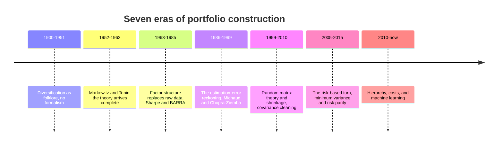
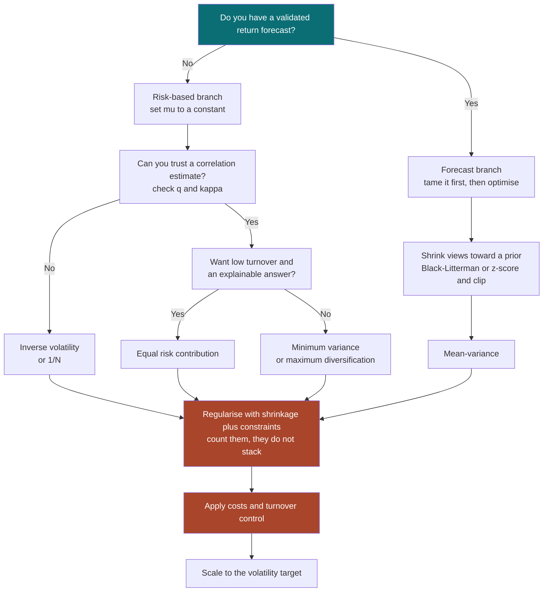

# Portfolio Construction and the Covariance Matrix

### Why the optimiser is not the problem, and the matrix is

---

**What this is.** Portfolio construction is the step between having views and
having positions. It is also the step where more real money has been lost to a
correct-looking calculation than anywhere else in quantitative finance, because
the calculation is trivial and the inputs are not. This document builds the
subject from first principles: what the optimal portfolio *is*, why feeding it
sample estimates destroys it, what the covariance matrix is actually doing in
that formula, and what the working set of remedies is — with enough detail to
implement one.

**How to read it.** §1–§2 are the conceptual core, and §2 is the one section
nobody should skip: it is the mechanism behind every other section. §3 is
history and §4 is the bibliography. §5 is the theory — the closed forms, the
regression identity that explains the whole failure, and the random-matrix
results that quantify it. §6 and §7 are the two surveys: ways to estimate a
covariance matrix, and ways to turn one into weights. §8 shows that most of §6
and §7 are one method with five knobs. §9–§11 are engineering — implementation,
costs, evaluation — and §12 synthesises.

If you want the single most important idea and nothing else, read §2.3, §5.4 and
§8.2. If you are implementing, read §9 and §10 and treat the rest as reference.
If you already know mean-variance theory and want the part that is not in the
textbooks, start at §5.4.

**Relationship to the other notes.** This document is about the *cross-sectional*
problem — given many assets, how much of each. A companion note,
[Trend-Following in Financial Markets](trend_following.html), covers the
*scalar* problem of how large a single position should be, and treats portfolio
construction only as far as a trend system needs it. Another,
[Market Regimes and Machine Learning](market_regimes.html), argues in its §11.4
that the covariance matrix is where regime information most reliably pays; this
document is the detail behind that claim. Where those notes ask *what to
forecast*, this one assumes the forecasts exist and asks what to do with them.
Each stands alone.

**A warning about scope.** [Practice] Nothing here is investment advice, and the
numerical illustrations are simulations chosen to isolate a mechanism, not
backtests of anything tradeable. Where a number comes from my own simulation
rather than from a published study, I say so.

**Epistemic tags.** Claims are flagged by status:

- **[Fact]** — replicated across independent datasets or implementations, with
  broad agreement among people who have looked.
- **[Contested]** — documented, but with live disagreement about magnitude,
  robustness, or cause.
- **[Hypothesis]** — a proposed mechanism, not decisively tested.
- **[Practice]** — practitioner convention. May well be right; the evidence is
  private or absent.

Untagged sentences are definitions, derivations, or arithmetic — true by
construction rather than by evidence.

---

**Notation.** $N$ is the number of assets and $T$ the number of observations in
the estimation window. Their ratio $q = N/T$ recurs so often that it has a name:
the **aspect ratio**.

$w \in \mathbb{R}^N$ is the vector of portfolio weights and $\mathbf{1}$ the
vector of ones, so $\mathbf{1}'w = 1$ is the fully-invested constraint.
$\mu \in \mathbb{R}^N$ holds expected excess returns and
$\Sigma \in \mathbb{R}^{N \times N}$ their covariance matrix. Three matrices must
be kept apart: $\Sigma$ is the **true** covariance, unobservable; $S$ is the
**sample** covariance computed from $T$ observations; and $\hat\Sigma$ is
**whatever estimator you actually use**, which may be $S$, a shrunk version of
it, a factor model, or something else. Hats denote estimates generally, so
$\hat\mu$ is an estimate of $\mu$.

$\sigma_i$ is asset $i$'s volatility, $D = \operatorname{diag}(\sigma_1, \dots,
\sigma_N)$, and $C = D^{-1}\Sigma D^{-1}$ the correlation matrix, so
$\Sigma = DCD$. $\bar\rho$ is the average pairwise correlation. $\sigma_p =
\sqrt{w'\Sigma w}$ is portfolio volatility and $\sigma^\star$ a volatility
target.

$\gamma > 0$ is risk aversion — never a significance level. Eigenvalues are
$\lambda_1 \ge \lambda_2 \ge \dots \ge \lambda_N$ with eigenvectors $v_i$, so
$\Sigma = V\Lambda V'$ with $\Lambda = \operatorname{diag}(\lambda_i)$. $\kappa =
\lambda_1/\lambda_N$ is a condition number.

Three parameters control regularisation and are kept distinct: $\delta \in [0,1]$
is a **shrinkage intensity** toward a target matrix $\Phi$; $\nu \ge 0$ is a
**ridge or turnover penalty** weight, and §10.3 shows those two uses are the same
thing; and $\theta \in (0,1)$ is an **EWMA decay**, whose effective sample size
$T_{\text{eff}} = (1+\theta)/(1-\theta)$ is the $T$ that belongs in $q$ (§6.3).

In factor models, $F \in \mathbb{R}^{N \times K}$ is the loading matrix for $K$
factors, $\Omega$ the $K \times K$ factor covariance, and $\Psi$ the diagonal
matrix of idiosyncratic variances, giving $\Sigma = F\Omega F' + \Psi$. $R_i^2$
always denotes the coefficient of determination from regressing asset $i$'s
return on the other $N-1$ assets — the quantity of §5.4, and not a
goodness-of-fit for anything else. $\mathrm{SR}$ is a Sharpe ratio. Note one
near-collision held apart by typography throughout: $C$ is the correlation matrix,
$\mathcal{C}$ the constraint set of §8.1.

---

## Table of contents

1. [What portfolio construction is](#1-what-portfolio-construction-is)
2. [Why the naive answer fails](#2-why-the-naive-answer-fails)
3. [How the field evolved](#3-how-the-field-evolved)
4. [Foundational references](#4-foundational-references)
5. [The mathematics](#5-the-mathematics)
6. [Estimating the covariance matrix](#6-estimating-the-covariance-matrix)
7. [From covariance to weights](#7-from-covariance-to-weights)
8. [Taxonomy and equivalences](#8-taxonomy-and-equivalences)
9. [Implementation: what actually matters](#9-implementation-what-actually-matters)
10. [Costs, turnover, and rebalancing](#10-costs-turnover-and-rebalancing)
11. [Evaluation and pitfalls](#11-evaluation-and-pitfalls)
12. [Synthesis](#12-synthesis)

---

# 1. What portfolio construction is {#1-what-portfolio-construction-is}

## 1.1 The wrong intuition

The intuition almost everyone starts with is:

> Portfolio optimisation takes your forecasts and finds the best portfolio.

Every word of that is defensible and the sentence as a whole is badly wrong. It
is wrong in a specific way that determines the shape of the entire field, so it
is worth being precise about the failure.

An optimiser does not know which parts of its input are forecasts and which are
errors. You hand it a vector $\hat\mu$ and a matrix $\hat\Sigma$; it treats every
entry as exact. If the true expected return of asset 17 is 4% and your estimate
says 45%, the optimiser does not hedge that possibility, discount it, or flag
it — it buys asset 17 with both hands, because that is what the input said to do.
And if a *pair* of assets has a true correlation of 0.90 and your sample says
0.97, the optimiser will construct a long-short position between them at
significant leverage, because at 0.97 that spread looks nearly riskless.

So the honest description is the opposite of the intuition:

> **Optimisation is not a way of extracting value from your forecasts. It is a
> way of amplifying whatever is in them — signal and error alike, in proportion
> to how confident the input implies you are.**

This is why the field's history (§3) is not a history of better optimisers. The
optimisation itself was solved in 1952 and is, computationally, a first-year
exercise. Every advance since has been about the inputs: estimating them better,
imposing structure so that less has to be estimated, or arranging not to need
them at all.

## 1.2 The right starting point

Portfolio construction is a **decision made under uncertainty about the
parameters of the decision problem itself.**

That framing has three parts, and keeping them separate prevents most confusion:

| | The object | Status |
|---|---|---|
| **Choice variable** | $w$, the weights | You control it exactly |
| **Parameters** | $\mu$, $\Sigma$ | You never observe them; you estimate them |
| **Objective** | some functional of $w'\mu$ and $w'\Sigma w$ | You choose it, and the choice matters less than people think |

The classical theory assumes the parameters are known and studies the choice.
The modern theory accepts that they are not and studies the *decision rule* —
the map from data to weights — and asks how well that map performs when it is
handed a finite sample. Those are different questions with different answers,
and the gap between them is what this document is about.

There is a useful way to state the gap. Write the decision rule as a function
$\hat w(\text{data})$, and write $w^\star$ for the portfolio that is optimal at
the *true* parameters — §1.3 gives its form. The classical question is "is
$w^\star$ optimal?", and the answer is yes by construction. The practical
question is:

$$
\mathbb{E}_{\text{data}}\big[\,U\big(\hat w(\text{data});\ \mu, \Sigma\big)\,\big]
\quad \text{versus} \quad U(w^\star;\ \mu, \Sigma)
$$

where the expectation runs over samples and the utility $U$ is always evaluated
at the *true* parameters. The first quantity is what you will actually
experience; the second is what the optimiser reports. §2 is about how large that
gap is, and it is much larger than intuition suggests.

## 1.3 The master form

Take the standard mean-variance objective: maximise expected return, penalised
by variance, with risk aversion $\gamma$.

$$
\max_{w}\ \ w'\mu - \frac{\gamma}{2}\,w'\Sigma w
$$

Differentiate with respect to $w$ and set to zero: $\mu - \gamma\Sigma w = 0$.
Hence the **master form** of this entire document:

$$
\boxed{\ \ w^\star = \frac{1}{\gamma}\,\Sigma^{-1}\mu\ \ }
$$

Three things about this equation deserve emphasis before anything else is said.

**It is a ratio, not a product.** The weight is expected return *divided by*
risk, in a matrix sense. Division is where things blow up. Every pathology in
§2 traces back to the fact that $\Sigma$ appears inverted.

**$1/\gamma$ is just a scalar.** It sets leverage and nothing else. The
*direction* of the portfolio — the relative weights, which is the interesting
part — is $\Sigma^{-1}\mu$ regardless of risk aversion. This is Tobin's
separation result, and it means the sizing question (§10 of the trend note) and
the composition question are genuinely separable. You can get the direction
right and the scale wrong, or vice versa, and they are different mistakes with
different fixes.

**Almost everything in the field is this formula with particular choices.**
Equal weighting, minimum variance, risk parity, maximum diversification,
Black–Litterman, hierarchical risk parity — the survey in §7 works through them,
and §8 shows they are all $\Sigma^{-1}\mu$ under a specific pair of assumptions
about what $\mu$ is and how $\Sigma$ has been regularised. Several of them look
like they have abandoned optimisation entirely. None of them has.

## 1.4 The spine, stated once

Three claims generate the rest of the document. They are worth stating together,
because each section is an elaboration of one of them. They are numbered C1–C3
here; §8.1's slots S1–S5 are a different numbering for a different purpose, and
the two are not related.

> **C1 — the master form.** Every portfolio construction method is
> $w \propto \hat\Sigma^{-1}\hat\mu$ for some choice of $\hat\mu$ (often
> implicit, often deliberately degenerate) and some regularised $\hat\Sigma$.
> The honest exception is hierarchical risk parity (§7.11), which reaches a
> similar destination without ever forming the inverse.
>
> **C2 — the mechanism.** Inverting $\hat\Sigma$ places the largest bets in the
> directions with the smallest estimated variance, and those are exactly the
> directions the estimate gets most wrong. The optimiser's confidence is
> highest precisely where it is least justified.
>
> **C3 — the diagnostic.** How badly this goes is governed, to first order, by
> one number: the aspect ratio $q = N/T$. Not by $N$, not by $T$, but by their
> ratio. This governs the *covariance* half of the problem; the return view is
> limited by calendar span instead (§2.5), which is a separate and larger
> constraint.

And the payoff, which §8 makes precise:

> **Every repair in the field — shrinkage, factor models, position constraints,
> resampling, Bayesian priors, transaction-cost penalties, hierarchical
> clustering — does the same thing. Each adds structure that lifts the smallest
> eigenvalues of $\hat\Sigma$, and so suppresses the positions taken in those
> directions. They differ in where the structure comes from and how it is
> justified, not in what it does.**

That last sentence is the reason this document is organised as a taxonomy rather
than a catalogue. A practitioner who believes shrinkage, constraints and turnover
penalties are three independent tools will apply all three at full strength and
end up with a portfolio far more heavily regularised than intended.

## 1.5 What portfolio construction is not

Naming the neighbours prevents a lot of confusion, because several of them are
routinely called by this name.

| Not this | Why it is different |
|---|---|
| **Signal generation** | $\mu$ arrives from outside. Construction takes it as given and is not responsible for whether it is any good — though §2.5 shows it is responsible for how much damage a bad $\mu$ does |
| **Position sizing** | The scalar $1/\gamma$, or a volatility target. Orthogonal to composition (§1.3), and a different problem |
| **Diversification** | An outcome, sometimes, and a poor objective. A portfolio can be maximally diversified and terrible |
| **Risk management** | A constraint and monitoring layer *around* construction. Answers "what if I am wrong", not "what is best" |
| **Asset allocation** | The same mathematics at $N \approx 10$, where estimation error is mild and the hard problems of §2 barely appear |
| **Execution** | How you get from current weights to target weights. Genuinely separate — except that §10 shows costs feed back into the target itself |

The distinction that causes the most trouble in practice is the first. A
disappointing backtest is nearly always blamed on the signal, when the
construction step is at least as likely a culprit and is far easier to fix.

## 1.6 A worked instance, to fix ideas

Two assets, both with 20% annual volatility, correlation $\rho$, and expected
excess returns of 6% and 5%. Risk aversion is set so the portfolio is fully
invested. What does the master form give?

With $\Sigma = 0.04\begin{pmatrix} 1 & \rho \\ \rho & 1\end{pmatrix}$ and
$\mu = (0.06, 0.05)'$, one line of algebra does it. Up to the positive factor
$1/[0.04(1-\rho^2)]$ in front of $\Sigma^{-1}$, which normalisation will kill
anyway,

$$
\Sigma^{-1}\mu \;\propto\; \begin{pmatrix} 1 & -\rho \\ -\rho & 1\end{pmatrix}
\begin{pmatrix}\mu_1 \\ \mu_2\end{pmatrix}
= \begin{pmatrix}\mu_1 - \rho\mu_2 \\ \mu_2 - \rho\mu_1\end{pmatrix},
$$

whose two entries sum to $(\mu_1 + \mu_2)(1-\rho)$. Dividing by that sum to make
the weights add to one gives the fully-invested optimum:

$$
w_1 = \frac{\mu_1 - \rho\,\mu_2}{(\mu_1 + \mu_2)(1 - \rho)}, \qquad w_2 = 1 - w_1 .
$$

Tabulating:

| $\rho$ | $w_1$ | $w_2$ | Gross | Comment |
|---|---|---|---|---|
| 0.00 | 0.55 | 0.45 | 1.0× | Mild tilt toward the better asset |
| 0.50 | 0.64 | 0.36 | 1.0× | |
| 0.90 | 1.36 | −0.36 | 1.7× | Now short the second asset |
| 0.95 | 2.27 | −1.27 | 3.5× | |
| 0.99 | 9.55 | −8.55 | 18.1× | An 18× spread trade on a 1% return difference |

**This little table is the whole document in miniature.** As the two assets
become more alike, the optimiser stops allocating between them and starts
arbitraging between them, and the leverage it applies goes to infinity. Nothing
here is a bug — given *exact* inputs, these really are the optimal weights, and
at $\rho = 0.99$ the spread really is nearly riskless.

The problem is that $\rho = 0.99$ is not something you know. It is something you
estimated, and the large-sample standard error of a correlation estimated from
$T$ observations is roughly $(1-\rho^2)/\sqrt{T}$. From two years of daily data
($T = 500$) that is 0.0009, so a two-standard-error band around a sample
correlation of 0.99 runs from 0.988 to 0.992 — and the corresponding gross
exposures run from 15.3× to 22.0×. A band narrow enough that you would happily
round it away in any other context makes the trade at the top end 44% larger
than the trade at the bottom.

Note what did *not* happen there. The correlation estimate was good — four
significant figures, a tight confidence interval, no misspecification, no
outliers, no regime change. The instability comes from the $1/(1-\rho)$ in the
denominator, which is a property of the map from parameters to weights, not of
the estimate. **Precision in the input does not imply stability in the output,
and the optimiser reports no diagnostic that would tell you which regime you are
in.**

Scale that from two assets to five hundred, and you have §2.

> ### §1 Key takeaways
>
> 1. An optimiser cannot distinguish a forecast from an error; it amplifies both
>    in proportion to the confidence its inputs imply. Better optimisation of bad
>    inputs makes things worse, not better.
> 2. The master form is $w^\star = \gamma^{-1}\Sigma^{-1}\mu$. Everything in the
>    field is a choice of what to put in the two slots and how to regularise the
>    inverse.
> 3. Composition and leverage separate cleanly: $1/\gamma$ sets scale, and
>    $\Sigma^{-1}\mu$ sets direction. Treat them as two problems, because their
>    failure modes are unrelated.
> 4. The classical question — is $w^\star$ optimal — has been settled since 1952
>    and is not interesting. The practical question is how a *decision rule*
>    performs when fed a finite sample.
> 5. Inverting the covariance matrix means the optimiser's largest positions are
>    spread trades between assets it believes are nearly identical. Those beliefs
>    are the least reliable thing it has.
> 6. Portfolio construction is not signal generation, sizing, diversification, or
>    risk management. Conflating it with signal generation is the most expensive
>    of those errors, because it sends you to fix the wrong thing.

---

```{=latex}
\newpage
```

# 2. Why the naive answer fails {#2-why-the-naive-answer-fails}

This section is the mechanism behind everything that follows. If you read one
part of this document, read §2.3.

## 2.1 The demonstration

Here is the experiment, run under conditions maximally favourable to the
optimiser. Fifty assets. Returns generated by a one-factor model — a market
factor plus idiosyncratic noise — with betas between 0.6 and 1.4, idiosyncratic
volatilities between 15% and 35%, and expected returns of 5% per unit of beta
plus a small alpha. Two years of daily data, $T = 500$, so $q = N/T = 0.10$,
which is a comfortable ratio by industry standards.

Crucially, **the data are drawn from exactly the model the optimiser assumes.**
Returns are IID, multivariate normal, stationary, with no fat tails, no regime
changes, no missing data, no non-synchronous trading and no misspecification of
any kind. Whatever goes wrong is estimation error and nothing else.

Compute the sample mean $\hat\mu$ and sample covariance $S$, trace out the
mean-variance frontier, and plot three curves: the frontier the optimiser
*reports* (using $\hat\mu, S$), the frontier that is genuinely *available* (using
$\mu, \Sigma$), and what the optimiser's chosen weights *actually deliver* (the
estimated weights, evaluated at the true parameters).

```{=latex}
\newpage
\begin{center}
\includegraphics[width=\linewidth]{quant-research/figures/pc_frontier_illusion.pdf}
\end{center}
```

```{=html}

```

The numbers, from my own simulation:

| Quantity | Value |
|---|---|
| True maximum Sharpe ratio | 0.43 |
| Sharpe ratio the optimiser reports | **5.32** |
| True expected returns, range across assets | 1.9% to 7.8% |
| *Sample* mean returns, range across assets | **−38.9% to +44.9%** |
| Estimated frontier at its top end | 14.0% return, 10.9% volatility |
| What those weights actually deliver | **3.0% return, 12.6% volatility** |

Three observations, in increasing order of importance.

**The reported Sharpe ratio is off by a factor of twelve.** The optimiser is not
slightly optimistic; it believes it has found something twelve times better than
the best thing in the universe it was shown. Any research process that treats an
in-sample optimised Sharpe ratio as evidence is not measuring what it thinks.

**The sample means are an order of magnitude more dispersed than the truth.**
The true spread of expected returns is about six percentage points; the sample
spread is about eighty-four. Roughly speaking, essentially all of the
cross-sectional variation in a two-year sample of mean returns is noise. This is
not a small-sample curiosity — with daily data and annual returns of a few
percent against annual volatility of 20%, the standard error of an annualised
mean is the annual volatility divided by the square root of the number of
*years*, so over two years it is $0.20/\sqrt{2} \approx 14\%$ — several times
the quantity being estimated. [Fact] This ratio barely improves with more data,
because the standard
error of a mean falls as $1/\sqrt{T}$ in *calendar time*, not in sample size:
sampling the same two years more finely does nothing at all
([Merton, 1980](https://www.nber.org/papers/w0444)).

**The realised frontier is flat.** This is the finding that should change
behaviour. Ask the estimated frontier for 4% expected return and you get 2.8%;
ask it for 14% and you get 3.0%. The entire ascent of the dashed curve — the
part that looks like the optimiser trading risk for return, the part a committee
would discuss — buys you two-tenths of one percent. What it actually purchases
is leverage on noise.

## 2.2 Error maximisation

[Michaud (1989)](https://www.jstor.org/stable/4479185)
named the phenomenon: mean-variance optimisers are **estimation-error
maximisers**. The argument is a selection argument and takes one sentence.

The optimiser overweights assets with high estimated return, low estimated
variance, and low estimated correlation to the rest. Among a large group of
assets, the ones whose estimates happen to be highest, lowest, and lowest are
disproportionately those whose *errors* went up, down, and down. So the
optimiser's largest positions are systematically concentrated in the assets
whose inputs are most overstated, and this happens more aggressively the more
assets you give it to choose among.

It is worth being precise about what kind of failure this is, because it is
often described loosely as "overfitting" and that undersells it. Overfitting
usually means a model with too many parameters fitting noise in a training set.
Here there is no model and no fitting: $\Sigma^{-1}\mu$ has no free parameters
and is not chosen to fit anything. **The optimiser is a maximum, and a maximum
over noisy inputs is biased upward by construction** — the same reason the
best-performing of a hundred coin-flippers looks skilled. What is being selected
is not a parameter but a *direction in portfolio space*, and there are
effectively as many directions to select from as there are assets.

## 2.3 The mechanism: what inversion actually does

The selection story above is correct but qualitative. The precise version is
about eigenvalues, and it is worth working through slowly because everything in
§6 and §7 is a response to it.

Any covariance matrix can be written in terms of its eigenvalues and
eigenvectors:

$$
\Sigma \;=\; \sum_{i=1}^{N} \lambda_i\, v_i v_i',
\qquad \lambda_1 \ge \lambda_2 \ge \dots \ge \lambda_N > 0 .
$$

Read this as a decomposition into **eigen-portfolios**. Each $v_i$ is a
particular combination of the assets — a portfolio, with weights summing to
whatever they sum to — and, because eigenvectors are unit vectors,
$v_i'\Sigma v_i = \lambda_i$ exactly: $\lambda_i$ *is* that portfolio's variance.
The first eigen-portfolio $v_1$ is typically "everything, long" — the market —
and has the largest variance. The last, $v_N$, is the quietest combination
available: some intricate long-short arrangement that hedges almost everything
out.

Inverting flips the eigenvalues and leaves the directions alone:

$$
\Sigma^{-1} \;=\; \sum_{i=1}^{N} \frac{1}{\lambda_i}\, v_i v_i' .
$$

So the optimal portfolio decomposes as

$$
w^\star \;\propto\; \Sigma^{-1}\mu \;=\; \sum_{i=1}^{N}
\underbrace{\frac{v_i'\mu}{\lambda_i}}_{\text{how much of }v_i}\; v_i .
$$

**Each eigen-portfolio is held in proportion to its expected return divided by
its variance.** That is exactly right, and exactly the problem: the quietest
direction, $v_N$, is divided by the smallest number, so it receives the largest
multiplier. *The optimiser's biggest bets are, by construction, on the
combinations of assets it believes are the least risky.*

Now bring in what the sample gets wrong. When you estimate $\Sigma$ from $T$
observations, the eigenvalues do not come back with independent, symmetric
errors. They come back **spread apart in a specific, predictable way**: the
large ones biased up, the small ones biased down. This is the Marchenko–Pastur
result, stated in §5.5. Its consequence here is stark. The sample's smallest
eigenvalue is too small — so the optimiser divides by a number that is too small
— so it takes a position that is too large — in the direction where its estimate
of risk is least reliable.

The figure below shows the effect at $N = 200$, $T = 600$, on data with *no
structure at all*: 200 independent series, so every true eigenvalue equals 1.

```{=latex}
\newpage
\begin{center}
\includegraphics[width=\linewidth]{quant-research/figures/pc_mp_spectrum.pdf}
\end{center}
```

```{=html}

```

The truth is a single point at 1. The sample smears it from 0.18 to 2.49 — a
fourteen-fold range. An optimiser handed this matrix will lever the "quietest"
direction $1/0.18 = 5.6$ times, and the "noisiest" only $1/2.49 = 0.4$ times, a
**14:1 spread of leverage across directions that are in truth identical.** Every
bit of that spread is noise, and the optimiser's confidence in it is total.

Here is the summary worth memorising:

> **The optimiser allocates in inverse proportion to estimated variance, and
> estimated variance is least accurate exactly where it is smallest. So the
> largest positions carry the largest errors. Regularisation is not a
> statistical nicety here — it is the only thing standing between you and a
> portfolio built entirely out of the least reliable part of your data.**

The right-hand panel makes the constructive point that saves the situation. Add
one real market factor, and its eigenvalue leaps to 66 — far outside the noise
band — while everything else stays inside a bulk that still has the
Marchenko–Pastur shape once the factor's share of variance is removed. **Signal
and noise separate cleanly in the spectrum.** That observation is the basis of
eigenvalue clipping (§6.7), factor models (§6.8), and in a sense every method in
§6: the bulk is known to be noise in advance, so it can be replaced with
something better-behaved at no cost in information.

## 2.4 The diagnostic: everything is governed by $q = N/T$

The natural question after §2.3 is: how much data do I need? The answer is that
the question is malformed, because the damage does not depend on $T$ by itself.
It depends on $q = N/T$.

For the global minimum-variance portfolio — the purest case, since it uses no
$\mu$ at all — three quantities have clean large-sample limits. Writing
$\sigma^2_{\text{opt}}$ for the variance of the true optimal portfolio:

$$
\begin{aligned}
\frac{\text{variance the optimiser predicts}}{\sigma^2_{\text{opt}}} &\;\to\; 1 - q,
&&\text{(it understates its own risk)}\\[4pt]
\frac{\text{variance actually realised}}{\sigma^2_{\text{opt}}} &\;\to\; \frac{1}{1-q},
&&\text{(it takes more risk than optimal)}\\[4pt]
\frac{\text{realised}}{\text{predicted}} &\;\to\; \frac{1}{(1-q)^2}.
&&\text{(the two errors compound)}
\end{aligned}
$$

In volatility rather than variance units, the last line is simply $1/(1-q)$,
which is the number to carry around. The derivation is in §5.6; the figure below
confirms it by simulation.

```{=latex}
\newpage
\begin{center}
\includegraphics[width=\linewidth]{quant-research/figures/pc_risk_ratio.pdf}
\end{center}
```

```{=html}

```

Read off the practical consequences:

| $N$ | $T$ | $q$ | Realised ÷ predicted volatility |
|---|---|---|---|
| 50 | 500 (2 yr daily) | 0.10 | 1.11× |
| 100 | 500 | 0.20 | 1.25× |
| 250 | 500 | 0.50 | **2.00×** |
| 400 | 500 | 0.80 | **5.00×** |
| 500 | 500 | 1.00 | undefined — $S$ is singular |
| 500 | 2520 (10 yr daily) | 0.20 | 1.25× |

Two lessons follow, and both are counterintuitive enough to be worth
stating flatly.

**Doubling the universe is exactly as harmful as halving the history.** Adding
assets is not free diversification; it is a direct tax on the reliability of
every position. A shop running 500 names on two years of data is in a
qualitatively worse position than one running 50 names on the same data, and no
amount of care elsewhere compensates.

**At $q \ge 1$ the sample covariance matrix is singular and the optimiser is
meaningless.** With $N = 500$ names and two years of daily history there are
literally infinitely many "zero-risk" portfolios — combinations that had exactly
zero variance in-sample, purely by construction. The optimiser will find one and
lever it without limit. If your code does not fail loudly in this case, it is
silently doing something worse than failing. [Practice] Check $q$ before you
check anything else; it is one line and it invalidates entire research programmes.

## 2.5 Which input hurts most

Not all inputs are equally dangerous, and the ordering is lopsided enough to
drive design decisions.

[Chopra & Ziemba (1993)](https://jpm.pm-research.com/content/19/2/6) measured
this by perturbing each input and computing the *certainty-equivalent loss* — the
amount of money an investor would sacrifice by holding the perturbed portfolio
instead of the true optimum. Their result, and it is one of the most useful
numbers in the field: [Fact] at a risk tolerance of 50 — risk tolerance being
their scale for the reciprocal of risk aversion — errors in **means** are
roughly **11 times** as costly as errors in **variances**, and roughly
**22 times** as costly as errors in **covariances**. That is approximately a
**22 : 2 : 1** ratio, and the dominance of means grows further as risk tolerance
rises.

The mechanism is §2.1's second observation. A mean must be estimated in calendar
time and its standard error is comparable to its own magnitude even over
decades; a variance can be estimated to a few percent from a few months of daily
data, because variance estimation benefits from finer sampling and means do not.
[Fact] This asymmetry is structural, not a data problem, and it will not be
fixed by a better dataset.

The design conclusion is direct, and it is the single highest-leverage decision
in this document:

> **If you do not have a genuine, tested return forecast, do not put one in.**
> Setting $\hat\mu \propto \mathbf{1}$ — that is, refusing to differentiate
> between assets on expected return — deletes the dominant error term outright.
> This is the entire justification for the risk-based portfolios of §7.2–§7.6,
> and it is why they perform so much better than their crudeness suggests they
> should.

Note what this argument does *not* say. It does not say expected returns are
unforecastable, and it does not say you should never use a $\mu$. It says the
bar is high: a return forecast has to beat not just zero but the substantial
benefit of removing the largest source of estimation error from the problem. A
weak-but-real signal can easily make the portfolio worse.

## 2.6 The 1/N challenge, and what it actually showed

The most-cited empirical result in this literature is
[DeMiguel, Garlappi & Uppal (2009)](https://academic.oup.com/rfs/article-abstract/22/5/1915/1592901).
Across seven datasets, they compared fourteen portfolio rules — sample
mean-variance, Bayes–Stein, Black–Litterman-style methods, minimum variance,
various constrained versions — against the naive rule of putting $1/N$ in each
asset. [Fact] None of the fourteen was consistently better than $1/N$ on Sharpe
ratio out of sample.

Their most quotable calculation is the estimation window that sample-based
mean-variance would need in order to reliably beat $1/N$: **about 3,000 months
for 25 assets, and about 6,000 months for 50** — 250 and 500 years respectively.
There is no dataset, and there will not be one.

This result is widely reported as "optimisation doesn't work". That reading is
wrong, and the correction matters.

[Kritzman, Page & Turkington (2010)](https://www.tandfonline.com/doi/abs/10.2469/faj.v66.n2.6)
made the counter-argument directly. [Contested] The DGU comparison uses
*sample means* as the return input. Replace them with almost anything else — a
constant, a risk-premium estimate, a shrunk mean — and optimised portfolios beat
$1/N$ comfortably over long samples. Their conclusion is that the finding is
about the input, not the method.

I think Kritzman and co-authors have the better of this, and the resolution is
already in §2.5:

> **DeMiguel, Garlappi and Uppal is a paper about $\hat\mu$, not a paper about
> optimisation.** It demonstrates, very convincingly, that sample means are worse
> than useless as portfolio inputs. It does not show that the covariance matrix
> is useless — and indeed minimum-variance portfolios, which use $\Sigma$ and
> discard $\mu$, are among the strongest performers in their own tables and in
> most subsequent work.

[Contested] The live disagreement that remains is narrower and genuine: whether
risk-based optimisation beats $1/N$ *net of transaction costs and constraints*
in a realistic implementation, where turnover and the concentration of
minimum-variance solutions eat much of the theoretical gain. That question is
still open, is answered differently in different asset classes, and is the
subject of §10 and §11.

> ### §2 Key takeaways
>
> 1. In a simulation where the optimiser's model is exactly correct, it reported
>    a Sharpe ratio of 5.3 against a true attainable 0.43, and its realised
>    frontier was flat: asking for 14% return rather than 4% delivered an extra
>    two-tenths of a percent.
> 2. The mechanism is inversion. Eigen-portfolios are held in proportion to
>    expected return over variance, so the smallest eigenvalue gets the largest
>    bet — and the smallest eigenvalue is the one the sample gets most wrong.
> 3. Sample eigenvalues are biased apart in a known way: at $q = 1/3$, a truly
>    flat spectrum comes back spread fourteen-fold. Because the distortion is
>    predictable, it is also correctable — that is what §6 is for.
> 4. One number governs the damage: $q = N/T$. Realised volatility exceeds
>    predicted volatility by $1/(1-q)$. At $q = 0.5$ you take twice the risk you
>    think you are taking; at $q \ge 1$ the problem is not defined at all.
> 5. Doubling the number of assets does exactly as much harm as halving the
>    history. Universe size is a statistical decision, not just a business one.
> 6. Errors in means cost roughly 11× errors in variances and 22× errors in
>    covariances. If you lack a real return forecast, omitting $\mu$ entirely is
>    not a compromise — it is the best available move.
> 7. The famous $1/N$ result is evidence against sample means, not against
>    optimisation. Read it as licence to drop $\hat\mu$, not to drop
>    $\hat\Sigma$.

---

```{=latex}
\newpage
```

# 3. How the field evolved {#3-how-the-field-evolved}

The history has one thesis, and it is visible in every era boundary:

> **The centre of gravity moved from "solve the optimisation" to "estimate the
> inputs" to "arrange not to need the inputs you cannot estimate."**



**Era I — Diversification as folklore (1900–1951).** *Contribution:* the idea
that spreading holdings reduces risk, present in investment-trust practice and in
Keynes's writings on portfolio policy. *What changed:* nothing formal — there
was no way to say how much diversification, or between what. *Limitations:*
without a covariance concept, "don't put all your eggs in one basket" cannot
distinguish twenty correlated bets from five independent ones. *Lasting
influence:* the intuition survives, and §7.2 shows the naive $1/N$ rule it
implies is a far stronger competitor than the theory that displaced it.

**Era II — The theory arrives complete (1952–1962).**
*Contribution:* [Markowitz (1952)](https://www.jstor.org/stable/2975974) made
risk a property of the *portfolio* rather than of its holdings, via the
covariance matrix, and posed the problem as a quadratic programme.
[Tobin (1958)](https://www.jstor.org/stable/2296205) added the separation
theorem: the risky portfolio's composition is independent of risk aversion.
*What changed:* everything conceptual. The word "risk" acquired a definition you
could compute with. *Limitations:* Markowitz needed $N(N+1)/2$ covariance
estimates and computers that could invert the result, and neither existed at
scale; more importantly, nobody yet understood that the estimates were the
binding constraint rather than the arithmetic. *Lasting influence:* total. The
master form of §1.3 is unchanged, and every section below is a footnote to it.

**Era III — Structure instead of data (1963–1985).** *Contribution:*
[Sharpe (1963)](https://www.jstor.org/stable/2627407) proposed the single-index
model, replacing $N(N+1)/2$ covariances with $2N+1$ parameters by routing all
co-movement through one market factor. Barr Rosenberg's commercial risk models
(the firm that became BARRA) generalised this to multi-factor fundamental
models. *What changed:* the recognition that a covariance matrix should be
*modelled*, not measured. *Limitations:* factor structure is an assumption, and
what it discards — genuine residual correlation within industries — is exactly
what a statistical-arbitrage desk trades. *Lasting influence:* very large. Factor
covariance models (§6.8) remain the default in institutional equity risk
management, and §8.2 shows they are a form of shrinkage.

**Era IV — The estimation-error reckoning (1986–1999).** *Contribution:* a
cluster of papers established that estimation error, not model error, was the
binding constraint. [Jorion (1986)](https://www.cambridge.org/core/journals/journal-of-financial-and-quantitative-analysis/article/abs/bayessteinestimation-for-portfolio-analysis/B7D5C6C54432BDE3F8E3B107E68B0E1E)
applied Bayes–Stein shrinkage to the means;
[Michaud (1989)](https://www.jstor.org/stable/4479185)
named the error-maximisation property; [Best & Grauer (1991)](https://academic.oup.com/rfs/article-abstract/4/2/315/1571031)
computed the sensitivity of optimal weights to the means analytically;
[Chopra & Ziemba (1993)](https://jpm.pm-research.com/content/19/2/6) priced the
damage; [Black & Litterman (1992)](https://www.tandfonline.com/doi/abs/10.2469/faj.v48.n5.28)
sidestepped it by starting from market-implied returns.
*What changed:* the field stopped treating the optimiser as a solved problem and
started treating it as a hazard. *Limitations:* the diagnoses were sharper than
the cures, most of which were tuning parameters without theory.
*Lasting influence:* decisive. Everything after this is a response.

**Era V — The physics import (1999–2010).** *Contribution:* two independent
literatures arrived at the same repair. Statistical physicists —
[Laloux, Cizeau, Bouchaud & Potters (1999)](https://link.aps.org/doi/10.1103/PhysRevLett.83.1467) —
showed that the bulk of a financial correlation matrix's eigenvalue spectrum is
indistinguishable from random-matrix noise, giving a principled rule for what to
discard. Statisticians — [Ledoit & Wolf (2003](https://www.econ.uzh.ch/dam/jcr:ffffffff-935a-b0d6-ffff-ffff9961f70f/jef.pdf),
[2004)](http://www.ledoit.net/honey.pdf) — derived the optimal shrinkage
intensity toward a structured target in closed form. Meanwhile
[Jagannathan & Ma (2003)](https://www.nber.org/papers/w8922) proved that a
no-short-sale constraint is *mathematically identical* to shrinking the
covariance matrix, which explained why unsophisticated practice had been
outperforming sophisticated theory. *What changed:* regularisation became
principled rather than ad hoc, and the equivalences of §8.2 came into view.
*Limitations:* almost all of it addresses $\Sigma$, and §2.5 says $\mu$ is the
larger problem. *Lasting influence:* Ledoit–Wolf shrinkage is now the default in
`scikit-learn` and most risk systems; this era's ideas are the working toolkit.

**Era VI — The risk-based turn (2005–2015).** *Contribution:* practitioners drew
the conclusion of §2.5 and abandoned $\mu$. Minimum-variance, maximum-diversification
([Choueifaty & Coignard, 2008](https://www.tobam.fr/wp-content/uploads/2014/12/TOBAM-JoPM-Maximum-Div-2008.pdf)),
and equal-risk-contribution
([Maillard, Roncalli & Teiletche, 2010](https://www.semanticscholar.org/paper/The-Properties-of-Equally-Weighted-Risk-Portfolios-Maillard-Roncalli/b8d10295fcceaeacea34d933574260e8c2136f71))
portfolios became products. [DeMiguel, Garlappi & Uppal (2009)](https://academic.oup.com/rfs/article-abstract/22/5/1915/1592901)
supplied the negative result that justified the turn. *What changed:* "we do not
forecast returns" went from an admission to a selling point. *Limitations:*
[Contested] much of the measured outperformance is exposure to the low-volatility
and value factors rather than to superior construction, and the products are
capacity-constrained and crowded. *Lasting influence:* large and ongoing;
risk-based allocation is now the default starting point for multi-asset
portfolios.

**Era VII — Hierarchy, costs, and learning (2010–present).** *Contribution:*
three strands. [López de Prado (2016)](https://papers.ssrn.com/sol3/papers.cfm?abstract_id=2708678)
proposed hierarchical risk parity, which allocates using the covariance matrix
without ever inverting it. [Gârleanu & Pedersen (2013)](https://nbgarleanu.github.io/DynTrad.pdf)
solved the dynamic problem with transaction costs in closed form, showing that
the optimal portfolio is a weighted average of current holdings and a
forward-looking target. [Ledoit & Wolf (2017)](https://academic.oup.com/rfs/article-abstract/30/12/4349/3863121)
extended shrinkage from a single intensity to a whole function of the spectrum.
*What changed:* costs moved from a post-hoc adjustment into the objective, and
regularisation became nonparametric. *Limitations:* [Contested] HRP's empirical
advantage over well-regularised alternatives is disputed and appears sensitive to
the test design; end-to-end machine-learned allocation remains mostly promising
rather than demonstrated. *Lasting influence:* too early to say for the learning
strand; the cost-aware strand is already standard.

> ### §3 Key takeaways
>
> 1. The optimisation problem was solved in 1952 and has never been the
>    bottleneck. Every subsequent era is about inputs.
> 2. Factor models (1963) were the field's first regularisation, adopted for
>    computational reasons and retained for statistical ones.
> 3. The 1986–1999 cluster diagnosed estimation error precisely, but its cures
>    were mostly untheorised tuning.
> 4. Physics and statistics converged on the same repair around 2000: the noisy
>    part of the spectrum is identifiable in advance and should be replaced.
> 5. Jagannathan and Ma's 2003 proof that constraints *are* shrinkage is the
>    hinge of the whole history — it explained why crude practice beat refined
>    theory, and unified two literatures that thought they disagreed.
> 6. The risk-based turn was the field acting on Chopra–Ziemba: dropping the
>    input you cannot estimate beats estimating it badly.

---

```{=latex}
\newpage
```

# 4. Foundational references {#4-foundational-references}

Grouped by kind, because the kinds are read differently. Each entry says why it
matters. Where a free copy exists it is the link; paywalled-only entries are
marked.

## 4.1 The founding theory

- **Markowitz, H. (1952).** ["Portfolio Selection."](https://www.jstor.org/stable/2975974)
  *Journal of Finance* 7(1), 77–91. — The origin. Worth reading for how carefully
  Markowitz already hedges about the inputs; the field spent fifty years
  rediscovering his caution.
- **Tobin, J. (1958).** ["Liquidity Preference as Behavior Towards Risk."](https://www.jstor.org/stable/2296205)
  *Review of Economic Studies* 25(2), 65–86. — The separation theorem: leverage
  and composition are independent choices (§1.3).
- **Sharpe, W. F. (1963).** ["A Simplified Model for Portfolio Analysis."](https://www.jstor.org/stable/2627407)
  *Management Science* 9(2), 277–293. — The single-index model, and the first
  argument that a covariance matrix should be modelled rather than measured.
- **Merton, R. C. (1980).** ["On Estimating the Expected Return on the Market."](https://www.nber.org/papers/w0444)
  *Journal of Financial Economics* 8(4), 323–361. — Why expected returns are
  hard in a way variances are not: the mean's precision depends on calendar span,
  the variance's on sampling frequency. The single most important paper for
  understanding §2.5.
- **Stevens, G. V. G. (1998).** ["On the Inverse of the Covariance Matrix in Portfolio Analysis."](https://www.federalreserve.gov/pubs/ifdp/1995/528/ifdp528.pdf)
  *Journal of Finance* 53(5), 1821–1827. — Underread, and the key to §5.4:
  $\Sigma^{-1}$ decomposes into the coefficients and residual variance of
  regressing each asset on all the others. Link is the Fed working-paper version.

## 4.2 The estimation-error critique

- **Jorion, P. (1986).** ["Bayes-Stein Estimation for Portfolio Analysis."](https://www.cambridge.org/core/journals/journal-of-financial-and-quantitative-analysis/article/abs/bayessteinestimation-for-portfolio-analysis/B7D5C6C54432BDE3F8E3B107E68B0E1E)
  *Journal of Financial and Quantitative Analysis* 21(3), 279–292. [[paywalled]] —
  Shrinkage applied to the means, a decade before it reached the covariance.
- **Michaud, R. O. (1989).** ["The Markowitz Optimization Enigma: Is 'Optimized' Optimal?"](https://www.jstor.org/stable/4479185)
  *Financial Analysts Journal* 45(1), 31–42. — Names error maximisation.
  Short, non-technical, and the best single statement of why §2 happens.
- **Best, M. J. & Grauer, R. R. (1991).** ["On the Sensitivity of Mean-Variance-Efficient Portfolios to Changes in Asset Means."](https://academic.oup.com/rfs/article-abstract/4/2/315/1571031)
  *Review of Financial Studies* 4(2), 315–342. [[paywalled]] — The analytical
  companion to Michaud: how far weights move per unit of change in $\mu$.
- **Chopra, V. K. & Ziemba, W. T. (1993).** ["The Effect of Errors in Means, Variances, and Covariances on Optimal Portfolio Choice."](https://jpm.pm-research.com/content/19/2/6)
  *Journal of Portfolio Management* 19(2), 6–11. [[paywalled]] — The 22 : 2 : 1
  result of §2.5. If you take one number from this document, take this one.
- **[Merton (1980)](https://www.nber.org/papers/w0444){target="_blank"}**, above, belongs here as much as in §4.1.

## 4.3 Estimating the covariance matrix

- **Laloux, L., Cizeau, P., Bouchaud, J.-P. & Potters, M. (1999).** ["Noise Dressing of Financial Correlation Matrices."](https://link.aps.org/doi/10.1103/PhysRevLett.83.1467)
  *Physical Review Letters* 83(7), 1467–1470. — Four pages; showed that most of a
  financial correlation matrix's spectrum is indistinguishable from noise.
  Also on [arXiv](https://arxiv.org/abs/cond-mat/9810255).
- **Ledoit, O. & Wolf, M. (2003).** ["Improved Estimation of the Covariance Matrix of Stock Returns with an Application to Portfolio Selection."](https://www.econ.uzh.ch/dam/jcr:ffffffff-935a-b0d6-ffff-ffff9961f70f/jef.pdf)
  *Journal of Empirical Finance* 10(5), 603–621. — Shrinkage toward a
  single-index target, with the optimal intensity derived rather than tuned.
- **Ledoit, O. & Wolf, M. (2004).** ["Honey, I Shrunk the Sample Covariance Matrix."](http://www.ledoit.net/honey.pdf)
  *Journal of Portfolio Management* 30(4), 110–119. — The practitioner-facing
  version. Start here; it is the most readable entry point to the whole subject.
- **Ledoit, O. & Wolf, M. (2004).** "A Well-Conditioned Estimator for
  Large-Dimensional Covariance Matrices." *Journal of Multivariate Analysis*
  88(2), 365–411. — The theory behind the previous two.
- **Ledoit, O. & Wolf, M. (2017).** ["Nonlinear Shrinkage of the Covariance Matrix for Portfolio Selection: Markowitz Meets Goldilocks."](https://ssrn.com/abstract=2383361)
  *Review of Financial Studies* 30(12), 4349–4388. — Shrinking each eigenvalue by
  its own amount rather than all by one intensity (§6.6).
- **Ledoit, O. & Wolf, M. (2022).** ["The Power of (Non-)Linear Shrinking: A Review and Guide to Covariance Matrix Estimation."](https://www.econ.uzh.ch/dam/jcr:e946b1e3-35e8-4c4f-894f-5f4306bf28a5/jfec_2022.pdf)
  *Journal of Financial Econometrics* 20(1), 187–218. — Fifteen years of their own
  work, reviewed with practical guidance on which variant to use when. The
  efficient entry point if you only read one item in this subsection.
- **Bun, J., Bouchaud, J.-P. & Potters, M. (2017).** ["Cleaning Large Correlation Matrices: Tools from Random Matrix Theory."](https://arxiv.org/abs/1610.08104)
  *Physics Reports* 666, 1–109. — The definitive technical review of the RMT
  strand. Long, and the first thirty pages are the useful ones.
- **Engle, R. F. (2002).** ["Dynamic Conditional Correlation: A Simple Class of Multivariate GARCH Models."](https://faculty.washington.edu/ezivot/econ589/EngleDCCJBES.pdf)
  *Journal of Business and Economic Statistics* 20(3), 339–350. — Time-varying
  correlation, estimated in two tractable steps (§6.10).
- **Fan, J., Liao, Y. & Mincheva, M. (2013).** ["Large Covariance Estimation by Thresholding Principal Orthogonal Complements."](https://arxiv.org/abs/1201.0175)
  *Journal of the Royal Statistical Society, Series B* 75, 603–680. — POET: a factor model plus a
  *thresholded* residual matrix, which recovers the within-industry correlation
  that a pure factor model discards (§6.9).
- **Higham, N. J. (2002).** ["Computing the Nearest Correlation Matrix — a Problem from Finance."](https://eprints.maths.manchester.ac.uk/232/1/paper3.pdf)
  *IMA Journal of Numerical Analysis* 22(3), 329–343. — What to do when your
  matrix is not positive semi-definite. You will need this (§9.5).
- **Epps, T. W. (1979).** ["Comovements in Stock Prices in the Very Short Run."](https://www.jstor.org/stable/2286325)
  *Journal of the American Statistical Association* 74(366), 291–298. [[paywalled]] —
  Measured correlation falls as the sampling interval shrinks. The reason §9.3
  tells you to estimate correlations weekly and volatilities daily.

## 4.4 Constraints, and why they work

- **Jagannathan, R. & Ma, T. (2003).** ["Risk Reduction in Large Portfolios: Why Imposing the Wrong Constraints Helps."](https://www.nber.org/papers/w8922)
  *Journal of Finance* 58(4), 1651–1684. — The hinge result of the field: a
  no-short constraint is *exactly* a shrinkage of the covariance matrix. Read it
  next to Ledoit–Wolf and the two literatures collapse into one. Link is the NBER
  working paper.
- **DeMiguel, V., Garlappi, L., Nogales, F. J. & Uppal, R. (2009).** ["A Generalized Approach to Portfolio Optimization: Improving Performance by Constraining Portfolio Norms."](https://pubsonline.informs.org/doi/10.1287/mnsc.1080.0986)
  *Management Science* 55(5), 798–812. [[paywalled]] — Generalises Jagannathan–Ma:
  constraining any norm of $w$ is equivalent to a corresponding regularisation,
  which makes the constraint/shrinkage identity a family rather than a curiosity.

## 4.5 Risk-based portfolios

- **Choueifaty, Y. & Coignard, Y. (2008).** ["Toward Maximum Diversification."](https://www.tobam.fr/wp-content/uploads/2014/12/TOBAM-JoPM-Maximum-Div-2008.pdf)
  *Journal of Portfolio Management* 35(1), 40–51. — The diversification ratio and
  the portfolio that maximises it. [Contested] The authors' firm sells this
  strategy; the mathematics is sound and the performance claims carry an interest.
- **Maillard, S., Roncalli, T. & Teiletche, J. (2010).** ["The Properties of Equally Weighted Risk Contribution Portfolios."](https://www.semanticscholar.org/paper/The-Properties-of-Equally-Weighted-Risk-Portfolios-Maillard-Roncalli/b8d10295fcceaeacea34d933574260e8c2136f71)
  *Journal of Portfolio Management* 36(4), 60–70. — Risk parity done properly,
  with the existence and uniqueness results and the proof that ERC sits between
  $1/N$ and minimum variance.
- **Clarke, R., de Silva, H. & Thorley, S. (2011).** ["Minimum-Variance Portfolio Composition."](https://papers.ssrn.com/sol3/papers.cfm?abstract_id=1549949)
  *Journal of Portfolio Management* 37(2), 31–45. — Analytic characterisation of
  *which* assets a minimum-variance portfolio ends up holding, and why so few of
  them. The best cure for surprise at a concentrated solution.
- **Asness, C. S., Frazzini, A. & Pedersen, L. H. (2012).** ["Leverage Aversion and Risk Parity."](https://www.aqr.com/-/media/AQR/Documents/Insights/Journal-Article/Leverage-Aversion-and-Risk-Parity.pdf)
  *Financial Analysts Journal* 68(1), 47–59. — The economic argument for why risk
  parity should earn anything at all. [Contested] AQR runs risk-parity products.
- **López de Prado, M. (2016).** ["Building Diversified Portfolios that Outperform Out of Sample."](https://papers.ssrn.com/sol3/papers.cfm?abstract_id=2708678)
  *Journal of Portfolio Management* 42(4), 59–69. — Hierarchical risk parity:
  allocate using the covariance matrix without inverting it (§7.11).
- **Meucci, A. (2009).** ["Managing Diversification."](https://papers.ssrn.com/sol3/papers.cfm?abstract_id=1358533)
  *Risk*, 74–79. — The effective number of bets, which is the right way to measure
  whether a portfolio is actually diversified (§11.4).

## 4.6 Costs and dynamics

- **Gârleanu, N. & Pedersen, L. H. (2013).** ["Dynamic Trading with Predictable Returns and Transaction Costs."](https://nbgarleanu.github.io/DynTrad.pdf)
  *Journal of Finance* 68(6), 2309–2340. — The closed-form multi-period solution.
  Its result — trade partway toward a forward-looking *aim* portfolio, not toward
  today's target — is the most useful single fact in §10.
- **Almgren, R. & Chriss, N. (2000).** ["Optimal Execution of Portfolio Transactions."](https://www.smallake.kr/wp-content/uploads/2016/03/optliq.pdf)
  *Journal of Risk* 3, 5–39. — The execution layer beneath §10; how a given
  trade list is worked, as distinct from how it is chosen.
- **Constantinides, G. M. (1986).** ["Capital Market Equilibrium with Transaction Costs."](https://www.journals.uchicago.edu/doi/abs/10.1086/261410)
  *Journal of Political Economy* 94(4), 842–862. [[paywalled]] — The origin of the
  no-trade region, and of the result that its width scales as the cube root of
  the cost rather than linearly (§10.4).

## 4.7 The critiques

A bibliography listing only a field's successes is propaganda. These belong next
to everything above.

- **DeMiguel, V., Garlappi, L. & Uppal, R. (2009).** ["Optimal Versus Naive Diversification: How Inefficient is the 1/N Portfolio Strategy?"](https://academic.oup.com/rfs/article-abstract/22/5/1915/1592901)
  *Review of Financial Studies* 22(5), 1915–1953. — Fourteen rules, seven
  datasets, and none beats equal weighting. Read with §2.6's correction in hand.
- **Kritzman, M., Page, S. & Turkington, D. (2010).** ["In Defense of Optimization: The Fallacy of 1/N."](https://www.tandfonline.com/doi/abs/10.2469/faj.v66.n2.6)
  *Financial Analysts Journal* 66(2), 31–39. [[paywalled]] — The rebuttal: the
  problem is sample means, not optimisation. I find this persuasive (§2.6).
- **[Michaud (1989)](https://www.jstor.org/stable/4479185){target="_blank"}** and **[Chopra & Ziemba (1993)](https://jpm.pm-research.com/content/19/2/6){target="_blank"}**, above, are critiques as much
  as contributions.

- **Lo, A. W. (2002).** ["The Statistics of Sharpe Ratios."](https://www.tandfonline.com/doi/abs/10.2469/faj.v58.n4.2453)
  *Financial Analysts Journal* 58(4), 36–52. [[paywalled]] — Where the standard
  error of §11.5 comes from, plus what serial correlation does to an annualised
  Sharpe ratio. Read before believing any backtest's headline number.

## 4.8 Books

- **Meucci, A. (2005).** *Risk and Asset Allocation.* Springer. — The most
  complete single treatment of the estimation-and-allocation problem together.
  Demanding, and worth it.
- **Roncalli, T. (2013).** *Introduction to Risk Parity and Budgeting.* Chapman
  and Hall. — The definitive treatment of risk budgeting, with the algorithms
  written out.
- **Grinold, R. C. & Kahn, R. N. (1999).** *Active Portfolio Management*, 2nd ed.
  McGraw-Hill. — The practitioner's frame: information ratio, breadth, the
  fundamental law, and the transfer coefficient that measures how much of a signal
  survives construction (§11.4).
- **Michaud, R. O. & Michaud, R. O. (2008).** *Efficient Asset Management*, 2nd
  ed. Oxford. — Resampled efficiency (§7.9), by its inventors. [Contested] The
  method is patented and the authors sell it; the diagnosis in the first chapters
  is excellent regardless.

## 4.9 If you only read six things

In order:

1. **[Michaud (1989)](https://www.jstor.org/stable/4479185){target="_blank"}** — why the problem exists, in fifteen readable pages.
2. **[Chopra & Ziemba (1993)](https://jpm.pm-research.com/content/19/2/6){target="_blank"}** — which input to worry about, quantified.
3. **[Ledoit & Wolf (2004)](http://www.ledoit.net/honey.pdf){target="_blank"}, "Honey, I Shrunk…"** — the standard repair, explained
   for practitioners.
4. **[Jagannathan & Ma (2003)](https://www.nber.org/papers/w8922){target="_blank"}** — the result that unifies constraints and
   shrinkage, and retroactively justifies most of what desks were already doing.
5. **[DeMiguel, Garlappi & Uppal (2009)](https://academic.oup.com/rfs/article-abstract/22/5/1915/1592901){target="_blank"}** *then* **[Kritzman, Page & Turkington
   (2010)](https://www.tandfonline.com/doi/abs/10.2469/faj.v66.n2.6){target="_blank"}** — the field's central controversy, both sides, in that order.
6. **[Ledoit & Wolf (2022)](https://www.econ.uzh.ch/dam/jcr:e946b1e3-35e8-4c4f-894f-5f4306bf28a5/jfec_2022.pdf){target="_blank"}** — what to actually use, from the people who built it.

Notice what is not on that list: nothing about optimisation algorithms. That is
the point of §3.

---

```{=latex}
\newpage
```

# 5. The mathematics {#5-the-mathematics}

This section is the formal backing for §2. §5.4 is the part that is not in most
textbooks and is worth the time even if you skip the rest.

## 5.1 The two canonical problems

Almost every allocation rule in §7 is one of two optimisations, or a
constrained version of one.

**Problem A — maximum Sharpe (tangency).** With $\mu$ measured as excess return
over cash:

$$
\max_w\ \frac{w'\mu}{\sqrt{w'\Sigma w}}
\qquad\Longrightarrow\qquad
w_{\text{tan}} \;\propto\; \Sigma^{-1}\mu .
$$

Scale is undetermined because the Sharpe ratio is scale-invariant — which is
§1.3's separation result appearing as a property of the objective rather than of
the investor.

**Problem B — global minimum variance (GMV).** Use no return forecast at all:

$$
\min_w\ w'\Sigma w \quad\text{s.t.}\quad \mathbf{1}'w = 1
\qquad\Longrightarrow\qquad
w_{\text{gmv}} = \frac{\Sigma^{-1}\mathbf{1}}{\mathbf{1}'\Sigma^{-1}\mathbf{1}} .
$$

Note the shape of the second: it is $\Sigma^{-1}\mu$ with $\mu = \mathbf{1}$,
normalised to sum to one. **The minimum-variance portfolio is the mean-variance
portfolio of an investor who believes every asset has the same expected
return.** That is not an approximation or an analogy; it is the same formula. It
is the first entry in the equivalence table of §8.2 and the reason §7's
"risk-based" methods are not a separate family.

## 5.2 The frontier, and two-fund separation

Adding a target return to Problem B and solving with Lagrange multipliers gives
the full efficient frontier. Define the three scalars

$$
a = \mathbf{1}'\Sigma^{-1}\mathbf{1}, \qquad
b = \mathbf{1}'\Sigma^{-1}\mu, \qquad
c = \mu'\Sigma^{-1}\mu, \qquad d = ac - b^2 .
$$

The minimum-variance portfolio achieving expected return $m$ is

$$
w(m) = \Sigma^{-1}\!\left[\frac{c - bm}{d}\,\mathbf{1} + \frac{am - b}{d}\,\mu\right],
$$

with variance $\sigma^2(m) = (am^2 - 2bm + c)/d$. Two consequences matter.

**The frontier is a hyperbola** in $(\sigma, m)$ space, with its left vertex at
the GMV portfolio, $m_{\text{gmv}} = b/a$ and $\sigma^2_{\text{gmv}} = 1/a$.

**Two-fund separation:** $w(m)$ is a combination of the same two fixed vectors
$\Sigma^{-1}\mathbf 1$ and $\Sigma^{-1}\mu$ for every $m$, with coefficients
affine in $m$. Normalise those two vectors to sum to one — they become the GMV
portfolio $\Sigma^{-1}\mathbf 1/a$ and the tangency portfolio $\Sigma^{-1}\mu/b$
— and the coefficients on *them* sum to one for every $m$. Every efficient
portfolio is a weighted average of two fixed portfolios. This is why §2.1's
realised frontier could be flat: the optimiser was sliding along a line between
two portfolios, one of which — the $\Sigma^{-1}\hat\mu$ end — was almost pure
noise. Moving further along that line adds leverage on noise and nothing else.

The quantity $c = \mu'\Sigma^{-1}\mu$ is the squared maximum Sharpe ratio
available. Keep it in view: it is the thing estimation error inflates most
violently, and $\sqrt{\hat c}$ was the 5.32 of §2.1.

## 5.3 What the covariance matrix contributes

Before inverting anything, it is worth separating the two jobs $\Sigma$ does,
because they are estimated with wildly different precision. Write
$\Sigma = DCD$ with $D$ the diagonal matrix of volatilities and $C$ the
correlation matrix.

| Component | Parameters | Estimation difficulty |
|---|---|---|
| Volatilities $D$ | $N$ | Easy. Realised volatility from daily data is accurate within weeks; it is the most forecastable quantity in finance |
| Correlations $C$ | $N(N-1)/2$ | Hard. Quadratically many parameters, each individually noisy, and the errors interact through the inverse |

[Fact] Essentially all of the difficulty is in $C$, and essentially all of the
$N^2$ growth is too. This suggests — correctly — that the highest-value
regularisation acts on the correlation matrix while leaving the volatilities
alone, and §9.5 makes that a concrete implementation rule.

## 5.4 What $\Sigma^{-1}$ actually is: the regression identity

Here is the result that makes everything else intuitive. It is standard in
multivariate statistics and was brought into portfolio theory by
[Stevens (1998)](https://www.federalreserve.gov/pubs/ifdp/1995/528/ifdp528.pdf),
where it remains underused.

For each asset $i$, run the regression of its return on **all the other assets**:

$$
r_i \;=\; a_i + \sum_{j \neq i} \beta_{ij}\, r_j \;+\; \varepsilon_i ,
$$

and let $s_i^2 = \operatorname{Var}(\varepsilon_i)$ be the residual variance and
$R_i^2$ the coefficient of determination, so that
$s_i^2 = \sigma_i^2\,(1 - R_i^2)$. Read this regression as: *what is the best
portfolio of the other $N-1$ assets for replicating asset $i$, and how well does
it do?*

Then the entries of the inverse covariance matrix are exactly

$$
(\Sigma^{-1})_{ii} = \frac{1}{s_i^2},
\qquad
(\Sigma^{-1})_{ij} = -\,\frac{\beta_{ij}}{s_i^2}\quad (j \neq i).
$$

The off-diagonal expression looks asymmetric — it carries $s_i^2$, not $s_j^2$ —
but it is not: $\beta_{ij}/s_i^2 = \beta_{ji}/s_j^2$ holds identically, which is
the same statement as $\Sigma^{-1}$ being symmetric.

Substituting into $w \propto \Sigma^{-1}\mu$ and collecting terms:

$$
w_i \;\propto\; \frac{1}{s_i^2}\Big(\mu_i - \sum_{j\neq i}\beta_{ij}\mu_j\Big)
\;=\; \frac{\alpha_i}{s_i^2}
\;=\; \boxed{\ \frac{\alpha_i}{\sigma_i^2\,(1 - R_i^2)}\ }
$$

where $\alpha_i \equiv \mu_i - \sum_{j\neq i}\beta_{ij}\mu_j$ is the **residual
alpha**: asset $i$'s expected return *net of what you could have got by holding
its replicating portfolio instead*. Take expectations through the regression and
you will see that $\alpha_i$ is nothing other than the intercept $a_i$ above —
alpha in the ordinary sense of the word, measured against a benchmark that is
the rest of your own universe.

This one line reorganises the whole subject. Four readings:

**1. The optimiser does not care about expected returns.** It cares about
expected returns net of replication. An asset whose forecast return is exactly
what its replicating portfolio already delivers has $\alpha_i = 0$ and receives
*zero* weight, correctly, however wonderful the headline number looks. This is
why adding a highly-correlated asset to a universe can send existing weights
wild: you have changed every other asset's $\alpha_i$ and $R_i^2$
simultaneously.

**2. Every position is a hedged bet, sized by its own Sharpe ratio.** The form
$\alpha_i / s_i^2$ is precisely the sizing you would apply to a single
stand-alone asset with mean $\alpha_i$ and variance $s_i^2$ — its own Sharpe
ratio $\alpha_i/s_i$, divided once more by $s_i$ to turn a ratio into a position
size. So mean-variance optimisation is not doing anything exotic — it is hedging
each asset against all the others, then sizing each hedged residual
independently. That is a much better mental model than "it balances risk and
return across the portfolio."

**3. $1/(1-R_i^2)$ is the leverage amplifier, and it is unbounded.** As an asset
becomes more replicable, $R_i^2 \to 1$ and the weight diverges. The two-asset
example of §1.6 is exactly this: regressing one asset on the other gives
$R^2 = \rho^2$, so at $\rho = 0.99$ the amplifier is
$1/(1-0.99^2) \approx 50$ — acting not on the 6% headline return but on a
residual alpha of $\alpha_1 = 0.06 - 0.99 \times 0.05 = 0.0105$. That product,
divided by $\sigma_1^2 = 0.04$ and normalised so the weights sum to one, is
where the 18× gross exposure came from.

**4. And here is the punchline.** $R_i^2$ is estimated by regressing on $N-1$
regressors using $T$ observations. Under the null hypothesis that asset $i$ is
*genuinely unrelated* to the others, the expected in-sample $R^2$ is not zero —
it is

$$
\mathbb{E}\big[\hat R_i^2\big] \;=\; \frac{N-1}{T-1} \;\approx\; q .
$$

So the sample believes every asset is about $q$-replicable when none of them is
replicable at all. Put $\hat R_i^2 = q$ into the boxed formula in place of the
true $R_i^2 = 0$: the denominator shrinks by a factor of $1-q$, so the weight is
inflated by roughly $1/(1-q)$ — **the same constant §5.5 read off the
Marchenko–Pastur spectrum and §5.6 will get from the Wishart inverse.**

It is worth being exact about what that agreement is and is not. These are not
three independent confirmations. The regression identity above is an algebraic
fact about *any* positive-definite matrix, so applying it to $S$ and applying the
inverse-Wishart expectation to $S$ are the same statement written in two
coordinate systems — one asset by asset, one over the whole matrix. The spectral
integral is that same statement a third time, in the eigenbasis. **One fact, three
faces.**

The value is not corroboration, then, but interpretation: the spectral face tells
you *where* the bias lives (the small eigenvalues), and the regression face tells
you *which assets* carry it (the replicable ones) — and only the second of those
gives you something to compute per asset, which is the diagnostic below.

This also says what the fix looks like. The textbook correction for an inflated
$R^2$ is the *adjusted* $R^2$, which inflates $1 - R^2$ by $(T-1)/(T-N)$ — the
same factor to leading order, and enough to bring the expected value of
one-minus-adjusted-$R^2$ back to exactly 1 under the null. Shrinkage (§6.5),
factor models (§6.8) and position constraints (§9.6) are all, in this light,
ways of not believing your own $\hat R_i^2$.

**A diagnostic you can run today.** [Practice] For each asset, regress its
returns on the rest of the universe and record $R_i^2$. Sort descending. Any
asset with $\hat R_i^2$ above roughly $0.9$ — or, more carefully, well above the
$q$ you would expect from noise alone — is one whose optimiser weight is
numerically unstable and whose position will swing between rebalances. This costs
a few lines of code, needs no optimiser, and finds the assets that will hurt you
before they do. I know of no cheaper diagnostic in this whole document.

## 5.5 Random matrix theory: what noise looks like

§2.3 asserted that sample eigenvalues spread in a predictable way. The precise
statement is the Marchenko–Pastur law.

Take $T$ independent observations of $N$ uncorrelated, unit-variance series, so
the true correlation matrix is the identity and every true eigenvalue is 1. Let
$N, T \to \infty$ with $q = N/T$ fixed in $(0,1)$. Then the sample eigenvalues do
not converge to 1. Their empirical distribution converges to a density
$f(\lambda)$ supported on $[\lambda_-, \lambda_+]$ with

$$
\lambda_{\pm} = \big(1 \pm \sqrt{q}\,\big)^2,
\qquad
f(\lambda) = \frac{\sqrt{(\lambda_+ - \lambda)(\lambda - \lambda_-)}}{2\pi q\,\lambda} .
$$

Three things make this useful rather than merely elegant.

**It is a prediction, not a description.** The noise spectrum is known *before*
you look at your data. Anything inside $[\lambda_-, \lambda_+]$ is consistent
with pure noise; anything outside is not. That converts "how much of my
correlation matrix is real?" from a judgement call into a test, which is what
[Laloux and co-authors (1999)](https://link.aps.org/doi/10.1103/PhysRevLett.83.1467)
exploited.

**The spread is severe at realistic $q$.** The implied condition number of a pure
noise matrix is $\kappa = \lambda_+/\lambda_- = \big((1+\sqrt q)/(1-\sqrt q)\big)^2$:

| $q$ | $\lambda_-$ | $\lambda_+$ | $\kappa$ (noise only) |
|---|---|---|---|
| 0.10 | 0.47 | 1.73 | 3.7 |
| $1/3$ | 0.18 | 2.49 | 13.9 |
| 0.50 | 0.086 | 2.91 | 34.0 |
| 0.80 | 0.011 | 3.59 | 322 |
| 0.90 | 0.0026 | 3.80 | 1442 |

At $q = 0.9$ — five hundred names on 555 days of history, a little over two
years — noise alone manufactures a condition number of 1,442 in a matrix whose
truth is the identity. Any optimiser inverting that is placing its largest bets
on directions whose estimated variance is smaller than the truth by a factor of
nearly 400.

**Real matrices separate cleanly.** Financial correlation matrices have a few
eigenvalues far outside the bulk — the market mode, then sector modes — and a
bulk that matches the law once the outliers' share of the trace is removed. That
is the right-hand panel of §2.3's figure, and it is what licenses discarding the
bulk (§6.7).

**What the law says about the inverse.** The optimiser does not use $\lambda$; it
uses $1/\lambda$ (§2.3). So integrate the law against $1/\lambda$, which has a
closed form:

$$
\int_{\lambda_-}^{\lambda_+} \frac{f(\lambda)}{\lambda}\,\mathrm{d}\lambda
\;=\; \frac{1}{1-q} .
$$

**The average eigenvalue of a pure-noise correlation matrix is exactly 1, and the
average of its reciprocals is $1/(1-q)$.** That is the whole bias, read straight
off the spectrum, and it is the constant §5.6 will derive again by a different
route.

One distinction matters here and is easy to lose, because the two numbers differ
a lot. $1/(1-q)$ is an **average** over the spectrum: at $q = 1/3$ it is 1.5, a
50% inflation. The *worst single direction* is a different and much larger
quantity, $1/\lambda_- = (1-\sqrt q)^{-2}$, which at the same $q$ is 5.6. §2.3's
14:1 leverage spread is about the extremes; the $1/(1-q)$ of §2.4 and §5.6 is
about the average. Both are consequences of the same spreading, but a portfolio
concentrated in the quietest direction suffers the extreme, while a diversified
one suffers something closer to the average — which is why §5.6's ratio and
§9.8's measured 1.155 are mild compared with the alarm of §2.3's figure.

## 5.6 Why the minimum-variance portfolio misstates its own risk

Now derive the $(1-q)$ results quoted in §2.4. Let $S$ be the sample covariance
from $T$ observations, so that $TS \sim W_N(\Sigma, T)$ — a Wishart matrix with
$T$ degrees of freedom, which is the count when the mean is known; subtracting an
estimated mean costs one, and changes nothing below. The key fact is the
inverse-Wishart expectation, valid whenever $T > N+1$:

$$
\mathbb{E}\big[S^{-1}\big] \;=\; \frac{T}{T - N - 1}\,\Sigma^{-1} .
$$

**The inverse is biased upward, by a factor of about $1/(1-q)$.** Not the
covariance — the sample covariance is unbiased — but its inverse, which is the
thing the optimiser actually uses. Inversion is convex, so Jensen's inequality
guarantees a bias, and the aspect ratio sets its size.

The GMV portfolio built on $S$ *reports* the variance
$\hat\sigma^2_{\text{pred}} = 1/(\mathbf{1}'S^{-1}\mathbf{1})$, which is just
§5.2's $1/a$ computed from the sample. Taking expectations in the denominator,
and using $\sigma^2_{\text{opt}} = 1/(\mathbf{1}'\Sigma^{-1}\mathbf{1})$ from the
same place,

$$
\mathbb{E}\big[\mathbf{1}'S^{-1}\mathbf{1}\big]
= \frac{T}{T-N-1}\;\mathbf{1}'\Sigma^{-1}\mathbf{1}
\approx \frac{1}{1-q}\cdot\frac{1}{\sigma^2_{\text{opt}}} ,
$$

so to leading order $\hat\sigma^2_{\text{pred}} \approx (1-q)\,\sigma^2_{\text{opt}}$.
That last step swaps $\mathbb{E}[1/X]$ for $1/\mathbb{E}[X]$, which is legitimate
here because $\mathbf{1}'S^{-1}\mathbf{1}$ concentrates around its mean as $N$ and
$T$ grow together. The optimiser understates its risk by the factor $1-q$.

The realised variance of those same weights, evaluated at the true $\Sigma$, goes
the other way:

$$
\mathbb{E}\big[\hat w_{\text{gmv}}'\,\Sigma\,\hat w_{\text{gmv}}\big]
\;\approx\; \frac{\sigma^2_{\text{opt}}}{1-q} .
$$

Both statements are leading-order in the large-$(N,T)$ limit with $q$ fixed; the
simulation in §2.4's figure tracks them closely up to $q \approx 0.8$. Dividing
one by the other gives the headline: **realised variance exceeds predicted
variance by $1/(1-q)^2$, or in volatility terms by $1/(1-q)$.**

The asymmetry deserves a sentence of its own, because it is what makes this
dangerous rather than merely inaccurate. The two errors do not offset. The
optimiser takes more risk than is optimal *and* reports less risk than it is
taking, and both errors have the same cause. A risk report generated from the
same covariance matrix used to build the portfolio will confirm the portfolio is
safe, using precisely the numbers that made it unsafe. §11.2 turns this into a
monitoring rule.

## 5.7 The condition number as a working diagnostic

Numerical analysis supplies a bound that turns out to be a good practical guide.
For $w = \Sigma^{-1}\mu$, a relative perturbation of size $\epsilon$ in $\Sigma$
produces a relative change in $w$ of up to

$$
\frac{\|\Delta w\|}{\|w\|} \;\lesssim\; \kappa(\Sigma)\,\epsilon,
\qquad \kappa(\Sigma) = \frac{\lambda_1}{\lambda_N} .
$$

The condition number is the amplification factor from input error to output
error. [Practice] The rules of thumb worth internalising:

| $\kappa$ | Interpretation |
|---|---|
| $< 100$ | Comfortable. Weights are stable under resampling |
| $10^2$–$10^4$ | Workable, but regularise, and expect visible turnover |
| $10^4$–$10^8$ | Weights are dominated by the smallest eigenvalues. Do not trust them |
| $> 10^8$ | Approaching double-precision limits. The inverse is numerically meaningless |

Because $\kappa$ costs one `eigvalsh` call and needs no forecast, it belongs in
production monitoring next to $q$. A jump in $\kappa$ between rebalances is an
early warning that two assets in your universe have become near-duplicates —
which happens routinely when a merger is announced, when two share classes
converge, or when a market stops trading and prices go stale (§9.3).

> ### §5 Key takeaways
>
> 1. Minimum variance *is* mean-variance with $\mu = \mathbf{1}$. Risk-based
>    portfolios are not a separate family; they are choices of $\mu$ together with
>    choices about how much structure to impose on $\Sigma$.
> 2. Every efficient portfolio is a mix of two fixed portfolios. Moving along the
>    frontier moves you toward $\Sigma^{-1}\hat\mu$, which is the noisiest object
>    in the problem.
> 3. The regression identity is the intuition that unlocks the subject:
>    $w_i \propto \alpha_i / [\sigma_i^2(1-R_i^2)]$, where $\alpha_i$ is expected
>    return net of replication and $R_i^2$ measures how replicable the asset is.
> 4. Read that as: mean-variance optimisation hedges each asset against all the
>    others, then sizes each hedged residual by its own Sharpe ratio. Nothing more
>    mysterious is happening.
> 5. In-sample $R_i^2$ is inflated to about $q$ by overfitting alone, which
>    inflates weights by $1/(1-q)$ — the same constant random-matrix theory gives.
>    Two routes, one phenomenon.
> 6. The sample covariance is unbiased but *its inverse is not*, by a factor of
>    about $1/(1-q)$. The optimiser uses the inverse.
> 7. The two errors compound and never offset: you take more risk than optimal
>    and report less than you take, from the same cause. Never validate a
>    portfolio's risk with the matrix that built it.
> 8. Two numbers belong in production monitoring, and both are one line of code:
>    the aspect ratio $q$ and the condition number $\kappa$.

---

```{=latex}
\newpage
```

# 6. Estimating the covariance matrix {#6-estimating-the-covariance-matrix}

## 6.1 The one axis that organises this section

There are a dozen named estimators below and they are not a dozen ideas. Every
one of them answers a single question:

> **How much structure am I willing to impose in exchange for less estimation
> error?**

At one end sits the sample covariance: no structure, no bias, maximal variance.
At the other sits a single number applied to everything: total structure, large
bias, no variance. Every useful estimator is somewhere between, and the choice is
a bias-variance trade-off in which — because of §2 — the variance term is almost
always the one that is binding.

It helps to know *where* an estimator applies its structure. Recall
$\hat\Sigma = V \Lambda V'$: eigenvectors $V$ say what the risk directions are,
eigenvalues $\Lambda$ say how large each one is. That gives three families:

| Family | What it modifies | Members |
|---|---|---|
| **Rotationally invariant** | Eigen*values* only; keeps the sample's eigenvectors | Nonlinear shrinkage, RMT clipping, linear shrinkage to a scaled identity |
| **Structure-imposing** | Eigen*vectors* too; asserts where risk lives | Factor models, constant correlation, hierarchical — and linear shrinkage toward any of them |
| **Reweighting** | Which observations count | EWMA, DCC, and any window choice |

The families are composable and routinely combined — a factor model estimated on
EWMA-weighted data with shrunk residuals uses all three. §8.3 gives the ordering
of what actually matters.

A note on the fields below. Each estimator gets the same six: intuition,
definition, assumptions, cost, failure modes, and when to prefer it. The failure
modes field carries the most practical value and gets the most room.

## 6.2 Sample covariance

**Intuition.** Measure what happened. Impose nothing.

**Definition.** $S = \frac{1}{T-1}\sum_{t=1}^{T}(r_t - \bar r)(r_t - \bar r)'$.

**Assumptions.** Returns IID with finite fourth moments, and $T > N$ for
invertibility. Stationarity over the window.

**Cost.** $O(N^2T)$ to form, $O(N^3)$ to invert or factorise.

**Failure modes.** Singular whenever $T \le N$, and near-singular well before
that — §5.5's table is the quantitative version. The eigenvalue spreading of
§2.3 is at its maximum here because nothing counteracts it. Highly sensitive to
outliers, since a single 10-sigma day enters squared and can dominate a
covariance entry. Silently mis-estimates when assets trade in different time
zones (§9.3).

**When preferred.** When $q < 0.05$ or so — a genuinely small universe with a
long history — and as the baseline every other estimator must beat. Never in
production above $q \approx 0.1$ without regularisation. [Practice] It remains
the right thing to *compute*, since most other estimators are functions of it.

## 6.3 Exponentially weighted (EWMA / RiskMetrics)

**Intuition.** Recent data is more relevant. Weight it more.

**Definition.** With decay $\theta \in (0,1)$,
$\hat\Sigma_t = (1-\theta)\,r_{t-1}r_{t-1}' + \theta\,\hat\Sigma_{t-1}$.
RiskMetrics popularised $\theta = 0.94$ for daily data.

**Assumptions.** Covariance drifts smoothly; the recent past is the best guide.
Implicitly, that a single decay rate suits every entry of the matrix.

**Cost.** $O(N^2)$ per update — the cheapest thing here, and the reason it is
everywhere in real-time risk systems.

**Failure modes.** This one has a trap that catches people repeatedly. The
effective sample size of an EWMA with decay $\theta$ — the number of
equally-weighted observations that would carry the same estimation variance — is

$$
T_{\text{eff}} = \frac{1+\theta}{1-\theta} .
$$

At the standard $\theta = 0.94$ that is **32 observations**. So a RiskMetrics
covariance matrix on a universe of 100 assets has an effective aspect ratio of
$q_{\text{eff}} = 100/32 = 3.1$ — hopelessly singular — no matter how many years
of history you feed it. [Practice] The matrix will still invert, because the
arithmetic runs on all $T$ rows, but it is numerically meaningless and the
optimiser will happily use it. **Compute $N/T_{\text{eff}}$, not $N/T$.** For a
universe of 100 names you need $\theta \gtrsim 0.995$ ($T_{\text{eff}} \approx
400$) before the matrix is usable for optimisation at all.

**When preferred.** Excellent for volatilities, where responsiveness genuinely
helps and $N$ parameters are cheap to estimate. Dangerous for correlations at any
realistic $N$. [Practice] The sensible hybrid is common and rarely written down:
EWMA the volatilities with a short decay, estimate the correlation matrix on a
much longer window, and recombine as $\hat\Sigma = \hat D\hat C\hat D$.

## 6.4 Constant correlation

**Intuition.** Estimate one correlation number instead of $N(N-1)/2$ of them.

**Definition.** $\hat C_{ij} = \bar\rho$ for $i \ne j$, where $\bar\rho$ is the
average sample pairwise correlation; $\hat C_{ii}=1$. Then
$\hat\Sigma = \hat D\hat C\hat D$ with sample volatilities on the diagonal.

**Assumptions.** All pairs are equally related — plainly false, and deliberately
so.

**Cost.** Trivial. The inverse has a closed form via Sherman–Morrison and never
needs a decomposition.

**Failure modes.** Discards all sector and industry structure, which for equities
is a large and genuinely tradeable part of the truth. Any strategy whose edge
lives in relative value within a sector is destroyed by it.

**When preferred.** Rarely on its own — but it is the single most useful
*shrinkage target* (§6.5), and it is a surprisingly strong benchmark. Constant-correlation and single-index targets are the two that Ledoit and Wolf's
own work keeps returning to, because both capture the dominant market mode while
costing almost no parameters.

## 6.5 Linear shrinkage (Ledoit–Wolf)

**Intuition.** The sample matrix is unbiased but noisy; a structured target is
biased but stable. Take a weighted average, and derive the weight rather than
guessing it.

**Definition.**

$$
\hat\Sigma_{\text{LW}} = \delta\, \Phi + (1-\delta)\, S,
\qquad \delta \in [0,1],
$$

where $\Phi$ is a low-parameter target — commonly the identity scaled to the
average variance, the constant-correlation matrix, or a single-index matrix.
[Ledoit & Wolf (2003](https://www.econ.uzh.ch/dam/jcr:ffffffff-935a-b0d6-ffff-ffff9961f70f/jef.pdf),
[2004)](http://www.ledoit.net/honey.pdf) derive the $\delta$ minimising expected
squared Frobenius distance to the true $\Sigma$, in closed form from the data.
Roughly, $\delta^\star$ grows with the sampling noise in $S$ and shrinks with the
target's bias — so it rises with $q$ automatically.

**Assumptions.** That the chosen target is a reasonable central tendency. The
optimal $\delta$ is derived under a quadratic loss on the matrix, which is *not*
the same as the loss you care about (portfolio variance) — see failure modes.

**Cost.** $O(N^2T)$, dominated by forming $S$. In `scikit-learn` as
`LedoitWolf` / `OAS`; a handful of lines otherwise.

**Failure modes.** The optimal intensity is optimal for *matrix* estimation, not
for *portfolio* performance, and the two objectives differ: portfolio variance
weights the small-eigenvalue directions far more heavily than Frobenius loss does.
[Contested] In practice the Frobenius-optimal $\delta$ is usually somewhat too
small for portfolio use, and shrinking harder often does better out of sample.
Shrinking toward the identity distorts the volatility structure — an asset with
genuinely low volatility gets pulled up — which is why a correlation-space target
is generally better (§9.5). Finally, a single $\delta$ applies one affine map to
the whole spectrum, but §5.5 says the distortion is not uniform: the largest
eigenvalue needs almost no correction and the smallest needs a great deal. That
observation is exactly what §6.6 fixes.

**When preferred.** [Practice] **This is the default.** If you do one thing to
your covariance matrix, do this. It is well-tested, cheap, captures most of the
available improvement, and its intensity is *derived* rather than guessed — which
is not the same as being beyond your control. Treat $\delta^\star$ as a floor
rather than a final answer, for the reason given under failure modes, and see
§9.8 for what raising it buys. Everything after it in this section is a
refinement with a worse effort-to-benefit ratio.

## 6.6 Nonlinear shrinkage

**Intuition.** §6.5 applies one correction to all eigenvalues. But the bias
depends on where in the spectrum you are. So give each eigenvalue its own
correction.

**Definition.** Keep the sample eigenvectors and replace each sample eigenvalue
$\lambda_i$ with a corrected value $\tilde\lambda_i$:
$\hat\Sigma = \sum_i \tilde\lambda_i\, v_i v_i'$. The map
$\lambda_i \mapsto \tilde\lambda_i$ is estimated nonparametrically from the
spectrum itself, targeting the oracle that minimises loss given the sample
eigenvectors
([Ledoit & Wolf, 2017](https://ssrn.com/abstract=2383361)). The shape is
intuitive: large eigenvalues barely move, mid-spectrum ones shrink toward the
mean, and the smallest are pushed *up* substantially — undoing the downward bias
that §2.3 identified as the source of the damage.

**Assumptions.** That the sample eigenvectors are worth keeping, which
random-matrix theory supports for the bulk but not for the leading directions in
small samples. Large $N$ and $T$ with $q$ fixed.

**Cost.** $O(N^3)$ for the eigendecomposition, plus a numerical inversion of the
Marchenko–Pastur relation. Implementations exist in R (`nlshrink`) and Python;
writing one from scratch is a real project.

**Failure modes.** Needs a reasonably large $N$ for the spectral estimation to be
meaningful — below roughly 50 assets it has little to work with and linear
shrinkage is as good. The theory assumes IID observations, so it is sensitive to
the same non-stationarity everything else is. [Contested] The out-of-sample
advantage over well-tuned linear shrinkage is real but modest in most published
comparisons, and can vanish once transaction costs are included.

**When preferred.** Large universes ($N \gtrsim 100$) with $q$ between roughly
0.2 and 1, where you are optimising rather than merely reporting risk, and where
a few basis points of variance reduction justifies the implementation effort.
Ledoit and Wolf's own [2022 review](https://www.econ.uzh.ch/dam/jcr:e946b1e3-35e8-4c4f-894f-5f4306bf28a5/jfec_2022.pdf)
is the guide to which variant to pick.

## 6.7 Random-matrix eigenvalue clipping

**Intuition.** §5.5 tells you exactly which eigenvalues are consistent with pure
noise. Those carry no information, so stop pretending they differ: replace them
all with their average.

**Definition.** Compute the sample correlation matrix's eigenvalues. Fit the
Marchenko–Pastur edge $\lambda_+$, allowing for the fact that outlier
eigenvalues absorb part of the trace (the iterative fit used in §2.3's figure).
Keep every $\lambda_i > \lambda_+$ unchanged; replace all the rest by their
common mean, preserving the trace. Rebuild from the same eigenvectors.

**Assumptions.** Noise is IID across assets and time within the bulk. That the
eigenvectors of the retained directions are estimated well.

**Cost.** One eigendecomposition, $O(N^3)$, plus a short fitting loop.

**Failure modes.** The hard threshold is arbitrary at the margin — an eigenvalue
just inside the edge is treated as pure noise and one just outside as pure
signal, though they are nearly indistinguishable. Nonlinear shrinkage (§6.6) is
the smooth version and generally dominates it. Fat tails inflate the empirical
edge, so a naive fit over-clips during turbulent periods. [Practice] Clipping
also destroys genuine small-eigenvalue structure such as tightly cointegrated
pairs — which is fatal if that structure is what you trade.

**When preferred.** When you want the transparency: clipping tells you *how many*
real risk factors your data supports, which is a useful diagnostic in its own
right and is easy to explain to a risk committee. As an estimator it has largely
been superseded by §6.6.

## 6.8 Explicit factor models

**Intuition.** Assets move together because they share exposures. Model the
exposures, and the $N^2$ correlations follow from a handful of factors.

**Definition.** $\hat\Sigma = F\Omega F' + \Psi$, with $F$ the $N \times K$
matrix of loadings, $\Omega$ the $K \times K$ factor covariance, and $\Psi$
diagonal. Loadings come from *observable* characteristics — sector, size, value,
momentum, duration, country — which is what distinguishes this from §6.9.
Parameter count drops from $O(N^2)$ to $O(NK)$.

**Assumptions.** The factor set spans the systematic risk, and residuals are
genuinely uncorrelated. The second assumption is the one that fails.

**Cost.** $O(NK^2 + K^3)$. The inverse has a closed form via the
Sherman–Morrison–Woodbury identity that never requires an $N \times N$
decomposition — a large practical advantage at $N$ in the thousands.

**Failure modes.** $\Psi$ diagonal is a strong claim: two airlines have
correlated residuals after every standard factor, and a pairs strategy trading
that residual will be told by its risk model that the position is riskless.
[Fact] This is the classic way a factor risk model understates the risk of a
statistical-arbitrage book. Loadings are themselves estimated and drift. And
because the model can only express $K$ systematic risk directions, the remaining
$N-K$ eigenvalues are pinned inside the range of the idiosyncratic variances on
$\Psi$'s diagonal — a form of very aggressive implicit shrinkage which is usually
helpful and occasionally badly wrong.

**When preferred.** Large equity universes; anywhere the factor structure is
economically well-understood; anywhere you must *attribute* risk as well as
measure it, since factor models answer "why is the portfolio risky" and
rotationally-invariant estimators do not. [Practice] The dominant choice in
institutional equity risk management for forty years, and deservedly.

## 6.9 Statistical factor models and POET

**Intuition.** Don't specify the factors — let the data find them. Then patch the
factor model's worst assumption.

**Definition.** Take the leading $K$ principal components of $S$ as factors, with
$K$ chosen by the Marchenko–Pastur edge (§6.7) or an information criterion.
**POET** ([Fan, Liao & Mincheva, 2013](https://arxiv.org/abs/1201.0175))
adds the important refinement: after removing the $K$ principal components,
*threshold* the residual covariance rather than forcing it diagonal — keep
residual correlations that are large enough to be real, zero the rest. That
recovers the within-industry structure §6.8 discards while still regularising.

**Assumptions.** That the leading eigenvectors are estimated well — true when the
corresponding eigenvalues are far outside the bulk, false for marginal ones. That
residual correlation is sparse.

**Cost.** $O(N^2T + N^3)$; the thresholding step is $O(N^2)$.

**Failure modes.** Statistical factors are not interpretable and rotate over
time, so risk attribution becomes unstable and period-to-period comparisons are
hard. Choosing $K$ badly is costly in both directions: too small and real risk is
dumped into the "idiosyncratic" bucket, too large and you have re-imported the
noise you were removing. The thresholding level in POET is a genuine tuning
parameter.

**When preferred.** When you lack a credible characteristic set — futures,
crypto, a cross-asset book — or when you suspect your explicit factors miss
something. POET specifically when you trade residual relationships and §6.8's
diagonal-$\Psi$ assumption is the thing that would hurt you.

## 6.10 Dynamic conditional correlation

**Intuition.** Volatilities and correlations both move over time, but they move
differently. Model them separately.

**Definition.** [Engle (2002)](https://faculty.washington.edu/ezivot/econ589/EngleDCCJBES.pdf)
in two steps: fit a univariate GARCH to each asset to get $\hat D_t$; then fit a
low-parameter autoregressive process to the standardised residuals' correlation
to get $\hat C_t$; combine as $\hat\Sigma_t = \hat D_t \hat C_t \hat D_t$. Two
parameters govern the entire correlation dynamics regardless of $N$.

**Assumptions.** That every pair's correlation follows the *same* two-parameter
dynamics — the "correlation targeting" restriction that makes it tractable.

**Cost.** $N$ univariate GARCH fits plus a small joint optimisation. Feasible to
a few hundred assets; beyond that the composite likelihood becomes awkward.

**Failure modes.** The two-parameter restriction is severe and empirically
rejected. The correlation-targeting step is biased in high dimensions. [Contested]
Its practical advantage over a well-shrunk static estimator for *portfolio
construction*, as opposed to risk forecasting, is disputed — correlation
persistence is real but the portfolio gain from tracking it is smaller than the
turnover it generates. Combining DCC with nonlinear shrinkage (DCC-NLS) addresses
the dimension problem and is the modern form.

**When preferred.** When correlation *dynamics* are themselves the object —
tail-risk work, stress testing, anything where the crisis-correlation spike
matters. See the regime note's §11.4 for the same argument from a different
angle. Less compelling when you simply need a matrix to invert once a month.

## 6.11 Hierarchical and clustering-based estimators

**Intuition.** Assets cluster — by sector, by asset class, by geography. Estimate
the cluster structure, and impose it.

**Definition.** Convert the correlation matrix to a distance,
$d_{ij} = \sqrt{2(1-\rho_{ij})}$, cluster hierarchically, and use the resulting
tree to regularise: either by averaging correlations within and between clusters
(producing a block-structured matrix) or by using the tree for allocation
directly without ever inverting anything (§7.11).

**Assumptions.** That a tree is a reasonable model of the dependence structure —
a strong assumption, since real assets belong to several groupings at once.

**Cost.** $O(N^2 \log N)$ for the clustering.

**Failure modes.** Hierarchical clustering is notoriously unstable: small
perturbations to the correlation matrix can reorganise the tree entirely, which
propagates into weights. The linkage choice (single, average, ward) is a free
parameter with real consequences and no principled selection rule. A tree cannot
represent an asset that belongs to two clusters.

**When preferred.** When the universe has genuine, stable, known group structure
and you want that reflected explicitly. As an ingredient in §7.11 rather than as a
covariance estimator in its own right.

## 6.12 Robust estimation

**Intuition.** Covariance is a squared quantity, so one bad print moves it a lot.
Down-weight extremes.

**Definition.** Several routes: winsorise or truncate returns before computing
$S$; use a robust scatter estimator such as the Minimum Covariance Determinant;
or fit a multivariate $t$ and use its scatter matrix, which down-weights
observations by their Mahalanobis distance.

**Assumptions.** That extreme observations are contamination rather than
information. In finance this is often *false* — the crisis days are exactly the
ones you need the risk model to know about.

**Cost.** Winsorising is free; MCD is expensive and scales badly in $N$.

**Failure modes.** The assumption above is the failure mode. Robustify a risk
model and you may have built one that is blind to precisely the days that matter.
Robust estimators also interact badly with shrinkage, since both are pulling
toward the centre and the combined effect is easy to overdo.

**When preferred.** For *data errors* — bad prints, stale quotes, mis-scaled
corporate actions — where the outlier is genuinely spurious. [Practice] The right
frame is that this is a data-cleaning step (§9.2–§9.3), not a modelling step.
Clean the errors robustly, then estimate on the cleaned series without further
robustifying.

```{=latex}
\newpage
```

## 6.13 Comparison

Ratings are my assessment, not measurements.

| Estimator | Structure imposed | Cost | Needs $T > N$ | Main risk |
|---|---|---|---|---|
| Sample | None | Low | Yes | Unusable above $q \approx 0.1$ |
| EWMA | Recency | Very low | Effectively | $T_{\text{eff}}$ trap (§6.3) |
| Constant correlation | Extreme | Trivial | No | Destroys sector structure |
| Linear shrinkage | Moderate, tunable | Low | No | One $\delta$ for all eigenvalues |
| Nonlinear shrinkage | Moderate, adaptive | Medium | No | Implementation effort |
| RMT clipping | Moderate | Medium | No | Hard threshold; kills real spreads |
| Explicit factor | Strong, economic | Low | No | Diagonal $\Psi$ is false |
| Statistical factor / POET | Strong, data-driven | Medium | No | $K$ selection; uninterpretable |
| DCC | Dynamic | High | No | Two-parameter restriction |
| Hierarchical | Strong, tree | Low | No | Tree instability |
| Robust | Outlier down-weighting | Medium–high | Yes | Blind to the days that matter |

> ### §6 Key takeaways
>
> 1. Every estimator here answers one question: how much structure to impose in
>    exchange for less estimation error. Because of §2, the variance term is
>    almost always the binding one — err toward more structure.
> 2. Estimators modify eigenvalues (rotationally invariant), eigenvectors
>    (structure-imposing), or observation weights (reweighting). Knowing which
>    tells you what an estimator can and cannot fix.
> 3. Linear shrinkage is the default. It is cheap, untuned, well-tested, and
>    captures most of the available gain. Do it before anything else in this
>    section.
> 4. EWMA's effective sample size is $(1+\theta)/(1-\theta)$ — just 32
>    observations at the standard $\theta = 0.94$. A RiskMetrics correlation
>    matrix is unusable for optimisation above about 30 assets, and it will not
>    warn you.
> 5. Split the problem: volatilities are easy and benefit from responsiveness;
>    correlations are hard and benefit from long windows. Estimate them
>    separately and recombine.
> 6. A factor model's diagonal residual assumption is exactly the thing a
>    relative-value book trades. If your edge lives in residual correlation, a
>    standard factor risk model will tell you your position is riskless.
> 7. Robust estimation is a data-cleaning tool, not a modelling tool. In markets
>    the outliers are usually the information.

---

```{=latex}
\newpage
```

# 7. From covariance to weights {#7-from-covariance-to-weights}

## 7.1 How to read this section

Each rule below carries the same six fields, and one of them is unusual: **what
it implicitly assumes about $\mu$ and $\Sigma$.** Every rule here — including the
ones that loudly disclaim optimisation — is $w \propto \hat\Sigma^{-1}\hat\mu$
for some choice, and naming that choice is the fastest way to understand what a
rule will do when the world does not cooperate. Filling in that field for all
eleven rules produces §8's taxonomy directly.

A rule that "doesn't use expected returns" is a rule that uses a *particular*
vector of expected returns, chosen for its statistical stability rather than its
plausibility. That is often a good trade. But it is a choice, not an abstention,
and pretending otherwise is how people end up surprised by their own portfolios.

## 7.2 Equal weight ($1/N$)

**Intuition.** Refuse to estimate anything.

**Definition.** $w_i = 1/N$.

**Implied beliefs.** All assets have identical expected returns, identical
variances, and identical pairwise correlations. Under those beliefs $1/N$ is
exactly the mean-variance optimum — so this is not the absence of a model but an
extremely strong one.

**Cost.** None.

**Failure modes.** Ignores obvious risk differences: an equal-weighted portfolio
of a T-bill fund and a leveraged biotech is not balanced in any meaningful sense.
Concentrates risk in whatever is most volatile. Requires rebalancing to maintain,
which is a real cost that comparisons often omit. Its performance depends
heavily on the universe handed to it — $1/N$ over a curated list of survivors is
a different animal from $1/N$ over everything.

**When preferred.** As the benchmark every other rule must beat, always. And
genuinely as the answer when $N$ is small, the assets are broadly comparable, and
$q$ is large enough that nothing can be estimated —
[DeMiguel and co-authors' (2009)](https://academic.oup.com/rfs/article-abstract/22/5/1915/1592901)
result is a real result, whatever §2.6 says about its interpretation.

## 7.3 Inverse volatility, and inverse variance

**Intuition.** Give each asset the same risk budget, ignoring how they interact.

**Definition.** Inverse volatility: $w_i \propto 1/\sigma_i$. Inverse variance:
$w_i \propto 1/\sigma_i^2$. These are different rules and are routinely confused.

**Implied beliefs.** Both discard correlation information. Beyond that they
differ: inverse *variance* is the minimum-variance portfolio of uncorrelated
assets ($\mu \propto \mathbf 1$), while inverse *volatility* is the
maximum-Sharpe portfolio of assets with **equal Sharpe ratios**
($\mu \propto \sigma$) — under a diagonal $\Sigma$, and equally under any
equicorrelated one (§7.6). Inverse volatility is therefore the more aggressive of
the two, since it credits volatile assets with proportionally higher returns.

**Cost.** $O(N)$. Needs only the diagonal, which is the part of $\Sigma$ that can
actually be estimated well (§5.3).

**Failure modes.** Ignoring correlation is not a small approximation. Ten
correlated European bank stocks and one gold miner receive eleven equal risk
budgets, of which ten are the same bet. Volatility is also backward-looking, so
the rule systematically underweights assets that were recently calm and are about
to move.

**When preferred.** Very often, and more often than its crudeness suggests.
[Practice] It is the sensible default when $q$ is too large for any correlation
estimate to be trusted, and it is the right first implementation of almost any
system — get it working, then see whether correlations add anything.

## 7.4 Global minimum variance

**Intuition.** Make the portfolio as quiet as possible and decline to forecast
returns.

**Definition.** $w = \Sigma^{-1}\mathbf 1 / (\mathbf 1'\Sigma^{-1}\mathbf 1)$,
usually with a long-only or box constraint attached.

**Implied beliefs.** $\mu \propto \mathbf 1$: all assets have the same expected
return. Note this is a *strong* claim, not a neutral one — it says a biotech
startup and a utility have identical expected returns, which no one believes.
It is adopted because §2.5 says a wrong-but-stable $\mu$ beats a
noisily-estimated one.

**Cost.** One linear solve, $O(N^3)$, or a small QP with constraints.

**Failure modes.** Notoriously **concentrated**: unconstrained GMV typically puts
large weights on a handful of low-volatility assets and shorts others heavily.
[Clarke, de Silva & Thorley (2011)](https://papers.ssrn.com/sol3/papers.cfm?abstract_id=1549949)
characterise exactly which assets survive — broadly, those with low beta to the
dominant factor and low idiosyncratic volatility — and the answer is usually a
small fraction of the universe. It is the rule most exposed to §5.6's
$1/(1-q)$ risk understatement, because it is dominated by the small-eigenvalue
directions. Turnover is high without constraints.

**When preferred.** Whenever you have no return forecast and do have a usable
correlation estimate. [Fact] Long-only minimum-variance portfolios have
outperformed cap-weighted benchmarks on a risk-adjusted basis over long samples
in most equity markets — though [Contested] much of that is attributable to the
low-volatility factor rather than to construction skill.

## 7.5 Maximum diversification

**Intuition.** Maximise the gap between the weighted-average volatility of your
holdings and the volatility you actually experience. That gap *is*
diversification.

**Definition.** Maximise the **diversification ratio**
$\mathrm{DR}(w) = (w'\sigma)/\sqrt{w'\Sigma w}$, where $\sigma$ is the vector of
asset volatilities. The solution is $w \propto \Sigma^{-1}\sigma$
([Choueifaty & Coignard, 2008](https://www.tobam.fr/wp-content/uploads/2014/12/TOBAM-JoPM-Maximum-Div-2008.pdf)).

**Implied beliefs.** $\mu \propto \sigma$ — every asset has the same Sharpe
ratio. This is a genuinely defensible prior, arguably more defensible than GMV's,
since equal Sharpe ratios is roughly what an efficient market with risk-averse
investors would produce.

**Cost.** One solve, same as GMV.

**Failure modes.** Shares GMV's concentration and $\Sigma^{-1}$ instability.
The diversification ratio can be gamed by adding assets that are near-duplicates
of each other — the measure rewards apparent breadth. Long-only constraints bind
frequently and change the character of the solution.

**When preferred.** When the equal-Sharpe prior is more comfortable than the
equal-return prior, which for a cross-asset universe it usually is. [Practice]
Worth computing alongside GMV: if the two disagree sharply, the disagreement is
informative about which assets are carrying your risk.

## 7.6 Equal risk contribution (risk parity)

**Intuition.** Every asset should contribute the same amount of risk — not the
same capital, and not the same standalone volatility, but the same share of
*portfolio* variance after correlations are accounted for.

**Definition.** Asset $i$'s marginal contribution to risk is
$\partial\sigma_p/\partial w_i = (\Sigma w)_i/\sigma_p$, so its total
contribution is $\mathrm{RC}_i = w_i(\Sigma w)_i/\sigma_p$. The ERC portfolio
solves $\mathrm{RC}_i = \mathrm{RC}_j$ for all $i,j$, subject to $\mathbf 1'w=1$,
$w \ge 0$. There is no closed form in general; it is found numerically, and
[Maillard, Roncalli & Teiletche (2010)](https://www.semanticscholar.org/paper/The-Properties-of-Equally-Weighted-Risk-Portfolios-Maillard-Roncalli/b8d10295fcceaeacea34d933574260e8c2136f71)
prove existence and uniqueness for the long-only case when $\Sigma$ is positive
definite — which is why ERC, despite never inverting anything, still needs
$q < 1$.

**Implied beliefs.** Equal Sharpe ratios *and* equal pairwise correlations. Under
exactly those two conditions ERC is the tangency portfolio. Under equicorrelation
alone it reduces to inverse volatility (§7.3).

**Cost.** An iterative solve — cyclical coordinate descent converges reliably.
More expensive than a single linear solve but not by much.

**Failure modes.** ERC's volatility always lies between the
minimum-variance portfolio's and $1/N$'s, which is a useful guarantee and also a
ceiling on how much it can help. Because it never shorts and never concentrates,
it is *robust* — but the robustness comes from ignoring most of the information
in $\Sigma$. [Contested] The levered version, where risk parity is scaled up to
equity-like volatility, has a well-known dependence on the bond leg and on
borrowing costs.

**When preferred.** Multi-asset allocation, where the assets have genuinely
different volatilities and you want a defensible, explainable, low-turnover
answer. [Practice] It is the best-behaved of the risk-based rules in production
and the easiest to explain to someone who will not read §5.

## 7.7 Mean-variance with an explicit $\mu$

**Intuition.** You actually have a return forecast. Use it.

**Definition.** $w \propto \hat\Sigma^{-1}\hat\mu$, subject to constraints,
scaled to a volatility target.

**Implied beliefs.** That $\hat\mu$ is good enough to survive §2.5's 11× penalty.

**Cost.** One solve.

**Failure modes.** Everything in §2. Specifically: the portfolio will concentrate
on whichever assets have the most extreme $\hat\mu$, and those are
disproportionately the ones whose forecast errors are largest. The damage scales
with the *dispersion* of $\hat\mu$, not its accuracy, so a signal that is
correctly ranked but badly scaled will still wreck the portfolio.

**When preferred.** When you have a real, out-of-sample-validated signal. And
then, [Practice] almost always in a *tamed* form: rank-transform the signal,
winsorise it, scale it to a sensible dispersion, and shrink it toward zero. The
common industry practice of converting a signal to cross-sectional z-scores,
clipping at ±2 or ±3, and multiplying by a modest assumed information
coefficient is not crude — it is a defensible response to the fact that the
optimiser will exploit any scale error you leave in.

## 7.8 Black–Litterman

**Intuition.** Instead of forecasting returns from scratch, start from the
returns the market's own weights imply, and move away from them only where you
have a view.

**Definition.** Reverse-optimise the market portfolio to get equilibrium returns
$\Pi = \gamma\,\Sigma\,w_{\text{mkt}}$ — the $\mu$ that would make the observed
market portfolio optimal. Then combine $\Pi$ with explicit views (expressed as a
matrix $P$ picking out portfolios, a vector $Q$ of expected returns on them, and
a confidence matrix) via a Bayesian update, producing a posterior $\mu_{\text{BL}}$
that is used in the ordinary master form.

**Implied beliefs.** That the market portfolio is a sensible prior — which is a
statement about market efficiency, and is the model's real content.

**Cost.** Trivial arithmetic; the difficulty is entirely in specifying views and
confidences.

**Failure modes.** [Practice] The confidence parameters are the model, and there
is no principled way to set them, so in practice they become the knob that is
tuned until the output looks acceptable. Requires a defensible market portfolio,
which exists for global equities and barely exists for a futures book. The
apparatus is often more elaborate than the underlying idea warrants.

**When preferred.** When you have a natural equilibrium reference and a small
number of well-articulated views on specific portfolios rather than a full
cross-sectional forecast. Its enduring contribution is conceptual: **shrink
your views toward a defensible prior**, which is §2.5's advice with machinery
attached.

## 7.9 Resampled efficiency

**Intuition.** You do not know $\mu$ and $\Sigma$; you have one draw of them. So
simulate many draws, optimise each, and average the resulting weights.

**Definition.** Bootstrap or parametrically resample returns; re-estimate
$\hat\mu, \hat\Sigma$ and re-optimise for each sample; average the weight vectors
across samples. Due to
[Michaud (1989)](https://www.jstor.org/stable/4479185).

**Implied beliefs.** That averaging over the sampling distribution approximates
the decision a Bayesian would make. This is heuristic rather than derived.

**Cost.** $B$ optimisations for $B$ resamples — the most expensive rule here, and
trivially parallel.

**Failure modes.** [Contested] It has no formal optimality justification, and the
averaged portfolio is not optimal for any coherent set of beliefs. Averaging
weights that were individually extreme produces a less extreme portfolio, which
is the whole benefit — but the same effect is obtained more cheaply and more
transparently by shrinkage. It also inherits any bias in the original estimates,
since resampling from a bad estimate reproduces the bad estimate. Patented, which
has limited its adoption.

**When preferred.** [Practice] Mostly superseded. The idea remains valuable as a
*diagnostic* rather than an estimator: resample your inputs, re-optimise, and
look at the spread of the resulting weights. If asset 12's weight ranges from
−40% to +60% across resamples, you have learned something important that a point
estimate will not tell you.

## 7.10 Norm-constrained and regularised optimisation

**Intuition.** Solve the ordinary problem, but forbid extreme answers.

**Definition.** Minimise $w'\hat\Sigma w$ subject to $\|w\|_1 \le c$ (which
limits gross exposure and induces sparsity) or $\|w\|_2 \le c$ (which spreads
weight out), or add the norm as a penalty.
[DeMiguel, Garlappi, Nogales & Uppal (2009)](https://pubsonline.informs.org/doi/10.1287/mnsc.1080.0986)
show these constraints nest $1/N$, minimum variance, and shrinkage as special
cases of one family.

**Implied beliefs.** A prior that weights are small — the same content as ridge
or lasso regularisation in regression, and via §8.2 the same content as shrinking
$\hat\Sigma$.

**Cost.** A convex programme; $\ell_2$ is a QP, and $\ell_1$ becomes one once
$w$ is split into positive and negative parts, which makes the constraint linear.
Both are fast at realistic $N$.

**Failure modes.** $c$ is a tuning parameter and must be chosen out of sample, or
you have simply relocated the overfitting. $\ell_1$ produces sparse portfolios,
which sounds appealing but means the solution jumps discontinuously as inputs
change — bad for turnover.

**When preferred.** When you want explicit, explainable control over gross
exposure and position size, which in an institutional setting you usually do.
[Practice] This is the form regularisation most often takes in production,
precisely because a leverage limit is easier to defend to a risk committee than a
shrinkage intensity — even though §8.2 says they are the same thing.

## 7.11 Hierarchical risk parity

**Intuition.** The problem is the matrix inverse. So don't invert anything. Use
the correlation matrix to build a tree, then split capital down the tree.

**Definition.** Three steps
([López de Prado, 2016](https://papers.ssrn.com/sol3/papers.cfm?abstract_id=2708678)):
convert correlations to distances and cluster hierarchically; reorder the
covariance matrix so similar assets are adjacent (quasi-diagonalisation); then
recursively bisect, splitting capital between the two halves in inverse
proportion to each half's variance.

**Implied beliefs.** That the dependence structure is well-described by a tree,
and that $\hat\Sigma$ can be trusted for its diagonal, for the tree ordering, and
for each cluster's aggregate variance — but never for its inverse.

**Cost.** $O(N^2\log N)$, no inversion, and it works when $T < N$ — a real
advantage that none of §7.4–§7.6 shares.

**Failure modes.** Tree instability (§6.11) propagates directly into weights.
The linkage method is an unprincipled free parameter. [Contested] The claimed
out-of-sample advantage over well-regularised alternatives has not replicated
uniformly, and several studies find it comparable to inverse-variance weighting
once both are given the same shrinkage treatment — which, given that HRP's
inner step *is* inverse-variance weighting, is not surprising.

**When preferred.** When $q \ge 1$ and you need *something*, since it degrades
gracefully where every inversion-based rule fails outright. Also when the
universe has real hierarchical structure you want respected.

## 7.12 Growth-optimal (Kelly)

**Intuition.** Maximise the long-run growth rate of wealth rather than a
one-period utility.

**Definition.** Maximise $\mathbb{E}[\log(1 + w'r)]$. Expanding the logarithm to
second order gives $w'\mu - \tfrac12 w'\Sigma w$, whose maximiser is exactly
$w = \Sigma^{-1}\mu$ — the master form with $\gamma = 1$. The approximation is in
the expansion, not in the optimisation (§8.2).

**Implied beliefs.** That you know $\mu$ and $\Sigma$, and that maximising
long-run growth is the objective.

**Cost.** One solve.

**Failure modes.** Full Kelly is far too aggressive under parameter uncertainty:
it is derived assuming known parameters, and its drawdowns are brutal even when
they are. [Practice] Practitioners use fractional Kelly — typically a quarter to
a half — which is exactly the master form with $\gamma$ of 2 to 4, and is better
understood as a response to estimation error than as a different theory.

**When preferred.** As a way of *thinking* about leverage, and as the answer to
"how large can this be" rather than "how large should this be". The composition
question it answers is identical to §7.7's.

```{=latex}
\newpage
```

## 7.13 Comparison

| Rule | Uses correlations | Implied $\mu$ | Concentration risk | Works at $q>1$ |
|---|---|---|---|---|
| $1/N$ | No | $\propto \mathbf 1$, with $\Sigma \propto I$ | None | Yes |
| Inverse variance | No | $\propto \mathbf 1$ | Low | Yes |
| Inverse volatility | No | $\propto \sigma$ | Low | Yes |
| Minimum variance | Yes | $\propto \mathbf 1$ | **High** | No |
| Maximum diversification | Yes | $\propto \sigma$ | **High** | No |
| Equal risk contribution | Yes | $\propto \sigma$, equicorrelated | Low | No |
| Mean-variance | Yes | Explicit forecast | **Very high** | No |
| Black–Litterman | Yes | Views shrunk to equilibrium | Medium | No |
| Resampled | Yes | Explicit, averaged | Medium | No |
| Norm-constrained | Yes | $\propto \mathbf 1$ or explicit | Controlled by $c$ | Yes |
| Hierarchical risk parity | Ordering and cluster variance | $\propto \mathbf 1$ within clusters | Low | Yes |
| Growth-optimal (Kelly) | Yes | Explicit forecast | **Very high** | No |

> ### §7 Key takeaways
>
> 1. Every rule here is $w \propto \hat\Sigma^{-1}\hat\mu$. A rule that "doesn't
>    forecast returns" has chosen a $\mu$ — usually $\mathbf 1$ or $\sigma$ — for
>    stability rather than plausibility. That is often right, and it is still a
>    choice.
> 2. $1/N$ implies identical means, variances and correlations. It is the most
>    opinionated rule in the section, not the least.
> 3. Inverse volatility and inverse variance are different rules with different
>    implied beliefs: equal Sharpe ratios versus equal expected returns. Know
>    which one you are running.
> 4. Minimum variance and maximum diversification are the same object with
>    $\mu \propto \mathbf 1$ and $\mu \propto \sigma$. Both concentrate, both live
>    in the fragile part of the spectrum, and both need constraints in production.
> 5. Equal risk contribution is guaranteed to sit between minimum variance and
>    $1/N$ in volatility. That is both its safety property and its limit.
> 6. Black–Litterman's durable idea is not its algebra but its instruction:
>    shrink your views toward a defensible prior.
> 7. Resampling is better as a diagnostic than an estimator. Resample, re-optimise
>    and look at the spread of weights — if a position swings from −40% to +60%,
>    you have learned more than any point estimate will tell you.
> 8. Hierarchical risk parity's real advantage is that it degrades gracefully at
>    $q \ge 1$, where every inversion-based rule simply fails.

---

```{=latex}
\newpage
```

# 8. Taxonomy and equivalences {#8-taxonomy-and-equivalences}

## 8.1 The master form, with slots

Everything in §6 and §7 fits one expression. Writing it with its slots named is
the most compact statement of the field available:

$$
w \;\propto\; \Big(\underbrace{\hat\Sigma}_{\textbf{S1}} + \underbrace{\Delta}_{\textbf{S2}}\Big)^{-1}
\underbrace{\hat\mu}_{\textbf{S3}}
\qquad \text{subject to}\quad w \in \underbrace{\mathcal{C}}_{\textbf{S4}},
\qquad \text{scaled to}\quad \underbrace{\sigma^\star}_{\textbf{S5}} .
$$

| Slot | What it is | Choices | Section |
|---|---|---|---|
| **S1** | Covariance estimator | Sample, EWMA, factor, DCC, hierarchical | §6 |
| **S2** | Regulariser added to it | Shrinkage, clipping, ridge, none | §6.5–§6.7 |
| **S3** | Return view | $\mathbf 1$, $\sigma$, an explicit forecast, a Bayesian posterior | §7 |
| **S4** | Constraint set | Long-only, box, gross-exposure, turnover, cardinality | §7.10, §9.6 |
| **S5** | Leverage | Risk aversion, volatility target, Kelly fraction | §1.3, §10 |

$\Delta$ is whatever the regulariser adds to the raw estimate: $\nu I$ for a
ridge, $\delta(\Phi - \hat\Sigma)$ for shrinkage toward a target $\Phi$ (§6.5),
zero for none.

A design is a coordinate in this five-dimensional space. Naming a method —
"minimum variance", "risk parity", "HRP" — specifies some coordinates and leaves
others implicit, which is why two shops running "risk parity" can hold different
portfolios and both be right about the label.

## 8.2 The equivalences

This is the highest-value half page in the document. Each row states that two
things which look different are the same, and marks whether the identity is
exact or only approximate. **A practitioner who does not know these will apply
the same correction three times under three names.**

**Exact identities.**

| This | Is exactly | Because |
|---|---|---|
| Minimum variance | Mean-variance with $\mu \propto \mathbf 1$ | Same formula (§5.1) |
| Inverse variance | Minimum variance with diagonal $\Sigma$ | $\Sigma^{-1}\mathbf 1$ has entries $1/\sigma_i^2$ |
| Inverse volatility | Max-Sharpe, diagonal $\Sigma$, $\mu \propto \sigma$ | $\Sigma^{-1}\sigma$ has entries $1/\sigma_i$ |
| Maximum diversification | Max-Sharpe with $\mu \propto \sigma$ | $w \propto \Sigma^{-1}\sigma$ |
| $1/N$ | Mean-variance with $\mu \propto \mathbf 1$ and equal variances and correlations | $C^{-1}\mathbf 1 \propto \mathbf 1$; $\Sigma \propto I$ is the special case |
| Equal risk contribution | Inverse volatility, under equicorrelation | [Maillard et al. (2010)](https://www.semanticscholar.org/paper/The-Properties-of-Equally-Weighted-Risk-Portfolios-Maillard-Roncalli/b8d10295fcceaeacea34d933574260e8c2136f71){target="_blank"} |
| Equal risk contribution | The tangency portfolio, under equal Sharpe ratios *and* equicorrelation | Same |
| Ridge on $\Sigma$: $\Sigma + \nu I$ | Linear shrinkage to a scaled identity | Rearrange the convex combination; the leftover positive scalar drops out of $w$ |
| …which is also | An $\ell_2$ penalty on $w$ | Add $\nu\|w\|^2$ to the objective |
| …which is also | A Gaussian prior on $w$ centred at zero | MAP with a zero-mean Gaussian prior of variance $\propto 1/\nu$ |
| **Long-only constraint on GMV** | **GMV on a shrunk covariance matrix** | **[Jagannathan & Ma (2003)](https://www.nber.org/papers/w8922){target="_blank"}** |
| An $\ell_1$ or $\ell_2$ constraint on $w$ | A corresponding shrinkage of $\hat\Sigma$ | [DeMiguel, Garlappi, Nogales & Uppal (2009)](https://pubsonline.informs.org/doi/10.1287/mnsc.1080.0986){target="_blank"}, §7.10 |
| Black–Litterman with no views | Reverse-optimised market weights | The posterior collapses to the prior |
| Any efficient portfolio | An affine combination of GMV and tangency | Two-fund separation (§5.2); the two weights sum to one but may be negative |

The bolded row is the most consequential result in the field's practical
history. [Jagannathan & Ma (2003)](https://www.nber.org/papers/w8922) showed that
when you solve minimum variance subject to $w \ge 0$, the Karush–Kuhn–Tucker
conditions mean the solution is *identical* to the unconstrained solution on a
modified matrix $\tilde\Sigma = \Sigma - \zeta\mathbf 1' - \mathbf 1\zeta'$,
where $\zeta \ge 0$ holds the multipliers on the non-negativity constraints.
Assets that want to be shorted have their covariances reduced — which is
precisely shrinkage, arrived at by a completely different route.

Two things follow, and both are practical:

**A no-short constraint is not a business restriction that costs you
performance. It is a statistical estimator, and often a good one.** This
explains the otherwise puzzling empirical record in which constrained naive
optimisation kept beating unconstrained sophisticated optimisation.

**Regularisation compounds.** If you shrink your covariance matrix, impose
a long-only constraint, cap position sizes, and add a turnover penalty, you have
applied four shrinkages, not one strategy plus three prudent safeguards. The
combined effect is frequently a portfolio far closer to $1/N$ than anyone
intended — and, more insidiously, the individual components each look
conservative in isolation. [Practice] Measure the total: compare your final
weights to the unregularised solution *and* to $1/N$, and see which you are
nearer.

**Approximate identities.**

| This | Approximately equals | Caveat |
|---|---|---|
| Michaud resampling | Shrinkage toward a less concentrated portfolio | No formal correspondence; empirically similar |
| A turnover penalty | Shrinkage toward the *current* portfolio | Exact for a quadratic penalty (§10.3) |
| RMT eigenvalue clipping | Nonlinear shrinkage with a step function | Clipping is the hard-threshold special case |
| EWMA with decay $\theta$ | A rolling window of $(1+\theta)/(1-\theta)$ observations | Different weight profile, same effective sample size |
| Kelly | Mean-variance with $\gamma = 1$ | Exact only in the small-return limit |
| Fractional Kelly at $f$ | Mean-variance with $\gamma = 1/f$ | Same caveat |

## 8.3 Which slot actually matters

This is the payoff of the taxonomy, and the ordering is my assessment rather
than a measured result — though §2.5's evidence supports the top of it strongly.

One scoping note before the list. It ranks the five *slots*, and data quality is
not a slot: it sits upstream of the whole formula. §9.1 puts it above everything
here, and I mean that — a synchronicity bug (§9.3) beats every choice below. The
ordering that follows is "given clean data, which slot matters".

**1. S3, the return view — dominates the other four combined.** Whether you put
a forecast in, and how dispersed it is, moves outcomes more than every other
slot put together. Chopra–Ziemba's 22 : 2 : 1 is the quantitative version. The
binary decision *"do I have a real $\mu$ or not"* is the single most consequential
line in your codebase.

**2. S2 and S4 jointly — but only as a binary.** Whether you regularise matters
enormously; *which* regulariser you pick matters much less. Linear shrinkage,
eigenvalue clipping, a long-only constraint and a gross-exposure cap all buy most
of the same improvement, because §8.2 says they are the same act. Choose the one
you can explain and monitor.

**3. S5, leverage.** Sets the volatility you actually experience, which is what
gets noticed, but is orthogonal to composition and easy to change.

**4. S1, the covariance estimator — matters least.** *Conditional on doing some
regularisation*, the choice between a shrunk sample matrix, a factor model, and
nonlinear shrinkage is a real but second-order decision, typically worth a few
percent of portfolio variance rather than a multiple of it.

Point 4 deserves emphasis because it is counterintuitive and this document is
half about covariance estimation:

> **The covariance estimator is the least important of the five slots. The
> literature is largest here because the problem is mathematically interesting,
> not because it is where the money is. If you are choosing between nonlinear
> shrinkage and POET while your $\hat\mu$ is a raw sample mean and your gross
> exposure is uncapped, you are optimising the wrong slot by two orders of
> magnitude.**

```{=latex}
\newpage
```

## 8.4 The design space as a picture



The two red nodes are the ones every branch passes through, and they are the ones
most often skipped. Note also what the diagram makes visible: the *estimator*
choice from §6 does not appear as a branch at all. It is a modifier applied
inside the "regularise" node, which is §8.3's ordering drawn rather than
asserted.

## 8.5 Same name, different thing

| Name | Meaning A | Meaning B |
|---|---|---|
| **Risk parity** | Equal risk contribution: an allocation rule (§7.6) | A levered multi-asset product, typically bond-heavy |
| **Hierarchical risk parity** | López de Prado's tree algorithm (§7.11) | Often assumed to be ERC applied hierarchically. It is not — it never equalises risk contributions |
| **Minimum variance** | The unconstrained $\Sigma^{-1}\mathbf 1$ solution | The long-only constrained version, which is a different portfolio and a different estimator (§8.2) |
| **Shrinkage** | Toward a structured *target* matrix (§6.5) | Of individual *eigenvalues* (§6.6). Different operations |
| **Diversification** | Number of holdings | The diversification ratio (§7.5), or the effective number of bets (§11.4). The three routinely disagree |
| **Optimisation** | The QP solve — trivial, never the problem | The whole input-estimation pipeline — hard, always the problem |
| **Factor model** | A *risk* model: explains covariance | A *return* model: predicts $\mu$. Same word, opposite slots (S1 vs S3) |

The last row causes more confusion than any other. A factor model used for risk
and a factor model used for alpha share mathematics and share nothing else; one
lives in S1 and the other in S3, and §8.3 says they sit at opposite ends of the
importance ordering.

> ### §8 Key takeaways
>
> 1. Five slots: covariance estimator, regulariser, return view, constraints,
>    leverage. Every named method is a coordinate, and most names pin down only
>    two or three of them.
> 2. Minimum variance, maximum diversification, inverse volatility, ERC and $1/N$
>    are one formula with two choices of $\mu$ — $\mathbf 1$ or $\sigma$ — and
>    five different amounts of structure imposed on $\Sigma$. They are not a
>    separate "risk-based" family.
> 3. Jagannathan and Ma's identity is the load-bearing result: a long-only
>    constraint *is* covariance shrinkage. Constraints are estimators, not
>    concessions.
> 4. Because of that, regularisation does not stack. Shrinkage plus long-only
>    plus position caps plus a turnover penalty is four shrinkages. Measure how
>    close the result is to $1/N$ — you may already be there.
> 5. The importance ordering is: the return view, then whether you regularise at
>    all, then leverage, then — last — which covariance estimator you use.
> 6. The covariance literature is the biggest because the problem is the most
>    mathematically interesting, not because it is where the money is.
> 7. "Factor model" means a risk model in slot S1 and a return model in slot S3.
>    These are opposite ends of the importance ordering and share only their
>    algebra.

---

```{=latex}
\newpage
```

# 9. Implementation: what actually matters {#9-implementation-what-actually-matters}

## 9.1 Effort ordering

Readers of this literature consistently misallocate effort, because the
interesting problems and the important problems are different problems. Here is
the ordering I would defend, worst-first in terms of what typically goes wrong:

| Rank | Decision | Why it ranks here |
|---|---|---|
| **1** | Return data correctness — survivorship, corporate actions, synchronicity, stale prices | Silently corrupts everything downstream, and produces *plausible* portfolios. An order of magnitude above the rest |
| **2** | Whether you have a $\mu$ at all | §2.5's 11× penalty. A binary decision worth more than every refinement below |
| **3** | Budgeting $q = N/T$ | Determines whether the problem is well-posed. Free to check, expensive to ignore |
| **4** | Applying *some* regularisation | Enormous as a binary; small as a choice among methods (§8.3) |
| **5** | Turnover control | Frequently dominates rank 4 in live P&L, and is invisible in a frictionless backtest |
| **6** | Which covariance estimator | Real, second-order, and the subject of most of the literature |

The gap between rank 1 and rank 6 is larger than most people's intuition allows.
[Practice] I have never seen a portfolio-construction problem where switching
covariance estimators recovered what a synchronicity bug had cost.

## 9.2 The data layer

**Define the universe as of each date, not as of today.** The single most common
backtest error in this area is building a covariance matrix over the assets that
exist now. Every dead ticker removed is a survivorship bias, and it flatters
covariance estimates specifically: the assets that disappeared are
disproportionately the ones that moved violently.

**Corporate actions must be applied before returns, not after.** A missed 3-for-1
split produces a −67% return, which enters the covariance squared and can
single-handedly reorder the eigenvalues. [Practice] A cheap and effective guard:
flag any daily return beyond ±50% for a liquid name and inspect it rather than
winsorising it silently — a real −50% day is information, and a split artefact is
a bug, and only inspection distinguishes them.

**Decide the return convention once.** Log returns aggregate over time and simple
returns aggregate across assets, and a portfolio is a cross-sectional aggregation
— so portfolio weights multiply *simple* returns. Using log returns in a
covariance matrix and then treating $w'r$ as the portfolio return is a small
error at daily frequency and a real one at monthly. See the companion note on
[Simple and Log Returns](log_returns.html) for when the distinction bites.

**Choose the estimation frequency deliberately.** Higher frequency buys more
observations, which lowers $q$, which §2.4 says is the thing that matters. It
also buys microstructure noise and the synchronicity problems of §9.3. [Practice]
Daily is the usual compromise; weekly is right when the universe spans time
zones; intraday is right only when you have properly synchronised data and a
reason.

## 9.3 Non-synchronous and stale prices

This deserves its own subsection because it is the most damaging data problem
that produces no error message and no obviously wrong number.

**The mechanism.** Suppose you compute daily close-to-close returns for a US
stock and a Japanese stock. Tokyo closes roughly fourteen hours before New York,
so the two "daily" returns cover offset windows. News arriving during New York
hours on day $t$ enters the US return for day $t$, but Tokyo has already closed,
so it enters the Japanese return for day $t+1$. The contemporaneous
correlation therefore **understates** the true relationship, with part of the
co-movement displaced into a lagged term you never compute.

The same thing happens without any time zones at all, whenever an asset trades
infrequently. A bond or small-cap that did not trade near the close carries a
stale price, so its measured return is zero on days when its true return was not.
Zeros depress measured volatility and drag measured correlation toward zero.

**Why it is dangerous rather than merely inaccurate.** Both biases point the same
way: *toward zero correlation and lower volatility*. In the language of §5.4, they
lower $\hat R_i^2$ and $\hat\sigma_i^2$ — and both sit in the denominator of the
weight. So an asset made illiquid or non-synchronous by measurement looks like a
genuine diversifier with low risk, and the optimiser reaches for exactly those.

> **Non-synchronous and stale pricing systematically overweights the illiquid,
> the foreign, and the infrequently traded — the assets whose risk you can
> least afford to underestimate, and which will be hardest to exit.** [Fact]
> This is a recognised contributor to the historical understatement of risk in
> portfolios holding private, illiquid, or appraisal-priced assets.

**The frequency interaction.** The bias is worse at higher frequency: measured
correlation between two assets falls monotonically as the sampling interval
shrinks, an effect documented by
[Epps (1979)](https://www.jstor.org/stable/2286325) and named after him. So sampling
your data more finely, which §9.2 recommended for lowering $q$, makes this
problem worse. The two considerations genuinely trade off.

**Remedies**, in increasing order of effort:

1. **Lower the frequency for correlations.** Weekly returns largely absorb a
   one-day timing offset. Keep daily data for volatilities, where the problem is
   milder and the extra observations help. This is the §6.3 split again, now for
   a different reason.
2. **Align to a common timestamp.** If you can get synchronous snapshots — 16:00
   London for everything, say — do that instead of using local closes. Futures
   make this easy, cash equities much less so.
3. **Lead–lag correction.** Estimate covariance including one or more lagged
   cross-terms and sum them, in the spirit of the Scholes–Williams and Dimson
   corrections for beta. Effective, and it costs parameters.
4. **Model staleness explicitly**, unsmoothing an appraisal or infrequently
   traded series before estimating. Standard in private-asset work and rarely
   worth it elsewhere.

[Practice] A diagnostic worth running: count the fraction of exactly-zero returns
per asset. Anything above a few percent for a supposedly liquid instrument is
stale, and its risk numbers are fiction.

## 9.4 Budgeting the aspect ratio

Treat $q$ as a budget you allocate rather than a number you discover.

$$
q = \frac{N}{T_{\text{eff}}},
\qquad
T_{\text{eff}} = \begin{cases}
T & \text{rolling window}\\[2pt]
\dfrac{1+\theta}{1-\theta} & \text{EWMA with decay } \theta
\end{cases}
$$

[Practice] The working targets I would defend:

| $q$ | Verdict |
|---|---|
| $< 0.1$ | Comfortable. Sample covariance plus light shrinkage is fine |
| $0.1 - 0.3$ | Normal operating range. Shrinkage is mandatory |
| $0.3 - 0.7$ | Difficult. Use a factor model or nonlinear shrinkage, and constrain hard |
| $> 0.7$ | Do not invert anything. Inverse volatility, HRP, or reduce $N$ |

Three levers move $q$, and it is worth knowing which is cheapest:

- **Reduce $N$.** Usually the most effective and the least popular. Grouping 500
  stocks into 40 sector baskets, allocating across baskets, and equal-weighting
  within them turns $q = 1.0$ into $q = 0.08$. You lose within-sector
  differentiation and gain a well-posed problem — often a good trade.
- **Increase $T$.** Cheap until the window is long enough that stationarity
  fails. [Practice] Beyond roughly five years of daily data for equity
  correlations you are averaging over structurally different regimes.
- **Increase frequency.** Lowers $q$ fastest, and §9.3 explains the price.

## 9.5 Numerics

Small implementation choices here have large consequences, and most of them go
one way.

**Never form the inverse.** `np.linalg.inv(cov) @ mu` is slower and less accurate
than `np.linalg.solve(cov, mu)`, and for a symmetric positive-definite matrix
`scipy.linalg.cho_solve` on a cached Cholesky factor is better than both. The
difference is not cosmetic at the condition numbers of §5.7.

**Work in correlation space.** Split $\hat\Sigma = \hat D\hat C\hat D$, regularise
$\hat C$, and recombine. This matters more than it looks. Shrinking $\Sigma$
toward the identity pulls every *volatility* toward the average as a side effect,
which is wrong: volatilities are the part you can estimate well (§5.3) and there
is no reason to damage them. Shrinking $C$ leaves them alone.

**Choose the shrinkage target to match your data.** [Practice] The identity is
the wrong target for anything with a market factor, which is nearly everything.
Constant correlation or a single-index target is nearly always better. §9.7
demonstrates how much this matters, and the answer is: a lot.

**Check positive-definiteness, and fix it properly.** Blends of estimators,
pairwise-deleted missing data, and lead–lag corrections can all produce a matrix
with small negative eigenvalues. The right repair is
[Higham's (2002)](https://eprints.maths.manchester.ac.uk/232/1/paper3.pdf)
nearest-correlation-matrix projection; the cheap approximation — clip negative
eigenvalues to a small floor and rescale to a unit diagonal — is adequate when
the violation is tiny. Adding $\epsilon I$ until Cholesky succeeds is a hack that
works, and you should log how large $\epsilon$ had to be, because a large value
means something upstream is broken.

**Keep units consistent and assert it.** Mixing annualised and per-period
quantities is the most common numerical bug in this code, it produces results
that are wrong by a factor of $\sqrt{252}$, and it is easy to miss because the
portfolio still looks sensible. [Practice] Annualise once, at a boundary, and
assert that the diagonal of your covariance matrix implies volatilities in a
plausible range before you use it.

**Log $q$ and $\kappa$ on every rebalance.** Both are one line (§5.7). A
regime where they drift is a regime where your weights are becoming unstable,
and you want to know before the P&L tells you.

## 9.6 Constraints in practice

§8.2 established that constraints are regularisation. That does not make them
interchangeable — they regularise in different directions and have different
side effects.

| Constraint | Form | What it does | Watch for |
|---|---|---|---|
| Long-only | $w \ge 0$ | Strongest single regulariser available; equivalent to a specific shrinkage | Discards genuine short alpha. Often binds on most assets |
| Box | $|w_i| \le c$ | Direct control of concentration | Binding on many names means the optimiser is not choosing — the cap is |
| Gross exposure | $\sum_i|w_i| \le L$ | Controls leverage and, through it, costs | The most defensible constraint to a risk committee |
| Turnover | $\|w - w_{\text{prev}}\|_1 \le \tau$ | Shrinks toward the current portfolio (§10.3) | Makes the problem path-dependent; backtest it as such |
| Cardinality | at most $k$ non-zero | Limits operational complexity | Non-convex. Avoid unless it is a genuine requirement |

[Practice] Two rules I would apply without hesitation. **Count how many
constraints bind at the solution.** If most positions sit at their cap, the
optimiser is decorative and you are running a constrained naive portfolio — which
may be fine, but you should know it. And **always solve the unconstrained problem
too**, purely as a diagnostic. The distance between constrained and unconstrained
solutions measures how much your prior is doing, which is exactly the quantity
§8.2 says you should be tracking.

```{=latex}
\newpage
```

## 9.7 A reference implementation

The whole pipeline, in the order it must execute. This runs; the numbers in
§9.8 come from it.

```
import numpy as np
from scipy.linalg import cho_factor, cho_solve


def split_correlation(cov):
    """Separate a covariance matrix into correlations and volatilities."""
    vol = np.sqrt(np.diag(cov))
    return cov / np.outer(vol, vol), vol


def shrink_to_constant_correlation(corr, delta):
    """Pull every correlation toward the universe average. Volatilities untouched."""
    n = len(corr)
    off = ~np.eye(n, dtype=bool)
    target = np.full((n, n), corr[off].mean())
    np.fill_diagonal(target, 1.0)
    out = (1 - delta) * corr + delta * target
    np.fill_diagonal(out, 1.0)
    return out


def clip_to_psd(corr, floor=1e-8):
    """Clip negative eigenvalues, restore a unit diagonal. §9.5's cheap repair."""
    vals, vecs = np.linalg.eigh((corr + corr.T) / 2)
    if vals.min() >= floor:
        return corr
    out = vecs @ np.diag(np.clip(vals, floor, None)) @ vecs.T
    d = np.sqrt(np.diag(out))
    return out / np.outer(d, d)


def build_portfolio(returns, view=None, delta=0.3, max_weight=0.05,
                    target_vol=0.10, periods_per_year=252):
    t, n = returns.shape

    # 1. estimate, in correlation space                          # §9.5
    cov = np.cov(returns, rowvar=False) * periods_per_year
    corr, vol = split_correlation(cov)

    # 2. regularise the correlations only                        # §6.5
    corr = clip_to_psd(shrink_to_constant_correlation(corr, delta))
    cov_reg = corr * np.outer(vol, vol)

    # 3. solve. mu = 1 is minimum variance                       # §5.1
    view = np.ones(n) if view is None else view
    w = cho_solve(cho_factor(cov_reg), view)

    # 4. constrain, then scale to the risk target                # §9.6, §1.3
    w = np.clip(w / np.abs(w).sum(), -max_weight, max_weight)
    w = w * target_vol / np.sqrt(w @ cov_reg @ w)

    lam = np.linalg.eigvalsh(corr)
    return {"weights": w, "q": n / t, "gross": np.abs(w).sum(),
            "condition_number": lam[-1] / lam[0],
            "predicted_vol": np.sqrt(w @ cov_reg @ w)}
```

Five things about this listing are load-bearing, and they are the ones people get
wrong.

**The matrix is split into correlations and volatilities before anything is
regularised, and only the correlations are touched.** This is §9.5's rule, and it
is the difference between a shrinkage that helps and one that quietly damages
your volatility estimates.

**The shrinkage target is the constant-correlation matrix, not the identity.**
§9.8 shows what happens when you get this wrong, and it is not subtle.

**`cho_solve` on a factorisation, not an explicit inverse.** At the condition
numbers of §5.7 this is a correctness issue, not a performance one.

**Constraining and scaling are separate steps in that order.** Clipping changes
the portfolio's volatility, so the risk target must be applied *after* the clip,
or you will not hit it. Reversing these two lines is a common bug that produces a
portfolio running persistently below target. Note what `max_weight` therefore
caps: the gross-normalised *shape*, before leverage is applied. A position sitting
at the cap is delivered at `max_weight` times gross exposure, so the 5% cap above,
on a book running gross 3.6, is an 18% position. A hard cap on the weights you
actually hold is a different constraint and has to be imposed after the scaling.

**$q$ and $\kappa$ come out with the weights.** They are diagnostics you want
logged on every rebalance, not things to compute when something has already gone
wrong. The $\kappa$ here is measured on the regularised correlation matrix, which
is the object the shrinkage acts on.

Not shown, because they belong to the next section: turnover control and costs.
This function returns a *target*, and §10 is about the fact that you should
usually not trade all the way to it.

## 9.8 What the shrinkage choice actually buys

Running the above on simulated one-factor data — $N = 120$, $T = 750$ daily
observations, so $q = 0.16$ — and sweeping the shrinkage intensity. The identity
rows replace the constant-correlation target with $I$ and change nothing else.
Realised volatility is computed against the true covariance matrix, which the
simulation knows and the estimator does not. These are my own numbers. The
predicted-volatility column is 10.0% by construction — step 4 of §9.7 scales
every portfolio to the target — so it is the *realised* column, and the ratio,
that carry the information.

```{=latex}
\newpage
```

| Target | $\delta$ | $\kappa(C)$ | Gross | Predicted vol | Realised vol | Realised ÷ predicted |
|---|---|---|---|---|---|---|
| — | 0.00 | 178 | 4.35 | 10.0% | 11.6% | 1.155 |
| Constant corr. | 0.10 | 146 | 3.99 | 10.0% | 10.7% | 1.067 |
| Constant corr. | 0.30 | 108 | 3.60 | 10.0% | 10.0% | **0.999** |
| Constant corr. | 0.50 | 85 | 3.38 | 10.0% | 9.9% | 0.986 |
| Constant corr. | 0.80 | 64 | 3.20 | 10.0% | 10.7% | 1.070 |
| **Identity** | 0.30 | 62 | 3.38 | 10.0% | 10.6% | 1.064 |
| **Identity** | 0.80 | **10** | 2.18 | 10.0% | **17.8%** | **1.775** |

Four readings, and the last one is the point of the table.

**Shrinkage's main effect is not lower risk — it is an honest risk forecast.** At
$\delta = 0.3$ the realised-to-predicted ratio is 0.999. The unshrunk portfolio
was taking 16% more risk than it reported, consistent with the $1/(1-q) = 1.19$
of §5.6; shrinkage removed essentially all of that gap.

**Gross exposure falls monotonically**, from 4.35 to 3.20. Since costs scale with
turnover and turnover scales with gross exposure, this is a large P&L effect that
does not appear anywhere in the volatility column.

**Over-shrinking has a cost, and it is mild.** At $\delta = 0.8$ the target's bias
starts to show, but the ratio only drifts back to 1.07. The loss function is
distinctly asymmetric: too little shrinkage is much worse than too much, which is
a good reason to err high.

**And the trap.** The identity target at $\delta = 0.8$ produces the
best-conditioned matrix in the table by a wide margin — $\kappa = 10$, against
64 for the comparable constant-correlation row — and the *worst* risk forecast,
understating realised volatility by 44%. It is worse than doing nothing at all.
A practitioner monitoring the condition number as a proxy for matrix quality
would pick precisely this row.

> [Practice] **The condition number tells you whether a matrix is numerically
> invertible. It tells you nothing about whether the answer is right.** Shrinking
> toward a badly-chosen target improves $\kappa$ while destroying the structure
> that made the estimate useful, and no amount of monitoring $\kappa$ will reveal
> it. The only check that catches this is realised-versus-predicted risk,
> measured out of sample (§11.2).

> ### §9 Key takeaways
>
> 1. Effort ordering: data correctness, then whether you have a $\mu$, then $q$,
>    then whether you regularise at all, then turnover, and only last which
>    estimator. The literature's emphasis is roughly the reverse.
> 2. Non-synchronous and stale prices bias correlations and volatilities *down*,
>    which makes illiquid and foreign assets look like diversifiers. The optimiser
>    then overweights exactly the positions that are hardest to exit.
> 3. Sampling more finely lowers $q$ and worsens the Epps attenuation. Resolve it
>    by splitting: daily data for volatilities, weekly for correlations.
> 4. Regularise in correlation space. Shrinking $\Sigma$ toward $I$ damages
>    volatility estimates you had no reason to doubt.
> 5. Never form an explicit inverse; factor once and solve. Apply constraints
>    before scaling to the volatility target, never after.
> 6. Shrinkage's main benefit is an honest risk forecast, not a lower one. In the
>    worked example it moved realised-over-predicted risk from 1.16 to 1.00 and
>    cut gross exposure by 17%.
> 7. Err toward over-shrinking. The loss is markedly asymmetric — too little is
>    far worse than too much.
> 8. A good condition number is not evidence of a good matrix. The
>    best-conditioned row of §9.8's table has the worst risk forecast in it.

---

```{=latex}
\newpage
```

# 10. Costs, turnover, and rebalancing {#10-costs-turnover-and-rebalancing}

## 10.1 Why turnover is the hidden variable

Every section so far has treated portfolio construction as a one-shot problem:
given inputs, produce weights. In production it is a *sequence* of such problems,
and the link between them is what you pay to move.

This changes the character of §2's instability entirely. In a one-shot setting,
an optimiser that produces wildly different weights from slightly different
inputs is merely unreliable. In a repeated setting, that same instability *is*
turnover — and turnover is a direct, compounding, non-recoverable cost. The
sensitivity we spent §2 and §5 characterising as a statistical problem shows up
in the P&L as a trading bill.

> **Weight instability and transaction costs are not two problems. They are one
> problem, measured in two units.** Anything that stabilises weights — shrinkage,
> constraints, longer windows, fewer assets — reduces costs, and anything that
> reduces costs is doing so by stabilising weights.

This is why §9.8's gross-exposure column mattered as much as its volatility
column, and why a frictionless backtest systematically overstates the value of
better estimation. The methods that look best without costs are typically the
ones that move most.

## 10.2 Where costs come from

Three components, with different scaling behaviour. Getting the scaling right
matters more than getting the levels right, because the levels are
instrument-specific and the scaling determines what the optimiser does.

| Component | Scales with | Typical magnitude |
|---|---|---|
| Spread and fees | Trade size, linearly | 1–5 bp for liquid futures and large caps; far more elsewhere † |
| Temporary impact | Roughly the square root of participation rate | The dominant term for institutional size |
| Permanent impact | Trade size, linearly | Hard to measure; often folded into the above |

† [Practice] Those magnitudes are order-of-book figures, not measurements; your
own fills are the only authority.

[Fact] The square-root *form* of impact — cost per share rising roughly with the
square root of the fraction of daily volume traded — is one of the more robust
empirical regularities in market microstructure, holding across venues, asset
classes and decades. [Contested] The exponent itself is debated, with estimates
spanning roughly 0.4 to 0.6; the concavity is not in doubt, the precise power
is.

For portfolio construction purposes, the useful simplification is a **quadratic**
total cost, $\tfrac{1}{2}(w - w_{\text{prev}})'\Lambda_c(w - w_{\text{prev}})$ with
$\Lambda_c$ diagonal and its entries inversely related to liquidity. This is not
the true cost function — square-root impact means total cost grows as
size$^{3/2}$, not size$^2$ — but it makes the problem solvable in closed form,
and §10.3 shows the resulting policy is qualitatively right.

## 10.3 Costs are the third regulariser

Add a quadratic turnover penalty to the master form and something instructive
happens. The objective becomes

$$
\max_w\ \ w'\mu \;-\; \frac{\gamma}{2}\,w'\Sigma w \;-\; \frac{\nu}{2}\,\|w - w_{\text{prev}}\|^2 ,
$$

which is §10.2's quadratic cost at $\Lambda = \nu I$, so $\nu$ scales the cost of
moving. Differentiating with respect to $w$ and setting to zero:

$$
\mu - \gamma\Sigma w - \nu\,(w - w_{\text{prev}}) = 0
\qquad\Longrightarrow\qquad
\big(\gamma\Sigma + \nu I\big)\,w = \mu + \nu\,w_{\text{prev}} ,
$$

so

$$
\boxed{\ \ w = \big(\gamma\Sigma + \nu I\big)^{-1}\big(\mu + \nu\,w_{\text{prev}}\big)\ \ }
$$

Look at what the cost term did. On the left it added $\nu I$ to $\gamma\Sigma$ —
**exactly ridge regularisation**, with coefficient $\nu/\gamma$ on $\Sigma$, which
by §8.2's rearrangement is the linear shrinkage of §6.5 toward a scaled identity,
up to a positive scalar that moves only leverage. On the right it added
$\nu\,w_{\text{prev}}$ to the return view. One penalty, and it landed in both slot
S2 and slot S3 of §8.1.

The right-hand half is worth making exact, because "shrinks the view toward the
current portfolio" is doing real work. Substitute $\mu = \gamma\Sigma w^\star$,
where $w^\star = \tfrac{1}{\gamma}\Sigma^{-1}\mu$ is §1.3's frictionless optimum:

$$
w \;=\; \big(\gamma\Sigma + \nu I\big)^{-1}\big(\gamma\Sigma\,w^\star + \nu\,w_{\text{prev}}\big) .
$$

Distribute the inverse and the two matrix coefficients sum to the identity, so $w$
is a matrix-weighted average of where you would go without costs and where you
already are. Raising $\nu$ slides you from $w^\star$ toward $w_{\text{prev}}$. That
is what §8.2 means by shrinkage toward the current portfolio, and for a quadratic
penalty it is an identity rather than an analogy.

This completes the argument §8.2 began:

> **The three great regularisers — covariance shrinkage, position constraints,
> and transaction costs — are the same act performed for three different stated
> reasons.** Shrinkage is justified statistically, constraints institutionally,
> and costs economically, but all three add structure that damps the
> small-eigenvalue directions, and their effects compound.

The practical consequence is the same warning as before, now with a third
contributor. A shop that shrinks its covariance matrix, imposes a long-only
constraint, caps positions, *and* runs a turnover penalty has applied four
regularisations and will land close to $1/N$ — often without anyone having
decided to. [Practice] The cheapest way to detect this is to compute the
distance between your live weights and $1/N$, and track it. If it is small and
falling, your sophistication is decorative.

## 10.4 The no-trade region

The quadratic-cost result above says to move partway toward the target. With
*proportional* costs — a spread you pay on every share, regardless of size — the
answer changes shape: there is a region around the current portfolio inside which
the optimal action is to do nothing at all, and outside which you trade only to
the region's edge, never to the target.

[Fact] The classical asymptotic result, from the
[Constantinides (1986)](https://www.journals.uchicago.edu/doi/abs/10.1086/261410)
line of work, is that the no-trade band's half-width scales as the **cube root**
of the proportional cost, not linearly with it. That non-linearity is the useful
part: quadrupling your cost estimate widens the band by only about 60%, so the
policy is far less sensitive to cost mis-estimation than it looks. Getting costs
approximately right is enough; the band is forgiving.

Two implementation forms, both standard:

**Buffering.** Compute the target $w^\star$; trade only if
$\|w^\star - w_{\text{prev}}\|$ exceeds a threshold, and then trade to the edge
rather than to $w^\star$. Simple, robust, and it composes with everything.

**Partial adjustment.** Move a fixed fraction of the way,
$w = w_{\text{prev}} + \eta\,(w^\star - w_{\text{prev}})$ with $\eta \in (0,1]$.
This is §10.3's solution with its matrix coefficient collapsed to a scalar, and it
is easier to reason about.

[Practice] Both work. The mistake that matters is doing neither — computing a
fresh optimum each period and trading all the way to it, which is the default
behaviour of every code sample in this literature including §9.7's.

## 10.5 Aim at where you are going

The subtlest result in this area is worth stating because it changes what you
optimise, not just how fast you move toward it.

[Gârleanu & Pedersen (2013)](https://nbgarleanu.github.io/DynTrad.pdf) solve the
multi-period problem with predictable returns and quadratic costs, and find that
the optimal policy trades partway toward an **aim portfolio** that is *not*
today's Markowitz portfolio. The aim is a weighted average of the current
optimal portfolio and all the future ones you expect, and the weighting
systematically **discounts fast-decaying signals**.

The intuition is clean. If a signal will have decayed by the time you finish
trading into it, you will pay the full cost of establishing the position and
capture only part of the return. So a fast signal deserves less weight than its
standalone Sharpe ratio implies, and a slow one deserves more.

> [Practice] **Signal persistence, not just signal strength, belongs in the
> portfolio construction step.** Two signals with identical information coefficients but
> different half-lives should receive different weights, and the difference can
> be large. Optimising each signal's weight on its Sharpe ratio alone and then
> applying costs afterward gets this wrong in a way no amount of post-hoc cost
> adjustment repairs.

This connects directly to the trend note's treatment of trading rate and
buffering, and it is the strongest argument in this document for treating costs
as part of the objective rather than as a subsequent haircut.

## 10.6 Rebalancing policy

| Policy | Mechanism | Verdict |
|---|---|---|
| Calendar | Rebalance monthly, quarterly | Simple, auditable, and arbitrary. Trades when the calendar says, not when the portfolio needs it |
| Threshold | Rebalance when drift exceeds a band | §10.4's theory, and generally better |
| Cost-aware optimisation | Costs inside the objective | Best, and the only one that handles §10.5 |

[Practice] Two details that matter more than the choice among these. **Rebalance
the risk model on a different schedule from the portfolio** — re-estimating
$\hat\Sigma$ daily while trading monthly is fine and often preferable, since it
gives you an up-to-date risk view without generating turnover. And **never
rebalance everything on the same day**; staggering across the universe reduces
market impact and avoids a monthly signature that others can trade against.

> ### §10 Key takeaways
>
> 1. Weight instability and transaction costs are the same problem in different
>    units. A frictionless backtest overstates the value of better estimation,
>    because better estimation mostly buys stability.
> 2. A quadratic turnover penalty is *exactly* ridge regularisation of $\Sigma$
>    plus shrinkage of the view toward the current portfolio. Costs are a
>    regulariser, provably.
> 3. Shrinkage, constraints and costs are one act with three justifications. Apply
>    all three at full strength and you have quietly built $1/N$.
> 4. With proportional costs, do not trade to the target — trade to the edge of a
>    no-trade band whose width scales as the *cube root* of cost. That makes the
>    policy robust to cost mis-estimation.
> 5. The aim portfolio is not today's optimum. Fast-decaying signals should be
>    discounted at the construction stage, because you pay to enter a position
>    you will not hold long enough to harvest.
> 6. Signal persistence belongs in portfolio construction. Weighting signals by
>    Sharpe ratio and applying costs afterward is not equivalent and is worse.

---

```{=latex}
\newpage
```

# 11. Evaluation and pitfalls {#11-evaluation-and-pitfalls}

## 11.1 The ladder

Test in this order, because each rung is cheaper than the next and can fail the
method outright.

| Stage | Question | Cost |
|---|---|---|
| **0** | Is $q < 1$? Is $\hat\Sigma$ positive definite? Is $\kappa$ sane? | Free |
| **1** | Does realised risk match predicted risk out of sample? | Cheap, and the highest-value test here |
| **2** | Are the weights stable — turnover, resampling spread, concentration? | Cheap |
| **3** | Does it beat $1/N$ and inverse volatility, at matched volatility? | Moderate |
| **4** | Does it survive realistic costs and constraints? | Expensive |
| **5** | Is the improvement statistically distinguishable from zero? | Requires care (§11.5) |

[Practice] Most published and internal comparisons start at stage 3 and never
run stages 1 and 2. That is backwards: stage 1 catches the failure mode that
actually destroys portfolios, and it does so without any return forecast, any
backtest, or any assumption about the future.

## 11.2 The single most important test

§5.6 established that a portfolio built on $\hat\Sigma$ and evaluated on
$\hat\Sigma$ will report risk that is too low by construction, and §9.8 showed a
shrinkage target that made this worse while improving every other diagnostic. The
test that catches both:

> **Compute the ratio of realised to predicted portfolio volatility, out of
> sample, and track it over time.**

Concretely: at each rebalance, record the volatility your risk model predicted
for the portfolio you actually held. Later, compute the volatility that portfolio
actually realised. The ratio should be close to 1.

| Ratio | Reading |
|---|---|
| $\approx 1.0$ | The risk model is honest. This is the goal |
| $1.1 - 1.3$ | Normal for a lightly regularised model. Compare against $1/(1-q)$ — if it matches, your regularisation is doing nothing |
| $> 1.5$ | Something is badly wrong: $q$ too high, target mis-chosen (§9.8), or stale data (§9.3) |
| $< 0.9$ | Over-shrunk, or the realised period was unusually calm. Less dangerous, still worth explaining |

[Practice] This is one number, it needs no return forecast, it is computable
from data you already store, and I would put it on the first page of any risk
report ahead of the portfolio volatility itself. A model that says 10% and
delivers 10% is more valuable than one that says 8% and delivers 13%.

## 11.3 Traps specific to portfolio construction

**Evaluating on the matrix that built the portfolio.** The one above. Use a
genuinely out-of-sample window, not a different estimator on the same window.

**Comparing at unmatched volatility.** A method that produces 14% volatility will
usually beat one producing 9% on raw return, and that comparison is meaningless
(§1.3: leverage is a free parameter). **Always scale every candidate to the same
target volatility before comparing.** This single discipline invalidates a
surprising fraction of published comparisons.

**Ignoring the universe's own selection.** Testing on today's index members
imports survivorship into the covariance matrix, and it flatters
minimum-variance methods specifically, since the assets that vanished were the
volatile ones.

**Reporting one $(N, T)$ pair.** §2.4 says $q$ governs everything, so a result at
$q = 0.1$ tells you almost nothing about behaviour at $q = 0.6$. **Report a curve
over $q$, not a point.** A method that wins at one aspect ratio and loses at
another is common and the sweep is cheap.

**Free constraints.** Adding a long-only constraint improves out-of-sample
results (§8.2 explains why), so a comparison in which the sophisticated method is
constrained and the naive one is not measures the constraint, not the method.
Constrain both identically.

**Frictionless turnover.** §10.1. The methods that look best without costs are
disproportionately the ones that trade most.

**Tuning on the test set.** Shrinkage intensities, thresholds, cluster linkages
and band widths are all hyperparameters. Choosing them by out-of-sample
performance and then reporting that performance is the ordinary sin, wearing a
matrix for a hat.

## 11.4 What to measure

Beyond return and volatility, five diagnostics that actually discriminate:

**Realised ÷ predicted risk.** §11.2. First among equals.

**Turnover**, as annualised two-way fraction of capital. The number that converts
directly into cost.

**Concentration.** Report the largest weight, the gross exposure, and the
Herfindahl index $\sum_i \tilde w_i^2$, whose reciprocal is the *effective number
of positions* — a far more honest count than the number of non-zero weights. The
normalisation is not optional and is easy to get wrong: $\tilde w_i = w_i / \sum_j
|w_j|$, each weight over **gross** exposure. On a long-only book that is the same
as dividing by the sum of the weights; on a levered or long–short one it is not,
and the undivided reciprocal measures leverage rather than breadth. Equal weights
give exactly $N$. A 500-name portfolio with an effective count of 12 is a 12-name
portfolio.

**Effective number of bets.** Meucci's refinement: decorrelate the portfolio into
uncorrelated risk sources, compute each one's share of total variance, and take
the exponential of the entropy of that distribution. Where the Herfindahl index
counts *positions*, this counts independent *risks* — and the gap between them is
the honest measure of diversification. [Practice] A portfolio of forty
correlated bank stocks has an effective number of positions near forty and an
effective number of bets near two, and only the second number tells you what will
happen in a crisis.

**Transfer coefficient.** How much of your signal survived construction: the
*risk-adjusted* correlation between the portfolio you hold and the unconstrained
optimum $w^\star$,

$$
\mathrm{TC} = \frac{w'\Sigma w^\star}
{\sqrt{w'\Sigma w}\;\sqrt{w^{\star\prime}\Sigma w^\star}} .
$$

Note the $\Sigma$: a plain correlation of the weight vectors is a different and
more flattering number whenever volatilities are dispersed, which is why the
risk-adjusted form is the standard one. [Practice] A low value is not necessarily
bad — §8.2 says constraints are estimators — but it should be a decision, not a
surprise.

## 11.5 Statistical significance, honestly

The uncomfortable arithmetic. For returns that are roughly IID, the standard
error of an estimated Sharpe ratio over $n$ years is approximately
([Lo, 2002](https://www.tandfonline.com/doi/abs/10.2469/faj.v58.n4.2453))

$$
\operatorname{se}(\widehat{\mathrm{SR}}) \;\approx\; \sqrt{\frac{1 + \mathrm{SR}^2/2}{n}} .
$$

At a true Sharpe of 0.5 over ten years, that is 0.34. A 95% interval runs from
about $-0.16$ to $1.16$, which comfortably contains zero. The comparison you
actually make is worse still: two methods measured over ten years each, one at 0.5
and one at 1.5, differ by 1.0 against a standard error on that difference of
$\sqrt{0.34^2 + 0.46^2} \approx 0.57$ — under two standard errors, and so not
distinguishable at any conventional level. That step treats the two estimates as
independent, which is the conservative reading and the right one when the methods
were run on *different* data; the closing paragraph below is about how much
sharper the test becomes when they share a sample.

> [Fact] **A ten-year backtest cannot distinguish a Sharpe ratio of 0.5 from one
> of 1.5.** Any claim that method A beat method B on ten years of data, presented
> as a comparison of levels, is a claim about noise.

There is a way out, and it is important: **compare the difference, not the
levels.** Two portfolio construction methods run on the same universe share
almost all of their market exposure, so the *difference* of their return series
has far lower volatility than either series alone. The paired comparison can be
significant when neither level is, and it is the right test for the question you
are actually asking, which is "does B beat A", not "is B good".

[Practice] Three further disciplines worth the effort. Use a **block bootstrap**
on the return series rather than an IID one, since both volatility and
correlation cluster. **Deflate for the number of configurations you tried** — if
you evaluated twelve shrinkage intensities, the best of twelve is biased upward
and the deflated Sharpe ratio adjustment quantifies by how much. And **test on
several universes**: portfolio construction methods are much more
universe-sensitive than signal research, and a method that wins on US large caps,
loses on futures, and wins on emerging markets has told you something a single
number cannot.

> ### §11 Key takeaways
>
> 1. Test in order: sanity checks, then risk-model honesty, then weight
>    stability, then performance. Most comparisons skip straight to performance
>    and miss the failure that matters.
> 2. Realised ÷ predicted volatility, out of sample, is the highest-value single
>    number in this document. It needs no forecast and no backtest.
> 3. Compare methods only at matched volatility. Leverage is a free parameter, so
>    unmatched comparisons measure nothing.
> 4. Report a curve over $q$, not a point. A result at one aspect ratio does not
>    transfer to another.
> 5. Give every candidate the same constraints. Constraints are estimators, so an
>    asymmetric comparison measures the constraint.
> 6. Effective number of *bets* and effective number of *positions* are different
>    numbers, and the gap between them is what diversification actually means.
> 7. A ten-year backtest cannot separate Sharpe 0.5 from 1.5. Compare the paired
>    difference between methods, where the shared market exposure cancels.

---

```{=latex}
\newpage
```

# 12. Synthesis {#12-synthesis}

## 12.1 The framework in one page

Everything in this document is three claims and one consequence.

**The master form.** Every portfolio construction method is

$$
w \;\propto\; \big(\hat\Sigma + \Delta\big)^{-1}\hat\mu
\quad\text{s.t.}\quad w \in \mathcal{C},
\quad\text{scaled to } \sigma^\star .
$$

Naming a method fixes some of those five slots and leaves others implicit.
Minimum variance sets $\hat\mu = \mathbf 1$; risk parity sets $\hat\mu \propto
\sigma$ and assumes equicorrelation; $1/N$ degenerates both $\hat\Sigma$ and
$\hat\mu$ at once. None of them has escaped the formula.

**The mechanism.** Inverting a covariance matrix means allocating in inverse
proportion to estimated variance. The eigen-decomposition makes this exact:
$w \propto \sum_i (v_i'\mu/\lambda_i)\,v_i$, so the quietest direction gets the
largest bet. And the quietest direction is precisely the one the sample estimates
worst — its eigenvalue is biased downward, its $R_i^2$ biased upward, and both
errors feed the same denominator. The optimiser is most confident exactly where
it has least right to be.

**The diagnostic.** One number governs the damage on the covariance side:
$q = N/T$. Realised volatility exceeds predicted volatility by $1/(1-q)$ — one
fact with three faces, read off the Marchenko–Pastur spectrum (§5.5), off the
inverse-Wishart expectation (§5.6), and asset by asset off the regression
identity (§5.4). At $q = 0.5$ you take twice the risk you believe you are taking.
At $q \ge 1$ the problem is not defined. Note the scope: $q$ governs the
*covariance* problem. The $\mu$ problem of §2.5 is governed by calendar span
alone, and sampling the same years more finely does nothing for it.

**The consequence.** Every repair in the field adds structure that lifts the
smallest eigenvalues and damps the positions taken in those directions.
Covariance shrinkage does it statistically, position constraints do it
institutionally, transaction costs do it economically, factor models do it
structurally. For the first three that identity is exact and proved — §8.2 for
constraints, §10.3 for costs; for factor models and hierarchical methods it is an
argument made in §6.8 and §6.11 rather than a theorem. Either way the effects
compound rather than adding four independent safeguards, and a practitioner
applying all of them at full strength has built $1/N$ without deciding to.

If you remember one sentence: **the optimiser is not the problem, and the
covariance estimator is not the solution — the binding constraints are your
return view and your aspect ratio, in that order.**

## 12.2 What to actually run

Situation to configuration, with all five slots specified. These are my
recommendations, not measured optima.

| Your situation | Recommended configuration |
|---|---|
| **No return forecast, $q < 0.3$** | Minimum variance or ERC. Sample covariance, shrunk to constant correlation at $\delta \approx 0.3$–0.5, in correlation space. Long-only or box-constrained. Scaled to a volatility target |
| **No return forecast, $0.3 < q < 0.7$** | Equal risk contribution, shrunk harder ($\delta \approx 0.5$) and box-constrained. A factor covariance model if you have credible characteristics |
| **No return forecast, $q > 0.7$** | Inverse volatility, or HRP if the universe has real group structure. Do not invert anything. Reduce $N$ by grouping if you can |
| **Validated forecast, $q < 0.3$** | Mean-variance. Rank-transform and clip the signal, scale it to a modest dispersion, shrink toward zero. Same covariance treatment as above. Gross-exposure cap |
| **Validated forecast, $q > 0.3$** | Factor covariance model, or nonlinear shrinkage — both stay invertible by construction where the sample matrix does not. Constrain hard. Consider allocating across signal-sorted baskets rather than individual names |
| **Large universe, thousands of names** | Explicit factor model (§6.8), for the Woodbury inverse and the risk attribution as much as the statistics |
| **You trade residual relationships** | POET or a factor model with a thresholded residual. A standard factor model will tell you your position is riskless (§6.8) |
| **Universe spans time zones** | Weekly returns for correlations, daily for volatilities. Check the zero-return fraction per asset first (§9.3) |

Regardless of branch: split into correlations and volatilities before
regularising; solve with a Cholesky factorisation rather than an inverse;
constrain before scaling to the risk target; buffer your trades; and log $q$,
$\kappa$, and realised-over-predicted risk on every rebalance.

## 12.3 A staged build, with gates

Each stage has a gate. Do not proceed past a failed gate — the later stages will
mask the failure rather than fix it.

**Stage 1 — Data.** Point-in-time universe, corporate actions applied, one return
convention, a documented estimation frequency.
*Gate:* the fraction of exactly-zero returns per asset is below a threshold you
chose deliberately, and every return beyond ±50% has been inspected rather than
clipped.

**Stage 2 — The naive baseline.** Implement $1/N$ and inverse volatility end to
end, with real rebalancing and real costs.
*Gate:* both run in production shape, and you have their Sharpe, turnover and
realised volatility. Everything after this must beat these two, at matched
volatility, or it is not worth its complexity.

**Stage 3 — Risk model.** Sample covariance, split into correlation and
volatility, shrunk toward constant correlation.
*Gate:* out-of-sample realised ÷ predicted volatility is within about 10% of 1.0
(§11.2). If it is not, the fault is in stage 1 or in $q$, not in your estimator —
go back rather than reaching for a better estimator.

**Stage 4 — Allocation.** Minimum variance or ERC, constrained, scaled to target.
*Gate:* beats stage 2 at matched volatility, on more than one universe, with the
same constraints applied to both.

**Stage 5 — Costs.** Turnover buffering or a cost term in the objective.
*Gate:* the net-of-cost improvement over stage 2 is still positive. [Practice]
This gate fails more often than any other, and it is the honest place for a
project to stop.

**Stage 6 — Return views.** Only now, and only with a signal validated
independently of the portfolio.
*Gate:* the paired difference against stage 4 is significant (§11.5), and the
result survives a sweep over $q$.

Stages 1 through 3 are infrastructure and feel like they are not the interesting
part. They are where the outcome is determined. [Practice] The characteristic
failure of this project is to spend a month on stage 6 while stage 1 is quietly
broken — and stage 6 will produce plausible, presentable, wrong portfolios the
entire time.

## 12.4 Ten things I would tell someone starting today

1. **Fix the data before you touch the mathematics.** Point-in-time universes,
   corporate actions applied, synchronised prices, and a count of zero returns
   per asset. This outranks everything below it, it is the least interesting work
   in the project, and it is where the outcome is usually decided (§9.2, §9.3).
2. **Check $q = N/T$ next.** One line. It tells you whether your problem is
   well-posed, and a startling amount of published and internal work is done at
   $q$ values where it is not.
3. **Decide explicitly whether you have a return forecast.** This is the highest-
   leverage line in your codebase. If the answer is no, set $\hat\mu$ to a
   constant and be glad — you have deleted the dominant error term.
4. **Never skip $1/N$ and inverse volatility as baselines.** They are hard to
   beat, they are free, and a method that cannot beat them at matched volatility
   has not earned its complexity.
5. **Regularise in correlation space, and shrink harder than feels
   comfortable.** Volatilities are the part you can estimate; do not damage them
   on the way to fixing the part you cannot. And the loss is asymmetric — §9.8
   showed too little shrinkage costs much more than too much.
6. **Count your regularisers.** Shrinkage, long-only, position caps and a
   turnover penalty are four applications of one idea, and their product may be
   $1/N$ with extra steps.
7. **Measure realised versus predicted risk, out of sample, forever.** It is one
   number, it requires no forecast, and it is the only diagnostic that catches
   the failure in §9.8.
8. **Compare at matched volatility, on multiple universes, over a sweep of $q$.**
   Any comparison that violates these is measuring something other than what it
   claims.
9. **Never form an explicit matrix inverse**, and never trade all the way to the
   target.
10. **Distrust a beautifully conditioned matrix.** A good $\kappa$ means the
    arithmetic will complete, not that the answer is right — and the two are
    routinely confused.

## 12.5 What is known, what is not, and what I would bet on

**Known.** [Fact] Estimation error dominates model error in this problem, and
errors in means dominate errors in covariances by an order of magnitude. Sample
eigenvalues spread in a predictable way governed by $q$, and the resulting
distortion is correctable. Constraints and shrinkage are mathematically the same
operation — exactly so for long-only minimum variance and for norm constraints,
which is not the same as for constraints in general (a cardinality constraint is
not a shrinkage of anything). Minimum-variance portfolios have delivered better
risk-adjusted returns than cap-weighting over long samples in most equity
markets; [Contested] risk parity's record is real but far more argued over, and
rests on a leverage assumption that minimum variance does not need.
Non-synchronous and stale pricing biases correlations downward and
systematically overweights illiquid assets.

**Not known.** [Contested] Whether the out-of-sample advantage of sophisticated
covariance estimators over simple shrinkage survives realistic costs and
constraints — the published evidence is mixed and depends heavily on universe,
period and constraint set. Whether hierarchical methods genuinely beat
well-regularised conventional ones, or merely match them while being easier to
compute at $q \ge 1$. How much of the minimum-variance premium is construction
skill versus exposure to the low-volatility factor. Whether machine-learned,
end-to-end allocation will add anything beyond what shrinkage already provides
— the results so far are promising in-sample and thin out of it.

**What I would bet on.** [Hypothesis] Three things, all stated as my view rather
than as findings.

That **the covariance-estimation literature has reached diminishing returns**
while the return-view and cost sides remain comparatively neglected, because the
former is mathematically tractable and the latter two are not. The field
optimises where the mathematics is pleasant.

That **most live portfolios are more heavily regularised than their owners
believe**, for the compounding reason of §10.3 — and that a meaningful fraction
of "our risk model is conservative" is actually four shrinkages stacked
unknowingly.

That **the largest available improvement for most practitioners is not in this
document's §6 at all** but in §9.2 and §9.3: point-in-time universes, correct
corporate actions, and synchronised prices. That is an unglamorous claim and I
believe it more strongly than anything else here.

The honest summary of the whole subject is that portfolio construction is a
problem where the mathematics is easy, the statistics is hard, the data work is
harder, and the field's attention is allocated in almost exactly the reverse
order.

```{=latex}
\newpage
```

# Appendix A. Concepts and prerequisites {#appendix-a-concepts-and-prerequisites}

Everything the main text leans on without stopping to explain. The reader this is
written for is mathematically comfortable but does not do this for a living: they
hit "the tangency portfolio" or "complementary slackness" somewhere in §7, want
the idea rather than a definition, and would rather not leave the document to get
it.

Entries are ordered by **dependency**, not alphabetically — later ones use
earlier ones — and grouped into five parts that are themselves in dependency
order, so the appendix reads as a build-up. Each entry gives the idea in words
first, then the formal definition, then why it appears here, then where to go
deeper. Notation follows the main text's block exactly; where a standard formula
from another field would collide with it, the collision is flagged rather than
resolved by inventing new symbols.

Nothing here is needed to follow the *argument* of the document. A good deal of
it is needed to implement it.

**Index.** Where each concept first bites:

| Concept | First used | Concept | First used |
|---|---|---|---|
| [Quadratic forms and $\nabla_w$](#a1) | §1.3 | [Euler's theorem](#a24) | §7.6 |
| [Positive definiteness](#a2) | §2.3 | [Coordinate descent](#a25) | §7.6 |
| [Eigenvalues and the spectrum](#a3) | §2.3 | [Realised volatility](#a26) | §5.3 |
| [The trace](#a4) | §5.5 | [GARCH](#a27) | §6.10 |
| [Rotational invariance](#a5) | §6.1 | [Principal component analysis](#a28) | §6.9 |
| [The condition number](#a6) | §5.5 | [Correlation as a distance](#a29) | §6.11 |
| [The Frobenius norm](#a7) | §6.5 | [Hierarchical clustering](#a30) | §6.11 |
| [Cholesky, and solve vs invert](#a8) | §9.5 | [Basis points and turnover](#a31) | §6.6 |
| [Sherman–Morrison–Woodbury](#a9) | §6.4 | [Excess returns, Sharpe ratio](#a32) | §2.1 |
| [IID and stationarity](#a10) | §2.1 | [Frontier and tangency](#a33) | §5.1 |
| [The bias–variance trade-off](#a11) | §6.1 | [CAPM and reverse optimisation](#a34) | §7.8 |
| [Effective sample size (Kish)](#a12) | §6.3 | [Cap-weighted benchmarks](#a35) | §7.4 |
| [Wishart and inverse-Wishart](#a13) | §5.6 | [The low-volatility anomaly](#a36) | §7.4 |
| [James–Stein shrinkage](#a14) | §3 | [The information coefficient](#a37) | §7.7 |
| [Prior, posterior, MAP](#a15) | §7.8 | [Transfer coefficient, the law](#a38) | §11.4 |
| [$R^2$ and adjusted $R^2$](#a16) | §5.4 | [Statistical arbitrage](#a39) | §3 |
| [Mahalanobis distance](#a17) | §6.12 | [Cointegration](#a40) | §6.7 |
| [The bootstrap](#a18) | §7.9 | [Market impact, participation](#a41) | §10.2 |
| [Multiple testing](#a19) | §11.5 | [Winsorising](#a42) | §6.12 |
| [Shannon entropy](#a20) | §11.4 | [Herfindahl, effective counts](#a43) | §11.4 |
| [Convexity and the QP](#a21) | §3 | [Effective number of bets](#a44) | §11.4 |
| [Lagrange, KKT, slackness](#a22) | §5.2 | [Standard error of a Sharpe](#a45) | §11.5 |
| [$\ell_1$, $\ell_2$, ridge, lasso](#a23) | §7.10 | [The deflated Sharpe ratio](#a46) | §11.5 |

---

**Part I — Linear algebra and numerics.** The covariance matrix is the object the
whole document manipulates, and almost every claim in §2 and §5 is a claim about
what happens to a matrix when you invert it. These nine entries are the vocabulary
for saying that precisely.

## A.1 Quadratic forms, and differentiating with respect to a vector {#a1}
**The idea.** Portfolio variance is not the sum of the assets' variances. It is a
sum over every *pair* of holdings, with each covariance counted twice, and the
compact way to write that double sum is $w'\Sigma w$. Expressions of that shape —
a vector sandwiching a matrix — are called quadratic forms, and they are the only
non-linear object in this entire document. That is also why the subject is
tractable at all: differentiating a quadratic form gives a *linear* equation, and
linear equations you can solve.

**Formally.** For symmetric $A \in \mathbb{R}^{N \times N}$, the quadratic form is
the scalar $w'Aw = \sum_{i}\sum_{j} w_i A_{ij} w_j$. The two gradient rules needed
throughout are

$$
\nabla_w\,(w'\mu) = \mu, \qquad
\nabla_w\,(w'Aw) = (A + A')\,w = 2Aw \ \ \text{for symmetric } A .
$$

Differentiating a scalar by a vector produces a vector of partial derivatives, one
per coordinate; setting it to zero is the first-order condition for a stationary
point, and for a convex objective (A.21) that is the optimum.

**Why it appears here.** §1.3 obtains the master form
$w^\star = \gamma^{-1}\Sigma^{-1}\mu$ by applying exactly these two rules to
$w'\mu - \tfrac{\gamma}{2}w'\Sigma w$ and setting the result to zero. §10.3 runs
the same manoeuvre with a turnover penalty attached, and §7.6's marginal risk
contribution $(\Sigma w)_i/\sigma_p$ is this derivative pushed through a square
root.

**Deeper.** Petersen & Pedersen, *The Matrix Cookbook* (2012), sec. 2 — the standard
lookup table for identities of this kind.

## A.2 Positive definiteness and semi-definiteness {#a2}
**The idea.** A covariance matrix cannot be arbitrary. Whatever portfolio you
form, its variance has to come out non-negative, because variance is an average of
squares. That single requirement — "every portfolio has non-negative variance" —
*is* positive semi-definiteness. Strict positive definiteness adds that no
portfolio has *exactly* zero variance, which is the condition for the matrix to be
invertible and therefore for the master form to mean anything.

**Formally.** Symmetric $A$ is **positive semi-definite** (PSD) if $x'Ax \ge 0$ for
every $x \in \mathbb{R}^N$, and **positive definite** (PD) if $x'Ax > 0$ for every
$x \ne 0$. Equivalently, all eigenvalues are $\ge 0$ (PSD) or $> 0$ (PD). A true
covariance matrix is always PSD; the sample covariance $S$ from $T$ observations
has rank at most $\min(N, T-1)$, so it is PD only when $T > N$ and merely PSD —
singular — otherwise.

**Why it appears here.** This is the formal content of §2.4's "at $q \ge 1$ the
sample covariance matrix is singular and the optimiser is meaningless": with
$N \ge T$ there exist non-zero $w$ with $w'Sw = 0$ exactly, and the optimiser will
find one and lever it without limit. §9.5's positive-definiteness check and
[Higham's (2002)](https://eprints.maths.manchester.ac.uk/232/1/paper3.pdf) repair
are about restoring the property after blending or patching has destroyed it.

**Deeper.** Horn & Johnson, *Matrix Analysis*, 2nd ed. (CUP, 2012), chapter 7.

## A.3 Eigenvalues, eigenvectors, and the spectrum {#a3}
**The idea.** A symmetric matrix does something geometrically simple that is
hidden by its entries: there is a set of mutually perpendicular directions in
which the matrix acts purely by stretching, with no rotation. Those directions are
the eigenvectors, the stretch factors are the eigenvalues, and together they are
the *spectrum*. For a covariance matrix this is not an abstraction. Each
eigenvector is a portfolio, and its eigenvalue is that portfolio's variance —
which is why §2.3 can talk about "eigen-portfolios" without any extra machinery.

**Formally.** For symmetric $\Sigma$, the **spectral theorem** guarantees an
orthonormal basis of eigenvectors $v_1, \dots, v_N$ (so $v_i'v_j = 0$ for $i \ne j$
and $v_i'v_i = 1$) with real eigenvalues $\lambda_1 \ge \dots \ge \lambda_N$
satisfying $\Sigma v_i = \lambda_i v_i$. Collecting them into
$V = [v_1 \cdots v_N]$ and $\Lambda = \operatorname{diag}(\lambda_i)$,

$$
\Sigma = V\Lambda V' = \sum_{i=1}^{N}\lambda_i\, v_i v_i',
\qquad
\Sigma^{-1} = V\Lambda^{-1}V' = \sum_{i=1}^{N}\frac{1}{\lambda_i}\, v_i v_i' .
$$

Because $v_i$ has unit length, $v_i'\Sigma v_i = \lambda_i$: the eigenvalue *is*
the variance of the portfolio $v_i$. Note what inversion does — it leaves every
direction alone and replaces each $\lambda_i$ by $1/\lambda_i$, reversing the
order of importance completely.

**Why it appears here.** This is the mechanism of the whole document. §2.3
decomposes $w^\star \propto \sum_i (v_i'\mu/\lambda_i)v_i$ and reads off that the
smallest eigenvalue receives the largest bet; §5.5 describes how the sample
spreads the $\lambda_i$ apart; §6.6 and §6.7 repair the spectrum directly. The
single sentence to carry is that the eigenvalues of $\Sigma$ are the variances of
$N$ uncorrelated portfolios that together span everything you can hold.

**Deeper.** Strang, *Introduction to Linear Algebra*, 5th ed. (2016), chapter 6 for
the geometry; Golub & Van Loan, *Matrix Computations*, 4th ed. (2013), chapter 8
for how it is actually computed.

## A.4 The trace, and trace preservation {#a4}
**The idea.** The trace adds up a matrix's diagonal, which for a covariance matrix
means adding up the individual asset variances. The useful fact is that this same
number is also the sum of the eigenvalues — so total variance can be counted two
ways, asset by asset or eigen-portfolio by eigen-portfolio, and the two agree.
That makes the trace a *budget*: an estimator that redistributes variance across
directions should not create or destroy any, and "preserving the trace" is the
constraint that enforces it.

**Formally.** $\operatorname{tr}(A) = \sum_i A_{ii}$, and for symmetric $A$,
$\operatorname{tr}(A) = \sum_i \lambda_i$. The trace is invariant under similarity
and cyclic under products, $\operatorname{tr}(AB) = \operatorname{tr}(BA)$. For a
correlation matrix every diagonal entry is 1, so $\operatorname{tr}(C) = N$ and the
eigenvalues of any correlation matrix average to exactly 1.

**Why it appears here.** §6.7's eigenvalue clipping replaces the whole noise bulk
by its common mean *"preserving the trace"* — that is what stops the repair from
quietly changing the portfolio's overall risk level. §5.5's remark that the fit
must allow for "outlier eigenvalues absorbing part of the trace" is the same
budget seen from the other side: if the market mode carries eigenvalue 66, only
$N - 66$ of the total is left for the bulk, and the Marchenko–Pastur edge must be
fitted to what remains.

**Deeper.** Horn & Johnson, *Matrix Analysis*, 2nd ed. (CUP, 2012), sec. 1.2.

## A.5 Rotational invariance {#a5}
**The idea.** Some estimators have an opinion about *which* combinations of assets
are risky; others only have an opinion about *how much* risk there is in each
direction the sample already found. The second kind is called rotationally
invariant, and the name is literal: if you relabel your assets by an arbitrary
orthogonal mixing, the estimator's output gets mixed the same way rather than
changing character. Such an estimator can only ever adjust eigenvalues — it has no
information with which to move an eigenvector.

**Formally.** An estimator $\hat\Sigma(\cdot)$ applied to returns is **rotationally
invariant** if $\hat\Sigma(UR) = U\hat\Sigma(R)U'$ for every orthogonal $U$
($U'U = I$) and every return matrix $R$. Any such estimator has the form
$\hat\Sigma = \sum_i \tilde\lambda_i\, v_i v_i'$ where the $v_i$ are the *sample*
eigenvectors and only the map $\lambda_i \mapsto \tilde\lambda_i$ is chosen.

**Why it appears here.** §6.1's three-family table uses this as the top-level
division: nonlinear shrinkage (§6.6), eigenvalue clipping (§6.7) and shrinkage
toward a scaled identity keep the sample's eigenvectors and are therefore
rotationally invariant, while factor models and constant correlation assert where
risk lives and are not. The distinction tells you what an estimator can possibly
fix — a rotationally invariant one cannot repair a badly estimated leading
eigenvector, because it never touches one.

**Deeper.** [Bun, Bouchaud & Potters (2017)](https://arxiv.org/abs/1610.08104),
*Physics Reports* 666, sec. 5 — the class is developed there under exactly this name.

## A.6 The condition number {#a6}
**The idea.** Every matrix you invert has an amplification factor: feed the linear
system an input that is wrong by one part in a thousand, and the answer can come
back wrong by that factor times one part in a thousand. The condition number is
that factor. It is a property of the matrix alone, computable before you have any
data error at all, which is what makes it a usable early-warning signal rather
than a post-mortem.

**Formally.** For symmetric positive definite $\Sigma$ with eigenvalues
$\lambda_1 \ge \dots \ge \lambda_N > 0$, the (spectral) condition number is

$$
\kappa(\Sigma) = \frac{\lambda_1}{\lambda_N} \ \ge 1 ,
$$

and for $w$ solving $\Sigma w = \mu$, a relative perturbation of size $\epsilon$ in
$\Sigma$ or $\mu$ changes $w$ by at most about $\kappa(\Sigma)\,\epsilon$ in
relative terms. A singular matrix has $\kappa = \infty$. As a rule of thumb, you
lose roughly $\log_{10}\kappa$ decimal digits of accuracy, so at
$\kappa \approx 10^{16}$ double precision retains none.

**Why it appears here.** §5.7 makes $\kappa$ one of the two numbers that belong in
production monitoring, and §5.5 shows that pure noise at $q = 0.9$ manufactures
$\kappa = 1442$ in a matrix whose truth is the identity. But §9.8 is the entry that
matters most: the best-conditioned row of its table has the *worst* risk forecast
in it, so $\kappa$ certifies that the arithmetic will complete and says nothing
whatever about whether the answer is right.

**Deeper.** Trefethen & Bau, *Numerical Linear Algebra* (SIAM, 1997), lectures
12 and 18.

## A.7 The Frobenius norm {#a7}
**The idea.** To say one matrix is close to another you need a way to measure the
gap, and the simplest is to treat both as long lists of numbers and take the
ordinary Euclidean distance between the lists. That is the Frobenius norm. Its
virtue is that it is differentiable and leads to closed-form answers; its vice is
that it weights every entry equally, which is not how a portfolio experiences
error.

**Formally.** For $A \in \mathbb{R}^{N \times N}$,

$$
\|A\|_F^2 = \sum_{i}\sum_{j} A_{ij}^2 = \operatorname{tr}(A'A) = \sum_{i}\lambda_i(A'A) ,
$$

so for symmetric $A$ it is the sum of squared eigenvalues. It is the norm induced
by the inner product $\langle A, B\rangle = \operatorname{tr}(A'B)$, which is what
makes minimising it a least-squares problem.

**Why it appears here.** §6.5's shrinkage intensity $\delta$ is the one minimising
$\mathbb{E}\|\hat\Sigma_{\text{LW}} - \Sigma\|_F^2$, and the same section's most
important caveat is a criticism of that choice: portfolio variance depends on
$\Sigma^{-1}$, which weights small-eigenvalue directions enormously, while the
Frobenius loss weights them like any other entry. That mismatch is why the
Frobenius-optimal $\delta$ is usually somewhat too small for portfolio use, and
why §9.8 finds the loss function asymmetric in favour of over-shrinking.

**Deeper.** [Ledoit & Wolf (2004)](http://www.ledoit.net/honey.pdf), "Honey, I
Shrunk the Sample Covariance Matrix," where the loss is set up explicitly.

## A.8 Cholesky factorisation, and why you solve instead of inverting {#a8}
**The idea.** You almost never want $\Sigma^{-1}$ itself. What you want is the
vector $w$ with $\Sigma w = \mu$, and computing the inverse and then multiplying is
the slow, inaccurate way to get it. The fast, accurate way factorises $\Sigma$ once
into a triangular piece and its transpose, after which solving is two sweeps of
back-substitution. A positive definite matrix admits such a factorisation
uniquely, which is why the check of A.2 and this algorithm are the same check.

**Formally.** For symmetric positive definite $\Sigma$ there is a unique
lower-triangular $G$ with positive diagonal such that

$$
\Sigma = GG' ,
$$

costing about $N^3/3$ operations — half a general LU factorisation. Solving
$\Sigma w = \mu$ is then $Gy = \mu$ followed by $G'w = y$, each $O(N^2)$. Forming
$\Sigma^{-1}$ explicitly costs roughly three times as much and, worse, incurs a
second round of rounding error in the multiplication that follows. Cholesky also
*fails* — no positive diagonal exists — precisely when the matrix is not positive
definite, which makes it a free definiteness test.

**Why it appears here.** §9.5 states the rule flatly: never form the inverse. §9.7
implements it with `cho_factor` / `cho_solve`, and its commentary calls this "a
correctness issue, not a performance one" — at the condition numbers of §5.7 the
extra digits lost to an explicit inverse are digits you do not have.

**Deeper.** Golub & Van Loan, *Matrix Computations*, 4th ed. (Johns Hopkins,
2013), sec. 4.2.

## A.9 The Sherman–Morrison–Woodbury identity {#a9}
**The idea.** If you have already inverted a matrix and then someone adds a
low-rank correction to it — a market factor, a handful of industry factors, a
single common correlation — you should not start the inversion over. Woodbury's
identity says the corrected inverse is the old inverse plus a patch, and the patch
requires inverting only something as small as the correction's rank. For a factor
model this turns an $N \times N$ problem into a $K \times K$ one, which is the
difference between feasible and infeasible at $N$ in the thousands.

**Formally.** For invertible $A$ ($N \times N$) and $\Omega$ ($K \times K$) and
any $F \in \mathbb{R}^{N \times K}$,

$$
\big(A + F\Omega F'\big)^{-1} = A^{-1} - A^{-1}F\big(\Omega^{-1} + F'A^{-1}F\big)^{-1}F'A^{-1} .
$$

The **Sherman–Morrison** special case is $K = 1$. Applied to the factor model
$\hat\Sigma = F\Omega F' + \Psi$ with $\Psi$ diagonal, $A^{-1} = \Psi^{-1}$ is
free and the only genuine inversion is of a $K \times K$ matrix.

**Why it appears here.** §6.8 cites exactly this as the practical advantage of
explicit factor models — "the inverse has a closed form … that never requires an
$N \times N$ decomposition" — and §12.2 recommends a factor model for very large
universes "for the Woodbury inverse … as much as the statistics". §6.4's
constant-correlation matrix is the rank-one case: $C = (1-\bar\rho)I +
\bar\rho\,\mathbf{1}\mathbf{1}'$ inverts in closed form with no decomposition at
all.

**Deeper.** Golub & Van Loan, *Matrix Computations*, 4th ed. (2013), sec. 2.1.4; Hager,
"Updating the Inverse of a Matrix," *SIAM Review* 31(2) (1989), 221–239.

---

```{=latex}
\newpage
```

**Part II — Probability and estimation.** Part I described what the matrix *is*.
This part describes what goes wrong when you have to estimate one from $T$
observations, which is the entire subject of §2 and §5.

## A.10 IID, and stationarity {#a10}
**The idea.** Every estimator here averages over history, and averaging only
estimates something if the thing being averaged held still while you averaged.
Two assumptions do that work, and they are routinely conflated. *Independence*
says today tells you nothing about tomorrow. *Stationarity* says the statistical
rules do not change with the calendar. You can have the second without the first —
volatility clustering is exactly that — and the second is the one you actually
need.

**Formally.** Observations $r_1, \dots, r_T$ are **IID** if they are mutually
independent and share one distribution. A process is **strictly stationary** if
the joint law of $(r_t, \dots, r_{t+k})$ is invariant to shifting $t$;
**covariance (weak) stationarity** — the version used in practice — requires only
that $\mathbb{E}[r_t]$, $\operatorname{Var}(r_t)$ and
$\operatorname{Cov}(r_t, r_{t-k})$ exist and do not depend on $t$. IID implies
stationarity; the converse fails badly for returns.

**Why it appears here.** §2.1's demonstration is run on data that are "IID,
multivariate normal, stationary, with no fat tails, no regime changes" precisely
so that the damage it measures can only be estimation error — the argument would
be worthless otherwise. §6.2 lists IID with finite fourth moments as the sample
covariance's assumption, and §9.4's warning that "beyond roughly five years of
daily data for equity correlations you are averaging over structurally different
regimes" is the statement that stationarity, not sample size, is what caps $T$.

**Deeper.** Hamilton, *Time Series Analysis* (Princeton, 1994), chapter 3. The
companion note on [Market Regimes](market_regimes.html) is about what to do when
stationarity fails.

## A.11 The bias–variance trade-off {#a11}
**The idea.** There are two ways an estimator can be wrong. It can be
systematically off — pointing at the wrong place on average — or it can be
erratic, jumping around the right place from sample to sample. Total error is the
sum of both, and they trade against each other: imposing structure moves you
toward a wrong-but-steady answer, and refusing to impose any leaves you with a
right-on-average but wildly unsteady one. There is no rule saying zero bias is
best. Usually it is not.

**Formally.** For an estimator $\hat\vartheta$ of a scalar $\vartheta$, the mean
squared error decomposes as

$$
\operatorname{MSE}(\hat\vartheta)
= \underbrace{\big(\mathbb{E}[\hat\vartheta] - \vartheta\big)^2}_{\text{bias}^2}
\;+\; \underbrace{\operatorname{Var}(\hat\vartheta)}_{\text{variance}} ,
$$

with the cross term vanishing identically. The decomposition extends entrywise to
matrices under the Frobenius loss of A.7.

**Why it appears here.** §6.1 declares this the one axis organising the whole of
§6 — "how much structure am I willing to impose in exchange for less estimation
error" — with the sample covariance at the zero-bias, maximum-variance end and a
single number applied to everything at the other. The document's recurring
instruction to shrink harder than feels comfortable (§9.8, §12.4) is the claim
that in this problem the variance term is almost always the binding one.

**Deeper.** Hastie, Tibshirani & Friedman, *The Elements of Statistical Learning*,
2nd ed. (Springer, 2009), sec. 7.3.

## A.12 Effective sample size, in the Kish sense {#a12}
**The idea.** When observations are weighted unequally, the number of rows in your
data stops being the number of observations you actually have. A weighting scheme
that puts most of its mass on a handful of days has, statistically, only a handful
of days in it. The effective sample size is the count of *equally weighted*
observations that would give an estimator the same sampling variance — and it can
be dramatically smaller than $T$ without anything in the code hinting at it.

**Formally.** For non-negative weights $u_1, \dots, u_T$, Kish's effective sample
size is

$$
T_{\text{eff}} = \frac{\big(\sum_{t} u_t\big)^2}{\sum_{t} u_t^2} ,
$$

which equals $T$ when all weights are equal and falls otherwise. For the EWMA of
§6.3, $u_t \propto \theta^{\,t}$ for $t = 0, 1, 2, \dots$, so
$\sum u_t = 1/(1-\theta)$ and $\sum u_t^2 = 1/(1-\theta^2)$, giving

$$
T_{\text{eff}} = \frac{(1-\theta^2)}{(1-\theta)^2} = \frac{1+\theta}{1-\theta} .
$$

**Why it appears here.** That last line is where §6.3's $T_{\text{eff}} =
(1+\theta)/(1-\theta)$ comes from, and it is the source of the trap that section
calls out: at RiskMetrics' $\theta = 0.94$ the effective sample is 32
observations, so a 100-asset EWMA correlation matrix has $q_{\text{eff}} = 3.1$
and is meaningless however many years you feed it. §9.4 makes $N/T_{\text{eff}}$,
not $N/T$, the quantity to budget.

**Deeper.** Kish, *Survey Sampling* (Wiley, 1965), sec. 8.2, where the formula
originates in the context of unequal-probability survey designs.

## A.13 The Wishart and inverse-Wishart distributions {#a13}
**The idea.** If a single sample variance has a chi-squared distribution, the
matrix generalisation — the sampling distribution of a whole sample covariance
matrix — is the Wishart. It is the answer to "what does $S$ look like across
repeated samples", and its most useful property for this document is not about $S$
at all but about $S^{-1}$: the inverse of an unbiased estimate is not an unbiased
estimate of the inverse, and the Wishart says by exactly how much it is off.

**Formally.** If $r_1, \dots, r_T$ are IID $\mathcal{N}(0, \Sigma)$ in
$\mathbb{R}^N$, then $A = \sum_t r_t r_t' \sim W_N(\Sigma, T)$, the Wishart
distribution with scale $\Sigma$ and $T$ degrees of freedom. It has
$\mathbb{E}[A] = T\Sigma$, so $S = A/T$ is unbiased. The distribution of $A^{-1}$
is the **inverse-Wishart**, and provided $T > N + 1$,

$$
\mathbb{E}\big[A^{-1}\big] = \frac{\Sigma^{-1}}{T - N - 1}
\qquad\Longrightarrow\qquad
\mathbb{E}\big[S^{-1}\big] = \frac{T}{T-N-1}\,\Sigma^{-1} \approx \frac{1}{1-q}\,\Sigma^{-1} .
$$

Estimating the mean costs one degree of freedom and changes nothing to leading
order. The inverse-Wishart also serves as the conjugate prior for $\Sigma$ in
Bayesian work (A.15), which is a separate use of the same family.

**Why it appears here.** This is §5.6 in one line. The sample covariance is
unbiased and its inverse is not, by a factor of about $1/(1-q)$ — and the
optimiser uses the inverse. §12.1 calls that "one fact with three faces", the
other two being the Marchenko–Pastur integral of §5.5 and the inflated $\hat R_i^2$
of §5.4; the inverse-Wishart expectation is the face that states it for the whole
matrix at once. Note the condition $T > N+1$: it is A.2's invertibility
requirement reappearing as the condition for the expectation to exist.

**Deeper.** Muirhead, *Aspects of Multivariate Statistical Theory* (Wiley, 1982),
chapter 3 — the standard reference for both distributions and the derivation of
the expectation above.

## A.14 James–Stein shrinkage {#a14}
**The idea.** In 1961 James and Stein proved something that still looks like a
mistake. If you are estimating three or more means at once and you are scored on
total squared error, the obvious estimator — use each sample mean for its own
quantity — is *inadmissible*: pulling all of them toward a common point beats it,
always, no matter what the true means are. The individual estimates get worse in
exchange for the collection getting better. Every shrinkage estimator in this
document, including Ledoit–Wolf, is a descendant of that result.

**Formally.** Observe $\hat\mu \sim \mathcal{N}(\mu, \sigma^2 I_N)$ with $N \ge 3$.
The James–Stein estimator shrinking toward the origin is

$$
\hat\mu^{\,\mathrm{JS}} = \left(1 - \frac{(N-2)\,\sigma^2}{\|\hat\mu\|^2}\right)\hat\mu ,
$$

and it has strictly smaller total mean squared error than $\hat\mu$ for every
$\mu$. Shrinking toward the grand mean instead of the origin replaces $N-2$ by
$N-3$. The shrinkage is data-dependent: noisy, dispersed estimates get pulled
hard, tight ones barely at all.

**Why it appears here.** §6.5's linear shrinkage is this idea applied to a matrix,
with the intensity derived rather than guessed; §3's Era IV records
[Jorion (1986)](https://www.cambridge.org/core/journals/journal-of-financial-and-quantitative-analysis/article/abs/bayessteinestimation-for-portfolio-analysis/B7D5C6C54432BDE3F8E3B107E68B0E1E)
applying it to the means a decade before it reached the covariance. It is also the
cleanest rebuttal to the instinct that unbiasedness is a virtue: §2's whole
argument is that the unbiased choice here is the bad one.

**Deeper.** Efron & Morris, "Stein's Paradox in Statistics," *Scientific American*
236(5) (1977), 119–127 — six pages, no prerequisites, and it makes the result feel
inevitable rather than paradoxical.

## A.15 Prior, posterior, the Bayesian update, and MAP {#a15}
**The idea.** A Bayesian treats the unknown parameter as itself uncertain. You
start with a distribution describing what you believed before seeing data (the
prior), the data supply a likelihood, and the two combine into a distribution
describing what you believe after (the posterior). The posterior is always a
compromise between the two, weighted by their relative precision — which is why
"shrinkage" and "a prior" turn out to be the same act described in two
vocabularies. If you then want a single number rather than a distribution, taking
the posterior's mode gives the MAP estimate.

**Formally.** With prior $p(\vartheta)$ and likelihood $p(\text{data} \mid
\vartheta)$, Bayes' rule gives the posterior $p(\vartheta \mid \text{data})
\propto p(\text{data} \mid \vartheta)\,p(\vartheta)$. The **maximum a posteriori**
estimate is $\hat\vartheta_{\mathrm{MAP}} = \arg\max_\vartheta p(\vartheta \mid
\text{data})$, equivalently the maximiser of
$\log p(\text{data} \mid \vartheta) + \log p(\vartheta)$ — a penalised likelihood,
with the prior supplying the penalty. In the Gaussian conjugate case the posterior
mean is a precision-weighted average of prior mean and sample estimate.

**Why it appears here.** §7.8's Black–Litterman is precisely this: equilibrium
returns $\Pi$ as the prior, stated views as the likelihood, $\mu_{\mathrm{BL}}$ as
the posterior. §8.2's equivalence chain then closes the loop — a ridge penalty
$\nu\|w\|^2$ *is* a MAP estimate under a zero-mean Gaussian prior on $w$ of
variance proportional to $1/\nu$, which is why "add a penalty", "impose a prior"
and "shrink the covariance" name one operation. §7.9's resampling is described as
an attempt to approximate the same decision without the apparatus.

**Deeper.** Gelman, Carlin, Stern, Dunson, Vehtari & Rubin, *Bayesian Data
Analysis*, 3rd ed. (CRC, 2013), chapters 1–2.

## A.16 The coefficient of determination, and its adjusted form {#a16}
**The idea.** $R^2$ answers "what fraction of this variable's variation did my
regressors account for?" Its notorious defect is that it can only go up when you
add regressors, even regressors made of pure noise — with enough of them you can
explain anything perfectly and have learned nothing. The adjusted version charges
rent for each regressor, and the size of that rent is the whole story of §5.4.

**Formally.** For a regression with $T$ observations and $k$ regressors plus an
intercept, $R^2 = 1 - \mathrm{SS}_{\text{res}}/\mathrm{SS}_{\text{tot}}$, the
fraction of variance explained. Under the null that no regressor has any
relationship to the target, $\mathbb{E}[R^2] = k/(T-1)$ — not zero. The adjusted
version corrects for the degrees of freedom consumed,

$$
1 - \bar R^2 = \big(1 - R^2\big)\,\frac{T-1}{T-k-1} ,
$$

which restores $\mathbb{E}[1 - \bar R^2] = 1$ under that null.

**Why it appears here.** §5.4 defines $R_i^2$ as the coefficient of determination
from regressing asset $i$ on all $N-1$ others, so $k = N-1$ and the rent is
$(T-1)/(T-N)$. The overfitting inflation $\mathbb{E}[\hat R_i^2] = (N-1)/(T-1)
\approx q$ is the formula above read straight off, and since asset $i$'s weight
carries $1/(1-R_i^2)$ in its denominator, that inflation is exactly the
$1/(1-q)$ weight inflation the rest of §5 derives by two other routes.

**Deeper.** Greene, *Econometric Analysis*, 8th ed. (Pearson, 2018), sec. 3.5 — the
derivation of both the expectation and the adjustment.

## A.17 Mahalanobis distance {#a17}
**The idea.** Euclidean distance is the wrong way to ask how unusual an
observation is, because it treats a 3% move in a volatile asset and a 3% move in a
quiet one as equally surprising, and treats two correlated assets both moving
together as twice as surprising as one moving alone. Mahalanobis distance fixes
both by measuring in units of the data's own covariance: it is the Euclidean
distance you would get after whitening the data so that every direction has unit
variance and no direction is correlated with another.

**Formally.** For an observation $r$ with mean $\mu$ and covariance $\Sigma$,

$$
d_{\mathcal{M}}(r)^2 = (r-\mu)'\,\Sigma^{-1}\,(r-\mu) ,
$$

a quadratic form (A.1) in the *inverse* covariance. Under multivariate normality
$d_{\mathcal{M}}^2$ is chi-squared with $N$ degrees of freedom, which supplies a
calibrated threshold for "unusual". It is invariant to any non-degenerate linear
recombination of the assets.

**Why it appears here.** §6.12's robust estimators down-weight observations by
this distance — fitting a multivariate $t$ does so automatically — and the same
quantity is what makes a *portfolio*-level outlier detectable when no single asset
looks extreme. It is also the same algebra as the maximum squared Sharpe ratio
$c = \mu'\Sigma^{-1}\mu$ of §5.2, which is worth noticing: the optimiser's own
objective is a Mahalanobis length.

**Deeper.** Mardia, Kent & Bibby, *Multivariate Analysis* (Academic Press, 1979),
sec. 1.6 and chapter 3.

## A.18 The bootstrap, and the block bootstrap {#a18}
**The idea.** You want the sampling distribution of a statistic — how much it would
move across alternative histories — and you have one history. The bootstrap's
answer is to resample your own data with replacement, recompute the statistic on
each resample, and read the spread. It stops working the moment the data have
memory, because resampling one observation at a time destroys exactly the serial
structure you were relying on. The block bootstrap is the repair: resample
*stretches* of consecutive observations instead of single points.

**Formally.** Given data $r_1, \dots, r_T$ and a statistic $\hat\vartheta$, draw
$B$ resamples of size $T$ with replacement, compute $\hat\vartheta^{(1)}, \dots,
\hat\vartheta^{(B)}$, and use their empirical distribution as an estimate of the
sampling distribution. The **moving-block** bootstrap instead draws blocks of
consecutive observations of length $\ell$ and concatenates $T/\ell$ of them,
preserving dependence up to lag $\ell$; the **stationary** bootstrap randomises
$\ell$ geometrically so that the resampled series is itself stationary. Choosing
$\ell$ trades bias (too short, dependence lost) against variance (too long, too
few distinct blocks).

**Why it appears here.** §7.9's resampled efficiency bootstraps returns,
re-optimises on each draw, and averages the weight vectors — and §7.9's better
recommendation is to keep the same machinery as a *diagnostic*, reading the spread
of asset 12's weight across resamples rather than the average. §11.5 insists the
block version be used for significance testing, "since both volatility and
correlation cluster": an IID bootstrap of financial returns will report standard
errors that are too small.

**Deeper.** Efron & Tibshirani, *An Introduction to the Bootstrap* (Chapman &
Hall, 1993); Politis & Romano, "The Stationary Bootstrap," *JASA* 89(428) (1994),
1303–1313.

## A.19 Multiple testing and selection bias {#a19}
**The idea.** A 5% significance level means that one test in twenty comes back
positive on pure noise. Run twenty configurations and report the best one, and you
have manufactured a significant result out of nothing — and this happens whether or
not you thought of yourself as running twenty tests. The maximum of many noisy
quantities is biased upward, and the bias grows with the number of things you
looked at, including the ones you tried and discarded and forgot.

**Formally.** For $M$ independent test statistics under a global null, the chance
of at least one rejection at level $\alpha$ is $1 - (1-\alpha)^M$, which is 0.64
at $M = 20$, $\alpha = 0.05$. The classical corrections control the family-wise
error rate (**Bonferroni**: test each at $\alpha/M$) or the false discovery rate
(**Benjamini–Hochberg**). The quantity that matters for a maximum is its expected
value: for $M$ independent standard normals,
$\mathbb{E}\big[\max_m Z_m\big] \approx \sqrt{2\ln M}$, so the best of a hundred
tries scores about 3.0 by luck alone.

**Why it appears here.** §11.3 names this "the ordinary sin, wearing a matrix for a
hat" — shrinkage intensities, thresholds, linkage choices and band widths are all
hyperparameters, and tuning them on the evaluation window and then reporting that
window's performance is a multiple-testing failure regardless of what it is
called. §11.5's instruction to deflate is the quantitative form (A.46). §2.2's
error-maximisation argument is the same phenomenon acting on portfolio directions
rather than on model configurations.

**Deeper.** Harvey, Liu & Zhu, "…and the Cross-Section of Expected Returns,"
*Review of Financial Studies* 29(1) (2016), 5–68 — the finance-specific version,
which argues the field's usual $t > 2$ hurdle should be roughly $t > 3$.

## A.20 Shannon entropy {#a20}
**The idea.** Entropy measures how spread out a distribution is — not how far from
some centre, but how many outcomes genuinely share the probability. A distribution
concentrated on one outcome has zero entropy; a uniform one over $n$ outcomes has
the maximum. Its exponential is therefore an *effective count*: the number of
equally likely outcomes that would be this spread out. That reading is the whole
reason entropy appears in a portfolio document.

**Formally.** For a discrete distribution $p_1, \dots, p_n$ with $p_i \ge 0$ and
$\sum_i p_i = 1$,

$$
H(p) = -\sum_{i=1}^{n} p_i \ln p_i \ \in [0, \ln n] ,
$$

with $0\ln 0 = 0$ by convention. $H = 0$ when one $p_i$ is 1, and $H = \ln n$ when
all are equal. The **perplexity** $\exp(H)$ lies in $[1, n]$ and equals $n$
exactly when the distribution is uniform.

**Why it appears here.** §11.4's effective number of bets is $\exp(H)$ applied to
the shares of portfolio variance carried by uncorrelated risk sources (A.44), and
the "effective count" reading is what makes it comparable to the reciprocal
Herfindahl of A.43. The two constructions are cousins: both take a vector of
shares and return a number of things, and both answer $n$ when the shares are
equal.

**Deeper.** Cover & Thomas, *Elements of Information Theory*, 2nd ed. (Wiley,
2006), chapter 2.

---

```{=latex}
\newpage
```

**Part III — Optimisation.** The document insists the optimisation was never the
hard part, which is true and is not a reason to be vague about it. These five
entries are what you need to read §5.2, §7.6, §7.10 and §8.2 without taking
anything on trust.

## A.21 Convexity, and the quadratic programme {#a21}
**The idea.** A convex problem is one with no false summits: any local optimum is
the global one, so a solver that walks downhill cannot be trapped. That property
divides optimisation problems that are effectively solved from ones that are not,
and mean-variance sits comfortably on the easy side. A *quadratic programme* is
the specific convex form this document keeps producing — a quadratic objective
with linear constraints — for which reliable solvers have existed for decades.

**Formally.** A set is convex if it contains the segment between any two of its
points; a function $J$ is convex if $J(\alpha x + (1-\alpha)y) \le \alpha J(x) +
(1-\alpha)J(y)$ for $\alpha \in [0,1]$. A twice-differentiable $J$ is convex
exactly when its Hessian is positive semi-definite, so $w'\Sigma w$ is convex
precisely because $\Sigma$ is PSD (A.2). A **quadratic programme** is

$$
\min_w\ \tfrac12\,w'\Sigma w - w'\mu
\quad\text{s.t.}\quad w \in \mathcal{C},
$$

with $\mathcal{C}$ defined by linear equalities and inequalities — §8.1's
constraint set, in other words. It is convex whenever $\Sigma$ is PSD, and
solvable in polynomial time. **Jensen's
inequality** — $\mathbb{E}[J(X)] \ge J(\mathbb{E}[X])$ for convex $J$ — is the
probabilistic companion, and matrix inversion is convex in the relevant sense,
which is why §5.6 can assert a bias in $\mathbb{E}[S^{-1}]$ before computing it.

**Why it appears here.** §3 records that Markowitz "posed the problem as a
quadratic programme" in 1952, and §1.3's remark that the optimisation is "a
first-year exercise" is a statement about convexity. It also draws the boundary of
what is easy: §9.6's cardinality constraint (at most $k$ non-zero positions) is
non-convex, which is why that row of the table says avoid it.

**Deeper.** Boyd & Vandenberghe, *Convex Optimization* (CUP, 2004), chapters 2–4 —
free at [web.stanford.edu/~boyd/cvxbook](https://web.stanford.edu/~boyd/cvxbook/).

## A.22 Lagrange multipliers, KKT conditions, and complementary slackness {#a22}
**The idea.** Constrained optimisation has one governing intuition: at the
optimum, the direction you would like to move is exactly cancelled by the
constraints holding you back. A Lagrange multiplier is the size of that cancelling
force, and it has a price interpretation — how much the objective would improve if
the constraint were relaxed by one unit. For *inequality* constraints there is an
extra wrinkle that turns out to be the most consequential fact in §8: a constraint
either binds, in which case it has a positive price, or it is slack, in which case
its price is zero. Never both. That is complementary slackness, and it is what
lets you convert a constrained solution into an unconstrained solution on a
modified problem.

**Formally.** For $\min_w J(w)$ subject to $g_j(w) \le 0$ and $h_m(w) = 0$, form
the Lagrangian $\mathcal{L}(w, \zeta, \xi) = J(w) + \sum_j \zeta_j g_j(w) + \sum_m
\xi_m h_m(w)$. The **Karush–Kuhn–Tucker** conditions, necessary at any optimum
under mild regularity and sufficient when the problem is convex, are

$$
\begin{aligned}
&\nabla_w \mathcal{L} = 0 &&\text{(stationarity)}\\
&g_j(w) \le 0,\quad h_m(w) = 0 &&\text{(primal feasibility)}\\
&\zeta_j \ge 0 &&\text{(dual feasibility)}\\
&\zeta_j\, g_j(w) = 0 \ \ \text{for every } j &&\text{(complementary slackness)}
\end{aligned}
$$

The last line is the product of two non-negative numbers being zero, so at least
one of them is: either the constraint is tight ($g_j = 0$) or its multiplier
vanishes.

**Why it appears here.** §5.2 uses equality multipliers to trace the efficient
frontier, and every scalar in that section ($a$, $b$, $c$, $d$) falls out of the
resulting linear system. Far more importantly, §8.2's load-bearing result is a KKT
argument: solving minimum variance subject to $w \ge 0$ gives multipliers $\zeta
\ge 0$ on the non-negativity constraints, and complementary slackness makes the
constrained solution *identical* to the unconstrained solution on
$\tilde\Sigma = \Sigma - \zeta\mathbf{1}' - \mathbf{1}\zeta'$. Assets that wanted
to be shorted have their covariances reduced — which is shrinkage. That is
[Jagannathan & Ma (2003)](https://www.nber.org/papers/w8922), and it is why the
document can say constraints *are* estimators rather than concessions.

**Deeper.** Boyd & Vandenberghe, *Convex Optimization* (CUP, 2004), chapter 5 — sec. 5.5
is the KKT conditions and sec. 5.6 the sensitivity interpretation of the multipliers.

## A.23 The $\ell_1$ and $\ell_2$ norms; ridge and lasso {#a23}
**The idea.** Two ways to say "keep the answer small", with completely different
personalities. The $\ell_2$ norm penalises the squares of the weights, so it hates
one large position and is fairly relaxed about many small ones — it *spreads*.
The $\ell_1$ norm penalises absolute values, so it is equally unhappy about a
position of size $2c$ and two of size $c$, and its optimum tends to sit at corners
where many weights are exactly zero — it *selects*. Ridge and lasso are the
regression names for the same two penalties, and the geometry is identical.

**Formally.** $\|w\|_1 = \sum_i |w_i|$ and $\|w\|_2 = (\sum_i w_i^2)^{1/2}$.
Adding $\nu\|w\|_2^2$ to a quadratic objective (**ridge**) leaves it a QP and, by
§8.2, is exactly the same as replacing $\Sigma$ by $\Sigma + (\nu/\gamma)I$.
Adding $\nu\|w\|_1$ (**lasso**) keeps the problem convex but non-differentiable at
zero; splitting $w = w^+ - w^-$ with both parts non-negative makes the constraint
linear and restores a QP. In portfolio terms $\|w\|_1$ *is* gross exposure, so an
$\ell_1$ constraint and a leverage cap are the same object.

**Why it appears here.** §7.10 is built on this pair, and
[DeMiguel and co-authors (2009)](https://pubsonline.informs.org/doi/10.1287/mnsc.1080.0986)
show the resulting family nests $1/N$, minimum variance and shrinkage. §8.2 closes
the circle: an $\ell_2$ penalty on $w$, a ridge on $\Sigma$, a Gaussian prior
centred at zero, and linear shrinkage to a scaled identity are four names for one
operation. And §10.3 shows a quadratic turnover penalty is the same thing again,
centred on $w_{\text{prev}}$ rather than on zero.

**Deeper.** Hastie, Tibshirani & Friedman, *The Elements of Statistical Learning*,
2nd ed. (Springer, 2009), sec. 3.4 — including the picture of the two constraint
regions that explains why one sets coefficients to zero and the other does not.

## A.24 Euler's theorem, and why risk contributions add up {#a24}
**The idea.** "Asset $i$ contributes 8% of portfolio risk" sounds like an
accounting convention chosen for convenience. It is not — it is forced. Portfolio
volatility has the property that doubling every weight doubles it exactly, and
for any function with that property there is a unique decomposition into per-asset
contributions that sum to the whole. Risk parity is only well posed because that
decomposition exists.

**Formally.** A function $f$ is **homogeneous of degree one** if $f(\alpha w) =
\alpha f(w)$ for $\alpha > 0$. **Euler's theorem** then gives
$\sum_i w_i\,\partial f/\partial w_i = f(w)$. Portfolio volatility
$\sigma_p(w) = \sqrt{w'\Sigma w}$ is homogeneous of degree one, and its partial
derivatives are the marginal contributions of §7.6, so

$$
\frac{\partial \sigma_p}{\partial w_i} = \frac{(\Sigma w)_i}{\sigma_p},
\qquad
\mathrm{RC}_i = w_i\frac{(\Sigma w)_i}{\sigma_p},
\qquad
\sum_{i=1}^{N}\mathrm{RC}_i = \frac{w'\Sigma w}{\sigma_p} = \sigma_p .
$$

Note that variance would *not* work: it is homogeneous of degree two, and its
Euler decomposition sums to $2\,w'\Sigma w$.

**Why it appears here.** §7.6's equal-risk-contribution portfolio sets
$\mathrm{RC}_i = \mathrm{RC}_j$ for all pairs, which is only a meaningful target
because the $\mathrm{RC}_i$ exhaust $\sigma_p$ with nothing left over. It is also
why §11.4 can report risk shares as percentages of a whole rather than as loose
indicators.

**Deeper.** Roncalli, *Introduction to Risk Parity and Budgeting* (Chapman & Hall,
2013), chapter 2 — the decomposition and the algorithms that use it, written out.

## A.25 Cyclical coordinate descent {#a25}
**The idea.** Some problems have no closed-form solution but become trivial if you
freeze all the variables but one. Coordinate descent exploits that: cycle through
the coordinates, optimising each in turn with the others held fixed, and repeat
until nothing moves. It is unglamorous, has no tuning parameters, and for the
problems it suits it beats far cleverer methods, because each step is a scalar
solve rather than a matrix operation.

**Formally.** To minimise $J(w)$ over $w \in \mathbb{R}^N$, repeatedly sweep
$i = 1, \dots, N$ setting

$$
w_i \leftarrow \arg\min_{x}\ J(w_1, \dots, w_{i-1},\, x,\, w_{i+1}, \dots, w_N) ,
$$

until the sweep changes $w$ by less than a tolerance. For a convex $J$ that is
smooth plus a *separable* non-smooth part — a sum of per-coordinate terms such as
$\nu\|w\|_1$ — the iteration converges to a global optimum. It fails when the
non-smooth part couples coordinates, which is the standard cautionary case.

**Why it appears here.** §7.6 notes that the ERC portfolio "is found numerically,
and cyclical coordinate descent converges reliably": with all other weights fixed,
the equal-risk condition for $w_i$ reduces to a scalar quadratic with one positive
root, so each update is closed form. The same algorithm is what makes lasso
(A.23) practical at scale.

**Deeper.** Roncalli, *Introduction to Risk Parity and Budgeting* (2013), sec. 2.2 for
the risk-parity version; Friedman, Hastie & Tibshirani, "Regularization Paths for
Generalized Linear Models via Coordinate Descent," *Journal of Statistical
Software* 33(1) (2010), for the general machinery.

---

```{=latex}
\newpage
```

**Part IV — Time series and clustering.** Two smaller toolkits: the first for
estimators that let $\Sigma$ move over time (§6.3, §6.10), the second for
estimators that impose group structure on it (§6.11, §7.11).

## A.26 Realised volatility {#a26}
**The idea.** Volatility is not observed, but unlike expected return it is nearly
observable: chop a period into many small intervals, square each return, add them
up, and you have a measurement of that period's variation that gets sharper the
finer you chop. This is the structural asymmetry the document keeps returning to.
Precision in a mean depends on how *long* you watch; precision in a variance
depends on how *finely* you watch, and only the second is something you can buy.

**Formally.** Over a period divided into $n$ sub-intervals with returns
$r_{1}, \dots, r_{n}$, the realised variance is

$$
\mathrm{RV} = \sum_{j=1}^{n} r_{j}^2 ,
$$

which converges to the period's integrated variance as $n \to \infty$ for a
continuous price process. In practice the convergence stops and reverses at high
frequency, where microstructure noise — bid-ask bounce, discrete ticks — dominates
the signal and inflates $\mathrm{RV}$; the standard remedies are to sample at five
minutes rather than at every tick, or to use a noise-robust estimator.

**Why it appears here.** §5.3's table rests on it: volatilities are "the most
forecastable quantity in finance" and correlations are not, which is why §9.5
insists on regularising in correlation space and leaving $D$ alone, and why §6.3
recommends EWMA for volatilities and long windows for correlations. §9.3's Epps
effect is the same frequency dial turned the other way, where finer sampling
*hurts*.

**Deeper.** Andersen, Bollerslev, Diebold & Labys, "Modeling and Forecasting
Realized Volatility," *Econometrica* 71(2) (2003), 579–625.

## A.27 GARCH {#a27}
**The idea.** Volatility clusters: violent days follow violent days. GARCH is the
minimal model of that, and its content is one recursion — today's variance is a
blend of a long-run level, yesterday's surprise, and yesterday's variance. Two of
those three terms make it a smoothed average of past squared returns, which is
EWMA; the third is what distinguishes it, because it pulls the forecast back
toward a long-run mean instead of drifting wherever the data went.

**Formally.** GARCH(1,1) models the conditional variance $\sigma_t^2$ of a return
$\varepsilon_t$ with mean zero as

$$
\sigma_t^2 = \omega + \alpha_1 \varepsilon_{t-1}^2 + \beta_1 \sigma_{t-1}^2 ,
\qquad \omega > 0,\ \ \alpha_1, \beta_1 \ge 0 ,
$$

stationary when $\alpha_1 + \beta_1 < 1$, with unconditional variance
$\omega/(1 - \alpha_1 - \beta_1)$ and forecasts decaying toward it at rate
$\alpha_1 + \beta_1$. Setting $\omega = 0$ and $\alpha_1 + \beta_1 = 1$ recovers
the EWMA of §6.3 with $\theta = \beta_1$, which is why RiskMetrics is sometimes
called integrated GARCH. (The coefficients $\alpha_1, \beta_1$ here are the
universal GARCH notation and have nothing to do with §5.4's residual alpha
$\alpha_i$ or regression betas $\beta_{ij}$.)

**Why it appears here.** §6.10's DCC fits a univariate GARCH to each asset to
obtain $\hat D_t$ before modelling correlation separately — the split of §5.3 made
into an algorithm. The mean-reversion property is also the honest answer to why
EWMA is not enough: an EWMA forecast at any horizon is today's estimate, while
GARCH knows that calm follows storms.

**Deeper.** Bollerslev, "Generalized Autoregressive Conditional
Heteroskedasticity," *Journal of Econometrics* 31(3) (1986), 307–327; and
[Engle (2002)](https://faculty.washington.edu/ezivot/econ589/EngleDCCJBES.pdf)
for the multivariate step.

## A.28 Principal component analysis {#a28}
**The idea.** Given many correlated series, find the single combination that
captures the most variation, then the best combination orthogonal to it, and so
on. The result is a new set of coordinates in which the data are uncorrelated and
ordered by importance — and for returns, the first coordinate is almost always
"everything, long", the market. PCA is not a separate technique from the
eigendecomposition of A.3; it *is* the eigendecomposition of the covariance
matrix, given a statistical reading.

**Formally.** With $\Sigma = V\Lambda V'$ as in A.3, the $i$th **principal
component** is the portfolio $v_i$, its variance is $\lambda_i$, and the
components are mutually uncorrelated: $v_i'\Sigma v_j = 0$ for $i \ne j$. The
share of total variance explained by the first $K$ components is
$\sum_{i \le K}\lambda_i \big/ \sum_{i} \lambda_i$, the denominator being
$\operatorname{tr}(\Sigma)$ by A.4. Truncating at $K$ gives the best rank-$K$
approximation to $\Sigma$ in Frobenius norm.

**Why it appears here.** §6.9's statistical factor models take the leading $K$
principal components as factors, with $K$ chosen by the Marchenko–Pastur edge —
which is the honest version of the usual scree-plot eyeballing, since §5.5 tells
you in advance where noise ends. §11.4's effective number of bets (A.44) uses the
same decomposition for a different purpose: not to reduce dimension but to count
independent risks. The known weakness is that principal components rotate over
time and resist interpretation, which §6.9 lists as its main failure mode.

**Deeper.** Jolliffe, *Principal Component Analysis*, 2nd ed. (Springer, 2002),
chapters 1–3.

## A.29 The correlation-to-distance metric {#a29}
**The idea.** Clustering algorithms need distances, and a correlation is not one:
it runs the wrong way (high means close), it is not zero for identical objects, and
it does not obey the triangle inequality. The standard conversion fixes all three
at once, and it is not an arbitrary rescaling — the resulting quantity is
literally the Euclidean distance between the two assets' return series after each
has been demeaned and scaled to unit length.

**Formally.** For correlation $\rho_{ij} \in [-1, 1]$, define

$$
d_{ij} = \sqrt{2\,(1 - \rho_{ij})} \ \in [0, 2] .
$$

This is a proper metric: $d_{ii} = 0$, symmetric, and it satisfies the triangle
inequality. The reason is direct — if $x$ and $y$ are the two demeaned return
series normalised so $\|x\| = \|y\| = 1$, then $x'y = \rho_{ij}$ and
$\|x - y\|^2 = 2 - 2\rho_{ij} = d_{ij}^2$. Perfectly correlated assets sit at
distance 0, uncorrelated ones at $\sqrt 2$, perfectly anti-correlated at 2.

**Why it appears here.** §6.11 and §7.11 both open with this conversion, and it is
the first step of hierarchical risk parity. Note the consequence that anti-correlated
assets are treated as maximally *far apart*, which is right for a taxonomy and
arguably wrong for a portfolio, where a strong hedge is a close relative. Using
$\sqrt{2(1-|\rho_{ij}|)}$ instead is the common variant, and it is a genuine
modelling choice rather than a detail.

**Deeper.** Mantegna, "Hierarchical Structure in Financial Markets," *European
Physical Journal B* 11 (1999), 193–197 — the paper that introduced the metric to
finance.

## A.30 Hierarchical clustering, and linkage {#a30}
**The idea.** Given distances between objects, repeatedly merge the two closest
into a group, then treat that group as an object and continue, until everything is
one tree. The output is not a partition but a nested hierarchy — a dendrogram —
which you can cut at any height to get however many clusters you want. The one
genuinely arbitrary decision is how to measure the distance between two *groups*
once they contain more than one member, and that choice is called the linkage.

**Formally.** Agglomerative clustering starts with $N$ singletons and merges the
nearest pair at each of $N-1$ steps. Given clusters $\mathcal{A}$ and
$\mathcal{B}$, the common linkages are

$$
\begin{aligned}
\text{single:}\quad & \min_{i \in \mathcal{A},\, j \in \mathcal{B}} d_{ij}
&\qquad \text{complete:}\quad & \max_{i \in \mathcal{A},\, j \in \mathcal{B}} d_{ij}\\
\text{average:}\quad & \frac{1}{|\mathcal{A}||\mathcal{B}|}\sum_{i \in \mathcal{A}}\sum_{j \in \mathcal{B}} d_{ij}
&\qquad \text{Ward:}\quad & \text{merge that minimises the increase in within-cluster variance}
\end{aligned}
$$

Single linkage chains — it will happily string a long thin cluster through the
space — while complete and Ward produce compact, roughly equal-sized groups. The
cost is $O(N^2\log N)$.

**Why it appears here.** §6.11 uses the tree to impose block structure on the
correlation matrix and §7.11 uses it to order and bisect the universe without ever
inverting anything. Both sections flag the same two weaknesses, and they are real:
the linkage is "a free parameter with real consequences and no principled
selection rule", and the tree is unstable — small perturbations to $\hat C$ can
reorganise it entirely, which propagates straight into weights. A tree also cannot
represent an asset that genuinely belongs to two groups, which is most of them.

**Deeper.** Hastie, Tibshirani & Friedman, *The Elements of Statistical Learning*,
2nd ed. (Springer, 2009), sec. 14.3.12; Murtagh & Contreras, "Algorithms for
Hierarchical Clustering: An Overview," *WIREs Data Mining and Knowledge Discovery*
2(1) (2012), 86–97.

---

```{=latex}
\newpage
```

**Part V — Finance.** The domain vocabulary. Several of these are not deep — a
basis point is a unit — but a reader who has to guess at them will misread §10 and
§11 entirely, and the last few carry more content than their names suggest.

## A.31 Basis points, and two-way turnover {#a31}
**The idea.** Two units of account that the cost and evaluation sections use
without ceremony. A basis point exists because percentages are too coarse for
trading costs: a spread of "0.03%" is awkward to say and easy to mistype, and
"3 bp" is neither. Turnover exists because "how much did you trade" needs a
denominator, and the convention is capital — but the convention also double-counts
by design, since every rebalance both sells something and buys something, and you
pay on both.

**Formally.** One **basis point** (bp) is $10^{-4}$, so 1% is 100 bp and 5 bp is
0.05%. **Two-way turnover** over a rebalance is

$$
\mathrm{TO} = \sum_{i=1}^{N}\big| w_{i,t} - w_{i,t-1}\big| ,
$$

the total absolute weight traded, buys and sells together, expressed as a fraction
of capital and annualised by multiplying by the number of rebalances per year.
Selling one asset entirely and buying another entirely is $\mathrm{TO} = 2$, or
200%; the one-way convention would call the same trade 100%, which is why the
qualifier is not decoration. Cost per rebalance is then roughly
$\mathrm{TO} \times$ (cost in bp), with the caveats of A.41.

**Why it appears here.** §10.2 quotes spreads and fees as "1–5 bp for liquid
futures and large caps", §11.4 asks for turnover "as annualised two-way fraction
of capital … the number that converts directly into cost", and §6.6 justifies
nonlinear shrinkage by "a few basis points of variance reduction". Getting the
one-way/two-way convention wrong is a factor-of-two error in every cost estimate
downstream.

**Deeper.** Any institutional trading-cost analysis primer; the conventions are
industry usage rather than theory.

## A.32 Excess returns, and the Sharpe ratio {#a32}
**The idea.** Return alone ranks nothing, because you can manufacture return with
leverage. The Sharpe ratio is the fix: return per unit of volatility, measured
above what you could have earned doing nothing. Everything in the ratio is
deliberate. Subtracting the risk-free rate makes it a reward for taking risk
rather than for owning money; dividing by volatility makes it invariant to
leverage, so two managers running the same strategy at different sizes get the
same score.

**Formally.** With $r_f$ the risk-free rate, the **excess return** is $r - r_f$,
and this is what the document's $\mu$ always holds. For a portfolio with excess
return mean $w'\mu$ and volatility $\sigma_p = \sqrt{w'\Sigma w}$,

$$
\mathrm{SR} = \frac{w'\mu}{\sqrt{w'\Sigma w}} .
$$

It is scale-invariant — $\mathrm{SR}(\alpha w) = \mathrm{SR}(w)$ for $\alpha > 0$ —
and is conventionally annualised by multiplying a per-period Sharpe by
$\sqrt{\text{periods per year}}$, which is valid only under serial independence.

**Why it appears here.** §5.1's Problem A maximises it, and its scale invariance is
why the tangency portfolio's leverage is undetermined — §1.3's separation result
appearing as a property of the objective. §2.1's headline finding is a Sharpe ratio
comparison (5.32 reported against 0.43 available), and §11.3's rule to compare
methods only at matched volatility is the same invariance used defensively.

**Deeper.** [Lo (2002)](https://www.tandfonline.com/doi/abs/10.2469/faj.v58.n4.2453),
"The Statistics of Sharpe Ratios," including what serial correlation does to the
$\sqrt{\text{periods}}$ annualisation.

## A.33 The efficient frontier, and the tangency portfolio {#a33}
**The idea.** Plot every portfolio you could hold as a point with volatility on one
axis and expected return on the other. The cloud has a left boundary — for each
level of return, the lowest risk that achieves it — and that boundary is the
efficient frontier. Now add cash, which sits on the vertical axis at zero risk.
Mixing cash with any risky portfolio traces a straight line from that point, and
the *best* such line is the one that just touches the frontier. The touching point
is the tangency portfolio, and its slope is the highest Sharpe ratio available.
That is where the name comes from, and the main text never says it.

**Formally.** With $a = \mathbf{1}'\Sigma^{-1}\mathbf{1}$,
$b = \mathbf{1}'\Sigma^{-1}\mu$, $c = \mu'\Sigma^{-1}\mu$, $d = ac - b^2$, the
frontier is the hyperbola $\sigma^2(m) = (am^2 - 2bm + c)/d$ in $(\sigma, m)$
space, with left vertex at the GMV portfolio $(1/\sqrt a,\ b/a)$. The tangency
portfolio is

$$
w_{\text{tan}} = \frac{\Sigma^{-1}\mu}{\mathbf{1}'\Sigma^{-1}\mu} = \frac{\Sigma^{-1}\mu}{b} ,
$$

and the line from the origin through it — the **capital market line** — has slope
$\sqrt{c} = \sqrt{\mu'\Sigma^{-1}\mu}$, the maximum attainable Sharpe ratio.

**Why it appears here.** §5.2 derives all of this, and §5.2's two-fund separation
says every efficient portfolio is an affine mix of the GMV and tangency portfolios.
The reason it matters practically is §2.1's flat realised frontier: sliding along
the frontier means sliding toward the $\Sigma^{-1}\hat\mu$ end, and §5.2 identifies
that end as the noisiest object in the problem. The reported $\sqrt{\hat c}$ was
the 5.32 of §2.1.

**Deeper.** [Markowitz (1952)](https://www.jstor.org/stable/2975974) for the
frontier; [Tobin (1958)](https://www.jstor.org/stable/2296205) for the separation
that introduces the tangency point.

## A.34 CAPM, equilibrium returns, and reverse optimisation {#a34}
**The idea.** If everyone solves the same mean-variance problem with the same
inputs, then in equilibrium the sum of everyone's holdings must be the market
itself — so the market portfolio *is* the tangency portfolio, and expected returns
must be whatever makes that true. Run the logic backwards and you get a genuinely
useful trick: instead of forecasting returns and deriving weights, take the
observed market weights and derive the returns that would justify them. Those are
the equilibrium returns, and they are a defensible neutral starting point that
required no forecasting skill whatsoever.

**Formally.** CAPM states $\mathbb{E}[r_i] - r_f = \beta_i\,(\mathbb{E}[r_{\text{mkt}}] - r_f)$
with $\beta_i = \operatorname{Cov}(r_i, r_{\text{mkt}})/\operatorname{Var}(r_{\text{mkt}})$.
**Reverse optimisation** inverts the master form of §1.3: if $w_{\text{mkt}}$ is
optimal at risk aversion $\gamma$, then

$$
\Pi = \gamma\,\Sigma\,w_{\text{mkt}} ,
$$

the vector of implied equilibrium excess returns. This is $\mu = \gamma\Sigma w$
solved for $\mu$ rather than for $w$, and it requires no estimation of means at
all — only $\Sigma$, the observed weights, and a scalar.

**Why it appears here.** §7.8's Black–Litterman starts from exactly this $\Pi$ and
updates it with views (A.15), and §8.2 records that with no views the posterior
collapses back to reverse-optimised market weights. It is also the general
technique behind §9.6's advice to "always solve the unconstrained problem too" —
reverse-optimising any portfolio tells you what its holder must believe, which is
often more informative than asking them.

**Deeper.** Sharpe, "Capital Asset Prices," *Journal of Finance* 19(3) (1964),
425–442; and [Black & Litterman (1992)](https://www.tandfonline.com/doi/abs/10.2469/faj.v48.n5.28)
for the reverse-optimisation step in use.

## A.35 Cap-weighted benchmarks {#a35}
**The idea.** The default way to build an index is to hold every constituent in
proportion to its market value. This is not one convention among many — it has two
properties nothing else has. It is the only weighting that everyone can hold
simultaneously, since it is what the market actually consists of; and it needs no
rebalancing as prices move, because a stock that doubles also doubles its own
weight. Zero turnover and universal capacity are why it is the benchmark, and both
are properties of the arithmetic rather than of any performance claim.

**Formally.** Asset $i$'s weight is $w_i = \mathrm{Cap}_i / \sum_j \mathrm{Cap}_j$
where $\mathrm{Cap}_i$ is shares outstanding times price (usually adjusted for
free float). Because $\mathrm{Cap}_i$ moves with price, the weights self-maintain
between index reconstitutions. Under CAPM (A.34) this portfolio is the tangency
portfolio, so cap-weighting is mean-variance optimal exactly when CAPM holds.

**Why it appears here.** §7.4 reports that long-only minimum-variance portfolios
"have outperformed cap-weighted benchmarks on a risk-adjusted basis over long
samples in most equity markets", and §12.5 repeats it as a [Fact]. The comparison
is the sharp one because of the last sentence above: beating cap-weighting on
risk-adjusted terms is evidence against CAPM, which is why the finding is
interesting rather than merely commercial. Note also what it costs — every
alternative weighting, including $1/N$, requires rebalancing that cap-weighting
does not, and §7.2 warns that comparisons routinely omit it.

**Deeper.** Sharpe, "Indexed Investing: A Prosaic Way to Beat the Average
Investor" (1976, reprinted widely) for the arithmetic argument; the free-float and
reconstitution mechanics are in any index provider's methodology document.

## A.36 The low-volatility anomaly {#a36}
**The idea.** CAPM says more risk earns more return. Empirically the relationship
is far flatter than predicted, and over long samples has often been *inverted*:
portfolios of low-volatility, low-beta stocks have delivered similar or better
returns than high-volatility ones, with far less risk. This is one of the most
persistent embarrassments in asset pricing, and it matters here for an unflattering
reason — any strategy that systematically prefers quiet assets will pick it up
whether or not it meant to.

**Formally.** Sorting stocks on trailing volatility or on market beta and going
long the lowest quintile, short the highest, has produced positive risk-adjusted
returns in most equity markets over multi-decade samples. The leading explanations
are leverage constraints (investors who want more return and cannot borrow bid up
high-beta stocks instead) and benchmarking (a manager measured against a
cap-weighted index treats low-beta stocks as risky).

**Why it appears here.** §7.4 and §12.5 both flag this as the standing
[Contested] caveat on minimum-variance performance: much of the measured
outperformance may be exposure to this factor rather than skill in construction,
and §3's Era VI says the same about the risk-based turn generally. The practical
consequence is a test — if you cannot distinguish your construction method's
contribution from a low-volatility tilt, you have not measured construction.

**Deeper.** Frazzini & Pedersen, "Betting Against Beta," *Journal of Financial
Economics* 111(1) (2014), 1–25; Black, Jensen & Scholes (1972) for the original
flat-line finding.

## A.37 The information coefficient {#a37}
**The idea.** How good is a forecast? Not "how often is the sign right" and not
"what is its $R^2$", but the cross-sectional correlation between what you
predicted and what happened. It is a useful measure precisely because it is
scale-free: it grades the *ranking*, which is what a cross-sectional portfolio
consumes, and ignores the calibration, which is a separate and easier problem. The
sobering part is the range. A genuinely valuable equity signal has an IC of
perhaps 0.03 to 0.05, and anything above 0.10 out of sample should be assumed
broken until proven otherwise.

**Formally.** For forecasts $\hat\mu_i$ and realised returns $r_i$ across $N$
assets in one period,

$$
\mathrm{IC} = \operatorname{Corr}\big(\hat\mu_i,\ r_i\big) ,
$$

usually computed on ranks (Spearman) rather than levels, and averaged over
periods. Its relationship to a return forecast is direct: under a standard
normalisation, $\mathbb{E}[r_i \mid \hat\mu_i] \approx \mathrm{IC} \cdot
\sigma_i \cdot z_i$ where $z_i$ is the cross-sectional z-score of the signal —
which is exactly the industry recipe §7.7 describes.

**Why it appears here.** §7.7's tamed mean-variance converts a signal to
cross-sectional z-scores, clips at ±2 or ±3, and multiplies by "a modest assumed
information coefficient". That multiplication is what sets the *dispersion* of
$\hat\mu$, and §7.7 is emphatic that dispersion, not accuracy, is what determines
the damage. §10.5 then notes that two signals with identical ICs but different
half-lives deserve different weights, which is the point where IC alone stops
being sufficient.

**Deeper.** Grinold & Kahn, *Active Portfolio Management*, 2nd ed. (McGraw-Hill,
1999), chapter 6.

## A.38 The transfer coefficient, and the fundamental law of active management {#a38}
**The idea.** Grinold's law is an attempt to say what a manager's performance
*should* be, from two numbers: how good each forecast is, and how many independent
forecasts they make. Skill times the square root of breadth. The original version
assumes you can hold whatever the forecasts imply, which nobody can — so the
extended version adds a third factor measuring how much of the intended portfolio
survived the constraint set. That factor is the transfer coefficient, and it turns
"our constraints cost us something" from a complaint into a number.

**Formally.** With $\mathrm{IC}$ as in A.37 and breadth $\mathrm{BR}$ the number
of independent bets per year, the information ratio satisfies
$\mathrm{IR} \approx \mathrm{IC}\sqrt{\mathrm{BR}}$. The generalised form inserts
the **transfer coefficient**,

$$
\mathrm{IR} \approx \mathrm{TC} \cdot \mathrm{IC}\sqrt{\mathrm{BR}},
\qquad
\mathrm{TC} = \frac{w'\Sigma\, w^\star}{\sqrt{w'\Sigma w}\ \sqrt{w^{\star\prime}\Sigma w^\star}} ,
$$

the correlation between the portfolio actually held and the unconstrained optimum
$w^\star$, measured in risk-adjusted terms — that is, with $\Sigma$ in the inner
product rather than a plain correlation of the weight vectors. Typical
long-only institutional values are 0.3 to 0.6, meaning most of the signal is
discarded at the construction step.

**Why it appears here.** §11.4 lists $\mathrm{TC}$ as one of five diagnostics that
actually discriminate, with the right reading attached: a low value "is not
necessarily bad — §8.2 says constraints are estimators — but it should be a
decision, not a surprise." Read alongside §9.6's advice to always solve the
unconstrained problem too, this is the number that quantifies the answer.

**Deeper.** Grinold & Kahn, *Active Portfolio Management*, 2nd ed. (1999), chapter
6; Clarke, de Silva & Thorley, "Portfolio Constraints and the Fundamental Law of
Active Management," *Financial Analysts Journal* 58(5) (2002), 48–66, for the
transfer coefficient itself.

## A.39 Statistical arbitrage and relative-value books {#a39}
**The idea.** A relative-value position is a bet that two things which normally
move together have drifted apart and will reconverge. You are long one and short
the other, so the shared exposure — the market, the sector — cancels, and what is
left is a small, uncorrelated, high-turnover spread. Statistical arbitrage is that
done systematically across hundreds of pairs or residuals at once. The reason it
appears in a covariance document is that it lives entirely inside the part of the
matrix that most risk models throw away.

**Formally.** In the language of §5.4, a relative-value book holds positions in
residual space: asset $i$ hedged against its replicating portfolio, with the
position sized by $\alpha_i / s_i^2$ where $s_i^2 = \sigma_i^2(1 - R_i^2)$ is the
residual variance. Because $R_i^2$ is high by construction — the whole point is to
pick assets that are well replicated — such books operate exactly where the
$1/(1-R_i^2)$ amplifier is largest.

**Why it appears here.** §6.8 names the failure precisely: a factor model with
diagonal $\Psi$ asserts that residuals are uncorrelated, so "two airlines have
correlated residuals after every standard factor, and a pairs strategy trading
that residual will be told by its risk model that the position is riskless." §6.7
adds the same warning for eigenvalue clipping, which destroys tightly cointegrated
structure. §3's Era III makes the general point: what factor structure discards is
exactly what a statistical-arbitrage desk trades. If this is your business, §6.9's
POET is the recommendation.

**Deeper.** Avellaneda & Lee, "Statistical Arbitrage in the US Equities Market,"
*Quantitative Finance* 10(7) (2010), 761–782.

## A.40 Cointegration {#a40}
**The idea.** Two prices can each wander without limit while the *gap* between
them stays bounded — tethered, not anchored. That is cointegration, and it is a
much stronger statement than correlation. Correlation is about co-movement of
returns over some window and can be high by accident; cointegration is about a
long-run equilibrium relationship in levels, which implies the spread must
eventually revert. It is the formal object underneath every pairs trade.

**Formally.** Series that are individually non-stationary with a unit root
(integrated of order one) are **cointegrated** if some linear combination of them
is stationary: there exists $u \ne 0$ with $u'p_t$ stationary, where $p_t$ stacks
the levels. The Engle–Granger procedure tests this by regressing one series on the
other and testing the residual for a unit root; the Johansen procedure handles
several series and multiple cointegrating relationships at once. Cointegration
implies an error-correction representation, in which returns respond to the
current size of the disequilibrium.

**Why it appears here.** §6.7 warns that eigenvalue clipping "destroys genuine
small-eigenvalue structure such as tightly cointegrated pairs — which is fatal if
that structure is what you trade." That sentence is the crux of the tension in §6:
the smallest eigenvalues are where the noise is *and* where the real spread
relationships are, and no rotationally invariant estimator (A.5) can tell them
apart. If you hold cointegrated positions, the aggressive spectral repairs of §6.6
and §6.7 are removing your book, not your noise.

**Deeper.** Engle & Granger, "Co-integration and Error Correction," *Econometrica*
55(2) (1987), 251–276; Hamilton, *Time Series Analysis* (1994), chapters 19–20.

## A.41 Market impact, and the participation rate {#a41}
**The idea.** Trading moves the price against you, and it does so in a specific,
robustly measured shape: cost per share grows roughly with the *square root* of
how much of the day's volume you are trying to take. Square root, not linear —
which means large trades are cheaper per share than a linear model predicts, but
total cost still grows faster than size. The variable that governs everything is
not how many dollars you trade but what fraction of the available liquidity you
consume.

**Formally.** With $x$ the order size and $\mathrm{ADV}$ the average daily volume,
the **participation rate** is $\mathrm{POV} = x/\mathrm{ADV}$, and the standard
impact model is

$$
\text{cost per share} \ \approx\ \text{const} \times \sigma \times \sqrt{\mathrm{POV}} ,
$$

with $\sigma$ the asset's daily volatility. Total cost is that times $x$, so it
grows as $x^{3/2}$ — superlinear, which is what makes size genuinely costly.
Impact is conventionally split into **temporary** (price recovers after you stop)
and **permanent** (it does not).

**Why it appears here.** §10.2 states the square-root form as [Fact] with the
exponent [Contested] between roughly 0.4 and 0.6, then makes the modelling choice
that matters: for construction purposes it uses a *quadratic* cost
$\tfrac12(w - w_{\text{prev}})'\Lambda_c(w - w_{\text{prev}})$ instead, which is not
the true cost function but is what makes §10.3's closed form possible. §10.4's
proportional costs are a third shape, producing a no-trade band — three shapes,
three qualitatively different policies, which is why §10.2 insists the scaling
matters more than the level. (§10.2's $\Lambda$ is a diagonal cost matrix, not
the notation block's eigenvalue matrix.)

**Deeper.** [Almgren & Chriss (2000)](https://www.smallake.kr/wp-content/uploads/2016/03/optliq.pdf),
"Optimal Execution of Portfolio Transactions"; Tóth et al., "Anomalous Price
Impact and the Critical Nature of Liquidity," *Physical Review X* 1 (2011), 021006,
for the square-root law's empirical status.

## A.42 Winsorising {#a42}
**The idea.** An extreme observation can dominate a variance estimate all by
itself, because variance squares things. Winsorising limits the damage by pulling
outliers in to a threshold rather than removing them: the observation still counts,
it just stops counting extra. That distinction matters — deleting a point changes
the sample size and can bias the estimate, while capping it keeps every
observation and only bounds its influence.

**Formally.** Given a chosen quantile level $u$ (commonly 0.01), winsorising
replaces every observation below the $u$ quantile with that quantile's value and
every observation above the $1-u$ quantile with that one. **Truncation** or
trimming discards them instead. In cross-sectional signal work the same operation
is usually applied to z-scores with a fixed cap — clip at ±2 or ±3 — rather than
to an empirical quantile.

**Why it appears here.** It plays two opposite roles and the document separates
them carefully. §6.12 lists it as a robust *covariance* technique and then argues
against it — in markets the outliers are usually the information, and §9.2's rule
is to flag any return beyond ±50% and *inspect* it, since a real crash and a
missed split look identical to a winsoriser. §7.7's clipping of signal z-scores is
the role where it is unambiguously right, because there the extremes are
estimation error by construction.

**Deeper.** Huber & Ronchetti, *Robust Statistics*, 2nd ed. (Wiley, 2009),
chapters 1–2.

## A.43 The Herfindahl index, and effective counts {#a43}
**The idea.** Borrowed from industrial organisation, where it measures how
concentrated an industry is: square every firm's market share and add them up. The
useful property is what the reciprocal means. If $n$ things share the total
equally, the sum of squared shares is $1/n$ and the reciprocal is $n$ — so the
reciprocal always reads as "the number of equally-sized things this is equivalent
to", however unequal the actual distribution is. That is the same "effective
count" construction as Kish's sample size (A.12) and the perplexity of A.20, and
noticing that they are one idea saves learning three.

**Formally.** For shares $p_i \ge 0$ summing to one,
$\mathrm{HHI} = \sum_i p_i^2 \in [1/n, 1]$, and the **effective number** is
$1/\mathrm{HHI} \in [1, n]$. Applied to a portfolio, the shares must be
gross-normalised — $p_i = |w_i| / \sum_j |w_j|$ — because on a levered or
long–short book the raw squared weights measure leverage rather than breadth.

**Why it appears here.** §11.4 puts this among the five diagnostics worth
reporting, with the observation that lands hardest: "a 500-name portfolio with an
effective count of 12 is a 12-name portfolio." It is the natural companion to
§7.4's warning that unconstrained minimum variance is notoriously concentrated,
and to [Clarke, de Silva & Thorley's (2011)](https://papers.ssrn.com/sol3/papers.cfm?abstract_id=1549949)
characterisation of exactly which assets survive. But it counts *positions*, and
§11.4's next diagnostic exists because positions are not what diversifies you.

**Deeper.** Hirschman, "The Paternity of an Index," *American Economic Review*
54(5) (1964), 761 — a one-page note on the index's own history.

## A.44 The effective number of bets {#a44}
**The idea.** Forty bank stocks is forty positions and one bet. The effective
number of bets fixes what the Herfindahl index cannot see, by counting
*independent risks* rather than holdings. The recipe is to rotate the portfolio
into uncorrelated components, ask what share of total variance each one carries,
and then apply the effective-count construction to those shares. Because the
components are uncorrelated by construction, the resulting number cannot be
inflated by holding the same bet many times.

**Formally.** Decorrelate the portfolio's risk — by PCA (A.28) on $\Sigma$, or by
Meucci's minimum-torsion rotation, which stays closer to the original assets.
Write $p_i$ for the fraction of portfolio variance carried by the $i$th
uncorrelated component, so $\sum_i p_i = 1$. Then

$$
\mathrm{ENB} = \exp\big(H(p)\big) = \exp\Big(-\sum_{i=1}^{N} p_i \ln p_i\Big) \ \in [1, N] ,
$$

the perplexity of A.20. It equals $N$ when every independent risk source carries
an equal share, and 1 when one source carries everything.

**Why it appears here.** §11.4 calls the gap between this and the effective number
of positions "the honest measure of diversification", with the forty-bank-stocks
example: effective positions near forty, effective bets near two, "and only the
second number tells you what will happen in a crisis." It is also the right
counterweight to §7.5's diversification ratio, which §7.5 admits can be gamed by
adding near-duplicates — a manoeuvre that raises the DR and leaves ENB flat.

**Deeper.** [Meucci (2009)](https://papers.ssrn.com/sol3/papers.cfm?abstract_id=1358533),
"Managing Diversification," where the measure is introduced; Meucci, Santangelo &
Deguest (2015) for the minimum-torsion rotation.

## A.45 The standard error of a Sharpe ratio {#a45}
**The idea.** A Sharpe ratio is an estimate, and like any estimate it has a
confidence interval — which in this case is embarrassingly wide. The intuition is
that a Sharpe ratio is essentially a t-statistic divided by the square root of the
sample length, so its precision is governed by *calendar span* and nothing else.
Sampling the same three years more finely does not help. This is A.26's asymmetry
again, seen from the performance-measurement side.

**Formally.** For IID returns, the estimated Sharpe ratio over $n$ years has

$$
\operatorname{se}\big(\widehat{\mathrm{SR}}\big) \approx \sqrt{\frac{1 + \mathrm{SR}^2/2}{n}} ,
$$

so distinguishing a true Sharpe of 0.5 from zero at 95% confidence needs roughly
16 years, and distinguishing 0.5 from 1.5 needs longer still. Serial correlation
inflates this further; [Lo (2002)](https://www.tandfonline.com/doi/abs/10.2469/faj.v58.n4.2453)
gives the corrected form, and positively autocorrelated returns — common in
illiquid books — make the naive annualisation overstate the Sharpe ratio as well
as its precision.

**Why it appears here.** §11.5 works the arithmetic: at a true Sharpe of 0.5 over
ten years the standard error is 0.34, and comparing two methods at 0.5 and 1.5
gives a difference of 1.0 against a standard error of 0.57 — under two standard
errors, and therefore not a result. The escape §11.5 offers is to compare the
*paired difference* of the two return series rather than their levels, since two
construction methods on the same universe share nearly all their market exposure
and the difference has far lower volatility than either leg.

**Deeper.** [Lo (2002)](https://www.tandfonline.com/doi/abs/10.2469/faj.v58.n4.2453),
"The Statistics of Sharpe Ratios," *Financial Analysts Journal* 58(4), 36–52.

## A.46 The deflated Sharpe ratio {#a46}
**The idea.** If you try many configurations and report the best, the number you
report is not an estimate of that configuration's quality — it is the maximum of a
sample of noisy quantities, and maxima are biased upward. The deflated Sharpe
ratio asks the honest question: given that I ran $M$ trials, how large would the
best result have been *by luck alone*, and does mine beat that? It converts "my
best backtest scored 1.4" into a testable statement, and the answer is often that
1.4 is unremarkable.

**Formally.** Combine the multiple-testing arithmetic of A.19 with the standard
error of A.45. If $M$ independent trials each have a Sharpe ratio with standard
error $\operatorname{se}$, the expected best of them under a null of no skill is
about $\operatorname{se}\sqrt{2\ln M}$, so the benchmark to beat rises with
$\sqrt{\ln M}$ rather than staying at zero. The **deflated Sharpe ratio** is the
probability that the observed maximum exceeds this null-adjusted threshold, and
Bailey and López de Prado's version additionally corrects for skewness, excess
kurtosis and the effective number of *independent* trials, which is smaller than
$M$ when configurations are correlated.

**Why it appears here.** §11.5 prescribes it directly: "if you evaluated twelve
shrinkage intensities, the best of twelve is biased upward and the deflated Sharpe
ratio adjustment quantifies by how much." Note how easily the trial count grows
here — shrinkage intensity, target matrix, window length, rebalance frequency,
constraint set, linkage method — which is §11.3's "ordinary sin, wearing a matrix
for a hat."

**Deeper.** Bailey & López de Prado, "The Deflated Sharpe Ratio," *Journal of
Portfolio Management* 40(5) (2014), 94–107; Harvey & Liu, "Backtesting," *Journal
of Portfolio Management* 42(1) (2015), 13–28.

---

[Index](index.html) · [Source](https://github.com/rmahfoud/quant-research)
