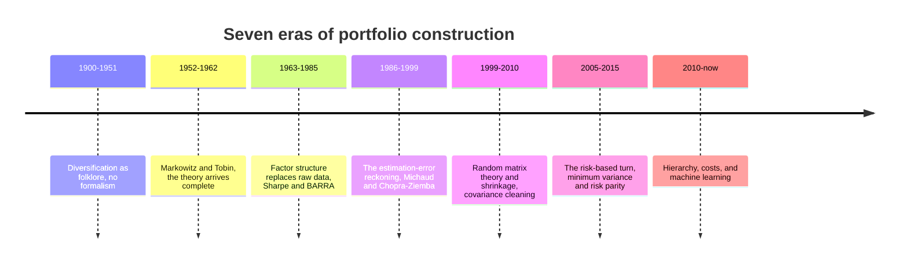
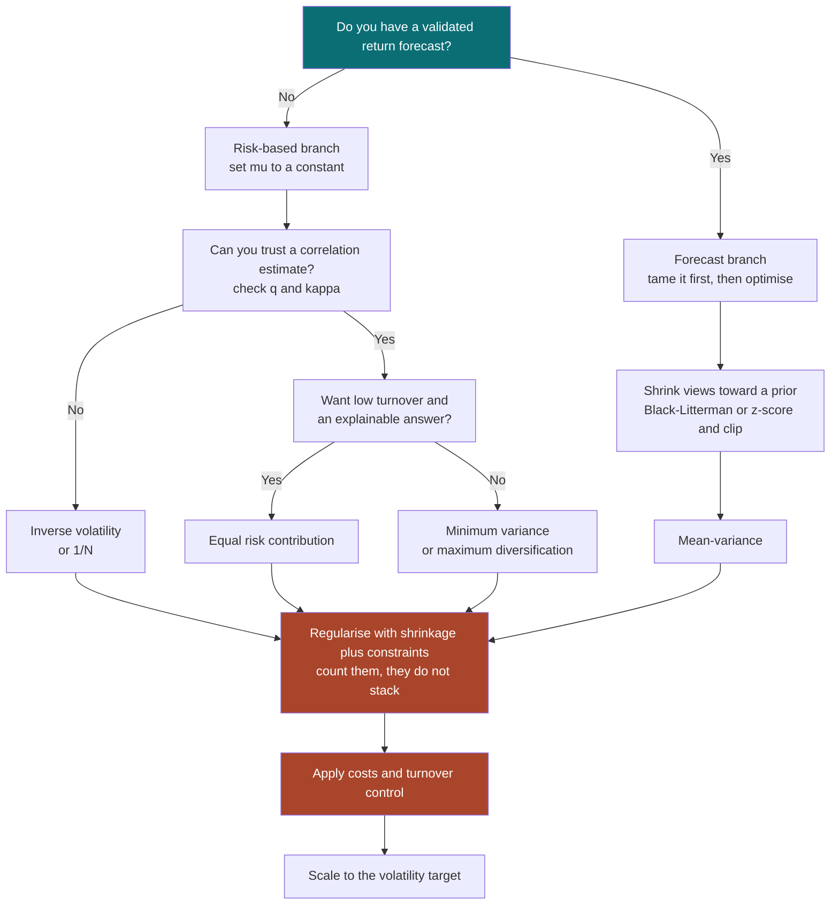

# Portfolio Construction and the Covariance Matrix

### Why the optimiser is not the problem, and the matrix is

---

```{=html}
<aside class="eli5">
```

# ELI5 — the short version {#eli5}

```{=latex}
\begin{eli5}
```

**In one sentence.** The formula for the best portfolio was settled in 1952 and has never been the problem; the problem is that it takes its estimates literally, and an estimate of how assets move together is far worse than it looks.

**1. The optimiser believes every number it is given** ([§1](#1-what-portfolio-construction-is)). Give it expected returns and a table of how assets move together, and it treats each entry as exact. Suppose the estimate for one asset says 45% when the truth is 4%. The optimiser does not hedge that possibility; it piles in. Better optimisation applied to noisy inputs therefore makes things *worse*. That is the reverse of the usual starting intuition.

**2. Where the damage comes from** ([§2](#2-why-the-naive-answer-fails)). The formula effectively divides by the co-movement table, and dividing by something measured badly is where results explode. The optimiser's largest positions turn out to be bets *between* assets it believes are nearly identical. "Nearly identical" is exactly the belief that the data support least. In one simulation the model was perfectly correct and only the sample was finite. The optimiser still reported a risk-adjusted return of 5.3 against a true attainable 0.43.

**3. One number shows how bad it is** ([§2](#2-why-the-naive-answer-fails)). Divide the number of assets by the number of observations per asset. The risk actually taken exceeds the risk predicted by a factor of one over one minus that ratio. At one half, a portfolio runs twice the risk it reports. At one, the calculation has no answer at all. It follows that **doubling the universe does exactly as much harm as halving the history**. How many assets to include is a statistical decision, not only a business one.

**4. Expected returns are the dangerous input** ([§2](#2-why-the-naive-answer-fails)). Errors in expected returns do roughly 11 times the damage of errors in volatilities, and 22 times that of errors in correlations. Without a genuine return forecast, leaving expected returns out altogether is not a compromise. It is the best available move. The celebrated finding that naive equal weighting beats optimisation is evidence against *sample average returns*, not against optimising.

**5. Every "risk-based" method is the same formula** ([§7](#7-from-covariance-to-weights), [§8](#8-taxonomy-and-equivalences)). Minimum variance, maximum diversification, inverse volatility, equal risk contribution and equal weighting are one formula. They differ in the stand-in they use for expected return, and in how much structure they impose on the co-movement table. Equal weighting is not the humble choice. It is the most opinionated one in the set, because it asserts that every asset has the same return, the same volatility and the same correlation with everything else.

**6. Constraints already do statistics** ([§8](#8-taxonomy-and-equivalences), [§10](#10-costs-turnover-and-rebalancing)). Forbidding short positions is mathematically the same operation as shrinking the covariance estimate toward something simpler. That equivalence is the hinge of the whole field. It explains why crude practice beat refined theory for decades. It also means that the usual safeguards are not independent. Shrinkage plus no-shorting plus position caps plus a turnover penalty is four shrinkages at once, and together they may quietly rebuild equal weighting. Measure how close the portfolio is to it.

**7. Trading costs are a regulariser too** ([§10](#10-costs-turnover-and-rebalancing)). A penalty on turnover is *provably* the same operation as shrinking the covariance matrix and pulling the answer toward the portfolio already held. With a cost charged on every trade, a portfolio should not rebalance all the way to the target. It should trade to the edge of a no-trade band whose width grows like the cube root of the cost.

**8. Small traps, large consequences** ([§6](#6-estimating-the-covariance-matrix), [§9](#9-implementation-what-actually-matters)). Stale and non-synchronous prices make illiquid and foreign assets look like diversifiers. The optimiser then overweights exactly the positions that are hardest to exit. The standard exponentially weighted risk estimate has an effective memory of about 32 observations. That makes it unusable above roughly 30 assets, and it gives no warning. Volatilities want short windows and correlations want long ones, so estimate the two separately.

**9. The single most useful number** ([§11](#11-evaluation-and-pitfalls)). Divide realised volatility by predicted volatility, out of sample. The ratio needs no forecast and no backtest. A value of 1.16 means the risk model understates risk by 16%. The main benefit of fixing that is honesty, not a smaller number. Compare methods only at matched volatility, because leverage is a free parameter and unmatched comparisons measure nothing. And 10 years of data cannot tell a Sharpe ratio of 0.5 from one of 1.5.

---

**If you do only three things:** leave expected returns out unless a genuine forecast exists, shrink the covariance matrix and err toward shrinking too much, and track realised over predicted volatility out of sample.

```{=latex}
\end{eli5}
```

```{=html}
</aside>
```

---

**What this is.** Portfolio construction is the step between having views and having positions. More real money has been lost at this step to a correct-looking calculation than anywhere else in quantitative finance, because the calculation is trivial and the inputs are not. This chapter builds the subject from first principles. It covers what the optimal portfolio *is*, why feeding it sample estimates destroys it, what the covariance matrix actually does in that formula, and what the working set of remedies is, in enough detail to implement one.

**How to read this chapter.** Sections 1–2 are the conceptual core. §2 is the one section nobody should skip, because it gives the mechanism behind every other section. §3 is history and §4 is the bibliography. §5 is the theory: the closed forms, the regression identity that explains the whole failure, and the random-matrix results that quantify it. §6 and §7 are the two surveys, of ways to estimate a covariance matrix and of ways to turn one into weights. §8 shows that most of §6 and §7 is one method with five knobs. Sections 9–11 are engineering: implementation, costs and evaluation. §12 is the synthesis.

Different readers can start in different places.

- Readers who want only the most important idea should read §2.3, §5.4 and §8.2.
- Readers implementing a system should read §9 and §10, and treat the rest as reference.
- Readers who already know mean-variance theory and want the part that textbooks omit should start at §5.4.

**Objectives.** After this chapter, you should be able to:

- state the master form $w^\star = \gamma^{-1}\Sigma^{-1}\mu$, and place any named allocation rule in it as a choice of return view, regulariser, constraints and leverage;
- explain, through the eigen-portfolio decomposition and the regression identity, why inverting a sample covariance matrix puts the largest bets in the least reliable directions;
- compute the aspect ratio $q = N/T$, or $N/T_{\text{eff}}$ for weighted estimators, and predict from it how far realised risk will exceed predicted risk;
- choose and implement a covariance estimator, with linear shrinkage in correlation space as the default;
- recognise shrinkage, constraints and transaction costs as one regularising act, and measure their combined strength;
- evaluate a construction method honestly, with realised-over-predicted risk, matched volatility, a sweep over $q$ and paired comparisons.

**Relationship to the other chapters.** This chapter treats the *cross-sectional* problem: given many assets, how much of each to hold. A companion chapter, [Trend-Following in Financial Markets](trend_following.html), covers the *scalar* problem of how large a single position should be. It treats portfolio construction only as far as a trend system needs it. Another, [Market Regimes and Hidden Markov Models](market_regimes.html), argues in its section 12.4 that the covariance matrix is where regime information pays most reliably. This chapter gives the detail behind that claim. Those chapters ask *what to forecast*. This one assumes that the forecasts exist and asks what to do with them. Each stands alone.

**A warning about scope.** [Practice] Nothing here is investment advice. The numerical illustrations are simulations chosen to isolate a mechanism, not backtests of anything tradeable. Where a number comes from a simulation run for this chapter rather than from a published study, the text says so.

**Epistemic tags.** The chapters in this collection flag claims by status:

- **[Fact]** — replicated across independent datasets or implementations; broad agreement.
- **[Contested]** — documented, but with live disagreement about magnitude, robustness, or cause.
- **[Hypothesis]** — a proposed mechanism, not decisively tested.
- **[Practice]** — practitioner convention; the evidence may be private or absent. A [Practice] claim is not a debunked one.

Tags appear only where the status changes what a reader should do. A tag governs the sentence or clause it opens. Untagged sentences are definitions, derivations or arithmetic: true by construction rather than by evidence.

---

**Notation.** The table lists every symbol that recurs in the chapter, with the section that defines or first uses it. Symbols used in only one section, or only in the appendix, are defined where they appear.

| Symbol | Meaning | Defined in |
|---|---|---|
| $N$; $T$ | Number of assets; number of observations in the estimation window | §1.4, §2.1 |
| $q$ | **Aspect ratio**, $q = N/T$ | §1.4, §2.4 |
| $T_{\text{eff}}$ | Effective sample size of a weighted estimator; $(1+\theta)/(1-\theta)$ for an EWMA, and the $T$ that belongs in $q$ | §6.3, §9.4 |
| $w$; $\mathbf{1}$ | Vector of portfolio weights; vector of ones, so $\mathbf{1}'w = 1$ is the fully invested constraint | §1.2, §5.1 |
| $w^\star$ | Portfolio that is optimal at the true parameters, $w^\star = \gamma^{-1}\Sigma^{-1}\mu$ | §1.2, §1.3 |
| $w_{\text{prev}}$ | Portfolio currently held, before a rebalance | §10.2 |
| $\mu$; $\hat\mu$ | Vector of expected excess returns; an estimate of it, or the return view fed to the optimiser | §1.1, §1.2 |
| $\Sigma$ | **True** covariance matrix of returns, unobservable | §1.2 |
| $S$ | **Sample** covariance matrix computed from $T$ observations | §2.1 |
| $\hat\Sigma$ | **Whatever covariance estimator is actually used**: $S$, a shrunk version of it, a factor model or something else | §1.1 |
| $\gamma$ | Risk aversion, $\gamma > 0$ | §1.3 |
| $\sigma_i$; $D$ | Volatility of asset $i$; $D = \operatorname{diag}(\sigma_1, \dots, \sigma_N)$ | §5.3 |
| $C$; $\bar\rho$ | Correlation matrix $C = D^{-1}\Sigma D^{-1}$, so $\Sigma = DCD$; average pairwise correlation | §5.3, §6.4 |
| $\sigma_p$; $\sigma^\star$ | Portfolio volatility $\sqrt{w'\Sigma w}$; volatility target | §7.6, §8.1 |
| $\lambda_i$; $v_i$ | Eigenvalues $\lambda_1 \ge \dots \ge \lambda_N$ of the covariance matrix; the eigenvectors, read as **eigen-portfolios** | §2.3 |
| $V$; $\Lambda$ | Matrix of eigenvectors; $\Lambda = \operatorname{diag}(\lambda_i)$, so $\Sigma = V\Lambda V'$ | §6.1 |
| $\kappa$ | Condition number $\lambda_1/\lambda_N$ | §5.5, §5.7 |
| $R_i^2$; $s_i^2$ | Coefficient of determination from regressing asset $i$'s return on the other $N-1$ assets; the residual variance $\sigma_i^2(1-R_i^2)$ | §5.4 |
| $\alpha_i$; $\beta_{ij}$ | **Residual alpha**, expected return net of replication; coefficients of the same regression | §5.4 |
| $\delta$; $\Phi$ | **Shrinkage intensity**, $\delta \in [0,1]$; the target matrix it shrinks toward | §6.5 |
| $\nu$ | **Ridge or turnover penalty** weight, $\nu \ge 0$ | §8.2, §10.3 |
| $\theta$ | **EWMA decay**, $\theta \in (0,1)$ | §6.3 |
| $F$; $\Omega$; $\Psi$; $K$ | Factor model $\Sigma = F\Omega F' + \Psi$: $N \times K$ loading matrix; $K \times K$ factor covariance; diagonal matrix of idiosyncratic variances; number of factors | §6.8 |
| $\Delta$; $\mathcal{C}$ | Regulariser added to $\hat\Sigma$; constraint set | §8.1 |
| $\Pi$ | Equilibrium excess returns implied by market weights, $\Pi = \gamma\Sigma w_{\text{mkt}}$ | §7.8 |
| $\mathrm{SR}$ | Sharpe ratio | §5.1 |

Several symbols carry a qualification:

- Three matrices must be kept apart: the true $\Sigma$, the sample $S$ and the estimator $\hat\Sigma$. Hats denote estimates generally.
- $\gamma$ is always risk aversion, never a significance level.
- $C$ is the correlation matrix, and $\mathcal{C}$ is the constraint set of §8.1. Typography holds this near-collision apart throughout.
- $R_i^2$ always denotes the regression of asset $i$ on the other $N-1$ assets, the quantity of §5.4. It is never a goodness-of-fit for anything else.
- The three regularisation parameters $\delta$, $\nu$ and $\theta$ are kept distinct. §10.3 shows that the two uses of $\nu$, as a ridge and as a turnover penalty, are the same thing.
- The $\Lambda_c$ of §10.2 is a diagonal cost matrix, not the eigenvalue matrix $\Lambda$. The GARCH coefficients $\alpha_1$ and $\beta_1$ of A.27 are unrelated to $\alpha_i$ and $\beta_{ij}$.

---

## Table of contents

- [ELI5 — the short version](#eli5)

1. [What portfolio construction is](#1-what-portfolio-construction-is)
2. [Why the naive answer fails](#2-why-the-naive-answer-fails)
3. [How the field evolved](#3-how-the-field-evolved)
4. [Foundational references](#4-foundational-references)
5. [The mathematics](#5-the-mathematics)
6. [Estimating the covariance matrix](#6-estimating-the-covariance-matrix)
7. [From covariance to weights](#7-from-covariance-to-weights)
8. [Taxonomy and equivalences](#8-taxonomy-and-equivalences)
9. [Implementation: what actually matters](#9-implementation-what-actually-matters)
10. [Costs, turnover, and rebalancing](#10-costs-turnover-and-rebalancing)
11. [Evaluation and pitfalls](#11-evaluation-and-pitfalls)
12. [Synthesis](#12-synthesis)

---

# 1. What portfolio construction is {#1-what-portfolio-construction-is}

## 1.1 The wrong intuition

The usual starting intuition is this:

> Portfolio optimisation takes the forecasts and finds the best portfolio.

Each word of that sentence is defensible, but the sentence as a whole is badly wrong. The way it is wrong determines the shape of the entire field, so the failure deserves a precise statement.

An optimiser does not know which parts of its input are forecasts and which are errors. It receives a vector $\hat\mu$ and a matrix $\hat\Sigma$, and it treats every entry as exact. Suppose the true expected return of asset 17 is 4% and the estimate says 45%. The optimiser does not hedge that possibility, discount it or flag it. It buys asset 17 heavily, because that is what the input says to do. Now suppose a *pair* of assets has a true correlation of 0.90 and the sample says 0.97. The optimiser builds a long-short position between them at significant leverage, because at 0.97 that spread looks nearly riskless.

The accurate description is therefore the opposite of the intuition:

> **Optimisation does not extract value from forecasts. It amplifies whatever the forecasts contain, signal and error alike, in proportion to the confidence the inputs imply.**

For this reason the field's history (§3) is not a history of better optimisers. The optimisation itself was solved in 1952, and computationally it is a first-year exercise. Every advance since then has concerned the inputs. Some advances estimate them better. Some impose structure so that less has to be estimated. Others avoid needing them at all.

## 1.2 The right starting point

Portfolio construction is a **decision made under uncertainty about the parameters of the decision problem itself.**

That framing has three parts. Keeping them separate prevents most of the confusion in the field.

| | The object | Status |
|---|---|---|
| **Choice variable** | $w$, the weights | Controlled exactly |
| **Parameters** | $\mu$, $\Sigma$ | Never observed; only estimated |
| **Objective** | some functional of $w'\mu$ and $w'\Sigma w$ | Chosen by the investor; the choice matters less than commonly thought |

The classical theory assumes that the parameters are known and studies the choice. The modern theory accepts that they are unknown. It studies the *decision rule*, the map from data to weights, and asks how well that map performs on a finite sample. The two questions have different answers, and the gap between them is the subject of this chapter.

The gap has a precise statement. Write the decision rule as a function $\hat w(\text{data})$. Write $w^\star$ for the portfolio that is optimal at the *true* parameters; §1.3 gives its form. The classical question asks whether $w^\star$ is optimal, and the answer is yes by construction. The practical question compares two quantities:

$$
\mathbb{E}_{\text{data}}\big[\,U\big(\hat w(\text{data});\ \mu, \Sigma\big)\,\big]
\quad \text{versus} \quad U(w^\star;\ \mu, \Sigma)
$$

The expectation runs over samples, and the utility $U$ is always evaluated at the *true* parameters. The first quantity is what an investor actually experiences. The second is what the optimiser reports. §2 measures the gap between them, and it is much larger than intuition suggests.

## 1.3 The master form

Take the standard mean-variance objective. It maximises expected return, penalised by variance, with risk aversion $\gamma$:

$$
\max_{w}\ \ w'\mu - \frac{\gamma}{2}\,w'\Sigma w
$$

Differentiating with respect to $w$ and setting the result to zero gives $\mu - \gamma\Sigma w = 0$. Solving for $w$ gives the **master form** of this chapter:

$$
\boxed{\ \ w^\star = \frac{1}{\gamma}\,\Sigma^{-1}\mu\ \ }
$$

Three properties of this equation matter before anything else.

**It is a ratio, not a product.** The weight is expected return *divided by* risk, in a matrix sense. Division is where things blow up. Every pathology in §2 traces back to the inverted $\Sigma$.

**$1/\gamma$ is only a scalar.** It sets leverage and nothing else. The *direction* of the portfolio is $\Sigma^{-1}\mu$ regardless of risk aversion. The direction means the relative weights, which is the interesting part. This is Tobin's separation result. It means that the sizing question (section 8.5 of [Trend-Following in Financial Markets](trend_following.html)) and the composition question are genuinely separable. A portfolio can have the right direction and the wrong scale, or the reverse. These are different mistakes, with different fixes.

**Almost every method in the field is this formula with particular choices.** The list includes equal weighting, minimum variance, risk parity, maximum diversification, Black–Litterman and hierarchical risk parity. The survey in §7 works through them. §8 shows that each is $\Sigma^{-1}\mu$ under a specific pair of assumptions: what $\mu$ is, and how $\Sigma$ has been regularised. Several of them appear to have abandoned optimisation entirely. None of them has.

## 1.4 The spine, stated once

Three claims generate the rest of the chapter, and each section elaborates one of them. They are numbered C1–C3 here. The slots S1–S5 of §8.1 are a separate numbering for a different purpose, and the two are not related.

> **C1 — the master form.** Every portfolio construction method is $w \propto \hat\Sigma^{-1}\hat\mu$ for some choice of $\hat\mu$ and some regularised $\hat\Sigma$. The choice of $\hat\mu$ is often implicit and often deliberately degenerate. The one true exception is hierarchical risk parity (§7.11), which reaches a similar destination without ever forming the inverse.
>
> **C2 — the mechanism.** Inverting $\hat\Sigma$ places the largest bets in the directions with the smallest estimated variance. Those are exactly the directions that the estimate gets most wrong. The optimiser's confidence is highest where it is least justified.
>
> **C3 — the diagnostic.** To first order, one number governs how badly this goes: the aspect ratio $q = N/T$. Neither $N$ nor $T$ governs it alone; their ratio does. The ratio governs the *covariance* half of the problem. The return view is limited by calendar span instead (§2.5), which is a separate and larger constraint.

The consequence, which §8 makes precise, is this:

> **Every repair in the field does the same thing. The repairs include shrinkage, factor models, position constraints, resampling, Bayesian priors, transaction-cost penalties and hierarchical clustering. Each adds structure that lifts the smallest eigenvalues of $\hat\Sigma$, and so suppresses the positions taken in those directions. The repairs differ in where the structure comes from and how it is justified, not in what it does.**

That last statement is why this chapter is organised as a taxonomy rather than a catalogue. Suppose a practitioner treats shrinkage, constraints and turnover penalties as three independent tools. The practitioner will then apply all three at full strength. The resulting portfolio is far more heavily regularised than intended.

## 1.5 What portfolio construction is not

Several neighbouring problems are routinely called by this name. Naming them prevents much confusion.

| Not this | Why it is different |
|---|---|
| **Signal generation** | $\mu$ arrives from outside. Construction takes it as given and is not responsible for whether it is any good. §2.5 shows that construction is responsible for how much damage a bad $\mu$ does |
| **Position sizing** | The scalar $1/\gamma$, or a volatility target. Orthogonal to composition (§1.3), and a different problem |
| **Diversification** | Sometimes an outcome, and a poor objective. A portfolio can be maximally diversified and terrible |
| **Risk management** | A layer of constraints and monitoring *around* construction. It answers "what if the inputs are wrong", not "what is best" |
| **Asset allocation** | The same mathematics at $N \approx 10$, where estimation error is mild and the hard problems of §2 barely appear |
| **Execution** | The path from current weights to target weights. Genuinely separate, except that §10 shows costs feed back into the target itself |

The first distinction causes the most trouble in practice. A disappointing backtest is nearly always blamed on the signal. The construction step is at least as likely to be the cause, and it is far easier to fix.

## 1.6 A worked instance, to fix ideas

Take two assets. Both have 20% annual volatility, their correlation is $\rho$, and their expected excess returns are 6% and 5%. Risk aversion is set so that the portfolio is fully invested. The question is what the master form gives.

Let $\Sigma = 0.04\begin{pmatrix} 1 & \rho \\ \rho & 1\end{pmatrix}$ and $\mu = (0.06, 0.05)'$. One line of algebra gives the answer. The inverse $\Sigma^{-1}$ carries a positive factor $1/[0.04(1-\rho^2)]$ in front, which normalisation removes anyway. Up to that factor,

$$
\Sigma^{-1}\mu \;\propto\; \begin{pmatrix} 1 & -\rho \\ -\rho & 1\end{pmatrix}
\begin{pmatrix}\mu_1 \\ \mu_2\end{pmatrix}
= \begin{pmatrix}\mu_1 - \rho\mu_2 \\ \mu_2 - \rho\mu_1\end{pmatrix}.
$$

The two entries sum to $(\mu_1 + \mu_2)(1-\rho)$. Dividing by that sum makes the weights add to one, and gives the fully invested optimum:

$$
w_1 = \frac{\mu_1 - \rho\,\mu_2}{(\mu_1 + \mu_2)(1 - \rho)}, \qquad w_2 = 1 - w_1 .
$$

The table evaluates these weights at five correlations.

| $\rho$ | $w_1$ | $w_2$ | Gross | Comment |
|---|---|---|---|---|
| 0.00 | 0.55 | 0.45 | 1.0× | Mild tilt toward the better asset |
| 0.50 | 0.64 | 0.36 | 1.0× | |
| 0.90 | 1.36 | −0.36 | 1.7× | Now short the second asset |
| 0.95 | 2.27 | −1.27 | 3.5× | |
| 0.99 | 9.55 | −8.55 | 18.1× | An 18× spread trade on a 1% return difference |

**This small table contains the whole chapter in miniature.** As the two assets become more alike, the optimiser stops allocating between them and starts arbitraging between them. The leverage it applies grows without bound. Nothing here is a bug. Given *exact* inputs, these really are the optimal weights, and at $\rho = 0.99$ the spread really is nearly riskless.

The problem is that $\rho = 0.99$ is not known. It is estimated. The large-sample standard error of a correlation estimated from $T$ observations is roughly $(1-\rho^2)/\sqrt{T}$. Two years of daily data ($T = 500$) give a standard error of 0.0009. A two-standard-error band around a sample correlation of 0.99 therefore runs from 0.988 to 0.992. The corresponding gross exposures run from 15.3× to 22.0×. In any other context, a band this narrow would be rounded away. Here, it makes the trade at the top end 44% larger than the trade at the bottom.

The estimate in this example was good. It had four significant figures and a tight confidence interval. It had no misspecification, no outliers and no regime change. The instability comes from the $1/(1-\rho)$ in the denominator. That term is a property of the map from parameters to weights, not of the estimate. **Precision in the input does not imply stability in the output, and the optimiser reports no diagnostic that reveals which case applies.**

Scaling this example from two assets to 500 leads to §2.

> ### §1 Key takeaways
>
> 1. An optimiser cannot distinguish a forecast from an error. It amplifies both in proportion to the confidence its inputs imply. Better optimisation of bad inputs makes the result worse, not better.
> 2. The master form is $w^\star = \gamma^{-1}\Sigma^{-1}\mu$. Every method in the field chooses what to put in the two slots and how to regularise the inverse.
> 3. Composition and leverage separate cleanly. $1/\gamma$ sets the scale, and $\Sigma^{-1}\mu$ sets the direction. Treat them as two problems, because their failure modes are unrelated.
> 4. The classical question, whether $w^\star$ is optimal, has been settled since 1952. The practical question is how a *decision rule* performs on a finite sample.
> 5. Inverting the covariance matrix makes the optimiser's largest positions spread trades between assets it believes are nearly identical. Those beliefs are the least reliable thing it has.
> 6. Portfolio construction is not signal generation, sizing, diversification or risk management. Confusing it with signal generation is the most expensive of these errors, because it directs effort to the wrong fix.

---

```{=latex}
\newpage
```

# 2. Why the naive answer fails {#2-why-the-naive-answer-fails}

This section gives the mechanism behind everything that follows. The most important single part of the chapter is §2.3.

## 2.1 The demonstration

The experiment runs under conditions as favourable to the optimiser as possible. There are 50 assets. A one-factor model generates the returns: a market factor plus idiosyncratic noise. Betas lie between 0.6 and 1.4, and idiosyncratic volatilities lie between 15% and 35%. Expected returns are 5% per unit of beta plus a small alpha. The sample is two years of daily data, so $T = 500$ and $q = N/T = 0.10$. By industry standards that ratio is comfortable.

Crucially, **the data are drawn from exactly the model the optimiser assumes.** Returns are IID, multivariate normal and stationary. There are no fat tails, no regime changes, no missing data, no non-synchronous trading and no misspecification of any kind. Whatever goes wrong is estimation error and nothing else.

The experiment computes the sample mean $\hat\mu$ and the sample covariance $S$, then traces out the mean-variance frontier. The figure plots three curves:

- the frontier the optimiser *reports*, using $\hat\mu$ and $S$;
- the frontier that is genuinely *available*, using $\mu$ and $\Sigma$;
- what the optimiser's chosen weights *actually deliver*, with the estimated weights evaluated at the true parameters.

```{=latex}
\newpage
\begin{center}
\includegraphics[width=\linewidth]{quant-research/figures/pc_frontier_illusion.pdf}
\end{center}
```

```{=html}
<style>
/* Figures for this document. Prefix "mdd-", shared with the other notes and
   distinct from the reading widget's "rdw-". Narrow viewports reclaim the
   body's side padding so the figure gets the full width. */
.mdd-fig {
  display: block; width: 100%; height: auto;
  max-width: 640px; margin: 1.6rem auto;
  /* the reading widget adds a light plate (padding) in dark mode */
  box-sizing: border-box;
}
@media (max-width: 760px) {
  .mdd-fig { width: calc(100% + 64px); max-width: none; margin-left: -32px; margin-right: -32px; }
}
@media (max-width: 600px) { /* pandoc's own stylesheet drops body padding to 12px here */
  .mdd-fig { width: calc(100% + 24px); margin-left: -12px; margin-right: -12px; }
}
</style>


```

The table gives the numbers from a simulation run for this chapter.

| Quantity | Value |
|---|---|
| True maximum Sharpe ratio | 0.43 |
| Sharpe ratio the optimiser reports | **5.32** |
| True expected returns, range across assets | 1.9% to 7.8% |
| *Sample* mean returns, range across assets | **−38.9% to +44.9%** |
| Estimated frontier at its top end | 14.0% return, 10.9% volatility |
| What those weights actually deliver | **3.0% return, 12.6% volatility** |

Three observations follow, in increasing order of importance.

**The reported Sharpe ratio is wrong by a factor of 12.** The optimiser is not slightly optimistic. It believes it has found something 12 times better than the best portfolio in the universe it was shown. A research process that treats an in-sample optimised Sharpe ratio as evidence is not measuring what it intends to measure.

**The sample means are an order of magnitude more dispersed than the truth.** The true spread of expected returns is about six percentage points. The sample spread is about 84. Essentially all of the cross-sectional variation in a two-year sample of mean returns is noise. This is not a small-sample curiosity. The standard error of an annualised mean equals the annual volatility divided by the square root of the number of *years*. Annual returns of a few percent sit against an annual volatility of 20%. Over two years the standard error is therefore $0.20/\sqrt{2} \approx 14\%$, several times the quantity being estimated. [Fact] The ratio barely improves with more data, because the standard error of a mean falls as $1/\sqrt{T}$ in *calendar time*, not in sample size. Sampling the same two years more finely does nothing at all ([Merton, 1980](https://www.nber.org/papers/w0444)).

**The realised frontier is flat.** This finding should change behaviour. A request to the estimated frontier for 4% expected return delivers 2.8%. A request for 14% delivers 3.0%. The dashed curve's entire ascent is the part that looks like the optimiser trading risk for return, and the part a committee would discuss. It buys two-tenths of one percent. What it actually purchases is leverage on noise.

## 2.2 Error maximisation

[Michaud (1989)](https://www.jstor.org/stable/4479185) named the phenomenon: mean-variance optimisers are **estimation-error maximisers**. The argument is about selection, and it is short.

The optimiser overweights assets with a high estimated return, a low estimated variance and a low estimated correlation with the rest. In a large group of assets, the estimates that come out highest, lowest and lowest disproportionately belong to assets whose *errors* went up, down and down. The optimiser's largest positions therefore concentrate systematically in the assets whose inputs are most overstated. The effect grows with the number of assets the optimiser chooses among.

This failure is often described loosely as "overfitting", which undersells it. Overfitting usually means a model with too many parameters fitting the noise in a training set. Here there is no model and no fitting. $\Sigma^{-1}\mu$ has no free parameters and is not chosen to fit anything. **The optimiser takes a maximum, and a maximum over noisy inputs is biased upward by construction.** For the same reason, the best of 100 coin-flippers looks skilled. The optimiser selects a *direction in portfolio space*, not a parameter, and it has effectively as many directions to choose from as there are assets.

## 2.3 The mechanism: what inversion actually does

The selection argument above is correct but qualitative. The precise version concerns eigenvalues. It deserves a slow treatment, because everything in §6 and §7 responds to it.

Any covariance matrix can be written in terms of its eigenvalues and eigenvectors:

$$
\Sigma \;=\; \sum_{i=1}^{N} \lambda_i\, v_i v_i',
\qquad \lambda_1 \ge \lambda_2 \ge \dots \ge \lambda_N > 0 .
$$

Read this as a decomposition into **eigen-portfolios**. Each $v_i$ is a particular combination of the assets, and so a portfolio, with weights that sum to whatever they sum to. Because eigenvectors are unit vectors, $v_i'\Sigma v_i = \lambda_i$ exactly. So $\lambda_i$ *is* that portfolio's variance. The first eigen-portfolio $v_1$ is typically "everything, long", which is the market, and it has the largest variance. The last, $v_N$, is the quietest combination available: an intricate long-short arrangement that hedges almost everything out.

Inversion flips the eigenvalues and leaves the directions alone:

$$
\Sigma^{-1} \;=\; \sum_{i=1}^{N} \frac{1}{\lambda_i}\, v_i v_i' .
$$

The optimal portfolio therefore decomposes as

$$
w^\star \;\propto\; \Sigma^{-1}\mu \;=\; \sum_{i=1}^{N}
\underbrace{\frac{v_i'\mu}{\lambda_i}}_{\text{how much of }v_i}\; v_i .
$$

**Each eigen-portfolio is held in proportion to its expected return divided by its variance.** That is exactly right, and it is exactly the problem. The quietest direction, $v_N$, is divided by the smallest number, so it receives the largest multiplier. *By construction, the optimiser's biggest bets are on the combinations of assets it believes are least risky.*

Now consider what the sample gets wrong. When $\Sigma$ is estimated from $T$ observations, the eigenvalues do not come back with independent, symmetric errors. They come back **spread apart in a specific, predictable way**. The large ones are biased up, and the small ones are biased down. This is the Marchenko–Pastur result, stated in §5.5. Its consequence here is a chain. The sample's smallest eigenvalue is too small. The optimiser therefore divides by a number that is too small. It therefore takes a position that is too large. That position lies in the direction where its estimate of risk is least reliable.

The figure shows the effect at $N = 200$ and $T = 600$, on data with *no structure at all*. The data are 200 independent series, so every true eigenvalue equals 1.

```{=latex}
\newpage
\begin{center}
\includegraphics[width=\linewidth]{quant-research/figures/pc_mp_spectrum.pdf}
\end{center}
```

```{=html}

```

The true spectrum is a single point at 1. The sample smears it from 0.18 to 2.49, a 14-fold range. An optimiser given this matrix levers the "quietest" direction $1/0.18 = 5.6$ times and the "noisiest" only $1/2.49 = 0.4$ times. The result is a **14:1 spread of leverage across directions that are in truth identical.** All of that spread is noise, and the optimiser's confidence in it is total.

The summary to remember is this:

> **The optimiser allocates in inverse proportion to estimated variance, and estimated variance is least accurate exactly where it is smallest. The largest positions therefore carry the largest errors. Regularisation is not a statistical nicety here. Without it, the portfolio is built entirely from the least reliable part of the data.**

The right-hand panel makes the constructive point that rescues the situation. Adding one real market factor lifts its eigenvalue to 66, far outside the noise band. Everything else stays inside a bulk that keeps the Marchenko–Pastur shape once the factor's share of variance is removed. **Signal and noise separate cleanly in the spectrum.** That observation underlies eigenvalue clipping (§6.7), factor models (§6.8) and, in a sense, every method in §6. The bulk is known in advance to be noise, so it can be replaced with something better behaved at no cost in information.

## 2.4 The diagnostic: everything is governed by $q = N/T$

After §2.3 the natural question is how much data is needed. The question is malformed, because the damage does not depend on $T$ alone. It depends on $q = N/T$.

The global minimum-variance portfolio is the purest case, because it uses no $\mu$ at all. Three of its quantities have clean large-sample limits. Write $\sigma^2_{\text{opt}}$ for the variance of the true optimal portfolio. Then

$$
\begin{aligned}
\frac{\text{variance the optimiser predicts}}{\sigma^2_{\text{opt}}} &\;\to\; 1 - q,
&&\text{(it understates its own risk)}\\[4pt]
\frac{\text{variance actually realised}}{\sigma^2_{\text{opt}}} &\;\to\; \frac{1}{1-q},
&&\text{(it takes more risk than optimal)}\\[4pt]
\frac{\text{realised}}{\text{predicted}} &\;\to\; \frac{1}{(1-q)^2}.
&&\text{(the two errors compound)}
\end{aligned}
$$

In units of volatility rather than variance, the last line is simply $1/(1-q)$. That is the number to carry around. §5.6 gives the derivation, and the figure confirms it by simulation.

```{=latex}
\newpage
\begin{center}
\includegraphics[width=\linewidth]{quant-research/figures/pc_risk_ratio.pdf}
\end{center}
```

```{=html}

```

The table reads off the practical consequences.

| $N$ | $T$ | $q$ | Realised ÷ predicted volatility |
|---|---|---|---|
| 50 | 500 (2 yr daily) | 0.10 | 1.11× |
| 100 | 500 | 0.20 | 1.25× |
| 250 | 500 | 0.50 | **2.00×** |
| 400 | 500 | 0.80 | **5.00×** |
| 500 | 500 | 1.00 | undefined — $S$ is singular |
| 500 | 2520 (10 yr daily) | 0.20 | 1.25× |

Two lessons follow. Both are counterintuitive, so they are stated flatly.

**Doubling the universe is exactly as harmful as halving the history.** Adding assets is not free diversification. It is a direct tax on the reliability of every position. A firm running 500 names on two years of data is in a qualitatively worse position than one running 50 names on the same data. No amount of care elsewhere compensates.

**At $q \ge 1$ the sample covariance matrix is singular, and the optimiser is meaningless.** With 500 names and two years of daily history, there are infinitely many "zero-risk" portfolios. These combinations had exactly zero variance in sample, purely by construction. The optimiser finds one and levers it without limit. Code that does not fail loudly in this case silently does something worse than failing. [Practice] **Recommendation: check $q$ before anything else.** The check is one line, and it can invalidate an entire research programme.

## 2.5 Which input hurts most

The inputs are not equally dangerous. The ordering is lopsided enough to drive design decisions.

[Chopra & Ziemba (1993)](https://jpm.pm-research.com/content/19/2/6) measured it. They perturbed each input and computed the *certainty-equivalent loss*: the amount of money an investor would give up by holding the perturbed portfolio instead of the true optimum. The result is one of the most useful numbers in the field. [Fact] At a risk tolerance of 50, errors in **means** cost roughly **11 times** as much as errors in **variances**, and roughly **22 times** as much as errors in **covariances**. Risk tolerance is their scale for the reciprocal of risk aversion. The ratio is approximately **22 : 2 : 1**, and the dominance of means grows further as risk tolerance rises.

The mechanism is the second observation of §2.1. A mean must be estimated in calendar time, and its standard error stays comparable to its own magnitude even over decades. A variance can be estimated to within a few percent from a few months of daily data. Variance estimation benefits from finer sampling, and mean estimation does not. [Fact] This asymmetry is structural, not a data problem, and a better dataset will not fix it.

The design conclusion is direct. It is the single decision with the most leverage in this chapter.

> **Without a genuine, tested return forecast, do not put one in.** Setting $\hat\mu \propto \mathbf{1}$ refuses to differentiate between assets on expected return. It deletes the dominant error term outright. This is the entire justification for the risk-based portfolios of §7.2–§7.6, and it explains why they perform so much better than their crudeness suggests.

The argument has limits. It does not say that expected returns are unforecastable, and it does not forbid using a $\mu$. It says the bar is high. A return forecast must beat not only zero but also the substantial benefit of removing the largest source of estimation error from the problem. A weak but real signal can easily make the portfolio worse.

## 2.6 The 1/N challenge, and what it actually showed

The most cited empirical result in this literature is [DeMiguel, Garlappi & Uppal (2009)](https://academic.oup.com/rfs/article-abstract/22/5/1915/1592901). Across seven datasets, they compared 14 portfolio rules against the naive rule of putting $1/N$ in each asset. The rules included sample mean-variance, Bayes–Stein, methods in the style of Black–Litterman, minimum variance and various constrained versions. [Fact] None of the 14 rules beat $1/N$ consistently on out-of-sample Sharpe ratio.

Their most quoted calculation is the estimation window that sample-based mean-variance would need to beat $1/N$ reliably. It is **about 3,000 months for 25 assets, and about 6,000 months for 50**: 250 and 500 years respectively. No such dataset exists, and none will.

This result is widely reported as "optimisation doesn't work". That reading is wrong, and the correction matters.

[Kritzman, Page & Turkington (2010)](https://www.tandfonline.com/doi/abs/10.2469/faj.v66.n2.6) made the counter-argument directly. [Contested] The DeMiguel–Garlappi–Uppal comparison uses *sample means* as the return input. Replacing them with almost anything else lets optimised portfolios beat $1/N$ comfortably over long samples. The alternatives include a constant, a risk-premium estimate and a shrunk mean. Their conclusion is that the finding concerns the input, not the method.

The view taken here is that Kritzman and co-authors have the better argument, and §2.5 already contains the resolution:

> **DeMiguel, Garlappi and Uppal is a paper about $\hat\mu$, not a paper about optimisation.** It shows very convincingly that sample means are worse than useless as portfolio inputs. It does not show that the covariance matrix is useless. Minimum-variance portfolios use $\Sigma$ and discard $\mu$, and they are among the strongest performers in the paper's own tables and in most subsequent work.

[Contested] The disagreement that remains is narrower and genuine. It asks whether risk-based optimisation beats $1/N$ *net of transaction costs and constraints* in a realistic implementation. There, turnover and the concentration of minimum-variance solutions consume much of the theoretical gain. The question is still open, its answer differs across asset classes, and it is the subject of §10 and §11.

> ### §2 Key takeaways
>
> 1. In a simulation where the optimiser's model was exactly correct, it reported a Sharpe ratio of 5.3 against a true attainable 0.43. Its realised frontier was flat: asking for 14% return rather than 4% delivered an extra two-tenths of a percent.
> 2. The mechanism is inversion. Eigen-portfolios are held in proportion to expected return over variance, so the smallest eigenvalue gets the largest bet. The smallest eigenvalue is also the one the sample gets most wrong.
> 3. Sample eigenvalues are biased apart in a known way. At $q = 1/3$, a truly flat spectrum comes back spread 14-fold. Because the distortion is predictable, it is also correctable, which is the purpose of §6.
> 4. One number governs the damage: $q = N/T$. Realised volatility exceeds predicted volatility by $1/(1-q)$. At $q = 0.5$ the portfolio takes twice the risk it reports. At $q \ge 1$ the problem is not defined at all.
> 5. Doubling the number of assets does exactly as much harm as halving the history. Universe size is a statistical decision, not only a business one.
> 6. Errors in means cost roughly 11 times as much as errors in variances and 22 times as much as errors in covariances. Without a real return forecast, omitting $\mu$ entirely is not a compromise. It is the best available move.
> 7. The famous $1/N$ result is evidence against sample means, not against optimisation. It licenses dropping $\hat\mu$, not dropping $\hat\Sigma$.

---

```{=latex}
\newpage
```

# 3. How the field evolved {#3-how-the-field-evolved}

The history has one thesis, and every boundary between eras shows it:

> **The centre of gravity moved from "solve the optimisation" to "estimate the inputs", and then to "arrange not to need the inputs that cannot be estimated."**


```mermaid
timeline
    title Seven eras of portfolio construction
    1900-1951 : Diversification as folklore, no formalism
    1952-1962 : Markowitz and Tobin, the theory arrives complete
    1963-1985 : Factor structure replaces raw data, Sharpe and BARRA
    1986-1999 : The estimation-error reckoning, Michaud and Chopra-Ziemba
    1999-2010 : Random matrix theory and shrinkage, covariance cleaning
    2005-2015 : The risk-based turn, minimum variance and risk parity
    2010-now  : Hierarchy, costs, and machine learning
```

**Era I — Diversification as folklore (1900–1951).** *Contribution:* the idea that spreading holdings reduces risk. It appeared in the practice of investment trusts and in Keynes's writings on portfolio policy. *What changed:* nothing formal. There was no way to say how much diversification was needed, or between what. *Limitations:* without a concept of covariance, "don't put all your eggs in one basket" cannot distinguish 20 correlated bets from five independent ones. *Lasting influence:* the intuition survives. §7.2 shows that the naive $1/N$ rule it implies is a far stronger competitor than the theory that displaced it.

**Era II — The theory arrives complete (1952–1962).** *Contribution:* [Markowitz (1952)](https://www.jstor.org/stable/2975974) made risk a property of the *portfolio* rather than of its holdings, through the covariance matrix. He posed the problem as a quadratic programme. [Tobin (1958)](https://www.jstor.org/stable/2296205) added the separation theorem: the composition of the risky portfolio does not depend on risk aversion. *What changed:* everything conceptual. The word "risk" acquired a definition that could be computed. *Limitations:* Markowitz needed $N(N+1)/2$ covariance estimates and computers that could invert the result, and neither existed at scale. More importantly, nobody yet understood that the estimates, not the arithmetic, were the binding constraint. *Lasting influence:* total. The master form of §1.3 is unchanged, and every section below is a footnote to it.

**Era III — Structure instead of data (1963–1985).** *Contribution:* [Sharpe (1963)](https://www.jstor.org/stable/2627407) proposed the single-index model. It routes all co-movement through one market factor, and so replaces $N(N+1)/2$ covariances with $2N+1$ parameters. Barr Rosenberg's commercial risk models, at the firm that became BARRA, generalised this to fundamental models with many factors. *What changed:* the recognition that a covariance matrix should be *modelled*, not measured. *Limitations:* factor structure is an assumption. What it discards, genuine residual correlation within industries, is exactly what a statistical-arbitrage desk trades. *Lasting influence:* very large. Factor covariance models (§6.8) remain the default in institutional equity risk management, and §8.2 shows that they are a form of shrinkage.

**Era IV — The estimation-error reckoning (1986–1999).** *Contribution:* a cluster of papers established that estimation error, not model error, was the binding constraint. [Jorion (1986)](https://www.cambridge.org/core/journals/journal-of-financial-and-quantitative-analysis/article/abs/bayessteinestimation-for-portfolio-analysis/B7D5C6C54432BDE3F8E3B107E68B0E1E) applied Bayes–Stein shrinkage to the means. [Michaud (1989)](https://www.jstor.org/stable/4479185) named the error-maximisation property. [Best & Grauer (1991)](https://academic.oup.com/rfs/article-abstract/4/2/315/1571031) computed analytically how sensitive optimal weights are to the means. [Chopra & Ziemba (1993)](https://jpm.pm-research.com/content/19/2/6) priced the damage. [Black & Litterman (1992)](https://www.tandfonline.com/doi/abs/10.2469/faj.v48.n5.28) sidestepped it by starting from market-implied returns. *What changed:* the field stopped treating the optimiser as a solved problem and started treating it as a hazard. *Limitations:* the diagnoses were sharper than the cures. Most cures were tuning parameters without theory. *Lasting influence:* decisive. Everything after this era is a response to it.

**Era V — The physics import (1999–2010).** *Contribution:* two independent literatures arrived at the same repair. Statistical physicists, in [Laloux, Cizeau, Bouchaud & Potters (1999)](https://link.aps.org/doi/10.1103/PhysRevLett.83.1467), showed that the bulk of the eigenvalue spectrum of a financial correlation matrix is indistinguishable from random-matrix noise. That gave a principled rule for what to discard. Statisticians, in [Ledoit & Wolf (2003](https://www.econ.uzh.ch/dam/jcr:ffffffff-935a-b0d6-ffff-ffff9961f70f/jef.pdf), [2004)](http://www.ledoit.net/honey.pdf), derived in closed form the optimal intensity of shrinkage toward a structured target. Meanwhile [Jagannathan & Ma (2003)](https://www.nber.org/papers/w8922) proved that a no-short-sale constraint is *mathematically identical* to shrinking the covariance matrix. This explained why unsophisticated practice had been outperforming sophisticated theory. *What changed:* regularisation became principled rather than ad hoc, and the equivalences of §8.2 came into view. *Limitations:* almost all of this work addresses $\Sigma$, and §2.5 says that $\mu$ is the larger problem. *Lasting influence:* Ledoit–Wolf shrinkage is now the default in `scikit-learn` and in most risk systems. The ideas of this era are the working toolkit.

**Era VI — The risk-based turn (2005–2015).** *Contribution:* practitioners drew the conclusion of §2.5 and abandoned $\mu$. Minimum-variance, maximum-diversification ([Choueifaty & Coignard, 2008](https://www.tobam.fr/wp-content/uploads/2014/12/TOBAM-JoPM-Maximum-Div-2008.pdf)) and equal-risk-contribution ([Maillard, Roncalli & Teiletche, 2010](https://www.semanticscholar.org/paper/The-Properties-of-Equally-Weighted-Risk-Portfolios-Maillard-Roncalli/b8d10295fcceaeacea34d933574260e8c2136f71)) portfolios became products. [DeMiguel, Garlappi & Uppal (2009)](https://academic.oup.com/rfs/article-abstract/22/5/1915/1592901) supplied the negative result that justified the turn. *What changed:* "we do not forecast returns" went from an admission to a selling point. *Limitations:* [Contested] much of the measured outperformance is exposure to the low-volatility and value factors rather than superior construction. The products are also capacity-constrained and crowded. *Lasting influence:* large and ongoing. Risk-based allocation is now the default starting point for multi-asset portfolios.

**Era VII — Hierarchy, costs, and learning (2010–present).** *Contribution:* three strands. [López de Prado (2016)](https://papers.ssrn.com/sol3/papers.cfm?abstract_id=2708678) proposed hierarchical risk parity, which allocates with the covariance matrix without ever inverting it. [Gârleanu & Pedersen (2013)](https://nbgarleanu.github.io/DynTrad.pdf) solved the dynamic problem with transaction costs in closed form. They showed that the optimal portfolio is a weighted average of current holdings and a forward-looking target. [Ledoit & Wolf (2017)](https://academic.oup.com/rfs/article-abstract/30/12/4349/3863121) extended shrinkage from a single intensity to a whole function of the spectrum. *What changed:* costs moved from an after-the-fact adjustment into the objective, and regularisation became nonparametric. *Limitations:* [Contested] the empirical advantage of HRP over well-regularised alternatives is disputed and appears sensitive to the test design. End-to-end allocation by machine learning remains mostly promising rather than demonstrated. *Lasting influence:* too early to judge for the learning strand. The cost-aware strand is already standard.

> ### §3 Key takeaways
>
> 1. The optimisation problem was solved in 1952 and has never been the bottleneck. Every later era concerns the inputs.
> 2. Factor models (1963) were the field's first regularisation. They were adopted for computational reasons and kept for statistical ones.
> 3. The 1986–1999 cluster diagnosed estimation error precisely, but its cures were mostly tuning without theory.
> 4. Physics and statistics converged on the same repair around 2000: the noisy part of the spectrum can be identified in advance and should be replaced.
> 5. Jagannathan and Ma's 2003 proof that constraints *are* shrinkage is the hinge of the whole history. It explained why crude practice beat refined theory, and it unified two literatures that believed they disagreed.
> 6. The risk-based turn was the field acting on Chopra–Ziemba. Dropping an input that cannot be estimated beats estimating it badly.

---

```{=latex}
\newpage
```

# 4. Foundational references {#4-foundational-references}

The references are grouped by kind, because each kind is read differently. Each entry says why the work matters. Where a free copy exists, the link points to it. Entries available only behind a paywall are marked.

## 4.1 The founding theory

- **Markowitz, H. (1952).** ["Portfolio Selection."](https://www.jstor.org/stable/2975974) *Journal of Finance* 7(1), 77–91. — The origin. It shows how carefully Markowitz already hedged about the inputs. The field spent 50 years rediscovering his caution.
- **Tobin, J. (1958).** ["Liquidity Preference as Behavior Towards Risk."](https://www.jstor.org/stable/2296205) *Review of Economic Studies* 25(2), 65–86. — The separation theorem: leverage and composition are independent choices (§1.3).
- **Sharpe, W. F. (1963).** ["A Simplified Model for Portfolio Analysis."](https://www.jstor.org/stable/2627407) *Management Science* 9(2), 277–293. — The single-index model, and the first argument that a covariance matrix should be modelled rather than measured.
- **Merton, R. C. (1980).** ["On Estimating the Expected Return on the Market."](https://www.nber.org/papers/w0444) *Journal of Financial Economics* 8(4), 323–361. — Explains why expected returns are hard to estimate in a way that variances are not. The precision of the mean depends on calendar span, and the precision of the variance depends on sampling frequency. The single most important paper for understanding §2.5.
- **Stevens, G. V. G. (1998).** ["On the Inverse of the Covariance Matrix in Portfolio Analysis."](https://www.federalreserve.gov/pubs/ifdp/1995/528/ifdp528.pdf) *Journal of Finance* 53(5), 1821–1827. — Underread, and the key to §5.4. $\Sigma^{-1}$ decomposes into the coefficients and residual variance from regressing each asset on all the others. The link is the Federal Reserve working-paper version.

## 4.2 The estimation-error critique

- **Jorion, P. (1986).** ["Bayes-Stein Estimation for Portfolio Analysis."](https://www.cambridge.org/core/journals/journal-of-financial-and-quantitative-analysis/article/abs/bayessteinestimation-for-portfolio-analysis/B7D5C6C54432BDE3F8E3B107E68B0E1E) *Journal of Financial and Quantitative Analysis* 21(3), 279–292. [[paywalled]] — Shrinkage applied to the means, a decade before it reached the covariance.
- **Michaud, R. O. (1989).** ["The Markowitz Optimization Enigma: Is 'Optimized' Optimal?"](https://www.jstor.org/stable/4479185) *Financial Analysts Journal* 45(1), 31–42. — Names error maximisation. It is short and non-technical, and it is the best single statement of why §2 happens.
- **Best, M. J. & Grauer, R. R. (1991).** ["On the Sensitivity of Mean-Variance-Efficient Portfolios to Changes in Asset Means."](https://academic.oup.com/rfs/article-abstract/4/2/315/1571031) *Review of Financial Studies* 4(2), 315–342. [[paywalled]] — The analytical companion to Michaud. It measures how far weights move per unit of change in $\mu$.
- **Chopra, V. K. & Ziemba, W. T. (1993).** ["The Effect of Errors in Means, Variances, and Covariances on Optimal Portfolio Choice."](https://jpm.pm-research.com/content/19/2/6) *Journal of Portfolio Management* 19(2), 6–11. [[paywalled]] — The 22 : 2 : 1 result of §2.5. It is the most important single number in this chapter.
- **[Merton (1980)](https://www.nber.org/papers/w0444){target="_blank"}**, above, belongs here as much as in §4.1.

## 4.3 Estimating the covariance matrix

- **Laloux, L., Cizeau, P., Bouchaud, J.-P. & Potters, M. (1999).** ["Noise Dressing of Financial Correlation Matrices."](https://link.aps.org/doi/10.1103/PhysRevLett.83.1467) *Physical Review Letters* 83(7), 1467–1470. — Four pages. It showed that most of the spectrum of a financial correlation matrix is indistinguishable from noise. Also on [arXiv](https://arxiv.org/abs/cond-mat/9810255).
- **Ledoit, O. & Wolf, M. (2003).** ["Improved Estimation of the Covariance Matrix of Stock Returns with an Application to Portfolio Selection."](https://www.econ.uzh.ch/dam/jcr:ffffffff-935a-b0d6-ffff-ffff9961f70f/jef.pdf) *Journal of Empirical Finance* 10(5), 603–621. — Shrinkage toward a single-index target, with the optimal intensity derived rather than tuned.
- **Ledoit, O. & Wolf, M. (2004).** ["Honey, I Shrunk the Sample Covariance Matrix."](http://www.ledoit.net/honey.pdf) *Journal of Portfolio Management* 30(4), 110–119. — The version written for practitioners, and the most readable entry point to the whole subject. Start here.
- **Ledoit, O. & Wolf, M. (2004).** "A Well-Conditioned Estimator for Large-Dimensional Covariance Matrices." *Journal of Multivariate Analysis* 88(2), 365–411. — The theory behind the previous two.
- **Ledoit, O. & Wolf, M. (2017).** ["Nonlinear Shrinkage of the Covariance Matrix for Portfolio Selection: Markowitz Meets Goldilocks."](https://ssrn.com/abstract=2383361) *Review of Financial Studies* 30(12), 4349–4388. — Shrinks each eigenvalue by its own amount rather than all of them by one intensity (§6.6).
- **Ledoit, O. & Wolf, M. (2022).** ["The Power of (Non-)Linear Shrinking: A Review and Guide to Covariance Matrix Estimation."](https://www.econ.uzh.ch/dam/jcr:e946b1e3-35e8-4c4f-894f-5f4306bf28a5/jfec_2022.pdf) *Journal of Financial Econometrics* 20(1), 187–218. — A review of 15 years of the authors' own work, with practical guidance on which variant to use when. The efficient entry point for a reader who takes only one item from this subsection.
- **Bun, J., Bouchaud, J.-P. & Potters, M. (2017).** ["Cleaning Large Correlation Matrices: Tools from Random Matrix Theory."](https://arxiv.org/abs/1610.08104) *Physics Reports* 666, 1–109. — The definitive technical review of the random-matrix strand. It is long, and the first 30 pages are the useful ones.
- **Engle, R. F. (2002).** ["Dynamic Conditional Correlation: A Simple Class of Multivariate GARCH Models."](https://faculty.washington.edu/ezivot/econ589/EngleDCCJBES.pdf) *Journal of Business and Economic Statistics* 20(3), 339–350. — Time-varying correlation, estimated in two tractable steps (§6.10).
- **Fan, J., Liao, Y. & Mincheva, M. (2013).** ["Large Covariance Estimation by Thresholding Principal Orthogonal Complements."](https://arxiv.org/abs/1201.0175) *Journal of the Royal Statistical Society, Series B* 75, 603–680. — POET: a factor model plus a *thresholded* residual matrix. It recovers the within-industry correlation that a pure factor model discards (§6.9).
- **Higham, N. J. (2002).** ["Computing the Nearest Correlation Matrix — a Problem from Finance."](https://eprints.maths.manchester.ac.uk/232/1/paper3.pdf) *IMA Journal of Numerical Analysis* 22(3), 329–343. — The remedy for a matrix that is not positive semi-definite. Every implementation eventually needs it (§9.5).
- **Epps, T. W. (1979).** ["Comovements in Stock Prices in the Very Short Run."](https://www.jstor.org/stable/2286325) *Journal of the American Statistical Association* 74(366), 291–298. [[paywalled]] — Measured correlation falls as the sampling interval shrinks. This is why §9.3 recommends estimating correlations weekly and volatilities daily.

## 4.4 Constraints, and why they work

- **Jagannathan, R. & Ma, T. (2003).** ["Risk Reduction in Large Portfolios: Why Imposing the Wrong Constraints Helps."](https://www.nber.org/papers/w8922) *Journal of Finance* 58(4), 1651–1684. — The hinge result of the field: a no-short constraint is *exactly* a shrinkage of the covariance matrix. Read next to Ledoit–Wolf, it collapses the two literatures into one. The link is the NBER working paper.
- **DeMiguel, V., Garlappi, L., Nogales, F. J. & Uppal, R. (2009).** ["A Generalized Approach to Portfolio Optimization: Improving Performance by Constraining Portfolio Norms."](https://pubsonline.informs.org/doi/10.1287/mnsc.1080.0986) *Management Science* 55(5), 798–812. [[paywalled]] — Generalises Jagannathan–Ma. Constraining any norm of $w$ is equivalent to a corresponding regularisation. The identity between constraints and shrinkage therefore becomes a family rather than a curiosity.

## 4.5 Risk-based portfolios

- **Choueifaty, Y. & Coignard, Y. (2008).** ["Toward Maximum Diversification."](https://www.tobam.fr/wp-content/uploads/2014/12/TOBAM-JoPM-Maximum-Div-2008.pdf) *Journal of Portfolio Management* 35(1), 40–51. — The diversification ratio, and the portfolio that maximises it. [Contested] The authors' firm sells this strategy. The mathematics is sound, and the performance claims carry an interest.
- **Maillard, S., Roncalli, T. & Teiletche, J. (2010).** ["The Properties of Equally Weighted Risk Contribution Portfolios."](https://www.semanticscholar.org/paper/The-Properties-of-Equally-Weighted-Risk-Portfolios-Maillard-Roncalli/b8d10295fcceaeacea34d933574260e8c2136f71) *Journal of Portfolio Management* 36(4), 60–70. — Risk parity done properly. It gives the existence and uniqueness results, and proves that ERC sits between $1/N$ and minimum variance.
- **Clarke, R., de Silva, H. & Thorley, S. (2011).** ["Minimum-Variance Portfolio Composition."](https://papers.ssrn.com/sol3/papers.cfm?abstract_id=1549949) *Journal of Portfolio Management* 37(2), 31–45. — An analytic characterisation of *which* assets a minimum-variance portfolio ends up holding, and why so few. The best cure for surprise at a concentrated solution.
- **Asness, C. S., Frazzini, A. & Pedersen, L. H. (2012).** ["Leverage Aversion and Risk Parity."](https://www.aqr.com/-/media/AQR/Documents/Insights/Journal-Article/Leverage-Aversion-and-Risk-Parity.pdf) *Financial Analysts Journal* 68(1), 47–59. — The economic argument for why risk parity should earn anything at all. [Contested] AQR runs risk-parity products.
- **López de Prado, M. (2016).** ["Building Diversified Portfolios that Outperform Out of Sample."](https://papers.ssrn.com/sol3/papers.cfm?abstract_id=2708678) *Journal of Portfolio Management* 42(4), 59–69. — Hierarchical risk parity: allocation with the covariance matrix, without inverting it (§7.11).
- **Meucci, A. (2009).** ["Managing Diversification."](https://papers.ssrn.com/sol3/papers.cfm?abstract_id=1358533) *Risk*, 74–79. — The effective number of bets, which is the right way to measure whether a portfolio is actually diversified (§11.4).

## 4.6 Costs and dynamics

- **Gârleanu, N. & Pedersen, L. H. (2013).** ["Dynamic Trading with Predictable Returns and Transaction Costs."](https://nbgarleanu.github.io/DynTrad.pdf) *Journal of Finance* 68(6), 2309–2340. — The closed-form multi-period solution. Its result is the most useful single fact in §10: trade partway toward a forward-looking *aim* portfolio, not toward today's target.
- **Almgren, R. & Chriss, N. (2000).** ["Optimal Execution of Portfolio Transactions."](https://www.smallake.kr/wp-content/uploads/2016/03/optliq.pdf) *Journal of Risk* 3, 5–39. — The execution layer beneath §10. It covers how a given trade list is worked, as distinct from how it is chosen.
- **Constantinides, G. M. (1986).** ["Capital Market Equilibrium with Transaction Costs."](https://www.journals.uchicago.edu/doi/abs/10.1086/261410) *Journal of Political Economy* 94(4), 842–862. [[paywalled]] — The origin of the no-trade region, and of the result that its width scales as the cube root of the cost rather than linearly (§10.4).

## 4.7 The critiques

A bibliography that lists only a field's successes is propaganda. These works belong next to everything above.

- **DeMiguel, V., Garlappi, L. & Uppal, R. (2009).** ["Optimal Versus Naive Diversification: How Inefficient is the 1/N Portfolio Strategy?"](https://academic.oup.com/rfs/article-abstract/22/5/1915/1592901) *Review of Financial Studies* 22(5), 1915–1953. — Fourteen rules and seven datasets, and none beats equal weighting. Read it with the correction of §2.6 in hand.
- **Kritzman, M., Page, S. & Turkington, D. (2010).** ["In Defense of Optimization: The Fallacy of 1/N."](https://www.tandfonline.com/doi/abs/10.2469/faj.v66.n2.6) *Financial Analysts Journal* 66(2), 31–39. [[paywalled]] — The rebuttal: the problem is sample means, not optimisation. The view taken here is that the rebuttal is persuasive (§2.6).
- **[Michaud (1989)](https://www.jstor.org/stable/4479185){target="_blank"}** and **[Chopra & Ziemba (1993)](https://jpm.pm-research.com/content/19/2/6){target="_blank"}**, above, are critiques as much as contributions.

- **Lo, A. W. (2002).** ["The Statistics of Sharpe Ratios."](https://www.tandfonline.com/doi/abs/10.2469/faj.v58.n4.2453) *Financial Analysts Journal* 58(4), 36–52. [[paywalled]] — The source of the standard error in §11.5, and of the effect of serial correlation on an annualised Sharpe ratio. Read it before believing the headline number of any backtest.

## 4.8 Books

- **Meucci, A. (2005).** *Risk and Asset Allocation.* Springer. — The most complete single treatment of estimation and allocation together. Demanding, and worth it.
- **Roncalli, T. (2013).** *Introduction to Risk Parity and Budgeting.* Chapman and Hall. — The definitive treatment of risk budgeting, with the algorithms written out.
- **Grinold, R. C. & Kahn, R. N. (1999).** *Active Portfolio Management*, 2nd ed. McGraw-Hill. — The practitioner's frame: the information ratio, breadth, the fundamental law, and the transfer coefficient, which measures how much of a signal survives construction (§11.4).
- **Michaud, R. O. & Michaud, R. O. (2008).** *Efficient Asset Management*, 2nd ed. Oxford. — Resampled efficiency (§7.9), by its inventors. [Contested] The method is patented and the authors sell it. The diagnosis in the first chapters is excellent regardless.

## 4.9 If you only read six things

Read them in this order:

1. **[Michaud (1989)](https://www.jstor.org/stable/4479185){target="_blank"}** — why the problem exists, in 15 readable pages.
2. **[Chopra & Ziemba (1993)](https://jpm.pm-research.com/content/19/2/6){target="_blank"}** — which input to worry about, quantified.
3. **[Ledoit & Wolf (2004)](http://www.ledoit.net/honey.pdf){target="_blank"}, "Honey, I Shrunk…"** — the standard repair, explained for practitioners.
4. **[Jagannathan & Ma (2003)](https://www.nber.org/papers/w8922){target="_blank"}** — the result that unifies constraints and shrinkage, and retroactively justifies most of what desks were already doing.
5. **[DeMiguel, Garlappi & Uppal (2009)](https://academic.oup.com/rfs/article-abstract/22/5/1915/1592901){target="_blank"}** *then* **[Kritzman, Page & Turkington (2010)](https://www.tandfonline.com/doi/abs/10.2469/faj.v66.n2.6){target="_blank"}** — the field's central controversy, both sides, in that order.
6. **[Ledoit & Wolf (2022)](https://www.econ.uzh.ch/dam/jcr:e946b1e3-35e8-4c4f-894f-5f4306bf28a5/jfec_2022.pdf){target="_blank"}** — what to actually use, from the people who built it.

The list contains nothing about optimisation algorithms. That omission is the point of §3.

---

```{=latex}
\newpage
```

# 5. The mathematics {#5-the-mathematics}

This section gives the formal backing for §2. Most textbooks omit §5.4, and it is worth reading even if the rest of the section is skipped.

## 5.1 The two canonical problems

Almost every allocation rule in §7 is one of two optimisations, or a constrained version of one.

**Problem A — maximum Sharpe (tangency).** Measure $\mu$ as excess return over cash. Then

$$
\max_w\ \frac{w'\mu}{\sqrt{w'\Sigma w}}
\qquad\Longrightarrow\qquad
w_{\text{tan}} \;\propto\; \Sigma^{-1}\mu .
$$

The scale is undetermined, because the Sharpe ratio does not change when the weights are scaled. This is the separation result of §1.3, appearing as a property of the objective rather than of the investor.

**Problem B — global minimum variance (GMV).** This problem uses no return forecast at all:

$$
\min_w\ w'\Sigma w \quad\text{s.t.}\quad \mathbf{1}'w = 1
\qquad\Longrightarrow\qquad
w_{\text{gmv}} = \frac{\Sigma^{-1}\mathbf{1}}{\mathbf{1}'\Sigma^{-1}\mathbf{1}} .
$$

The solution has the shape $\Sigma^{-1}\mu$ with $\mu = \mathbf{1}$, normalised to sum to one. **The minimum-variance portfolio is the mean-variance portfolio of an investor who believes every asset has the same expected return.** This is not an approximation or an analogy. It is the same formula. It is the first entry in the equivalence table of §8.2, and it is the reason the "risk-based" methods of §7 do not form a separate family.

## 5.2 The frontier, and two-fund separation

Adding a target return to Problem B and solving with Lagrange multipliers gives the full efficient frontier. Define the scalars

$$
a = \mathbf{1}'\Sigma^{-1}\mathbf{1}, \qquad
b = \mathbf{1}'\Sigma^{-1}\mu, \qquad
c = \mu'\Sigma^{-1}\mu, \qquad d = ac - b^2 .
$$

The minimum-variance portfolio with expected return $m$ is

$$
w(m) = \Sigma^{-1}\!\left[\frac{c - bm}{d}\,\mathbf{1} + \frac{am - b}{d}\,\mu\right],
$$

and its variance is $\sigma^2(m) = (am^2 - 2bm + c)/d$. Two consequences matter.

**The frontier is a hyperbola** in $(\sigma, m)$ space. Its left vertex is the GMV portfolio, with $m_{\text{gmv}} = b/a$ and $\sigma^2_{\text{gmv}} = 1/a$.

**Two-fund separation.** For every $m$, $w(m)$ combines the same two fixed vectors, $\Sigma^{-1}\mathbf 1$ and $\Sigma^{-1}\mu$, with coefficients that are affine in $m$. Normalising the two vectors to sum to one turns them into the GMV portfolio $\Sigma^{-1}\mathbf 1/a$ and the tangency portfolio $\Sigma^{-1}\mu/b$. The coefficients on these two portfolios then sum to one for every $m$. Every efficient portfolio is therefore a weighted average of two fixed portfolios. This explains why the realised frontier of §2.1 could be flat. The optimiser was sliding along a line between two portfolios, and one end, $\Sigma^{-1}\hat\mu$, was almost pure noise. Moving further along that line adds leverage on noise and nothing else.

The quantity $c = \mu'\Sigma^{-1}\mu$ is the square of the maximum available Sharpe ratio. Keep it in view. Estimation error inflates it more violently than anything else, and $\sqrt{\hat c}$ was the 5.32 of §2.1.

## 5.3 What the covariance matrix contributes

Before inverting anything, separate the two jobs that $\Sigma$ does. They are estimated with very different precision. Write $\Sigma = DCD$, where $D$ is the diagonal matrix of volatilities and $C$ is the correlation matrix.

| Component | Parameters | Estimation difficulty |
|---|---|---|
| Volatilities $D$ | $N$ | Easy. Realised volatility from daily data is accurate within weeks; it is the most forecastable quantity in finance |
| Correlations $C$ | $N(N-1)/2$ | Hard. Quadratically many parameters, each individually noisy, and the errors interact through the inverse |

[Fact] Essentially all of the difficulty lies in $C$, and so does essentially all of the $N^2$ growth. This suggests, correctly, that the most valuable regularisation acts on the correlation matrix and leaves the volatilities alone. §9.5 turns that into a concrete implementation rule.

## 5.4 What $\Sigma^{-1}$ actually is: the regression identity

The following result makes everything else intuitive. It is standard in multivariate statistics. [Stevens (1998)](https://www.federalreserve.gov/pubs/ifdp/1995/528/ifdp528.pdf) brought it into portfolio theory, where it remains underused.

For each asset $i$, regress its return on **all the other assets**:

$$
r_i \;=\; a_i + \sum_{j \neq i} \beta_{ij}\, r_j \;+\; \varepsilon_i .
$$

Let $s_i^2 = \operatorname{Var}(\varepsilon_i)$ be the residual variance and $R_i^2$ the coefficient of determination, so that $s_i^2 = \sigma_i^2\,(1 - R_i^2)$. The regression answers a question: *which portfolio of the other $N-1$ assets best replicates asset $i$, and how well does it do?*

The entries of the inverse covariance matrix are then exactly

$$
(\Sigma^{-1})_{ii} = \frac{1}{s_i^2},
\qquad
(\Sigma^{-1})_{ij} = -\,\frac{\beta_{ij}}{s_i^2}\quad (j \neq i).
$$

The off-diagonal expression looks asymmetric, because it carries $s_i^2$ and not $s_j^2$. It is not asymmetric. The identity $\beta_{ij}/s_i^2 = \beta_{ji}/s_j^2$ holds exactly, and it says the same thing as the symmetry of $\Sigma^{-1}$.

Substituting into $w \propto \Sigma^{-1}\mu$ and collecting terms gives

$$
w_i \;\propto\; \frac{1}{s_i^2}\Big(\mu_i - \sum_{j\neq i}\beta_{ij}\mu_j\Big)
\;=\; \frac{\alpha_i}{s_i^2}
\;=\; \boxed{\ \frac{\alpha_i}{\sigma_i^2\,(1 - R_i^2)}\ }
$$

Here $\alpha_i \equiv \mu_i - \sum_{j\neq i}\beta_{ij}\mu_j$ is the **residual alpha**. It is asset $i$'s expected return *net of what its replicating portfolio would have earned instead*. Taking expectations through the regression shows that $\alpha_i$ equals the intercept $a_i$ above. It is alpha in the ordinary sense of the word, measured against a benchmark made of the rest of the same universe.

This one line reorganises the whole subject. It has four readings.

**1. The optimiser does not care about expected returns.** It cares about expected returns net of replication. Suppose an asset's forecast return is exactly what its replicating portfolio already delivers. Then $\alpha_i = 0$, and the asset correctly receives *zero* weight, however attractive its headline number looks. This also explains why adding a highly correlated asset to a universe can send the existing weights wild. The addition changes every other asset's $\alpha_i$ and $R_i^2$ at once.

**2. Every position is a hedged bet, sized by its own Sharpe ratio.** The form $\alpha_i / s_i^2$ is exactly the sizing that would apply to a single stand-alone asset with mean $\alpha_i$ and variance $s_i^2$. It is that asset's own Sharpe ratio $\alpha_i/s_i$, divided once more by $s_i$ to turn a ratio into a position size. Mean-variance optimisation therefore does nothing exotic. It hedges each asset against all the others, then sizes each hedged residual independently. This is a much better mental model than "it balances risk and return across the portfolio."

**3. $1/(1-R_i^2)$ is the leverage amplifier, and it has no bound.** As an asset becomes more replicable, $R_i^2 \to 1$ and the weight diverges. The two-asset example of §1.6 is exactly this case. Regressing one asset on the other gives $R^2 = \rho^2$, so at $\rho = 0.99$ the amplifier is $1/(1-0.99^2) \approx 50$. It acts not on the 6% headline return but on a residual alpha of $\alpha_1 = 0.06 - 0.99 \times 0.05 = 0.0105$. That product, divided by $\sigma_1^2 = 0.04$ and normalised so that the weights sum to one, produced the 18× gross exposure.

**4. The key consequence follows.** $R_i^2$ is estimated by regressing on $N-1$ regressors with $T$ observations. Suppose asset $i$ is *genuinely unrelated* to the others. Under that null hypothesis, the expected in-sample $R^2$ is not zero. It is

$$
\mathbb{E}\big[\hat R_i^2\big] \;=\; \frac{N-1}{T-1} \;\approx\; q .
$$

The sample therefore believes that every asset is about $q$-replicable, when none of them is replicable at all. Put $\hat R_i^2 = q$ into the boxed formula in place of the true $R_i^2 = 0$. The denominator shrinks by a factor of $1-q$, so the weight is inflated by roughly $1/(1-q)$. **§5.5 reads the same constant off the Marchenko–Pastur spectrum, and §5.6 derives it again from the Wishart inverse.**

The agreement deserves an exact statement. These are not three independent confirmations. The regression identity above is an algebraic fact about *any* positive-definite matrix. Applying it to $S$ and applying the inverse-Wishart expectation to $S$ are the same statement in two coordinate systems: one asset by asset, the other over the whole matrix. The spectral integral states the same fact a third time, in the eigenbasis. **It is one fact with three faces.**

The value of the agreement is therefore interpretation, not corroboration. The spectral face shows *where* the bias lives: in the small eigenvalues. The regression face shows *which assets* carry it: the replicable ones. Only the second gives something to compute per asset, which is the diagnostic below.

The identity also shows what the fix looks like. The textbook correction for an inflated $R^2$ is the *adjusted* $R^2$. It inflates $1 - R^2$ by $(T-1)/(T-N)$, which is the same factor to leading order. Under the null, that brings the expected value of one minus the adjusted $R^2$ back to exactly 1. In this light, shrinkage (§6.5), factor models (§6.8) and position constraints (§9.6) are all ways of not believing the sample's own $\hat R_i^2$.

**A diagnostic that needs no optimiser.** [Practice] For each asset, regress its returns on the rest of the universe and record $R_i^2$. Sort the values in descending order. Consider any asset with $\hat R_i^2$ above roughly $0.9$, or, more carefully, well above the $q$ expected from noise alone. Its optimiser weight is numerically unstable, and its position will swing between rebalances. The check costs a few lines of code. It finds the dangerous assets before they cause losses, and it is the cheapest diagnostic in this chapter.

## 5.5 Random matrix theory: what noise looks like

§2.3 asserted that sample eigenvalues spread in a predictable way. The Marchenko–Pastur law is the precise statement.

Take $T$ independent observations of $N$ uncorrelated series with unit variance. The true correlation matrix is then the identity, and every true eigenvalue is 1. Let $N, T \to \infty$ with $q = N/T$ fixed in $(0,1)$. The sample eigenvalues do not converge to 1. Instead, their empirical distribution converges to a density $f(\lambda)$ supported on $[\lambda_-, \lambda_+]$, with

$$
\lambda_{\pm} = \big(1 \pm \sqrt{q}\,\big)^2,
\qquad
f(\lambda) = \frac{\sqrt{(\lambda_+ - \lambda)(\lambda - \lambda_-)}}{2\pi q\,\lambda} .
$$

Three properties make this law useful rather than merely elegant.

**It is a prediction, not a description.** The noise spectrum is known *before* the data are examined. Anything inside $[\lambda_-, \lambda_+]$ is consistent with pure noise, and anything outside is not. This turns "how much of the correlation matrix is real?" from a judgement call into a test. [Laloux and co-authors (1999)](https://link.aps.org/doi/10.1103/PhysRevLett.83.1467) exploited exactly this.

**The spread is severe at realistic $q$.** The implied condition number of a pure-noise matrix is $\kappa = \lambda_+/\lambda_- = \big((1+\sqrt q)/(1-\sqrt q)\big)^2$. The table evaluates it at five values of $q$.

| $q$ | $\lambda_-$ | $\lambda_+$ | $\kappa$ (noise only) |
|---|---|---|---|
| 0.10 | 0.47 | 1.73 | 3.7 |
| $1/3$ | 0.18 | 2.49 | 13.9 |
| 0.50 | 0.086 | 2.91 | 34.0 |
| 0.80 | 0.011 | 3.59 | 322 |
| 0.90 | 0.0026 | 3.80 | 1442 |

Take $q = 0.9$: 500 names on 555 days of history, a little over two years. Noise alone then manufactures a condition number of 1,442 in a matrix whose truth is the identity. An optimiser inverting that matrix places its largest bets on directions whose estimated variance is smaller than the truth by a factor of nearly 400.

**Real matrices separate cleanly.** Financial correlation matrices have a few eigenvalues far outside the bulk: the market mode, then the sector modes. Once the outliers' share of the trace is removed, the bulk matches the law. That is the right-hand panel of the figure in §2.3, and it licenses discarding the bulk (§6.7).

**What the law says about the inverse.** The optimiser uses $1/\lambda$, not $\lambda$ (§2.3). Integrating the law against $1/\lambda$ gives a closed form:

$$
\int_{\lambda_-}^{\lambda_+} \frac{f(\lambda)}{\lambda}\,\mathrm{d}\lambda
\;=\; \frac{1}{1-q} .
$$

**The average eigenvalue of a pure-noise correlation matrix is exactly 1, and the average of its reciprocals is $1/(1-q)$.** That is the whole bias, read straight off the spectrum. §5.6 derives the same constant by a different route.

One distinction matters here and is easy to lose, because the two numbers differ a lot. $1/(1-q)$ is an **average** over the spectrum. At $q = 1/3$ it is 1.5, a 50% inflation. The *worst single direction* is a different and much larger quantity, $1/\lambda_- = (1-\sqrt q)^{-2}$, which is 5.6 at the same $q$. The 14:1 leverage spread of §2.3 concerns the extremes. The $1/(1-q)$ of §2.4 and §5.6 concerns the average. Both follow from the same spreading. A portfolio concentrated in the quietest direction suffers the extreme, and a diversified one suffers something closer to the average. That is why the ratio of §5.6 and the measured 1.155 of §9.8 are mild compared with the alarming figure in §2.3.

## 5.6 Why the minimum-variance portfolio misstates its own risk

This subsection derives the $(1-q)$ results quoted in §2.4. Let $S$ be the sample covariance from $T$ observations, so that $TS \sim W_N(\Sigma, T)$. This is a Wishart matrix with $T$ degrees of freedom, which is the count when the mean is known. Subtracting an estimated mean costs one degree of freedom and changes nothing below. The key fact is the inverse-Wishart expectation, valid whenever $T > N+1$:

$$
\mathbb{E}\big[S^{-1}\big] \;=\; \frac{T}{T - N - 1}\,\Sigma^{-1} .
$$

**The inverse is biased upward, by a factor of about $1/(1-q)$.** The sample covariance itself is unbiased. Its inverse is not, and the inverse is what the optimiser actually uses. Inversion is convex, so Jensen's inequality guarantees a bias, and the aspect ratio sets its size.

The GMV portfolio built on $S$ *reports* the variance $\hat\sigma^2_{\text{pred}} = 1/(\mathbf{1}'S^{-1}\mathbf{1})$. This is the $1/a$ of §5.2, computed from the sample. The same subsection gives $\sigma^2_{\text{opt}} = 1/(\mathbf{1}'\Sigma^{-1}\mathbf{1})$. Taking expectations in the denominator gives

$$
\mathbb{E}\big[\mathbf{1}'S^{-1}\mathbf{1}\big]
= \frac{T}{T-N-1}\;\mathbf{1}'\Sigma^{-1}\mathbf{1}
\approx \frac{1}{1-q}\cdot\frac{1}{\sigma^2_{\text{opt}}} .
$$

To leading order, therefore, $\hat\sigma^2_{\text{pred}} \approx (1-q)\,\sigma^2_{\text{opt}}$. The last step swaps $\mathbb{E}[1/X]$ for $1/\mathbb{E}[X]$. The swap is legitimate here because $\mathbf{1}'S^{-1}\mathbf{1}$ concentrates around its mean as $N$ and $T$ grow together. The optimiser understates its risk by the factor $1-q$.

The realised variance of the same weights, evaluated at the true $\Sigma$, goes the other way:

$$
\mathbb{E}\big[\hat w_{\text{gmv}}'\,\Sigma\,\hat w_{\text{gmv}}\big]
\;\approx\; \frac{\sigma^2_{\text{opt}}}{1-q} .
$$

Both statements hold to leading order in the limit of large $N$ and $T$ with $q$ fixed. The simulation in the figure of §2.4 tracks them closely up to $q \approx 0.8$. Dividing one by the other gives the headline: **realised variance exceeds predicted variance by $1/(1-q)^2$, or, in volatility terms, by $1/(1-q)$.**

The asymmetry makes the error dangerous rather than merely inaccurate. The two errors do not offset. The optimiser takes more risk than is optimal *and* reports less risk than it takes, and both errors have the same cause. Suppose a risk report uses the same covariance matrix that built the portfolio. It will confirm that the portfolio is safe, using exactly the numbers that made it unsafe. §11.2 turns this into a monitoring rule.

## 5.7 The condition number as a working diagnostic

Numerical analysis supplies a bound that serves as a good practical guide. For $w = \Sigma^{-1}\mu$, a relative perturbation of size $\epsilon$ in $\Sigma$ changes $w$ by a relative amount of up to

$$
\frac{\|\Delta w\|}{\|w\|} \;\lesssim\; \kappa(\Sigma)\,\epsilon,
\qquad \kappa(\Sigma) = \frac{\lambda_1}{\lambda_N} .
$$

The condition number is the amplification factor from input error to output error. [Practice] The table gives the rules of thumb.

| $\kappa$ | Interpretation |
|---|---|
| $< 100$ | Comfortable. Weights are stable under resampling |
| $10^2$–$10^4$ | Workable, but regularise, and expect visible turnover |
| $10^4$–$10^8$ | Weights are dominated by the smallest eigenvalues. Do not trust them |
| $> 10^8$ | Approaching double-precision limits. The inverse is numerically meaningless |

Computing $\kappa$ costs one `eigvalsh` call and needs no forecast, so it belongs in production monitoring next to $q$. A jump in $\kappa$ between rebalances gives early warning that two assets in the universe have become near-duplicates. This happens routinely: when a merger is announced, when two share classes converge, or when a market stops trading and its prices go stale (§9.3).

> ### §5 Key takeaways
>
> 1. Minimum variance *is* mean-variance with $\mu = \mathbf{1}$. Risk-based portfolios do not form a separate family. Each is a choice of $\mu$ combined with a choice of how much structure to impose on $\Sigma$.
> 2. Every efficient portfolio mixes two fixed portfolios. Moving along the frontier moves toward $\Sigma^{-1}\hat\mu$, which is the noisiest object in the problem.
> 3. The regression identity unlocks the subject: $w_i \propto \alpha_i / [\sigma_i^2(1-R_i^2)]$. Here $\alpha_i$ is expected return net of replication, and $R_i^2$ measures how replicable the asset is.
> 4. Mean-variance optimisation hedges each asset against all the others, then sizes each hedged residual by its own Sharpe ratio. Nothing more mysterious happens.
> 5. Overfitting alone inflates the in-sample $R_i^2$ to about $q$, which inflates the weights by $1/(1-q)$. Random-matrix theory gives the same constant. The two routes describe one phenomenon.
> 6. The sample covariance is unbiased, but *its inverse is not*: it is biased up by a factor of about $1/(1-q)$. The optimiser uses the inverse.
> 7. The two errors compound and never offset. The portfolio takes more risk than optimal and reports less than it takes, from the same cause. Never validate a portfolio's risk with the matrix that built it.
> 8. Two numbers belong in production monitoring, and each is one line of code: the aspect ratio $q$ and the condition number $\kappa$.

---

```{=latex}
\newpage
```

# 6. Estimating the covariance matrix {#6-estimating-the-covariance-matrix}

## 6.1 The one axis that organises this section

This section presents a dozen named estimators, but they do not represent a dozen ideas. Every one of them answers a single question:

> **How much structure should be imposed in exchange for less estimation error?**

The sample covariance sits at one end: no structure, no bias and maximal variance. A single number applied to everything sits at the other end: total structure, large bias and no variance. Every useful estimator lies somewhere between. The choice is a bias-variance trade-off, and because of §2 the variance term is almost always the binding one.

It helps to know *where* an estimator applies its structure. Recall the decomposition $\hat\Sigma = V \Lambda V'$. The eigenvectors $V$ say what the risk directions are, and the eigenvalues $\Lambda$ say how large each one is. That gives three families.

| Family | What it modifies | Members |
|---|---|---|
| **Rotationally invariant** | Eigen*values* only; keeps the sample's eigenvectors | Nonlinear shrinkage, RMT clipping, linear shrinkage to a scaled identity |
| **Structure-imposing** | Eigen*vectors* too; asserts where risk lives | Factor models, constant correlation, hierarchical — and linear shrinkage toward any of them |
| **Reweighting** | Which observations count | EWMA, DCC, and any window choice |

The families compose, and they are routinely combined. A factor model estimated on EWMA-weighted data with shrunk residuals uses all three. §8.3 gives the ordering of what actually matters.

Each estimator below receives the same six fields: intuition, definition, assumptions, cost, failure modes, and when to prefer it. The failure-modes field carries the most practical value, so it gets the most room.

## 6.2 Sample covariance

**Intuition.** Measure what happened, and impose nothing.

**Definition.** $S = \frac{1}{T-1}\sum_{t=1}^{T}(r_t - \bar r)(r_t - \bar r)'$.

**Assumptions.** Returns are IID with finite fourth moments, and $T > N$ for invertibility. The process is stationary over the window.

**Cost.** $O(N^2T)$ to form, and $O(N^3)$ to invert or factorise.

**Failure modes.** The matrix is singular whenever $T \le N$, and near-singular well before that. The table in §5.5 gives the quantitative version. The eigenvalue spreading of §2.3 is at its maximum here, because nothing counteracts it. The estimator is highly sensitive to outliers. A single 10-sigma day enters squared and can dominate a covariance entry. The estimator also mis-estimates silently when assets trade in different time zones (§9.3).

**When preferred.** When $q$ is below about 0.05, which means a genuinely small universe with a long history. It is also the baseline that every other estimator must beat. Never use it in production above $q \approx 0.1$ without regularisation. [Practice] It remains the right thing to *compute*, because most other estimators are functions of it.

## 6.3 Exponentially weighted (EWMA / RiskMetrics)

**Intuition.** Recent data are more relevant, so weight them more.

**Definition.** With decay $\theta \in (0,1)$, $\hat\Sigma_t = (1-\theta)\,r_{t-1}r_{t-1}' + \theta\,\hat\Sigma_{t-1}$. RiskMetrics popularised $\theta = 0.94$ for daily data.

**Assumptions.** Covariance drifts smoothly, and the recent past is the best guide. Implicitly, a single decay rate suits every entry of the matrix.

**Cost.** $O(N^2)$ per update. This is the cheapest estimator here, and that is why it appears in every real-time risk system.

**Failure modes.** This estimator has a trap that catches practitioners repeatedly. The effective sample size of an EWMA with decay $\theta$ is the number of equally weighted observations that would carry the same estimation variance. It is

$$
T_{\text{eff}} = \frac{1+\theta}{1-\theta} .
$$

At the standard $\theta = 0.94$, that is **32 observations**. A RiskMetrics covariance matrix on a universe of 100 assets therefore has an effective aspect ratio of $q_{\text{eff}} = 100/32 = 3.1$. That is hopelessly singular, however many years of history it receives. [Practice] The matrix still inverts, because the arithmetic runs on all $T$ rows. But it is numerically meaningless, and the optimiser uses it anyway. **Compute $N/T_{\text{eff}}$, not $N/T$.** A universe of 100 names needs $\theta \gtrsim 0.995$, or $T_{\text{eff}} \approx 400$, before the matrix is usable for optimisation at all.

**When preferred.** EWMA is excellent for volatilities. There, responsiveness genuinely helps, and $N$ parameters are cheap to estimate. It is dangerous for correlations at any realistic $N$. [Practice] The sensible hybrid is common and rarely written down. Apply EWMA with a short decay to the volatilities, and estimate the correlation matrix on a much longer window. Then recombine them as $\hat\Sigma = \hat D\hat C\hat D$.

## 6.4 Constant correlation

**Intuition.** Estimate one correlation number instead of $N(N-1)/2$ of them.

**Definition.** $\hat C_{ij} = \bar\rho$ for $i \ne j$, where $\bar\rho$ is the average sample pairwise correlation, and $\hat C_{ii}=1$. Then $\hat\Sigma = \hat D\hat C\hat D$, with sample volatilities on the diagonal.

**Assumptions.** All pairs are equally related. This is plainly false, and deliberately so.

**Cost.** Trivial. The inverse has a closed form through Sherman–Morrison and never needs a decomposition.

**Failure modes.** The estimator discards all sector and industry structure. For equities, that structure is a large and genuinely tradeable part of the truth. The estimator destroys any strategy whose edge lives in relative value within a sector.

**When preferred.** Rarely on its own. But it is the single most useful *shrinkage target* (§6.5), and it is a surprisingly strong benchmark. Ledoit and Wolf's own work keeps returning to two targets, constant correlation and single index. Both capture the dominant market mode at a cost of almost no parameters.

## 6.5 Linear shrinkage (Ledoit–Wolf)

**Intuition.** The sample matrix is unbiased but noisy. A structured target is biased but stable. Take a weighted average of the two, and derive the weight rather than guessing it.

**Definition.**

$$
\hat\Sigma_{\text{LW}} = \delta\, \Phi + (1-\delta)\, S,
\qquad \delta \in [0,1].
$$

Here $\Phi$ is a target with few parameters. Common choices are the identity scaled to the average variance, the constant-correlation matrix and a single-index matrix. [Ledoit & Wolf (2003](https://www.econ.uzh.ch/dam/jcr:ffffffff-935a-b0d6-ffff-ffff9961f70f/jef.pdf), [2004)](http://www.ledoit.net/honey.pdf) derive, in closed form from the data, the $\delta$ that minimises the expected squared Frobenius distance to the true $\Sigma$. Roughly, $\delta^\star$ grows with the sampling noise in $S$ and shrinks with the target's bias. It therefore rises with $q$ automatically.

**Assumptions.** The chosen target is a reasonable central tendency. The optimal $\delta$ is derived under a quadratic loss on the matrix. That is *not* the loss that matters in practice, which is portfolio variance. The failure modes explain the consequence.

**Cost.** $O(N^2T)$, dominated by forming $S$. It is available in `scikit-learn` as `LedoitWolf` and `OAS`, and otherwise takes a handful of lines.

**Failure modes.** The optimal intensity is optimal for *matrix* estimation, not for *portfolio* performance, and the two objectives differ. Portfolio variance weights the small-eigenvalue directions far more heavily than Frobenius loss does. [Contested] In practice the Frobenius-optimal $\delta$ is usually somewhat too small for portfolio use, and shrinking harder often does better out of sample. Shrinking toward the identity also distorts the volatility structure: an asset with genuinely low volatility gets pulled up. For that reason a target in correlation space is generally better (§9.5). Finally, a single $\delta$ applies one affine map to the whole spectrum. §5.5 says the distortion is not uniform. The largest eigenvalue needs almost no correction, and the smallest needs a great deal. §6.6 fixes exactly this.

**When preferred.** [Practice] **Recommendation: this is the default.** If the covariance matrix receives only one treatment, it should be this one. The method is well tested and cheap, and it captures most of the available improvement. Its intensity is *derived* rather than guessed, but that does not put it beyond the user's control. Treat $\delta^\star$ as a floor rather than a final answer, for the reason given under failure modes. §9.8 shows what raising it buys. Everything after it in this section is a refinement with a worse ratio of effort to benefit.

## 6.6 Nonlinear shrinkage

**Intuition.** §6.5 applies one correction to all eigenvalues. But the bias depends on the position in the spectrum. So give each eigenvalue its own correction.

**Definition.** Keep the sample eigenvectors, and replace each sample eigenvalue $\lambda_i$ with a corrected value $\tilde\lambda_i$, so that $\hat\Sigma = \sum_i \tilde\lambda_i\, v_i v_i'$. The map $\lambda_i \mapsto \tilde\lambda_i$ is estimated nonparametrically from the spectrum itself. It targets the oracle that minimises loss given the sample eigenvectors ([Ledoit & Wolf, 2017](https://ssrn.com/abstract=2383361)). The shape is intuitive. Large eigenvalues barely move. Those in the middle of the spectrum shrink toward the mean. The smallest are pushed *up* substantially, which undoes the downward bias that §2.3 identified as the source of the damage.

**Assumptions.** The sample eigenvectors are worth keeping. Random-matrix theory supports this for the bulk, but not for the leading directions in small samples. $N$ and $T$ are large, with $q$ fixed.

**Cost.** $O(N^3)$ for the eigendecomposition, plus a numerical inversion of the Marchenko–Pastur relation. Implementations exist in R (`nlshrink`) and Python. Writing one from scratch is a real project.

**Failure modes.** The spectral estimation needs a reasonably large $N$ to be meaningful. Below roughly 50 assets it has little to work with, and linear shrinkage does as well. The theory assumes IID observations, so the method is sensitive to the same non-stationarity as everything else. [Contested] Its out-of-sample advantage over well-tuned linear shrinkage is real but modest in most published comparisons, and it can vanish once transaction costs are included.

**When preferred.** Large universes ($N \gtrsim 100$) with $q$ between roughly 0.2 and 1. The portfolio must be optimised rather than merely risk-reported, and a few basis points of variance reduction must justify the implementation effort. Ledoit and Wolf's own [2022 review](https://www.econ.uzh.ch/dam/jcr:e946b1e3-35e8-4c4f-894f-5f4306bf28a5/jfec_2022.pdf) is the guide to which variant to pick.

## 6.7 Random-matrix eigenvalue clipping

**Intuition.** §5.5 identifies exactly which eigenvalues are consistent with pure noise. Those eigenvalues carry no information, so treat them as equal: replace them all with their average.

**Definition.** Compute the eigenvalues of the sample correlation matrix. Fit the Marchenko–Pastur edge $\lambda_+$, allowing for the outlier eigenvalues that absorb part of the trace. The figure in §2.3 uses this iterative fit. Keep every $\lambda_i > \lambda_+$ unchanged. Replace all the others by their common mean, which preserves the trace. Rebuild the matrix from the same eigenvectors.

**Assumptions.** Noise within the bulk is IID across assets and time. The eigenvectors of the retained directions are estimated well.

**Cost.** One eigendecomposition, $O(N^3)$, plus a short fitting loop.

**Failure modes.** The hard threshold is arbitrary at the margin. An eigenvalue just inside the edge is treated as pure noise, and one just outside as pure signal, though the two are nearly indistinguishable. Nonlinear shrinkage (§6.6) is the smooth version, and it generally dominates clipping. Fat tails inflate the empirical edge, so a naive fit clips too much during turbulent periods. [Practice] Clipping also destroys genuine structure in the small eigenvalues, such as tightly cointegrated pairs. That is fatal if the structure is what the strategy trades.

**When preferred.** When transparency matters. Clipping reports *how many* real risk factors the data support. That is a useful diagnostic in its own right, and it is easy to explain to a risk committee. As an estimator, §6.6 has largely superseded it.

## 6.8 Explicit factor models

**Intuition.** Assets move together because they share exposures. Model the exposures, and the $N^2$ correlations follow from a handful of factors.

**Definition.** $\hat\Sigma = F\Omega F' + \Psi$. Here $F$ is the $N \times K$ matrix of loadings, $\Omega$ is the $K \times K$ factor covariance and $\Psi$ is diagonal. The loadings come from *observable* characteristics, such as sector, size, value, momentum, duration and country. That distinguishes this family from §6.9. The parameter count drops from $O(N^2)$ to $O(NK)$.

**Assumptions.** The factor set spans the systematic risk, and the residuals are genuinely uncorrelated. The second assumption is the one that fails.

**Cost.** $O(NK^2 + K^3)$. The inverse has a closed form through the Sherman–Morrison–Woodbury identity and never requires an $N \times N$ decomposition. That is a large practical advantage when $N$ runs into the thousands.

**Failure modes.** A diagonal $\Psi$ is a strong claim. Two airlines have correlated residuals after every standard factor. A pairs strategy that trades that residual will be told by its risk model that the position is riskless. [Fact] This is the classic way a factor risk model understates the risk of a statistical-arbitrage book. The loadings are themselves estimated, and they drift. The model can also express only $K$ systematic risk directions. The remaining $N-K$ eigenvalues are therefore pinned inside the range of the idiosyncratic variances on the diagonal of $\Psi$. This is a very aggressive form of implicit shrinkage, usually helpful and occasionally badly wrong.

**When preferred.** Large equity universes, and anywhere the factor structure is economically well understood. Also anywhere risk must be *attributed* as well as measured: factor models answer "why is the portfolio risky", and rotationally invariant estimators do not. [Practice] Factor models have been the dominant choice in institutional equity risk management for 40 years, and deservedly so.

## 6.9 Statistical factor models and POET

**Intuition.** Do not specify the factors; let the data find them. Then patch the factor model's worst assumption.

**Definition.** Take the leading $K$ principal components of $S$ as the factors. Choose $K$ by the Marchenko–Pastur edge (§6.7) or by an information criterion. **POET** ([Fan, Liao & Mincheva, 2013](https://arxiv.org/abs/1201.0175)) adds an important refinement. After removing the $K$ principal components, it *thresholds* the residual covariance instead of forcing it to be diagonal. It keeps residual correlations large enough to be real and sets the rest to zero. That recovers the within-industry structure that §6.8 discards, while still regularising.

**Assumptions.** The leading eigenvectors are estimated well. This holds when the corresponding eigenvalues lie far outside the bulk, and fails for marginal ones. Residual correlation is sparse.

**Cost.** $O(N^2T + N^3)$. The thresholding step is $O(N^2)$.

**Failure modes.** Statistical factors cannot be interpreted, and they rotate over time. Risk attribution therefore becomes unstable, and comparisons between periods are hard. A bad choice of $K$ is costly in both directions. Too small a $K$ dumps real risk into the "idiosyncratic" bucket. Too large a $K$ re-imports the noise that the method was meant to remove. The thresholding level in POET is a genuine tuning parameter.

**When preferred.** When no credible set of characteristics exists, as for futures, crypto or a cross-asset book. Also when the explicit factors are suspected of missing something. POET specifically suits a strategy that trades residual relationships, where the diagonal-$\Psi$ assumption of §6.8 would do the damage.

## 6.10 Dynamic conditional correlation

**Intuition.** Volatilities and correlations both move over time, but they move differently. Model them separately.

**Definition.** [Engle (2002)](https://faculty.washington.edu/ezivot/econ589/EngleDCCJBES.pdf) works in two steps. First, fit a univariate GARCH to each asset to get $\hat D_t$. Second, fit an autoregressive process with few parameters to the correlation of the standardised residuals, to get $\hat C_t$. Then combine them as $\hat\Sigma_t = \hat D_t \hat C_t \hat D_t$. Two parameters govern the entire correlation dynamics, whatever the value of $N$.

**Assumptions.** Every pair's correlation follows the *same* two-parameter dynamics. This "correlation targeting" restriction is what makes the model tractable.

**Cost.** $N$ univariate GARCH fits plus a small joint optimisation. The model is feasible up to a few hundred assets. Beyond that, the composite likelihood becomes awkward.

**Failure modes.** The two-parameter restriction is severe, and the data reject it. The correlation-targeting step is biased in high dimensions. [Contested] The practical advantage over a well-shrunk static estimator is disputed for *portfolio construction*, as opposed to risk forecasting. Correlation persistence is real, but the portfolio gain from tracking it is smaller than the turnover it generates. Combining DCC with nonlinear shrinkage (DCC-NLS) addresses the dimension problem, and is the modern form.

**When preferred.** When correlation *dynamics* are themselves the object of interest: tail-risk work, stress testing, and anything where the spike in crisis correlation matters. Section 12.4 of [Market Regimes and Hidden Markov Models](market_regimes.html) makes the same argument from a different angle. The case is weaker when a matrix is needed only for one inversion a month.

## 6.11 Hierarchical and clustering-based estimators

**Intuition.** Assets cluster by sector, asset class and geography. Estimate the cluster structure, and impose it.

**Definition.** Convert the correlation matrix to a distance, $d_{ij} = \sqrt{2(1-\rho_{ij})}$, and cluster hierarchically. Then use the resulting tree to regularise, in one of two ways. Either average the correlations within and between clusters, which produces a block-structured matrix. Or use the tree for allocation directly, without ever inverting anything (§7.11).

**Assumptions.** A tree is a reasonable model of the dependence structure. This is a strong assumption, because real assets belong to several groupings at once.

**Cost.** $O(N^2 \log N)$ for the clustering.

**Failure modes.** Hierarchical clustering is notoriously unstable. Small perturbations to the correlation matrix can reorganise the tree entirely, and the change propagates into the weights. The linkage choice (single, average or Ward) is a free parameter with real consequences and no principled selection rule. A tree cannot represent an asset that belongs to two clusters.

**When preferred.** When the universe has a genuine, stable and known group structure that should be reflected explicitly. It works better as an ingredient in §7.11 than as a covariance estimator in its own right.

## 6.12 Robust estimation

**Intuition.** Covariance is a squared quantity, so one bad print moves it a lot. Down-weight the extremes.

**Definition.** There are several routes. Winsorise or truncate returns before computing $S$. Use a robust scatter estimator such as the Minimum Covariance Determinant. Or fit a multivariate $t$ and use its scatter matrix, which down-weights observations by their Mahalanobis distance.

**Assumptions.** Extreme observations are contamination rather than information. In finance this is often *false*. The crisis days are exactly the ones the risk model needs to know about.

**Cost.** Winsorising is free. MCD is expensive and scales badly in $N$.

**Failure modes.** The assumption above is the failure mode. A robustified risk model may be blind to exactly the days that matter. Robust estimators also interact badly with shrinkage. Both pull toward the centre, and the combined effect is easy to overdo.

**When preferred.** For *data errors*, where the outlier is genuinely spurious: bad prints, stale quotes and mis-scaled corporate actions. [Practice] The right frame treats this as a data-cleaning step (§9.2–§9.3), not a modelling step. Clean the errors robustly, then estimate on the cleaned series without further robustification.

```{=latex}
\newpage
```

## 6.13 Comparison

The table compares the estimators on the attributes that discriminate between them. The ratings are this chapter's assessment, not measurements.

| Estimator | Structure imposed | Cost | Needs $T > N$ | Main risk |
|---|---|---|---|---|
| Sample | None | Low | Yes | Unusable above $q \approx 0.1$ |
| EWMA | Recency | Very low | Effectively | $T_{\text{eff}}$ trap (§6.3) |
| Constant correlation | Extreme | Trivial | No | Destroys sector structure |
| Linear shrinkage | Moderate, tunable | Low | No | One $\delta$ for all eigenvalues |
| Nonlinear shrinkage | Moderate, adaptive | Medium | No | Implementation effort |
| RMT clipping | Moderate | Medium | No | Hard threshold; kills real spreads |
| Explicit factor | Strong, economic | Low | No | Diagonal $\Psi$ is false |
| Statistical factor / POET | Strong, data-driven | Medium | No | $K$ selection; uninterpretable |
| DCC | Dynamic | High | No | Two-parameter restriction |
| Hierarchical | Strong, tree | Low | No | Tree instability |
| Robust | Outlier down-weighting | Medium–high | Yes | Blind to the days that matter |

> ### §6 Key takeaways
>
> 1. Every estimator here answers one question: how much structure to impose in exchange for less estimation error. Because of §2, the variance term is almost always the binding one. Err toward more structure.
> 2. Estimators modify eigenvalues (rotationally invariant), eigenvectors (structure-imposing) or observation weights (reweighting). The family determines what an estimator can and cannot fix.
> 3. Linear shrinkage is the default. It is cheap, needs no tuning, is well tested and captures most of the available gain. Apply it before anything else in this section.
> 4. EWMA's effective sample size is $(1+\theta)/(1-\theta)$, only 32 observations at the standard $\theta = 0.94$. A RiskMetrics correlation matrix is unusable for optimisation above about 30 assets, and it gives no warning.
> 5. Split the problem. Volatilities are easy and benefit from responsiveness. Correlations are hard and benefit from long windows. Estimate them separately, then recombine.
> 6. A factor model's diagonal residual assumption removes exactly what a relative-value book trades. If the edge lives in residual correlation, a standard factor risk model will report the position as riskless.
> 7. Robust estimation is a data-cleaning tool, not a modelling tool. In markets, the outliers are usually the information.

---

```{=latex}
\newpage
```

# 7. From covariance to weights {#7-from-covariance-to-weights}

## 7.1 How to read this section

Each rule below carries the same six fields. One of them is unusual: **what the rule implicitly assumes about $\mu$ and $\Sigma$.** Every rule here is $w \propto \hat\Sigma^{-1}\hat\mu$ for some choice, including the rules that loudly disclaim optimisation. Naming that choice is the fastest way to understand what a rule will do when the world does not cooperate. Filling in that field for all 11 rules produces the taxonomy of §8 directly.

A rule that "doesn't use expected returns" uses a *particular* vector of expected returns. It chooses that vector for statistical stability rather than plausibility. That is often a good trade. But it is a choice, not an abstention. Treating it as an abstention is how practitioners end up surprised by their own portfolios.

## 7.2 Equal weight ($1/N$)

**Intuition.** Refuse to estimate anything.

**Definition.** $w_i = 1/N$.

**Implied beliefs.** All assets have identical expected returns, identical variances and identical pairwise correlations. Under those beliefs, $1/N$ is exactly the mean-variance optimum. The rule is therefore not the absence of a model, but an extremely strong one.

**Cost.** None.

**Failure modes.** The rule ignores obvious differences in risk. An equal-weighted portfolio of a Treasury-bill fund and a leveraged biotech is not balanced in any meaningful sense. The rule concentrates risk in whatever is most volatile. It requires rebalancing to maintain, and comparisons often omit that real cost. Its performance depends heavily on the universe it receives. $1/N$ over a curated list of survivors behaves very differently from $1/N$ over everything.

**When preferred.** Always as the benchmark that every other rule must beat. Also genuinely as the answer when $N$ is small, the assets are broadly comparable, and $q$ is large enough that nothing can be estimated. The result of [DeMiguel and co-authors (2009)](https://academic.oup.com/rfs/article-abstract/22/5/1915/1592901) is a real result, whatever §2.6 says about its interpretation.

## 7.3 Inverse volatility, and inverse variance

**Intuition.** Give each asset the same risk budget, ignoring how the assets interact.

**Definition.** Inverse volatility sets $w_i \propto 1/\sigma_i$. Inverse variance sets $w_i \propto 1/\sigma_i^2$. These are different rules, and they are routinely confused.

**Implied beliefs.** Both rules discard correlation information. Beyond that, they differ. Inverse *variance* is the minimum-variance portfolio of uncorrelated assets ($\mu \propto \mathbf 1$). Inverse *volatility* is the maximum-Sharpe portfolio of assets with **equal Sharpe ratios** ($\mu \propto \sigma$). This holds under a diagonal $\Sigma$, and equally under any equicorrelated one (§7.6). Inverse volatility is therefore the more aggressive of the two, because it credits volatile assets with proportionally higher returns.

**Cost.** $O(N)$. The rules need only the diagonal, which is the part of $\Sigma$ that can actually be estimated well (§5.3).

**Failure modes.** Ignoring correlation is not a small approximation. Ten correlated European bank stocks and one gold miner receive 11 equal risk budgets, and 10 of them are the same bet. Volatility is also backward-looking. The rule therefore systematically underweights assets that were recently calm and are about to move.

**When preferred.** Very often, and more often than its crudeness suggests. [Practice] It is the sensible default when $q$ is too large for any correlation estimate to be trusted. It is also the right first implementation of almost any system. Get it working, then test whether correlations add anything.

## 7.4 Global minimum variance

**Intuition.** Make the portfolio as quiet as possible, and decline to forecast returns.

**Definition.** $w = \Sigma^{-1}\mathbf 1 / (\mathbf 1'\Sigma^{-1}\mathbf 1)$, usually with a long-only or box constraint attached.

**Implied beliefs.** $\mu \propto \mathbf 1$: all assets have the same expected return. This is a *strong* claim, not a neutral one. It says that a biotech start-up and a utility have identical expected returns, which no one believes. It is adopted because §2.5 shows that a wrong but stable $\mu$ beats a noisily estimated one.

**Cost.** One linear solve, $O(N^3)$, or a small QP when constraints apply.

**Failure modes.** GMV is notoriously **concentrated**. Without constraints, it typically puts large weights on a handful of low-volatility assets and shorts others heavily. [Clarke, de Silva & Thorley (2011)](https://papers.ssrn.com/sol3/papers.cfm?abstract_id=1549949) characterise exactly which assets survive. Broadly, the survivors have a low beta to the dominant factor and low idiosyncratic volatility, and they are usually a small fraction of the universe. GMV is the rule most exposed to the $1/(1-q)$ risk understatement of §5.6, because the small-eigenvalue directions dominate it. Turnover is high without constraints.

**When preferred.** When there is no return forecast but there is a usable correlation estimate. [Fact] Long-only minimum-variance portfolios have outperformed cap-weighted benchmarks on a risk-adjusted basis over long samples in most equity markets. [Contested] Much of that outperformance is attributable to the low-volatility factor rather than to skill in construction.

## 7.5 Maximum diversification

**Intuition.** Maximise the gap between the weighted-average volatility of the holdings and the volatility the portfolio actually experiences. That gap *is* diversification.

**Definition.** Maximise the **diversification ratio** $\mathrm{DR}(w) = (w'\sigma)/\sqrt{w'\Sigma w}$, where $\sigma$ is the vector of asset volatilities. The solution is $w \propto \Sigma^{-1}\sigma$ ([Choueifaty & Coignard, 2008](https://www.tobam.fr/wp-content/uploads/2014/12/TOBAM-JoPM-Maximum-Div-2008.pdf)).

**Implied beliefs.** $\mu \propto \sigma$: every asset has the same Sharpe ratio. This is a genuinely defensible prior, and arguably more defensible than that of GMV. Equal Sharpe ratios are roughly what an efficient market with risk-averse investors would produce.

**Cost.** One solve, as for GMV.

**Failure modes.** The rule shares the concentration of GMV and its instability under $\Sigma^{-1}$. Adding near-duplicate assets can game the diversification ratio, because the measure rewards apparent breadth. Long-only constraints bind frequently and change the character of the solution.

**When preferred.** When the equal-Sharpe prior is more comfortable than the equal-return prior. For a cross-asset universe it usually is. [Practice] Compute it alongside GMV. If the two disagree sharply, the disagreement shows which assets carry the portfolio's risk.

## 7.6 Equal risk contribution (risk parity)

**Intuition.** Every asset should contribute the same amount of risk. This means the same share of *portfolio* variance after correlations are accounted for. It does not mean the same capital or the same stand-alone volatility.

**Definition.** Asset $i$'s marginal contribution to risk is $\partial\sigma_p/\partial w_i = (\Sigma w)_i/\sigma_p$, so its total contribution is $\mathrm{RC}_i = w_i(\Sigma w)_i/\sigma_p$. The ERC portfolio solves $\mathrm{RC}_i = \mathrm{RC}_j$ for all $i,j$, subject to $\mathbf 1'w=1$ and $w \ge 0$. There is no closed form in general, so the portfolio is found numerically. [Maillard, Roncalli & Teiletche (2010)](https://www.semanticscholar.org/paper/The-Properties-of-Equally-Weighted-Risk-Portfolios-Maillard-Roncalli/b8d10295fcceaeacea34d933574260e8c2136f71) prove existence and uniqueness for the long-only case when $\Sigma$ is positive definite. For that reason ERC still needs $q < 1$, even though it never inverts anything.

**Implied beliefs.** Equal Sharpe ratios *and* equal pairwise correlations. Under exactly those two conditions, ERC is the tangency portfolio. Under equicorrelation alone, it reduces to inverse volatility (§7.3).

**Cost.** An iterative solve. Cyclical coordinate descent converges reliably. The cost exceeds that of a single linear solve, but not by much.

**Failure modes.** The volatility of ERC always lies between that of the minimum-variance portfolio and that of $1/N$. This is a useful guarantee, and it also caps how much ERC can help. Because it never shorts and never concentrates, ERC is *robust*. But the robustness comes from ignoring most of the information in $\Sigma$. [Contested] The levered version scales risk parity up to equity-like volatility. It depends heavily, as is well known, on the bond leg and on borrowing costs.

**When preferred.** Multi-asset allocation, where the assets have genuinely different volatilities and the answer must be defensible, explainable and low in turnover. [Practice] ERC is the best-behaved of the risk-based rules in production. It is also the easiest to explain to someone who will not read §5.

## 7.7 Mean-variance with an explicit $\mu$

**Intuition.** A return forecast exists, so use it.

**Definition.** $w \propto \hat\Sigma^{-1}\hat\mu$, subject to constraints and scaled to a volatility target.

**Implied beliefs.** $\hat\mu$ is good enough to survive the 11-fold penalty of §2.5.

**Cost.** One solve.

**Failure modes.** Everything in §2. Specifically, the portfolio concentrates on whichever assets have the most extreme $\hat\mu$, and those assets disproportionately carry the largest forecast errors. The damage scales with the *dispersion* of $\hat\mu$, not its accuracy. A signal that ranks correctly but is badly scaled will still wreck the portfolio.

**When preferred.** When a real signal exists and has been validated out of sample. Even then, [Practice] it should almost always enter in a *tamed* form. Rank-transform the signal, winsorise it, scale it to a sensible dispersion and shrink it toward zero. A common industry practice converts a signal to cross-sectional z-scores, clips at ±2 or ±3, and multiplies by a modest assumed information coefficient. This is not crude. It is a defensible response to the fact that the optimiser exploits any error of scale left in the input.

## 7.8 Black–Litterman

**Intuition.** Do not forecast returns from scratch. Start from the returns implied by the market's own weights, and move away from them only where a view exists.

**Definition.** Reverse-optimise the market portfolio to get equilibrium returns $\Pi = \gamma\,\Sigma\,w_{\text{mkt}}$. This is the $\mu$ that would make the observed market portfolio optimal. Then combine $\Pi$ with explicit views through a Bayesian update. The views are expressed as a matrix $P$ that picks out portfolios, a vector $Q$ of expected returns on those portfolios, and a confidence matrix. The update produces a posterior $\mu_{\text{BL}}$, which enters the ordinary master form.

**Implied beliefs.** The market portfolio is a sensible prior. This is a statement about market efficiency, and it is the model's real content.

**Cost.** Trivial arithmetic. The difficulty lies entirely in specifying the views and confidences.

**Failure modes.** [Practice] The confidence parameters are the model, and no principled way exists to set them. In practice they become the knob that is tuned until the output looks acceptable. The method requires a defensible market portfolio. One exists for global equities and barely exists for a futures book. The apparatus is often more elaborate than the underlying idea warrants.

**When preferred.** When a natural equilibrium reference exists, together with a small number of well-articulated views on specific portfolios rather than a full cross-sectional forecast. Its enduring contribution is conceptual: **shrink views toward a defensible prior.** That is the advice of §2.5 with machinery attached.

## 7.9 Resampled efficiency

**Intuition.** $\mu$ and $\Sigma$ are unknown, and only one draw of them is available. So simulate many draws, optimise each one, and average the resulting weights.

**Definition.** Resample returns, by bootstrap or parametrically. For each sample, re-estimate $\hat\mu$ and $\hat\Sigma$ and re-optimise. Average the weight vectors across samples. The method is due to [Michaud (1989)](https://www.jstor.org/stable/4479185).

**Implied beliefs.** Averaging over the sampling distribution approximates the decision a Bayesian would make. This belief is heuristic rather than derived.

**Cost.** $B$ optimisations for $B$ resamples. This is the most expensive rule here, and it parallelises trivially.

**Failure modes.** [Contested] The method has no formal justification of optimality, and the averaged portfolio is not optimal for any coherent set of beliefs. Averaging weights that were individually extreme produces a less extreme portfolio. That is the whole benefit, and shrinkage obtains the same effect more cheaply and more transparently. The method also inherits any bias in the original estimates, because resampling from a bad estimate reproduces the bad estimate. It is patented, which has limited its adoption.

**When preferred.** [Practice] It is mostly superseded. The idea remains valuable as a *diagnostic* rather than an estimator. Resample the inputs, re-optimise, and look at the spread of the resulting weights. Suppose asset 12's weight ranges from −40% to +60% across resamples. That fact matters, and a point estimate does not reveal it.

## 7.10 Norm-constrained and regularised optimisation

**Intuition.** Solve the ordinary problem, but forbid extreme answers.

**Definition.** Minimise $w'\hat\Sigma w$ subject to $\|w\|_1 \le c$ or $\|w\|_2 \le c$, or add the norm as a penalty. The $\ell_1$ constraint limits gross exposure and induces sparsity. The $\ell_2$ constraint spreads weight out. [DeMiguel, Garlappi, Nogales & Uppal (2009)](https://pubsonline.informs.org/doi/10.1287/mnsc.1080.0986) show that these constraints nest $1/N$, minimum variance and shrinkage as special cases of one family.

**Implied beliefs.** A prior that weights are small. This has the same content as ridge or lasso regularisation in regression, and, through §8.2, the same content as shrinking $\hat\Sigma$.

**Cost.** A convex programme. The $\ell_2$ version is a QP. The $\ell_1$ version becomes one once $w$ is split into positive and negative parts, which makes the constraint linear. Both are fast at realistic $N$.

**Failure modes.** $c$ is a tuning parameter and must be chosen out of sample. Otherwise the overfitting has simply moved to $c$. The $\ell_1$ constraint produces sparse portfolios. That sounds appealing, but it means the solution jumps discontinuously as the inputs change, which is bad for turnover.

**When preferred.** When explicit, explainable control over gross exposure and position size is wanted. In an institutional setting it usually is. [Practice] This is the form regularisation most often takes in production. A leverage limit is easier to defend to a risk committee than a shrinkage intensity, even though §8.2 shows that the two are the same thing.

## 7.11 Hierarchical risk parity

**Intuition.** The problem is the matrix inverse, so invert nothing. Use the correlation matrix to build a tree, then split capital down the tree.

**Definition.** The method has three steps ([López de Prado, 2016](https://papers.ssrn.com/sol3/papers.cfm?abstract_id=2708678)). First, convert correlations to distances and cluster hierarchically. Second, reorder the covariance matrix so that similar assets are adjacent, which is called quasi-diagonalisation. Third, bisect recursively, splitting capital between the two halves in inverse proportion to each half's variance.

**Implied beliefs.** A tree describes the dependence structure well. $\hat\Sigma$ can be trusted for its diagonal, for the tree ordering and for each cluster's aggregate variance, but never for its inverse.

**Cost.** $O(N^2\log N)$, with no inversion. The method works when $T < N$, a real advantage that none of §7.4–§7.6 shares.

**Failure modes.** Tree instability (§6.11) propagates directly into the weights. The linkage method is a free parameter without a principled choice. [Contested] The claimed out-of-sample advantage over well-regularised alternatives has not replicated uniformly. Several studies find HRP comparable to inverse-variance weighting once both receive the same shrinkage treatment. That is unsurprising, because the inner step of HRP *is* inverse-variance weighting.

**When preferred.** When $q \ge 1$ and *something* is needed, because HRP degrades gracefully where every rule based on inversion fails outright. Also when the universe has a real hierarchical structure that should be respected.

## 7.12 Growth-optimal (Kelly)

**Intuition.** Maximise the long-run growth rate of wealth rather than a one-period utility.

**Definition.** Maximise $\mathbb{E}[\log(1 + w'r)]$. Expanding the logarithm to second order gives $w'\mu - \tfrac12 w'\Sigma w$. Its maximiser is exactly $w = \Sigma^{-1}\mu$, the master form with $\gamma = 1$. The approximation lies in the expansion, not in the optimisation (§8.2).

**Implied beliefs.** $\mu$ and $\Sigma$ are known, and the objective is to maximise long-run growth.

**Cost.** One solve.

**Failure modes.** Full Kelly is far too aggressive under parameter uncertainty. It is derived assuming known parameters, and its drawdowns are brutal even when the parameters are known. [Practice] Practitioners use fractional Kelly, typically a quarter to a half. That is exactly the master form with $\gamma$ between 2 and 4. It is better understood as a response to estimation error than as a different theory.

**When preferred.** As a way of *thinking* about leverage. It answers "how large can this be" rather than "how large should this be". The composition question it answers is identical to that of §7.7.

```{=latex}
\newpage
```

## 7.13 Comparison

The table compares the rules on the attributes that discriminate between them.

| Rule | Uses correlations | Implied $\mu$ | Concentration risk | Works at $q>1$ |
|---|---|---|---|---|
| $1/N$ | No | $\propto \mathbf 1$, with $\Sigma \propto I$ | None | Yes |
| Inverse variance | No | $\propto \mathbf 1$ | Low | Yes |
| Inverse volatility | No | $\propto \sigma$ | Low | Yes |
| Minimum variance | Yes | $\propto \mathbf 1$ | **High** | No |
| Maximum diversification | Yes | $\propto \sigma$ | **High** | No |
| Equal risk contribution | Yes | $\propto \sigma$, equicorrelated | Low | No |
| Mean-variance | Yes | Explicit forecast | **Very high** | No |
| Black–Litterman | Yes | Views shrunk to equilibrium | Medium | No |
| Resampled | Yes | Explicit, averaged | Medium | No |
| Norm-constrained | Yes | $\propto \mathbf 1$ or explicit | Controlled by $c$ | Yes |
| Hierarchical risk parity | Ordering and cluster variance | $\propto \mathbf 1$ within clusters | Low | Yes |
| Growth-optimal (Kelly) | Yes | Explicit forecast | **Very high** | No |

> ### §7 Key takeaways
>
> 1. Every rule here is $w \propto \hat\Sigma^{-1}\hat\mu$. A rule that "doesn't forecast returns" has chosen a $\mu$, usually $\mathbf 1$ or $\sigma$, for stability rather than plausibility. That is often right, and it is still a choice.
> 2. $1/N$ implies identical means, variances and correlations. It is the most opinionated rule in the section, not the least.
> 3. Inverse volatility and inverse variance are different rules with different implied beliefs: equal Sharpe ratios against equal expected returns. Know which one is running.
> 4. Minimum variance and maximum diversification are the same object, with $\mu \propto \mathbf 1$ and $\mu \propto \sigma$ respectively. Both concentrate, both live in the fragile part of the spectrum, and both need constraints in production.
> 5. The volatility of equal risk contribution is guaranteed to lie between that of minimum variance and that of $1/N$. That is both its safety property and its limit.
> 6. The durable idea of Black–Litterman is its instruction, not its algebra: shrink views toward a defensible prior.
> 7. Resampling works better as a diagnostic than as an estimator. Resample, re-optimise and look at the spread of weights. A position that swings from −40% to +60% reveals more than any point estimate.
> 8. The real advantage of hierarchical risk parity is that it degrades gracefully at $q \ge 1$, where every rule based on inversion simply fails.

---

```{=latex}
\newpage
```

# 8. Taxonomy and equivalences {#8-taxonomy-and-equivalences}

## 8.1 The master form, with slots

Everything in §6 and §7 fits one expression. Written with its slots named, it is the most compact statement of the field available:

$$
w \;\propto\; \Big(\underbrace{\hat\Sigma}_{\textbf{S1}} + \underbrace{\Delta}_{\textbf{S2}}\Big)^{-1}
\underbrace{\hat\mu}_{\textbf{S3}}
\qquad \text{subject to}\quad w \in \underbrace{\mathcal{C}}_{\textbf{S4}},
\qquad \text{scaled to}\quad \underbrace{\sigma^\star}_{\textbf{S5}} .
$$

The table describes the five slots.

| Slot | What it is | Choices | Section |
|---|---|---|---|
| **S1** | Covariance estimator | Sample, EWMA, factor, DCC, hierarchical | §6 |
| **S2** | Regulariser added to it | Shrinkage, clipping, ridge, none | §6.5–§6.7 |
| **S3** | Return view | $\mathbf 1$, $\sigma$, an explicit forecast, a Bayesian posterior | §7 |
| **S4** | Constraint set | Long-only, box, gross-exposure, turnover, cardinality | §7.10, §9.6 |
| **S5** | Leverage | Risk aversion, volatility target, Kelly fraction | §1.3, §10 |

$\Delta$ is whatever the regulariser adds to the raw estimate. It is $\nu I$ for a ridge, $\delta(\Phi - \hat\Sigma)$ for shrinkage toward a target $\Phi$ (§6.5), and zero for no regulariser.

A design is a coordinate in this five-dimensional space. A method's name, such as "minimum variance", "risk parity" or "HRP", specifies some coordinates and leaves others implicit. For that reason two firms running "risk parity" can hold different portfolios, and both can be right about the label.

## 8.2 The equivalences

This is the most valuable half page in the chapter. Each row states that two things which look different are the same, and marks whether the identity is exact or only approximate. **A practitioner who does not know these identities will apply the same correction three times under three names.**

**Exact identities.**

| This | Is exactly | Because |
|---|---|---|
| Minimum variance | Mean-variance with $\mu \propto \mathbf 1$ | Same formula (§5.1) |
| Inverse variance | Minimum variance with diagonal $\Sigma$ | $\Sigma^{-1}\mathbf 1$ has entries $1/\sigma_i^2$ |
| Inverse volatility | Max-Sharpe, diagonal $\Sigma$, $\mu \propto \sigma$ | $\Sigma^{-1}\sigma$ has entries $1/\sigma_i$ |
| Maximum diversification | Max-Sharpe with $\mu \propto \sigma$ | $w \propto \Sigma^{-1}\sigma$ |
| $1/N$ | Mean-variance with $\mu \propto \mathbf 1$ and equal variances and correlations | $C^{-1}\mathbf 1 \propto \mathbf 1$; $\Sigma \propto I$ is the special case |
| Equal risk contribution | Inverse volatility, under equicorrelation | [Maillard et al. (2010)](https://www.semanticscholar.org/paper/The-Properties-of-Equally-Weighted-Risk-Portfolios-Maillard-Roncalli/b8d10295fcceaeacea34d933574260e8c2136f71){target="_blank"} |
| Equal risk contribution | The tangency portfolio, under equal Sharpe ratios *and* equicorrelation | Same |
| Ridge on $\Sigma$: $\Sigma + \nu I$ | Linear shrinkage to a scaled identity | Rearrange the convex combination; the leftover positive scalar drops out of $w$ |
| …which is also | An $\ell_2$ penalty on $w$ | Add $\nu\|w\|^2$ to the objective |
| …which is also | A Gaussian prior on $w$ centred at zero | MAP with a zero-mean Gaussian prior of variance $\propto 1/\nu$ |
| **Long-only constraint on GMV** | **GMV on a shrunk covariance matrix** | **[Jagannathan & Ma (2003)](https://www.nber.org/papers/w8922){target="_blank"}** |
| An $\ell_1$ or $\ell_2$ constraint on $w$ | A corresponding shrinkage of $\hat\Sigma$ | [DeMiguel, Garlappi, Nogales & Uppal (2009)](https://pubsonline.informs.org/doi/10.1287/mnsc.1080.0986){target="_blank"}, §7.10 |
| Black–Litterman with no views | Reverse-optimised market weights | The posterior collapses to the prior |
| Any efficient portfolio | An affine combination of GMV and tangency | Two-fund separation (§5.2); the two weights sum to one but may be negative |

The bold row is the most consequential result in the practical history of the field. [Jagannathan & Ma (2003)](https://www.nber.org/papers/w8922) solved minimum variance subject to $w \ge 0$. They showed that the Karush–Kuhn–Tucker conditions make the solution *identical* to the unconstrained solution on a modified matrix, $\tilde\Sigma = \Sigma - \zeta\mathbf 1' - \mathbf 1\zeta'$. Here $\zeta \ge 0$ holds the multipliers on the non-negativity constraints. The covariances of assets that would otherwise be shorted are reduced. That is precisely shrinkage, reached by a completely different route.

Two practical consequences follow.

**A no-short constraint is not a business restriction that costs performance. It is a statistical estimator, and often a good one.** This explains a record that is otherwise puzzling: constrained naive optimisation kept beating unconstrained sophisticated optimisation.

**Regularisation compounds.** Suppose a portfolio shrinks its covariance matrix, imposes a long-only constraint, caps position sizes and adds a turnover penalty. It has applied four shrinkages, not one strategy plus three prudent safeguards. The combined effect is frequently a portfolio far closer to $1/N$ than anyone intended. Worse, each component looks conservative in isolation. [Practice] **Recommendation: measure the total.** Compare the final weights with the unregularised solution *and* with $1/N$, and see which is nearer.

**Approximate identities.**

| This | Approximately equals | Caveat |
|---|---|---|
| Michaud resampling | Shrinkage toward a less concentrated portfolio | No formal correspondence; empirically similar |
| A turnover penalty | Shrinkage toward the *current* portfolio | Exact for a quadratic penalty (§10.3) |
| RMT eigenvalue clipping | Nonlinear shrinkage with a step function | Clipping is the hard-threshold special case |
| EWMA with decay $\theta$ | A rolling window of $(1+\theta)/(1-\theta)$ observations | Different weight profile, same effective sample size |
| Kelly | Mean-variance with $\gamma = 1$ | Exact only in the small-return limit |
| Fractional Kelly at $f$ | Mean-variance with $\gamma = 1/f$ | Same caveat |

## 8.3 Which slot actually matters

This ordering is the payoff of the taxonomy. It is this chapter's assessment rather than a measured result, though the evidence of §2.5 strongly supports the top of it.

One note on scope comes first. The list ranks the five *slots*, and data quality is not a slot. It sits upstream of the whole formula. §9.1 puts it above everything here, and that ranking is meant literally: a bug in synchronicity (§9.3) outweighs every choice below. The ordering that follows answers the question "given clean data, which slot matters?"

**1. S3, the return view, dominates the other four combined.** Whether a forecast goes in, and how dispersed it is, moves outcomes more than every other slot together. The 22 : 2 : 1 of Chopra–Ziemba is the quantitative version. The binary decision *"is there a real $\mu$ or not"* is the most consequential line in the codebase.

**2. S2 and S4 jointly, but only as a binary.** Whether to regularise matters enormously. *Which* regulariser to pick matters much less. Linear shrinkage, eigenvalue clipping, a long-only constraint and a cap on gross exposure all buy most of the same improvement, because §8.2 shows that they are the same act. Choose the one that can be explained and monitored.

**3. S5, leverage.** It sets the volatility actually experienced, which is what gets noticed. But it is orthogonal to composition and easy to change.

**4. S1, the covariance estimator, matters least.** *Conditional on some regularisation*, the choice between a shrunk sample matrix, a factor model and nonlinear shrinkage is real but second-order. It is typically worth a few percent of portfolio variance, not a multiple of it.

Point 4 deserves emphasis. It is counterintuitive, and half of this chapter concerns covariance estimation.

> **The covariance estimator is the least important of the five slots. Its literature is the largest because the problem is mathematically interesting, not because the money is there. Choosing between nonlinear shrinkage and POET while $\hat\mu$ is a raw sample mean and gross exposure is uncapped optimises the wrong slot by two orders of magnitude.**

```{=latex}
\newpage
```

## 8.4 The design space as a picture

The flowchart draws the design space as a sequence of decisions.


```mermaid
flowchart TD
    Q0["Do you have a validated return forecast?"]
    Q0 -->|"No"| RB["Risk-based branch<br/>set mu to a constant"]
    Q0 -->|"Yes"| MV["Forecast branch<br/>tame it first, then optimise"]

    RB --> Q1["Can you trust a correlation estimate?<br/>check q and kappa"]
    Q1 -->|"No"| IV["Inverse volatility<br/>or 1/N"]
    Q1 -->|"Yes"| Q2["Want low turnover and<br/>an explainable answer?"]
    Q2 -->|"Yes"| ERC["Equal risk contribution"]
    Q2 -->|"No"| MVP["Minimum variance<br/>or maximum diversification"]

    MV --> BL["Shrink views toward a prior<br/>Black-Litterman or z-score and clip"]
    BL --> MVO["Mean-variance"]

    IV --> REG
    ERC --> REG
    MVP --> REG
    MVO --> REG["Regularise with shrinkage plus constraints<br/>count them, they do not stack"]
    REG --> COST["Apply costs and turnover control"]
    COST --> SCALE["Scale to the volatility target"]

    style Q0 fill:#0B6E75,color:#fff
    style REG fill:#A8452B,color:#fff
    style COST fill:#A8452B,color:#fff
```

Every branch passes through the two red nodes, and those are the nodes most often skipped. The diagram also shows that the *estimator* choice of §6 does not appear as a branch at all. It is a modifier applied inside the "regularise" node. That is the ordering of §8.3, drawn rather than asserted.

## 8.5 Same name, different thing

Several names in this field refer to two different things. The table separates them.

| Name | Meaning A | Meaning B |
|---|---|---|
| **Risk parity** | Equal risk contribution: an allocation rule (§7.6) | A levered multi-asset product, typically bond-heavy |
| **Hierarchical risk parity** | López de Prado's tree algorithm (§7.11) | Often assumed to be ERC applied hierarchically. It is not — it never equalises risk contributions |
| **Minimum variance** | The unconstrained $\Sigma^{-1}\mathbf 1$ solution | The long-only constrained version, which is a different portfolio and a different estimator (§8.2) |
| **Shrinkage** | Toward a structured *target* matrix (§6.5) | Of individual *eigenvalues* (§6.6). Different operations |
| **Diversification** | Number of holdings | The diversification ratio (§7.5), or the effective number of bets (§11.4). The three routinely disagree |
| **Optimisation** | The QP solve — trivial, never the problem | The whole input-estimation pipeline — hard, always the problem |
| **Factor model** | A *risk* model: explains covariance | A *return* model: predicts $\mu$. Same word, opposite slots (S1 vs S3) |

The last row causes more confusion than any other. A factor model used for risk and a factor model used for alpha share their mathematics and nothing else. One lives in S1 and the other in S3, and §8.3 places those slots at opposite ends of the importance ordering.

> ### §8 Key takeaways
>
> 1. There are five slots: covariance estimator, regulariser, return view, constraints and leverage. Every named method is a coordinate, and most names pin down only two or three of them.
> 2. Minimum variance, maximum diversification, inverse volatility, ERC and $1/N$ are one formula. They use two choices of $\mu$, $\mathbf 1$ or $\sigma$, and five different amounts of structure imposed on $\Sigma$. They do not form a separate "risk-based" family.
> 3. Jagannathan and Ma's identity is the load-bearing result: a long-only constraint *is* covariance shrinkage. Constraints are estimators, not concessions.
> 4. For that reason, regularisers are not independent safeguards; they compound. Shrinkage plus long-only plus position caps plus a turnover penalty adds up to four shrinkages. Measure how close the result is to $1/N$; it may already be there.
> 5. The importance ordering runs: the return view, then whether to regularise at all, then leverage, and last, the choice of covariance estimator.
> 6. The covariance literature is the largest because the problem is the most mathematically interesting, not because the money is there.
> 7. "Factor model" means a risk model in slot S1 and a return model in slot S3. These sit at opposite ends of the importance ordering and share only their algebra.

---

```{=latex}
\newpage
```

# 9. Implementation: what actually matters {#9-implementation-what-actually-matters}

## 9.1 Effort ordering

Readers of this literature consistently misallocate effort, because the interesting problems and the important problems differ. The table gives the ordering defended here, ranked by what typically goes wrong, worst first.

| Rank | Decision | Why it ranks here |
|---|---|---|
| **1** | Return data correctness — survivorship, corporate actions, synchronicity, stale prices | Silently corrupts everything downstream, and produces *plausible* portfolios. An order of magnitude above the rest |
| **2** | Whether there is a $\mu$ at all | The 11× penalty of §2.5. A binary decision worth more than every refinement below |
| **3** | Budgeting $q = N/T$ | Determines whether the problem is well-posed. Free to check, expensive to ignore |
| **4** | Applying *some* regularisation | Enormous as a binary; small as a choice among methods (§8.3) |
| **5** | Turnover control | Frequently dominates rank 4 in live P&L, and is invisible in a frictionless backtest |
| **6** | Which covariance estimator | Real, second-order, and the subject of most of the literature |

The gap between rank 1 and rank 6 is larger than intuition suggests. [Practice] Switching covariance estimators does not recover what a synchronicity bug has cost.

## 9.2 The data layer

**Define the universe as of each date, not as of today.** The most common backtest error in this area builds a covariance matrix over the assets that exist now. Every dead ticker removed creates survivorship bias, and the bias flatters covariance estimates in particular. The assets that disappeared are disproportionately the ones that moved violently.

**Apply corporate actions before computing returns, not after.** A missed 3-for-1 split produces a −67% return. That return enters the covariance squared and can reorder the eigenvalues single-handedly. [Practice] A cheap and effective guard is to flag any daily return beyond ±50% for a liquid name and inspect it, rather than winsorising it silently. A real −50% day is information and a split artefact is a bug, and only inspection tells them apart.

**Decide the return convention once.** Log returns aggregate over time, and simple returns aggregate across assets. A portfolio is a cross-sectional aggregation, so portfolio weights multiply *simple* returns. Using log returns in a covariance matrix and then treating $w'r$ as the portfolio return is a small error at daily frequency and a real one at monthly frequency. The companion chapter [Simple and Log Returns](log_returns.html) explains when the distinction matters.

**Choose the estimation frequency deliberately.** Higher frequency buys more observations. That lowers $q$, which §2.4 identifies as the quantity that matters. It also buys microstructure noise and the synchronicity problems of §9.3. [Practice] Daily data is the usual compromise. Weekly data is right when the universe spans time zones. Intraday data is right only with properly synchronised data and a reason to use it.

## 9.3 Non-synchronous and stale prices

This problem gets its own subsection because it is the most damaging data problem that produces no error message and no obviously wrong number.

**The mechanism.** Consider daily close-to-close returns for a US stock and a Japanese stock. Tokyo closes roughly 14 hours before New York, so the two "daily" returns cover offset windows. News that arrives during New York hours on day $t$ enters the US return for day $t$. Tokyo has already closed, so the same news enters the Japanese return for day $t+1$. The contemporaneous correlation therefore **understates** the true relationship. Part of the co-movement moves into a lagged term that is never computed.

The same thing happens without any time zones, whenever an asset trades infrequently. A bond or small-cap stock that did not trade near the close carries a stale price. Its measured return is then zero on days when its true return was not. These zeros depress measured volatility and drag measured correlation toward zero.

**Why it is dangerous rather than merely inaccurate.** Both biases point the same way: *toward zero correlation and lower volatility*. In the language of §5.4, they lower $\hat R_i^2$ and $\hat\sigma_i^2$, and both sit in the denominator of the weight. An asset made illiquid or non-synchronous by measurement therefore looks like a genuine diversifier with low risk. The optimiser reaches for exactly such assets.

> **Non-synchronous and stale pricing systematically overweights the illiquid, the foreign and the infrequently traded. These are the assets whose risk can least afford to be underestimated, and the hardest to exit.** [Fact] This effect is a recognised contributor to the historical understatement of risk in portfolios that hold private, illiquid or appraisal-priced assets.

**The frequency interaction.** The bias worsens at higher frequency. Measured correlation between two assets falls monotonically as the sampling interval shrinks. [Epps (1979)](https://www.jstor.org/stable/2286325) documented the effect, and it bears his name. Sampling the data more finely, which §9.2 recommended for lowering $q$, therefore makes this problem worse. The two considerations genuinely trade off.

**Remedies**, in increasing order of effort:

1. **Lower the frequency for correlations.** Weekly returns largely absorb a one-day timing offset. Keep daily data for volatilities, where the problem is milder and the extra observations help. This is the split of §6.3 again, now for a different reason.
2. **Align to a common timestamp.** Where synchronous snapshots are available, such as 16:00 London for everything, use them instead of local closes. Futures make this easy, and cash equities much less so.
3. **Apply a lead–lag correction.** Estimate the covariance including one or more lagged cross-terms, and sum them. This follows the spirit of the Scholes–Williams and Dimson corrections for beta. It is effective, and it costs parameters.
4. **Model staleness explicitly.** Unsmooth an appraisal-based or infrequently traded series before estimating. This is standard in private-asset work and rarely worth it elsewhere.

[Practice] A useful diagnostic counts the fraction of returns that are exactly zero for each asset. Above a few percent, a supposedly liquid instrument is stale, and its risk numbers are fiction.

## 9.4 Budgeting the aspect ratio

Treat $q$ as a budget to allocate rather than a number to discover.

$$
q = \frac{N}{T_{\text{eff}}},
\qquad
T_{\text{eff}} = \begin{cases}
T & \text{rolling window}\\[2pt]
\dfrac{1+\theta}{1-\theta} & \text{EWMA with decay } \theta
\end{cases}
$$

[Practice] The table gives the working targets recommended here.

| $q$ | Verdict |
|---|---|
| $< 0.1$ | Comfortable. Sample covariance plus light shrinkage is fine |
| $0.1 - 0.3$ | Normal operating range. Shrinkage is mandatory |
| $0.3 - 0.7$ | Difficult. Use a factor model or nonlinear shrinkage, and constrain hard |
| $> 0.7$ | Do not invert anything. Inverse volatility, HRP, or reduce $N$ |

Three levers move $q$, and they differ in cost.

- **Reduce $N$.** This is usually the most effective lever and the least popular. Group 500 stocks into 40 sector baskets, allocate across the baskets and equal-weight within them. That turns $q = 1.0$ into $q = 0.08$. The portfolio loses differentiation within sectors and gains a well-posed problem, which is often a good trade.
- **Increase $T$.** This is cheap until the window becomes long enough that stationarity fails. [Practice] Beyond roughly five years of daily data, equity correlations average over structurally different regimes.
- **Increase the frequency.** This lowers $q$ fastest, and §9.3 explains the price.

## 9.5 Numerics

Small implementation choices here have large consequences, and most of them point the same way.

**Never form the inverse.** `np.linalg.inv(cov) @ mu` is slower and less accurate than `np.linalg.solve(cov, mu)`. For a symmetric positive-definite matrix, `scipy.linalg.cho_solve` on a cached Cholesky factor is better than both. At the condition numbers of §5.7, the difference is not cosmetic.

**Work in correlation space.** Split $\hat\Sigma = \hat D\hat C\hat D$, regularise $\hat C$ and recombine. This matters more than it appears. Shrinking $\Sigma$ toward the identity pulls every *volatility* toward the average as a side effect. That is wrong, because volatilities are the part that can be estimated well (§5.3), and there is no reason to damage them. Shrinking $C$ leaves them alone.

**Choose the shrinkage target to match the data.** [Practice] The identity is the wrong target for anything with a market factor, which is nearly everything. A constant-correlation or single-index target is nearly always better. §9.8 shows how much this matters, and it matters a lot.

**Check positive-definiteness, and fix it properly.** Blends of estimators, pairwise deletion of missing data and lead–lag corrections can all produce a matrix with small negative eigenvalues. The right repair is the nearest-correlation-matrix projection of [Higham (2002)](https://eprints.maths.manchester.ac.uk/232/1/paper3.pdf). The cheap approximation clips negative eigenvalues to a small floor and rescales to a unit diagonal. It is adequate when the violation is tiny. Adding $\epsilon I$ until Cholesky succeeds is a hack that works. Log how large $\epsilon$ had to be, because a large value means something upstream is broken.

**Keep units consistent, and assert it.** Mixing annualised and per-period quantities is the most common numerical bug in this code. It produces results that are wrong by a factor of $\sqrt{252}$. It is easy to miss, because the portfolio still looks sensible. [Practice] Annualise once, at a boundary. Before using the covariance matrix, assert that its diagonal implies volatilities in a plausible range.

**Log $q$ and $\kappa$ on every rebalance.** Each takes one line (§5.7). When they drift, the weights are becoming unstable, and that should be known before the P&L reveals it.

## 9.6 Constraints in practice

§8.2 established that constraints are regularisation. That does not make them interchangeable. They regularise in different directions and have different side effects, as the table shows.

| Constraint | Form | What it does | Watch for |
|---|---|---|---|
| Long-only | $w \ge 0$ | Strongest single regulariser available; equivalent to a specific shrinkage | Discards genuine short alpha. Often binds on most assets |
| Box | $|w_i| \le c$ | Direct control of concentration | Binding on many names means the optimiser is not choosing — the cap is |
| Gross exposure | $\sum_i|w_i| \le L$ | Controls leverage and, through it, costs | The most defensible constraint to a risk committee |
| Turnover | $\|w - w_{\text{prev}}\|_1 \le \tau$ | Shrinks toward the current portfolio (§10.3) | Makes the problem path-dependent; backtest it as such |
| Cardinality | at most $k$ non-zero | Limits operational complexity | Non-convex. Avoid unless it is a genuine requirement |

[Practice] Two rules apply without exception. First, **count how many constraints bind at the solution.** If most positions sit at their cap, the optimiser is decorative, and the portfolio is a constrained naive portfolio. That may be fine, but it should be known. Second, **always solve the unconstrained problem too**, purely as a diagnostic. The distance between the constrained and unconstrained solutions measures how much work the prior is doing. That is exactly the quantity §8.2 says to track.

```{=latex}
\newpage
```

## 9.7 A reference implementation

The listing gives the whole pipeline, in the order it must execute. The code runs, and the numbers in §9.8 come from it.

```
import numpy as np
from scipy.linalg import cho_factor, cho_solve


def split_correlation(cov):
    """Separate a covariance matrix into correlations and volatilities."""
    vol = np.sqrt(np.diag(cov))
    return cov / np.outer(vol, vol), vol


def shrink_to_constant_correlation(corr, delta):
    """Pull every correlation toward the universe average. Volatilities untouched."""
    n = len(corr)
    off = ~np.eye(n, dtype=bool)
    target = np.full((n, n), corr[off].mean())
    np.fill_diagonal(target, 1.0)
    out = (1 - delta) * corr + delta * target
    np.fill_diagonal(out, 1.0)
    return out


def clip_to_psd(corr, floor=1e-8):
    """Clip negative eigenvalues, restore a unit diagonal. §9.5's cheap repair."""
    vals, vecs = np.linalg.eigh((corr + corr.T) / 2)
    if vals.min() >= floor:
        return corr
    out = vecs @ np.diag(np.clip(vals, floor, None)) @ vecs.T
    d = np.sqrt(np.diag(out))
    return out / np.outer(d, d)


def build_portfolio(returns, view=None, delta=0.3, max_weight=0.05,
                    target_vol=0.10, periods_per_year=252):
    t, n = returns.shape

    # 1. estimate, in correlation space                          # §9.5
    cov = np.cov(returns, rowvar=False) * periods_per_year
    corr, vol = split_correlation(cov)

    # 2. regularise the correlations only                        # §6.5
    corr = clip_to_psd(shrink_to_constant_correlation(corr, delta))
    cov_reg = corr * np.outer(vol, vol)

    # 3. solve. mu = 1 is minimum variance                       # §5.1
    view = np.ones(n) if view is None else view
    w = cho_solve(cho_factor(cov_reg), view)

    # 4. constrain, then scale to the risk target                # §9.6, §1.3
    w = np.clip(w / np.abs(w).sum(), -max_weight, max_weight)
    w = w * target_vol / np.sqrt(w @ cov_reg @ w)

    lam = np.linalg.eigvalsh(corr)
    return {"weights": w, "q": n / t, "gross": np.abs(w).sum(),
            "condition_number": lam[-1] / lam[0],
            "predicted_vol": np.sqrt(w @ cov_reg @ w)}
```

Five features of this listing are load-bearing, and they are the ones most often implemented wrongly.

**The matrix is split into correlations and volatilities before anything is regularised, and only the correlations are touched.** This is the rule of §9.5. It separates a shrinkage that helps from one that quietly damages the volatility estimates.

**The shrinkage target is the constant-correlation matrix, not the identity.** §9.8 shows the consequence of getting this wrong, and it is not subtle.

**The solve uses `cho_solve` on a factorisation, not an explicit inverse.** At the condition numbers of §5.7, this is a matter of correctness, not performance.

**Constraining and scaling are separate steps, in that order.** Clipping changes the portfolio's volatility, so the risk target must be applied *after* the clip, or the portfolio will miss it. Reversing these two lines is a common bug, and it produces a portfolio that runs persistently below target. This order also determines what `max_weight` caps: the gross-normalised *shape*, before leverage is applied. A position at the cap is delivered at `max_weight` times gross exposure. The 5% cap above, on a book running a gross exposure of 3.6, is therefore an 18% position. A hard cap on the weights actually held is a different constraint, and it must be imposed after the scaling.

**$q$ and $\kappa$ come out with the weights.** These diagnostics should be logged on every rebalance, not computed after something has already gone wrong. The $\kappa$ here is measured on the regularised correlation matrix, which is the object the shrinkage acts on.

Turnover control and costs are not shown, because they belong to the next section. This function returns a *target*, and §10 explains why a portfolio should usually not trade all the way to it.

## 9.8 What the shrinkage choice actually buys

The experiment runs the code above on simulated one-factor data and sweeps the shrinkage intensity. The data have $N = 120$ and $T = 750$ daily observations, so $q = 0.16$. The identity rows replace the constant-correlation target with $I$ and change nothing else. Realised volatility is computed against the true covariance matrix, which the simulation knows and the estimator does not. The numbers come from a simulation run for this chapter. Step 4 of §9.7 scales every portfolio to the target, so the predicted-volatility column is 10.0% by construction. The *realised* column and the ratio carry the information.

```{=latex}
\newpage
```

| Target | $\delta$ | $\kappa(C)$ | Gross | Predicted vol | Realised vol | Realised ÷ predicted |
|---|---|---|---|---|---|---|
| — | 0.00 | 178 | 4.35 | 10.0% | 11.6% | 1.155 |
| Constant corr. | 0.10 | 146 | 3.99 | 10.0% | 10.7% | 1.067 |
| Constant corr. | 0.30 | 108 | 3.60 | 10.0% | 10.0% | **0.999** |
| Constant corr. | 0.50 | 85 | 3.38 | 10.0% | 9.9% | 0.986 |
| Constant corr. | 0.80 | 64 | 3.20 | 10.0% | 10.7% | 1.070 |
| **Identity** | 0.30 | 62 | 3.38 | 10.0% | 10.6% | 1.064 |
| **Identity** | 0.80 | **10** | 2.18 | 10.0% | **17.8%** | **1.775** |

The table has four readings, and the last is its point.

**The main effect of shrinkage is an honest risk forecast, not lower risk.** At $\delta = 0.3$, the ratio of realised to predicted volatility is 0.999. The unshrunk portfolio took 16% more risk than it reported, consistent with the $1/(1-q) = 1.19$ of §5.6. Shrinkage removed essentially all of that gap.

**Gross exposure falls monotonically**, from 4.35 to 3.20. Costs scale with turnover, and turnover scales with gross exposure. This is therefore a large effect on P&L that appears nowhere in the volatility column.

**Over-shrinking has a cost, and the cost is mild.** At $\delta = 0.8$ the target's bias starts to show, but the ratio only drifts back to 1.07. The loss function is distinctly asymmetric: too little shrinkage is much worse than too much. That is a good reason to err high.

**The identity target is a trap.** At $\delta = 0.8$, the identity target produces the best-conditioned matrix in the table by a wide margin: $\kappa = 10$, against 64 for the comparable constant-correlation row. It also produces the *worst* risk forecast, understating realised volatility by 44%. It is worse than doing nothing at all. A practitioner who monitors the condition number as a proxy for matrix quality would pick exactly this row.

> [Practice] **The condition number shows whether a matrix is numerically invertible. It says nothing about whether the answer is right.** Shrinking toward a badly chosen target improves $\kappa$ while it destroys the structure that made the estimate useful, and no amount of monitoring $\kappa$ reveals the damage. The only check that catches it is realised against predicted risk, measured out of sample (§11.2).

> ### §9 Key takeaways
>
> 1. The effort ordering runs: data correctness, then whether there is a $\mu$, then $q$, then whether to regularise at all, then turnover, and only last the choice of estimator. The literature's emphasis is roughly the reverse.
> 2. Non-synchronous and stale prices bias correlations and volatilities *down*, which makes illiquid and foreign assets look like diversifiers. The optimiser then overweights exactly the positions that are hardest to exit.
> 3. Sampling more finely lowers $q$ and worsens the Epps attenuation. Resolve the conflict by splitting: daily data for volatilities, weekly data for correlations.
> 4. Regularise in correlation space. Shrinking $\Sigma$ toward $I$ damages volatility estimates that had no reason to be doubted.
> 5. Never form an explicit inverse; factor once and solve. Apply constraints before scaling to the volatility target, never after.
> 6. The main benefit of shrinkage is an honest risk forecast, not a lower one. In the worked example it moved the ratio of realised to predicted risk from 1.16 to 1.00, and it cut gross exposure by 17%.
> 7. Err toward over-shrinking. The loss is markedly asymmetric: too little is far worse than too much.
> 8. A good condition number is not evidence of a good matrix. The best-conditioned row of the table in §9.8 has the worst risk forecast in it.

---

```{=latex}
\newpage
```

# 10. Costs, turnover, and rebalancing {#10-costs-turnover-and-rebalancing}

## 10.1 Why turnover is the hidden variable

Every section so far has treated portfolio construction as a one-shot problem: given inputs, produce weights. In production it is a *sequence* of such problems, and the cost of moving links them.

This changes the character of the instability of §2 entirely. In a one-shot setting, an optimiser that produces wildly different weights from slightly different inputs is merely unreliable. In a repeated setting, the same instability *is* turnover. Turnover is a direct, compounding cost that cannot be recovered. The sensitivity that §2 and §5 characterised as a statistical problem shows up in the P&L as a trading bill.

> **Weight instability and transaction costs are not two problems. They are one problem, measured in two units.** Anything that stabilises weights reduces costs: shrinkage, constraints, longer windows and fewer assets. Anything that reduces costs does so by stabilising weights.

For this reason the gross-exposure column of §9.8 mattered as much as its volatility column. For the same reason, a frictionless backtest systematically overstates the value of better estimation. The methods that look best without costs are typically the ones that move most.

## 10.2 Where costs come from

Costs have three components, and each scales differently. Getting the scaling right matters more than getting the levels right. The levels are specific to each instrument, and the scaling determines what the optimiser does.

| Component | Scales with | Typical magnitude |
|---|---|---|
| Spread and fees | Trade size, linearly | 1–5 bp for liquid futures and large caps; far more elsewhere † |
| Temporary impact | Roughly the square root of participation rate | The dominant term for institutional size |
| Permanent impact | Trade size, linearly | Hard to measure; often folded into the above |

† [Practice] Those magnitudes are indicative figures, not measurements. A desk's own fills are the only authority.

[Fact] The square-root *form* of impact is one of the more robust empirical regularities in market microstructure. Cost per share rises roughly with the square root of the fraction of daily volume traded, across venues, asset classes and decades. [Contested] The exponent itself is debated, with estimates spanning roughly 0.4 to 0.6. The concavity is not in doubt; the precise power is.

For portfolio construction, the useful simplification is a **quadratic** total cost, $\tfrac{1}{2}(w - w_{\text{prev}})'\Lambda_c(w - w_{\text{prev}})$. Here $\Lambda_c$ is diagonal, and its entries are inversely related to liquidity. This is not the true cost function. Square-root impact means total cost grows as size$^{3/2}$, not size$^2$. But the quadratic form makes the problem solvable in closed form, and §10.3 shows that the resulting policy is qualitatively right.

## 10.3 Costs are the third regulariser

Adding a quadratic turnover penalty to the master form produces an instructive result. The objective becomes

$$
\max_w\ \ w'\mu \;-\; \frac{\gamma}{2}\,w'\Sigma w \;-\; \frac{\nu}{2}\,\|w - w_{\text{prev}}\|^2 .
$$

This is the quadratic cost of §10.2 with $\Lambda = \nu I$, so $\nu$ scales the cost of moving. Differentiating with respect to $w$ and setting the result to zero gives

$$
\mu - \gamma\Sigma w - \nu\,(w - w_{\text{prev}}) = 0
\qquad\Longrightarrow\qquad
\big(\gamma\Sigma + \nu I\big)\,w = \mu + \nu\,w_{\text{prev}} ,
$$

so

$$
\boxed{\ \ w = \big(\gamma\Sigma + \nu I\big)^{-1}\big(\mu + \nu\,w_{\text{prev}}\big)\ \ }
$$

The cost term did two things. On the left, it added $\nu I$ to $\gamma\Sigma$. That is **exactly ridge regularisation**, with coefficient $\nu/\gamma$ on $\Sigma$. By the rearrangement in §8.2, it is the linear shrinkage of §6.5 toward a scaled identity, up to a positive scalar that moves only leverage. On the right, it added $\nu\,w_{\text{prev}}$ to the return view. One penalty landed in both slot S2 and slot S3 of §8.1.

The right-hand half deserves an exact statement, because the phrase "shrinks the view toward the current portfolio" carries real weight. Substitute $\mu = \gamma\Sigma w^\star$, where $w^\star = \tfrac{1}{\gamma}\Sigma^{-1}\mu$ is the frictionless optimum of §1.3:

$$
w \;=\; \big(\gamma\Sigma + \nu I\big)^{-1}\big(\gamma\Sigma\,w^\star + \nu\,w_{\text{prev}}\big) .
$$

Distributing the inverse gives two matrix coefficients that sum to the identity. So $w$ is a matrix-weighted average of the destination without costs and the current position. Raising $\nu$ slides the portfolio from $w^\star$ toward $w_{\text{prev}}$. That is what §8.2 means by shrinkage toward the current portfolio. For a quadratic penalty it is an identity rather than an analogy.

This completes the argument that §8.2 began:

> **The three great regularisers are covariance shrinkage, position constraints and transaction costs. They are the same act, performed for three different stated reasons.** Shrinkage is justified statistically, constraints institutionally and costs economically. All three add structure that damps the small-eigenvalue directions, and their effects compound.

The practical consequence is the same warning as before, now with a third contributor. Suppose a firm shrinks its covariance matrix, imposes a long-only constraint, caps positions *and* runs a turnover penalty. It has applied four regularisations and will land close to $1/N$, often without anyone having decided to. [Practice] The cheapest way to detect this is to compute the distance between the live weights and $1/N$, and track it. If the distance is small and falling, the sophistication is decorative.

## 10.4 The no-trade region

The quadratic-cost result above says to move partway toward the target. With *proportional* costs, such as a spread paid on every share regardless of size, the answer changes shape. A region forms around the current portfolio. Inside it, the optimal action is to do nothing at all. Outside it, the optimal action is to trade only to the region's edge, never to the target.

[Fact] The classical asymptotic result, from the line of work begun by [Constantinides (1986)](https://www.journals.uchicago.edu/doi/abs/10.1086/261410), is that the half-width of the no-trade band scales as the **cube root** of the proportional cost, not linearly with it. The non-linearity is the useful part. Quadrupling the cost estimate widens the band by only about 60%, so the policy is far less sensitive to mis-estimated costs than it appears. Approximately right costs are enough, because the band is forgiving.

Two implementation forms are standard.

**Buffering.** Compute the target $w^\star$. Trade only if $\|w^\star - w_{\text{prev}}\|$ exceeds a threshold, and then trade to the edge of the band rather than to $w^\star$. The method is simple and robust, and it composes with everything.

**Partial adjustment.** Move a fixed fraction of the way, $w = w_{\text{prev}} + \eta\,(w^\star - w_{\text{prev}})$ with $\eta \in (0,1]$. This is the solution of §10.3 with its matrix coefficient collapsed to a scalar, and it is easier to reason about.

[Practice] Both forms work. The mistake that matters is to use neither: to compute a fresh optimum each period and trade all the way to it. That is the default behaviour of every code sample in this literature, including the one in §9.7.

## 10.5 Aim at where the portfolio is going

The subtlest result in this area changes what is optimised, not only how fast the portfolio moves toward it.

[Gârleanu & Pedersen (2013)](https://nbgarleanu.github.io/DynTrad.pdf) solve the multi-period problem with predictable returns and quadratic costs. The optimal policy trades partway toward an **aim portfolio** that is *not* today's Markowitz portfolio. The aim is a weighted average of the current optimal portfolio and all the expected future ones. The weighting systematically **discounts fast-decaying signals**.

The intuition is clean. Suppose a signal will have decayed by the time the position is fully built. The trader then pays the full cost of establishing the position and captures only part of the return. A fast signal therefore deserves less weight than its stand-alone Sharpe ratio implies, and a slow one deserves more.

> [Practice] **Signal persistence, not only signal strength, belongs in the portfolio construction step.** Two signals with identical information coefficients but different half-lives should receive different weights, and the difference can be large. Weighting each signal by its Sharpe ratio alone and applying costs afterwards gets this wrong, and no later cost adjustment repairs it.

This connects directly to the treatment of trading rate and buffering in section 8.7 of [Trend-Following in Financial Markets](trend_following.html). It is the strongest argument in this chapter for treating costs as part of the objective rather than as a later haircut.

## 10.6 Rebalancing policy

The table compares three rebalancing policies.

| Policy | Mechanism | Verdict |
|---|---|---|
| Calendar | Rebalance monthly, quarterly | Simple, auditable, and arbitrary. Trades when the calendar says, not when the portfolio needs it |
| Threshold | Rebalance when drift exceeds a band | §10.4's theory, and generally better |
| Cost-aware optimisation | Costs inside the objective | Best, and the only one that handles §10.5 |

[Practice] Two details matter more than the choice among these. First, **rebalance the risk model on a different schedule from the portfolio.** Re-estimating $\hat\Sigma$ daily while trading monthly is fine and often preferable. It keeps the risk view current without generating turnover. Second, **never rebalance everything on the same day.** Staggering across the universe reduces market impact and avoids a monthly signature that others can trade against.

> ### §10 Key takeaways
>
> 1. Weight instability and transaction costs are the same problem in different units. A frictionless backtest overstates the value of better estimation, because better estimation mostly buys stability.
> 2. A quadratic turnover penalty is *exactly* ridge regularisation of $\Sigma$ plus shrinkage of the view toward the current portfolio. Costs are provably a regulariser.
> 3. Shrinkage, constraints and costs are one act with three justifications. Applying all three at full strength quietly builds $1/N$.
> 4. With proportional costs, do not trade to the target. Trade to the edge of a no-trade band whose width scales as the *cube root* of cost. That makes the policy robust to mis-estimated costs.
> 5. The aim portfolio is not today's optimum. Discount fast-decaying signals at the construction stage, because entering a position that is not held long enough to harvest still costs the full entry.
> 6. Signal persistence belongs in portfolio construction. Weighting signals by Sharpe ratio and applying costs afterwards is not equivalent, and it is worse.

---

```{=latex}
\newpage
```

# 11. Evaluation and pitfalls {#11-evaluation-and-pitfalls}

## 11.1 The ladder

Test in the order of the table. Each rung is cheaper than the next, and each can fail the method outright.

| Stage | Question | Cost |
|---|---|---|
| **0** | Is $q < 1$? Is $\hat\Sigma$ positive definite? Is $\kappa$ sane? | Free |
| **1** | Does realised risk match predicted risk out of sample? | Cheap, and the highest-value test here |
| **2** | Are the weights stable — turnover, resampling spread, concentration? | Cheap |
| **3** | Does it beat $1/N$ and inverse volatility, at matched volatility? | Moderate |
| **4** | Does it survive realistic costs and constraints? | Expensive |
| **5** | Is the improvement statistically distinguishable from zero? | Requires care (§11.5) |

[Practice] Most published and internal comparisons start at stage 3 and never run stages 1 and 2. That is backwards. Stage 1 catches the failure mode that actually destroys portfolios. It does so without any return forecast, any backtest or any assumption about the future.

## 11.2 The single most important test

§5.6 established that a portfolio built on $\hat\Sigma$ and evaluated on $\hat\Sigma$ reports risk that is too low by construction. §9.8 showed a shrinkage target that made this worse while improving every other diagnostic. One test catches both:

> **Compute the ratio of realised to predicted portfolio volatility, out of sample, and track it over time.**

Concretely, at each rebalance, record the volatility that the risk model predicted for the portfolio actually held. Later, compute the volatility that the portfolio actually realised. The ratio should be close to 1. The table interprets its value.

| Ratio | Reading |
|---|---|
| $\approx 1.0$ | The risk model is honest. This is the goal |
| $1.1 - 1.3$ | Normal for a lightly regularised model. Compare against $1/(1-q)$ — if it matches, the regularisation is doing nothing |
| $> 1.5$ | Something is badly wrong: $q$ too high, target mis-chosen (§9.8), or stale data (§9.3) |
| $< 0.9$ | Over-shrunk, or the realised period was unusually calm. Less dangerous, still worth explaining |

[Practice] This is one number. It needs no return forecast, and it can be computed from data that is already stored. **Recommendation: put it on the first page of every risk report, ahead of the portfolio volatility itself.** A model that predicts 10% and delivers 10% is more valuable than one that predicts 8% and delivers 13%.

## 11.3 Traps specific to portfolio construction

**Evaluating on the matrix that built the portfolio.** This is the trap of §11.2. Use a genuinely out-of-sample window, not a different estimator on the same window.

**Comparing at unmatched volatility.** A method that produces 14% volatility usually beats one that produces 9% on raw return. That comparison is meaningless, because leverage is a free parameter (§1.3). **Always scale every candidate to the same target volatility before comparing.** This single discipline invalidates a surprising fraction of published comparisons.

**Ignoring the universe's own selection.** Testing on today's index members imports survivorship into the covariance matrix. It flatters minimum-variance methods in particular, because the assets that vanished were the volatile ones.

**Reporting one $(N, T)$ pair.** §2.4 shows that $q$ governs everything, so a result at $q = 0.1$ says almost nothing about behaviour at $q = 0.6$. **Report a curve over $q$, not a point.** A method that wins at one aspect ratio and loses at another is common, and the sweep is cheap.

**Free constraints.** A long-only constraint improves out-of-sample results, and §8.2 explains why. Suppose a comparison constrains the sophisticated method and leaves the naive one unconstrained. It then measures the constraint, not the method. Constrain both identically.

**Frictionless turnover.** See §10.1. The methods that look best without costs are disproportionately the ones that trade most.

**Tuning on the test set.** Shrinkage intensities, thresholds, cluster linkages and band widths are all hyperparameters. Choosing them by out-of-sample performance and then reporting that performance is the ordinary sin of overfitting, applied to a matrix.

## 11.4 What to measure

Beyond return and volatility, five diagnostics actually discriminate between methods.

**Realised ÷ predicted risk.** See §11.2. It comes first among equals.

**Turnover**, as an annualised two-way fraction of capital. This number converts directly into cost.

**Concentration.** Report the largest weight, the gross exposure and the Herfindahl index $\sum_i \tilde w_i^2$. The reciprocal of the Herfindahl index is the *effective number of positions*, a far more honest count than the number of non-zero weights. The normalisation is not optional, and it is easy to get wrong. It is $\tilde w_i = w_i / \sum_j |w_j|$: each weight over **gross** exposure. On a long-only book that is the same as dividing by the sum of the weights. On a levered or long–short book it is not, and the undivided reciprocal measures leverage rather than breadth. Equal weights give exactly $N$. A 500-name portfolio with an effective count of 12 is a 12-name portfolio.

**Effective number of bets.** This is Meucci's refinement. Decompose the portfolio into uncorrelated risk sources, compute each source's share of total variance, and take the exponential of the entropy of that distribution. The Herfindahl index counts *positions*; this measure counts independent *risks*. The gap between the two is the honest measure of diversification. [Practice] Consider a portfolio of 40 correlated bank stocks. Its effective number of positions is near 40, and its effective number of bets is near two. Only the second number predicts what will happen in a crisis.

**Transfer coefficient.** This measures how much of the signal survived construction. It is the *risk-adjusted* correlation between the portfolio held and the unconstrained optimum $w^\star$:

$$
\mathrm{TC} = \frac{w'\Sigma w^\star}
{\sqrt{w'\Sigma w}\;\sqrt{w^{\star\prime}\Sigma w^\star}} .
$$

The $\Sigma$ matters. A plain correlation of the weight vectors is a different and more flattering number whenever volatilities are dispersed, which is why the risk-adjusted form is standard. [Practice] A low value is not necessarily bad, because §8.2 shows that constraints are estimators. But a low value should be a decision, not a surprise.

## 11.5 Statistical significance, honestly

The arithmetic is uncomfortable. For returns that are roughly IID, the standard error of an estimated Sharpe ratio over $n$ years is approximately ([Lo, 2002](https://www.tandfonline.com/doi/abs/10.2469/faj.v58.n4.2453))

$$
\operatorname{se}(\widehat{\mathrm{SR}}) \;\approx\; \sqrt{\frac{1 + \mathrm{SR}^2/2}{n}} .
$$

At a true Sharpe ratio of 0.5 over 10 years, that is 0.34. A 95% interval runs from about $-0.16$ to $1.16$, which comfortably contains zero. The comparison actually made is worse still. Take two methods, each measured over 10 years, one at 0.5 and one at 1.5. They differ by 1.0, and the standard error of that difference is $\sqrt{0.34^2 + 0.46^2} \approx 0.57$. The difference is under two standard errors, so it is not distinguishable at any conventional level. That step treats the two estimates as independent. This is the conservative reading, and it is the right one when the methods ran on *different* data. The closing paragraph below explains how much sharper the test becomes when they share a sample.

> [Fact] **A 10-year backtest cannot distinguish a Sharpe ratio of 0.5 from one of 1.5.** Any claim that method A beat method B on 10 years of data, presented as a comparison of levels, is a claim about noise.

There is an important way out: **compare the difference, not the levels.** Two portfolio construction methods run on the same universe share almost all of their market exposure. The *difference* of their return series therefore has far lower volatility than either series alone. The paired comparison can be significant when neither level is. It is also the right test for the actual question, which is "does B beat A", not "is B good".

[Practice] Three further disciplines are worth the effort. Use a **block bootstrap** on the return series rather than an IID one, because both volatility and correlation cluster. **Deflate for the number of configurations tried.** After evaluating 12 shrinkage intensities, the best of the 12 is biased upward, and the deflated Sharpe ratio adjustment quantifies by how much. **Test on several universes.** Portfolio construction methods are much more sensitive to the universe than signal research is. A method that wins on US large caps, loses on futures and wins on emerging markets reveals something that a single number cannot.

> ### §11 Key takeaways
>
> 1. Test in order: sanity checks, then the honesty of the risk model, then weight stability, then performance. Most comparisons skip straight to performance and miss the failure that matters.
> 2. Realised ÷ predicted volatility, out of sample, is the most valuable single number in this chapter. It needs no forecast and no backtest.
> 3. Compare methods only at matched volatility. Leverage is a free parameter, so unmatched comparisons measure nothing.
> 4. Report a curve over $q$, not a point. A result at one aspect ratio does not transfer to another.
> 5. Give every candidate the same constraints. Constraints are estimators, so an asymmetric comparison measures the constraint.
> 6. The effective number of *bets* and the effective number of *positions* are different numbers. The gap between them is what diversification actually means.
> 7. A 10-year backtest cannot separate a Sharpe ratio of 0.5 from 1.5. Compare the paired difference between methods, where the shared market exposure cancels.

---

```{=latex}
\newpage
```

# 12. Synthesis {#12-synthesis}

## 12.1 The framework in one page

The whole chapter reduces to three claims and one consequence.

**The master form.** Every portfolio construction method is

$$
w \;\propto\; \big(\hat\Sigma + \Delta\big)^{-1}\hat\mu
\quad\text{s.t.}\quad w \in \mathcal{C},
\quad\text{scaled to } \sigma^\star .
$$

A method's name fixes some of the five slots and leaves others implicit. Minimum variance sets $\hat\mu = \mathbf 1$. Risk parity sets $\hat\mu \propto \sigma$ and assumes equicorrelation. $1/N$ degenerates both $\hat\Sigma$ and $\hat\mu$ at once. None of them has escaped the formula.

**The mechanism.** Inverting a covariance matrix allocates in inverse proportion to estimated variance. The eigendecomposition makes this exact: $w \propto \sum_i (v_i'\mu/\lambda_i)\,v_i$, so the quietest direction gets the largest bet. The quietest direction is also the one the sample estimates worst. Its eigenvalue is biased downward and its $R_i^2$ is biased upward, and both errors feed the same denominator. The optimiser is most confident exactly where it has the least right to be.

**The diagnostic.** On the covariance side, one number governs the damage: $q = N/T$. Realised volatility exceeds predicted volatility by $1/(1-q)$. This is one fact with three faces. It can be read off the Marchenko–Pastur spectrum (§5.5), off the inverse-Wishart expectation (§5.6), and asset by asset off the regression identity (§5.4). At $q = 0.5$ the portfolio takes twice the risk it reports. At $q \ge 1$ the problem is not defined. The scope matters: $q$ governs the *covariance* problem. Calendar span alone governs the $\mu$ problem of §2.5, and sampling the same years more finely does nothing for it.

**The consequence.** Every repair in the field adds structure that lifts the smallest eigenvalues and damps the positions taken in those directions. Covariance shrinkage does it statistically, position constraints institutionally, transaction costs economically and factor models structurally. For the first three, the identity is exact and proved: §8.2 for constraints and §10.3 for costs. For factor models and hierarchical methods, it is an argument made in §6.8 and §6.11 rather than a theorem. Either way, the effects compound rather than adding up to four independent safeguards. A practitioner who applies all of them at full strength has built $1/N$ without deciding to.

The chapter condenses into one sentence: **the optimiser is not the problem, and the covariance estimator is not the solution. The binding constraints are the return view and the aspect ratio, in that order.**

## 12.2 What to actually run

The table maps situations to configurations, with all five slots specified. These are the recommendations of this chapter, not measured optima.

| Situation | Recommended configuration |
|---|---|
| **No return forecast, $q < 0.3$** | Minimum variance or ERC. Sample covariance, shrunk to constant correlation at $\delta \approx 0.3$–0.5, in correlation space. Long-only or box-constrained. Scaled to a volatility target |
| **No return forecast, $0.3 < q < 0.7$** | Equal risk contribution, shrunk harder ($\delta \approx 0.5$) and box-constrained. A factor covariance model where credible characteristics exist |
| **No return forecast, $q > 0.7$** | Inverse volatility, or HRP if the universe has real group structure. Do not invert anything. Reduce $N$ by grouping where possible |
| **Validated forecast, $q < 0.3$** | Mean-variance. Rank-transform and clip the signal, scale it to a modest dispersion, shrink toward zero. Same covariance treatment as above. Gross-exposure cap |
| **Validated forecast, $q > 0.3$** | Factor covariance model, or nonlinear shrinkage — both stay invertible by construction where the sample matrix does not. Constrain hard. Consider allocating across signal-sorted baskets rather than individual names |
| **Large universe, thousands of names** | Explicit factor model (§6.8), for the Woodbury inverse and the risk attribution as much as the statistics |
| **Strategy trades residual relationships** | POET or a factor model with a thresholded residual. A standard factor model will report the position as riskless (§6.8) |
| **Universe spans time zones** | Weekly returns for correlations, daily for volatilities. Check the zero-return fraction per asset first (§9.3) |

Some steps apply on every branch. Split into correlations and volatilities before regularising. Solve with a Cholesky factorisation rather than an inverse. Constrain before scaling to the risk target. Buffer the trades. Log $q$, $\kappa$ and realised-over-predicted risk on every rebalance.

## 12.3 A staged build, with gates

Each stage has a gate. Do not proceed past a failed gate. The later stages will mask the failure rather than fix it.

**Stage 1 — Data.** Build a point-in-time universe, apply corporate actions, fix one return convention and document the estimation frequency. *Gate:* the fraction of exactly-zero returns per asset is below a deliberately chosen threshold, and every return beyond ±50% has been inspected rather than clipped.

**Stage 2 — The naive baseline.** Implement $1/N$ and inverse volatility end to end, with real rebalancing and real costs. *Gate:* both run in production shape, and their Sharpe ratio, turnover and realised volatility are recorded. Everything after this stage must beat these two at matched volatility, or it is not worth its complexity.

**Stage 3 — Risk model.** Use the sample covariance, split into correlation and volatility, and shrunk toward constant correlation. *Gate:* the out-of-sample ratio of realised to predicted volatility is within about 10% of 1.0 (§11.2). If it is not, the fault lies in stage 1 or in $q$, not in the estimator. Go back rather than reaching for a better estimator.

**Stage 4 — Allocation.** Use minimum variance or ERC, constrained and scaled to target. *Gate:* the allocation beats stage 2 at matched volatility, on more than one universe, with the same constraints applied to both.

**Stage 5 — Costs.** Add turnover buffering or a cost term in the objective. *Gate:* the net-of-cost improvement over stage 2 is still positive. [Practice] This gate fails more often than any other, and it is the honest place for a project to stop.

**Stage 6 — Return views.** Add views only now, and only with a signal validated independently of the portfolio. *Gate:* the paired difference against stage 4 is significant (§11.5), and the result survives a sweep over $q$.

Stages 1 through 3 are infrastructure, and they feel like the uninteresting part. They are where the outcome is determined. [Practice] The characteristic failure of this project is to spend a month on stage 6 while stage 1 is quietly broken. Stage 6 then produces plausible, presentable and wrong portfolios the entire time.

## 12.4 Advice for someone starting today

1. **Fix the data before touching the mathematics.** Build point-in-time universes, apply corporate actions, synchronise prices and count the zero returns per asset. This outranks everything below it. It is the least interesting work in the project, and it usually decides the outcome (§9.2, §9.3).
2. **Check $q = N/T$ next.** It takes one line, and it shows whether the problem is well-posed. A startling amount of published and internal work runs at values of $q$ where it is not.
3. **Decide explicitly whether a return forecast exists.** This is the line in the codebase with the most leverage. If the answer is no, set $\hat\mu$ to a constant. That deletes the dominant error term.
4. **Never skip $1/N$ and inverse volatility as baselines.** They are hard to beat and free to run. A method that cannot beat them at matched volatility has not earned its complexity.
5. **Regularise in correlation space, and shrink harder than feels comfortable.** Volatilities are the part that can be estimated, so do not damage them while fixing the part that cannot. The loss is asymmetric: §9.8 showed that too little shrinkage costs much more than too much.
6. **Count the regularisers.** Shrinkage, long-only, position caps and a turnover penalty are four applications of one idea. Their product may be $1/N$ with extra steps.
7. **Measure realised against predicted risk, out of sample, permanently.** It is one number, it requires no forecast, and it is the only diagnostic that catches the failure in §9.8.
8. **Compare at matched volatility, on several universes, over a sweep of $q$.** A comparison that violates these conditions measures something other than what it claims.
9. **Never form an explicit matrix inverse**, and never trade all the way to the target.
10. **Distrust a beautifully conditioned matrix.** A good $\kappa$ means the arithmetic will complete, not that the answer is right, and the two are routinely confused.

## 12.5 What is known, what is not, and where to bet

**Known.** [Fact] Estimation error dominates model error in this problem, and errors in means dominate errors in covariances by an order of magnitude. Sample eigenvalues spread in a predictable way governed by $q$, and the resulting distortion is correctable. Constraints and shrinkage are mathematically the same operation. This holds exactly for long-only minimum variance and for norm constraints. It does not hold for constraints in general: a cardinality constraint is not a shrinkage of anything. Minimum-variance portfolios have delivered better risk-adjusted returns than cap-weighting over long samples in most equity markets. [Contested] The record of risk parity is real but far more disputed, and it rests on a leverage assumption that minimum variance does not need. Non-synchronous and stale pricing biases correlations downward and systematically overweights illiquid assets.

**Not known.** [Contested] Four questions remain open.

- Whether the out-of-sample advantage of sophisticated covariance estimators over simple shrinkage survives realistic costs and constraints. The published evidence is mixed and depends heavily on universe, period and constraint set.
- Whether hierarchical methods genuinely beat well-regularised conventional ones, or merely match them while being easier to compute at $q \ge 1$.
- How much of the minimum-variance premium is skill in construction, and how much is exposure to the low-volatility factor.
- Whether end-to-end allocation by machine learning will add anything beyond what shrinkage already provides. The results so far are promising in sample and thin out of it.

**Where to bet.** [Hypothesis] The view taken here makes three bets. They are views, not findings.

First, **the covariance-estimation literature has reached diminishing returns**, while the return-view and cost sides remain comparatively neglected. The former is mathematically tractable, and the latter two are not. The field optimises where the mathematics is pleasant.

Second, **most live portfolios are more heavily regularised than their owners believe**, for the compounding reason of §10.3. A meaningful fraction of "our risk model is conservative" is actually four shrinkages stacked without anyone noticing.

Third, **for most practitioners the largest available improvement lies not in §6 of this chapter but in §9.2 and §9.3**: point-in-time universes, correct corporate actions and synchronised prices. That claim is unglamorous, and this chapter holds it more strongly than any other.

In summary, portfolio construction is a problem where the mathematics is easy, the statistics are hard and the data work is harder. The field's attention is allocated in almost exactly the reverse order.

> ### §12 Key takeaways
>
> 1. Every method is $(\hat\Sigma + \Delta)^{-1}\hat\mu$ under constraints and a volatility target. Inversion puts the largest bets where the estimate is worst, and $q = N/T$ sets how much that costs.
> 2. Decide on the return view first, budget $q$ second, and regularise once, in correlation space, while counting every regulariser.
> 3. Build in gated stages, starting from clean data and the $1/N$ baseline. Treat realised-over-predicted risk as the test that every later stage must pass.

```{=latex}
\newpage
```

# Appendix A. Concepts and prerequisites {#appendix-a-concepts-and-prerequisites}

This appendix covers everything the main text relies on without stopping to explain. It is written for a reader who is mathematically comfortable but does not work in this field. Such a reader meets "the tangency portfolio" or "complementary slackness" somewhere in §7, wants the idea rather than a bare definition, and prefers not to leave the chapter to get it.

The entries are ordered by **dependency**, not alphabetically: later entries use earlier ones. They are grouped into five parts, which are also in dependency order, so the appendix reads as a build-up. Each entry gives the idea in words first, then the formal definition, then why it appears here, then where to go deeper. The notation follows the main text's notation block exactly. Where a standard formula from another field would collide with it, the entry flags the collision rather than inventing new symbols.

None of this is needed to follow the *argument* of the chapter. Much of it is needed to implement it.

**Index.** The table gives the section where each concept is first used.

| Concept | First used | Concept | First used |
|---|---|---|---|
| [Quadratic forms and $\nabla_w$](#a1) | §1.3 | [Euler's theorem](#a24) | §7.6 |
| [Positive definiteness](#a2) | §2.3 | [Coordinate descent](#a25) | §7.6 |
| [Eigenvalues and the spectrum](#a3) | §2.3 | [Realised volatility](#a26) | §5.3 |
| [The trace](#a4) | §5.5 | [GARCH](#a27) | §6.10 |
| [Rotational invariance](#a5) | §6.1 | [Principal component analysis](#a28) | §6.9 |
| [The condition number](#a6) | §5.5 | [Correlation as a distance](#a29) | §6.11 |
| [The Frobenius norm](#a7) | §6.5 | [Hierarchical clustering](#a30) | §6.11 |
| [Cholesky, and solve vs invert](#a8) | §9.5 | [Basis points and turnover](#a31) | §6.6 |
| [Sherman–Morrison–Woodbury](#a9) | §6.4 | [Excess returns, Sharpe ratio](#a32) | §2.1 |
| [IID and stationarity](#a10) | §2.1 | [Frontier and tangency](#a33) | §5.1 |
| [The bias–variance trade-off](#a11) | §6.1 | [CAPM and reverse optimisation](#a34) | §7.8 |
| [Effective sample size (Kish)](#a12) | §6.3 | [Cap-weighted benchmarks](#a35) | §7.4 |
| [Wishart and inverse-Wishart](#a13) | §5.6 | [The low-volatility anomaly](#a36) | §7.4 |
| [James–Stein shrinkage](#a14) | §3 | [The information coefficient](#a37) | §7.7 |
| [Prior, posterior, MAP](#a15) | §7.8 | [Transfer coefficient, the law](#a38) | §11.4 |
| [$R^2$ and adjusted $R^2$](#a16) | §5.4 | [Statistical arbitrage](#a39) | §3 |
| [Mahalanobis distance](#a17) | §6.12 | [Cointegration](#a40) | §6.7 |
| [The bootstrap](#a18) | §7.9 | [Market impact, participation](#a41) | §10.2 |
| [Multiple testing](#a19) | §11.5 | [Winsorising](#a42) | §6.12 |
| [Shannon entropy](#a20) | §11.4 | [Herfindahl, effective counts](#a43) | §11.4 |
| [Convexity and the QP](#a21) | §3 | [Effective number of bets](#a44) | §11.4 |
| [Lagrange, KKT, slackness](#a22) | §5.2 | [Standard error of a Sharpe](#a45) | §11.5 |
| [$\ell_1$, $\ell_2$, ridge, lasso](#a23) | §7.10 | [The deflated Sharpe ratio](#a46) | §11.5 |

---

**Part I — Linear algebra and numerics.** The covariance matrix is the object the whole chapter manipulates. Almost every claim in §2 and §5 concerns what happens to a matrix when it is inverted. These nine entries supply the vocabulary for saying that precisely.

## A.1 Quadratic forms, and differentiating with respect to a vector {#a1}
**The idea.** Portfolio variance is not the sum of the assets' variances. It is a sum over every *pair* of holdings, with each covariance counted twice. The compact way to write that double sum is $w'\Sigma w$. An expression of that shape, a vector on each side of a matrix, is called a quadratic form. It is the only non-linear object in this chapter. That is also why the subject is tractable at all. Differentiating a quadratic form gives a *linear* equation, and linear equations can be solved.

**Formally.** For symmetric $A \in \mathbb{R}^{N \times N}$, the quadratic form is the scalar $w'Aw = \sum_{i}\sum_{j} w_i A_{ij} w_j$. Two gradient rules are needed throughout:

$$
\nabla_w\,(w'\mu) = \mu, \qquad
\nabla_w\,(w'Aw) = (A + A')\,w = 2Aw \ \ \text{for symmetric } A .
$$

Differentiating a scalar by a vector produces a vector of partial derivatives, one per coordinate. Setting that vector to zero gives the first-order condition for a stationary point. For a convex objective (A.21), the stationary point is the optimum.

**Why it appears here.** §1.3 obtains the master form $w^\star = \gamma^{-1}\Sigma^{-1}\mu$ by applying exactly these two rules to $w'\mu - \tfrac{\gamma}{2}w'\Sigma w$ and setting the result to zero. §10.3 repeats the manoeuvre with a turnover penalty attached. The marginal risk contribution $(\Sigma w)_i/\sigma_p$ of §7.6 is this derivative pushed through a square root.

**Deeper.** Petersen & Pedersen, *The Matrix Cookbook* (2012), sec. 2, the standard lookup table for identities of this kind.

## A.2 Positive definiteness and semi-definiteness {#a2}
**The idea.** A covariance matrix cannot be arbitrary. Every portfolio formed from it must have non-negative variance, because variance is an average of squares. That single requirement, that every portfolio has non-negative variance, *is* positive semi-definiteness. Strict positive definiteness adds that no portfolio has *exactly* zero variance. That is the condition for the matrix to be invertible, and therefore for the master form to mean anything.

**Formally.** A symmetric $A$ is **positive semi-definite** (PSD) if $x'Ax \ge 0$ for every $x \in \mathbb{R}^N$. It is **positive definite** (PD) if $x'Ax > 0$ for every $x \ne 0$. Equivalently, all eigenvalues are $\ge 0$ (PSD) or $> 0$ (PD). A true covariance matrix is always PSD. The sample covariance $S$ from $T$ observations has rank at most $\min(N, T-1)$. It is therefore PD only when $T > N$, and otherwise merely PSD, which means singular.

**Why it appears here.** This is the formal content of the statement in §2.4 that "at $q \ge 1$ the sample covariance matrix is singular, and the optimiser is meaningless". With $N \ge T$, non-zero vectors $w$ exist with $w'Sw = 0$ exactly. The optimiser finds one and levers it without limit. The positive-definiteness check of §9.5 and the repair of [Higham (2002)](https://eprints.maths.manchester.ac.uk/232/1/paper3.pdf) restore the property after blending or patching has destroyed it.

**Deeper.** Horn & Johnson, *Matrix Analysis*, 2nd ed. (CUP, 2012), chapter 7.

## A.3 Eigenvalues, eigenvectors, and the spectrum {#a3}
**The idea.** A symmetric matrix does something geometrically simple that its entries hide. It has a set of mutually perpendicular directions in which it acts purely by stretching, with no rotation. Those directions are the eigenvectors, and the stretch factors are the eigenvalues. Together they form the *spectrum*. For a covariance matrix this is not an abstraction. Each eigenvector is a portfolio, and its eigenvalue is that portfolio's variance. That is why §2.3 can talk about "eigen-portfolios" without extra machinery.

**Formally.** For symmetric $\Sigma$, the **spectral theorem** guarantees an orthonormal basis of eigenvectors $v_1, \dots, v_N$, so that $v_i'v_j = 0$ for $i \ne j$ and $v_i'v_i = 1$. The corresponding real eigenvalues $\lambda_1 \ge \dots \ge \lambda_N$ satisfy $\Sigma v_i = \lambda_i v_i$. Collect them into $V = [v_1 \cdots v_N]$ and $\Lambda = \operatorname{diag}(\lambda_i)$. Then

$$
\Sigma = V\Lambda V' = \sum_{i=1}^{N}\lambda_i\, v_i v_i',
\qquad
\Sigma^{-1} = V\Lambda^{-1}V' = \sum_{i=1}^{N}\frac{1}{\lambda_i}\, v_i v_i' .
$$

Because $v_i$ has unit length, $v_i'\Sigma v_i = \lambda_i$: the eigenvalue *is* the variance of the portfolio $v_i$. Inversion leaves every direction alone and replaces each $\lambda_i$ by $1/\lambda_i$. That reverses the order of importance completely.

**Why it appears here.** This is the mechanism of the whole chapter. §2.3 decomposes $w^\star \propto \sum_i (v_i'\mu/\lambda_i)v_i$ and reads off that the smallest eigenvalue receives the largest bet. §5.5 describes how the sample spreads the $\lambda_i$ apart. §6.6 and §6.7 repair the spectrum directly. The single fact to carry is this: the eigenvalues of $\Sigma$ are the variances of $N$ uncorrelated portfolios that together span every possible holding.

**Deeper.** Strang, *Introduction to Linear Algebra*, 5th ed. (2016), chapter 6, for the geometry. Golub & Van Loan, *Matrix Computations*, 4th ed. (2013), chapter 8, for how the decomposition is actually computed.

## A.4 The trace, and trace preservation {#a4}
**The idea.** The trace adds up a matrix's diagonal. For a covariance matrix, that means adding up the individual asset variances. The useful fact is that the same number is also the sum of the eigenvalues. Total variance can therefore be counted two ways, asset by asset or eigen-portfolio by eigen-portfolio, and the two counts agree. That makes the trace a *budget*. An estimator that redistributes variance across directions should neither create nor destroy any, and "preserving the trace" is the constraint that enforces this.

**Formally.** $\operatorname{tr}(A) = \sum_i A_{ii}$, and for symmetric $A$, $\operatorname{tr}(A) = \sum_i \lambda_i$. The trace is invariant under similarity and cyclic under products: $\operatorname{tr}(AB) = \operatorname{tr}(BA)$. For a correlation matrix every diagonal entry is 1. So $\operatorname{tr}(C) = N$, and the eigenvalues of any correlation matrix average to exactly 1.

**Why it appears here.** The eigenvalue clipping of §6.7 replaces the whole noise bulk by its common mean, *"preserving the trace"*. That stops the repair from quietly changing the portfolio's overall level of risk. §6.7 notes that the fit must allow for the outlier eigenvalues that absorb part of the trace. That is the same budget seen from the other side. If the market mode carries an eigenvalue of 66, only $N - 66$ of the total remains for the bulk, and the Marchenko–Pastur edge must be fitted to what remains.

**Deeper.** Horn & Johnson, *Matrix Analysis*, 2nd ed. (CUP, 2012), sec. 1.2.

## A.5 Rotational invariance {#a5}
**The idea.** Some estimators have an opinion about *which* combinations of assets are risky. Others only have an opinion about *how much* risk lies in each direction the sample already found. The second kind is called rotationally invariant, and the name is literal. Relabel the assets by an arbitrary orthogonal mixing, and the estimator's output is mixed the same way rather than changing character. Such an estimator can only adjust eigenvalues. It has no information with which to move an eigenvector.

**Formally.** An estimator $\hat\Sigma(\cdot)$ applied to returns is **rotationally invariant** if $\hat\Sigma(UR) = U\hat\Sigma(R)U'$ for every orthogonal $U$ (with $U'U = I$) and every return matrix $R$. Any such estimator has the form $\hat\Sigma = \sum_i \tilde\lambda_i\, v_i v_i'$. Here the $v_i$ are the *sample* eigenvectors, and only the map $\lambda_i \mapsto \tilde\lambda_i$ is chosen.

**Why it appears here.** The three-family table of §6.1 uses this as its top-level division. Nonlinear shrinkage (§6.6), eigenvalue clipping (§6.7) and shrinkage toward a scaled identity keep the sample's eigenvectors, so they are rotationally invariant. Factor models and constant correlation assert where risk lives, so they are not. The distinction shows what an estimator can possibly fix. A rotationally invariant estimator cannot repair a badly estimated leading eigenvector, because it never touches one.

**Deeper.** [Bun, Bouchaud & Potters (2017)](https://arxiv.org/abs/1610.08104), *Physics Reports* 666, sec. 5, which develops the class under exactly this name.

## A.6 The condition number {#a6}
**The idea.** Every matrix that is inverted has an amplification factor. Feed the linear system an input that is wrong by one part in a thousand, and the answer can come back wrong by that factor times one part in a thousand. The condition number is that factor. It is a property of the matrix alone, and it can be computed before any data error exists. That makes it a usable early-warning signal rather than a post-mortem.

**Formally.** For a symmetric positive definite $\Sigma$ with eigenvalues $\lambda_1 \ge \dots \ge \lambda_N > 0$, the spectral condition number is

$$
\kappa(\Sigma) = \frac{\lambda_1}{\lambda_N} \ \ge 1 .
$$

For $w$ solving $\Sigma w = \mu$, a relative perturbation of size $\epsilon$ in $\Sigma$ or $\mu$ changes $w$ by at most about $\kappa(\Sigma)\,\epsilon$ in relative terms. A singular matrix has $\kappa = \infty$. As a rule of thumb, a solve loses roughly $\log_{10}\kappa$ decimal digits of accuracy, so at $\kappa \approx 10^{16}$ double precision retains none.

**Why it appears here.** §5.7 makes $\kappa$ one of the two numbers that belong in production monitoring. §5.5 shows that pure noise at $q = 0.9$ manufactures $\kappa = 1442$ in a matrix whose truth is the identity. But §9.8 matters most. The best-conditioned row of its table has the *worst* risk forecast. So $\kappa$ certifies that the arithmetic will complete, and it says nothing about whether the answer is right.

**Deeper.** Trefethen & Bau, *Numerical Linear Algebra* (SIAM, 1997), lectures 12 and 18.

## A.7 The Frobenius norm {#a7}
**The idea.** Saying that one matrix is close to another requires a way to measure the gap. The simplest way treats both matrices as long lists of numbers and takes the ordinary Euclidean distance between the lists. That is the Frobenius norm. Its virtue is that it is differentiable and leads to closed-form answers. Its vice is that it weights every entry equally, which is not how a portfolio experiences error.

**Formally.** For $A \in \mathbb{R}^{N \times N}$,

$$
\|A\|_F^2 = \sum_{i}\sum_{j} A_{ij}^2 = \operatorname{tr}(A'A) = \sum_{i}\lambda_i(A'A) .
$$

For symmetric $A$, it is therefore the sum of squared eigenvalues. It is the norm induced by the inner product $\langle A, B\rangle = \operatorname{tr}(A'B)$, which makes minimising it a least-squares problem.

**Why it appears here.** The shrinkage intensity $\delta$ of §6.5 minimises $\mathbb{E}\|\hat\Sigma_{\text{LW}} - \Sigma\|_F^2$. The most important caveat in the same section criticises that choice. Portfolio variance depends on $\Sigma^{-1}$, which weights small-eigenvalue directions enormously, while the Frobenius loss weights them like any other entry. That mismatch is why the Frobenius-optimal $\delta$ is usually somewhat too small for portfolio use. It is also why §9.8 finds the loss function asymmetric in favour of over-shrinking.

**Deeper.** [Ledoit & Wolf (2004)](http://www.ledoit.net/honey.pdf), "Honey, I Shrunk the Sample Covariance Matrix," which sets up the loss explicitly.

## A.8 Cholesky factorisation, and why to solve instead of inverting {#a8}
**The idea.** The inverse $\Sigma^{-1}$ itself is almost never needed. What is needed is the vector $w$ with $\Sigma w = \mu$. Computing the inverse and then multiplying is the slow and inaccurate way to get it. The fast and accurate way factorises $\Sigma$ once, into a triangular piece and its transpose. Solving is then two sweeps of back-substitution. A positive definite matrix admits such a factorisation uniquely. The check of A.2 and this algorithm are therefore the same check.

**Formally.** For a symmetric positive definite $\Sigma$, there is a unique lower-triangular $G$ with positive diagonal such that

$$
\Sigma = GG' .
$$

The factorisation costs about $N^3/3$ operations, half the cost of a general LU factorisation. Solving $\Sigma w = \mu$ is then $Gy = \mu$ followed by $G'w = y$, each $O(N^2)$. Forming $\Sigma^{-1}$ explicitly costs roughly three times as much. Worse, it incurs a second round of rounding error in the multiplication that follows. Cholesky also *fails*, because no positive diagonal exists, precisely when the matrix is not positive definite. That makes it a free test of definiteness.

**Why it appears here.** §9.5 states the rule flatly: never form the inverse. §9.7 implements it with `cho_factor` and `cho_solve`, and its commentary calls this "a matter of correctness, not performance". At the condition numbers of §5.7, an explicit inverse loses digits that the computation does not have to spare.

**Deeper.** Golub & Van Loan, *Matrix Computations*, 4th ed. (Johns Hopkins, 2013), sec. 4.2.

## A.9 The Sherman–Morrison–Woodbury identity {#a9}
**The idea.** Suppose a matrix has already been inverted, and then a low-rank correction is added to it: a market factor, a handful of industry factors or a single common correlation. The inversion should not start over. Woodbury's identity says that the corrected inverse is the old inverse plus a patch. The patch requires inverting a matrix only as large as the correction's rank. For a factor model this turns an $N \times N$ problem into a $K \times K$ one. With $N$ in the thousands, that is the difference between feasible and infeasible.

**Formally.** For invertible $A$ ($N \times N$) and $\Omega$ ($K \times K$) and any $F \in \mathbb{R}^{N \times K}$,

$$
\big(A + F\Omega F'\big)^{-1} = A^{-1} - A^{-1}F\big(\Omega^{-1} + F'A^{-1}F\big)^{-1}F'A^{-1} .
$$

The **Sherman–Morrison** special case is $K = 1$. Apply the identity to the factor model $\hat\Sigma = F\Omega F' + \Psi$ with $\Psi$ diagonal. Then $A^{-1} = \Psi^{-1}$ is free, and the only genuine inversion is of a $K \times K$ matrix.

**Why it appears here.** §6.8 cites exactly this as the practical advantage of explicit factor models: "the inverse has a closed form … and never requires an $N \times N$ decomposition". §12.2 recommends a factor model for very large universes "for the Woodbury inverse … as much as the statistics". The constant-correlation matrix of §6.4 is the rank-one case. $C = (1-\bar\rho)I + \bar\rho\,\mathbf{1}\mathbf{1}'$ inverts in closed form with no decomposition at all.

**Deeper.** Golub & Van Loan, *Matrix Computations*, 4th ed. (2013), sec. 2.1.4; Hager, "Updating the Inverse of a Matrix," *SIAM Review* 31(2) (1989), 221–239.

---

```{=latex}
\newpage
```

**Part II — Probability and estimation.** Part I described what the matrix *is*. This part describes what goes wrong when it must be estimated from $T$ observations, which is the entire subject of §2 and §5.

## A.10 IID, and stationarity {#a10}
**The idea.** Every estimator here averages over history. Averaging estimates something only if the thing being averaged held still during the averaging. Two assumptions do that work, and they are routinely conflated. *Independence* says that today carries no information about tomorrow. *Stationarity* says that the statistical rules do not change with the calendar. The second can hold without the first, and volatility clustering is exactly that case. The second is the one actually needed.

**Formally.** Observations $r_1, \dots, r_T$ are **IID** if they are mutually independent and share one distribution. A process is **strictly stationary** if the joint law of $(r_t, \dots, r_{t+k})$ does not change when $t$ shifts. **Covariance (weak) stationarity** is the version used in practice. It requires only that $\mathbb{E}[r_t]$, $\operatorname{Var}(r_t)$ and $\operatorname{Cov}(r_t, r_{t-k})$ exist and do not depend on $t$. IID implies stationarity, and the converse fails badly for returns.

**Why it appears here.** The demonstration of §2.1 runs on data that are IID, multivariate normal and stationary, with no fat tails and no regime changes. That design ensures the damage it measures can only be estimation error. Without it, the argument would be worthless. §6.2 lists IID with finite fourth moments as the assumption of the sample covariance. §9.4 warns that "beyond roughly five years of daily data, equity correlations average over structurally different regimes". That warning states that stationarity, not sample size, caps $T$.

**Deeper.** Hamilton, *Time Series Analysis* (Princeton, 1994), chapter 3. The companion chapter [Market Regimes and Hidden Markov Models](market_regimes.html) covers what to do when stationarity fails.

## A.11 The bias–variance trade-off {#a11}
**The idea.** An estimator can be wrong in two ways. It can be systematically off, pointing at the wrong place on average. Or it can be erratic, jumping around the right place from sample to sample. Total error is the sum of both, and the two trade against each other. Imposing structure moves the estimate toward a wrong but steady answer. Refusing to impose any leaves an answer that is right on average but wildly unsteady. No rule says that zero bias is best, and usually it is not.

**Formally.** For an estimator $\hat\vartheta$ of a scalar $\vartheta$, the mean squared error decomposes as

$$
\operatorname{MSE}(\hat\vartheta)
= \underbrace{\big(\mathbb{E}[\hat\vartheta] - \vartheta\big)^2}_{\text{bias}^2}
\;+\; \underbrace{\operatorname{Var}(\hat\vartheta)}_{\text{variance}} ,
$$

and the cross term vanishes identically. The decomposition extends entrywise to matrices under the Frobenius loss of A.7.

**Why it appears here.** §6.1 declares this the single axis that organises all of §6: "how much structure should be imposed in exchange for less estimation error?" The sample covariance sits at the end with zero bias and maximum variance. A single number applied to everything sits at the other end. The chapter repeatedly instructs the reader to shrink harder than feels comfortable (§9.8, §12.4). That instruction is the claim that, in this problem, the variance term is almost always the binding one.

**Deeper.** Hastie, Tibshirani & Friedman, *The Elements of Statistical Learning*, 2nd ed. (Springer, 2009), sec. 7.3.

## A.12 Effective sample size, in the Kish sense {#a12}
**The idea.** When observations are weighted unequally, the number of rows in the data stops being the number of observations actually available. A weighting scheme that puts most of its mass on a handful of days contains, statistically, only a handful of days. The effective sample size is the count of *equally weighted* observations that would give an estimator the same sampling variance. It can be dramatically smaller than $T$, and nothing in the code hints at it.

**Formally.** For non-negative weights $u_1, \dots, u_T$, Kish's effective sample size is

$$
T_{\text{eff}} = \frac{\big(\sum_{t} u_t\big)^2}{\sum_{t} u_t^2} .
$$

It equals $T$ when all weights are equal, and it falls otherwise. For the EWMA of §6.3, $u_t \propto \theta^{\,t}$ for $t = 0, 1, 2, \dots$, so $\sum u_t = 1/(1-\theta)$ and $\sum u_t^2 = 1/(1-\theta^2)$. That gives

$$
T_{\text{eff}} = \frac{(1-\theta^2)}{(1-\theta)^2} = \frac{1+\theta}{1-\theta} .
$$

**Why it appears here.** The last line is the source of $T_{\text{eff}} = (1+\theta)/(1-\theta)$ in §6.3, and of the trap that section describes. At the RiskMetrics value $\theta = 0.94$ the effective sample is 32 observations. A 100-asset EWMA correlation matrix therefore has $q_{\text{eff}} = 3.1$, and it is meaningless however many years of data it receives. §9.4 makes $N/T_{\text{eff}}$, not $N/T$, the quantity to budget.

**Deeper.** Kish, *Survey Sampling* (Wiley, 1965), sec. 8.2, where the formula originates in the context of survey designs with unequal probabilities.

## A.13 The Wishart and inverse-Wishart distributions {#a13}
**The idea.** A single sample variance has a chi-squared distribution. The matrix generalisation, the sampling distribution of a whole sample covariance matrix, is the Wishart. It answers the question "what does $S$ look like across repeated samples?" Its most useful property for this chapter concerns $S^{-1}$, not $S$. The inverse of an unbiased estimate is not an unbiased estimate of the inverse, and the Wishart says exactly how far off it is.

**Formally.** Suppose $r_1, \dots, r_T$ are IID $\mathcal{N}(0, \Sigma)$ in $\mathbb{R}^N$. Then $A = \sum_t r_t r_t' \sim W_N(\Sigma, T)$, the Wishart distribution with scale $\Sigma$ and $T$ degrees of freedom. It has $\mathbb{E}[A] = T\Sigma$, so $S = A/T$ is unbiased. The distribution of $A^{-1}$ is the **inverse-Wishart**. Provided $T > N + 1$,

$$
\mathbb{E}\big[A^{-1}\big] = \frac{\Sigma^{-1}}{T - N - 1}
\qquad\Longrightarrow\qquad
\mathbb{E}\big[S^{-1}\big] = \frac{T}{T-N-1}\,\Sigma^{-1} \approx \frac{1}{1-q}\,\Sigma^{-1} .
$$

Estimating the mean costs one degree of freedom and changes nothing to leading order. The inverse-Wishart also serves as the conjugate prior for $\Sigma$ in Bayesian work (A.15). That is a separate use of the same family.

**Why it appears here.** This is §5.6 in one line. The sample covariance is unbiased, and its inverse is not, by a factor of about $1/(1-q)$. The optimiser uses the inverse. §12.1 calls this "one fact with three faces". The other two faces are the Marchenko–Pastur integral of §5.5 and the inflated $\hat R_i^2$ of §5.4. The inverse-Wishart expectation is the face that states the fact for the whole matrix at once. The condition $T > N+1$ is the invertibility requirement of A.2, reappearing as the condition for the expectation to exist.

**Deeper.** Muirhead, *Aspects of Multivariate Statistical Theory* (Wiley, 1982), chapter 3, the standard reference for both distributions and for the derivation of the expectation above.

## A.14 James–Stein shrinkage {#a14}
**The idea.** In 1961 James and Stein proved something that still looks like a mistake. Suppose three or more means are estimated at once, and the score is total squared error. Then the obvious estimator, which uses each sample mean for its own quantity, is *inadmissible*. Pulling all of the estimates toward a common point beats it always, whatever the true means are. The individual estimates get worse, and the collection gets better. Every shrinkage estimator in this chapter, including Ledoit–Wolf, descends from that result.

**Formally.** Observe $\hat\mu \sim \mathcal{N}(\mu, \sigma^2 I_N)$ with $N \ge 3$. The James–Stein estimator that shrinks toward the origin is

$$
\hat\mu^{\,\mathrm{JS}} = \left(1 - \frac{(N-2)\,\sigma^2}{\|\hat\mu\|^2}\right)\hat\mu .
$$

It has strictly smaller total mean squared error than $\hat\mu$ for every $\mu$. Shrinking toward the grand mean instead of the origin replaces $N-2$ by $N-3$. The shrinkage depends on the data. Noisy, dispersed estimates are pulled hard, and tight ones barely at all.

**Why it appears here.** The linear shrinkage of §6.5 is this idea applied to a matrix, with the intensity derived rather than guessed. Era IV of §3 records that [Jorion (1986)](https://www.cambridge.org/core/journals/journal-of-financial-and-quantitative-analysis/article/abs/bayessteinestimation-for-portfolio-analysis/B7D5C6C54432BDE3F8E3B107E68B0E1E) applied it to the means a decade before it reached the covariance. It is also the cleanest rebuttal to the instinct that unbiasedness is a virtue. The whole argument of §2 is that the unbiased choice here is the bad one.

**Deeper.** Efron & Morris, "Stein's Paradox in Statistics," *Scientific American* 236(5) (1977), 119–127. It is six pages long with no prerequisites, and it makes the result feel inevitable rather than paradoxical.

## A.15 Prior, posterior, the Bayesian update, and MAP {#a15}
**The idea.** A Bayesian treats the unknown parameter as itself uncertain. The analysis starts with a distribution describing beliefs before seeing data, called the prior. The data supply a likelihood. The two combine into a distribution describing beliefs afterwards, called the posterior. The posterior is always a compromise between prior and data, weighted by their relative precision. That is why "shrinkage" and "a prior" turn out to be the same act described in two vocabularies. When a single number is wanted rather than a distribution, the posterior's mode gives the MAP estimate.

**Formally.** With prior $p(\vartheta)$ and likelihood $p(\text{data} \mid \vartheta)$, Bayes' rule gives the posterior $p(\vartheta \mid \text{data}) \propto p(\text{data} \mid \vartheta)\,p(\vartheta)$. The **maximum a posteriori** estimate is $\hat\vartheta_{\mathrm{MAP}} = \arg\max_\vartheta p(\vartheta \mid \text{data})$. Equivalently, it maximises $\log p(\text{data} \mid \vartheta) + \log p(\vartheta)$. That is a penalised likelihood, with the prior supplying the penalty. In the Gaussian conjugate case, the posterior mean is a precision-weighted average of the prior mean and the sample estimate.

**Why it appears here.** Black–Litterman (§7.8) is precisely this. The equilibrium returns $\Pi$ are the prior, the stated views are the likelihood and $\mu_{\mathrm{BL}}$ is the posterior. The equivalence chain of §8.2 then closes the loop. A ridge penalty $\nu\|w\|^2$ *is* a MAP estimate under a zero-mean Gaussian prior on $w$ with variance proportional to $1/\nu$. That is why "add a penalty", "impose a prior" and "shrink the covariance" name one operation. §7.9 describes resampling as an attempt to approximate the same decision without the apparatus.

**Deeper.** Gelman, Carlin, Stern, Dunson, Vehtari & Rubin, *Bayesian Data Analysis*, 3rd ed. (CRC, 2013), chapters 1–2.

## A.16 The coefficient of determination, and its adjusted form {#a16}
**The idea.** $R^2$ answers the question "what fraction of this variable's variation did the regressors account for?" Its notorious defect is that it can only rise when regressors are added, even regressors made of pure noise. With enough of them, a regression explains anything perfectly and teaches nothing. The adjusted version charges rent for each regressor, and the size of that rent is the whole story of §5.4.

**Formally.** Take a regression with $T$ observations and $k$ regressors plus an intercept. Then $R^2 = 1 - \mathrm{SS}_{\text{res}}/\mathrm{SS}_{\text{tot}}$, the fraction of variance explained. Under the null that no regressor has any relationship to the target, $\mathbb{E}[R^2] = k/(T-1)$, not zero. The adjusted version corrects for the degrees of freedom consumed:

$$
1 - \bar R^2 = \big(1 - R^2\big)\,\frac{T-1}{T-k-1} ,
$$

which restores $\mathbb{E}[1 - \bar R^2] = 1$ under that null.

**Why it appears here.** §5.4 defines $R_i^2$ as the coefficient of determination from regressing asset $i$ on all $N-1$ others. So $k = N-1$, and the rent is $(T-1)/(T-N)$. The overfitting inflation $\mathbb{E}[\hat R_i^2] = (N-1)/(T-1) \approx q$ is the formula above, read straight off. Asset $i$'s weight carries $1/(1-R_i^2)$ in its denominator. That inflation is therefore exactly the $1/(1-q)$ weight inflation that the rest of §5 derives by two other routes.

**Deeper.** Greene, *Econometric Analysis*, 8th ed. (Pearson, 2018), sec. 3.5, which derives both the expectation and the adjustment.

## A.17 Mahalanobis distance {#a17}
**The idea.** Euclidean distance is the wrong way to measure how unusual an observation is. It treats a 3% move in a volatile asset and a 3% move in a quiet one as equally surprising. It also treats two correlated assets moving together as twice as surprising as one moving alone. Mahalanobis distance fixes both problems by measuring in units of the data's own covariance. It is the Euclidean distance after whitening the data, so that every direction has unit variance and no direction is correlated with another.

**Formally.** For an observation $r$ with mean $\mu$ and covariance $\Sigma$,

$$
d_{\mathcal{M}}(r)^2 = (r-\mu)'\,\Sigma^{-1}\,(r-\mu) .
$$

This is a quadratic form (A.1) in the *inverse* covariance. Under multivariate normality, $d_{\mathcal{M}}^2$ is chi-squared with $N$ degrees of freedom, which supplies a calibrated threshold for "unusual". The distance is invariant to any non-degenerate linear recombination of the assets.

**Why it appears here.** The robust estimators of §6.12 down-weight observations by this distance, and fitting a multivariate $t$ does so automatically. The same quantity makes an outlier at the *portfolio* level detectable when no single asset looks extreme. It is also the same algebra as the maximum squared Sharpe ratio $c = \mu'\Sigma^{-1}\mu$ of §5.2. The optimiser's own objective is a Mahalanobis length.

**Deeper.** Mardia, Kent & Bibby, *Multivariate Analysis* (Academic Press, 1979), sec. 1.6 and chapter 3.

## A.18 The bootstrap, and the block bootstrap {#a18}
**The idea.** The goal is the sampling distribution of a statistic: how much it would move across alternative histories. Only one history is available. The bootstrap resamples that history with replacement, recomputes the statistic on each resample and reads the spread. It stops working as soon as the data have memory. Resampling one observation at a time destroys exactly the serial structure the analysis relies on. The block bootstrap is the repair. It resamples *stretches* of consecutive observations instead of single points.

**Formally.** Given data $r_1, \dots, r_T$ and a statistic $\hat\vartheta$, draw $B$ resamples of size $T$ with replacement. Compute $\hat\vartheta^{(1)}, \dots, \hat\vartheta^{(B)}$, and use their empirical distribution as an estimate of the sampling distribution. The **moving-block** bootstrap instead draws blocks of $\ell$ consecutive observations and concatenates $T/\ell$ of them. That preserves dependence up to lag $\ell$. The **stationary** bootstrap randomises $\ell$ geometrically, so that the resampled series is itself stationary. The choice of $\ell$ trades bias against variance. Too short a block loses the dependence. Too long a block leaves too few distinct blocks.

**Why it appears here.** The resampled efficiency of §7.9 bootstraps returns, re-optimises on each draw and averages the weight vectors. §7.9's better recommendation keeps the same machinery as a *diagnostic*: read the spread of asset 12's weight across resamples rather than the average. §11.5 insists on the block version for significance testing, "because both volatility and correlation cluster". An IID bootstrap of financial returns reports standard errors that are too small.

**Deeper.** Efron & Tibshirani, *An Introduction to the Bootstrap* (Chapman & Hall, 1993); Politis & Romano, "The Stationary Bootstrap," *JASA* 89(428) (1994), 1303–1313.

## A.19 Multiple testing and selection bias {#a19}
**The idea.** A 5% significance level means that one test in 20 comes back positive on pure noise. Running 20 configurations and reporting the best one manufactures a significant result out of nothing. This happens whether or not the researcher thinks of the work as running 20 tests. The maximum of many noisy quantities is biased upward. The bias grows with the number of things examined, including the ones tried, discarded and forgotten.

**Formally.** For $M$ independent test statistics under a global null, the chance of at least one rejection at level $\alpha$ is $1 - (1-\alpha)^M$. At $M = 20$ and $\alpha = 0.05$, that is 0.64. The classical corrections control either the family-wise error rate (**Bonferroni**: test each at $\alpha/M$) or the false discovery rate (**Benjamini–Hochberg**). For a maximum, the quantity that matters is its expected value. For $M$ independent standard normals, $\mathbb{E}\big[\max_m Z_m\big] \approx \sqrt{2\ln M}$. The best of 100 tries therefore scores about 3.0 by luck alone.

**Why it appears here.** §11.3 calls this "the ordinary sin of overfitting, applied to a matrix". Shrinkage intensities, thresholds, linkage choices and band widths are all hyperparameters. Tuning them on the evaluation window and then reporting that window's performance is a failure of multiple testing, whatever it is called. The instruction in §11.5 to deflate is the quantitative form (A.46). The error-maximisation argument of §2.2 is the same phenomenon, acting on portfolio directions rather than on model configurations.

**Deeper.** Harvey, Liu & Zhu, "…and the Cross-Section of Expected Returns," *Review of Financial Studies* 29(1) (2016), 5–68. This is the finance-specific version. It argues that the field's usual hurdle of $t > 2$ should be roughly $t > 3$.

## A.20 Shannon entropy {#a20}
**The idea.** Entropy measures how spread out a distribution is. It does not measure distance from a centre. It measures how many outcomes genuinely share the probability. A distribution concentrated on one outcome has zero entropy, and a uniform distribution over $n$ outcomes has the maximum. Its exponential is therefore an *effective count*: the number of equally likely outcomes that would be this spread out. That reading is the whole reason entropy appears in a chapter on portfolios.

**Formally.** For a discrete distribution $p_1, \dots, p_n$ with $p_i \ge 0$ and $\sum_i p_i = 1$,

$$
H(p) = -\sum_{i=1}^{n} p_i \ln p_i \ \in [0, \ln n] ,
$$

with $0\ln 0 = 0$ by convention. $H = 0$ when one $p_i$ is 1, and $H = \ln n$ when all are equal. The **perplexity** $\exp(H)$ lies in $[1, n]$, and it equals $n$ exactly when the distribution is uniform.

**Why it appears here.** The effective number of bets in §11.4 is $\exp(H)$ applied to the shares of portfolio variance carried by uncorrelated risk sources (A.44). The "effective count" reading makes it comparable to the reciprocal Herfindahl index of A.43. The two constructions are cousins. Both take a vector of shares and return a number of things, and both return $n$ when the shares are equal.

**Deeper.** Cover & Thomas, *Elements of Information Theory*, 2nd ed. (Wiley, 2006), chapter 2.

---

```{=latex}
\newpage
```

**Part III — Optimisation.** The chapter insists that the optimisation was never the hard part. That is true, and it is not a reason to be vague about it. These five entries are what is needed to read §5.2, §7.6, §7.10 and §8.2 without taking anything on trust.

## A.21 Convexity, and the quadratic programme {#a21}
**The idea.** A convex problem has no false summits. Any local optimum is the global one, so a solver that walks downhill cannot be trapped. That property separates the optimisation problems that are effectively solved from those that are not, and mean-variance sits comfortably on the easy side. A *quadratic programme* is the specific convex form this chapter keeps producing: a quadratic objective with linear constraints. Reliable solvers for it have existed for decades.

**Formally.** A set is convex if it contains the segment between any two of its points. A function $J$ is convex if $J(\alpha x + (1-\alpha)y) \le \alpha J(x) + (1-\alpha)J(y)$ for $\alpha \in [0,1]$. A twice-differentiable $J$ is convex exactly when its Hessian is positive semi-definite. So $w'\Sigma w$ is convex precisely because $\Sigma$ is PSD (A.2). A **quadratic programme** is

$$
\min_w\ \tfrac12\,w'\Sigma w - w'\mu
\quad\text{s.t.}\quad w \in \mathcal{C},
$$

with $\mathcal{C}$ defined by linear equalities and inequalities. That is the constraint set of §8.1. The programme is convex whenever $\Sigma$ is PSD, and it is solvable in polynomial time. **Jensen's inequality**, $\mathbb{E}[J(X)] \ge J(\mathbb{E}[X])$ for convex $J$, is the probabilistic companion. Matrix inversion is convex in the relevant sense. That is why §5.6 can assert a bias in $\mathbb{E}[S^{-1}]$ before computing it.

**Why it appears here.** §3 records that Markowitz posed the problem as a quadratic programme in 1952. The remark in §1.1 that the optimisation is "a first-year exercise" is a statement about convexity. Convexity also draws the boundary of what is easy. The cardinality constraint of §9.6, at most $k$ non-zero positions, is non-convex. That is why its row in the table says to avoid it.

**Deeper.** Boyd & Vandenberghe, *Convex Optimization* (CUP, 2004), chapters 2–4, free at [web.stanford.edu/~boyd/cvxbook](https://web.stanford.edu/~boyd/cvxbook/).

## A.22 Lagrange multipliers, KKT conditions, and complementary slackness {#a22}
**The idea.** Constrained optimisation has one governing intuition. At the optimum, the direction in which the objective would like to move is exactly cancelled by the constraints holding it back. A Lagrange multiplier is the size of that cancelling force. It has a price interpretation: how much the objective would improve if the constraint were relaxed by one unit. *Inequality* constraints add a wrinkle that turns out to be the most consequential fact in §8. A constraint either binds, and then it has a positive price, or it is slack, and then its price is zero. It is never both. That is complementary slackness. It allows a constrained solution to be converted into an unconstrained solution of a modified problem.

**Formally.** For $\min_w J(w)$ subject to $g_j(w) \le 0$ and $h_m(w) = 0$, form the Lagrangian $\mathcal{L}(w, \zeta, \xi) = J(w) + \sum_j \zeta_j g_j(w) + \sum_m \xi_m h_m(w)$. The **Karush–Kuhn–Tucker** conditions are necessary at any optimum under mild regularity, and sufficient when the problem is convex:

$$
\begin{aligned}
&\nabla_w \mathcal{L} = 0 &&\text{(stationarity)}\\
&g_j(w) \le 0,\quad h_m(w) = 0 &&\text{(primal feasibility)}\\
&\zeta_j \ge 0 &&\text{(dual feasibility)}\\
&\zeta_j\, g_j(w) = 0 \ \ \text{for every } j &&\text{(complementary slackness)}
\end{aligned}
$$

The last line says that a product of two non-negative numbers is zero, so at least one of them is zero. Either the constraint is tight ($g_j = 0$), or its multiplier vanishes.

**Why it appears here.** §5.2 uses equality multipliers to trace the efficient frontier, and every scalar in that section ($a$, $b$, $c$, $d$) falls out of the resulting linear system. Far more importantly, the load-bearing result of §8.2 is a KKT argument. Solving minimum variance subject to $w \ge 0$ gives multipliers $\zeta \ge 0$ on the non-negativity constraints. Complementary slackness then makes the constrained solution *identical* to the unconstrained solution on $\tilde\Sigma = \Sigma - \zeta\mathbf{1}' - \mathbf{1}\zeta'$. The covariances of assets that would otherwise be shorted are reduced, which is shrinkage. That is [Jagannathan & Ma (2003)](https://www.nber.org/papers/w8922). It is why the chapter can say that constraints *are* estimators rather than concessions.

**Deeper.** Boyd & Vandenberghe, *Convex Optimization* (CUP, 2004), chapter 5. Sec. 5.5 covers the KKT conditions, and sec. 5.6 the interpretation of the multipliers as sensitivities.

## A.23 The $\ell_1$ and $\ell_2$ norms; ridge and lasso {#a23}
**The idea.** These are two ways to say "keep the answer small", and they behave completely differently. The $\ell_2$ norm penalises the squares of the weights. It strongly dislikes one large position and is fairly relaxed about many small ones, so it *spreads*. The $\ell_1$ norm penalises absolute values. It is equally unhappy with one position of size $2c$ and two of size $c$. Its optimum tends to sit at corners where many weights are exactly zero, so it *selects*. Ridge and lasso are the regression names for the same two penalties, and the geometry is identical.

**Formally.** $\|w\|_1 = \sum_i |w_i|$ and $\|w\|_2 = (\sum_i w_i^2)^{1/2}$. Adding $\nu\|w\|_2^2$ to a quadratic objective (**ridge**) leaves it a QP. By §8.2, it is exactly the same as replacing $\Sigma$ by $\Sigma + (\nu/\gamma)I$. Adding $\nu\|w\|_1$ (**lasso**) keeps the problem convex but makes it non-differentiable at zero. Splitting $w = w^+ - w^-$, with both parts non-negative, makes the constraint linear and restores a QP. In portfolio terms $\|w\|_1$ *is* gross exposure, so an $\ell_1$ constraint and a leverage cap are the same object.

**Why it appears here.** §7.10 is built on this pair, and [DeMiguel and co-authors (2009)](https://pubsonline.informs.org/doi/10.1287/mnsc.1080.0986) show that the resulting family nests $1/N$, minimum variance and shrinkage. §8.2 closes the circle. An $\ell_2$ penalty on $w$, a ridge on $\Sigma$, a Gaussian prior centred at zero and linear shrinkage to a scaled identity are four names for one operation. §10.3 shows that a quadratic turnover penalty is the same thing again, centred on $w_{\text{prev}}$ rather than on zero.

**Deeper.** Hastie, Tibshirani & Friedman, *The Elements of Statistical Learning*, 2nd ed. (Springer, 2009), sec. 3.4. It includes the picture of the two constraint regions that explains why one penalty sets coefficients to zero and the other does not.

## A.24 Euler's theorem, and why risk contributions add up {#a24}
**The idea.** "Asset $i$ contributes 8% of portfolio risk" sounds like an accounting convention chosen for convenience. It is not; it is forced. Doubling every weight doubles portfolio volatility exactly. Any function with that property has a unique decomposition into per-asset contributions that sum to the whole. Risk parity is well posed only because that decomposition exists.

**Formally.** A function $f$ is **homogeneous of degree one** if $f(\alpha w) = \alpha f(w)$ for $\alpha > 0$. **Euler's theorem** then gives $\sum_i w_i\,\partial f/\partial w_i = f(w)$. Portfolio volatility $\sigma_p(w) = \sqrt{w'\Sigma w}$ is homogeneous of degree one, and its partial derivatives are the marginal contributions of §7.6. So

$$
\frac{\partial \sigma_p}{\partial w_i} = \frac{(\Sigma w)_i}{\sigma_p},
\qquad
\mathrm{RC}_i = w_i\frac{(\Sigma w)_i}{\sigma_p},
\qquad
\sum_{i=1}^{N}\mathrm{RC}_i = \frac{w'\Sigma w}{\sigma_p} = \sigma_p .
$$

Variance would *not* work. It is homogeneous of degree two, and its Euler decomposition sums to $2\,w'\Sigma w$.

**Why it appears here.** The equal-risk-contribution portfolio of §7.6 sets $\mathrm{RC}_i = \mathrm{RC}_j$ for all pairs. That target is meaningful only because the $\mathrm{RC}_i$ exhaust $\sigma_p$ with nothing left over. It is also why §11.4 can report risk shares as percentages of a whole rather than as loose indicators.

**Deeper.** Roncalli, *Introduction to Risk Parity and Budgeting* (Chapman & Hall, 2013), chapter 2, which writes out the decomposition and the algorithms that use it.

## A.25 Cyclical coordinate descent {#a25}
**The idea.** Some problems have no closed-form solution but become trivial once every variable but one is frozen. Coordinate descent exploits that. It cycles through the coordinates, optimising each in turn with the others held fixed, and repeats until nothing moves. It is unglamorous and has no tuning parameters. For the problems it suits, it beats far cleverer methods, because each step is a scalar solve rather than a matrix operation.

**Formally.** To minimise $J(w)$ over $w \in \mathbb{R}^N$, sweep repeatedly over $i = 1, \dots, N$, setting

$$
w_i \leftarrow \arg\min_{x}\ J(w_1, \dots, w_{i-1},\, x,\, w_{i+1}, \dots, w_N) ,
$$

until a sweep changes $w$ by less than a tolerance. Suppose $J$ is convex and is a smooth part plus a *separable* non-smooth part, a sum of per-coordinate terms such as $\nu\|w\|_1$. Then the iteration converges to a global optimum. It fails when the non-smooth part couples coordinates, which is the standard cautionary case.

**Why it appears here.** §7.6 notes that the ERC portfolio is found numerically and that cyclical coordinate descent converges reliably. With all other weights fixed, the equal-risk condition for $w_i$ reduces to a scalar quadratic with one positive root, so each update has a closed form. The same algorithm makes lasso (A.23) practical at scale.

**Deeper.** Roncalli, *Introduction to Risk Parity and Budgeting* (2013), sec. 2.2, for the risk-parity version; Friedman, Hastie & Tibshirani, "Regularization Paths for Generalized Linear Models via Coordinate Descent," *Journal of Statistical Software* 33(1) (2010), for the general machinery.

---

```{=latex}
\newpage
```

**Part IV — Time series and clustering.** This part covers two smaller toolkits. The first serves estimators that let $\Sigma$ move over time (§6.3, §6.10). The second serves estimators that impose group structure on it (§6.11, §7.11).

## A.26 Realised volatility {#a26}
**The idea.** Volatility is not observed, but unlike expected return it is nearly observable. Chop a period into many small intervals, square each return and add them up. The result measures that period's variation, and it gets sharper the finer the chop. This is the structural asymmetry the chapter keeps returning to. The precision of a mean depends on how *long* the data run. The precision of a variance depends on how *finely* the data are sampled, and only the second can be bought.

**Formally.** Divide a period into $n$ sub-intervals with returns $r_{1}, \dots, r_{n}$. The realised variance is

$$
\mathrm{RV} = \sum_{j=1}^{n} r_{j}^2 .
$$

For a continuous price process, it converges to the period's integrated variance as $n \to \infty$. In practice the convergence stops and reverses at high frequency. There, microstructure noise such as bid-ask bounce and discrete ticks dominates the signal and inflates $\mathrm{RV}$. The standard remedies are to sample every five minutes rather than at every tick, or to use an estimator that is robust to the noise.

**Why it appears here.** The table of §5.3 rests on it. Volatilities are "the most forecastable quantity in finance", and correlations are not. That is why §9.5 insists on regularising in correlation space and leaving $D$ alone. It is also why §6.3 recommends EWMA for volatilities and long windows for correlations. The Epps effect of §9.3 is the same frequency dial turned the other way, where finer sampling *hurts*.

**Deeper.** Andersen, Bollerslev, Diebold & Labys, "Modeling and Forecasting Realized Volatility," *Econometrica* 71(2) (2003), 579–625.

## A.27 GARCH {#a27}
**The idea.** Volatility clusters: violent days follow violent days. GARCH is the minimal model of that, and its content is one recursion. Today's variance is a blend of a long-run level, yesterday's surprise and yesterday's variance. Two of those three terms make it a smoothed average of past squared returns, which is EWMA. The third term distinguishes it. It pulls the forecast back toward a long-run mean instead of letting it drift wherever the data went.

**Formally.** GARCH(1,1) models the conditional variance $\sigma_t^2$ of a zero-mean return $\varepsilon_t$ as

$$
\sigma_t^2 = \omega + \alpha_1 \varepsilon_{t-1}^2 + \beta_1 \sigma_{t-1}^2 ,
\qquad \omega > 0,\ \ \alpha_1, \beta_1 \ge 0 .
$$

The process is stationary when $\alpha_1 + \beta_1 < 1$. Its unconditional variance is then $\omega/(1 - \alpha_1 - \beta_1)$, and forecasts decay toward it at rate $\alpha_1 + \beta_1$. Setting $\omega = 0$ and $\alpha_1 + \beta_1 = 1$ recovers the EWMA of §6.3 with $\theta = \beta_1$. That is why RiskMetrics is sometimes called integrated GARCH. The coefficients $\alpha_1$ and $\beta_1$ follow the universal GARCH notation. They have nothing to do with the residual alpha $\alpha_i$ or the regression betas $\beta_{ij}$ of §5.4.

**Why it appears here.** The DCC model of §6.10 fits a univariate GARCH to each asset to obtain $\hat D_t$, and only then models correlation separately. It turns the split of §5.3 into an algorithm. The mean-reversion property also explains honestly why EWMA is not enough. An EWMA forecast at any horizon equals today's estimate, while GARCH knows that calm follows storms.

**Deeper.** Bollerslev, "Generalized Autoregressive Conditional Heteroskedasticity," *Journal of Econometrics* 31(3) (1986), 307–327; and [Engle (2002)](https://faculty.washington.edu/ezivot/econ589/EngleDCCJBES.pdf) for the multivariate step.

## A.28 Principal component analysis {#a28}
**The idea.** Given many correlated series, find the single combination that captures the most variation. Then find the best combination orthogonal to it, and so on. The result is a new set of coordinates in which the data are uncorrelated and ordered by importance. For returns, the first coordinate is almost always "everything, long", which is the market. PCA is not a technique separate from the eigendecomposition of A.3. It *is* the eigendecomposition of the covariance matrix, given a statistical reading.

**Formally.** With $\Sigma = V\Lambda V'$ as in A.3, the $i$th **principal component** is the portfolio $v_i$, and its variance is $\lambda_i$. The components are mutually uncorrelated: $v_i'\Sigma v_j = 0$ for $i \ne j$. The share of total variance explained by the first $K$ components is $\sum_{i \le K}\lambda_i \big/ \sum_{i} \lambda_i$, where the denominator is $\operatorname{tr}(\Sigma)$ by A.4. Truncating at $K$ gives the best rank-$K$ approximation to $\Sigma$ in the Frobenius norm.

**Why it appears here.** The statistical factor models of §6.9 take the leading $K$ principal components as factors and choose $K$ by the Marchenko–Pastur edge. That is the honest version of the usual eyeballing of a scree plot, because §5.5 states in advance where noise ends. The effective number of bets in §11.4 (A.44) uses the same decomposition for a different purpose: to count independent risks rather than to reduce dimension. The known weakness is that principal components rotate over time and resist interpretation. §6.9 lists that as its main failure mode.

**Deeper.** Jolliffe, *Principal Component Analysis*, 2nd ed. (Springer, 2002), chapters 1–3.

## A.29 The correlation-to-distance metric {#a29}
**The idea.** Clustering algorithms need distances, and a correlation is not a distance. It runs the wrong way, since high means close. It is not zero for identical objects. It does not obey the triangle inequality. The standard conversion fixes all three at once. It is not an arbitrary rescaling. The resulting quantity is literally the Euclidean distance between the two assets' return series, after each has been demeaned and scaled to unit length.

**Formally.** For a correlation $\rho_{ij} \in [-1, 1]$, define

$$
d_{ij} = \sqrt{2\,(1 - \rho_{ij})} \ \in [0, 2] .
$$

This is a proper metric: $d_{ii} = 0$, it is symmetric, and it satisfies the triangle inequality. The reason is direct. Let $x$ and $y$ be the two demeaned return series, normalised so that $\|x\| = \|y\| = 1$. Then $x'y = \rho_{ij}$ and $\|x - y\|^2 = 2 - 2\rho_{ij} = d_{ij}^2$. Perfectly correlated assets sit at distance 0, uncorrelated ones at $\sqrt 2$ and perfectly anti-correlated ones at 2.

**Why it appears here.** §6.11 and §7.11 both open with this conversion, and it is the first step of hierarchical risk parity. One consequence deserves attention. Anti-correlated assets are treated as maximally *far apart*. That is right for a taxonomy and arguably wrong for a portfolio, where a strong hedge is a close relative. A common variant uses $\sqrt{2(1-|\rho_{ij}|)}$ instead. The choice is a genuine modelling decision rather than a detail.

**Deeper.** Mantegna, "Hierarchical Structure in Financial Markets," *European Physical Journal B* 11 (1999), 193–197, the paper that introduced the metric to finance.

## A.30 Hierarchical clustering, and linkage {#a30}
**The idea.** Given distances between objects, repeatedly merge the two closest into a group. Then treat that group as an object and continue, until everything forms one tree. The output is not a partition but a nested hierarchy, called a dendrogram. Cutting it at any height gives any desired number of clusters. The one genuinely arbitrary decision is how to measure the distance between two *groups* once they contain more than one member. That choice is called the linkage.

**Formally.** Agglomerative clustering starts with $N$ singletons and merges the nearest pair at each of $N-1$ steps. For clusters $\mathcal{A}$ and $\mathcal{B}$, the common linkages are

$$
\begin{aligned}
\text{single:}\quad & \min_{i \in \mathcal{A},\, j \in \mathcal{B}} d_{ij}
&\qquad \text{complete:}\quad & \max_{i \in \mathcal{A},\, j \in \mathcal{B}} d_{ij}\\
\text{average:}\quad & \frac{1}{|\mathcal{A}||\mathcal{B}|}\sum_{i \in \mathcal{A}}\sum_{j \in \mathcal{B}} d_{ij}
&\qquad \text{Ward:}\quad & \text{merge that minimises the increase in within-cluster variance}
\end{aligned}
$$

Single linkage chains: it readily strings a long, thin cluster through the space. Complete linkage and Ward produce compact groups of roughly equal size. The cost is $O(N^2\log N)$.

**Why it appears here.** §6.11 uses the tree to impose block structure on the correlation matrix. §7.11 uses it to order and bisect the universe without ever inverting anything. Both sections flag the same two weaknesses, and they are real. First, the linkage is "a free parameter with real consequences and no principled selection rule". Second, the tree is unstable. Small perturbations to $\hat C$ can reorganise it entirely, and the change propagates straight into the weights. A tree also cannot represent an asset that genuinely belongs to two groups, which describes most assets.

**Deeper.** Hastie, Tibshirani & Friedman, *The Elements of Statistical Learning*, 2nd ed. (Springer, 2009), sec. 14.3.12; Murtagh & Contreras, "Algorithms for Hierarchical Clustering: An Overview," *WIREs Data Mining and Knowledge Discovery* 2(1) (2012), 86–97.

---

```{=latex}
\newpage
```

**Part V — Finance.** This part covers the domain vocabulary. Several entries are not deep; a basis point is just a unit. But a reader who has to guess at these terms will misread §10 and §11 entirely, and the last few entries carry more content than their names suggest.

## A.31 Basis points, and two-way turnover {#a31}
**The idea.** The cost and evaluation sections use two units of account without ceremony. The basis point exists because percentages are too coarse for trading costs. A spread of "0.03%" is awkward to say and easy to mistype, and "3 bp" is neither. Turnover exists because the amount traded needs a denominator, and the convention is capital. The convention also double-counts by design. Every rebalance both sells something and buys something, and both legs cost money.

**Formally.** One **basis point** (bp) is $10^{-4}$, so 1% is 100 bp and 5 bp is 0.05%. **Two-way turnover** over a rebalance is

$$
\mathrm{TO} = \sum_{i=1}^{N}\big| w_{i,t} - w_{i,t-1}\big| .
$$

It is the total absolute weight traded, buys and sells together, expressed as a fraction of capital. It is annualised by multiplying by the number of rebalances per year. Selling one asset entirely and buying another entirely gives $\mathrm{TO} = 2$, or 200%. The one-way convention would call the same trade 100%, so the qualifier is not decoration. The cost per rebalance is then roughly $\mathrm{TO} \times$ (cost in bp), with the caveats of A.41.

**Why it appears here.** §10.2 quotes spreads and fees as "1–5 bp for liquid futures and large caps". §11.4 measures turnover "as an annualised two-way fraction of capital", the number that converts directly into cost. §6.6 justifies nonlinear shrinkage by "a few basis points of variance reduction". Getting the one-way or two-way convention wrong puts a factor-of-two error into every cost estimate downstream.

**Deeper.** Any primer on institutional trading-cost analysis. The conventions are industry usage rather than theory.

## A.32 Excess returns, and the Sharpe ratio {#a32}
**The idea.** Return alone ranks nothing, because leverage can manufacture return. The Sharpe ratio is the fix: return per unit of volatility, measured above what doing nothing would have earned. Everything in the ratio is deliberate. Subtracting the risk-free rate makes it a reward for taking risk rather than for owning money. Dividing by volatility makes it invariant to leverage. Two managers running the same strategy at different sizes therefore get the same score.

**Formally.** With $r_f$ the risk-free rate, the **excess return** is $r - r_f$, and the chapter's $\mu$ always holds excess returns. For a portfolio with mean excess return $w'\mu$ and volatility $\sigma_p = \sqrt{w'\Sigma w}$,

$$
\mathrm{SR} = \frac{w'\mu}{\sqrt{w'\Sigma w}} .
$$

The ratio is scale-invariant: $\mathrm{SR}(\alpha w) = \mathrm{SR}(w)$ for $\alpha > 0$. By convention, a per-period Sharpe ratio is annualised by multiplying it by $\sqrt{\text{periods per year}}$, which is valid only under serial independence.

**Why it appears here.** Problem A of §5.1 maximises it. Its scale invariance is why the leverage of the tangency portfolio is undetermined, which is the separation result of §1.3 appearing as a property of the objective. The headline finding of §2.1 is a comparison of Sharpe ratios: 5.32 reported against 0.43 available. The rule in §11.3 to compare methods only at matched volatility is the same invariance used defensively.

**Deeper.** [Lo (2002)](https://www.tandfonline.com/doi/abs/10.2469/faj.v58.n4.2453), "The Statistics of Sharpe Ratios," including what serial correlation does to the $\sqrt{\text{periods}}$ annualisation.

## A.33 The efficient frontier, and the tangency portfolio {#a33}
**The idea.** Plot every available portfolio as a point, with volatility on one axis and expected return on the other. The cloud has a left boundary. For each level of return, the boundary gives the lowest risk that achieves it. That boundary is the efficient frontier. Now add cash, which sits on the vertical axis at zero risk. Mixing cash with any risky portfolio traces a straight line from that point. The *best* such line just touches the frontier. The point of contact is the tangency portfolio, and the slope of the line is the highest available Sharpe ratio. That is the origin of the name, which the main text never states.

**Formally.** Let $a = \mathbf{1}'\Sigma^{-1}\mathbf{1}$, $b = \mathbf{1}'\Sigma^{-1}\mu$, $c = \mu'\Sigma^{-1}\mu$ and $d = ac - b^2$. The frontier is the hyperbola $\sigma^2(m) = (am^2 - 2bm + c)/d$ in $(\sigma, m)$ space, with its left vertex at the GMV portfolio $(1/\sqrt a,\ b/a)$. The tangency portfolio is

$$
w_{\text{tan}} = \frac{\Sigma^{-1}\mu}{\mathbf{1}'\Sigma^{-1}\mu} = \frac{\Sigma^{-1}\mu}{b} .
$$

The line from the origin through it, the **capital market line**, has slope $\sqrt{c} = \sqrt{\mu'\Sigma^{-1}\mu}$. That is the maximum attainable Sharpe ratio.

**Why it appears here.** §5.2 derives all of this. Its two-fund separation says that every efficient portfolio is an affine mix of the GMV and tangency portfolios. The practical importance comes from the flat realised frontier of §2.1. Sliding along the frontier means sliding toward the $\Sigma^{-1}\hat\mu$ end, and §5.2 identifies that end as the noisiest object in the problem. The reported $\sqrt{\hat c}$ was the 5.32 of §2.1.

**Deeper.** [Markowitz (1952)](https://www.jstor.org/stable/2975974) for the frontier; [Tobin (1958)](https://www.jstor.org/stable/2296205) for the separation that introduces the tangency point.

## A.34 CAPM, equilibrium returns, and reverse optimisation {#a34}
**The idea.** Suppose everyone solves the same mean-variance problem with the same inputs. In equilibrium, the sum of everyone's holdings must be the market itself. The market portfolio therefore *is* the tangency portfolio, and expected returns must be whatever makes that true. Running the logic backwards gives a genuinely useful trick. Instead of forecasting returns and deriving weights, take the observed market weights and derive the returns that would justify them. Those are the equilibrium returns. They are a defensible neutral starting point, and they required no forecasting skill whatsoever.

**Formally.** CAPM states $\mathbb{E}[r_i] - r_f = \beta_i\,(\mathbb{E}[r_{\text{mkt}}] - r_f)$, with $\beta_i = \operatorname{Cov}(r_i, r_{\text{mkt}})/\operatorname{Var}(r_{\text{mkt}})$. **Reverse optimisation** inverts the master form of §1.3. If $w_{\text{mkt}}$ is optimal at risk aversion $\gamma$, then

$$
\Pi = \gamma\,\Sigma\,w_{\text{mkt}} ,
$$

the vector of implied equilibrium excess returns. This is $\mu = \gamma\Sigma w$ solved for $\mu$ rather than for $w$. It requires no estimation of means at all, only $\Sigma$, the observed weights and a scalar.

**Why it appears here.** Black–Litterman (§7.8) starts from exactly this $\Pi$ and updates it with views (A.15). §8.2 records that with no views the posterior collapses back to reverse-optimised market weights. The same technique underlies the advice in §9.6 to "always solve the unconstrained problem too". Reverse-optimising any portfolio reveals what its holder must believe, which is often more informative than asking.

**Deeper.** Sharpe, "Capital Asset Prices," *Journal of Finance* 19(3) (1964), 425–442; and [Black & Litterman (1992)](https://www.tandfonline.com/doi/abs/10.2469/faj.v48.n5.28) for the reverse-optimisation step in use.

## A.35 Cap-weighted benchmarks {#a35}
**The idea.** The default way to build an index holds every constituent in proportion to its market value. This is not one convention among many. It has two properties that nothing else has. First, it is the only weighting that everyone can hold simultaneously, because it is what the market actually consists of. Second, it needs no rebalancing as prices move, because a stock that doubles also doubles its own weight. Zero turnover and universal capacity make it the benchmark. Both are properties of the arithmetic, not of any performance claim.

**Formally.** Asset $i$'s weight is $w_i = \mathrm{Cap}_i / \sum_j \mathrm{Cap}_j$, where $\mathrm{Cap}_i$ is shares outstanding times price, usually adjusted for free float. Because $\mathrm{Cap}_i$ moves with price, the weights maintain themselves between index reconstitutions. Under CAPM (A.34) this portfolio is the tangency portfolio, so cap-weighting is mean-variance optimal exactly when CAPM holds.

**Why it appears here.** §7.4 reports that long-only minimum-variance portfolios "have outperformed cap-weighted benchmarks on a risk-adjusted basis over long samples in most equity markets", and §12.5 repeats it as a [Fact]. The comparison is the sharp one because of the last sentence above. Beating cap-weighting on risk-adjusted terms is evidence against CAPM, which makes the finding interesting rather than merely commercial. The comparison also has a cost. Every alternative weighting, including $1/N$, requires rebalancing that cap-weighting does not, and §7.2 warns that comparisons routinely omit it.

**Deeper.** Sharpe, "Indexed Investing: A Prosaic Way to Beat the Average Investor" (1976, reprinted widely), for the arithmetic argument. Any index provider's methodology document covers the mechanics of free float and reconstitution.

## A.36 The low-volatility anomaly {#a36}
**The idea.** CAPM says that more risk earns more return. Empirically the relationship is far flatter than predicted, and over long samples it has often been *inverted*. Portfolios of low-volatility, low-beta stocks have delivered similar or better returns than high-volatility ones, with far less risk. This is one of the most persistent embarrassments in asset pricing. It matters here for an unflattering reason: any strategy that systematically prefers quiet assets picks it up, whether or not it intends to.

**Formally.** Sort stocks on trailing volatility or on market beta. Going long the lowest quintile and short the highest has produced positive risk-adjusted returns in most equity markets over samples of several decades. The leading explanations are leverage constraints and benchmarking. Investors who want more return and cannot borrow bid up high-beta stocks instead. A manager measured against a cap-weighted index treats low-beta stocks as risky.

**Why it appears here.** §7.4 and §12.5 both flag this as the standing [Contested] caveat on minimum-variance performance. Much of the measured outperformance may be exposure to this factor rather than skill in construction. Era VI of §3 says the same about the risk-based turn generally. The practical consequence is a test. If a construction method's contribution cannot be distinguished from a low-volatility tilt, construction has not been measured.

**Deeper.** Frazzini & Pedersen, "Betting Against Beta," *Journal of Financial Economics* 111(1) (2014), 1–25; Black, Jensen & Scholes (1972) for the original finding of a flat line.

## A.37 The information coefficient {#a37}
**The idea.** The quality of a forecast is not "how often is the sign right", and it is not "what is its $R^2$". It is the cross-sectional correlation between the prediction and the outcome. The measure is useful precisely because it has no scale. It grades the *ranking*, which is what a cross-sectional portfolio consumes. It ignores the calibration, which is a separate and easier problem. The sobering part is the range. A genuinely valuable equity signal has an IC of perhaps 0.03 to 0.05. Anything above 0.10 out of sample should be assumed broken until proven otherwise.

**Formally.** For forecasts $\hat\mu_i$ and realised returns $r_i$ across $N$ assets in one period,

$$
\mathrm{IC} = \operatorname{Corr}\big(\hat\mu_i,\ r_i\big) .
$$

It is usually computed on ranks (Spearman) rather than levels, and averaged over periods. Its relationship to a return forecast is direct. Under a standard normalisation, $\mathbb{E}[r_i \mid \hat\mu_i] \approx \mathrm{IC} \cdot \sigma_i \cdot z_i$, where $z_i$ is the cross-sectional z-score of the signal. That is exactly the industry recipe described in §7.7.

**Why it appears here.** The tamed mean-variance of §7.7 converts a signal to cross-sectional z-scores, clips at ±2 or ±3 and multiplies by "a modest assumed information coefficient". That multiplication sets the *dispersion* of $\hat\mu$. §7.7 is emphatic that dispersion, not accuracy, determines the damage. §10.5 then notes that two signals with identical ICs but different half-lives deserve different weights. At that point the IC alone stops being sufficient.

**Deeper.** Grinold & Kahn, *Active Portfolio Management*, 2nd ed. (McGraw-Hill, 1999), chapter 6.

## A.38 The transfer coefficient, and the fundamental law of active management {#a38}
**The idea.** Grinold's law tries to say what a manager's performance *should* be, from two numbers: how good each forecast is, and how many independent forecasts the manager makes. Performance is skill times the square root of breadth. The original version assumes that the manager can hold whatever the forecasts imply, which nobody can. The extended version therefore adds a third factor, which measures how much of the intended portfolio survived the constraint set. That factor is the transfer coefficient. It turns "our constraints cost us something" from a complaint into a number.

**Formally.** Take $\mathrm{IC}$ as in A.37, and let the breadth $\mathrm{BR}$ be the number of independent bets per year. The information ratio then satisfies $\mathrm{IR} \approx \mathrm{IC}\sqrt{\mathrm{BR}}$. The generalised form inserts the **transfer coefficient**:

$$
\mathrm{IR} \approx \mathrm{TC} \cdot \mathrm{IC}\sqrt{\mathrm{BR}},
\qquad
\mathrm{TC} = \frac{w'\Sigma\, w^\star}{\sqrt{w'\Sigma w}\ \sqrt{w^{\star\prime}\Sigma w^\star}} .
$$

$\mathrm{TC}$ is the correlation between the portfolio actually held and the unconstrained optimum $w^\star$, measured in risk-adjusted terms. That means $\Sigma$ sits in the inner product, rather than a plain correlation of the weight vectors. Typical values for long-only institutional portfolios are 0.3 to 0.6. Most of the signal is therefore discarded at the construction step.

**Why it appears here.** §11.4 lists $\mathrm{TC}$ as one of the five diagnostics that actually discriminate, with the right reading attached. A low value is not necessarily bad, because §8.2 shows that constraints are estimators, but a low value should be a decision rather than a surprise. §9.6 advises always solving the unconstrained problem too. This is the number that quantifies the answer.

**Deeper.** Grinold & Kahn, *Active Portfolio Management*, 2nd ed. (1999), chapter 6; Clarke, de Silva & Thorley, "Portfolio Constraints and the Fundamental Law of Active Management," *Financial Analysts Journal* 58(5) (2002), 48–66, for the transfer coefficient itself.

## A.39 Statistical arbitrage and relative-value books {#a39}
**The idea.** A relative-value position bets that two things which normally move together have drifted apart and will reconverge. The position is long one and short the other, so the shared exposure to the market and the sector cancels. What remains is a small, uncorrelated spread with high turnover. Statistical arbitrage does this systematically across hundreds of pairs or residuals at once. It appears in a chapter on covariance because it lives entirely inside the part of the matrix that most risk models throw away.

**Formally.** In the language of §5.4, a relative-value book holds positions in residual space. Asset $i$ is hedged against its replicating portfolio, and the position is sized by $\alpha_i / s_i^2$, where $s_i^2 = \sigma_i^2(1 - R_i^2)$ is the residual variance. $R_i^2$ is high by construction, because the whole point is to pick assets that are well replicated. Such books therefore operate exactly where the $1/(1-R_i^2)$ amplifier is largest.

**Why it appears here.** §6.8 names the failure precisely. A factor model with diagonal $\Psi$ asserts that residuals are uncorrelated: "Two airlines have correlated residuals after every standard factor. A pairs strategy that trades that residual will be told by its risk model that the position is riskless." §6.7 adds the same warning for eigenvalue clipping, which destroys tightly cointegrated structure. Era III of §3 makes the general point: what factor structure discards is exactly what a statistical-arbitrage desk trades. For a business of this kind, the recommendation is POET (§6.9).

**Deeper.** Avellaneda & Lee, "Statistical Arbitrage in the US Equities Market," *Quantitative Finance* 10(7) (2010), 761–782.

## A.40 Cointegration {#a40}
**The idea.** Two prices can each wander without limit while the *gap* between them stays bounded. They are tethered to each other, not anchored. That is cointegration, and it is a much stronger statement than correlation. Correlation concerns the co-movement of returns over some window, and it can be high by accident. Cointegration concerns a long-run equilibrium relationship in levels, which implies that the spread must eventually revert. It is the formal object underneath every pairs trade.

**Formally.** Consider series that are individually non-stationary with a unit root, which means integrated of order one. They are **cointegrated** if some linear combination of them is stationary: there exists $u \ne 0$ with $u'p_t$ stationary, where $p_t$ stacks the levels. The Engle–Granger procedure tests this by regressing one series on the other and testing the residual for a unit root. The Johansen procedure handles several series and several cointegrating relationships at once. Cointegration implies an error-correction representation, in which returns respond to the current size of the disequilibrium.

**Why it appears here.** §6.7 warns that clipping "destroys genuine structure in the small eigenvalues, such as tightly cointegrated pairs. That is fatal if the structure is what the strategy trades." This warning is the crux of the tension in §6. The smallest eigenvalues hold the noise *and* the real spread relationships, and no rotationally invariant estimator (A.5) can tell them apart. For a book that holds cointegrated positions, the aggressive spectral repairs of §6.6 and §6.7 remove the book, not the noise.

**Deeper.** Engle & Granger, "Co-integration and Error Correction," *Econometrica* 55(2) (1987), 251–276; Hamilton, *Time Series Analysis* (1994), chapters 19–20.

## A.41 Market impact, and the participation rate {#a41}
**The idea.** Trading moves the price against the trader, in a specific and robustly measured shape. Cost per share grows roughly with the *square root* of the fraction of the day's volume being taken. The growth is a square root, not linear. Large trades are therefore cheaper per share than a linear model predicts, but total cost still grows faster than size. The variable that governs everything is not the amount of money traded but the fraction of the available liquidity consumed.

**Formally.** Let $x$ be the order size and $\mathrm{ADV}$ the average daily volume. The **participation rate** is $\mathrm{POV} = x/\mathrm{ADV}$, and the standard impact model is

$$
\text{cost per share} \ \approx\ \text{const} \times \sigma \times \sqrt{\mathrm{POV}} ,
$$

with $\sigma$ the asset's daily volatility. Total cost is that times $x$, so it grows as $x^{3/2}$. The growth is superlinear, which is what makes size genuinely costly. Impact is conventionally split into a **temporary** part, after which the price recovers once trading stops, and a **permanent** part, which does not recover.

**Why it appears here.** §10.2 states the square-root form as [Fact], with the exponent [Contested] between roughly 0.4 and 0.6. It then makes the modelling choice that matters. For construction it uses a *quadratic* cost $\tfrac12(w - w_{\text{prev}})'\Lambda_c(w - w_{\text{prev}})$ instead. That is not the true cost function, but it makes the closed form of §10.3 possible. The proportional costs of §10.4 are a third shape, which produces a no-trade band. Three shapes give three qualitatively different policies, which is why §10.2 insists that the scaling matters more than the level. The $\Lambda_c$ of §10.2 is a diagonal cost matrix, not the eigenvalue matrix of the notation block.

**Deeper.** [Almgren & Chriss (2000)](https://www.smallake.kr/wp-content/uploads/2016/03/optliq.pdf), "Optimal Execution of Portfolio Transactions"; Tóth et al., "Anomalous Price Impact and the Critical Nature of Liquidity," *Physical Review X* 1 (2011), 021006, for the empirical status of the square-root law.

## A.42 Winsorising {#a42}
**The idea.** An extreme observation can dominate a variance estimate by itself, because variance squares things. Winsorising limits the damage by pulling outliers in to a threshold rather than removing them. The observation still counts; it simply stops counting extra. The distinction matters. Deleting a point changes the sample size and can bias the estimate. Capping it keeps every observation and only bounds its influence.

**Formally.** Choose a quantile level $u$, commonly 0.01. Winsorising replaces every observation below the $u$ quantile with that quantile's value, and every observation above the $1-u$ quantile with that one. **Truncation**, or trimming, discards them instead. In cross-sectional signal work the same operation is usually applied to z-scores with a fixed cap, clipping at ±2 or ±3, rather than at an empirical quantile.

**Why it appears here.** Winsorising plays two opposite roles, and the chapter separates them carefully. §6.12 lists it as a robust *covariance* technique and then argues against it, because in markets the outliers are usually the information. The rule of §9.2 is to flag any return beyond ±50% and *inspect* it, because a real crash and a missed split look identical to a winsoriser. The clipping of signal z-scores in §7.7 is the role where winsorising is unambiguously right, because there the extremes are estimation error by construction.

**Deeper.** Huber & Ronchetti, *Robust Statistics*, 2nd ed. (Wiley, 2009), chapters 1–2.

## A.43 The Herfindahl index, and effective counts {#a43}
**The idea.** The index comes from industrial organisation, where it measures how concentrated an industry is. Square every firm's market share and add up the squares. The useful property lies in the reciprocal. If $n$ things share the total equally, the sum of squared shares is $1/n$ and the reciprocal is $n$. The reciprocal therefore always reads as "the number of equally sized things this is equivalent to", however unequal the actual distribution is. That is the same "effective count" construction as Kish's sample size (A.12) and the perplexity of A.20. Recognising them as one idea saves learning three.

**Formally.** For shares $p_i \ge 0$ that sum to one, $\mathrm{HHI} = \sum_i p_i^2 \in [1/n, 1]$, and the **effective number** is $1/\mathrm{HHI} \in [1, n]$. For a portfolio, the shares must be normalised by gross exposure, $p_i = |w_i| / \sum_j |w_j|$. On a levered or long–short book, the raw squared weights measure leverage rather than breadth.

**Why it appears here.** §11.4 includes this among the five diagnostics worth reporting, with the observation that lands hardest: "A 500-name portfolio with an effective count of 12 is a 12-name portfolio." It is the natural companion to the warning in §7.4 that unconstrained minimum variance is notoriously concentrated. It also complements the characterisation by [Clarke, de Silva & Thorley (2011)](https://papers.ssrn.com/sol3/papers.cfm?abstract_id=1549949) of exactly which assets survive. But it counts *positions*. The next diagnostic in §11.4 exists because positions are not what diversifies a portfolio.

**Deeper.** Hirschman, "The Paternity of an Index," *American Economic Review* 54(5) (1964), 761, a one-page note on the index's own history.

## A.44 The effective number of bets {#a44}
**The idea.** Forty bank stocks are 40 positions and one bet. The effective number of bets fixes what the Herfindahl index cannot see, by counting *independent risks* rather than holdings. The recipe rotates the portfolio into uncorrelated components and measures the share of total variance that each component carries. It then applies the effective-count construction to those shares. The components are uncorrelated by construction, so holding the same bet many times cannot inflate the result.

**Formally.** Decorrelate the portfolio's risk, either by PCA (A.28) on $\Sigma$ or by Meucci's minimum-torsion rotation, which stays closer to the original assets. Write $p_i$ for the fraction of portfolio variance carried by the $i$th uncorrelated component, so that $\sum_i p_i = 1$. Then

$$
\mathrm{ENB} = \exp\big(H(p)\big) = \exp\Big(-\sum_{i=1}^{N} p_i \ln p_i\Big) \ \in [1, N] ,
$$

which is the perplexity of A.20. It equals $N$ when every independent risk source carries an equal share, and 1 when one source carries everything.

**Why it appears here.** §11.4 calls the gap between this number and the effective number of positions "the honest measure of diversification". Its example is the portfolio of 40 bank stocks, with an effective number of positions near 40 and an effective number of bets near two. "Only the second number predicts what will happen in a crisis." The measure is also the right counterweight to the diversification ratio of §7.5. That section admits that adding near-duplicates can game the ratio, and the manoeuvre raises the DR while leaving the ENB flat.

**Deeper.** [Meucci (2009)](https://papers.ssrn.com/sol3/papers.cfm?abstract_id=1358533), "Managing Diversification," which introduces the measure; Meucci, Santangelo & Deguest (2015) for the minimum-torsion rotation.

## A.45 The standard error of a Sharpe ratio {#a45}
**The idea.** A Sharpe ratio is an estimate. Like any estimate it has a confidence interval, and here the interval is embarrassingly wide. A Sharpe ratio is essentially a t-statistic divided by the square root of the sample length. Its precision is therefore governed by *calendar span* and nothing else. Sampling the same three years more finely does not help. This is the asymmetry of A.26 again, seen from the side of performance measurement.

**Formally.** For IID returns, the Sharpe ratio estimated over $n$ years has

$$
\operatorname{se}\big(\widehat{\mathrm{SR}}\big) \approx \sqrt{\frac{1 + \mathrm{SR}^2/2}{n}} .
$$

Distinguishing a true Sharpe ratio of 0.5 from zero at 95% confidence therefore needs roughly 16 years, and distinguishing 0.5 from 1.5 needs longer still. Serial correlation inflates the standard error further, and [Lo (2002)](https://www.tandfonline.com/doi/abs/10.2469/faj.v58.n4.2453) gives the corrected form. Positively autocorrelated returns are common in illiquid books. They make the naive annualisation overstate the Sharpe ratio as well as its precision.

**Why it appears here.** §11.5 works the arithmetic. At a true Sharpe ratio of 0.5 over 10 years, the standard error is 0.34. Two methods at 0.5 and 1.5 differ by 1.0 against a standard error of 0.57. That is under two standard errors, and therefore not a result. The escape that §11.5 offers is to compare the *paired difference* of the two return series rather than their levels. Two construction methods on the same universe share nearly all of their market exposure, so the difference has far lower volatility than either leg.

**Deeper.** [Lo (2002)](https://www.tandfonline.com/doi/abs/10.2469/faj.v58.n4.2453), "The Statistics of Sharpe Ratios," *Financial Analysts Journal* 58(4), 36–52.

## A.46 The deflated Sharpe ratio {#a46}
**The idea.** After many configurations are tried and the best is reported, the reported number is not an estimate of that configuration's quality. It is the maximum of a sample of noisy quantities, and maxima are biased upward. The deflated Sharpe ratio asks the honest question. Given $M$ trials, how large would the best result have been *by luck alone*, and does the observed result beat that? It converts "the best backtest scored 1.4" into a testable statement. The answer is often that 1.4 is unremarkable.

**Formally.** Combine the multiple-testing arithmetic of A.19 with the standard error of A.45. Suppose $M$ independent trials each have a Sharpe ratio with standard error $\operatorname{se}$. Under a null of no skill, the expected best of them is about $\operatorname{se}\sqrt{2\ln M}$. The benchmark to beat therefore rises with $\sqrt{\ln M}$ rather than staying at zero. The **deflated Sharpe ratio** is the probability that the observed maximum exceeds this null-adjusted threshold. The version of Bailey and López de Prado also corrects for skewness, excess kurtosis and the effective number of *independent* trials. That number is smaller than $M$ when the configurations are correlated.

**Why it appears here.** §11.5 prescribes it directly: "After evaluating 12 shrinkage intensities, the best of the 12 is biased upward, and the deflated Sharpe ratio adjustment quantifies by how much." The trial count grows easily here. Shrinkage intensity, target matrix, window length, rebalance frequency, constraint set and linkage method all add trials. That is §11.3's "ordinary sin of overfitting, applied to a matrix".

**Deeper.** Bailey & López de Prado, "The Deflated Sharpe Ratio," *Journal of Portfolio Management* 40(5) (2014), 94–107; Harvey & Liu, "Backtesting," *Journal of Portfolio Management* 42(1) (2015), 13–28.

---

These documents were generated in whole or in part with the help of a large language model.
Dedicated to the public domain under the [CC0 1.0 Universal Public Domain Dedication](https://creativecommons.org/publicdomain/zero/1.0/).

[Index](index.html) · [Source](https://github.com/rmahfoud/quant-research)
