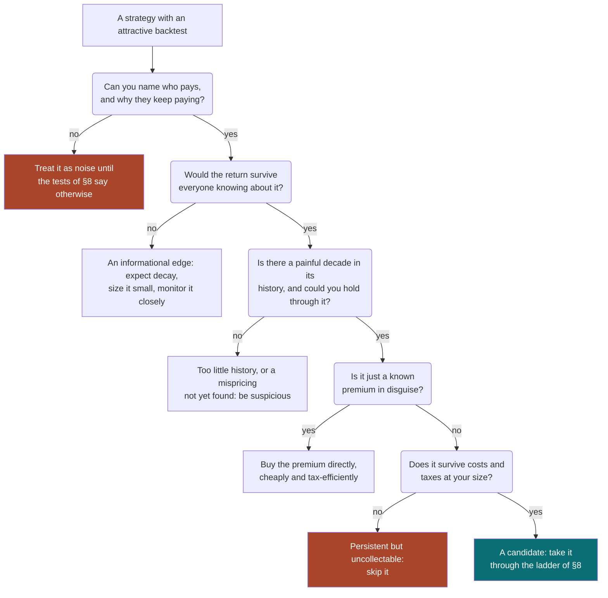
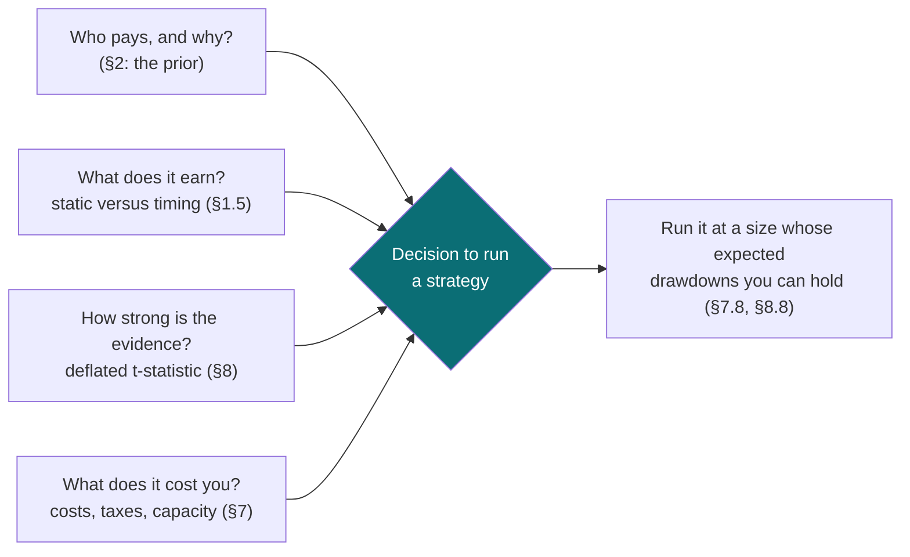
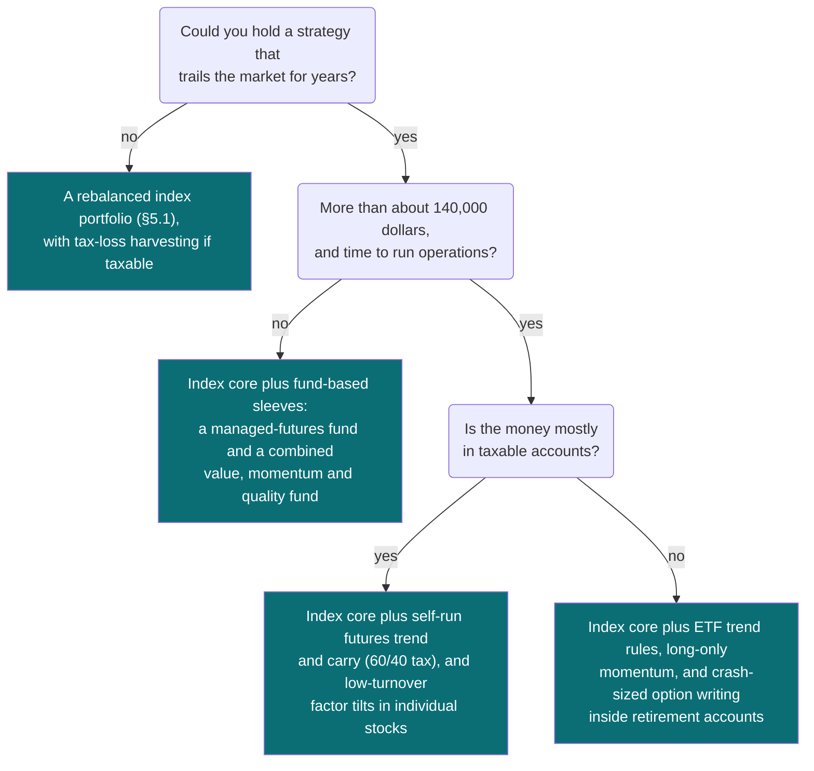

# Systematic Trading Strategies

### Where durable returns come from, how an individual can run them, and how to tell an edge from a lucky backtest

---

```{=html}
<aside class="eli5">
```

# ELI5 — the short version {#eli5}

```{=latex}
\begin{eli5}
```

**In one sentence.** A systematic strategy is a rule, written down in advance,
for what to own; the only rules that keep making money after everyone knows
about them are the ones being paid to put up with something unpleasant, so the
real work is choosing which discomfort to be paid for — and not being fooled by
a backtest.

**1. The rule is not where the money comes from** ([§1](#1-what-a-systematic-strategy-is)).
Any strategy's return splits into two parts: what you would earn by simply
holding its average position all the time, and what it earns by moving in and
out at the right moments. The first part is usually most of it, and it can be
bought cheaply. A famous rule — own the US stock market only while it is above
its average price of the last ten months — earned about six-sevenths of its
99-year return just by being invested three-quarters of the time. Its genuine
timing skill was too small to prove in a century. What it did reliably was cut
the worst crash in half.

**2. Every lasting return has somebody paying it** ([§2](#2-where-returns-come-from)).
Before costs, trading is a zero-sum game against the market: every dollar of
outperformance is someone else's shortfall. So the useful question about any
strategy is who is on the other side, and why they keep accepting the worse
deal. Returns paid by people buying protection against crashes, by institutions
whose rules force them to trade, or by investors repeating the same mistakes
tend to last. Returns that come from merely noticing something first get
competed away. Published stock-market patterns lost about 58% of their returns
after publication, and the price jump when a stock joins the S&P 500 shrank
from over 7% to under 1%.

**3. The returns that last have to hurt** ([§2](#2-where-returns-come-from)).
If an extra return came without pain, money would pour in until it vanished. A
strategy of buying cheap US stocks fell below its previous high in 2007 and had
still not recovered by the end of 2025. Buying recent winners spent 24 years
below its 1932 peak. A backtest with no terrible decade in it is a warning
sign, not a comfort.

**4. What tends to survive, and what does not** ([§5](#5-the-strategy-families)).
The survivors: a rebalanced mix of broad markets, which is the benchmark to
beat; following trends across many markets, which behaves like insurance that
pays off in long crises; buying cheap assets and recent winners together,
because they fail at different times; favouring the extra yield of some assets
over others; preferring calmer stocks; and selling insurance with options,
which pays steadily and occasionally loses years of income in weeks. What is
mostly gone: calendar and news-reaction tricks.

**5. An individual's edge is patience and efficiency, not prediction** ([§2](#2-where-returns-come-from), [§7](#7-running-a-strategy-as-an-individual)).
Professionals are judged against benchmarks, can lose their jobs after a bad
year, and face clients who pull money out at the bottom. An individual faces
none of that, which is exactly what holding the uncomfortable strategies
requires. The catch is that most individuals do not hold them: investors'
actual returns trail the funds they own by one to several points a year,
because they buy after gains and sell after losses.

**6. Taxes and costs can matter more than the idea** ([§7](#7-running-a-strategy-as-an-individual)).
The same strategy earning 8 percent a year before tax compounds at anywhere
from 4.7 to 8 percent after tax, depending on the account and how often it
sells. Harvesting losses for tax purposes was worth about a point a year. A
properly spread futures strategy needs roughly 140,000 dollars even with the
smallest contracts; below that, funds do the job better.

**7. Backtests flatter, in predictable ways** ([§8](#8-evaluation)).
Try a hundred versions of a rule with no real skill on ten years of data, and
the best will look better than the stock market's century-long record. Real
skill takes decades to prove: a good strategy needs about thirty years of
history before you have a four-in-five chance of confirming it. Expect a
backtest's performance to roughly halve in real trading. A study of 888
algorithms written on one retail platform found that backtests predicted almost
nothing about how they later did.

**8. A strategy that works feels broken much of the time** ([§8](#8-evaluation)).
A genuinely good strategy loses money about one year in three, and one time in
ten spends about seven years below its previous high. An alarm tuned not to
cry wolf too often takes five or six years to notice that such a strategy has
really died. So decide in advance what losses you expect and what would make
you stop — and stop for broken processes or a vanished reason, not for losses
alone.

---

**If you do only three things:** name who pays before you test anything; hold
a few durable, uncomfortable strategies that fail at different times, in
tax-sensible accounts; and plan on half your backtest's performance, with stop
rules written down before you start.

```{=latex}
\end{eli5}
```

```{=html}
</aside>
```

---

**What this is.** A systematic trading strategy is a rule, fixed in advance,
that turns data into positions. This document explains where such rules get
their returns, which of those returns survive being widely known, how an
individual can actually run one from a retail brokerage account, and how to
evaluate one honestly. It is written for a technically strong reader who
intends to build something, so it prefers mechanisms to recipes and failure
modes to feature lists.

**How to read it.** Four questions motivated it, and they map onto sections:

| Question | Where it is answered |
|---|---|
| What are systematic strategies? | §1, which defines them and gives the identity that splits any strategy's return into parts; §6, which organises them |
| Which ones don't get traded away? | §2, on the economics of why a return persists; §5, which judges nine strategy families on durability |
| How do individual investors run them? | §7 |
| How should they be evaluated? | §8 |

§3 (history) and §4 (the annotated bibliography) are reference, and §9
synthesises. If you read three things, read §1.5–§1.6, all of §2, and §8.3. If
you are about to build, read §7 and §8 in full and use §5 as reference.

**Relationship to the other notes.** This is the umbrella over several deeper
notes. [Momentum in Financial Markets](momentum_deep_dive.html) and
[Trend-Following in Financial Markets](trend_following.html) treat two of the
strategy families of §5 in depth.
[Portfolio Construction and the Covariance Matrix](portfolio_construction.html)
is the detail behind sizing and combining strategies (§7.8), and
[Foundations of Econometrics](econometrics_foundations.html) behind the
statistics of §8. [Implied Volatility](implied_volatility.html) and
[Dealer Hedging and Gamma Exposure](dealer_hedging.html) are the background to
volatility selling (§5.7), and
[Market Regimes and Machine Learning](market_regimes.html) to regime filters
and purged cross-validation. Each stands alone; this one tells you which of
them you need.

**A warning about scope.** [Practice] Nothing here is investment advice. The
retail implementation details — taxes, margin rules, account types — are for
the United States as of September 2026; they change, and other jurisdictions
differ materially. Numbers labelled *my calculation* come either from the
Kenneth French data library or from simulations, with the generators in
`figures/`; they illustrate mechanisms and are not recommendations of anything
tradeable. Where a source has a commercial interest in its own conclusion, I
say so.

**Epistemic tags.** Claims are flagged by status:

- **[Fact]** — replicated across independent datasets or implementations, with
  broad agreement among people who have looked.
- **[Contested]** — documented, but with live disagreement about magnitude,
  robustness, or cause.
- **[Hypothesis]** — a proposed mechanism, not decisively tested.
- **[Practice]** — practitioner convention. May well be right; the evidence is
  private or absent.

Untagged sentences are definitions, derivations, or arithmetic — true by
construction rather than by evidence.

---

**Notation.** Time $t$ indexes decision dates, and a return indexed $t+1$ is
earned over the following period $(t, t+1]$. There are $N$ assets, indexed by
$i$. $r_{i,t+1}$ is asset $i$'s **excess return** — its return minus the cash
(T-bill) rate — so a strategy that holds nothing earns zero excess return.

$w_{i,t}$ is the position in asset $i$ chosen at $t$, as a fraction of capital:
positive for long, negative for short, and $\sum_i |w_{i,t}| > 1$ means leverage.
For a single asset the subscript $i$ is dropped. $\mathcal{I}_t$ is the
information available at $t$, and a strategy is a rule $w_t = f(\mathcal{I}_t;
\theta)$ with parameters $\theta$ fixed in advance. $\pi_{t+1}$ is the
strategy's excess return after costs, and $c_{t+1}$ the trading cost as a
fraction of capital. In the decomposition of §1.5, $\nu$ is the **static**
(passive) component of expected return and $\delta$ the **timing** (active)
component.

$\mu$ is an expected excess return, $\sigma$ a volatility and $\rho$ a
correlation, all annualised unless stated. $\mathrm{SR} = \mu/\sigma$ is the
annualised Sharpe ratio and $\widehat{\mathrm{SR}}$ its estimate from data. A
backtest lasts $T$ years and contains $n$ observations, $q$ per year ($q = 12$
for monthly data, about 252 for daily). $M$ is the number of strategy variants
tried before one is chosen. $\gamma_3$ and $\gamma_4$ are skewness and
kurtosis ($\gamma_4 = 3$ for a normal distribution). $\Phi$ is the standard
normal distribution function and $\Phi^{-1}$ its inverse.

In §1.7, $\mathrm{IC}$ is the information coefficient, $\mathrm{BR}$ breadth,
$\mathrm{TC}$ the transfer coefficient and $\mathrm{IR}$ the information ratio.
In §7, $\kappa$ is a one-way trading cost per unit traded, $u$ annual one-way
turnover as a multiple of capital, $\tau$ a tax rate, and $\sigma^\star$ a
volatility target, and $g$ (in §5.1, §7.8 and the appendix) a compound growth
rate. Percentages written as $\%$ inside formulas are per year unless stated.

---

## Table of contents

- [ELI5 — the short version](#eli5)

1. [What a systematic strategy is](#1-what-a-systematic-strategy-is)
2. [Where returns come from, and why some survive being known](#2-where-returns-come-from)
3. [How the field evolved](#3-how-the-field-evolved)
4. [Foundational references](#4-foundational-references)
5. [The strategy families](#5-the-strategy-families)
6. [Taxonomy and equivalences](#6-taxonomy-and-equivalences)
7. [Running a strategy as an individual](#7-running-a-strategy-as-an-individual)
8. [Evaluation](#8-evaluation)
9. [Synthesis](#9-synthesis)

- [A. Concepts and prerequisites](#appendix-a-concepts-and-prerequisites) — every
  idea the main text leans on without fully explaining, built from first
  principles and ordered by dependency.

---

# 1. What a systematic strategy is {#1-what-a-systematic-strategy-is}

## 1.1 The wrong intuition

Most people meet systematic trading as a search problem. Somewhere in the
history of prices there are patterns that predict what comes next; a good
enough search finds them; and a strategy is a pattern plus the discipline to
trade it. On this view the work is mining, the tool is the backtest, and a
better search makes a better strategy.

Each part of that picture misleads, and much of this document is an account of
why.

- **Search finds noise before it finds signal.** Try a hundred variants of a
  rule that has no skill at all on ten years of data, and the best of them will
  show a Sharpe ratio of about 0.8 — nearly double the 0.45 the US stock market
  earned over the last century. §8.3 derives this; the number is from my
  calculation.
- **Patterns that are merely predictable get competed away.** If a rule earns
  money without risk, cost or discomfort, other people find it and trade it
  until it stops. [Fact] The typical published anomaly in US stock returns lost
  about 58% of its return after publication ([McLean & Pontiff, 2016](https://papers.ssrn.com/sol3/papers.cfm?abstract_id=2080900){target="_blank"}; §2.3).
- **Most of what a durable strategy earns is not prediction at all.** It is
  payment for holding something other people would rather not hold — risk,
  illiquidity, crash exposure, an unpopular position — and the rule is a
  disciplined way of holding it. §1.6 shows that for one of the best-known
  retail timing rules, about six-sevenths of its 99-year return came from being
  invested rather than from timing.

The right picture is this: **a systematic strategy is a fixed rule for deciding
what to hold, and its long-run return is whatever the market pays for holding
that, minus what it costs to trade.** The rule is a delivery mechanism. The
return comes from somewhere else, and the question that matters — the question
§2 is built around — is where.

## 1.2 Definition, and the anatomy of a strategy

Formally, a systematic strategy is a function, fixed in advance, from the
information available at time $t$ to positions:

$$
w_t = f(\mathcal{I}_t;\ \theta).
$$

Here $w_t$ is the vector of positions held from $t$ to $t+1$, $\mathcal{I}_t$
is everything knowable at $t$ — prices, volumes, company accounts, futures
curves, option prices, the calendar — and $\theta$ collects the parameters
(look-back lengths, thresholds, a volatility target) chosen before the rule is
run. The strategy's excess return over the next period is

$$
\pi_{t+1} = \sum_{i=1}^{N} w_{i,t}\, r_{i,t+1} \;-\; c_{t+1},
$$

where $c_{t+1}$ is the cost of the trades that moved the book from $w_{t-1}$
to $w_t$, charged to the period they fund.

The one property that makes a strategy *systematic* is that $f$ is fixed before
the data it acts on arrive, so the same inputs always produce the same
positions. That property, and only that one, is what makes a strategy testable:
it lets you ask what the rule *would have done* in the past without hindsight
leaking into the answer. It is also what makes it dangerous, because a rule can
be re-fixed after every look at the past, and a rule re-fixed a hundred times
is no longer being tested (§8.3).

In practice $f$ breaks into five stages. Naming them helps, because each has its
own characteristic way of failing:

| Stage | Question it answers | Typical choices | Where it goes wrong |
|---|---|---|---|
| Universe | What may I hold? | S&P 500 stocks; 20 liquid futures; 8 ETFs | Testing on today's survivors |
| Signal | What do I believe about each asset? | Past return; valuation ratio; futures basis; implied minus realised volatility | Overfitting; look-ahead in the data |
| Sizing | How much of each? | Equal weight; inverse volatility; an optimiser; a volatility target | Estimation error; hidden leverage |
| Execution | How do I get there? | Market-on-close orders; limit orders; rebalancing bands | Costs; fills that never happen |
| Overlay | What stops a blow-up? | Exposure caps; drawdown rules; a kill switch | Rules never tested, or that cut risk at the bottom |

Most of the published argument in this field is about the second row. Most of
the money lost by people running strategies is lost in the other four.

## 1.3 What systematic is not

The word is used loosely, and several neighbouring terms get folded into it.
Keeping them apart prevents a surprising number of confused decisions:

| Term | What it is | What it is not |
|---|---|---|
| Systematic | A rule fixed in advance, reproducible from the same data | Automated. A quarterly rebalance done by hand from a spreadsheet is fully systematic |
| Systematic | A property of the decision process | A level of sophistication. A 10-month moving average is as systematic as a neural network |
| Passive investing | Holding market weights, the one strategy that needs no forecast | The opposite of systematic. It is a systematic strategy whose rule is "hold the index" |
| Algorithmic execution | A rule for *how* to fill an order (VWAP, TWAP) | A rule for *what* to hold |
| High-frequency trading | A systematic subset at sub-second horizons, earning spreads and speed | Something an individual can compete in. It is out of scope here |
| Technical analysis | A family of price-based signals | Necessarily systematic. Chart reading is discretionary |
| Machine learning | One way to estimate $f$ | A source of return. It finds whatever the data contain, including noise |
| A backtest | A measurement of what a rule would have done, under stated assumptions | Evidence that the rule will work (§8) |

## 1.4 Why be systematic at all?

Four benefits are real:

1. **Testability.** You can measure the past behaviour of a rule. You cannot
   measure the past behaviour of your judgment, which you remember
   selectively. This is also the main hazard, because testability invites
   over-testing (§8.3).
2. **Consistency at the moment of decision.** A rule does not panic, get bored,
   or anchor on its purchase price. [Fact] The documented losses of individual
   investors come mostly from decisions made in the moment: trading too much
   ([Barber & Odean, 2000](https://papers.ssrn.com/sol3/papers.cfm?abstract_id=219228){target="_blank"}), paying for immediacy with aggressive orders
   ([Barber, Lee, Liu & Odean, 2009](https://faculty.haas.berkeley.edu/odean/papers%20current%20versions/justhowmuchdoindividualinvestorslose_rfs_2009.pdf){target="_blank"}), and buying after rises and selling after
   falls ([Dichev, 2007](https://papers.ssrn.com/sol3/papers.cfm?abstract_id=544142){target="_blank"}). A rule removes those errors at the point of execution.
   It does not remove the larger one, abandoning the rule after a drawdown
   (§7.9).
3. **Breadth.** A rule that takes ten minutes to apply to one asset takes about
   as long to apply to a thousand, and §1.7 shows that breadth is where most of
   the value of any forecasting skill lives.
4. **Auditability.** When a systematic strategy loses money, you can ask
   whether it did what it was designed to do. That is the question that
   separates bad luck from bad design, and discretion rarely lets you answer
   it.

Four costs are real too: **rigidity** (a rule cannot know that this time
something structural changed); **model risk** (a rule encodes assumptions its
author may not know they made); **crowding** (rules published in papers are run
by many people at once — in the August 2007 "quant quake", many equity
market-neutral funds lost heavily in a few days as crowded positions were
unwound together ([Khandani & Lo, 2011](https://www.nber.org/papers/w14465){target="_blank"})); and **false confidence**, because a
backtest looks like knowledge.

How do the two approaches compare in practice? [Contested]
[Harvey, Rattray, Sinclair & Van Hemert (2017)](https://people.duke.edu/~charvey/Research/Published_Papers/P130_Man_vs_machine.pdf){target="_blank"} compare hedge funds that describe
themselves as systematic or discretionary and find broadly similar
performance once exposure to well-known factors is adjusted for; the authors
work for a systematic manager. [Frazzini, Kabiller & Pedersen (2018)](https://www.nber.org/papers/w19681){target="_blank"} show that
much of Warren Buffett's record can be reproduced by a leveraged, rules-based
portfolio of cheap, safe, high-quality stocks — again from authors at a
systematic firm. The defensible conclusion is not that rules beat judgment. It
is that rules can express much of what good judgment does, and unlike judgment
they can be tested.

## 1.5 The master decomposition

Take the expectation of $\pi_{t+1}$ and use the identity
$\operatorname{E}[XY] = \operatorname{E}[X]\operatorname{E}[Y] +
\operatorname{Cov}(X, Y)$ on each term:

$$
\operatorname{E}[\pi_{t+1}]
= \underbrace{\sum_{i=1}^{N} \operatorname{E}[w_{i,t}]\,\operatorname{E}[r_{i,t+1}]}_{\nu\ \text{(static)}}
\;+\; \underbrace{\sum_{i=1}^{N} \operatorname{Cov}(w_{i,t},\, r_{i,t+1})}_{\delta\ \text{(timing)}}
\;-\; \operatorname{E}[c_{t+1}].
$$

This is an identity, not a model: it holds for every strategy, with no
assumptions about how prices behave. [Lo (2008)](https://web.mit.edu/Alo/www/Papers/active_pub.pdf){target="_blank"} introduced it to ask where
active managers' returns come from, and it is the first of the three ideas this
document is built on.

- $\nu$, the **static** or passive component, is what you would earn by holding
  your strategy's *average* portfolio permanently. It requires no forecasting at
  all, only a willingness to hold the average position, and it can usually be
  bought for the cost of a buy-and-hold portfolio.
- $\delta$, the **timing** or active component, measures whether the rule holds
  more of an asset just before that asset does well. It is the only part of the
  return that requires predicting anything.
- The **cost** term is driven by turnover, and it is the only term you know the
  sign of in advance.

Lo calls $\delta/(\nu + \delta)$ the *active ratio*. Three consequences make
the decomposition worth computing for every strategy you consider:

1. **It tells you what you are being paid for.** A strategy whose return is
   mostly $\nu$ is a premium-harvesting strategy wearing an active costume, and
   you can usually buy most of it more cheaply and with less tax (§7.2). A
   strategy whose return is mostly $\delta$ is a forecasting strategy, and it
   needs the statistical scrutiny of §8, because $\delta$ is the component that
   noise can fake.
2. **Timing can be negative inside a profitable strategy.** Many active
   strategies earn a static premium and lose a little through their timing.
   [Israelov & Nielsen (2015)](https://papers.ssrn.com/sol3/papers.cfm?abstract_id=2444999){target="_blank"} show that the covered call is exactly this:
   an equity premium plus a volatility premium, both static, less an equity
   timing component that is negative, because the position's equity exposure
   falls as the market rises (§5.7).
3. **Timing is hard to measure.** $\delta$ is a covariance between a slowly
   moving position and a noisy return, and its $t$-statistic grows only with
   the square root of the sample length. §1.6 is an example in which 99 years
   are not enough.

Two refinements matter in practice. First, the split is per asset, so in a
cross-sectional strategy "timing" includes rotation between assets: a stock that
enters a momentum portfolio after rising contributes to $\delta$, while a
permanent tilt toward small companies contributes to $\nu$. The useful reading
is *persistent tilt* versus *time-varying bet*, which is also the split that
decides turnover and therefore cost. Second, the identity decomposes the
**mean**. A rule that holds less when volatility is high can raise the Sharpe
ratio and shrink drawdowns without timing the mean at all — it times the
*second* moment. That effect is behind volatility-managed portfolios
([Moreira & Muir, 2017](https://www.nber.org/papers/w22208){target="_blank"}) and much of why trend rules cut drawdowns (§5.2), and it
appears in the risk numbers rather than in $\delta$.

## 1.6 A worked instance: the 10-month moving average

[Faber (2007)](https://papers.ssrn.com/sol3/papers.cfm?abstract_id=1941995){target="_blank"} popularised a rule that many individuals still run: hold the stock
market when its price is above its 10-month moving average, and hold cash
otherwise. Here it is applied to the US market and split with §1.5's identity.
The data are the Kenneth French library's monthly total returns; the signal is
computed at each month-end on the total-return index and held for the following
month; cash earns the T-bill rate; there are no costs. This is my calculation,
and the generator is `figures/st_factor_history.py`.

What the rule earned, split into its static and timing parts:

| Period | Time invested | Rule's excess return | Static $\nu$ | Timing $\delta$ | $t$ of timing |
|---|---|---|---|---|---|
| 1927–2025 | 73% | 6.90% | 5.94% | 0.96% | 1.2 |
| 1927–1962 | 68% | 8.04% | 6.71% | 1.33% | 0.7 |
| 1963–1999 | 76% | 5.59% | 5.44% | 0.15% | 0.1 |
| 2000–2025 | 74% | 7.21% | 5.44% | 1.76% | 1.3 |
| 1927–2025 without Jul 1929–Jun 1932 | 75% | 7.25% | 7.48% | −0.23% | −0.3 |

And what it did to risk, for the market and then for the rule:

| Period | Sharpe ratio, market → rule | Worst drawdown, market → rule |
|---|---|---|
| 1927–2025 | 0.44 → 0.55 | −84% → −43% |
| 1927–1962 | 0.43 → 0.56 | −84% → −43% |
| 1963–1999 | 0.47 → 0.46 | −47% → −24% |
| 2000–2025 | 0.47 → 0.70 | −50% → −18% |

Returns are annualised excess returns over T-bills. Drawdowns are measured on
total-return wealth. The $t$-statistic is that of the slope in a regression of
next month's market excess return on the rule's position. The sample starts in
May 1927, once the moving average has ten months of history, which is why the
market's Sharpe ratio here is 0.44 rather than the 0.45 of §2.6.

Five things can be read off this table, and each generalises:

1. **Most of the return is simply being invested.** The rule held the market
   73% of the time, and holding 73% of the market permanently would have earned
   5.94 of its 6.90 points a year. About six-sevenths of the headline return
   needed no timing skill at all.
2. **The timing component is not established in 99 years.** It is
   0.96 points a year with a $t$-statistic of 1.2. Over the same period the
   market premium itself has a $t$-statistic of 4.5.
3. **What timing there is lives in a handful of episodes.** Remove the three
   years from July 1929 and the timing component turns slightly negative. It
   was essentially zero from 1963 to 1999, and after 2000 it came from two bear
   markets, 2000–02 and 2008.
4. **What the rule did robustly was change the shape of the distribution.** The
   worst drawdown roughly halved in every period. The Sharpe ratio rose in
   1927–1962 and 2000–2025 and was flat in 1963–1999, where whipsaw losses in
   the rest of those decades used up what the rule saved in the 1973–74 bear
   market. Most of the improvement came from being out of the market while
   volatility was high — timing of the second moment, not prediction of the
   first.
5. **Trading costs are trivial here; taxes are not.** About 1.5 switches a year
   cost almost nothing at retail spreads, but every exit realises accumulated
   gains, often short-term ones in a US taxable account (§7.2).

Does the rule "work"? That depends on what you bought it for. As a device for
forecasting returns, the evidence is weak. As a rule that reliably cuts
exposure during prolonged bear markets, at the price of small, repeated
whipsaw losses in bull markets, it has done what it claims for a century. That
is the profile of insurance, and it is why trend-following appears in §5.2 as a
durable strategy rather than as an anomaly. Knowing which of the two you bought
is the difference between holding it through 1963–1999 and abandoning it in
year three.

## 1.7 Skill, breadth, and why diversified rules win

How much is a forecasting skill worth? [Grinold's (1989)](https://doi.org/10.3905/jpm.1989.409211){target="_blank"} *fundamental law of
active management* answers with an approximation:

$$
\mathrm{IR} \;\approx\; \mathrm{TC} \times \mathrm{IC} \times \sqrt{\mathrm{BR}}.
$$

The **information ratio** $\mathrm{IR}$ is the Sharpe ratio of the active bets.
The **information coefficient** $\mathrm{IC}$ is the correlation between your
forecasts and the returns that follow. **Breadth** $\mathrm{BR}$ is the number
of *independent* bets per year. The **transfer coefficient** $\mathrm{TC}$,
added by [Clarke, de Silva & Thorley (2002)](https://papers.ssrn.com/sol3/papers.cfm?abstract_id=290916){target="_blank"}, is the correlation between the
positions your forecasts call for and the positions you actually hold, which
constraints such as long-only or position limits push below one.

Some numbers recalibrate intuition:

- **Skill is small.** An IC of 0.05 means the forecast gets the direction right
  51.6% of the time. (For jointly normal variables with correlation $\rho$, the
  probability that they share a sign is $\tfrac12 + \arcsin(\rho)/\pi$.)
  [Practice] Useful signals commonly have ICs between about 0.02 and 0.10.
- **One asset wastes it.** Timing a single index once a month, with no
  constraints on expressing the forecast ($\mathrm{TC} = 1$), gives
  $\mathrm{BR} = 12$ and $\mathrm{IR} = 0.05\sqrt{12} = 0.17$ — a Sharpe ratio
  too small to confirm in a lifetime (§8.2), from a signal most people would
  consider good.
- **Breadth multiplies it.** The same IC applied monthly across 50 independent
  futures markets gives $\mathrm{BR} = 600$ and $\mathrm{IR} = 1.2$. That
  arithmetic, not a better signal, is why professional trend-followers trade 50
  to 150 markets.
- **Breadth is rarely what it seems.** Across 500 stocks monthly the formula
  gives $\mathrm{BR} = 6000$ and $\mathrm{IR} = 3.9$, which no one achieves.
  Stocks share common factors, so the effective number of independent bets is
  far smaller; constraints drag TC down; and turnover costs grow with the
  number of bets.

For an individual, the cheapest improvement available is almost never a cleverer
signal. It is more independent bets — more assets, and more strategies that do
not move together. §7.8 quantifies the second.

> ### §1 Key takeaways
>
> 1. A systematic strategy is a rule fixed in advance. That property, not
>    automation or sophistication, is what makes it testable — and what makes
>    over-testing possible.
> 2. The rule is a delivery mechanism. The return comes from what the rule
>    holds, so the first question about any strategy is what it is being paid
>    for.
> 3. Every strategy's expected return splits exactly into a static part
>    (average holdings times average returns), a timing part (the covariance of
>    positions with subsequent returns), and cost.
> 4. The static part can usually be bought cheaply. Only the timing part needs
>    forecasting skill, and it is the part that noise fakes most easily.
> 5. On US stocks from 1927 to 2025, a 10-month moving-average rule earned about
>    six-sevenths of its return by being invested; its timing had a
>    $t$-statistic of 1.2, yet it halved the worst drawdown in every period.
> 6. A rule can time risk as well as return. The first shows up in the Sharpe
>    ratio and the drawdown, not in the mean decomposition.
> 7. The value of skill scales with the square root of the number of
>    independent bets. Diversify across assets and strategies before refining
>    a signal.

# 2. Where returns come from, and why some survive being known {#2-where-returns-come-from}

This section develops the second of the document's three ideas: **every
durable return is a payment for something.** If you can say what is being paid
for, and who pays, you can say whether the return will survive being widely
known. If you cannot, the history of the field says to assume it will not.

## 2.1 The arithmetic nobody escapes

[Sharpe (1991)](https://web.stanford.edu/~wfsharpe/art/active/active.htm){target="_blank"} made the starting point unanswerable. The market portfolio's
return is the value-weighted average of the returns of everyone who holds
stocks. So, before costs, the average actively managed dollar earns exactly the
market return, and after costs it earns less. Every strategy that beats the
market is matched, dollar for dollar, by positions that trail it.

That turns the question "which strategies don't get traded away?" into a more
useful one: **who is on the other side, and why do they keep being there?** A
strategy's excess return is somebody else's shortfall, and it persists only as
long as that somebody keeps accepting it.

Economics has a precise answer for when they will. [Grossman & Stiglitz (1980)](https://www.aeaweb.org/aer/top20/70.3.393-408.pdf){target="_blank"}
showed that prices cannot be perfectly efficient: if they reflected all
information, nobody would pay to gather it, and then prices could not reflect
it. In equilibrium, the people who do the work of making prices more accurate
earn just enough to cover the cost of doing it. [Pedersen (2015)](https://press.princeton.edu/books/hardcover/9780691166193/efficiently-inefficient){target="_blank"} calls the result
*efficiently inefficient* markets — inefficient enough that active investors are
compensated for their costs and risks, efficient enough that the marginal one
earns nothing extra.

For an individual this has a sharp implication. **A durable excess return is
compensation for a cost you bear**: risk, illiquidity, a constraint others face
and you don't, discomfort, effort. The question is never only "is there a
return here?" but "do I bear the cost behind it more cheaply than the next
person who wants it?"

## 2.2 Four sources, ordered by how long they last

Sort the returns a systematic strategy can earn by who pays them, and four
sources emerge. They differ in exactly the dimension that matters here —
whether publicity destroys them:

| Source | Who is on the other side | Why they stay there | What kills it | Signature in the returns |
|---|---|---|---|---|
| **A. Risk premium** | Investors shedding risk they cannot or will not bear | The risk is real, and aversion to losing money in bad times is stable | A change in risk appetite or in the risk itself; *not* knowledge, because the premium cannot be collected without bearing the risk | Losses concentrated in crashes, recessions and liquidity crises; negative skew |
| **B. Structural premium** | Agents trading for reasons other than expected return: hedgers, index funds, leverage-constrained or benchmarked institutions, tax-motivated sellers, anyone who needs to trade *now* | Mandates, regulation, tax law and hedging needs change slowly | The constraint loosening, or arbitrage capital growing large enough to absorb the flow | Returns tied to identifiable flows or dates; limited capacity |
| **C. Behavioural premium** | Investors making systematic errors: under-reacting to news, extrapolating growth, overpaying for lottery-like payoffs | The errors are human, and exploiting them is risky and uncomfortable, so arbitrage is limited ([Shleifer & Vishny, 1997](https://www.nber.org/papers/w5167){target="_blank"}) | Partly publication and cheap implementation; what survives is what is too painful or costly to arbitrage | Long drawdowns, crashes, large tracking error against benchmarks |
| **D. Informational or mechanical inefficiency** | Nobody in particular: slow diffusion of public information, or a mechanical pattern | It lasts only while it is unknown or awkward to trade | Being found. Once it is cheap and safe to trade, capital closes it | High Sharpe ratio, little risk, decay after publication |

Examples make the categories concrete. The equity premium, the term premium,
the variance risk premium and much of carry are risk premia (A). Futures roll
yield driven by producers' hedging, the low-beta anomaly attributed to leverage
constraints, index reconstitution, and short-term reversal as payment for
supplying liquidity are structural (B). Momentum, and on one reading value, are
behavioural (C). The S&P 500 inclusion effect, the pre-FOMC drift and
post-earnings drift in large stocks were informational or mechanical (D) — and,
as §2.3 and §5.9 show, they are largely gone.

The categories blur. [Contested] Value is claimed by risk-based explanations
([Fama & French, 1993](<https://doi.org/10.1016/0304-405x(93)90023-5>){target="_blank"}) and behavioural ones ([Lakonishok, Shleifer & Vishny,
1994](https://www.nber.org/papers/w4360){target="_blank"}); low beta by leverage constraints ([Frazzini & Pedersen, 2014](https://www.nber.org/papers/w16601){target="_blank"}) and by
benchmarking ([Baker, Bradley & Wurgler, 2011](https://doi.org/10.2469/faj.v67.n1.4){target="_blank"}). For persistence the label
matters less than one question: **does the return depend on the other side
continuing to do something costly for reasons that publicity does not change?**
Risk aversion, regulation and hedging needs pass that test; ignorance does not.

[Hypothesis] The ordering A, B, C, D by durability is my synthesis rather than
an established result, but it is what the decay evidence below would predict,
and it is how I would weight any strategy I was considering.

## 2.3 The evidence on decay

The best evidence on what happens to a return once it is known comes from
published stock-return anomalies, because their publication dates are known.

- [Fact] [McLean & Pontiff (2016)](https://papers.ssrn.com/sol3/papers.cfm?abstract_id=2080900){target="_blank"} study 97 predictors from academic journals.
  Their returns are 26% lower out of sample but before publication — the part
  attributable to statistical bias in the original studies — and 58% lower
  after publication, so roughly a third of the original return appears to be
  traded away by investors who learned of it. Declines are larger for
  predictors with higher in-sample returns and for those concentrated in
  liquid stocks that are cheap to arbitrage, and trading volume and short
  interest in the affected stocks rise after publication.
- [Fact] [Falck, Rej & Thesmar (2022)](https://arxiv.org/abs/2105.01380){target="_blank"} find that published anomalies evaluated
  outside their original samples deliver about half their in-sample
  performance. The decay grows with the year of publication — each year, newly
  published factors decay about five percentage points more — and with
  measures of overfitting such as the number of operations needed to compute
  the signal. The authors are at a quantitative fund.
- [Fact] [Chordia, Subrahmanyam & Tong (2014)](https://papers.ssrn.com/sol3/papers.cfm?abstract_id=2029057){target="_blank"} find anomaly returns attenuated in
  the era of decimal prices and cheap, fast trading, when arbitrage became
  cheaper.
- [Contested] [Linnainmaa & Roberts (2018)](https://www.nber.org/papers/w22894){target="_blank"} extend accounting-based anomalies back
  before 1963 and find most of them absent there, which is what data mining
  would produce.

A live debate concerns whether the original findings were ever real.
[Contested] [Hou, Xue & Zhang (2020)](https://www.nber.org/papers/w23394){target="_blank"} find that 65% of 452 anomalies fail a
conventional $|t| \ge 1.96$ hurdle once microcap stocks are controlled for with
NYSE size breakpoints and value weighting, and 82% fail the multiple-testing
hurdle of 2.78. [Chen & Zimmermann (2022)](https://papers.ssrn.com/sol3/papers.cfm?abstract_id=3604626){target="_blank"}, using the original papers' own
methods, reproduce 98% of the 161 predictors that were clearly significant in
the originals. [Jensen, Kelly & Pedersen (2023)](https://www.nber.org/papers/w28432){target="_blank"} find that most factors replicate,
that they cluster into 13 themes, and that they work out of sample across 93
countries.

These are less contradictory than they look, because they measure different
things. The original results are mostly real in the data as the authors
constructed it (Chen and Zimmermann). Many of them depend on small, illiquid
stocks and on equal weighting that a real portfolio cannot hold at scale (Hou,
Xue and Zhang). What survives out of sample is the broad theme rather than the
particular signal (Jensen, Kelly and Pedersen). For someone implementing a
strategy, the second bar is the relevant one and the third is the relevant unit
of analysis.

The broad cross-asset premia look more durable than narrow stock-level
anomalies. [Contested] [Baltussen, Swinkels & van Vliet (2021)](https://papers.ssrn.com/sol3/papers.cfm?abstract_id=3325720){target="_blank"} test 24 factor
premia across equity indices, bonds, commodities and currencies with data back
to 1800, and find most of them present out of sample with limited decay;
[Hurst, Ooi & Pedersen (2017)](https://papers.ssrn.com/sol3/papers.cfm?abstract_id=2993026){target="_blank"} find trend-following profitable in every decade
since 1880. The contest is over the 2010s, which were poor for several of these
premia at once.

The Kenneth French data allow a small version of the McLean–Pontiff exercise
for the three most famous US equity factors, splitting each at the end of the
year its best-known paper was published (my calculation):

| Factor | Paper | Before publication | After publication | Change |
|---|---|---|---|---|
| Size (SMB) | [Banz (1981)](<https://doi.org/10.1016/0304-405x(81)90018-0>){target="_blank"} | 3.59% a year, $t = 2.3$ (1927–1981) | 0.09%, $t = 0.1$ (1982–2025) | −97% |
| Value (HML) | [Fama & French (1992)](https://doi.org/10.2307/2329112){target="_blank"} | 5.27%, $t = 3.4$ (1927–1992) | 1.96%, $t = 1.0$ (1993–2025) | −63% |
| Momentum | [Jegadeesh & Titman (1993)](https://doi.org/10.1111/j.1540-6261.1993.tb04702.x){target="_blank"} | 8.84%, $t = 4.5$ (1927–1993) | 4.23%, $t = 1.4$ (1994–2025) | −52% |

Three caveats keep this honest. These are three factors chosen with hindsight,
precisely because they became famous, so they are survivors of a much larger
search. The "before" periods include decades the original studies never looked
at. And a $t$-statistic of 1.0 or 1.4 over thirty-odd years does not show that a
premium has gone — only that thirty years cannot tell (§8.2). What the table
does show is that the direction and size of the decline match the
cross-sectional evidence. Since 2000, the US value and momentum factors have
earned 2.4 and 2.1 points a year, with $t$-statistics of 1.0 and 0.6.

## 2.4 Persistent, but uncollectable

Some returns survive in the data precisely because they cannot be collected at
scale. That category matters, because it is where most claims of an individual
investor's edge live.

- **Skill is competed away at the fund level.** [Berk & Green (2004)](https://www.nber.org/papers/w9275){target="_blank"} show that
  even genuinely skilled managers deliver no excess return to their investors
  in equilibrium: money flows to managers with good records until diseconomies
  of scale erase the edge, and the manager captures what is left in fees.
- **Costs kill the fast anomalies.** [Fact] [Novy-Marx & Velikov (2016)](https://www.nber.org/papers/w20721){target="_blank"} find
  that anomalies with low turnover — value, profitability, size — mostly
  survive realistic transaction costs, while high-turnover ones mostly do not.
  Short-term reversal is the canonical casualty (§5.8).
- **Machine learning finds the illiquid corners.** [Avramov, Cheng & Metzker
  (2023)](https://papers.ssrn.com/sol3/papers.cfm?abstract_id=3450322){target="_blank"} find that the profits of machine-learning return predictors
  concentrate in microcaps and distressed, hard-to-arbitrage stocks, and weaken
  sharply once those are excluded or costs are charged.
- **Institutional costs are lower than academic proxies.** [Contested]
  [Frazzini, Israel & Moskowitz (2018)](https://papers.ssrn.com/sol3/papers.cfm?abstract_id=3229719){target="_blank"}, using 1.7 trillion dollars of live
  executions, find real trading costs an order of magnitude below academic
  estimates, which implies large capacity for the major factors. The authors'
  firm runs these strategies.

A small trader's market impact is negligible, so capacity limits that bind a
fund do not bind them. [Hypothesis] That is a real advantage in niches too
small for institutions. But it is partly offset by wider relative spreads in
exactly those niches, by borrowing constraints on the short side, and by fixed
costs that are large relative to a small account. The net effect is
strategy-specific, and §7 is mostly about computing it.

## 2.5 What an individual has that an institution does not

The comparison is less one-sided than either the "retail can't compete" or the
"retail is nimble" story suggests:

| Individual's advantage | Why it matters | Individual's disadvantage | Why it matters |
|---|---|---|---|
| Small size | No market impact; capacity-limited niches are open | Taxes | Pensions and endowments pay none; an individual's after-tax return can trail the pre-tax one by several points a year (§7.2) |
| Long horizon, no redemptions | Can hold through a multi-year drawdown without being forced to sell | Costs in some instruments | Option spreads, small-cap spreads, borrow fees and margin rates are all worse than institutional terms |
| No benchmark, no career risk | Can hold positions with large tracking error, which institutions avoid | Leverage and shorting limits | Margin rules, retirement-account restrictions, hard-to-borrow stocks |
| No mandate | Can combine asset classes, hold cash, use futures | Data and operations | Clean historical data costs money; one person is a single point of failure |
| Tax control | Can choose accounts, lots and the timing of realisations, and harvest losses | Behaviour | A documented tendency to abandon strategies after losses (§7.9) |

One pattern in this table is worth making explicit. **The institutional
constraints that create structural and behavioural premia — benchmarks,
leverage limits, career risk, redemption risk — are exactly the ones an
individual does not face.** So the natural edge for an individual is not a
better signal. It is a cheaper tolerance for discomfort: holding diversified,
well-documented, uncomfortable premia through their drawdowns, cheaply and
tax-efficiently. That most individuals demonstrably fail to do this (§7.9) is
precisely why it remains an edge for those who can.

```{=latex}
\newpage
```

## 2.6 Pain is the price

If a premium could be collected without pain, capital would flow in until it
was no longer a premium. So the strategies that survive must contain episodes
that make people quit. The pain is not a defect in these strategies; it is the
mechanism that keeps them from being arbitraged away. [Hypothesis] That is an
argument rather than a theorem, but the history of the best-known US factors is
consistent with it (my calculation, 1927–2025, long–short factors compounded as
fully collateralised positions):

| Factor | Excess return | Sharpe ratio | Worst drawdown |
|---|---|---|---|
| Market | 8.26% | 0.45 | −85% |
| Size (SMB) | 2.04% | 0.19 | −55% |
| Value (HML) | 4.17% | 0.34 | −58% |
| Momentum | 7.35% | 0.45 | −78% |
| Half value, half momentum | 5.76% | 0.73 | −41% |

| Factor | Longest below a previous peak | Worst 12 months | 10-year windows that lost money |
|---|---|---|---|
| Market | 15.6 years (1929–1945) | −66% | 14% |
| Size (SMB) | 42.4 years (1983–, not recovered) | −33% | 35% |
| Value (HML) | 19.0 years (2007–, not recovered) | −40% | 14% |
| Momentum | 24.4 years (1932–1956) | −76% | 21% |
| Half value, half momentum | 17.1 years (2008–, not recovered) | −32% | 12% |

```{=latex}
\newpage
\begin{center}
\includegraphics[width=\linewidth]{quant-research/figures/st_factor_history.pdf}
\end{center}
```

```{=html}
<style>
/* Figures for this document. Prefix "mdd-", shared with the other notes and
   distinct from the reading widget's "rdw-". Narrow viewports reclaim the
   body's side padding so the figure gets the full width. */
.mdd-fig {
  display: block; width: 100%; height: auto;
  max-width: 640px; margin: 1.6rem auto;
  /* the reading widget adds a light plate (padding) in dark mode */
  box-sizing: border-box;
}
@media (max-width: 760px) {
  .mdd-fig { width: calc(100% + 64px); max-width: none; margin-left: -32px; margin-right: -32px; }
}
@media (max-width: 600px) { /* pandoc's own stylesheet drops body padding to 12px here */
  .mdd-fig { width: calc(100% + 24px); margin-left: -12px; margin-right: -12px; }
}
</style>


```

A value investor who started in January 2007 was still below their high-water
mark, in excess-return terms, at the end of 2025. A momentum investor who
started in mid-1932 waited 24 years. These are the strategies that *work*. The
last row shows the most useful fact in the table: value and momentum are
negatively correlated ($\rho = -0.41$ here, a pattern [Asness, Moskowitz &
Pedersen (2013)](https://papers.ssrn.com/sol3/papers.cfm?abstract_id=2174501){target="_blank"} document across asset classes), so an even mix of the two had a
Sharpe ratio of 0.73 — far above either alone — and a shallower worst
drawdown. Yet even the mix has spent the seventeen years since 2008 below its
peak. Diversification changes the size of the pain much more reliably than it
changes its duration.

Two things follow for anyone choosing a strategy. First, a backtest with no
painful decade in it is not reassuring; it means either the sample is too short
to contain one, or the return is a mispricing that has not been found yet.
Second, the pain you must be able to bear is not the backtest's worst drawdown,
which is one draw from a distribution, but the distribution itself — §8.8
shows how wide it is even for a strategy that genuinely works.

## 2.7 The durability test

The section reduces to a short list of questions to put to any strategy before
testing it. They are ordered so that the cheapest to answer come first:

1. **Who is on the other side, and why do they accept a lower expected return?**
   If you cannot name them, the likeliest answers are "nobody — the backtest is
   noise" and "you".
2. **Would the return survive everyone knowing about it?** Risk premia do, by
   construction. Informational edges do not.
3. **What does its worst decade look like, and would you have held through
   it?** If the history contains no painful decade, be suspicious rather than
   pleased.
4. **Is it a known premium in disguise?** Split it into static and timing parts
   (§1.5) and regress it on known factors (§8.6). If it is mostly a premium you
   can buy directly, buy it directly.
5. **What does it cost to capture at your size, after tax?** Many persistent
   returns persist because they cannot be collected.
6. **How easy is it to copy?** A signal anyone can compute from free data in an
   afternoon, and that has been published, is the kind whose decay is fastest.

```{=latex}
\newpage
```

The first five questions work as gates, in order. The sixth does not decide
whether to proceed, only how quickly to expect decay, and therefore how much to
allocate. As a flow, with each gate an exit:



> ### §2 Key takeaways
>
> 1. Before costs, active management is a zero-sum game against the market
>    portfolio, so every durable excess return has a payer. Ask who pays, and
>    why they keep paying.
> 2. In equilibrium, a durable return compensates a cost someone bears: risk,
>    illiquidity, a constraint, discomfort or effort. Your edge is bearing that
>    cost more cheaply than the next person.
> 3. Risk premia and structural premia survive publicity; behavioural premia
>    partly survive it; informational edges do not. Weight strategies
>    accordingly.
> 4. The typical published US stock anomaly lost about 58% of its return after
>    publication, and roughly half of in-sample performance is lost out of
>    sample; the more complex the signal, the faster the decay.
> 5. Broad cross-asset themes — value, momentum, carry, defensive, trend — are
>    more durable than individual stock-level signals, many of which depend on
>    microcaps that cannot be traded at scale.
> 6. An individual's natural edge is not a better signal but a cheaper
>    tolerance for discomfort: no benchmark, no career risk, no redemptions.
> 7. Durable premia must hurt. Value spent 19 years below its peak after 2007,
>    momentum 24 years after 1932. A backtest with no painful decade should
>    worry you.
> 8. Value and momentum are negatively correlated; mixing them raised the
>    Sharpe ratio from 0.34–0.45 to 0.73, but even the mix has been below its
>    2008 peak since.

# 3. How the field evolved {#3-how-the-field-evolved}

The history is short, and it has one recurring shape: practitioners run rules,
academics test them, the tests find either nothing or a published anomaly, and
the anomaly then decays while the rules that encode risk premia survive. Six
eras, each with a one-line thesis.

**Rules before theory (1930s–1960s).** *Practitioners traded mechanical rules
long before anyone could test them.* Richard Donchian's moving-average and
channel-breakout rules date from this period, as does one of the first publicly
offered managed-futures funds (Futures, Inc., 1949). The academic response was
the random walk: filter rules that bought after a rise of a given percentage
earned less than buy-and-hold once commissions were paid ([Fama & Blume, 1966](https://doi.org/10.1086/294849){target="_blank"}).
*What lasted:* the rules themselves, which survive almost unchanged in
futures trend-following.

**Efficiency and its anomalies (1970–1990).** *The efficient-markets hypothesis
became the null, and the first systematic deviations from the CAPM were
catalogued.* [Fama (1970)](https://doi.org/10.2307/2325486){target="_blank"} framed efficiency as a testable proposition. The size
effect, the price–earnings effect, long-horizon reversal ([De Bondt & Thaler,
1985](https://doi.org/10.1111/j.1540-6261.1985.tb05004.x){target="_blank"}) and short-term reversal ([Jegadeesh, 1990](https://doi.org/10.1111/j.1540-6261.1990.tb05110.x){target="_blank"}; [Lehmann, 1990](https://www.nber.org/papers/w2533){target="_blank"}) followed. In
parallel, commodity trading advisers industrialised trend-following in futures,
and the 1983 "Turtle" experiment showed that a rules-based breakout system could
be taught to novices (Faith, 2007). *Limitation:* anomalies were found one at a
time, with no accounting for how many had been looked for.

**The factor era (1990–2007).** *Anomalies were organised into a few factors, and
systematic equity investing became an industry.* Fama & French ([1992](https://doi.org/10.2307/2329112){target="_blank"}, [1993](https://doi.org/10.1016/0304-405x(93)90023-5){target="_blank"})
reduced the cross-section to market, size and value; [Jegadeesh & Titman (1993)](https://doi.org/10.1111/j.1540-6261.1993.tb04702.x){target="_blank"}
added momentum; [Carhart (1997)](https://doi.org/10.1111/j.1540-6261.1997.tb03808.x){target="_blank"} made the four-factor model the standard
performance benchmark; [Grinold (1989)](https://doi.org/10.3905/jpm.1989.409211){target="_blank"} had already given active management its
fundamental law. [Brock, Lakonishok & LeBaron (1992)](https://doi.org/10.1111/j.1540-6261.1992.tb04681.x){target="_blank"} found that simple moving-
average rules had predictive power in a century of Dow Jones data, and [Sullivan,
Timmermann & White (1999)](https://papers.ssrn.com/sol3/papers.cfm?abstract_id=160330){target="_blank"} showed how much of that survived a correction for the
thousands of rules that could have been tried. [Lo & MacKinlay (1990b)](https://www.nber.org/papers/w3001){target="_blank"} had already
named the problem: data snooping. The collapse of Long-Term Capital Management in
1998 made [Shleifer & Vishny's (1997)](https://www.nber.org/papers/w5167){target="_blank"} limits of arbitrage vivid. *What changed:*
"alpha" became mostly "exposure to factors you had not accounted for."

**Crowding and crashes (2007–2012).** *Popular systematic strategies turned out
to share positions, and to fail together.* In August 2007 quantitative equity
funds suffered sudden, simultaneous losses as crowded positions were unwound
([Khandani & Lo, 2011](https://www.nber.org/papers/w14465){target="_blank"}). In 2009 momentum crashed when beaten-down stocks rebounded
violently ([Daniel & Moskowitz, 2016](https://www.nber.org/papers/w20439){target="_blank"}). Trend-followers, by contrast, profited in
2008, which cemented the idea of trend as "crisis alpha". [Moskowitz, Ooi &
Pedersen (2012)](https://papers.ssrn.com/sol3/papers.cfm?abstract_id=2089463){target="_blank"} formalised time-series momentum, and [Asness, Moskowitz & Pedersen
(2013)](https://papers.ssrn.com/sol3/papers.cfm?abstract_id=2174501){target="_blank"} showed value and momentum in every major asset class. *Lasting influence:*
the shift from single anomalies to diversified "style premia" across asset
classes.

**Democratisation and the replication reckoning (2011–2020).** *Tools reached
individuals just as the literature began to doubt its own results.* Platforms
such as Quantopian let thousands of individuals write and backtest algorithms,
and its own study of 888 of them found that backtest Sharpe ratios had almost no
power to predict live results ([Wiecki, Campbell, Lent & Stauth, 2016](https://papers.ssrn.com/sol3/papers.cfm?abstract_id=2745220){target="_blank"}); the
platform closed in 2020. [Bailey, Borwein, López de Prado & Zhu (2014)](https://papers.ssrn.com/sol3/papers.cfm?abstract_id=2308659){target="_blank"}, [Harvey,
Liu & Zhu (2016)](https://www.nber.org/papers/w20592){target="_blank"} and [McLean & Pontiff (2016)](https://papers.ssrn.com/sol3/papers.cfm?abstract_id=2080900){target="_blank"} quantified overfitting and decay,
and [Hou, Xue & Zhang (2020)](https://www.nber.org/papers/w23394){target="_blank"} found most anomalies fragile. Meanwhile value endured
its longest drawdown, trend-followers had a lean decade, and short-volatility
products imploded in a single day in February 2018 (Augustin, Cheng & Van den
Bergen, 2021). For individuals, costs collapsed: US online brokers cut stock
commissions to zero in October 2019, and exchange-listed micro futures made
diversified futures positions affordable in small accounts.

**Retail at scale (2020–).** *Individuals became a large, measurable, and
mostly losing part of short-horizon trading.* Retail participation in single
stocks and options surged; the January 2021 episode in GameStop and other
heavily shorted stocks made retail order flow a market force. Studies of the
retail options boom document large average losses ([Bryzgalova, Pavlova &
Sikorskaya, 2023](https://papers.ssrn.com/sol3/papers.cfm?abstract_id=4065019){target="_blank"}; [de Silva, Smith & So, 2026](https://papers.ssrn.com/sol3/papers.cfm?abstract_id=4050165){target="_blank"}), concentrated in same-day
expiries ([Beckmeyer, Branger & Gayda, 2023](https://papers.ssrn.com/sol3/papers.cfm?abstract_id=4404704){target="_blank"}). Machine learning entered asset
pricing ([Gu, Kelly & Xiu, 2020](https://www.nber.org/papers/w25398){target="_blank"}). Trend and value both had a strong 2022 as
interest rates rose. In June 2026 the US$25,000 pattern-day-trader minimum was
removed from FINRA's margin rule ([FINRA, 2026](https://www.finra.org/rules-guidance/notices/26-10){target="_blank"}). [Hypothesis] The newest change
is that AI coding assistants have cut the cost of building a research and
execution stack, which lowers one barrier to entry and, by the logic of §2.3,
speeds the decay of anything simple.

The milestones, in one table:

| Year | Milestone | What changed |
|---|---|---|
| 1949 | Donchian's managed-futures fund | Mechanical trend rules offered to outside investors |
| 1966 | Fama & Blume on filter rules | Simple timing rules shown not to beat buy-and-hold after costs |
| 1970 | Fama's efficient-markets review | Efficiency became the null hypothesis |
| 1981–1985 | Size effect; long-horizon reversal | The first durable-looking deviations from the CAPM |
| 1983 | The Turtle experiment | Trend-following shown to be teachable as a rule |
| 1989 | The fundamental law | Skill, breadth and implementation linked in one formula |
| 1990 | Lo & MacKinlay on data snooping | The multiple-testing problem named |
| 1992–1993 | Fama–French factors; momentum | Anomalies organised into factors |
| 1997–1998 | Limits of arbitrage; LTCM | Why mispricings can persist, and how arbitrageurs die |
| 2007 | The quant quake | Crowding risk in systematic equity made visible |
| 2008–2009 | Trend profits; momentum crash | Trend as crisis insurance; momentum's crash risk |
| 2012–2013 | Time-series momentum; "everywhere" | Style premia across asset classes |
| 2014–2016 | Backtest-overfitting and decay literature | Selection bias measured; the $t > 3$ hurdle |
| 2018 | Short-volatility products collapse | The left tail of volatility selling, in one day |
| 2019 | Zero commissions; micro futures | Retail trading costs and minimum sizes collapse |
| 2020 | Replication studies; ML asset pricing | Most anomalies fragile; broad themes survive |
| 2021–2023 | Meme stocks; same-day options | Retail as a force in short-horizon trading, mostly on the losing side |
| 2026 | Pattern-day-trader minimum removed | A regulatory barrier to active retail trading gone |

> ### §3 Key takeaways
>
> 1. Mechanical trading rules are older than the theory used to test them; the
>    rules that survived are mostly the ones that encode a risk premium.
> 2. Every generation of anomalies has been followed by a reckoning with how
>    many rules were tried; the multiple-testing problem was named in 1990 and
>    is still the field's central statistical issue.
> 3. The field moved from single anomalies to factors to diversified style
>    premia, each step trading headline returns for robustness.
> 4. Crowding is a risk factor of its own: the 2007 quant quake and the 2009
>    momentum crash hit precisely the most popular systematic strategies.
> 5. Tools and costs reached individuals just as the evidence on overfitting
>    matured; the platform that democratised retail backtesting also produced
>    the clearest evidence that its backtests predicted almost nothing.
> 6. Individuals are now a large part of short-horizon trading, and the
>    evidence says they lose there on average. Low-cost, low-turnover
>    premium harvesting is where the history points instead.

# 4. Foundational references {#4-foundational-references}

Grouped by kind, because the kinds are read differently. Each entry links to a
freely readable copy where one exists — an author's page, NBER, SSRN, arXiv —
and otherwise to the publisher, marked *paywalled*. Journal details were checked
against Crossref. Practitioner research from firms that run the strategies in
question is flagged where it matters, in the body text at the point of the
claim.

## 4.1 The economics of returns

- **Sharpe, W. F. (1991).** ["The Arithmetic of Active Management."](https://web.stanford.edu/~wfsharpe/art/active/active.htm)
  *Financial Analysts Journal* 47(1), 7–9. [[DOI]](https://doi.org/10.2469/faj.v47.n1.7)
  — Three pages proving that active management is zero-sum before costs. The
  starting point of §2.
- **Grossman, S. J. & Stiglitz, J. E. (1980).** ["On the Impossibility of Informationally Efficient Markets."](https://www.aeaweb.org/aer/top20/70.3.393-408.pdf)
  *American Economic Review* 70(3), 393–408. — Why prices cannot be perfectly
  efficient, and why the return to information equals its cost in equilibrium.
- **Cochrane, J. H. (2011).** ["Presidential Address: Discount Rates."](https://www.nber.org/papers/w16972)
  *Journal of Finance* 66(4), 1047–1108. [[DOI]](https://doi.org/10.1111/j.1540-6261.2011.01671.x)
  — Expected returns as compensation for bad-times risk, and why predictable
  returns need not be mispricing.
- **Fama, E. F. (1970).** ["Efficient Capital Markets: A Review of Theory and Empirical Work."](https://doi.org/10.2307/2325486)
  *Journal of Finance* 25(2), 383–417. *Paywalled.* — The null hypothesis
  every strategy is tested against.
- **Shleifer, A. & Vishny, R. W. (1997).** ["The Limits of Arbitrage."](https://www.nber.org/papers/w5167)
  *Journal of Finance* 52(1), 35–55. [[DOI]](https://doi.org/10.1111/j.1540-6261.1997.tb03807.x)
  — Why mispricings survive: arbitrageurs with outside capital are forced to
  retreat exactly when the opportunity is best.
- **Lo, A. W. (2008).** ["Where Do Alphas Come From? A Measure of the Value of Active Investment Management."](https://web.mit.edu/Alo/www/Papers/active_pub.pdf)
  *Journal of Investment Management*. — The static–timing decomposition of §1.5.
- **Berk, J. B. & Green, R. C. (2004).** ["Mutual Fund Flows and Performance in Rational Markets."](https://www.nber.org/papers/w9275)
  *Journal of Political Economy* 112(6), 1269–1295. [[DOI]](https://doi.org/10.1086/424739)
  — Why investors capture none of a skilled manager's edge in equilibrium.
- **Grinold, R. C. (1989).** ["The Fundamental Law of Active Management."](https://doi.org/10.3905/jpm.1989.409211)
  *Journal of Portfolio Management* 15(3), 30–37. *Paywalled.* — Skill times
  the square root of breadth.
- **Clarke, R., de Silva, H. & Thorley, S. (2002).** ["Portfolio Constraints and the Fundamental Law of Active Management."](https://papers.ssrn.com/sol3/papers.cfm?abstract_id=290916)
  *Financial Analysts Journal* 58(5), 48–66. [[DOI]](https://doi.org/10.2469/faj.v58.n5.2468)
  — Adds the transfer coefficient: constraints waste skill.

## 4.2 Decay, persistence and replication

- **McLean, R. D. & Pontiff, J. (2016).** ["Does Academic Research Destroy Stock Return Predictability?"](https://papers.ssrn.com/sol3/papers.cfm?abstract_id=2080900)
  *Journal of Finance* 71(1), 5–32. [[DOI]](https://doi.org/10.1111/jofi.12365)
  — The canonical decay study: 26% lower out of sample, 58% after publication.
- **Falck, A., Rej, A. & Thesmar, D. (2022).** ["When Do Systematic Strategies Decay?"](https://arxiv.org/abs/2105.01380)
  *Quantitative Finance* 22(11), 1955–1969. [[DOI]](https://doi.org/10.1080/14697688.2022.2098810)
  — Half of in-sample performance survives; complexity predicts decay.
- **Chordia, T., Subrahmanyam, A. & Tong, Q. (2014).** ["Have Capital Market Anomalies Attenuated in the Recent Era of High Liquidity and Trading Activity?"](https://papers.ssrn.com/sol3/papers.cfm?abstract_id=2029057)
  *Journal of Accounting and Economics* 58(1), 41–58. [[DOI]](https://doi.org/10.1016/j.jacceco.2014.06.001)
  — Cheaper arbitrage, smaller anomalies.
- **Baltussen, G., Swinkels, L. & van Vliet, P. (2021).** ["Global Factor Premiums."](https://papers.ssrn.com/sol3/papers.cfm?abstract_id=3325720)
  *Journal of Financial Economics* 142(3), 1128–1154. [[DOI]](https://doi.org/10.1016/j.jfineco.2021.06.030)
  — 24 cross-asset premia tested back to 1800; most survive out of sample.
- **Chen, A. Y. & Zimmermann, T. (2022).** ["Open Source Cross-Sectional Asset Pricing."](https://papers.ssrn.com/sol3/papers.cfm?abstract_id=3604626)
  *Critical Finance Review* 11(2), 207–264. [[DOI]](https://doi.org/10.1561/104.00000112)
  — Reproduces 98% of clearly significant predictors, with open code and data.
- **Jensen, T. I., Kelly, B. & Pedersen, L. H. (2023).** ["Is There a Replication Crisis in Finance?"](https://www.nber.org/papers/w28432)
  *Journal of Finance* 78(5), 2465–2518. [[DOI]](https://doi.org/10.1111/jofi.13249)
  — Most factors replicate as 13 themes, across 93 countries.

## 4.3 Trend and momentum

- **Moskowitz, T. J., Ooi, Y. H. & Pedersen, L. H. (2012).** ["Time Series Momentum."](https://papers.ssrn.com/sol3/papers.cfm?abstract_id=2089463)
  *Journal of Financial Economics* 104(2), 228–250. [[DOI]](https://doi.org/10.1016/j.jfineco.2011.11.003)
  — The formal definition of trend-following, in 58 markets.
- **Hurst, B., Ooi, Y. H. & Pedersen, L. H. (2017).** ["A Century of Evidence on Trend-Following Investing."](https://papers.ssrn.com/sol3/papers.cfm?abstract_id=2993026)
  *Journal of Portfolio Management* 44(1), 15–29. [[DOI]](https://doi.org/10.3905/jpm.2017.44.1.015)
  — Positive in every decade since 1880. Practitioner authors.
- **Fung, W. & Hsieh, D. A. (2001).** ["The Risk in Hedge Fund Strategies: Theory and Evidence from Trend Followers."](https://doi.org/10.1093/rfs/14.2.313)
  *Review of Financial Studies* 14(2), 313–341. *Paywalled.* — Trend-following
  as a long position in lookback straddles.
- **Levine, A. & Pedersen, L. H. (2016).** ["Which Trend Is Your Friend?"](https://papers.ssrn.com/sol3/papers.cfm?abstract_id=2603731)
  *Financial Analysts Journal* 72(3), 51–66. [[DOI]](https://doi.org/10.2469/faj.v72.n3.3)
  — Moving averages and time-series momentum as the same family of filters.
- **Faber, M. T. (2007).** ["A Quantitative Approach to Tactical Asset Allocation."](https://papers.ssrn.com/sol3/papers.cfm?abstract_id=1941995)
  *Journal of Wealth Management* 9(4), 69–79. [[DOI]](https://doi.org/10.3905/jwm.2007.674809)
  — The 10-month moving-average rule of §1.6. Practitioner author.
- **Jegadeesh, N. & Titman, S. (1993).** ["Returns to Buying Winners and Selling Losers: Implications for Stock Market Efficiency."](https://doi.org/10.1111/j.1540-6261.1993.tb04702.x)
  *Journal of Finance* 48(1), 65–91. *Paywalled.* — Cross-sectional momentum.
- **Jegadeesh, N. & Titman, S. (2001).** ["Profitability of Momentum Strategies: An Evaluation of Alternative Explanations."](https://www.nber.org/papers/w7159)
  *Journal of Finance* 56(2), 699–720. — Momentum after its own publication.
- **Asness, C. S., Moskowitz, T. J. & Pedersen, L. H. (2013).** ["Value and Momentum Everywhere."](https://papers.ssrn.com/sol3/papers.cfm?abstract_id=2174501)
  *Journal of Finance* 68(3), 929–985. [[DOI]](https://doi.org/10.1111/jofi.12021)
  — Both premia in eight asset classes, negatively correlated with each other.
- **Daniel, K. & Moskowitz, T. J. (2016).** ["Momentum Crashes."](https://www.nber.org/papers/w20439)
  *Journal of Financial Economics* 122(2), 221–247. [[DOI]](https://doi.org/10.1016/j.jfineco.2015.12.002)
  — When and why momentum loses most.
- **Barroso, P. & Santa-Clara, P. (2015).** ["Momentum Has Its Moments."](https://doi.org/10.1016/j.jfineco.2014.11.010)
  *Journal of Financial Economics* 116(1), 111–120. *Paywalled.* — Volatility
  scaling largely removes momentum's crashes, in-sample.

## 4.4 Value, defensive and carry

- **Fama, E. F. & French, K. R. (1992).** ["The Cross-Section of Expected Stock Returns."](https://doi.org/10.2307/2329112)
  *Journal of Finance* 47(2), 427–465. *Paywalled.* — Size and value.
- **Fama, E. F. & French, K. R. (1993).** ["Common Risk Factors in the Returns on Stocks and Bonds."](https://doi.org/10.1016/0304-405x(93)90023-5)
  *Journal of Financial Economics* 33(1), 3–56. *Paywalled.* — The
  three-factor model and the risk reading of value.
- **Lakonishok, J., Shleifer, A. & Vishny, R. W. (1994).** ["Contrarian Investment, Extrapolation, and Risk."](https://www.nber.org/papers/w4360)
  *Journal of Finance* 49(5), 1541–1578. [[DOI]](https://doi.org/10.1111/j.1540-6261.1994.tb04772.x)
  — The behavioural reading of value.
- **De Bondt, W. F. M. & Thaler, R. (1985).** ["Does the Stock Market Overreact?"](https://doi.org/10.1111/j.1540-6261.1985.tb05004.x)
  *Journal of Finance* 40(3), 793–805. *Paywalled.* — Long-horizon reversal:
  the losers of the previous three to five years beat the winners.
- **Israel, R., Laursen, K. & Richardson, S. (2021).** ["Is (Systematic) Value Investing Dead?"](https://papers.ssrn.com/sol3/papers.cfm?abstract_id=3554267)
  *Journal of Portfolio Management* 47(2), 38–62. [[DOI]](https://doi.org/10.3905/jpm.2020.1.194)
  — Value's 2010s decomposed. Practitioner authors.
- **Arnott, R., Harvey, C. R., Kalesnik, V. & Linnainmaa, J. (2021).** ["Reports of Value's Death May Be Greatly Exaggerated."](https://papers.ssrn.com/sol3/papers.cfm?abstract_id=3488748)
  *Financial Analysts Journal* 77(1), 44–67. [[DOI]](https://doi.org/10.1080/0015198x.2020.1842704)
  — Widening valuation spreads and missing intangibles.
- **Novy-Marx, R. (2013).** ["The Other Side of Value: The Gross Profitability Premium."](https://www.nber.org/papers/w15940)
  *Journal of Financial Economics* 108(1), 1–28. [[DOI]](https://doi.org/10.1016/j.jfineco.2013.01.003)
  — Profitability as a return source.
- **Asness, C. S., Frazzini, A. & Pedersen, L. H. (2019).** ["Quality Minus Junk."](https://papers.ssrn.com/sol3/papers.cfm?abstract_id=2312432)
  *Review of Accounting Studies* 24(1), 34–112. [[DOI]](https://doi.org/10.1007/s11142-018-9470-2)
  — Quality defined and priced.
- **Black, F. (1972).** ["Capital Market Equilibrium with Restricted Borrowing."](https://doi.org/10.1086/295472)
  *Journal of Business* 45(3), 444–455. *Paywalled.* — Why borrowing
  constraints flatten the risk–return line.
- **Frazzini, A. & Pedersen, L. H. (2014).** ["Betting Against Beta."](https://www.nber.org/papers/w16601)
  *Journal of Financial Economics* 111(1), 1–25. [[DOI]](https://doi.org/10.1016/j.jfineco.2013.10.005)
  — The leverage-constraint theory of the low-beta anomaly.
- **Baker, M., Bradley, B. & Wurgler, J. (2011).** ["Benchmarks as Limits to Arbitrage: Understanding the Low-Volatility Anomaly."](https://doi.org/10.2469/faj.v67.n1.4)
  *Financial Analysts Journal* 67(1), 40–54. *Paywalled.* — The benchmarking
  theory of the same anomaly.
- **Haugen, R. A. & Heins, A. J. (1975).** ["Risk and the Rate of Return on Financial Assets: Some Old Wine in New Bottles."](https://doi.org/10.2307/2330270)
  *Journal of Financial and Quantitative Analysis* 10(5), 775–784. *Paywalled.*
  — Early evidence that risk was not rewarded in the cross-section.
- **Ang, A., Hodrick, R. J., Xing, Y. & Zhang, X. (2006).** ["The Cross-Section of Volatility and Expected Returns."](https://www.nber.org/papers/w10852)
  *Journal of Finance* 61(1), 259–299. [[DOI]](https://doi.org/10.1111/j.1540-6261.2006.00836.x)
  — High idiosyncratic volatility, low returns.
- **Bali, T. G., Cakici, N. & Whitelaw, R. F. (2011).** ["Maxing Out: Stocks as Lotteries and the Cross-Section of Expected Returns."](https://www.nber.org/papers/w14804)
  *Journal of Financial Economics* 99(2), 427–446. [[DOI]](https://doi.org/10.1016/j.jfineco.2010.08.014)
  — The lottery-preference reading.
- **Koijen, R. S. J., Moskowitz, T. J., Pedersen, L. H. & Vrugt, E. B. (2018).** ["Carry."](https://www.nber.org/papers/w19325)
  *Journal of Financial Economics* 127(2), 197–225. [[DOI]](https://doi.org/10.1016/j.jfineco.2017.11.002)
  — Carry defined across asset classes.
- **Brunnermeier, M. K., Nagel, S. & Pedersen, L. H. (2008).** ["Carry Trades and Currency Crashes."](https://www.nber.org/papers/w14473)
  *NBER Macroeconomics Annual* 23, 313–347. [[DOI]](https://doi.org/10.1086/593088)
  — Carry's crash risk.
- **Lustig, H., Roussanov, N. & Verdelhan, A. (2011).** ["Common Risk Factors in Currency Markets."](https://www.nber.org/papers/w14082)
  *Review of Financial Studies* 24(11), 3731–3777. [[DOI]](https://doi.org/10.1093/rfs/hhr068)
  — Currency carry as compensation for global risk.
- **Gorton, G. & Rouwenhorst, K. G. (2006).** ["Facts and Fantasies about Commodity Futures."](https://www.nber.org/papers/w10595)
  *Financial Analysts Journal* 62(2), 47–68. — The long-run commodity futures
  premium.
- **Erb, C. B. & Harvey, C. R. (2006).** ["The Strategic and Tactical Value of Commodity Futures."](https://www.nber.org/papers/w11222)
  *Financial Analysts Journal* 62(2), 69–97. — Roll yield as the driver of
  commodity futures returns.
- **Schmeling, M., Schrimpf, A. & Todorov, K. (2023).** ["Crypto Carry."](https://papers.ssrn.com/sol3/papers.cfm?abstract_id=4268371)
  Working paper. — The crypto futures basis and who pays it.

## 4.5 Volatility and rebalancing

- **Coval, J. D. & Shumway, T. (2001).** ["Expected Option Returns."](https://papers.ssrn.com/sol3/papers.cfm?abstract_id=189840)
  *Journal of Finance* 56(3), 983–1009. [[DOI]](https://doi.org/10.1111/0022-1082.00352)
  — Index puts earn strongly negative returns.
- **Bakshi, G. & Kapadia, N. (2003).** ["Delta-Hedged Gains and the Negative Market Volatility Risk Premium."](https://papers.ssrn.com/sol3/papers.cfm?abstract_id=267106)
  *Review of Financial Studies* 16(2), 527–566. [[DOI]](https://doi.org/10.1093/rfs/hhg002)
  — The volatility risk premium, isolated.
- **Carr, P. & Wu, L. (2009).** ["Variance Risk Premiums."](https://papers.ssrn.com/sol3/papers.cfm?abstract_id=577222)
  *Review of Financial Studies* 22(3), 1311–1341. [[DOI]](https://doi.org/10.1093/rfs/hhn038)
  — Implied against realised variance, measured.
- **Israelov, R. & Nielsen, L. N. (2015).** ["Covered Calls Uncovered."](https://papers.ssrn.com/sol3/papers.cfm?abstract_id=2444999)
  *Financial Analysts Journal* 71(6), 44–57. [[DOI]](https://doi.org/10.2469/faj.v71.n6.1)
  — The covered call split into compensated and uncompensated parts.
  Practitioner authors.
- **Ilmanen, A. (2012).** ["Do Financial Markets Reward Buying or Selling Insurance and Lottery Tickets?"](https://doi.org/10.2469/faj.v68.n5.7)
  *Financial Analysts Journal* 68(5), 26–36. *Paywalled.* — Selling insurance
  pays, across markets.
- **Augustin, P., Cheng, I.-H. & Van den Bergen, L. (2021).** ["Volmageddon and the Failure of Short Volatility Products."](https://papers.ssrn.com/sol3/papers.cfm?abstract_id=3819342)
  *Financial Analysts Journal* 77(3), 35–51. [[DOI]](https://doi.org/10.1080/0015198x.2021.1913040)
  — The 5 February 2018 collapse.
- **Moreira, A. & Muir, T. (2017).** ["Volatility-Managed Portfolios."](https://www.nber.org/papers/w22208)
  *Journal of Finance* 72(4), 1611–1644. — Scaling exposure by inverse
  variance.
- **Harvey, C. R., Hoyle, E., Korgaonkar, R., Rattray, S., Sargaison, M. & Van Hemert, O. (2018).** ["The Impact of Volatility Targeting."](https://papers.ssrn.com/sol3/papers.cfm?abstract_id=3175538)
  *Journal of Portfolio Management* 45(1), 14–33. [[DOI]](https://doi.org/10.3905/jpm.2018.45.1.014)
  — Volatility targeting cuts equity tail risk. Practitioner authors.
- **Perold, A. F. & Sharpe, W. F. (1988).** ["Dynamic Strategies for Asset Allocation."](https://doi.org/10.2469/faj.v44.n1.16)
  *Financial Analysts Journal* 44(1), 16–27. *Paywalled.* — Buy-and-hold,
  constant mix and portfolio insurance as linear, concave and convex payoffs.
- **Booth, D. G. & Fama, E. F. (1992).** ["Diversification Returns and Asset Contributions."](https://doi.org/10.2469/faj.v48.n3.26)
  *Financial Analysts Journal* 48(3), 26–32. *Paywalled.* — The
  diversification return.
- **Willenbrock, S. (2011).** ["Diversification Return, Portfolio Rebalancing, and the Commodity Return Puzzle."](https://papers.ssrn.com/sol3/papers.cfm?abstract_id=1898864)
  *Financial Analysts Journal* 67(4), 42–49. [[DOI]](https://doi.org/10.2469/faj.v67.n4.1)
  — What rebalancing does and does not earn.

## 4.6 Short-horizon, event and calendar effects

- **Jegadeesh, N. (1990).** ["Evidence of Predictable Behavior of Security Returns."](https://doi.org/10.1111/j.1540-6261.1990.tb05110.x)
  *Journal of Finance* 45(3), 881–898. *Paywalled.* — One-month reversal.
- **Lehmann, B. N. (1990).** ["Fads, Martingales, and Market Efficiency."](https://www.nber.org/papers/w2533)
  *Quarterly Journal of Economics* 105(1), 1–28. [[DOI]](https://doi.org/10.2307/2937816)
  — Weekly reversal.
- **Lo, A. W. & MacKinlay, A. C. (1990a).** ["When Are Contrarian Profits Due to Stock Market Overreaction?"](https://www.nber.org/papers/w2977)
  *Review of Financial Studies* 3(2), 175–205. [[DOI]](https://doi.org/10.1093/rfs/3.2.175)
  — The decomposition of §6.3.
- **Nagel, S. (2012).** ["Evaporating Liquidity."](https://www.nber.org/papers/w17653)
  *Review of Financial Studies* 25(7), 2005–2039. [[DOI]](https://doi.org/10.1093/rfs/hhs066)
  — Reversal returns as the price of liquidity.
- **Gatev, E., Goetzmann, W. N. & Rouwenhorst, K. G. (2006).** ["Pairs Trading: Performance of a Relative-Value Arbitrage Rule."](https://www.nber.org/papers/w7032)
  *Review of Financial Studies* 19(3), 797–827. [[DOI]](https://doi.org/10.1093/rfs/hhj020)
  — The canonical pairs-trading study.
- **Do, B. & Faff, R. (2010).** ["Does Simple Pairs Trading Still Work?"](https://doi.org/10.2469/faj.v66.n4.1)
  *Financial Analysts Journal* 66(4), 83–95. *Paywalled.* — Declining profits.
- **Ball, R. & Brown, P. (1968).** ["An Empirical Evaluation of Accounting Income Numbers."](https://doi.org/10.2307/2490232)
  *Journal of Accounting Research* 6(2), 159–178. *Paywalled.* — Where
  post-earnings drift began.
- **Bernard, V. L. & Thomas, J. K. (1989).** ["Post-Earnings-Announcement Drift: Delayed Price Response or Risk Premium?"](https://doi.org/10.2307/2491062)
  *Journal of Accounting Research* 27 (supplement), 1–36. *Paywalled.*
- **Martineau, C. (2022).** ["Rest in Peace Post-Earnings Announcement Drift."](https://papers.ssrn.com/sol3/papers.cfm?abstract_id=3111607)
  *Critical Finance Review* 11(3–4), 613–646. [[DOI]](https://doi.org/10.1561/104.00000122)
  — Its disappearance.
- **Shleifer, A. (1986).** ["Do Demand Curves for Stocks Slope Down?"](https://doi.org/10.1111/j.1540-6261.1986.tb04518.x)
  *Journal of Finance* 41(3), 579–590. *Paywalled.* — The S&P 500 inclusion
  effect.
- **Harris, L. & Gurel, E. (1986).** ["Price and Volume Effects Associated with Changes in the S&P 500 List: New Evidence for the Existence of Price Pressures."](https://doi.org/10.2307/2328230)
  *Journal of Finance* 41(4), 815–829. *Paywalled.*
- **Greenwood, R. & Sammon, M. (2025).** ["The Disappearing Index Effect."](https://www.nber.org/papers/w30748)
  *Journal of Finance* 80(2), 657–698. [[DOI]](https://doi.org/10.1111/jofi.13410)
  — From 7.4% to under 1%.
- **Lucca, D. O. & Moench, E. (2015).** ["The Pre-FOMC Announcement Drift."](https://papers.ssrn.com/sol3/papers.cfm?abstract_id=2024459)
  *Journal of Finance* 70(1), 329–371. [[DOI]](https://doi.org/10.1111/jofi.12196)
- **Kurov, A., Wolfe, M. H. & Gilbert, T. (2021).** ["The Disappearing Pre-FOMC Announcement Drift."](https://papers.ssrn.com/sol3/papers.cfm?abstract_id=3134546)
  *Finance Research Letters* 40, 101781. [[DOI]](https://doi.org/10.1016/j.frl.2020.101781)
- **French, K. R. (1980).** ["Stock Returns and the Weekend Effect."](https://doi.org/10.1016/0304-405x(80)90021-5)
  *Journal of Financial Economics* 8(1), 55–69. *Paywalled.*
- **Rozeff, M. S. & Kinney, W. R. (1976).** ["Capital Market Seasonality: The Case of Stock Returns."](https://doi.org/10.1016/0304-405x(76)90028-3)
  *Journal of Financial Economics* 3(4), 379–402. *Paywalled.* — The January
  effect.
- **Keim, D. B. (1983).** ["Size-Related Anomalies and Stock Return Seasonality: Further Empirical Evidence."](https://doi.org/10.1016/0304-405x(83)90025-9)
  *Journal of Financial Economics* 12(1), 13–32. *Paywalled.*
- **Banz, R. W. (1981).** ["The Relationship between Return and Market Value of Common Stocks."](https://doi.org/10.1016/0304-405x(81)90018-0)
  *Journal of Financial Economics* 9(1), 3–18. *Paywalled.* — The size effect.
- **Ariel, R. A. (1987).** ["A Monthly Effect in Stock Returns."](https://doi.org/10.1016/0304-405x(87)90066-3)
  *Journal of Financial Economics* 18(1), 161–174. *Paywalled.*
- **McConnell, J. J. & Xu, W. (2008).** ["Equity Returns at the Turn of the Month."](https://papers.ssrn.com/sol3/papers.cfm?abstract_id=917884)
  *Financial Analysts Journal* 64(2), 49–64. [[DOI]](https://doi.org/10.2469/faj.v64.n2.11)
- **Etula, E., Rinne, K., Suominen, M. & Vaittinen, L. (2020).** ["Dash for Cash: Monthly Market Impact of Institutional Liquidity Needs."](https://papers.ssrn.com/sol3/papers.cfm?abstract_id=2528692)
  *Review of Financial Studies* 33(1), 75–111. [[DOI]](https://doi.org/10.1093/rfs/hhz054)
  — A structural payer for the turn-of-the-month effect.
- **Bouman, S. & Jacobsen, B. (2002).** ["The Halloween Indicator, 'Sell in May and Go Away': Another Puzzle."](https://papers.ssrn.com/sol3/papers.cfm?abstract_id=76248)
  *American Economic Review* 92(5), 1618–1635. [[DOI]](https://doi.org/10.1257/000282802762024683)
- **Andrade, S. C., Chhaochharia, V. & Fuerst, M. E. (2013).** ["'Sell in May and Go Away' Just Won't Go Away."](https://papers.ssrn.com/sol3/papers.cfm?abstract_id=2115197)
  *Financial Analysts Journal* 69(4), 94–105. [[DOI]](https://doi.org/10.2469/faj.v69.n4.4)
- **Schwert, G. W. (2003).** ["Anomalies and Market Efficiency."](https://www.nber.org/papers/w9277)
  In *Handbook of the Economics of Finance*, ch. 15, 939–974. [[DOI]](https://doi.org/10.1016/s1574-0102(03)01024-0)
  — What happened to the classic anomalies after publication.
- **Mitchell, M. & Pulvino, T. (2001).** ["Characteristics of Risk and Return in Risk Arbitrage."](https://papers.ssrn.com/sol3/papers.cfm?abstract_id=268144)
  *Journal of Finance* 56(6), 2135–2175. [[DOI]](https://doi.org/10.1111/0022-1082.00401)
  — Merger arbitrage as a short put on the market.
- **Gao, L., Han, Y., Li, S. Z. & Zhou, G. (2018).** ["Market Intraday Momentum."](https://papers.ssrn.com/sol3/papers.cfm?abstract_id=2440866)
  *Journal of Financial Economics* 129(2), 394–414. [[DOI]](https://doi.org/10.1016/j.jfineco.2018.05.009)
- **Baltussen, G., Da, Z., Lammers, S. & Martens, M. (2021).** ["Hedging Demand and Market Intraday Momentum."](https://papers.ssrn.com/sol3/papers.cfm?abstract_id=3760365)
  *Journal of Financial Economics* 142(1), 377–403. [[DOI]](https://doi.org/10.1016/j.jfineco.2021.04.029)

## 4.7 Evaluation and backtest statistics

- **Sharpe, W. F. (1994).** ["The Sharpe Ratio."](https://web.stanford.edu/~wfsharpe/art/sr/sr.htm)
  *Journal of Portfolio Management* 21(1), 49–58. [[DOI]](https://doi.org/10.3905/jpm.1994.409501)
  — The ratio, defined by its author.
- **Lo, A. W. (2002).** ["The Statistics of Sharpe Ratios."](https://doi.org/10.2469/faj.v58.n4.2453)
  *Financial Analysts Journal* 58(4), 36–52. *Paywalled.* — Standard errors
  and the autocorrelation correction of §8.2.
- **Opdyke, J. D. (2007).** ["Comparing Sharpe Ratios: So Where Are the p-Values?"](https://doi.org/10.1057/palgrave.jam.2250084)
  *Journal of Asset Management* 8(5), 308–336. *Paywalled.* — The
  non-normal standard error.
- **Bailey, D. H. & López de Prado, M. (2012).** ["The Sharpe Ratio Efficient Frontier."](https://papers.ssrn.com/sol3/papers.cfm?abstract_id=1821643)
  *Journal of Risk* 15(2), 3–44. [[DOI]](https://doi.org/10.21314/jor.2012.255)
  — The probabilistic Sharpe ratio and minimum track-record length.
- **Bailey, D. H. & López de Prado, M. (2014).** ["The Deflated Sharpe Ratio: Correcting for Selection Bias, Backtest Overfitting and Non-Normality."](https://papers.ssrn.com/sol3/papers.cfm?abstract_id=2460551)
  *Journal of Portfolio Management* 40(5), 94–107. — The expected maximum of §8.3.
- **Bailey, D. H., Borwein, J. M., López de Prado, M. & Zhu, Q. J. (2014).** ["Pseudo-Mathematics and Financial Charlatanism: The Effects of Backtest Overfitting on Out-of-Sample Performance."](https://papers.ssrn.com/sol3/papers.cfm?abstract_id=2308659)
  *Notices of the American Mathematical Society* 61(5), 458–471. [[DOI]](https://doi.org/10.1090/noti1105)
  — Minimum backtest length.
- **Bailey, D. H., Borwein, J. M., López de Prado, M. & Zhu, Q. J. (2017).** ["The Probability of Backtest Overfitting."](https://papers.ssrn.com/sol3/papers.cfm?abstract_id=2326253)
  *Journal of Computational Finance* 20(4). [[DOI]](https://doi.org/10.21314/jcf.2016.322)
  — Combinatorially symmetric cross-validation.
- **Harvey, C. R., Liu, Y. & Zhu, H. (2016).** ["…and the Cross-Section of Expected Returns."](https://www.nber.org/papers/w20592)
  *Review of Financial Studies* 29(1), 5–68. [[DOI]](https://doi.org/10.1093/rfs/hhv059)
  — The $t > 3$ hurdle.
- **Harvey, C. R. & Liu, Y. (2015).** ["Backtesting."](https://papers.ssrn.com/sol3/papers.cfm?abstract_id=2345489)
  *Journal of Portfolio Management* 42(1), 13–28. [[DOI]](https://doi.org/10.3905/jpm.2015.42.1.013)
  — Haircutting Sharpe ratios for multiple testing.
- **White, H. (2000).** ["A Reality Check for Data Snooping."](https://doi.org/10.1111/1468-0262.00152)
  *Econometrica* 68(5), 1097–1126. *Paywalled.*
- **Hansen, P. R. (2005).** ["A Test for Superior Predictive Ability."](https://papers.ssrn.com/sol3/papers.cfm?abstract_id=264569)
  *Journal of Business & Economic Statistics* 23(4), 365–380. [[DOI]](https://doi.org/10.1198/073500105000000063)
- **Sullivan, R., Timmermann, A. & White, H. (1999).** ["Data-Snooping, Technical Trading Rule Performance, and the Bootstrap."](https://papers.ssrn.com/sol3/papers.cfm?abstract_id=160330)
  *Journal of Finance* 54(5), 1647–1691. [[DOI]](https://doi.org/10.1111/0022-1082.00163)
  — The reality check applied to thousands of trading rules.
- **Fama, E. F. & Blume, M. E. (1966).** ["Filter Rules and Stock-Market Trading."](https://doi.org/10.1086/294849)
  *Journal of Business* 39(1), 226–241. *Paywalled.* — Simple timing rules
  fail to beat buy-and-hold after commissions.
- **Brock, W., Lakonishok, J. & LeBaron, B. (1992).** ["Simple Technical Trading Rules and the Stochastic Properties of Stock Returns."](https://doi.org/10.1111/j.1540-6261.1992.tb04681.x)
  *Journal of Finance* 47(5), 1731–1764. *Paywalled.*
- **Lo, A. W. & MacKinlay, A. C. (1990b).** ["Data-Snooping Biases in Tests of Financial Asset Pricing Models."](https://www.nber.org/papers/w3001)
  *Review of Financial Studies* 3(3), 431–467. [[DOI]](https://doi.org/10.1093/rfs/3.3.431)
- **Wiecki, T., Campbell, A., Lent, J. & Stauth, J. (2016).** ["All That Glitters Is Not Gold: Comparing Backtest and Out-of-Sample Performance on a Large Cohort of Trading Algorithms."](https://papers.ssrn.com/sol3/papers.cfm?abstract_id=2745220)
  *Journal of Investing* 25(3), 69–80. [[DOI]](https://doi.org/10.3905/joi.2016.25.3.069)
  — 888 retail algorithms: backtests predicted almost nothing.
- **Suhonen, A., Lennkh, M. & Perez, F. (2017).** ["Quantifying Backtest Overfitting in Alternative Beta Strategies."](https://papers.ssrn.com/sol3/papers.cfm?abstract_id=2757113)
  *Journal of Portfolio Management* 43(2), 90–104. [[DOI]](https://doi.org/10.3905/jpm.2017.43.2.090)
  — A 73% median Sharpe ratio haircut from backtest to live.
- **Arnott, R., Harvey, C. R. & Markowitz, H. (2019).** ["A Backtesting Protocol in the Era of Machine Learning."](https://papers.ssrn.com/sol3/papers.cfm?abstract_id=3275654)
  *Journal of Financial Data Science* 1(1), 64–74. [[DOI]](https://doi.org/10.3905/jfds.2019.1.064)
  — A checklist version of §8.
- **Carhart, M. M. (1997).** ["On Persistence in Mutual Fund Performance."](https://doi.org/10.1111/j.1540-6261.1997.tb03808.x)
  *Journal of Finance* 52(1), 57–82. *Paywalled.* — The four-factor model used
  to attribute performance.
- **Magdon-Ismail, M., Atiya, A. F., Pratap, A. & Abu-Mostafa, Y. S. (2004).** ["On the Maximum Drawdown of a Brownian Motion."](https://doi.org/10.1017/s0021900200014108)
  *Journal of Applied Probability* 41(1), 147–161. *Paywalled.* — The
  distribution of the maximum drawdown.
- **Page, E. S. (1954).** ["Continuous Inspection Schemes."](https://doi.org/10.2307/2333009)
  *Biometrika* 41(1/2), 100–115. *Paywalled.* — The CUSUM.
- **Shumway, T. (1997).** ["The Delisting Bias in CRSP Data."](https://www.tylergshumway.org/Shumway-DelistingBiasCRSP-1997.pdf)
  *Journal of Finance* 52(1), 327–340. [[DOI]](https://doi.org/10.1111/j.1540-6261.1997.tb03818.x)
  — Missing delisting returns, and their size.

## 4.8 Implementation and practice

- **Novy-Marx, R. & Velikov, M. (2016).** ["A Taxonomy of Anomalies and Their Trading Costs."](https://www.nber.org/papers/w20721)
  *Review of Financial Studies* 29(1), 104–147. [[DOI]](https://doi.org/10.1093/rfs/hhv063)
  — Which anomalies survive costs.
- **Frazzini, A., Israel, R. & Moskowitz, T. J. (2018).** ["Trading Costs."](https://papers.ssrn.com/sol3/papers.cfm?abstract_id=3229719)
  Working paper. — Institutional execution costs from 1.7 trillion dollars of
  trades. Practitioner authors.
- **Avramov, D., Cheng, S. & Metzker, L. (2023).** ["Machine Learning vs. Economic Restrictions: Evidence from Stock Return Predictability."](https://papers.ssrn.com/sol3/papers.cfm?abstract_id=3450322)
  *Management Science* 69(5), 2587–2619. [[DOI]](https://doi.org/10.1287/mnsc.2022.4449)
  — Where machine-learning profits come from.
- **Gu, S., Kelly, B. & Xiu, D. (2020).** ["Empirical Asset Pricing via Machine Learning."](https://www.nber.org/papers/w25398)
  *Review of Financial Studies* 33(5), 2223–2273. — Machine learning applied
  to the cross-section of stock returns.
- **Tóth, B., Lempérière, Y., Deremble, C., de Lataillade, J., Kockelkoren, J. & Bouchaud, J.-P. (2011).** ["Anomalous Price Impact and the Critical Nature of Liquidity in Financial Markets."](https://arxiv.org/abs/1105.1694)
  *Physical Review X* 1(2), 021006. [[DOI]](https://doi.org/10.1103/physrevx.1.021006)
  — The square-root law of market impact.
- **Israel, R. & Moskowitz, T. J. (2013).** ["The Role of Shorting, Firm Size, and Time on Market Anomalies."](https://papers.ssrn.com/sol3/papers.cfm?abstract_id=2089466)
  *Journal of Financial Economics* 108(2), 275–301. [[DOI]](https://doi.org/10.1016/j.jfineco.2012.11.005)
  — How much of each premium the long side supplies.
- **Blitz, D., Baltussen, G. & van Vliet, P. (2020).** ["When Equity Factors Drop Their Shorts."](https://papers.ssrn.com/sol3/papers.cfm?abstract_id=3493305)
  *Financial Analysts Journal* 76(4), 73–99. [[DOI]](https://doi.org/10.1080/0015198x.2020.1779560)
  — Long legs, short legs.
- **Israel, R. & Moskowitz, T. J. (2012).** ["How Tax Efficient Are Equity Styles?"](https://papers.ssrn.com/sol3/papers.cfm?abstract_id=2089459)
  Working paper. — Momentum and value carry similar tax burdens.
- **Chaudhuri, S. E., Burnham, T. C. & Lo, A. W. (2020).** ["An Empirical Evaluation of Tax-Loss-Harvesting Alpha."](https://papers.ssrn.com/sol3/papers.cfm?abstract_id=3351382)
  *Financial Analysts Journal* 76(3), 99–108. [[DOI]](https://doi.org/10.1080/0015198x.2020.1760064)
  — About one point a year from harvesting losses.
- **Schwarz, C., Barber, B. M., Huang, X., Jorion, P. & Odean, T. (2025).** ["The 'Actual Retail Price' of Equity Trades."](https://papers.ssrn.com/sol3/papers.cfm?abstract_id=4189239)
  *Journal of Finance* 80(5), 2507–2541. [[DOI]](https://doi.org/10.1111/jofi.13467)
  — Execution quality differs across brokers at zero commission.
- **Avellaneda, M. & Zhang, S. (2010).** ["Path-Dependence of Leveraged ETF Returns."](https://papers.ssrn.com/sol3/papers.cfm?abstract_id=1404708)
  *SIAM Journal on Financial Mathematics* 1(1), 586–603. [[DOI]](https://doi.org/10.1137/090760805)
  — The volatility drag of §7.3.
- **Kelly, J. L. (1956).** ["A New Interpretation of Information Rate."](https://doi.org/10.1002/j.1538-7305.1956.tb03809.x)
  *Bell System Technical Journal* 35(4), 917–926. — Growth-optimal betting.
- **Thorp, E. O. (2006).** ["The Kelly Criterion in Blackjack, Sports Betting, and the Stock Market."](https://doi.org/10.1016/s1872-0978(06)01009-x)
  In *Handbook of Asset and Liability Management*, vol. 1, 385–428. *Paywalled.*
- **MacLean, L. C., Thorp, E. O. & Ziemba, W. T. (2011).** ["Good and Bad Properties of the Kelly Criterion."](https://doi.org/10.1142/9789814293501_0039)
  In *The Kelly Capital Growth Investment Criterion*, 563–572. *Paywalled.*
  — Why practitioners bet a fraction.
- **Kaminski, K. M. & Lo, A. W. (2014).** ["When Do Stop-Loss Rules Stop Losses?"](https://papers.ssrn.com/sol3/papers.cfm?abstract_id=968338)
  *Journal of Financial Markets* 18, 234–254. [[DOI]](https://doi.org/10.1016/j.finmar.2013.07.001)
- **Khandani, A. E. & Lo, A. W. (2011).** ["What Happened to the Quants in August 2007? Evidence from Factors and Transactions Data."](https://www.nber.org/papers/w14465)
  *Journal of Financial Markets* 14(1), 1–46. [[DOI]](https://doi.org/10.1016/j.finmar.2010.07.005)
  — The quant quake.
- **Harvey, C. R., Rattray, S., Sinclair, A. & Van Hemert, O. (2017).** ["Man vs. Machine: Comparing Discretionary and Systematic Hedge Fund Performance."](https://people.duke.edu/~charvey/Research/Published_Papers/P130_Man_vs_machine.pdf)
  *Journal of Portfolio Management* 43(4), 55–69. [[DOI]](https://doi.org/10.3905/jpm.2017.43.4.055)
  — Similar risk-adjusted performance, 1996–2014. Practitioner authors.
- **Frazzini, A., Kabiller, D. & Pedersen, L. H. (2018).** ["Buffett's Alpha."](https://www.nber.org/papers/w19681)
  *Financial Analysts Journal* 74(4), 35–55. [[DOI]](https://doi.org/10.2469/faj.v74.n4.3)
  — A legendary record as a systematic portfolio. Practitioner authors.

## 4.9 Individual investors

- **Barber, B. M. & Odean, T. (2000).** ["Trading Is Hazardous to Your Wealth: The Common Stock Investment Performance of Individual Investors."](https://papers.ssrn.com/sol3/papers.cfm?abstract_id=219228)
  *Journal of Finance* 55(2), 773–806. [[DOI]](https://doi.org/10.1111/0022-1082.00226)
- **Barber, B. M., Lee, Y.-T., Liu, Y.-J. & Odean, T. (2009).** ["Just How Much Do Individual Investors Lose by Trading?"](https://faculty.haas.berkeley.edu/odean/papers%20current%20versions/justhowmuchdoindividualinvestorslose_rfs_2009.pdf)
  *Review of Financial Studies* 22(2), 609–632. [[DOI]](https://doi.org/10.1093/rfs/hhn046)
- **Chague, F., De-Losso, R. & Giovannetti, B. (2019).** ["Day Trading for a Living?"](https://papers.ssrn.com/sol3/papers.cfm?abstract_id=3423101)
  Working paper.
- **Dichev, I. D. (2007).** ["What Are Stock Investors' Actual Historical Returns? Evidence from Dollar-Weighted Returns."](https://papers.ssrn.com/sol3/papers.cfm?abstract_id=544142)
  *American Economic Review* 97(1), 386–401. [[DOI]](https://doi.org/10.1257/000282807780323370)
- **Hsu, J., Myers, B. W. & Whitby, R. (2016).** ["Timing Poorly: A Guide to Generating Poor Returns While Investing in Successful Strategies."](https://papers.ssrn.com/sol3/papers.cfm?abstract_id=2560434)
  *Journal of Portfolio Management* 42(2), 90–98. [[DOI]](https://doi.org/10.3905/jpm.2016.42.2.090)
- **Bryzgalova, S., Pavlova, A. & Sikorskaya, T. (2023).** ["Retail Trading in Options and the Rise of the Big Three Wholesalers."](https://papers.ssrn.com/sol3/papers.cfm?abstract_id=4065019)
  *Journal of Finance* 78(6), 3465–3514. [[DOI]](https://doi.org/10.1111/jofi.13285)
- **de Silva, T., Smith, K. & So, E. C. (2026).** ["Losing Is Optional: Retail Option Trading and Expected Announcement Volatility."](https://papers.ssrn.com/sol3/papers.cfm?abstract_id=4050165)
  *Review of Finance* 30(2).
- **Beckmeyer, H., Branger, N. & Gayda, L. (2023).** ["Retail Traders Love 0DTE Options… But Should They?"](https://papers.ssrn.com/sol3/papers.cfm?abstract_id=4404704)
  Working paper.

## 4.10 Critiques and replications

Each of these challenges a result used in this document, and each is paired
with its claim at the point where the claim is made.

- **Hou, K., Xue, C. & Zhang, L. (2020).** ["Replicating Anomalies."](https://www.nber.org/papers/w23394)
  *Review of Financial Studies* 33(5), 2019–2133. [[DOI]](https://doi.org/10.1093/rfs/hhy131)
  — 65% of 452 anomalies fail once microcaps are controlled for.
- **Linnainmaa, J. T. & Roberts, M. R. (2018).** ["The History of the Cross-Section of Stock Returns."](https://www.nber.org/papers/w22894)
  *Review of Financial Studies* 31(7), 2606–2649. — Most accounting anomalies
  are absent before 1963.
- **Kim, A. Y., Tse, Y. & Wald, J. K. (2016).** ["Time Series Momentum and Volatility Scaling."](https://papers.ssrn.com/sol3/papers.cfm?abstract_id=2515685)
  *Journal of Financial Markets* 30, 103–124. [[DOI]](https://doi.org/10.1016/j.finmar.2016.05.003)
  — Trend's returns without the volatility scaling.
- **Huang, D., Li, J., Wang, L. & Zhou, G. (2020).** ["Time Series Momentum: Is It There?"](https://papers.ssrn.com/sol3/papers.cfm?abstract_id=3165284)
  *Journal of Financial Economics* 135(3), 774–794. [[DOI]](https://doi.org/10.1016/j.jfineco.2019.08.004)
  — Little asset-by-asset predictability.
- **Korajczyk, R. A. & Sadka, R. (2004).** ["Are Momentum Profits Robust to Trading Costs?"](https://papers.ssrn.com/sol3/papers.cfm?abstract_id=305282)
  *Journal of Finance* 59(3), 1039–1082. [[DOI]](https://doi.org/10.1111/j.1540-6261.2004.00656.x)
- **Lesmond, D. A., Schill, M. J. & Zhou, C. (2004).** ["The Illusory Nature of Momentum Profits."](https://papers.ssrn.com/sol3/papers.cfm?abstract_id=256926)
  *Journal of Financial Economics* 71(2), 349–380. [[DOI]](https://doi.org/10.1016/s0304-405x(03)00206-x)
- **Novy-Marx, R. & Velikov, M. (2022).** ["Betting Against Betting Against Beta."](https://papers.ssrn.com/sol3/papers.cfm?abstract_id=3300965)
  *Journal of Financial Economics* 143(1), 80–106. [[DOI]](https://doi.org/10.1016/j.jfineco.2021.05.023)
  — How much of betting against beta is construction.
- **Cederburg, S., O'Doherty, M. S., Wang, F. & Yan, X. S. (2020).** ["On the Performance of Volatility-Managed Portfolios."](https://papers.ssrn.com/sol3/papers.cfm?abstract_id=3357038)
  *Journal of Financial Economics* 138(1), 95–117. [[DOI]](https://doi.org/10.1016/j.jfineco.2020.04.015)
  — Volatility management fails out of sample across 103 strategies.

## 4.11 Books

Books without a stable free source are listed without a link.

- **Pedersen, L. H. (2015).** [*Efficiently Inefficient: How Smart Money Invests and Market Prices Are Determined.*](https://press.princeton.edu/books/hardcover/9780691166193/efficiently-inefficient)
  Princeton University Press. — The best single book on how the major
  systematic strategies make money, and why.
- **Ilmanen, A. (2011).** [*Expected Returns: An Investor's Guide to Harvesting Market Rewards.*](https://doi.org/10.1002/9781118467190)
  Wiley. — The encyclopaedia of return sources. The author is a practitioner.
- **Dimson, E., Marsh, P. & Staunton, M. (2002).** [*Triumph of the Optimists: 101 Years of Global Investment Returns.*](https://doi.org/10.1515/9781400829477)
  Princeton University Press. — The long-run evidence on the equity premium.
- **López de Prado, M. (2018).** [*Advances in Financial Machine Learning.*](https://www.wiley.com/en-us/Advances+in+Financial+Machine+Learning-p-9781119482086)
  Wiley. — Backtest overfitting, purged cross-validation, and much else.
- Grinold, R. C. & Kahn, R. N. (2000). *Active Portfolio Management*, 2nd ed.
  McGraw-Hill. — The fundamental law in full.
- Carver, R. (2015). *Systematic Trading.* Harriman House. — The most
  practical book on building and sizing a futures trading system as an
  individual.
- Chan, E. P. (2021). *Quantitative Trading*, 2nd ed. Wiley. — Infrastructure
  for an individual's first systematic strategies.
- Antonacci, G. (2014). *Dual Momentum Investing.* McGraw-Hill. — The
  relative-strength rotation of §7.10.
- Faith, C. (2007). *Way of the Turtle.* McGraw-Hill. — The Turtle experiment
  and its breakout rules.

## 4.12 Data, regulation and tax

- **French, K. R.** [Data Library.](https://mba.tuck.dartmouth.edu/pages/faculty/ken.french/data_library.html)
  — The factor returns behind §1.6 and §2.
- **FINRA (2026).** ["Regulatory Notice 26-10."](https://www.finra.org/rules-guidance/notices/26-10)
  — The replacement of the pattern-day-trader provisions of Rule 4210.
- **Internal Revenue Service.** [Publication 550, *Investment Income and Expenses*](https://www.irs.gov/publications/p550)
  — Wash sales, and the treatment of investment income.
- **Internal Revenue Service.** [Topic 409, *Capital Gains and Losses*](https://www.irs.gov/taxtopics/tc409)
- **26 U.S.C. section 1256.** [Section 1256 contracts marked to market.](https://www.law.cornell.edu/uscode/text/26/1256)

## 4.13 If you only read seven things

1. **[Sharpe (1991)](https://web.stanford.edu/~wfsharpe/art/active/active.htm){target="_blank"}** — three pages that frame every question in this document.
2. **[McLean & Pontiff (2016)](https://papers.ssrn.com/sol3/papers.cfm?abstract_id=2080900){target="_blank"}** — what happens to a return once it is known.
3. **[Pedersen (2015)](https://press.princeton.edu/books/hardcover/9780691166193/efficiently-inefficient){target="_blank"}** — how the durable strategies make money, and why they
   survive.
4. **[Asness, Moskowitz & Pedersen (2013)](https://papers.ssrn.com/sol3/papers.cfm?abstract_id=2174501){target="_blank"}** — the case for diversified style
   premia.
5. **[Bailey, Borwein, López de Prado & Zhu (2014)](https://papers.ssrn.com/sol3/papers.cfm?abstract_id=2308659){target="_blank"}** — why your best backtest is
   probably a fluke.
6. **[Hurst, Ooi & Pedersen (2017)](https://papers.ssrn.com/sol3/papers.cfm?abstract_id=2993026){target="_blank"}** — more than a century of evidence for
   trend-following, and what it does and does not show.
7. **[Barber & Odean (2000)](https://papers.ssrn.com/sol3/papers.cfm?abstract_id=219228){target="_blank"}** — why the investor, not the strategy, is usually
   the weakest link.

> ### §4 Key takeaways
>
> 1. The foundations are short: zero-sum arithmetic, the equilibrium price of
>    information, and the limits of arbitrage explain which returns can last.
> 2. The decay and replication literature is the most decision-relevant part of
>    the bibliography; read it before any single anomaly paper.
> 3. Much of the evidence on durable strategies comes from firms that run them;
>    the claims are often right, but weigh them with that in mind.
> 4. The critiques are paired with the claims in the text, and each changes how
>    a strategy should be sized or implemented.

# 5. The strategy families {#5-the-strategy-families}

This section surveys the strategy families an individual is likely to meet,
judged by the tests of §2. Every family gets the same fields in the same order,
so they can be compared directly:

- **Intuition** — the idea in one or two sentences, before any notation.
- **Rule** — a canonical version, with symbols defined.
- **Who pays** — the source of the return, in the A–D classification of §2.2.
- **Evidence** — what the literature supports, tagged.
- **Failure modes** — how it breaks, with the mechanism. This field carries the
  most practical value.
- **For an individual** — vehicles, capital, turnover and taxes.
- **Durability** — my verdict, given all of the above.

§5.10 compares them in one table. Two families have their own notes in this
collection, and their entries here are summaries:
[trend-following](trend_following.html) and [momentum](momentum_deep_dive.html).

## 5.1 The benchmark: buy-and-hold, and rebalancing

**Intuition.** Hold a fixed mix of broad markets and occasionally trade back to
it. It is the simplest systematic strategy there is, and every other strategy in
this section has to beat it *after costs and taxes* to be worth running.

**Rule.** Choose target weights $w^\star$ — say 60% stocks and 40% bonds — and
at each rebalancing date, or whenever a weight drifts outside a band around its
target, trade back to $w^\star$. Never rebalancing (pure buy-and-hold) is the
other extreme.

**Who pays.** Risk premia (A): the equity premium and the term premium. The
return from rebalancing itself is not paid by anyone; it is arithmetic, as
follows.

A portfolio's compound (geometric) growth rate is approximately its arithmetic
mean minus half its variance, $g \approx \mu - \tfrac12\sigma^2$. A portfolio
rebalanced to fixed weights $w_i$ therefore grows at about
$\sum_i w_i \mu_i - \tfrac12 \sigma_p^2$, while the weighted average of its
constituents' growth rates is $\sum_i w_i \mu_i - \tfrac12 \sum_i w_i
\sigma_i^2$. Subtracting,

$$
g_p - \sum_i w_i g_i \;\approx\; \tfrac12 \Big( \sum_i w_i \sigma_i^2 - \sigma_p^2 \Big),
$$

the **diversification return** ([Booth & Fama, 1992](https://doi.org/10.2469/faj.v48.n3.26){target="_blank"}; [Willenbrock, 2011](https://papers.ssrn.com/sol3/papers.cfm?abstract_id=1898864){target="_blank"}). Two
uncorrelated assets with 20% volatility, held half and half, have
$\sigma_p^2 = 0.02$ against an average variance of $0.04$, so the rebalanced
portfolio compounds about one percentage point a year faster than the average
of the two assets.

That gain is real but easy to misread. It is measured against the *average* of
the constituents, not against buy-and-hold, which drifts toward whichever asset
wins. Whether rebalancing beats buy-and-hold depends on the path. [Perold &
Sharpe (1988)](https://doi.org/10.2469/faj.v44.n1.16){target="_blank"} showed that constant-mix rebalancing has a **concave** payoff — it
sells what has risen and buys what has fallen, so it does well when relative
prices oscillate and badly when they trend — while buy-and-hold is linear and
portfolio insurance is convex. Rebalancing is, in effect, a small short
position in the volatility of relative performance (§6.3).

**Evidence.** [Fact] Equities have beaten bills over the long run in every
market with a continuous century of data ([Dimson, Marsh & Staunton, 2002](https://doi.org/10.1515/9781400829477){target="_blank"}). In
the Kenneth French data, the US market earned 8.3 points a year over T-bills
from 1927 to 2025, with a Sharpe ratio of 0.45 and a $t$-statistic of 4.5 (my
calculation).

**Failure modes.** Nothing structural — which is not the same as nothing
painful. The US market spent 15.6 years below its 1929 peak in excess-return
terms (§2.6). A stock–bond mix depends on the two not falling together, and in
2022 both fell as inflation and interest rates rose. The dominant failure is
behavioural: selling after a drawdown and buying back after the recovery
(§7.9).

**For an individual.** Two to four ETFs, rebalanced annually or when a weight
drifts more than about five percentage points from target, preferably inside a
tax-advantaged account, and rebalanced with new contributions where possible,
since buying the laggard with fresh cash realises no gains. Costs are close to
zero.

**Durability.** As durable as the risk premia themselves. It is the cheapest and
most tax-efficient strategy in this section, and it is the hurdle for all the
others.

## 5.2 Trend-following (time-series momentum)

**Intuition.** Assets that have risen over the past several months tend to keep
rising a little longer, and assets that have fallen tend to keep falling. Hold
each market long or short according to its own recent trend, sized so that each
contributes similar risk, across as many markets as possible.

**Rule.** The canonical version of [Moskowitz, Ooi & Pedersen (2012)](https://papers.ssrn.com/sol3/papers.cfm?abstract_id=2089463){target="_blank"} is

$$
w_{i,t} = \operatorname{sign}\!\big(r_{i,\,t-12 \to t}\big)\,\frac{\sigma^\star}{\hat\sigma_{i,t}},
$$

where $r_{i,\,t-12\to t}$ is asset $i$'s excess return over the past twelve
months, $\hat\sigma_{i,t}$ an estimate of its current volatility, and
$\sigma^\star$ a target volatility per position. Moving-average crossovers and
channel breakouts are close relatives; the
[trend-following note](trend_following.html) shows that they are all weighted
sums of past returns with different weights, and that the choice among them
matters much less than the horizon.

**Who pays.** [Contested] Three stories coexist. Behavioural: investors
under-react to news at first and over-react later. Structural: hedgers and
central banks move prices slowly and predictably. And insurance: trend profits
come mostly in large, sustained moves, so the strategy behaves like a long
option position. [Fung & Hsieh (2001)](https://doi.org/10.1093/rfs/14.2.313){target="_blank"} showed that trend-followers' returns
resemble those of lookback straddles, which pay off on big moves in either
direction. The insurance reading is the one that matters for durability,
because insurance premia do not disappear when understood.

**Evidence.** [Fact] [Moskowitz, Ooi & Pedersen (2012)](https://papers.ssrn.com/sol3/papers.cfm?abstract_id=2089463){target="_blank"} find significant
time-series momentum in 58 futures and forward markets. [Hurst, Ooi & Pedersen
(2017)](https://papers.ssrn.com/sol3/papers.cfm?abstract_id=2993026){target="_blank"} extend the evidence to 1880 and find positive average returns in every
decade, and good performance in eight of the ten worst drawdowns of a 60/40
portfolio (the authors' firm runs trend strategies). [Contested] [Kim, Tse &
Wald (2016)](https://papers.ssrn.com/sol3/papers.cfm?abstract_id=2515685){target="_blank"} find that much of the performance comes from scaling positions by
volatility, and that unscaled trend returns look much like buy-and-hold; [Huang,
Li, Wang & Zhou (2020)](https://papers.ssrn.com/sol3/papers.cfm?abstract_id=3165284){target="_blank"} find little evidence that each asset's own past return
predicts its future return, and attribute the pooled result to differences in
average returns across assets. The 2010s were a lean decade for the industry.
§1.6 is a microcosm: on a single asset, timing had a $t$-statistic of 1.2 in 99
years, yet the rule halved the worst drawdown.

**Failure modes.** *Whipsaws*: in choppy, trendless markets the rule buys
near tops and sells near bottoms, a steady bleed that is the premium paid for
the insurance. *Sharp reversals*: a V-shaped recovery hurts a rule that
de-risked on the way down. *Short samples*: a trend system's Sharpe ratio is
modest, so a decade of flat returns is well within its normal range (§8.8).
*Single-market versions* lack breadth (§1.7), and they are where most retail
implementations live.

**For an individual.** Three routes, in increasing order of effort. (i) Apply a
moving-average or 12-month momentum filter to five to ten asset-class ETFs,
monthly: [Faber's (2007)](https://papers.ssrn.com/sol3/papers.cfm?abstract_id=1941995){target="_blank"} tactical allocation and Antonacci's (2014) dual
momentum are well-known versions. (ii) Buy a managed-futures fund or ETF, which
outsources the operations for a fee. (iii) Trade futures directly with micro
contracts, which needs a six-figure account for adequate diversification
(§7.4) and dependable operations (§7.7). US futures enjoy favourable tax
treatment (§7.2); switching ETFs in a taxable account generates short-term
gains.

**Durability.** [Contested] Durable: a century of evidence and a plausible payer
(buyers of crisis insurance). But its Sharpe ratio is modest and its flat
periods are long, so it earns its place as a diversifier of equity risk rather
than as a return engine. The [trend-following note](trend_following.html)
develops all of this.

## 5.3 Cross-sectional momentum

**Intuition.** Among stocks — or industries, countries, or asset classes — the
recent relative winners tend to keep beating the recent relative losers for
several months.

**Rule.** Rank assets by their return over the past twelve months *skipping the
most recent month*, $r_{i,\,t-12\to t-1}$ (the skip avoids the short-term
reversal of §5.8). Buy the top decile or quintile and short the bottom, or,
long-only, hold the top $K$. Rebalance monthly.

**Who pays.** [Contested] Mostly behavioural (C): gradual diffusion of
information and under-reaction to news. Part of the return is a premium for
crash risk: momentum suffers sudden, severe losses when markets rebound sharply
after a bear market ([Daniel & Moskowitz, 2016](https://www.nber.org/papers/w20439){target="_blank"}).

**Evidence.** [Fact] [Jegadeesh & Titman (1993)](https://doi.org/10.1111/j.1540-6261.1993.tb04702.x){target="_blank"} documented it; it persisted after
publication in their own later data ([Jegadeesh & Titman, 2001](https://www.nber.org/papers/w7159){target="_blank"}) and appears in
most countries and asset classes ([Asness, Moskowitz & Pedersen, 2013](https://papers.ssrn.com/sol3/papers.cfm?abstract_id=2174501){target="_blank"}). In the
French data it earned 7.35 points a year from 1927 to 2025, with a Sharpe ratio
of 0.45 — but 4.23 points after 1993 ($t = 1.4$) and 2.1 points since 2000
($t = 0.6$), with a worst drawdown of −78% in 1932 and another crash in 2009
(my calculation). [Contested] Whether it survives costs: [Korajczyk & Sadka
(2004)](https://papers.ssrn.com/sol3/papers.cfm?abstract_id=305282){target="_blank"} and [Lesmond, Schill & Zhou (2004)](https://papers.ssrn.com/sol3/papers.cfm?abstract_id=256926){target="_blank"} argued that trading costs consume much
of the profit, which is concentrated in small, expensive-to-trade losers;
[Frazzini, Israel & Moskowitz (2018)](https://papers.ssrn.com/sol3/papers.cfm?abstract_id=3229719){target="_blank"} find institutional costs far lower. One
counterintuitive result concerns taxes: [Israel & Moskowitz (2012)](https://papers.ssrn.com/sol3/papers.cfm?abstract_id=2089459){target="_blank"} find that
momentum and value carry similar tax burdens despite momentum's roughly
five-times-higher turnover, because momentum sells its losers and lets its
winners run, while value's return comes partly as dividends.

**Failure modes.** *Crashes*: after a bear market, the short leg is full of
beaten-down, high-beta stocks that rebound hardest. Scaling positions by
recent volatility cushions this and, in-sample, roughly doubles the Sharpe
ratio ([Barroso & Santa-Clara, 2015](https://doi.org/10.1016/j.jfineco.2014.11.010){target="_blank"}). [Contested] Whether that survives out of
sample is disputed, as it is for volatility management generally ([Cederburg,
O'Doherty, Wang & Yan, 2020](https://papers.ssrn.com/sol3/papers.cfm?abstract_id=3357038){target="_blank"}). *Turnover*: the
portfolio changes substantially every month. *Crowding*: it is among the most
widely run systematic strategies.

**For an individual.** Long-only is the natural implementation, either through
a momentum factor ETF or as a portfolio of 20–50 high-momentum large companies
rebalanced monthly or quarterly. How much of the premium the long side
captures: [Fact] [Israel & Moskowitz (2013)](https://papers.ssrn.com/sol3/papers.cfm?abstract_id=2089466){target="_blank"} find that long positions account for
about half of momentum's profits, and [Blitz, Baltussen & van Vliet (2020)](https://papers.ssrn.com/sol3/papers.cfm?abstract_id=3493305){target="_blank"} that
most of the value added by factor portfolios comes from their long legs.

**Durability.** [Contested] Durable in the sense of §2 — behavioural, painful,
global — but weaker in US large stocks since 2000 than its reputation, and
crash-prone. It belongs in a mix, above all with value (§2.6).

## 5.4 Value

**Intuition.** Assets that are cheap relative to a measure of fundamental worth
— book value, earnings, cash flow; for commodities and currencies, long-run
reversal or real exchange rates — tend to outperform expensive ones over years.

**Rule.** Rank stocks on book-to-market or a composite of valuation ratios; buy
the cheapest, short or avoid the dearest; rebalance annually. Outside equities,
[Asness, Moskowitz & Pedersen (2013)](https://papers.ssrn.com/sol3/papers.cfm?abstract_id=2174501){target="_blank"} use the negative of the five-year return as
a value measure for commodities and currencies.

**Who pays.** [Contested] Either a risk premium (A) — cheap firms are distressed
and do badly in bad times ([Fama & French, 1993](<https://doi.org/10.1016/0304-405x(93)90023-5>){target="_blank"}) — or a behavioural premium
(C) — investors extrapolate past growth and overpay for glamour
([Lakonishok, Shleifer & Vishny, 1994](https://www.nber.org/papers/w4360){target="_blank"}). Both can be partly true, and for
durability they point the same way.

**Evidence.** [Fact] US value earned 4.2 points a year from 1927 to 2025 with a
Sharpe ratio of 0.34 (my calculation), and appears across countries and asset
classes ([Asness, Moskowitz & Pedersen, 2013](https://papers.ssrn.com/sol3/papers.cfm?abstract_id=2174501){target="_blank"}). [Contested] After publication it
earned 2.0 points a year with $t = 1.0$, and it spent 2007–2020 in the deepest
drawdown of its history. [Israel, Laursen & Richardson (2021)](https://papers.ssrn.com/sol3/papers.cfm?abstract_id=3554267){target="_blank"} and [Arnott, Harvey,
Kalesnik & Linnainmaa (2021)](https://papers.ssrn.com/sol3/papers.cfm?abstract_id=3488748){target="_blank"} attribute most of that drawdown to cheap stocks
getting cheaper relative to expensive ones — the valuation spread widening —
rather than to the premium disappearing, and note that book value misses
intangible assets. Value rebounded in 2021–2022, but in the French data it had
still not regained its 2006 peak by the end of 2025. [Fact] Among the largest
stocks the value premium is weak, and the long side supplies about 60% of it
([Israel & Moskowitz, 2013](https://papers.ssrn.com/sol3/papers.cfm?abstract_id=2089466){target="_blank"}).

**Failure modes.** *Droughts* lasting a decade or more, often when interest
rates are falling and investors favour long-duration growth stocks.
*Concentration* in whichever sectors are out of favour. *Accounting*: book
value ignores intangible investment, which is now most of what many firms
invest in. *Value traps*: cheap for a reason.

**For an individual.** Low turnover and a long holding period make value cheap
to run, but its dividends are taxed as they arrive, so it belongs in a
tax-advantaged account where possible. Value ETFs are inexpensive; running it
yourself requires point-in-time fundamental data (§7.5).

**Durability.** Durable in the sense of §2, with the longest droughts of any
family here. Hold it only in combination — above all with momentum — and only
if a decade of underperformance would not make you sell.

## 5.5 Carry

**Intuition.** Hold assets that pay more than they cost to finance, on the
assumption that prices do not change: high-yield currencies against low-yield
ones, bonds on steep yield curves, commodities whose futures trade below spot,
equity indices with high dividend yields.

**Rule.** [Koijen, Moskowitz, Pedersen & Vrugt (2018)](https://www.nber.org/papers/w19325){target="_blank"} define an asset's carry as
its expected return if its price does not change. For a futures contract with
spot price $S_t$ and futures price $F_t$,

$$
\mathrm{carry}_t = \frac{S_t - F_t}{F_t},
$$

the return a long position earns if the spot price stays where it is and the
futures price converges to it. Positive carry means buy. Hold the highest-carry
assets long and the lowest short, or trade each asset on the sign of its own
carry.

**Who pays.** A crash-risk premium (A) and hedging pressure (B). Carry trades
"go up by the stairs and down by the elevator": they earn steadily and lose
suddenly when risk appetite collapses and leveraged positions are unwound
together ([Brunnermeier, Nagel & Pedersen, 2008](https://www.nber.org/papers/w14473){target="_blank"}), and currency carry loads on a
global risk factor ([Lustig, Roussanov & Verdelhan, 2011](https://www.nber.org/papers/w14082){target="_blank"}). In commodities,
producers who hedge by selling futures pay speculators to take the other side,
and the roll return this creates explains much of the long-run return of
commodity futures ([Gorton & Rouwenhorst, 2006](https://www.nber.org/papers/w10595){target="_blank"}; [Erb & Harvey, 2006](https://www.nber.org/papers/w11222){target="_blank"}).

**Evidence.** [Fact] Carry predicts returns in every major asset class studied,
in the cross-section and in the time series ([Koijen, Moskowitz, Pedersen &
Vrugt, 2018](https://www.nber.org/papers/w19325){target="_blank"}; the authors' firm runs carry strategies). [Fact] Currency carry
has pronounced negative skewness ([Brunnermeier, Nagel & Pedersen, 2008](https://www.nber.org/papers/w14473){target="_blank"}).
[Contested] Crypto has a carry trade of its own: the gap between futures and
spot prices, which [Schmeling, Schrimpf & Todorov (2023)](https://papers.ssrn.com/sol3/papers.cfm?abstract_id=4268371){target="_blank"} find large and linked
to leveraged, trend-chasing demand, with crash risk to match.

**Failure modes.** *Crashes*: currency carry in 1998 and 2008. *Crowding*:
carry positions are levered, so unwinds cascade. *Concentration*: in
commodities, a few contracts supply most of the carry. *Counterparty risk*:
the crypto basis trade exposes the holder to the exchange itself, as clients of
failed exchanges discovered in 2022.

**For an individual.** Currency forwards are largely closed to retail accounts,
but exchange-listed currency futures are not. Bond carry can be expressed with
Treasury futures or duration-matched ETFs, and commodity carry with futures or
funds built around roll yield. US futures get the tax treatment of §7.2.

**Durability.** Durable, because the crash risk that pays it is real. Size it
by the crash, not by the steady returns between crashes.

## 5.6 Defensive: low volatility, low beta, and quality

**Intuition.** Safer stocks — low beta, low volatility, profitable, stable,
conservatively financed — earn more than their risk says they should. Often
they earn about the market's return with noticeably less risk.

**Rule.** Rank stocks by trailing beta or volatility, or by a quality composite
of profitability, growth, safety and payout ([Asness, Frazzini & Pedersen,
2019](https://papers.ssrn.com/sol3/papers.cfm?abstract_id=2312432){target="_blank"}). Hold the safest. The academic "betting against beta" factor
([Frazzini & Pedersen, 2014](https://www.nber.org/papers/w16601){target="_blank"}) goes long low-beta stocks levered up to a beta of
one and short high-beta stocks levered down to a beta of one.

**Who pays.** Mostly structural (B). Investors who cannot or will not borrow get
more risk by buying high-beta stocks instead, bidding them up and flattening
the relation between beta and return ([Black, 1972](https://doi.org/10.1086/295472){target="_blank"}; [Frazzini & Pedersen, 2014](https://www.nber.org/papers/w16601){target="_blank"}).
Fund managers judged against a benchmark avoid low-volatility stocks because
they create tracking error ([Baker, Bradley & Wurgler, 2011](https://doi.org/10.2469/faj.v67.n1.4){target="_blank"}). There is a
behavioural strand as well (C): a preference for lottery-like stocks with
extreme recent returns ([Bali, Cakici & Whitelaw, 2011](https://www.nber.org/papers/w14804){target="_blank"}).

**Evidence.** [Fact] A flat or negative relation between risk and return in the
cross-section of stocks was documented early ([Haugen & Heins, 1975](https://doi.org/10.2307/2330270){target="_blank"}), and
high idiosyncratic volatility predicts low returns ([Ang, Hodrick, Xing &
Zhang, 2006](https://www.nber.org/papers/w10852){target="_blank"}). Profitable firms earn higher returns ([Novy-Marx, 2013](https://www.nber.org/papers/w15940){target="_blank"}).
[Contested] How much of the betting-against-beta return is collectable:
[Novy-Marx & Velikov (2022)](https://papers.ssrn.com/sol3/papers.cfm?abstract_id=3300965){target="_blank"} show that its construction effectively equal-weights
stocks — for each dollar invested it commits on average 1.05 dollars to stocks
in the bottom 1% of market capitalisation — and that its non-standard beta
estimates produce part of the result mechanically. Low-turnover defensive
strategies do survive costs ([Novy-Marx & Velikov, 2016](https://www.nber.org/papers/w20721){target="_blank"}).

**Failure modes.** *Interest-rate sensitivity*: low-volatility stocks are
bond-like (utilities, staples) and suffer when rates rise. *Crowding*: popular
low-volatility funds can bid up exactly the stocks they own. *Tracking error*:
a long-only defensive portfolio lags badly in strong bull markets, which is
when investors abandon it. *Sector concentration*.

**For an individual.** Long-only, unlevered versions are easy and cheap: rank a
large-cap universe by one-year volatility and hold the calmest hundred, or buy
a low-volatility or quality ETF. Turnover is low. Without leverage, the
portfolio will usually trail the market in a boom; its value shows up in
drawdowns and in the Sharpe ratio, not in the headline return. The full
betting-against-beta construction needs leverage and shorting, which are
expensive at retail (§7.4).

**Durability.** Durable, to the extent that leverage constraints and
benchmarking are durable features of institutions — which they are. The
magnitude is contested.

## 5.7 Volatility selling

**Intuition.** Options cost more, on average, than the volatility that
subsequently materialises. Selling them — writing insurance — earns the
difference, in exchange for occasional large losses.

**Rule.** The **variance risk premium** is the gap between the market's
risk-neutral expectation of future variance, read from option prices, and the
variance that is actually realised. It has been positive on average for equity
indices. It is collected by selling one-month index puts against cash (a
"put-write"), writing covered calls, selling delta-hedged straddles, or
shorting VIX futures, which usually trade above the spot VIX and drift down
toward it.

**Who pays.** Risk premium (A): buyers of crash insurance — pension funds,
structured-product issuers, anyone hedging a stock portfolio — pay for
protection against exactly the states in which losses hurt most. Index puts
earn strongly negative average returns ([Coval & Shumway, 2001](https://papers.ssrn.com/sol3/papers.cfm?abstract_id=189840){target="_blank"}), delta-hedged
option positions lose money on average ([Bakshi & Kapadia, 2003](https://papers.ssrn.com/sol3/papers.cfm?abstract_id=267106){target="_blank"}), and the
variance risk premium is large and negative for the buyer ([Carr & Wu, 2009](https://papers.ssrn.com/sol3/papers.cfm?abstract_id=577222){target="_blank"}).
Retail buyers of short-dated, lottery-like options contribute too
([Beckmeyer, Branger & Gayda, 2023](https://papers.ssrn.com/sol3/papers.cfm?abstract_id=4404704){target="_blank"}; [de Silva, Smith & So, 2026](https://papers.ssrn.com/sol3/papers.cfm?abstract_id=4050165){target="_blank"}).

**Evidence.** [Fact] Implied variance has exceeded subsequent realised variance
on average for major equity indices ([Carr & Wu, 2009](https://papers.ssrn.com/sol3/papers.cfm?abstract_id=577222){target="_blank"}). [Fact] Across markets,
selling insurance and lottery tickets has been rewarded and buying them
penalised ([Ilmanen, 2012](https://doi.org/10.2469/faj.v68.n5.7){target="_blank"}). [Israelov & Nielsen (2015)](https://papers.ssrn.com/sol3/papers.cfm?abstract_id=2444999){target="_blank"} decompose the covered call
into an equity premium, a volatility premium, and an uncompensated,
negative equity-timing component, and argue that most of its risk comes from
the uncompensated part. [Fact] On 5 February 2018 a jump in volatility caused a
one-day loss of more than 90% in short-volatility exchange-traded products
([Augustin, Cheng & Van den Bergen, 2021](https://papers.ssrn.com/sol3/papers.cfm?abstract_id=3819342){target="_blank"}).

**Failure modes.** *The tail*: the losses are rare, large, and arrive when
everything else you own is falling — the premium exists because of this, not
despite it. A strategy selling one-month out-of-the-money puts can collect small
premiums for years and give back several years of income in weeks. *A
flattering Sharpe ratio*: negative skew and fat tails make the Sharpe ratio
overstate how attractive the strategy is (§8.5). *Margin*: a margin call forces
selling at the worst prices, so leverage multiplies the tail. *Feedback*: in
February 2018, the short-volatility products' own rebalancing required buying
VIX futures into the spike. *Execution*: retail sellers of out-of-the-money
options give up a large part of the premium to the bid–ask spread.

**For an individual.** Cash-secured puts and covered calls are allowed in most
US retirement accounts, and put spreads cap the tail at the cost of most of the
premium. The popular "wheel" — sell puts, and if assigned, sell calls against
the shares — is economically a short-put strategy with discretionary rules
(§6.3). Size positions by a stress scenario, such as the one-day fall of more
than 20% in October 1987, never by the broker's margin requirement. Tax
treatment differs sharply by instrument: options on broad-based indices such as
the S&P 500 index are Section 1256 contracts taxed 60% long-term and 40%
short-term regardless of holding period, while options on an ETF that tracks the
same index are taxed like stock options (§7.2).

**Durability.** Durable, because demand for crash insurance is durable. It is
also the most dangerous family in this document: its backtests understate its
risk and its Sharpe ratio flatters it. The notes on
[implied volatility](implied_volatility.html) and
[dealer hedging](dealer_hedging.html) cover the machinery.

## 5.8 Short-horizon reversal and liquidity provision

**Intuition.** Over days to a month, prices overshoot when someone needs to
trade immediately. Buying what has just fallen and selling what has just risen
supplies them with liquidity, and earns something like a bid–ask spread.

**Rule.** Weekly or monthly cross-sectional reversal holds each stock in
proportion to minus its return relative to the average,
$w_{i,t} \propto -(r_{i,t} - \bar r_t)$ ([Lehmann, 1990](https://www.nber.org/papers/w2533){target="_blank"}; [Lo & MacKinlay, 1990](https://www.nber.org/papers/w2977){target="_blank"}a).
Pairs trading buys the cheaper and sells the dearer of two historically
co-moving stocks when their price ratio diverges, and unwinds when it
converges ([Gatev, Goetzmann & Rouwenhorst, 2006](https://www.nber.org/papers/w7032){target="_blank"}). [Practice] Rules that buy a
stock index after a short, sharp decline and sell on the rebound are popular
with retail systematic traders, but they are thinly documented in peer-reviewed
work.

**Who pays.** Structural (B): traders who demand immediacy pay those who supply
it. [Nagel (2012)](https://www.nber.org/papers/w17653){target="_blank"} shows that reversal returns behave like the returns to
liquidity provision, rising sharply when market volatility — and so the cost of
supplying liquidity — rises.

**Evidence.** [Fact] Short-term reversal is strong before costs ([Jegadeesh,
1990](https://doi.org/10.1111/j.1540-6261.1990.tb05110.x){target="_blank"}; [Lehmann, 1990](https://www.nber.org/papers/w2533){target="_blank"}). [Fact] It is among the anomalies that do not survive
realistic transaction costs ([Novy-Marx & Velikov, 2016](https://www.nber.org/papers/w20721){target="_blank"}). [Fact] Pairs-trading
profits have declined over time ([Do & Faff, 2010](https://doi.org/10.2469/faj.v66.n4.1){target="_blank"}), as statistical-arbitrage
capital grew.

**Failure modes.** *Costs*: turnover of several hundred percent a year.
*Catching falling knives*: when liquidity dries up for longer than usual, the
strategy keeps buying; the August 2007 quant quake was in part a crowded
unwind of such positions ([Khandani & Lo, 2011](https://www.nber.org/papers/w14465){target="_blank"}). *Competition*: the natural
owners of this premium are market makers and high-frequency firms, whose costs
are a fraction of anyone else's.

**For an individual.** Stock-level reversal is generally not viable after retail
costs. Index-level rules in liquid ETFs are viable on cost but under-documented,
and their frequent short-term gains are taxed as ordinary income in a taxable
account. The June 2026 removal of the pattern-day-trader minimum (§7.4)
removes a barrier for small accounts, not the cost problem.

**Durability.** The premium is durable — someone always needs immediacy — but
it accrues to the lowest-cost supplier, and an individual is at the wrong end of
that cost curve.

## 5.9 Event, calendar and flow effects: the traded-away gallery

This family is where most "strategies that stopped working" come from. The
table groups the best-documented effects by what happened after they became
known:

| Effect | Original evidence | What happened next | Source (§2.2) |
|---|---|---|---|
| S&P 500 inclusion | [Shleifer (1986)](https://doi.org/10.1111/j.1540-6261.1986.tb04518.x){target="_blank"}; [Harris & Gurel (1986)](https://doi.org/10.2307/2328230){target="_blank"} | Abnormal return on addition fell from 7.4% in the 1990s to under 1% in the past decade ([Greenwood & Sammon, 2025](https://www.nber.org/papers/w30748){target="_blank"}) | D: predictable flow, front-run |
| Post-earnings drift | [Ball & Brown (1968)](https://doi.org/10.2307/2490232){target="_blank"}; [Bernard & Thomas (1989)](https://doi.org/10.2307/2491062){target="_blank"} | Non-existent in large stocks since 2006 and recently gone in microcaps ([Martineau, 2022](https://papers.ssrn.com/sol3/papers.cfm?abstract_id=3111607){target="_blank"}) | D: slow information processing |
| Pre-FOMC drift | [Lucca & Moench (2015)](https://papers.ssrn.com/sol3/papers.cfm?abstract_id=2024459){target="_blank"} | Essentially disappeared after 2015 ([Kurov, Wolfe & Gilbert, 2021](https://papers.ssrn.com/sol3/papers.cfm?abstract_id=3134546){target="_blank"}) | D |
| Weekend effect | [French (1980)](<https://doi.org/10.1016/0304-405x(80)90021-5>){target="_blank"} | Disappeared or reversed after publication ([Schwert, 2003](https://www.nber.org/papers/w9277){target="_blank"}) | D |
| January effect | [Rozeff & Kinney (1976)](<https://doi.org/10.1016/0304-405x(76)90028-3>){target="_blank"}; [Keim (1983)](<https://doi.org/10.1016/0304-405x(83)90025-9>){target="_blank"} | Weakened substantially after publication ([Schwert, 2003](https://www.nber.org/papers/w9277){target="_blank"}) | B/D: tax-loss selling |
| Size effect | [Banz (1981)](<https://doi.org/10.1016/0304-405x(81)90018-0>){target="_blank"} | 3.6% a year before publication, 0.1% after, in the French data (§2.3) | [Contested] |
| Turn of the month | [Ariel (1987)](<https://doi.org/10.1016/0304-405x(87)90066-3>){target="_blank"}; [McConnell & Xu (2008)](https://papers.ssrn.com/sol3/papers.cfm?abstract_id=917884){target="_blank"} | Persisted; linked to institutions' month-end liquidity needs ([Etula, Rinne, Suominen & Vaittinen, 2020](https://papers.ssrn.com/sol3/papers.cfm?abstract_id=2528692){target="_blank"}) | B: payment flows [Contested] |
| "Sell in May" | [Bouman & Jacobsen (2002)](https://papers.ssrn.com/sol3/papers.cfm?abstract_id=76248){target="_blank"} | Persisted in later data ([Andrade, Chhaochharia & Fuerst, 2013](https://papers.ssrn.com/sol3/papers.cfm?abstract_id=2115197){target="_blank"}) | Unexplained [Contested] |
| Merger arbitrage | [Mitchell & Pulvino (2001)](https://papers.ssrn.com/sol3/papers.cfm?abstract_id=268144){target="_blank"} | Persistent; returns resemble selling index puts — small steady gains, losses in market crashes | A: deal-break risk |
| Intraday momentum | [Gao, Han, Li & Zhou (2018)](https://papers.ssrn.com/sol3/papers.cfm?abstract_id=2440866){target="_blank"} | Linked to option dealers' hedging flows ([Baltussen, Da, Lammers & Martens, 2021](https://papers.ssrn.com/sol3/papers.cfm?abstract_id=3760365){target="_blank"}) | B [Contested] |

The pattern is the one §2 predicts. The effects that were pure information or
predictable, easily front-run flows (D) are gone. What remains is tied either to
structural flows that someone must execute regardless (B) or to a risk premium
(A). Merger arbitrage is the clearest survivor, and Mitchell & Pulvino's finding
explains why: it is paid as insurance, and it loses when insurance pays out.

For an individual, the practical lesson is to treat any calendar or event
strategy as category D until proven otherwise, and to expect its backtest to
overstate its future. Those with a structural payer can be worth small
allocations; the decay of the rest is not a risk but a base rate.

## 5.10 The families compared

The attributes that discriminate among the families, in one place. The ratings
are my assessment:

| Family | Who pays (§2.2) | Durability | Crash risk | Turnover | Feasible for an individual |
|---|---|---|---|---|---|
| Buy-and-hold with rebalancing | A | High | Market's own | Very low | Easy (ETFs) |
| Trend-following | A/B/C | Medium–high [Contested] | Low; positive skew | Medium | ETFs easy; futures need capital |
| Cross-sectional momentum | C | Medium | High | High | Long-only, moderate |
| Value | A/C | Medium–high; long droughts | Medium | Low | Long-only, easy |
| Carry | A/B | High, crash-prone | High | Low–medium | Futures, moderate |
| Defensive and quality | B/C | Medium–high | Low–medium | Low | Long-only, easy |
| Volatility selling | A | High, crash-prone | Very high | Medium | Easy to do, hard to do safely |
| Short-term reversal | B | Premium durable, not collectable | Medium | Very high | Poor |
| Event and calendar | Mostly D | Mostly decayed | Varies | Varies | Poor to moderate |

Two structural points stand out. The families an individual can run most easily
— buy-and-hold, value, defensive, long-only momentum, ETF-based trend — are the
low-turnover ones, which is also where costs and taxes do least damage. And the
families differ sharply in *when* they lose: momentum, carry and volatility
selling lose in crashes, while trend-following tends to gain in prolonged ones.
That difference, not any family's standalone Sharpe ratio, is the main argument
for combining them (§7.8).

> ### §5 Key takeaways
>
> 1. Buy-and-hold with rebalancing is the benchmark every other family must
>    beat after costs and taxes; the rebalancing gain is arithmetic, worth
>    about one point a year for two uncorrelated 20%-volatility assets, and it
>    is a short bet on trends in relative performance.
> 2. Trend-following is paid mainly as insurance: small whipsaw losses in
>    ordinary markets, gains in prolonged crises. Its evidence is long but its
>    Sharpe ratio is modest, and it needs many markets.
> 3. Cross-sectional momentum and value are behavioural or risk premia that
>    survived publication in weakened form; each alone has had multi-decade
>    droughts, and they hedge each other.
> 4. Carry and volatility selling are genuine risk premia paid for crash
>    exposure. Size them by the crash, never by the calm.
> 5. Defensive strategies exploit leverage and benchmark constraints that
>    institutions face and individuals do not, but their long-only versions lag
>    in booms.
> 6. Short-term reversal is a real premium that belongs to the lowest-cost
>    liquidity provider, which is not you.
> 7. Calendar and event anomalies without a structural payer have mostly
>    decayed; the S&P 500 inclusion effect fell from 7.4% to under 1%, and
>    post-earnings drift vanished in large stocks after 2006.
> 8. The families an individual can run cheaply are the low-turnover ones, and
>    they lose at different times — which is the case for combining them.

# 6. Taxonomy and equivalences {#6-taxonomy-and-equivalences}

§5 described nine families as if they were separate things. They are better
understood as points in one design space, with a small number of knobs — and
several pairs that look different are provably the same trade.

## 6.1 The master form

Every strategy in §5 can be written as

$$
w_{i,t} \;=\; L_t \cdot h\big(\, \psi(\mathcal{I}_{i,t};\,\theta),\ \hat\sigma_{i,t},\ \mathcal{C} \,\big),
$$

where $\psi$ turns information about asset $i$ into a view, $h$ turns views into
positions given risk estimates $\hat\sigma_{i,t}$ and constraints
$\mathcal{C}$, and $L_t$ sets overall leverage. The slots, and the choices each
one takes:

| Slot | What it decides | Typical choices |
|---|---|---|
| Universe | Which assets $i$ may be held | One index; asset-class ETFs; stocks; futures; options |
| Information $\mathcal{I}$ | What the signal reads | Past prices; company fundamentals; the futures curve; option prices; the calendar; flows |
| Transformation $\psi$ | How information becomes a view | Time-series (each asset against its own history); cross-sectional (each asset against its peers); spread (one asset against a partner) |
| Horizon | Look-back and holding period | Days (reversal); months (momentum, trend, carry); years (value) |
| Sizing $h$ | How views become positions | Equal weight; inverse volatility; an optimiser |
| Leverage $L_t$ | Overall scale | Fixed; volatility-targeted; drawdown-dependent |
| Constraints $\mathcal{C}$ | What is allowed | Long-only; position caps; turnover limits |

The families of §5 are coordinates in this space:

| Family | Information | Transformation | Horizon |
|---|---|---|---|
| Trend-following | Past prices | Time-series | 1–12 months |
| Cross-sectional momentum | Past prices | Cross-sectional | 12 months, skipping the last |
| Value | Fundamentals, or long-run prices | Cross-sectional | Years |
| Carry | Futures curve, interest rates | Either | Months |
| Defensive | Past volatility and beta; fundamentals | Cross-sectional | Months to years |
| Volatility selling | Option prices against realised volatility | Time-series | About a month |
| Short-term reversal | Past prices | Cross-sectional, negative | Days to a month |
| Calendar and event | The calendar; announcements | Time-series | Days |

Written this way, the unexplored combinations become visible — carry within
equities, value within futures, trend in single stocks — and several of them are
active research areas.

## 6.2 Which slots matter

Readers consistently spend their effort in the wrong slot. In order of how much
they matter:

1. **Information and transformation, because together they decide which premium
   is being harvested.** They determine the source in §2.2, and therefore
   durability. This is the choice that deserves most of your thinking.
2. **Horizon, because it decides turnover, and turnover decides cost and tax.**
   The same idea at a one-week horizon and a one-year horizon are different
   businesses.
3. **Sizing, above all scaling by volatility.** Scaling positions inversely to
   recent volatility is the most reliable single improvement in the risk profile
   of trend, momentum and diversified portfolios. [Contested] Whether it adds
   return, rather than just reducing risk, is disputed out of sample
   ([Cederburg, O'Doherty, Wang & Yan, 2020](https://papers.ssrn.com/sol3/papers.cfm?abstract_id=3357038){target="_blank"}); that it cuts tail risk in equity
   portfolios is well documented ([Harvey, Hoyle, Korgaonkar, Rattray,
   Sargaison & Van Hemert, 2018](https://papers.ssrn.com/sol3/papers.cfm?abstract_id=3175538){target="_blank"}).
4. **The functional form of the signal matters least.** Within a family, the
   choice between a moving-average crossover, an exponentially weighted filter
   and a raw past return is the choice of a weighting kernel over past returns
   ([Levine & Pedersen, 2016](https://papers.ssrn.com/sol3/papers.cfm?abstract_id=2603731){target="_blank"}), and performance differences between reasonable
   choices are small next to the differences between horizons. This is the
   slot that backtest optimisation spends most of its time on, which is one
   reason optimised backtests disappoint (§8.3).

## 6.3 The equivalences

Several things that look different are the same trade. Knowing this stops you
"diversifying" across three names for one position:

| Looks like | Is actually | Status | Why it matters |
|---|---|---|---|
| A covered call (long stock, short call) | A cash-secured short put at the same strike | Exact for European options, by put–call parity | Two ways to hold the same short-volatility, long-equity position; the "wheel" is this trade with assignment |
| Trend-following | A long position in lookback straddles ([Fung & Hsieh, 2001](https://doi.org/10.1093/rfs/14.2.313){target="_blank"}) | Approximate | Positive skew and convexity: it bleeds in quiet markets, like any option buyer |
| Merger arbitrage | A short position in index puts ([Mitchell & Pulvino, 2001](https://papers.ssrn.com/sol3/papers.cfm?abstract_id=268144){target="_blank"}) | Approximate | "Market-neutral" hides crash exposure |
| Constant-mix rebalancing | A concave strategy, short the volatility of relative returns ([Perold & Sharpe, 1988](https://doi.org/10.2469/faj.v44.n1.16){target="_blank"}) | Exact in the stylised model | Rebalancing and trend-following are opposite bets on the same thing |
| A stop-loss rule | A momentum bet on the position ([Kaminski & Lo, 2014](https://papers.ssrn.com/sol3/papers.cfm?abstract_id=968338){target="_blank"}) | Approximate | It helps when returns are positively autocorrelated and costs money under a random walk |
| Moving-average crossover | A weighted sum of past returns — time-series momentum with a particular kernel ([Levine & Pedersen, 2016](https://papers.ssrn.com/sol3/papers.cfm?abstract_id=2603731){target="_blank"}) | Exact, as a linear filter | Choosing SMA or EMA is choosing weights, not a strategy |
| Value in commodities or currencies | Five-year price reversal ([Asness, Moskowitz & Pedersen, 2013](https://papers.ssrn.com/sol3/papers.cfm?abstract_id=2174501){target="_blank"}) | By definition | "Value" outside equities is a long-horizon reversal signal |
| Currency carry | A short position in crash risk ([Brunnermeier, Nagel & Pedersen, 2008](https://www.nber.org/papers/w14473){target="_blank"}) | Approximate | Its steady returns are an insurance premium |
| Dual momentum | Cross-sectional momentum over a few assets plus a time-series filter | Exact, by construction | Two known premia combined, not a third |

The first row is worth deriving because it is exact. For European options with
strike $X$ and time to expiry $\tau_e$ on a stock paying no dividends,
put–call parity says $C - P = S - X e^{-r_f\tau_e}$, where $C$ and $P$ are the
call and put prices, $S$ the stock price and $r_f$ the risk-free interest
rate.
Rearranging,

$$
\underbrace{S - C}_{\text{covered call}} \;=\; \underbrace{X e^{-r_f\tau_e} - P}_{\text{cash plus a short put}} ,
$$

so the two positions have identical payoffs in every state at expiry. With
dividends and early exercise the identity becomes approximate, but not in a way
that changes the risk.

One more equivalence connects this section to §1.5. [Lo & MacKinlay (1990a)](https://www.nber.org/papers/w2977){target="_blank"}
decompose the expected profit of a cross-sectional momentum strategy that holds
$w_{i,t} = \tfrac1N (r_{i,t} - \bar r_t)$, where $\bar r_t$ is the equal-weighted
average return. Writing $\Gamma_{ii} = \operatorname{Cov}(r_{i,t}, r_{i,t+1})$ for
each asset's own autocovariance, $\Gamma_{ij}$ for the cross-autocovariance
$\operatorname{Cov}(r_{i,t}, r_{j,t+1})$, and $\sigma^2_\mu$ for the
cross-sectional variance of the assets' mean returns $\mu_i$,

$$
\operatorname{E}[\pi_{t+1}]
= \frac{N-1}{N^2}\sum_{i} \Gamma_{ii}
\;-\; \frac{1}{N^2}\sum_{i \ne j} \Gamma_{ij}
\;+\; \sigma^2_\mu .
$$

The first term is time-series momentum — each asset predicting itself. The
second is lead–lag between assets, which *reduces* momentum profits when one
asset's rise predicts another's. The third needs no predictability at all: a
strategy that buys past winners will, on average, hold assets with higher mean
returns, simply because high-mean assets are more often among past winners.
That third term is §1.5's static component in another guise, and it is the
basis of [Huang, Li, Wang & Zhou's (2020)](https://papers.ssrn.com/sol3/papers.cfm?abstract_id=3165284){target="_blank"} critique of pooled evidence for
time-series momentum (§5.2).

## 6.4 Same name, different thing

The converse problem — one word covering several different trades — causes as
much confusion:

- **Momentum** means an asset's own past return (time-series), its return
  relative to peers (cross-sectional), revisions to earnings forecasts
  (earnings momentum), or intraday continuation driven by hedging flows
  (§5.9). They are correlated, not interchangeable.
- **Mean reversion** means negative autocorrelation of returns at short
  horizons (§5.8), convergence of valuations (value, §5.4), convergence of a
  spread between related assets (pairs), or the tendency of *volatility* to
  revert to its average — the last a statement about risk, not returns.
- **Carry** means an interest-rate differential in currencies, the roll yield
  $(S - F)/F$ in futures, roll-down along a yield curve, a dividend yield, a
  crypto funding rate, or — loosely — the time decay collected by an option
  seller. They carry different risks.
- **Value** means book-to-market, earnings yield, or a composite in equities;
  long-horizon reversal, real exchange rates or real yields elsewhere.
- **Risk parity** means inverse-volatility weights, equal risk contributions
  that account for correlations, or a leveraged multi-asset portfolio built on
  either. The third is a leverage decision as much as a weighting scheme.
- **Alpha** means a regression intercept against some set of factors, the
  timing component $\delta$ of §1.5, or simply return above a benchmark. A
  strategy can have positive alpha in one sense and none in another; §8.6 shows
  how to tell which.

> ### §6 Key takeaways
>
> 1. Every strategy is a choice of universe, information, transformation,
>    horizon, sizing, leverage and constraints; the families of §5 are
>    coordinates in that space.
> 2. The information and transformation slots decide which premium you harvest
>    and therefore its durability; they deserve most of your thought.
> 3. Horizon decides turnover, and turnover decides cost and tax; the signal's
>    functional form matters least, and it is where backtest optimisation spends
>    most of its effort.
> 4. A covered call is exactly a cash-secured short put; merger arbitrage and
>    currency carry are approximately short crash insurance; trend-following is
>    approximately long straddles.
> 5. Rebalancing and trend-following are opposite bets on the persistence of
>    relative moves, which is why they combine well.
> 6. Cross-sectional momentum profits split exactly into own-autocorrelation,
>    lead–lag between assets, and dispersion in mean returns — and the last needs
>    no predictability at all.
> 7. "Momentum", "mean reversion", "carry", "value", "risk parity" and "alpha"
>    each name several different trades; ask which one before comparing
>    anything.

# 7. Running a strategy as an individual {#7-running-a-strategy-as-an-individual}

This section covers the decisions that turn a correct idea into something that
runs in a brokerage account. The details are for the United States as of
September 2026; the principles travel, the numbers do not.

## 7.1 Where the effort should go

People who build their first strategy spend most of their time on the signal.
[Practice] In my experience, and in the order of how much damage each can do,
the effort belongs here:

1. **The return source** (§2). It decides durability, and nothing downstream can
   rescue a strategy that is being paid for nothing.
2. **The data.** A survivorship-biased universe or a mis-adjusted price series
   produces errors larger than any difference between reasonable signals, and
   produces them silently (§7.5).
3. **Costs and taxes.** The after-tax difference between two otherwise similar
   strategies routinely exceeds the pre-tax difference between their signals
   (§7.2).
4. **Sizing and risk.** Volatility scaling, diversification and position limits
   decide whether you survive long enough for the premium to show up (§7.8).
5. **Execution and operations.** A strategy that fails to trade on one day in
   twenty, or trades twice, is a different strategy from the one you tested
   (§7.7).
6. **The signal.** Last, because within a family its functional form matters
   least (§6.2).

## 7.2 Accounts and taxes

US federal tax treatment turns on how long a position is held and what kind of
instrument it is. [Fact] As of 2026:

- **Short-term gains** — on positions held a year or less — are taxed as
  ordinary income, at federal rates up to 37%.
- **Long-term gains** are taxed at 0%, 15% or 20% depending on income.
- A **3.8% net investment income tax** applies above income thresholds, and
  most states add their own tax.
- **Qualified dividends** are taxed at long-term rates; others as ordinary
  income.
- The **wash-sale rule** disallows a loss if you buy a substantially identical
  security within 30 days before or after the sale, adding the disallowed loss
  to the new position's cost basis (IRS Publication 550). A strategy that exits
  and re-enters the same fund within a month runs straight into it.
- **Section 1256 contracts** — regulated futures, options on broad-based
  indices, certain currency contracts — are marked to market at year-end and
  taxed 60% at long-term and 40% at short-term rates *regardless of holding
  period* (26 U.S.C. section 1256).
- In **retirement accounts** (IRAs, 401(k)s) trading gains are not taxed as they
  occur, but borrowing and short selling are generally unavailable, and futures
  and option permissions are limited and broker-specific.

How much this matters is easiest to see with one strategy earning 8% a year
before tax for 20 years, taxed four ways at the top federal rates (37% plus
3.8% short-term, 20% plus 3.8% long-term), ignoring state tax and the offsetting
value of losses:

| Treatment | After-tax growth of 1 | Annualised |
|---|---|---|
| Tax-advantaged account | 4.66 | 8.0% |
| Bought and held, taxed once at the end at long-term rates | 3.79 | 6.9% |
| All gains realised yearly, taxed 60/40 as Section 1256 futures | 2.95 | 5.6% |
| All gains realised yearly at short-term rates | 2.52 | 4.7% |

The same pre-tax strategy compounds at anywhere from 4.7% to 8.0% a year. To
match the 6.9% of buy-and-hold in a taxable account, a strategy that realises
everything short-term each year needs 11.6% before tax — an edge of about three
and a half points a year, larger than the entire premium most strategies in §5
earn. Three practical consequences:

- **Asset location is a strategy decision.** High-turnover strategies and those
  paying non-qualified income belong in tax-advantaged accounts; buy-and-hold
  and Section 1256 exposures tolerate taxable ones best.
- **Futures and broad index options are tax-favoured.** A trend-follower who
  holds positions for weeks pays a blended rate of about 31% at the top brackets
  through futures, against about 41% through ETFs.
- **Tax management is a return source of its own.** [Fact] Harvesting losses
  in a portfolio of the 500 largest US stocks was worth an estimated 1.10% a
  year from 1926 to 2018, or 0.85% under the wash-sale rule ([Chaudhuri, Burnham
  & Lo, 2020](https://papers.ssrn.com/sol3/papers.cfm?abstract_id=3351382){target="_blank"}). It is durable in the sense of §2 — nobody is on the other side of
  the tax code's asymmetries — and it is available only to taxable investors.

## 7.3 Instruments and vehicles

| Vehicle | Best for | Watch for |
|---|---|---|
| Individual stocks | Cross-sectional equity strategies: value, momentum, defensive | Point-in-time data; 20–50 names for diversification; spreads in small companies |
| Exchange-traded funds | Asset-class exposure; factor tilts; ETF-based trend rules | Fees; tracking; short-term gains when switching |
| Leveraged and inverse ETFs | Short holding periods only | Daily rebalancing makes long-run returns path-dependent (below) |
| Futures, including micro contracts | Trend, carry, diversified macro; capital efficiency; Section 1256 treatment | Contract size (§7.4); rolling; margin calls; overnight gaps; operational load |
| Listed options | Volatility selling; defined-risk positions; hedges | Spreads; assignment; the tail; tax treatment by underlying |
| Managed-futures, factor and multi-strategy funds | Outsourcing implementation | Fees; less control; varying fidelity to the academic premium |
| Crypto assets and perpetual futures | Trend and carry in a young market | Exchange and counterparty risk; 24-hour operations; tax complexity |

Leveraged ETFs deserve their warning. A fund that resets to $L$ times the index
every day has, over a period in which the index has variance rate $\sigma^2$, a
log return of approximately

$$
\ln\frac{V_T}{V_0} \;\approx\; L \ln\frac{S_T}{S_0} \;-\; \frac{L^2 - L}{2}\,\sigma^2 T
$$

before fees and financing ([Avellaneda & Zhang, 2010](https://papers.ssrn.com/sol3/papers.cfm?abstract_id=1404708){target="_blank"}).
The second term is a drag that grows with the square of the leverage: 4% a year
for a 2× fund on a 20%-volatility index, 27% a year for a 3× fund on a
30%-volatility one. These products are instruments for short holding periods,
not for buy-and-hold strategies.

## 7.4 Capital, leverage and shorting

**Margin.** Under Regulation T a stock position can be bought with 50% initial
margin; FINRA's rules set maintenance margin at no less than 25%, and brokers
often set it higher. Some brokers
offer risk-based portfolio margin to larger accounts, with thresholds set by
the broker. [Practice] Retail margin loans cost a benchmark rate plus a spread
that is far above institutional financing, which makes levered versions of
low-return strategies (§5.6) unattractive.

**Day trading.** [Fact] Since 4 June 2026 FINRA's margin rule no longer carries
the 25,000-dollar minimum for "pattern day traders"; intraday margin standards
replace it, and brokers may phase in the change until 20 October 2027, so some
will still apply the old rule in the meantime ([FINRA, 2026](https://www.finra.org/rules-guidance/notices/26-10){target="_blank"}).

**Shorting.** Borrowing a stock costs a fee, which is large for exactly the
hard-to-borrow stocks that anomaly short legs favour, and the lender can recall
it. Short selling is generally unavailable in retirement accounts. [Fact] The
long side supplies almost all of the size premium, about 60% of value and half
of momentum ([Israel & Moskowitz, 2013](https://papers.ssrn.com/sol3/papers.cfm?abstract_id=2089466){target="_blank"}), so long-only versions keep a good part
of each premium.

**Futures and the minimum account.** Futures embed leverage, and micro
contracts made small positions possible, but contracts are indivisible, and
that sets a minimum account size for diversification. Suppose you want $K$
markets with equal risk, average pairwise correlation $\bar\rho$, and a
portfolio volatility target $\sigma^\star$ on an account of $A$ dollars. With
equal risk budgets, portfolio variance is $K(1 + (K-1)\bar\rho)$ times one
position's variance, so each position may take annual dollar risk

$$
b = \frac{\sigma^\star A}{K}\, D, \qquad D = \sqrt{\frac{K}{1 + (K-1)\bar\rho}},
$$

where $D \ge 1$ is the *diversification multiplier*. One contract of market $i$
carries annual dollar risk $m_i P_i \sigma_i$ (multiplier times price times
volatility), so holding at least $Q$ contracts of it requires

$$
A \;\ge\; \frac{Q\, K\, m_i P_i \sigma_i}{\sigma^\star D}.
$$

A micro S&P 500 contract is 5 dollars times the index; at an index level of
6,500 and 16% volatility it carries about 5,200 dollars of annual risk. For ten
markets of similar risk with $\bar\rho = 0.2$ ($D = 1.9$) and a 20% volatility
target, holding a single contract of each needs about 138,000 dollars, and the
four or so contracts that allow positions to be adjusted in reasonable steps
[Practice] need about 550,000. Some markets carry less risk per contract, which
helps, but the conclusion is robust: **a diversified futures portfolio needs a
six-figure account even with micro contracts.** Below that, the same exposures
are better bought through ETFs or managed-futures funds, and above it, a smaller
universe or a higher volatility target trades diversification for feasibility.

## 7.5 Data

A backtest is only as honest as its data, and the errors that matter most are
the ones that make results look better:

- **Survivorship.** The universe must include securities that were later
  delisted, as of the date the strategy would have seen them. Testing on today's
  index members builds in hindsight. [Fact] Delisting returns are missing for
  most US stocks delisted for negative reasons, and they are large and negative
  — about −30% in [Shumway's (1997)](https://www.tylergshumway.org/Shumway-DelistingBiasCRSP-1997.pdf){target="_blank"} estimate — so dropping them flatters any
  strategy that holds weak stocks.
- **Adjustments.** Returns must include dividends and be adjusted for splits
  and other corporate actions. Price-only series understate buy-and-hold
  returns, and mis-adjusted splits create spurious signals.
- **Point in time.** Fundamental data must be what was known on each date,
  lagged to its publication date, not later restated values.
- **Futures continuity.** A continuous futures series stitched across contract
  rolls is not a price anyone traded. Compute returns within each contract and
  chain them, or use a back-adjusted series built for that purpose, and decide
  explicitly when the strategy rolls.
- **Timestamps.** Time zones, exchange holidays, half-days and the difference
  between a closing auction price and the last trade all move backtests.

[Practice] Free sources are good for some purposes — the Kenneth French data
library for factor returns, FRED for rates and macroeconomic series — but free
price feeds typically lack delisted securities and contain adjustment errors.
Survivorship-free end-of-day data for US stocks and futures is sold at retail
prices by specialist vendors; point-in-time fundamentals cost more. Before
trusting any source, compare it with a second one over a sample, check prices
around known splits, and confirm that delisted names are present.

## 7.6 Research and backtesting tools

[Practice] Tools fall into three groups:

- **Vectorised backtests** in pandas or NumPy, or libraries built on them, which
  compute a whole history of positions and returns as array operations. They are
  fast and transparent for daily or monthly portfolio rules, and a single
  misplaced shift turns them into look-ahead machines.
- **Event-driven engines** — open-source examples include backtrader,
  Zipline-reloaded, QuantConnect's LEAN and NautilusTrader — which replay the
  market bar by bar and route simulated orders. They are slower, closer to live
  trading, and the natural choice when the same code will later trade.
- **Hosted platforms**, from cloud research environments to screening services
  for fundamentals and charting platforms with scripting languages. They trade
  control for convenience, and their data defines what you can test.

The tool matters much less than the data (§7.5) and the discipline of the test
(§8). What matters in any tool is that positions are decided using only
information available at the time. A minimal correct daily loop, for a signal
already computed from data up to each date:

```python
import numpy as np
import pandas as pd


def backtest(prices: pd.DataFrame, signal: pd.DataFrame,
             vol_target: float = 0.10, cost_bps: float = 5.0) -> pd.Series:
    rets = prices.pct_change()
    vol = rets.ewm(span=60).std() * np.sqrt(252)
    # Decided with data up to and including day t...
    target = signal * (vol_target / vol) / prices.shape[1]
    # ...and held over day t+1. Dropping this shift is the classic look-ahead bug.
    held = target.shift(1)
    turnover = held.diff().abs().sum(axis=1)
    return (held * rets).sum(axis=1) - turnover * cost_bps / 1e4
```

Even this is optimistic in one respect: it assumes you trade at the same closing
price the signal was computed from. In practice you either compute the signal
from prices a few minutes before the close and trade in the closing auction, or
trade at the next day's open and measure returns from open to open. Either way,
test the version you will actually run.

## 7.7 Execution and operations

**Brokers and interfaces.** [Practice] Several US brokers offer programmatic
access, ranging from APIs built around a desktop trading application, which
needs periodic restarts and re-authentication, to API-first brokers designed for
automated clients. Most offer paper-trading environments. Paper fills are
generous, typically assuming you trade at the quoted price without queueing or
market impact, so treat paper trading as a test of the plumbing rather than of
the strategy's costs.

**Order types.** For daily and slower strategies, market-on-close and
limit-on-close orders participate in the exchanges' closing auctions at the
official closing price, which is the price most backtests assume. They must be
entered shortly before the close. Avoid market orders in the first minutes of
trading, when spreads are widest, and prefer marketable limit orders, which cap
the price you pay, to plain market orders.

**Execution quality is a cost you can measure.** [Fact] Commissions on US
stocks are mostly zero, but execution prices are not. Placing 85,000
simultaneous market orders through six accounts at five brokers, [Schwarz,
Barber, Huang, Jorion & Odean (2025)](https://papers.ssrn.com/sol3/papers.cfm?abstract_id=4189239){target="_blank"} found average round-trip costs ranging from
0.07% to 0.46% across accounts, driven by the prices wholesalers gave each
broker, and unrelated to payment for order flow. Record every fill against the
price the backtest assumed; that *implementation shortfall* is the only cost
model that is honest about your own account.

**Operations.** [Practice] The failures that end retail systematic strategies
are mundane:

- *Reconcile before you trade.* The broker's record of positions and cash is
  the source of truth; compute orders from the difference between it and your
  target, never from what your system believes it holds.
- *Make order submission idempotent*, so that a restart does not send the same
  orders twice, and handle partial fills and rejections explicitly.
- *Know the calendar*: exchange holidays, half-days, contract rolls, dividend
  and split dates.
- *Build a kill switch* that flattens or freezes the book, and alerts that tell
  you when a scheduled run did not happen.
- *Log everything* — inputs, targets, orders, fills — so that any day can be
  replayed, and run a paper account in parallel with the live one to detect
  divergence.

## 7.8 Sizing and combining strategies

**Volatility targeting.** Scaling each position, and then the whole portfolio,
to a target volatility — $w_{i,t} \propto \sigma^\star / \hat\sigma_{i,t}$ — is
the simplest robust sizing rule. It equalises risk across instruments whose
volatilities differ by a factor of ten or more, and it reduces exposure when
volatility rises. Its value is mainly in the risk profile (§6.2).

**The Kelly criterion, and why you should use a fraction of it.** For a
strategy with expected excess return $\mu$ and volatility $\sigma$, leverage $L$
produces a long-run growth rate of approximately $g(L) = L\mu - \tfrac12
L^2\sigma^2$. It is maximised at $L^\star = \mu / \sigma^2$, where
$g(L^\star) = \tfrac12 \mathrm{SR}^2$ ([Kelly, 1956](https://doi.org/10.1002/j.1538-7305.1956.tb03809.x){target="_blank"}; [Thorp, 2006](<https://doi.org/10.1016/s1872-0978(06)01009-x>){target="_blank"}). The numbers
are sobering. A strategy with a Sharpe ratio of 0.5 at 10% volatility has a
Kelly leverage of 5, a portfolio volatility of 50%, and a growth rate of 12.5%
a year. And because $g(2L^\star) = 0$, **if the true Sharpe ratio is half the
one you estimated — entirely ordinary, as §8.3 and §8.7 show — full Kelly on
your estimate has zero expected growth.** Half Kelly keeps three-quarters of
the growth at half the volatility. [Practice] Practitioners who use Kelly at all
use a fraction of it, and size on a haircut Sharpe ratio ([MacLean, Thorp &
Ziemba, 2011](https://doi.org/10.1142/9789814293501_0039){target="_blank"}).

**Combining strategies is the most reliable improvement available.** For $K$
strategies with equal Sharpe ratios $s$, equal risk, and pairwise correlation
$\rho$, the combination has

$$
\mathrm{SR}_K = s\,\sqrt{\frac{K}{1 + (K-1)\rho}} .
$$

Four strategies with Sharpe ratios of 0.4 combine to 0.80 if uncorrelated, 0.70
at a correlation of 0.1, and 0.51 at 0.5. Negative correlation does better
still: value and momentum, at 0.34 and 0.45 alone and correlated at −0.41,
combined to 0.73 in the US data (§2.6). The families of §5 lose at different
times — trend in choppy markets, carry and volatility selling in crashes, value
in growth booms — and that, not any one family's standalone Sharpe ratio, is
the case for holding several. The note on
[portfolio construction](portfolio_construction.html) covers how to estimate the
correlations and turn them into weights without the estimates destroying the
result.

**Drawdown rules.** [Practice] Many individuals cut risk after losses. That is a
momentum bet on your own P&L (§6.3): it helps if the strategy's returns are
positively autocorrelated and costs money if they are not ([Kaminski & Lo, 2014](https://papers.ssrn.com/sol3/papers.cfm?abstract_id=968338){target="_blank"}).
The more robust approach is to size the strategy at the outset so that its
*expected* drawdown distribution (§8.8) is one you can live with.

## 7.9 The behavioural layer

The strongest evidence about individual investors is about behaviour, and it is
consistent across countries and decades:

- [Fact] Of 66,465 US households at a discount broker in 1991–1996, the most
  active traders earned 11.4% a year while the market earned 17.9% ([Barber &
  Odean, 2000](https://papers.ssrn.com/sol3/papers.cfm?abstract_id=219228){target="_blank"}).
- [Fact] Individual investors in Taiwan lost 3.8 percentage points a year in
  aggregate through trading, equivalent to 2.2% of Taiwan's GDP, almost all of
  it through aggressive orders ([Barber, Lee, Liu & Odean, 2009](https://faculty.haas.berkeley.edu/odean/papers%20current%20versions/justhowmuchdoindividualinvestorslose_rfs_2009.pdf){target="_blank"}).
- [Fact] Of Brazilians who day-traded equity futures for 300 days or more, 97%
  lost money and only 0.4% earned more than a bank teller's wage ([Chague,
  De-Losso & Giovannetti, 2019](https://papers.ssrn.com/sol3/papers.cfm?abstract_id=3423101){target="_blank"}).
- [Fact] Retail option buyers lose 5–9% on average around earnings
  announcements, and 10–14% around the most volatile ones ([de Silva, Smith & So,
  2026](https://papers.ssrn.com/sol3/papers.cfm?abstract_id=4050165){target="_blank"}); in same-day S&P 500 options, retail traders lost an estimated 358,000
  dollars a day after daily expiries were introduced in May 2022 ([Beckmeyer,
  Branger & Gayda, 2023](https://papers.ssrn.com/sol3/papers.cfm?abstract_id=4404704){target="_blank"}).
- [Fact] Investors' dollar-weighted returns trail the buy-and-hold returns of
  what they invest in — by 1.3 points a year on the NYSE and AMEX over 1926–2002
  and 5.3 points on Nasdaq over 1973–2002 ([Dichev, 2007](https://papers.ssrn.com/sol3/papers.cfm?abstract_id=544142){target="_blank"}) — and value-fund
  investors trailed their own funds by 1.31 points a year over 1991–2013 through
  badly timed purchases and sales ([Hsu, Myers & Whitby, 2016](https://papers.ssrn.com/sol3/papers.cfm?abstract_id=2560434){target="_blank"}).

For a systematic investor the relevant failure is the last one: abandoning a
sound strategy during a drawdown and returning after the recovery, which
converts a patience premium into a timing loss. The defences are procedural.
Write down, before starting, the strategy's expected drawdown distribution
(§8.8) and the specific evidence that would make you stop; automate execution
so that each day does not require a decision; and review performance on a
fixed, infrequent schedule. [Practice] A useful test: if you would not hold the
strategy through twice its worst historical drawdown, reduce the size until you
would.

## 7.10 Common designs, with verdicts

The designs individuals most often run, judged by the tests of §2 and §8. The
verdicts are my assessment:

| Design | What it is | Verdict |
|---|---|---|
| Rebalanced stock–bond mix | Two to four index ETFs at fixed weights | The benchmark. Hard to beat after tax, and the default for money that must not be lost to experimentation |
| Moving-average timing | Hold an index or asset-class ETFs above their 10-month average ([Faber, 2007](https://papers.ssrn.com/sol3/papers.cfm?abstract_id=1941995){target="_blank"}) | Buys drawdown protection at a small whipsaw cost; timing return statistically unproven (§1.6); tax-inefficient in taxable accounts |
| Relative-strength rotation | Hold the strongest of a few ETFs, with a cash filter (Antonacci, 2014) | Two known premia combined over very few assets; low breadth, high tracking error, results path-dependent |
| Factor ETF tilts | Value, momentum, quality or low-volatility funds, ideally combined | Cheap, low-turnover access to durable premia; expect decade-long relative droughts in any single factor |
| Managed-futures fund | A diversified trend strategy bought as a fund | Genuine diversification of equity risk, at a fee; long flat periods |
| Self-run futures trend and carry | Micro and mini futures across markets | The best breadth and tax treatment; needs a six-figure account and dependable operations (§7.4, §7.7) |
| Covered calls, cash-secured puts, the wheel | Short index or single-stock volatility | One trade in three forms (§6.3); the income is not extra return; size for the crash |
| Short-term index mean reversion | Buy an index ETF after a sharp short-term fall | Cheap to trade in liquid ETFs, thinly documented, tax-inefficient; treat as an experiment |
| Stock-screen strategies | Value, momentum or quality screens on individual stocks | Viable with clean point-in-time data and 20 or more names; avoid the smallest stocks |

> ### §7 Key takeaways
>
> 1. Spend effort on the return source, then data, then costs and taxes, then
>    sizing, then operations — and on the signal last.
> 2. Taxes can matter more than the signal: one 8% pre-tax strategy compounds at
>    4.7% to 8.0% a year depending on account and holding period. Put
>    high-turnover strategies in tax-advantaged accounts.
> 3. US futures and broad index options are taxed 60/40 regardless of holding
>    period, and tax-loss harvesting was worth about 0.85–1.10% a year — a
>    durable return with nobody on the other side.
> 4. A diversified futures portfolio needs roughly 140,000 dollars to hold one
>    contract in each of ten markets even with micros; below six figures, use
>    ETFs or funds.
> 5. Survivorship-free, dividend-adjusted, point-in-time data is non-negotiable;
>    missing delisting returns alone flatter any strategy holding weak stocks.
> 6. Execution quality varies by broker even at zero commission; measure your
>    fills against the backtest's prices.
> 7. Never size at full Kelly: overestimate the Sharpe ratio by a factor of two,
>    which is ordinary, and full Kelly has zero expected growth.
> 8. Combining strategies that lose at different times is the most reliable
>    improvement available; four uncorrelated 0.4-Sharpe strategies make 0.8.
> 9. The documented retail failure is behavioural; pre-commit to the drawdown
>    you expect and the evidence that would make you stop.

# 8. Evaluation {#8-evaluation}

This section develops the third of the document's three ideas: **the evidence
in a backtest is measured by a $t$-statistic that grows only with the square
root of time, is deflated by every variant you tried, and is discounted by
costs you have not yet paid.** Most strategies an individual would run cannot
be statistically confirmed in a lifetime. That is not a counsel of despair; it
is why evaluation has to lean on the economic prior of §2 and the attribution of
§1.5, and why the statistics below are mostly tools for *rejecting* strategies.

## 8.1 The ladder

Evaluation proceeds from cheap tests to expensive ones, and each stage can kill
a strategy before the next is paid for:

| Stage | Question | Evidence | Stop if |
|---|---|---|---|
| 0. Rationale | Who pays, and why? | The durability test (§2.7) | You cannot name the payer |
| 1. Data audit | Is the data fit to test on? | Survivorship, adjustments, point-in-time (§7.5) | Any hindsight in the universe or the data |
| 2. Signal check | Does the signal predict at all? | Information coefficient; returns by signal quintile | No predictive content, or quintiles out of order |
| 3. Gross backtest | Would the rule have made money? | Sharpe ratio; static and timing parts (§1.5) | The return is a static premium you can buy directly |
| 4. Net backtest | After costs, taxes and constraints? | Net and after-tax returns; turnover (§7.2) | The edge is smaller than its costs |
| 5. Robustness | Does it survive perturbation? | Nearby parameters; subperiods; other markets | It works only at a sharp peak in parameter space |
| 6. Statistics | Is it distinguishable from luck, given what was tried? | $t$-statistic; deflated Sharpe ratio (§8.3) | It fails once the trials are counted |
| 7. Attribution | Is it a known premium in disguise? | Factor regressions (§8.6) | The intercept disappears |
| 8. Out of sample | Does it work on data not used to build it? | Holdout; walk-forward; small live (§8.7) | It degrades beyond the expected haircut |
| 9. Monitoring | Is it still doing what it was built to do? | Slippage; exposures; drawdown against expectations (§8.8) | The process breaks, or losses leave the expected range |

Two orderings matter. The economic question comes first because it is cheap and
because no later stage can answer it. And attribution comes *before* the
out-of-sample test, because a strategy that is a known premium in disguise
should be replaced by the premium, not validated.

## 8.2 How much can a backtest tell you?

The Sharpe ratio is estimated with error. For $n$ independent, normally
distributed returns with per-period Sharpe ratio $\mathrm{SR}_p$, [Lo (2002)](https://doi.org/10.2469/faj.v58.n4.2453){target="_blank"}
shows the estimate has variance of about $(1 + \tfrac12 \mathrm{SR}_p^2)/n$. For
non-normal returns the variance becomes

$$
\operatorname{Var}\big(\widehat{\mathrm{SR}}_p\big) \;\approx\;
\frac{1 - \gamma_3\,\mathrm{SR}_p + \tfrac{\gamma_4 - 1}{4}\,\mathrm{SR}_p^2}{n}
$$

([Opdyke, 2007](https://doi.org/10.1057/palgrave.jam.2250084){target="_blank"}; [Bailey & López de Prado, 2012](https://papers.ssrn.com/sol3/papers.cfm?abstract_id=1821643){target="_blank"}), which reduces to Lo's expression for normal
returns ($\gamma_3 = 0$, $\gamma_4 = 3$). Negative skewness raises the
uncertainty — bad news for exactly the strategies whose Sharpe ratios look best
(§8.5).

In annual units over $T$ years the standard error is about
$\sqrt{(1 + \tfrac12 \mathrm{SR}^2)/T}$, and the $t$-statistic for a true Sharpe
ratio $\mathrm{SR}$ grows like $\mathrm{SR}\sqrt{T}$. Setting that equal to a
threshold gives the length of history needed:

| True Sharpe ratio | Years for expected $t = 2$ | Years for expected $t = 3$ | Years for 80% power at 5% |
|---|---|---|---|
| 0.25 | 64 | 144 | 125 |
| 0.5 | 16 | 36 | 31 |
| 0.75 | 7 | 16 | 14 |
| 1.0 | 4 | 9 | 8 |
| 1.5 | 1.8 | 4 | 3.5 |
| 2.0 | 1 | 2.3 | 2 |

The first two columns solve $\mathrm{SR}\sqrt{T} = 2$ or $3$. The last asks for
an 80% chance of rejecting "no skill" in a two-sided 5% test, which needs
$\mathrm{SR}\sqrt{T} \ge 1.96 + 0.84 = 2.8$.

Read the row for 0.5, a good long-run Sharpe ratio for a real premium: **31
years to have a four-in-five chance of detecting it.** The same arithmetic
bounds what an observed number means. A ten-year backtest with an observed
Sharpe ratio of 1.0 has a standard error of about $\sqrt{1.5/10} = 0.39$, so
its 95% confidence interval runs from roughly 0.25 to 1.75 — before any
correction for how the strategy was chosen.

Two further traps are common. **Annualising with $\sqrt{12}$ assumes monthly
returns are independent.** With a first-order monthly autocorrelation of 0.2,
[Lo's (2002)](https://doi.org/10.2469/faj.v58.n4.2453){target="_blank"} correction gives an annualisation factor of
$12/\sqrt{12 + 2 \cdot 11 \cdot 0.2} = 2.96$ rather than $\sqrt{12} = 3.46$,
so the naive figure overstates the Sharpe ratio by 17%. Smoothly marked or
illiquid holdings produce exactly this autocorrelation. And **a Sharpe ratio
computed on a strategy's live track record inherits the same standard error** —
three good years prove as little as three bad ones.

## 8.3 Selection: the best of many backtests

Every strategy that reaches a presentation is the survivor of many that did
not. Suppose you try $M$ variants — parameters, universes, filters, periods —
none of which has any skill, and keep the best. Each Sharpe ratio estimate over
$T$ years has standard error about $1/\sqrt{T}$ under that null, and the
expected maximum of $M$ of them is approximately

$$
\operatorname{E}\big[\max_{m \le M} \widehat{\mathrm{SR}}_m\big] \;\approx\; \frac{1}{\sqrt{T}}
\Big[ (1-\gamma_E)\,\Phi^{-1}\!\big(1 - \tfrac{1}{M}\big) + \gamma_E\, \Phi^{-1}\!\big(1 - \tfrac{1}{M e}\big) \Big],
$$

where $\gamma_E \approx 0.5772$ is the Euler–Mascheroni constant and $e$ the base
of natural logarithms ([Bailey & López de Prado, 2014](https://papers.ssrn.com/sol3/papers.cfm?abstract_id=2460551){target="_blank"}). Evaluated, and checked
by simulation (my calculation):

| Variants tried | 5-year backtest | 10-year backtest | 20-year backtest |
|---|---|---|---|
| 10 | 0.70 | 0.50 | 0.35 |
| 100 | 1.13 | 0.80 | 0.57 |
| 1,000 | 1.46 | 1.03 | 0.73 |

```{=latex}
\begin{center}
\includegraphics[width=\linewidth]{quant-research/figures/st_best_of_n.pdf}
\end{center}
```

```{=html}

```

A hundred variants on ten years of data manufacture a Sharpe ratio of 0.8 from
nothing. [Bailey, Borwein, López de Prado & Zhu (2014)](https://papers.ssrn.com/sol3/papers.cfm?abstract_id=2308659){target="_blank"} turn this around into a
*minimum backtest length*: with five years of data, trying more than about 45
independent configurations makes a Sharpe ratio near 1 the expected result of
luck. Correlated variants — the same rule with a slightly different look-back —
count as fewer independent trials, which lowers the curve but does not remove
it.

The tools for correcting this, in rough order of effort:

- **Raise the bar.** [Harvey, Liu & Zhu (2016)](https://www.nber.org/papers/w20592){target="_blank"} argue that, given the hundreds of
  factors already tried, a new one should clear $t > 3$ rather than $t > 2$.
- **Deflate the Sharpe ratio.** The *deflated Sharpe ratio* ([Bailey & López de Prado, 2014](https://papers.ssrn.com/sol3/papers.cfm?abstract_id=2460551){target="_blank"}) is the probability that the true Sharpe ratio is
  positive, given the observed one, the number and dispersion of the trials,
  the sample length, and the skewness and kurtosis of returns. It replaces the
  benchmark of zero with the expected maximum above.
- **Test the whole search.** [White's (2000)](https://doi.org/10.1111/1468-0262.00152){target="_blank"} reality check and [Hansen's (2005)](https://papers.ssrn.com/sol3/papers.cfm?abstract_id=264569){target="_blank"}
  test of superior predictive ability bootstrap the distribution of the best
  performance across *all* the rules tried. Applied to thousands of technical
  trading rules on a century of Dow Jones data, the reality check found that
  the best rules survived the correction in-sample but not in the following
  decade ([Sullivan, Timmermann & White, 1999](https://papers.ssrn.com/sol3/papers.cfm?abstract_id=160330){target="_blank"}).
- **Measure overfitting directly.** Split the history into blocks, and for
  every way of choosing half the blocks as a training set, pick the best
  configuration on the training half and rank it on the other half. The
  fraction of splits in which the in-sample winner ranks below the median out of
  sample estimates the *probability of backtest overfitting* ([Bailey, Borwein, López de Prado & Zhu, 2017](https://papers.ssrn.com/sol3/papers.cfm?abstract_id=2326253){target="_blank"}).

All of these need an honest count of $M$, and the count is always larger than
it feels. [Practice] Keep a trial log from the first day, count every variant
you looked at rather than every one you "seriously considered", decide the test
and the parameter set before looking at results, and hold back the most recent
fifth to third of the history untouched until the end. You get to use it once.

## 8.4 The bias catalogue

Beyond selection, the recurring ways a backtest flatters a strategy:

| Bias | What happens | Typical effect | Defence |
|---|---|---|---|
| Look-ahead | Using information not available at the decision time: restated fundamentals, the same bar's close | Can create any Sharpe ratio | Shift positions (§7.6); point-in-time data; timestamp audits |
| Survivorship | Testing on today's survivors | Overstates returns, most for strategies holding weak stocks | Include delisted securities and historical index membership |
| Cost omission | Ignoring spread, impact, borrow fees and financing | Largest for high turnover | Charge $\kappa u$ per year; measure real fills |
| Tax omission | Pre-tax results for a taxable investor | One to three or more points a year (§7.2) | Backtest after tax |
| Fill optimism | Assuming a limit order fills whenever the price touches it | Fills arrive when you are wrong | Assume fills only when the price trades through |
| Untradeable prices | Stale, illiquid or after-hours prices | Inflates reversal and small-company strategies | Volume filters; tradeable quotes |
| Short availability | Assuming any stock can be shorted, free | Inflates short legs | Borrow fees; hard-to-borrow filters |
| Period choice | Starting after a crash, or within one regime | Either direction | Use all available history; report subperiods |
| Parameter peaks | Choosing the best point on a jagged surface | Inflated and fragile | Prefer plateaus and fewer parameters |

## 8.5 Metrics, and the question each answers

Every metric answers one question and misleads on others:

| Metric | Question it answers | How it misleads |
|---|---|---|
| Arithmetic mean return | Expected profit per year | It is not what you compound |
| Compound (geometric) return | What your wealth actually did | One number from one path |
| Volatility | The typical size of moves | Understates tail risk in skewed strategies |
| Sharpe ratio | Return per unit of risk, comparable across leverage | Flatters negatively skewed strategies; wide standard error (§8.2) |
| Maximum drawdown | The worst peak-to-trough loss | One draw from a wide distribution, and it grows with sample length (§8.8) |
| Time under water | How long you wait for a new high | The metric that makes people quit |
| Skewness and worst month | The shape of the tail | Noisy in small samples |
| Turnover | Exposure to costs and taxes | — |
| Hit rate and payoff ratio | How the edge is realised | A 40% hit rate can be excellent; meaningless alone |
| Correlation with equities in their worst months | Whether it diversifies when needed | Unconditional correlation hides crisis behaviour |
| Alpha and its $t$-statistic | Whether it is a known premium (§8.6) | Depends entirely on the factors included |

The Sharpe ratio's weakness with skewed strategies deserves a worked example.
Take a strategy that earns 1% a month with a monthly standard deviation of
1.5% in ordinary months, and loses 30% in one month in sixty. Its true mean is
about 0.48% a month and its true standard deviation about 4.2%, an annual
Sharpe ratio of 0.40. But a four-year backtest misses the loss month with
probability $(59/60)^{48} \approx 45\%$, and when it does, the measured Sharpe
ratio is $\sqrt{12} \times 1/1.5 \approx 2.3$. Nearly half of all four-year
histories of this strategy would look like a Sharpe ratio of 2.3. Short-volatility
strategies (§5.7) have exactly this shape, which is why they must be judged by
stress tests and by skew-aware statistics, not by the Sharpe ratio.

## 8.6 Attribution: is it a known premium in disguise?

A strategy with a genuine edge should not be reproducible from premia you can
buy cheaply. Two tests, in order:

1. **Split static from timing** (§1.5). Compare the strategy with a constant
   position equal to its average exposure, as §1.6 did for the moving-average
   rule. If the static part explains most of the return, you have bought an
   expensive version of a cheap premium.
2. **Regress on known factors.** Estimate

   $$
   \pi_t = \alpha + \sum_{k} \beta_k F_{k,t} + \varepsilon_t ,
   $$

   where the $F_{k,t}$ are returns of factors you could hold directly — the
   market, size, value, momentum and profitability; a trend factor; a carry
   factor; the return of a put-writing index — and report $\alpha$ with
   standard errors that allow for autocorrelation. If $\alpha$ is
   insignificant, the strategy is a combination of available premia. That is
   not necessarily bad, but it should be bought as such.

Linear regressions miss option-like exposures. A strategy that is short
volatility will show a positive intercept against linear factors, because its
losses are concentrated in the rare months the regression barely weighs. [Fung &
Hsieh (2001)](https://doi.org/10.1093/rfs/14.2.313){target="_blank"} built option-based factors for exactly this reason. At a minimum,
estimate separate betas for up and down markets, or examine the strategy's
returns in the market's worst months. [Contested] [Frazzini, Kabiller & Pedersen (2018)](https://www.nber.org/papers/w19681){target="_blank"} show how far attribution can
go: much of Berkshire Hathaway's long-run alpha is explained by leveraged
exposure to low-risk and high-quality stocks — though the authors' firm runs such
strategies.

## 8.7 Out of sample, on paper, and live

Out-of-sample evidence comes in three strengths:

- **A holdout** — the most recent part of the history, untouched until the end
  — is the cleanest, and it can be used once.
- **Walk-forward testing** re-fits the strategy on a rolling or expanding
  window and tests it on the next period, then stitches the test periods
  together. Choosing among walk-forward methods by their results reintroduces
  selection. For machine-learning strategies with overlapping labels, purged
  and embargoed cross-validation ([López de Prado, 2018](https://www.wiley.com/en-us/Advances+in+Financial+Machine+Learning-p-9781119482086){target="_blank"}) prevents leakage
  between training and test sets; the note on
  [market regimes](market_regimes.html) covers it.
- **Paper trading and small live trading** test different things. Paper trading
  tests the plumbing. Only live trading tests costs, and only real money tests
  your behaviour.

What should you expect to lose between backtest and reality? The evidence is
consistent:

| Study | Setting | Finding |
|---|---|---|
| [Wiecki, Campbell, Lent & Stauth (2016)](https://papers.ssrn.com/sol3/papers.cfm?abstract_id=2745220){target="_blank"} | 888 algorithms from a retail platform | Backtest Sharpe ratios explained less than 2.5% of the variation in live Sharpe ratios; more backtesting went with a larger gap |
| [Suhonen, Lennkh & Perez (2017)](https://papers.ssrn.com/sol3/papers.cfm?abstract_id=2757113){target="_blank"} | 215 "alternative beta" strategies marketed by investment banks | Median 73% deterioration in Sharpe ratio from backtest to live, over 30 points worse for the most complex |
| [McLean & Pontiff (2016)](https://papers.ssrn.com/sol3/papers.cfm?abstract_id=2080900){target="_blank"} | 97 published anomalies | Returns 26% lower out of sample, 58% lower after publication |
| [Falck, Rej & Thesmar (2022)](https://arxiv.org/abs/2105.01380){target="_blank"} | Published factors | About half of in-sample performance retained; complexity predicts decay |

[Harvey & Liu (2015)](https://papers.ssrn.com/sol3/papers.cfm?abstract_id=2345489){target="_blank"} add that the right haircut is not a constant: marginal
results should be cut far more than 50% and very strong ones less.
[Practice] As a planning figure, assume half of a backtest's Sharpe ratio for a
simple, economically motivated strategy with few parameters, and much less for
a complex or heavily searched one.

## 8.8 What a working strategy feels like, and when to stop

The hardest evaluation problem is the live one: the strategy is losing money,
and you must decide whether it is broken or merely unlucky. The answer starts
with knowing what a strategy that works looks like from the inside. Simulating
ten years of daily returns at 10% volatility for strategies whose *true* Sharpe
ratios are known (my calculation; normal returns, so real strategies with fat
tails do worse):

| True Sharpe ratio | Worst drawdown in 10 years: median (1 in 10 worse than) | Longest spell below a peak: median (1 in 10 longer than) | Share of losing years | Chance the decade loses money |
|---|---|---|---|---|
| 0.3 | 24% (37%) | 4.4 years (8.7) | 38% | 22% |
| 0.5 | 21% (32%) | 3.3 years (6.9) | 31% | 8% |
| 1.0 | 16% (23%) | 1.8 years (3.6) | 16% | 0.2% |

```{=latex}
\begin{center}
\includegraphics[width=\linewidth]{quant-research/figures/st_drawdowns.pdf}
\end{center}
```

```{=html}

```

Drawdowns scale roughly with volatility, so at 20% volatility the depths
double. A genuinely good strategy with a Sharpe ratio of 0.5 loses money in
about one year in three, and one time in ten it spends nearly seven of ten years
below a previous peak. None of those paths is broken.

It follows that **profit and loss alone cannot tell you promptly that a
strategy has stopped working.** [Page's (1954)](https://doi.org/10.2307/2333009){target="_blank"} CUSUM is the classical detector
for a shift in a mean: it accumulates the months in which returns fall short of
a reference value halfway between the expected return and zero, and raises an
alarm when the shortfall exceeds a threshold. Tuned to raise a false alarm on a
working Sharpe-0.5 strategy only about once every 19 years, it takes on average
6.5 years (median 5.2) to detect that the same strategy's expected return has
fallen to zero, and one time in ten more than 12 years (my calculation). A
faster detector cries wolf about once a decade.

So stopping rules have to rest on more than the P&L:

1. **Stop at once for process failures**: data errors, slippage far beyond the
   cost model, exposures drifting from the design, or a failure to trade as
   specified. These are observable quickly and do not need statistics.
2. **Stop when the payer disappears.** If the reason the return existed (§2.7)
   is gone — a constraint lifted, a flow front-run by arbitrageurs, a market
   restructured — stop even if recent returns are fine; good performance then
   is luck.
3. **Treat losses as evidence only against a distribution set in advance.**
   Before going live, write down the drawdown and time-under-water
   distributions for the Sharpe ratio you actually expect (after the haircut of
   §8.7), and a threshold — say, a drawdown beyond the 1-in-20 level of that
   distribution — at which you will reduce size and re-examine the strategy.
   Decide it before the drawdown, never during it.

> ### §8 Key takeaways
>
> 1. Evaluate in stages from cheap to expensive: rationale, data, signal, gross
>    and net backtests, robustness, statistics, attribution, out of sample,
>    monitoring. Most strategies should die early.
> 2. A Sharpe ratio's standard error over $T$ years is about $1/\sqrt{T}$.
>    Detecting a true Sharpe ratio of 0.5 with 80% power takes 31 years; a
>    ten-year observed 1.0 is consistent with anything from 0.25 to 1.75.
> 3. Selection manufactures Sharpe ratios: the best of 100 skill-less variants
>    on ten years of data scores about 0.8. Count every variant, raise the bar
>    to $t > 3$, deflate, and keep a holdout you use once.
> 4. Negative skew makes the Sharpe ratio lie: a strategy with a true Sharpe of
>    0.40 shows 2.3 in nearly half of all four-year histories.
> 5. Attribute before validating: if static exposure or known factors explain
>    the return, buy the premia directly.
> 6. Expect backtest Sharpe ratios to halve in live trading for simple,
>    well-motivated strategies, and to fall much further for complex or heavily
>    searched ones.
> 7. A working Sharpe-0.5 strategy loses money one year in three and can spend
>    seven years under water; a well-tuned detector needs about five to six
>    years to notice it has died. Stop for process failures and vanished
>    payers, not for P&L alone.

# 9. Synthesis {#9-synthesis}

## 9.1 The framework on one page

Three ideas generate almost everything in this document.

**What a strategy earns.** Every strategy's expected return splits exactly into
a static part — its average holdings times average returns — a timing part —
the covariance of its positions with subsequent returns — and cost (§1.5). The
static part can usually be bought cheaply. Only the timing part needs skill,
and it is the part that noise fakes.

**Why a return lasts.** Every durable return is a payment for something, and
someone is on the other side paying it (§2). Risk premia and structural premia
survive being widely known; behavioural premia partly survive, protected by the
discomfort of holding them; informational edges do not. Durable premia must
hurt, and the history of the best of them includes decades under water.

**What the evidence can show.** A backtest's $t$-statistic grows only with the
square root of time, every variant tried deflates it, and costs and taxes
discount what is left (§8). For most strategies an individual would run,
statistics can reject but rarely confirm within a lifetime.

The three interlock. Because the statistics are weak, the economic prior —
who pays, and why they will keep paying — has to carry much of the weight. And
because much of what looks like skill is static exposure, the decomposition
tells you what the statistics are even testing:



```{=latex}
\newpage
```

## 9.2 A decision tree for an individual

Three questions change the answer. The first is temperament, the second capital
and time, the third tax status:



Whatever the branch, the same disciplines apply: name the payer, compute the
static and timing split, model costs and taxes, diversify across families that
lose at different times, and write down the expected drawdowns and the stop
rules before trading. And if you intend to research new signals rather than
harvest documented premia, do it with a trial log, a holdout used once, and a
small allocation, expecting what you find to decay.

## 9.3 A staged build, with gates

The early stages are infrastructure rather than the interesting part, and
skipping them is the usual cause of failure. Each stage has a gate that must
be passed before the next begins:

| Stage | Build | Gate |
|---|---|---|
| 0. Infrastructure | Survivorship-free, adjusted data; a backtester with the shift discipline of §7.6; a trial log | Reproduce a published result — the French momentum factor, or §1.6's table — to within tolerance |
| 1. Benchmark | The rebalanced index core, automated, with after-tax accounting | Tracks its index within costs |
| 2. One durable premium | One family from §5 with a named payer: gross and net backtests, the static and timing split, attribution | Positive net, after-tax, deflated evidence, and a return you can explain |
| 3. Paper, then small live | Run alongside a paper account; record every fill against the model | Three to six months of fills within the cost model, and no missed or duplicated trades |
| 4. Diversify and scale | A second family that loses at different times; sizing by a portfolio volatility target and fractional Kelly on a haircut Sharpe ratio | Realised volatility near target; correlations as expected |
| 5. Monitor | Pre-registered drawdown distributions and stop rules; a yearly review of each payer | Stops triggered only by process failures, vanished payers or pre-set thresholds |

Stage 0's gate is the most valuable one in the table. If your pipeline cannot
reproduce a well-known result from public data, nothing it produces later can be
trusted, and you will not be able to tell.

## 9.4 Ten things I would tell someone starting today

1. **Start from who pays, not from a backtest.** If you cannot name the payer,
   you are looking at noise or at your own future losses.
2. **Reproduce a known result before trusting your own.** It is the only test
   of your data and code that has a known answer.
3. **Keep a trial log from the first day.** Count every variant, keep a holdout,
   and use it once.
4. **Split every strategy into static and timing parts.** Most of what looks
   like timing is exposure you could buy for less.
5. **Model costs and taxes before optimising anything.** Location — which
   account holds which strategy — is worth more than most signal refinements.
6. **Prefer low-turnover, economically motivated premia, and expect them to
   hurt.** A backtest with no painful decade should worry you.
7. **Diversify across families that lose at different times before refining
   any one of them.**
8. **Plan on half the backtest's Sharpe ratio, and size with a fraction of
   Kelly on that haircut figure.**
9. **Write down the expected drawdowns and the stop rules before going live.**
   Stop for process failures and vanished payers, not for losses inside the
   expected range.
10. **Automate execution, reconcile with the broker every day, and measure your
    fills.** The strategy you run is the one your operations implement, not the
    one you tested.

## 9.5 What is known, and what is not

Some things are settled. [Fact] Equities have earned a premium over cash over
long horizons. Published anomalies lose about half their performance out of
sample. Backtests overstate live results, and more searching overstates them
more. Individuals who trade actively lose on average, mostly through costs and
timing. Costs and taxes can exceed the premia they are charged against.
Combining premia that lose at different times improves risk-adjusted returns.

Much is contested. [Contested] Whether value, momentum, trend and carry will
deliver premia as large as their long histories suggest, after the weak 2010s;
whether their causes are risk or behaviour; how much of the low-risk anomaly
can be collected; whether volatility timing adds return or only reduces risk;
and how much of the retail move into factor funds will be lost to badly timed
buying and selling.

Some things are simply unknown. [Hypothesis] Whether cheaper research tools,
including AI-assisted coding, will accelerate the decay of simple signals;
whether the removal of the pattern-day-trader rule changes retail short-horizon
behaviour; whether the growth of factor and managed-futures funds has
compressed the premia they harvest.

My own reading of the evidence is that, for an individual, the reliable edges
are not predictive. They are cost and tax efficiency, diversification across
premia with named payers, and the patience to hold those premia through the
drawdowns that keep them alive. Better prediction is available too, but it is
the edge with the most competition, the fastest decay and the weakest evidence,
and it is where individuals most often lose.

> ### §9 Key takeaways
>
> 1. What a strategy earns, why the return lasts, and what the evidence can show
>    are three separate questions; answer all three before trading.
> 2. Weak statistics make the economic prior decisive, and the static–timing
>    split tells you whether there is any skill to test.
> 3. For most individuals the right structure is an index core plus sleeves of
>    durable premia, chosen by temperament, capital and tax status.
> 4. Build in stages with gates, and treat the ability to reproduce a published
>    result as the first and most important gate.
> 5. The individual's reliable edges are efficiency, diversification and
>    patience, not prediction.

```{=latex}
\newpage
```

# Appendix A. Concepts and prerequisites {#appendix-a-concepts-and-prerequisites}

Everything the main text leans on without stopping to explain. The reader it is
written for is mathematically comfortable but does not work in finance: they
meet "excess return", "put–call parity" or "the deflated Sharpe ratio"
somewhere in the text, want the idea rather than a dictionary definition, and
would rather not leave the document to get it.

Entries are ordered by **dependency**, not alphabetically — later ones use
earlier ones — and grouped into five parts that are themselves in dependency
order. Each entry gives the idea in words first, then the formal definition,
then why it appears here, then where to go deeper. Notation follows the main
text's block.

**Index.** Where each concept first matters:

| Concept | First used | Concept | First used |
|---|---|---|---|
| [Returns: excess and compound](#a1) | §1.2 | [Standard errors, $t$, power](#a16) | §1.5 |
| [Covariance and autocorrelation](#a2) | §1.5 | [Regression and alpha](#a17) | §1.6 |
| [The Sharpe ratio](#a3) | §1.1 | [Multiple testing](#a18) | §1.1 |
| [Skewness and kurtosis](#a4) | §2.2 | [Probabilistic, deflated Sharpe](#a19) | §8.3 |
| [Drawdowns](#a5) | §1.6 | [Bootstrap, reality check](#a20) | §8.3 |
| [Dollar-weighted returns](#a6) | §7.9 | [Holdouts, cross-validation](#a21) | §8.3 |
| [Costs and turnover](#a7) | §1.2 | [The CUSUM](#a22) | §8.8 |
| [Beta and the CAPM](#a8) | §2.2 | [Futures](#a23) | §1.2 |
| [Market efficiency](#a9) | §2.1 | [Options, put–call parity](#a24) | §1.5 |
| [Risk premia and arbitrage](#a10) | §2.2 | [Convex and concave strategies](#a25) | §5.1 |
| [Benchmarks and tracking error](#a11) | §2.2 | [Variance risk premium](#a26) | §5.7 |
| [Long–short factors](#a12) | §1.4 | [ETFs, leveraged ETFs](#a27) | §1.2 |
| [The fundamental law](#a13) | §1.7 | [Orders and execution](#a28) | §1.2 |
| [Volatility targeting](#a14) | §1.5 | [US taxes on trading](#a29) | §1.6 |
| [The Kelly criterion](#a15) | §7.8 | [Margin, day-trading rules](#a30) | §2.5 |

---

**Part I — Returns and risk.** The quantities every table in the document
reports.

## A.1 Returns: simple, excess, arithmetic and compound {#a1}

**The idea.** A return is the proportional change in wealth over a period,
counting dividends and coupons. Three distinctions run through the document.
An *excess* return subtracts what cash would have earned, because anyone can
earn the cash rate without skill or risk; what a strategy is paid for is the
excess. An *arithmetic* average of yearly returns overstates what wealth
actually grows at, because losses hurt more than equal gains help: a rise of
50% followed by a fall of 50% leaves you with 75% of what you started with.
And the gap between the two averages grows with volatility, which is why it is
called *volatility drag*.

**Formally.** The simple return is $R_t = (P_t + D_t)/P_{t-1} - 1$ for a price
$P$ and cash distribution $D$, and the excess return is $r_t = R_t - R_{f,t}$
for the cash rate $R_{f,t}$. The arithmetic mean is $\mu = \operatorname{E}[r]$.
The compound growth rate is $g = \operatorname{E}[\ln(1 + R)]$, and a second-order
expansion $\ln(1+x) \approx x - \tfrac12 x^2$ gives

$$
g \;\approx\; \mu - \tfrac12 \sigma^2 .
$$

**Why it appears here.** The notation block defines $r$ as an excess return.
§5.1's diversification return is a difference of compound growth rates; §7.3's
leveraged-ETF drag is the $\tfrac12\sigma^2$ term scaled by leverage; §7.8's
Kelly growth rate is the same approximation applied to a levered position.

**Deeper.** The note on [simple and log returns](log_returns.html) in this
collection.

## A.2 Variance, covariance, correlation and autocorrelation {#a2}

**The idea.** Variance measures how spread out a quantity is. Covariance
measures whether two quantities tend to be high or low together, and
correlation rescales it to lie between −1 and 1 so that it no longer depends
on units. Autocovariance is the covariance of a series with its own past:
whether this month's return says anything about next month's.

**Formally.** $\operatorname{Var}(X) = \operatorname{E}[(X - \operatorname{E}X)^2]$,
and $\operatorname{Cov}(X, Y) = \operatorname{E}[(X - \operatorname{E}X)(Y - \operatorname{E}Y)]$,
which rearranges to the identity used in §1.5,

$$
\operatorname{E}[XY] = \operatorname{E}[X]\operatorname{E}[Y] + \operatorname{Cov}(X, Y).
$$

Correlation is $\rho = \operatorname{Cov}(X,Y)/(\sigma_X \sigma_Y)$. For a return
series, the lag-$k$ autocovariance is $\operatorname{Cov}(r_t, r_{t+k})$ and the
autocorrelation $\rho_k$ divides it by the variance. Between two series, the
cross-autocovariance $\operatorname{Cov}(r_{i,t}, r_{j,t+1})$ measures whether
one asset's return leads the other's.

**Why it appears here.** §1.5 applies the identity above term by term. §6.3's
decomposition of momentum profits is built from own- and
cross-autocovariances. §8.2's correction to annualisation depends on
autocorrelation.

**Deeper.** Section 2 of [Foundations of Econometrics](econometrics_foundations.html).

## A.3 The Sharpe ratio, and annualisation {#a3}

**The idea.** Return per unit of risk. Leverage multiplies a strategy's excess
return and its volatility by the same factor, so their ratio does not change
with leverage. That makes it the natural way to compare strategies that could be
scaled up or down — and a poor guide when risk is not well described by
volatility (A.4).

**Formally.** $\mathrm{SR} = \mu / \sigma$ for excess returns. With $q$ periods a
year and independent returns, the mean scales by $q$ and the standard deviation
by $\sqrt{q}$, so an annual Sharpe ratio is $\sqrt{q}$ times a per-period one.
With autocorrelated returns the factor is instead
$q \big/ \sqrt{q + 2\sum_{k=1}^{q-1} (q-k)\rho_k}$ ([Lo, 2002](https://doi.org/10.2469/faj.v58.n4.2453){target="_blank"}), which is smaller
than $\sqrt q$ when the $\rho_k$ are positive. Two simpler descriptive ratios
appear in §8.5: the *hit rate*, the share of periods with a gain, and the
*payoff ratio*, the average gain divided by the average loss. The mean return
is positive exactly when the hit rate times the payoff ratio exceeds one minus
the hit rate, so a 40% hit rate is profitable whenever gains average more than
1.5 times losses; neither ratio alone says whether a strategy makes money.

**Why it appears here.** Almost everywhere. Its sampling error is §8.2, its
behaviour under selection §8.3, and its failure for skewed strategies §8.5.

**Deeper.** [Sharpe (1994)](https://web.stanford.edu/~wfsharpe/art/sr/sr.htm){target="_blank"}; [Lo (2002)](https://doi.org/10.2469/faj.v58.n4.2453){target="_blank"}.

## A.4 Skewness, kurtosis and fat tails {#a4}

**The idea.** Volatility describes the typical size of a move, not the shape of
the distribution. *Skewness* measures asymmetry: a negatively skewed strategy
makes small gains often and suffers large losses rarely, which is what selling
insurance looks like. *Kurtosis* measures how much probability sits in the
tails; "fat tails" means extreme moves are more common than a normal
distribution allows.

**Formally.** With mean $\mu$ and standard deviation $\sigma$,
$\gamma_3 = \operatorname{E}[(r - \mu)^3]/\sigma^3$ and
$\gamma_4 = \operatorname{E}[(r - \mu)^4]/\sigma^4$. A normal distribution has
$\gamma_3 = 0$ and $\gamma_4 = 3$; *excess* kurtosis is $\gamma_4 - 3$.

**Why it appears here.** Carry and volatility selling are negatively skewed
(§2.2, §5.5, §5.7); skewness and kurtosis enter the Sharpe ratio's standard
error (§8.2); and §8.5's worked example shows a negatively skewed strategy whose
short-sample Sharpe ratio is almost six times its true value.

**Deeper.** [Opdyke (2007)](https://doi.org/10.1057/palgrave.jam.2250084){target="_blank"}; [Bailey & López de Prado (2012)](https://papers.ssrn.com/sol3/papers.cfm?abstract_id=1821643){target="_blank"}.

## A.5 Drawdowns and time under water {#a5}

**The idea.** A drawdown is how far wealth sits below its previous high. It is
the quantity investors actually feel, and the one that makes them abandon
strategies. The maximum drawdown of a history is a single draw from a wide
distribution, and it grows with the length of the history, because longer
histories have more chances to contain a bad spell.

**Formally.** With wealth $W_t$, the drawdown is $D_t = W_t / \max_{s \le t} W_s -
1 \le 0$, the maximum drawdown is $\min_t D_t$, and time under water is the
length of a spell during which $D_t < 0$.

**Why it appears here.** §2.6 reports the worst drawdowns and longest spells of
the US factors; §8.8 shows their distribution for strategies that work.

**Deeper.** [Magdon-Ismail, Atiya, Pratap & Abu-Mostafa (2004)](https://doi.org/10.1017/s0021900200014108){target="_blank"}.

## A.6 Time-weighted and dollar-weighted returns {#a6}

**The idea.** A fund's published return is *time-weighted*: it measures what one
dollar invested at the start and left alone would have earned. An investor who
adds money after good years and withdraws after bad ones earns something
different — a *dollar-weighted* return, which counts each period in proportion
to how much money was invested during it. The gap between the two is the cost
of the investor's own timing.

**Formally.** The time-weighted return compounds the period returns,
$\prod_t (1 + R_t) - 1$. The dollar-weighted return is the internal rate of
return $y$ that makes the present value of the investor's cash flows zero,
$\sum_t C_t/(1+y)^t = 0$, where contributions count as negative flows and
withdrawals and the final balance as positive ones.

**Why it appears here.** §7.9: [Dichev (2007)](https://papers.ssrn.com/sol3/papers.cfm?abstract_id=544142){target="_blank"} and [Hsu, Myers & Whitby (2016)](https://papers.ssrn.com/sol3/papers.cfm?abstract_id=2560434){target="_blank"}
measure the investor return gap as the difference between the two.

**Deeper.** [Dichev (2007)](https://papers.ssrn.com/sol3/papers.cfm?abstract_id=544142){target="_blank"}.

## A.7 Basis points, turnover and the anatomy of trading costs {#a7}

**The idea.** Trading costs are small per trade and large per year, so they are
measured in basis points — hundredths of a percent — and charged against
turnover. They come from several sources: commissions, crossing half the gap
between the best bid and offer, moving the price against yourself when trading
size (market impact), borrowing stock to short it, and financing leverage.

**Formally.** One basis point is $0.01\%$. One-way turnover $u$ is the sum of
$|\Delta w_{i,t}|$ over a year, and with a cost of $\kappa$ per unit traded the
annual drag is about $\kappa u$: 200% turnover at 10 basis points costs 0.2
points a year, and at 50 basis points, a full point. Market impact is often
modelled as growing with the square root of the order's share of daily volume
([Tóth, Lempérière, Deremble, de Lataillade, Kockelkoren & Bouchaud, 2011](https://arxiv.org/abs/1105.1694){target="_blank"}); for
individual-sized orders in liquid markets it is negligible, and the spread
dominates.

**Why it appears here.** §2.4 (which anomalies survive costs), §7.1 and §7.7
(costs as an implementation priority), §8.4 (cost omission as a bias).

**Deeper.** [Novy-Marx & Velikov (2016)](https://www.nber.org/papers/w20721){target="_blank"}; [Frazzini, Israel & Moskowitz (2018)](https://papers.ssrn.com/sol3/papers.cfm?abstract_id=3229719){target="_blank"}.

---

**Part II — Markets, premia and portfolios.** The economic vocabulary of §2 and §5.

## A.8 Beta and the capital asset pricing model {#a8}

**The idea.** Beta measures how much an asset moves with the market. The
capital asset pricing model (CAPM) says that, in equilibrium, beta is the only
risk that earns a reward, because all other risk can be diversified away. It is
the benchmark theory against which "anomalies" are defined.

**Formally.** $\beta_i = \operatorname{Cov}(r_i, r_m)/\operatorname{Var}(r_m)$
for market excess return $r_m$, and the CAPM predicts
$\operatorname{E}[r_i] = \beta_i \operatorname{E}[r_m]$: expected excess return
rises in a straight line with beta.

**Why it appears here.** The low-beta anomaly (§5.6) is the observation that the
line is much flatter than predicted; betting against beta (§5.6) levers
low-beta stocks up to a beta of one; §8.6's regressions generalise the CAPM to
several factors.

**Deeper.** [Black (1972)](https://doi.org/10.1086/295472){target="_blank"}; [Frazzini & Pedersen (2014)](https://www.nber.org/papers/w16601){target="_blank"}.

## A.9 Market efficiency, the random walk and the Grossman–Stiglitz paradox {#a9}

**The idea.** A market is *informationally efficient* if prices already reflect
the available information, so that no rule using that information earns more
than a fair reward for the risk it takes. The crudest version, the *random
walk*, says that future price changes cannot be predicted from past ones.
Because efficiency is a statement about returns *after* adjusting for risk, any
test of it is also a test of some model of what the fair reward is. Grossman and
Stiglitz pointed out that perfect efficiency defeats itself: if prices already
reflected everything, nobody would be paid to gather the information that makes
them do so.

**Formally.** [Fama (1970)](https://doi.org/10.2307/2325486){target="_blank"} distinguished weak-form efficiency (past prices are
reflected), semi-strong form (all public information) and strong form (all
information). In the Grossman–Stiglitz equilibrium, the share of traders who pay
to become informed adjusts until the expected gain from being informed just
equals the cost of the information.

**Why it appears here.** §2.1 builds its account of which returns persist on
this equilibrium; §3 describes how efficiency became the null hypothesis that
anomalies are tested against.

**Deeper.** [Fama (1970)](https://doi.org/10.2307/2325486){target="_blank"}; [Grossman & Stiglitz (1980)](https://www.aeaweb.org/aer/top20/70.3.393-408.pdf){target="_blank"}; [Pedersen (2015)](https://press.princeton.edu/books/hardcover/9780691166193/efficiently-inefficient){target="_blank"}.

## A.10 Risk premia, arbitrage, and the limits of arbitrage {#a10}

**The idea.** A *risk premium* is the extra expected return paid for holding
something that does badly in bad times — when losses are hardest to bear. It
persists because the risk is real. An *arbitrage* is a riskless profit, and
competition removes arbitrages quickly. Between the two lies the territory of
§2: mispricings that are profitable on average but risky or costly to trade.
The *limits of arbitrage* are the reasons capital does not close them: the
mispricing can widen before it closes, and arbitrageurs who manage other
people's money are forced to retreat exactly when the opportunity is best.

**Formally.** In modern asset pricing an asset's expected excess return is
proportional to minus its covariance with a *stochastic discount factor* $m$,
which is high in bad states: $\operatorname{E}[r] = -\operatorname{Cov}(m, r) /
\operatorname{E}[m]$. Assets that pay off badly when $m$ is high — in crises —
must offer higher average returns.

**Why it appears here.** §2.2's four sources are distinguished by whether the
return is a risk premium, a payment by a constrained party, or a mispricing
protected by the limits of arbitrage.

**Deeper.** [Cochrane (2011)](https://www.nber.org/papers/w16972){target="_blank"}; [Shleifer & Vishny (1997)](https://www.nber.org/papers/w5167){target="_blank"}.

## A.11 Benchmarks, tracking error and index flows {#a11}

**The idea.** Most professional money is judged against a benchmark index, and
the risk that matters most to its managers is not losing money but lagging the
benchmark. A position that might trail the index for years is dangerous to a
manager's career even when it is safe in absolute terms, so benchmarked money
avoids it. Index funds add a mechanical flow: when a stock enters or leaves an
index, every fund tracking it must trade, on a date known in advance.

**Formally.** Tracking error is the standard deviation of the return
difference from the benchmark, $\operatorname{sd}(r_p - r_b)$. An active
portfolio's information ratio is its average return difference divided by its
tracking error — the $\mathrm{IR}$ of §1.7.

**Why it appears here.** §2.2 and §2.5 attribute structural premia — the
low-volatility anomaly, the index-inclusion effect — to benchmarking and index
flows, and §5.6 and §5.9 return to both.

**Deeper.** [Baker, Bradley & Wurgler (2011)](https://doi.org/10.2469/faj.v67.n1.4){target="_blank"}; [Greenwood & Sammon (2025)](https://www.nber.org/papers/w30748){target="_blank"}.

## A.12 Long–short portfolios and factors {#a12}

**The idea.** A *factor* is the return of a portfolio built to isolate one
characteristic: long the assets that have it, short those that do not. The long
and short sides roughly cancel the market's movement, leaving the reward, if
any, for the characteristic. In practice the long–short position needs
collateral, which earns the cash rate — so a factor's return is an excess
return, and compounding it treats the position as fully collateralised.

**Formally.** The Fama–French value factor is
$\mathrm{HML} = \tfrac12(\text{small value} + \text{big value}) -
\tfrac12(\text{small growth} + \text{big growth})$, from portfolios sorted on
size and book-to-market (the accounting book value of equity divided by its
market value); size (SMB) and momentum are built analogously, the
last from returns over months $t-12$ to $t-2$.

*Value-weighted* portfolios weight each stock by its market capitalisation, so
the largest companies dominate; *equal-weighted* ones give every stock the same
weight, so the many small companies dominate. The smallest stocks — *microcaps* —
are numerous, illiquid and expensive to trade, so results that hold only with
equal weighting often cannot be collected at scale, and replication studies sort
stocks using size breakpoints computed from NYSE-listed companies alone, which
keeps microcaps from defining the portfolios (§2.3). Because its long and short
sides have similar exposure to the market, a long–short factor is roughly
*market-neutral*: its return depends little on the market's direction.

**Why it appears here.** The worked numbers of §1.6, §2.3 and §2.6 use the
Kenneth French library's market, size, value and momentum factors, and §5
describes each family by its factor.

**Deeper.** [Fama & French (1993)](<https://doi.org/10.1016/0304-405x(93)90023-5>){target="_blank"}; the documentation of the
[Kenneth French data library](https://mba.tuck.dartmouth.edu/pages/faculty/ken.french/data_library.html).

## A.13 The information coefficient and the fundamental law {#a13}

**The idea.** The information coefficient (IC) is the correlation between a
forecast and what then happens. It is always small, and what turns a small IC
into a useful strategy is applying it to many *independent* bets, because their
errors partly cancel while their small edges add up.

**Formally.** For jointly normal forecast and outcome with correlation $\rho$,
the probability that they share a sign is $\tfrac12 + \arcsin(\rho)/\pi$, which
is 51.6% at $\rho = 0.05$. With $\mathrm{BR}$ independent bets a year, each
contributing a small edge proportional to the IC and independent noise, the
expected active return grows in proportion to $\mathrm{BR}$ and its standard
deviation in proportion to $\sqrt{\mathrm{BR}}$, so their ratio grows as
$\mathrm{IC}\sqrt{\mathrm{BR}}$; the transfer coefficient scales it down for
constraints: $\mathrm{IR} \approx \mathrm{TC}\cdot\mathrm{IC}\cdot\sqrt{\mathrm{BR}}$.

**Why it appears here.** §1.7.

**Deeper.** [Grinold (1989)](https://doi.org/10.3905/jpm.1989.409211){target="_blank"}; [Clarke, de Silva & Thorley (2002)](https://papers.ssrn.com/sol3/papers.cfm?abstract_id=290916){target="_blank"}; Grinold & Kahn
(2000).

## A.14 Volatility targeting {#a14}

**The idea.** Volatility clusters: a volatile month tends to be followed by
another. So recent volatility is a usable forecast of near-term volatility, even
though nothing forecasts returns well. Scaling each position inversely to its
recent volatility keeps the risk it contributes roughly constant, and cuts
exposure when markets become turbulent.

**Formally.** With a volatility estimate $\hat\sigma_{i,t}$ — often an
exponentially weighted average of squared returns,
$\hat\sigma^2_{t} = \lambda \hat\sigma^2_{t-1} + (1-\lambda) r^2_t$ — the position
is $w_{i,t} = \sigma^\star/\hat\sigma_{i,t}$ times the signal. (The `span=60` in
§7.6's code corresponds to $\lambda = 1 - 2/61 \approx 0.967$.)

**Why it appears here.** The trend rule of §5.2, the sizing slot of §6.2, the
code of §7.6 and the sizing discussion of §7.8.

**Deeper.** [Moreira & Muir (2017)](https://www.nber.org/papers/w22208){target="_blank"}; [Harvey, Hoyle, Korgaonkar, Rattray,
Sargaison & Van Hemert (2018)](https://papers.ssrn.com/sol3/papers.cfm?abstract_id=3175538){target="_blank"}; the note on
[trend-following](trend_following.html).

## A.15 The Kelly criterion {#a15}

**The idea.** How much leverage maximises long-run compound growth? Too little
leaves growth on the table; too much and the volatility drag of A.1 overwhelms
the extra return. The optimum balances the two.

**Formally.** A position with leverage $L$ on a strategy with excess return
$\mu$ and volatility $\sigma$ has arithmetic mean $L\mu$ and variance
$L^2\sigma^2$, so by A.1 its growth rate is about
$g(L) = L\mu - \tfrac12 L^2 \sigma^2$. Setting $g'(L) = 0$ gives
$L^\star = \mu/\sigma^2$ and $g(L^\star) = \tfrac12 \mu^2/\sigma^2 =
\tfrac12\mathrm{SR}^2$. Because $g$ is a parabola, $g(L^\star/2) =
\tfrac34 g(L^\star)$ and $g(2L^\star) = 0$.

**Why it appears here.** §7.8, where the last identity shows why full Kelly on
an overestimated Sharpe ratio is dangerous.

**Deeper.** [Kelly (1956)](https://doi.org/10.1002/j.1538-7305.1956.tb03809.x){target="_blank"}; [Thorp (2006)](<https://doi.org/10.1016/s1872-0978(06)01009-x>){target="_blank"}; [MacLean, Thorp & Ziemba (2011)](https://doi.org/10.1142/9789814293501_0039){target="_blank"}.

---

**Part III — Statistics.** The machinery of §8.

## A.16 Standard errors, $t$-statistics, significance and power {#a16}

**The idea.** Any estimate from finite data has sampling error; the standard
error is its typical size. A $t$-statistic counts how many standard errors an
estimate lies from zero. A *significance level* is the probability of declaring
an effect when there is none; *power* is the probability of detecting an effect
that is there.

**Formally.** The mean of $n$ independent observations with standard deviation
$\sigma$ has standard error $\sigma/\sqrt{n}$, and $t$ is the mean divided by
it. A two-sided test at 5% rejects when $|t| > 1.96$. If the true effect is
$\delta$ standard errors, the test's power is about
$\Phi(\delta - 1.96)$; 80% power therefore requires
$\delta = 1.96 + 0.84 = 2.8$, since $\Phi(0.84) \approx 0.8$.

**Why it appears here.** The $t$-statistics of §1.6 and §2.3, and the table of
years needed in §8.2.

**Deeper.** Section 4 of [Foundations of Econometrics](econometrics_foundations.html).

## A.17 Regression, alpha and factor models {#a17}

**The idea.** Regressing a strategy's returns on the returns of portfolios you
could hold directly asks how much of the strategy those portfolios reproduce.
The *betas* are the exposures; the intercept, *alpha*, is the average return
left over. Alpha is always alpha *relative to a chosen set of factors*, which is
why the word means different things in different mouths (§6.4).

**Formally.** $\pi_t = \alpha + \sum_k \beta_k F_{k,t} + \varepsilon_t$,
estimated by ordinary least squares. When the residuals are autocorrelated —
as with overlapping or smoothed returns — the standard error of $\alpha$ must
allow for it: heteroskedasticity- and autocorrelation-consistent (HAC) standard
errors, of which Newey–West's are the usual choice, widen it to reflect the
correlation between nearby residuals.

**Why it appears here.** §8.6; §1.6's timing test is a one-variable regression
of next month's return on the rule's position.

**Deeper.** [Fama & French (1993)](<https://doi.org/10.1016/0304-405x(93)90023-5>){target="_blank"}; [Carhart (1997)](https://doi.org/10.1111/j.1540-6261.1997.tb03808.x){target="_blank"}; section 3 of
[Foundations of Econometrics](econometrics_foundations.html).

## A.18 Multiple testing, and the best of $M$ trials {#a18}

**The idea.** Run enough tests and some will pass by chance. Worse, the best of
many noisy estimates is biased upward: if you keep only the winner, you keep the
luckiest. Correcting for this means comparing your best result not with zero but
with the best result luck alone would have produced.

**Formally.** The expected maximum of $M$ independent standard normal variables
is approximately
$(1-\gamma_E)\,\Phi^{-1}(1 - 1/M) + \gamma_E\,\Phi^{-1}(1 - 1/(Me))$, with
$\gamma_E \approx 0.5772$ the Euler–Mascheroni constant; it grows roughly like
$\sqrt{2\ln M}$. The formula comes from extreme value theory: suitably
rescaled, the maximum of many independent normal variables approaches a Gumbel
distribution, whose mean involves the Euler–Mascheroni constant. The crude Bonferroni correction tests each of $M$ hypotheses at
level $\alpha/M$: for $M = 100$ at 5% two-sided, that means $|t| > 3.5$.

**Why it appears here.** §8.3, and the opening example of §1.1.

**Deeper.** [Bailey & López de Prado (2014)](https://papers.ssrn.com/sol3/papers.cfm?abstract_id=2460551){target="_blank"}; [Harvey, Liu & Zhu (2016)](https://www.nber.org/papers/w20592){target="_blank"}.

## A.19 The probabilistic and deflated Sharpe ratios {#a19}

**The idea.** Two corrections to the naive question "is my Sharpe ratio above
zero?". The *probabilistic* Sharpe ratio asks how likely it is that the true
Sharpe ratio exceeds a benchmark, given the length of the sample and the shape
of the returns, so it penalises short histories, negative skew and fat tails.
The *deflated* Sharpe ratio sets that benchmark at the best Sharpe ratio luck
alone would have produced across all the variants tried.

**Formally.** For a per-period estimate $\widehat{\mathrm{SR}}$ from $n$
observations with skewness $\gamma_3$ and kurtosis $\gamma_4$, the probabilistic
Sharpe ratio against a benchmark $\mathrm{SR}^\ast$ is

$$
\Phi\!\left( \frac{(\widehat{\mathrm{SR}} - \mathrm{SR}^\ast)\sqrt{n - 1}}
{\sqrt{1 - \gamma_3 \widehat{\mathrm{SR}} + \tfrac{\gamma_4 - 1}{4}\widehat{\mathrm{SR}}^2}} \right).
$$

The deflated Sharpe ratio evaluates it with $\mathrm{SR}^\ast$ set to the expected
maximum of the previous entry, scaled by the standard deviation of the Sharpe
ratios across the trials.

**Why it appears here.** The denominator is §8.2's non-normal standard error;
§8.3 uses the deflated version.

**Deeper.** [Bailey & López de Prado (2012)](https://papers.ssrn.com/sol3/papers.cfm?abstract_id=1821643){target="_blank"}; [Bailey & López de Prado (2014)](https://papers.ssrn.com/sol3/papers.cfm?abstract_id=2460551){target="_blank"}.

## A.20 The bootstrap, and the reality check {#a20}

**The idea.** When the sampling distribution of a statistic is hard to derive,
simulate it by resampling the data you have. Resampling blocks of consecutive
observations rather than single ones preserves short-range dependence. White's
*reality check* bootstraps not one strategy's performance but the *best*
performance across every strategy tried, which is the right null for a search.

**Formally.** Draw $B$ resamples of the return history, recompute the statistic
on each, and use the empirical distribution of the $B$ values as its sampling
distribution. For the reality check, the statistic is the maximum, across all
$M$ rules, of each rule's average excess performance.

**Why it appears here.** §8.3.

**Deeper.** [White (2000)](https://doi.org/10.1111/1468-0262.00152){target="_blank"}; [Hansen (2005)](https://papers.ssrn.com/sol3/papers.cfm?abstract_id=264569){target="_blank"}; [Sullivan, Timmermann & White (1999)](https://papers.ssrn.com/sol3/papers.cfm?abstract_id=160330){target="_blank"}.

## A.21 Holdouts, walk-forward testing and purged cross-validation {#a21}

**The idea.** A model must be judged on data it was not fitted to. A *holdout*
sets aside the most recent data. *Walk-forward* testing repeatedly fits on the
past and tests on the next period. *Cross-validation* rotates which part of the
data is held out; in finance it must be *purged* — observations whose outcome
windows overlap the test set are removed from training — or information leaks
from test to train. The probability of backtest overfitting of §8.3 is estimated
by a symmetric version of this rotation.

**Formally.** In $k$-fold cross-validation the sample is split into $k$ blocks,
and each block serves once as the test set for a model fitted on the others.
Purging drops training observations whose labels overlap the test block's time
span, and an *embargo* also drops a short period after it.

**Why it appears here.** §8.3 and §8.7.

**Deeper.** [López de Prado (2018)](https://www.wiley.com/en-us/Advances+in+Financial+Machine+Learning-p-9781119482086){target="_blank"}; the note on
[market regimes](market_regimes.html).

## A.22 The CUSUM {#a22}

**The idea.** A running tally of how far a series has fallen short of what was
expected, reset to zero whenever it is ahead. When the tally exceeds a
threshold, the detector concludes that the mean has shifted. The threshold
trades the rate of false alarms against the delay in catching a real change.

**Formally.** To detect a fall in the mean of $x_t$ from $\mu_0$ to $\mu_1$, set
$S_0 = 0$ and $S_t = \max\big(0,\ S_{t-1} + \tfrac12(\mu_0 + \mu_1) - x_t\big)$,
and raise an alarm when $S_t > h$. §8.8 uses $\mu_1 = 0$ — the strategy has
died — and measures $h$ in monthly standard deviations.

**Why it appears here.** §8.8.

**Deeper.** [Page (1954)](https://doi.org/10.2307/2333009){target="_blank"}.

---

**Part IV — Instruments and markets.** The vehicles of §5 and §7.

## A.23 Futures: multipliers, margin, rolls and carry {#a23}

**The idea.** A futures contract is an agreement to buy or sell something at a
fixed price on a future date. Gains and losses are settled daily, so the margin
posted is a performance bond rather than a down payment, which is why futures
embed leverage. Contracts expire, so holding a position means *rolling* it:
closing the expiring contract and opening the next. Commodity trading
advisers (CTAs) are the regulated managers who run futures strategies for
clients, and trend-following is their dominant style.

**Formally.** A contract's notional value is its multiplier times the price —
5 dollars times the index for a micro S&P 500 contract. The *basis* is the gap
between futures price $F$ and spot price $S$. *Carry* is $(S - F)/F$, the return
from the futures price converging to an unchanged spot price. When futures trade
above spot the curve is in *contango*; below, in *backwardation*. Crypto
exchanges also list *perpetual* futures, which never expire; periodic *funding*
payments between longs and shorts keep their price near spot, and those payments
are the crypto carry of §5.5.

**Why it appears here.** Trend and carry (§5.2, §5.5), vehicles and minimum
account size (§7.3, §7.4), and continuous-series construction (§7.5).

**Deeper.** [Koijen, Moskowitz, Pedersen & Vrugt (2018)](https://www.nber.org/papers/w19325){target="_blank"}; the note on
[trend-following](trend_following.html).

## A.24 Options, put–call parity and implied volatility {#a24}

**The idea.** A call option is the right to buy at a fixed *strike* price; a
put, the right to sell. Their prices depend on how volatile the underlying is
expected to be, so an option price can be quoted as a volatility — the
*implied volatility* that makes a pricing model reproduce the market price.
Combining options and the underlying gives payoffs of almost any shape; some
combinations have identical payoffs and must have identical prices.

**Formally.** With strike $X$, at expiry a call pays $\max(S - X, 0)$ and a put
$\max(X - S, 0)$. A portfolio of a call plus cash worth $X$ at expiry pays
$\max(S, X)$, as does a put plus the stock; equal payoffs imply equal prices,
$C + X e^{-r_f\tau_e} = P + S$, which is put–call parity. An option's *delta* is
the sensitivity of its price to the underlying's; *delta hedging* holds an
offsetting position in the underlying, adjusted as delta changes, so that what
remains is a bet on volatility rather than on direction. A *straddle* is a call
plus a put at the same strike, and pays on large moves either way; a *lookback*
straddle pays the full range between the highest and lowest prices. A *covered
call* is a stock position with a call sold against it; a *cash-secured put* is a
short put backed by cash equal to the strike; *same-day* options, often called
0DTE, expire on the day they are traded.

**Why it appears here.** Volatility selling (§5.7) and the equivalences of §6.3.

**Deeper.** The notes on [implied volatility](implied_volatility.html) and
[dealer hedging](dealer_hedging.html).

## A.25 Convex and concave strategies {#a25}

**The idea.** A strategy is *convex* in the market if it gains more from large
moves than it loses from small ones — the shape of an option buyer's payoff —
and *concave* if the reverse, the shape of an option seller's. Many strategies
that hold no options still have one of these shapes because of how they trade.
Buying as prices rise and selling as they fall produces convexity; rebalancing
back to fixed weights, which sells after rises and buys after falls, produces
concavity.

**Formally.** [Perold & Sharpe (1988)](https://doi.org/10.2469/faj.v44.n1.16){target="_blank"} compare three rules for a stock–cash
portfolio. Buy-and-hold is linear in the stock price. Constant-mix rebalancing is
concave: it gains when prices oscillate and loses when they trend. Portfolio
insurance, which raises the stock weight after rises, is convex: it gains in
trends and loses in oscillations. A convex strategy is in effect long
volatility, and a concave one short it.

**Why it appears here.** §5.1 (rebalancing), §5.2 and §6.3 (trend-following as
a long straddle; merger arbitrage and carry as short puts).

**Deeper.** [Perold & Sharpe (1988)](https://doi.org/10.2469/faj.v44.n1.16){target="_blank"}; [Fung & Hsieh (2001)](https://doi.org/10.1093/rfs/14.2.313){target="_blank"}.

## A.26 The variance risk premium and the VIX {#a26}

**The idea.** Option prices imply a forecast of future volatility, and on
average that forecast has been higher than the volatility that followed. The
difference is what buyers pay for protection and what sellers earn. The VIX
index summarises the S&P 500's implied volatility over the next 30 days, and
VIX futures let investors trade it directly.

**Formally.** Option prices embed *risk-neutral* probabilities, which weight bad
outcomes more heavily than their real-world frequency because investors pay more
for payoffs in bad states. The variance risk premium is the difference between
the risk-neutral expectation of future realised variance — computable from a strip
of option prices, as the VIX does — and the realised variance itself. VIX
futures usually trade above the spot index (contango), so short positions earn
a roll return in calm markets and lose heavily when volatility spikes.

**Why it appears here.** §5.7.

**Deeper.** [Carr & Wu (2009)](https://papers.ssrn.com/sol3/papers.cfm?abstract_id=577222){target="_blank"}; [Augustin, Cheng & Van den Bergen (2021)](https://papers.ssrn.com/sol3/papers.cfm?abstract_id=3819342){target="_blank"}; the note
on [implied volatility](implied_volatility.html).

## A.27 ETFs and leveraged ETFs {#a27}

**The idea.** An exchange-traded fund holds a basket of assets and trades like a
single stock; a creation and redemption mechanism keeps its price close to the
basket's value. A *leveraged* ETF resets to a fixed multiple of its index every
day, which makes its long-run return depend on the path the index takes, not
just on where it ends.

**Formally.** With daily rebalancing, the fund's instantaneous return is $L$
times the index's. By A.1, its log return grows at $L\mu - \tfrac12 L^2\sigma^2$,
while $L$ times the index's log return grows at $L\mu - \tfrac12 L\sigma^2$. The
difference, $-\tfrac12(L^2 - L)\sigma^2$ per year, is the drag of §7.3.

**Why it appears here.** §7.3.

**Deeper.** [Avellaneda & Zhang (2010)](https://papers.ssrn.com/sol3/papers.cfm?abstract_id=1404708){target="_blank"}.

## A.28 Orders, auctions and payment for order flow {#a28}

**The idea.** A *market order* trades immediately at the best available price; a
*limit order* trades only at a stated price or better, and may not trade at all.
A *marketable limit order* is priced to trade at once but caps the price.
Exchanges set the official closing price in a *closing auction*, which
market-on-close and limit-on-close orders join. Most US retail stock orders are
routed to wholesale market makers, which execute them off-exchange and pay the
broker for the flow.

**Formally.** The *bid–ask spread* is the gap between the best price to sell and
the best price to buy; a round trip at the quotes costs one spread. *Price
improvement* is execution inside the quotes. *Implementation shortfall* is the
difference between the price a strategy assumed and the price it got.

**Why it appears here.** §7.7.

**Deeper.** [Schwarz, Barber, Huang, Jorion & Odean (2025)](https://papers.ssrn.com/sol3/papers.cfm?abstract_id=4189239){target="_blank"}; [Bryzgalova, Pavlova &
Sikorskaya (2023)](https://papers.ssrn.com/sol3/papers.cfm?abstract_id=4065019){target="_blank"}.

---

**Part V — US rules.** The constraints of §7, as of September 2026.

## A.29 US taxation of trading gains {#a29}

**The idea.** US tax treatment depends on how long a position was held and what
kind of instrument it is. Short holding periods are taxed like wages; long ones
at lower rates; and some derivatives at a fixed blend regardless of holding
period. Deferring tax is itself valuable, because untaxed gains keep
compounding.

**Formally.** Gains on positions held a year or less are taxed at ordinary
rates; longer ones at long-term rates; Section 1256 contracts 60% long-term and
40% short-term, marked to market each year-end. The wash-sale rule disallows a
loss if a substantially identical security is bought within 30 days before or
after the sale. For a pre-tax return $g$ over $Y$ years and tax rate $\tau$,
realising every year compounds to $\big(1 + g(1 - \tau)\big)^Y$, while deferring
to the end gives $1 + \big((1+g)^Y - 1\big)(1 - \tau)$ — the two formulas behind
§7.2's table.

**Why it appears here.** §7.2.

**Deeper.** IRS Publication 550 and Topic 409; 26 U.S.C. section 1256 (§4.12).

## A.30 Margin, Regulation T, and day-trading rules {#a30}

**The idea.** Buying on margin means borrowing from the broker against the
securities bought. Regulators set minimum collateral levels, and brokers can
set higher ones and sell positions when an account falls below them.

**Formally.** Regulation T sets initial margin for stocks at 50% of the purchase
price; FINRA's rules set maintenance margin at no less than 25%. *Portfolio
margin*, which some brokers offer to larger accounts, instead sets requirements
from a stress test of the whole account, and usually allows more leverage on
hedged positions. Until June
2026, FINRA required accounts of "pattern day traders" — broadly, those making
four or more day trades within five business days — to hold at least 25,000
dollars; the replacement standard ties required equity to intraday exposure
instead.

**Why it appears here.** §7.4.

**Deeper.** [FINRA (2026)](https://www.finra.org/rules-guidance/notices/26-10){target="_blank"}.

---

[Index](index.html) · [Source](https://github.com/rmahfoud/quant-research)
