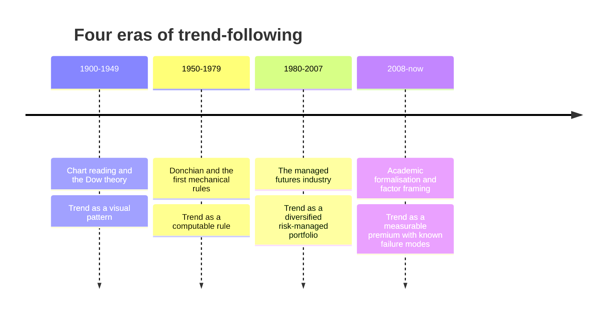
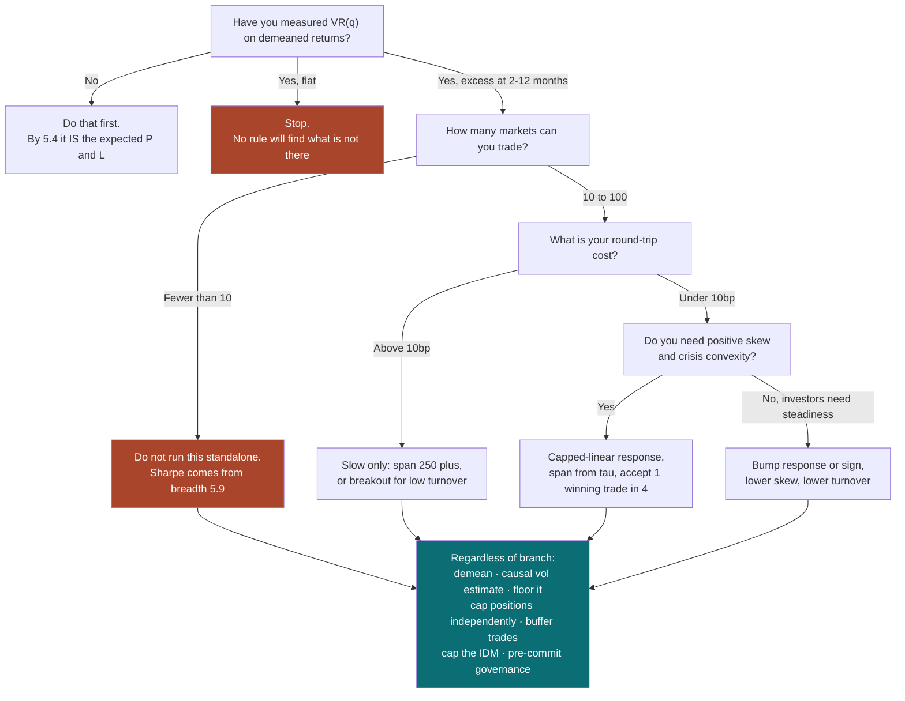

```mermaid
flowchart TD
  ROOT["Trend system"] --> K["Kernel: which horizon"]
  ROOT --> G["Response: payoff shape"]
  ROOT --> V["Risk scaling"]
  ROOT --> C["Portfolio"]

  K --> K1["Low-pass<br/>box, ramp, exponential"]
  K --> K2["Band-pass<br/>crossover, MACD"]
  K --> K3["Symmetric<br/>OLS slope"]
  K --> K4["Non-filter<br/>breakout, change-point"]

  G --> G1["Linear<br/>max convexity, max turnover"]
  G --> G2["Capped linear<br/>the usual compromise"]
  G --> G3["Sign<br/>no convexity, lowest turnover"]
  G --> G4["Bump<br/>fades extreme signals"]

  V --> V1["EWMA of squared returns"]
  V --> V2["Range-based<br/>Parkinson, Garman-Klass"]
  V --> V3["Blended horizons"]

  C --> C1["Equal risk"]
  C --> C2["Correlation-adjusted"]
  C --> C3["Drawdown-modulated"]

  style V fill:#0B6E75,color:#fff
  style C fill:#0B6E75,color:#fff
  style K fill:#8A979D,color:#fff
  style G fill:#8A979D,color:#fff
```

# Trend-Following in Financial Markets

### From the P&L identity to a working system

---

**What this is.** Trend-following is the oldest systematic trading strategy still
in industrial use, and the one whose theory is most often stated badly. This
document builds it from first principles: what the object *is* mathematically,
what quantity a trend-follower is actually harvesting, how that quantity is
estimated in practice, when and why it disappears, and what the risk apparatus
around it is for.

**How to read it.** Sections 1–3 are conceptual and historical — the mental
model, the candidate mechanisms, and how the industry arrived at its current
shape. Section 4 is the bibliography. Sections 5–7 are the technical core:
§5 derives what trend-following earns and what shape its payoff has, §6 surveys
every serious way to estimate a trend, §7 shows that most of §6 is one estimator
with three knobs. Sections 8–11 are engineering: portfolio construction,
degradation, evaluation, and risk. Section 12 synthesises.

If you want the single most important idea and nothing else, read §5.4, §5.5 and
§7.2. If you are implementing, read §8 and §11 and treat the rest as reference.

**Relationship to the momentum note.** A companion document,
[Momentum in Financial Markets](momentum_deep_dive.html), treats *momentum* — the
statistical phenomenon of return predictability from past returns. This document
treats *trend-following* — the trading system. They are not the same thing, and
§1.3 makes the distinction precise. Where the momentum note goes deeper on
signal measurement and cross-sectional design, this one goes deeper on the P&L
functional, position sizing, and risk. Each stands alone; the overlap is
deliberate and small.

**Epistemic tags.** Claims are flagged by status:

- **[Fact]** — replicated across independent datasets or implementations, with
  broad agreement among people who have looked.
- **[Contested]** — documented, but with live disagreement about magnitude,
  robustness, or cause.
- **[Hypothesis]** — a proposed mechanism, not decisively tested.
- **[Practice]** — practitioner convention. May well be right; the evidence is
  private or absent.

Untagged sentences are definitions, derivations, or arithmetic — things that are
true by construction rather than by evidence. Several of the derivations below I
verified numerically while writing; where a number in the text comes from my own
simulation rather than from a paper, I say so.

---

**Notation.** $P_t$ is the price at time $t$ and $p_t = \ln P_t$ the log price;
$r_t = p_t - p_{t-1}$ is the one-bar log return. A *bar* is whatever sampling
interval you work in, and $A$ is the number of bars per year (252 or 256 for
daily data). $\mathcal{F}_t$ is the information set available at $t$.

$\pi_t$ is the **position** — the signed exposure held over the interval
$(t, t+1]$, chosen using $\mathcal{F}_t$ only. $s_t$ is a raw **signal**, and
$x_t$ specifically denotes the exponentially weighted trend estimate
$x_t = (1-\alpha) x_{t-1} + \alpha r_t$ with decay $\alpha \in (0,1)$, whose
**span** is $2/\alpha - 1$ bars. $w_k$ is the weight a linear filter places on
$r_{t-k}$; the collection $\{w_k\}$ is the **kernel**. $g(\cdot)$ is the
**response function** mapping a normalised signal to a position.

$\gamma_k = \operatorname{Cov}(r_t, r_{t+k})$ is the lag-$k$ autocovariance and
$\rho_k = \gamma_k/\gamma_0$ the autocorrelation; $\gamma_0 = \sigma^2$ is the
per-bar return variance. $\mathrm{VR}(q)$ is the variance ratio at horizon $q$.
$\hat\sigma_t$ is an estimate, formed from $\mathcal{F}_t$, of per-bar return
volatility, and $\sigma^\star$ is a target volatility.

$L$ denotes a lookback in bars and $n$ a moving-average window; both are
"how far back", but $L$ appears in return-space rules and $n$ in price-space
ones. In the hidden-trend model of §5.8, $\mu_t$ is the unobserved drift,
$\phi$ its autoregressive coefficient, $\tau = 1/(1-\phi)$ its persistence
timescale in bars, $\sigma_\varepsilon$ the noise volatility,
$\theta = \operatorname{sd}(\mu_t)/\sigma_\varepsilon$ the per-bar
signal-to-noise ratio, and $K$ the steady-state Kalman gain.

Across markets, $N$ is the number of instruments and $\bar\rho$ the average
pairwise correlation *of strategy returns* — distinct from $\rho_k$, which is
always an autocorrelation of one series. Three symbols carry a
qualification: $\alpha$ is always an EWMA decay constant, never a significance
level; $\sigma$ is always a return volatility except where subscripted
$\sigma_\eta, \sigma_\varepsilon$ as model innovations; and $\varepsilon_t$ is
generic observation noise, attached to whichever series the surrounding model
observes (the price in §1.4 and §6.6, the return in §5.8). Note also that
*subscripted* $\tau_t$ (§1.4, §6.7) is the smooth trend *component* of a
decomposition, a different object from the unsubscripted persistence timescale
$\tau$.

---

## Table of contents

1. [What trend-following is](#1-what-trend-following-is)
2. [Why trends could exist](#2-why-trends-could-exist)
3. [How the practice evolved](#3-how-the-practice-evolved)
4. [Foundational references](#4-foundational-references)
5. [The mathematics of trend-following P&L](#5-the-mathematics-of-trend-following-pl)
6. [Trend estimation and detection](#6-trend-estimation-and-detection)
7. [Taxonomy and equivalences](#7-taxonomy-and-equivalences)
8. [From signal to portfolio](#8-from-signal-to-portfolio)
9. [When trends fade and fail](#9-when-trends-fade-and-fail)
10. [Evaluation: testing a trend system honestly](#10-evaluation-testing-a-trend-system-honestly)
11. [Pitfalls and risk management](#11-pitfalls-and-risk-management)
12. [Synthesis](#12-synthesis)

---

# 1. What trend-following is {#1-what-trend-following-is}

## 1.1 The wrong intuition

Ask a practitioner what trend-following is and you will usually get some version
of: *"you identify that a market is trending, and you ride the trend."* This
description is not wrong so much as it is unusable, because it presupposes that
"is trending" is a property a market has, which you could in principle detect.

It isn't. Consider what you actually observe: a finite sequence of prices. Every
such sequence, without exception, decomposes into a smooth part and a rough part
in infinitely many ways. Fit a 50-day moving average and there is a trend; fit a
5-day one and the same data has six trends; fit a straight line and there is one.
None of these decompositions is more correct than the others, because "trend" is
not a feature of the data — it is a feature of the *model you impose on the
data*. A price path does not come with a trend attached any more than a
photograph comes with a Fourier transform attached.

The second wrong intuition is the physical one, inherited from the word
"momentum": a market in motion tends to stay in motion. There is no conserved
quantity in a price series, no mass, no inertia. If you start here you will build
systems that assume persistence and be surprised by every reversal.

The third — and the most costly in practice — is that trend-following is a
*prediction* problem. It looks like one: you estimate something from the past and
take a position on the future. But the estimate a trend-follower forms is almost
never accurate enough to be called a forecast in any ordinary sense. §5.9 makes
this quantitative: the return predictability that supports the entire managed
futures industry corresponds to a daily return autocorrelation of roughly
$0.0025$, which cannot be distinguished from zero in a single market's ten-year
history. If you evaluate a trend signal as a forecast, you will conclude
correctly that it is a terrible forecast, and incorrectly that it is worthless.

## 1.2 The right starting point: a map from paths to positions

Here is the definition to hold, and it is deliberately mechanical:

> **A trend-following system is a function that maps the observed price history
> to a position, with the property that the position is an increasing function of
> recent price changes.**

$$\pi_t = F(p_t, p_{t-1}, p_{t-2}, \ldots), \qquad
\frac{\partial \pi_t}{\partial r_{t-k}} \ge 0 \ \text{ for all } k \ge 0$$

That is the whole object. Note what the definition does *not* contain: no claim
that a trend exists, no forecast, no latent state, no regime. It is a rule, and
rules can be evaluated without believing anything about the data-generating
process. The monotonicity condition — positions increase in past returns — is
what makes it trend-*following* rather than mean-reversion, and the requirement
that $\pi_t$ use only information through $t$ is what makes it implementable.

Everything interesting follows from asking two questions about this function:

1. **What does it earn?** The P&L is $\sum_t \pi_t r_{t+1}$, and because $\pi_t$
   is a function of past returns, the expected P&L is a functional of the return
   process's autocovariance structure. §5 works this out exactly. The answer —
   *trend-following is long autocovariance and long squared drift* — is the
   organising fact of the field.
2. **What shape is the payoff?** Because $\pi_t$ grows with past returns, the
   strategy is long when prices have risen and short when they have fallen, which
   means its P&L is a *convex* function of the price path. §5.5 and §5.6 make
   this precise, and the convexity turns out to be exactly, algebraically, a long
   position in long-horizon variance against short-horizon variance.

## 1.3 The master form

Essentially every trend system in production is the same four-stage pipeline.
Writing it down once saves enormous confusion later, because the "hundreds of
indicators" in the practitioner literature are choices of one or two stages with
everything else held fixed.

$$\boxed{\ \pi_{i,t} \;=\; \underbrace{\frac{\sigma^\star}{\hat\sigma_{i,t}}}_{\text{(3) risk scaling}}
\cdot \underbrace{g\Big(\underbrace{{\textstyle\sum_{k\ge 0}} w_k\, \tilde r_{i,t-k}}_{\text{(1) kernel}}\Big)}_{\text{(2) response}}
\cdot \underbrace{c_t}_{\text{(4) aggregation}}\ }$$

where $\tilde r_{i,t}$ is the (possibly normalised) return of market $i$ at $t$,
and $c_t$ is a portfolio-level multiplier. The four stages:

| Stage | What it does | What varies between systems |
|---|---|---|
| **(1) Kernel** $\{w_k\}$ | Summarises the recent past into one number | Shape and timescale of the weights on past returns |
| **(2) Response** $g(\cdot)$ | Converts the signal into a desired exposure | Linear, capped, sign, or bump-shaped |
| **(3) Risk scaling** $\sigma^\star/\hat\sigma_{i,t}$ | Converts exposure into a position of known risk | Volatility estimator and target |
| **(4) Aggregation** $c_t$ | Combines markets into a portfolio at a total risk level | Correlation handling, capital constraint, drawdown control |

A 200-day moving-average crossover, a Donchian channel breakout, a 12-month
time-series momentum sign, and a Kalman-filtered local-linear-trend model are all
points in this space. §6 enumerates them; §7 shows the equivalences, several of
which are exact identities rather than analogies.

The stage that matters most is not the one practitioners argue about. §7.3 and
§8.1 make the case that **stage (3) dominates**, stage (4) is second, and stages
(1) and (2) — the "indicator", the thing with a name and a fan club — matter
least. In a simulation with realistic volatility clustering, moving from a raw
signal to a volatility-scaled one took the Sharpe ratio from $0.04$ to $0.36$;
changing the kernel's timescale by a factor of two, from its optimum, cost about
$5\%$ of the Sharpe.

## 1.4 What trend-following is not

These distinctions cause real losses. The middle column is what each object
actually *is*, formally; the right column is why it gets confused with
trend-following.

```{=latex}
\newpage
```

| Concept | Formal object | Why it is confused with trend-following |
|---|---|---|
| **Trend-following** | A map $\pi_t = F(\mathcal{F}_t)$ increasing in past returns | — |
| **Momentum** | The statistical claim $\mathbb{E}[r_{t+1}\mid r_{t-L:t}]$ is increasing in past returns | Trend rules *monetise* momentum, but they also monetise drift and convexity. A profitable trend backtest is not evidence of momentum |
| **Drift** | The unconditional mean $\mu = \mathbb{E}[r_t]$ | A long-only asset with positive drift produces a positive trend backtest with zero predictability (§5.3) |
| **Trend, as a decomposition** | The low-frequency component $\tau_t$ in a trend-plus-cycle-plus-noise split $p_t = \tau_t + \psi_t + \varepsilon_t$ | This is a modelling choice, not an observable. A perfectly trending line plus noise has *negative* return autocorrelation |
| **Technical analysis** | A heterogeneous body of chart-pattern heuristics | Trend rules were born inside it, and share vocabulary. But a trend rule is a measurable function with a testable P&L; a head-and-shoulders pattern is not |
| **Market timing** | Switching between an asset and cash on a signal | A long-only trend rule *is* market timing, but trend-following in general is long/short and multi-market |
| **Managed futures / CTA** | An industry and a fee structure | Most CTAs are trend-followers, so index returns are used as a proxy for the strategy. The proxy carries fees, survivorship, and strategy drift |
| **Buy-the-dip / mean reversion** | $\partial\pi_t/\partial r_{t-k} < 0$ | Literally the same functional with the opposite sign. The sign that is correct depends entirely on the horizon (§9.2) |

Two of these deserve expansion, because they are the ones that corrupt research.

### Trend is not momentum, and a backtest cannot tell them apart

Take a price process that is a deterministic upward line plus independent noise:

$$p_t = \mu t + \varepsilon_t, \qquad \varepsilon_t \sim \text{iid}(0, \sigma_\varepsilon^2)$$

This series has a *perfect* trend in the decomposition sense — the low-frequency
component is exactly $\mu t$. Its returns are $r_t = \mu + \varepsilon_t -
\varepsilon_{t-1}$, an MA(1) with autocorrelation $\rho_1 = -1/2$ and $\rho_k = 0$
for $k \ge 2$. So the series has a perfect trend and *anti*-momentum: after an up
move you should expect a down move.

Meanwhile $r_t = \phi r_{t-1} + u_t$ with $\phi > 0$ and zero mean has momentum
and no trend at all — the level wanders with no low-frequency component.

**Trend is a property of the level; momentum is a property of the returns.** A
trend-following *rule* is indifferent: it makes money from drift, from trend, and
from return autocorrelation, and its P&L does not tell you which. That is fine
for earning money and fatal for research, because the three have completely
different stability properties. Drift is stable and low-information;
autocorrelation is fragile and high-information; and a rule that is secretly
harvesting drift will fail the moment you apply it to a market without one.

### The convexity is not a free option

Trend-following's payoff resembles a long straddle (§5.6), and this observation
is often deployed as though it were good news — "trend-following gives you
convexity for free". It does not. Convexity is never free; the only question is
how you pay for it. A straddle buyer pays a premium up front. A trend-follower
pays continuously, in the whipsaw losses incurred when a signal reverses, and
§5.5 shows the payment appearing explicitly as a $-\sum_t r_t^2$ term in an exact
algebraic identity. The strategy is profitable precisely when what it collects
from trend persistence exceeds what it pays in realised variance, and not
otherwise.

## 1.5 The payoff in one picture

The clearest way to see what kind of object this is: run a trend rule on paths
with *no* predictability whatsoever — pure random walks — and plot what it earns.

```{=html}

```

```{=latex}
\begin{center}
\includegraphics[width=\linewidth]{quant-research/figures/trend_convexity.pdf}
\end{center}
```

Three things to take from it, all from my own simulation of 60,000 independent
random-walk years with a 65-bar-span EWMA rule:

1. **Conditional on the size of the year's move, the payoff is a smile.** Big
   moves in either direction pay; small moves cost. This is the straddle
   analogy, and it holds for both response functions.
2. **The mean is zero, as it must be.** The underlying has no predictability;
   the simulated mean P&L was $+0.003$ risk units against a standard deviation of
   $1.0$. Nothing here is edge.
3. **But the linear rule's P&L is right-skewed with a negative median.** It was
   profitable in only $41\%$ of years, with a median of $-0.21$ risk units and a
   skew of $+1.40$. The sign-response rule, which discards the magnitude of the
   signal, was profitable in exactly $50\%$ of years with skew $-0.01$. That
   symmetry is not luck. The sign rule's P&L is $\sum_t \operatorname{sign}(x_t)
   r_{t+1}$ — driftless increments each multiplied by $\pm 1$ — so in continuous
   time it is $\int_0^T \operatorname{sign}(x_t)\,dW_t$, whose quadratic
   variation is exactly $T$. By Lévy's characterisation that integral *is* a
   Brownian motion, so the sign rule's annual P&L is exactly Gaussian: median
   zero, skew zero, wins half the time.

Point 3 is the one people get wrong. **A low hit rate is not evidence of a bad
strategy, and a high hit rate is not evidence of a good one** — with zero edge
you can manufacture either, purely by choosing the response function. [Potters and
Bouchaud (2006)](https://arxiv.org/abs/physics/0508104){target="_blank"} derived this analytically: for a trend rule on a driftless
random walk the average gain per trade is exactly zero while the fraction of
winning trades falls below one half. (With no drift the win rate is scale-free —
volatility cancels out of the problem entirely — but at a fixed drift it falls as
volatility rises, because what it tracks is the ratio of the two.) If you are
diagnosing a trend system, the hit rate tells you about the shape of $g$, not
about whether the system works.

> ### §1 Key takeaways
>
> 1. A market does not "have" a trend. A trend is a property of the model you
>    impose, so "detecting a trend" is always a modelling choice with a
>    Type I / Type II trade-off, never a measurement.
> 2. Define the object mechanically: **a trend-following system is a map from
>    price history to position, increasing in recent returns**. Everything else
>    is derived from that map.
> 3. The system is not a forecaster. The predictability it exploits is far too
>    small to detect in one market (§5.9) and is only visible in aggregate.
> 4. Every production system is the same four-stage pipeline — kernel, response,
>    risk scaling, aggregation. Named indicators are choices of the first two.
> 5. **Risk scaling matters more than the indicator.** In simulation, adding
>    volatility normalisation moved the Sharpe from 0.04 to 0.36; halving or
>    doubling the kernel timescale cost about 5%.
> 6. Trend $\ne$ momentum $\ne$ drift. A profitable trend backtest is consistent
>    with zero return predictability, so it is not evidence of momentum.
> 7. The payoff is option-like, and the option is *paid for*, continuously, in
>    realised variance. Convexity is a cost structure, not a gift.
> 8. Hit rate is a property of the response function, not of the edge. On a pure
>    random walk a linear trend rule wins 41% of years and a sign rule wins 50%,
>    with identical (zero) expected return.

---

# 2. Why trends could exist {#2-why-trends-could-exist}

## 2.1 The objection that has to be answered first

If prices reflected all available information, past prices would be useless for
predicting future ones, and every rule of the form $\pi_t = F(\mathcal{F}_t)$
would have zero expected P&L. Trend-following is the weakest possible violation
of market efficiency — it uses only the price series itself, the single most
public dataset in existence — so it is the strategy the efficient-markets
hypothesis most obviously forbids.

Three replies, in increasing order of force.

**The joint-hypothesis reply.** Any test of efficiency is a joint test of
efficiency and of an asset-pricing model. If trend-following earns a positive
return that is compensation for a risk your model does not contain, efficiency
survives. This is logically airtight and empirically almost vacuous — you can
always postulate a risk factor — but it does mean "trend-following works" and
"markets are efficient" are not formally contradictory.

**The Grossman–Stiglitz reply.** If prices were perfectly informative, no one
would pay to gather information, so prices could not be informative. Equilibrium
therefore requires prices to be *slightly* wrong — enough to pay the marginal
information-gatherer's costs and no more. The equilibrium level of inefficiency
is not zero; it is the level at which arbitrage is barely worth doing after
costs. Trend-following's actual measured edge, of order a per-market Sharpe of
$0.2$–$0.4$ before costs (§5.9), is roughly what "barely worth doing" looks like.

**The empirical reply.** The effect has been documented over very long samples in
markets that did not exist when the rules were designed. [Hurst, Ooi and Pedersen
(2017)](https://papers.ssrn.com/sol3/papers.cfm?abstract_id=2993026){target="_blank"} report positive trend-following returns across 67 markets back to 1880;
[Lempérière and co-authors (2014)](https://arxiv.org/abs/1404.3274){target="_blank"} find a $t$-statistic of about 5 since 1960 and
about 10 since 1800 on spot commodity and index series, after removing the
markets' own drift. **[Contested]** Both are practitioner studies by firms that
sell the strategy, which is a real discount factor — but they are also the only
groups with the data, and their long-horizon results have not been overturned.
Set against them, [Huang, Li, Wang and Zhou (2020)](https://ink.library.smu.edu.sg/context/lkcsb_research/article/7520/viewcontent/Time_series_momentum_JFE_sv.pdf){target="_blank"} argue the canonical
time-series momentum test is confounded by exactly the drift issue those papers
try to remove, and find little evidence of the effect after correcting for it
(§5.3). This disagreement is live and it is about specification, not data.

None of that explains *why*. Below are the five mechanism families that have been
proposed. They are not mutually exclusive, and I think the honest position is
that all five contribute, in proportions that vary by asset class and horizon.

## 2.2 Family A — slow information diffusion

**[Hypothesis, well-formalised]** Information reaches market participants
gradually rather than instantaneously. If news arrives to one group at $t$ and
another at $t+k$, the price adjusts in steps, and a sequence of partial
adjustments in the same direction is precisely positive return autocorrelation.

Hong and Stein (1999) formalise this with two agent types: "newswatchers" who
trade on private information but ignore prices, and "momentum traders" who trade
on price changes but ignore fundamentals. Slow diffusion among newswatchers
produces underreaction, which momentum traders then amplify into overshooting and
eventual reversal. The model is attractive because a single assumption generates
underreaction at short horizons, momentum at medium ones, and reversal at long
ones — the empirically observed sign pattern (§9.2), rather than one piece of it.

**What would falsify it:** trends should be stronger where information diffuses
more slowly — smaller, less-covered, less-liquid markets. This is broadly
supported in equities (momentum is stronger in small caps and low-analyst-
coverage names) and much weaker as an explanation for trends in Treasury futures
or major FX, which are the most information-efficient markets in existence and
where trend-following nonetheless works well. That gap is the strongest evidence
against diffusion being the whole story.

## 2.3 Family B — behavioural biases

**[Hypothesis]** Several documented individual-level biases produce sluggish
price adjustment in aggregate:

- **Anchoring and conservatism.** Barberis, Shleifer and Vishny (1998) model
  investors who update too slowly from a prior, producing underreaction to
  individual news and overreaction to long streaks.
- **Overconfidence and biased self-attribution.** Daniel, Hirshleifer and
  Subrahmanyam (1998) model investors who overweight private signals and
  attribute confirming public news to their own skill, producing continued
  overreaction and eventual correction.
- **The disposition effect.** Investors sell winners too early and hold losers
  too long. Grinblatt and Han (2005) show this creates a spread between the
  market price and a reference price, and that the spread predicts returns —
  the selling pressure on winners retards the adjustment, so the price drifts
  toward fundamental value slowly rather than jumping.
- **Extrapolative expectations.** Greenwood and Shleifer (2014) show, from
  survey data, that investors' expected returns are *high* after high past
  returns — the opposite of what a rational model with mean-reverting returns
  predicts. Barberis and co-authors (2015) build an equilibrium model on this.

**The problem with this family** is not that the biases are unreal — they are
well documented at the individual level — but that the step from individual bias
to price impact requires the biased agents to be the marginal price-setters. In
Treasury futures they are not. Behavioural explanations do good work in equities
and much less in the futures markets where trend-following actually earns most of
its money.

## 2.4 Family C — mechanical and flow-driven persistence

**[Fact for the mechanism, [Hypothesis] for its share of the effect]** This
family requires no irrationality at all. Several structural features of markets
mechanically generate serially correlated order flow, and serially correlated
order flow generates serially correlated returns.

- **Metaorder execution.** A large institutional order cannot be executed at
  once; it is split into child orders over hours or days. Each child order pushes
  price in the same direction. The empirical impact of a metaorder of size $Q$
  scales as $\sqrt{Q}$ — the "square-root law", documented across markets and
  brokers by Tóth and co-authors (2011) — and the impact accumulates over the
  execution horizon, which is exactly a short-horizon trend.
- **Risk-management flows.** Volatility targeting, portfolio insurance, stop
  losses, margin calls, and value-at-risk limits all force selling into declines
  and buying into rallies. Brunnermeier and Pedersen (2009) formalise the
  destabilising loop: losses tighten funding, tighter funding forces
  deleveraging, deleveraging causes losses.
- **Systematic rebalancing.** Leveraged ETFs must rebalance daily in the
  direction of the day's move. Target-date and risk-parity funds rebalance on
  schedules. These are price-taking flows with known signs.
- **Central-bank and macro persistence.** Policy rates move in cycles lasting
  quarters to years, and inflation and growth are persistent. Futures markets on
  rates, bonds and currencies inherit that persistence directly. This is the
  most plausible single explanation for why trend-following works best in fixed
  income and FX, and it is not a market-inefficiency story at all.

I regard this family as the most likely primary driver in futures markets, for
one reason: it predicts trend-following should work where large slow flows exist
regardless of investor sophistication, and that is what the cross-section of
results looks like.

## 2.5 Family D — risk transfer and hedging pressure

**[Contested]** In futures markets there are natural hedgers with inelastic
demand — a producer who must sell forward, an airline that must buy fuel. Keynes
argued that speculators taking the other side must be compensated, producing a
risk premium tied to the direction of hedging pressure. De Roon, Nijman and Veld
(2000) find hedging-pressure effects in futures returns across markets.

This explains a *return*, but it explains a trend only if hedging pressure is
itself persistent — which it plausibly is, since a producer's hedging need
changes with the slow-moving fundamentals of their business. Under this account
trend-following is not exploiting an error; it is being paid to warehouse risk
that someone else must shed, and the payment persists as long as the need does.

The attractive feature of this story is that it explains the *convexity*
correctly. A liquidity provider to forced sellers earns a premium and takes tail
risk; a trend-follower buys convexity and pays a premium. Those are opposite
exposures, which means hedging pressure cannot be the whole explanation — but it
may well be a large part of the *level* of returns in commodities specifically.

## 2.6 Family E — there is no effect, only drift and selection

**[Contested]** The nihilist position deserves its strongest statement, because
it is not obviously wrong.

Most assets have positive expected returns. A trend rule applied to an asset with
positive drift will be long most of the time and will therefore earn the drift,
and §5.3 shows the standard time-series momentum test is *positively biased* by
exactly this: $\mathbb{E}[r_{t+1}\cdot\operatorname{sign}(r_{t-L:t})] > 0$
whenever $\mu > 0$, even under complete independence. [Huang and co-authors (2020)](https://ink.library.smu.edu.sg/context/lkcsb_research/article/7520/viewcontent/Time_series_momentum_JFE_sv.pdf){target="_blank"}
make this argument formally and find the time-series momentum effect largely
disappears in their sample once the unconditional mean is controlled for.

Layer on top: the strategy's parameters were selected by decades of practitioner
search over the same price histories now used to validate it — the definition of
data snooping. [Sullivan, Timmermann and White (1999)](https://www.kevinsheppard.com/files/teaching/mfe/advanced-econometrics/Sullivan_Timmermann_White.pdf){target="_blank"} applied White's Reality
Check to a universe of nearly 8,000 technical trading rules and found that rules
which looked strongly significant in isolation were not, once the search was
accounted for. Brock, Lakonishok and LeBaron (1992) had earlier found technical
rules profitable on the Dow 1897–1986; the snooping critique is aimed squarely at
results of that kind. [Park and Irwin's (2007)](https://papers.ssrn.com/sol3/papers.cfm?abstract_id=603481){target="_blank"} survey of the whole technical-
analysis literature concludes that early positive results were substantially
compromised by data snooping and by ignoring transaction costs.

And CTA returns as actually delivered to investors are far worse than the
strategy's paper returns. [Bhardwaj, Gorton and Rouwenhorst (2014)](https://www.nber.org/papers/w14424){target="_blank"} find that after
fees, investors in commodity trading advisors earned close to nothing, while the
funds' gross performance and their persistence were both weak once survivorship
and backfill biases were removed.

**My read.** Families C and D are probably real and probably small; family E is
the correct null and is not defeated, only weakened, by the long-history studies;
families A and B do genuine work in equities and less elsewhere. The specific
claim I would defend is narrow: *futures markets exhibit weak positive return
autocorrelation at horizons of weeks to months, of a magnitude that supports a
diversified gross Sharpe of roughly 0.7–1.0 and a net-of-fee investor experience
much worse than that.* Anyone claiming more should be asked what their evidence
is that survives the drift adjustment.

## 2.7 Telling the families apart

Mechanism talk is cheap unless it makes differential predictions. It does:

```{=latex}
\newpage
```

| Family | Predicts trend is stronger… | Predicts trend is weaker… | Distinguishing test |
|---|---|---|---|
| **A. Slow diffusion** | in less-covered, less-liquid, more-opaque markets | in the most efficient markets | Cross-sectional: sort markets by information efficiency |
| **B. Behavioural** | where retail and unsophisticated flow dominates | in institutional-only markets | Sort by investor composition; test disposition-effect proxies directly |
| **C. Mechanical flow** | where large slow flows exist, regardless of sophistication | where flows are small or fast | Use positioning and metaorder data; test whether trend returns concentrate around known flow events |
| **D. Hedging pressure** | in physical commodities with concentrated hedgers | in financial futures | Commitments-of-Traders positioning as a conditioning variable |
| **E. Drift plus snooping** | nowhere — the effect is an artefact | everywhere, after correction | Demean returns before testing; out-of-sample on markets and eras not used in rule design |

The one test that discriminates most cheaply is family E's: **demean the returns
market-by-market before running any trend test.** If your effect survives, you
have something; if it does not, you have re-discovered that stocks and bonds went
up. This costs one line of code and eliminates the single most common way that
trend research fools its author.

> ### §2 Key takeaways
>
> 1. Trend-following is the weakest possible violation of efficiency — it uses
>    only public prices — so it demands a mechanism, not just a backtest.
> 2. Grossman–Stiglitz makes a small residual inefficiency a *requirement* of
>    equilibrium, not an anomaly. The measured size of the trend effect is about
>    what "barely worth arbitraging" should look like.
> 3. Five mechanism families are on the table: slow diffusion, behavioural bias,
>    mechanical flow, hedging pressure, and "it's just drift". They are not
>    mutually exclusive and each explains a different subset of the evidence.
> 4. Behavioural and diffusion stories do their best work in equities and their
>    worst in Treasury and FX futures — which is where trend-following earns
>    most of its money. Treat that gap as unresolved, not as a detail.
> 5. **Mechanical flow (family C) is my best guess at the primary driver in
>    futures**, because it predicts trends where slow flows exist regardless of
>    investor sophistication, which matches the cross-section.
> 6. The nihilist null — drift plus data snooping — has not been defeated. It has
>    been weakened by long-history evidence produced by interested parties.
> 7. **Demean each market's returns before testing.** It is one line of code and
>    it removes the most common self-deception in this literature.

---

# 3. How the practice evolved {#3-how-the-practice-evolved}

Trend-following's history is unusual: the practice ran roughly forty years ahead
of the theory, and the two communities barely spoke. Systematic futures traders
were running vol-scaled multi-market trend portfolios in the 1970s; the first
academic paper to describe that object as a factor appeared in 2012. Reading the
history in order is worthwhile mainly because it explains why the standard
implementation looks the way it does — most of its features are scar tissue.



## 3.1 Era I — Chart reading (1900–1949)

- **Contribution.** The idea that price movements have direction that persists,
  and that a participant should align with it rather than against it. Dow's
  editorials, later systematised as "Dow theory", introduced the notion of
  primary and secondary trends and the confirmation of one index by another.
- **What changed.** Trend became a thing one could *have an opinion about*
  systematically, rather than a description applied after the fact.
- **Limitations.** Nothing here was a rule. Every judgement — is this a primary
  trend, has it been confirmed — required a human, which meant it could not be
  tested and its results could not be attributed.
- **Lasting influence.** Small, and mostly vocabulary. The specific patterns
  (head and shoulders, triangles) have not survived quantitative testing; Lo,
  Mamaysky and Wang (2000) gave them the fairest possible test with kernel
  smoothing and found weak, mostly non-tradeable, statistical content.

## 3.2 Era II — Mechanical rules (1950–1979)

- **Contribution.** Richard Donchian's moving-average and channel-breakout rules
  turned trend-following into arithmetic: a rule anyone could compute, on a
  schedule, without judgement. Donchian's 5- and 20-day moving-average crossover
  and the "$n$-day high" breakout are still the reference implementations.
- **What changed.** Once the rule was mechanical, it could be backtested, and its
  P&L could be attributed to the rule rather than the trader. This is the single
  most important methodological step in the field's history.
- **Limitations.** Single-market, fixed-size, no volatility scaling, no
  portfolio construction. Position size was a fixed number of contracts, which
  means risk varied by a factor of five across markets and across time within one
  market.
- **Lasting influence.** Enormous. Every rule in §6.1–§6.5 is a Donchian
  descendant, and the breakout rule in particular is essentially unchanged.

## 3.3 Era III — The industry (1980–2007)

- **Contribution.** The construction of trend-following as a *portfolio*
  discipline: many markets, positions sized by volatility, risk budgeted at the
  book level, systematic roll and execution. The firms — Campbell, Millburn,
  AHL, Chesapeake, Winton, Aspect, and the Dennis–Eckhardt "Turtle" cohort —
  developed this largely in private and largely without publishing.
- **What changed.** The realisation that the edge per market is small and the
  portfolio effect is most of the return. A per-market Sharpe of $0.3$ across
  50 weakly correlated markets is a portfolio Sharpe of $0.7$ to $1.1$, depending
  on how weak "weakly" is (§5.9); no single market's rule needed to be good.
- **Limitations.** Almost none of it was published, so the evidence base was
  track records — which carry survivorship, selection, and fee opacity.
  [Bhardwaj, Gorton and Rouwenhorst (2014)](https://www.nber.org/papers/w14424){target="_blank"} later showed how much those biases were
  hiding.
- **Lasting influence.** This is where the modern implementation was invented.
  Volatility targeting, correlation-aware sizing, multi-timescale ensembles, and
  systematic roll all date from this era, and §8 is essentially a description of
  what these firms worked out.

## 3.4 Era IV — Formalisation (2008–present)

- **Contribution.** Academic and quantitative-practitioner work that made the
  object measurable. [Moskowitz, Ooi and Pedersen (2012)](https://w4.stern.nyu.edu/facdir/lpederse/papers/TimeSeriesMomentum.pdf){target="_blank"} introduced "time-series
  momentum" as a factor across 58 futures markets. [Fung and Hsieh (2001)](http://neumann.hec.ca/pages/nicolas.papageorgiou/qfm/papers/FungHsieh2001.pdf){target="_blank"} had
  already shown that trend-follower returns load on lookback straddles rather
  than on linear asset exposures. [Potters and Bouchaud (2006)](https://arxiv.org/abs/physics/0508104){target="_blank"}, [Bruder and Gaussel
  (2011)](https://papers.ssrn.com/sol3/papers.cfm?abstract_id=2465623){target="_blank"} and [Dao and co-authors (2016)](https://arxiv.org/abs/1607.02410){target="_blank"} derived the P&L decomposition that §5
  reconstructs. [Levine and Pedersen (2016)](https://www.tandfonline.com/doi/pdf/10.2469/faj.v72.n3.3){target="_blank"} and [Beekhuizen and Hallerbach (2017)](https://www.ssrn.com/abstract=2604942){target="_blank"}
  showed that the various trend rules are one filter with different weights.
- **What changed.** Trend-following stopped being a strategy with a track record
  and became a factor with a functional form, a risk decomposition, a set of
  known failure modes, and a price. That is also when its fees collapsed.
- **Limitations.** The formalisation arrived alongside a decade of poor realised
  performance (2009–2019), and it is genuinely unclear how much of the
  formalisation is description of a real premium and how much is a well-specified
  account of a data-snooped one (§9.4).
- **Lasting influence.** Ongoing. The current frontier — changepoint-aware
  signals, learned response functions, cost-aware dynamic portfolios — is all
  built on this era's framing.

> ### §3 Key takeaways
>
> 1. The practice preceded the theory by roughly forty years; almost everything
>    in a modern system was invented by practitioners before it was described.
> 2. Donchian's contribution was not a better indicator but *mechanisation* —
>    which is what made backtesting and attribution possible at all.
> 3. The industry's key insight was that the per-market edge is small and the
>    portfolio effect supplies most of the Sharpe. Design for the portfolio.
> 4. Almost all Era III evidence was track records, which is why the survivorship
>    and fee critiques of the 2010s landed as hard as they did.
> 5. The 2008-onward formalisation coincided with a decade of weak performance.
>    Whether that is coincidence or the effect of the formalisation is the open
>    question of §9.

---

# 4. Foundational references {#4-foundational-references}

Annotated, grouped by how they should be read. Every entry links to a freely
readable copy where one exists.

## 4.1 The P&L and payoff structure

- **Fung, W. & Hsieh, D. A. (2001).** ["The Risk in Hedge Fund Strategies: Theory
  and Evidence from Trend Followers."](http://neumann.hec.ca/pages/nicolas.papageorgiou/qfm/papers/FungHsieh2001.pdf)
  *Review of Financial Studies* 14(2), 313–341. [[DOI]](https://doi.org/10.1093/rfs/14.2.313)
  — The paper that established trend-follower returns as option-like, and modelled
  them with lookback straddles. The origin of every "crisis alpha" claim.
- **Potters, M. & Bouchaud, J.-P. (2006).** ["Trend followers lose more often than
  they gain."](https://arxiv.org/abs/physics/0508104) *Wilmott Magazine.* — Short,
  exact, and the best cure for hit-rate confusion. Average gain per trade is zero
  on a random walk while the win rate falls below one half.
- **Bruder, B. & Gaussel, N. (2011).** ["Risk-Return Analysis of Dynamic Investment
  Strategies."](https://papers.ssrn.com/sol3/papers.cfm?abstract_id=2465623)
  Lyxor White Paper Series 7. — The continuous-time P&L decomposition into a
  convex "option profile" and a running cost. §5.5 derives the discrete analogue.
- **Dao, T.-L., Nguyen, T.-T., Deremble, C., Lempérière, Y., Bouchaud, J.-P. &
  Potters, M. (2016).** ["Tail protection for long investors: Trend convexity at
  work."](https://arxiv.org/abs/1607.02410) *Journal of Investment Strategies.* —
  Shows trend P&L equals the difference between long- and short-horizon realised
  variance. This is the cleanest statement of the spine of this document.

## 4.2 The empirical case

- **Moskowitz, T. J., Ooi, Y. H. & Pedersen, L. H. (2012).** ["Time Series
  Momentum."](https://w4.stern.nyu.edu/facdir/lpederse/papers/TimeSeriesMomentum.pdf)
  *Journal of Financial Economics* 104(2), 228–250. — The paper that made
  trend-following academically respectable. 58 futures, 1965–2009, one to twelve
  month horizons, with partial reversal beyond.
- **Hurst, B., Ooi, Y. H. & Pedersen, L. H. (2017).** ["A Century of Evidence on
  Trend-Following Investing."](https://papers.ssrn.com/sol3/papers.cfm?abstract_id=2993026)
  *Journal of Portfolio Management* 44(1), 15–29. — 1880–2016, 67 markets.
  **[Contested]** — AQR sells this strategy; read it alongside §2.6.
- **Lempérière, Y., Deremble, C., Seager, P., Potters, M. & Bouchaud, J.-P.
  (2014).** ["Two centuries of trend following."](https://arxiv.org/abs/1404.3274)
  *Journal of Investment Strategies.* — Independent long-history evidence from a
  different interested party (CFM), which matters: two firms with different books
  reaching the same conclusion is worth more than either alone.
- **Babu, A., Levine, A., Ooi, Y. H., Pedersen, L. H. & Stamelos, E. (2020).**
  ["Trends Everywhere."](https://www.aqr.com/-/media/AQR/Documents/Insights/Journal-Article/AQR-Trends-Everywhere_JOIM.pdf)
  *Journal of Investment Management* 18(1), 52–68. — Extends the evidence to
  less-traded markets and alternative instruments.
- **Hamill, C., Rattray, S. & Van Hemert, O. (2016).** ["Trend Following: Equity
  and Bond Crisis Alpha."](https://papers.ssrn.com/sol3/papers.cfm?abstract_id=2831926)
  Man AHL working paper. — The crisis-alpha claim, tested over a long sample and
  separated by asset class. **[Contested]** — interested party again.

## 4.3 The critiques — read these next to the section above

- **Huang, D., Li, J., Wang, L. & Zhou, G. (2020).** ["Time series momentum: Is it
  there?"](https://ink.library.smu.edu.sg/context/lkcsb_research/article/7520/viewcontent/Time_series_momentum_JFE_sv.pdf)
  *Journal of Financial Economics* 135(3), 774–794. — The drift-confound critique.
  Directly determines how you must specify your own tests (§5.3, §10.2).
- **Bhardwaj, G., Gorton, G. B. & Rouwenhorst, K. G. (2014).** ["Fooling Some of
  the People All of the Time: The Inefficient Performance and Persistence of
  Commodity Trading Advisors."](https://www.nber.org/papers/w14424)
  *Review of Financial Studies* 27(11), 3099–3132. — What investors actually
  received, as opposed to what the strategy produced.
- **Sullivan, R., Timmermann, A. & White, H. (1999).** ["Data-Snooping, Technical
  Trading Rule Performance, and the Bootstrap."](https://www.kevinsheppard.com/files/teaching/mfe/advanced-econometrics/Sullivan_Timmermann_White.pdf)
  *Journal of Finance* 54(5), 1647–1691. — The reality-check methodology, applied
  to a universe of thousands of technical rules.
- **Park, C.-H. & Irwin, S. H. (2007).** ["What Do We Know About the Profitability
  of Technical Analysis?"](https://papers.ssrn.com/sol3/papers.cfm?abstract_id=603481)
  *Journal of Economic Surveys* 21(4), 786–826. — The comprehensive survey. Sober
  and useful precisely because it is not written by anyone with a book.
- **Kim, A. Y., Tse, Y. & Wald, J. K. (2016).** ["Time series momentum and
  volatility scaling."](https://papers.ssrn.com/sol3/papers.cfm?abstract_id=2786955)
  *Journal of Financial Markets* 30, 103–124. — Argues that much of the reported
  time-series momentum premium comes from the volatility scaling rather than from
  the trend signal. Uncomfortable, and important (§8.3).

## 4.4 Implementation and portfolio construction

- **Levine, A. & Pedersen, L. H. (2016).** ["Which Trend Is Your Friend?"](https://www.tandfonline.com/doi/pdf/10.2469/faj.v72.n3.3)
  *Financial Analysts Journal* 72(3), 51–66. — Relates time-series momentum and
  moving-average rules through their common weighting of past returns.
- **Beekhuizen, P. & Hallerbach, W. G. (2017).** ["Uncovering Trend Rules."](https://www.ssrn.com/abstract=2604942)
  *Journal of Alternative Investments* 20(2), 28–38. — Derives the return-space
  weights implied by moving-average rules and shows some popular rules have
  inverted decay or hidden mean-reversion. The direct antecedent of §7.2.
- **Zakamulin, V. (2017).** [*Market Timing with Moving Averages: The Anatomy and
  Performance of Trading Rules.*](https://link.springer.com/book/10.1007/978-3-319-60970-6)
  Palgrave Macmillan. [paywalled] — Book-length treatment of the same
  decomposition, plus a large and unusually honest empirical study.
- **Baltas, N. & Kosowski, R. (2013).** ["Demystifying Time-Series Momentum
  Strategies: Volatility Estimators, Trading Rules and Pairwise
  Correlations."](https://papers.ssrn.com/sol3/papers.cfm?abstract_id=2140091)
  *Journal of Derivatives & Hedge Funds* 19(4), 289–310. — The most directly
  useful implementation paper in the list: volatility estimator choice, turnover
  reduction, and a correlation-adjusted leverage mechanism.
- **Gârleanu, N. & Pedersen, L. H. (2013).** ["Dynamic Trading with Predictable
  Returns and Transaction Costs."](https://nbgarleanu.github.io/DynTrad.pdf)
  *Journal of Finance* 68(6), 2309–2340. — The closed-form optimal policy with
  costs: aim in front of the target, trade partially toward it. Section 8.7 is
  an application.
- **Harvey, C. R., Hoyle, E., Korgaonkar, R., Rattray, S., Sargaison, M. & Van
  Hemert, O. (2018).** ["The Impact of Volatility Targeting."](https://papers.ssrn.com/sol3/papers.cfm?abstract_id=3175538)
  *Journal of Portfolio Management* 45(1), 14–33. — What volatility targeting
  does to Sharpe, drawdown and skew, by asset class.
- **Carver, R. (2015).** *Systematic Trading.* Harriman House. — The most
  practically complete public description of a full trend system, from signal
  scaling through to position rounding. Opinionated and specific.

## 4.5 Foundational statistical machinery

- **Muth, J. F. (1960).** ["Optimal Properties of Exponentially Weighted
  Forecasts."](https://www.tandfonline.com/doi/abs/10.1080/01621459.1960.10482064)
  *Journal of the American Statistical Association* 55(290), 299–306. [paywalled]
  — The EWMA is the minimum-mean-squared-error forecast for a random walk
  observed in noise. This is *why* the exponential kernel is everywhere (§5.8).
- **Lo, A. W. & MacKinlay, A. C. (1988).** "Stock Market Prices Do Not Follow
  Random Walks: Evidence from a Simple Specification Test." *Review of Financial
  Studies* 1(1), 41–66. — The variance-ratio test, which §5.4 shows is the same
  object as a trend rule's expected P&L.
- **Kim, S.-J., Koh, K., Boyd, S. & Gorinevsky, D. (2009).** ["$\ell_1$ Trend
  Filtering."](https://web.stanford.edu/~gorin/papers/l1_trend_filter.pdf)
  *SIAM Review* 51(2), 339–360. — Piecewise-linear trend extraction as a convex
  program. The principled version of "the trend changed".
- **Kaminski, K. M. & Lo, A. W. (2014).** ["When Do Stop-Loss Rules Stop
  Losses?"](https://dspace.mit.edu/bitstream/handle/1721.1/114876/Lo_When%20Do%20Stop-Loss.pdf)
  *Journal of Financial Markets* 18, 234–254. — Stops help only when returns are
  positively autocorrelated; under a random walk they cost. §11.3.
- **Bailey, D. H. & López de Prado, M. (2014).** ["The Deflated Sharpe
  Ratio."](https://www.davidhbailey.com/dhbpapers/deflated-sharpe.pdf)
  *Journal of Portfolio Management* 40(5), 94–107. — How to discount a Sharpe
  ratio for the number of trials that produced it.

## 4.6 If you only read six things

1. **[Moskowitz, Ooi & Pedersen (2012)](https://w4.stern.nyu.edu/facdir/lpederse/papers/TimeSeriesMomentum.pdf){target="_blank"}** — the empirical object, stated cleanly.
2. **[Huang, Li, Wang & Zhou (2020)](https://ink.library.smu.edu.sg/context/lkcsb_research/article/7520/viewcontent/Time_series_momentum_JFE_sv.pdf){target="_blank"}** — immediately after, so you never run an
   unadjusted test.
3. **[Dao et al. (2016)](https://arxiv.org/abs/1607.02410){target="_blank"}** — what the P&L actually is.
4. **[Potters & Bouchaud (2006)](https://arxiv.org/abs/physics/0508104){target="_blank"}** — six pages that fix your intuition about the
   payoff distribution permanently.
5. **[Beekhuizen & Hallerbach (2017)](https://www.ssrn.com/abstract=2604942){target="_blank"}** — after which you will stop believing that
   different moving-average rules are different strategies.
6. **Carver (2015)** — because everything above still leaves you a long way from
   a working system, and this closes most of the gap.

---

# 5. The mathematics of trend-following P&L {#5-the-mathematics-of-trend-following-pl}

This section answers "what does a trend-follower actually earn?" — exactly, not
approximately. Four results, each derived rather than asserted:

- §5.2: expected P&L is a weighted sum of return autocovariances.
- §5.4: for the canonical rule, that sum is *exactly* half the variance-ratio
  excess. Trend-following and the variance-ratio test are the same statistic.
- §5.5: an exact algebraic identity splitting realised P&L into a convex term, a
  "trend energy" term, and a realised-variance cost. No distributional
  assumptions at all.
- §5.8: the optimal kernel, and the surprising fact that at realistic
  signal-to-noise ratios the lookback is set almost entirely by how long trends
  last, not by how strong they are.

## 5.1 Setup

Fix one market. Positions are set from information through $t$ and held for one
bar, so the P&L over $T$ bars is

$$\Pi_T \;=\; \sum_{t=0}^{T-1} \pi_t\, r_{t+1}, \qquad \pi_t \in \mathcal{F}_t.$$

Two simplifications, both harmless here and both revisited later. First, $\pi_t$
is exposure measured in units of capital — $\pi_t = 1$ is fully invested, $\pi_t
= 2$ is twice levered, $\pi_t = -1$ is fully short — so $\pi_t r_{t+1}$ is the
bar's P&L as a fraction of capital. Costs are absent and enter in §8.8. Second, I
take the signal to be a *linear* filter of past returns,

$$s_t \;=\; \sum_{k \ge 0} w_k\, r_{t-k},$$

which §7.2 shows covers the moving-average family exactly, and which the
breakout and change-point rules of §6.5 and §6.8 violate.

## 5.2 Expected P&L is a weighted sum of autocovariances

Take $\pi_t = s_t$ — the linear response, no risk scaling — and assume returns
are covariance-stationary with mean $\mu$ and autocovariances
$\gamma_k = \operatorname{Cov}(r_t, r_{t+k})$. Then the expected P&L per bar is

$$\mathbb{E}[\pi_t r_{t+1}] \;=\; \sum_{k\ge0} w_k\, \mathbb{E}[r_{t-k}\,r_{t+1}]
\;=\; \sum_{k\ge0} w_k\big(\gamma_{k+1} + \mu^2\big)
\;=\; \underbrace{\sum_{k\ge0} w_k\,\gamma_{k+1}}_{\text{predictability}}
\;+\; \underbrace{\mu^2 \sum_{k\ge0} w_k}_{\text{drift}}.$$

The second step uses $\mathbb{E}[XY] = \operatorname{Cov}(X,Y) + \mathbb{E}X\,\mathbb{E}Y$
with $\mathbb{E}[r_t] = \mu$ for every $t$; the lag between $r_{t-k}$ and
$r_{t+1}$ is $k+1$, which is why the autocovariance index is shifted.

This little identity is the whole story of §5, and it says three things.

**First, trend-following is long autocovariance.** The strategy's edge is a
$w$-weighted inner product with the autocovariance function. If $\gamma_k = 0$
for all $k \ge 1$ — a martingale difference sequence — the predictability term is
exactly zero regardless of how clever the kernel is. There is no filter design
that extracts edge from an unpredictable series, and any backtest suggesting
otherwise is measuring drift, cost errors, or luck.

**Second, the kernel must be matched to where the predictability lives.** The
inner product $\sum_k w_k \gamma_{k+1}$ is large only when $w$ has mass at the
lags where $\gamma$ does. A slow kernel run on a series whose autocorrelation
decays within a day earns nothing — not because the series is unpredictable, but
because the filter is looking in the wrong place. I saw this directly in
simulation: an EWMAC(32, 128) rule — the difference between exponential moving
averages of price with spans 32 and 128 (§6.3) — applied to an AR(1) return
process with $\phi = 0.03$ earned a Sharpe of $0.00$, because that kernel's
weight is concentrated around lag 30, where $\phi^{30} \approx 2\times10^{-46}$,
while all of the autocovariance sits at lag 1. Matching the
kernel's centre of mass to the autocorrelation's decay length is the single
design decision that cannot be fudged.

**Third, the drift term is a trap.** Since a trend kernel has $\sum_k w_k > 0$ by
construction, the drift term $\mu^2 \sum_k w_k$ is *strictly positive* whenever
$\mu \ne 0$ — of either sign. That is the subject of the next subsection.

## 5.3 The drift confound, stated precisely

Consider the canonical time-series momentum test: regress $r_{t+1}$ on
$\operatorname{sign}(r_{t-L:t})$, where $r_{t-L:t} = \sum_{i=1}^{L} r_{t-L+i}$ is
the cumulative return over the lookback. The estimand is

$$\mathbb{E}\big[r_{t+1}\cdot\operatorname{sign}(r_{t-L:t})\big].$$

Suppose returns are *completely independent* — no predictability of any kind —
but with mean $\mu > 0$. Write $R = r_{t-L:t}$, which is independent of
$r_{t+1}$. Then

$$\mathbb{E}\big[r_{t+1}\operatorname{sign}(R)\big]
= \mathbb{E}[r_{t+1}]\cdot\mathbb{E}[\operatorname{sign}(R)]
= \mu\big(2\,\mathbb{P}(R>0) - 1\big) \;>\; 0$$

because $\mu > 0$ implies $\mathbb{P}(R > 0) > 1/2$. **The test statistic is
positive under the null.** For a daily market with $\mu/\sigma = 0.03$ per bar
and $L = 252$, $\mathbb{P}(R>0) = \Phi(0.03\sqrt{252}) = \Phi(0.476) \approx 0.68$,
so the bias is $0.37\mu$ — a substantial fraction of the drift itself, appearing
as if it were predictability.

This is the [Huang, Li, Wang and Zhou (2020)](https://ink.library.smu.edu.sg/context/lkcsb_research/article/7520/viewcontent/Time_series_momentum_JFE_sv.pdf){target="_blank"} critique. **[Contested]** Their
conclusion — that little time-series momentum survives the correction — is
disputed by Moskowitz, Ooi and Pedersen and by subsequent replications, and the
disagreement is about how to demean (in-sample full-period mean? expanding
window? cross-sectionally?) rather than about the algebra, which is not in
question.

**What to do about it.** Three options, in increasing order of conservatism:

1. **Demean each market's returns** using an expanding-window estimate before
   computing signals and P&L. Cheap, and removes most of the bias without
   look-ahead.
2. **Include the passive long as a benchmark.** Report trend P&L as an alpha
   against a constant-long position in the same market at the same average
   exposure. If the alpha is zero you have re-derived buy-and-hold.
3. **Test on demeaned bootstrap resamples.** Under a block bootstrap that
   preserves the marginal distribution but destroys serial dependence, a genuine
   trend effect should vanish; if it does not, your test statistic is picking up
   something other than serial dependence (§10.4).

I would do all three, and I would treat any trend result reported without at
least the first as uninformative.

## 5.4 The exact variance-ratio identity

Now the result that unifies the practitioner and academic literatures.

The **variance ratio** at horizon $q$ compares the variance of a $q$-bar return
to $q$ times the variance of a one-bar return:

$$\mathrm{VR}(q) \;=\; \frac{\operatorname{Var}\big(\sum_{i=1}^{q} r_i\big)}{q\,\gamma_0}
\;=\; 1 + 2\sum_{k=1}^{q-1}\Big(1 - \frac{k}{q}\Big)\rho_k.$$

Under a random walk $\mathrm{VR}(q) = 1$ for all $q$; trending series give
$\mathrm{VR} > 1$, mean-reverting series $\mathrm{VR} < 1$. It is the standard
non-parametric test for departures from the random walk (Lo and MacKinlay, 1988).

Now take the most-used practitioner rule in existence — **price minus its
$n$-bar moving average** — and compute its expected P&L. Write
$\mathrm{MA}_n(p)_t = \frac{1}{n}\sum_{i=0}^{n-1} p_{t-i}$. Then

$$p_t - \mathrm{MA}_n(p)_t
\;=\; \frac{1}{n}\sum_{i=0}^{n-1}\big(p_t - p_{t-i}\big)
\;=\; \frac{1}{n}\sum_{i=0}^{n-1}\ \sum_{j=0}^{i-1} r_{t-j}
\;=\; \sum_{j\ge0} \frac{(n-1-j)^+}{n}\, r_{t-j},$$

using $(z)^+ = \max(z,0)$; the last step counts, for each lag $j$, how many of
the $n$ inner sums contain $r_{t-j}$. So the rule is a linear filter with a
**triangular kernel** $w_j = (n-1-j)^+/n$. Substituting into §5.2 with $\mu = 0$:

$$\mathbb{E}\Big[\big(p_t - \mathrm{MA}_n(p)_t\big)\, r_{t+1}\Big]
= \sum_{j=0}^{n-2}\frac{n-1-j}{n}\,\gamma_{j+1}
= \gamma_0\sum_{k=1}^{n-1}\Big(1-\frac{k}{n}\Big)\rho_k
= \boxed{\ \frac{\gamma_0}{2}\Big(\mathrm{VR}(n) - 1\Big)\ }$$

where the last equality is just the variance-ratio definition rearranged.

**This is exact, not an approximation.** The expected per-bar P&L of the
price-versus-moving-average rule with window $n$ equals one half the return
variance times the variance-ratio excess at horizon $n$. I verified it
numerically on simulated AR(1) paths: empirical $1.630\times10^{-5}$ against a
theoretical $1.630\times10^{-5}$.

Three consequences worth sitting with:

1. **The trend-follower's P&L and the econometrician's random-walk test are the
   same object.** A firm running a 200-day moving-average rule is, in expectation,
   collecting $\tfrac{1}{2}\sigma^2(\mathrm{VR}(200)-1)$ per day. If you want to
   know whether trend-following should work in a market, estimate its
   variance-ratio profile; you do not need to backtest anything.
2. **The horizon is not a free parameter, it is the horizon of the statistic you
   are betting on.** Choosing $n$ is choosing which $\mathrm{VR}(q)$ you are long.
   Since $\mathrm{VR}$ is typically above one at some horizons and below one at
   others (§9.2), the sign of your expected P&L is a function of $n$ in a way
   that has nothing to do with the quality of your implementation.
3. **It explains why trend-followers and volatility traders are natural
   counterparties.** Being long $\mathrm{VR}(n) - 1$ is being long long-horizon
   variance and short short-horizon variance. Someone selling a variance
   term-structure spread is on the other side.

## 5.5 The exact P&L decomposition: long trend energy, short realised variance

The previous result is about expectations. This one is about the realised path,
and it holds identically — for any return sequence whatsoever, with no
assumptions about stationarity, distribution, or independence.

Let $x_t$ be the EWMA trend estimate, $x_{t+1} = (1-\alpha)x_t + \alpha r_{t+1}$,
and take the linear-response position $\pi_t = x_t$. Square the recursion:

$$x_{t+1}^2 = (1-\alpha)^2 x_t^2 + 2\alpha(1-\alpha)\,x_t r_{t+1} + \alpha^2 r_{t+1}^2.$$

Every term except the P&L increment $x_t r_{t+1}$ is a square, so solve for it:

$$x_t\,r_{t+1} \;=\; \frac{x_{t+1}^2 \;-\; (1-\alpha)^2 x_t^2
\;-\; \alpha^2 r_{t+1}^2}{2\alpha(1-\alpha)}.$$

Now sum over $t = 0,\dots,T-1$. The only awkward piece is
$\sum_t\big(x_{t+1}^2 - (1-\alpha)^2x_t^2\big)$, which is not quite a telescoping
sum because of the $(1-\alpha)^2$. Split it into one that is, plus a remainder:

$$x_{t+1}^2 - (1-\alpha)^2x_t^2
\;=\; \underbrace{\big(x_{t+1}^2 - x_t^2\big)}_{\text{telescopes to } x_T^2 - x_0^2}
\;+\; \underbrace{\big(1-(1-\alpha)^2\big)\,x_t^2}_{=\;\alpha(2-\alpha)\,x_t^2}.$$

Collecting the three pieces and dividing through by $2\alpha(1-\alpha)$ leaves the
identity

$$\boxed{\;\sum_{t=0}^{T-1} x_t\,r_{t+1}
\;=\; \underbrace{\frac{x_T^2 - x_0^2}{2\alpha(1-\alpha)}}_{\text{(A) convexity}}
\;+\; \underbrace{\frac{2-\alpha}{2(1-\alpha)}\sum_{t=0}^{T-1} x_t^2}_{\text{(B) trend energy}}
\;-\; \underbrace{\frac{\alpha}{2(1-\alpha)}\sum_{t=1}^{T} r_t^2}_{\text{(C) realised variance}}\;}$$

I verified this numerically: over 5,000 bars the left side was
$1.1880423066819878\times10^{-3}$ and the right side
$1.1880423066819926\times10^{-3}$ — equal to machine precision, as an algebraic
identity must be.

Read the three terms.

**(A) Convexity.** The squared trend estimate at the end minus the squared trend
estimate at the start — so with the usual cold start $x_0 = 0$ it is
non-negative. This is the option payoff: you profit if the trend estimate has
moved away from zero, in *either* direction. It does not grow with $T$ — it is a
boundary term — so it contributes nothing to the long-run rate of
return, but it is exactly the term that pays out in a crisis, when $|x_T|$ is
large. This is the algebraic content of "crisis alpha".

**(B) Trend energy.** The accumulated squared trend estimate. Always positive,
grows linearly in $T$. This is what you collect while a trend persists: the
larger and the more sustained the filtered trend, the more this pays.

**(C) Realised variance.** The accumulated squared returns, entering with a minus
sign, scaled by $\alpha$. **This is the premium.** A faster filter (larger
$\alpha$) pays more of it. It is the exact, quantified version of "whipsaw".

So: **a trend-follower is long the energy of the filtered trend and short the
realised variance of the underlying, in a ratio fixed by the filter speed.**

That framing immediately explains the strategy's behaviour. Under a random walk
the two large terms cancel in expectation — with iid returns of variance
$\sigma^2$, steady-state $\mathbb{E}[x_t^2] = \alpha\sigma^2/(2-\alpha)$, so term
(B) contributes $\alpha\sigma^2/(2(1-\alpha))$ per bar and term (C) subtracts
exactly the same, leaving zero, as it must. (Term (A) does not disturb this: it
is $O(1)$ in $T$, so its contribution *per bar* vanishes.) Under a trending
process, $x_t^2$ is inflated by the drift while $r_t^2$ is not, and the residual
is the edge.

```{=latex}
\newpage
```

```{=html}

```

```{=latex}
\begin{center}
\includegraphics[width=\linewidth]{quant-research/figures/trend_pnl_anatomy.pdf}
\end{center}
```

The figure is the identity drawn on one simulated path. Note the scale: the two
large terms reach roughly $+20$ and $-19$ basis points of cumulative
contribution, and the strategy's entire P&L is the $\sim1$ basis point residual
between them. **Trend-following is a small difference between two large numbers,
which is precisely why it is so sensitive to costs, to the volatility estimate,
and to the filter speed** — all three move one of the two large terms.

[Dao and co-authors (2016)](https://arxiv.org/abs/1607.02410){target="_blank"} reach the equivalent conclusion in continuous time and
state it memorably: trend P&L is the difference between long-horizon and
short-horizon realised variance. The discrete identity above is the same
statement with $\alpha$ setting which horizons.

## 5.6 The option analogy, made precise

[Fung and Hsieh (2001)](http://neumann.hec.ca/pages/nicolas.papageorgiou/qfm/papers/FungHsieh2001.pdf){target="_blank"} modelled trend-follower returns as a portfolio of
**lookback straddles** — options that pay the high-minus-low range of the
underlying over a period, so the holder is retrospectively given the best
entry and the best exit — and found this explained CTA returns far better than
linear asset exposures. The
analogy is genuinely useful, and it is important to know where it is exact and
where it is not.

| Property | Long straddle | Trend rule | Same? |
|---|---|---|---|
| Payoff convex in the underlying's move | Yes | Yes (§1.5 figure) | **Exact** |
| Premium paid | Once, up front, known | Continuously, as $-\frac{\alpha}{2(1-\alpha)}\sum r_t^2$ | Analogous, not identical |
| Long volatility | Long implied vol | Long *trend* vol, short *realised* vol | **Opposite sign on realised vol** |
| Payoff depends on path | Only at expiry (vanilla) | Entirely path-dependent | Different |
| Maximum loss | Bounded by premium | Unbounded in principle; bounded in practice by sizing | Different |
| Gap risk | Protected — you own the option | Exposed — you must trade to adjust | **Different, and this is the important one** |

The row that matters is the last. A straddle holder is protected against a
discontinuous move because the option's payoff is already contracted. A
trend-follower's convexity is *synthetic*: it is manufactured by trading, and
manufacturing it requires the market to be open and continuous. A gap through
your position — a limit-locked commodity, a currency de-peg, a weekend — is
exactly the state in which the replication fails. **The trend-follower is short
gap risk and long diffusive convexity**, which is a very different object from a
straddle even though the smooth-path payoffs match. §11.5 returns to this.

A second caveat, less often stated: the convexity in the §1.5 figure is
convexity **with respect to the underlying's realised move**, not with respect to
the equity market. Trend-following is long convexity in each of its markets
separately. It delivers "crisis alpha" only when a crisis produces a *sustained*
directional move that its filters can catch — the 2008 equity decline, which took
months, rather than the February 2018 volatility spike, which took days.

## 5.7 The trade-level distribution

Combining §5.5's convexity with §1.5's simulation gives the characteristic
shape of trend-following returns, which is worth stating as calibration.

From my own simulation of a slow trend rule on a weakly autocorrelated process,
sampled over 400,000 bars and segmented into trades at each position flip:

| Statistic | Value | Interpretation |
|---|---|---|
| Hit rate | 25% | Three quarters of trades lose |
| Mean win / mean loss | 3.3 | Winners are three times the size of losers |
| Trade P&L skew | $+3.6$ | Heavily right-skewed |
| Contribution of the best 5% of trades | 8.2$\times$ the strategy's total net P&L | The rest, in aggregate, lose |

The last row is the one to internalise. **The best 5% of trades earned more than
eight times the strategy's entire net profit; everything else lost the
difference.** That is not a pathology, it is the design: the strategy takes many
cheap small losses to be present for the rare large moves.

Three practical consequences:

1. **You cannot evaluate a trend system on a small number of trades.** With this
   distribution, the sample mean converges very slowly. The effective sample
   size is closer to the number of *large* moves in the period than to the number
   of trades.
2. **Any modification that truncates the right tail is likely to destroy the
   strategy** — profit targets being the canonical example. Symmetrically,
   modifications that truncate the left tail (stops) are much less harmful, which
   is the asymmetry §11.3 is about.
3. **The reported hit rate is a design choice.** As §1.5 showed, moving from a
   linear to a sign response takes the fraction of winning *years* from 41% to
   50% with no change in expected return; the same lever moves the per-*trade*
   hit rate in the table above. A manager advertising a high hit rate is telling
   you about their response function.

## 5.8 What sets the lookback: Muth, Kalman, and the persistence timescale

So far the kernel has been arbitrary. What is the *right* one?

Assume returns are a slowly varying hidden drift plus noise — the **local level
model**, which is the minimal generative model in which trend-following is the
correct strategy. The observation is the return, the hidden state is its drift:

$$r_t = \mu_t + \varepsilon_t, \qquad
\mu_t = \phi\,\mu_{t-1} + \eta_t, \qquad
\varepsilon_t \sim (0,\sigma_\varepsilon^2),\ \ \eta_t \sim (0,\sigma_\eta^2)$$

with $\phi$ close to 1, so $\tau = 1/(1-\phi)$ is the trend's persistence in
bars. (Strictly, the local level model is the $\phi = 1$ case, in which the drift
is a random walk and lives forever. Keeping $\phi$ just under 1 makes the process
stationary and gives a trend a finite expected lifetime, which is what you want
here.) The two parameters that matter are $\tau$ and the signal-to-noise ratio
$\theta = \operatorname{sd}(\mu_t)/\sigma_\varepsilon$, both measured per bar.

The optimal estimator of $\mu_t$ given $\mathcal{F}_t$ is the Kalman filter, and
for this one-dimensional model it has a closed form. Its steady-state gain $K$
solves the algebraic Riccati equation, and the filter recursion is

$$\hat\mu_t \;=\; \phi(1-K)\,\hat\mu_{t-1} \;+\; K\,r_t,$$

which is **an EWMA with decay** $\alpha^\star = 1 - \phi(1-K)$ — up to an overall
scale factor, since the coefficients $\phi(1-K)$ and $K$ sum to $1$ only when
$\phi = 1$. The scale is irrelevant: the response function and the risk scaling
of §1.3 renormalise the signal anyway, so what the Kalman filter fixes is the
*shape* of the kernel, and the shape is exponential with decay $\alpha^\star$.
When $\phi = 1$ (a random-walk trend) the two coefficients do sum to one, this
reduces to $\alpha^\star = K$, and we recover [Muth's (1960)](https://www.tandfonline.com/doi/abs/10.1080/01621459.1960.10482064){target="_blank"} result:
the exponentially weighted moving average is the minimum-mean-squared-error
forecast for a random walk observed in noise. *That* is why the exponential
kernel is ubiquitous — not convention, but optimality under the simplest model in
which trends exist at all.

Expanding the product gives the practically important form. The step is exact —
$1 - \phi(1-K) = (1-\phi) + \phi K$ — and the only approximation is dropping the
$\phi$ in front of $K$, which is legitimate because $\phi \approx 1$:

$$\alpha^\star \;=\; 1 - \phi(1-K) \;\approx\; \underbrace{\frac{1}{\tau}}_{\text{trend decay}} + \underbrace{K}_{\text{signal strength}}, \qquad
\text{span} = \frac{2}{\alpha^\star} - 1.$$

There are exactly two reasons to forget an old return: the trend that generated
it has itself decayed ($1/\tau$), or you have gathered enough fresh evidence to
replace it ($K$). Both terms are of order $10^{-3}$ at realistic parameters, so
neither is negligible — in the table below $K$ supplies between a tenth and a
half of $\alpha^\star$, and the slower the trend the larger its share.

What tips the balance is not the size of the two terms but their *range*.
$\tau$ moves over orders of magnitude across mechanisms — a trend driven by a
policy cycle lives for quarters, one driven by an execution schedule for hours
(§2.4) — whereas $\theta$ is boxed in from both sides: too small and there is no
strategy at all, too large and you are claiming a per-market Sharpe nobody has
ever had (the $\theta = 0.10$ row below implies $1.01$, on its own, in one
market). So $\tau$ is what actually decides your lookback, and $\theta$ trims
it.

> **The optimal lookback is set first by how long trends last, and only second by
> how strong they are.**

This is a genuinely useful result, and it has a clear operational reading: do not
tune the lookback by maximising backtest P&L, which is a noisy objective with
thousands of effective trials. Estimate the persistence timescale of the process
— from the autocorrelation decay, the variance-ratio profile, or the economic
mechanism you believe in — and set the span to order $2\tau$. ($2\tau$ is the
weak-signal limit $K \to 0$; the table below lands between $0.8\tau$ and
$1.7\tau$, and the flatness result that follows says the difference costs you
almost nothing.)

I checked the formula against brute-force optimisation over EWMA spans, on
simulated paths of the model above:

| $\tau$ (bars) | $\theta$ | $\alpha^\star$ from Kalman | Implied span | Best span by search | Sharpe at optimum |
|---|---|---|---|---|---|
| 60 | 0.05 | 0.0190 | 104 | 101 | 0.20 |
| 120 | 0.05 | 0.0105 | 189 | 181 | 0.28 |
| 250 | 0.05 | 0.0060 | 333 | 298 | 0.36 |
| 250 | 0.10 | 0.0098 | 204 | 214 | 1.01 |
| 500 | 0.07 | 0.0048 | 411 | 415 | 0.74 |

The agreement is close across the range. Note the third and fourth rows: holding
$\tau$ fixed at 250 and *doubling* the signal-to-noise ratio changes the optimal
span from 333 to 204. That is a real effect, and a reminder that the $K$ term is
not decoration — but $\theta$ is the lever you cannot move far, so in practice it
trims a lookback that $\tau$ has already chosen.

### The optimum is flat, and that is the practically important part

Optimal is one thing; sensitivity is another. On the $\tau = 250$, $\theta = 0.05$
process, sweeping the EWMA span gives:

```{=latex}
\newpage
```

| Span | 5 | 10 | 20 | 40 | 80 | 160 | 320 | 640 |
|---|---|---|---|---|---|---|---|---|
| Sharpe | 0.085 | 0.120 | 0.167 | 0.221 | 0.280 | 0.331 | 0.352 | 0.334 |
| % of best | 24 | 34 | 47 | 63 | 79 | 94 | 100 | 95 |

**Being wrong by a factor of two costs about 5% of the Sharpe. Being wrong by a
factor of sixteen costs half of it.** The lookback is therefore worth getting
approximately right and not worth optimising — which is fortunate, because the
data cannot support optimising it (§10.5).

This also settles a common practitioner claim. **[Contested]** Multi-timescale
ensembles — averaging signals across several spans — are usually justified as
adding return. In my simulations they do not: an equal-weighted ensemble of six
spans from 20 to 640 achieved 93% of the best single span on a stationary process
and 97% on a process whose $\tau$ switched among 40, 150 and 600. The ensemble is
never better than the best span. What it does is convert *"choose right or lose
half your Sharpe"* into *"always get about 95%"*. That is insurance against
mis-specification, which is worth buying — but it should be sold as insurance,
not as alpha.

## 5.9 Calibration: what edge corresponds to what Sharpe

Putting numbers on the model makes the whole field legible. Take the local level
model with $\tau = 250$ days and $\theta = 0.05$, filtered with its optimal EWMA.
The resulting process has:

| Quantity | Value |
|---|---|
| Lag-1 return autocorrelation $\rho_1$ | $\approx 0.0025$ |
| $\mathrm{VR}(60)$ | $\approx 1.14$ |
| Per-market annualised Sharpe of the optimal filter | $\approx 0.36$ |
| $t$-statistic on $\rho_1$ from 10 years of daily data | $\approx 0.13$ |
| Portfolio Sharpe, 50 markets at $\bar\rho = 0.15$ | $\approx 0.88$ |

The first two rows are worth being able to reproduce without simulating. Since
$r_t = \mu_t + \varepsilon_t$ with the two parts independent, the lag-$k$
autocorrelation of returns is
$\rho_k = \theta^2\phi^k/(1+\theta^2) \approx \theta^2$ for small $k$ — **the
lag-1 autocorrelation is just the squared signal-to-noise ratio**, here
$0.05^2 = 0.0025$. Feeding that $\rho_k$ into the variance-ratio formula of §5.4
gives $\mathrm{VR}(60) = 1.136$.

The portfolio step uses the standard aggregation identity: $N$ equally weighted
strategies, each with the same Sharpe $S$ and the same volatility, with average
pairwise correlation $\bar\rho$, combine to

$$S_{\text{portfolio}} = S\,\sqrt{\frac{N}{1 + (N-1)\bar\rho}}.$$

For $N = 50$, $\bar\rho = 0.15$ the multiplier is 2.45.

Read the table downward and the field snaps into focus.

**[Fact]** The predictability underlying a diversified trend program with a
long-run Sharpe near 1.0 is a daily return autocorrelation of about a quarter of
a percent — which, in ten years of one market's data ($T \approx 2{,}520$ bars,
so a standard error of $1/\sqrt{T} \approx 0.02$), produces a $t$-statistic of
$0.13$. **The effect that supports an entire industry is individually
undetectable.** Three things follow:

1. **You cannot validate a trend signal market by market.** Anyone who tells you
   their rule "works on gold" over ten years is reporting noise, whichever sign
   they report.
2. **Diversification is not a refinement, it is the mechanism.** The
   $\sqrt{N/(1+(N-1)\bar\rho)}$ multiplier is where the Sharpe comes from; the
   per-market signal only has to be marginally positive on average.
3. **The academic literature's difficulty rejecting the random walk and the
   industry's ability to make money are not in tension.** They are the same fact
   viewed at different levels of aggregation.

The correlation term matters more than the count. Going from 50 markets to 100 at
$\bar\rho = 0.15$ improves the multiplier from 2.45 to 2.51 — nothing. Reducing
$\bar\rho$ from 0.15 to 0.05 at $N = 50$ improves it from 2.45 to 3.81 — a 55%
increase in Sharpe. **Finding genuinely uncorrelated markets is worth far more
than finding more markets**, which is §8.6's whole subject.

Finally, the sample-size implication, which governs §10. For iid returns the
standard error of an annualised Sharpe estimate over $T$ years is approximately
$\sqrt{(1 + S^2/2)/T}$ — the $S^2/2$ term is the extra uncertainty that comes
from having to estimate the volatility as well as the mean:

| Sample | $S = 0.4$ | $S = 1.0$ |
|---|---|---|
| 5 years | se 0.46 ($t = 0.9$) | se 0.55 ($t = 1.8$) |
| 10 years | se 0.33 ($t = 1.2$) | se 0.39 ($t = 2.6$) |
| 20 years | se 0.23 ($t = 1.7$) | se 0.27 ($t = 3.7$) |
| 50 years | se 0.15 ($t = 2.7$) | se 0.17 ($t = 5.8$) |

A twenty-year backtest cannot distinguish a Sharpe of 0.4 from zero at
conventional significance. This is why the century-long studies of §4.2 exist,
and why the arguments about them are so hard to settle.

> ### §5 Key takeaways
>
> 1. **Expected P&L is $\sum_k w_k\gamma_{k+1} + \mu^2\sum_k w_k$** — a weighted
>    sum of return autocovariances plus a drift term. Trend-following is long
>    autocovariance and long squared drift.
> 2. The kernel must have mass where the autocorrelation does. A slow filter on
>    fast-decaying autocorrelation earns exactly nothing, however well built.
> 3. **The drift term biases the standard test positive under the null.** Demean
>    each market before testing; treat undemeaned trend results as uninformative.
> 4. **Exact identity:** the price-versus-moving-average rule with window $n$
>    earns $\tfrac{1}{2}\gamma_0(\mathrm{VR}(n)-1)$ per bar. The trend rule and
>    the variance-ratio test are the same statistic; estimating the VR profile
>    tells you whether to bother backtesting.
> 5. **Exact identity, no assumptions:** realised P&L equals a convexity boundary
>    term, plus accumulated trend energy $\sum x_t^2$, minus accumulated realised
>    variance $\sum r_t^2$. You are long trend vol and short realised vol.
> 6. The strategy is a small residual between two large terms, which is the
>    structural reason it is so cost- and parameter-sensitive.
> 7. The straddle analogy is exact for smooth paths and wrong for gaps: the
>    convexity is synthetic and requires a tradeable market to replicate.
> 8. **The optimal lookback is set by trend persistence $\tau$, not by signal
>    strength** — span of order $2\tau$. And the optimum is flat: a factor-of-two
>    error costs about 5%.
> 9. Multi-timescale ensembles buy insurance against mis-specification, not
>    return. In simulation they never beat the best single span.
> 10. **Calibration to memorise:** a diversified Sharpe near 1.0 corresponds to a
>     daily autocorrelation of about 0.0025, undetectable in one market ($t
>     \approx 0.13$ over a decade). Diversification is the mechanism, and
>     lowering $\bar\rho$ beats raising $N$.

---

# 6. Trend estimation and detection {#6-trend-estimation-and-detection}

This is the catalogue. Every method gets the same fields in the same order, so
they can be compared directly: **intuition, definition, kernel, assumptions,
strengths, weaknesses, cost, failure modes, when preferred**. Where a method is a
linear filter I give its kernel explicitly, because §7 shows that the kernel is
what actually distinguishes them.

A note before starting. Reading a catalogue like this creates a strong impression
that these are ten different strategies. They are not. Six of the ten are the
same linear filter with different weights, and §5.8 showed that the weights
matter far less than the timescale. Read this section for the *failure modes*,
which genuinely differ, more than for the definitions, which mostly do not.

## 6.1 Lookback return (time-series momentum)

**Intuition.** Is the price higher than it was $L$ bars ago? If yes, be long.

**Definition.** $s_t = r_{t-L:t} = p_t - p_{t-L}$, with position
$\pi_t = g(s_t)$; the canonical academic form takes $g = \operatorname{sign}$ and
$L = 252$.

**Kernel.** $w_j = \mathbb{1}\{j < L\}$ — rectangular. Every return in the window
counts equally; nothing outside counts at all.

**Assumptions.** That the sum of returns over exactly $L$ bars is informative
about the next one, with no preference for recency.

**Strengths.** Maximally simple, no parameters beyond $L$, and it is the form in
which almost all academic evidence is stated, so it is the right choice when you
want to compare against the literature.

**Weaknesses.** The rectangular kernel gives the oldest return in the window
exactly the same weight as yesterday's, which is implausible under any diffusion
story, and gives the return immediately before it zero weight — a discontinuity
with no economic meaning. The signal therefore jumps when a large old return drops out of
the window, an artefact with no information content.

**Cost.** $O(1)$ per bar from the running sum.

**Failure modes.** (i) The drop-out artefact above generates trades on no news.
(ii) It is maximally exposed to the drift confound of §5.3, because
$\operatorname{sign}(p_t - p_{t-L})$ is positive most of the time in a drifting
market. (iii) With $g = \operatorname{sign}$ it discards the signal magnitude,
losing the convexity of §1.5.

**When preferred.** Benchmarking, and communication. I would not run it in
production.

## 6.2 Price versus moving average

**Intuition.** Is the price above its own recent average?

**Definition.** $s_t = p_t - \mathrm{MA}_n(p)_t$, where $\mathrm{MA}$ is a simple
or exponential average over $n$ bars.

**Kernel.** $w_j = (n-1-j)^+/n$ for the simple average — a **descending ramp**
from $(n-1)/n$ at lag 0 down to zero at lag $n-1$. For the exponential average,
$w_j = (1-\alpha)^{j+1}$ with $\alpha = 2/(n+1)$ so that its span is also $n$ — a
clean exponential decay. Both derived in §5.4 and §7.2.

**Assumptions.** That recent returns matter more than old ones, linearly (SMA) or
geometrically (EWMA).

**Strengths.** The decay is economically sensible, there is no drop-out artefact
for the EWMA version, and — by §5.4, on demeaned returns — its expected P&L is
exactly $\tfrac12\gamma_0(\mathrm{VR}(n)-1)$, which makes it the most
analytically tractable rule in the catalogue.

**Weaknesses.** Maximum weight sits on the most recent return, which is the
noisiest one and the one most contaminated by microstructure effects (bid-ask
bounce, closing auctions). This makes the raw signal jumpy and turnover high.

**Cost.** $O(1)$ per bar (EWMA), $O(1)$ with a running sum (SMA).

**Failure modes.** (i) In a fast-mean-reverting market the heavy weight on lag 0
makes it a *reversal* signal with the wrong sign. (ii) It has no notion of
scale, so the raw $s_t$ is not comparable across markets or across volatility
regimes — you must normalise (§8.3), and forgetting to is the most common
implementation bug in this whole catalogue.

**When preferred.** As the default. If someone asks for one trend rule, this is
it, in its EWMA form, normalised by volatility.

## 6.3 Moving-average crossover

**Intuition.** Is the short-term average above the long-term one? Equivalently: is
the recent past better than the more distant past?

**Definition.** $s_t = \mathrm{MA}_{m}(p)_t - \mathrm{MA}_{n}(p)_t$ with
$m < n$; the EWMA version ("EWMAC") with spans $m$ and $n$ is the industry
standard.

**Kernel.** $w_j = \dfrac{(n-1-j)^+}{n} - \dfrac{(m-1-j)^+}{m}$, which — as §7.2
shows — rises linearly to a peak at lag $m-1$ and then decays linearly to zero at
lag $n-1$. A **band-pass filter**: it deliberately *down-weights the most recent
returns*.

**Assumptions.** That the informative frequency band is bounded away from both
zero and the Nyquist frequency: neither the very recent (noise) nor the very
distant (stale) past is what you want.

**Strengths.** The down-weighting of recent returns removes exactly the
microstructure noise that hurts §6.2, giving materially lower turnover for
similar gross edge. This is why it, and not the simpler rule, is what most
production systems run.

**Weaknesses.** Two parameters instead of one, and their ratio interacts with the
timescale in a way that is easy to over-fit. The lag introduced by suppressing
recent returns costs you at turning points.

**Cost.** $O(1)$ per bar.

**Failure modes.** (i) Certain $(m, n)$ combinations produce kernels with a
*negative* lobe — an implicit mean-reversion component the designer did not
intend. [Beekhuizen and Hallerbach (2017)](https://www.ssrn.com/abstract=2604942){target="_blank"} document this for common
multi-average rules; it is invisible in price space and obvious in return space.
(ii) The signal crosses zero frequently in choppy markets, which with a sign
response generates a burst of loss-making trades — the classic whipsaw.

**When preferred.** Production, when turnover matters. Use spans in roughly a
1:4 ratio and set the slow span from $\tau$ per §5.8.

## 6.4 Regression slope

**Intuition.** Fit a straight line to the recent log price and use its slope.

**Definition.** $(\hat a_t, \hat\beta_t) = \arg\min_{a,\beta}
\sum_{i=0}^{L-1}\big(p_{t-i} - a - \beta\,(t-i)\big)^2$, and the signal is the
fitted slope, $s_t = \hat\beta_t$; the intercept is a nuisance parameter, fitted
and thrown away. A common variant divides by the standard error of the slope,
giving a $t$-statistic, which normalises for volatility automatically.

**Kernel.** $w_j = \dfrac{6(j+1)(L-1-j)}{L(L^2-1)}$ — a **centred inverted
parabola**, symmetric, peaking in the middle of the window and vanishing at both
ends. (I verified this closed form against direct computation; the weights sum to
one, so a pure straight-line path returns its own slope.)

**Assumptions.** That the log price is locally linear plus independent noise, and
that the noise is homoskedastic within the window.

**Strengths.** The $t$-statistic variant is self-normalising, which is elegant.
The symmetric kernel is maximally smooth, giving a very stable signal.

**Weaknesses.** The symmetry is also the problem: weighting the middle of the
window most puts the kernel's centre of mass at $(L-2)/2$, so the estimate lags
by $\approx L/2$ bars — half again as far back as price-versus-SMA($L$), whose
centre of mass is $(L-2)/3$. The $L$-bar lookback return of §6.1 sits at the same
$\approx L/2$, but the parabola is still the slower of the two to register a
fresh move: the box gives yesterday's return a $1/L$ share of the total weight,
the parabola only $6/(L(L+1))$. Nothing in the catalogue reacts more slowly. Its
noise-rejection is bought entirely with timeliness.

**Cost.** $O(1)$ per bar with running sums of $p$, $tp$, $t$, $t^2$.

**Failure modes.** (i) The lag makes it late to reversals, so it gives back more
at turning points than the exponential rules. (ii) The $t$-statistic version
divides by an in-window residual standard error, which is a *very* noisy
volatility estimate for short $L$ and produces enormous signal spikes when a
window happens to be quiet. Use a separate, longer volatility estimate instead.

**When preferred.** When signal stability matters more than responsiveness, and
in research settings where the $t$-statistic's interpretability helps.

## 6.5 Breakout and channel rules

**Intuition.** Has the price exceeded its highest level of the last $L$ bars?

**Definition.** Donchian: go long when $P_t > \max_{1\le i\le L} P_{t-i}$, short
when $P_t < \min_{1\le i\le L}P_{t-i}$, hold otherwise. Variants add a shorter
exit channel or a volatility-scaled band around a moving average (Keltner,
Bollinger).

**Kernel.** **None** — this is not a linear filter. The signal is a function of
order statistics of the price path, so §5.2's machinery does not apply and its
expected P&L cannot be written as a weighted sum of autocovariances.

**Assumptions.** That extremes are informative beyond what the mean of the window
conveys — i.e. that the *maximum* carries information the *average* does not.

**Strengths.** Naturally discrete: it produces few, well-separated trades and
therefore low turnover. It is insensitive to the shape of the return
distribution within the channel. And it has an interpretable economic story
(resting stop orders clustered above the range).

**Weaknesses.** It throws away almost all the data — only the extremes matter —
and it is discontinuous, so a one-tick difference flips the position.

**Cost.** $O(1)$ amortised per bar with a monotonic deque, $O(\log L)$ with a
heap or an ordered multiset; naively $O(L)$.

**Failure modes.** (i) The extreme of a window is a maximally noisy statistic;
a single bad print or a stale quote creates a false breakout, so data cleaning
matters more here than for any other rule. (ii) In markets with limit moves or
frequent gaps, the breakout level is often jumped rather than touched, so the
realised entry differs systematically from the backtested one — this rule's
backtests are optimistic in exactly the markets where trend-following makes its
money. (iii) Being flat inside the channel means the position is a step function
of the price, which makes portfolio-level risk lumpy.

**When preferred.** When costs dominate and you need a genuinely low-turnover
system, or as a diversifier alongside a linear filter, since its errors are
uncorrelated with theirs.

## 6.6 State-space models and the Kalman filter

**Intuition.** Posit that there *is* an unobserved trend, and estimate it
optimally.

**Definition.** The local level model of §5.8, or its local *linear* trend
extension in which both a level and a slope evolve:
$$\begin{aligned}
p_t &= \ell_t + \varepsilon_t \\
\ell_t &= \ell_{t-1} + b_{t-1} + \xi_t \\
b_t &= \phi\, b_{t-1} + \eta_t
\end{aligned}$$
with $\ell_t$ the unobserved level, $b_t$ the trend, and $\varepsilon_t$, $\xi_t$,
$\eta_t$ mutually independent zero-mean innovations. This model is written in
*price* space, so $\varepsilon_t$ here is observation noise on the log price, not
the return noise that carries the same name in §5.8. The Kalman filter delivers
$\mathbb{E}[b_t\mid\mathcal{F}_t]$ and, importantly, its variance.

**Kernel.** For the one-state model of §5.8 the steady-state filter is exactly an
EWMA with $\alpha^\star = 1 - \phi(1-K)$ — so this is *not* a new estimator, it is
the exponential rule with a principled parameter. For the two-state model above
it is a fixed linear combination of two exponential smoothers, one tracking the
level and one the slope, which is Holt's method with damping: one more knob, same
story. That equivalence is the most useful thing in this subsection.

**Assumptions.** Linear Gaussian dynamics with known variances. The Gaussian part
is badly violated by financial returns; the linearity is fine.

**Strengths.** It tells you the *uncertainty* of the trend estimate, not just its
value, which nothing else here does. That enables principled position sizing
(scale by $\hat b_t / \operatorname{sd}(\hat b_t)$) and honest confidence
intervals. It also handles missing data and irregular sampling natively, which
matters for a global futures panel with non-overlapping holidays.

**Weaknesses.** Estimating the innovation variances from data is a badly
conditioned problem at realistic signal-to-noise ratios. What you are trying to
pin down is the ratio of state variance to observation variance — §5.8's
$\theta^2$, of order $10^{-3}$ at the calibration of §5.9 — and at that value the
likelihood is nearly flat, so maximum-likelihood estimates are unstable. In
practice people fix the parameters by judgement, which forfeits most of the
method's claimed advantage.

**Cost.** $O(d^3)$ per bar for a $d$-dimensional state, from propagating the
covariance; with $d = 2$ or $3$ that is nothing.

**Failure modes.** (i) Fitting the variances by MLE on a short sample typically
collapses to a corner solution — either $\hat\sigma_\eta \approx 0$ (no trend
ever) or a very fast filter. (ii) The Gaussian assumption means a single large
return is treated as strong evidence of a trend change rather than as a fat-tail
draw, so the filter over-reacts to jumps. A Student-$t$ observation model or
simple winsorisation fixes this and is worth the trouble.

**When preferred.** When you need uncertainty estimates, when data is irregular,
or when you want to justify a lookback from a model rather than a backtest.

## 6.7 Smoothers: Hodrick–Prescott, $\ell_1$, and wavelets

**Intuition.** Separate the price into a smooth component and a rough one, and
trade the smooth one's direction.

**Definition.** Each solves a penalised least-squares problem over the whole
path. Hodrick–Prescott picks the smooth component $\{\ell_t\}_{t=1}^{T}$
minimising

$$\sum_{t=1}^{T} (p_t - \ell_t)^2 \;+\; \lambda_{\mathrm{HP}}\sum_{t=2}^{T-1}
\big((\ell_{t+1}-\ell_t)-(\ell_t-\ell_{t-1})\big)^2,$$

where the first sum rewards fidelity to the observed path and the second
penalises curvature, so $\lambda_{\mathrm{HP}}$ is the price of smoothness in
units of fit; $\ell_t$ is the same kind of object as the level in §6.6.
$\ell_1$ trend filtering ([Kim, Koh, Boyd and Gorinevsky, 2009](https://web.stanford.edu/~gorin/papers/l1_trend_filter.pdf){target="_blank"}) replaces the
squared second differences with absolute ones, giving a *piecewise linear* trend
with a small number of kinks — a principled formalisation of "the trend changed
here". Wavelet methods decompose the path
into scales and reconstruct from the coarse ones.

**Kernel.** For HP, away from the ends of the sample, a symmetric two-sided
kernel: the estimate at $t$ leans on observations *after* $t$ exactly as heavily
as on observations before it. That is the crux.

**Assumptions.** That a smoothness penalty encodes something true about the
price-generating process.

**Strengths.** $\ell_1$ trend filtering in particular produces exactly the object
practitioners describe informally — straight-line trend segments joined at
breakpoints — with a convex, globally solvable formulation and one interpretable
parameter.

**Weaknesses.** **These are smoothers, not filters**, and the distinction is the
whole story. They use future data to estimate the trend at time $t$. Their
excellent in-sample fit is not available in real time.

**Cost.** HP is $O(T)$ for the whole path via a banded solve; $\ell_1$ is a
convex program, $O(T)$ per interior-point iteration.

**Failure modes.** (i) **The look-ahead trap.** Applying HP or $\ell_1$ to the
full sample and then backtesting on the extracted trend produces spectacular,
entirely fictitious results. This is the single most common serious error I have
seen in trend research. The only correct use is to re-solve on the expanding
window $\{p_1,\dots,p_t\}$ at every $t$, which is expensive and which degrades
the estimate exactly at the right-hand edge where you need it.
(ii) Even used correctly, the endpoint estimate of a two-sided smoother is far
noisier than the interior, so its apparent smoothness is misleading.

**When preferred.** For *analysis* — labelling historical regimes, defining
trend episodes for study, generating targets for supervised learning. Rarely for
live signal generation, where a one-sided filter is the honest choice.

## 6.8 Change-point detection

**Intuition.** Rather than estimating a trend continuously, detect the moments
when the regime changes.

**Definition.** The classical CUSUM statistic accumulates deviations from a
reference and signals when the accumulation exceeds a threshold:
$S_t = \max(0,\ S_{t-1} + r_t - \delta)$, alarm when $S_t > h$. Here $\delta$ is a
slack term — set to about half the drift you want to detect, so that a
drift-free series keeps getting pushed back to zero — and $h$ is the alarm
threshold. This one-sided form catches upward shifts; run a mirrored copy on
$-r_t$ for downward ones. Bayesian online change-point detection instead
maintains a posterior over the *run length*, the time elapsed since the last
change.

**Kernel.** Nonlinear and adaptive: the effective lookback resets at each
detection, which is exactly the property a fixed-kernel filter lacks.

**Assumptions.** That regimes are genuinely discrete, and that the pre- and
post-change distributions are estimable.

**Strengths.** Optimal detection delay for a given false-alarm rate (this is
CUSUM's classical guarantee), and an adaptive lookback for free. Combining
change-point detection with a trend filter is one of the more promising current
research directions — the changepoint tells you when to *forget*.

**Weaknesses.** The pre/post distributions are not known and must be estimated
from very few observations near a change. And the "regimes are discrete"
assumption is a modelling convenience, not a fact about markets.

**Cost.** $O(1)$ per bar for CUSUM, $O(T)$ per bar naively for Bayesian online
detection, $O(1)$ amortised with pruning.

**Failure modes.** (i) The threshold $h$ trades false alarms against detection
delay, and at trend-following's signal-to-noise ratios (§5.9) the operating
point is grim: to get a tolerable false-alarm rate you accept a delay comparable
to the trend's own duration. (ii) Detections cluster during volatile periods,
producing exactly the behaviour you do not want — maximum signal churn when
markets are most expensive to trade.

**When preferred.** As a *modifier* on a filter — shortening the effective
lookback after a detection — rather than as a standalone signal.

## 6.9 Persistence statistics

**Intuition.** Rather than estimate the direction of a trend, estimate whether
this market is the kind of market that trends at all.

**Definition.** Three in common use:

- **Variance ratio** $\mathrm{VR}(q)$ as defined in §5.4 — above one means
  trending. By §5.4 it is not merely diagnostic:
  $\tfrac12\gamma_0(\mathrm{VR}(q)-1)$ *is* the expected per-bar P&L of the
  price-versus-SMA($q$) rule, so estimating the statistic and backtesting that
  rule are the same act.
- **Hurst exponent** $H$, from the scaling $\operatorname{Var}(p_{t+q}-p_t)
  \propto q^{2H}$. $H = 1/2$ is a random walk; $H > 1/2$ is persistence. Note
  $\mathrm{VR}(q) \propto q^{2H-1}$, so $H$ and the VR profile's slope carry the
  same information.
- **Efficiency ratio** (Kaufman): $|p_t - p_{t-L}| \big/ \sum_{i=0}^{L-1}|r_{t-i}|$
  — net progress divided by gross path length, and in $[0,1]$ by the triangle
  inequality. A monotone path gives 1. A random walk gives about $1/\sqrt{L}$:
  the numerator grows like $\sqrt{L}$ and the denominator like $L$, and the
  $\mathbb{E}|r|$ factor common to both cancels. (Simulated: at $L=100$ the mean
  ratio is $0.100$.)

**Assumptions.** Stationarity over the estimation window — which is a strong
assumption for a statistic whose whole purpose is to detect regime differences.

**Strengths.** These are *conditioning* variables, not signals: they tell you how
much to trust a trend signal, or which markets to include, or when to reduce
size. Used that way they are among the most defensible tools here.

**Weaknesses.** All three are noisy. $H$ in particular requires far more data
than people use, and the standard estimators (rescaled range in particular) have
severe small-sample bias — a random walk of a few hundred points routinely yields
$\hat H \approx 0.6$.

**Cost.** $O(L)$ to $O(L\log L)$ per update.

**Failure modes.** (i) Estimating $H$ or VR on short windows and treating the
result as a regime classification. The estimator's own noise dominates.
(ii) Circularity: selecting markets by their historical variance ratio and then
reporting the trend performance of the selected set is straightforward selection
bias, and it is common.

**When preferred.** For market selection at long horizons and for research
diagnostics. Not as a real-time regime switch.

## 6.10 Machine-learned signals

**Intuition.** Learn the map from past returns to position directly, rather than
specifying it.

**Definition.** Lim, Zohren and Roberts (2019) train an LSTM to output a position
directly by maximising a Sharpe-ratio objective, using volatility-normalised
returns and a set of standard trend signals as inputs; subsequent work replaces
the recurrent architecture with attention and adds change-point features.

**Kernel.** Learned, nonlinear, and time-varying — which is the whole proposition
and the whole risk.

**Assumptions.** That there is enough signal, relative to the number of effective
parameters, to identify a richer function than a linear filter.

**Strengths.** It can learn the response function $g$ and the kernel jointly, and
it can condition on state (volatility, correlation, positioning). The reported
improvements over a classical rule are real in the papers.

**Weaknesses.** The signal-to-noise calibration of §5.9 is the problem. With a
per-market daily information coefficient of order $0.01$ and a few thousand
effectively independent observations, the data supports estimating a handful of
parameters, not thousands. **[Contested]** — the published improvements are
genuine on their samples; whether they survive as out-of-sample premia is not
established.

**Cost.** Training cost is irrelevant; the relevant cost is the number of
research trials, which is what §10.5 charges you for.

**Failure modes.** (i) Learning the sample's specific volatility regime rather
than a trend relationship — the models are typically trained on volatility-scaled
returns precisely to prevent this, and it is worth verifying it worked.
(ii) Silent look-ahead through the normalisation: computing the volatility
scaling or the feature standardisation on the full sample leaks the future, and
in a low-signal setting the leak is bigger than the signal.

**When preferred.** When you have a genuinely large cross-section, a disciplined
out-of-sample protocol, and a specific hypothesis about what nonlinearity or
conditioning you expect to find. Not as a first system.

## 6.11 Comparison

Ratings are mine, on the calibration of §5.9 rather than on any single dataset.

```{=latex}
\newpage
```

| Method | Linear? | Params | Turnover | Lag | Robustness | Main failure mode |
|---|---|---|---|---|---|---|
| Lookback return | Yes | 1 | Medium | Medium | Medium | Drift confound; window drop-out |
| Price vs MA | Yes | 1 | High | Low | Medium | Overweights noisiest lag |
| MA crossover | Yes | 2 | Medium | Medium | Good | Unintended negative kernel lobe |
| Regression slope | Yes | 1 | Low | **High** | Good | Late at turning points |
| Breakout | No | 1–2 | **Low** | Medium | Medium | Gap-through; optimistic backtests |
| Kalman / state space | Yes† | 2–3 | Medium | Low | Medium | Unstable variance estimation |
| HP / $\ell_1$ smoothers | Yes‡ | 1 | Low | — | Poor§ | Look-ahead if misused |
| Change-point | No | 2 | Bursty | **High**¶ | Poor | Bad delay/false-alarm trade-off |
| Persistence statistics | No | 1–2 | — | — | Poor | Estimator noise; selection bias |
| Machine-learned | No | Many | Variable | Variable | Unknown | Over-parameterisation; leakage |

† Linear in steady state — it *is* an EWMA (§5.8).
‡ Linear but two-sided, hence not a causal filter.
§ Robustness refers to real-time use; as offline analysis tools these are fine.
¶ Detection delay, comparable to the trend's own duration at these
signal-to-noise ratios (§6.8); the lag *after* an alarm is short, since the
effective lookback resets.

> ### §6 Key takeaways
>
> 1. Six of these ten are the same linear filter with different weights. Read the
>    catalogue for failure modes, not for definitions.
> 2. **Price versus an exponential moving average, volatility-normalised, is the
>    right default.** Everything else needs a reason.
> 3. The crossover's real advantage is that it *down-weights the most recent
>    returns*, cutting microstructure noise and turnover — not that it is a
>    "faster/slower" comparison.
> 4. The regression slope's symmetric kernel buys smoothness with a lag of about
>    half the window. That trade is sometimes right and is always explicit.
> 5. Breakouts are not linear filters and cannot be analysed with §5's machinery.
>    Their backtests are systematically optimistic in gapping markets.
> 6. The Kalman filter is an EWMA with a principled decay. Its real contribution
>    is the *uncertainty estimate*, which enables honest sizing.
> 7. **HP and $\ell_1$ smoothers are two-sided.** Using them without re-solving on
>    an expanding window is the most common serious look-ahead error in trend
>    research.
> 8. Persistence statistics belong in market selection and diagnostics, not in
>    real-time switching — their estimator noise exceeds the effect at any
>    window short enough to be responsive.

---

# 7. Taxonomy and equivalences {#7-taxonomy-and-equivalences}

## 7.1 The master form, with slots

The pipeline of §1.3, written as a design space rather than a formula:

$$\pi_{i,t} \;=\; \underbrace{c_t}_{\text{portfolio}}\cdot
\underbrace{\frac{\sigma^\star}{\hat\sigma_{i,t}}}_{\text{risk}}\cdot
\underbrace{g}_{\text{response}}\!\Big(\underbrace{{\textstyle\sum_k} w_k\,\tilde r_{i,t-k}}_{\text{kernel}}\Big)$$

As in §1.3, $\tilde r_{i,t}$ is market $i$'s return after whatever normalisation
the signal stage applies — in practice $r_{i,t}/\hat\sigma_{i,t}$ — and $c_t$ is
one portfolio-level multiplier common to every market. The volatility estimate
appearing both inside the kernel's input and in the risk slot is deliberate
rather than double-counting; §8.9 says why.

| Slot | What it controls | Choices |
|---|---|---|
| $\{w_k\}$ | **Which horizon** you are betting on, and how the past is weighted | box, ramp, exponential, hump, parabola, learned |
| $g(\cdot)$ | The **shape of the payoff** and the turnover | linear, capped-linear, sign, bump-shaped, thresholded |
| $\hat\sigma_{i,t}$ | Risk comparability across markets and time | EWMA of squared returns, range estimators, blends of horizons |
| $c_t$ | Total portfolio risk and its dynamics | fixed target, correlation-adjusted, drawdown-modulated |

The value of writing it this way is that the slots are close to orthogonal. You
can change the kernel without touching the response; you can change the
volatility estimator without touching either. That means you can *reason* about
which slot to spend effort on, which §7.3 does.

## 7.2 The kernel table: exact equivalences

Every linear rule in §6 is a choice of $\{w_k\}$, and the weights have closed
forms. This table is, I think, the single most useful half-page here, because it
collapses a folklore of "indicators" into one object.

```{=latex}
\newpage
```

| Rule | Weight $w_j$ on $r_{t-j}$ | Shape | Peak at lag | Centre of mass |
|---|---|---|---|---|
| $L$-bar lookback return $p_t - p_{t-L}$ | $\mathbb{1}\{j < L\}$ | box | flat | $(L-1)/2$ |
| Price $-$ SMA$(n)$ | $\dfrac{(n-1-j)^+}{n}$ | descending ramp | $0$ | $(n-2)/3$ |
| Price $-$ EWMA$(\alpha)$ | $(1-\alpha)^{j+1}$ | exponential | $0$ | $(1-\alpha)/\alpha$ |
| SMA$(m)$ $-$ SMA$(n)$, $m<n$ | $\dfrac{(n-1-j)^+}{n} - \dfrac{(m-1-j)^+}{m}$ | tent / band-pass | $m-1$ | $\dfrac{m+n-3}{3}$ |
| EWMAC$(\alpha_f,\alpha_s)$ | $(1-\alpha_s)^{j+1} - (1-\alpha_f)^{j+1}$ | hump / band-pass | $\approx\dfrac{\ln(\alpha_f/\alpha_s)}{\alpha_f-\alpha_s}-1$ | $\dfrac{1-\alpha_s}{\alpha_s}+\dfrac{1-\alpha_f}{\alpha_f}$ |
| OLS slope over $L$ bars | $\dfrac{6(j+1)(L-1-j)}{L(L^2-1)}$ | centred parabola | $(L-2)/2$ | $(L-2)/2$ |
| Kalman, local level, steady state | $\propto(1-\alpha^\star)^{j}$, $\alpha^\star=1-\phi(1-K)$ | exponential | $0$ | $(1-\alpha^\star)/\alpha^\star$ |

Every weight and every centre of mass here is an algebraic identity, not an
approximation, and I verified each numerically against direct computation on
simulated paths. The single approximate entry is the EWMAC peak, which comes from
treating the lag as continuous; it is accurate to about a bar. The derivations
for the ramp and the parabola are in §5.4 and §6.4; the exponential and the two
band-pass rows follow the same telescoping argument. Note what the last column
says about the two band-pass rules: each one's centre of mass is the *sum* of the
centres of mass of the two price-versus-average rules it is the difference of
(the SMA pair up to a $1/3$). A crossover therefore reaches further back than
either of its own components.

```{=html}

```

```{=latex}
\begin{center}
\includegraphics[width=\linewidth]{quant-research/figures/kernel_weights.pdf}
\end{center}
```

Four readings that change how you design a system:

**A moving-average crossover down-weights recent returns.** The hump peaks at an
interior lag, so yesterday's return — the noisiest observation you have — gets
less weight than the one at the hump's peak, $m-1$ bars back. That is a feature, and it is the
actual reason crossovers outperform the simpler rule on a net-of-cost basis. Most
descriptions of the crossover ("fast average versus slow average") obscure this
completely.

**Some popular rules contain hidden mean reversion.** If you build a signal from
several moving averages with badly chosen windows, the resulting kernel can go
negative at some lags — meaning the rule bets *against* returns from that part of
the past. [Beekhuizen and Hallerbach (2017)](https://www.ssrn.com/abstract=2604942){target="_blank"} document this for common
multi-average constructions. It is invisible in price space. The remedy is
one line of code: expand your rule into return weights and plot them. If any
$w_j < 0$ and you did not intend it, fix the rule.

**"Which lookback?" has a precise meaning.** Two rules with different names and
similar centres of mass are near-identical strategies; two rules with the same
name and different windows are not. Compare rules by their kernels' centres of
mass, not by their parameter labels. A price-versus-SMA(200) rule has its centre
of mass at $(200-2)/3 \approx 66$ bars, while a price-versus-EWMA rule of span
200 has it at $(1-\alpha)/\alpha \approx 100$ bars. Same nominal "200-day rule",
50% different effective horizon.

**The regression slope is the slowest common rule to react.** Its centre of mass
is at $(L-2)/2$, versus $(n-2)/3$ for the moving-average rule — for the same
nominal window it looks 50% further into the past. The $L$-bar lookback return
sits at the same $\approx L/2$, but it at least gives yesterday's return full
weight where the parabola gives it almost none. Smoothness is bought with
timeliness; the centre-of-mass column is the price list.

## 7.3 Which slot matters

This is the payoff of building the taxonomy. Ranked by the size of the effect I
observe in simulation and by what the literature supports:

| Rank | Slot | Effect size | Evidence |
|---|---|---|---|
| 1 | **Risk scaling** $\hat\sigma_{i,t}$ | Sharpe 0.04 $\to$ 0.36 in my simulation with volatility clustering | [Kim, Tse & Wald (2016)](https://papers.ssrn.com/sol3/papers.cfm?abstract_id=2786955){target="_blank"} attribute much of the reported premium to it; [Harvey et al. (2018)](https://papers.ssrn.com/sol3/papers.cfm?abstract_id=3175538){target="_blank"} document its effect on drawdowns |
| 2 | **Portfolio aggregation** $c_t$ | Sharpe $\times 2.45$ for 50 markets at $\bar\rho=0.15$ (§5.9) | Arithmetic; [Baltas & Kosowski (2013)](https://papers.ssrn.com/sol3/papers.cfm?abstract_id=2140091){target="_blank"} on correlation adjustment |
| 3 | **Kernel timescale** | $\pm$5% for a factor-of-two error, $-$50% for a factor of sixteen (§5.8) | My simulation; consistent with the flatness reported across the literature |
| 4 | **Response function** $g$ | Changes skew and hit rate substantially; changes Sharpe modestly | §1.5; [Lempérière et al. (2014)](https://arxiv.org/abs/1404.3274){target="_blank"} find saturation for large signals |
| 5 | **Kernel shape** at fixed timescale | Small | [Levine & Pedersen (2016)](https://www.tandfonline.com/doi/pdf/10.2469/faj.v72.n3.3){target="_blank"}; [Beekhuizen & Hallerbach (2017)](https://www.ssrn.com/abstract=2604942){target="_blank"} |

**The ordering is close to the inverse of the attention these get in the
practitioner literature**, which is dominated by discussion of indicators
(rank 5) and lookbacks (rank 3). If you have one week to improve a trend system,
spend it on the volatility estimator and the correlation structure.

One caveat on rank 1 that is easy to miss. The reason volatility scaling helps so
much is not that it improves the *signal* — it does not. It is that (i) it makes
risk comparable across markets so the portfolio is not dominated by whichever
instrument is currently most volatile, and (ii) volatility is far more
predictable than returns, so dividing by a forecastable quantity sharpens the
ratio. **[Contested]** [Kim, Tse and Wald (2016)](https://papers.ssrn.com/sol3/papers.cfm?abstract_id=2786955){target="_blank"} push this further and argue that
much of the reported time-series momentum premium *is* the volatility scaling
rather than the trend signal. If they are right, a chunk of what the industry
calls trend-following is really a volatility-managed long position, which would
be a different product with a different fee.

## 7.4 Same thing, different names; same name, different things

```{=latex}
\newpage
```

| Claim | Status |
|---|---|
| Price-vs-MA$(n)$ rule $\equiv \frac{1}{n}\sum_{L=1}^{n-1}$ of the $L$-bar momenta | **Exact** (§5.4) |
| Its expected P&L $\equiv \frac12\gamma_0(\mathrm{VR}(n)-1)$ | **Exact** on demeaned returns; a drifting market adds $\mu^2\frac{n-1}{2}$ (§5.2) |
| Kalman filter on the local level model $\equiv$ EWMA with $\alpha^\star=1-\phi(1-K)$ | **Exact** in steady state (§5.8) |
| Hurst exponent $H \equiv \frac12\big(1 + \text{slope of }\log\mathrm{VR}(q)\text{ against }\log q\big)$ | **Exact** given the scaling assumption ($\mathrm{VR}(q)\propto q^{2H-1}$) |
| MACD $\equiv$ EWMAC | **Exact** — MACD *is* an EWMA crossover, usually spans 12 and 26 |
| "Trend-following" $\equiv$ "time-series momentum" | **Approximate.** TSMOM is the sign-response, box-kernel special case |
| "Trend-following" $\equiv$ "managed futures" | **False.** One is a strategy, the other an industry with fees |
| "Momentum" (cross-sectional) $\equiv$ "momentum" (time-series) | **False and consequential.** Different signals, different portfolios, different risks — see Goyal and Jegadeesh's decomposition |
| Bollinger-band breakout $\equiv$ Donchian breakout | **False.** One is a volatility-scaled band around a mean, the other an order statistic |
| Volatility targeting $\equiv$ risk parity | **False.** The first sets total risk over time, the second allocates risk across assets |

The row worth pausing on is cross-sectional versus time-series momentum. They
share a word and are routinely conflated, but a cross-sectional momentum
portfolio is dollar-neutral by construction while a time-series momentum
portfolio has a net directional position that varies with how many markets are
trending. That net position is where most of trend-following's crisis behaviour
comes from, and it is exactly what the cross-sectional version lacks.

## 7.5 The design space

```{=latex}
\newpage
```



The two teal boxes are where the return is. The two grey boxes are where the
literature is.

> ### §7 Key takeaways
>
> 1. Expand every rule into its **return-space kernel**. It is a few lines of
>    code and it collapses a folklore of indicators into one comparable object.
> 2. **The kernel table entries are exact identities**, not analogies — including
>    the equality of the moving-average rule's expected P&L with half the
>    variance-ratio excess.
> 3. A crossover's advantage is that it **down-weights the most recent return**.
>    Describing it as "fast versus slow" hides the only thing that matters.
> 4. Check your kernel for **unintended negative lobes**. Some popular
>    multi-average rules contain hidden mean reversion.
> 5. Compare rules by their kernels' **centre of mass**, not their parameter
>    names: SMA(200) and EWMA(span 200) differ by 50% in effective horizon.
> 6. **Effort ordering: volatility scaling, then correlation structure, then
>    timescale, then response, then kernel shape.** This inverts the attention
>    these receive in practitioner writing.
> 7. Cross-sectional and time-series momentum share a name and are different
>    strategies. The net directional exposure of the time-series version is the
>    source of most of its distinctive behaviour.

---

# 8. From signal to portfolio {#8-from-signal-to-portfolio}

## 8.1 Effort ordering

Before any of the detail, the ordering — because the single most common way to
waste six months on a trend system is to spend them on the indicator.

1. **Data correctness.** Not a component, a precondition. A single mis-stitched
   futures roll can create or destroy an entire market's apparent edge (§8.2).
   This is worth more effort than everything below it combined.
2. **Volatility estimation and scaling** (§8.3). Rank 1 of §7.3.
3. **Universe construction** (§8.6). Which markets, and how correlated.
4. **Portfolio risk aggregation** (§8.6).
5. **Kernel timescale** (§5.8).
6. **Cost model and trading rate** (§8.7, §8.8).
7. **Response function** (§8.4).
8. **Kernel shape.** Last.

A blunt way to put it: a mediocre indicator on clean data with correct sizing
across 60 markets beats a superb indicator on dirty data across 5.

## 8.2 The data layer

Trend-following lives in futures, and futures data has three problems that do not
exist in equities.

**Contract stitching.** A futures "price series" is a fiction — it is a sequence
of distinct contracts glued together. At each roll the front and next contracts
trade at different prices, and the gap is not a return. Four conventions, of
which the first is only ever a mistake:

| Method | What it does | Use for |
|---|---|---|
| **Unadjusted** | Concatenate raw prices | Nothing. It injects a fake return at every roll |
| **Back-adjusted (panama)** | Shift the older history by the cumulative roll gaps | Rules in price *differences*. Absolute changes survive; percentage and log returns do not, and *levels* are meaningless and can go negative |
| **Ratio-adjusted** | Multiply the older history by the cumulative roll ratios | Signal generation. Log returns survive exactly and levels stay positive |
| **Return-stitched** | Compute returns within contract, concatenate returns | The cleanest. Reconstruct a level series if a rule needs one |

**[Practice]** I would use return-stitching and rebuild a synthetic level series
from the returns — which is the ratio-adjusted series up to a constant factor,
arrived at in a way that makes the roll handling explicit rather than implicit.
It also removes the temptation to use price *levels* in a rule — which back-adjusted
series silently corrupt. Note the trap in back-adjusted data specifically: a
breakout rule computed on a back-adjusted series is comparing today's price to a
historical extreme that has been shifted by the accumulated roll gaps, which is
not the extreme that market participants saw.

**Roll timing and look-ahead.** Rolling on a fixed calendar day is reproducible;
rolling on open-interest crossover is realistic but requires care, because
open-interest data is often published with a lag. Using it same-day is
look-ahead. **[Practice]** Roll on a fixed schedule, a few days before first
notice, and lag any volume- or open-interest-based decision by at least one bar.

**Non-synchronous closes.** A global futures panel has markets closing across 18
hours. Correlations computed on same-labelled-date closes are biased downward for
markets in distant time zones, and a signal computed at one market's close may
use another's stale price. **[Practice]** Either sample all markets at a common
wall-clock time, or accept the bias and use overlapping multi-day returns for
correlation estimation, which reduces it.

**Survivorship.** Delisted contracts, failed currencies, and markets that stopped
trading must be in the sample. A universe of markets that still trade in 2026 is
a universe selected for having survived, and trend-following's tail is precisely
where the survivors and non-survivors differ.

## 8.3 Volatility estimation

The most important component. What you need is a forecast of the next bar's
return volatility, from information available now.

**The standard choice** is an EWMA of squared returns,
$\hat\sigma_t^2 = (1-\alpha_v)\hat\sigma_{t-1}^2 + \alpha_v r_t^2$, with the decay
$\alpha_v$ corresponding to a span of roughly 20–60 bars. (RiskMetrics writes the
same recursion with the persistence $1-\alpha_v$ out front and calls *that*
$\lambda$, conventionally $0.94$ — a span of about 32 bars. Same estimator,
complementary constant.) Choices worth making deliberately:

- **Speed.** A fast estimator tracks regime changes but injects its own noise
  into the position and therefore into turnover. A slow one is stable but leaves
  you over-sized entering a volatility spike. **[Practice]** Blend the two:
  $\hat\sigma_t = \tfrac{1}{2}\hat\sigma^{\text{fast}}_t + \tfrac{1}{2}\hat\sigma^{\text{slow}}_t$,
  with the fast leg on a span of a month or so and the slow leg on six months,
  averaging the volatilities rather than the variances. The blend is
  Carver's recommendation and it is meaningfully better than either alone,
  because the slow component anchors the estimate during transient spikes.
- **Range estimators.** Parkinson and Garman–Klass estimators use the bar's high
  and low, and are several times more efficient than close-to-close for the same
  window. [Baltas and Kosowski (2013)](https://papers.ssrn.com/sol3/papers.cfm?abstract_id=2140091){target="_blank"} find that more efficient volatility
  estimation cuts portfolio turnover by more than a third without significant
  performance loss — which, given §8.8, is a large effect. Their weakness is
  sensitivity to bad prints in the high and low, so winsorise.
- **The floor.** A volatility estimate can get arbitrarily small in a quiet
  market, and $\sigma^\star/\hat\sigma_t$ then explodes. **Always floor the
  estimate**, at something like the 10th percentile of its own *trailing*
  history, and cap the resulting position independently.

**Do not compute the volatility scaling with full-sample data.** This is the most
common look-ahead in trend backtests and it is very hard to see, because the
resulting equity curve looks plausible rather than absurd. Every $\hat\sigma_t$
must use only $\{r_s : s \le t\}$.

**How much does this matter?** In my simulation with realistic volatility
clustering, holding the signal identical:

| Position rule | Sharpe |
|---|---|
| Raw signal $x_t$, no scaling | 0.04 |
| $x_t / \hat\sigma_t$ | 0.21 |
| $\operatorname{sign}(x_t)$ | 0.12 |
| $\operatorname{sign}(x_t) / \hat\sigma_t$ | **0.36** |

Note that $\operatorname{sign}(x_t)/\hat\sigma_t$ beat $x_t/\hat\sigma_t$. The
reason is instructive: the raw signal's *magnitude* is itself contaminated by
volatility — a big $x_t$ may mean a strong trend or merely a volatile market —
so dividing a slow trend estimate by a fast volatility estimate leaves noise in
the ratio. Taking the sign separates the two cleanly: **direction from the slow
filter, size from the volatility estimate.** If you want a magnitude-sensitive
response (and §1.5 says you do, for the convexity), normalise the signal by its
*own* running scale first, then apply the response, then scale by volatility.

## 8.4 The response function

$g$ maps the normalised signal $z_t = s_t/\hat\sigma^{(s)}_t$ to an exposure. Here
$\hat\sigma^{(s)}_t$ is the running standard deviation of the raw signal
*itself*, estimated over a long window — the signal's own scale, a different
object from the return volatility $\hat\sigma_t$ of §8.3. Dividing by it makes
$z_t$ roughly unit-variance, so one $g$ and one set of caps mean the same thing
in every market. Four canonical shapes:

| $g(z)$ | Convexity | Turnover | Notes |
|---|---|---|---|
| $z$ (linear) | Highest | Highest | Unbounded position on a signal outlier |
| $\operatorname{clip}(z,-c,c)$ | High | High | The standard compromise; $c \approx 2$ |
| $\operatorname{sign}(z)$ | None | Lowest | Discards magnitude, and with it the skew |
| $z\,e^{-z^2/4}/0.89$ | Moderate | Lowest of the smooth ones | Fades extreme signals back toward zero |

The last row is the response function popularised by Baz and co-authors (2015)
and used in the deep-learning trend literature. It peaks at $z = \sqrt2$, where
$z e^{-z^2/4} = \sqrt2\,e^{-1/2} \approx 0.86$, so their constant $0.89$ puts the
maximum exposure just under 1; beyond $|z| = \sqrt2$ the response decays back
toward zero, which is the fading. In my simulations it achieved a marginally higher Sharpe than the
capped-linear response with roughly 30% lower turnover, which — after costs —
is a real improvement.

Whether *fading* extreme signals is right is an empirical question with a
surprising answer. [Lempérière and co-authors (2014)](https://arxiv.org/abs/1404.3274){target="_blank"} find a clear **saturation**
effect in the data: the return to a trend signal grows less than linearly and
flattens for large signals, which they interpret as fundamentalist traders
stepping in only once the mispricing is large enough to be worth fighting. That
finding supports capping or bump-shaping, and argues against pure linearity.
**[Contested]** — it is a single (interested-party) study, but the mechanism is
plausible and the capping convention is near-universal in practice regardless.

The response function is also where you decide what your **hit rate** and **skew**
will be (§5.7). That is worth deciding deliberately rather than discovering: a
fund whose investors will redeem after two losing years in three should probably
not run a pure linear response, whatever its Sharpe.

## 8.5 Position sizing

Assemble the pieces. For market $i$ with signal $z_{i,t}$, price $P_{i,t}$, and
contract point value $V_i$, the number of contracts is

$$n_{i,t} \;=\; \frac{\text{Capital}\times \sigma^\star_{\text{portfolio}} \times \text{IDM} \times v_i \times g(z_{i,t})}
{\hat\sigma_{i,t}\sqrt{A}\; P_{i,t}\, V_i\, \text{FX}_i}$$

where $\sigma^\star_{\text{portfolio}}$ is the *annualised* risk target, $v_i$ is
market $i$'s weight in the portfolio (the $v_i$ sum to one), IDM is the
*instrument diversification multiplier* of §8.6, $\hat\sigma_{i,t}\sqrt{A}$
annualises the per-bar volatility estimate to match, and $\text{FX}_i$ converts
the contract's currency to the book's. Everything below the line is the
annualised risk of one contract expressed in the book's currency, so the quotient
is a contract count. The structure is the point: **every term except $g(z_{i,t})$ is about
risk, not about the view.**

Two guardrails that belong here and are routinely omitted:

- **A position cap per market**, independent of the volatility scaling, so that a
  collapsed volatility estimate cannot produce an absurd position.
- **A liquidity cap**, as a fraction of average daily volume or open interest.
  This binds in exactly the markets that trend best.

## 8.6 Portfolio construction

The Sharpe multiplier of §5.9 is where the return comes from, so this section is
rank 2 in the effort ordering.

**The diversification multiplier.** Give each of $N$ markets an equal $1/N$ share
of the risk budget, so that their standalone volatilities sum to $\sigma^\star$.
If their strategy returns have average pairwise correlation $\bar\rho$, the
portfolio's volatility is *not* $\sigma^\star$ — the positions partly cancel, and
it is $\sigma^\star\sqrt{(1+(N-1)\bar\rho)/N}$, which is much lower. To hit your
target you must scale up by

$$\text{IDM} \;=\; \sqrt{\frac{N}{1+(N-1)\bar\rho}}\,,$$

the same factor as the Sharpe multiplier. For 50 markets at $\bar\rho = 0.15$
that is 2.45 — you must run 2.45 times the naive gross exposure to achieve your
target risk. Getting this wrong in either direction is a large error: too low and
you run at half your intended risk for years; too high and a correlation spike
delivers double.

**Which is exactly the danger.** $\bar\rho$ is *not* stable. Trend systems
converge to the same positions when many markets trend together, which is
precisely when a shock hits several at once. **[Fact]** Realised correlations
between trend-following programs, and between the same program's positions across
markets, rise sharply in stress. The IDM computed from a calm-period correlation
is therefore an over-estimate exactly when it is dangerous to over-estimate.

Three defences, in increasing order of intrusiveness:

1. **Estimate $\bar\rho$ on a long window and cap the IDM** — commonly at 2.5.
   Crude and effective.
2. **Use signed correlations.** [Baltas and Kosowski's (2013)](https://papers.ssrn.com/sol3/papers.cfm?abstract_id=2140091){target="_blank"} refinement: what
   matters is not whether two markets are correlated but whether your *positions*
   in them are aligned. Two negatively correlated markets in which you hold
   opposite signs are a concentrated bet, not a diversified one. Compute the
   correlation of $\operatorname{sign}(z_i)r_i$ against
   $\operatorname{sign}(z_j)r_j$.
3. **Optimise directly on a shrunk covariance matrix**, with a Ledoit–Wolf or
   factor-model estimator. Better in principle; in practice the estimation error
   at $N \approx 50$–$100$ with a few years of data usually swamps the gain, and
   the resulting weights are unstable enough to add turnover.

**[Practice]** I would use (1) plus (2) and skip (3) unless $N$ is large and the
history is long.

**Sector caps.** Beyond correlations, impose structural limits: no more than some
fraction of risk in bonds, in energy, in a single currency bloc. This is not
elegant, but it protects against the case where the correlation estimate is
simply wrong, which is the case that hurts.

**Market selection.** From §5.9, reducing $\bar\rho$ from 0.15 to 0.05 is worth
more than trebling $N$. In practice that means: prefer adding a market from an
under-represented sector over adding a second contract in a well-covered one, and
be sceptical of universes whose apparent breadth is many correlated instruments.

## 8.7 Trading rate, buffering, and the optimal-execution result

A naive implementation trades to its exact target every bar, which generates
enormous and mostly pointless turnover — most of the change in the target is the
volatility estimate's own noise.

The principled answer is [Gârleanu and Pedersen (2013)](https://nbgarleanu.github.io/DynTrad.pdf){target="_blank"}. With quadratic transaction
costs and mean-reverting predictors, the optimal policy is:

> **Trade partially toward an "aim" portfolio, where the aim over-weights the
> more persistent signals.**

$$\pi_t \;=\; (1-\kappa)\,\pi_{t-1} \;+\; \kappa\, \text{aim}_t$$

The trading rate $\kappa \in (0,1]$ is increasing in risk aversion and decreasing
in transaction costs — trade faster when risk matters more, slower when trading
costs more. Two consequences that are easy to state and worth internalising:

1. **You should never fully rebalance to your target.** The optimal policy is a
   partial adjustment, always.
2. **Signals with different decay rates deserve different weights in the aim than
   in the unconstrained optimum.** A fast signal whose edge will be gone before
   you have finished trading into it should be down-weighted *in the target*, not
   just traded slowly.

**[Practice]** The practical approximation used in the industry is a **no-trade
buffer**: compute the target position, and trade only if it differs from the
current position by more than some fraction (commonly 10% of the average
position, or half the position's own volatility). This captures most of the
benefit of the optimal policy with none of the calibration burden. In my
simulations a buffer of this size cut turnover by 30–50% with a Sharpe cost in
the low single digits of percent.

## 8.8 Costs and capacity

Costs are not a haircut on trend-following; they are a binding constraint on its
design. From my simulation, sweeping the kernel timescale and applying a
proportional round-trip cost:

```{=latex}
\newpage
```

| EWMA span | Turnover | Gross SR | Net SR @ 1bp | @ 5bp | @ 20bp |
|---|---|---|---|---|---|
| 20 | 13.5$\times$/yr | 0.20 | 0.16 | $-0.02$ | $-0.68$ |
| 80 | 7.1$\times$/yr | 0.32 | 0.29 | 0.20 | $-0.14$ |
| 320 | 3.9$\times$/yr | 0.37 | 0.36 | 0.31 | 0.12 |

**Fast trend dies of costs; slow trend survives.** At a 5 basis point round trip
— realistic for liquid futures including market impact — a 20-span rule is
already unprofitable while a 320-span rule keeps 84% of its gross Sharpe. This is
the actual reason production systems run 1–12 month lookbacks, and it is a much
better reason than "that is where the trends are".

Three components to model:

- **Spread and commission.** Known, small in liquid futures (often under a basis
  point), and the easy part.
- **Market impact.** Scales as roughly the square root of participation
  (Tóth et al., 2011): trading a quantity $Q$ against an average daily volume
  $\mathrm{ADV}$ costs, per unit traded, on the order of
  $\sigma\sqrt{Q/\mathrm{ADV}}$. This is *not* linear, so doubling assets under
  management costs more than double.
- **Slippage against the signal.** Trend-followers trade in the direction the
  market has just moved, so they are systematically taking liquidity in the
  direction of price pressure. Cost estimates from symmetric samples underestimate
  what a trend program pays.

**On capacity.** The square-root law means capacity is finite and the constraint
binds at the portfolio level. Gross profit grows linearly in size, while total
impact cost grows like $\text{AUM}^{3/2}$ — the quantity traded is proportional
to $\text{AUM}$, and the cost of each unit of it grows like $\sqrt{\text{AUM}}$ —
so net profit behaves like $a\,\text{AUM} - c\,\text{AUM}^{3/2}$: concave, with a
maximum, and falling beyond it. **[Contested]** Frazzini, Israel and Moskowitz (2018), using roughly $1.7$
trillion dollars of live executions, find realised costs an order of magnitude
below the academic proxies — which would push the capacity constraint far out.
Their firm runs these strategies at scale, which is both why the data exists and
why the result deserves a discount.

## 8.9 A reference implementation

The whole pipeline, in the order it must execute:

```{=latex}
\newpage
```

```
for each bar t:
    # --- 1. data, all using information available at t ---
    returns[i]    = stitched log return of market i           # §8.2
    sigma[i]      = blend(ewma_vol(returns[i], span=32),
                          ewma_vol(returns[i], span=180))     # §8.3
    sigma[i]      = max(sigma[i], vol_floor[i])

    # --- 2. signal ---
    fast[i]       = ewma(price[i], span=S)                    # §6.3
    slow[i]       = ewma(price[i], span=4*S)
    raw[i]        = (fast[i] - slow[i]) / (sigma[i] * price[i])
    z[i]          = raw[i] / ewma_sd(raw[i], span=2500)       # unit-scale signal
    g[i]          = clip(z[i], -2, +2)                        # §8.4

    # --- 3. sizing ---
    target[i]     = capital * vol_target * IDM * weight[i] * g[i]
                    / (sigma[i] * sqrt(A) * price[i] * point_value[i] * fx[i])
    target[i]     = clip(target[i], -pos_cap[i], +pos_cap[i]) # §8.5
    target[i]     = clip(target[i], -adv_cap[i], +adv_cap[i]) # liquidity

    # --- 4. portfolio overlay ---
    scale         = min(1, max_gross / sum(|target|))
    scale        *= drawdown_multiplier(equity_curve)          # §11.4
    target        = target * scale

    # --- 5. trade ---
    if |target[i] - position[i]| > buffer[i]:                  # §8.7
        trade to target[i]
```

Four things about this listing are load-bearing and are the ones people get
wrong: every quantity is computed from data available at $t$; the volatility
estimate appears **twice**, once to normalise the signal and once to size the
position, and the two uses are conceptually different (the first puts `raw` into
units of daily sigma, the second turns a risk target into a contract count); the
position caps are
independent of the volatility scaling, so a broken $\hat\sigma$ cannot produce an
unbounded position; and the trade decision is a buffered comparison, not an
assignment.

Signal parameters worth setting from §5.8 rather than from search: $S \approx
\tau/2$ where $\tau$ is your estimate of trend persistence in bars, and a slow
span of about $4S$.

> ### §8 Key takeaways
>
> 1. **Effort ordering: data, volatility, universe, aggregation, timescale,
>    costs, response, kernel shape.** A mediocre indicator on clean data across
>    60 markets beats a superb one on dirty data across 5.
> 2. A futures price series is a construction, not an observation. Use
>    return-stitching, roll on a schedule, and never let a rule see a
>    back-adjusted *level*.
> 3. Blend a fast and a slow volatility estimate, floor it, and cap the position
>    independently of it. Range estimators cut turnover by a third for free.
> 4. Compute every $\hat\sigma_t$ causally. Full-sample volatility scaling is the
>    most common invisible look-ahead in this literature.
> 5. **Take direction from the slow filter and size from the volatility
>    estimate.** Dividing a slow signal's magnitude by a fast volatility estimate
>    leaves noise in the ratio.
> 6. The diversification multiplier $\sqrt{N/(1+(N-1)\bar\rho)}$ is both where
>    the Sharpe comes from and the largest single sizing risk, because
>    $\bar\rho$ rises in stress. Cap it, and use signed correlations.
> 7. **Never fully rebalance.** Partial adjustment toward an aim portfolio is
>    optimal under costs; a no-trade buffer captures most of it for free.
> 8. **Costs determine the horizon.** At 5bp round-trip, a 20-span rule is
>    unprofitable and a 320-span rule keeps 84% of its gross Sharpe. This, not
>    the location of "the trends", is why production systems are slow.

---

# 9. When trends fade and fail {#9-when-trends-fade-and-fail}

## 9.1 Three different claims

"Trend-following stops working" conflates three claims that have different
evidence, different timescales, and different remedies.

| Claim | Timescale | Remedy |
|---|---|---|
| **Within-trade decay** — this particular trend is exhausting | Days to weeks | Exit and sizing rules; nothing structural |
| **Regime dependence** — trends are absent in this environment | Months to years | Risk reduction, diversification, patience |
| **Secular decay** — the premium itself has shrunk | Decades | Change the strategy or the business |

Confusing the first with the third produces the classic failure mode of
abandoning a strategy after a normal drawdown. Confusing the third with the first
produces the opposite: patiently allocating to something that no longer works.

## 9.2 Within-trade: the sign of predictability flips with horizon

The first row of §9.1's table — *this trend is exhausting* — is usually voiced as
a claim about one position. Underneath it is a claim about horizons. The quantity
a trend rule is long, $\sum_{k\ge0} w_k\gamma_{k+1}$ from §5.2, does not have a
single sign, and which lags your kernel touches decides whether that inner
product comes out positive or negative before any question of estimation arises.

**[Fact]** Return autocorrelation is not one number; it is a function of lag whose
sign changes. In broad terms, and with substantial variation by asset class:

```{=latex}
\newpage
```

| Horizon | Dominant sign | Mechanism | Consequence for a trend rule |
|---|---|---|---|
| Seconds to minutes | Positive in order flow, near zero in price | Order splitting | Not accessible to a daily system |
| 1–5 days | **Negative** (reversal) | Liquidity provision, bid-ask bounce | Fast rules fight this, on top of paying the costs of §8.8 |
| 1 month | Negative in cross-section | Short-term reversal | The reason equity momentum skips the last month |
| 2–12 months | **Positive** | Underreaction, flow, macro persistence | Where trend-following lives |
| 1–3 years | Weak | — | Nothing to harvest |
| 3–5 years | **Negative** (reversal) | Overreaction correction, valuation | Where a slow trend rule gets hurt |

This is the *structural* reason a trend rule has an optimal horizon, and it is a
stronger reason than the estimation argument of §5.8: even with perfect
estimation, a rule whose kernel has mass at 3-day lags is betting on a negative
autocorrelation with a positive sign. It sits alongside the cost argument of
§8.8 rather than replacing it. Costs are what actually binds in production, but
costs alone would never tell you that the fast end of your kernel is pointed the
wrong way — they would only tell you it is expensive.

The practical corollary appears in §7.2: **check where your kernel's mass
actually is.** How much weight lands in the reversal zone is a property of the
kernel's *shape*, not of the window in its name, and two rules with the same
nominal horizon can differ by an order of magnitude. Price minus a 200-day SMA
has the descending-ramp kernel $w_j = (n-1-j)^+/n$ of §7.2, peaking at lag 0, and
$4.9\%$ of its total weight sits at lags 1–5, pointed at a negative
autocorrelation. A crossover matched to the same effective horizon —
SMA(50) $-$ SMA(148), centre of mass 65 bars against the ramp's 66 — peaks at lag
49 and puts $0.5\%$ there. That is a factor of nine less exposure to the wrong
sign at no cost in horizon, and it is a large part of why band-pass crossovers
beat price-versus-average rules net of costs.

## 9.3 The trend life cycle

**[Practice / Hypothesis]** The four-phase description below is an organising
device with partial empirical support, not an established taxonomy. Its value is
that it identifies *which statistical problem* you are solving at each stage.

```{=html}

```

```{=latex}
\begin{center}
\includegraphics[width=\linewidth]{quant-research/figures/trend_life_cycle.pdf}
\end{center}
```

| Phase | Statistical problem | Signal quality | What to do |
|---|---|---|---|
| **Initiation** | Detection: is this the onset of drift or noise? | Weak; most detections are false | Small size, wide tolerance |
| **Continuation** | Estimation and sizing | Strongest | Full size, volatility-target |
| **Exhaustion** | Change-point detection — the hardest of the four | Strong but decaying | Reduce, tighten |
| **Reversal** | — | Inverts abruptly | Be flat or reversed |

**Initiation.** Signal-to-noise is worst here by construction: you have the
fewest observations of the new state. The lookback *is* the Type I / Type II
dial, and no parameter resolves the trade-off — only your cost structure tells
you where on the curve to sit (§8.8). A short lookback detects real onsets
sooner and false ones constantly; a long one does the reverse. Expect most
detections to be false: §5.7's 25% trade hit rate is what that looks like once
the losses are counted.

**Exhaustion.** Candidate markers **[Practice, weakly supported]**: rising
volatility with flat absolute price progress (a falling efficiency ratio,
§6.9); negative acceleration while the trend estimate is still positive;
divergence between price extremes and oscillator extremes; and crowding measures.
None is a robust standalone signal in published evidence. **Treat exhaustion
detection as a reason to reduce risk, never as a reason to take the opposite
position.** The evidence does not support the reversal trade and the payoff
structure punishes it.

## 9.4 Secular decay: has the premium shrunk?

This is the live question, and I will lay out both sides properly.

**The case that it has decayed.**

- Realised CTA index returns were poor from roughly 2009 to 2019 — a decade long
  enough that "normal drawdown" strains credulity.
- Assets in the strategy grew by an order of magnitude between 2000 and 2015. If
  the premium is compensation for providing liquidity to slow flows, more capital
  chasing it should compress it.
- The mechanism was published. [Moskowitz, Ooi and Pedersen (2012)](https://w4.stern.nyu.edu/facdir/lpederse/papers/TimeSeriesMomentum.pdf){target="_blank"} and its
  successors made the signal explicit, cheap products followed, and fees
  collapsed — a pattern documented for other anomalies after publication.
- Central-bank intervention from 2009 suppressed the volatility and rate
  dispersion that fixed-income trend-following feeds on. **[Hypothesis]**

**The case that it has not.**

- The 2009–2019 window is short relative to the statistical resolution of §5.9.
  Twenty years cannot distinguish Sharpe 0.4 from 0; a decade certainly cannot.
- 2022 was one of the best years in the strategy's history, driven by the
  bond and energy trends. A decayed premium does not do that.
- The long-history studies (§4.2) find the effect across eras with wildly
  different levels of participation, including eras with essentially no
  systematic capital at all.
- The most crowded thing about 2009–2019 was arguably not trend-following but the
  short-volatility complex, and the environment that hurt trend — persistently
  suppressed and rapidly mean-reverting volatility — is the environment that
  favoured its opposite.

**My read.** The premium is probably smaller than the pre-2000 sample suggests
and probably not zero. Two specific components have almost certainly decayed:
fast trend, which was competed away by execution technology and now sits inside
the cost constraint of §8.8; and the fee-inclusive investor experience, which
was compressed by competition — a good thing for investors and a bad thing for
managers, and often mistaken for decay of the underlying premium.

## 9.5 Crowding and capacity

**[Contested]** Crowding is easier to assert than to measure. Three observable
proxies:

1. **Positioning data.** Commitments-of-Traders reports classify managed-money
   positions. Crude, weekly, and heavily lagged, but directionally informative.
2. **Return correlation among trend programs.** If CTA returns become more
   correlated with each other and with a generic trend replicator, that is
   evidence of convergence on the same positions.
3. **The signature of forced unwinds.** Crowding shows up as *conditional*
   behaviour: sharp reversals in exactly the positions that a generic trend
   model would hold, at moments when the strategy is losing.

The mechanism to worry about is not that crowding lowers the average return —
it does, mildly, through impact. It is that crowding **changes the shape of the
loss distribution**: many participants holding the same positions with similar
risk limits will deleverage simultaneously, which converts a moderate adverse
move into a large one. That is a tail-risk story, and it is why §11.7 treats
crowding as a risk-management topic rather than a return-forecasting one.

## 9.6 What would count as evidence

Because this question is so easily settled by whichever anecdote is nearest, it
is worth writing down in advance what would change my mind.

**Evidence the premium is gone:**

- The variance-ratio profile of a broad futures panel converging to 1 at all
  horizons over a rolling 10-year window, tested on demeaned returns. This is the
  direct measurement, and by §5.4 it *is* the expected P&L.
- A statistically significant negative trend in per-decade trend-following
  Sharpe across the full 1880–present sample, robust to the choice of universe.
- Trend performance failing to recover in a period with large sustained
  macroeconomic dispersion — 2022 was the natural test, and it failed to fail.

**Evidence it persists:**

- Continued positive variance-ratio excess at 2–12 month horizons on demeaned
  returns in markets outside the original sample.
- Continued performance in markets with low systematic participation, where the
  crowding story does not apply.

**[Practice]** The variance-ratio monitor is cheap and I would run it as standing
infrastructure: compute $\mathrm{VR}(q)$ on demeaned returns for $q$ from 5 to
250 bars, per market and pooled, on a rolling window. It is a direct measurement
of the thing you are being paid for, it is available long before P&L would tell
you the same thing, and it requires no backtest.

> ### §9 Key takeaways
>
> 1. Distinguish within-trade decay, regime dependence, and secular decay. They
>    have different timescales and opposite remedies, and conflating them causes
>    the classic capitulate-at-the-bottom error.
> 2. **Autocorrelation changes sign with horizon** — negative at days, positive
>    at 2–12 months, negative again at 3–5 years. A kernel with mass in the wrong
>    zone bets against itself.
> 3. This is a stronger argument for the standard 1–12 month horizon than the
>    estimation argument, and it reinforces the case for band-pass kernels.
> 4. Exhaustion detection is the hardest of the four life-cycle problems and no
>    marker for it is well supported. **Use it to reduce risk, never to reverse.**
> 5. The secular-decay question is genuinely open. Fast trend has decayed; the
>    fee-inclusive investor experience has compressed; the underlying premium
>    probably persists at a reduced level.
> 6. A decade of poor performance is statistically uninformative at this Sharpe.
>    Ten years cannot distinguish 0.4 from 0.
> 7. Crowding's main effect is on the **shape of the loss distribution**, not the
>    mean — simultaneous deleveraging turns moderate moves into large ones.
> 8. **Run a rolling variance-ratio monitor on demeaned returns.** By §5.4 it
>    measures your expected P&L directly, and it reacts long before your equity
>    curve does.

---

# 10. Evaluation: testing a trend system honestly {#10-evaluation-testing-a-trend-system-honestly}

## 10.1 The ladder

Test in stages, cheapest first, and stop at the first failure. Each stage answers
a different question, and running them out of order wastes effort on systems that
were never viable.

| Stage | Question | Test | Kill criterion |
|---|---|---|---|
| 0 | Is there anything to harvest? | $\mathrm{VR}(q)$ profile on demeaned returns, pooled | No excess at any $q$ |
| 1 | Does the signal carry information? | Correlation of $z_t$ with $r_{t+1}$, pooled across markets | Pooled correlation indistinguishable from 0 |
| 2 | Does it survive the drift confound? | Repeat stage 1 on demeaned returns; alpha vs constant-long | Effect disappears |
| 3 | Does it survive as a portfolio? | Full backtest with sizing and aggregation | Sharpe below a constant-long position at the same average exposure (§5.3) |
| 4 | Does it survive costs? | Re-run at 1$\times$, 3$\times$, 10$\times$ your cost estimate | Sign flips within 3$\times$ |
| 5 | Does it survive the search? | Deflated Sharpe; walk-forward on untouched data | Deflated Sharpe below 0.95 (§10.5 — it is a probability) |
| 6 | Does it survive implementation? | Paper trade with real fills, real rolls, real timing | Live/backtest gap unexplained |

Stage 0 is unusual and is the payoff of §5.4: because the moving-average rule's
expected P&L *is* half the variance-ratio excess, you can measure the opportunity
before writing a backtest. If the pooled VR profile on demeaned returns is flat,
there is nothing to find and no rule will find it.

Stage 4's kill criterion is deliberately harsh. Trend P&L is a small residual
between two large terms (§5.5), so cost estimates that are off by a factor of two
— which is normal — move the answer materially. A system that only works at your
central cost estimate does not work.

## 10.2 Traps specific to trend

Beyond the usual backtesting hazards, these are the ones that bite trend systems
in particular.

**The drift confound** (§5.3). Demean. This is the big one.

**Full-sample volatility scaling.** $\hat\sigma_t$ computed on the whole sample
leaks the future into every position. The resulting curve looks *plausible*,
which is why this survives review.

**Overlapping-window inference.** A 12-month signal sampled daily produces
observations that overlap by 251 days. Ordinary standard errors on such a series
are too small by roughly $\sqrt{L}$ — a factor of 16 for $L=252$. Use Newey–West
with a lag at least as long as the overlap, or sample non-overlapping, or block
bootstrap.

**Survivorship in the universe.** Markets that stopped trading must be included.

**Roll and timing look-ahead.** Using the settlement price to decide a trade
executed at that settlement; rolling based on same-day open interest; using a
close that occurs after your decision time in another time zone.

**Backtesting the smoother, not the filter.** §6.7's look-ahead trap.

**Cost model symmetry.** Trend systems buy after the market has risen, so they
trade with the flow. Costs estimated from a symmetric sample are optimistic.

**Reporting trades rather than time.** Trade-level statistics (§5.7) are seductive
and the trade definition is arbitrary — position flips? sign changes? round
turns? Report time-indexed returns; use trade statistics only for diagnostics.

## 10.3 Synthetic paths, where you know the answer

The most underused validation tool. Because the local level model of §5.8 has a
known trend structure, you can generate paths with a *specified* $\tau$ and
$\theta$ and check that your implementation recovers the known optimum.

What this catches that a backtest cannot:

- **Implementation bugs that look like alpha.** If your system beats the
  theoretical optimum on synthetic data with a known answer, you have look-ahead.
  This is the single most effective look-ahead detector I know, because it gives
  you a hard ceiling to compare against.
- **Whether your estimator is even capable** of extracting a known signal at
  your data length. If it cannot find a trend you *know* is there, no amount of
  real-data testing will help.
- **Sizing errors.** Feed the system a path with known volatility and check the
  realised risk matches the target.

The workflow: generate paths at your believed $(\tau, \theta)$, run the full
pipeline, and compare against the Kalman-optimal benchmark. A well-built system
should reach 80–95% of it. Substantially more means a bug; substantially less
means the kernel or the sizing is wrong.

## 10.4 Bootstrapping a path-dependent strategy

Standard IID bootstrap is useless here: it destroys exactly the serial dependence
the strategy exists to harvest, so it always says the strategy has no edge.

Two constructions that work:

- **Stationary block bootstrap** (Politis and Romano) with a mean block length
  comfortably longer than your kernel's centre of mass. Resampling blocks
  preserves within-block dependence. Use it to get honest confidence intervals
  on the Sharpe.
- **The null bootstrap.** Deliberately destroy serial dependence — shuffle returns
  within each market — and re-run the *whole* pipeline. This gives the
  distribution of your strategy's performance under the null of no
  predictability, with the drift, the volatility clustering (if you shuffle
  blocks of standardised returns and re-impose the volatility path), and your
  own selection procedure all intact. **Your reported Sharpe must be compared to
  this distribution, not to zero.** For a linear-response rule that distribution
  is right-skewed (§1.5): its median sits *below* zero and its right tail runs a
  long way above. The median is the half people notice, and it makes the null
  look easy to beat. The tail is the half that matters, and it means a Sharpe
  that looks comfortably positive against zero can still be an unremarkable draw
  from a strategy with no edge at all.

## 10.5 Multiple testing

You did not test one strategy. You tested $n_{\text{span}}$ span choices,
$n_{\text{resp}}$ response functions, $n_{\text{vol}}$ volatility estimators and
$n_{\text{univ}}$ universes, and because you compared the *combinations*, the
effective trial count is their product — four of each is 256 — and the maximum
Sharpe over that many trials is biased upward even when every one of them is
worthless.

Bailey and López de Prado's **deflated Sharpe ratio** is the standard correction.
It works out what Sharpe the *best* of that many trials would be expected to
reach under the null of no skill — a benchmark that rises with the trial count —
adjusts for the skew and kurtosis of your returns, and reports the probability
that your observed Sharpe beats that benchmark. Note what kind of number that is:
a probability, so what you need is a value near 1, not merely one above 0. Harvey
and Liu argue for haircutting reported $t$-statistics substantially, on the same
grounds.

Two things specific to trend research:

**The trial count includes history.** Trend rules were selected by the industry
over fifty years on largely the same price series. Your independent trials are
not the ones you ran; they are yours plus everyone's. This is the strongest form
of the Sullivan–Timmermann–White critique and there is no statistical fix — only
out-of-sample data, which means new markets and new eras.

**Flat optima reduce the damage.** §5.8's flatness result is good news here: if
performance is insensitive to the parameter, then the maximum over a parameter
sweep is only slightly above the average, so the selection bias from that sweep
is small. **Report the average over the sweep, not the maximum.** For a flat
objective that costs you almost nothing and removes most of the bias — a rare
case where the honest choice is nearly free.

> ### §10 Key takeaways
>
> 1. **Stage 0 is a variance-ratio profile, not a backtest.** By §5.4 it measures
>    the opportunity directly; a flat profile means no rule will work.
> 2. Demean every market's returns before any test. Undemeaned trend results are
>    uninformative.
> 3. Overlapping windows inflate $t$-statistics by roughly $\sqrt{L}$. Correct or
>    resample.
> 4. **Test on synthetic paths with a known answer.** Beating the Kalman-optimal
>    benchmark is proof of look-ahead — the best such detector available.
> 5. Compare your Sharpe against a **null bootstrap that preserves drift and
>    volatility structure**, not against zero. The null is right-skewed for
>    linear-response rules.
> 6. Costs must be stress-tested at 3$\times$ and 10$\times$. A system that works
>    only at your central estimate does not work.
> 7. **Report the average across your parameter sweep, not the maximum.** With a
>    flat optimum this costs almost nothing and removes most of the selection
>    bias.
> 8. Your effective trial count includes fifty years of industry search over the
>    same data. Only genuinely new markets and eras fix that.

---

# 11. Pitfalls and risk management {#11-pitfalls-and-risk-management}

## 11.1 The pitfall catalogue

Grouped by where they bite. The research-stage ones cost you time; the
implementation ones cost you money; the live ones cost you the business.

```{=latex}
\newpage
```

| # | Pitfall | Why it happens | Detection |
|---|---|---|---|
| **Research stage** | | | |
| 1 | Drift confound | The test statistic is biased positive under the null (§5.3) | Demean; compare to constant-long |
| 2 | Full-sample volatility scaling | Feels like preprocessing, is look-ahead | Recompute causally; the curve should get worse |
| 3 | Backtesting a two-sided smoother | HP and $\ell_1$ fits use future data (§6.7) | Re-solve on expanding windows |
| 4 | Overlapping-window $t$-statistics | Inflated by $\sqrt{L}$ | Newey–West or block bootstrap |
| 5 | Universe survivorship | Dead markets silently excluded | Count markets per year; it should not only rise |
| 6 | Optimising the lookback | A flat, noisy objective with many trials (§5.8) | Report the sweep average |
| 7 | Hidden negative kernel lobes | Invisible in price space (§7.2) | Plot the return weights |
| **Implementation** | | | |
| 8 | Roll gaps as returns | Unadjusted series inject fake returns | Check return distribution near roll dates |
| 9 | Back-adjusted levels in a level rule | Breakout levels shifted by roll accumulation | Never use adjusted levels; use returns |
| 10 | Volatility estimate collapse | Quiet market $\Rightarrow$ divide by near-zero | Floor $\hat\sigma$; cap positions separately |
| 11 | IDM from calm-period correlations | $\bar\rho$ rises in stress (§8.6) | Cap the IDM; use long windows |
| 12 | Symmetric cost estimates | Trend trades with the flow | Model impact asymmetrically |
| 13 | Trading to target every bar | Most of the change is estimator noise | Buffer (§8.7) |
| **Live** | | | |
| 14 | Gap risk in a synthetic option | The convexity requires a tradeable market (§5.6) | Stress-test with historical gaps |
| 15 | Simultaneous deleveraging | Everyone's risk limits bind at once (§9.5) | Monitor crowding; stagger limits |
| 16 | Capitulating in a normal drawdown | Ten years is statistically uninformative (§5.9) | Pre-commit to a governance rule |
| 17 | Parameter drift | Quietly re-fitting after each drawdown | Version and date every parameter change |

Number 17 deserves a sentence of its own, because it is the pitfall that
survives everyone's process. A system that is re-tuned after each bad period is
being fitted to the full sample, one drawdown at a time, and its live track record
is an in-sample result. **[Practice]** Keep a dated log of every parameter change
with its justification, and compute your track record on the parameters as they
stood at each point in time. The difference between that and the current-parameter
backtest is a direct measurement of how much you have overfitted.

## 11.2 Volatility targeting

Scaling positions by $\sigma^\star/\hat\sigma_t$ is the core risk mechanism, and
it is worth being precise about what it does and does not achieve.

**What it does. [Fact]**

- **Stabilises realised risk.** This is its primary purpose and it works: in my
  simulation, the dispersion of realised P&L volatility across sub-periods fell
  by roughly three quarters when volatility scaling was applied.
- **Improves the Sharpe ratio when volatility is persistent and negatively
  related to future returns.** [Harvey and co-authors (2018)](https://papers.ssrn.com/sol3/papers.cfm?abstract_id=3175538){target="_blank"} document this across
  asset classes, with the effect strongest in equities — where the
  volatility–return relationship is strongest — and much weaker in commodities
  and currencies.
- **Reduces the severity of the worst drawdowns**, by deleveraging into rising
  volatility.

**What it does not do.**

- **It does not help when volatility jumps rather than drifts.** The estimator is
  backward-looking, so a discontinuous volatility increase is met at full size.
  Volatility targeting protects against the 2008 pattern (volatility rose over
  weeks) and not the February 2018 or March 2020 openings.
- **It does not reduce risk in aggregate; it moves it.** Deleveraging in high
  volatility means levering up in low volatility, and low-volatility periods are
  where fat-tailed jumps arrive from a low base.
- **It can worsen skew.** Selling into declines is what a volatility target
  mechanically does, and Harvey and co-authors find that while it improves
  Sharpe, its effect on skewness is unfavourable for some asset classes.

**[Contested]** And per §7.3, [Kim, Tse and Wald (2016)](https://papers.ssrn.com/sol3/papers.cfm?abstract_id=2786955){target="_blank"} argue much of the reported
time-series momentum premium is attributable to the volatility scaling rather
than the trend signal. If so, volatility targeting is not risk management bolted
onto a strategy — it is a substantial part of the strategy, and should be
evaluated as such.

## 11.3 Stops, and a result that surprises people

The folk wisdom is that stop losses are essential to trend-following. The theory
says something more specific and more interesting.

[Kaminski and Lo (2014)](https://dspace.mit.edu/bitstream/handle/1721.1/114876/Lo_When%20Do%20Stop-Loss.pdf){target="_blank"} analyse when a stop-loss overlay improves the expected
return of an underlying strategy. Their result:

> A stop-loss rule **adds** expected return when returns are **positively
> autocorrelated**, and **subtracts** it when returns follow a random walk or are
> mean-reverting.

The intuition is direct. A stop sells after a loss. If losses tend to be followed
by more losses — positive autocorrelation — selling is right. Under a random walk
the future is independent of the loss, so the stop conveys no information at all:
what it does is pay a transaction cost and, if the underlying carries a positive
drift — Kaminski and Lo's setting is an equity position — give that drift up for
as long as you are sitting out. Under mean reversion it is worse still, because
the stop sells exactly what is about to recover.

Two consequences that matter:

1. **A stop is not risk management; it is another trend signal.** It is a fast,
   nonlinear, threshold-triggered trend rule stacked on top of your slow linear
   one. Evaluate it as a signal, with the same scrutiny, and check whether it is
   just a noisier duplicate of what you already have.
2. **The case for stops in trend-following is therefore self-consistent but
   redundant.** The same positive autocorrelation that justifies the stop already
   justifies the underlying rule, which will reduce the position anyway as the
   signal decays. Adding a stop mostly adds a faster kernel — with the cost
   profile of a fast kernel (§8.8).

None of which makes stops *dangerous*, and that is the asymmetry §5.7 sends you
here for. A stop truncates the left tail, where a trend strategy keeps its many
small losses; a profit target truncates the right tail, where it keeps
essentially all of its profit. Redundant and mildly costly is a very different
verdict from ruinous, and the two modifications are not symmetric.

**[Practice]** Where stops genuinely earn their place is for risks the signal
cannot see: a *hard* per-position loss limit that catches data errors, model
failures, and gap events. That is a different function from trend-following, and
it should be sized and justified on those grounds — as an operational
circuit-breaker, not as alpha. Set it far enough out that it never triggers in
normal operation.

## 11.4 Drawdown control

The theoretical baseline is Grossman and Zhou (1993), who solve for the optimal
investment policy subject to a constraint that wealth never falls below a fixed
fraction of its running maximum. The solution scales exposure with the distance
from the drawdown floor: as you approach it, you deleverage toward zero.

The practical form is a multiplier on the portfolio scale — the $c_t$ slot of the
master form of §1.3 and §7.1:

$$c_t \;=\; c_0 \cdot \psi\!\left(\frac{D_t}{D_{\max}}\right), \qquad
D_t \;=\; 1 - \frac{W_t}{\max_{s\le t} W_s}$$

Here $W_t$ is the program's equity at $t$, so $D_t \in [0,1)$ is the current
drawdown from the running high-water mark; $D_{\max} \in (0,1)$ is the drawdown
you have decided to tolerate; and $c_0$ is the scale you run at when there is no
drawdown. The throttle $\psi$ maps $[0,1]$ into $[0,1]$ with $\psi(0) = 1$,
falling as $D_t$ climbs toward $D_{\max}$ — all the way to zero in Grossman and
Zhou's solution, though the practice note below argues for stopping short of
that. Every argument here is a ratio, so $c_t$ is a dimensionless multiplier
applied to every position at once. Three cautions:

- **It converts a temporary loss into a permanent one.** Deleveraging locks in
  the drawdown by removing the exposure that would recover it. Given §5.7's
  return distribution — where a handful of trades carry everything — being
  deleveraged during the recovery is expensive.
- **It interacts badly with volatility targeting**, since both deleverage in the
  same states, and the product of two multipliers can take exposure to almost
  nothing. Model them jointly.
- **It is path-dependent in a way that defeats naive backtesting.** The
  multiplier depends on your own equity curve, so a small change anywhere changes
  everything downstream. Confidence intervals from a block bootstrap (§10.4) are
  essential rather than optional here.

**[Practice]** I would use a gentle, slow-moving drawdown multiplier — a floor of
perhaps 0.5 rather than 0, engaging only well into a serious drawdown — and I
would treat it as an investor-retention and business-survival tool rather than as
a return-improving one. It is not the latter, and the literature does not claim
it is.

## 11.5 Tail and gap risk

The §5.6 point restated as a risk register: **a trend-follower is long diffusive
convexity and short gap risk.** The convexity is manufactured by trading, and
manufacturing requires a functioning market. The specific exposures:

- **Limit moves.** Commodity futures with daily limits can lock, preventing exit
  for consecutive sessions. Your position is frozen at exactly the moment the
  model wants it gone.
- **Weekend and overnight gaps.** The largest FX and rates moves have arrived
  when markets were closed — devaluations, peg breaks, referendum results,
  central bank surprises. The January 2015 Swiss franc de-peg moved roughly 30%
  in minutes; positions were sized on the prior volatility regime and there was
  no path through which to reduce them.
- **Structural breaks in the price process itself.** In April 2020 WTI futures
  settled at a negative price. Every log-return pipeline in existence produced
  either a NaN or a nonsense number. **[Practice]** Decide in advance what your
  system does with a non-positive price, and test it — the failure mode of an
  untested branch here is an unbounded position, not a missing data point.
- **Correlated gaps.** A single macro event gaps many markets at once, in the
  same direction as your positions, because your positions were all placed by
  the same recent trend.

**Mitigations**, in order of how much they actually help: position caps that bind
independently of volatility scaling; sector and factor caps; explicit stress
tests using historical gap events replayed against current positions; and — for
programs of a size where it is affordable — actual purchased optionality on the
largest exposures. Note that the last is the honest solution to a synthetic
option's replication risk, and note also that it costs the premium you were
trying to avoid paying.

## 11.6 Correlation risk

The IDM of §8.6 makes correlation a first-order risk rather than a modelling
detail: if you have levered by 2.45$\times$ on the strength of $\bar\rho = 0.15$
and correlations move to 0.6, your realised risk roughly doubles.

**[Fact]** Correlations rise in stress, and trend-following has an additional
mechanism beyond the usual one: the strategy *selects for* correlated positions.
A system holding 50 markets holds the ones that are trending, and markets trend
together when a common macro factor is moving. Your effective $N$ is smallest
exactly when the shock arrives.

**Monitoring, not forecasting.** I would not try to forecast correlation. I would
monitor three things continuously and act on them:

1. **Realised portfolio volatility versus target.** The direct measurement. If
   realised risk is running above target, the correlation assumption is already
   wrong.
2. **Effective number of bets.** Take $\Sigma$, the covariance matrix of
   instrument returns, and your current position vector $\pi_t$. The portfolio
   variance $\pi_t^{\top}\Sigma\,\pi_t$ splits exactly across the eigenvectors of
   $\Sigma$, its principal components. Write $\omega_i$ for the fraction of that
   total contributed by the $i$-th, so $\omega_i \ge 0$ and $\sum_i \omega_i = 1$.
   Then $N_{\text{eff}} = 1/\sum_i \omega_i^2$, the inverse Herfindahl index of
   those shares, equals $N$ when every component carries the same risk and 1 when
   a single component carries all of it. It counts independent bets rather than
   tickers, and a collapse in it is the crowding-inside-your-own-book signal.
3. **Position concentration by sector and by macro factor** — duration, dollar,
   equity beta, energy — since the trend signal does not know these exist.

## 11.7 Crowding and liquidity

Per §9.5, crowding's first-order effect is on the loss distribution rather than
the mean. The mechanism is simultaneous deleveraging: many participants with
similar positions and similar risk limits hit those limits at the same time,
which turns a moderate adverse move into a large one.

Two defences that do not require you to measure crowding:

- **Stagger your own risk limits** so that your deleveraging is not a step
  function. If your volatility target, drawdown multiplier and position caps all
  bind at once, you have built a private version of the same problem.
- **Trade slower than the crowd.** The no-trade buffer of §8.7 has this useful
  side effect: you are not competing for liquidity in the same minutes as
  everyone whose signal flipped simultaneously.

And one that does: **maintain a generic trend replicator** — a simple, public,
parameter-free version of the strategy — and monitor the correlation of your P&L
to it. Rising correlation to the generic version means you are converging on the
consensus position, which is the thing you would like to know before the unwind
rather than during it.

## 11.8 The governance layer

The failure mode that ends trend-following programs is rarely a modelling error.
It is the decision to stop, taken during a drawdown that was statistically
unremarkable. §5.9's arithmetic is the whole argument. On the same iid-Gaussian
baseline used there, a three-year window comes back with a negative realised
Sharpe with probability $\Phi(-S\sqrt{3})$, where $S$ is the true annual Sharpe
and $\Phi$ the standard normal CDF: about one window in twenty-four at
$S = 1.0$, and close to one in four at $S = 0.4$. Neither is evidence of
anything. Both are long enough to end a program.

**[Practice]** Decide in advance, in writing, and before any money is at risk:

- **What drawdown is consistent with the strategy working.** Compute it from the
  simulated distribution, not from the historical maximum — the historical maximum
  is one draw and is almost certainly smaller than what you will eventually see.
- **What evidence would constitute genuine deterioration** (§9.6), stated as a
  measurement rather than a P&L threshold. The variance-ratio monitor is the
  right instrument because it is independent of your own returns.
- **Who decides, on what schedule, with what information.** A pre-committed
  review date removes the worst decisions, which are the ones made on the worst
  days.

This is not a soft topic appended to a technical document. Given a strategy whose
statistical resolution is measured in decades and whose returns are right-skewed
at the trade level, the governance rule *is* a risk parameter, and it is one of
the few whose value you actually control.

> ### §11 Key takeaways
>
> 1. The research-stage pitfalls all reduce to the same thing: information from
>    the future, or from the drift, entering the test. Demean, and compute every
>    estimate causally.
> 2. **Log every parameter change with a date.** A system re-tuned after each
>    drawdown has an in-sample live track record.
> 3. Volatility targeting stabilises realised risk **[Fact]** and improves Sharpe
>    where volatility predicts returns; it does not protect against volatility
>    that jumps, and it may be a larger part of the premium than the signal is.
> 4. **Stops add expected return only under positive autocorrelation**
>    (Kaminski and Lo). In a trend system they are a redundant fast signal. Keep
>    a hard stop as an operational circuit-breaker, not as alpha.
> 5. Drawdown control converts temporary losses into permanent ones and
>    compounds with volatility targeting. Use it gently and justify it as
>    business survival, not return.
> 6. **The convexity is synthetic and fails precisely at gaps.** Limit moves,
>    weekend jumps and negative prices are the exposures; decide in advance what
>    the code does with each.
> 7. Correlation is a first-order risk because the IDM levers on it, and
>    trend-following *selects for* correlated positions. Monitor realised
>    volatility and the effective number of bets rather than forecasting
>    correlation.
> 8. **Pre-commit the governance rule.** At these Sharpe ratios a multi-year
>    losing run is unremarkable, and the decision to stop is the largest
>    unhedged risk in the program.

---

# 12. Synthesis {#12-synthesis}

## 12.1 The framework in one page

Everything above reduces to three statements, each exact.

**One. What it is.** A trend-following system is a map from price history to
position, increasing in recent returns:
$$\pi_t = c_t\,\frac{\sigma^\star}{\hat\sigma_t}\,g\Big(\sum_{k\ge0} w_k \tilde r_{t-k}\Big)$$
Kernel, response, risk scaling, aggregation. Every named indicator is a choice of
the first two, and §7.2 gives the exact kernel for each.

**Two. What it earns.**
$$\mathbb{E}[\pi_t r_{t+1}] = \underbrace{\sum_{k\ge0} w_k \gamma_{k+1}}_{\text{autocovariance}} + \underbrace{\mu^2\sum_{k\ge0} w_k}_{\text{drift}}$$
and for the canonical rule — price minus its $n$-bar moving average, on demeaned
returns — the first term is exactly $\tfrac12\gamma_0(\mathrm{VR}(n)-1)$.
**Trend-following is long the variance ratio.** The drift term is a confound to
be removed, not a source of edge to be counted.

**Three. What shape it is.**
$$\sum_{t=0}^{T-1} x_t r_{t+1} = \underbrace{\frac{x_T^2 - x_0^2}{2\alpha(1-\alpha)}}_{\text{convexity}} + \underbrace{\frac{2-\alpha}{2(1-\alpha)}\sum_{t=0}^{T-1} x_t^2}_{\text{trend energy}} - \underbrace{\frac{\alpha}{2(1-\alpha)}\sum_{t=1}^{T} r_t^2}_{\text{premium paid}}$$
**Long trend energy, short realised variance**, in a ratio fixed by the filter
speed. The convexity is real, it is paid for continuously, and it fails at gaps
because it is synthetic.

Those three, plus the calibration of §5.9 — a diversified Sharpe near 1.0 sits on
a daily autocorrelation of about 0.0025 — are sufficient to reason about almost
any question in the field.

## 12.2 Decision tree

```{=latex}
\newpage
```



## 12.3 Building one from scratch

Staged, with a gate at each. Stages 1–3 are infrastructure and are not the
interesting part; skipping them is the usual cause of failure. Read this as a
*build* order, not as the effort ordering of §8.1: a signal has to exist before
there is a portfolio to construct around it, which is why stage 4 comes before
stage 5, but stage 4 is still the stage that should take you the least time.

| Stage | Work | Gate before proceeding |
|---|---|---|
| **1. Data** | Futures panel, return-stitched, dead markets included, scheduled rolls | Return distribution shows no artefacts at roll dates; market count does not only rise |
| **2. Measurement** | $\mathrm{VR}(q)$ profile on demeaned returns, per market and pooled | A pooled excess exists at some horizon. If not, stop |
| **3. Risk plumbing** | Causal volatility estimates, position sizing, realised-risk monitor | On synthetic paths of known volatility, realised risk matches target within a few percent |
| **4. Signal** | One EWMA crossover, span from $\tau$, capped-linear response | On synthetic paths, performance is 80–95% of the Kalman-optimal benchmark. Above that means look-ahead |
| **5. Portfolio** | IDM, sector caps, signed correlations | Realised portfolio volatility tracks target out of sample |
| **6. Costs** | Impact model, no-trade buffer, turnover budget | Sign survives 3$\times$ your cost estimate |
| **7. Validation** | Block bootstrap, null bootstrap, deflated Sharpe, walk-forward | Sharpe sits in the upper tail of the null distribution, not merely above zero |
| **8. Risk** | Gap stress tests, drawdown multiplier, crowding monitor, governance rule | Written, dated, and agreed before capital |

## 12.4 Ten things I would tell someone starting today

1. **Measure the variance ratio before you write a backtest.** It is the expected
   P&L (§5.4), it takes an afternoon, and it will tell you whether to continue.
2. **Demean.** Every market, every test, always (§5.3). This one line removes the
   most common way trend research fools its author.
3. **Spend your effort on the volatility estimate and the correlation structure**,
   not on the indicator. That is where the return is (§7.3).
4. **Set the lookback from trend persistence, not from backtest P&L.** Span
   $\approx 2\tau$. The optimum is flat, so approximately right is right enough,
   and optimising it is how you overfit.
5. **Trade slowly.** Costs, not signal quality, set the horizon (§8.8), and
   partial adjustment beats full rebalancing always (§8.7).
6. **Diversify across genuinely different markets.** Lowering $\bar\rho$ from
   0.15 to 0.05 beats trebling the market count.
7. **Expect to be wrong three times out of four.** The hit rate is a design
   choice, not a quality measure, and the strategy's entire profit sits in a
   handful of trades (§5.7).
8. **Test on synthetic data where you know the answer.** Beating the theoretical
   optimum is proof of a bug, and it is the best look-ahead detector there is.
9. **Cap positions independently of the volatility scaling.** A collapsed
   $\hat\sigma$ should produce a capped position, not an unbounded one.
10. **Write the governance rule before you have money at risk.** At this Sharpe,
    a three-year losing run is unremarkable, and the decision to stop during one
    is the largest risk in the program.

## 12.5 What is and is not known

**Established.** The algebra: the P&L identities of §5.2, §5.4 and §5.5 are
theorems and are not in dispute. The kernel equivalences of §7.2 are exact. The
statistical calibration of §5.9 — that the effect is individually undetectable
and only visible in aggregate — follows from arithmetic. That volatility scaling
stabilises realised risk, and improves risk-adjusted performance where volatility
predicts returns, is replicated (§11.2). That the payoff is convex in the
underlying's move, and that hit rate is a property of the response function, are
derivable and have been derived.

**Contested, with the disagreement worth respecting on both sides.** Whether the
time-series momentum premium survives the drift correction (Huang and co-authors
versus Moskowitz and co-authors). How much of the premium is really the
volatility scaling (Kim, Tse and Wald). Whether the premium has decayed since
2009. What CTA investors have actually earned net of fees and biases, where the
critique (Bhardwaj, Gorton and Rouwenhorst) is stronger than the defence.

**Not known.** Why trends exist. Five mechanism families have support and none is
decisive; the cross-section of results — trend-following working well in the
most information-efficient markets in the world — is not comfortably explained by
any of them. Nor is there a reliable way to detect trend exhaustion, or to
measure crowding in real time, or to forecast when the strategy will work.

**What I would flag as the largest open risk in the field**, and it is a
methodological one: essentially all of the long-history evidence that
trend-following persists comes from firms that sell it. That is not a reason to
dismiss the evidence — they are the only groups with the data, and two of them
with different books reached the same answer independently. But it does mean the
single most valuable contribution someone could make to this literature is a
long-history study, on demeaned returns, by an author with no position.

Trend-following remains, to me, the most intellectually honest strategy in
systematic trading: its mechanism is a measurable statistic, its payoff shape is
an algebraic identity, and its failure modes are known and enumerable. Whether it
still pays enough to be worth running is a separate question, and one the
variance-ratio monitor of §9.6 will answer for you long before your P&L does.

---

[Index](index.html) · [Source](https://github.com/rmahfoud/quant-research)
