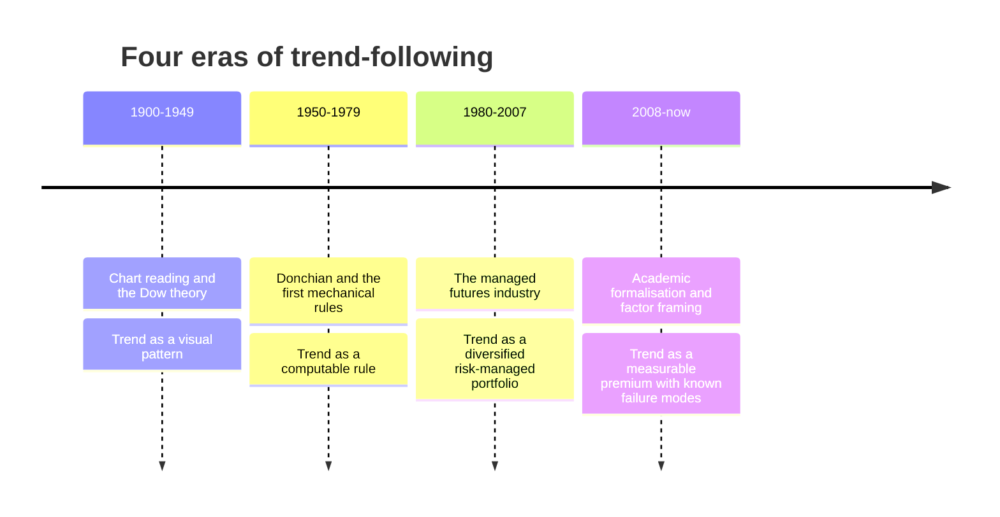
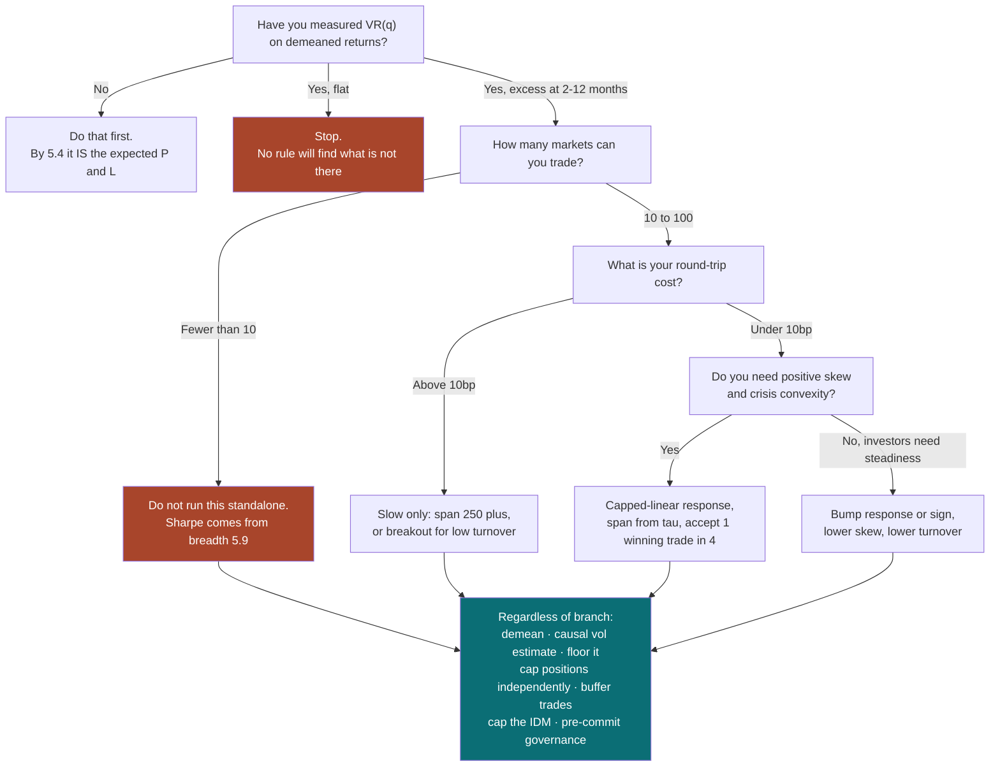

# Trend-Following in Financial Markets

### From the P&L identity to a working system

---

```{=html}
<aside class="eli5">
```

# ELI5 — the short version {#eli5}

```{=latex}
\begin{eli5}
```

**In one sentence.** A trend follower is a rule that holds more of whatever has been going up and sells whatever has been going down, and what such a rule actually earns is not what most descriptions of it claim.

**1. Markets do not "have" trends** ([§1](#1-what-trend-following-is)). "Spot the trend and ride it" sounds like a description of the world. But any price history splits into a smooth part and a rough part in infinitely many ways, and which one appears depends entirely on the ruler used. Fit a 50-day average and there is one trend. Fit a 10-day average and there are five. So "is this market trending?" is never a measurement. It is always a modelling choice, with the usual trade-off between jumping at noise and arriving late. The honest definition is mechanical: a trend-following system is any rule that turns past prices into a position, and holds more when recent returns were larger.

**2. What it is actually paid for** ([§5](#5-the-mathematics-of-trend-following-pl)). Two statements hold exactly, with no assumptions needed. First, the classic rule "own it while the price is above its own average" earns, each day, an amount proportional to how far the market's *variance ratio* exceeds one. The trading rule and the standard statistical test for trending are the same quantity. So the opportunity can be measured without running a backtest at all. Second, the rule's realised profit equals the accumulated smooth movement minus the accumulated jaggedness. A trend follower is long the smooth part of a price path and short the choppy part.

**3. The edge is tiny, and the diversification is the product** ([§5](#5-the-mathematics-of-trend-following-pl)). A diversified program earning a respectable risk-adjusted return corresponds to a correlation of about 0.0025 between one day's move and the next. That is so small that a decade of data from a single market cannot distinguish it from zero. Nobody is forecasting anything. The money comes from applying a nearly invisible edge across dozens of weakly related markets at once. That is why serious systems are designed around the portfolio rather than the indicator.

**4. The option-like payoff is bought, not given** ([§5](#5-the-mathematics-of-trend-following-pl)). Trend returns have the shape of a bought option: many small losses, rare large gains, and good behaviour in crises. That shape is real, and it is *paid for* continuously, in the choppiness the rule absorbs. Convexity is a cost structure, not a gift. It is also manufactured by trading, so it fails precisely where trading fails: gaps, limit moves and weekend jumps.

**5. The win rate says nothing** ([§1](#1-what-trend-following-is)). On a pure coin-flip market with no edge whatsoever, one common trend rule wins 41% of years and another wins 50%. Both have exactly zero expected return. The hit rate is a property of how positions are sized, not of whether an edge exists.

**6. A profitable backtest is not evidence** ([§2](#2-why-trends-could-exist), [§10](#10-evaluation-testing-a-trend-system-honestly)). Markets drift upward, and a trend system is usually long. So it makes money in a backtest even when there is no predictability at all. Subtract each market's own average return before testing. It is one line of code, and it removes the most common self-deception in this literature.

**7. Where the effort actually goes** ([§7](#7-taxonomy-and-equivalences), [§8](#8-from-signal-to-portfolio)). In order: clean data, volatility scaling, which markets to trade, how to combine them, the horizon, costs, and only then the indicator. In one simulation, adding volatility scaling moved the risk-adjusted return from 0.04 to 0.36, while doubling or halving the look-back cost about 5%. Six of the 10 famous indicators turn out to be the same weighted average of past returns, with the weights rearranged.

**8. Costs, not trends, set the speed** ([§8](#8-from-signal-to-portfolio)). At five basis points a round trip, a 20-day rule is unprofitable, while a 320-day rule keeps 84% of what it earns before costs. That, rather than any belief about where the trends are, is why production systems are slow.

**9. Whether it still works is genuinely open** ([§9](#9-when-trends-fade-and-fail)). Fast trend has decayed, and the slow version probably survives at a reduced level. But a bad decade is statistically uninformative here, because 10 years cannot tell a modest edge from none. So decide in advance what evidence would justify stopping. At these returns, a losing run of several years is unremarkable, and the decision to quit is the largest unhedged risk in the program.

---

**If you do only three things:** measure the variance-ratio profile before you backtest anything, demean each market's returns before believing a result, and scale positions by volatility — it is worth more than every indicator choice put together.

```{=latex}
\end{eli5}
```

```{=html}
</aside>
```

---

**What this is.** Trend-following is the oldest systematic trading strategy still in industrial use, and its theory is more often stated badly than that of any other. This chapter builds it from first principles. It covers what the object *is* mathematically, what quantity a trend follower actually harvests, and how that quantity is estimated in practice. It then covers when and why the quantity disappears, and what the surrounding risk apparatus is for.

**How to read this chapter.** Sections 1–3 are conceptual and historical: the mental model, the candidate mechanisms, and how the industry arrived at its current shape. Section 4 is the bibliography. Sections 5–7 are the technical core. §5 derives what trend-following earns and what shape its payoff has. §6 surveys every serious way to estimate a trend. §7 shows that most of §6 is one estimator with three knobs. Sections 8–11 are engineering: portfolio construction, degradation, evaluation and risk. Section 12 is the synthesis.

Different readers can start in different places.

- Readers who want only the most important idea should read §5.4, §5.5 and §7.2.
- Readers implementing a system should read §8 and §11, and treat the rest as reference.

**Objectives.** After this chapter, you should be able to:

- define a trend-following system as a map from price history to position, and separate trend from momentum and drift;
- derive a trend rule's expected P&L from the autocovariances of returns, and show that the canonical rule is long the variance ratio;
- decompose realised trend P&L into convexity, trend energy and realised variance, and say what each term costs;
- set a lookback from the persistence of trends rather than from a backtest, and explain why the optimum is flat;
- build the sizing and portfolio layers, including volatility scaling, the diversification multiplier and a no-trade buffer;
- test a trend system honestly, with demeaned returns, synthetic paths and a null bootstrap.

**Relationship to the momentum note.** A companion chapter, [Momentum in Financial Markets](momentum_deep_dive.html), treats *momentum*: the statistical phenomenon of return predictability from past returns. This chapter treats *trend-following*: the trading system. The two are not the same thing, and §1.4 makes the distinction precise. The momentum chapter goes deeper on signal measurement and cross-sectional design. This one goes deeper on the P&L functional, position sizing and risk. Each stands alone. The overlap is deliberate and small.

**Epistemic tags.** The chapters in this collection flag claims by status:

- **[Fact]** — replicated across independent datasets or implementations; broad agreement.
- **[Contested]** — documented, but with live disagreement about magnitude, robustness, or cause.
- **[Hypothesis]** — a proposed mechanism, not decisively tested.
- **[Practice]** — practitioner convention; the evidence may be private or absent. A [Practice] claim is not a debunked one.

Tags appear only where the status changes what a reader should do. A tag governs the sentence or clause it opens. Untagged sentences are definitions, derivations or arithmetic: true by construction rather than by evidence. Several of the derivations were checked numerically for this chapter. Where a number in the text comes from a simulation run for this chapter rather than from a paper, the text says so.

---

**Notation.** The table lists every symbol that recurs in the chapter, with the section that defines or first uses it. Symbols used in only one section are defined where they appear. A *bar* is whatever sampling interval is in use.

| Symbol | Meaning | Defined in |
|---|---|---|
| $P_t$; $p_t$ | Price at time $t$; log price, $p_t = \ln P_t$ | §1.2 |
| $r_t$ | One-bar log return, $r_t = p_t - p_{t-1}$ | §1.2 |
| $A$ | Number of bars per year (252 or 256 for daily data) | §8.5 |
| $\mathcal{F}_t$ | Information set available at $t$ | §1.2 |
| $\pi_t$ | **Position**: the signed exposure held over $(t, t+1]$, chosen using $\mathcal{F}_t$ only; in units of capital in §5 | §1.2, §5.1 |
| $s_t$ | Raw **signal** | §5.1 |
| $x_t$ | Exponentially weighted trend estimate, $x_t = (1-\alpha) x_{t-1} + \alpha r_t$ | §1.5, §5.5 |
| $\alpha$ | EWMA decay, $\alpha \in (0,1)$, whose **span** is $2/\alpha - 1$ bars | §5.5, §6.2 |
| $w_k$; $\{w_k\}$ | Weight a linear filter places on $r_{t-k}$; the collection of weights, the **kernel** | §1.3, §5.1 |
| $g(\cdot)$; $z_t$ | **Response function** mapping a normalised signal to a position; the normalised signal | §1.3, §8.4 |
| $\mu$ | Unconditional mean return (drift) | §5.2 |
| $\gamma_k$; $\rho_k$ | Lag-$k$ autocovariance $\operatorname{Cov}(r_t, r_{t+k})$; autocorrelation $\gamma_k/\gamma_0$; $\gamma_0 = \sigma^2$ is the per-bar return variance | §5.2 |
| $\mathrm{VR}(q)$ | Variance ratio at horizon $q$ | §5.4 |
| $\hat\sigma_t$; $\sigma^\star$ | Estimate, formed from $\mathcal{F}_t$, of per-bar return volatility; target volatility | §1.3, §8.3 |
| $\tilde r_{i,t}$ | Return of market $i$ after the signal stage's normalisation | §1.3, §7.1 |
| $c_t$; IDM | Portfolio-level multiplier; instrument diversification multiplier | §1.3, §8.6 |
| $L$; $n$ | Lookback in bars, in rules defined on returns; moving-average window, in rules defined on prices | §6.1, §6.2 |
| $\mu_t$; $\phi$; $\tau$ | In the hidden-trend model: the unobserved drift; its autoregressive coefficient; its persistence timescale $\tau = 1/(1-\phi)$, in bars | §5.8 |
| $\sigma_\varepsilon$; $\sigma_\eta$; $\theta$ | Noise volatility; volatility of the drift's innovations; per-bar signal-to-noise ratio $\theta = \operatorname{sd}(\mu_t)/\sigma_\varepsilon$ | §5.8 |
| $K$; $\alpha^\star$ | Steady-state Kalman gain; the optimal EWMA decay it implies | §5.8 |
| $N$; $\bar\rho$ | Number of instruments; average pairwise correlation *of strategy returns* | §5.9 |
| $S$ | Sharpe ratio of a strategy, annualised | §5.9 |

Several symbols carry a qualification:

- $\bar\rho$ is a correlation across markets, distinct from $\rho_k$, which is always an autocorrelation of one series.
- $\alpha$ is always an EWMA decay constant, never a significance level.
- $\sigma$ is always a return volatility, except where subscripted as $\sigma_\eta$ or $\sigma_\varepsilon$ for model innovations.
- $\varepsilon_t$ is generic observation noise, attached to whichever series the surrounding model observes: the price in §1.4 and §6.6, the return in §5.8.
- The *subscripted* $\tau_t$ of §1.4 and §6.7 is the smooth trend *component* of a decomposition, a different object from the unsubscripted persistence timescale $\tau$.

---

## Table of contents

- [ELI5 — the short version](#eli5)

1. [What trend-following is](#1-what-trend-following-is)
2. [Why trends could exist](#2-why-trends-could-exist)
3. [How the practice evolved](#3-how-the-practice-evolved)
4. [Foundational references](#4-foundational-references)
5. [The mathematics of trend-following P&L](#5-the-mathematics-of-trend-following-pl)
6. [Trend estimation and detection](#6-trend-estimation-and-detection)
7. [Taxonomy and equivalences](#7-taxonomy-and-equivalences)
8. [From signal to portfolio](#8-from-signal-to-portfolio)
9. [When trends fade and fail](#9-when-trends-fade-and-fail)
10. [Evaluation: testing a trend system honestly](#10-evaluation-testing-a-trend-system-honestly)
11. [Pitfalls and risk management](#11-pitfalls-and-risk-management)
12. [Synthesis](#12-synthesis)

---

# 1. What trend-following is {#1-what-trend-following-is}

## 1.1 The wrong intuition

Practitioners usually describe trend-following as some version of *"identify that a market is trending, and ride the trend."* The description is not so much wrong as unusable. It presupposes that "is trending" is a property a market has, which could in principle be detected.

It is not. What is actually observed is a finite sequence of prices. Every such sequence, without exception, decomposes into a smooth part and a rough part in infinitely many ways. Fit a 50-day moving average and there is one trend. Fit a 5-day one and the same data have six trends. Fit a straight line and there is one. None of these decompositions is more correct than the others, because "trend" is not a feature of the data. It is a feature of the *model imposed on the data*. A price path no more comes with a trend attached than a photograph comes with a Fourier transform attached.

The second wrong intuition is the physical one, inherited from the word "momentum": a market in motion tends to stay in motion. A price series has no conserved quantity, no mass and no inertia. Systems built from this starting point assume persistence, and every reversal surprises them.

The third wrong intuition is the most costly in practice: that trend-following is a *prediction* problem. It looks like one, because it estimates something from the past and takes a position on the future. But the estimate a trend follower forms is almost never accurate enough to be called a forecast in any ordinary sense. §5.9 makes this quantitative. The return predictability that supports the entire managed futures industry corresponds to a daily return autocorrelation of roughly $0.0025$. That cannot be distinguished from zero in a single market's 10-year history. Evaluated as a forecast, a trend signal is correctly judged a terrible forecast, and then incorrectly judged worthless.

## 1.2 The right starting point: a map from paths to positions

The definition to hold is deliberately mechanical:

> **A trend-following system is a function that maps the observed price history to a position, with the property that the position is an increasing function of recent price changes.**

$$\pi_t = F(p_t, p_{t-1}, p_{t-2}, \ldots), \qquad
\frac{\partial \pi_t}{\partial r_{t-k}} \ge 0 \ \text{ for all } k \ge 0$$

That is the whole object. The definition contains no claim that a trend exists, no forecast, no latent state and no regime. It is a rule, and a rule can be evaluated without believing anything about the data-generating process. The monotonicity condition, that positions increase in past returns, makes the rule trend-*following* rather than mean-reverting. The requirement that $\pi_t$ use only information through $t$ makes it implementable.

Everything interesting follows from two questions about this function:

1. **What does it earn?** The P&L is $\sum_t \pi_t r_{t+1}$. Because $\pi_t$ is a function of past returns, the expected P&L is a functional of the autocovariance structure of the return process. §5 works this out exactly. The answer, that *trend-following is long autocovariance and long squared drift*, is the organising fact of the field.
2. **What shape is the payoff?** Because $\pi_t$ grows with past returns, the strategy is long when prices have risen and short when they have fallen. So its P&L is a *convex* function of the price path. §5.5 and §5.6 make this precise. The convexity turns out to be, exactly and algebraically, a long position in long-horizon variance against short-horizon variance.

## 1.3 The master form

Essentially every trend system in production is the same four-stage pipeline. Writing it down once prevents enormous confusion later. The "hundreds of indicators" in the practitioner literature are choices of one or two stages, with everything else held fixed.

$$\boxed{\ \pi_{i,t} \;=\; \underbrace{\frac{\sigma^\star}{\hat\sigma_{i,t}}}_{\text{(3) risk scaling}}
\cdot \underbrace{g\Big(\underbrace{{\textstyle\sum_{k\ge 0}} w_k\, \tilde r_{i,t-k}}_{\text{(1) kernel}}\Big)}_{\text{(2) response}}
\cdot \underbrace{c_t}_{\text{(4) aggregation}}\ }$$

Here $\tilde r_{i,t}$ is the return of market $i$ at $t$, possibly normalised, and $c_t$ is a multiplier at the portfolio level. The table describes the four stages.

| Stage | What it does | What varies between systems |
|---|---|---|
| **(1) Kernel** $\{w_k\}$ | Summarises the recent past into one number | Shape and timescale of the weights on past returns |
| **(2) Response** $g(\cdot)$ | Converts the signal into a desired exposure | Linear, capped, sign, or bump-shaped |
| **(3) Risk scaling** $\sigma^\star/\hat\sigma_{i,t}$ | Converts exposure into a position of known risk | Volatility estimator and target |
| **(4) Aggregation** $c_t$ | Combines markets into a portfolio at a total risk level | Correlation handling, capital constraint, drawdown control |

A 200-day moving-average crossover, a Donchian channel breakout, the sign of 12-month time-series momentum, and a Kalman-filtered local-linear-trend model are all points in this space. §6 enumerates them. §7 shows their equivalences, several of which are exact identities rather than analogies.

The stage that matters most is not the one practitioners argue about. §7.3 and §8.1 argue that **stage (3) dominates**, stage (4) comes second, and stages (1) and (2) matter least. Those two stages contain the "indicator", the part with a name and a fan club. In a simulation with realistic volatility clustering, moving from a raw signal to a volatility-scaled one took the Sharpe ratio from $0.04$ to $0.36$. Changing the kernel's timescale by a factor of two from its optimum cost about $5\%$ of the Sharpe ratio.

## 1.4 What trend-following is not

Confusing the concepts in the table causes real losses. The middle column says what each object formally *is*. The right column says why it gets confused with trend-following.

```{=latex}
\newpage
```

| Concept | Formal object | Why it is confused with trend-following |
|---|---|---|
| **Trend-following** | A map $\pi_t = F(\mathcal{F}_t)$ increasing in past returns | — |
| **Momentum** | The statistical claim $\mathbb{E}[r_{t+1}\mid r_{t-L:t}]$ is increasing in past returns | Trend rules *monetise* momentum, but they also monetise drift and convexity. A profitable trend backtest is not evidence of momentum |
| **Drift** | The unconditional mean $\mu = \mathbb{E}[r_t]$ | A long-only asset with positive drift produces a positive trend backtest with zero predictability (§5.3) |
| **Trend, as a decomposition** | The low-frequency component $\tau_t$ in a trend-plus-cycle-plus-noise split $p_t = \tau_t + \psi_t + \varepsilon_t$ | This is a modelling choice, not an observable. A perfectly trending line plus noise has *negative* return autocorrelation |
| **Technical analysis** | A heterogeneous body of chart-pattern heuristics | Trend rules were born inside it, and share vocabulary. But a trend rule is a measurable function with a testable P&L; a head-and-shoulders pattern is not |
| **Market timing** | Switching between an asset and cash on a signal | A long-only trend rule *is* market timing, but trend-following in general is long/short and multi-market |
| **Managed futures / CTA** | An industry and a fee structure | Most CTAs are trend-followers, so index returns are used as a proxy for the strategy. The proxy carries fees, survivorship, and strategy drift |
| **Buy-the-dip / mean reversion** | $\partial\pi_t/\partial r_{t-k} < 0$ | Literally the same functional with the opposite sign. The sign that is correct depends entirely on the horizon (§9.2) |

Two of these distinctions deserve expansion, because they are the ones that corrupt research.

### Trend is not momentum, and a backtest cannot tell them apart

Take a price process that is a deterministic upward line plus independent noise:

$$p_t = \mu t + \varepsilon_t, \qquad \varepsilon_t \sim \text{iid}(0, \sigma_\varepsilon^2)$$

In the decomposition sense, this series has a *perfect* trend: the low-frequency component is exactly $\mu t$. Its returns are $r_t = \mu + \varepsilon_t - \varepsilon_{t-1}$, an MA(1) with autocorrelation $\rho_1 = -1/2$ and $\rho_k = 0$ for $k \ge 2$. So the series has a perfect trend and *anti*-momentum: an up move predicts a down move.

Meanwhile, $r_t = \phi r_{t-1} + u_t$ with $\phi > 0$ and zero mean has momentum and no trend at all. The level wanders with no low-frequency component.

**Trend is a property of the level; momentum is a property of the returns.** A trend-following *rule* does not distinguish them. It makes money from drift, from trend and from return autocorrelation, and its P&L does not reveal which. That is fine for earning money and fatal for research, because the three have completely different stability properties. Drift is stable and carries little information. Autocorrelation is fragile and carries a lot. And a rule that is secretly harvesting drift will fail as soon as it is applied to a market without drift.

### The convexity is not a free option

Trend-following's payoff resembles a long straddle (§5.6). This observation is often presented as good news: "trend-following gives you convexity for free". It does not. Convexity is never free; the only question is how it is paid for. A straddle buyer pays a premium up front. A trend follower pays continuously, through the whipsaw losses incurred when a signal reverses. §5.5 shows the payment appearing explicitly as a $-\sum_t r_t^2$ term in an exact algebraic identity. The strategy is profitable precisely when what it collects from the persistence of trends exceeds what it pays in realised variance, and not otherwise.

## 1.5 The payoff in one picture

The clearest way to see what kind of object this is: run a trend rule on paths with *no* predictability whatsoever, pure random walks, and plot what it earns. The figure shows the result.

```{=html}
<style>
/* Figures for this document. Prefix "mdd-", shared with the other notes and
   distinct from the reading widget's "rdw-". Narrow viewports reclaim the
   body's side padding so the figure gets the full width. */
.mdd-fig {
  display: block; width: 100%; height: auto;
  max-width: 640px; margin: 1.6rem auto;
  /* the reading widget adds a light plate (padding) in dark mode */
  box-sizing: border-box;
}
@media (max-width: 760px) {
  .mdd-fig { width: calc(100% + 64px); max-width: none; margin-left: -32px; margin-right: -32px; }
}
@media (max-width: 600px) { /* pandoc's own stylesheet drops body padding to 12px here */
  .mdd-fig { width: calc(100% + 24px); margin-left: -12px; margin-right: -12px; }
}
</style>


```

```{=latex}
\begin{center}
\includegraphics[width=\linewidth]{quant-research/figures/trend_convexity.pdf}
\end{center}
```

The figure comes from a simulation, run for this chapter, of 60,000 independent random-walk years with a 65-bar-span EWMA rule. Three points follow from it:

1. **Conditional on the size of the year's move, the payoff is a smile.** Big moves in either direction pay, and small moves cost. This is the straddle analogy, and it holds for both response functions.
2. **The mean is zero, as it must be.** The underlying has no predictability. The simulated mean P&L was $+0.003$ risk units, against a standard deviation of $1.0$. None of this is edge.
3. **But the linear rule's P&L is right-skewed, with a negative median.** It was profitable in only $41\%$ of years, with a median of $-0.21$ risk units and a skew of $+1.40$. The sign-response rule discards the magnitude of the signal. It was profitable in exactly $50\%$ of years, with a skew of $-0.01$. That symmetry is not luck. The sign rule's P&L is $\sum_t \operatorname{sign}(x_t) r_{t+1}$: driftless increments, each multiplied by $\pm 1$. In continuous time, it is $\int_0^T \operatorname{sign}(x_t)\,dW_t$, whose quadratic variation is exactly $T$. By Lévy's characterisation, that integral *is* a Brownian motion. So the sign rule's annual P&L is exactly Gaussian: median zero, skew zero, and a win half the time.

Point 3 is the one people get wrong. **A low hit rate is not evidence of a bad strategy, and a high hit rate is not evidence of a good one.** With zero edge, either can be produced purely by choosing the response function. [Potters and Bouchaud (2006)](https://arxiv.org/abs/physics/0508104){target="_blank"} derived this analytically. For a trend rule on a driftless random walk, the average gain per trade is exactly zero, while the fraction of winning trades falls below one half. With no drift, the win rate does not depend on scale, because volatility cancels out of the problem entirely. At a fixed drift, the win rate falls as volatility rises, because it tracks the ratio of the two. When diagnosing a trend system, the hit rate reveals the shape of $g$, not whether the system works.

> ### §1 Key takeaways
>
> 1. A market does not "have" a trend. A trend is a property of the imposed model. "Detecting a trend" is therefore always a modelling choice with a Type I / Type II trade-off, never a measurement.
> 2. Define the object mechanically: **a trend-following system is a map from price history to position, increasing in recent returns**. Everything else derives from that map.
> 3. The system is not a forecaster. The predictability it exploits is far too small to detect in one market (§5.9), and it is visible only in aggregate.
> 4. Every production system is the same four-stage pipeline: kernel, response, risk scaling and aggregation. Named indicators are choices of the first two stages.
> 5. **Risk scaling matters more than the indicator.** In simulation, adding volatility normalisation moved the Sharpe ratio from 0.04 to 0.36, while halving or doubling the kernel timescale cost about 5%.
> 6. Trend $\ne$ momentum $\ne$ drift. A profitable trend backtest is consistent with zero return predictability, so it is not evidence of momentum.
> 7. The payoff is option-like, and the option is *paid for* continuously, in realised variance. Convexity is a cost structure, not a gift.
> 8. The hit rate is a property of the response function, not of the edge. On a pure random walk, a linear trend rule wins 41% of years and a sign rule wins 50%, with identical (zero) expected returns.

---

# 2. Why trends could exist {#2-why-trends-could-exist}

## 2.1 The objection that has to be answered first

If prices reflected all available information, past prices would be useless for predicting future ones. Every rule of the form $\pi_t = F(\mathcal{F}_t)$ would then have zero expected P&L. Trend-following uses only the price series itself, the most public dataset in existence. So it is the weakest possible violation of market efficiency, and the strategy that the efficient-markets hypothesis most obviously forbids.

There are three replies, in increasing order of force.

**The joint-hypothesis reply.** Any test of efficiency is a joint test of efficiency and of an asset-pricing model. If trend-following earns a positive return that compensates for a risk the model does not contain, efficiency survives. This reply is logically airtight and empirically almost empty, because a risk factor can always be postulated. But it does mean that "trend-following works" and "markets are efficient" are not formally contradictory.

**The Grossman–Stiglitz reply.** If prices were perfectly informative, no one would pay to gather information, and so prices could not be informative. Equilibrium therefore requires prices to be *slightly* wrong: wrong enough to pay the marginal information-gatherer's costs, and no more. The equilibrium level of inefficiency is not zero. It is the level at which arbitrage is barely worth doing after costs. Trend-following's measured edge, a per-market Sharpe ratio of order $0.2$–$0.4$ before costs (§5.9), is roughly what "barely worth doing" looks like.

**The empirical reply.** The effect has been documented over very long samples, including in markets that did not exist when the rules were designed. [Hurst, Ooi and Pedersen (2017)](https://papers.ssrn.com/sol3/papers.cfm?abstract_id=2993026){target="_blank"} report positive trend-following returns across 67 markets back to 1880. [Lempérière and co-authors (2014)](https://arxiv.org/abs/1404.3274){target="_blank"} find a $t$-statistic of about 5 since 1960, and about 10 since 1800, on spot commodity and index series, after removing the markets' own drift. **[Contested]** Both are practitioner studies by firms that sell the strategy, which is a real reason for discount. But these firms are also the only groups with the data, and their long-horizon results have not been overturned. Against them, [Huang, Li, Wang and Zhou (2020)](https://ink.library.smu.edu.sg/context/lkcsb_research/article/7520/viewcontent/Time_series_momentum_JFE_sv.pdf){target="_blank"} argue that the canonical time-series momentum test is confounded by exactly the drift those papers try to remove. After correcting for it, they find little evidence of the effect (§5.3). The disagreement is live, and it concerns specification, not data.

None of this explains *why* trends exist. Five families of mechanism have been proposed, and the subsections below take them in turn. They are not mutually exclusive. The view taken here is that all five contribute, in proportions that vary by asset class and horizon.

## 2.2 Family A — slow information diffusion

**[Hypothesis, well-formalised]** Information reaches market participants gradually rather than instantaneously. If news reaches one group at $t$ and another at $t+k$, the price adjusts in steps. A sequence of partial adjustments in the same direction is precisely positive return autocorrelation.

Hong and Stein (1999) formalise this with two types of agent. "Newswatchers" trade on private information but ignore prices. "Momentum traders" trade on price changes but ignore fundamentals. Slow diffusion among newswatchers produces underreaction, which momentum traders then amplify into overshooting and eventual reversal. The model is attractive because a single assumption generates the whole empirically observed sign pattern (§9.2), not just one piece of it: underreaction at short horizons, momentum at medium ones, and reversal at long ones.

**What would falsify it:** trends should be stronger where information diffuses more slowly, in smaller, less-covered and less-liquid markets. This is broadly supported in equities, where momentum is stronger in small caps and in names with low analyst coverage. As an explanation for trends in Treasury futures or major FX, it is much weaker. Those are the most information-efficient markets in existence, and trend-following nonetheless works well in them. That gap is the strongest evidence against diffusion being the whole story.

## 2.3 Family B — behavioural biases

**[Hypothesis]** Several biases documented at the individual level produce sluggish price adjustment in aggregate:

- **Anchoring and conservatism.** Barberis, Shleifer and Vishny (1998) model investors who update too slowly from a prior. That produces underreaction to individual news and overreaction to long streaks.
- **Overconfidence and biased self-attribution.** Daniel, Hirshleifer and Subrahmanyam (1998) model investors who overweight private signals and attribute confirming public news to their own skill. That produces continued overreaction and eventual correction.
- **The disposition effect.** Investors sell winners too early and hold losers too long. Grinblatt and Han (2005) show that this creates a spread between the market price and a reference price, and that the spread predicts returns. The selling pressure on winners slows the adjustment, so the price drifts toward fundamental value slowly rather than jumping.
- **Extrapolative expectations.** Greenwood and Shleifer (2014) show from survey data that investors expect *high* returns after high past returns. A rational model with mean-reverting returns predicts the opposite. Barberis and co-authors (2015) build an equilibrium model on this finding.

**The problem with this family** is not that the biases are unreal. They are well documented at the individual level. The problem is the step from individual bias to price impact, which requires the biased agents to be the marginal price-setters. In Treasury futures, they are not. Behavioural explanations do good work in equities, and much less in the futures markets where trend-following actually earns most of its money.

## 2.4 Family C — mechanical and flow-driven persistence

**[Fact for the mechanism, [Hypothesis] for its share of the effect]** This family requires no irrationality at all. Several structural features of markets mechanically generate serially correlated order flow, and serially correlated order flow generates serially correlated returns.

- **Metaorder execution.** A large institutional order cannot be executed at once. It is split into child orders over hours or days, and each child order pushes the price in the same direction. The empirical impact of a metaorder of size $Q$ scales as $\sqrt{Q}$. Tóth and co-authors (2011) document this "square-root law" across markets and brokers. The impact accumulates over the execution horizon, which is exactly a short-horizon trend.
- **Risk-management flows.** Volatility targeting, portfolio insurance, stop losses, margin calls and value-at-risk limits all force selling into declines and buying into rallies. Brunnermeier and Pedersen (2009) formalise the destabilising loop: losses tighten funding, tighter funding forces deleveraging, and deleveraging causes losses.
- **Systematic rebalancing.** Leveraged ETFs must rebalance daily in the direction of the day's move. Target-date and risk-parity funds rebalance on schedules. These are price-taking flows with known signs.
- **Central-bank and macro persistence.** Policy rates move in cycles lasting quarters to years, and inflation and growth are persistent. Futures markets on rates, bonds and currencies inherit that persistence directly. This is the most plausible single explanation for why trend-following works best in fixed income and FX, and it is not a story about market inefficiency at all.

[Hypothesis] The view taken here is that this family is the most likely primary driver in futures markets. The reason is that it predicts trend-following should work wherever large slow flows exist, regardless of investor sophistication. That is what the cross-section of results looks like.

## 2.5 Family D — risk transfer and hedging pressure

**[Contested]** Futures markets contain natural hedgers with inelastic demand, such as a producer who must sell forward or an airline that must buy fuel. Keynes argued that the speculators who take the other side must be compensated. That produces a risk premium tied to the direction of hedging pressure. De Roon, Nijman and Veld (2000) find hedging-pressure effects in futures returns across markets.

This explains a *return*. It explains a trend only if hedging pressure is itself persistent, which it plausibly is, since a producer's hedging need changes with the slow-moving fundamentals of the business. On this account, trend-following does not exploit an error. It is paid to warehouse risk that someone else must shed, and the payment persists as long as the need does.

One feature of this story deserves attention: what it implies about *convexity*. A liquidity provider to forced sellers earns a premium and takes tail risk. A trend follower buys convexity and pays a premium. Those are opposite exposures, so hedging pressure cannot be the whole explanation. But it may well account for a large part of the *level* of returns, in commodities specifically.

## 2.6 Family E — there is no effect, only drift and selection

**[Contested]** The nihilist position deserves its strongest statement, because it is not obviously wrong.

Most assets have positive expected returns. A trend rule applied to an asset with positive drift will be long most of the time, and it will therefore earn the drift. §5.3 shows that the standard time-series momentum test is *positively biased* by exactly this effect: $\mathbb{E}[r_{t+1}\cdot\operatorname{sign}(r_{t-L:t})] > 0$ whenever $\mu > 0$, even under complete independence. [Huang and co-authors (2020)](https://ink.library.smu.edu.sg/context/lkcsb_research/article/7520/viewcontent/Time_series_momentum_JFE_sv.pdf){target="_blank"} make this argument formally. In their sample, the time-series momentum effect largely disappears once the unconditional mean is controlled for.

A second layer sits on top. The strategy's parameters were selected by decades of practitioner search over the same price histories now used to validate it, which is the definition of data snooping. [Sullivan, Timmermann and White (1999)](https://www.kevinsheppard.com/files/teaching/mfe/advanced-econometrics/Sullivan_Timmermann_White.pdf){target="_blank"} applied White's Reality Check to a universe of nearly 8,000 technical trading rules. Rules that looked strongly significant in isolation were not significant once the search was accounted for. Brock, Lakonishok and LeBaron (1992) had earlier found technical rules profitable on the Dow over 1897–1986, and the snooping critique is aimed squarely at results of that kind. The survey of the whole technical-analysis literature by [Park and Irwin (2007)](https://papers.ssrn.com/sol3/papers.cfm?abstract_id=603481){target="_blank"} concludes that data snooping and ignored transaction costs substantially compromised the early positive results.

A third layer concerns delivery. CTA returns as actually delivered to investors are far worse than the strategy's paper returns. [Bhardwaj, Gorton and Rouwenhorst (2014)](https://www.nber.org/papers/w14424){target="_blank"} find that after fees, investors in commodity trading advisors earned close to nothing. The funds' gross performance and its persistence were both weak once survivorship and backfill biases were removed.

**The view taken here.** Families C and D are probably real and probably small. Family E is the correct null, and the long-history studies have weakened it but not defeated it. Families A and B do genuine work in equities and less elsewhere. The specific claim defensible on this evidence is narrow: *futures markets exhibit weak positive return autocorrelation at horizons of weeks to months, of a size that supports a diversified gross Sharpe ratio of roughly 0.7–1.0, and an investor experience net of fees much worse than that.* Anyone claiming more should be asked what evidence they have that survives the drift adjustment.

## 2.7 Telling the families apart

Talk of mechanisms is cheap unless it makes differential predictions. These do, as the table shows.

```{=latex}
\newpage
```

| Family | Predicts trend is stronger… | Predicts trend is weaker… | Distinguishing test |
|---|---|---|---|
| **A. Slow diffusion** | in less-covered, less-liquid, more-opaque markets | in the most efficient markets | Cross-sectional: sort markets by information efficiency |
| **B. Behavioural** | where retail and unsophisticated flow dominates | in institutional-only markets | Sort by investor composition; test disposition-effect proxies directly |
| **C. Mechanical flow** | where large slow flows exist, regardless of sophistication | where flows are small or fast | Use positioning and metaorder data; test whether trend returns concentrate around known flow events |
| **D. Hedging pressure** | in physical commodities with concentrated hedgers | in financial futures | Commitments-of-Traders positioning as a conditioning variable |
| **E. Drift plus snooping** | nowhere — the effect is an artefact | everywhere, after correction | Demean returns before testing; out-of-sample on markets and eras not used in rule design |

The cheapest discriminating test is family E's. [Practice] **Recommendation: demean the returns market by market before running any trend test.** An effect that survives is something. An effect that does not survive is a rediscovery that stocks and bonds went up. The test costs one line of code, and it eliminates the most common way that trend research fools its author.

> ### §2 Key takeaways
>
> 1. Trend-following is the weakest possible violation of efficiency, because it uses only public prices. So it demands a mechanism, not just a backtest.
> 2. Grossman–Stiglitz makes a small residual inefficiency a *requirement* of equilibrium, not an anomaly. The measured size of the trend effect is about what "barely worth arbitraging" should look like.
> 3. Five families of mechanism are on the table: slow diffusion, behavioural bias, mechanical flow, hedging pressure, and "it's just drift". They are not mutually exclusive, and each explains a different subset of the evidence.
> 4. Behavioural and diffusion stories do their best work in equities and their worst in Treasury and FX futures, which is where trend-following earns most of its money. Treat that gap as unresolved, not as a detail.
> 5. **The view taken here is that mechanical flow (family C) is the most likely primary driver in futures.** It predicts trends wherever slow flows exist, regardless of investor sophistication, which matches the cross-section.
> 6. The nihilist null, drift plus data snooping, has not been defeated. Long-history evidence, produced by interested parties, has weakened it.
> 7. **Demean each market's returns before testing.** It is one line of code, and it removes the most common self-deception in this literature.

---

# 3. How the practice evolved {#3-how-the-practice-evolved}

Trend-following's history is unusual. The practice ran roughly 40 years ahead of the theory, and the two communities barely spoke. Systematic futures traders were running volatility-scaled multi-market trend portfolios in the 1970s. The first academic paper to describe that object as a factor appeared in 2012. The history is worth reading in order mainly because it explains why the standard implementation looks the way it does: most of its features are scar tissue. The timeline shows the four eras.


```mermaid
timeline
    title Four eras of trend-following
    1900-1949 : Chart reading and the Dow theory : Trend as a visual pattern
    1950-1979 : Donchian and the first mechanical rules : Trend as a computable rule
    1980-2007 : The managed futures industry : Trend as a diversified risk-managed portfolio
    2008-now  : Academic formalisation and factor framing : Trend as a measurable premium with known failure modes
```

## 3.1 Era I — Chart reading (1900–1949)

- **Contribution.** The idea that price movements have a direction that persists, and that a participant should align with it rather than oppose it. Dow's editorials, later systematised as "Dow theory", introduced primary and secondary trends, and the confirmation of one index by another.
- **What changed.** Trend became something about which a systematic opinion was possible, rather than a description applied after the fact.
- **Limitations.** Nothing here was a rule. Every judgement, such as whether a trend was primary or had been confirmed, required a human. So it could not be tested, and its results could not be attributed.
- **Lasting influence.** Small, and mostly vocabulary. The specific patterns, such as head and shoulders and triangles, have not survived quantitative testing. Lo, Mamaysky and Wang (2000) gave them the fairest possible test with kernel smoothing, and found weak statistical content that was mostly not tradeable.

## 3.2 Era II — Mechanical rules (1950–1979)

- **Contribution.** Richard Donchian's moving-average and channel-breakout rules turned trend-following into arithmetic: a rule anyone could compute, on a schedule, without judgement. Donchian's 5- and 20-day moving-average crossover and the "$n$-day high" breakout are still the reference implementations.
- **What changed.** Once the rule was mechanical, it could be backtested, and its P&L could be attributed to the rule rather than to the trader. This is the most important methodological step in the field's history.
- **Limitations.** The rules were single-market and fixed-size, with no volatility scaling and no portfolio construction. Position size was a fixed number of contracts. So risk varied by a factor of five across markets, and across time within one market.
- **Lasting influence.** Enormous. Every rule in §6.1–§6.5 descends from Donchian, and the breakout rule in particular is essentially unchanged.

## 3.3 Era III — The industry (1980–2007)

- **Contribution.** Trend-following was built into a *portfolio* discipline: many markets, positions sized by volatility, risk budgeted at the level of the book, and systematic roll and execution. The firms, such as Campbell, Millburn, AHL, Chesapeake, Winton, Aspect and the Dennis–Eckhardt "Turtle" cohort, developed this largely in private and largely without publishing.
- **What changed.** The firms realised that the edge per market is small and that the portfolio effect supplies most of the return. A per-market Sharpe ratio of $0.3$ across 50 weakly correlated markets gives a portfolio Sharpe ratio of $0.7$ to $1.1$, depending on how weak "weakly" is (§5.9). No single market's rule needed to be good.
- **Limitations.** Almost none of it was published, so the evidence base was track records. Track records carry survivorship, selection and opaque fees. [Bhardwaj, Gorton and Rouwenhorst (2014)](https://www.nber.org/papers/w14424){target="_blank"} later showed how much those biases were hiding.
- **Lasting influence.** The modern implementation was invented in this era. Volatility targeting, correlation-aware sizing, ensembles across timescales and systematic roll all date from it, and §8 essentially describes what these firms worked out.

## 3.4 Era IV — Formalisation (2008–present)

- **Contribution.** Academic and quantitative-practitioner work made the object measurable. [Moskowitz, Ooi and Pedersen (2012)](https://w4.stern.nyu.edu/facdir/lpederse/papers/TimeSeriesMomentum.pdf){target="_blank"} introduced "time-series momentum" as a factor across 58 futures markets. [Fung and Hsieh (2001)](http://neumann.hec.ca/pages/nicolas.papageorgiou/qfm/papers/FungHsieh2001.pdf){target="_blank"} had already shown that trend followers' returns load on lookback straddles rather than on linear asset exposures. [Potters and Bouchaud (2006)](https://arxiv.org/abs/physics/0508104){target="_blank"}, [Bruder and Gaussel (2011)](https://papers.ssrn.com/sol3/papers.cfm?abstract_id=2465623){target="_blank"} and [Dao and co-authors (2016)](https://arxiv.org/abs/1607.02410){target="_blank"} derived the P&L decomposition that §5 reconstructs. [Levine and Pedersen (2016)](https://www.tandfonline.com/doi/pdf/10.2469/faj.v72.n3.3){target="_blank"} and [Beekhuizen and Hallerbach (2017)](https://www.ssrn.com/abstract=2604942){target="_blank"} showed that the various trend rules are one filter with different weights.
- **What changed.** Trend-following stopped being a strategy with a track record. It became a factor with a functional form, a risk decomposition, a set of known failure modes, and a price. Its fees also collapsed at that point.
- **Limitations.** The formalisation arrived alongside a decade of poor realised performance (2009–2019). It is genuinely unclear how much of the formalisation describes a real premium, and how much is a well-specified account of a data-snooped one (§9.4).
- **Lasting influence.** Ongoing. The current frontier, which includes changepoint-aware signals, learned response functions and cost-aware dynamic portfolios, is all built on this era's framing.

> ### §3 Key takeaways
>
> 1. The practice preceded the theory by roughly 40 years. Practitioners invented almost everything in a modern system before anyone described it.
> 2. Donchian's contribution was not a better indicator but *mechanisation*, which is what made backtesting and attribution possible at all.
> 3. The industry's key insight was that the per-market edge is small and the portfolio effect supplies most of the Sharpe ratio. Design for the portfolio.
> 4. Almost all the evidence from Era III was track records. That is why the critiques of survivorship and fees in the 2010s landed as hard as they did.
> 5. The formalisation from 2008 onward coincided with a decade of weak performance. Whether that is coincidence or an effect of the formalisation is the open question of §9.

---

# 4. Foundational references {#4-foundational-references}

The references are annotated and grouped by how they should be read. Every entry links to a freely readable copy where one exists.

## 4.1 The P&L and payoff structure

- **Fung, W. & Hsieh, D. A. (2001).** ["The Risk in Hedge Fund Strategies: Theory and Evidence from Trend Followers."](http://neumann.hec.ca/pages/nicolas.papageorgiou/qfm/papers/FungHsieh2001.pdf) *Review of Financial Studies* 14(2), 313–341. [[DOI]](https://doi.org/10.1093/rfs/14.2.313) — The paper that established trend followers' returns as option-like, and modelled them with lookback straddles. It is the origin of every "crisis alpha" claim.
- **Potters, M. & Bouchaud, J.-P. (2006).** ["Trend followers lose more often than they gain."](https://arxiv.org/abs/physics/0508104) *Wilmott Magazine.* — Short and exact, and the best cure for confusion about hit rates. On a random walk, the average gain per trade is zero while the win rate falls below one half.
- **Bruder, B. & Gaussel, N. (2011).** ["Risk-Return Analysis of Dynamic Investment Strategies."](https://papers.ssrn.com/sol3/papers.cfm?abstract_id=2465623) Lyxor White Paper Series 7. — The continuous-time decomposition of P&L into a convex "option profile" and a running cost. §5.5 derives the discrete analogue.
- **Dao, T.-L., Nguyen, T.-T., Deremble, C., Lempérière, Y., Bouchaud, J.-P. & Potters, M. (2016).** ["Tail protection for long investors: Trend convexity at work."](https://arxiv.org/abs/1607.02410) *Journal of Investment Strategies.* — Shows that trend P&L equals the difference between long- and short-horizon realised variance. This is the cleanest statement of the spine of this chapter.

## 4.2 The empirical case

- **Moskowitz, T. J., Ooi, Y. H. & Pedersen, L. H. (2012).** ["Time Series Momentum."](https://w4.stern.nyu.edu/facdir/lpederse/papers/TimeSeriesMomentum.pdf) *Journal of Financial Economics* 104(2), 228–250. — The paper that made trend-following academically respectable: 58 futures over 1965–2009, horizons of one to 12 months, with partial reversal beyond.
- **Hurst, B., Ooi, Y. H. & Pedersen, L. H. (2017).** ["A Century of Evidence on Trend-Following Investing."](https://papers.ssrn.com/sol3/papers.cfm?abstract_id=2993026) *Journal of Portfolio Management* 44(1), 15–29. — 1880–2016, 67 markets. **[Contested]** AQR sells this strategy; read it alongside §2.6.
- **Lempérière, Y., Deremble, C., Seager, P., Potters, M. & Bouchaud, J.-P. (2014).** ["Two centuries of trend following."](https://arxiv.org/abs/1404.3274) *Journal of Investment Strategies.* — Independent long-history evidence from a different interested party, CFM. That matters: two firms with different books reaching the same conclusion are worth more than either alone.
- **Babu, A., Levine, A., Ooi, Y. H., Pedersen, L. H. & Stamelos, E. (2020).** ["Trends Everywhere."](https://www.aqr.com/-/media/AQR/Documents/Insights/Journal-Article/AQR-Trends-Everywhere_JOIM.pdf) *Journal of Investment Management* 18(1), 52–68. — Extends the evidence to less-traded markets and alternative instruments.
- **Hamill, C., Rattray, S. & Van Hemert, O. (2016).** ["Trend Following: Equity and Bond Crisis Alpha."](https://papers.ssrn.com/sol3/papers.cfm?abstract_id=2831926) Man AHL working paper. — The crisis-alpha claim, tested over a long sample and separated by asset class. **[Contested]** Again an interested party.

## 4.3 The critiques — read these next to the section above

- **Huang, D., Li, J., Wang, L. & Zhou, G. (2020).** ["Time series momentum: Is it there?"](https://ink.library.smu.edu.sg/context/lkcsb_research/article/7520/viewcontent/Time_series_momentum_JFE_sv.pdf) *Journal of Financial Economics* 135(3), 774–794. — The drift-confound critique. It determines directly how any new test must be specified (§5.3, §10.2).
- **Bhardwaj, G., Gorton, G. B. & Rouwenhorst, K. G. (2014).** ["Fooling Some of the People All of the Time: The Inefficient Performance and Persistence of Commodity Trading Advisors."](https://www.nber.org/papers/w14424) *Review of Financial Studies* 27(11), 3099–3132. — What investors actually received, as opposed to what the strategy produced.
- **Sullivan, R., Timmermann, A. & White, H. (1999).** ["Data-Snooping, Technical Trading Rule Performance, and the Bootstrap."](https://www.kevinsheppard.com/files/teaching/mfe/advanced-econometrics/Sullivan_Timmermann_White.pdf) *Journal of Finance* 54(5), 1647–1691. — The reality-check methodology, applied to a universe of thousands of technical rules.
- **Park, C.-H. & Irwin, S. H. (2007).** ["What Do We Know About the Profitability of Technical Analysis?"](https://papers.ssrn.com/sol3/papers.cfm?abstract_id=603481) *Journal of Economic Surveys* 21(4), 786–826. — The comprehensive survey. It is sober, and useful precisely because its authors have no book to sell.
- **Kim, A. Y., Tse, Y. & Wald, J. K. (2016).** ["Time series momentum and volatility scaling."](https://papers.ssrn.com/sol3/papers.cfm?abstract_id=2786955) *Journal of Financial Markets* 30, 103–124. — Argues that much of the reported time-series momentum premium comes from the volatility scaling rather than from the trend signal. Uncomfortable, and important (§8.3).

## 4.4 Implementation and portfolio construction

- **Levine, A. & Pedersen, L. H. (2016).** ["Which Trend Is Your Friend?"](https://www.tandfonline.com/doi/pdf/10.2469/faj.v72.n3.3) *Financial Analysts Journal* 72(3), 51–66. — Relates time-series momentum and moving-average rules through their common weighting of past returns.
- **Beekhuizen, P. & Hallerbach, W. G. (2017).** ["Uncovering Trend Rules."](https://www.ssrn.com/abstract=2604942) *Journal of Alternative Investments* 20(2), 28–38. — Derives the return-space weights implied by moving-average rules, and shows that some popular rules have inverted decay or hidden mean reversion. It is the direct antecedent of §7.2.
- **Zakamulin, V. (2017).** [*Market Timing with Moving Averages: The Anatomy and Performance of Trading Rules.*](https://link.springer.com/book/10.1007/978-3-319-60970-6) Palgrave Macmillan. [paywalled] — A book-length treatment of the same decomposition, plus a large and unusually honest empirical study.
- **Baltas, N. & Kosowski, R. (2013).** ["Demystifying Time-Series Momentum Strategies: Volatility Estimators, Trading Rules and Pairwise Correlations."](https://papers.ssrn.com/sol3/papers.cfm?abstract_id=2140091) *Journal of Derivatives & Hedge Funds* 19(4), 289–310. — The most directly useful implementation paper in the list: the choice of volatility estimator, turnover reduction, and a correlation-adjusted leverage mechanism.
- **Gârleanu, N. & Pedersen, L. H. (2013).** ["Dynamic Trading with Predictable Returns and Transaction Costs."](https://nbgarleanu.github.io/DynTrad.pdf) *Journal of Finance* 68(6), 2309–2340. — The closed-form optimal policy with costs: aim in front of the target, and trade partially toward it. Section 8.7 is an application.
- **Harvey, C. R., Hoyle, E., Korgaonkar, R., Rattray, S., Sargaison, M. & Van Hemert, O. (2018).** ["The Impact of Volatility Targeting."](https://papers.ssrn.com/sol3/papers.cfm?abstract_id=3175538) *Journal of Portfolio Management* 45(1), 14–33. — What volatility targeting does to the Sharpe ratio, drawdown and skew, by asset class.
- **Carver, R. (2015).** *Systematic Trading.* Harriman House. — The most practically complete public description of a full trend system, from signal scaling through to position rounding. Opinionated and specific.

## 4.5 Foundational statistical machinery

- **Muth, J. F. (1960).** ["Optimal Properties of Exponentially Weighted Forecasts."](https://www.tandfonline.com/doi/abs/10.1080/01621459.1960.10482064) *Journal of the American Statistical Association* 55(290), 299–306. [paywalled] — The EWMA is the minimum-mean-squared-error forecast for a random walk observed in noise. This is *why* the exponential kernel is everywhere (§5.8).
- **Lo, A. W. & MacKinlay, A. C. (1988).** "Stock Market Prices Do Not Follow Random Walks: Evidence from a Simple Specification Test." *Review of Financial Studies* 1(1), 41–66. — The variance-ratio test, which §5.4 shows is the same object as a trend rule's expected P&L.
- **Kim, S.-J., Koh, K., Boyd, S. & Gorinevsky, D. (2009).** ["$\ell_1$ Trend Filtering."](https://web.stanford.edu/~gorin/papers/l1_trend_filter.pdf) *SIAM Review* 51(2), 339–360. — Piecewise-linear trend extraction as a convex program. It is the principled version of "the trend changed".
- **Kaminski, K. M. & Lo, A. W. (2014).** ["When Do Stop-Loss Rules Stop Losses?"](https://dspace.mit.edu/bitstream/handle/1721.1/114876/Lo_When%20Do%20Stop-Loss.pdf) *Journal of Financial Markets* 18, 234–254. — Stops help only when returns are positively autocorrelated, and under a random walk they cost. See §11.3.
- **Bailey, D. H. & López de Prado, M. (2014).** ["The Deflated Sharpe Ratio."](https://www.davidhbailey.com/dhbpapers/deflated-sharpe.pdf) *Journal of Portfolio Management* 40(5), 94–107. — How to discount a Sharpe ratio for the number of trials that produced it.

## 4.6 If you only read six things

1. **[Moskowitz, Ooi & Pedersen (2012)](https://w4.stern.nyu.edu/facdir/lpederse/papers/TimeSeriesMomentum.pdf){target="_blank"}** — the empirical object, stated cleanly.
2. **[Huang, Li, Wang & Zhou (2020)](https://ink.library.smu.edu.sg/context/lkcsb_research/article/7520/viewcontent/Time_series_momentum_JFE_sv.pdf){target="_blank"}** — read immediately after the first, so that no unadjusted test is ever run.
3. **[Dao et al. (2016)](https://arxiv.org/abs/1607.02410){target="_blank"}** — what the P&L actually is.
4. **[Potters & Bouchaud (2006)](https://arxiv.org/abs/physics/0508104){target="_blank"}** — six pages that permanently correct the intuition about the payoff distribution.
5. **[Beekhuizen & Hallerbach (2017)](https://www.ssrn.com/abstract=2604942){target="_blank"}** — which ends the belief that different moving-average rules are different strategies.
6. **Carver (2015)** — because everything above still leaves a long way to go to a working system, and this book closes most of the gap.

---

# 5. The mathematics of trend-following P&L {#5-the-mathematics-of-trend-following-pl}

This section answers the question "what does a trend follower actually earn?" exactly, not approximately. It derives four results rather than asserting them:

- §5.2: the expected P&L is a weighted sum of return autocovariances.
- §5.4: for the canonical rule, that sum is *exactly* half the excess of the variance ratio over one. Trend-following and the variance-ratio test are the same statistic.
- §5.5: an exact algebraic identity splits realised P&L into a convex term, a "trend energy" term and a realised-variance cost. It needs no distributional assumptions at all.
- §5.8: the optimal kernel, and the surprising fact that at realistic signal-to-noise ratios, the lookback is set almost entirely by how long trends last, not by how strong they are.

## 5.1 Setup

Fix one market. Positions are set from information through $t$ and held for one bar, so the P&L over $T$ bars is

$$\Pi_T \;=\; \sum_{t=0}^{T-1} \pi_t\, r_{t+1}, \qquad \pi_t \in \mathcal{F}_t.$$

Two simplifications apply. Both are harmless here, and both are revisited later. First, $\pi_t$ is exposure measured in units of capital: $\pi_t = 1$ is fully invested, $\pi_t = 2$ is twice levered, and $\pi_t = -1$ is fully short. So $\pi_t r_{t+1}$ is the bar's P&L as a fraction of capital. Costs are absent here, and they enter in §8.8. Second, the signal is taken to be a *linear* filter of past returns,

$$s_t \;=\; \sum_{k \ge 0} w_k\, r_{t-k}.$$

§7.2 shows that this covers the moving-average family exactly. The breakout and change-point rules of §6.5 and §6.8 violate it.

## 5.2 Expected P&L is a weighted sum of autocovariances

Take $\pi_t = s_t$, the linear response with no risk scaling. Assume that returns are covariance-stationary, with mean $\mu$ and autocovariances $\gamma_k = \operatorname{Cov}(r_t, r_{t+k})$. Then the expected P&L per bar is

$$\mathbb{E}[\pi_t r_{t+1}] \;=\; \sum_{k\ge0} w_k\, \mathbb{E}[r_{t-k}\,r_{t+1}]
\;=\; \sum_{k\ge0} w_k\big(\gamma_{k+1} + \mu^2\big)
\;=\; \underbrace{\sum_{k\ge0} w_k\,\gamma_{k+1}}_{\text{predictability}}
\;+\; \underbrace{\mu^2 \sum_{k\ge0} w_k}_{\text{drift}}.$$

The second step uses $\mathbb{E}[XY] = \operatorname{Cov}(X,Y) + \mathbb{E}X\,\mathbb{E}Y$, with $\mathbb{E}[r_t] = \mu$ for every $t$. The lag between $r_{t-k}$ and $r_{t+1}$ is $k+1$, which is why the index of the autocovariance is shifted.

This small identity is the whole story of §5. It says three things.

**First, trend-following is long autocovariance.** The strategy's edge is a $w$-weighted inner product with the autocovariance function. If $\gamma_k = 0$ for all $k \ge 1$, as for a martingale difference sequence, the predictability term is exactly zero, however clever the kernel. No filter design extracts edge from an unpredictable series. Any backtest that suggests otherwise is measuring drift, errors in costs, or luck.

**Second, the kernel must match where the predictability lives.** The inner product $\sum_k w_k \gamma_{k+1}$ is large only when $w$ has mass at the lags where $\gamma$ does. A slow kernel run on a series whose autocorrelation decays within a day earns nothing. The series is not unpredictable; the filter is looking in the wrong place. A simulation run for this chapter shows this directly. It applied an EWMAC(32, 128) rule, the difference between exponential moving averages of price with spans 32 and 128 (§6.3), to an AR(1) return process with $\phi = 0.03$. The rule earned a Sharpe ratio of $0.00$. That kernel's weight is concentrated around lag 30, where $\phi^{30} \approx 2\times10^{-46}$, while all of the autocovariance sits at lag 1. Matching the kernel's centre of mass to the decay length of the autocorrelation is the one design decision that cannot be fudged.

**Third, the drift term is a trap.** A trend kernel has $\sum_k w_k > 0$ by construction. So the drift term $\mu^2 \sum_k w_k$ is *strictly positive* whenever $\mu \ne 0$, whatever the sign of $\mu$. That is the subject of the next subsection.

## 5.3 The drift confound, stated precisely

Consider the canonical time-series momentum test. It regresses $r_{t+1}$ on $\operatorname{sign}(r_{t-L:t})$, where $r_{t-L:t} = \sum_{i=1}^{L} r_{t-L+i}$ is the cumulative return over the lookback. The estimand is

$$\mathbb{E}\big[r_{t+1}\cdot\operatorname{sign}(r_{t-L:t})\big].$$

Suppose that returns are *completely independent*, with no predictability of any kind, but have mean $\mu > 0$. Write $R = r_{t-L:t}$, which is independent of $r_{t+1}$. Then

$$\mathbb{E}\big[r_{t+1}\operatorname{sign}(R)\big]
= \mathbb{E}[r_{t+1}]\cdot\mathbb{E}[\operatorname{sign}(R)]
= \mu\big(2\,\mathbb{P}(R>0) - 1\big) \;>\; 0$$

because $\mu > 0$ implies $\mathbb{P}(R > 0) > 1/2$. **The test statistic is positive under the null.** Take a daily market with $\mu/\sigma = 0.03$ per bar and $L = 252$. Then $\mathbb{P}(R>0) = \Phi(0.03\sqrt{252}) = \Phi(0.476) \approx 0.68$. So the bias is $0.37\mu$, a substantial fraction of the drift itself, appearing as if it were predictability.

This is the critique of [Huang, Li, Wang and Zhou (2020)](https://ink.library.smu.edu.sg/context/lkcsb_research/article/7520/viewcontent/Time_series_momentum_JFE_sv.pdf){target="_blank"}. **[Contested]** Their conclusion, that little time-series momentum survives the correction, is disputed by Moskowitz, Ooi and Pedersen and by later replications. The disagreement concerns how to demean, whether by the full-period mean in sample, an expanding window or cross-sectionally. The algebra is not in question.

**What to do about it.** There are three options, in increasing order of conservatism:

1. **Demean each market's returns** with an expanding-window estimate before computing signals and P&L. This is cheap, and it removes most of the bias without look-ahead.
2. **Include the passive long position as a benchmark.** Report trend P&L as an alpha against a constant long position in the same market, at the same average exposure. An alpha of zero means the strategy has rediscovered buy-and-hold.
3. **Test on demeaned bootstrap resamples.** A block bootstrap that preserves the marginal distribution but destroys serial dependence should make a genuine trend effect vanish. If the effect does not vanish, the test statistic is picking up something other than serial dependence (§10.4).

[Practice] **Recommendation: do all three, and treat any trend result reported without at least the first as uninformative.**

## 5.4 The exact variance-ratio identity

The next result unifies the practitioner and academic literatures.

The **variance ratio** at horizon $q$ compares the variance of a $q$-bar return with $q$ times the variance of a one-bar return:

$$\mathrm{VR}(q) \;=\; \frac{\operatorname{Var}\big(\sum_{i=1}^{q} r_i\big)}{q\,\gamma_0}
\;=\; 1 + 2\sum_{k=1}^{q-1}\Big(1 - \frac{k}{q}\Big)\rho_k.$$

Under a random walk, $\mathrm{VR}(q) = 1$ for all $q$. Trending series give $\mathrm{VR} > 1$, and mean-reverting series give $\mathrm{VR} < 1$. It is the standard non-parametric test for departures from the random walk (Lo and MacKinlay, 1988).

Now take the most-used practitioner rule in existence, **price minus its $n$-bar moving average**, and compute its expected P&L. Write $\mathrm{MA}_n(p)_t = \frac{1}{n}\sum_{i=0}^{n-1} p_{t-i}$. Then

$$p_t - \mathrm{MA}_n(p)_t
\;=\; \frac{1}{n}\sum_{i=0}^{n-1}\big(p_t - p_{t-i}\big)
\;=\; \frac{1}{n}\sum_{i=0}^{n-1}\ \sum_{j=0}^{i-1} r_{t-j}
\;=\; \sum_{j\ge0} \frac{(n-1-j)^+}{n}\, r_{t-j},$$

using $(z)^+ = \max(z,0)$. The last step counts, for each lag $j$, how many of the $n$ inner sums contain $r_{t-j}$. So the rule is a linear filter with a **triangular kernel** $w_j = (n-1-j)^+/n$. Substituting into §5.2 with $\mu = 0$ gives

$$\mathbb{E}\Big[\big(p_t - \mathrm{MA}_n(p)_t\big)\, r_{t+1}\Big]
= \sum_{j=0}^{n-2}\frac{n-1-j}{n}\,\gamma_{j+1}
= \gamma_0\sum_{k=1}^{n-1}\Big(1-\frac{k}{n}\Big)\rho_k
= \boxed{\ \frac{\gamma_0}{2}\Big(\mathrm{VR}(n) - 1\Big)\ }$$

where the last equality is the definition of the variance ratio, rearranged.

**This is exact, not an approximation.** The expected per-bar P&L of the price-versus-moving-average rule with window $n$ equals one half of the return variance times the excess of the variance ratio over one at horizon $n$. A numerical check on simulated AR(1) paths gives an empirical value of $1.630\times10^{-5}$ against a theoretical value of $1.630\times10^{-5}$.

Three consequences follow:

1. **The trend follower's P&L and the econometrician's random-walk test are the same object.** A firm running a 200-day moving-average rule collects, in expectation, $\tfrac{1}{2}\sigma^2(\mathrm{VR}(200)-1)$ per day. To know whether trend-following should work in a market, estimate its variance-ratio profile. No backtest is needed.
2. **The horizon is not a free parameter. It is the horizon of the statistic being bet on.** Choosing $n$ means choosing which $\mathrm{VR}(q)$ the strategy is long. $\mathrm{VR}$ is typically above one at some horizons and below one at others (§9.2). So the sign of the expected P&L depends on $n$, in a way that has nothing to do with the quality of the implementation.
3. **It explains why trend followers and volatility traders are natural counterparties.** Being long $\mathrm{VR}(n) - 1$ means being long long-horizon variance and short short-horizon variance. Someone selling a spread on the term structure of variance is on the other side.

## 5.5 The exact P&L decomposition: long trend energy, short realised variance

The previous result concerns expectations. This one concerns the realised path, and it holds identically: for any return sequence whatsoever, with no assumptions about stationarity, distribution or independence.

Let $x_t$ be the EWMA trend estimate, $x_{t+1} = (1-\alpha)x_t + \alpha r_{t+1}$, and take the linear-response position $\pi_t = x_t$. Square the recursion:

$$x_{t+1}^2 = (1-\alpha)^2 x_t^2 + 2\alpha(1-\alpha)\,x_t r_{t+1} + \alpha^2 r_{t+1}^2.$$

Every term except the P&L increment $x_t r_{t+1}$ is a square, so solve for that increment:

$$x_t\,r_{t+1} \;=\; \frac{x_{t+1}^2 \;-\; (1-\alpha)^2 x_t^2
\;-\; \alpha^2 r_{t+1}^2}{2\alpha(1-\alpha)}.$$

Now sum over $t = 0,\dots,T-1$. The only awkward piece is $\sum_t\big(x_{t+1}^2 - (1-\alpha)^2x_t^2\big)$, which is not quite a telescoping sum, because of the $(1-\alpha)^2$. Split it into a sum that does telescope, plus a remainder:

$$x_{t+1}^2 - (1-\alpha)^2x_t^2
\;=\; \underbrace{\big(x_{t+1}^2 - x_t^2\big)}_{\text{telescopes to } x_T^2 - x_0^2}
\;+\; \underbrace{\big(1-(1-\alpha)^2\big)\,x_t^2}_{=\;\alpha(2-\alpha)\,x_t^2}.$$

Collecting the three pieces and dividing through by $2\alpha(1-\alpha)$ leaves the identity

$$\boxed{\;\sum_{t=0}^{T-1} x_t\,r_{t+1}
\;=\; \underbrace{\frac{x_T^2 - x_0^2}{2\alpha(1-\alpha)}}_{\text{(A) convexity}}
\;+\; \underbrace{\frac{2-\alpha}{2(1-\alpha)}\sum_{t=0}^{T-1} x_t^2}_{\text{(B) trend energy}}
\;-\; \underbrace{\frac{\alpha}{2(1-\alpha)}\sum_{t=1}^{T} r_t^2}_{\text{(C) realised variance}}\;}$$

A numerical check over 5,000 bars gives $1.1880423066819878\times10^{-3}$ for the left side and $1.1880423066819926\times10^{-3}$ for the right. The two agree to machine precision, as an algebraic identity must.

Each of the three terms has a reading.

**(A) Convexity.** This term is the squared trend estimate at the end minus the squared trend estimate at the start. With the usual cold start, $x_0 = 0$, it is non-negative. It is the option payoff: the strategy profits if the trend estimate has moved away from zero, in *either* direction. It does not grow with $T$, because it is a boundary term. So it contributes nothing to the long-run rate of return. But it is exactly the term that pays out in a crisis, when $|x_T|$ is large. This is the algebraic content of "crisis alpha".

**(B) Trend energy.** This term is the accumulated squared trend estimate. It is always positive, and it grows linearly in $T$. It is what the strategy collects while a trend persists: the larger and more sustained the filtered trend, the more this term pays.

**(C) Realised variance.** This term is the accumulated squared returns, scaled by $\alpha$ and entering with a minus sign. **This is the premium.** A faster filter, with larger $\alpha$, pays more of it. It is the exact, quantified version of "whipsaw".

In summary: **a trend follower is long the energy of the filtered trend and short the realised variance of the underlying, in a ratio fixed by the speed of the filter.**

That framing immediately explains the strategy's behaviour. Under a random walk, the two large terms cancel in expectation. With iid returns of variance $\sigma^2$, the steady-state $\mathbb{E}[x_t^2] = \alpha\sigma^2/(2-\alpha)$. So term (B) contributes $\alpha\sigma^2/(2(1-\alpha))$ per bar, and term (C) subtracts exactly the same amount, leaving zero, as it must. Term (A) does not disturb this. It is $O(1)$ in $T$, so its contribution *per bar* vanishes. Under a trending process, the drift inflates $x_t^2$ but not $r_t^2$, and the residual is the edge. The figure draws the identity on one simulated path.

```{=latex}
\newpage
```

```{=html}

```

```{=latex}
\begin{center}
\includegraphics[width=\linewidth]{quant-research/figures/trend_pnl_anatomy.pdf}
\end{center}
```

The scale matters. The two large terms reach roughly $+20$ and $-19$ basis points of cumulative contribution, and the strategy's entire P&L is the residual of about $1$ basis point between them. **Trend-following is a small difference between two large numbers. That is precisely why it is so sensitive to costs, to the volatility estimate and to the speed of the filter**: all three move one of the two large terms.

[Dao and co-authors (2016)](https://arxiv.org/abs/1607.02410){target="_blank"} reach the equivalent conclusion in continuous time, and state it memorably: trend P&L is the difference between long-horizon and short-horizon realised variance. The discrete identity above makes the same statement, with $\alpha$ setting the horizons.

## 5.6 The option analogy, made precise

[Fung and Hsieh (2001)](http://neumann.hec.ca/pages/nicolas.papageorgiou/qfm/papers/FungHsieh2001.pdf){target="_blank"} modelled trend followers' returns as a portfolio of **lookback straddles**. These are options that pay the high-minus-low range of the underlying over a period, so the holder is given the best entry and the best exit after the fact. Fung and Hsieh found that this explained CTA returns far better than linear asset exposures. The analogy is genuinely useful, and it is important to know where it is exact and where it is not. The table compares the two.

| Property | Long straddle | Trend rule | Same? |
|---|---|---|---|
| Payoff convex in the underlying's move | Yes | Yes (§1.5 figure) | **Exact** |
| Premium paid | Once, up front, known | Continuously, as $-\frac{\alpha}{2(1-\alpha)}\sum r_t^2$ | Analogous, not identical |
| Long volatility | Long implied vol | Long *trend* vol, short *realised* vol | **Opposite sign on realised vol** |
| Payoff depends on path | Only at expiry (vanilla) | Entirely path-dependent | Different |
| Maximum loss | Bounded by premium | Unbounded in principle; bounded in practice by sizing | Different |
| Gap risk | Protected — the option is owned | Exposed — must trade to adjust | **Different, and this is the important one** |

The last row matters most. A straddle holder is protected against a discontinuous move, because the option's payoff is already contracted. A trend follower's convexity is *synthetic*. It is manufactured by trading, and manufacturing it requires the market to be open and continuous. A gap through the position, such as a limit-locked commodity, a currency de-peg or a weekend, is exactly the state in which the replication fails. **The trend follower is short gap risk and long diffusive convexity.** That is a very different object from a straddle, even though the payoffs on smooth paths match. §11.5 returns to this.

A second caveat is less often stated. The convexity in the §1.5 figure is convexity **with respect to the underlying's realised move**, not with respect to the equity market. Trend-following is long convexity in each of its markets separately. It delivers "crisis alpha" only when a crisis produces a *sustained* directional move that its filters can catch. The 2008 equity decline, which took months, qualified. The February 2018 volatility spike, which took days, did not.

## 5.7 The trade-level distribution

Combining the convexity of §5.5 with the simulation of §1.5 gives the characteristic shape of trend-following returns. The shape is worth stating as calibration.

The table comes from a simulation, run for this chapter, of a slow trend rule on a weakly autocorrelated process. The simulation covered 400,000 bars, segmented into trades at each flip of the position.

| Statistic | Value | Interpretation |
|---|---|---|
| Hit rate | 25% | Three quarters of trades lose |
| Mean win / mean loss | 3.3 | Winners are three times the size of losers |
| Trade P&L skew | $+3.6$ | Heavily right-skewed |
| Contribution of the best 5% of trades | 8.2$\times$ the strategy's total net P&L | The rest, in aggregate, lose |

The last row is the one to internalise. **The best 5% of trades earned more than eight times the strategy's entire net profit, and everything else lost the difference.** That is not a pathology. It is the design: the strategy takes many cheap small losses in order to be present for the rare large moves.

Three practical consequences follow:

1. **A trend system cannot be evaluated on a small number of trades.** With this distribution, the sample mean converges very slowly. The effective sample size is closer to the number of *large* moves in the period than to the number of trades.
2. **Any modification that truncates the right tail is likely to destroy the strategy.** Profit targets are the canonical example. Modifications that truncate the left tail, such as stops, are much less harmful. That asymmetry is the subject of §11.3.
3. **The reported hit rate is a design choice.** As §1.5 showed, moving from a linear to a sign response raises the fraction of winning *years* from 41% to 50%, with no change in expected return. The same lever moves the per-*trade* hit rate in the table above. A manager who advertises a high hit rate is describing their response function.

## 5.8 What sets the lookback: Muth, Kalman, and the persistence timescale

So far the kernel has been arbitrary. What is the *right* one?

Assume that returns are a slowly varying hidden drift plus noise. This is the **local level model**, the minimal generative model in which trend-following is the correct strategy. The observation is the return, and the hidden state is its drift:

$$r_t = \mu_t + \varepsilon_t, \qquad
\mu_t = \phi\,\mu_{t-1} + \eta_t, \qquad
\varepsilon_t \sim (0,\sigma_\varepsilon^2),\ \ \eta_t \sim (0,\sigma_\eta^2)$$

with $\phi$ close to 1, so that $\tau = 1/(1-\phi)$ is the trend's persistence in bars. Strictly, the local level model is the case $\phi = 1$, in which the drift is a random walk and lives forever. Keeping $\phi$ just under 1 makes the process stationary and gives a trend a finite expected lifetime, which is what the analysis needs here. The two parameters that matter are $\tau$ and the signal-to-noise ratio $\theta = \operatorname{sd}(\mu_t)/\sigma_\varepsilon$, both measured per bar.

The optimal estimator of $\mu_t$ given $\mathcal{F}_t$ is the Kalman filter. For this one-dimensional model, it has a closed form. Its steady-state gain $K$ solves the algebraic Riccati equation, and the filter recursion is

$$\hat\mu_t \;=\; \phi(1-K)\,\hat\mu_{t-1} \;+\; K\,r_t.$$

This is **an EWMA with decay** $\alpha^\star = 1 - \phi(1-K)$, up to an overall scale factor, since the coefficients $\phi(1-K)$ and $K$ sum to $1$ only when $\phi = 1$. The scale is irrelevant, because the response function and the risk scaling of §1.3 renormalise the signal anyway. What the Kalman filter fixes is the *shape* of the kernel, and the shape is exponential with decay $\alpha^\star$. When $\phi = 1$, a random-walk trend, the two coefficients do sum to one. The decay then reduces to $\alpha^\star = K$, which recovers the result of [Muth (1960)](https://www.tandfonline.com/doi/abs/10.1080/01621459.1960.10482064){target="_blank"}: the exponentially weighted moving average is the minimum-mean-squared-error forecast for a random walk observed in noise. *That* is why the exponential kernel is everywhere. The reason is not convention but optimality under the simplest model in which trends exist at all.

Expanding the product gives the form that matters in practice. The step $1 - \phi(1-K) = (1-\phi) + \phi K$ is exact. The only approximation drops the $\phi$ in front of $K$, which is legitimate because $\phi \approx 1$:

$$\alpha^\star \;=\; 1 - \phi(1-K) \;\approx\; \underbrace{\frac{1}{\tau}}_{\text{trend decay}} + \underbrace{K}_{\text{signal strength}}, \qquad
\text{span} = \frac{2}{\alpha^\star} - 1.$$

There are exactly two reasons to forget an old return. Either the trend that generated it has itself decayed ($1/\tau$), or enough fresh evidence has arrived to replace it ($K$). At realistic parameters, both terms are of order $10^{-3}$, so neither is negligible. In the table below, $K$ supplies between a tenth and a half of $\alpha^\star$, and the slower the trend, the larger its share.

What tips the balance is not the size of the two terms but their *range*. $\tau$ moves over orders of magnitude across mechanisms. A trend driven by a policy cycle lives for quarters, and one driven by an execution schedule lives for hours (§2.4). $\theta$, by contrast, is boxed in from both sides. Too small, and there is no strategy at all. Too large, and it implies a per-market Sharpe ratio nobody has ever had: the $\theta = 0.10$ row below implies $1.01$ on its own, in one market. So $\tau$ is what actually decides the lookback, and $\theta$ trims it.

> **The optimal lookback is set first by how long trends last, and only second by how strong they are.**

The result is genuinely useful, and it has a clear operational reading. [Practice] **Recommendation: do not tune the lookback by maximising backtest P&L**, which is a noisy objective with thousands of effective trials. Instead, estimate the persistence timescale of the process, from the decay of the autocorrelation, the variance-ratio profile, or the economic mechanism believed to drive the trend. Then set the span to order $2\tau$. The value $2\tau$ is the weak-signal limit $K \to 0$. The table below lands between $0.8\tau$ and $1.7\tau$, and the flatness result that follows shows that the difference costs almost nothing.

The table checks the formula against brute-force optimisation over EWMA spans, on simulated paths of the model above.

| $\tau$ (bars) | $\theta$ | $\alpha^\star$ from Kalman | Implied span | Best span by search | Sharpe at optimum |
|---|---|---|---|---|---|
| 60 | 0.05 | 0.0190 | 104 | 101 | 0.20 |
| 120 | 0.05 | 0.0105 | 189 | 181 | 0.28 |
| 250 | 0.05 | 0.0060 | 333 | 298 | 0.36 |
| 250 | 0.10 | 0.0098 | 204 | 214 | 1.01 |
| 500 | 0.07 | 0.0048 | 411 | 415 | 0.74 |

The agreement is close across the range. The third and fourth rows deserve a look. Holding $\tau$ fixed at 250 and *doubling* the signal-to-noise ratio changes the optimal span from 333 to 204. That is a real effect, and a reminder that the $K$ term is not decoration. But $\theta$ is the lever that cannot move far, so in practice it trims a lookback that $\tau$ has already chosen.

### The optimum is flat, and that is the practically important part

Optimality is one thing, and sensitivity is another. The table sweeps the EWMA span on the process with $\tau = 250$ and $\theta = 0.05$.

```{=latex}
\newpage
```

| Span | 5 | 10 | 20 | 40 | 80 | 160 | 320 | 640 |
|---|---|---|---|---|---|---|---|---|
| Sharpe | 0.085 | 0.120 | 0.167 | 0.221 | 0.280 | 0.331 | 0.352 | 0.334 |
| % of best | 24 | 34 | 47 | 63 | 79 | 94 | 100 | 95 |

**Being wrong by a factor of two costs about 5% of the Sharpe ratio. Being wrong by a factor of 16 costs half of it.** The lookback is therefore worth getting approximately right and not worth optimising. That is fortunate, because the data cannot support optimising it (§10.5).

This also settles a common practitioner claim. **[Contested]** Ensembles across timescales, which average signals over several spans, are usually justified as adding return. In simulations run for this chapter, they do not. An equal-weighted ensemble of six spans from 20 to 640 achieved 93% of the best single span on a stationary process. It achieved 97% on a process whose $\tau$ switched among 40, 150 and 600. The ensemble is never better than the best span. What it does is turn *"choose right or lose half the Sharpe ratio"* into *"always get about 95%"*. That is insurance against misspecification, which is worth buying, but it should be sold as insurance, not as alpha.

## 5.9 Calibration: what edge corresponds to what Sharpe

Putting numbers on the model makes the whole field legible. Take the local level model with $\tau = 250$ days and $\theta = 0.05$, filtered with its optimal EWMA. The table lists the resulting quantities.

| Quantity | Value |
|---|---|
| Lag-1 return autocorrelation $\rho_1$ | $\approx 0.0025$ |
| $\mathrm{VR}(60)$ | $\approx 1.14$ |
| Per-market annualised Sharpe of the optimal filter | $\approx 0.36$ |
| $t$-statistic on $\rho_1$ from 10 years of daily data | $\approx 0.13$ |
| Portfolio Sharpe, 50 markets at $\bar\rho = 0.15$ | $\approx 0.88$ |

The first two rows can be reproduced without simulating. Since $r_t = \mu_t + \varepsilon_t$ with the two parts independent, the lag-$k$ autocorrelation of returns is $\rho_k = \theta^2\phi^k/(1+\theta^2) \approx \theta^2$ for small $k$. So **the lag-1 autocorrelation is just the squared signal-to-noise ratio**, here $0.05^2 = 0.0025$. Feeding that $\rho_k$ into the variance-ratio formula of §5.4 gives $\mathrm{VR}(60) = 1.136$.

The portfolio row uses the standard aggregation identity. $N$ equally weighted strategies, each with the same Sharpe ratio $S$ and the same volatility, with average pairwise correlation $\bar\rho$, combine to

$$S_{\text{portfolio}} = S\,\sqrt{\frac{N}{1 + (N-1)\bar\rho}}.$$

For $N = 50$ and $\bar\rho = 0.15$, the multiplier is 2.45.

Read downward, the table brings the field into focus.

**[Fact]** The predictability underlying a diversified trend program with a long-run Sharpe ratio near 1.0 is a daily return autocorrelation of about a quarter of a percent. Ten years of one market's data, $T \approx 2{,}520$ bars, give a standard error of $1/\sqrt{T} \approx 0.02$. So that autocorrelation produces a $t$-statistic of $0.13$. **The effect that supports an entire industry is undetectable market by market.** Three things follow:

1. **A trend signal cannot be validated market by market.** A claim that a rule "works on gold" over 10 years reports noise, whichever sign it reports.
2. **Diversification is not a refinement. It is the mechanism.** The $\sqrt{N/(1+(N-1)\bar\rho)}$ multiplier is where the Sharpe ratio comes from. The per-market signal only has to be marginally positive on average.
3. **The academic literature's difficulty in rejecting the random walk and the industry's ability to make money do not conflict.** They are the same fact, viewed at different levels of aggregation.

The correlation term matters more than the count. Going from 50 markets to 100 at $\bar\rho = 0.15$ improves the multiplier from 2.45 to 2.51, which is nothing. Reducing $\bar\rho$ from 0.15 to 0.05 at $N = 50$ improves it from 2.45 to 3.81, a 55% increase in the Sharpe ratio. **Finding genuinely uncorrelated markets is worth far more than finding more markets.** That is the whole subject of §8.6.

Finally, the implication for sample size, which governs §10. For iid returns, the standard error of an annualised Sharpe ratio estimated over $T$ years is approximately $\sqrt{(1 + S^2/2)/T}$. The $S^2/2$ term is the extra uncertainty from having to estimate the volatility as well as the mean. The table evaluates it.

| Sample | $S = 0.4$ | $S = 1.0$ |
|---|---|---|
| 5 years | se 0.46 ($t = 0.9$) | se 0.55 ($t = 1.8$) |
| 10 years | se 0.33 ($t = 1.2$) | se 0.39 ($t = 2.6$) |
| 20 years | se 0.23 ($t = 1.7$) | se 0.27 ($t = 3.7$) |
| 50 years | se 0.15 ($t = 2.7$) | se 0.17 ($t = 5.8$) |

A 20-year backtest cannot distinguish a Sharpe ratio of 0.4 from zero at conventional significance. This is why the century-long studies of §4.2 exist, and why the arguments about them are so hard to settle.

> ### §5 Key takeaways
>
> 1. **The expected P&L is $\sum_k w_k\gamma_{k+1} + \mu^2\sum_k w_k$**: a weighted sum of return autocovariances plus a drift term. Trend-following is long autocovariance and long squared drift.
> 2. The kernel must have mass where the autocorrelation does. A slow filter on fast-decaying autocorrelation earns exactly nothing, however well built.
> 3. **The drift term biases the standard test positive under the null.** Demean each market before testing, and treat undemeaned trend results as uninformative.
> 4. **Exact identity:** the price-versus-moving-average rule with window $n$ earns $\tfrac{1}{2}\gamma_0(\mathrm{VR}(n)-1)$ per bar. The trend rule and the variance-ratio test are the same statistic, so estimating the VR profile shows whether a backtest is worth running.
> 5. **Exact identity, with no assumptions:** realised P&L equals a convexity boundary term, plus accumulated trend energy $\sum x_t^2$, minus accumulated realised variance $\sum r_t^2$. The strategy is long trend volatility and short realised volatility.
> 6. The strategy is a small residual between two large terms. That is the structural reason it is so sensitive to costs and parameters.
> 7. The straddle analogy is exact for smooth paths and wrong for gaps. The convexity is synthetic, and replicating it requires a tradeable market.
> 8. **The optimal lookback is set by trend persistence $\tau$, not by signal strength**, with a span of order $2\tau$. And the optimum is flat: an error by a factor of two costs about 5%.
> 9. Ensembles across timescales buy insurance against misspecification, not return. In simulation, they never beat the best single span.
> 10. **Calibration to memorise:** a diversified Sharpe ratio near 1.0 corresponds to a daily autocorrelation of about 0.0025, which is undetectable in one market ($t \approx 0.13$ over a decade). Diversification is the mechanism, and lowering $\bar\rho$ beats raising $N$.

---

# 6. Trend estimation and detection {#6-trend-estimation-and-detection}

This section is the catalogue. Every method gets the same fields in the same order, so the methods can be compared directly: **intuition, definition, kernel, assumptions, strengths, weaknesses, cost, failure modes, when preferred**. Where a method is a linear filter, its kernel is given explicitly, because §7 shows that the kernel is what actually distinguishes the methods.

One caution comes first. A catalogue like this one creates a strong impression of ten different strategies. They are not. Six of the ten are the same linear filter with different weights, and §5.8 showed that the weights matter far less than the timescale. Read this section for the *failure modes*, which genuinely differ, more than for the definitions, which mostly do not.

## 6.1 Lookback return (time-series momentum)

**Intuition.** Is the price higher than it was $L$ bars ago? If yes, be long.

**Definition.** $s_t = r_{t-L:t} = p_t - p_{t-L}$, with position $\pi_t = g(s_t)$. The canonical academic form takes $g = \operatorname{sign}$ and $L = 252$.

**Kernel.** $w_j = \mathbb{1}\{j < L\}$, a rectangle. Every return in the window counts equally, and nothing outside it counts at all.

**Assumptions.** The sum of returns over exactly $L$ bars is informative about the next one, with no preference for recency.

**Strengths.** It is maximally simple, with no parameters beyond $L$. Almost all academic evidence is stated in this form, so it is the right choice for comparison against the literature.

**Weaknesses.** The rectangular kernel gives the oldest return in the window exactly the same weight as yesterday's. That is implausible under any story of diffusion. It also gives the return just before the window zero weight, a discontinuity with no economic meaning. So the signal jumps when a large old return drops out of the window, an artefact that carries no information.

**Cost.** $O(1)$ per bar, from the running sum.

**Failure modes.**

- (i) The drop-out artefact above generates trades on no news.
- (ii) It is maximally exposed to the drift confound of §5.3, because $\operatorname{sign}(p_t - p_{t-L})$ is positive most of the time in a drifting market.
- (iii) With $g = \operatorname{sign}$, it discards the magnitude of the signal, and with it the convexity of §1.5.

**When preferred.** For benchmarking and communication. [Practice] **Recommendation: do not run it in production.**

## 6.2 Price versus moving average

**Intuition.** Is the price above its own recent average?

**Definition.** $s_t = p_t - \mathrm{MA}_n(p)_t$, where $\mathrm{MA}$ is a simple or exponential average over $n$ bars.

**Kernel.** For the simple average, $w_j = (n-1-j)^+/n$, a **descending ramp** from $(n-1)/n$ at lag 0 down to zero at lag $n-1$. For the exponential average, $w_j = (1-\alpha)^{j+1}$ with $\alpha = 2/(n+1)$, so that its span is also $n$. That is a clean exponential decay. §5.4 and §7.2 derive both kernels.

**Assumptions.** Recent returns matter more than old ones, with weights that decay linearly (SMA) or geometrically (EWMA).

**Strengths.** The decay is economically sensible, and the EWMA version has no drop-out artefact. By §5.4, on demeaned returns, its expected P&L is exactly $\tfrac12\gamma_0(\mathrm{VR}(n)-1)$. That makes it the most analytically tractable rule in the catalogue.

**Weaknesses.** The maximum weight sits on the most recent return. That return is the noisiest one, and the one most contaminated by microstructure effects such as bid-ask bounce and closing auctions. So the raw signal is jumpy, and turnover is high.

**Cost.** $O(1)$ per bar for the EWMA, and $O(1)$ with a running sum for the SMA.

**Failure modes.**

- (i) In a market that mean-reverts quickly, the heavy weight on lag 0 makes the rule a *reversal* signal with the wrong sign.
- (ii) It has no notion of scale. So the raw $s_t$ is not comparable across markets or across volatility regimes, and it must be normalised (§8.3). Forgetting to normalise is the most common implementation bug in this whole catalogue.

**When preferred.** As the default. [Practice] **Recommendation: if only one trend rule is used, use this one, in its EWMA form, normalised by volatility.**

## 6.3 Moving-average crossover

**Intuition.** Is the short-term average above the long-term one? Equivalently, is the recent past better than the more distant past?

**Definition.** $s_t = \mathrm{MA}_{m}(p)_t - \mathrm{MA}_{n}(p)_t$, with $m < n$. The EWMA version ("EWMAC") with spans $m$ and $n$ is the industry standard.

**Kernel.** $w_j = \dfrac{(n-1-j)^+}{n} - \dfrac{(m-1-j)^+}{m}$. As §7.2 shows, it rises linearly to a peak at lag $m-1$, then decays linearly to zero at lag $n-1$. It is a **band-pass filter**, which deliberately *down-weights the most recent returns*.

**Assumptions.** The informative frequency band is bounded away from both zero and the Nyquist frequency. Neither the very recent past, which is noise, nor the very distant past, which is stale, is wanted.

**Strengths.** Down-weighting recent returns removes exactly the microstructure noise that hurts the rule of §6.2. The result is materially lower turnover for a similar gross edge. That is why most production systems run this rule rather than the simpler one.

**Weaknesses.** It has two parameters instead of one, and their ratio interacts with the timescale in a way that is easy to overfit. Suppressing recent returns introduces lag, which is costly at turning points.

**Cost.** $O(1)$ per bar.

**Failure modes.**

- (i) Certain $(m, n)$ combinations produce kernels with a *negative* lobe: an implicit mean-reversion component that the designer did not intend. [Beekhuizen and Hallerbach (2017)](https://www.ssrn.com/abstract=2604942){target="_blank"} document this for common multi-average rules. It is invisible in price space and obvious in return space.
- (ii) In choppy markets, the signal crosses zero frequently. With a sign response, that generates a burst of loss-making trades, the classic whipsaw.

**When preferred.** In production, when turnover matters. [Practice] **Recommendation: use spans in a ratio of roughly 1:4, and set the slow span from $\tau$ as in §5.8.**

## 6.4 Regression slope

**Intuition.** Fit a straight line to the recent log price, and use its slope.

**Definition.** $(\hat a_t, \hat\beta_t) = \arg\min_{a,\beta} \sum_{i=0}^{L-1}\big(p_{t-i} - a - \beta\,(t-i)\big)^2$, and the signal is the fitted slope, $s_t = \hat\beta_t$. The intercept is a nuisance parameter, fitted and thrown away. A common variant divides by the standard error of the slope. That gives a $t$-statistic, which normalises for volatility automatically.

**Kernel.** $w_j = \dfrac{6(j+1)(L-1-j)}{L(L^2-1)}$, a **centred inverted parabola**. It is symmetric, peaks in the middle of the window and vanishes at both ends. A check against direct computation confirms this closed form. The weights sum to one, so a path that is a pure straight line returns its own slope.

**Assumptions.** The log price is locally linear plus independent noise, and the noise is homoskedastic within the window.

**Strengths.** The $t$-statistic variant normalises itself, which is elegant. The symmetric kernel is maximally smooth, which gives a very stable signal.

**Weaknesses.** The symmetry is also the problem. Weighting the middle of the window most puts the kernel's centre of mass at $(L-2)/2$, so the estimate lags by $\approx L/2$ bars. That is half again as far back as price-versus-SMA($L$), whose centre of mass is at $(L-2)/3$. The $L$-bar lookback return of §6.1 sits at the same $\approx L/2$. Even so, the parabola is the slower of the two to register a fresh move. The rectangle gives yesterday's return a $1/L$ share of the total weight, and the parabola only $6/(L(L+1))$. Nothing in the catalogue reacts more slowly. The rule buys its rejection of noise entirely with timeliness.

**Cost.** $O(1)$ per bar, with running sums of $p$, $tp$, $t$ and $t^2$.

**Failure modes.**

- (i) The lag makes it late to reversals, so it gives back more at turning points than the exponential rules.
- (ii) The $t$-statistic version divides by a residual standard error estimated inside the window. For short $L$, that is a *very* noisy volatility estimate, and it produces enormous spikes in the signal when a window happens to be quiet. Use a separate, longer volatility estimate instead.

**When preferred.** When the stability of the signal matters more than responsiveness, and in research settings where the interpretability of the $t$-statistic helps.

## 6.5 Breakout and channel rules

**Intuition.** Has the price exceeded its highest level of the last $L$ bars?

**Definition.** The Donchian rule goes long when $P_t > \max_{1\le i\le L} P_{t-i}$, goes short when $P_t < \min_{1\le i\le L}P_{t-i}$, and holds otherwise. Variants add a shorter exit channel, or a band scaled by volatility around a moving average (Keltner, Bollinger).

**Kernel.** **None.** This is not a linear filter. The signal is a function of order statistics of the price path. So the machinery of §5.2 does not apply, and the expected P&L cannot be written as a weighted sum of autocovariances.

**Assumptions.** Extremes carry information beyond what the mean of the window conveys. That is, the *maximum* carries information that the *average* does not.

**Strengths.** The rule is naturally discrete. It produces few, well-separated trades, and therefore low turnover. It is insensitive to the shape of the return distribution within the channel. And it has an interpretable economic story: resting stop orders clustered above the range.

**Weaknesses.** It throws away almost all the data, because only the extremes matter. It is also discontinuous, so a one-tick difference flips the position.

**Cost.** $O(1)$ amortised per bar with a monotonic deque, $O(\log L)$ with a heap or an ordered multiset, and $O(L)$ naively.

**Failure modes.**

- (i) The extreme of a window is a maximally noisy statistic. A single bad print or a stale quote creates a false breakout, so data cleaning matters more for this rule than for any other.
- (ii) In markets with limit moves or frequent gaps, the price often jumps the breakout level rather than touching it. So the realised entry differs systematically from the backtested one. The backtests of this rule are optimistic in exactly the markets where trend-following makes its money.
- (iii) Being flat inside the channel makes the position a step function of the price, which makes risk at the portfolio level lumpy.

**When preferred.** When costs dominate and a genuinely low-turnover system is needed. It also serves as a diversifier alongside a linear filter, since its errors are uncorrelated with the filter's.

## 6.6 State-space models and the Kalman filter

**Intuition.** Posit that an unobserved trend *does* exist, and estimate it optimally.

**Definition.** Use the local level model of §5.8, or its local *linear* trend extension, in which both a level and a slope evolve:
$$\begin{aligned}
p_t &= \ell_t + \varepsilon_t \\
\ell_t &= \ell_{t-1} + b_{t-1} + \xi_t \\
b_t &= \phi\, b_{t-1} + \eta_t
\end{aligned}$$
Here $\ell_t$ is the unobserved level, $b_t$ the trend, and $\varepsilon_t$, $\xi_t$ and $\eta_t$ are mutually independent zero-mean innovations. This model is written in *price* space. So $\varepsilon_t$ here is observation noise on the log price, not the return noise that carries the same name in §5.8. The Kalman filter delivers $\mathbb{E}[b_t\mid\mathcal{F}_t]$ and, importantly, its variance.

**Kernel.** For the one-state model of §5.8, the steady-state filter is exactly an EWMA with $\alpha^\star = 1 - \phi(1-K)$. So it is *not* a new estimator. It is the exponential rule with a principled parameter. For the two-state model above, the filter is a fixed linear combination of two exponential smoothers, one tracking the level and one the slope. That is Holt's method with damping: one more knob, same story. This equivalence is the most useful point in this subsection.

**Assumptions.** Linear Gaussian dynamics with known variances. Financial returns badly violate the Gaussian part. The linearity is fine.

**Strengths.** The filter gives the *uncertainty* of the trend estimate, not just its value, which nothing else here does. That enables principled position sizing, scaling by $\hat b_t / \operatorname{sd}(\hat b_t)$, and honest confidence intervals. It also handles missing data and irregular sampling natively. That matters for a global futures panel with holidays that do not coincide.

**Weaknesses.** Estimating the innovation variances from data is a badly conditioned problem at realistic signal-to-noise ratios. The quantity to pin down is the ratio of state variance to observation variance: the $\theta^2$ of §5.8, of order $10^{-3}$ at the calibration of §5.9. At that value the likelihood is nearly flat, so maximum-likelihood estimates are unstable. In practice, people fix the parameters by judgement, which forfeits most of the method's claimed advantage.

**Cost.** $O(d^3)$ per bar for a $d$-dimensional state, from propagating the covariance. With $d = 2$ or $3$, that is nothing.

**Failure modes.**

- (i) Fitting the variances by maximum likelihood on a short sample typically collapses to a corner solution: either $\hat\sigma_\eta \approx 0$, meaning no trend ever, or a very fast filter.
- (ii) Under the Gaussian assumption, the filter treats a single large return as strong evidence of a change in trend, rather than as a draw from a fat tail. So it over-reacts to jumps. A Student-$t$ observation model, or simple winsorisation, fixes this and is worth the trouble.

**When preferred.** When uncertainty estimates are needed, when the data are irregular, or when a lookback should be justified from a model rather than a backtest.

## 6.7 Smoothers: Hodrick–Prescott, $\ell_1$, and wavelets

**Intuition.** Separate the price into a smooth component and a rough one, and trade the direction of the smooth one.

**Definition.** Each of these methods solves a penalised least-squares problem over the whole path. Hodrick–Prescott picks the smooth component $\{\ell_t\}_{t=1}^{T}$ that minimises

$$\sum_{t=1}^{T} (p_t - \ell_t)^2 \;+\; \lambda_{\mathrm{HP}}\sum_{t=2}^{T-1}
\big((\ell_{t+1}-\ell_t)-(\ell_t-\ell_{t-1})\big)^2.$$

The first sum rewards fidelity to the observed path, and the second penalises curvature. So $\lambda_{\mathrm{HP}}$ is the price of smoothness in units of fit. $\ell_t$ is the same kind of object as the level in §6.6. $\ell_1$ trend filtering ([Kim, Koh, Boyd and Gorinevsky, 2009](https://web.stanford.edu/~gorin/papers/l1_trend_filter.pdf){target="_blank"}) replaces the squared second differences with absolute ones. That gives a *piecewise linear* trend with a small number of kinks, a principled formalisation of "the trend changed here". Wavelet methods decompose the path into scales and reconstruct it from the coarse ones.

**Kernel.** For HP, away from the ends of the sample, the kernel is symmetric and two-sided. The estimate at $t$ leans on observations *after* $t$ exactly as heavily as on observations before it. That is the crux.

**Assumptions.** A smoothness penalty encodes something true about the process that generates prices.

**Strengths.** $\ell_1$ trend filtering in particular produces exactly the object practitioners describe informally: straight-line trend segments joined at breakpoints. It does so with a convex formulation that can be solved globally, and with one interpretable parameter.

**Weaknesses.** **These are smoothers, not filters**, and the distinction is the whole story. They use future data to estimate the trend at time $t$. Their excellent in-sample fit is not available in real time.

**Cost.** HP costs $O(T)$ for the whole path, via a banded solve. $\ell_1$ is a convex program, at $O(T)$ per interior-point iteration.

**Failure modes.**

- (i) **The look-ahead trap.** Applying HP or $\ell_1$ to the full sample and then backtesting on the extracted trend produces spectacular, entirely fictitious results. [Practice] This is the most common serious error in trend research. The only correct use re-solves on the expanding window $\{p_1,\dots,p_t\}$ at every $t$. That is expensive, and it degrades the estimate exactly at the right-hand edge, where the estimate is needed.
- (ii) Even when used correctly, the endpoint estimate of a two-sided smoother is far noisier than the interior one, so its apparent smoothness misleads.

**When preferred.** For *analysis*: labelling historical regimes, defining trend episodes for study, and generating targets for supervised learning. They are rarely right for generating live signals, where a one-sided filter is the honest choice.

## 6.8 Change-point detection

**Intuition.** Instead of estimating a trend continuously, detect the moments when the regime changes.

**Definition.** The classical CUSUM statistic accumulates deviations from a reference and signals when the accumulation exceeds a threshold: $S_t = \max(0,\ S_{t-1} + r_t - \delta)$, with an alarm when $S_t > h$. Here $\delta$ is a slack term, set to about half the drift to be detected, so that a series without drift keeps getting pushed back to zero. $h$ is the alarm threshold. This one-sided form catches upward shifts, and a mirrored copy run on $-r_t$ catches downward ones. Bayesian online change-point detection instead maintains a posterior over the *run length*, the time elapsed since the last change.

**Kernel.** Nonlinear and adaptive. The effective lookback resets at each detection, which is exactly the property that a filter with a fixed kernel lacks.

**Assumptions.** Regimes are genuinely discrete, and the distributions before and after a change can be estimated.

**Strengths.** CUSUM has a classical guarantee: optimal detection delay for a given rate of false alarms. It also provides an adaptive lookback for free. Combining change-point detection with a trend filter is one of the more promising current research directions, because the change point says when to *forget*.

**Weaknesses.** The distributions before and after a change are not known, and they must be estimated from very few observations near the change. And the assumption that regimes are discrete is a modelling convenience, not a fact about markets.

**Cost.** $O(1)$ per bar for CUSUM. $O(T)$ per bar naively for Bayesian online detection, and $O(1)$ amortised with pruning.

**Failure modes.**

- (i) The threshold $h$ trades false alarms against detection delay. At trend-following's signal-to-noise ratios (§5.9), the operating point is grim: a tolerable rate of false alarms comes with a delay comparable to the trend's own duration.
- (ii) Detections cluster during volatile periods. That produces exactly the wrong behaviour: maximum churn in the signal when markets are most expensive to trade.

**When preferred.** As a *modifier* on a filter, shortening the effective lookback after a detection, rather than as a standalone signal.

## 6.9 Persistence statistics

**Intuition.** Instead of estimating the direction of a trend, estimate whether this market is the kind of market that trends at all.

**Definition.** Three statistics are in common use:

- **The variance ratio** $\mathrm{VR}(q)$, as defined in §5.4. A value above one means trending. By §5.4 it is more than a diagnostic: $\tfrac12\gamma_0(\mathrm{VR}(q)-1)$ *is* the expected per-bar P&L of the price-versus-SMA($q$) rule. So estimating the statistic and backtesting that rule are the same act.
- **The Hurst exponent** $H$, from the scaling $\operatorname{Var}(p_{t+q}-p_t) \propto q^{2H}$. $H = 1/2$ is a random walk, and $H > 1/2$ is persistence. Since $\mathrm{VR}(q) \propto q^{2H-1}$, $H$ and the slope of the VR profile carry the same information.
- **The efficiency ratio** (Kaufman): $|p_t - p_{t-L}| \big/ \sum_{i=0}^{L-1}|r_{t-i}|$. It is net progress divided by gross path length, and the triangle inequality puts it in $[0,1]$. A monotone path gives 1. A random walk gives about $1/\sqrt{L}$: the numerator grows like $\sqrt{L}$, the denominator like $L$, and the factor $\mathbb{E}|r|$ common to both cancels. In simulation, the mean ratio at $L=100$ is $0.100$.

**Assumptions.** Stationarity over the estimation window. That is a strong assumption for a statistic whose whole purpose is to detect differences between regimes.

**Strengths.** These are *conditioning* variables, not signals. They say how far to trust a trend signal, which markets to include, or when to reduce size. Used that way, they are among the most defensible tools here.

**Weaknesses.** All three are noisy. $H$ in particular requires far more data than people use. The standard estimators, rescaled range in particular, have severe small-sample bias: a random walk of a few hundred points routinely yields $\hat H \approx 0.6$.

**Cost.** $O(L)$ to $O(L\log L)$ per update.

**Failure modes.**

- (i) Estimating $H$ or VR on short windows and treating the result as a regime classification. The noise of the estimator dominates.
- (ii) Circularity. Selecting markets by their historical variance ratio, and then reporting the trend performance of the selected set, is plain selection bias, and it is common.

**When preferred.** For selecting markets at long horizons, and for research diagnostics. Not as a real-time regime switch.

## 6.10 Machine-learned signals

**Intuition.** Learn the map from past returns to position directly, instead of specifying it.

**Definition.** Lim, Zohren and Roberts (2019) train an LSTM to output a position directly, by maximising a Sharpe-ratio objective. Its inputs are volatility-normalised returns and a set of standard trend signals. Later work replaces the recurrent architecture with attention and adds change-point features.

**Kernel.** Learned, nonlinear and time-varying. That is both the whole proposition and the whole risk.

**Assumptions.** There is enough signal, relative to the number of effective parameters, to identify a richer function than a linear filter.

**Strengths.** The model can learn the response function $g$ and the kernel jointly. It can condition on state, such as volatility, correlation and positioning. The reported improvements over a classical rule are real in the papers.

**Weaknesses.** The signal-to-noise calibration of §5.9 is the problem. With a per-market daily information coefficient of order $0.01$, and a few thousand effectively independent observations, the data support estimating a handful of parameters, not thousands. **[Contested]** The published improvements are genuine on their samples. Whether they survive as out-of-sample premia is not established.

**Cost.** The cost of training is irrelevant. The relevant cost is the number of research trials, which is what §10.5 charges for.

**Failure modes.**

- (i) Learning the sample's specific volatility regime rather than a trend relationship. The models are typically trained on volatility-scaled returns precisely to prevent this, and it is worth verifying that the prevention worked.
- (ii) Silent look-ahead through the normalisation. Computing the volatility scaling or the feature standardisation on the full sample leaks the future, and in a low-signal setting the leak is bigger than the signal.

**When preferred.** With a genuinely large cross-section, a disciplined out-of-sample protocol, and a specific hypothesis about the nonlinearity or conditioning expected. Not as a first system.

## 6.11 Comparison

The table compares the ten methods on the attributes that discriminate between them. The ratings are this chapter's assessment, on the calibration of §5.9 rather than on any single dataset.

```{=latex}
\newpage
```

| Method | Linear? | Params | Turnover | Lag | Robustness | Main failure mode |
|---|---|---|---|---|---|---|
| Lookback return | Yes | 1 | Medium | Medium | Medium | Drift confound; window drop-out |
| Price vs MA | Yes | 1 | High | Low | Medium | Overweights noisiest lag |
| MA crossover | Yes | 2 | Medium | Medium | Good | Unintended negative kernel lobe |
| Regression slope | Yes | 1 | Low | **High** | Good | Late at turning points |
| Breakout | No | 1–2 | **Low** | Medium | Medium | Gap-through; optimistic backtests |
| Kalman / state space | Yes† | 2–3 | Medium | Low | Medium | Unstable variance estimation |
| HP / $\ell_1$ smoothers | Yes‡ | 1 | Low | — | Poor§ | Look-ahead if misused |
| Change-point | No | 2 | Bursty | **High**¶ | Poor | Bad delay/false-alarm trade-off |
| Persistence statistics | No | 1–2 | — | — | Poor | Estimator noise; selection bias |
| Machine-learned | No | Many | Variable | Variable | Unknown | Over-parameterisation; leakage |

† Linear in steady state — it *is* an EWMA (§5.8).
‡ Linear but two-sided, hence not a causal filter.
§ Robustness refers to real-time use; as offline analysis tools these are fine.
¶ Detection delay, comparable to the trend's own duration at these signal-to-noise ratios (§6.8); the lag *after* an alarm is short, since the effective lookback resets.

> ### §6 Key takeaways
>
> 1. Six of these ten methods are the same linear filter with different weights. Read the catalogue for failure modes, not for definitions.
> 2. **Price versus an exponential moving average, normalised by volatility, is the right default.** Every other choice needs a reason.
> 3. The crossover's real advantage is that it *down-weights the most recent returns*, which cuts microstructure noise and turnover. Its advantage is not that it compares a faster average with a slower one.
> 4. The regression slope's symmetric kernel buys smoothness with a lag of about half the window. That trade is sometimes right, and it is always explicit.
> 5. Breakouts are not linear filters, and §5's machinery cannot analyse them. Their backtests are systematically optimistic in gapping markets.
> 6. The Kalman filter is an EWMA with a principled decay. Its real contribution is the *uncertainty estimate*, which enables honest sizing.
> 7. **HP and $\ell_1$ smoothers are two-sided.** Using them without re-solving on an expanding window is the most common serious look-ahead error in trend research.
> 8. Persistence statistics belong in market selection and diagnostics, not in real-time switching. At any window short enough to be responsive, the noise of the estimator exceeds the effect.

---

# 7. Taxonomy and equivalences {#7-taxonomy-and-equivalences}

## 7.1 The master form, with slots

The pipeline of §1.3 can be written as a design space rather than a formula:

$$\pi_{i,t} \;=\; \underbrace{c_t}_{\text{portfolio}}\cdot
\underbrace{\frac{\sigma^\star}{\hat\sigma_{i,t}}}_{\text{risk}}\cdot
\underbrace{g}_{\text{response}}\!\Big(\underbrace{{\textstyle\sum_k} w_k\,\tilde r_{i,t-k}}_{\text{kernel}}\Big)$$

As in §1.3, $\tilde r_{i,t}$ is market $i$'s return after whatever normalisation the signal stage applies, in practice $r_{i,t}/\hat\sigma_{i,t}$. $c_t$ is one multiplier at the portfolio level, common to every market. The volatility estimate appears both in the kernel's input and in the risk slot. That is deliberate, not double-counting, and §8.9 explains why. The table describes the four slots.

| Slot | What it controls | Choices |
|---|---|---|
| $\{w_k\}$ | **Which horizon** is bet on, and how the past is weighted | box, ramp, exponential, hump, parabola, learned |
| $g(\cdot)$ | The **shape of the payoff** and the turnover | linear, capped-linear, sign, bump-shaped, thresholded |
| $\hat\sigma_{i,t}$ | Risk comparability across markets and time | EWMA of squared returns, range estimators, blends of horizons |
| $c_t$ | Total portfolio risk and its dynamics | fixed target, correlation-adjusted, drawdown-modulated |

Writing it this way has a practical value: the slots are close to orthogonal. The kernel can change without touching the response, and the volatility estimator can change without touching either. So it is possible to *reason* about which slot deserves effort, which §7.3 does.

## 7.2 The kernel table: exact equivalences

Every linear rule in §6 is a choice of $\{w_k\}$, and the weights have closed forms. The view taken here is that the table below is the most useful half-page in the chapter, because it collapses a folklore of "indicators" into one object.

```{=latex}
\newpage
```

| Rule | Weight $w_j$ on $r_{t-j}$ | Shape | Peak at lag | Centre of mass |
|---|---|---|---|---|
| $L$-bar lookback return $p_t - p_{t-L}$ | $\mathbb{1}\{j < L\}$ | box | flat | $(L-1)/2$ |
| Price $-$ SMA$(n)$ | $\dfrac{(n-1-j)^+}{n}$ | descending ramp | $0$ | $(n-2)/3$ |
| Price $-$ EWMA$(\alpha)$ | $(1-\alpha)^{j+1}$ | exponential | $0$ | $(1-\alpha)/\alpha$ |
| SMA$(m)$ $-$ SMA$(n)$, $m<n$ | $\dfrac{(n-1-j)^+}{n} - \dfrac{(m-1-j)^+}{m}$ | tent / band-pass | $m-1$ | $\dfrac{m+n-3}{3}$ |
| EWMAC$(\alpha_f,\alpha_s)$ | $(1-\alpha_s)^{j+1} - (1-\alpha_f)^{j+1}$ | hump / band-pass | $\approx\dfrac{\ln(\alpha_f/\alpha_s)}{\alpha_f-\alpha_s}-1$ | $\dfrac{1-\alpha_s}{\alpha_s}+\dfrac{1-\alpha_f}{\alpha_f}$ |
| OLS slope over $L$ bars | $\dfrac{6(j+1)(L-1-j)}{L(L^2-1)}$ | centred parabola | $(L-2)/2$ | $(L-2)/2$ |
| Kalman, local level, steady state | $\propto(1-\alpha^\star)^{j}$, $\alpha^\star=1-\phi(1-K)$ | exponential | $0$ | $(1-\alpha^\star)/\alpha^\star$ |

Every weight and every centre of mass in the table is an algebraic identity, not an approximation. Each was checked numerically against direct computation on simulated paths. The single approximate entry is the peak of the EWMAC, which comes from treating the lag as continuous; it is accurate to about a bar. §5.4 and §6.4 derive the ramp and the parabola. The exponential row and the two band-pass rows follow from the same telescoping argument. The last column says something notable about the two band-pass rules. Each one's centre of mass is the *sum* of the centres of mass of the two price-versus-average rules whose difference it is (for the SMA pair, up to a $1/3$). A crossover therefore reaches further back than either of its own components. The figure draws five of the kernels on a common lag axis.

```{=html}

```

```{=latex}
\begin{center}
\includegraphics[width=\linewidth]{quant-research/figures/kernel_weights.pdf}
\end{center}
```

Four readings of the table change how a system should be designed.

**A moving-average crossover down-weights recent returns.** The hump peaks at an interior lag. So yesterday's return, the noisiest observation available, gets less weight than the return at the hump's peak, $m-1$ bars back. That is a feature, and it is the actual reason crossovers beat the simpler rule net of costs. Most descriptions of the crossover, as "fast average versus slow average", hide this completely.

**Some popular rules contain hidden mean reversion.** A signal built from several moving averages with badly chosen windows can have a kernel that goes negative at some lags. The rule then bets *against* returns from that part of the past. [Beekhuizen and Hallerbach (2017)](https://www.ssrn.com/abstract=2604942){target="_blank"} document this for common multi-average constructions. It is invisible in price space. The remedy is one line of code: expand the rule into return weights and plot them. If any $w_j < 0$ unintentionally, fix the rule.

**"Which lookback?" has a precise meaning.** Two rules with different names and similar centres of mass are nearly identical strategies. Two rules with the same name and different windows are not. Compare rules by the centres of mass of their kernels, not by their parameter labels. A price-versus-SMA(200) rule has its centre of mass at $(200-2)/3 \approx 66$ bars. A price-versus-EWMA rule of span 200 has it at $(1-\alpha)/\alpha \approx 100$ bars. Both are nominally a "200-day rule", yet their effective horizons differ by 50%.

**The regression slope is the slowest common rule to react.** Its centre of mass is at $(L-2)/2$, against $(n-2)/3$ for the moving-average rule. For the same nominal window, it looks 50% further into the past. The $L$-bar lookback return sits at the same $\approx L/2$, but at least it gives yesterday's return full weight, where the parabola gives it almost none. Smoothness is bought with timeliness, and the centre-of-mass column is the price list.

## 7.3 Which slot matters

This ranking is the payoff of building the taxonomy. The table ranks the slots by the size of the effect in simulation and by what the literature supports.

| Rank | Slot | Effect size | Evidence |
|---|---|---|---|
| 1 | **Risk scaling** $\hat\sigma_{i,t}$ | Sharpe 0.04 $\to$ 0.36 in this chapter's simulation with volatility clustering | [Kim, Tse & Wald (2016)](https://papers.ssrn.com/sol3/papers.cfm?abstract_id=2786955){target="_blank"} attribute much of the reported premium to it; [Harvey et al. (2018)](https://papers.ssrn.com/sol3/papers.cfm?abstract_id=3175538){target="_blank"} document its effect on drawdowns |
| 2 | **Portfolio aggregation** $c_t$ | Sharpe $\times 2.45$ for 50 markets at $\bar\rho=0.15$ (§5.9) | Arithmetic; [Baltas & Kosowski (2013)](https://papers.ssrn.com/sol3/papers.cfm?abstract_id=2140091){target="_blank"} on correlation adjustment |
| 3 | **Kernel timescale** | $\pm$5% for a factor-of-two error, $-$50% for a factor of sixteen (§5.8) | This chapter's simulation; consistent with the flatness reported across the literature |
| 4 | **Response function** $g$ | Changes skew and hit rate substantially; changes Sharpe modestly | §1.5; [Lempérière et al. (2014)](https://arxiv.org/abs/1404.3274){target="_blank"} find saturation for large signals |
| 5 | **Kernel shape** at fixed timescale | Small | [Levine & Pedersen (2016)](https://www.tandfonline.com/doi/pdf/10.2469/faj.v72.n3.3){target="_blank"}; [Beekhuizen & Hallerbach (2017)](https://www.ssrn.com/abstract=2604942){target="_blank"} |

**The ordering is close to the inverse of the attention these slots get in the practitioner literature.** That literature is dominated by discussion of indicators (rank 5) and lookbacks (rank 3). [Practice] **Recommendation: given one week to improve a trend system, spend it on the volatility estimator and the correlation structure.**

One caveat on rank 1 is easy to miss. Volatility scaling does not help so much because it improves the *signal*; it does not. It helps for two reasons. (i) It makes risk comparable across markets, so that whichever instrument is currently most volatile does not dominate the portfolio. (ii) Volatility is far more predictable than returns, so dividing by a forecastable quantity sharpens the ratio. **[Contested]** [Kim, Tse and Wald (2016)](https://papers.ssrn.com/sol3/papers.cfm?abstract_id=2786955){target="_blank"} go further. They argue that much of the reported time-series momentum premium *is* the volatility scaling, not the trend signal. If they are right, a large part of what the industry calls trend-following is really a volatility-managed long position. That would be a different product, with a different fee.

## 7.4 Same thing, different names; same name, different things

The table records which common identifications are exact and which are false.

```{=latex}
\newpage
```

| Claim | Status |
|---|---|
| Price-vs-MA$(n)$ rule $\equiv \frac{1}{n}\sum_{L=1}^{n-1}$ of the $L$-bar momenta | **Exact** (§5.4) |
| Its expected P&L $\equiv \frac12\gamma_0(\mathrm{VR}(n)-1)$ | **Exact** on demeaned returns; a drifting market adds $\mu^2\frac{n-1}{2}$ (§5.2) |
| Kalman filter on the local level model $\equiv$ EWMA with $\alpha^\star=1-\phi(1-K)$ | **Exact** in steady state (§5.8) |
| Hurst exponent $H \equiv \frac12\big(1 + \text{slope of }\log\mathrm{VR}(q)\text{ against }\log q\big)$ | **Exact** given the scaling assumption ($\mathrm{VR}(q)\propto q^{2H-1}$) |
| MACD $\equiv$ EWMAC | **Exact** — MACD *is* an EWMA crossover, usually spans 12 and 26 |
| "Trend-following" $\equiv$ "time-series momentum" | **Approximate.** TSMOM is the sign-response, box-kernel special case |
| "Trend-following" $\equiv$ "managed futures" | **False.** One is a strategy, the other an industry with fees |
| "Momentum" (cross-sectional) $\equiv$ "momentum" (time-series) | **False and consequential.** Different signals, different portfolios, different risks — see Goyal and Jegadeesh's decomposition |
| Bollinger-band breakout $\equiv$ Donchian breakout | **False.** One is a volatility-scaled band around a mean, the other an order statistic |
| Volatility targeting $\equiv$ risk parity | **False.** The first sets total risk over time, the second allocates risk across assets |

The row on cross-sectional versus time-series momentum deserves attention. The two share a word and are routinely conflated. But a cross-sectional momentum portfolio is dollar-neutral by construction. A time-series momentum portfolio has a net directional position, which varies with how many markets are trending. That net position is the source of most of trend-following's behaviour in crises, and it is exactly what the cross-sectional version lacks.

## 7.5 The design space

The diagram lays out the four slots and their main choices.

```{=latex}
\newpage
```


```mermaid
flowchart TD
  ROOT["Trend system"] --> K["Kernel: which horizon"]
  ROOT --> G["Response: payoff shape"]
  ROOT --> V["Risk scaling"]
  ROOT --> C["Portfolio"]

  K --> K1["Low-pass<br/>box, ramp, exponential"]
  K --> K2["Band-pass<br/>crossover, MACD"]
  K --> K3["Symmetric<br/>OLS slope"]
  K --> K4["Non-filter<br/>breakout, change-point"]

  G --> G1["Linear<br/>max convexity, max turnover"]
  G --> G2["Capped linear<br/>the usual compromise"]
  G --> G3["Sign<br/>no convexity, lowest turnover"]
  G --> G4["Bump<br/>fades extreme signals"]

  V --> V1["EWMA of squared returns"]
  V --> V2["Range-based<br/>Parkinson, Garman-Klass"]
  V --> V3["Blended horizons"]

  C --> C1["Equal risk"]
  C --> C2["Correlation-adjusted"]
  C --> C3["Drawdown-modulated"]

  style V fill:#0B6E75,color:#fff
  style C fill:#0B6E75,color:#fff
  style K fill:#8A979D,color:#fff
  style G fill:#8A979D,color:#fff
```

The two teal boxes are where the return comes from. The two grey boxes are where the literature concentrates.

> ### §7 Key takeaways
>
> 1. Expand every rule into its **return-space kernel**. It takes a few lines of code, and it collapses a folklore of indicators into one comparable object.
> 2. **The entries in the kernel table are exact identities**, not analogies. That includes the equality between the moving-average rule's expected P&L and half the excess of the variance ratio over one.
> 3. A crossover's advantage is that it **down-weights the most recent return**. Describing it as "fast versus slow" hides the only thing that matters.
> 4. Check every kernel for **unintended negative lobes**. Some popular multi-average rules contain hidden mean reversion.
> 5. Compare rules by the **centre of mass** of their kernels, not by their parameter names. SMA(200) and EWMA(span 200) differ by 50% in effective horizon.
> 6. **The ordering of effort is volatility scaling, then correlation structure, then timescale, then response, then kernel shape.** This inverts the attention these receive in practitioner writing.
> 7. Cross-sectional and time-series momentum share a name and are different strategies. The net directional exposure of the time-series version is the source of most of its distinctive behaviour.

---

# 8. From signal to portfolio {#8-from-signal-to-portfolio}

## 8.1 Effort ordering

The ordering comes before any of the detail, because the most common way to waste six months on a trend system is to spend them on the indicator.

1. **Data correctness.** This is not a component but a precondition. A single mis-stitched futures roll can create or destroy an entire market's apparent edge (§8.2). Data correctness deserves more effort than everything below it combined.
2. **Volatility estimation and scaling** (§8.3). This is rank 1 of §7.3.
3. **Universe construction** (§8.6): which markets, and how correlated they are.
4. **Portfolio risk aggregation** (§8.6).
5. **Kernel timescale** (§5.8).
6. **Cost model and trading rate** (§8.7, §8.8).
7. **Response function** (§8.4).
8. **Kernel shape.** Last.

Put bluntly, a mediocre indicator on clean data with correct sizing across 60 markets beats a superb indicator on dirty data across five.

## 8.2 The data layer

Trend-following lives in futures, and futures data have three problems that do not exist in equities.

**Contract stitching.** A futures "price series" is a fiction: a sequence of distinct contracts glued together. At each roll, the front and next contracts trade at different prices, and the gap is not a return. There are four conventions, and the first is always a mistake:

| Method | What it does | Use for |
|---|---|---|
| **Unadjusted** | Concatenate raw prices | Nothing. It injects a fake return at every roll |
| **Back-adjusted (panama)** | Shift the older history by the cumulative roll gaps | Rules in price *differences*. Absolute changes survive; percentage and log returns do not, and *levels* are meaningless and can go negative |
| **Ratio-adjusted** | Multiply the older history by the cumulative roll ratios | Signal generation. Log returns survive exactly and levels stay positive |
| **Return-stitched** | Compute returns within contract, concatenate returns | The cleanest. Reconstruct a level series if a rule needs one |

**[Practice]** **Recommendation: use return-stitching, and rebuild a synthetic level series from the returns.** The result equals the ratio-adjusted series up to a constant factor, but it is reached in a way that makes the handling of the roll explicit rather than implicit. It also removes the temptation to use price *levels* in a rule, which back-adjusted series silently corrupt. Back-adjusted data contain a specific trap. A breakout rule computed on a back-adjusted series compares today's price with a historical extreme that the accumulated roll gaps have shifted. That is not the extreme that market participants saw.

**Roll timing and look-ahead.** Rolling on a fixed calendar day is reproducible. Rolling at the crossover of open interest is realistic, but it requires care, because open-interest data are often published with a lag. Using them on the same day is look-ahead. **[Practice]** Roll on a fixed schedule, a few days before first notice, and lag any decision based on volume or open interest by at least one bar.

**Non-synchronous closes.** In a global futures panel, markets close across 18 hours. Correlations computed on closes labelled with the same date are biased downward for markets in distant time zones. And a signal computed at one market's close may use another market's stale price. **[Practice]** Either sample all markets at a common wall-clock time, or accept the bias and estimate correlations from overlapping multi-day returns, which reduces it.

**Survivorship.** The sample must include delisted contracts, failed currencies, and markets that stopped trading. A universe of markets that still trade in 2026 has been selected for survival. Trend-following's tail is precisely where survivors and non-survivors differ.

## 8.3 Volatility estimation

Volatility estimation is the most important component. What is needed is a forecast of the next bar's return volatility, made from information available now.

**The standard choice** is an EWMA of squared returns, $\hat\sigma_t^2 = (1-\alpha_v)\hat\sigma_{t-1}^2 + \alpha_v r_t^2$, with the decay $\alpha_v$ corresponding to a span of roughly 20–60 bars. RiskMetrics writes the same recursion with the persistence $1-\alpha_v$ out front, and calls *that* $\lambda$. Its conventional value, $0.94$, is a span of about 32 bars: the same estimator, with the complementary constant. Three choices deserve deliberate attention:

- **Speed.** A fast estimator tracks changes of regime, but it injects its own noise into the position, and therefore into turnover. A slow one is stable, but it leaves positions oversized going into a spike in volatility. **[Practice]** Blend the two: $\hat\sigma_t = \tfrac{1}{2}\hat\sigma^{\text{fast}}_t + \tfrac{1}{2}\hat\sigma^{\text{slow}}_t$, with the fast leg on a span of about a month and the slow leg on six months, averaging the volatilities rather than the variances. Carver recommends this blend. It is meaningfully better than either estimator alone, because the slow component anchors the estimate during transient spikes.
- **Range estimators.** The Parkinson and Garman–Klass estimators use the bar's high and low. They are several times more efficient than close-to-close estimators for the same window. [Baltas and Kosowski (2013)](https://papers.ssrn.com/sol3/papers.cfm?abstract_id=2140091){target="_blank"} find that more efficient volatility estimation cuts portfolio turnover by more than a third, without a significant loss of performance. Given §8.8, that is a large effect. The weakness of these estimators is their sensitivity to bad prints in the high and low, so winsorise.
- **The floor.** In a quiet market, a volatility estimate can become arbitrarily small, and $\sigma^\star/\hat\sigma_t$ then explodes. **Always floor the estimate**, at something like the 10th percentile of its own *trailing* history, and cap the resulting position independently.

**Do not compute the volatility scaling with full-sample data.** This is the most common look-ahead in trend backtests. It is very hard to see, because the resulting equity curve looks plausible rather than absurd. Every $\hat\sigma_t$ must use only $\{r_s : s \le t\}$.

**How much does this matter?** The table comes from a simulation, run for this chapter, with realistic volatility clustering. The signal is identical in every row.

| Position rule | Sharpe |
|---|---|
| Raw signal $x_t$, no scaling | 0.04 |
| $x_t / \hat\sigma_t$ | 0.21 |
| $\operatorname{sign}(x_t)$ | 0.12 |
| $\operatorname{sign}(x_t) / \hat\sigma_t$ | **0.36** |

$\operatorname{sign}(x_t)/\hat\sigma_t$ beat $x_t/\hat\sigma_t$, and the reason is instructive. The *magnitude* of the raw signal is itself contaminated by volatility: a big $x_t$ may mean a strong trend, or merely a volatile market. So dividing a slow trend estimate by a fast volatility estimate leaves noise in the ratio. Taking the sign separates the two cleanly: **direction from the slow filter, size from the volatility estimate.** A response sensitive to magnitude is still desirable for the convexity (§1.5). To get one, first normalise the signal by its *own* running scale, then apply the response, and then scale by volatility.

## 8.4 The response function

$g$ maps the normalised signal $z_t = s_t/\hat\sigma^{(s)}_t$ to an exposure. Here $\hat\sigma^{(s)}_t$ is the running standard deviation of the raw signal *itself*, estimated over a long window. It is the signal's own scale, a different object from the return volatility $\hat\sigma_t$ of §8.3. Dividing by it makes $z_t$ roughly unit-variance, so that one $g$ and one set of caps mean the same thing in every market. The table lists four canonical shapes.

| $g(z)$ | Convexity | Turnover | Notes |
|---|---|---|---|
| $z$ (linear) | Highest | Highest | Unbounded position on a signal outlier |
| $\operatorname{clip}(z,-c,c)$ | High | High | The standard compromise; $c \approx 2$ |
| $\operatorname{sign}(z)$ | None | Lowest | Discards magnitude, and with it the skew |
| $z\,e^{-z^2/4}/0.89$ | Moderate | Lowest of the smooth ones | Fades extreme signals back toward zero |

The last row is the response function popularised by Baz and co-authors (2015), and used in the deep-learning trend literature. It peaks at $z = \sqrt2$, where $z e^{-z^2/4} = \sqrt2\,e^{-1/2} \approx 0.86$. So their constant $0.89$ puts the maximum exposure just under 1. Beyond $|z| = \sqrt2$, the response decays back toward zero, which is the fading. In simulations run for this chapter, it achieved a marginally higher Sharpe ratio than the capped-linear response, with roughly 30% lower turnover. After costs, that is a real improvement.

Whether *fading* extreme signals is right is an empirical question, and its answer is surprising. [Lempérière and co-authors (2014)](https://arxiv.org/abs/1404.3274){target="_blank"} find a clear **saturation** effect in the data. The return to a trend signal grows less than linearly and flattens for large signals. They interpret this as fundamentalist traders stepping in only once the mispricing is large enough to be worth fighting. The finding supports capping or a bump shape, and argues against pure linearity. **[Contested]** It is a single study by an interested party. But the mechanism is plausible, and the capping convention is nearly universal in practice regardless.

The response function also decides the **hit rate** and **skew** (§5.7). These are worth deciding deliberately rather than discovering. A fund whose investors will redeem after two losing years in three should probably not run a pure linear response, whatever its Sharpe ratio.

## 8.5 Position sizing

The pieces now assemble. For market $i$, with signal $z_{i,t}$, price $P_{i,t}$ and contract point value $V_i$, the number of contracts is

$$n_{i,t} \;=\; \frac{\text{Capital}\times \sigma^\star_{\text{portfolio}} \times \text{IDM} \times v_i \times g(z_{i,t})}
{\hat\sigma_{i,t}\sqrt{A}\; P_{i,t}\, V_i\, \text{FX}_i}$$

The terms are as follows:

- $\sigma^\star_{\text{portfolio}}$ is the *annualised* risk target;
- $v_i$ is market $i$'s weight in the portfolio, and the $v_i$ sum to one;
- IDM is the *instrument diversification multiplier* of §8.6;
- $\hat\sigma_{i,t}\sqrt{A}$ annualises the per-bar volatility estimate to match the target;
- $\text{FX}_i$ converts the contract's currency to the book's.

Everything below the line is the annualised risk of one contract, expressed in the book's currency, so the quotient is a contract count. The structure is the point: **every term except $g(z_{i,t})$ concerns risk, not the view.**

Two guardrails belong here, and they are routinely omitted:

- **A position cap per market**, independent of the volatility scaling, so that a collapsed volatility estimate cannot produce an absurd position.
- **A liquidity cap**, as a fraction of average daily volume or open interest. It binds in exactly the markets that trend best.

## 8.6 Portfolio construction

The Sharpe multiplier of §5.9 is where the return comes from. So this section is rank 2 in the ordering of effort.

**The diversification multiplier.** Give each of $N$ markets an equal $1/N$ share of the risk budget, so that their standalone volatilities sum to $\sigma^\star$. If their strategy returns have average pairwise correlation $\bar\rho$, the portfolio's volatility is *not* $\sigma^\star$. The positions partly cancel, and the volatility is $\sigma^\star\sqrt{(1+(N-1)\bar\rho)/N}$, which is much lower. Hitting the target requires scaling up by

$$\text{IDM} \;=\; \sqrt{\frac{N}{1+(N-1)\bar\rho}}\,,$$

the same factor as the Sharpe multiplier. For 50 markets at $\bar\rho = 0.15$, it is 2.45: the book must run 2.45 times the naive gross exposure to achieve its target risk. An error in either direction is large. Too low, and the book runs at half its intended risk for years. Too high, and a spike in correlation delivers double the intended risk.

**That is exactly the danger.** $\bar\rho$ is *not* stable. Trend systems converge to the same positions when many markets trend together, which is precisely when a shock hits several of them at once. **[Fact]** Realised correlations rise sharply in stress, both between trend-following programs and between one program's positions across markets. An IDM computed from a calm-period correlation therefore overestimates exactly when overestimating is dangerous.

There are three defences, in increasing order of intrusiveness:

1. **Estimate $\bar\rho$ on a long window, and cap the IDM**, commonly at 2.5. This is crude and effective.
2. **Use signed correlations.** This is the refinement of [Baltas and Kosowski (2013)](https://papers.ssrn.com/sol3/papers.cfm?abstract_id=2140091){target="_blank"}. What matters is not whether two markets are correlated, but whether the *positions* in them are aligned. Two negatively correlated markets held with opposite signs are a concentrated bet, not a diversified one. Compute the correlation of $\operatorname{sign}(z_i)r_i$ with $\operatorname{sign}(z_j)r_j$.
3. **Optimise directly on a shrunk covariance matrix**, with a Ledoit–Wolf or factor-model estimator. This is better in principle. In practice, the estimation error at $N \approx 50$–$100$ with a few years of data usually swamps the gain. The resulting weights are also unstable enough to add turnover.

**[Practice]** **Recommendation: use (1) and (2), and skip (3) unless $N$ is large and the history is long.**

**Sector caps.** Beyond correlations, impose structural limits: no more than some fraction of risk in bonds, in energy, or in a single currency bloc. This is not elegant. But it protects against the case where the correlation estimate is simply wrong, which is the case that hurts.

**Market selection.** By §5.9, reducing $\bar\rho$ from 0.15 to 0.05 is worth more than trebling $N$. In practice, prefer adding a market from an under-represented sector to adding a second contract in a well-covered one. Be sceptical of universes whose apparent breadth consists of many correlated instruments.

## 8.7 Trading rate, buffering, and the optimal-execution result

A naive implementation trades to its exact target every bar. That generates enormous and mostly pointless turnover, because most of the change in the target is the volatility estimate's own noise.

The principled answer comes from [Gârleanu and Pedersen (2013)](https://nbgarleanu.github.io/DynTrad.pdf){target="_blank"}. With quadratic transaction costs and mean-reverting predictors, the optimal policy is:

> **Trade partially toward an "aim" portfolio, where the aim over-weights the more persistent signals.**

$$\pi_t \;=\; (1-\kappa)\,\pi_{t-1} \;+\; \kappa\, \text{aim}_t$$

The trading rate $\kappa \in (0,1]$ increases with risk aversion and decreases with transaction costs. Trade faster when risk matters more, and slower when trading costs more. Two consequences are easy to state and worth internalising:

1. **Never rebalance fully to the target.** The optimal policy is always a partial adjustment.
2. **Signals with different decay rates deserve different weights in the aim than in the unconstrained optimum.** A fast signal whose edge will be gone before the position is fully traded in should be down-weighted *in the target*, not just traded slowly.

**[Practice]** The practical approximation used in the industry is a **no-trade buffer**. Compute the target position, and trade only if it differs from the current position by more than some threshold. Common thresholds are 10% of the average position, or half the position's own volatility. This captures most of the benefit of the optimal policy, with none of the burden of calibration. In simulations run for this chapter, a buffer of this size cut turnover by 30–50% at a cost to the Sharpe ratio in the low single digits of percent.

## 8.8 Costs and capacity

Costs are not a haircut on trend-following. They are a binding constraint on its design. The table comes from a simulation, run for this chapter, that sweeps the kernel timescale and applies a proportional round-trip cost.

```{=latex}
\newpage
```

| EWMA span | Turnover | Gross SR | Net SR @ 1bp | @ 5bp | @ 20bp |
|---|---|---|---|---|---|
| 20 | 13.5$\times$/yr | 0.20 | 0.16 | $-0.02$ | $-0.68$ |
| 80 | 7.1$\times$/yr | 0.32 | 0.29 | 0.20 | $-0.14$ |
| 320 | 3.9$\times$/yr | 0.37 | 0.36 | 0.31 | 0.12 |

**Fast trend dies of costs, and slow trend survives.** A round trip of 5 basis points is realistic for liquid futures, including market impact. At that cost, a rule with span 20 is already unprofitable, while a rule with span 320 keeps 84% of its gross Sharpe ratio. This is the actual reason production systems run lookbacks of 1–12 months. It is a much better reason than "that is where the trends are".

Three components need modelling:

- **Spread and commission.** These are known, and small in liquid futures, often under a basis point. They are the easy part.
- **Market impact.** It scales as roughly the square root of participation (Tóth et al., 2011). Trading a quantity $Q$ against an average daily volume $\mathrm{ADV}$ costs, per unit traded, on the order of $\sigma\sqrt{Q/\mathrm{ADV}}$. This is *not* linear, so doubling the assets under management more than doubles the cost.
- **Slippage against the signal.** Trend followers trade in the direction the market has just moved. So they systematically take liquidity in the direction of price pressure. Cost estimates from symmetric samples underestimate what a trend program pays.

**On capacity.** By the square-root law, capacity is finite, and the constraint binds at the level of the portfolio. Gross profit grows linearly in size. Total impact cost grows like $\text{AUM}^{3/2}$, because the quantity traded is proportional to $\text{AUM}$ and the cost of each unit grows like $\sqrt{\text{AUM}}$. So net profit behaves like $a\,\text{AUM} - c\,\text{AUM}^{3/2}$. It is concave, has a maximum, and falls beyond it. **[Contested]** Frazzini, Israel and Moskowitz (2018) use roughly $1.7$ trillion dollars of live executions. They find realised costs an order of magnitude below the academic proxies, which would push the capacity constraint far out. Their firm runs these strategies at scale, which is both why the data exist and why the result deserves a discount.

## 8.9 A reference implementation

The listing gives the whole pipeline, in the order it must execute.

```{=latex}
\newpage
```

```
for each bar t:
    # --- 1. data, all using information available at t ---
    returns[i]    = stitched log return of market i           # §8.2
    sigma[i]      = blend(ewma_vol(returns[i], span=32),
                          ewma_vol(returns[i], span=180))     # §8.3
    sigma[i]      = max(sigma[i], vol_floor[i])

    # --- 2. signal ---
    fast[i]       = ewma(price[i], span=S)                    # §6.3
    slow[i]       = ewma(price[i], span=4*S)
    raw[i]        = (fast[i] - slow[i]) / (sigma[i] * price[i])
    z[i]          = raw[i] / ewma_sd(raw[i], span=2500)       # unit-scale signal
    g[i]          = clip(z[i], -2, +2)                        # §8.4

    # --- 3. sizing ---
    target[i]     = capital * vol_target * IDM * weight[i] * g[i]
                    / (sigma[i] * sqrt(A) * price[i] * point_value[i] * fx[i])
    target[i]     = clip(target[i], -pos_cap[i], +pos_cap[i]) # §8.5
    target[i]     = clip(target[i], -adv_cap[i], +adv_cap[i]) # liquidity

    # --- 4. portfolio overlay ---
    scale         = min(1, max_gross / sum(|target|))
    scale        *= drawdown_multiplier(equity_curve)          # §11.4
    target        = target * scale

    # --- 5. trade ---
    if |target[i] - position[i]| > buffer[i]:                  # §8.7
        trade to target[i]
```

Four features of this listing carry weight, and they are the ones people get wrong:

- Every quantity is computed from data available at $t$.
- The volatility estimate appears **twice**: once to normalise the signal, and once to size the position. The two uses are conceptually different. The first puts `raw` into units of daily sigma. The second turns a risk target into a contract count.
- The position caps are independent of the volatility scaling, so a broken $\hat\sigma$ cannot produce an unbounded position.
- The trade decision is a buffered comparison, not an assignment.

Set the signal parameters from §5.8 rather than from a search: $S \approx \tau/2$, where $\tau$ is the estimate of trend persistence in bars, and a slow span of about $4S$.

> ### §8 Key takeaways
>
> 1. **The ordering of effort is data, volatility, universe, aggregation, timescale, costs, response, kernel shape.** A mediocre indicator on clean data across 60 markets beats a superb one on dirty data across five.
> 2. A futures price series is a construction, not an observation. Use return-stitching, roll on a schedule, and never let a rule see a back-adjusted *level*.
> 3. Blend a fast and a slow volatility estimate, floor it, and cap the position independently of it. Range estimators cut turnover by a third for free.
> 4. Compute every $\hat\sigma_t$ causally. Full-sample volatility scaling is the most common invisible look-ahead in this literature.
> 5. **Take the direction from the slow filter and the size from the volatility estimate.** Dividing a slow signal's magnitude by a fast volatility estimate leaves noise in the ratio.
> 6. The diversification multiplier $\sqrt{N/(1+(N-1)\bar\rho)}$ is both where the Sharpe ratio comes from and the largest single risk in sizing, because $\bar\rho$ rises in stress. Cap it, and use signed correlations.
> 7. **Never rebalance fully.** Partial adjustment toward an aim portfolio is optimal under costs, and a no-trade buffer captures most of the benefit for free.
> 8. **Costs determine the horizon.** At a 5bp round trip, a rule with span 20 is unprofitable, and a rule with span 320 keeps 84% of its gross Sharpe ratio. This, not the location of "the trends", is why production systems are slow.

---

# 9. When trends fade and fail {#9-when-trends-fade-and-fail}

## 9.1 Three different claims

"Trend-following stops working" conflates three claims. They have different evidence, different timescales and different remedies, as the table shows.

| Claim | Timescale | Remedy |
|---|---|---|
| **Within-trade decay** — this particular trend is exhausting | Days to weeks | Exit and sizing rules; nothing structural |
| **Regime dependence** — trends are absent in this environment | Months to years | Risk reduction, diversification, patience |
| **Secular decay** — the premium itself has shrunk | Decades | Change the strategy or the business |

Confusing the first claim with the third produces the classic failure: abandoning a strategy after a normal drawdown. Confusing the third with the first produces the opposite failure: patiently allocating to something that no longer works.

## 9.2 Within-trade: the sign of predictability flips with horizon

The first row of the table in §9.1, *this trend is exhausting*, is usually voiced as a claim about one position. Underneath it lies a claim about horizons. The quantity a trend rule is long, $\sum_{k\ge0} w_k\gamma_{k+1}$ from §5.2, does not have a single sign. Which lags the kernel touches decides whether that inner product comes out positive or negative, before any question of estimation arises.

**[Fact]** Return autocorrelation is not one number. It is a function of lag, and its sign changes. The table gives the broad pattern, which varies substantially by asset class.

```{=latex}
\newpage
```

| Horizon | Dominant sign | Mechanism | Consequence for a trend rule |
|---|---|---|---|
| Seconds to minutes | Positive in order flow, near zero in price | Order splitting | Not accessible to a daily system |
| 1–5 days | **Negative** (reversal) | Liquidity provision, bid-ask bounce | Fast rules fight this, on top of paying the costs of §8.8 |
| 1 month | Negative in cross-section | Short-term reversal | The reason equity momentum skips the last month |
| 2–12 months | **Positive** | Underreaction, flow, macro persistence | Where trend-following lives |
| 1–3 years | Weak | — | Nothing to harvest |
| 3–5 years | **Negative** (reversal) | Overreaction correction, valuation | Where a slow trend rule gets hurt |

This is the *structural* reason a trend rule has an optimal horizon. It is a stronger reason than the estimation argument of §5.8. Even with perfect estimation, a rule whose kernel has mass at lags of three days is betting with a positive sign on a negative autocorrelation. The argument sits alongside the cost argument of §8.8 rather than replacing it. Costs are what actually bind in production. But costs alone would never reveal that the fast end of the kernel points the wrong way. They would only reveal that it is expensive.

The practical corollary appears in §7.2: **check where the kernel's mass actually is.** How much weight lands in the reversal zone is a property of the kernel's *shape*, not of the window in its name. Two rules with the same nominal horizon can differ by an order of magnitude. Price minus a 200-day SMA has the descending-ramp kernel $w_j = (n-1-j)^+/n$ of §7.2, which peaks at lag 0. It puts $4.9\%$ of its total weight at lags 1–5, pointed at a negative autocorrelation. A crossover matched to the same effective horizon, SMA(50) $-$ SMA(148), has a centre of mass of 65 bars against the ramp's 66. It peaks at lag 49 and puts only $0.5\%$ of its weight at lags 1–5. That is a ninth of the exposure to the wrong sign, at no cost in horizon. It is a large part of why band-pass crossovers beat price-versus-average rules net of costs.

## 9.3 The trend life cycle

**[Practice / Hypothesis]** The four-phase description below is an organising device with partial empirical support, not an established taxonomy. Its value is that it identifies *which statistical problem* each stage poses. The figure and table set out the phases.

```{=html}

```

```{=latex}
\begin{center}
\includegraphics[width=\linewidth]{quant-research/figures/trend_life_cycle.pdf}
\end{center}
```

| Phase | Statistical problem | Signal quality | What to do |
|---|---|---|---|
| **Initiation** | Detection: is this the onset of drift or noise? | Weak; most detections are false | Small size, wide tolerance |
| **Continuation** | Estimation and sizing | Strongest | Full size, volatility-target |
| **Exhaustion** | Change-point detection — the hardest of the four | Strong but decaying | Reduce, tighten |
| **Reversal** | — | Inverts abruptly | Be flat or reversed |

**Initiation.** The signal-to-noise ratio is worst here by construction, because there are the fewest observations of the new state. The lookback *is* the dial between Type I and Type II errors. No parameter resolves the trade-off. Only the cost structure says where on the curve to sit (§8.8). A short lookback detects real onsets sooner and false ones constantly. A long lookback does the reverse. Expect most detections to be false. The trade hit rate of 25% in §5.7 is what that looks like once the losses are counted.

**Exhaustion.** Candidate markers **[Practice, weakly supported]** are:

- rising volatility with flat absolute price progress, that is, a falling efficiency ratio (§6.9);
- negative acceleration while the trend estimate is still positive;
- divergence between price extremes and oscillator extremes;
- crowding measures.

None of these is a robust standalone signal in the published evidence. **Treat exhaustion detection as a reason to reduce risk, never as a reason to take the opposite position.** The evidence does not support the reversal trade, and the payoff structure punishes it.

## 9.4 Secular decay: has the premium shrunk?

This is the live question, and both sides deserve a full statement.

**The case that it has decayed.**

- Realised CTA index returns were poor from roughly 2009 to 2019. A decade is long enough that "normal drawdown" strains credulity.
- Assets in the strategy grew by an order of magnitude between 2000 and 2015. If the premium compensates for providing liquidity to slow flows, more capital chasing it should compress it.
- The mechanism was published. [Moskowitz, Ooi and Pedersen (2012)](https://w4.stern.nyu.edu/facdir/lpederse/papers/TimeSeriesMomentum.pdf){target="_blank"} and its successors made the signal explicit. Cheap products followed, and fees collapsed. Other anomalies have shown the same pattern after publication.
- **[Hypothesis]** Central-bank intervention from 2009 suppressed the volatility and the dispersion of rates on which trend-following in fixed income feeds.

**The case that it has not.**

- The 2009–2019 window is short relative to the statistical resolution of §5.9. Twenty years cannot distinguish a Sharpe ratio of 0.4 from 0, and a decade certainly cannot.
- 2022 was one of the best years in the strategy's history, driven by trends in bonds and energy. A decayed premium does not do that.
- The long-history studies (§4.2) find the effect across eras with wildly different levels of participation, including eras with essentially no systematic capital at all.
- The most crowded trade of 2009–2019 was arguably not trend-following but the short-volatility complex. The environment that hurt trend, with volatility persistently suppressed and quick to mean-revert, is the environment that favoured its opposite.

**The view taken here.** The premium is probably smaller than the sample before 2000 suggests, and probably not zero. Two specific components have almost certainly decayed. One is fast trend, which execution technology competed away, and which now sits inside the cost constraint of §8.8. The other is the investor's experience including fees, which competition compressed. That is good for investors and bad for managers, and it is often mistaken for decay of the underlying premium.

## 9.5 Crowding and capacity

**[Contested]** Crowding is easier to assert than to measure. There are three observable proxies:

1. **Positioning data.** Commitments-of-Traders reports classify the positions of managed money. They are crude, weekly and heavily lagged, but directionally informative.
2. **Return correlation among trend programs.** If CTA returns become more correlated with each other, and with a generic trend replicator, that is evidence of convergence on the same positions.
3. **The signature of forced unwinds.** Crowding shows up as *conditional* behaviour: sharp reversals in exactly the positions that a generic trend model would hold, at moments when the strategy is losing.

The mechanism to worry about is not that crowding lowers the average return. It does, mildly, through impact. The concern is that crowding **changes the shape of the loss distribution**. Many participants holding the same positions, with similar risk limits, will deleverage at the same time. That turns a moderate adverse move into a large one. It is a story about tail risk, and that is why §11.7 treats crowding as a topic in risk management rather than in return forecasting.

## 9.6 What would count as evidence

The nearest anecdote settles this question too easily. So it is worth writing down in advance what evidence would change the view.

**Evidence that the premium is gone:**

- The variance-ratio profile of a broad futures panel converging to 1 at all horizons over a rolling 10-year window, tested on demeaned returns. This is the direct measurement, and by §5.4 it *is* the expected P&L.
- A statistically significant negative trend in the per-decade Sharpe ratio of trend-following across the full sample from 1880 to the present, robust to the choice of universe.
- Trend performance failing to recover in a period with large, sustained macroeconomic dispersion. 2022 was the natural test, and trend did not fail it.

**Evidence that it persists:**

- Continued positive excess in the variance ratio at horizons of 2–12 months, on demeaned returns, in markets outside the original sample.
- Continued performance in markets with low systematic participation, where the crowding story does not apply.

**[Practice]** **Recommendation: run the variance-ratio monitor as standing infrastructure.** It is cheap. Compute $\mathrm{VR}(q)$ on demeaned returns for $q$ from 5 to 250 bars, per market and pooled, on a rolling window. It measures directly what the strategy is paid for. It reports long before the P&L would, and it requires no backtest.

> ### §9 Key takeaways
>
> 1. Distinguish within-trade decay, regime dependence and secular decay. They have different timescales and opposite remedies, and conflating them causes the classic error of capitulating at the bottom.
> 2. **Autocorrelation changes sign with horizon**: negative at days, positive at 2–12 months, and negative again at 3–5 years. A kernel with mass in the wrong zone bets against itself.
> 3. This is a stronger argument for the standard horizon of 1–12 months than the estimation argument, and it reinforces the case for band-pass kernels.
> 4. Detecting exhaustion is the hardest of the four life-cycle problems, and no marker for it is well supported. **Use it to reduce risk, never to reverse.**
> 5. The question of secular decay is genuinely open. Fast trend has decayed, and the investor's experience including fees has compressed. The underlying premium probably persists at a reduced level.
> 6. A decade of poor performance is statistically uninformative at this Sharpe ratio. Ten years cannot distinguish 0.4 from 0.
> 7. Crowding mainly affects the **shape of the loss distribution**, not the mean. Simultaneous deleveraging turns moderate moves into large ones.
> 8. **Run a rolling variance-ratio monitor on demeaned returns.** By §5.4, it measures the expected P&L directly, and it reacts long before the equity curve does.

---

# 10. Evaluation: testing a trend system honestly {#10-evaluation-testing-a-trend-system-honestly}

## 10.1 The ladder

Test in stages, cheapest first, and stop at the first failure. Each stage answers a different question. Running them out of order wastes effort on systems that were never viable. The table lists the stages.

| Stage | Question | Test | Kill criterion |
|---|---|---|---|
| 0 | Is there anything to harvest? | $\mathrm{VR}(q)$ profile on demeaned returns, pooled | No excess at any $q$ |
| 1 | Does the signal carry information? | Correlation of $z_t$ with $r_{t+1}$, pooled across markets | Pooled correlation indistinguishable from 0 |
| 2 | Does it survive the drift confound? | Repeat stage 1 on demeaned returns; alpha vs constant-long | Effect disappears |
| 3 | Does it survive as a portfolio? | Full backtest with sizing and aggregation | Sharpe below a constant-long position at the same average exposure (§5.3) |
| 4 | Does it survive costs? | Re-run at 1$\times$, 3$\times$, 10$\times$ the cost estimate | Sign flips within 3$\times$ |
| 5 | Does it survive the search? | Deflated Sharpe; walk-forward on untouched data | Deflated Sharpe below 0.95 (§10.5 — it is a probability) |
| 6 | Does it survive implementation? | Paper trade with real fills, real rolls, real timing | Live/backtest gap unexplained |

Stage 0 is unusual, and it is the payoff of §5.4. The expected P&L of the moving-average rule *is* half the excess of the variance ratio over one. So the opportunity can be measured before any backtest is written. If the pooled VR profile on demeaned returns is flat, there is nothing to find, and no rule will find it.

The kill criterion of stage 4 is deliberately harsh. Trend P&L is a small residual between two large terms (§5.5). Cost estimates that are off by a factor of two, which is normal, move the answer materially. A system that works only at the central cost estimate does not work.

## 10.2 Traps specific to trend

Beyond the usual hazards of backtesting, these are the traps that catch trend systems in particular.

**The drift confound** (§5.3). Demean. This is the big one.

**Full-sample volatility scaling.** A $\hat\sigma_t$ computed on the whole sample leaks the future into every position. The resulting curve looks *plausible*, which is why this error survives review.

**Inference on overlapping windows.** A 12-month signal sampled daily produces observations that overlap by 251 days. Ordinary standard errors on such a series are too small by roughly $\sqrt{L}$, a factor of 16 for $L=252$. Use Newey–West with a lag at least as long as the overlap, or sample without overlap, or use a block bootstrap.

**Survivorship in the universe.** Markets that stopped trading must be included.

**Look-ahead in rolls and timing.** Examples include using the settlement price to decide a trade executed at that settlement; rolling on the same day's open interest; and using a close that occurs, in another time zone, after the decision time.

**Backtesting the smoother, not the filter.** This is the look-ahead trap of §6.7.

**Symmetric cost models.** Trend systems buy after the market has risen, so they trade with the flow. Costs estimated from a symmetric sample are optimistic.

**Reporting trades rather than time.** Trade-level statistics (§5.7) are seductive, and the definition of a trade is arbitrary: position flips, sign changes or round turns. Report returns indexed by time, and use trade statistics only for diagnostics.

## 10.3 Synthetic paths, where the answer is known

Synthetic paths are the most underused tool of validation. The local level model of §5.8 has a known trend structure. So it can generate paths with a *specified* $\tau$ and $\theta$, and the implementation can be checked against the known optimum.

A synthetic test catches three things that a backtest cannot:

- **Implementation bugs that look like alpha.** A system that beats the theoretical optimum on synthetic data with a known answer has look-ahead. This is the most effective available detector of look-ahead, because it supplies a hard ceiling to compare against.
- **Whether the estimator is even capable** of extracting a known signal at the available data length. If it cannot find a trend that is *known* to be there, no amount of testing on real data will help.
- **Sizing errors.** Feed the system a path with known volatility, and check that the realised risk matches the target.

The workflow is as follows. Generate paths at the believed $(\tau, \theta)$, run the full pipeline, and compare against the Kalman-optimal benchmark. A well-built system should reach 80–95% of the benchmark. Substantially more means a bug. Substantially less means the kernel or the sizing is wrong.

## 10.4 Bootstrapping a path-dependent strategy

The standard IID bootstrap is useless here. It destroys exactly the serial dependence the strategy exists to harvest, so it always says the strategy has no edge.

Two constructions work:

- **The stationary block bootstrap** (Politis and Romano), with a mean block length comfortably longer than the kernel's centre of mass. Resampling blocks preserves the dependence within each block. Use it to get honest confidence intervals on the Sharpe ratio.
- **The null bootstrap.** Deliberately destroy serial dependence by shuffling returns within each market, and rerun the *whole* pipeline. This gives the distribution of the strategy's performance under the null of no predictability. The drift, the selection procedure, and, if blocks of standardised returns are shuffled and the volatility path re-imposed, the volatility clustering all stay intact. **The reported Sharpe ratio must be compared with this distribution, not with zero.** For a linear-response rule, the distribution is right-skewed (§1.5). Its median sits *below* zero, and its right tail runs a long way above. The median is the half people notice, and it makes the null look easy to beat. The tail is the half that matters. It means a Sharpe ratio that looks comfortably positive against zero can still be an unremarkable draw from a strategy with no edge at all.

## 10.5 Multiple testing

A typical research process does not test one strategy. It tests $n_{\text{span}}$ span choices, $n_{\text{resp}}$ response functions, $n_{\text{vol}}$ volatility estimators and $n_{\text{univ}}$ universes. Because the *combinations* are compared, the effective trial count is the product: four of each gives 256. The maximum Sharpe ratio over that many trials is biased upward, even when every trial is worthless.

The **deflated Sharpe ratio** of Bailey and López de Prado is the standard correction. It computes the Sharpe ratio that the *best* of that many trials would be expected to reach under the null of no skill, a benchmark that rises with the trial count. It adjusts for the skew and kurtosis of the returns. And it reports the probability that the observed Sharpe ratio beats that benchmark. Note what kind of number that is. It is a probability, so the value needed is near 1, not merely above 0. Harvey and Liu argue, on the same grounds, for haircutting reported $t$-statistics substantially.

Two points are specific to trend research.

**The trial count includes history.** The industry selected trend rules over 50 years, on largely the same price series. The independent trials are not only the ones a given researcher ran. They are those plus everyone else's. This is the strongest form of the Sullivan–Timmermann–White critique, and no statistical fix exists. Only out-of-sample data help, which means new markets and new eras.

**Flat optima reduce the damage.** The flatness result of §5.8 is good news here. If performance is insensitive to a parameter, the maximum over a sweep of that parameter is only slightly above the average. So the selection bias from the sweep is small. [Practice] **Recommendation: report the average over the sweep, not the maximum.** For a flat objective, that costs almost nothing and removes most of the bias. It is a rare case where the honest choice is nearly free.

> ### §10 Key takeaways
>
> 1. **Stage 0 is a variance-ratio profile, not a backtest.** By §5.4, it measures the opportunity directly. A flat profile means no rule will work.
> 2. Demean every market's returns before any test. Undemeaned trend results are uninformative.
> 3. Overlapping windows inflate $t$-statistics by roughly $\sqrt{L}$. Correct for this, or resample.
> 4. **Test on synthetic paths with a known answer.** Beating the Kalman-optimal benchmark proves look-ahead, and it is the best such detector available.
> 5. Compare the Sharpe ratio with a **null bootstrap that preserves the drift and volatility structure**, not with zero. For linear-response rules, the null is right-skewed.
> 6. Stress-test costs at 3$\times$ and 10$\times$. A system that works only at the central estimate does not work.
> 7. **Report the average across the parameter sweep, not the maximum.** With a flat optimum, this costs almost nothing and removes most of the selection bias.
> 8. The effective trial count includes 50 years of industry search over the same data. Only genuinely new markets and eras fix that.

---

# 11. Pitfalls and risk management {#11-pitfalls-and-risk-management}

## 11.1 The pitfall catalogue

The catalogue groups the pitfalls by where they cause damage. The ones at the research stage cost time. The ones in implementation cost money. The ones in live trading cost the business.

```{=latex}
\newpage
```

| # | Pitfall | Why it happens | Detection |
|---|---|---|---|
| **Research stage** | | | |
| 1 | Drift confound | The test statistic is biased positive under the null (§5.3) | Demean; compare to constant-long |
| 2 | Full-sample volatility scaling | Feels like preprocessing, is look-ahead | Recompute causally; the curve should get worse |
| 3 | Backtesting a two-sided smoother | HP and $\ell_1$ fits use future data (§6.7) | Re-solve on expanding windows |
| 4 | Overlapping-window $t$-statistics | Inflated by $\sqrt{L}$ | Newey–West or block bootstrap |
| 5 | Universe survivorship | Dead markets silently excluded | Count markets per year; it should not only rise |
| 6 | Optimising the lookback | A flat, noisy objective with many trials (§5.8) | Report the sweep average |
| 7 | Hidden negative kernel lobes | Invisible in price space (§7.2) | Plot the return weights |
| **Implementation** | | | |
| 8 | Roll gaps as returns | Unadjusted series inject fake returns | Check return distribution near roll dates |
| 9 | Back-adjusted levels in a level rule | Breakout levels shifted by roll accumulation | Never use adjusted levels; use returns |
| 10 | Volatility estimate collapse | Quiet market $\Rightarrow$ divide by near-zero | Floor $\hat\sigma$; cap positions separately |
| 11 | IDM from calm-period correlations | $\bar\rho$ rises in stress (§8.6) | Cap the IDM; use long windows |
| 12 | Symmetric cost estimates | Trend trades with the flow | Model impact asymmetrically |
| 13 | Trading to target every bar | Most of the change is estimator noise | Buffer (§8.7) |
| **Live** | | | |
| 14 | Gap risk in a synthetic option | The convexity requires a tradeable market (§5.6) | Stress-test with historical gaps |
| 15 | Simultaneous deleveraging | Everyone's risk limits bind at once (§9.5) | Monitor crowding; stagger limits |
| 16 | Capitulating in a normal drawdown | Ten years is statistically uninformative (§5.9) | Pre-commit to a governance rule |
| 17 | Parameter drift | Quietly re-fitting after each drawdown | Version and date every parameter change |

Number 17 deserves a paragraph of its own, because it is the pitfall that survives everyone's process. A system re-tuned after each bad period is being fitted to the full sample, one drawdown at a time, and its live track record is an in-sample result. **[Practice]** Keep a dated log of every parameter change and its justification. Compute the track record using the parameters as they stood at each point in time. The difference between that record and the backtest on current parameters directly measures how much overfitting has occurred.

## 11.2 Volatility targeting

Scaling positions by $\sigma^\star/\hat\sigma_t$ is the core risk mechanism. It is worth being precise about what it achieves and what it does not.

**What it does. [Fact]**

- **It stabilises realised risk.** This is its primary purpose, and it works. In a simulation run for this chapter, volatility scaling cut the dispersion of realised P&L volatility across sub-periods by roughly three quarters.
- **It improves the Sharpe ratio when volatility is persistent and negatively related to future returns.** [Harvey and co-authors (2018)](https://papers.ssrn.com/sol3/papers.cfm?abstract_id=3175538){target="_blank"} document this across asset classes. The effect is strongest in equities, where the relation between volatility and return is strongest. It is much weaker in commodities and currencies.
- **It reduces the severity of the worst drawdowns**, by deleveraging into rising volatility.

**What it does not do.**

- **It does not help when volatility jumps rather than drifts.** The estimator looks backward, so a discontinuous increase in volatility is met at full size. Volatility targeting protects against the 2008 pattern, when volatility rose over weeks. It does not protect against the openings of February 2018 or March 2020.
- **It does not reduce risk in aggregate. It moves it.** Deleveraging when volatility is high means levering up when volatility is low. Low-volatility periods are where fat-tailed jumps arrive from a low base.
- **It can worsen skew.** A volatility target mechanically sells into declines. Harvey and co-authors find that it improves the Sharpe ratio but has an unfavourable effect on skewness for some asset classes.

**[Contested]** And, per §7.3, [Kim, Tse and Wald (2016)](https://papers.ssrn.com/sol3/papers.cfm?abstract_id=2786955){target="_blank"} argue that much of the reported time-series momentum premium comes from the volatility scaling rather than from the trend signal. If so, volatility targeting is not risk management bolted onto a strategy. It is a substantial part of the strategy, and it should be evaluated as such.

## 11.3 Stops, and a result that surprises people

Folk wisdom holds that stop losses are essential to trend-following. The theory says something more specific and more interesting.

[Kaminski and Lo (2014)](https://dspace.mit.edu/bitstream/handle/1721.1/114876/Lo_When%20Do%20Stop-Loss.pdf){target="_blank"} analyse when a stop-loss overlay improves the expected return of an underlying strategy. Their result:

> A stop-loss rule **adds** expected return when returns are **positively autocorrelated**, and **subtracts** it when returns follow a random walk or are mean-reverting.

The intuition is direct. A stop sells after a loss. If losses tend to be followed by more losses, which is positive autocorrelation, selling is right. Under a random walk, the future is independent of the loss, so the stop conveys no information at all. It pays a transaction cost. And if the underlying carries a positive drift, as in Kaminski and Lo's setting of an equity position, it gives up that drift for as long as the position sits out. Under mean reversion, a stop is worse still, because it sells exactly what is about to recover.

Two consequences matter:

1. **A stop is not risk management. It is another trend signal.** It is a fast, nonlinear trend rule, triggered by a threshold, stacked on top of the slow linear one. Evaluate it as a signal, with the same scrutiny, and check whether it merely duplicates the existing signal with more noise.
2. **The case for stops in trend-following is therefore self-consistent but redundant.** The positive autocorrelation that justifies the stop already justifies the underlying rule, which reduces the position anyway as the signal decays. Adding a stop mostly adds a faster kernel, with the cost profile of a fast kernel (§8.8).

None of this makes stops *dangerous*, and that is the asymmetry to which §5.7 referred. A stop truncates the left tail, where a trend strategy keeps its many small losses. A profit target truncates the right tail, where the strategy keeps essentially all of its profit. "Redundant and mildly costly" is a very different verdict from "ruinous", and the two modifications are not symmetric.

**[Practice]** Stops genuinely earn their place against risks the signal cannot see. A *hard* loss limit per position catches data errors, model failures and gap events. That is a different function from trend-following, and it should be sized and justified on those grounds, as an operational circuit-breaker, not as alpha. Set it far enough out that it never triggers in normal operation.

## 11.4 Drawdown control

The theoretical baseline is Grossman and Zhou (1993). They solve for the optimal investment policy under a constraint that wealth never falls below a fixed fraction of its running maximum. The solution scales exposure with the distance from the drawdown floor: as wealth approaches the floor, exposure falls toward zero.

The practical form is a multiplier on the portfolio scale, the $c_t$ slot of the master form of §1.3 and §7.1:

$$c_t \;=\; c_0 \cdot \psi\!\left(\frac{D_t}{D_{\max}}\right), \qquad
D_t \;=\; 1 - \frac{W_t}{\max_{s\le t} W_s}$$

The terms are as follows. $W_t$ is the program's equity at $t$, so $D_t \in [0,1)$ is the current drawdown from the running high-water mark. $D_{\max} \in (0,1)$ is the drawdown chosen as tolerable. $c_0$ is the scale at which the program runs when there is no drawdown. The throttle $\psi$ maps $[0,1]$ into $[0,1]$, with $\psi(0) = 1$, and falls as $D_t$ climbs toward $D_{\max}$. In Grossman and Zhou's solution it falls all the way to zero, though the recommendation below argues for stopping short of that. Every argument here is a ratio, so $c_t$ is a dimensionless multiplier applied to every position at once. Three cautions apply:

- **It converts a temporary loss into a permanent one.** Deleveraging locks in the drawdown, by removing the exposure that would recover it. Given the return distribution of §5.7, in which a handful of trades carry everything, being deleveraged during the recovery is expensive.
- **It interacts badly with volatility targeting.** Both deleverage in the same states, and the product of the two multipliers can take exposure to almost nothing. Model them jointly.
- **Its path dependence defeats naive backtesting.** The multiplier depends on the program's own equity curve, so a small change anywhere changes everything downstream. Confidence intervals from a block bootstrap (§10.4) are essential here, not optional.

**[Practice]** **Recommendation: use a gentle, slow-moving drawdown multiplier, with a floor of perhaps 0.5 rather than 0, engaging only well into a serious drawdown.** Treat it as a tool for retaining investors and keeping the business alive, not as a way to improve returns. It does not improve returns, and the literature does not claim that it does.

## 11.5 Tail and gap risk

This is the point of §5.6, restated as a risk register: **a trend follower is long diffusive convexity and short gap risk.** Trading manufactures the convexity, and manufacturing it requires a functioning market. The specific exposures are these:

- **Limit moves.** Commodity futures with daily limits can lock, which prevents exit for consecutive sessions. The position is frozen at exactly the moment the model wants it gone.
- **Weekend and overnight gaps.** The largest moves in FX and rates have arrived while markets were closed: devaluations, broken pegs, referendum results and central-bank surprises. In January 2015, the Swiss franc de-peg moved roughly 30% in minutes. Positions had been sized on the prior volatility regime, and there was no path through which to reduce them.
- **Structural breaks in the price process itself.** In April 2020, WTI futures settled at a negative price. Every log-return pipeline in existence produced either a NaN or a nonsense number. **[Practice]** Decide in advance what the system does with a non-positive price, and test it. An untested branch here fails as an unbounded position, not as a missing data point.
- **Correlated gaps.** A single macro event gaps many markets at once, in the same direction as the positions, because the same recent trend placed all of them.

**Mitigations**, in order of how much they actually help, are:

1. position caps that bind independently of the volatility scaling;
2. caps by sector and by factor;
3. explicit stress tests that replay historical gap events against current positions;
4. for programs large enough to afford it, purchased optionality on the largest exposures.

The last is the honest solution to the replication risk of a synthetic option. It also costs the premium that the strategy was trying to avoid paying.

## 11.6 Correlation risk

The IDM of §8.6 makes correlation a first-order risk rather than a detail of modelling. Suppose the book is levered by 2.45$\times$ on the strength of $\bar\rho = 0.15$, and correlations move to 0.6. The realised risk then roughly doubles.

**[Fact]** Correlations rise in stress. Trend-following has an additional mechanism beyond the usual one: the strategy *selects for* correlated positions. A system holding 50 markets holds the ones that are trending, and markets trend together when a common macro factor moves. The effective $N$ is smallest exactly when the shock arrives.

**Monitoring, not forecasting.** [Practice] **Recommendation: do not try to forecast correlation. Monitor three things continuously, and act on them:**

1. **Realised portfolio volatility against the target.** This is the direct measurement. If realised risk runs above the target, the correlation assumption is already wrong.
2. **The effective number of bets.** Take $\Sigma$, the covariance matrix of instrument returns, and the current position vector $\pi_t$. The portfolio variance $\pi_t^{\top}\Sigma\,\pi_t$ splits exactly across the eigenvectors of $\Sigma$, its principal components. Write $\omega_i$ for the fraction of that total contributed by the $i$-th component, so that $\omega_i \ge 0$ and $\sum_i \omega_i = 1$. Then $N_{\text{eff}} = 1/\sum_i \omega_i^2$ is the inverse Herfindahl index of those shares. It equals $N$ when every component carries the same risk, and 1 when a single component carries all of it. It counts independent bets rather than tickers. A collapse in it signals crowding inside the program's own book.
3. **Position concentration by sector and by macro factor**, such as duration, the dollar, equity beta and energy. The trend signal does not know these factors exist.

## 11.7 Crowding and liquidity

As §9.5 argued, crowding's first-order effect is on the loss distribution rather than the mean. The mechanism is simultaneous deleveraging. Many participants with similar positions and similar risk limits hit those limits at the same time, which turns a moderate adverse move into a large one.

Two defences do not require measuring crowding:

- **Stagger the program's own risk limits**, so that its deleveraging is not a step function. If the volatility target, the drawdown multiplier and the position caps all bind at once, the program has built a private version of the same problem.
- **Trade more slowly than the crowd.** The no-trade buffer of §8.7 has a useful side effect here: it keeps the program from competing for liquidity in the same minutes as everyone whose signal flipped at the same time.

One defence does measure crowding: **maintain a generic trend replicator**, a simple, public, parameter-free version of the strategy, and monitor the correlation of the program's P&L with it. Rising correlation with the generic version means the program is converging on the consensus position. That is worth knowing before the unwind rather than during it.

## 11.8 The governance layer

The failure that ends trend-following programs is rarely an error of modelling. It is the decision to stop, taken during a drawdown that was statistically unremarkable. The arithmetic of §5.9 is the whole argument. On the same iid-Gaussian baseline, a three-year window shows a negative realised Sharpe ratio with probability $\Phi(-S\sqrt{3})$, where $S$ is the true annual Sharpe ratio and $\Phi$ the standard normal CDF. That is about one window in 24 at $S = 1.0$, and close to one in four at $S = 0.4$. Neither outcome is evidence of anything. Both last long enough to end a program.

**[Practice]** Decide the following in advance, in writing, before any money is at risk:

- **What drawdown is consistent with the strategy working.** Compute it from the simulated distribution, not from the historical maximum. The historical maximum is one draw, and it is almost certainly smaller than the drawdown that will eventually occur.
- **What evidence would constitute genuine deterioration** (§9.6), stated as a measurement rather than a P&L threshold. The variance-ratio monitor is the right instrument, because it does not depend on the program's own returns.
- **Who decides, on what schedule, with what information.** A review date committed in advance removes the worst decisions, which are the ones made on the worst days.

This is not a soft topic appended to a technical chapter. The strategy's statistical resolution is measured in decades, and its returns are right-skewed at the level of trades. So the governance rule *is* a risk parameter, and it is one of the few whose value the program actually controls.

> ### §11 Key takeaways
>
> 1. The pitfalls at the research stage all reduce to one thing: information from the future, or from the drift, entering the test. Demean, and compute every estimate causally.
> 2. **Log every parameter change with a date.** A system re-tuned after each drawdown has an in-sample live track record.
> 3. Volatility targeting stabilises realised risk **[Fact]**, and it improves the Sharpe ratio where volatility predicts returns. It does not protect against volatility that jumps, and it may be a larger part of the premium than the signal is.
> 4. **Stops add expected return only under positive autocorrelation** (Kaminski and Lo). In a trend system they are a redundant fast signal. Keep a hard stop as an operational circuit-breaker, not as alpha.
> 5. Drawdown control turns temporary losses into permanent ones, and it compounds with volatility targeting. Use it gently, and justify it by business survival, not by return.
> 6. **The convexity is synthetic, and it fails precisely at gaps.** Limit moves, weekend jumps and negative prices are the exposures. Decide in advance what the code does with each.
> 7. Correlation is a first-order risk, because the IDM levers on it and trend-following *selects for* correlated positions. Monitor realised volatility and the effective number of bets, rather than forecasting correlation.
> 8. **Commit to the governance rule in advance.** At these Sharpe ratios, a multi-year losing run is unremarkable, and the decision to stop is the largest unhedged risk in the program.

---

# 12. Synthesis {#12-synthesis}

## 12.1 The framework in one page

Everything above reduces to three statements, each of them exact.

**One. What it is.** A trend-following system is a map from price history to position, increasing in recent returns:
$$\pi_t = c_t\,\frac{\sigma^\star}{\hat\sigma_t}\,g\Big(\sum_{k\ge0} w_k \tilde r_{t-k}\Big)$$
Its four stages are the kernel, the response, risk scaling and aggregation. Every named indicator is a choice of the first two, and §7.2 gives the exact kernel for each.

**Two. What it earns.**
$$\mathbb{E}[\pi_t r_{t+1}] = \underbrace{\sum_{k\ge0} w_k \gamma_{k+1}}_{\text{autocovariance}} + \underbrace{\mu^2\sum_{k\ge0} w_k}_{\text{drift}}$$
For the canonical rule, price minus its $n$-bar moving average on demeaned returns, the first term is exactly $\tfrac12\gamma_0(\mathrm{VR}(n)-1)$. **Trend-following is long the variance ratio.** The drift term is a confound to remove, not a source of edge to count.

**Three. What shape it is.**
$$\sum_{t=0}^{T-1} x_t r_{t+1} = \underbrace{\frac{x_T^2 - x_0^2}{2\alpha(1-\alpha)}}_{\text{convexity}} + \underbrace{\frac{2-\alpha}{2(1-\alpha)}\sum_{t=0}^{T-1} x_t^2}_{\text{trend energy}} - \underbrace{\frac{\alpha}{2(1-\alpha)}\sum_{t=1}^{T} r_t^2}_{\text{premium paid}}$$
The strategy is **long trend energy and short realised variance**, in a ratio fixed by the speed of the filter. The convexity is real. It is paid for continuously, and it fails at gaps because it is synthetic.

These three statements, plus the calibration of §5.9, are enough to reason about almost any question in the field. That calibration says that a diversified Sharpe ratio near 1.0 rests on a daily autocorrelation of about 0.0025.

## 12.2 Decision tree

The tree routes from the first measurement to a design, and ends in the steps that apply on every branch.

```{=latex}
\newpage
```


```mermaid
flowchart TD
  Q0["Have you measured VR(q) on demeaned returns?"] -->|No| A0["Do that first.<br/>By 5.4 it IS the expected P and L"]
  Q0 -->|"Yes, flat"| A1["Stop.<br/>No rule will find what is not there"]
  Q0 -->|"Yes, excess at 2-12 months"| Q1["How many markets can you trade?"]

  Q1 -->|"Fewer than 10"| A2["Do not run this standalone.<br/>Sharpe comes from breadth 5.9"]
  Q1 -->|"10 to 100"| Q2["What is your round-trip cost?"]

  Q2 -->|"Above 10bp"| A3["Slow only: span 250 plus,<br/>or breakout for low turnover"]
  Q2 -->|"Under 10bp"| Q3["Do you need positive skew<br/>and crisis convexity?"]

  Q3 -->|Yes| A4["Capped-linear response,<br/>span from tau, accept 1 winning trade in 4"]
  Q3 -->|"No, investors need steadiness"| A5["Bump response or sign,<br/>lower skew, lower turnover"]

  A2 --> ALWAYS
  A3 --> ALWAYS
  A4 --> ALWAYS
  A5 --> ALWAYS
  ALWAYS["Regardless of branch:<br/>demean · causal vol estimate · floor it<br/>cap positions independently · buffer trades<br/>cap the IDM · pre-commit governance"]

  style ALWAYS fill:#0B6E75,color:#fff
  style A1 fill:#A8452B,color:#fff
  style A2 fill:#A8452B,color:#fff
```

## 12.3 Building one from scratch

The build is staged, with a gate at each stage. Stages 1–3 are infrastructure. They are not the interesting part, and skipping them is the usual cause of failure. Read the table as a *build* order, not as the ordering of effort of §8.1. A signal has to exist before there is a portfolio to construct around it, which is why stage 4 comes before stage 5. Stage 4 should still take the least time.

| Stage | Work | Gate before proceeding |
|---|---|---|
| **1. Data** | Futures panel, return-stitched, dead markets included, scheduled rolls | Return distribution shows no artefacts at roll dates; market count does not only rise |
| **2. Measurement** | $\mathrm{VR}(q)$ profile on demeaned returns, per market and pooled | A pooled excess exists at some horizon. If not, stop |
| **3. Risk plumbing** | Causal volatility estimates, position sizing, realised-risk monitor | On synthetic paths of known volatility, realised risk matches target within a few percent |
| **4. Signal** | One EWMA crossover, span from $\tau$, capped-linear response | On synthetic paths, performance is 80–95% of the Kalman-optimal benchmark. Above that means look-ahead |
| **5. Portfolio** | IDM, sector caps, signed correlations | Realised portfolio volatility tracks target out of sample |
| **6. Costs** | Impact model, no-trade buffer, turnover budget | Sign survives 3$\times$ the cost estimate |
| **7. Validation** | Block bootstrap, null bootstrap, deflated Sharpe, walk-forward | Sharpe sits in the upper tail of the null distribution, not merely above zero |
| **8. Risk** | Gap stress tests, drawdown multiplier, crowding monitor, governance rule | Written, dated, and agreed before capital |

## 12.4 Advice for someone starting today

1. **Measure the variance ratio before writing a backtest.** It is the expected P&L (§5.4). It takes an afternoon, and it shows whether to continue.
2. **Demean.** Every market, every test, always (§5.3). This one line removes the most common way that trend research fools its author.
3. **Spend effort on the volatility estimate and the correlation structure**, not on the indicator. That is where the return is (§7.3).
4. **Set the lookback from trend persistence, not from backtest P&L.** Use a span of $\approx 2\tau$. The optimum is flat, so approximately right is right enough, and optimising the lookback is how strategies get overfit.
5. **Trade slowly.** Costs, not the quality of the signal, set the horizon (§8.8). Partial adjustment always beats full rebalancing (§8.7).
6. **Diversify across genuinely different markets.** Lowering $\bar\rho$ from 0.15 to 0.05 beats trebling the number of markets.
7. **Expect to be wrong three times out of four.** The hit rate is a design choice, not a measure of quality. The strategy's entire profit sits in a handful of trades (§5.7).
8. **Test on synthetic data where the answer is known.** Beating the theoretical optimum proves a bug, and it is the best detector of look-ahead there is.
9. **Cap positions independently of the volatility scaling.** A collapsed $\hat\sigma$ should produce a capped position, not an unbounded one.
10. **Write the governance rule before any money is at risk.** At this Sharpe ratio, a three-year losing run is unremarkable, and the decision to stop during one is the largest risk in the program.

## 12.5 What is and is not known

**Established.** The algebra is settled. The P&L identities of §5.2, §5.4 and §5.5 are theorems, and they are not in dispute. The kernel equivalences of §7.2 are exact. The statistical calibration of §5.9 follows from arithmetic: the effect is undetectable market by market, and visible only in aggregate. Replicated evidence shows that volatility scaling stabilises realised risk, and that it improves risk-adjusted performance where volatility predicts returns (§11.2). The convexity of the payoff in the underlying's move, and the dependence of the hit rate on the response function, can be derived, and have been.

**Contested, with arguments on both sides that deserve respect.**

- Whether the time-series momentum premium survives the drift correction (Huang and co-authors against Moskowitz and co-authors).
- How much of the premium is really the volatility scaling (Kim, Tse and Wald).
- Whether the premium has decayed since 2009.
- What CTA investors have actually earned net of fees and biases. Here the critique (Bhardwaj, Gorton and Rouwenhorst) is stronger than the defence.

**Not known.** Why trends exist. Five families of mechanism have support, and none is decisive. None of them comfortably explains the cross-section of results, in which trend-following works well in the most information-efficient markets in the world. Nor is there a reliable way to detect the exhaustion of a trend, to measure crowding in real time, or to forecast when the strategy will work.

**The largest open risk in the field, in the view taken here, is methodological.** Essentially all of the long-history evidence that trend-following persists comes from firms that sell it. That is not a reason to dismiss the evidence. These firms are the only groups with the data, and two of them, with different books, reached the same answer independently. But it does mean that the most valuable contribution to this literature would be a long-history study, on demeaned returns, by an author with no position.

The view taken here is that trend-following remains the most intellectually honest strategy in systematic trading. Its mechanism is a measurable statistic, its payoff shape is an algebraic identity, and its failure modes are known and can be enumerated. Whether it still pays enough to be worth running is a separate question. The variance-ratio monitor of §9.6 will answer that question long before the P&L does.

> ### §12 Key takeaways
>
> 1. Three exact statements carry the field: a trend system is a map from price history to position; its expected P&L is long autocovariance and, for the canonical rule, exactly half the excess of the variance ratio over one; and its realised P&L is long trend energy and short realised variance.
> 2. Measure the variance ratio and demean before any backtest. Then spend effort on volatility scaling and the correlation structure, which is where the return is.
> 3. The algebra is settled. Why trends exist, and whether the premium has decayed, are not. Write the governance rule before capital is at risk.

---

These documents were generated in whole or in part with the help of a large language model.
Dedicated to the public domain under the [CC0 1.0 Universal Public Domain Dedication](https://creativecommons.org/publicdomain/zero/1.0/).

[Index](index.html) · [Source](https://github.com/rmahfoud/quant-research)
