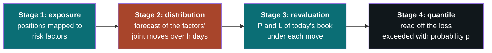
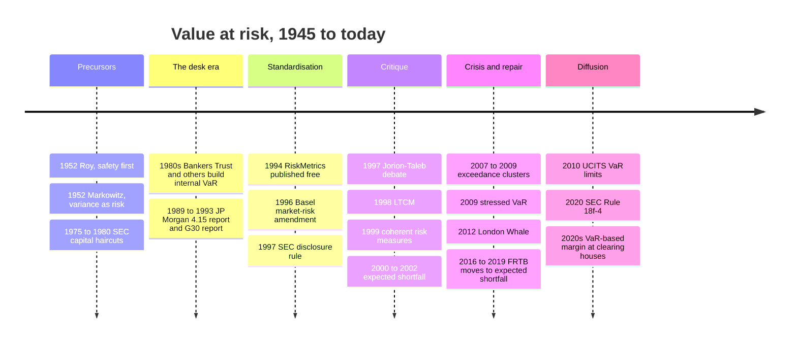
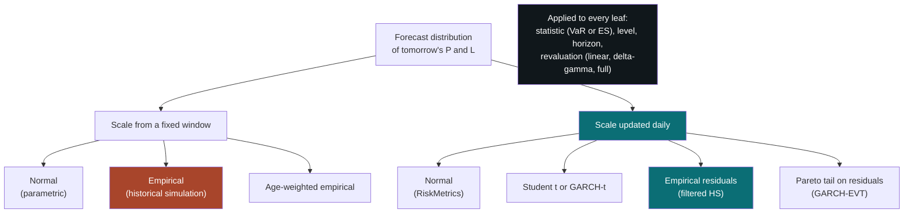
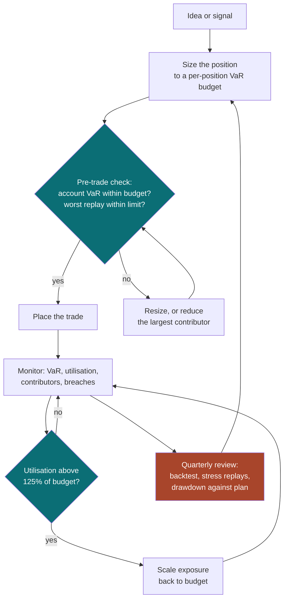
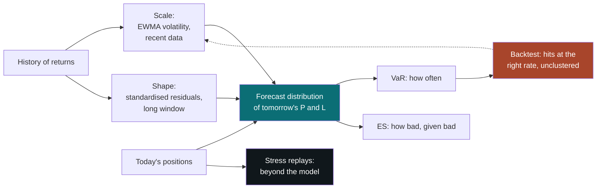
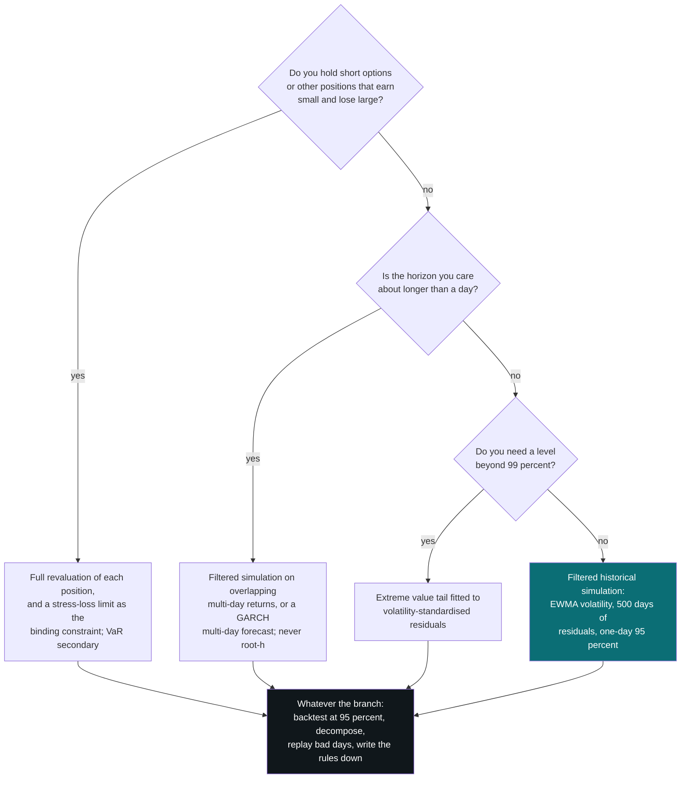

# Value at Risk

### A quantile of tomorrow's profit and loss: how it is computed, what it hides, and the smallest version worth running

---

```{=html}
<aside class="eli5">
```

# ELI5 — the short version {#eli5}

```{=latex}
\begin{eli5}
```

**In one sentence.** Value at risk is the loss that should be exceeded on a stated small fraction of days, say one day in twenty, which makes it a good gauge of an ordinary bad day and no gauge at all of a disaster.

**1. What the number says** ([§1](#1-what-value-at-risk-is)). "A one-day 95% value at risk of 1,600 dollars" means this: on about one trading day in 20, expect to lose more than 1,600. On the other 19, expect to lose less, or to make money. It is a statement about how often, never about how much. The common reading, "the most that can be lost", is backwards. The number is the mildest of the bad days: the floor of the bad region, not its depth.

**2. How to picture it** ([§2](#2-reading-a-var-number)). Draw a line through the daily results. Most days fall on the near side, where markets behave and statistics work. A few fall beyond it. Value at risk is where the line sits. A 95% line is crossed about once a month, and a 99% line two or three times a year. Even a perfect 99% model is crossed in nine years out of 10. Nothing that happens beyond the line moves it. A position that earns a little most days and occasionally loses a fortune can report a value at risk of zero, or even a gain.

**3. It is mostly a volatility forecast** ([§2](#2-reading-a-var-number), [§6](#6-computing-var-the-methods)). For an ordinary portfolio, value at risk is roughly today's volatility times a fixed multiplier. At the 95% level, the multiplier barely changes between reasonable models. The volatility does change. US stock-market volatility rose about elevenfold between early 2007 and late 2008, and again within two months in 2020. Tracking current volatility well gives most of the answer. Arguments about the exact shape of the tail matter only further out.

**4. The methods are one recipe** ([§6](#6-computing-var-the-methods), [§8](#8-taxonomy-and-equivalences)). Every method replays or simulates possible tomorrows for today's holdings and reads off the loss at the chosen cut-off. The methods differ in where "how big" and "what shape" come from. On almost a century of US data, the best simple choice measured each past day in units of the volatility at the time, kept that shape, and scaled it by today's volatility. It was the only one of seven methods whose breach rate matched its claim at both 95% and 99%. The popular plain replay of the last year reacted late, and in 2007–2009 it was breached three times too often.

**5. Its great virtue: it can be checked** ([§12](#12-backtesting-and-evaluation)). If the model says one day in 20, count. Over 500 days there should be about 25 breaches, spread out rather than bunched. Few risk numbers can be tested this cheaply. At 99% the check is weak, though. A year of data catches a model that is breached twice as often as it claims only about four times in 10, against nine in 10 at 95%.

**6. Where it breaks** ([§11](#11-limitations-and-failure-modes)). It is blind to the size of losses beyond its line, which makes strategies that quietly sell disaster insurance look safe. Its breaches bunch exactly when markets turn, because every model learns about volatility after the fact. Stretching a one-day figure to 10 days with the usual square-root rule fails worst in calm markets. From the calmest starting points, a 10-day figure meant to be crossed one time in 100 was crossed nearly six times in 100. And once the number sets limits and bonuses, it gets managed. One bank halved its reported figure overnight by changing the model.

**7. How professionals use it** ([§9](#9-how-practitioners-use-it), [§10](#10-how-var-is-presented)). Banks use it as a common unit across trading desks, for limits, and for capital. Regulators have set capital at three or more times a cautious version of it. Fund rules in Europe and the US cap a fund's one-month figure at a fifth of its assets. Clearing houses use versions of it to set margin. Careful users read it alongside stress tests, never alone.

**8. What it does for an individual** ([§13](#13-var-for-an-individual-investor)). It puts every holding on one scale, so a jumpy stock and a sleepy fund can be sized to the same risk. It shows where the risk actually sits. In a worked account of five sector funds, technology was 40% of the money and 55% of the risk, and a 10% holding in autos carried a fifth of it. It also says in advance what ordinary bad times look like. In US stocks, a typical year's worst fall from a peak has been about nine times the average daily value at risk.

**9. The minimal version is small** ([§14](#14-the-minimal-version)). It needs daily prices for each holding, about 40 lines of code, and a weekly look at five things: today's volatility, the 95% figure, the main contributors, a count of breaches, and a replay of a few historic crash days on the current holdings. The replays matter as much as the number. The same account had a one-day figure near 1% of its value, and would have lost 18% on the day of the 1987 crash.

---

**If you do only three things:** size and monitor with a 95% one-day figure built on current volatility; count its breaches and look at when they happen; and replay history's worst days on the current holdings, because the number will never reveal them.

```{=latex}
\end{eli5}
```

```{=html}
</aside>
```

---

**What this is.** Value at risk is the most widely used number in financial risk management, and the most widely misread. It sets trading limits, computes bank capital, caps the leverage of mutual funds and sizes the margin that a clearing house demands. It has been blamed, with some justice, for every market disaster since 1998. This chapter builds it from first principles. It covers what the number is, the dozen ways of computing it and what they have in common, and the family of measures that grew up around it. It covers how institutions actually use and display VaR, where it breaks, and how to test it. The last third is for a reader running their own money. It covers what of all this transfers to an individual account, and what the smallest implementation worth having looks like.

**How to read this chapter.** §1 and §2 are the conceptual core: the definition, the three ideas the rest hangs on, and what a VaR number does and does not say. §3 is history and §4 the bibliography. §5 is the mathematics. §6 and §7 are the two surveys, of ways to compute VaR and of the variations on it. §8 shows that most of §6 and §7 is one calculation with seven slots. §9 and §10 cover practice: who uses VaR for what, and how it is drawn. §11 is the critique and §12 the testing. §13 and §14 are the sections for the individual investor, and §15 is the synthesis.

Different readers can start in different places.

- Readers who want the idea and nothing else should read §1, §2 and §11.1.
- Readers who run their own account and want something to use this week should read §1, §2, §13 and §14, and treat the rest as reference.
- Readers who already compute VaR and want the parts missing from the textbook chapter should start at §6.8, §11.5 and §12.5.

Appendix A defines the statistical, market and regulatory vocabulary on which the main text relies. It builds the terms up in dependency order, for a reader who wants a term unpacked.

**Objectives.** After this chapter, you should be able to:

- define VaR as a quantile of a forecast loss distribution, and read a VaR number as a frequency rather than a worst case;
- decompose VaR into a volatility forecast, a tail multiplier and a horizon multiplier, and convert between levels and horizons;
- compute VaR by the main methods, and explain why filtered historical simulation outperformed the alternatives on a century of US data;
- explain expected shortfall, coherence and elicitability, and say when each matters;
- backtest a VaR model for coverage and independence, and judge how much a backtest of a given length can reveal;
- build and maintain a minimal VaR system for a personal account, with a budget, a decomposition, stress replays and written rules.

**Relationship to the other chapters.** [Portfolio Construction and the Covariance Matrix](portfolio_construction.html) gives the detail behind the covariance matrix that §5.3 and §6.3 take as given. Its section 6.3, on exponentially weighted estimates, matters here. [Simple and Log Returns](log_returns.html) covers the return conventions and the aggregation rules behind §5.4. [Trend-Following in Financial Markets](trend_following.html) treats volatility targeting as a sizing rule, and §13.3 shows that it is the same thing as a VaR budget. [Implied Volatility](implied_volatility.html) is the background for the option examples in §6.10. Each chapter stands alone.

**Where the numbers come from.** Most of the numerical results are calculations run for this chapter rather than quotations from published studies, and the text says so where it matters. They use daily US equity returns from the Kenneth R. French data library. The value-weighted market runs from July 1926 to December 2025. Five of the library's value-weighted industry portfolios stand in for sector funds in a worked \$100,000 account. The script that produces every such number and figure is [`figures/var_common.py`](https://github.com/rmahfoud/quant-research/blob/master/figures/var_common.py){target="_blank"} in the source repository, with one [`figures/var_*.py`](https://github.com/rmahfoud/quant-research/tree/master/figures){target="_blank"} per figure. One market and one century are not the world. The same exercise on currencies, rates or single stocks would move the numbers. On the reading of the literature taken here, it would not move the conclusions.

**A warning about scope.** [Practice] Nothing here is investment advice. The worked account is an illustration chosen to make the arithmetic visible, not a recommended portfolio.

**Epistemic tags.** The chapters in this collection flag claims by status:

- **[Fact]** — replicated across independent datasets or implementations; broad agreement.
- **[Contested]** — documented, but with live disagreement about magnitude, robustness, or cause.
- **[Hypothesis]** — a proposed mechanism, not decisively tested.
- **[Practice]** — practitioner convention; the evidence may be private or absent. A [Practice] claim is not a debunked one.

Tags appear only where the status changes what a reader should do. A tag governs the sentence or clause it opens. Untagged sentences are definitions, derivations or arithmetic: true by construction rather than by evidence.

---

**Notation.** The table lists every symbol that recurs in the chapter, with the section that defines or first uses it. Symbols used in only one section are defined where they appear.

| Symbol | Meaning | Defined in |
|---|---|---|
| $V$; $\Delta V$ | Value of the portfolio today; its change over the horizon, the **profit and loss** or **P&L** | §1.2 |
| $L$ | **Loss**, $L = -\Delta V$; losses, and so VaR, are positive numbers | §1.2 |
| $h$ | Horizon in trading days | §1.2 |
| $\alpha$; $p$ | **Confidence level**, 0.95 or 0.99 in nearly all practice; **tail probability** $p = 1 - \alpha$ | §1.2 |
| $\operatorname{VaR}_\alpha$; $\operatorname{ES}_\alpha$ | Value at risk and expected shortfall at level $\alpha$ | §1.2, §5.6 |
| $\rho$ | Any risk measure, written $\rho(L)$ as a function of the loss or $\rho(x)$ as a function of the positions | §5.5, §5.7 |
| $F_L$; $q_\alpha(L)$ | Distribution function of the loss; its $\alpha$-quantile | §1.2, §5.1 |
| $r_t$ | Return on day $t$: a simple return, except in §5.4, which adds up log returns over time | §5.3, §5.4 |
| $\sigma_t$ | **Conditional volatility**: the standard deviation of $r_t$ as forecast on the evening of day $t-1$ | §1.6 |
| $\sigma$; $\bar\sigma$ | Unconditional volatility; the long-run level toward which a mean-reverting model pulls $\sigma_t$ | §2.2, §5.4 |
| $\mu$; $\varepsilon$ | Mean return; **standardised shock**, with mean zero and variance one, so that $r = \mu + \sigma\varepsilon$ | §5.2 |
| $\Phi$; $\varphi$ | Standard normal distribution and density functions | §5.6 |
| $z_\alpha$ | Standard normal quantile $\Phi^{-1}(\alpha)$: $z_{0.95} = 1.645$, $z_{0.99} = 2.326$ | §1.5 |
| $k_\alpha$ | **Tail multiplier**: the $\alpha$-quantile of the standardised loss $-\varepsilon$ under the distribution in use; $k_\alpha = z_\alpha$ is the normal case | §1.6, §5.2 |
| $x$; $N$; $w$ | Vector of **dollar positions** in $N$ assets; weights $w = x/V$ | §5.3 |
| $\Sigma$ | $N \times N$ covariance matrix of one-day asset returns | §5.3 |
| $\sigma_p$; $\mu_p$ | Portfolio one-day volatility **in dollars**, $\sigma_p = \sqrt{x'\Sigma x}$; expected one-day P&L | §1.5, §5.3 |
| $\lambda$ | Decay of an exponentially weighted moving average (EWMA), $\lambda \in (0,1)$ | §6.3 |
| $n$; $T$ | Number of past observations an estimate uses; number of days in a backtest | §5.8, §12.2 |
| $I_t$; $X$ | **Hit** indicator, one when the day-$t$ loss exceeded that day's VaR forecast; number of hits, $X = \sum_t I_t$ | §1.6, §12.1 |
| $\mathbf{1}\{\cdot\}$; $E_t$ | Indicator, one when the condition holds and zero otherwise; expectation formed with what is known on the evening of day $t$ | §5.4, §5.9 |
| $\nu$; $\xi$ | Degrees of freedom of a Student $t$ distribution; tail index of extreme value theory | §6.4, §6.11 |
| $W$; $B$ | Account equity, equal to $V$ when nothing is borrowed; a VaR budget as a fraction of it | §13.3 |

Several conventions carry a qualification:

- Losses are positive numbers, and so is VaR. A negative VaR means that the "bad" outcome is still a gain.
- Hits, exceedances, exceptions, breaches and violations are synonyms. A VaR that rises above a limit or budget is a *limit breach*, a different event.
- A prime marks a transpose. $V = \sum_i x_i$ for an unlevered long-only book.
- In §6.5, $\gamma$ and $\kappa$ are the skewness and excess kurtosis. In A.32 and A.39, $\varrho$ is a correlation, distinct from the risk measure $\rho$.

---

## Table of contents

- [ELI5 — the short version](#eli5)

1. [What value at risk is](#1-what-value-at-risk-is)
2. [Reading a VaR number](#2-reading-a-var-number)
3. [How the field evolved](#3-how-the-field-evolved)
4. [Foundational references](#4-foundational-references)
5. [The mathematics](#5-the-mathematics)
6. [Computing VaR: the methods](#6-computing-var-the-methods)
7. [Variations: the VaR family](#7-variations-the-var-family)
8. [Taxonomy and equivalences](#8-taxonomy-and-equivalences)
9. [How practitioners use it](#9-how-practitioners-use-it)
10. [How VaR is presented](#10-how-var-is-presented)
11. [Limitations and failure modes](#11-limitations-and-failure-modes)
12. [Backtesting and evaluation](#12-backtesting-and-evaluation)
13. [VaR for an individual investor](#13-var-for-an-individual-investor)
14. [The minimal version](#14-the-minimal-version)
15. [Synthesis](#15-synthesis)

- [Appendix A. Concepts and prerequisites](#appendix-a-concepts-and-prerequisites)

---

```{=latex}
\newpage
```

# 1. What value at risk is {#1-what-value-at-risk-is}

## 1.1 The question it answers

Every risk measure answers a question. Most confusion about value at risk comes from attaching the answer to the wrong question. VaR answers this one:

> **Over the next $h$ days, with the positions left as they are, what loss will be exceeded only with probability $p$?**

That is all. Take $h$ = 1 day and $p$ = 5%. A VaR of \$1,600 then says that on about one trading day in 20 the loss should exceed \$1,600. On the other 19 days the loss should be smaller, or the portfolio should make money. VaR is a statement about *frequency*. It contains a dollar amount, a time span and a probability, and nothing else.

VaR was invented to solve an aggregation problem, and that origin explains its shape. In the late 1980s a bank's trading floor held bonds measured in duration, options measured in delta and vega, currencies measured in notional and equities measured in beta. None of these units can be added to another. Nobody could say whether the firm as a whole was taking more risk than it had the week before. A loss quantile can be computed for any position in any instrument, and it comes out in money. It can also be computed for the sum. VaR's first use, and still its most defensible one, is as a **common unit**: a way to put a Treasury desk and an equity options desk on the same axis.

## 1.2 The definition

Fix a horizon $h$ and a confidence level $\alpha$. Let $L = -\Delta V$ be the loss on the current portfolio over the horizon. Treat it as a random variable with distribution function $F_L(\ell) = P(L \le \ell)$. Then

$$
\operatorname{VaR}_\alpha(L) \;=\; q_\alpha(L) \;=\; \inf\{\ell : F_L(\ell) \ge \alpha\} .
$$

In words, VaR is the smallest loss level $\ell$ such that the probability of losing no more than $\ell$ is at least $\alpha$. When the distribution is continuous, it is simply the number that solves $P(L > \operatorname{VaR}_\alpha) = 1 - \alpha$. The infimum handles distributions with jumps or flat stretches. These matter more often than one might expect. A historical sample is a discrete distribution, and so is a bond that either defaults or does not (§5.1, §5.7).

That one line contains three choices, and at each of them two VaR numbers can silently differ.

**The confidence level $\alpha$.** The standard choices are 95% and 99%, with 97.5% and 99.9% in some regulatory uses. The level is a convention, not an estimate. It trades relevance against measurability. A higher level looks further into the tail, where the losses that matter live and where there are almost no data.

**The horizon $h$.** Trading desks use one day. The original bank capital rules used 10 days, fund regulation uses 20 days, and credit and insurance use a year. The horizon is also a convention. It is meant to reflect how long it would take to exit the position.

**The distribution $F_L$.** This is not a convention. It is a *forecast*. All of the work lives here, along with all of the differences between methods and nearly all of the failures. Nobody observes the distribution of tomorrow's P&L. Every VaR number is the output of a model of it.

A fourth assumption is easy to miss: **the portfolio is frozen.** $L$ is the loss on today's positions held unchanged for $h$ days. The same formula describes a desk that turns its book over three times a day and a pension fund that never trades. For the desk, the 10-day number describes a portfolio that will not exist.

## 1.3 The wrong intuition

The misreading that does the most damage is that VaR is **the most that can be lost**. The phrase "value at risk" invites it. So does the usual way of reporting the number, as a single dollar figure with the probability in small print.

VaR is closer to the opposite. Take the worst 5% of days. The 95% VaR is the *best* of them: the mildest outcome that still counts as a bad day. A more honest name would be **the minimum loss on a bad day**. A statement such as "our 95% VaR is \$1,600" should be read as "on our bad days we lose *at least* \$1,600". How much more than \$1,600 is a question VaR was not asked, and it does not answer it.

Three further misreadings follow from the first.

- **"99% confidence means it is almost certain."** If the model is right, a 99% daily VaR is exceeded two or three times a year. Over a 252-day year, the chance of at least one exceedance is $1 - 0.99^{252} = 92\%$. An exceedance is not a failure of the model. *No* exceedances in three years would be.
- **"A VaR of \$1,600 means risk of \$1,600."** The number is meaningless without its level and horizon. Suppose returns were normal and independent from day to day. A portfolio with a one-day 95% VaR of \$1,600 would then have a one-day 99% VaR of about \$2,300 and a 10-day 99% VaR of about \$7,200 (§2.2). These are one fact stated three ways.
- **"It is a measurement."** A thermometer measures something that exists. VaR estimates a quantile of a distribution that has to be modelled, from data that contain very few tail observations. Two competent teams given the same portfolio routinely differ by tens of percent (§11.3).

## 1.4 The right picture

The picture to hold is a boundary. Every day's P&L falls on one side or the other of a line. On the near side, where most days fall, things are ordinary. On the far side they are not.

VaR is the position of that line. It says nothing about the far side except how often the portfolio will visit it. Used that way, it is extremely useful, because the near side is where a risk model works. Data about ordinary days are plentiful. Position limits and hedges behave as designed. Markets are liquid enough that "hold the portfolio fixed for a day" is a fair description. [Practice] Aaron Brown ran risk at a large hedge fund and has defended VaR in print more capably than most. In *Red-Blooded Risk* (2011) he argues something close to this. VaR separates the days managed with statistics from the days managed with scenarios, contingency plans and capital. On this view the main output of a VaR system is not the number. It is the discipline of checking, every day, which kind of day it was, and whether the count of bad days matches the stated probability.

A VaR number therefore does two jobs and no more. First, it gives the **scale of an ordinary bad day**. That scale is what sizing positions requires, and it shows whether today's loss was routine. Second, it makes a **claim that can be checked**. A stated 5% implies about 25 exceedances over 500 days, spread out rather than bunched. No other common risk number can be falsified this cheaply, and §12 shows how to do it.

## 1.5 The master form

Every method of computing VaR is the same four-stage calculation, from a one-line formula to an overnight simulation on a compute grid.



1. **Exposure.** Express the portfolio as a function of a set of **risk factors**: the things whose movements change its value. For a stock portfolio the factors can be the stock prices themselves. For a bond book they are points on yield curves. For options they also include the underlying price and implied volatility.
2. **Distribution.** Forecast the joint distribution of the factors' changes over the horizon. The diagram draws this stage in rust, because it is where methods actually differ. One method assumes a normal distribution and estimates its covariance matrix. Another replays the last $n$ days of history. A third simulates from a fitted model.
3. **Revaluation.** Work out the portfolio's P&L under each possible factor move. This can be exact, by repricing every instrument, or approximate, through the portfolio's sensitivities.
4. **Quantile.** Read off the loss exceeded with probability $p$.

When the portfolio is linear in its factors and the factors are jointly normal, all four stages collapse into one formula. The one-day P&L is then normal with standard deviation $\sigma_p$. If successive days are independent and alike, the $h$-day P&L has standard deviation $\sigma_p\sqrt h$ (§5.4). Then

$$
\operatorname{VaR}_\alpha \;=\; z_\alpha\,\sigma_p\,\sqrt{h} \;-\; \mu_p h
\;\approx\; z_\alpha\,\sigma_p\,\sqrt{h},
$$

where $\mu_p$ is the expected daily P&L. At short horizons it is small enough to drop (§5.2). For a single position of value $V$ in an asset with daily volatility $\sigma$, $\sigma_p = \sigma V$, and the one-day VaR is $z_\alpha\,\sigma\,V$. VaR is **a multiple of volatility, in dollars.**

## 1.6 The spine, stated once

Three ideas generate the rest of this chapter, and they recur at every section boundary.

**Idea 1. VaR is a quantile of a forecast distribution.** It is not a property of the portfolio, and it is not a measurement. Every method is the pipeline of §1.5 with different choices in its slots. Every difference between two VaR numbers for the same book traces to a difference in the forecast distribution, almost always in stage 2.

**Idea 2. At short horizons VaR is a volatility forecast multiplied by a constant.** For anything close to a linear portfolio, $\operatorname{VaR}_\alpha = k_\alpha\,\sigma_t\,V$. The multiplier $k_\alpha$ encodes the shape of the tail. Across every reasonable distribution it moves in a narrow range: at 95%, between about 1.5 and 1.7. The volatility $\sigma_t$ is the part that moves. An EWMA estimate of US equity market volatility, computed for this chapter, was 0.43% a day in February 2007 and 4.80% in October 2008, a factor of 11. Whoever forecasts volatility well therefore computes VaR well. At 95%, the notorious arguments about distributional shape are second-order by comparison. They stop being second-order at 99% and beyond, where $k_\alpha$ is the uncertain part (§2.2, §5.8).

**Idea 3. A quantile is a threshold, not a tail, and the hit sequence audits it.** VaR says how often the loss will cross the line and nothing about how far. Everything that lives beyond the line exists because of that silence: expected shortfall, stress tests and the whole of §11. In exchange, VaR makes the one claim in risk management that can be tested directly. Define the hit sequence $I_1, I_2, \dots$ as one on each day the loss exceeded the forecast, and zero otherwise. It should look like independent coin flips that come up heads with probability $p$. The frequency should be right, and the hits should not cluster. Every evaluation method in §12 tests one or both halves of that statement.

## 1.7 What VaR is not

The table defines the object against its neighbours.

| It is often confused with | The difference |
|---|---|
| **Volatility** | Volatility is a scale. VaR is a scale times a tail multiplier, in money, with a probability attached. For a normal distribution they carry the same information; for an option book or a credit portfolio they do not |
| **Maximum loss** | VaR is the *least* lost in the worst $p$ of outcomes. The maximum loss on a long position is its whole value, which on a levered one is more than the equity behind it; on a short one it is unbounded |
| **Expected shortfall** | ES is the *average* loss in the worst $p$ of outcomes. It answers "how bad, given bad", which is the question VaR skips (§5.6) |
| **Stress loss** | A stress test asks what a named scenario would do, with no probability attached. VaR attaches a probability and names no scenario |
| **Maximum drawdown** | Drawdown is a path property over months or years: peak to trough. VaR is a one-step-ahead statement. A year's worst drawdown has typically been about nine daily 95% VaRs (§13.5) |
| **Margin** | Margin is what a broker or clearing house demands as collateral. It is usually *computed from* a VaR-like calculation, with add-ons, at the lender's chosen level (§9.4) |
| **Capital** | Capital is the buffer held against loss. Regulators set it as a multiple of VaR; the multiple, three or more, is an admission about how far the model is trusted (§9.1) |

## 1.8 A worked instance, to fix ideas

Put \$100,000 in the US equity market and look back over the 500 trading days to the end of 2025. The daily returns over that window had a standard deviation of 1.042%, so the P&L had a standard deviation of \$1,042.

**The formula.** Under the normal assumption, the one-day 95% VaR is $1.645 \times 1{,}042$, which is \$1,714. The 99% VaR is $2.326 \times 1{,}042$, which is \$2,424.

**The history.** Sort the 500 daily P&Ls from worst to best. The 95% VaR is the loss at the 5% point, with 25 days worse than it. That loss was \$1,592. The 99% VaR is the loss with five days worse: \$2,881. The average of the worst 2.5% of days, 12 or 13 of them, was \$3,051. The single worst day lost \$5,900.

The table sets the two methods side by side.

| | Normal formula | Historical sample |
|---|---|---|
| 95% one-day VaR | 1,714 | 1,592 |
| 99% one-day VaR | 2,424 | 2,881 |
| 97.5% expected shortfall | 2,436 | 3,051 |
| Worst day in the window | — | 5,900 |

Three lessons are already visible. Later sections develop each one.

1. **The two methods disagree, and in opposite directions at the two levels.** The historical 95% VaR is 7% *below* the normal figure, and the historical 99% VaR is 19% *above* it. This is what fat tails look like. Compared with a normal curve, there are more days near zero and more days far out, with fewer in between. At 95% the normal assumption is conservative. At 99% it is not (§2.2).
2. **The worst day was more than twice the 99% VaR**, and 3.7 times the 95% VaR. Nothing in either VaR figure hinted at it. That is Idea 3.
3. **Neither figure says anything about today.** Both describe an average over two years. If the last month has been calm, the right number for tomorrow is lower. If it has been violent, the right number is higher. §2.4 and §6 cover how to make the estimate conditional.

> ### §1 Key takeaways
>
> 1. VaR is the loss that will be exceeded with a stated probability over a stated horizon on a frozen portfolio. It is a statement about how often, never about how much.
> 2. Read it as the *minimum* loss on a bad day. "The most that can be lost" is the opposite of what it says.
> 3. The confidence level and the horizon are conventions. The distribution is a forecast, and it is where every method differs and every failure originates.
> 4. Every method is one pipeline: map positions to risk factors, forecast the factors, revalue, take a quantile. For a linear portfolio with normal factors, the pipeline collapses to $z_\alpha\,\sigma_p\sqrt{h}$.
> 5. At short horizons VaR is a volatility forecast times a tail multiplier. At 95% the multiplier lives in a narrow band, while volatility moved by a factor of 11 between 2007 and 2008. Forecast volatility well, and most of the job is done.
> 6. VaR's distinctive virtue is that it can be falsified. Exceedances should occur at the stated frequency, and they should not cluster.
> 7. On two recent years of US equity data, the historical 95% VaR was 7% below the normal formula's, and the historical 99% VaR was 19% above it. The worst day was double the historical 99% figure.

---

# 2. Reading a VaR number {#2-reading-a-var-number}

§1 defined the object. This section covers the skill that most users of VaR lack: reading a number handed over by someone else, translating it into things that can be pictured, and knowing which questions it cannot answer.

## 2.1 Translate the probability into a calendar

A confidence level is easier to misjudge than a frequency. The table converts the common conventions into "how often". It assumes 252 trading days a year and a model that is exactly right.

| Level and horizon | Exceeded on average | Chance of at least one exceedance |
|---|---|---|
| 95%, one day | 12.6 days a year: one trading day in twenty, about once a month | 66% in any 21-day month |
| 99%, one day | 2.5 days a year: one day in a hundred, about every five months | 92% in any year |
| 99.9%, one day | one day in a thousand, about every four years | 22% in any year |
| 99%, ten days | one ten-day period in a hundred: about every four years | — |
| 99%, twenty days | one month in a hundred: about every eight years | — |
| 99.5%, one year | one year in two hundred | — |

The last three rows are the regulatory conventions of §9: the original Basel market-risk rule, the European and US fund rules, and European insurance solvency. They read as extremely conservative. They would be, if the models delivering them were right. §11 and §12 explain why the models are not.

The first row is the one to internalise for personal use. **A 95% one-day VaR is a monthly event.** Suppose an account's 95% VaR is \$1,500. If the account has not lost more than that in three months, the model is probably too pessimistic. If it has lost more than that four times in a month, the model is probably too optimistic, or the world has changed. For practical purposes those are the same thing.

## 2.2 VaR is volatility in disguise

Consider a position whose returns have a location-scale distribution: normal, Student $t$, or anything else determined up to a shift and a stretch. Then

$$
\operatorname{VaR}_\alpha \;=\; \big(k_\alpha\,\sigma\sqrt{h} - \mu h\big)\,V .
$$

Here $\sigma$ and $\mu$ are the daily volatility and mean, and $k_\alpha$ is the $\alpha$-quantile of the standardised loss (§5.2). The $\sqrt h$ is the square-root-of-time rule of §5.4. It is exact for independent normal days and an approximation otherwise. At daily or weekly horizons the drift term is negligible. An asset earning 8% a year has $\mu h$ = 0.03% a day, against a $k_{0.95}\,\sigma$ of about 1.6% for equities. A VaR is therefore a volatility multiplied by two numbers, one for the tail and one for the horizon. Every VaR conversion is arithmetic on those multipliers, as the table shows.

| Conversion | Multiply by | Where it comes from |
|---|---|---|
| Daily volatility to one-day 95% VaR | 1.645 | $z_{0.95}$ |
| Daily volatility to one-day 99% VaR | 2.326 | $z_{0.99}$ |
| 95% VaR to 99% VaR | 1.414 | $z_{0.99}/z_{0.95}$, normal only |
| One-day to ten-day | 3.162 | $\sqrt{10}$, only if returns are IID: independent and identically distributed (§5.4) |
| One-day to twenty-day | 4.472 | $\sqrt{20}$, same caveat |
| Annual volatility to daily | 0.063 | $1/\sqrt{252}$ |
| One-day 95% VaR to the Basel ten-day 99% | 4.47 | $1.414 \times 3.162$ |

An all-equity account with annual volatility of 16% therefore has a daily volatility of about 1%. Its one-day 95% VaR is about 1.65% of its value, and its one-day 99% VaR about 2.3%. A conventional 60/40 mix of stocks and bonds, at about 10% annual volatility, has a one-day 95% VaR of about 1%. These are the numbers to sanity-check any system against.

**How much the tail multiplier can move.** The table assumed a normal distribution. Fatter tails change $k_\alpha$, but much less than commonly expected at 95%, and much more at 99%. The next table shows a Student $t$ distribution rescaled to unit variance, with the US market's own figures alongside.

| Distribution of the standardised return | $k_{0.95}$ | $k_{0.99}$ |
|---|---|---|
| Normal | 1.645 | 2.326 |
| Student $t$, 10 degrees of freedom | 1.621 | 2.472 |
| Student $t$, 5 degrees of freedom | 1.561 | 2.606 |
| Student $t$, 4 degrees of freedom | 1.507 | 2.649 |
| Student $t$, 3 degrees of freedom | 1.359 | 2.622 |
| US market 1929–2025, standardised by that morning's EWMA volatility | 1.71 | 2.90 |
| US market 1926–2025, standardised by full-sample volatility | 1.46 | 2.85 |

Two facts are worth carrying away. First, at 95% every plausible choice lies within about 15% of the normal value, or 17% for the extreme $t$ with three degrees of freedom. Fattening a symmetric tail, as the $t$ rows do, actually *lowers* the multiplier. A fat-tailed distribution with the same variance moves probability out of the shoulders, where the 95% point sits, into the centre and the far tail. Real returns need not follow the $t$ here, and the US market's conditional figure is above the normal one (§6.4). Second, at 99% the plausible range is 2.3 to 2.9. That is a 25% spread, and all of it lies on the high side of the normal. Meanwhile the volatility that multiplies these numbers moved elevenfold in 20 months. This is Idea 2 in numbers. At 95% the forecast of $\sigma_t$ dominates, and at 99% the shape of the tail starts to compete with it.

## 2.3 What the number does not tell you

The figure draws the worked instance of §1.8. Every introduction to VaR contains this picture, and it is worth studying for what it leaves out.

```{=latex}
\begin{center}
\includegraphics[width=\linewidth]{quant-research/figures/var_anatomy.pdf}
\end{center}
```

```{=html}

```

The 95% VaR sits at \$1,592, inside the body of the histogram. Everything to its left, shaded, is the region about which VaR is silent. That region contains the 99% VaR at \$2,881, the average of the worst 2.5% at \$3,051, and a worst day of \$5,900. Moving that worst day to \$50,000 would not change the 95% VaR by a cent. The black curve is the normal distribution that the parametric method would have used in place of the histogram. It is too low in the centre, too low in the far tail and too high in between.

The silence can be total. The table compares two positions.

| | Position A | Position B |
|---|---|---|
| What it is | A diversified stock portfolio, P&L normal with standard deviation 1,000 | A short position in deep out-of-the-money options: gains 200 on 97% of days, loses 20,000 on 3% |
| 95% one-day VaR | 1,645 | **−200** (a gain) |
| 99% one-day VaR | 2,326 | 20,000 |
| 95% expected shortfall | 2,063 | 11,920 |

Position B has a *negative* 95% VaR. It makes money on 97% of days, which is more than 95%, so the 95% quantile of its loss is a gain of 200. A risk system with a 95% VaR limit would allow any amount of it. The example is stylised, but the real version is ordinary. A put option pays its holder the amount by which a stock falls below an agreed strike price. Whoever sells the put, and so is *short* the option, collects a premium up front and owes that payout (A.35). Consider selling 10 put contracts with 30 days to expiry, struck 10% below a \$100 stock with 20% implied volatility. The sale collects \$71 of premium, and the linear (delta-normal) 99% one-day VaR is \$91. A day on which the stock falls 10% and implied volatility doubles costs \$3,975, which is 44 times the VaR (§6.10).

A better VaR model cannot fix this. It is what a quantile is. §5.6 and §7.1 introduce the measure that looks past the line, and §11.1 discusses how the silence gets exploited.

## 2.4 Today's VaR and the typical VaR

A VaR can answer two different questions. Most disagreements between VaR numbers are not disagreements about the answer. They are disagreements about which question is being asked.

- **Conditional VaR**, in the sense used here, asks: given everything known tonight, including whether markets have recently been calm or violent, what is the quantile of tomorrow's loss? The volatility in the formula is a *current* estimate, $\sigma_t$.
- **Unconditional VaR** asks: over a long run of days like the ones in the sample, what is the quantile of a typical day's loss? The volatility is an average.

The phrase "conditional VaR" has also been used as a name for expected shortfall. §8.4 untangles the two uses. In this chapter, the phrase never means expected shortfall.

The table gives the one-day 95% VaR at the end of 2025 for the worked \$100,000 account of §10.4, which holds five sector funds.

| Method | Question it answers | 95% one-day VaR |
|---|---|---|
| Normal, volatility from an EWMA with decay 0.94 | Conditional | 1,092 |
| Filtered historical simulation (§6.8) | Conditional | 1,116 |
| Historical simulation over 500 days | Unconditional, over two years | 1,521 |

The historical figure is 39% higher, and it is not wrong. Late 2025 was calm relative to a two-year window that included the tariff shock of April 2025, so a two-year average overstates tomorrow's risk. Neither kind of number is *the* VaR. For sizing tomorrow's positions, the conditional number is the relevant one. For setting a limit or a capital buffer that should not swing with every change in the weather, a slower number is defensible, and regulators deliberately choose one (§9.1). Most practitioners get into trouble by using one kind while believing they are using the other.

## 2.5 Fat tails, recalibrated

A century of US equity returns seems to deliver a damning verdict on the normal distribution. From July 1926 to December 2025, over 26,151 trading days, daily returns had a standard deviation of 1.078% and a kurtosis of 19, against 3 for a normal distribution. Kurtosis is the average fourth power of returns measured in standard deviations. It grows with the weight in the tails. The *excess* kurtosis used in §6.5 is the same number minus 3 (A.7).

| Loss larger than | Days observed | Days a normal distribution expects |
|---|---|---|
| 3 standard deviations | 232 | 35 |
| 4 standard deviations | 105 | 0.8 |
| 5 standard deviations | 51 | 0.008 |
| 6 standard deviations | 29 | 0.00003 |

The worst day, 19 October 1987, was a fall of 17.4%: 16.2 standard deviations.

But most of this is not what it looks like. Volatility clusters: calm periods and violent periods alternate. A sample that mixes them looks fat-tailed even if each day's return is normal *given that day's volatility*. A mixture of normal distributions with different variances always has a kurtosis above 3. Now measure each day's return in units of the volatility that a forecaster could have known that morning, an EWMA estimate (§6.3). The picture changes.

| Day | Return | In full-sample standard deviations | In that morning's volatility |
|---|---|---|---|
| 19 October 1987 | −17.4% | 16.2 | 10.4 |
| 16 March 2020 | −12.0% | 11.2 | 2.8 |
| 29 October 1929 | −11.5% | 10.7 | 3.3 |
| 1 December 2008 | −9.0% | 8.4 | 2.0 |

The kurtosis of the standardised series falls from 19 to 8.5. The days in March 2020 and December 2008 look like impossible 11-sigma and 8-sigma events. Given the volatility that everyone could already see, they were three-sigma and two-sigma days. October 1987 remains a genuine outlier on any measure.

[Fact] **Most of the apparent fat-tailedness of daily returns is time-varying volatility. The remainder is real, and it is concentrated in the far tail, from about the 99th percentile out.** The standardised series still has a 99% quantile of 2.90 against the normal's 2.33, and a 99.9% quantile of 5.33 against 3.09. This ordering of causes has been documented on many markets since at least the GARCH literature of the 1980s. It is the most practically important fact about VaR methodology, and it dictates the ranking of methods in §6.13: model the volatility first, then worry about the shape of the tail.

A remark attributed in August 2007 to the chief financial officer of Goldman Sachs is the classic illustration. He said the firm had seen "25-standard deviation moves, several days in a row". Under a normal distribution, a 25-sigma day should not happen once in the life of the universe. The more mundane reading is that the sigma was measured in a calm period and the moves were measured in a violent one. A 25-sigma move in yesterday's volatility can be a four-sigma move in today's.

> ### §2 Key takeaways
>
> 1. A 95% one-day VaR is a monthly event, and a 99% one-day VaR is exceeded two or three times a year. Even a correct 99% model is exceeded in 92% of years.
> 2. VaR is volatility times a tail multiplier times a horizon multiplier. An all-equity account has a one-day 95% VaR of about 1.65% of its value, and a 60/40 mix about 1%.
> 3. At 95% the tail multiplier barely depends on the distribution. Plausible choices lie within 15% of 1.645, and fatter symmetric tails *lower* it. At 99% the plausible range is 2.3 to 2.9, all above the normal value.
> 4. VaR is blind to everything past its own threshold. A short position in deep out-of-the-money options can have a negative 95% VaR and a catastrophic tail.
> 5. Conditional VaR, given today's volatility, and unconditional VaR, an average over a window, answer different questions. On the worked account they differed by 39%. Know which one is on the page.
> 6. Standardising by a volatility forecast cuts the kurtosis of US daily returns from 19 to 8.5, and it turns the "11-sigma" day of March 2020 into a three-sigma day. Model volatility first. The shape of the tail is the second-order correction.

---

```{=latex}
\newpage
```

# 3. How the field evolved {#3-how-the-field-evolved}

The history is short and unusually well documented, largely thanks to [Holton (2002)](https://econpapers.repec.org/RePEc:wpa:wuwpmh:0207001){target="_blank"}. His working paper is the source for most of the detail below from before 1990. The history splits into six eras, each with a one-line thesis.



## 3.1 Precursors (1945–1980): risk as a probability of shortfall

*Thesis: the idea of a loss quantile is older than the computers needed to apply it to a trading book.*

[Holton (2002)](https://econpapers.repec.org/RePEc:wpa:wuwpmh:0207001){target="_blank"} identifies a 1945 article by Leavens, on the benefits of diversification, as the earliest published example he found of a VaR-like calculation. That is why the era is dated from 1945.

**Safety first.** [Roy (1952)](https://www.jstor.org/stable/1907413){target="_blank"}, in the same year as Markowitz's portfolio paper, proposed that an investor should minimise the probability of the portfolio falling below a disaster level. *Contribution:* risk as a tail probability rather than a variance. *What changed:* little at the time. Mean-variance won the academic argument because it was tractable. *Limitations:* Roy had no way to estimate tail probabilities beyond Chebyshev bounds. *Lasting influence:* VaR is Roy's criterion turned inside out. It fixes the probability and solves for the level.

**[Markowitz (1952)](https://www.jstor.org/stable/2975974){target="_blank"}** made variance the measure of portfolio risk. More importantly for VaR, he showed how to aggregate it through a covariance matrix. Every normal parametric VaR is $z_\alpha\sqrt{x'\Sigma x}$: Markowitz's portfolio variance with a quantile multiplier in front.

**Regulatory haircuts.** [Fact] According to [Holton (2002)](https://econpapers.repec.org/RePEc:wpa:wuwpmh:0207001){target="_blank"}, the net capital rules of the US Securities and Exchange Commission for broker-dealers moved in 1980 to haircuts on securities positions. The haircuts were based on statistical analysis of historical price moves, and were intended to cover something like a 95th-percentile loss over a one-month liquidation period. *Lasting influence:* the template of a quantile, a horizon tied to liquidation and a capital charge. That is exactly the 1996 Basel design.

## 3.2 The desk era (1980–1993): a common unit for a trading floor

*Thesis: banks invented VaR for their own use, to answer "how much could we lose tomorrow?" across instruments whose risk measures could not be compared.*

Through the 1980s several dealers built internal firm-wide measures of this kind. Bankers Trust is the best-documented case, associated with its risk-adjusted return on capital (RAROC) system. The best-known story is J.P. Morgan's. Its chairman, Dennis Weatherstone, asked for a single-page report delivered at 4:15 each afternoon, summarising the firm's market risk over the next day. The "4:15 report" became the template for the daily VaR report. The methodology behind it was a variance-covariance model over a few hundred risk factors.

The name entered wide use through the Group of Thirty's 1993 report on derivatives practice. The report recommended that dealers measure market risk with a value-at-risk approach and use consistent measures to set limits.

*What changed:* firm-wide risk could be stated in one number, compared across desks and over time, and limited. *Limitations:* the models were parametric and mostly normal. Option books were handled through linear sensitivities, and §6.10 shows that these can severely understate the risk of short option positions. *Lasting influence:* the daily VaR report is still the centrepiece of every bank's market-risk function.

## 3.3 Standardisation (1994–1997): from internal tool to industry and regulatory standard

*Thesis: two decisions in three years, one commercial and one regulatory, made VaR universal.*

**RiskMetrics (1994).** In October 1994 J.P. Morgan published its methodology free of charge, together with the volatility and correlation data needed to run it. The fourth edition of the *RiskMetrics Technical Document* ([J.P. Morgan/Reuters, 1996](https://www.msci.com/documents/10199/5915b101-4206-4ba0-aee2-3449d5c7e95a){target="_blank"}) is still the clearest statement of the approach. It maps positions onto a grid of risk factors and models each factor's daily return as conditionally normal. It estimates volatilities and correlations by exponentially weighted moving averages, with decay 0.94 for daily data. *What changed:* any firm could compute a VaR the next morning, and the EWMA estimator became the industry's default volatility model. *Limitations:* conditional normality understates the 99% tail. The estimator with $\lambda$ = 0.94 also has an effective memory of about 30 observations, which is too short for a large covariance matrix. *Lasting influence:* enormous. The 0.94 decay remains a default everywhere. §6.8 and §6.13 show that, combined with a non-normal tail, it is still close to the best simple method available.

**The Basel Market Risk Amendment (1996).** The [Basel Committee on Banking Supervision (1996a)](https://www.bis.org/publ/bcbs24.pdf){target="_blank"} allowed banks to compute market-risk capital from their own VaR models, subject to standards. These were 99% confidence, a 10-day horizon (which could be scaled up from one day by $\sqrt{10}$), at least one year of data, and a capital charge of at least **three times** the average VaR over the previous 60 days. A companion document ([Basel Committee, 1996b](https://www.bis.org/publ/bcbs22.pdf){target="_blank"}) set out backtesting against the daily P&L. It also set out the "traffic light", which raises the multiplier when a bank sees too many exceedances (§12.4). *What changed:* VaR became the basis of bank capital. Every large bank therefore had to compute, validate and defend it. *Limitations:* the multiplier of three was never derived. It was widely understood as a safety factor for model error, fat tails and the crudeness of square-root-of-time scaling. *Lasting influence:* the architecture of a quantile model, a backtest and a penalty multiplier survived every later reform.

**Disclosure.** In 1997 the US Securities and Exchange Commission required public companies with material market risk to disclose it, with VaR as one of three permitted formats. [Practice] That rule, and the bank disclosure requirements that followed it, explain why every large US bank's annual report carries a VaR table (§10.3).

## 3.4 Critique (1997–2002): what a quantile cannot see

*Thesis: within five years of VaR's adoption, the theory of what a good risk measure should be had shown that VaR is not one, and had produced the replacement.*

**The Jorion–Taleb debate (1997).** In a pair of articles in *Derivatives Strategy*, Nassim Taleb argued that VaR gives false confidence, ignores the events that matter, and should be abandoned. Philippe Jorion replied that VaR is an imperfect but disciplined improvement on having no firm-wide number at all, and that it should be supplemented rather than discarded. The two agreed on more than either side's admirers usually remember. The debate is worth reading because it anticipates nearly every later criticism. §11.9 returns to it.

**LTCM (1998).** Long-Term Capital Management was a hedge fund run by some of the most sophisticated quantitative traders and economists of the era. It lost most of its capital in a few weeks of August and September 1998. [Jorion (2000)](https://onlinelibrary.wiley.com/doi/abs/10.1111/1468-036X.00125){target="_blank"} reconstructs its risk. The fund's VaR, estimated from a short calm history, was a small fraction of the losses it then suffered. Its positions were highly correlated in a crisis that its data did not contain. Its leverage also made liquidation impossible without moving prices. *Lasting influence:* LTCM is the standard case study for model risk, correlation breakdown and liquidity.

**Coherent risk measures (1999).** [Artzner, Delbaen, Eber and Heath (1999)](https://people.math.ethz.ch/~delbaen/ftp/preprints/CoherentMF.pdf){target="_blank"} set out four properties that any sensible risk measure should satisfy. They showed that VaR violates one of them. VaR is not **sub-additive**, so the VaR of a merged portfolio can exceed the sum of the parts' VaRs (§5.7). *What changed:* risk measurement acquired an axiomatic theory, and VaR's status as the reference measure became a target.

**Expected shortfall (2000–2002).** [Rockafellar and Uryasev (2000)](https://sites.math.washington.edu/~rtr/papers/rtr179-CVaR1.pdf){target="_blank"} showed that the average loss beyond VaR, which they called conditional value at risk, can be minimised over a portfolio by linear programming. [Acerbi and Tasche (2002)](https://arxiv.org/abs/cond-mat/0104295){target="_blank"} gave the definition that is coherent for every distribution. *Lasting influence:* expected shortfall is now the regulatory measure for bank trading books.

## 3.5 Crisis and repair (2007–2019): from one number to a dashboard

*Thesis: the financial crisis did not so much show that VaR was wrong as show that it had been asked to do jobs it was never designed for.*

[Fact] In 2007–2009 bank VaR models produced exceedances far above their stated frequencies, and the exceedances came in clusters. O'Brien and Szerszeń (2017) document both in US bank data. The pattern repeats the one that [Berkowitz and O'Brien (2002)](https://www.federalreserve.gov/pubs/feds/2001/200131/200131pap.pdf){target="_blank"} had found for the 1998 crisis. A backtest of the US market run for this chapter (§6.13, §10.2) reproduces it. Across 2007–2009, a 99% historical-simulation VaR over a one-year window was breached 24 times where 7.6 breaches were expected.

The regulatory response kept VaR and built around it. **Basel 2.5** ([Basel Committee, 2009](https://www.bis.org/publ/bcbs158.pdf){target="_blank"}) added a **stressed VaR**, computed on a 12-month window of significant stress, on top of the ordinary charge. That substantially increased market-risk capital. The **London Whale** episode of 2012 showed the other failure mode: the measure was managed instead of the risk. A US Senate investigation ([Permanent Subcommittee on Investigations, 2013](https://www.hsgac.senate.gov/wp-content/uploads/imo/media/doc/REPORT%20-%20JPMorgan%20Chase%20Whale%20Trades%20(4-12-13).pdf){target="_blank"}) found that a change of VaR model at JPMorgan's Chief Investment Office cut the reported VaR of its synthetic credit portfolio by about half overnight. Meanwhile the position kept growing toward a loss of more than six billion dollars. The **Fundamental Review of the Trading Book** ([Basel Committee, 2019](https://www.bis.org/bcbs/publ/d457.pdf){target="_blank"}) finally replaced 99% VaR with 97.5% expected shortfall. The new measure is calibrated to a stress period and uses longer horizons for less liquid risk factors, and VaR exceedances remain the backtest. Implementation dates have slipped repeatedly and differ by jurisdiction.

## 3.6 Diffusion (2010–today): VaR outside banking

*Thesis: as banks moved to expected shortfall, VaR spread into fund regulation, margin and retail tools, where its simplicity is the point.*

European fund guidelines ([CESR, 2010](https://www.esma.europa.eu/sites/default/files/library/2015/11/10_788.pdf){target="_blank"}) cap a UCITS fund's 99% 20-day VaR at 20% of its value, or at twice the VaR of a reference portfolio. For funds using derivatives, the US followed with SEC Rule 18f-4 ([Securities and Exchange Commission, 2020](https://www.sec.gov/rules/final/2020/ic-34084.pdf){target="_blank"}). It uses the same 99% 20-day horizon and at least three years of data. Its limits are 20% of net assets or 200% of a reference portfolio's VaR. [Practice] Clearing houses have been moving initial-margin models from fixed scenario grids toward filtered historical-simulation VaR or expected shortfall. Retail brokerage platforms increasingly show a VaR figure for an account. Twenty years after the academic consensus turned against it, VaR is more widely used than ever.

> ### §3 Key takeaways
>
> 1. The idea is old. Roy's 1952 safety-first criterion is VaR with the roles of probability and loss level swapped. Parametric VaR is Markowitz's portfolio variance with a quantile multiplier.
> 2. Banks built VaR to put desks with incomparable risk measures on a common scale, and that remains its most defensible use.
> 3. Two events made it universal. J.P. Morgan gave RiskMetrics away in 1994. The 1996 Basel amendment based capital on internal VaR models, with a multiplier of three that has never been derived from anything.
> 4. The critique arrived almost immediately: Taleb in 1997, LTCM in 1998, coherence in 1999 and expected shortfall by 2002. None of it dislodged VaR, because none of it offered something as cheap to compute and check.
> 5. The crisis produced clusters of exceedances, not a single bad number. The repair surrounded VaR with stressed VaR, expected shortfall and liquidity horizons, rather than dropping it.
> 6. The London Whale is the canonical case of the measure being optimised instead of the risk: a model change halved the reported VaR overnight.
> 7. VaR has since spread to fund regulation and margin, where a simple, auditable number matters more than theoretical elegance.

---

```{=latex}
\newpage
```

# 4. Foundational references {#4-foundational-references}

The references are grouped by kind, because each kind is read differently. Each entry says why the work matters. Where a free copy exists, the link points to it. Entries available only behind a paywall are marked. Entries without a link are those for which no stable copy could be found.

## 4.1 Origins and the documents that defined practice

- **Roy, A. D. (1952).** ["Safety First and the Holding of Assets."](https://www.jstor.org/stable/1907413) *Econometrica* 20(3), 431–449. — Risk as the probability of falling below a disaster level. VaR inverts Roy's criterion: it fixes the probability and solves for the level.
- **Markowitz, H. (1952).** ["Portfolio Selection."](https://www.jstor.org/stable/2975974) *Journal of Finance* 7(1), 77–91. — Portfolio variance through a covariance matrix, which is the engine of every parametric VaR.
- **Holton, G. A. (2002).** ["History of Value-at-Risk: 1922–1998."](https://econpapers.repec.org/RePEc:wpa:wuwpmh:0207001) Working paper. — The history, with sources. Most of §3.1–§3.2 rests on it.
- **J.P. Morgan/Reuters (1996).** [*RiskMetrics — Technical Document*, 4th ed.](https://www.msci.com/documents/10199/5915b101-4206-4ba0-aee2-3449d5c7e95a) New York: Morgan Guaranty Trust. — The document that standardised the field: risk-factor mapping, the conditional-normal model and the EWMA estimator with decay 0.94. It is still a clear read, and the source of more defaults than anyone remembers.
- **Mina, J. & Xiao, J. Y. (2001).** ["Return to RiskMetrics: The Evolution of a Standard."](https://www.dofin.ase.ro/acodirlasu/lect/riskmgdofin/rrmfinal.pdf) RiskMetrics Group. — The update: historical simulation and Monte Carlo alongside the parametric method, and a better treatment of options.
- **Basel Committee on Banking Supervision (1996a).** ["Amendment to the Capital Accord to Incorporate Market Risks."](https://www.bis.org/publ/bcbs24.pdf) — The rule that made VaR the basis of bank capital: 99%, 10 days and a multiplier of at least three.
- **Basel Committee on Banking Supervision (1996b).** ["Supervisory Framework for the Use of 'Backtesting' in Conjunction with the Internal Models Approach to Market Risk Capital Requirements."](https://www.bis.org/publ/bcbs22.pdf) — The traffic light (§12.4). It is short, and a model of how to write a statistical rule for non-statisticians, including an honest table of its own error rates.
- **Basel Committee on Banking Supervision (2009).** ["Revisions to the Basel II Market Risk Framework."](https://www.bis.org/publ/bcbs158.pdf) — Basel 2.5: stressed VaR added to the ordinary charge.
- **Basel Committee on Banking Supervision (2019).** ["Minimum Capital Requirements for Market Risk."](https://www.bis.org/bcbs/publ/d457.pdf) — The Fundamental Review of the Trading Book: 97.5% expected shortfall, liquidity horizons, desk-level backtesting and a P&L attribution test.
- **CESR (2010).** ["Guidelines on Risk Measurement and the Calculation of Global Exposure and Counterparty Risk for UCITS."](https://www.esma.europa.eu/sites/default/files/library/2015/11/10_788.pdf) CESR/10-788. — The European fund rules: 99%, 20 days, and absolute and relative VaR limits (§9.2).
- **Securities and Exchange Commission (2020).** ["Use of Derivatives by Registered Investment Companies and Business Development Companies."](https://www.sec.gov/rules/final/2020/ic-34084.pdf) Release IC-34084 (Rule 18f-4). — The US equivalent for funds using derivatives.

## 4.2 Methods

- **Engle, R. F. (1982).** ["Autoregressive Conditional Heteroscedasticity with Estimates of the Variance of United Kingdom Inflation."](https://www.jstor.org/stable/1912773) *Econometrica* 50(4). — ARCH: volatility as something to forecast. Every conditional VaR descends from it.
- **Bollerslev, T. (1986).** ["Generalized Autoregressive Conditional Heteroskedasticity."](https://public.econ.duke.edu/~boller/Published_Papers/joe_86.pdf) *Journal of Econometrics* 31(3), 307–327. — GARCH(1,1), the workhorse of §6.4.
- **Boudoukh, J., Richardson, M. & Whitelaw, R. F. (1998).** ["The Best of Both Worlds."](https://pages.stern.nyu.edu/~rwhitela/papers/hybrid%20risk98.pdf) *Risk* 11(5), 64–67. — Age-weighted historical simulation (§6.7), in four pages.
- **Hull, J. & White, A. (1998).** ["Incorporating Volatility Updating into the Historical Simulation Method for Value-at-Risk."](https://www.risk.net/journal-of-risk/2161156/incorporating-volatility-updating-into-the-historical-simulation-method-for-value-at-risk) *Journal of Risk* 1(1), 5–19. [[paywalled]] — Volatility-weighted historical simulation: rescale each past return by the ratio of today's volatility to the volatility at the time.
- **Barone-Adesi, G., Giannopoulos, K. & Vosper, L. (1999).** ["VaR without Correlations for Portfolios of Derivative Securities."](https://econpapers.repec.org/RePEc:wly:jfutmk:v:19:y:1999:i:5:p:583-602) *Journal of Futures Markets* 19(5), 583–602. — Filtered historical simulation, the method that comes out best in §6.13. With Hull and White, it is the most useful pair of papers in this list for an implementer.
- **McNeil, A. J. & Frey, R. (2000).** ["Estimation of Tail-Related Risk Measures for Heteroscedastic Financial Time Series: An Extreme Value Approach."](https://doi.org/10.1016/S0927-5398(00)00012-8) *Journal of Empirical Finance* 7(3–4), 271–300. [[paywalled]] — A GARCH filter plus extreme value theory for the residual tail (§6.11). It is the template for "model volatility first, then the tail".
- **Engle, R. F. & Manganelli, S. (2004).** ["CAViaR: Conditional Autoregressive Value at Risk by Regression Quantiles."](https://www.nber.org/papers/w7341) *Journal of Business & Economic Statistics* 22(4), 367–381. — Models the quantile directly, with no distribution at all (§6.12). The link is the NBER working paper.
- **Britten-Jones, M. & Schaefer, S. M. (1999).** ["Non-Linear Value-at-Risk."](https://papers.ssrn.com/sol3/papers.cfm?abstract_id=275836) *European Finance Review* 2(2), 161–187. — Delta-gamma VaR for option books, and why the linear approximation fails (§6.10).
- **Glasserman, P., Heidelberger, P. & Shahabuddin, P. (2000).** ["Variance Reduction Techniques for Estimating Value-at-Risk."](https://doi.org/10.1287/mnsc.46.10.1349.12274) *Management Science* 46(10), 1349–1364. [[paywalled]] — How to make Monte Carlo VaR for option books fast enough to run overnight.
- **Duffie, D. & Pan, J. (1997).** ["An Overview of Value at Risk."](https://www.pm-research.com/content/iijderiv/4/3/7) *Journal of Derivatives* 4(3), 7–49. [[paywalled]] — The best early survey, strong on jumps, stochastic volatility and options.
- **Linsmeier, T. J. & Pearson, N. D. (2000).** ["Value at Risk."](https://rpc.cfainstitute.org/research/financial-analysts-journal/2000/value-at-risk) *Financial Analysts Journal* 56(2). — The clearest short introduction to the three classic methods, worked through on one portfolio.
- **Litterman, R. (1996).** ["Hot Spots and Hedges."](https://jpm.pm-research.com/content/23/5/52) *Journal of Portfolio Management* 23(5), 52–75. [[paywalled]] — Risk decomposition by marginal contribution, written for portfolio managers. It is the origin of the "hot spots" display in §10.4.
- **Garman, M. (1996).** "Improving on VaR." *Risk* 9(5), 61–63. — Marginal and component VaR, and the property that the components sum to the total (§5.5).
- **Tasche, D. (2008).** ["Capital Allocation to Business Units and Sub-Portfolios: the Euler Principle."](https://arxiv.org/abs/0708.2542) arXiv:0708.2542. — Why Euler (gradient) allocation is the only allocation consistent with performance measurement, for VaR and ES alike.

## 4.3 Coherence, expected shortfall and scoring

- **Artzner, P., Delbaen, F., Eber, J.-M. & Heath, D. (1999).** ["Coherent Measures of Risk."](https://people.math.ethz.ch/~delbaen/ftp/preprints/CoherentMF.pdf) *Mathematical Finance* 9(3), 203–228. [[DOI]](https://doi.org/10.1111/1467-9965.00068) — The four axioms, and the proof that VaR fails sub-additivity. Foundational, and more readable than its reputation.
- **Rockafellar, R. T. & Uryasev, S. (2000).** ["Optimization of Conditional Value-at-Risk."](https://sites.math.washington.edu/~rtr/papers/rtr179-CVaR1.pdf) *Journal of Risk* 2(3), 21–41. — The formula that computes ES and VaR in a single minimisation, and turns the minimisation of portfolio ES into a linear program (§5.6).
- **Rockafellar, R. T. & Uryasev, S. (2002).** "Conditional Value-at-Risk for General Loss Distributions." *Journal of Banking & Finance* 26(7), 1443–1471. — The extension to discrete distributions, where VaR and ES behave badly.
- **Acerbi, C. & Tasche, D. (2002).** ["On the Coherence of Expected Shortfall."](https://arxiv.org/abs/cond-mat/0104295) *Journal of Banking & Finance* 26(7), 1487–1503. — The definition of ES that is coherent for every distribution, and why the naive "average beyond VaR" is not.
- **Embrechts, P., McNeil, A. J. & Straumann, D. (2002).** ["Correlation and Dependence in Risk Management: Properties and Pitfalls."](https://people.math.ethz.ch/~embrecht/ftp/pitfalls.pdf) In *Risk Management: Value at Risk and Beyond*, ed. M. Dempster, Cambridge University Press. — When correlation is the right summary of dependence, and when it misleads. It is right for elliptical distributions, where VaR is also sub-additive.
- **Yamai, Y. & Yoshiba, T. (2005).** ["Value-at-Risk versus Expected Shortfall: A Practical Perspective."](https://ideas.repec.org/a/eee/jbfina/v29y2005i4p997-1015.html) *Journal of Banking & Finance* 29(4), 997–1015. — The practitioner's case for ES, including its cost: under fat tails, ES needs more data for the same precision.
- **Gneiting, T. (2011).** ["Making and Evaluating Point Forecasts."](https://arxiv.org/abs/0912.0902) *Journal of the American Statistical Association* 106(494), 746–762. — Shows that ES is not elicitable: no scoring function ranks ES forecasts correctly on its own (§5.9).
- **Fissler, T. & Ziegel, J. F. (2016).** ["Higher Order Elicitability and Osband's Principle."](https://arxiv.org/abs/1503.08123) *Annals of Statistics* 44(4), 1680–1707. — The pair (VaR, ES) is jointly elicitable, which is the basis of modern comparison of ES forecasts.
- **Emmer, S., Kratz, M. & Tasche, D. (2015).** ["What Is the Best Risk Measure in Practice? A Comparison of Standard Measures."](https://arxiv.org/abs/1312.1645) *Journal of Risk* 18(2), 31–60. — Compares coherence, robustness, elicitability and allocation side by side, and concludes for ES on balance. The efficient entry point to the whole debate.
- **Danielsson, J., Jorgensen, B. N., Samorodnitsky, G., Sarma, M. & de Vries, C. G. (2013).** ["Fat Tails, VaR and Subadditivity."](https://repub.eur.nl/pub/37654/) *Journal of Econometrics* 172(2), 283–291. — VaR is sub-additive in the tail for most fat-tailed asset returns. The failures of §5.7 need extremely heavy tails or lumpy payoffs.

## 4.4 Backtesting and the empirical record

- **Kupiec, P. H. (1995).** ["Techniques for Verifying the Accuracy of Risk Measurement Models."](https://papers.ssrn.com/sol3/papers.cfm?abstract_id=7065) *Journal of Derivatives* 3(2), 73–84. — The unconditional coverage test, and the warning, still ignored, that it has almost no power at 99% on one year of data.
- **Christoffersen, P. F. (1998).** ["Evaluating Interval Forecasts."](https://econpapers.repec.org/RePEc:ier:iecrev:v:39:y:1998:i:4:p:841-62) *International Economic Review* 39(4), 841–862. — Independence and conditional coverage: a correct VaR must be breached not only at the right rate but also unpredictably.
- **Christoffersen, P. F. & Pelletier, D. (2004).** ["Backtesting Value-at-Risk: A Duration-Based Approach."](https://doi.org/10.1093/jjfinec/nbh004) *Journal of Financial Econometrics* 2(1), 84–108. [[paywalled]] — Tests based on the time between exceedances.
- **Jorion, P. (1996).** ["Risk²: Measuring the Risk in Value at Risk."](https://rpc.cfainstitute.org/research/financial-analysts-journal/1996/risk2-measuring-the-risk-in-value-at-risk) *Financial Analysts Journal* 52(6), 47–56. — Standard errors for VaR, and the argument that a VaR should be reported with one.
- **Hendricks, D. (1996).** ["Evaluation of Value-at-Risk Models Using Historical Data."](https://www.newyorkfed.org/medialibrary/media/research/epr/96v02n1/9604hend.pdf) Federal Reserve Bank of New York *Economic Policy Review* 2(1). — Twelve VaR methods on foreign-exchange portfolios. It was the first large comparison, and its main findings have held up.
- **Berkowitz, J. & O'Brien, J. (2002).** ["How Accurate Are Value-at-Risk Models at Commercial Banks?"](https://www.federalreserve.gov/pubs/feds/2001/200131/200131pap.pdf) *Journal of Finance* 57(3), 1093–1111. — Banks' own VaR forecasts against their P&L. They were conservative on average, had clustered exceedances in 1998, and were beaten by a simple GARCH model on the P&L itself.
- **O'Brien, J. & Szerszeń, P. (2017).** ["An Evaluation of Bank Measures for Market Risk Before, During and After the Financial Crisis."](https://www.federalreserve.gov/pubs/feds/2014/201421/201421pap.pdf) *Journal of Banking & Finance* 80, 215–234. — The same exercise for 2007–2009: conservative before the crisis, with excessive and clustered exceedances during it.
- **Berkowitz, J., Christoffersen, P. F. & Pelletier, D. (2011).** ["Evaluating Value-at-Risk Models with Desk-Level Data."](https://doi.org/10.1287/mnsc.1080.0964) *Management Science* 57(12), 2213–2227. [[paywalled]] — Backtests on desk data. The duration and regression tests have the most power.
- **Kuester, K., Mittnik, S. & Paolella, M. S. (2006).** ["Value-at-Risk Prediction: A Comparison of Alternative Strategies."](https://doi.org/10.1093/jjfinec/nbj002) *Journal of Financial Econometrics* 4(1), 53–89. [[paywalled]] — A large out-of-sample horse race. Volatility-filtered methods with fat-tailed residuals win. Plain historical simulation and normal models do worst.
- **Pérignon, C. & Smith, D. R. (2010).** ["The Level and Quality of Value-at-Risk Disclosure by Commercial Banks."](https://doi.org/10.1016/j.jbankfin.2009.08.009) *Journal of Banking & Finance* 34(2), 362–377. [[paywalled]] — What banks disclose and which methods they use: historical simulation, by a wide margin.
- **Acerbi, C. & Szekely, B. (2014).** "Back-Testing Expected Shortfall." *Risk*, December, 76–81. — Shows that ES can be backtested despite not being elicitable.
- **Nolde, N. & Ziegel, J. F. (2017).** ["Elicitability and Backtesting: Perspectives for Banking Regulation."](https://arxiv.org/abs/1608.05498) *Annals of Applied Statistics* 11(4). — The modern synthesis of backtesting and forecast comparison for VaR and ES.

## 4.5 The critiques

- **Beder, T. S. (1995).** ["VAR: Seductive but Dangerous."](https://doi.org/10.2469/faj.v51.n5.1932) *Financial Analysts Journal* 51(5), 12–24. [[paywalled]] — Three portfolios and eight reasonable combinations of method and parameters gave VaR estimates differing by up to 14 times. It was the first demonstration of model risk, and it is still the starkest.
- **Marshall, C. & Siegel, M. (1997).** ["Value at Risk: Implementing a Risk Measurement Standard."](https://papers.ssrn.com/sol3/papers.cfm?abstract_id=1212) *Journal of Derivatives* 4(3), 91–111. The link is the working paper. — Software vendors given the same portfolio and the same RiskMetrics method returned materially different numbers. This is implementation risk.
- **Taleb, N. N. & Jorion, P. (1997).** ["The Jorion–Taleb Debate."](https://www.blackswanreport.com/blog/2009/12/derivatives-strategy-april97-the-jorion-taleb-debate/) *Derivatives Strategy*, April. — Both sides, at the moment of VaR's adoption. The link is a reprint.
- **Danielsson, J. (2002).** ["The Emperor Has No Clothes: Limits to Risk Modelling."](https://www.riskresearch.org/papers/Danielsson2002/) *Journal of Banking & Finance* 26(7), 1273–1296. — Risk is endogenous. A model estimated in calm markets says little about crises, and a regulatory VaR can increase the risk it measures.
- **Danielsson, J., Embrechts, P., Goodhart, C., Keating, C., Muennich, F., Renault, O. & Shin, H. S. (2001).** "An Academic Response to Basel II." LSE Financial Markets Group Special Paper 130. — Procyclicality and herding from VaR-based regulation, stated before the crisis that demonstrated them.
- **Basak, S. & Shapiro, A. (2001).** ["Value-at-Risk-Based Risk Management: Optimal Policies and Asset Prices."](https://www.ssrn.com/abstract=204390) *Review of Financial Studies* 14(2), 371–405. — A manager facing a VaR limit rationally concentrates losses in the states beyond the VaR, so the worst outcomes get *worse* (§11.1).
- **Adrian, T. & Shin, H. S. (2014).** ["Procyclical Leverage and Value-at-Risk."](https://www.nber.org/papers/w18943) *Review of Financial Studies* 27(2), 373–403. — Dealers manage to a roughly constant VaR, which makes their leverage procyclical (§11.6).
- **Danielsson, J. & Zigrand, J.-P. (2006).** ["On Time-Scaling of Risk and the Square-Root-of-Time Rule."](https://ideas.repec.org/p/fmg/fmgdps/dp439.html) *Journal of Banking & Finance* 30(10), 2701–2713. — When $\sqrt{h}$ scaling is wrong. With jumps, it understates long-horizon risk.
- **Diebold, F. X., Hickman, A., Inoue, A. & Schuermann, T. (1997).** ["Converting 1-Day Volatility to h-Day Volatility: Scaling by √h Is Worse than You Think."](https://econpapers.repec.org/RePEc:wop:pennin:97-34) Wharton Financial Institutions Center Working Paper 97-34. — Under GARCH, $\sqrt{h}$ scaling gets the level wrong in a predictable direction (§5.4, §11.5).
- **Pritsker, M. (2006).** ["The Hidden Dangers of Historical Simulation."](https://www.federalreserve.gov/pubs/feds/2001/200127/200127pap.pdf) *Journal of Banking & Finance* 30(2), 561–582. — Historical simulation reacts late to rising risk, and asymmetrically to gains and losses. The link is the FEDS working paper.
- **Cont, R., Deguest, R. & Scandolo, G. (2010).** ["Robustness and Sensitivity Analysis of Risk Measurement Procedures."](https://hal.science/hal-00413729) *Quantitative Finance* 10(6), 593–606. — The counter-critique: historical VaR is statistically robust and ES is not. Robustness and coherence conflict.
- **Jorion, P. (2000).** ["Risk Management Lessons from Long-Term Capital Management."](https://onlinelibrary.wiley.com/doi/abs/10.1111/1468-036X.00125) *European Financial Management* 6(3), 277–300. [[paywalled]] — The LTCM post-mortem in VaR terms.
- **Permanent Subcommittee on Investigations, US Senate (2013).** ["JPMorgan Chase Whale Trades: A Case History of Derivatives Risks and Abuses."](https://www.hsgac.senate.gov/wp-content/uploads/imo/media/doc/REPORT%20-%20JPMorgan%20Chase%20Whale%20Trades%20(4-12-13).pdf) — The London Whale, including the VaR model change, from the primary documents.
- **Nocera, J. (2009).** ["Risk Mismanagement."](https://www.nytimes.com/2009/01/04/magazine/04risk-t.html) *New York Times Magazine*, 4 January. — The journalistic case against VaR after 2008, with interviews on both sides. It is not a primary source, but it is the best record of how practitioners talked about VaR at the time.

## 4.6 Volatility management, drawdowns and forecast comparison

- **Moreira, A. & Muir, T. (2017).** ["Volatility-Managed Portfolios."](https://www.nber.org/papers/w22208) *Journal of Finance* 72(4), 1611–1644. — Scaling exposure inversely to recent variance raised Sharpe ratios for the market and many factors. It is the evidence that de-risking as VaR rises need not cost return (§11.6).
- **Cederburg, S., O'Doherty, M. S., Wang, F. & Yan, X. (2020).** ["On the Performance of Volatility-Managed Portfolios."](https://www.lehigh.edu/~xuy219/research/COWY.pdf) *Journal of Financial Economics* 138(1), 95–117. [[DOI]](https://doi.org/10.1016/j.jfineco.2020.04.015) — The out-of-sample challenge to Moreira and Muir. For many strategies the gains do not survive.
- **Magdon-Ismail, M., Atiya, A. F., Pratap, A. & Abu-Mostafa, Y. S. (2004).** ["On the Maximum Drawdown of a Brownian Motion."](https://doi.org/10.1239/jap/1077134674) *Journal of Applied Probability* 41(1), 147–161. [[paywalled]] — The expected maximum drawdown of a random walk, used in §13.5.
- **Chekhlov, A., Uryasev, S. & Zabarankin, M. (2005).** ["Drawdown Measure in Portfolio Optimization."](https://www.math.columbia.edu/~chekhlov/ChekhlovUryasevZabarankin--03-2004.pdf) *International Journal of Theoretical and Applied Finance* 8(1), 13–58. — Conditional drawdown at risk: ES applied to drawdowns (§7.7).
- **Adrian, T. & Brunnermeier, M. K. (2016).** ["CoVaR."](https://www.aeaweb.org/articles?id=10.1257/aer.20120555) *American Economic Review* 106(7), 1705–1741. — The VaR of the system conditional on one institution's distress (§7.6).
- **Kou, S., Peng, X. & Heyde, C. C. (2013).** ["External Risk Measures and Basel Accords."](https://doi.org/10.1287/moor.1120.0577) *Mathematics of Operations Research* 38(3), 393–417. [[paywalled]] — The case for robustness over coherence in regulatory risk measures.
- **Diebold, F. X. & Mariano, R. S. (1995).** ["Comparing Predictive Accuracy."](https://doi.org/10.1080/07350015.1995.10524599) *Journal of Business & Economic Statistics* 13(3), 253–263. [[paywalled]] — The standard test of whether one forecast's average loss is significantly lower than another's (§12.6).

## 4.7 Books

- **Jorion, P. (2006).** *Value at Risk: The New Benchmark for Managing Financial Risk*, 3rd ed. McGraw-Hill. — The standard practitioner text, by the person who did most to defend VaR. It is strong on regulation and bank practice.
- **McNeil, A. J., Frey, R. & Embrechts, P. (2015).** *Quantitative Risk Management: Concepts, Techniques and Tools*, revised ed. Princeton University Press. — The rigorous treatment: risk measures, extreme value theory, copulas and backtesting. The reference for §5.
- **Christoffersen, P. F. (2012).** *Elements of Financial Risk Management*, 2nd ed. Academic Press. — The best book for an implementer. It is built around filtered historical simulation and backtesting, with exercises.
- **Danielsson, J. (2011).** *Financial Risk Forecasting.* Wiley. — Short and practical, with code, and sceptical in the right places.
- **Dowd, K. (2005).** *Measuring Market Risk*, 2nd ed. Wiley. — Comprehensive on methods, including how to estimate the precision of VaR estimates.
- **Holton, G. A. (2014).** [*Value-at-Risk: Theory and Practice*, 2nd ed.](https://www.value-at-risk.net/) Published free online. — Thorough on the engineering: mapping, revaluation, Monte Carlo, and the implementation choices that the academic books skip.
- **Alexander, C. (2008).** *Market Risk Analysis, Volume IV: Value-at-Risk Models.* Wiley. — Detailed, and worked through in spreadsheets.
- **Brown, A. (2011).** *Red-Blooded Risk: The Secret History of Wall Street.* Wiley. — A risk manager's defence of VaR as a tool for finding the boundary of normal markets, not for predicting the abnormal ones. Opinionated and useful.
- **Taleb, N. N. (2007).** *The Black Swan.* Random House. — The case against relying on any probability model of the tail. Read it for the argument, not for the tone.

## 4.8 If you only read six things

Read them in this order:

1. **[Linsmeier & Pearson (2000)](https://rpc.cfainstitute.org/research/financial-analysts-journal/2000/value-at-risk){target="_blank"}** — the three classic methods on one portfolio, in an afternoon.
2. **Christoffersen (2012)**, the chapters on filtered historical simulation and backtesting — the working method of §14, done properly.
3. **[Hull & White (1998)](https://www.risk.net/journal-of-risk/2161156/incorporating-volatility-updating-into-the-historical-simulation-method-for-value-at-risk){target="_blank"}** *then* **[Barone-Adesi, Giannopoulos & Vosper (1999)](https://econpapers.repec.org/RePEc:wly:jfutmk:v:19:y:1999:i:5:p:583-602){target="_blank"}** — the volatility-filtered historical simulation that should be the default everywhere.
4. **[Artzner, Delbaen, Eber & Heath (1999)](https://people.math.ethz.ch/~delbaen/ftp/preprints/CoherentMF.pdf){target="_blank"}** — what a risk measure should satisfy, and the precise way VaR fails.
5. **[Christoffersen (1998)](https://econpapers.repec.org/RePEc:ier:iecrev:v:39:y:1998:i:4:p:841-62){target="_blank"}** — how to tell whether a VaR is right, and why the timing of exceedances matters as much as their number.
6. **[Danielsson (2002)](https://www.riskresearch.org/papers/Danielsson2002/){target="_blank"}** *and* **[Taleb & Jorion (1997)](https://www.blackswanreport.com/blog/2009/12/derivatives-strategy-april97-the-jorion-taleb-debate/){target="_blank"}** — the critique, from inside and outside the discipline.

The list contains nothing about Monte Carlo engineering, copulas or extreme value theory. Those matter for a bank's option book. For nearly everyone else, the hard parts are the volatility forecast and the honesty of the backtest.

---

```{=latex}
\newpage
```

# 5. The mathematics {#5-the-mathematics}

This section gives the formal backing for §1 and §2. §5.2 makes Idea 2 precise. §5.5 gives the decomposition behind every risk report. §5.6–§5.7 cover the theory of expected shortfall and coherence. §5.8 is the subsection that most practitioners skip and should not: it asks how precisely a tail quantile can be estimated at all.

## 5.1 Quantiles, and why the definition has an infimum

The $\alpha$-quantile of a random variable $L$ with distribution function $F_L$ is the generalised inverse

$$
q_\alpha(L) = F_L^{-1}(\alpha) = \inf\{\ell \in \mathbb{R} : F_L(\ell) \ge \alpha\}.
$$

When $F_L$ is continuous and strictly increasing, this is the ordinary inverse. When it is not, the infimum picks a definite value. Two cases matter in practice.

- **Jumps.** Suppose $L$ takes the value 100 with probability 4% and 0 otherwise. Then $F_L(\ell) = 0.96$ for $0 \le \ell < 100$, so the 95% quantile is 0. The 95% VaR of a position with a 4% chance of a total loss is zero. This mechanism lies behind Position B in §2.3 and behind the failure of sub-additivity in §5.7.
- **Samples.** A historical sample of $n$ losses is a discrete distribution. Over $n = 500$ days, its 95% quantile is the 25th or 26th largest loss, or something between them, and different software makes different choices. At 99% over $n = 250$ days, the quantile sits between the second and third largest losses, 2.5 observations into the tail. Common interpolation conventions can move a 99% historical VaR by 10% or more on the same data. That is worth knowing before comparing one system's number with a broker's.

## 5.2 Location-scale families: VaR is a scaled volatility

Suppose the one-period return is $r = \mu + \sigma\varepsilon$, where $\varepsilon$ has mean zero, variance one and a fixed distribution $G$ with quantile function $G^{-1}$. The loss on a position of value $V$ is $L = -rV = (-\mu - \sigma\varepsilon)V$. The $\alpha$-quantile of $-\varepsilon$ is $-G^{-1}(1-\alpha)$, so

$$
\operatorname{VaR}_\alpha = \big(-\mu + \sigma\,k_\alpha\big)\,V,
\qquad k_\alpha = -G^{-1}(1 - \alpha).
$$

For a symmetric $G$, $k_\alpha = G^{-1}(\alpha)$, and for the normal, $k_\alpha = z_\alpha$. Everything in §2.2 follows. VaR is linear in volatility and in position size, and the distribution enters only through the one number $k_\alpha$.

**Whether to subtract the mean.** Practitioners distinguish **absolute VaR**, measured from zero as above, from **VaR relative to the mean**. The second drops the $-\mu$ term and measures the loss relative to the expected outcome. At a one-day horizon the difference is a rounding error. At a one-year horizon it is not. An asset with $\mu$ = 7% and $\sigma$ = 16% has a 95% relative VaR of 26% and an absolute VaR of 19%. At long horizons, always ask which one is meant. Fund regulation uses the same two words for something else (§9.2, §8.4).

**When the location-scale assumption fails.** The assumption holds for any linear portfolio of assets whose joint returns are **elliptical**. The multivariate normal and Student $t$ are the important cases. Every linear combination of an elliptical vector is again location-scale, with the same standardised shape. The assumption fails for option books, whose P&L is a non-linear function of the factors, and for credit, whose losses are lumpy. Those are the books where §6.9 and §6.10 earn their complexity.

## 5.3 Linear portfolios and the delta-normal formula

Take a portfolio of $N$ positions with dollar values $x_i$. Its one-day P&L is approximately

$$
\Delta V \approx \sum_{i=1}^N x_i r_i = x'r ,
$$

and exactly so for a buy-and-hold portfolio of simple returns over one period. Its variance is $x'\Sigma x$. Under joint normality, and dropping the mean as §5.2 allows at one day,

$$
\operatorname{VaR}_\alpha = z_\alpha\sqrt{x'\Sigma x} = z_\alpha\,\sigma_p .
$$

This is the **variance-covariance** or **delta-normal** VaR. The second name comes from how non-equity positions are put into the form $x'r$. Each instrument is replaced by its first-order sensitivity to each risk factor. An option on a stock at price $S$ becomes a stock position of $\delta S$ dollars per share it is written on. The option's **delta** $\delta$ is the change in its price per dollar move in the stock. A bond becomes a position in its yield of $-D^{\star}$ times its value per unit change in yield. The **modified duration** $D^{\star}$ is the fractional fall in the bond's price per unit rise in yield. A foreign stock becomes two positions, one in its local price and one in the currency. This step, **risk factor mapping**, absorbs most of a bank's VaR engineering effort. It is invisible for a portfolio of stocks and funds, where each position is its own factor.

## 5.4 Time aggregation and the square-root-of-time rule

Let the $h$-day return be the sum of daily log returns, $R_h = \sum_{j=1}^h r_{t+j}$. Log returns add across days, while simple returns compound. Over a few days the two are close enough that the loss is about $-R_hV$. Suppose the daily returns are independent and identically distributed (IID), with mean $\mu$ and variance $\sigma^2$. Then $R_h$ has mean $h\mu$ and variance $h\sigma^2$, so its standard deviation is $\sigma\sqrt h$. If the daily returns are also normal, $R_h$ is normal and

$$
\operatorname{VaR}_\alpha^{(h)} = \big(z_\alpha\,\sigma\sqrt h - h\mu\big)V \approx \sqrt h\,\operatorname{VaR}_\alpha^{(1)} .
$$

That is the **square-root-of-time rule**. Both of its assumptions fail. Daily volatility is not constant, and the shape of the tail is not the same at every horizon.

**Volatility is not constant; it mean-reverts.** In a GARCH(1,1) model (§6.4), the recursion $\sigma^2_{t+1} = \omega + a\,r_t^2 + b\,\sigma_t^2$ sets tomorrow's variance each evening. When $a + b < 1$, the recursion pulls variance toward the long-run level $\bar\sigma^2 = \omega/(1 - a - b)$. A day's expected squared return is its variance. Taking expectations of the recursion therefore shows that the gap between the forecast and $\bar\sigma^2$ shrinks by the factor $a + b$ for each day ahead:

$$
E_t\big[\sigma^2_{t+j}\big] = \bar\sigma^2 + (a+b)^{j-1}\big(\sigma^2_{t+1} - \bar\sigma^2\big).
$$

The $h$-day variance is therefore $\sum_{j=1}^h E_t[\sigma_{t+j}^2]$, not $h\,\sigma^2_{t+1}$. When today's volatility is below its long-run level, the future variances drift *up*, and $\sqrt h$ scaling understates the risk. When volatility is high, the scaling overstates it. [Diebold, Hickman, Inoue and Schuermann (1997)](https://econpapers.repec.org/RePEc:wop:pennin:97-34){target="_blank"} make this the centre of their critique. §11.5 measures the effect on a century of US data. From the calmest fifth of starting points, a 10-day 99% VaR built by $\sqrt{10}$ scaling of the RiskMetrics one-day figure was breached 5.7% of the time rather than 1%. Part of that excess comes from the normal tail being too thin, and §11.5 discusses both causes.

**The tail shape changes with the horizon.** Sums of independent fat-tailed variables become more normal as $h$ grows, by the central limit theorem. The $h$-day multiplier therefore drifts back toward the normal one. At 99%, a fat tail raises the one-day multiplier. That effect alone would make $\sqrt h$ scaling of the one-day quantile *overstate* the $h$-day quantile. But volatility clustering works the other way, because a few consecutive bad days are more likely than independence implies. Jumps also work the other way, for a different reason. A rare jump almost never falls inside a one-day quantile but often falls inside a multi-day one. [Danielsson and Zigrand (2006)](https://ideas.repec.org/p/fmg/fmgdps/dp439.html){target="_blank"} show that with jumps the rule understates long-horizon risk. On the US data of §11.5, the unconditional one-day 99% loss quantile times $\sqrt{10}$ was 9.68%, and the actual 10-day quantile was 10.07%. The rule was close on average and wrong in each state. Its error lies not in its average level but in its timing.

## 5.5 Decomposition: marginal, component and incremental VaR

Risk reports do not stop at the total. They say where the total comes from. Euler's theorem on homogeneous functions supplies the mathematics that makes this possible.

A risk measure $\rho(x)$ is **positively homogeneous of degree one** if $\rho(cx) = c\,\rho(x)$ for $c > 0$: doubling every position doubles the risk. VaR has this property in any model where the P&L is linear in positions, and so does ES. If such a $\rho$ is also differentiable, Euler's theorem says

$$
\rho(x) = \sum_{i=1}^N x_i \frac{\partial \rho}{\partial x_i}(x) .
$$

The partial derivative is the **marginal VaR** of position $i$: the change in portfolio VaR per extra dollar in that position. The product $C_i = x_i\,\partial\rho/\partial x_i$ is the position's **component VaR**, and the components add up exactly to the total. For the delta-normal VaR,

$$
\frac{\partial \operatorname{VaR}}{\partial x_i} = z_\alpha\,\frac{(\Sigma x)_i}{\sigma_p},
\qquad
C_i = z_\alpha\,\frac{x_i(\Sigma x)_i}{\sigma_p} = \operatorname{VaR}\cdot\frac{x_i(\Sigma x)_i}{x'\Sigma x}.
$$

The fraction on the right is position $i$'s **share of portfolio variance**. It is the position's dollar size times its covariance with the whole portfolio, divided by the portfolio's variance. Equivalently, it is the position's beta to the portfolio times its weight. A position that is uncorrelated with the rest contributes only through its own variance. A position that hedges the rest has a negative component.

The same logic carries over to historical simulation and to ES, with a cleaner interpretation. The marginal VaR of position $i$ equals minus its expected return *on a day the portfolio loses exactly its VaR*. The marginal ES equals minus its average return *over the days the portfolio loses more than its VaR*. The reason is that an extra dollar in position $i$ changes the loss in every scenario by $-r_i$. The quantile moves by that change averaged over the scenarios sitting exactly at it. The tail average moves by that change averaged over the tail. The component ES of a position is therefore literally **its average dollar loss on the portfolio's bad days**, which a spreadsheet filter can compute. [Tasche (2008)](https://arxiv.org/abs/0708.2542){target="_blank"} shows that the Euler allocation is the only one consistent with measuring risk-adjusted performance, which is why it is universal.

**Incremental VaR** is the actual change in portfolio VaR from a finite trade: $\operatorname{VaR}(x + \Delta x) - \operatorname{VaR}(x)$. For small trades it is approximately $\Delta x'\nabla\operatorname{VaR}$, the marginal VaRs applied to the trade. For large trades it is not, because the derivative itself changes. On the worked account of §10.4, technology had a component VaR of \$599 out of \$1,092. Removing the technology position entirely lowered VaR by only \$468. Once technology is gone, the remaining positions lose the diversification it provided against them. Component VaR says where the risk is. Only a full recomputation says what a trade will do to it.

## 5.6 Expected shortfall

The **expected shortfall** at level $\alpha$ is the average of the VaRs beyond $\alpha$:

$$
\operatorname{ES}_\alpha(L) = \frac{1}{1-\alpha}\int_\alpha^1 \operatorname{VaR}_u(L)\,du .
$$

For a continuous loss distribution, this equals the conditional expectation $E[L \mid L \ge \operatorname{VaR}_\alpha]$: the average loss on the days that breach the VaR. The integral form is the general definition. [Acerbi and Tasche (2002)](https://arxiv.org/abs/cond-mat/0104295){target="_blank"} show that it remains coherent when the distribution has jumps, where the naive conditional expectation does not.

For a normal loss with mean zero and standard deviation $\sigma$, the integral has a closed form. Because $\int_{z}^{\infty} u\,\varphi(u)\,du = \varphi(z)$, the average of a standard normal beyond $z_\alpha$ is $\varphi(z_\alpha)/(1-\alpha)$. Hence

$$
\operatorname{ES}_\alpha = \sigma\,\frac{\varphi(z_\alpha)}{1-\alpha} .
$$

The numbers explain a regulatory choice. Normal ES at 97.5% is 2.338σ, and normal VaR at 99% is 2.326σ, within half a percent of each other. [Fact] When the Basel Committee moved from 99% VaR to ES, it chose the 97.5% level so that the new measure would match the old one for a normal distribution. For fatter tails, ES grows faster than VaR. With Student $t$ tails of four degrees of freedom, ES at 97.5% exceeds VaR at 99% by 6.6%. With three degrees of freedom, it exceeds it by 11%. The switch to ES raises capital exactly where the tails are fat, which is the point.

**One formula for both.** [Rockafellar and Uryasev](https://sites.math.washington.edu/~rtr/papers/rtr179-CVaR1.pdf){target="_blank"} (2000, 2002) proved that for any loss distribution with a finite mean,

$$
\operatorname{ES}_\alpha(L) = \min_{c\,\in\,\mathbb{R}}\Big\{ c + \frac{1}{1-\alpha}\,E\big[(L - c)^+\big] \Big\},
$$

where $y^+ = \max(y, 0)$, and that the minimum is attained at $c = \operatorname{VaR}_\alpha$. For a continuous loss the reason is short. The derivative of the bracket in $c$ is $1 - P(L > c)/(1-\alpha)$. It is zero where $P(L > c) = 1 - \alpha$, which is at the VaR. There, the bracket equals the VaR plus the average amount by which the worst $1-\alpha$ of losses exceed it, which is the ES. Now replace the expectation by an average over historical or simulated scenarios. The expression becomes piecewise linear in $c$ and in the portfolio weights. With one auxiliary variable per scenario standing in for $(L - c)^+$, *minimising a portfolio's ES subject to constraints is a linear program*. This is the practical reason why ES rather than VaR serves as an optimisation objective. VaR computed from the same scenarios is not convex in the portfolio weights, and it has many local minima.

## 5.7 Coherence, and the failure of sub-additivity

[Artzner, Delbaen, Eber and Heath (1999)](https://people.math.ethz.ch/~delbaen/ftp/preprints/CoherentMF.pdf){target="_blank"} proposed four properties for a risk measure $\rho$. The table writes them for losses $L_1$ and $L_2$.

| Axiom | Statement | Meaning |
|---|---|---|
| Monotonicity | If $L_1 \le L_2$ always, then $\rho(L_1) \le \rho(L_2)$ | A position that always loses less is less risky |
| Translation invariance | $\rho(L + m) = \rho(L) + m$ for a constant $m$ | Adding a sure loss of $m$ adds $m$ of risk; cash is a perfect buffer |
| Positive homogeneity | $\rho(cL) = c\,\rho(L)$ for $c > 0$ | Doubling the position doubles the risk |
| Sub-additivity | $\rho(L_1 + L_2) \le \rho(L_1) + \rho(L_2)$ | Merging cannot create risk; diversification never hurts |

A measure with all four properties is **coherent**. VaR satisfies the first three. It fails the fourth in general, and the standard counterexample is two bonds.

Two independent bonds each lose 100 with probability 4% and nothing otherwise. Each has a 95% VaR of zero, because the default probability is below 5%. Now hold both. The probability that at least one defaults is $1 - 0.96^2 = 7.84\%$, which is above 5%, so the portfolio's 95% VaR is 100. The diversified portfolio has more VaR than the sum of its parts, which is zero. A system of VaR-based limits would therefore discourage diversification and reward concentration. The risk stays invisible as long as each individual bet is improbable enough to hide inside the 5%.

Expected shortfall does not have this problem. Each bond's worst 5% of outcomes consists of its 4% chance of a loss of 100 plus 1% of outcomes with no loss. Its 95% ES is therefore $0.04 \times 100 / 0.05 = 80$. The portfolio's worst 5% contains both defaults together (probability 0.16%, loss 200), plus enough of the single-default outcomes (loss 100) to fill the remaining 4.84%. That gives an ES of $(0.0016 \times 200 + 0.0484 \times 100)/0.05 = 103.2$, comfortably below $80 + 80$.

**How much this matters in practice is contested.** An honest summary has three parts.

- VaR is provably sub-additive, at any confidence level above 50%, whenever the joint distribution is elliptical ([Embrechts, McNeil and Straumann, 2002](https://people.math.ethz.ch/~embrecht/ftp/pitfalls.pdf){target="_blank"}). That covers the normal and Student $t$ models of most linear portfolios.
- [Fact] [Danielsson and co-authors (2013)](https://repub.eur.nl/pub/37654/){target="_blank"} show that for fat-tailed returns with a finite mean, which means essentially all traded asset returns, VaR is sub-additive far enough into the tail. The counterexamples need either extremely heavy tails, with no finite mean, or lumpy, discrete payoffs.
- [Contested] The failure therefore bites on exactly the books where VaR is most dangerous anyway. These are credit portfolios with default risk, short positions in deep out-of-the-money options, and anything else that earns a small, steady income in exchange for a rare large loss. Whether sub-additivity is a decisive objection or an edge case depends on whether the desk runs such a book. [Emmer, Kratz and Tasche (2015)](https://arxiv.org/abs/1312.1645){target="_blank"} weigh it against VaR's advantages and come down for ES. [Cont, Deguest and Scandolo (2010)](https://hal.science/hal-00413729){target="_blank"} argue that ES's loss of statistical robustness is the larger cost.

## 5.8 How precisely can a tail quantile be estimated?

Every VaR is an estimate, and the sampling error is larger than most reports admit. Consider an estimate $\hat q$ of the quantile $q$ with tail probability $p$, from $n$ independent observations with density $f$. Its large-sample standard error is

$$
\operatorname{se}(\hat q) \approx \frac{1}{f(q)}\sqrt{\frac{p(1-p)}{n}} .
$$

The numerator is the binomial uncertainty in the fraction of observations that fall beyond the true quantile. Dividing by the density converts that uncertainty into a distance. The density is small in the tail, and that is the whole problem. For normal data with $n$ = 250 days, the formula gives a standard error of 10% of the 99% VaR and 8% of the 95% VaR. The normal formula, which estimates only $\sigma$, does better on its own terms. When the data really are normal, $\operatorname{se}(\hat\sigma)/\sigma \approx 1/\sqrt{2n}$, or 4.5% for $n$ = 250. With fat tails, the volatility estimate is itself noisier: about three times as noisy at the US market's kurtosis of 19 (A.12). The formula is then precise about the wrong thing.

The figure shows the trade-off by simulation. Returns are independent Student $t$ with four degrees of freedom. They are fat-tailed, but nothing changes over time. Every estimator's assumptions therefore hold except the normal formula's, and the only problem is sample size.

```{=latex}
\begin{center}
\includegraphics[width=\linewidth]{quant-research/figures/var_estimation_error.pdf}
\end{center}
```

```{=html}

```

The table gives the central range of the estimates for four lengths of history.

| History | 95% VaR, historical | 99% VaR, historical | 97.5% ES, historical | 99% VaR, normal formula |
|---|---|---|---|---|
| 250 days (1 year) | 0.82 – 1.18 | 0.72 – 1.27 | 0.71 – 1.29 | 0.75 – 1.03 |
| 500 days | 0.87 – 1.13 | 0.79 – 1.22 | 0.79 – 1.23 | 0.78 – 0.99 |
| 1,000 days | 0.91 – 1.09 | 0.85 – 1.16 | 0.85 – 1.17 | 0.81 – 0.96 |
| 2,500 days (10 years) | 0.94 – 1.06 | 0.90 – 1.10 | 0.90 – 1.11 | 0.83 – 0.94 |

*Central 90% of estimates as a ratio to the true value, 20,000 simulated histories each.*

The table has four readings.

1. **A 99% VaR from one year of data is uncertain by about ±28%** at 90% confidence, *with every assumption satisfied*. Two honest analysts with different years of data will often disagree by a fifth, and sometimes by a third.
2. **The 95% VaR is much more precise than the 99% VaR** from the same data: ±18% against ±28% from one year. The 99% figure needs two to four times the history to match it. One year gives 0.82–1.18 at 95%, while at 99% two years give 0.79–1.22 and four years give 0.85–1.16. That is the main argument for using 95% in personal and internal work, and for backtesting at 99% only on several years of data (§12.5).
3. **The normal formula is tighter and reliably wrong.** Its median estimate is 14% too low at every sample size, because the tails are fat. More data only tighten the interval around the wrong number.
4. **Precision of ±10% at 99% needs about 10 years of data**, under independence. Real volatility changes over 10 years by a factor of 10. A 10-year window is therefore precise about an average that never applies. No window is long enough to estimate the tail and short enough to be current. Filtered historical simulation (§6.8) is the escape: a short memory for volatility, and a long one for the shape of the tail.

[Jorion (1996)](https://rpc.cfainstitute.org/research/financial-analysts-journal/1996/risk2-measuring-the-risk-in-value-at-risk){target="_blank"} argued that VaR should be reported with a standard error for exactly this reason. Almost nobody does so.

## 5.9 Elicitability, and how to compare forecasts

Deciding which of two VaR models forecasts better needs more than counting exceedances. Counting exceedances (§12) tests each model against its own claim, but it cannot rank two models that both pass. Ranking needs a **scoring function**: a loss $\psi(\text{forecast}, \text{outcome})$ whose expected value is minimised by the true quantity. A statistic that has such a function is **elicitable**.

The quantile is elicitable. Its scoring function is the **pinball** or **quantile loss**. Write $\hat q_t = -\widehat{\operatorname{VaR}}_t$ for the forecast return quantile, with the VaR as a fraction of value, and $p = 1 - \alpha$ for the tail probability. Then

$$
\psi(\hat q_t, r_t) = \big(p - \mathbf{1}\{r_t < \hat q_t\}\big)\,(r_t - \hat q_t),
$$

and $E[\psi]$ is minimised at the true $p$-quantile. The loss charges $p$ per unit of distance for every day the return lands above the forecast quantile, and $1 - p$ per unit for every day it lands below. At 99%, a breach costs 99 times as much per unit as a quiet day. Raising the forecast a little saves $p$ on each day above it and costs $1 - p$ on each day below. The expected score therefore stops improving exactly where a fraction $p$ of returns lie below the forecast, which is the $p$-quantile. Averaging $\psi$ over a backtest ranks models consistently, and the comparison in §6.13 uses it.

Expected shortfall is not elicitable on its own ([Gneiting, 2011](https://arxiv.org/abs/0912.0902){target="_blank"}): no scoring function has ES as its unique minimiser. This was briefly read as meaning that ES cannot be backtested, which is wrong. The pair (VaR, ES) is jointly elicitable ([Fissler and Ziegel, 2016](https://arxiv.org/abs/1503.08123){target="_blank"}). ES forecasts can therefore be ranked when submitted with their VaR, and Acerbi and Szekely (2014) give direct backtests of ES. The real cost of ES is the one that §5.8 shows. ES depends on the few largest losses, so it is noisier to estimate and to test than a 95% VaR. It is about as noisy as the 99% VaR it replaced.

> ### §5 Key takeaways
>
> 1. VaR is a generalised inverse. With lumpy losses or small samples, the infimum in the definition matters. Conventions for interpolating a sample quantile can move a 99% historical VaR by 10%.
> 2. For any location-scale return model, VaR equals $(k_\alpha\sigma - \mu)V$. The tail enters through one number. Drop the mean at short horizons, but at long horizons ask which convention is meant.
> 3. Square-root-of-time scaling assumes away the mean reversion of volatility and the change in tail shape. Its error lies in its timing, not its average.
> 4. Euler's theorem makes component VaRs add up to the total. Component ES is each position's average loss on the portfolio's worst days. Components say where risk is; only a recomputation says what a trade does.
> 5. Under normality, ES at 97.5% matches VaR at 99% to within half a percent. Under realistic fat tails it exceeds VaR by roughly 7–11%. ES and VaR come out of one convex minimisation, which makes ES the measure to optimise.
> 6. VaR is not sub-additive in general. The failure bites on books that sell tail risk, such as credit and short options. For linear portfolios of traded assets it is rarely the binding problem.
> 7. A 99% VaR from one year of data is uncertain by ±28% with every assumption satisfied, and a 95% VaR by ±18%. No window is both long enough and current. Filter volatility, and use a long window for the shape of the tail.
> 8. Quantiles are elicitable, so VaR models can be ranked by average pinball loss. ES must be scored jointly with VaR, but it can be backtested.

---

```{=latex}
\newpage
```

# 6. Computing VaR: the methods {#6-computing-var-the-methods}

## 6.1 The two questions every method answers

Stage 2 of the pipeline in §1.5 has to produce tomorrow's distribution of returns. Every method in this section answers two questions.

- **Where does the scale come from?** Either from a fixed window of the past, weighting each day equally (**unconditional**), or from a model that updates the volatility every day and weights recent days more (**conditional**).
- **Where does the shape come from?** From an assumed distribution (normal or Student $t$), from the empirical distribution of past returns, from a fitted model of the extreme tail, or from nowhere, by modelling the quantile directly.

The table arranges the answers as a grid.

| Shape ↓ / Scale → | Unconditional: a window, equal weights | Conditional: volatility updated daily |
|---|---|---|
| Normal | Parametric VaR with a rolling window (§6.2) | RiskMetrics: EWMA volatility, normal shocks (§6.3) |
| Fat-tailed parametric | Cornish–Fisher (§6.5) or Student $t$ on a window | GARCH or EWMA with $t$ shocks (§6.4) |
| Empirical | Historical simulation (§6.6), age-weighted (§6.7) | Filtered historical simulation (§6.8) |
| Extreme value tail | Peaks over threshold on raw returns (§6.11) | GARCH filter plus extreme value theory (§6.11) |
| None: model the quantile | — | CAViaR (§6.12) |

Two further choices cut across the grid rather than sitting in it. **Monte Carlo** (§6.9) computes the quantile of any model in the grid by simulating from it, when no closed form exists. **Revaluation** turns the scenarios into P&L, through linear sensitivities, delta-gamma or full repricing (§6.10). It matters only for non-linear positions.

§2.5 already says which axis matters more: most of the fat tail in daily data is time-varying scale. Expect the right-hand column to beat the left in every row. §6.13 tests two rows in both columns, normal and empirical, and both bear that out.

Each method below is described under the same headings, as far as they apply: **intuition**, **definition**, **assumptions**, **strengths**, **weaknesses**, **cost**, **failure modes** and **when preferred**. The backtest numbers quoted come from a backtest run for this chapter on US market daily returns from November 1929 to December 2025. That gives 25,151 forecast days. The sample starts in July 1926, and its first 1,000 days only fill the estimation windows. Each method forecasts one day ahead, using only data available the evening before. The full table is in §6.13.

## 6.2 Parametric normal (variance–covariance)

**Intuition.** Estimate the portfolio's volatility, assume the P&L is normal, and multiply.

**Definition.** $\operatorname{VaR}_\alpha = z_\alpha\sqrt{x'\hat\Sigma x}$, with $\hat\Sigma$ the sample covariance of the last $n$ days of returns (§5.3). For one position, it is $z_\alpha\hat\sigma V$.

**Assumptions.** Returns are jointly normal and identically distributed over the window, and the portfolio is linear in them. All three are false: §2.5 shows it for the first two, and §6.10 for the third.

**Strengths.** The method is instant to compute. It decomposes analytically into marginal and component VaR (§5.5). It is transparent, because every number can be traced to a volatility and a correlation. It is the only method in which a reader can check the answer with a calculator.

**Weaknesses.** It is wrong in the tail in a known direction: too high at 95% and too low at 99% (§2.2). With an equal-weighted window, it also reacts slowly to changes in volatility, which compounds the tail error with a timing error.

**Cost.** One covariance matrix: $O(N^2 n)$ to estimate, and negligible to apply.

**Failure modes.** On this chapter's backtest with a 250-day window, the 99% VaR was breached on 2.08% of days, more than twice its stated rate. Given a breach yesterday, the chance of another today was 10.3% rather than 1%. Over 2007–2009 it was breached 34 times where 7.6 breaches were expected. The clustering and the crisis count come from the equal-weighted window, because the volatility it used was an average over the past year. The excess breach rate comes from the normal tail, and §6.3 shows that it survives a current volatility estimate.

**When preferred.** For quick sanity checks, for decomposition, and as the baseline that every other method must beat. It should not be the production number.

## 6.3 EWMA volatility, the RiskMetrics method

**Intuition.** Keep the normal distribution, but let volatility respond to recent returns, with the most weight on yesterday's squared return.

**Definition.** The RiskMetrics recursion ([J.P. Morgan/Reuters, 1996](https://www.msci.com/documents/10199/5915b101-4206-4ba0-aee2-3449d5c7e95a){target="_blank"}) updates the variance forecast each evening:

$$
\sigma^2_{t} = \lambda\,\sigma^2_{t-1} + (1-\lambda)\,r^2_{t-1}, \qquad \lambda = 0.94 \text{ for daily data}.
$$

The covariance updates analogously, $\Sigma_t = \lambda\Sigma_{t-1} + (1-\lambda)\, r_{t-1}r_{t-1}'$, where $r_{t-1}$ here is the vector of asset returns. VaR is then $z_\alpha\sigma_t V$, or $z_\alpha\sqrt{x'\Sigma_t x}$ for a portfolio. Substituting the recursion into itself repeatedly gives

$$
\sigma^2_t = (1-\lambda)\big(r^2_{t-1} + \lambda\,r^2_{t-2} + \lambda^2 r^2_{t-3} + \cdots\big).
$$

This is a weighted average of past squared returns, with weight $(1-\lambda)\lambda^j$ on the return from $j+1$ days ago. The weights sum to one.

**What 0.94 means.** The weights halve every $\ln 0.5/\ln 0.94 = 11.2$ days. The weighted average age of the returns used is $1/(1-\lambda) = 16.7$ days. The estimate is as noisy as an equal-weighted average of $(1+\lambda)/(1-\lambda) = 32$ observations, which is the reciprocal of the sum of the squared weights. For estimation purposes, EWMA therefore behaves like a 32-day window. That is short enough to react within a week to a change of regime. It is too short to estimate a covariance matrix of more than about 30 assets, for the reasons set out in [Portfolio Construction and the Covariance Matrix](portfolio_construction.html).

**Assumptions.** Conditional normality: returns are normal *given* today's volatility. Volatility follows the recursion, with no long-run level to revert to. EWMA is formally a GARCH(1,1) model (§6.4) with the constant set to zero and the persistence set to one, an "integrated" GARCH.

**Strengths.** One parameter, no estimation and robust behaviour. It captures the first-order fact, volatility clustering, almost as well as models with more parameters. It is the volatility input to most of the better methods below.

**Weaknesses.** Conditional normality still understates the 99% tail. Standardised by EWMA volatility, US daily returns have a 99% quantile of 2.90 rather than 2.33 (§2.5). The model has no mean reversion, so its multi-day forecasts are flat, and square-root-of-time scaling inherits the error of §5.4.

**Cost.** One update per day per covariance entry.

**Failure modes.** On this chapter's backtest, the 95% VaR was breached on 5.51% of days, close to the target, but the 99% VaR on 2.12%. The breaches cluster much less than with a fixed window. The chance of a breach following a breach was 5.6%, against 10.3%. That is the conditional model doing its job. The excess at 99% comes from the tail multiplier. §6.8 keeps this volatility, replaces 2.33 with an empirical multiplier and brings the breach rate to 1.07%.

**When preferred.** As the volatility engine for almost everything. On its own, it serves for the 95% VaR of linear portfolios, where it is about as good as anything.

## 6.4 GARCH and fat-tailed conditional models

**Intuition.** Make the volatility model mean-revert, and give the shocks a fat-tailed distribution.

**Definition.** The GARCH(1,1) model of [Bollerslev (1986)](https://public.econ.duke.edu/~boller/Published_Papers/joe_86.pdf){target="_blank"}, building on [Engle's (1982)](https://www.jstor.org/stable/1912773){target="_blank"} ARCH, is

$$
r_t = \sigma_t\varepsilon_t, \qquad \sigma^2_t = \omega + a\,r^2_{t-1} + b\,\sigma^2_{t-1},
$$

with $\omega > 0$, $a, b \ge 0$ and $a + b < 1$. Variance therefore reverts to $\bar\sigma^2 = \omega/(1 - a - b)$. The sum $a + b$ is the **persistence** (§5.4). EWMA is the case $\omega = 0$, $a = 1-\lambda$, $b = \lambda$. Its persistence is exactly one, so it has no level to revert to. The shocks $\varepsilon_t$ are standardised normal or, more realistically, standardised Student $t$ with $\nu$ degrees of freedom. A standardised $t$ is a $t$ variable multiplied by $\sqrt{(\nu-2)/\nu}$, so that its variance is one. The parameter $\nu$ is estimated jointly with the recursion by maximum likelihood. VaR is $k_\alpha\sigma_t V$, with $k_\alpha$ taken from the shock distribution. Asymmetric variants (GJR, EGARCH) let negative returns raise volatility more than positive ones. That captures the "leverage effect" seen in equities.

**Assumptions.** The volatility recursion is correctly specified, and the shock distribution is the same every day.

**Strengths.** Mean reversion gives sensible multi-day forecasts (§5.4). A fitted $\nu$ addresses the tail. The model is standard and widely implemented.

**Weaknesses.** Three to five parameters are estimated by numerical optimisation. The estimation can be unstable on short samples and across regime changes. A symmetric parametric tail calibrated to fit one quantile can misfit another.

**Cost.** One likelihood maximisation per refit, and one recursion per day.

**Failure modes.** The misfit in tail shape is easy to demonstrate. Pair the EWMA volatility with standardised Student $t$ shocks with five degrees of freedom. At 99% this improved the breach rate from 2.12% to 1.44%. At 95% it *worsened* the rate, from 5.51% to 6.22%. The reason is that a unit-variance $t$ has a smaller 95% quantile than the normal (1.56 against 1.645), while the actual standardised returns have a larger one (1.71). The data's tail is not a $t$ tail, and any single parametric family forces a trade-off between quantiles. Fitting $\nu$ rather than fixing it moves the compromise but cannot remove it. Every unit-variance $t$ has a 95% multiplier below 1.645, and these data have one above it. The family runs out at 99% too. No unit-variance $t$ has a multiplier above about 2.66, which is reached near 3.6 degrees of freedom, against the data's 2.90.

**When preferred.** When multi-day horizons matter and mean reversion is worth modelling. Also as the volatility filter for §6.8 and §6.11, and when a smooth parametric model is needed, for instance to simulate (§6.9).

## 6.5 Cornish–Fisher, or "modified VaR"

**Intuition.** Keep the convenience of a formula, but correct the normal quantile for the skewness and kurtosis of the data.

**Definition.** The Cornish–Fisher expansion adjusts the normal quantile $z$ using the sample skewness $\gamma$ and excess kurtosis $\kappa$. For the lower tail, $z = -z_\alpha$, and

$$
\tilde z = z + \frac{(z^2-1)\gamma}{6} + \frac{(z^3 - 3z)\kappa}{24} - \frac{(2z^3 - 5z)\gamma^2}{36}.
$$

The VaR multiplier is $k_\alpha = -\tilde z$. Negative skewness pushes the lower quantile further out at both levels. The kurtosis term changes sign at $|z| = \sqrt 3 \approx 1.73$. Excess kurtosis therefore pulls the 95% quantile in and pushes the 99% one out, which is the pattern of §2.2. The method is popular in the reporting of hedge funds and funds of funds, as **modified VaR**.

**Assumptions.** The distribution is close enough to normal for a three-term expansion to be accurate.

**Strengths.** A closed form, using two moments that everyone already reports.

**Weaknesses.** The expansion is accurate only for mild departures from normality, and daily returns are not mild. It is also not guaranteed to be monotone in $\alpha$, so for large $\kappa$ the "quantiles" can come out in the wrong order. For symmetric data it stays monotone only while the excess kurtosis is below 8 (A.25), which is half the US market's value.

**Failure modes.** The US market's full-sample skewness is −0.17 and its excess kurtosis is 16.1. With these values, Cornish–Fisher gives a 95% multiplier of 1.37 against an empirical 1.50, and a 99% multiplier of **6.21** against an empirical 2.89. That is more than double. The empirical figures here are for demeaned returns, which is what the expansion describes. The values 1.46 and 2.85 in §2.2 are measured from zero. Sample kurtosis is itself dominated by a handful of days (§2.5), so the correction is both large and unstable.

**When preferred.** For monthly or quarterly return series of funds, where departures from normality are moderate and only moments are available. It is not for daily data, and never for 99% with large kurtosis.

## 6.6 Historical simulation

**Intuition.** Historical simulation, HS for short, assumes that tomorrow will look like one of the last $n$ days, chosen at random. Apply each of those days' market moves to today's portfolio, and read off the quantile of the resulting P&Ls.

**Definition.** For each of the past days $s = t-n, \dots, t-1$, compute the P&L that today's positions would have had: $\Delta V_s = \sum_i x_i r_{i,s}$, or a full repricing of every instrument under day $s$'s factor moves. The VaR is the empirical $\alpha$-quantile of the losses $-\Delta V_s$ (§5.1).

The phrase "today's positions" is the core of the method, and the part most commonly misunderstood. The method does not use the P&L the portfolio actually earned in the past, because the portfolio was different then. It is a **replay**: today's book run through the markets of past days.

**Assumptions.** The last $n$ days are an IID sample from tomorrow's distribution. The window is long enough to contain the tail and short enough to be relevant.

**Strengths.** The method makes no distributional assumption. Fat tails, skewness and non-linear dependence across assets all come from the data. Option positions can be fully repriced. The result can be explained to anyone ("on the 13th worst of the last 250 days we would have lost this much") and audited. That is why it is the dominant method at banks. [Pérignon and Smith (2010)](https://doi.org/10.1016/j.jbankfin.2009.08.009){target="_blank"} found that roughly three-quarters of the banks that disclosed their method used it.

**Weaknesses.** The window trade-off of §5.8 has no good answer. A one-year window has 2.5 observations beyond the 99% quantile, and it cannot see anything that did not happen that year. A four-year window is precise about an average that does not apply today. Every day in the window also gets equal weight, so the method ignores that volatility now differs from volatility then.

**Cost.** One portfolio revaluation per historical day, $n$ in total. This is trivial for linear portfolios and the dominant cost for option books.

**Failure modes.** There are three, all visible in the backtest chart of §10.2.

1. **Slow reaction.** In a calm year followed by a crisis, the window is full of calm days. On this chapter's backtest, the 250-day historical 99% VaR was breached 24 times in 2007–2009, where 7.6 breaches were expected. Ten of them came in September and October 2008, while the VaR climbed in steps.
2. **Ghosts.** A large loss enters the window and VaR jumps. VaR then stays high for exactly $n$ days and falls off a cliff on the anniversary, regardless of what markets are doing. The 250-day 99% VaR reached 7.8% of value in December 2008. It stayed within 10% of that level until late September 2009. By then EWMA volatility had fallen by four-fifths, from its October 2008 peak of 4.8% a day to under 1%.
3. **Clustered breaches.** Because the scale is stale, breaches come together. Given a breach of the 95% VaR yesterday, the 250-day historical VaR was breached again today 15.1% of the time, three times the stated rate. [Pritsker (2006)](https://www.federalreserve.gov/pubs/feds/2001/200127/200127pap.pdf){target="_blank"} analyses these effects and shows that they are inherent to equal weighting.

**When preferred.** When positions are non-linear and a parametric model of them cannot be trusted. Also when the explainability of the number to a board or a regulator matters more than its accuracy, and as an unconditional (§2.4) or stressed (§7.4) measure, where slowness is the point.

## 6.7 Age-weighted historical simulation

**Intuition.** Keep the empirical distribution, but trust recent days more.

**Definition.** [Boudoukh, Richardson and Whitelaw (1998)](https://pages.stern.nyu.edu/~rwhitela/papers/hybrid%20risk98.pdf){target="_blank"} give the return from $j$ days ago a probability weight proportional to $\theta^{j}$, with $\theta$ typically 0.97–0.99. The weights are scaled to sum to one. Sort the window's losses from largest to smallest, and accumulate their weights until the total reaches $1-\alpha$. The loss at which it does so is the VaR.

**Assumptions.** Recent days are more representative of tomorrow than old ones.

**Strengths.** Ghosts fade smoothly rather than vanishing on an anniversary, and the effective tail sample adapts to recent events. The method is cheap.

**Weaknesses.** Weighting is not rescaling. The weights decide how much each past P&L counts, not how large it is. Suppose volatility has just doubled. Only the few days since the change carry the new scale. Every other P&L in the window keeps the magnitude it had at the volatility *when it occurred*, however much weight it gets. In a sudden crisis, the tail is therefore estimated from very few recent observations.

**Failure modes.** On this chapter's backtest, with $\theta$ = 0.98 and a 250-day window, the 99% VaR was breached on 1.55% of days. Breaches clustered much less than under plain historical simulation, with a 4.4% chance of a breach after a breach against 8.8%. In 2007–2009 the method took 16 breaches against an expected 7.6.

**When preferred.** As a cheap improvement on plain historical simulation when the infrastructure for volatility filtering is not available.

## 6.8 Filtered historical simulation

**Intuition.** Filtered historical simulation (FHS) separates the two jobs. A volatility model says how *big* tomorrow's moves will be, and history says what *shape* they will have. Divide every past return by the volatility at the time, so that all of history is expressed in "standard deviations of that day". Take the empirical quantile of these standardised returns, and multiply it by today's volatility.

**Definition.** With a conditional volatility estimate $\hat\sigma_s$ for each past day, from EWMA or GARCH,

$$
\hat\varepsilon_s = \frac{r_s}{\hat\sigma_s}, \qquad
\operatorname{VaR}_{\alpha,t} = \hat\sigma_t \cdot \Big(-\widehat{q}_{1-\alpha}\big(\{\hat\varepsilon_s\}_{s=t-n}^{t-1}\big)\Big)\cdot V .
$$

Here $\widehat q_{1-\alpha}$ is the empirical $(1-\alpha)$-quantile of the window's standardised returns. It is a negative number in the left tail, and the minus sign turns it into a positive multiplier.

The rescaling version of [Hull and White (1998)](https://www.risk.net/journal-of-risk/2161156/incorporating-volatility-updating-into-the-historical-simulation-method-for-value-at-risk){target="_blank"} writes the same thing as a replay of each historical return multiplied by $\hat\sigma_t/\hat\sigma_s$. For a multi-asset book, [Barone-Adesi, Giannopoulos and Vosper (1999)](https://econpapers.repec.org/RePEc:wly:jfutmk:v:19:y:1999:i:5:p:583-602){target="_blank"} filter each risk factor by its own volatility model. They then resample *vectors* of standardised residuals from the same historical day, which keeps that day's cross-sectional dependence. When the positions are fixed, as in §14, the simplest version filters the replayed portfolio P&L directly.

**Assumptions.** The standardised residuals are roughly IID. The window for the tail shape can therefore be long, years rather than months, while the volatility estimate stays current.

**Strengths.** The method resolves the window dilemma of §5.8, with a short memory for scale and a long one for shape. Fat tails and skew come from the data. It reacts within days to a change in volatility, and the ghost effect disappears. Tomorrow's scale comes from current volatility. An old crash is one standardised observation among a thousand, which barely moves a quantile when it enters or leaves the window.

**Weaknesses.** The method depends on an adequate volatility model. In the multi-asset version, the correlations are those of the residuals in the historical window, not a forecast. It needs slightly more machinery than the alternatives, though not much: §14 does it in a dozen lines.

**Cost.** One volatility recursion plus historical simulation.

**Failure modes.** The volatility filter reacts within days, not instantly, so the first day of a crisis is still a large breach. Over the full backtest, EWMA filtering with a 1,000-day residual window was breached on 1.07% of days at 99% and 5.04% at 95%. It is the only one of the seven methods in §6.13 that Kupiec's coverage test (§12.2) rejects at neither level. Its breaches still cluster more than independence allows, with a 4.5% chance of a 99% breach after a breach, because no volatility model moves fast enough on the first days of a shock. In 2007–2009 it took 13 breaches where 7.6 were expected, and in 2020 it took four where 2.5 were expected.

**When preferred.** [Practice] **Recommendation: use it as the default.** [Fact] Large comparisons find volatility-filtered methods with an empirical or extreme-value tail at or near the top, and plain historical simulation and normal models at or near the bottom. [Kuester, Mittnik and Paolella (2006)](https://doi.org/10.1093/jjfinec/nbj002){target="_blank"} is the most thorough of them. This chapter's backtest agrees.

## 6.9 Monte Carlo simulation

**Intuition.** Write down a full statistical model of the risk factors, simulate thousands of scenarios from it, revalue the portfolio in each, and take the quantile.

**Definition.** Specify the joint dynamics of the factors, for instance GARCH volatilities, a correlation matrix or copula, and fat-tailed shocks. Draw $M$ scenarios for the horizon, reprice every position in each, and take the empirical quantile of the $M$ losses. The sampling error of that quantile follows §5.8 with $n = M$. With 10,000 scenarios, a 99% VaR has 100 of them in the tail.

**Assumptions.** Whatever the model assumes. Monte Carlo adds no assumption and removes none. It computes a quantile of a model that could not otherwise be evaluated.

**Strengths.** It handles anything: non-linear and path-dependent instruments, multi-day horizons with dynamics, credit migrations and defaults, and assets with no usable history.

**Weaknesses.** Model risk concentrates in the specification, and the simulation's precision can mislead. A million scenarios give a very precise quantile of a possibly wrong distribution. The method is expensive for large option books.

**Cost.** $M$ full revaluations. Variance-reduction techniques cut this by one to two orders of magnitude ([Glasserman, Heidelberger and Shahabuddin, 2000](https://doi.org/10.1287/mnsc.46.10.1349.12274){target="_blank"}). They include importance sampling toward the tail and control variates from the delta-gamma approximation.

**Failure modes.** Mis-specified dependence: a correlation matrix estimated in calm markets understates how assets move together in a crash, and a normal copula has no tail dependence at all. Also mis-specified dynamics at long horizons.

**When preferred.** For option and structured-product books, for horizons beyond a few days, for credit portfolios, and for any instrument without a usable price history.

## 6.10 Non-linear positions: delta, delta-gamma, full revaluation

Options break the linear approximation $\Delta V \approx x'r$ on which §5.3 relied. Expand the position's value to second order in the underlying price $S$, and to first order in implied volatility $\sigma_{\text{imp}}$ and time $t$:

$$
\Delta V \approx \delta\,\Delta S + \tfrac12\Gamma\,(\Delta S)^2 + \mathcal{V}\,\Delta\sigma_{\text{imp}} + \Theta\,\Delta t.
$$

Here $\delta$ and $\Gamma$ are the position's first and second derivatives in $S$, its delta and gamma. $\mathcal{V}$ and $\Theta$ are its derivatives in implied volatility and in time, its vega and theta. **Delta-normal** VaR keeps only the first term. **Delta-gamma** VaR adds the second. That makes the P&L a quadratic function of normal variables, which is no longer normal. Its quantile can be found by Cornish–Fisher on its moments, by Fourier inversion or by simulation. [Britten-Jones and Schaefer (1999)](https://papers.ssrn.com/sol3/papers.cfm?abstract_id=275836){target="_blank"} is the standard treatment. **Full revaluation** reprices every option in every scenario and needs no approximation at all.

The direction of the error is predictable. A long option has positive gamma, so the linear approximation overstates its losses. A short option has negative gamma, so the linear approximation understates its losses, and the understatement grows with the size of the move. Consider a worked example. A \$100 stock has 20% implied volatility. That is a daily volatility of $0.20/\sqrt{252} = 1.26\%$ and a one-day 99% move of $2.326 \times 1.26\% = 2.93\%$. Sell 10 put contracts with 30 days to expiry, on 1,000 shares in total. The table gives the losses in dollars.

| | At-the-money puts, strike 100 | Out-of-the-money puts, strike 90 |
|---|---|---|
| Premium collected | 2,287 | 71 |
| Option delta | −0.49 | −0.03 |
| Delta-normal 99% VaR | 1,432 | 91 |
| Full revaluation at the 99% move | 1,695 | 149 |
| Same, with implied volatility up 5 points | 2,191 | 406 |
| A 10% fall with implied volatility doubled | 8,720 | 3,975 |
| A 20% fall with implied volatility tripled | 18,372 | 11,988 |

*Black–Scholes prices at a zero interest rate. Every revaluation is one day later, so it includes a day of time decay.*

The table has three readings. For the at-the-money position, delta-normal VaR is 15% too low at the 99% move. It is 35% too low once implied volatility moves with the price, as it does. For the out-of-the-money position, the linear number is useless. Full revaluation with a volatility shift gives 4.5 times as much. A 10% crash costs 44 times the delta-normal VaR and 56 times the premium collected. The last two rows are not VaR at any confidence level a model would assign. But they are the scenarios that end short-option traders, and §7.4 and §13.6 cover how to look at them directly.

**When preferred.** Use full revaluation whenever the book contains short options. Use delta-gamma when repricing is too expensive. Use delta-normal only for long or small option positions.

## 6.11 Extreme value theory

**Intuition.** Do not model the whole distribution. Model only the tail, using the one piece of probability theory that says what all tails look like far enough out.

**Definition.** The Pickands–Balkema–de Haan theorem says that, for a wide class of distributions, the excesses over a high threshold $u$ are approximately **generalised Pareto**:

$$
P(L - u > y \mid L > u) \approx \Big(1 + \frac{\xi y}{\beta}\Big)^{-1/\xi},
\qquad y \ge 0.
$$

The shape, or tail index, $\xi$ and the scale $\beta$ are fitted by maximum likelihood to the $N_u$ of the $n$ observations that exceed $u$. A positive $\xi$ gives a power-law tail. At $\xi = 0$ the formula is read as its limit, $e^{-y/\beta}$. That is the exponential tail into which thin-tailed distributions such as the normal fall.

The probability of a loss above a level $\ell > u$ is then estimated as the fraction of the sample beyond the threshold, $N_u/n$, times the generalised Pareto probability of exceeding the threshold by $\ell - u$. Setting that probability equal to $1-\alpha$ and solving for $\ell$ gives the VaR. Averaging the fitted tail beyond the VaR gives the ES:

$$
\operatorname{VaR}_\alpha = u + \frac{\beta}{\xi}\left[\left(\frac{n}{N_u}(1-\alpha)\right)^{-\xi} - 1\right],
\qquad
\operatorname{ES}_\alpha = \frac{\operatorname{VaR}_\alpha + \beta - \xi u}{1 - \xi} \quad (\xi < 1).
$$

Both formulas hold for any level high enough that the VaR lies above the threshold, $1-\alpha < N_u/n$. The ES also needs $\xi < 1$, without which the tail has no finite mean.

[Fact] For daily equity returns, $\xi$ is typically estimated at between about 0.2 and 0.4. That is a power-law tail with an exponent $1/\xi$ of roughly 2.5 to 5. [McNeil and Frey (2000)](<https://doi.org/10.1016/S0927-5398(00)00012-8>){target="_blank"} apply the method to GARCH-standardised residuals rather than to raw returns. That is the right way round: filter the scale, then model the shape of what remains.

**Assumptions.** The threshold is high enough for the asymptotic form to hold, and low enough to leave data to fit.

**Strengths.** A principled extrapolation beyond the data, where historical simulation can say nothing: 99.9% and beyond, or 10-year events from 10 years of data.

**Weaknesses.** The choice of threshold is a judgement with a visible effect on the result. The fit uses only the few dozen most extreme observations, so the estimates are noisy.

**Failure modes.** Unstable estimates of $\xi$ from short samples, and a tail fitted to one regime extrapolated to another.

**When preferred.** For confidence levels above 99%: economic capital, insurance, and the default funds of clearing houses. At 95% and 99% it adds little to filtered historical simulation.

## 6.12 Modelling the quantile directly: CAViaR

**Intuition.** If the quantity of interest is a quantile, model the quantile and skip the distribution.

**Definition.** [Engle and Manganelli (2004)](https://www.nber.org/papers/w7341){target="_blank"} let the VaR follow its own autoregression. One example is the symmetric absolute-value specification

$$
\operatorname{VaR}_t = c_0 + c_1\operatorname{VaR}_{t-1} + c_2\,|r_{t-1}|.
$$

Here a large move yesterday, of either sign, raises today's VaR, and $c_1$ sets how slowly the effect fades. The coefficients are estimated by minimising the pinball loss of §5.9 over the sample. This is a quantile regression in which yesterday's fitted quantile is one of the regressors.

**Strengths.** No distributional assumption, and the estimation targets exactly the quantity being forecast.

**Weaknesses.** The objective is not smooth and has local minima, so estimates can be unstable. Each confidence level needs its own model, and the fitted quantiles at different levels can cross.

**When preferred.** In research and as a benchmark. [Practice] It is not known to be in wide production use.

## 6.13 Comparison

The table gives the full backtest of the seven methods, run for this chapter on the US market. The horizon is one day, the sample runs from November 1929 to December 2025, and there are 25,151 forecasts.

| Method | 95% hit rate | 99% hit rate | 99% hit after a hit | 99% hits, 2007–09 (expect 7.6) | 99% pinball loss |
|---|---|---|---|---|---|
| Normal, 250-day equal-weight volatility | 4.91% | 2.08% | 10.3% | 34 | 4.00 |
| Normal, EWMA 0.94 (RiskMetrics) | 5.51% | 2.12% | 5.6% | 18 | 3.55 |
| Student $t$(5), EWMA 0.94 | 6.22% | 1.44% | 4.4% | 12 | 3.42 |
| Historical simulation, 250 days | 5.51% | 1.62% | 8.8% | 24 | 3.86 |
| Historical simulation, 1,000 days | 5.31% | 1.35% | 9.4% | 41 | 4.13 |
| Age-weighted HS, 0.98, 250 days | 5.40% | 1.55% | 4.4% | 16 | 3.61 |
| **Filtered HS, EWMA + 1,000 days** | **5.04%** | **1.07%** | 4.5% | 13 | **3.41** |

*Targets: 5% and 1%. "Hit after a hit" is the probability of a 99% breach on the day after one, which should equal 1% if breaches are unpredictable. Pinball loss in basis points (§5.9); lower is better, and it rewards both calibration and responsiveness.*

The table says four things.

- **The conditional column wins.** Every method that updates volatility daily has roughly half the breach clustering of its equal-weighted counterpart, and a lower pinball loss.
- **At 95%, almost everything is roughly calibrated on average.** The differences that matter at 95% lie in timing, not level.
- **At 99%, only filtered historical simulation is calibrated.** Normal tails double the breach rate. An assumed $t$ tail helps at 99% and hurts at 95%. Plain historical simulation over a long window is better on average, but it is the worst of all in a crisis, with 41 breaches in 2007–2009, because its volatility is four years stale.
- **Nothing is perfect.** Every method's breaches cluster more than independence allows, and Christoffersen's test (§12.3) rejects all seven. No model sees the first day of a volatility shock coming.

[Fact] The broader evidence agrees. [Hendricks (1996)](https://www.newyorkfed.org/medialibrary/media/research/epr/96v02n1/9604hend.pdf){target="_blank"} found the 95% VaRs from most methods acceptably calibrated, and the 99% normal VaRs too low. [Kuester, Mittnik and Paolella (2006)](https://doi.org/10.1093/jjfinec/nbj002){target="_blank"} rank filtered methods with fat-tailed residuals first. [Berkowitz and O'Brien (2002)](https://www.federalreserve.gov/pubs/feds/2001/200131/200131pap.pdf){target="_blank"} and O'Brien and Szerszeń (2017) found that a GARCH model fitted to a bank's own P&L forecast as well as the banks' elaborate position-level VaR systems, or better, especially in a crisis.

[Practice] **Recommendation, for a linear book:** estimate volatility with an EWMA or GARCH recursion, and take the tail shape from a long window of standardised residuals. Spend no further effort on distributional sophistication until the backtest shows a need for it. For a book with short options, add full revaluation. For confidence levels above 99%, add extreme value theory. Everything else is refinement.

> ### §6 Key takeaways
>
> 1. Every method answers two questions: where the scale comes from (a window, or a volatility updated daily) and where the shape comes from (assumed, empirical, extreme-value, or none). The scale question matters more.
> 2. The parametric normal method is the baseline. It is transparent and decomposable, and wrong in the tail in a known direction.
> 3. EWMA with $\lambda$ = 0.94 behaves like a 32-day window with an 11-day half-life. It is the right volatility engine for almost everything. At 95% on linear books it is about as good as anything on its own.
> 4. Any single parametric tail trades one quantile against another. A $t$(5) tail improved the 99% VaR and broke the 95% one. Cornish–Fisher on daily data gave a 99% multiplier more than twice the truth.
> 5. Historical simulation is the banks' favourite for its explainability. It reacts late, leaves ghosts and clusters its breaches: 24 in 2007–2009 at 99%, where 7.6 were expected.
> 6. Filtered historical simulation multiplies current volatility by the empirical quantile of standardised history. It was the only method calibrated at both 95% and 99% over 96 years. Use it as the default.
> 7. Linear VaR badly understates the risk of short options. On out-of-the-money puts, a 10% crash cost 44 times the delta-normal VaR. Reprice options in full whenever the book is short them.
> 8. Extreme value theory earns its keep above 99%, CAViaR mostly in research, and Monte Carlo wherever instruments have no usable history.

---

```{=latex}
\newpage
```

# 7. Variations: the VaR family {#7-variations-the-var-family}

§6 covered how to compute one number. This section covers the numbers that grew up around it. Some replace VaR's statistic, some change what is being lost, some change the window, and some take the idea outside market risk. Each answers a question that VaR leaves open.

## 7.1 Expected shortfall

**The question.** Given a bad day, how bad on average?

**The measure.** $\operatorname{ES}_\alpha$, the average loss beyond the $\alpha$-quantile (§5.6). It goes by many names: conditional value at risk (CVaR), average value at risk (AVaR), expected tail loss (ETL), tail VaR and tail conditional expectation. For continuous distributions they coincide. For discrete ones they can differ a great deal, and only the definition of Acerbi and Tasche is coherent. In the two-bond example of §5.7, the naive average of losses at or beyond the VaR is 4 per bond and 102 for the pair. That fails sub-additivity just as VaR does, whereas ES gives 80 and 103.2 (A.28).

**How it is computed.** Every method of §6 that yields a distribution also yields ES. Average the losses beyond the VaR in a historical or simulated sample, or use a closed form: $\sigma V\varphi(z_\alpha)/(1-\alpha)$ for the normal, and §6.11 for the generalised Pareto. On the worked account at the end of 2025, filtered historical simulation gave a 97.5% ES of \$2,080 against a 99% VaR of \$1,991. Plain historical simulation over 500 days gave an ES of \$3,209 against a VaR of \$2,849.

**What it buys and what it costs.** The table compares the two measures.

| | VaR | ES |
|---|---|---|
| Sees the size of tail losses | No | Yes |
| Sub-additive (rewards diversification) | Not always (§5.7) | Always |
| Convex in positions, so optimisable by linear programming | No | Yes |
| Elicitable on its own, so forecasts can be ranked | Yes | No; jointly with VaR (§5.9) |
| Statistical precision from a given sample | Better | Worse than a 95% VaR; about equal to a 99% VaR (§5.8) |
| Robust to a few bad data points | More | Less |
| Easy to explain | "Lose more than this one day in twenty" | "Average of the worst one day in forty" |

[Contested] Regulators and most academics have concluded that the first three rows outweigh the last four. [Emmer, Kratz and Tasche (2015)](https://arxiv.org/abs/1312.1645){target="_blank"} is the balanced statement. The counter-argument ([Cont, Deguest and Scandolo, 2010](https://hal.science/hal-00413729){target="_blank"}; [Kou, Peng and Heyde, 2013](https://doi.org/10.1287/moor.1120.0577){target="_blank"}) is that a capital rule should be robust to data errors and model choices, and that ES is not. The view taken here is that a single account should compute both. They cost the same, and the ratio of ES to VaR is itself a useful number, which rises when the tail fattens.

## 7.2 Marginal, component and incremental VaR

**The question.** Where does the risk come from, and what would a trade do to it?

**The measures.** §5.5 defines them. **Marginal VaR** is the sensitivity of total VaR to a dollar more of a position. **Component VaR** is the position times its marginal VaR, and the components add up to the total. **Incremental VaR** is the actual change from a finite trade, which needs a recomputation.

**How they are used.** [Practice] Component VaR is the basis of the **risk budget**. A manager is allotted a share of the firm's VaR rather than a dollar amount, and a position earns its place by its return per unit of component VaR. [Litterman (1996)](https://jpm.pm-research.com/content/23/5/52){target="_blank"} introduced the two displays that every risk system now carries. **Hot spots** are the positions whose share of risk most exceeds their share of capital. **Best hedges** are the trades, one per instrument, that would reduce portfolio variance most. For instrument $i$ alone, minimising the variance $x'\Sigma x$ over $x_i$ gives $\Delta x_i = -(\Sigma x)_i/\Sigma_{ii}$.

**The worked account.** The full table is in §10.4. Technology was 40% of the dollars and 55% of the 95% VaR. A 10% position in autos and durables was 21% of the VaR. Energy was 15% of the dollars and only 5% of the VaR, because it was nearly uncorrelated with the rest. An investor would not have guessed that last fact, and it is the reason to compute components at all.

## 7.3 Relative VaR and tracking-error VaR

**The question.** How far could the portfolio fall behind its benchmark?

**The measure.** The VaR of the *difference* between the portfolio's P&L and a benchmark's. For an active manager judged against an index, the risk that matters is underperformance, not loss. Under normality it is $z_\alpha$ times the **tracking error**, the standard deviation of the active return, times the portfolio value.

**Its regulatory cousin.** Fund rules use the same phrase for a ratio: the VaR of the fund divided by the VaR of a reference portfolio without leverage or derivatives, capped at 2 (§9.2). The ratio measures how much extra risk the derivatives add, not how far the fund could trail.

## 7.4 Stressed VaR and stress tests

**The question.** What if today's market were like the worst market in the data?

**Stressed VaR** recomputes VaR on today's positions using a window drawn from a period of severe stress rather than from the recent past. For most banks that is a 12-month window including the autumn of 2008. The measure is deliberately unconditional and deliberately pessimistic. It does not move when markets calm down, which is the point: it puts a floor under the procyclicality of §11.6.

**Stress tests** drop the probability altogether and ask what named scenarios would do. Historical replays apply the factor moves of a specific day or period to today's book. Hypothetical scenarios specify moves that have not happened. The tables apply both kinds of replay to the worked account, holding today's dollar positions fixed.

| Replayed day | One-day loss | Multiple of today's 95% VaR |
|---|---|---|
| 19 October 1987 | 18,270 | 16.7 |
| 16 March 2020 | 12,382 | 11.3 |
| 15 October 2008 | 8,944 | 8.2 |
| 4 April 2025 | 6,591 | 6.0 |
| 13 September 2022 | 3,962 | 3.6 |

| Replayed period, positions held at constant dollar size | Cumulative loss |
|---|---|
| March 2000 – October 2002 | 63,837 |
| October 2007 – March 2009 | 57,720 |
| 19 February – 23 March 2020 | 41,810 |
| Worst twenty-trading-day window since 2000 | 37,912 |

*Dollars, on the \$100,000 account. Multiples are of today's normal EWMA 95% VaR, \$1,092 (§2.4). Periods add up daily P&L on positions rebalanced to their current dollar size each day, a simplification.*

Nothing in a VaR report of 1.1% of the account says "a bad month can cost 38%". That is not a criticism of VaR. It is the division of labour of §1.4. VaR describes ordinary bad days, stress tests describe extraordinary ones, and a risk process needs both.

## 7.5 Liquidity-adjusted VaR

**The question.** What does it cost to actually get out?

VaR values positions at mid-market prices, and it assumes that they could be sold at those prices at the end of the horizon. Two adjustments are common.

- **Exogenous spread cost.** Add the cost of crossing half the bid-ask spread on every position, $\tfrac12\sum_i |x_i|\,s_i$, with $s_i$ the proportional spread. Ideally, use a stressed spread rather than today's, because spreads widen exactly when VaR is breached.
- **Liquidation horizon.** Measure each position's risk over the time it would take to exit without moving the price, rather than over a common horizon. The 2019 Basel rules assign risk factors horizons of 10, 20, 40, 60 or 120 days by category ([Basel Committee, 2019](https://www.bis.org/bcbs/publ/d457.pdf){target="_blank"}).

For an individual in liquid funds and large stocks, neither adjustment is material. Both are material for anyone holding small caps, thinly traded options or a position that is a meaningful fraction of daily volume.

## 7.6 Beyond market risk

The idea of a quantile of loss has been carried far from trading desks.

- **Credit VaR.** The 99.9% one-year quantile of credit losses from defaults and rating migrations. Banks' own models compute it by Monte Carlo over a portfolio of loans. The Basel internal-ratings capital formula computes it in closed form from a one-factor model. Credit is the setting where VaR's failure of sub-additivity (§5.7) is most real, because credit losses are lumpy.
- **Cash-flow-at-risk and earnings-at-risk.** The versions used by corporate treasurers: the quantile of a quarter's or a year's operating cash flow, given exposures to currencies, commodities and rates.
- **CoVaR.** The VaR of the financial system *conditional on* a given institution being in distress ([Adrian and Brunnermeier, 2016](https://www.aeaweb.org/articles?id=10.1257/aer.20120555){target="_blank"}). Its excess over the same VaR with the institution in its normal state, called ΔCoVaR, measures how much one firm's trouble raises everyone else's tail.
- **Growth-at-risk.** Macroeconomists' quantile forecasts of GDP growth, which carry VaR's machinery of quantile regression into economic policy.
- **Margin.** In a growing number of systems, a clearing house's initial margin is a VaR or ES of the account at a high confidence level, over the time needed to close it out. A retail broker's margin is usually a fixed percentage or a scenario grid (§9.4).

## 7.7 Drawdown measures

**The question.** How far below its previous peak could the account fall?

VaR is a one-step measure. It describes the next $h$ days from today's value. What an investor actually experiences, and what makes investors abandon a strategy, is a **drawdown**: the decline from a previous peak, which accumulates over many steps. [Chekhlov, Uryasev and Zabarankin (2005)](https://www.math.columbia.edu/~chekhlov/ChekhlovUryasevZabarankin--03-2004.pdf){target="_blank"} define **conditional drawdown at risk**, the average of the worst $p$ of drawdowns. It has the same formal properties as ES and the same linear-programming optimisation. §13.5 gives the rule of thumb that connects drawdowns to VaR. On US equities, a year's worst drawdown has typically been about nine times that year's average one-day 95% VaR.

> ### §7 Key takeaways
>
> 1. Expected shortfall answers "how bad, given bad", and it is coherent and optimisable. It is noisier to estimate and harder to rank. Compute both, and watch their ratio.
> 2. Component VaR turns the total into a risk budget. Its value lies in what it reveals that weights do not. On the worked account, a 15% energy position carried 5% of the risk, and a 10% autos position carried 21%.
> 3. "Relative VaR" means the risk of trailing a benchmark to an asset manager, and a ratio to a reference portfolio's VaR to a fund regulator.
> 4. Stressed VaR and stress tests cover what ordinary VaR is designed to ignore. Replaying 1987 on the worked account cost 16.7 times its current normal EWMA 95% VaR in one day. A bad month since 2000 cost 38% of the account.
> 5. Liquidity adjustments matter for anything that cannot be sold in size at the quoted price, and they matter most when VaR is breached.
> 6. The idea of a quantile of loss runs through credit capital, corporate treasury, systemic risk, macroeconomic forecasting and margin.
> 7. Drawdown is the path-dependent risk that investors actually feel, and VaR does not describe it directly.

---

```{=latex}
\newpage
```

# 8. Taxonomy and equivalences {#8-taxonomy-and-equivalences}

## 8.1 The master form, with slots

Every number in §6 and §7 is an instance of

$$
\rho \;=\; \mathcal{Q}_\alpha\Big[\, L\big(x,\ \Delta f\big) \Big], \qquad
\Delta f \sim \widehat{F}_{t,h}\big(\,\text{scale}_t,\ \text{shape}\,;\ \text{data}\big).
$$

It reads as follows. A statistic $\mathcal{Q}_\alpha$, at level $\alpha$, is applied to the loss $L$ that today's positions $x$ would suffer under factor moves $\Delta f$ over the horizon $h$. The moves are drawn from a distribution forecast at time $t$, built from a scale model, a shape model and a data window. The table lists the seven slots.

| Slot | What it decides | Main choices |
|---|---|---|
| Statistic $\mathcal{Q}$ | Which summary of the loss distribution | Quantile (VaR), tail mean (ES), probability of a given loss (Roy), worst case over a scenario set (stress test, margin grids) |
| Level $\alpha$ | How far into the tail | 95%, 97.5%, 99%, 99.9% |
| Horizon $h$ | Over what period | 1 day, 10 days, 20 days, 1 year; $\sqrt h$ scaling or direct |
| Exposure and revaluation $L(\cdot)$ | How positions become P&L | Linear sensitivities, delta-gamma, full repricing; risk-factor mapping |
| Scale model | How big tomorrow's moves are | Equal-weighted window, EWMA, GARCH, implied volatility |
| Shape model | What tomorrow's moves look like, scale removed | Normal, Student $t$, Cornish–Fisher, empirical, generalised Pareto, none (CAViaR) |
| Data window and weighting | Which past is relevant | Last $n$ days, age weights, a stress period, a hypothetical scenario |

## 8.2 The equivalences

Several things that look different are the same, and several things with the same name are different. The table marks each identity as exact, approximate or heuristic.

| Statement | Status | Where |
|---|---|---|
| Delta-normal VaR $= z_\alpha \times$ portfolio volatility in dollars | Exact under normality, mean dropped | §5.3 |
| A one-day 95% VaR limit of $B$ of equity is a volatility target of $B/1.645$ a day, or $9.65B$ a year | Exact for the daily figure in any location-scale model with the mean dropped, with its own $k_\alpha$ in place of 1.645; the annual figure also assumes independent days | §13.3 |
| EWMA volatility is GARCH(1,1) with no constant and persistence one | Exact | §6.3 |
| EWMA with decay $\lambda$ behaves like an equal-weighted window of $(1+\lambda)/(1-\lambda)$ days | Approximate: matches the variance of the estimate | §6.3 |
| Historical simulation is filtered historical simulation with constant volatility | Exact | §6.8 |
| Historical simulation is age-weighted historical simulation with decay one | Exact | §6.7 |
| Normal ES at 97.5% equals normal VaR at 99% | Approximate: 2.338σ against 2.326σ | §5.6 |
| ES is the average of VaR over all levels beyond $\alpha$ | Exact, and the general definition | §5.6 |
| VaR and ES are the minimiser and minimum of $c + E[(L-c)^+]/(1-\alpha)$ | Exact | §5.6 |
| A position's component ES is its average loss on the portfolio's tail days | Exact for historical and simulated samples | §5.5 |
| A position's share of delta-normal VaR is its share of portfolio variance: weight times beta to the portfolio | Exact | §5.5 |
| VaR is the minimiser of expected pinball loss | Exact | §5.9 |
| Tracking-error VaR $= z_\alpha \times$ tracking error $\times$ value | Exact under normality, mean dropped | §7.3 |
| Ten-day VaR $= \sqrt{10}\,\times$ one-day VaR | Heuristic: right on average, wrong in each state | §5.4, §11.5 |
| A fixed-fraction stop loss caps the loss at the stop | Heuristic: gaps and halts go through it | §13.3 |

The second row deserves attention, because it means that two communities have been doing the same thing under different names. A trader who sizes positions to a one-day 95% VaR of 1% of the account runs a **volatility target** of about 9.65% a year. A quantitative fund running a 10% volatility target has a one-day 95% VaR budget of about 1.04%. Neither needs the other's vocabulary. But neither should imagine that using both diversifies across two methods.

## 8.3 Which slot actually matters

For a linear portfolio at one day, the empirical ordering runs as follows.

1. **The scale model.** Volatility moved elevenfold between February 2007 and October 2008, and again between January and March 2020. Moving from an equal-weighted window to EWMA halved the breach clustering in §6.13.
2. **The positions and the data.** A VaR on the wrong positions, on stale prices or with a missing account is wrong by an amount that no model can repair. [Practice] In institutional practice this is the most common source of large VaR errors. For an individual with several accounts, it is the most likely one.
3. **The level and horizon conventions.** These change the number by factors of 1.4 (95% to 99%) and 3.2 (one day to 10). But they are chosen, not estimated, so their effect is a matter of consistency rather than accuracy.
4. **The shape model.** It is worth about 15% at 95% and up to 25% at 99% (§2.2). It is decisive only at 99% and beyond.
5. **Everything else**: interpolation conventions, the exact decay, and the window length within reason. Each is worth a few percent at 95%, inside the sampling error of §5.8. Interpolation can reach 10% for a 99% historical VaR (§5.1).

For option books, revaluation moves into second place. The out-of-the-money puts of §6.10 had a linear VaR under a quarter of their full-revaluation VaR once implied volatility was allowed to move.

## 8.4 Same name, different thing

Several VaR terms carry more than one meaning. The table separates them.

| Term | Meaning 1 | Meaning 2 | Meaning 3 |
|---|---|---|---|
| Conditional VaR | VaR given today's information, as opposed to unconditional (§2.4) | Expected shortfall (Rockafellar and Uryasev's CVaR) | — |
| Absolute VaR | VaR measured from zero rather than from the expected value (§5.2) | VaR as a percentage of net assets, as opposed to relative to a reference portfolio (§9.2) | — |
| Relative VaR | VaR measured from the expected value rather than from zero (§5.2) | VaR of the active return against a benchmark (§7.3) | Ratio of a fund's VaR to a reference portfolio's VaR (§9.2) |
| Incremental VaR | The exact change from adding a position (§5.5) | Loosely, marginal VaR times the position, i.e. component VaR | — |
| Historical VaR | Historical simulation (§6.6) | Any VaR estimated from historical data, including parametric | — |
| Stressed VaR | VaR on a stress-period window (§7.4) | Loosely, any stress-test loss | — |

The first row causes the most confusion. When a paper or a vendor says "CVaR", check which meaning is intended.

## 8.5 The design space as a picture

The scale and shape families form the tree in the diagram. Level, horizon, statistic and revaluation apply to every leaf, so they are drawn separately.



The teal path is the recommendation of §6.13. The rust leaf is the method most banks use.

> ### §8 Key takeaways
>
> 1. Every number in the VaR family fills seven slots: statistic, level, horizon, revaluation, scale model, shape model and data window.
> 2. The scale model matters most. For option books, revaluation comes next. The shape model matters only at 99% and beyond.
> 3. A one-day 95% VaR budget and an annual volatility target are the same rule in different units: 1% of equity is a 9.65% volatility target.
> 4. Historical simulation, age-weighted historical simulation and filtered historical simulation are one method with different weightings and rescalings. EWMA is a special case of GARCH.
> 5. Normal ES at 97.5% matches normal VaR at 99%, which is why the Basel Committee chose that level.
> 6. "Conditional VaR" and "relative VaR" each have more than one meaning in common use. Ask which is meant.

---

```{=latex}
\newpage
```

# 9. How practitioners use it {#9-how-practitioners-use-it}

[Practice] Much of this section describes institutional practice that regulation and disclosure document but whose internal details are private. Where the text describes what firms do rather than what rules require, read it as informed inference.

## 9.1 Banks: limits, capital and the daily report

A bank trading operation uses VaR in four ways. They are listed roughly in order of how much the bank relies on the number.

**Limits.** VaR limits are set from the top down. The board approves a firm-wide VaR appetite, which is divided among businesses and then among desks. Each desk reports its **limit utilisation**, its current VaR as a percentage of its limit, every day. A breach of limit triggers an escalation: reduce the position, obtain a temporary increase, or explain. VaR limits sit alongside **sensitivity limits**, on interest-rate duration, option vega, credit spread exposure and the like, and **stop-loss limits** on cumulative P&L. On the usual understanding of practice, the sensitivity limits do most of the day-to-day constraining at the desk level, and VaR does the aggregation. Of the three, VaR is the only one that yields a single measure of the firm's risk across desks, though not by adding up the desks' numbers (§10.3).

**The daily report.** This is the descendant of the 4:15 report. It contains the firm's VaR, VaR by business and risk factor, the change since yesterday, and the attribution of that change to position changes and market changes. It also contains the largest contributors, the limit utilisation, and yesterday's P&L against yesterday's VaR. Risk managers read the *change* more than the level. A VaR that rose 20% overnight with no change in positions says that the market has become more volatile. One that rose with no change in markets says that somebody traded.

**Capital.** Under the 1996 rules, the market-risk capital charge is

$$
\max\Big(\operatorname{VaR}_{t-1},\ m_c \cdot \tfrac{1}{60}\textstyle\sum_{i=1}^{60}\operatorname{VaR}_{t-i}\Big),
$$

with VaR at 99% over 10 days, and the multiplier $m_c$ at least 3. The backtesting traffic light raises the multiplier toward 4 (§12.4). Basel 2.5 added the same expression for stressed VaR. The 2019 framework replaces both with a stressed expected shortfall at 97.5% with liquidity horizons. It keeps daily one-day VaR at 99% and 97.5% as the backtest, now desk by desk. Alongside it runs a test that the risk model's P&L tracks the desk's hypothetical P&L (§10.2).

**Disclosure.** Public banks report VaR quarterly: average, high, low and period-end, by risk category, with a diversification line (§10.3). Many also publish their backtesting chart (§10.2) and their count of exceptions.

## 9.2 Asset managers and funds

**Tracking-error budgets.** A benchmarked equity or bond manager works within an ex-ante tracking-error budget, such as "no more than 3% annualised active risk". That is a relative VaR (§7.3) in volatility units. A component analysis of the active risk tells the manager which bets consume the budget.

**European funds (UCITS).** A fund that uses derivatives in a sophisticated way must compute its global exposure by VaR ([CESR, 2010](https://www.esma.europa.eu/sites/default/files/library/2015/11/10_788.pdf){target="_blank"}), with 99% confidence, a 20-day horizon and at least a year of data. The **absolute VaR** may not exceed 20% of net asset value. The **relative VaR** may not exceed twice the VaR of an unleveraged reference portfolio.

**US funds (Rule 18f-4).** Since 2022, a US registered fund with more than limited use of derivatives must run a programme of derivatives risk management and a VaR test ([Securities and Exchange Commission, 2020](https://www.sec.gov/rules/final/2020/ic-34084.pdf){target="_blank"}). The test uses VaR at 99% over 20 trading days, from at least three years of data. The VaR may be no more than 200% of a designated reference portfolio's VaR, or 20% of net assets where no suitable reference exists, and it must be backtested regularly. The rule replaced decades of rules based on asset segregation. It is the clearest case of VaR being chosen as a regulatory tool because it is simple and auditable, and because it can be applied uniformly to very different funds.

**Pension and insurance.** Asset-liability managers use **surplus at risk**: the VaR of assets minus liabilities over a year. Under Solvency II, European insurers hold capital equal to a 99.5% one-year VaR of their own funds, about a one-in-200-year loss.

## 9.3 Hedge funds and proprietary trading

[Practice] Hedge funds use VaR in three places. Internally, a portfolio manager's **risk budget** is often set in volatility or VaR terms rather than in capital. A manager running low-volatility relative-value trades then gets more capital than one running directional equity. For investors, monthly letters commonly report VaR alongside exposure and leverage. For lenders, prime brokers set margin and financing terms from risk models of the fund's book.

In the 2010s, multi-manager platforms came to dominate hedge fund assets. They pair a VaR or volatility budget with hard **drawdown rules**. A manager whose cumulative loss reaches a set fraction of allocated capital has that capital cut, and at a larger fraction is stopped out. Public reports put the thresholds in the single digits of percent. This combination matters for §13. It sets a forward-looking limit on ordinary risk (VaR) and a backward-looking limit on realised damage (drawdown), and it relies on neither alone.

## 9.4 Clearing houses and brokers: margin

Initial margin is collateral posted against the risk that a counterparty defaults and its positions must be closed out at a loss. Setting it is a VaR problem by construction: the margin should cover the loss over the close-out period with high probability.

[Practice] For decades, exchange-traded derivatives were margined by fixed scenario grids. CME's SPAN system, introduced in 1988, revalues each portfolio under a standard set of price and volatility moves and charges the worst loss. Several large clearing houses now compute initial margin as a filtered historical-simulation VaR or ES over a multi-day close-out horizon, at 99% or higher. They often add a floor based on a stress period, against procyclicality. For uncleared derivatives between dealers, the industry's standard initial margin model (ISDA's SIMM) is a calculation based on sensitivities and calibrated to a 99% 10-day loss.

For an individual, the relevant fact is that **a broker's margin requirement is somebody else's risk model of the account**. A US Regulation T margin account applies fixed percentages. A portfolio-margin account revalues the positions under a grid of price moves and charges the worst. The moves are on the order of ±15% for an individual stock, and narrower for broad index products. Neither is calibrated to the account holder's risk tolerance. The second can expand sharply on the day the market falls, because the grid revalues options at higher volatility. Knowing the account's own VaR and stress losses is the way to avoid learning the broker's.

## 9.5 Corporates and the public record

Non-financial companies with material market exposure report it in their annual filings. In the US the formats are tabular exposure, sensitivity to a hypothetical move, or VaR. Treasury functions use cash-flow-at-risk (§7.6) to set hedging policy. [Practice] The VaR format is uncommon outside financial companies. Sensitivities are easier to explain to shareholders whose concern is a move in one specific price.

## 9.6 What VaR is actually good for

The table gives this chapter's assessment, drawing on §3, §11 and §12.

| VaR is good at | VaR is bad at |
|---|---|
| Putting different instruments and desks on one scale | Saying how much could be lost in a crisis |
| Limiting ordinary, day-to-day risk | Measuring the risk of anything that sells tail insurance |
| Detecting change: "risk went up 20% overnight — why?" | Anything at a horizon longer than the time to unwind |
| Being checked: exceedances are countable | Setting capital against rare events: too little data |
| Decomposing risk into contributions | Governing a firm as a single number to be managed |
| Communicating risk to non-specialists, with care | Being trusted when the model's inputs are someone's incentive |

The left column is why the number has survived 30 years of deserved criticism. The right column is why it has never been enough. The institutions that used VaR well treated it as one instrument on a panel. They read it alongside stress tests, sensitivities, and measures of concentration and liquidity, and they kept looking at the backtest. The institutions that used it badly treated it as the whole panel.

> ### §9 Key takeaways
>
> 1. In banks VaR aggregates, while sensitivity and stop-loss limits do most of the day-to-day constraining. Risk managers read the overnight *change* in VaR more than its level.
> 2. Since 1996, bank capital has been three to four times a 99% 10-day VaR. It is now moving to stressed 97.5% ES, with VaR kept as the backtest.
> 3. Fund regulation in Europe and the US caps the 99% 20-day VaR at 20% of assets, or at twice a reference portfolio's VaR. Regulators chose VaR for its simplicity and auditability.
> 4. Hedge-fund platforms pair a VaR or volatility budget with hard drawdown stops. Neither alone is trusted.
> 5. Margin is someone else's risk model of the account. A portfolio-margin grid can expand sharply on the day markets fall.
> 6. VaR is good at aggregation, limits on ordinary risk, detecting change, decomposition and being checked. It is bad at crises, books that sell tail risk, long horizons, and serving as the only number.

---

```{=latex}
\newpage
```

# 10. How VaR is presented {#10-how-var-is-presented}

A VaR system produces a handful of standard displays. Each answers a different question, and knowing which is which is most of what it takes to read a risk report. All the examples below use real data. They use either the US market or the worked \$100,000 account of five sector funds, held at their dollar sizes at the end of 2025: technology 40,000, health care 20,000, energy 15,000, utilities 15,000, and autos and durables 10,000.

## 10.1 The distribution, with the line drawn on it

*Question: what does a bad day look like relative to a normal one?*

The histogram of §2.3 is the canonical picture. It shows P&L outcomes, historical or simulated, with the VaR drawn as a vertical line and the tail beyond it shaded. A well-made version also marks the ES and the worst outcome. It also overlays the normal curve with the same standard deviation, so the reader can see how far the tails depart from it. The version without those three additions is the most common display in risk reporting. It is also the most likely to mislead, because it draws the eye to the line and away from the tail.

## 10.2 The backtest chart

*Question: is the model telling the truth?*

The single most informative VaR display plots the daily P&L against the previous day's VaR forecast, and marks the days that broke through it. Banks publish this chart in their regulatory disclosures. Anyone running a VaR should draw it before trusting the number. The figure shows the US market through 2007–2009, under three methods.

```{=latex}
\newpage
\begin{center}
\includegraphics[width=\linewidth]{quant-research/figures/var_backtest.pdf}
\end{center}
```

```{=html}

```

Look for four things, in order.

1. **The count.** The expected number of exceedances is $pT$, which is 7.6 here. Historical simulation had 24, RiskMetrics 18 and filtered historical simulation 13.
2. **The clustering.** Historical simulation's breaches come in a burst in September and October 2008, while its VaR line climbs in steps behind the market. Bunching is a sign that the scale is stale.
3. **The shape of the line.** A step function that stays flat for a year after the crisis (top panel) is historical simulation's ghost effect. A line that jumps and decays (lower panels) is a volatility model reacting. If the line barely moves while the P&L bars swing wildly, the model is not looking at current data.
4. **The size of the breaches.** On the full backtest run for this chapter, the average breach of a 99% VaR was 1.33–1.43 times the VaR, depending on the method. A model whose breaches are routinely twice the VaR has a tail problem, not only a scale problem.

**Which P&L.** Banks distinguish **hypothetical** P&L from **actual** P&L. Hypothetical P&L revalues today's positions at tomorrow's prices, which is what the VaR forecasts. Actual P&L also reflects intraday trading and new positions. Backtest against hypothetical P&L to test the model, and against actual P&L to test whether the model describes the business. An individual who rarely trades intraday can use actual P&L for both.

## 10.3 The disclosure table

*Question: how much risk did we run over the period, and of what kind?*

Every large bank's annual report contains a table in this format. The rows are risk categories, and the columns summarise the daily VaR over the period. The table shows the format for the worked account over 2025. It uses sectors in place of risk categories and the one-day 95% EWMA VaR, with the positions held at their year-end sizes throughout.

| One-day 95% VaR, 2025 (dollars) | Average | High | Low | 31 Dec |
|---|---|---|---|---|
| Technology | 1,017 | 2,719 | 519 | 722 |
| Health care | 360 | 700 | 230 | 271 |
| Energy | 363 | 920 | 243 | 284 |
| Utilities | 238 | 474 | 150 | 162 |
| Autos and durables | 523 | 1,030 | 324 | 350 |
| Diversification | −630 | † | † | −700 |
| **Total** | **1,871** | **5,474** | **918** | **1,089** |

*† Not meaningful: each category's high and low fell on a different day. The last column is the VaR forecast for 31 December, made with data to 30 December; §10.4 shows the next day's forecast.*

Read the table with four points in mind.

- **The category rows are stand-alone VaRs.** Each is computed as if the other positions did not exist. They sum to more than the total.
- **The diversification line is a plug**: the total minus the sum of the categories. It is negative because the positions partly offset one another. Its size measures how diversified the book is, and here it averages a quarter of the stand-alone sum. A diversification benefit that shrinks suddenly means that correlations rose.
- **Highs and lows do not add across rows**, because they happened on different days. The total's high, \$5,474, came on 11 April 2025, days after the tariff announcement. Its low, \$918, came on 25 September. The ratio of six between them, for a portfolio that never traded, is Idea 2 again: the volatility moved, not the positions.
- **The table says nothing about whether the model was right.** That requires the count beside it. This VaR was exceeded on 14 of 250 days in 2025, against an expected 12.5.

## 10.4 The decomposition

*Question: where is the risk, and does it match where the money is?*

The decomposition display shows component VaR (§5.5) by position, desk or risk factor, usually beside each position's share of capital.

```{=latex}
\begin{center}
\includegraphics[width=\linewidth]{quant-research/figures/var_components.pdf}
\end{center}
```

```{=html}

```

The table gives the full decomposition at the end of 2025, from the minimal implementation of §14.

| Position | Dollars | Daily volatility | Stand-alone 95% VaR | Component VaR (share) | Average loss on the worst 5% of days (share) |
|---|---|---|---|---|---|
| Technology | 40,000 | 1.08% | 711 | 599 (55%) | 1,299 (51%) |
| Health care | 20,000 | 0.81% | 266 | 133 (12%) | 242 (10%) |
| Energy | 15,000 | 1.12% | 277 | 57 (5%) | 320 (13%) |
| Utilities | 15,000 | 0.65% | 161 | 72 (7%) | 196 (8%) |
| Autos and durables | 10,000 | 2.08% | 342 | 231 (21%) | 475 (19%) |
| **Total** | **100,000** | | **1,758** | **1,092** | **2,532** |

*Component VaR from the EWMA covariance; tail losses from the last 500 days replayed on current positions, whose total is the 95% historical ES.*

The table has two readings. First, the **hot spot** is technology, which carries 55% of the risk on 40% of the capital. Autos and durables follow, at twice their capital share. That position looks small in a brokerage statement and is the second-largest risk in the account. Second, the two columns of shares come from different sources. One comes from a covariance model, and the other simply averages losses on the bad days. They agree to within a few points for four of the five positions. Energy is the exception, at 5% of the covariance VaR and 13% of the tail losses, and §10.6 shows the same thing from another angle. When the two disagree, the covariance model is missing something about how the positions behave in the tail.

## 10.5 Over time, against a limit

*Question: how close are we to the limit, and why did it move?*

This display is a time series of VaR with the limit drawn on it, usually as **utilisation**: VaR divided by the limit. The informative version attributes each day's change in VaR to a *position effect* and a *market effect*. The position effect is VaR at today's positions and yesterday's market, minus yesterday's VaR. The market effect is the remainder. For the worked account over 2025, every movement in the total of §10.3 was market effect, because the positions were held fixed. Take a limit of 1,250, the 1.25% budget of §14.4. Utilisation would have run from 73% in September to 438% in April without a single trade. That is why a VaR limit needs a rule for what happens when the market, not the trader, breaches it (§13.3).

## 10.6 The scenario matrix

*Question: what would specific bad days do, and to which positions?*

Stress results are usually shown as a matrix. Positions or risk factors run down the side, scenarios run across the top, and the cells hold P&L, often shaded as a heat map. The table gives one-day replays for the worked account, in dollars.

| Position | 19 Oct 1987 | 15 Oct 2008 | 16 Mar 2020 | 4 Apr 2025 | 13 Sep 2022 |
|---|---|---|---|---|---|
| Technology | −7,988 | −3,196 | −5,256 | −2,392 | −2,152 |
| Health care | −3,578 | −1,182 | −1,924 | −1,146 | −656 |
| Energy | −2,978 | −2,293 | −2,005 | −1,286 | −342 |
| Utilities | −1,929 | −1,338 | −1,748 | −926 | −412 |
| Autos and durables | −1,798 | −934 | −1,449 | −842 | −399 |
| **Total** | **−18,270** | **−8,944** | **−12,382** | **−6,591** | **−3,962** |

Read the columns against the decomposition. In the replays every position loses. Energy carried 5% of the VaR, yet it lost 2,000–3,000 on three of the five days. VaR saw energy's low correlation with the rest in 2025. In a crash, measured correlations rise toward one, and the scenario matrix sees that. The rise is partly a real change in how assets move together, and partly the arithmetic of looking only at violent days (A.32). **The decomposition shows the risk on an ordinary bad day, and the scenario matrix shows it on an extraordinary one. The two rank the positions differently.**

## 10.7 A one-page report for one account

Put together, a single account needs very little. The listing gives the whole report for the worked account on the first trading day of 2026, as the code of §14 produces it.

```
ACCOUNT RISK, 2 Jan 2026                                    value 100,000
-------------------------------------------------------------------------
one-day volatility (EWMA 0.94)               664      0.66%
95% VaR, filtered historical simulation    1,116      1.12%   budget 1,250
99% VaR, filtered historical simulation    1,991      1.99%
97.5% expected shortfall                   2,080      2.08%
-------------------------------------------------------------------------
backtest, last 500 days    95%: 25 breaches (expect 25)
                           99%: 10 breaches (expect 5)   <- check the tail
-------------------------------------------------------------------------
contributors to 95% VaR    technology 55%   autos 21%   health care 12%
                           technology above the 40% cap  <- decide
-------------------------------------------------------------------------
replays                    19 Oct 1987  -18,270   16 Mar 2020  -12,382
                           worst 20 days since 2000            -37,912
```

The report holds 12 numbers. The budget and the two arrows are the parts a human adds, from the standing rules of §14.4. The budget says whether to act on the level, and at 89% utilisation the answer is no. The contributors' arrow flags that technology carries more than the 40% of the VaR that the rules allow one position. That calls for a decision, written down either way. The backtest arrow flags that the 99% tail has been breached twice as often as it should over the last two years. There were 10 breaches, spread from January 2024 to October 2025, including two consecutive days in April 2025. That is a reason to look before trusting the 99% figure. Ten against five sits exactly at the edge of statistical significance for 500 days (§12.5). Over the last 2,500 days, the same recipe had 27 breaches against 25.

> ### §10 Key takeaways
>
> 1. The histogram shows where the line is. Draw ES, the worst day and a normal overlay on it, or it misleads.
> 2. The backtest chart is the most important display. Count the breaches, look for bunching, check whether the VaR line moves with the market, and see how far breaches go through the line.
> 3. In a disclosure table, the category rows are stand-alone, the diversification row is a plug, and highs and lows do not add. On the worked account, the total's high was six times its low in a year without a trade.
> 4. The decomposition finds hot spots: a 10% position carried 21% of the risk. Compare the covariance-based and tail-based shares. Disagreement means that the tail behaves differently from the average.
> 5. Utilisation of a fixed VaR limit swung from 73% to 438% with no trades. Decide in advance what a breach driven by the market means.
> 6. The scenario matrix ranks positions differently from the decomposition, because correlations rise in a crash. Read both.
> 7. A single account needs about a dozen numbers on one page.

---

```{=latex}
\newpage
```

# 11. Limitations and failure modes {#11-limitations-and-failure-modes}

The rest of the chapter has been pointing to this section. Each limitation is stated with its mechanism and, where possible, measured.

## 11.1 It does not look past its own line

This is the structural limitation, from which several others follow. VaR is a quantile, and nothing that happens beyond a quantile changes it (§2.3). Two consequences matter.

**It misses the size of the disaster.** On the full backtest of §6.13, a breach of a 99% VaR went on average 33–43% beyond the VaR, depending on the method. That is tolerable. But averages hide the cases that matter. The worst day in the sample was 10 times its conditional volatility (§2.5), several times any 99% VaR.

**It can be exploited.** Some strategies earn a small, steady income and occasionally lose a great deal. Examples are selling out-of-the-money options, selling credit protection, carry trades in pegged or managed currencies, and short volatility products. Such a strategy can be built to have a low or even negative VaR at any chosen level, as long as the probability of disaster is below $p$. Its ordinary days look excellent and its VaR looks small. That is exactly the profile that attracts a trader with a VaR limit or an investor who screens on VaR. [Basak and Shapiro (2001)](https://www.ssrn.com/abstract=204390){target="_blank"} prove the general version, in a model of a utility-maximising investor. A manager subject to a VaR constraint chooses to take *larger* losses in the worst states, beyond the VaR, than an unconstrained one. The reason is that the constraint penalises only the probability of a large loss, not its size.

**The remedy** is to look past the line on purpose, with expected shortfall (§7.1), stress tests (§7.4) and, for option books, the scenario rows of §6.10. A cheap early warning is the ratio of ES to VaR, which rises as the tail fattens. On the worked account, filtered historical simulation gave a ratio of 1.045 (ES at 97.5% against VaR at 99%), where a normal distribution gives 1.005 (§5.6). For a book that sells the tail, the ratio can be unbounded. Position B of §2.3 has a 95% VaR that is a gain, and a 95% ES of 11,920.

## 11.2 It can penalise diversification

VaR is not sub-additive (§5.7). The practical damage is twofold. First, limits set desk by desk can be gamed by spreading lumpy risks across desks. Each desk's chance of a large loss stays inside its own $p$, and its VaR shows nothing, even though the firm's combined chance is above $p$. Second, a VaR-based allocation can make a diversified portfolio look riskier than its concentrated parts. In the two-bond example of §5.7, each bond alone has a 95% VaR of zero, and the pair has a VaR of 100. The failure needs lumpy payoffs or extremely heavy tails. It is therefore rare in portfolios of liquid stocks and funds, and common in credit and short-option books (§5.7).

## 11.3 It is an estimate, with a large error

Every VaR number carries two kinds of error.

**Sampling error.** As §5.8 showed, a 99% historical VaR from one year of data is uncertain by ±28%, even with every assumption satisfied. That range holds the central 90% of estimates. The 95% figure is uncertain by ±18%.

**Model error.** Different reasonable methods give different numbers for the same portfolio on the same day. [Beder (1995)](https://doi.org/10.2469/faj.v51.n5.1932){target="_blank"} found differences of up to 14 times across methods and parameter choices on simple portfolios. [Marshall and Siegel (1997)](https://papers.ssrn.com/sol3/papers.cfm?abstract_id=1212){target="_blank"} found that vendors implementing the *same* methodology on the same portfolio returned materially different numbers. On the worked account at the end of 2025, the one-day 99% VaR was \$1,545 by the normal EWMA method, \$1,991 by filtered historical simulation, and \$2,849 by plain historical simulation over two years. That is a range of 1.8 to 1, from three methods that a textbook would each call standard.

The responsible response is to report the number with its uncertainty, or at least from two methods, and to treat differences smaller than the sampling error as noise. Almost nobody does either.

## 11.4 It is accurate on average and wrong when it matters

A VaR model can pass a long backtest and still fail exactly when it is needed. Its breaches are not spread out. They bunch in the periods of rising volatility. On the full backtest of §6.13, every one of the seven methods failed the independence test of §12.3. In 2020, the year of the pandemic crash, the RiskMetrics 99% VaR was breached 12 times where 2.5 breaches were expected. Even filtered historical simulation, the best method on the full sample, was breached four times. In 2017, a calm year, the seven methods were breached between zero and four times at 99%, against 2.5 expected.

The mechanism is that volatility rises in jumps, while every model estimates it from the past. The first days of a shock are breaches for every model. A model with a slow volatility estimate keeps being breached for weeks. The figure in §10.2 shows the pattern for 2007–2009. [Fact] [Berkowitz and O'Brien (2002)](https://www.federalreserve.gov/pubs/feds/2001/200131/200131pap.pdf){target="_blank"} and O'Brien and Szerszeń (2017) found the same clustering in banks' own VaR models, in 1998 and in 2007–2009 respectively. The models were conservative before the crisis, with excessive and clustered exceedances during it.

The implication for a user is uncomfortable. A VaR is most likely to be wrong on exactly the days when the user will most want to rely on it.

## 11.5 The horizon is usually wrong

Most VaR is computed at one day and scaled to longer horizons by $\sqrt h$ (§5.4). Averaged across a century of US data, the rule gets the level about right. The unconditional 10-day 99% loss quantile was 10.07%, against a scaled one-day figure of 9.68%. But the rule gets the level wrong in each state, in a predictable direction, as the figure shows.

```{=latex}
\begin{center}
\includegraphics[width=\linewidth]{quant-research/figures/var_root_time.pdf}
\end{center}
```

```{=html}

```

Consider a 10-day 99% VaR built as $\sqrt{10}$ times the RiskMetrics one-day figure. Starting from the calmest fifth of days, it was breached 5.7% of the time, nearly six times its stated rate. Starting from the most turbulent fifth, it was breached 1.5% of the time. Two effects are at work. First, volatility mean-reverts. From a calm start the next 10 days are likely to be more volatile than today, and from a turbulent start less volatile. Second, the normal tail is too thin, which by itself produced a one-day breach rate of 2.1% (§6.3). From calm starts the two effects add. From turbulent ones they offset, but not fully, which is why even there the rate stays above 1%.

The direction of the error is the dangerous one. Scaled VaR is lowest, and most wrong, in exactly the calm periods when adding leverage is most tempting. [Practice] **Recommendation: for any horizon longer than a day, compute the multi-day risk directly rather than scaling.** Use a mean-reverting volatility forecast, or historical or filtered-historical returns over the multi-day horizon.

## 11.6 It assumes the holder can get out, and that nobody else is trying to

VaR treats the market as exogenous. Prices move, the portfolio's value follows, and the holder's own actions affect nothing. For a small account this is true. For the financial system it is not.

**Liquidity.** VaR values positions at mid-prices over a fixed horizon. A position that cannot be sold within that horizon without moving the price carries more risk than VaR says (§7.5). LTCM is the standard case. [Jorion (2000)](https://onlinelibrary.wiley.com/doi/abs/10.1111/1468-036X.00125){target="_blank"} shows that its positions were large relative to their markets, so the act of reducing them was itself the loss.

**Procyclicality.** An institution that manages to a fixed VaR must cut its positions when volatility rises. An EWMA estimate of US market volatility, computed for this chapter, rose from 0.43% a day in February 2007 to 4.80% in October 2008, a factor of 11.2. In 2020 it rose by the same factor in two months, from 0.47% in January to 5.27% in March. VaR is proportional to volatility times position (§1.6). A book run at constant VaR would therefore have had to cut its equity position to 1/11.2, or 9%, of its starting size. In both cases the cut would have come after much of the fall had already happened, and in 2020 within days of the bottom. [Fact] [Adrian and Shin (2014)](https://www.nber.org/papers/w18943){target="_blank"} show that dealer leverage does behave this way. It rises in booms and falls in busts, consistent with VaR-type management.

**Endogenous risk.** When many institutions use similar models, they respond to a rise in VaR in the same way, by selling the same assets at the same time. That raises volatility further, which raises VaR, which forces more selling. [Hypothesis] Before the crisis, [Danielsson (2002)](https://www.riskresearch.org/papers/Danielsson2002/){target="_blank"} and Danielsson and co-authors (2001) argued that VaR-based regulation would amplify crises through this channel. The dynamics of 2008 were consistent with it, though one crisis cannot separate cause from coincidence.

**For an individual**, the systemic channel does not apply, because the individual's selling moves nothing. The procyclicality does apply. A VaR budget mechanically reduces exposure after volatility rises, which usually means after losses. Whether that helps is [Contested]. [Moreira and Muir (2017)](https://www.nber.org/papers/w22208){target="_blank"} find that scaling exposure inversely to recent variance raised the Sharpe ratio of the market and of many factor portfolios. Volatility spikes have not been followed by proportionally higher returns. [Cederburg and co-authors (2020)](https://www.lehigh.edu/~xuy219/research/COWY.pdf){target="_blank"} find that the gains are fragile out of sample for many of the strategies. For the broad market, the view taken here is that de-risking when volatility rises has not hurt on average and has cut the worst drawdowns. That is all a risk rule needs to do.

## 11.7 It can be managed instead of the risk

Once a number is used to set limits, capital and bonuses, it becomes a target. The incentive to reduce the number can then be satisfied without reducing the risk. Three routes are documented.

- **Change the model.** In the London Whale case, a new VaR model for JPMorgan's Chief Investment Office cut the reported VaR of its synthetic credit portfolio by about half. According to the Senate investigation ([Permanent Subcommittee on Investigations, 2013](https://www.hsgac.senate.gov/wp-content/uploads/imo/media/doc/REPORT%20-%20JPMorgan%20Chase%20Whale%20Trades%20(4-12-13).pdf){target="_blank"}), it fell from \$132 million to \$66 million. The change ended a limit breach while the position kept growing. The model was later found to contain spreadsheet errors.
- **Hold what the model cannot see.** Positions in instruments with short or calm price histories, or mapped to proxies that do not move like them, carry a low measured VaR. Highly rated structured credit before 2007 is the canonical class. Its history contained no stress, so its measured risk was small.
- **Sell the tail.** As §11.1 showed, the optimal response to a VaR limit includes shifting losses past the quantile.

The defence is institutional rather than statistical. It consists of independent model validation, limits on stress losses and concentrations alongside VaR, and scepticism toward any position whose VaR seems low for its expected return.

## 11.8 Case studies

The table summarises five episodes.

| Episode | What the VaR said | What happened | The limitation |
|---|---|---|---|
| LTCM, 1998 | Daily VaR estimated from a short, calm history, small relative to capital | Lost most of its capital in about five weeks | Correlation and liquidity in a stress absent from the data (§11.6); leverage made the horizon wrong |
| Banks, 2007–2009 | Conservative in 2006; exceeded far above stated rates from mid-2007 | Clustered exceedances; large write-downs on positions the models treated as low-risk | Slow volatility estimates (§11.4); positions the model could not see (§11.7) |
| London Whale, 2012 | Halved by a model change | Losses above six billion dollars | The measure was managed instead of the risk (§11.7) |
| Short-volatility products, February 2018 | Low risk on any history that excluded such a day | The VIX index more than doubled in a day, and products that were short volatility lost most of their value | The tail was beyond the line by construction (§11.1) |
| Pandemic crash, March 2020 | Calm-period VaR in January | RiskMetrics 99% VaR breached 12 times in 2020 against 2.5 expected | Volatility rose elevenfold in two months (§11.6); scaled multi-day VaR was lowest just before (§11.5) |

## 11.9 The debate, and the view taken here

The arguments have changed little since Taleb and Jorion exchanged them in 1997.

**The case against** comes from Taleb and Danielsson, and Nocera's interviews give its flavour. A probability model fitted to the past cannot describe the events that matter, which are rare and different each time. A precise-looking number displaces judgement. A regulatory standard makes everyone use the same flawed model, which synchronises their failures.

**The case for** comes from Jorion and Brown. VaR was never meant to describe crises. It describes ordinary risk, gives a common unit, and makes an explicit claim that can be checked every day. Its failures in crises belong to the people who treated it as a worst-case measure and to the institutions that let it be gamed. The alternative is not a better number but no number.

**The view taken here** is that both sides are right about different questions. As a description of ordinary daily risk, conditional VaR from a reasonable volatility model is accurate, cheap and falsifiable. §6.13 shows that its breach rate can be calibrated to within sampling error over a century. As a measure of capital adequacy or of the possibility of ruin, it is the wrong tool. The tail beyond 99% is where the data run out and where models disagree by factors rather than percentages. The errors in practice have come from asking the first kind of number to answer the second kind of question. An individual investor is unusually well placed to avoid this, because no regulator or incentive scheme forces the confusion. [Practice] **Recommendation: use VaR to size and monitor the ordinary, and use stress scenarios and a written plan for the extraordinary.**

> ### §11 Key takeaways
>
> 1. Nothing beyond its threshold changes VaR. Strategies that sell tail risk can therefore show a low or negative VaR, and a VaR constraint pushes a manager to take larger losses beyond the line. Watch the ratio of ES to VaR.
> 2. The failure of sub-additivity is real for credit and short options, and it rarely binds for liquid long portfolios.
> 3. Three standard methods put the worked account's 99% VaR between \$1,545 and \$2,849 on the same day. Report two methods, and ignore differences inside the sampling error.
> 4. Breaches cluster in exactly the periods when VaR is relied on. Every method tested here fails the independence test.
> 5. Square-root-of-time scaling is right on average and wrong in each state. From calm starting points, a scaled 10-day 99% VaR was breached 5.7% of the time. Compute multi-day risk directly.
> 6. A constant-VaR book had to cut equity exposure to 9% of its starting size in both 2008 and 2020. For institutions this may amplify crises. For an individual in the broad market, de-risking as volatility rises has, on contested evidence, done little harm and cut the worst drawdowns.
> 7. A number used as a target will be managed. A change of model halved the London Whale's VaR overnight.
> 8. Use VaR for the ordinary and stress scenarios for the extraordinary. Most VaR disasters came from the first kind of number answering the second kind of question.

---

```{=latex}
\newpage
```

# 12. Backtesting and evaluation {#12-backtesting-and-evaluation}

A VaR model makes a claim that can be checked. This section covers how to check it, and how much a check can reveal.

## 12.1 The hit sequence

For each day $t$ in a backtest, compare the realised loss with the VaR forecast made the evening before:

$$
I_t = \mathbf{1}\{L_t > \operatorname{VaR}_{\alpha,t}\} .
$$

Suppose the model is correct, so that $\operatorname{VaR}_{\alpha,t}$ really is the $\alpha$-quantile of the loss given everything known at $t-1$. Then each $I_t$ is a Bernoulli variable with probability $p = 1-\alpha$, *and it is independent of everything known at $t-1$*, including all earlier hits. This is Idea 3 of §1.6. It splits into the two properties that every test checks.

- **Unconditional coverage:** the hit rate is $p$.
- **Independence:** hits are unpredictable. They do not cluster, and they do not depend on the level of VaR or on anything else observable.

[Christoffersen (1998)](https://econpapers.repec.org/RePEc:ier:iecrev:v:39:y:1998:i:4:p:841-62){target="_blank"} calls the combination **conditional coverage**. A model can pass the first test and fail the second. In §6.13, filtered historical simulation passes the coverage test at both levels and fails independence. Such a model is right on average and wrong when it matters.

Two technical rules apply. First, use the forecast made *before* the outcome, with no data from day $t$. A backtest that refits the model on the full sample and then "tests" it is testing nothing. Second, backtest at a one-day horizon, even for a 10-day VaR. Overlapping 10-day windows produce hits that are mechanically autocorrelated, which invalidates every test below.

## 12.2 Unconditional coverage: Kupiec's test

Suppose there are $X$ hits in $T$ days. The likelihood ratio test of [Kupiec (1995)](https://papers.ssrn.com/sol3/papers.cfm?abstract_id=7065){target="_blank"} compares the stated rate $p$ with the observed rate $\hat\pi = X/T$:

$$
\mathrm{LR}_{\mathrm{uc}} = -2\ln\frac{(1-p)^{T-X}\,p^{X}}{(1-\hat\pi)^{T-X}\,\hat\pi^{X}} \;\sim\; \chi^2_1 .
$$

The distribution holds approximately, in large samples, under the null hypothesis that the stated rate $p$ is the true one. Reject at 5% if $\mathrm{LR}_{\mathrm{uc}} > 3.84$, the 95th percentile of $\chi^2_1$. An exact and more transparent alternative is the binomial probability of seeing $X$ or more hits, or $X$ or fewer, if the model were right. That is a different test, usually run one-sided, so its p-value need not match the likelihood ratio's.

Apply the test to the worked account over the last 2,500 days, with today's positions replayed. The normal EWMA 99% VaR had 52 hits against 25 expected, with a likelihood-ratio p-value of $2 \times 10^{-6}$, so it is rejected. Filtered historical simulation had 27, with a p-value of 0.69, so it is not rejected.

## 12.3 Independence and conditional coverage

[Christoffersen (1998)](https://econpapers.repec.org/RePEc:ier:iecrev:v:39:y:1998:i:4:p:841-62){target="_blank"} models the hit sequence as a two-state Markov chain, with state 1 a hit and state 0 a day without one. He tests whether the probability of a hit today depends on whether yesterday was a hit. Let $n_{ij}$ be the number of days in state $j$ that follow a day in state $i$. The estimated transition probabilities are $\hat\pi_{01} = n_{01}/(n_{00}+n_{01})$, the chance of a hit after a day without one, and $\hat\pi_{11} = n_{11}/(n_{10}+n_{11})$, the chance of a hit after a hit. Under independence, both equal the overall hit rate $\hat\pi$. Here $\hat\pi$ is counted over the same $T-1$ consecutive pairs of days, as $(n_{01}+n_{11})/(T-1)$, which differs from $X/T$ only through the first day. The test compares the two fits:

$$
\mathrm{LR}_{\mathrm{ind}} = -2\ln\frac{(1-\hat\pi)^{n_{00}+n_{10}}\,\hat\pi^{\,n_{01}+n_{11}}}{(1-\hat\pi_{01})^{n_{00}}\,\hat\pi_{01}^{\,n_{01}}\,(1-\hat\pi_{11})^{n_{10}}\,\hat\pi_{11}^{\,n_{11}}} \;\sim\; \chi^2_1 .
$$

The joint test of conditional coverage is $\mathrm{LR}_{\mathrm{cc}} = \mathrm{LR}_{\mathrm{uc}} + \mathrm{LR}_{\mathrm{ind}} \sim \chi^2_2$, with both statistics computed over the same $T-1$ days.

The useful summary statistic is $\hat\pi_{11}$, the probability of a hit given a hit yesterday, which should be close to $p$. In §6.13 it was 8.8–10.3% for the equal-weighted 99% methods and 4.4–5.6% for the conditional and age-weighted ones, against 1%. The first-order Markov test looks only one day back. **Duration tests** ([Christoffersen and Pelletier, 2004](https://doi.org/10.1093/jjfinec/nbh004){target="_blank"}) use the whole distribution of the time between hits. That distribution should be geometric with mean $1/p$, or 100 days at 99%. Duration tests are more powerful against the slow clustering of a stale model. Regression tests go further and ask whether *anything* known at $t-1$ predicts hits, such as the VaR level, recent returns or volatility. That is the full content of the independence property.

## 12.4 The Basel traffic light

The regulatory backtest ([Basel Committee, 1996b](https://www.bis.org/publ/bcbs22.pdf){target="_blank"}) counts 99% exceptions over the last 250 days and assigns a zone. The zone sets how much is added to the capital multiplier of three (§9.1), as the table shows.

| Exceptions in 250 days | Zone | Increase in the capital multiplier |
|---|---|---|
| 0–4 | Green | 0 |
| 5 | Yellow | 0.40 |
| 6 | Yellow | 0.50 |
| 7 | Yellow | 0.65 |
| 8 | Yellow | 0.75 |
| 9 | Yellow | 0.85 |
| 10 or more | Red | 1.00, and the model is presumed flawed |

The probabilities of each zone show what the test can and cannot do.

| True breach rate | P(green) | P(yellow) | P(red) |
|---|---|---|---|
| 1% (model correct) | 89.2% | 10.8% | 0.03% |
| 2% (twice too many) | 43.9% | 53.1% | 3.0% |
| 3% | 12.8% | 65.1% | 22.1% |
| 4% | 2.7% | 42.8% | 54.5% |

A correct model lands in yellow more than one year in 10. A model that is breached twice as often as it claims stays in green 44% of the time. The committee's own document is candid about these error rates. It designed the yellow zone as a range in which supervisors use judgement rather than a rule.

## 12.5 How much a backtest can reveal

The traffic-light table is one case of a general fact: **backtests of 99% VaR have very little power on the sample sizes anyone has.** The table quantifies it.

| Test | Sample | Reject at 5% if hits ≥ | Power against a true rate twice the stated one |
|---|---|---|---|
| 99% VaR | 250 days | 6 | 38% |
| 99% VaR | 500 days | 10 | 54% |
| 99% VaR | 1,000 days | 16 | 85% |
| 99% VaR | 2,500 days | 34 | 99% |
| 95% VaR | 250 days | 19 | 92% |
| 95% VaR | 500 days | 34 | 99.5% |

*One-sided binomial tests, exact.*

One year of data detects a doubled breach rate at 95% nine times out of 10, and at 99% fewer than four times in 10. [Kupiec (1995)](https://papers.ssrn.com/sol3/papers.cfm?abstract_id=7065){target="_blank"} made the point 30 years ago. It is the strongest practical argument for backtesting at 95%, even when the number of interest is at 99%. The 95% test can show within a year whether the model's scale is right, and the 99% test needs four. If the 95% VaR is calibrated and the 99% VaR is not, the problem is the shape of the tail. If neither is calibrated, the problem is the volatility.

Equally, a model that produces too *few* hits is failing. Zero exceedances of a 95% VaR in a year mean that the model overstates risk by a wide margin. For a trader that means positions that are too small. For a bank it means capital that it did not need. [Berkowitz and O'Brien (2002)](https://www.federalreserve.gov/pubs/feds/2001/200131/200131pap.pdf){target="_blank"} found that pattern in banks' VaR outside crises.

## 12.6 Comparing models

Coverage tests check each model against its own claim. To choose between two models that both pass, compare their average **pinball loss** (§5.9) over the same days. The pinball loss is a consistent scoring function for quantiles: its expected value is smallest when the forecast is the true quantile. The model with the lower average is therefore the better forecaster, and the score rewards both calibration and responsiveness. The daily differences in pinball loss between the two models form a time series. Whether the difference is significant can be tested on that series, using standard errors robust to autocorrelation, in the manner of [Diebold and Mariano (1995)](https://doi.org/10.1080/07350015.1995.10524599){target="_blank"}. In §6.13 the pinball loss ranked filtered historical simulation and the Student $t$ EWMA model first. It ranked the 1,000-day historical simulation and the equal-weighted normal last.

## 12.7 Backtesting expected shortfall

ES is not elicitable alone (§5.9), but it can be backtested. The simplest check averages $L_t/\operatorname{ES}_{\alpha,t}$ over the days on which the VaR at the same level, $\operatorname{VaR}_{\alpha,t}$, was breached. ES forecasts the average loss on exactly those days, so the ratio should average about one if the ES forecast is right. Acerbi and Szekely (2014) turn this and related quantities into formal tests with good power. The practical difficulty is again sample size. An ES test at 97.5% on 250 days rests on six or so tail observations.

## 12.8 Pitfalls

- **Look-ahead.** The forecast for day $t$ must use only data up to $t-1$, including in parameter choices. Tuning the EWMA decay to minimise breaches over the backtest, and then reporting the backtest, is overfitting.
- **Which P&L.** Hypothetical P&L on frozen positions tests the model. Actual P&L tests the model plus trading. Mixing them hides problems in both (§10.2).
- **Overlapping horizons.** Backtest one-day forecasts. Ten-day hits overlap and are mechanically clustered.
- **Too short a sample at 99%.** See §12.5. A year of backtesting at 99% cannot distinguish a good model from a bad one.
- **Ignoring the size of breaches.** Coverage tests count hits. They do not notice whether a breach was 1.1 or 5 times the VaR. Track the ratio.
- **Changing positions.** For an individual, the simplest honest backtest replays *today's* positions through history (§14). That tests the model on the book actually held. It does not test how well past forecasts matched past books.

> ### §12 Key takeaways
>
> 1. A correct VaR produces hits that are independent coin flips with probability $p$: the right rate, and no clustering. Test both.
> 2. Kupiec's test checks the rate. Christoffersen's test checks whether a hit yesterday predicts one today. Duration and regression tests are stronger versions.
> 3. The Basel traffic light puts a correct model in yellow 11% of the time, and a model with twice the stated breach rate in green 44% of the time.
> 4. One year of backtesting at 99% detects a doubled breach rate 38% of the time. At 95% it detects it 92% of the time. Backtest at 95% to check the scale, and at 99% only with years of data.
> 5. Too few breaches is also a failure: risk is overstated, and positions are too small.
> 6. Rank models that pass by their average pinball loss on the same days.
> 7. Never tune the model on the period then reported as its backtest, and never backtest overlapping multi-day horizons.

---

```{=latex}
\newpage
```

# 13. VaR for an individual investor {#13-var-for-an-individual-investor}

Everything so far was built for institutions. This section asks what survives the translation to one person running one or a few accounts. It also asks where the number belongs in a personal investing or trading process.

## 13.1 What transfers and what does not

The table sorts the institutional apparatus by how well it transfers.

| Transfers well | Transfers poorly or not at all |
|---|---|
| A common unit across stocks, funds, options, currencies and anything else held | The regulatory conventions: 99%, ten days, multipliers of three |
| Position sizing by risk rather than by dollars | Risk-factor mapping of large derivative books |
| Decomposition: which holdings carry the risk | Monte Carlo engines |
| The backtest discipline: count the breaches | Capital allocation across business lines |
| Historical replays of bad days on today's holdings | Liquidity horizons, for anyone in liquid instruments |

An individual also has three structural advantages over an institution. First, an individual is too small to move prices, so the problems of liquidity and endogeneity in §11.6 do not apply. Second, nobody's bonus depends on the individual's VaR, so the gaming of §11.7 is limited to self-deception. Third, an individual chooses the horizon and the conventions. The choice can be 95% at one day, where VaR is precise and testable, rather than 99% at 10 days, where it is neither.

There are also three disadvantages. Personal portfolios are more **concentrated**, so a single position's idiosyncratic risk matters in a way it does not for a bank. Retail **leverage and options**, such as margin, short puts and leveraged funds, create exactly the non-linear, tail-selling exposures that VaR handles worst. And the person reading the number is also the person whose behaviour it is meant to constrain.

## 13.2 Where it sits in the process

VaR is most useful at four points: when sizing a new position, before placing the trade, in routine monitoring and in periodic review. The flowchart places them in the process.



VaR does not generate ideas, time entries and exits, or say whether a position is a good one. It is a constraint and a gauge, not a signal.

## 13.3 Sizing: three rules that are one rule

**The VaR budget.** Choose a maximum one-day 95% VaR for the whole account, as a fraction $B$ of the account's equity $W$, and optionally a smaller one for each position. Take a single position with daily volatility $\sigma_i$. Setting its own VaR, $k_{0.95}\,\sigma_i\,x_i$, equal to a per-position budget $B_i W$ gives the position size

$$
x_i = \frac{B_i\,W}{k_{0.95}\,\sigma_i} .
$$

With $B_i$ = 0.25% of a \$100,000 account and a stock whose daily volatility is 2%, that is $250/(1.645 \times 0.02)$ = \$7,600. A broad index fund at 1% daily volatility gets twice as much, \$15,200, for the same risk.

**The volatility target.** As §8.2 showed, an account VaR budget is a volatility target in different units. A budget of $B$ of equity at 95% one-day is a daily volatility target of $B/1.645$. Multiplying by $\sqrt{252} = 15.87$ gives an annual target of $B \times 15.87 / 1.645 = 9.65B$. A 1% budget is a 9.65% volatility target. A budget of 1.5% is about 14.5%, a little below an all-equity portfolio.

**The stop-loss rule.** Many traders size by "risking" a fixed fraction of equity per trade, typically 0.5–2%. The risk is defined as the loss if a stop-loss order is hit: $x_i = B_i W / d_i$, with $d_i$ the distance to the stop as a fraction of price. Suppose the stop is set at a multiple of recent volatility, say two times the average true range, a common gauge of daily price movement. Then $d_i$ is proportional to $\sigma_i$, and this rule is the VaR budget with a different constant in place of $k_{0.95}$. VaR adds something where the rules differ.

- **Gaps.** A stop caps the loss only if the market trades at the stop price. When the price jumps past the stop, the order fills at the next available price. On 4 April 2025, the worked account's technology position fell 6.0% in a day. The 1987 replay costs 20% on the same position. Overnight gaps, halts and fast markets fill stops far beyond their level. VaR does not assume that the exit works.
- **Correlation.** Ten positions that each risk 1% at their stops are not 10 separate 1% risks if they are all technology stocks. They are one 10% bet with 10 exits. Summing per-trade risk, called "portfolio heat", ignores correlation. It charges 10 technology stocks and 10 unrelated positions the same 10%, and it counts a hedge as added risk. Account-level VaR tells these cases apart.
- **Instruments without stops.** Funds held for years, options, and anything not managed with stops can all be sized by the VaR budget on the same scale.

**When the market, not the trader, breaches the budget.** A rise in volatility breaches a VaR budget more often than a trade does (§10.5). Decide in advance what that means. Scaling exposure back to budget every time is a pure volatility target. It sells after volatility rises, generates turnover and, in a taxable account, realises gains. [Practice] A common compromise is a **band**: act only when utilisation exceeds, say, 125% of budget, and then scale back to 100%. Take the 2025 numbers of §10.3, with the budget set at the year's average VaR. The 125% band would have been exceeded once, continuously from 4 April to 10 June, two months, and at no other time. §11.6 summarises the evidence that such de-risking has not hurt broad-market returns on average.

**How to choose the budget.** The budget should come from the loss that the investor can live with, translated through the relation between daily VaR and drawdowns in §13.5. Roughly, in US equities, a one-day 95% VaR budget of 1% of equity has gone with a typical year's worst drawdown of about 9%, and a one-year-in-10 drawdown of about 16%. If a 16% drawdown in a bad year is the limit, 1% is about right. If the limit is 25%, the budget is about 1.5%. Choose the drawdown first, and derive the budget from it.

## 13.4 Seeing the portfolio

For most individuals, the decomposition of §10.4 is the single most useful output of a VaR system. It answers a question that brokerage statements do not: **which holdings carry the risk?**

- **Hot spots.** On the worked account, technology was 55% of the risk and autos and durables 21%, on 40% and 10% of the capital. A position whose share of risk is far above its share of capital is either a deliberate high-conviction bet or an accident. The decomposition forces a decision about which.
- **False diversification.** Five funds with different names can be one bet. Component VaR shows it, because highly correlated positions each carry a large share of the total.
- **Real diversification.** Energy was 15% of the capital and 5% of the risk, because its correlation with the rest was near zero in 2025. That is a fact about the recent past, not a law. In the scenario matrix of §10.6, energy lost 2,000–3,000 on three of the five replayed crash days.
- **Before a trade,** compute the incremental VaR (§5.5). Compute the account VaR with and without the proposed position, and compare the difference with the position's stand-alone VaR. Under the normal model the difference can never exceed the stand-alone figure, because VaR is then sub-additive (§5.7). The question is how close it comes. A trade that adds nearly its whole stand-alone VaR is concentrating, because it moves with what the account already holds. One that adds much less is diversifying, and one that lowers the account VaR is a hedge. For a small trade, the ratio of the two is roughly the position's correlation with the account.

## 13.5 Calibrating expectations

VaR's most underrated use for an individual is psychological. It says in advance what an ordinary bad day, month and year look like, so that they are not mistaken for emergencies.

**Bad days.** At a 95% one-day VaR of \$1,100, about 13 days a year should lose more than \$1,100, roughly one a month. Over 2025, the worked account breached its EWMA 95% VaR on 14 days of 250.

**The worst day of the year.** On US equities from 1930 to 2025, the worst day in a calendar year was typically 2.3 times that year's average 95% VaR, and in one year in 10 it was 3.7 times or more. For a \$1,100 VaR, plan for a worst day of about \$2,500 in a typical year and \$4,000 in a bad one.

**Drawdowns.** The table gives the percentiles, from 1930 to 2025, of the US market's maximum drawdown within each year, as a multiple of that year's average one-day 95% VaR.

| Year, ranked by drawdown | Drawdown ÷ that year's average daily 95% VaR |
|---|---|
| 10th percentile | 5.3 |
| 25th percentile | 6.7 |
| Median | 9.2 |
| 75th percentile | 12.4 |
| 90th percentile | 16.2 |
| Worst year | 19.2 |

An account run at a daily 95% VaR of 1% of equity should therefore expect a worst peak-to-trough decline of about 9% in a typical year, and 16% in one year in 10. These figures count only drawdowns within a calendar year. Multi-year declines, such as 2000–2002, are larger. [Hypothesis] The ratio for other assets will differ with their autocorrelation and the persistence of their volatility. For trend-following or mean-reverting strategies it can differ a great deal. Treat the table as a starting point for equity-like risk, not a constant. For a random walk, the theory gives a similar order of magnitude. The expected maximum drawdown of a driftless Brownian motion over a period is about 1.25 times its standard deviation over that period, or $\sqrt{\pi/2}$ to be exact ([Magdon-Ismail and co-authors, 2004](https://doi.org/10.1239/jap/1077134674){target="_blank"}). A year's standard deviation is $\sqrt{252} \approx 15.9$ daily ones. The expected drawdown is therefore about $1.25 \times 15.9 \approx 20$ daily standard deviations, or $20/1.645 \approx 12$ daily 95% VaRs. Positive drift brings it down.

**Rules from the expectations.** Write the rules down. Examples are "a loss of up to 2.5 VaRs in a day is ordinary" and "a drawdown of nine VaRs is a normal year". Another is "eight or more 95% breaches in 60 trading days, against three expected, happens by chance about 1% of the time, so investigate". That 1% applies to one window. Checked every week on a rolling window, the rule fires on a correct model in about one year in eight, and with seven as the threshold, one year in three. It is therefore a prompt to look, not a verdict. The point is to make the response to a loss a decision taken before the loss.

## 13.6 Leverage, margin and options

**Leverage** scales VaR linearly. At 1.5 times leverage, the VaR as a fraction of equity is 1.5 times the unlevered figure. What leverage changes non-linearly is the consequence, because a margin call forces a sale at the worst moment. The useful question is not "what is the VaR?" but **"what market move triggers a margin call?"** Compute it from the broker's rules, express it in units of daily volatility, and compare it with the replays of §7.4. If a day like 1987 or March 2020 would breach margin, the account runs a risk that VaR does not show.

**Long options** have a loss bounded by the premium, and the delta approximation overstates their risk (§6.10). They can be treated by full revaluation, or simply counted at premium value as a worst case.

**Short options** are where VaR is least trustworthy. A short out-of-the-money put can show a VaR of the same order as the premium it collects, and a crash loss dozens of times larger. In §6.10, 10 such contracts collect \$71 and show a delta-normal 99% VaR of \$91. They lose \$3,975 on a day when the stock falls 10% and implied volatility doubles. [Practice] **Recommendation: for any short-option position, limit the *stress loss*, not the VaR.** The stress loss is the loss under a 10% or 20% move in the underlying, with implied volatility doubled or tripled. Size the position so that the stress loss is survivable without a forced liquidation.

## 13.7 What VaR will not do

- It will not say when to sell. A rising VaR says that risk has risen, not that prices will fall.
- It will not warn of a crash. The first day of every shock in §11.4 was a breach for every model.
- It will not measure long-horizon goal risk. Whether a retirement portfolio will fund 20 years of withdrawals is a different calculation, about expected returns and sequence risk, and a one-day quantile is silent on it.
- It will not replace a plan. Its value lies in making the plan's numbers explicit: the budget, the band, the stress limit, and the response when each is breached.

> ### §13 Key takeaways
>
> 1. What transfers to an individual is the common unit, risk-based sizing, decomposition, the backtest habit and stress replays. The regulatory conventions do not transfer. Use 95% at one day.
> 2. VaR belongs at four points: sizing, the pre-trade check, monitoring and periodic review. It is a constraint and a gauge, not a signal.
> 3. A VaR budget, a volatility target and volatility-scaled stop sizing are one rule. VaR adds what stops lack: it does not rely on the exit working, and it accounts for correlation across positions.
> 4. Decide in advance how to respond when volatility, not a trade, breaches the budget. A band that acts above 125% and scales back to 100% avoids churn.
> 5. Derive the budget from a tolerable drawdown. In US equities, a 1% daily 95% VaR has gone with a typical-year drawdown of about 9% and a one-in-10-year drawdown of about 16%.
> 6. The decomposition is the most useful single output. It finds the hot spots and false diversification that a brokerage statement hides.
> 7. With leverage, ask what move triggers a margin call. With short options, limit the stress loss, not the VaR.

---

```{=latex}
\newpage
```

# 14. The minimal version {#14-the-minimal-version}

This section specifies the smallest VaR system that, in the view taken here, is worth running for a personal account. It gives the code and shows the output on the worked account. It is the recommendation of §6.13, cut down to what one person can maintain.

## 14.1 Design decisions

The table records each design decision and its reason.

| Decision | Choice | Why |
|---|---|---|
| Confidence level | 95% primary; 99% and 97.5% ES reported | 95% is much more precise (±18% against ±28% from a year) and far more testable (§5.8, §12.5) |
| Horizon | One day | Measured, not scaled; multi-day risk comes from replays (§11.5) |
| Volatility | EWMA, decay 0.94 | Reacts in days; no estimation; the best simple engine (§6.3) |
| Tail shape | Empirical, from 500 days of volatility-standardised P&L | Filtered historical simulation, the best performer in §6.13 (there with a 1,000-day window) |
| Positions | Today's dollar holdings, replayed through history | No need for a history of past positions; tests the book actually held |
| Decomposition | EWMA covariance, Euler components | Sums to the total; finds hot spots (§5.5) |
| Validation | Replay backtest over the last 500 days | Expected 25 breaches at 95%; anything between about 16 and 33 is consistent with a correct model |
| Stress | Replays of a few named days and the worst 20-day window | Covers what the VaR ignores (§7.4) |

**Data.** The system needs daily closing prices, adjusted for dividends and splits, for every holding. They must cover at least the 500-day window plus a short warm-up, about two and a half years. Four years is better, so that the backtest has 500 days of its own. Cash counts as a position with zero risk. Short positions are negative dollars. For a holding with too little history, use a close proxy, such as the index that a new fund tracks or a similar fund, and note it.

**What it leaves out.** Options need full revaluation (§6.10). Either reprice them under each replayed move with a pricing model, or exclude them and cover them with stress limits (§13.6). The system also leaves out anything illiquid.

## 14.2 The code

The code is pure numpy. `R` is an array of daily simple returns, with one row per day, oldest first, and one column per holding. `pos` is the dollar value of each holding today, the vector $x$ of the notation. These are the functions `minimal_report` and `minimal_backtest` in [`figures/var_common.py`](https://github.com/rmahfoud/quant-research/blob/master/figures/var_common.py){target="_blank"}. They produced every number in §14.3 and all but the replays in §10.7.

```{=latex}
\newpage
```

```python
import numpy as np

LAM, Z95 = 0.94, 1.645


def ewma_vol(pnl, lam=LAM, seed=60):
    # forecast for day t uses data through day t-1 only
    var = np.empty(len(pnl))
    var[0] = np.mean(pnl[:seed] ** 2)
    for t in range(1, len(pnl)):
        var[t] = lam * var[t - 1] + (1 - lam) * pnl[t - 1] ** 2
    return np.sqrt(var)


def ewma_cov(R, lam=LAM):
    S = np.cov(R[:60], rowvar=False)
    for r in R[60:]:
        S = lam * S + (1 - lam) * np.outer(r, r)
    return S


def minimal_report(R, pos, window=500):
    S = ewma_cov(R)
    sigma = np.sqrt(pos @ S @ pos)             # tomorrow's volatility, dollars
    component = Z95 * pos * (S @ pos) / sigma  # sums to Z95 * sigma
    pnl = R @ pos                              # today's book replayed through history
    z = (pnl / ewma_vol(pnl))[-window:]        # each day in units of its own forecast
    var95, var99 = -np.quantile(z, [0.05, 0.01]) * sigma
    es975 = -z[z <= np.quantile(z, 0.025)].mean() * sigma
    return sigma, var95, var99, es975, component


def minimal_backtest(R, pos, level=0.95, days=500, window=500):
    pnl = R @ pos
    vol = ewma_vol(pnl)
    z = pnl / vol
    return sum(pnl[t] < np.quantile(z[t - window:t], 1 - level) * vol[t]
               for t in range(len(pnl) - days, len(pnl)))
```

The code reads as follows, function by function.

- `ewma_vol` applies the RiskMetrics recursion of §6.3 to the replayed P&L. It is shifted by a day, so that each forecast uses only the past. It starts from the average squared P&L of the first 60 days, so its earliest values are a warm-up rather than true forecasts.
- `ewma_cov` applies the same recursion to the covariance matrix, which serves tomorrow's volatility and the decomposition. For a fixed book $x$, its $\sqrt{x'\Sigma x}$ and the univariate `ewma_vol` of the replayed P&L are the same estimator up to their starting values. The reason is that $x'\Sigma_t x = \lambda\,x'\Sigma_{t-1}x + (1-\lambda)(x'r_{t-1})^2$ is the univariate recursion applied to the P&L $x'r$. `minimal_report` can therefore standardise the past with one and scale tomorrow with the other.
- In `minimal_report`, `component` is the Euler decomposition of the normal 95% VaR (§5.5). `z` is the replayed P&L standardised by its own volatility forecast, which is the filtered historical simulation of §6.8. Minus its 5% and 1% quantiles over the last `window` days, times tomorrow's volatility `sigma`, gives the VaRs. Minus the average of its worst 2.5%, times `sigma`, gives the ES. The minus signs turn P&L into the positive losses of the convention.
- `minimal_backtest` walks forward through the last `days` days. Each day it recomputes the VaR from data available the evening before, and it counts the breaches. It needs `days + window` days of history after the warm-up, which is the source of the four years in §14.1.
- The replays of §14.1 need no further code. They are entries of `R @ pos` on the named days. The worst 20-day window is the most negative sum of 20 consecutive entries.

Loading the inputs is the only other code needed. One way uses pandas:

```python
import pandas as pd

prices = pd.read_csv("prices.csv", index_col=0, parse_dates=True)  # adjusted closes
R = prices.pct_change().dropna().to_numpy()
pos = shares * prices.iloc[-1].to_numpy()  # shares: array of quantities held
```

## 14.3 What it says about the worked account

The table gives the output for the five-fund account, with data to the end of 2025.

| Output | Value | As % of the account |
|---|---|---|
| One-day volatility | 664 | 0.66% |
| 95% VaR | 1,116 | 1.12% |
| 99% VaR | 1,991 | 1.99% |
| 97.5% ES | 2,080 | 2.08% |
| Components of the 95% VaR (tech, health, energy, utilities, autos) | 599, 133, 57, 72, 231 | |
| Backtest breaches at 95%, last 500 days (expected 25) | 25 | |
| Backtest breaches at 99%, last 500 days (expected 5) | 10 | |
| Backtest breaches at 95% and 99%, last 2,500 days (expected 125 and 25) | 118 and 27 | |

*Dollars except where marked. Components sum to $1.645 \times 664$; the filtered 95% VaR is slightly larger because the empirical multiplier, 1.68, exceeds 1.645.*

The multipliers are the informative part. The 95% VaR is 1.68 volatilities, and the 99% VaR is 3.00, well above the normal 2.33. That is the fat tail of §2.5, measured on this book. The ES at 97.5% is only 4.5% above the 99% VaR. The gap is 0.5% for a normal distribution and 6.6% for a Student $t$ with four degrees of freedom (§5.6). The book's tail is therefore fat but not pathological. A short-option book would show a much larger gap.

One row needs a second look. Ten breaches at 99% in the last 500 days, against five expected, just reaches the 5% rejection threshold of §12.5. The 2,500-day count, 27 against 25, is in line. §10.7 discusses it.

## 14.4 The routine

**Weekly, or after any large move:** run the report. Log the VaR, the utilisation of the budget and the largest contributor, and record any exceedance of the VaR.

**Standing rules** should be written down in advance. An example set follows.

1. The account's 95% one-day VaR is at most 1.25% of equity, derived from the drawdown tolerance as in §13.3.
2. If utilisation exceeds 125% of budget, scale positions back to 100%, starting with the largest component.
3. No single position carries more than 40% of the VaR without a written reason.
4. The worst replayed day costs no more than 20% of equity, and the worst replayed 20-day window no more than 40%.
5. Eight or more 95% breaches in any 60 trading days trigger a review of the model and the book.

**Quarterly:** run the 500-day backtest at 95%. Between about 16 and 33 breaches is consistent with a correct model. Run it at 99% for information only. Check that the ratio of ES to VaR has not jumped. Rerun the replays. Compare the year's drawdown with the expectations of §13.5.

## 14.5 Before trusting it

Run four checks. Each takes minutes.

1. **A single index fund.** Its 95% VaR should be about 1.6–1.7 times its recent daily volatility times its value. If it is not, the returns are wrong: unadjusted prices, a missing day, or a percentage where a fraction was expected.
2. **Components add up.** The components should sum to $1.645\sigma_p$ exactly.
3. **Sign conventions.** Add to the book a long position and an equal short position in the same fund. The VaR should not move, and the pair's two components should cancel. On the pair alone, the code would divide zero by zero.
4. **The backtest is in range** at 95% on the last 500 days. If it is not, look at the dates of the breaches before changing anything. A cluster in one episode is a different problem from a steady excess.

## 14.6 Upgrades, in order of value

1. **Options by full revaluation** under each replayed move, if the account holds any.
2. **Direct multi-day risk:** the same filtered simulation on overlapping five-day or 20-day returns, rather than $\sqrt h$ scaling (§11.5).
3. **A longer residual window**, of 1,000 days or more, for the 99% and ES figures. These need more tail observations than the 95% figure (§5.8).
4. **Proxies for short histories,** documented.
5. **A GARCH volatility model** in place of EWMA, if multi-day forecasts matter.

Monte Carlo, extreme value theory and copulas are not on the list. For a personal account of liquid holdings, they add complexity faster than accuracy.

> ### §14 Key takeaways
>
> 1. The minimal system is filtered historical simulation on today's book: EWMA volatility, 500 days of standardised replayed P&L, and one-day 95% as the primary figure.
> 2. It needs only daily adjusted prices and current holdings, and it fits in about 40 lines of numpy.
> 3. On the worked account it was calibrated over 2,500 days: 118 breaches at 95% against 125 expected, and 27 at 99% against 25.
> 4. The empirical multipliers, 1.68 at 95% and 3.00 at 99%, are themselves diagnostics. They measure how fat the book's tail is.
> 5. Write the rules down before they are needed: budget, band, concentration, stress limits and breach review.
> 6. Before trusting the output, validate it with an index fund, the component sum, a long-short pair and the backtest.
> 7. Add option revaluation and direct multi-day risk before anything else.

---

```{=latex}
\newpage
```

# 15. Synthesis {#15-synthesis}

## 15.1 The unifying framework

Three ideas carried the chapter.

**VaR is a quantile of a forecast distribution.** Every method is the same pipeline: exposure, distribution, revaluation and quantile. Every difference between methods is a different forecast of tomorrow's distribution, made in the scale model, the shape model or the revaluation.

**At short horizons it is a volatility forecast times a tail constant.** The volatility moves by factors of 10. The constant moves by about 15% at 95% and 25% at 99%. Forecast volatility well from recent data, and take the tail shape from a long history of standardised returns. The method is then close to as good as any.

**It is a threshold, audited by its hits.** It says how often, never how much. Its single great virtue is that the "how often" can be checked: the hits should come at the stated rate and without clustering. Everything beyond the threshold, such as ES, stress tests and plans, has to be added on purpose.

The diagram assembles the framework.



## 15.2 Which method

The decision tree ends in a named method for each kind of book.



## 15.3 Building it, with gates

The table stages the build. Each stage has a gate to pass before moving on.

| Stage | Work | Gate before moving on |
|---|---|---|
| 0. Data | Adjusted daily prices for every holding, current positions in dollars, proxies for short histories | A single index fund's VaR is 1.6–1.7 times its daily volatility times its value |
| 1. Parametric baseline | EWMA covariance, delta-normal VaR, components | Components sum to the total; adding a long-short pair in one fund leaves the VaR unchanged |
| 2. Filtered historical simulation | Standardised replayed P&L, empirical quantiles, ES | 95% backtest over 500 days between 16 and 33 breaches |
| 3. Stress and rules | Replays of named days and the worst 20-day window; budget, band, concentration and stress limits written down | Every rule says what action follows a breach |
| 4. Routine | Weekly report and log; quarterly backtest and review | Three months of log entries, and at least one rule exercised or consciously waived |
| 5. Upgrades | Options by full revaluation; direct multi-day risk; longer residual window for 99% | Each upgrade changes a decision, or it is not worth maintaining |

Stages 0 and 1 are infrastructure rather than the interesting part. Yet most of the errors a VaR system ever produces originate there: unadjusted prices, positions in the wrong units, a missing account.

## 15.4 Advice for someone starting today

1. **Read VaR as the minimum loss on a bad day**, never as the most that can be lost.
2. **Use 95% at one day.** It is precise and testable within a year, and it describes a monthly event that will actually be experienced.
3. **Spend the effort on the volatility forecast.** EWMA with decay 0.94 goes most of the way, and filtering history by it goes the rest.
4. **Count the breaches.** Expect 12 or 13 a year at 95%, spread out. If they bunch, the model is slow. If there are none, it is too cautious.
5. **Look at the decomposition every time.** It will find a concentration that nobody knew was there.
6. **Replay the bad days.** A one-day VaR of about 1% of the account and a replayed 1987 of 18% are both true. Only the second shows whether the account can survive.
7. **Size from the tolerable drawdown.** A typical year's worst drawdown has been about nine times the average daily 95% VaR, and in one year in 10 about 16 times.
8. **Never scale a calm-period VaR to a longer horizon.** The scaled number is lowest exactly when it is most wrong.
9. **Distrust a low VaR on a high-yielding position.** That combination is what selling the tail looks like.

## 15.5 What is and is not known

Some things about VaR are settled. Its definition and its mathematical properties are settled. So is the fact that conditional volatility models beat unconditional windows, and that filtering history by volatility is the best simple method for linear books. [Fact] The empirical regularities in this chapter have been replicated across markets and decades. They include the clustering of breaches in crises, the failure of square-root-of-time scaling from calm states, and the inadequacy of normal tails at 99%.

Other things are not settled. Whether the coherence of expected shortfall is worth its loss of robustness is a live argument. How far the tail shape can be estimated beyond the 99th percentile from any realistic sample is genuinely uncertain. No method escapes this: above 99%, every estimate is partly assumption. Whether VaR-based regulation amplifies crises has strong theoretical support, and suggestive but not decisive evidence. And whether de-risking when VaR rises improves an individual investor's outcomes depends on the asset and the period, in ways the literature has not resolved.

The division of labour is not in doubt. A VaR describes the ordinary, honestly and checkably, and that is valuable. The extraordinary needs to be examined directly, with scenarios and a plan, and no improvement in the estimate of a quantile will change that.

> ### §15 Key takeaways
>
> 1. VaR is a quantile of a forecast distribution. At short horizons it is a volatility forecast times a tail constant, and its hits audit it.
> 2. For a linear book, filtered historical simulation at 95% over one day is the default. Short options need full revaluation and a stress limit, multi-day horizons need direct computation, and levels beyond 99% need an extreme-value tail.
> 3. Build in gated stages from clean data, and write the rules down before a breach tests them.

---

```{=latex}
\newpage
```

# Appendix A. Concepts and prerequisites {#appendix-a-concepts-and-prerequisites}

This appendix covers everything the main text relies on without stopping to explain. It is written for a reader who is at home with mathematics but does not work in finance. Such a reader meets "selling credit protection" in §11.1, "the traffic light" in §12.4 or a likelihood-ratio statistic in §12.2. The reader wants the idea rather than a citation, and prefers not to leave the chapter to get it.

The entries are ordered by **dependency**, not alphabetically: later entries use earlier ones. They are grouped into five parts, which are also in dependency order, so the appendix reads as a build-up. Each entry gives the idea in words first, then the formal definition, then why it appears here, then where to go deeper. The statistics is kept brisk, because most of it is standard. The finance and the regulation get more room, because for this reader they are not standard. The notation follows the main text's notation block exactly. Symbols that an entry introduces are local to it. Where a field's standard symbol collides with the notation block, the entry flags the collision rather than inventing new symbols.

None of this is needed to follow the *argument* of the chapter. Much of it is needed to check the argument, or to implement it.

**Index.** The table gives the section where each concept is first used.

| Concept | First used | Concept | First used |
|---|---|---|---|
| [Quantiles and $F_L^{-1}$](#a1) | §1.2 | [Euler allocation](#a27) | §5.5 |
| [Binomial and geometric](#a2) | §1.3 | [Expected shortfall](#a28) | §1.7 |
| [Sample quantiles](#a3) | §1.8 | [Rockafellar–Uryasev, LPs](#a29) | §3.4 |
| [IID; conditional distributions](#a4) | §1.5 | [Elicitability, pinball loss](#a30) | §5.9 |
| [Location-scale families](#a5) | §1.6 | [Statistical robustness](#a31) | §5.7 |
| [The normal; sigma counts](#a6) | §1.5 | [Copulas, tail dependence](#a32) | §3.4 |
| [Skewness and kurtosis](#a7) | §2.5 | [Monte Carlo](#a33) | §6.9 |
| [Student $t$](#a8) | §2.2 | [Bonds and duration](#a34) | §1.1 |
| [Covariance matrix and beta](#a9) | §1.5 | [Options, Black–Scholes](#a35) | §1.1 |
| [Elliptical distributions](#a10) | §5.2 | [The Greeks](#a36) | §1.1 |
| [Central limit theorem](#a11) | §5.4 | [Implied volatility, VIX](#a37) | §1.5 |
| [Sampling error of a quantile](#a12) | §5.8 | [Risk-factor mapping](#a38) | §1.5 |
| [Maximum likelihood](#a13) | §6.4 | [Credit risk](#a39) | §1.2 |
| [Size, power, p-values](#a14) | §6.8 | [Earn small, lose large](#a40) | §2.3 |
| [Likelihood ratios, $\chi^2$](#a15) | §12.2 | [Liquidity](#a41) | §1.2 |
| [Two-state Markov chains](#a16) | §12.3 | [Leverage and margin](#a42) | §1.7 |
| [Autocorrelation, HAC](#a17) | §12.1 | [Stops and sizing rules](#a43) | §8.2 |
| [Simple and log returns](#a18) | §2.2 | [Sharpe ratio, vol targeting](#a44) | §8.2 |
| [Volatility clustering](#a19) | §1.6 | [Tracking error](#a45) | §7.3 |
| [EWMA](#a20) | §1.6 | [Drawdown](#a46) | §1.7 |
| [GARCH and asymmetry](#a21) | §5.4 | [Basel internal models](#a47) | §1.7 |
| [Jumps](#a22) | §5.4 | [The FRTB](#a48) | §3.5 |
| [Power-law tails](#a23) | §5.7 | [Fund and insurance rules](#a49) | §2.1 |
| [Extreme value theory](#a24) | §6.11 | [Model risk](#a50) | §1.3 |
| [Cornish–Fisher](#a25) | §6.5 | [Backtest hygiene](#a51) | §6.1 |
| [Coherent risk measures](#a26) | §3.4 | | |

---

**Part I — Probability and statistics.** A VaR is a statement about a distribution, and a backtest is a statement about a count. These 17 entries supply the vocabulary for both. They cover what a quantile is and how it is estimated, the handful of distributions the chapter relies on, and the testing machinery of §12.

## A.1 Distribution functions, quantiles and the generalised inverse {#a1}
**The idea.** A distribution function answers "how likely is a loss of at most $\ell$?" for every $\ell$ at once. A quantile asks the question backwards: "what loss is not exceeded with probability $\alpha$?" When the distribution function is continuous and strictly increasing, the two are ordinary inverses of each other. Loss distributions are often neither. A default either happens or it does not, so the distribution function jumps. Some ranges of outcome are impossible, so it is flat. The generalised inverse is the convention that still returns one well-defined number in both cases: the smallest loss level at which the probability of not exceeding it reaches $\alpha$. A jump in a distribution function is an atom of probability on a single value. It is a different object from a jump in a price path (A.22), although the main text uses the word for both.

**Formally.** The distribution function of the loss, $F_L(\ell) = P(L \le \ell)$, is non-decreasing and right-continuous, rising from 0 to 1. Its generalised inverse is

$$
q_\alpha(L) = F_L^{-1}(\alpha) = \inf\{\ell : F_L(\ell) \ge \alpha\},
\qquad 0 < \alpha < 1 .
$$

Three properties do most of the work. First, $F_L(q_\alpha) \ge \alpha$, so $P(L > q_\alpha) \le 1 - \alpha$, with equality when $F_L$ is continuous at $q_\alpha$. At an atom, the probability of exceeding the VaR can be well below $p$. Second, on a flat stretch the infimum takes the left end. That is why some texts also define the upper quantile $\inf\{\ell : F_L(\ell) > \alpha\}$ and allow any value between the two. Third, quantiles commute with monotone maps. If $g$ is increasing and left-continuous, then $q_\alpha(g(L)) = g(q_\alpha(L))$. So the 5% quantile of log returns is exactly the log of one plus the 5% quantile of simple returns, while no such relation holds for their means (A.18). A decreasing map flips the level: for continuous $X$, $q_\alpha(-X) = -q_{1-\alpha}(X)$.

**Why it appears here.** §1.2 defines VaR as exactly this infimum. §5.1 shows why the detail is not pedantry: a position that loses 100 with probability 4% has a 95% VaR of zero. That is the mechanism behind the negative VaR of Position B in §2.3, and behind the two-bond failure of sub-additivity in §5.7. The step in §5.2 from the quantile of $-\varepsilon$ to $-G^{-1}(1-\alpha)$ is the reflection rule above.

**Deeper.** Embrechts & Hofert, "A Note on Generalized Inverses," *Mathematical Methods of Operations Research* 77 (2013), 423–432, which proves every property above, edge cases included. McNeil, Frey & Embrechts (2015), in §4.7, for VaR built on it.

## A.2 Indicators; Bernoulli, binomial and geometric distributions {#a2}
**The idea.** An indicator turns an event into a number: one if it happened, zero if not. Once events are numbers, counting them is addition, and their probability is an average. A single yes-or-no outcome with a fixed probability is a Bernoulli trial. The number of successes in a fixed number of independent trials is binomial. The number of trials up to and including the first success is geometric. These three distributions carry most of §12, because a correct VaR model turns every day into a Bernoulli trial: hit or no hit, with probability $p$, independently of the past.

**Formally.** $\mathbf{1}\{A\}$ is one on the event $A$ and zero off it, so $E[\mathbf{1}\{A\}] = P(A)$. Suppose $I_1, \dots, I_T$ are independent with $P(I_t = 1) = p$. The count $X = \sum_t I_t$ is binomial:

$$
P(X = k) = \binom{T}{k}\,p^k(1-p)^{T-k},
\qquad E[X] = Tp, \qquad \operatorname{Var}(X) = Tp(1-p).
$$

The gap $D$ between successive hits is geometric, $P(D = d) = (1-p)^{d-1}p$ for $d = 1, 2, \dots$, with mean $1/p$. Two consequences are worth having to hand. First, the chance of at least one hit in $T$ days is $1 - (1-p)^T$. Even a perfect 99% model is therefore exceeded somewhere in a 252-day year with probability 92%. Second, the count's standard deviation grows only like $\sqrt T$. At $p = 0.01$ and $T = 250$, the expected count is 2.5 with a standard deviation of 1.6, so one hit and four hits are both unremarkable.

**Why it appears here.** The 92% of §1.3 and the right-hand column of the table in §2.1 are $1 - (1-p)^T$. §12.1 states the null hypothesis of every backtest: the $I_t$ are independent Bernoulli trials with probability $p$. The zone probabilities of §12.4 and the power table of §12.5 are binomial tail sums. The duration tests of §12.3 use the geometric gap, whose mean is 100 days at 99%. The standard error of §5.8 starts from the binomial variance of the count beyond the quantile (A.12).

**Deeper.** Feller, *An Introduction to Probability Theory and Its Applications*, vol. 1, 3rd ed. (Wiley, 1968), chapter VI.

## A.3 Sample quantiles, order statistics and interpolation {#a3}
**The idea.** A historical VaR is a quantile of a finite list of numbers, and a finite list has no unique "5% point". Sort 500 daily losses. The 95% quantile should have 25 losses above it. That puts it at the 26th largest loss, at the 25th, or somewhere between, depending on a convention. The sorted values are the order statistics. Every package's quantile function is a rule for picking one of them or interpolating between two. None of the rules is wrong. They differ by an amount that is negligible in the middle of a sample and material in its tail, where neighbouring order statistics lie far apart.

**Formally.** The empirical distribution function of losses $L_1, \dots, L_n$ is the step function $\hat F_n(\ell) = n^{-1}\sum_i \mathbf{1}\{L_i \le \ell\}$. Its generalised inverse (A.1) is an order statistic. With the sample sorted as $L_{(1)} \le \dots \le L_{(n)}$,

$$
\hat F_n^{-1}(\alpha) = L_{(\lceil n\alpha \rceil)} .
$$

At $n = 500$ and $\alpha = 0.95$, this is $L_{(475)}$, the 26th largest loss. Interpolating rules instead compute a fractional rank and interpolate linearly between the two order statistics on either side of it. Hyndman and Fan catalogue nine such rules. The default in numpy and R, their type 7, uses the rank $(n-1)\alpha + 1$. Their type 6 uses $(n+1)\alpha$. At $n = 250$ and $\alpha = 0.99$, the generalised inverse is the third-largest loss. Type 7 interpolates between the fourth and third largest, and type 6 between the third and second.

**Why it appears here.** The historical VaR of §1.8 is the loss with 25 worse days, which is the generalised-inverse choice. §5.1 warns that conventions can move a 99% historical VaR by 10% or more on the same data. That is the gap between the ranks above when tail losses lie far apart. The historical simulation of §6.6 and the filtered version of §6.8 read empirical quantiles. The code of §14.2 calls `np.quantile`, whose default is type 7. Rule this difference out before comparing one system's number with a broker's.

**Deeper.** Hyndman & Fan, "Sample Quantiles in Statistical Packages," *The American Statistician* 50(4) (1996), 361–365, which sets the nine rules side by side. David & Nagaraja, *Order Statistics*, 3rd ed. (Wiley, 2003), for the distribution theory.

## A.4 IID, and conditional versus unconditional distributions {#a4}
**The idea.** Two questions hide in the phrase "the distribution of returns". One concerns the long run: across all the days of a sample, how are returns spread? That is the unconditional distribution. The other concerns tomorrow: given everything known tonight, how is tomorrow's return spread? That is the conditional distribution, and it changes every evening. When returns are IID, independent and identically distributed, the two coincide, because tonight's information says nothing about tomorrow. Daily returns are far from IID. As §2.5 shows, the size of a day's move depends on recent volatility (A.19). The conditional distribution therefore moves while the unconditional one stays put. Conditional expectation is the operation that makes "given what is known tonight" precise.

**Formally.** $r_1, \dots, r_n$ are IID if they are mutually independent and share one distribution. The variance of a sum is then the sum of the variances, which is all that the square-root-of-time rule uses. Write $\mathcal{F}_t$ for the information available on the evening of day $t$. The conditional distribution of $r_{t+1}$ is its distribution given $\mathcal{F}_t$. $E_t[\cdot] = E[\cdot \mid \mathcal{F}_t]$ is the expectation under it, which is itself a random quantity known at $t$. Two identities do most of the work. The tower property, $E\big[E_t[Y]\big] = E[Y]$, makes the unconditional mean the average of the conditional means. The variance decomposition,

$$
\operatorname{Var}(Y) = E\big[\operatorname{Var}_t(Y)\big]
+ \operatorname{Var}\big(E_t[Y]\big),
$$

makes the unconditional variance the average conditional variance plus the variance of the conditional mean. For daily returns the second term is negligible. The unconditional variance is therefore the time average of $\sigma_t^2$, and the unconditional distribution is a mixture of the day-by-day conditional ones. A.19 computes what mixing does to the tails. Stationarity is a weaker condition than IID, under which time averages still converge, given ergodicity. It says that the joint distribution of $(r_t, \dots, r_{t+k})$ does not depend on $t$.

**Why it appears here.** The $\sigma_p\sqrt h$ of §1.5 and the "only if returns are IID" of §2.2 are the variance-addition rule. §2.4 applies the distinction between conditional and unconditional to VaR, and §8.4 warns that "conditional VaR" also names something else. $E_t$ appears in the notation block and drives the multi-day GARCH forecast of §5.4. The requirement in §12.1 that a correct hit be independent of everything known at $t-1$ is a statement about conditional distributions.

**Deeper.** Williams, *Probability with Martingales* (CUP, 1991), chapter 9, for conditional expectation done properly. The companion chapter [Stochastic Processes](stochastic_processes.html) covers filtrations, the formal version of "what is known on the evening of day $t$".

## A.5 Location-scale families, standardisation and the tail multiplier {#a5}
**The idea.** Many distributions come in families whose members differ only in where they sit and how widely they spread. Shift a member and stretch it, and the result is another member. Such a family has one standard shape, and every member is that shape relabelled. Standardising, which subtracts the location and divides by the scale, returns to the standard shape. Quantiles come along for free: the quantile of a shifted, stretched variable is the shifted, stretched quantile. That is why, for any such model, a VaR is a scale times a number that depends only on the shape. The tail multiplier $k_\alpha$ is that number.

**Formally.** A family is location-scale if, for a standard member $\varepsilon$ with distribution $G$, every member is the distribution of $\mu + \sigma\varepsilon$ for some $\mu$ and some $\sigma > 0$. Normalising $G$ to mean zero and variance one makes $\mu$ the mean and $\sigma$ the standard deviation. Because $u \mapsto \mu + \sigma u$ is increasing, quantiles move with it (A.1), and the loss $L = -(\mu + \sigma\varepsilon)V$ has

$$
q_\alpha(L) = (-\mu + \sigma k_\alpha)\,V,
\qquad k_\alpha = q_\alpha(-\varepsilon) = -G^{-1}(1-\alpha)
\ \text{ for continuous } G .
$$

The counterpart of $\varepsilon$ on the data side is the **standardised residual** $\hat\varepsilon_t = (r_t - \hat\mu_t)/\hat\sigma_t$: a return re-expressed in units of the volatility forecast for its own day. If the forecasts are right, these residuals share one distribution even when the raw returns do not.

**Why it appears here.** This is Idea 2 of §1.6 and the whole of §5.2. The multiplier $k_\alpha$ carries the tail shape and $\sigma$ the scale, and the table in §2.2 shows how little $k_\alpha$ moves at 95%. §2.5 measures each day's return "in units of the volatility that a forecaster could have known that morning", which is standardisation. The filtered historical simulation of §6.8 takes the empirical quantile of standardised residuals and multiplies it by today's $\hat\sigma_t$. §14.3 reads the book's own multipliers, 1.68 and 3.00, as diagnostics.

**Deeper.** Casella & Berger, *Statistical Inference*, 2nd ed. (Duxbury, 2002), sec. 3.5, on location and scale families.

## A.6 The normal distribution, sigma counts and distribution-free bounds {#a6}
**The idea.** The normal is the reference shape for the whole chapter, mostly as the thing that real returns are not. Its tails thin out extraordinarily fast. Each extra standard deviation divides the probability of getting there by a larger factor than the last. "A $k$-sigma day" therefore says a great deal about rarity if returns are normal, and very little otherwise. The opposite extreme assumes nothing but a mean and a variance. Chebyshev's inequality, and its one-sided version, Cantelli's, then give the most probability that a tail can hold. The answer is loose. That is why a VaR cannot be computed from a volatility alone without some assumption about shape.

**Formally.** For large $k$, the normal tail satisfies Mills' approximation,

$$
1 - \Phi(k) \;\approx\; \frac{\varphi(k)}{k} = \frac{e^{-k^2/2}}{k\sqrt{2\pi}},
$$

an upper bound that is already within 10% at $k = 3$. The tail probability is about $1.35 \times 10^{-3}$ at three sigma, $3.2 \times 10^{-5}$ at four, $2.9 \times 10^{-7}$ at five, $10^{-9}$ at six and $3 \times 10^{-138}$ at 25. For any distribution with mean $\mu$ and standard deviation $\sigma$, Chebyshev gives $P(|X - \mu| \ge k\sigma) \le 1/k^2$, and Cantelli gives the one-sided $P(X - \mu \ge k\sigma) \le 1/(1+k^2)$. Solving the second for the quantile bounds the tail multiplier of every unit-variance shock:

$$
k_\alpha \;\le\; \sqrt{\frac{\alpha}{1-\alpha}} .
$$

The bound is 4.36 at 95% and 9.95 at 99%, against 1.645 and 2.326 for the normal. Two-point distributions approach it: a small gain most of the time and a large loss rarely. That is the shape of Position B in §2.3.

**Why it appears here.** Every $z_\alpha$ in the chapter is a normal quantile. The table in §2.5 of days beyond three to six standard deviations, set against the normal's expectation, is this tail arithmetic. So is its remark that under a normal a 25-sigma day should not happen once in the life of the universe. §3.1 says that Roy had nothing better than Chebyshev bounds in 1952. The Cantelli ceiling shows why that was no basis for practice: a multiplier that could be anything up to 4.36 at 95% is not an estimate. The narrow band of multipliers in §2.2 is therefore a property of the distributions considered plausible, not of all distributions.

**Deeper.** Feller, *An Introduction to Probability Theory and Its Applications*, vol. 1, 3rd ed. (Wiley, 1968), chapter VII, for the normal tail estimate. [Roy (1952)](https://www.jstor.org/stable/1907413){target="_blank"}, in §4.1, for the bound used as a decision rule.

## A.7 Skewness, kurtosis and fat tails {#a7}
**The idea.** The mean and variance fix where a distribution sits and how wide it is. The next two standardised moments describe its shape. Skewness measures asymmetry, and negative skew means that the long tail is on the loss side. Kurtosis measures how much of the variance comes from rare large deviations rather than many moderate ones. A distribution with high kurtosis and the same variance has more mass at the centre and far out, and less in the "shoulders" between. "Fat-tailed" is used loosely both for high kurtosis and for tails that decay like a power (A.23). The two usually go together, but they are not the same thing. Both moments are estimated from the same few extreme days that make them interesting, which is why a sample kurtosis can be so unstable. The formal part says how unstable.

**Formally.** With mean $\mu$ and variance $\sigma^2$, skewness and kurtosis are

$$
\gamma = \frac{E[(X-\mu)^3]}{\sigma^3},
\qquad K = \frac{E[(X-\mu)^4]}{\sigma^4}.
$$

The **excess kurtosis** is $\kappa = K - 3$, which is zero for the normal. The main text uses both conventions: the kurtosis of 19 in §2.5 and the excess kurtosis of 16.1 in §6.5 describe the same data. The sample kurtosis estimates a fourth moment, so its own sampling variance involves the eighth. Suppose the eighth moment is infinite, as under a power-law tail with an exponent below eight (A.23). The sample kurtosis then converges more slowly than the usual $1/\sqrt n$. If the fourth moment is infinite, it does not converge at all. The fourth moment also governs the precision of the sample standard deviation. For IID data,

$$
\frac{\operatorname{se}(\hat\sigma)}{\sigma} \approx \sqrt{\frac{K - 1}{4n}},
$$

which is $1/\sqrt{2n}$ for the normal and three times larger at $K = 19$.

**Why it appears here.** In §2.5, the kurtosis falls from 19 to 8.5 once returns are standardised by their volatility forecast. That is the chapter's main evidence that most fat-tailedness is changing volatility (A.19). The observation in §2.2 that fattening a symmetric tail *lowers* the 95% multiplier is the shoulders at work. The Cornish–Fisher correction of §6.5 feeds on $\gamma$ and $\kappa$. Its failure there is partly instability, because a correction proportional to a sample kurtosis inherits that kurtosis's noise. The last formula qualifies the remark in §5.8 that the normal formula does better on its own terms. Its 4.5% at $n = 250$ is the case $K = 3$.

**Deeper.** Cont, "Empirical Properties of Asset Returns: Stylized Facts and Statistical Issues," *Quantitative Finance* 1(2) (2001), 223–236, the standard catalogue, including why moment estimates are fragile. Kim & White, "On More Robust Estimation of Skewness and Kurtosis," *Finance Research Letters* 1 (2004), for alternatives that do not hinge on a few days.

## A.8 The Student t distribution {#a8}
**The idea.** The Student $t$ is the simplest one-parameter way to fatten the normal's tails. Its degrees of freedom $\nu$ set how heavy they are. Small $\nu$ gives tails that decay like a power, and as $\nu$ grows the $t$ approaches the normal. The $t$ arises naturally as a normal whose variance is itself drawn at random, which is a fair cartoon of a market whose volatility moves. Two facts matter in practice. First, moments exist only up to an order below $\nu$, so a $t$ with four degrees of freedom has a finite variance and an infinite kurtosis. Second, the raw $t$ has variance $\nu/(\nu-2)$, not one. It must therefore be rescaled before it can serve as a standardised shock. Comparing a raw $t$ quantile with a normal one compares two different scales.

**Formally.** The $t$ density with $\nu$ degrees of freedom is proportional to $(1 + u^2/\nu)^{-(\nu+1)/2}$, so it decays like $|u|^{-(\nu+1)}$. That is a power-law tail with index $\xi = 1/\nu$ (A.23). The moment of order $m$ is finite exactly when $m < \nu$. For $\nu > 2$ the variance is $\nu/(\nu-2)$, and for $\nu > 4$ the excess kurtosis is $6/(\nu - 4)$. The unit-variance shock used throughout is $\varepsilon = \sqrt{(\nu-2)/\nu}\;t_\nu$, with tail multiplier

$$
k_\alpha = \sqrt{\frac{\nu-2}{\nu}}\;t_\nu^{-1}(\alpha),
$$

where $t_\nu^{-1}$ is the quantile function of the raw $t$. Computing this over all $\nu > 2$ gives two bounds. Every unit-variance $t$ has $k_{0.95}$ below the normal's 1.645. None has $k_{0.99}$ above about 2.66, the maximum, which is reached near $\nu = 3.6$. The $t$ is also $Z/\sqrt{W/\nu}$, with $Z$ standard normal and $W$ an independent $\chi^2_\nu$ (A.15). It is a normal with a randomly scaled variance.

**Why it appears here.** The table of multipliers in §2.2 is the formula above at $\nu$ = 10, 5, 4 and 3. §6.4 fits a GARCH model with unit-variance $t$ shocks. Its failure at 95% is the first bound, because the data's standardised 95% multiplier, 1.71, lies beyond every $t$. The second bound adds that the same data's 99% multiplier, 2.90 in §2.2, also lies beyond every $t$. No choice of $\nu$ therefore fits these data at either level. The simulation of §5.8 draws from a $t$ with four degrees of freedom, a distribution with infinite kurtosis. §5.6 compares ES with VaR under $t$ tails.

**Deeper.** Bollerslev, "A Conditionally Heteroskedastic Time Series Model for Speculative Prices and Rates of Return," *Review of Economics and Statistics* 69(3) (1987), 542–547, which introduces GARCH with $t$ shocks, the model of §6.4. Kotz & Nadarajah, *Multivariate t Distributions and Their Applications* (CUP, 2004), for the distribution itself.

## A.9 The covariance matrix, quadratic forms and beta {#a9}
**The idea.** The variance of a sum is not the sum of the variances. Every pair of positions also contributes twice its covariance. The covariance matrix collects all those pairs, and a portfolio's variance is the double sum over it, written compactly as a quadratic form. Two derived quantities make the matrix readable. A position's covariance with the whole portfolio, divided by the portfolio's variance, is its beta to the portfolio: how far it tends to move per unit that the portfolio moves. Weight times beta is the position's share of the portfolio's variance, and the shares sum to one. The beta quoted for stocks is the same construction, with a market index in place of the portfolio.

**Formally.** Take one-day returns $r \in \mathbb{R}^N$ with covariance matrix $\Sigma$, where $\Sigma_{ij} = \operatorname{Cov}(r_i, r_j)$. The P&L $x'r$ of dollar positions $x$ has

$$
\operatorname{Var}(x'r) = x'\Sigma x = \sum_i\sum_j x_i x_j\Sigma_{ij}
= \sigma_p^2 .
$$

$\Sigma$ is symmetric and positive semi-definite, because no portfolio has negative variance. With weights $w = x/V$, the beta of asset $i$ to the portfolio is $\beta_i = \operatorname{Cov}(r_i, w'r)/\operatorname{Var}(w'r) = (\Sigma w)_i/(w'\Sigma w)$, and

$$
w_i\beta_i = \frac{x_i(\Sigma x)_i}{x'\Sigma x},
\qquad \sum_i w_i\beta_i = 1 .
$$

The gradient $\nabla_x\sigma_p = \Sigma x/\sigma_p$ is the source of every formula for marginal risk (A.27). A stock's market beta is $\operatorname{Cov}(r_i, r_m)/\operatorname{Var}(r_m)$ for an index return $r_m$. The $\beta_i$ here is a regression slope, unrelated to the generalised Pareto scale $\beta$ of §6.11.

**Why it appears here.** The $\sigma_p$ of §1.5 and the $z_\alpha\sqrt{x'\Sigma x}$ of §3.1 are this quadratic form, and §5.3 builds the delta-normal VaR on it. The component VaR of §5.5 is the VaR times the variance share above, the position's beta to the portfolio times its weight. That is how a 10% autos position carries 21% of the risk in §7.2 and §10.4. The equities of §1.1, "measured in beta", use the market beta. The best hedge of §7.2 minimises $x'\Sigma x$ in one coordinate.

**Deeper.** The companion chapter [Portfolio Construction and the Covariance Matrix](portfolio_construction.html). Its appendix covers quadratic forms and positive definiteness, and its section 6 covers estimating $\Sigma$.

## A.10 Elliptical distributions {#a10}
**The idea.** Elliptical distributions are the multivariate families whose density contours are ellipses. The multivariate normal and the multivariate $t$ are the cases that matter here. Their defining convenience is that every linear combination of the components has the same standardised shape. A portfolio of elliptically distributed assets is therefore itself location-scale (A.5), with a scale given by the covariance quadratic form (A.9). Inside this world, correlation describes dependence completely and VaR is well behaved. Outside it, neither holds. The outside world includes non-linear payoffs, lumpy losses and dependence that strengthens in the tails.

**Formally.** A random vector $Y \in \mathbb{R}^N$ is elliptical, with location $m$ and dispersion matrix $\Omega$, if

$$
x'Y \;\stackrel{d}{=}\; x'm + \sqrt{x'\Omega x}\;Z
\qquad \text{for every } x \in \mathbb{R}^N,
$$

for one symmetric random variable $Z$ that does not depend on $x$. When variances are finite, $\Omega$ is proportional to the covariance matrix. For the loss $L = -x'Y$ this gives $\operatorname{VaR}_\alpha(x) = -x'm + k\sqrt{x'\Omega x}$, with $k = q_\alpha(Z)$, which is non-negative for $\alpha \ge 1/2$. Because $\sqrt{x'\Omega x}$ is a norm, it obeys the triangle inequality. VaR is therefore sub-additive across positions: a merged book's VaR never exceeds the sum of the parts' VaRs. A Gaussian or $t$ dependence structure combined with other marginal distributions is generally not elliptical (A.32).

**Why it appears here.** §5.2 uses ellipticity to say when VaR is a scaled volatility for a whole portfolio. It lists option books and credit as the exceptions, because their P&L is not a linear combination of elliptical factors. The first bullet of §5.7, that VaR is sub-additive whenever the joint distribution is elliptical, is the triangle inequality above. §13.4 relies on it to say that an incremental VaR can never exceed the stand-alone one under the normal model.

**Deeper.** [Embrechts, McNeil & Straumann (2002)](https://people.math.ethz.ch/~embrecht/ftp/pitfalls.pdf){target="_blank"}, in §4.3, which gives the result behind §5.7 and the clearest account of what correlation can and cannot do. Fang, Kotz & Ng, *Symmetric Multivariate and Related Distributions* (Chapman & Hall, 1990), for the theory.

## A.11 The central limit theorem, and how slowly it reaches the tails {#a11}
**The idea.** Add up many independent shocks with finite variance, and the sum looks normal, whatever the shocks looked like. That is why §5.4 expects multi-day returns to look more normal than daily ones. Two caveats matter for VaR. First, the theorem says nothing about how many shocks count as many. The answer depends on the tails: the fatter they are, the slower the convergence. Second, the theorem controls absolute errors in probability. These are small in the middle of a distribution but large relative to the tiny probabilities of a tail. A sum can be normal to within half a percentage point everywhere, and still have a 1% quantile nowhere near the normal one.

**Formally.** Suppose $r_1, r_2, \dots$ are IID with mean $\mu$ and variance $\sigma^2 < \infty$. Then $(R_h - h\mu)/(\sigma\sqrt h)$ converges in distribution to a standard normal, with $R_h = \sum_{j=1}^h r_j$ as in §5.4. When the third absolute moment is finite, the Berry–Esseen theorem bounds the error:

$$
\sup_u\,\Big|P\Big(\frac{R_h - h\mu}{\sigma\sqrt h} \le u\Big) - \Phi(u)\Big|
\;\le\; \frac{C\,E|r_1 - \mu|^3}{\sigma^3\sqrt h},
$$

with $C$ a universal constant below one half. An error of that size at the point where $\Phi$ is 0.01 can be a large fraction of 0.01. The far tail is therefore the last part of the distribution to converge. With a tail index above one half (A.23), the variance is infinite and the theorem fails. Suitably rescaled sums then converge instead to a non-normal stable law.

**Why it appears here.** §5.4 invokes the theorem for its claim that the $h$-day multiplier drifts back toward the normal one as $h$ grows. By itself, that drift would make $\sqrt h$ scaling overstate the 99% quantile. The tail caveat explains why the drift is slow, and why §5.4 finds it competing with volatility clustering and jumps (A.19, A.22), which push the other way.

**Deeper.** Feller, *An Introduction to Probability Theory and Its Applications*, vol. 2, 2nd ed. (Wiley, 1971), for Berry–Esseen and the stable laws. The companion chapter [Simple and Log Returns](log_returns.html) covers what aggregation over time does to return distributions.

## A.12 The sampling error of a quantile, and simulation studies {#a12}
**The idea.** A quantile estimated from $n$ observations is uncertain for a simple reason: the number of observations that happen to land beyond the true quantile is random. If a few too many land in the tail, the estimate is pushed outward. If a few too few land there, it is pushed inward. How far a miscount moves the estimate depends on how densely the data sit near the quantile. In the middle of a distribution they are dense, and one extra observation barely moves the cut-off. In the tail they are sparse, and the cut-off moves a long way. That is the whole reason why tail quantiles are hard. A simulation study checks the large-sample answer by brute force. It generates many histories from a model whose true quantile is known, applies the estimator to each, and looks at the spread of the estimates around the truth.

**Formally.** Let $q$ be the true quantile at tail probability $p$, with density $f(q) > 0$ there. Of $n$ IID observations, the number beyond $q$ is binomial with variance $np(1-p)$ (A.2). The fraction beyond therefore has standard deviation $\sqrt{p(1-p)/n}$. Moving the cut-off a small distance changes the expected fraction beyond it by about $f(q)$ times that distance. Equating the two gives

$$
\sqrt n\,(\hat q - q) \;\to\; N\Big(0,\ \frac{p(1-p)}{f(q)^2}\Big),
\qquad
\operatorname{se}(\hat q) \approx \frac{1}{f(q)}\sqrt{\frac{p(1-p)}{n}} .
$$

The same binomial gives an exact statement. The $k$-th order statistic is at most $\ell$ exactly when at least $k$ of the $n$ observations are. $P(L_{(k)} \le \ell)$ is therefore a binomial tail sum in $F_L(\ell)$. That yields distribution-free confidence intervals for a quantile, between two order statistics. Under volatility clustering the observations are not independent, and the true error is larger than either calculation says. A simulation study replaces the algebra with $M$ synthetic histories, and its own Monte Carlo error shrinks like $1/\sqrt M$.

**Why it appears here.** §5.8 states this standard error and then runs exactly such a study, on 20,000 histories of Student $t$ returns, to get its table. A one-year 99% VaR is uncertain by about ±28%, and a 95% VaR by ±18%. §6.9 applies the formula to Monte Carlo with $n = M$ scenarios. The advice in §11.3 to treat differences smaller than the sampling error as noise rests on it, and so does the preference for 95% in §14.1.

**Deeper.** [Jorion (1996)](https://rpc.cfainstitute.org/research/financial-analysts-journal/1996/risk2-measuring-the-risk-in-value-at-risk){target="_blank"}, in §4.4, for standard errors of VaR and the case for reporting them. Van der Vaart, *Asymptotic Statistics* (CUP, 1998), chapter 21, on quantiles and order statistics.

## A.13 Maximum likelihood {#a13}
**The idea.** Given a model with unknown parameters, choose the parameters under which the observed data would have been most probable. That is maximum likelihood, the default way to fit a parametric model. Under regularity conditions, no other estimator is more precise in large samples. For a time series, the likelihood factorises into one-step-ahead conditional densities. Fitting a volatility model therefore means choosing the parameters whose daily forecasts made each realised return least surprising. One robustness result is worth knowing. Fitting a GARCH model as if its shocks were normal still estimates the volatility parameters consistently when they are not, provided that the standard errors are corrected.

**Formally.** For observations with density $f(\cdot\,;\vartheta)$, the likelihood is $\mathcal{L}(\vartheta) = \prod_t f(r_t;\vartheta)$, and the estimator is $\hat\vartheta = \arg\max_\vartheta \ln\mathcal{L}(\vartheta)$. For a model $r_t = \sigma_t(\vartheta)\,\varepsilon_t$ with shock density $g$,

$$
\ln\mathcal{L}(\vartheta) = \sum_t\Big[\ln g\big(r_t/\sigma_t(\vartheta)\big)
- \ln\sigma_t(\vartheta)\Big],
$$

which is maximised numerically. Under regularity, $\hat\vartheta$ is approximately normal with covariance $\mathcal{I}(\vartheta)^{-1}/n$, where $\mathcal{I}$ is the Fisher information per observation. When $g$ is taken to be normal but the true shocks are not, the estimator is quasi-maximum likelihood. It is still consistent for the volatility parameters, with a "sandwich" covariance in place of $\mathcal{I}^{-1}$. For Bernoulli hits, the maximum-likelihood estimate of the hit probability is simply $\hat\pi = X/T$.

**Why it appears here.** §6.4 estimates the GARCH parameters and the $t$ degrees of freedom "jointly with the recursion by maximum likelihood". It warns that the optimisation can be unstable on short samples. §6.11 fits the generalised Pareto shape and scale the same way. The $\hat\pi = X/T$ of §12.2 is the Bernoulli estimate, and every likelihood-ratio test in §12 compares two maximised likelihoods (A.15).

**Deeper.** [Foundations of Econometrics](econometrics_foundations.html), section 5.4, on maximum likelihood and quasi-likelihood. Bollerslev & Wooldridge, "Quasi-Maximum Likelihood Estimation and Inference in Dynamic Models with Time-Varying Covariances," *Econometric Reviews* 11(2) (1992), 143–172.

## A.14 Hypothesis tests: size, power and p-values {#a14}
**The idea.** A test asks whether data are consistent with a claim, the null hypothesis, by asking how surprising the data would be if the claim were true. It can err in two ways. It can reject a true claim, a Type I error, or fail to reject a false one, a Type II error. The size of a test is its Type I error rate, fixed in advance at, say, 5%. Its power is the probability of rejecting a false claim. Power depends on how false the claim is and on how much data there is. A p-value is the probability, under the null, of a result at least as extreme as the one observed. A one-sided test looks for departures in one direction only, which buys power when only that direction matters. For VaR backtests, power is the binding constraint. With a year of data, no test can reliably tell a 1% breach rate from a 2% one.

**Formally.** A test rejects $H_0$ when a statistic falls in a rejection region. Its size is $P(\text{reject} \mid H_0)$. Its power against an alternative $H_1$ is $P(\text{reject} \mid H_1)$, and the Type II error rate is one minus the power. For a backtest, $H_0$ is $X \sim \text{Binomial}(T, p)$. The one-sided rule "reject if $X \ge c$" has size $P(X \ge c \mid p)$ and power $P(X \ge c \mid p_1)$ against a true rate $p_1 > p$. The one-sided p-value of an observed count $x$ is $P(X \ge x \mid p)$. Because $X$ is discrete, only certain sizes are available. At $T = 250$ and $p = 0.01$, the rule $X \ge 6$ has size 4.1%, and the rule $X \ge 5$ has size 10.8%. A nominal 5% test is therefore really a 4.1% test. Testing repeatedly inflates the size. A rule with a 1% false-alarm rate per look, applied every week, fires on a correct model far more often than 1% of the time over a year.

**Why it appears here.** §12.2–§12.5 are built from these pieces. They use Kupiec's statistic and its p-values. They use the traffic light, whose zone probabilities in §12.4 are a size and a Type II error rate: 10.8% of correct models leave green, and 44% of models with a doubled breach rate stay green. They use the power table of §12.5, which is the reason why §12 recommends backtesting at 95%. §6.8 and §6.13 report which methods the coverage and independence tests reject. The rule in §13.5 of eight breaches in 60 days is a one-sided test at about 1%. Used weekly, it fires on a correct model in about one year in eight.

**Deeper.** [Foundations of Econometrics](econometrics_foundations.html), sections 4.6 and 4.7, on tests, p-values and power. Casella & Berger, *Statistical Inference*, 2nd ed. (Duxbury, 2002), chapter 8.

## A.15 Likelihood-ratio tests, Wilks' theorem and $\chi^2$ {#a15}
**The idea.** To test a restriction, fit the model twice: once with the restriction imposed and once without. If the restriction is true, imposing it should cost little likelihood. If it is false, imposing it should cost a lot. The likelihood-ratio statistic measures the cost. Wilks' theorem gives its distribution under the null in large samples, whatever the model: chi-squared, with as many degrees of freedom as there are restrictions. That one result produces every test statistic in §12.2 and §12.3.

**Formally.** Let $\hat\vartheta$ be the unrestricted maximum-likelihood estimate and $\hat\vartheta_0$ the estimate under $H_0$. Then

$$
\mathrm{LR} = -2\ln\frac{\mathcal{L}(\hat\vartheta_0)}{\mathcal{L}(\hat\vartheta)}
\;\to\; \chi^2_k \quad \text{under } H_0,
$$

where $k$ is the number of independent restrictions. $\chi^2_k$ is the distribution of a sum of $k$ squared independent standard normals. Its 95th percentiles are 3.84 for $k = 1$ and 5.99 for $k = 2$. Kupiec's test imposes one restriction: the hit rate equals $p$. Christoffersen's independence test imposes one: the two transition probabilities of A.16 are equal. Their sum tests both, with $k = 2$. The approximation needs enough hits. With expected counts of two or three, the exact binomial probabilities of A.14 are more reliable. A zero count enters the likelihood as $0 \ln 0 = 0$.

**Why it appears here.** The $\mathrm{LR}_{\mathrm{uc}}$ of §12.2, with its threshold of 3.84, and the $\mathrm{LR}_{\mathrm{ind}}$ and $\mathrm{LR}_{\mathrm{cc}} \sim \chi^2_2$ of §12.3 are this construction applied to the Bernoulli and Markov likelihoods. §12.2 remarks that the exact binomial test is a different test, whose p-value need not match. That is the gap between the asymptotic and the exact distributions.

**Deeper.** Casella & Berger, *Statistical Inference*, 2nd ed. (Duxbury, 2002), sec. 8.2.1 and 10.3. [Christoffersen (1998)](https://econpapers.repec.org/RePEc:ier:iecrev:v:39:y:1998:i:4:p:841-62){target="_blank"}, in §4.4, for the application to VaR.

## A.16 Two-state Markov chains {#a16}
**The idea.** A Markov chain is a sequence whose next state depends on the current state and on nothing earlier. With two states, hit or no hit, the whole chain is two numbers: the probability of a hit after a quiet day, and the probability of a hit after a hit. Independence is the special case in which the two are equal. A chain whose probability of a hit after a hit is much larger produces hits in clusters, even when its long-run hit rate is right. That is exactly the failure Christoffersen's test looks for.

**Formally.** With $\pi_{ij} = P(I_t = j \mid I_{t-1} = i)$, the transition matrix is

$$
\begin{pmatrix} 1-\pi_{01} & \pi_{01} \\ 1-\pi_{11} & \pi_{11} \end{pmatrix},
$$

and the long-run fraction of hit days is $\pi_{01}/(1 - \pi_{11} + \pi_{01})$. The likelihood of an observed hit sequence is

$$
(1-\pi_{01})^{n_{00}}\,\pi_{01}^{\,n_{01}}\,(1-\pi_{11})^{n_{10}}\,
\pi_{11}^{\,n_{11}},
$$

which the transition frequencies $\hat\pi_{01}$ and $\hat\pi_{11}$ of §12.3 maximise. Under independence, $\pi_{01} = \pi_{11}$, and the gaps between hits are geometric (A.2). With $\pi_{11} > \pi_{01}$, short gaps after a hit are too common. The long-run rate can hide this. Transition probabilities of $\pi_{01} = 0.01$ and $\pi_{11} = 0.10$ give a long-run hit rate of 1.1%, close to a 99% model's claim. Yet a hit makes another 10 times likelier than it should be.

**Why it appears here.** The independence test of §12.3 is a likelihood ratio (A.15) between this chain and the independent one. Its summary statistic $\hat\pi_{11}$ is the "hit after a hit" column of §6.13: 8.8–10.3% for the equal-weighted 99% methods, against 1%. Because the chain looks only one day back, §12.3 adds duration tests for slower clustering.

**Deeper.** [Christoffersen (1998)](https://econpapers.repec.org/RePEc:ier:iecrev:v:39:y:1998:i:4:p:841-62){target="_blank"}, in §4.4. Norris, *Markov Chains* (CUP, 1997), chapter 1.

## A.17 Autocorrelation, HAC standard errors and the Diebold–Mariano test {#a17}
**The idea.** Standard errors computed as though observations were independent are too small when the observations are positively autocorrelated. Each new observation partly repeats the last, so the sample holds fewer independent pieces of information than its length suggests. Overlapping windows manufacture exactly this. Ten-day returns computed every day share nine of their 10 days with their neighbours, so consecutive 10-day outcomes are nearly the same draw. There are two remedies. One avoids the overlap, by backtesting at one day. The other keeps the overlap and widens the standard errors to allow for the autocorrelation. Estimators that are consistent under heteroskedasticity and autocorrelation (HAC), such as Newey and West's, do this. The Diebold–Mariano test is the second remedy applied to a comparison of two forecasts.

**Formally.** The autocorrelation at lag $j$ of a stationary series $y_t$ is $\operatorname{Corr}(y_t, y_{t-j})$. For IID daily returns, overlapping $h$-day sums have autocorrelation $(h - j)/h$ at lags $j < h$: 0.9 at lag one for 10-day windows. The variance of the mean of $T$ autocorrelated observations is approximately $\Omega/T$. Here $\Omega = \gamma_0 + 2\sum_{j\ge1}\gamma_j$ is the long-run variance, and $\gamma_j$ is the lag-$j$ autocovariance, not the skewness of §6.5. Newey and West estimate it as

$$
\hat\Omega = \hat\gamma_0 + 2\sum_{j=1}^{m}\Big(1 - \frac{j}{m+1}\Big)\hat\gamma_j,
$$

with a truncation lag $m$ and declining weights that keep $\hat\Omega$ non-negative. To compare two forecasts, let $d_t$ be the day-$t$ difference in their losses, for instance in pinball loss (A.30). The Diebold–Mariano statistic is $\bar d/\sqrt{\hat\Omega/T}$, with $\hat\Omega$ computed from the $d_t$. It is approximately standard normal when the two forecasts are equally accurate.

**Why it appears here.** §12.1 and §12.8 insist on one-day backtests because overlapping 10-day hits are mechanically autocorrelated. That invalidates the tests of §12, all of which assume independent days. §12.6 tests whether one model's average pinball loss is significantly below another's, with standard errors robust to autocorrelation, in the manner of [Diebold and Mariano (1995)](https://doi.org/10.1080/07350015.1995.10524599){target="_blank"}. That is this construction. The same caution applies to the direct multi-day risk from overlapping returns in §14.6. A 500-day window holds only 25 non-overlapping 20-day periods.

**Deeper.** [Foundations of Econometrics](econometrics_foundations.html), section 4.5, on serial correlation and HAC standard errors. Newey & West, "A Simple, Positive Semi-Definite, Heteroskedasticity and Autocorrelation Consistent Covariance Matrix," *Econometrica* 55(3) (1987), 703–708. [Diebold & Mariano (1995)](https://doi.org/10.1080/07350015.1995.10524599){target="_blank"}, in §4.6.

---

```{=latex}
\newpage
```

**Part II — Returns and volatility.** Idea 2 of §1.6 says that at short horizons VaR is a volatility forecast times a constant. These five entries concern the forecast. They cover what is being measured, why it moves, the two recursions the chapter uses to track it, and the moves that no recursion sees coming.

## A.18 Simple and log returns, annualisation and basis points {#a18}
**The idea.** There are two ways to measure a return, and each is exact for a different job. The simple return, the fractional change in price, is what a position actually earns. It adds across positions: a portfolio's simple return is the weighted sum of its holdings' returns. The log return, the change in the logarithm of price, adds across time: a week's log return is the sum of its days' log returns. No single measure does both. VaR uses each where it is exact: simple returns to turn positions into P&L, and log returns to aggregate over days. At daily horizons the two are close. Over long horizons and in crashes they are not. Annualising a daily volatility by $\sqrt{252}$ is the same aggregation argument, and it holds only if days are independent.

**Formally.** For a price $S_t$ adjusted for dividends and splits (A.51), the simple return is $r_t = S_t/S_{t-1} - 1$, and the log return is $\ln(1 + r_t) = \ln S_t - \ln S_{t-1}$. A book's one-day P&L is exactly $\sum_i x_i r_{i,t}$ in simple returns, and an $h$-day log return is exactly the sum of the daily ones. Since $\ln(1+r) = r - r^2/2 + \dots$, the two differ by about half the squared return. That is 0.5 basis points on a 1% day, and about 2 percentage points on a 20% day. Under IID returns, variances add across days, so an annual volatility is $\sqrt{252} = 15.87$ times a daily one. A **basis point** is $10^{-4}$, a hundredth of a percentage point. The $r_t$ of the notation block serves for both kinds of return. §5.3 and §14.2 use simple returns, and §5.4 uses log returns.

**Why it appears here.** §5.4 sums log returns to derive the square-root-of-time rule. The P&L formula of §5.3, exact "for a buy-and-hold portfolio of simple returns over one period", and the `pct_change` of §14.2 use simple returns. The conversion table of §2.2 divides annual volatility by $\sqrt{252}$, and the $9.65B$ a year of §8.2 multiplies by it. Both inherit the IID caveat. §6.13 reports pinball losses in basis points.

**Deeper.** The companion chapter [Simple and Log Returns](log_returns.html), which is devoted to this choice.

## A.19 Volatility clustering and conditional heteroskedasticity {#a19}
**The idea.** Large moves tend to follow large moves, of either sign, and quiet days follow quiet days. These are the calm and violent periods of §2.5. A volatility model exploits exactly this. It forecasts the size of tomorrow's move rather than its direction. A series whose conditional variance changes over time in this way is conditionally heteroskedastic. The consequence for tails is the single most important fact behind §2.5. Mixing calm normal days with violent normal days produces a sample with far more extreme days, and more near-zero days, than any single normal would. The result is high kurtosis, without any individual day having been drawn from a fat-tailed law. Dividing each day by its own volatility undoes the mixing.

**Formally.** Write $r_t = \sigma_t\varepsilon_t$, with the $\varepsilon_t$ IID, mean zero and variance one, and with $\sigma_t$ known on the evening of day $t-1$. Then $r_t$ is uncorrelated over time but $r_t^2$ is not, and the conditional variance $\operatorname{Var}_{t-1}(r_t) = \sigma_t^2$ moves. Unconditionally, $r_t$ is a scale mixture. Because $\varepsilon_t$ is independent of $\sigma_t$, its kurtosis (A.7) is

$$
K(r) = K(\varepsilon)\,\frac{E[\sigma_t^4]}{\big(E[\sigma_t^2]\big)^2}
\;\ge\; K(\varepsilon),
$$

with equality only if $\sigma_t$ is constant, by Jensen's inequality. Even with normal shocks, where $K(\varepsilon) = 3$, any variation in volatility therefore pushes the unconditional kurtosis above three. If $\sigma_t$ is 1 or 2 with equal probability, $K(r) = 4.08$.

**Why it appears here.** In §2.5, the kurtosis falls from 19 to 8.5 when returns are standardised by a volatility forecast. That is this identity at work: most of the 19 was mixing. It is why Idea 2 of §1.6 calls volatility "the part that moves". It is also why §6.1 expects the conditional column to beat the unconditional one, and why §6.13 finds that every method updating volatility daily has roughly half the breach clustering of its equal-weighted counterpart.

**Deeper.** Mandelbrot, "The Variation of Certain Speculative Prices," *Journal of Business* 36(4) (1963), 394–419, an early statement of the clustering. [Engle (1982)](https://www.jstor.org/stable/1912773){target="_blank"}, in §4.2, for the model that made it forecastable. The companion chapter [Market Regimes and Hidden Markov Models](market_regimes.html) takes the regime view of the same phenomenon.

## A.20 Exponentially weighted moving averages {#a20}
**The idea.** An equal-weighted window treats a day from a year ago as just as informative as yesterday, then forgets it completely on its anniversary. An exponentially weighted average weights every past day, with weights that shrink geometrically with age. Recent days dominate, and old ones fade smoothly. One parameter, the decay, sets the memory. It trades reacting quickly, which needs a short memory, against estimating precisely, which needs a long one. A few summaries of the weights make the trade concrete: how fast they halve, how old the average observation is, and how many equally weighted observations would give the same precision.

**Formally.** With decay $\lambda \in (0,1)$, the recursion $\sigma_t^2 = \lambda\sigma_{t-1}^2 + (1-\lambda)r_{t-1}^2$ puts weight $(1-\lambda)\lambda^j$ on the squared return from $j+1$ days ago. At $\lambda = 0.94$:

- the weights halve every $\ln 0.5/\ln\lambda = 11.2$ days;
- the weighted average age of the data is $1/(1-\lambda) = 16.7$ days;
- the effective sample size, the number of equally weighted observations whose average would be as precise, is Kish's ratio of the squared sum of the weights to the sum of their squares, $(1+\lambda)/(1-\lambda) = 32$;
- the starting value's weight after $j$ updates is $\lambda^j$, which is 2.4% after 60 days and 0.2% after 100. That is how long a warm-up must run before the forecast forgets its seed.

The forecast for every future day equals tomorrow's, because EWMA has no long-run level to revert to (A.21).

**Why it appears here.** §6.3 states the first three numbers for $\lambda = 0.94$. It concludes that EWMA behaves like a 32-day window, an equivalence that §8.2 marks as approximate. The "effective memory of about 30 observations" of §3.3 is the same calculation. The `ewma_vol` of §14.2 seeds the recursion from the first 60 days, and calls its earliest values "a warm-up rather than true forecasts". The last bullet says how long that lasts. EWMA supplies the scale in the elevenfold move of §1.6, in the standardisation of §2.5, and in the filtered simulation of §6.8 and §14.

**Deeper.** J.P. Morgan/Reuters (1996), in §4.1: the *RiskMetrics Technical Document*, in which 0.94 was chosen. The companion chapter [Portfolio Construction and the Covariance Matrix](portfolio_construction.html), section 6.3 and its appendix entry on effective sample size, for the same argument applied to a whole covariance matrix.

## A.21 GARCH(1,1), persistence and asymmetric volatility {#a21}
**The idea.** GARCH adds one ingredient to EWMA: a long-run level of variance toward which the forecast is pulled. Today's variance blends three things: the long-run level, yesterday's squared return and yesterday's variance. The sum of the last two weights, the persistence, says how slowly a shock to volatility dies away. Mean reversion gives GARCH sensible multi-day forecasts. From a calm start it predicts rising volatility, and from a turbulent start falling volatility. EWMA is the limiting case with persistence exactly one and no long-run level, called integrated GARCH. Asymmetric variants let falls raise volatility more than rises of the same size, the effect that §6.4 notes in equities. GARCH makes tomorrow's variance a fixed function of past returns. Stochastic-volatility models, the main alternative, give the variance a random shock of its own.

**Formally.** With $r_t = \sigma_t\varepsilon_t$, GARCH(1,1) is

$$
\sigma_t^2 = \omega + a\,r_{t-1}^2 + b\,\sigma_{t-1}^2,
\qquad \omega > 0,\ a, b \ge 0 .
$$

It is covariance-stationary when $a + b < 1$, with long-run variance $\bar\sigma^2 = \omega/(1-a-b)$. The $j$-step forecast is $E_t[\sigma_{t+j}^2] = \bar\sigma^2 + (a+b)^{j-1}(\sigma_{t+1}^2 - \bar\sigma^2)$, so a volatility shock has a half-life of $\ln 0.5/\ln(a+b)$ days. Setting $\omega = 0$, $a = 1-\lambda$ and $b = \lambda$ gives EWMA. Any model with $a + b = 1$ is integrated (IGARCH) and has no level to revert to. The GJR model adds a term for down days, $\sigma_t^2 = \omega + (a + g\,\mathbf{1}\{r_{t-1} < 0\})\,r_{t-1}^2 + b\,\sigma_{t-1}^2$ with $g > 0$. Nelson's EGARCH models $\ln\sigma_t^2$ instead. That keeps the variance positive without parameter constraints, and lets the sign of $\varepsilon_{t-1}$ enter directly. The asymmetry is called the **leverage effect**, after one proposed explanation: a falling share price raises a firm's debt relative to its equity, which makes the equity riskier. Most texts write $\alpha_1$ and $\beta_1$ for $a$ and $b$. Here $\alpha$ is already the confidence level.

**Why it appears here.** §5.4 uses the multi-step forecast to show that $\sqrt h$ scaling understates risk from calm starting points and overstates it from turbulent ones, and §11.5 then measures it. §6.4 fits GARCH with $t$ shocks and names GJR and EGARCH. The description of EWMA in §6.3 as an "integrated" GARCH, and the corresponding row of §8.2, are the special case above. §14.6 lists GARCH as the upgrade for when multi-day forecasts matter.

**Deeper.** [Engle (1982)](https://www.jstor.org/stable/1912773){target="_blank"} and [Bollerslev (1986)](https://public.econ.duke.edu/~boller/Published_Papers/joe_86.pdf){target="_blank"}, in §4.2. Glosten, Jagannathan & Runkle, "On the Relation between the Expected Value and the Volatility of the Nominal Excess Return on Stocks," *Journal of Finance* 48(5) (1993), 1779–1801, and Nelson, "Conditional Heteroskedasticity in Asset Returns: A New Approach," *Econometrica* 59(2) (1991), 347–370, for the asymmetric models. [Foundations of Econometrics](econometrics_foundations.html), section 8.6.

## A.22 Jumps {#a22}
**The idea.** A diffusion moves continuously: over a short enough interval, a large move is vanishingly unlikely. Real prices also jump, with a crash, a surprise announcement or a gap at the open. A jump does not shrink when the interval does, as a diffusion's moves do. Jumps matter for VaR in two ways. First, a volatility model learns about a jump only afterwards, so the first day of a shock is a breach for every model. Second, a jump too rare to show in a one-day quantile can be common enough over 10 days to dominate the 10-day quantile. That is one way in which square-root-of-time scaling understates long-horizon risk. These are jumps in a price path. The jumps of a distribution function in A.1 are a different object.

**Formally.** A jump-diffusion adds a compound Poisson term to a continuous part. Over $h$ days the return is $\mu h + \sigma\sqrt h\,Z + \sum_{k=1}^{N_h} J_k$. Here $Z$ is standard normal, $N_h$ is Poisson with mean $\eta h$ for a jump intensity $\eta$ per day, and the jump sizes $J_k$ are IID. The chance of at least one jump in $h$ days is $1 - e^{-\eta h} \approx \eta h$. Take $\eta$ = 0.005 and a large negative jump. A single day then contains a jump with probability 0.5%, less than the 1% tail. The one-day 99% VaR therefore depends on how often the jump occurs but not on how large it is, as with Position B in §2.3. Over 10 days, the chance of a jump is 4.9%, and the jump's size largely sets the 10-day 99% VaR. The cumulants of the jump term grow in proportion to $h$, so its excess kurtosis falls like $1/h$. That is the central limit theorem (A.11) at work, eventually.

**Why it appears here.** §5.4 credits jumps, together with volatility clustering, for pushing multi-day risk above what $\sqrt h$ predicts. It cites [Danielsson and Zigrand (2006)](https://ideas.repec.org/p/fmg/fmgdps/dp439.html){target="_blank"}, whose model is a jump-diffusion, and the arithmetic above is one mechanism. §11.4 observes that volatility rises in jumps, and §13.7 reminds the reader that the first day of every shock was a breach for every model. These are jumps in the volatility path that no recursion anticipates. The gaps of §13.3 are jumps as a stop order experiences them (A.43).

**Deeper.** Merton, "Option Pricing When Underlying Stock Returns Are Discontinuous," *Journal of Financial Economics* 3(1–2) (1976), 125–144, for the jump-diffusion model. [Danielsson & Zigrand (2006)](https://ideas.repec.org/p/fmg/fmgdps/dp439.html){target="_blank"}, in §4.5. The companion chapter [Stochastic Processes](stochastic_processes.html), for the general framework.

---

```{=latex}
\newpage
```

**Part III — Tails and risk measures.** Part I treated VaR as a quantile to be estimated. This part treats it as one of many ways to turn a loss distribution into a single number. It covers what shape the far tail has and how to extrapolate into it, what properties such a number ought to have, and what expected shortfall buys and costs. These 11 entries are the machinery behind §5.5–§5.9, §6.5, §6.9 and §6.11.

## A.23 Power-law tails and the tail index {#a23}
**The idea.** Normal tails die off faster than exponentially. Power-law tails die off like a power of the loss. The difference is qualitative. Under a power law, the chance that a loss beyond some large level is also beyond twice that level is a fixed fraction, however large the level. Big losses do not become relatively rarer as they get bigger, as they do under a normal. One number, the tail index, captures how heavy the tail is, and it decides which moments exist. A heavy enough tail has no finite variance. A heavier one still has no finite mean. At that point expected shortfall is infinite, and diversifying can raise VaR.

**Formally.** A loss has a power-law, or regularly varying, right tail with index $\xi > 0$ if

$$
\frac{P(L > s\ell)}{P(L > \ell)} \;\to\; s^{-1/\xi}
\quad \text{as } \ell \to \infty, \text{ for every } s > 0.
$$

Roughly, then, $P(L > \ell) \approx C\ell^{-1/\xi}$ far out, with tail exponent $1/\xi$. Moments $E[|L|^m]$ are finite for $m < 1/\xi$ and infinite for $m > 1/\xi$. A finite mean needs $\xi < 1$, a finite variance $\xi < 1/2$ and a finite kurtosis $\xi < 1/4$. The Student $t$ with $\nu$ degrees of freedom has $\xi = 1/\nu$ (A.8). At $\xi = 1/4$, a loss beyond any large level exceeds twice that level with probability $2^{-4} = 1/16$. The classical estimator from the $k$ largest losses, $L_{[1]} \ge L_{[2]} \ge \dots$, is Hill's:

$$
\hat\xi = \frac{1}{k}\sum_{i=1}^{k}\ln\frac{L_{[i]}}{L_{[k+1]}} .
$$

Like every tail estimator, it trades bias against variance in its choice of $k$ (A.24).

**Why it appears here.** The counterexamples of §5.7 need extremely heavy tails, with no finite mean. That is the region $\xi \ge 1$, where the sub-additivity result of Danielsson and co-authors fails. §6.11 reports $\xi$ between about 0.2 and 0.4 for daily equity returns, a tail exponent of 2.5 to 5, and its ES formula requires $\xi < 1$. The warning in A.7 about sample kurtosis says that $\xi$ near or above 1/4 leaves the fourth moment barely finite or infinite.

**Deeper.** Embrechts, Klüppelberg & Mikosch, *Modelling Extremal Events for Insurance and Finance* (Springer, 1997), for regular variation and the Hill estimator in full. Hill, "A Simple General Approach to Inference About the Tail of a Distribution," *Annals of Statistics* 3(5) (1975), 1163–1174.

## A.24 Extreme value theory and peaks over threshold {#a24}
**The idea.** The central limit theorem says that sums look normal whatever the summands. Extreme value theory has a counterpart for tails. Look far enough out in almost any distribution, and the excesses over a high threshold follow one family, the generalised Pareto. Its shape parameter is the tail index of A.23. That universality licenses extrapolation. Instead of assuming a whole distribution, assume only that the threshold is high enough for the limit to hold. Fit the family's two parameters to the excesses, the peaks over threshold, and read off quantiles beyond the data. The price is the choice of threshold. Too low a threshold means the limit does not yet apply, which biases the fit. Too high a threshold leaves too few excesses, which makes the fit noisy.

**Formally.** For a threshold $u$, the excess distribution is $F_u(y) = P(L - u \le y \mid L > u)$. The generalised Pareto distribution function is

$$
G_{\xi,\beta}(y) = 1 - \Big(1 + \frac{\xi y}{\beta}\Big)^{-1/\xi},
\qquad y \ge 0 .
$$

The Pickands–Balkema–de Haan theorem covers every $F_L$ in the domain of attraction of an extreme value law. That includes the normal, the Student $t$ and most continuous distributions met in practice. For each, there is a scale $\beta(u)$ with $\sup_y |F_u(y) - G_{\xi,\beta(u)}(y)| \to 0$ as $u$ rises to the top of the support. $\xi > 0$ gives a power-law tail. $\xi = 0$, read as the limit $1 - e^{-y/\beta}$, gives the exponential tail of distributions such as the normal. $\xi < 0$ gives a tail with a finite end point. The companion result for block maxima, the Fisher–Tippett–Gnedenko theorem, gives the generalised extreme value distribution with the same $\xi$. One diagnostic for the threshold is the mean excess $E[L - v \mid L > v]$. In a generalised Pareto tail, it rises in a straight line with $v$, with slope $\xi/(1-\xi)$. Choose $u$ where the empirical version starts to look straight.

**Why it appears here.** §6.11 is built on this theorem. Its VaR and ES formulas invert and integrate the fitted $G_{\xi,\beta}$ above the threshold. Its weaknesses are the bias–variance trade-off above. "The choice of threshold is a judgement with a visible effect on the result", and the estimates are noisy because the fit uses "the few dozen most extreme observations". McNeil and Frey's method, which §6.11 calls "the right way round", applies the fit to standardised residuals (A.5). Their distribution is closer to fixed than that of raw returns.

**Deeper.** [McNeil & Frey (2000)](<https://doi.org/10.1016/S0927-5398(00)00012-8>){target="_blank"}, in §4.2. Coles, *An Introduction to Statistical Modeling of Extreme Values* (Springer, 2001), chapter 4, on threshold models.

## A.25 Cumulants and the Cornish–Fisher expansion {#a25}
**The idea.** Cumulants are the moments repackaged so that they add when independent variables are added, and so that the normal has none beyond the second. That makes them the natural coordinates for "how far from normal". After standardising, the third cumulant is the skewness and the fourth is the excess kurtosis. The Cornish–Fisher expansion uses them to correct a normal quantile for a mildly non-normal distribution, as a power series in the departure. Like any truncated series, it is good when the correction is small and can be absurd when it is not. For a large enough kurtosis, the "corrected" quantiles stop increasing with the probability level, which no quantile function can do.

**Formally.** The cumulants $\kappa_m$ are the coefficients of the cumulant generating function, $\ln E[e^{sX}] = \sum_{m \ge 1}\kappa_m s^m/m!$. Here $\kappa_1$ is the mean and $\kappa_2$ the variance. For a standardised variable, $\kappa_3 = \gamma$ and $\kappa_4 = \kappa$, the skewness and excess kurtosis of A.7. The main text's unsubscripted $\kappa$ is this standardised fourth cumulant. Cumulants of independent sums add. For a sum of $h$ IID variables, the standardised third and fourth cumulants therefore shrink like $h^{-1/2}$ and $h^{-1}$. That is the central limit theorem (A.11) seen through cumulants. Truncating the Edgeworth expansion of the distribution function and inverting it gives the formula of §6.5:

$$
\tilde z = z + \frac{(z^2-1)\gamma}{6} + \frac{(z^3-3z)\kappa}{24}
- \frac{(2z^3-5z)\gamma^2}{36} .
$$

For $\tilde z$ to be a valid quantile, it must increase with $z$. With $\gamma = 0$ its derivative is $1 + (z^2-1)\kappa/8$, which is smallest at $z = 0$. The expansion is therefore monotone only when $\kappa \le 8$.

**Why it appears here.** The modified VaR of §6.5 is this expansion with the sample $\gamma$ and $\kappa$. It fails on daily data, with a 99% multiplier of 6.21 against an empirical 2.89, at $\kappa = 16.1$. That is twice the largest value at which the expansion is even monotone. §6.10 lists Cornish–Fisher on the moments of a delta-gamma P&L as one way to find its quantile (A.36), and the same check applies there.

**Deeper.** Cornish & Fisher, "Moments and Cumulants in the Specification of Distributions," *Revue de l'Institut International de Statistique* 5(4) (1938), 307–320. Jaschke, "The Cornish–Fisher Expansion in the Context of Delta-Gamma-Normal Approximations," *Journal of Risk* 4(4) (2002), on the expansion applied to option books and the limits of its accuracy.

## A.26 Coherent and convex risk measures {#a26}
**The idea.** A risk measure maps a loss distribution to an amount of money. The most useful reading of that amount is as capital: the cash that would need to be added to make the position acceptable. Four properties follow naturally from that reading, and Artzner and co-authors called a measure with all four coherent. Three are uncontroversial. A position that always loses less is less risky. Adding cash reduces the requirement one for one. Doubling a position doubles the requirement. The fourth, sub-additivity, says that merging two positions cannot need more capital than holding them separately: diversification never hurts. VaR fails it. A later relaxation, convexity, keeps the idea of diversification but drops proportional scaling. That lets a measure treat a very large position as more than proportionally risky, which is closer to how liquidity behaves.

**Formally.** For losses $L_1$ and $L_2$, a risk measure $\rho$ is coherent if it has four properties. It is monotone: $L_1 \le L_2$ almost surely implies $\rho(L_1) \le \rho(L_2)$. It is translation invariant: $\rho(L + m) = \rho(L) + m$ for constants $m$. It is positively homogeneous: $\rho(cL) = c\rho(L)$ for $c > 0$. It is sub-additive: $\rho(L_1 + L_2) \le \rho(L_1) + \rho(L_2)$. Papers working with payoffs $X = -L$ write translation invariance as $\rho(X + m) = \rho(X) - m$, which is the same axiom. A measure is **convex** if $\rho(\tau L_1 + (1-\tau)L_2) \le \tau\rho(L_1) + (1-\tau)\rho(L_2)$ for $\tau \in [0,1]$. Positive homogeneity together with sub-additivity implies convexity, but not conversely. Convexity of $\rho$ in the positions makes minimising risk a convex optimisation problem, with no local minimum other than the global one. VaR is monotone, translation invariant and positively homogeneous, but it is neither sub-additive (§5.7) nor convex. ES is coherent (A.28).

**Why it appears here.** §3.4 records the arrival of the axioms, and §5.7 states them, with the two-bond counterexample to sub-additivity. §11.2 turns the failure into a practical warning about desk-level limits. The remark in §5.6 that VaR "is not convex in the portfolio weights, and it has many local minima", and the row of the table in §7.1 on optimisation, make the point about convexity.

**Deeper.** [Artzner, Delbaen, Eber & Heath (1999)](https://people.math.ethz.ch/~delbaen/ftp/preprints/CoherentMF.pdf){target="_blank"}, in §4.3. Föllmer & Schied, "Convex Measures of Risk and Trading Constraints," *Finance and Stochastics* 6(4) (2002), 429–447, for the convex relaxation.

## A.27 Positive homogeneity, Euler's theorem and risk allocation {#a27}
**The idea.** "Technology carries 55% of the risk" sounds like an accounting convention, but it is forced. A measure that doubles when every position doubles has a decomposition into per-position pieces that add up exactly to the total. Each piece is the position's size times the sensitivity of the total to it. That is Euler's theorem on homogeneous functions, and the pieces are component VaR or component ES. The decomposition is also the one consistent with rewarding positions by return on risk. If a unit's return per unit of its own contribution beats the firm's, growing the unit raises the firm's ratio. That consistency is why the decomposition underlies risk-adjusted performance measurement, from Bankers Trust's RAROC onward.

**Formally.** A function $f$ on $\mathbb{R}^N$ is positively homogeneous of degree one if $f(cx) = c f(x)$ for $c > 0$. Differentiating in $c$ at $c = 1$ gives Euler's identity,

$$
f(x) = \sum_{i=1}^{N} x_i\,\frac{\partial f}{\partial x_i}(x) .
$$

For $f = \sigma_p$, the partial derivatives are $(\Sigma x)_i/\sigma_p$ (A.9). Variance is homogeneous of degree two, and its Euler sum is $2x'\Sigma x$. For VaR and ES with a continuous P&L, the marginal contributions are conditional expectations of the position's loss per dollar: $\partial\operatorname{VaR}_\alpha/\partial x_i = E[-r_i \mid L = \operatorname{VaR}_\alpha]$ and $\partial\operatorname{ES}_\alpha/\partial x_i = E[-r_i \mid L \ge \operatorname{VaR}_\alpha]$. RAROC, risk-adjusted return on capital, is expected return divided by allocated risk capital. Tasche's result is that the Euler allocation is the only one under which a unit whose RAROC beats the firm's always raises the firm's RAROC when it grows a little.

**Why it appears here.** §5.5 derives marginal, component and incremental VaR from this identity, and gives the forms as conditional expectations. §7.2 makes component VaR the basis of the risk budget. The decomposition of §10.4 and the `component` line of §14.2 are the delta-normal case. §3.2 associates Bankers Trust's firm-wide measure with its RAROC system. A component is a derivative, so it says nothing exact about a large trade. That is why §5.5 and §13.4 insist on recomputing incremental VaR.

**Deeper.** [Tasche (2008)](https://arxiv.org/abs/0708.2542){target="_blank"}, in §4.2. [Litterman (1996)](https://jpm.pm-research.com/content/23/5/52){target="_blank"} and Garman (1996), also in §4.2, for the practitioner versions.

## A.28 Expected shortfall, and its careful definition {#a28}
**The idea.** VaR is the threshold of the worst $p$ of outcomes, and expected shortfall is their average. For a continuous distribution there is no ambiguity: average the losses beyond the VaR. Now suppose the distribution has an atom at the VaR, as for a bond that defaults or not, or a small sample. "The losses beyond the VaR" can then carry less or more than a fraction $p$ of probability, and a naive conditional average averages over the wrong amount. The careful definition fixes the mass at exactly $p$, taking from the atom whatever share is needed, by averaging the quantiles beyond $\alpha$. That version is coherent for every distribution. The naive one, the tail conditional expectation, is not.

**Formally.** Acerbi and Tasche's expected shortfall is

$$
\operatorname{ES}_\alpha(L) = \frac{1}{1-\alpha}\int_\alpha^1 q_u(L)\,du
= \frac{1}{1-\alpha}\Big(E\big[L\,\mathbf{1}\{L > q_\alpha\}\big]
+ q_\alpha\big(P(L \le q_\alpha) - \alpha\big)\Big),
$$

where the second term adds the share of the atom at $q_\alpha$ needed to make the tail mass exactly $1-\alpha$. The **tail conditional expectation** $E[L \mid L \ge q_\alpha]$ agrees with it whenever $F_L$ is continuous at $q_\alpha$. In the two-bond example of §5.7, the difference is stark. One bond has $q_{0.95} = 0$, and every outcome satisfies $L \ge 0$. Its tail conditional expectation therefore averages everything and gives 4. The pair has $q_{0.95} = 100$ and a tail conditional expectation of 102.0. That measure, like VaR, fails sub-additivity there, with 102.0 against 4 + 4. ES gives 80 per bond and 103.2 for the pair. For a long sample, where each atom is a single observation, the two definitions are close. For lumpy distributions they are not. Under a normal loss with standard deviation $\sigma$, $\operatorname{ES}_\alpha = \sigma\varphi(z_\alpha)/(1-\alpha)$.

**Why it appears here.** §1.7 introduces ES as the average loss in the worst $p$ of outcomes. §5.6 gives the integral definition and the normal closed form. It credits Acerbi and Tasche with the definition that "remains coherent when the distribution has jumps", meaning jumps of $F_L$ in the sense of A.1. §7.1 lists ES's many names, and says that the careful definitions differ for discrete distributions.

**Deeper.** [Acerbi & Tasche (2002)](https://arxiv.org/abs/cond-mat/0104295){target="_blank"}, in §4.3, which proves coherence and shows where the naive version fails. Rockafellar & Uryasev (2002), also in §4.3, for the same object reached through optimisation.

## A.29 The Rockafellar–Uryasev formula and linear programming {#a29}
**The idea.** Expected shortfall can be written as the minimum, over a single number $c$, of a simple expression, and the minimising $c$ is the VaR. That has two consequences. Computationally, VaR and ES come out of one optimisation. Practically, the expression involves only an average of the positive parts of losses that are linear in the positions. Minimising a portfolio's ES therefore becomes a linear program once each scenario's shortfall is given an auxiliary variable of its own. Linear programs are among the most thoroughly solved problems in numerical mathematics. Minimising VaR has no such structure, and it is a hard non-convex problem.

**Formally.** With $y^+ = \max(y, 0)$, let $H(c) = c + E\big[(L - c)^+\big]/(1-\alpha)$. $H$ is convex in $c$, and

$$
\operatorname{ES}_\alpha(L) = \min_{c \in \mathbb{R}} H(c),
\qquad \operatorname{VaR}_\alpha(L) \in \arg\min_{c} H(c) .
$$

Take $M$ equally likely scenarios of asset returns $r^{(1)}, \dots, r^{(M)}$. The loss in scenario $m$ is $-x'r^{(m)}$. Minimising ES over positions $x$ subject to linear constraints is then the linear program

$$
\min_{x,\,c,\,\zeta}\ c + \frac{1}{(1-\alpha)M}\sum_{m=1}^{M}\zeta_m
\quad \text{s.t.} \quad \zeta_m \ge -x'r^{(m)} - c,\ \ \zeta_m \ge 0,
$$

plus the constraints on $x$. At the optimum, each $\zeta_m$ equals $(-x'r^{(m)} - c)^+$, because the objective pushes it down onto the larger of its two lower bounds.

**Why it appears here.** §3.4 credits Rockafellar and Uryasev with making ES minimisable "by linear programming". §5.6 derives the formula, sketches why the minimiser is the VaR and introduces the auxiliary variables. The row of §7.1, "Convex in positions, so optimisable by linear programming", is the consequence. The conditional drawdown at risk of §7.7 is optimised with the same construction.

**Deeper.** [Rockafellar & Uryasev](https://sites.math.washington.edu/~rtr/papers/rtr179-CVaR1.pdf){target="_blank"} (2000, 2002), in §4.3. Boyd & Vandenberghe, *Convex Optimization* (CUP, 2004), chapter 4, for linear programs and the auxiliary-variable trick, free at [web.stanford.edu/~boyd/cvxbook](https://web.stanford.edu/~boyd/cvxbook/).

## A.30 Elicitability, the pinball loss and quantile regression {#a30}
**The idea.** Ranking two forecasters needs a score that rewards honesty: one whose expected value is lowest when the forecaster reports the true value of whatever is being forecast. Such a score is consistent for that statistic, and a statistic that has one is elicitable. Squared error is consistent for the mean, and absolute error for the median. The pinball loss, an asymmetric absolute error, is consistent for any quantile. Expected shortfall has no consistent score of its own, but the pair (VaR, ES) does. Minimising the average pinball loss over the parameters of a model, rather than merely scoring its forecasts, is quantile regression. It fits a conditional quantile directly, with no model of the rest of the distribution.

**Formally.** A scoring function $\psi(\hat y, y)$ is consistent for a statistic $T$ if $E_F[\psi(T(F), Y)] \le E_F[\psi(\hat y, Y)]$ for every forecast $\hat y$ and every distribution $F$ in a class. $T$ is elicitable if a strictly consistent $\psi$ exists. For the $p$-quantile of returns, the pinball loss of §5.9 is

$$
\psi(\hat q, r) = \big(p - \mathbf{1}\{r < \hat q\}\big)(r - \hat q).
$$

Its expectation has derivative $F_r(\hat q) - p$ in $\hat q$, with $F_r$ the distribution function of the return. The derivative is zero at the quantile. A necessary condition for elicitability is that the distributions sharing a value of $T$ form a convex set. Mixing two distributions with the same quantile leaves the quantile unchanged. Mixing two with the same ES can change the ES, which is why ES fails. Fissler and Ziegel give scoring functions of a pair of forecasts whose expectation the true (VaR, ES) pair minimises jointly. Quantile regression chooses the coefficients $\vartheta$ of a model $\hat q_t(\vartheta)$ for the conditional quantile by minimising $\sum_t \psi(\hat q_t(\vartheta), r_t)$. When the model is linear in $\vartheta$, this is a linear program (A.29), as Koenker and Bassett showed. Separate fits at different levels need not respect the order of the quantiles, and they can cross.

**Why it appears here.** §5.9 sets out elicitability and the pinball loss. §6.13 and §12.6 rank models by average pinball loss. §5.9 and §12.7 explain why ES, though not elicitable alone, can still be compared jointly with VaR and backtested. The CAViaR of §6.12 is quantile regression in which the fitted quantile follows its own autoregression. The growth-at-risk of §7.6 carries the same machinery to forecasts of GDP growth.

**Deeper.** [Gneiting (2011)](https://arxiv.org/abs/0912.0902){target="_blank"} and [Fissler & Ziegel (2016)](https://arxiv.org/abs/1503.08123){target="_blank"}, in §4.3. Koenker, *Quantile Regression* (CUP, 2005), and Koenker & Bassett, "Regression Quantiles," *Econometrica* 46(1) (1978), 33–50.

## A.31 Statistical robustness {#a31}
**The idea.** An estimate is robust if small changes in the data produce only small changes in its value. The changes might be a mis-recorded price, one unusual day or a slightly different window. A sample quantile is robust in this sense. Move the single worst day anywhere beyond the quantile, and the quantile does not move at all. A tail average is not robust. It moves with every observation it averages. One bad data point beyond the VaR shifts the ES by that point's error divided by the number of tail observations, without limit. Robustness and sensitivity to the tail are the same property seen from opposite sides. That is why the case for VaR and the case against it can be stated in the same sentence.

**Formally.** Hampel's qualitative robustness asks that an estimator's distribution change continuously with the distribution generating the data. Two quantitative summaries go with it. The **influence function** of a statistic $T$ at a point $y$,

$$
\operatorname{IF}(y) = \lim_{\eta \downarrow 0}
\frac{T\big((1-\eta)F + \eta\,\delta_y\big) - T(F)}{\eta},
$$

with $\delta_y$ a point mass at $y$, measures the effect of a small contamination there. The **breakdown point** is the smallest fraction of arbitrarily corrupted observations that can carry the estimate arbitrarily far. For the $\alpha$-quantile, the influence function is bounded, $\operatorname{IF}(y) = (\alpha - \mathbf{1}\{y \le q_\alpha\})/f(q_\alpha)$, and the breakdown point is $\min(\alpha, 1-\alpha)$. For ES, the influence function grows linearly in $y$ beyond the VaR, so a single corrupted point can move it without bound. Cont, Deguest and Scandolo show that for historical estimators this makes VaR robust and ES not. They also show that robustness and sub-additivity cannot be had together.

**Why it appears here.** §5.7 and §7.1 weigh the coherence of ES against its loss of robustness, citing Cont, Deguest and Scandolo, and Kou, Peng and Heyde. The table row of §7.1, "Robust to a few bad data points", is the influence function. §2.3 remarks that moving the worst day to \$50,000 would not change the 95% VaR by a cent. That is the same bounded influence, described as a blind spot.

**Deeper.** [Cont, Deguest & Scandolo (2010)](https://hal.science/hal-00413729){target="_blank"}, in §4.5, and [Kou, Peng & Heyde (2013)](https://doi.org/10.1287/moor.1120.0577){target="_blank"}, in §4.6. Huber & Ronchetti, *Robust Statistics*, 2nd ed. (Wiley, 2009), for influence functions and breakdown points.

## A.32 Copulas, tail dependence and correlation in a crash {#a32}
**The idea.** A joint distribution mixes two things: how each variable behaves alone, and how the variables move together. A copula is the second with the first removed. It is the joint distribution of the variables after each has been transformed to a uniform scale by its own distribution function. Separating the two lets a model pair fat-tailed marginals with any dependence structure. The dependence that matters for risk is tail dependence. Given that one asset has a very bad day, how likely is the other to have one too? Correlation does not answer that question, and the Gaussian copula answers it badly. For any correlation below one, joint extremes become negligible relative to single ones as the extremes grow. A trap also runs the other way. Measured over a volatile period only, a sample correlation rises even when the underlying correlation is unchanged. "Correlations go to one in a crash" therefore mixes a real change in dependence with an artefact of conditioning on large moves.

**Formally.** Sklar's theorem says that for any joint distribution with continuous marginals $F_1, \dots, F_N$ there is a unique copula $C$, a distribution function on $[0,1]^N$ with uniform marginals, such that $P(Y_1 \le y_1, \dots, Y_N \le y_N) = C\big(F_1(y_1), \dots, F_N(y_N)\big)$. With $U_i = F_i(Y_i)$, the lower tail-dependence coefficient of two variables is

$$
\lim_{s \downarrow 0} P(U_2 \le s \mid U_1 \le s)
= \lim_{s \downarrow 0} \frac{C(s, s)}{s}.
$$

It is zero for the Gaussian copula at any correlation below one. It is positive for the Student $t$ copula, and larger the fewer the degrees of freedom. The conditioning effect is exact under joint normality. Let $Y_1, Y_2$ be bivariate normal with correlation $\varrho$ (not the risk measure $\rho$). Restrict the sample to days on which $Y_1$ falls in a set that multiplies its variance by $v$. The correlation on those days is

$$
\varrho_v = \frac{\varrho}{\sqrt{\varrho^2 + (1 - \varrho^2)/v}},
$$

which exceeds $\varrho$ whenever $v > 1$. Selecting the volatile days raises the correlation, though nothing about the dependence has changed.

**Why it appears here.** §3.4 attributes part of LTCM's losses to positions "highly correlated in a crisis that its data did not contain", and §11.8 lists correlation in a stress among its lessons. §6.9 lists the copula as part of a Monte Carlo model, and warns that "a normal copula has no tail dependence at all". In the scenario matrix of §10.6, energy carried 5% of the VaR yet lost 2,000–3,000 on three of the five replayed days. That is the reason to look at joint extremes directly rather than through a correlation.

**Deeper.** [Embrechts, McNeil & Straumann (2002)](https://people.math.ethz.ch/~embrecht/ftp/pitfalls.pdf){target="_blank"}, in §4.3. Nelsen, *An Introduction to Copulas*, 2nd ed. (Springer, 2006). Forbes & Rigobon, "No Contagion, Only Interdependence: Measuring Stock Market Comovements," *Journal of Finance* 57(5) (2002), 2223–2261, for the conditioning effect.

## A.33 Monte Carlo estimation and variance reduction {#a33}
**The idea.** When a model is too complicated for a formula, simulate it. Examples are options repriced in full, defaults and multi-day dynamics. Draw many scenarios from the model, compute the loss in each, and treat the simulated losses as a sample. The VaR is their quantile. The answer is exact for the model in the limit, and noisy for any finite number of draws. It suffers the same tail sparsity as a historical sample (A.12). Variance reduction makes each draw count for more. Importance sampling draws more scenarios from the tail than the model would, and reweights them, so that the region that decides the quantile is well populated. A control variate uses a cheap approximation whose answer is known exactly, such as the delta-gamma P&L of A.36 for an option book. It then simulates only the approximation's error, which is far smaller than the P&L itself.

**Formally.** With $M$ IID scenario losses $L_1, \dots, L_M$, the Monte Carlo VaR is their empirical $\alpha$-quantile, with standard error $\sqrt{p(1-p)/M}/f(q)$ (A.12). Importance sampling draws scenarios from a density $g$ instead of the model's density $f$. It estimates $P(L > \ell)$ by $M^{-1}\sum_m \mathbf{1}\{L_m > \ell\}\,(f/g)_m$, with $(f/g)_m$ the density ratio at scenario $m$. The estimate is unbiased for any $g$ that covers the tail, and a $g$ tilted toward large losses cuts its variance sharply. A control variate subtracts from the estimate a multiple of the simulation error in a quantity whose true value is known. At the best multiple, the variance falls by the factor one minus the squared correlation between the two errors.

**Why it appears here.** §6.9 defines Monte Carlo VaR and its sampling error: "With 10,000 scenarios, a 99% VaR has 100 of them in the tail." It credits importance sampling and control variates "from the delta-gamma approximation" with cutting the cost by one to two orders of magnitude ([Glasserman, Heidelberger and Shahabuddin, 2000](https://doi.org/10.1287/mnsc.46.10.1349.12274){target="_blank"}). The table of §5.8 is itself a Monte Carlo experiment on an estimator (A.12).

**Deeper.** Glasserman, *Monte Carlo Methods in Financial Engineering* (Springer, 2004), chapter 4 on variance reduction and chapter 9 on risk management. [Glasserman, Heidelberger & Shahabuddin (2000)](https://doi.org/10.1287/mnsc.46.10.1349.12274){target="_blank"}, in §4.2.

---

```{=latex}
\newpage
```

**Part IV — Instruments and markets.** The main text puts bonds, options, credit and leveraged accounts through the VaR machinery without stopping to say what they are. These nine entries supply the vocabulary, ordered so that each builds on the ones before it. They cover two instruments, the sensitivities that describe them, the mapping that turns any book into factor exposures, and then the products and arrangements whose risk VaR handles worst.

## A.34 Bonds: yield, duration and modified duration {#a34}
**The idea.** A bond is a schedule of fixed payments: coupons, then the principal. Its price is those payments discounted at market interest rates, so when rates rise its price falls. The yield is the single discount rate that reproduces the price. It lets bonds with different schedules be compared by one number. Duration measures how sensitive the price is to the yield, and it has a physical reading: the average time until the payments arrive, weighted by present value. A 10-year zero-coupon bond has a duration of 10 years, and it loses roughly 10% of its value when its yield rises by one percentage point. That sensitivity, not the bond's face value, is what matters for risk. That is why a bond desk in the 1980s measured its risk in duration, and could not add it to an options desk's delta.

**Formally.** For cash flows $\mathrm{CF}_k$ at times $t_k$ years and an annually compounded yield $y$, the price is $V(y) = \sum_k \mathrm{CF}_k(1+y)^{-t_k}$. Macaulay duration is $D = \sum_k t_k\,\mathrm{CF}_k(1+y)^{-t_k}/V$, and modified duration is

$$
D^{\star} = -\frac{1}{V}\frac{dV}{dy} = \frac{D}{1+y}.
$$

To first order, therefore, $\Delta V \approx -D^{\star}V\,\Delta y$, which is the mapping that §5.3 uses. Convexity, $V^{-1}\,d^2V/dy^2$, is the second-order term, the bond's analogue of an option's gamma. The yield curve is the set of yields across maturities. In a VaR model, its points at standard maturities are the risk factors. The duration tests of §12.3 measure the time between VaR breaches and have nothing to do with this duration.

**Why it appears here.** §1.1 names duration as the bond desk's unit of risk, and §1.5 lists points on yield curves as the risk factors for a bond book. §5.3 maps a bond to a position in its yield of $-D^\star$ times its value. The sensitivity limits of §9.1 on interest-rate duration are limits on this number.

**Deeper.** The companion chapter [Bonds and Bond Markets](bond_markets.html), sections 6 and 7, on valuation, duration and convexity.

## A.35 Options: calls, puts and the Black–Scholes price {#a35}
**The idea.** An option is a right without an obligation. A call gives the right to buy an asset at a fixed price, the strike, at or before an expiry date. A put gives the right to sell. The buyer pays the seller a price up front, the premium, and the seller takes on the obligation. Because a right is used only when it pays, the buyer's loss is capped at the premium, and so is the seller's gain. The seller's loss can be many times the premium. Moneyness says where the strike sits relative to today's price. A put is out of the money when the price is above the strike, so that exercising now would be worthless. It is deep out of the money when the price is far above the strike. Selling deep out-of-the-money puts is the textbook way to collect small, frequent premiums against a rare, large loss. Options are the leading example of derivatives, contracts whose value derives from another price.

**Formally.** At expiry, a call pays $\max(S - K, 0)$ and a put pays $\max(K - S, 0)$, where $S$ is the underlying's price then and $K$ the strike. A long position holds the option, and a short position has sold it. Listed US equity options trade in contracts of 100 shares. Black–Scholes prices options by assuming that the log price follows a Brownian motion with constant volatility. At a zero interest rate, which is the main text's assumption, an option with $\tau$ years to expiry and volatility $\sigma_{\text{imp}}$ is worth

$$
\text{call} = S\,\Phi(d_1) - K\,\Phi(d_2), \qquad
\text{put} = K\,\Phi(-d_2) - S\,\Phi(-d_1),
$$

$$
d_{1,2} = \frac{\ln(S/K) \pm \tfrac12\sigma_{\text{imp}}^2\tau}
{\sigma_{\text{imp}}\sqrt\tau} .
$$

With $S = 100$, $K = 90$, $\sigma_{\text{imp}} = 0.20$ and $\tau = 30/365$, the put is worth 7 cents a share. Some options pay off according to the whole price path rather than its final value, such as barrier and average-price options. They are path-dependent and generally need simulation.

**Why it appears here.** §2.3 introduces the short out-of-the-money put as the real-world version of Position B. §6.10 prices 10 such contracts at Black–Scholes values with a zero interest rate. Seven cents a share is the \$71 premium on 1,000 shares. The separate rules for long and short options in §13.6 rest on the asymmetric payoffs above, and §6.9 names path-dependent instruments as a reason for Monte Carlo.

**Deeper.** The companion chapters [Dealer Hedging and Gamma Exposure](dealer_hedging.html), sections 2–3, which build options from zero, and [Implied Volatility](implied_volatility.html), section 2, which gives just enough Black–Scholes. Black & Scholes, "The Pricing of Options and Corporate Liabilities," *Journal of Political Economy* 81(3) (1973), 637–654.

## A.36 The Greeks, and the Taylor expansion of option P&L {#a36}
**The idea.** An option's value depends on several market variables at once. The Greeks are its partial derivatives with respect to each. Delta is the derivative with respect to the underlying price, and gamma the second derivative with respect to that price. Vega is the derivative with respect to implied volatility, and theta with respect to the passage of time. Together they give a Taylor expansion of the P&L for small moves, which is how a risk system turns an option into factor exposures. The expansion works for small moves and fails for large ones, in a predictable direction. A short option position has negative gamma: it loses more on a large move than delta predicts, in either direction. It also has positive theta: it earns a little every day the market stays still. Under Black–Scholes the two are tied together exactly. That makes "earn small, lose large" a mathematical property of the position rather than an observation about markets.

**Formally.** For a position worth $V(S, \sigma_{\text{imp}}, t)$, write $\delta = \partial V/\partial S$, $\Gamma = \partial^2 V/\partial S^2$, $\mathcal{V} = \partial V/\partial\sigma_{\text{imp}}$ and $\Theta = \partial V/\partial t$. The expansion of §6.10 is then

$$
\Delta V \approx \delta\,\Delta S + \tfrac12\Gamma\,(\Delta S)^2
+ \mathcal{V}\,\Delta\sigma_{\text{imp}} + \Theta\,\Delta t .
$$

For a long Black–Scholes put at a zero interest rate, $\delta = \Phi(d_1) - 1$ and $\Gamma = \varphi(d_1)/(S\sigma_{\text{imp}}\sqrt\tau)$, the same gamma as a call. At a zero rate, the Black–Scholes equation reads $\Theta = -\tfrac12\sigma_{\text{imp}}^2 S^2\,\Gamma$. A position's time decay is minus half its gamma times the expected squared move per unit of time. Collecting theta and being short gamma are therefore the same thing. When $\Delta S$ is normal, the delta-gamma P&L is a quadratic function of a normal variable, whose moments and characteristic function are known in closed form. Its quantile can be found by Cornish–Fisher on the moments (A.25), by numerical Fourier inversion of the characteristic function, or by simulation (A.33).

**Why it appears here.** The options of §1.1, "measured in delta and vega", and the limits on option vega in §9.1 are these derivatives. §5.3 maps an option to a stock position of $\delta S$ dollars per share it is written on. §6.10 is built on the expansion and on the sign of gamma, with Britten-Jones and Schaefer's delta-gamma VaR and its Cornish–Fisher and Fourier routes. The control variates of §6.9 use the delta-gamma P&L.

**Deeper.** [Dealer Hedging and Gamma Exposure](dealer_hedging.html), sections 3–5, on the Greeks and the trade-off between gamma and time decay. [Britten-Jones & Schaefer (1999)](https://papers.ssrn.com/sol3/papers.cfm?abstract_id=275836){target="_blank"}, in §4.2.

## A.37 Implied volatility, the VIX and short-volatility products {#a37}
**The idea.** Black–Scholes turns a volatility into a price. Implied volatility runs it backwards, turning a market price into the volatility that would justify it. It quotes options in a common unit. It is also the market's price of future movement, which rises sharply when markets fall. The VIX index condenses the implied volatilities of a strip of S&P 500 options into one number, the market's price of 30-day volatility, quoted in annual percentage points. Some products are built to profit while volatility stays low, such as exchange-traded products that are short VIX futures. They collect that price as a steady income, and they can lose most of their value when volatility spikes. They have sold exactly what everyone wants to buy at the worst moment.

**Formally.** Implied volatility solves $\mathrm{BS}(S, K, \tau, \sigma_{\text{imp}}) = \text{market price}$, where $\mathrm{BS}$ is the Black–Scholes formula of A.35. The solution is unique because that formula increases with volatility. A daily equivalent is $\sigma_{\text{imp}}/\sqrt{252}$, so 20% implied is 1.26% a day, as in §6.10. The VIX is computed without a pricing model, from out-of-the-money option prices across strikes. It is the square root of a weighted sum that approximates the market price of 30-day variance, and it is quoted like an annualised volatility. A VIX of 20 is about 1.26% a day. An inverse product that delivers minus the daily return of a volatility index loses its whole value on a day when that index doubles.

**Why it appears here.** §1.5 lists implied volatility among the risk factors for an option book. §2.3 and §6.10 shock it together with the price. In §6.10, a five-point rise turns the loss of the at-the-money puts at the 99% move from 1,695 into 2,191. §8.1 lists implied volatility as a possible scale model. The February 2018 case of §11.8 is short-volatility products meeting a day on which the VIX more than doubled.

**Deeper.** [Implied Volatility](implied_volatility.html), section 1 on the number itself and section 5 on variance swaps, the VIX and the term structure. Whaley, "Understanding the VIX," *Journal of Portfolio Management* 35(3) (2009).

## A.38 Risk factors and risk-factor mapping {#a38}
**The idea.** A bank holds hundreds of thousands of positions, but their values depend on far fewer market variables. These are stock prices and indices, points on yield curves, exchange rates, credit spreads and implied volatilities. They are the risk factors. Mapping expresses each position as a function of the factors, so that a forecast of factor moves becomes a forecast of P&L. There are two ways to do the conversion. Sensitivity-based revaluation multiplies factor moves by first-order or second-order sensitivities (A.34, A.36) and adds them up. It is fast and decomposable, and wrong for large moves in non-linear positions. Full revaluation reprices every instrument in every scenario. It is slow and exact for the pricing model, and it is the only honest answer for short options. A foreign stock maps to two factors, its local price and the currency. A bond maps to a few yield-curve points, and an option to its underlying and its implied volatility.

**Formally.** Write the book's value as $V(f)$ for a vector of factor levels $f$. Sensitivity-based revaluation uses $\Delta V \approx \nabla V'\Delta f$, or adds $\tfrac12\,\Delta f'\,\nabla^2 V\,\Delta f$ for delta-gamma. Full revaluation computes $V(f + \Delta f) - V(f)$ exactly. Under linear mapping, the dollar exposures to the factors' returns play the role of the positions $x$. The delta-normal VaR is then $z_\alpha\sqrt{x'\Sigma x}$, with $\Sigma$ now the covariance matrix of factor returns. **Notional** is the face amount that a contract is written on, such as the number of shares an option contract covers times their price. It is not a measure of risk. A contract's sensitivity can be a small or a large fraction of its notional.

**Why it appears here.** The incomparable units of §1.1, which are duration, delta and vega, notional, and beta, are the problem that mapping solves. §1.5 makes mapping the first stage of the pipeline. §5.3 says that risk-factor mapping absorbs most of a bank's VaR engineering effort. The comparison in §6.10 of delta, delta-gamma and full revaluation, and the revaluation slot of §8.1, are the two ways of turning factor moves into P&L. §11.7 shows the danger of positions "mapped to proxies that do not move like them".

**Deeper.** J.P. Morgan/Reuters (1996), in §4.1, which standardised the mapping, and [Holton (2014)](https://www.value-at-risk.net/){target="_blank"}, in §4.7, for the engineering.

## A.39 Credit risk, credit default swaps and the one-factor model {#a39}
**The idea.** Credit risk is the risk that a borrower fails to pay. For a single bond it is lumpy. Most of the time nothing happens, and occasionally a large part of the principal is lost. Investors are paid for bearing it through a **credit spread**, the extra yield over a risk-free bond. They lose value on a default, and also on a downgrade or a widening spread that makes a default look likelier. A **credit default swap** isolates the default risk. The protection buyer pays a regular premium, and the protection seller pays the loss if the borrower defaults. Selling protection is economically like owning the bond without lending the money: steady income, and a rare large loss. A synthetic credit portfolio takes its exposure through such swaps, or through indices of them, rather than through bonds. **Tranching** slices the losses of a pool of loans or swaps into layers paid in order. An equity tranche absorbs the first losses. A senior tranche absorbs only those beyond a high attachment point, so it loses only if many borrowers default together. Its risk is a bet on default correlation, which a history without stress cannot reveal.

**Formally.** The standard model of correlated defaults is Vasicek's one-factor model, the basis of the Basel internal-ratings capital formula. Borrower $i$ defaults within the horizon if $\sqrt{\varrho}\,Y + \sqrt{1-\varrho}\,Y_i$ falls below $\Phi^{-1}(\mathrm{PD})$. Here the common factor $Y$ and the borrower-specific factors $Y_i$ are independent standard normals, PD is the default probability, and $\varrho$ is the asset correlation (not the risk measure $\rho$). Given $Y = y$, defaults are independent with probability $\Phi\big((\Phi^{-1}(\mathrm{PD}) - \sqrt{\varrho}\,y)/\sqrt{1-\varrho}\big)$. In a large portfolio, the loss fraction is therefore a decreasing function of $Y$ alone, and its quantile follows from that of $Y$:

$$
\operatorname{VaR}_\alpha \approx \mathrm{LGD}\cdot
\Phi\!\left(\frac{\Phi^{-1}(\mathrm{PD}) + \sqrt{\varrho}\,\Phi^{-1}(\alpha)}
{\sqrt{1-\varrho}}\right)
$$

as a fraction of exposure, with LGD the loss given default. The Basel formula evaluates this at $\alpha = 0.999$, subtracts the expected loss and applies a maturity adjustment.

**Why it appears here.** §1.2 and §5.7 use the defaulting bond as the standard lumpy distribution. §7.6 describes credit VaR at 99.9% over a year, which the Basel internal-ratings capital formula computes in closed form from a one-factor model. §11.1 lists selling credit protection among the strategies that hide in the tail. §3.5 and §11.7 describe the London Whale's synthetic credit portfolio. §11.7 also names highly rated structured credit as the canonical position whose calm history concealed its risk.

**Deeper.** [Bonds and Bond Markets](bond_markets.html), section 9 on credit risk, and its appendix entries on default correlation and credit default swaps. Gordy, "A Risk-Factor Model Foundation for Ratings-Based Bank Capital Rules," *Journal of Financial Intermediation* 12(3) (2003), 199–232; Vasicek, "The Distribution of Loan Portfolio Value," *Risk* 15(12) (2002).

## A.40 Earn small, lose large: carry and other tail-selling trades {#a40}
**The idea.** A family of strategies shares one payoff shape: a small, steady gain on most days and a rare, large loss. Selling out-of-the-money options and selling credit protection have it (A.35, A.39). So does the currency carry trade. It borrows in a low-interest currency, invests in a high-interest one, and keeps the difference for as long as the exchange rate does not move against it. For a pegged or managed currency, the rate mostly does not move, until the peg breaks. Short-volatility products (A.37) share the shape. So do relative-value or convergence trades, which bet that a small price gap between similar securities will close, and lose when such gaps widen together in a stress. In ordinary times, all of them look like excellent risk-adjusted investments. Their returns are negatively skewed, and the loss that defines them sits beyond any ordinary confidence level.

**Formally.** The stylised version has two outcomes: a gain $g$ with probability $1-\pi$ and a loss $G$ with probability $\pi$. If $\pi < p = 1-\alpha$, the $\alpha$-VaR is $-g$, a gain, whatever the size of $G$. The expected P&L $(1-\pi)g - \pi G$ can be positive or negative without the VaR registering either. The ES (A.28) is $\big(\pi G - (p - \pi)g\big)/p$, which does see $G$. Position B of §2.3 has $g = 200$, $G = 20{,}000$ and $\pi = 0.03$. Its expected daily P&L is $-406$. Yet its 95% VaR is a gain of 200, and only its 95% ES, 11,920, registers the loss. A carry trade's expected excess return is the interest-rate differential minus the expected depreciation of the high-rate currency. It earns while realised depreciation falls short of the differential, as it does in the long stretches between breaks.

**Why it appears here.** All of these concern this shape: Position B of §2.3 and its short-put counterpart, the credit and option books of §5.7 where sub-additivity fails, and the strategies of §11.1 that can be built to have a low or even negative VaR. So do the short-volatility products of §11.8, and the advice of §15.4 to distrust a low VaR on a high-yielding position.

**Deeper.** Brunnermeier, Nagel & Pedersen, "Carry Trades and Currency Crashes," *NBER Macroeconomics Annual* 23 (2008), 313–347. [Basak & Shapiro (2001)](https://www.ssrn.com/abstract=204390){target="_blank"}, in §4.5, for why a VaR limit rewards this shape.

## A.41 Liquidity: spreads, market impact and liquidation horizons {#a41}
**The idea.** A quoted price is really two prices: the highest bid that a buyer will pay and the lowest offer that a seller will accept. The gap between them is the bid-ask spread. The midpoint is the mid price, the number that most valuations and risk systems use. Turning a position into cash costs at least half the spread. A large position costs more, because selling it pushes the price down as it goes. That is market impact. Both costs rise in a crisis, when spreads widen and buyers step back. The liquidation horizon is how long it would take to exit a position without moving the price much. It is the natural choice of VaR horizon. A position that takes a month to sell carries a month's risk, whatever its one-day VaR says.

**Formally.** With bid $b$ and ask $a$, the mid is $(a + b)/2$, and the proportional spread is $s = (a - b)/\text{mid}$. Selling at the bid costs $s/2$ of the position's mid value. Summed over positions, that is the add-on $\tfrac12\sum_i |x_i|\,s_i$ of §7.5. The most common model of impact makes the cost per share grow with the square root of the fraction of daily volume traded:

$$
\text{cost per share} \;\approx\; \text{const} \times \sigma \times
\sqrt{Q/\text{ADV}},
$$

with $Q$ the quantity traded, ADV the average daily volume and $\sigma$ the daily volatility. Total cost then grows like $Q^{3/2}$. Doubling a position therefore more than doubles the cost of exiting it at a given speed.

**Why it appears here.** §1.2 says that the horizon is meant to reflect how long it would take to exit the position. §7.5 adds the spread cost and the liquidity horizons of the 2019 Basel rules (A.48). §11.6 explains LTCM's losses by positions so large that "the act of reducing them was itself the loss". §13.1 notes that an individual is too small to move prices, which removes most of the problem.

**Deeper.** Almgren & Chriss, "Optimal Execution of Portfolio Transactions," *Journal of Risk* 3(2) (2000), 5–39. Harris, *Trading and Exchanges: Market Microstructure for Practitioners* (OUP, 2003), for spreads and order books.

## A.42 Leverage and margin {#a42}
**The idea.** Leverage is holding more exposure than there is equity, financed by borrowing or by derivatives. It scales gains and losses alike, and it adds a new risk: that a lender forces the holder out at the worst moment. Margin is the lender's protection. A broker that lends against securities requires the account's equity to stay above a set fraction of the position, the maintenance margin. When a fall pushes equity below it, the broker issues a margin call: post more cash, or have positions sold. Clearing houses do the same job for derivatives. A clearing house stands between buyer and seller and requires initial margin. That is collateral sized to cover the loss on a defaulting member's positions over the days it would take to close them out. Setting initial margin is therefore a VaR problem by construction. Short selling, which borrows shares and sells them to buy back later, is leverage with an unbounded loss, because a price can rise without limit. A leveraged fund delivers a multiple of an index's daily return. A haircut is the discount that a lender or regulator applies to a security's value when counting it as collateral or capital.

**Formally.** Leverage is gross exposure over equity, $\sum_i |x_i|/W$. A levered book's VaR as a fraction of equity is the leverage times the unlevered fraction. Consider a long position bought with an initial equity fraction $e_0$ and a maintenance requirement $m$ on equity over market value. A margin call comes after a fall in price of

$$
1 - \frac{1 - e_0}{1 - m} .
$$

That is one third for the common US combination of half the purchase borrowed, the Regulation T initial requirement, and FINRA's 25% maintenance minimum. Divided by the daily volatility, it answers the question of §13.6: what market move triggers a margin call? A clearing house's initial margin is a VaR or ES of the account's loss over a close-out period of several days, at a confidence level of 99% or more. Variation margin settles each day's P&L in cash. CME's SPAN instead charges the worst loss over a fixed grid of price and volatility scenarios. ISDA's SIMM, for uncleared trades between dealers, aggregates sensitivities with prescribed risk weights and correlations, calibrated to a 99% 10-day loss. A clearing house's default fund is pooled among its members. It covers losses beyond a defaulter's margin, and it is sized by stress scenarios rather than by a VaR.

**Why it appears here.** §1.7 distinguishes margin from VaR and notes that the maximum loss on a short position is unbounded. §3.1 describes the SEC's move in 1980 to statistically based haircuts. In §9.3, prime brokers, the brokers that finance hedge funds, set margin from their own models. §9.4 describes clearing-house margin, SPAN and SIMM, and Regulation T and portfolio-margin accounts for individuals. §13.6 asks what move triggers a margin call. §13.1 lists margin and leveraged funds among the retail exposures that VaR handles worst. §6.11 names clearing-house default funds among the uses of extreme value theory.

**Deeper.** CPMI–IOSCO, *Principles for Financial Market Infrastructures* (Bank for International Settlements, 2012), principles 4 and 6, on credit risk and margin at clearing houses. The Federal Reserve's Regulation T (12 CFR Part 220) and FINRA Rule 4210, for the retail rules.

---

```{=latex}
\newpage
```

**Part V — Practice, regulation and evaluation.** The last part covers how VaR is used and judged. It covers the vocabulary of sizing and performance in §8 and §13, the rules of §9, and the discipline that keeps a backtest honest. Several entries concern institutions rather than mathematics, and their formal parts state rules rather than theorems.

## A.43 Stops, gaps, average true range and sizing rules {#a43}
**The idea.** Many traders control risk trade by trade. They decide in advance the price at which they will exit a losing position. They then size the position so that the loss at that price is a fixed fraction of equity. The exit is usually a stop order, an instruction to sell once the market trades at or through a given price. A stop does not guarantee that price. It becomes an order to sell at the next available price. When the market gaps, opening far below the previous close or trading through the level in a halt or a rush, the fill can land well beyond the stop. The difference is slippage. Volatility-scaled stops set the exit at a multiple of a recent range measure, most often the average true range. That makes the rule a volatility-based sizing rule in disguise. A rebalancing band is the analogous device for a risk budget. It acts only when a quantity drifts outside a band, and then trades back toward the target.

**Formally.** Fixed-fractional sizing sets the position at $x_i = B_iW/d_i$, with $d_i$ the distance to the stop as a fraction of the price. The planned loss at the stop is then $B_iW$. The true range of a day is

$$
\max\big(\text{high}_t - \text{low}_t,\ |\text{high}_t - \text{close}_{t-1}|,\
|\text{low}_t - \text{close}_{t-1}|\big),
$$

which counts an overnight gap as part of the day's range. The average true range (ATR) is its moving average, conventionally over 14 days. Suppose the stop is set at $c$ ATRs, and the ATR is roughly proportional to $\sigma_i$. Then $d_i \propto \sigma_i$, and the rule becomes $x_i \propto B_iW/\sigma_i$. That is the VaR budget of §13.3, with a different constant in place of $k_{0.95}$. Summing the $B_i$ over open positions, sometimes called portfolio heat, adds risks while ignoring correlation. A band rule acts when utilisation, the VaR divided by its budget, exceeds an upper limit such as 1.25, and then trades back to 1.

**Why it appears here.** §13.3 shows that a VaR budget, a volatility target and volatility-scaled stop sizing are one rule. It lists where VaR adds to stops: gaps, correlation, and holdings managed without stops. §8.2 marks as a heuristic the claim that a fixed-fraction stop caps the loss, because "gaps and halts go through it". The flowchart of §13.2, §13.3 and §14.4 all use a 125% band.

**Deeper.** [Trend-Following in Financial Markets](trend_following.html), section 8.5 on position sizing and section 11.3 on stops. Wilder, *New Concepts in Technical Trading Systems* (Trend Research, 1978), where the average true range originates.

## A.44 The Sharpe ratio, factor portfolios and volatility management {#a44}
**The idea.** The Sharpe ratio is return per unit of risk: the average excess return over the risk-free rate, divided by volatility. Leverage does not change it, so it ranks strategies rather than position sizes. A factor portfolio is built to isolate one source of return. It may be the market as a whole, or a long-short bet on a characteristic such as value or momentum. The Kenneth French data library publishes the returns of many such portfolios, and of industry portfolios, for US stocks from 1926. A value-weighted portfolio holds each stock in proportion to its market capitalisation. Volatility targeting scales exposure so that forecast volatility stays constant. It holds more when markets are calm and less when they are violent. Moreira and Muir's volatility-managed portfolios scale by the inverse of recent variance rather than of volatility, a more aggressive version of the same idea. Both are a VaR budget under another name.

**Formally.** For a risk-free rate $r_f$, the Sharpe ratio is $\mathrm{SR} = E[r - r_f]/\operatorname{sd}(r - r_f)$, annualised from daily data by $\sqrt{252}$ under IID returns. Volatility targeting holds the exposure multiple $\sigma^\star/\sigma_t$ for a target $\sigma^\star$. The scaled position's forecast volatility is then $\sigma^\star$ every day. A one-day 95% VaR budget $B$ is the daily target $\sigma^\star = B/k_{0.95}$ (§8.2). In the normal case that is $\sqrt{252}\,B/1.645 = 9.65B$ a year. Moreira and Muir's managed factor return is the factor's return times $c/\hat\sigma_t^2$. Here $\hat\sigma_t^2$ is the previous month's realised variance, and $c$ is a constant that matches the unmanaged factor's volatility. Exposure therefore falls in proportion to variance rather than to volatility.

**Why it appears here.** The value-weighted market and industry portfolios of the front matter come from the French library. §8.2 shows that a VaR budget and a volatility target are the same rule, a 1% budget being a 9.65% annual target, and §13.3 uses it for sizing. §11.6 cites Moreira and Muir's finding that inverse-variance scaling raised Sharpe ratios for the market and many factor portfolios. It also cites the out-of-sample challenge from Cederburg and co-authors.

**Deeper.** [Moreira & Muir (2017)](https://www.nber.org/papers/w22208){target="_blank"} and [Cederburg, O'Doherty, Wang & Yan (2020)](https://www.lehigh.edu/~xuy219/research/COWY.pdf){target="_blank"}, in §4.6. Sharpe, "The Sharpe Ratio," *Journal of Portfolio Management* 21(1) (1994), 49–58. The [Kenneth R. French data library](https://mba.tuck.dartmouth.edu/pages/faculty/ken.french/data_library.html), and [Trend-Following in Financial Markets](trend_following.html), section 11.2, on volatility targeting.

## A.45 Benchmarks, active return and tracking error {#a45}
**The idea.** An active manager is judged against a benchmark, usually an index. The relevant risk is not losing money but trailing the benchmark. Active return is the portfolio's return minus the benchmark's, and tracking error is its volatility. A manager running 3% tracking error, with normal active returns, expects to land within three percentage points of the index in about two years out of three. Because tracking error is a volatility, a VaR of the active return is a multiple of it, and an active manager's risk budget is a tracking-error budget. The information ratio, mean active return divided by tracking error, is the active manager's Sharpe ratio.

**Formally.** With portfolio weights $w$ and benchmark weights $w_b$, the active weights are $w - w_b$. The ex-ante tracking error is $\sqrt{(w - w_b)'\Sigma(w - w_b)}$, annualised by $\sqrt{252}$ from a daily $\Sigma$. Under normality, with the mean dropped, the relative VaR of §7.3 is $z_\alpha$ times the tracking error times $V$. The information ratio is $E[r_p - r_b]/\operatorname{sd}(r_p - r_b)$ for portfolio and benchmark returns $r_p$ and $r_b$.

**Why it appears here.** §7.3 defines relative and tracking-error VaR. §9.2 describes the tracking-error budget as a relative VaR in volatility units. §8.4 separates the three meanings of "relative VaR", of which this is one.

**Deeper.** Grinold & Kahn, *Active Portfolio Management*, 2nd ed. (McGraw-Hill, 1999). Roll, "A Mean/Variance Analysis of Tracking Error," *Journal of Portfolio Management* 18(4) (1992), 13–22.

## A.46 Drawdowns, the drawdown of a random walk, and sequence risk {#a46}
**The idea.** A drawdown is the fall from the highest value reached so far to the current value. The maximum drawdown is the worst such fall over a period. It is a path property. It depends on the order in which gains and losses arrive, and it accumulates over many steps. That is why investors feel it, and why a one-step measure like VaR does not describe it. A random walk has drawdowns too, and probability theory gives their typical size. The expected maximum drawdown grows with the square root of time, with a constant that ties it to the daily volatility. Sequence-of-returns risk is the same dependence on order, seen by someone adding or withdrawing money. With withdrawals, losses early in a retirement do more damage than the same losses late, even when the average return is identical.

**Formally.** For an account's equity $W_t$, the drawdown at $t$ is $1 - W_t/\max_{s \le t} W_s$. The maximum drawdown over a period is its largest value. For a Brownian motion with no drift and volatility $\sigma$ per day, the expected maximum drawdown over $h$ days is

$$
\sqrt{\pi/2}\;\sigma\sqrt h \;\approx\; 1.25\,\sigma\sqrt h ,
$$

and positive drift lowers it. Without cash flows, terminal wealth $W_0\prod_t(1 + r_t)$ does not depend on the order of the returns. With a withdrawal $c$ each period, $W_t = (W_{t-1} - c)(1 + r_t)$, and the order does matter. The same returns in a different order give a different ending balance, because an early loss shrinks the base on which every later gain works.

**Why it appears here.** §1.7 contrasts drawdown with VaR, and §7.7 defines conditional drawdown at risk, the ES of drawdowns. The multi-manager platforms of §9.3 cut capital at drawdown thresholds. §13.5 tabulates US drawdowns as multiples of daily VaR and checks them against this result, about 12 daily 95% VaRs over a year. §13.7 names sequence risk as something that a one-day quantile cannot see.

**Deeper.** [Magdon-Ismail, Atiya, Pratap & Abu-Mostafa (2004)](https://doi.org/10.1239/jap/1077134674){target="_blank"} and [Chekhlov, Uryasev & Zabarankin (2005)](https://www.math.columbia.edu/~chekhlov/ChekhlovUryasevZabarankin--03-2004.pdf){target="_blank"}, in §4.6. Bengen, "Determining Withdrawal Rates Using Historical Data," *Journal of Financial Planning* 7(4) (1994), on sequence risk in retirement. [Trend-Following in Financial Markets](trend_following.html), section 11.4, on drawdown control.

## A.47 Bank capital and the Basel internal-models approach {#a47}
**The idea.** Regulatory capital is the equity that a bank must hold so that it can absorb losses without failing. Market risk covers the losses on the trading book, the positions held to trade rather than to keep. For market risk, the 1996 Basel amendment let large banks compute the charge from their own VaR models, subject to standards, instead of using fixed regulatory percentages. The bargain had two parts. First, the model's number was multiplied by at least three, a safety factor for everything the model leaves out. Second, the model was backtested daily against the bank's P&L, with a penalty for too many breaches. The traffic light raises the multiplier from three toward four as exceptions accumulate. After the crisis, Basel 2.5 added a second VaR computed on a stressed year, so that a calm period could not drive capital down. A bank's own estimate of the capital it needs, usually at a higher confidence level, is economic capital. That is a separate number from the regulatory one.

**Formally.** Under the 1996 rules, the daily charge is the first term below, with VaR at 99% over 10 days and $\overline{\operatorname{VaR}}_{60}$ its average over the last 60 business days. Basel 2.5 adds the second term, the same expression for stressed VaR:

$$
\max\big(\operatorname{VaR}_{t-1},\ m_c\,\overline{\operatorname{VaR}}_{60}\big)
+ \max\big(\operatorname{sVaR}_{t-1},\ m_s\,\overline{\operatorname{sVaR}}_{60}\big).
$$

$m_c$ is three plus a plus factor set by the traffic light (§12.4). The plus factor is 0 for four or fewer exceptions in 250 days, and rises to 1 for 10 or more. $m_s$ is also at least three. The backtest compares each day's VaR with that day's P&L in two forms. **Hypothetical** P&L is the change in value of the previous evening's positions held fixed, which is what the VaR forecasts. **Actual** P&L is the result actually booked, which also reflects intraday trading and new positions.

**Why it appears here.** §1.7 says that regulators set capital "as a multiple of VaR", and the 10-day 99% row of §2.1 is this rule's convention. §3.3 and §9.1 describe the 1996 amendment and its capital formula. §12.4 sets out the traffic light and its error rates. §3.5, §7.4 and §9.1 describe stressed VaR. §10.2 and §12.8 distinguish hypothetical from actual P&L. The economic capital of §6.11 is the internal counterpart.

**Deeper.** Basel Committee on Banking [Supervision](https://www.bis.org/publ/bcbs24.pdf){target="_blank"} (1996a, 1996b, 2009), in §4.1. The 1996b backtesting framework is short, and a model of how to write a statistical rule. Jorion (2006), in §4.7, for how the rules work in practice.

## A.48 The Fundamental Review of the Trading Book {#a48}
**The idea.** The FRTB is the post-crisis rewrite of bank market-risk capital, finalised in 2019. It keeps the internal-model architecture of A.47 but changes most of its parts. The capital measure moves from 99% VaR to 97.5% expected shortfall, so that the size of tail losses counts. It is calibrated to a period of stress rather than to recent data. Horizons stretch from a uniform 10 days to between 10 and 120 days, according to how quickly each risk factor could be traded out of. Approval moves from the bank to the trading desk. Each desk keeps its model only while it passes two tests. One is a backtest of its one-day VaR. The other is a profit-and-loss attribution test, which checks that the risk model's view of the desk's P&L matches the desk's own pricing.

**Formally.** With a base horizon of 10 days and liquidity horizons $\mathrm{LH}_j \in \{10, 20, 40, 60, 120\}$ days, the liquidity-adjusted ES is a nested square-root-of-time rule:

$$
\operatorname{ES} = \sqrt{\operatorname{ES}_{10}(P)^2
+ \sum_{j \ge 2}\Big(\operatorname{ES}_{10}(P, j)
\sqrt{\tfrac{\mathrm{LH}_j - \mathrm{LH}_{j-1}}{10}}\Big)^{2}}.
$$

Here, at the 97.5% level, $\operatorname{ES}_{10}(P)$ is the 10-day ES of the portfolio $P$ with all its risk factors shocked. $\operatorname{ES}_{10}(P, j)$ is the same with only the factors whose liquidity horizon is at least $\mathrm{LH}_j$ shocked. The ES is computed on a reduced set of factors over the worst 12-month stress period. It is then scaled by the ratio of the full-set ES to the reduced-set ES in current data. Desk-level backtesting counts exceptions of one-day VaR at 99% and 97.5% over the last 250 days. The attribution test compares the risk model's P&L with hypothetical P&L, using a rank correlation and a distributional distance.

**Why it appears here.** §3.5 and §9.1 describe the move to 97.5% ES, the stress calibration and the desk-level tests. §5.6 explains the choice of 97.5%, which matches 99% VaR for a normal distribution. §7.5 lists the liquidity horizons. After §5.4 and §11.5, the formula deserves a second look. The regulation that retired VaR still builds its long horizons by square-root-of-time scaling.

**Deeper.** [Basel Committee on Banking Supervision (2019)](https://www.bis.org/bcbs/publ/d457.pdf){target="_blank"}, in §4.1: the standard itself, which contains the formula above.

## A.49 Fund and insurance rules: UCITS, Rule 18f-4 and Solvency II {#a49}
**The idea.** VaR has become a standard way to cap the leverage of investment funds that use derivatives, because one rule can then apply to very different funds. UCITS is the EU framework for funds sold to the public. A European UCITS fund that uses derivatives in a sophisticated way must measure its global exposure by VaR and keep it under one of two caps. The absolute cap is a percentage of its net asset value. The relative cap is a multiple of the VaR of a reference portfolio without derivatives. The US adopted the same design for registered funds in Rule 18f-4. European insurers face a different VaR rule. Under Solvency II, their capital must cover a one-in-200-year fall over one year in their own funds, the excess of assets over liabilities.

**Formally.** UCITS ([CESR, 2010](https://www.esma.europa.eu/sites/default/files/library/2015/11/10_788.pdf){target="_blank"}) uses 99% confidence, a 20-day horizon and at least one year of data. Absolute VaR may be at most 20% of net asset value, or relative VaR at most twice the reference portfolio's. Funds with simpler use of derivatives apply the commitment approach instead, which converts each derivative into an equivalent position in its underlying. Rule 18f-4 (Securities and Exchange Commission, 2020, in force from 2022) uses 99% over 20 trading days and at least three years of data. VaR may be at most 200% of a designated reference portfolio's VaR, or 20% of net assets where no suitable index exists. The reference portfolio is an unleveraged index reflecting the fund's markets. Funds with limited derivatives exposure are exempt from the VaR test. Under Solvency II, the solvency capital requirement is the 99.5% one-year VaR of basic own funds. A fund's net asset value is its assets minus its liabilities.

**Why it appears here.** The 20-day and one-year rows of §2.1 are these conventions, and §3.6 dates them. §7.3 and §8.4 contrast the regulatory "relative VaR", a ratio to a reference portfolio's VaR, with the asset manager's. §9.2 sets out all three regimes.

**Deeper.** [CESR (2010)](https://www.esma.europa.eu/sites/default/files/library/2015/11/10_788.pdf){target="_blank"} and [Securities and Exchange Commission (2020)](https://www.sec.gov/rules/final/2020/ic-34084.pdf){target="_blank"}, in §4.1. Directive 2009/138/EC (Solvency II), article 101, for the 99.5% calibration.

## A.50 Model risk and independent model validation {#a50}
**The idea.** Model risk is the risk of loss from decisions based on a model that is wrong or misused. A model can be wrong in its specification or in its implementation, or right but applied outside the conditions it was built for. VaR carries all three. Reasonable methods disagree by large factors on the same book. Implementations of the same method disagree. A model calibrated on calm data gets applied to a crisis. A further form appears once a number drives limits and pay: the incentive to change the model rather than the risk. That is an instance of Goodhart's law, which says that a measure made into a target stops measuring what it did. The institutional answer is independent validation. People with no stake in the model's output review its design, test its implementation and its outcomes, and can stop its use.

**Formally.** US supervisory guidance (SR 11-7) defines a model as a quantitative method that turns input data into estimates, using statistical, economic, financial or mathematical theory. It defines model risk as the potential for adverse consequences from decisions based on incorrect or misused model outputs. It asks for effective challenge, and sets out three elements of validation: evaluation of conceptual soundness, ongoing monitoring, and outcomes analysis. Backtesting is the main instance of outcomes analysis for VaR. Implementation risk, the same specification coded differently, is part of model risk. Independent reimplementation tests it, and so do invariance checks such as those of §14.5.

**Why it appears here.** §1.3 warns that two competent teams routinely differ by tens of percent. §11.3 quantifies the disagreement with the results of Beder, and of Marshall and Siegel. §3.4 makes LTCM "the standard case study for model risk". §11.7 documents the London Whale's model change and names independent validation as the defence. The four checks of §14.5 are a minimal validation for a personal system.

**Deeper.** Board of Governors of the Federal Reserve System and Office of the Comptroller of the Currency, [*Supervisory Guidance on Model Risk Management*, SR 11-7 (2011)](https://www.federalreserve.gov/supervisionreg/srletters/sr1107.htm). [Beder (1995)](https://doi.org/10.2469/faj.v51.n5.1932){target="_blank"} and [Marshall & Siegel (1997)](https://papers.ssrn.com/sol3/papers.cfm?abstract_id=1212){target="_blank"}, in §4.5.

## A.51 Backtest hygiene: look-ahead, overfitting and data {#a51}
**The idea.** A backtest is evidence only if each forecast could have been made at the time, from data available then, by a method chosen before the test. Look-ahead bias breaks the first condition. A forecast that uses later data, even indirectly through a parameter fitted on the whole sample, looks better than any real forecast could. Overfitting, or data snooping, breaks the second. Try enough variants on the same data, and the best will look good by luck. The remedies are to choose the method on one period and judge it on another that it never saw, which is out-of-sample testing, and to count every variant tried. Two data problems are as common as the statistical ones. First, prices must be adjusted for dividends and splits. Otherwise the return series contains false crashes at every split, and misses the income from every payout. Second, a holding with a short history needs a proxy, and the proxy's differences from the real thing become an unmeasured risk.

**Formally.** A forecast for day $t$ may depend only on $\mathcal{F}_{t-1}$ (A.4), and that includes its parameters, its window and the choice of model. If $M$ variants are tried on the same data, the best of their test statistics is biased upward. For independent standard normal statistics, the expected maximum is about 2.5 for 100 variants, and it grows like $\sqrt{2\ln M}$. The bar for significance should rise with it. A split-adjusted series divides every price before an $n$-for-one split by $n$. A total-return series reinvests each dividend on the day the stock starts trading without it. Then $S_t/S_{t-1} - 1$ computed from the series is the holder's actual return. An unadjusted two-for-one split appears as a return of $-50\%$.

**Why it appears here.** §6.1 requires every backtested forecast to use "only data available the evening before". §12.1 and §12.8 forbid refitting on the full sample, and tuning the EWMA decay on the period then reported. §14.1 asks for prices adjusted for dividends and splits, and a documented proxy for short histories. The first check of §14.5 exists to catch unadjusted prices, and §11.7 shows proxies hiding risk.

**Deeper.** White, "A Reality Check for Data Snooping," *Econometrica* 68(5) (2000), 1097–1126. [Foundations of Econometrics](econometrics_foundations.html), section 9.7, "Backtests are econometrics". Bailey, Borwein, López de Prado & Zhu, "Pseudo-Mathematics and Financial Charlatanism," *Notices of the AMS* 61(5) (2014), 458–471, on backtest overfitting.

---

These documents were generated in whole or in part with the help of a large language model.
Dedicated to the public domain under the [CC0 1.0 Universal Public Domain Dedication](https://creativecommons.org/publicdomain/zero/1.0/).

[Index](index.html) · [Source](https://github.com/rmahfoud/quant-research)
