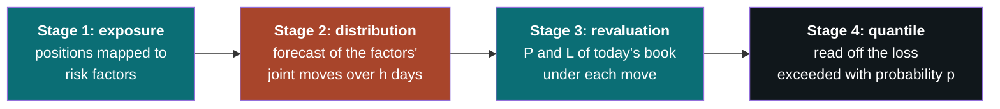
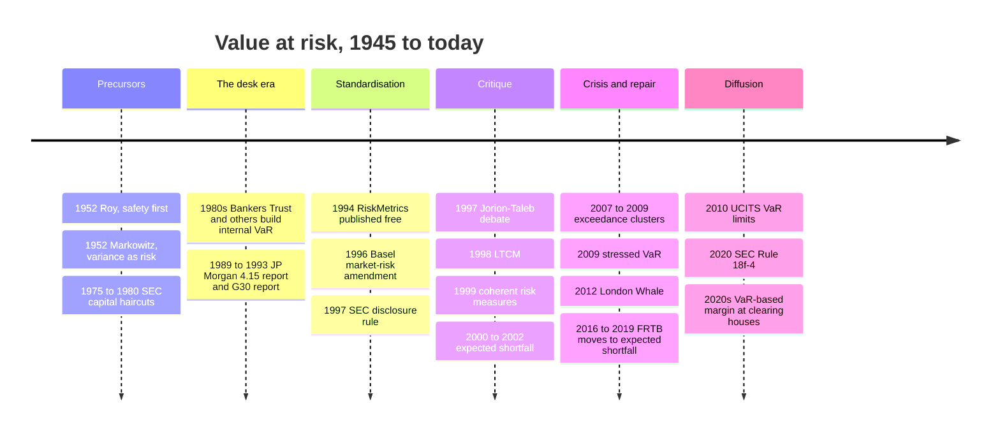
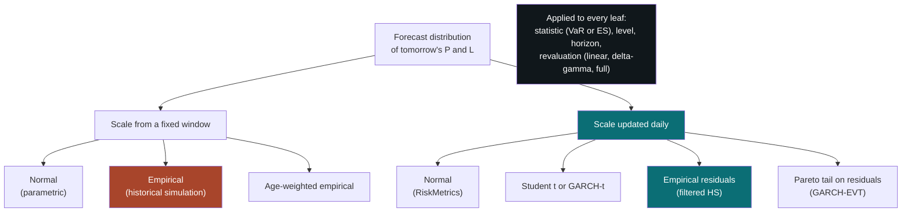
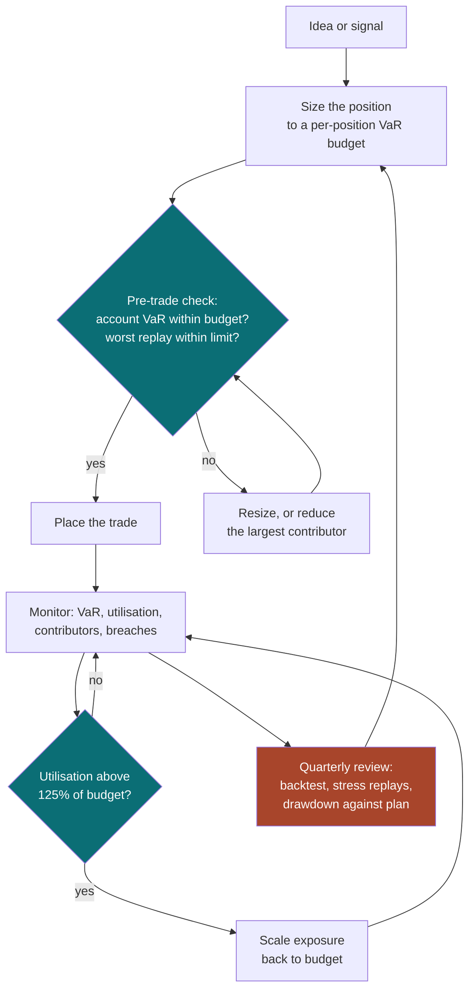
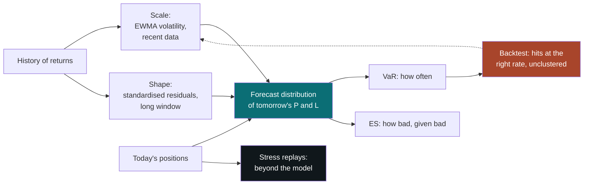
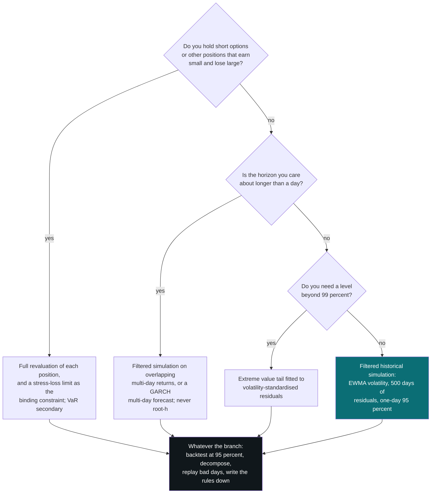

# Value at Risk

### A quantile of tomorrow's profit and loss: how it is computed, what it hides, and the smallest version worth running

---

ELI5_PLACEHOLDER

---

**What this is.** Value at risk is the most widely used number in financial risk
management and the most widely misread. It is used to set trading limits, to
compute bank capital, to cap the leverage of mutual funds, and to size the margin
a clearing house demands, and it has been blamed, with some justice, for every
market disaster since 1998. This document builds it from first principles: what
the number is, the dozen ways of computing it and what they have in common, the
family of measures that grew up around it, how institutions actually use and
display it, where it breaks, and how to test it. The last third is for a reader
running their own money: what of all this transfers to an individual account, and
what the smallest implementation worth having looks like.

**How to read it.** §1 and §2 are the conceptual core: the definition, the three
ideas the rest hangs on, and what a VaR number does and does not say. §3 is
history and §4 the bibliography. §5 is the mathematics, and §6 and §7 are the two
surveys: ways of computing VaR, and the variations on it. §8 shows that most of
§6 and §7 is one calculation with five slots. §9 and §10 are about practice: who
uses it for what, and how it is drawn. §11 is the critique and §12 the testing.
§13 and §14 are the individual investor's sections, and §15 synthesises.

If you want the idea and nothing else, read §1, §2 and §11.1. If you run your own
account and want something to use this week, read §1, §2, §13 and §14, and treat
the rest as reference. If you already compute VaR and want the parts that are not
in the textbook chapter, start at §6.8, §11.5 and §12.5. Appendix A defines the
statistical machinery the main text leans on, built up in dependency order, for a
reader who wants a term unpacked.

**Relationship to the other notes.** [Portfolio Construction and the Covariance
Matrix](portfolio_construction.html) is the detail behind the covariance matrix
that §5.3 and §6.3 take as given; its §6.3 on exponentially weighted estimates
matters here. [Simple and Log Returns](log_returns.html) covers the return
conventions and the aggregation rules behind §5.4.
[Trend-Following in Financial Markets](trend_following.html) treats volatility
targeting as a sizing rule, which §13.3 shows is the same thing as a VaR budget.
[Implied Volatility](implied_volatility.html) is the background for the option
examples in §6.10. Each stands alone.

**Where the numbers come from.** Most of the numerical results are my own
calculations rather than quotations from published studies, and I say so where
it matters. They use daily US equity returns from the Kenneth R. French data
library: the value-weighted market from July 1926 to December 2025, and five of
its value-weighted industry portfolios standing in for sector funds in a worked
\$100,000 account. The script that produces every such number and figure is
`figures/var_common.py` in the source repository, with one `figures/var_*.py`
per figure. One market and one century is not the world: the same exercise on
currencies, rates or single stocks would move the numbers, though not, in my
experience of the literature, the conclusions.

**A warning about scope.** [Practice] Nothing here is investment advice. The
worked account is an illustration chosen to make the arithmetic visible, not a
recommended portfolio.

**Epistemic tags.** Claims are flagged by status:

- **[Fact]** — replicated across independent datasets or implementations, with
  broad agreement among people who have looked.
- **[Contested]** — documented, but with live disagreement about magnitude,
  robustness, or cause.
- **[Hypothesis]** — a proposed mechanism, not decisively tested.
- **[Practice]** — practitioner convention. May well be right; the evidence is
  private or absent.

Untagged sentences are definitions, derivations, or arithmetic — true by
construction rather than by evidence.

---

**Notation.** $V$ is the value of the portfolio today and $\Delta V$ its change
over the horizon, the **profit and loss** or **P&L**. The **loss** is
$L = -\Delta V$, so losses are positive numbers and so is VaR: this is the
convention throughout, and a negative VaR means the "bad" outcome is still a
gain. $h$ is the horizon in trading days.

$\alpha$ is the **confidence level**, 0.95 or 0.99 in nearly all practice, and
$p = 1 - \alpha$ the **tail probability**, 0.05 or 0.01. $\operatorname{VaR}_\alpha$
is value at risk and $\operatorname{ES}_\alpha$ expected shortfall at level
$\alpha$. $F_L$ is the cumulative distribution function of the loss and
$q_\alpha(L)$ its $\alpha$-quantile.

$r_t$ is the return on day $t$ and $\sigma_t$ its **conditional volatility**: the
standard deviation of $r_t$ as forecast on the evening of day $t-1$. A plain
$\sigma$ is an unconditional or long-run volatility. $\mu$ is a mean return.
$\Phi$ and $\varphi$ are the standard normal distribution and density functions,
and $z_\alpha = \Phi^{-1}(\alpha)$ the standard normal quantile, so
$z_{0.95} = 1.645$ and $z_{0.99} = 2.326$. More generally $k_\alpha$ is the
$\alpha$-quantile of whatever standardised (mean zero, variance one) distribution
is in use; $k_\alpha = z_\alpha$ is the normal special case.

For a portfolio, $x \in \mathbb{R}^N$ is the vector of **dollar positions** in
$N$ assets, so $V = \sum_i x_i$ for an unlevered long-only book, and $w = x/V$
the weights. $\Sigma$ is the $N \times N$ covariance matrix of one-day asset
returns and $\sigma_p = \sqrt{x'\Sigma x}$ the portfolio's one-day volatility **in
dollars**. $\lambda \in (0,1)$ is the decay of an exponentially weighted moving
average (EWMA). $n$ is the number of past observations an estimate uses, and $T$
the number of days in a backtest.

In backtesting, $I_t \in \{0,1\}$ is the **hit** indicator, equal to one when the
day-$t$ loss exceeded the VaR forecast for that day, and $X = \sum_t I_t$ the
number of hits, also called exceedances, exceptions, breaches or violations: the
five words are synonyms. $\nu$ is the degrees-of-freedom parameter of a Student
$t$ distribution and $\xi$ the tail index of extreme value theory (§6.11).

---

## Table of contents

1. [What value at risk is](#1-what-value-at-risk-is)
2. [Reading a VaR number](#2-reading-a-var-number)
3. [How the field evolved](#3-how-the-field-evolved)
4. [Foundational references](#4-foundational-references)
5. [The mathematics](#5-the-mathematics)
6. [Computing VaR: the methods](#6-computing-var-the-methods)
7. [Variations: the VaR family](#7-variations-the-var-family)
8. [Taxonomy and equivalences](#8-taxonomy-and-equivalences)
9. [How practitioners use it](#9-how-practitioners-use-it)
10. [How VaR is presented](#10-how-var-is-presented)
11. [Limitations and failure modes](#11-limitations-and-failure-modes)
12. [Backtesting and evaluation](#12-backtesting-and-evaluation)
13. [VaR for an individual investor](#13-var-for-an-individual-investor)
14. [The minimal version](#14-the-minimal-version)
15. [Synthesis](#15-synthesis)

---

```{=latex}
\newpage
```

# 1. What value at risk is {#1-what-value-at-risk-is}

## 1.1 The question it answers

Every risk measure is an answer to a question, and most confusion about value at
risk comes from attaching the answer to the wrong question. The question VaR
answers is this:

> **Over the next $h$ days, with my positions left as they are, what loss will I
> exceed only with probability $p$?**

That is all. With $h$ = 1 day and $p$ = 5%, a VaR of \$1,600 says: on about one
trading day in twenty I should expect to lose more than \$1,600, and on the other
nineteen I should expect to lose less than that, or to make money. It is a
statement about *frequency*. It contains a dollar amount, a time span and a
probability, and nothing else.

It was invented to solve an aggregation problem, and that origin explains its
shape. A bank's trading floor in the late 1980s held bonds measured in duration,
options measured in delta and vega, currencies measured in notional, and equities
measured in beta. None of these units can be added to another, so nobody could
say whether the firm as a whole was taking more risk than last week. A loss
quantile can be computed for any position in any instrument, comes out in money,
and can be computed for the sum. VaR's first and still most defensible use is as
a **common unit**: a way to put a Treasury desk and an equity options desk on the
same axis.

## 1.2 The definition

Fix a horizon $h$ and a confidence level $\alpha$. Let $L = -\Delta V$ be the
loss on the current portfolio over the horizon, treated as a random variable with
distribution function $F_L(\ell) = P(L \le \ell)$. Then

$$
\operatorname{VaR}_\alpha(L) \;=\; q_\alpha(L) \;=\; \inf\{\ell : F_L(\ell) \ge \alpha\} .
$$

In words: the smallest loss level $\ell$ such that the probability of losing no
more than $\ell$ is at least $\alpha$. When the distribution is continuous this
is simply the number that solves $P(L > \operatorname{VaR}_\alpha) = 1 - \alpha$.
The infimum is there for distributions with jumps or flat stretches, which matter
more often than one would think: a historical sample is a discrete distribution,
and so is a bond that either defaults or does not (§5.1, §5.7).

Three things are packed into that line, and each one is a place where two VaR
numbers can silently differ.

**The confidence level $\alpha$.** 95% and 99% are the standard choices, with
97.5% and 99.9% in some regulatory uses. This is a convention, not an estimate.
It trades relevance against measurability: a higher level looks further into the
tail, where the losses that matter live and where there is almost no data.

**The horizon $h$.** One day for trading desks; ten days for the original bank
capital rules; twenty days for fund regulation; a year for credit and insurance.
Also a convention, meant to reflect how long it would take to get out of the
position.

**The distribution $F_L$.** This is not a convention. It is a *forecast*, and
all of the work, all of the differences between methods and nearly all of the
failures live here. Nobody observes the distribution of tomorrow's P&L. Every
VaR number is the output of a model of it.

A fourth assumption is easy to miss: **the portfolio is frozen.** $L$ is the
loss on today's positions held unchanged for $h$ days. A desk that turns its book
over three times a day and a pension fund that never trades are described by the
same formula, and for the former the ten-day number describes a portfolio that
will not exist.

## 1.3 The wrong intuition

The misreading that does the most damage is that VaR is **the most you can
lose**. The phrase "value at risk" invites it, and so does the way the number is
usually reported: a single dollar figure with the probability in small print.

VaR is closer to the opposite. Take the worst 5% of days. The 95% VaR is the
*best* of them: the mildest outcome that still counts as a bad day. A more
honest name would be **the minimum loss on a bad day**, and a statement like
"our 95% VaR is \$1,600" should be read as "on our bad days we lose *at least*
\$1,600". How much more than \$1,600 is a question VaR was not asked and does not
answer.

Three further misreadings follow from the first.

- **"99% confidence means it is almost certain."** A 99% daily VaR is exceeded,
  if the model is right, two or three times a year. Over a 252-day year the
  chance of at least one exceedance is $1 - 0.99^{252} = 92\%$. An exceedance is
  not a failure of the model; *no* exceedances in three years would be.
- **"A VaR of \$1,600 means risk of \$1,600."** The number is meaningless
  without its level and horizon. The same portfolio has a one-day 95% VaR of
  \$1,600, a one-day 99% VaR of about
  \$2,300, and a ten-day 99% VaR of about
  \$7,200 (§2.2). These are one fact stated three ways.
- **"It is a measurement."** A thermometer measures something that exists. VaR
  estimates a quantile of a distribution that has to be modelled, from data that
  contain very few tail observations. Two competent teams given the same
  portfolio routinely differ by tens of percent (§11.3).

## 1.4 The right picture

The picture to hold is a boundary. Every day's P&L falls on one side or the other
of a line: on the near side, which is most days, things are ordinary; on the far
side things are not.

VaR is the position of that line. It says nothing about the far side except how
often you will visit it. Used that way it is extremely useful, because the near
side is where a risk model works: there is plenty of data about ordinary days,
position limits and hedges behave as designed, and markets are liquid enough that
"hold the portfolio fixed for a day" is a fair description. [Practice] Aaron
Brown, who ran risk at a large hedge fund and has defended VaR in print more
capably than most, argues something close to this in *Red-Blooded Risk* (2011):
VaR separates the days you manage with statistics from the days you manage with
scenarios, contingency plans and capital, and the main output of a VaR system is
not the number but the discipline of checking, every day, which kind of day it
was and whether the count of bad days matches the stated probability.

So a VaR number does two jobs and no more. It tells you the **scale of an
ordinary bad day**, which is what you need to size positions and to know whether
today's loss was routine. And it gives you a **claim that can be checked**: if I
say 5%, then over five hundred days there should be about twenty-five
exceedances, spread out rather than bunched. No other common risk number can be
falsified this cheaply, and §12 is about doing it.

## 1.5 The master form

Every method of computing VaR, from a one-line formula to an overnight
simulation on a compute grid, is the same three-stage calculation.



1. **Exposure.** Express the portfolio as a function of a set of **risk
   factors**: the things whose movements change its value. For a stock portfolio
   the factors can be the stock prices themselves. For a bond book they are
   points on yield curves; for options, the underlying price and implied
   volatility as well.
2. **Distribution.** Forecast the joint distribution of the factors' changes
   over the horizon. This is the stage coloured differently in the diagram,
   because it is where methods actually differ: assume a normal distribution and
   estimate its covariance matrix; replay the last $n$ days of history; simulate
   from a fitted model.
3. **Revaluation.** Work out the portfolio's P&L under each possible factor
   move, either exactly, by repricing every instrument, or approximately, through
   its sensitivities.
4. **Quantile.** Read off the loss exceeded with probability $p$.

When the portfolio is linear in its factors and the factors are jointly normal,
all four stages collapse into one formula. The P&L is then normal with standard
deviation $\sigma_p$, and

$$
\operatorname{VaR}_\alpha \;=\; z_\alpha\,\sigma_p\,\sqrt{h} \;-\; \mu_p h
\;\approx\; z_\alpha\,\sigma_p\,\sqrt{h},
$$

where $\mu_p$ is the expected daily P&L, small enough at short horizons to drop
(§5.2). For a single position of value $V$ in an asset with daily volatility
$\sigma$, $\sigma_p = \sigma V$ and VaR is $z_\alpha\,\sigma\,V$: **a multiple of
volatility, in dollars.**

## 1.6 The spine, stated once

Three ideas generate the rest of this document. They recur at every section
boundary.

**Idea 1. VaR is a quantile of a forecast distribution.** Not a property of the
portfolio, and not a measurement. Every method is the pipeline of §1.5 with
different choices in its slots, and every difference between two VaR numbers for
the same book traces to a difference in the forecast distribution, almost always
in stage 2.

**Idea 2. At short horizons VaR is a volatility forecast multiplied by a
constant.** For anything close to a linear portfolio, $\operatorname{VaR}_\alpha
= k_\alpha\,\sigma_t\,V$. The multiplier $k_\alpha$ encodes the shape of the
tail, and across every reasonable distribution it moves in a narrow range: at
95% between about 1.5 and 1.7. The volatility $\sigma_t$ is the part that moves:
my EWMA estimate of US equity market volatility was 0.43% a day in February 2007
and 4.80% in October 2008, a factor of eleven. So whoever forecasts volatility
well computes VaR well, and the notorious arguments about distributional shape
are second-order by comparison, at 95%. They stop being second-order at 99% and
beyond, where $k_\alpha$ is the uncertain part (§2.3, §5.8).

**Idea 3. A quantile is a threshold, not a tail, and the hit sequence is how you
audit it.** VaR says how often you will be beyond the line and nothing about how
far. Everything that lives beyond it — expected shortfall, stress tests, the
whole of §11 — exists because of that silence. In exchange, VaR makes the one
claim in risk management that is directly testable: the sequence of days on which
the loss exceeded the forecast, $I_1, I_2, \dots$, should look like independent
coin flips with probability $p$. Right frequency, and no clustering. Every
evaluation method in §12 is a test of one or both halves of that sentence.

## 1.7 What VaR is not

Defining the object against its neighbours:

| It is often confused with | The difference |
|---|---|
| **Volatility** | Volatility is a scale. VaR is a scale times a tail multiplier, in money, with a probability attached. For a normal distribution they carry the same information; for an option book or a credit portfolio they do not |
| **Maximum loss** | VaR is the *least* you lose in the worst $p$ of outcomes. The maximum loss on a long position is its whole value; on a short or levered one it is unbounded |
| **Expected shortfall** | ES is the *average* loss in the worst $p$ of outcomes. It answers "how bad, given bad", which is the question VaR skips (§5.6) |
| **Stress loss** | A stress test asks what a named scenario would do, with no probability attached. VaR attaches a probability and names no scenario |
| **Maximum drawdown** | Drawdown is a path property over months or years: peak to trough. VaR is a one-step-ahead statement. A year's worst drawdown has typically been about nine daily 95% VaRs (§13.5) |
| **Margin** | Margin is what a broker or clearing house demands as collateral. It is usually *computed from* a VaR-like calculation, with add-ons, at the lender's chosen level (§9.4) |
| **Capital** | Capital is the buffer held against loss. Regulators set it as a multiple of VaR; the multiple, three or more, is an admission about how far the model is trusted (§9.1) |

## 1.8 A worked instance, to fix ideas

Put \$100,000 in the US equity market and look back over the 500 trading days to
the end of 2025. The daily returns over that window had a standard deviation of
1.042%, so the P&L had a standard deviation of \$1,042.

**The formula.** Under the normal assumption, the one-day 95% VaR is
$1.645 \times 1{,}042$, which is \$1,713, and the 99% VaR is
$2.326 \times 1{,}042$, which is \$2,423.

**The history.** Sort the 500 daily P&Ls from worst to best. The 95% VaR is the
loss at the 5% point: twenty-five days were worse than it. That loss was \$1,592.
The 99% VaR is the loss with five days worse: \$2,881. The average of the worst
2.5% of days, twelve or thirteen of them, was \$3,051. The single worst day lost
\$5,900.

| | Normal formula | Historical sample |
|---|---|---|
| 95% one-day VaR | 1,713 | 1,592 |
| 99% one-day VaR | 2,423 | 2,881 |
| 97.5% expected shortfall | 2,436 | 3,051 |
| Worst day in the window | — | 5,900 |

Three lessons are already visible, each developed later.

1. **The two methods disagree, and in opposite directions at the two levels.**
   The historical 95% VaR is 7% *below* the normal figure and the historical 99%
   VaR is 19% *above* it. This is what fat tails look like: more days near zero
   and more days far out than a normal curve allows, with fewer in between. At
   95% the normal assumption is conservative; at 99% it is not (§2.3).
2. **The worst day was more than twice the 99% VaR**, and 3.7 times the 95% VaR.
   Nothing in either VaR figure hinted at it. That is Idea 3.
3. **Neither figure says anything about today.** Both describe an average over
   two years. If the last month has been calm the right number for tomorrow is
   lower, and if it has been violent, higher. §2.4 and §6 are about making the
   estimate conditional.

> ### §1 Key takeaways
>
> 1. VaR is the loss you will exceed with a stated probability over a stated
>    horizon on a frozen portfolio. It is a statement about how often, never
>    about how much.
> 2. Read it as the *minimum* loss on a bad day. "The most you can lose" is the
>    opposite of what it says.
> 3. The confidence level and the horizon are conventions. The distribution is a
>    forecast, and it is where every method differs and every failure originates.
> 4. Every method is one pipeline: map positions to risk factors, forecast the
>    factors, revalue, take a quantile. For a linear portfolio with normal
>    factors this collapses to $z_\alpha\,\sigma_p\sqrt{h}$.
> 5. At short horizons VaR is a volatility forecast times a tail multiplier. The
>    multiplier lives in a narrow band at 95%; volatility moved by a factor of
>    eleven between 2007 and 2008. Forecast volatility well and most of the job
>    is done.
> 6. VaR's distinctive virtue is that it is falsifiable: exceedances should
>    occur at the stated frequency and should not cluster.
> 7. On two recent years of US equity data the normal formula overstated the 95%
>    VaR by 7% and understated the 99% VaR by 19%, and the worst day was double
>    the 99% figure.

---

# 2. Reading a VaR number {#2-reading-a-var-number}

§1 defined the object. This section is about the skill most users of VaR lack:
reading a number someone hands you, translating it into things you can picture,
and knowing which questions it cannot answer.

## 2.1 Translate the probability into a calendar

A confidence level is easier to misjudge than a frequency. The table converts the
common conventions into "how often", assuming 252 trading days a year and a model
that is exactly right.

| Level and horizon | Exceeded on average | Chance of at least one exceedance |
|---|---|---|
| 95%, one day | 12.6 days a year: one trading day in twenty, about once a month | 66% in any 21-day month |
| 99%, one day | 2.5 days a year: one day in a hundred, about every five months | 92% in any year |
| 99.9%, one day | one day in a thousand, about every four years | 22% in any year |
| 99%, ten days | one ten-day period in a hundred: about every four years | — |
| 99%, twenty days | one month in a hundred: about every eight years | — |
| 99.5%, one year | one year in two hundred | — |

The last three rows are the regulatory conventions of §9: the original Basel
market-risk rule, European and US fund rules, and European insurance solvency.
They read as extremely conservative, and they would be if the models delivering
them were right; §11 and §12 are about why they are not.

The first row is the one to internalise for personal use. **A 95% one-day VaR is
a monthly event.** If your account's 95% VaR is \$1,500 and you have not lost more
than that in two months, the model is probably too pessimistic; if you have lost
more than that four times in a month, it is probably too optimistic, or the world
has changed, which for practical purposes is the same thing.

## 2.2 VaR is volatility in disguise

For a position whose returns have a location-scale distribution — normal,
Student $t$, or anything else determined up to a shift and a stretch —

$$
\operatorname{VaR}_\alpha \;=\; \big(k_\alpha\,\sigma\sqrt{h} - \mu h\big)\,V ,
$$

where $k_\alpha$ is the $\alpha$-quantile of the standardised distribution
(§5.2). At daily or weekly horizons the drift term is negligible: an asset
earning 8% a year has $\mu h$ = 0.03% a day, against $k_{0.95}\,\sigma$ of about
1.6% for equities. So a VaR is a volatility multiplied by two numbers, one for
the tail and one for the horizon. Every VaR conversion is arithmetic on those
multipliers:

| Conversion | Multiply by | Where it comes from |
|---|---|---|
| Daily volatility to one-day 95% VaR | 1.645 | $z_{0.95}$ |
| Daily volatility to one-day 99% VaR | 2.326 | $z_{0.99}$ |
| 95% VaR to 99% VaR | 1.414 | $z_{0.99}/z_{0.95}$, normal only |
| One-day to ten-day | 3.162 | $\sqrt{10}$, only if returns are IID (§5.4) |
| One-day to twenty-day | 4.472 | $\sqrt{20}$, same caveat |
| Annual volatility to daily | 0.063 | $1/\sqrt{252}$ |
| One-day 95% VaR to the Basel ten-day 99% | 4.47 | $1.414 \times 3.162$ |

So an all-equity account with annual volatility of 16% has daily volatility of
about 1%, a one-day 95% VaR of about 1.65% of its value, and a one-day 99% VaR of
about 2.3%. A conventional 60/40 stock-bond mix, at about 10% annual volatility,
has a one-day 95% VaR of about 1%. These are the numbers to sanity-check any
system against.

**How much the tail multiplier can move.** The table assumed a normal
distribution. Fatter tails change $k_\alpha$, but much less than people expect at
95% and much more at 99%. For a Student $t$ distribution rescaled to unit
variance, with the US market's own figures alongside:

| Distribution of the standardised return | $k_{0.95}$ | $k_{0.99}$ |
|---|---|---|
| Normal | 1.645 | 2.326 |
| Student $t$, 10 degrees of freedom | 1.621 | 2.471 |
| Student $t$, 5 degrees of freedom | 1.561 | 2.605 |
| Student $t$, 4 degrees of freedom | 1.507 | 2.648 |
| Student $t$, 3 degrees of freedom | 1.359 | 2.620 |
| US market 1929–2025, standardised by that morning's EWMA volatility | 1.71 | 2.90 |
| US market 1926–2025, standardised by full-sample volatility | 1.46 | 2.85 |

Two facts are worth carrying away. At 95% every plausible choice lies within
about 15% of the normal value, and fattening the tail actually *lowers* the
multiplier, because a fat-tailed distribution with the same variance puts more
mass near the centre. At 99% the plausible range is 2.3 to 3.0, a 30% spread,
and it is all on the high side of the normal. Meanwhile the volatility that
multiplies them moved elevenfold in eighteen months. This is Idea 2 in numbers:
at 95% the forecast of $\sigma_t$ dominates, and at 99% the tail shape starts to
compete with it.

## 2.3 What the number does not tell you

The figure below draws the worked instance of §1.8. It is the picture every
introduction to VaR contains, and it is worth looking at for what it leaves out.

```{=latex}
\begin{center}
\includegraphics[width=\linewidth]{quant-research/figures/var_anatomy.pdf}
\end{center}
```

```{=html}

```

The 95% VaR sits at \$1,592, inside the body of the histogram. Everything to its
left, shaded, is the region VaR is silent about: the 99% VaR at \$2,881, the
average of the worst 2.5% at \$3,051, and a worst day of \$5,900. You could move
that worst day to \$50,000 and the 95% VaR would not change by a cent. The black
curve is the normal distribution the parametric method would have used in place
of the histogram; it is too low in the centre, too low in the far tail, and too
high in between.

The silence can be total. Compare two positions:

| | Position A | Position B |
|---|---|---|
| What it is | A diversified stock portfolio, P&L normal with standard deviation 1,000 | A short position in deep out-of-the-money options: gains 200 on 97% of days, loses 20,000 on 3% |
| 95% one-day VaR | 1,645 | **−200** (a gain) |
| 99% one-day VaR | 2,326 | 20,000 |
| 95% expected shortfall | 2,063 | 11,920 |

Position B has a *negative* 95% VaR: in 95% of outcomes it makes money, so the
loss exceeded with probability 5% is a gain. A risk system with a 95% VaR limit
would let you hold any amount of it. The example is stylised, but the real
version is ordinary. Selling ten 30-day put contracts struck 10% below a \$100
stock with 20% implied volatility collects \$71 of premium; the linear
(delta-normal) 99% one-day VaR is \$91. A day on which the stock falls 10% and
implied volatility doubles costs \$3,975, forty-four times the VaR (§6.10).

This is not a defect that a better VaR model can fix. It is what a quantile is.
§5.6 and §7.1 introduce the measure that looks past the line, and §11.1 discusses
how the silence gets exploited.

## 2.4 Today's VaR and the typical VaR

There are two different questions a VaR can answer, and most disagreements
between VaR numbers are not disagreements about the answer but about which
question is being asked.

- **Conditional VaR**, in the sense used here: given everything known tonight,
  including that markets have been calm or violent recently, what is the
  quantile of tomorrow's loss? The volatility in the formula is a *current*
  estimate, $\sigma_t$.
- **Unconditional VaR**: over a long run of days like the ones in my sample,
  what is the quantile of a typical day's loss? The volatility is an average.

(The phrase "conditional VaR" has also been used as a name for expected
shortfall. §8.4 untangles this; in this document it never means that.)

For the worked \$100,000 account of §10.4 — five sector funds — at the end of
2025, the one-day 95% VaR came out as:

| Method | Question it answers | 95% one-day VaR |
|---|---|---|
| Normal, volatility from an EWMA with decay 0.94 | Conditional | 1,092 |
| Filtered historical simulation (§6.8) | Conditional | 1,116 |
| Historical simulation over 500 days | Unconditional, over two years | 1,521 |

The historical figure is 39% higher, and it is not wrong. Late 2025 was calm
relative to a two-year window that included the April 2025 tariff shock, so a
two-year average overstates tomorrow's risk. Neither number is the VaR. For
sizing tomorrow's positions the conditional number is the relevant one. For
setting a limit or a capital buffer that should not swing with every change in
the weather, a slower number is defensible, and regulators deliberately choose
one (§9.1). Most practitioners get into trouble by using one while believing they
are using the other.

## 2.5 Fat tails, recalibrated

Ask what a century of US equity returns says about the normal distribution and
the answer seems damning. From July 1926 to December 2025, 26,151 trading days,
daily returns had a standard deviation of 1.078% and a kurtosis of 19, against 3
for a normal distribution.

| Loss larger than | Days observed | Days a normal distribution expects |
|---|---|---|
| 3 standard deviations | 232 | 35 |
| 4 standard deviations | 105 | 0.8 |
| 5 standard deviations | 51 | 0.008 |
| 6 standard deviations | 29 | 0.00003 |

The worst day, 19 October 1987, was a fall of 17.4%: 16.2 standard deviations.

But most of this is not what it looks like. Volatility clusters: calm periods and
violent periods alternate, and a sample that mixes them looks fat-tailed even if
each day's return is normal *given that day's volatility*. Measure each day's
return in units of the volatility a forecaster could have known that morning — an
EWMA estimate, §6.3 — and the picture changes:

| Day | Return | In full-sample standard deviations | In that morning's volatility |
|---|---|---|---|
| 19 October 1987 | −17.4% | 16.2 | 10.4 |
| 16 March 2020 | −12.0% | 11.2 | 2.8 |
| 29 October 1929 | −11.5% | 10.7 | 3.3 |
| 1 December 2008 | −9.0% | 8.4 | 2.0 |

The kurtosis of the standardised series falls from 19 to 8.5. The March 2020 and
December 2008 days, which look like impossible ten-sigma events, were two- and
three-sigma days *given the volatility everyone could already see*. October 1987
remains a genuine outlier on any measure.

[Fact] So: **most of the apparent fat-tailedness of daily returns is
time-varying volatility, and the remainder is real and concentrated beyond the
99th percentile.** The standardised series still has a 99% quantile of 2.90
against the normal's 2.33, and a 99.9% quantile of 5.33 against 3.09. This
ordering of causes, documented on many markets since at least the GARCH
literature of the 1980s, is the most practically important fact about VaR
methodology, and it dictates the ranking of methods in §6.13: model the
volatility first, then worry about the shape of the tail.

A remark attributed in August 2007 to Goldman Sachs's chief financial officer,
that the firm had seen "25-standard deviation moves, several days in a row", is
the classic illustration. Under a normal distribution a 25-sigma day should not
happen once in the life of the universe. The more mundane reading is that the
sigma was measured in a calm period and the moves were measured in a violent one:
a 25-sigma move in yesterday's volatility can be a 4-sigma move in today's.

> ### §2 Key takeaways
>
> 1. A 95% one-day VaR is a monthly event and a 99% one-day VaR a two-or-three
>    times a year event. Even a correct 99% model is exceeded in 92% of years.
> 2. VaR is volatility times a tail multiplier times a horizon multiplier. An
>    all-equity account has a one-day 95% VaR of about 1.65% of its value; a
>    60/40 mix about 1%.
> 3. At 95% the tail multiplier barely depends on the distribution: plausible
>    choices lie within 15% of 1.645, and fatter tails *lower* it. At 99% the
>    plausible range is 2.3 to 3.0, all above the normal value.
> 4. VaR is blind to everything past its own threshold. A short deep
>    out-of-the-money option position can have a negative 95% VaR and a
>    catastrophic tail.
> 5. Conditional VaR (given today's volatility) and unconditional VaR (an
>    average over a window) answer different questions and differed by 39% on
>    the worked account. Know which one you are looking at.
> 6. Standardising by a volatility forecast cuts the kurtosis of US daily
>    returns from 19 to 8.5 and turns March 2020's "11-sigma" day into a
>    3-sigma day. Model volatility first; the tail shape is the second-order
>    correction.

---

```{=latex}
\newpage
```

# 3. How the field evolved {#3-how-the-field-evolved}

The history is short and unusually well documented, largely thanks to Holton
(2002), whose working paper is the source for most of the pre-1990 detail below.
It splits into four eras, each with a one-line thesis.



## 3.1 Precursors (1945–1980): risk as a probability of shortfall

*Thesis: the idea of a loss quantile is older than the computers needed to apply
it to a trading book.*

**Safety first.** Roy (1952), in the same year as Markowitz's portfolio paper,
proposed that an investor should minimise the probability of the portfolio
falling below a disaster level. *Contribution:* risk as a tail probability rather
than a variance. *What changed:* little at the time; mean-variance won the
academic argument because it was tractable. *Limitations:* Roy had no way to
estimate tail probabilities beyond Chebyshev bounds. *Lasting influence:* VaR is
Roy's criterion turned inside out — fix the probability, solve for the level.

**Markowitz (1952)** made variance the measure of portfolio risk and, more
importantly for VaR, showed how to aggregate it through a covariance matrix. Every
parametric VaR is $z_\alpha\sqrt{x'\Sigma x}$: Markowitz's portfolio variance
with a quantile multiplier on the front.

**Regulatory haircuts.** [Fact] According to Holton (2002), the US Securities and
Exchange Commission's net capital rules for broker-dealers moved in 1980 to
haircuts on securities positions based on statistical analysis of historical
price moves, intended to cover something like a 95th-percentile loss over a
one-month liquidation period. *Lasting influence:* the template of a quantile,
a horizon tied to liquidation, and a capital charge, which is exactly the 1996
Basel design.

## 3.2 The desk era (1980–1993): a common unit for a trading floor

*Thesis: VaR was invented by banks, for themselves, to answer "how much could we
lose tomorrow?" across instruments with incommensurable risk measures.*

Through the 1980s several dealers built internal firm-wide measures of this kind.
Bankers Trust is the best-documented case, associated with its risk-adjusted
return on capital (RAROC) system. The best-known story is J.P. Morgan's: its
chairman, Dennis Weatherstone, asked for a single-page report delivered at 4:15
each afternoon summarising the firm's market risk over the next day. The "4:15
report" became the template for the daily VaR report, and the methodology behind
it was a variance-covariance model over a few hundred risk factors.

The name entered wide use through the Group of Thirty's 1993 report on derivatives
practice, which recommended that dealers measure market risk with a
value-at-risk approach and use consistent measures to set limits.

*What changed:* firm-wide risk could be stated in one number, compared across
desks and over time, and limited. *Limitations:* the models were parametric and
mostly normal, and option books were handled through linear sensitivities,
which §6.10 shows can understate the risk of short option positions severely.
*Lasting influence:* the daily VaR report is still the centrepiece of every
bank's market-risk function.

## 3.3 Standardisation (1994–1997): from internal tool to industry and regulatory standard

*Thesis: two decisions in three years — one commercial, one regulatory — made VaR
universal.*

**RiskMetrics (1994).** J.P. Morgan published its methodology, and the volatility
and correlation data to run it, free of charge in October 1994. The fourth
edition of the *RiskMetrics Technical Document* (J.P. Morgan/Reuters, 1996) is
still the clearest statement of the approach: map positions onto a grid of risk
factors, model each factor's daily return as conditionally normal, and estimate
volatilities and correlations by exponentially weighted moving averages with
decay 0.94 for daily data. *What changed:* any firm could compute a VaR the next
morning, and the EWMA estimator became the industry's default volatility model.
*Limitations:* conditional normality understates the 99% tail, and the estimator
with $\lambda$ = 0.94 has an effective memory of about thirty observations, too
short for a large covariance matrix. *Lasting influence:* enormous. The 0.94
decay remains a default everywhere, and §6.3 shows that, combined with a
non-normal tail, it is still close to the best simple method available.

**The Basel Market Risk Amendment (1996).** The Basel Committee on Banking
Supervision (1996a) allowed banks to compute market-risk capital from their own
VaR models, subject to standards: 99% confidence, a ten-day horizon (which could
be scaled up from one day by $\sqrt{10}$), at least one year of data, and a
capital charge of at least **three times** the average VaR over the previous
sixty days. A companion document (Basel Committee, 1996b) set out backtesting
against the daily P&L and the "traffic light" that raises the multiplier when a
bank sees too many exceedances (§12.4). *What changed:* VaR became the basis of
bank capital and therefore something every large bank had to compute, validate
and defend. *Limitations:* the multiplier of three was never derived; it was
widely understood as a safety factor for model error, fat tails and the crudeness
of square-root-of-time scaling. *Lasting influence:* the architecture of a
quantile model, a backtest and a penalty multiplier survived every later reform.

**Disclosure.** In 1997 the US Securities and Exchange Commission required public
companies with material market risk to disclose it, with VaR as one of three
permitted formats. [Practice] That is why every large US bank's annual report
carries a VaR table (§10.3).

## 3.4 Critique (1997–2002): what a quantile cannot see

*Thesis: within five years of VaR's adoption, the theory of what a good risk
measure should be had shown that VaR is not one, and had produced the
replacement.*

**The Jorion–Taleb debate (1997).** In a pair of articles in *Derivatives
Strategy*, Nassim Taleb argued that VaR gives false confidence, ignores the
events that matter, and should be abandoned; Philippe Jorion replied that it is
an imperfect but disciplined improvement on having no firm-wide number at all,
and should be supplemented rather than discarded. They agreed on more than either
side's admirers usually remember. The debate is worth reading because it
anticipates nearly every later criticism; §11.9 returns to it.

**LTCM (1998).** Long-Term Capital Management, a hedge fund run by some of the
most sophisticated quantitative traders and economists of the era, lost most of
its capital in a few weeks of August and September 1998. Jorion (2000)
reconstructs its risk: the fund's VaR, estimated from a short calm history, was a
small fraction of the losses it then suffered, because its positions were highly
correlated in a crisis that its data did not contain, and because its leverage
made liquidation impossible without moving prices. *Lasting influence:* the
standard case study for model risk, correlation breakdown and liquidity.

**Coherent risk measures (1999).** Artzner, Delbaen, Eber and Heath (1999) set
out four properties any sensible risk measure should satisfy and showed that VaR
violates one of them: it is not **sub-additive**, so the VaR of a merged
portfolio can exceed the sum of the parts' VaRs (§5.7). *What changed:* risk
measurement acquired an axiomatic theory, and VaR's status as the reference
measure became a target.

**Expected shortfall (2000–2002).** Rockafellar and Uryasev (2000) showed that the
average loss beyond VaR, which they called conditional value at risk, can be
minimised over a portfolio by linear programming, while Acerbi and Tasche (2002)
gave the definition that is coherent for every distribution. *Lasting influence:*
expected shortfall is now the regulatory measure for bank trading books.

## 3.5 Crisis and repair (2007–2019): from one number to a dashboard

*Thesis: the financial crisis did not show that VaR was wrong so much as that it
had been asked to do jobs it was never designed for.*

[Fact] In 2007–2009 bank VaR models produced exceedances far above their stated
frequencies, and the exceedances came in clusters; O'Brien and Szerszen (2017)
document both in US bank data, and the pattern repeats the one Berkowitz and
O'Brien (2002) had found for the 1998 crisis. My own backtest of the US market
(§11.4) reproduces it: across 2007–2009 a 99% historical-simulation VaR over a
one-year window was breached 24 times where 7.6 were expected.

The regulatory response kept VaR and added around it. **Basel 2.5** (Basel
Committee, 2009) added a **stressed VaR**, computed on a twelve-month window of
significant stress, on top of the ordinary charge, substantially increasing
market-risk capital. The **London Whale** episode of 2012 showed the other failure mode, the
measure being managed rather than the risk: a US Senate investigation (Permanent
Subcommittee on Investigations, 2013) found that a change of VaR model at
JPMorgan's Chief Investment Office cut the reported VaR of its synthetic credit
portfolio by about half overnight, while the position kept growing toward a
loss of more than six billion dollars. The **Fundamental Review of the Trading
Book** (Basel Committee, 2019) finally replaced 99% VaR with 97.5% expected
shortfall, calibrated to a stress period, with longer horizons for less liquid
risk factors, while keeping VaR exceedances as the backtest. Implementation dates
have slipped repeatedly and differ by jurisdiction.

## 3.6 Diffusion (2010–today): VaR outside banking

*Thesis: as banks moved to expected shortfall, VaR spread into fund regulation,
margin and retail tools, where its simplicity is the point.*

European fund guidelines (CESR, 2010) cap a UCITS fund's 99% twenty-day VaR at
20% of its value, or at twice the VaR of a reference portfolio. The US followed
for funds using derivatives with SEC Rule 18f-4 (Securities and Exchange
Commission, 2020): the same 99% twenty-day horizon, at least three years of data,
and limits of 20% of net assets or 200% of a reference portfolio's VaR. [Practice]
Clearing houses have been moving initial-margin models from fixed scenario grids
toward historical-simulation VaR or expected shortfall, and retail brokerage
platforms increasingly show a VaR figure for an account. Twenty years after the
academic consensus turned against it, VaR is more widely used than ever.

> ### §3 Key takeaways
>
> 1. The idea is old: Roy's 1952 safety-first criterion is VaR with the roles of
>    probability and loss level swapped. Parametric VaR is Markowitz's portfolio
>    variance with a quantile multiplier.
> 2. VaR was built by banks to put incommensurable desks on a common scale, and
>    that remains its most defensible use.
> 3. Two events made it universal: J.P. Morgan giving RiskMetrics away in 1994,
>    and the 1996 Basel amendment basing capital on internal VaR models with a
>    multiplier of three that has never been derived from anything.
> 4. The critique arrived almost immediately: Taleb in 1997, LTCM in 1998,
>    coherence in 1999, expected shortfall by 2002. None of it dislodged VaR,
>    because none of it offered something as cheap to compute and check.
> 5. The crisis produced exceedance clusters, not a single bad number. The repair
>    was to surround VaR — stressed VaR, expected shortfall, liquidity horizons —
>    rather than to drop it.
> 6. The London Whale is the canonical case of the measure being optimised
>    instead of the risk: a model change halved the reported VaR overnight.
> 7. VaR has since spread to fund regulation and margin, where a simple,
>    auditable number matters more than theoretical elegance.

---

```{=latex}
\newpage
```

# 4. Foundational references {#4-foundational-references}

Grouped by kind, because the kinds are read differently. Each entry says why it
matters. Where a free copy exists it is the link; paywalled-only entries are
marked, and entries without a link are ones for which I could not find a stable
copy.

## 4.1 Origins and the documents that defined practice

- **Roy, A. D. (1952).** ["Safety First and the Holding of Assets."](https://www.jstor.org/stable/1907413)
  *Econometrica* 20(3), 431–449. — Risk as the probability of falling below a
  disaster level. VaR inverts Roy's criterion: fix the probability, solve for
  the level.
- **Markowitz, H. (1952).** ["Portfolio Selection."](https://www.jstor.org/stable/2975974)
  *Journal of Finance* 7(1), 77–91. — Portfolio variance through a covariance
  matrix, which is the engine of every parametric VaR.
- **Holton, G. A. (2002).** ["History of Value-at-Risk: 1922–1998."](https://econpapers.repec.org/RePEc:wpa:wuwpmh:0207001)
  Working paper. — The history, with sources. Most of §3.1–§3.2 rests on it.
- **J.P. Morgan/Reuters (1996).** [*RiskMetrics — Technical Document*, 4th ed.](https://www.msci.com/documents/10199/5915b101-4206-4ba0-aee2-3449d5c7e95a)
  New York: Morgan Guaranty Trust. — The document that standardised the field:
  risk-factor mapping, the conditional-normal model, and the EWMA estimator with
  decay 0.94. Still a clear read, and the source of more defaults than anyone
  remembers.
- **Mina, J. & Xiao, J. Y. (2001).** ["Return to RiskMetrics: The Evolution of a Standard."](https://www.dofin.ase.ro/acodirlasu/lect/riskmgdofin/rrmfinal.pdf)
  RiskMetrics Group. — The update: historical simulation and Monte Carlo
  alongside the parametric method, and better treatment of options.
- **Basel Committee on Banking Supervision (1996a).** ["Amendment to the Capital Accord to Incorporate Market Risks."](https://www.bis.org/publ/bcbs24.pdf)
  — The rule that made VaR the basis of bank capital: 99%, ten days, a
  multiplier of at least three.
- **Basel Committee on Banking Supervision (1996b).** ["Supervisory Framework for the Use of 'Backtesting' in Conjunction with the Internal Models Approach to Market Risk Capital Requirements."](https://www.bis.org/publ/bcbs22.pdf)
  — The traffic light (§12.4). Short, and a model of how to write a statistical
  rule for non-statisticians, including an honest table of its own error rates.
- **Basel Committee on Banking Supervision (2009).** ["Revisions to the Basel II Market Risk Framework."](https://www.bis.org/publ/bcbs158.pdf)
  — Basel 2.5: stressed VaR added to the ordinary charge.
- **Basel Committee on Banking Supervision (2019).** ["Minimum Capital Requirements for Market Risk."](https://www.bis.org/bcbs/publ/d457.pdf)
  — The Fundamental Review of the Trading Book: 97.5% expected shortfall,
  liquidity horizons, desk-level backtesting and a P&L attribution test.
- **CESR (2010).** ["Guidelines on Risk Measurement and the Calculation of Global Exposure and Counterparty Risk for UCITS."](https://www.esma.europa.eu/sites/default/files/library/2015/11/10_788.pdf)
  CESR/10-788. — The European fund rules: 99%, twenty days, absolute and relative
  VaR limits (§9.2).
- **Securities and Exchange Commission (2020).** ["Use of Derivatives by Registered Investment Companies and Business Development Companies."](https://www.sec.gov/rules/final/2020/ic-34084.pdf)
  Release IC-34084 (Rule 18f-4). — The US equivalent for funds using
  derivatives.

## 4.2 Methods

- **Engle, R. F. (1982).** ["Autoregressive Conditional Heteroscedasticity with Estimates of the Variance of United Kingdom Inflation."](https://www.jstor.org/stable/1912773)
  *Econometrica* 50(4). — ARCH: volatility as something to forecast. Every
  conditional VaR descends from it.
- **Bollerslev, T. (1986).** ["Generalized Autoregressive Conditional Heteroskedasticity."](https://public.econ.duke.edu/~boller/Published_Papers/joe_86.pdf)
  *Journal of Econometrics* 31(3), 307–327. — GARCH(1,1), the workhorse of §6.4.
- **Boudoukh, J., Richardson, M. & Whitelaw, R. F. (1998).** ["The Best of Both Worlds."](https://pages.stern.nyu.edu/~rwhitela/papers/hybrid%20risk98.pdf)
  *Risk* 11(5), 64–67. — Age-weighted historical simulation (§6.7). Four pages.
- **Hull, J. & White, A. (1998).** ["Incorporating Volatility Updating into the Historical Simulation Method for Value-at-Risk."](https://www.risk.net/journal-of-risk/2161156/incorporating-volatility-updating-into-the-historical-simulation-method-for-value-at-risk)
  *Journal of Risk* 1(1), 5–19. [[paywalled]] — Volatility-weighted historical
  simulation: rescale each past return by the ratio of today's volatility to the
  volatility at the time.
- **Barone-Adesi, G., Giannopoulos, K. & Vosper, L. (1999).** ["VaR without Correlations for Portfolios of Derivative Securities."](https://econpapers.repec.org/RePEc:wly:jfutmk:v:19:y:1999:i:5:p:583-602)
  *Journal of Futures Markets* 19(5), 583–602. — Filtered historical simulation,
  the method that comes out best in §6.13. With Hull and White, the most useful
  pair of papers in this list for an implementer.
- **McNeil, A. J. & Frey, R. (2000).** ["Estimation of Tail-Related Risk Measures for Heteroscedastic Financial Time Series: An Extreme Value Approach."](https://doi.org/10.1016/S0927-5398(00)00012-8)
  *Journal of Empirical Finance* 7(3–4), 271–300. [[paywalled]] — GARCH filter
  plus extreme value theory for the residual tail (§6.11). The template for
  "model volatility first, then the tail".
- **Engle, R. F. & Manganelli, S. (2004).** ["CAViaR: Conditional Autoregressive Value at Risk by Regression Quantiles."](https://www.nber.org/papers/w7341)
  *Journal of Business & Economic Statistics* 22(4), 367–381. — Model the
  quantile directly, with no distribution at all (§6.12). Link is the NBER
  working paper.
- **Britten-Jones, M. & Schaefer, S. M. (1999).** ["Non-Linear Value-at-Risk."](https://papers.ssrn.com/sol3/papers.cfm?abstract_id=275836)
  *European Finance Review* 2(2), 161–187. — Delta-gamma VaR for option books,
  and why the linear approximation fails (§6.10).
- **Glasserman, P., Heidelberger, P. & Shahabuddin, P. (2000).** "Variance
  Reduction Techniques for Estimating Value-at-Risk." *Management Science*
  46(10), 1349–1364. — How to make Monte Carlo VaR for option books fast enough
  to run overnight.
- **Duffie, D. & Pan, J. (1997).** ["An Overview of Value at Risk."](https://www.pm-research.com/content/iijderiv/4/3/7)
  *Journal of Derivatives* 4(3), 7–49. [[paywalled]] — The best early survey,
  strong on jumps, stochastic volatility and options.
- **Linsmeier, T. J. & Pearson, N. D. (2000).** ["Value at Risk."](https://rpc.cfainstitute.org/research/financial-analysts-journal/2000/value-at-risk)
  *Financial Analysts Journal* 56(2). — The clearest short introduction to the
  three classic methods, worked through on one portfolio.
- **Litterman, R. (1996).** ["Hot Spots and Hedges."](https://jpm.pm-research.com/content/23/5/52)
  *Journal of Portfolio Management* 23(5), 52–75. [[paywalled]] — Risk
  decomposition by marginal contribution, written for portfolio managers. The
  origin of the "hot spots" display in §10.4.
- **Garman, M. (1996).** "Improving on VaR." *Risk* 9(5), 61–63. — Marginal and
  component VaR, and the property that components sum to the total (§5.5).
- **Tasche, D. (2008).** ["Capital Allocation to Business Units and Sub-Portfolios: the Euler Principle."](https://arxiv.org/abs/0708.2542)
  arXiv:0708.2542. — Why Euler (gradient) allocation is the only one consistent
  with performance measurement, for VaR and ES alike.

## 4.3 Coherence, expected shortfall and scoring

- **Artzner, P., Delbaen, F., Eber, J.-M. & Heath, D. (1999).** ["Coherent Measures of Risk."](https://people.math.ethz.ch/~delbaen/ftp/preprints/CoherentMF.pdf)
  *Mathematical Finance* 9(3), 203–228. [[DOI]](https://doi.org/10.1111/1467-9965.00068)
  — The four axioms and the proof that VaR fails sub-additivity. Foundational,
  and more readable than its reputation.
- **Rockafellar, R. T. & Uryasev, S. (2000).** ["Optimization of Conditional Value-at-Risk."](https://sites.math.washington.edu/~rtr/papers/rtr179-CVaR1.pdf)
  *Journal of Risk* 2(3), 21–41. — The formula that computes ES and VaR in a
  single minimisation and turns portfolio ES minimisation into a linear program
  (§5.6).
- **Rockafellar, R. T. & Uryasev, S. (2002).** "Conditional Value-at-Risk for
  General Loss Distributions." *Journal of Banking & Finance* 26(7), 1443–1471.
  — The extension to discrete distributions, where VaR and ES behave badly.
- **Acerbi, C. & Tasche, D. (2002).** ["On the Coherence of Expected Shortfall."](https://arxiv.org/abs/cond-mat/0104295)
  *Journal of Banking & Finance* 26(7), 1487–1503. — The definition of ES that
  is coherent for every distribution, and why naive "average beyond VaR" is not.
- **Embrechts, P., McNeil, A. J. & Straumann, D. (2002).** ["Correlation and Dependence in Risk Management: Properties and Pitfalls."](https://people.math.ethz.ch/~embrecht/ftp/pitfalls.pdf)
  In *Risk Management: Value at Risk and Beyond*, ed. M. Dempster, Cambridge
  University Press. — When correlation is the right summary of dependence
  (elliptical distributions, where VaR is also sub-additive) and when it is
  misleading.
- **Yamai, Y. & Yoshiba, T. (2005).** ["Value-at-Risk versus Expected Shortfall: A Practical Perspective."](https://ideas.repec.org/a/eee/jbfina/v29y2005i4p997-1015.html)
  *Journal of Banking & Finance* 29(4), 997–1015. — The practitioner's case for
  ES, including its cost: under fat tails ES needs more data for the same
  precision.
- **Gneiting, T. (2011).** ["Making and Evaluating Point Forecasts."](https://arxiv.org/abs/0912.0902)
  *Journal of the American Statistical Association* 106(494), 746–762. — Shows
  that ES is not elicitable: no scoring function ranks ES forecasts correctly
  on its own (§5.9).
- **Fissler, T. & Ziegel, J. F. (2016).** ["Higher Order Elicitability and Osband's Principle."](https://arxiv.org/abs/1503.08123)
  *Annals of Statistics* 44(4), 1680–1707. — The pair (VaR, ES) is jointly
  elicitable, which is the basis of modern ES forecast comparison.
- **Emmer, S., Kratz, M. & Tasche, D. (2015).** ["What Is the Best Risk Measure in Practice? A Comparison of Standard Measures."](https://arxiv.org/abs/1312.1645)
  *Journal of Risk* 18(2), 31–60. — Coherence, robustness, elicitability and
  allocation compared side by side; concludes for ES on balance. The efficient
  entry point to the whole debate.
- **Daníelsson, J., Jorgensen, B. N., Samorodnitsky, G., Sarma, M. & de Vries, C. G. (2013).** ["Fat Tails, VaR and Subadditivity."](https://repub.eur.nl/pub/37654/)
  *Journal of Econometrics* 172(2), 283–291. — VaR is sub-additive in the tail
  for most fat-tailed asset returns. The failures of §5.7 need extremely heavy
  tails or lumpy payoffs.

## 4.4 Backtesting and the empirical record

- **Kupiec, P. H. (1995).** ["Techniques for Verifying the Accuracy of Risk Measurement Models."](https://papers.ssrn.com/sol3/papers.cfm?abstract_id=7065)
  *Journal of Derivatives* 3(2), 73–84. — The unconditional coverage test, and
  the warning, still ignored, that it has almost no power at 99% on one year of
  data.
- **Christoffersen, P. F. (1998).** ["Evaluating Interval Forecasts."](https://econpapers.repec.org/RePEc:ier:iecrev:v:39:y:1998:i:4:p:841-62)
  *International Economic Review* 39(4), 841–862. — Independence and conditional
  coverage: a correct VaR must not only be breached at the right rate but
  unpredictably.
- **Christoffersen, P. F. & Pelletier, D. (2004).** "Backtesting Value-at-Risk: A
  Duration-Based Approach." *Journal of Financial Econometrics* 2(1), 84–108. —
  Tests based on the time between exceedances.
- **Jorion, P. (1996).** ["Risk²: Measuring the Risk in Value at Risk."](https://rpc.cfainstitute.org/research/financial-analysts-journal/1996/risk2-measuring-the-risk-in-value-at-risk)
  *Financial Analysts Journal* 52(6), 47–56. — Standard errors for VaR, and the
  argument that a VaR should be reported with one.
- **Hendricks, D. (1996).** ["Evaluation of Value-at-Risk Models Using Historical Data."](https://www.newyorkfed.org/medialibrary/media/research/epr/96v02n1/9604hend.pdf)
  Federal Reserve Bank of New York *Economic Policy Review* 2(1). — Twelve VaR
  methods on foreign-exchange portfolios. The first large comparison, and its
  main findings have held up.
- **Berkowitz, J. & O'Brien, J. (2002).** ["How Accurate Are Value-at-Risk Models at Commercial Banks?"](https://www.federalreserve.gov/pubs/feds/2001/200131/200131pap.pdf)
  *Journal of Finance* 57(3), 1093–1111. — Banks' own VaR forecasts against
  their P&L: conservative on average, clustered exceedances in 1998, and beaten
  by a simple GARCH model on the P&L itself.
- **O'Brien, J. & Szerszeń, P. (2017).** ["An Evaluation of Bank Measures for Market Risk Before, During and After the Financial Crisis."](https://www.federalreserve.gov/pubs/feds/2014/201421/201421pap.pdf)
  *Journal of Banking & Finance* 80, 215–234. — The same exercise for 2007–2009:
  conservative before the crisis, excessive and clustered exceedances during it.
- **Berkowitz, J., Christoffersen, P. F. & Pelletier, D. (2011).** "Evaluating
  Value-at-Risk Models with Desk-Level Data." *Management Science* 57(12),
  2213–2227. — Backtests on desk data; the duration and regression tests have
  the most power.
- **Kuester, K., Mittnik, S. & Paolella, M. S. (2006).** ["Value-at-Risk Prediction: A Comparison of Alternative Strategies."](https://doi.org/10.1093/jjfinec/nbj002)
  *Journal of Financial Econometrics* 4(1), 53–89. [[paywalled]] — A large
  out-of-sample horse race. Volatility-filtered methods with fat-tailed
  residuals win; plain historical simulation and normal models do worst.
- **Pérignon, C. & Smith, D. R. (2010).** ["The Level and Quality of Value-at-Risk Disclosure by Commercial Banks."](https://doi.org/10.1016/j.jbankfin.2009.08.009)
  *Journal of Banking & Finance* 34(2), 362–377. [[paywalled]] — What banks
  disclose and which methods they use: historical simulation, by a wide margin.
- **Acerbi, C. & Szekely, B. (2014).** "Back-Testing Expected Shortfall." *Risk*,
  December, 76–81. — Shows ES can be backtested despite not being elicitable.
- **Nolde, N. & Ziegel, J. F. (2017).** ["Elicitability and Backtesting: Perspectives for Banking Regulation."](https://arxiv.org/abs/1608.05498)
  *Annals of Applied Statistics* 11(4). — The modern synthesis of backtesting
  and forecast comparison for VaR and ES.

## 4.5 The critiques

- **Beder, T. S. (1995).** "VAR: Seductive but Dangerous." *Financial Analysts
  Journal* 51(5), 12–24. — Eight portfolios, several reasonable methods, VaR
  estimates differing by up to fourteen times. The first and still the starkest
  demonstration of model risk.
- **Marshall, C. & Siegel, M. (1997).** "Value at Risk: Implementing a Risk
  Measurement Standard." *Journal of Derivatives* 4(3), 91–111. — Software
  vendors given the same portfolio and the same RiskMetrics method returned
  materially different numbers: implementation risk.
- **Taleb, N. N. & Jorion, P. (1997).** ["The Jorion–Taleb Debate."](https://www.blackswanreport.com/blog/2009/12/derivatives-strategy-april97-the-jorion-taleb-debate/)
  *Derivatives Strategy*, April. — Both sides, at the moment of VaR's adoption.
  Link is a reprint.
- **Danielsson, J. (2002).** ["The Emperor Has No Clothes: Limits to Risk Modelling."](https://www.riskresearch.org/papers/Danielsson2002/)
  *Journal of Banking & Finance* 26(7), 1273–1296. — Risk is endogenous: a
  model estimated in calm markets says little about crises, and a regulatory
  VaR can increase the risk it measures.
- **Danielsson, J., Embrechts, P., Goodhart, C., Keating, C., Muennich, F.,
  Renault, O. & Shin, H. S. (2001).** "An Academic Response to Basel II." LSE
  Financial Markets Group Special Paper 130. — Procyclicality and herding from
  VaR-based regulation, stated before the crisis that demonstrated them.
- **Basak, S. & Shapiro, A. (2001).** ["Value-at-Risk-Based Risk Management: Optimal Policies and Asset Prices."](https://www.ssrn.com/abstract=204390)
  *Review of Financial Studies* 14(2), 371–405. — A manager facing a VaR limit
  rationally concentrates losses in the states beyond the VaR, so the worst
  outcomes get *worse* (§11.7).
- **Adrian, T. & Shin, H. S. (2014).** ["Procyclical Leverage and Value-at-Risk."](https://www.nber.org/papers/w18943)
  *Review of Financial Studies* 27(2), 373–403. — Dealers manage to a roughly
  constant VaR, which makes their leverage procyclical (§11.6).
- **Danielsson, J. & Zigrand, J.-P. (2006).** ["On Time-Scaling of Risk and the Square-Root-of-Time Rule."](https://ideas.repec.org/p/fmg/fmgdps/dp439.html)
  *Journal of Banking & Finance* 30(10), 2701–2713. — When $\sqrt{h}$ scaling is
  wrong, and that with jumps it understates long-horizon risk.
- **Diebold, F. X., Hickman, A., Inoue, A. & Schuermann, T. (1997).** ["Converting 1-Day Volatility to h-Day Volatility: Scaling by √h Is Worse than You Think."](https://econpapers.repec.org/RePEc:wop:pennin:97-34)
  Wharton Financial Institutions Center Working Paper 97-34. — Under GARCH,
  $\sqrt{h}$ scaling gets the level wrong in a predictable direction (§5.4,
  §11.5).
- **Pritsker, M. (2006).** ["The Hidden Dangers of Historical Simulation."](https://www.federalreserve.gov/pubs/feds/2001/200127/200127pap.pdf)
  *Journal of Banking & Finance* 30(2), 561–582. — Historical simulation reacts
  late to rising risk and asymmetrically to gains and losses. Link is the FEDS
  working paper.
- **Cont, R., Deguest, R. & Scandolo, G. (2010).** ["Robustness and Sensitivity Analysis of Risk Measurement Procedures."](https://hal.science/hal-00413729)
  *Quantitative Finance* 10(6), 593–606. — The counter-critique: historical VaR
  is statistically robust and ES is not. Robustness and coherence conflict.
- **Jorion, P. (2000).** ["Risk Management Lessons from Long-Term Capital Management."](https://onlinelibrary.wiley.com/doi/abs/10.1111/1468-036X.00125)
  *European Financial Management* 6(3), 277–300. [[paywalled]] — The LTCM
  post-mortem in VaR terms.
- **Permanent Subcommittee on Investigations, US Senate (2013).** ["JPMorgan Chase Whale Trades: A Case History of Derivatives Risks and Abuses."](https://www.hsgac.senate.gov/wp-content/uploads/imo/media/doc/REPORT%20-%20JPMorgan%20Chase%20Whale%20Trades%20(4-12-13).pdf)
  — The London Whale, including the VaR model change, from the primary
  documents.
- **Nocera, J. (2009).** ["Risk Mismanagement."](https://www.nytimes.com/2009/01/04/magazine/04risk-t.html)
  *New York Times Magazine*, 4 January. — The journalistic case against VaR
  after 2008, with interviews on both sides. Not a primary source, but the best
  record of how practitioners talked about it at the time.

## 4.6 Volatility management, drawdowns and forecast comparison

- **Moreira, A. & Muir, T. (2017).** ["Volatility-Managed Portfolios."](https://www.nber.org/papers/w22208)
  *Journal of Finance* 72(4), 1611–1644. — Scaling exposure inversely to recent
  variance raised Sharpe ratios for the market and many factors: the evidence
  that de-risking as VaR rises need not cost return (§11.6).
- **Cederburg, S., O'Doherty, M. S., Wang, F. & Yan, X. (2020).** "On the
  Performance of Volatility-Managed Portfolios." *Journal of Financial
  Economics* 138(1), 95–117. — The out-of-sample challenge to Moreira and Muir:
  for many strategies the gains do not survive.
- **Magdon-Ismail, M., Atiya, A. F., Pratap, A. & Abu-Mostafa, Y. S. (2004).** ["On the Maximum Drawdown of a Brownian Motion."](https://doi.org/10.1239/jap/1077134674)
  *Journal of Applied Probability* 41(1), 147–161. [[paywalled]] — The expected
  maximum drawdown of a random walk, used in §13.5.
- **Chekhlov, A., Uryasev, S. & Zabarankin, M. (2005).** ["Drawdown Measure in Portfolio Optimization."](https://www.math.columbia.edu/~chekhlov/ChekhlovUryasevZabarankin--03-2004.pdf)
  *International Journal of Theoretical and Applied Finance* 8(1), 13–58. —
  Conditional drawdown at risk: ES applied to drawdowns (§7.7).
- **Adrian, T. & Brunnermeier, M. K. (2016).** ["CoVaR."](https://www.aeaweb.org/articles?id=10.1257/aer.20120555)
  *American Economic Review* 106(7), 1705–1741. — VaR of the system conditional
  on one institution's distress (§7.6).
- **Kou, S., Peng, X. & Heyde, C. C. (2013).** "External Risk Measures and Basel
  Accords." *Mathematics of Operations Research* 38(3), 393–417. — The case for
  robustness over coherence in regulatory risk measures.
- **Diebold, F. X. & Mariano, R. S. (1995).** "Comparing Predictive Accuracy."
  *Journal of Business & Economic Statistics* 13(3), 253–263. — The standard test
  for whether one forecast's average loss is significantly lower than another's
  (§12.6).

## 4.7 Books

- **Jorion, P. (2006).** *Value at Risk: The New Benchmark for Managing Financial
  Risk*, 3rd ed. McGraw-Hill. — The standard practitioner text, by the person
  who did most to defend VaR. Strong on regulation and bank practice.
- **McNeil, A. J., Frey, R. & Embrechts, P. (2015).** *Quantitative Risk
  Management: Concepts, Techniques and Tools*, revised ed. Princeton University
  Press. — The rigorous treatment: risk measures, extreme value theory, copulas,
  backtesting. The reference for §5.
- **Christoffersen, P. F. (2012).** *Elements of Financial Risk Management*, 2nd
  ed. Academic Press. — The best book for an implementer. Built around filtered
  historical simulation and backtesting, with exercises.
- **Daníelsson, J. (2011).** *Financial Risk Forecasting.* Wiley. — Short,
  practical, with code, and sceptical in the right places.
- **Dowd, K. (2005).** *Measuring Market Risk*, 2nd ed. Wiley. — Comprehensive
  on methods, including estimating the precision of VaR estimates.
- **Holton, G. A. (2014).** [*Value-at-Risk: Theory and Practice*, 2nd ed.](https://www.value-at-risk.net/)
  Published free online. — Thorough on the engineering: mapping, revaluation,
  Monte Carlo, and implementation choices that the academic books skip.
- **Alexander, C. (2008).** *Market Risk Analysis, Volume IV: Value-at-Risk
  Models.* Wiley. — Detailed and worked through in spreadsheets.
- **Brown, A. (2011).** *Red-Blooded Risk: The Secret History of Wall Street.*
  Wiley. — A risk manager's defence of VaR as a tool for finding the boundary of
  normal markets, not for predicting the abnormal ones. Opinionated and useful.
- **Taleb, N. N. (2007).** *The Black Swan.* Random House. — The case against
  relying on any probability model of the tail. Read it for the argument, not
  for the tone.

## 4.8 If you only read six things

In order:

1. **Linsmeier & Pearson (2000)** — the three classic methods on one portfolio,
   in an afternoon.
2. **Christoffersen (2012)**, the chapters on filtered historical simulation and
   backtesting — the working method of §14, done properly.
3. **Hull & White (1998)** *then* **Barone-Adesi, Giannopoulos & Vosper (1999)**
   — the volatility-filtered historical simulation that should be everyone's
   default.
4. **Artzner, Delbaen, Eber & Heath (1999)** — what a risk measure should
   satisfy, and the precise way VaR fails.
5. **Christoffersen (1998)** — how to tell whether a VaR is right, and why the
   timing of exceedances matters as much as their number.
6. **Danielsson (2002)** *and* **Taleb & Jorion (1997)** — the critique, from
   inside and outside the discipline.

Notice what is not on the list: nothing about Monte Carlo engineering, copulas or
extreme value theory. Those matter for a bank's option book. For nearly everyone
else the hard part is the volatility forecast and the honesty of the backtest.

---

```{=latex}
\newpage
```

# 5. The mathematics {#5-the-mathematics}

This section is the formal backing for §1 and §2. §5.2 makes Idea 2 precise,
§5.5 gives the decomposition behind every risk report, §5.6–§5.7 are the theory
of expected shortfall and coherence, and §5.8 is the section most practitioners
skip and should not: how precisely a tail quantile can be estimated at all.

## 5.1 Quantiles, and why the definition has an infimum

The $\alpha$-quantile of a random variable $L$ with distribution function $F_L$
is the generalised inverse

$$
q_\alpha(L) = F_L^{-1}(\alpha) = \inf\{\ell \in \mathbb{R} : F_L(\ell) \ge \alpha\}.
$$

When $F_L$ is continuous and strictly increasing this is the ordinary inverse.
When it is not, the infimum picks a definite value. Two cases matter in practice.

- **Jumps.** If $L$ takes the value 100 with probability 4% and 0 otherwise,
  then $F_L(\ell) = 0.96$ for $0 \le \ell < 100$, so the 95% quantile is 0: the
  95% VaR of a position with a 4% chance of a total loss is zero. This is the
  mechanism behind Position B in §2.3 and behind the failure of sub-additivity
  in §5.7.
- **Samples.** A historical sample of $n$ losses is a discrete distribution. Its
  95% quantile over $n = 500$ days is the 25th or 26th largest loss, or something
  between them, and different software makes different choices. At 99% over
  $n = 250$ days the quantile sits between the second and third largest losses,
  2.5 observations into the tail. Common interpolation conventions can move a 99%
  historical VaR by 10% or more on the same data, which is worth knowing before
  comparing your number with your broker's.

## 5.2 Location-scale families: VaR is a scaled volatility

Suppose the one-period return is $r = \mu + \sigma\varepsilon$, where
$\varepsilon$ has mean zero, variance one and a fixed distribution $G$ with
quantile function $G^{-1}$. The loss on a position of value $V$ is $L = -rV$,
and since $-\varepsilon$ has quantile $-G^{-1}(1-\alpha)$,

$$
\operatorname{VaR}_\alpha = \big(-\mu + \sigma\,k_\alpha\big)\,V,
\qquad k_\alpha = -G^{-1}(1 - \alpha).
$$

For a symmetric $G$, $k_\alpha = G^{-1}(\alpha)$, and for the normal
$k_\alpha = z_\alpha$. Everything in §2.2 follows: VaR is linear in volatility
and in position size, and the distribution enters only through one number
$k_\alpha$.

**Whether to subtract the mean.** Practitioners distinguish **absolute VaR**,
measured from zero as above, from **VaR relative to the mean**, which drops the
$-\mu$ term and measures the loss relative to the expected outcome. At a one-day
horizon the difference is a rounding error. At a one-year horizon it is not: an
asset with $\mu$ = 7% and $\sigma$ = 16% has a 95% relative VaR of 26% and an
absolute VaR of 19%. Always ask which one is meant at long horizons.

**When the location-scale assumption fails.** It holds for any linear portfolio
of assets whose joint returns are **elliptical** — the multivariate normal and
Student $t$ are the important cases — because every linear combination of an
elliptical vector is again location-scale with the same standardised shape. It
fails for option books, whose P&L is a non-linear function of the factors, and
for credit, whose losses are lumpy. Those are the books where §6.9 and §6.10
earn their complexity.

## 5.3 Linear portfolios and the delta-normal formula

For a portfolio of $N$ positions with dollar values $x_i$, the one-day P&L is
approximately

$$
\Delta V \approx \sum_{i=1}^N x_i r_i = x'r ,
$$

exactly for a buy-and-hold portfolio of simple returns over one period. Its
variance is $x'\Sigma x$, so under joint normality

$$
\operatorname{VaR}_\alpha = z_\alpha\sqrt{x'\Sigma x} = z_\alpha\,\sigma_p .
$$

This is the **variance-covariance** or **delta-normal** VaR. The second name
comes from how non-equity positions are put into the form $x'r$: each instrument
is replaced by its first-order sensitivity to each risk factor. An option on a
stock becomes a stock position of $\delta S$ dollars per share of underlying; a
bond becomes a position in yields of $-D^{\star}V$ dollars per unit change in
yield, where $D^{\star}$ is the modified duration; a foreign stock becomes two
positions, one in its local price and one in the currency. This step, **risk
factor mapping**, is where most of a bank's VaR engineering effort goes, and it
is invisible for a portfolio of stocks and funds, where each position is its own
factor.

## 5.4 Time aggregation and the square-root-of-time rule

Let the $h$-day return be the sum of daily log returns,
$R_h = \sum_{j=1}^h r_{t+j}$. If the daily returns are independent and
identically distributed with mean $\mu$ and variance $\sigma^2$, then $R_h$ has
mean $h\mu$ and variance $h\sigma^2$, so its standard deviation is $\sigma\sqrt h$.
If in addition they are normal, $R_h$ is normal and

$$
\operatorname{VaR}_\alpha^{(h)} = z_\alpha\,\sigma\sqrt h - h\mu \approx \sqrt h\,\operatorname{VaR}_\alpha^{(1)} .
$$

That is the **square-root-of-time rule**. Both of its assumptions fail, in
opposite directions.

**Volatility is not constant; it mean-reverts.** Under a GARCH(1,1) model
(§6.4) with long-run variance $\bar\sigma^2$ and persistence
$\phi = a + b < 1$, the forecast of the variance $j$ days ahead is

$$
E_t\big[\sigma^2_{t+j}\big] = \bar\sigma^2 + \phi^{\,j-1}\big(\sigma^2_{t+1} - \bar\sigma^2\big),
$$

so the $h$-day variance is $\sum_{j=1}^h E_t[\sigma_{t+j}^2]$, not
$h\,\sigma^2_{t+1}$. When today's volatility is below its long-run level the
future variances drift *up* and $\sqrt h$ scaling understates the risk; when
volatility is high it overstates. Diebold, Hickman, Inoue and Schuermann (1997)
make this the centre of their critique, and §11.5 measures it on a century of
US data: from the calmest fifth of starting points, a ten-day 99% VaR built by
$\sqrt{10}$ scaling was breached 5.7% of the time rather than 1%.

**The tail shape changes with the horizon.** Sums of independent fat-tailed
variables become more normal as $h$ grows (the central limit theorem), which by
itself would make $\sqrt h$ scaling of a fat-tailed one-day quantile
*overstate* the $h$-day quantile. But volatility clustering, and jumps, work the
other way: a few consecutive bad days are more likely than independence implies.
Danielsson and Zigrand (2006) show that with jumps the rule understates
long-horizon risk. On the US data of §11.5 the unconditional one-day 99% loss
quantile times $\sqrt{10}$ was 9.68% and the actual ten-day quantile 10.07%:
close on average, wrong in each state. The rule's error is not in its average
level but in its timing.

## 5.5 Decomposition: marginal, component and incremental VaR

Risk reports do not stop at the total. They say where it comes from, and the
mathematics that makes this possible is Euler's theorem on homogeneous
functions.

A risk measure $\rho(x)$ is **positively homogeneous of degree one** if
$\rho(cx) = c\,\rho(x)$ for $c > 0$: doubling every position doubles the risk.
VaR has this property in any model where the P&L is linear in positions, and so
does ES. Euler's theorem then says

$$
\rho(x) = \sum_{i=1}^N x_i \frac{\partial \rho}{\partial x_i}(x) .
$$

The partial derivative is the **marginal VaR** of position $i$: the change in
portfolio VaR per extra dollar in that position. The product
$C_i = x_i\,\partial\rho/\partial x_i$ is its **component VaR**, and the
components add up exactly to the total. For the delta-normal VaR,

$$
\frac{\partial \operatorname{VaR}}{\partial x_i} = z_\alpha\,\frac{(\Sigma x)_i}{\sigma_p},
\qquad
C_i = z_\alpha\,\frac{x_i(\Sigma x)_i}{\sigma_p} = \operatorname{VaR}\cdot\frac{x_i(\Sigma x)_i}{x'\Sigma x}.
$$

The fraction on the right is position $i$'s **share of portfolio variance**: its
dollar size times its covariance with the whole portfolio, divided by the
portfolio's variance. It is the position's beta to the portfolio times its
weight. A position that is uncorrelated with the rest contributes only through
its own variance; one that hedges the rest has a negative component.

The same logic carries to historical simulation and to ES, with a cleaner
interpretation. The marginal VaR of position $i$ equals minus its expected
return *on the day the portfolio loses exactly its VaR*; the marginal ES equals
minus its average return *over the days the portfolio loses more than its VaR*.
So the component ES of a position is literally **its average dollar loss on the
portfolio's bad days**, which can be computed with a spreadsheet filter. Tasche
(2008) shows the Euler allocation is the only one consistent with measuring
risk-adjusted performance, which is why it is universal.

**Incremental VaR** is the actual change in portfolio VaR from a finite trade:
$\operatorname{VaR}(x + \Delta x) - \operatorname{VaR}(x)$. For small trades it
is approximately $\Delta x'\nabla\operatorname{VaR}$, the marginal VaRs applied
to the trade. For large ones it is not, because the derivative itself changes.
On the worked account of §10.4, technology had a component VaR of \$599 out of
\$1,092, but removing the technology position entirely lowered VaR by only \$468:
once it is gone, the remaining positions lose the diversification it was
providing against them. Component VaR says where the risk is. Only a full
recomputation says what a trade will do to it.

## 5.6 Expected shortfall

The **expected shortfall** at level $\alpha$ is the average of the VaRs beyond
$\alpha$:

$$
\operatorname{ES}_\alpha(L) = \frac{1}{1-\alpha}\int_\alpha^1 \operatorname{VaR}_u(L)\,du .
$$

For a continuous loss distribution this equals the conditional expectation
$E[L \mid L \ge \operatorname{VaR}_\alpha]$: the average loss on the days that
breach the VaR. The integral form is the general definition, and Acerbi and
Tasche (2002) show it is the one that remains coherent when the distribution has
jumps, where the naive conditional expectation does not.

For the normal distribution the integral evaluates to

$$
\operatorname{ES}_\alpha = \sigma\,\frac{\varphi(z_\alpha)}{1-\alpha} .
$$

The numbers explain a regulatory choice. Normal ES at 97.5% is 2.338σ and normal
VaR at 99% is 2.326σ: within half a percent. When the Basel Committee moved from
99% VaR to ES it chose the 97.5% level so that, for a normal distribution, the
new measure would match the old. For fatter tails ES grows faster than VaR: with
Student $t$ tails of four degrees of freedom, ES at 97.5% exceeds VaR at 99% by
6.7%, and with three degrees of freedom by 11%. The switch to ES raises capital
exactly where the tails are fat, which is the point.

**One formula for both.** Rockafellar and Uryasev (2000) proved that for any loss
distribution with finite mean,

$$
\operatorname{ES}_\alpha(L) = \min_{c\,\in\,\mathbb{R}}\Big\{ c + \frac{1}{1-\alpha}\,E\big[(L - c)^+\big] \Big\},
$$

and that the minimising $c$ is $\operatorname{VaR}_\alpha$. Replace the
expectation by an average over historical or simulated scenarios and the
expression is piecewise linear in $c$ and in the portfolio weights, so
*minimising a portfolio's ES subject to constraints is a linear program*. This
is the practical reason ES rather than VaR is used as an optimisation objective:
VaR as a function of portfolio weights is not convex and has many local minima.

## 5.7 Coherence, and the failure of sub-additivity

Artzner, Delbaen, Eber and Heath (1999) proposed four properties for a risk
measure $\rho$, written here for losses $L_1, L_2$:

| Axiom | Statement | Meaning |
|---|---|---|
| Monotonicity | If $L_1 \le L_2$ always, then $\rho(L_1) \le \rho(L_2)$ | A position that always loses less is less risky |
| Translation invariance | $\rho(L + c) = \rho(L) + c$ | Adding a sure loss of $c$ adds $c$ of risk; cash is a perfect buffer |
| Positive homogeneity | $\rho(\lambda L) = \lambda\rho(L)$ for $\lambda > 0$ | Doubling the position doubles the risk |
| Sub-additivity | $\rho(L_1 + L_2) \le \rho(L_1) + \rho(L_2)$ | Merging cannot create risk; diversification never hurts |

A measure with all four is **coherent**. VaR satisfies the first three.
It fails the fourth in general, and the standard counterexample is two bonds.

Two independent bonds each lose 100 with probability 4% and nothing otherwise.
Each has a 95% VaR of zero, since the default probability is below 5%. Hold
both: the probability that at least one defaults is $1 - 0.96^2 = 7.84\%$, above
5%, so the portfolio's 95% VaR is 100. The diversified portfolio has more VaR
than the sum of its parts, which is zero. A VaR-based limit system would
therefore discourage diversification and reward concentration: the risk is
invisible as long as each individual bet is improbable enough to hide inside
the 5%.

Expected shortfall does not have this problem. Each bond's 95% ES is the
average loss in its worst 5% of outcomes: $0.04 \times 100 / 0.05 = 80$. The
portfolio's worst 5% contains both defaults (probability 0.16%, loss 200) and
part of the single-default outcomes (4.84% of the remaining probability, loss
100), giving an ES of $(0.0016 \times 200 + 0.0484 \times 100)/0.05 = 103.2$,
comfortably below $80 + 80$.

**How much this matters in practice is contested**, and the honest summary has
three parts.

- [Fact] VaR is sub-additive whenever the joint distribution is elliptical
  (Embrechts, McNeil and Straumann, 2002), which covers the normal and Student
  $t$ models of most linear portfolios.
- [Fact] Daníelsson and co-authors (2013) show that for fat-tailed returns with
  a finite mean — essentially all traded asset returns — VaR is sub-additive far
  enough into the tail. The counterexamples need either extremely heavy tails
  (no finite mean) or lumpy, discrete payoffs.
- [Contested] So the failure bites on exactly the books where VaR is most
  dangerous anyway: credit portfolios with default risk, short deep out-of-the-
  money options, and anything else that earns a small, steady income in exchange
  for a rare large loss. Whether that makes sub-additivity a decisive objection
  or an edge case depends on whether you run such a book. Emmer, Kratz and
  Tasche (2015) weigh it against VaR's advantages and come down for ES;
  Cont, Deguest and Scandolo (2010) argue that ES's loss of statistical
  robustness is the larger cost.

## 5.8 How precisely can a tail quantile be estimated?

Every VaR is an estimate, and the sampling error is larger than most reports
admit. For an estimate $\hat q$ of the $p$-quantile from $n$ independent
observations from a density $f$, the large-sample standard error is

$$
\operatorname{se}(\hat q) \approx \frac{1}{f(q)}\sqrt{\frac{p(1-p)}{n}} .
$$

The numerator is the binomial uncertainty in how many observations fall below
the true quantile; dividing by the density converts it into a distance, and the
density is small in the tail, which is the whole problem. For normal data with
$n$ = 250 days, this gives a standard error of 10% of the 99% VaR and 8% of the
95% VaR. The normal formula, which estimates only $\sigma$, does better on its
own terms: $\operatorname{se}(\hat\sigma)/\sigma \approx 1/\sqrt{2n}$, or 4.5% for
$n$ = 250. But it is precise about the wrong thing when the tails are fat.

The figure shows the trade-off by simulation. Returns are independent Student $t$
with four degrees of freedom, fat-tailed but with nothing changing over time, so
every estimator's assumptions hold except the normal formula's, and the only
problem is sample size.

```{=latex}
\begin{center}
\includegraphics[width=\linewidth]{quant-research/figures/var_estimation_error.pdf}
\end{center}
```

```{=html}

```

| History | 95% VaR, historical | 99% VaR, historical | 97.5% ES, historical | 99% VaR, normal formula |
|---|---|---|---|---|
| 250 days (1 year) | 0.82 – 1.18 | 0.72 – 1.28 | 0.71 – 1.29 | 0.75 – 1.03 |
| 500 days | 0.87 – 1.13 | 0.79 – 1.22 | 0.79 – 1.23 | 0.78 – 0.99 |
| 1,000 days | 0.91 – 1.09 | 0.85 – 1.16 | 0.85 – 1.17 | 0.81 – 0.96 |
| 2,500 days (10 years) | 0.94 – 1.06 | 0.90 – 1.10 | 0.90 – 1.11 | 0.83 – 0.94 |

*Central 90% of estimates as a ratio to the true value, 20,000 simulated
histories each.*

Four readings.

1. **A 99% VaR from one year of data is uncertain by about ±28%**, at 90%
   confidence, *with every assumption satisfied*. Two honest analysts with
   different years of data will routinely disagree by a third.
2. **The 95% VaR is twice as precise as the 99% VaR** from the same data. That
   is the main argument for using 95% in personal and internal work, and for the
   Basel practice of backtesting at 99% but on large samples.
3. **The normal formula is tighter and reliably wrong.** Its median estimate is
   14% too low at every sample size, because the tails are fat, and more data
   only tightens the interval around the wrong number.
4. **Precision of ±10% at 99% needs about ten years of data** — under
   independence. Real volatility changes over ten years by a factor of ten,
   which makes a ten-year window precise about an average that never applies.
   There is no window long enough to estimate the tail and short enough to be
   current. Filtered historical simulation (§6.8) is the escape: a short memory
   for volatility, a long one for the shape of the tail.

Jorion (1996) argued that VaR should be reported with a standard error for
exactly this reason. Almost nobody does.

## 5.9 Elicitability, and how to compare forecasts

How do you decide which of two VaR models forecasts better? Counting
exceedances (§12) tests each model against its own claim, but it cannot rank
two models that both pass. For that you need a **scoring function**: a loss
$S(\text{forecast}, \text{outcome})$ whose expected value is minimised by the
true quantity. A statistic that has such a function is **elicitable**.

The quantile is elicitable. Its scoring function is the **pinball** or
**quantile loss**. Writing $\hat q_t = -\widehat{\operatorname{VaR}}_t$ for the
forecast return quantile and $\tau = 1 - \alpha$,

$$
S(\hat q_t, r_t) = \big(\tau - \mathbf{1}\{r_t < \hat q_t\}\big)\,(r_t - \hat q_t),
$$

and $E[S]$ is minimised at the true $\tau$-quantile. The loss charges a small
amount, proportional to $\tau$, for every day the return lands above the forecast
quantile, and a large amount, proportional to $1 - \tau$, for every day it lands
below. Averaging $S$ over a backtest ranks models consistently, and the
comparison in §6.13 uses it.

Expected shortfall is not elicitable on its own (Gneiting, 2011): no scoring
function has ES as its unique minimiser. This was briefly read as meaning ES
cannot be backtested, which is wrong. The pair (VaR, ES) is jointly elicitable
(Fissler and Ziegel, 2016), so ES forecasts can be ranked when submitted with
their VaR, and Acerbi and Szekely (2014) give direct backtests of ES. The real
cost of ES is the one §5.8 shows: it depends on the few largest losses, so it is
noisier to estimate and to test.

> ### §5 Key takeaways
>
> 1. VaR is a generalised inverse. With lumpy losses or small samples the
>    definition's infimum matters, and conventions for interpolating a sample
>    quantile can move a 99% historical VaR by 10%.
> 2. For any location-scale return model, VaR equals $(k_\alpha\sigma - \mu)V$.
>    The tail enters through one number; drop the mean at short horizons, but
>    ask which convention is meant at long ones.
> 3. Square-root-of-time scaling assumes away volatility mean reversion and
>    changes in tail shape. Its error is in its timing, not its average.
> 4. Euler's theorem makes component VaRs add up to the total, and component ES
>    is each position's average loss on the portfolio's worst days. Components
>    say where risk is; only a recomputation says what a trade does.
> 5. ES at 97.5% equals VaR at 99% under normality and exceeds it by 7–11% under
>    realistic fat tails. ES and VaR come out of one convex minimisation, which
>    makes ES the measure to optimise.
> 6. VaR is not sub-additive in general, and the failure bites on books that sell
>    tail risk: credit and short options. For linear portfolios of traded assets
>    it is rarely the binding problem.
> 7. A 99% VaR from one year of data is uncertain by ±28% with every assumption
>    satisfied. 95% is twice as precise as 99%. There is no window that is both
>    long enough and current; filter volatility and use a long window for the
>    tail shape.
> 8. Quantiles are elicitable, so VaR models can be ranked by average pinball
>    loss. ES needs to be scored jointly with VaR, but it can be backtested.

---

```{=latex}
\newpage
```

# 6. Computing VaR: the methods {#6-computing-var-the-methods}

## 6.1 The two questions every method answers

Stage 2 of the pipeline in §1.5 has to produce tomorrow's distribution of
returns. Every method in this section is a pair of answers to two questions.

- **Where does the scale come from?** Either from a fixed window of the past,
  weighting each day equally (**unconditional**), or from a model that updates
  the volatility every day and weights recent days more (**conditional**).
- **Where does the shape come from?** From an assumed distribution (normal,
  Student $t$), from the empirical distribution of past returns, from a fitted
  model of the extreme tail, or from nowhere, by modelling the quantile
  directly.

Arranged as a grid:

| Shape ↓ / Scale → | Unconditional: a window, equal weights | Conditional: volatility updated daily |
|---|---|---|
| Normal | Parametric VaR with a rolling window (§6.2) | RiskMetrics: EWMA volatility, normal shocks (§6.3) |
| Fat-tailed parametric | Student $t$ or Cornish–Fisher on a window (§6.5) | GARCH or EWMA with $t$ shocks (§6.4) |
| Empirical | Historical simulation (§6.6), age-weighted (§6.7) | Filtered historical simulation (§6.8) |
| Extreme value tail | Peaks over threshold on raw returns (§6.11) | GARCH filter plus extreme value theory (§6.11) |
| None: model the quantile | — | CAViaR (§6.12) |

Two further choices sit across the grid rather than in it. **Monte Carlo**
(§6.9) is a way of drawing scenarios from any model in the grid when the model
cannot be sampled analytically. **Revaluation** — linear sensitivities,
delta-gamma, or full repricing (§6.10) — is how the scenarios become P&L, and
only matters for non-linear positions.

§2.5 already says which axis matters more: most of the fat tail in daily data is
time-varying scale. Expect the right-hand column to beat the left at every row,
and the results in §6.13 bear that out.

Each method below gets the same fields: **intuition**, **definition**,
**assumptions**, **strengths**, **weaknesses**, **cost**, **failure modes** and
**when preferred**. The backtest numbers quoted are my own, on US market daily
returns from November 1929 to December 2025 (25,151 forecast days), each method
forecasting one day ahead using only data available the evening before; the full
table is in §6.13.

## 6.2 Parametric normal (variance–covariance)

**Intuition.** Estimate the portfolio's volatility, assume the P&L is normal,
multiply.

**Definition.** $\operatorname{VaR}_\alpha = z_\alpha\sqrt{x'\hat\Sigma x}$,
with $\hat\Sigma$ the sample covariance of the last $n$ days of returns (§5.3).
For one position, $z_\alpha\hat\sigma V$.

**Assumptions.** Returns are jointly normal, identically distributed over the
window, and the portfolio is linear in them. All three are false: §2.5 for the
first two, §6.10 for the third.

**Strengths.** Instant to compute, analytically decomposable into marginal and
component VaR (§5.5), and transparent: every number can be traced to a
volatility and a correlation. It is the only method in which a reader can check
the answer with a calculator.

**Weaknesses.** Wrong in the tail in a known direction: too high at 95% and too
low at 99% (§2.2). With an equal-weighted window it reacts slowly to changes in
volatility, which compounds the tail error with a timing error.

**Cost.** One covariance matrix. $O(N^2 n)$ to estimate, negligible to apply.

**Failure modes.** On my backtest with a 250-day window, the 99% VaR was breached
on 2.08% of days, more than twice its stated rate, and given a breach yesterday
the chance of another today was 10.3% rather than 1%. Over 2007–2009 it was
breached 34 times where 7.6 were expected. Every one of those failures is a
consequence of the equal-weighted window: the volatility it used was a year out
of date.

**When preferred.** For quick sanity checks, for decomposition, and as the
baseline every other method must beat. Not as the production number.

## 6.3 EWMA volatility, the RiskMetrics method

**Intuition.** Keep the normal distribution but let volatility respond to recent
returns, with yesterday's squared return given the most weight.

**Definition.** The RiskMetrics recursion (J.P. Morgan/Reuters, 1996) updates
the variance forecast each evening:

$$
\sigma^2_{t} = \lambda\,\sigma^2_{t-1} + (1-\lambda)\,r^2_{t-1}, \qquad \lambda = 0.94 \text{ for daily data},
$$

and the covariance analogously, $\Sigma_t = \lambda\Sigma_{t-1} + (1-\lambda)\,
r_{t-1}r_{t-1}'$. VaR is then $z_\alpha\sigma_t V$, or $z_\alpha\sqrt{x'\Sigma_t
x}$ for a portfolio. Unrolling the recursion shows that the forecast is a
weighted average of past squared returns with weights $(1-\lambda)\lambda^j$ on
the return $j+1$ days ago.

**What 0.94 means.** The weights halve every $\ln 0.5/\ln 0.94 = 11.2$ days, and
the average age of the information is $\lambda/(1-\lambda) = 15.7$ days. The
estimator behaves like an equal-weighted window of $(1+\lambda)/(1-\lambda) =
32$ observations. That is short enough to react within a week to a change of
regime, and too short to estimate a covariance matrix of more than about thirty
assets, for the reasons set out in the companion note on portfolio construction.

**Assumptions.** Conditional normality: returns are normal *given* today's
volatility. Volatility follows the recursion with no long-run level to revert
to. EWMA is formally a GARCH(1,1) model (§6.4) with the constant set to zero and
the persistence set to one, an "integrated" GARCH.

**Strengths.** One parameter, no estimation, robust, and captures the
first-order fact — volatility clustering — almost as well as models with more
parameters. It is the volatility input to most of the better methods below.

**Weaknesses.** Conditional normality still understates the 99% tail: standardised
by EWMA volatility, US daily returns have a 99% quantile of 2.90 rather than
2.33 (§2.5). No mean reversion, so its multi-day forecasts are flat, and
square-root-of-time scaling inherits the error of §5.4.

**Cost.** One update per day per covariance entry.

**Failure modes.** On my backtest, the 95% VaR was breached on 5.51% of days,
close to the target, but the 99% VaR on 2.12%. The breaches are much less
clustered than with a fixed window — 5.6% chance of a breach following a breach,
against 10.3% — which is the conditional model doing its job. Its 99% problem is
purely the tail multiplier.

**When preferred.** As the volatility engine for almost everything. On its own,
for 95% VaR of linear portfolios, where it is about as good as anything.

## 6.4 GARCH and fat-tailed conditional models

**Intuition.** Make the volatility model mean-revert, and give the shocks a
fat-tailed distribution.

**Definition.** The GARCH(1,1) model of Bollerslev (1986), building on Engle's
(1982) ARCH, is

$$
r_t = \sigma_t\varepsilon_t, \qquad \sigma^2_t = \omega + a\,r^2_{t-1} + b\,\sigma^2_{t-1},
$$

with $\omega > 0$, $a, b \ge 0$ and $a + b < 1$, so that variance reverts to
$\bar\sigma^2 = \omega/(1 - a - b)$. The shocks $\varepsilon_t$ are standardised
normal or, more realistically, standardised Student $t$ with $\nu$ degrees of
freedom, estimated jointly by maximum likelihood. VaR is $k_\alpha\sigma_t V$
with $k_\alpha$ from the shock distribution. Asymmetric variants (GJR, EGARCH)
let negative returns raise volatility more than positive ones, which is the
"leverage effect" seen in equities.

**Assumptions.** A correctly specified volatility recursion, and a shock
distribution that is the same every day.

**Strengths.** Mean reversion gives sensible multi-day forecasts (§5.4). A
fitted $\nu$ addresses the tail. The model is standard and widely implemented.

**Weaknesses.** Three to five parameters estimated by numerical optimisation,
which can be unstable on short samples and over regime changes. A symmetric
parametric tail calibrated to fit one quantile can misfit another.

**Cost.** One likelihood maximisation per refit; a recursion per day.

**Failure modes.** The tail-shape misfit is easy to demonstrate. I paired the
EWMA volatility with standardised Student $t$ shocks with five degrees of
freedom. At 99% this improved the breach rate from 2.12% to 1.44%. At 95% it
*worsened* it, from 5.51% to 6.22%, because a unit-variance $t$ has a smaller
95% quantile than the normal (1.56 against 1.645), while the actual standardised
returns have a larger one (1.71). The data's tail is not a $t$ tail, and any
single parametric family forces a trade-off between quantiles. Fitting $\nu$
rather than fixing it narrows the gap without closing it.

**When preferred.** When multi-day horizons matter and mean reversion is worth
modelling; as the volatility filter for §6.8 and §6.11; and when a smooth,
parametric model is needed, for instance to simulate (§6.9).

## 6.5 Cornish–Fisher, or "modified VaR"

**Intuition.** Keep the convenience of a formula, but correct the normal
quantile for the skewness and kurtosis of the data.

**Definition.** The Cornish–Fisher expansion adjusts the normal quantile $z$ (for
the lower tail, $z = -z_\alpha$) using the sample skewness $S$ and excess
kurtosis $K$:

$$
\tilde z = z + \frac{(z^2-1)S}{6} + \frac{(z^3 - 3z)K}{24} - \frac{(2z^3 - 5z)S^2}{36},
$$

and the VaR multiplier is $k_\alpha = -\tilde z$. It is popular in hedge-fund
and fund-of-funds reporting as **modified VaR**.

**Assumptions.** That the distribution is close enough to normal for a
three-term expansion to be accurate.

**Strengths.** A closed form, using two moments everyone already reports.

**Weaknesses.** The expansion is accurate only for mild departures from
normality, and daily returns are not mild. It is also not guaranteed to be
monotone in $\alpha$, so for large $K$ the "quantiles" can come out in the wrong
order.

**Failure modes.** With the US market's full-sample skewness of −0.17 and excess
kurtosis of 16.1, Cornish–Fisher gives a 95% multiplier of 1.37 against an
empirical 1.50, and a 99% multiplier of **6.21** against an empirical 2.89: more
than double. Sample kurtosis is itself dominated by a handful of days (§2.5), so
the correction is both large and unstable.

**When preferred.** For monthly or quarterly return series of funds, where
departures from normality are moderate and only moments are available. Not for
daily data, and never at 99% with large kurtosis.

## 6.6 Historical simulation

**Intuition.** Assume tomorrow will look like one of the last $n$ days, chosen
at random. Apply each of those days' market moves to today's portfolio and read
off the quantile of the resulting P&Ls.

**Definition.** For each of the past days $s = t-n, \dots, t-1$, compute the
P&L today's positions would have had: $\Delta V_s = \sum_i x_i r_{i,s}$, or a
full repricing of every instrument under day $s$'s factor moves. The VaR is the
empirical $\alpha$-quantile of the losses $-\Delta V_s$ (§5.1).

The phrase "today's positions" is the core of the method and the most commonly
misunderstood part of it. This is not the P&L the portfolio actually earned in
the past — the portfolio then was different. It is a **replay**: today's book
run through yesterday's markets.

**Assumptions.** The last $n$ days are an IID sample from tomorrow's
distribution. The window is long enough to contain the tail and short enough to
be relevant.

**Strengths.** No distributional assumption: fat tails, skewness and non-linear
dependence across assets come from the data. Option positions can be fully
repriced. The result is explainable to anyone — "on the 13th worst of the last
250 days we would have lost this much" — and auditable, which is why it is the
dominant method at banks; Pérignon and Smith (2010) found it was used by roughly
three-quarters of the banks that disclosed their method.

**Weaknesses.** The window trade-off of §5.8 has no good answer. A one-year
window has 2.5 observations beyond the 99% quantile and cannot see anything that
did not happen that year. A four-year window is precise about an average that
does not apply today. And every day in the window gets equal weight, so the
method ignores that volatility now is different from volatility then.

**Cost.** One portfolio revaluation per historical day, $n$ in total; trivial
for linear portfolios, the dominant cost for option books.

**Failure modes.** Three, all visible in §11.4's figure.

1. **Slow reaction.** In a calm year followed by a crisis, the window is full of
   calm days. My 250-day historical 99% VaR was breached 24 times in 2007–2009
   where 7.6 were expected, ten of them between September and November 2008
   while the VaR climbed in steps.
2. **Ghosts.** A large loss enters the window, VaR jumps, and the VaR stays high
   for exactly $n$ days and then falls off a cliff on the anniversary,
   regardless of what markets are doing. The 250-day 99% VaR reached 7.8% of
   value in December 2008 and stayed within 10% of that level until late
   September 2009, by which time EWMA volatility had fallen by four-fifths, from
   4.8% a day to under 1%.
3. **Clustered breaches.** Because the scale is stale, breaches come together:
   given a breach of the 95% VaR yesterday, my 250-day historical VaR was
   breached again today 15.1% of the time, three times the stated rate. Pritsker
   (2006) analyses these effects and shows they are inherent to equal weighting.

**When preferred.** When positions are non-linear and a parametric model of them
is untrustworthy; when the explainability of the number to a board or a
regulator matters more than its accuracy; as an unconditional (§2.4) or stressed
(§7.4) measure, where slowness is the point.

## 6.7 Age-weighted historical simulation

**Intuition.** Keep the empirical distribution but trust recent days more.

**Definition.** Boudoukh, Richardson and Whitelaw (1998) give the return $j$
days old a probability weight proportional to $\theta^{j}$, with $\theta$
typically 0.97–0.99. Sort the window's P&Ls from worst to best and accumulate
their weights until the total reaches $1-\alpha$; that P&L is the VaR.

**Assumptions.** Recent days are more representative of tomorrow than old ones.

**Strengths.** Ghosts fade smoothly rather than vanishing on an anniversary, and
the effective tail sample adapts to recent events. Cheap.

**Weaknesses.** Weighting is not rescaling. If volatility has just doubled, the
weights shift toward the few recent days, but the quantile is still read off
past P&Ls whose magnitudes reflect the volatility *when they occurred*. In a
sudden crisis the tail is estimated from very few recent observations.

**Failure modes.** On my backtest with $\theta$ = 0.98 and a 250-day window, the
99% VaR was breached on 1.55% of days, with much less clustering than plain
historical simulation (4.4% chance of a breach after a breach, against 8.8%).
In 2007–2009 it took 16 breaches against an expected 7.6.

**When preferred.** As a cheap improvement on plain historical simulation when
the infrastructure for volatility filtering is not available.

## 6.8 Filtered historical simulation

**Intuition.** Separate the two jobs. Let a volatility model say how *big*
tomorrow's moves will be, and let history say what *shape* they will have.
Divide every past return by the volatility at the time, so that all of history
is expressed in "standard deviations of that day"; take the empirical quantile
of these standardised returns; multiply by today's volatility.

**Definition.** With a conditional volatility estimate $\hat\sigma_s$ for each
past day — EWMA or GARCH —

$$
\hat\varepsilon_s = \frac{r_s}{\hat\sigma_s}, \qquad
\operatorname{VaR}_{\alpha,t} = \hat\sigma_t \cdot \Big(-\widehat{q}_{1-\alpha}\big(\{\hat\varepsilon_s\}_{s=t-n}^{t-1}\big)\Big)\cdot V .
$$

The rescaling version of Hull and White (1998) writes the same thing as
replaying each historical return multiplied by $\hat\sigma_t/\hat\sigma_s$.
For a multi-asset book, Barone-Adesi, Giannopoulos and Vosper (1999) filter each
risk factor by its own volatility model and resample *vectors* of standardised
residuals from the same historical day, which keeps the cross-sectional
dependence of that day. When the positions are fixed, as in §14, the simplest
version filters the replayed portfolio P&L directly.

**Assumptions.** The standardised residuals are roughly IID, so the window for
the tail shape can be long, years rather than months, while the volatility
estimate stays current.

**Strengths.** Resolves the window dilemma of §5.8: a short memory for scale and
a long one for shape. Fat tails and skew come from the data. Reacts within days
to a change in volatility, and the ghost effect disappears because an old crash
contributes its *standardised* size, which is moderate, rather than its raw
size.

**Weaknesses.** Depends on the volatility model being adequate, and correlations
in the multi-asset version are those of the residuals in the historical window,
not a forecast. Slightly more machinery than the alternatives, though not much:
§14 does it in a dozen lines.

**Cost.** One volatility recursion plus historical simulation.

**Failure modes.** The volatility filter reacts within days, not instantly, so
the first day of a crisis is still a large breach. Over my full backtest, EWMA
filtering with a 1,000-day residual window was breached on 1.07% of days at 99%
and 5.04% at 95% — the only method of the seven not rejected by the coverage
test at either level (§6.13). Its breaches still cluster more than independence
allows, with a 4.5% chance of a 99% breach after a breach, because no volatility
model moves fast enough on the first days of a shock. In 2007–2009 it took 13
breaches where 7.6 were expected; in 2020, 4 where 2.5 were expected.

**When preferred.** As the default for anyone. [Fact] Large comparisons —
Kuester, Mittnik and Paolella (2006) is the most thorough — find
volatility-filtered methods with an empirical or extreme-value tail at or near
the top, and plain historical simulation and normal models at or near the
bottom. My backtest agrees.

## 6.9 Monte Carlo simulation

**Intuition.** Write down a full statistical model of the risk factors, simulate
thousands of scenarios from it, revalue the portfolio in each, and take the
quantile.

**Definition.** Specify the joint dynamics of the factors — for instance GARCH
volatilities, a correlation matrix or copula, fat-tailed shocks — draw $M$
scenarios for the horizon, reprice every position in each, and take the
empirical quantile of the $M$ losses. The sampling error of that quantile
follows §5.8 with $n = M$: at 99% with $M$ = 10,000 scenarios there are 100 in
the tail.

**Assumptions.** Whatever the model assumes. Monte Carlo adds no assumption and
removes none; it is a way to compute a quantile of a model you could not
otherwise evaluate.

**Strengths.** Handles anything: non-linear and path-dependent instruments,
multi-day horizons with dynamics, credit migrations and defaults, assets with no
usable history.

**Weaknesses.** Model risk is concentrated in the specification, and the
simulation's precision can mislead: a million scenarios give a very precise
quantile of a possibly wrong distribution. Expensive for large option books.

**Cost.** $M$ full revaluations. Variance-reduction techniques — importance
sampling toward the tail, control variates from the delta-gamma approximation —
cut this by one to two orders of magnitude (Glasserman, Heidelberger and
Shahabuddin, 2000).

**Failure modes.** Mis-specified dependence: a correlation matrix estimated in
calm markets understates how assets move together in a crash, and a normal
copula has no tail dependence at all. Mis-specified dynamics at long horizons.

**When preferred.** For option and structured-product books, for horizons beyond
a few days, for credit portfolios, and for any instrument without a usable
price history.

## 6.10 Non-linear positions: delta, delta-gamma, full revaluation

Options break the linear approximation $\Delta V \approx x'r$ that §5.3 relied
on. The second-order Taylor expansion in the underlying price $S$, implied
volatility $\sigma_{\text{imp}}$ and time is

$$
\Delta V \approx \delta\,\Delta S + \tfrac12\Gamma\,(\Delta S)^2 + \mathcal{V}\,\Delta\sigma_{\text{imp}} + \Theta\,\Delta t,
$$

with $\delta$, $\Gamma$, $\mathcal{V}$ and $\Theta$ the option's delta, gamma,
vega and theta. **Delta-normal** VaR keeps only the first term. **Delta-gamma**
VaR keeps the second, which makes the P&L a quadratic in normal variables, no
longer normal; its quantile can be found by Cornish–Fisher on its moments, by
Fourier inversion, or by simulation, and Britten-Jones and Schaefer (1999) is the
standard treatment. **Full revaluation** reprices every option in every scenario
and needs no approximation at all.

The direction of the error is predictable. A long option has positive gamma, so
the linear approximation overstates its losses; a short option has negative
gamma, so it understates them, and the understatement grows with the size of the
move. A worked example on a \$100 stock with 20% implied volatility and a
one-day 99% move of 2.93%, selling ten 30-day put contracts (1,000 shares'
worth), with losses in dollars:

| | At-the-money puts, strike 100 | Out-of-the-money puts, strike 90 |
|---|---|---|
| Premium collected | 2,287 | 71 |
| Option delta | −0.49 | −0.03 |
| Delta-normal 99% VaR | 1,432 | 91 |
| Full revaluation at the 99% move | 1,695 | 149 |
| Same, with implied volatility up 5 points | 2,191 | 406 |
| A 10% fall with implied volatility doubled | 8,720 | 3,975 |
| A 20% fall with implied volatility tripled | 18,372 | 11,988 |

Three readings. For the at-the-money position, delta-normal VaR is 15% too low
at the 99% move and 35% too low once implied volatility moves with the price, as
it does. For the out-of-the-money position the linear number is useless: full
revaluation with a volatility shift gives 4.5 times as much, and a 10% crash
costs 44 times the delta-normal VaR and 56 times the premium collected. The
last two rows are not VaR at any confidence level a model would assign, but they
are the scenarios that end short-option traders, and §7.4 and §13.6 are about
looking at them directly.

**When preferred.** Full revaluation whenever the book contains short options;
delta-gamma when repricing is too expensive; delta-normal only for long or
small option positions.

## 6.11 Extreme value theory

**Intuition.** Do not model the whole distribution; model only the tail, using
the one piece of probability theory that says what all tails look like far
enough out.

**Definition.** The Pickands–Balkema–de Haan theorem says that for a wide class
of distributions the excesses over a high threshold $u$ are approximately
**generalised Pareto**:

$$
P(L - u > y \mid L > u) \approx \Big(1 + \frac{\xi y}{\beta}\Big)^{-1/\xi},
$$

with shape (tail index) $\xi$ and scale $\beta$ fitted by maximum likelihood to
the $N_u$ observations above $u$. Then, for $\alpha$ beyond the threshold,

$$
\operatorname{VaR}_\alpha = u + \frac{\beta}{\xi}\left[\left(\frac{n}{N_u}(1-\alpha)\right)^{-\xi} - 1\right],
\qquad
\operatorname{ES}_\alpha = \frac{\operatorname{VaR}_\alpha + \beta - \xi u}{1 - \xi} \quad (\xi < 1).
$$

[Fact] For daily equity returns $\xi$ is typically estimated between about 0.2
and 0.4, a power-law tail with exponent $1/\xi$ of roughly 2.5 to 5. McNeil and
Frey (2000) apply the method to GARCH-standardised residuals rather than raw
returns, which is the right way round: filter the scale, then model the shape of
what remains.

**Assumptions.** The threshold is high enough for the asymptotic form to hold
and low enough to leave data to fit.

**Strengths.** A principled extrapolation beyond the data, where historical
simulation can say nothing: 99.9% and beyond, ten-year events from ten years of
data.

**Weaknesses.** The threshold choice is a judgement with a visible effect on the
result, and the fit uses the few dozen most extreme observations, so the
estimates are noisy.

**Failure modes.** Unstable estimates of $\xi$ from short samples; a tail fitted
to one regime extrapolated to another.

**When preferred.** For confidence levels above 99%: economic capital, insurance,
clearing-house default funds. At 95% and 99% it adds little to filtered
historical simulation.

## 6.12 Modelling the quantile directly: CAViaR

**Intuition.** If the quantity of interest is a quantile, model the quantile and
skip the distribution.

**Definition.** Engle and Manganelli (2004) let the VaR follow its own
autoregression, for instance the symmetric absolute-value specification

$$
\operatorname{VaR}_t = \beta_0 + \beta_1\operatorname{VaR}_{t-1} + \beta_2\,|r_{t-1}|,
$$

estimated by minimising the pinball loss of §5.9 over the sample: quantile
regression with a lagged dependent variable.

**Strengths.** No distributional assumption, and the estimation targets exactly
the quantity being forecast.

**Weaknesses.** The objective is not smooth and has local minima; estimates can
be unstable; each confidence level needs its own model, and the fitted quantiles
at different levels can cross.

**When preferred.** In research and as a benchmark. [Practice] I am not aware of
wide production use.

## 6.13 Comparison

The full backtest of the seven methods I ran on the US market, one-day horizon,
November 1929 to December 2025, 25,151 forecasts:

| Method | 95% hit rate | 99% hit rate | 99% hit after a hit | 99% hits, 2007–09 (expect 7.6) | 99% pinball loss |
|---|---|---|---|---|---|
| Normal, 250-day equal-weight volatility | 4.91% | 2.08% | 10.3% | 34 | 4.00 |
| Normal, EWMA 0.94 (RiskMetrics) | 5.51% | 2.12% | 5.6% | 18 | 3.55 |
| Student $t$(5), EWMA 0.94 | 6.22% | 1.44% | 4.4% | 12 | 3.42 |
| Historical simulation, 250 days | 5.51% | 1.62% | 8.8% | 24 | 3.86 |
| Historical simulation, 1,000 days | 5.31% | 1.35% | 9.4% | 41 | 4.13 |
| Age-weighted HS, 0.98, 250 days | 5.40% | 1.55% | 4.4% | 16 | 3.61 |
| **Filtered HS, EWMA + 1,000 days** | **5.04%** | **1.07%** | 4.5% | 13 | **3.41** |

*Targets: 5% and 1%. "Hit after a hit" is the probability of a 99% breach on the
day after one, which should equal 1% if breaches are unpredictable. Pinball loss
in basis points (§5.9); lower is better, and it rewards both calibration and
responsiveness.*

What the table says:

- **The conditional column wins.** Every method that updates volatility daily
  has roughly half the breach clustering of its equal-weighted counterpart and a
  lower pinball loss.
- **At 95%, almost everything is roughly calibrated on average.** The
  differences that matter at 95% are in timing, not level.
- **At 99%, only filtered historical simulation is calibrated.** Normal tails
  double the breach rate; an assumed $t$ tail helps at 99% and hurts at 95%;
  plain historical simulation over a long window is better on average but worst
  of all in a crisis (41 breaches in 2007–2009), because its volatility is four
  years stale.
- **Nothing is perfect.** Every method's breaches cluster more than independence
  allows; Christoffersen's test (§12.3) rejects all seven. No model sees the
  first day of a volatility shock coming.

[Fact] The broader evidence agrees. Hendricks (1996) found 95% VaRs from most
methods acceptably calibrated and 99% normal VaRs too low. Kuester, Mittnik and
Paolella (2006) rank filtered methods with fat-tailed residuals first. Berkowitz
and O'Brien (2002) and O'Brien and Szerszeń (2017) found that a GARCH model fitted
to a bank's own P&L forecast as well as or better than the banks' elaborate
position-level VaR systems, especially in a crisis.

**My summary, for a linear book:** estimate volatility with an EWMA or GARCH
recursion, take the tail shape from a long window of standardised residuals, and
spend no further effort on distributional sophistication until the backtest says
you need it. For a book with short options add full revaluation. For confidence
levels above 99% add extreme value theory. Everything else is refinement.

> ### §6 Key takeaways
>
> 1. Every method answers two questions: where the scale comes from (a window,
>    or a daily-updated volatility) and where the shape comes from (assumed,
>    empirical, extreme-value, or none). The scale question matters more.
> 2. The parametric normal method is the baseline: transparent, decomposable,
>    and wrong in the tail in a known direction.
> 3. EWMA with $\lambda$ = 0.94 behaves like a 32-day window with an 11-day
>    half-life. It is the right volatility engine for almost everything and, at
>    95% on linear books, about as good as anything on its own.
> 4. Any single parametric tail trades one quantile against another: a $t$(5)
>    tail fixed the 99% VaR and broke the 95% one. Cornish–Fisher on daily data
>    gave a 99% multiplier more than twice the truth.
> 5. Historical simulation is the banks' favourite for explainability. It
>    reacts late, leaves ghosts, and clusters its breaches: 24 in 2007–2009 at
>    99% where 7.6 were expected.
> 6. Filtered historical simulation — current volatility times the empirical
>    quantile of standardised history — was the only method calibrated at both
>    95% and 99% over 96 years. Use it as the default.
> 7. Linear VaR understates short-option risk badly: 44 times for a 10% crash on
>    out-of-the-money puts. Reprice options in full whenever you are short them.
> 8. Extreme value theory earns its keep above 99%, CAViaR mostly in research,
>    Monte Carlo wherever instruments have no usable history.

---

```{=latex}
\newpage
```

# 7. Variations: the VaR family {#7-variations-the-var-family}

§6 was about computing one number. This section is about the numbers that grew
up around it: some replace VaR's statistic, some change what is being lost, some
change the window, and some take the idea outside market risk. Each answers a
question VaR leaves open.

## 7.1 Expected shortfall

**The question.** Given a bad day, how bad on average?

**The measure.** $\operatorname{ES}_\alpha$, the average loss beyond the
$\alpha$-quantile (§5.6). It goes by many names: conditional value at risk
(CVaR), average value at risk (AVaR), expected tail loss (ETL), tail VaR, tail
conditional expectation. For continuous distributions they coincide; for
discrete ones the careful definitions differ slightly, and Acerbi and Tasche's
is the coherent one.

**How it is computed.** Every method of §6 that yields a distribution yields ES
as well: average the losses beyond the VaR in a historical or simulated sample,
or use a closed form ($\sigma\varphi(z_\alpha)/(1-\alpha)$ for the normal,
§6.11 for the generalised Pareto). On the worked account at the end of 2025,
filtered historical simulation gave a 97.5% ES of \$2,080 against a 99% VaR of
\$1,991, and plain historical simulation over 500 days an ES of \$3,209 against
a VaR of \$2,849.

**What it buys and what it costs.**

| | VaR | ES |
|---|---|---|
| Sees the size of tail losses | No | Yes |
| Sub-additive (rewards diversification) | Not always (§5.7) | Always |
| Convex in positions, so optimisable by linear programming | No | Yes |
| Elicitable on its own, so forecasts can be ranked | Yes | No; jointly with VaR (§5.9) |
| Statistical precision from a given sample | Better | Worse, under fat tails (§5.8) |
| Robust to a few bad data points | More | Less |
| Easy to explain | "Lose more than this one day in twenty" | "Average of the worst one day in forty" |

[Contested] Regulators and most academics have concluded that the first three
rows outweigh the last four; Emmer, Kratz and Tasche (2015) is the balanced
statement. The counter-argument (Cont, Deguest and Scandolo, 2010; Kou, Peng and
Heyde, 2013) is that a capital rule should be robust to data errors and model
choices, and that ES is not. My view: for a single account, compute both; they
cost the same, and the ratio of ES to VaR is itself a useful number, rising when
the tail fattens.

## 7.2 Marginal, component and incremental VaR

**The question.** Where does the risk come from, and what would a trade do to it?

**The measures.** Defined in §5.5. **Marginal VaR** is the sensitivity of total
VaR to a dollar more of a position; **component VaR** is the position times its
marginal VaR, and the components add up to the total; **incremental VaR** is the
actual change from a finite trade, which needs a recomputation.

**How they are used.** [Practice] Component VaR is the basis of the **risk
budget**: a manager is allotted a share of the firm's VaR rather than a dollar
amount, and a position earns its place by its return per unit of component VaR.
Litterman (1996) introduced the two displays that every risk system now carries:
**hot spots**, the positions whose share of risk most exceeds their share of
capital, and **best hedges**, the trade in each instrument that would reduce
portfolio variance most, which for instrument $i$ alone is
$\Delta x_i = -(\Sigma x)_i/\Sigma_{ii}$.

**The worked account** (full table in §10.4): technology was 40% of the dollars
and 55% of the 95% VaR; a 10% position in autos and durables was 21% of the
VaR; energy, 15% of the dollars, was 5% of the VaR because it was nearly
uncorrelated with the rest. That last fact is the one an investor would not have
guessed, and it is the reason to compute components at all.

## 7.3 Relative VaR and tracking-error VaR

**The question.** How far could I fall behind my benchmark?

**The measure.** The VaR of the *difference* between the portfolio's P&L and a
benchmark's: for an active manager judged against an index, the risk that
matters is underperformance, not loss. Under normality it is $z_\alpha$ times
the **tracking error**, the standard deviation of the active return, times the
portfolio value.

**Its regulatory cousin.** Fund rules use the same phrase for a ratio: the VaR of
the fund divided by the VaR of a reference portfolio, unleveraged and without
derivatives, capped at 2 (§9.2). It measures how much extra risk the derivatives
add, not how far the fund could trail.

## 7.4 Stressed VaR and stress tests

**The question.** What if today's market were like the worst market in my data?

**Stressed VaR** recomputes VaR on today's positions using a window drawn from a
period of severe stress — for most banks a twelve-month window including the
autumn of 2008 — rather than the recent past. It is deliberately unconditional
and deliberately pessimistic, and it does not move when markets calm down,
which is the point: it is a floor under the procyclicality of §11.6.

**Stress tests** drop the probability altogether and ask what named scenarios
would do. Historical replays apply the factor moves of a specific day or period
to today's book; hypothetical scenarios specify moves that have not happened.
For the worked account, holding today's dollar positions fixed:

| Replayed day | One-day loss | Multiple of today's 95% VaR |
|---|---|---|
| 19 October 1987 | 18,270 | 16.7 |
| 16 March 2020 | 12,382 | 11.3 |
| 15 October 2008 | 8,944 | 8.2 |
| 4 April 2025 | 6,591 | 6.0 |
| 13 September 2022 | 3,962 | 3.6 |

| Replayed period, positions held at constant dollar size | Cumulative loss |
|---|---|
| March 2000 – October 2002 | 63,837 |
| October 2007 – March 2009 | 57,720 |
| 19 February – 23 March 2020 | 41,810 |
| Worst twenty trading days since 2000 | 37,912 |

*Dollars, on the 100,000 account. Periods add up daily P&L on positions
rebalanced to their current dollar size each day, a simplification.*

Nothing in a VaR report at 1.1% of the account says "a bad month can cost 38%".
That is not a criticism of VaR; it is the division of labour of §1.4. VaR
describes ordinary bad days and stress tests describe extraordinary ones, and a
risk process needs both.

## 7.5 Liquidity-adjusted VaR

**The question.** What does it cost to actually get out?

VaR values positions at mid-market prices and assumes they could be sold at the
end of the horizon at those prices. Two adjustments are common.

- **Exogenous spread cost.** Add the cost of crossing half the bid-ask spread on
  every position, $\tfrac12\sum_i |x_i|\,s_i$ with $s_i$ the proportional
  spread, ideally using a stressed spread rather than today's. Spreads widen
  exactly when VaR is breached.
- **Liquidation horizon.** Measure each position's risk over the time it would
  take to exit without moving the price, rather than over a common horizon. The
  2019 Basel rules assign risk factors horizons of 10, 20, 40, 60 or 120 days by
  category (Basel Committee, 2019).

For an individual in liquid funds and large stocks neither adjustment is
material. For anyone holding small caps, thinly traded options or a position
that is a meaningful fraction of daily volume, both are.

## 7.6 Beyond market risk

The quantile-of-loss idea has been carried far from trading desks.

- **Credit VaR.** The 99.9% one-year quantile of credit losses from defaults and
  rating migrations, computed by Monte Carlo over a portfolio of loans. It is the
  basis of the Basel internal-ratings capital formula, and the setting where
  VaR's failure of sub-additivity (§5.7) is most real, because credit losses are
  lumpy.
- **Cash-flow-at-risk and earnings-at-risk.** Corporate treasurers' versions: the
  quantile of a quarter's or a year's operating cash flow, given exposures to
  currencies, commodities and rates.
- **CoVaR.** The VaR of the financial system *conditional on* a given
  institution being in distress, minus the same conditional on it being normal
  (Adrian and Brunnermeier, 2016): a measure of how much one firm's trouble
  raises everyone else's tail.
- **Growth-at-risk.** Macroeconomists' quantile forecasts of GDP growth, which
  carry VaR's quantile regression machinery into economic policy.
- **Margin.** A broker's or clearing house's initial margin is, in most modern
  systems, a VaR or ES of the account at a high confidence level over the time
  needed to close it out (§9.4).

## 7.7 Drawdown measures

**The question.** How far below my previous peak could I go?

VaR is a one-step measure: it describes the next $h$ days from today's value.
What an investor actually experiences, and what makes them abandon a strategy,
is a **drawdown**: the decline from a previous peak, which accumulates over many
steps. Chekhlov, Uryasev and Zabarankin (2005) define **conditional drawdown at
risk**, the average of the worst $p$ of drawdowns, with the same formal
properties as ES and the same linear-programming optimisation. §13.5 gives the
rule of thumb that connects drawdowns to VaR: on US equities a year's worst
drawdown has typically been about nine times that year's average one-day 95% VaR.

> ### §7 Key takeaways
>
> 1. Expected shortfall answers "how bad, given bad" and is coherent and
>    optimisable; it is noisier to estimate and harder to rank. Compute both,
>    and watch their ratio.
> 2. Component VaR turns the total into a risk budget. Its value is in what it
>    reveals that weights do not: on the worked account, a 15% energy position
>    carried 5% of the risk and a 10% autos position carried 21%.
> 3. "Relative VaR" means the risk of trailing a benchmark to an asset manager
>    and a ratio to a reference portfolio's VaR to a fund regulator.
> 4. Stressed VaR and stress tests cover what ordinary VaR is designed to
>    ignore. Replaying 1987 on the worked account cost 16.7 times its current
>    95% VaR in one day; a bad month since 2000 cost 38% of the account.
> 5. Liquidity adjustments matter for anything that cannot be sold at the
>    quoted price in size, and they matter most when VaR is breached.
> 6. The quantile-of-loss idea runs through credit capital, corporate treasury,
>    systemic risk, macroeconomic forecasting and margin.
> 7. Drawdown is the path-dependent risk investors actually feel, and VaR does
>    not describe it directly.

---

```{=latex}
\newpage
```

# 8. Taxonomy and equivalences {#8-taxonomy-and-equivalences}

## 8.1 The master form, with slots

Every number in §6 and §7 is an instance of

$$
\rho \;=\; \mathcal{Q}\Big[\, L\big(x,\ \Delta f\big) \Big], \qquad
\Delta f \sim \widehat{F}_{t,h}\big(\,\text{scale}_t,\ \text{shape}\,;\ \text{data}\big),
$$

read as: a statistic $\mathcal{Q}$ of the loss $L$ that today's positions $x$
would suffer under factor moves $\Delta f$ drawn from a forecast distribution,
built from a scale model, a shape model and a data window. Seven slots:

| Slot | What it decides | Main choices |
|---|---|---|
| Statistic $\mathcal{Q}$ | Which summary of the loss distribution | Quantile (VaR), tail mean (ES), probability of a given loss (Roy), worst case over a scenario set (stress test, margin grids) |
| Level $\alpha$ | How far into the tail | 95%, 97.5%, 99%, 99.9% |
| Horizon $h$ | Over what period | 1 day, 10 days, 20 days, 1 year; $\sqrt h$ scaling or direct |
| Exposure and revaluation $L(\cdot)$ | How positions become P&L | Linear sensitivities, delta-gamma, full repricing; risk-factor mapping |
| Scale model | How big tomorrow's moves are | Equal-weighted window, EWMA, GARCH, implied volatility |
| Shape model | What tomorrow's moves look like, scale removed | Normal, Student $t$, Cornish–Fisher, empirical, generalised Pareto, none (CAViaR) |
| Data window and weighting | Which past is relevant | Last $n$ days, age weights, a stress period, a hypothetical scenario |

## 8.2 The equivalences

Several things that look different are the same, and several things with the
same name are different. Marked exact, approximate or heuristic.

| Statement | Status | Where |
|---|---|---|
| Delta-normal VaR $= z_\alpha \times$ portfolio volatility in dollars | Exact under normality | §5.3 |
| A one-day 95% VaR limit of $b$ of equity is a volatility target of $b/1.645$ a day, or $b \times 9.65$ a year | Exact for any location-scale model, with its own $k_\alpha$ in place of 1.645 | §13.3 |
| EWMA volatility is GARCH(1,1) with no constant and persistence one | Exact | §6.3 |
| EWMA with decay $\lambda$ behaves like an equal-weighted window of $(1+\lambda)/(1-\lambda)$ days | Approximate: matches the variance of the estimate | §6.3 |
| Historical simulation is filtered historical simulation with constant volatility | Exact | §6.8 |
| Historical simulation is age-weighted historical simulation with decay one | Exact | §6.7 |
| Normal ES at 97.5% equals normal VaR at 99% | Approximate: 2.338σ against 2.326σ | §5.6 |
| ES is the average of VaR over all levels beyond $\alpha$ | Exact, and the general definition | §5.6 |
| VaR and ES are the minimiser and minimum of $c + E[(L-c)^+]/(1-\alpha)$ | Exact | §5.6 |
| A position's component ES is its average loss on the portfolio's tail days | Exact for historical and simulated samples | §5.5 |
| A position's share of delta-normal VaR is its share of portfolio variance: weight times beta to the portfolio | Exact | §5.5 |
| VaR is the minimiser of expected pinball loss | Exact | §5.9 |
| Tracking-error VaR $= z_\alpha \times$ tracking error $\times$ value | Exact under normality | §7.3 |
| Ten-day VaR $= \sqrt{10}\,\times$ one-day VaR | Heuristic: right on average, wrong in each state | §5.4, §11.5 |
| A fixed-fraction stop loss caps the loss at the stop | Heuristic: gaps and halts go through it | §13.3 |

The second row is worth dwelling on, because it means two communities have been
doing the same thing under different names. A trader who sizes positions to a
one-day 95% VaR of 1% of the account is running a **volatility target** of about
9.6% a year, and a quantitative fund running a 10% volatility target has a
one-day 95% VaR budget of about 1.04%. Neither needs the other's vocabulary, but
they should not imagine they are diversifying across two methods.

## 8.3 Which slot actually matters

The empirical ordering, for a linear portfolio at one day:

1. **The scale model.** Volatility moved elevenfold between February 2007 and
   October 2008 and again between January and March 2020. Moving from an
   equal-weighted window to EWMA halved the breach clustering in §6.13.
2. **The positions and the data.** A VaR on the wrong positions, stale prices or
   a missing account is wrong by an amount no model can repair. [Practice] In
   institutional practice this is the most common source of large VaR errors,
   and for an individual with several accounts it is the most likely one.
3. **The level and horizon conventions.** These change the number by factors of
   1.4 (95% to 99%) and 3.2 (one day to ten), but they are chosen, not
   estimated; their effect is a matter of consistency rather than accuracy.
4. **The shape model.** Worth 15% at 95% and up to 30% at 99% (§2.2). Decisive
   only at 99% and beyond.
5. **Everything else** — interpolation conventions, the exact decay, the window
   length within reason. Each is worth a few percent, which is inside the
   sampling error of §5.8.

For option books, revaluation moves into second place: §6.10's out-of-the-money
puts had a linear VaR under a quarter of their full-revaluation VaR once implied
volatility was allowed to move.

## 8.4 Same name, different thing

| Term | Meaning 1 | Meaning 2 | Meaning 3 |
|---|---|---|---|
| Conditional VaR | VaR given today's information, as opposed to unconditional (§2.4) | Expected shortfall (Rockafellar and Uryasev's CVaR) | — |
| Relative VaR | VaR measured from the expected value rather than from zero (§5.2) | VaR of the active return against a benchmark (§7.3) | Ratio of a fund's VaR to a reference portfolio's VaR (§9.2) |
| Incremental VaR | The exact change from adding a position (§5.5) | Loosely, marginal VaR times the position, i.e. component VaR | — |
| Historical VaR | Historical simulation (§6.6) | Any VaR estimated from historical data, including parametric | — |
| Modified VaR | Cornish–Fisher VaR (§6.5) | — | — |
| Stressed VaR | VaR on a stress-period window (§7.4) | Loosely, any stress-test loss | — |

The first row causes the most confusion. When a paper or a vendor says "CVaR",
check which one.

## 8.5 The design space as a picture

The scale and shape families form the tree; level, horizon, statistic and
revaluation apply to every leaf and are drawn separately.



The teal path is the recommendation of §6.13; the rust leaf is the method most
banks use.

> ### §8 Key takeaways
>
> 1. Every VaR-family number fills seven slots: statistic, level, horizon,
>    revaluation, scale model, shape model, data window.
> 2. The scale model matters most for linear books, revaluation for option
>    books, and the shape model only at 99% and beyond.
> 3. A one-day 95% VaR budget and an annual volatility target are the same rule
>    in different units: 1% of equity is a 9.6% volatility target.
> 4. Historical simulation, age-weighted historical simulation and filtered
>    historical simulation are one method with different weightings and
>    rescalings; EWMA is a special case of GARCH.
> 5. Normal ES at 97.5% matches normal VaR at 99%, which is why the Basel
>    Committee chose that level.
> 6. "Conditional VaR" and "relative VaR" each have more than one meaning in
>    common use. Ask.

---

```{=latex}
\newpage
```

# 9. How practitioners use it {#9-how-practitioners-use-it}

[Practice] Much of this section describes institutional practice that is
documented in regulation and disclosure but whose internal details are private.
Where I describe what firms do rather than what rules require, read it as
informed inference.

## 9.1 Banks: limits, capital and the daily report

A bank trading operation uses VaR in four ways, roughly in order of how much it
relies on the number.

**Limits.** VaR limits are set top-down: the board approves a firm-wide VaR
appetite, which is divided among businesses and then desks. Each desk reports
its **limit utilisation** — current VaR as a percentage of limit — every day,
and a breach of limit triggers an escalation: reduce the position, obtain a
temporary increase, or explain. VaR limits sit alongside **sensitivity limits**
(on interest-rate duration, option vega, credit spread exposure and the like)
and **stop-loss limits** on cumulative P&L. In my understanding of practice the
sensitivity limits do most of the day-to-day constraining at the desk level, and
VaR does the aggregation: it is the only one of the three that can be added
across desks.

**The daily report.** The descendant of the 4:15 report: firm VaR, VaR by
business and risk factor, the change since yesterday and its attribution to
position changes versus market changes, the largest contributors, limit
utilisation, and yesterday's P&L against yesterday's VaR. Risk managers read
the *change* more than the level. A VaR that rose 20% overnight with no change
in positions says the market has become more volatile; one that rose with no
change in markets says somebody traded.

**Capital.** Under the 1996 rules the market-risk capital charge is

$$
\max\Big(\operatorname{VaR}_{t-1},\ m_c \cdot \tfrac{1}{60}\textstyle\sum_{i=1}^{60}\operatorname{VaR}_{t-i}\Big),
$$

with VaR at 99% over ten days and the multiplier $m_c$ between 3 and 4,
increased by the backtesting traffic light (§12.4). Basel 2.5 added the same
expression for stressed VaR. The 2019 framework replaces both with a stressed
expected shortfall at 97.5% with liquidity horizons, but keeps daily one-day VaR
at 99% and 97.5% as the backtest, now desk by desk, alongside a test that the
risk model's P&L tracks the desk's actual P&L.

**Disclosure.** Public banks report VaR quarterly: average, high, low and
period-end, by risk category, with a diversification line (§10.3). Many also
publish their backtesting chart (§10.2) and their count of exceptions.

## 9.2 Asset managers and funds

**Tracking-error budgets.** A benchmarked equity or bond manager lives inside an
ex-ante tracking-error budget — "no more than 3% annualised active risk" — which
is a relative VaR (§7.3) in volatility units. Component analysis of the active
risk tells a manager which bets are consuming the budget.

**European funds (UCITS).** A fund using derivatives in a sophisticated way must
compute its global exposure by VaR (CESR, 2010): 99% confidence, a twenty-day
horizon, at least a year of data. The **absolute VaR** may not exceed 20% of
net asset value, and the **relative VaR** may not exceed twice the VaR of an
unleveraged reference portfolio.

**US funds (Rule 18f-4).** Since 2022 a US registered fund with more than limited
use of derivatives must run a derivatives risk management programme and a
VaR test (Securities and Exchange Commission, 2020): VaR at 99% over twenty
trading days, from at least three years of data, no more than 200% of a
designated reference portfolio's VaR, or 20% of net assets where no suitable
reference exists, with regular backtesting. It replaced decades of rules based
on asset segregation, and it is the clearest case of VaR being chosen as a
regulatory tool because it is simple, auditable and can be applied uniformly to
very different funds.

**Pension and insurance.** Asset-liability managers use **surplus at risk**, the
VaR of assets minus liabilities over a year. European insurers hold capital
equal to a 99.5% one-year VaR of their own funds under Solvency II, about a
one-in-two-hundred-year loss.

## 9.3 Hedge funds and proprietary trading

[Practice] Hedge funds use VaR in three places. Internally, a portfolio manager's
**risk budget** is often set in volatility or VaR terms rather than capital, so
that a manager running low-volatility relative-value trades gets more capital
than one running directional equity. For investors, monthly letters commonly
report VaR alongside exposure and leverage. And for lenders, prime brokers set
margin and financing terms from risk models of the fund's book.

The multi-manager platforms that came to dominate hedge fund assets in the 2010s
pair a VaR or volatility budget with hard **drawdown rules**: a manager whose
cumulative loss reaches a set fraction of allocated capital has that capital
cut, and at a larger fraction is stopped out. The public reports put the
thresholds in the single digits of percent. This combination is worth noticing
for §13: a forward-looking limit on ordinary risk (VaR), a backward-looking limit
on realised damage (drawdown), and no reliance on either alone.

## 9.4 Clearing houses and brokers: margin

Initial margin is collateral posted against the risk that a counterparty
defaults and its positions must be closed out at a loss. Setting it is a VaR
problem by construction: the margin should cover the loss over the close-out
period with high probability.

[Practice] Exchange-traded derivatives were margined for decades by fixed
scenario grids — CME's SPAN system, introduced in 1988, revalues each portfolio
under a standard set of price and volatility moves and charges the worst loss.
Several large clearing houses now compute initial margin as a filtered
historical-simulation VaR or ES over a multi-day close-out horizon, at 99% or
higher, often with a stress-period floor against procyclicality. For uncleared
derivatives between dealers, the industry's standard initial margin model
(ISDA's SIMM) is a sensitivity-based calculation calibrated to a 99% ten-day
loss.

For an individual, the relevant fact is that **a broker's margin requirement is
somebody else's risk model of your account**. A US Regulation T margin account
applies fixed percentages; a portfolio-margin account revalues the positions
under a grid of price moves — on the order of ±15% for an individual stock,
narrower for broad index products — and charges the worst. Neither is calibrated to your risk tolerance, and the
second can expand sharply on the day the market falls, because the grid
revalues options at higher volatility. Knowing your own VaR and stress losses is
the way to avoid learning your broker's.

## 9.5 Corporates and the public record

Non-financial companies with material market exposure report it in their annual
filings — in the US, as tabular exposure, as sensitivity to a hypothetical move,
or as VaR — and treasury functions use cash-flow-at-risk (§7.6) to set hedging
policy. [Practice] The VaR format is uncommon outside financial companies;
sensitivities are easier to explain to shareholders whose concern is a move in
one specific price.

## 9.6 What VaR is actually good for

My assessment, drawing on §3, §11 and §12:

| VaR is good at | VaR is bad at |
|---|---|
| Putting different instruments and desks on one scale | Saying how much you could lose in a crisis |
| Limiting ordinary, day-to-day risk | Measuring the risk of anything that sells tail insurance |
| Detecting change: "risk went up 20% overnight — why?" | Anything at a horizon longer than the time to unwind |
| Being checked: exceedances are countable | Setting capital against rare events: too little data |
| Decomposing risk into contributions | Governing a firm as a single number to be managed |
| Communicating risk to non-specialists, with care | Being trusted when the model's inputs are someone's incentive |

The left column is why the number has survived thirty years of deserved
criticism; the right column is why it has never been enough. The institutions
that used it well treated it as one instrument on a panel, read alongside stress
tests, sensitivities, concentration and liquidity measures, and kept looking at
the backtest. The ones that used it badly treated it as the panel.

> ### §9 Key takeaways
>
> 1. In banks VaR aggregates; sensitivity and stop-loss limits do most of the
>    day-to-day constraining. Risk managers read the overnight *change* in VaR
>    more than its level.
> 2. Bank capital has been a multiple of three to four times a 99% ten-day VaR
>    since 1996, now moving to stressed 97.5% ES, with VaR kept as the backtest.
> 3. Fund regulation in Europe and the US caps the 99% twenty-day VaR at 20% of
>    assets or twice a reference portfolio's: VaR chosen for its simplicity and
>    auditability.
> 4. Hedge-fund platforms pair a VaR or volatility budget with hard drawdown
>    stops. Neither alone is trusted.
> 5. Margin is someone else's VaR of your account. A portfolio-margin grid can
>    expand sharply on the day markets fall.
> 6. VaR is good at aggregation, ordinary-risk limits, change detection,
>    decomposition and being checked. It is bad at crises, tail-selling books,
>    long horizons, and being the only number.

---

```{=latex}
\newpage
```

# 10. How VaR is presented {#10-how-var-is-presented}

A VaR system produces a handful of standard displays. Each answers a different
question, and knowing which is which is most of what it takes to read a risk
report. All the examples below use real data: the US market, or the worked
\$100,000 account of five sector funds held at their end-2025 dollar sizes —
technology 40,000, health care 20,000, energy 15,000, utilities 15,000, autos and
durables 10,000.

## 10.1 The distribution, with the line drawn on it

*Question: what does a bad day look like relative to a normal one?*

The histogram of §2.3 is the canonical picture: P&L outcomes, historical or
simulated, with the VaR drawn as a vertical line and the tail beyond it shaded.
A well-made version also marks the ES and the worst outcome, and overlays the
normal curve with the same standard deviation so the reader can see how far the
tails depart from it. The version without those three additions is the most
common display in risk reporting and the one most likely to mislead, because it
draws the eye to the line and away from the tail.

## 10.2 The backtest chart

*Question: is the model telling the truth?*

The single most informative VaR display is the daily P&L plotted against the
previous day's VaR forecast, with the days that broke through it marked. Banks
publish this chart in their regulatory disclosures, and anyone running a VaR
should draw it before trusting the number. Here is the US market through
2007–2009, three ways.

```{=latex}
\newpage
\begin{center}
\includegraphics[width=\linewidth]{quant-research/figures/var_backtest.pdf}
\end{center}
```

```{=html}

```

What to look for, in order:

1. **The count.** Expected exceedances are $pT$: 7.6 here. Historical simulation
   had 24, RiskMetrics 18, filtered historical simulation 13.
2. **The clustering.** Historical simulation's breaches come in a burst in
   September and October 2008, while its VaR line climbs in steps behind the
   market. Bunching is a sign the scale is stale.
3. **The shape of the line.** A step function that stays flat for a year after
   the crisis (top panel) is historical simulation's ghost effect; a line that
   jumps and decays (lower panels) is a volatility model reacting. If the line
   barely moves while the P&L bars swing wildly, the model is not looking at
   current data.
4. **The size of the breaches.** On my full backtest the average breach of a 99%
   VaR was 1.33–1.43 times the VaR, depending on method. A model whose breaches
   are routinely twice the VaR has a tail problem, not only a scale problem.

**Which P&L.** Banks distinguish **hypothetical** P&L — today's positions
revalued at tomorrow's prices, which is what the VaR forecasts — from **actual**
P&L, which includes intraday trading, fees and new positions. Backtest against
hypothetical P&L to test the model; against actual P&L to test whether the model
describes the business. An individual who rarely trades intraday can use actual
P&L for both.

## 10.3 The disclosure table

*Question: how much risk did we run over the period, and of what kind?*

Every large bank's annual report contains a table in this format. The rows are
risk categories, the columns summarise the daily VaR over the period. Here it is
for the worked account over 2025, with sectors in place of risk categories,
one-day 95% EWMA VaR, and the positions held at their year-end sizes
throughout:

| One-day 95% VaR, 2025 (dollars) | Average | High | Low | Last day |
|---|---|---|---|---|
| Technology | 1,017 | 2,719 | 519 | 722 |
| Health care | 360 | 700 | 230 | 271 |
| Energy | 363 | 920 | 243 | 284 |
| Utilities | 238 | 474 | 150 | 162 |
| Autos and durables | 523 | 1,030 | 324 | 350 |
| Diversification | −630 | † | † | −700 |
| **Total** | **1,871** | **5,474** | **918** | **1,089** |

*† Not meaningful: each category's high and low fell on a different day.*

How to read it:

- **The category rows are stand-alone VaRs**, each computed as if the other
  positions did not exist. They sum to more than the total.
- **The diversification line is a plug**: total minus the sum of the categories.
  It is negative because the positions partly offset one another, and its size
  — a third of the stand-alone sum on average — is a measure of how diversified
  the book is. A diversification benefit that shrinks suddenly means
  correlations rose.
- **Highs and lows do not add across rows** because they happened on different
  days. The total's high, \$5,474, came on 11 April 2025, days after the tariff
  announcement; its low, \$918, on 25 September. The ratio of six between
  them, for a portfolio that never traded, is Idea 2 again: the volatility moved,
  not the positions.
- **The table says nothing about whether the model was right.** For that you need
  the count beside it: this VaR was exceeded on 14 of 250 days in 2025, against
  an expected 12.5.

## 10.4 The decomposition

*Question: where is the risk, and does it match where the money is?*

The decomposition display shows component VaR (§5.5) by position, desk or risk
factor, usually beside each position's share of capital.

```{=latex}
\begin{center}
\includegraphics[width=\linewidth]{quant-research/figures/var_components.pdf}
\end{center}
```

```{=html}

```

The full table, as of the end of 2025, from the minimal implementation of §14:

| Position | Dollars | Daily volatility | Stand-alone 95% VaR | Component VaR (share) | Average loss on the worst 5% of days (share) |
|---|---|---|---|---|---|
| Technology | 40,000 | 1.08% | 711 | 599 (55%) | 1,299 (51%) |
| Health care | 20,000 | 0.81% | 266 | 133 (12%) | 242 (10%) |
| Energy | 15,000 | 1.12% | 277 | 57 (5%) | 320 (13%) |
| Utilities | 15,000 | 0.65% | 161 | 72 (7%) | 196 (8%) |
| Autos and durables | 10,000 | 2.08% | 342 | 231 (21%) | 475 (19%) |
| **Total** | **100,000** | | **1,758** | **1,092** | **2,532** |

*Component VaR from the EWMA covariance; tail losses from the last 500 days
replayed on current positions, whose total is the 95% historical ES.*

Two readings. The **hot spot** is technology, carrying 55% of the risk on 40% of
the capital, followed by autos and durables at twice its capital share — a
position that looks small in a brokerage statement and is the second-largest
risk in the account. And the two columns of shares, one from a covariance model
and one from simply averaging losses on the bad days, agree to within a few
points. When they disagree, the covariance model is missing something about how
the positions behave in the tail.

## 10.5 Over time, against a limit

*Question: how close are we to the limit, and why did it move?*

A time series of VaR with the limit drawn on it, usually as **utilisation**
(VaR divided by limit). The informative version adds an attribution of each day's
change in VaR into a *position effect* (VaR at today's positions and yesterday's
market, minus yesterday's VaR) and a *market effect* (the remainder). For the
worked account over 2025, every movement in the total of §10.3 was market
effect, because the positions were held fixed: utilisation against a 2,000 limit
would have run from 46% in September to 274% in April without a single trade.
That is the reason a VaR limit needs a rule for what happens when the market,
not the trader, breaches it (§13.3).

## 10.6 The scenario matrix

*Question: what would specific bad days do, and to which positions?*

Stress results are usually shown as a matrix: positions or risk factors down the
side, scenarios across the top, P&L in the cells, often shaded as a heat map.
For the worked account, one-day replays in dollars:

| Position | 19 Oct 1987 | 15 Oct 2008 | 16 Mar 2020 | 4 Apr 2025 | 13 Sep 2022 |
|---|---|---|---|---|---|
| Technology | −7,988 | −3,196 | −5,256 | −2,392 | −2,152 |
| Health care | −3,578 | −1,182 | −1,924 | −1,146 | −656 |
| Energy | −2,978 | −2,293 | −2,005 | −1,286 | −342 |
| Utilities | −1,929 | −1,338 | −1,748 | −926 | −412 |
| Autos and durables | −1,798 | −934 | −1,449 | −842 | −399 |
| **Total** | **−18,270** | **−8,944** | **−12,382** | **−6,591** | **−3,962** |

Read the columns against the decomposition. In the replays every position loses,
and energy, which carried 5% of the VaR, lost 2,000–3,000 on three of the five
days. Its low correlation with the rest in 2025 is what VaR saw; in a crash,
correlations go to one, which is what the scenario matrix sees. **The
decomposition tells you the risk on an ordinary bad day and the scenario matrix
on an extraordinary one, and they rank the positions differently.**

## 10.7 A one-page report for one account

Put together, a single account needs very little. Here is the whole report for
the worked account on the first trading day of 2026, as the §14 code produces
it:

```
ACCOUNT RISK, 2 Jan 2026                                    value 100,000
-------------------------------------------------------------------------
one-day volatility (EWMA 0.94)               664      0.66%
95% VaR, filtered historical simulation    1,116      1.12%   budget 1,500
99% VaR, filtered historical simulation    1,991      1.99%
97.5% expected shortfall                   2,080      2.08%
-------------------------------------------------------------------------
backtest, last 500 days    95%: 25 breaches (expect 25)
                           99%: 10 breaches (expect 5)   <- check the tail
-------------------------------------------------------------------------
contributors to 95% VaR    technology 55%   autos 21%   health care 12%
-------------------------------------------------------------------------
replays                    19 Oct 1987  -18,270   16 Mar 2020  -12,382
                           worst 20 days since 2000            -37,912
```

Eleven numbers. The budget line and the arrow are the parts a human adds: the
first says whether to act on the level, and the second flags that the 99% tail
has been breached twice as often as it should over the last two years — ten
times, spread from January 2024 to October 2025 and including two consecutive
days in April 2025 — which is a reason to look before trusting the 99% figure.
Ten against five sits exactly at the edge of statistical significance for 500
days (§12.5); over the last 2,500 days the same recipe had 27 breaches against
25.

> ### §10 Key takeaways
>
> 1. The histogram shows where the line is; draw ES, the worst day and a normal
>    overlay on it, or it misleads.
> 2. The backtest chart is the most important display. Count the breaches,
>    look for bunching, look at whether the VaR line moves with the market, and
>    look at how far breaches go through the line.
> 3. In a disclosure table the category rows are stand-alone, the
>    diversification row is a plug, and highs and lows do not add. On the worked
>    account the total's high was six times its low in a year without a trade.
> 4. The decomposition finds hot spots: a 10% position carried 21% of the risk.
>    Compare covariance-based and tail-based shares; disagreement means the
>    tail behaves differently from the average.
> 5. Utilisation of a fixed VaR limit swung from 46% to 274% with no trades.
>    Decide in advance what a market-driven breach means.
> 6. The scenario matrix ranks positions differently from the decomposition,
>    because correlations rise in a crash. Read both.
> 7. A single account needs about eleven numbers on one page.

---

```{=latex}
\newpage
```

# 11. Limitations and failure modes {#11-limitations-and-failure-modes}

This is the section the rest of the document has been pointing to. Each
limitation is stated with its mechanism and, where possible, measured.

## 11.1 It does not look past its own line

The structural limitation, from which several others follow: VaR is a quantile,
and a quantile is unchanged by anything that happens beyond it (§2.3). Two
consequences matter.

**It misses the size of the disaster.** On my full backtest a breach of a 99%
VaR went, on average, 33–43% beyond the VaR depending on method, which is
tolerable. But averages hide the cases that matter: the worst day in the sample
was 10 times its conditional volatility (§2.5), several times any 99% VaR.

**It can be exploited.** A strategy that earns a small, steady income and
occasionally loses a great deal — selling out-of-the-money options, selling
credit protection, carry trades in pegged or managed currencies, short
volatility products — can be constructed to have a low or even negative VaR at
any chosen level, as long as the disaster probability is below $p$. Its ordinary
days look excellent and its VaR looks small, which is precisely the profile a
VaR-limited trader or a VaR-screened investor is drawn to. [Fact] Basak and
Shapiro (2001) prove the general version: an optimising manager subject to a VaR
constraint will, in equilibrium, take *larger* losses in the states beyond the
VaR than an unconstrained one, because the constraint penalises only the
probability of a large loss, not its size.

**The remedy** is to look past the line on purpose: expected shortfall (§7.1),
stress tests (§7.4) and, for option books, the scenario rows of §6.10. A cheap
early warning is the ratio of ES to VaR, which rises as the tail fattens. On
the worked account it was 1.04 from filtered historical simulation (ES at 97.5%
against VaR at 99%); a short-option book can run at three or more.

## 11.2 It can penalise diversification

VaR is not sub-additive (§5.7). The practical damage is twofold. Limits set on
VaR can be gamed by splitting a position across desks, each of which shows an
improbable loss inside its own $p$; and a VaR-based allocation can make a
diversified portfolio look riskier than its concentrated parts. The failure
needs lumpy payoffs or extremely heavy tails, so it is rare in portfolios of
liquid stocks and funds and common in credit and short-option books (§5.7).

## 11.3 It is an estimate, with a large error

Two kinds of error sit in every VaR number.

**Sampling error.** §5.8: a 99% VaR from one year of data is uncertain by ±28%
with every assumption satisfied; the 95% figure by ±18%.

**Model error.** Different reasonable methods give different numbers for the
same portfolio on the same day. Beder (1995) found differences of up to
fourteen times across methods and parameter choices on simple portfolios;
Marshall and Siegel (1997) found that vendors implementing the *same*
methodology on the same portfolio returned materially different numbers. On the
worked account at the end of 2025 the one-day 99% VaR was \$1,545 by the normal
EWMA method, \$1,991 by filtered historical simulation, and \$2,849 by plain
historical simulation over two years: a range of 1.8 to 1, from three methods
each of which a textbook would call standard.

The responsible response is to report the number with its uncertainty, or at
least from two methods, and to treat differences smaller than the sampling
error as noise. Almost nobody does either.

## 11.4 It is accurate on average and wrong when it matters

A VaR model can pass a long backtest and still fail exactly when it is needed,
because its breaches are not spread out but bunched in the periods of rising
volatility. On my full backtest every one of the seven methods failed the
independence test (§12.3). In 2020, the year of the pandemic crash, the
RiskMetrics 99% VaR was breached 12 times where 2.5 were expected; even
filtered historical simulation, the best method on the full sample, was breached
4 times. In 2017, a calm year, every method was breached at or below its stated
rate.

The mechanism is that volatility rises in jumps and every model estimates it
from the past. The first days of a shock are breaches for every model, and a
model with a slow volatility estimate keeps being breached for weeks. The figure
in §10.2 shows the pattern for 2007–2009. [Fact] Berkowitz and O'Brien (2002)
and O'Brien and Szerszeń (2017) found the same clustering in banks' own VaR
models in 1998 and 2007–2009 respectively: conservative before the crisis,
excessive and clustered exceedances during it.

For a user the implication is uncomfortable. The days on which a VaR is most
likely to be wrong are the days on which you will most want to rely on it.

## 11.5 The horizon is usually wrong

Most VaR is computed at one day and scaled to longer horizons by $\sqrt h$
(§5.4). On average across a century of US data the rule gets the level about
right: the unconditional ten-day 99% loss quantile was 10.07% against a scaled
one-day figure of 9.68%. But it gets it wrong in each state, in a predictable
direction:

```{=latex}
\begin{center}
\includegraphics[width=\linewidth]{quant-research/figures/var_root_time.pdf}
\end{center}
```

```{=html}

```

Starting from the calmest fifth of days, a ten-day 99% VaR built as $\sqrt{10}$
times the RiskMetrics one-day figure was breached 5.7% of the time — nearly six
times its stated rate. Starting from the most turbulent fifth it was breached
1.5% of the time. Two effects combine: calm periods end, so volatility over the
next ten days is likely to be higher than today's, and the normal tail is too
thin, which by itself produced a one-day breach rate of 2.1% (§6.3).

The direction of the error is the dangerous one. Scaled VaR is lowest, and most
wrong, in exactly the calm periods when investors add leverage. For any horizon
longer than a day, compute the multi-day risk directly — from a mean-reverting
volatility forecast, or from historical or filtered-historical multi-day returns
— rather than scaling.

## 11.6 It assumes you can get out, and that nobody else is trying to

VaR treats the market as exogenous: prices move, the portfolio's value follows,
and the holder's own actions affect nothing. For a small account this is true.
For the financial system it is not.

**Liquidity.** VaR values positions at mid-prices over a fixed horizon. A
position that cannot be sold in that horizon without moving the price carries
more risk than VaR says (§7.5). LTCM is the standard case: Jorion (2000) shows
its positions were large relative to their markets, so the act of reducing them
was itself the loss.

**Procyclicality.** If an institution manages to a fixed VaR, its positions must
fall when volatility rises. My EWMA estimate of US market volatility rose from
0.43% a day in February 2007 to 4.80% in October 2008, a factor of 11.2, and
from 0.47% in January 2020 to 5.27% in March 2020, again a factor of 11.2, in
two months. A book run at constant VaR would have had to cut its equity
position to 9% of its starting size, in both cases near the bottom. [Fact]
Adrian and Shin (2014) show that dealer leverage does behave this way, rising in
booms and falling in busts, consistent with VaR-type management.

**Endogenous risk.** When many institutions use similar models, their responses
to a rise in VaR — selling the same assets at the same time — raise volatility
further, which raises VaR, which forces more selling. [Hypothesis] Danielsson
(2002) and Danielsson and co-authors (2001) argued before the crisis that
VaR-based regulation would amplify crises through this channel; the dynamics of
2008 were consistent with it, though disentangling cause from coincidence in
one crisis is not possible.

**For an individual** the systemic channel does not apply — your selling moves
nothing — but the procyclicality does: a VaR budget mechanically reduces
exposure after volatility rises, which usually means after losses. Whether that
helps is [Contested]. Moreira and Muir (2017) find that scaling exposure
inversely to recent variance raised the Sharpe ratio of the market and of many
factor portfolios, because volatility spikes have not been followed by
proportionally higher returns. Cederburg and co-authors (2020) find the gains
are fragile out of sample for many of the strategies. For the broad market, my
reading is that de-risking when volatility rises has not hurt on average and has
cut the worst drawdowns, which is all a risk rule needs to do.

## 11.7 It can be managed instead of the risk

Once a number is used to set limits, capital and bonuses, it becomes a target,
and the incentive to reduce the number can be satisfied without reducing the
risk. Three routes are documented.

- **Change the model.** The London Whale: a new VaR model for JPMorgan's Chief
  Investment Office cut the reported VaR of its synthetic credit portfolio by
  about half, from \$132 million to \$66 million according to the Senate
  investigation (Permanent Subcommittee on Investigations, 2013), ending a limit
  breach while the position kept growing. The model was later found to contain
  spreadsheet errors.
- **Hold what the model cannot see.** Positions in instruments with short or
  calm price histories, or mapped to proxies that do not move like them, carry
  low measured VaR. Highly rated structured credit before 2007 is the canonical
  class: its history contained no stress, so its measured risk was small.
- **Sell the tail.** §11.1: under a VaR limit, the optimal response includes
  shifting losses past the quantile.

The defence is institutional rather than statistical: independent model
validation, limits on stress losses and concentrations alongside VaR, and
scepticism toward any position whose VaR seems low for its expected return.

## 11.8 Case studies

| Episode | What the VaR said | What happened | The limitation |
|---|---|---|---|
| LTCM, 1998 | Daily VaR estimated from a short, calm history, small relative to capital | Lost most of its capital in about five weeks | Correlation and liquidity in a stress absent from the data (§11.6); leverage made the horizon wrong |
| Banks, 2007–2009 | Conservative in 2006; exceeded far above stated rates from mid-2007 | Clustered exceedances; large write-downs on positions the models treated as low-risk | Slow volatility estimates (§11.4); positions the model could not see (§11.7) |
| London Whale, 2012 | Halved by a model change | Losses above six billion dollars | The measure was managed instead of the risk (§11.7) |
| Short-volatility products, February 2018 | Low risk on any history that excluded such a day | The VIX index more than doubled in a day, and products that were short volatility lost most of their value | The tail was beyond the line by construction (§11.1) |
| Pandemic crash, March 2020 | Calm-period VaR in January | RiskMetrics 99% VaR breached 12 times in 2020 against 2.5 expected | Volatility rose elevenfold in two months (§11.6); scaled multi-day VaR was lowest just before (§11.5) |

## 11.9 The debate, and my read

The arguments have not changed much since Taleb and Jorion exchanged them in
1997.

**The case against** (Taleb; Danielsson; Nocera's interviews give the flavour):
a probability model fitted to the past cannot describe the events that matter,
which are rare and different each time; a precise-looking number displaces
judgement; and a regulatory standard makes everyone use the same flawed model,
which synchronises their failures.

**The case for** (Jorion; Brown): VaR was never meant to describe crises; it
describes ordinary risk, gives a common unit, and makes an explicit claim that
can be checked every day. Its failures in crises are failures of the people who
treated it as a worst-case measure and of the institutions that let it be
gamed. The alternative is not a better number but no number.

**My read.** Both are right about different questions. As a description of
ordinary daily risk, conditional VaR from a reasonable volatility model is
accurate, cheap and falsifiable, and §6.13 shows it can be calibrated to within
sampling error over a century. As a measure of capital adequacy or of the
possibility of ruin, it is the wrong tool, because the tail beyond 99% is where
the data run out and where models disagree by factors rather than percentages.
The errors in practice have come from asking the first kind of number to answer
the second kind of question. An individual investor is unusually well placed to
avoid this, because there is no regulator or incentive scheme forcing the
confusion: use VaR to size and monitor the ordinary, and use stress scenarios
and a written plan for the extraordinary.

> ### §11 Key takeaways
>
> 1. VaR is unchanged by anything beyond its threshold, so strategies that sell
>    tail risk can show low or negative VaR, and a VaR-constrained manager is
>    pushed to take larger losses beyond the line. Watch the ratio of ES to VaR.
> 2. Non-sub-additivity is real for credit and short options and rarely binds for
>    liquid long portfolios.
> 3. Three standard methods put the worked account's 99% VaR between \$1,545 and
>    \$2,849 on the same day. Report two methods, and ignore differences inside
>    the sampling error.
> 4. Breaches cluster in exactly the periods when VaR is relied on. Every method
>    I tested fails the independence test.
> 5. Square-root-of-time scaling is right on average and wrong in each state:
>    from calm starting points a scaled ten-day 99% VaR was breached 5.7% of the
>    time. Compute multi-day risk directly.
> 6. A constant-VaR book had to cut equity exposure to 9% of its starting size in
>    both 2008 and 2020. For institutions this amplifies crises; for an
>    individual, de-risking as volatility rises has historically done little harm
>    and cut the worst drawdowns.
> 7. A number used as a target will be managed. The London Whale's VaR halved
>    overnight by a change of model.
> 8. Use VaR for the ordinary and stress scenarios for the extraordinary. Most
>    VaR disasters were the first kind of number answering the second kind of
>    question.

---

```{=latex}
\newpage
```

# 12. Backtesting and evaluation {#12-backtesting-and-evaluation}

A VaR model makes a claim that can be checked. This section is how to check it,
and how much a check can tell you.

## 12.1 The hit sequence

For each day $t$ in a backtest, compare the realised loss with the VaR forecast
made the evening before:

$$
I_t = \mathbf{1}\{L_t > \operatorname{VaR}_{\alpha,t}\} .
$$

If the model is correct — if $\operatorname{VaR}_{\alpha,t}$ really is the
$\alpha$-quantile of the loss given everything known at $t-1$ — then each $I_t$
is a Bernoulli variable with probability $p = 1-\alpha$, *and it is independent
of everything known at $t-1$*, including all earlier hits. This is Idea 3 of §1.6,
and it splits into the two properties every test checks:

- **Unconditional coverage:** the hit rate is $p$.
- **Independence:** hits are unpredictable, so they do not cluster and do not
  depend on the level of VaR or anything else observable.

Christoffersen (1998) calls the combination **conditional coverage**. A model
can pass the first and fail the second — the unconditional historical simulation
of §6.6 is the standard example — and such a model is right on average and
wrong when it matters.

Two technical rules. Use the forecast made *before* the outcome, with no data
from day $t$; a backtest that refits the model on the full sample and then
"tests" it is testing nothing. And backtest at a one-day horizon, even for a
ten-day VaR: overlapping ten-day windows produce hits that are mechanically
autocorrelated, which invalidates every test below.

## 12.2 Unconditional coverage: Kupiec's test

With $X$ hits in $T$ days, the likelihood ratio test of Kupiec (1995) compares
the stated rate $p$ with the observed rate $\hat\pi = X/T$:

$$
\mathrm{LR}_{\mathrm{uc}} = -2\ln\frac{(1-p)^{T-X}\,p^{X}}{(1-\hat\pi)^{T-X}\,\hat\pi^{X}} \;\sim\; \chi^2_1
$$

under the null. Reject at 5% if $\mathrm{LR}_{\mathrm{uc}} > 3.84$. Equivalently
and more transparently, compute the binomial probability of seeing $X$ or more
hits (or $X$ or fewer) if the model were right.

On the worked account over the last 2,500 days, with today's positions replayed:
the normal EWMA 99% VaR had 52 hits against 25 expected, $p$-value $2 \times
10^{-6}$, rejected; filtered historical simulation had 27, $p$-value 0.69, not
rejected.

## 12.3 Independence and conditional coverage

Christoffersen (1998) models the hit sequence as a two-state Markov chain and
tests whether the probability of a hit depends on whether yesterday was a hit.
With $n_{ij}$ the number of days in state $j$ following a day in state $i$, and
$\pi_{01} = n_{01}/(n_{00}+n_{01})$, $\pi_{11} = n_{11}/(n_{10}+n_{11})$ the
estimated transition probabilities,

$$
\mathrm{LR}_{\mathrm{ind}} = -2\ln\frac{(1-\hat\pi)^{n_{00}+n_{10}}\,\hat\pi^{\,n_{01}+n_{11}}}{(1-\pi_{01})^{n_{00}}\,\pi_{01}^{\,n_{01}}\,(1-\pi_{11})^{n_{10}}\,\pi_{11}^{\,n_{11}}} \;\sim\; \chi^2_1 ,
$$

and the joint test of conditional coverage is $\mathrm{LR}_{\mathrm{cc}} =
\mathrm{LR}_{\mathrm{uc}} + \mathrm{LR}_{\mathrm{ind}} \sim \chi^2_2$.

The useful summary statistic is $\pi_{11}$, the probability of a hit given a hit
yesterday, which should equal $p$. In §6.13 it was 8.8–10.3% for the
equal-weighted 99% methods and 4.4–5.6% for the conditional ones, against 1%.
The first-order Markov test only looks one day back; **duration tests**
(Christoffersen and Pelletier, 2004) use the whole distribution of the time
between hits, which should be geometric with mean $1/p$, and are more powerful
against the slow clustering of a stale model. Regression tests go further and ask
whether hits can be predicted by *anything* known at $t-1$ — the VaR level,
recent returns, volatility — which is the full content of the independence
property.

## 12.4 The Basel traffic light

The regulatory backtest (Basel Committee, 1996b) counts 99% exceptions over the
last 250 days and assigns a zone:

| Exceptions in 250 days | Zone | Increase in the capital multiplier |
|---|---|---|
| 0–4 | Green | 0 |
| 5 | Yellow | 0.40 |
| 6 | Yellow | 0.50 |
| 7 | Yellow | 0.65 |
| 8 | Yellow | 0.75 |
| 9 | Yellow | 0.85 |
| 10 or more | Red | 1.00, and the model is presumed flawed |

The probabilities of each zone show what the test can and cannot do:

| True breach rate | P(green) | P(yellow) | P(red) |
|---|---|---|---|
| 1% (model correct) | 89.2% | 10.8% | 0.03% |
| 2% (twice too many) | 43.9% | 53.1% | 3.0% |
| 3% | 12.8% | 65.1% | 22.1% |
| 4% | 2.7% | 42.8% | 54.5% |

A correct model lands in yellow more than one year in ten. A model that is
breached twice as often as it claims stays in green 44% of the time. The
committee's own document is candid about these error rates, and designed the
yellow zone as a range where supervisors use judgement rather than a rule.

## 12.5 How much a backtest can tell you

The traffic-light table is one case of a general fact: **backtests of 99% VaR
have very little power on the sample sizes anyone has.**

| Test | Sample | Reject at 5% if hits ≥ | Power against a true rate twice the stated one |
|---|---|---|---|
| 99% VaR | 250 days | 6 | 38% |
| 99% VaR | 500 days | 10 | 54% |
| 99% VaR | 1,000 days | 16 | 85% |
| 99% VaR | 2,500 days | 34 | 99% |
| 95% VaR | 250 days | 19 | 92% |
| 95% VaR | 500 days | 34 | 100% |

*One-sided binomial tests, exact.*

One year of data detects a doubled breach rate at 95% nine times out of ten,
and at 99% fewer than four times in ten. Kupiec (1995) made the point thirty
years ago. It is the strongest practical argument for backtesting at 95% even
if the number you care about is at 99%: the 95% test can tell you within a year
whether the model's scale is right, and the 99% test needs four. If the 95% VaR
is calibrated and the 99% VaR is not, the problem is the tail shape; if neither
is, it is the volatility.

Equally, a model that produces too *few* hits is failing. Zero exceedances of a
95% VaR in a year means the model overstates risk by a wide margin, which for a
trader means positions that are too small and for a bank means capital it did
not need. Berkowitz and O'Brien (2002) found that pattern in banks' VaR outside
crises.

## 12.6 Comparing models

Coverage tests check each model against its own claim. To choose between two
models that both pass, compare their average **pinball loss** (§5.9) over the
same days: it is a consistent scoring function for quantiles, so the model with
the lower average is the better forecaster, rewarding both calibration and
responsiveness. Whether the difference is significant can be tested on the
daily loss differences, which form a time series, using a test with standard
errors robust to autocorrelation, in the manner of Diebold and Mariano (1995).
In §6.13 the pinball loss ranked filtered historical simulation and the Student
$t$ EWMA model first, the 1,000-day historical simulation and the equal-weighted
normal last.

## 12.7 Backtesting expected shortfall

ES is not elicitable alone (§5.9), but it can be backtested. The simplest check
is the average of $L_t/\operatorname{ES}_t$ over the days when VaR was breached,
which should be about one if the ES forecast is right; Acerbi and Szekely
(2014) turn this and related quantities into formal tests with good power. The
practical difficulty is again sample size: an ES test at 97.5% on 250 days rests
on six or so tail observations.

## 12.8 Pitfalls

- **Look-ahead.** The forecast for day $t$ must use only data to $t-1$,
  including in parameter choices. Tuning the EWMA decay to minimise breaches over
  the backtest and then reporting the backtest is overfitting.
- **Which P&L.** Hypothetical P&L on frozen positions tests the model; actual
  P&L tests the model plus trading. Mixing them hides problems in both (§10.2).
- **Overlapping horizons.** Backtest one-day forecasts. Ten-day hits overlap and
  are mechanically clustered.
- **Too short a sample at 99%.** §12.5. A year of 99% backtesting cannot
  distinguish a good model from a bad one.
- **Ignoring the size of breaches.** Coverage tests count hits; they do not
  notice whether a breach was 1.1 or 5 times the VaR. Track the ratio.
- **Changing positions.** For an individual, the simplest honest backtest replays
  *today's* positions through history (§14), which tests the model on the book
  you actually hold. It does not test how well past forecasts matched past books.

> ### §12 Key takeaways
>
> 1. A correct VaR produces hits that are independent coin flips with
>    probability $p$: the right rate, and no clustering. Test both.
> 2. Kupiec's test checks the rate. Christoffersen's tests whether a hit
>    yesterday predicts one today; duration and regression tests are stronger
>    versions.
> 3. The Basel traffic light puts a correct model in yellow 11% of the time and
>    a model with twice the stated breach rate in green 44% of the time.
> 4. One year of 99% backtesting detects a doubled breach rate 38% of the time;
>    at 95% it detects it 92% of the time. Backtest at 95% to check the scale,
>    and at 99% only with years of data.
> 5. Too few breaches is also a failure: risk overstated, positions too small.
> 6. Rank models that pass by average pinball loss on the same days.
> 7. Never tune the model on the period you then report as its backtest, and
>    never backtest overlapping multi-day horizons.

---

```{=latex}
\newpage
```

# 13. VaR for an individual investor {#13-var-for-an-individual-investor}

Everything so far was built for institutions. This section asks what survives
the translation to one person running one or a few accounts, and where in a
personal investing or trading process the number belongs.

## 13.1 What transfers and what does not

| Transfers well | Transfers poorly or not at all |
|---|---|
| A common unit across stocks, funds, options, currencies and anything else held | The regulatory conventions: 99%, ten days, multipliers of three |
| Position sizing by risk rather than by dollars | Risk-factor mapping of large derivative books |
| Decomposition: which holdings carry the risk | Monte Carlo engines |
| The backtest discipline: count the breaches | Capital allocation across business lines |
| Historical replays of bad days on today's holdings | Liquidity horizons, for anyone in liquid instruments |

An individual also has three structural advantages over an institution. You are
too small to move prices, so the liquidity and endogeneity problems of §11.6 do
not apply. Nobody's bonus depends on your VaR, so the gaming of §11.7 is limited
to self-deception. And you choose your own horizon and conventions, so you can
use 95% at one day, where VaR is precise and testable, rather than 99% at ten
days, where it is neither.

And three disadvantages. Personal portfolios are more **concentrated**, so a
single position's idiosyncratic risk matters in a way it does not for a bank.
Retail **leverage and options** — margin, short puts, leveraged funds — create
exactly the non-linear, tail-selling exposures that VaR handles worst. And the
person reading the number is also the person whose behaviour it is meant to
constrain.

## 13.2 Where it sits in the process

VaR is most useful at four points: when sizing a new position, before placing
the trade, in routine monitoring, and in periodic review.



What it does not do is generate ideas, time entries and exits, or tell you
whether a position is a good one. It is a constraint and a gauge, not a signal.

## 13.3 Sizing: three rules that are one rule

**The VaR budget.** Choose a maximum one-day 95% VaR for the whole account as a
fraction $b$ of equity $E$, and optionally a smaller one for each position. For
a single position with daily volatility $\sigma_i$, the position size that uses
a per-position budget $b_i$ is

$$
x_i = \frac{b_i\,E}{k_{0.95}\,\sigma_i} .
$$

With $b_i$ = 0.25% of a \$100,000 account and a stock whose daily volatility is
2%, that is $250/(1.645 \times 0.02)$ = \$7,600. A broad index fund at 1% daily
volatility gets twice as much, \$15,200, for the same risk.

**The volatility target.** As §8.2 showed, an account VaR budget is a volatility
target in different units: $b$ of equity at 95% one-day is an annual volatility
target of $b \times 15.87 / 1.645 = 9.65b$. A 1% budget is a 9.6% volatility
target; 1.5% is about 14.5%, a little below an all-equity portfolio.

**The stop-loss rule.** Many traders size by "risking" a fixed fraction of equity
per trade, typically 0.5–2%, defined as the loss if a stop-loss order is hit:
$x_i = b_i E / d_i$, with $d_i$ the distance to the stop as a fraction of price.
If the stop is set at a multiple of recent volatility — say two times the
average true range — this is the VaR budget with a different constant. The
differences are where VaR adds something:

- **Gaps.** A stop limits the loss only if the price trades through it. On 4
  April 2025 the worked account's technology position fell 6.0% in a day; the
  1987 replay costs 20% on the same position. Overnight gaps, halts and fast
  markets fill stops far beyond their level. VaR does not assume the exit works.
- **Correlation.** Ten positions each risking 1% at their stops are not 1% of
  risk if they are all technology stocks; they are one 10% bet with ten exits.
  Summing per-trade risk — "portfolio heat" — ignores correlation in both
  directions; account-level VaR does not.
- **Instruments without stops.** Funds held for years, options, anything not
  managed with stops: the VaR budget sizes them on the same scale.

**When the market, not you, breaches the budget.** A VaR budget is breached
most often by a rise in volatility, not by a trade (§10.5). Decide in advance
what that means. Scaling exposure back to budget every time is a pure volatility
target: it sells after volatility rises, generates turnover, and in a taxable
account realises gains. [Practice] A common compromise is a **band**: act only
when utilisation exceeds, say, 125% of budget, and then scale back to 100%. On
the 2025 numbers of §10.3, with the budget set at the year's average VaR, the
125% band would have been exceeded once, continuously from 4 April to 10 June —
two months — and at no other time. §11.6 summarises the
evidence that such de-risking has not hurt broad-market returns on average.

**How to choose the budget.** The budget should come from the loss you can live
with, translated through the relation between daily VaR and drawdowns in
§13.5. Roughly: a one-day 95% VaR budget of 1% of equity has gone with a typical
year's worst drawdown of about 9% and a one-year-in-ten drawdown of about 16%
in US equities. If a 16% drawdown in a bad year is your limit, 1% is about
right; if 25% is, about 1.5%. Choose the drawdown first and derive the budget.

## 13.4 Seeing the portfolio

The decomposition of §10.4 is, for most individuals, the single most useful
output of a VaR system, because it answers a question brokerage statements do
not: **which holdings carry the risk?**

- **Hot spots.** On the worked account technology was 55% of the risk and autos
  and durables 21%, on 40% and 10% of the capital. A position whose share of
  risk is far above its share of capital is either a deliberate high-conviction
  bet or an accident; the decomposition makes you decide which.
- **False diversification.** Five funds with different names can be one bet.
  Component VaR shows it, because highly correlated positions each carry a large
  share of the total.
- **Real diversification.** Energy was 15% of the capital and 5% of the risk,
  because its correlation with the rest was near zero in 2025. That is a fact
  about the recent past, not a law: in the scenario matrix of §10.6 it lost
  heavily on every replayed crash day.
- **Before a trade,** compute the incremental VaR (§5.5): the account VaR with
  and without the proposed position. A trade that adds less VaR than its stand-
  alone VaR is diversifying; one that adds more is concentrating.

## 13.5 Calibrating expectations

VaR's most underrated use for an individual is psychological: it says what an
ordinary bad day, month and year look like, in advance, so that they are not
mistaken for emergencies.

**Bad days.** At a 95% one-day VaR of \$1,100, about thirteen days a year should
lose more than \$1,100, roughly one a month. Over 2025 the worked account
breached its EWMA 95% VaR on 14 days of 250.

**The worst day of the year.** On US equities from 1930 to 2025, the worst day
in a calendar year was typically 2.3 times that year's average 95% VaR, and in
one year in ten 3.7 times or more. For a \$1,100 VaR, plan for a worst day of
about \$2,500 in a typical year and \$4,000 in a bad one.

**Drawdowns.** The within-year maximum drawdown of the US market, as a multiple
of that year's average one-day 95% VaR, had these percentiles from 1930 to 2025:

| Year, ranked by drawdown | Drawdown ÷ that year's average daily 95% VaR |
|---|---|
| 10th percentile | 5.3 |
| 25th percentile | 6.7 |
| Median | 9.2 |
| 75th percentile | 12.4 |
| 90th percentile | 16.2 |
| Worst year | 19.2 |

So an account run at a daily 95% VaR of 1% of equity should expect a worst
peak-to-trough of about 9% in a typical year and 16% in one year in ten,
counting only drawdowns within a calendar year; multi-year declines such as
2000–2002 are larger. [Hypothesis] The ratio for other assets will differ with
their autocorrelation and the persistence of their volatility, and for
trend-following or mean-reverting strategies it can differ a great deal; treat
the table as a starting point for equity-like risk, not a constant. For a
random walk the theory gives a similar order of magnitude: the expected maximum
drawdown of a driftless Brownian motion over a period is about 1.25 times its
standard deviation over that period (Magdon-Ismail and co-authors, 2004), which
for a year of daily VaR is about 12 daily VaRs; positive drift brings it down.

**Rules from the expectations.** Write them down: "a loss of up to 2.5 VaRs in a
day is ordinary"; "more than seven 95% breaches in sixty trading days, against
three expected, happens by chance about 3% of the time, so investigate"; "a
drawdown of nine VaRs is a normal year". The point is to make the response to a
loss a decision taken before the loss.

## 13.6 Leverage, margin and options

**Leverage** scales VaR linearly: at 1.5 times leverage the VaR is 1.5 times the
unlevered figure, as a fraction of equity. What it changes non-linearly is the
consequence: a margin call forces a sale at the worst moment. The useful
question is not "what is my VaR?" but **"what market move triggers a margin
call?"** Compute it from the broker's rules, express it in units of daily
volatility, and compare it with the replays of §7.4: if a 1987 or a March 2020
day would breach margin, you are running a risk VaR does not show.

**Long options** have a loss bounded by the premium, and the delta approximation
overstates their risk (§6.10). They can be treated by full revaluation or simply
counted at premium value as a worst case.

**Short options** are where VaR is least trustworthy. A short out-of-the-money
put can have a VaR far below the premium collected and a crash loss dozens of
times larger (§6.10). For any short-option position, limit the *stress loss* —
the loss under a 10% or 20% move in the underlying with implied volatility
doubled or tripled — not the VaR, and size it so that the stress loss is
survivable without a forced liquidation.

## 13.7 What VaR will not do for you

- It will not tell you when to sell. A rising VaR says risk has risen, not that
  prices will fall.
- It will not warn you of a crash. The first day of every shock in §11.4 was a
  breach for every model.
- It will not measure long-horizon goal risk: whether a retirement portfolio
  will fund twenty years of withdrawals is a different calculation, about
  expected returns and sequence risk, on which a one-day quantile is silent.
- It will not replace a plan. Its value is in making the plan's numbers
  explicit: the budget, the band, the stress limit, and what you will do when
  each is breached.

> ### §13 Key takeaways
>
> 1. What transfers to an individual is the common unit, risk-based sizing,
>    decomposition, the backtest habit and stress replays. The regulatory
>    conventions do not; use 95% at one day.
> 2. VaR belongs at four points: sizing, the pre-trade check, monitoring and
>    periodic review. It is a constraint and a gauge, not a signal.
> 3. A VaR budget, a volatility target and volatility-scaled stop sizing are one
>    rule. VaR adds what stops lack: no reliance on the exit working, and
>    correlation across positions.
> 4. Decide in advance how to respond when volatility, not a trade, breaches the
>    budget; a band (act above 125%, scale back to 100%) avoids churn.
> 5. Derive the budget from a tolerable drawdown: a 1% daily 95% VaR has gone
>    with a typical-year drawdown of about 9% and a one-in-ten-year drawdown of
>    about 16% in US equities.
> 6. The decomposition is the most useful single output: it finds hot spots and
>    false diversification that a brokerage statement hides.
> 7. With leverage, ask what move triggers a margin call. With short options,
>    limit the stress loss, not the VaR.

---

```{=latex}
\newpage
```

# 14. The minimal version {#14-the-minimal-version}

This section specifies the smallest VaR system I think is worth running for a
personal account, gives the code, and shows its output on the worked account.
It is the recommendation of §6.13 cut down to what one person can maintain.

## 14.1 Design decisions

| Decision | Choice | Why |
|---|---|---|
| Confidence level | 95% primary; 99% and 97.5% ES reported | 95% is twice as precise and four times as testable (§5.8, §12.5) |
| Horizon | One day | Measured, not scaled; multi-day risk comes from replays (§11.5) |
| Volatility | EWMA, decay 0.94 | Reacts in days; no estimation; the best simple engine (§6.3) |
| Tail shape | Empirical, from 500 days of volatility-standardised P&L | Filtered historical simulation, the best performer in §6.13 |
| Positions | Today's dollar holdings, replayed through history | No need for a history of past positions; tests the book you hold |
| Decomposition | EWMA covariance, Euler components | Sums to the total; finds hot spots (§5.5) |
| Validation | Replay backtest over the last 500 days | Expected 25 breaches at 95%; anything between about 16 and 34 is consistent with a correct model |
| Stress | Replays of a few named days and the worst 20-day window | Covers what the VaR ignores (§7.4) |

**Data.** Daily closing prices adjusted for dividends and splits, for every
holding, covering at least the 500-day window plus a short warm-up — about two
and a half years — and ideally four years so that the backtest has 500 days of
its own. Cash counts as a position with zero risk. Short positions are negative
dollars. For a holding with too little history, use a close proxy — the index
a new fund tracks, a similar fund — and note it.

**What it leaves out.** Options, which need full revaluation (§6.10): either
reprice them under each replayed move with a pricing model, or exclude them and
cover them with stress limits (§13.6). And anything illiquid.

## 14.2 The code

Pure numpy. `R` is a $T \times N$ array of daily simple returns, oldest first;
`pos` is the dollar value of each holding today. These are the functions
`minimal_report` and `minimal_backtest` in `figures/var_common.py`, which
produced every number in §10.7 and §14.3.

```{=latex}
\newpage
```

```python
import numpy as np

LAM, Z95 = 0.94, 1.645


def ewma_vol(pnl, lam=LAM, seed=60):
    # forecast for day t uses data through day t-1 only
    var = np.empty(len(pnl))
    var[0] = np.mean(pnl[:seed] ** 2)
    for t in range(1, len(pnl)):
        var[t] = lam * var[t - 1] + (1 - lam) * pnl[t - 1] ** 2
    return np.sqrt(var)


def ewma_cov(R, lam=LAM):
    S = np.cov(R[:60], rowvar=False)
    for x in R[60:]:
        S = lam * S + (1 - lam) * np.outer(x, x)
    return S


def risk_report(R, pos, window=500):
    S = ewma_cov(R)
    sigma = np.sqrt(pos @ S @ pos)             # tomorrow's volatility, dollars
    component = Z95 * pos * (S @ pos) / sigma  # sums to Z95 * sigma
    pnl = R @ pos                              # today's book replayed through history
    z = (pnl / ewma_vol(pnl))[-window:]        # each day in units of its own forecast
    var95, var99 = -np.quantile(z, [0.05, 0.01]) * sigma
    es975 = -z[z <= np.quantile(z, 0.025)].mean() * sigma
    return sigma, var95, var99, es975, component


def backtest(R, pos, level=0.95, days=500, window=500):
    pnl = R @ pos
    vol = ewma_vol(pnl)
    z = pnl / vol
    return sum(pnl[t] < np.quantile(z[t - window:t], 1 - level) * vol[t]
               for t in range(len(pnl) - days, len(pnl)))
```

Reading it line by line:

- `ewma_vol` is the RiskMetrics recursion of §6.3 applied to the replayed P&L,
  shifted by a day so that each forecast uses only the past.
- `ewma_cov` is the same recursion for the covariance matrix, used for the
  current volatility and the decomposition. For a fixed book its
  $\sqrt{x'\Sigma x}$ and the univariate `ewma_vol` of the replayed P&L are the
  same estimator up to their starting values, so the two can be combined.
- In `risk_report`, `z` is the replayed P&L standardised by its own volatility
  forecast: the filtered historical simulation of §6.8. Its 5% and 1%
  quantiles, times tomorrow's volatility, are the VaRs; the average of its worst
  2.5%, times tomorrow's volatility, is the ES.
- `backtest` walks forward through the last `days` days, recomputing the VaR
  each day from data available the evening before, and counts the breaches.

Loading the inputs is the only other code needed, for example with pandas:

```python
import pandas as pd

prices = pd.read_csv("prices.csv", index_col=0, parse_dates=True)  # adjusted closes
R = prices.pct_change().dropna().to_numpy()
pos = shares * prices.iloc[-1].to_numpy()  # shares: array of quantities held
```

## 14.3 What it says about the worked account

Run on the five-fund account with data to the end of 2025:

| Output | Value | As % of the account |
|---|---|---|
| One-day volatility | 664 | 0.66% |
| 95% VaR | 1,116 | 1.12% |
| 99% VaR | 1,991 | 1.99% |
| 97.5% ES | 2,080 | 2.08% |
| Components of the 95% VaR (tech, health, energy, utilities, autos) | 599, 133, 57, 72, 231 | |
| Backtest breaches at 95%, last 500 days (expected 25) | 25 | |
| Backtest breaches at 99%, last 500 days (expected 5) | 10 | |
| Backtest breaches at 95% and 99%, last 2,500 days (expected 125 and 25) | 118 and 27 | |

*Dollars except where marked. Components sum to $1.645 \times 664$; the filtered
95% VaR is slightly larger because the empirical multiplier, 1.68, exceeds
1.645.*

The multipliers are the informative part. The 95% VaR is 1.68 volatilities and
the 99% VaR 3.00 — well above the normal 2.33, the fat tail of §2.5 measured on
this book. The ES at 97.5% is only 4.5% above the 99% VaR, so the book's tail is
fat but not pathological; a short-option book would show a much larger gap.

## 14.4 The routine

**Weekly, or after any large move:** run the report; log the VaR, the
utilisation of the budget and the largest contributor; record any breach.

**Standing rules,** written down in advance, for example:

1. Account 95% one-day VaR at most 1.25% of equity, derived from the drawdown
   tolerance as in §13.3.
2. If utilisation exceeds 125% of budget, scale positions back to 100%, starting
   with the largest component.
3. No single position above 40% of the VaR without a written reason.
4. Worst replayed day no more than 20% of equity, and the worst replayed
   twenty-day window no more than 40%.
5. Seven or more 95% breaches in any sixty trading days triggers a review of the
   model and the book.

**Quarterly:** run the 500-day backtest at 95% — between about 16 and 34
breaches is consistent with a correct model — and at 99% for information only;
check that the ES-to-VaR ratio has not jumped; rerun the replays; compare the
year's drawdown with the §13.5 expectations.

## 14.5 Before trusting it

Four checks, each taking minutes:

1. **A single index fund.** Its 95% VaR should be about 1.6–1.7 times its recent
   daily volatility times its value. If not, the returns are wrong — unadjusted
   prices, a missing day, a percentage where a fraction was expected.
2. **Components add up.** The components should sum to $1.645\sigma_p$ exactly.
3. **Sign conventions.** Add a short position in the same fund as a long one;
   the VaR of the pair should be nearly zero.
4. **The backtest is in range** at 95% on the last 500 days. If it is not, look
   at the dates of the breaches before changing anything; a cluster in one
   episode is a different problem from a steady excess.

## 14.6 Upgrades, in order of value

1. **Options by full revaluation** under each replayed move, if you hold any.
2. **Direct multi-day risk:** the same filtered simulation on overlapping
   five- or twenty-day returns, rather than $\sqrt h$ scaling (§11.5).
3. **A longer residual window** — 1,000 days or more — for the 99% and ES
   figures, which need more tail observations than the 95% figure (§5.8).
4. **Proxies for short histories,** documented.
5. **A GARCH volatility model** in place of EWMA, if multi-day forecasts matter.

Monte Carlo, extreme value theory and copulas are not on the list. For a
personal account of liquid holdings they add complexity faster than accuracy.

> ### §14 Key takeaways
>
> 1. The minimal system is filtered historical simulation on today's book: EWMA
>    volatility, 500 days of standardised replayed P&L, one-day 95% primary.
> 2. It needs only daily adjusted prices and current holdings, and fits in about
>    forty lines of numpy.
> 3. On the worked account it was calibrated over 2,500 days: 118 breaches at 95%
>    against 125 expected, 27 at 99% against 25.
> 4. The empirical multipliers, 1.68 at 95% and 3.00 at 99%, are themselves
>    diagnostics: they measure how fat the book's tail is.
> 5. Write the rules down before you need them: budget, band, concentration,
>    stress limits, breach review.
> 6. Validate with an index fund, the component sum, a long-short pair and the
>    backtest before trusting the output.
> 7. Add option revaluation and direct multi-day risk before anything else.

---

```{=latex}
\newpage
```

# 15. Synthesis {#15-synthesis}

## 15.1 The unifying framework

Three ideas carried the document.

**VaR is a quantile of a forecast distribution.** Every method is the same
pipeline — exposure, distribution, revaluation, quantile — and every difference
between methods is a different forecast of tomorrow's distribution, made in
the scale model, the shape model or the revaluation.

**At short horizons it is a volatility forecast times a tail constant.** The
volatility moves by factors of ten; the constant by 15% at 95% and 30% at 99%.
Forecast volatility well, from recent data, and take the tail shape from a long
history of standardised returns, and the method is close to as good as any.

**It is a threshold, audited by its hits.** It says how often, never how much,
and its single great virtue is that the "how often" can be checked: the hits
should come at the stated rate and without clustering. Everything beyond the
threshold — ES, stress tests, plans — has to be added on purpose.



## 15.2 Which method



## 15.3 Building it, with gates

| Stage | Work | Gate before moving on |
|---|---|---|
| 0. Data | Adjusted daily prices for every holding, current positions in dollars, proxies for short histories | A single index fund's VaR is 1.6–1.7 times its daily volatility times its value |
| 1. Parametric baseline | EWMA covariance, delta-normal VaR, components | Components sum to the total; a long-short pair in one fund has near-zero VaR |
| 2. Filtered historical simulation | Standardised replayed P&L, empirical quantiles, ES | 95% backtest over 500 days between 16 and 34 breaches |
| 3. Stress and rules | Replays of named days and the worst 20-day window; budget, band, concentration and stress limits written down | Every rule says what action follows a breach |
| 4. Routine | Weekly report and log; quarterly backtest and review | Three months of log entries, and at least one rule exercised or consciously waived |
| 5. Upgrades | Options by full revaluation; direct multi-day risk; longer residual window for 99% | Each upgrade changes a decision, or it is not worth maintaining |

Stages 0 and 1 are infrastructure rather than the interesting part, and most of
the errors a VaR system ever produces originate there: unadjusted prices,
positions in the wrong units, a missing account.

## 15.4 What I would tell someone starting today

1. **Read VaR as the minimum loss on a bad day.** Never as the most you can
   lose.
2. **Use 95% at one day.** It is precise, testable within a year, and a monthly
   event you will actually experience.
3. **Spend your effort on the volatility forecast.** EWMA with decay 0.94 gets
   you most of the way; filtering history by it gets you the rest.
4. **Count your breaches.** Twelve or thirteen a year at 95%, spread out. If they
   bunch, the model is slow; if there are none, it is too cautious.
5. **Look at the decomposition every time.** It will find a concentration you
   did not know you had.
6. **Replay the bad days.** A one-day VaR of about 1% of the account and a
   replayed 1987 of 18% are both true, and only the second tells you whether
   you can survive.
7. **Size from your tolerable drawdown.** A typical year's worst drawdown has
   been about nine times the average daily 95% VaR; one year in ten, sixteen.
8. **Never scale a calm-period VaR to a longer horizon.** The scaled number is
   lowest exactly when it is most wrong.
9. **Distrust a low VaR on a high-yielding position.** That combination is what
   selling the tail looks like.

## 15.5 What is and is not known

Some things about VaR are settled. Its definition and its mathematical
properties are; so is the fact that conditional volatility models beat
unconditional windows, and that filtering history by volatility is the best
simple method for linear books. The empirical regularities in this document —
breach clustering in crises, the failure of square-root-of-time scaling from
calm states, the inadequacy of normal tails at 99% — have been replicated across
markets and decades.

Other things are not. Whether expected shortfall's coherence is worth its loss of
robustness is a live argument. How far tail shape can be estimated beyond the
99th percentile from any realistic sample is genuinely uncertain, and no method
escapes it: above 99% every estimate is partly assumption. Whether VaR-based
regulation amplifies crises has strong theoretical support and suggestive but not
decisive evidence. And whether de-risking when VaR rises improves an individual
investor's outcomes depends on the asset and the period in ways the literature
has not resolved.

What is not in doubt is the division of labour. A VaR describes the ordinary,
honestly and checkably, and that is valuable. The extraordinary needs to be
looked at directly, with scenarios and a plan, and no improvement in the
estimate of a quantile will change that.

---

These documents were generated in whole or in part with the help of a large language model.
Dedicated to the public domain under the [CC0 1.0 Universal Public Domain Dedication](https://creativecommons.org/publicdomain/zero/1.0/).

[Index](index.html) · [Source](https://github.com/rmahfoud/quant-research)
